**UNIVERSITY OF TECHNOLOGY, SYDNEY  
FACULTY OF ENGINEERING**

**SPATIAL *and* TEMPORAL EFFECTS *on***

**URBAN RAINFALL / RUNOFF**

**MODELLING**

> **by**
>
> **Allan Goyen B. E.(Civil), M. Eng.**
>
> **A thesis submitted to the School of Graduate Studies in fulfillment of the requirements for the Degree of Doctor of Philosophy**
>
> April 2000
>
> **Certificate of Authorship**
>
> I certify that the work in this thesis has not previously been submitted for a degree, nor has it been submitted as part of requirements for another degree.
>
> I also certify that the thesis has been written by me. Any help that I have received in my research work and the preparation of this thesis itself has been acknowledged. In addition, I certify that all information sources and literature used are indicated in the thesis.

**Allan Goyen B. E.(Civil), M. Eng.**

> ii
>
> **Acknowledgements**
>
> I wish to thank Dr Geoffrey O’Loughlin, the author’s principle supervisor, for his overall assistance and general direction of the research as well as the detailed editing the thesis. His overall worldwide knowledge in the subject matter as well as his genuine interest in assisting the research has been greatly appreciated.
>
> Additionally I would like to thank Dr Simon Beecham, the author’s other supervisor, for his assistance, particularly during the editing phase of the thesis.
>
> I would like to acknowledge the very valuable and dedicated support provided by Mr David McLaughlin in the early stages of construction and implementation of the gauging equipment utilised in the research. The assistance of Jan Thompson in the editing phases of the thesis is also appreciated.
>
> I would additionally like to thank the Clark family in Gundulu Place for allowing me to locate a raingauge in their property over the three-year monitoring period. Also I am indebted to the ACTEW who supplied additional rainfall and flow data from their Giralang gauging stations.
>
> Finally, I am forever indebted to my wife Judy for assisting with many aspects of my research including helping me take measurements during the research, making measurements while I was overseas, and helping with the editing of the thesis. Judy has additionally provided a very supportive environment over the entire period, without which I could not have carried out the research.
>
> iii
>
> **Table of Contents**

<table style="width:100%;">
<colgroup>
<col style="width: 7%" />
<col style="width: 86%" />
<col style="width: 5%" />
</colgroup>
<thead>
<tr class="header">
<th><strong>1.</strong></th>
<th><blockquote>

<strong>Introduction and Study Background</strong>

</blockquote></th>
<th><strong>1</strong></th>
</tr>
</thead>
<tbody>
<tr class="odd">
<td>1.1</td>
<td><blockquote>

Modelling Urban Rainfall-Runoff Processes

</blockquote></td>
<td>1</td>
</tr>
<tr class="even">
<td>1.2</td>
<td><blockquote>

Limitations of Modelling

</blockquote></td>
<td>3</td>
</tr>
<tr class="odd">
<td>1.3</td>
<td><blockquote>

The Current Study

</blockquote></td>
<td>5</td>
</tr>
<tr class="even">
<td>1.4</td>
<td><blockquote>

Structure of the Thesis

</blockquote></td>
<td>6</td>
</tr>
<tr class="odd">
<td><strong>2.</strong></td>
<td><blockquote>

<strong>Literature Review</strong>

</blockquote></td>
<td><strong>7</strong></td>
</tr>
<tr class="even">
<td>2.1</td>
<td><blockquote>

Historical Perspective of Stormwater Runoff Research

</blockquote></td>
<td>7</td>
</tr>
<tr class="odd">
<td>2.2</td>
<td><blockquote>

Urban Drainage

</blockquote></td>
<td>8</td>
</tr>
<tr class="even">
<td>2.3</td>
<td><blockquote>

Regional Hydrology

</blockquote></td>
<td>14</td>
</tr>
<tr class="odd">
<td>2.4</td>
<td><blockquote>

Review of Literature on Scale Effects in Urban Catchment Modelling

</blockquote></td>
<td>18</td>
</tr>
<tr class="even">
<td>2.5</td>
<td><blockquote>

Comparison between Small and Large Catchment Approaches to

Runoff Estimation

</blockquote></td>
<td>20</td>
</tr>
<tr class="odd">
<td>2.6</td>
<td><blockquote>

Conclusions

</blockquote></td>
<td>22</td>
</tr>
<tr class="even">
<td><strong>3.</strong></td>
<td><blockquote>

<strong>Overview of Numerical Simulation Techniques</strong>

</blockquote></td>
<td><strong>24</strong></td>
</tr>
<tr class="odd">
<td>3.1</td>
<td><blockquote>

Introduction

</blockquote></td>
<td>24</td>
</tr>
<tr class="even">
<td>3.2</td>
<td><blockquote>

Rainfall Considerations

</blockquote></td>
<td>26</td>
</tr>
<tr class="odd">
<td>3.3</td>
<td><blockquote>

Soil Moisture / Surface Infiltration

</blockquote></td>
<td>27</td>
</tr>
<tr class="even">
<td>3.4</td>
<td><blockquote>

Surface Routing Parameters

</blockquote></td>
<td>28</td>
</tr>
<tr class="odd">
<td>3.5</td>
<td><blockquote>

Parallel Storage Routing

</blockquote></td>
<td>28</td>
</tr>
<tr class="even">
<td>3.6</td>
<td><blockquote>

Routing through Cascading Storages

</blockquote></td>
<td>32</td>
</tr>
<tr class="odd">
<td>3.7</td>
<td><blockquote>

Time-Area Methods

</blockquote></td>
<td>39</td>
</tr>
<tr class="even">
<td>3.8</td>
<td><blockquote>

Review of Estimates for Smaller Catchments

</blockquote></td>
<td>46</td>
</tr>
<tr class="odd">
<td>3.9</td>
<td><blockquote>

Detailed Analysis of Model Estimate Errors

</blockquote></td>
<td>48</td>
</tr>
<tr class="even">
<td>3.10</td>
<td><blockquote>

Summary

</blockquote></td>
<td>52</td>
</tr>
</tbody>
</table>

> iv
>
> **4. Hypotheses Explaining Limitations in Current Numerical Simulation**
>
> **Methods 54**
>
> 4.1 Introduction 54
>
> 4.2 Ongoing Research Tasks 55
>
> 4.3 Selection of a Specific Research Catchment to Further Investigate 59
>
> **4. Data Collection 63**
>
> 5.1 Introduction 63
>
> 5.2 Characteristics of the Giralang Catchment 64
>
> 5.3 Development of Additional Monitoring Stations 66
>
> 5.4 Summary of Events During Monitoring Program 88

6.  **Analysis of Data and Development of Appropriate Modelling Concepts 94**

> 6.1 Introduction 94
>
> 6.2 Overview of Collected Data Including Relationships Between Micro-Catchment
>
> and Total Catchment Flows 100
>
> 6.3 Detailed Analysis and Modelling of the Spence Roof and Giralang Paired
>
> Micro-Catchments 109
>
> 6.4 Potential Expansion of the Micro-Catchment Results to a Larger
>
> Scaled Catchment 137
>
> 6.5 Summary 153

1.  **Presentation of a “Process Tree” Modelling Approach 154**

> 7.1 Introduction 154
>
> 7.2 Proposed Surface Runoff Conceptual Model 159
>
> 7.3 Proposed Rainfall Infiltration Model for Pervious Surfaces 164
>
> 7.4 Refinement of the “Process Tree” Procedure 169
>
> 7.5 Summary 200

7.  **Model Validation 201**

> 8.1 Introduction 201
>
> 8.2 Results from Validation Runs 203
>
> 8.3 Giralang Validation Summary 217

v

> 8.4 Examining the Wider Applicability of the Conceptual Model 218
>
> 8.5 General Summary 230
>
> **9. Conclusions and Recommendations 231**
>
> 9.1 Summary 231
>
> 9.2 General Conclusions and Recommendations 239
>
> 9.3 Further Research 242
>
> **References 244**
>
> **Appendix A – The XP-RAFTS and XP-EXTRAN Programs**
>
> A.1 XP-RAFTS and Workbench Technical Description A.1
>
> A.2 Detailed Description of XP-RAFTS Development Workbench A.10
>
> A.3 XP-RAFTS Workbench Facilities A.40
>
> A.4 XP-EXTRAN Technical Description A.44
>
> **Appendix B – Summary of Basic Data and Study Worksheets**
>
> B.1 Details of Giralang Micro-catchments and Total Catchment B.1
>
> B.2 Gauged Data Summary B.8
>
> B.3 Excel Spreadsheet of Giralang Public Pipe Details B.26
>
> B.4 Giralang Micro-catchment Ortho-Maps B.36
>
> B.5 Working Calculations of Public Piped Time/Area Data B.41
>
> **Appendix C – Details of Storm Analyses for Validation Presented in Chapter 8 Appendix D – Examination of Typical Urban Catchments across Australia Appendix E – General Photographs of Giralang Catchment**
>
> **Appendix F – Contents of CD-ROM**

vi

**List of Figures**

**Figure 3.7.1** Conceptual Diagram of Time-area Runoff Estimation after O’Loughlin (1986)

**Figure 3.7.2** Giralang Event of 02/02/80 with Estimated Flow from Bufill (1989) Model

**Figure 3.7.3** Giralang Event of 02/02/80 using Time-Area (a) Full Lag (b) Half Lag

**Figure 3.7.4** Giralang Event of 13/12/83 using Time-Area (a) Full Lag (b) Half Lag

**Figure 5.1.1** Giralang Catchment Existing Gauging Stations

**Figure 5.2.1** Landsat View of Giralang and Spence Urban Catchments (1993)

**Figure 5.3.1** Giralang Urban Gauged Catchment

**Figure 5.3.2** Giralang Paired Micro-Catchments

**Figure 5.3.3** Raingauge at Lot 1 Gundulu Place Giralang

**Figure 5.3.4** Raingauge Lot 3 Chuculba Crescent, Giralang

**Figure 5.3.5** Typical Brink Flow Pipe Gauging Station

**Figure 5.3.6** Manhole Entry to 300 mm diameter Pipe Gauge

**Figure 5.3.7** Looking down Manhole at 300 mm diameter Pipe Gauge

**Figure 5.3.8** Close-up View of 300 mm diameter Pipe Gauge

**Figure 5.3.9** Manhole Entry to 450 mm diameter Pipe Gauge

**Figure 5.3.10** Close-up View of 450 mm diameter Pipe Gauge

**Figure 5.3.11** Temporary Tipping Bucket used for Pipe Flow Rating

**Figure 5.3.12** View of Rural/Urban Interface Flow Gauge in 900 mm Pipe

**Figure 5.3.13** Spence Residential Roof Gauging Sites

**Figure 5.3.14** Spence Roof Downpipe Flow Gauge

**Figure 5.3.15** Spence Tiled Roof Catchment

**Figure 5.3.16** Close-ups of Gauging Weir and Capacitive Logger

**Figure 5.3.17** Half- 90 degree Vee Notch Weir Rating Curve

**Figure 5.3.18** Spence Rainfall Pluviograph Station

**Figure 6.1.1** Diagrammatic Representation of XP-RAFTS

vii

> **Figure 6.1.2** Diagrammatic Representation of the XP-EXTRAN Hydraulics Methodology (after Roesner et al., 1988)
>
> **Figure 6.2.1** Gauged Rainfall as Instantaneous Flow and Runoff Data for Event of 13/5/93 11:00 to 12:00 at Spence Roof Outlet
>
> **Figure 6.2.2** Gauged Rainfall and Flow Data for Event of 13/5/95 11:00 to 13:00 hours at Spence Catchment
>
> **Figure 6.2.3** Rainfall and Flow Data for Event of 13/5/95 11:00 to 13:00 hours at 300 mm Diameter Giralang Pipe Outlet
>
> **Figure 6.2.4** Rainfall and Flow Data for Event of 13/5/95 11:00 to 13:00 hours at 450 mm Diameter Giralang Pipe Outlet
>
> **Figure 6.2.5** Rainfall and Flow Data for Event of 13/5/95 11:00 to 13:00 hours at Giralang Outlet
>
> **Figure 6.3.1** Spence Roof/Gutter Process Model
>
> **Figure 6.3.2** Stage Discharge Data for Spence Quarter Roof Gutter
>
> **Figure 6.3.3** Stage Storage Data for Spence Quarter Roof Gutter
>
> **Figure 6.3.4** Spence Rainfall Pluviograph Temporal Pattern for the 13/5/95 Storm Event between 02:00 and 17:00 hours
>
> **Figure 6.3.5** Rainfall Totals and Timing for 13/5/95 Event
>
> **Figure 6.3.6a** Spence Roof/Gutter Process Model Runoff Result for the 13/5/95
>
> Event between 02:00 and 05:00 hours
>
> **Figure 6.3.6b** Spence Roof/Gutter Process Model Runoff Result for the 13/5/95
>
> Event between 07:00 and 10:00 hours
>
> **Figure 6.3.6c** Spence Roof/Gutter Process Model Runoff Result for the 13/5/95
>
> Event between 11:00 and 14:00 hours
>
> **Figure 6.3.6d** Spence Roof/Gutter Process Model Runoff Result for the 13/5/95
>
> Event between 14:00 and 17:00 hours
>
> **Figure 6.3.7** Giralang 12 Roof Catchment and Outlet Gauge
>
> **Figure 6.3.8** Giralang 12 Roof Catchment Runoff “Process Tree”
>
> **Figure 6.3.9** Stage Discharge Data for Single Roof Gutters
>
> **Figure 6.3.10** Stage Storage Data for Single Roof Gutters
>
> **Figure 6.3.11** Stage Storage Data with Additional Piped Roof Drainage across Yard
>
> **Figure 6.3.12** Stage Discharge Data with Additional Piped Roof Drainage across
>
> Yard

viii

> **Figure 6.3.13a** 12 Roof Model Runoff Result for 13/5/95 Event between 02:00 and
>
> 05:00 hours
>
> **Figure 6.3.13b** 12 Roof Model Runoff Result for 13/5/95 Event between 07:00 and
>
> 10:00 hours
>
> **Figure 6.3.13c** 12 Roof Model Runoff Result for 13/5/95 Event between 11:00 and
>
> 14:00 hours
>
> **Figure 6.3.13d** 12 Roof Model Runoff Result for 13/5/95 Event between 14:00 and
>
> 17:00 hours
>
> **Figure 6.3.14** Giralang 14 Roof, Yard and Road Catchment
>
> **Figure 6.3.15** Giralang 14 Roof, Yard and Road Catchment Process Network
>
> **Figure 6.3.16** Giralang 14 Roof, Yard and Road Catchment with only Roof and
>
> Road Components Active for Beginning of 3/1/93 Event starting at
>
> 19:15 hours
>
> **Figure 6.3.17** Giralang 14 Roof, Yard and Road Model Result from the Full 3/1/93
>
> Event starting at 19:15 hours
>
> **Figure 6.3.18** Giralang 14 Roof, Yard and Road Conceptual Process Tree Model
>
> **Figure 6.3.19** Giralang Simplified 14 Roof, Yard and Road Model Result for 3/1/93
>
> Event starting at 19:15 hours
>
> **Figure 6.3.20a** 14 Roof, Yard and Road Model Runoff Result for 13/5/95 Event
>
> between 02:00 and 05:00 hours
>
> **Figure 6.3.20b** 14 Roof, Yard and Road Model Runoff Result for 13/5/95 Event
>
> between 07:00 and 10:00 hours
>
> **Figure 6.3.20c** 14 Roof, Yard and Road Model Runoff Result for 13/5/95 Event
>
> between 11:00 and 14:00 hours
>
> **Figure 6.3.20d** 14 Roof, Yard and Road Model Runoff Result for 13/5/95 Event
>
> between 14:00 and 17:00 hours
>
> **Figure 6.3.21a** Sensitivity of Storage Delay Parameters
>
> **Figure 6.3.21b** Sensitivity of Computational Time Step
>
> **Figure 6.3.22** Comparison between Continuing and Proportional Loss Models for
>
> 3/1/93 Event starting at 20.15 hours
>
> **Figure 6.3.23** Giralang Rural/Urban Interface Flowgauge
>
> **Figure 6.4.1** Differences in Hypothetical Rainfall Hyetographs
>
> **Figure 6.4.2** Combined Micro-Catchment Gauged Hydrograph Burst for Event of 3/1/93, 20:15 hours
>
> ix
>
> **Figure 6.4.3** Combined Micro-Catchment Gauged Hydrograph Burst for Event of 13/5/95, 03:19 hours
>
> **Figure 6.4.4** XP-EXTRAN Numerical Model Layout for Giralang Main Pipe Network
>
> **Figure 6.4.5** XP-EXTRAN Giralang Network Model and Inlet Hydrographs from 3/1/93 Storm Event
>
> **Figure 6.4.6** XP-EXTRAN Giralang Network Model Result from the 3/1/93 Storm Event
>
> **Figure 6.4.7** XP-EXTRAN Giralang Network Model Result from the 13/5/95 Storm Event
>
> **Figure 6.4.8** XP-EXTRAN Linear Model
>
> **Figure 6.4.9** Resulting Hydrographs from XP-EXTRAN Linear Model Event
>
> 3/1/93
>
> **Figure 6.4.10** Giralang Catchment Showing Smoothed Isochronal Contours
>
> (seconds)
>
> **Figure 6.4.11** Time /Area Diagram for Giralang Piped Drainage System
>
> **Figure 7.1.1** Average Velocity Profile within a Circular Pipe
>
> **Figure 7.1.2** Water Depths within Giralang Main 1800 mm Pipe near Micro-
>
> Catchment Outfalls for the 3/1/93 and 13/5/95 Events
>
> **Figure 7.2.1** Giralang Urban Catchment with Pipe-Flow Isochronal Contours
>
> **Figure 7.2.2** Proposed Conceptual Model for Total Giralang Urban Catchment of 526 Allotments (62.9 ha)
>
> **Figure 7.2.3** Representative Runoff Simulation Result at Giralang Outlet for Event of 3/1/93
>
> **Figure 7.2.4** Required Proportional Pervious Losses for the Event of 3/1/93 to Match Gauged Data Peaks
>
> **Figure 7.2.5** Representative Runoff Simulation Result at Giralang Outlet for the Event of 13/5/95 - 11:00 to 14:00 Hours
>
> **Figure 7.3.1** RAFTS Water Balance Loss Module
>
> **Figure 7.3.2** Typical Variance Across Urban Pervious Areas
>
> **Figure 7.3.3** Spatially Distributed Water Balance Infiltration Approach
>
> **Figure 7.3.4** Comparison Between Different Loss Models based on Event of 3/1/93 starting at 20:15 hours
>
> **Figure 7.4.1** Rainfall Totals and Timing for the 3/1/93 Event (mm)
>
> x
>
> **Figure 7.4.2** Micro-Catchment Rainfall Data for the 3/1/93 Event starting at 19:15 hours
>
> **Figure 7.4.3** Stage Discharge Data for Single Roof Gutter
>
> **Figure 7.4.4** Stage Storage Data for Single Roof Gutter
>
> **Figure 7.4.5** Single Roof Gutter Outflow for the 3/1/93 Event starting at 19:15 hours
>
> **Figure 7.4.6** Stage Storage Data Additional Piped Roof Drainage Across Yard
>
> **Figure 7.4.7** Stage Discharge Data Additional Piped Roof Drainage Across Yard
>
> **Figure 7.4.8** Single Roof Contribution at Rear Boundary for the 3/1/93 Event starting at 19:15 hours
>
> **Figure 7.4.9** 300 mm Giralang Micro-Catchment and Model
>
> **Figure 7.4.10a** Flow Hydrographs at 300 Gauge for the 3/1/93 Event starting at 19:15
>
> hours
>
> **Figure 7.4.10b** Flow Hydrographs at 300 Gauge for the 3/1/93 Event starting at 19:15
>
> hours - Ignoring Yard Pipe Storage
>
> **Figure 7.4.11** 14 Allotment Micro-Catchment and Model
>
> **Figure 7.4.12** Giralang 14 Allotment Result for the 3/1/93 Event starting at 19:15
>
> hours using Base Model
>
> **Figure 7.4.13a** Giralang Yard Storage ARBM Parameters
>
> **Figure 7.4.13b** Giralang Yard Infiltration ARBM Parameters
>
> **Figure 7.4.13c** Giralang Yard Spatial ARBM Parameters
>
> **Figure 7.4.14** Giralang 450 mm Gauge Result for the 3/1/93 Event starting at 19:15
>
> hours – ARBM Loss – Yard Model S = 0.03 Q1
>
> **Figure 7.4.15** ARBM Loss plus S = 0.03 Q1 Yard Model for the 3/1/93 Event
>
> starting at 19:15 hours
>
> **Figure 7.4.16** ARBM Loss plus S = 0.0015 Q0.2 Yard Model for the 3/1/93 Event
>
> starting at 19:15 hours
>
> **Figure 7.4.17** Typical Photo of Rear Fencing Separation the 12 roof and 14 roof
>
> Micro-Catchments
>
> **Figure 7.4.18** Estimated Allotment Stage Storage Relationship for Pondage
>
> Upstream of Fences
>
> **Figure 7.4.19** Estimated Allotment Stage Discharge Relationship for Pondage
>
> Upstream of Fences

xi

> **Figure 7.4.20** 450 mm Giralang Micro-Catchment and Model with Additional Elements to Allow for Attenuated and Translated Upstream Allotment Through-Flow
>
> **Figure 7.4.21** Upstream Allotment Through-Flow for the 3/1/93 Event starting at 19:15 hours
>
> **Figure 7.4.22** ARBM Loss, S = 0.00015 Q0.2 Yard Model plus Upstream Allotment Flow, for the 3/1/93 Event starting at 19:15 hours, with Yard and Road Components Averaged over 11 Allotments
>
> **Figure 7.4.23a** Individual Allotment Roof Contribution for the 3/1/93 Event starting at 19:15 hours
>
> **Figure 7.4.23b** Individual Allotment Road Contribution for the 3/1/93 Event starting at 19:15 hours
>
> **Figure 7.4.23c** Individual Allotment Yard Contribution for the 3/1/93 Event starting at 19:15 hours
>
> **Figure 7.4.24** Amended Total Urban Model to Include Upstream Allotment Through-Flow
>
> **Figure 7.4.25** Results for Total Urban Catchment based on Conceptual Model Described in Figure 7.4.24 for the 3/1/93 Event Contribution starting at 19:15 hours
>
> **Figure 7.4.26** Results for Micro-Catchment based on Conceptual Model Described
>
> in Figure 7.4.24 for the 13/5/95 Event starting at 11:00 hours **Figure 7.4.27** Results for Total Urban Catchment based on Conceptual Model
>
> Described in Figure 7.4.24 for 13/5/95 Event starting at 11:00 hours
>
> **Figure 8.2.1** 14 Lot Micro-Catchment (a) and Giralang 62.9 ha Urban Catchment (b) Modelled and Gauged Hydrographs for the 27/1/93 Event starting at 7:00 hours
>
> **Figure 8.2.2** 14 Lot Micro-Catchment (a) and Giralang 62.9 ha Urban Catchment (b) Modelled and Gauged Hydrographs for the 5/4/93 Event starting at 16:30 hours
>
> **Figure 8.2.3** 14 Lot Micro-Catchment (a) and Giralang 62.9 ha Urban Catchment (b) Modelled and Gauged Hydrographs for the 13/11/93 Event starting at 17:00 hours

xii

> **Figure 8.2.4** 14 Lot Micro-Catchment (a) and Giralang 62.9 ha Urban Catchment (b) Modelled and Gauged Hydrographs for the 5/1/95(1) Event starting at 14:30 hours
>
> **Figure 8.2.5** 14 Lot Micro-Catchment (a) and Giralang 62.9 ha Urban Catchment (b) Modelled and Gauged Hydrographs for the 5/1/95(2) Event starting at 18:30 hours
>
> **Figure 8.4.1** Hewitt Catchment (after Wilkinson, (1995), figure 4.1)
>
> **Figure 8.4.2** Definition of Three Basic Types of Basic Process Building Blocks
>
> **Figure 8.4.3** The Giralang Total Catchment Model
>
> **Figure 8.4.4** Preliminary Hewitt Total Catchment Model
>
> **Figure 8.4.5a** Rainfall Mass Curves for the Hewitt Event of 15/2/94 (from
>
> Wilkinson, 1995)
>
> **Figure 8.4.5b** ILSAX Model Results for the Hewitt Event of 15/2/94 (from
>
> Wilkinson, 1995)
>
> **Figure 8.4.6** Giralang Model Results for the Hewitt Event of 15/2/94 **Figure 8.4.7a** Rainfall Mass Curves for the Hewitt Event of 1/1/95 (from Wilkinson, 1995)
>
> **Figure 8.4.7b** ILSAX Model Results for the Hewitt Event of 1/1/95 (from Wilkinson, 1995)
>
> **Figure 8.4.8** Giralang Model Results for the Hewitt Event of the 1/1/95 **Figure 8.4.9a** Rainfall Mass Curves for the Hewitt Event of 13/5/95 (from Wilkinson, 1995)
>
> **Figure 8.4.9b** ILSAX Model Results for the Hewitt Event of 13/5/95 (from Wilkinson, 1995)
>
> **Figure 8.4.10** Giralang Model Results for the Hewitt Event of 13/5/95

xiii

> **List of Tables**
>
> **Table 2.4.1** Giralang Catchment Modelling - Sensitivity to Discretisation
>
> **Table 3.5.1** Brief Overview of the Australian Catchments used by Bufill (1989)
>
> **Table 3.5.2** Results for Giralang Catchment Using Data prepared by Bufill (1989)
>
> **Table 3.5.3** Results for Vine St Catchment Using Data prepared by Bufill (1989)
>
> **Table 3.6.1** Australian Catchments Analysed by Aitken (1975)
>
> **Table 3.6.2** Empirical Relationships Linking U and I% (Goyen, 1981)
>
> **Table 3.6.3** Summary of Results using the Laurenson Runoff Routing Model on the Vine Street Catchment, Melbourne (Aitken, 1975)
>
> **Table 3.6.4** Multiple Cascading Storage Routing Results for Giralang Catchment using Data prepared by Bufill (1989)
>
> **Table 3.6.5** Giralang RAFTS Results - Sensitivity to Discretisation
>
> **Table 3.7.1** Time-Area Method Results for Giralang Catchment developed during this Study using Data prepared by Bufill (1989)
>
> **Table 3.8.1** Catchments Less Than 10 ha included in the work of Bufill (1989)
>
> **Table 3.8.2** Summary of Selected Overseas Results, from Bufill (1989)
>
> **Table 3.9.1a** Summary of Number of Events with Specified Error Range for Large Catchments
>
> **Table 3.9.1b** Large Catchment Error Analysis Results
>
> **Table 3.9.1c** Giralang Catchment Error Analysis Results
>
> **Table 3.9.2a** Summary of Number of Events with Specified Error Range for Small Catchments
>
> **Table 3.9.2b** Small Catchment Error Analysis Results
>
> **Table 5.3.1** Giralang Catchment Component Summary (Areas in ha)
>
> **Table 5.3.2** Statistical Breakup of the Total Giralang Catchment
>
> **Table 5.3.3** Calibration Results from Brink Gauge
>
> **Table 5.4.1** Giralang Flood Frequency Data
>
> **Table 5.4.2** Summary of Giralang Event Peaks Greater Than 1 m3/s during 1993
>
> **Table 5.4.3** Summary of Giralang Event Peaks Greater Than 1 m3/s during 1994
>
> **Table 5.4.4** Summary of Giralang Event Peaks Greater Than 1 m3/s during 1995
>
> **Table 5.4.5** Summary of Spence Event during 1995 Gauging Period
>
> xiv
>
> **Table 6.2.1** Giralang Calibration and Validation Event Peaks during 1993
>
> **Table 6.2.2** Giralang Calibration and Validation Event Peaks during 1994
>
> **Table 6.2.3** Giralang Calibration and Validation Event Peaks during 1995
>
> **Table 6.4.1** Giralang Total Catchment/Micro-Catchment Flowrate Ratios (1993)
>
> **Table 6.4.2** Giralang Total Catchment/Micro-Catchment Flowrate Ratios (1994)
>
> **Table 6.4.3** Giralang Total Catchment/Micro-Catchment Flowrate Ratios (1995)
>
> **Table 6.4.4** Summary of Time /Area Allotment Number Data
>
> **Table 8.2.1a** Summary of Calibration Modelling Results from the Chapter 7 Conceptual Model
>
> **Table 8.2.1b** Summary of Validation Modelling Results Using the Chapter 7 Conceptual Model
>
> **Table 8.2.2** Giralang Catchment Error Analysis based on Chapter 7 Model Results for 14 Lot Catchment, 1.5 ha Micro-Catchment
>
> **Table 8.2.3** Giralang Catchment Error Analysis based on Chapter 7 Model Results for Total 62.9 Urban Catchment
>
> **Table 8.2.4** Giralang Total Urban Catchment Absolute Error Comparison
>
> **Table 8.2.5** Summary of Modelling Results for Events Using the XP-RAFTS Cascading Storages Conceptual Model for Total 62.9 ha Giralang Urban Catchment
>
> **Table 8.2.6** Giralang Catchment Error Analysis based on XP-RAFTS Cascading Storages Model Results from Table 8.2.5 Comparison with Table 8.2.3

xv

> ABSTRACT
>
> **SPATIAL and TEMPORAL EFFECTS on URBAN RAINFALL /  
> RUNOFF MODELLING**
>
> **KEY WORDS:** Urban Stormwater, Spatial, Temporal, Rainfall, Runoff, Models, Hydrology.
>
> **ABSTRACT:** Although extensive worldwide literature on urban stormwater runoff exists, very few publications describe runoff development in terms of its basic building blocks or processes and their individual and accumulative significance in response to varying inputs and boundary conditions. Process algorithms should respond accurately to varying input magnitudes and characteristics as well as to changes in antecedent conditions.
>
> The present state of estimation errors involved in many current numerical simulation techniques has been reviewed in this thesis. A significant amount of errors that are presently encountered for have been explained in terms of undefined process response not explicitly included within many modelling methodologies.
>
> Extensive field monitoring of intra-catchment rainfall and runoff within an urban catchment at Giralang in Canberra, which is typical of Australian urban catchments, was carried out over a 3-year period to define and measure individual runoff processes. This monitoring work led to a greater understanding of the processes driving the aggregation of local runoff from many sub-areas into the runoff observed at full catchment scale.
>
> The results from the monitoring process prompted a number of approaches to potentially reduce standard errors of estimate from model-attributable errors based on improvements to definable catchment response mechanisms. The research isolated a

xvi

> number of basic building blocks associated with typical residential allotments, that can be grouped into roof drainage, yard drainage and adjacent road drainage.
>
> A proposed modelling approach was developed that allowed these building blocks at an allotment scale to be simply computed using storage routing techniques. This then aggregated via the total catchment’s public drainage system isochronal characteristics utilising a “process tree” approach to provide full catchment scale runoff response.
>
> The potential reduction in estimation errors utilising the developed procedure was assessed using a large number of recorded events from the Giralang catchment monitoring data.
>
> The proposed numerical modelling approach was found to provide significant improvements over current methods and offered a scale-independent and storm-independent methodology to model catchments of any size without the need for changes to any of the runoff routing parameters. Additionally the approach permits the flexible sequencing and inclusion of a wide range of different urban drainage structures within a catchment that are representative of the local characteristics.
>
> The developed procedure also includes a spatially varied water balance approach to infiltration estimation that is more suited to future continuous simulation models.
>
> The developed “flexible process tree” approach provides an important step forward in the numerical modelling of complex urban drainage systems. This can reduce errors of estimate by improving intra-catchment process representation.

xvii

> **Chapter 1**
>
> **Introduction and Study Background**
>
> **1.1 Modelling Urban Rainfall-Runoff Processes**
>
> Urbanisation significantly changes the water cycle characteristics of natural landscapes. The concentration of impervious surfaces by construction of roads and housing and the addition of imported water supplies both increase stormwater runoff and make it necessary to safely transport this through and away from developed areas.
>
> Both the volumes and peak flowrates of urban catchment runoff often exceed those from natural catchments with similar topographical and soil strata characteristics, by ratios of up to ten times.
>
> The construction of roads and the significant cutting and filling of natural topography, combined with the provision of impervious surfaces, often redirects natural flow paths along roadways and allotment fence lines. Catchment soil moisture content can also be increased due to lawn and garden watering, often affecting conditions prior to storm events.
>
> An appropriate understanding of stormwater runoff characteristics throughout a catchment is essential for the sizing of both underground and surface drainage facilities. The level of design detail required to determine discharge peaks, timings and volumes usually increases as urbanisation progresses from preliminary planning through to detailed implementation. Until the beginning of the micro-computer age in the early 1980s the majority of drainage analyses were carried out using hand calculations based primarily on the Rational Formula attributed to Mulvaney (1850). Analysis was generally limited to the immediate area of associated construction activity. Total catchment drainage planning in a holistic sense was not at all common. This was
>
> *Chapter 1 - Introduction and Study Background 2*
>
> despite the fact that, even in Australia alone, the provision of drainage facilities within urban areas was becoming a multi-billion dollar a year industry, with enormous ramifications for ensuing maintenance provision and asset management.
>
> In recent years, because of increasing drainage standards to minimise adverse environmental effects, there has been a move towards more rigorous total catchment management investigations. To aid better catchment management there has been a trend towards watershed-wide, or regional, analyses to ensure individual developments are not allowed to worsen flooding in the lower reaches of a watershed. To this end a number of regionally orientated numerical simulation packages have been developed:
>
> **Broad Area Simulation Models**

- STANFORD WATERSHED MODEL originally developed in 1958 (Crawford and Linsley, 1966) which gave rise to MITCAT and HSPF.

- SWMM developed by Metcalf and Eddy together with the University of Florida and Water Resources Inc. (Metcalf and Eddy Inc. et al., 1971) and further developed as EPA-SWMM at the University of Florida (Huber et al., 1975). This program continues to be developed by many researchers and practitioners worldwide.

- HEC 1 initiated in the early 1970s (US Army Hydrologic Engineering Centre, 1990)

- RORB ( Mein et al., 1974)

- RSWM/RAFTS (Goyen and Aitken, 1976), later developed to XP-RAFTS

- WBNM (Boyd et al., 1979)

> Although these analysis packages began to appear in the late 1960s it was not until the mid 1980s, with the introduction of Personal Computers (PCs), that their use became widespread.
>
> At about the same time a number of urban drainage design packages were released both in Australia and overseas:
>
> **Pipe System Design**

- TRRL (Watkins, 1962)

> *Chapter 1 - Introduction and Study Background 3*

- ILLUDAS ( Terstriep and Stall, 1974)

- WASSP, Wallingford Procedure (U.K. National Water Council, 1981)

- RatHGL (Messner and Goyen, 1985)

- ILSAX (O’Loughlin, 1986)

> These methods utilised a mixture of the rational formula, time-area and the storage routing approaches and were primarily directed at smaller scale urban municipal piped systems.
>
> Similar developments occurred in Europe, with models such as the Cedre System (Chocat et al., 1984).
>
> The regional scale and urban drainage design procedures used in these models developed between the 1955 and 1990 were based around fundamental hydrological research of earlier periods, some dating back to the mid 1800s.
>
> **1.2 Limitations of Modelling**
>
> In the two decades since the arrival of contemporary numerical computerised methods, there has been very little basic research into the rainfall runoff processes associated with contemporary urban drainage systems. This situation has been noted by O’Loughlin, Huber and Chocat (1996) who concluded “there have been few theoretical advances in recent times.” They also noted that “the descriptions of processes are still inadequate, and it is still not possible to describe times of flow accurately.”
>
> When techniques derived from small-scale drainage and larger scale regional runoff research are utilised to estimate flow characteristics at some intermediate scale, it has not been unusual for the two results to differ significantly. This has usually occurred when either methodology has been extended beyond its research basis.
>
> The process-describing algorithms employed within the majority of current catchment runoff models are often insufficient to fully describe the inherently complex nature of the urban runoff processes that occur.

*Chapter 1 - Introduction and Study Background 4*

Based on the author’s observations and findings in the literature, considerable error still exists in current estimating procedures. This is supported by the urban runoff research carried out on a number of Australian catchments by Aitken (1975) where high standard errors of estimate were reported. This occurred even with the utilisation of the most detailed rainfall and runoff data available in Australia at the time in the formulation of the runoff routing methods that were investigated. Of even more importance was the relatively high error of estimate in results from individual catchment models when predicted runoff peaks from rainfall events were compared with the corresponding gauged peak runoff discharges. The Vine St catchment model in Melbourne, for example, resulted in a ratio of explained variation to the total variation of estimate (r2 coefficient) of only 0.2 based on eight storm events. More recently, Bufill (1989) reported similar high errors of estimate in discharge estimates for 14 storms over the Giralang catchment in Canberra, with calculated peak discharges ranging from -29% to +366% of the gauged runoff peaks at the catchment outlet.

These results suggest that there may be a number of basic problems preventing the further improvement of urban runoff analysis and design estimation procedures. It is the author’s contention, supported by a number of others including Crawford and Linsley (1966) and James and Scheckenberger (1983), that significant inroads into the consistent reduction of errors of discharge estimate will not be achieved until event based modelling is replaced with continuous simulation. To effectively achieve this, however, will require a greater understanding of intra-catchment processes including infiltration, surface routing and the effects of storm dynamics. This will avoid the current dilemma of having to select arbitrary loss rates when carrying out analyses using design storms. It will also eliminate the need to apply standard design storm bursts that prevent the full results from historical storm calibration being effectively transferred to the design environment. These standard patterns also fail to provide realistic temporal variation, particularly at short time intervals.

A greater understanding and inclusion of more detailed, physically-based descriptions of aggregated urban catchment runoff processes should either reduce standard errors of estimate or indicate that a basic limit exists, from which they cannot effectively be reduced.

> *Chapter 1 - Introduction and Study Background 5*
>
> **1.3 The Current Study**
>
> The current study has arisen from a number of the above issues, particularly the author’s assessment of the limited accuracy often obtained when applying larger regional catchment models to small urban catchments, and vice versa.
>
> Based on a detailed literature review, and in particular the results reported by Aitken (1975) and Bufill (1989), it was decided to re-examine in far greater detail one of the urban gauged catchments utilised in earlier research, with the specific objective of understanding the reasons for the reported errors of estimate and to use this knowledge to suggest more responsive procedures.
>
> The first objective of this study was to gain further insight into urban intra-catchment rainfall runoff processes at varying scales based on a detailed, purpose-designed field study.
>
> A second objective, based on the collected field data results and various methodologies gleaned from both the stormwater drainage and catchment hydrology literature, was to develop and evaluate new techniques to improve urban runoff estimation across the boundary between urban drainage and regional hydrology presently self-imposed by the methodologies currently in use.
>
> At the beginning of the study it was realised that to further understand intra-catchment processes and their implications for numerical modelling, it would be necessary to design and implement additional rainfall and runoff monitoring stations strategically located within at least one typical Australian urban catchment. The Giralang urban catchment in Canberra ACT was selected for a number of reasons including its existing high quality rainfall and outlet discharge monitoring stations, the continuous data available from those stations since 1976 when the catchment was urbanised, and the homogeneity of the catchment since 1978.
>
> Additional rainfall and runoff monitoring stations and equipment were designed and installed to provide specific data over a minimum 3-year time frame. The additional gauges were located to monitor small sub-catchments nested inside the total Giralang catchment to provide detailed information on runoff characteristics from residential roofs, road pavements and allotment yard drainage as well as municipal drainage
>
> *Chapter 1 - Introduction and Study Background 6*
>
> elements. The nested sub-catchments were also selected to provide a small fractal-like element of the total catchment, with both scales of catchment having similar proportional characteristics, in respect to land use and topography. Additionally, a rainfall and runoff station was established at a single residential roof site to separate pure roof runoff from typical roof plus yard drainage. To allow resolution of the typically fast urban runoff responses all equipment was selected or designed to allow logging times of 30 seconds or less (Goyen and O’Loughlin, 1993).
>
> **1.4 Structure of the Thesis**
>
> The following two chapters (Chapters 2 and 3) detail the results of the literature review carried out including both a historical review of the development of urban drainage procedures to date, as well as a review in some detail of a range of contemporary methods and their present limitations. Based on this work a firm framework was established for research to address the limitations highlighted in the review. In particular, the detailed review pointed to a clear need for additional specific, intra-catchment data before proceeding with the development of any further numerical techniques. Without such data it would be difficult if not impossible to further our knowledge of urban runoff processes.
>
> Chapter 4 draws on the preceding chapters to set out in detail the research objectives and data requirements necessary to address several of the issues that presently limit the accuracy of our estimation of urban runoff.
>
> Chapter 5 describes in detail the collection of additional rainfall and flow data carried out as part of this research. Chapters 6 and 7 describe the analysis of the collected data and the development of proposed numerical techniques to better describe the observed runoff processes. A number of the modelling issues that are set out as hypotheses in Chapter 4 are tested in Chapter 8.
>
> Chapter 9 presents the overall conclusions reached during the research and sets out further research needs.
>
> **Chapter 2**
>
> **Literature Review**
>
> **2.1 Historical Perspective of Stormwater Runoff Research**
>
> The literature provides a number of detailed descriptions of the historical development of urban runoff analysis (e.g. Chow, 1964, Mein and Goyen, 1988, and O’Loughlin, Huber and Chocat, 1996). The following literature review provides only a brief overview of the historical developments and concentrates on the literature that provides possible avenues for the current research on spatial and temporal effects on urban rainfall/runoff modelling. Further literature reviews and former analyses carried out by the author are included as scanned published technical papers on the enclosed CD-ROM described in Appendix F.
>
> The review has been organised according to research areas. Studies were divided into those dealing with smaller scale urban drainage and urban hydrology studies that predominately dealt with larger catchments. The author, has noted that, in even the most recent round of international conferences, these two areas of research, although overlapping in so many aspects, are still seen by many researchers as separate development activities.
>
> The focus of the current review has been to draw together relevant research from both urban drainage and urban hydrology literature that may shed some light on possible avenues for ongoing research to improve current runoff estimating techniques. It was thought that drawing ideas from both research areas would also lead to methodologies that better span the scale domains of each.
>
> *Chapter 2 - Literature Review 8*
>
> **2.2 Urban Drainage**
>
> The literature on storm water runoff dates back to the 1850s when Mulvaney (1850) proposed the Rational Formula to predict peak discharges. This pre-dated the more publicised works of Kuichling and Lloyd-Davies, who between the 1880s and 1910 also carried out research that led to the adoption of what has become known as the Rational Formula. Mulvaney measured rainfall and runoff from an agricultural catchment while Kuichling (1889) and Lloyd-Davies (1906) worked on urbanised catchments. These independent yet overlapping research activities and common findings are perhaps typical of the distinction still being drawn between urban drainage and rural hydrology today (Mein and Goyen, 1988). The literature is still very much divided into separate areas of rural and urban runoff issues.
>
> There is no shortage of literature on the subject of urban drainage and in particular the estimation of surface runoff discharge. Up until the mid 1930s most numerical estimating procedures were empirical equations based on simple relationships, usually incorporating catchment area, rainfall intensity, some form of runoff coefficient and sometimes catchment slope. McIllwraith (1945) noted some forty such equations emanating from most parts of the world. Most of these equations were developed in the early part of this century. Some formulae, however, appeared in the second half of the 19th Century including the Rational Formula which for urban areas was first proposed by Kuichling (1889).
>
> Despite the very large number of urban discharge estimating formulas, the Rational Formula, Q=CIA, which predicts peak discharge (Q) based on specific runoff coefficient (C), rainfall intensity (I) and catchment area (A), has remained as the most popular method in urban drainage design up until the present time. A questionnaire prepared by the USA Federal Emergency Management Agency showed that the Soil Conservation Service’s TR-55 curve-number, unit hydrograph procedure and the Rational Formula accounted for over 70% of all procedures nominated (Mein and Goyen, 1988).
>
> Since the early part of this century a smaller body of literature on urban drainage promoted hydrograph methods to either assist in estimating the peak discharge or to

*Chapter 2 - Literature Review 9*

simulate the total runoff hydrograph. Ross (1921) and Hawken (1921), both Australians, were world pioneers in developing hydrograph methods and, in particular, introduced the idea of time-area routing.

Horner and Flynt (1936) reported an analysis of measurements of intense rainfall and runoff collected over the period 1914 to 1933 for three small urban areas in St. Louis. They found no evidence of a general correlation between rainfall characteristics of storms and final values of the ratio of accumulated measured runoff to accumulated rainfall. They postulated that antecedent precipitation and seasonal and general climatic conditions affected the ratio.

Another notable North American contribution was made by Hicks (1944) who developed very detailed design charts and procedures for estimating urban runoff in the Los Angeles region. This was based on various measured discharges, rainfall records held by the US Weather Bureau, experimental data for overland flows over various local soils at different slopes, and experimental data on infiltration capacities of various local soils. The procedure made use of a 24-hour design rainfall pattern drawn from the recorded rainfall data expressed as a mass curve. Based on various nomographs, subtractions were made from this curve to account for losses, surface detention, gutter detention and conduit detention, to arrive at a design runoff hydrograph.

Tholin and Keifer (1960) developed similar methods for the City of Chicago. They based their design method on a 3 hour synthetic storm pattern, equivalent to the longest time of concentration of any Chicago drainage system to be designed. Tholin and Keifer also assumed that the drainage system could be represented by a series of main drains at half mile intervals with sets of laterals, each serving two 5-acre blocks (330 by 660 ft) on each side of the main sewer.

After subtracting infiltration and surface depression storage, Izzard’s (1946) method was adapted to provide a storage routing procedure to obtain the hydrographs of overland runoff from the overland-flow supply curves (Chow, 1964). Further routing was then applied to account for street gutter detention to determine the hydrograph that would enter a stormwater inlet to the underground pipe system.

A simple time-offset method was applied for the routing of flows through lateral sewers. To reduce the labour of combining the many roof-drain and gutter hydrographs,

> *Chapter 2 - Literature Review 10*
>
> ordinates of all inflow hydrographs were added and this total inflow was divided equally into a number of smaller hydrographs assumed to enter the lateral at uniform intervals. Offsets were distributed by times of flow from the point of entry to the design point (Chow, 1964).
>
> The methodology was reported to be in reasonably close agreement with gauged data for at least two monitored events over a 13.9 acre city catchment in Chicago.
>
> A similar series of studies were also carried out at John Hopkins University between 1951 and 1963 when detailed experimental work was carried out to measure rainfall and runoff on areas serving inlets to sewer pipes and larger composite areas in Baltimore (Knapp et al., 1963). Some five separate inlet areas from 0.105 to 3.178 acres were monitored with additional six composite areas ranging from 23.29 to 153.4 acres. Inlet areas covered group housing and residential detached houses while the larger composite catchments included group housing, residential detached houses and some commercial areas.
>
> The John Hopkins approach was to adopt an inlet hydrograph as its basic unit. This hydrograph was assumed to be of triangular shape. The base length was assumed to be two times T with the peak centrally positioned. T was defined as the time from the beginning of intense rainfall to the end of the period of maximum rainfall intensity (Chow, 1964). T was usually determined from mass curves of rainfall for a range of the highest ranked 5-minute rainfall intensities on record. Peak discharge at the inlet qi was derived from the Rational Formula with a runoff coefficient obtained from curves developed by Bock and Viessman (1956). The routing of inlet hydrographs to a downstream design point was carried out using a formula qo = qi ( 2T/(2T+0.8L/V)), where qo is the downstream flow peak. In this manner the base of the rising side of the hydrograph was lengthened by an amount equal to the time of wave travel in the drain, assumed to be 0.8L/V, where V is the pipe velocity. The attenuation of the inlet peak at the downstream design point was therefore equal to the above term expressed in parentheses (Chow, 1964). The total hydrograph at the design point was obtained by adding the total number of upstream routed inlet hydrographs together. This method, although simple in nature, was reported as providing reasonable results that were superior to the Rational Formula.
>
> *Chapter 2 - Literature Review 11*
>
> One of the interesting outcomes from the John Hopkins University work was their reasoning that the principal influence of hydrologic factors was on the aboveground concentration of runoff, terminating at inlets. The underground collection and transportation of flow from inlets was assumed to be controlled almost exclusively by the hydraulic characteristics of the sewer system. It was reasoned that advantage could be taken of this approximate separation by evolving suitable simplified inflow hydrographs from actual inlet gauging (Chow, 1964).
>
> Work within the British Transport and Road Research Laboratory (TRRL) in the 1950s and early 1960s resulted in the TRRL model that utilised linear time-area routing of the rainfall excess hyetograph to estimate impervious runoff hydrographs (Watkins, 1962). This procedure was widely used in the UK throughout the 1970s. The TRRL procedure has continued to be developed in a number of countries including the USA by Terstriep and Stall (1974) resulting in work in South Africa by Watson (1981) to create the ILLUDAS-SA procedure, and in Australia by O’Loughlin (1986) to develop the modified procedure known as ILSAX. The later versions of the original TRRL procedure, although still utilising a linear time-area routing of the rainfall excess, now separately consider runoff generated from the pervious and impervious portions of sub-catchments. Sub-catchment runoff hydrographs are time shifted according to pipe reach velocity corresponding to the peak flowrate storage routing and the consequential lag.
>
> During the late 1960s and early 1970s a storage routing model to estimate urban sub-catchment runoff hydrographs was included in the Runoff block of the USEPA’s Stormwater Management Model (SWMM). This large comprehensive set of computer programs was initiated by Metcalf and Eddy Inc, and then over the next two decades further developed as a public domain program within the USEPA, under the leadership of Huber and Heaney at the University of Florida (Huber et al., 1975). This program still remains a widely applied urban stormwater management tool and there have been a number of variants developed outside the US and by commercial software developers.
>
> The sub-catchment model in SWMM is a single non-linear reservoir conceptualised as an idealised rectangular catchment with the width of the sub-catchment representing the physical width of overland flow. Sub-catchments are connected to transport links similar to those in other models already described. The SWMM model has probably the most advanced hydraulic routing procedures available.
>
> *Chapter 2 - Literature Review 12*
>
> It is possible to have both dendritic and looped link systems representing closed conduits and or open channels, and to apply the full equations representing momentum and continuity throughout the system, providing thorough hydraulic routing within the transport elements. Recent versions of the SWMM model have also included a kinematic wave approach for sub-catchment runoff. The kinematic wave is a truncated form of the full momentum equation with the non-linear inertia and pressure terms eliminated. A number of other researchers have proposed the use of the kinematic wave approach to sub-catchment runoff simulation including Rovey et al. (1977), Stephenson (1981), Petthick (1982) and Ferguson and Ball (1994).
>
> During the 1970s research at the Institute of Hydrology and the Hydraulics Research Station at Wallingford in Britain provided a number of insights to the way in which urban runoff behaved, at least within England, the Netherlands and Sweden. At an International Workshop held at Wallingford in April 1978 (Kidd, 1978) the participants analysed urban runoff data from the three mentioned countries utilising a number of the generic numerical approaches available at the time.
>
> This workshop was held to hopefully improve on some of the earlier methodologies utilised since the early 1960s, including the TRRL method.
>
> The methods were applied to the paved area only of the catchment and as a lumped model to represent the total catchment area. Some 18 catchments ranging in area between 78 m2 and 20,000 m2 were examined. The paved component of the catchments varied between 40% and 100%. The composition of the individual catchments was not defined, in particular the proportion of roof to surface paving and implications of fencing were not detailed.
>
> The rainfall infiltration assessment included three different approaches. These were:

- initial loss followed by a constant continuing loss rate

- initial loss followed by a constant proportional loss rate

- and variable proportional loss based on a Horton-type equation to allow for a higher proportion of loss at the beginning of the storm (Van den Berg, 1977)

> *Chapter 2 - Literature Review 13*
>
> It was reported in the workshop proceedings that the proportional loss approaches performed significantly better than the initial/continuing loss approach.
>
> The surface routing methods included: linear reservoir, non linear reservoir, non linear reservoir with lagging, Nash cascade, Muskingum and time of entry (time/area) methods. The results of the analysis generally supported the non-linear routing procedures over the linear approaches. However, it was concluded that any of the methods could be used to generate an inlet hydrograph to a sewer system.
>
> The Wallingford research was aimed at developing inlet hydrographs for contributing areas ranging from less than 100 m2 up to 20,000 m2, the largest catchment analysed. The work of Kidd and Lowing (1979), following the international workshop, developed what was titled the Wallingford urban sub-catchment model. Rainfall loss abstraction for this utilised a simple initial loss, continuing loss rate procedure. This was despite the results of the previous year’s workshop conclusions on proportional loss estimates. It was argued that the loss per se was usually a very small fraction of the design storm rainfall, and therefore its finer estimation was not warranted. It must be remembered that all runoff was assumed to flow from the paved surfaces only. This was so for any size of event and was more attuned to British rather than Australian conditions. Studies in the US (Terstriep and Stall, 1972) and in Kenya (Forsgate and Temiyabutra, 1971) had shown that pervious area runoff was significant in those countries.
>
> The surface routing model selected was a single non-linear storage reservoir type (S=kQn). A regression-based function for estimating k based on the catchment characteristics was provided of the type k = 0.051 SLOPE-0.23 (AREApav)0.23 where SLOPE is the average slope of the catchment and AREApav is the area of the contributing paved catchment. The value of k as indicated in this equation is subject to catchment scale among other things.
>
> Kidd and Lowing did however include in their Wallingford procedure a different model for the pitched roof elements within the sub-catchment from the paved surfaces. As stated in that work, based on very limited data the k value was set to a constant of 0.04. By comparison, an average Australian roof-sized area of pavement (165m2) on a 1% grade, using the above expression, would produce a k value of 0.17. This implied
>
> *Chapter 2 - Literature Review 14*
>
> that the storage attenuation processes associated with pitched roofs in Britain is significantly less than for paved surfaces.
>
> The bulk of the urban drainage literature over most of this century has been directed towards small catchment hydrology. This could be described as catchments limited to less than 1 km2 with sub-catchments most often limited to between 0.1 and 5.0 ha. Runoff characteristics have generally been described in terms of pervious and impervious flows together with collection system routing flows mainly within pipes under roads.
>
> **2.3 Regional Hydrology**
>
> By the early 1970s a separate body of literature began to appear that introduced storage routing methods to urban catchment hydrology. The methods relied heavily on the previous four decades of rural hydrology research. Modern rural hydrology utilising hydrograph methods effectively started with the unit hydrograph technique introduced by Sherman (1932). He was followed by Clark (1945) who proposed a model involving the lagging of the excess rainfall hyetograph followed by its routing through a single linear concentrated storage. Nash (1960) proposed a catchment model represented by a series of cascading, linear concentrated storages. Laurenson (1964) continued this line of development by proposing a cascading series of non-linear concentrated storages, one for each of ten isochronal areas running from the top to bottom of a rural catchment. During the same period Singh (1962), Diskin (1962) and Kulandaiswamy (1964) also researched the advantages of non-linear storages over linear methods including the unit hydrograph. Their studies supported the use of non-linear storages for the rural catchments examined.
>
> The preceding work was primarily concerned with large rural catchments. The early 1970s introduced rural hydrology methodology to larger scale (regional) urban catchment runoff analysis.
>
> In Australia, Aitken, after an extensive review of urban runoff analysis practices world-wide (Aitken, 1973), carried out a pioneering study utilising gauged results from six Australian urban catchments (Aitken, 1975). In this study he applied Laurenson’s
>
> *Chapter 2 - Literature Review 15*
>
> \(1964\) ten cascading non-linear storage model. Using regression analysis Aitken derived an equation Bav = 0.285 A0.520 (1+U) -1.972 Sc -0.499 to estimate an average catchment storage delay parameter Bav based on catchment area A, percentage urbanisation U and main channel slope Sc. Bav can be used in the storage routing equation S = Bav Qn.
>
> The storage equation S = K/10 Qn-1 proposed by Laurenson for each of the ten isochronal areas utilised a fixed n value of -0.285 based on the work of Askew (1968). Percentage urbanisation was assumed equal to 0 for a fully rural catchment and 1 for a fully urban catchment. The six urban catchments studied by Aitken (1975) varied in area from 76.7 ha to 5620 ha with a mean area of 2938 ha.
>
> The basic storage equation was solved at each time step using an iterative version of the Muskingum procedure, with K computed at each time step based on the previous time step’s discharge and the current estimated discharge, using the above storage /discharge relationship. In this instance the Muskingum x value was set to zero.
>
> Goyen and Aitken (1976) further developed a networked version of Aitken’s (1975) catchment modelling procedure. It was in this work that the total catchment techniques were transferred to a sub-catchment basis in a similar arrangement to typical urban pipe drainage procedures of the period. Sub-catchments were networked together by a series of links in a dendritic manner to represent pipes, channels, creeks and rivers. Between sub-catchments and links explicit storages optionally allowed the representation of detention ponds or reservoirs that would take outflows from the sub-catchment or accumulated sub-catchments upstream and route these using Pul’s level pool technique to provide attenuated inflows to the top of the downstream link. The Muskingum-Cunge method was utilised to route flow along the channel reaches. This procedure in 1976 became known firstly as the Regional Stormwater Model (RSWM) (Goyen and Aitken, 1976) and from 1980 onwards as the RAFTS model (Goyen et al., 1991). A detailed description of the RAFTS model, that forms the nucleus of the workbench utilised in later parts of this research, is provided in Appendix A.
>
> The sub-catchment component was subsequently developed to separate pervious and impervious runoff portions (Goyen et al., 1991). Each sub-area applied a ten isochronal area, cascading, non-linear storage routing model with Bpervious and Bimpervious
>
> *Chapter 2 - Literature Review 16*
>
> estimated from an empirically modified Aitken’s (1975) regression equation which included parameters for impervious percentage and surface roughness.
>
> Also in Australia in the early 1970s, Laurenson et al. (1985) developed the non­linear storage routing branched network program RORB initially for rural catchments. Catchment storage effects are represented by non-linear concentrated storages. The storage / discharge relationship applied in RORB follows the form S = [<u>kc.kr</u>](http://kc.kr).Qm, where kc, an empirical coefficient, is related to the entire catchment characteristics and kr, a dimensionless ratio called the relative delay time, is related to storage within the channel system and applicable to an individual reach storage. “m” is a measure of the entire catchment’s nonlinearity and is varied along with kc to calibrate the catchment to known storm event responses. The program has also been progressively modified to simulate urban catchments.
>
> A similar program, WBNM, has been developed by Boyd et al. (1979) based on more detailed consideration of geomorphological relations. The main difference between this model and those of Goyen and Aitken (1976) and Mein et al. (1974) is that the WBNM has different types of storages for two different types of sub-catchment. Ordered basins are complete sub-catchments where no water flows into the area across watershed boundaries. Interbasin areas are sub-catchments with a stream that drains upstream areas flowing through them. Separate storage characteristics are provided for each type of sub-catchment. The adopted form of the storage / discharge relationship is S = KB Q, where KB = c A 0.57 Q -0.23 KI = 0.6 KB. KB and KI being related to the ordered and inter basins respectively.
>
> From the above discussion it is apparent that different researchers have used different abbreviations to describe storage delay coefficients, including k, K, Bav, Kb etc. Exponents for flowrates Q have been presented as n, n-1 and m. Unfortunately, due to the individual model formulations, it is difficult to directly compare coefficients from each model.
>
> Diskin et al. (1978) also proposed a storage routing urban runoff model based on Nash’s (1960) model. Diskin’s model consisted of two parallel cascades of linear conceptual storages to separately account for pervious and impervious portions of the catchment. Diskin utilised a catchment in Arizona of 910 ha to test his model.
>
> *Chapter 2 - Literature Review 17*
>
> Another regional scale model widely applied throughout North America is the HEC-1 package originally developed by the US Army Corps of Engineers in the late 1960s. Although several unit hydrograph procedures and a kinematic wave procedure are included to generate either rural or urban sub-catchment runoff, HEC-1 has primarily been applied to larger rural catchments.
>
> Bufill (1989) proposed a form of storage routing model to estimate urban runoff hydrographs from either impervious and or pervious surfaces. This method was similar to a number of methods proposed in the 1960s and 1970s inasmuch as it considered the catchment as a lumped system without any explicit intra-catchment transport routing elements. Bufill proposed to conceptualise the catchment by way of a series of parallel concentrated linear storages.
>
> Based on Bufill’s research it was concluded that as catchments grew in size the catchment lag was found to be poorly linked to general catchment characteristics including catchment area, slope etc. Lag was found to increase very slowly with increases in area. Bufill concluded from this result that impervious areas of urban catchments at least could be organised in clusters. A cluster of impervious areas should be the set of impervious surfaces draining into a particular branch of the drainage system.. The impervious areas in small catchments (\< 0.1 km2) would constitute only one cluster, whereas in the larger catchments (\> 0.1 km2) there would be several clusters connected in parallel. The catchment lag parameter Ki then represented the storage characteristics of one of these clusters, rather than of the total impervious area.
>
> Bufill concluded that the parallel connection of the clusters would explain why Ki remained fairly constant over a wide range of impervious areas. Bufill proposed a similar treatment of the pervious areas.
>
> Although the results of the Bufill’s research provided some insight into the make­up of catchment lag the proposed numerical model still produced uncertainties in results when compared to gauged data, with standard errors of estimate similar to those found by Aitken (1975).
>
> The work of Aitken (1975) and Bufill (1989) both indicated the plausibility of utilising linear and nonlinear storage models to simulate the conversion of rainfall excess to surface runoff on a range of Australian urban catchments.
>
> *Chapter 2 - Literature Review 18*
>
> **2.4 Review of Literature on Scale Effects in Urban Catchment Modelling**
>
> This section discusses contributions to the subject of catchment scale and the possible differences in the interaction of individual runoff processes with respect to varying input constraints. Sections 2.2 and 2.3 describe research covering catchments with often very different scales. Catchment areas associated with urban drainage are generally limited to less than 1 km2 while regional hydrology studies usually involve catchments ranging between several km2 and thousands of km2. The cited literature on the majority of rainfall/runoff modelling techniques suggest at least some form of scale dependence when deriving their respective driving parameters.
>
> The literature on the subject of urban drainage scale effects is limited. The main thrust of such research has been directed to larger drainage basins and their natural stream frequency and pattern characteristics (Horton, 1932). Hromadka et al.(1988) studied the effects of different degrees of watershed subdivision on predicted outflow results utilising unit hydrograph procedures. They concluded that for a linear hydrologic model based on unit hydrographs, for various levels of discretisation into sub-catchments, and translation for channel routing, a discretised model was equivalent to a simple, one sub-catchment model. The study considered an 11,000 ha hypothetical catchment split into 1, 3, 9 and 18 sub-catchments respectively. The sub-catchments were linked together by channel routing links. Sub-catchments were arranged in parallel as well as in series and simple channel routing was carried out assuming both steep and mild slope conditions.
>
> Limited information on sub-catchment aggregation and lumping and its effect is provided in the SWMM users manual based on the work of Smith (1975) and Proctor et. al. (1976a). In their work it was shown that a single equivalent lumped catchment could be formulated by proper adjustment of the sub-catchment width. In this instance the sub-catchment is considered as a rectangle. The work indicated that reducing the theoretical sub-catchment width increased the apparent storage on the sub catchment. Hence, as sub-catchments are aggregated and drainage network storage lost, the total
>
> *Chapter 2 - Literature Review 19*
>
> catchment width, i.e., the sum of the sub catchment widths, must be reduced accordingly.
>
> The preceding discussion hypothesised that the drainage system provides a significant effect on drainage network storage with a consequential effect on the total catchment outflow. There is currently no hard data available to quantify the conceptual sub-catchment width and it must therefore be utilised as a calibration parameter only.
>
> The storm duration utilised in the work by Proctor et al. (1976a) is long compared to the catchment time of concentration, and if the rainfall intensity is constant, the peak flows obtained for either a lumped or detailed simulation will be about the same, since an equilibrium outflow must ultimately result. The researchers discussion does not address individual sub-catchment or intra-catchment flow generation effects. It is unlikely that equilibrium conditions are generated in normal urban design or historical events and consequently this work is probably of limited value in the context of the current research.
>
> During a study by Willing and Partners (1992) in Canberra, a range of discretisations was applied to a RAFTS computer model of the Giralang gauged urban catchment. Four degrees of discretisation were adopted utilising 40, 20, 10 and 1 nodes respectively.
>
> **Table 2.4.1** Giralang Catchment Modelling - Sensitivity to Discretisation

<table style="width:100%;">
<colgroup>
<col style="width: 14%" />
<col style="width: 11%" />
<col style="width: 9%" />
<col style="width: 10%" />
<col style="width: 11%" />
<col style="width: 11%" />
<col style="width: 11%" />
<col style="width: 11%" />
<col style="width: 7%" />
</colgroup>
<thead>
<tr class="header">
<th><blockquote>

<strong>assuming:</strong>

</blockquote></th>
<th colspan="3">
<strong>Initial Continuing ARI</strong>

<strong>Loss Loss (years)</strong>
</th>
<th><blockquote>

<strong>Gauged flowrate</strong>

</blockquote></th>
<th colspan="4">
<strong>Calculated - Flowrates (m3/s)</strong>

<strong>40 Nodes 20 Nodes 10 Nodes 1 Node</strong>
</th>
</tr>
</thead>
<tbody>
<tr class="odd">
<td><blockquote>

Pervious

</blockquote></td>
<td>10.0</td>
<td>2.5</td>
<td>100</td>
<td>13.8</td>
<td>19.9</td>
<td>18.6</td>
<td>16.7</td>
<td><blockquote>

-

</blockquote></td>
</tr>
<tr class="even">
<td></td>
<td></td>
<td></td>
<td>20</td>
<td>10.2</td>
<td>13.0</td>
<td>11.5</td>
<td>10.8</td>
<td><blockquote>

-

</blockquote></td>
</tr>
<tr class="odd">
<td><blockquote>

Impervious

</blockquote></td>
<td>1.5</td>
<td>0.0</td>
<td>5</td>
<td>7.2</td>
<td>7.4</td>
<td>7.0</td>
<td>6.6</td>
<td><blockquote>

5.6

</blockquote></td>
</tr>
<tr class="even">
<td></td>
<td></td>
<td></td>
<td>2</td>
<td>5.5</td>
<td>4.4</td>
<td>4.1</td>
<td>3.7</td>
<td><blockquote>

-

</blockquote></td>
</tr>
</tbody>
</table>

> Table 2.4.1 compares the results of the RAFTS model to the flood frequency data based on 16 years of record. It also indicates a trend in flow peak estimation due to catchment discretisation, in contrast to the work of Hromadka et al. (1988), which showed no such trend with linear models.
>
> *Chapter 2 - Literature Review 20*
>
> The degree of catchment subdivision and number of sub-catchments adopted within the RORB and WBNM models described previously must also be chosen subjectively. Studies such as those of Boyd (1985) demonstrate that the degree of subdivision affects the computed outflow and also the appropriate value of the storage parameter. Most results indicate that increasing the number of sub-catchments delays the computed hydrograph and reduces the peak (Institution of Engineers, Australia, 1987). This trend is opposite to that indicated in Table 2.4.1 for the RAFTS program. The difference is probably more to do with the formulation of the respective packages in that RAFTS handles channel lagging explicitly rather than inclusively within the general storage/discharge relationships in RORB and WBNM.
>
> **2.5 Comparison between Small and Large Catchment Approaches to Runoff Estimation**
>
> The inlet discharge methods for urban drainage design described in Section 2.2, due to their simplistic conceptual make up, have been generally restricted to small sub-catchment areas that minimise the complex question of storage/lagging balances under varying input conditions.
>
> The primary reason for this limitation is the failure of current inlet methods to consider the combined effects of storage and superposition in sub-catchments of various scales and shapes under varying storm input conditions.
>
> Only when sub-catchments are extremely small (say at single allotment scale) can translational processes other than storage lag be largely ignored.
>
> Larger-scaled conceptual catchment runoff approaches described in Section 2.3, that apply surface storage as their primary routing procedure, attempt to build in a recognition of the storages’ distributed nature (Laurenson, 1964). Laurenson stated that detention and temporary storage on both the ground surfaces and within the stream channels can cause marked translation or time lag of inputs in addition to attenuation of peak flow.

*Chapter 2 - Literature Review 21*

Laurenson also discussed the role of three storage routing procedures. These were:

1)  storage expressed as a function of a weighted average of inflow and outflow discharges, which was akin to the Muskingum method with values required for parameters k and x,

2)  a lag and then routing through a conceptual storage unit similar to the method proposed by Clark (1945), and

3)  multiple routing through a series of concentrated storages, the outflow from one becoming the inflow to the next. The last method was adopted by Laurenson (1964) as a potentially more reliable technique.

Laurenson concluded that catchment lag was in fact equal to the average storage delay time where the averaging is done for all elements of rainfall-excess over the area of the catchment and throughout the duration of the storm. Ten concentrated conceptual storages were proposed, each representing the storage characteristics in one of the ten isochronal areas representing the total catchment.

Laurenson (1964) proposed that “the greatest potential usefulness of the runoff routing procedure developed was in the field of flood estimation for ungauged catchments”. Laurenson also concluded that this purpose would require its application to many more catchments and the study of the relation between the lag-discharge relation and catchment characteristics so that the relation could be reliably predicted without requiring additional hydrologic records.

Laurenson also stated that as the storage-discharge relation was non-linear, it was not permissible to route each isochronal sub-area inflow individually to the outlet and then combine the ten outflows there, as the effects of each storage depended on the magnitude of the inflow to it. This statement presumed that both catchment and channel storage routing was considered together.

The RAFTS approach adopted by Goyen and Aitken (1976) attempted to separate catchment storage routing from channel storage routing and translation. It did this by explicitly lagging (Muskingum-Cunge routing) the results of individual sub-catchment outlet hydrographs through the channel system. Sub-catchments which were subdivided into ten isochronal sub-areas were alone subject to storage routing.

*Chapter 2 - Literature Review 22*

While this somewhat separated the catchment storage routing from channel translation and storage routing, the sub-catchments themselves still became subject to both as their scale increased.

Sub-catchments that approach traditional drainage inlet scales of less than 2-5 ha are up to four orders of magnitude smaller than the catchments used in the development of the RORB, WBNM and RAFTS storage routing approaches. The regression equations to estimate storage delay or K values within the respective user manuals were necessarily developed using large catchments in the order of 100 km2 plus. Under these circumstances the reported equations cannot be considered to be well suited to small urban sub-catchments of less than 100 km2.

**2.6 Conclusions**

The literature review carried out as part of this research has drawn together a number of past studies that have made significant inroads into the numerical simulation of urban and rural runoff. There are many different procedures ranging from very simple methods such as the Rational Formula, to storage routing approaches, the Stormwater Management Model and finally more physically based methods such as the Stanford Watershed Model.

The remaining barrier to providing more reliable urban stormwater runoff analysis and design rests almost wholly within the sub-catchment hydrologic processes that supply inputs to the hydraulic models of the main pipe and channel carriers.

In many instances the reported variances in respect to gauged results when applying the currently reported rainfall/runoff conversion procedures are still far in excess of what could be labeled satisfactory. The results of Aitken (1975) and Bufill (1989) in particular indicate that the closeness of fit varies greatly for different storm events, even on the same catchment. Alternatively it may simply indicate that the parameter constants are not constants or the definition of the prevailing processes is incomplete. This may require the re-examination of the basic conceptual structure of the current sub-catchment models.

> *Chapter 2 - Literature Review 23*
>
> The works of Boyd (1985) and others also point to the problems of sub-catchment scale. This is supported by the work of the author as described in Table 2.4.1. Bufill (1989) postulated that storage routing parameters did not appear to be a function of the total catchment area and suggested sub-area clusters as a more representative spatial determinant. The inherent problems of sub-catchment scale when changing between individual urban allotments and total neighbourhoods or subdivisions needs to be further addressed before significant improvements in estimation reliability will be possible.
>
> Chapter 3 provides a further review of a number of the methods discussed in this literature review. It illustrates the application of the approaches using available rainfall and runoff data to help clarify some of the strengths and weaknesses of the different approaches.
>
> The analysis also sets out a series of results that later development work can be tested against.
>
> It additionally seeks to better define the current limitations in data and the likely additional requirements necessary to carry out further specific research into the urban runoff processes that affect runoff characteristics.
>
> **Chapter 3**
>
> **Overview of Numerical Simulation Techniques**
>
> **3.1 Introduction**
>
> This chapter reviews a number of the numerical approaches discussed in the literature review in the context of contemporary drainage systems within Australian catchments. The role of catchment scale is also addressed in an attempt to segment current modelling approaches. These processes were intended to direct ongoing research towards melding different methods, where possible, to provide a more unified result across scale boundaries.
>
> From the many different approaches in the literature it was decided to concentrate at this stage on the various forms of storage routing and time-area methods to develop a firmer understanding of the model limitations, boundary conditions associated with current procedures and data availability. The unit hydrograph procedure was not employed because this has only rarely been applied to urbanising catchments in Australia, although it is more popular in the U.S., in HEC1, the SCS-TR-55 method (US Soil Conservation Service, 1975) and other models. The kinematic wave approach was not considered further at this stage as it was the opinion of the author that sub-catchment routing was almost certainly subject to significant storage routing effects. The time-area method was included to see if modified travel time alone could act as a sufficient surrogate for combined storage and translation effects.

*Chapter 3 - Overview of Numerical Simulation Techniques 25*

The general sub-catchment models investigated were therefore:

- Parallel Storage Routing ( Bufill Model-Bufill, 1989)

- Cascading Storage Routing (XP-RAFTS-Goyen & Aitken, 1976, Goyen, 1981)

- Time-Area (ILLUDAS - Terstriep and Stall, 1974)

It was decided to apply the various approaches to available gauged rainfall and runoff data taken from the work of Bufill (1989) for at least one typical Australian urban catchment. This is believed to be the most comprehensive and accurate data that exists in Australia to date. Based on the results of this analysis it was proposed to develop a series of limit tests against which any future developed methods could be tested.

It was possible to build all three categories of procedure into the existing XP-RAFTS structure, allowing the sharing of all gauged data as well as existing input dialogs and graphical and ASCII output facilities. Appendix A provides a further description of the XP-RAFTS application including the amendments made to facilitate the current analysis exercise.

The above procedures all require as basic input, rainfall to represent the storm event under consideration and some form of data to represent the initial and ongoing status of the catchment’s infiltration potential. This usually involves some form of antecedent moisture condition as well as continuing infiltration parameters. These are particularly important when pervious area runoff makes up a significant proportion of the total flow. Additionally, each model requires one or more parameters within the algorithms determining surface routing of excess rainfall to the sub-catchment outlet.

Prior to the analysis of the individual procedures, a brief general discussion on the three components driving rainfall to runoff transformation is provided together with some basic information on the process algorithms. This discussion focuses more detailed analysis on aspects that may well lead to specific research aspects.

The main comparisons made later in this chapter use data from the Giralang catchment in Canberra, which is the focus of most of the research in later chapters. A full description of Giralang is given in Chapter 5.

*Chapter 3 - Overview of Numerical Simulation Techniques 26*

**3.2 Rainfall Considerations**

When sizing Australian urban drainage systems with rainfall/runoff routing procedures it has been common practice to utilise a stationary storm temporal pattern in accordance with Australian Rainfall and Runoff (ARR87 - Institution of Engineers, Australia, 1987), Volume 2. ARR87 is the standard Australian manual for design rainfall and design storm estimation. The storm is usually applied uniformly across the total catchment area under consideration.

In design situations, spatially varying rainfall patterns are usually only applied to very large urban catchments in excess of 100 km2. The effects of spatial variations in intensity and volume in respect to design situations are presently not well understood and more information on rainfall spatial variability is needed.

A method for modelling thunderstorm and line storm spatial and temporal variations over a catchment has been described by James and Scheckenberger (1983). Their procedure takes into account the significant characteristics of single and multiple storm cell growth, decay, speed and direction of travel. However, the stochasticity of the characteristics is not taken into account.

The current work does not specifically seek to test the validity of storm dynamic and spatial effects on urban flow estimates. It does intend to isolate rainfall spatial effects as much as possible so effective rainfall is utilised in the examination of current and future surface runoff generation procedures. In the process the effects of ignoring rainfall spatial variations can be tested.

Another necessary consideration when utilising rainfall data to test runoff simulation techniques is temporal variation. The current work seeks to determine the temporal scale required to adequately reflect rainfall runoff processes. Presently adopted time increments of six minutes are used to define Australian design rainfall hyetographs. It is the author’s opinion that this is far too coarse and could well be creating artificial pre-routing (attenuation) of the rainfall intensity data prior to surface routing taking place. Based on observations of local pluviograph data a definition time step may need to be less than one minute in many instances. The actual value will of course be somewhat dependent on the characteristics of the rainfall itself.

*Chapter 3 - Overview of Numerical Simulation Techniques 27*

**3.3 Soil Moisture / Surface Infiltration**

The antecedent moisture condition immediately prior to the maximum runoff-producing storm burst can play a very significant role in determining the magnitude of pervious surface runoff.

> In Australia very little has been reported on the likely stochasticity of this

important design input. Goyen (1981, 1983) proposed a combined  
deterministic/stochastic methodology to be applied with design storms. This procedure was limited to short duration thunderstorms and was only applied with a lumped catchment model.

Antecedent moisture is also linked to other infiltration characteristics throughout the catchment. Together these define the total losses and subsequent rainfall excess available to generate surface runoff. Pervious portions of any sub-catchment will therefore display different characteristics during different events.

The work in this study, which examines the development of surface runoff at varying catchment scales, is based on applied rainfall excess. The influence of infiltration and its temporal and spatial distribution will often interact with the surface routing to mask the true division between the two processes. These issues require close attention to isolate, as far as possible, surface runoff routing from the distribution of infiltration. Part of this assessment will involve careful observation of rising and falling hydrograph limb gradients and their timing in respect to the gauged data.

There remains considerable research to be done in the field of urban loss rate assessment. The main matter that needs to be further explored is the estimation of appropriate loss rates for design procedures. One of the obvious methods to overcome initial loss considerations for event based estimates is to change to continuous modelling. Using long term rainfall data streams of 10 to 100 years will allow a continuous water balance approach to be applied and will remove the dependency on initial conditions. This approach has been proposed over a long period by several researchers including Crawford and Linsley, (1966) within their pioneering Stanford Watershed Model IV and James and Scheckenberger (1983).

*Chapter 3 - Overview of Numerical Simulation Techniques 28*

**3.4 Surface Routing Parameters**

All the proposed runoff estimation methods include as inputs one or more constant parameters to either reflect the storage delay characteristics and or time of concentration of the sub-catchment under study. If a sub-catchment becomes of sufficient size it in its own right it can be considered a full catchment. This leads to the question when does a sub-catchment become a full catchment?

Current procedures subjectively utilise sub-catchments of varying magnitude and employ the same sub-catchment numerical models despite changes in size and complexity. The literature review has already alluded to the connection between catchment discretisation and storage routing parameter magnitudes.

The work of Bufill (1989) has indicated the poor relationship the storage delay parameter has with total sub-catchment area. There is a need for further research in this area to better qualify these relationships and or change the whole approach to sub-catchment modelling that somehow removes this scaling restriction.

Additionally very few current procedures tie rainfall characteristics to storage /discharge routing parameters. Rao et al, (1972) provided one of the few regression equations for a storage routing parameter incorporating rainfall magnitude. Even this proposal did not include any aspect of rainfall temporal characteristics. Based on the results of both Aitken and Bufill, utilising the best Australian data available, it is possible that some of the apparent differences in catchment response during differing rainfall events may be due to rainfall characteristics themselves.

**3.5 Parallel Storage Routing**

A number of researchers have proposed storage routing methods that broadly arrange one or more conceptual storages in parallel to represent the total catchment runoff process. These include Diskin et al. (1978) and more recently, Bufill (1989). The latter applied a model using linear conceptual storages to ten Australian and five overseas urban catchments. The following review is based on the work of Bufill as this

> *Chapter 3 - Overview of Numerical Simulation Techniques 29*
>
> is most relevant to the present work in respect to the type of catchments examined and the collated data that is included with Bufill’s work.
>
> Bufill proposed that impervious areas within urban areas could be organised in clusters. A cluster of impervious areas is the set of impervious surfaces draining into a particular branch of a drainage system. The impervious areas in small catchments (Aic \< 0.1 km2) constitute only one cluster, whereas in the larger catchments (Aic \> 0.1 km2) there would be several clusters connected in parallel. The catchment lag parameter Ki represents the storage characteristics of one of these clusters, rather than of the total impervious area. Bufill concluded that the parallel connection of the clusters would explain why Ki remained fairly constant over a wide range of impervious areas. Bufill proposed a similar treatment of the pervious areas. The proposed model could therefore be described as separate pervious and impervious clusters acting in parallel.
>
> When considering the Giralang catchment at Canberra for example, only one cluster would apply, even though the total area is 96 ha. This supposition implies that the majority of urban sub-catchments would include only one cluster. Bufill’s model is then made up of only two parallel conceptual storages to represent the pervious and impervious areas respectively.
>
> A significant amount of discussion within Bufill’s research centred on the development of an appropriate regression-based equation to estimate catchment lag based on catchment characteristics similar to the equation proposed by Aitken (1975)
>
> for storage delay. The reported results, however, utilised mean catchment lags  
> extracted from the recessions of the gauged hydrographs.
>
> The linear storage-discharge relationship adopted by Bufill for the parallel conceptual storages had the form:
>
> S = K Q1 (3.5.1)
>
> where S = storage
>
> Q = discharge, and
>
> K = catchment lag

*Chapter 3 - Overview of Numerical Simulation Techniques 30*

Bufill provided the relationship below for the estimation of catchment lag for impervious surfaces using a similar approach to Aitken's (1975) work which related K to directly connected impervious area.

> K = 822.43 Aic 0.2067 (3.5.2)
>
> 2

with r = 0.5674

> 2

The value of the coefficient of determination r for the regressions of 0.57 means that only 57% of the observed variations are explained by Aic.

Bufill went on to postulate that as K was only weakly related to A and Aic and that catchment models may be better conceptualised by adopting multiple equal parallel storages for the pervious and impervious portions. The number of parallel storages was related to the directly connected impervious area. The number of pervious parallel storages was assumed equal to the number of impervious ones.

Bufill (1989) did not consider the drainage system within a catchment or potential spatial and temporal variations in runoff processes across the watershed, particularly under different storm events.

Table 3.5.1 summarises the ten Australian catchments analysed by Bufill together with statistics on the results. It is observed that there is often a large difference between the means of the calculated hydrograph peaks and the mean of the observed values. These range from 0.77 up to 1.21. There are also large differences within individual catchments. Calculated peak discharges range between –0.17 and +2.56 of the individual observed peak discharges.

> *Chapter 3 - Overview of Numerical Simulation Techniques 31*
>
> **Table 3.5.1** Brief Overview of the Australian Catchments used by Bufill (1989)
>
> **Ratio of Maximum Maximum**
>
> **Impervious means of -ve Event +ve Event**
>
> **Australian Catchment Area Fraction. No. of Qp(estimate) / Difference Difference**
>
> **(ha) Events Qp(observed)\* Fraction.+ Fraction.+**

<table>
<colgroup>
<col style="width: 27%" />
<col style="width: 10%" />
<col style="width: 11%" />
<col style="width: 10%" />
<col style="width: 13%" />
<col style="width: 13%" />
<col style="width: 12%" />
</colgroup>
<thead>
<tr class="header">
<th><blockquote>

Maroubra, NSW

</blockquote></th>
<th>57.26</th>
<th>0.52</th>
<th>39</th>
<th>0.97</th>
<th>0.62</th>
<th>2.05</th>
</tr>
</thead>
<tbody>
<tr class="odd">
<td><blockquote>

Strathfield, NSW

</blockquote></td>
<td>234</td>
<td>0.50</td>
<td>78</td>
<td>0.94</td>
<td>0.30</td>
<td>1.63</td>
</tr>
<tr class="even">
<td><blockquote>

Jamison Park, NSW

</blockquote></td>
<td>20.58</td>
<td>0.357</td>
<td>85</td>
<td>0.98</td>
<td>0.17</td>
<td>2.56</td>
</tr>
<tr class="odd">
<td><blockquote>

Fisher’s Ghost Creek, NSW

</blockquote></td>
<td>226</td>
<td>0.36</td>
<td>23</td>
<td>1.06</td>
<td>0.72</td>
<td>1.30</td>
</tr>
<tr class="even">
<td><blockquote>

Giralang, ACT

</blockquote></td>
<td>96</td>
<td>0.25</td>
<td>14</td>
<td>0.77</td>
<td>0.29</td>
<td>1.05</td>
</tr>
<tr class="odd">
<td><blockquote>

Long Gully Ck, ACT

</blockquote></td>
<td>502</td>
<td>0.0478</td>
<td>14</td>
<td>-</td>
<td>-</td>
<td>-</td>
</tr>
<tr class="even">
<td><blockquote>

Yarralumla Ck at Mawson, ACT

</blockquote></td>
<td>445</td>
<td>0.2584</td>
<td>11</td>
<td>0.84</td>
<td>0.56</td>
<td>1.34</td>
</tr>
<tr class="odd">
<td><blockquote>

Yarralumla Ck at Curtin, ACT

</blockquote></td>
<td>2690</td>
<td>0.1710</td>
<td>14</td>
<td>1.13</td>
<td>0.75</td>
<td>1.50</td>
</tr>
<tr class="even">
<td><blockquote>

Vine Street, Vic

</blockquote></td>
<td>70</td>
<td>0.314</td>
<td>11</td>
<td>1.21</td>
<td>0.83</td>
<td>1.5</td>
</tr>
<tr class="odd">
<td><blockquote>

Elster Ck, Vic

</blockquote></td>
<td>3175</td>
<td>0.21</td>
<td>3</td>
<td>0.98</td>
<td>0.66</td>
<td>1.28</td>
</tr>
</tbody>
</table>

- Computed from peak flow (Qp) results from Bufill (1989)

> \+ Fractional difference between estimated flow peak and observed flow peak.
>
> Tables 3.5.2 and 3.5.3 show the results of Bufill (1989) for the Giralang and Vine Street urban catchments. These catchments were selected from Bufill’s data set due to their similarity of scale and urban content.
>
> **Table 3.5.2** Results for Giralang Catchment Using Data prepared by Bufill (1989)

<table>
<colgroup>
<col style="width: 29%" />
<col style="width: 23%" />
<col style="width: 25%" />
<col style="width: 21%" />
</colgroup>
<thead>
<tr class="header">
<th><strong>Event date</strong></th>
<th><strong>Runoff type</strong></th>
<th><strong>Observed Peak (m3/s)</strong></th>
<th><strong>Estimated Peak</strong></th>
</tr>
</thead>
<tbody>
<tr class="odd">
<td></td>
<td></td>
<td></td>
<td><strong>Bufill (1989) (m3/s)</strong></td>
</tr>
<tr class="even">
<td><blockquote>

27 March 1976

</blockquote></td>
<td>Imp+Perv</td>
<td>4.12</td>
<td>2.3</td>
</tr>
<tr class="odd">
<td><blockquote>

14 January 1977

</blockquote></td>
<td>Imp only</td>
<td>2.61</td>
<td>2.7</td>
</tr>
<tr class="even">
<td><blockquote>

6 April 1977

</blockquote></td>
<td>Imp+Perv</td>
<td>2.01</td>
<td>1.5</td>
</tr>
<tr class="odd">
<td><blockquote>

9 January 1978

</blockquote></td>
<td>Imp+Perv</td>
<td>1.01</td>
<td>0.9</td>
</tr>
<tr class="even">
<td><blockquote>

27 January 1978

</blockquote></td>
<td>Imp+Perv</td>
<td>4.69</td>
<td>3.5</td>
</tr>
<tr class="odd">
<td><blockquote>

20 March 1978

</blockquote></td>
<td>Imp only</td>
<td>1.57</td>
<td>0.8</td>
</tr>
<tr class="even">
<td><blockquote>

23 March 1978

</blockquote></td>
<td>Imp only</td>
<td>0.03</td>
<td>0.11</td>
</tr>
<tr class="odd">
<td><blockquote>

2 February 1980

</blockquote></td>
<td>Imp+Perv</td>
<td>4.00</td>
<td>2.8</td>
</tr>
<tr class="even">
<td><blockquote>

6 January 1981

</blockquote></td>
<td>Imp only</td>
<td>1.36</td>
<td>0.95</td>
</tr>
<tr class="odd">
<td><blockquote>

5 February 1981

</blockquote></td>
<td>Imp+Perv</td>
<td>10.09</td>
<td>8.5</td>
</tr>
<tr class="even">
<td><blockquote>

24 March 1982

</blockquote></td>
<td>Imp+Perv</td>
<td>4.03</td>
<td>2.1</td>
</tr>
<tr class="odd">
<td><blockquote>

15 October 1983

</blockquote></td>
<td>Imp only</td>
<td>1.01</td>
<td>0.3</td>
</tr>
<tr class="even">
<td><blockquote>

13 December 1983

</blockquote></td>
<td>Imp+Perv</td>
<td>6.80</td>
<td>7.0</td>
</tr>
<tr class="odd">
<td><blockquote>

25 March 1984

</blockquote></td>
<td>Imp+Perv</td>
<td>7.83</td>
<td>6.0</td>
</tr>
<tr class="even">
<td><blockquote>

Mean

</blockquote></td>
<td></td>
<td>3.93</td>
<td>3.02</td>
</tr>
</tbody>
</table>

> *Chapter 3 - Overview of Numerical Simulation Techniques 32*

**Table 3.5.3** Results for Vine St Catchment Using Data prepared by Bufill (1989)

<table style="width:100%;">
<colgroup>
<col style="width: 29%" />
<col style="width: 24%" />
<col style="width: 24%" />
<col style="width: 21%" />
</colgroup>
<thead>
<tr class="header">
<th><strong>Event date</strong></th>
<th><strong>Runoff type*</strong></th>
<th><strong>Observed Peak m3/s</strong></th>
<th><strong>Estimated Peak</strong></th>
</tr>
</thead>
<tbody>
<tr class="odd">
<td></td>
<td></td>
<td></td>
<td><strong>Bufill (1989) (m3/s)</strong></td>
</tr>
<tr class="even">
<td><blockquote>

15 February 1972

</blockquote></td>
<td>Imp+Perv</td>
<td>2.17</td>
<td>2.75</td>
</tr>
<tr class="odd">
<td><blockquote>

4 February 1973

</blockquote></td>
<td>Imp+Perv</td>
<td>2.27</td>
<td>3.4</td>
</tr>
<tr class="even">
<td><blockquote>

15 May 1974

</blockquote></td>
<td>Imp+Perv</td>
<td>1.75</td>
<td>1.8</td>
</tr>
<tr class="odd">
<td><blockquote>

11 October 1975

</blockquote></td>
<td>Imp+Perv</td>
<td>1.62</td>
<td>2.0</td>
</tr>
<tr class="even">
<td><blockquote>

29 December 1975

</blockquote></td>
<td>Imp only</td>
<td>1.57</td>
<td>1.3</td>
</tr>
<tr class="odd">
<td><blockquote>

2 November 1976

</blockquote></td>
<td>Imp+Perv</td>
<td>1.64</td>
<td>2.3</td>
</tr>
<tr class="even">
<td><blockquote>

7 April 1977

</blockquote></td>
<td>Imp+Perv</td>
<td>2.18</td>
<td>2.6</td>
</tr>
<tr class="odd">
<td><blockquote>

15 October 1985

</blockquote></td>
<td>Imp+Perv</td>
<td>1.78</td>
<td>1.7</td>
</tr>
<tr class="even">
<td><blockquote>

10 September 1985

</blockquote></td>
<td>Imp+Perv</td>
<td>2.63</td>
<td>3.5</td>
</tr>
<tr class="odd">
<td><blockquote>

8 November 1987

</blockquote></td>
<td>Imp+Perv</td>
<td>2.70</td>
<td>4.0</td>
</tr>
<tr class="even">
<td><blockquote>

1 December 1987

</blockquote></td>
<td>Imp+Perv</td>
<td>2.60</td>
<td>2.4</td>
</tr>
<tr class="odd">
<td><blockquote>

Mean

</blockquote></td>
<td></td>
<td>2.08</td>
<td>2.52</td>
</tr>
</tbody>
</table>

> \* Imp + Perv means event included flows from both impervious and pervious surfaces
>
> When comparing the means of the two runoff peaks listed in Tables 3.5.2 and 3.5.3, the mean results are some 77% and 121% respectively of the means of the observed values. On an individual event basis, ratios of results to observed peaks were between 29% and 103% for Giralang, discounting the very small 23 March 1978 event, and 82% and 150% for Vine St.
>
> The tendency for the method to vary so much for both the mean and individual event results suggests that significant unaccounted runoff conversion processes are still present.
>
> **3.6 Routing through Cascading Storages**
>
> Cascading non-linear storage routing models have until recent times not been used for the design or analysis of residential scale urban drainage systems. The RAFTS program (Goyen et al., 1991) has, however, been increasingly utilised for ever-decreasing sub-catchment sizes within urban and urbanising situations.
>
> The use of a lumped storage routing model, represented by one or more conceptual storages to estimate the rainfall to runoff conversion, can hopefully allow a relaxation of the detailed definition of explicit catchment processes.
>
> *Chapter 3 - Overview of Numerical Simulation Techniques 33*
>
> In the RAFTS routing model each storage element is represented by the continuity equation defined as
>
> I - Q = dS/dt (3.6.1)
>
> where, for a storage element
>
> I = inflow
>
> Q = outflow, and
>
> dS/dt = rate of change of storage with time
>
> To solve this equation a second relationship is required relating S and Q. The most widely reported storage-discharge relationship has the form:
>
> S = B Qm (3.6.2)
>
> where S = storage
>
> Q = discharge, and  
> B and m = parameters.
>
> When m is equal to unity the storage-discharge relationship becomes linear. A further technical description of the RAFTS program is provided in Appendix A.
>
> A large number of conceptual storage arrangements have been proposed to represent a catchment’s response to rainfall excess. These have included both parallel storages (Bufill, 1989, as described in Section 3.4) and cascading storages (Laurenson, 1964 and Diskin et al., 1978).
>
> Goyen and Aitken (1976) proposed a networked storage routing model for urban catchments. This model utilised the work of Aitken (1975) for total catchment runoff simulation using Laurenson's (1964) non-linear, cascading, (ten)-storage scheme. The catchment model was, however, utilised at a sub-catchment scale with separate routings performed for explicit channel links. These links accept local sub-catchment flows to progressively build a complete networked representation of a total catchment.
>
> The calculation of sub-catchment hydrographs was based on Aitken’s application of Laurenson’s cascading model to the six Australian urban catchments indicated in
>
> 2 2
>
> Table 3.6.1. The areas of these ranged between 0.77 km and 56.2 km with average slopes between 0.22% and 2.9%. Detailed system components in most of the
>
> *Chapter 3 - Overview of Numerical Simulation Techniques 34*
>
> catchments were ignored in this work, with the proposed methodology being based primarily on a lumped catchment basis.

**Table 3.6.1** Australian Catchments Analysed by Aitken (1975)

<table>
<colgroup>
<col style="width: 42%" />
<col style="width: 21%" />
<col style="width: 21%" />
<col style="width: 14%" />
</colgroup>
<thead>
<tr class="header">
<th><strong>Catchment</strong></th>
<th><strong>Area (ha)</strong></th>
<th><strong>Urbanisation %</strong></th>
<th><strong>Slope %</strong></th>
</tr>
</thead>
<tbody>
<tr class="odd">
<td><blockquote>

Vine Street, Main Drain, Vic

</blockquote></td>
<td>76.7</td>
<td>1.00</td>
<td>0.22</td>
</tr>
<tr class="even">
<td><blockquote>

Yarralumla Creek at Mawson, ACT

</blockquote></td>
<td>510</td>
<td>0.72</td>
<td>2.9</td>
</tr>
<tr class="odd">
<td><blockquote>

Yarralumla Creek at Curtin, ACT

</blockquote></td>
<td>2770</td>
<td>0.57</td>
<td>1.3</td>
</tr>
<tr class="even">
<td><blockquote>

Elsternwick Main Drain, Vic

</blockquote></td>
<td>3210</td>
<td>1.00</td>
<td>0.44</td>
</tr>
<tr class="odd">
<td><blockquote>

Bulimba Creek at Mansfield, Qld

</blockquote></td>
<td>5440</td>
<td>0.25</td>
<td>0.31</td>
</tr>
<tr class="even">
<td><blockquote>

Kedron Brook at Technical College, Qld

</blockquote></td>
<td>5620</td>
<td>0.56</td>
<td>0.43</td>
</tr>
</tbody>
</table>

> Although the data set available at that time was limited, the research still managed to provide valuable insights into relationships between conceptual catchment storage and the rainfall/runoff conversion process. It was also the first Australian research on the application of non-linear storage routing to urban runoff simulation.
>
> From this research, Aitken proposed a regression equation to estimate the storage delay coefficient Bav, based on the independent catchment variables; area, urbanisation and slope. This provided a runoff estimation approach for ungauged catchments of varying scales and slopes, ranging from rural through to fully urban.
>
> The non-linearity coefficient m within the storage discharge relationship used in Aitken’s work was fixed at 0.715. This was adopted from a mean value of previous estimates determined by Laurenson (1964) and Askew, (1968), largely based on the response of rural catchments. Aitken’s (1975) regression equation was:
>
> Bav = 0.285 A0.520 (1+U) -1.972 Sc -0.499 (3.6.3) 2
>
> where A = total catchment area (km )
>
> U = the fraction of catchment urbanised, and
>
> Sc = the main channel slope (%).
>
> The work of Laurenson and Aitken recognised that catchment storage, including all temporary surface water and channel storage, is distributed across the catchment. Catchments were subdivided into ten isochronal sub-areas. Each sub-area included an equal concentrated conceptual storage of the form represented by Equation 3.5.2. The
>
> *Chapter 3 - Overview of Numerical Simulation Techniques 35*
>
> developed flow from each storage was then allowed to cascade into the successive lower storage. The resulting flow hydrograph leaving the tenth storage represented the total outflow from the sub-catchment. The approach was an attempt to represent the distribution of storage and translational effects running down the catchment in a recurring procedural chain. The RAFTS program developed by Goyen and Aitken (1976), originally called the Regional StormWater Model (RSWM), applied this procedure to each of the sub-catchments.
>
> Goyen (1981) developed an empirical relationship between urbanisation fraction and percentage of impervious area I% based on a number of urban catchment studies. The following table indicates the adopted U and I% relationship.

**Table 3.6.2** Empirical Relationships Linking U and I% (Goyen, 1981)

> **Impervious Fraction of**
>
> **Area Catchment**
>
> **Percentage Urbanised**

| 0   | 0.0 |
|-----|-----|
| 30  | 0.7 |
| 50  | 1.0 |
| 100 | 2.0 |

> The last value in Table 3.6.2 was extrapolated from the original data, based on limited results from fully impervious areas. This relationship has never been formally verified and further research into this is required. Based on the above table the RAFTS program was able to separately estimate impervious and pervious runoff portions from each sub-catchment.
>
> The RAFTS model has been widely used in flood estimation in Australia, particularly since its release as a commercial PC program in 1987. However, many of the sub-catchment sizes adopted in numerous RAFTS applications to Australian urban catchments are far below the smallest of the six catchments used in Aitken's original 1975 work.
>
> Storage routing procedures appear to offer many advantages in subdivision-scale urban modelling. They are founded on the continuity equation and can be relatively easily calibrated against gauged data. Based on Aitken's 1975 work it appears likely that

*Chapter 3 - Overview of Numerical Simulation Techniques 36*

further research could yield an extended and expanded mechanism to estimate urban design flows, based on physically-based observations of the particular catchments being simulated.

Table 3.6.3 indicates a typical set of results from the work of Aitken (1975). It includes the estimated runoff peaks for a range of events in the Vine Street urban catchment in Melbourne. The storage delay coefficient B used in the analysis was based on Equation 3.6.3.

**Table 3.6.3** Summary of Results using the Laurenson Runoff Routing Model on the  
Vine Street Catchment, Melbourne (Aitken, 1975)

> **Date B Observed Peak Computed Peak (m3/s)**
>
> **determined (m3/s) Using B = 0.135**
>
> **from calibration from Equation 3.6.3 in**
>
> **RAFTS model**

<table>
<colgroup>
<col style="width: 26%" />
<col style="width: 20%" />
<col style="width: 22%" />
<col style="width: 30%" />
</colgroup>
<thead>
<tr class="header">
<th><blockquote>

5 Nov 1971

</blockquote></th>
<th>0.17</th>
<th>0.31</th>
<th>0.42</th>
</tr>
</thead>
<tbody>
<tr class="odd">
<td><blockquote>

6 Nov 1971 Peak 1

</blockquote></td>
<td>0.22</td>
<td>0.93</td>
<td>1.70</td>
</tr>
<tr class="even">
<td><blockquote>

6 Nov 1971 Peak 3

</blockquote></td>
<td>0.16</td>
<td>1.12</td>
<td>1.20</td>
</tr>
<tr class="odd">
<td><blockquote>

24 Dec 1971 Peak 1

</blockquote></td>
<td>0.05</td>
<td>0.40</td>
<td>0.11</td>
</tr>
<tr class="even">
<td><blockquote>

24 Dec 1971 Peak 2

</blockquote></td>
<td>0.06</td>
<td>0.58</td>
<td>0.26</td>
</tr>
<tr class="odd">
<td><blockquote>

11 Feb 1972 Peak 1

</blockquote></td>
<td>0.12</td>
<td>0.92</td>
<td>0.80</td>
</tr>
<tr class="even">
<td><blockquote>

11 Feb 1972 Peak 2

</blockquote></td>
<td>0.17</td>
<td>1.07</td>
<td>1.22</td>
</tr>
<tr class="odd">
<td><blockquote>

12 Feb 72

</blockquote></td>
<td>0.065</td>
<td>0.39</td>
<td>0.15</td>
</tr>
</tbody>
</table>

> B av. = 0.13

The B values, in the second column of Table 3.6.3, required to best match the observed and estimated hydrographs are indicated in Table 3.6.3. It can be seen there is a large scatter in individual storage delay coefficients about the mean B. This is not dissimilar to the scatter in individual catchment lags estimated by Bufill (1989) for the same catchment. The storage delay coefficient B and the catchment lag are in fact closely related. The fourth column of Table 3.6.3 indicates the estimated flow peaks when using the regression equation for Bav, indicated in equation 3.6.3. There are considerable differences between a number of the observed and calculated peak flows.

As a further test of the method for medium to larger catchments, the data of Bufill, (1989) has again been used. Table 3.5.4 indicates the results when the RAFTS approach is applied to the Giralang urban catchment utilising two separate sub-catchments to represent pervious and impervious areas.

> *Chapter 3 - Overview of Numerical Simulation Techniques 37*
>
> The rainfall data was taken from Bufill’s 1989 thesis. A 1 minute time step was applied when converting the excess rainfall to a runoff hydrograph. Bufill applied proportional loss rates to the rainfall to estimate rainfall excess that matched the volume under the gauged runoff hydrograph. The same loss rates were applied in this analysis.
>
> The impervious and pervious areas adopted by Bufill, and also utilised in this analysis, are 23.04 and 72.96 ha respectively. The average slope adopted was, as quoted by Bufill, 4.51%. Pervious and impervious catchment Manning’s roughnesses were assumed to be 0.04 and 0.015 based on a report by Willing and Partners (1992). Excess rainfall was estimated to match the volume under the observed hydrograph. Storage delays were estimated using the regression equation developed by Aitken (1975) and modified by Goyen (1981).

**Table 3.6.4** Multiple Cascading Storage Routing Results for Giralang Catchment  
using Data prepared by Bufill (1989)

<table>
<colgroup>
<col style="width: 54%" />
<col style="width: 14%" />
<col style="width: 14%" />
<col style="width: 16%" />
</colgroup>
<thead>
<tr class="header">
<th>
<strong>Event date Runoff type Observed Peak</strong>

<strong>(m3/s)</strong>
</th>
<th><blockquote>

<strong>Estimated Peak using Cascading Storage Routing (Per 0%*)</strong>

</blockquote></th>
<th>
<strong>Estimated 
Peak using 
Cascading</strong>

<strong>Storage</strong>

<strong>Routing 
(Per 20%*)</strong>
</th>
<th>
<strong>Estimated 
Peak (Bufill,</strong>

<strong>1989)</strong>
</th>
</tr>
</thead>
<tbody>
</tbody>
</table>

<table>
<colgroup>
<col style="width: 21%" />
<col style="width: 17%" />
<col style="width: 15%" />
<col style="width: 15%" />
<col style="width: 15%" />
<col style="width: 15%" />
</colgroup>
<thead>
<tr class="header">
<th><blockquote>

27 March 1976

</blockquote></th>
<th>Imp+Perv</th>
<th>4.12</th>
<th>2.58</th>
<th>2.67</th>
<th>2.3</th>
</tr>
</thead>
<tbody>
<tr class="odd">
<td><blockquote>

14 January 1977

</blockquote></td>
<td>Imp only</td>
<td>2.61</td>
<td>3.25</td>
<td>3.25</td>
<td>2.7</td>
</tr>
<tr class="even">
<td><blockquote>

6 April 1977

</blockquote></td>
<td>Imp+Perv</td>
<td>2.01</td>
<td>1.97</td>
<td>1.97</td>
<td>1.5</td>
</tr>
<tr class="odd">
<td><blockquote>

9 January 1978

</blockquote></td>
<td>Imp+Perv</td>
<td>1.01</td>
<td>1.11</td>
<td>1.11</td>
<td>0.9</td>
</tr>
<tr class="even">
<td><blockquote>

27 January 1978

</blockquote></td>
<td>Imp+Perv</td>
<td>4.69</td>
<td>3.26</td>
<td>3.84</td>
<td>3.5</td>
</tr>
<tr class="odd">
<td><blockquote>

20 March 1978

</blockquote></td>
<td>Imp only</td>
<td>1.57</td>
<td>1.00</td>
<td>1.00</td>
<td>0.8</td>
</tr>
<tr class="even">
<td><blockquote>

23 March 1978

</blockquote></td>
<td>Imp only</td>
<td>0.03</td>
<td>.25</td>
<td>.25</td>
<td>0.11</td>
</tr>
<tr class="odd">
<td><blockquote>

2 February 1980

</blockquote></td>
<td>Imp+Perv</td>
<td>4.00</td>
<td>3.14</td>
<td>3.40</td>
<td>2.8</td>
</tr>
<tr class="even">
<td><blockquote>

6 January 1981

</blockquote></td>
<td>Imp only</td>
<td>1.36</td>
<td>2.01</td>
<td>2.01</td>
<td>0.95</td>
</tr>
<tr class="odd">
<td><blockquote>

5 February 1981

</blockquote></td>
<td>Imp+Perv</td>
<td>10.09</td>
<td>8.46</td>
<td>9.62</td>
<td>8.5</td>
</tr>
<tr class="even">
<td><blockquote>

24 March 1982

</blockquote></td>
<td>Imp+Perv</td>
<td>4.03</td>
<td>2.25</td>
<td>2.32</td>
<td>2.1</td>
</tr>
<tr class="odd">
<td><blockquote>

15 October 1983

</blockquote></td>
<td>Imp only</td>
<td>1.01</td>
<td>0.58</td>
<td>0.58</td>
<td>0.3</td>
</tr>
<tr class="even">
<td><blockquote>

13 December 1983

</blockquote></td>
<td>Imp+Perv</td>
<td>6.80</td>
<td>4.85</td>
<td>7.36</td>
<td>7.0</td>
</tr>
<tr class="odd">
<td><blockquote>

25 March 1984

</blockquote></td>
<td>Imp+Perv</td>
<td>7.83</td>
<td>5.34</td>
<td>6.46</td>
<td>6.0</td>
</tr>
<tr class="even">
<td><blockquote>

Mean

</blockquote></td>
<td></td>
<td>3.93</td>
<td>3.06</td>
<td>3.51</td>
<td>3.02</td>
</tr>
</tbody>
</table>

> \* Per 0% and Per 20% refer to the RAFTS definition of pervious area in a fully urban environment. 20% indicates that, within the regression equation used to compute B, the pervious area is considered to act like a 20% impervious area. This is to take account of the partial impervious flow path draining pervious areas to the outlet of a sub-catchment of significant size. Based on other studies in the Canberra region it is considered that the 20% option is preferred over the 0% one.
>
> *Chapter 3 - Overview of Numerical Simulation Techniques 38*
>
> Table 3.6.4 indicates the observed runoff peak, the estimated peak using a cascading storage routing approach for two different pervious definitions and the results estimated by Bufill (1989) using single parallel linear storages.
>
> The cascading non-linear storage method applied ten sub-area storages with a storage delay coefficient estimated from Equation 3.6.3. The parallel storage routing method of Bufill (1989) utilised estimates of average catchment lag based on examination of the recessions of the gauged hydrographs.
>
> Comparing the means of the three runoff peaks listed in Table 3.6.4, the mean of peak discharges calculated by the cascading non-linear storage method is some 78% and 89% of the mean of the observed discharges for varying Pervious % inputs, whereas the Bufill result is 77% of the observed discharges.
>
> On an individual event basis, the right-hand cascading non-linear storage data set produced results between 57% and 833% of the observed peak. Bufill’s analysis indicated results between 29% and 366% of the observed peak.
>
> Based on visual observations of the hydrograph results in the research by Bufill, (1989) it was apparent that a number of the estimates poorly replicated the total observed flood wave. Apart from the poor replication of the runoff peak to the observed value, the general shape of the estimated hydrograph is poorly matched.
>
> It should be noted that, particularly for stormwater quality modelling, the reliability of the estimated runoff volume is also an important factor. Discussion on the role and influence of rainfall infiltration is provided in later chapters.
>
> The above discussion describes the variability in calculated hydrographs when compared to observed data on individual catchments, subject to different storm events, and mean results from a range of different urban catchments.
>
> The following Table 3.6.5 indicates another form of variability related to the sub-catchment discretisation of a total catchment. The included hydrograph peak values listed are for the Giralang catchment discretised into 40, 20, 10 and 1 nodes respectively. The results were calculated using the RAFTS program with design storm temporal patterns and rainfall intensities abstracted from ARR87 for the 2, 5, 20, and 100 year ARI. For the pervious area, an initial loss of 10 mm and a continuing loss of

*Chapter 3 - Overview of Numerical Simulation Techniques 39*

2.5 mm/h was assumed. For the impervious area, corresponding values of 1.5 mm and 0 mm/h were assumed.

**Table 3.6.5** Giralang RAFTS Results - Sensitivity to Discretisation

> **ARI Gauged Calculated Flowrates (m3/s)**
>
> **(years) Flowrate\* 40 Nodes 20 Nodes 10 Nodes 1 Node**

|       | **(m3/s)** |      |      |      |     |
|-------|-----------------------|------|------|------|-----|
| 100.0 | 13.8                  | 19.9 | 18.6 | 16.7 | \-  |
| 20.0  | 10.2                  | 13.0 | 11.5 | 10.8 | \-  |
| 5.0   | 7.2                   | 7.4  | 7.0  | 6.6  | 5.6 |
| 2.0   | 5.5                   | 4.4  | 4.1  | 3.7  | \-  |

**\*** Flood peak abstracted from the flood frequency curve for Giralang based on 19 years record.

The results indicate a significant trend, with higher peaks being estimated as greater discretisation is applied. As the number of sub-catchments decreases the estimation of Bav by Equation 3.6.3 for each sub-catchment changes due to the increase in individual area. All the sub-catchments included in the analysis are significantly smaller than most of the catchments listed in Table 3.6.1, for which the equation was derived.

As sub-catchment size increases, the distribution between in-catchment storage and public road and pipe translation must change accordingly. This interaction is yet another aspect requiring further research and definition.

**3.7 Time-Area Methods**

Time-area methods utilise a convolution of the rainfall excess hyetograph with a time-area diagram representing the progressive area contributions within a catchment in set time increments. Separate hydrographs are generated for the impervious and pervious surfaces within the catchment. These are combined to estimate the total flow inputs to individual sub-catchment entries to the underground urban drain network.

> *Chapter 3 - Overview of Numerical Simulation Techniques 40*
>
> The time-area method dates from the research of Ross in 1921. Networked urban drainage adoptions of the procedure, however, only date back to 1963. This computerised program known as the TRRL Method was developed by the U.K. Transport and Road Research Laboratory, as described by Watkins (1962). In the U.S. Terstriep and Stall (1974) further developed the method to include pervious runoff, developing ILLUDAS. In South Africa Watson (1981) made a number of additional changes particularly to the way infiltration was estimated, developing ILLUDAS-SA. Between 1982 and 1986 O’Loughlin (1986), using Watson’s model as a basis, carried out extensive changes once again to formulate a computerised package known as ILSAX. Over the intervening years to the present, the ILSAX model has had wide usage throughout Australia particularly for routine urban drainage design. The sub-catchment surface runoff estimating procedure still utilises the basic time-area method to estimate both pervious and impervious portion runoff. Both ILLUDAS-SA and ILSAX additionally use a quite complex loss-routing convoluted procedure for pervious areas that integrate excess rainfall estimation with surface routing.
>
> 
>
> **Figure 3.7.1** Conceptual Diagram of Time-area Runoff Estimation  
> after O’Loughlin (1986)
>
> *Chapter 3 - Overview of Numerical Simulation Techniques 41*
>
> Figure 3.7.1 describes in conceptual form the basic time-area procedure applied to the estimation of catchment surface runoff based on known rainfall excess and a linear time area relationship.
>
> To date time-area methods have been most commonly applied to individual sub-catchments with areas less than 5 ha. The main reason for this arbitrary limit lies in the fact that the time-area method does not explicitly take into account catchment storage and relies more on a form of superposition of progressively lagged excess rainfall. The validity of the method, particularly for larger sub-areas, is presently untested.
>
> The following discussion and review is based on the time-area method as described by O’Loughlin (1986), which is included in the ILSAX computer program. To make the analysis easier and consistent with the other methods the required algorithms were implanted into the RAFTS modelling suite as described in Appendix A. A brief overview of the basic RAFTS methodology was included in Section 3.5.
>
> As a first test of the method for medium to larger catchments, the data of Bufill (1989) has been used, as was the case in the two previous sections. Bufill collated rainfall and gauged data for a number of Australian urban catchments and computed average catchment lag times for each catchment based on a range of individual events. For the time-area method Bufill’s lag times were converted to time of concentration utilising the relationship tc = 1.67\*Lag. This approximate relationship was developed as part of the runoff estimating method developed by the U.S. Soil Conservation Service (Chow et al., 1988). The adopted time of concentration for pervious and impervious catchment partitions were assumed to be 30 and 15 minutes respectively based on 1.67 times the catchment lag times reported by Bufill (1989).
>
> Table 3.7.1 shows the results when the time-area approached is applied to the Giralang urban catchment described in detail in Chapter 5. The rainfall data included event-based temporal patterns using a six minute partition. A one minute time step was applied when converting the excess rainfall to a runoff hydrograph. Bufill applied proportional loss rates to the rainfall to estimate rainfall excess that matched the volume under the gauged runoff hydrograph. The same loss rates were applied in this analysis.
>
> *Chapter 3 - Overview of Numerical Simulation Techniques 42*
>
> The reported peak discharges incorporate the combined impervious and pervious components acting as separate elements. The impervious and pervious areas adopted by Bufill and also used in this analysis are 23.04 and 72.96 ha respectively.
>
> Excess rainfall was estimated to match the volume under the observed hydrograph and the catchment lag time extracted from the hydrograph recession limb of the observed data based on Bufill’s data. It did not utilise any form of regression equation to predict catchment lag.

**Table 3.7.1** Time-Area Method Results for Giralang Catchment developed during this  
Study using Data prepared by Bufill (1989)

<table style="width:100%;">
<colgroup>
<col style="width: 20%" />
<col style="width: 18%" />
<col style="width: 19%" />
<col style="width: 20%" />
<col style="width: 20%" />
</colgroup>
<thead>
<tr class="header">
<th><strong>Event date</strong></th>
<th><strong>Runoff type</strong></th>
<th><strong>Observed Peak</strong></th>
<th><strong>Est. Peak using</strong></th>
<th><strong>Est. Peak Bufill</strong></th>
</tr>
</thead>
<tbody>
<tr class="odd">
<td></td>
<td></td>
<td><strong>(m3/s)</strong></td>
<td><strong>Time-area (m3/s)</strong></td>
<td><strong>(1989) (m3/s)</strong></td>
</tr>
<tr class="even">
<td><blockquote>

27 March 1976

</blockquote></td>
<td>Imp+Perv</td>
<td>4.12</td>
<td>2.74</td>
<td>2.3</td>
</tr>
<tr class="odd">
<td><blockquote>

14 January 1977

</blockquote></td>
<td>Imp only</td>
<td>2.61</td>
<td>2.67</td>
<td>2.7</td>
</tr>
<tr class="even">
<td><blockquote>

6 April 1977

</blockquote></td>
<td>Imp+Perv</td>
<td>2.01</td>
<td>1.74</td>
<td>1.5</td>
</tr>
<tr class="odd">
<td><blockquote>

9 January 1978

</blockquote></td>
<td>Imp+Perv</td>
<td>1.01</td>
<td>1.11</td>
<td>0.9</td>
</tr>
<tr class="even">
<td><blockquote>

27 January 1978

</blockquote></td>
<td>Imp+Perv</td>
<td>4.69</td>
<td>3.51</td>
<td>3.5</td>
</tr>
<tr class="odd">
<td><blockquote>

20 March 1978

</blockquote></td>
<td>Imp only</td>
<td>1.57</td>
<td>0.87</td>
<td>0.8</td>
</tr>
<tr class="even">
<td><blockquote>

23 March 1978

</blockquote></td>
<td>Imp only</td>
<td>0.03</td>
<td>.22</td>
<td>.11</td>
</tr>
<tr class="odd">
<td><blockquote>

2 February 1980

</blockquote></td>
<td>Imp+Perv</td>
<td>4.00</td>
<td>2.54</td>
<td>2.8</td>
</tr>
<tr class="even">
<td><blockquote>

6 January 1981

</blockquote></td>
<td>Imp only</td>
<td>1.36</td>
<td>0.89</td>
<td>0.95</td>
</tr>
<tr class="odd">
<td><blockquote>

5 February 1981

</blockquote></td>
<td>Imp+Perv</td>
<td>10.09</td>
<td>9.67</td>
<td>8.5</td>
</tr>
<tr class="even">
<td><blockquote>

24 March 1982

</blockquote></td>
<td>Imp+Perv</td>
<td>4.03</td>
<td>2.35</td>
<td>2.1</td>
</tr>
<tr class="odd">
<td><blockquote>

15 October 1983

</blockquote></td>
<td>Imp only</td>
<td>1.01</td>
<td>0.45</td>
<td>0.3</td>
</tr>
<tr class="even">
<td><blockquote>

13 December 1983

</blockquote></td>
<td>Imp+Perv</td>
<td>6.80</td>
<td>7.70</td>
<td>7.0</td>
</tr>
<tr class="odd">
<td><blockquote>

25 March 1984

</blockquote></td>
<td>Imp+Perv</td>
<td>7.83</td>
<td>6.24</td>
<td>6.0</td>
</tr>
<tr class="even">
<td colspan="2"><blockquote>

Mean Discharge Peak from all events

</blockquote></td>
<td>3.93</td>
<td>3.27</td>
<td>3.02</td>
</tr>
</tbody>
</table>

> Table 3.7.1 indicates the observed runoff peak as well as the estimated peak using the time-area approach and the results estimated by Bufill (1989) using the storage routing methodology further described in Section 3.4. Both approaches have utilised estimates of average catchment lag based on examination of the recessions of the gauged hydrographs. Comparing the means of the three runoff peaks listed in Table 3.6.1 the time-area method average result is some 83% of the observed results, while the Bufill average result is some 77% of the observed result. On an individual event basis, the time-area method produced peak discharges between 45% and 733% of the observed

*Chapter 3 - Overview of Numerical Simulation Techniques 43*

values. Similarly Bufill’s analysis provided discharges between 29% and 366% of the observed discharges.

The tendency for both methods to underestimate the runoff peak at Giralang could possibly be due to other runoff conversion processes not accounted for in either the superposition effects of the time-area approach or the conceptual storage routing of Bufill’s method. The results for other urban catchments within Bufill’s data set, discussed in Section 3.5, indicate that there are other catchments for which the mean estimated runoff peaks are in fact higher than the observed. For example, analysis of the Vine Street catchment in Melbourne, with a similar urbanised catchment area of 70 ha, calculated a mean peak some 21% higher than the observed value. The estimates were calculated using the same procedures as for the Giralang catchment, which were based on the mean catchment lag. These two typical Australian urban catchments of similar scale thereby exhibited a difference, about the observed mean, of -0.77 to +1.21 or 44%.

From the results listed in Table 3.7.1 the time-area method appears to be performing closer to the observed than the Bufill storage routing procedure. However, it is apparent that there is considerable room for improvement from both. The above review does not test either method’s ability to replicate time to peak, as the necessary data on which to base such testing was not readily available. The ability to replicate time to peak is thought to be in many instances as important as the peak itself. This is particularly the case when the runoff estimate relates to a sub-catchment rather than the total catchment. The timing and shape of individual sub-catchment runoff hydrographs can have significant effects on any combined downstream segment of the catchment. This is more the case with urban runoff than rural runoff due to the potentially steep hydrograph limbs.

Based on visual observations of the hydrograph results in the research by Bufill (1989), it is apparent that a number of the estimates poorly replicated the total observed flood wave. For example the Giralang event of 02/02/80 shown in Figure 3.7.2 provides not only a poor replication of the runoff peak, but also misrepresents the general shape of the gauged hydrograph as a whole.

*Chapter 3 - Overview of Numerical Simulation Techniques 44*

> 

**Figure 3.7.2** Giralang Event of 02/02/80 with Estimated Flows from  
Bufill (1989) Model

Figure 3.7.3 indicates the time-area result for the 02/02/80 event at Giralang with the times of concentrations for both the impervious and pervious sub areas in (a) equal to 15 and 30 minutes respectively and in (b) equal to 7.5 and 15 minutes respectively.

> TIME (Minutes)
>
> TIME (Minutes)
>
> \(a\) (b)
>
> **Figure 3.7.3** Giralang Event of 02/02/80 using Time-Area (a) Full Lag (b) Half Lag

The calculated hydrograph represented by (a) poorly matches both the peak and general shape of the gauged hydrograph. When the time of concentration is halved the result indicated in (b) is produced. It is observed that the calculated peak now closely

> *Chapter 3 - Overview of Numerical Simulation Techniques 46*
>
> mean value of the total data set. The estimated impervious component of the 06/01/81 event amounted to approximately 2/3 of the total flow peak.
>
> It is concluded that further research is required to investigate the physical reasons for the noted variations discussed above. To delve into such intra-catchment processes will require additional specific in-catchment data, presently unavailable in Australian research databases.
>
> **3.8 Review of Estimates for Smaller Catchments**
>
> Very little data is available representing small urban catchments with areas less than 5 hectares. This is unfortunate as this area, or less, is the most common size of sub-catchment used in urban drainage design and analysis. In Australia the minimum size of urban Australian catchment in Aitken’s (1975) work was 76 hectares. The catchments less than 10 hectares included in Bufill’s research were all from countries other than Australia. These are listed below in Table 3.8.1.
>
> **Table 3.8.1** Catchments Less Than 10 ha included in the Work of Bufill (1989)

<table style="width:100%;">
<colgroup>
<col style="width: 34%" />
<col style="width: 18%" />
<col style="width: 16%" />
<col style="width: 13%" />
<col style="width: 16%" />
</colgroup>
<thead>
<tr class="header">
<th><blockquote>

<strong>Catchment</strong>

</blockquote></th>
<th><blockquote>

<strong>Area (ha)</strong>

</blockquote></th>
<th><strong>Impervious 
Fraction</strong></th>
<th><strong>Slope (%)</strong></th>
<th><strong>No. of Events</strong></th>
</tr>
</thead>
<tbody>
<tr class="odd">
<td><blockquote>

King’s Ck., U.S.A. Florida

</blockquote></td>
<td>5.95</td>
<td>0.707</td>
<td>-</td>
<td>6</td>
</tr>
<tr class="even">
<td><blockquote>

St. Mark’s Rd, England

</blockquote></td>
<td>8.49</td>
<td>0.55</td>
<td>-</td>
<td>16</td>
</tr>
<tr class="odd">
<td><blockquote>

Clifton Grove, England

</blockquote></td>
<td>10.6</td>
<td>0.403</td>
<td>5</td>
<td>6</td>
</tr>
<tr class="even">
<td><blockquote>

Munkerisparken, Denmark

</blockquote></td>
<td>6.44</td>
<td>0.312</td>
<td>1</td>
<td>8</td>
</tr>
</tbody>
</table>

> The impervious fraction of urban catchments in Australia is typically between 0.21 and 0.52 based on the 10 catchments studied by Bufill (1989). Of the above listed catchments two fall within this range. The work of Bufill also included the extraction of catchment lags for the above catchments based on the events examined.
>
> Table 3.8.2 indicates some results from Bufill’s analysis including the mean, minimum and maximum lags and the mean differences between calculated and observed hydrograph peaks.
>
> *Chapter 3 - Overview of Numerical Simulation Techniques 47*

**Table 3.8.2** Summary of Selected Overseas Results, from Bufill (1989)

<table>
<colgroup>
<col style="width: 27%" />
<col style="width: 13%" />
<col style="width: 12%" />
<col style="width: 13%" />
<col style="width: 14%" />
<col style="width: 18%" />
</colgroup>
<thead>
<tr class="header">
<th><blockquote>

King’s Ck., U.S.A. Florida

</blockquote></th>
<th>0.707</th>
<th>558</th>
<th>503</th>
<th>613</th>
<th>0.92</th>
</tr>
</thead>
<tbody>
<tr class="odd">
<td><blockquote>

St. Mark’s Rd, England

</blockquote></td>
<td>0.55</td>
<td>599</td>
<td>400</td>
<td>795</td>
<td>1.04</td>
</tr>
<tr class="even">
<td><blockquote>

Clifton Grove, England

</blockquote></td>
<td>0.403</td>
<td>190</td>
<td>145</td>
<td>245</td>
<td>1.08</td>
</tr>
<tr class="odd">
<td><blockquote>

Munkerisparken, Denmark

</blockquote></td>
<td>0.312</td>
<td>311</td>
<td>280</td>
<td>384</td>
<td>0.84</td>
</tr>
</tbody>
</table>

> \* Computed from results of Bufill (1989)
>
> Table 3.8.2 clearly indicates the significant scatter in the reported lag times experienced in each catchment as well as a large variance between individual events over the same catchment. If the lag parameter is to be utilised as the prime process-driving input for runoff estimation it would have been hoped that it would have been relatively constant within this small catchment data set. This is especially the case as all the catchments are approximately the same size.
>
> It is also unclear why the average lag times are not proportional to the impervious fraction. It could be expected that a higher impervious fraction would be associated with a shorter catchment lag time. When examining the individual modelled runoff hydrographs for the smaller catchments above it is apparent that the difference in the mean values of the estimated and observed peaks are generally far less than is exhibited with the larger catchments listed in Table 3.8.1.
>
> Although in general terms the modelled hydrographs presented by Bufill for the smaller catchments listed in Table 3.8.2 appear to better reproduce the observed peaks, a number of events still present individual scatter with differences in peaks of between 57.8 % and 174.2 %. These differences are of the same order as those for the larger catchments listed in Table 3.8.1.
>
> *<u>Chapter 3 - Overview of Numerical Simulation Techniques 48</u>*
>
> **3.9 Detailed Analysis of Model Estimate Errors**
>
> The data and results published by Bufill provide a significant base to rigorously judge any future improvements by way of additional runoff process definition.
>
> To hopefully make better sense of the significant work carried out to date and to attempt to provide some degree of direction for any future research activities, the data of Bufill (1989) and the additional analysis carried out above was further examined to look for trends and exceptions that may suggest such avenues.
>
> As a first step, bearing in mind that urban drainage most commonly includes small sub-catchments and regional hydrologic studies tend to employ larger sub-catchments, the data sets were divided into small and large-scale groups. This was done somewhat arbitrarily based on the data set that was available.
>
> Tables 3.9.1a has been assembled from Bufill’s data to represent larger scale catchment results. Table 3.9.1a indicates for each catchment listed the number of events subject to certain ranges of error when expressed as the absolute value of the ratio, peak estimate/observation, expressed as a percentage. Table 3.9.1b indicates the percentage of events that are in error by more than the prescribed ranges.
>
> **Table 3.9.1a** Summary of Number of Events with Specified Error Range for  
> Large Catchments

<table>
<colgroup>
<col style="width: 22%" />
<col style="width: 11%" />
<col style="width: 8%" />
<col style="width: 9%" />
<col style="width: 9%" />
<col style="width: 11%" />
<col style="width: 8%" />
<col style="width: 9%" />
<col style="width: 8%" />
</colgroup>
<thead>
<tr class="header">
<th><blockquote>

<strong>Catchment</strong>

</blockquote></th>
<th><strong>No of 
Events</strong></th>
<th><strong>Area 
(ha)</strong></th>
<th><strong>0–10%</strong></th>
<th><strong>10–20%</strong></th>
<th>
<strong>Error Range</strong>

<strong>20-30%</strong>
</th>
<th><strong>30-40%</strong></th>
<th><strong>40-50%</strong></th>
<th><strong>&gt;50%</strong></th>
</tr>
</thead>
<tbody>
<tr class="odd">
<td><blockquote>

Maroubra, NSW

</blockquote></td>
<td>32</td>
<td>57.26</td>
<td>10</td>
<td>3</td>
<td>13</td>
<td>5</td>
<td>0</td>
<td>1</td>
</tr>
<tr class="even">
<td><blockquote>

Strathfield, NSW

</blockquote></td>
<td>77</td>
<td>234</td>
<td>21</td>
<td>12</td>
<td>19</td>
<td>14</td>
<td>8</td>
<td>3</td>
</tr>
<tr class="odd">
<td><blockquote>

Jamison Park, NSW

</blockquote></td>
<td>84</td>
<td>20.58</td>
<td>22</td>
<td>8</td>
<td>23</td>
<td>10</td>
<td>6</td>
<td>15</td>
</tr>
<tr class="even">
<td><blockquote>

Fisher’s Ghost Ck, NSW

</blockquote></td>
<td>22</td>
<td>226</td>
<td>6</td>
<td>6</td>
<td>7</td>
<td>2</td>
<td>0</td>
<td>1</td>
</tr>
<tr class="odd">
<td><blockquote>

Giralang, ACT

</blockquote></td>
<td>14</td>
<td>96</td>
<td>2</td>
<td>2</td>
<td>4</td>
<td>1</td>
<td>3</td>
<td>2</td>
</tr>
<tr class="even">
<td><blockquote>

Mawson, ACT

</blockquote></td>
<td>10</td>
<td>445</td>
<td>3</td>
<td>2</td>
<td>2</td>
<td>2</td>
<td>1</td>
<td>0</td>
</tr>
<tr class="odd">
<td><blockquote>

Curtin, ACT

</blockquote></td>
<td>14</td>
<td>2690</td>
<td>6</td>
<td>2</td>
<td>3</td>
<td>1</td>
<td>0</td>
<td>2</td>
</tr>
<tr class="even">
<td><blockquote>

Vine Street, Vic

</blockquote></td>
<td>11</td>
<td>70</td>
<td>3</td>
<td>2</td>
<td>2</td>
<td>1</td>
<td>3</td>
<td>0</td>
</tr>
<tr class="odd">
<td><blockquote>

Elster Ck, Vic

</blockquote></td>
<td>3</td>
<td>3175</td>
<td>0</td>
<td>0</td>
<td>2</td>
<td>1</td>
<td>0</td>
<td>0</td>
</tr>
<tr class="even">
<td><blockquote>

Accumulated Totals

</blockquote></td>
<td>267</td>
<td></td>
<td>27%</td>
<td>41%</td>
<td>69%</td>
<td>83%</td>
<td>91%</td>
<td>9%</td>
</tr>
</tbody>
</table>

> *Chapter 3 - Overview of Numerical Simulation Techniques 49*

**Table 3.9.1b** Large Catchment Error Analysis Results

<table>
<colgroup>
<col style="width: 50%" />
<col style="width: 49%" />
</colgroup>
<thead>
<tr class="header">
<th><strong>% of 267 Events on Catchments listed in Table 3.9.1a 
(Larger Catchments)</strong></th>
<th><strong>Absolute Error Abs[Qpeak(est)/Qpeak(obs)x100.0]</strong></th>
</tr>
</thead>
<tbody>
<tr class="odd">
<td>9%</td>
<td>&gt;50%</td>
</tr>
<tr class="even">
<td>17%</td>
<td>&gt;40%</td>
</tr>
<tr class="odd">
<td>31%</td>
<td>&gt;30%</td>
</tr>
<tr class="even">
<td>59%</td>
<td>&gt;20%</td>
</tr>
<tr class="odd">
<td>73%</td>
<td>&gt;10%</td>
</tr>
</tbody>
</table>

Table 3.9.1c has been included specifically for the Giralang urban catchment.

**Table 3.9.1c** Giralang Catchment Error Analysis Results

| **% of 14 Events listed in Table 3.5.2** | **Absolute Error Abs\[Qpeak(est)/Qpeak(obs)x100.0\]** |
|------------------------------------------|-------------------------------------------------------|
| 14%                                      | \>50%                                                 |
| 36%                                      | \>40%                                                 |
| 43%                                      | \>30%                                                 |
| 71%                                      | \>20%                                                 |
| 86%                                      | \>10%                                                 |

> There was also a trend, for the results reported within Table 7.3 of Bufill (1989, page 402) that were in excess of 10% error, to underestimate the peak with the ratio of underestimated events/overestimated events being approximately 1.25. This value was based on the catchments listed in Table 3.9.1a of this study.
>
> There is also a trend, within the results reported within Table 7.3 Bufill (1989, page 402) that are in excess of 10% error, to underestimate the peak with the ratio of underestimated events / overestimated events is approximately 1.27. This value is based on the catchments listed in Table 3.9.2a of this study.
>
> Tables 3.9.2a has been assembled from Bufill’s data to represent typical small scale catchment results. Table 3.9.2a indicates for each catchment listed the number of events subject to certain ranges of error when expressed as the absolute value of the ratio, peak estimate/observation, expressed as a percentage. Table 3.9.2b indicates the percentage of events that are in error by more than the prescribed ranges.
>
> *Chapter 3 - Overview of Numerical Simulation Techniques 50*
>
> **Table 3.9.2a** Summary of Number of Events with Specified Error Range for  
> Small Catchments

<table style="width:100%;">
<colgroup>
<col style="width: 24%" />
<col style="width: 10%" />
<col style="width: 7%" />
<col style="width: 9%" />
<col style="width: 9%" />
<col style="width: 12%" />
<col style="width: 8%" />
<col style="width: 9%" />
<col style="width: 8%" />
</colgroup>
<thead>
<tr class="header">
<th></th>
<th></th>
<th></th>
<th></th>
<th></th>
<th><strong>Error Range</strong></th>
<th></th>
<th></th>
<th></th>
</tr>
</thead>
<tbody>
<tr class="odd">
<td><blockquote>

<strong>Catchment</strong>

</blockquote></td>
<td><strong>No. of</strong></td>
<td><strong>Area</strong></td>
<td><strong>0–10%</strong></td>
<td><strong>10–20%</strong></td>
<td><strong>20-30%</strong></td>
<td><strong>30-40%</strong></td>
<td><strong>40-50%</strong></td>
<td><strong>&gt;50%</strong></td>
</tr>
<tr class="even">
<td></td>
<td><strong>Events</strong></td>
<td><strong>(ha)</strong></td>
<td></td>
<td></td>
<td></td>
<td></td>
<td></td>
<td></td>
</tr>
<tr class="odd">
<td><blockquote>

King’s Ck., U.S.A.

</blockquote></td>
<td>6</td>
<td>5.95</td>
<td>2</td>
<td>3</td>
<td>0</td>
<td>0</td>
<td>1</td>
<td>0</td>
</tr>
<tr class="even">
<td><blockquote>

St. Mark’s Rd, England

</blockquote></td>
<td>16</td>
<td>8.49</td>
<td>6</td>
<td>2</td>
<td>4</td>
<td>2</td>
<td>1</td>
<td>1</td>
</tr>
<tr class="odd">
<td><blockquote>

Clifton Grove, England

</blockquote></td>
<td>6</td>
<td>10.6</td>
<td>3</td>
<td>1</td>
<td>1</td>
<td>1</td>
<td>0</td>
<td>0</td>
</tr>
<tr class="even">
<td><blockquote>

Munkerisparken, Denmark

</blockquote></td>
<td>8</td>
<td>6.44</td>
<td>2</td>
<td>4</td>
<td>1</td>
<td>1</td>
<td>0</td>
<td>0</td>
</tr>
<tr class="odd">
<td><blockquote>

Accumulated Totals

</blockquote></td>
<td>36</td>
<td></td>
<td>36%</td>
<td>64%</td>
<td>81%</td>
<td>92%</td>
<td>97%</td>
<td>3%</td>
</tr>
</tbody>
</table>

> **Table 3.9.2b** Small Catchment Error Analysis Results

<table>
<colgroup>
<col style="width: 48%" />
<col style="width: 51%" />
</colgroup>
<thead>
<tr class="header">
<th><strong>% of 36 Events listed in Table 3.9.2a (Smaller 
Catchments)</strong></th>
<th><strong>Absolute Error Abs[Qpeak(est)/Qpeak(obs)x100.0]</strong></th>
</tr>
</thead>
<tbody>
<tr class="odd">
<td>3%</td>
<td>&gt;50%</td>
</tr>
<tr class="even">
<td>8%</td>
<td>&gt;40%</td>
</tr>
<tr class="odd">
<td>19%</td>
<td>&gt;30%</td>
</tr>
<tr class="even">
<td>36%</td>
<td>&gt;20%</td>
</tr>
<tr class="odd">
<td>64%</td>
<td>&gt;10%</td>
</tr>
</tbody>
</table>

> The coefficients of determination r2 for the estimated flowrates for the four small catchments shown in Table 3.9.2a, were calculated at 0.76, 0.64, 0.78 and 0.86 respectively.
>
> It is more common for sub-catchments in urban drainage analyses to be less than 5 hectares. Unfortunately there is no data available for small representative Australian catchments of less than 5 hectares. As an alternative, Table 3.9.2a is made up of all overseas catchments. It is a purpose of this study to add additional Australian data to this group with the development of new micro scale monitoring stations within one of the large scale catchments listed in Table 3.9.1a, the one at Giralang in Canberra.
>
> Tables 3.9.1b and 3.9.2b indicate that, while the errors at both scales appear to be of the same order, there appears to be a trend for greater errors to be associated with the larger catchments.
>
> *Chapter 3 - Overview of Numerical Simulation Techniques 51*
>
> As the above results are based on Bufill’s mean catchment lag times, the obvious first step would be to see if the individual event catchment lags, where available, would significantly reduce the overall estimate errors. On inspection of the individual lag data reported by Bufill (1989) it seems, at least on first inspection, that lags, although appearing to vary significantly from event to event, do not change consistently to greatly improve the outcomes indicated in Tables 3.9.1a and 3.9.2a. In fact, in many instances the use of the individual lag values would have made the error worse.
>
> The extracted catchment lags also appear to vary significantly between events independent of similarity in catchment sizes or magnitudes of event. To place things in perspective, the use of extracted lag data from the observed runoff hydrograph as the primary runoff-determining factor, would on first glance, appear insufficient.
>
> This study plans to utilise the data listed above as a primary testing facility for proposed methods to improve the reliability of runoff estimation over that reported by Aitken (1975) and or Bufill (1989), or to determine that there is a certain error limit at which it will be very difficult to go under.
>
> Based on the significant number of event modelling results that exhibit large errors in both flow peak and hydrograph shape and timing, it is proposed in this study to further examine the possible reasons for these anomalies and to propose ways by which, with additional runoff process definition, the general reliability of runoff estimation can be improved.
>
> It must also be remembered that the parallel storage and the time-area analysis carried out in this chapter utilised excess rainfall to match the volume under the observed hydrograph and the catchment lag time extracted from the hydrograph recession limb of the observed data. It did not utilise any form of regression equation to predict catchment lag. The cascading storage method did, however, use the regression equation developed by Aitken (1975) and modified by Goyen (1981).
>
> The above results, particularly for the time-area and parallel storage procedures utilise measured lag data rather than regression based values as suggested by Bufill and Aitken in Equations 3.5.2 and 3.6.3 respectively. For ungauged catchments that make up the vast majority of drainage design and analysis situations it would be necessary to apply such equations in the modelling procedures.
>
> *Chapter 3 - Overview of Numerical Simulation Techniques 52*
>
> Because of the scatter exhibited in the catchment storage delay and lag data listed by Aitken and Bufill the use of regression based data would increase the risk of error for individual event modelling over and above that indicated in Tables 3.9.1b and 3.9.2b. In fact the Giralang catchment results listed in Table 3.6.4 using the modified Aitken (1975) regression equation with separate impervious and pervious sub-catchments, indicated proportionally worse results than those estimated in Table 3.5.2 using extracted mean lag times for the catchment. The mean of the resulting runoff peaks listed in Table 3.6.4 was only 78% of the observed mean.
>
> It is postulated that, although pervious areas respond differently to impervious areas, once the urban area exceeds an area as small as one hectare (typically in Australia incorporating up to ten residential allotments and associated roadways), the pervious areas act as individual isolated units connected via the impervious drainage network incorporated in the road and pipe system. Unlike pervious areas associated with rural catchments, pervious areas within urban sub-catchments of any significant size must take on a modified form. The extent of this transition is currently not documented but is expected to vary with catchment scale.
>
> **3.10 Summary**
>
> This chapter has reviewed and evaluated results from three available numerical procedures to simulate urban runoff that should shed considerable light on some of the remaining problems. The review has covered both linear and non-linear storage models as well as the time-area approach. Both single and multiple cascading storages have been utilised.
>
> Based on the their results when applied to typical Australian urban catchments it has become apparent that no method appears to perform better than the others.
>
> Results varied considerably between events with all procedures examined. All sub-catchment hydrograph estimation methods reviewed based their response on only one significant operating parameter. The parameters were lag times in Bufill’s parallel storage model, Bav in the RAFTS cascading storage procedure, and times of concentration in the time-area method.
>
> *Chapter 3 - Overview of Numerical Simulation Techniques 53*
>
> Based on the observed complexity in urban sub-catchment runoff characteristics for even modestly sized areas, it is not difficult to imagine why variance in such results has been reported between catchments and between events.
>
> Chapter 4 looks at hypotheses taking into account the analysis and review carried out in Chapters 2 and 3. The error analysis carried out in this chapter together with developed hypotheses are intended to form a basis for further review and testing of the new procedures developed during this research.
>
> **Chapter 4**
>
> **Hypotheses Explaining Limitations in Current Numerical Simulation Methods**
>
> **4.1 Introduction**
>
> The main urban stormwater catchment runoff estimation procedures proposed to date in Australia can be categorised into either a time-area or simplified conceptual storage routing approach, integrated with the rainfall excess temporal pattern of the storm being simulated. Storage routing methods have attempted to vary the array, order and number of individual storage elements that are to represent a particular catchment. This has included storages in parallel as well as storages in series. Proposed storage/discharge relationships have included both linear and non-linear alternatives. Additionally the kinematic wave portion of the momentum equation has been proposed as a possible sub-catchment model. Based on the observed storage attenuation associated with pervious yard areas and roof gutter/drainage systems within many Australian urban catchments, it is unlikely that the kinematic wave would suffice in representing the complex storage routing processes, particularly at a local scale. Due to the probabilities of many of the localised urban runoff processes being non-linear in nature, as indicated by several researchers in Chapter 2, it is not proposed to pursue the unit hydrograph approach in the remaining part of this study.

*<u>Chapter 4 – Hypotheses Explaining Limitations in Current Numerical Simulation Methods</u> 55*

The results of the review reported in Chapter 3 confirm the author’s impression that current rainfall-runoff models give only fair results that display significant variance from observed data. This situation requires continued research into intra-catchment runoff processes that determine rainfall/runoff relationships on an event by event basis.

**4.2 Ongoing Research Tasks**

The perceived problems leading up to this research stemmed from personal observations. The type of problems remaining have been largely confirmed during the literature review and detailed analysis of existing procedures contained in the previous chapters. The main issues of concern that have been raised are:

- The methodologies of previous researchers for simulating urban runoff behaviour have, on a number of occasions, performed poorly, particularly during different storm events on the same catchment.

- Most procedures to date can be calibrated to a particular catchment during a specific storm event utilising a single parameter. These include parameters like Tc (time of concentration), B or K (storage delay), W (representative catchment width) etc. The effect of different catchment scales on these parameters is presently poorly understood.

- Time-area approaches do not specifically incorporate storage effects while storage routing does not specifically incorporate superposition (time-area) effects imposed within the piped drainage system specific to the catchment. The present research is directed at testing the significance of each method’s exclusions.

- The difference between urban and rural pervious area runoff in respect to catchment scale needs to be examined to determine the current validity of simply separating pervious and impervious areas as totally independent entities, rather than recognising the intertwined nature of pervious islands within an impervious drainage system.

*<u>Chapter 4 – Hypotheses Explaining Limitations in Current Numerical Simulation Methods</u> 56*

- There appear to be insufficient parameters within current methods to differentiate between catchments with varying surfaces and structures that can actively affect runoff magnitudes and characteristics.

<!-- -->

- All the above can be summarised as the poor understanding of individual runoff processes associated with urban catchments and the way these combine under varying external inputs, including rainfall and infiltration. Bearing in mind the results listed in Section 3.2, there is potential for extra process knowledge to improve runoff estimate reliability.

- The question of scale effects on modelling parameters is also important when catchment runoff estimation involves multiple sub-catchments of significantly different sizes. Sub-catchment flow estimation methods currently do not explicitly consider drainage lagging and superposition effects in conjunction with conceptual storage elements that could well vary with changing sub-catchment scale.

<!-- -->

- The above points need to be considered in the context of probable errors in both recorded rainfall and flow data. Therefore, the isolation of modelling process error from recorded rainfall and flow data errors needs close attention during the research process. Also within this context the effects of varying spatial rainfall definition across a catchment needs to be addressed.

The current research will start with sub-catchment flow estimation which, when adjusted to sufficient scale, will hopefully model the hydrology of whole urban watersheds.

Based on research results, it is suggested that the parameters associated with storage routing methods, although providing some correlation with catchment scale, do not fully account for all factors affecting flow hydrograph estimation. Bufill (1989) suggested the cluster approach described in Chapter 3 to partially separate estimated lag time from the total catchment area. It has already been noted, however, that urban catchment areas up to 100 ha in Bufill’s work still only contained one cluster. This size would represent in fact a very large urban sub-catchment. It is also possible for superposition outcomes within the drainage system at different locations and scales to vary between events based on varying storm temporal characteristics. It is presently

*<u>Chapter 4 – Hypotheses Explaining Limitations in Current Numerical Simulation Methods</u> 57*

unclear how important the effects of these on runoff estimates may be when only the mean storage delay is used.

Non-storage procedures, including the time-area approach, rely heavily on superposition during the integration of rainfall excess and cumulative area contributions. Storage attenuation is not explicitly available using this technique. Although it may be possible to shift the time axis of the time/area relationship to partially take into account storage effects on flow peak attenuation, it is not presently known what effects this may have on the shape of the resulting hydrograph and consequential downstream superposition effects.

A technique that better links appropriate storage and superposition at varying catchment scales under varying rainfall conditions and recognising different sub-catchment processes is the ultimate outcome of this research project.

The outcomes from the literature review clearly indicate there is still a need for significant improvements in urban runoff estimation reliability. The general data base available to extend research efforts into small urban catchments was also found to be extremely limited. The catchment and event database utilised by Bufill in 1989 provided an extension to that of Aitken in 1975. The type of data available for both studies was unfortunately limited to end of catchment runoff data only. To further study the response mechanisms of individual and accumulating intra-catchment runoff processes that potentially govern catchment runoff would require far more intra-catchment data.

The work at John Hopkins University between 1951 and 1963 provides an approach that, with appropriate intra-catchment data together with subsequent advances in storage routing techniques for urban catchments, could be further tested against the results in Chapter 3.

Since the John Hopkins work adopted an inlet hydrograph as its basic unit rather than the total catchment it approached the problem of runoff estimation from an entirely different perspective. Clark (1945), on the other hand, although proposing both lag and storage parameters, ordered his approach so that the conceptual storage routing occurred after a single lumped lag was carried out. This in effect negated the chance of

*<u>Chapter 4 – Hypotheses Explaining Limitations in Current Numerical Simulation Methods</u> 58*

modelling intra-catchment superposition effects and maintained a total catchment view of the problem.

The John Hopkins University work was limited to applying an artificial triangular hydrograph and a deterministic form of the rational formula to estimate inlet hydrographs. Superposition effects from different inlets to the desired downstream location were achieved utilising simple lagging and attenuation functions based on empirical formulas.

The idea of de-coupling the lag and storage components is considered worthy of further investigation as is the idea of viewing a total catchment from the perspective of a relatively small element which could be appropriately multiplied to simulate the total catchment runoff.

To do this, however, it would be necessary to firstly define what elements of the catchment would be routed through some conceptual storage. Once these representative elements have been defined, the routed outcome could then, along with its neighbours, be lagged according to the drainage system time-area relationship.

Prior to carrying out field work and associated analysis, it was postulated that the representative elements in a typical urban catchment were to be based within or adjacent to an average residential allotment. In any one location, the sizes of allotments are often similar, with each developed under the same local government building and planning regulations. Under these circumstances it may well be possible to define an average allotment within a particular sub-catchment. If this allotment were dissected into its individual runoff-producing elements the breakup would most likely include the roof drainage, pervious yard drainage and pathways and adjacent roadway areas as a first cut. This is not to say that there is not further subdivision needed to more correctly define allotment runoff.

The inlet catchments researched at John Hopkins University varied in size considerably, ranging between 0.04 and 1.3 hectares. The estimation of the inlet hydrograph at this catchment scale, although potentially limiting the effects of scale, still included a composite of processes and therefore did not allow isolation and/or examination of individual elements or changes in their proportions between catchments.

*<u>Chapter 4 – Hypotheses Explaining Limitations in Current Numerical Simulation Methods</u> 59*

Unfortunately, no suitable data was available to test the suggested concepts. Existing urban rainfall and flow data sets were mostly restricted to end of catchment stations. The first stage of work in this study therefore involved the collection of sufficient additional field data to further develop and test the above concept. This required the establishment of additional gauged catchments that represented specific and separate intra-catchment runoff processes. Based on the above discussion, these were to at least include individual urban components such as road, roof drainage and yard elements as well as their interconnection with the municipal drainage systems.

A selection of an appropriate catchment on which to base these additional gauging facilities was then made. To test for individual storage versus superposition and lag effects, as well as the cumulative effects of each process, it was necessary to consider appropriate nesting of gauging stations located somewhere within an existing catchment with appropriate outlet gauging facilities.

**4.3 Selection of a Specific Research Catchment to Further Investigate**

The Giralang urban catchment in Canberra was selected as the preferred study site from the range of potential urban catchments in Australia. This was the main catchment modelled in the comparisons in Chapter 3. The decision to further utilise the Giralang catchment was based on a number of factors:

- Giralang is representative of a typical Australian urban catchment in terms of its impervious and pervious areas, average slope and residential nature.

- The drainage works associated with the Giralang catchment were unusual inasmuch as they included roof drainage connections directly to the public piped drainage system and had pipe systems of sufficient size to allow flow monitoring without surcharge in storms up to at least a 20 year average recurrence interval.

- The drainage works in the catchment, with proper segmented monitoring, could potentially isolate, directly or indirectly, nearly all the typical individual drainage processes associated with typical systems Australia-wide.

*<u>Chapter 4 – Hypotheses Explaining Limitations in Current Numerical Simulation Methods</u> 60*

- Giralang’s urban area is fairly homogeneous.

- The catchment already has as established flow gauging station at its outlet that has been in operation since 1976. A number of rainfall pluviographs are also operational either within or adjacent to the catchment.

- The catchment is only 3 minutes drive from the researcher’s home and work place, allowing rapid response to event situations.

- A number of intra-catchment (nested micro-catchments) gauging sites could be located to isolate roof, yard and road runoff. The sites also allowed the assessment of accumulative effects based on the micro-catchment’s proportional similarity to the total urban catchment.

- The detailed data available for the catchment as a whole is by far the best of any research catchment in Australia. As-constructed information on the complete piped drainage system is available plus detailed topographic and ortho-mapping at a scale of 1 in 500.

- It was considered practical to design and construct all the necessary additional flow and rainfall gauges within the Giralang catchment. Vandalism was expected to be low in the area and the gauging stations could be housed either within private property or within structures away from general access.

- Finally, the Giralang catchment has already been studied by previous researchers including Bufill (1989) as described in Chapter 3 of this work. The results based on end-of-catchment gauging are well recorded. It would therefore be possible to rigorously test any new outcomes based on proposed additional intra-catchment monitoring and associated numerical analysis against that background.

The ongoing research utilising the Giralang urban stormwater catchment has been designed to investigate the individual and collective rainfall excess processes occurring across a typical urban watershed. The objectives have been to further quantify the actions of the various runoff-producing processes occurring and the significance of each in affecting hydrographs at different locations within the catchment.

As urban drainage infrastructure accounts for a significant proportion of urbanisation costs, the need for a better understanding of urban runoff processes and the

*<u>Chapter 4 – Hypotheses Explaining Limitations in Current Numerical Simulation Methods</u> 61*

way they may be manipulated in typical urban environments is an important issue that has the potential to significantly influence urban development techniques.

The content and location of the various monitoring components was designed specifically to help trace the development of runoff from residential roof scale rainfall input to accumulated street drainage and then on to total catchment accumulation.

Due to the complexities associated with urban runoff the monitoring program was designed to be augmented with detailed unsteady flow numerical analysis when required.

The desired outcomes from the proposed additional data collection and analysis were three fold:

1.  To develop a good quality Australian dataset of small urban area rainfall/runoff data specifically linked to individual runoff processes.

2.  To analyse the data with the view of developing a greater understanding of the interactions between the individual runoff processes.

3.  Based on both deterministic numerical analysis and statistical comparisons with the error analysis data described in Chapter 3, to indicate whether the additional data inputs and understanding can lead to greater runoff estimation reliability.

To properly compare the results from methods developed during this research against existing procedures described in Chapter 3, it was necessary to select appropriate objective functions. These could involve errors in peak estimation, time to peak, and/or general fit of the complete hydrograph against observed data.

One of the most important results from a surface runoff simulation is the estimated peak discharge at the sub-catchment outlet. This value is used as a prime input to the sizing of drainage structures within an urban drainage system. In this research it has been decided, as a prime test, to compare the differences in the means of the absolute error between estimated and gauged flow peaks; the comparison to be between methods presented in Chapter 3 and newly developed methods described in Chapter 7.

To test if the results from one procedure are better than another the following two hypotheses are proposed:

*<u>Chapter 4 – Hypotheses Explaining Limitations in Current Numerical Simulation Methods</u> 62*

**Hypothesis H0:** The resulting flow peaks estimated using the new procedure described in Chapter 7 are equally accurate with the estimated flow peaks based on the methods described in Chapter 3.

**Hypothesis H1:** The resulting flow peaks estimated using the new procedure described in Chapter 7 are more accurate than the estimated flow peaks based on the methods described in Chapter 3.

The decision between these two hypotheses is discussed in Chapter 8. To convincingly reject or otherwise any new modelling process as a better method, a 0.01 significance level was adopted.

> **Chapter 5**
>
> **Data Collection**
>
> **5.1 Introduction**
>
> To achieve the objectives proposed in Chapter 4 it was necessary to design, implement and monitor a number of additional rainfall and flow gauging stations strategically sited within the Giralang catchment.
>
> At the beginning of the research the Giralang catchment, as indicated in Figure 5.1.1, only contained one flow gauge at its outlet and four rainfall pluviographs located inside or adjacent to the catchment.

**Figure 5.1.1** Giralang Catchment Existing Gauging Stations

> *Chapter 5 – Data Collection 64*
>
> With only one flow gauge at the catchment outlet there was no opportunity to identify the individual flow components that combine to make up the total catchment runoff. Additional gauging stations were therefore planned to strategically isolate different classes of runoff surfaces and structures. The additional gauges were also needed to establish the aggregation characteristics of the separate flow components.
>
> Differential sources for urban runoff, when viewed as basic building blocks, include, within and adjacent to residential allotments, roofs, roads, pathways and pervious yard areas. Some forms of fencing can trap different portions of this runoff depending on allotment drainage practices. Municipal drainage pipes and channels, usually along and under roadways, then aggregate individual property runoff to the total catchment outlet.
>
> Based on observation of typical urban catchments it was initially thought that an average allotment could be expected to represent a form of unit measurement of point source runoff characteristics. For any particular catchment this could be potentially scaled upward to the catchment’s total area based on a suitable aggregating methodology, to be determined during the course of this research.
>
> As a minimum requirement the location and design of additional gauging facilities therefore needed to either directly or indirectly measure flows from each of these building blocks at a scale that could define averaged individual allotment response. It was also expected that it would be necessary to establish additional rainfall stations to account for any local dynamic effects across the catchment as a whole.
>
> The range of gauging equipment required special design to provide adequate detailed data based on a criteria of low cost, ease of data storage and retrieval, and the ability to provide long-term continuous periods of measurement in an often hostile urban environment.
>
> **5.2 Characteristics of the Giralang Catchment**
>
> The Giralang catchment is located in the suburb of Giralang in the north west of Canberra in the Australian Capital Territory (ACT) approximately 10 km from the city
>
> *Chapter 5 – Data Collection 65*
>
> centre. A road map showing the general Giralang area is included in Appendix B. It is also close to the Belconnen Town Centre with its outlet feeding into Ginninderra Creek and Lake Ginninderra, which are located on the satellite image in Figure 5.2.1. The total catchment has an area of 90.7 ha measured off the 1:500 topographical plans. This is slightly different to the total area reported by Bufill (1989) and given in Chapter 3. Approximately seventy per cent of the catchment has been urbanised, with most houses being constructed during the early to mid 1970s. The author (Goyen, 1981) and others (Bufill, 1989) have previously utilised this well-documented, gauged urban catchment to develop and test a number of rainfall-runoff modelling procedures. The Giralang urban catchment was established in 1976 as one of two adjacent paired catchments. The other, catchment a rural area, of similar size in the adjacent suburb of Gungahlin, was not used in the current study.
>
> The Giralang catchment is relatively well serviced by rainfall gauges as indicated on Figure 5.1, with a total of four pluviograph rainfall stations located inside or adjacent to the catchment. The four pluviographs described by NCDC (1980) have been operated continuously by ACT Electricity & Water (ACTEW) since 1976. The single streamflow gauging station for the Giralang catchment is located as shown on Figure 5.1.1 and has also operated from 1976 to the present.
>
> The catchment is typical of the Canberra area and similar to many urban areas across Australia. The roads are fully bitumen-sealed with kerb and gutter. The majority of residential dwellings have pitched roofs covered with masonry tiles. They have full surround gutters that collect roof drainage and are connected directly to the stormwater pipe network. The public drainage in the catchment consists of underground concrete pipes either under roadways or at the rear of residential allotments. These were generally designed for 5 year Annual Recurrence Interval (ARI) flows. Overland flow paths were also provided down roadways and along grassed floodways within public land to take flows in excess of the 5 year ARI runoff. Floodways capable of carrying flows up to 100 year ARI flowrates were generally provided to prevent flooding of private property.
>
> Based on recent assessments made by the author, the actual capacity of the piped drainage system appears to be well in excess of a 5 year ARI flowrate and is estimated to be closer to a 50 year ARI capacity.
>
> *Chapter 5 – Data Collection 66*
>
> **Figure 5.2.1** Landsat View of Giralang and Spence Urban Catchments (1993)
>
> **5.3 Development of Additional Monitoring Stations**
>
> As a first step in assessing possible additional monitoring stations, all available topographical and physical information was collected pertaining to the Giralang catchment with the ACT Government providing most of the material. Information collected included the full works-as-executed civil construction drawings dating from 1976, when the catchment’s urbanisation was practically completed. Additionally, 1:500 topographical plans with 0.5 metre contours across the catchment prior to and after urban construction were collected, together with AutoCad drawings of the completed works indicating all allotments and roads. Detailed 1:500 ortho-photographic maps were also collected to estimate impervious pavements, urban and rural pervious areas plus individual roof areas.
>
> Based on the works-as-executed drawings a detailed spreadsheet database was developed that included every stormwater drainage pipe segment in the catchment. For
>
> *Chapter 5 – Data Collection 67*
>
> each pipe segment, this database included its upstream and downstream label, invert level and surface level plus its diameter, slope and length. Additionally, full flow velocities and travel times were computed for individual segments as well as cumulative travel times starting at the downstream outlet and working back to the most remote segments. The Excel spreadsheet containing this information is included in Appendix B.
>
> Field inspections were carried out to further ascertain fencing details plus individual allotment drainage characteristics, with additional measurements taken to supplement the works-as-executed drawings.
>
> Inspections of many of the larger pipe systems were included during the fieldwork, particularly for the main pipelines running from near the top of the urban area to the catchment outlet. As a large number of these pipes had diameters in excess of 900 mm it was possible to physically inspect most of the public drainage system. During this inspection the condition of individual pipe segments could be examined to estimate roughnesses and inspect joint details. Additionally the opportunity was taken to assess practical in-pipe gauging sites.
>
> As mentioned in Section 5.1, as a first pass three commonly recurring land use types were selected. These were residential roofs, impervious roadway and paving, and pervious yard areas including lawns and gardens. It was argued that these three land use types, when combined, would account for the vast majority of any urban area. Each land use is generally non-contiguous over the catchment as a whole, but is linked to other land use types via the public drainage network. The public drainage system is utilised as the common carrier for runoff from all three land use types. The composition of runoff within the public drainage system is therefore a mixture of flows from one, two or three land use types. The active land use types depended on the sub-catchment inclusions as well as the magnitude of the event causing the runoff. Small rainfall events would usually not cause significant pervious area runoff.
>
> Based on these observations it became necessary to search for appropriate additional flow gauging sites that could help isolate runoff from each of three chosen land use types.
>
> When assessing possible sites it was obvious that the catchment for each would need to be greater than a single allotment that might be unrepresentative of the total
>
> *Chapter 5 – Data Collection 68*
>
> catchment, and yet not so large that it would include non-homogeneous areas within its borders.
>
> Based on this criterion it was further determined that to provide representative information on individual runoff components, it would most likely be necessary to select a number of nested and or paired runoff monitoring stations. Individual land use flow components could then be extracted by taking differences where and when necessary between stations with one, two or three embedded land use contributions.
>
> The total Giralang catchment is divided into the two sections indicated in Figure 5.3.1. A rural area characterises the upper portion of the catchment while the lower part consists of a totally urban area. To isolate potential flows from the rural area an additional flow gauge was established at the head of the urban catchment. Based on observation by the author it was expected that rural runoff would be infrequent and in most events it would not significantly interact with the lower urban catchment’s runoff. Nevertheless, to verify this proposition a flow gauge was established within the 900 mm pipe at the head of the urban catchment, commanding the total rural area of 19.6 ha.

**Figure 5.3.1** Giralang Urban Gauged Catchment

> *Chapter 5 – Data Collection 69*
>
> Roof drainage within the Giralang catchment is via gutters and downpipes connected to an underground piped yard system which connects all roof flows to the public piped drainage network. This is particularly fortunate as it potentially allows for monitoring from a number of residential roofs to provide averaged conditions representative roof of drainage over the catchment as a whole.
>
> During the inspection of one of the larger, 1800 mm public stormwater pipe systems, it was observed that side pipelines between 300 mm and 600 mm in diameter were connected at a number of manholes. The small (micro) side catchment outlets were also noted to enter near or above the obvert or soffit of the main pipeline. Based on this observation it was concluded that the side catchment outlets would, in the main, operate independently of the flow in the larger main pipeline. When a number of the side pipelines were inspected it was found that some were made up entirely of roof drainage connections while others contained all three land use types (i.e. roofs, road and yard areas). The size of the side catchments ranged from less than 10 residential allotments up to 50 plus.
>
> It was also concluded that it should be possible to design and implement appropriate gauging equipment within the confines of the manholes serving the 1800 mm diameter pipeline to monitor flows from a number of these side micro-catchments.
>
> In contrast to the earlier work at John Hopkins University (Knapp. et. al., 1963; Chow, 1964), where isolated stormwater inlets with varying mixed sub-catchment areas were used, it was planned that the Giralang monitored areas could be arranged so as to provide representative data on individual flow components.
>
> This process followed the hypothesis that allotment drainage may well form a controlling characteristic of any particular catchment. The accumulating nature of multiple allotment runoff would then be more a characteristic of the transport processes involved in the drainage system hydraulics and the timing of the individual allotment flow contributions.
>
> After examining a large number of the micro-catchments draining to the central main pipeline, two adjacent catchments were finally selected. These were located close to the centre of the urban catchment immediately to the east of the main pipeline and were bordered by Chuculba Crescent, Gundulu Place and Spica Street. These streets can

*Chapter 5 – Data Collection 70*

be located on the road map in Appendix B. One of the paired catchments contained roof runoff only from 12 residential allotments (lots) and the other contained 14 allotments with runoff from roofs, yards and roadway areas. It was proposed to utilise the collected data from the two micro-catchments over a wide storm event range to differentiate flow contributions from the roof, yard and road areas. The paired catchments were also selected because together their composition was similar to that of the total Giralang urban catchment. It was proposed to utilise the results to estimate individual allotment outputs and then to factor this into larger, multi-allotment sub-catchments, up to the size of the total catchment.

A summary of various sub-catchment components utilised in the research is given in Table 5.3.1.

**Table 5.3.1** Giralang Catchment Component Summary (Areas in ha)

<table>
<colgroup>
<col style="width: 22%" />
<col style="width: 19%" />
<col style="width: 16%" />
<col style="width: 14%" />
<col style="width: 13%" />
<col style="width: 13%" />
</colgroup>
<thead>
<tr class="header">
<th><strong>Area Description</strong></th>
<th><blockquote>

<strong>Total 
Catchment 
with 526 
Allotments</strong>

</blockquote>

<strong>1800 mm pipe</strong>
</th>
<th>
<strong>12 Roof Micro-</strong> 
<strong>Catchment</strong>

<strong>drained by 
300 mm pipe</strong>
</th>
<th>
<strong>14 Lot 
Micro-</strong> 
<strong>Catchment</strong>

<strong>drained by 
450 mm pipe</strong>
</th>
<th><strong>Combined 
Micro-</strong> 
<strong>Catchments</strong></th>
<th><strong>Top Rural 
Sub-</strong> 
<strong>Catchment 
900 mm 
pipe</strong></th>
</tr>
</thead>
<tbody>
</tbody>
</table>

<table>
<colgroup>
<col style="width: 26%" />
<col style="width: 15%" />
<col style="width: 15%" />
<col style="width: 14%" />
<col style="width: 14%" />
<col style="width: 13%" />
</colgroup>
<thead>
<tr class="header">
<th><blockquote>

<em>Impervious Areas:</em>

</blockquote></th>
<th></th>
<th></th>
<th></th>
<th></th>
<th></th>
</tr>
</thead>
<tbody>
<tr class="odd">
<td><blockquote>

Roofs

</blockquote></td>
<td>8.679</td>
<td>0.207</td>
<td>0.223</td>
<td>0.430</td>
<td>-</td>
</tr>
<tr class="even">
<td><blockquote>

Road

</blockquote></td>
<td>6.372</td>
<td>-</td>
<td>0.174</td>
<td>0.174</td>
<td>-</td>
</tr>
<tr class="odd">
<td><blockquote>

Footpaths along roads

</blockquote></td>
<td>0.639</td>
<td>*</td>
<td>*</td>
<td>*</td>
<td>-</td>
</tr>
<tr class="even">
<td><blockquote>

Driveways over footpaths

</blockquote></td>
<td>1.052</td>
<td>*</td>
<td>*</td>
<td>*</td>
<td>-</td>
</tr>
<tr class="odd">
<td><blockquote>

Footpaths in ext’l pathways

</blockquote></td>
<td>0.291</td>
<td>-</td>
<td>-</td>
<td>-</td>
<td>-</td>
</tr>
<tr class="even">
<td><blockquote>

Paving within allotments.

</blockquote></td>
<td>2.630</td>
<td>0.058</td>
<td>0.111</td>
<td>0.169</td>
<td>-</td>
</tr>
<tr class="odd">
<td><blockquote>

<em>Urban Pervious Areas:</em>

</blockquote></td>
<td></td>
<td></td>
<td></td>
<td></td>
<td>-</td>
</tr>
<tr class="even">
<td><blockquote>

External Pathways

</blockquote></td>
<td>2.227</td>
<td>-</td>
<td>-</td>
<td>-</td>
<td>-</td>
</tr>
<tr class="odd">
<td><blockquote>

Lots to kerb + fringe areas

</blockquote></td>
<td>41.020</td>
<td>0.665</td>
<td>1.030</td>
<td>1.695</td>
<td>-</td>
</tr>
<tr class="even">
<td><blockquote>

<em>Rural Pervious Areas:</em>

</blockquote></td>
<td></td>
<td></td>
<td></td>
<td></td>
<td>-</td>
</tr>
<tr class="odd">
<td><blockquote>

Pasture

</blockquote></td>
<td>27.825</td>
<td>-</td>
<td>-</td>
<td>-</td>
<td>19.6</td>
</tr>
<tr class="even">
<td><blockquote>

Total Area

</blockquote></td>
<td>90.735</td>
<td>0.930</td>
<td>1.538</td>
<td>2.468</td>
<td>19.6</td>
</tr>
</tbody>
</table>

- These areas are included in the Paving within allotments category.

> *Chapter 5 – Data Collection 71*
>
> Table 5.3.2 provides a statistical summary of the total Giralang catchment. Further details of the various elements within the catchment are provided in Appendix B.

**Table 5.3.2** Statistical Breakup of the Total Giralang Catchment

***Description***

*Percentage Urban = 69.33% (62.91 ha)  
Percentage Roofs = 9.57% (8.68 ha)  
Percentage Roads = 7.02% (6.37 ha)  
Percentage Other Impervious = 5.08% (4.61 ha)  
Total Impervious Fraction = 0.217  
Impervious Fraction of Urban Area = 0.313  
Total Pervious Fraction = 0.783 (71.07 ha)  
Pervious Fraction of Urban Area = 0.687 (43.25 ha)  
Total Number of Allotments = 526  
Number of Allotments Free Draining to Street = 260  
Number of allotments behind fences = 266*

> The Giralang urban catchment is typical of many throughout Australia where allotment boundaries are fenced off, at least at the rear and sides, using timber palings and in more recent times, metal colourbond cladding.
>
> A description of the gauging program proposed near the beginning of this research was also provided by Goyen and O’Loughlin, (1993).
>
> The nested pair of micro-catchments, set up near the centre of the urban part of the catchment, is shown in more detail on Figure 5.3.2.
>
> **5.3.1 Detailed Description of Giralang Paired Micro-Catchments**
>
> Flow gauges were established at the outlets of both catchments, in 300 and 450 mm diameter concrete pipes. Two rainfall pluviograph recorders were established within the paired micro-catchments to enhance the spatial coverage of the existing raingauge network and to ensure local rainfall representation. Recorders were selected that would allow continuous collection of runoff at a minimum time step resolution of 30-seconds.
>
> *Chapter 5 – Data Collection 72*
>
> Rainfall Gauge
>
> **Figure 5.3.2** Giralang Paired Micro-Catchments
>
> **5.3.2 Details of Additional Rainfall Pluviographs**
>
> As one of the aims of the research was to examine spatial and temporal rainfall variations across typical urban catchments, additional rainfall pluviographs were deemed necessary. Due to the limited budget available for the research the economics of establishing and maintaining any additional rainfall stations played a major role in the selection of both the type of gauge and its housing.
>
> As part of this research, two additional pluviographs were installed by the author in August 1992 near the centre of the catchment, within the nested catchment area, 250 m apart. The two stations provided improved spatial coverage across the total catchment as well as localised readings pertinent to the central micro-catchments. Their locations are indicated on Figure 5.3.2.
>
> At the two new stations, Hydrological Services (HS) tipping bucket raingauges with attached data loggers were employed. These recorders were found to be efficient handlers of data, recording each 0.2 mm depth of rain.
>
> The existing rainfall stations were in open space, being incorporated within the roof of a metal cabinet strong enough to minimise the effects of vandalism.
>
> *Chapter 5 – Data Collection 73*
>
> In the current work, additional raingauges were located within private properties with the co-operation of the residents. The instruments were secured to free standing posts.
>
> This approach saved significant costs and removed the threat of vandalism. The residents were only too pleased to look after the gauges. Provided sufficient care is taken in selection of location, this approach has afforded major savings in the implementation of the necessary measurement systems.
>
> Figures 5.3.3 and 5.3.4 show the raingauges at Lot 1 Gundulu Place and Lot 3 Chuculba Crescent respectively.
>
> 

**Figure 5.3.3** Raingauge at Lot 1 Gundulu Place Giralang

> *Chapter 5 – Data Collection 74*
>
> 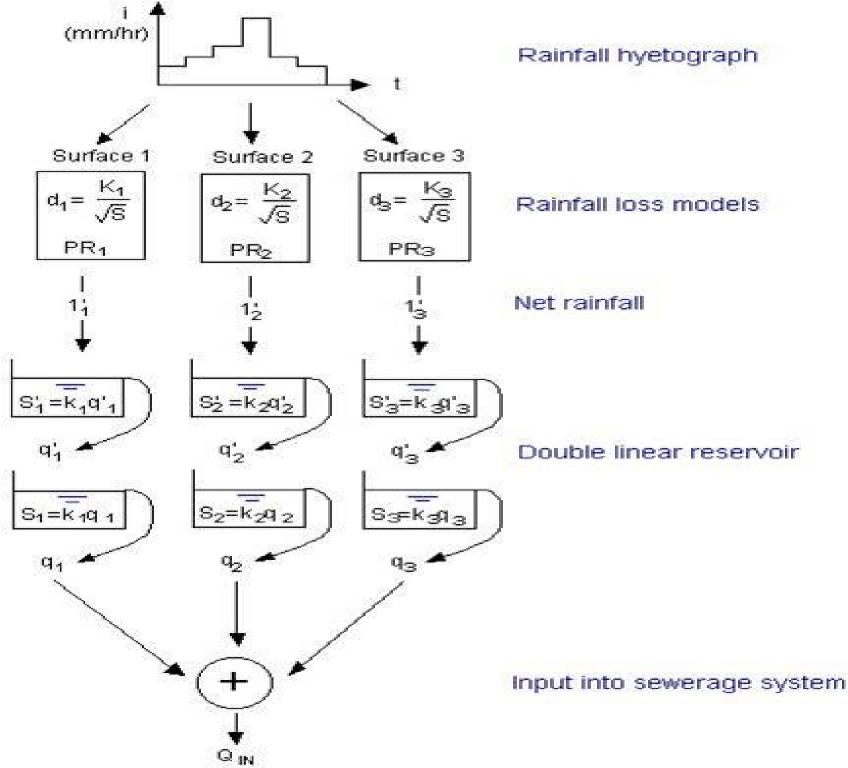

**Figure 5.3.4** Raingauge Lot 3 Chuculba Crescent, Giralang

> During the latter part of 1992, the two Hydrological Services HS tipping bucket raingauges at Lot 1 Gundulu Place and Lot 3 Chuculba Crescent, were extensively tested against volumetric measurements. A number of problems were encounted with the syphonic collector within the HS raingauge. This was finally tracked down to dust and other material partially blocking the collector and restricting rainfall to the tipping bucket. By the beginning of 1993 this problem was largely removed by the installation of newly designed inlet filters.
>
> During a large portion of the monitoring period between 1993 and 1996 a plastic bottle was attached to the outlets of the tipping bucket to record accumulated rainfall passing through the tipping bucket. When this was available it was used to further calibrate the raingauge recordings. Volumetrically, it was found that the raingauge logger volume typically matched the bottle reading to within 5%. During a few download periods difficulties were experienced with the catch bottles themselves. During those periods the HS data was accepted without amendment.
>
> *Chapter 5 – Data Collection 75*
>
> Other problems included an apparent intermittent chatter in the tipping bucket recording during very fast tipping periods usually less than 2 to 3 seconds. During the analysis of rainfall, in subsequent chapters of this study, data has been accumulated to a minimum period of 10 seconds. It is thought that the possible chatter problem would be absorbed in this period.
>
> While the raingauges were located in private property to save on installation costs and reduce potential vandalism, they were probably not in ideal positions in respect to distances from structures etc. After the initial calibration period in late 1992, it was decided that because the gauge in Lot 3 Chuculba Crescent was too close to some very rapidly growing trees it would not be used in subsequent parts of this study. The raingauge in Lot 1 Gundulu Place, however, was well away from tall trees and structures and consequently was adopted as the representative micro-catchment station. Although it is not possible to rigorously assess any likely rainfall error caused by the gauge itself, it is thought that it would be not less than + or – 10 when compared to actual rainfall. The error is likely to vary dependent on the rainfall intensity, wind effects and maintenance of the gauge itself.
>
> **5.3.3 Details of the Paired Micro-Catchment Flow Gauges**
>
> After extensive searching for suitable micro-catchment monitoring station sites the two indicated on Figure 5.3.2 were finally adopted. The two flow recorders were installed within the pipe network during December 1992. These were additional to the existing weir structure maintained by the ACTEW at the total Giralang catchment outlet.
>
> When designing the additional runoff stations, several methods were investigated that would theoretically allow unimpeded continuous monitoring of flow or stage within the pipes outletting the two sub-catchments. Initially the procedure of Delleur et al. (1956) was considered for the paired catchment sites to estimate critical depth at the outfall brink of the pipes entering the manholes.
>
> In experimental work on a nearby pipe structure the procedure was found to work satisfactorily. Unfortunately it was also found that the method was only applicable to relatively flat pipes when the water surface was drawn down through critical depth a
>
> *Chapter 5 – Data Collection 76*
>
> short distance upstream of the outlet. The pipes draining the paired micro-catchments in Giralang however had slopes of 4% or more. The flow depths in these instances were found to be supercritical even during relatively low flows. Depths were therefore always less than critical. Near the pipe outlet the water surface remained parallel to the pipe invert up to its brink. Due to this situation it was necessary to design specific measuring devices that would operate at depths of flow from one to two centimetres up to pipe full with flow velocities between 1 and 6 m/s. A number of commercially-available velocity and flow gauges were considered and even trialed, however, none were found to be appropriate to provide satisfactory results over the range of flow depths and velocities expected.
>
> Ultimately it was decided to measure normal depth in the pipe at a location approximately 1.5 to 2.0 pipe diameters upstream of the outfall. Probes were run from the end of the pipe along the invert for approximately 1.5 to 2.0 pipe diameters in both the 300 mm and 450 mm outlet pipes. These probes were made from hollow, square-section, aluminium tubes, blocked and tapered at the upstream end, with small holes in each side at the nominated gauge point.
>
> The probes were connected via plastic tubing to a 100 mm diameter, perspex stilling well attached to the wall of the manhole as shown in Figure 5.3.5. Wesdata capacitive stage recording probes and integrated data loggers were then positioned in the stilling wells to provide continuous pipe water level readings.
>
> The complete flow measuring stations were very cost effective (approx AUD\$500 each) and were able to be located out of sight below ground providing minimum exposure to vandalism.
>
> *Chapter 5 – Data Collection 77*
>
> 

**Figure 5.3.5** Typical Brink Flow Pipe Gauging Station

> Figures 5.3.6, 5.3.7 and 5.3.8 show the 300 mm diameter pipe gauge and Figures 5.3.9 and 5.3.10 show the 450 mm diameter pipe gauge.
>
> 

**Figure 5.3.6** Manhole Entry to 300 mm diameter Pipe Gauge

> *Chapter 5 – Data Collection 78*
>
> 

**Figure 5.3.7** Looking down Manhole at 300 mm diameter Pipe Gauge

> 

**Figure 5.3.8** Close-up View of 300 mm diameter Pipe Gauge  
(Seen from below)

> *Chapter 5 – Data Collection 79*
>
> 

**Figure 5.3.9** Manhole Entry to 450 mm diameter Pipe Gauge

> 

**Figure 5.3.10** Close-up View of 450 mm diameter Pipe Gauge

> *Chapter 5 – Data Collection 80*
>
> A series of additional photographs giving an overview of the Giralang catchment are included in Appendix E.
>
> **5.3.4 Initial Calibration of Paired Flow Monitoring Stations**
>
> A dye was painted on the surfaces of the 300 mm sideline pipes from the brink to just upstream of the nominal gauge inlets. Maximum water levels were observed during a number of events. These were used to calibrate the recorded maximum water levels measured within the stilling well.
>
> The recorded stages indicated in Table 5.3.3 accord closely with maximum stage dye marks over the large depth range indicated. The maximum depth during the 4/1/93 event was estimated to be a 8 year ARI event over a 30 minute duration.

**Table 5.3.3** Calibration Results from Brink Gauge

> **Event 300 mm pipe 450 mm pipe**
>
> **Stage (mm) Stage (mm)**
>
> **Dye Gauge Dye Gauge**

| 4/01/93  | 98  | 92  | 207 | 215 |
|----------|-----|-----|-----|-----|
| 5/01/93  | 23  | 26  | 7   | 10  |
| 21/01/93 | 95  | 92  | 165 | 151 |

> Additionally, manual flow rating for both stations was carried out for flows up to 50-75 mm in depth using a 75 litre temporary tipping bucket suspended from the manhole lid surround. This allowed the estimation of the 300 dia pipe roughness which best fitted a Manning’s n value of 0.010. Figure 5.3.11 shows this operation being carried out.
>
> *Chapter 5 – Data Collection 81*
>
> 

**Figure 5.3.11** Temporary Tipping Bucket used for Pipe Flow Rating

> The roughness of the 450 mm pipe outlet was estimated to be greater than that of the 300 mm pipe as it had been conveying road debris over the preceding 16-18 years. Based on preliminary calibration runs it was estimated that the Mannings roughness of the 450 mm pipe was between 0.013 and 0.015. A Mannings roughness of 0.014 was adopted in the conversion of stage to flow in Appendix B. It was proposed at that stage to carry out further volume-based calibration as well as velocity measurements during event monitoring to further qualify the Mannings pipe roughnesses.
>
> It is difficult to judge the overall accuracy of the gauge readings throughout the monitoring period. Based on the comparison of a number of gauged hydrographs and the raingauge in Lot 1 Gundulu Crescent, the possible errors in flow peak are at least + or - 10%. There were also a number of occasions throughout the monitoring period when the gauge temporarily failed to trigger. It is not fully known why these events occurred, however, on one occasion a small amount of organic matter was found attached to the pipe probe. It is thought that this type of material could temporarily block the entrance to the probe on some occasions. Fortunately this appeared to happen infrequently. Additionally the logger memory either failed or filled, preventing some data from being stored. The only other problem associated with the Wesdata logger was the difficulty in checking reading times after long gauging periods. All in all, the developed probe and Wesdata capacitive stage recorder and logger provided a very economical and reasonably reliable flow gauging system.
>
> *Chapter 5 – Data Collection 82*
>
> **5.3.5 Details of Rural/Urban Interface Gauge**
>
> After the review of the previous studies in the literature (e.g. Goyen, 1981; Codner et al., 1988; Bufill, 1989) utilising the Giralang total catchment data, it was realised that none of the studies attempted or were in a position to separate the flow components from the rural and urban sections of the catchment. As already indicated, a further flow gauge was to be installed at the rural/urban interface to rectify this situation. The urban drainage portion of the Giralang catchment commences at a headwall on the upstream side of Antares Crescent. The first urban drainage inflow is via a 900 mm diameter pipe that also takes any upstream rural flow. It was therefore proposed to install a flow gauge within the first section of that 900 mm pipe as indicated on Figure 5.3.12.
>
> 
>
> **Figure 5.3.12** View of Rural/Urban Interface Flow Gauge in 900 mm Pipe
>
> This third additional flow gauging station utilises a Wesdata capacitive probe similar to the ones used in the micro catchment outlet stilling wells. This was attached vertically within the pipe to a telescopic threaded metal rod that provided a rigid support against expected rural flows. As this gauge was located within the pipe itself, the accuracy of flow readings particularly during significant flows would be low. On these occasions wave action against the probe, as well the potential for the build up of debris,
>
> *Chapter 5 – Data Collection 83*
>
> would tend to overestimate flow depths. As the reason for installing this gauge was, primarily, to test if flow occurred or not, this was not a significant problem.
>
> **5.3.6 Spence Roof Catchment Gauging Stations**
>
> During 1994 following initial analysis of the monitored data from the Giralang nested micro-catchments it became apparent that there were a number of runoff process issues occurring that could not be dissected adequately with the data at hand.
>
> It was apparent from the results from the roof-only micro-catchment that the development of runoff from residential roofs within the Giralang catchment was subject to an additional process between the roof gutter and the rear boundary drainage. To further isolate this suspected process it was decided to develop an additional gauging station to measure direct residential roof flows to the gutter downpipe only.
>
> For ease of access and modification, it was decided to adopt the author’s own house’s roof for gauging purposes. The type of residence was typical of the houses within the Giralang catchment and was only a kilometre away in the suburb of Spence (see Figure 5.2.1). To appropriately monitor rainfall and runoff at the Spence site an additional rainfall station was established within the yard. A vee notch weir gauge was also established at the base of one of the roof downpipes. The gauge drained approximately one quarter of the total roof, or a catchment area of 47 m2. These gauges were established in early 1995.
>
> The runoff gauge shown on Figure 5.3.13 was attached to a downpipe draining the roof plane. It consisted of a 45-degree vee notch weir cut into a plastic catch box. A Wesdata capacitive probe was attached at the rear section of the catch box to continuously monitor the level of water flowing through the weir. The recorder time step was set at 20 seconds to ensure appropriate data response from this small catchment area.
>
> *Chapter 5 – Data Collection 84*

**Figure 5.3.13** Spence Residential Roof Gauging Sites

> Figures 5.3.14 to 5.3.16 show various sections of the tiled roof catchment together with the vee-notch weir gauge.
>
> *Chapter 5 – Data Collection 85*
>
> 

**Figure 5.3.14** Spence Roof Downpipe Flow Gauge

> 

**Figure 5.3.15** Spence Tiled Roof Catchment

> *Chapter 5 – Data Collection 86*
>
> 
>
> **Figure 5.3.16** Close-ups of Gauging Weir and Capacitive Logger
>
> **5.3.7 Gauging Weir Calibration**
>
> Both theoretical and volume/time experiments were carried out to calibrate the constructed weir. Figure 5.3.17 indicates the adopted rating curve and the results of the in-field experimentation as well as the theoretical curve for this type of weir.
>
> 0 05 1 0 1.5 2.0

Flowrate (L/s)

**Figure 5.3.17** Half-90 degree Vee Notch Weir Rating Curve

> *Chapter 5 – Data Collection 87*
>
> **5.3.8 Details of Spence Rainfall Pluviograph**
>
> A rainfall recording station was also established within the property to measure local rainfall. As the distance between it and the Giralang stations was about 1 km it was necessary to define local conditions and possibly to develop a relationship between the Spence and Giralang rainfall timing and characteristics. The location of this station is shown on Figure 5.3.13 while the actual installation is indicated on Figure 5.3.18.
>
> Again a Hydrological Services (HS) tipping bucket rain gauge with attached data loggers were employed. This tipping bucket was set to record each 0.2 mm depth of rain, as at Giralang.
>
> 

**Figure 5.3.18** Spence Rainfall Pluviograph Station

> *<u>Chapter 5 – Data Collection 88</u>*
>
> **5.4 Summary of Events During Monitoring Program**
>
> Continuous rainfall and runoff data was collected from the Giralang gauging stations between January 1993 and December 1995.
>
> Rainfall pluviograph data were downloaded to a laptop computer on average every 2 months. This period varied with early downloads being as frequent as 1 day to check data. During each download the tipping bucket and filter was cleaned and the collected water in the attached plastic bottle was measured. During extended times between downloads the total catch bottle was measured up to three times to prevent over-filling. During 1995 the Spence pluviograph was similarly monitored. Time checks were also made during each download, with the logger being reset to the correct time prior to being re-armed. Any drift in time was recorded in a diary that described the circumstances at the time.
>
> A translation program was written to translate the native ASCII code file downloaded from the rainfall recorder into a HYDSYS/RAFTS compatible file. The developed software allowed the file to be additionally adjusted when necessary to account for any variation between the recorded total volume and the amount of water collected in the catch bottles, as well as any difference in recorded time and Eastern Australian standard time. Further information on the HYDSYS/RAFTS file format and the conversion program is included in Appendix B.
>
> The flow gauges were similarly monitored with the Giralang micro-stations being downloaded on average every three months between January 1993 and December 1995. The Rural/Urban interface flow gauge was monitored continuously throughout 1993 and 1994. During early 1995 that flow gauge was stolen by vandals. It was considered at that stage the data already collected, together with the diary accounts of limited rural flows, would be sufficient for the analysis ahead. It was therefore considered to be unnecessary to construct and install a new gauge.
>
> An extraordinary set of storms were monitored over this period, with over 60 flood peaks in excess of 1 m3/s being observed. Based on the flow frequency curve for the Giralang urban catchment, based on 17 years of record, developed by Willing & Partners (1992), there were 24 events that exceeded 1 year average recurrence interval
>
> *Chapter 5 – Data Collection 89*
>
> (ARI), six that exceeded 2 year ARI, four that exceeded 5 year ARI and one that exceeded 8 year ARI.

Table 5.4.1 is taken from analysis reported by Willing and Partners (1992).

**Table 5.4.1** Giralang Flood Frequency Data

<table>
<colgroup>
<col style="width: 33%" />
<col style="width: 8%" />
<col style="width: 7%" />
<col style="width: 8%" />
<col style="width: 8%" />
<col style="width: 7%" />
<col style="width: 8%" />
<col style="width: 8%" />
<col style="width: 10%" />
</colgroup>
<thead>
<tr class="header">
<th><blockquote>

Average Recurrence Interval ARI (years)

</blockquote></th>
<th><strong>0.5</strong></th>
<th><strong>1</strong></th>
<th><strong>2</strong></th>
<th><strong>5</strong></th>
<th><strong>10</strong></th>
<th><strong>20</strong></th>
<th><strong>50</strong></th>
<th><strong>100</strong></th>
</tr>
</thead>
<tbody>
<tr class="odd">
<td>Outlet Peak (m3/s)</td>
<td>1.8</td>
<td>2.8</td>
<td>5.4</td>
<td>7.0</td>
<td>8.7</td>
<td>10.5</td>
<td>11.9</td>
<td>13.2</td>
</tr>
</tbody>
</table>

> In particular, 1993 provided some 24 event peaks that exceeded 1 m3/s. It also provided the highest flow peak of the three year monitoring period. During a number of events video data was also collected. This data, in particular during an event in January 1994, provided detailed information relevant to the prolonged roof drainage process occurring at the 300 diameter Giralang pipe gauge. This particular video record ultimately lead to the development of the Spence residential roof catchment gauging station in early 1995.
>
> To provide a summary of the data collected at Giralang, Tables 5.4.2, 5.4.3 and 5.4.4 were prepared that indicate all runoff peaks that exceed 1 m3/s. It can be seen that the total number of event peaks was 61. Based on Table 5.4.1, the frequencies of the event peaks ranged from \<1 year ARI up to 8 year ARI.
>
> *Chapter 5 – Data Collection 90*

**Table 5.4.2** Summary of Giralang Event Peaks Greater Than 1 m3/s during 1993

<table>
<colgroup>
<col style="width: 11%" />
<col style="width: 9%" />
<col style="width: 7%" />
<col style="width: 9%" />
<col style="width: 7%" />
<col style="width: 9%" />
<col style="width: 7%" />
<col style="width: 9%" />
<col style="width: 7%" />
<col style="width: 10%" />
<col style="width: 9%" />
</colgroup>
<thead>
<tr class="header">
<th><em><strong>Date</strong></em></th>
<th><blockquote>

<em><strong>Time of 300 mm Peak (h:m:s)</strong></em>

</blockquote></th>
<th>
<em><strong>300 
mm</strong></em>

<em><strong>Micro</strong></em>

<blockquote>

<em><strong>Catch -ment Peak (m3/s)</strong></em>

</blockquote></th>
<th><blockquote>

<em><strong>Time of 450 mm Peak (h:m:s)</strong></em>

</blockquote></th>
<th>
<em><strong>450 
mm 
Micro</strong></em>

<em><strong>Catch</strong></em>

<blockquote>

<em><strong>-ment Peak (m3/s)</strong></em>

</blockquote></th>
<th><blockquote>

<em><strong>Time of Rural</strong></em>

</blockquote>

<em><strong>Peak 
(h:m:s)</strong></em>
</th>
<th><em><strong>Rural 
Peak+ 
(m3/s)</strong></em></th>
<th><em><strong>Time 
of 
Total 
Peak 
(h:m:s)</strong></em></th>
<th><blockquote>

<em><strong>Total Catch -ment Peak (m3/s)</strong></em>

</blockquote></th>
<th><em><strong>Time 
Of 
Rainfall+ 
Peak 
Intensity 
(h:m)</strong></em></th>
<th><em><strong>Approx. 
ARI 
(year)</strong></em></th>
</tr>
</thead>
<tbody>
<tr class="odd">
<td>3/1/93</td>
<td>19:40:56</td>
<td>0.013</td>
<td>19:40:08</td>
<td>0.048</td>
<td></td>
<td>-</td>
<td>19:42:00</td>
<td>1.35</td>
<td>19:38</td>
<td>&lt; 1</td>
</tr>
<tr class="even">
<td>3/1/93</td>
<td>20:14:56</td>
<td>0.011</td>
<td>20:14:36</td>
<td>0.045</td>
<td></td>
<td>-</td>
<td>20:16:50</td>
<td>1.78</td>
<td>20:08</td>
<td>&lt; 1</td>
</tr>
<tr class="odd">
<td>3/1/93</td>
<td>20:32:56</td>
<td>0.037</td>
<td>20:33:36</td>
<td>0.184</td>
<td></td>
<td>-</td>
<td>20:35:10</td>
<td>7.15</td>
<td>20:31</td>
<td>6</td>
</tr>
<tr class="even">
<td>3/1/93</td>
<td>20:45:56</td>
<td>0.030</td>
<td>20:46:08</td>
<td>0.147</td>
<td></td>
<td>-</td>
<td>20:48:50</td>
<td>5.12</td>
<td>20:44</td>
<td>1.7</td>
</tr>
<tr class="odd">
<td>3/1/93</td>
<td>20:56:28</td>
<td>0.028</td>
<td>20:56:08</td>
<td>0.151</td>
<td></td>
<td>-</td>
<td>20:57:50</td>
<td>4.76</td>
<td>20:54</td>
<td>1.4</td>
</tr>
<tr class="even">
<td>3/1/93</td>
<td>21:10:56</td>
<td>0.020</td>
<td>21:10:36</td>
<td>0.091</td>
<td></td>
<td>-</td>
<td>21:12:20</td>
<td>2.71</td>
<td>21:09</td>
<td>1</td>
</tr>
<tr class="odd">
<td>3/1/93</td>
<td>22:19:28</td>
<td>0.018</td>
<td>22:19:08</td>
<td>0.076</td>
<td></td>
<td>-</td>
<td>22:21:10</td>
<td>1.93</td>
<td>22:17</td>
<td>&lt; 1</td>
</tr>
<tr class="even">
<td>3/1/93</td>
<td>22:41:56</td>
<td>0.042</td>
<td>22:42:08</td>
<td>0.234</td>
<td></td>
<td>-</td>
<td>22:43:20</td>
<td>7.79</td>
<td>22:40</td>
<td>8</td>
</tr>
<tr class="odd">
<td>3/1/93</td>
<td>23:53:56</td>
<td>0.012</td>
<td>23:53:36</td>
<td>0.043</td>
<td></td>
<td>-</td>
<td>23:55:10</td>
<td>1.66</td>
<td>23:51</td>
<td>&lt; 1</td>
</tr>
<tr class="even">
<td>21/1/93</td>
<td>17:20:00</td>
<td>0.024</td>
<td>17:20:38</td>
<td>0.117</td>
<td></td>
<td>0</td>
<td>17:21:20</td>
<td>4.25</td>
<td>17:18</td>
<td>1.2</td>
</tr>
<tr class="odd">
<td>3/2/93</td>
<td>15:40:32</td>
<td>0.011</td>
<td>15:40:34</td>
<td>0.035</td>
<td></td>
<td>0</td>
<td>15:42:40</td>
<td>1.14</td>
<td>15:36</td>
<td>&lt; 1</td>
</tr>
<tr class="even">
<td>9/2/93</td>
<td>10:59:32</td>
<td>0.016</td>
<td>11:00:06</td>
<td>0.049</td>
<td></td>
<td>0</td>
<td>11:01:40</td>
<td>2.22</td>
<td>10:57</td>
<td>&lt; 1</td>
</tr>
<tr class="odd">
<td>20/2/93</td>
<td>22:30:28</td>
<td>0.013</td>
<td>22:30:04</td>
<td>0.044</td>
<td></td>
<td>0</td>
<td>22:32:00</td>
<td>1.49</td>
<td>22:28</td>
<td>&lt; 1</td>
</tr>
<tr class="even">
<td>6/3/93</td>
<td>22:08:28</td>
<td>0.025</td>
<td>22:09:04</td>
<td>0.088</td>
<td></td>
<td>0</td>
<td>22:10:20</td>
<td>3.17</td>
<td>22:06</td>
<td>1</td>
</tr>
<tr class="odd">
<td>6/3/93</td>
<td>22:39:00</td>
<td>0.011</td>
<td>23:37:04</td>
<td>0.005</td>
<td></td>
<td>0</td>
<td>22:41:10</td>
<td>1.48</td>
<td>22:37</td>
<td>&lt; 1</td>
</tr>
<tr class="even">
<td>26/3/93</td>
<td>7:41:00</td>
<td>0.009</td>
<td>07:40:32</td>
<td>0.026</td>
<td></td>
<td>0</td>
<td>07:42:30</td>
<td>1.06</td>
<td>07:38</td>
<td>&lt; 1</td>
</tr>
<tr class="odd">
<td>5/4/93</td>
<td>17:04:00</td>
<td>0.033</td>
<td>17:04:32</td>
<td>0.164</td>
<td>17:04:00</td>
<td>0.001</td>
<td>17:05:10</td>
<td>5.68</td>
<td>17:01</td>
<td>2.5</td>
</tr>
<tr class="even">
<td>8/9/93</td>
<td>21:42:58</td>
<td>0.009</td>
<td></td>
<td>-</td>
<td></td>
<td>0</td>
<td>21:44:00</td>
<td>1.13</td>
<td>21:41</td>
<td>&lt; 1</td>
</tr>
<tr class="odd">
<td>9/9/93</td>
<td>16:41:58</td>
<td>0.021</td>
<td>16:43:12</td>
<td>0.103</td>
<td>16:47:00</td>
<td>0.004</td>
<td>16:43:50</td>
<td>3.30</td>
<td>16:40</td>
<td>1.01</td>
</tr>
<tr class="even">
<td>2/11/93</td>
<td>13:06:12</td>
<td>0.012</td>
<td>13:07:20</td>
<td>0.040</td>
<td></td>
<td>0</td>
<td>13:07:20</td>
<td>1.40</td>
<td>13:05</td>
<td>&lt; 1</td>
</tr>
<tr class="odd">
<td>13/11/93</td>
<td>17:15:12</td>
<td>0.010</td>
<td>17:17:20</td>
<td>0.016</td>
<td></td>
<td>0</td>
<td>17:18:00</td>
<td>1.34</td>
<td>17:13</td>
<td><blockquote>

&lt; 1 yr.

</blockquote></td>
</tr>
<tr class="even">
<td>13/11/93</td>
<td>17:43:12</td>
<td>0.026</td>
<td>17:43:20</td>
<td>0.126</td>
<td>17:46:49</td>
<td>0.019</td>
<td>17:46:00</td>
<td>4.67</td>
<td>17:41</td>
<td><blockquote>

1.3 yr.

</blockquote></td>
</tr>
<tr class="odd">
<td>13/11/93</td>
<td>21:06:12</td>
<td>0.009</td>
<td>21:06:52</td>
<td>0.035</td>
<td></td>
<td>0</td>
<td>21:09:20</td>
<td>1.37</td>
<td>21:04</td>
<td><blockquote>

&lt; 1 yr.

</blockquote></td>
</tr>
<tr class="even">
<td>20/11/93</td>
<td>11:27:12</td>
<td>0.010</td>
<td>11:26:52</td>
<td>0.039</td>
<td></td>
<td>0</td>
<td>11:29:00</td>
<td>1.19</td>
<td>11:25</td>
<td><blockquote>

&lt; 1 yr.

</blockquote></td>
</tr>
</tbody>
</table>

> **-** Prior to instrument installation
>
> \+ Giralang micro-catchment Rainfall pluviograph
>
> \+ Indicated rural flow peaks greater than zero are indicative of commencement of flow only (see Section 5.3.5).
>
> *Chapter 5 – Data Collection 91*

**Table 5.4.3** Summary of Giralang Event Peaks Greater Than 1 m3/s during 1994

<table>
<colgroup>
<col style="width: 11%" />
<col style="width: 9%" />
<col style="width: 7%" />
<col style="width: 9%" />
<col style="width: 7%" />
<col style="width: 9%" />
<col style="width: 7%" />
<col style="width: 9%" />
<col style="width: 7%" />
<col style="width: 10%" />
<col style="width: 9%" />
</colgroup>
<thead>
<tr class="header">
<th><em><strong>Date</strong></em></th>
<th><blockquote>

<em><strong>Time of 300 mm Peak (h:m:s)</strong></em>

</blockquote></th>
<th><blockquote>

<em><strong>300 mm Micro Catch -ment Peak (m3/s)</strong></em>

</blockquote></th>
<th><blockquote>

<em><strong>Time of 450 mm Peak (h:m:s)</strong></em>

</blockquote></th>
<th>
<em><strong>450 
mm 
Micro</strong></em>

<em><strong>Catch</strong></em>

<blockquote>

<em><strong>-ment Peak (m3/s)</strong></em>

</blockquote></th>
<th><blockquote>

<em><strong>Time of Rural</strong></em>

</blockquote>

<em><strong>Peak 
(h:m:s)</strong></em>
</th>
<th><em><strong>Rural 
Peak+ 
(m3/s)</strong></em></th>
<th><em><strong>Time 
of 
Total 
Peak 
(h:m:s)</strong></em></th>
<th><blockquote>

<em><strong>Total Catch ment Peak (m3/s)</strong></em>

</blockquote></th>
<th><em><strong>Time 
Of 
Rainfall+ 
Peak 
Intensity 
(h:m)</strong></em></th>
<th><em><strong>Approx. 
ARI 
(year)</strong></em></th>
</tr>
</thead>
<tbody>
<tr class="odd">
<td>30/1/94</td>
<td></td>
<td>**</td>
<td>17:38:44</td>
<td>0.049</td>
<td></td>
<td>0</td>
<td>17:40:40</td>
<td>2.15</td>
<td>17:36</td>
<td>&lt; 1</td>
</tr>
<tr class="even">
<td>1/2/94</td>
<td></td>
<td>**</td>
<td>18:27:16</td>
<td>0.039</td>
<td></td>
<td>0</td>
<td>18:30:10</td>
<td>1.24</td>
<td>18:25</td>
<td>&lt; 1</td>
</tr>
<tr class="odd">
<td>9/2/94</td>
<td></td>
<td>**</td>
<td>23:25:44</td>
<td>0.054</td>
<td>23:26:00</td>
<td>0.001</td>
<td>23:27:50</td>
<td>1.87</td>
<td>23:23</td>
<td>&lt; 1</td>
</tr>
<tr class="even">
<td>8/3/94</td>
<td></td>
<td>**</td>
<td>20:35:16</td>
<td>0.051</td>
<td>20:32:00</td>
<td>0.001</td>
<td>20:35:10</td>
<td>2.99</td>
<td>20:31</td>
<td>1</td>
</tr>
<tr class="odd">
<td>20/10/94</td>
<td>09:57:16</td>
<td>0.007</td>
<td>09:59:44</td>
<td>0.018</td>
<td></td>
<td>0</td>
<td>10:05:40</td>
<td>1.11</td>
<td>09:57</td>
<td>&lt; 1</td>
</tr>
<tr class="even">
<td>19/11/94</td>
<td>18:54:44</td>
<td>0.016</td>
<td>18:53:00</td>
<td>0.053</td>
<td>18:53:00</td>
<td>0.002</td>
<td>19:01:20</td>
<td>2.54</td>
<td>18:52</td>
<td>&lt; 1</td>
</tr>
<tr class="odd">
<td>25/11/94</td>
<td>17:10:16</td>
<td>0.021</td>
<td>17:11:00</td>
<td>0.126</td>
<td>17:10:00</td>
<td>0.033</td>
<td>17:17:00</td>
<td>3.45</td>
<td>17:08</td>
<td>1.05</td>
</tr>
<tr class="even">
<td>28/11/94</td>
<td>17:48:16</td>
<td>0.020</td>
<td>17:50:00</td>
<td>0.069</td>
<td>17:49:00</td>
<td>0.001</td>
<td>17:55:30</td>
<td>2.92</td>
<td>17:47</td>
<td>1</td>
</tr>
<tr class="odd">
<td>8/12/94</td>
<td>15:22:44</td>
<td>0.008</td>
<td>15:24:04</td>
<td>0.036</td>
<td></td>
<td>0</td>
<td>15:29:50</td>
<td>1.12</td>
<td>15:20</td>
<td>&lt; 1</td>
</tr>
<tr class="even">
<td>8/12/94</td>
<td>15:41:44</td>
<td>0.013</td>
<td>15:42:04</td>
<td>0.054</td>
<td></td>
<td>0</td>
<td>15:50:30</td>
<td>1.98</td>
<td>15:40</td>
<td>&lt; 1</td>
</tr>
</tbody>
</table>

> \*\* Instrument memory failure
>
> \+ Indicated rural flow peaks greater than zero are indicative of commencement of flow only (see Section 5.3.5).
>
> Rainfall data was available from the five pluviographs for the complete study period between January 1993 and December 1995. Tables 5.4.2, 5.4.3 and 5.4.4 indicate rainfall peak intensity times for the Giralang mid catchment (micro-catchments) only. Complete rainfall variability data is therefore available across Giralang catchment for all storm events listed.
>
> *Chapter 5 – Data Collection 92*

**Table 5.4.4** Summary of Giralang Event Peaks Greater Than 1 m3/s during 1995

<table>
<colgroup>
<col style="width: 11%" />
<col style="width: 17%" />
<col style="width: 9%" />
<col style="width: 7%" />
<col style="width: 9%" />
<col style="width: 7%" />
<col style="width: 9%" />
<col style="width: 7%" />
<col style="width: 10%" />
<col style="width: 9%" />
</colgroup>
<thead>
<tr class="header">
<th><blockquote>

<em><strong>Date</strong></em>

</blockquote></th>
<th>
<em><strong>Time 300</strong></em>

<em><strong>of mm</strong></em>

<em><strong>300 Micro</strong></em>

<em><strong>mm Catch</strong></em>

<em><strong>Peak -ment</strong></em>

<em><strong>(h:m:s) Peak</strong></em>

<em><strong>(m3/s)</strong></em>
</th>
<th><blockquote>

<em><strong>Time of 450 mm Peak (h:m:s)</strong></em>

</blockquote></th>
<th>
<em><strong>450 
mm 
Micro</strong></em>

<em><strong>Catch</strong></em>

<blockquote>

<em><strong>-ment Peak (m3/s)</strong></em>

</blockquote></th>
<th><blockquote>

<em><strong>Time of Rural</strong></em>

</blockquote>

<em><strong>Peak 
(h:m:s)</strong></em>
</th>
<th><em><strong>Rural 
Peak+ 
(m3/s)</strong></em></th>
<th><em><strong>Time 
of 
Total 
Peak 
(h:m:s)</strong></em></th>
<th><blockquote>

<em><strong>Total Catch ment Peak (m3/s)</strong></em>

</blockquote></th>
<th><em><strong>Time 
of 
Rainfall+ 
Peak 
Intensity 
(h:m)</strong></em></th>
<th><em><strong>Approx. 
ARI 
(year)</strong></em></th>
</tr>
</thead>
<tbody>
<tr class="odd">
<td><blockquote>

5/1/95

</blockquote></td>
<td>12:41:44 0.008</td>
<td>12:44:04</td>
<td>0.029</td>
<td></td>
<td>0</td>
<td>12:44:40</td>
<td>1.32</td>
<td>12:36</td>
<td>&lt; 1</td>
</tr>
<tr class="even">
<td><blockquote>

5/1/95

</blockquote></td>
<td>14:55:44 0.019</td>
<td>14:57:32</td>
<td>0.086</td>
<td>14:54:00</td>
<td>0.018</td>
<td>14:59:00</td>
<td>2.81</td>
<td>14:52</td>
<td>1</td>
</tr>
<tr class="odd">
<td><blockquote>

5/1/95

</blockquote></td>
<td>17:20:44 0.017</td>
<td>17:23:32</td>
<td>0.053</td>
<td>17:20:00</td>
<td>0.020</td>
<td>17:25:50</td>
<td>2.24</td>
<td>17:18</td>
<td>&lt; 1</td>
</tr>
<tr class="even">
<td><blockquote>

5/1/95

</blockquote></td>
<td>18:56:44 0.033</td>
<td>18:59:32</td>
<td>0.251</td>
<td>18:54:00</td>
<td>0.100</td>
<td>19:01:20</td>
<td>7.40</td>
<td>18:53</td>
<td>7</td>
</tr>
<tr class="odd">
<td>17/1/95</td>
<td>11:54:16 0.013</td>
<td>11:56:04</td>
<td>0.044</td>
<td></td>
<td>0</td>
<td>11:57:10</td>
<td>1.44</td>
<td>11:50</td>
<td>&lt; 1</td>
</tr>
<tr class="even">
<td>20/1/95</td>
<td>15:11:16 0.011</td>
<td>15:10:16</td>
<td>0.059</td>
<td>15:10:00</td>
<td>1.04</td>
<td>15:12:50</td>
<td>2.12</td>
<td>15:08</td>
<td>&lt; 1</td>
</tr>
<tr class="odd">
<td>20/1/95</td>
<td>16:23:16 0.012</td>
<td>16:23:16</td>
<td>0.070</td>
<td>16:21:00</td>
<td>0.22</td>
<td>16:24:00</td>
<td>2.38</td>
<td>16:19</td>
<td>&lt; 1</td>
</tr>
<tr class="even">
<td>20/1/95</td>
<td>17:30:00 0.013</td>
<td>17:32:44</td>
<td>0.071</td>
<td>17:30:00</td>
<td>0.002</td>
<td>17:35:20</td>
<td>2.52</td>
<td>17:28</td>
<td>&lt; 1</td>
</tr>
<tr class="odd">
<td>28/1/95</td>
<td>12:06:48 0.012</td>
<td>12:07:16</td>
<td>0.057</td>
<td></td>
<td>0</td>
<td>12:08:20</td>
<td>1.97</td>
<td>12:04</td>
<td>&lt; 1</td>
</tr>
<tr class="even">
<td>28/1/95</td>
<td>14:58:48 0.007</td>
<td>14:59:16</td>
<td>0.032</td>
<td></td>
<td>0</td>
<td>15:00:40</td>
<td>1.02</td>
<td>14:56</td>
<td>&lt; 1</td>
</tr>
<tr class="odd">
<td>28/1/95</td>
<td>18:11:00 0.030</td>
<td>18:13:44</td>
<td>0.209</td>
<td>18:12:00</td>
<td>2.47</td>
<td>18:15:00</td>
<td>7.67</td>
<td>18:09</td>
<td>7.5</td>
</tr>
<tr class="even">
<td>28/1/95</td>
<td>19:19:48 0.017</td>
<td>19:20:16</td>
<td>0.088</td>
<td>19:19:00</td>
<td>0.45</td>
<td>19:22:30</td>
<td>2.34</td>
<td>19:17</td>
<td>&lt; 1</td>
</tr>
<tr class="odd">
<td>13/5/95</td>
<td>03:18:08 0.018</td>
<td>03:18:24</td>
<td>0.055</td>
<td></td>
<td>0</td>
<td>3:19:20</td>
<td>1.90</td>
<td>03:16</td>
<td>&lt; 1</td>
</tr>
<tr class="even">
<td>13/5/95</td>
<td>04:00:36 0.011</td>
<td>04:00:24</td>
<td>0.052</td>
<td></td>
<td>0</td>
<td>4:01:50</td>
<td>1.87</td>
<td>03:58</td>
<td>&lt; 1</td>
</tr>
<tr class="odd">
<td>13/5/95</td>
<td>07:24:08 0.018</td>
<td>07:23:24</td>
<td>0.080</td>
<td></td>
<td>*</td>
<td>7:24:50</td>
<td>2.80</td>
<td>07:21</td>
<td>1</td>
</tr>
<tr class="even">
<td>13/5/95</td>
<td>11:47:08 0.018</td>
<td>11:46:56</td>
<td>0.096</td>
<td></td>
<td>*</td>
<td>11:48:30</td>
<td>3.60</td>
<td>11:44</td>
<td>1.1</td>
</tr>
<tr class="odd">
<td>13/5/95</td>
<td>15:09:00 0.013</td>
<td>15:10:24</td>
<td>0.067</td>
<td></td>
<td>*</td>
<td>15:11:40</td>
<td>2.71</td>
<td>15:08</td>
<td>1</td>
</tr>
<tr class="even">
<td>20/9/95</td>
<td>12:59:56 0.012</td>
<td></td>
<td>**</td>
<td></td>
<td>*</td>
<td>13:05:40</td>
<td>1.77</td>
<td>12:57</td>
<td>&lt; 1</td>
</tr>
<tr class="odd">
<td>22/10/95</td>
<td>15:14:16 0.024</td>
<td></td>
<td>**</td>
<td></td>
<td>*</td>
<td>15:18:50</td>
<td>3.75</td>
<td>15:11</td>
<td>1.15</td>
</tr>
<tr class="even">
<td>29/11/95</td>
<td>16:13:36 0.025</td>
<td></td>
<td>**</td>
<td></td>
<td>*</td>
<td>16:18:20</td>
<td>4.08</td>
<td>16:11</td>
<td>1.2 yr.</td>
</tr>
<tr class="odd">
<td>29/11/95</td>
<td>16:58:36 0.016</td>
<td></td>
<td>**</td>
<td></td>
<td>*</td>
<td>17:04:00</td>
<td>2.52</td>
<td>16:57</td>
<td>&lt; 1 yr.</td>
</tr>
<tr class="even">
<td>29/11/95</td>
<td>18:02:56 0.028</td>
<td></td>
<td>**</td>
<td></td>
<td>*</td>
<td>18:08:00</td>
<td>5.69</td>
<td>18:01</td>
<td>2.5 yr.</td>
</tr>
<tr class="odd">
<td>30/11/95</td>
<td>19:06:36 0.017</td>
<td></td>
<td>**</td>
<td></td>
<td>*</td>
<td>19:11:40</td>
<td>2.93</td>
<td>19:04</td>
<td>1 yr.</td>
</tr>
<tr class="even">
<td>6/12/95</td>
<td>00:02:36 0.007</td>
<td></td>
<td>**</td>
<td></td>
<td>*</td>
<td>0:11:10</td>
<td>1.03</td>
<td>23:59</td>
<td>&lt; 1 yr.</td>
</tr>
<tr class="odd">
<td>6/12/95</td>
<td>01:15:56 0.011</td>
<td></td>
<td>**</td>
<td></td>
<td>*</td>
<td>01:21:40</td>
<td>1.60</td>
<td>01:12</td>
<td>&lt; 1 yr.</td>
</tr>
<tr class="even">
<td>6/12/95</td>
<td>04:15:00 0.007</td>
<td></td>
<td>**</td>
<td></td>
<td>*</td>
<td>4.21:20</td>
<td>1.11</td>
<td>04:12</td>
<td>&lt; 1 yr.</td>
</tr>
<tr class="odd">
<td>31/12/95</td>
<td>19:12:36 0.021</td>
<td></td>
<td>.**</td>
<td></td>
<td>*</td>
<td>19:17:30</td>
<td>3.81</td>
<td>19:10</td>
<td>1.1 yr.</td>
</tr>
<tr class="even">
<td colspan="2"><blockquote>

* Gauge stolen

</blockquote></td>
<td></td>
<td></td>
<td></td>
<td></td>
<td></td>
<td></td>
<td></td>
<td></td>
</tr>
</tbody>
</table>

> \*\* Instrument memory failure
>
> \+ Indicated rural flow peaks greater than zero are indicative of commencement of flow only (see Section 5.3.5).
>
> Table 5.4.5 lists the significant storm burst peak data for the Spence roof catchment between 29/04/95 and 07/08/95. Between these dates there are data available for all rainfall and flow gauging stations at Spence and Giralang.

**Chapter 6**

**Analysis of Data and Development of Appropriate Modelling Concepts**

**6.1 Introduction**

This chapter describes the detailed analysis of the data collected from Giralang and Spence as well as additional numerical computations to assist in data interpretation.

Before the detailed analysis was carried out, the major objectives and needs outlined in Chapter 4 were reviewed to quantify the most likely avenues to follow in developing improved sub-catchment runoff estimation techniques that would perform well under widely varying operating conditions.

Analysis of the specially collected data would therefore need to identify possible new avenues to runoff estimation not already included in current techniques. Existing methods have been shown in Chapter 3 to perform with variable reliability when the same catchment model is applied to different storm events. Different urban catchments of apparently similar characteristics have also been found to respond to similar rainfall events with significantly different runoff characteristics.

The pre-data collection analysis highlighted a number of issues that needed to be re examined using the additional data:

*<u>Chapter 6 – Analysis of Data and Development of Appropriate Modelling Concepts 95</u>*

- Current methods do not explicitly cater for varying ratios and magnitudes of distributed catchment storage and intermingled translation processes.

- Current research does not clearly indicate the changing effect or magnitude of distributed catchment storage as catchment scale increases.

- It appeared that response patterns of catchment models were often significantly different even when being subject to apparently similar intensity storms.

- From initial investigations it is assessed that residential roof and impervious road surface runoff appeared to respond differently. Existing modelling techniques almost universally group all impervious surfaces together and then apply a single response algorithm.

- From catchment inspection it is argued that the type of fencing throughout the catchment can play an important role in total catchment runoff development.

- In summary, existing sub-catchment flow estimating techniques are found to perform with significant inconsistency both generally and in specific instances, by failing to recognise specific catchment response processes. Alternatively, a number of factors other than surface routing model error can be responsible for poor runoff estimates. These can include gauging error, rainfall variability not included in model representation and temporal errors in infiltration. These factors are addressed in later chapters.

Two previously-developed numerical software programs were utilised to help evaluate the measured data. These were the XP-RAFTS rainfall/runoff networked routing program co-developed by Goyen (1976, 1991) and XP-EXTRAN which is a modified module of the US EPA SWMM program incorporating numerical procedures to simulate unsteady flow routing of hydrographs throughout a stormwater drainage pipe network, as developed by Goyen et al. (1993). Both programs, being co-developed by the author, were available for general application and modification as required.

XP-RAFTS was used to firstly view the collected rainfall and flow data graphically once it had been converted into the HYDSYS/RAFTS format. The XP-RAFTS software package described in Appendix A provided an excellent numerical development workbench with full graphical input and output facilities.

*<u>Chapter 6 – Analysis of Data and Development of Appropriate Modelling Concepts 96</u>*

> 

**Figure 6.1.1** Diagrammatic Representation of XP-RAFTS

The XP-RAFTS software engine consisted of a network-based node / link modelling system. Rainfall could be applied to individual sub-catchments attached to nodes. Numerical algorithms for the estimation of infiltration and the development of surface runoff from excess rainfall at any node were already included. The transportation of nodal flow inputs between nodes was performed by simple lagging procedures or more complete solutions of the governing hydraulic flow equations.

The existing surface infiltration algorithms within a sub-catchment ranged from simple initial loss / continuing or proportional loss rates up to a comprehensive water balance procedure with embedded surface infiltration based on the work of Philip (1957).

The numerical algorithms for transforming excess rainfall into sub-catchment runoff within XP-RAFTS utilised a cascading storage routing procedure based on the work of Laurenson (1964) and Aitken (1975). The XP-RAFTS approach did not place any restrictions on the size of the sub-catchment connected to any particular node. Consequently the storage routing procedure was developed to best represent the translation coupled with attenuation of distributed storage across the sub-catchment. The effect of sub-catchment size was considered in the parameter Bav of the storage /

*<u>Chapter 6 – Analysis of Data and Development of Appropriate Modelling Concepts 97</u>*

discharge relationship S=BavQn where Bav was equal to a function of area, slope and surface roughness expressed in Equation 3.6.3.

The complete graphical and numerical software code in XP-RAFTS was available to modify as needed to meet the needs of this research project.

XP-EXTRAN provided a very detailed numerical procedure to examine the hydraulic characteristics of flow patterns within the Giralang pipe drainage network. XP-EXTRAN was utilised to help separate the translational effects of runoff development in sub-catchments of increasing size from the effects of nodal sub-catchment rainfall / runoff conversion at a localised scale. Further details of the XP-EXTRAN software package are provided in Appendix A. Figure 6.1.2 provides a diagrammatic representation of the numerical approach provided.

> 

**Figure 6.1.2** Diagrammatic Representation of the XP-EXTRAN Hydraulics  
Methodology (after Roesner et al., 1988)

The format of the analysis was devised to answer a number of the concerns highlighted as dot points earlier in this section. The analysis was also arranged to allow the progressive development of conceptual model algorithms to cater for isolated processes, as and when isolated.

*<u>Chapter 6 – Analysis of Data and Development of Appropriate Modelling Concepts 98</u>*

> The analysis was divided into the following elements:

**(a) Overview of collected data including relationships between micro-catchment**

> **and total catchment flow characteristics, involving the following tasks:**

- Selection from the three years of gauged data between 1993 and 1995 of a large number of storm events, preferably with embedded multiple peak bursts, to provide calibration and validation data for the testing of possible conceptual models.

- Initial graphical review of typical rainfall and flow data at the various flow monitoring stations.

**(b) Detailed analysis of Spence roof and Giralang paired micro-catchments, involving:**

- Examination and characterisation of roof rainfall-to-runoff conversion utilising Spence rainfall and flow data and the XP-RAFTS development workbench (XP-RAFTS Workbench). Estimation of rainfall losses and rainfall excess attenuation characteristics.

- Examination and characterisation of residential roof drainage runoff utilising the Giralang 12 allotment, roofs only micro-catchment. (This included both rainfall losses and the attenuating characteristics of the excess rainfall converted into runoff. The analysis built on the Spence roof analysis by examining the additional roles of yard drainage and the public drainage pipe connecting the 12 allotments to the gauged outlet, again utilising the XP-RAFTS Workbench.)

- Examination and characterisation of runoff from the 14 allotment roofs/yards/road micro-catchment. (Utilising the XP-RAFTS Workbench decision support system, the two previous catchment analyses were used to build up processes to describe the additional road and yard surface drainage systems. Investigating both small and large storm events to isolate pervious area runoff only from mixed pervious plus impervious area runoff, the analysis proceeded to isolate individual runoff elements including roof, yard and road discharges. The analysis considered both rainfall losses and runoff attenuation within the evaluation process.)

*<u>Chapter 6 – Analysis of Data and Development of Appropriate Modelling Concepts 99</u>*

- Examination of rural/urban interface flow data to isolate non-urban flows within the urban flow mix at the Giralang outlet.

**(c) Examination of the possibilities of expanding on the micro-catchment results**

> **to a larger scaled catchment, involving:**

- Tabular examination of data streams including comparison of peak flow characteristics between the micro-catchments at Giralang, Spence and the Giralang catchment outlet.

- Collation of Giralang public pipe data including all pipe invert and surface levels, diameters and lengths. Coding up an XP-EXTRAN model of the complete Giralang piped network.

- Selection of Giralang micro-catchment gauged flows over a range of different storm events and routing these through representative nodes within the total urban catchment, using XP-EXTRAN, to estimate their effect in defining total catchment flows.

- Coding up a representative XP-EXTRAN linear model to estimate the significance of in-pipe dynamic storage attenuation, if any.

- Tabular collation and characterisation of the full Giralang piped network with the aim of quantifying the pipe time-area characteristics of the drainage system.

> *<u>Chapter 6 – Analysis of Data and Development of Appropriate Modelling Concepts 100</u>*
>
> **6.2 Overview of Collected Data Including Relationships Between Micro-Catchment and Total Catchment Flows**
>
> **6.2.1 Selection of storm events for calibration and validation analysis from the three years of gauged data**
>
> Both 1993 and 1995 provided a wide range of events on which to base detailed analysis with storm peaks up to 8 year ARI occurring in 1993 and up to 7.5 year ARI in 1995. 1994 was a year with the most significant runoff peak being around 1 year ARI.
>
> There were certainly enough events in 1993 and 1995 to provide a set of selected events for calibration and model development purposes. A number of separate events in all years were then available for model validation to independently test newly developed numerical models. Both 1993 and 1995, in particular, provided not only a wide range of significant storms, they also included events with both single and multiple peaks. The multiple peak events provided ample opportunity to test out both extended infiltration as well as routing of surface water from peak to peak. This examination provided the necessary information to progress modelling to a continuous rather than a simple event basis.
>
> Tables 5.4.2, 5.4.3 and 5.4.4 in Chapter 5 provide annual summaries of all events with peak flows at the Giralang outlet equal to or greater than 1 m3/s.
>
> This chapter describes various analyses and conceptual approaches in the attempt to better understand the processes involved in urban runoff. Only two storms on the 3/1/93 and 13/5/95, are included in the analysis described in this chapter. These were selected as they both included a wide range of embedded peak bursts separated by varying dry periods. The 13/5/95 event additionally aligned with the extra data collected at the Spence gauging station. These can therefore be classified as calibration events. All other events listed with a V in Tables 6.2.1, 6.2.2 and 6.2.3 are potentially available for some form of independent validation studies to test described models developed within this and the following chapter.

*<u>Chapter 6 – Analysis of Data and Development of Appropriate Modelling Concepts 101</u>*

**Table 6.2.1** Giralang Calibration and Validation Event Peaks during 1993

<table>
<colgroup>
<col style="width: 17%" />
<col style="width: 21%" />
<col style="width: 36%" />
<col style="width: 24%" />
</colgroup>
<thead>
<tr class="header">
<th><em><strong>Date</strong></em></th>
<th>
<em><strong>Calibration</strong></em>

<em><strong>or</strong></em>

<em><strong>Validation</strong></em>
</th>
<th><em><strong>Total Catchment Peak 
(m3/s)</strong></em></th>
<th><em><strong>Approximate 
ARI 
(year)</strong></em></th>
</tr>
</thead>
<tbody>
<tr class="odd">
<td>3/1/93</td>
<td>C</td>
<td>1.35</td>
<td>&lt; 1</td>
</tr>
<tr class="even">
<td>3/1/93</td>
<td>C</td>
<td>1.78</td>
<td>&lt; 1</td>
</tr>
<tr class="odd">
<td>3/1/93</td>
<td>C</td>
<td>7.15</td>
<td>6</td>
</tr>
<tr class="even">
<td>3/1/93</td>
<td>C</td>
<td>5.12</td>
<td>1.7</td>
</tr>
<tr class="odd">
<td>3/1/93</td>
<td>C</td>
<td>4.76</td>
<td>1.4</td>
</tr>
<tr class="even">
<td>3/1/93</td>
<td>C</td>
<td>2.71</td>
<td>1</td>
</tr>
<tr class="odd">
<td>3/1/93</td>
<td>C</td>
<td>1.93</td>
<td>&lt; 1</td>
</tr>
<tr class="even">
<td>3/1/93</td>
<td>C</td>
<td>7.79</td>
<td>8</td>
</tr>
<tr class="odd">
<td>3/1/93</td>
<td>C</td>
<td>1.66</td>
<td>&lt; 1</td>
</tr>
<tr class="even">
<td>21/1/93</td>
<td>V</td>
<td>4.25</td>
<td>1.2</td>
</tr>
<tr class="odd">
<td>3/2/93</td>
<td>V</td>
<td>1.14</td>
<td>&lt; 1</td>
</tr>
<tr class="even">
<td>9/2/93</td>
<td>V</td>
<td>2.22</td>
<td>&lt; 1</td>
</tr>
<tr class="odd">
<td>20/2/93</td>
<td>V</td>
<td>1.49</td>
<td>&lt; 1</td>
</tr>
<tr class="even">
<td>6/3/93</td>
<td>V</td>
<td>3.17</td>
<td>1</td>
</tr>
<tr class="odd">
<td>6/3/93</td>
<td>V</td>
<td>1.48</td>
<td>&lt; 1</td>
</tr>
<tr class="even">
<td>26/3/93</td>
<td>V</td>
<td>1.06</td>
<td>&lt; 1</td>
</tr>
<tr class="odd">
<td>5/4/93</td>
<td>V</td>
<td>5.68</td>
<td>2.5</td>
</tr>
<tr class="even">
<td>8/9/93</td>
<td>V</td>
<td>1.13</td>
<td>&lt; 1</td>
</tr>
<tr class="odd">
<td>9/9/93</td>
<td>V</td>
<td>3.30</td>
<td>1.01</td>
</tr>
<tr class="even">
<td>2/11/93</td>
<td>V</td>
<td>1.40</td>
<td>&lt; 1</td>
</tr>
<tr class="odd">
<td>13/11/93</td>
<td>V</td>
<td>1.34</td>
<td>&lt; 1</td>
</tr>
<tr class="even">
<td>13/11/93</td>
<td>V</td>
<td>4.67</td>
<td>1.3</td>
</tr>
<tr class="odd">
<td>13/11/93</td>
<td>V</td>
<td>1.37</td>
<td>&lt; 1</td>
</tr>
<tr class="even">
<td>20/11/93</td>
<td>V</td>
<td>1.19</td>
<td>&lt; 1</td>
</tr>
</tbody>
</table>

**Table 6.2.2** Giralang Calibration and Validation Event Peaks during 1994

<table style="width:100%;">
<colgroup>
<col style="width: 17%" />
<col style="width: 21%" />
<col style="width: 36%" />
<col style="width: 24%" />
</colgroup>
<thead>
<tr class="header">
<th><em><strong>Date</strong></em></th>
<th>
<em><strong>Calibration</strong></em>

<em><strong>or</strong></em>

<em><strong>Validation</strong></em>
</th>
<th><em><strong>Total Catchment Peak 
(m3/s)</strong></em></th>
<th><em><strong>Approximate 
ARI 
(year)</strong></em></th>
</tr>
</thead>
<tbody>
<tr class="odd">
<td>30/1/94</td>
<td>V</td>
<td>2.15</td>
<td>&lt; 1</td>
</tr>
<tr class="even">
<td>1/2/94</td>
<td>V</td>
<td>1.24</td>
<td>&lt; 1</td>
</tr>
<tr class="odd">
<td>9/2/94</td>
<td>V</td>
<td>1.87</td>
<td>&lt; 1</td>
</tr>
<tr class="even">
<td>8/3/94</td>
<td>V</td>
<td>2.99</td>
<td>1</td>
</tr>
<tr class="odd">
<td>20/10/94</td>
<td>V</td>
<td>1.11</td>
<td>&lt; 1</td>
</tr>
<tr class="even">
<td>19/11/94</td>
<td>V</td>
<td>2.54</td>
<td>&lt; 1</td>
</tr>
<tr class="odd">
<td>25/11/94</td>
<td>V</td>
<td>3.45</td>
<td>1.05</td>
</tr>
<tr class="even">
<td>28/11/94</td>
<td>V</td>
<td>2.92</td>
<td>1</td>
</tr>
<tr class="odd">
<td>8/12/94</td>
<td>V</td>
<td>1.12</td>
<td>&lt; 1</td>
</tr>
<tr class="even">
<td>8/12/94</td>
<td>V</td>
<td>1.98</td>
<td>&lt; 1</td>
</tr>
</tbody>
</table>

*<u>Chapter 6 – Analysis of Data and Development of Appropriate Modelling Concepts 102</u>*

**Table 6.2.3** Giralang Calibration and Validation Event Peaks during 1995

<table>
<colgroup>
<col style="width: 17%" />
<col style="width: 24%" />
<col style="width: 35%" />
<col style="width: 21%" />
</colgroup>
<thead>
<tr class="header">
<th><em>Date</em></th>
<th>
<em>Calibration</em>

<em>or</em>

<em>Validation</em>
</th>
<th><blockquote>

<em>Total Catchment Peak (m3/s)</em>

</blockquote></th>
<th><em>Approximate 
ARI 
(year)</em></th>
</tr>
</thead>
<tbody>
<tr class="odd">
<td>5/1/95</td>
<td>V</td>
<td>1.32</td>
<td>&lt; 1</td>
</tr>
<tr class="even">
<td>5/1/95</td>
<td>V</td>
<td>2.81</td>
<td>1</td>
</tr>
<tr class="odd">
<td>5/1/95</td>
<td>V</td>
<td>2.24</td>
<td>&lt; 1</td>
</tr>
<tr class="even">
<td>5/1/95</td>
<td>V</td>
<td>7.40</td>
<td>7</td>
</tr>
<tr class="odd">
<td>17/1/95</td>
<td>V</td>
<td>1.44</td>
<td>&lt; 1</td>
</tr>
<tr class="even">
<td>20/1/95</td>
<td>V</td>
<td>2.12</td>
<td>&lt; 1</td>
</tr>
<tr class="odd">
<td>20/1/95</td>
<td>V</td>
<td>2.38</td>
<td>&lt; 1</td>
</tr>
<tr class="even">
<td>20/1/95</td>
<td>V</td>
<td>2.52</td>
<td>&lt; 1</td>
</tr>
<tr class="odd">
<td>28/1/95</td>
<td>V</td>
<td>1.97</td>
<td>&lt; 1</td>
</tr>
<tr class="even">
<td>28/1/95</td>
<td>V</td>
<td>1.02</td>
<td>&lt; 1</td>
</tr>
<tr class="odd">
<td>28/1/95</td>
<td>V</td>
<td>7.67</td>
<td>7.5</td>
</tr>
<tr class="even">
<td>28/1/95</td>
<td>V</td>
<td>2.34</td>
<td>&lt; 1</td>
</tr>
<tr class="odd">
<td>13/5/95</td>
<td>C</td>
<td>1.90</td>
<td>&lt; 1</td>
</tr>
<tr class="even">
<td>13/5/95</td>
<td>C</td>
<td>1.87</td>
<td>&lt; 1</td>
</tr>
<tr class="odd">
<td>13/5/95</td>
<td>C</td>
<td>2.80</td>
<td>1</td>
</tr>
<tr class="even">
<td>13/5/95</td>
<td>C</td>
<td>3.60</td>
<td>1.1</td>
</tr>
<tr class="odd">
<td>13/5/95</td>
<td>C</td>
<td>2.71</td>
<td>1</td>
</tr>
<tr class="even">
<td>20/9/95</td>
<td>V</td>
<td>1.77</td>
<td>&lt; 1</td>
</tr>
<tr class="odd">
<td>22/10/95</td>
<td>V</td>
<td>3.75</td>
<td>1.15</td>
</tr>
<tr class="even">
<td>29/11/95</td>
<td>V</td>
<td>4.08</td>
<td>1.2</td>
</tr>
<tr class="odd">
<td>29/11/95</td>
<td>V</td>
<td>2.52</td>
<td>&lt; 1</td>
</tr>
<tr class="even">
<td>29/11/95</td>
<td>V</td>
<td>5.69</td>
<td>2.5</td>
</tr>
<tr class="odd">
<td>30/11/95</td>
<td>V</td>
<td>2.93</td>
<td>1</td>
</tr>
<tr class="even">
<td>6/12/95</td>
<td>V</td>
<td>1.03</td>
<td>&lt; 1</td>
</tr>
<tr class="odd">
<td>6/12/95</td>
<td>V</td>
<td>1.60</td>
<td>&lt; 1</td>
</tr>
<tr class="even">
<td>6/12/95</td>
<td>V</td>
<td>1.11</td>
<td>&lt; 1</td>
</tr>
<tr class="odd">
<td>31/12/95</td>
<td>V</td>
<td>3.81</td>
<td>1.1</td>
</tr>
</tbody>
</table>

**6.2.2 Initial graphical review of typical rainfall and flow data at the various flow stations being monitored**

Initially a typical mid sized in terms of urban drainage design loading, (\~1 year ARI) multi-peaked storm event was selected from the database. Both flow and rainfall data were translated from raw logger format to HYDSYS/RAFTS format and visually inspected within the XP-RAFTS workbench graphical post processor. This provided a quantitative assessment of the typical rainfall-to-runoff transformation processes taking

*<u>Chapter 6 – Analysis of Data and Development of Appropriate Modelling Concepts 103</u>*

place at varying scales. The following figures provide typical gauged rainfall hyetographs and flow hydrographs from the two Giralang micro-catchments, for the Spence roof catchment and the Giralang outlet for a 1 year ARI event on the 13/5/95. The results are typical of the responses to most of the events monitored over the three-year period, 1993 through 1995. It was estimated that the proportions of runoff from roofs, yards and roads within the combined Giralang micro-catchments were 28%, 54% and 18% respectively for the 13/5/95 event.

> 
>
> **Time (Minutes)**

**Figure 6.2.1** Gauged Rainfall as Instantaneous Flow and Runoff Data for Event of  
13/5/93 11:00 to 12:00 at Spence Roof Outlet (flow is in m3/s, time in minutes)

> Figure 6.2.1 indicates a typical runoff response from the Spence quarter residential roof catchment. The rainfall is expressed in this instance as instantaneous runoff to indicate it in the same units (m3/s) as the runoff. It is clear that significant attenuation is occurring. Based on experiments using applied water to the tiled roof plus numerical

*<u>Chapter 6 – Analysis of Data and Development of Appropriate Modelling Concepts 104</u>*

analysis of the roof flows applying the shallow flow equations for momentum and continuity based on the Saint-Venant equations, it was concluded that, apart from raindrop impact attenuation, little further roof dynamic attenuation was evident. As there was no observable downpipe or gutter leakage, the majority of observed attenuation in the gauged data was therefore thought to be attributable to the storage and downpipe outlet arrangement in the roof guttering system.

Figure 6.2.2 shows the same event over a two hour period, without the instantaneous rainfall expressed as runoff. The total rainfall depth over the two-hour period between 11:00 and 13:00 hours was 9.8 mm at the Spence gauge. The gauged hydrograph is particularly responsive to rainfall, as would be expected on such a small catchment of only 47 m2 with little extended flow after the cessation of rainfall.

> 0 20 40 60 80 100 120
>
> Time (Minutes)
>
> **Figure 6.2.2** Gauged Rainfall and Flow Data for Event of 13/5/95 11:00 to 13:00 hours at Spence Catchment (flow is in m3/s, time in minutes and rainfall in mm/minute)
>
> Figure 6.2.3 indicates the rainfall at the micro-catchment raingauge and the flow at the 300 mm diameter flowgauge draining 12 typical residential tiled roofs each with roof gutters and an average of four downpipes directly connected to the rear drainage pipe via 150 mm diameter underground pipes running across yards to the rear boundary.

*<u>Chapter 6 – Analysis of Data and Development of Appropriate Modelling Concepts 105</u>*

The rear drainage pipe, which collects flows from each allotment, varied in diameter from 225 to 300 mm at the 12 allotment outlet gauging station. One of the important observations with this data was the fact that, although the total catchment area was some 0.23 hectares and the total lag time between the rainfall peak and runoff peak at the outlet was less than two minutes, significant runoff was seen to persist for a significant period after the cessation of significant rainfall.

> Time (Minutes)
>
> **Figure 6.2.3** Rainfall and Flow Data for Event of 13/5/95 11:00 to 13:00 hours at 300 mm Diameter Giralang Pipe Outlet (flow is in m3/s, time in minutes and rainfall in
>
> mm/minute)

This phenomenon had been confirmed by video during a similar storm event in early January 1994 when runoff, although decreasing over time, continued for one hour after the cessation of rainfall. The observation provided valuable insight into the likely storage routing occurring within the roof drainage system as a whole. This observation directly led to the establishment of the Spence roof gauging station to isolate roof/gutter processes from those of the in-yard piped drainage system.

*<u>Chapter 6 – Analysis of Data and Development of Appropriate Modelling Concepts 106</u>*

It can be seen from Figure 6.2.2 that the flows in the second hour of observation at the Spence gauge have a much steeper recession and in fact go to zero for a significant portion of the time.

Figure 6.2.4 shows the flow from the 14 allotments, including in this case the full roadway running in front of these. The collecting stormwater pipe runs along and under the roadway to the outlet gauging station. Each allotment’s roof drainage system is connected to the roadway pipeline, similarly to the adjacent 12 roof catchment. Yard runoff is allowed to run to the street without any impediment from front fences as these are prohibited in Canberra. Side and rear timber paling fences prevent any significant runoff from the 12 roof catchment from contributing to the downstream catchment flows except in very large events. Both yard and paving flows, after reaching the impervious roadway, are directed to the collection pipeline via gutters on each side and side entry pits at approximately 100 m spacing.

It is expected that during very large storms some water will infiltrate through the rear paling fences of the upper allotments. It is thought that this would, however, still be highly attenuated. The results from some of the larger events reported later in this report support this hypothesis. The rainfall shown is from the rainfall gauge near the outlets of the micro-catchments.

0 20 40 60 80 100 120

> Time (Minutes)

**Figure 6.2.4** Rainfall and Flow Data for Event of 13/5/95 11:00 to 13:00 hours at 450  
mm Diameter Giralang Pipe Outlet (flow is in m3/s, time in minutes and rainfall in

mm/minute)

*<u>Chapter 6 – Analysis of Data and Development of Appropriate Modelling Concepts 107</u>*

The total rainfall depth at the Giralang micro-station gauge was 10.8 mm during the two-hour simulation period indicated. It was noted that after approximately 5 to 10 mm of rainfall a degree of pervious area runoff was observable. During this size of event it was estimated that pervious runoff would, however, account for less than 10% of the total flow volume.

Figure 6.2.5 indicates the gauged flow at the outlet of the total Giralang catchment. The amount of contributing flow from the upstream rural catchment during this event was estimated to be zero. The flow hydrograph therefore represents the total flow from the urban component of the total catchment, or 62.9 ha out of the total 90.7 ha. During the gauging period 1993 to 1995 there were very few occasions when significant flows were observed coming from the upstream rural area. Even when the flows were observed they tended to be associated with extended, lower intensity events.

Time (Minutes)

**Figure 6.2.5** Rainfall and Flow Data for Event of 13/5/95 11:00 to 13:00 hours at  
Giralang Outlet (flow is in m3/s, time in minutes and rainfall in mm/minute)

When examining the runoff hydrographs typified by the above figures it was noted that the overall shape of the micro-catchment hydrographs were very similar to the total catchment hydrograph. This was despite the difference in size of the two areas of 2.5

> *<u>Chapter 6 – Analysis of Data and Development of Appropriate Modelling Concepts 108</u>*
>
> and 62.9 hectares. Despite the large difference in scale, the two catchments’ proportions of land use, as described in Table 5.3.1, are essentially similar. The ratio of road, yard and roof areas in each catchment, together with their likely ratio of flow peaks, allows the estimation of a land use adjustment factor applicable to the micro-catchment of 1.5 for the 13/5/95 event. If there was negligible attenuation or hydrograph modification in the main pipe system to the Giralang outlet it would be possible to simply multiply the micro-catchment’s peak flow value of 0.114 m3/s by the land use adjustment factor of 1.5 and by the ratio of allotment numbers (526/26). This would result in an outlet peak of 3.46 m3/s.
>
> As the gauged outlet flow peak was 3.54 m3/s it would appear that there was minimal attenuation, slightly over-balanced by dynamic hydrograph modification due to acceleration and deceleration forces within the pipe system. Without detailed analysis it is not possible to isolate and deduce the separate effects of dynamic storage attenuation, translational superposition effects and/or acceleration/deceleration effects caused by time offsets in flow inputs and the relative steepness of the system itself. These facets of the runoff development process are further examined later in this chapter.
>
> When examining a large number of events in a similar way to the 13/5/95 event, it became evident that the ratio of attenuation in fact differed between events. It was hypothesised that the main reason for this would be related to the effects of translational superposition caused by the offset of runoff inputs. Under these circumstances, the actual temporal shape of the storm about its peak appears to play a major role. Storm patterns with abrupt peaks would therefore cause greater superposition attenuation than storms with extended uniform peaks.
>
> The only way to isolate the role of dynamic and storage effects from translational superposition effects were to separately apply numerical analysis of the typical pipe hydraulics. In this way it was possible to confirm that, within the typical bounds of the Giralang catchment at least, dynamic/storage attenuation was insignificant.

*<u>Chapter 6 – Analysis of Data and Development of Appropriate Modelling Concepts 109</u>*

**6.3 Detailed Analysis and Modelling of the Spence Roof and Giralang Paired Micro-Catchments**

**6.3.1 Examination and characterisation of roof rainfall to runoff conversion utilising Spence rainfall and flow data**

Based on initial observations of the runoff response from the Giralang micro-catchment draining the roofs of 12 allotments, it became apparent that at least two runoff processes were involved. There was thought to be an initial attenuation of roofwater runoff to the roof downpipes, followed by additional storage attenuation within the piped drains carrying roofwater across the yard to the allotment boundary.

The Spence gauging station was implemented to further isolate the two allotment processes. The data from the Spence roof runoff was modelled in XP-RAFTS by a single linear storage representing the tiled roof, followed by a single storage using the level pool routing technique to simulate retardation in the gutter. This satisfactorily replicated the roof/gutter rainfall/runoff process. Figure 6.3.1 shows a proposed “process model” for the Spence one quarter roof catchment. Whenever a storage routing element was considered in the current analysis, a linear version was first attempted. Only when the results were unsatisfactory did a non-linear version of the storage/discharge relationship come into consideration.

> 1/4 roof
>
> 
>
> This model represents a tiled residential roof area with gutter draining to a single downpipe. It includes a roof linear storage followed by gutter retardation.

**Figure 6.3.1** Spence Roof/Gutter Process Model

Figure 6.3.2 shows the stage discharge for the Spence downpipe, taken as a “screen dump” from the XP-RAFTS Workbench program.

*<u>Chapter 6 – Analysis of Data and Development of Appropriate Modelling Concepts 110</u>*

> 

**Figure 6.3.2** Stage Discharge Data for Spence Quarter Roof Gutter  
(discharge is in m3/s, level in m)

Figure 6.3.3 shows the corresponding stage storage data for the Spence quarter roof catchment gutter system.

> 

**Figure 6.3.3** Stage Storage Data for Spence Quarter Roof Gutter  
(storage is in m3, level in m)

> *<u>Chapter 6 – Analysis of Data and Development of Appropriate Modelling Concepts 112</u>*
>
> Figure 6.3.5 shows the total rainfall depths in mm between 02:00 and 21:00 hours on 13/5/95. It also includes the time of the maximum rainfall intensity burst within the 11:00 to 14:00 hour period that developed the maximum peak discharge for the event. It was not possible to identify any specific rainfall movements from the five recording raingauges. The total amounts were also fairly equal across the total catchment.
>
> Figures 6.3.6a, b, c and d indicate the results of the Spence quarter roof conceptual model for the four storm bursts on the 13/5/95. These are screen-dumps from the XP-RAFTS Workbench.
>
> The boxed information shown on the background of the hydrographs includes the XP-RAFTS file name, which can be located on the enclosed CD-ROM, plus other details including loss rates and excess rainfall estimates.

**Figure 6.3.6a** Spence Roof/Gutter Process Model Runoff Result for the 13/5/95  
Event between 02:00 and 05:00 hours (flow is in m3/s, time in hours)

> *<u>Chapter 6 – Analysis of Data and Development of Appropriate Modelling Concepts 114</u>*

**Figure 6.3.6d** Spence Roof/Gutter Process Model Runoff Result for the 13/5/95  
Event between 14:00 and 17:00 hours (flow is in m3/s, time in hours)

The effect of the weir and gutter system is to create a complex set of hydraulic characteristics. Although a full detailed hydraulic analysis would involve the computation of spatially-varied flows as described by Beecham and O’Loughlin (1993) the above approach appears to provide satisfactory results for the purpose of providing hydrographs at the downpipe exit.

**6.3.2 Examination and characterisation of residential roof drainage runoff utilising the Giralang 12 allotments roofs-only micro-catchment monitoring station**

The resulting model applied to the Spence roof was then utilised as a “known process” within the XP-RAFTS network model of the Giralang 12 roof micro-catchment shown in Figure 6.3.7. Further processes were investigated to account for the piped roof drainage within the allotment yards. It was observed that after the cessation of rainfall, when the roof tiles and gutters were dry, runoff at the 300 mm diameter outlet pipe gauge continued for up to 1 hour. It was apparent that considerable storage also

> *<u>Chapter 6 – Analysis of Data and Development of Appropriate Modelling Concepts 115</u>*
>
> occurred within the yard pipes, during rainfall events. Additional level pool storage plus some translation satisfactorily replicated this phase of the process in the XP-RAFTS model. It is believed that the main cause for this effect was debris in the yard drains including broken tiles and organic matter collected from the roofs over the last 20 years. It is also possible that a limited amount of exfiltration/re-infitration within the pipe trenches could be contributing to the extended flow times. It was unfortunately not possible to inspect these portions of the private yard drainage system to quantify the exact cause.
>
> If the pipes were cleaned out or replaced the second phase process would be reduced to simple translation to the boundary with little additional attenuation.
>
> Figure 6.3.8 shows the total “process model” of the 12-roof micro-system developed within the XP-RAFTS Workbench. The left triangle represents the roof and gutter storages as described in Figure 6.3.1, while the right triangle represents the in-yard roof pipe storage. Circles represent dummy junctions. “a”, “c” and “d” represent zero lagged links joining roof and yard pipe processes. Link “b” is a diversion link that takes some 50% of roof water into yard pipe storage. The other 50% goes directly to rear boundary along “c”. The process model is repeated for each allotment. The vertical

*<u>Chapter 6 – Analysis of Data and Development of Appropriate Modelling Concepts 116</u>*

links down the right hand side of the network represent 10 second lagging between allotments to the catchment outlet.

**Figure 6.3.8** Giralang 12 Roof Catchment Runoff “Process Tree”

The calculation sequence for the “process tree” shown in Figure 6.3.8 involves the calculation, for the entire rainfall pattern, of the outlet hydrograph at a single allotment. This is followed by the lagging and combining of each allotment output using the “representative” resulting allotment hydrograph to model the response from all 12 allotments.

The average roof area utilised in this model was 196.7 m2 or 4.17 times the area of the Spence roof catchment that outletted to a single downpipe. The stage-storage - discharge within the gutter system based on the output through four parallel downpipes is shown in Figures 6.3.9 and 6.3.10.

*<u>Chapter 6 – Analysis of Data and Development of Appropriate Modelling Concepts 117</u>*

> 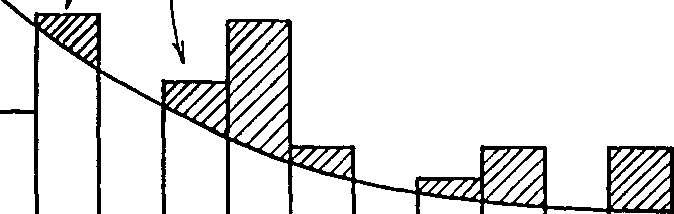

**Figure 6.3.9** Stage Discharge Data for Single Roof Gutters  
(discharge is in m3/s, level in m)

> 

**Figure 6.3.10** Stage Storage Data for Single Roof Gutters  
(storage is in m3, level in m)

*<u>Chapter 6 – Analysis of Data and Development of Appropriate Modelling Concepts 118</u>*

The second phase of the roof drainage model included additional storage routing within the pipes running between the downpipes and the rear boundaries of the individual allotments. As described earlier in this chapter, there was noticeable storage delay in at least a portion of the runoff occurring once it had exited the downpipes. This conclusion was reached after observing the Spence downpipe flows as well as the Giralang 12 roof micro-catchment. As already indicated, flows continued at the 300 mm diameter gauge for up to 1 hour after the cessation of rainfall. Gutters, however, were effectively empty after only a few minutes. When evaporation was present during daylight hours the concrete roof tiles were practically dry within 15 minutes.

To allow for the secondary storage routing a further level pool routing element was added to 50% of the flow exiting the downpipes. This was based on an assumption that the in-yard pipes were partially blocked with debris. Additionally a small amount of in-trench exfiltration/re-infiltration may have been present. The lower portion of the pipe was assumed to provide a storage soak within the debris providing a slow release mechanism for the accumulated runoff. The other 50% of the runoff was assumed to flow through the upper portion of the pipes in a relatively unobstructed manner.

In a new drainage system, or one that had been cleared of debris, this additional storage delay may not occur. The drainage system within the Giralang catchment has been in place for nearly 20 years. Although it was not possible within this study to accurately measure the blockage within the micro-catchments studied, the type of blockage and types of debris, including broken roof tile pieces and organic litter, was very obvious when assessing the pipes within the Spence catchment property. As it was not possible, within the limitations of this study, to investigate this matter further in the field, utilising CCTV or breaking into the yard pipes at Giralang, further research will be required to quantify more exactly the reasons for the extended low flow recession.

Figure 6.3.11 shows the adopted stage storage data representing the additional piped roof drainage within an individual yard. Figure 6.3.12 shows the corresponding adopted stage discharge data.

> *<u>Chapter 6 – Analysis of Data and Development of Appropriate Modelling Concepts 119</u>*
>
> 
>
> **Figure 6.3.11** Stage Storage Data with Additional Piped Roof Drainage across Yard  
> (storage is in m3, level in m)
>
> 
>
> **Figure 6.3.12** Stage Discharge Data with Additional Piped Roof Drainage across Yard (discharge is in m3/s, level in m)

*<u>Chapter 6 – Analysis of Data and Development of Appropriate Modelling Concepts 120</u>*

Figures 6.3.13a, b, c and d show typical results from the applied two phase 12 roof catchment conceptual model aggregated by the time offsets of the individual allotments for the four storm bursts during 13/5/95. A small initial rainfall loss of between 0 and 0.5 mm was observed during runoff events starting with a dry roof. Ongoing losses were represented best by proportional loss rates that varied between 0 and 0.2 of the rainfall. In multiple-burst events such as the 13/5/95 storm there was often a noticeable recovery of infiltration capacity during inter-burst dry spells of an hour or less, as further described by Goyen and O’Loughlin, (1999a). The results indicate the adopted loss rates for each burst.

**Figure 6.3.13a** 12 Roof Model Runoff Result for 13/5/95

Event between 02:00 and 05:00 hours

(flow is in m3/s, time in hours)

> *<u>Chapter 6 – Analysis of Data and Development of Appropriate Modelling Concepts 122</u>*

**Figure 6.3.13d** 12 Roof Model Runoff Result for 13/5/95

Event between 14:00 and 17:00 hours

(flow is in m3/s, time in hours)

**6.3.3 Examination and characterisation of the 14 allotments roofs/yards/road micro-catchment runoff**

*(i) Surface Runoff Analysis*

The results from both the Spence roof catchment and the Giralang 12 roof catchment were subsequently applied to the adjacent Giralang 14 allotment catchment that also included yard and adjacent road drainage elements, indicated in Figure 6.3.14.

> *<u>Chapter 6 – Analysis of Data and Development of Appropriate Modelling Concepts 123</u>*

**Figure 6.3.14** Giralang 14 Roof, Yard and Road Catchment

The XP-RAFTS network was further developed to represent these, as shown in the network representation in Figure 6.3.15. The appropriate routing model for both the yard and road nodes was found to be a simple single linear storage. Alternate small and large storm events were examined to isolate impervious road runoff from the pervious yard runoff. Within the model described in Figure 6.3.15 and all subsequent models, that include free draining connected impervious areas, the node notation of “road” includes all impervious areas other than roofs. These include vehicular roadway areas, footpaths, driveways and paving allocated to each allotment.

The following analysis adopted the initial and proportional loss rate approach to estimate appropriate excess rainfall.

*<u>Chapter 6 – Analysis of Data and Development of Appropriate Modelling Concepts 125</u>*

parameter involved in the routing of localised road runoff. Unfortunately, on inspection of the storm event of 13/5/95, it was noticed that the flow gauge, apparently due to initial blockage at the probe entrance, did not trigger for the first 1 hour. This is further shown on Figure 6.3.20a.

So, instead, the 3/1/93 storm event was utilised. The first hour of this event, which included some 10.4 mm of rainfall, presented an opportunity to model the roof-only flow (already established) and road flow from the 14 allotments in the 1.5 ha micro-catchment. Up to this time, pervious yard flow would be negligible. This observation is in general agreement with the work of Boyd et al. (1993) that studied the volumes of pervious and impervious runoff on Giralang as well as a large number of other urban catchments worldwide.

Once the individual road and yard runoff process models were established using the 3/1/93 event, they were further tested on the 13/5/95 event for the period, excluding the first hour.

> **Figure 6.3.16** Giralang 14 Roof, Yard and Road Catchment with only Roof and Road

Components Active for Beginning of 3/1/93 Event starting at 19:15 hours

(flow is in m3/s, time in minutes)

*<u>Chapter 6 – Analysis of Data and Development of Appropriate Modelling Concepts 126</u>*

Figure 6.3.16 shows the modelled result when only applying roof and road inputs. The adopted linear storage delay parameter K in S = KQ was 0.02. After 70 minutes of rainfall significant pervious runoff from the yard area is observed. The general fit between gauged and model ordinates up to the 70 minute point is quite acceptable.

Figure 6.3.17 shows the result obtained when applying the model with the addition of a linear conceptual storage model for each allotment to represent pervious yard runoff. The storage delay coefficient K for the yard runoff was set at 0.03, 1.5 times that of the road surface, based on assumed differences in surface roughness at significant flow depths. The same 3/1/93 event was utilised, but this time over the entire 5 hours of the storm. In this instance, a constant 45 % proportional loss rate was adopted for the yard runoff. Zero losses were applied to the road and roof components.

**Figure 6.3.17** Giralang 14 Roof, Yard and Road Model Result from the Full 3/1/93  
Event starting at 19:15 hours (flow is in m3/s, time in hours)

The result shown in Figure 6.3.17 is considered reasonable in representing the gauged results throughout a fairly complex storm situation. Any discrepancies between the modelled and gauged results are presently thought to be due to insufficient calibration of the loss estimates rather than to any deficiencies in the surface routing

*<u>Chapter 6 – Analysis of Data and Development of Appropriate Modelling Concepts 128</u>*

therefore support the averaging applied to the more explicit model shown in Figure 6.3.15 in as much as this provides a far simpler procedure with no noticeable loss in accuracy at this scale.

**Figure 6.3.19** Giralang Simplified 14 Roof, Yard and Road Model Result for 3/1/93  
Event starting at 19:15 hours (flow is in m3/s, time in hours)

> To further test the proposed conceptual model described in Figure 6.3.18 it was applied to the 13/5/95 event already utilised for both the Spence and 12 Roof catchments. Figures 6.3.20a, b, c and d indicate the results for each of the four storm bursts during 13/5/95. The individual allotment roof, road and yard areas were 160 m2, 198 m2 and 553 m2 respectively. As already mentioned the gauge did not trigger due to initial blockage until 1 hour into the event as indicated in Figure 6.3.20a.

*<u>Chapter 6 – Analysis of Data and Development of Appropriate Modelling Concepts 131</u>*

*(ii) Sensitivity of Storage Delay Coefficients and Computational Time Step*

*Sensitivity of Storage Delay Coefficients*

To test the sensitivity of the adopted storage delay parameters within the conceptual model shown in Figure 6.3.18 the parameters representing road and yard storages were individually modified by plus and minus 2 times and the 3/1/93 event was re-run. The roof storage delay parameter was modified by plus and minus 100 times. Results are indicated in Figure 6.3.21. The roof storage delay parameter was found to be insensitive with the peak being dominated by the gutter storage / discharge relationship. The other two parameters representing road and yard surfaces were found to be relatively sensitive. As the conceptual model is based on an allotment as the base unit, the values of the storage delay parameters do not change irrespective of the size of the catchment.

**0**

> **-10% +10%**

**Change Qpeak**

**Figure 6.3.21a** Sensitivity of Storage Delay Parameters

*<u>Chapter 6 – Analysis of Data and Development of Appropriate Modelling Concepts 133</u>*

within the same event. This is thought to be due to differences in rainfall intensity characteristics as well as the status of storages on the catchment at the time of the peak. Further research would be needed to exactly quantify the separate contributions. As a short time step is currently in use in this study, the problem is not an issue. In future studies, when only longer time step rainfall data is available or longer computational time steps are contemplated, particularly steps in excess of one minute, it may be necessary to separate surface routing processes from any pre-routing caused by the averaging of rainfall over the longer time step.

*(iii) Rainfall Infiltration*

The current analysis is primarily based around the storage routing and translation of excess rainfall estimated for each of the different urban surfaces involved in allotment runoff. These currently include residential tiled roofs, pervious yard areas plus associated road and path areas. The development of surface runoff in this manner firstly requires the estimation of respective rainfall infiltration amounts for each of the surfaces being considered.

To date, relatively simple loss rate procedures have been adopted to estimate excess rainfall in urban situations. These have included initial loss/continuous loss rates, proportional loss rates and Horton type infiltration. A small number of urban runoff modelling procedures have included more comprehensive loss rate methods based on a water balance model reflecting vertical infiltration, evapotranspiration, baseflow and soil moisture redistribution (Goyen, 1981).

The most significant losses within an urban catchment are associated with allotment and adjacent pervious areas. One of the observations from the analysis of the gauged rainfall and runoff data was that pervious area infiltration was best characterised by a proportional loss rate of between 50 and 100% of the rainfall. Additionally, residential tiled roof losses were also best characterised by a proportional loss rate following an initial loss of between 0.5 and 1.0 mm. The roof proportional loss rate varied between 0 and 20%, with the latter occuring in smaller events. Roof infiltration capacity was also observed to recover rapidly after the cessation of rainfall. In fact, after

*<u>Chapter 6 – Analysis of Data and Development of Appropriate Modelling Concepts 134</u>*

as little as one hour both intial loss rate and ongoing loss rate capacity were found to be significantly restored to pre-storm conditions. Ongoing roof infiltration after the initial wetting period is thought to mainly reflect infiltration into the concrete tiles themselves, plus some losses due to wind turbulence causing deflection of refracted water from the roof surface. In some instances evaporation may also play a part in ongoing losses.

When an initial loss/continuous loss rate was applied, the continuous loss rate often needed to be as high as 20 mm/h to match gauged runoff volumes. This magnitude is far higher than previously applied design values for pervious areas which normally range between 2 and 5 mm/h. Significant recovery of pervious area infiltration capacity was also noticeable during multiple peak events with even a few hours of insignificant intermediary rainfall.

When the Philip (1957) infiltration equation was used in place of simpler continuing or proportional rate methods, it was found that the magnitudes of soil sorptivity and saturated hydraulic conductivity needed to be significantly reduced from measured data for typical Canberra lawns (Talsma, 1969; Goyen, 1981). The temporal shape of this infiltration curve also failed to replicate the observed proportional characteristics.

Although proportional loss rates were observed to best fit the situation they also varied significantly during different magnitude events. This meant it would be difficult to directly transfer appropriate values to design situations for use with a dimensionless temporal rainfall pattern.

Field observations during the study period also indicated significant variations in infiltration capacity across individual allotments. This had the effect of staggering the commencement of runoff from various parts of the yard areas.

As the proportional loss rate approach initially had no apparent physical basis, a number of hypotheses were developed to potentially account for the observations. These are further elaborated below and in Chapter 7.

Figure 6.3.22 indicates the estimated and gauged runoff results from the 14 allotment catchment in Figure 6.3.18, for the event on 3/1/93. This had an eight year ARI and included a double-peaked hydrograph with peaks of similar magnitudes. The total rainfall depth over the first 4 hours simulated was 60.9 mm. The estimated

*<u>Chapter 6 – Analysis of Data and Development of Appropriate Modelling Concepts 136</u>*

The fit between estimated and gauged results improves significantly when adopting a proportional loss rate instead of the continuing loss rate approach. The estimated peaks for this event, using a continuous loss, were 22% and 17% higher than the gauged peaks, while the proportional procedure produced practically equal peaks. Continuing loss rates provided variable results depending on the storm being monitored. Variable proportional loss rates were also noted when analysing storms of different magnitude. It is thought that proportional loss rates, although providing superior fits to gauged data, provide little indication of appropriate design values.

**6.3.4 Examination of rural/urban interface flow data to isolate non-urban flows within the urban flow mix at the Giralang outlet**

Based on personal observation and the data collected from the flow gauge located at the Giralang rural/urban interface, as indicated in Figure 6.3.23, the magnitude of the rural flow peak that can influence the total peak at the Giralang catchment outlet is generally negligible.

**Figure 6.3.23** Giralang Rural/Urban Interface Flowgauge

> *<u>Chapter 6 – Analysis of Data and Development of Appropriate Modelling Concepts 137</u>*
>
> Based on the data included in Tables 5.4.2, 5.4.3 and 5.4.4, out of 39 gauged runoff peaks only 5 rural peaks exceeded 0.05 m3/s, or 5% of the smallest total flow peak listed. The major event of 3/1/93 occurred after an extended dry spell and it is not expected that the rural contribution was significant, particularly near the commencement of the event. Personal observation of the urban inlet the following morning did not indicate high water marks within the inlet pipe. This issue is further discussed in conjunction with the 3/1/93 flood event analysis. After the 13/5/95 event it was not possible to verify either way whether there was any significant rural flow due to the lack of a gauge.
>
> **6.4 Potential Expansion of the Micro-Catchment Results to a Larger Scaled Catchment**
>
> **6.4.1 Comparison of flow between Giralang micro-catchments and catchment outlet**
>
> Tables 6.4.1, 6.4.2 and 6.4.3 provide comparisons between the Giralang micro-stations and the Giralang catchment outlet for all event peaks gauged in 1993, 1994 and 1995 that include both micro-catchment gaugings as well as the Giralang outlet gauging.
>
> *<u>Chapter 6 – Analysis of Data and Development of Appropriate Modelling Concepts 138</u>*

**Table 6.4.1** Giralang Total Catchment/Micro-Catchment Flowrate Ratios (1993)

<table>
<colgroup>
<col style="width: 11%" />
<col style="width: 9%" />
<col style="width: 7%" />
<col style="width: 9%" />
<col style="width: 7%" />
<col style="width: 12%" />
<col style="width: 9%" />
<col style="width: 9%" />
<col style="width: 13%" />
<col style="width: 9%" />
</colgroup>
<thead>
<tr class="header">
<th><em><strong>Date</strong></em></th>
<th><blockquote>

<em><strong>Time of 300 mm Peak (h:m:s)</strong></em>

</blockquote></th>
<th>
<em><strong>300 
mm</strong></em>

<em><strong>Micro</strong></em>

<blockquote>

<em><strong>Catch -ment Peak (m3/s)</strong></em>

</blockquote></th>
<th><blockquote>

<em><strong>Time of 450 mm Peak (h:m:s)</strong></em>

</blockquote></th>
<th><blockquote>

<em><strong>450 mm Micro</strong></em>

<em><strong>Catch -ment Peak (m3/s)</strong></em>

</blockquote></th>
<th><em><strong>Combined 
Micro-</strong></em> 
<em><strong>Catchments 
Peak (m3/s)</strong></em></th>
<th><em><strong>Time 
of 
Total 
Peak 
(h:m:s)</strong></em></th>
<th><blockquote>

<em><strong>Total Catch­ment Peak-Rural (m3/s)</strong></em>

</blockquote></th>
<th>
<em><strong>Ratio of 
Outlet Peak 
/ Combined 
Micro</strong></em>

<em><strong>Catchment 
Peak</strong></em>
</th>
<th><em><strong>Approx. 
ARI 
(year)</strong></em></th>
</tr>
</thead>
<tbody>
<tr class="odd">
<td>3/1/93</td>
<td>19:40:56</td>
<td>0.013</td>
<td>19:40:08</td>
<td>0.048</td>
<td>0.061</td>
<td>19:42:00</td>
<td>1.35</td>
<td>22.13</td>
<td>&lt; 1</td>
</tr>
<tr class="even">
<td>3/1/93</td>
<td>20:14:56</td>
<td>0.011</td>
<td>20:14:36</td>
<td>0.045</td>
<td>0.056</td>
<td>20:16:50</td>
<td>1.78</td>
<td>31.79</td>
<td>&lt; 1</td>
</tr>
<tr class="odd">
<td>3/1/93</td>
<td>20:32:56</td>
<td>0.037</td>
<td>20:33:36</td>
<td>0.184</td>
<td>0.221</td>
<td>20:35:10</td>
<td>7.15</td>
<td>32.35</td>
<td>6</td>
</tr>
<tr class="even">
<td>3/1/93</td>
<td>20:45:56</td>
<td>0.030</td>
<td>20:46:08</td>
<td>0.147</td>
<td>0.177</td>
<td>20:48:50</td>
<td>5.12</td>
<td>28.93</td>
<td>1.7</td>
</tr>
<tr class="odd">
<td>3/1/93</td>
<td>20:56:28</td>
<td>0.028</td>
<td>20:56:08</td>
<td>0.151</td>
<td>0.179</td>
<td>20:57:50</td>
<td>4.76</td>
<td>26.59</td>
<td>1.4</td>
</tr>
<tr class="even">
<td>3/1/93</td>
<td>21:10:56</td>
<td>0.020</td>
<td>21:10:36</td>
<td>0.091</td>
<td>0.111</td>
<td>21:12:20</td>
<td>2.71</td>
<td>24.41</td>
<td>1</td>
</tr>
<tr class="odd">
<td>3/1/93</td>
<td>22:19:28</td>
<td>0.018</td>
<td>22:19:08</td>
<td>0.076</td>
<td>0.094</td>
<td>22:21:10</td>
<td>1.93</td>
<td>20.53</td>
<td>&lt; 1</td>
</tr>
<tr class="even">
<td>3/1/93</td>
<td>22:41:56</td>
<td>0.042</td>
<td>22:42:08</td>
<td>0.234</td>
<td>0.276</td>
<td>22:43:20</td>
<td>7.79</td>
<td>28.23</td>
<td>8</td>
</tr>
<tr class="odd">
<td>3/1/93</td>
<td>23:53:56</td>
<td>0.012</td>
<td>23:53:36</td>
<td>0.043</td>
<td>0.055</td>
<td>23:55:10</td>
<td>1.66</td>
<td>30.18</td>
<td>&lt; 1</td>
</tr>
<tr class="even">
<td>21/1/93</td>
<td>17:20:00</td>
<td>0.024</td>
<td>17:20:38</td>
<td>0.117</td>
<td>0.141</td>
<td>17:21:20</td>
<td>4.25</td>
<td>30.14</td>
<td>1.2</td>
</tr>
<tr class="odd">
<td>3/2/93</td>
<td>15:40:32</td>
<td>0.011</td>
<td>15:40:34</td>
<td>0.035</td>
<td>0.046</td>
<td>15:42:40</td>
<td>1.14</td>
<td>24.78</td>
<td>&lt; 1</td>
</tr>
<tr class="even">
<td>9/2/93</td>
<td>10:59:32</td>
<td>0.016</td>
<td>11:00:06</td>
<td>0.049</td>
<td>0.065</td>
<td>11:01:40</td>
<td>2.22</td>
<td>34.15</td>
<td>&lt; 1</td>
</tr>
<tr class="odd">
<td>20/2/93</td>
<td>22:30:28</td>
<td>0.013</td>
<td>22:30:04</td>
<td>0.044</td>
<td>0.057</td>
<td>22:32:00</td>
<td>1.49</td>
<td>26.14</td>
<td>&lt; 1</td>
</tr>
<tr class="even">
<td>6/3/93</td>
<td>22:08:28</td>
<td>0.025</td>
<td>22:09:04</td>
<td>0.088</td>
<td>0.113</td>
<td>22:10:20</td>
<td>3.17</td>
<td>28.05</td>
<td>1</td>
</tr>
<tr class="odd">
<td>6/3/93</td>
<td>22:39:00</td>
<td>0.011</td>
<td>23:37:04</td>
<td>0.005*</td>
<td>0.016</td>
<td>22:41:10</td>
<td>1.48</td>
<td>-</td>
<td>&lt; 1</td>
</tr>
<tr class="even">
<td>26/3/93</td>
<td>7:41:00</td>
<td>0.009</td>
<td>07:40:32</td>
<td>0.026</td>
<td>0.035</td>
<td>07:42:30</td>
<td>1.06</td>
<td>30.29</td>
<td>&lt; 1</td>
</tr>
<tr class="odd">
<td>5/4/93</td>
<td>17:04:00</td>
<td>0.033</td>
<td>17:04:32</td>
<td>0.164</td>
<td>0.197</td>
<td>17:05:10</td>
<td>5.68</td>
<td>28.83</td>
<td>2.5</td>
</tr>
<tr class="even">
<td>8/9/93</td>
<td>21:42:58</td>
<td>0.009</td>
<td></td>
<td>-</td>
<td>-</td>
<td>21:44:00</td>
<td>1.13</td>
<td>-</td>
<td>&lt; 1</td>
</tr>
<tr class="odd">
<td>9/9/93</td>
<td>16:41:58</td>
<td>0.021</td>
<td>16:43:12</td>
<td>0.103</td>
<td>0.124</td>
<td>16:43:50</td>
<td>3.30</td>
<td>26.61</td>
<td>1.01</td>
</tr>
<tr class="even">
<td>2/11/93</td>
<td>13:06:12</td>
<td>0.012</td>
<td>13:07:20</td>
<td>0.040</td>
<td>0.052</td>
<td>13:07:20</td>
<td>1.40</td>
<td>26.92</td>
<td>&lt; 1</td>
</tr>
<tr class="odd">
<td>13/11/93</td>
<td>17:15:12</td>
<td>0.010</td>
<td>17:17:20</td>
<td>0.016</td>
<td>0.026</td>
<td>17:18:00</td>
<td>1.34</td>
<td>51.54</td>
<td>&lt; 1 yr.</td>
</tr>
<tr class="even">
<td>13/11/93</td>
<td>17:43:12</td>
<td>0.026</td>
<td>17:43:20</td>
<td>0.126</td>
<td>0.152</td>
<td>17:46:00</td>
<td>4.67</td>
<td>30.72</td>
<td>1.3 yr.</td>
</tr>
<tr class="odd">
<td>13/11/93</td>
<td>21:06:12</td>
<td>0.009</td>
<td>21:06:52</td>
<td>0.035</td>
<td>0.044</td>
<td>21:09:20</td>
<td>1.37</td>
<td>31.14</td>
<td>&lt; 1 yr.</td>
</tr>
<tr class="even">
<td>20/11/93</td>
<td>11:27:12</td>
<td>0.010</td>
<td>11:26:52</td>
<td>0.039</td>
<td>0.049</td>
<td>11:29:00</td>
<td>1.19</td>
<td>24.29</td>
<td>&lt; 1 yr.</td>
</tr>
</tbody>
</table>

- 14 allotment peak less than half 12 allotment peak – ratio omitted

> The calculated ratios of total peak to combined micro-catchment peak is premised on rural flows being insignificant.
>
> *<u>Chapter 6 – Analysis of Data and Development of Appropriate Modelling Concepts 139</u>*

**Table 6.4.2** Giralang Total Catchment/Micro-Catchment Flowrate Ratios (1994)

<table>
<colgroup>
<col style="width: 11%" />
<col style="width: 9%" />
<col style="width: 7%" />
<col style="width: 9%" />
<col style="width: 7%" />
<col style="width: 12%" />
<col style="width: 9%" />
<col style="width: 9%" />
<col style="width: 13%" />
<col style="width: 9%" />
</colgroup>
<thead>
<tr class="header">
<th><em><strong>Date</strong></em></th>
<th><blockquote>

<em><strong>Time of 300 mm Peak (h:m:s)</strong></em>

</blockquote></th>
<th>
<em><strong>300 
mm</strong></em>

<em><strong>Micro</strong></em>

<blockquote>

<em><strong>Catch -ment Peak (m3/s)</strong></em>

</blockquote></th>
<th><blockquote>

<em><strong>Time of 450 mm Peak (h:m:s)</strong></em>

</blockquote></th>
<th><blockquote>

<em><strong>450 mm Micro</strong></em>

<em><strong>Catch -ment Peak (m3/s)</strong></em>

</blockquote></th>
<th><em><strong>Combined 
Micro-</strong></em> 
<em><strong>Catchments 
Peak (m3/s)</strong></em></th>
<th><blockquote>

<em><strong>Time of Total Peak (h:m:s)</strong></em>

</blockquote></th>
<th><blockquote>

<em><strong>Total Catch­ment Peak - Rural (m3/s)</strong></em>

</blockquote></th>
<th>
<em><strong>Ratio of 
Outlet Peak 
/ Combined 
Micro</strong></em>

<em><strong>Catchment 
Peak</strong></em>
</th>
<th><em><strong>Approx. 
ARI 
(year)</strong></em></th>
</tr>
</thead>
<tbody>
<tr class="odd">
<td>20/10/94</td>
<td>09:57:16</td>
<td>0.007</td>
<td>09:59:44</td>
<td>0.018</td>
<td>0.025</td>
<td>10:05:40</td>
<td>1.11</td>
<td>44.40</td>
<td>&lt; 1</td>
</tr>
<tr class="even">
<td>19/11/94</td>
<td>18:54:44</td>
<td>0.016</td>
<td>18:53:00</td>
<td>0.053</td>
<td>0.069</td>
<td>19:01:20</td>
<td>2.54</td>
<td>36.81</td>
<td>&lt; 1</td>
</tr>
<tr class="odd">
<td>25/11/94</td>
<td>17:10:16</td>
<td>0.021</td>
<td>17:11:00</td>
<td>0.126</td>
<td>0.147</td>
<td>17:17:00</td>
<td>3.45</td>
<td>23.47</td>
<td>1.05</td>
</tr>
<tr class="even">
<td>28/11/94</td>
<td>17:48:16</td>
<td>0.020</td>
<td>17:50:00</td>
<td>0.069</td>
<td>0.089</td>
<td>17:55:30</td>
<td>2.92</td>
<td>32.81</td>
<td>1</td>
</tr>
<tr class="odd">
<td>8/12/94</td>
<td>15:22:44</td>
<td>0.008</td>
<td>15:24:04</td>
<td>0.036</td>
<td>0.044</td>
<td>15:29:50</td>
<td>1.12</td>
<td>25.46</td>
<td>&lt; 1</td>
</tr>
<tr class="even">
<td>8/12/94</td>
<td>15:41:44</td>
<td>0.013</td>
<td>15:42:04</td>
<td>0.054</td>
<td>0.067</td>
<td>15:50:30</td>
<td>1.98</td>
<td>29.55</td>
<td>&lt; 1</td>
</tr>
</tbody>
</table>

**Table 6.4.3** Giralang Total Catchment/Micro-Catchment Flowrate Ratios (1995)

<table>
<colgroup>
<col style="width: 11%" />
<col style="width: 9%" />
<col style="width: 7%" />
<col style="width: 9%" />
<col style="width: 7%" />
<col style="width: 12%" />
<col style="width: 9%" />
<col style="width: 9%" />
<col style="width: 13%" />
<col style="width: 9%" />
</colgroup>
<thead>
<tr class="header">
<th><em><strong>Date</strong></em></th>
<th><blockquote>

<em><strong>Time of 300 mm Peak (h:m:s)</strong></em>

</blockquote></th>
<th>
<em><strong>300 
mm</strong></em>

<em><strong>Micro</strong></em>

<blockquote>

<em><strong>Catch -ment Peak (m3/s)</strong></em>

</blockquote></th>
<th><blockquote>

<em><strong>Time of 450 mm Peak (h:m:s)</strong></em>

</blockquote></th>
<th><blockquote>

<em><strong>450 mm Micro</strong></em>

<em><strong>Catch -ment Peak (m3/s)</strong></em>

</blockquote></th>
<th><em><strong>Combined 
Micro-</strong></em> 
<em><strong>Catchments 
Peak (m3/s)</strong></em></th>
<th><em><strong>Time 
of 
Total 
Peak 
(h:m:s)</strong></em></th>
<th>
<em><strong>Total 
Catch</strong></em>

<blockquote>

<em><strong>-ment Peak-Rural (m3/s)</strong></em>

</blockquote></th>
<th>
<em><strong>Ratio of 
Outlet Peak 
/ Combined 
Micro</strong></em>

<em><strong>Catchment 
Peak</strong></em>
</th>
<th><em><strong>Approx. 
ARI 
(year)</strong></em></th>
</tr>
</thead>
<tbody>
<tr class="odd">
<td>5/1/95</td>
<td>12:41:44</td>
<td>0.008</td>
<td>12:44:04</td>
<td>0.029</td>
<td>0.037</td>
<td>12:44:40</td>
<td>1.32</td>
<td>35.68</td>
<td>&lt; 1</td>
</tr>
<tr class="even">
<td>5/1/95</td>
<td>14:55:44</td>
<td>0.019</td>
<td>14:57:32</td>
<td>0.086</td>
<td>0.105</td>
<td>14:59:00</td>
<td>2.81</td>
<td>26.76</td>
<td>1</td>
</tr>
<tr class="odd">
<td>5/1/95</td>
<td>17:20:44</td>
<td>0.017</td>
<td>17:23:32</td>
<td>0.053</td>
<td>0.070</td>
<td>17:25:50</td>
<td>2.24</td>
<td>32.00</td>
<td>&lt; 1</td>
</tr>
<tr class="even">
<td>5/1/95</td>
<td>18:56:44</td>
<td>0.033</td>
<td>18:59:32</td>
<td>0.251</td>
<td>0.284</td>
<td>19:01:20</td>
<td>7.40</td>
<td>26.06</td>
<td>7</td>
</tr>
<tr class="odd">
<td>17/1/95</td>
<td>11:54:16</td>
<td>0.013</td>
<td>11:56:04</td>
<td>0.044</td>
<td>0.057</td>
<td>11:57:10</td>
<td>1.44</td>
<td>25.26</td>
<td>&lt; 1</td>
</tr>
<tr class="even">
<td>20/1/95</td>
<td>15:11:16</td>
<td>0.011</td>
<td>15:10:16</td>
<td>0.059</td>
<td>0.070</td>
<td>15:12:50</td>
<td>2.12</td>
<td>28.86</td>
<td>&lt; 1</td>
</tr>
<tr class="odd">
<td>20/1/95</td>
<td>16:23:16</td>
<td>0.012</td>
<td>16:23:16</td>
<td>0.070</td>
<td>0.082</td>
<td>16:24:00</td>
<td>2.38</td>
<td>29.02</td>
<td>&lt; 1</td>
</tr>
<tr class="even">
<td>20/1/95</td>
<td>17:30:00</td>
<td>0.013</td>
<td>17:32:44</td>
<td>0.071</td>
<td>0.084</td>
<td>17:35:20</td>
<td>2.52</td>
<td>30.00</td>
<td>&lt; 1</td>
</tr>
<tr class="odd">
<td>28/1/95</td>
<td>12:06:48</td>
<td>0.012</td>
<td>12:07:16</td>
<td>0.057</td>
<td>0.069</td>
<td>12:08:20</td>
<td>1.97</td>
<td>28.55</td>
<td>&lt; 1</td>
</tr>
<tr class="even">
<td>28/1/95</td>
<td>14:58:48</td>
<td>0.007</td>
<td>14:59:16</td>
<td>0.032</td>
<td>0.039</td>
<td>15:00:40</td>
<td>1.02</td>
<td>26.15</td>
<td>&lt; 1</td>
</tr>
<tr class="odd">
<td>28/1/95</td>
<td>18:11:00</td>
<td>0.030</td>
<td>18:13:44</td>
<td>0.209</td>
<td>0.239</td>
<td>18:15:00</td>
<td>7.67</td>
<td>32.09</td>
<td>7.5</td>
</tr>
<tr class="even">
<td>28/1/95</td>
<td>19:19:48</td>
<td>0.017</td>
<td>19:20:16</td>
<td>0.088</td>
<td>0.105</td>
<td>19:22:30</td>
<td>2.34</td>
<td>22.29</td>
<td>&lt; 1</td>
</tr>
<tr class="odd">
<td>13/5/95</td>
<td>03:18:08</td>
<td>0.018</td>
<td>03:18:24</td>
<td>0.055</td>
<td>0.073</td>
<td>3:19:20</td>
<td>1.90</td>
<td>26.03</td>
<td>&lt; 1</td>
</tr>
<tr class="even">
<td>13/5/95</td>
<td>04:00:36</td>
<td>0.011</td>
<td>04:00:24</td>
<td>0.052</td>
<td>0.063</td>
<td>4:01:50</td>
<td>1.87</td>
<td>29.68</td>
<td>&lt; 1</td>
</tr>
<tr class="odd">
<td>13/5/95</td>
<td>07:24:08</td>
<td>0.018</td>
<td>07:23:24</td>
<td>0.080</td>
<td>0.098</td>
<td>7:24:50</td>
<td>2.80</td>
<td>28.57</td>
<td>1</td>
</tr>
<tr class="even">
<td>13/5/95</td>
<td>11:47:08</td>
<td>0.018</td>
<td>11:46:56</td>
<td>0.096</td>
<td>0.114</td>
<td>11:48:30</td>
<td>3.60</td>
<td>31.58</td>
<td>1.1</td>
</tr>
<tr class="odd">
<td>13/5/95</td>
<td>15:09:00</td>
<td>0.013</td>
<td>15:10:24</td>
<td>0.067</td>
<td>0.080</td>
<td>15:11:40</td>
<td>2.71</td>
<td>33.88</td>
<td>1</td>
</tr>
</tbody>
</table>

*<u>Chapter 6 – Analysis of Data and Development of Appropriate Modelling Concepts 140</u>*

The ratios of total catchment peak divided by combined micro-catchment peak in Tables 6.4.1 to 6.4.3 ranged between 20.53 and 51.54. The average value based on the 45 listed peaks was 29.42. These two extreme values represent a percentage change of - 30% and +75% about the mean value. For all significant events with ARIs 1 year or greater the ratios ranged between 23.47 and 32.81. These two extreme values represent a much lesser percentage change of -20% and +12% about the mean value.

Putting aside any flowgauge errors, the variation in the reported ratios would most likely be attributable to rainfall spatial differences plus possible changes in dynamic storage attenuation within the main public pipe systems downstream of the micro-catchment hydrograph inputs. As described later in Section 6.4.4, the effects of any in-pipe storage attenuation within the Giralang system are thought to be insignificant.

The variation in the above ratios, during different event peaks would therefore most likely be restricted to spatial changes in rainfall depth and temporal shape, when in-pipe attenuation could be affected by varying superposition effects. It is postulated that the actual shape of the rainfall temporal pattern about the peak intensity and subsequent micro-catchment hydrograph could significantly affect outlet peaks due to phased inputs and resulting system superposition.

While the ratios listed in Tables 6.4.1 to 6.4.3 point to the effects of rainfall variability across the Giralang catchment, they also indicate that during the listed period of 2.5 years, considering all significant events of ARI of 1 year and greater, the maximum difference about the mean was only -20% and +12%. These included 17 event peaks. Only 6 event peaks out of the total of 45 were shown, in Tables 6.4.1 to 6.4.3, to be outside the range for events of 1 year ARI and greater.

The total peak travel time throughout the piped drainage network is very short as indicated in the timing of the various flow peaks in Tables 6.4.1, 6.4.2 and 6.4.3. The difference in time to peak between the micro-catchment hydrographs and the hydrograph at the catchment outlet generally does not exceed 2 minutes. The temporal shape of individual allotment runoff hydrographs up to plus or minus 2 minutes of the peak could therefore influence the downstream aggregated peak. Based on the rainfall and flow data collected it is common to find event bursts where the magnitude of the allotment hydrograph ordinates can change by more than 50% over 2 to 4 minutes.

> *<u>Chapter 6 – Analysis of Data and Development of Appropriate Modelling Concepts 142</u>*
>
> results in Figure 6.3.21b it has been shown that small computational time steps are often necessary to properly account for historical rainfall data and its ultimate conversion to surface runoff. The effects of varying time steps and the significant effect they can have on the simulated hydrograph are also indicated in the work of Wilkinson (1995).
>
> The lower two rainfall patterns shown in Figure 6.4.1 indicate possible recorded temporal patterns that show very different rainfall intensities within plus and minus 2 minutes of the peak. It is highly likely that much of the temporal shape of the rainfall input will be transferred into the local allotment runoff hydrograph. If this is the case then the temporal shape could then strongly influence the effects of superposition within the offset aggregation of individual allotment inputs into the downstream public pipe system. As already mentioned, it is thought that this is a key factor in causing the different ratios of outlet / combined micro catchment peak reported in Tables 6.4.1 to 6.4.3.
>
> If in-pipe flow peak attenuation is significantly affected by superposition, and if it varies between events with changing temporal shape about the peak, then a single averaged storage delay parameter within a single conceptual storage routing model would be incapable of adequately representing these different events. This may well be one of the reasons why differences in storage delay parameters have been reported by researchers during different events of similar magnitude on the same catchment (Aitken, 1975).
>
> To test for these effects within the dataset assembled during this study the events of 3/1/93 and 13/5/95 were examined. Figures 6.4.2 and Figure 6.4.3 indicate two flow bursts from separate storm events that indicate quite significantly different total catchment to combined micro-catchment peak ratios listed in Tables 6.4.1 and 6.4.3. The ordinates of both hydrographs are factored by a figure of 1.5, as explained in Appendix B, to represent distributed inputs to the total Giralang catchment XP-EXTRAN model. The hydrographs, however, maintain the correct temporal shape, which controls the analysis shown in this section. Figure 6.4.2 shows one of the burst peaks from 3/1/93 event at 20:15 hours.

*<u>Chapter 6 – Analysis of Data and Development of Appropriate Modelling Concepts 143</u>*

> 

**Figure 6.4.2** Combined Micro-Catchment Gauged Hydrograph Burst for Event of  
3/1/93, 20:15 hours (flow is in m3/s, time in minutes)

The 3/1/93 event at the 20:15 hours peak burst is listed in Table 6.4.1 and has a total catchment to combined micro-catchment peak of 31.79. The percentage drops in peak 2 minutes either side of the hydrograph peak are 17.5% and 8.8%.

> Figure 6.4.3 shows one of the burst peaks from the 13/5/95 event at 03:19 hours.
>
> 

**Figure 6.4.3** Combined Micro-Catchment Gauged Hydrograph Burst for Event  
of 13/5/95, 03:19 hours (flow is in m3/s, time in minutes)

*<u>Chapter 6 – Analysis of Data and Development of Appropriate Modelling Concepts 144</u>*

The 13/5/95 event at the 20:15 hours peak burst is listed in Table 6.4.3 and has a total catchment to combined micro-catchment peak of 26.03. The percentage drops in peak 2 minutes either side of the hydrograph peak are 46.6% and 55.3%.

Both the 3/1/93 and the 13/5/95 total catchment event bursts are of similar magnitude, but the reported ratios between total catchment and combined micro-catchments are significantly different. The change in ratio is entirely in line with the much larger drop either side of the micro-catchment hydrograph peak for the 13/5/95 event over the corresponding drop during the 3/1/93 event.

While some of these effects could also be attributable to spatial changes in rainfall depth alone across the catchment, the above example lends support for changing rainfall temporal patterns having a significant influence on the way downstream in-pipe attenuation is affected.

It is difficult to accurately separate the effects of inflow offset superposition, caused by rainfall temporal variation, from simple variations in rainfall depth across the Giralang catchment. This is despite having four separate rainfall gauging stations. The two-phase “process tree” approach, which separates local hydrological inputs from downstream superposition, as described earlier in this chapter, fortunately takes account of potential variations in superposition effects due to differences in event rainfall temporal patterns.

**6.4.2 Collation of Giralang public pipe data and coding up of an XP-EXTRAN model of the Giralang piped network**

The complete public piped drainage system characteristics were collated from the works-as-executed plans retrieved from ACT Government microfilm records. These were transferred into an Excel spreadsheet format that is included in Appendix B. This data, which included pipe diameters, lengths, invert levels at manholes and surface levels, was then used to build up a comprehensive numerical model of the main pipe system network within the XP-EXTRAN computer program. The resulting model is diagrammatically indicated in Figure 6.4.4, taken from a screen-dump.

*<u>Chapter 6 – Analysis of Data and Development of Appropriate Modelling Concepts 145</u>*

> 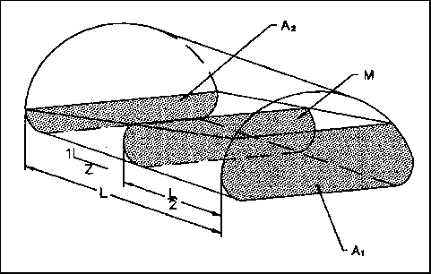
>
> **Figure 6.4.4** XP-EXTRAN Numerical Model Layout for Giralang Main Pipe Network

**6.4.3 XP-EXTRAN model: utilising Giralang micro-catchments gauged**

> **flows at representative nodes, to simulate hydraulic behaviour of total catchment pipe system**

The XP-EXTRAN model was initially utilised to help quantify the dominant processes occurring in the transport phase of runoff development. When the allotments were considered as parallel elements with zero lags, the estimated peaks over a wide range of storm events differed significantly, as indicated in Tables 6.4.1 to 6.4.3. It was hypothesised that the actual shape of the particular rainfall hyetograph about the peak had a significant effect on the resulting runoff peak, due to different superposition effects. Further support for this proposition was given in Section 6.4.1.

To further test this issue the XP-EXTRAN hydraulic analysis program was utilised to route Giralang micro-catchment recorded flow inputs at some 20 representative locations, based on the ratio of 526/26 allotments. The gauged hydrographs for the combined micro-catchments were adjusted to allow for the different land-use areal and flow-generating potential proportionality between the local and total catchments. The computation of the adopted adjustment factor of 1.5 is described in detail in Appendix B. Figure 6.4.5 indicates the representative nodal locations of the combined micro-catchment inputs factored by 1.5 to the XP-EXTRAN network model. The Mannings roughness for all trunk pipes making up the XP-EXTRAN model in

*<u>Chapter 6 – Analysis of Data and Development of Appropriate Modelling Concepts 146</u>*

Figure 6.4.5 was calibrated to 0.011 for the 3/1/93 event. This value was subsequently utilised for all other XP-EXTRAN event models. The XP-EXTRAN models are included on the enclosed CD-ROM with model names set to gir”date”s.xp.

**Figure 6.4.5** XP-EXTRAN Giralang Network Model and Inlet Hydrographs from  
3/1/93 Storm Event

Figure 6.4.6 shows the result from the analysis of the 3/1/93 event. The close agreement between the gauged and calculated hydrographs at the catchment outlet for all embedded flow peaks indicates the scalability of the micro-catchment gauged results. Provided the micro-catchments and therefore the individual allotment hydrographs are modelled accurately to match gauged data, it has been shown that one can link the local runoff estimates to a rigorous numerical hydraulics program such as XP-EXTRAN. The results also tend to confirm the minimal effects of in-pipe storage attenuation. The close fit over most of the time span of the simulation also confirms the negligible amount of upstream rural flow that must have occurred during this event. The small differences noted at a couple of locations during the simulation could be due to the combination of flow gauging errors, rainfall spatial variations across the catchment not represented by the micro-catchment data, and numerical error in the XP-EXTRAN model itself.

> *<u>Chapter 6 – Analysis of Data and Development of Appropriate Modelling Concepts 147</u>*

**Figure 6.4.6** XP-EXTRAN Giralang Network Model Result from the 3/1/93 Storm  
Event (Times shown are actual ones.)

> Figure 6.4.7 provides an additional analysis using the same model, however, this time with the combined hydrographs of the micro-catchments for the 13/5/95 event. Again close fits between the gauged and calculated ordinates are exhibited. As for the 3/1/93 event, there is little evidence of any significant upstream rural flow.

**Figure 6.4.7** XP-EXTRAN Giralang Network Model Result from the 13/5/95 Storm  
Event (Times shown are actual ones.)

> *<u>Chapter 6 – Analysis of Data and Development of Appropriate Modelling Concepts 148</u>*
>
> **6.4.4 Development of a representative XP-EXTRAN linear model**
>
> To test the significance or otherwise of in-pipe attenuation due to storage effects, a linear XP-EXTRAN numerical model was developed to represent the type of routing characteristics encountered within the Giralang catchment. The model uses a one kilometre length of pipeline, at the average pipe grade of two percent, which is representative of the slope of the main Giralang pipeline between the interface with the upstream rural area and the Giralang outlet. The chosen pipe diameter of 540 mm represents the combined capacity of the paired micro-catchments outlets of 300 mm and 450 mm diameters. This diameter was selected to provide a pipe with a flow depth to full depth ratio reasonably equivalent to the whole Giralang catchment pipe system. The combined micro-catchment hydrographs, taken directly from the gauged data set were inputted to the head of the pipeline. Figure 6.4.8 shows the developed model with inlet hydrographs for the 3/1/93 storm event that includes a wide range of flow peaks ranging from less than 1 year ARI to 8 year ARI.
>
> 
>
> **Figure 6.4.8** XP-EXTRAN Linear Model
>
> The results of this model indicated that the in-pipe attenuation over the one kilometre distance was in fact nil. The maximum flow depth in the pipe was 260 mm or
>
> *<u>Chapter 6 – Analysis of Data and Development of Appropriate Modelling Concepts 149</u>*
>
> approximately half full. The maximum flow velocity at the largest (second) peak was 2.58 m/s. The computed wave speed of the same peak was estimated to be approximately 3.3 m/s. Figure 6.4.9 indicates the hydrographs at the inlet as well as the downstream end of the pipeline.
>
> 
>
> **Figure 6.4.9** Resulting Hydrographs from XP-EXTRAN Linear Model Event 3/1/93
>
> This result is different to that of the only other reference found on this type of test, carried out by Ackers and Harrison (1964). Ackers and Harrison noted a considerable amount of attenuation in their study. On duplicating the model conditions described by them, it was found that that particular pipe system and hydrograph shape and magnitude did indeed lead to significant flow peak attenuation.
>
> The difference in outcomes from Ackers and Harrison’s work and the current Giralang model was traced to the characteristics of the inlet hydrographs used. The Ackers and Harrison hydrograph had rising and falling limb gradients 150 times flatter then the Giralang hydrograph, which was based on an actual historical event arising from normal thunderstorm activity.
>
> *<u>Chapter 6 – Analysis of Data and Development of Appropriate Modelling Concepts 150</u>*
>
> **6.4.5 Characterisation of Giralang piped network Isochronal time/area diagram**
>
> The Excel spreadsheet included in Appendix B, as well as providing information to construct a numerical model to represent the hydraulic processes within the Giralang piped system, also allowed the development of isochrones of equal travel time running upstream from the catchment outlet. A map, indicating the location of the manholes listed in the spreadsheet, is provided on the enclosed CD-ROM described in Appendix F. A representative travel time was calculated on the basis of the pipes being either half-full or full. Manning’s equation was utilised in the spreadsheet to calculate incremental and accumulated travel times up the various pipe reaches. The cumulative travel time celerities equal to 1.5 times the velocity were then transcribed onto a 1:500 topographical map of the Giralang catchment. This allowed accurate isochronal contours to be constructed that took into account actual allotment drainage connections and boundary constraints. It was fortunate that every allotment within the Giralang catchment had a connection to the municipal piped drainage system. Unlike normal time-area contours that take into account the time of overland flow through the allotments, the current isochronal contours only involve pipe flow times.
>
> Figure 6.4.10 indicates smoothed 20 second only pipe flow isochronal contours for the entire urban catchment based on 10-second time step calculations. The actual 10-second contours were not smooth but took into account individual allotments as appropriate.
>
> *<u>Chapter 6 – Analysis of Data and Development of Appropriate Modelling Concepts 151</u>*
>
> **Figure 6.4.10** Giralang Catchment Showing Smoothed Isochronal Contours (seconds)
>
> The development of the pipe travel time isochronal contour map then allowed the calculation of allotment numbers as well as sub-areas within each isochronal slice. Details of the allotment breakdown within isochronal slices are included in Appendix B. The resulting pipe travel time / area (allotment numbers) characteristics, derived from the calculations in Appendix B, are shown graphically in Figure 6.4.11 and in tabular form in Table 6.4.4. The isochronal contours, developed at the beginning of the study, were based on full or half full pipe flow with a *nominal* pipe Mannings roughness of 0.010. They provide a reference time / area diagram for the public drainage system that can be adjusted appropriately for any change in pipe velocity subject to varying pipe roughness and depth of flow, as required. Based on the XP-EXTRAN trunk models discussed in Section 6.4.3 the calibrated average Mannings roughness was 0.011. The individual Mannings roughness values for the 300 mm and 450 mm diameter micro-catchment outlet pipes, at the gauging section, were estimated, for gauging purposes, to be 0.010 and 0.014 respectively.
>
> *<u>Chapter 6 – Analysis of Data and Development of Appropriate Modelling Concepts 152</u>*
>
> Time (Seconds)

<table>
<colgroup>
<col style="width: 3%" />
<col style="width: 3%" />
<col style="width: 10%" />
<col style="width: 13%" />
<col style="width: 6%" />
<col style="width: 6%" />
<col style="width: 5%" />
<col style="width: 8%" />
<col style="width: 13%" />
<col style="width: 13%" />
<col style="width: 3%" />
<col style="width: 10%" />
</colgroup>
<thead>
<tr class="header">
<th rowspan="5"></th>
<th colspan="2"></th>
<th></th>
<th colspan="2"></th>
<th colspan="2"></th>
<th></th>
<th></th>
<th colspan="2"></th>
</tr>
<tr class="odd">
<th colspan="2"></th>
<th><blockquote>

266 Allotments behind fences

</blockquote></th>
<th colspan="2"></th>
<th></th>
<th>unblocked</th>
<th>
260 Allotments

by fences
</th>
<th>1.2</th>
<th></th>
<th></th>
</tr>
<tr class="header">
<th colspan="2"></th>
<th></th>
<th colspan="2"></th>
<th></th>
<th></th>
<th></th>
<th>5.0</th>
<th></th>
<th></th>
</tr>
<tr class="odd">
<th colspan="2"></th>
<th></th>
<th></th>
<th></th>
<th></th>
<th></th>
<th></th>
<th>11.7</th>
<th colspan="2"></th>
</tr>
<tr class="header">
<th colspan="2"><strong>External</strong></th>
<th></th>
<th></th>
<th></th>
<th colspan="2"></th>
<th></th>
<th>22.8</th>
<th colspan="2"></th>
</tr>
</thead>
<tbody>
<tr class="odd">
<td rowspan="5"></td>
<td colspan="2"></td>
<td></td>
<td colspan="2"></td>
<td colspan="2"></td>
<td></td>
<td>36.8</td>
<td colspan="2"></td>
</tr>
<tr class="even">
<td colspan="2"></td>
<td></td>
<td colspan="2"></td>
<td colspan="2"></td>
<td></td>
<td>43.0</td>
<td colspan="2"></td>
</tr>
<tr class="odd">
<td></td>
<td></td>
<td></td>
<td colspan="2"></td>
<td colspan="2"></td>
<td></td>
<td>47.8</td>
<td colspan="2">
Number

of Allotments in
</td>
</tr>
<tr class="even">
<td></td>
<td></td>
<td></td>
<td colspan="2"></td>
<td colspan="2"></td>
<td></td>
<td>52.1 Isochronal</td>
<td colspan="2">Sub-area</td>
</tr>
<tr class="odd">
<td></td>
<td></td>
<td></td>
<td colspan="2"></td>
<td colspan="2"></td>
<td></td>
<td>48.2</td>
<td colspan="2"></td>
</tr>
<tr class="even">
<td rowspan="5"></td>
<td></td>
<td></td>
<td></td>
<td colspan="2"></td>
<td colspan="2"></td>
<td></td>
<td>43.4</td>
<td colspan="2"></td>
</tr>
<tr class="odd">
<td></td>
<td></td>
<td></td>
<td colspan="2"></td>
<td colspan="2"><blockquote>

All 526 allotments

</blockquote></td>
<td></td>
<td>36.3</td>
<td colspan="2"></td>
</tr>
<tr class="even">
<td></td>
<td></td>
<td></td>
<td colspan="2"></td>
<td colspan="2"></td>
<td></td>
<td>36.4</td>
<td colspan="2"></td>
</tr>
<tr class="odd">
<td colspan="2"></td>
<td></td>
<td colspan="2"></td>
<td colspan="2"></td>
<td></td>
<td>48.1</td>
<td colspan="2"></td>
</tr>
<tr class="even">
<td colspan="2"></td>
<td></td>
<td colspan="2"></td>
<td colspan="2"></td>
<td></td>
<td>34.1</td>
<td colspan="2"></td>
</tr>
<tr class="odd">
<td rowspan="5"></td>
<td colspan="2"></td>
<td></td>
<td colspan="2"></td>
<td colspan="2"></td>
<td></td>
<td>31.5</td>
<td colspan="2"></td>
</tr>
<tr class="even">
<td colspan="2"></td>
<td></td>
<td colspan="2"></td>
<td colspan="2"></td>
<td></td>
<td>14.3</td>
<td colspan="2"></td>
</tr>
<tr class="odd">
<td colspan="2"></td>
<td></td>
<td colspan="2"></td>
<td colspan="2"></td>
<td></td>
<td>11.5</td>
<td colspan="2"></td>
</tr>
<tr class="even">
<td colspan="2"></td>
<td></td>
<td colspan="2"></td>
<td colspan="2"></td>
<td></td>
<td>0</td>
<td colspan="2"></td>
</tr>
<tr class="odd">
<td colspan="2"></td>
<td></td>
<td colspan="2"></td>
<td colspan="2"></td>
<td></td>
<td></td>
<td colspan="2"></td>
</tr>
</tbody>
</table>

> 0 10 20 30 40 50 60 70
>
> Area ha

**Figure 6.4.11** Time /Area Diagram for Giralang Piped Drainage System  
**Table 6.4.4** Summary of Time /Area Allotment Number Data

<table>
<colgroup>
<col style="width: 12%" />
<col style="width: 12%" />
<col style="width: 12%" />
<col style="width: 10%" />
<col style="width: 13%" />
<col style="width: 11%" />
<col style="width: 14%" />
<col style="width: 12%" />
</colgroup>
<thead>
<tr class="header">
<th><em><strong>Isochronal 
time</strong></em></th>
<th>
<em><strong>Total 
Allotment 
. Area</strong></em>

<em><strong>(m2)</strong></em>
</th>
<th><em><strong>Equiv. 
Allotments</strong></em></th>
<th>
<em><strong>Blocked 
. Area</strong></em>

<em><strong>(m2)</strong></em>
</th>
<th><em><strong>Equiv. 
blocked 
Allotments</strong></em></th>
<th>
<em><strong>Free 
draining 
. Area</strong></em>

<blockquote>

<em><strong>(m2)</strong></em>

</blockquote></th>
<th><em><strong>Equiv. Free 
draining 
Allotments</strong></em></th>
<th>
<em><strong>External 
Pathways 
. Areas</strong></em>

<em><strong>(m2)</strong></em>
</th>
</tr>
</thead>
<tbody>
<tr class="odd">
<td>0</td>
<td>0</td>
<td><blockquote>

0

</blockquote></td>
<td>0</td>
<td>0</td>
<td>0</td>
<td>0</td>
<td>0</td>
</tr>
<tr class="even">
<td>10</td>
<td>4375</td>
<td><blockquote>

0

</blockquote></td>
<td>0</td>
<td>0</td>
<td>0</td>
<td>0</td>
<td>4375</td>
</tr>
<tr class="odd">
<td>20</td>
<td>20336</td>
<td>11.5</td>
<td>6302</td>
<td>6.0</td>
<td><blockquote>

6222

</blockquote></td>
<td><blockquote>

5.5

</blockquote></td>
<td>7812</td>
</tr>
<tr class="even">
<td>30</td>
<td>38810</td>
<td>14.3</td>
<td>11292</td>
<td>5.2</td>
<td><blockquote>

17744

</blockquote></td>
<td><blockquote>

9.1

</blockquote></td>
<td>9774</td>
</tr>
<tr class="odd">
<td>40</td>
<td>76718</td>
<td>31.5</td>
<td>28169</td>
<td>18.0</td>
<td><blockquote>

37213

</blockquote></td>
<td><blockquote>

13.5

</blockquote></td>
<td>11336</td>
</tr>
<tr class="even">
<td>50</td>
<td>119082</td>
<td>34.1</td>
<td>45964</td>
<td>18.9</td>
<td><blockquote>

61095

</blockquote></td>
<td><blockquote>

15.2

</blockquote></td>
<td>12023</td>
</tr>
<tr class="odd">
<td>60</td>
<td>176301</td>
<td>48.1</td>
<td>68058</td>
<td>24.0</td>
<td><blockquote>

94533

</blockquote></td>
<td><blockquote>

24.1

</blockquote></td>
<td>13710</td>
</tr>
<tr class="even">
<td>70</td>
<td>225072</td>
<td>36.4</td>
<td>79257</td>
<td>11.3</td>
<td><blockquote>

127855

</blockquote></td>
<td><blockquote>

25.1

</blockquote></td>
<td>17960</td>
</tr>
<tr class="odd">
<td>80</td>
<td>249446</td>
<td>36.3</td>
<td>88981</td>
<td>12.0</td>
<td><blockquote>

139818

</blockquote></td>
<td><blockquote>

24.3

</blockquote></td>
<td>20647</td>
</tr>
<tr class="even">
<td>90</td>
<td>295979</td>
<td>43.4</td>
<td>104793</td>
<td>17.8</td>
<td><blockquote>

169252

</blockquote></td>
<td><blockquote>

25.6

</blockquote></td>
<td>21934</td>
</tr>
<tr class="odd">
<td>100</td>
<td>351058</td>
<td>48.2</td>
<td>130894</td>
<td>29.6</td>
<td><blockquote>

196730

</blockquote></td>
<td><blockquote>

18.6

</blockquote></td>
<td>23434</td>
</tr>
<tr class="even">
<td>110</td>
<td>411116</td>
<td>52.1</td>
<td>164680</td>
<td>35.6</td>
<td><blockquote>

221940

</blockquote></td>
<td><blockquote>

16.5

</blockquote></td>
<td>24496</td>
</tr>
<tr class="odd">
<td>120</td>
<td>467295</td>
<td>47.8</td>
<td>197665</td>
<td>32.6</td>
<td><blockquote>

243934

</blockquote></td>
<td><blockquote>

15.2

</blockquote></td>
<td>25696</td>
</tr>
<tr class="even">
<td>130</td>
<td>522337</td>
<td>43.0</td>
<td>224080</td>
<td>25.9</td>
<td><blockquote>

272411

</blockquote></td>
<td><blockquote>

17.1

</blockquote></td>
<td>25846</td>
</tr>
<tr class="odd">
<td>140</td>
<td>569548</td>
<td>36.8</td>
<td>240022</td>
<td>14.9</td>
<td><blockquote>

303680

</blockquote></td>
<td><blockquote>

21.9

</blockquote></td>
<td></td>
</tr>
<tr class="even">
<td>150</td>
<td>598659</td>
<td>22.8</td>
<td>246777</td>
<td>6.7</td>
<td><blockquote>

326036

</blockquote></td>
<td><blockquote>

16.1

</blockquote></td>
<td></td>
</tr>
<tr class="odd">
<td>160</td>
<td>616246</td>
<td>11.7</td>
<td>252389</td>
<td>5.0</td>
<td><blockquote>

338011

</blockquote></td>
<td><blockquote>

6.7

</blockquote></td>
<td></td>
</tr>
<tr class="even">
<td>170</td>
<td>623285</td>
<td>5.0</td>
<td>255451</td>
<td>3.0</td>
<td><blockquote>

341988

</blockquote></td>
<td><blockquote>

2.0

</blockquote></td>
<td></td>
</tr>
<tr class="odd">
<td>180</td>
<td>625410</td>
<td>1.8</td>
<td>0</td>
<td>0</td>
<td><blockquote>

344113

</blockquote></td>
<td><blockquote>

1.8

</blockquote></td>
<td></td>
</tr>
<tr class="even">
<td>190</td>
<td>626972</td>
<td>1.2</td>
<td>0</td>
<td>0</td>
<td><blockquote>

345675

</blockquote></td>
<td><blockquote>

1.2

</blockquote></td>
<td></td>
</tr>
<tr class="odd">
<td>200</td>
<td></td>
<td></td>
<td></td>
<td></td>
<td></td>
<td></td>
<td></td>
</tr>
<tr class="even">
<td colspan="2"><em>.</em> 629000</td>
<td><blockquote>

526

</blockquote></td>
<td>255451</td>
<td>266.8</td>
<td><blockquote>

345675

</blockquote></td>
<td><blockquote>

259.8

</blockquote></td>
<td>25846</td>
</tr>
<tr class="odd">
<td colspan="2"></td>
<td></td>
<td></td>
<td>42.495%</td>
<td></td>
<td><blockquote>

57.505%

</blockquote></td>
<td></td>
</tr>
</tbody>
</table>

> *<u>Chapter 6 – Analysis of Data and Development of Appropriate Modelling Concepts 153</u>*
>
> **6.5 Summary**
>
> The collected data has been comprehensive enough to isolate roof, yard and road drainage processes from an individual house lot up to a 26-house sub-catchment. The micro-catchments monitored totalled some 2.5 ha or about one 30th of the total urban Giralang catchment in flow generating proportions. Additional data was also available at the total catchment outlet.
>
> The data covered over 60 significant events over the three years of monitoring and included events ranging in magnitude between a few months ARI up to eight year ARI events. Rainfall data was available at various points across the catchment allowing spatial variations to be accounted for during any particular event.
>
> The data as a whole allowed a very detailed assessment of the processes occurring at the micro-catchment scale. The Giralang micro-catchment system appeared to provide a proportional, repeatable sub-catchment unit that could be scaled up to represent the total input for the entire Giralang urban catchment. The direct comparisons made between the micro-catchment gauged results and the Giralang outlet flows indicated that, provided appropriate hydraulic manipulations of those inputs were made, it was possible to scale the micro-catchment results up to the full catchment with reasonable accuracy.
>
> In the other direction, the micro-catchment results utilising the XP-RAFTS Workbench allowed reasonable assessments of individual allotment runoff outputs for any particular storm event.
>
> This analysis provided an opportunity to use an average allotment as a unit measure for a much larger catchment. This unit measure is then potentially upwardly scalable to any size catchment of relatively homogeneous characteristics, provided the hydraulics of all the lagged allotment input hydrographs are taken into account.
>
> Chapter 7 takes the conceptual models developed for the Giralang micro-catchments and further considers them in relation to the total Giralang catchment.
>
> **Chapter 7**
>
> **Presentation of a “Process Tree” Modelling Approach**
>
> **7.1 Introduction**
>
> The following discussion provides a brief review of the work carried out and introduces the material in this chapter to expand the Chapter 6 analysis to a larger scale catchment.
>
> Chapter 6 provided significant insights into the way that urban runoff is developed, particularly within small-scaled urban catchments as represented by the Giralang paired micro-catchments. The analysis in Chapter 6 also highlighted the roles in larger catchments of initial allotment runoff development and the separate hydraulic effects occurring during the transport of these inputs to the catchment outlet, at whatever scale.
>
> In Chapter 3 a wide range of alternate conceptual models were canvassed and evaluated, in general terms at least. Of the many conceptual modelling approaches examined the studies carried out at John Hopkins University between 1951 and 1963 (Knapp et. al., 1963) appear to provide the greatest potential when considering the current Giralang research and the results presented so far.
>
> The John Hopkins approach was to adopt an inlet hydrograph as its basic unit. This method, although simple in nature, was reported as providing reasonable results that were superior to the Rational Formula.
>
> *<u>Chapter 7 - Presentation of a “Process Tree” Modelling Approach 155</u>*
>
> One of the interesting outcomes from the John Hopkins University work was the researchers’ reasoning that the principal influence of hydrological factors was on the above-ground concentration of runoff, terminating at inlets. The underground collection and transportation of flow from inlets is controlled almost exclusively by the hydraulic characteristics of the sewer system. It was reasoned that advantage could be taken of this approximate separation by evolving suitable simplified inflow hydrographs from actual inlet gauging (Chow, 1964). The inlet hydrographs in the John Hopkins University research were based around sub-catchments of varying scale and land use. This necessitated the use of a simplified synthetic triangular hydrograph that was limited in accurately simulating actual variations in land use and/or changes in scale. The conceptual approach, however, was unique in its premise of separately including, relatively small sub-catchment inflows and then adding these once they were modified to allow for their individual routing lag and attenuation to the designated catchment outlet.
>
> In Chapter 6 the analysis of the Giralang paired micro-catchments and the Spence residential roof catchment provided a more complete representation of the type of sub-catchment referred to in the John Hopkins research. The current research has also allowed the isolation of component flows within the sub-catchment. The manner in which the data analysis was carried out using the XP-RAFTS development workbench also allowed the estimate of average allotment discharges from both of the Giralang paired micro-catchments.
>
> In this study, therefore, it was decided to adopt an average allotment as the representative component unit of the total urban catchment land use.
>
> The accumulation of allotment runoff to any larger catchment scale within Giralang was evaluated in Chapter 6 using the results of the paired catchments themselves, representing the output of 26 residential allotments out of the total catchment’s 526. Based on the time/area characteristics of the Giralang pipe system, 20 nodes (526/26) were selected for the XP-EXTRAN hydraulic model. At these locations, gauged micro-catchment inflow hydrographs were inserted. The actual magnitude of the inlet hydrographs was adjusted by a factor of 1.5 to allow for the respective land use proportions. The majority of the adjustment came from the difference in roadway content between the micro-catchments and the total urban catchment and the conversion
>
> *<u>Chapter 7 - Presentation of a “Process Tree” Modelling Approach 156</u>*
>
> between allotment numbers and areal proportions. The corresponding gauged hydrograph at the Giralang outlet was included to provide a direct comparison between the numerical hydraulic routing result and the gauged flow hydrograph.
>
> As indicated in Chapter 6, the results from that analysis indicated very close matches between numerical routing and the gauged hydrograph for a large number of storm events spanning several magnitudes of flowrates.
>
> The separate analysis utilising a linear XP-EXTRAN pipe model extending for over a kilometre indicated that for the typical pipe and storm hydrograph characteristics experienced throughout the Giralang catchment, there was little attenuation in the pipe system itself. Because of the relatively high velocities and often-peaky inlet hydrographs, there was in fact a tendency for the flow peak to maintain its magnitude due to high acceleration and deceleration forces active within the wave front. This effect was inferred by the XP-EXTRAN hydrodynamic model results. It was not possible, however, to physically validate this result by field observation.
>
> Consequently, the only significant attenuation in peak flow rates experienced during different storm events was attributed to superposition effects. These were in turn subject to the time / area (allotment numbers) characteristics of the pipe transport system as well as the shape characteristics of the rainfall and subsequent inlet hydrographs on either side of the peak.
>
> In the past, the XP-RAFTS urban runoff modelling approach has been based on variable-sized sub-catchments connected to a drainage network that could represent either pipes or open channel systems. Once sub-catchment inlet hydrographs are estimated, each is lagged or routed though the drainage system to the catchment outlet. One of the main difficulties with this approach, as with the John Hopkins research, is that the inlet hydrograph is based around a variable sized sub-catchment. The XP-RAFTS approach, however, also provides a two-phase estimating procedure separating the sub-catchment inlet development from the transport portion.
>
> The analysis in Chapter 6 highlighted the very distinct differences in the processes involved in the inlet development phase and the transport phase of total catchment runoff development. The inlet hydrograph development stage, results in a many-fold attenuation of excess rainfall, particularly at the allotment scale. This was clearly shown

*<u>Chapter 7 - Presentation of a “Process Tree” Modelling Approach 157</u>*

on Figure 6.2.1 where rainfall was expressed as instantaneous runoff. The second phase results in far less attenuation, and this is mainly caused by superposition effects.

The Chapter 6 analysis finished with “process tree” models representing the main runoff processes occurring within the paired micro-catchment’s 26 allotments.

The time / area characteristics of the total urban catchment’s public pipe system were computed to provide additional information on the way that individual allotment inlet hydrographs would contribute in a temporal sense.

As a basis for computing the time / area relationship, a 10-second increment starting at the pipe outlet was selected with the pipes assumed to be either half full or full. The analysis resulted in a maximum travel time of the wave front between the top and bottom of the catchment of only 190 seconds. This is in keeping with the difference in time to peak between the paired micro-catchments, which are situated near the centre of the total urban catchment, and the total catchment outlet gauged hydrographs, as indicated in Tables 5.4.2, 5.4.3 and 5.4.4, of between 80 and 120 seconds depending on peak magnitude. The travel times are also presented on the pipe time / area diagram in Figure 6.4.9.

At a 10-second time step resolution it is possible to represent the whole urban catchment in only 19 time segments. Should a longer time step be considered acceptable then this number could be reduced. It is expected that up to 30-second time slices would be satisfactory in most events.

As the pipe time /area diagram is based on full-pipe flow the velocities adopted only truly apply to full and half-full flow depths. Because of the characteristics of the average velocity profile within a circular pipe, the adopted velocities should be reasonable for all but very shallow flow depths. In this situation the adopted velocities will be somewhat higher than they should be.

> *<u>Chapter 7 - Presentation of a “Process Tree” Modelling Approach 158</u>*

**Average Velocity Fraction of Full Depth Velocity  
Figure 7.1.1** Average Velocity Profile within a Circular Pipe

> The results indicated in Figure 7.1.2 show the water depths within the main 1800 mm diameter pipeline at Giralang adjacent to the micro-catchment outfalls. The depths vary greatly throughout the storm simulations with maximums of 0.78 m (0.43D) for the 3/1/93 event and 0.45 m (0.25D) for the 13/5/95 event. Based on these depths and the velocities in Figure 7.1.1, the isochronal slice times indicated in Figure 6.4.9 were adjusted from the half full / full times to depths more aligned with the events being modelled. This meant adjusting the 10-second isochronal wave speed times by 1.5 to 15 seconds.

**Figure 7.1.2** Water Depths within Giralang Main 1800 mm Pipe near Micro-  
Catchment Outfalls for the 3/1/93 and 13/5/95 Events

> *<u>Chapter 7 - Presentation of a “Process Tree” Modelling Approach 159</u>*
>
> It was intended to firstly use a simple constant travel time component in the conceptual model described below. It was expected that during low flows the adopted travel time may be too fast. It was intended, however, to identify firstly whether the simpler translation would be satisfactory, or whether a variable approach was required. This approach was in line with the work of Heeps and Mein (1974) who showed that there is little point in using a complex method when a simple procedure will give similar answers.
>
> **7.2 Proposed Surface Runoff Conceptual Model**
>
> The proposed new approach to urban catchment runoff simulation is based on an extension of the allotment conceptual model described in Figure 6.3.18. It is proposed that the inlet hydrograph developed from this basic model be multiplied by the number of allotments in each particular catchment isochronal sub-area. The total inlet hydrographs from each isochronal sub-area are then simply lagged or routed to the designated catchment outlet. The designated catchment outlet could represent any catchment partition from a single allotment up to and including the total Giralang urban catchment. The appropriate portion of the pipe time / area contours would need to be assessed for the catchment being considered.
>
> Figure 7.2.1 indicates the urban portion of the Giralang catchment with every second isochronal contour marked for clarity. The proposed conceptual simulation model for the total Giralang urban catchment, at a time scale of 15 seconds resolution, is shown in Figure 7.2.2.

*<u>Chapter 7 - Presentation of a “Process Tree” Modelling Approach 161</u>*

The conceptual model indicated in Figure 7.2.2 represents a new approach to urban sub-catchment modelling. It indicates a general “process tree” type of model for a typical individual allotment drainage system and then extends this to a larger catchment scale by incorporating the lagging characteristics of the public piped drainage system. It has been shown that an individual allotment’s runoff can be satisfactorily represented by relatively simple storage routing type models that account for the significant runoff processes associated with roofs, associated roads, paths and yard areas. The model described in Figure 7.2.2 also takes into account the allotment fencing characteristics across the total catchment. Out of 526 total allotments within the Giralang urban catchment, 266, or approximately half had paling fences that prevented or largely attenuated enclosed yard and path flows. The model accordingly accounts for only half the allotments’ yard and path runoff, all the roadways and all the roofs. The proposed approach to sub-catchment modelling is scale-independent as it is based on a single representative allotment output independent of the total catchment area. Separate superposition effects subject to varying storm shape are catered for in the isochronal lagging. This separates superposition and lagging from what, in previous sub-catchment storage routing models, was lumped in the single storage delay parameter.

Figure 7.2.3 shows the runoff result for an 8 year ARI event on 3/1/93, applying the above model. The model is essentially the same as that described in Figure 6.3.18 for the 1.5 ha Giralang micro-catchment. This includes simple linear storage models for each allotment road and yard runoff component. The only difference between the models relates to the inclusion of the fencing characteristics that preclude some 50% of yard flows from adding to the total urban flow.

> *<u>Chapter 7 - Presentation of a “Process Tree” Modelling Approach 162</u>*
>
> **Figure 7.2.3** Representative Runoff Simulation Result at Giralang Outlet for Event of  
> 3/1/93 (flow is in m3/s, time in hours)
>
> The results shown in Figure 7.2.3 provide a reasonable fit between gauged and modelled hydrograph ordinates, however, a number of differences are noticeable with some of the smaller peaks being over estimated. Additionally the recessions after the two major peaks are considerably underestimated. The result is, however, very similar in all respect to the result for the 1.5 ha micro-catchment in Figure 6.3.19. This indicated that at least mostity, if not all, of the error shown in Figure 7.2.3 is embodied within the much smaller 14 allotment, 1.5 micro-catchment. This catchment is, in effect, acting as a fractal unit of the total urban catchment. The idea of fractals within urban hydrology has also been raised by Aron et al. (1991) when they considered fractal concepts in time of concentration estimates.
>
> One of the possible reasons for the differences in results during different burst magnitudes has already been raised in Chapter 6. This relates to the significant differences in proportional loss rates required during storm bursts of different magnitudes.
>
> *<u>Chapter 7 - Presentation of a “Process Tree” Modelling Approach 163</u>*

**Figure 7.2.4** Required Proportional Pervious Losses for the Event of 3/1/93 to Match  
Gauged Data Peaks (flow is in m3/s, time in hours)

Figure 7.2.4 shows the approximate varying proportional losses that would be required during the 3/1/93 event to better fit all the gauged data peaks. The varying of the proportional loss rates would not improve the modelled recessions.

Figure 7.2.5 shows the total catchment runoff result for another storm of 1 year ARI on 13/5/95 applying the same model described in Figure 7.2.2.

> *<u>Chapter 7 - Presentation of a “Process Tree” Modelling Approach 164</u>*
>
> **Figure 7.2.5** Representative Runoff Simulation Result at Giralang Outlet for the Event of 13/5/95 – 11:00 to 14:00 hours (flow is in m3/s, time in minutes)
>
> The hydrographs indicated in Figure 7.2.5 indicate a similar fit between gauged and modelled results to the 3/1/93 event. In this instance a constant proportional loss rate for the yard area of 0.75 was utilised in a way similar to the 14 allotment, 1.5 ha micro-catchment model described in Figure 6.3.20c in Chapter 6. The modelled recession fit in Figure 7.2.5 is slightly worse than Figure 6.3.20c. These could be due to a combination of minor variations in spatial rainfall across the catchment, unaccounted for in the current model, low flow gauge errors and/or errors in the current model’s infiltration or surface routing structure.
>
> **7.3 Proposed Rainfall Infiltration Model for Pervious Surfaces**
>
> The above conceptual model describes the development of surface runoff coming from a typical residential allotment based on excess rainfall over the varying catchment surfaces. To deduce appropriate excess rainfall requires the estimation of infiltration

*<u>Chapter 7 - Presentation of a “Process Tree” Modelling Approach 165</u>*

characteristics applicable to the surface and sub strata, the temporal characteristics of the storm event and antecedent conditions prior to the commencement of the event.

The analysis in Chapter 6, based on gauged rainfall and runoff data, has indicated, particularly over pervious areas, that a proportional loss rate appears to fit the data better than the more commonly-applied initial loss and continuing loss rate methods. The outcome of this work is significant, as it has shown how temporal patterns of rainfall losses, as well as their total magnitude, can have significant effects on estimated runoff peaks. However, a proportional loss method, in its own right, does not offer any physical basis or rationale. Additionally, it was observed that the proportional percentage appeared to vary greatly between different events and was often a function of rainfall magnitude. This leads to the idea of potentially different proportional loss rates applicable during the rising or recession limbs of an event hydrograph.

The analysis led to the hypothesis that, for a Philip (1957) type infiltration equation, together with the underlying water balance model previously developed in RAFTS (see Figure 7.3.1), to be correct, an additional spatial dimension would be required to allow for variable patterns of infiltration characteristics.

> 

**Figure 7.3.1** RAFTS Water Balance Loss Module

> *<u>Chapter 7 - Presentation of a “Process Tree” Modelling Approach 166</u>*
>
> During the study period it was observed that there were significant variations in infiltration capacity across individual allotments. This had the effect of staggering the commencement of runoff from various parts of the yard areas.
>
> 

**Figure 7.3.2 Typical Variance Across Urban Pervious Area**s

> A new approach, shown diagrammatically in Figure 7.3.3, was therefore proposed. The procedure simply applies a spatial dimension to the previous XP-RAFTS ARBM loss model as described in Appendix A. Both lower and upper infiltration parameter bounds are estimated. A linear distribution was assumed between the extremities. The current approach is different to the traditional source area methodology proposed by O’Loughlin et al. (1989) involving lateral interflow in the TOPOG model.

\* Each of the ten spatially distributed water balance models are replicas of that shown in Figure 7.3.1

**Figure 7.3.3** Spatially Distributed Water Balance Infiltration Approach

> *<u>Chapter 7 - Presentation of a “Process Tree” Modelling Approach 167</u>*
>
> The procedure described in Figure 7.3.3 is premised on the assumption that there is a requirement for non-homogenous vertical infiltration capacities across any one sub-catchment area. It is assumed that a linear distribution can describe the infiltration variance across the sub-catchment. To model this, ten lateral sub-areas across the sub-catchment are assumed to be acting in parallel so runoff from one does not affect an
>
> adjacent sub-area’s vertical infiltration characteristics. This is obviously a  
> simplification in some instances as lateral surface runoff could well interfere with adjacent sub-areas. Infiltration capacity parameters are varied, within the ARBM loss module, in each sub-area to simulate a linear disribution across the sub-catchment.
>
> Observations before and after urban storm events have indicated that the predominant sub-strata flow direction in urban pervious areas is vertical. Although some lateral interflow may be expected over extended rain periods, the majority of large urban runoff peaks are caused by short thunderstorm activity. Additionally, pervious urban runoff is usually separated into small (yard) sub-areas linked to the piped drainage system. In this respect it can be expected to respond differently to larger continuous rural catchments which could be subject to lateral interflow and the development of source areas, as described by O’Loughlin et al. (1989). It is also apparent that in areas with little lateral variation in infiltration characteristics, a single vertical model would suffice. In very sandy soil areas limited lateral interflow may contribute, however, vertical infiltration would most likely still predominate in typical shorter storm events.
>
> For the yard areas within the Giralang model described in Figure 7.2.2 the maximum infiltration parameters were set equal to those measured for a well grassed area by Goyen (1981). These are also shown in Figures 7.4.13 a, b and c later in this chapter. The lowest infiltration capacity parameters were set equal to an area representative of a semi-impervious area. This type of surface was often representative of hard areas adjacent to pathways and hard stand areas.
>
> Figure 7.3.4 shows the estimated and gauged runoff result from the 14 allotment, 1.5 ha micro-catchment for an event on 3/1/93. This had an eight year return period and included a double peaked hydrograph with similar magnitudes. The total rainfall depth was 60.9 mm. The estimated percentages of yard, roof and road runoff were 47%, 17% and 36% respectively. Figure 7.3.4a indicates the rainfall and excess rainfall as well as the estimated and gauged hydrograph adopting an initial loss/continuing loss model for
>
> *<u>Chapter 7 - Presentation of a “Process Tree” Modelling Approach 168</u>*
>
> yard areas. The resulting computed hydrographs in Figures 7.3.4b and 7.3.4c are based on a proportional loss rate (45%) and RAFTS lateral loss model, as described in Figure 7.3.3 for yard areas, respectively. Both roof and road area losses over the period simulated were minimal. The fit between estimated and gauged results typically improved from Figure 7.3.4a to 7.3.4c. The estimated peaks for this event, using a continuous loss, were 22% and 17% higher than the gauged peaks, while the proportional and water balance procedures produced practically equal peaks. Continuing loss rates provided variable results depending on the storm being monitored and, with proportional loss rates, provided little indication of appropriate design values.
>
> TIME Hours
>
> \(a\) (b) (c)

**Figure 7.3.4** Comparison Between Different Loss Models based on Event of 3/1/93  
starting at 20:15 hours (flow is in m3/s, time is in hours)

> The proposed spatially variable water balance model provides a physical basis for the observed data, fitting responses from a wide range of different storm events. As the proposed procedure is appropriate for continuous simulation it can also form the nucleus for a design approach, based on long term rainfall data and flood frequency analysis of estimated runoff.
>
> *<u>Chapter 7 - Presentation of a “Process Tree” Modelling Approach 169</u>*
>
> **7.4 Refinement of the “Process Tree” Procedure**
>
> The “process tree” conceptual model as presented above represents a first pass approach to sub-catchment runoff estimation. The results from the conceptual models presented to this point are encouraging, but a number of unexplained areas within some events still require further attention. Based on the results thus far, a number of additional observations have been made that should lead to improved estimates over the entire simulation period of multi-burst events. This ability will be particularly necessary as we move away from artificial design storm temporal patterns to continuous modelling.
>
> The main remaining differences between calculated and gauged hydrograph ordinates appear to occur during the recession parts of the flood wave and in particular the tails of the flow hydrographs. This is particularly noticeable in Figure 7.2.3 that shows the results of a 5 hour simulation of the 3/1/93 flood event that had an 8 year ARI. This event was a particularly good event for analysis as it had two separate peak discharges of similar magnitude, separated by a lull in the rainfall of nearly 1 hour. As well as the two major peaks the simulation period also contained another six lesser peaks on either sides of both majors. There are also a number of either under-or over­estimations in intermediate peaks on either side of the two major burst peaks. When assessing the XP-EXTRAN runs, utilising the micro-catchment gauged flows as inputs to the total urban catchment, it was observed that the aggregation of the individual hydrographs resulted in very good fits with gauged data at the outlet. Additionally it was observed that, when applying the conceptual models as presented in Chapter 6 and earlier in this chapter, the accuracy of the 14 allotment, 1.5 ha micro-catchment calculated hydrograph was closely mirrored in the total urban catchment calculated hydrograph.
>
> From this observation it was realised that, to improve the results for the total urban catchment, it would only be necessary to improve the micro-catchment conceptual models. One of the issues remaining would be to more accurately define the infiltration characteristics of pervious runoff in the manner already discussed in Section 7.3. This would hopefully resolve some of the variable proportional loss problems highlighted in Figure 7.2.4.
>
> *<u>Chapter 7 - Presentation of a “Process Tree” Modelling Approach 170</u>*
>
> The 3/1/93 event was preceded by an extreme hot and dry spell. The actual storm event started about 1 hour before the commencement of the simulation indicated in Figure 7.2.3. The actual commencement of rainfall was at 19:21 hours and the storm finally ceased at 01:15 hours early the following morning. Over a period of 5 hours from the commencement 71.8 mm of rain fell in the central micro-catchment gauge.
>
> The modelling to date has utilised the micro-catchment raingauge data to represent the total Giralang urban catchment. Figure 7.4.1 shows that there was in fact a slight rainfall gradient increasing from the top of the catchment towards the outlet. The micro-catchment raingauge in fact provides a reasonable mean of all gauged results. The timing of the rainfall bursts resulting in the first and second major peaks are also shown indicating that this particular storm can be considered reasonably stationary across the catchment.

**Figure 7.4.1** Rainfall Totals and Timing for the 3/1/93 Event (mm)

All Figures shown in this analysis are imported directly from the XP-RAFTS Workbench graphical output.

Figure 7.4.2 shows the temporal distribution of the full 71.8 mm of rainfall collected in the Giralang micro-catchment raingauge. The vertical axis of the plot is in units of mm/minute per tipping bucket tip. The tip volume in this instance was

> *<u>Chapter 7 - Presentation of a “Process Tree” Modelling Approach 171</u>*
>
> calibrated to 0.184 mm. The maximum-recorded values are over a 2 second tip period and equate to 5.5 mm/minute intensity bursts.
>
> 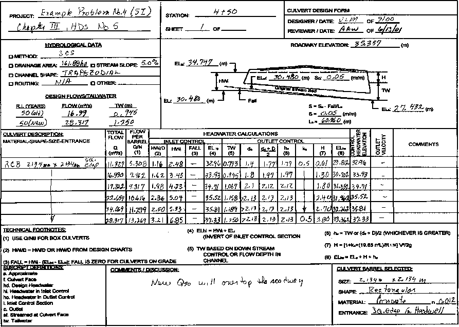
>
> **Figure 7.4.2** Micro-Catchment Rainfall Data for the 3/1/93 Event starting at 19:15  
> hours (Rainfall is in mm/minute, time in hours)
>
> The following analysis considers the above conceptual modelling approach in greater detail, during the 3/1/93 event. From this further analysis, it is intended to not only provide a more detailed overview of the building blocks making up the procedure but also to refine the method, where possible, to better explain remaining unresolved processes.
>
> This discussion therefore follows the same building block approach described in Chapter 6. It follows the progression and aggregation of runoff starting firstly with the development of individual roof runoff, then road and yard runoff followed by their aggregation, firstly to the 300 mm and then to the 450 mm flow gauges associated with the two micro-catchments. The results are then translated to the total Giralang urban catchment gauge with the aggregation of the individual allotment outputs.
>
> \(i\) Roof Runoff from 12 Allotment, 0.93 ha Micro-Catchment
>
> *<u>Chapter 7 - Presentation of a “Process Tree” Modelling Approach 172</u>*
>
> Roof runoff is based on the aggregation of individual roof downpipe contributions and piped translation to the rear boundary of each allotment. The developed processes involved so far have been based on the quarter roof gauge at Spence described in Chapter 5 together with the 12 roof micro-catchment at Giralang, outletting to the 300 mm diameter flow gauge.
>
> The “roof model” is defined in two phases. The first phase routes excess rainfall from the roof surface into the roof guttering system that collects rainwater from the total roof area. It has been assumed, based on the Spence roof catchment as well as inspection of Giralang properties, that the average roof is serviced by an average of four downpipes. The total roof area was therefore modelled as four parallel linear storage models. The adopted linear storage discharge equation was S = 0.0001 Q1. The sensitivity of the storage delay parameter was discussed in Section 6.3, where it was concluded that it was insensitive. The discharge relationship was more affected by in-gutter storage, which was modelled using simple level pool routing.
>
> Figure 7.4.3 shows the adopted stage discharge for the four combined downpipes of an average roof. The relationships were based on the measured data collected from the Spence quarter roof catchment.
>
> 
>
> **Figure 7.4.3** Stage Discharge Data for Single Roof Gutter  
> (discharge is in m3/s, level in m)
>
> *<u>Chapter 7 - Presentation of a “Process Tree” Modelling Approach 173</u>*
>
> Figure 7.4.4 shows the corresponding stage storage data for the total roof area gutter system.
>
> 
>
> **Figure 7.4.4** Stage Storage Data for Single Roof Gutter  
> (storage is in m3, level in m)
>
> Figure 7.4.5 shows the resulting hydrograph together with the stage/storage/discharge within the gutter system based on the output through four parallel downpipes. The average roof area utilised in this model was 196.7 m2 or 4.17 times the area of the Spence quarter roof catchment.
>
> *<u>Chapter 7 - Presentation of a “Process Tree” Modelling Approach 174</u>*

**Figure 7.4.5** Single Roof Gutter Outflow for the 3/1/93 Event starting at 19:15 hours  
(flow is in m3/s, time is in hours)

The second phase of the roof drainage model included additional storage routing within the pipes running between the downpipes and the rear boundary of the individual allotments. As described in Chapter 6, there was noticeable storage delay in at least a portion of the runoff occurring once it had exited the downpipes. This conclusion was reached after observing the Spence downpipe flows as well as the Giralang 12 roof micro-catchment. As indicated earlier, although the flow decreases over time, it continues at the 12 allotment, 300 mm diameter gauge for up to 1 hour after the cessation of rainfall. Gutters were, however, effectively empty after only a few minutes. When evaporation was present during daylight hours the concrete roof tiles were practically dry 15 minutes after the cessation of rainfall.

To allow for the apparent secondary storage delay a further level pool routing element was added that affected the bottom half of the drainage pipes between the downpipes and the rear boundary. This meant splitting the flow exiting the downpipes, with 50% going through additional storage and the other top half (50%) going directly to the rear boundary. This was based on an assumption that the in-yard pipes were partially blocked with debris including broken roof tile pieces as well as organic litter

> *<u>Chapter 7 - Presentation of a “Process Tree” Modelling Approach 175</u>*
>
> and sediment collected on the roof. The lower portion of the pipe was assumed to provide a storage soak within the debris providing a slow release mechanism for the accumulated runoff. The other 50% of the runoff was assumed to flow through the upper portion of the pipes in a relatively unobstructed manner.
>
> In a new drainage system, or one that had been cleared of debris, this additional storage delay would not occur. The drainage system within the Giralang catchment has been in place for nearly 20 years. Although it was not possible within this study to accurately measure the blockage and possible exfiltration/re-infiltration within the micro-catchments studied, the type of blockage and types of debris described was very obvious when assessing the pipes within the Spence catchment property. As indicated, in Chapter 6, this area, although not overly critical to results presented, requires further research to quantify the exact causes.
>
> Figure 7.4.6 shows the adopted stage storage data representing the additional piped roof drainage within an individual yard. Figure 7.4.7 shows the corresponding adopted stage discharge data.
>
> 
>
> **Figure 7.4.6** Stage Storage Data Additional Piped Roof Drainage Across Yard  
> (storage is in m3, level in m)
>
> *<u>Chapter 7 - Presentation of a “Process Tree” Modelling Approach 177</u>*
>
> There was no gauge operating at the Spence catchment during the 3/1/93 event, therefore it was not possible to assess the accuracy of the first phase of the model. The conceptual model for the first phase was, however, run for the 13/5/95 event as described in Chapter 6 with satisfactory results. Figure 7.4.8 is included here to simply indicate the magnitude and temporal pattern of the resulting roof runoff hydrograph for a single allotment at the rear boundary.
>
> During the 3/1/93 event it was, however, possible to aggregate the individual roof runoff of 12 allotments using the gauged micro-catchment shown in Figure 7.4.9.
>
> The calculated hydrograph at the gauge is based on the aggregation of the 12 individual roof outflows with a simple time shift of 10 seconds representing the estimated wave travel time between each allotment along the rear boundary, public piped storm drain. This pipe progressively picks up each allotment roof runoff starting in a 225 mm pipe that eventually increases to a 300 mm diameter pipe, which is the diameter at the gauging site. The conceptual modelling components and aggregation processes leading to this result are further summarised in Figure 7.4.9, which is repeated from Figure 6.3.3 in Chapter 6.

**Figure 7.4.9** 300 mm Giralang Micro-Catchment and Model

> As can be seen from the modelling results in Figure 7.4.10a the fit between the calculated and gauged ordinates is reasonably good over the entire 5 hour simulation period. The results are certainly within gauging tolerances that would, be at least + or –

*<u>Chapter 7 - Presentation of a “Process Tree” Modelling Approach 178</u>*

10%. Not only does the main body of the hydrograph ordinates fit well with gauged results but also the delayed recession is modelled in keeping with the observed data.

**Figure 7.4.10a** Flow Hydrographs at 300 Gauge for the 3/1/93 Event starting at 19:15  
hours (flow is in m3/s, time in hours)

> 
>
> **Figure 7.4.10b** Flow Hydrographs at 300 Gauge for the 3/1/93 Event starting at 19:15
>
> hours - Ignoring Yard Pipe Storage (flow is in m3/s, time in hours)

*<u>Chapter 7 - Presentation of a “Process Tree” Modelling Approach 179</u>*

Additionally the gradients and timing of both the rising and trailing limbs of all runoff bursts during the simulation closely align with gauged data. This fact would tend to confirm the magnitude of total storage routing in the system. A greater amount of storage would flatten the gradients and less would increase the gradients placing the rising limbs earlier, particularly near the peaks.

For comparison purposes the hydrograph in Figure 7.4.10b shows the result when the additional yard storage is ignored. It can be seen that not only are the main peaks over-predicted but the recession component finishes abruptly and far earlier than the gauged data.

Based on the results from this and other storm runs, the amount of improvement, if any, that a non-linear storage routing roof component model may achieve could not be quantified. It is considered that, as the level pool routing components control most of the attenuating effects, the simple linear storage discharge relationship is satisfactory.

The modelling processes and parameterization described above was exactly the same as the earlier modelling described in Chapter 6. Based on the results for this fairly complex storm system it was decided to in principle adopt the earlier work. Further research was undertaken to better simulate the type of additional yard-based storage delay observed at Giralang and the way this could affect drainage systems over extended time frames.

\(ii\) Adding Road and Yard Runoff , 14 Allotment, Micro-Catchment (1.5 ha)

The 450 mm diameter Giralang micro-catchment flow gauge was utilised together with the results from the roofs-only catchment to quantify firstly road runoff contributions, and then, during larger events, added pervious yard runoff.

Figure 7.4.11 repeats the illustrations describing the 14 allotment, micro-catchment together with the catchment runoff model that was developed in Chapter 6.

> *<u>Chapter 7 - Presentation of a “Process Tree” Modelling Approach 180</u>*

**Figure 7.4.11** 14 Allotment Micro-Catchment and Model

> Only two modelling processes were added in Chapter 6 to the roof only model. These include for the road area adjacent to the allotment a storage discharge relationship S = 0.02 Q1 and for the allotment yard area a similar relationship S = 0.03 Q1. Linear models were selected for simplicity, with the storage delay parameters aligned with the estimated catchment lag.
>
> It should also be noted that in Figure 7.4.11, out of the 14 allotments making up the 450 mm diameter micro-catchment, three have yard areas where runoff is predominately blocked by paling fences and also have no adjacent roadway area. These allotments have been taken into account within the current model by removing those elements from the respective allotments.
>
> The additional significant element involved in this model, other than the two conceptual storage models, was the manner in which pervious area infiltration was applied. The discussion earlier in this Chapter on the merits and restrictions of proportional losses and the subsequent formulation of a laterally distributed water balance approach is further evaluated during this analysis of the 3/1/93 storm event.
>
> *<u>Chapter 7 - Presentation of a “Process Tree” Modelling Approach 181</u>*
>
> In the model results shown in Chapter 6 a proportional loss model for infiltration was applied. It was already noted that, although proportional losses often fitted the data reasonably well, they varied dramatically between events of different magnitude. This was also the case during multi-peaked events. The 3/1/93 event is particularly suitable for this further analysis on infiltration and surface routing as it contains a number of different magnitude peaks as well as two major ones separated by approximately 1 hour.
>
> Figure 7.4.12 shows the modelled hydrograph together with the gauged data for the 3/1/93 event at the 450 mm Giralang gauge. This result is the same as shown in Chapter 6. It can be seen that the fit between model and gauged results, although reasonable for the major peaks, fails to accurately reflect a number of the smaller peaks. Additionally, the second major burst recession underestimates the gauged recession. The effect is similar to the roof runoff in that the gauged data exhibits an extended recession flow for the best part of an hour after the cessation of significant rainfall.
>
> The Figure 7.4.12 results are based on a fixed pervious area proportional loss rate of 45% and linear models for both road and yard runoff. The areas of the respective allotment runoff components for each of the 14 roofs, 11 road and 11 yard elements are 160, 252 and 703.8 m2 respectively. Zero losses were apportioned to both road and roof runoff during this event due to the amount of rainfall involved and the low likelihood of any significant losses after initial wetting.

**Figure 7.4.12** Giralang 14 Allotment Result for the 3/1/93 Event starting at 19:15 hours  
using Base Model (flow is in m3/s, time in hours)

> *<u>Chapter 7 - Presentation of a “Process Tree” Modelling Approach 182</u>*
>
> It was expected that the proportional loss would change during different magnitude bursts, particularly during a multi-peak event. The spatially varying ARBM water balance infiltration model described earlier in this chapter and in more detail in Appendix A was therefore applied to see if this improved the general results.
>
> Figures 7.4.13a, b and c show the parameters driving the ARBM spatially varied water-balance model as described earlier in this Chapter and in more detail in Appendix A.
>
> 

**Figure 7.4.13a** Giralang Yard Storage ARBM Parameters

> 

**Figure 7.4.13b** Giralang Yard Infiltration ARBM Parameters

> *<u>Chapter 7 - Presentation of a “Process Tree” Modelling Approach 183</u>*
>
> As the current research made use of the XP-RAFTS Workbench it was necessary to utilise some of the existing dialog entries for multiple purposes. This allowed retention of the current data-exporting routines and kept the focus on developing new process algorithms rather than rewriting the graphical user interface prior to finalising the new methods.
>
> In Figure 7.4.13c for example, the data labeled maximum potential evapotranspiration, upper and lower soil, is under the current research scenario, equal to the lower and upper bounds of the linear spatial distribution. This indicated that the spatial distribution of infiltration parameters went from 0.002 to 1.0 in ten internal increments. 1.0 represents 1 times the storage and infiltration parameters. 0.002 represents 0.002 (\~zero) times the storage and infiltration parameters. All values in between are linearly interpolated. The spatial option in the ARBM is invoked by setting the proportion of rainfall intercepted by vegetation to 0.0. Internal default values are inferred for the replaced data including 0.7 for rainfall intercepted by vegetation and 10 mm/day for each of the lower and upper soil values.
>
> 

**Figure 7.4.13c** Giralang Yard Spatial ARBM Parameters

> Figure 7.4.14 shows the result when the pervious area 45% proportional loss rate was replaced by the ARBM loss model, as further developed in this study.
>
> *<u>Chapter 7 - Presentation of a “Process Tree” Modelling Approach 184</u>*

**Figure 7.4.14** Giralang 450 mm Gauge Result for the 3/1/93 Event starting at 19:15  
hours - ARBM Loss – Yard Model, S = 0.03 Q1

(flow is in m3/s, time in hours)

> The results indicated in Figure 7.4.14 provide an improved fit between modelled and gauged data. Significant improvement is observed during the lesser bursts while the larger peaks remain satisfactory. The burst immediately before the first major peak is still over-estimated. Additionally the recessions after the two major storm bursts finish abruptly and underestimate the gauged data. This outcome is akin to the extended recession flows exhibited within the roofs-only catchment.
>
> It was postulated that the characteristics of the low and recession flow data were most likely due to increased storage routing at lower flow rates. This was thought to be due to increased lag times corresponding to small flow depths and corresponding higher invert roughness.
>
> To test the effects of increased storage routing at low flows the yard component storage discharge relationship was modified to S = 0.30 Q1. The lag of 0.30 hours was thought to be more in keeping with the magnitude of pervious area flow velocities exhibited within the author’s property during a number of observed events during the study.
>
> *<u>Chapter 7 - Presentation of a “Process Tree” Modelling Approach 185</u>*
>
> Figure 7.4.15 shows the results when the yard component model is altered to the 0.30 lag. It can be seen that the general shape of the low flow parts of the hydrographs is improved while the higher flow regions are now significantly underestimated.

**Figure 7.4.15** ARBM Loss plus S = 0.30 Q1 Yard Model for the 3/1/93 Event starting  
at 19:15 hours (flow is in m3/s, time in hours)

> Based on the results of both the 0.03 and 0.30 hour lag linear storage models for the yard area it appeared that a composite non-linear storage discharge relationship would most likely best represent both the high and low flow regions.
>
> A number of researchers including Kidd and Lowing (1979) have advocated non­linear storage models over linear methods. In the work of Kidd and Lowing (1979), however, the main areas researched were impervious areas. The pervious yard area in this case produces a significant proportion of the total flow. When that and the results exhibited in Figures 7.4.14 and 7.4.15 are taken into consideration, it is thought that the non-linearity of flow in this instance is probably more related to the pervious area. Non­linear storage routing for pervious areas have also been advocated by a number of researchers including Singh (1962), Diskin (1962), Kulandaiswamy (1964) and Laurenson (1964). However, most of this work was directed at large rural catchments.
>
> *<u>Chapter 7 - Presentation of a “Process Tree” Modelling Approach 186</u>*
>
> A non-linear storage discharge relationship was independently developed based on fitting a curve to pass through both the linear lags of 0.30 and 0.03 hours at representative low and high flow rates. The resulting storage discharge relationship was S = 0.00015 Q0.2.
>
> Figure 7.4.16 indicates the result of applying the above yard model to the individual allotments. The fit between model and gauged results in the area of the recessions is slightly improved, however there still remains a shortfall in the computed recession volumes after both major peaks. The underestimation is particularly noticeable after the second major burst peak. The timing, gradients and magnitudes of the model hydrograph accord well everywhere except after the major peaks. The fit at the burst immediately before the first major burst is also greatly improved. This is caused by the virtual removal of any significant yard runoff at that point due to the greatly increased storage delay. This is in keeping with the result shown in Figure 6.3.16 that showed predominant impervious roof and road runoff only.

**Figure 7.4.16** ARBM Loss plus S = 0.00015 Q0.2 Yard Model for the 3/1/93 Event  
starting at 19:15 hours (flow is in m3/s, time in hours)

> *<u>Chapter 7 - Presentation of a “Process Tree” Modelling Approach 187</u>*
>
> The 3/1/93 event contained 71.8 mm of rainfall over 5 hours. This size of event in Canberra is considered to be a major event with an ARI of 8 years. The roadway adjacent to the 14 allotments making up the 450 mm diameter gauge micro-catchment includes standard sub-soil drains running under the uphill kerb line for the entire length of the Gundulu Place cul-de-sac. It was not possible to measure the amount of flow in this pipe-line during this event. With the volume of rain occurring during the 3/1/93 event and its sustained duration there would most definitely be some flow within the 100 mm diameter sub-soil drain. This would, although being considerably attenuated, peak after the major storm burst periods. It would be expected that the amount of flow would be more after the second burst than the first due to the extended infiltration period.
>
> After such an extended period of intense rainfall it is also conceivable and highly likely that a small amount of additional yard flow from the upstream allotments would leak through the paling fences separating the 12 allotment micro-catchment from the lower 14 allotment micro-catchment. During this research it was not possible to explicitly measure this intermittent flow.
>
> Figure 7.4.17 shows a typical upstream allotment backyard that slopes toward the rear paling fenced boundary. It is postulated that a portion of the upstream allotment yard flow could flow through the paling fences during prolonged and significant rainfall events. It would be expected, due to the general build up of material behind most of the fences, that a shallow pondage would build up behind the fences, within these type of allotments. It is expected therefore that any flow through the fences would be significantly attenuated and only occur after prolonged rainfall.
>
> *<u>Chapter 7 - Presentation of a “Process Tree” Modelling Approach 188</u>*
>
> 

**Figure 7.4.17** Typical Photo of Rear Fencing Separating the 12 roof and 14 roof  
Micro-Catchments

> Additional flows at the 14 allotment, micro-catchment outlet may originate, during prolonged rainfall events, from the Gundulu Place roadway sub-soil drains that lead to the 450 mm diameter flow gauge. However, it is estimated using Mannings equation that the sub-soil drain, flowing half full at the average grade of Gunduru Place of 2%, would account for less than 0.004 m3/s or 0.0003 m3/s per allotment. This amount of flow, although significant in its own right, would not add significantly to the calculated recession hydrographs.
>
> However, it was estimated that a further 0.03 m3/s of flow would be possible from upstream allotment yard area runoff after leaking through the rear paling fences.
>
> From personal observation pervious yard runoff within the upstream allotments tends to build up behind the paling fences to up to at least 150 mm before it can escape between the palings that are separated on average by about 3 mm gaps. The general area immediately upstream of the fencing is characterised by a mixture of overgrowth, garden beds and rubble, creating mini retardation basins within each upstream allotment. Any routed flows that do eventually pass through the fences in large events
>
> *<u>Chapter 7 - Presentation of a “Process Tree” Modelling Approach 189</u>*
>
> have to then flow through the downstream allotment to the roadway over a distance of some 50 metres, usually over pervious areas.
>
> At the beginning of this study the author carried out a number of experiments using a small flume with sawn off fence palings at the downstream end to estimate the likely stage discharge relationship of potential through fence flows. To this point however no overland flow had been assumed to migrate from the upstream to downstream allotments. During the majority of events examined this assumption appeared to hold up. It is only during storms like the 3/1/93 event, with over 70 mm of rainfall, that additional upstream flow can now be considered. The influence of such flows are considered, however, to be still highly attenuated, and as such, have to be considered and modelled differently to allotment yard runoff directly outletting to the road.
>
> Based on the results for the 3/1/93 event it is also apparent that any flow emanating from the upstream allotments must only be significant after the second major burst. This would be in keeping with a general pondage occurring behind the fences before the commencement of through-flows.
>
> 

**Figure 7.4.18** Estimated Allotment Stage Storage Relationship for Pondage Upstream  
of Fences (storage is in m3, level in m)

> *<u>Chapter 7 - Presentation of a “Process Tree” Modelling Approach 190</u>*
>
> Figure 7.4.18 shows the estimated stage/storage relationship for individual allotments immediately upstream of the rear paling fencing based on the average 2% yard slopes experienced across the Giralang micro-catchments area. Figure 7.4.19 indicates the corresponding stage/discharge relationship based on the earlier described paling flow experiments extrapolated to a typical full allotment rear boundary fencing configuration and the estimated build up before flow commencement based on general observations.
>
> 

**Figure 7.4.19** Estimated Allotment Stage Discharge Relationship for Pondage  
Upstream of Fences (discharge is in m3/s, level in m)

> The amount of flow peak from the additional sources is comparatively small and only significantly affects the portions of the hydrograph after the main burst peaks have passed. The type of additional flow described would, however, help to explain the remaining shortfall in modelled flows during this portion of the simulation. During shorter and less intense events studied during this research, the variance in flows between modelled and gauged have been far less noticeable and or non-existent, for example in Figure 6.3.20 for the event of 13/5/95.
>
> *<u>Chapter 7 - Presentation of a “Process Tree” Modelling Approach 192</u>*

Figure 7.4.21 shows the resulting through-flow from an individual allotment.

> 
>
> **Figure 7.4.21** Upstream Allotment Through-Flow for the 3/1/93 Event starting at 19:15 hours (stage is in m, storage in m3, flow in m3/s and time in hours)
>
> The results from applying the amended model described in Figure 7.4.20 for the 14 allotment, micro-catchment are indicated in Figure 7.4.22. To simplify the calculations that allow only one allotment to be computed, the road, roof and yard components have been averaged over the entire 14 allotments. As already indicated in Chapter 6, this averaging has little if any effect on the results. Also, as noted in Chapter 6, areas under the “road” land-use incorporate all connected impervious surfaces except roofs. This averaging required the average allotment yard and road areas to reduce from 703.8 m2 to 553.0 m2 and 252.0 m2 to 198 m2 respectively. The average roof area of 160 m2 remains the same, as this component was always applied to each of the 14 allotments.
>
> *<u>Chapter 7 - Presentation of a “Process Tree” Modelling Approach 193</u>*

**Figure 7.4.22** ARBM Loss, S = 0.00015 Q0.2 Yard Model plus Upstream Allotment  
Flow, for the 3/1/93 Event starting at 19:15 hours, with Yard and Road Components  
Averaged over 11 Allotments (flow is in m3/s, time in hours)

> It can be seen that there is significant improvement in the recession portions of the calculated hydrograph. All other parts of the simulation also accord well with the gauged ordinates.
>
> It was therefore decided to adopt this model configuration for the 14 allotment, micro-catchment as the new base model on which to test all other independent storm events.
>
> Figures 7.4.23a, b and c display estimated hydrographs from the individual roof, road and yard components of an allotment.
>
> *<u>Chapter 7 - Presentation of a “Process Tree” Modelling Approach 194</u>*
>
> 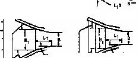

**Figure 7.4.23a** Individual Allotment Roof Contribution for the 3/1/93 Event starting at  
19:15 hours (flow is in m3/s, time in hours)

> 

**Figure 7.4.23b** Individual Allotment Road Contribution for the 3/1/93 Event starting at  
19:15 hours (flow is in m3/s, time in hours)

> *<u>Chapter 7 - Presentation of a “Process Tree” Modelling Approach 195</u>*
>
> 
>
> **Figure 7.4.23c** Individual Allotment Yard Contribution for the 3/1/93 Event starting at 19:15 hours (flow is in m3/s, time in hours)
>
> Figures 7.4.23a, b and c indicate the proportions of flow peak from each area. Additional upstream yard flow through paling fences is indicated in Figure 7.4.21. Based on the maximum peak values the results indicate, that the roof, road and yard proportions are 15%, 34% and 51% respectively for the event of 3/1/93. Even when unit areas are taken into consideration the road runoff peak is still 1.5 times that of roof runoff peak. This is contrary to the proposition put forward by Kidd and Lowing (1979) who assumed, probably because of the high slopes associated with roofs, that roof peak discharges per unit area would be considerably higher than road peak discharges.
>
> \(iii\) Total Giralang Urban Model (62.91 ha)
>
> Figure 7.4.24 is similar to Figure 7.2.2 with the only difference being the added storage element to represent upstream allotment through-flow. Based on this model it was simply a matter of applying the same component conceptual models as in the 14 allotment, micro-catchment model explained above.
>
> The model was further simplified by taking into account the fact that approximately half the number of allotments out of the total of 526, making up the total
>
> *<u>Chapter 7 - Presentation of a “Process Tree” Modelling Approach 197</u>*
>
> is considered satisfactory. Any small differences could certainly be attributable to spatial differences in rainfall across the catchment as well as any gauge error.
>
> **Figure 7.4.25** Results for Total Urban Catchment Based on Conceptual Model

Described in Figure 7.4.24 for the 3/1/93 Event Contribution

starting at 19:15 hours (flow is in m3/s, time in hours)

> The remaining underestimation towards the end of the simulation is most likely attributable to a small amount of upstream rural flow not included in the conceptual model. This aligns with the EXTRAN simulation result shown in Figure 6.4.4 that exhibited an underestimation in the same region when only the micro-catchment inputs were applied.
>
> Overall, the scaling of individual allotment flow simulation upward through the micro-catchment of 1.5 ha to the total urban catchment of 62.4 ha using the “Process Tree” approach described appears to work satisfactorily.
>
> Based on the results indicated in Figure 7.4.25 the maximum peak discharge contributions from the roofs, road and yard areas per double allotment unit are 0.007 m3/s, 0.013 m3/s and 0.015 m3/s. These are based on respective catchment areas of 330 m2, 417.2 m2 and 822.2 m2. The total urban catchment was thereby made up of 330 m2
>
> *<u>Chapter 7 - Presentation of a “Process Tree” Modelling Approach 198</u>*
>
> x 263 double allotments + 417.2 m2 x 263 + 822.2 m2 x 263 = 412,752 m2. The remaining 822.2 m2 x 263 = 216,238 m2 is within ineffective yard areas. The total of the two components adds up to 628,990 m2 or 62.9 ha. The percentage contributions from roofs, roads and yards were therefore 20%, 37% and 43% respectively. These percentages are similar to those found for the 14 allotment, micro-catchment discharge. On a unit catchment area basis, the road discharge peak is 1.5 times the roof discharge peak which is consistent with the results for the smaller micro-catchment.
>
> To further test the adopted conceptual model for the whole Giralang urban catchment, before validating it with completely independent event data in Chapter 8, the 13/5/95 event was also run. This event has been previously used in Chapter 6 to develop the conceptual approach.
>
> Figure 7.4.26 shows the result of this run for the period 11:00 to 14:00 on the 13/5/95 on the 14 allotment, micro-catchment of 1.5 ha.

**Figure 7.4.26** Results for Micro-Catchment based on Conceptual Model Described

in Figure 7.4.24 for the 13/5/95 Event starting at 11:00 hours

(flow is in m3/s, time in hours)

> *<u>Chapter 7 - Presentation of a “Process Tree” Modelling Approach 199</u>*
>
> The fit between gauged and modelled ordinates over the entire 3 hour simulation period is good and certainly within the tolerances of the gauged data.
>
> Figure 7.4.27 shows the result also for the period 11:00 to 14:00 on the 13/5/95, however, this time it is over the whole urban catchment of 62.9 ha.

**Figure 7.4.27** Results for Total Urban Catchment based on Conceptual Model  
Described in Figure 7.4.24 for the 13/5/95 Event starting at 11:00 hours  
(flow is in m3/s, time in minutes)

> The overall fit between modelled and gauged results is fairly good. The peak is within 5% of the gauged peak. The XP-EXTRAN run displayed in Figure 6.4.5 for this event over the same period, utilising gauged micro-catchment hydrographs as inputs to the total urban catchment, indicated a close fit between gauged and modelled results for this particular peak. This would support the assumption of only negligible flows emanating from the upstream rural catchment around this peak period. It was not possible to check the gauge at the inlet to the urban area for this event, as it had at that stage been stolen as indicated in Chapter 5. The overall result is well within acceptable standards and further supports the generalised conceptual modelling approach.
>
> *<u>Chapter 7 - Presentation of a “Process Tree” Modelling Approach 200</u>*
>
> **7.5 Summary**
>
> The above descriptions provide the basis for proposed new procedures to estimate urban rainfall infiltration, as well as, urban surface runoff. The methods are applicable for catchments ranging from a single residential allotment up to a large urban catchment similar to the 62.9 ha Giralang urban catchment.
>
> As the method for surface runoff estimation is premised on an allotment process-tree approach it is possible to tailor the particular model to different allotment drainage policies. These could include the removal of roof guttering, removal of fencing, the different treatment of yard drainage or possibly a different road surface and the addition of on-site detention. All of these are possible as long as the changes are representative of the total sub-catchment being modelled.
>
> The results presented so far support the conceptual modelling approach as an acceptable solution that takes into account relevant urban runoff processes as they occur.
>
> The assumption of adopting a simple isochronal average translation time step rather than a more elaborate variable time step dependent on actual water depth within the pipes is supported in the above results. There are small timing problems at very low flows, as exhibited in Figure 7.4.26 during the first 40 minutes of the 13/5/93 simulation. However the resulting volumes and peaks are still satisfactory.
>
> Chapter 8 proceeds to further validate the procedure by applying the developed conceptual model based on the aggregation of separate allotment runoff processes to a number of independent storm events not used in the formulation of the modelling. The results of these analyses are compared with gauged data. Chapter 8 additionally sets out to test the wider applicability of the procedure to catchments other than the Giralang catchment in which it was developed.
>
> **Chapter 8**
>
> **Model Validation**
>
> **8.1 Introduction**
>
> To provide a degree of independence in the validation process, the two storms already used to develop and progressively test the proposed conceptual modelling approach, have not been further used.
>
> All storm events, other than the two used for calibration, listed at the end of Chapter 5, were initially chosen for use in the validation analysis. The only other constraint was that events had to include gauged flows from the 12 lot, 14 lot and total urban catchments and there was insignificant gauged upstream rural flow. This provided a total of twenty nine separate event peaks within twenty independent storm events. These were used to carry out independent testing on the proposed conceptual model finally adopted at the end of Chapter 7. The events represent a cross section of events not utilised in the model calibration that spanned several flow magnitudes.
>
> All testing was applied to the conceptual models indicated in Figure 7.4.20 for the 14 lot micro-catchment and Figure 7.4.24 for the total 62.9 ha urban catchment.
>
> The only changes were minor infiltration adjustments to the 14 lot catchment model for the roof, road and yard surfaces to allow for different antecedent conditions and match the volume under the gauged event hydrograph. No changes were made to any of the other model parameters.
>
> *<u>Chapter 8 - Model Validation 202</u>*
>
> The infiltration parameters adopted for the 14 lot micro-catchment model (1.5 ha) and all other Chapter 7 model surface routing parameters were then directly applied without change to the total urban catchment model (62.9 ha).
>
> The micro-catchment rainfall station rainfall data was applied to both the 14 lot model as well as the total urban model.
>
> The results of the analysis were then used to make comparative assessments of the performance of the new approach compared to that of current procedures as detailed in Chapter 3, and the degree of improvement or otherwise it may provide.
>
> The XP-RAFTS workbench utilised throughout this analysis was set up to simulate a maximum of 2000 time steps and 1000 nodes. Based on the currently adopted model time step of between 10 and 20 seconds this limited the simulation time to approximately 5 hours. Individual simulations could be chained together as required using the hotstart facility. A formal model, based on the current modelling concepts, would not have the restrictions of the XP-RAFTS workbench and could be used for continuous simulation.
>
> Based on observation of the rainfall data during the 3 year record, many events included a degree of rainfall spatial and temporal variation across the Giralang catchment. As storm simulations of even a few hours can be subject to these variations, including different timing of peak bursts, different rainfall volumes and changing temporal patterns, it is necessary to separate the validation of the model itself from the implications of rainfall variation.
>
> The 14 lot micro-catchment, by its limited size, should be subject to far less significant spatial variations in rainfall than the corresponding model for the 62.9 ha urban catchment. The two events on the 13/11/93 and 5/1/95 detailed in Appendix C describe typical effects of rainfall variation.
>
> The models developed in Chapter 7 mainly involved the calibration of the 14 lot (1.5 ha) micro-catchment. The 62.9 ha Giralang urban catchment was used to test the scalability of the small catchment model using the same allotment infiltration and runoff parameters.
>
> *<u>Chapter 8 - Model Validation 203</u>*
>
> Adding to the independence within the gauged results, the 14 lot micro-catchment outlet was monitored by the author whereas the total Giralang catchment was monitored by the ACT Electricity and Water Department.
>
> Chapter 8 finishes with an assessment of the approach’s applicability to a completely independent catchment in Sydney to test its broader application.
>
> **8.2 Results from Validation Runs**
>
> Tables 8.2.1a and b summarise the estimated runoff peaks from the 14 allotment, 1.5 ha micro-catchment and the outlet of the total Giralang catchment for both the calibration and validation events. The gauged data is also included for comparison with the estimated peak values.
>
> All the results listed in Tables 8.2.1a and b are based on one rainfall gauge situated near the centre of the Giralang urban catchment at the outlet of the micro-catchments. This gauge was chosen to represent the average rainfall pattern for the total urban catchment as well as for the micro-catchment. The earlier analysis in Chapter 3 was based on a single rainfall station representing the total catchments examined. The current analysis for consistency has therefore sought to duplicate this position prior to comparing the statistics of the results.
>
> *<u>Chapter 8 - Model Validation 204</u>*

**Table 8.2.1a** Summary of Calibration Modelling Results from the  
Chapter 7 Conceptual Model

<table>
<colgroup>
<col style="width: 11%" />
<col style="width: 8%" />
<col style="width: 10%" />
<col style="width: 12%" />
<col style="width: 11%" />
<col style="width: 10%" />
<col style="width: 7%" />
<col style="width: 10%" />
<col style="width: 9%" />
<col style="width: 8%" />
</colgroup>
<thead>
<tr class="header">
<th><em><strong>Date</strong></em></th>
<th><em><strong>Time</strong></em></th>
<th><em><strong>Storm</strong></em></th>
<th><em><strong>Calibration</strong></em></th>
<th><em><strong>Modelled</strong></em></th>
<th><em><strong>Gauged</strong></em></th>
<th><em><strong>%</strong></em></th>
<th><em><strong>Modelled</strong></em></th>
<th><em><strong>Gauged</strong></em></th>
<th><em><strong>%</strong></em></th>
</tr>
</thead>
<tbody>
<tr class="odd">
<td></td>
<td><em><strong>Of</strong></em></td>
<td><em><strong>Number</strong></em></td>
<td><blockquote>

<em><strong>Or</strong></em>

</blockquote></td>
<td><em><strong>450 Micro</strong></em></td>
<td><em><strong>450 Micro</strong></em></td>
<td><em><strong>Error</strong></em></td>
<td><em><strong>Total</strong></em></td>
<td><em><strong>Total</strong></em></td>
<td><em><strong>Error</strong></em></td>
</tr>
<tr class="even">
<td></td>
<td><em><strong>Peak</strong></em></td>
<td></td>
<td><em><strong>Validation 
Event</strong></em></td>
<td><em><strong>Catch-</strong></em> 
<em><strong>ment</strong></em></td>
<td><em><strong>Catch-</strong></em> 
<em><strong>ment</strong></em></td>
<td></td>
<td><em><strong>Catch-</strong></em> 
<em><strong>ment</strong></em></td>
<td><em><strong>Catch-</strong></em> 
<em><strong>ment</strong></em></td>
<td></td>
</tr>
<tr class="odd">
<td></td>
<td></td>
<td></td>
<td></td>
<td><em><strong>Peak</strong></em></td>
<td><em><strong>Peak</strong></em></td>
<td></td>
<td><em><strong>Peak</strong></em></td>
<td><em><strong>Peak</strong></em></td>
<td></td>
</tr>
<tr class="even">
<td></td>
<td></td>
<td></td>
<td></td>
<td><em><strong>( m3/s)</strong></em></td>
<td><em><strong>(m3/s)</strong></em></td>
<td></td>
<td><em><strong>(m3/s)</strong></em></td>
<td><em><strong>( m3/s)</strong></em></td>
<td></td>
</tr>
<tr class="odd">
<td>3/1/93</td>
<td>19:40</td>
<td>1</td>
<td><blockquote>

C

</blockquote></td>
<td>0.04</td>
<td>0.048</td>
<td>-17</td>
<td>1.35</td>
<td>1.35</td>
<td>0</td>
</tr>
<tr class="even">
<td>3/1/93</td>
<td>20:14</td>
<td>1</td>
<td><blockquote>

C

</blockquote></td>
<td>0.05</td>
<td>0.045</td>
<td>+11</td>
<td>1.75</td>
<td>1.78</td>
<td>-1.7</td>
</tr>
<tr class="odd">
<td>3/1/93</td>
<td>20:33</td>
<td>1</td>
<td><blockquote>

C

</blockquote></td>
<td>0.184</td>
<td>0.184</td>
<td>0</td>
<td>6.50</td>
<td>7.15</td>
<td>-9</td>
</tr>
<tr class="even">
<td>3/1/93</td>
<td>20:46</td>
<td>1</td>
<td><blockquote>

C

</blockquote></td>
<td>0.140</td>
<td>0.147</td>
<td>-5</td>
<td>4.95</td>
<td>5.12</td>
<td>-3.4</td>
</tr>
<tr class="odd">
<td>3/1/93</td>
<td>20:56</td>
<td>1</td>
<td><blockquote>

C

</blockquote></td>
<td>0.130</td>
<td>0.151</td>
<td>-14</td>
<td>4.76</td>
<td>4.76</td>
<td>0</td>
</tr>
<tr class="even">
<td>3/1/93</td>
<td>21:10</td>
<td>1</td>
<td><blockquote>

C

</blockquote></td>
<td>0.08</td>
<td>0.09</td>
<td>-11</td>
<td>3.20</td>
<td>2.71</td>
<td>+18</td>
</tr>
<tr class="odd">
<td>3/1/93</td>
<td>22:19</td>
<td>1</td>
<td><blockquote>

C

</blockquote></td>
<td>0.070</td>
<td>0.076</td>
<td>-8</td>
<td>2.10</td>
<td>1.93</td>
<td>+8.8</td>
</tr>
<tr class="even">
<td>3/1/93</td>
<td>22:42</td>
<td>1</td>
<td><blockquote>

C

</blockquote></td>
<td>0.231</td>
<td>0.234</td>
<td>-1.3</td>
<td>7.60</td>
<td>7.79</td>
<td>-2.5</td>
</tr>
<tr class="odd">
<td>3/1/93</td>
<td>23:53</td>
<td>1</td>
<td><blockquote>

C

</blockquote></td>
<td>0.04</td>
<td>0.043</td>
<td>-7</td>
<td>1.20</td>
<td>1.66</td>
<td>-28</td>
</tr>
<tr class="even">
<td>13/5/95</td>
<td>11:46</td>
<td>6</td>
<td><blockquote>

C

</blockquote></td>
<td>0.104</td>
<td>0.096</td>
<td>+8.3</td>
<td>3.40</td>
<td>3.60</td>
<td>-5.6</td>
</tr>
</tbody>
</table>

> All results are based on single rainfall station at Giralang micro-catchments near the centre of total urban catchment.
>
> C corresponds to event used in the development of the Surface Runoff Model
>
> *<u>Chapter 8 - Model Validation 205</u>*

**Table 8.2.1b** Summary of Validation Modelling Results Using the  
Chapter 7 Conceptual Model

<table style="width:100%;">
<colgroup>
<col style="width: 11%" />
<col style="width: 8%" />
<col style="width: 10%" />
<col style="width: 12%" />
<col style="width: 11%" />
<col style="width: 10%" />
<col style="width: 7%" />
<col style="width: 10%" />
<col style="width: 9%" />
<col style="width: 8%" />
</colgroup>
<thead>
<tr class="header">
<th><em><strong>Date</strong></em></th>
<th><em><strong>Time 
Of 
Peak</strong></em></th>
<th><em><strong>Storm 
Number</strong></em></th>
<th><em><strong>Calibration 
Or 
Validation 
Event</strong></em></th>
<th>
<em><strong>Modelled</strong></em>

<blockquote>

<em><strong>450 Micro Catch­ment Peak ( m3/s)</strong></em>

</blockquote></th>
<th>
<em><strong>Gauged</strong></em>

<blockquote>

<em><strong>450 Micro Catch­ment Peak (m3/s)</strong></em>

</blockquote></th>
<th><blockquote>

<em><strong>% Error</strong></em>

</blockquote></th>
<th><blockquote>

<em><strong>Modelled Total Catch­ment Peak (m3/s)</strong></em>

</blockquote></th>
<th><blockquote>

<em><strong>Gauged Total Catch­ment Peak ( m3/s)</strong></em>

</blockquote></th>
<th><em><strong>% 
Error</strong></em></th>
</tr>
</thead>
<tbody>
<tr class="odd">
<td>21/1/93</td>
<td>17:20</td>
<td>1</td>
<td>V</td>
<td>0.1208</td>
<td>0.1167</td>
<td>3.51</td>
<td>4.23</td>
<td>4.243</td>
<td>-0.31</td>
</tr>
<tr class="even">
<td>27/1/93*</td>
<td>09:02</td>
<td>2</td>
<td>V</td>
<td>0.017</td>
<td>0.016</td>
<td>6.25</td>
<td>0.71</td>
<td>0.79</td>
<td>-10.13</td>
</tr>
<tr class="odd">
<td>3/2/93</td>
<td>15:40</td>
<td>3</td>
<td>V</td>
<td>0.0291</td>
<td>0.035</td>
<td>-16.86</td>
<td>1.121</td>
<td>1.135</td>
<td>-1.23</td>
</tr>
<tr class="even">
<td>9/2/93</td>
<td>10:59</td>
<td>4</td>
<td>V</td>
<td>0.0548</td>
<td>0.0485</td>
<td>12.99</td>
<td>2.009</td>
<td>2.221</td>
<td>-9.55</td>
</tr>
<tr class="odd">
<td>20/2/93</td>
<td>22:30</td>
<td>5</td>
<td>V</td>
<td>0.0427</td>
<td>0.0437</td>
<td>-2.29</td>
<td>1.367</td>
<td>1.488</td>
<td>-8.13</td>
</tr>
<tr class="even">
<td>6/3/93</td>
<td>22:08</td>
<td>6</td>
<td>V</td>
<td>0.0769</td>
<td>0.0874</td>
<td>-12.01</td>
<td>2.772</td>
<td>3.105</td>
<td>-10.72</td>
</tr>
<tr class="odd">
<td>6/3/93</td>
<td>22:39</td>
<td>6</td>
<td>V</td>
<td>0.0445</td>
<td>0.038</td>
<td>17.11</td>
<td>1.52</td>
<td>1.48</td>
<td>2.70</td>
</tr>
<tr class="even">
<td>26/3/93</td>
<td>7:41</td>
<td>7</td>
<td>V</td>
<td>0.028</td>
<td>0.0263</td>
<td>6.46</td>
<td>0.99</td>
<td>1.056</td>
<td>-6.25</td>
</tr>
<tr class="odd">
<td>5/4/95*</td>
<td>16:54</td>
<td>8</td>
<td>V</td>
<td>0.023</td>
<td>0.023</td>
<td>0.00</td>
<td>0.85</td>
<td>0.9</td>
<td>-5.56</td>
</tr>
<tr class="even">
<td>5/4/93*</td>
<td>17:05</td>
<td>8</td>
<td>V</td>
<td>0.167</td>
<td>0.162</td>
<td>3.09</td>
<td>5.9</td>
<td>5.663</td>
<td>4.19</td>
</tr>
<tr class="odd">
<td>9/9/93</td>
<td>16:42</td>
<td>9</td>
<td>V</td>
<td>0.1079</td>
<td>0.1025</td>
<td>5.27</td>
<td>3.521</td>
<td>3.233</td>
<td>8.91</td>
</tr>
<tr class="even">
<td>2/11/93</td>
<td>13:06</td>
<td>10</td>
<td>V</td>
<td>0.0375</td>
<td>0.0394</td>
<td>-4.82</td>
<td>1.332</td>
<td>1.398</td>
<td>-4.72</td>
</tr>
<tr class="odd">
<td>13/11/93*</td>
<td>17:18</td>
<td>11</td>
<td>V</td>
<td>0.024</td>
<td>0.02</td>
<td>20.00</td>
<td>1.2</td>
<td>1.3</td>
<td>-7.69</td>
</tr>
<tr class="even">
<td>13/11/93*</td>
<td>17:46</td>
<td>11</td>
<td>V</td>
<td>0.132</td>
<td>0.126</td>
<td>4.76</td>
<td>4.78</td>
<td>4.674</td>
<td>2.27</td>
</tr>
<tr class="odd">
<td>13/11/93*</td>
<td>21:09</td>
<td>11</td>
<td>V</td>
<td>0.025</td>
<td>0.03</td>
<td>-16.67</td>
<td>1.1</td>
<td>1.3</td>
<td>-15.38</td>
</tr>
<tr class="even">
<td>20/11/93</td>
<td>11:27</td>
<td>12</td>
<td>V</td>
<td>0.029</td>
<td>0.0392</td>
<td>-26.02</td>
<td>1.072</td>
<td>1.257</td>
<td>-14.72</td>
</tr>
<tr class="odd">
<td>20/11/93</td>
<td>11:35</td>
<td>12</td>
<td>V</td>
<td>0.0225</td>
<td>0.028</td>
<td>-19.64</td>
<td>0.8</td>
<td>0.99</td>
<td>-19.19</td>
</tr>
<tr class="even">
<td>20/11/93</td>
<td>11:43</td>
<td>12</td>
<td>V</td>
<td>0.018</td>
<td>0.0215</td>
<td>-16.28</td>
<td>0.65</td>
<td>0.6</td>
<td>8.33</td>
</tr>
<tr class="odd">
<td>20/10/94</td>
<td>10:18</td>
<td>13</td>
<td>V</td>
<td>0.0276</td>
<td>0.027</td>
<td>2.22</td>
<td>1.002</td>
<td>1.117</td>
<td>-10.30</td>
</tr>
<tr class="even">
<td>19/11/94</td>
<td>18:55</td>
<td>14</td>
<td>V</td>
<td>0.0538</td>
<td>0.0527</td>
<td>2.09</td>
<td>1.895</td>
<td>2.519</td>
<td>-24.77</td>
</tr>
<tr class="odd">
<td>25/11/94</td>
<td>17:10</td>
<td>15</td>
<td>V</td>
<td>0.1356</td>
<td>0.1255</td>
<td>8.05</td>
<td>3.906</td>
<td>3.446</td>
<td>13.35</td>
</tr>
<tr class="even">
<td>28/11/94</td>
<td>17:48</td>
<td>16</td>
<td>V</td>
<td>0.0681</td>
<td>0.0689</td>
<td>-1.16</td>
<td>2.407</td>
<td>2.922</td>
<td>-17.62</td>
</tr>
<tr class="odd">
<td>8/12/94</td>
<td>15:42</td>
<td>17</td>
<td>V</td>
<td>0.0529</td>
<td>0.054</td>
<td>-2.04</td>
<td>1.81</td>
<td>1.973</td>
<td>-8.26</td>
</tr>
<tr class="even">
<td>5/1/95*</td>
<td>14:59</td>
<td>18</td>
<td>V</td>
<td>0.08</td>
<td>0.085</td>
<td>-5.88</td>
<td>3.06</td>
<td>2.8</td>
<td>9.29</td>
</tr>
<tr class="odd">
<td>5/1/95*</td>
<td>17:25</td>
<td>18</td>
<td>V</td>
<td>0.062</td>
<td>0.053</td>
<td>16.98</td>
<td>2.1</td>
<td>2.15</td>
<td>-2.33</td>
</tr>
<tr class="even">
<td>5/1/95*</td>
<td>18:59</td>
<td>18</td>
<td>V</td>
<td>0.266</td>
<td>0.25</td>
<td>6.40</td>
<td>8.69</td>
<td>7.33</td>
<td>18.55</td>
</tr>
<tr class="odd">
<td>17/1/95</td>
<td>11:54</td>
<td>19</td>
<td>V</td>
<td>0.045</td>
<td>0.0442</td>
<td>1.81</td>
<td>1.512</td>
<td>1.44</td>
<td>5.00</td>
</tr>
<tr class="even">
<td>28/1/95</td>
<td>12:07</td>
<td>20</td>
<td>V</td>
<td>0.0537</td>
<td>0.0567</td>
<td>-5.29</td>
<td>1.911</td>
<td>1.953</td>
<td>-2.15</td>
</tr>
<tr class="odd">
<td>28/1/95</td>
<td>14:59</td>
<td>20</td>
<td>V</td>
<td>0.0296</td>
<td>0.0315</td>
<td>-6.03</td>
<td>1.04</td>
<td>1.02</td>
<td>1.96</td>
</tr>
</tbody>
</table>

> All results are based on single rainfall station at Giralang micro-catchment near the centre of total urban catchment.
>
> V corresponds to an independent validation event

\* These events were analysed first to provide an overview of the validation results for a range of  
different magnitude events within the data set. These are shown in detail in Appendix C

> *<u>Chapter 8 - Model Validation 206</u>*
>
> A total of twenty separate simulation events were utilised in the validation analysis. These included twenty nine embedded significant flows from the total urban catchment ranging between 0.6 and 7.3 m3/s.
>
> The resulting modelled and gauged hydrographs shown in Figures 8.2.1 to 8.2.5 for both the 14 lot micro-catchment and the total Giralang urban catchment are for the nine event peaks marked with an asterisk in Table 8.2.1b.
>
> All twenty nine validation event simulation “Process Tree” models are included on the enclosed CD-ROM. The 14 Lot models are titled “date”f.xp and the total urban models are titled “date”x.xp.
>
> **Figure 8.2.1** 14 Lot Micro-Catchment (a) and Giralang 62.9 ha Urban Catchment (b)  
> Modelled and Gauged Hydrographs for the 27/1/93 Event starting at 7:00 hours  
> (flows are in m3/s, time in hours)
>
> *<u>Chapter 8 - Model Validation 207</u>*

**Figure 8.2.2** 14 Lot Micro-Catchment (a) and Giralang 62.9 ha Urban Catchment (b)  
Modelled and Gauged Hydrographs for the 5/4/93 Event starting at 16:30 hours  
(flows are in m3/s, time in hours)

**Figure 8.2.3** 14 Lot Micro-Catchment (a) and Giralang 62.9 ha Urban Catchment (b)  
Modelled and Gauged Hydrographs for the 13/11/93 Event starting at 17:00 hours  
(flows are in m3/s, time in hours)

> *<u>Chapter 8 - Model Validation 208</u>*

**Figure 8.2.4** 14 Lot Micro-Catchment (a) and Giralang 62.9 ha Urban Catchment (b)  
Modelled and Gauged Hydrographs for the 5/1/95 (1) Event starting at 14:30 hours  
(flows are in m3/s, time in hours)

**Figure 8.2.5** 14 Lot Micro-Catchment (a) and Giralang 62.9 ha Urban Catchment (b)  
Modelled and Gauged Hydrographs for the 5/1/95 (2) Event starting at 18:30 hours  
(flows are in m3/s, time in hours)

> More detailed explanations of each of the above storm simulation are provided in Appendix C. Details include a diagram of the Giralang catchment indicating the total rainfall during the simulation at each of the four recording rainfall stations. This is followed by a graphical display of the applied rainfall input and then the resulting modelled and gauged hydrographs for the 14 allotment, 1.5 ha micro-catchment gauge
>
> *<u>Chapter 8 - Model Validation 209</u>*
>
> as well as the 62.9 ha urban catchment outlet. The discussion in Appendix C also covers the effects of spatial rainfall variation and the modelling of very small flows.
>
> The modelled peaks for all events marked “V” agree reasonably well with the gauged peaks with all peaks being less than 26% different from the gauged peaks. The reasons for some of the variations between gauged and modelled results are further identified in Appendix C. Some of these, particularly the ones for the total urban catchment, can be linked to rainfall variations across the catchment. It should be noted that, based on the events of the 13/11/93 and 5/1/95 for example, variations in total rainfall depth, as well as temporal pattern shape, play significant and separate role in affecting runoff peaks.
>
> There are also some errors in estimated peaks for the smaller 14 lot embedded catchment that should not be subject to the same degree of rainfall variation. The main reasons for these errors are thought to be tied to loss estimation rather than the surface routing modelling. Some differences between modelled and gauged results could also be attributable to gauge error.
>
> The current analysis summarised in Tables 8.2.1a and b are based on semi-continuous runs where multiple peaks have been included in the same simulation run. This has placed a further test on the conceptual model that includes water balance infiltration assessment as well as surface routing elements. From the commencement of the simulations, this form of analysis tests both the wetting and drying sequences to estimate excess rainfall under each of the reported bursts.
>
> The 14 lot and total urban catchment models perform fairly equally with the coefficients of determination r2 for the differences in modelled and gauged peaks in Table 8.2.1b being 0.99 and 0.97 respectively. It has been observed in other studies that sets of results with relatively high coefficients of determination can still contain outlier values. In Chapter 3 additional tables were developed to test the absolute error in discharge peaks within a set of results and the percentage of results that fell outside different percentage ranges.
>
> Table 3.9.1c from Chapter 3 is repeated here to show results that can be expected from the methods described in that chapter. As it was based on storms on the Giralang
>
> *<u>Chapter 8 - Model Validation 210</u>*
>
> catchment, it is used in this chapter to compare these with those results listed in Table 8.2.1b.

**Table 3.9.1c** (from Chapter 3) Giralang Catchment Error Analysis Results

| **% of 14 Events listed in Table 3.8.1** | **Absolute Error Abs\[Qpeak(est)/Qpeak(obs)x100.0\]** |
|------------------------------------------|-------------------------------------------------------|
| 14.3%                                    | \>50%                                                 |
| 35.7%                                    | \>40%                                                 |
| 42.9%                                    | \>30%                                                 |
| 71.4%                                    | \>20%                                                 |
| 85.7%                                    | \>10%                                                 |

> Additionally Table 3.9.2b from Chapter 3 is included, which describes the results for several small catchments less than 10 ha in area. This table is further utilised to compare the results in Table 8.2.1b for the 14 lot (1.5 ha) micro-catchment model.
>
> **Table 3.9.2b** (from Chapter 3) Small Catchment Error Analysis Results

<table>
<colgroup>
<col style="width: 48%" />
<col style="width: 51%" />
</colgroup>
<thead>
<tr class="header">
<th><blockquote>

<strong>% of 36 Events listed in Table 3.8.2 (Smaller 
Catchments)</strong>

</blockquote></th>
<th><strong>Absolute Error Abs[Qpeak(est)/Qpeak(obs)x100.0]</strong></th>
</tr>
</thead>
<tbody>
<tr class="odd">
<td>3%</td>
<td>&gt;50%</td>
</tr>
<tr class="even">
<td>8%</td>
<td>&gt;40%</td>
</tr>
<tr class="odd">
<td>19%</td>
<td>&gt;30%</td>
</tr>
<tr class="even">
<td>36%</td>
<td>&gt;20%</td>
</tr>
<tr class="odd">
<td>64%</td>
<td>&gt;10%</td>
</tr>
</tbody>
</table>

> The comparable Tables 8.2.2 for the 14 lot (1.5 ha) Giralang catchment and 8.2.3 for the total urban (62.9 ha) Giralang catchment are derived from the results listed in Tables 8.2.1b.
>
> *<u>Chapter 8 - Model Validation 211</u>*

**Table 8.2.2** Giralang Catchment Error Analysis based on Chapter 7 Model  
Results for 14 Allotment, 1.5 ha Micro-Catchment

| **% of Modelled Events Listed in Table 8.2.1b** | **Absolute Error Abs\[Qpeak(est)/Qpeak(obs)x100.01** |
|-------------------------------------------------|------------------------------------------------------|
| 0%                                              | \>50%                                                |
| 0%                                              | \>40%                                                |
| 0%                                              | \>30%                                                |
| 3%                                              | \>20%                                                |
| 31%                                             | \>10%                                                |

**Table 8.2.3** Giralang Catchment Error Analysis based on Chapter 7 Model  
Results for Total 62.9 ha Urban Catchment

| **% of Modelled Events Listed in Table 8.2.1b** | **Absolute Error Abs\[Qpeak(est)/Qpeak(obs)x100.01** |
|-------------------------------------------------|------------------------------------------------------|
| 0%                                              | \>50%                                                |
| 0%                                              | \>40%                                                |
| 0%                                              | \>30%                                                |
| 3%                                              | \>20%                                                |
| 34%                                             | \>10%                                                |

> When comparing Tables 8.2.2 and 8.2.3 with Tables 3.9.2b and 3.9.1c respectively it is apparent that the proposed conceptual model performed significantly better with far fewer higher absolute errors in peak discharge. The results in Tables 8.2.2 and 8.2.3 indicated that there were no result errors greater than plus or minus 30% with the highest being 25%. The results in Tables 3.9.2b and 3.9.1c indicated some results within the greater than plus or minus 50% range.
>
> Another performance indicator related to a comparison between the maximum absolute errors of estimate as indicated in Chapter 3 using current modelling techniques and the proposed Chapter 7 method. This comparison is provided in Table 8.2.4 below.
>
> *<u>Chapter 8 - Model Validation 212</u>*

**Table 8.2.4** Giralang Total Urban Catchment Absolute Error Comparison

<table>
<colgroup>
<col style="width: 30%" />
<col style="width: 33%" />
<col style="width: 36%" />
</colgroup>
<thead>
<tr class="header">
<th><blockquote>

<strong>Modelling Method</strong>

</blockquote></th>
<th><strong>Maximum Error % less than 
Gauge</strong></th>
<th>
<strong>Maximum Error % greater than</strong>

<strong>Gauge</strong>
</th>
</tr>
</thead>
<tbody>
<tr class="odd">
<td><blockquote>

Bufill

</blockquote></td>
<td>29</td>
<td>366</td>
</tr>
<tr class="even">
<td><blockquote>

RAFTS

</blockquote></td>
<td>57</td>
<td>833</td>
</tr>
<tr class="odd">
<td><blockquote>

Time Area

</blockquote></td>
<td>45</td>
<td>733</td>
</tr>
<tr class="even">
<td><blockquote>

Chapter 7 “Process Tree” Method

</blockquote></td>
<td>24</td>
<td>19</td>
</tr>
</tbody>
</table>

> Additionally the overall mean of the difference between estimated and gauged peaks for all validation peaks in Table 8.2.1b was –0.6% and –3.6% for the 1.5 ha and 62.9 ha catchments respectively. The bias in the mean values was considerably less than that for the Chapter 3 values for either Bufill’s or the time-area method. These were – 23% and 17% respectively.
>
> Any improvements over the methodologies presented in Chapter 3 needs to be categorised. Modelling errors in the results reported in Chapter 3 could be made up from any or all of the following:

1)  Temporal pattern error in applied loss rates

2)  Inappropriate or insufficient surface routing process algorithms

3)  Errors in rainfall and flow gauging

4)  Temporal pattern variation in rainfall across a catchment, which is not specifically included in the model

5)  Inappropriate representation of rainfall depth gradients across the catchment.

> The above analysis pertaining to the 14 lot (1.5 ha) micro-catchment would be subject to significantly less rainfall spatial rainfall variation than the 62.9 ha catchment. The small catchments listed in Chapter 3, being less than 10 ha, would not generally be subject to the same magnitude of rainfall variation across each catchments compared to the 62.9 ha Giralang catchment.
>
> The comparison between the results for the 1.5 ha Giralang catchment in Table 8.2.1b and the small catchment results in Chapter 3 should therefore be significantly freer of rainfall differences than the larger catchment analysis. The improvements
>
> *<u>Chapter 8 - Model Validation 213</u>*
>
> presented in Table 8.2.2 are more likely to be due to changes in the first three factors listed above, which are temporal pattern error in applied loss rates, inappropriate or insufficient surface routing process algorithms or errors in rainfall and flow gauging
>
> To further isolate differences between the Chapter 3 analysis and the validation analysis listed in Table 8.2.1b, the XP-RAFTS method, as presented in Chapter 3 for the total Giralang catchment, was applied to the same validation events.
>
> This method gave similar results for each of the methods presented in Chapter 3 and has subsequently been used here as a representative procedure for the general methods presented in Chapter 3.
>
> The XP-RAFTS results shown in Table 8.2.5 are based on the storage delay parameter Bav being calibrated though the use of the BX multiplication factor as described in Appendix A. The calibration utilised the same 3/1/93 and 13/5/95 events as the “Process Tree” procedure. An average BX value was determined based on the calibration of the total urban catchment model using the ten most significant flow peaks during the 3/1/93 and 3/5/95 events. Individual event peak calibrated values of BX varied between 0.25 and 1.0. The adopted average BX was 0.56.
>
> Unlike the “Process Tree” model, that was calibrated on the small 14 lot micro-catchment, the calibration of the XP-RAFTS model was based on the total urban catchment itself. Both the “Process Tree” model and the XP-RAFTS model used the same loss model and parameters as well as the single micro-catchments rainfall station for rainfall input.
>
> *<u>Chapter 8 - Model Validation 214</u>*

**Table 8.2.5** Summary of Modelling Results for Events Using the  
XP-RAFTS Cascading Storages Conceptual Model for Total 62.9 ha  
Giralang Urban Catchment

<table>
<colgroup>
<col style="width: 12%" />
<col style="width: 9%" />
<col style="width: 11%" />
<col style="width: 13%" />
<col style="width: 13%" />
<col style="width: 14%" />
<col style="width: 10%" />
<col style="width: 14%" />
</colgroup>
<thead>
<tr class="header">
<th><em><strong>Date</strong></em></th>
<th><em><strong>Time 
Of 
Peak</strong></em></th>
<th><blockquote>

<em><strong>Storm Number</strong></em>

</blockquote></th>
<th><em><strong>Calibration 
Or 
Validation 
Event</strong></em></th>
<th>
<em><strong>Modelled 
Total</strong></em>

<em><strong>Catchment 
Peak 
(m3/s)</strong></em>
</th>
<th>
<em><strong>Gauged 
Total</strong></em>

<em><strong>Catchment 
Peak 
( m3/s)</strong></em>
</th>
<th><em><strong>% 
Error</strong></em></th>
<th>
<em><strong>Comparison 
with Table</strong></em>

<em><strong>8.2.1</strong></em>
</th>
</tr>
</thead>
<tbody>
<tr class="odd">
<td>21/1/93</td>
<td>17:20</td>
<td>1</td>
<td>V</td>
<td>3.908</td>
<td>4.243</td>
<td>-7.90</td>
<td>worse</td>
</tr>
<tr class="even">
<td>27/1/93</td>
<td>09:02</td>
<td>2</td>
<td>V</td>
<td>0.953</td>
<td>0.79</td>
<td>20.63</td>
<td>worse</td>
</tr>
<tr class="odd">
<td>3/2/93</td>
<td>15:40</td>
<td>3</td>
<td>V</td>
<td>1.547</td>
<td>1.135</td>
<td>36.30</td>
<td>worse</td>
</tr>
<tr class="even">
<td>9/2/93</td>
<td>10:59</td>
<td>4</td>
<td>V</td>
<td>2.733</td>
<td>2.221</td>
<td>23.05</td>
<td>worse</td>
</tr>
<tr class="odd">
<td>20/2/93</td>
<td>22:30</td>
<td>5</td>
<td>V</td>
<td>1.694</td>
<td>1.488</td>
<td>13.84</td>
<td>worse</td>
</tr>
<tr class="even">
<td>6/3/93</td>
<td>22:08</td>
<td>6</td>
<td>V</td>
<td>3.759</td>
<td>3.105</td>
<td>21.06</td>
<td>worse</td>
</tr>
<tr class="odd">
<td>6/3/93</td>
<td>22:39</td>
<td>6</td>
<td>V</td>
<td>1.93</td>
<td>1.48</td>
<td>30.41</td>
<td>worse</td>
</tr>
<tr class="even">
<td>26/3/93</td>
<td>7:41</td>
<td>7</td>
<td>V</td>
<td>1.238</td>
<td>1.056</td>
<td>17.23</td>
<td>worse</td>
</tr>
<tr class="odd">
<td>5/4/95</td>
<td>16:54</td>
<td>8</td>
<td>V</td>
<td>1.1</td>
<td>0.9</td>
<td>22.22</td>
<td>worse</td>
</tr>
<tr class="even">
<td>5/4/93</td>
<td>17:05</td>
<td>8</td>
<td>V</td>
<td>5.143</td>
<td>5.663</td>
<td>-9.18</td>
<td>worse</td>
</tr>
<tr class="odd">
<td>9/9/93</td>
<td>16:42</td>
<td>9</td>
<td>V</td>
<td>3.359</td>
<td>3.233</td>
<td>3.90</td>
<td>better</td>
</tr>
<tr class="even">
<td>2/11/93</td>
<td>13:06</td>
<td>10</td>
<td>V</td>
<td>1.723</td>
<td>1.398</td>
<td>23.25</td>
<td>worse</td>
</tr>
<tr class="odd">
<td>13/11/93</td>
<td>17:18</td>
<td>11</td>
<td>V</td>
<td>1.27</td>
<td>1.3</td>
<td>-2.31</td>
<td>better</td>
</tr>
<tr class="even">
<td>13/11/93</td>
<td>17:46</td>
<td>11</td>
<td>V</td>
<td>4.07</td>
<td>4.674</td>
<td>-12.92</td>
<td>worse</td>
</tr>
<tr class="odd">
<td>13/11/93</td>
<td>21:09</td>
<td>11</td>
<td>V</td>
<td>1.1</td>
<td>1.3</td>
<td>-15.38</td>
<td>equal</td>
</tr>
<tr class="even">
<td>20/11/93</td>
<td>11:27</td>
<td>12</td>
<td>V</td>
<td>1.45</td>
<td>1.257</td>
<td>15.35</td>
<td>worse</td>
</tr>
<tr class="odd">
<td>20/11/93</td>
<td>11:35</td>
<td>12</td>
<td>V</td>
<td>1.1</td>
<td>0.99</td>
<td>11.11</td>
<td>better</td>
</tr>
<tr class="even">
<td>20/11/93</td>
<td>11:43</td>
<td>12</td>
<td>V</td>
<td>0.76</td>
<td>0.6</td>
<td>26.67</td>
<td>worse</td>
</tr>
<tr class="odd">
<td>20/10/94</td>
<td>10:18</td>
<td>13</td>
<td>V</td>
<td>1.251</td>
<td>1.117</td>
<td>12.00</td>
<td>worse</td>
</tr>
<tr class="even">
<td>19/11/94</td>
<td>18:55</td>
<td>14</td>
<td>V</td>
<td>2.554</td>
<td>2.519</td>
<td>1.39</td>
<td>better</td>
</tr>
<tr class="odd">
<td>25/11/94</td>
<td>17:10</td>
<td>15</td>
<td>V</td>
<td>3.93</td>
<td>3.446</td>
<td>14.05</td>
<td>worse</td>
</tr>
<tr class="even">
<td>28/11/94</td>
<td>17:48</td>
<td>16</td>
<td>V</td>
<td>3.232</td>
<td>2.922</td>
<td>10.61</td>
<td>better</td>
</tr>
<tr class="odd">
<td>8/12/94</td>
<td>15:42</td>
<td>17</td>
<td>V</td>
<td>2.084</td>
<td>1.973</td>
<td>5.63</td>
<td>better</td>
</tr>
<tr class="even">
<td>5/1/95</td>
<td>14:59</td>
<td>18</td>
<td>V</td>
<td>2.926</td>
<td>2.8</td>
<td>4.50</td>
<td>better</td>
</tr>
<tr class="odd">
<td>5/1/95</td>
<td>17:25</td>
<td>18</td>
<td>V</td>
<td>2.22</td>
<td>2.15</td>
<td>3.26</td>
<td>worse</td>
</tr>
<tr class="even">
<td>5/1/95</td>
<td>18:59</td>
<td>18</td>
<td>V</td>
<td>6.4</td>
<td>7.33</td>
<td>-12.69</td>
<td>better</td>
</tr>
<tr class="odd">
<td>17/1/95</td>
<td>11:54</td>
<td>19</td>
<td>V</td>
<td>1.537</td>
<td>1.44</td>
<td>6.74</td>
<td>worse</td>
</tr>
<tr class="even">
<td>28/1/95</td>
<td>12:07</td>
<td>20</td>
<td>V</td>
<td>2.228</td>
<td>1.953</td>
<td>14.08</td>
<td>worse</td>
</tr>
<tr class="odd">
<td>28/1/95</td>
<td>14:59</td>
<td>20</td>
<td>V</td>
<td>1.4</td>
<td>1.02</td>
<td>37.25</td>
<td>worse</td>
</tr>
</tbody>
</table>

> All twenty nine validation event simulation XP-RAFTS models are included on the enclosed CD-ROM. The 14 Lot models are titled “date”f.xp and the total urban models are titled “date”x.xp. The particular three node models within the graphical user interface are titled “Rafts Test”.
>
> *<u>Chapter 8 - Model Validation 215</u>*
>
> The comparison between the results in Tables 8.2.1b and 8.2.5 provides further insight in the areas of improvement between methods. As both analyses utilise the same gauged data and applied representative rainfall the differences in results are therefore restricted to only the first two factors listed (infiltration and surface routing aspects) in the modelling process.
>
> It can be seen in Table 8.2.5 that, out of the twenty nine event peaks evaluated, twenty of the “Process Tree” model estimated peaks agreed with the gauged data better than the XP-RAFTS model, one was equal and eight were worse. The results indicated in Table 8.2.6 also show that the “Process Tree” model results presented in Table 8.2.3 appear to perform better.

**Table 8.2.6** Giralang Catchment Error Analysis based on XP-RAFTS Cascading  
Storages Model Results from Table 8.2.5 and Comparison with Table 8.2.3

<table>
<colgroup>
<col style="width: 17%" />
<col style="width: 26%" />
<col style="width: 56%" />
</colgroup>
<thead>
<tr class="header">
<th colspan="2">
<strong>% of Modelled Events Listed in Tables</strong>

<strong>8.2.3 8.2.5</strong>
</th>
<th><strong>Absolute Error Abs[Qpeak(est)/Qpeak(obs)x100.0]</strong></th>
</tr>
</thead>
<tbody>
<tr class="odd">
<td>0%</td>
<td>0%</td>
<td>&gt;50%</td>
</tr>
<tr class="even">
<td>0%</td>
<td>0%</td>
<td>&gt;40%</td>
</tr>
<tr class="odd">
<td>0%</td>
<td>10%</td>
<td>&gt;30%</td>
</tr>
<tr class="even">
<td>3%</td>
<td>31%</td>
<td>&gt;20%</td>
</tr>
<tr class="odd">
<td>34%</td>
<td>69%</td>
<td>&gt;10%</td>
</tr>
</tbody>
</table>

> The differences in performance are however less than indicated by comparing Table 3.9.1c and Table 8.2.3. It is thought that the results presented in Table 3.9.1c may be subject to rainfall variations across the catchment not fully accounted for in the modelling process. The rainfall data in the Chapter 3 analysis was taken directly from the work of Bufill (1989). As no long-term central catchment rainfall station was available at the time, the catchment outlet rainfall gauge would have been adopted in that study.
>
> To further test whether the results from the “Process Tree” approach are statistically better than the methods described in Chapter 3, the hypotheses proposed at the end of Chapter 4 are further explored here.
>
> *<u>Chapter 8 - Model Validation 216</u>*
>
> **Hypothesis H0:** The resulting flow peaks estimated using the new procedure described in Chapter 7 are equally accurate with the estimated flow peaks based on the methods described in Chapter 3.
>
> **Hypothesis H1:** The resulting flow peaks estimated using the new procedure described in Chapter 7 are more accurate than the estimated flow peaks based on the methods described in Chapter 3.
>
> A statistical analysis was carried out, firstly, to determine whether there was a statistical difference, in the absolute mean of differences between estimated and gauged flow peaks, for the “Process Tree” results shown in Table 8.2.1b and the XP-RAFTS results in Chapter 3. Based on a two-tailed Student’s t test at a 0.01 significance level it was concluded that H0 should be rejected. Based on the objective function described it was therefore concluded that the “Process Tree” approach performed better. The basic data for this analysis is included on an Excel spreadsheet titled statsphda.xls on the enclosed CD-ROM.
>
> A second analysis was carried out to compare the absolute mean of differences between estimated and gauged flow peaks, for the “Process Tree” results shown in Table 8.2.1b and the XP-RAFTS results shown in Table 8.2.5. Again based on a two-tailed Student’s t test at a 0.01 significance level it was concluded that H0 should be rejected. Based on the objective function described it was therefore concluded that the “Process Tree” approach still performed better.
>
> The current analysis adopted the micro-catchment rainfall gauge, installed as part of this study, near the centre of the catchment to hopefully minimise spatial effects. It is postulated that a degree of improvement was due to improved rainfall representation using this station. The remaining improvements would be due to changes in infiltration and surface runoff modelling algorithms.
>
> The most significant advantage of the “Process Tree” approach, apart from its performance, is the elimination of the requirement for different infiltration and surface routing parameters for catchment models at different scales.
>
> The “Process Tree” model results are based on the calibration of only one storm event on the 3/1/93 with the 13/5/95 event used for preliminary validation. The later event was however not used in the validation data set as it had been associated with the
>
> *<u>Chapter 8 - Model Validation 217</u>*
>
> calibration process. Additionally the calibration was based around the 12 and 14 lot
>
> micro-catchments only. The calibrated micro-catchments allotment modelling  
> parameters were adopted unchanged in the total urban catchment model that is some 42 times larger. The total urban catchment model is thereby simply a projection of the calibrated micro-catchment modelling approach.
>
> **8.3 Giralang Validation Summary**
>
> The analysis results in this chapter provide strong support for the “Process Tree” procedure proposed in Chapter 7. The results indicate that the “Process Tree” procedure provides a reasonably consistent approach with the coefficients of determination increasing from an average of 0.77, as indicated in Chapter 3, to an average of 0.97 based on the results in Table 8.2.1b. Additionally the approach has been found to perform consistently at vastly different scale ranges and over a wide range of storm conditions.
>
> When comparing the “Process Tree” procedure with the XP-RAFTS model results, utilising the same rainfall data, contributing impervious and pervious catchment areas and infiltration model, it was concluded that the new procedure still performed better.
>
> The methodology proposed also provided acceptable responses to both single and multiple peak storm events, making it applicable to both event and continuous modelling situations.
>
> The modelling approach also highlighted the importance of the satisfactory estimation of both infiltration magnitude and temporal characteristics.
>
> Based on the results, the proposed modelling approach is offered as a new alternative methodology that provides a far greater degree of responsiveness over several orders of catchment scale ranging from single residential allotments or part there of up to large urban catchments. However further testing on different types of catchment is recommended.
>
> *<u>Chapter 8 - Model Validation 218</u>*
>
> The conceptual model also has the additional characteristic that it can be easily tailored, based on its “Process Tree” approach, to reflect basic changes in urban drainage policy at the allotment level and above. It is therefore potentially more applicable than traditional methods to varying conditions and drainage characteristics across Australia and possibly overseas. These characteristics can be incorporated either in the allotment or isochronal phase as appropriate.
>
> To test the wider applicability of the approach it was applied to an independent urban catchment in Sydney. The Sydney catchment had good rainfall and outlet flow rate data and therefore had the ability to provide comparative data on which to test the “Process Tree” procedure. Section 8.4 describes the Sydney analysis and results.
>
> **8.4 Examining the Wider Applicability of the Conceptual Model**
>
> **8.4.1 Introduction**
>
> To provide further validation for the proposed modelling process and its applicability to catchments other than Giralang, data was sought from gauged urban catchments elsewhere in Australia. The necessary catchment and event information required to adequately test the procedure included both spatial definition of rainfall across the catchment during the event, basic data on the piped drainage network to deduce translation time and a basic understanding of the drainage practices associated with the contained urban allotments.
>
> On inspection of a number of published works listing gauged urban catchment data (Bufill, 1989; Aitken, 1975; Wilkinson, 1995) the Hewitt catchment in western Sydney was selected. Wilkinson (1995) describes the Hewitt catchment in some detail and also provides some 20 storm events with multiple rainfall station records on which to potentially base further analysis.
>
> The Hewitt urban catchment provided the most comprehensive rainfall data available, other than at Giralang, with four rainfall gauges describing spatial variation at time steps less than 1 minute. The catchment had, however, only one flow gauge,
>
> *<u>Chapter 8 - Model Validation 219</u>*
>
> located at its outlet. The total catchment area of 62 hectares, as shown in Figure 8.4.1, was very similar to the urban component of Giralang. Hewitt contained some 556 urban allotments plus a school and four small parks that were similar in area to the open space within Giralang. If the school was converted into equivalent urban allotments, the total catchment equivalent allotments would be in the order of 630. This compares with 526 urban allotments within Giralang.

**Figure 8.4.1** Hewitt Catchment (after Wilkinson, (1995), Figure 4.1)

> Wilkinson included an ILSAX computer simulation model of the Hewitt catchment where the pipe network was described by 165 pipe links. The individual sub-catchments entering this pipe network ranged between 0.01 and 3.87 ha in area.
>
> Based on the ILSAX computer model pipe network data, the maximum pipe travel time from the outlet up to the upper boundary of the catchment, minus one allotment, was estimated to be approximately 6 minutes. This estimate was based on the same procedure as Giralang, utilizing the individual pipe segment data lengths and slopes, a Mannings roughness of 0.011 and an assumption of pipe full/half flow. By comparison,
>
> *<u>Chapter 8 - Model Validation 220</u>*
>
> the travel time for Giralang 4.5 minutes. The Hewitt time was slightly longer due to the general catchment shape as well as the pipe network characteristics.
>
> The internal characteristics of the Hewitt catchment are similar to those of Giralang. Roadways were constructed with similar materials (bitumen and concrete kerb and gutter) and were of similar dimensions to those at Giralang. The characteristics of the urban allotments throughout Hewitt were also similar. Paling type fencing at the rear and sides of allotments was common. Residential roof drainage was across concrete-tiled roofs to gutters and downpipes, and was then either connected to street pipes or gutters through outlets in kerbs. No detailed measurement was carried out to estimate the proportion of pervious, roof and road surface areas with the data at hand. Based on observation, however, the proportions appeared not dissimilar to Giralang.
>
> The total connected impervious area for Hewitt was extracted from the ILSAX data file as prepared by Wilkinson, 1995. This totaled 17.99 ha out of the total catchment area of 61.66 ha. In contrast, the Giralang data indicated 18.35 ha of connected impervious area out of the total of 62.91 ha. It is apparent that the two catchments have very similar proportions of connected impervious area despite the differences in allotment numbers.
>
> **8.4.2 Applying the Giralang Conceptual Model to the Hewitt Catchment in Sydney**
>
> Wilkinson (1995) considered 20 storm events over the Hewitt catchment between February 1994 and May 1995. The majority of the events produced relatively small peaks at the catchment outlet gauging station with only four events resulting in flow peaks above 2.0 m3/s. These flows roughly represent flow depths within the pipe system between 0.25 and 0.5 of the pipe diameter.
>
> Of the 20 events detailed over the two years of record, only five provided significant flows greater than 1 m3/s at the catchment outlet. This criteria was in line with that initially proposed for the Giralang data. Only one of the events (15/2/94) approached a one year ARI event. Three of the five events exhibited sufficiently similar rainfall characteristics across the catchment to allow a single rainfall station to be reasonably representative of the total catchment input. These events occurred on the
>
> *<u>Chapter 8 - Model Validation 221</u>*
>
> 15/2/94, 1/1/95 and 13/5/95 respectively. Both the rainfall and flow data for these events were translated from Wilkinson’s data into the HYDSYS format, as described in Appendix B, so it would be compatible with the other data presented in this work
>
> The following provides a brief review of the flexible “Process Tree” Giralang model components and the way it has been applied to Hewitt.

\(a\) Single free flow allotment (b) Single fenced-in allotment (c) Double allotment entity

**Figure 8.4.2** Definition of Three Basic Types of Basic Process Building Blocks

> Within the Giralang catchment, as with most urban catchments with relatively impermeable fencing, the egress of stormwater between a higher allotment to a lower one is greatly impeded. Pervious flows from the higher allotment are therefore nullified except in prolonged storm circumstances when highly attenuated flow can escape through the fences. This characteristic was described in Chapter 7. Figure 8.4.2a indicates a typical downstream allotment while Figure 8.4.2b indicates the upstream condition. The split between upstream allotments and downstream ones throughout Giralang is approximately fifty-fifty. For sub-catchments greater than 20 or 30 allotments it is generally applicable to utilise a double allotment element as indicated in Figure 8.4.2c to represent the total sub-catchment. Within this element are included two roofs, one road element and one pervious yard plus a further storage element to represent upstream allotment yard runoff in very high volume events. The total Giralang model described here as Figure 8.4.3 was formulated on this basis to allow for the fencing policy in place.

*<u>Chapter 8 - Model Validation 224</u>*

**Event of 15/2/94**

The first event analysed was on the 15/2/94. Only one rainfall gauge can currently be used in the Giralang developed sub-catchment modelling procedure. For this event the Clairgate raingauge was selected as being the representative gauge for the whole catchment. As indicated on Figure 8.4.5a, the three gauges all provide very similar data for the major part of the event burst.

> 

**Figure 8.4.5a** Rainfall Mass Curves for the Hewitt Event of 15/2/94  
(from Wilkinson, 1995)

> *<u>Chapter 8 - Model Validation 225</u>*
>
> 
>
> **Figure 8.4.5b** ILSAX Model Results for the Hewitt Event of 15/2/94  
> (from Wilkinson, 1995)
>
> Figure 8.4.5b shows the ILSAX results as modelled by Wilkinson (1995).
>
> Figure 8.4.6 shows the results from the current model as described in Figure 8.4.4 for the main storm burst on the 15/2/94.

**Figure 8.4.6** Giralang Model Results for the Hewitt Event of 15/2/94  
(flow is in m3/s, time in minutes)

> *<u>Chapter 8 - Model Validation 226</u>*
>
> The fit between gauged and simulated hydrographs is reasonable. The slope and commencement of the rising limb is particularly representative of the gauged data. The falling limb is also similar to the gauged. It is postulated that the small time difference on the rising limb of the second peak is most likely to be due to the spatial differences in rainfall, as partially indicated on Figure 8.4.5a. The current results can be compared with those of Wilkinson (1995) shown in Figure 8.4.5b.
>
> **Event of the 1/1/95**
>
> The second event analysed was that of the 1/1/95.
>
> The rain gauge utilised from Figure 8.4.7a as the most representative of the whole catchment was the Presbury gauge. This was deemed to provide the closest to a mean rainfall pattern out of the three gauges available. It should be noted that Figure 8.4.7a indicates the rainfall at the Presbury gauge commencing somewhat before rain at the Hewitt gauge. Figure 8.4.7b provides a comparison with the work of Wilkinson, 1995.
>
> 
>
> **Figure 8.4.7a** Rainfall Mass Curves for the Hewitt Event of 1/1/95  
> (from Wilkinson, 1995)
>
> *<u>Chapter 8 - Model Validation 227</u>*
>
> 
>
> **Figure 8.4.7b** ILSAX Model Results for the Hewitt Event of 1/1/95  
> (from Wilkinson, 1995)
>
> Figure 8.4.8 indicates the comparison between simulated and gauged data. Similar to the 15/2/94 event this result was reasonable and the general comments on the earlier event apply equally to this one.

**Figure 8.4.8** Giralang Model Results for the Hewitt Event of 1/1/95  
(flow is in m3/s, time in minutes)

> *<u>Chapter 8 - Model Validation 228</u>*
>
> The slightly earlier commencement of modelled flow over the gauged timing is thought to be mostly due to the different timing of rainfall across the catchment, as indicated on Figure 8.4.7a.
>
> **Event of the 13/5/95**
>
> The third event analysed was for the storm of 13/5/95. It can be observed on Figure 8.4.9a that during the main burst of the event the three available raingauges at Clair, Hewitt and Hunter provided very similar data. The Hunter gauge was utilised in the analysis. Differences became noticeable only after the main peak.
>
> Figure 8.4.9b provides the results of Wilkinson (1995). In this example the simulated hydrograph exhibited a peak value above the gauged data although the slope of the rising limb was fairly similar to the gauged data.
>
> 
>
> **Figure 8.4.9a** Rainfall Mass Curves for the Hewitt Event of 13/5/95  
> (from Wilkinson, 1995)
>
> *<u>Chapter 8 - Model Validation 229</u>*
>
> 
>
> **Figure 8.4.9b** ILSAX Model Results for the Hewitt Event of 13/5/95 (from Wilkinson, 1995)
>
> A comparison between simulated and gauged data using the current model is provided in Figure 8.4.10.

**Figure 8.4.10** Giralang Model Results for the Hewitt Event of 13/5/95  
(flow is in m3/s, time in minutes)

> *<u>Chapter 8 - Model Validation 230</u>*
>
> Again the results are reasonable without requiring any further modification to the Giralang modelling approach developed in this current work.
>
> The Hewitt catchment analysis lends further support for the “Process Tree” approach presented. It is, however, recommended that further research be carried out into the application of the presented methodology to different types of urban catchments in other parts of Australia, as described in Appendix D and perhaps overseas.
>
> **8.5 General Summary**
>
> The analysis indicated in this chapter provides further support for the conceptual modelling approach proposed in Chapter 7.
>
> The comparisons provided in Section 8.2 indicate that the results from the proposed approach are generally better than previous approaches and reflect the significant processes occurring across catchments of varying scale.
>
> The results from the Hewitt simulations indicate that there are reasonable grounds to expect the proposed approach to be reasonably consistent and robust for catchments other than the Giralang catchment on which it was formulated.
>
> The results for Hewitt could most probably have been further improved with further intra-catchment data definition. This was however deemed unnecessary considering the generally satisfactory results already exhibited.
>
> As indicated in the Hewitt analysis, the conceptual approach can be easily tailored, based on the “Process Tree” approach. The model is readily modified to reflect basic changes in urban drainage policy at the allotment level as well as pipe network scale. Based on the analysis at Hewitt as well as Giralang it is thought that the approach is well suited to diverse urban catchments in general.
>
> Chapter 9
>
> Conclusions and Recommendations
>
> 9.1 Summary
>
> The present study has sought to develop a better understanding of the individual rainfall/runoff processes occurring across typical urban residential catchments. The repeatability of individual processes and their additive characteristics have also been considered, to develop improved understanding of catchment runoff response.
>
> The research has also sought to identify differences in runoff responses to differing storm inputs and catchment scales. Past research has primarily been based on relatively simplistic, single-parameter numerical models where responses have been tested against single, end-of-catchment gauged results over a limited number of catchments. This research approach has commonly led to only fair results with a significant degree of uncertainty residing in the proposed modelling approaches.
>
> This research has been based primarily on one study catchment that has been subject to a far greater scrutiny than elsewhere, with the collection and analysis of a significant amount of detailed data.
>
> The results of the current research have led to the development of a new relatively simple “process tree” approach to urban runoff simulation that has allowed the modelling of a wide range of catchment scales and varying storm input conditions.
>
> In undertaking this work considerable amounts of new rainfall and runoff data have been collected from specially designed and constructed nested gauging stations
>
> *Chapter 9 - Conclusions and Recommendations 232*
>
> within and adjacent to a typical residential catchment of some 90 hectares in Canberra. The gauging sites have allowed the catchment to be analysed from the perspective of individual residential allotments upward through increasing portions of the watershed, up to its total area, which includes some 526 allotments.
>
> The research, based on over three years of collected data, including over 60 significant storm events, some up to an 8 year ARI, has revealed a number of basic tenets necessary to explain the complex inter-relationships between the repetitive elements making up a typical urban catchment.
>
> These are categorised as follows:

1)  Residential catchments are in the main made up of repeatable allotment elements.

2)  Individual allotments are distributed throughout the catchment in a hydraulic sense by their individual flow time to the outlet. Accumulation of allotment flows is subject to the progressive flood wave interaction associated with individual allotment inlet hydrographs and their hydraulic routing within the inter-allotment and public drainage systems.

3)  Individual allotment runoff hydrographs can be numerically described in terms of the separate rainfall / runoff processes associated with residential roof, pervious yard areas and adjacent road elements.

4)  Individual allotment runoff enters the public drainage system (usually piped) as lateral inputs offset by the travel time to the catchment outlet. The total runoff from a series of allotments is therefore subject to superposition effects when lagging individual allotments to the outlet.

5)  Single linear storage routing of the form S = B Q has been found to be acceptable for the initial phase of rainfall to runoff conversion over the roof and adjacent roadway segments. Roof drainage is subject to additional level pool storage routing within the roof gutters and yard pipe system. The yard storage routing is based on the assumption of debris within the house drainage pipes causing backup and storage effects. In a catchment where no storage delay was evident within the yard drainage pipes, this last model component could be replaced with a simple translation element.

> *Chapter 9 - Conclusions and Recommendations 233*

6)  Yard runoff was found to be more aligned to non linear S = B Qn routing due to significantly different lag times operating at high and low flows. Yard runoff at Giralang was generally restricted to allotments that drained directly to the fronting roadway. During prolonged and larger rainfall events, however, additional pervious yard runoff was observed from approximately half the allotments that were blocked behind timber paling fences. The resulting through-flow was observed to be very much delayed in its commencement and highly attenuated due to storage behind the fences and restricted discharge between the fence palings.

7)  Pipe storage attenuation in the public drainage system has been found to be insignificant within the Giralang network.

8)  Progressive total catchment runoff development is subject to superposition according to the catchment pipe time / area isochrones. Rainfall temporal shape about the peak dominates the progress and attenuation of accumulated flows to the catchment outlet.

> The following comments enlarge upon these points:  
> ***Residential Roof Based Runoff***
>
> The rainfall / runoff processes associated with allotment roof runoff, which in some areas of Australia can account for up to 40% of the total contribution, can be further divided into three elements. These are roof flow initiation, roof gutter influence and yard drainage of roof flows.
>
> ***Tiled Roof Runoff Initiation***
>
> The residential roofs studied within the Canberra catchment have on average four downpipes and sub-areas draining the attached gutters. Roof runoff therefore can be divided into two phases, namely pre-gutter flow and in-gutter routing. With each sub­area acting in parallel the pre-gutter flow generation can be adequately described by a linear storage /discharge relationship typically of the form S=B\*Q.
>
> More exact numerical approaches to modelling the complex roof flows on residential tiled roofs may not be possible in a traditional sense as flow does not vary gradually down the tile channels due to rapid changes in rainfall intensity, steepness of roof and frequent drops between tiles. It would not be correct to assume that the
>
> *Chapter 9 - Conclusions and Recommendations 234*
>
> pressure distribution is hydrostatic and vertical accelerations can be neglected. Additionally gutter flow is also complex in its hydraulic characteristics, involving spatially-varied flow.
>
> The storage delay/discharge relationship is instead a far simpler approach that does not require the above considerations for it to be used. Although the coefficients governing its performance need to be calibrated from actual events, the parameters should remain fairly constant for similar roof systems. As they have been applied to average roofs across a total residential catchment it is only necessary to apply the one set of parameters. As such the roof runoff is not affected by scale (i.e. the number of allotments involved).
>
> ***Roof Gutter Collection and Downpipe Weir Flow***
>
> Australian residential roofs, including the ones studied in Canberra, often incorporate gutters approximately 100 mm wide by 70 mm deep around the entire roof perimeter. Approximately one quarter of the roof drains to a separate segment of gutter which in turn drains into a respective downpipe of cross sectional dimensions 50 mm x 100 mm. Outflow from the gutter is by means of a weir type outlet at the head of the downpipe.
>
> The effect of this weir and gutter system is to create a complex set of hydraulic characteristics. A full analysis would involve the computation of spatially-varied flows as described by Beecham and O’Loughlin (1993).
>
> In its simplest presentation, it can be described by level pool routing taking into account the stage / storage within the gutter and the stage / discharge relationship at the downpipe entrance.
>
> The level pool storage routing approach has been found to satisfactorily simulate the in-gutter runoff routing stage taking roof flow to the ground level at the outlet of the downpipes.
>
> *Chapter 9 - Conclusions and Recommendations 235*
>
> ***Yard Drainage of Roof Runoff***
>
> The third significant process occurring within the Canberra roof drainage system is additional flow attenuation within the piped yard drainage that directly takes roof water to the boundary of the allotment.
>
> During observed storm events flows at the roofs only micro-catchment gauging station continued at a decreasing rate for up to nearly one-hour after the cessation of rainfall. The gutters were observed to empty within only a few minutes after the rainfall cessation. Based on the gauged flows and corresponding rainfall there was no significant additional loss within the yard based pipe system. The result was interpreted as significant storage attenuation of gutter flows within the yard pipe system itself. It was assumed that a major proportion of this storage was due to built up debris (broken tile pieces, organic matter and sediment washed from the roof) within the yard pipe system. This type of material was found to be common in a number of similar drainage pipes within the authors residence, which is about the same age as the Giralang systems. Some additional pondage was also noted around a number of the entrances to the yard pipe system associated with internal driveways at garage entrances. It is also possible that a portion of the storage could be attributable to pipe joint ex-filtration and later re-infiltration within the pipe trench. The prolonged runoff was evident in both small events as well as larger ones indicating that the response was not attributable to pervious area surface infiltration into the pipe system. These aspects require further research before further conclusions can be reached.
>
> This situation could vary with both the age of the system and possibly the season and cleaning program. The Canberra system is however considered to be typical of a large number of Australian systems.
>
> The piped yard drainage process, as observed, could be satisfactorily modelled utilising a level pool storage routing approach.
>
> ***Pervious Yard Runoff***
>
> Pervious yard runoff within allotments draining directly to the roadway can be satisfactorily modelled utilising a single non-linear storage routing model S = B Qn. The non-linear representation was found, during calibration, to perform better than the linear interpretation. Yard runoff is subject to significant degrees of rainfall infiltration within
>
> *Chapter 9 - Conclusions and Recommendations 236*
>
> the grass and garden areas. A proportional loss rate best simulates the infiltration temporal pattern. However, the rate varies significantly with storm magnitude.
>
> A conceptual infiltration model based on an enhanced spatially distributed version of the ARBM model in XP-RAFTS has been proposed to physically explain the apparent proportional infiltration characteristics.
>
> Allotments blocked off by fencing can be represented by the same linear stage/discharge relationship. However this is also subject to additional level pool routing immediately upstream of individual allotment fences. The observed through-flow at Giralang only occurred during very high rainfall events.
>
> ***Adjacent Road Runoff***
>
> Road surfaces at Giralang are constructed of bitumen hotmix. Impervious road runoff can be satisfactorily modelled utilising a single linear storage routing model S=B\*Q. Road runoff at Giralang is subject to small degrees of initial rainfall infiltration of between 0.0 and 1.0 mm depending on antecedent conditions. Small ongoing losses of a similar order were observed during some events. These were thought to be due to evaporative processes between rainfall bursts rather than significant ongoing surface infiltration. An initial loss/continuing loss rate approach is therefore satisfactory. However in continuous simulation initial loss recovery should be included. A non­linear storage routing representation of the runoff process was not found to improve the modelling results.
>
> ***Summation of Allotment Scale Rainfall / Runoff Processes***
>
> Allotment drainage, although made up of a number of distinct processes, can be successfully simulated utilising separate and parallel acting storage delay/discharge relationships plus level pool routing to represent the different contributions of the roof, yard and adjacent roadway segments. By concentrating on an allotment as a repeatable catchment element or building block it is possible to gain a greater understanding of its localised response to a wide range of different events. Because the scale of an allotment is relatively fixed, the results of parameter estimation are available for all similar types of allotments or their variants across a large catchment. Sensitivity analysis on these parameters indicate that large variations are permissible before they significantly affect the resulting allotment hydrograph.

*Chapter 9 - Conclusions and Recommendations 237*

The remaining question is then to define how to progressively aggregate allotment runoff to provide increasing catchment runoff.

***Aggregation of Individual Allotment Flows (Pipe Drainage)***

Individual allotment runoff enters the public drainage system (usually piped) as lateral inputs offset by the travel time of an average allotment frontage width. The total runoff from a series of allotments adjacent to a single drainage line therefore needs to account for both storage attenuation and superposition effects when summing all the individual allotment contributions.

Numerical unsteady flow analysis of flow data collected from the Giralang nested micro-catchment gauging stations, when routed along 1 km of 525 mm dia pipe, indicated that there was insignificant storage-related attenuation of peaks in flows travelling through the piped drainage system. This eliminated the possibility of in-pipe storage-related peak attenuation processes playing any significant role in the determination of downstream flow peaks.

For a range of flood events, the gauged flow peak from the combined nested micro-gauging stations, which was representative of the total catchment in terms of land use, was compared with the total urban catchment gauged flow peak. The results indicated that there were significant differences in the ratio of total peak to combined micro-catchment peak during different event peaks. Peak ratios over the three years of monitoring, equal to or greater than the 1 year ARI, varied between 24.4 and 32.8. Based on all available data the ratios varied between 20.5 and 51.5. The wider scatter was due to only three peaks out of a total of 45. Each was associated with a small event of less than 1 year ARI. The cause of these variances in ratios could be due to individual or combined effects of rainfall spatial variability across the catchment, differences in pipe routing attenuation during events of different magnitude and superposition effects due to differences in rainfall temporal distributions about the peak.

Based on further analysis of the micro-catchment gauged hydrographs, it was concluded that lower peak ratios were associated with hydrographs with steeper rising and falling limbs. In this case increased attenuation of peaks in the Giralang outlet hydrograph would be subject to superposition effects from offset allotment inputs

*Chapter 9 - Conclusions and Recommendations 238*

throughout the catchment. Other differences in the ratios would still be attributable to rainfall depth variability across the catchment.

Although it is evident that rainfall variability across the 62.9 ha Giralang urban catchment affects peak discharges, the analysis of the micro-catchment runoff data and comparison with the Giralang outlet data, the actual variance over the monitored period indicates that during significant events it was generally limited to less than +10% and - 20%. These variations are inclusive of both rainfall depth variation across the catchment and temporal pattern differences, that could lead to changing superposition effects and consequential changes to the flow peak at the outlet.

Superposition effects and the way they can be included in a model have been discussed in Chapter 6. It is proposed that the catchment’s public piped drainage system flood wave time of travel/accumulative catchment area signature, when combined with localised allotment inputs, provides the mechanism to properly sequence catchment wide inputs. This time/area relationship is different to the normally adopted, top to bottom catchment definition in as much as it only applies from the outlet of allotments to the catchment outlet via the piped drainage system. This relationship therefore defines the catchment pipe system external to allotments, allowing the separation of allotment runoff from the ensuing external pipe drainage processes.

As wave speed is variable, depending on the depth of flow in the pipe and it is only possible prior to the event simulation to define a pipe-full signature, the actual time can decrease according to the actual flow depth in the pipe. Above 30% depth however, the average velocity is fairly uniform and provides results similar to the full-pipe estimates.

It has been found that, rather than attempting to route each allotment though the complete drainage network of some 526 pipe segments, it is possible to create a composite pipe model where the total catchment drainage system can be described by a single reach of equivalent pipe divided into less than 20 elements for the whole Giralang catchment. The number of allotments inputting to each pipe segment is directly taken from the time / area (allotment number) diagram for the catchment.

> *Chapter 9 - Conclusions and Recommendations 239*
>
> ***Need for a Two Phase Rainfall/Runoff Sub Catchment Model***
>
> When an individual allotment analysis is combined via the drainage time / allotment number diagram of the catchment, it is possible to simulate all the significant runoff-producing processes under a wide range of rainfall conditions. By utilising a constant isochronal diagram, based on full-pipe flow throughout the simulation, it is possible to observe small discrepancies during very low flow periods. These are most likely caused by slower wave speeds at low depths in the pipe. The overall result however is still satisfactory, although some small hydrograph ordinates were observed to be predicted slightly earlier than the gauged results.
>
> As this second phase, after allotment scale hydrograph estimation, of the modelling process, is concerned with simple translation the general question of the sub-catchment parameters’ dependence on scale does not apply.
>
> Appendix F lists several published technical papers that are included in digital form on the enclosed CD-ROM. These provide either information leading to the commencement of this current research dating between 1976 and 1991 or specific and summary overviews of the current study between 1993 and 1999. These are provided to assist the reader in overviewing the current research.
>
> **9.2 General Conclusions and Recommendations**
>
> The general conclusions reached from the current study point toward a preferred modelling system that incorporates not a single method but rather a flexible, object-orientated “process tree” approach. This allows the appropriate combination and sequencing of a number of storage routing elements together in conjunction with the subsequent translation, to the outlet of the catchment, of the individual elements. It is proposed that individual allotment runoff can be applied as a type of signature for the catchment as a whole. This allows detailed assessment of allotment runoff based around localised drainage practices. Individual allotment outputs can then be directly applied in the estimation of runoff from larger catchments containing similar allotments or entities.
>
> *Chapter 9 - Conclusions and Recommendations 240*
>
> The following summarises a number of the important outcomes from the current research:

- Attenuation due to storage delay is largely limited to allotment runoff.

- Superposition effects throughout the public piped drainage system largely dictate any runoff attenuation external to individual allotments.

- Urban rainfall runoff response within the piped drainage system is subject to temporal variation in rainfall at time resolutions less than 1 minute. Rapid changes in rainfall intensity patterns about their maximums often lead to greater attenuation in the resulting runoff at a catchment outlet.

- The effect of temporal time scales of substantially less than 1 minute must bring into question the continued role of design temporal patterns with minimum time steps of 6 minutes. The first postulation on this matter is that by using such patterns the raw rainfall data is in fact being averaged over a 6-minute period. This has the effect of pre-routing the raw data before any model is applied. Although it may be possible to calibrate black box type models to still give satisfactory results in some instances, it will not be possible with current Australian design rainfall patterns presented in Australian Rainfall and Runoff (Institution of Engineers, Australia 1987) to include true representations of the actual processes as they become better understood. This matter was discussed in Chapter 6 and is in line with the work of Wilkinson (1995).

- The above observations may contribute to the ultimate demise of design temporal patterns and in their place the use of continuous historical rainfall records. It is recommended from the results of this study that practical continuous simulation be pursued over event based modelling. However, the scarcity of long-term rainfall records at sub-minute time steps is the current limiting factor. This is expected to lessen in the future due to the wider deployment of recording rainfall pluviographs with 0.1 to 0.2 mm tipping buckets.

- The additional collected data and subsequent analysis has significantly increased the understanding of how the complex processes of various runoff components in a typical urban catchment intertwine and aggregate to form total runoff at varying scales.

> *Chapter 9 - Conclusions and Recommendations 241*

- The current research’s detailed monitoring has provided valuable insights into the need for future monitoring programs, to maximise intra-catchment process information.

- The presented modelling approach was found to provide results of very similar accuracy for both the 14 Lot and 62.9 ha Giralang catchments. This further supported the role of adopting a single allotment as a scaling unit for larger catchments. It also removes, to a great extent, problems of catchment scale in the definition of model parameterisation.

- Calculations, being primarily based around a single allotment, are largely the same for any size catchment.

- The results indicated in Chapter 8 show that the proposed conceptual modelling approach presented in Chapter 7 provides improved replication of gauged data over current methods. The errors in the majority of the modelling results are within the probable flow and rainfall gauge error.

- It was found during the calibration of the average storage delay parameter Bav in XP-RAFTS, as presented in Chapter 8, that a number of the individual calibrated B values differed significantly from the average. Aitken (1975), as shown in Chapter 3, also reported significant variation. The explicit separation of localised allotment storage attenuation and aggregation translation within the “Process Tree” approach, is thought to have reduced the reliance on a multiple-event averaged routing sub-catchment parameter like Bav, especially for larger sub-catchments. This aspect is thought to be an important reason for some of the improvement in results reported in Chapter 8.

- Limited testing of the “process tree” approach on an independent urban catchment in Sydney indicated that the method was generally capable of wider application.

- The method, involving both spatial and temporal definition of both infiltration and surface routing processes over extended simulation periods, provides further ground work for continuous modelling in urban drainage systems.

- The proposed spatially distributed infiltration approach provided reasonable agreement with a proportional rainfall loss rate for individual hydrograph bursts. The spatially distributed water balance approach also provided reasonable

*Chapter 9 - Conclusions and Recommendations 242*

> representation of both the spatial and temporal variability of infiltration across an allotment’s pervious area, taking into account wetting as well as drying processes.

- The research indicated that rainfall variation across the Giralang urban catchment of 62.9 ha during some events significantly affected runoff peaks at the catchment outlet. However, based on the analysis of the monitored runoff data between 1993 and 1995, the actual variance in peaks after adopting the central rainfall station within the nested micro-catchments was limited to -20% to +12% during significant events equal to or above the 1 year ARI. Although the monitoring period was short, the data does indicate that larger rainfall variance effects may be restricted to smaller rainfall events. To quantify this, however, will require long term monitoring.

- As indicated in Chapter 8 and Appendix C, the use of local unrepresentative rainfall data, including near the edge or outlet of the catchment in the case of the Giralang and Hewitt catchments, in some instances significantly affected the simulation results in an adverse way.

- The proposed process tree approach will now be incorporated into a number of urban stormwater modelling platforms including XP-RAFTS and XP-SWMM currently being co-enhanced by the author. During this work it is expected that the approach will be further refined and developed in response to exposure to a wide range of Australian catchments. This exposure of the model in a practical environment will ensure that it is made available to general users and is thoroughly tested.

A further summary of the majority of the current study is provided by Goyen and O’Loughlin (1999b). This paper is also included on the enclosed CD-ROM together with a number of other supporting technical papers.

**9.3 Further Research**

There remains a need for further research into other specific allotment process variants as observed elsewhere in Australia and overseas.

*Chapter 9 - Conclusions and Recommendations 243*

Additionally the role of piped storage due to partial blockage following roof runoff, and the role of fencing policies, require further investigation. The effect of examining these issues as they differ around Australia and elsewhere may lead to changes in planning, development and maintenance policies.

There is a need to further research representative rainfall dynamics across catchments of the size of Giralang or larger, especially where continuous simulation is contemplated.

Further investigation is required into simplifying the infiltration components of the proposed model to provide optimum results with limited parameterisation.

To further improve the timing of model simulations, particularly during low flows, there is an opportunity to further develop a variable isochronal time component within the proposed “process tree” model, based on some form of representative pipe sizes within each isochronal slice.

Further development work is required to best tailor the flexible object sequencing style of the proposed “process tree” approach for sub-catchment modelling into the graphical user interface environment of current modelling platforms such as XP-RAFTS and XP-SWMM.

There remains the opportunity to further utilise the collected nested Giralang rainfall and runoff data in the ongoing development of fully continuous modelling methodologies and their future role in urban drainage analysis.

Some of these issues will be addressed in the commercial development of the model by the author. However, researchers interested in these aspects are invited to contact the author to discuss research options. The data used in this study is on the CD-ROM and the XP-RAFTS Workbench can be made available to bone fide researchers.

> **References**
>
> Aitken, A.P. (1973) *Hydrologic Investigation and Design in Urban Areas – A Review*, AWRC Technical Paper No. 5, Dept, Canberra
>
> Aitken, A.P. (1975) *Hydrologic Investigation and Design of Urban Stormwater Drainage Systems*, AWRC Technical Paper No. 10, Deptartment. of the Environment and Conservation, Research Project No. 71/22, Canberra
>
> Ackers, P. and Harrison, A.J.M. (1964) *Attenuation of Flood Waves in Part-Full Pipes*, Proceedings, Institution of Civil Engineers, UK. Paper No.6777
>
> ACTEW (1992) *ACT Urban Catchment Flood Study - A RORB Model of the Yarralumla Creek Catchment Area*, prepared for Willing & Partners, May
>
> Askew, A.J. (1968) *Lag time of natural catchments*, University of NSW Water Research Laboratory, Report No 107, July
>
> Aron, G., Ball, J.E., and Smith, T.A. (1991) *Fractal Concept Used in Time of Concentration Estimates*, Journal of Irrigation and Drainage
>
> Engineering.Proceedings of the ASCE. Vol. 117. No. 5, September/October
>
> Beecham, S.C. and O’Loughlin, G.G. (1993*) Hydraulics of Spatially Varied Flows in Box Gutters*, Proceedings of the Sixth International Conference on Urban Storm Drainage. Niagara Falls, Ontario, Canada, September 12-17
>
> Bock, P. and Viessman, W. (1956) *Storm Drainage Research Project Progress Reports*, The John Hopkins University, Dept. of Sanitary Engineering and Water Resources

*References 245*

Boyd, M.J., Pilgrim, D.H. and Cordery, I. (1979*) An improved runoff routing model based on geomorphological relations*, Hydrology. and Water Resources Symposium, Institution of Engineers Australia, National. Conference

Boyd, M.J. (1985) *Effect of catchment sub-division on runoff routing models*, Civil Engineering Transactions, Institution of Engineers Australia, Vol. CE27, pp. 403­410

Boyd M.J., Bufill, M.C. and Knee. R.M. (1993*) Pervious and Impervious Runoff in Urban Catchments*, Hydrological Sciences - Journal - des Sciences Hydrologiques, 38,6

Bufill, M.C. (1989) *Effects of Urbanisation on Floods*, PhD Thesis, University of Wollongong

Chapman, T.G. (1968) *Catchment Parameters for a Deterministic Rainfall-Runoff Model in “Land Evaluation” (ed G.A. Stewart)*, Macmillan, Melbourne pp. 312­323

Chocat, B., Seguin, D. and Thibault, S. (1984) *Storm Drainage System Design with Micro-Computer Aid / The Cedre System*, 3rd International Conference on Urban Storm Drainage, Goteborg

Chong, S.K. and Green, R.E. (1979) *Application of Field-Measured Sorptivity for Simplified Infiltration Prediction*, Proceedings of the Hydrologic Transport Modelling Symposium, December, Louisiana, USA, ASAE Publ. 4-80

Chow, V.T. (1964) *Handbook of Applied Hydrology*, McGraw-Hill, New York

Chow, V.T., Maidment, D.R. and Mays, L.W. (1988) *Applied Hydrology*, McGraw-Hill, New York

*References 246*

Clark, C.O. (1945) *Storage and the Unit Hydrograph*, Transactions ASCE, Vol 110, pp. 1419-1446

Codner, G.P., Laurenson, E.M. and Mein, R.G. (1988*) Hydrologic Effects of Urbanisation: A Case Study*, Institution of Engineers Australia, Hydrology and Water Resources Symposium, Canberra

Crawford, N.H. and Lindsley, R.K. (1966) *Digital Simulation in Hydrology: Stanford Watershed Model IV*, Stanford University, Civil Engineering Technical Report No. 39, Palo Alto, California

Delleur, J.W., Dooge, J.C.I. and Gent, K.W. (1956*) Influence of Slope and Roughness on the Free Overfall*, Proceedings of ASCE, Vol. 82, No. HY 4

Department of the Environment U.K. (1981*) Design and Analysis of Urban Storm Drainage - The Wallingford Procedure, Volume 1, Principles, Methods and Practice*, National Water Council Standing Technical Committee Reports, No. 28

De Saint-Venant, B. (1871) *Theory of unsteady water flow, with application to river floods and to propagation of tides in river channels*, Academy of Science Paris Comptes rendus v. 73, pp. 148-154, 237-240

Diskin, M.H. (1962) *A basic study of the linearity of the rainfall-runoff process*, Ph.D Thesis directed by V. T. Chow, University of Illinois, Urbana, Illinois

Diskin, M.H., Ince, S. and Oben-Nyarko, K. (1978*) Parallel Cascades Model for Urban Watersheds*, Journal of the Hydraulics Div. ASCE, vol. 104, no. HY2, 99 261­276, February

Ferguson, D. and Ball, J. E. (1994) *Implementation of the Kinematic Wave in the Runoff Block of SWMM*, Research Report No. 183, University of New South Wales

*References 247*

Forsgate, J.A. and Temiyabutra, S. (1971) *Rainfall and runoff from an industrial area in Nairobi, Kenya, Department of Environment*, Transport and Road Research Laboratory. U.K. Report No. LR554

Goyen, A.G. and Aitken, A.P. (1976) *A Regional Stormwater Drainage Model*, Hydrology Symposium, Institution of Engineers Australia, Sydney, National Conference

Goyen, A.G. (1981) *Determination of Rainfall/Runoff Model Parameters*, M.Eng. Thesis, NSW Institute of Technology, Sydney

Goyen, A.G. (1983) *A Model to Statistically Derive Design Rainfall Losses*, Hydrology and Water Resources Symposium, Institution of Engineers Australia, 8-10 November, Hobart

Goyen, A.G., Phillips, B.C. and Black, D.C. (1991*) Recent Advances in Flood Estimation using RAFTS-XP*, International Symposium on Hydrology and Water Resources, Institution of Engineers Australia, 2-4 October, Perth

Goyen, A.G. and O’Loughlin G.G. (1993*) Experiences in Recent Urban Intra-Catchment Monitoring*, Hydrology and Water Resources Symposium, Institution of Engineers Australia, Newcastle

Goyen, A.G., Dickinson, R. and Thompson, G. (1993*) XP-EXTRAN, the next generation unsteady flow routing system*, 6th International Conference on Urban Storm Drainage, Niagara Falls, Canada

Goyen, A.G. and O’Loughlin, G.G. (1999a*) The Effects of Infiltration Spatial and Temporal Patterns on Urban Runoff*, Water 99 Joint Congress, The 25th Hydrology and Water Resources Symposium, Brisbane, July

*References 248*

Goyen, A.G. and O’Loughlin, G.G. (1999b) *Examining the Basic Building Blocks of Urban Runoff*, 8th International Conference Urban Storm Drainage, Sydney, 30 August – 3 September

Havlik, V. (1996) *Computational hydraulic modelling I*, NATO Advanced Study Institute: Hydroinformatics Tools for Planning, Design, Operation and Rehabilitation of Sewer Systems. Harrachov, Czech Republic, June 16-29

Hawken, R.W.H. (1921) *An analysis of maximum runoff and rainfall intensity*, Transactions, Institution of Engineers Australia, Volume 2, pp. 193-215

Heeps, D. P. and Mein, R.G. (1974) *Independent Comparison of Three Urban Runoff Models*, Journal of the Hydraulics Division, ASCE, Vol. 100, pp 995-1009

Hicks, W. I. (1944) *A method of computing urban runoff*, Transactions, ASCE, Volume 109, pp. 1217-1253

Horner, W.W. and Flynt, F.L. (1936) Relation between rainfall and runoff from small urban areas, Transactions. American Society of Civil Engineers., Volume 101, pp. 140-183

Horton, R.E. (1932) *Drainage Basin Characteristics*, Transactions, American Geophysical Union, Volume 13, pp. 350 – 361

Huber, W.C., Heaney, J.P., Medina, M.A., Peltz, W.A., Sheikh, H. and Smith, G.F. (1975) *Storm Water Management Model User’s Manual – Version II*, EPA-670/2­75-017 (NTIS PB-257809), Environmental Protection Agency, Cincinnati, OH, March

Huber, W.C. and Dickinson, R.E. (1993*) Storm Water Management Model, Version 4: User's Manual*, Environmental Research Laboratory, U.S. Environmental Protection Agency. Athens, Georgia

*References 249*

Hromadka II. T.V., McCuen, R.H. and Yen, C.C. (1988) *Effect of Watershed Subdivision on Prediction Accuracy of Hydrologic Models*, Hydrosoft, Volume 1, No.1. Computational Mechanics Publications, Southampton

Institution of Engineers, Australia. (1987) *Australian Rainfall and Runoff - A Guide to Flood Estimation (edited by D.H. Pilgrim and R.P. Canterford)*, Volumes 1 and 2, Revised Edition, November, 1987, Canberra

Izzard, C.F. (1946) *Hydraulics of runoff from developed surfaces*, US Highway Research Board, Volume 26, pp. 129-150

James, W. and Scheckenberger, R. (1983) *Storm Dynamics Model for Urban Runoff*, International Symposium on Urban Hydrology, Hydraulics and Sediment Control, University of Kentucky, Lexington

Kidd, C. H. R. (1978) *Rainfall-runoff processes over urban surfaces*, Proceedings of an International Workshop, Institute of Hydrology. Wallingford, April

Kidd, C. H. R. and Lowing, M. J. (1979) *The Wallingford Urban Sub-catchment Model*, UK Institute of Hydrology. Report No.60, November

Knapp, J.W., Schaake, Jr. J.C. and Viessman, W. (1963) *Measuring rainfall and runoff at stormwater inlets*, Proceedings of ASCE, Journal of the Hydraulics Division, Volume 89, No. HY5, pp. 99-115, September

Kuichling, E. (1889) *The relationship between the rainfall and the discharge of sewers in populous areas*, Transactions, ASCE, Vol. 10, No.1, pp 1-60

Kulandaiswamy, V.C. (1964) *A basic study of the rainfall excess-surface runoff relationship in a basin system*, Ph.D Thesis directed by V.T. Chow, University of Illinois, Urbana, Illinois

*References 250*

Laurenson, E.M. (1964) *A Catchment Storage Model for Runoff Routing*, Journal of Hydrology, Volume 2, pp 141-163

Laurenson, E.M. and Mein, R.G. (1985) RORB *- Version 3 Runoff Routing Program - User Manual*, Monash University, Department of Civil Engineering, March

Lloyd-Davies, D.E. (1906) *The elimination of stormwater from sewerage systems*, Proceedings, Institution of Civil Engineers, Volume 164, No.2, pp. 41-67+plate

McIllwraith, J.F. (1945) *The Determination of Stormwater Run-offs*, Institution of Engineers Australia, The Journal Vol.17

Mein, R.G. and Goyen, A.G. (1988) *Urban Runoff, Civil Engineering Transactions, Australian Hydrology – A Bicentennial Review*, Institution of Engineers. Volume, CE30, No.4

Mein, R.G., Laurenson, E.M. and McMahon, T.A. (1974) *Simple Nonlinear Method for Flood Estimation*, Journal of the Hydraulics Division, ASCE, Volume 100, HY11, p. 1507-1518, November

Messner, M.J. and Goyen, A.G. (1985*) The Interaction of Hydrology and Hydraulics in Urban Stormwater Modelling*, Hydrology and Water Resources Symposium, Institution of Engineers Australia, Sydney, Australia

Metcalf and Eddy Inc. University of Florida and Water Resources Inc. (1971) *Stormwater Management Model, Vol. II. Final report, Vol. II Verification and Testing, Vol. III. User’s Manual and Vol. IV. Programme Listing*, Water Pollution Control. Research Series 11024D0C07/71 EPA, July

Mulvaney, T.J. (1850) *On the use of self-registering rain and flood gauges in making observations of the relations of rainfall and of flood discharges in a given catchment*, Proceedings, Institution of Civil Engineers, Ireland, Vol. 4, pp. 18-31

*References 251*

Nash, J.E. (1960) *A unit hydrograph study with particular reference to British catchments*, Proceedings, Institution of Civil Engineers, Vol. 17, pp. 249-282

National Capital Development Commission (1980) *Monitoring Stormwater Flow and Water Quality in Paired Rural and Urban Catchments in the ACT*, Technical Paper No. 29, Canberra

O’Loughlin, E.M., Short, D.L. and Dawes, W.R. (1989*) Modelling the hydrologic response of catchments to land use change*, Hydrology and Water Resources Symposium. Institution of Engineers Australia, Christchurch, NZ

O'Loughlin, G.G. (1986*) The ILSAX Program for Urban Stormwater Drainage Design and Analysis*, New South Wales Institute of Technology, Civil Engineering Monograph No. 86/3

O’Loughlin, G., Huber, W. and Chocat, B. (1996) *Rainfall – Runoff Processes and Modelling*, Journal of Hydraulic Research, Volume 34, No. 6

Parlange, J.Y. (1971) *Theory of Water Movement in Soils Part 2*, Soil Science, Volume 111, pp. 170-174

Parlange, J.Y. (1975) *A Note on the Green and Ampt Equation*, Soil Science, Volume 119, pp. 466-467

Parlange, J.Y. (1977) *A Note on the Infiltration Equations*, Soil Science of America Journal 41, pp. 654-655

Petthick, R.W. (1982*) Kinematic wave calculations of peak flow reductions in urban storm runoff*, Hydraulics Research Station, Wallingford, UK. Report No. IT 230, February

Philip J.R. (1957) *The Theory of Infiltration: 4. Sorptivity and Algebraic Infiltration Equations*, Soil Science, Volume 84, pp. 257-264

> *References 252*
>
> Price, R.K. (1973) *Flood Routing for British Rivers*, Hydraulic Research Station, Wallingford, (Report 111)
>
> Proctor and Redfern Ltd. and James F. MacLaren Ltd. (1976*) Stormwater Management Model Study - Vol. 1, Final Report*, Research Report No. 47, Canada - Ontario Research Program, Environmental Protection Service, Environment Canada, Ottawa, Ontario, September
>
> Rao, R.A., Delleur, J.W. and Sarma, B.S. (1972) *Conceptual Hydrologic Models for Urbanizing Basin*s, Journal of the Hydraulics Division. Proceedings of the ASCE, Volume 98, No. HY7, July
>
> Ross, C.N. (1921) *The calculation of the flood discharge by the use of time contour plan*, Transactions, Institution of Engineers Australia, Volume 2, pp. 85-92
>
> Rovey, E.W., Woolhiser, D.A. and Smith, R.E. (1977) *A Distributed Kinematic Model of Upland Watersheds*, Hydrology Papers (93), Colorado State University, Fort Collins, Colorado
>
> Roesner, L.A., Aldrich, J.A., Dickinson, R.E. and Barnwell Jr., T.O. (1988) *Storm Water Management Model User’s Manual Version 4: EXTRAN Addendum*, Environmental Research Laboratory, Office of Research and Development, U.S. Environmental Protection Agency, Athens, Georgia. EPA/600/3-88/001b, August
>
> Singh, K.P. (1962) *A non-linear approach to the instantaneous unit hydrograph*, Ph.D Thesis directed by V. T. Chow, University of Illinois, Urbana, Illinois
>
> Smith, G.F. (1975) *Adaptation of the EPA Storm Water Management Model for Use in Preliminary Planning for Control of Urban Runoff*, Master of Engineering Thesis, University of Florida
>
> *References 253*
>
> Sobinoff, P., Pola, J.P. and O’Loughlin, G.G. (1983) *Runoff Routing Parameters for the Newcastle-Sydney-Wollongong Regio*n. Hydrology and Water Resources Symposium, Institution of Engineers Australia, Melbourne
>
> Stall, J.B. and Terstriep, M.L. (1972) *Storm Sewer Design – An evaluation of the RRL Method*, US Environmental Protection Agency. Technical Series, EPA-R2-72­068, October
>
> Stephenson, D. (1981) *Kinematic Flow Theory and Application*, Report No.2/81. Urban Hydrology Series. Hydrological Research Unit, University of the Witwatersrand, Johannesburg
>
> Talsma, T. (1969) *In Situ Measurement of Sorptivity*, Australian Journal of Soil Research, Vol. 10, pp. 143-150
>
> Talsma, T. and Parlange, J.Y. (1972) *One Dimensional Vertical Infiltration*, Australian Journal of Soil Research. Vol. 10, pp. 143-150
>
> Terstriep, M.L. and Stall, J.B. (1974) *The Illinios Urban Drainage Area Simulator ILLUDAS*, Bulletin 58, Illinios State Water Survey, Urbana
>
> Tholin, A.L. and Keifer, C.J. (1960) *The hydrology of urban runoff*, Transactions, ASCE, Volume 125, pp. 1308-1379
>
> U.K. National Water Council (1981) *Design and Analysis of Urban Storm Drainage – The Wallingford Procedure*, 5 volumes, London
>
> U.S. Army Corps of Engineers-HEC (1990) *HEC-1 Flood Hydrology Package User’s Manual*, Sacramento
>
> U.S. Department of Agriculture, Soil Conservation Service. (1975*) Urban Hydrology for Small Watersheds*, Soil Conservation Service, Technical Release SCS-TR-55, Washington

*References 254*

Van den Berg, J.A., de Jong, J. and Schultz, E. (1977) *Some qualitative and quantitative aspects of surface water in an urban area with separate storm water and waste water systems*, Proceedings of Symposium on the effects of urbanisation and industrialisation on the hydrological regime and on water quality. Amsterdam, AHS-IAHS Publication No. 123

Watkins, L.H. (1962) *The Design of Urban Sewer Systems, Research into the Relation Between Rate of Rainfall and Rate of Flow in Sewers*, U.K. Department of Scientific and Industrial Research, Road Research Laboratory, Technical Paper No. 55

Watson, M.D. (1981) *Time-Area Method of Flood Estimation for Small Catchments*, Report 7/81, Hydrological Research Unit, University of the Witwatersrand, Johannesburg

Wilkinson, A. (1995) *Rainfall Variability Investigations at Hewitt, Penrith (1994-95)*, B.E. Thesis, School of Civil Engineering , University of Technology, Sydney

Willing & Partners (1992) *Drainage Design Practice for Land Development in the ACT, Part II: Hydrograph Estimation*, prepared for the Dept. of Urban Services, Stormwater Section, ACT Government, August

> **Appendix A**
>
> **The XP-RAFTS and XP-EXTRAN Programs**
>
> **A.1 XP-RAFTS and Workbench Technical Description**
>
> **A1.1 Graphical Expert Environment (XP)**
>
> The graphical EXPERT environment, (XP), is a friendly, graphics based environment utilised by a range of software developed by XP Software. It encompasses data entry, run-time graphics and post-processing of results in graphical form.
>
> With XP-RAFTS the EXPERT shell acts as an interpreter between the user and the model in the classical style of an embedded expert system. The environment incorporates both pre-and post-processors that use the expert knowledge of experienced users to filter the input data and to create and interpret a valid and reasonable model of the system being simulated.
>
> The EXPERT environment of XP-RAFTS allows the engineer to devote more time to gaining an understanding of the problem rather than devoting significant effort to the mechanical tasks of entering and checking data, getting a program to run and interpreting reams of output.
>
> XP-RAFTS allows users to work with CAD drawings to create a scaled view of the drainage basin being considered. A detailed base map may be used and the drainage network created as a layer on top of this map. Base maps may be used from every major CAD package.
>
> *Appendix A A.2*
>
> **A1.2 Overview**
>
> XP-RAFTS is a non-linear runoff routing model used extensively throughout Australasia and South East Asia. XP-RAFTS is has been shown to work well on catchments ranging in size from a few square metres to thousands of square kilometres urban or rural. XP-RAFTS can model up to 2000 different nodes and each node can have a sub-catchment attached, as well as a storage basin.
>
> XP-RAFTS uses the Laurensen non-linear runoff routing procedure to develop a stormwater runoff hydrograph from either an actual event (a recorded rainfall time series) or a design storm utilising Intensity-Frequency-Duration data together with dimensionless storm temporal patterns, as well as standard AR&R 1987 data (Institution of Engineers, Australia, 1987).
>
> Three loss models may be employed to generate excess rainfall. They are (1) the initial/continuing, (2) the initial/proportional loss model and (3) the ARBM water balance model. A reservoir (pond) routing model allows routing of inflow hydrographs through a user-defined storage using the level pool routing procedure. Modelling of hydraulically interconnected basins and on-site detention facilities can also be performed.
>
> Three levels of hydraulic routing are possible: (1) simple Manning’s-based lagging in pipes and channels, (2) the Muskingum-Cunge procedure to route hydrographs through channel or river reaches, or (3) the transfer of hydrographs to the XP-EXTRAN HydroDynamic simulation model.
>
> **A1.3 Hydrology**
>
> **Hydrograph Generation**
>
> The Laurensen runoff routing procedure used in XP-RAFTS has the following
>
> advantages:

- It offers a model to simulate both rural and urban catchments.

- It allows for non-linear response from catchments over a large range of event magnitudes.

- It considers time-area and sub-catchment shape.

- It offers an efficient mathematical procedure for developing both rural, urban and mixed runoff hydrographs at any sub-catchment outlet.

> *Appendix A A.3*
>
> The hydrological data requirements for XP-RAFTS are :

- catchment area

- slope

- degree of urbanisation

- loss rates

- observed or design rainfall

> 
>
> These data are used to compute the storage delay coefficient for each of the sub-catchments and hence to develop the non-linear runoff hydrograph. A default exponent is adopted, although the user may override this value with either a different non-linear exponent or a rating table of flow vs an exponent to define different degrees of catchment non-linear response.
>
> Each sub-catchment is divided into 10 sub-areas. Each of the sub-areas is treated
>
> as a cascading non-linear storage obeying the relationship S=bQn , where n by default is set to -0.285 and b is computed from observed catchment event data or specified in terms of the catchment parameters. The rainfall is applied to each sub-area, an excess computed and the excess converted into an instantaneous inflow. This instantaneous flow is then routed through the sub-area storages to develop an individual sub-catchment outlet hydrograph.
>
> *Appendix A A.4*
>
> **Rainfall**
>
> Any local Intensity-Frequency-Duration information may be used to generate the hydrographs. Rainfall input can be of two types, either Design Rainfall or Historic Events. Design rainfall may be entered as a dimensionless temporal pattern with an average rainfall intensity, or in Australia may be extracted directly from Australian Rainfall and Runoff (Institution of Engineers, Australia, 1987).
>
> Historical events may be entered by the user in either fixed or variable time steps, allowing long lengths of record to be defined relatively easily. Alternatively the rainfall data may be read from an external rainfall file in either of two ASCII text formats. They are the HYDSYS file format or the XPX file format. Details of the HYDSYS format are provided in Appendix B together with the gauged flow and rainfall data collected as part of this study.
>
> 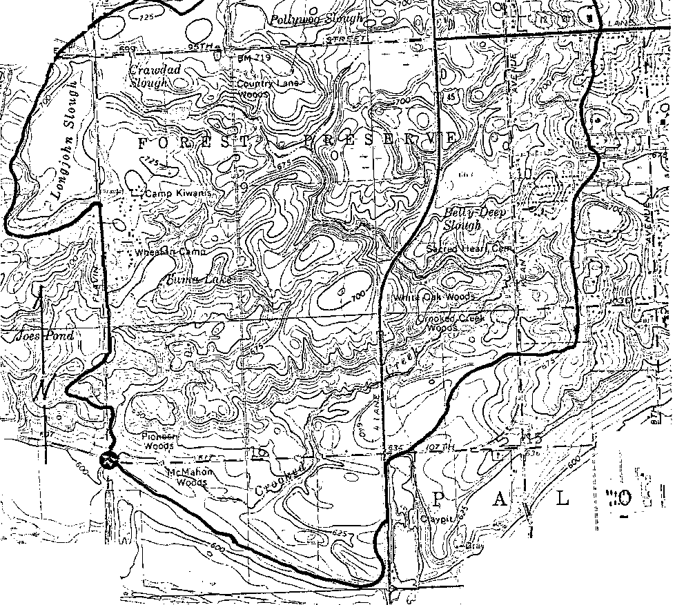
>
> **Loss Models**
>
> The rainfall excess may be computed using either of the following methods:

- Initial/Continuing: The initial depth of rainfall which is lost is specified along with a continuing rate of loss. For example 15 mm initial loss plus 2.5 mm/h of any further rainfall.

> *Appendix A A.5*

- Initial/Proportional: The initial depth of rainfall, that is lost, is specified along with a proportion of any further rain that will be lost. For example, 15 mm initial loss and 0.6 times any further rainfall.

> 

- Australian Representative Basins Model (ARBM) Loss method: Infiltration parameters to suit Philip’s infiltration equation using comprehensive ARBM algorithms are used to simulate catchment infiltration and subsequent rainfall excess for a particular rainfall sequence and catchment antecedent conditions. Data describing such things as the sorptivity, hydraulic conductivity, upper and lower soil storage capacities, soil moisture redistribution, groundwater runoff and catchment drying are required. Many of these data may be found from field measurements and this model allows for more realistic modelling of catchment response to storms, especially those with multiple bursts. A proportion of the outflow from the ARBM loss method may be redirected as base flow in a given reach

> **Storms**
>
> Up to 10 storm events may be analysed in the same run and the results displayed on screen to determine quickly the critical duration for each location in the drainage system. Simulation runs of any length, from minutes to years, may be accommodated.
>
> *Appendix A A.6*
>
> 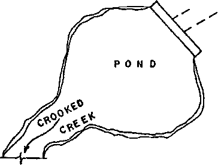
>
> **Gauged Data**
>
> Gauged data may be entered by the user or read directly from an external file and compared to the computed hydrograph to assist in the calibration and verification of the drainage network simulation.
>
> **A1.4 Hydraulics**
>
> The hydrographs that have been developed at the individual nodes may be transported through the drainage system in three ways:

- Translation (Lagging). The user specifies the length of travel time from one node to the next and the hydrograph is translated on the time base by this length of time with no attentuation of peak flow. Appropriate values may be arrived at by estimating the velocity of flow and consequently the wave celerity, and knowing the length of travel.

- Pipe Flow. A pipe may be specified (or sized) to carry some or part of the flow with any flow in excess of pipe capacity travelling via the surface to either of two destination nodes. The travel time in this pipe may be computed or set to a fixed number of minutes.

> *Appendix A A.7*

- Channel Routing. A Channel/Stream may be defined using either compound trapezoidal channel or HEC-2 style arbitrary sections. (HEC-2 is the widely-used water surface profile computational program developed by the Hydrologic Engineering Center of the US Army Corps of Engineers.) The cross-section shape may imported directly from an existing HEC-2 file. The Muskingum-Cunge method is used to route the flow through the channel with the consequent attentuation of the peak flow and delay of the hydrograph peak.

- Diversion Link. Any node may have a diversion link defined in addition to the normal link, which will divert some or all of the flow to an alternate destination node elsewhere in the drainage system.

- Pipe Design. Manning’s equation is used to size the pipes to carry the peak discharge in the reach.

> 
>
> **Hydrodynamic Modelling**
>
> The hydrographs generated in XP-RAFTS may be directly transferred to the XP-EXTRAN hydrodynamic simulation model as well as to the MIKE-11 unsteady flow open channel hydraulics model. Hydrographs may also be read back into another XP-RAFTS model.
>
> **Storage Basins**
>
> **(On-Site Detention, Ponds, Dams, etc.)**
>
> Any node in XP-RAFTS may be defined as a storage node. This storage may be
>
> quite small (a few cubic metres) or quite large (gigalitres), or any size in-between. On-
>
> *Appendix A A.8*
>
> line and off-line storages may be simulated and the storages may be hydraulically interconnected.
>
> Puls’ level pool routing technique is used to route the inflow hydrograph through the nominated storages. A stage storage relationship is defined for each of the storages. The outlet structures that may be handled include:
>
> 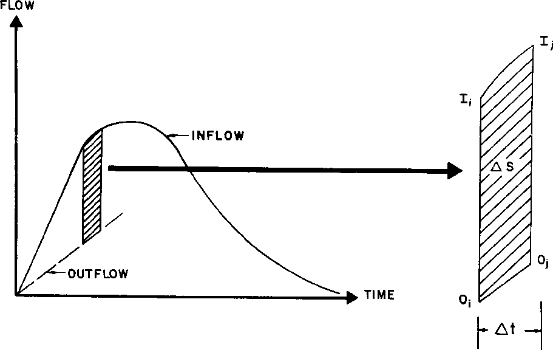

- circular pipe culverts

- rectangular box culverts

- broad crested weirs

- sharp crested weirs

- ogee weirs

- erodible weirs

- multi-level weirs

- high level outlets

- rating curve outlets

- evaporation

- infiltration

> Optimisation methods are available to help design the basin. You may optimise
>
> the basin for a maximum discharge or for a maximum allowable storage.
>
> *Appendix A A.9*
>
> **A1.5 Importing Data**
>
> Data may be imported from an ASCII text file in the XPX file format. This format allows the user to create new data and objects as well as update and add to existing XP-RAFTS networks. This facility may be used to import information from GISs, FISs, CAD packages and other databases.
>
> Plan drawings may be imported from virtually any CAD package or GIS to be used as a scaled base map.
>
> **A1.6 Output**
>
> XP-RAFTS provides results and data in various forms. All graphical displays may be outputted to printers, plotters or to DXF files.
>
> 
>
> **Graphical Output**
>
> XP-RAFTS provides graphs of rainfall, rainfall excess, hydrographs including total and local components of the hydrographs. Stage history and storage history are also available for any pond or basin in the drainage system. The graphs for up to 16 locations may be displayed and printed or results exported to a comma-delimited ASCII text file for use in spreadsheets or databases..
>
> **Tabular Reports**
>
> Comprehensive tabular reports may be generated for both the hydrology and the
>
> hydraulic results and data.
>
> *Appendix A A.10*
>
> In addition to the formatted tabular reports, an ASCII text output file is available with detailed information on both the hydrology and the hydraulic calculations.
>
> **A.2 Detailed Description of XP-RAFTS Development Workbench**
>
> **A.2.1 General Model Structure**
>
> The following description is taken in part from the technical description manual for the XP-RAFTS software package co-developed by Goyen (1976, 1981, 1991). The information provides a fairly detailed description of the various modules and procedures within that package that have been utilised in this research.
>
> As the author was the developer of the XP-RAFTS software, the complete source code was obviously available to utilise, modify and build on throughout the current research .
>
> In particular, the sub-catchment hydrograph development module was modified significantly to introduce the types of approaches proposed in Chapters 3, 6 and 7.
>
> The existing overall structure of the XP-RAFTS software provided a very flexible workbench to test an array of process tree type procedures and to view their results.
>
> Within the XP-RAFTS framework the workbench allowed the consideration of linear and non-linear responses, and a mixture of concentrated and distributed storages. The node link structure also allowed the consideration of separately-contributing surfaces with distinctly different infiltration and runoff responses.
>
> **A.2.2 Program Organisation**
>
> XP-RAFTS is organised as a series of discrete modules each addressing a particular component of the rainfall/runoff routing process. The separate modules are called in a particular sequence according to the way that input data is coded.
>
> The program currently consists of five modules:
>
> \(i\) a library module which manages the overall operation of the program and controls data, computation and output sequences,
>
> *Appendix A A.11*

2)  a hydrograph-generation module which estimates a runoff hydrograph from either an actual rainfall event or a design storm using Laurenson’s non-linear runoff routing method,

3)  a loss model employing Philip’s infiltration equations and the Australian Representative Basins Model (ARBM) to simulate both rural and urban excess rainfall,

4)  a reservoir routing module which routes an inflow hydrograph through a retarding basin or storage using a level pool routing procedure. The module also handles hydraulically interconnected basins,

5)  a river/channel routing module which routes a hydrograph along a channel using  
    > the Muskingum-Cunge procedure.

> The following sections describe the library, hydrograph, retarding basin, loss and channel sections of XP-RAFTS in detail. Figure A.2.1 describes the various program modules and how they are linked.

> *Appendix A A.13*
>
> **A.2.3 Time Step for Computations**
>
> All computations in XP-RAFTS are carried out in discrete time increments sequentially working from time zero through a rainfall event. The time increment is designated the routing increment and is expressed in decimal minutes. There are no absolute limits to its magnitude.
>
> The selected routing increment should be the minimum needed to span enough of the expected runoff hydrograph to obtain the required information. In many instances this may not require the whole hydrograph to be developed. In some instances however, such as loss rate calibration, the full hydrograph recession may be required.
>
> The current workbench software is limited to 2000 routing increments in any one pass. An additional requirement is that a routing increment should be wholly divisible into a partition of a rainfall temporal pattern to prevent the loss of a fraction of a rainfall in each increment. If this is neglected an appropriate warning message is generated. Additionally the routing increment should be no longer than the shortest link lag time.
>
> **A.2.4 Definition of Link**
>
> In its most basic form a drainage network can consist of a single conduit, with or without a retarding basin at its head. This situation is defined as a single link. An input hydrograph is derived from a single sub-catchment immediately above each link.
>
> The drainage system is usually made up of many such links combined to form a complete network where the individual catchments (links) become sub-catchments of the overall watershed. Figure A.2.2 describes diagrammatically a link and the way in which individual links are joined to form a network.
>
> *Appendix A A.14*
>
> 
>
> **Figure A.2.2 Network Terminology**
>
> **A.2.5 Convergent and Divergent Links**
>
> XP-RAFTS currently allow both convergent and divergent link networks. The normal convergent system is displayed in the example shown in the figure above.
>
> Divergent flows are handled by defining a link capacity for the sub-catchment in question followed by a separate link number to which overflows are directed.
>
> The overflow stored in the separate link can either be removed from the network completely or can rejoin at a lower junction by normal linking procedures.
>
> In addition, the user may set a fraction of the flow to be diverted once flow exceeds a threshold, through the use of a diversion link in XP-RAFTS.
>
> **A.2.6 Development of Catchment, Channel & Network Data**
>
> The main components of the catchment model are the sub-catchments, links and subareas defined in Figure A.2.2.
>
> *Appendix A A.15*
>
> The arrangement, sequencing and number of individual elements is made entirely flexible to appropriately represent watershed components. Nodes representing the outlet of individual sub-catchments and links are described graphically within the user environment.
>
> **A.2.7 Catchment Area Representation**
>
> In general, the sub-catchments are established by dividing the main catchment into areas defined by tributaries and ridges. The link network connects these sub-catchments.
>
> In the XP-RAFTS context, sub-catchments are usually drawn to points where flows are required, changes in topography occur, retarding basins are proposed, or at other locations where hydrographs are needed. Links are then constructed to join the sub-catchments.
>
> The runoff from a sub-catchment flows into the top of a link. The minimum number of sub-catchments is not important as the outflow from each single sub-catchment should be correct in itself.
>
> The division of the catchment should reflect the individual analysis of homogeneous sub-catchments. The degree of urbanisation, slope, ground cover and type, etc, should be reasonably uniform within each sub-catchment.
>
> If distinct changes in urbanisation or other characteristics occur within sub-catchments then further subdivision should be considered to define differences in catchment storages and flow times.
>
> The figure above shows the links joining the tributaries to the main stream as having real lengths. They can also have zero length, i.e. a dummy link. The lag down such a link would be zero. Dummy links with dummy sub-catchment areas (say 0 .01 ha) can be included to allow the generation of hydrographs at additional nodes in a network, particularly at junctions.
>
> **A.2.8 Treatment of Subareas**
>
> XP-RAFTS uses Laurenson’s (1964) method to generate its hydrographs. Laurenson’s model was directed at single catchments, or more particularly, the
>
> *Appendix A A.16*
>
> derivation of a single hydrograph at the outlet of a catchment. However, in the case of XP-RAFTS the sub-catchments are divided into ten sub-areas.
>
> Sub-areas are established by dividing each of the sub-catchments into ten areas defined between lines of equal travel time or isochrones.
>
> XP-RAFTS uses Laurenson’s model to derive separate sub-catchment inlet hydrographs. These hydrographs are then manipulated through the link system to the outlet of the total catchment via the channel routing module.
>
> Sub-areas are established by constructing lines of equal travel time from the sub-catchment boundary to its outlet. These are referred to as isochrones.
>
> The model storage delay parameters have been calibrated based on 10 isochronal areas making up a sub-catchment. In many instances the simple division of a sub-catchment into ten equal sub-areas provides very similar results. This is particularly true in urban areas where isochrones vary with storm frequency and can sometimes be difficult to determine due to the complexity of the pipe and overflow network.
>
> The ten equal sub-areas are calculated automatically by XP-RAFTS. However if a user wishes to define ten isochronal areas, these must be inputted as data.
>
> Within the workbench environment the facility for including a single sub-area, rather than the ten in XP-RAFTS, has been added.
>
> **A.2.9 Graphical & Tabular Output**
>
> Output from the program may be specified in one of several ways:

1)  full output plus summary. This consists of a very comprehensive print of data and results obtained from the various modules of the program for the particular link, as well as a one page tabulated summary of data and flow results for each link of the drainage network,

2)  partial output plus summary. This option prints a portion of the full output as well as the tabulated summary,

3)  summary output only,

4)  summary output plus hydrograph plot. The graphical representation of the hydrograph for the particular link is included,

5)  partial output plus hydrograph plot plus summary.

> The particular output option is specified for each link, thus one link may have full
>
> output while another appears in the summary only.
>
> *Appendix A A.17*
>
> All links are listed in the summary, irrespective of the output option selected.
>
> **A.2.10 Hydrograph Generation Module (LRRM)**
>
> This module estimates sub-catchment runoff hydrographs. Of the many estimating procedures available, including unit hydrographs, empirical formulae and other runoff routing algorithms, Laurenson’s non-linear runoff routing method was adopted for XP-RAFTS.
>
> Data for Laurenson’s model consists of catchment area, slope, degree of urbanisation, loss rates and observed or design rainfall information, all of which are explained in detail below.
>
> A limited treatment only shall be given on the theory of Laurenson’s model, as a comprehensive review is given in by Aitken (1975).
>
> **A.2.11 Catchment Rainfall**
>
> Rainfall inputs can be either historic events or design storms. Observed spatial and temporal variations in historic events can be catered for by entering different rainfall data for each sub-catchment, according to daily rainfall and pluviograph records.
>
> Design storms are typically inputted as a dimensionless temporal pattern combined with average rainfall intensity for the particular duration storm.
>
> Typical design storm temporal patterns can be taken from Australian Rainfall and Runoff (Institution of Engineers, Australia, 1987) or similar references. Design storms can be varied for each sub-catchment.
>
> **A.2.12 Historical Events**
>
> To simulate historical events it is necessary to firstly separate excess rainfall from the total rainfall recorded and then route this excess to produce the simulated runoff hydrograph.
>
> Data is inputted directly or via the HYDSYS dialogs and can also be read directly from a HYDSYS output file. The format of this file structure is further described in Appendix B.
>
> *Appendix A A.18*
>
> XP-RAFTS allows for the input of recorded runoff hydrographs, at any node within a catchment. This may be graphically outputted together with the simulated runoff hydrograph to help calibrate appropriate loss rates and routing parameters.
>
> **A.2.13 Continuous Rainfall Data**
>
> Continuous runs using lengthy rainfall data sets lasting from days to years can be accommodated using the water balance module to produce excess rainfall.
>
> The Australian Representative Basins Model (ARBM), as described by Goyen (1981), has been adopted as the appropriate water balance model.
>
> XP-RAFTS presently performs continuous modelling automatically when the simulation period expressed as the storm duration exceeds the number of routing increments input under the storm type dialog.
>
> **A.2.14 Sub-catchment Rainfall Routing Processes**
>
> XP-RAFTS makes use of Laurenson’s 1964 runoff routing procedure which was primarily aimed at rural catchments but modified by Aitken (1975) for use on urban catchments.
>
> Laurenson’s method was directed at single catchments, or more particularly, the derivation of a single hydrograph at the outlet of a catchment.
>
> In the case of XP-RAFTS, however, the sub-catchments are further divided into 10 subareas by constructing isochrones, lines of equal travel time from the sub-catchment boundary to the sub-catchment outlet.
>
> The model storage delay parameters have been calibrated based on 10 isochronal areas, as indicated in Figure A.2.3, making up a sub-catchment. In many instances the division of a sub-catchment into 10 equal subareas provides very similar results.
>
> This is particularly true in urban areas where isochrones vary with storm frequency and are often impossible to determine due to the complexity of the pipe and overflow network. As previously mentioned the current workbench version also allows for a single sub-area.
>
> *Appendix A A.19*
>
> 

**Figure A.2.3 Sub-area Definition**

> XP-RAFTS uses Laurenson’s method to derive separate sub-catchment outflow
>
> hydrographs.
>
> The hydrographs so derived are manipulated through the link network to the outlet
>
> of the total catchment via the conduit routing module.
>
> The routing method is summarised and displayed in Figure A.2.4 below.

**Figure A.2.4 Diagrammatic Representation of Hydrograph Generation**

> *Appendix A A.20*
>
> **A.2.15 Routing Method**
>
> Routing for a particular sub-catchment is carried out using the Muskingum-Cunge method. The storage is considered to be a non-linear function of the discharge, ie:
>
> s = K(q) x q (1)  
> where:
>
> s = volume of storage, (hr x m3/s)
>
> q = instantaneous rate of runoff, (m3/s)
>
> K(q) = storage delay time as a function of q (hours).
>
> The storage function is used in the continuity equation in finite difference form :
>
> (i1 + i2) x Dt/2- (q1 + q2) x Dt/2 = s2 - s1 (2)
>
> where:
>
> i1,i2 = Inflow at beginning and end of routing period (m3/s)
>
> Dt = routing interval (hr)
>
> q1,q2 = outflow from the storage at beginning and end of routing period (m3/s)
>
> s1,s2 = storage volume at beginning and end of routing period (hr x m3/s). Substituting s2 and s1 in Equation (3) from Equation (2) gives:
>
> q2 = C0i2 + C1i1 + C2q1 (3)
>
> where:
>
> C0 = C1 = Dt/(2K2 + Dt) (4)
>
> C2 = (2K1 - Dt)/(2K2 + Dt) (5)
>
> An iterative solution to Equation (3) is required due to the interrelation between C0, C1, C2, K2 and q2 in RAFTS.
>
> K1,K2 is defined via Equation (6)
>
> **A.2.16 Storage-Discharge Relationship**
>
> Each sub-area is treated as a concentrated conceptual storage. Each storage has a storage delay time:
>
> K(q) = Bqn (6)
>
> *Appendix A A.21*
>
> where:

K(q) = subarea storage delay time (hours) as a function of q

> 3
>
> q = discharge (m/s)
>
> B = storage delay time coefficient
>
> n = storage non-linearity exponent.
>
> Substituting Equation (6) into Equation (3) gives:
>
> s = Bqn + 1 (7)  
> Non-linearity Exponent "n"
>
> The default value for the non-linearity exponent in XP-RAFTS is -0.285. XP-RAFTS provides the mechanisms to alter this value, usually in respect to rare events involving significant sub-catchment overbank flood routing, by:

- directly entering an amended value of "n". A value of zero would indicate linear catchment response and equate with unit hydrograph theory, or

- Entering an "n" = f (Q) rating curve for each sub-catchment. In this manner XP-RAFTS can simulate either a linear or non-linear response.

> **A.2.17 Coefficients B and n**

<table>
<colgroup>
<col style="width: 10%" />
<col style="width: 10%" />
<col style="width: 49%" />
<col style="width: 29%" />
</colgroup>
<thead>
<tr class="header">
<th colspan="4"><blockquote>

B is either directly input for each sub-catchment or estimated from Equation (8) which was derived by Aitken (1975). The value of B for each sub-area is assumed to equal the average value of B for the sub-catchment.

0.52 -1.97 -0.50

</blockquote>

Bav=0.285 A (1 + U) Sc (8)

<blockquote>

where:

B = mean value of coefficient B for sub-catchment

</blockquote></th>
</tr>
</thead>
<tbody>
<tr class="odd">
<td><blockquote>

A

</blockquote></td>
<td>=</td>
<td><blockquote>

sub-catchment area (km2)

</blockquote></td>
<td></td>
</tr>
<tr class="even">
<td><blockquote>

U

</blockquote></td>
<td>=</td>
<td colspan="2"><blockquote>

fraction of catchment that is urbanised. (Where U = 1.0, the catchment is fully urbanised and when U = 0.0, the catchment is completely rural)

</blockquote></td>
</tr>
<tr class="odd">
<td><blockquote>

Sc

</blockquote></td>
<td>=</td>
<td><blockquote>

main drainage slope of sub-catchment (%).

</blockquote></td>
<td>(The longest path of</td>
</tr>
</tbody>
</table>

> the sub-catchment, starting at sub-catchment outlet running up the main channel then if necessary branching off at the furthest tributary, to the top of the sub-catchment.)
>
> *Appendix A A.22*
>
> This equation was initially derived from six urban catchments in Australia with the following ranges applying:
>
> 2 2
>
> A varied from 0.8 km to 56 km
>
> U varied from 0.0 to 1.00
>
> Sc varied from 0.22% to 2.90%.
>
> However over the last fourteen years a wide range of areas, slopes and urbanisation outside these ranges have been tested with a high degree of success. See Sobinoff et al. (1983).
>
> For gauged catchments, deduced B values, evaluated as the average value from recorded rainfall/runoff events, should be used in preference to generalised regression estimates.
>
> As U in certain instances can be rather vague, data input in this respect has been amended to include a % impervious parameter for each sub-catchment in place of the U term.
>
> The model interprets U in terms of %I based on the following ratios:

| **I%** | **U** |
|--------|-------|
| 0      | 0     |
| 30     | 0.7   |
| 50     | 1.0   |
| 100    | 2.0\* |

> \* This value is extrapolated from the original data based on limited results from fully impervious areas.
>
> **A.2.18 B Modification Factors**
>
> Where gauged rainfall/runoff data is available for a range of events it should be used in preference to the above regression equation with modifying factors.
>
> **PERN**
>
> The original regression equation (Equation (8)) does not differentiate between catchments with the same degree of urbanisation but different roughnesses. An additional empirical parameter has therefore been added to take pervious sub-catchment roughness into account.
>
> The parameter PERN is inputted as a Mannings ’n’ representation of the average sub-catchment roughness. B is then modified in accordance with the following table. If PERN is left blank then B is unchanged.
>
> *Appendix A A.23*

| **Manning"n"** | **Multiplication Factor** |
|----------------|---------------------------|
| 0.010          | 0.4                       |
| 0.015          | 0.5                       |
| 0.025          | 1.0                       |
| 0.100          | 3.0                       |

> **BX**
>
> During calibration of a gauged catchment an additional parameter BX in the header data is included to modify the calculated or input B by a further multiplication factor. The parameter BX will then uniformly modify all sub-catchment B values previously computed, or set (Equation (8)).
>
> **A.2.19 Rainfall Loss Module (LOSS)**
>
> XP-RAFTS currently accepts either initial and continuing losses, or infiltration parameters to suit Philip’s infiltration equation using comprehensive ARBM algorithms to simulate excess runoff.
>
> It is difficult to recommend average loss values, as soils and vegetation vary considerably. Initial losses can vary between 0 and 150 mm and continuing losses from 0 to 25 mm/h.
>
> Loss rates should be assessed separately for each sub-catchment. Significant improvements in loss rate estimates can be obtained by catchment inspection and soil moisture and infiltration measurements over even a limited period.
>
> **A.2.20 Initial and Continuing Loss Model**
>
> This technique is by far the most commonly used rainfall loss abstraction procedure for models of this nature. It demands an initial loss estimate that purports to simulate initial catchment wetting when no runoff is produced, followed by a constant continuing loss rate expressed in mm/h to account for infiltration once the catchment is saturated.
>
> This procedure is at the very best crude and can in many instances cause greater errors in runoff estimates than all the other modelling considerations combined. Although it is a commonly adopted procedure, considerable caution should be exercised with its application.
>
> *Appendix A A.24*
>
> The problem of loss estimation is complicated by the fact that the design storm approach in urban drainage design infers the use of rainfall bursts rather than complete storm events. Consequently design storm loss rates need to reflect the possibilities of preburst catchment wetting.
>
> Depending on historical sequences of storms and the statistical interpretation of catchment parameters, the design storm loss rates could vary greatly from those associated with complete storm analyses.
>
> **A.2.21 Philip’s Infiltration Model**
>
> The separate loss module (LOSS) included in RAFTS employs a major segment of the Australian Representative Basins Model (ARBM) originally developed by Chapman (1968) to describe catchment infiltration and subsequent rainfall excess for a particular rainfall sequence plus catchment antecedent condition.
>
> To utilize this module additional data describing such things as sorptivity, hydraulic conductivity, upper and lower soil storage capacities, soil moisture redistribution, groundwater runoff, and catchment drying are required.
>
> The sensitivity of various parameters to the derived watershed runoff varies widely. Thus, a sensitivity analysis should almost always be performed to assess the critical parameters involved in the catchment calibration.
>
> In using this loss module in an event mode, it is still necessary to provide soil moisture starting conditions prior to a design event. To achieve this some knowledge of appropriate antecedent conditions before the typical design event is required. If this information is not readily available then several values should be chosen and a sensitivity analysis carried out.
>
> A diagrammatic representation of the LOSS Module is shown in Figure A.2.5 below.
>
> *Appendix A A.25*
>
> 

**Figure A.2.5 Diagrammatic Representation of LOSS Module**

> The following information gives details on the major algorithms affecting the development of excess runoff during storm events; they include infiltration, soil moisture redistribution, lower soil zone drainage, groundwater runoff and catchment drying.
>
> *Appendix A A.26*
>
> **(i) Infiltration Parameters**
>
> ***Sorptivity***
>
> The main theoretical infiltration algorithms are based on the work carried out by Philip (1957), when he showed that cumulative absorption or desorption into or out of a horizontal column of soil of uniform properties and initial moisture content was proportional to the square root of time.
>
> Philip also showed that for shorter times of t, vertical one-dimensional infiltration
>
> 0.5
>
> could be described by a rapidly converging power series in t . The coefficient of the leading term of the series (bracketed below) was termed sorptivity.
>
> 0.5 1.5
>
> i = (S)t + At + Bt (9)
>
> where:
>
> i = cumulative infiltration (cm)
>
> t = time (minutes)

0.5

> S = sorptivity (cm/minute )
>
> 1.5
>
> A, B, are parameters of the second and third terms (cm/minute, cm/minute ).
>
> Philip (1957) and again Talsma (1969) pointed out that sorptivity depended on initial moisture content and on the depth of water over the soil. Talsma varied these parameters in a series of field based experiments to test their effect on sorptivity values.
>
> Measurements of sorptivity were made by Talsma on large samples enclosed with 300 mm diameter, 150 mm high infiltrometer rings pushed 100 mm into the soil.
>
> Water was rapidly ponded in the rings to a depth of about 30 mm and the subsequent drop in water level was noted at regular time increments of 10 to 15 seconds after ponding.
>
> Talsma (1969) proposed methods of measuring sorptivity in the field on undisturbed soil, for subsequent use in analytical applications.
>
> Sorptivities were calculated from the linear portions of initial inflow against the square root of time. Samples of soil for initial and final moisture content were taken close to and inside the rings.
>
> Based on the work by Talsma (1969) the method relied on the reasonable assumptions that:

- during the short time of measurement (1-2 minutes) water flow would remain vertical within the ring infiltrometer, and

> *Appendix A A.27*

- that the first term of the infiltration equation (Philip, 1957) accounted for nearly all of the flow.

> Allowing for the accuracy of experimental technique, the first condition, that water flow would remain vertical within the ring infiltrometer, was easily verified, but the second condition was dependent on the magnitude of A relative to S.

0.5

> Talsma found that plots of I against t remained essentially linear for at least 1 minute and found that for the wide range of differently textured and structured soils studied, the drop in head during the measuring process was not significant.
>
> Talsma concluded that the accuracy of the ring infiltrometer method of measuring S in situ was quite acceptable, even in soils with high saturated hydraulic conductivity relative to sorptivity.
>
> Talsma also concluded that neither the diameter nor shape of the ring affected the results.
>
> In the work carried out on the Giralang catchment by Goyen (1981), perspex rings were used, where possible, in preference to steel ones. This permitted a visual check on the wall/soil interface as well as allowing direct head drop measurements through the wall.
>
> Sorptivities were measured at random sites over the Giralang catchment to add data to the work performed by Talsma in the Canberra region.
>
> ***Hydraulic Conductivity***
>
> Hydraulic conductivity, a measurement of the ability of a section of soil profile to conduct water, is reflected in the second term in the infiltration equation by Philip (1957)
>
> 0.5
>
> i = St + At
>
> Talsma (1969) showed that for a wide range of soils, A could be expressed as follows:
>
> A = Ko /2.8 (10)
>
> where:
>
> K = saturated hydraulic conductivity.
>
> o
>
> Ko therefore represents the ability of a soil profile to transmit water when the soil is fully saturated. Ko is therefore only a special case of general hydraulic conductivity.
>
> *Appendix A A.28*
>
> To apply Philip’s infiltration equation it is therefore necessary to obtain measurements of Ko as well as sorptivity for each of the land domains.
>
> Subsequent to reviewing the above Equations (9) and (10), a modified equation, eliminating the need for Equation (10), was cited in a paper by Chong and Green (1979).
>
> In this publication work was described by Talsma and Parlange (1972) and Parlange (1971, 1975, 1977) where the following equations were developed:
>
> X = Y-1 + exp(-Y) (11) where X and Y were related to time, t, and accumulative infiltration, i, by the series expansion of Equation (9) and the substitution of Equation (12) and (13) in the result,

1.5

<table>
<colgroup>
<col style="width: 8%" />
<col style="width: 5%" />
<col style="width: 3%" />
<col style="width: 33%" />
<col style="width: 48%" />
</colgroup>
<thead>
<tr class="header">
<th colspan="4"><blockquote>

with rearrangement and truncation after the t

</blockquote>

2 2
</th>
<th>term. The relationships were:</th>
</tr>
</thead>
<tbody>
<tr class="odd">
<td></td>
<td>X</td>
<td>=</td>
<td>2 x Ko x t/S</td>
<td>(12)</td>
</tr>
<tr class="even">
<td></td>
<td></td>
<td></td>
<td>2</td>
<td></td>
</tr>
<tr class="odd">
<td><blockquote>

and:

</blockquote></td>
<td>Y</td>
<td>=</td>
<td>2 x Ko x i/S</td>
<td>(13)</td>
</tr>
</tbody>
</table>

> The new equation termed, the "Talsma-Parlange Equation", was therefore as follows:
>
> 0.5 2 1.5
>
> i = St + (1/3 x Ko x t) + (1/9 x Ko /S x t ) (14)
>
> where:
>
> i = cumulative infiltration,
>
> S = sorptivity at a specified antecedent soil
>
> moisture content
>
> K = hydraulic conductivity at water saturation.
>
> o
>
> Equation (14) was subsequently adopted in place of Equations (9) and (10) and is
>
> currently used in the XP-RAFTS loss module.
>
> The method of measurement adopted for Ko follows a similar procedure to
>
> measuring sorptivity, only on this occasion the undisturbed core sample held by the infiltrometer ring is removed from the surrounding soil and placed on a wire grid raised above ground level. A 100 mm length of core is adopted for all Ko and S
>
> measurements.
>
> In this way zero moisture potential at the base of the core is assured. Water is then ponded on top of the soil until a steady outflow is observed. This flow is then measured at constant head and the saturated hydraulic conductivity calculated as follows:
>
> *Appendix A A.29*
>
> K = Qw x L/(H x Ac x t) (15)
>
> o
>
> where:
>
> K = Saturated hydraulic conductivity (cm/minute)
>
> o
>
> Q = volume of water discharged in time t (cm3)
>
> w
>
> t = time (minutes)
>
> L = length of soil core (cm)
>
> H = hydraulic head
>
> = distance from base of core to pondage surface (cm)
>
> 2
>
> Ac = cross-sectional area of core (cm )
>
> ***Storage Capacity***
>
> The same samples used for the determination of saturated hydraulic conductivity can be used to measure water storage capacity in the depth of the sample.
>
> To achieve this the sample is first weighed, then oven dried and re-weighed to deduce moisture content.
>
> In both the hydraulic conductivity and storage capacity sampling procedure two rings can be used, one to obtain the sample and an additional ring containing an imported sample to reinstate the sampling area.
>
> Upper Soil Storage Capacity (USC), as defined below, is an important parameter in the infiltration process using the Australian Representative Basins Model (ARBM) to relate sorptivities of varying initial moisture contents. The following relationship is used in the model as given by Black and Aitken (1977):
>
> S = S0 x (1 - US(init)/USC) (16)
>
> where:
>
> S = sorptivity
>
> S0 = sorptivity at zero moisture content
>
> US(init) = initial moisture content in upper soil store (mm)
>
> USC = max. moisture content of upper soil store (mm)
>
> *Appendix A A.30*
>
> **(ii) Soil Moisture Redistribution**
>
> The soil moisture redistribution function forms part of the catchment drying process. It determines the quantity of water (mm) transferred between soil zones within a time interval. The expression used is:
>
> RD = (US – A1 x LS - A2)/(1 - exp(-RQ))/(1 + A1) (17)  
> where:
>
> RD = Soil moisture redistribution between lower and upper soil zone
>
> US = current volume in upper soil zone store (mm)
>
> LS = current volume in lower soil zone store (mm)
>
> A1 = soil moisture redistribution constant
>
> A2 = soil moisture redistribution constant
>
> RQ = redistribution factor
>
> RQ is evaluated within the program by the equation:
>
> RQ = TI x A0(1 + A1) x exp (A3x LS) RQ\<20.0 (18)
>
> RQ = 20.0 RQ x 20.0 (19)
>
> where:
>
> TI = time interval (min)
>
> A0 = soil moisture redistribution constant
>
> A1 = soil moisture redistribution constant
>
> A3 = soil moisture redistribution constant
>
> The four soil moisture constants must be supplied as data. A value for A0 may be
>
> obtained from continuity considerations when LS = 0, as follows:
>
> A0 = 1440A/USC (20) where:
>
> A = hydraulic conductivity parameter typically equal to Ko/2.8
>
> A1 may be evaluated as the ratio of the capacities of the upper and lower soil zones, that is:
>
> A1 = USC/LSC (21) where:
>
> LSC = maximum moisture content of lower soil zone (mm).
>
> A2 and A3 are usually set to zero.
>
> *Appendix A A.31*
>
> If the result obtained by evaluating Equation (17) is negative then the flow is from the lower soil zone to the upper soil zone. If the result is positive then the flow direction is from the upper soil zone to the lower zone.

3)  **Lower Soil Zone Drainage**

> The groundwater store is replenished by water draining from the lower soil zone store. The percentage of the contents of the lower soil zone store that drain to groundwater is a function of how close to full the lower zone store is.
>
> The quantity of water draining from the lower zone, however, is independent of the status of the groundwater store and is obtained as follows:
>
> LDR = LS x (1 - exp(-TF x LDF x \I(LS/LSC))) (22)
>
> where:
>
> LDR = lower soil zone drainage
>
> TF = time interval (days)
>
> LDF= lower soil drainage factor

4)  **Groundwater Runoff**

> The groundwater store is the only source of runoff in dry weather. That is, it provides the baseflow component of the streamflow. The quantity of groundwater runoff in a time interval is determined by the recession equation:
>
> GR = GS/GN (\ITF(1+2GN X KG X GS (GN-1) ) - \ITF) (23) where:
>
> GR = groundwater runoff
>
> KG = constant rate groundwater recession factor
>
> GN = variable rate groundwater recession factor
>
> TF = time interval (days)
>
> GS = current value of groundwater storage (mm)
>
> Equation (23) expresses the groundwater runoff as a depth over the pervious part of the catchment. It must be converted to a depth over the entire catchment. The conversion is made as follows:
>
> GR = FPER x GR (24)  
> where:
>
> *Appendix A A.32*
>
> FPER = pervious fraction

5)  **Catchment Drying**

> The potential evapotranspiration during each time interval is calculated using a diurnal distribution of evapotranspiration together with inputted daily values. This potential evapotranspiration is applied as a first charge on the interception store. After it is depleted the balance of the atmospheric demand is applied to the depression storage. The remaining demand is applied to the upper and lower soil zones once the depression store has been depleted.
>
> The potential quantities of water which may be supplied to the evaporating surfaces of the plants from the upper and lower soil zone stores, or root supply capacities, within a time interval are calculated as:
>
> FU = US x (1 - exp(-TF x UH/USC)) (25)
>
> FL = LS x (1 - exp(-TF x LH/LSC)) (26)
>
> where:

FU = root supply capacity in time interval, or short interval equivalent

> to UH, for upper soil zone

FL = is analogous to FU, for lower soil zone US, LS, TF, USC, LSC

> have been defined previously.

UH = maximum evapotranspiration from upper soil zone (mm/day)

LH = maximum evapotranspiration from lower soil zone (mm/day)

ER = proportion of evapotranspiration from upper soil zone.

FU is compared with the remaining atmospheric demand. The smaller value is

> chosen and it is multiplied by ER to give the evapotranspiration from the upper soil
>
> zone. A similar comparison is made between FL and the remaining atmospheric
>
> demand. In this case the smaller value is multiplied by (1-ER) to give the
>
> evapotranspiration from the lower soil zone.

6)  **ARBM Process Summary**

> When applied to urban catchments the pervious and impervious areas are considered separately. Only the pervious areas are considered when natural catchments
>
> *Appendix A A.33*
>
> are being modelled (unless it is known that part of the natural catchment behaves like an impervious surface).
>
> Three processes are modelled for the pervious areas; catchment wetting, catchment drying and soil moisture redistribution. Five levels of storage are used. These are interception, depression, upper and lower soil zone and groundwater stores.
>
> In the catchment wetting phase rain falling on the pervious areas goes simultaneously to the interception and depression storages. Once the interception store is full it also overflows into the depression storage. The infiltration process begins as soon as there is any moisture in the depression storage and continues until the depression store is empty. The infiltrating water enters the upper soil zone.
>
> Catchment drying is by evapotranspiration which occurs from the interception, depression and upper and lower soil zone stores. The full potential evapotranspiration based on pan readings is applied first to the interception store. If it is depleted before the evapotranspiration requirements are met then the residual evapotranspiration capacity is applied to the depression store. If the depression store is unable to meet the requirements then the remainder is applied to the upper and lower soil zones.
>
> Soil moisture is redistributed between the upper and lower soil zones concurrently with the catchment wetting and drying phases. Moisture may flow either to or from the upper soil zone. A certain proportion of the moisture in the lower soil zone drains to groundwater storage, which gives rise to groundwater runoff.
>
> One storage is used for the impervious areas. It is filled by rainfall and depleted by evaporation.
>
> Runoff is generated in three ways, by overflow of the impervious area store, overflow of the depression storage due to infiltration limitations and groundwater runoff.
>
> The first two sources of runoff, which are the surface runoff components, are combined preparatory to routing. The groundwater runoff is routed separately and is added to the routed surface runoff to give the total estimated runoff volume for each day.
>
> *Appendix A A.34*
>
> **A.2.22 Retarding Basin Module (RBFR)**
>
> Attenuation of stormwater flow peaks can be achieved by temporary storage of flood waves, thus reducing the risk of downstream flooding. This can be achieved by either dynamic channel storage, or temporary reservoir storage.
>
> This section discusses reservoir type storage generally associated with retarding basins.
>
> Reservoir storage can be achieved using retarding basins or retention basins. Retarding basins temporarily store part of the storm flow, whereas retention basins permanently store the flow until release by pumping or infiltration at a later time.
>
> The main components of a retarding basin are an embankment, a normal outlet (generally a pipe or box culvert), and an emergency spillway. It is usual to design an uncontrolled normal outlet for a certain return period flood and allow floods greater than this to discharge over an emergency spillway.
>
> Emergency spillways can take many forms including weir crests, glory holes and multi-level orifices and erodible embankments to name but a few.
>
> Retention ponds are generally man-made or natural depressions. Flood gates or pumping arrangements may be necessary for eventual water release.
>
> XP-RAFTS allows for two basic retarding basin arrangements. These are discrete basins and hydraulically connected basins. Both retarding basins and retention basins have been used extensively throughout Australia as well as overseas to provide economical and practical solutions to a range of drainage problems.
>
> Details of specific parameters used to describe the basin characteristics as well as details pertinent to the basin’s general operation are shown diagrammatically in Figure A.2.6 below.
>
> *Appendix A A.35*
>
> 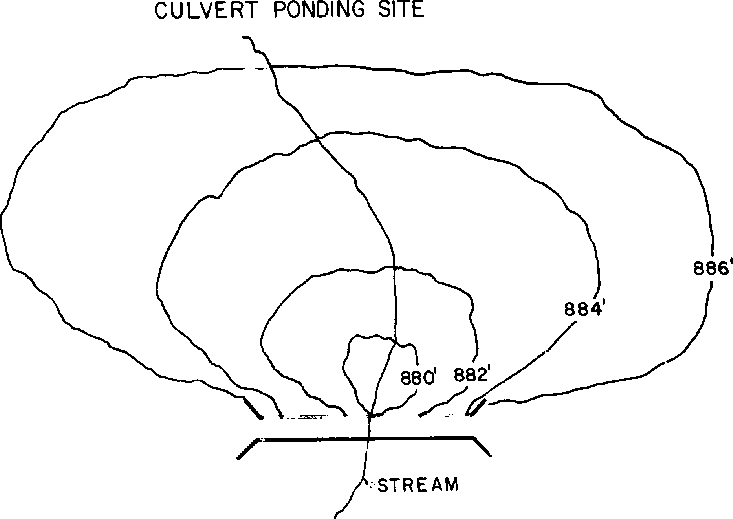

**Figure A.2.6 Diagrammatic Representation of Retarding Basin**

> **A.2.23 Routing Details**
>
> Puls’ level pool routing procedure is used in the retarding basin module. The inflow hydrograph is routed through the basin using the storage routing described below:
>
> i1 + i2 + 2s1/Dt -O1 = 2s2/Dt + O2 (27)
>
> where:

3

> i1, i2 = inflows at times 1&2 (m /s)
>
> 3
>
> s1, s2 = total storage at times 1&2 (m )

3

> O1, O2 = outflows at times 1&2 (m /s)
>
> Dt = routing interval (s).
>
> Subscripts 1 and 2 refer to the beginning and end of the routing interval respectively.
>
> *Appendix A A.36*
>
> **A.2.24 Basin Stage/Storage Relationships**
>
> A stage/storage curve must be derived for the site for use in flood routing computations.
>
> Where investigations are undertaken using XP-RAFTS, stage/storage co-ordinates would have to be nominated for say up to 10 or 15 points along the curve, based on accurate ground survey, with intermediate points being calculated in the program by linear interpolation.
>
> **A.2.25 Basin Stage/Discharge Relationships**
>
> Stage/discharge data must be compiled for the normal outlets and emergency spillways. Stage/discharge data may be entered directly in coordinate form, or an option is available to use standard hydraulic equations for preliminary runs only.
>
> Default equations presently used are:
>
> **(i) Normal pipe outlet with h \< 1.0 x diameter**
>
> where:
>
> h = height of water in basin over invert of outlet pipe
>
> d = pipe diameter (m)
>
> 3
>
> Q = discharge through pipe at stage h (m/s)
>
> p
>
> 2
>
> Ap = area of flow in pipe at stage h (m )
>
> R = hydraulic radius at stage h (m)
>
> S = pipe slope
>
> n = Manning’s roughness (empirically set internally to 0.021) to
>
> take into account additional entrance and exit losses.
>
> **(ii) Normal pipe outlet with h \> 1.0d**
>
> Qp = (-rr x N x d2)/4 x (√H/((ko + ki)/2g + n2 x L/R1.333)) (29)
>
> where:
>
> 3
>
> Q = discharge through pipe at stage h (m/s)
>
> p
>
> *Appendix A A.37*
>
> d = pipe diameter (m)
>
> n = Manning’s roughness (presently set to 0.011)
>
> L = length of pipe (m)
>
> H = total hydraulic head (m)
>
> g = acceleration due to gravity
>
> ki = entry loss coefficient
>
> ko = exit loss coefficient
>
> N = number of conduits

Equation (29) assumes that the pipe flows under head when the headwater ratio

(h/d) exceeds 1.0. The conduit is then assumed to operate under outlet control.

> **(iii) Spillway**

The spillway is treated as a normal weir with an equation of the form:

> 3/2
>
> Qs = cwhs (30) where:

3

> Qs = discharge over spillway (m/s)
>
> c = coefficient of discharge, default set at 1.7 for a broad crested
>
> weir
>
> w = spillway width (m)
>
> hs = height of water above spillway.
>
> Under basin options the weir coefficient can be set to any specified value or a weir stage/discharge curve may be used to replace the standard Equation (30).
>
> At present the program also has the ability to handle spillways, orifice type normal outlets, fuseplug spillways, unrouted low-flow pipes through the basins. It can optimise the size of normal outlets for given basin storage volumes or maximum desirable outflow. These aspects are further discussed below.
>
> Equations (28), (29) and (30) are generally only used for preliminary investigations. For detailed design of retarding basins it is essential to carry out separate offline detailed hydraulic investigations to derive accurate outflow characteristics as this data is the mainstay in defining the basin’s operation and safety factor.
>
> In this regard a stage/discharge curve is derived taking into account tailwater effects, flow transitions in the normal outlet flow regime, the operation of the spillways
>
> *Appendix A A.38*
>
> plus realistic maintenance and blockage considerations. An adopted stage/discharge curve is then inputted as a series of coordinate points.
>
> It is possible to put in separate series of coordinates for the normal outlet and spillway provisions.
>
> **Types of Basins**
>
> ***Hydraulically Discrete Retention & Retarding Basins***
>
> Discrete retention and retarding basins are considered those which operate independently. In this case the stage/outflow relationship is treated as a unique function.
>
> ***Hydraulically Interconnected Basins***
>
> Hydraulically interconnected basins can be analysed using RAFTS. They are defined as basins that are potentially operationally dependent on the time/stage relationships of any downstream basin or basins.
>
> XP-RAFTS uses an iterative approach to solve this type of situation and can analyse as many interconnected basins as there are links in a catchment.
>
> Interconnected basins or basins outletting into a river have the option through variable "IFLAP" to have free two-way draining outlets or a flap gate control outlet that prevents flows back into the basin from downstream.
>
> Reduced and possible reverse flow is presently limited to the normal piped outlet or the stage/discharge rating curve. Submergence effects, or reverse flow over spillways are presently not included. Additionally, submergence or reverse flow in the normal pipe routine is restricted to inflow heads above pipe obvert only. To date this facility has not been utilised in the workbench modelling. It would, however, be available should a particular situation occur in catchments other than Giralang.
>
> **A.2.26 Link/Conduit Module (MCCR)**
>
> Flood channels encountered in small urbanised and semi-urbanised catchments offer a number of problems not normally associated with river type flood routing computations.
>
> The conduits are usually of short length and have very marked differences in roughness, shape and slope. Lateral inflow can also form a considerable input to the channel section. As some of the channels are extremely short, sometimes down to 100
>
> *Appendix A A.39*
>
> m or less, acceptable algorithms not requiring infinitely small routing increments are required.
>
> A review of routing procedures (Price, 1973) suggested the use of a method developed by Cunge based on the Muskingum method now commonly known as the Muskingum-Cunge procedure. The method overcomes most of the analytical problems associated with other methods in so much as it accepts lateral inflow and converges with realistic time increments of the same order as the major routing increment used for the RAFTS run. The routing solution provides similar response to the diffusion portion of the Saint-Venant momentum equation (De Saint-Venant, 1871). The partitioning of the momentum equation into its diffusion and kinematic components is described by Havlik (1996).
>
> The Muskingum-Cunge procedure also allows for various factors such as channel roughness, shape and slope to be included in the deduction of suitable Muskingum routing parameters thus incorporating physical attributes that were previously not included in the Muskingum method.
>
> The procedure described by Price was specifically oriented towards routing in British rivers and hence had to undergo minor amendment to meet the requirements of XP-RAFTS to also include minor channels and streams.
>
> As an alternative to channel routing where physical data is lacking, XP-RAFTS allows a simple channel lagging procedure whereby the flood hydrograph is simply lagged by an appropriate time with zero attenuation. Lag times can be evaluated using Manning’s equation to estimate a flow velocity.
>
> For preliminary studies, particularly urban catchments with either steep or lined channels and pipes, it is usually sufficient to only run the lag routine. It only becomes necessary to run the Muskingum-Cunge module if the system has a significantly large channel storage component or has many branches with lateral inflow.
>
> *Appendix A A.40*
>
> **A.3 XP-RAFTS Workbench Facilities**
>
> Within this study the basic XP-RAFTS package was utilised as a workbench on which to develop and test new sub-catchment runoff and infiltration conceptual algorithms. The XP-RAFTS flow diagram indicated in Figure A.3.1 shows the two areas indicated by circles that were addressed in this research.
>
> 

**Figure A.3.1 XP-RAFTS Flow Chart**

> *Appendix A A.42*

<table>
<colgroup>
<col style="width: 2%" />
<col style="width: 0%" />
<col style="width: 2%" />
<col style="width: 11%" />
<col style="width: 4%" />
<col style="width: 1%" />
<col style="width: 4%" />
<col style="width: 2%" />
<col style="width: 3%" />
<col style="width: 1%" />
<col style="width: 9%" />
<col style="width: 4%" />
<col style="width: 14%" />
<col style="width: 1%" />
<col style="width: 21%" />
<col style="width: 6%" />
<col style="width: 4%" />
<col style="width: 2%" />
</colgroup>
<thead>
<tr class="header">
<th colspan="18"><blockquote>

</blockquote></th>
</tr>
</thead>
<tbody>
<tr class="odd">
<td></td>
<td colspan="17"><blockquote>

</blockquote></td>
</tr>
<tr class="even">
<td></td>
<td colspan="16"></td>
<td rowspan="23"></td>
</tr>
<tr class="odd">
<td></td>
<td colspan="16"></td>
</tr>
<tr class="even">
<td></td>
<td colspan="15"></td>
<td></td>
</tr>
<tr class="odd">
<td></td>
<td colspan="3"></td>
<td colspan="7" rowspan="2"><blockquote>

</blockquote></td>
<td rowspan="2"><blockquote>

</blockquote></td>
<td colspan="4"></td>
<td></td>
</tr>
<tr class="even">
<td></td>
<td colspan="3"></td>
<td colspan="4"></td>
<td></td>
</tr>
<tr class="odd">
<td></td>
<td colspan="15"></td>
<td></td>
</tr>
<tr class="even">
<td></td>
<td colspan="4"></td>
<td colspan="4"></td>
<td colspan="7"></td>
<td></td>
</tr>
<tr class="odd">
<td></td>
<td colspan="15"></td>
<td></td>
</tr>
<tr class="even">
<td></td>
<td colspan="4"></td>
<td colspan="3"></td>
<td colspan="6"><blockquote>

</blockquote></td>
<td colspan="2"><blockquote>

18.4 is the number

</blockquote></td>
<td></td>
</tr>
<tr class="odd">
<td></td>
<td colspan="13"></td>
<td colspan="2"><blockquote>

of allotments. The

</blockquote></td>
<td></td>
</tr>
<tr class="even">
<td></td>
<td colspan="6"></td>
<td colspan="7"></td>
<td colspan="2"><blockquote>

individual allotment

</blockquote></td>
<td></td>
</tr>
<tr class="odd">
<td></td>
<td colspan="13"></td>
<td colspan="2"><blockquote>

hydrograph at this

</blockquote></td>
<td></td>
</tr>
<tr class="even">
<td colspan="2" rowspan="11"><blockquote>

</blockquote></td>
<td colspan="4"></td>
<td colspan="4"><blockquote>

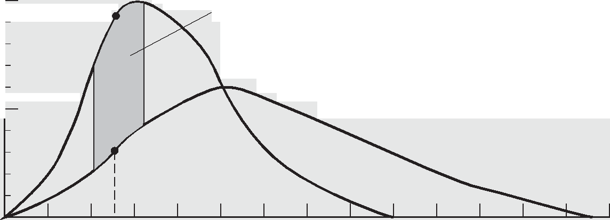

</blockquote></td>
<td colspan="4"></td>
<td colspan="2"><blockquote>

join is multiplied by

</blockquote></td>
<td></td>
</tr>
<tr class="odd">
<td colspan="12"></td>
<td colspan="2"><blockquote>

the number

</blockquote></td>
<td></td>
</tr>
<tr class="even">
<td></td>
<td colspan="11"></td>
<td colspan="2"></td>
<td></td>
</tr>
<tr class="odd">
<td></td>
<td colspan="11"></td>
<td colspan="2"></td>
<td></td>
</tr>
<tr class="even">
<td></td>
<td colspan="11"></td>
<td colspan="2"></td>
<td></td>
</tr>
<tr class="odd">
<td></td>
<td colspan="13"><blockquote>

</blockquote></td>
<td></td>
</tr>
<tr class="even">
<td></td>
<td colspan="13"></td>
<td></td>
</tr>
<tr class="odd">
<td></td>
<td colspan="10"></td>
<td colspan="2"><blockquote>

</blockquote></td>
<td></td>
<td></td>
</tr>
<tr class="even">
<td colspan="14"></td>
<td></td>
</tr>
<tr class="odd">
<td colspan="15"></td>
</tr>
<tr class="even">
<td colspan="15"><blockquote>

</blockquote></td>
</tr>
<tr class="odd">
<td colspan="2"></td>
<td colspan="15"></td>
<td rowspan="2"></td>
</tr>
<tr class="even">
<td colspan="17"><blockquote>

</blockquote></td>
</tr>
</tbody>
</table>

> The XP-RAFTS LRRM.FOR code also replaces the normal ten cascading storage routing loop with the alternative of applying a more simplified single storage loop for the sub-catchment element. Additionally the storage discharge routing algorithm and its B and n parameters act on a representative catchment area of approximately 47 m2. This is based on the Spence single roof downpipe catchment. The actual area hydrograph for the sub-catchment element is arrived at by multiplying the result by the ratio of the total area over 47 m2. This method therefore assumes a series of single storages in parallel. The same procedure is applied to the roof, road and yard elements.
>
> Within the LOSS.FOR module, the following dialog information is included to invoke the spatially distributed ARBM loss algorithms
>
> *Appendix A A.43*
>
> By utilising the XP-RAFTS environment as a workbench it has been further possible to use the extensively built up input and graphical output facilities available. This has greatly assisted the implementation of different conceptual components, as well as the testing against the collected gauged data.
>
> *Appendix A A.44*
>
> **A.4 XP-EXTRAN Technical Description**
>
> XP-EXTRAN is a friendly, graphics based wastewater and stormwater decision support system based on the USEPA SWMM package (Huber and Dickinson, 1993). XP-EXTRAN is a multi-threaded, 32-bit Microsoft Windows 95/NT application. XP-EXTRAN may be used to model stormwater and wastewater flow and pollutant generation hydraulics in any combined system of open and/or closed conduits with any boundary conditions.
>
> 
>
> **A4.1 Overview**
>
> XP-EXTRAN utilizes a proprietary self-modifying dynamic wave solution algorithm which allows it to use small time steps when required and larger time steps when appropriate. This is especially important in urban systems where steeply rising hydrographs, requiring responses in seconds or fractions of a second, predominate.
>
> A Global Database contains design and measured storm events, pollutant data and other data required to run XP-EXTRAN.
>
> XP-EXTRAN is a link-node model that performs hydraulic and quality analysis of stormwater and wastewater drainage systems. Typical XP-EXTRAN applications
>
> *Appendix A A.45*
>
> include predicting combined sewer overflows (CSOs) and sanitary sewer overflows (SSOs), interconnected pond analysis, open and closed conduit flow analysis, major/minor flow analysis, design of new developments, and analysis of existing stormwater and sanitary sewer systems.
>
> A link represents an hydraulic element of some kind for flow and constituent transport down the system (for example, pipe, channel, pump weir, orifice regulator, real-time control device, etc.).
>
> A node represents the junction of hydraulic elements (links) as well as a location for input of flow and pollutants into the drainage system. A node can also represent a storage device such as a pond or lake, or a point junction to represent a point of change in channel or conduit geometry, or a boundary condition in the model, or a watershed in the SWMM Runoff module.
>
> **A4.2 Hydraulics**
>
> EXTRAN solves the complete Saint-Venant (dynamic flow) equations throughout the drainage network and includes modeling of backwater effects, flow reversal, surcharging, looped connections, pressure flow and tidal outfalls and interconnected ponds.
>
> **Conduit shapes**
>
> The 34 different hydraulic elements available for hydraulic routing. In the current study however, only circular pipes were applied.
>
> 
>
> *Appendix A A.46*
>
> **Detention Storage Units**
>
> Besides the above conduits and flow elements, flow may be routed through a
>
> variety of different storage shapes.
>
> The shape of the storage may be defined as:

- a constant surface area (tank)

- a power function (for example, parabolic or elliptical)

- a user-defined stage versus surface area relationship.  
  > The user-defined relationship may be:

- stage versus surface area

- elevation versus surface area

- stage versus volume

- elevation versus volume.

> Explicit storage devices, although available, have not been used in the current
>
> study.
>
> **A4.3 Output**
>
> XP-EXTRAN provides output in many forms for a user to examine the model
>
> results.
>
> **Graphical Output**
>
> 
>
> *Appendix A A.47*
>
> Graphing of results for flow, velocity, concentration and load may be displayed for any point in the system with 1 to 16 graphs on a single screen or page. Longitudinal section profiles may be generated for any part of the system and plotted on screen or outputted to printers and plotters.
>
> The user may replay the entire simulation or any part of it on the profile and have various results and data updated automatically on screen. The HGL is plotted and animated to visually enhance the comprehension of the results. Alternatively, the envelope curve of maximum flows and depths may be seen in the HGL profile.
>
> The results may also be replayed on the plan view with the size and color of the nodes and links changing to reflect changes in the flow, velocity and depth. Instantaneous direction of flow is also indicated.
>
> Scaled plan drawings may be generated and outputted to DXF files, printers and plotters. These plan views may optionally include a base map of information as well.
>
> 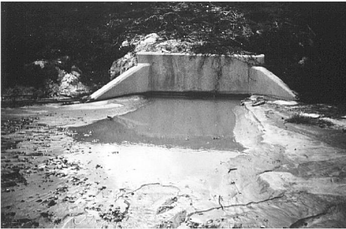
>
> Spatial reports of model data and simulation results are also shown on-screen. A box attached to the link or node will show items such as the peak flow and conduit diameter. Model results may also be shown using graphical encoding in which the color and size of the links and nodes is dependent on the model data or results.
>
> *Appendix A A.48*
>
> 
>
> **Tabular Reports**

The traditional text output file has been enhanced to show more meaningful tables

> of data and results.
>
> Some examples are:

- Tables showing culvert operation. These keep track of the flow conditions occurring in any culvert in the system throughout the simulation. The table reports the type of entrance or Eexit control and the time spent in that condition.

- Tables showing the backwater curve profile type for comparison with HEC-2 (M1, M2, etc.)

- Tables showing head losses at conduits during the simulation.

> A summary output file is also created to control the voluminous output possible in SWMM. This output file is the RPT file and contains only summary information on data input and output.
>
> **Appendix B**
>
> **Summary of Basic Data and Study Worksheets**
>
> **B.1 Details of Giralang Micro-catchments and Total Catchment**
>
> **<u>Giralang Catchment Location Map</u>**
>
> 
>
> *<u>Appendix B B.2</u>*
>
> **<u>Total Catchment Details</u>**
>
> **Urban Rural**
>
> Total catchment area = 62.91 ha + 27.825 ha = 90.735 ha
>
> Total number of allotments = 526
>
> **Catchment Breakup**
>
> **Impervious areas Total per Lot**
>
> Roofs (based on micro catchment) 0.0165 x 526 8.679 ha 165.00 m2
>
> Road (total measured off 1:500 maps) 6.372 ha 121.14 m2
>
> Footpaths along roads 0.639 ha 12.14 m2
>
> Driveways (boundary to kerb) 0.002 x 526 1.052 ha 20.00 m2
>
> Footpaths within external pathways 0.291 ha 5.53 m2
>
> Pathways within lots 0.005 x 526 <u>2.630 ha 50.00</u> m2
>
> Total 19.663 ha 373.81 m2
>
> **Urban Pervious Area**
>
> External Pathways 2.518 ha – 0.291 ha 2.227 ha  
> Pervious areas within lots
>
> = total lots to kerb 0.1027 ha x 526
>
> \- Roofs 8.679
>
> \- Footpaths 0.639
>
> \- Driveways 1.052
>
> \- internal pathways 2.630 <u>41.020 ha</u>
>
> Total 43.247 ha
>
> **Rural Pervious Area** Total <u>27.825 ha</u>
>
> **Overall total Area** 90.735 ha
>
> **Catchment Statistics**
>
> **% urban** 69.33%
>
> **Impervious fraction** (19.66/90.735) 21.67%
>
> **Impervious fraction of urban area** (19.66/62.91) 31.25%

<table>
<colgroup>
<col style="width: 61%" />
<col style="width: 38%" />
</colgroup>
<thead>
<tr class="header">
<th><em>Appendix B</em></th>
<th><em>B.3</em></th>
</tr>
</thead>
<tbody>
<tr class="odd">
<td><blockquote>

<strong>Average lot area to kerb</strong>

</blockquote></td>
<td>1027 m2</td>
</tr>
<tr class="even">
<td><blockquote>

<strong>Average road area per lot</strong>

</blockquote></td>
<td>121 m2</td>
</tr>
<tr class="odd">
<td><blockquote>

<strong>Average impervious area per lot</strong>

</blockquote></td>
<td>374 m2</td>
</tr>
<tr class="even">
<td><blockquote>

<strong>Average pervious area per lot</strong>

</blockquote></td>
<td>822.2 m2</td>
</tr>
<tr class="odd">
<td><blockquote>

<strong>Average roof area per lot</strong>

</blockquote></td>
<td>165 m2</td>
</tr>
<tr class="even">
<td><blockquote>

<strong>Number of fenced in lots</strong>

</blockquote></td>
<td>266</td>
</tr>
<tr class="odd">
<td><blockquote>

<strong>Number of free draining lots</strong>

</blockquote></td>
<td>260</td>
</tr>
</tbody>
</table>

> **Combined 300 and 450 Micro Catchment Details**

<table>
<colgroup>
<col style="width: 40%" />
<col style="width: 18%" />
<col style="width: 23%" />
<col style="width: 17%" />
</colgroup>
<thead>
<tr class="header">
<th></th>
<th></th>
<th><strong>Free Draining</strong></th>
<th><strong>Fenced In</strong></th>
</tr>
</thead>
<tbody>
<tr class="odd">
<td><blockquote>

Total catchment area

</blockquote></td>
<td>2.468 ha</td>
<td>1.225 ha</td>
<td>1.243 ha</td>
</tr>
<tr class="even">
<td><blockquote>

Total no. of lots

</blockquote></td>
<td>26</td>
<td><blockquote>

11

</blockquote></td>
<td>15</td>
</tr>
<tr class="odd">
<td><blockquote>

Total roof area

</blockquote></td>
<td>4,298 m2</td>
<td>4,298</td>
<td></td>
</tr>
<tr class="even">
<td><blockquote>

Total paths/driveway/footpath

</blockquote></td>
<td>1693 m2</td>
<td><blockquote>

982

</blockquote></td>
<td>706</td>
</tr>
<tr class="odd">
<td><blockquote>

Total road

</blockquote></td>
<td>1743 m2</td>
<td>1743</td>
<td></td>
</tr>
<tr class="even">
<td><blockquote>

Pervious area

</blockquote></td>
<td>16,950 m2</td>
<td>7,750</td>
<td>9,200</td>
</tr>
<tr class="odd">
<td><blockquote>

<strong>Combined Catchment Statistics</strong>

</blockquote></td>
<td></td>
<td></td>
<td></td>
</tr>
</tbody>
</table>

<table>
<colgroup>
<col style="width: 72%" />
<col style="width: 27%" />
</colgroup>
<thead>
<tr class="header">
<th><blockquote>

<strong>% urban</strong>

<strong>Area of impervious surfaces</strong>

</blockquote></th>
<th>100.00% 
0.7734 ha</th>
</tr>
</thead>
<tbody>
<tr class="odd">
<td><blockquote>

<strong>Impervious fraction</strong> (0.7734/2.468)

</blockquote></td>
<td>31.34%</td>
</tr>
<tr class="even">
<td><blockquote>

<strong>Average lot area to kerb</strong>

</blockquote></td>
<td>950 m2</td>
</tr>
<tr class="odd">
<td><blockquote>

<strong>Average road area per lot</strong>

</blockquote></td>
<td>67.04 m2</td>
</tr>
<tr class="even">
<td><blockquote>

<strong>Average impervious area per lot</strong>

</blockquote></td>
<td>297.5 m2</td>
</tr>
<tr class="odd">
<td><blockquote>

<strong>Average pervious area per lot</strong>

</blockquote></td>
<td>651.9 m2</td>
</tr>
<tr class="even">
<td><blockquote>

<strong>Average roof area per lot</strong>

</blockquote></td>
<td>165 m2</td>
</tr>
<tr class="odd">
<td><blockquote>

<strong>Number of fenced in lots</strong>

</blockquote></td>
<td>15</td>
</tr>
<tr class="even">
<td><blockquote>

<strong>Number of free draining lots</strong>

</blockquote></td>
<td>11</td>
</tr>
<tr class="odd">
<td><strong>300 Diameter Outlet Catchment – Drains Lots 1 to 12</strong></td>
<td></td>
</tr>
<tr class="even">
<td><blockquote>

Total roof area (house + connected garage)

</blockquote></td>
<td>0.2068 ha</td>
</tr>
<tr class="odd">
<td><blockquote>

Total impervious pathway connected to roof drainage

</blockquote></td>
<td>0.0290 ha</td>
</tr>
<tr class="even">
<td><blockquote>

Pervious area unconnected (trapped behind fencing)

</blockquote></td>
<td>0.6647 ha</td>
</tr>
</tbody>
</table>

> *<u>Appendix B B.4</u>*
>
> Impervious paths unconnected (trapped behind fencing) 0.0290 ha
>
> Pervious area unconnected (free draining) 0 ha
>
> Impervious paths unconnected (free draining) 0 ha
>
> Total Impervious connected 0.2358 ha
>
> Total Pervious connected 0 ha
>
> **450 Diameter Outlet Catchment – Drains Lots 13 to 26 +  
> All Gundulu Place road surface**
>
> Total roof area (house + connected garage) 0.2230 ha
>
> Total impervious pathway connected to roof drainage 0.0085 ha
>
> Pervious area unconnected (trapped behind fencing) 0.2553 ha
>
> Impervious paths unconnected (trapped behind fencing) 0.0085 ha
>
> Pervious area unconnected (free draining) 0.7750 ha
>
> Impervious paths unconnected (free draining) 0.0938 ha
>
> Total road area kerb to kerb 0.1743 ha
>
> Total Impervious roof 0.2230 ha
>
> Total Pervious free draining 0.7750 ha
>
> Total impervious road + pathing free draining 0.2766 ha
>
> *<u>Appendix B B.5</u>*
>
> **Comparison between combined micro-catchment and total Giralang urban catchment effective runoff areas and potential flow peak ratios for use with XP-EXTRAN analysis.**
>
> The micro-catchments contain 26 allotments, while the total urban catchment contains 526.
>
> When carrying out the XP-EXTRAN hydraulic modelling in Chapter 6 the combined micro-catchment gauged flow hydrographs were spatially distributed to 20 (526/26 = 20.23) separate nodes throughout the total urban catchment model. This was carried out to separately test the hydraulic response of the catchment post localised (as represented by the micro-catchment gauged hydrographs) hydrological inputs.
>
> Although the micro-catchment and total urban area land use proportions were similar, they were not exactly the same to allow direct use of the gauged data at each of the 20 nodes.
>
> The computations below calculate the necessary adjustment factor to the combined micro-catchment gauged hydrographs, when applied to the 20 nodes, to properly represent the comparable total urban catchment hydrologic input.
>
> The listed areas indicate the effective areas that freely drain to the public drainage system. The areas not included include those trapped behind paling fences.
>
> **Combined Micro Catchment Total Urban**

<table>
<colgroup>
<col style="width: 28%" />
<col style="width: 22%" />
<col style="width: 48%" />
</colgroup>
<thead>
<tr class="header">
<th colspan="2"><blockquote>

<strong>EffectiveArea in m2</strong>

</blockquote></th>
<th><strong>EffectiveArea in m2</strong></th>
</tr>
</thead>
<tbody>
<tr class="odd">
<td>100% Roofs</td>
<td>4298</td>
<td>86790</td>
</tr>
<tr class="even">
<td>100% Roads</td>
<td>2725</td>
<td>109834</td>
</tr>
<tr class="odd">
<td>100% Yards</td>
<td>7750*</td>
<td>213769**</td>
</tr>
</tbody>
</table>

> \* Based on 11 only freely draining yard areas  
> \*\* Based on 260 only freely draining yard areas
>
> The estimation of combined micro-catchment hydrograph adjustment factors has been based on both the 3/1/93 and 13/5/95 storm events. It was decided to use more than one event to test how event-based the factor may be.
>
> *<u>Appendix B B.6</u>*
>
> **3/1/93 Event (Results from 14 allotment, 450 mm diameter gauge)**

| Individual Roof | 0.003474 m3/s 100 | % x (160 | m2)\*\*\* | flow x 106 /m2 = 21.71 |
|-----------------|------------------------------|----------|----------------------|----------------------------------------------|
| Individual Road | 0.006251 m3/s 100 | % x (198 | m2)\*\*\* | flow x 106 /m2 = 31.57 |
| Individual Yard | 0.008826 m3/s 50  | % x (553 | m2)\*\*\* | flow x 106 /m2 = 31.92 |

> \*\*\* Areas are average for each of the 14 allotments being modelled
>
> The right hand side flow factors are computed for the 3/1/93 event are based on zero losses for roofs, zero losses for roads and 50% proportional loss for yards as per the Chapter 6 modelling.
>
> Flow peaks were taken from XP-RAFTS Workbench results for model g030193f.xp.
>
> Computation of multiplication factor based on 3/1/93 event (Highest peak)

<table style="width:100%;">
<colgroup>
<col style="width: 24%" />
<col style="width: 31%" />
<col style="width: 11%" />
<col style="width: 32%" />
</colgroup>
<thead>
<tr class="header">
<th colspan="2"><strong>Combined Micro-Catchment</strong></th>
<th></th>
<th><strong>Total Urban Area</strong></th>
</tr>
</thead>
<tbody>
<tr class="odd">
<td><blockquote>

100% Roofs

</blockquote></td>
<td>4298 x 100 % x 21.71</td>
<td></td>
<td>86790 x 100 % x 21.71</td>
</tr>
<tr class="even">
<td><blockquote>

100% Roads

</blockquote></td>
<td>2725 x 100 % x 31.57</td>
<td></td>
<td>109834 x 100 % x 31.57</td>
</tr>
<tr class="odd">
<td><blockquote>

100% Yards

</blockquote></td>
<td>7750 x 50 % x 31.92</td>
<td></td>
<td>213769 x 50 % x 31.92</td>
</tr>
<tr class="even">
<td><blockquote>

Accumulated Totals

</blockquote></td>
<td><blockquote>

303028

</blockquote></td>
<td></td>
<td><blockquote>

8763424

</blockquote></td>
</tr>
<tr class="odd">
<td></td>
<td><blockquote>

8763424 / 303028

</blockquote></td>
<td>= 28.92</td>
<td></td>
</tr>
<tr class="even">
<td><blockquote>

Allotment ratio

</blockquote></td>
<td><blockquote>

526 /26 = 20.23

</blockquote></td>
<td></td>
<td></td>
</tr>
</tbody>
</table>

> Multiplication Factor for 3/1/93 event = 28.92 / 20.23 = 1.43
>
> As there to be 20 nodes Multiplication Factor = 20.23/20.0 x 1.43 = 1.45 **13/5/95 Event (Results from 14 allotment, 450 mm diameter gauge)**
>
> Individual Roof 0.001931 m3/s 100 % x (160 m2) flow x 106 /m2 = 12.07
>
> Individual Road 0.005106 m3/s 100 % x (198 m2) flow x 106 /m2 = 25.79
>
> Individual Yard 0.002829 m3/s 15 % x (553 m2) flow x 106 /m2 = 34.10
>
> The right hand side flow factors are computed for the 13/5/95 event are based on zero losses for roofs, zero losses for roads and 85% proportional loss for yards as per the Chapter 6 modelling.
>
> Flow peaks were taken from XP-RAFTS Workbench results for model g130595f.xp.
>
> *<u>Appendix B B.7</u>*
>
> Computation of multiplication factor based on 13/5/95 event
>
> **Combined Micro-Catchment Total Urban Area**

<table>
<colgroup>
<col style="width: 24%" />
<col style="width: 31%" />
<col style="width: 11%" />
<col style="width: 32%" />
</colgroup>
<thead>
<tr class="header">
<th><blockquote>

100% Roofs

</blockquote></th>
<th>4298 x 100 % x 12.07</th>
<th></th>
<th>86790 x 100 % x 12.07</th>
</tr>
</thead>
<tbody>
<tr class="odd">
<td><blockquote>

100% Roads

</blockquote></td>
<td>2725 x 100 % x 25.79</td>
<td></td>
<td>109834 x 100 % x 25.79</td>
</tr>
<tr class="even">
<td><blockquote>

100% Yards

</blockquote></td>
<td>7750 x 15 % x 34.10</td>
<td></td>
<td>213769 x 15 % x 34.10</td>
</tr>
<tr class="odd">
<td><blockquote>

Accumulated Totals

</blockquote></td>
<td><blockquote>

161795

</blockquote></td>
<td></td>
<td><blockquote>

4973603

</blockquote></td>
</tr>
<tr class="even">
<td></td>
<td><blockquote>

4973603 / 161795

</blockquote></td>
<td>= 30.74</td>
<td></td>
</tr>
<tr class="odd">
<td><blockquote>

Allotment ratio

</blockquote></td>
<td><blockquote>

526 /26 = 20.23

</blockquote></td>
<td></td>
<td></td>
</tr>
</tbody>
</table>

> Multiplication Factor for 13/5/95 event = 30.74 / 20.23 = 1.52
>
> As there to be 20 nodes Multipication Factor = 20.23/20.0 x 1.52 = 1.54
>
> The multiplication factors calculated from the 3/1/93 and 13/5/95 events although not the same are thought to be similar enough, for the exercise in question, to adopt an average between them of 1.49 (say 1.5).
>
> *<u>Appendix B B.8</u>*
>
> **B.2 Gauged Data Summary**
>
> **B.2.1 Introduction**
>
> This section provides a summary of the raw rainfall and runoff data files collected during 1993, 1994 and 1995 within the Giralang and Spence catchments as well as the input files to the translation program, **int.exe**. The source and executable forms of this program are provided in Appendix F on CD-ROM, along with the input files.
>
> All data were ultimately translated into the standard HYDSYS ASCII data format for ongoing interpretation and calibration studies.
>
> The rainfall data was initially downloaded from Hydrological Services 0.2 mm tipping bucket recording rain gauges with inbuilt data loggers. The logger data was transposed to the HYDSYS format utilising a Fortran program developed as part of the current research.
>
> The flow data was initially downloaded from Wesdata capacitive stage recording probes and integrated data loggers. The raw binary data from these probes was also transposed to HYDSYS ASCII data, using the int.exe software, for further interpretation.
>
> The HYDSYS rainfall/flow file format is as follows:
>
> Station Variable Year Month Day Hr Min Value Second
>
> A8 F7.0 I4 I2 I2 I2 I2 F12.0 I2
>
> The variable defines whether the value is rainfall (mm) or runoff (m3/s). Variable = 10 means rainfall, Variable = 140 means flow.
>
> The XP-RAFTS simulation period must occur after the start of the first file date/time record. If the simulation period extends past the last date in the record, zero values are assumed for the remainder of the simulation. One file can contain all of the rainfall and flow stations likely to be utilised in the simulation or separate files for each station and variable type can be utilised if preferred.
>
> The XP-RAFTS user interface provided a direct means to read, graph and utilise the HYDSYS data for either rainfall or runoff, allowing efficient data analysis.
>
> The following sections provide details of the data files, which are included on the CD-ROM enclosed with this thesis.
>
> *<u>Appendix B B.9</u>*
>
> **B.2.2 Flow Data**
>
> **<u>450 dia micro catchment outlet Giralang</u>**
>
> <u>Raw Logger files Period of record Specific Notes</u>
>
> <u>Plus int.exe Input files</u>
>
> <u>File 1</u> road.stp **29/12/92 to 04/01/93** n=.014
>
> Pipe slope = 3.93%
>
> 1 Julian 364 = 29/12/92
>
> 3 Logger 92,12,29,15,05,08
>
> 92,12,29,15,05,08 Watch 92,12,29,15,05,08
>
> .457,3.93,0.014,-0.288,1 Add zero
>
> road.stp 25/12/92 to 3/1/93 no rain
>
> spread log ended 370 4/1/93 14:45
>
> **040193RD.014 Hydsys Flow File** Book 4  
> rdrf
>
> The data on the left is the input file for the developed program int.exe that converts raw ASCII logger data \*.stp into a standard HYDSYS format file \*.014.
>
> The first line (1) indicates number of stations to be analysed
>
> The second line (3) indicates the type of data either rainfall(4) or flow (3)
>
> The third line (92,12,29,15,05,08) indicates the true starting time
>
> The fourth line (.457,3.93,0.014,-0.288,1) defines the pipe outlet details and
>
> wet well characteristics to convert stage height to flow. .457 equals pipe  
> diameter, 3.93 is slope, 0.014 is relative Mannings roughness and –0.288 indicates the wet well zero mark corresponding to the linear logger rating
>
> line. The logger was separately calibrated with the wet well prior to  
> installation and tested at a number of times throughout the monitoring period. The fifth line (road.stp)is the raw logger data file for the period listed The sixth line (spread) is the spreadsheet file listing output file for general use.
>
> The seventh line (**040193RD.014)** gives the Hysdsys output file for input into XP-RAFTS
>
> The eighth line (rdrf) defines the Station name adopted for the Hydsys file.
>
> The notes on the right hand side provide information taken from the monitoring diary for the specific recording period, including the book number from which the notes were extracted.
>
> <u>File 2</u> road2.stp **04/01/93 to 20/01/93** n=.014
>
> Pipe slope = 3.93%
>
> 1 Julian 004 = 04/01/93
>
> 3 File saved 93:20:12:55:09
>
> 93,01,04,14,52,12 Watch 93:20:12:58:38
>
> .457,3.93,0.014,-0.289,1 Add 2m 38s
>
> road2.stp Adjst start 93,1,4,14,49,34
>
> spread + 2,38
>
> **200193RD.014 Hydsys Flow File** <u>93,01,04,14,52,12</u>
>
> rdrf Book 6
>
> <u>File 3</u> road3.stp **20/01/93 to 22/01/93** n=.014
>
> Pipe slope = 3.93%
>
> 1 Julian 022 = 22/01/93
>
> 3 File saved 93:22:09:19:43
>
> 93,01,20,12,59,10 Watch 93:22:09:22:21
>
> .457,3.93,0.014,-0.289,1 Add 2m 38s
>
> road3.stp Adjst start 93,1,20,12,56,32
>
> spread + 2,38
>
> **220193RD.014 Hydsys Flow File** <u>93,01,20,12,59,10</u>
>
> rdrf Book 6
>
> *<u>Appendix B B.10</u>*

<table>
<colgroup>
<col style="width: 40%" />
<col style="width: 3%" />
<col style="width: 12%" />
<col style="width: 15%" />
<col style="width: 21%" />
<col style="width: 6%" />
</colgroup>
<thead>
<tr class="header">
<th><blockquote>

File 4 110293rd.stp <strong>22/01/93</strong>

</blockquote></th>
<th><strong>to</strong></th>
<th><strong>11/02/93</strong></th>
<th><blockquote>

n=.014

</blockquote></th>
<th colspan="2"></th>
</tr>
</thead>
<tbody>
<tr class="odd">
<td></td>
<td></td>
<td></td>
<td><blockquote>

Pipe slope

</blockquote></td>
<td colspan="2"><blockquote>

= 3.93%

</blockquote></td>
</tr>
<tr class="even">
<td><blockquote>

1

</blockquote></td>
<td></td>
<td></td>
<td><blockquote>

Julian 022

</blockquote></td>
<td colspan="2"><blockquote>

= 22/01/93

</blockquote></td>
</tr>
<tr class="odd">
<td><blockquote>

3

</blockquote></td>
<td></td>
<td></td>
<td><blockquote>

File saved

</blockquote></td>
<td colspan="2"><blockquote>

93:42:14:21:10

</blockquote></td>
</tr>
<tr class="even">
<td><blockquote>

93,01,22,09,22,36

</blockquote></td>
<td></td>
<td></td>
<td><blockquote>

Watch

</blockquote></td>
<td colspan="2">93:22:09:23:48</td>
</tr>
<tr class="odd">
<td><blockquote>

.457,3.93,0.014,-0.289,1

</blockquote></td>
<td></td>
<td></td>
<td><blockquote>

Add 2m 38s

</blockquote></td>
<td colspan="2"></td>
</tr>
<tr class="even">
<td><blockquote>

110293rd.stp

</blockquote></td>
<td></td>
<td></td>
<td><blockquote>

Adjst start

</blockquote></td>
<td colspan="2">93,1,22,09,19,58</td>
</tr>
<tr class="odd">
<td><blockquote>

spread

</blockquote></td>
<td></td>
<td></td>
<td></td>
<td colspan="2">+ 2,38</td>
</tr>
<tr class="even">
<td rowspan="2"><strong>110293RD.014 Hydsys Flow File</strong> rdrf</td>
<td rowspan="2"></td>
<td colspan="2">93,01,22,09,22,36</td>
<td colspan="2" rowspan="2"></td>
</tr>
<tr class="odd">
<td></td>
<td><blockquote>

Book 8

</blockquote></td>
</tr>
<tr class="even">
<td><blockquote>

File 5 190693rd.stp <strong>11/02/93</strong>

</blockquote></td>
<td><strong>to</strong></td>
<td><strong>19/06/93</strong></td>
<td><blockquote>

n=.014

</blockquote></td>
<td colspan="2"></td>
</tr>
<tr class="odd">
<td></td>
<td></td>
<td></td>
<td><blockquote>

Pipe slope

</blockquote></td>
<td colspan="2"><blockquote>

= 3.93%

</blockquote></td>
</tr>
<tr class="even">
<td><blockquote>

1

</blockquote></td>
<td></td>
<td></td>
<td><blockquote>

Julian 168

</blockquote></td>
<td colspan="2"><blockquote>

= 19/06/93

</blockquote></td>
</tr>
<tr class="odd">
<td><blockquote>

3

</blockquote></td>
<td></td>
<td></td>
<td><blockquote>

File saved

</blockquote></td>
<td colspan="2"><blockquote>

93:168:17:45:57

</blockquote></td>
</tr>
<tr class="even">
<td><blockquote>

93,02,11,14,24,00

</blockquote></td>
<td></td>
<td></td>
<td><blockquote>

Watch

</blockquote></td>
<td colspan="2">93:168:17:48:23</td>
</tr>
<tr class="odd">
<td><blockquote>

.457,3.93,0.014,-0.289,1

</blockquote></td>
<td></td>
<td></td>
<td><blockquote>

Add 2m 26s

</blockquote></td>
<td colspan="2"></td>
</tr>
<tr class="even">
<td><blockquote>

roadz.stp

</blockquote></td>
<td></td>
<td></td>
<td><blockquote>

Adjst start

</blockquote></td>
<td colspan="2">93,2,11,14,21,34</td>
</tr>
<tr class="odd">
<td><blockquote>

spread

</blockquote></td>
<td></td>
<td></td>
<td></td>
<td colspan="2">+ 2,26</td>
</tr>
<tr class="even">
<td><blockquote>

<strong>190693RD.014 Hydsys Flow File</strong>

</blockquote></td>
<td></td>
<td colspan="3">93,02,11,14,24,00</td>
<td></td>
</tr>
<tr class="odd">
<td><blockquote>

rdrf

</blockquote></td>
<td></td>
<td></td>
<td colspan="2"><blockquote>

Book 10

</blockquote></td>
<td></td>
</tr>
<tr class="even">
<td><blockquote>

File 6 130893rd.stp <strong>19/06/93</strong>

</blockquote></td>
<td><strong>to</strong></td>
<td><strong>13/08/93</strong></td>
<td colspan="2"><blockquote>

n=.014

</blockquote></td>
<td></td>
</tr>
<tr class="odd">
<td></td>
<td></td>
<td></td>
<td colspan="2"><blockquote>

Pipe slope = 3.93%

</blockquote></td>
<td></td>
</tr>
<tr class="even">
<td><blockquote>

1

</blockquote></td>
<td></td>
<td></td>
<td colspan="2"><blockquote>

Julian 223 = 11/08/93

</blockquote></td>
<td></td>
</tr>
<tr class="odd">
<td><blockquote>

3

</blockquote></td>
<td></td>
<td></td>
<td colspan="2"><blockquote>

File saved 93:223:19:01:00

</blockquote></td>
<td></td>
</tr>
<tr class="even">
<td><blockquote>

93,06,19,14,55,44

</blockquote></td>
<td></td>
<td></td>
<td colspan="2"><blockquote>

Watch 93:225:16:27:00

</blockquote></td>
<td></td>
</tr>
<tr class="odd">
<td><blockquote>

.457,3.93,0.014,-0.289,1

</blockquote></td>
<td></td>
<td></td>
<td colspan="2"><blockquote>

Add 1day 21 hr 26m 0s

</blockquote></td>
<td></td>
</tr>
<tr class="even">
<td><blockquote>

130893d.stp

</blockquote></td>
<td></td>
<td></td>
<td colspan="2"><blockquote>

Adjst start 93,6,17,17,29,44

</blockquote></td>
<td></td>
</tr>
<tr class="odd">
<td><blockquote>

spread

</blockquote></td>
<td></td>
<td></td>
<td colspan="2">+ 1,21,26,00</td>
<td></td>
</tr>
<tr class="even">
<td><blockquote>

<strong>130893RD.014 Hydsys Flow File</strong>

</blockquote></td>
<td></td>
<td colspan="3">93,06,19,14,55,44</td>
<td></td>
</tr>
<tr class="odd">
<td><blockquote>

rdrf

</blockquote></td>
<td></td>
<td></td>
<td colspan="2"><blockquote>

Book 11

</blockquote></td>
<td></td>
</tr>
<tr class="even">
<td><blockquote>

File 7 300993d.stp <strong>13/08/93</strong>

</blockquote></td>
<td><strong>to</strong></td>
<td><strong>30/09/93</strong></td>
<td colspan="2"><blockquote>

n=.014

</blockquote></td>
<td></td>
</tr>
<tr class="odd">
<td></td>
<td></td>
<td></td>
<td colspan="2"><blockquote>

Pipe slope = 3.93%

</blockquote></td>
<td></td>
</tr>
<tr class="even">
<td><blockquote>

1

</blockquote></td>
<td></td>
<td></td>
<td colspan="2"><blockquote>

Julian 273 = 30/09/93

</blockquote></td>
<td></td>
</tr>
<tr class="odd">
<td><blockquote>

3

</blockquote></td>
<td></td>
<td></td>
<td colspan="2"><blockquote>

File saved 93:273:15:05:54

</blockquote></td>
<td></td>
</tr>
<tr class="even">
<td><blockquote>

93,08,13,16,28,42

</blockquote></td>
<td></td>
<td></td>
<td colspan="2"><blockquote>

Watch 93:275:12:31:54

</blockquote></td>
<td></td>
</tr>
<tr class="odd">
<td><blockquote>

.457,3.93,0.014,-0.289,1

</blockquote></td>
<td></td>
<td></td>
<td colspan="2"><blockquote>

Add 1day 21 hr 26m 0s

</blockquote></td>
<td></td>
</tr>
<tr class="even">
<td><blockquote>

300993d.stp

</blockquote></td>
<td></td>
<td></td>
<td colspan="2"><blockquote>

Adjst start 93,8,11,19,02,42

</blockquote></td>
<td></td>
</tr>
<tr class="odd">
<td><blockquote>

spread

</blockquote></td>
<td></td>
<td></td>
<td colspan="2">+ 1,21,26,00</td>
<td></td>
</tr>
<tr class="even">
<td><blockquote>

<strong>300993RD.014 Hydsys Flow File</strong>

</blockquote></td>
<td></td>
<td colspan="2">93,08,13,16,28,42</td>
<td colspan="2"></td>
</tr>
<tr class="odd">
<td><blockquote>

rdrf

</blockquote></td>
<td></td>
<td></td>
<td><blockquote>

Book 11

</blockquote></td>
<td colspan="2"></td>
</tr>
<tr class="even">
<td><blockquote>

File 8 271293d.stp <strong>30/09/93</strong>

</blockquote></td>
<td><strong>to</strong></td>
<td><strong>27/12/93</strong></td>
<td><blockquote>

n=.014

</blockquote></td>
<td colspan="2"></td>
</tr>
<tr class="odd">
<td></td>
<td></td>
<td></td>
<td><blockquote>

Pipe slope

</blockquote></td>
<td colspan="2"><blockquote>

= 3.93%

</blockquote></td>
</tr>
<tr class="even">
<td><blockquote>

1

</blockquote></td>
<td></td>
<td></td>
<td><blockquote>

Julian 361

</blockquote></td>
<td colspan="2"><blockquote>

= 27/12/93

</blockquote></td>
</tr>
<tr class="odd">
<td><blockquote>

3

</blockquote></td>
<td></td>
<td></td>
<td><blockquote>

File saved

</blockquote></td>
<td colspan="2"><blockquote>

93:361:13:40:01

</blockquote></td>
</tr>
<tr class="even">
<td><blockquote>

93,09,30,15,08,22

</blockquote></td>
<td></td>
<td></td>
<td><blockquote>

Watch

</blockquote></td>
<td colspan="2">93:361:13:41:01</td>
</tr>
<tr class="odd">
<td><blockquote>

.457,3.93,0.014,-0.289,1

</blockquote></td>
<td></td>
<td></td>
<td><blockquote>

Add 1m 0s

</blockquote></td>
<td colspan="2"></td>
</tr>
<tr class="even">
<td><blockquote>

271293d.stp

</blockquote></td>
<td></td>
<td></td>
<td><blockquote>

Adjst start

</blockquote></td>
<td colspan="2">93,9,30,15,07,22</td>
</tr>
<tr class="odd">
<td><blockquote>

spread

</blockquote></td>
<td></td>
<td></td>
<td></td>
<td colspan="2"><blockquote>

+ 1,00

</blockquote></td>
</tr>
</tbody>
</table>

> **271293RD.014 Hydsys Flow File** <u>93,09,30,15,08,22</u>  
> rdrf
>
> <u>File 9</u> 150394d.stp **27/12/93 to 15/03/94**
>
> 1
>
> 3
>
> 93,12,27,13,56,46
>
> .457,3.93,0.014,-0.289,1
>
> 150394d.stp
>
> spread
>
> **150394RD.014 Hydsys Flow File**
>
> rdrf
>
> *<u>Appendix B B.11</u>*
>
> <u>File 10</u> 110694d.stp **15/03/94 to 11/06/94**
>
> 1
>
> 3
>
> 94,03,15,13,09,50
>
> .457,3.93,0.014,-0.289,1
>
> 110694d.stp
>
> spread
>
> **110694RD.014 Hydsys Flow File**
>
> rdrf
>
> <u>File 11</u> 041194d.stp **11/06/94 to 04/11/94**
>
> 1
>
> 3
>
> 94,06,11,16,23,44
>
> .457,3.93,0.014,-0.289,1
>
> 041194d.stp
>
> spread
>
> **041194RD.014 Hydsys Flow File**
>
> rdrf
>
> <u>File 12</u> 261194d.stp **04/11/94 to 26/11/94**
>
> 1
>
> 3
>
> 94,11,04,10,13,00
>
> .457,3.93,0.014,-0.289,1
>
> 261194d.stp
>
> spread
>
> **261194RD.014 Hydsys Flow File**
>
> rdrf
>
> <u>File 13</u> 301194d.stp **26/11/94 to 30/11/94**
>
> 1
>
> 3
>
> 94,11,26,10,50,32
>
> .457,3.93,0.014,-0.289,1
>
> 301194d.stp
>
> spread
>
> **301194RD.014 Hydsys Flow File**
>
> rdrf
>
> <u>File 14</u> 180195d.stp **30/11/94 to 18/01/95**
>
> 1
>
> 3
>
> 94,11,30,12,35,34
>
> .457,3.93,0.014,-0.289,1
>
> 180195d.stp
>
> spread
>
> **180195RD.014 Hydsys Flow File**
>
> rdrf
>
> <u>File 15</u> 060295d.stp **18/01/95 to 06/02/95**
>
> 1
>
> 3
>
> 95,01,18,11,58,16
>
> .457,3.93,0.014,-0.289,1
>
> 060295d.stp
>
> spread
>
> **060295RD.014 Hydsys Flow File**
>
> rdrf
>
> *<u>Appendix B B.12</u>*
>
> <u>File 16</u> 160695d.stp **06/02/95 to 16/06/95**
>
> 1
>
> 3
>
> 95,02,06,11,14,56
>
> .457,3.93,0.014,-0.290,1
>
> 160695d.stp
>
> spread
>
> **160695RD.014 Hydsys Flow File**
>
> rdrf
>
> <u>File 17</u> 030196dd.stp **16/06/95 to 03/01/96**
>
> 1
>
> 3
>
> 95,06,16,13,31,36 ran out of memory
>
> .457,3.93,0.014,-0.289,1 31/8/95
>
> 030196dd.stp
>
> spread
>
> **030196RD.014 Hydsys Flow File**
>
> rdrf
>
> **<u>300 dia micro catchment outlet Giralang</u>**
>
> <u>Raw Logger files Period of record Specific Notes</u>
>
> <u>Plus INT.exe Input files</u>
>
> <u>File 1</u> roof.stp **29/12/92 to 04/01/93** n=.010
>
> Pipe slope = 3.61%
>
> 1 Julian 364 = 29/12/92
>
> 3 Logger 92,12,29,14,35,28
>
> 92,12,29,14,35,28 Watch 92,12,29,14,35,28
>
> .305,3.61,0.010,-0.162,1 Add zero
>
> roof.stp
>
> spread
>
> **040193RF.010 Hydsys Flow File** Book 4  
> roofs
>
> <u>File 2</u> roofs2.stp **04/01/93 to 20/01/93** n=.010
>
> Pipe slope = 3.61%
>
> 1 Julian 004 = 04/01/93
>
> 3
>
> 93,01,04,14,57,29
>
> .305,3.61,0.010,-0.163,1 Add 0m 53s
>
> roofs2.stp Adjst start 93,1,4,14,56,36
>
> spread + 0,53
>
> **200193RF.010 Hydsys Flow File** <u>93,01,04,14,57,29</u>  
> roofs
>
> <u>File 3</u> roofs3.stp **20/01/93 to 22/01/93** n=.010
>
> Pipe slope = 3.61%
>
> 1 Julian 020 = 20/01/93
>
> 3
>
> 93,01,20,12,45,10
>
> .305,3.61,0.010,-0.167,1 Add 0m 0s
>
> roofs3.stp Adjst start 93,1,20,12,45,10
>
> spread + 0
>
> **220193RF.010 Hydsys Flow File** <u>93,01,20,12,45,10</u>
>
> roofs Book 6
>
> <u>File 4</u> 110293rf.stp **22/01/93 to 11/02/93** n=.010
>
> Pipe slope = 3.61%
>
> 1 Julian 022 = 22/01/93
>
> 3 logger 93:1:22:09:10:04
>
> 93,01,22,09,10,04 True 93:1:22:09:10:04
>
> .305,3.61,0.010,-0.167,1 Add 0
>
> *<u>Appendix B B.13</u>*
>
> 110293rf.stp
>
> spread
>
> **110293RF.010 Hydsys Flow File**
>
> roofs Book 8
>
> <u>File 5</u> roofz.stp **11/02/93 to 19/06/93** n=.010
>
> Pipe slope = 3.61%
>
> 1 Julian 168 = 19/06/93
>
> 3 logger 93:02:11:14:11:30
>
> 93,02,11,14,11,30 true 93:02:11:14:11:30
>
> .305,3.61,0.010,-0.167,1 Add 0
>
> roofz.stp Julian 42 = 11/02/93
>
> spread
>
> **190693RF.010 Hydsys Flow File**
>
> roofs Book 10
>
> <u>File 6</u> 130893r.stp **19/06/93 to 13/08/93** n=.010
>
> Pipe slope = 3.61%
>
> 1 Julian 168 = 17/06/93
>
> 3 logger 93:06:17:17:46:16
>
> 93,06,19,15,0,0 true 93:06:19:15:0:0  
> .305,3.61,0.010,-0.167,1
>
> 130893r.stp Book 10
>
> spread
>
> **130893RF.010 Hydsys Flow File**
>
> roofs Book 11
>
> <u>File 7</u> 300993r.stp **13/08/93 to 30/09/93** n=.010
>
> Pipe slope = 3.61%
>
> 1 Julian 273 = 30/09/93
>
> 3 logger 93:08:11:18:51:06
>
> 93,08,13,16,16,0 true 93:08:13:16:16:0
>
> .305,3.61,0.010,-0.167,1 check rainfall
>
> 300993r.stp
>
> spread
>
> **300993RF.010 Hydsys Flow File**
>
> roofs Book 13/14
>
> <u>File 8</u> 271293r.stp **30/09/93 to 27/12/93** n=.010
>
> Pipe slope = 3.61%
>
> 1 Julian 361 = 27/12/93
>
> 3 logger 93:09:30:14:55:44
>
> 93,09,30,14,56,44 true 93:09:30:14:56:44
>
> .305,3.61,0.010,-0.169,1 Add 1m 0s
>
> 271293r.stp Adjst start 93,9,30,14,5,44
>
> spread + 1,00

<table>
<colgroup>
<col style="width: 6%" />
<col style="width: 3%" />
<col style="width: 17%" />
<col style="width: 16%" />
<col style="width: 18%" />
<col style="width: 38%" />
</colgroup>
<thead>
<tr class="header">
<th colspan="3" rowspan="2"><strong>271293RF.010 Hydsys</strong> roofs</th>
<th rowspan="2"><strong>Flow File</strong></th>
<th colspan="2">93,09,30,14,56,44</th>
</tr>
<tr class="odd">
<th></th>
<th><blockquote>

Delete test sequence at end

</blockquote></th>
</tr>
</thead>
<tbody>
<tr class="odd">
<td>File</td>
<td>9</td>
<td>090394r.stp</td>
<td><strong>27/12/93</strong></td>
<td><blockquote>

<strong>to 09/03/94</strong>

</blockquote></td>
<td><blockquote>

Garbage data

</blockquote></td>
</tr>
<tr class="even">
<td></td>
<td></td>
<td></td>
<td></td>
<td></td>
<td><blockquote>

Faulty logger recording

</blockquote></td>
</tr>
<tr class="odd">
<td></td>
<td></td>
<td></td>
<td></td>
<td></td>
<td><blockquote>

Book 15

</blockquote></td>
</tr>
<tr class="even">
<td>File</td>
<td>10</td>
<td>150394r.stp</td>
<td><strong>09/03/94 to</strong></td>
<td><blockquote>

<strong>15/03/94</strong>

</blockquote></td>
<td></td>
</tr>
</tbody>
</table>

> 1
>
> 3
>
> 94,03,09,17,04,24
>
> .305,3.61,0.010,-.169,1
>
> 150394r.stp
>
> spread
>
> **150394RF.010 Hydsys Flow File**
>
> roofs
>
> <u>File 11</u> 110694r.stp **15/03/94 to 11/06/94**
>
> 1
>
> 3
>
> 93,09,30,15,08,22
>
> *<u>Appendix B B.14</u>*
>
> .305,3.61,0.010,-.169,1
>
> 110694r.stp
>
> spread
>
> **110694RF.010 Hydsys Flow File**
>
> roofs
>
> <u>File 12</u> 180195r.stp **11/06/94 to 18/01/95**
>
> 1
>
> 3
>
> 94,06,11,15,56,16
>
> .305,3.61,0.010,-.169,1
>
> 180195r.stp
>
> spread
>
> **180195RF.010 Hydsys Flow File**
>
> roofs
>
> <u>File 13</u> 070295r.stp **18/01/95 to 07/02/95**
>
> 1
>
> 3
>
> 95,01,18,12,17,18
>
> .305,3.61,0.010,-.169,1
>
> 070295r.stp
>
> spread
>
> **070295RF.010 Hydsys Flow File**
>
> roofs
>
> <u>File 14</u> 160695r.stp **07/02/95 to 16/06/95**
>
> 1 book 21
>
> 3
>
> 95,02,07,11,55,38
>
> .305,3.61,0.010,-.171,1
>
> 160695r.stp
>
> spread
>
> **160695RF.010 Hydsys Flow File**
>
> roofs
>
> <u>File 15</u> 030196rr.stp **16/06/95 to 03/01/96**
>
> 1
>
> 3
>
> 95,06,16,13,16,56
>
> .305,3.61,0.010,-.171,1
>
> 030196rr.stp
>
> spread
>
> **030196RF.010 Hydsys Flow File**
>
> roofs
>
> *<u>Appendix B B.15</u>*
>
> **<u>Vee Notch Gauge Spence Roof</u>**
>
> <u>Raw Logger files Period of record Specific Notes</u>
>
> <u>Plus INT.exe Input files</u>
>
> <u>File 1</u> 080495v.stp **04/03/95 to 08/04/95**
>
> 1
>
> 3
>
> 95,3,4,16,02,04
>
> -1,0.319277,0,-.379,1
>
> 080495v.stp
>
> spread
>
> **080495v.his Hydsys Flow File**
>
> roof
>
> The data on the left is the input file for the developed program int.exe that converts raw ASCII logger data \*.stp into a standard HYDSYS format file \*.his.
>
> The first line (1) indicates number of stations to be analysed
>
> The second line (3) indicates the type of data either rainfall(4) or flow (3)
>
> The third line (95,3,4,16,02,04) indicates the true starting time
>
> The fourth line (-1,0.319277,0,-.379,1) defines the logger rating curve. The
>
> logger was separately calibrated prior to installation.
>
> The fifth line (080495v.stp) is the raw logger data file for the period listed
>
> The sixth line (spread) is spreadsheet file listing output file for general
>
> use.
>
> The seventh line (**080495v.his**) Hysdsys output file for input into XP-RAFTS
>
> The eighth line (roof) Station name adopted for Hydsys file.
>
> The notes on the right hand side provide information taken from monitoring diary for the specific recording period.
>
> <u>File 2</u> 290495v.stp **08/04/95 to 29/04/95**
>
> 1
>
> 3
>
> 95,4,8,14,20,40
>
> -1,0.319277,0,-.379,1
>
> 290495.stp
>
> spread
>
> **290495vv.his Hydsys Flow File**
>
> roof
>
> <u>File 3</u> 290495c.stp **29/04/95 to 29/04/95**
>
> 1 Calibration data
>
> 3
>
> 95,04,29,15,06,58
>
> -1,0.319277,0,-.379,1
>
> 290495c.stp
>
> spread
>
> **290495vc.his Hydsys Flow File**
>
> roof
>
> <u>File 4</u> 060595h.stp **29/04/95 to 06/05/95**
>
> 1
>
> 3
>
> 95,04,29,16,55,54
>
> -1,0.319277,0,-.379,1
>
> 060595h.stp
>
> spread
>
> **060595v.his Hydsys Flow File**
>
> roof
>
> *<u>Appendix B B.16</u>*
>
> <u>File 5</u> 210595v.stp **06/05/95 to 21/05/95**
>
> 1
>
> 3
>
> 95,5,6,13,34,58
>
> -1,0.319277,0,-.379,1
>
> 210595v.stp
>
> spread
>
> **210595v.his Hydsys Flow File**
>
> roof
>
> <u>File 5</u> 160795v.stp **17/06/95 to 16/07/95**
>
> 1
>
> 3
>
> 95,06,17,15,54,00
>
> -1,0.319277,0,-.379,1
>
> 160795v.stp
>
> spread
>
> **160795v.his Hydsys Flow File**
>
> roof
>
> <u>File 6</u> 030196s.stp **16/07/95 to 07/08/96**
>
> 1
>
> 3 Out of memory
>
> 95,07,16,15,11,16 7/8/95
>
> -1,0.319277,0,-.379,1
>
> 030196s.stp
>
> spread
>
> **030196s.his Hydsys Flow File**
>
> roof
>
> <u>File 7</u> 280196s.stp **14/01/96 to 28/01/96**
>
> 1
>
> 3
>
> 96,01,14,13,10,54
>
> -1,0.319277,0,-.379,1
>
> 280196s.stp
>
> spread
>
> **280196v.his Hydsys Flow File**
>
> roof
>
> *<u>Appendix B B.17</u>*
>
> **<u>900 dia pipe gauge at Rural/Urban Interface Giralang Catchment</u>**
>
> <u>Raw Logger files Period of record Specific Notes</u>
>
> <u>Plus INT.exe Input files</u>
>
> <u>File 1</u> topz.stp **06/01/93 to 19/06/93** n=.012
>
> Pipe slope = 2.0%
>
> 1
>
> 3
>
> 93,1,6,16,46,12
>
> .900,2.0,0.012,-0.111,1
>
> topz.stp
>
> spread
>
> **190693t.his Hydsys Flow File**
>
> top
>
> <u>File 2</u> 1408934.stp **19/06/93 to 14/08/93**
>
> 1
>
> 3 book 10
>
> 93,6,19,15,26,28
>
> .900,2.00,0.012,-0.111,1
>
> 1408934.stp
>
> spead
>
> **140893t.his Hydsys Flow File**
>
> top
>
> <u>File 3</u> 271293t.stp **14/08/93 to 27/12/93**
>
> 1
>
> 3
>
> 93,8,14,15,17,49
>
> .900,2.0,0.012,-0.111,1 book 11
>
> 271293t.stp
>
> spread
>
> **271293t.his Hydsys Flow File**
>
> top
>
> <u>File 4</u> 180195t.stp **27/12/93 to 18/01/95**
>
> 1 int.for seemed to only comp
>
> 3 to 31/12/94
>
> 93,12,27,15,47,28 file 180195t.his manually
>
> .900,2.0,0.012,-0.111,1 extended backed up tt.his
>
> 180195t.stp
>
> spread
>
> **180195t.his Hydsys Flow File**
>
> top
>
> <u>File 5</u> 070295t.stp **18/01/95 to 07/02/95**
>
> 1
>
> 3
>
> 95,01,18,11,07,12
>
> .900,2.0,0.012,-0.111,1
>
> 070295t.stp
>
> spread
>
> **070295t.his Hydsys Flow File**
>
> top
>
> *<u>Appendix B B.18</u>*
>
> **<u>Giralang Outlet Pipe Flow gauge 410763 (ACTEW)</u>**

<table>
<colgroup>
<col style="width: 8%" />
<col style="width: 18%" />
<col style="width: 20%" />
<col style="width: 5%" />
<col style="width: 16%" />
<col style="width: 31%" />
</colgroup>
<thead>
<tr class="header">
<th colspan="2"><blockquote>

Raw Logger files

</blockquote></th>
<th colspan="2">Period of</th>
<th>record</th>
<th><blockquote>

Specific Notes

</blockquote></th>
</tr>
</thead>
<tbody>
<tr class="odd">
<td colspan="2"><blockquote>

Plus INT.exe Input

</blockquote></td>
<td><blockquote>

files

</blockquote></td>
<td></td>
<td></td>
<td></td>
</tr>
<tr class="even">
<td><blockquote>

File 1

</blockquote></td>
<td rowspan="2">goyen93.his</td>
<td rowspan="2"><strong>01/01/93</strong></td>
<td rowspan="2"><strong>to</strong></td>
<td rowspan="2"><strong>31/12/93</strong></td>
<td rowspan="2">1993 data supplied by ACTEW for</td>
</tr>
<tr class="odd">
<td></td>
</tr>
<tr class="even">
<td></td>
<td></td>
<td></td>
<td></td>
<td></td>
<td><blockquote>

Giralang outlet flows

</blockquote></td>
</tr>
<tr class="odd">
<td><blockquote>

File 2

</blockquote></td>
<td rowspan="2">goyen94.his</td>
<td rowspan="2"><strong>01/01/94</strong></td>
<td rowspan="2"><strong>to</strong></td>
<td rowspan="2"><strong>31/12/94</strong></td>
<td rowspan="2">1994 data supplied by ACTEW for</td>
</tr>
<tr class="even">
<td></td>
</tr>
<tr class="odd">
<td></td>
<td></td>
<td></td>
<td></td>
<td></td>
<td><blockquote>

Giralang outlet flows

</blockquote></td>
</tr>
<tr class="even">
<td><blockquote>

File 3

</blockquote></td>
<td rowspan="2">goyen95.his</td>
<td rowspan="2"><strong>01/01/95</strong></td>
<td rowspan="2"><strong>to</strong></td>
<td rowspan="2"><strong>31/12/95</strong></td>
<td rowspan="2">1994 data supplied by ACTEW for</td>
</tr>
<tr class="odd">
<td></td>
</tr>
<tr class="even">
<td></td>
<td></td>
<td></td>
<td></td>
<td></td>
<td><blockquote>

Giralang outlet flows

</blockquote></td>
</tr>
</tbody>
</table>

> *<u>Appendix B B.19</u>*
>
> **B.2.3 Rainfall Data**
>
> The following describes the rainfall data collected at both Giralang and Spence between 1993 and 1995.
>
> **<u>Rain gauge near outlet of Paired Micro-catchments Giralang</u>**
>
> <u>Raw Logger files Period of record Specific Notes</u>
>
> <u>Plus INT.exe Input files</u>
>
> <u>File 1</u> 010193ba.007 1**3/12/92 to 01/01/93**
>
> 1
>
> 4 Logger 92,12,13,11,59,33 92,12,13,11,59,33
>
> 1 Watch 92,12,13,11,59,33
>
> 92,12,25,21,34,49,36.4 Add zero
>
> 010193ba.007
>
> spread
>
> **010193b.his Hydsys Flow File** Book 6  
> rain
>
> The data on the left is the input file for the developed program int.exe that converts raw ASCII logger data ba.0\* into a standard HYDSYS format file \*.his.
>
> The first line (1) indicates number of stations to be analysed
>
> The second line (3) indicates the type of data either rainfall(4) or flow (3)
>
> The third line (92,12,13,11,59,33) indicates the true starting time
>
> The fourth line (92,12,25,21,34,49,36.4) defines the last record in the file
>
> and the adopted total rainfall depth usually based on the total bottle volume
>
> when available.
>
> The fifth line (010193ba.007) is the raw logger data file for the period
>
> listed
>
> The sixth line (spread) is the spreadsheet file listing output file for
>
> general use.
>
> The seventh line (**010193b.his**) names the Hysdsys output file for input into
>
> XP-RAFTS
>
> The eighth line (rain) is the Station name adopted for the Hydsys file.
>
> The notes on the right hand side provide information taken from the monitoring diary for the specific recording period.
>
> <u>File 2</u> 040193ba.008 **01/01/93 to 04/01/93**
>
> 1
>
> 4 File saved 93:01:03:19:16:24
>
> 93,01,03,19,16,34 Watch 93:01:03:19:16:34
>
> 1
>
> 93,01,04,07,35,08,72.0
>
> 040193ba.008
>
> spread
>
> **040193b.his Hydsys Flow File**
>
> rain Book 6
>
> <u>File 3</u> 230193ba.009 **04/01/93 to 23/01/93**
>
> 1
>
> 4 File saved 93:01:06:18:30:15
>
> 93,01,06,18,30,10 Watch 93:01:06:18:30:15
>
> *<u>Appendix B B.20</u>*
>
> 1
>
> 93,01,23,13,47,21,33.6
>
> 230193ba.009
>
> spread
>
> **230193bb.his Hydsys Flow File**
>
> rain Book 6
>
> <u>File 4</u> 110293ba.010 **23/01/93 to 11/02/93**
>
> 1
>
> 4 File saved 93:01:24:11:56:47
>
> 93,01,24,11,56,47 Watch 93:01:24:11:56:47
>
> 1
>
> 93,02,11,06,42,34,36.7
>
> 110293ba.010
>
> spread
>
> **110293b.his Hydsys Flow File**
>
> rain
>
> <u>File 5</u> 260493ba.011 **11/02/93 to 26/04/93**
>
> 1
>
> 4 File saved 93:02:15:16:49:05
>
> 93,02,15,16,49,05 Watch 93:02:15:16:49:05
>
> 1
>
> 93,04,14,12,56,48,118.0
>
> 260493ba.011
>
> spread
>
> **260493b.his Hydsys Flow File**
>
> rain Book 9
>
> <u>File 6</u> 190693ba.012 **26/04/93 to 19/06/93**
>
> 1
>
> 4
>
> 93,05,03,16,13,32
>
> 1
>
> 93,06,19,09,59,58,50.2
>
> 190693ba.012
>
> spread
>
> **190693b.his Hydsys Flow File**
>
> rain Book 10
>
> <u>File 7</u> 130893ba.013 **19/06/93 to 13/08/93**
>
> 1
>
> 4
>
> 93,06,22,00,31,31
>
> 1
>
> 93,08,13,08,48,08,171.4
>
> 130893ba.013
>
> spread
>
> **130893b.his Hydsys Flow File**
>
> rain Book 11
>
> <u>File 8</u> 300993ba.014 **13/08/93 to 30/09/93**
>
> 1
>
> 4 File saved 93:08:13:10:54:57
>
> 93,08,13,10,58,06 Watch 93:08:13:10:58:06
>
> 1
>
> 93,09,19,22,34,24,114.2
>
> 300993ba.014
>
> spread
>
> **300993bb.his Hydsys Flow File**
>
> rain
>
> *<u>Appendix B B.21</u>*
>
> <u>File 9</u> 061293ba.015 **30/09/93 to 06/12/93**
>
> File saved 93:09:30:14:39:56
>
> 1 Watch 93:09:30:14:43:31
>
> 4
>
> 93,09,30,14,43,31
>
> 1
>
> 93,12,04,08,22,11,142.2
>
> 061293ba.015
>
> spread
>
> **061293bb.his Hydsys Flow File**
>
> rain
>
> <u>File 10</u> 271293ba.016 **06/12/93 to 27/12/93**
>
> 1
>
> 4 File saved 93:12:10:19:41:24
>
> 93,12,10,19,45,08 Watch 93:12:10:19:45:08
>
> 1
>
> 93,12,26,16,18,15,23.6
>
> 271293ba.016
>
> spread
>
> **271293b.his Hydsys Flow File**
>
> rain

<table>
<colgroup>
<col style="width: 40%" />
<col style="width: 26%" />
<col style="width: 2%" />
<col style="width: 5%" />
<col style="width: 26%" />
</colgroup>
<thead>
<tr class="header">
<th><blockquote>

File 11 090394ba.018 <strong>27/12/93</strong>

</blockquote></th>
<th rowspan="2"><strong>to 09/03/94</strong></th>
<th rowspan="2"></th>
<th rowspan="2"></th>
<th rowspan="2"></th>
</tr>
<tr class="odd">
<th>
1

4
</th>
</tr>
</thead>
<tbody>
<tr class="odd">
<td>94,01,02,23,23,34</td>
<td><blockquote>

logger

</blockquote></td>
<td>9</td>
<td>sec</td>
<td>slow</td>
</tr>
<tr class="even">
<td><blockquote>

1

</blockquote></td>
<td></td>
<td></td>
<td></td>
<td></td>
</tr>
<tr class="odd">
<td><blockquote>

94,03,09,11,55,49,119.4

</blockquote></td>
<td></td>
<td></td>
<td></td>
<td></td>
</tr>
<tr class="even">
<td><blockquote>

090394ba.018

</blockquote></td>
<td></td>
<td></td>
<td></td>
<td></td>
</tr>
<tr class="odd">
<td><blockquote>

spread

</blockquote></td>
<td></td>
<td></td>
<td></td>
<td></td>
</tr>
</tbody>
</table>

> **090394b.his Hydsys Flow File  
> **rain

<table>
<colgroup>
<col style="width: 40%" />
<col style="width: 26%" />
<col style="width: 2%" />
<col style="width: 5%" />
<col style="width: 26%" />
</colgroup>
<thead>
<tr class="header">
<th><blockquote>

File 12 110694ba.018 <strong>09/03/94</strong>

</blockquote></th>
<th rowspan="2"><strong>to 11/06/94</strong></th>
<th rowspan="2"></th>
<th rowspan="2"></th>
<th rowspan="2"></th>
</tr>
<tr class="odd">
<th>
1

4
</th>
</tr>
</thead>
<tbody>
<tr class="odd">
<td>94,03,11,12,12,43</td>
<td><blockquote>

logger

</blockquote></td>
<td>0</td>
<td>sec</td>
<td>slow</td>
</tr>
<tr class="even">
<td><blockquote>

1

</blockquote></td>
<td></td>
<td></td>
<td></td>
<td></td>
</tr>
<tr class="odd">
<td><blockquote>

94,06,11,13,56,10,102.26

</blockquote></td>
<td></td>
<td></td>
<td></td>
<td></td>
</tr>
<tr class="even">
<td><blockquote>

110694ba.018

</blockquote></td>
<td></td>
<td></td>
<td></td>
<td></td>
</tr>
<tr class="odd">
<td><blockquote>

spread

</blockquote></td>
<td></td>
<td></td>
<td></td>
<td></td>
</tr>
</tbody>
</table>

> **110694b.his Hydsys Flow File  
> **rain

<table>
<colgroup>
<col style="width: 40%" />
<col style="width: 26%" />
<col style="width: 2%" />
<col style="width: 5%" />
<col style="width: 25%" />
</colgroup>
<thead>
<tr class="header">
<th><blockquote>

File 13 180195ba.021 <strong>11/06/94</strong>

</blockquote></th>
<th><strong>to 18/01/95</strong></th>
<th></th>
<th></th>
<th></th>
</tr>
</thead>
<tbody>
<tr class="odd">
<td><blockquote>

1

</blockquote></td>
<td><blockquote>

logger

</blockquote></td>
<td>5</td>
<td>min</td>
<td>slow</td>
</tr>
<tr class="even">
<td><blockquote>

4

</blockquote></td>
<td></td>
<td></td>
<td></td>
<td></td>
</tr>
<tr class="odd">
<td><blockquote>

94,06,17,17,58,21

</blockquote></td>
<td></td>
<td></td>
<td></td>
<td></td>
</tr>
<tr class="even">
<td><blockquote>

1

</blockquote></td>
<td></td>
<td></td>
<td></td>
<td></td>
</tr>
<tr class="odd">
<td><blockquote>

95,01,17,14,17,31,286.6

</blockquote></td>
<td></td>
<td></td>
<td></td>
<td></td>
</tr>
<tr class="even">
<td><blockquote>

180195ba.021

</blockquote></td>
<td></td>
<td></td>
<td></td>
<td></td>
</tr>
<tr class="odd">
<td><blockquote>

spread

</blockquote></td>
<td></td>
<td></td>
<td></td>
<td></td>
</tr>
</tbody>
</table>

> **180195b.his Hydsys Flow File  
> **rain

<table>
<colgroup>
<col style="width: 40%" />
<col style="width: 26%" />
<col style="width: 2%" />
<col style="width: 4%" />
<col style="width: 26%" />
</colgroup>
<thead>
<tr class="header">
<th><blockquote>

File 14 070295ba.024 <strong>18/01/95</strong>

</blockquote></th>
<th><strong>to 07/02/95</strong></th>
<th></th>
<th></th>
<th></th>
</tr>
</thead>
<tbody>
<tr class="odd">
<td><blockquote>

1

</blockquote></td>
<td><blockquote>

logger

</blockquote></td>
<td>1</td>
<td>sec</td>
<td>slow</td>
</tr>
<tr class="even">
<td><blockquote>

4

</blockquote></td>
<td></td>
<td></td>
<td></td>
<td></td>
</tr>
<tr class="odd">
<td><blockquote>

95,01,28,19,26,22

</blockquote></td>
<td></td>
<td></td>
<td></td>
<td></td>
</tr>
<tr class="even">
<td><blockquote>

1

</blockquote></td>
<td></td>
<td></td>
<td></td>
<td></td>
</tr>
<tr class="odd">
<td><blockquote>

95,02,05,23,39,23,144.8

</blockquote></td>
<td></td>
<td></td>
<td></td>
<td></td>
</tr>
</tbody>
</table>

> *<u>Appendix B B.22</u>*
>
> 070295ba.024
>
> spread
>
> **070295b.his Hydsys Flow File**
>
> rain

<table>
<colgroup>
<col style="width: 40%" />
<col style="width: 26%" />
<col style="width: 5%" />
<col style="width: 27%" />
</colgroup>
<thead>
<tr class="header">
<th><blockquote>

File 15 210595da <strong>15/02/95</strong>

</blockquote></th>
<th><strong>to 21/05/95</strong></th>
<th></th>
<th></th>
</tr>
</thead>
<tbody>
<tr class="odd">
<td><blockquote>

1

</blockquote></td>
<td><blockquote>

logger

</blockquote></td>
<td>- 43</td>
<td>sec</td>
</tr>
<tr class="even">
<td><blockquote>

4

</blockquote></td>
<td><blockquote>

book 21

</blockquote></td>
<td></td>
<td></td>
</tr>
<tr class="odd">
<td><blockquote>

95,02,15,04,28,47

</blockquote></td>
<td></td>
<td></td>
<td></td>
</tr>
<tr class="even">
<td><blockquote>

1

</blockquote></td>
<td></td>
<td></td>
<td></td>
</tr>
<tr class="odd">
<td><blockquote>

95,05,18,02,52,52,149.4

</blockquote></td>
<td></td>
<td></td>
<td></td>
</tr>
<tr class="even">
<td><blockquote>

210595da

</blockquote></td>
<td></td>
<td></td>
<td></td>
</tr>
<tr class="odd">
<td><blockquote>

spead

</blockquote></td>
<td></td>
<td></td>
<td></td>
</tr>
</tbody>
</table>

> **210595d.his Hydsys Flow File  
> **rain
>
> <u>File 16</u> 160695da **25/05/95 to 16/06/95**

<table>
<colgroup>
<col style="width: 43%" />
<col style="width: 23%" />
<col style="width: 4%" />
<col style="width: 2%" />
<col style="width: 25%" />
</colgroup>
<thead>
<tr class="header">
<th><blockquote>

1

</blockquote></th>
<th><blockquote>

logger

</blockquote></th>
<th>–1m</th>
<th>6</th>
<th>sec</th>
</tr>
</thead>
<tbody>
<tr class="odd">
<td><blockquote>

4

</blockquote></td>
<td><blockquote>

book 21

</blockquote></td>
<td></td>
<td></td>
<td></td>
</tr>
<tr class="even">
<td><blockquote>

95,05,25,03,00,11

</blockquote></td>
<td></td>
<td></td>
<td></td>
<td></td>
</tr>
<tr class="odd">
<td><blockquote>

1

</blockquote></td>
<td></td>
<td></td>
<td></td>
<td></td>
</tr>
<tr class="even">
<td><blockquote>

95,06,16,13,44,08,44.4

</blockquote></td>
<td></td>
<td></td>
<td></td>
<td></td>
</tr>
<tr class="odd">
<td><blockquote>

160695da

</blockquote></td>
<td></td>
<td></td>
<td></td>
<td></td>
</tr>
<tr class="even">
<td><blockquote>

spread

</blockquote></td>
<td></td>
<td></td>
<td></td>
<td></td>
</tr>
</tbody>
</table>

> **160695dD.his Hydsys Flow File  
> **rain
>
> <u>File 17</u> 030196ba.001 **16/06/95 to 03/01/96**
>
> 1
>
> 4
>
> 95,06,17,06,59,45
>
> 1
>
> 96,01,03,05,51,33,462.8
>
> 030196ba.001
>
> spread
>
> **030196d.his Hydsys Flow File**
>
> rain
>
> *<u>Appendix B B.23</u>*
>
> **<u>Rainfall Gauge at Spence Roof Catchment</u>**
>
> <u>Raw Logger files Period of record Specific Notes</u>
>
> <u>Plus INT.exe Input files</u>

<table>
<colgroup>
<col style="width: 40%" />
<col style="width: 26%" />
<col style="width: 4%" />
<col style="width: 28%" />
</colgroup>
<thead>
<tr class="header">
<th><blockquote>

File 1 080495ha.001 <strong>28/02/95</strong>

</blockquote></th>
<th rowspan="2"><strong>to 08/04/95</strong></th>
<th rowspan="2"></th>
<th rowspan="2"></th>
</tr>
<tr class="odd">
<th>
1

4
</th>
</tr>
</thead>
<tbody>
<tr class="odd">
<td>95,02,28,09,56,27</td>
<td>Logger</td>
<td>– 9</td>
<td>sec</td>
</tr>
<tr class="even">
<td><blockquote>

1

</blockquote></td>
<td></td>
<td></td>
<td></td>
</tr>
<tr class="odd">
<td><blockquote>

95,04,08,07,06,07,7.6

</blockquote></td>
<td></td>
<td></td>
<td></td>
</tr>
<tr class="even">
<td><blockquote>

080495ha.001

</blockquote></td>
<td></td>
<td></td>
<td></td>
</tr>
<tr class="odd">
<td><blockquote>

spread

</blockquote></td>
<td></td>
<td></td>
<td></td>
</tr>
</tbody>
</table>

> **080495h.his Hydsys Flow File  
> **rain

<table>
<colgroup>
<col style="width: 40%" />
<col style="width: 26%" />
<col style="width: 6%" />
<col style="width: 27%" />
</colgroup>
<thead>
<tr class="header">
<th><blockquote>

File 2 060595ha.001 <strong>09/04/95</strong>

</blockquote></th>
<th rowspan="2"><strong>to 06/05/95</strong></th>
<th rowspan="2"></th>
<th rowspan="2"></th>
</tr>
<tr class="odd">
<th>
1

4
</th>
</tr>
</thead>
<tbody>
<tr class="odd">
<td>95,04,09,21,15,12</td>
<td>Logger</td>
<td>- 12</td>
<td>sec</td>
</tr>
<tr class="even">
<td><blockquote>

1

</blockquote></td>
<td></td>
<td></td>
<td></td>
</tr>
<tr class="odd">
<td><blockquote>

95,05,04,22,40,14,78.0

</blockquote></td>
<td></td>
<td></td>
<td></td>
</tr>
<tr class="even">
<td><blockquote>

060595ha.001

</blockquote></td>
<td></td>
<td></td>
<td></td>
</tr>
<tr class="odd">
<td><blockquote>

spread

</blockquote></td>
<td></td>
<td></td>
<td></td>
</tr>
</tbody>
</table>

> **060595h.his Hydsys Flow File  
> **rain

<table>
<colgroup>
<col style="width: 40%" />
<col style="width: 26%" />
<col style="width: 4%" />
<col style="width: 28%" />
</colgroup>
<thead>
<tr class="header">
<th><blockquote>

File 3 210595ha.001 <strong>11/05/95</strong>

</blockquote></th>
<th rowspan="2"><strong>to 21/05/95</strong></th>
<th rowspan="2"></th>
<th rowspan="2"></th>
</tr>
<tr class="odd">
<th>
1

4
</th>
</tr>
</thead>
<tbody>
<tr class="odd">
<td>95,05,11,23,12,32</td>
<td>Logger</td>
<td>- 6</td>
<td>sec</td>
</tr>
<tr class="even">
<td><blockquote>

1

</blockquote></td>
<td></td>
<td></td>
<td></td>
</tr>
<tr class="odd">
<td><blockquote>

95,05,19,12,49,03,87.8

</blockquote></td>
<td></td>
<td></td>
<td></td>
</tr>
<tr class="even">
<td><blockquote>

210595ha.001

</blockquote></td>
<td></td>
<td></td>
<td></td>
</tr>
<tr class="odd">
<td><blockquote>

spread

</blockquote></td>
<td></td>
<td></td>
<td></td>
</tr>
</tbody>
</table>

> **210595h.his Hydsys Flow File  
> **rain

<table>
<colgroup>
<col style="width: 40%" />
<col style="width: 26%" />
<col style="width: 6%" />
<col style="width: 27%" />
</colgroup>
<thead>
<tr class="header">
<th><blockquote>

File 4 170695ha.001 <strong>25/05/95</strong>

</blockquote></th>
<th rowspan="2"><strong>to 17/06/95</strong></th>
<th rowspan="2"></th>
<th rowspan="2"></th>
</tr>
<tr class="odd">
<th>
1

4
</th>
</tr>
</thead>
<tbody>
<tr class="odd">
<td>95,05,25,03,08,31</td>
<td>Logger</td>
<td>- 26</td>
<td>sec</td>
</tr>
<tr class="even">
<td><blockquote>

1

</blockquote></td>
<td></td>
<td></td>
<td></td>
</tr>
<tr class="odd">
<td><blockquote>

95,06,17,07,59,19,50.0

</blockquote></td>
<td></td>
<td></td>
<td></td>
</tr>
<tr class="even">
<td><blockquote>

170695ha.001

</blockquote></td>
<td></td>
<td></td>
<td></td>
</tr>
<tr class="odd">
<td><blockquote>

spread

</blockquote></td>
<td></td>
<td></td>
<td></td>
</tr>
</tbody>
</table>

> **170695h.his Hydsys Flow File  
> **rain

<table>
<colgroup>
<col style="width: 40%" />
<col style="width: 26%" />
<col style="width: 6%" />
<col style="width: 27%" />
</colgroup>
<thead>
<tr class="header">
<th><blockquote>

File 5 160795ha.001 <strong>18/06/95</strong>

</blockquote></th>
<th rowspan="2"><strong>to 16/07/95</strong></th>
<th rowspan="2"></th>
<th rowspan="2"></th>
</tr>
<tr class="odd">
<th>
1

4
</th>
</tr>
</thead>
<tbody>
<tr class="odd">
<td>95,06,18,14,38,50</td>
<td>Logger</td>
<td>- 56</td>
<td>sec</td>
</tr>
<tr class="even">
<td><blockquote>

1

</blockquote></td>
<td></td>
<td></td>
<td></td>
</tr>
<tr class="odd">
<td><blockquote>

95,07,14,13,06,50,55.6

</blockquote></td>
<td></td>
<td></td>
<td></td>
</tr>
<tr class="even">
<td><blockquote>

160795ha.001

</blockquote></td>
<td></td>
<td></td>
<td></td>
</tr>
<tr class="odd">
<td><blockquote>

spread

</blockquote></td>
<td></td>
<td></td>
<td></td>
</tr>
</tbody>
</table>

> **160795h.his Hydsys Flow File  
> **rain
>
> *<u>Appendix B B.24</u>*
>
> <u>File 6</u> 030196sa.001 1**6/07/95 to 03/01/96**
>
> 1
>
> 4
>
> 95,07,17,00,21,40
>
> 1
>
> 96,01,03,15,33,09,430.00
>
> 030196sa.001
>
> spread
>
> **030196h.his Hydsys Flow File**
>
> rain
>
> <u>File 7</u> 140196sa.001 **03/01/96 to 14/01/96**
>
> 1
>
> 4
>
> 96,01,06,07,40,27
>
> 1
>
> 96,01,11,18,44,22,23.6
>
> 40196sa.001
>
> spread
>
> **140196h.his Hydsys Flow File**
>
> rain
>
> <u>File 8</u> 280196sa.001 **14/01/96 to 28/01/96**
>
> 1
>
> 4
>
> 96,01,18,20,45,47
>
> 1
>
> 96,01,25,00,59,36,46.8
>
> 280196sa.001
>
> spread
>
> **280196h.his Hydsys Flow File**
>
> rain
>
> *<u>Appendix B B.25</u>*
>
> **<u>Rainfall gauge 570987at Giralang catchment outlet (ACTEW)</u>**
>
> <u>Raw Logger files Period of record Specific Notes</u>
>
> <u>File 1</u> 570987.his **01/01/93 to 01/01/96** Supplied by ACTEW
>
> **<u>Rainfall gauge 570991at northeast corner of Giralang catchment (ACTEW)</u>**
>
> <u>Raw Logger files Period of record Specific Notes</u>
>
> <u>File 1</u> 570991.his **01/01/93 to 01/01/96** Supplied by ACTEW
>
> **<u>Rainfall gauge 570992at northwest corner of Giralang catchment (ACTEW)</u>**
>
> <u>Raw Logger files Period of record Specific Notes</u>
>
> <u>File 1</u> 570992.his **01/01/93 to 01/01/96** Supplied by ACTEW
>
> *<u>Appendix B B.26</u>*
>
> **B.3 Excel Spreadsheet of Giralang Public Pipe Details**
>
> The spreadsheet below was developed from data taken directly from the works-as executed micro-films for the Giralang subdivision.
>
> It includes node number, pipe diameter, length and slope plus both upstream and downstream invert and surface levels. The spreadsheet then calculates the accumulative travel times running back from the outlet to the individual pipe tributaries based on Mannings equation with a nominal roughness of 0.010. The analysis is based on full or half full flow and calculates both the average velocity and wave speed.
>
> **Spreadsheet Headings Legend**
>
> UN Upstream node number of pipe reach
>
> DN Downstream node number of pipe reach
>
> DIA Diameter of pipe reach  
> LNGTH Length of pipe reach
>
> SLP Slope of pipe reach
>
> UIL Invert level, upstream end of pipe reach
>
> DIL Invert level, downstream end of pipe reach
>
> USL Surface level, upstream end of pipe reach
>
> DSL Surface level, downstream end of pipe reach  
> SHEET Micro-film sheet label
>
> Vel Computed full pipe velocity
>
> Full d T Full flow depth travel time based on computed velocity
>
> F Wave T Full flow depth wave travel time based on computed velocity x 1.5
>
> Qrtr d vel Computed quarter full pipe velocity
>
> Quart d T Quarter flow depth travel time based on computed velocity
>
> Qrt Wave T Quarter flow depth wave travel time based on computed velocity x 1.5
>
> Facc Wave Accumulative travel time upstream from catchment outlet based on full depth wave speed.

*<u>Appendix B</u> B.27*

A map of the Giralang urban catchment showing the pipe reach node names used in the Excel spreadsheet is included immediately after the spreadsheet listing below. The results from the spreadsheet were subsequently used to construct isochronal contours of the public pipe system travel times and the computation of allotment numbers and areas located between contours. The working maps for these subsequent calculations are shown in Section B.5.

Giralang Pipe Details and Isochronal Contour Spreadsheet (GIRPIPES.xls)

<table>
<colgroup>
<col style="width: 5%" />
<col style="width: 4%" />
<col style="width: 4%" />
<col style="width: 5%" />
<col style="width: 5%" />
<col style="width: 5%" />
<col style="width: 5%" />
<col style="width: 5%" />
<col style="width: 5%" />
<col style="width: 6%" />
<col style="width: 5%" />
<col style="width: 5%" />
<col style="width: 5%" />
<col style="width: 6%" />
<col style="width: 5%" />
<col style="width: 5%" />
<col style="width: 6%" />
<col style="width: 6%" />
</colgroup>
<thead>
<tr class="header">
<th><strong>UN</strong></th>
<th><strong>DN</strong></th>
<th><strong>DIA</strong></th>
<th><strong>Length</strong></th>
<th><strong>Slope</strong></th>
<th><strong>UIL</strong></th>
<th><strong>DIL</strong></th>
<th><strong>USL</strong></th>
<th><strong>DSL</strong></th>
<th><strong>Sheet</strong></th>
<th><strong>Plan</strong></th>
<th><strong>Full+ 
Half 
Vel</strong></th>
<th><strong>Full+ 
Half 
d T</strong></th>
<th><strong>Full+ 
Half 
Wave T</strong></th>
<th><blockquote>

<strong>Qtr d Vel</strong>

</blockquote></th>
<th><strong>Qtr 
d T</strong></th>
<th><blockquote>

<strong>Qtr Wave T</strong>

</blockquote></th>
<th><blockquote>

<strong>Full+ Half acc Wave</strong>

</blockquote></th>
</tr>
</thead>
<tbody>
<tr class="odd">
<td>2</td>
<td>1</td>
<td>1650</td>
<td>10.6</td>
<td>1.5</td>
<td>585</td>
<td>585</td>
<td>589</td>
<td>589</td>
<td>B3</td>
<td>34</td>
<td>6.79</td>
<td>1.56</td>
<td>1.04</td>
<td>4.72</td>
<td>2.25</td>
<td>1.50</td>
<td>1.04</td>
</tr>
<tr class="even">
<td>3</td>
<td>2</td>
<td>900</td>
<td>47.3</td>
<td>2.5</td>
<td>588</td>
<td>587</td>
<td>589</td>
<td>589</td>
<td>B3</td>
<td>34</td>
<td>5.85</td>
<td>8.09</td>
<td>5.39</td>
<td>4.07</td>
<td>11.63</td>
<td>7.75</td>
<td>6.43</td>
</tr>
<tr class="odd">
<td>4</td>
<td>3</td>
<td>450</td>
<td>45.9</td>
<td>0.7</td>
<td>589</td>
<td>589</td>
<td>590</td>
<td>589</td>
<td>B3</td>
<td>34</td>
<td>1.95</td>
<td>23.54</td>
<td>15.69</td>
<td>1.36</td>
<td>33.85</td>
<td>22.57</td>
<td>22.13</td>
</tr>
<tr class="even">
<td>5</td>
<td>4</td>
<td>450</td>
<td>15.7</td>
<td>0.7</td>
<td>589</td>
<td>589</td>
<td>591</td>
<td>590</td>
<td>B3</td>
<td>34</td>
<td>1.95</td>
<td>8.05</td>
<td>5.37</td>
<td>1.36</td>
<td>11.58</td>
<td>7.72</td>
<td>27.49</td>
</tr>
<tr class="odd">
<td>6</td>
<td>5</td>
<td>300</td>
<td>66</td>
<td>1.4</td>
<td>590</td>
<td>589</td>
<td>592</td>
<td>591</td>
<td>B3</td>
<td>34</td>
<td>2.10</td>
<td>31.36</td>
<td>20.91</td>
<td>1.46</td>
<td>45.10</td>
<td>30.07</td>
<td>48.40</td>
</tr>
<tr class="even">
<td>7</td>
<td>6</td>
<td>150</td>
<td>22</td>
<td>1.2</td>
<td>590</td>
<td>590</td>
<td>592</td>
<td>592</td>
<td>B3</td>
<td>34</td>
<td>1.23</td>
<td>17.93</td>
<td>11.95</td>
<td>0.85</td>
<td>25.77</td>
<td>17.18</td>
<td>60.35</td>
</tr>
<tr class="odd">
<td>8</td>
<td>5</td>
<td>300</td>
<td>37.5</td>
<td>3.1</td>
<td>591</td>
<td>590</td>
<td>592</td>
<td>591</td>
<td>B3</td>
<td>34</td>
<td>3.13</td>
<td>11.98</td>
<td>7.98</td>
<td>2.18</td>
<td>17.22</td>
<td>11.48</td>
<td>35.48</td>
</tr>
<tr class="even">
<td>9</td>
<td>8</td>
<td>300</td>
<td>59</td>
<td>3</td>
<td>593</td>
<td>591</td>
<td>595</td>
<td>592</td>
<td>B3</td>
<td>34</td>
<td>3.08</td>
<td>19.15</td>
<td>12.77</td>
<td>2.14</td>
<td>27.54</td>
<td>18.36</td>
<td>48.25</td>
</tr>
<tr class="odd">
<td>10</td>
<td>9</td>
<td>225</td>
<td>49</td>
<td>2.5</td>
<td>594</td>
<td>593</td>
<td>595</td>
<td>595</td>
<td>B3</td>
<td>34</td>
<td>2.32</td>
<td>21.11</td>
<td>14.07</td>
<td>1.61</td>
<td>30.35</td>
<td>20.24</td>
<td>62.32</td>
</tr>
<tr class="even">
<td>11</td>
<td>10</td>
<td>150</td>
<td>16.9</td>
<td>7.5</td>
<td>596</td>
<td>594</td>
<td>597</td>
<td>595</td>
<td>B3</td>
<td>34</td>
<td>3.07</td>
<td>5.51</td>
<td>3.67</td>
<td>2.13</td>
<td>7.92</td>
<td>5.28</td>
<td>65.99</td>
</tr>
<tr class="odd">
<td>12</td>
<td>3</td>
<td>825</td>
<td>28.7</td>
<td>2.7</td>
<td>587</td>
<td>586</td>
<td>590</td>
<td>589</td>
<td>B3</td>
<td>34</td>
<td>5.74</td>
<td>5.00</td>
<td>3.34</td>
<td>3.99</td>
<td>7.19</td>
<td>4.80</td>
<td>9.77</td>
</tr>
<tr class="even">
<td>13</td>
<td>12</td>
<td>600</td>
<td>20.5</td>
<td>1.2</td>
<td>589</td>
<td>589</td>
<td>591</td>
<td>590</td>
<td>B3</td>
<td>34</td>
<td>3.09</td>
<td>6.63</td>
<td>4.42</td>
<td>2.15</td>
<td>9.53</td>
<td>6.35</td>
<td>14.19</td>
</tr>
<tr class="odd">
<td>14</td>
<td>13</td>
<td>600</td>
<td>32</td>
<td>2.1</td>
<td>590</td>
<td>589</td>
<td>590</td>
<td>591</td>
<td>B3</td>
<td>34</td>
<td>4.09</td>
<td>7.82</td>
<td>5.21</td>
<td>2.85</td>
<td>11.25</td>
<td>7.50</td>
<td>19.40</td>
</tr>
<tr class="even">
<td>15</td>
<td>14</td>
<td>225</td>
<td>35.3</td>
<td>1</td>
<td>591</td>
<td>591</td>
<td>592</td>
<td>590</td>
<td>B3</td>
<td>34</td>
<td>1.47</td>
<td>24.05</td>
<td>16.03</td>
<td>1.02</td>
<td>34.57</td>
<td>23.05</td>
<td>35.43</td>
</tr>
<tr class="odd">
<td>16</td>
<td>12</td>
<td>750</td>
<td>61.1</td>
<td>2.1</td>
<td>590</td>
<td>589</td>
<td>592</td>
<td>590</td>
<td>B3</td>
<td>34</td>
<td>4.75</td>
<td>12.87</td>
<td>8.58</td>
<td>3.30</td>
<td>18.51</td>
<td>12.34</td>
<td>18.35</td>
</tr>
<tr class="even">
<td>17</td>
<td>16</td>
<td>225</td>
<td>90.8</td>
<td>2.33</td>
<td>593</td>
<td>591</td>
<td>594</td>
<td>592</td>
<td>B3</td>
<td>34</td>
<td>2.24</td>
<td>40.52</td>
<td>27.01</td>
<td>1.56</td>
<td>58.26</td>
<td>38.84</td>
<td>45.36</td>
</tr>
<tr class="odd">
<td>18</td>
<td>16</td>
<td>675</td>
<td>29</td>
<td>3.5</td>
<td>591</td>
<td>590</td>
<td>593</td>
<td>592</td>
<td>B3</td>
<td>34</td>
<td>5.71</td>
<td>5.08</td>
<td>3.38</td>
<td>3.97</td>
<td>7.30</td>
<td>4.87</td>
<td>21.73</td>
</tr>
<tr class="even">
<td>19</td>
<td>18</td>
<td>300</td>
<td>36.5</td>
<td>2.8</td>
<td>593</td>
<td>592</td>
<td>595</td>
<td>593</td>
<td>B4</td>
<td>34</td>
<td>2.98</td>
<td>12.27</td>
<td>8.18</td>
<td>2.07</td>
<td>17.64</td>
<td>11.76</td>
<td>29.91</td>
</tr>
<tr class="odd">
<td>20</td>
<td>19</td>
<td>225</td>
<td>29</td>
<td>4.6</td>
<td>595</td>
<td>593</td>
<td>596</td>
<td>595</td>
<td>B4</td>
<td>34</td>
<td>3.15</td>
<td>9.21</td>
<td>6.14</td>
<td>2.19</td>
<td>13.24</td>
<td>8.83</td>
<td>36.05</td>
</tr>
<tr class="even">
<td>21</td>
<td>20</td>
<td>150</td>
<td>65</td>
<td>3.9</td>
<td>597</td>
<td>595</td>
<td>600</td>
<td>596</td>
<td>B4</td>
<td>34</td>
<td>2.21</td>
<td>29.38</td>
<td>19.59</td>
<td>1.54</td>
<td>42.24</td>
<td>28.16</td>
<td>55.63</td>
</tr>
<tr class="odd">
<td>22</td>
<td>18</td>
<td>675</td>
<td>42.3</td>
<td>3.3</td>
<td>593</td>
<td>592</td>
<td>595</td>
<td>593</td>
<td>B4</td>
<td>34</td>
<td>5.55</td>
<td>7.63</td>
<td>5.08</td>
<td>3.86</td>
<td>10.96</td>
<td>7.31</td>
<td>26.82</td>
</tr>
<tr class="even">
<td>26</td>
<td>22</td>
<td>300</td>
<td>36.5</td>
<td>1.1</td>
<td>594</td>
<td>593</td>
<td>595</td>
<td>595</td>
<td>B4</td>
<td>34</td>
<td>1.87</td>
<td>19.57</td>
<td>13.05</td>
<td>1.30</td>
<td>28.14</td>
<td>18.76</td>
<td>39.86</td>
</tr>
<tr class="odd">
<td>27</td>
<td>26</td>
<td>300</td>
<td>11.5</td>
<td>2</td>
<td>594</td>
<td>594</td>
<td>596</td>
<td>595</td>
<td>B4</td>
<td>34</td>
<td>2.52</td>
<td>4.57</td>
<td>3.05</td>
<td>1.75</td>
<td>6.57</td>
<td>4.38</td>
<td>42.91</td>
</tr>
<tr class="even">
<td>30</td>
<td>27</td>
<td>150</td>
<td>50</td>
<td>5.8</td>
<td>597</td>
<td>594</td>
<td>598</td>
<td>596</td>
<td>B4</td>
<td>34</td>
<td>2.70</td>
<td>18.53</td>
<td>12.35</td>
<td>1.88</td>
<td>26.65</td>
<td>17.76</td>
<td>55.26</td>
</tr>
<tr class="odd">
<td>28</td>
<td>27</td>
<td>225</td>
<td>34.5</td>
<td>11.5</td>
<td>599</td>
<td>595</td>
<td>600</td>
<td>596</td>
<td>B4</td>
<td>34</td>
<td>4.98</td>
<td>6.93</td>
<td>4.62</td>
<td>3.46</td>
<td>9.96</td>
<td>6.64</td>
<td>47.53</td>
</tr>
<tr class="even">
<td>29</td>
<td>28</td>
<td>150</td>
<td>29.3</td>
<td>8.2</td>
<td>602</td>
<td>600</td>
<td>603</td>
<td>600</td>
<td>B4</td>
<td>34</td>
<td>3.21</td>
<td>9.13</td>
<td>6.09</td>
<td>2.23</td>
<td>13.13</td>
<td>8.75</td>
<td>53.62</td>
</tr>
<tr class="odd">
<td>23</td>
<td>22</td>
<td>675</td>
<td>11</td>
<td>12.4</td>
<td>595</td>
<td>593</td>
<td>596</td>
<td>595</td>
<td>B4</td>
<td>34</td>
<td>10.75</td>
<td>1.02</td>
<td>0.68</td>
<td>7.48</td>
<td>1.47</td>
<td>0.98</td>
<td>27.50</td>
</tr>
<tr class="even">
<td>24</td>
<td>23</td>
<td>300</td>
<td>37</td>
<td>1.9</td>
<td>596</td>
<td>595</td>
<td>597</td>
<td>596</td>
<td>B4</td>
<td></td>
<td>2.45</td>
<td>15.09</td>
<td>10.06</td>
<td>1.70</td>
<td>21.70</td>
<td>14.47</td>
<td>37.56</td>
</tr>
<tr class="odd">
<td>25</td>
<td>24</td>
<td>225</td>
<td>89.1</td>
<td>6.1</td>
<td>601</td>
<td>596</td>
<td>602</td>
<td>597</td>
<td>B4</td>
<td></td>
<td>3.63</td>
<td>24.57</td>
<td>16.38</td>
<td>2.52</td>
<td>35.33</td>
<td>23.56</td>
<td>53.94</td>
</tr>
<tr class="even">
<td>31</td>
<td>23</td>
<td>675</td>
<td>45.4</td>
<td>7.8</td>
<td>598</td>
<td>595</td>
<td>600</td>
<td>596</td>
<td>B4</td>
<td></td>
<td>8.53</td>
<td>5.32</td>
<td>3.55</td>
<td>5.93</td>
<td>7.65</td>
<td>5.10</td>
<td>31.05</td>
</tr>
<tr class="odd">
<td>32</td>
<td>31</td>
<td>675</td>
<td>37</td>
<td>4.35</td>
<td>600</td>
<td>598</td>
<td>604</td>
<td>600</td>
<td>B4</td>
<td></td>
<td>6.37</td>
<td>5.81</td>
<td>3.87</td>
<td>4.43</td>
<td>8.35</td>
<td>5.57</td>
<td>34.92</td>
</tr>
<tr class="even">
<td>33</td>
<td>32</td>
<td>525</td>
<td>13.1</td>
<td>5.3</td>
<td>603</td>
<td>602</td>
<td>605</td>
<td>604</td>
<td>B4</td>
<td></td>
<td>5.95</td>
<td>2.20</td>
<td>1.47</td>
<td>4.14</td>
<td>3.17</td>
<td>2.11</td>
<td>36.39</td>
</tr>
<tr class="odd">
<td>39</td>
<td>33</td>
<td>450</td>
<td>44.2</td>
<td>13.9</td>
<td>610</td>
<td>604</td>
<td>611</td>
<td>605</td>
<td>B4</td>
<td></td>
<td>8.69</td>
<td>5.09</td>
<td>3.39</td>
<td>6.04</td>
<td>7.31</td>
<td>4.88</td>
<td>39.78</td>
</tr>
<tr class="even">
<td>40</td>
<td>39</td>
<td>450</td>
<td>32</td>
<td>9.5</td>
<td>613</td>
<td>610</td>
<td>614</td>
<td>611</td>
<td>B4</td>
<td></td>
<td>7.18</td>
<td>4.46</td>
<td>2.97</td>
<td>5.00</td>
<td>6.41</td>
<td>4.27</td>
<td>42.75</td>
</tr>
<tr class="odd">
<td>41</td>
<td>40</td>
<td>450</td>
<td>75</td>
<td>1.3</td>
<td>614</td>
<td>613</td>
<td>616</td>
<td>614</td>
<td>B4</td>
<td></td>
<td>2.66</td>
<td>28.23</td>
<td>18.82</td>
<td>1.85</td>
<td>40.59</td>
<td>27.06</td>
<td>61.57</td>
</tr>
<tr class="even">
<td>42</td>
<td>41</td>
<td>300</td>
<td>53.5</td>
<td>2.4</td>
<td>615</td>
<td>614</td>
<td>617</td>
<td>616</td>
<td>B4</td>
<td></td>
<td>2.76</td>
<td>19.42</td>
<td>12.95</td>
<td>1.92</td>
<td>27.92</td>
<td>18.61</td>
<td>74.51</td>
</tr>
<tr class="odd">
<td>34</td>
<td>32</td>
<td>450</td>
<td>29.6</td>
<td>1.99</td>
<td>601</td>
<td>601</td>
<td>604</td>
<td>604</td>
<td>B4</td>
<td></td>
<td>3.29</td>
<td>9.00</td>
<td>6.00</td>
<td>2.29</td>
<td>12.95</td>
<td>8.63</td>
<td>40.92</td>
</tr>
<tr class="even">
<td>35</td>
<td>34</td>
<td>300</td>
<td>17.3</td>
<td>1.2</td>
<td>602</td>
<td>602</td>
<td>604</td>
<td>604</td>
<td>B4</td>
<td></td>
<td>1.95</td>
<td>8.88</td>
<td>5.92</td>
<td>1.35</td>
<td>12.77</td>
<td>8.51</td>
<td>46.84</td>
</tr>
<tr class="odd">
<td>37</td>
<td>35</td>
<td>225</td>
<td>40.5</td>
<td>16.2</td>
<td>609</td>
<td>603</td>
<td>611</td>
<td>604</td>
<td>B4</td>
<td></td>
<td>5.91</td>
<td>6.85</td>
<td>4.57</td>
<td>4.11</td>
<td>9.86</td>
<td>6.57</td>
<td>51.41</td>
</tr>
<tr class="even">
<td>38</td>
<td>37</td>
<td>225</td>
<td>40</td>
<td>0.8</td>
<td>610</td>
<td>609</td>
<td>612</td>
<td>611</td>
<td>B4</td>
<td></td>
<td>1.31</td>
<td>30.46</td>
<td>20.31</td>
<td>0.91</td>
<td>43.80</td>
<td>29.20</td>
<td>71.72</td>
</tr>
<tr class="odd">
<td>36</td>
<td>35</td>
<td>225</td>
<td>74.5</td>
<td>3.7</td>
<td>605</td>
<td>602</td>
<td>606</td>
<td>604</td>
<td>B4</td>
<td></td>
<td>2.82</td>
<td>26.38</td>
<td>17.59</td>
<td>1.96</td>
<td>37.93</td>
<td>25.29</td>
<td>64.43</td>
</tr>
<tr class="even">
<td>43</td>
<td>32</td>
<td>450</td>
<td>83.3</td>
<td>3.2</td>
<td>605</td>
<td>604</td>
<td>607</td>
<td>604</td>
<td>B4</td>
<td></td>
<td>4.17</td>
<td>19.98</td>
<td>13.32</td>
<td>2.90</td>
<td>28.73</td>
<td>19.15</td>
<td>48.24</td>
</tr>
<tr class="odd">
<td>44</td>
<td>43</td>
<td>450</td>
<td>17.8</td>
<td>1.9</td>
<td>606</td>
<td>606</td>
<td>608</td>
<td>607</td>
<td>B4</td>
<td></td>
<td>3.21</td>
<td>5.54</td>
<td>3.69</td>
<td>2.23</td>
<td>7.97</td>
<td>5.31</td>
<td>51.94</td>
</tr>
<tr class="even">
<td>45</td>
<td>44</td>
<td>375</td>
<td>48.5</td>
<td>10.8</td>
<td>612</td>
<td>607</td>
<td>615</td>
<td>608</td>
<td>B4</td>
<td></td>
<td>6.78</td>
<td>7.15</td>
<td>4.77</td>
<td>4.72</td>
<td>10.28</td>
<td>6.86</td>
<td>56.70</td>
</tr>
<tr class="odd">
<td>46</td>
<td>45</td>
<td>375</td>
<td>39</td>
<td>7.7</td>
<td>616</td>
<td>613</td>
<td>618</td>
<td>615</td>
<td>B4</td>
<td></td>
<td>5.73</td>
<td>6.81</td>
<td>4.54</td>
<td>3.98</td>
<td>9.79</td>
<td>6.53</td>
<td>61.24</td>
</tr>
<tr class="even">
<td>47</td>
<td>46</td>
<td>300</td>
<td>57</td>
<td>12.3</td>
<td>623</td>
<td>616</td>
<td>625</td>
<td>618</td>
<td>B4</td>
<td></td>
<td>6.24</td>
<td>9.14</td>
<td>6.09</td>
<td>4.34</td>
<td>13.14</td>
<td>8.76</td>
<td>67.34</td>
</tr>
<tr class="odd">
<td>48</td>
<td>44</td>
<td>300</td>
<td>8.7</td>
<td>0.5</td>
<td>607</td>
<td>607</td>
<td>608</td>
<td>608</td>
<td>B2</td>
<td></td>
<td>1.26</td>
<td>6.92</td>
<td>4.61</td>
<td>0.87</td>
<td>9.95</td>
<td>6.63</td>
<td>56.55</td>
</tr>
<tr class="even">
<td>49</td>
<td>48</td>
<td>300</td>
<td>17</td>
<td>0.5</td>
<td>607</td>
<td>607</td>
<td>608</td>
<td>608</td>
<td>B2</td>
<td></td>
<td>1.26</td>
<td>13.52</td>
<td>9.01</td>
<td>0.87</td>
<td>19.44</td>
<td>12.96</td>
<td>65.56</td>
</tr>
<tr class="odd">
<td>50</td>
<td>14</td>
<td>600</td>
<td>59.8</td>
<td>1.7</td>
<td>591</td>
<td>590</td>
<td>594</td>
<td>592</td>
<td>B1/B3</td>
<td></td>
<td>3.68</td>
<td>16.25</td>
<td>10.83</td>
<td>2.56</td>
<td>23.36</td>
<td>15.57</td>
<td>30.23</td>
</tr>
<tr class="even">
<td>51</td>
<td>50</td>
<td>600</td>
<td>7.2</td>
<td>1.4</td>
<td>592</td>
<td>592</td>
<td>594</td>
<td>594</td>
<td>B1</td>
<td></td>
<td>3.34</td>
<td>2.16</td>
<td>1.44</td>
<td>2.32</td>
<td>3.10</td>
<td>2.07</td>
<td>31.67</td>
</tr>
<tr class="odd">
<td>52</td>
<td>51</td>
<td>600</td>
<td>12.4</td>
<td>1.4</td>
<td>593</td>
<td>592</td>
<td>595</td>
<td>594</td>
<td>B2/B1</td>
<td></td>
<td>3.34</td>
<td>3.71</td>
<td>2.47</td>
<td>2.32</td>
<td>5.34</td>
<td>3.56</td>
<td>34.14</td>
</tr>
<tr class="even">
<td>53</td>
<td>52</td>
<td>600</td>
<td>35.4</td>
<td>1.4</td>
<td>593</td>
<td>593</td>
<td>595</td>
<td>595</td>
<td>B2</td>
<td></td>
<td>3.34</td>
<td>10.60</td>
<td>7.07</td>
<td>2.32</td>
<td>15.24</td>
<td>10.16</td>
<td>41.21</td>
</tr>
<tr class="odd">
<td>54</td>
<td>53</td>
<td>450</td>
<td>15.7</td>
<td>5</td>
<td>594</td>
<td>593</td>
<td>596</td>
<td>595</td>
<td>B2</td>
<td></td>
<td>5.21</td>
<td>3.01</td>
<td>2.01</td>
<td>3.62</td>
<td>4.33</td>
<td>2.89</td>
<td>43.22</td>
</tr>
<tr class="even">
<td>55</td>
<td>54</td>
<td>300</td>
<td>13.5</td>
<td>2.2</td>
<td>595</td>
<td>594</td>
<td>596</td>
<td>596</td>
<td>B2</td>
<td></td>
<td>2.64</td>
<td>5.12</td>
<td>3.41</td>
<td>1.83</td>
<td>7.36</td>
<td>4.91</td>
<td>46.63</td>
</tr>
<tr class="odd">
<td>56</td>
<td>55</td>
<td>300</td>
<td>7.7</td>
<td>1</td>
<td>595</td>
<td>595</td>
<td>596</td>
<td>596</td>
<td>B2</td>
<td></td>
<td>1.78</td>
<td>4.33</td>
<td>2.89</td>
<td>1.24</td>
<td>6.23</td>
<td>4.15</td>
<td>49.52</td>
</tr>
</tbody>
</table>

*<u>Appendix B</u> B.28*

<table style="width:100%;">
<colgroup>
<col style="width: 5%" />
<col style="width: 4%" />
<col style="width: 4%" />
<col style="width: 5%" />
<col style="width: 5%" />
<col style="width: 5%" />
<col style="width: 5%" />
<col style="width: 5%" />
<col style="width: 5%" />
<col style="width: 6%" />
<col style="width: 5%" />
<col style="width: 5%" />
<col style="width: 5%" />
<col style="width: 6%" />
<col style="width: 5%" />
<col style="width: 5%" />
<col style="width: 6%" />
<col style="width: 6%" />
</colgroup>
<thead>
<tr class="header">
<th><strong>UN</strong></th>
<th><strong>DN</strong></th>
<th><strong>DIA</strong></th>
<th><strong>Length</strong></th>
<th><strong>Slope</strong></th>
<th><strong>UIL</strong></th>
<th><strong>DIL</strong></th>
<th><strong>USL</strong></th>
<th><strong>DSL</strong></th>
<th><strong>Sheet</strong></th>
<th><strong>Plan</strong></th>
<th><strong>Full+ 
Half 
Vel</strong></th>
<th><strong>Full+ 
Half 
d T</strong></th>
<th><strong>Full+ 
Half 
Wave T</strong></th>
<th><blockquote>

<strong>Qtr d Vel</strong>

</blockquote></th>
<th><strong>Qtr 
d T</strong></th>
<th><blockquote>

<strong>Qtr Wave T</strong>

</blockquote></th>
<th><blockquote>

<strong>Full+ Half acc Wave</strong>

</blockquote></th>
</tr>
</thead>
<tbody>
<tr class="odd">
<td>57</td>
<td>56</td>
<td>225</td>
<td>40</td>
<td>2.8</td>
<td>596</td>
<td>595</td>
<td>598</td>
<td>596</td>
<td>B2</td>
<td></td>
<td>2.46</td>
<td>16.28</td>
<td>10.86</td>
<td>1.71</td>
<td>23.41</td>
<td>15.61</td>
<td>60.37</td>
</tr>
<tr class="even">
<td>58</td>
<td>54</td>
<td>450</td>
<td>26.9</td>
<td>3.5</td>
<td>595</td>
<td>594</td>
<td>597</td>
<td>596</td>
<td>B2</td>
<td>40</td>
<td>4.36</td>
<td>6.17</td>
<td>4.11</td>
<td>3.03</td>
<td>8.87</td>
<td>5.91</td>
<td>47.33</td>
</tr>
<tr class="odd">
<td>294</td>
<td>58</td>
<td>450</td>
<td>51.1</td>
<td>3.21</td>
<td>597</td>
<td>595</td>
<td>598</td>
<td>597</td>
<td>B2</td>
<td>40</td>
<td>4.18</td>
<td>12.24</td>
<td>8.16</td>
<td>2.90</td>
<td>17.60</td>
<td>11.73</td>
<td>55.49</td>
</tr>
<tr class="even">
<td>59</td>
<td>294</td>
<td>375</td>
<td>25.9</td>
<td>4.8</td>
<td>597</td>
<td>598</td>
<td>601</td>
<td>598</td>
<td>B2</td>
<td>40</td>
<td>4.52</td>
<td>5.73</td>
<td>3.82</td>
<td>3.14</td>
<td>8.24</td>
<td>5.49</td>
<td>59.31</td>
</tr>
<tr class="odd">
<td>61</td>
<td>59</td>
<td>375</td>
<td>59.7</td>
<td>6.9</td>
<td>604</td>
<td>600</td>
<td>606</td>
<td>601</td>
<td>B2</td>
<td>40</td>
<td>5.42</td>
<td>11.01</td>
<td>7.34</td>
<td>3.77</td>
<td>15.84</td>
<td>10.56</td>
<td>66.65</td>
</tr>
<tr class="even">
<td>62</td>
<td>61</td>
<td>375</td>
<td>20</td>
<td>3</td>
<td>604</td>
<td>604</td>
<td>607</td>
<td>606</td>
<td>B2</td>
<td>40</td>
<td>3.57</td>
<td>5.60</td>
<td>3.73</td>
<td>2.49</td>
<td>8.05</td>
<td>5.36</td>
<td>70.38</td>
</tr>
<tr class="odd">
<td>63</td>
<td>62</td>
<td>375</td>
<td>11.7</td>
<td>2.3</td>
<td>605</td>
<td>605</td>
<td>607</td>
<td>607</td>
<td>B2</td>
<td>41</td>
<td>3.13</td>
<td>3.74</td>
<td>2.49</td>
<td>2.18</td>
<td>5.38</td>
<td>3.58</td>
<td>72.87</td>
</tr>
<tr class="even">
<td>64</td>
<td>63</td>
<td>225</td>
<td>41</td>
<td>1.3</td>
<td>606</td>
<td>605</td>
<td>607</td>
<td>607</td>
<td>B2</td>
<td>41</td>
<td>1.67</td>
<td>24.49</td>
<td>16.33</td>
<td>1.16</td>
<td>35.22</td>
<td>23.48</td>
<td>89.20</td>
</tr>
<tr class="odd">
<td>65</td>
<td>63</td>
<td>300</td>
<td>28</td>
<td>3.3</td>
<td>606</td>
<td>605</td>
<td>607</td>
<td>607</td>
<td>B2</td>
<td>41</td>
<td>3.23</td>
<td>8.67</td>
<td>5.78</td>
<td>2.25</td>
<td>12.46</td>
<td>8.31</td>
<td>78.65</td>
</tr>
<tr class="even">
<td>66</td>
<td>65</td>
<td>225</td>
<td>42.8</td>
<td>2.5</td>
<td>608</td>
<td>606</td>
<td>609</td>
<td>607</td>
<td>B2</td>
<td>40</td>
<td>2.32</td>
<td>18.44</td>
<td>12.29</td>
<td>1.61</td>
<td>26.51</td>
<td>17.67</td>
<td>90.94</td>
</tr>
<tr class="odd">
<td>67</td>
<td>65</td>
<td>225</td>
<td>40.7</td>
<td>7.3</td>
<td>609</td>
<td>606</td>
<td>611</td>
<td>607</td>
<td>B2</td>
<td>40/41</td>
<td>3.97</td>
<td>10.26</td>
<td>6.84</td>
<td>2.76</td>
<td>14.75</td>
<td>9.84</td>
<td>85.49</td>
</tr>
<tr class="even">
<td>69</td>
<td>67</td>
<td>225</td>
<td>55.7</td>
<td>1.5</td>
<td>611</td>
<td>610</td>
<td>612</td>
<td>611</td>
<td>B2</td>
<td>40/41</td>
<td>1.80</td>
<td>30.98</td>
<td>20.65</td>
<td>1.25</td>
<td>44.54</td>
<td>29.70</td>
<td>106.14</td>
</tr>
<tr class="odd">
<td>70</td>
<td>67</td>
<td>225</td>
<td>79</td>
<td>2.7</td>
<td>612</td>
<td>610</td>
<td>613</td>
<td>611</td>
<td>B2</td>
<td>41</td>
<td>2.41</td>
<td>32.75</td>
<td>21.83</td>
<td>1.68</td>
<td>47.09</td>
<td>31.39</td>
<td>107.32</td>
</tr>
<tr class="even">
<td>71</td>
<td>53</td>
<td>300</td>
<td>55.1</td>
<td>1.8</td>
<td>594</td>
<td>594</td>
<td>597</td>
<td>595</td>
<td>B2</td>
<td>40</td>
<td>2.39</td>
<td>23.09</td>
<td>15.40</td>
<td>1.66</td>
<td>33.20</td>
<td>22.14</td>
<td>56.60</td>
</tr>
<tr class="odd">
<td>71A</td>
<td>71</td>
<td>225</td>
<td>43.9</td>
<td>4.2</td>
<td>596</td>
<td>595</td>
<td>598</td>
<td>597</td>
<td>B2</td>
<td>40</td>
<td>3.01</td>
<td>14.59</td>
<td>9.73</td>
<td>2.09</td>
<td>20.98</td>
<td>13.99</td>
<td>66.33</td>
</tr>
<tr class="even">
<td>72</td>
<td>71A</td>
<td>225</td>
<td>54.7</td>
<td>2.3</td>
<td>598</td>
<td>597</td>
<td>599</td>
<td>598</td>
<td>B2</td>
<td>40</td>
<td>2.23</td>
<td>24.57</td>
<td>16.38</td>
<td>1.55</td>
<td>35.33</td>
<td>23.55</td>
<td>82.71</td>
</tr>
<tr class="odd">
<td>73</td>
<td>72</td>
<td>225</td>
<td>58.5</td>
<td>4.03</td>
<td>601</td>
<td>598</td>
<td>604</td>
<td>599</td>
<td>B2</td>
<td>40</td>
<td>2.95</td>
<td>19.85</td>
<td>13.23</td>
<td>2.05</td>
<td>28.54</td>
<td>19.03</td>
<td>95.94</td>
</tr>
<tr class="even">
<td>74</td>
<td>15</td>
<td>225</td>
<td>39.5</td>
<td>1</td>
<td>592</td>
<td>591</td>
<td>592</td>
<td>592</td>
<td>B1/B3</td>
<td>41</td>
<td>1.47</td>
<td>26.91</td>
<td>17.94</td>
<td>1.02</td>
<td>38.69</td>
<td>25.79</td>
<td>53.37</td>
</tr>
<tr class="odd">
<td>75</td>
<td>2</td>
<td>1650</td>
<td>90</td>
<td>1</td>
<td>586</td>
<td>585</td>
<td>590</td>
<td>589</td>
<td>B3</td>
<td>34</td>
<td>5.54</td>
<td>16.24</td>
<td>10.83</td>
<td>3.85</td>
<td>23.35</td>
<td>15.57</td>
<td>11.87</td>
</tr>
<tr class="even">
<td>76</td>
<td>75</td>
<td>1650</td>
<td>50.9</td>
<td>1</td>
<td>588</td>
<td>587</td>
<td>590</td>
<td>590</td>
<td>B1</td>
<td>33</td>
<td>5.54</td>
<td>9.19</td>
<td>6.12</td>
<td>3.85</td>
<td>13.21</td>
<td>8.80</td>
<td>17.99</td>
</tr>
<tr class="odd">
<td>79</td>
<td>75</td>
<td>525</td>
<td>42.2</td>
<td>1.2</td>
<td>588</td>
<td>587</td>
<td>590</td>
<td>590</td>
<td>B1/B3</td>
<td>33</td>
<td>2.83</td>
<td>14.92</td>
<td>9.94</td>
<td>1.97</td>
<td>21.45</td>
<td>14.30</td>
<td>21.81</td>
</tr>
<tr class="even">
<td>80</td>
<td>79</td>
<td>450</td>
<td>57.2</td>
<td>4.5</td>
<td>591</td>
<td>588</td>
<td>592</td>
<td>590</td>
<td>B1</td>
<td>33</td>
<td>4.94</td>
<td>11.57</td>
<td>7.71</td>
<td>3.44</td>
<td>16.64</td>
<td>11.09</td>
<td>29.53</td>
</tr>
<tr class="odd">
<td>81</td>
<td>80</td>
<td>300</td>
<td>19.3</td>
<td>3.6</td>
<td>591</td>
<td>591</td>
<td>593</td>
<td>592</td>
<td>B1</td>
<td>33</td>
<td>3.37</td>
<td>5.72</td>
<td>3.81</td>
<td>2.35</td>
<td>8.22</td>
<td>5.48</td>
<td>33.34</td>
</tr>
<tr class="even">
<td>82A</td>
<td>81</td>
<td>300</td>
<td>9</td>
<td>1</td>
<td>592</td>
<td>592</td>
<td>593</td>
<td>593</td>
<td>B1</td>
<td>33</td>
<td>1.78</td>
<td>5.06</td>
<td>3.37</td>
<td>1.24</td>
<td>7.28</td>
<td>4.85</td>
<td>36.71</td>
</tr>
<tr class="odd">
<td>82</td>
<td>82A</td>
<td>225</td>
<td>35.3</td>
<td>5.6</td>
<td>594</td>
<td>592</td>
<td>596</td>
<td>593</td>
<td>B1</td>
<td>33</td>
<td>3.47</td>
<td>10.16</td>
<td>6.77</td>
<td>2.42</td>
<td>14.61</td>
<td>9.74</td>
<td>43.49</td>
</tr>
<tr class="even">
<td>83</td>
<td>82</td>
<td>225</td>
<td>30.2</td>
<td>2.2</td>
<td>595</td>
<td>595</td>
<td>596</td>
<td>596</td>
<td>B1</td>
<td>33</td>
<td>2.18</td>
<td>13.87</td>
<td>9.25</td>
<td>1.51</td>
<td>19.94</td>
<td>13.29</td>
<td>52.73</td>
</tr>
<tr class="odd">
<td>84</td>
<td>80</td>
<td>450</td>
<td>13.6</td>
<td>1.4</td>
<td>591</td>
<td>591</td>
<td>593</td>
<td>592</td>
<td>B1</td>
<td>33</td>
<td>2.76</td>
<td>4.93</td>
<td>3.29</td>
<td>1.92</td>
<td>7.09</td>
<td>4.73</td>
<td>32.81</td>
</tr>
<tr class="even">
<td>85</td>
<td>84</td>
<td>450</td>
<td>8.7</td>
<td>1.2</td>
<td>591</td>
<td>591</td>
<td>593</td>
<td>593</td>
<td>B1</td>
<td>33</td>
<td>2.55</td>
<td>3.41</td>
<td>2.27</td>
<td>1.78</td>
<td>4.90</td>
<td>3.27</td>
<td>35.09</td>
</tr>
<tr class="odd">
<td>85A</td>
<td>85</td>
<td>450</td>
<td>80.4</td>
<td>1</td>
<td>592</td>
<td>592</td>
<td>594</td>
<td>593</td>
<td>B1</td>
<td>33</td>
<td>2.33</td>
<td>34.50</td>
<td>23.00</td>
<td>1.62</td>
<td>49.61</td>
<td>33.07</td>
<td>58.09</td>
</tr>
<tr class="even">
<td>86</td>
<td>85A</td>
<td>450</td>
<td>25.3</td>
<td>0.7</td>
<td>593</td>
<td>593</td>
<td>594</td>
<td>594</td>
<td>B1</td>
<td>33</td>
<td>1.95</td>
<td>12.98</td>
<td>8.65</td>
<td>1.36</td>
<td>18.66</td>
<td>12.44</td>
<td>66.74</td>
</tr>
<tr class="odd">
<td>86A</td>
<td>86</td>
<td>300</td>
<td>84.2</td>
<td>1</td>
<td>594</td>
<td>594</td>
<td>596</td>
<td>594</td>
<td>B1</td>
<td>33</td>
<td>1.78</td>
<td>47.34</td>
<td>31.56</td>
<td>1.24</td>
<td>68.08</td>
<td>45.38</td>
<td>98.30</td>
</tr>
<tr class="even">
<td>91</td>
<td>86A</td>
<td>225</td>
<td>33.6</td>
<td>3.7</td>
<td>596</td>
<td>595</td>
<td>598</td>
<td>596</td>
<td>B1</td>
<td>33</td>
<td>2.82</td>
<td>11.90</td>
<td>7.93</td>
<td>1.96</td>
<td>17.11</td>
<td>11.41</td>
<td>106.23</td>
</tr>
<tr class="odd">
<td>87</td>
<td>86</td>
<td>300</td>
<td>38.2</td>
<td>3.4</td>
<td>595</td>
<td>594</td>
<td>596</td>
<td>594</td>
<td>B1</td>
<td>33</td>
<td>3.28</td>
<td>11.65</td>
<td>7.77</td>
<td>2.28</td>
<td>16.75</td>
<td>11.17</td>
<td>74.50</td>
</tr>
<tr class="even">
<td>88</td>
<td>87</td>
<td>300</td>
<td>24.1</td>
<td>2.3</td>
<td>596</td>
<td>595</td>
<td>597</td>
<td>596</td>
<td>B1</td>
<td>33</td>
<td>2.70</td>
<td>8.94</td>
<td>5.96</td>
<td>1.88</td>
<td>12.85</td>
<td>8.57</td>
<td>80.46</td>
</tr>
<tr class="odd">
<td>88A</td>
<td>88</td>
<td>300</td>
<td>80.5</td>
<td>3.5</td>
<td>599</td>
<td>596</td>
<td>600</td>
<td>597</td>
<td>B1</td>
<td>33</td>
<td>3.33</td>
<td>24.19</td>
<td>16.13</td>
<td>2.31</td>
<td>34.79</td>
<td>23.19</td>
<td>96.59</td>
</tr>
<tr class="even">
<td>89</td>
<td>88A</td>
<td>225</td>
<td>57</td>
<td>1.8</td>
<td>600</td>
<td>599</td>
<td>601</td>
<td>600</td>
<td>B1</td>
<td>32/33</td>
<td>1.97</td>
<td>28.94</td>
<td>19.29</td>
<td>1.37</td>
<td>41.61</td>
<td>27.74</td>
<td>115.88</td>
</tr>
<tr class="odd">
<td>90</td>
<td>89</td>
<td>100</td>
<td>11.8</td>
<td>6.95</td>
<td>601</td>
<td>600</td>
<td>602</td>
<td>601</td>
<td>B1</td>
<td>32</td>
<td>2.25</td>
<td>5.24</td>
<td>3.49</td>
<td>1.57</td>
<td>7.53</td>
<td>5.02</td>
<td>119.37</td>
</tr>
<tr class="even">
<td>76A</td>
<td>76</td>
<td>225</td>
<td>24</td>
<td>8.2</td>
<td>591</td>
<td>589</td>
<td>592</td>
<td>590</td>
<td>B1</td>
<td>40</td>
<td>4.20</td>
<td>5.71</td>
<td>3.81</td>
<td>2.92</td>
<td>8.21</td>
<td>5.47</td>
<td>21.80</td>
</tr>
<tr class="odd">
<td>77</td>
<td>76A</td>
<td>150</td>
<td>36</td>
<td>3.8</td>
<td>593</td>
<td>591</td>
<td>593</td>
<td>592</td>
<td>B1</td>
<td>40</td>
<td>2.18</td>
<td>16.48</td>
<td>10.99</td>
<td>1.52</td>
<td>23.70</td>
<td>15.80</td>
<td>32.79</td>
</tr>
<tr class="even">
<td>76B</td>
<td>76</td>
<td>300</td>
<td>44.7</td>
<td>0.5</td>
<td>589</td>
<td>589</td>
<td>591</td>
<td>590</td>
<td>B1</td>
<td>33</td>
<td>1.26</td>
<td>35.55</td>
<td>23.70</td>
<td>0.87</td>
<td>51.11</td>
<td>34.07</td>
<td>41.69</td>
</tr>
<tr class="odd">
<td>78</td>
<td>76B</td>
<td>150</td>
<td>22.3</td>
<td>3.5</td>
<td>590</td>
<td>590</td>
<td>591</td>
<td>591</td>
<td>B1</td>
<td>33</td>
<td>2.10</td>
<td>10.64</td>
<td>7.09</td>
<td>1.46</td>
<td>15.30</td>
<td>10.20</td>
<td>48.78</td>
</tr>
<tr class="even">
<td>91X</td>
<td>76</td>
<td>1650</td>
<td>57.6</td>
<td>1</td>
<td>589</td>
<td>588</td>
<td>591</td>
<td>590</td>
<td>B1</td>
<td>40</td>
<td>5.54</td>
<td>10.39</td>
<td>6.93</td>
<td>3.85</td>
<td>14.95</td>
<td>9.96</td>
<td>24.92</td>
</tr>
<tr class="odd">
<td>92A</td>
<td>91X</td>
<td>450</td>
<td>16.4</td>
<td>1.5</td>
<td>590</td>
<td>590</td>
<td>592</td>
<td>591</td>
<td>B1</td>
<td>40</td>
<td>2.85</td>
<td>5.75</td>
<td>3.83</td>
<td>1.99</td>
<td>8.26</td>
<td>5.51</td>
<td>28.75</td>
</tr>
<tr class="even">
<td>92</td>
<td>92A</td>
<td>375</td>
<td>53.4</td>
<td>3.3</td>
<td>592</td>
<td>590</td>
<td>594</td>
<td>592</td>
<td>B1</td>
<td>40</td>
<td>3.75</td>
<td>14.24</td>
<td>9.50</td>
<td>2.61</td>
<td>20.48</td>
<td>13.65</td>
<td>38.25</td>
</tr>
<tr class="odd">
<td>93</td>
<td>92</td>
<td>375</td>
<td>14.1</td>
<td>2</td>
<td>592</td>
<td>592</td>
<td>594</td>
<td>594</td>
<td>B1</td>
<td>40</td>
<td>2.92</td>
<td>4.83</td>
<td>3.22</td>
<td>2.03</td>
<td>6.95</td>
<td>4.63</td>
<td>41.47</td>
</tr>
<tr class="even">
<td>94</td>
<td>93</td>
<td>375</td>
<td>8.7</td>
<td>2</td>
<td>593</td>
<td>592</td>
<td>594</td>
<td>594</td>
<td>B1</td>
<td>40</td>
<td>2.92</td>
<td>2.98</td>
<td>1.99</td>
<td>2.03</td>
<td>4.29</td>
<td>2.86</td>
<td>43.46</td>
</tr>
<tr class="odd">
<td>94A</td>
<td>94</td>
<td>375</td>
<td>25.5</td>
<td>1.6</td>
<td>593</td>
<td>593</td>
<td>595</td>
<td>594</td>
<td>B2</td>
<td>40</td>
<td>2.61</td>
<td>9.77</td>
<td>6.51</td>
<td>1.82</td>
<td>14.05</td>
<td>9.36</td>
<td>49.97</td>
</tr>
<tr class="even">
<td>95</td>
<td>94A</td>
<td>375</td>
<td>74.8</td>
<td>1.5</td>
<td>595</td>
<td>594</td>
<td>596</td>
<td>595</td>
<td>B2</td>
<td>40</td>
<td>2.53</td>
<td>29.59</td>
<td>19.73</td>
<td>1.76</td>
<td>42.55</td>
<td>28.37</td>
<td>69.70</td>
</tr>
<tr class="odd">
<td>95A</td>
<td>95</td>
<td>300</td>
<td>49</td>
<td>4.49</td>
<td>597</td>
<td>595</td>
<td>598</td>
<td>596</td>
<td>B2</td>
<td>40</td>
<td>3.77</td>
<td>13.00</td>
<td>8.67</td>
<td>2.62</td>
<td>18.70</td>
<td>12.46</td>
<td>78.37</td>
</tr>
<tr class="even">
<td>95B</td>
<td>95A</td>
<td>300</td>
<td>47.3</td>
<td>6.7</td>
<td>600</td>
<td>597</td>
<td>602</td>
<td>598</td>
<td>B2</td>
<td>40</td>
<td>4.60</td>
<td>10.28</td>
<td>6.85</td>
<td>3.20</td>
<td>14.77</td>
<td>9.85</td>
<td>85.22</td>
</tr>
<tr class="odd">
<td>96</td>
<td>95B</td>
<td>225</td>
<td>46.2</td>
<td>9.7</td>
<td>605</td>
<td>600</td>
<td>606</td>
<td>602</td>
<td>B2</td>
<td>40</td>
<td>4.57</td>
<td>10.10</td>
<td>6.74</td>
<td>3.18</td>
<td>14.53</td>
<td>9.69</td>
<td>91.95</td>
</tr>
<tr class="even">
<td>97</td>
<td>91X</td>
<td>300</td>
<td>30.5</td>
<td>1</td>
<td>590</td>
<td>590</td>
<td>591</td>
<td>591</td>
<td>B1</td>
<td>33</td>
<td>1.78</td>
<td>17.15</td>
<td>11.43</td>
<td>1.24</td>
<td>24.66</td>
<td>16.44</td>
<td>36.36</td>
</tr>
<tr class="odd">
<td>98</td>
<td>97</td>
<td>225</td>
<td>48</td>
<td>1.5</td>
<td>591</td>
<td>590</td>
<td>592</td>
<td>591</td>
<td>B1</td>
<td>33</td>
<td>1.80</td>
<td>26.70</td>
<td>17.80</td>
<td>1.25</td>
<td>38.39</td>
<td>25.59</td>
<td>54.15</td>
</tr>
<tr class="even">
<td>99</td>
<td>98</td>
<td>150</td>
<td>29.4</td>
<td>4.5</td>
<td>593</td>
<td>591</td>
<td>593</td>
<td>592</td>
<td>B1</td>
<td>33</td>
<td>2.38</td>
<td>12.37</td>
<td>8.25</td>
<td>1.65</td>
<td>17.79</td>
<td>11.86</td>
<td>62.40</td>
</tr>
<tr class="odd">
<td>100</td>
<td>91X</td>
<td>1650</td>
<td>35.4</td>
<td>0.8</td>
<td>589</td>
<td>589</td>
<td>592</td>
<td>591</td>
<td>B1</td>
<td>40</td>
<td>4.96</td>
<td>7.14</td>
<td>4.76</td>
<td>3.45</td>
<td>10.27</td>
<td>6.85</td>
<td>29.68</td>
</tr>
<tr class="even">
<td>100A</td>
<td>100</td>
<td>300</td>
<td>80.1</td>
<td>2.6</td>
<td>593</td>
<td>591</td>
<td>594</td>
<td>592</td>
<td>B1</td>
<td>40</td>
<td>2.87</td>
<td>27.93</td>
<td>18.62</td>
<td>1.99</td>
<td>40.16</td>
<td>26.78</td>
<td>48.31</td>
</tr>
<tr class="odd">
<td>101</td>
<td>100A</td>
<td>225</td>
<td>37</td>
<td>2.4</td>
<td>594</td>
<td>593</td>
<td>595</td>
<td>594</td>
<td>B1</td>
<td>40</td>
<td>2.27</td>
<td>16.27</td>
<td>10.85</td>
<td>1.58</td>
<td>23.39</td>
<td>15.59</td>
<td>59.15</td>
</tr>
<tr class="even">
<td>102</td>
<td>100</td>
<td>1650</td>
<td>59.8</td>
<td>1.4</td>
<td>590</td>
<td>589</td>
<td>593</td>
<td>592</td>
<td>B1</td>
<td>40</td>
<td>6.56</td>
<td>9.12</td>
<td>6.08</td>
<td>4.56</td>
<td>13.11</td>
<td>8.74</td>
<td>35.76</td>
</tr>
<tr class="odd">
<td>103</td>
<td>102</td>
<td>300</td>
<td>29.9</td>
<td>0.5</td>
<td>592</td>
<td>592</td>
<td>593</td>
<td>593</td>
<td>B1</td>
<td>40/33</td>
<td>1.26</td>
<td>23.78</td>
<td>15.85</td>
<td>0.87</td>
<td>34.19</td>
<td>22.79</td>
<td>51.62</td>
</tr>
<tr class="even">
<td>104</td>
<td>103</td>
<td>100</td>
<td>45</td>
<td>1</td>
<td>592</td>
<td>592</td>
<td>594</td>
<td>593</td>
<td>B1</td>
<td>33</td>
<td>0.85</td>
<td>52.63</td>
<td>35.09</td>
<td>0.59</td>
<td>75.68</td>
<td>50.45</td>
<td>86.70</td>
</tr>
<tr class="odd">
<td>105</td>
<td>102</td>
<td>375</td>
<td>41.4</td>
<td>0.94</td>
<td>592</td>
<td>592</td>
<td>594</td>
<td>593</td>
<td>B1</td>
<td>40</td>
<td>2.00</td>
<td>20.69</td>
<td>13.79</td>
<td>1.39</td>
<td>29.75</td>
<td>19.83</td>
<td>49.56</td>
</tr>
<tr class="even">
<td>106</td>
<td>105</td>
<td>300</td>
<td>35.2</td>
<td>1.5</td>
<td>593</td>
<td>592</td>
<td>594</td>
<td>594</td>
<td>B1</td>
<td>40</td>
<td>2.18</td>
<td>16.16</td>
<td>10.77</td>
<td>1.51</td>
<td>23.24</td>
<td>15.49</td>
<td>60.33</td>
</tr>
<tr class="odd">
<td>107</td>
<td>106</td>
<td>225</td>
<td>41</td>
<td>2.73</td>
<td>594</td>
<td>593</td>
<td>595</td>
<td>594</td>
<td>B1</td>
<td>40</td>
<td>2.43</td>
<td>16.90</td>
<td>11.27</td>
<td>1.69</td>
<td>24.30</td>
<td>16.20</td>
<td>71.60</td>
</tr>
<tr class="even">
<td>108</td>
<td>107</td>
<td>100</td>
<td>25</td>
<td>2.7</td>
<td>595</td>
<td>594</td>
<td>596</td>
<td>595</td>
<td>B1</td>
<td>40</td>
<td>1.40</td>
<td>17.80</td>
<td>11.86</td>
<td>0.98</td>
<td>25.59</td>
<td>17.06</td>
<td>83.46</td>
</tr>
<tr class="odd">
<td>109</td>
<td>102</td>
<td>1800</td>
<td>27.5</td>
<td>0.9</td>
<td>591</td>
<td>590</td>
<td>595</td>
<td>593</td>
<td>B1</td>
<td>40</td>
<td>5.57</td>
<td>4.94</td>
<td>3.29</td>
<td>3.87</td>
<td>7.10</td>
<td>4.73</td>
<td>39.06</td>
</tr>
<tr class="even">
<td>109A</td>
<td>109</td>
<td>300</td>
<td>65</td>
<td>1.95</td>
<td>593</td>
<td>592</td>
<td>595</td>
<td>595</td>
<td>B1</td>
<td>40/33</td>
<td>2.48</td>
<td>26.17</td>
<td>17.45</td>
<td>1.73</td>
<td>37.63</td>
<td>25.09</td>
<td>56.50</td>
</tr>
<tr class="odd">
<td>110</td>
<td>109A</td>
<td>225</td>
<td>32.7</td>
<td>5.6</td>
<td>595</td>
<td>593</td>
<td>597</td>
<td>595</td>
<td>B1</td>
<td>33</td>
<td>3.47</td>
<td>9.41</td>
<td>6.28</td>
<td>2.42</td>
<td>13.53</td>
<td>9.02</td>
<td>62.78</td>
</tr>
<tr class="even">
<td>111</td>
<td>109</td>
<td>1800</td>
<td>41.4</td>
<td>0.3</td>
<td>591</td>
<td>591</td>
<td>595</td>
<td>595</td>
<td>B1</td>
<td>40</td>
<td>3.22</td>
<td>12.87</td>
<td>8.58</td>
<td>2.24</td>
<td>18.51</td>
<td>12.34</td>
<td>47.64</td>
</tr>
<tr class="odd">
<td>112</td>
<td>111</td>
<td>300</td>
<td>64.6</td>
<td>1.9</td>
<td>594</td>
<td>593</td>
<td>595</td>
<td>595</td>
<td>B1</td>
<td>40</td>
<td>2.45</td>
<td>26.35</td>
<td>17.57</td>
<td>1.70</td>
<td>37.89</td>
<td>25.26</td>
<td>65.20</td>
</tr>
<tr class="even">
<td>113</td>
<td>112</td>
<td>225</td>
<td>77.6</td>
<td>2</td>
<td>595</td>
<td>594</td>
<td>597</td>
<td>595</td>
<td>B1/B2</td>
<td>40</td>
<td>2.08</td>
<td>37.38</td>
<td>24.92</td>
<td>1.44</td>
<td>53.74</td>
<td>35.83</td>
<td>90.12</td>
</tr>
<tr class="odd">
<td>114</td>
<td>113</td>
<td>150</td>
<td>28</td>
<td>2.6</td>
<td>596</td>
<td>596</td>
<td>597</td>
<td>597</td>
<td>B2</td>
<td>40</td>
<td>1.81</td>
<td>15.50</td>
<td>10.33</td>
<td>1.26</td>
<td>22.29</td>
<td>14.86</td>
<td>100.45</td>
</tr>
<tr class="even">
<td>116</td>
<td>111</td>
<td>450</td>
<td>27.6</td>
<td>2.8</td>
<td>593</td>
<td>592</td>
<td>595</td>
<td>595</td>
<td>B1</td>
<td>40</td>
<td>3.90</td>
<td>7.08</td>
<td>4.72</td>
<td>2.71</td>
<td>10.18</td>
<td>6.78</td>
<td>52.35</td>
</tr>
<tr class="odd">
<td>117</td>
<td>116</td>
<td>375</td>
<td>35.6</td>
<td>1.6</td>
<td>594</td>
<td>593</td>
<td>595</td>
<td>595</td>
<td>B1</td>
<td>40</td>
<td>2.61</td>
<td>13.64</td>
<td>9.09</td>
<td>1.82</td>
<td>19.61</td>
<td>13.07</td>
<td>61.45</td>
</tr>
<tr class="even">
<td>117A</td>
<td>117</td>
<td>375</td>
<td>36.2</td>
<td>1</td>
<td>594</td>
<td>594</td>
<td>596</td>
<td>595</td>
<td>B1</td>
<td>32/40</td>
<td>2.06</td>
<td>17.54</td>
<td>11.69</td>
<td>1.44</td>
<td>25.22</td>
<td>16.81</td>
<td>73.14</td>
</tr>
<tr class="odd">
<td>118</td>
<td>117A</td>
<td>300</td>
<td>21</td>
<td>3.2</td>
<td>596</td>
<td>596</td>
<td>598</td>
<td>596</td>
<td>B1</td>
<td>32</td>
<td>3.18</td>
<td>6.60</td>
<td>4.40</td>
<td>2.21</td>
<td>9.49</td>
<td>6.33</td>
<td>77.54</td>
</tr>
<tr class="even">
<td>119</td>
<td>118</td>
<td>300</td>
<td>14</td>
<td>3.2</td>
<td>597</td>
<td>596</td>
<td>598</td>
<td>598</td>
<td>B1</td>
<td>32</td>
<td>3.18</td>
<td>4.40</td>
<td>2.93</td>
<td>2.21</td>
<td>6.33</td>
<td>4.22</td>
<td>80.48</td>
</tr>
<tr class="odd">
<td>119A</td>
<td>119</td>
<td>300</td>
<td>25</td>
<td>5.2</td>
<td>598</td>
<td>597</td>
<td>600</td>
<td>598</td>
<td>B1</td>
<td>32</td>
<td>4.06</td>
<td>6.16</td>
<td>4.11</td>
<td>2.82</td>
<td>8.86</td>
<td>5.91</td>
<td>84.58</td>
</tr>
<tr class="even">
<td>119B</td>
<td>119A</td>
<td>300</td>
<td>20</td>
<td>5.2</td>
<td>599</td>
<td>598</td>
<td>601</td>
<td>600</td>
<td>B1</td>
<td>32</td>
<td>4.06</td>
<td>4.93</td>
<td>3.29</td>
<td>2.82</td>
<td>7.09</td>
<td>4.73</td>
<td>87.87</td>
</tr>
<tr class="odd">
<td>119C</td>
<td>119B</td>
<td>300</td>
<td>21</td>
<td>6.7</td>
<td>601</td>
<td>599</td>
<td>603</td>
<td>601</td>
<td>B1</td>
<td>32</td>
<td>4.60</td>
<td>4.56</td>
<td>3.04</td>
<td>3.20</td>
<td>6.56</td>
<td>4.37</td>
<td>90.91</td>
</tr>
<tr class="even">
<td>120</td>
<td>119C</td>
<td>300</td>
<td>30</td>
<td>6.6</td>
<td>603</td>
<td>601</td>
<td>604</td>
<td>603</td>
<td>B1</td>
<td>32</td>
<td>4.57</td>
<td>6.57</td>
<td>4.38</td>
<td>3.18</td>
<td>9.44</td>
<td>6.29</td>
<td>95.29</td>
</tr>
<tr class="odd">
<td>121</td>
<td>120</td>
<td>150</td>
<td>32.4</td>
<td>6.6</td>
<td>606</td>
<td>604</td>
<td>607</td>
<td>604</td>
<td>B1</td>
<td>32</td>
<td>2.88</td>
<td>11.26</td>
<td>7.50</td>
<td>2.00</td>
<td>16.19</td>
<td>10.79</td>
<td>102.80</td>
</tr>
<tr class="even">
<td>122</td>
<td>111</td>
<td>1800</td>
<td>20.4</td>
<td>0.9</td>
<td>591</td>
<td>591</td>
<td>595</td>
<td>595</td>
<td>B1</td>
<td>40</td>
<td>5.57</td>
<td>3.66</td>
<td>2.44</td>
<td>3.87</td>
<td>5.27</td>
<td>3.51</td>
<td>50.08</td>
</tr>
<tr class="odd">
<td>122A</td>
<td>122</td>
<td>450</td>
<td>54</td>
<td>2.26</td>
<td>594</td>
<td>593</td>
<td>596</td>
<td>595</td>
<td>B1</td>
<td>40</td>
<td>3.50</td>
<td>15.41</td>
<td>10.28</td>
<td>2.44</td>
<td>22.16</td>
<td>14.78</td>
<td>60.35</td>
</tr>
</tbody>
</table>

*<u>Appendix B</u> B.29*

<table style="width:100%;">
<colgroup>
<col style="width: 5%" />
<col style="width: 4%" />
<col style="width: 4%" />
<col style="width: 5%" />
<col style="width: 5%" />
<col style="width: 5%" />
<col style="width: 5%" />
<col style="width: 5%" />
<col style="width: 5%" />
<col style="width: 6%" />
<col style="width: 5%" />
<col style="width: 5%" />
<col style="width: 5%" />
<col style="width: 6%" />
<col style="width: 5%" />
<col style="width: 5%" />
<col style="width: 6%" />
<col style="width: 6%" />
</colgroup>
<thead>
<tr class="header">
<th><strong>UN</strong></th>
<th><strong>DN</strong></th>
<th><strong>DIA</strong></th>
<th><strong>Length</strong></th>
<th><strong>Slope</strong></th>
<th><strong>UIL</strong></th>
<th><strong>DIL</strong></th>
<th><strong>USL</strong></th>
<th><strong>DSL</strong></th>
<th><strong>Sheet</strong></th>
<th><strong>Plan</strong></th>
<th><strong>Full+ 
Half 
Vel</strong></th>
<th><strong>Full+ 
Half 
d T</strong></th>
<th><strong>Full+ 
Half 
Wave T</strong></th>
<th><blockquote>

<strong>Qtr d Vel</strong>

</blockquote></th>
<th><strong>Qtr 
d T</strong></th>
<th><blockquote>

<strong>Qtr Wave T</strong>

</blockquote></th>
<th><blockquote>

<strong>Full+ Half acc Wave</strong>

</blockquote></th>
</tr>
</thead>
<tbody>
<tr class="odd">
<td>123</td>
<td>122A</td>
<td>375</td>
<td>36</td>
<td>2.1</td>
<td>595</td>
<td>594</td>
<td>596</td>
<td>596</td>
<td>B1</td>
<td>40</td>
<td>2.99</td>
<td>12.04</td>
<td>8.03</td>
<td>2.08</td>
<td>17.31</td>
<td>11.54</td>
<td>68.38</td>
</tr>
<tr class="even">
<td>123A</td>
<td>123</td>
<td>375</td>
<td>61</td>
<td>2.1</td>
<td>597</td>
<td>595</td>
<td>598</td>
<td>596</td>
<td>B1/B2</td>
<td>40</td>
<td>2.99</td>
<td>20.40</td>
<td>13.60</td>
<td>2.08</td>
<td>29.33</td>
<td>19.55</td>
<td>81.98</td>
</tr>
<tr class="odd">
<td>124</td>
<td>123A</td>
<td>375</td>
<td>47.3</td>
<td>0.8</td>
<td>597</td>
<td>597</td>
<td>599</td>
<td>598</td>
<td>B2</td>
<td>40</td>
<td>1.85</td>
<td>25.63</td>
<td>17.08</td>
<td>1.28</td>
<td>36.85</td>
<td>24.56</td>
<td>99.06</td>
</tr>
<tr class="even">
<td>125</td>
<td>124</td>
<td>300</td>
<td>44.5</td>
<td>1.6</td>
<td>598</td>
<td>598</td>
<td>600</td>
<td>599</td>
<td>B2</td>
<td>40</td>
<td>2.25</td>
<td>19.78</td>
<td>13.19</td>
<td>1.56</td>
<td>28.44</td>
<td>18.96</td>
<td>112.25</td>
</tr>
<tr class="odd">
<td>126</td>
<td>125</td>
<td>225</td>
<td>55.2</td>
<td>4.7</td>
<td>601</td>
<td>599</td>
<td>602</td>
<td>600</td>
<td>B2</td>
<td>40</td>
<td>3.18</td>
<td>17.34</td>
<td>11.56</td>
<td>2.21</td>
<td>24.94</td>
<td>16.63</td>
<td>123.81</td>
</tr>
<tr class="even">
<td>127</td>
<td>126</td>
<td>150</td>
<td>18.8</td>
<td>6</td>
<td>602</td>
<td>601</td>
<td>603</td>
<td>602</td>
<td>B2</td>
<td>40</td>
<td>2.74</td>
<td>6.85</td>
<td>4.57</td>
<td>1.91</td>
<td>9.85</td>
<td>6.57</td>
<td>128.38</td>
</tr>
<tr class="odd">
<td>128</td>
<td>122</td>
<td>1800</td>
<td>21.6</td>
<td>0.9</td>
<td>591</td>
<td>591</td>
<td>595</td>
<td>595</td>
<td>B1</td>
<td>40</td>
<td>5.57</td>
<td>3.88</td>
<td>2.58</td>
<td>3.87</td>
<td>5.57</td>
<td>3.72</td>
<td>52.66</td>
</tr>
<tr class="even">
<td>128A</td>
<td>128</td>
<td>375</td>
<td>84</td>
<td>1.76</td>
<td>595</td>
<td>594</td>
<td>597</td>
<td>595</td>
<td>B1</td>
<td>39</td>
<td>2.74</td>
<td>30.68</td>
<td>20.45</td>
<td>1.90</td>
<td>44.12</td>
<td>29.41</td>
<td>73.12</td>
</tr>
<tr class="odd">
<td>129</td>
<td>128A</td>
<td>300</td>
<td>48.6</td>
<td>4.5</td>
<td>598</td>
<td>596</td>
<td>599</td>
<td>597</td>
<td>B1</td>
<td>32/39</td>
<td>3.77</td>
<td>12.88</td>
<td>8.59</td>
<td>2.62</td>
<td>18.52</td>
<td>12.35</td>
<td>81.70</td>
</tr>
<tr class="even">
<td>129A</td>
<td>129</td>
<td>225</td>
<td>42.4</td>
<td>5.5</td>
<td>600</td>
<td>598</td>
<td>601</td>
<td>599</td>
<td>B1</td>
<td>32</td>
<td>3.44</td>
<td>12.32</td>
<td>8.21</td>
<td>2.39</td>
<td>17.71</td>
<td>11.80</td>
<td>89.91</td>
</tr>
<tr class="odd">
<td>130</td>
<td>129A</td>
<td>225</td>
<td>71.1</td>
<td>8.8</td>
<td>606</td>
<td>600</td>
<td>607</td>
<td>601</td>
<td>B1</td>
<td>32</td>
<td>4.36</td>
<td>16.33</td>
<td>10.88</td>
<td>3.03</td>
<td>23.47</td>
<td>15.65</td>
<td>100.80</td>
</tr>
<tr class="even">
<td>131</td>
<td>130</td>
<td>225</td>
<td>16.5</td>
<td>3.1</td>
<td>607</td>
<td>606</td>
<td>608</td>
<td>607</td>
<td>B1</td>
<td>32</td>
<td>2.58</td>
<td>6.38</td>
<td>4.26</td>
<td>1.80</td>
<td>9.18</td>
<td>6.12</td>
<td>105.05</td>
</tr>
<tr class="odd">
<td>132</td>
<td>131</td>
<td>150</td>
<td>25.3</td>
<td>4</td>
<td>608</td>
<td>607</td>
<td>609</td>
<td>608</td>
<td>B1</td>
<td>32</td>
<td>2.24</td>
<td>11.29</td>
<td>7.53</td>
<td>1.56</td>
<td>16.24</td>
<td>10.82</td>
<td>112.58</td>
</tr>
<tr class="even">
<td>133</td>
<td>128</td>
<td>1800</td>
<td>46.7</td>
<td>0.9</td>
<td>592</td>
<td>591</td>
<td>596</td>
<td>595</td>
<td>B1</td>
<td>40</td>
<td>5.57</td>
<td>8.38</td>
<td>5.59</td>
<td>3.87</td>
<td>12.05</td>
<td>8.04</td>
<td>58.25</td>
</tr>
<tr class="odd">
<td>134</td>
<td>133</td>
<td>300</td>
<td>40.7</td>
<td>4.3</td>
<td>596</td>
<td>594</td>
<td>597</td>
<td>596</td>
<td>B1</td>
<td>40</td>
<td>3.69</td>
<td>11.04</td>
<td>7.36</td>
<td>2.56</td>
<td>15.87</td>
<td>10.58</td>
<td>65.61</td>
</tr>
<tr class="even">
<td>135</td>
<td>134</td>
<td>300</td>
<td>90.7</td>
<td>1.8</td>
<td>597</td>
<td>596</td>
<td>599</td>
<td>597</td>
<td>B1/B2</td>
<td>40</td>
<td>2.39</td>
<td>38.01</td>
<td>25.34</td>
<td>1.66</td>
<td>54.66</td>
<td>36.44</td>
<td>90.95</td>
</tr>
<tr class="odd">
<td>136</td>
<td>135</td>
<td>300</td>
<td>78.5</td>
<td>1.5</td>
<td>599</td>
<td>597</td>
<td>600</td>
<td>599</td>
<td>B2</td>
<td>40</td>
<td>2.18</td>
<td>36.04</td>
<td>24.03</td>
<td>1.51</td>
<td>51.82</td>
<td>34.55</td>
<td>114.98</td>
</tr>
<tr class="even">
<td>137</td>
<td>136</td>
<td>225</td>
<td>41.8</td>
<td>2.9</td>
<td>600</td>
<td>599</td>
<td>601</td>
<td>600</td>
<td>B2</td>
<td>40</td>
<td>2.50</td>
<td>16.72</td>
<td>11.15</td>
<td>1.74</td>
<td>24.04</td>
<td>16.03</td>
<td>126.12</td>
</tr>
<tr class="odd">
<td>138</td>
<td>133</td>
<td>1800</td>
<td>11.5</td>
<td>0.9</td>
<td>592</td>
<td>592</td>
<td>596</td>
<td>596</td>
<td>B1</td>
<td>39</td>
<td>5.57</td>
<td>2.06</td>
<td>1.38</td>
<td>3.87</td>
<td>2.97</td>
<td>1.98</td>
<td>59.63</td>
</tr>
<tr class="even">
<td>139</td>
<td>138</td>
<td>900</td>
<td>26.2</td>
<td>1.8</td>
<td>594</td>
<td>593</td>
<td>598</td>
<td>596</td>
<td>B1</td>
<td>39</td>
<td>4.96</td>
<td>5.28</td>
<td>3.52</td>
<td>3.45</td>
<td>7.59</td>
<td>5.06</td>
<td>63.15</td>
</tr>
<tr class="odd">
<td>140</td>
<td>139</td>
<td>900</td>
<td>73</td>
<td>1.9</td>
<td>595</td>
<td>594</td>
<td>598</td>
<td>598</td>
<td>B1/B2</td>
<td>39</td>
<td>5.10</td>
<td>14.32</td>
<td>9.54</td>
<td>3.55</td>
<td>20.58</td>
<td>13.72</td>
<td>72.69</td>
</tr>
<tr class="even">
<td>141</td>
<td>140</td>
<td>900</td>
<td>63.5</td>
<td>1.73</td>
<td>597</td>
<td>595</td>
<td>599</td>
<td>598</td>
<td>B2</td>
<td>39/40</td>
<td>4.87</td>
<td>13.05</td>
<td>8.70</td>
<td>3.38</td>
<td>18.76</td>
<td>12.51</td>
<td>81.39</td>
</tr>
<tr class="odd">
<td>142</td>
<td>141</td>
<td>900</td>
<td>21.7</td>
<td>1.6</td>
<td>597</td>
<td>597</td>
<td>600</td>
<td>599</td>
<td>B2</td>
<td>40</td>
<td>4.68</td>
<td>4.64</td>
<td>3.09</td>
<td>3.25</td>
<td>6.67</td>
<td>4.45</td>
<td>84.48</td>
</tr>
<tr class="even">
<td>144</td>
<td>142</td>
<td>900</td>
<td>96</td>
<td>1.5</td>
<td>599</td>
<td>597</td>
<td>602</td>
<td>600</td>
<td>B2</td>
<td>40</td>
<td>4.53</td>
<td>21.19</td>
<td>14.13</td>
<td>3.15</td>
<td>30.47</td>
<td>20.31</td>
<td>98.61</td>
</tr>
<tr class="odd">
<td>145</td>
<td>144</td>
<td>675</td>
<td>53.8</td>
<td>3.9</td>
<td>602</td>
<td>600</td>
<td>604</td>
<td>602</td>
<td>B2</td>
<td>40</td>
<td>6.03</td>
<td>8.92</td>
<td>5.95</td>
<td>4.19</td>
<td>12.83</td>
<td>8.55</td>
<td>104.56</td>
</tr>
<tr class="even">
<td>146</td>
<td>145</td>
<td>600</td>
<td>6</td>
<td>3.6</td>
<td>603</td>
<td>603</td>
<td>604</td>
<td>604</td>
<td>B2</td>
<td>40</td>
<td>5.36</td>
<td>1.12</td>
<td>0.75</td>
<td>3.73</td>
<td>1.61</td>
<td>1.07</td>
<td>105.30</td>
</tr>
<tr class="odd">
<td>146A</td>
<td>146</td>
<td>300</td>
<td>40</td>
<td>5.5</td>
<td>605</td>
<td>603</td>
<td>606</td>
<td>604</td>
<td>B2</td>
<td>40</td>
<td>4.17</td>
<td>9.59</td>
<td>6.39</td>
<td>2.90</td>
<td>13.79</td>
<td>9.19</td>
<td>111.70</td>
</tr>
<tr class="even">
<td>147</td>
<td>146A</td>
<td>225</td>
<td>49.2</td>
<td>5.5</td>
<td>608</td>
<td>605</td>
<td>609</td>
<td>606</td>
<td>B2</td>
<td>40</td>
<td>3.44</td>
<td>14.29</td>
<td>9.53</td>
<td>2.39</td>
<td>20.55</td>
<td>13.70</td>
<td>121.22</td>
</tr>
<tr class="odd">
<td>146B</td>
<td>146</td>
<td>600</td>
<td>16.5</td>
<td>3.6</td>
<td>604</td>
<td>603</td>
<td>606</td>
<td>604</td>
<td>B2</td>
<td>40</td>
<td>5.36</td>
<td>3.08</td>
<td>2.05</td>
<td>3.73</td>
<td>4.43</td>
<td>2.95</td>
<td>107.36</td>
</tr>
<tr class="even">
<td>148</td>
<td>146B</td>
<td>600</td>
<td>22.3</td>
<td>4.4</td>
<td>605</td>
<td>604</td>
<td>607</td>
<td>606</td>
<td>B2</td>
<td>40/46</td>
<td>5.92</td>
<td>3.77</td>
<td>2.51</td>
<td>4.12</td>
<td>5.41</td>
<td>3.61</td>
<td>109.87</td>
</tr>
<tr class="odd">
<td>149</td>
<td>148</td>
<td>600</td>
<td>30.6</td>
<td>3.9</td>
<td>606</td>
<td>605</td>
<td>608</td>
<td>607</td>
<td>B2</td>
<td>46</td>
<td>5.58</td>
<td>5.49</td>
<td>3.66</td>
<td>3.88</td>
<td>7.89</td>
<td>5.26</td>
<td>113.53</td>
</tr>
<tr class="even">
<td>149A</td>
<td>149</td>
<td>225</td>
<td>14.8</td>
<td>1.2</td>
<td>607</td>
<td>607</td>
<td>609</td>
<td>608</td>
<td>B2</td>
<td>46</td>
<td>1.61</td>
<td>9.20</td>
<td>6.14</td>
<td>1.12</td>
<td>13.23</td>
<td>8.82</td>
<td>119.66</td>
</tr>
<tr class="odd">
<td>150</td>
<td>149A</td>
<td>225</td>
<td>51.2</td>
<td>5.9</td>
<td>610</td>
<td>607</td>
<td>611</td>
<td>609</td>
<td>B2</td>
<td>46</td>
<td>3.57</td>
<td>14.36</td>
<td>9.57</td>
<td>2.48</td>
<td>20.65</td>
<td>13.76</td>
<td>129.23</td>
</tr>
<tr class="even">
<td>151</td>
<td>149</td>
<td>600</td>
<td>16.8</td>
<td>3.3</td>
<td>607</td>
<td>607</td>
<td>609</td>
<td>608</td>
<td>B2</td>
<td>46</td>
<td>5.13</td>
<td>3.28</td>
<td>2.18</td>
<td>3.57</td>
<td>4.71</td>
<td>3.14</td>
<td>131.42</td>
</tr>
<tr class="odd">
<td>151A</td>
<td>151</td>
<td>450</td>
<td>16.2</td>
<td>7.5</td>
<td>609</td>
<td>608</td>
<td>611</td>
<td>609</td>
<td>B2</td>
<td>46</td>
<td>6.38</td>
<td>2.54</td>
<td>1.69</td>
<td>4.44</td>
<td>3.65</td>
<td>2.43</td>
<td>133.11</td>
</tr>
<tr class="even">
<td>152</td>
<td>151A</td>
<td>450</td>
<td>10.8</td>
<td>4.2</td>
<td>610</td>
<td>609</td>
<td>611</td>
<td>611</td>
<td>B2</td>
<td>46</td>
<td>4.78</td>
<td>2.26</td>
<td>1.51</td>
<td>3.32</td>
<td>3.25</td>
<td>2.17</td>
<td>134.62</td>
</tr>
<tr class="odd">
<td>153</td>
<td>152</td>
<td>450</td>
<td>31.5</td>
<td>5.3</td>
<td>611</td>
<td>610</td>
<td>613</td>
<td>611</td>
<td>B2</td>
<td>46</td>
<td>5.37</td>
<td>5.87</td>
<td>3.91</td>
<td>3.73</td>
<td>8.44</td>
<td>5.63</td>
<td>138.53</td>
</tr>
<tr class="even">
<td>154</td>
<td>153</td>
<td>225</td>
<td>69.5</td>
<td>9.9</td>
<td>619</td>
<td>612</td>
<td>621</td>
<td>613</td>
<td>B2</td>
<td>46</td>
<td>4.62</td>
<td>15.05</td>
<td>10.03</td>
<td>3.21</td>
<td>21.63</td>
<td>14.42</td>
<td>148.56</td>
</tr>
<tr class="odd">
<td>155</td>
<td>153</td>
<td>450</td>
<td>34.8</td>
<td>4.9</td>
<td>613</td>
<td>611</td>
<td>615</td>
<td>613</td>
<td>B2</td>
<td>46</td>
<td>5.16</td>
<td>6.75</td>
<td>4.50</td>
<td>3.59</td>
<td>9.70</td>
<td>6.47</td>
<td>143.03</td>
</tr>
<tr class="even">
<td>156</td>
<td>155</td>
<td>300</td>
<td>14.5</td>
<td>4.8</td>
<td>614</td>
<td>613</td>
<td>616</td>
<td>615</td>
<td>B2</td>
<td>46</td>
<td>3.90</td>
<td>3.72</td>
<td>2.48</td>
<td>2.71</td>
<td>5.35</td>
<td>3.57</td>
<td>145.51</td>
</tr>
<tr class="odd">
<td>157</td>
<td>156</td>
<td>300</td>
<td>7</td>
<td>1.6</td>
<td>614</td>
<td>614</td>
<td>616</td>
<td>616</td>
<td>B2</td>
<td>46</td>
<td>2.25</td>
<td>3.11</td>
<td>2.07</td>
<td>1.56</td>
<td>4.47</td>
<td>2.98</td>
<td>147.58</td>
</tr>
<tr class="even">
<td>158</td>
<td>157</td>
<td>300</td>
<td>67</td>
<td>11</td>
<td>621</td>
<td>614</td>
<td>622</td>
<td>616</td>
<td>B2</td>
<td>46</td>
<td>5.90</td>
<td>11.36</td>
<td>7.57</td>
<td>4.10</td>
<td>16.33</td>
<td>10.89</td>
<td>155.16</td>
</tr>
<tr class="odd">
<td>155A</td>
<td>155</td>
<td>375</td>
<td>19.5</td>
<td>1.1</td>
<td>613</td>
<td>613</td>
<td>615</td>
<td>614</td>
<td>B2</td>
<td>46</td>
<td>2.16</td>
<td>9.01</td>
<td>6.01</td>
<td>1.51</td>
<td>12.95</td>
<td>8.64</td>
<td>149.03</td>
</tr>
<tr class="even">
<td>155B</td>
<td>155A</td>
<td>375</td>
<td>73.5</td>
<td>1.4</td>
<td>614</td>
<td>613</td>
<td>615</td>
<td>615</td>
<td>B2</td>
<td>47/41</td>
<td>2.44</td>
<td>30.10</td>
<td>20.07</td>
<td>1.70</td>
<td>43.28</td>
<td>28.85</td>
<td>169.10</td>
</tr>
<tr class="odd">
<td>159</td>
<td>155B</td>
<td>300</td>
<td>57</td>
<td>3.8</td>
<td>617</td>
<td>614</td>
<td>618</td>
<td>615</td>
<td>B2</td>
<td>41</td>
<td>3.47</td>
<td>16.44</td>
<td>10.96</td>
<td>2.41</td>
<td>23.64</td>
<td>15.76</td>
<td>180.06</td>
</tr>
<tr class="even">
<td>151A</td>
<td>151</td>
<td>300</td>
<td>34</td>
<td>6.2</td>
<td>610</td>
<td>608</td>
<td>611</td>
<td>609</td>
<td>B2</td>
<td>46</td>
<td>4.43</td>
<td>7.68</td>
<td>5.12</td>
<td>3.08</td>
<td>11.04</td>
<td>7.36</td>
<td>136.54</td>
</tr>
<tr class="odd">
<td>160</td>
<td>151A</td>
<td>300</td>
<td>42.5</td>
<td>7.3</td>
<td>613</td>
<td>610</td>
<td>615</td>
<td>611</td>
<td>B2</td>
<td>46</td>
<td>4.81</td>
<td>8.84</td>
<td>5.90</td>
<td>3.34</td>
<td>12.72</td>
<td>8.48</td>
<td>142.43</td>
</tr>
<tr class="even">
<td>161</td>
<td>160</td>
<td>300</td>
<td>10.5</td>
<td>3.1</td>
<td>613</td>
<td>613</td>
<td>615</td>
<td>615</td>
<td>B2</td>
<td>46</td>
<td>3.13</td>
<td>3.35</td>
<td>2.24</td>
<td>2.18</td>
<td>4.82</td>
<td>3.21</td>
<td>144.67</td>
</tr>
<tr class="odd">
<td>162</td>
<td>161</td>
<td>225</td>
<td>38</td>
<td>8.32</td>
<td>617</td>
<td>613</td>
<td>618</td>
<td>615</td>
<td>B2</td>
<td>46</td>
<td>4.23</td>
<td>8.97</td>
<td>5.98</td>
<td>2.95</td>
<td>12.90</td>
<td>8.60</td>
<td>150.65</td>
</tr>
<tr class="even">
<td>163</td>
<td>160</td>
<td>225</td>
<td>39.5</td>
<td>6.2</td>
<td>616</td>
<td>614</td>
<td>618</td>
<td>615</td>
<td>B2</td>
<td>46</td>
<td>3.66</td>
<td>10.81</td>
<td>7.20</td>
<td>2.54</td>
<td>15.54</td>
<td>10.36</td>
<td>149.64</td>
</tr>
<tr class="odd">
<td>164</td>
<td>141</td>
<td>300</td>
<td>48.1</td>
<td>2.85</td>
<td>599</td>
<td>597</td>
<td>600</td>
<td>599</td>
<td>B2</td>
<td>40/39</td>
<td>3.00</td>
<td>16.02</td>
<td>10.68</td>
<td>2.09</td>
<td>23.04</td>
<td>15.36</td>
<td>92.07</td>
</tr>
<tr class="even">
<td>165</td>
<td>164</td>
<td>225</td>
<td>29.9</td>
<td>0.5</td>
<td>600</td>
<td>599</td>
<td>601</td>
<td>600</td>
<td>B2</td>
<td>39</td>
<td>1.04</td>
<td>28.80</td>
<td>19.20</td>
<td>0.72</td>
<td>41.41</td>
<td>27.61</td>
<td>111.27</td>
</tr>
<tr class="odd">
<td>166</td>
<td>164</td>
<td>225</td>
<td>25.4</td>
<td>3.46</td>
<td>600</td>
<td>599</td>
<td>601</td>
<td>600</td>
<td>B2</td>
<td>39</td>
<td>2.73</td>
<td>9.30</td>
<td>6.20</td>
<td>1.90</td>
<td>13.37</td>
<td>8.92</td>
<td>98.27</td>
</tr>
<tr class="even">
<td>167</td>
<td>166</td>
<td>225</td>
<td>66.4</td>
<td>1.63</td>
<td>601</td>
<td>600</td>
<td>602</td>
<td>601</td>
<td>B2</td>
<td>39/40</td>
<td>1.87</td>
<td>35.43</td>
<td>23.62</td>
<td>1.30</td>
<td>50.94</td>
<td>33.96</td>
<td>121.89</td>
</tr>
<tr class="odd">
<td>168</td>
<td>144</td>
<td>600</td>
<td>10</td>
<td>2.5</td>
<td>600</td>
<td>600</td>
<td>602</td>
<td>602</td>
<td>B2</td>
<td>40</td>
<td>4.46</td>
<td>2.24</td>
<td>1.49</td>
<td>3.10</td>
<td>3.22</td>
<td>2.15</td>
<td>100.10</td>
</tr>
<tr class="even">
<td>169</td>
<td>168</td>
<td>600</td>
<td>8</td>
<td>5.5</td>
<td>600</td>
<td>600</td>
<td>602</td>
<td>602</td>
<td>B2</td>
<td>40</td>
<td>6.62</td>
<td>1.21</td>
<td>0.81</td>
<td>4.60</td>
<td>1.74</td>
<td>1.16</td>
<td>100.91</td>
</tr>
<tr class="odd">
<td>170</td>
<td>169</td>
<td>600</td>
<td>25.6</td>
<td>4.1</td>
<td>601</td>
<td>600</td>
<td>604</td>
<td>602</td>
<td>B2</td>
<td>40</td>
<td>5.72</td>
<td>4.48</td>
<td>2.99</td>
<td>3.98</td>
<td>6.44</td>
<td>4.29</td>
<td>103.89</td>
</tr>
<tr class="even">
<td>171</td>
<td>170</td>
<td>300</td>
<td>42.6</td>
<td>4.8</td>
<td>604</td>
<td>602</td>
<td>606</td>
<td>604</td>
<td>B2</td>
<td>46</td>
<td>3.90</td>
<td>10.93</td>
<td>7.29</td>
<td>2.71</td>
<td>15.72</td>
<td>10.48</td>
<td>111.18</td>
</tr>
<tr class="odd">
<td>171A</td>
<td>171</td>
<td>300</td>
<td>56.4</td>
<td>6.13</td>
<td>608</td>
<td>605</td>
<td>610</td>
<td>606</td>
<td>B2</td>
<td>46</td>
<td>4.40</td>
<td>12.81</td>
<td>8.54</td>
<td>3.06</td>
<td>18.42</td>
<td>12.28</td>
<td>119.72</td>
</tr>
<tr class="even">
<td>171B</td>
<td>171A</td>
<td>225</td>
<td>89.5</td>
<td>9.3</td>
<td>617</td>
<td>608</td>
<td>618</td>
<td>610</td>
<td>B2</td>
<td>46</td>
<td>4.48</td>
<td>19.99</td>
<td>13.33</td>
<td>3.11</td>
<td>28.74</td>
<td>19.16</td>
<td>133.05</td>
</tr>
<tr class="odd">
<td>172</td>
<td>171B</td>
<td>225</td>
<td>28.5</td>
<td>10.4</td>
<td>620</td>
<td>617</td>
<td>621</td>
<td>618</td>
<td>B2</td>
<td>46</td>
<td>4.73</td>
<td>6.02</td>
<td>4.01</td>
<td>3.29</td>
<td>8.66</td>
<td>5.77</td>
<td>137.06</td>
</tr>
<tr class="even">
<td>174</td>
<td>170</td>
<td>525</td>
<td>62.2</td>
<td>6.1</td>
<td>605</td>
<td>602</td>
<td>607</td>
<td>604</td>
<td>B2</td>
<td>46</td>
<td>6.38</td>
<td>9.75</td>
<td>6.50</td>
<td>4.44</td>
<td>14.02</td>
<td>9.35</td>
<td>110.39</td>
</tr>
<tr class="odd">
<td>175</td>
<td>174</td>
<td>375</td>
<td>13.5</td>
<td>2.3</td>
<td>606</td>
<td>606</td>
<td>608</td>
<td>607</td>
<td>B2</td>
<td>46</td>
<td>3.13</td>
<td>4.31</td>
<td>2.88</td>
<td>2.18</td>
<td>6.20</td>
<td>4.13</td>
<td>113.27</td>
</tr>
<tr class="even">
<td>176</td>
<td>175</td>
<td>300</td>
<td>7.7</td>
<td>1.8</td>
<td>607</td>
<td>606</td>
<td>608</td>
<td>608</td>
<td>B2</td>
<td>46</td>
<td>2.39</td>
<td>3.23</td>
<td>2.15</td>
<td>1.66</td>
<td>4.64</td>
<td>3.09</td>
<td>115.42</td>
</tr>
<tr class="odd">
<td>176A</td>
<td>176</td>
<td>300</td>
<td>35</td>
<td>2.7</td>
<td>608</td>
<td>607</td>
<td>610</td>
<td>608</td>
<td>B2</td>
<td>46</td>
<td>2.92</td>
<td>11.98</td>
<td>7.98</td>
<td>2.03</td>
<td>17.22</td>
<td>11.48</td>
<td>123.41</td>
</tr>
<tr class="even">
<td>176B</td>
<td>176A</td>
<td>300</td>
<td>80</td>
<td>9.5</td>
<td>616</td>
<td>608</td>
<td>618</td>
<td>610</td>
<td>B2</td>
<td>46</td>
<td>5.48</td>
<td>14.59</td>
<td>9.73</td>
<td>3.81</td>
<td>20.98</td>
<td>13.99</td>
<td>133.13</td>
</tr>
<tr class="odd">
<td>177</td>
<td>176B</td>
<td>300</td>
<td>58</td>
<td>10.3</td>
<td>623</td>
<td>616</td>
<td>624</td>
<td>618</td>
<td>B2</td>
<td>46</td>
<td>5.71</td>
<td>10.16</td>
<td>6.77</td>
<td>3.97</td>
<td>14.61</td>
<td>9.74</td>
<td>139.91</td>
</tr>
<tr class="even">
<td>174A</td>
<td>174</td>
<td>450</td>
<td>27</td>
<td>5.3</td>
<td>607</td>
<td>606</td>
<td>609</td>
<td>607</td>
<td>B2</td>
<td>46</td>
<td>5.37</td>
<td>5.03</td>
<td>3.36</td>
<td>3.73</td>
<td>7.24</td>
<td>4.82</td>
<td>113.75</td>
</tr>
<tr class="odd">
<td>178</td>
<td>174A</td>
<td>450</td>
<td>37</td>
<td>5.4</td>
<td>609</td>
<td>607</td>
<td>612</td>
<td>609</td>
<td>B2</td>
<td>46</td>
<td>5.42</td>
<td>6.83</td>
<td>4.55</td>
<td>3.77</td>
<td>9.82</td>
<td>6.55</td>
<td>118.30</td>
</tr>
<tr class="even">
<td>179</td>
<td>178</td>
<td>300</td>
<td>48.4</td>
<td>5.8</td>
<td>613</td>
<td>610</td>
<td>614</td>
<td>612</td>
<td>B2</td>
<td>46</td>
<td>4.28</td>
<td>11.30</td>
<td>7.53</td>
<td>2.98</td>
<td>16.25</td>
<td>10.83</td>
<td>125.84</td>
</tr>
<tr class="odd">
<td>180</td>
<td>178</td>
<td>450</td>
<td>14.5</td>
<td>3.2</td>
<td>610</td>
<td>610</td>
<td>612</td>
<td>612</td>
<td>B2</td>
<td>46</td>
<td>4.17</td>
<td>3.48</td>
<td>2.32</td>
<td>2.90</td>
<td>5.00</td>
<td>3.33</td>
<td>120.62</td>
</tr>
<tr class="even">
<td>181</td>
<td>180</td>
<td>375</td>
<td>28.1</td>
<td>7.1</td>
<td>612</td>
<td>610</td>
<td>614</td>
<td>612</td>
<td>B2</td>
<td>46</td>
<td>5.50</td>
<td>5.11</td>
<td>3.41</td>
<td>3.82</td>
<td>7.35</td>
<td>4.90</td>
<td>124.03</td>
</tr>
<tr class="odd">
<td>182</td>
<td>181</td>
<td>375</td>
<td>16.5</td>
<td>1.6</td>
<td>613</td>
<td>612</td>
<td>615</td>
<td>614</td>
<td>B2</td>
<td>46</td>
<td>2.61</td>
<td>6.32</td>
<td>4.21</td>
<td>1.82</td>
<td>9.09</td>
<td>6.06</td>
<td>128.24</td>
</tr>
<tr class="even">
<td>183</td>
<td>182</td>
<td>375</td>
<td>7</td>
<td>1</td>
<td>613</td>
<td>613</td>
<td>615</td>
<td>615</td>
<td>B2</td>
<td>46</td>
<td>2.06</td>
<td>3.39</td>
<td>2.26</td>
<td>1.44</td>
<td>4.88</td>
<td>3.25</td>
<td>130.50</td>
</tr>
<tr class="odd">
<td>183A</td>
<td>183</td>
<td>300</td>
<td>58</td>
<td>6.2</td>
<td>617</td>
<td>613</td>
<td>619</td>
<td>615</td>
<td>B2</td>
<td>46</td>
<td>4.43</td>
<td>13.10</td>
<td>8.73</td>
<td>3.08</td>
<td>18.83</td>
<td>12.56</td>
<td>139.24</td>
</tr>
<tr class="even">
<td>184</td>
<td>183A</td>
<td>300</td>
<td>42</td>
<td>10.5</td>
<td>621</td>
<td>617</td>
<td>623</td>
<td>619</td>
<td>B2</td>
<td>46</td>
<td>5.76</td>
<td>7.29</td>
<td>4.86</td>
<td>4.01</td>
<td>10.48</td>
<td>6.99</td>
<td>144.09</td>
</tr>
<tr class="odd">
<td>185</td>
<td>138</td>
<td>1800</td>
<td>33.8</td>
<td>0.9</td>
<td>592</td>
<td>592</td>
<td>595</td>
<td>596</td>
<td>B1</td>
<td>39</td>
<td>5.57</td>
<td>6.07</td>
<td>4.04</td>
<td>3.87</td>
<td>8.72</td>
<td>5.82</td>
<td>63.67</td>
</tr>
<tr class="even">
<td>186</td>
<td>185</td>
<td>1200</td>
<td>40</td>
<td>3.1</td>
<td>594</td>
<td>593</td>
<td>598</td>
<td>595</td>
<td>B1</td>
<td>39</td>
<td>7.89</td>
<td>5.07</td>
<td>3.38</td>
<td>5.49</td>
<td>7.29</td>
<td>4.86</td>
<td>67.05</td>
</tr>
<tr class="odd">
<td>187</td>
<td>186</td>
<td>1200</td>
<td>65.1</td>
<td>1.7</td>
<td>598</td>
<td>597</td>
<td>600</td>
<td>598</td>
<td>B1</td>
<td>39</td>
<td>5.84</td>
<td>11.14</td>
<td>7.43</td>
<td>4.06</td>
<td>16.02</td>
<td>10.68</td>
<td>74.48</td>
</tr>
<tr class="even">
<td>188</td>
<td>187</td>
<td>1200</td>
<td>54.8</td>
<td>1.2</td>
<td>599</td>
<td>598</td>
<td>601</td>
<td>600</td>
<td>A4</td>
<td>39</td>
<td>4.91</td>
<td>11.16</td>
<td>7.44</td>
<td>3.41</td>
<td>16.05</td>
<td>10.70</td>
<td>81.92</td>
</tr>
<tr class="odd">
<td>222</td>
<td>187</td>
<td>300</td>
<td>9.9</td>
<td>8.9</td>
<td>600</td>
<td>599</td>
<td>601</td>
<td>600</td>
<td>A4</td>
<td>39</td>
<td>5.31</td>
<td>1.87</td>
<td>1.24</td>
<td>3.69</td>
<td>2.68</td>
<td>1.79</td>
<td>75.72</td>
</tr>
<tr class="even">
<td>223</td>
<td>222</td>
<td>300</td>
<td>66</td>
<td>2.7</td>
<td>601</td>
<td>600</td>
<td>603</td>
<td>601</td>
<td>A4</td>
<td>39</td>
<td>2.92</td>
<td>22.59</td>
<td>15.06</td>
<td>2.03</td>
<td>32.47</td>
<td>21.65</td>
<td>90.78</td>
</tr>
<tr class="odd">
<td>224</td>
<td>223</td>
<td>300</td>
<td>13</td>
<td>1.4</td>
<td>602</td>
<td>601</td>
<td>603</td>
<td>603</td>
<td>A4</td>
<td>39</td>
<td>2.10</td>
<td>6.18</td>
<td>4.12</td>
<td>1.46</td>
<td>8.88</td>
<td>5.92</td>
<td>94.90</td>
</tr>
<tr class="even">
<td>233A</td>
<td>223</td>
<td>300</td>
<td>41</td>
<td>4.8</td>
<td>603</td>
<td>601</td>
<td>605</td>
<td>603</td>
<td>A4</td>
<td>39</td>
<td>3.90</td>
<td>10.52</td>
<td>7.02</td>
<td>2.71</td>
<td>15.13</td>
<td>10.09</td>
<td>97.79</td>
</tr>
</tbody>
</table>

*<u>Appendix B</u> B.30*

<table style="width:100%;">
<colgroup>
<col style="width: 5%" />
<col style="width: 4%" />
<col style="width: 4%" />
<col style="width: 5%" />
<col style="width: 5%" />
<col style="width: 5%" />
<col style="width: 5%" />
<col style="width: 5%" />
<col style="width: 5%" />
<col style="width: 6%" />
<col style="width: 5%" />
<col style="width: 5%" />
<col style="width: 5%" />
<col style="width: 6%" />
<col style="width: 5%" />
<col style="width: 5%" />
<col style="width: 6%" />
<col style="width: 6%" />
</colgroup>
<thead>
<tr class="header">
<th><strong>UN</strong></th>
<th><strong>DN</strong></th>
<th><strong>DIA</strong></th>
<th><strong>Length</strong></th>
<th><strong>Slope</strong></th>
<th><strong>UIL</strong></th>
<th><strong>DIL</strong></th>
<th><strong>USL</strong></th>
<th><strong>DSL</strong></th>
<th><strong>Sheet</strong></th>
<th><strong>Plan</strong></th>
<th><strong>Full+ 
Half 
Vel</strong></th>
<th><strong>Full+ 
Half 
d T</strong></th>
<th><strong>Full+ 
Half 
Wave T</strong></th>
<th><blockquote>

<strong>Qtr d Vel</strong>

</blockquote></th>
<th><strong>Qtr 
d T</strong></th>
<th><blockquote>

<strong>Qtr Wave T</strong>

</blockquote></th>
<th><blockquote>

<strong>Full+ Half acc Wave</strong>

</blockquote></th>
</tr>
</thead>
<tbody>
<tr class="odd">
<td>233B</td>
<td>223A</td>
<td>300</td>
<td>6.5</td>
<td>0.6</td>
<td>603</td>
<td>603</td>
<td>605</td>
<td>605</td>
<td>A4</td>
<td>39</td>
<td>1.38</td>
<td>4.72</td>
<td>3.15</td>
<td>0.96</td>
<td>6.78</td>
<td>4.52</td>
<td>100.94</td>
</tr>
<tr class="even">
<td>225</td>
<td>222</td>
<td>300</td>
<td>38</td>
<td>3.8</td>
<td>601</td>
<td>600</td>
<td>603</td>
<td>601</td>
<td>A4</td>
<td>39</td>
<td>3.47</td>
<td>10.96</td>
<td>7.31</td>
<td>2.41</td>
<td>15.76</td>
<td>10.51</td>
<td>83.03</td>
</tr>
<tr class="odd">
<td>226</td>
<td>225</td>
<td>300</td>
<td>8.9</td>
<td>1.8</td>
<td>602</td>
<td>601</td>
<td>603</td>
<td>603</td>
<td>A4</td>
<td>39</td>
<td>2.39</td>
<td>3.73</td>
<td>2.49</td>
<td>1.66</td>
<td>5.36</td>
<td>3.58</td>
<td>85.52</td>
</tr>
<tr class="even">
<td>226A</td>
<td>226</td>
<td>300</td>
<td>29.6</td>
<td>6.4</td>
<td>604</td>
<td>602</td>
<td>605</td>
<td>603</td>
<td>A4/A2</td>
<td>39</td>
<td>4.50</td>
<td>6.58</td>
<td>4.39</td>
<td>3.13</td>
<td>9.46</td>
<td>6.31</td>
<td>89.90</td>
</tr>
<tr class="odd">
<td>248</td>
<td>226A</td>
<td>300</td>
<td>87</td>
<td>8.3</td>
<td>611</td>
<td>604</td>
<td>613</td>
<td>605</td>
<td>A2</td>
<td>39</td>
<td>5.12</td>
<td>16.98</td>
<td>11.32</td>
<td>3.56</td>
<td>24.42</td>
<td>16.28</td>
<td>101.22</td>
</tr>
<tr class="even">
<td>249</td>
<td>248</td>
<td>300</td>
<td>8.7</td>
<td>0.6</td>
<td>611</td>
<td>611</td>
<td>613</td>
<td>613</td>
<td>A2</td>
<td>39</td>
<td>1.38</td>
<td>6.32</td>
<td>4.21</td>
<td>0.96</td>
<td>9.08</td>
<td>6.05</td>
<td>105.43</td>
</tr>
<tr class="odd">
<td>227</td>
<td>188</td>
<td>300</td>
<td>43</td>
<td>3.6</td>
<td>601</td>
<td>599</td>
<td>602</td>
<td>601</td>
<td>A4</td>
<td>39</td>
<td>3.37</td>
<td>12.74</td>
<td>8.50</td>
<td>2.35</td>
<td>18.32</td>
<td>12.22</td>
<td>90.42</td>
</tr>
<tr class="even">
<td>228</td>
<td>227</td>
<td>300</td>
<td>35.4</td>
<td>5.2</td>
<td>603</td>
<td>601</td>
<td>604</td>
<td>602</td>
<td>A4</td>
<td>39</td>
<td>4.06</td>
<td>8.73</td>
<td>5.82</td>
<td>2.82</td>
<td>12.55</td>
<td>8.37</td>
<td>96.24</td>
</tr>
<tr class="odd">
<td>229</td>
<td>228</td>
<td>300</td>
<td>7.2</td>
<td>1.3</td>
<td>603</td>
<td>603</td>
<td>604</td>
<td>604</td>
<td>A4</td>
<td>39</td>
<td>2.03</td>
<td>3.55</td>
<td>2.37</td>
<td>1.41</td>
<td>5.11</td>
<td>3.40</td>
<td>98.60</td>
</tr>
<tr class="even">
<td>189</td>
<td>188</td>
<td>1200</td>
<td>30</td>
<td>1.1</td>
<td>599</td>
<td>599</td>
<td>602</td>
<td>601</td>
<td>A4</td>
<td>39</td>
<td>4.70</td>
<td>6.38</td>
<td>4.26</td>
<td>3.27</td>
<td>9.18</td>
<td>6.12</td>
<td>86.18</td>
</tr>
<tr class="odd">
<td>190</td>
<td>189</td>
<td>1200</td>
<td>36.1</td>
<td>1.1</td>
<td>599</td>
<td>599</td>
<td>601</td>
<td>602</td>
<td>A4</td>
<td>39</td>
<td>4.70</td>
<td>7.68</td>
<td>5.12</td>
<td>3.27</td>
<td>11.04</td>
<td>7.36</td>
<td>91.30</td>
</tr>
<tr class="even">
<td>230</td>
<td>189</td>
<td>150</td>
<td>35.8</td>
<td>5.5</td>
<td>601</td>
<td>600</td>
<td>602</td>
<td>602</td>
<td>A4</td>
<td>39</td>
<td>2.63</td>
<td>13.63</td>
<td>9.08</td>
<td>1.83</td>
<td>19.59</td>
<td>13.06</td>
<td>95.26</td>
</tr>
<tr class="odd">
<td>190A</td>
<td>190</td>
<td>375</td>
<td>75</td>
<td>0.5</td>
<td>600</td>
<td>600</td>
<td>602</td>
<td>601</td>
<td>A4</td>
<td>39</td>
<td>1.46</td>
<td>51.40</td>
<td>34.26</td>
<td>1.01</td>
<td>73.90</td>
<td>49.27</td>
<td>125.56</td>
</tr>
<tr class="even">
<td>191</td>
<td>190A</td>
<td>225</td>
<td>53.5</td>
<td>3</td>
<td>603</td>
<td>601</td>
<td>604</td>
<td>602</td>
<td>A4</td>
<td>46</td>
<td>2.54</td>
<td>21.04</td>
<td>14.03</td>
<td>1.77</td>
<td>30.25</td>
<td>20.17</td>
<td>139.59</td>
</tr>
<tr class="odd">
<td>190B</td>
<td>190</td>
<td>450</td>
<td>88.8</td>
<td>3.3</td>
<td>603</td>
<td>600</td>
<td>605</td>
<td>601</td>
<td>A4</td>
<td>39</td>
<td>4.23</td>
<td>20.98</td>
<td>13.98</td>
<td>2.94</td>
<td>30.16</td>
<td>20.11</td>
<td>105.28</td>
</tr>
<tr class="even">
<td>250</td>
<td>190B</td>
<td>375</td>
<td>78.9</td>
<td>7.5</td>
<td>609</td>
<td>603</td>
<td>612</td>
<td>605</td>
<td>A4</td>
<td>39</td>
<td>5.65</td>
<td>13.96</td>
<td>9.31</td>
<td>3.93</td>
<td>20.07</td>
<td>13.38</td>
<td>114.59</td>
</tr>
<tr class="odd">
<td>251</td>
<td>250</td>
<td>375</td>
<td>14.5</td>
<td>1.7</td>
<td>610</td>
<td>610</td>
<td>612</td>
<td>612</td>
<td>A2</td>
<td>39</td>
<td>2.69</td>
<td>5.39</td>
<td>3.59</td>
<td>1.87</td>
<td>7.75</td>
<td>5.17</td>
<td>118.18</td>
</tr>
<tr class="even">
<td>252</td>
<td>251</td>
<td>300</td>
<td>8.7</td>
<td>4</td>
<td>611</td>
<td>610</td>
<td>612</td>
<td>612</td>
<td>A2</td>
<td>39</td>
<td>3.56</td>
<td>2.45</td>
<td>1.63</td>
<td>2.47</td>
<td>3.52</td>
<td>2.34</td>
<td>119.81</td>
</tr>
<tr class="odd">
<td>253</td>
<td>252</td>
<td>300</td>
<td>20.5</td>
<td>6</td>
<td>613</td>
<td>611</td>
<td>615</td>
<td>612</td>
<td>A2</td>
<td>39</td>
<td>4.36</td>
<td>4.71</td>
<td>3.14</td>
<td>3.03</td>
<td>6.77</td>
<td>4.51</td>
<td>122.95</td>
</tr>
<tr class="even">
<td>254</td>
<td>250</td>
<td>300</td>
<td>48.5</td>
<td>0.5</td>
<td>611</td>
<td>611</td>
<td>613</td>
<td>612</td>
<td>A2</td>
<td>39</td>
<td>1.26</td>
<td>38.57</td>
<td>25.71</td>
<td>0.87</td>
<td>55.45</td>
<td>36.97</td>
<td>140.30</td>
</tr>
<tr class="odd">
<td>255</td>
<td>254</td>
<td>300</td>
<td>8.7</td>
<td>0.5</td>
<td>611</td>
<td>611</td>
<td>613</td>
<td>613</td>
<td>A2</td>
<td>39</td>
<td>1.26</td>
<td>6.92</td>
<td>4.61</td>
<td>0.87</td>
<td>9.95</td>
<td>6.63</td>
<td>144.91</td>
</tr>
<tr class="even">
<td>192</td>
<td>190</td>
<td>1050</td>
<td>35.6</td>
<td>1.7</td>
<td>600</td>
<td>600</td>
<td>602</td>
<td>601</td>
<td>A4</td>
<td>39</td>
<td>5.35</td>
<td>6.66</td>
<td>4.44</td>
<td>3.72</td>
<td>9.58</td>
<td>6.38</td>
<td>95.74</td>
</tr>
<tr class="odd">
<td>193</td>
<td>192</td>
<td>225</td>
<td>36.3</td>
<td>3.1</td>
<td>602</td>
<td>601</td>
<td>603</td>
<td>602</td>
<td>A4</td>
<td>39</td>
<td>2.58</td>
<td>14.04</td>
<td>9.36</td>
<td>1.80</td>
<td>20.19</td>
<td>13.46</td>
<td>105.10</td>
</tr>
<tr class="even">
<td>193A</td>
<td>193</td>
<td>225</td>
<td>59.7</td>
<td>2.9</td>
<td>604</td>
<td>602</td>
<td>605</td>
<td>603</td>
<td>A4</td>
<td>45</td>
<td>2.50</td>
<td>23.88</td>
<td>15.92</td>
<td>1.74</td>
<td>34.34</td>
<td>22.89</td>
<td>121.02</td>
</tr>
<tr class="odd">
<td>194</td>
<td>193A</td>
<td>225</td>
<td>32.6</td>
<td>3.5</td>
<td>605</td>
<td>604</td>
<td>606</td>
<td>605</td>
<td>A4</td>
<td>45/46</td>
<td>2.75</td>
<td>11.87</td>
<td>7.91</td>
<td>1.91</td>
<td>17.07</td>
<td>11.38</td>
<td>128.93</td>
</tr>
<tr class="even">
<td>256</td>
<td>192</td>
<td>1050</td>
<td>46.1</td>
<td>1.7</td>
<td>601</td>
<td>600</td>
<td>603</td>
<td>602</td>
<td>A4</td>
<td>45/39</td>
<td>5.35</td>
<td>8.62</td>
<td>5.75</td>
<td>3.72</td>
<td>12.40</td>
<td>8.27</td>
<td>101.49</td>
</tr>
<tr class="odd">
<td>257</td>
<td>256</td>
<td>300</td>
<td>39.7</td>
<td>3.65</td>
<td>603</td>
<td>602</td>
<td>604</td>
<td>603</td>
<td>A4</td>
<td>45</td>
<td>3.40</td>
<td>11.68</td>
<td>7.79</td>
<td>2.36</td>
<td>16.80</td>
<td>11.20</td>
<td>109.28</td>
</tr>
<tr class="even">
<td>258</td>
<td>256</td>
<td>1050</td>
<td>17.1</td>
<td>1.7</td>
<td>602</td>
<td>601</td>
<td>604</td>
<td>603</td>
<td>A4</td>
<td>45</td>
<td>5.35</td>
<td>3.20</td>
<td>2.13</td>
<td>3.72</td>
<td>4.60</td>
<td>3.07</td>
<td>103.62</td>
</tr>
<tr class="odd">
<td>259</td>
<td>258</td>
<td>300</td>
<td>40.3</td>
<td>2.9</td>
<td>603</td>
<td>602</td>
<td>605</td>
<td>604</td>
<td>C4</td>
<td>45</td>
<td>3.03</td>
<td>13.31</td>
<td>8.87</td>
<td>2.11</td>
<td>19.13</td>
<td>12.76</td>
<td>112.49</td>
</tr>
<tr class="even">
<td>259A</td>
<td>259</td>
<td>300</td>
<td>53</td>
<td>4</td>
<td>606</td>
<td>604</td>
<td>607</td>
<td>605</td>
<td>C4</td>
<td>45</td>
<td>3.56</td>
<td>14.90</td>
<td>9.93</td>
<td>2.47</td>
<td>21.43</td>
<td>14.28</td>
<td>122.42</td>
</tr>
<tr class="odd">
<td>276</td>
<td>259A</td>
<td>225</td>
<td>38</td>
<td>3.7</td>
<td>607</td>
<td>606</td>
<td>609</td>
<td>607</td>
<td>C4</td>
<td>45</td>
<td>2.82</td>
<td>13.46</td>
<td>8.97</td>
<td>1.96</td>
<td>19.35</td>
<td>12.90</td>
<td>131.39</td>
</tr>
<tr class="even">
<td>260</td>
<td>259</td>
<td>300</td>
<td>41.3</td>
<td>0.6</td>
<td>605</td>
<td>605</td>
<td>606</td>
<td>605</td>
<td>C4</td>
<td>45</td>
<td>1.38</td>
<td>29.98</td>
<td>19.99</td>
<td>0.96</td>
<td>43.11</td>
<td>28.74</td>
<td>132.48</td>
</tr>
<tr class="odd">
<td>260A</td>
<td>260</td>
<td>225</td>
<td>62.3</td>
<td>6.7</td>
<td>609</td>
<td>605</td>
<td>610</td>
<td>606</td>
<td>C4</td>
<td>45</td>
<td>3.80</td>
<td>16.39</td>
<td>10.93</td>
<td>2.64</td>
<td>23.57</td>
<td>15.72</td>
<td>143.41</td>
</tr>
<tr class="even">
<td>277</td>
<td>260A</td>
<td>225</td>
<td>37</td>
<td>6.7</td>
<td>611</td>
<td>609</td>
<td>613</td>
<td>610</td>
<td>C4</td>
<td>45</td>
<td>3.80</td>
<td>9.74</td>
<td>6.49</td>
<td>2.64</td>
<td>14.00</td>
<td>9.33</td>
<td>149.90</td>
</tr>
<tr class="odd">
<td>278</td>
<td>277</td>
<td>150</td>
<td>26</td>
<td>3.2</td>
<td>612</td>
<td>612</td>
<td>613</td>
<td>613</td>
<td>C4</td>
<td>45</td>
<td>2.00</td>
<td>12.97</td>
<td>8.65</td>
<td>1.39</td>
<td>18.65</td>
<td>12.44</td>
<td>158.55</td>
</tr>
<tr class="even">
<td>261</td>
<td>258</td>
<td>1050</td>
<td>25.4</td>
<td>3.62</td>
<td>602</td>
<td>602</td>
<td>604</td>
<td>604</td>
<td>C4</td>
<td>45</td>
<td>7.80</td>
<td>3.26</td>
<td>2.17</td>
<td>5.42</td>
<td>4.68</td>
<td>3.12</td>
<td>105.79</td>
</tr>
<tr class="odd">
<td>262</td>
<td>261</td>
<td>300</td>
<td>45.7</td>
<td>2.1</td>
<td>604</td>
<td>603</td>
<td>605</td>
<td>604</td>
<td>A2</td>
<td>45</td>
<td>2.58</td>
<td>17.73</td>
<td>11.82</td>
<td>1.79</td>
<td>25.50</td>
<td>17.00</td>
<td>117.61</td>
</tr>
<tr class="even">
<td>263</td>
<td>262</td>
<td>225</td>
<td>39.2</td>
<td>7.2</td>
<td>607</td>
<td>604</td>
<td>608</td>
<td>606</td>
<td>A2</td>
<td>45</td>
<td>3.94</td>
<td>9.95</td>
<td>6.63</td>
<td>2.74</td>
<td>14.31</td>
<td>9.54</td>
<td>124.25</td>
</tr>
<tr class="odd">
<td>264</td>
<td>263</td>
<td>225</td>
<td>26.6</td>
<td>0.8</td>
<td>607</td>
<td>607</td>
<td>608</td>
<td>608</td>
<td>A2</td>
<td>45</td>
<td>1.31</td>
<td>20.26</td>
<td>13.51</td>
<td>0.91</td>
<td>29.13</td>
<td>19.42</td>
<td>137.75</td>
</tr>
<tr class="even">
<td>265</td>
<td>261</td>
<td>1050</td>
<td>40.7</td>
<td>2.4</td>
<td>603</td>
<td>602</td>
<td>606</td>
<td>604</td>
<td>A2</td>
<td>45</td>
<td>6.35</td>
<td>6.41</td>
<td>4.27</td>
<td>4.42</td>
<td>9.21</td>
<td>6.14</td>
<td>110.06</td>
</tr>
<tr class="odd">
<td>266</td>
<td>265</td>
<td>300</td>
<td>39.5</td>
<td>3.1</td>
<td>606</td>
<td>604</td>
<td>606</td>
<td>606</td>
<td>A2</td>
<td>45</td>
<td>3.13</td>
<td>12.61</td>
<td>8.41</td>
<td>2.18</td>
<td>18.14</td>
<td>12.09</td>
<td>118.47</td>
</tr>
<tr class="even">
<td>267</td>
<td>265</td>
<td>1050</td>
<td>7</td>
<td>2.1</td>
<td>604</td>
<td>604</td>
<td>606</td>
<td>606</td>
<td>A2</td>
<td>45</td>
<td>5.94</td>
<td>1.18</td>
<td>0.79</td>
<td>4.13</td>
<td>1.69</td>
<td>1.13</td>
<td>110.85</td>
</tr>
<tr class="odd">
<td>268</td>
<td>267</td>
<td>300</td>
<td>38</td>
<td>2.8</td>
<td>606</td>
<td>604</td>
<td>606</td>
<td>606</td>
<td>A2</td>
<td>45</td>
<td>2.98</td>
<td>12.77</td>
<td>8.51</td>
<td>2.07</td>
<td>18.36</td>
<td>12.24</td>
<td>119.36</td>
</tr>
<tr class="even">
<td>269</td>
<td>267</td>
<td>1050</td>
<td>17.5</td>
<td>2</td>
<td>604</td>
<td>604</td>
<td>606</td>
<td>606</td>
<td>A2</td>
<td>45</td>
<td>5.80</td>
<td>3.02</td>
<td>2.01</td>
<td>4.03</td>
<td>4.34</td>
<td>2.89</td>
<td>112.86</td>
</tr>
<tr class="odd">
<td>270</td>
<td>269</td>
<td>225</td>
<td>21.4</td>
<td>2.8</td>
<td>605</td>
<td>605</td>
<td>607</td>
<td>606</td>
<td>A2</td>
<td>45</td>
<td>2.46</td>
<td>8.71</td>
<td>5.81</td>
<td>1.71</td>
<td>12.53</td>
<td>8.35</td>
<td>118.67</td>
</tr>
<tr class="even">
<td>271</td>
<td>270</td>
<td>150</td>
<td>25.2</td>
<td>6.2</td>
<td>607</td>
<td>606</td>
<td>608</td>
<td>607</td>
<td>A2</td>
<td>45</td>
<td>2.79</td>
<td>9.03</td>
<td>6.02</td>
<td>1.94</td>
<td>12.99</td>
<td>8.66</td>
<td>124.69</td>
</tr>
<tr class="odd">
<td>272</td>
<td>269</td>
<td>1050</td>
<td>43</td>
<td>1.8</td>
<td>605</td>
<td>604</td>
<td>607</td>
<td>606</td>
<td>C2</td>
<td>45</td>
<td>5.50</td>
<td>7.82</td>
<td>5.21</td>
<td>3.83</td>
<td>11.24</td>
<td>7.49</td>
<td>118.07</td>
</tr>
<tr class="even">
<td>272C</td>
<td>272</td>
<td>225</td>
<td>25.6</td>
<td>1.2</td>
<td>606</td>
<td>606</td>
<td>607</td>
<td>607</td>
<td>C2</td>
<td>45</td>
<td>1.61</td>
<td>15.92</td>
<td>10.61</td>
<td>1.12</td>
<td>22.89</td>
<td>15.26</td>
<td>128.68</td>
</tr>
<tr class="odd">
<td>272A</td>
<td>272</td>
<td>225</td>
<td>21.2</td>
<td>3.9</td>
<td>607</td>
<td>606</td>
<td>608</td>
<td>607</td>
<td>C2</td>
<td>45</td>
<td>2.90</td>
<td>7.31</td>
<td>4.87</td>
<td>2.02</td>
<td>10.51</td>
<td>7.01</td>
<td>122.95</td>
</tr>
<tr class="even">
<td>279</td>
<td>272A</td>
<td>225</td>
<td>60.2</td>
<td>7.4</td>
<td>611</td>
<td>607</td>
<td>612</td>
<td>608</td>
<td>C2</td>
<td>45</td>
<td>3.99</td>
<td>15.07</td>
<td>10.05</td>
<td>2.78</td>
<td>21.67</td>
<td>14.45</td>
<td>133.00</td>
</tr>
<tr class="odd">
<td>273</td>
<td>272</td>
<td>1050</td>
<td>45.4</td>
<td>1.5</td>
<td>606</td>
<td>605</td>
<td>609</td>
<td>607</td>
<td>C2</td>
<td>45</td>
<td>5.02</td>
<td>9.04</td>
<td>6.03</td>
<td>3.49</td>
<td>13.00</td>
<td>8.67</td>
<td>124.10</td>
</tr>
<tr class="even">
<td>274</td>
<td>273</td>
<td>375</td>
<td>53</td>
<td>3.4</td>
<td>610</td>
<td>608</td>
<td>611</td>
<td>609</td>
<td>C2</td>
<td>45</td>
<td>3.81</td>
<td>13.93</td>
<td>9.29</td>
<td>2.65</td>
<td>20.03</td>
<td>13.35</td>
<td>133.38</td>
</tr>
<tr class="odd">
<td>275</td>
<td>274</td>
<td>300</td>
<td>89.5</td>
<td>1.2</td>
<td>611</td>
<td>610</td>
<td>613</td>
<td>611</td>
<td>C2/A2</td>
<td>45</td>
<td>1.95</td>
<td>45.94</td>
<td>30.63</td>
<td>1.35</td>
<td>66.06</td>
<td>44.04</td>
<td>164.01</td>
</tr>
<tr class="even">
<td>273B</td>
<td>273</td>
<td>900</td>
<td>11</td>
<td>3.4</td>
<td>607</td>
<td>606</td>
<td>608</td>
<td>609</td>
<td>C2</td>
<td>45</td>
<td>6.82</td>
<td>1.61</td>
<td>1.08</td>
<td>4.74</td>
<td>2.32</td>
<td>1.55</td>
<td>125.17</td>
</tr>
<tr class="odd">
<td>273A</td>
<td>273</td>
<td>450</td>
<td>10</td>
<td>2.8</td>
<td>607</td>
<td>607</td>
<td>609</td>
<td>609</td>
<td>C2</td>
<td>45</td>
<td>3.90</td>
<td>2.56</td>
<td>1.71</td>
<td>2.71</td>
<td>3.69</td>
<td>2.46</td>
<td>125.81</td>
</tr>
<tr class="even">
<td>280</td>
<td>273A</td>
<td>450</td>
<td>31</td>
<td>2.5</td>
<td>608</td>
<td>607</td>
<td>610</td>
<td>609</td>
<td>C2</td>
<td>45</td>
<td>3.68</td>
<td>8.41</td>
<td>5.61</td>
<td>2.56</td>
<td>12.10</td>
<td>8.06</td>
<td>131.42</td>
</tr>
<tr class="odd">
<td>280A</td>
<td>280</td>
<td>300</td>
<td>13</td>
<td>3.5</td>
<td>609</td>
<td>608</td>
<td>611</td>
<td>610</td>
<td>C2</td>
<td>45</td>
<td>3.33</td>
<td>3.91</td>
<td>2.60</td>
<td>2.31</td>
<td>5.62</td>
<td>3.75</td>
<td>134.02</td>
</tr>
<tr class="even">
<td>281</td>
<td>280A</td>
<td>300</td>
<td>8.5</td>
<td>3.5</td>
<td>609</td>
<td>609</td>
<td>611</td>
<td>611</td>
<td>C2</td>
<td>45</td>
<td>3.33</td>
<td>2.55</td>
<td>1.70</td>
<td>2.31</td>
<td>3.67</td>
<td>2.45</td>
<td>135.73</td>
</tr>
<tr class="odd">
<td>282</td>
<td>281</td>
<td>300</td>
<td>43</td>
<td>3.5</td>
<td>611</td>
<td>609</td>
<td>612</td>
<td>611</td>
<td>C2</td>
<td>45</td>
<td>3.33</td>
<td>12.92</td>
<td>8.62</td>
<td>2.31</td>
<td>18.58</td>
<td>12.39</td>
<td>144.34</td>
</tr>
<tr class="even">
<td>283</td>
<td>282</td>
<td>225</td>
<td>29.5</td>
<td>1.3</td>
<td>611</td>
<td>611</td>
<td>613</td>
<td>612</td>
<td>C2</td>
<td>45</td>
<td>1.67</td>
<td>17.62</td>
<td>11.75</td>
<td>1.16</td>
<td>25.34</td>
<td>16.89</td>
<td>156.09</td>
</tr>
<tr class="odd">
<td>280A</td>
<td>280</td>
<td>375</td>
<td>25</td>
<td>4.4</td>
<td>609</td>
<td>608</td>
<td>611</td>
<td>610</td>
<td>C2</td>
<td>45</td>
<td>4.33</td>
<td>5.78</td>
<td>3.85</td>
<td>3.01</td>
<td>8.30</td>
<td>5.54</td>
<td>135.27</td>
</tr>
<tr class="even">
<td>284</td>
<td>280A</td>
<td>375</td>
<td>21</td>
<td>6.5</td>
<td>611</td>
<td>610</td>
<td>612</td>
<td>611</td>
<td>C2</td>
<td>45</td>
<td>5.26</td>
<td>3.99</td>
<td>2.66</td>
<td>3.66</td>
<td>5.74</td>
<td>3.83</td>
<td>137.93</td>
</tr>
<tr class="odd">
<td>284A</td>
<td>284</td>
<td>300</td>
<td>69</td>
<td>6.6</td>
<td>616</td>
<td>611</td>
<td>617</td>
<td>612</td>
<td>C2</td>
<td>45</td>
<td>4.57</td>
<td>15.10</td>
<td>10.07</td>
<td>3.18</td>
<td>21.71</td>
<td>14.48</td>
<td>148.00</td>
</tr>
<tr class="even">
<td>285</td>
<td>284A</td>
<td>225</td>
<td>28.5</td>
<td>1.8</td>
<td>616</td>
<td>616</td>
<td>618</td>
<td>617</td>
<td>C2</td>
<td>45</td>
<td>1.97</td>
<td>14.47</td>
<td>9.65</td>
<td>1.37</td>
<td>20.81</td>
<td>13.87</td>
<td>157.64</td>
</tr>
<tr class="odd">
<td>286</td>
<td>285</td>
<td>150</td>
<td>22</td>
<td>9.1</td>
<td>619</td>
<td>617</td>
<td>620</td>
<td>618</td>
<td>C2</td>
<td>45</td>
<td>3.38</td>
<td>6.51</td>
<td>4.34</td>
<td>2.35</td>
<td>9.36</td>
<td>6.24</td>
<td>161.98</td>
</tr>
<tr class="even">
<td>287</td>
<td>284</td>
<td>375</td>
<td>35.5</td>
<td>5.4</td>
<td>613</td>
<td>611</td>
<td>614</td>
<td>612</td>
<td>C4/C2</td>
<td>45</td>
<td>4.80</td>
<td>7.40</td>
<td>4.94</td>
<td>3.34</td>
<td>10.64</td>
<td>7.10</td>
<td>142.86</td>
</tr>
<tr class="odd">
<td>288</td>
<td>287</td>
<td>375</td>
<td>12.5</td>
<td>3</td>
<td>613</td>
<td>613</td>
<td>615</td>
<td>614</td>
<td>C4</td>
<td>45</td>
<td>3.57</td>
<td>3.50</td>
<td>2.33</td>
<td>2.49</td>
<td>5.03</td>
<td>3.35</td>
<td>145.20</td>
</tr>
<tr class="even">
<td>289</td>
<td>288</td>
<td>375</td>
<td>8.5</td>
<td>3.06</td>
<td>614</td>
<td>613</td>
<td>615</td>
<td>615</td>
<td>C4</td>
<td>45</td>
<td>3.61</td>
<td>2.35</td>
<td>1.57</td>
<td>2.51</td>
<td>3.39</td>
<td>2.26</td>
<td>146.76</td>
</tr>
<tr class="odd">
<td>290</td>
<td>289</td>
<td>375</td>
<td>54</td>
<td>6.2</td>
<td>617</td>
<td>614</td>
<td>620</td>
<td>615</td>
<td>C4</td>
<td>45</td>
<td>5.14</td>
<td>10.51</td>
<td>7.01</td>
<td>3.57</td>
<td>15.11</td>
<td>10.07</td>
<td>153.77</td>
</tr>
<tr class="even">
<td>291</td>
<td>290</td>
<td>300</td>
<td>54.5</td>
<td>7.2</td>
<td>621</td>
<td>617</td>
<td>623</td>
<td>620</td>
<td>C4</td>
<td>45</td>
<td>4.77</td>
<td>11.42</td>
<td>7.61</td>
<td>3.32</td>
<td>16.42</td>
<td>10.95</td>
<td>161.38</td>
</tr>
<tr class="odd">
<td>186A</td>
<td>186</td>
<td>525</td>
<td>52</td>
<td>3.4</td>
<td>598</td>
<td>596</td>
<td>601</td>
<td>598</td>
<td>A3/A4</td>
<td>39</td>
<td>4.76</td>
<td>10.92</td>
<td>7.28</td>
<td>3.31</td>
<td>15.70</td>
<td>10.47</td>
<td>74.33</td>
</tr>
<tr class="even">
<td>214</td>
<td>186A</td>
<td>525</td>
<td>52.5</td>
<td>3.4</td>
<td>600</td>
<td>598</td>
<td>604</td>
<td>601</td>
<td>A3/A4</td>
<td>39</td>
<td>4.76</td>
<td>11.02</td>
<td>7.35</td>
<td>3.31</td>
<td>15.85</td>
<td>10.57</td>
<td>81.68</td>
</tr>
<tr class="odd">
<td>215</td>
<td>214</td>
<td>525</td>
<td>19.5</td>
<td>3.1</td>
<td>601</td>
<td>600</td>
<td>602</td>
<td>604</td>
<td>A3</td>
<td>39</td>
<td>4.55</td>
<td>4.29</td>
<td>2.86</td>
<td>3.16</td>
<td>6.17</td>
<td>4.11</td>
<td>84.54</td>
</tr>
<tr class="even">
<td>217</td>
<td>215</td>
<td>300</td>
<td>39.7</td>
<td>2.1</td>
<td>602</td>
<td>601</td>
<td>603</td>
<td>602</td>
<td>A3</td>
<td>39</td>
<td>2.58</td>
<td>15.40</td>
<td>10.27</td>
<td>1.79</td>
<td>22.15</td>
<td>14.77</td>
<td>94.81</td>
</tr>
<tr class="odd">
<td>217A</td>
<td>217</td>
<td>300</td>
<td>25</td>
<td>4.3</td>
<td>603</td>
<td>602</td>
<td>604</td>
<td>603</td>
<td>A3</td>
<td>39</td>
<td>3.69</td>
<td>6.78</td>
<td>4.52</td>
<td>2.56</td>
<td>9.75</td>
<td>6.50</td>
<td>99.33</td>
</tr>
<tr class="even">
<td>247</td>
<td>217A</td>
<td>225</td>
<td>80.2</td>
<td>7.6</td>
<td>610</td>
<td>603</td>
<td>611</td>
<td>604</td>
<td>A1/A3</td>
<td>39</td>
<td>4.05</td>
<td>19.82</td>
<td>13.21</td>
<td>2.81</td>
<td>28.49</td>
<td>19.00</td>
<td>112.54</td>
</tr>
<tr class="odd">
<td>216</td>
<td>215</td>
<td>525</td>
<td>17.5</td>
<td>2.4</td>
<td>601</td>
<td>601</td>
<td>603</td>
<td>602</td>
<td>A3</td>
<td>39</td>
<td>4.00</td>
<td>4.37</td>
<td>2.92</td>
<td>2.78</td>
<td>6.29</td>
<td>4.19</td>
<td>87.46</td>
</tr>
<tr class="even">
<td>216A</td>
<td>216</td>
<td>300</td>
<td>15.5</td>
<td>10.1</td>
<td>603</td>
<td>602</td>
<td>605</td>
<td>603</td>
<td>A3</td>
<td>39</td>
<td>5.65</td>
<td>2.74</td>
<td>1.83</td>
<td>3.93</td>
<td>3.94</td>
<td>2.63</td>
<td>89.28</td>
</tr>
<tr class="odd">
<td>218</td>
<td>216A</td>
<td>300</td>
<td>16.9</td>
<td>8.6</td>
<td>605</td>
<td>604</td>
<td>607</td>
<td>605</td>
<td>A3</td>
<td>39</td>
<td>5.22</td>
<td>3.24</td>
<td>2.16</td>
<td>3.63</td>
<td>4.66</td>
<td>3.11</td>
<td>91.44</td>
</tr>
<tr class="even">
<td>219</td>
<td>218</td>
<td>225</td>
<td>32.9</td>
<td>4.5</td>
<td>607</td>
<td>607</td>
<td>609</td>
<td>607</td>
<td>A3</td>
<td>39</td>
<td>3.11</td>
<td>10.56</td>
<td>7.04</td>
<td>2.17</td>
<td>15.19</td>
<td>10.13</td>
<td>98.49</td>
</tr>
<tr class="odd">
<td>244</td>
<td>219</td>
<td>225</td>
<td>66.2</td>
<td>2.4</td>
<td>609</td>
<td>607</td>
<td>610</td>
<td>609</td>
<td>A1</td>
<td>39/38</td>
<td>2.27</td>
<td>29.11</td>
<td>19.40</td>
<td>1.58</td>
<td>41.85</td>
<td>27.90</td>
<td>117.89</td>
</tr>
<tr class="even">
<td>245</td>
<td>244</td>
<td>150</td>
<td>29.9</td>
<td>3</td>
<td>610</td>
<td>609</td>
<td>612</td>
<td>610</td>
<td>A1</td>
<td>38</td>
<td>1.94</td>
<td>15.41</td>
<td>10.27</td>
<td>1.35</td>
<td>22.16</td>
<td>14.77</td>
<td>128.16</td>
</tr>
<tr class="odd">
<td>246</td>
<td>244</td>
<td>150</td>
<td>10.5</td>
<td>2.2</td>
<td>609</td>
<td>609</td>
<td>610</td>
<td>610</td>
<td>A1</td>
<td>38</td>
<td>1.66</td>
<td>6.32</td>
<td>4.21</td>
<td>1.16</td>
<td>9.09</td>
<td>6.06</td>
<td>122.10</td>
</tr>
<tr class="even">
<td>220</td>
<td>216</td>
<td>525</td>
<td>67</td>
<td>3.1</td>
<td>604</td>
<td>602</td>
<td>605</td>
<td>603</td>
<td>A3</td>
<td>39</td>
<td>4.55</td>
<td>14.73</td>
<td>9.82</td>
<td>3.16</td>
<td>21.19</td>
<td>14.12</td>
<td>97.28</td>
</tr>
</tbody>
</table>

*<u>Appendix B</u> B.31*

<table style="width:100%;">
<colgroup>
<col style="width: 5%" />
<col style="width: 4%" />
<col style="width: 4%" />
<col style="width: 5%" />
<col style="width: 5%" />
<col style="width: 5%" />
<col style="width: 5%" />
<col style="width: 5%" />
<col style="width: 5%" />
<col style="width: 6%" />
<col style="width: 5%" />
<col style="width: 5%" />
<col style="width: 5%" />
<col style="width: 6%" />
<col style="width: 5%" />
<col style="width: 5%" />
<col style="width: 6%" />
<col style="width: 6%" />
</colgroup>
<thead>
<tr class="header">
<th><strong>UN</strong></th>
<th><strong>DN</strong></th>
<th><strong>DIA</strong></th>
<th><strong>Length</strong></th>
<th><strong>Slope</strong></th>
<th><strong>UIL</strong></th>
<th><strong>DIL</strong></th>
<th><strong>USL</strong></th>
<th><strong>DSL</strong></th>
<th><strong>Sheet</strong></th>
<th><strong>Plan</strong></th>
<th><strong>Full+ 
Half 
Vel</strong></th>
<th><strong>Full+ 
Half 
d T</strong></th>
<th><strong>Full+ 
Half 
Wave T</strong></th>
<th><blockquote>

<strong>Qtr d Vel</strong>

</blockquote></th>
<th><strong>Qtr 
d T</strong></th>
<th><blockquote>

<strong>Qtr Wave T</strong>

</blockquote></th>
<th><blockquote>

<strong>Full+ Half acc Wave</strong>

</blockquote></th>
</tr>
</thead>
<tbody>
<tr class="odd">
<td>221</td>
<td>220</td>
<td>300</td>
<td>18.8</td>
<td>10.4</td>
<td>607</td>
<td>605</td>
<td>609</td>
<td>605</td>
<td>A3</td>
<td>39</td>
<td>5.74</td>
<td>3.28</td>
<td>2.19</td>
<td>3.99</td>
<td>4.71</td>
<td>3.14</td>
<td>99.46</td>
</tr>
<tr class="even">
<td>220A</td>
<td>220</td>
<td>450</td>
<td>41</td>
<td>2.7</td>
<td>606</td>
<td>604</td>
<td>607</td>
<td>605</td>
<td>A3/A1</td>
<td>38/39</td>
<td>3.83</td>
<td>10.71</td>
<td>7.14</td>
<td>2.66</td>
<td>15.40</td>
<td>10.26</td>
<td>104.42</td>
</tr>
<tr class="odd">
<td>231</td>
<td>220A</td>
<td>450</td>
<td>21.5</td>
<td>2</td>
<td>606</td>
<td>606</td>
<td>608</td>
<td>607</td>
<td>A3/A1</td>
<td>38/39</td>
<td>3.30</td>
<td>6.52</td>
<td>4.35</td>
<td>2.29</td>
<td>9.38</td>
<td>6.25</td>
<td>108.77</td>
</tr>
<tr class="even">
<td>231A</td>
<td>231</td>
<td>300</td>
<td>73</td>
<td>4.5</td>
<td>610</td>
<td>607</td>
<td>611</td>
<td>608</td>
<td>A1</td>
<td>38</td>
<td>3.77</td>
<td>19.35</td>
<td>12.90</td>
<td>2.62</td>
<td>27.82</td>
<td>18.55</td>
<td>121.67</td>
</tr>
<tr class="odd">
<td>232</td>
<td>231A</td>
<td>300</td>
<td>8.7</td>
<td>1.4</td>
<td>610</td>
<td>610</td>
<td>611</td>
<td>611</td>
<td>A1</td>
<td>38</td>
<td>2.10</td>
<td>4.13</td>
<td>2.76</td>
<td>1.46</td>
<td>5.94</td>
<td>3.96</td>
<td>124.42</td>
</tr>
<tr class="even">
<td>233</td>
<td>231</td>
<td>375</td>
<td>40.2</td>
<td>3.3</td>
<td>608</td>
<td>607</td>
<td>609</td>
<td>608</td>
<td>A1</td>
<td>38</td>
<td>3.75</td>
<td>10.72</td>
<td>7.15</td>
<td>2.61</td>
<td>15.42</td>
<td>10.28</td>
<td>115.91</td>
</tr>
<tr class="odd">
<td>234</td>
<td>233</td>
<td>375</td>
<td>40.6</td>
<td>3.4</td>
<td>609</td>
<td>608</td>
<td>612</td>
<td>609</td>
<td>A1</td>
<td>38/31</td>
<td>3.81</td>
<td>10.67</td>
<td>7.11</td>
<td>2.65</td>
<td>15.34</td>
<td>10.23</td>
<td>123.03</td>
</tr>
<tr class="even">
<td>235</td>
<td>234</td>
<td>300</td>
<td>26.6</td>
<td>0.9</td>
<td>610</td>
<td>610</td>
<td>612</td>
<td>612</td>
<td>A1</td>
<td>31</td>
<td>1.69</td>
<td>15.77</td>
<td>10.51</td>
<td>1.17</td>
<td>22.67</td>
<td>15.11</td>
<td>133.54</td>
</tr>
<tr class="odd">
<td>235A</td>
<td>235</td>
<td>300</td>
<td>8.7</td>
<td>0.8</td>
<td>611</td>
<td>610</td>
<td>612</td>
<td>612</td>
<td>A1</td>
<td>31</td>
<td>1.59</td>
<td>5.47</td>
<td>3.65</td>
<td>1.11</td>
<td>7.86</td>
<td>5.24</td>
<td>137.18</td>
</tr>
<tr class="even">
<td>236</td>
<td>235A</td>
<td>225</td>
<td>38.3</td>
<td>3</td>
<td>612</td>
<td>611</td>
<td>614</td>
<td>612</td>
<td>A1</td>
<td>31</td>
<td>2.54</td>
<td>15.06</td>
<td>10.04</td>
<td>1.77</td>
<td>21.66</td>
<td>14.44</td>
<td>147.23</td>
</tr>
<tr class="odd">
<td>237</td>
<td>236</td>
<td>225</td>
<td>23.4</td>
<td>3</td>
<td>613</td>
<td>612</td>
<td>614</td>
<td>614</td>
<td>A1</td>
<td>31</td>
<td>2.54</td>
<td>9.20</td>
<td>6.14</td>
<td>1.77</td>
<td>13.23</td>
<td>8.82</td>
<td>153.36</td>
</tr>
<tr class="even">
<td>238</td>
<td>237</td>
<td>150</td>
<td>25.9</td>
<td>5.3</td>
<td>615</td>
<td>613</td>
<td>616</td>
<td>614</td>
<td>A1</td>
<td>31</td>
<td>2.58</td>
<td>10.04</td>
<td>6.69</td>
<td>1.79</td>
<td>14.44</td>
<td>9.63</td>
<td>160.05</td>
</tr>
<tr class="odd">
<td>239</td>
<td>234</td>
<td>300</td>
<td>17.5</td>
<td>3.4</td>
<td>610</td>
<td>609</td>
<td>612</td>
<td>612</td>
<td>A1</td>
<td>31</td>
<td>3.28</td>
<td>5.34</td>
<td>3.56</td>
<td>2.28</td>
<td>7.67</td>
<td>5.12</td>
<td>126.58</td>
</tr>
<tr class="even">
<td>240</td>
<td>239</td>
<td>300</td>
<td>51.3</td>
<td>7.5</td>
<td>615</td>
<td>611</td>
<td>617</td>
<td>612</td>
<td>A1</td>
<td>31</td>
<td>4.87</td>
<td>10.53</td>
<td>7.02</td>
<td>3.39</td>
<td>15.14</td>
<td>10.10</td>
<td>133.61</td>
</tr>
<tr class="odd">
<td>241</td>
<td>240</td>
<td>300</td>
<td>16.5</td>
<td>1.8</td>
<td>616</td>
<td>616</td>
<td>617</td>
<td>617</td>
<td>A1</td>
<td>31</td>
<td>2.39</td>
<td>6.92</td>
<td>4.61</td>
<td>1.66</td>
<td>9.94</td>
<td>6.63</td>
<td>138.22</td>
</tr>
<tr class="even">
<td>242</td>
<td>241</td>
<td>300</td>
<td>7.2</td>
<td>1.8</td>
<td>616</td>
<td>616</td>
<td>617</td>
<td>617</td>
<td>A1</td>
<td>31</td>
<td>2.39</td>
<td>3.02</td>
<td>2.01</td>
<td>1.66</td>
<td>4.34</td>
<td>2.89</td>
<td>140.23</td>
</tr>
<tr class="odd">
<td>243</td>
<td>240</td>
<td>300</td>
<td>18.6</td>
<td>5.5</td>
<td>616</td>
<td>615</td>
<td>618</td>
<td>617</td>
<td>A1</td>
<td>31</td>
<td>4.17</td>
<td>4.46</td>
<td>2.97</td>
<td>2.90</td>
<td>6.41</td>
<td>4.27</td>
<td>136.58</td>
</tr>
<tr class="even">
<td>185Z</td>
<td>185</td>
<td>600</td>
<td>3.5</td>
<td>1.4</td>
<td>593</td>
<td>593</td>
<td>598</td>
<td>595</td>
<td>A4</td>
<td>39</td>
<td>3.34</td>
<td>1.05</td>
<td>0.70</td>
<td>2.32</td>
<td>1.51</td>
<td>1.00</td>
<td>64.37</td>
</tr>
<tr class="odd">
<td>195</td>
<td>185Z</td>
<td>525</td>
<td>7</td>
<td>3</td>
<td>594</td>
<td>594</td>
<td>597</td>
<td>598</td>
<td>A4</td>
<td>39</td>
<td>4.47</td>
<td>1.56</td>
<td>1.04</td>
<td>3.11</td>
<td>2.25</td>
<td>1.50</td>
<td>65.41</td>
</tr>
<tr class="even">
<td>196</td>
<td>195</td>
<td>525</td>
<td>69.5</td>
<td>1.3</td>
<td>596</td>
<td>595</td>
<td>598</td>
<td>597</td>
<td>A3</td>
<td>39</td>
<td>2.94</td>
<td>23.60</td>
<td>15.73</td>
<td>2.05</td>
<td>33.94</td>
<td>22.62</td>
<td>81.15</td>
</tr>
<tr class="odd">
<td>197</td>
<td>196</td>
<td>450</td>
<td>32.4</td>
<td>2.4</td>
<td>597</td>
<td>596</td>
<td>599</td>
<td>598</td>
<td>A3</td>
<td>39</td>
<td>3.61</td>
<td>8.97</td>
<td>5.98</td>
<td>2.51</td>
<td>12.90</td>
<td>8.60</td>
<td>87.13</td>
</tr>
<tr class="even">
<td>198</td>
<td>197</td>
<td>225</td>
<td>53.7</td>
<td>2.3</td>
<td>599</td>
<td>598</td>
<td>601</td>
<td>599</td>
<td>A3</td>
<td>39</td>
<td>2.23</td>
<td>24.12</td>
<td>16.08</td>
<td>1.55</td>
<td>34.68</td>
<td>23.12</td>
<td>103.21</td>
</tr>
<tr class="odd">
<td>199</td>
<td>197</td>
<td>375</td>
<td>28.6</td>
<td>4.4</td>
<td>599</td>
<td>597</td>
<td>600</td>
<td>599</td>
<td>A3</td>
<td>39</td>
<td>4.33</td>
<td>6.61</td>
<td>4.40</td>
<td>3.01</td>
<td>9.50</td>
<td>6.33</td>
<td>91.54</td>
</tr>
<tr class="even">
<td>200</td>
<td>199</td>
<td>375</td>
<td>26.1</td>
<td>3.5</td>
<td>600</td>
<td>599</td>
<td>602</td>
<td>600</td>
<td>A3</td>
<td>39</td>
<td>3.86</td>
<td>6.76</td>
<td>4.51</td>
<td>2.69</td>
<td>9.72</td>
<td>6.48</td>
<td>96.04</td>
</tr>
<tr class="odd">
<td>201</td>
<td>200</td>
<td>375</td>
<td>47.7</td>
<td>5.4</td>
<td>603</td>
<td>601</td>
<td>604</td>
<td>602</td>
<td>A3</td>
<td>39/32</td>
<td>4.80</td>
<td>9.95</td>
<td>6.63</td>
<td>3.34</td>
<td>14.30</td>
<td>9.53</td>
<td>102.67</td>
</tr>
<tr class="even">
<td>211</td>
<td>201</td>
<td>225</td>
<td>40.8</td>
<td>3</td>
<td>605</td>
<td>603</td>
<td>607</td>
<td>604</td>
<td>A3</td>
<td>32</td>
<td>2.54</td>
<td>16.05</td>
<td>10.70</td>
<td>1.77</td>
<td>23.07</td>
<td>15.38</td>
<td>113.37</td>
</tr>
<tr class="odd">
<td>212</td>
<td>211</td>
<td>225</td>
<td>31.2</td>
<td>3</td>
<td>607</td>
<td>606</td>
<td>608</td>
<td>607</td>
<td>A3</td>
<td>32</td>
<td>2.54</td>
<td>12.27</td>
<td>8.18</td>
<td>1.77</td>
<td>17.64</td>
<td>11.76</td>
<td>121.55</td>
</tr>
<tr class="even">
<td>213</td>
<td>212</td>
<td>150</td>
<td>22.7</td>
<td>3.4</td>
<td>608</td>
<td>607</td>
<td>608</td>
<td>608</td>
<td>A3</td>
<td>32</td>
<td>2.07</td>
<td>10.99</td>
<td>7.33</td>
<td>1.44</td>
<td>15.80</td>
<td>10.53</td>
<td>128.88</td>
</tr>
<tr class="odd">
<td>202</td>
<td>201</td>
<td>300</td>
<td>40.5</td>
<td>6.2</td>
<td>606</td>
<td>603</td>
<td>607</td>
<td>604</td>
<td>A3</td>
<td>32</td>
<td>4.43</td>
<td>9.15</td>
<td>6.10</td>
<td>3.08</td>
<td>13.15</td>
<td>8.77</td>
<td>108.77</td>
</tr>
<tr class="even">
<td>203</td>
<td>202</td>
<td>300</td>
<td>32.3</td>
<td>3.6</td>
<td>607</td>
<td>606</td>
<td>609</td>
<td>607</td>
<td>A3</td>
<td>32</td>
<td>3.37</td>
<td>9.57</td>
<td>6.38</td>
<td>2.35</td>
<td>13.76</td>
<td>9.18</td>
<td>115.15</td>
</tr>
<tr class="odd">
<td>204</td>
<td>203</td>
<td>225</td>
<td>49.2</td>
<td>8.3</td>
<td>613</td>
<td>609</td>
<td>614</td>
<td>609</td>
<td>A3</td>
<td>32</td>
<td>4.23</td>
<td>11.63</td>
<td>7.76</td>
<td>2.94</td>
<td>16.73</td>
<td>11.15</td>
<td>122.91</td>
</tr>
<tr class="even">
<td>205</td>
<td>202</td>
<td>300</td>
<td>14.5</td>
<td>3.6</td>
<td>607</td>
<td>606</td>
<td>608</td>
<td>607</td>
<td>A3</td>
<td>32</td>
<td>3.37</td>
<td>4.30</td>
<td>2.86</td>
<td>2.35</td>
<td>6.18</td>
<td>4.12</td>
<td>111.64</td>
</tr>
<tr class="odd">
<td>206</td>
<td>205</td>
<td>300</td>
<td>9.5</td>
<td>1.3</td>
<td>607</td>
<td>607</td>
<td>609</td>
<td>608</td>
<td>A3</td>
<td>32</td>
<td>2.03</td>
<td>4.69</td>
<td>3.12</td>
<td>1.41</td>
<td>6.74</td>
<td>4.49</td>
<td>114.76</td>
</tr>
<tr class="even">
<td>207</td>
<td>206</td>
<td>300</td>
<td>54</td>
<td>3</td>
<td>609</td>
<td>608</td>
<td>611</td>
<td>609</td>
<td>A3</td>
<td>32</td>
<td>3.08</td>
<td>17.53</td>
<td>11.69</td>
<td>2.14</td>
<td>25.21</td>
<td>16.80</td>
<td>126.45</td>
</tr>
<tr class="odd">
<td>208</td>
<td>207</td>
<td>225</td>
<td>43.3</td>
<td>9.6</td>
<td>614</td>
<td>610</td>
<td>616</td>
<td>611</td>
<td>A3</td>
<td>32</td>
<td>4.55</td>
<td>9.52</td>
<td>6.35</td>
<td>3.16</td>
<td>13.69</td>
<td>9.12</td>
<td>132.79</td>
</tr>
<tr class="even">
<td>209</td>
<td>208</td>
<td>150</td>
<td>27.9</td>
<td>5.4</td>
<td>616</td>
<td>614</td>
<td>617</td>
<td>616</td>
<td>A3</td>
<td>32</td>
<td>2.60</td>
<td>10.72</td>
<td>7.14</td>
<td>1.81</td>
<td>15.41</td>
<td>10.27</td>
<td>139.94</td>
</tr>
<tr class="odd">
<td>210</td>
<td>207</td>
<td>225</td>
<td>27.5</td>
<td>4.8</td>
<td>611</td>
<td>610</td>
<td>612</td>
<td>611</td>
<td>A3</td>
<td>32</td>
<td>3.22</td>
<td>8.55</td>
<td>5.70</td>
<td>2.24</td>
<td>12.29</td>
<td>8.20</td>
<td>132.15</td>
</tr>
<tr class="even">
<td>292</td>
<td>1</td>
<td>300</td>
<td>80.9</td>
<td>0.65</td>
<td>588</td>
<td>587</td>
<td>589</td>
<td>589</td>
<td>B2</td>
<td>34</td>
<td>1.43</td>
<td>56.42</td>
<td>37.61</td>
<td>1.00</td>
<td>81.13</td>
<td>54.09</td>
<td>37.61</td>
</tr>
<tr class="odd">
<td>293</td>
<td>292</td>
<td>225</td>
<td>42.2</td>
<td>2</td>
<td>589</td>
<td>588</td>
<td>590</td>
<td>589</td>
<td>B2</td>
<td>34</td>
<td>2.08</td>
<td>20.33</td>
<td>13.55</td>
<td>1.44</td>
<td>29.23</td>
<td>19.48</td>
<td>51.17</td>
</tr>
<tr class="even">
<td>295</td>
<td>294</td>
<td>225</td>
<td>39.5</td>
<td>2.3</td>
<td>599</td>
<td>597</td>
<td>601</td>
<td>598</td>
<td>B2</td>
<td>40/41</td>
<td>2.23</td>
<td>17.74</td>
<td>11.83</td>
<td>1.55</td>
<td>25.51</td>
<td>17.01</td>
<td>67.32</td>
</tr>
<tr class="odd">
<td>296</td>
<td>295</td>
<td>100</td>
<td>18</td>
<td>5.9</td>
<td>601</td>
<td>600</td>
<td>602</td>
<td>601</td>
<td>B2</td>
<td>41</td>
<td>2.08</td>
<td>8.67</td>
<td>5.78</td>
<td>1.44</td>
<td>12.46</td>
<td>8.31</td>
<td>73.10</td>
</tr>
<tr class="even">
<td>297</td>
<td>295</td>
<td>225</td>
<td>46</td>
<td>2.3</td>
<td>602</td>
<td>600</td>
<td>603</td>
<td>601</td>
<td>B2</td>
<td>41</td>
<td>2.23</td>
<td>20.66</td>
<td>13.77</td>
<td>1.55</td>
<td>29.71</td>
<td>19.80</td>
<td>81.09</td>
</tr>
</tbody>
</table>

> *<u>Appendix B B.32</u>*
>
> The following map segments indicate the Giralang pipe details and layout utilised in the above spreadsheet. The data was extracted from the works-as-executed plans supplied by the ACT Government.
>
> 
>
> Map Segment A Map Segment B
>
> 

Map Segment C

> *<u>Appendix B B.33</u>*
>
> 

**Map Segment A**

> *<u>Appendix B B.34</u>*
>
> 

**Map Segment B**

> *<u>Appendix B B.35</u>*
>
> 

**Map Segment C**

*<u>Appendix B B.37</u>*

**Figure B.4.a** Giralang Micro-Catchment Ortho Map Sheet

> The 1:500 orthographic maps included as Figures B.4.a to B.4.d.were prepared from aerial photographs taken in November 1983. At that stage development within the catchment was complete. Based on catchment inspection the time between that date of the photographs and the monitoring period has resulted mainly in increased vegetation within individual allotments. Where paving or minor structural changes have occurred these have been included in the adopted micro-catchment breakup. The observed changes were found to be minor and did not significantly affect the overall catchment statistics derived from the ortho map data.
>
> *<u>Appendix B B.38</u>*
>
> 

**Figure B.4.b** Giralang Micro-Catchment Ortho Map Sheet

> *<u>Appendix B B.39</u>*
>
> 

**Figure B.4.c** Giralang Micro-Catchment Ortho Map Sheet

> *<u>Appendix B B.40</u>*
>
> 

**Figure B.4.d** Giralang Micro-Catchment Ortho Map Sheet

> *<u>Appendix B B.42</u>*
>
> 

**Figure B.5.1.a** Giralang Time / Area Working Map Sheet

> *<u>Appendix B B.43</u>*
>
> 

**Figure B.5.1.b** Giralang Time / Area Working Map Sheet

> *<u>Appendix B B.44</u>*
>
> 

**Figure B.5.1.c** Giralang Time / Area Working Map Sheet

> *<u>Appendix B B.45</u>*
>
> 

**Figure B.5.1.d** Giralang Time / Area Working Map Sheet

> *<u>Appendix B B.46</u>*
>
> Table B.5.1 was developed from the individual areas and allotment numbers measured on the working sheets indicated in Figures B.5.1.a to B.5.1.d. Accumulative times, working back from the catchment outlet, taken from the Excel spreadsheet included in Section B.3 were scribed along the respective pipe lines. 10 second isochrone contours were then drawn between adjacent pipe lines taking into account slopes within the individual allotments and fencing conditions.

**Table B.5.1** Summary of Time /Area Allotment Number Data

<table style="width:100%;">
<colgroup>
<col style="width: 12%" />
<col style="width: 12%" />
<col style="width: 13%" />
<col style="width: 10%" />
<col style="width: 13%" />
<col style="width: 11%" />
<col style="width: 14%" />
<col style="width: 12%" />
</colgroup>
<thead>
<tr class="header">
<th><em><strong>Isochronal 
time</strong></em></th>
<th>
<em><strong>Total 
Allotment 
X Area</strong></em>

<em><strong>(m2)</strong></em>
</th>
<th><em><strong>Equivalent 
Allotments</strong></em></th>
<th>
<em><strong>Blocked 
X Area</strong></em>

<em><strong>(m2)</strong></em>
</th>
<th><em><strong>Equivalent 
blocked 
Allotments</strong></em></th>
<th>
<em><strong>Free 
draining 
X Area</strong></em>

<em><strong>(m2)</strong></em>
</th>
<th><em><strong>Equivalent 
Free 
draining 
Allotments</strong></em></th>
<th>
<em><strong>External 
Pathways 
X Areas</strong></em>

<blockquote>

<em><strong>(m2)</strong></em>

</blockquote></th>
</tr>
</thead>
<tbody>
<tr class="odd">
<td>0</td>
<td>0</td>
<td>0</td>
<td>0</td>
<td>0</td>
<td>0</td>
<td><blockquote>

0

</blockquote></td>
<td>0</td>
</tr>
<tr class="even">
<td>10</td>
<td>4375</td>
<td>0</td>
<td>0</td>
<td>0</td>
<td>0</td>
<td><blockquote>

0

</blockquote></td>
<td><blockquote>

4375

</blockquote></td>
</tr>
<tr class="odd">
<td>20</td>
<td>20336</td>
<td>11.5</td>
<td>6302</td>
<td>6.0</td>
<td>6222</td>
<td><blockquote>

5.5

</blockquote></td>
<td><blockquote>

7812

</blockquote></td>
</tr>
<tr class="even">
<td>30</td>
<td>38810</td>
<td>14.3</td>
<td>11292</td>
<td>5.2</td>
<td>17744</td>
<td><blockquote>

9.1

</blockquote></td>
<td><blockquote>

9774

</blockquote></td>
</tr>
<tr class="odd">
<td>40</td>
<td>76718</td>
<td>31.5</td>
<td>28169</td>
<td>18.0</td>
<td>37213</td>
<td><blockquote>

13.5

</blockquote></td>
<td><blockquote>

11336

</blockquote></td>
</tr>
<tr class="even">
<td>50</td>
<td>119082</td>
<td>34.1</td>
<td>45964</td>
<td>18.9</td>
<td>61095</td>
<td><blockquote>

15.2

</blockquote></td>
<td><blockquote>

12023

</blockquote></td>
</tr>
<tr class="odd">
<td>60</td>
<td>176301</td>
<td>48.1</td>
<td>68058</td>
<td>24.0</td>
<td>94533</td>
<td><blockquote>

24.1

</blockquote></td>
<td><blockquote>

13710

</blockquote></td>
</tr>
<tr class="even">
<td>70</td>
<td>225072</td>
<td>36.4</td>
<td>79257</td>
<td>11.3</td>
<td>127855</td>
<td><blockquote>

25.1

</blockquote></td>
<td><blockquote>

17960

</blockquote></td>
</tr>
<tr class="odd">
<td>80</td>
<td>249446</td>
<td>36.3</td>
<td>88981</td>
<td>12.0</td>
<td>139818</td>
<td><blockquote>

24.3

</blockquote></td>
<td>20647</td>
</tr>
<tr class="even">
<td>90</td>
<td>295979</td>
<td>43.4</td>
<td>104793</td>
<td>17.8</td>
<td>169252</td>
<td><blockquote>

25.6

</blockquote></td>
<td>21934</td>
</tr>
<tr class="odd">
<td>100</td>
<td>351058</td>
<td>48.2</td>
<td>130894</td>
<td>29.6</td>
<td>196730</td>
<td><blockquote>

18.6

</blockquote></td>
<td>23434</td>
</tr>
<tr class="even">
<td>110</td>
<td>411116</td>
<td>52.1</td>
<td>164680</td>
<td>35.6</td>
<td>221940</td>
<td><blockquote>

16.5

</blockquote></td>
<td>24496</td>
</tr>
<tr class="odd">
<td>120</td>
<td>467295</td>
<td>47.8</td>
<td>197665</td>
<td>32.6</td>
<td>243934</td>
<td><blockquote>

15.2

</blockquote></td>
<td>25696</td>
</tr>
<tr class="even">
<td>130</td>
<td>522337</td>
<td>43.0</td>
<td>224080</td>
<td>25.9</td>
<td>272411</td>
<td><blockquote>

17.1

</blockquote></td>
<td>25846</td>
</tr>
<tr class="odd">
<td>140</td>
<td>569548</td>
<td>36.8</td>
<td>240022</td>
<td>14.9</td>
<td>303680</td>
<td><blockquote>

21.9

</blockquote></td>
<td></td>
</tr>
<tr class="even">
<td>150</td>
<td>598659</td>
<td>22.8</td>
<td>246777</td>
<td>6.7</td>
<td>326036</td>
<td><blockquote>

16.1

</blockquote></td>
<td></td>
</tr>
<tr class="odd">
<td>160</td>
<td>616246</td>
<td>11.7</td>
<td>252389</td>
<td>5.0</td>
<td>338011</td>
<td><blockquote>

6.7

</blockquote></td>
<td></td>
</tr>
<tr class="even">
<td>170</td>
<td>623285</td>
<td>5.0</td>
<td>255451</td>
<td>3.0</td>
<td>341988</td>
<td><blockquote>

2.0

</blockquote></td>
<td></td>
</tr>
<tr class="odd">
<td>180</td>
<td>625410</td>
<td>1.8</td>
<td>0</td>
<td>0</td>
<td>344113</td>
<td><blockquote>

1.8

</blockquote></td>
<td></td>
</tr>
<tr class="even">
<td>190</td>
<td>626972</td>
<td>1.2</td>
<td>0</td>
<td>0</td>
<td>345675</td>
<td><blockquote>

1.2

</blockquote></td>
<td></td>
</tr>
<tr class="odd">
<td>200</td>
<td></td>
<td></td>
<td></td>
<td></td>
<td></td>
<td></td>
<td></td>
</tr>
<tr class="even">
<td colspan="2"><em>S</em> 629000</td>
<td>526</td>
<td>255451</td>
<td>266.8</td>
<td>345675</td>
<td><blockquote>

259.8

</blockquote></td>
<td><blockquote>

25846

</blockquote></td>
</tr>
<tr class="odd">
<td colspan="2"></td>
<td></td>
<td></td>
<td>42.495%</td>
<td></td>
<td><blockquote>

57.505%

</blockquote></td>
<td></td>
</tr>
</tbody>
</table>

> *<u>Appendix B B.47</u>*
>
> Figure B.5.2 indicates a graphical representation of the data included in Table B.5.1.

Time (Seconds)

<table>
<colgroup>
<col style="width: 3%" />
<col style="width: 3%" />
<col style="width: 10%" />
<col style="width: 13%" />
<col style="width: 13%" />
<col style="width: 5%" />
<col style="width: 8%" />
<col style="width: 13%" />
<col style="width: 13%" />
<col style="width: 3%" />
<col style="width: 10%" />
</colgroup>
<thead>
<tr class="header">
<th rowspan="5"></th>
<th colspan="2"></th>
<th></th>
<th></th>
<th colspan="2">260 Allotments</th>
<th></th>
<th></th>
<th colspan="2"></th>
</tr>
<tr class="odd">
<th colspan="2"></th>
<th><blockquote>

266 Allotments behind fences

</blockquote></th>
<th></th>
<th></th>
<th>unblocked</th>
<th>by fences</th>
<th>1.2</th>
<th></th>
<th></th>
</tr>
<tr class="header">
<th colspan="2"></th>
<th></th>
<th></th>
<th></th>
<th></th>
<th></th>
<th>5.0</th>
<th></th>
<th></th>
</tr>
<tr class="odd">
<th colspan="2">External</th>
<th></th>
<th></th>
<th></th>
<th></th>
<th></th>
<th>11.7</th>
<th colspan="2"></th>
</tr>
<tr class="header">
<th colspan="2">pathways</th>
<th></th>
<th></th>
<th colspan="2"></th>
<th></th>
<th>22.8</th>
<th colspan="2"></th>
</tr>
</thead>
<tbody>
<tr class="odd">
<td rowspan="5"></td>
<td colspan="2"></td>
<td></td>
<td></td>
<td colspan="2"></td>
<td></td>
<td>36.8</td>
<td colspan="2"></td>
</tr>
<tr class="even">
<td colspan="2"></td>
<td></td>
<td></td>
<td colspan="2"></td>
<td></td>
<td>43.0</td>
<td colspan="2"></td>
</tr>
<tr class="odd">
<td></td>
<td></td>
<td></td>
<td></td>
<td colspan="2"></td>
<td></td>
<td>47.8 Number</td>
<td colspan="2">of Allotments in</td>
</tr>
<tr class="even">
<td></td>
<td></td>
<td></td>
<td></td>
<td colspan="2"></td>
<td></td>
<td>52.1 Isochronal</td>
<td colspan="2">Sub-area</td>
</tr>
<tr class="odd">
<td></td>
<td></td>
<td></td>
<td></td>
<td colspan="2"></td>
<td></td>
<td>48.2</td>
<td colspan="2"></td>
</tr>
<tr class="even">
<td rowspan="5"></td>
<td></td>
<td></td>
<td></td>
<td></td>
<td colspan="2">All 526</td>
<td>allotments</td>
<td>43.4</td>
<td colspan="2"></td>
</tr>
<tr class="odd">
<td></td>
<td></td>
<td></td>
<td></td>
<td colspan="2"></td>
<td></td>
<td>36.3</td>
<td colspan="2"></td>
</tr>
<tr class="even">
<td></td>
<td></td>
<td></td>
<td></td>
<td colspan="2"></td>
<td></td>
<td>36.4</td>
<td colspan="2"></td>
</tr>
<tr class="odd">
<td colspan="2"></td>
<td></td>
<td></td>
<td colspan="2"></td>
<td></td>
<td>48.1</td>
<td colspan="2"></td>
</tr>
<tr class="even">
<td colspan="2"></td>
<td></td>
<td></td>
<td colspan="2"></td>
<td></td>
<td>34.1</td>
<td colspan="2"></td>
</tr>
<tr class="odd">
<td rowspan="5"></td>
<td colspan="2"></td>
<td></td>
<td></td>
<td colspan="2"></td>
<td></td>
<td>31.5</td>
<td colspan="2"></td>
</tr>
<tr class="even">
<td colspan="2"></td>
<td></td>
<td></td>
<td colspan="2"></td>
<td></td>
<td>14.3</td>
<td colspan="2"></td>
</tr>
<tr class="odd">
<td colspan="2"></td>
<td></td>
<td></td>
<td colspan="2"></td>
<td></td>
<td>11.5</td>
<td colspan="2"></td>
</tr>
<tr class="even">
<td colspan="2"></td>
<td></td>
<td></td>
<td colspan="2"></td>
<td></td>
<td>0</td>
<td colspan="2"></td>
</tr>
<tr class="odd">
<td colspan="2"></td>
<td></td>
<td></td>
<td colspan="2"></td>
<td></td>
<td></td>
<td colspan="2"></td>
</tr>
</tbody>
</table>

> 0 10 20 30 40 50 60 70
>
> Area ha

**Figure B.5.2** Time /Area Diagram for Giralang Piped Drainage System

> **Appendix C**
>
> **Details of Storm Analyses for Validation Presented in Chapter 8**
>
> A number of storm events, mostly selected from the tabled list at the end of Chapter 5, were used to carry out independent testing on the proposed conceptual model finally adopted at the end of Chapter 7. The events were chosen to represent a cross section of events, not utilised in the model calibration that spanned several magnitudes of flow. The events were also chosen with reasonably homogenous rainfall across the catchment to reduce storm dynamic interactions within the testing process. Additionally, the events were restricted to those that either had no upstream rural input.
>
> All testing was applied to the conceptual models indicated in Figure 7.4.20 for the 14 allotment, 1.5 ha micro-catchment and Figure 7.4.24 for the total 62.9 ha urban catchment. All model parameters were based on calibration using the 3/1/93 and 13/5/95 storm events on the 14 allotment micro-catchment.
>
> The only changes applied to the models presented in Appendix C were minor loss rate adjustments for the roof, road and yard surfaces to allow for the antecedent conditions applying to different events. Once losses were set for the micro-catchment model, to match the volume under the recorded hydrograph, these were adopted for the larger total Giralang urban catchment. All validation events applied the same micro-catchment recorded rainfall data to both the micro-catchment model as well as the 62.9 ha total urban catchment model.
>
> A representative sample of the events used in the validation study presented in Chapter 8 is detailed below. Summary information for each of these events include a
>
> *<u>Appendix C C.2</u>*
>
> diagram of the Giralang catchment indicating the total rainfall during the simulation at each of the four recording rainfall stations. This is followed by a graphical display of the applied rainfall hyetograph at the micro-catchment station and then the resulting modelled and gauged hydrographs at the 14 allotment, 1.5 ha micro-catchment gauge as well as the 62.9 ha urban catchment outlet.
>
> The effects of spatial rainfall variations, although relatively limited in magnitude in the events chosen, are also discussed during the events of 13/11/93 and 5/1/95.
>
> An XP-EXTRAN run is also included for the 5/1/95 event to further test the scaling of the micro-catchment output to the full urban catchment and to help explain the significance of rainfall temporal pattern variation across the catchment.
>
> **Event of 27/1/93**

**Figure C.1a** Rainfall Distribution for the 27/1/93 Event

> This was a very small event that was utilised to test the model for rainfall less than 10 mm. The totals in Figure C.1a indicate the total rainfall depths at each of the four rainfall gauges between 7:00 and 12:00 hours on 27/1/93. The maximum peak flow at the Giralang catchment outlet was only 0.8 m3/s.
>
> *<u>Appendix C C.3</u>*
>
> 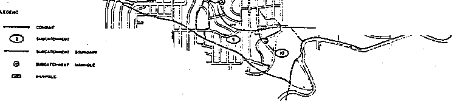

**Figure C.1b** Rainfall Hyetograph at Micro-Catchment for the 27/1/93 Event  
Simulation starting at 7:00 hours - (rainfall in mm/minute)

> Figure C.1b shows the rainfall hyetograph at the outlet of the Giralang micro-catchments. It is taken directly from the XP-RAFTS workbench input graph and indicates the data in individual nominal 0.2 mm tipping bucket tips. The vertical scale is in mm/minute per tip. In this example the nominal 0.2 mm tip volume was calibrated at 0.17 mm. The highest intensity during the simulation period indicating a value of 1.7 mm/minute means the tip period was 6 seconds (i.e. 0.17 / 6 seconds x 60 = 1.7 mm/minute).
>
> *<u>Appendix C C.4</u>*

**Figure C.1c** Giralang 14 Lot Micro-Catchment Modelled Hydrograph for the 27/1/93  
Event starting at 7:00 hours - (flow in m3/s)

> Figure C.1c shows the modelling result for the 1.5 ha micro-catchment during the 27/1/93 event. The file name (g27193f.xp) indicated on the hydrograph background is the XP-RAFTS workbench model file name. This and all other models used in this study are included for further reference on the enclosed CD-ROM described in Appendix F.
>
> The general shape of the estimated hydrograph is reasonably similar to the gauged data. The gradients of both the rising and falling limbs accord well. The timing of the modelled hydrograph is however slightly early. This is thought to be caused primarily by the fixed offset times between allotments which are based on half or full pipe flow velocities. Although this timing problem is apparent, the general fit is considered satisfactory. As with all the validation runs in this chapter the micro-catchment rainfall gauge has been adopted as the total catchment reference gauge. This has been selected to properly compare with the results in Chapter 3 where a single gauge was applied.
>
> *<u>Appendix C C.5</u>*
>
> The hydrograph insert in Figure C.1c is the same simulation run with the exception that the between allotment lag time has been lengthened from the standard 10 seconds to 50 seconds. At low flows this accords with the expected slower velocities within the pipe system running to the outlet gauge. It can be seen in the insert that the low flow spikes noticeable in the main Figure are very much dampened and more in line with the gauged data. The peak however is under-estimated indicating that the 50 second average lag is too long at the upper flow levels of this simulation.
>
> The difference in flows between the model and gauged data along the extended recession is most likely due to the gauge’s inability to measure small flows below the inlet tube entrance holes that are some 6-8 mm above the pipe invert.
>
> The results of this analysis indicate that at very low flow rates, specifically less than 0.2 m3/s at the Giralang catchment outlet, it may be necessary to include a variable lag model based on the changing pipe flow depth throughout the simulation period. This is, however, thought to be only necessary if very low flow characterisation is required with embedded higher flow regions.

**Figure C.1d** Giralang 62.9 ha Urban Catchment Modelled Hydrograph for the 27/1/93  
Event starting at 7:00 hours - (flow in m3/s)

> *<u>Appendix C C.6</u>*
>
> Figure C.1d indicates the simulation results for the total 62.9 Giralang urban catchment. Again the general fit between modelled and gauged hydrographs is satisfactory. The peak of the modelled hydrograph is a little less than the gauged data. This is possibly caused by either spatial variances in storm temporal pattern across the catchment or is the result of adopting pipe velocities that are too high in the offsetting of allotment inputs. Rainfall variations are suspected to be the main cause. The role of rainfall variance is further discussed during the simulation of the 5/1/95 event. The timing of the modelled hydrograph is similar to that of the 1.5 ha model and again is thought to be associated with the adopted isochronal fixed time step of 15 seconds
>
> In an event this small, there appear to be a number of localised spatial and temporal patterns differences as well as gauge accuracy issues that limit the accuracy of the simulation. In this and other events of this magnitude, it appears that the impervious surfaces experience varying loss rates depending on temperature and wind. The above results are still considered satisfactory, however, bearing in mind that the model was calibrated for two larger events.
>
> **Event of 5/4/93**

**Figure C.2a** Rainfall Distribution for the 5/4/93 Event

> The rainfall depths indicated in Figure C.2a show the total rainfall during the simulation period between 16:30 and 20:30 hours on 5/4/93.
>
> *<u>Appendix C C.7</u>*
>
> 

**Figure C.2b** Rainfall Hyetograph at Micro-Catchment for the 5/4/93 Event Simulation  
starting at 16:30 hours

> Figure C.2b shows the rainfall hyetograph for the 5/4/93 event. This event, that occurred over a relatively short period with between 9.5 and 13.3 mm of rain, resulted in a peak flow at the Giralang outlet of 5.66 m3/s

**Figure C.2c** Giralang 14 Lot Micro-Catchment Modelled Hydrograph for the 5/4/93  
Event starting at 16:30 hours - (flow in m3/s)

> *<u>Appendix C C.8</u>*
>
> Figure C.2c shows the modelling result for the 1.5 ha micro-catchment. The general fit is quite good, including the timing. The first small peak some 15 minutes into the simulation is itself a little early and is similar to the smaller 27/1/93 event. Again both the 1.5 ha and 62.9 ha models are based on the micro-catchment rainfall gauge.

**Figure C.2d** Giralang 62.9 ha Urban Catchment Modelled Hydrograph for the 5/4/93  
Event starting at 16:30 hours - (flow in m3/s)

> Figure C.2d shows the model result for the total Giralang urban catchment. The general fit is again satisfactory. Any small rainfall variations across the catchment appear not to have effected the larger catchment result being based solely on the central rainfall station. The two largest peaks have been included in the comparitive analysis between this and previous methods. Using multiple peaks within each simulation period places an additional test on the method by further testing the continuous wetting and drying elements associated with rainfall infiltration as well as surface routing.
>
> *<u>Appendix C C.9</u>*
>
> **Event of 13/11/93**

**Figure C.3.a** Rainfall Distribution for the 13/11/93 Event starting at 17:00 hours

> The rainfall depths shown in Figure C.3a are for the simulation period 17:00 and 22:00 hours on the 13/11/93. This simulation period contained three peaks separated by 0.5 and 3.5 hours respectively. The peak flows at the Giralang catchment outlet were 1.3. 4.7 and 1.3 m3/s respectively. This simulation was therefore well placed to test the model not only at both the 1.5 ha and 62.9 ha scales, but also the applicability of the infiltration model over an extended period incorporating both wetting and drying as well as intense bursts of intensity limiting infiltration. The total rainfall was significant and varied in depth between 23.2 and 31.4 mm across the catchment. Again it was intended to adopt the micro-catchment rainfall gauge as the total catchment reference station.
>
> *<u>Appendix C C.10</u>*
>
> Figure C.3b shows the hyetograph dumped directly from the micro-catchment tipping bucket raingauge for the period of simulation.
>
> 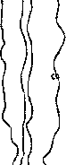

**Figure C.3b** Rainfall Hyetograph at Micro-Catchment for the 13/11/93 Event  
Simulation starting at 17:00 hours

> In this event there was a small but significant gradient in rainfall across the catchment. The 1.5 ha and 62.9 ha catchments utilised the micro-catchment rainfall gauge. The upstream rural gauge registered a 0.02 m3/s peak and therefore did not add any significant flow to the Giralang outfall.
>
> Figure C.3c shows the results of the 1.5 ha model between 17:00 and 22:00 hours on the 13/11/93. The general fit with the gauged data is satisfactory for all three peak bursts. This particular simulation has tested many of the model’s facets including: its ability to model infiltration over extended periods with separated peak bursts; and its ability to model in one simulation both large and small bursts.
>
> *<u>Appendix C C.11</u>*

**Figure C.3c** Giralang 14 Lot Micro-Catchment Modelled Hydrograph for the 13/11/93  
Event starting at 17:00 hours - (flow in m3/s)

> Figure C.3d indicates the corresponding model result for the 62.9 ha model. The general fit, including shape and peak between model and gauged results, is considered satisfactory and similar to that of the 1.5 ha model.
>
> *<u>Appendix C C.12</u>*

**Figure C.3.d** Giralang 62.9 ha Urban Catchment Modelled Hydrograph for the  
13/11/93 Event starting at 17:00 hours, based on micro-catchment raingauge  
(flow is in m3/s, time is in hours)

> Based on general inspection of the rainfall hyetographs at each of the four rainfall stations it was found that the temporal patterns of each were similar. The total rainfall depth, however, as indicated in Figure C.3a, was found to vary by some 35%. Rainfall losses were adjusted in the above model to reflect the overall average rainfall depth for the 62.9 ha catchment, still utilising the micro-catchment rainfall station data.
>
> Figure C.3e indicates, for reference only, the same model applying the rainfall data at the 570991 station on the eastern side of the catchment. The excess rainfall depths on all surfaces was the same as that adopted for Figure C.3d.
>
> *<u>Appendix C C.13</u>*

**Figure C.3.e** Giralang 62.9 ha Urban Catchment Modelled Hydrograph for the  
13/11/93 Event starting at 17:00 hours, based on Rainfall Station 570991

(flow is in m3/s, time is in hours)

> *<u>Appendix C C.14</u>*
>
> **Event of 5/1/95 Burst (1 and 2) 14:30 – 22:30 hours**
>
> The event of 5/1/95 was chosen as a medium rainfall extended storm that, although having fairly equal total rainfall depths across the catchment, exhibited differing rainfall temporal patterns at each rainfall station. The three runoff peaks included in the simulation period measured 2.8, 2.15 and 7.33 m3/s respectively. The peaks were separated by approximately 2.5 and 1.5 hours. As the currently configured XP-RAFTS Workbench would only model individual simulations of 5 hours, it was necessary to split the event into two, 4 hour bursts.
>
> **Event of 5/1/95 Burst (1 and 2) 14:30 – 18:30 hours**

**Figure C.4.a** Rainfall Distribution for the 5/1/95 Event - Bursts 1 and 2

> Figure C.4a shows the total rainfall across the catchment that was in general terms reasonably equal with only a small gradient in rainfall across the catchment.
>
> Figure C.4b indicates the rainfall hyetograph for the micro-catchment station. The 1.5 ha and 62.9 ha catchments utilised the micro-catchment rainfall gauge, as in the other event analyses. The upstream rural gauge registered a peak flowrate less than 0.1 m3/s and therefore did not add any significant flow to the Giralang outfall.
>
> *<u>Appendix C C.15</u>*
>
> 

**Figure C.4.b** Rainfall Hyetograph at Micro-Catchment for the 5/1/95 Event - Bursts 1  
and 2 Simulation starting at 14:30 hours

> Figure C.4c shows the results for the 1.5 ha catchment. The fit between modelled and gauged results is again satisfactory in general shape timing and peaks for each of the two bursts.

**Figure C.4c** Giralang 14 Lot Micro-Catchment Modelled Hydrograph for the 5/1/95  
Event - Bursts 1 and 2 starting at 14:30 hours (flow is in m3/s time is in hours)

> *<u>Appendix C C.16</u>*
>
> Figure C.4d shows the corresponding model results for the 62.9 ha catchment. Again the general fit is reasonably satisfactory. The simulation is as indicated earlier based on only the micro-catchment rainfall input. This indicates that this station is reasonably representative of the total catchment.

**Figure C.4d** Giralang 62.9 ha Urban Catchment Modelled Hydrograph for the 5/1/95  
Event - Bursts 1 and 2 (flow is in m3/s, time is in hours)

> Figure C.4e indicates the results of the XP-EXTRAN simulation of the detailed pipe network as described in Chapter 6, utilising 21 distributed nodal inputs, each representing the combined micro-catchment contributions.
>
> As can be seen from the results, the scaling of individual micro-catchment hydrographs utilising full hydrodynamics within the public piped system provides very good fits for the outlet flow hydrographs.
>
> It also indicates that the micro-catchment rainfall definition is reasonably representative of the total catchment for this simulation period.
>
> *<u>Appendix C C.17</u>*

**Figure C.4e** Giralang 62.9 ha Giralang Urban Catchment Modelled for the 5/1/95  
Event - Bursts 1 and 2 modelled using XP-EXTRAN and Distributed Micro-Catchment  
Gauged Hydrographs

*<u>Appendix C C.18</u>*

**Event of 5/1/95 (Burst 3) 18:30 – 22:30 hours**

> **Figure C.5.a** Rainfall Distribution for the 5/1/95 Burst 3

The second half of the 5/1/95 simulation runs from 18:30 to 22:30 hours and includes only one significant runoff peak. Rainfall data is shown in Figure C.5.b.

> 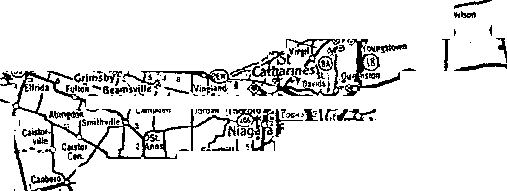

**Figure C.5.b** Rainfall Hyetograph at Micro-Catchment for the 5/1/95 Event -Burst 3  
Simulation starting at 18:30 hours

> *<u>Appendix C C.19</u>*
>
> In this event there was a small but significant gradient in rainfall across the catchment. The upstream rural gauge registered a peak flowrate less than 0.1 m3/s and therefore did not add any significant flow to the Giralang outfall.
>
> Figure C.5c shows the results of the simulation for the 1.5 ha catchment that is based on the micro-catchment rainfall input. The fit between modelled and gauged results is satisfactory in general shape and in the peak estimate. There is a small timing offset between the gauged and modelled rising and falling limbs. This may be due to a slight timing problem with the 450 mm diameter gauge logger or rainfall logger.

**Figure C.5c** Giralang 14 Lot Micro-Catchment Modelled Hydrograph for the 5/1/95  
Event -Burst 3 starting at 18:30 hours (flowis in m3/s, time is in hours)

> Figure C.5d shows the corresponding result for the 62.9 ha catchment. The general fit between modelled and gauged results is reasonable, although the modelled peak is overestimated.
>
> *<u>Appendix C C.20</u>*

**Figure C.5d** Giralang 62.9 ha Urban Catchment Modelled Hydrograph for the 5/1/95  
Event - Burst 3 starting at 18:30 hours (flow is in m3/s, time is in hours)

> On further inspection of the rainfall hyetographs at the other rainfall stations, it was observed that, although the total rainfall depth did not significantly change, the shape of the temporal pattern changed dramatically.
>
> To test the effect of these different rainfall patterns the analysis was repeated using the rainfall inputs from each of the other rainfall stations.
>
> Figure C.5e shows the result using the Rainfall Station 570987 near the catchment outlet. Also show in the figure is the corresponding rainfall temporal pattern.
>
> *<u>Appendix C C.21</u>*

**Figure C.5e** Giralang 62.9 ha Urban Catchment Modelled Hydrograph for the 5/1/95

Event -Burst 3 Rainfall Station 570987 starting at 18:30 hours

(flow is in m3/s, time is in hours)

> Figures C.5d, C.5e, C.5f and C.5g indicate the effects of using the rainfall data from each of the four rainfall stations as the average representative rainfall. Although the total rainfall recorded by the four gauges is of the same order, the temporal patterns during the simulation period are very different. The spatial and temporal variability in rainfall across a catchment the size of Giralang can be seen to have significant effects on modelled hydrographs. To make comparisons with the analysis carried out in Chapter 3, which used a single catchment rainfall station, the central micro-catchment gauge has continued to be applied as the reference site.
>
> *<u>Appendix C C.22</u>*
>
> **Figure C.5f** Giralang 62.9 ha Urban Catchment Modelled Hydrograph for the 5/1/95

Event -Burst 3 Rainfall Station 570991 starting at 18:30 hours

(flow is in m3/s, time is in hours)

> **Figure C.5g** Giralang 62.9 ha Urban Catchment Modelled Hydrograph for the 5/1/95

Event -Burst 3 Rainfall Station 570992 starting at 18:30 hours

(flow is in m3/s, time is in hours)

> *<u>Appendix C C.23</u>*
>
> Figure C.5h shows the simulation for the 5/1/95 event using the pipe network model described in Chapter 6 and the representative micro-catchment gauged outputs. It can be seen that the third peak also exhibits an overestimate nearly exactly the same as the modelled result shown in Figure C.5c.

**Figure C.5h** Giralang 62.9 ha Urban Catchment Modelled Hydrograph for the 5/1/95  
Event -Burst 3 using XP-EXTRAN and Distributed Micro-Catchment Gauged

Hydrographs

> The result indicates that the micro-catchment rainfall station, being near the centre of the catchment, is still the best one to represent the catchment as a whole. Some peak error in the third peak is evident due to the varying temporal patterns across the catchment caused by storm dynamics.
>
> **Appendix D**
>
> **Examination of Typical Urban  
> Catchments across Australia**
>
> The urban catchments results described in Table 3.9.1a are from South-East Australia only. They include catchments in New South Wales, the Australian Capital Territory and Victoria. To properly compare modelling of urban stormwater systems from a range of locations it is necessary to consider the likely variations in drainage works that may affect runoff response subject to similar inputs. Additionally, as urban modelling is a nation-wide phenomenon, it would also be prudent to investigate if the catchments already described represent all urban areas.
>
> The following discussion describes typical drainage works within all Australian States and Territories taking particular note of the differences in methods utilised by local authorities to provide drainage from roofs, yards and roads and adjacent rural areas. Additionally, respective policies on fencing and other matters that may affect runoff mechanics are also discussed.
>
> ***NSW***
>
> In the state of NSW urban drainage is generally directed by local councils which provide stormwater policies for new urban developments as well as upgrading of older areas. In general terms the policies follow the guidelines set out in the Institution of Engineers, Australia publication, Australian Rainfall and Runoff, Volume 1 (Institution of Engineers, Australia, 1987). Additionally, the Department of Housing is also influential in defining subdivision drainage standards. Standards Australia and the Building Code of Australia influence roof and property drainage practice.
>
> *Appendix D D.2*
>
> Residential roofs are predominantly sloped and tiled with full surround gutters. Roof drainage is directed to the ground via an average of four downpipes per house. From that point it is usual for the roof drainage to be transported to the street gutter via underground pipes. Allotments on the low side of streets contain a mixture of roof drainage treatments, ranging from connection to an inter-allotment pipe drain running along the back boundary to simply allowing the downpipe flow to dissipate across the yard. In a few areas the yard pipes are directly connected into the public drainage system. A small percentage of locations have the downpipes connected to soakage pits within the yard.
>
> The most common fencing styles within NSW are timber paling fences at the rear as well as both side boundaries. Front fences are allowable but in newer developments are generally restricted in number. A common trend in recent times has been the move towards the replacement of the timber palings with Colour Bond metal fences that are even more water tight.
>
> Inter-allotment drainage for the collection of pervious area runoff within allotments below the roadway is relatively uncommon in works before 1970. Since then inter-allotment drainage provisions have been more common.
>
> Roadways are, in the majority, bitumen sealed with concrete kerb and gutters on both sides. Underground pipes serviced by side entry pits built into the kerb and gutter provide road drainage.
>
> On-site detention tanks are now also common in Sydney, particularly in many older areas to help reduce existing flooding problems. Their effectiveness is questionable, as many have been poorly built.
>
> ***ACT***
>
> ACT drainage policy in general terms is similar to NSW. The two significant differences are that front fences are not allowed in the ACT, and roof drainage is always directly connected to the public drainage system via yard pipe drains.
>
> ***VIC***
>
> This State has similar policies to NSW. Due to generally lower rainfalls, street pits are smaller. Direct connections of house drains to street drainage pipes are common.
>
> *Appendix D D.3*
>
> ***WA***
>
> In broad terms Western Australian drainage policies follow NSW policies. Over most of Perth, however, there are highly pervious sandy areas. In these locations roof drainage is either directed over the yard via open downpipes or connected into soakage pits buried within the sandy soils. Sandstone-like walls as fencing are also popular throughout the Perth area.
>
> Rainfall is highly seasonal, with winter (July – September) rainfall being highest. Groundwater levels fluctuate and often interact with localised detention/retention ponds within the sandy areas.
>
> ***SA***
>
> Urban drainage systems within South Australia generally follow the eastern states and in particular Victoria. There is also a growing trend for on-site retention systems. As in WA, conditions may be semi-arid with lower rainfall intensities than in northern areas.
>
> ***QLD***
>
> Queensland drainage systems generally follow the NSW system. There are a mixture of drainage systems, however, ranging from NSW types to roofs with no gutters at all and dwellings with systems more akin to the WA roof drainage infiltration systems.
>
> Due to higher rainfalls there is generally more attention placed on the allowance of additional surface flow. It has been found in many areas that it is uneconomic to try to collect all runoff from significant storms in pipe systems. In southeast Queensland, piped drainage under streets is often now sized only to take flow peaks that cannot be safely routed down the roadway in storms up to the 100 year ARI.
>
> **NT**
>
> Northern Territory drainage systems for most of its history have followed the ACT systems through the Territory’s linkages to the Commonwealth Government. Some modern residential dwellings are now tending to provide metal-clad roofs, rather than tiles, with no gutters except at the entrances. Also, due to the abundance of termites in the region the use of paling fences is rare. Metal mesh fencing provides the most common form of boundary division. Stormwater is therefore free to flow through
>
> *Appendix D D.4*
>
> boundaries except where inter-allotment table drains are included along the rear boundaries of allotments on the low side of streets.
>
> ***Trends***
>
> There are number of growing trends in urban drainage policy and implementation. The overall tendency is to provide artificial storage within the system to provide both flooding control and water quality improvements via sedimentation. These include, even at an allotment scale, on-site detention devices as well as rainwater storage systems directly connected to roof gutters.
>
> Any improvements to urban drainage simulation will therefore need to take into account the variations in traditional drainage systems across Australia and Overseas and additionally incorporate new storage devices at varying scale. This will be particularly important when estimating different sized sub-catchment runoff magnitudes under varying storm conditions.
>
> Other changes include the trend for urban consolidation, including infill development. This has necessitated the use of on-site detention devices in Sydney and elsewhere. New subdivisions also now widely promote much smaller allotments with average sizes reducing from the 1000 m2 allotments of the 1970s to 400 – 600 m2 today.
>
> **Appendix E**
>
> **General Photographs of Giralang Catchment**

**Photograph Locations throughout the Total Giralang Catchment**

> *Appendix E E.2*

**Photograph Locations in the vicinity of the Micro-Catchments**

> *Appendix E E.3*
>
> 
>
> *Appendix E E.4*
>
> 
>
> *Appendix E E.5*
>
> 
>
> *Appendix E E.6*
>
> 
>
> *Appendix E E.7*
>
> 
>
> *Appendix E E.8*
>
> 
>
> *Appendix E E.9*
>
> 
>
> *Appendix E E.10*
>
> **Appendix F**
>
> **Contents of CD-ROM**
>
> The enclosed CD-ROM contains a full digital copy of the thesis including all appendices. Additionally it contains all gauged data, supporting spreadsheets, catchment model files and a copy of the XP-RAFTS Workbench.
>
> 
>
> The CD-ROM also contains digital and scanned copies of past published technical papers either authored or co-authored that provide information leading up to the present study. Additionally, three of the papers provide overviews of the current research as presented to different national and international conferences between 1993 and 1999.
>
> *Appendix F F.2*
>
> 
>
> *Appendix F F.3*
