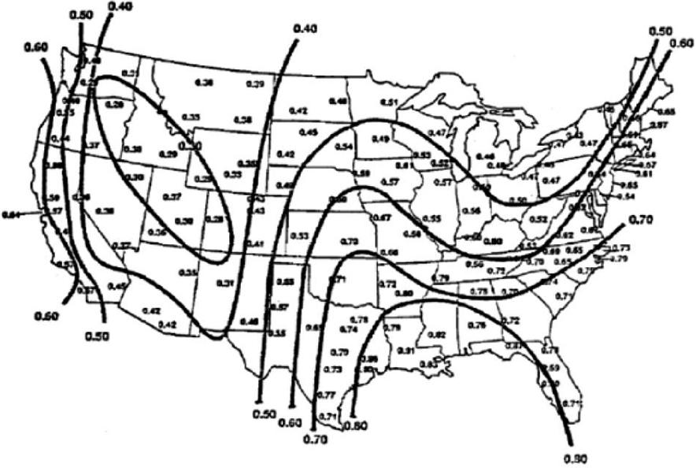
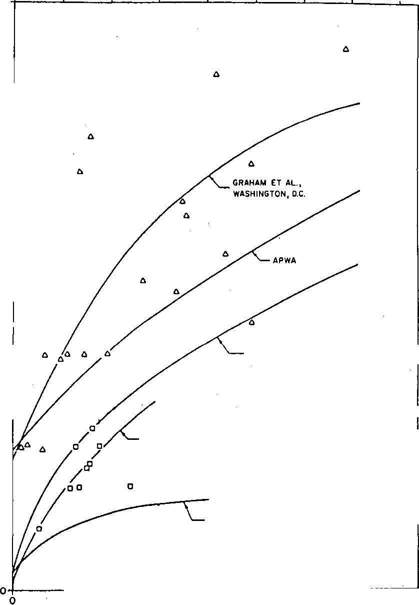
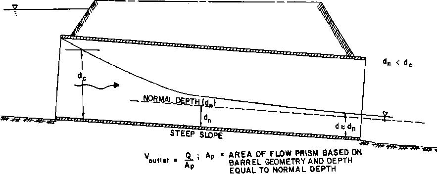
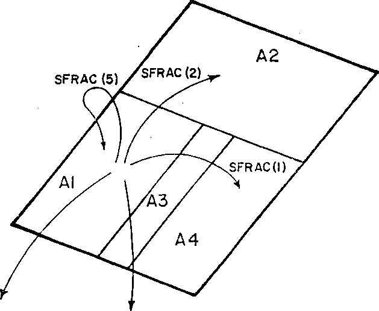
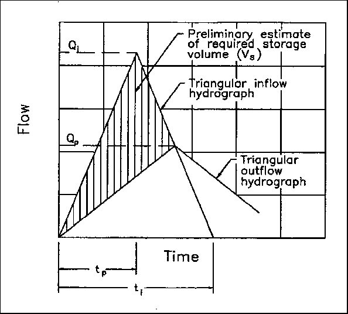

EPA/600/R-17/111

May 2017

Storm Water Management Model  
Reference Manual  
Volume II – Hydraulics

By:

Lewis A. Rossman  
Office of Research and Development  
National Risk Management Laboratory  
Cincinnati, OH 45268

National Risk Management Laboratory  
Office of Research and Development  
U.S. Environmental Protection Agency  
26 Martin Luther King Drive  
Cincinnati, OH 45268

May 2017

**Disclaimer**

The information in this document has been funded wholly or in part by the U.S. Environmental Protection Agency (EPA). It has been subjected to the Agency’s peer and administrative review, and has been approved for publication as an EPA document. Mention of trade names or commercial products does not constitute endorsement or recommendation for use.

Although a reasonable effort has been made to assure that the results obtained are correct, the computer programs described in this manual are experimental. Therefore the author and the U.S. Environmental Protection Agency are not responsible and assume no liability whatsoever for any results or any use made of the results obtained from these programs, nor for any damages or litigation that result from the use of these programs for any purpose.

ii

**Abstract**

SWMM is a dynamic rainfall-runoff simulation model used for single event or long-term (continuous) simulation of runoff quantity and quality from primarily urban areas. The runoff component of SWMM operates on a collection of subcatchment areas that receive precipitation and generate runoff and pollutant loads. The routing portion of SWMM transports this runoff through a system of pipes, channels, storage/treatment devices, pumps, and regulators. SWMM tracks the quantity and quality of runoff generated within each subcatchment, and the flow rate, flow depth, and quality of water in each pipe and channel during a simulation period comprised of multiple time steps. The reference manual for this edition of SWMM is comprised of three volumes. Volume I describes SWMM’s hydrologic models, Volume II its hydraulic models, and Volume III its water quality and low impact development models.

iii

**Acknowledgements**

This report was written by Lewis A. Rossman, Environmental Scientist Emeritus, U.S. Environmental Protection Agency, Cincinnati, OH.

The author would like to acknowledge the contributions made by the following individuals to previous versions of SWMM that were drawn heavily upon in writing this report: John Aldrich, Douglas Ammon, Carl W. Chen, Brett Cunningham, Robert Dickinson, James Heaney, Wayne Huber, Miguel Medina, Russell Mein, Charles Moore, Stephan Nix, Alan Peltz, Don Polmann, Larry Roesner, Charles Rowney, and Robert Shubinsky. The efforts of Wayne Huber (Oregon State University emeritus), Thomas Barnwell (US EPA retired), Richard Field (US EPA retired), Harry Torno (US EPA retired) and William James (University of Guelph emeritus) to support and maintain the program over the past several decades are also gratefully acknowledged.

iv

**Table of Contents**

**Disclaimer ii**

**Abstract iii**

**Acknowledgements iv**

**List of Figures vii**

**List of Tables ix**

**List of Symbols xi**

**Chapter 1 - SWMM Overview 15**

> 1.1 Introduction 15
>
> 1.2 SWMM’s Object Model 16
>
> 1.3 SWMM’s Process Models 21
>
> 1.4 Simulation Process Overview 23
>
> 1.5 Interpolation and Units 27

**Chapter 2 - SWMM’s Hydraulic Model 30**

> 2.1 Network Components 31
>
> 2.2 Analysis Methods 35
>
> 2.3 Boundary and Initial Conditions 38

**Chapter 3 - Dynamic Wave Analysis 40**

> 3.1 Governing Equations 40
>
> 3.2 Solution Method 44
>
> 3.3 Computational Details 46
>
> 3.4 Numerical Stability 57

**Chapter 4 - Kinematic Wave Analysis......................................................................................63**

> 4.1 Governing Equations 63
>
> 4.2 Solution Method 65
>
> 4.3 Computational Details 67
>
> 4.4 Numerical Stability 72

**Chapter 5 - Cross-Section Geometry 74**

> 5.1 Standard Conduit Shapes 74
>
> 5.2 Custom Conduit Shapes 92

v

> 5.3 Irregular Natural Channels 94
>
> 5.4 Storage Unit Geometry 97
>
> 5.5 Critical and Normal Depths 100

**Chapter 6 - Pumps and Regulators 104**

> 6.1 Pumps 104
>
> 6.2 Orifices 107
>
> 6.3 Weirs 114
>
> 6.4 Outlets 124

**Chapter 7 - Advanced Features 127**

> 7.1 Evaporation and Seepage 127
>
> 7.2 Minor Losses 136
>
> 7.3 Force Mains 138
>
> 7.4 Culverts 142
>
> 7.5 Roadway Weirs 147

**Appendix 151**

**References..................................................................................................................................185**

vi

**List of Figures**

Figure 1-1 Elements of a typical urban drainage system 17

Figure 1-2 SWMM's conceptual model of a stormwater drainage system 18

Figure 1-3 Processes modeled by SWMM 21

Figure 1-4 Block diagram of SWMM's state transition process 23

Figure 1-5 Flow chart of SWMM's simulation procedure 26

Figure 1-6 Interpolation of reported values from computed values 28

Figure 2-1 Node-link representation of a sewer system 30

Figure 2-2 Comparison of dynamic wave and kinematic wave solutions 38

Figure 3-1 Node-link representation of a conveyance network in SWMM 43

Figure 3-2 Special flow conditions for dynamic wave analysis 50

Figure 3-3 Illustration of a surcharged node 53

Figure 3-4 Ponding of excess water above a junction 56

Figure 3-5 Profile view of example rectangular conduit (not to scale) 60

Figure 3-6 Outflow hydrographs for example conduit -I 61

Figure 3-7 Outflow hydrographs for example conduit – II 62

Figure 4-1 Section factor versus area for a circular shape 64

Figure 4-2 Space-time grid for kinematic wave analysis 65

Figure 4-3 Outflow hydrograph for example conduit 73

Figure 5-1 Power law cross section shape 77

Figure 5-2 Geometric properties of a partly filled circular shape based on depth 80

Figure 5-3 Geometric properties of a partly filled circular shape based on area 80

Figure 5-4 Ellipsoid and arch pipe cross sectional shapes 81

Figure 5-5 Masonry sewer shapes 84

Figure 5-6 Composite cross section shapes 86

Figure 5-7 A Shape Curve with a depth segment shown 93

Figure 5-8 A natural channel transect 94

Figure 5-9 A transect depth increment with three compound segments 95

Figure 5-10 Example of a storage curve and its section view 98

Figure 5-11 Finding the volume at a given depth for a storage curve 99

Figure 6-1 Orifice orientations 107

Figure 6-2 Determination of effective head for an orifice 110

Figure 6-3 Orifice with unsubmerged inlet 110

Figure 6-4 Transverse weir shapes 115

Figure 6-5 Coefficient for triangular weirs (from Brater and King, 1976) 119

Figure 6-6 Definitions of submerged and surcharged weir flow...........................................121

Figure 6-7 Rating curve for a vortex device compared to an orifice 125

Figure 7-1 Depths used for computing seepage in storage units...........................................135

vii

Figure 7-2 Concrete box culvert (from FHWA, 2012) 142

Figure 7-3 Example of a culvert rating curve (from FHWA, 2012) 143

Figure 7-4 Roadway overtopping (from FHWA, 2012)........................................................148

Figure 7-5 SWMM node-link representation of a culvert with a roadway weir 148

Figure 7-6 Discharge coefficients for roadway weirs (from FHWA, 2012) 149

viii

**List of Tables**

Table 1-1 Development history of SWMM 16

Table 1-2 SWMM’s modeling objects 19

Table 1-3 State variables used by SWMM 24

Table 1-4 Units of expression used by SWMM 29

Table 2-1 Features and limitations of dynamic wave and kinematic wave solutions 37

Table 3-1 Surface area adjustments for various dynamic wave flow conditions 51

Table 5-1 Geometric properties for open channel shapes as functions of water depth 75

Table 5-2 Geometric properties for open channel shapes as functions of flow area 76

Table 5-3 Geometric properties for the power law shape 78

Table 5-4 Geometric properties of a full circular cross section 79

Table 5-5 Full area and hydraulic radius of custom ellipsoid and arch pipe sections 83

Table 5-6 Number of entries in geometric property tables for masonry sewer shapes 85

Table 5-7 Geometric parameters of masonry sewer sections 85

Table 5-8 Geometric properties for a sediment filled circular cross section 87

Table 5-9 Properties of the rectangular section of a rectangular-triangular shape 88

Table 5-10 Geometric parameters for rectangular-round shapes 89  
Table 5-11 Geometric properties for rectangular–round shapes...............................................90

Table 5-12 Properties in the rounded top section of a modified basket handle shape 91

Table 5-13 Area at maximum flow to full area for standard closed conduits shapes 91

Table 5-14 Critical depth formulas for simple section shapes 101

Table 6-1 Pump curves recognized by SWMM 105

Table 6-2 Kindsvater-Carter constants for rectangular weir coefficient 118

Table 6-3 Rectangular broad-crested weir coefficients (ft1/2/sec) 119

Table 6-4 Formulas for flow derivatives of various types of weirs 123

Table 7-1 Relative depth at maximum width for select cross section shapes 129

Table 7-2 Types of minor losses in drainage systems (from Frost, 2006) 137

Table 7-3 Hazen-Williams C-factors for different pipe materials 139

Table 7-4 Darcy-Weisbach roughness heights for different pipe materials 140

Table C-1 Circular section properties as function of depth 153

Table C-2 Circular section properties as function of area 154

Table D-1 Standard elliptical pipe sizes 155

Table D-2 Elliptical section properties as function of depth 156

Table E-1 Standard arch pipe sizes 157

Table E-2 Arch pipe section properties as function of depth 160

Table F-1 Area of masonry sewers as function of depth 161

Table F-2 Width of masonry sewers as function of depth - I 162

Table F-3 Width of masonry sewers as function of depth - II...............................................163

ix

Table F-4 Hydraulic radius of masonry sewers as function of depth 164

Table F-5 Depth of masonry sewers as function of area - I 165

Table F-6 Depth of masonry sewers as function of area - II 167

Table F-7 Section factor for masonry sewers as function of area - I 169

Table F-8 Section factor for masonry sewers as function of area - II 171

Table G-1 Manning’s roughness coefficient n for open channels 173

Table G-2 Manning’s roughness coefficient n for closed conduits 177

Table G-3 Manning’s roughness coefficient n for corrugated steel pipe 179

Table H-1 Culvert codes 180

Table H-2 Culvert coefficients...............................................................................................183

x

**List of Symbols**

*A* cross section flow area within a conduit (ft2)

̅ average cross section flow area along a conduit (ft2)

̿ average cross section flow area along a conduit over a time period (ft2)

*Afull* full cross section area of a conduit (ft2)

*Amax* cross section area at depth where a conduit’s section factor is a maximum (ft2)

*AO* area of an orifice opening (ft2)

*ASP* surface area of water ponded above a node (ft2)

*AS* surface area of a node and its connected links (ft2)

*ASL* surface area of flow within a link (ft2)

*ASlast* surface area of a node the last time it was not surcharged (ft2) *ASmin* minimum surface area associated with a node (ft2)

*ASN* surface area associated with a storage node (ft2)

*AW* area of a weir opening (ft2)

*b* bottom or top width (depending on shape) of a conduit’s cross section (ft)

*c* wave celerity (ft/sec)

*cI* inlet control constant for submerged culverts

*cW* coefficient for a weir-type flow divider (ft1/2/sec)

*Cd* orifice discharge coefficient (dimensionless)

*CHW* Hazen-Williams C-factor coefficient (dimensionless)

*CO* equivalent orifice constant for a surcharged weir (ft5/2/sec)

*Cr* Courant number (dimensionless)

*Cw* weir coefficient (ft1/2/sec)

*D* circular pipe diameter (ft)

*et* potential evaporation rate at time *t* (ft/sec)

*E* elevation of a node’s invert (ft)

*EC* specific head at critical depth (ft)

*f* Darcy-Weisbach friction factor (dimensionless)

*fC* monthly climate adjustment factor (dimensionless)

xi

> *fE* storage node evaporation factor (dimensionless)
>
> *fS* weir submergence adjustment factor (dimensionless)
>
> *F* cumulative depth of infiltrated water (ft)
>
> *Fr* Froude number (dimensionless)
>
> *g* acceleration of gravity (ft/sec2)
>
> *hL* minor head loss per unit length of a conduit (ft/ft)
>
> *hW* height of the opening for a weir-type flow divider node (ft)
>
> *H* hydraulic head (ft)
>
> *Hcrown* elevation of the crown of the highest conduit at a node (ft)
>
> *He* effective head seen by an orifice or weir (ft)
>
> *HIS* minimum head at a culvert’s inlet for it to be submerged (ft)
>
> *HIU* maximum head at a culvert’s inlet for it to be unsubmerged (ft) *Hmax* maximum head at a node before flooding occurs (ft)
>
> *HOutfall* head assigned to an outfall node (ft)
>
> *K* cross section flow conductance (cfs) (equal to 2/3)
>
> *KI* inlet control constant for unsubmerged culverts
>
> *Km* minor loss coefficient (dimensionless)
>
> *KS* soil saturated hydraulic conductivity (ft/sec)
>
> *L* conduit length or weir crest length (ft)
>
> *Le* effective weir crest length (ft)
>
> *MI* inlet control exponent for unsubmerged culverts
>
> *n* Manning roughness coefficient (sec/m1/3)
>
> *P* wetted perimeter of a conduit’s cross section (ft)
>
> *qE* uniformly distributed evaporation rate along a channel (cfs/ft)
>
> *qL* total uniformly distributed outflow rate along a conduit (cfs/ft)
>
> *qMIN* minimum flow needed to activate a flow divider node (cfs)
>
> *qS* uniformly distributed seepage rate along a conduit (cfs/ft)
>
> *qSN* seepage rate per unit area for a storage node (cfs/ft2)
>
> *Q* flow rate within a conduit, pump, or regulator link (cfs)
>
> *Qdiv* flow rate diverted to a second outflow conduit from a flow divider node (cfs)

xii

> *QEN* evaporation loss rate from a storage unit node (cfs)
>
> *Qfull* normal uniform flow rate for a full conduit (cfs)
>
> *QIC* culvert flow rate under inlet control (cfs)
>
> *Qin* total inflow rate to a node (cfs)
>
> *QLN* total loss rate from a storage unit node (cfs)
>
> *Qnorm* normal uniform flow rate (cfs)
>
> *Qout* total outflow rate leaving a node (cfs)
>
> *Qovfl* excess flow that overflows a node (cfs)
>
> *Qnet* average net inflow minus outflow over a time step (cfs)
>
> *QSN* seepage loss rate from a storage node (cfs)
>
> *R* hydraulic radius of flow cross section in a conduit (ft)
>
> *R* average hydraulic radius of flow cross sections along a conduit (ft)
>
> *Re* Reynolds number (dimensionless)
>
> *Rfull* hydraulic radius of a conduit cross section when full (ft)
>
> *s* seepage rate per unit area for a conduit (ft/sec)
>
> *Scf* culvert slope correction factor
>
> *Sf* friction slope (ft/ft)
>
> *S0* conduit slope (ft/ft)
>
> *t* time (sec)

- flow velocity at a point along a conduit (ft/sec)

> *Uഥ* average flow velocity along a conduit (ft/sec)

- node assembly volume (ft3)

> *VP* ponded volume (ft3)
>
> *VN* storage node volume (ft3)
>
> *VNfull* volume of a storage node when full (ft3)
>
> *W* top width of the water surface at a point along a conduit (ft)
>
> *ഥ* average top width of the water surface along a conduit (ft) *Wmax* maximum width of a conduit cross section (ft)
>
> *x* horizontal distance (ft)
>
> *y* vertical distance (ft)
>
> xii i
>
> *yI* inlet control constant for submerged culverts
>
> *Y* depth of flow within a conduit or of water in a storage unit (ft)
>
> *Y* average depth of flow along a conduit (ft)
>
> *Yc* critical depth within a conduit at a given flow rate (ft)
>
> *Yfull* full depth of a conduit, orifice opening or weir height (ft)
>
> *YN* normal flow depth (ft)
>
> *Y\** smaller of the critical and normal flow depth in a conduit (ft)
>
> *Z* elevation of a conduit’s invert (ft)
>
> *ZO* elevation of the bottom of an orifice’s opening (ft)
>
> *ZW* elevation of a weir’s crest in its lowest position (ft)
>
> α generic coefficient
>
> fi the square root of a conduit’s slope divided by its roughness
>
> *∆t* time step (sec)
>
> e convergence tolerance
>
> *E* Darcy-Weisbach roughness length (ft)
>
> γ exponent in power law cross section shape
>
> η Manning’s roughness coefficient (sec/ft1/3) (equ*al to n*⁄1.486)
>
> σ inertial damping factor
>
> C time weighting factor, relaxation factor, or subtended angle
>
> φ distance weighting factor
>
> C*d* soil moisture deficit (dimensionless)
>
> p kinematic viscosity (ft2/sec)
>
> Co pump speed setting or degree to which a regulator is opened
>
> soil capillary suction head (ft)
>
> P conduit section factor (equal to *AR*2/3) (ft8/3)
>
> P*full* section factor of a conduit at full depth (ft8/3)  
> P*max* maximum section factor for a conduit (ft8/3)

xiv

**Chapter 1 - SWMM Overview**

**1.1 Introduction**

Urban runoff quantity and quality constitute problems of both a historical and current nature. Cities have long assumed the responsibility of control of stormwater flooding and treatment of point sources (e.g., municipal sewage) of wastewater. Since the 1960s, the severe pollution potential of urban nonpoint sources, principally combined sewer overflows and stormwater discharges, has been recognized, both through field observation and federal legislation. The advent of modern computers has led to the development of complex, sophisticated tools for analysis of both quantity and quality pollution problems in urban areas and elsewhere (Singh, 1995). The EPA Storm Water Management Model, SWMM, first developed in 1969-71, was one of the first such models. It has been continually maintained and updated and is perhaps the best known and most widely used of the available urban runoff quantity/quality models (Huber and Roesner, 2013).

SWMM is a dynamic rainfall-runoff simulation model used for single event or long-term (continuous) simulation of runoff quantity and quality from primarily urban areas. The runoff component of SWMM operates on a collection of subcatchment areas that receive precipitation and generate runoff and pollutant loads. The routing portion of SWMM transports this runoff through a system of pipes, channels, storage/treatment devices, pumps, and regulators. SWMM tracks the quantity and quality of runoff generated within each subcatchment, and the flow rate, flow depth, and quality of water in each pipe and channel during a simulation period comprised of multiple time steps.

Table 1-1 summarizes the development history of SWMM. The current edition, Version 5, is a complete re-write of the previous releases. The reference manual for this edition of SWMM is comprised of three volumes. Volume I describes SWMM’s hydrologic models, Volume II its hydraulic models, and Volume III its water quality and low impact development models. These manuals complement the SWMM 5 User’s Manual (US EPA, 2010), which explains how to run the program, and the SWMM 5 Applications Manual (US EPA, 2009) which presents a number of worked-out examples. The procedures described in this reference manual are based on earlier descriptions included in the original SWMM documentation (Metcalf and Eddy et al., 1971a, 1971b, 1971c, 1971d), intermediate reports (Huber et al., 1975; Heaney et al., 1975; Huber et al., 1981), plus new material. This information supersedes the Version 4.0 documentation (Huber and Dickinson, 1988; Roesner et al., 1992) and includes descriptions of some newer procedures implemented since 1988. More information on current documentation and the general status of the EPA Storm Water Management Model as well as the full program and its source code is

available on the EPA SWMM web site:. [<u>http://www2.epa.gov/water-research/storm-water­management-model-swmm.</u>](http://www2.epa.gov/water-research/storm-water-management-model-swmm)

**Table 1-1 Development history of SWMM**

<table>
<colgroup>
<col style="width: 24%" />
<col style="width: 11%" />
<col style="width: 29%" />
<col style="width: 34%" />
</colgroup>
<tbody>
<tr class="odd">
<td><blockquote>

<strong>Version</strong>

</blockquote></td>
<td><strong>Year</strong></td>
<td><blockquote>

<strong>Contributors</strong>

</blockquote></td>
<td><blockquote>

<strong>Comments</strong>

</blockquote></td>
</tr>
<tr class="even">
<td><blockquote>

SWMM I

</blockquote></td>
<td>1971</td>
<td><blockquote>

Metcalf &amp; Eddy, Inc.

Water Resources 
Engineers

University of Florida

</blockquote></td>
<td><blockquote>

First version of SWMM; focus was CSO modeling; Few of its methods are still used today.

</blockquote></td>
</tr>
<tr class="odd">
<td><blockquote>

SWMM II

</blockquote></td>
<td>1975</td>
<td><blockquote>

University of Florida

</blockquote></td>
<td><blockquote>

First widely distributed 
version of SWMM.

</blockquote></td>
</tr>
<tr class="even">
<td><blockquote>

SWMM 3

</blockquote></td>
<td>1981</td>
<td><blockquote>

University of Florida Camp Dresser &amp; McKee

</blockquote></td>
<td><blockquote>

Full dynamic wave flow routine, Green-Ampt infiltration, snow melt, and continuous simulation added.

</blockquote></td>
</tr>
<tr class="odd">
<td><blockquote>

SWMM 3.3

</blockquote></td>
<td>1983</td>
<td><blockquote>

US EPA

</blockquote></td>
<td><blockquote>

First PC version of SWMM.

</blockquote></td>
</tr>
<tr class="even">
<td><blockquote>

SWMM 4

</blockquote></td>
<td>1988</td>
<td><blockquote>

Oregon State University Camp Dresser &amp; McKee

</blockquote></td>
<td><blockquote>

Groundwater, RDII, irregular channel cross-sections and other refinements added over a series of updates throughout the 1990’s.

</blockquote></td>
</tr>
<tr class="odd">
<td><blockquote>

SWMM 5

</blockquote></td>
<td>2005</td>
<td><blockquote>

US EPA 
CDM-Smith

</blockquote></td>
<td><blockquote>

Complete re-write of the SWMM engine in C; graphical user interface added; improved algorithms and new features (e.g., LID modeling) added.

</blockquote></td>
</tr>
</tbody>
</table>

**1.2 SWMM’s Object Model**

Figure 1-1 depicts the elements included in a typical urban drainage system. SWMM conceptualizes this system as a series of water and material flows between several major environmental compartments. These compartments include:

16

> 
>
> **Figure 1-1 Elements of a typical urban drainage system**

- The Atmosphere compartment, which generates precipitation and deposits pollutants onto the Land Surface compartment.

- The Land Surface compartment receives precipitation from the Atmosphere compartment in the form of rain or snow. It sends outflow in the forms of 1) evaporation back to the Atmosphere compartment, 2) infiltration into the Sub-Surface compartment and 3) surface runoff and pollutant loadings on to the Conveyance compartment.

- The Sub-Surface compartment receives infiltration from the Land Surface compartment and transfers a portion of this inflow to the Conveyance compartment as groundwater interflow.

- The Conveyance compartment contains a network of elements (channels, pipes, pumps, and regulators) and storage/treatment units that convey water to outfalls or to treatment facilities. Inflows to this compartment can come from surface runoff, groundwater interflow, sanitary dry weather flow, or from user-defined time series.

> Not all compartments need appear in a particular SWMM model. For example, one could model just the Conveyance compartment, using pre-defined hydrographs and pollutographs as inputs. As illustrated in Figure 1-1, SWMM can be used to model any combination of stormwater
>
> 17
>
> collection systems, both separate and combined sanitary sewer systems, as well as natural catchment and river channel systems.
>
> Figure 1-2 shows how SWMM conceptualizes the physical elements of the actual system depicted in Figure 1-1 with a standard set of modeling objects. The principal objects used to model the rainfall/runoff process are Rain Gages and Subcatchments. Snowmelt is modeled with Snow Pack objects placed on top of subcatchments while Aquifer objects placed below subcatchments are used to model groundwater flow. The conveyance portion of the drainage system is modeled with a network of Nodes and Links. Nodes are points that represent simple junctions, flow dividers, storage units, or outfalls. Links connect nodes to one another with conduits (pipes and channels), pumps, or flow regulators (orifices, weirs, or outlets). Land Use and Pollutant objects are used to describe water quality. Finally, a group of data objects that includes Curves, Time Series, Time Patterns, and Control Rules, are used to characterize the inflows and operating behavior of the various physical objects in a SWMM model. Table 1-2 provides a summary of the various objects used in SWMM. Their properties and functions will be described in more detail throughout the course of this manual.
>
> 
>
> **Figure 1-2 SWMM's conceptual model of a stormwater drainage system**

18

> **Table 1-2 SWMM’s modeling objects**

<table>
<colgroup>
<col style="width: 21%" />
<col style="width: 22%" />
<col style="width: 55%" />
</colgroup>
<tbody>
<tr class="odd">
<td><blockquote>

<strong>Category</strong>

</blockquote></td>
<td><blockquote>

<strong>Object Type</strong>

</blockquote></td>
<td><blockquote>

<strong>Description</strong>

</blockquote></td>
</tr>
<tr class="even">
<td rowspan="5"><blockquote>

Hydrology

</blockquote></td>
<td><blockquote>

Rain Gage

</blockquote></td>
<td><blockquote>

Source of precipitation data to one or more subcatchments.

</blockquote></td>
</tr>
<tr class="odd">
<td><blockquote>

Subcatchment

</blockquote></td>
<td>A land parcel that receives precipitation associated 
with a rain gage and generates runoff that flows into 
a drainage system node or to another subcatchment.</td>
</tr>
<tr class="even">
<td><blockquote>

Aquifer

</blockquote></td>
<td><blockquote>

A subsurface area that receives infiltration from the subcatchment above it and exchanges groundwater flow with a conveyance system node.

</blockquote></td>
</tr>
<tr class="odd">
<td><blockquote>

Snow Pack

</blockquote></td>
<td><blockquote>

Accumulated snow that covers a subcatchment.

</blockquote></td>
</tr>
<tr class="even">
<td><blockquote>

Unit Hydrograph

</blockquote></td>
<td><blockquote>

A response function that describes the amount of sewer inflow/infiltration (RDII) generated over time per unit of instantaneous rainfall.

</blockquote></td>
</tr>
<tr class="odd">
<td rowspan="7"><blockquote>

Hydraulics

</blockquote></td>
<td><blockquote>

Junction

</blockquote></td>
<td><blockquote>

A point in the conveyance system where conduits connect to one another with negligible storage volume (e.g., manholes, pipe fittings, or stream junctions).

</blockquote></td>
</tr>
<tr class="even">
<td><blockquote>

Outfall

</blockquote></td>
<td><blockquote>

An end point of the conveyance system where water is discharged to a receptor (such as a receiving stream or treatment plant) with known water surface elevation.

</blockquote></td>
</tr>
<tr class="odd">
<td><blockquote>

Divider

</blockquote></td>
<td><blockquote>

A point in the conveyance system where the inflow splits into two outflow conduits according to a known relationship.

</blockquote></td>
</tr>
<tr class="even">
<td><blockquote>

Storage Unit

</blockquote></td>
<td><blockquote>

A pond, lake, impoundment, or chamber that provides water storage.

</blockquote></td>
</tr>
<tr class="odd">
<td><blockquote>

Conduit

</blockquote></td>
<td><blockquote>

A channel or pipe that conveys water from one conveyance system node to another.

</blockquote></td>
</tr>
<tr class="even">
<td><blockquote>

Pump

</blockquote></td>
<td><blockquote>

A device that raises the hydraulic head of water.

</blockquote></td>
</tr>
<tr class="odd">
<td><blockquote>

Regulator

</blockquote></td>
<td><blockquote>

A weir, orifice or outlet used to direct and regulate flow between two nodes of the conveyance system.

</blockquote></td>
</tr>
</tbody>
</table>

19

**Table 1-2 Continued**

<table>
<colgroup>
<col style="width: 21%" />
<col style="width: 22%" />
<col style="width: 55%" />
</colgroup>
<tbody>
<tr class="odd">
<td><blockquote>

<strong>Category</strong>

</blockquote></td>
<td><blockquote>

<strong>Object Type</strong>

</blockquote></td>
<td><blockquote>

<strong>Description</strong>

</blockquote></td>
</tr>
<tr class="even">
<td rowspan="2"><blockquote>

Water Quality

</blockquote></td>
<td><blockquote>

Pollutant

</blockquote></td>
<td><blockquote>

A contaminant that can build up and be washed off of the land surface or be introduced directly into the conveyance system.

</blockquote></td>
</tr>
<tr class="odd">
<td><blockquote>

Land Use

</blockquote></td>
<td><blockquote>

A classification used to characterize the functions that describe pollutant buildup and washoff.

</blockquote></td>
</tr>
<tr class="even">
<td rowspan="2"><blockquote>

Treatment

</blockquote></td>
<td><blockquote>

LID Control

</blockquote></td>
<td><blockquote>

A low impact development control, such as a bio­retention cell, porous pavement, or vegetative swale, used to reduce surface runoff through enhanced infiltration.

</blockquote></td>
</tr>
<tr class="odd">
<td><blockquote>

Treatment Function

</blockquote></td>
<td><blockquote>

A user-defined function that describes how pollutant concentrations are reduced at a conveyance system node as a function of certain variables, such as concentration, flow rate, water depth, etc.

</blockquote></td>
</tr>
<tr class="even">
<td rowspan="4"><blockquote>

Data Object

</blockquote></td>
<td><blockquote>

Curve

</blockquote></td>
<td><blockquote>

A tabular function that defines the relationship between two quantities (e.g., flow rate and hydraulic head for a pump, surface area and depth for a storage node, etc.).

</blockquote></td>
</tr>
<tr class="odd">
<td><blockquote>

Time Series

</blockquote></td>
<td><blockquote>

A tabular function that describes how a quantity varies with time (e.g., rainfall, outfall surface elevation, etc.).

</blockquote></td>
</tr>
<tr class="even">
<td><blockquote>

Time Pattern

</blockquote></td>
<td><blockquote>

A set of factors that repeats over a period of time (e.g., diurnal hourly pattern, weekly daily pattern, etc.).

</blockquote></td>
</tr>
<tr class="odd">
<td><blockquote>

Control Rules

</blockquote></td>
<td><blockquote>

IF-THEN-ELSE statements that determine when specific control actions are taken (e.g., turn a pump on or off when the flow depth at a given node is above or below a certain value).

</blockquote></td>
</tr>
</tbody>
</table>

20

> **1.3 SWMM’s Process Models**
>
> Figure 1-3 depicts the processes that SWMM models using the objects described previously and how they are tied to one another. The hydrological processes depicted in this diagram include:
>
> 
>
> **Figure 1-3 Processes modeled by SWMM**

- time-varying precipitation

- snow accumulation and melting

- rainfall interception from depression storage (initial abstraction)

- evaporation of standing surface water

- infiltration of rainfall into unsaturated soil layers

21

- percolation of infiltrated water into groundwater layers

- interflow between groundwater and the drainage system

- nonlinear reservoir routing of overland flow

- infiltration and evaporation of rainfall/runoff captured by Low Impact Development controls.

The hydraulic processes occurring within SWMM’s conveyance compartment include:

- external inflow of surface runoff, groundwater interflow, rainfall-dependent infiltration/inflow, dry weather sanitary flow, and user-defined inflows

- unsteady, non-uniform flow routing through any configuration of open channels, pipes and storage units

- various possible flow regimes such as backwater, surcharging, reverse flow, and surface ponding

- flow regulation via pumps, weirs, and orifices including time- and state-dependent control rules that govern their operation.

Regarding water quality, the following processes can be modeled for any number of user-defined water quality constituents:

- dry-weather pollutant buildup over different land uses

- pollutant washoff from specific land uses during storm events

- direct contribution of rainfall deposition

- reduction in dry-weather buildup due to street cleaning

- reduction in washoff loads due to BMPs

- entry of dry weather sanitary flows and user-specified external inflows at any point in the drainage system

- routing of water quality constituents through the drainage system

- reduction in constituent concentration through treatment in storage units or by natural processes in pipes and channels.

The numerical procedures that SWMM uses to model the hydraulic processes listed above are discussed in detail in subsequent chapters of this volume. SWMM’s hydrologic and water quality processes are described in volumes I and III of this manual.

22

> **1.4 Simulation Process Overview**
>
> SWMM is a distributed discrete time simulation model. It computes new values of its state variables over a sequence of time steps, where at each time step the system is subjected to a new set of external inputs. As its state variables are updated, other output variables of interest are computed and reported. This process is represented mathematically with the following general set of equations that are solved at each time step as the simulation unfolds:
>
> = *(−1*, , ) (1-1)
>
> = *(* , ) (1-2)

|       |     |
|-------|-----|
| where |     |
| *Xt*  | =   |
| *Yt*  | =   |
| *It*  | =   |
| *P*   | =   |
| *f*   | =   |
| *g*   | =   |

a vector of state variables at time *t*,

a vector of output variables at time *t*,

a vector of inputs at time *t*,

a vector of constant parameters,

a vector-valued state transition function,

a vector-valued output transform function,

Figure 1-4 depicts the simulation process in block diagram fashion.

> 

**Figure 1-4 Block diagram of SWMM's state transition process**

The variables that make up the state vector *Xt* are listed in Table 1-3. This is a surprisingly small number given the comprehensive nature of SWMM. All other quantities can be computed from these variables, external inputs, and fixed input parameters. The meaning of some of the less obvious state variables, such as those used for snow melt, is discussed in other sections of this set of manuals.

23

**Table 1-3 State variables used by SWMM**

<table>
<colgroup>
<col style="width: 20%" />
<col style="width: 11%" />
<col style="width: 48%" />
<col style="width: 18%" />
</colgroup>
<tbody>
<tr class="odd">
<td colspan="4"><blockquote>

<strong>Process Variable Description Initial Value</strong>

</blockquote></td>
</tr>
<tr class="even">
<td><blockquote>

Runoff

</blockquote></td>
<td><blockquote>

<em>d</em>

</blockquote></td>
<td><blockquote>

Depth of runoff on a subcatchment surface

</blockquote></td>
<td><blockquote>

0

</blockquote></td>
</tr>
<tr class="odd">
<td rowspan="6"><blockquote>

Infiltration*

</blockquote></td>
<td><blockquote>

<em>tp</em>

</blockquote></td>
<td><blockquote>

Equivalent time on the Horton curve

</blockquote></td>
<td><blockquote>

0

</blockquote></td>
</tr>
<tr class="even">
<td><blockquote>

<em>Fe</em>

</blockquote></td>
<td><blockquote>

Cumulative excess infiltration volume

</blockquote></td>
<td><blockquote>

0

</blockquote></td>
</tr>
<tr class="odd">
<td><blockquote>

<em>Fu</em>

</blockquote></td>
<td><blockquote>

Upper zone moisture content

</blockquote></td>
<td><blockquote>

0

</blockquote></td>
</tr>
<tr class="even">
<td><blockquote>

<em>T</em>

</blockquote></td>
<td><blockquote>

Time until the next rainfall event

</blockquote></td>
<td><blockquote>

0

</blockquote></td>
</tr>
<tr class="odd">
<td><blockquote>

<em>P</em>

</blockquote></td>
<td><blockquote>

Cumulative rainfall for current event

</blockquote></td>
<td><blockquote>

0

</blockquote></td>
</tr>
<tr class="even">
<td><blockquote>

<em>S</em>

</blockquote></td>
<td><blockquote>

Soil moisture storage capacity remaining

</blockquote></td>
<td><blockquote>

User supplied

</blockquote></td>
</tr>
<tr class="odd">
<td rowspan="2"><blockquote>

Groundwater

</blockquote></td>
<td><blockquote>

<em>θu</em>

</blockquote></td>
<td><blockquote>

Unsaturated zone moisture content

</blockquote></td>
<td><blockquote>

User supplied

</blockquote></td>
</tr>
<tr class="even">
<td><blockquote>

<em>dL</em>

</blockquote></td>
<td><blockquote>

Depth of saturated zone

</blockquote></td>
<td><blockquote>

User supplied

</blockquote></td>
</tr>
<tr class="odd">
<td rowspan="4"><blockquote>

Snowmelt

</blockquote></td>
<td><blockquote>

<em>wsnow</em>

</blockquote></td>
<td><blockquote>

Snow pack depth

</blockquote></td>
<td><blockquote>

User supplied

</blockquote></td>
</tr>
<tr class="even">
<td><blockquote>

<em>fw</em>

</blockquote></td>
<td><blockquote>

Snow pack free water depth

</blockquote></td>
<td><blockquote>

User supplied

</blockquote></td>
</tr>
<tr class="odd">
<td><blockquote>

<em>ati</em>

</blockquote></td>
<td><blockquote>

Snow pack surface temperature

</blockquote></td>
<td><blockquote>

User supplied

</blockquote></td>
</tr>
<tr class="even">
<td><blockquote>

<em>cc</em>

</blockquote></td>
<td><blockquote>

Snow pack cold content

</blockquote></td>
<td><blockquote>

0

</blockquote></td>
</tr>
<tr class="odd">
<td rowspan="3"><blockquote>

Flow Routing

</blockquote></td>
<td><blockquote>

<em>H</em>

</blockquote></td>
<td><blockquote>

Hydraulic head of water at a node

</blockquote></td>
<td><blockquote>

User supplied

</blockquote></td>
</tr>
<tr class="even">
<td><blockquote>

<em>Q</em>

</blockquote></td>
<td><blockquote>

Flow rate in a link

</blockquote></td>
<td><blockquote>

User supplied

</blockquote></td>
</tr>
<tr class="odd">
<td><blockquote>

<em>A</em>

</blockquote></td>
<td><blockquote>

Flow area in a link

</blockquote></td>
<td><blockquote>

Inferred from <em>Q</em>

</blockquote></td>
</tr>
<tr class="even">
<td rowspan="5"><blockquote>

Water Quality

</blockquote></td>
<td><blockquote>

<em>tsweep</em>

</blockquote></td>
<td><blockquote>

Time since a subcatchment was last swept

</blockquote></td>
<td><blockquote>

User supplied

</blockquote></td>
</tr>
<tr class="odd">
<td><blockquote>

<em>mB</em>

</blockquote></td>
<td><blockquote>

Pollutant buildup on subcatchment surface

</blockquote></td>
<td><blockquote>

User supplied

</blockquote></td>
</tr>
<tr class="even">
<td><blockquote>

<em>mP</em>

</blockquote></td>
<td><blockquote>

Pollutant mass ponded on subcatchment

</blockquote></td>
<td><blockquote>

0

</blockquote></td>
</tr>
<tr class="odd">
<td><blockquote>

<em>cN</em>

</blockquote></td>
<td><blockquote>

Concentration of pollutant at a node

</blockquote></td>
<td><blockquote>

User supplied

</blockquote></td>
</tr>
<tr class="even">
<td><blockquote>

<em>cL</em>

</blockquote></td>
<td><blockquote>

Concentration of pollutant in a link

</blockquote></td>
<td><blockquote>

User supplied

</blockquote></td>
</tr>
</tbody>
</table>

\*Only a sub-set of these variables is used, depending on the user’s choice of infiltration method.

Examples of user-supplied input variables *It* that produce changes to these state variables include:

- meteorological conditions, such as precipitation, air temperature, evaporation rate and wind speed

- externally imposed inflow hydrographs and pollutographs at specific nodes of the conveyance system

24

- dry weather sanitary inflows to specific nodes of the conveyance system

- water surface elevations at specific outfalls of the conveyance system

- control settings for pumps and regulators.

The output vector *Yt* that SWMM computes from its updated state variables contains such reportable quantities as:

- runoff flow rate and pollutant concentrations from each subcatchment

- snow depth, infiltration rate and evaporation losses from each subcatchment

- groundwater table elevation and lateral groundwater outflow for each subcatchment

- total lateral inflow (from runoff, groundwater flow, dry weather flow, etc.), water depth, and pollutant concentration for each conveyance system node

- overflow rate and ponded volume at each flooded node

- flow rate, velocity, depth and pollutant concentration for each conveyance system link.

Regarding the constant parameter vector *P,* SWMM contains over 150 different user-supplied constants and coefficients within its collection of process models. Most of these are either physical dimensions (e.g., land areas, pipe diameters, invert elevations) or quantities that can be obtained from field observation (e.g., percent impervious cover), laboratory testing (e.g., various soil properties), or previously published data tables (e.g., pipe roughness based on pipe material). A smaller remaining number might require some degree of model calibration to determine their proper values. Of course not all parameters are required for every project (e.g., the 14 groundwater parameters for each subcatchment are not needed if groundwater is not being modeled). The subsequent chapters of this manual carefully define each parameter and make suggestions on how to estimate its value.

A flowchart of the overall simulation process is shown in Figure 1-5. The process begins by reading a description of each object and its parameters from an input file whose format is described in the SWMM 5 Users Manual (US EPA, 2010). Next the values of all state variables are initialized, as is the current simulation time (T), runoff time (Troff), and reporting time (Trpt).

25

The program then enters a loop that first determines the time T1 at the end of the current routing time step (∆Trout). If the current runoff time Troff is less than T1, then new runoff calculations are repeatedly made and the runoff time updated until it equals or exceeds time T1. Each set of runoff calculations accounts for any precipitation, evaporation, snowmelt, infiltration, ground water seepage, overland flow, and pollutant buildup and washoff that can contribute flow and pollutant loads into the conveyance system.

Once the runoff time is current, all inflows and pollutant loads occurring at time T are routed through the conveyance system over the time interval from T to T1. This process updates the flow, depth and velocity in each conduit, the water elevation at each node, the pumping rate for each pump, and the water level and volume in each storage unit. In addition, new values for the concentrations of all pollutants at each node and within each conduit are computed. Next a check is made to see if the current reporting time Trpt falls within the interval from T to T1. If it does, then a new set of output results at time Trpt are interpolated from the results at times T and T1 and are saved to an output file. The reporting time is also advanced by the reporting time step ∆Trpt. The simulation time T is then updated to T1 and the process continues until T reaches the desired total duration. SWMM’s Windows-based user interface provides graphical tools for building the aforementioned input file and for viewing the computed output.

**1.5 Interpolation and Units**

SWMM uses linear interpolation to obtain values for quantities at times that fall in between times at which input time series are recorded or at which output results are computed. The concept is illustrated in Figure 1-6 which shows how reported flow values are derived from the computed flow values on either side of it for the typical case where the reporting time step is larger than the routing time step. One exception to this convention is for precipitation and infiltration rates. These remain constant within a runoff time step and no interpolation is made when these values are used within SWMM’s runoff algorithms or for reporting purposes. In other words, if a reporting time falls within a runoff time step the reported rainfall intensity is the value associated with the start of the runoff time step.

27

> **Table 1-4 Units of expression used by SWMM**

<table>
<colgroup>
<col style="width: 35%" />
<col style="width: 32%" />
<col style="width: 32%" />
</colgroup>
<tbody>
<tr class="odd">
<td><blockquote>

<strong>Variable or Parameter</strong>

</blockquote></td>
<td><blockquote>

<strong>US Customary Units</strong>

</blockquote></td>
<td><blockquote>

<strong>SI Metric Units</strong>

</blockquote></td>
</tr>
<tr class="even">
<td><blockquote>

Area (subcatchment)

</blockquote></td>
<td><blockquote>

acres

</blockquote></td>
<td><blockquote>

hectares

</blockquote></td>
</tr>
<tr class="odd">
<td><blockquote>

Area (storage surface area)

</blockquote></td>
<td><blockquote>

square feet

</blockquote></td>
<td><blockquote>

square meters

</blockquote></td>
</tr>
<tr class="even">
<td><blockquote>

Depression Storage

</blockquote></td>
<td><blockquote>

inches

</blockquote></td>
<td><blockquote>

millimeters

</blockquote></td>
</tr>
<tr class="odd">
<td><blockquote>

Depth

</blockquote></td>
<td><blockquote>

feet

</blockquote></td>
<td><blockquote>

meters

</blockquote></td>
</tr>
<tr class="even">
<td><blockquote>

Elevation

</blockquote></td>
<td><blockquote>

feet

</blockquote></td>
<td><blockquote>

meters

</blockquote></td>
</tr>
<tr class="odd">
<td><blockquote>

Evaporation

</blockquote></td>
<td><blockquote>

inches/day

</blockquote></td>
<td><blockquote>

millimeters/day

</blockquote></td>
</tr>
<tr class="even">
<td><blockquote>

Flow Rate

</blockquote></td>
<td><blockquote>

cubic feet/sec (cfs)

gallons/min (gpm)

1 6 gallons/day (mgd)

</blockquote></td>
<td><blockquote>

cubic meters/sec (cms)

liters/sec (lps)

1 6 liters/day (mld)

</blockquote></td>
</tr>
<tr class="odd">
<td><blockquote>

Hydraulic Conductivity

</blockquote></td>
<td><blockquote>

inches/hour

</blockquote></td>
<td><blockquote>

millimeters/hour

</blockquote></td>
</tr>
<tr class="even">
<td><blockquote>

Hydraulic Head

</blockquote></td>
<td><blockquote>

feet

</blockquote></td>
<td><blockquote>

meters

</blockquote></td>
</tr>
<tr class="odd">
<td><blockquote>

Infiltration Rate

</blockquote></td>
<td><blockquote>

inches/hour

</blockquote></td>
<td><blockquote>

millimeters/hour

</blockquote></td>
</tr>
<tr class="even">
<td><blockquote>

Length

</blockquote></td>
<td><blockquote>

feet

</blockquote></td>
<td><blockquote>

meters

</blockquote></td>
</tr>
<tr class="odd">
<td><blockquote>

Manning’s n

</blockquote></td>
<td><blockquote>

seconds/meter1/3

</blockquote></td>
<td><blockquote>

seconds/meter1/3

</blockquote></td>
</tr>
<tr class="even">
<td><blockquote>

Pollutant Buildup

</blockquote></td>
<td><blockquote>

mass/acre

</blockquote></td>
<td><blockquote>

mass/hectare

</blockquote></td>
</tr>
<tr class="odd">
<td><blockquote>

Pollutant Concentration

</blockquote></td>
<td><blockquote>

milligrams/liter (mg/L) micrograms/liter (µg/L) organism counts/liter

</blockquote></td>
<td><blockquote>

milligrams/liter (mg/L) micrograms/liter (µg/L) organism counts/liter

</blockquote></td>
</tr>
<tr class="even">
<td><blockquote>

Rainfall Intensity

</blockquote></td>
<td><blockquote>

inches/hour

</blockquote></td>
<td><blockquote>

millimeters/hour

</blockquote></td>
</tr>
<tr class="odd">
<td><blockquote>

Rainfall Volume

</blockquote></td>
<td><blockquote>

inches

</blockquote></td>
<td><blockquote>

millimeters

</blockquote></td>
</tr>
<tr class="even">
<td><blockquote>

Storage Volume

</blockquote></td>
<td><blockquote>

cubic feet

</blockquote></td>
<td><blockquote>

cubic meters

</blockquote></td>
</tr>
<tr class="odd">
<td><blockquote>

Temperature

</blockquote></td>
<td><blockquote>

degrees Fahrenheit

</blockquote></td>
<td><blockquote>

degrees Celsius

</blockquote></td>
</tr>
<tr class="even">
<td><blockquote>

Velocity

</blockquote></td>
<td><blockquote>

feet/second

</blockquote></td>
<td><blockquote>

meters/second

</blockquote></td>
</tr>
<tr class="odd">
<td><blockquote>

Width

</blockquote></td>
<td><blockquote>

feet

</blockquote></td>
<td><blockquote>

meters

</blockquote></td>
</tr>
<tr class="even">
<td><blockquote>

Wind Speed

</blockquote></td>
<td><blockquote>

miles/hour

</blockquote></td>
<td><blockquote>

kilometers/hour

</blockquote></td>
</tr>
</tbody>
</table>

29

**Chapter 2 - SWMM’s Hydraulic Model**

> As mentioned in Chapter 1, SWMM models the conveyance portion of a drainage system as a network of links connected together at nodes. External flows from various sources enter the network at specific nodes, are transported along links, are combined together and split apart at internal nodes while filling and emptying the volume of storage nodes, and exit the system at terminal nodes. Figure 2-1 shows how a physical system of sewer lines and their appurtenances are abstracted into a network of nodes and links of different types (pipe and pump links; junction, storage and outfall nodes for this particular example).
>
> 
>
> **Figure 2-1 Node-link representation of a sewer system**
>
> **(Background from [<u>http://www.sewerhistory.org/photosgraphics/japan</u>](http://www.sewerhistory.org/photosgraphics/japan)/)**

30

Table 1-2 has already summarized the different types of node and link objects that can appear in a SWMM conveyance network model. The remainder of this chapter provides more details on the properties of network objects, briefly describes and compares the capabilities of the two principal methods used for analyzing the unsteady hydraulic behavior of a network, and discusses the boundary and initial conditions needed to compute network hydraulics.

**2.1 Network Components**

The two principal components of a SWMM conveyance system network are nodes and links. Nodes represent the end points of conveyance links that form the connection between two or more links. They are also the points where external inflows (runoff, dry weather flows, etc.) can enter the network or where internal flows leave the network. Links are conveyance elements that transport flow between nodes. The following paragraphs describe the different types of nodes and links that SWMM can model.

*2.1.1 Junction Nodes*

Junction nodes are points in the drainage system where conveyance links join together. Physically they can represent the confluence of natural surface channels, manholes in a sewer system, or pipe connection fittings. Excess water at a junction can become partially pressurized when connecting conduits are surcharged and can either be lost from the system or be allowed to pond atop the junction and subsequently drain back into the junction.

The principal input parameters for a junction node are:

- invert (channel or manhole bottom) elevation

- height between its invert and the ground surface

- additional pressure head that can be accepted before flooding occurs

- ponded surface area when flooded.

*2.1.2 Outfall Nodes*

Outfall nodes are terminal nodes of the drainage system used to define final downstream boundary locations. The boundary conditions at an outfall can be described by any one of the following stage relationships:

- the critical or normal flow depth in the connecting conduit

- a fixed stage elevation

- a tidal stage described in a table of tide height versus hour of the day

- a user-defined time series of stage versus time.

31

> The principal input parameters for an outfall node are:

- invert elevation

- type of boundary condition and its associated stage data

- presence of a flap gate to prevent backflow through the outfall.

> *2.1.3 Flow Divider Nodes*
>
> Flow divider nodes divert inflows to a specific link in a prescribed manner. A flow divider can have no more than two conduit links on its discharge side. There are four types of flow dividers, defined by the manner in which inflows are diverted:

- *Cutoff* diverts all inflow above a defined cutoff value.

- *Overflow* diverts all inflow above the flow capacity of the non-diverted conduit.

- *Tabular* uses a table that expresses diverted flow as a function of total inflow.

- *Weir* uses a weir equation to compute diverted flow.

> The principal input parameters for a flow divider node are:

- junction parameters (see above)

- name of the link receiving the diverted flow

- method used for computing the amount of diverted flow.

> *2.1.4 Storage Unit Nodes*
>
> Storage unit nodes are the only type of node that can provide storage volume and possess surface area. Physically they could represent storage facilities as small as a catch basin or as large as a lake. The volumetric properties of a storage unit are described by a function or table of surface area versus height. In addition to receiving inflows and discharging outflows to other nodes in the drainage network, storage nodes can also lose water from surface evaporation and from seepage into native soil. Unlike other nodes, storage nodes are not allowed to pressurize (i.e., they always maintain a free surface).
>
> The principal input parameters for a storage unit are:

- invert (bottom) elevation

- maximum depth

- depth-surface area data

- evaporation potential

- seepage parameters.

32

*2.1.5 Conduit Links*

Conduit links are pipes or channels that move water from one node to another in the conveyance network. Their cross-sectional shapes can be selected from a variety of standard open and closed geometries. Custom closed shapes for pipes and irregular cross-section profiles for open channels can also be specified. Conduit geometry is discussed in more detail in Chapter 5.

The required input parameters for a conduit link are:

- identities of the inlet and outlet nodes

- offset height or elevation above the inlet and outlet node inverts

- conduit length

- Manning's roughness coefficient

- cross-section shape and dimensions.

<table>
<colgroup>
<col style="width: 64%" />
<col style="width: 35%" />
</colgroup>
<tbody>
<tr class="odd">
<td><blockquote>

SWMM allows conduits to be offset some distance above the invert of their connecting end nodes as shown in the figure on the right. The offset can be specified as either a distance above the invert (i.e., the distance between points 1 and 2 in the figure) or as the elevation of the conduit’s invert (i.e., the elevation of point 1). Internally the offset is maintained as an elevation.

SWMM also makes use of a conduit’s slope in its hydraulic calculations. Slope is not provided directly as an input variable but is instead computed from the elevation of a conduit’s end node inverts and its offsets. Let <em>L</em> be the length of the conduit, <em>∆y</em> be the difference in elevation and <em>∆x</em> the horizontal distance between the invert at each end of the conduit. Then from the diagram on the right:

</blockquote></td>
<td></td>
</tr>
</tbody>
</table>

> ∆ = *ඥ*2 − ∆2 (2-1)

and the conduit slope *S0* is:

> 0 = ∆⁄∆ (2-2)

33

> SWMM does not allow a slope of 0. Therefore it imposes a minimum value of 0.001 ft on ∆y. It also allows the user to set a non-zero value for minimum slope which will override any smaller computed slope.
>
> SWMM uses the Manning equation to relate conduit flow rate to flow depth and conduit bed or friction slope. It therefore requires the user to supply a Manning’s “n” coefficient that represents the roughness characteristics of the conduit’s surface. Values of the coefficient for a wide range of channel types and pipe materials can be found in Appendix G.
>
> Conduits can also include the following optional parameters:

- presence of a flap gate to prevent reverse flow

- entrance/exit loss coefficients

- seepage rate

- inlet geometry code number if the conduit acts as a culvert.

> The latter three properties are employed by the advanced modeling features covered in Chapter 7
>
> of this manual.
>
> *2.1.6 Pump Links*
>
> Pump links are used to lift water from an inlet node to an outlet node at higher elevation. The principal input parameters for a pump include:

- identities of its inlet and outlet nodes

- pump curve data

- initial on/off status

- startup and shutoff depths.

> A pump curve describes the relation between a pump's flow rate and the head at its inlet and outlet nodes. The inlet node’s startup and shutoff water depths are monitored continuously during the course of a simulation to allow for automated control of the pump’s on/off status.
>
> Pumps are directional devices that are not allowed to have reverse flow through them. Their hydraulic performance is described in more detail in Chapter 6.
>
> *2.1.7 Flow Regulator Links*
>
> Flow regulator links model structures or devices used to control and divert flows within a conveyance system. They are typically used to control releases from storage facilities, prevent unacceptable surcharging, and divert flow to treatment facilities and interceptors.

34

SWMM can model the following types of flow regulators: orifices, weirs, and outlets. The hydraulic behavior of orifices and weirs is modeled using standard rating curves (the nonlinear relation between hydraulic head applied to the regulator and the flow rate through it). Outlets utilize a user-supplied rating curve.

The principal input parameters for a flow regulator link include:

- identities of its inlet and outlet nodes

- offset above the invert of its inlet node

- dimensions of its opening (for orifices and weirs)

- parameters that describe its rating curve

- presence of a flap gate to prevent reverse flow.

The hydraulic performance of regulator links is described in more detail in Chapter 6.

*2.1.8 Control Rules*

Each pump and flow regulator has a setting property that can adjust:

- a pump’s on/off status

- a pump’s speed

- the size of an orifice opening

- the crest height of a weir

- the flow through an outlet link

The setting can be changed during a simulation by using control rules. These specify conditions, such as water elevation at certain nodes, flow in certain links, and simulation time, that trigger a specified change in a link’s setting. SWMM’s hydraulic analysis methods take into account the current setting for each pump and flow regulator in the conveyance network. More details on the formats used for control rules can be found in the SWMM 5 Users Manual (US EPA, 2010).

**2.2 Analysis Methods**

SWMM’s hydraulics solves the equations of one-dimensional, gradually varied, unsteady flow throughout a node-link network to determine the water level at each node and the flow rate and flow depth within each link at each time step of an extended simulation period. Flow routing of inflow hydrographs along channels and sewers entails wave dispersion, wave attenuation or amplification, and wave retardation or acceleration. These wave characteristics constitute the hydraulics of flow routing or propagation and are greatly affected by the geometric characteristics of the conduits, the characteristics of sources and/or sinks, and by initial and boundary conditions.

35

The hydraulics of unsteady non-uniform flow is represented in SWMM by a pair of partial differential equations of conservation of mass and momentum known as the St. Venant equations. Simultaneous solution of these equations for each conduit, coupled with a conservation of volume at each node, provides information on the spatial and temporal variation of water levels and discharge rates throughout the network. SWMM offers the user two principal alternative methods for solving these equations - dynamic wave or kinematic wave analysis

Dynamic wave analysis solves the complete form of the St. Venant flow equations and therefore produces the most theoretically accurate results. It can account for channel storage, backwater effects, entrance/exit losses, culvert flow, flow reversal, and pressurized flow. Because it couples together the solution for both water levels at nodes and flow in conduits it can be applied to any general network layout, even those containing multiple downstream diversions and loops. It is the method of choice for systems subjected to significant backwater due to downstream flow restrictions and with flow regulation via weirs and orifices. This generality comes at a price of having to use small time steps to maintain numerical stability.

Kinematic wave analysis solves the continuity equation along with a simplified form of the momentum equation in each conduit. It cannot account for backwater effects, entrance/exit losses, flow reversal, or pressurized flow. It is most applicable to steeply sloped (e.g., \> 0.1%) conduits with shallow flow with high velocity. It can usually maintain numerical stability with much larger large time steps than are required for dynamic wave analysis. If the aforementioned effects are not expected to be significant then this alternative can be an accurate and efficient hydraulic analysis method, especially for long-term simulations.

Because kinematic wave analysis ignores both inertial and pressure forces there are limits on its applicability:

1.  It can only analyze directed acyclic networks (where conduits are oriented in the direction of positive slope and there are no paths that start and end at the same node).

2.  Junction nodes can only have at most one outlet link which must be a conduit.

3.  Divider nodes must have two outlet links which must be conduits.

4.  Storage nodes can have any number of outlet links of any type.

5.  Upstream offsets for conduits are ignored except at storage nodes.

SWMM also offers a steady flow analysis option which assumes that within each computational time step flow is uniform and steady. It simply translates inflow hydrographs at the upstream end of a conduit to its downstream end, with no delay or change in shape. The Manning equation is used to relate flow rate to flow area (or depth). It is subject to the same limitations as the kinematic wave method. Because it ignores the dynamics of free surface wave propagation it is only appropriate for rough preliminary analysis of long-term continuous simulations.

36

Table 2-1 compares the features and limitations of the dynamic wave and kinematic wave methods of hydraulic analysis. Dynamic wave solutions tend to attenuate and disperse an inflow hydrograph as it routed downstream through a series of conduits while kinematic wave solutions show no attenuation, no dispersion, and some distortion of the hydrograph shape. This behavior is depicted in Figure 2-2 from Miller (1984) which shows the results of routing an inflow hydrograph down a 100-foot wide rectangular channel of 1% slope with a Manning’s *n* of 0.06.

**Table 2-1 Features and limitations of dynamic wave and kinematic wave solutions**

<table style="width:100%;">
<colgroup>
<col style="width: 33%" />
<col style="width: 33%" />
<col style="width: 33%" />
</colgroup>
<tbody>
<tr class="odd">
<td><blockquote>

<strong>Feature</strong>

</blockquote></td>
<td><strong>Dynamic Wave</strong></td>
<td><strong>Kinematic Wave</strong></td>
</tr>
<tr class="even">
<td><blockquote>

Network topology

</blockquote></td>
<td>branched and looped</td>
<td>branched only</td>
</tr>
<tr class="odd">
<td><blockquote>

Flow splits

</blockquote></td>
<td>yes</td>
<td>with flow divider nodes</td>
</tr>
<tr class="even">
<td><blockquote>

Adverse slopes

</blockquote></td>
<td>yes</td>
<td>no</td>
</tr>
<tr class="odd">
<td><blockquote>

Invert offsets

</blockquote></td>
<td>yes</td>
<td>ignored</td>
</tr>
<tr class="even">
<td><blockquote>

Pumping

</blockquote></td>
<td>yes</td>
<td>only from storage nodes</td>
</tr>
<tr class="odd">
<td><blockquote>

Weirs and orifices

</blockquote></td>
<td>yes</td>
<td>only from storage nodes</td>
</tr>
<tr class="even">
<td><blockquote>

Ponded overflows

</blockquote></td>
<td>yes</td>
<td>yes</td>
</tr>
<tr class="odd">
<td><blockquote>

Lateral seepage

</blockquote></td>
<td>yes</td>
<td>yes</td>
</tr>
<tr class="even">
<td><blockquote>

Evaporation

</blockquote></td>
<td>yes</td>
<td>yes</td>
</tr>
<tr class="odd">
<td><blockquote>

Minor losses

</blockquote></td>
<td>yes</td>
<td>no</td>
</tr>
<tr class="even">
<td><blockquote>

Culvert analysis

</blockquote></td>
<td>yes</td>
<td>no</td>
</tr>
<tr class="odd">
<td><blockquote>

Hydrograph attenuation

</blockquote></td>
<td>yes</td>
<td>no</td>
</tr>
<tr class="even">
<td><blockquote>

Backwater effects

</blockquote></td>
<td>yes</td>
<td>no</td>
</tr>
<tr class="odd">
<td><blockquote>

Surcharge / Pressurization

</blockquote></td>
<td>yes</td>
<td>no</td>
</tr>
<tr class="even">
<td><blockquote>

Reverse flow

</blockquote></td>
<td>yes</td>
<td>no</td>
</tr>
<tr class="odd">
<td><blockquote>

Tidal effects

</blockquote></td>
<td>yes</td>
<td>no</td>
</tr>
</tbody>
</table>

37

> 

**Figure 2-2 Comparison of dynamic wave and kinematic wave solutions (from Miller, 1984)**

**2.3 Boundary and Initial Conditions  
***2.3.1 Boundary Conditions*

There are two types of boundary conditions that a user must supply to a SWMM conveyance network model:

1.  the hydraulic head to be maintained at each outfall node of the network,

2.  the external inflow received by specific nodes of the network.

Both types of conditions can vary with time. Outfall node heads are only required for dynamic wave analysis. The options available for specifying their values were described in Section 2.1.2. External inflows can originate from any of the following sources:

- subcatchment runoff

- groundwater discharges

- rainfall-dependent infiltration/inflow (RDII)

- user-defined values.

38

Time-dependent runoff, groundwater, and RDII inflows are normally provided by SWMM’s hydrology module (see Volume I). It automatically links the computed flow from each of these sources at each time period to their designated receiving node. (Each SWMM subcatchment object that generates runoff is assigned a conveyance system node that receives this runoff. See Figure 1-2.)

User-defined external inflows can be attached to any node of the network. They are typically used to describe dry weather sewage flows in sanitary sewer systems, base flows in natural stream channels, or inflows in the absence of any hydrologic modeling. They are expressed in the following general format:

> Flow rate at time t = (baseline value) × (baseline pattern factor) + (scale factor) × (time series value at time *t*)

The baseline value is some constant. The baseline pattern is a combination of repeating hourly, daily, and monthly multiplier factors applied to the baseline value. The time series value is a time varying value and the scale factor is a constant multiplier applied to each time series value. Time series values can be specified at unequal intervals of time with interpolation used to obtain values at intermediate times.

*2.3.2 Initial Conditions*

A set of initial conditions at time 0 for all node heads and link flows in the conveyance network must be specified before a hydraulic analysis can begin. The default is to set all these values to 0, with the user having the option to specify initial heads at selected nodes and initial flow rates in selected conduit links.

Any initial flow rate assigned to a conduit link is assumed to represent a uniform steady flow. Therefore its flow depth can be set to the normal depth determined by the Manning equation as described in Section 5.5.2. From this depth an initial cross-section flow area for the conduit can be found which is required for kinematic wave analysis.

For dynamic wave analysis, if a non-storage, non-outfall node has not had an initial head assigned to it then it’s initial head is set equal to the average elevation of the initial flow depths in the conduits that deliver flow into it.

39

**Chapter 3 - Dynamic Wave Analysis**

The movement of water through a conveyance network of channels and pipes is governed by the conservation of mass and momentum equations for gradually varied, unsteady free surface flow. Dynamic wave analysis solves the complete form of these equations and therefore produces the most theoretically accurate results. It can account for channel storage, backwater effects, entrance/exit losses, flow reversal, and pressurized flow. Because it couples together the solution for both water levels at nodes and flow in conduits it can be applied to any general network layout, even those containing multiple downstream diversions and loops. It is the method of choice for systems subjected to significant backwater due to downstream flow restrictions and with flow regulation via weirs and orifices. This generality comes at a price of having to use small time steps to maintain numerical stability.

Dynamic wave modeling was first introduced into version 3 of SWMM in 1981 as a separate program module known as EXTRAN (Extended Transport) (Roesner et al., 1983). The node-link solution method it uses had its origins in the Sacramento-San Joaquin Delta Model (Shubinski et al., 1965) and the WRE Transport Model (Kibler et al., 1975). Although more powerful solution techniques are available (such as implicit finite difference schemes (Cunge et al., 1980) and shock-capturing finite volume schemes (Toro, 2001)), SWMM 5 continues to use EXTRAN's node-link approach, with modifications made to enhance its stability, because of its simplicity and versatility.

**3.1 Governing Equations**

The conservation of mass and momentum for unsteady free surface flow through a channel or pipe are known as the St. Venant equations and can be expressed as:

<table>
<colgroup>
<col style="width: 59%" />
<col style="width: 40%" />
</colgroup>
<tbody>
<tr class="odd">
<td><blockquote>

<em>aA aQ</em>

</blockquote>

<em>=</em> 0

<blockquote>

<em>at</em> + <em>ax</em>

<em>aQ a(Q2 /A</em>) <em>aH</em>

<em>at</em> + <em>ax</em>

</blockquote>

+ <em>gA</em> + <em>gASf =</em> 0

<em>ax</em>
</td>
<td>
Continuity (3-1)

Momentum (3-2)
</td>
</tr>
</tbody>
</table>

<table>
<colgroup>
<col style="width: 70%" />
<col style="width: 29%" />
</colgroup>
<tbody>
<tr class="odd">
<td>
where

<em>x</em>
</td>
<td>=</td>
</tr>
<tr class="even">
<td><em>t</em></td>
<td>=</td>
</tr>
<tr class="odd">
<td><em>A</em></td>
<td>=</td>
</tr>
<tr class="even">
<td><em>Q</em></td>
<td>=</td>
</tr>
</tbody>
</table>

distance (ft)

time (sec)

flow cross-sectional area (ft2)

flow rate (cfs)

|      |     |
|------|-----|
| *H*  | =   |
| *Z*  | =   |
| *Y*  | =   |
| *Sf* | =   |
| *g*  | =   |

hydraulic head of water in the conduit (*Z + Y*) (ft)

conduit invert elevation (ft)

conduit water depth (ft)

friction slope (head loss per unit length)

acceleration of gravity (ft/sec2)

The derivation of these equations can be found in standard texts such as Henderson (1966), Cunge et al. (1980) and French (1985). The assumptions on which they are based are:

1.  flow is one dimensional

2.  pressure is hydrostatic

3.  the cosine of the channel bed slope angle is close to unity

4.  boundary friction can be represented in the same manner as for steady flow.

The friction slope *Sf* can be expressed in terms of the Manning equation used to model steady uniform flow:

<table>
<colgroup>
<col style="width: 62%" />
<col style="width: 37%" />
</colgroup>
<tbody>
<tr class="odd">
<td>
<em>2 ||</em>

<em>=</em> ቀ <em>1.486</em>ቁ <em>4!3</em>
</td>
<td>(3-3)</td>
</tr>
</tbody>
</table>

where

> *n* = the Manning roughness coefficient (sec/m1/3)
>
> *R* = the hydraulic radius of the flow cross-section (ft)
>
> *U* = flow velocity, equal to *⁄* (ft/sec).

and 1.486 converts from m1/3 to ft1/3. Use of the absolute value sign on the velocity term makes *Sf* a directional quantity (since *Q* can be either positive or negative) and ensures that the frictional force always opposes the flow. Manning roughness coefficients for wide range of channel surfaces and pipe materials can be found in Appendix G.

For a specific cross-sectional geometry, the flow area *A* is a known function of water depth *Y* which in turn can be obtained from the head *H*. Thus the dependent variables in these equations are flow rate *Q* and head *H*, which are functions of distance *x* and time *t*. To solve these equations over a single conduit of length *L*, one needs a set of initial conditions for *H* and *Q* at time 0 as well as boundary conditions at *x* = 0 and *x* = *L* for all times *t*.

The continuity equation 3-1 can be combined with the momentum equation 3-2 to produce the following form of the momentum equation for a conduit (see sidebar below for details):

> *= 2* *+ 2*
>
> *− −*
>
> 

**Figure 3-1 Node-link representation of a conveyance network in SWM M (from Roesner et al, 1992).**

Each "node assembly" consists of the node itself and half the length of each link connected to it. Conservation of flow for the assembly requires that the change in volume with respect to time equal the difference between inflow and outflow. In equation terms:

<table>
<colgroup>
<col style="width: 67%" />
<col style="width: 32%" />
</colgroup>
<tbody>
<tr class="odd">
<td>
<em>OV OV OH OH</em>

= = <em>As</em> = <em>I Q</em>

<em>Ot OH Ot Ot</em>
</td>
<td>(3-5)</td>
</tr>
</tbody>
</table>

where:

> *V* = node assembly volume (ft3)
>
> *AS* = node assembly surface area (ft2)
>
> *IV* = net flow into the node assembly (inflow - outflow) (cfs)

The E *Q* term includes the flow in the conduits connected to the node as well as any externally imposed inflows such as wet weather runoff or dry weather sanitary flow.

Each node assembly's surface area consists of the node's storage surface area *AsN* (if it's a storage node) plus the surface area contributed by the links connected to it, E *An* , where *AsL* is the surface area contributed by a connecting link. Thus the node continuity equation can be written as:

|      |     |                           |       |
|------|-----|---------------------------|-------|
| *OH* | =   | E *Q*                     | (3-6) |
|      |     |                           |       |
| *Ot* |     | *AsN* + E *An* |       |

43

The flow depth at the end of a conduit connected to a node can be computed as the difference between the head at the node and the invert elevation of the conduit. The node and link surface areas are computed as functions of their respective flow depths.

Equations 3-4 and 3-6 provide a coupled set of partial differential equations that solve for flow *Q* in the conduits and head *H* at the nodes of the conveyance network. Because they cannot be solved analytically a numerical solution procedure must be used instead.

**3.2 Solution Method**

The material that follows applies to networks containing only conduits. Inclusion of flow control devices (pumps, orifices, and weirs) and other processes (seepage, evaporation, and minor losses) will be covered in subsequent chapters of this manual.

The spatial and temporal derivatives in equations 3-4 and 3-6 can be replaced with the following finite difference approximations:

<table>
<colgroup>
<col style="width: 3%" />
<col style="width: 3%" />
<col style="width: 4%" />
<col style="width: 7%" />
<col style="width: 81%" />
</colgroup>
<tbody>
<tr class="odd">
<td><em>aA</em></td>
<td rowspan="6">
=

=

=

=

=
</td>
<td colspan="2">(<em>A</em>2 - <em>A</em>1)</td>
<td rowspan="6">
(3-7)

(3-8)

(3-9)

(3-10)

(3-11)
</td>
</tr>
<tr class="even">
<td><em>ax aH</em></td>
<td colspan="2"><blockquote>

<em>L</em>

</blockquote>

(<em>H</em>2 - <em>H</em>1)
</td>
</tr>
<tr class="odd">
<td><blockquote>

<em>ax aA</em>

</blockquote></td>
<td>A<em>A</em></td>
<td rowspan="4"><em>L</em></td>
</tr>
<tr class="even">
<td><blockquote>

<em>at aQ</em>

</blockquote></td>
<td>A<em>t</em> A<em>Q</em></td>
</tr>
<tr class="odd">
<td><blockquote>

<em>at aH</em>

</blockquote></td>
<td><blockquote>

A<em>t</em> A<em>H</em>

</blockquote></td>
</tr>
<tr class="even">
<td><em>at</em></td>
<td>A<em>t</em></td>
</tr>
</tbody>
</table>

<table>
<colgroup>
<col style="width: 71%" />
<col style="width: 28%" />
</colgroup>
<tbody>
<tr class="odd">
<td>where</td>
<td></td>
</tr>
<tr class="even">
<td><blockquote>

<em>A1</em>

</blockquote></td>
<td>=</td>
</tr>
<tr class="odd">
<td><blockquote>

<em>A2</em>

</blockquote></td>
<td>=</td>
</tr>
<tr class="even">
<td><blockquote>

<em>H1</em>

</blockquote></td>
<td>=</td>
</tr>
<tr class="odd">
<td><blockquote>

<em>H2</em>

</blockquote></td>
<td>=</td>
</tr>
<tr class="even">
<td><blockquote>

<em>L</em>

</blockquote></td>
<td>=</td>
</tr>
<tr class="odd">
<td><blockquote>

<em>At</em>

</blockquote></td>
<td>=</td>
</tr>
</tbody>
</table>

flow area at the upstream end of the conduit (ft2) flow area at the downstream end of the conduit (ft2) hydraulic head at the upstream end of the conduit (ft) hydraulic head at the downstream end of the conduit (ft) conduit length (ft)

time step (sec)

44

> *∆* ̅ = change in average flow area, ̅
>
> (+∆ − ̅ ), over time step *∆t* (ft2)
>
> *∆Q* = change in conduit flow, (+∆ − ), over time step *∆t* (cfs)
>
> *∆H* = change in nodal head, (+∆ − ), over time step *∆t* (ft).
>
> with the superscripts referring to time periods.
>
> Substituting these finite difference approximations into the link momentum Equation 3-4, replacing *Sf* with Equation 3-3, and replacing *A, U*, and *R* with their average values over the conduit length (as indicated by over scores) allows the finite difference form of the link momentum equation to be written as:

<table>
<colgroup>
<col style="width: 80%" />
<col style="width: 19%" />
</colgroup>
<tbody>
<tr class="odd">
<td>
∆ ഥ ∆ ഥ2 (<u>2</u> − <u>1</u>) (<u>2</u> − <u>1</u>) |

= 2 + − ̅ − 2 |

∆ ∆ ത4/3
</td>
<td>(3-12)</td>
</tr>
</tbody>
</table>

> where = ⁄1.486. Average values for *A, U*, and *R* can be approximated using the heads *H1* and
>
> *H2* as described later on in section 3.3.1.
>
> The finite difference form of the nodal continuity equation 3-6 is:

<table>
<colgroup>
<col style="width: 60%" />
<col style="width: 39%" />
</colgroup>
<tbody>
<tr class="odd">
<td>
∆ ∑

=

∆ + ∑
</td>
<td>(3-13)</td>
</tr>
</tbody>
</table>

> Previous versions of SWMM used an explicit forward Euler method (or more precisely the two-
>
> step Modified Euler method) to solve Equation 3-12, where known values of *Q, H, A*, ̅, ഥ, and ത
>
> at time *t* were used to solve for *Q* at time *t + ∆t*. Then Equation 3-13 was solved with the new
>
> conduit flows to find new head values *H* at time *t + ∆t*.
>
> SWMM 5 uses an implicit backwards Euler method instead to provide improved stability (Ascher and Petzold, 1998). Under this scheme Equation 3-12 is re-written as:

<table>
<colgroup>
<col style="width: 8%" />
<col style="width: 35%" />
<col style="width: 10%" />
<col style="width: 6%" />
<col style="width: 24%" />
<col style="width: 13%" />
</colgroup>
<tbody>
<tr class="odd">
<td rowspan="2"></td>
<td colspan="2"><blockquote>

+ ∆ + ∆

+∆ =

</blockquote></td>
<td rowspan="2"></td>
<td rowspan="2"></td>
<td rowspan="2">(3-14)</td>
</tr>
<tr class="even">
<td></td>
<td></td>
</tr>
<tr class="odd">
<td></td>
<td>1 + ∆</td>
<td></td>
<td></td>
<td></td>
<td></td>
</tr>
<tr class="even">
<td>where</td>
<td></td>
<td></td>
<td></td>
<td></td>
<td></td>
</tr>
<tr class="odd">
<td rowspan="2"></td>
<td rowspan="2">
ഥ (̅+∆ − ̅ ) + ഥ2

<blockquote>

∆ = 2

</blockquote></td>
<td>(2 − 1)</td>
<td rowspan="2">Δ</td>
<td rowspan="2"><blockquote>

(Inertial Term)

</blockquote></td>
<td rowspan="2">(3-14a)</td>
</tr>
<tr class="even">
<td></td>
</tr>
<tr class="odd">
<td rowspan="2"></td>
<td>
(2 − 1)

<blockquote>

̅ Δ

</blockquote></td>
<td rowspan="2"></td>
<td rowspan="2"></td>
<td rowspan="2"><blockquote>

(Pressure Term)

</blockquote></td>
<td rowspan="2">(3-14b)</td>
</tr>
<tr class="even">
<td><blockquote>

∆

= −

</blockquote></td>
</tr>
<tr class="odd">
<td rowspan="2"></td>
<td><blockquote>

| |Δ

= 2

</blockquote></td>
<td rowspan="2"></td>
<td rowspan="2"></td>
<td rowspan="2"><blockquote>

(Friction Term)

</blockquote></td>
<td rowspan="2">(3-14c)</td>
</tr>
<tr class="even">
<td><blockquote>

∆

</blockquote>

ത4/3
</td>
</tr>
<tr class="odd">
<td></td>
<td></td>
<td><blockquote>

45

</blockquote></td>
<td></td>
<td></td>
<td></td>
</tr>
</tbody>
</table>

> and now *H* and the quantities *A*, *A*, *U*, and *R* derived from it are all evaluated at the new time *t+∆t*. The finite difference form of the nodal continuity equation 3-12 can be expressed as:

<table>
<colgroup>
<col style="width: 52%" />
<col style="width: 47%" />
</colgroup>
<tbody>
<tr class="odd">
<td>
<u>Δ<em>t </em></u>

<u>2</u> (∑ <em>Qt</em> + ∑ <em>Qt</em>+∆<em>t</em> )

<blockquote>

<em>Fit</em>+∆<em>t</em> = <em>Fit</em> +

</blockquote>

(<em>AsN</em> + ∑ <em>AsL</em> )<em>t</em>+∆<em>t</em>

<em>Fit</em>+∆<em>t</em> = <em>FiOutf all</em>
</td>
<td>
for non-outfall nodes (3-15a)

for outfall nodes (3-15b)
</td>
</tr>
</tbody>
</table>

> *HOutfall* is a user-supplied value that sets the head at a terminal outfall node. It can be a constant value, a value extracted from a user-supplied time series, or the elevation of the critical or normal flow depth in the connecting conduit. For the latter option, critical or normal depth is computed internally as a function of the conduit's flow rate and geometry as described in Chapter 5.
>
> Equations 3-14 and 3-15 can be solved implicitly over a given time step *∆t* using functional iteration (also known as successive approximations or Picard's method). The method is described in the sidebar titled "*Dynamic Wave Solution Procedure*". Because flows and heads are updated one conduit and node at a time and not simultaneously, the results at each time step are invariant to the order in which the conduits and links are evaluated. This allows Steps 2 and 4 of the solution procedure to be implemented using separate threads running in parallel on multi-processor computers which can offer a significant reduction in computation time.
>
> **3.3 Computational Details**
>
> *3.3.1 Average Cross-Section Properties*
>
> Evaluation of the flow updating formula 3-14 requires values for the average area (*A*̅ ), hydraulic radius (*R* ), and velocity (*U*) for the conduit in question. These values are computed using heads *H1* and *H2* belonging to the most recently computed head estimates *Hlast* at either end of the conduit. The flow depth *Y1* at the upstream end of the conduit is computed as:

<table>
<colgroup>
<col style="width: 71%" />
<col style="width: 28%" />
</colgroup>
<tbody>
<tr class="odd">
<td>
0 <em>for Fi</em>1 ≤ <em>Z</em>1

<em>Y</em>1 = <em>IFi</em>1 − <em>Z</em>1 <em>for Z</em>1 &lt; <em>Fi</em>1 ≤ <em>Z</em>1 + <em>Yfull</em>

<em>Yfull for Fi</em>1 &gt; <em>Z</em>1 + <em>Yfull</em>
</td>
<td>(3-16)</td>
</tr>
</tbody>
</table>

> where 4*1* is the elevation of the invert of the upstream end of the conduit and *Yfull* is the full depth of the conduit. A similar expression using *H2* and *Z2* applies to *Y2* at the downstream end of the conduit.

46

> **Dynamic Wave Solution Procedure**
>
> The following steps are used to update link flows and nodal heads over a given time step from
>
> *t* to *t + ∆t* for dynamic wave analysis:

1.  Initially let *Qlast* and *Hlast* be the flow in each link and the head at each node, respectively, computed at time *t*. At time 0 these values are provided by the user-supplied initial conditions.

2.  Solve Equation 3-14 for each link producing a new flow estimate *Qnew* for time *t + At*,

> basing the values of *A*, A̅, Uഥ, and Rത on *Hlast*.

3.  Combine *Qnew* and *Qlast* together using a relaxation factor *0* to produce a weighted value

> of *Qnew*:
>
> Qnew = (1 − 0)Qlast + 0 Qnew

4.  Compute a value for *Hnew* at each node from Equation 3-15 using the flows *Qnew* for *Qt+∆t* and the heads *Hlast* to evaluate As .

> t+∆t

5.  As with flows, apply a relaxation factor to combine *Hlast* and *Hnew*:

> Hnew = (1 − 0)Hlast + 0 Hnew

6.  If *Hnew* is close enough to *Hlast* for each node then the process stops with *Qnew* and *Hnew* as the solution for time *t+∆t*. Otherwise, *Hlast* and *Qlast* are set equal to *Hnew* and *Qnew*, respectively, and the process returns to step 2.

> Notes:

1.  The relaxation factor *0* is set to 0.5.

2.  The convergence tolerance and maximum number of trials can be set by the user. Their default values are 0.005 feet and 8, respectively.

3.  For links whose end node heads have already converged, steps 2 and 3 can be skipped

> and *Qnew* can be set equal to *Qlast*.

47

> Values of *A* and *R* are computed from the conduit’s cross section geometry at the average flow
>
> depth *Yത* = (*Y*1 + *Y*2)⁄2. Formulas for doing so are described in Chapter 5 of this manual. The
>
> average velocity *Uഥ* is found by dividing the most current flow value *Qlast* by the average area *A*̅ .
>
> In addition, the average area and hydraulic radius used in the pressure and friction terms of equation 3-14 are upstream weighted to reflect how close a conduit’s flow is to being supercritical. Supercritical flow is influenced only by upstream conditions (i.e., wave disturbances propagate only in the downstream direction). The weight is derived from the Froude
>
> number *Fr* for *Qlast*:

<table>
<colgroup>
<col style="width: 57%" />
<col style="width: 42%" />
</colgroup>
<tbody>
<tr class="odd">
<td>
|<em>U</em>|

<em>Fr</em> =

<em>f9 A</em>⁄<em>Wഥ</em>

̅
</td>
<td>(3-17)</td>
</tr>
</tbody>
</table>

> where *W* is the top water surface width at the average depth *Y*. (*Fr* is set to 0 for closed conduits flowing full). A factor *σ* is then computed as:

<table>
<colgroup>
<col style="width: 71%" />
<col style="width: 28%" />
</colgroup>
<tbody>
<tr class="odd">
<td><blockquote>

<em>a</em> = <em>൝</em>1 <em>for Fr</em> ≤ 0.5 
2(1 − <em>Fr</em>) <em>for</em> 0.5 &lt; <em>Fr</em> &lt; 1 
0 <em>for Fr</em> ≥ 1

</blockquote></td>
<td>(3-18)</td>
</tr>
</tbody>
</table>

> It is used to modify the average area in Equation 3-14b and the average hydraulic radius in Equation 3-14c as follows:

<table>
<colgroup>
<col style="width: 61%" />
<col style="width: 38%" />
</colgroup>
<tbody>
<tr class="odd">
<td><blockquote>

<em>A</em> = <em>A</em>1 + <em>a</em>(<em>A</em> − <em>A</em>1)

̅ ′ ̅

</blockquote></td>
<td>(3-19)</td>
</tr>
</tbody>
</table>

> *Rത*′ = *R*1 + *a*(*Rത* − *R*1) (3-20)
>
> where *A1* and *R1* are the flow area and hydraulic radius, respectively, based on the upstream flow
>
> depth *Y1*.
>
> *3.3.2 Surface Area Calculations*
>
> Under normal conditions the surface area that a conduit contributes to its upstream node (*ASL1*) is the average top width of the water surface over the upstream half of the conduit times half of the conduit’s length. In equation form:

<table>
<colgroup>
<col style="width: 16%" />
<col style="width: 48%" />
<col style="width: 35%" />
</colgroup>
<tbody>
<tr class="odd">
<td><em>ASL</em>1 =</td>
<td>
<em>(W</em> (<em>Y</em><u>1</u>) + <em>W</em> (<em>Yത</em>)<em>)j 1,</em>

2 2
</td>
<td>(3-21)</td>
</tr>
</tbody>
</table>

48

> where *W(Y)* is the flow cross-section top width at a given flow depth *Y* and = (1 + 2)⁄2. A
>
> similar expression applies to the downstream surface area *ASL2*. *W(Y)* is computed from the
>
> conduit’s cross-section geometry as described in Chapter 5.
>
> Because sewer systems are frequently built with pipe invert discontinuities at manholes they can encounter free-fall conditions where the water elevation in the node receiving flow is below the pipe’s invert elevation or the flow’s critical depth. Also during periods of filling or draining, conduits can have one end or the other dry. These conditions require that adjustments be made to the way that flow depth is assigned and to how surface area is computed.
>
> Figure 3-2 illustrates the various types of special flow conditions that affect surface area calculations:

1.  Case one is the normal situation of subcritical flow where flow depths and surface areas are computed as previously described.

2.  Case two represents a critical downstream condition. The conduit has a downstream offset and the water level at the node is below the flow’s critical depth. The downstream depth is set equal to the smaller of the critical depth and normal depth for the current flow and all of the conduit’s surface area is assigned to the upstream node.

3.  Case three is a critical upstream condition. There is reverse flow with a free-fall discharge into the upstream node. Adjustments equivalent to those for case two are made but with the definitions of upstream and downstream reversed.

4.  Case four depicts an upstream dry condition. The upstream end of the conduit is dry and the water level at the downstream end is below the upstream conduit invert. If there is an upstream invert offset then no surface area is assigned to the upstream node. A complementary set of rules applies to the opposite case of a downstream dry condition.

> Table 3-1 summarizes the various flow conditions and the adjustments that are made for each. Procedures for computing the critical depth and normal depth for a given flow rate and cross-section geometry are discussed in Chapter 5 of this manual.
>
> Finally, to guard against the nodal head change formula 3-15 from becoming unbounded as surface area becomes vanishingly small, a global minimum surface area *ASmin* is imposed as follows:

|                                                                         |        |
|-------------------------------------------------------------------------|--------|
|  | (3-22) |

49

> Its default value is 12.56 sq ft (i.e., the area of a 4-ft diameter manhole) which can be overridden by the user. This is strictly a computational device and does not add volume to a junction node
>
> (where *AS*N = *0*) nor change it into a storage node.
>
> 
>
> **Figure 3-2 Special flow conditions for dynamic wave analysis**

50

> **Table 3-1 Surface area adjustments for various dynamic wave flow conditions**

<table>
<colgroup>
<col style="width: 24%" />
<col style="width: 21%" />
<col style="width: 53%" />
</colgroup>
<tbody>
<tr class="odd">
<td><blockquote>

<strong>Condition</strong>

</blockquote></td>
<td><blockquote>

<strong>Criteria</strong>

</blockquote></td>
<td><blockquote>

<strong>Adjustments</strong>

</blockquote></td>
</tr>
<tr class="even">
<td><blockquote>

Upstream Dry

</blockquote></td>
<td><blockquote>

<em>Y1 = 0</em>

<em>Z1 &gt; E1</em>

</blockquote></td>
<td><blockquote>

<em>ASL1 = 0</em> if H2 ≤ Z1

otherwise use Upstream Critical adjustment

</blockquote></td>
</tr>
<tr class="odd">
<td><blockquote>

Downstream Dry

</blockquote></td>
<td><blockquote>

<em>Y2 = 0</em>

<em>Z2 &gt; E2</em>

</blockquote></td>
<td><blockquote>

<em>ASL2 = 0</em> if H1 ≤ Z2

otherwise use Downstream Critical adjustment

</blockquote></td>
</tr>
<tr class="even">
<td><blockquote>

Upstream Critical

</blockquote></td>
<td><blockquote>

<em>Q &lt; 0</em>

<em>Z1 &gt; E1</em>

<em>H1 – Z1 &lt; Y*</em>

</blockquote></td>
<td><blockquote>

<em>Y1 = Y*</em>

<em>H1 = Y* + Z1</em>

<em>ASL1 = 0</em>

ASL2 = L (W + W2)⁄2

</blockquote></td>
</tr>
<tr class="odd">
<td><blockquote>

Downstream Critical

</blockquote></td>
<td><blockquote>

<em>Q &gt; 0</em>

<em>Z2 &gt; E2</em>

<em>H2 – Z2 &lt; Y*</em>

</blockquote></td>
<td><blockquote>

<em>Y2 = Y*</em>

<em>H2 = Y* + Z2</em>

<em>ASL2 = 0</em>

ASL1 = L (W + W1)⁄2

</blockquote></td>
</tr>
<tr class="even">
<td colspan="3"><blockquote>

Notes:

</blockquote>
<ol type="1">
<li><blockquote>

<em>E1</em> = upstream node invert elevation, <em>E2</em> = downstream node invert elevation.

</blockquote></li>
<li><blockquote>

<em>Z1</em> = upstream conduit invert elevation, <em>Z2</em> = downstream conduit invert elevation.

</blockquote></li>
<li><blockquote>

<em>Y*</em> = smaller of critical depth and normal depth at current conduit flow rate.

</blockquote></li>
</ol>
<ol start="4" type="1">
<li><blockquote>

Adjusted <em>H</em> values are only used in the flow updating Equation 3-14 and do not replace nodal head values.

</blockquote></li>
</ol></td>
</tr>
</tbody>
</table>

> *3.3.3 Inertial Damping*
>
> It has been found that reducing the contribution of the inertial terms in the Saint Venant equation as the flow shifts between sub-critical and supercritical states improves the solution's stability (see Fread et al. (1996) where it is referred to as the Local Partial Inertia technique). SWMM 5 offers the option to use the aforementioned a factor to dampen the inertial term ∆Qinertia in the flow updating formula 3-14. As seen by equation 3-18, the factor is 1 for Froude numbers up to 0.5, 0 for Froude numbers at 1 or higher, and varies linearly in between. The damping factor a is computed and applied on a conduit by conduit basis.
>
> Another option offered by SWMM 5 is to ignore the inertial term completely. This corresponds to the so-called local inertial formulation of the St. Venant equation (de Almeida and Bates, 2013). It drops the convective acceleration term (0(Q2⁄A)⁄0.7c) of the momentum equation 3-2 altogether resulting in ∆Qin„tia being 0 in all conduits. (This is not the same as the diffusion
>
> 51
>
> wave formulation which also drops the local acceleration term (*0Q* ⁄*0*) of the momentum
>
> equation as well.) This option can also result in improved stability particularly during periods of rapid flow change.
>
> *3.3.4 Flow Limitations*
>
> Each time a new flow is computed using Equation 3-14 it is checked to see if it should be limited by the normal flow value for the upstream flow depth and conduit slope. The following criteria are used to perform this check:

1.  The computed flow is positive.

2.  The conduit is not flowing full.

3.  The conduit does not fall into any of the categories listed in Table 3-1 (upstream / downstream dry or upstream / downstream critical).

4.  The water surface slope is less than the conduit's slope or the flow's Froude number based on upstream velocity and depth is greater than 1.

> The last criterion can be limited to just slope, just Froude number or either slope or Froude number as a program option. When all of these criteria are satisfied the flow is limited to be no greater than that found by the Manning equation (*Qnorm*) using upstream conditions:
>
> where *S0* is the conduit slope. Two other flow limiting conditions are also checked. If the conduit was assigned an upper flow limit then the flow is not allowed to exceed that value. If the conduit contains a flap gate and the computed flow is negative then the flow is set to 0.
>
> *3.3.5 Surcharge Conditions*
>
> SWMM defines a node to be in a surcharged condition when all conduits connected to it are full or when the node's water level exceeds the crown of the highest conduit connected to it (see Figure 3-3). It should be noted that surcharged (or pressurized) flow can occur in a closed conduit without either of its end nodes being surcharged. For example, if the node water level in Figure 3-3 was above the invert of pipe N+1 but below its crown, then pipes N and N-1 would remain pressurized (assuming they were also full at their upstream ends) while the node itself would no longer be surcharged.

52

> 
>
> **Figure 3-3 Illustration of a surcharged node**
>
> When a node becomes surcharged there is no more volume available in the conduits forming the node's assembly to absorb the difference between inflow and outflow at the node. Thus *OV* ⁄ *Ot* in the flow continuity Equation 3-5 is 0 and the surcharged nodal continuity condition becomes:
>
> *1 Q* = **0** (3-24)
>
> By itself, this equation is insufficient to update nodal heads at the new time step since it only contains flows. In addition, because the flow and head updating equations for the system are not solved simultaneously, there is no guarantee that the condition will hold at the surcharged nodes after a flow solution has been reached.
>
> To enforce the surcharge flow continuity condition, it can be expressed in the form of a perturbation equation:

53

> *E* = elevation of the node’s invert (ft)
>
> *A/at* = surface area of the node the last time it was not surcharged (ft2)
>
> The *α* factor is used to reduce oscillations in head at upstream terminal nodes that have only outflow links (Roesner et al., 1992). The *β* factor helps to reduce fluctuations in head when the node first begins to surcharge (Roesner et al., 1980). At low surcharge depths it makes the denominator in the head update formula be a weighted combination of the pure surcharge formula 3-26 and the surface area formula 3-15. By the time that the water level rises 25% above the highest conduit, the equation is 98% pure surcharge.
>
> The flow values used for ∑ *Q* are the new flow estimates found from Step 3 of the solution procedure. The *8Q* ⁄ *8H* values are those that were last evaluated at Step 2. And finally, empirical testing has shown that more robust performance is obtained when under-relaxation is not applied to *Hnew* at Step 5 of the solution procedure when surcharging occurs.
>
> *3.3.6 Flooding and Ponding*
>
> Each non-outfall node is assigned a maximum allowable head *Hmax* by the user. It consists of both a maximum free water surface elevation that can exist at the node plus an optional “surcharge” depth that allows for pressurization. For example, if the node were a manhole junction *Hmax* would typically be the ground surface elevation. If it were a storage unit it would be the water surface elevation when the unit is full. For a junction between natural channels it would be the top of the highest channel. For a fitting that connects pipe segments together it would be the top of the highest pipe. In the latter case a large surcharge depth (such as several hundred feet) should be assigned to the fitting junction so that the connected pipes can pressurize if need be. A manhole junction might also be assigned a surcharge depth if it has a bolted cover.
>
> Normally when the new head estimate *Hnew* at a node computed at Step 5 of the iterative solution process exceeds *Hmax* it is set equal to *Hmax* and the node becomes flooded. The overflow rate *Qovfl* associated with this condition is the average net flow rate (inflow – outflow) seen by the node over the current time step:
>
> *Qovf/* = 0.5 *(1 Qt* + *I Qt*+∆*t)* (3-29)
>
> This flow is then lost from the system, the same as the flow entering a terminal outfall node.
>
> The option exists for a junction node with no surcharge depth (and thus always maintaining a free surface) to have excess flooded water pond atop the node (see Figure 3-4). In this case the

55

> user assigns the node a “ponded area” parameter, *liP*, that creates a virtual storage area on top of
>
> the node and *Hnew* is no longer limited to *Hmax* . When *Hnew* exceeds *Hmax* the ponded node is treated as a normal storage node whose head is updated using the normal, non-surcharge formula Equation 3-15 with *liSN = liP*. The only exception to this is when the node transitions between having a head below *Hmax* to a flooded head above *Hmax* (or vice versa) within a time step. In this case the updated head is restricted to be just a small value above *Hmax* (or below it in the opposite case) to avoid wide swings in head during the transition.
>
> 
>
> **Figure 3-4 Ponding of excess water above a junction**
>
> When a node is allowed to pond, flooded water is not lost from the system. The ponded depth above the node will rise during periods of flow excess (i.e., inflow greater than outflow) and fall during periods of flow deficit. A node with a large ponded area will see smaller changes in ponded depth for a given flow excess (or deficit) than will one with a small ponded area. Selection of which nodes can pond and their respective ponded areas would depend on local topography, typically occurring along flat sections or at sag points of the drainage system.

56

> *3.3.7 Summary of Special Conditions*
>
> Here is a summary of the special conditions that are applied to the basic iterative solution process for dynamic wave analysis described earlier in Section 3.2:

1.  Upstream weighting, based on the current flow’s Froude number, is applied to the average area in the pressure term and to the average hydraulic radius in the friction term of the flow updating formula 3-14 (see Section 3.3.1).

2.  Optional inertial damping, again based on the Froude number, is applied to the inertial term of the flow updating formula 3-14 (see Section 3.3.2).

3.  The surface area contributed by a conduit to its end nodes in the head updating formula 3­15 is modified when either critical flow depth or dry conditions occur (see Section 3.3.3).

4.  A conduit’s updated flow is limited to the Manning normal flow if warranted by water surface slope and/or Froude number criteria (see Section 3.3.4).

5.  The head updating formula 3-15 is replaced with equation 3-28 when a node is in a surcharged state (see Section 3.3.5).

6.  If a node is assigned a ponded area then a virtual storage unit of constant surface area is used along with equation 3-15 to update its head when it exceeds the node’s maximum value. Otherwise a node’s head cannot exceed its maximum value and any excess inflow it receives is lost from the system (see Section 3.3.6).

> **3.4 Numerical Stability**
>
> The numerical stability of SWMM’s dynamic wave results can be affected by the choice of the simulation time step. Numerical instability is characterized by oscillations in flow and water surface elevation that do not dampen out over time. Another indicator of numerical instability is a node which continues to “dry up” on each time-step despite a constant or increasing inflow from upstream sources.
>
> Aside from examining the results for each conduit and node, SWMM 5 provides two metrics in its Status Report that can help determine if a solution shows signs of instability. One is the overall flow continuity error for the system. This is the difference between inflow and outflow for the entire system over the duration of the simulation. If this number is greater than 5 to 10

57

> percent then the cause may be numerical instability (although other factors can affect the continuity error as well).
>
> A second metric is a link’s Flow Instability Index (FII). This index counts the number of times that the flow value in a link is higher (or lower) than the flow in both the previous and subsequent time periods. The index is normalized with respect to the expected number of such ‘turns’ that would occur for a purely random series of values and can range from 0 to 150. The Status Report identifies the links having the five highest FII’s. Unfortunately since the FII does not take into account the magnitude of the flow fluctuations it cannot determine whether the instability is of engineering significance or not.
>
> Stable explicit solutions of the St. Venant equations require that the time step be no longer than the time it takes for a dynamic wave to travel the length of the conduit (Cunge et al., 1980). This is known as the Courant-Friedrichs-Lewy (CFL) condition and can be expressed as:

|         |          |        |
|---------|----------|--------|
| *∆* *≤* |          | (3-30) |
|         | *\|*+ \| |        |

> where *c* is the wave celerity given by:
>
> = ට *⁄*ഥ
>
> *̅* (3-31)
>
> An equivalent form of this condition can be written as:

<table>
<colgroup>
<col style="width: 61%" />
<col style="width: 38%" />
</colgroup>
<tbody>
<tr class="odd">
<td>
<em>∆</em> <em>≤</em> ഥ| ൬<em>1</em> + ൰

<blockquote>

<em>|</em>

</blockquote></td>
<td>(3-32)</td>
</tr>
</tbody>
</table>

> where *Fr* is the flow’s Froude number (see Equation 3-17) and *Cr* is the Courant number. The latter serves as an adjustment parameter that determines how conservative (*Cr* \< 1) or liberal (*Cr* \> 1) one wishes to be in strictly meeting the CFL condition (*Cr* = 1).
>
> Although the SWMM 5 solution method uses an iterative implicit procedure in time to update flows and heads, it does so one conduit and node at a time, not simultaneously. There is no spatial coupling between elements as would occur in an unconditionally stable implicit solution scheme. Thus the CFL condition would still apply but perhaps not as strictly (by allowing one to use a *Cr* value greater than 1).

58

> 2\. The smallest value of
>
> 0.25(li„,,„„, - E)
>
> Alit
>
> for all non-outfall nodes that are not surcharged.
>
> The second condition guards against an excessive change in node head over a single time step. Both conditions are evaluated using the flow and head solutions found at time *t* (Alit is the change in head found from the prior time step). The resulting time step is not allowed to be less
>
> than *Atmin* nor greater than *Atmax*. The initial time step used at time 0 is *Atmin*.
>
> To illustrate these concepts consider a 2 ft x 2 ft rectangular conduit that is 2,000 ft long with a 0.05% slope and has a Manning's roughness of 0.015 (see Figure 3-5). When divided into 10
>
> equal length sections of 200 ft each the estimated stable time step is 200⁄√32.2 x 2 = 25
>
> seconds. When analyzed as just a single 2,000 ft long section it increases to 250 seconds.
>
> 
>
> **Figure 3-5 Profile view of example rectangular conduit (not to scale)**
>
> Figure 3-6 shows the outflow hydrographs for these two analysis options for a 1-hour sinusoidal inflow hydrograph with peak flow of 10 cfs (the dotted curve in the figure). Both results are completely stable. The option with the higher spatial resolution produces a more skewed hydrograph with a slightly lower peak.

60

> 
>
> **Figure 3-6 Outflow hydrographs for example conduit -I**
>
> Now consider what happens when the 10-section conduit is analyzed with a fixed time step of 120 seconds which is much larger than the stable fixed step of 25 seconds. As shown in Figure 3­7 the solution becomes completely unstable. When 120 seconds is used as the upper limit of a variable time step a stable result is produced. In this case SWMM’s Status Report shows that the variable time step ranged from 24 to 120 seconds with the average being 42.

61

**Chapter 4 - Kinematic Wave Analysis**

> The kinematic wave model is derived from a simplified form of the St. Venant equations that combines the continuity equation with the uniform flow equation. It cannot model pressurized flow, reverse flow, or backwater effects. It is most applicable to steeply sloped conduits subjected to long duration inflow hydrographs that produce shallow flow with high velocity (Ponce et al., 1978). For these situations its results will not be far off from those of dynamic wave analysis and can be computed much more efficiently using much larger time steps.
>
> Kinematic wave modeling was included in the original release of SWMM in 1971 before a full dynamic wave option was available. The original method included an enhancement to approximate a backwater effect for sub-critical flow. SWMM 5 has dropped this enhancement in favor of the classical kinematic wave formulation since the code now includes a full dynamic wave option (described in the previous chapter) that rigorously models backwater effects.
>
> 4.**1 Governing Equations**
>
> The kinematic wave model for unsteady flow in a channel or pipe is derived from the same St. Venant equations for conservation of mass and momentum that were used for dynamic wave analysis:

<table>
<colgroup>
<col style="width: 59%" />
<col style="width: 40%" />
</colgroup>
<tbody>
<tr class="odd">
<td><blockquote>

+ =0

(2⁄)

+

</blockquote>

+ + = 0
</td>
<td>
Continuity (4-1)

Momentum (4-2)
</td>
</tr>
</tbody>
</table>

> where all variables were defined previously in Chapter 3. Expressing head *H* as *Z + Y* (invert
>
> elevation plus flow depth) and recognizing that ⁄ = −0 (the conduit’s slope) allows one
>
> to write the momentum equation as:

<table>
<colgroup>
<col style="width: 71%" />
<col style="width: 28%" />
</colgroup>
<tbody>
<tr class="odd">
<td>
(2⁄)

+ = (0 − )

+
</td>
<td>(4-3)</td>
</tr>
</tbody>
</table>

> If one assumes that the terms on the left hand side of Equation 4-3 are negligible one is left with the relation:
>
> 0 = (4-4)

63

**4.3 Computational Details  
***4.3.1 Order of Network Traversal*

The kinematic wave procedure finds new flows, flow areas, and flow depths at the downstream end of each conduit at the end of each time period of the analysis. At time *t* each conduit is examined in its topologically sorted order when updating it to time *t + ∆ t*. This allows the inflows to a conduit at *t + ∆t* (Q1t+∆t ) to be determined from the previously computed downstream outflows (Q2t+∆t ) of the conduits that flow into it.

The topological sort is performed just once, prior to time 0, using Kahn’s algorithm (Cormen et al, 2009) after all links have been oriented in the direction of positive slope (meaning that the inflow end is at higher elevation than the outflow end). Nodes with more than a single outflow link (such as divider and storage nodes) will have those links appearing consecutively in the sorted list. If the sorting algorithm detects that a loop exists, then the program is terminated with an error condition reported.

*4.3.2 Cross Section Properties*

The kinematic wave solution requires calculating a cross section’s section factor (AR2/3), the section factor’s derivative, and the depth of flow, all as a function of a conduit’s flow area. Flow depth is used only for reporting purposes. Chapter 5 provides details on how these quantities are calculated for different conduit shapes.

Also required is the inverse section factor - the area associated with a particular section factor. It is used to find the upstream area for a given upstream flow rate (that is, *A* for I' = Q ⁄f3). Its calculation is also described in Chapter 5, in Section 5.1.8.

*4.3.3 Flow Divider Nodes*

A flow divider node splits its inflow between two outlet conduits in a prescribed manner. It is only active for kinematic wave analysis and is treated as a regular junction node under dynamic wave analysis.

There are four types of flow dividers available, defined by the manner in which inflows are diverted:

67

*Cutoff Divider:* diverts all inflow above a user-supplied cutoff value *qmIN*.

*Overflow Divider:* diverts all inflow above the flow capacity *Qfull* = *\[3111*(*Afull*) of the non-

> diversion conduit

*Tabular Divider:* uses a pre-defined table that expresses diverted flow as a function of total inflow.

*Weir Divider:* diverts inflow above a minimum *qmIN* as flow over a weir of full height

> *hW* with discharge coefficient *cW*.

The diverted flow for a weir divider node with total inflow of *Qin* is computed as:

<table>
<colgroup>
<col style="width: 74%" />
<col style="width: 25%" />
</colgroup>
<tbody>
<tr class="odd">
<td>
0 <em>for Qin</em> ≤ <em>qMIN</em>

<em>Qdiv</em> = <em>ቐqMAXf</em>1.5

<em>for qMIN</em> &lt; <em>Qin</em> ≤ <em>qMAX</em>

<em>QMAX- If for Qin</em> &gt; <em>qMAX</em>
</td>
<td>(4-11)</td>
</tr>
</tbody>
</table>

where *MAXq* = *cw*h*w f* = (*Qin* - *qMm*) / (*qMAX* - *qMm*).

> 1.5 and

When the next conduit in sorted order is selected for routing analysis, its upstream node is checked to see if it is a divider node. If it is, then depending on its type, the diverted flow *Qdiv* is calculated from the node's total inflow *Qin*. If the conduit is the node's diversion link, then its inflow *Q*1*t*+∆*t* is set equal to *Qdiv*. Otherwise its inflow is set to *Qin* - *Qdiv*.

*4.3.4 Storage Nodes*

Kinematic wave analysis allows a storage node to have more than one outlet link of any type connected to it. The flow rate released from the storage node into the upstream end of an outflow link will be a function of the water level in the node. Thus whenever a storage node is encountered as the topologically sorted list of conduits is traversed its new water level must be determined before the routing process can continue. Storage units that are terminal nodes (nodes with no outflow links) are updated after all conduits have been analyzed.

Storage node updating is carried out using the following mass balance equation:

*VN* is the volume of stored water in the node, *Qin* is the total rate of inflow to the node and *Qout* is

the total rate of outflow from the node. Replacing *dVN*/*dt* with its finite difference equivalent

68

and using the average flow rates over the time step being updated produces the following

expression for :

> +∆
>
> +∆ = + 0.5൫ ൯∆ − 0.5൫ + +∆t
>
> \+ +∆t ൯∆ (4-13)

Once +∆ is known the corresponding water surface elevation *H* can be found from the storage

node’s invert elevation and its user-supplied relation between surface area and water depth. A more detailed discussion of how this is done is provided in Chapter 5.

Equation 4-13 can be re-written with all of the known values grouped together in a constant *CN* as follows:

<table>
<colgroup>
<col style="width: 13%" />
<col style="width: 3%" />
<col style="width: 19%" />
<col style="width: 34%" />
<col style="width: 29%" />
</colgroup>
<tbody>
<tr class="odd">
<td>+∆</td>
<td>=</td>
<td>
+∆t

− 0.5
</td>
<td></td>
<td>(4-14)</td>
</tr>
<tr class="even">
<td>where <em>CN</em> is</td>
<td></td>
<td></td>
<td></td>
<td></td>
</tr>
<tr class="odd">
<td>=</td>
<td></td>
<td>+ 0.5൫ −</td>
<td>
+∆t൯∆

+
</td>
<td>(4-15)</td>
</tr>
</tbody>
</table>

and contains the known volumes and flows from time *t* as well as the known inflow to the

storage node at time *t + ∆t*.

+∆t will be a function of the storage unit’s water surface elevation *H*. For a conduit outflow link, the flow at its upstream end that contributes to *Qout* will be determined by its upstream flow

area via Equation 4-6: 1 = (A1). The upstream flow area *A1* is determined by the conduit’s

upstream water depth where it meets the storage node. This depth, *Y1*, is given by:

<table>
<colgroup>
<col style="width: 9%" />
<col style="width: 2%" />
<col style="width: 10%" />
<col style="width: 6%" />
<col style="width: 2%" />
<col style="width: 2%" />
<col style="width: 2%" />
<col style="width: 34%" />
<col style="width: 27%" />
</colgroup>
<tbody>
<tr class="odd">
<td></td>
<td></td>
<td>0</td>
<td></td>
<td></td>
<td>≤</td>
<td>1</td>
<td></td>
<td></td>
</tr>
<tr class="even">
<td>1</td>
<td>=</td>
<td>൝ − 1</td>
<td></td>
<td>1</td>
<td>&lt;</td>
<td></td>
<td><blockquote>

≤ 1 +

</blockquote></td>
<td>(4-16)</td>
</tr>
<tr class="odd">
<td></td>
<td></td>
<td></td>
<td></td>
<td></td>
<td>&gt;</td>
<td>1</td>
<td><blockquote>

+

</blockquote></td>
<td></td>
</tr>
</tbody>
</table>

where *Z1* is the elevation of the conduit’s upstream invert and *Yfull* is the conduit’s full depth. A

similar situation exists for other types of outflow links, such as pumps, orifices, and weirs as will be discussed later in Chapter 6. As an example, the flow through an orifice varies as the square

root of the head across it: 1 = ඥ − 1 where *c* is a constant.

As both and

> +∆t +∆ depend on *H,* equation 4-14 must be solved in implicit fashion using

successive approximations. The details are given in the side bar entitled “*Updating a Storage Node*”.

69

The hydraulic head at storage nodes is updated one more time after all link flows at the end of a time step of size *∆t* have been found. First a new volume for the node is found from:

<table>
<colgroup>
<col style="width: 82%" />
<col style="width: 17%" />
</colgroup>
<tbody>
<tr class="odd">
<td><blockquote>

=

</blockquote>

+∆ + ത ∆

is the average net inflow to the node between times <em>t</em> and <em>t + At</em> :

<blockquote>

ത = 0.5൫ + +∆t൯ − 0.5൫ +

</blockquote>

+∆t൯
</td>
<td>
(4-17)

(4-18)
</td>
</tr>
</tbody>
</table>

with *Qin* being the total inflow entering the node from all upstream links plus any external sources (such as runoff flow) and *Qout* being the total flow rate in the links leaving the node.

Then the new head at the node, +∆ , can be found from the node's curve of surface area versus

depth as described in Chapter 5.

<table>
<colgroup>
<col style="width: 100%" />
</colgroup>
<tbody>
<tr class="odd">
<td>
<strong>Updating a Storage Node</strong>

<ol type="1">
<li><blockquote>

Let <em>Hlast</em> equal the storage node's water surface elevation found at time <em>t</em>.

</blockquote></li>
<li><blockquote>

Using <em>Hl'st</em> compute the flow rate into each of the node's outflow links and add these together to determine <em>Qout</em>.

</blockquote></li>
<li><blockquote>

Let = − 0.5 ∆ (where <em>CN</em> is given by Equation 4-16), not allowing it to be below 0 or greater than the full storage volume.

</blockquote></li>
<li><blockquote>

Find the water surface elevation <em>H</em> corresponding to volume from the node's curve of surface area versus depth.

</blockquote></li>
<li><blockquote>

Let = (1 − ) + where <em>0</em> is 0.55.

</blockquote></li>
<li><blockquote>

If | − | is below 0.005 ft then stop with <em>Hnew</em> as the water surface elevation at

</blockquote></li>
</ol>
<blockquote>

time <em>t + At</em>.

</blockquote>
<ol start="7" type="1">
<li><blockquote>

Set = and return to Step 2.

</blockquote></li>
</ol></td>
</tr>
</tbody>
</table>

70

*4.3.5 Nodal Heads*

Kinematic wave analysis does not depend on or even define the hydraulic head that exists at nodes that are not storage units. To make its reported output compatible with that provided by dynamic wave analysis the head at a non-storage node is arbitrarily set equal to the highest water elevation in the links that are connected to it. For inflowing conduits the water surface elevation at the downstream end of the conduit, as derived from the downstream area, is considered. For out flowing conduits it would be the water surface elevation at the upstream end. It should be noted that kinematic wave analysis ignores the presence of any offset that an outflow conduit at a non-storage node has at its upstream end. Under dynamic wave analysis there would be no flow into such a conduit until the water level at the node reached the offset elevation. The kinematic wave model also ignores any surcharge depth that may have been assigned to a node since neither conduits nor nodes are allowed to pressurize.

*4.3.6 Flooding and Ponding*

Normally any excess inflow to a node under kinematic wave analysis over what the outflow links can handle will be lost from the system. For non-storage, non-terminal nodes the flooded

overflow rate at time *t +* ∆*t* would be:

<table>
<colgroup>
<col style="width: 81%" />
<col style="width: 18%" />
</colgroup>
<tbody>
<tr class="odd">
<td>
where is given by Equation 4-18. For storage nodes it would be:

= max൫0, ത − ൫ −

+∆ ൯⁄∆൯
</td>
<td>(4-20)</td>
</tr>
</tbody>
</table>

where is the volume of the storage node when full. When *Qovfl* is non-zero, the head at the

node is set equal to its elevation at full depth for reporting purposes.

As with dynamic wave analysis, the option exists for a junction or divider node to have the excess inflow volume over a time step be stored at the node and then released as external inflow during the next time step. The node’s “ponded area” parameter is used to indicate that ponding is allowed if it is assigned a non-zero value (and does not enter into any computations). In this case, the node’s ponded volume *VP* is kept track of as the simulation unfolds. Its initial value is 0. At

time *t +* ∆*t* it is updated as follows:

<table>
<colgroup>
<col style="width: 74%" />
<col style="width: 25%" />
</colgroup>
<tbody>
<tr class="odd">
<td>
= max(0,

+∆ + ത ∆)

The overflow reported for the time period is given by:

71
</td>
<td>(4-21)</td>
</tr>
</tbody>
</table>

> = max൫0, ൫
>
> +∆ +∆ − ൯⁄∆൯ (4-22)

The flow added to the node’s total inflow at the start of the next time period is ⁄∆. And

> +∆

for reporting purposes, anytime *VP* is greater than 0 the node’s head is set equal to the elevation at full depth.

**4.4 Numerical Stability**

The authors of the original version of SWMM’s kinematic wave routine applied the techniques of O’Brien et al. (1951) to show that the method was unconditionally stable for any choice of *θ *and *φ* both greater than 0.5 ( Metcalf and Eddy et al., 1971a). Smith (1978, p. 188) showed that the Wendroff implicit scheme using centered differences (*θ* = *φ = 0.5*) was also unconditionally stable. Because the scheme is stable it does not employ the variable time step option as does dynamic wave analysis. And although it is stable, it is still subject to numerical dispersion when the Courant number differs from 1 and to numerical diffusion (hydrograph attenuation) due to the discrete grid size (Ponce, 1991).

To illustrate the stability properties of SWMM’s kinematic wave method the example of Chapter 3 solved earlier under dynamic wave analysis will now be solved again using the kinematic wave model. The example consists of a 2,000 ft long, 2 ft x 2 ft rectangular conduit whose slope is 0.05 percent and Manning’s roughness is 0.015. When divided into 10 equal sub-conduits of 200 ft each the dynamic wave solution required a 25 second time step to produce a stable outflow hydrograph (refer to Figure 3-6). At a 120 second time step the solution was highly unstable (see Figure 3-7).

As shown in Figure 4-3, kinematic wave (KW) is able to produce a stable outflow hydrograph for the 120 second time step. A stable dynamic wave (DW) solution required a much smaller time step of 25 seconds. The KW solution exhibits the properties associated with this approximate method of flow routing, with a very modest attenuation of the inflow hydrograph peak and some distortion of the outflow hydrograph. The DW solution should be considered the more accurate one, with its greater reduction in peak flow due to the storage effect provided by the additional inertia and pressure terms included in the dynamic wave formulation.

72

> 

**Figure 4-3 Outflow hydrograph for example conduit**

73

**Chapter 5 - Cross-Section Geometry**

The hydraulic modeling procedures described in chapters 3 and 4 require calculation of several cross-section geometric properties for partially full conduits. These include the following functions:

> *A(Y)* flow area *A* as a function of flow depth *Y*
>
> *W(Y)* top width *W* as a function of flow depth *Y*
>
> *R(Y)* hydraulic radius *R* as a function of flow depth *Y*
>
> *Y(A)* flow depth *Y* as a function of flow area *A*
>
> \['*(A)* section factor \[' as a function of flow area *A*
>
> \['*’(A)* derivative of section factor \[' with respect to area *A*
>
> *A(*\['*)* flow area *A* as a function of section factor \['

as well as the following constants used in evaluating these functions:

> *Afull* area at full depth
>
> *Wmax* maximum width
>
> *Rfull* hydraulic radius at full depth
>
> \['*full* section factor at full depth  
> \['*max* maximum section factor
>
> *Amax* area corresponding to \['*max*.

This chapter describes how these properties are computed for the wide range of conduit shapes, both standard and irregular, included in SWMM. In addition, the procedures used to compute both the normal and critical flow depths used in dynamic wave analysis are discussed.

**5.1 Standard Conduit Shapes**

SWMM recognizes a number of standard pre-defined conduit shapes. These include five open channel shapes (rectangular, trapezoidal, triangular, parabolic and power law), four commonly used closed pipe shapes (circular, rectangular, ellipsoid and arch), seven closed shapes found mainly in older masonry sewers, and four closed composite shapes that are combinations of rectangular, triangular and circular sections.

74

*5.1.1 Open Channel Shapes*

SWMM can analyze the following standard open channel shapes:

- Rectangular with bottom width *b*

- Trapezoidal with bottom width *b* and side slope (run over rise) *s*

- Triangular with side slope *s*

- Parabolic with top width *b* at full depth *Yfull*.

Table 5-1 lists the formulas used to compute the geometric properties of these shapes that are

functions of water depth *Y*: A(Y), *W(Y),* and *R(Y).* Table 5-2 lists the formulas used to compute

the properties that are functions of flow area *A*: *Y(A), R(A),* and the derivative of the wetted

perimeter *P’(A)*). The latter quantity is used for computing the derivative of the section factor as

described below.

**Table 5-1 Geometric properties for open channel shapes as functions of water depth**

<table>
<colgroup>
<col style="width: 24%" />
<col style="width: 24%" />
<col style="width: 24%" />
<col style="width: 26%" />
</colgroup>
<tbody>
<tr class="odd">
<td colspan="4"><blockquote>

<strong>Shape <em>A(Y) W(Y) R(Y)</em></strong>

</blockquote></td>
</tr>
<tr class="even">
<td rowspan="2"><blockquote>

Rectangular

</blockquote></td>
<td rowspan="2">bY</td>
<td rowspan="2">b</td>
<td>bY</td>
</tr>
<tr class="odd">
<td>b + 2Y</td>
</tr>
<tr class="even">
<td rowspan="2"><blockquote>

Trapezoidal

</blockquote></td>
<td rowspan="2">(b + sY)Y</td>
<td rowspan="2">b + 2sY</td>
<td>(b + zY)Y</td>
</tr>
<tr class="odd">
<td>b + 2Y√1 + s2</td>
</tr>
<tr class="even">
<td rowspan="2"><blockquote>

Triangular

</blockquote></td>
<td rowspan="2">sY2</td>
<td rowspan="2">2sY</td>
<td>sY</td>
</tr>
<tr class="odd">
<td>2√1 + s2</td>
</tr>
<tr class="even">
<td rowspan="3"><blockquote>

Parabolic

c = b2/(4Yfu)

</blockquote></td>
<td rowspan="3">4 3 Y√cY</td>
<td rowspan="3">2√cY</td>
<td>2A (Y)</td>
</tr>
<tr class="odd">
<td>
c(xt + ln(x + t))

x = 21/Y ⁄ c
</td>
</tr>
<tr class="even">
<td>t = 1/1 + x2</td>
</tr>
</tbody>
</table>

75

**Table 5-2 Geometric properties for open channel shapes as functions of flow area**

<table>
<colgroup>
<col style="width: 25%" />
<col style="width: 24%" />
<col style="width: 24%" />
<col style="width: 24%" />
</colgroup>
<tbody>
<tr class="odd">
<td><blockquote>

<strong>Shape</strong>

</blockquote></td>
<td><em><strong>Y(A)</strong></em></td>
<td><em><strong>R(A)</strong></em></td>
<td><em><strong>P’(A)</strong></em></td>
</tr>
<tr class="even">
<td rowspan="2"><blockquote>

Rectangular

</blockquote></td>
<td rowspan="2"></td>
<td></td>
<td rowspan="2">2</td>
</tr>
<tr class="odd">
<td>+ 2 ⁄</td>
</tr>
<tr class="even">
<td rowspan="3"><blockquote>

Trapezoidal

</blockquote></td>
<td></td>
<td></td>
<td></td>
</tr>
<tr class="odd">
<td>√2 + 4</td>
<td>√1 + 2</td>
<td>2√1 + 2</td>
</tr>
<tr class="even">
<td>2</td>
<td>+ ()</td>
<td>2 + 4</td>
</tr>
<tr class="odd">
<td rowspan="3"><blockquote>

Triangular

</blockquote></td>
<td rowspan="3">ඥ⁄</td>
<td rowspan="2"></td>
<td></td>
</tr>
<tr class="even">
<td>√1 + 2</td>
</tr>
<tr class="odd">
<td>2()√1 + 2</td>
<td></td>
</tr>
<tr class="even">
<td rowspan="4"><blockquote>

Parabolic

= 2ൗ൫4൯

</blockquote></td>
<td rowspan="2">൬ 3 ൰ 2/3</td>
<td>2൫ + ( + )൯</td>
<td rowspan="4">not used</td>
</tr>
<tr class="odd">
<td rowspan="2">= 2ඥ()⁄</td>
</tr>
<tr class="even">
<td rowspan="2">4√</td>
</tr>
<tr class="odd">
<td>= ඥ1 + 2</td>
</tr>
</tbody>
</table>

The section factor Ψ for each of these shapes is given by:

> () = ()2/3 (5-1)

With the exception of the parabolic shape, its derivative with respect to area *A* is:

> ′ () = (5ൗ3 − 2ൗ3 ′)2/3 (5-2)

where *P’* and *R* are evaluated at the desired value of *A*. For parabolic channels the section factor derivative is computed using the difference formula:

where ∆*A* is 0.1% of the full cross section area.

In addition to the four open sections just described SWMM can also analyze a cross section whose side wall shape is described by the power law function:

> = 1⁄ (5-4)

76

where *x* is horizontal distance from the centerline, *y* is vertical distance, 1/γ is an exponent and α is a constant. To use this shape the user supplies values for 1/γ, the full depth *Yfull* and the top width when full *b* (see Figure 5-1). Note that the parabolic shape is a special case of this power function shape where 1/γ equals 2.

> 

**Figure 5-1 Power law cross section shape**

With this shape it is more convenient to work with water surface width *W* as a function of water depth *Y*, which can be done by re-expressing Equation 5-4 as:

> = (5-5)

where *c* is another constant. Since *W* = *b* at *Y* = *Yfull*, the constant *c* equals

ൗ . The full area

*Afull* is ⁄( + 1). Table 5-3 lists the expressions used to compute the geometric properties for partially full power law shapes. The wetted perimeter *P* table entry is evaluated by approximating each of the curved sides of the shape by a series of 50 line segments whose lengths up to height *Y* are added together.

*5.1.2 Closed Rectangular Shape*

A closed (or covered) rectangular conduit has the same *A(Y)*, *W(Y)*, and *Y(4)* functions as its open counterpart. Its *R(Y)* and *Ψ(4)* functions are also the same up to the point where the conduit becomes full and the wetted perimeter then includes the top width. This introduces a discontinuity in the relationship between *R* and *Y* as well as between *Ψ* and *A*. To avoid this, a maximum section factor is deemed to occur at 97% full after which it decreases linearly to the section factor when completely full. These two section factors are given by:

77

> **Table 5-3 Geometric properties for the power law shape**

<table>
<colgroup>
<col style="width: 15%" />
<col style="width: 84%" />
</colgroup>
<tbody>
<tr class="odd">
<td><blockquote>

<strong>Property</strong>

</blockquote></td>
<td><blockquote>

<strong>Expression</strong>

</blockquote></td>
</tr>
<tr class="even">
<td><blockquote>

<em>c</em>

</blockquote></td>
<td><blockquote>

ൗ

</blockquote></td>
</tr>
<tr class="odd">
<td><blockquote>

<em>A(Y)</em>

</blockquote></td>
<td><blockquote>

+1 ⁄ ( + 1)

</blockquote></td>
</tr>
<tr class="even">
<td><blockquote>

<em>W(Y)</em>

</blockquote></td>
<td></td>
</tr>
<tr class="odd">
<td rowspan="2"><blockquote>

<em>P(Y)</em>

</blockquote></td>
<td></td>
</tr>
<tr class="even">
<td>
2 ෍ ටΔ2 + Δ2 ℎ Δ = 0.02, = ⁄Δ,

=1

Δ = (⁄2)൛(Δ) − ൫( − 1)Δ൯ൟ
</td>
</tr>
<tr class="odd">
<td><blockquote>

<em>R(Y)</em>

</blockquote></td>
<td><blockquote>

() ⁄ ()

</blockquote></td>
</tr>
<tr class="even">
<td><blockquote>

<em>Y(A)</em>

</blockquote></td>
<td><blockquote>

[( + 1)⁄]1 (+1)

</blockquote>

⁄<em>R(A)</em>
</td>
</tr>
<tr class="odd">
<td></td>
<td><blockquote>

⁄ (())

</blockquote></td>
</tr>
<tr class="even">
<td><blockquote>

<em>Ψ(A)</em>

</blockquote></td>
<td><blockquote>

()2⁄3

</blockquote></td>
</tr>
<tr class="odd">
<td rowspan="2"><blockquote>

<em>Ψ’(A)</em>

</blockquote></td>
<td>
( + Δ) − ( − Δ)

ℎ =
</td>
</tr>
<tr class="even">
<td>
Δ 0.001

2Δ
</td>
</tr>
</tbody>
</table>

> = ൫⁄ ൯2/3 (5-6)
>
> = 0.97൫0.97⁄ ൯2/3 (5-7)
>
> where = , = 2൫ + ൯, and = + 2൫0.97൯.
>
> When either *Y* or *A* do not exceed 97% of their full values, the closed rectangular hydraulic radius and section factor are computed in the same fashion as for the open rectangular shape described in section 5.2.1. Above this point the hydraulic radius at a given depth *Y* is:
>
> () = ()⁄() (5-8)
>
> where
>
> () = 2 + + ൫⁄ − 0.97൯⁄0.03 (5-9)

78

> and the section factor and its derivative at a given flow area *A* are:
>
> () = − ( − full)൫⁄ − 0.97൯⁄0.03 (5-10)
>
> ′() = ൫ − max൯ൗ൫0.03൯ (5-11)
>
> *5.1.3 Circular Shape*
>
> Although analytical formulas are available for the properties of partly full circular cross sections (see French, 1985), they contain trigonometric functions that are time consuming to compute. Thus for reasons of efficiency SWMM uses a set of lookup tables that are based on those published by Chow (1959). The tables consist of the following:
>
> *Atbl : A/Afull* as a function of *Y/Yfull*
>
> *Wtbl : W/Wmax* as a function of *Y/Yfull*
>
> *Rtbl : R/Rfull* as a function of *Y/Yfull*
>
> *Ytbl : Y/Yfull* as a function of *A/Afull*
>
> *Ψtbl : Ψ/Ψfull* as a function of *A/Afull*
>
> Each table consists of 51 equally spaced values of *Y/Yfull* or *A/Afull* between 0 and 1. They are
>
> graphed in Figures 5-2 and 5-3 and are listed in Appendix C. The normalizing factors used in the
>
> tables are for full flow conditions ൫ = ൯ whose formulas are listed in Table 5-4.
>
> **Table 5-4 Geometric properties of a full circular cross section**

<table>
<colgroup>
<col style="width: 34%" />
<col style="width: 65%" />
</colgroup>
<tbody>
<tr class="odd">
<td><blockquote>

<strong>Property</strong>

</blockquote></td>
<td><blockquote>

<strong>Value</strong>

</blockquote></td>
</tr>
<tr class="even">
<td><blockquote>

Depth

</blockquote></td>
<td></td>
</tr>
<tr class="odd">
<td><blockquote>

Area

</blockquote></td>
<td><blockquote>

= 0.78542 ,

</blockquote></td>
</tr>
<tr class="even">
<td><blockquote>

Maximum Width

</blockquote></td>
<td><blockquote>

=

</blockquote></td>
</tr>
<tr class="odd">
<td><blockquote>

Hydraulic Radius

</blockquote></td>
<td><blockquote>

= 0.25

</blockquote></td>
</tr>
<tr class="even">
<td><blockquote>

Section Factor

</blockquote></td>
<td>
2/3

<blockquote>

=

</blockquote></td>
</tr>
</tbody>
</table>

> 79
>
> To find *A*, *W*, or *R* for a given *Y* one first evaluates *i* = *(Y* ⁄*Yfutt)*(*N* − 1) rounded down to the
>
> nearest integer value where *N* = 51, linearly interpolates the appropriate table between the entries
>
> at index *i* and *i+1*, and then multiplies by the appropriate normalizing factor (either *Afull*, *Yfull*, or *Rfull*). A similar procedure is used to evaluate *Y* or P as a function of *A* normalized by *Afull*. The
>
> section factor derivative is determined directly from the P*tbl* as follows:
>
> *'11*′(*A*) = (Ψ*tbt*\[*i* + 1\] − Ψ*tbt*\[*i*\])(*N* − 1)*(*Ψ*futt*⁄*Afutt)* (5-12)
>
> where *i* is the integer value of *(A* ⁄*Afutt)*(*N* − 1) for *N* = 51. For added accuracy, analytical
>
> functions are used to compute *Y,* P*,* and P*’* for areas below 4% of *Afull*. They are described in the
>
> side bar entitled “*Analytical Functions for Circular Cross Sections*”.
>
> *5.1.4 Ellipsoid and Arch Shapes*
>
> Figure 5-4 depicts standard ellipsoid and arch sewer pipe cross sectional shapes. Next to circular pipes these are the most commonly used shapes for newly installed sewers and culverts. Each shape is defined by its “rise” which is its full depth *Yfull*, and its “span” which is its maximum width *Wmax*. The vertical and horizontal ellipsoids have the same shape but rotated by 90 degrees (the span of one is the rise of the other and vice versa).
>
> 
>
> **Figure 5-4 Ellipsoid and arch pipe cross sectional shapes**

81

**Analytical Functions for Circular Cross Sections**

> The following relation holds between the central angle *0* (in radians) subtended by the water surface in the conduit’s cross section (see figure at right) and flow area *A* (French, 1985):

*A* = *Afull*(*0* − *sin0*)⁄2*1*

> Given a value for *A*, this expression is solved for *0* using the following Newton-Raphson routine:

1.  Let *0* = 0.031715 − 12.79384*a* + 8.28479√*a* where *a* = *A* ⁄*Afull*.

2.  Compute Δ*0* = 2*1a* − (*0* − *sin0*) ⁄(1 − *cos0*).

3.  Let *0* = *0* + Δ*0*.

4.  If \|Δ*0*\| ≤ 0.0001 then stop. Otherwise return to step 2.

> Once *0* is known the remaining cross section variables can be found as follows:

Flow Depth: Section Factor: Wetted Perimeter:

Wetted Perimeter Derivative:

Hydraulic Radius:

Section Factor Derivative:

> *Y* = *Yfull (*1 − *cos*(*0*⁄2)*)*⁄2

<table>
<colgroup>
<col style="width: 18%" />
<col style="width: 81%" />
</colgroup>
<tbody>
<tr class="odd">
<td><em>`I`</em> =</td>
<td>
<em>`I`full</em>(<em>0</em> − <em>sin0</em>)5/3

2<em>10</em>2/3
</td>
</tr>
</tbody>
</table>

> *P* = *0Yfull*⁄2
>
> 4
>
> *P*′ =
>
> *Yfull*(1 − *cos0*)
>
> *R* = *A*⁄*P*
>
> *\`I\`*′ = \[(5⁄3) − (2⁄3)*P*′*R*\]*R*2/3
>
> SWMM contains a list of 23 standard ellipsoid pipe sizes and 102 standard arch pipe sizes taken from the American Concrete Pipe Association’s and the American Iron and Steel Institute’s design manuals (American Concrete Pipe Association, 2011; American Iron and Steel Institute, 1999). The standard ellipsoid and arch pipe sizes are tabulated in Appendixes D and E, respectively. Each size is characterized by its rise, span, full area, and full hydraulic radius. Users can either select from one of these standard sizes or supply their own values for rise *Yfull* and span *Wmax*, both in feet. In the latter case the corresponding full area *Afull* and hydraulic radius *Rfull* are estimated using the formulas in Table 5-5.

82

**Table 5-5 Full area and hydraulic radius of custom ellipsoid and arch pipe sections**

<table>
<colgroup>
<col style="width: 33%" />
<col style="width: 33%" />
<col style="width: 33%" />
</colgroup>
<tbody>
<tr class="odd">
<td><blockquote>

<strong>Property</strong>

</blockquote></td>
<td><strong>Ellipsoid Shape</strong></td>
<td><strong>Arch Shape</strong></td>
</tr>
<tr class="even">
<td><blockquote>

Full Area <em>Afu1</em>

</blockquote></td>
<td>
2

1.2692<em>Yfu1</em>
</td>
<td>0.7879<em>Yfu1Winux</em></td>
</tr>
<tr class="odd">
<td><blockquote>

Full Hydraulic Radius <em>Rfu1</em>

</blockquote></td>
<td>0.3061<em>Yfu1</em></td>
<td>0.2991<em>Yf u1</em></td>
</tr>
</tbody>
</table>

Information in the aforementioned design manuals was used to construct the following tables for both the ellipsoid and arch shapes (only a single set of tables is needed for the two ellipsoid shapes since they are just rotated versions of one another):

> *Atbl : A/Afull* as a function of *Y/Yfull*
>
> *Wtbl : W/Wmax* as a function of *Y/Yfull*
>
> *Rtbl : R/Rfull* as a function of *Y/Yfull*

Each table contains entries for *N =* 26 equally spaced values of *Y/Yfull* between 0 and 1. The

tables for ellipsoid pipes are in Appendix D and those for arch pipes are in Appendix E. To find

*A*, *W*, or *R* for a given *Y* one first determines the integer portion of (*N* − 1)*(Y* ⁄*fu1)*, linearly

interpolates the appropriate table between the entries at this and the next higher index, and then

multiplies by the appropriate normalizing factor (either *Afull*, *Wmax*, or *Rfull*).

To find the depth associated with a given area *Y(A)*, a bisection (or interval halving) procedure is first used on the appropriate (either ellipsoid or arch) area table *Atbl* to find the position *i* so that

*Atb1*\[*i*\] ≤ *A* ⁄ *Afu1* ≤ *Atb1*\[*i* + 1\] . Then the desired depth *Y* is interpolated from this position in

the table using the following expression with *N* = 26:

<table>
<colgroup>
<col style="width: 72%" />
<col style="width: 27%" />
</colgroup>
<tbody>
<tr class="odd">
<td>
<em>Yfu1 (A</em>⁄<em>A<u>fu1</u></em> − <em>A<u>tb1</u></em>[<em>i</em>]<em>)</em>

<em>Y</em> (<em>A</em>) = (<em>N</em> − 1) <em>(i</em> + (<em>Atb1</em>[<em>i</em> + 1] − <em>Atb1</em>[<em>i</em>])<em>)</em>
</td>
<td>(5-14)</td>
</tr>
</tbody>
</table>

The following steps are used to find the section factor associated with a given area *Ψ(A):*

1.  Use the aforementioned procedure to find the depth *Y* corresponding to area *A* from the

> appropriate *Atbl*.

2.  Use the shape's hydraulic radius table *Rtbl* to find the hydraulic radius *R* for this depth.

3.  Compute the section factor as: *W*(*A*) = *AR*2/3.

83

> The section factor derivative for a given area *Ψ’(A)* is found using the following central difference equation:

<table>
<colgroup>
<col style="width: 81%" />
<col style="width: 18%" />
</colgroup>
<tbody>
<tr class="odd">
<td>
( + L\) − ( − L\)

′() = h L = 0.001

<blockquote>

2L\

</blockquote></td>
<td>(5-15)</td>
</tr>
</tbody>
</table>

> *5.1.5 Older Masonry Sewer Shapes*
>
> SWMM contains seven pre-defined closed conduit shapes shown in Figure 5-5 that were used primarily in older masonry sewers built over a century ago. Their geometric properties have been derived from information and drawings found in Metcalf and Eddy (1914) and Davis (1952). These properties are represented using the same type of lookup tables discussed previously for circular cross sections (see section 5.2.3). The number of entries *N* in each table for each shape is
>
> listed in Table 5-6. The full tables are provided in Appendix F. The values of *Afull, Rfull*, and *Wmax*
>
> used to normalize the entries in the tables for each shape are listed in Table 5-7. The full section
>
> factor *Ψfull* used to normalize the section factor table is computed as .
>
> 2/3
>
> 
>
> **Figure 5-5 Masonry sewer shapes**

**Table 5-6 Number of entries in geometric property tables for masonry sewer shapes**

<table>
<colgroup>
<col style="width: 19%" />
<col style="width: 14%" />
<col style="width: 16%" />
<col style="width: 16%" />
<col style="width: 16%" />
<col style="width: 16%" />
</colgroup>
<tbody>
<tr class="odd">
<td colspan="6"><blockquote>

<strong>Shape <em>Atbl Rtbl Wtbl Ytbl</em> T<em>tbl</em></strong>

</blockquote></td>
</tr>
<tr class="even">
<td><blockquote>

Basket Handle

</blockquote></td>
<td>26</td>
<td>26</td>
<td>26</td>
<td>51</td>
<td>51</td>
</tr>
<tr class="odd">
<td><blockquote>

Egg

</blockquote></td>
<td>26</td>
<td>26</td>
<td>26</td>
<td>51</td>
<td>51</td>
</tr>
<tr class="even">
<td><blockquote>

Horseshoe

</blockquote></td>
<td>26</td>
<td>26</td>
<td>26</td>
<td>51</td>
<td>51</td>
</tr>
<tr class="odd">
<td><blockquote>

Catenary

</blockquote></td>
<td>-</td>
<td>-</td>
<td>21</td>
<td>51</td>
<td>51</td>
</tr>
<tr class="even">
<td><blockquote>

Gothic

</blockquote></td>
<td>-</td>
<td>-</td>
<td>21</td>
<td>51</td>
<td>51</td>
</tr>
<tr class="odd">
<td><blockquote>

Semi-Circular

</blockquote></td>
<td>-</td>
<td>-</td>
<td>21</td>
<td>51</td>
<td>51</td>
</tr>
<tr class="even">
<td><blockquote>

Semi-Elliptical

</blockquote></td>
<td>-</td>
<td>-</td>
<td>21</td>
<td>51</td>
<td>51</td>
</tr>
</tbody>
</table>

**Table 5-7 Geometric parameters of masonry sewer sections**

<table>
<colgroup>
<col style="width: 23%" />
<col style="width: 17%" />
<col style="width: 19%" />
<col style="width: 19%" />
<col style="width: 19%" />
</colgroup>
<tbody>
<tr class="odd">
<td><strong>Shape</strong></td>
<td><em><strong>Afull</strong></em></td>
<td><em><strong>Rfull</strong></em></td>
<td><blockquote>

<em><strong>Wmax</strong></em>

</blockquote></td>
<td><blockquote>

<strong>T<em>max</em></strong>

</blockquote></td>
</tr>
<tr class="even">
<td><blockquote>

Basket Handle

</blockquote></td>
<td>
2

<blockquote>

0.7862 Yfull

</blockquote></td>
<td><blockquote>

0.2464 Yfull

</blockquote></td>
<td><blockquote>

0.944 Yfull

</blockquote></td>
<td><blockquote>

1.06078 Ilifull

</blockquote></td>
</tr>
<tr class="odd">
<td><blockquote>

Egg

</blockquote></td>
<td>
2

<blockquote>

0.5105 Yfull

</blockquote></td>
<td><blockquote>

0.1931 Yfull

</blockquote></td>
<td><blockquote>

0.667 Yfull

</blockquote></td>
<td><blockquote>

1.065 Ilifull

</blockquote></td>
</tr>
<tr class="even">
<td><blockquote>

Horseshoe

</blockquote></td>
<td>
2

<blockquote>

0.8293 Yfull

</blockquote></td>
<td><blockquote>

0.2538 Yfull

</blockquote></td>
<td><blockquote>

Yfull

</blockquote></td>
<td><blockquote>

1.077 Ilifull

</blockquote></td>
</tr>
<tr class="odd">
<td><blockquote>

Catenary

</blockquote></td>
<td>
2

<blockquote>

0.70277 Yfull

</blockquote></td>
<td><blockquote>

0.23172 Yfull

</blockquote></td>
<td><blockquote>

0.9 Yfull

</blockquote></td>
<td><blockquote>

1.05 Ilifull

</blockquote></td>
</tr>
<tr class="even">
<td><blockquote>

Gothic

</blockquote></td>
<td>
2

<blockquote>

0.6554 Yfull

</blockquote></td>
<td><blockquote>

0.2269 Yfull

</blockquote></td>
<td><blockquote>

0.84 Yfull

</blockquote></td>
<td><blockquote>

1.065 Ilifull

</blockquote></td>
</tr>
<tr class="odd">
<td><blockquote>

Semi-Circular

</blockquote></td>
<td>
2

<blockquote>

1.2697 Yfull

</blockquote></td>
<td><blockquote>

0.2946 Yfull

</blockquote></td>
<td><blockquote>

1.64 Yfull

</blockquote></td>
<td><blockquote>

1.06637 Ilifull

</blockquote></td>
</tr>
<tr class="even">
<td><blockquote>

Semi-Elliptical

</blockquote></td>
<td>
2

<blockquote>

0.785 Yfull

</blockquote></td>
<td><blockquote>

0.242 Yfull

</blockquote></td>
<td><blockquote>

Yfull

</blockquote></td>
<td><blockquote>

1.045 Ilifull

</blockquote></td>
</tr>
</tbody>
</table>

The tables are used in the same manner as the ones for a circular shape to directly evaluate *A(Y),*

*W(Y), R(Y), Y(A),* T*(A),* and T*’(A).* For the shapes that do not have an *Atbl*, *A(Y)* is determined

using the inverse lookup method on the *Ytbl* described in section 5.2.4 for ellipsoids and arches.

For shapes without an *Rtbl*, *R(Y)* is found by first finding *A(Y)* as just described, then finding T*(A)* for the resulting area *A*, and finally evaluating(Ili ⁄A)3/2. Equation 5-15 is used to compute

T*’(A).*

85

> *5.1.6 Composite Shapes*
>
> Figure 5-6 shows four cross section shapes that are combinations of circular, rectangular, and triangular sections. The formulas for computing their geometrical properties are presented in the following paragraphs.

> **Figure 5-6 Composite cross section shapes  
> **<u>Sediment Filled Circular Shape</u>
>
> This is a circular cross section that is partially filled with immobile sediment to a specified depth *Ybtm*. (This filled depth remains constant – SWMM does not model how it might change over
>
> time due to sediment transport processes.) The depth available for flow is *1'j'* − *1'btm*. To compute the geometric properties of this shape one first uses the circular shape functions to compute the area *Abtm*, top width *Wbtm*, and hydraulic radius R*btm* at a depth of *Ybtm* for the full circular shape with diameter *Yfull*. The wetted perimeter at this depth, *Pbtm*, is *Abtm* ⁄*Rbtm* . Then the expressions listed in Table 5-8 can be used to find the section properties for a specific flow
>
> depth *Y* above *Ybtm* or area *A* above *Abtm* .

86

> **Table 5-8 Geometric properties for a sediment filled circular cross section**

<table>
<colgroup>
<col style="width: 15%" />
<col style="width: 84%" />
</colgroup>
<tbody>
<tr class="odd">
<td><blockquote>

<strong>Property</strong>

</blockquote></td>
<td><blockquote>

<strong>Value Based on Full Circular Shape Functions</strong>

</blockquote></td>
</tr>
<tr class="even">
<td><blockquote>

<em>/61(Y)</em>

</blockquote></td>
<td><blockquote>

<em>A</em>(<em>Y</em> + <em>Ybtm</em>) − <em>Abtm</em>

</blockquote></td>
</tr>
<tr class="odd">
<td><blockquote>

<em>W(Y)</em>

</blockquote></td>
<td><blockquote>

<em>W</em>(<em>Y</em> + <em>Ybtm</em>)

</blockquote></td>
</tr>
<tr class="even">
<td rowspan="2"><blockquote>

<em>R(Y)</em>

</blockquote></td>
<td><em>A</em>(<em>Y</em> + <em>Ybtm</em>) − <em>Abtm</em></td>
</tr>
<tr class="odd">
<td><blockquote>

(<em>A</em>(<em>Y</em> + <em>Ybtm</em>) ⁄<em>R</em>(<em>Y</em> + <em>Ybtm</em> )) − <em>Pbtm</em> + <em>Wbtm</em>

</blockquote></td>
</tr>
<tr class="even">
<td><blockquote>

<em>Y(A)</em>

</blockquote></td>
<td><blockquote>

<em>Y</em>(<em>A</em> + <em>Abtm</em>) − <em>Ybtm</em>

</blockquote></td>
</tr>
<tr class="odd">
<td><blockquote>

<em>Ψ(A)</em>

</blockquote></td>
<td><blockquote>

<em>AR</em>(∆<em>Y</em>)2/3 <em>w</em>h<em>ere</em> ∆<em>Y</em> = <em>Y</em>(<em>A</em> + <em>Abtm</em>) − <em>Ybtm</em>

</blockquote></td>
</tr>
<tr class="even">
<td rowspan="2"><blockquote>

<em>Ψ’(A)</em>

</blockquote></td>
<td>
<em>11 I</em> (<em>A</em> + Δ<em>A</em>) − <em>11 I</em> (<em>A</em> − Δ<em>A</em>)

<em>w</em>h<em>ere</em> = −
</td>
</tr>
<tr class="odd">
<td><blockquote>

Δ<em>A</em> 0.001(<em>Apll Abtm</em>)

</blockquote>

2Δ<em>A</em>
</td>
</tr>
</tbody>
</table>

> <u>Rectangular-Triangular Shape</u>
>
> This shape consists of a triangular bottom section of height *Ybtm* connected to a closed rectangular top section of width *b* and height *Yfull* – *Ybtm*. The slope of the triangular section’s sidewalls *s* is *b*⁄2*Ybtm* . For depths below *Ybtm* (or areas below *Ybtm b*⁄2) the geometric properties are computed in the same manner as for the open triangular shape of section 5.2.1. At higher depths (or areas) the methods used for the closed rectangular shape of section 5.2.2 are applied with some adjustments made to accommodate the filled triangular section. The applicable formulas are listed in Table 5-9.
>
> <u>Rectangular-Round Shape</u>
>
> This composite shape consists of a closed rectangular top with a rounded bottom section. It has
>
> full height *Yfull*, top width *b*, and bottom radius of curvature *r* (see Figure 5-6). Table 5-10 lists
>
> the parameters used to compute the section’s properties whose formulas are given in Table 5-11.

87

> **Table 5-9 Properties of the rectangular section of a rectangular-triangular shape**

<table>
<colgroup>
<col style="width: 14%" />
<col style="width: 85%" />
</colgroup>
<tbody>
<tr class="odd">
<td><blockquote>

<strong>Property</strong>

</blockquote></td>
<td><blockquote>

<strong>Expression</strong>

</blockquote></td>
</tr>
<tr class="even">
<td><blockquote>

<em>s</em>

</blockquote></td>
<td><blockquote>

⁄(2)

</blockquote></td>
</tr>
<tr class="odd">
<td></td>
<td><blockquote>

/2

</blockquote></td>
</tr>
<tr class="even">
<td></td>
<td><blockquote>

൫ − ⁄2൯

</blockquote></td>
</tr>
<tr class="odd">
<td rowspan="2"></td>
<td></td>
</tr>
<tr class="even">
<td><blockquote>

ൗ ቀ2ඥ1 + 2 + 2൫ − ൯ + ቁ

</blockquote></td>
</tr>
<tr class="odd">
<td></td>
<td><blockquote>

2/3

</blockquote></td>
</tr>
<tr class="even">
<td><blockquote>

<em>A(Y)</em>

</blockquote></td>
<td><blockquote>

+ ( − )

</blockquote></td>
</tr>
<tr class="odd">
<td><blockquote>

<em>Y(A)</em>

</blockquote></td>
<td><blockquote>

+ ( − )⁄

</blockquote></td>
</tr>
<tr class="even">
<td><blockquote>

<em>W(Y)</em>

</blockquote></td>
<td></td>
</tr>
<tr class="odd">
<td rowspan="2"><blockquote>

<em>P(Y)</em>

</blockquote></td>
<td></td>
</tr>
<tr class="even">
<td><blockquote>

2ඥ(1 + 2) + 2( − )

() &gt; 0.98 ൫()⁄ − 0.98൯ ⁄0.02

</blockquote></td>
</tr>
<tr class="odd">
<td><blockquote>

<em>R(Y)</em>

</blockquote></td>
<td><blockquote>

() ⁄ ()

</blockquote></td>
</tr>
<tr class="even">
<td><blockquote>

<em>R(A)</em>

</blockquote></td>
<td><blockquote>

⁄ (())

</blockquote></td>
</tr>
<tr class="odd">
<td></td>
<td><blockquote>

0.98 (0.98)2/3

</blockquote></td>
</tr>
<tr class="even">
<td><blockquote>

()

</blockquote></td>
<td><blockquote>

()2/3 ≤ 0.98

+ ൫ − ൯ ൫ ⁄ − 0.98൯ ൗ 0.02 &gt; 0.98

</blockquote></td>
</tr>
<tr class="odd">
<td><blockquote>

l()൫

</blockquote></td>
<td><blockquote>

(5⁄3 − (2⁄3)(2⁄)())()2/3 ≤ 0.98

− ൯ ൗ0.02 &gt; 0.98

</blockquote></td>
</tr>
</tbody>
</table>

> <u>Modified Basket Handle Shape</u>
>
> The modified basket handle shape is the reverse of the rectangular-round shape with a rectangular bottom section below a rounded top section. It has full height *Yiull*, bottom width *b*, and top section radius of curvature *r* (see Figure 5-6). The central angle *θ* formed by the rounded top section is:
>
> = 2−1(⁄2) (5-14)
>
> The depth *Ybtm* of the bottom rectangular section is:
>
> 88
>
> = − ൫1 − (⁄2)൯ (5-15)
>
> and its area *Abtm* is *bYbtm* . The shape’s full area *Afull* is:
>
> = + 2⁄{2( − )} (5-16)
>
> For depths up to *Ybtm* and areas up to *Abtm* the open rectangular shape functions of Tables 5-1 and
>
> 5-2, respectively, are used to compute the modified basket handle’s section properties. For depths and areas above this the functions listed in Table 5-12 are used.
>
> **Table 5-10 Geometric parameters for rectangular-round shapes**

<table>
<colgroup>
<col style="width: 40%" />
<col style="width: 59%" />
</colgroup>
<tbody>
<tr class="odd">
<td><blockquote>

<strong>Parameter</strong>

</blockquote></td>
<td><blockquote>

<strong>Value</strong>

</blockquote></td>
</tr>
<tr class="even">
<td><blockquote>

Central Angle <em>θ</em>

</blockquote></td>
<td><blockquote>

2−1(⁄2)

</blockquote></td>
</tr>
<tr class="odd">
<td><blockquote>

Bottom Section Height <em>Ybtm</em>

</blockquote></td>
<td><blockquote>

൫1 − (⁄2)൯

</blockquote></td>
</tr>
<tr class="even">
<td><blockquote>

Bottom Section Area <em>Abtm</em>

</blockquote></td>
<td><blockquote>

(2⁄2)൫ − ()൯

</blockquote></td>
</tr>
<tr class="odd">
<td><blockquote>

Full Area <em>Afull</em>

</blockquote></td>
<td><blockquote>

൫ − ൯ +

</blockquote></td>
</tr>
<tr class="even">
<td><blockquote>

Full Hydraulic Radius <em>Rfull</em>

</blockquote></td>
<td><blockquote>

⁄൛ + 2൫ − ൯ + ൟ

</blockquote></td>
</tr>
<tr class="odd">
<td><blockquote>

Full Section Factor <em>Ψfull</em>

</blockquote></td>
<td>2/3</td>
</tr>
<tr class="even">
<td><blockquote>

Maximum Hydraulic Radius <em>Rmax</em>

</blockquote></td>
<td><blockquote>

0.98⁄൛ + 2൫0.98 − ൯⁄ൟ

</blockquote></td>
</tr>
<tr class="odd">
<td><blockquote>

Maximum Section Factor <em>Ψmax</em>

</blockquote></td>
<td>
2/3

<blockquote>

0.98

</blockquote></td>
</tr>
</tbody>
</table>

89

> **Table 5-11 Geometric properties for rectangular-round shapes**

<table>
<colgroup>
<col style="width: 12%" />
<col style="width: 61%" />
<col style="width: 26%" />
</colgroup>
<tbody>
<tr class="odd">
<td><blockquote>

<strong>Property</strong>

</blockquote></td>
<td><blockquote>

<strong>Formula</strong>

</blockquote></td>
<td><blockquote>

<strong>Applicable Region</strong>

</blockquote></td>
</tr>
<tr class="even">
<td rowspan="2"><blockquote>

<em>A(Y)</em>

</blockquote></td>
<td><blockquote>

0.5<em>r</em>2<em>(0</em> - <em>sin</em>(<em>0</em>)<em>) w</em>h<em>ere 0</em> = 2<em>cos</em>-1(1 - <em>Y</em>/<em>r</em>)

</blockquote></td>
<td><blockquote>

<em>Y</em> ≤ <em>Ybtm</em>

</blockquote></td>
</tr>
<tr class="odd">
<td><blockquote>

<em>Abtm</em> + (<em>Y</em> - <em>Ybtm</em>)<em>b</em>

</blockquote></td>
<td><blockquote>

<em>Y</em> &gt; <em>Ybtm</em>

</blockquote></td>
</tr>
<tr class="even">
<td rowspan="3"><blockquote>

<em>W(Y)</em>

</blockquote></td>
<td></td>
<td rowspan="2"><blockquote>

<em>Y</em> ≤ <em>Ybtm</em>

</blockquote></td>
</tr>
<tr class="odd">
<td><blockquote>

2<em>fY</em>(2<em>r</em> - <em>Y</em>)

</blockquote></td>
</tr>
<tr class="even">
<td><blockquote>

<em>b</em>

</blockquote></td>
<td><blockquote>

<em>Y</em> &gt; <em>Ybtm</em>

</blockquote></td>
</tr>
<tr class="odd">
<td rowspan="2"><blockquote>

<em>R(Y)</em>

</blockquote></td>
<td><blockquote>

0.5<em>r (</em>1 - <em>sin</em>(<em>0</em>)<em>)</em> / <em>0 w</em>h<em>ere 0</em> = 2<em>cos</em>-1(1 - <em>Y</em>/<em>r</em>)

</blockquote></td>
<td><blockquote>

<em>Y</em> ≤ <em>Ybtm</em>

</blockquote></td>
</tr>
<tr class="even">
<td><blockquote>

<em>R(A</em>(<em>Y</em>)<em>)</em> (<em>see R</em>(<em>A</em>)<em>function below</em>)

</blockquote></td>
<td><blockquote>

<em>Y</em> &gt; <em>Ybtm</em>

</blockquote></td>
</tr>
<tr class="odd">
<td rowspan="2"><blockquote>

<em>Y(A)</em>

</blockquote></td>
<td><blockquote>

<em>Y</em>(<em>A</em>)<em>for circular s</em>h<em>ape wit</em>h <em>Yfuu</em> = 2<em>r</em>

</blockquote></td>
<td><blockquote>

<em>A</em> ≤ <em>Abtm</em>

</blockquote></td>
</tr>
<tr class="even">
<td><blockquote>

<em>Ybtm</em> + (<em>A</em> - <em>Aum</em>)/<em>b</em>

</blockquote></td>
<td><blockquote>

<em>A</em> &gt; <em>Abtm</em>

</blockquote></td>
</tr>
<tr class="odd">
<td rowspan="3"><blockquote>

<em>P(A)</em>

</blockquote></td>
<td><blockquote>

2<em>rcos</em>-1(1 - <em>Y</em>(<em>A</em>)/<em>r</em>)

</blockquote></td>
<td><blockquote>

<em>A</em> ≤ <em>Abtm</em>

</blockquote></td>
</tr>
<tr class="even">
<td><blockquote>

2<em>rsin</em>-1(<em>b</em>/2<em>r</em>) + 2 (<em>A</em> - <em>Aum</em>)/<em>b</em>

</blockquote></td>
<td><blockquote>

<em>Abtm</em> &lt; <em>A</em> ≤ 0.98<em>Afull</em>

</blockquote></td>
</tr>
<tr class="odd">
<td><blockquote>

2<em>r sin</em>-1(<em>b</em>/2<em>r</em>) + 2 (<em>A</em> - <em>Abtm</em>)/<em>b</em>

+<em>(A</em> / <em>Afull</em> - 0.98 <em>) b</em> /0.02

</blockquote></td>
<td><blockquote>

<em>A</em> &gt; 0.98<em>Afull</em>

</blockquote></td>
</tr>
<tr class="even">
<td><blockquote>

<em>R(A)</em>

</blockquote></td>
<td><blockquote>

<em>A</em> / <em>P</em>(<em>A</em>)

</blockquote></td>
<td></td>
</tr>
<tr class="odd">
<td rowspan="3"><blockquote>

<em>Y(A)</em>

</blockquote></td>
<td><blockquote>

<em>A</em>(<em>A</em>)<em>for circular s</em>h<em>ape wit</em>h <em>Yfuu</em> = 2<em>r</em>

</blockquote></td>
<td><blockquote>

<em>A</em> ≤ <em>Abtm</em>

</blockquote></td>
</tr>
<tr class="even">
<td><blockquote>

<em>AR</em>(<em>A</em>)2/3

</blockquote></td>
<td><blockquote>

<em>Abtm</em> &lt; <em>A</em> ≤ 0.98<em>Afull</em>

</blockquote></td>
</tr>
<tr class="odd">
<td><blockquote>

<em>Amax</em> + <em>(Afuu</em> - <em>Amax) (A</em> / <em>A full</em> - 0.98 <em>)</em>/0.02

</blockquote></td>
<td><blockquote>

<em>A</em> &gt; 0.98<em>Afuu</em>

</blockquote></td>
</tr>
<tr class="even">
<td rowspan="3"><blockquote>

<em>Y’(A)</em>

</blockquote></td>
<td><blockquote>

{<em>A</em>(<em>A</em> + 0<em>A</em>) - <em>A</em> (<em>A</em> - 0<em>A</em>)} / 20<em>A</em>

</blockquote></td>
<td><blockquote>

<em>A</em> ≤ <em>Abtm</em>

</blockquote></td>
</tr>
<tr class="odd">
<td><blockquote>

(5/3 - (2/3)(2/<em>b</em>)<em>R</em>(<em>A</em>))<em>R</em>(<em>A</em>)2/3

</blockquote></td>
<td><blockquote>

<em>Abtm</em> &lt; <em>A</em> ≤ 0.98<em>Afull</em>

</blockquote></td>
</tr>
<tr class="even">
<td><blockquote>

<em>Mull</em> - <em>Amax) 1 (</em>0.02<em>Afull)</em>

</blockquote></td>
<td><blockquote>

<em>A</em> &gt; 0.98<em>Afuu</em>

</blockquote></td>
</tr>
</tbody>
</table>

90

> **Table 5-12 Properties in the rounded top section of a modified basket handle shape**

<table>
<colgroup>
<col style="width: 14%" />
<col style="width: 85%" />
</colgroup>
<tbody>
<tr class="odd">
<td colspan="2"><blockquote>

<strong>Property Expression</strong>

</blockquote></td>
</tr>
<tr class="even">
<td><blockquote>

<em>A(Y)</em>

</blockquote></td>
<td><blockquote>

<em>Afull</em> − (<em>r</em>2⁄2)(<em>0</em> − <em>sin0</em>) <em>w</em>h<em>ere 0</em> = 2<em>cos</em>−1<em>(</em>1 − <em>(Yfull</em> − <em>Y)</em>⁄<em>r)</em>

</blockquote></td>
</tr>
<tr class="odd">
<td rowspan="2"><blockquote>

<em>W(Y)</em>

</blockquote></td>
<td></td>
</tr>
<tr class="even">
<td><blockquote>

2<em>j(Yfull</em> − <em>Y) (</em>2<em>r</em> − <em>(Yfull</em> − <em>Y))</em>

</blockquote></td>
</tr>
<tr class="odd">
<td><blockquote>

<em>R(Y)</em>

</blockquote></td>
<td><blockquote>

<em>R(A</em>(<em>Y</em>)<em>) using R</em>(<em>A</em>)<em>function below</em>

</blockquote></td>
</tr>
<tr class="even">
<td><blockquote>

<em>Y(A)</em>

</blockquote></td>
<td><blockquote>

<em>Yfull</em> − <em>Y(A full</em> − <em>A) using Y</em>(<em>A</em>)<em>f or circular s</em>h<em>ape wit</em>h <em>Yfull</em> = 2<em>r</em>

</blockquote></td>
</tr>
<tr class="odd">
<td><blockquote>

<em>P(A)</em>

</blockquote></td>
<td><blockquote>

(<em>9</em> − <em>0</em>)<em>r</em> + 2<em>(Yfull</em> − <em>Y</em>(<em>A</em>)<em>)</em> + <em>b w</em>h<em>ere 0</em> = 2<em>cos</em>−1<em>(</em>1 − <em>(Yfull</em> − <em>Y</em>(<em>A</em>)<em>)</em>⁄<em>r)</em>

</blockquote></td>
</tr>
<tr class="even">
<td><blockquote>

<em>R(A)</em>

</blockquote></td>
<td><blockquote>

<em>A</em> ⁄ <em>P</em>(<em>A</em>)

</blockquote></td>
</tr>
<tr class="odd">
<td><blockquote>

<em>11/</em>(<em>A</em>)

</blockquote></td>
<td><blockquote>

<em>AR</em>(<em>A</em>)2/3

</blockquote></td>
</tr>
<tr class="even">
<td><blockquote>

<em>11/</em>′ (<em>A</em>)

</blockquote></td>
<td><blockquote>

{<em>11/</em>(<em>A</em> + Δ<em>A</em>) − <em>11/</em>(<em>A</em> − Δ<em>A</em>)} ⁄(2Δ<em>A</em>) <em>w</em>h<em>ere</em> Δ<em>A</em> = 0.001<em>Afull</em>

</blockquote></td>
</tr>
</tbody>
</table>

> *5.1.7 Area at Maximum Flow*
>
> The solution method for kinematic wave analysis in a closed conduit needs to know what cross-sectional area corresponds to the flow depth where the section factor and hence the Manning equation flow rate is a maximum (see Sections 4.2 and 4.3.2). Below this point the section factor is an increasing function of area, after which it decreases until the conduit becomes full. Table 5­13 lists the ratio of the area at maximum flow (denoted as *Amax*) to the full area (*Afull*) for the standard closed conduit shapes recognized by SWMM. For open shapes *Amax* is the same as *Afull*.
>
> **Table 5-13 Area at maximum flow to full area for standard closed conduits shapes**

<table>
<colgroup>
<col style="width: 28%" />
<col style="width: 21%" />
<col style="width: 28%" />
<col style="width: 21%" />
</colgroup>
<tbody>
<tr class="odd">
<td colspan="4"><blockquote>

<strong>Shape</strong> <em>Amax</em>⁄<em>Apm</em> <strong>Shape</strong> <em>Amax</em>⁄<em>Afull</em>

</blockquote></td>
</tr>
<tr class="even">
<td><blockquote>

Rectangular

</blockquote></td>
<td>0.97</td>
<td><blockquote>

Circular

</blockquote></td>
<td>0.9756</td>
</tr>
<tr class="odd">
<td><blockquote>

Elliptical

</blockquote></td>
<td>0.96</td>
<td><blockquote>

Arch

</blockquote></td>
<td>0.92</td>
</tr>
<tr class="even">
<td><blockquote>

Basket Handle

</blockquote></td>
<td>0.96</td>
<td><blockquote>

Egg

</blockquote></td>
<td>0.96</td>
</tr>
<tr class="odd">
<td><blockquote>

Horseshoe

</blockquote></td>
<td>0.96</td>
<td><blockquote>

Catenary

</blockquote></td>
<td>0.98</td>
</tr>
<tr class="even">
<td><blockquote>

Gothic

</blockquote></td>
<td>0.96</td>
<td><blockquote>

Semi-Circular

</blockquote></td>
<td>0.96</td>
</tr>
<tr class="odd">
<td><blockquote>

Semi-Elliptical

</blockquote></td>
<td>0.98</td>
<td><blockquote>

Rectangular-Triangular

</blockquote></td>
<td>0.98</td>
</tr>
<tr class="even">
<td><blockquote>

Rectangular-Round

</blockquote></td>
<td>0.98</td>
<td><blockquote>

Modified Basket Handle

</blockquote></td>
<td>0.96</td>
</tr>
</tbody>
</table>

> 91
>
> *5.1.8 Area from Section Factor*
>
> Kinematic wave analysis also needs to know the area *A* corresponding to a given normal flow
>
> rate *Q* from its associated section factor Vf, where = ඥ0ൗ. For circular shapes and the
>
> seven masonry sewer shapes discussed in section 5.2.5 the following “reverse” lookup method is
>
> used with the shape’s Vf versus *At*able (Vf*tbl*) to determine *A* given Vf.
>
> Let Vf*\** be the section factor value whose area is sought and let *N* be the number of entries in
>
> Vf*tbl*. First the interval in the table that brackets ∗⁄ is located. Since these are all closed
>
> shapes, there will be a table entry index *imax* after which the ⁄ values begin to decrease. If
>
> ∗ ⁄ is between Vf*tbl*\[*imax*\] and Vf*tbl*\[*N*\] then this portion of the table is examined to find the
>
> index *i\** so that ∗⁄ is between Vf*tbl*\[*i\**\] and Vf*tbl*\[*i\*+1*\]. Otherwise a bisection search is used
>
> between index 0 and *imax* to find the interval starting at *i\** that brackets ∗⁄ . Then the area
>
> *A\** corresponding to Vf*\** is computed as:

<table>
<colgroup>
<col style="width: 73%" />
<col style="width: 26%" />
</colgroup>
<tbody>
<tr class="odd">
<td><blockquote>

(∗ − [∗])

</blockquote>

∗ = ( − 1) ቆ∗ + ([∗ + 1] − [∗])ቇ
</td>
<td>(5-17)</td>
</tr>
</tbody>
</table>

> For all other shapes the Newton-Raphson-Bisection method (see Appendix A) is used to find the solution of
>
> () = () − ∗ = 0 (5-18)
>
> where Vf*\** is the section factor value whose corresponding area is sought. The derivative of *f(A)*
>
> required by the method is the shape’s Vf*’(A)* function. If the shape is closed with *Amax \< Afull* and
>
> Vf*\** is between Vf*full* and Vf*max* then the search interval is \[*Afull, Amax*\]. Otherwise it is \[0, *Amax*\].
>
> The convergence criterion is 0.01 percent of *Afull* .
>
> **5.2 Custom Conduit Shapes**
>
> In addition to its catalog of standard pre-defined shapes, SWMM can also utilize custom closed shapes that are defined by a Shape Curve supplied by the user. This curve specifies how the width of the cross-section varies with height, where both width and height are scaled relative to the section's full height. This allows the same shape curve to be used for conduits of differing sizes. An example shape curve along with its table of width versus height is shown in Figure 5-7.

92

|                                       |       |      |       |
|---------------------------------------|-------|------|-------|
| ***Y/Yfull W/Yfull Y/Yfull W/Yfull*** |       |      |       |
| 0.00                                  | 0.000 | 0.56 | 0.928 |
| 0.08                                  | 0.667 | 0.64 | 0.874 |
| 0.16                                  | 0.930 | 0.72 | 0.798 |
| 0.24                                  | 1.000 | 0.80 | 0.697 |
| 0.32                                  | 0.997 | 0.88 | 0.567 |
| 0.40                                  | 0.988 | 0.96 | 0.342 |
| 0.48                                  | 0.967 | 1.00 | 0.000 |

> **Figure 5-7 A Shape Curve with a depth segment shown**
>
> The flow area *A*, top width *W* and hydraulic radius *R* of a custom shape are pre-computed at 51 equally spaced vertical values between 0 and 1 along the shape curve and stored in tables *Atbl, Wtbl*, and *Rtbl*, respectively. The tables are constructed by analyzing each depth segment of size 1/50 = 0.02 starting at 0 and working upwards. As shown in Figure 5-7, each depth segment forms a trapezoid within the cross section. The area of this trapezoid is added to the shape’s total area *Asum* and the length of its side walls is added to the total wetted perimeter *Psum*. If the depth segment straddles more than one shape curve segment, then additional trapezoids are formed at the shape curve’s vertices, each of which contributes to *Asum* and *Psum*. The *Atbl* entry for the
>
> segment is set to *Asum*, the *Rtbl* entry to *Asum*⁄*Psum* , and the *Wtbl* entry to the segment’s top
>
> width.
>
> When a conduit with full depth *Yfull* is assigned a shape curve for its cross section, the curve’s geometry tables are used in the same manner as the tables for ellipsoid and arch shapes described
>
> in section 5.1.4 for evaluating *A(Y), W(Y)*, *R(Y), Y(A), Ψ(A),* and *Ψ’(A)*. The values of *Afull,*
>
> *Rfull*, and *Wmax* used to convert the normalized values in the tables to actual dimensions are as
>
> follows:

<table>
<colgroup>
<col style="width: 65%" />
<col style="width: 34%" />
</colgroup>
<tbody>
<tr class="odd">
<td><blockquote>

<em>Afull</em> = <em>Abl</em>[50]<em>Yfull</em>

</blockquote>

2

<blockquote>

<em>Rfull</em> = <em>Rtbl</em>[50]<em>Yfull</em>

<em>Wmax</em> = <em>ቄ</em> max <em>Wbl</em>[<em>i</em>]<em>l Yfull</em>

</blockquote>

0≤≤50
</td>
<td>
(5-19)

(5-20)

(5-21)
</td>
</tr>
</tbody>
</table>

> The value of *Amax*, the area of the flow depth where the section factor is a maximum, is given by:

93

> Amax = t max (Atbi\[\]Rtb\[i\]2/3)) 17fu
>
> 2 (5-22)
>
> 0≤≤50
>
> The Newton-Raphson-Bisection method described in section 5.1.8 is used to evaluate *A(Ψ).*
>
> **5.3 Irregular Natural Channels**
>
> SWMM also has the ability to model natural channels with irregular shaped cross sections. The cross sectional shape is represented by a transect that begins at the top of the left bank of the channel (looking downstream) and extends transversely across the channel to the top of its right bank. The channel’s bed elevation (*y*) relative to a known elevation is recorded at a series of measurement stations (*x*) across the transect (see Figure 5-8). A single transect is used to represent a channel’s cross section along its entire length. This might require that longer channels with varying cross section profiles be broken into smaller more uniform segments.
>
> As shown in Figure 5-8, transects can contain two overbank areas on either side. Each is optional and is used to specify a different Manning’s roughness coefficient than that assigned to the main channel. Each overbank boundary location must coincide with one of the transect’s measurement stations.
>
> 
>
> **Figure 5-8 A natural channel transect**
>
> The flow area *A*, top width *W* and hydraulic radius *R* of a transect are pre-computed at 51
>
> equally spaced values of flow depth relative to full depth (17 ⁄Yfuti) and stored in tables *Atbl, Wtbl*,
>
> and *Rtbl*, respectively. The table values are normalized with respect to the full section area A*full*, the maximum width *Wmax*, and the full section hydraulic radius *Rfull*, respectively. These tables

94

> are used in the same manner as the tables for ellipsoid and arch shapes described in section 5.1.4
>
> for evaluating *A(Y), W(Y)*, *R(Y)*, *Y(A), Ψ(A),* and *Ψ’(A)*. *A(Ψ)* is found using the Newton-
>
> Raphson-Bisection method as described in section 5.1.8.
>
> The first step in constructing the geometric property tables for a transect is to find the measurement stations with the lowest and highest elevations. The full channel depth *Yfull* is set equal to the difference between these values. If necessary, a new station is added at either end of the transect so that both ends are at the highest elevation. Then all station elevation values *y* are converted to the height above the lowest elevation station.
>
> Next table entries are generated for a series of depths that divide the full depth into 50 equal increments starting at 0 (whose table entries are set to 0). The procedure for finding each table’s entry for the *k-th* depth interval is described in the side bar entitled “*Computing Geometry Table Entries for Irregular Cross Sections*”. It traverses the cross section’s transect, computing the area, width, and wetted perimeter for each measurement station segment that lays above the current depth increment. It also finds the conductance (the section factor times roughness) of compound segments that separate regions of differing roughness or where valleys occur in the transect’s profile. (Figure 5-9 shows a flow depth increment with three compound segments.) After the end of the transect is reached the sum of the compound conductances is used along with the main channel roughness to find the hydraulic radius for the current depth increment.
>
> 
>
> **Figure 5-9 A transect depth increment with three compound segments**
>
> Once table entries for all depth increments have been generated, the following quantities are
>
> assigned and used to normalize the entries in their respective tables: = \[50\], =
>
> \[50\], = \[50\]. Another adjustment is to set \[0\] = \[1\] since the above
>
> procedure does not calculate a width at zero depth.

95

**Computing Geometry Table Entries for Irregular Cross Sections**

1.  To find the k-th entry in an irregular cross section's geometry tables first initialize the following:

> Flow depth: = ⁄50
>
> Table entries for index *k*: \[\] = 0, \[\] = 0, \[\] = 0
>
> Compound segment area: = 0
>
> Compound wetted perimeter: = 0
>
> Total flow conductance: = 0
>
> Transect station index: = 1

2.  Select the cross section segment between transect stations at *xi-1* and *xi*.

3.  If the flow depth is below the channel bottom ( \< (−1, ) ) go to step 10.

4.  Compute the width *w* and wetted perimeter *p* of the full segment:

> = − −1
>
> = ඥ2 + ∆2 where ∆ = \| − −1\|

5.  If the segment is completely submerged ൫ \> (−1, )൯ compute its area *a* as:

> = ( − (−1 + )⁄2)
>
> Otherwise let = ൫ − (−1, )൯ ⁄Δ and set = 2Δ.

6.  Adjust the width and wetted perimeter for partial submergence:

> = ; =

7.  Update the table entries for area and top width:

|                 |               |
|-----------------|---------------|
| \[\] = \[\] + ; | \[\] = \[\] + |

8.  Update the area and wetted perimeter of the current compound segment:

> = + ; = +

9.  Let *ni* be the roughness coefficient between stations *i-1* and *i*. If station *i* marks the end of

> a compound segment ( \> or ≠ +1) then update the total conductance:
>
> = + (1.486⁄)(⁄ )2/3
>
> and begin a new compound segment by setting and to 0.

10. If more transect stations remain, increment the station index, = + 1 and go to Step 2.

11. Compute the hydraulic radius table entry:

> \[\] = ൬1.486\[\]൰
>
> where *nC* is the main channel roughness.

96

> An irregular natural channel can also be assigned a meander modifier. This is the ratio of the length of a meandering main channel to the length of the overbank area that surrounds it. While the user-supplied length for the overall channel is that of the longer main channel, SWMM will use the shorter overbank length in its calculations. The Manning’s *n* of the main channel will be increased by the square root of the meander modifier to provide an equivalent friction head loss over the reduced main channel length.
>
> **5.4 Storage Unit Geometry**
>
> SWMM’s hydraulic modeling procedures require knowledge of how a storage unit’s surface area *A* and volume *V* vary with surface depth *Y* above the bottom of the unit. It is not necessary to describe the actual shape of the unit (round, rectangular, etc.), just a relationship between either surface area or volume and depth as one can be derived from the other
>
> *(* = *⁄* and = *f* *)*. SWMM asks the user to supply the relationship between surface
>
> area and depth using a Storage Curve. There are two types of curves that can be used: functional and tabular.
>
> The functional storage curve has the general form:
>
> = *0* + *12* (5-23)
>
> where *c0, c1*, and *c2* are user-supplied constants. The surface area at a given depth is found
>
> directly from this equation. The relation between volume *V* and depth *Y* (required for dynamic wave analysis) is:

<table>
<colgroup>
<col style="width: 20%" />
<col style="width: 43%" />
<col style="width: 36%" />
</colgroup>
<tbody>
<tr class="odd">
<td>= <em>0</em> +</td>
<td><blockquote>

൬<em>1 
2 + 1</em>൰ <em>2+1</em>

</blockquote></td>
<td>(5-24)</td>
</tr>
</tbody>
</table>

> To find the depth associated with a given volume (required for kinematic wave analysis) one solves the following nonlinear equation for *Y* :

<table>
<colgroup>
<col style="width: 71%" />
<col style="width: 28%" />
</colgroup>
<tbody>
<tr class="odd">
<td>
<em>1</em>

<em>()</em> = <em>−</em> ൬<em>0</em> + ൬<em>2 + 1</em>൰ <em>2+1</em>൰ <em>=</em> 0
</td>
<td>(5-25)</td>
</tr>
</tbody>
</table>

> It is solved using the Newton-Raphson-Bisection method described in Appendix A over the
>
> interval \[0, *Yfull*\] with initial estimate = *⁄(0* + *1)*, convergence tolerance of 0.001 ft and
>
> derivative *′ (*) given by Equation 5-23.

97

> The tabular storage curve is a series of user-supplied data pairs *Yi*, *A*i that define the vertices of a piecewise linear curve of surface area versus surface depth for the storage unit. An example of this type of curve is shown in Figure 5-10.
>
> 
>
> 
>
> **Figure 5-10 Example of a storage curve and its section view**
>
> To find the area associated with a given storage depth one interpolates between the data points that bracket the depth value on the storage curve. Determining the storage volume V at a given depth Y is equivalent to finding the area under the storage curve from depth 0 to *Y*. This can be done by using the Trapezoidal Rule (Atkinson, 1989) which results in:

98

> where *n* is the largest data point index with ≤ and *A* is the surface area associated with depth *Y* as found from the storage curve itself. The shaded rectangles in Figure 5-11 illustrate how the trapezoidal rule is applied to a storage curve to find the stored volume at a particular depth.
>
> 
>
> 
>
> **Figure 5-11 Finding the volume at a given depth for a storage curve**
>
> The depth that corresponds to a particular volume for a storage curve can be found as follows. Using the trapezoidal rule, sum the volumes contributed by each curve segment starting from 0 until the accumulated volume *Vsum* exceeds the target volume *V*. Let the data point index at the start of this segment be denoted by *i*. Then the depth *Y* that results in volume *V* is:
>
> = + ቈට2+ 2( − ) − ቉ൗ (5-27)
>
> where = (+1 − ) ⁄ (+1 − ).

99

> **5.5 Critical and Normal Depths**
>
> SWMM needs to calculate the critical and normal flow depths in a conduit for dynamic wave analysis whenever:

1.  the conduit is connected to a free outfall node

2.  a discontinuity exists between the water level in the conduit and in its connecting node (i.e. a free fall condition exists).

> These depths are functions of flow rate and cross section shape. For all but the simplest shapes, iterative numerical methods are required to compute them.
>
> *5.5.1 Critical Depth*
>
> Critical depth is defined as the depth *Y* where the specific energy at a given flow rate *Q* is a minimum and the Froude number *Fr* equals 1 (Chow, 1959). From the latter condition

|                            |     |     |        |
|----------------------------|-----|-----|--------|
| *Fr* = *U*⁄*.19 A*⁄*W* = 1 |     |     | (5-28) |

> where *U* is flow velocity and *g* is the acceleration of gravity. Since *U* = *Q* ⁄*A* and both area and width are functions of flow depth, at the critical flow depth *YC* the following relation holds:
>
> *A*(*Yc* )3⁄*W*(*Yc* ) = *Q*2⁄*9* (5-29)
>
> *YC* can be computed explicitly for several simple conduit shapes. The formulas are listed in Table 5-14. Other shapes require that an iterative root finding procedure be applied to the following re­arranged form of Equation 5-29:
>
> *f*(*Y*) = *A*(*Y*)3⁄*W*(*Y*) − *Q*2⁄*9* = 0 (5-30)
>
> Because analytical derivatives of *f(Y)* are not available for most shapes, derivative-free methods are used instead of the Newton-Raphson method. Two such methods are interval enumeration and Ridder’s method (Press et al., 1992). Ridder’s method is a variation on the method of false position. The user supplies a set of depths *Y1* and *Y2* that bracket *YC* along with a stopping tolerance *ε*. The full algorithm is described in Appendix B.

100

> **Table 5-14 Critical depth formulas for simple section shapes**

<table>
<colgroup>
<col style="width: 19%" />
<col style="width: 48%" />
<col style="width: 31%" />
</colgroup>
<tbody>
<tr class="odd">
<td><blockquote>

<strong>Shape</strong>

</blockquote></td>
<td><strong>Formula</strong></td>
<td><blockquote>

<strong>Remarks</strong>

</blockquote></td>
</tr>
<tr class="even">
<td rowspan="2"><blockquote>

Rectangular1

</blockquote></td>
<td>
1/3

( Q2

=

g2)
</td>
<td rowspan="2"><blockquote>

<em>b</em> = width

</blockquote></td>
</tr>
<tr class="odd">
<td>Yc</td>
</tr>
<tr class="even">
<td rowspan="2"><blockquote>

Triangular1

</blockquote></td>
<td>
1/5

(2Q2

)

=
</td>
<td rowspan="2"><blockquote>

<em>s</em> = side slope

</blockquote></td>
</tr>
<tr class="odd">
<td>
Yc

gs2
</td>
</tr>
<tr class="even">
<td rowspan="2"><blockquote>

Parabolic2

</blockquote></td>
<td>
1/4

<blockquote>

= (27aQ2

</blockquote>

32g ቇ
</td>
<td rowspan="2"><blockquote>

Perimeter Equation:

y = ax2

</blockquote></td>
</tr>
<tr class="odd">
<td>Yc</td>
</tr>
<tr class="even">
<td rowspan="2"><blockquote>

Power Law2

</blockquote></td>
<td><blockquote>

1 ⁄(3+2Y)Perimeter

</blockquote>

(1 + y)3a2yQ2

<blockquote>

= ( )4g

</blockquote></td>
<td rowspan="2">
Equation:

<blockquote>

y = ax1⁄y

</blockquote></td>
</tr>
<tr class="odd">
<td>Yc</td>
</tr>
</tbody>
</table>

> 1French (1985).  
> 2Swamee (1993).
>
> With interval enumeration the full depth of the cross section is divided into *N* equal intervals (SWMM 5 currently uses *N* = 25). Given a flow *Q* and an initial estimate of its critical depth *YC*, the following steps are used to calculate its actual value:
>
> 1\. Let *i* be the integer part of N Yc⁄Yfu and set Y = i Yful⁄N.
>
> 2\. Find Q0 = lig A(Y)3⁄W(Y).
>
> 3\. If Q0 \< Q:

1.  Set i = i + 1, Y = i Yfu⁄N, and Qc = lig A(Y)3⁄W(Y).

2.  If Qc ≥ Q then stop with Yc = \[(Q − Q0) (Qc − Q0) + (i − 1)\]൫Yfu ⁄൯ .

> ⁄

3.  Set Q0 = Qc and go to step a.

> 4\. Otherwise:

1.  Set i = i − 1, Y = i Yfu⁄N, and Qc = lig A(Y)3⁄W(Y).

2.  If Qc \< Q then stop with Yc = \[(Q − Qc )⁄ (Q0 − Qc ) + i \](Yfutt⁄N൯.

3.  Set Q0 = Qc and go to step a.

> Empirical testing has shown that the interval enumeration method tends to use less iterations than Ridder’s method when:

101

> To find *YN* for flow rate *Q* one first computes *Ψ* from Equation 5-33, then finds the flow area *A* that produces this value of *Ψ* using the methods described in section 5.1.8 and finally evaluates the depth that produces this area using the *Y(A)* function for the particular shape being analyzed. In equation terms:

|                                                                            |        |
|----------------------------------------------------------------------------|--------|
|  | (5-34) |

103

**Chapter 6 - Pumps and Regulators**

> Pumps are used in stormwater and wastewater collection systems to lift water to a higher elevation so that gravity flow at a reasonable velocity can be maintained. They are also used to produce pressurized flow within force mains. Regulators act like valves that restrict the flow rate along a conduit or out of a storage unit. They can also serve as diverters that split flow between different branches of a conveyance system (e.g., between the interceptor and an overflow pipe in a combined sewer system). Specific types of regulators include orifices, weirs, or general outlets that differ in their geometry and relationship between flow and head. This chapter describes how the flow rate through pumps and regulators is computed for both the dynamic and kinematic wave models.
>
> **6.1 Pumps**
>
> SWMM treats pumps as links that have a pre-defined relationship between flow rate Q and head H or some suitable surrogate. This relationship is defined by a user-supplied Pump Curve. Table 6-1 depicts the four types of pump curves that SWMM recognizes. Although not a requirement, a pump’s inlet node would typically be a storage node that represents a pump station’s wet well. An exception would be an inline booster pump placed inside a force main line under dynamic wave analysis. A fifth type of pump, called an Ideal pump, does not use a pump curve but instead has its flow rate equal the inflow rate into its inlet node. It must be the only outflow link from its inlet node and is used mainly for preliminary design.
>
> A single point on a Type1 or Type2 curve would typically represent an operating point for a constant flow positive displacement pump. Additional points might represent flow rates at different pump speeds or contributions from additional constant speed pumps running in parallel. The Type3 curve represents the characteristic curve of a centrifugal pump operating at some fixed speed, where there is a continuous range of flows available depending on the head required. The Type4 curve could be a positive displacement pump with continuous speed control or a centrifugal pump that lifts water to a more or less fixed elevation so that the required head depends only on the water level at its inlet node.
>
> Whenever a pump link is encountered in either the dynamic wave or kinematic wave methods its new flow is found directly from its pump curve using whatever values were last computed for nodal heads and volumes.

104

> **Table 6-1 Pump curves recognized by SWMM**

<table>
<colgroup>
<col style="width: 54%" />
<col style="width: 9%" />
<col style="width: 4%" />
<col style="width: 0%" />
<col style="width: 0%" />
<col style="width: 0%" />
<col style="width: 20%" />
<col style="width: 0%" />
<col style="width: 0%" />
<col style="width: 0%" />
<col style="width: 9%" />
</colgroup>
<tbody>
<tr class="odd">
<td rowspan="2"><blockquote>

Type1

</blockquote></td>
<td colspan="10"></td>
</tr>
<tr class="even">
<td rowspan="2"></td>
<td rowspan="2"><blockquote>

</blockquote></td>
<td colspan="5" rowspan="2"></td>
<td colspan="3" rowspan="2"></td>
</tr>
<tr class="odd">
<td rowspan="4"><blockquote>

Consists of a series of constant flow rates that

apply over a corresponding series of volume

intervals at the pump’s inlet node.

</blockquote></td>
</tr>
<tr class="even">
<td></td>
<td></td>
<td colspan="5"></td>
<td colspan="3"></td>
</tr>
<tr class="odd">
<td></td>
<td colspan="6"><blockquote>

</blockquote></td>
<td colspan="3"></td>
</tr>
<tr class="even">
<td colspan="10"></td>
</tr>
<tr class="odd">
<td rowspan="2"><blockquote>

Type2

</blockquote></td>
<td colspan="10"></td>
</tr>
<tr class="even">
<td rowspan="2"></td>
<td colspan="4" rowspan="2"><blockquote>

</blockquote></td>
<td colspan="4" rowspan="2"></td>
<td rowspan="2"></td>
</tr>
<tr class="odd">
<td rowspan="3"><blockquote>

Similar to a Type1 pump except that the fixed

flow rate levels vary over a set of depth

intervals at the pump’s inlet node.

</blockquote></td>
</tr>
<tr class="even">
<td></td>
<td colspan="8"><blockquote>

</blockquote></td>
<td></td>
</tr>
<tr class="odd">
<td></td>
<td colspan="9"></td>
</tr>
<tr class="even">
<td rowspan="2"><blockquote>

Type3

</blockquote></td>
<td></td>
<td colspan="9"></td>
</tr>
<tr class="odd">
<td rowspan="2"></td>
<td colspan="3" rowspan="2"><blockquote>

</blockquote></td>
<td colspan="4" rowspan="2"><blockquote>

</blockquote></td>
<td colspan="2" rowspan="2"></td>
</tr>
<tr class="even">
<td rowspan="3"><blockquote>

A centrifugal pump characteristic curve at some nominal impeller speed represented in a piecewise linear fashion. Flow is a function of the head difference between the inlet and outlet nodes.

</blockquote></td>
</tr>
<tr class="odd">
<td></td>
<td colspan="7"><blockquote>

</blockquote></td>
<td colspan="2"></td>
</tr>
<tr class="even">
<td></td>
<td colspan="9"></td>
</tr>
<tr class="odd">
<td rowspan="2"><blockquote>

Type4

</blockquote></td>
<td></td>
<td colspan="9"></td>
</tr>
<tr class="even">
<td rowspan="2"></td>
<td colspan="2" rowspan="2"><blockquote>

</blockquote></td>
<td colspan="3" rowspan="2"><blockquote>

</blockquote></td>
<td colspan="4" rowspan="2"></td>
</tr>
<tr class="odd">
<td rowspan="3"><blockquote>

A variable speed in-line pump where flow varies continuously with inlet node depth.

</blockquote></td>
</tr>
<tr class="even">
<td></td>
<td colspan="5"><blockquote>

</blockquote></td>
<td colspan="4"></td>
</tr>
<tr class="odd">
<td colspan="10"></td>
</tr>
</tbody>
</table>

> For Type1 and Type 2 curves, the curve is searched in step-wise fashion for the first point whose volume or depth exceeds the volume or depth at the pump’s inlet node. The pump’s flow is the flow associated with that point. For the Type3 curve, the flow is determined by first finding the pair of adjacent data points that bracket the difference in head between the pump’s outlet and inlet nodes and then interpolating a flow between these points for the given head difference. A similar lookup procedure is used for the Type4 curve except that water level at the pump’s inlet node is used instead of head difference. A pump’s flow is not allowed to be outside the minimum and maximum values defined by its pump curve and is not allowed to be negative.

105

> The flow value found from the pump curve is multiplied by whatever speed setting *co* the pump is currently operating under. Speed settings can be changed during a simulation by using control rules. The setting can also be used to control pump operation based on wet well level (e.g., set *co* to 1 when the level is above a startup depth and to 0 when below a shutoff depth). The adjusted pump flow is checked to insure it does not cause the water level at the inlet node to drop below 0 over the current time step. If the node is a storage node then the pumping rate cannot exceed
>
> *Qmax* where
>
> *Qmax* = *Qin* + *VA i*/A*t* (6-1)
>
> and *Qin* is the most recently computed total inflow to the node, *VN* is the node volume at the start of the time step, and *At* is the current time step interval. If the inlet node is not a storage node and dynamic wave analysis is being made, Equation 3-15a is used with the current pumping rate to estimate what the inlet node head at the end of the time step would be. If this head is below the node's invert elevation then the pumping rate is set equal to the node's current inflow.
>
> Some additional computational details regarding pumps are as follows:
>
> 1\. If the inlet node of a Type1 (flow v. volume) pump is not a storage node then it is assigned a virtual wet well whose volume varies linearly with depth up to the highest volume on the pump curve at full node depth. While the normal non-storage node methods are used to update the node's water level, the virtual wet well volume corresponding to the node's water level is used to determine the pumping rate. Equation 6-1 is also used to limit the pump flow to the maximum flow that the node can release.
>
> 2\. For dynamic wave modeling:

1.  Pumps do not contribute any surface area to the node-link assemblies at their inlet and outlet nodes.

2.  For Type3 and Type4 pump curves the *OQ* /*OH* term used for evaluating a surcharged node is the negative of the slope of the line segment on which the pumping rate lies. For the other pump types it is zero since their line segments have zero slope.

3.  No under-relaxation is applied to consecutive pump flows at Step 3 of the iterative solution method described in Section 3.2.

3\. SWMM computes the power consumed in kilowatt-hours by each pump over each time

> step *At* as:
>
> *Kw*h = 0.7457(*H*2 - *H*1) *Q*(A*t*/3600)/8.814 (6-2)

106

> where heads H1 and H2 are in feet, flow Q is in cfs, and time step ∆t is in seconds. The pump’s wire to water efficiency is not included in this calculation. The power consumption in each time period is totaled up and reported for each pump in SWMM’s Pumping Summary Report. Also reported are the percent of time each pump is online and operates at either the lower or upper end of its pump curve.
>
> **6.2 Orifices**
>
> Orifices are regularly shaped, submerged openings through which flow is proportional to the square root of the head across the opening. Orifices are typically used to:

- regulate flow out of detention ponds and other storage facilities

- regulate flow through channels in the form of sluice gates

- divert excess flow from interceptor sewers to overflow structures

- model storm drain inlets.

> *6.2.1 Representation*
>
> SWMM represents an orifice as a link between two nodes. The opening can be oriented either in a vertical plane for a side orifice or in a horizontal plane for a bottom orifice (see Figure 6-1) and be elevated some distance above the inlet node’s invert. A riser pipe or inlet box used as an outlet structure in a detention pond can be modeled as a bottom orifice with a vertical offset. For kinematic wave analysis the inlet node must be a storage node since this is the only type of node for which a true hydraulic head is computed. For dynamic wave analysis it can be any type of node.
>
> 

**Figure 6-1 Orifice orientations**

The properties of an orifice link include:

- the height of its opening above the invert of its upstream node

- the shape of its opening which can be either circular or rectangular

107

- the dimensions of its opening (the diameter for a circular orifice or the height and width for a rectangular orifice)

- its discharge coefficient (described in more detail below)

- whether or not it contains a flap gate that prevents reverse flow.

> The size of the orifice opening can be changed during a simulation by having its setting adjusted using control rules. An orifice's setting is the fraction of its full height that remains open (such as would occur due to the action of lowering or raising a sluice gate above a side orifice). In this case an additional optional parameter is the time it takes to fully close a completely open (or fully open a completely closed) orifice.
>
> *6.2.2 Flow Rate for Submerged Inlet*
>
> Whenever an orifice link is encountered in the dynamic wave or kinematic wave solution procedure with its inlet side fully submerged its flow rate *Q* (cfs) can be found using Torricelli's equation (Brater et al., 1996):

*Q* = *Cd110.1*2*gHe*

> where *Cd* is a dimensionless orifice discharge coefficient, *Ao* is the area of the opening (ft2), and *He* is the effective head seen by the orifice (ft). The following paragraphs describe how each of these parameters is evaluated.
>
> <u>Discharge Coefficient (*Cd*)</u>
>
> The most commonly cited value for *Cd* is 0.6 while 0.4 is recommended for ragged edge orifices (Federal Highway Administration, 2009). Brater et al. (1996) review a number of experimental studies that show the coefficient varying between 0.59 and 0.67 depending on orifice shape, size, and effective head.
>
> <u>Area of Opening (*AO*)</u>
>
> The area of the orifice's opening depends on what its setting is. Let *co* be the orifice setting (between 0 and 1) in place at the end of the previous routing time step and *co\** be the target setting that was established the last time that a control rule involving the orifice was activated. If the time to close/open the orifice, *dto* , is 0 then for the current time step co = *co\**. Otherwise let *∆co* be defined as *co\* - co* and *co* gets updated as follows:

108

> *co* = *(co* + sgn(*A*(o)Δ*t*⁄Δ*to* if Δ*t*⁄Δ*to* \< ∆*co*
>
> *co*\* otherwise
>
> where *∆t* is the length of the current time step. With the setting established, the area of the orifice opening is determined using the methods described in Chapter 5 to find the area of either a circular or rectangular cross section, depending on orifice shape, at a fraction *ω* of its full height.
>
> <u>Effective Head (*He*)</u>
>
> The effective head across the orifice depends on whether the water level on its outflow side is below the orifice opening or not. Let *H1* be the most recently computed head at the orifice’s nominal upstream node and *H2* be the same at the nominal downstream node. For kinematic wave analysis, since the upstream node must be a storage node, *H1* is the water surface elevation in the storage unit while *H2* is the invert elevation of the downstream node. If *H*1 \< *H*2 and the orifice does not have a flap gate then the head values are reversed (so *H1* has the higher value) and the computed flow will be opposite to the nominal downstream direction.
>
> With *H1* and *H2* established the following rules are used to determine the effective head across the orifice, where *ZO* is the elevation of the bottom of the orifice opening and *Yfull* is its full height:
>
> 1\. For a side orifice:

<table>
<colgroup>
<col style="width: 80%" />
<col style="width: 19%" />
</colgroup>
<tbody>
<tr class="odd">
<td>
<em>He</em> = <em>fH</em>1 − <em>(Zo</em> + <em>co Yfu</em>⁄2<em>)</em> for <em>H</em>2 &lt; <em>Zo</em> + <em>co Yful</em>⁄2

<em>H</em>1 − <em>H</em>2 otherwise
</td>
<td>(6-5)</td>
</tr>
</tbody>
</table>

2\. For a bottom orifice:

> = *f(H*1 − *Zo*
>
> *He H*1 − *H*2
>
> Figure 6-2 illustrates how *He* is evaluated for a side orifice.  
> *6.2.3 Flow Rate for Unsubmerged Inlet*
>
> When the water level at the inlet to a side orifice is below the top of its opening the orifice behaves more like a weir and Equation 6-3 no longer applies (see Figure 6-3). A similar situation occurs when the head above a bottom orifice is below some threshold level. For these cases SWMM determines what the threshold head for weir behavior is and what the equivalent weir coefficient and crest length should be when using the standard rectangular weir formula to compute the orifice’s flow rate. The details differ for side and bottom orifices as described below.

109

> Submerged Upstream Only Submerged Both Up and Downstream

**Figure 6-2 Determination of effective head for an orifice**

> **Figure 6-3 Orifice with unsubmerged inlet  
> **<u>Side Orifices</u>
>
> For a side orifice, weir behavior occurs when the inlet water level is below the top of the orifice
>
> opening. Thus the threshold head *H\** is:
>
> *H*∗ = *Zo* + *(i) Yf ul* (6-7)

110

> When the inlet head *H1* is below this height the flow through the orifice can be approximated by using the general weir formula:
>
> *= (1 − )1.5* (6-8)
>
> where *CW* is a weir coefficient (ft1/2/sec) and *L* is the crest length of the equivalent weir (ft). Equating the flow from this equation to that from the orifice equation 6-3 when *1 = ∗* and
>
> solving for *CWL* results in:

<table>
<colgroup>
<col style="width: 59%" />
<col style="width: 40%" />
</colgroup>
<tbody>
<tr class="odd">
<td>
ඥ

<em>=</em>
</td>
<td>(6-9)</td>
</tr>
</tbody>
</table>

> Thus whenever the upstream head *H1* is below *H\**, flow through the side orifice can be found using the weir formula 6-8 with *CWL* given by Equation 6-9.
>
> <u>Bottom Orifices</u>
>
> For a bottom orifice it is assumed that the threshold inlet head *H\** for weir flow will be at a point where the flow through the orifice using both the orifice and general weir equations will be the same. In equation terms:
>
> ඥ*2(∗ − )0.5 = (∗ − )1.5* (6-10)
>
> Solving for *H\** results in:
>
> In order to evaluate *H\** values for *CW* and *L* must be assigned. *CW* can be set to the commonly
>
> cited value of 3.33 ft0.5/sec used for sharp crested weirs (Mays, 2001). *L* can be set to the circumference of the opening as follows:

<table>
<colgroup>
<col style="width: 30%" />
<col style="width: 69%" />
</colgroup>
<tbody>
<tr class="odd">
<td><em>=</em> ቊ <em>2</em>൫ <em>+</em> ൯</td>
<td><blockquote>

for a circular opening

</blockquote>

(6-12)

<blockquote>

for a rectangular opening

</blockquote></td>
</tr>
</tbody>
</table>

> where *b* is the fixed width of the rectangular opening. Now *H\** can be determined for a given orifice coefficient and opening dimensions. Whenever the upstream head *H1* is below *H\**, flow

111

> through the bottom orifice can be found using the general weir formula 6-8 with *CW* = 3.33 and *L* given by Equation 6-12.
>
> <u>Tailwater Submergence Correction</u>
>
> As described later on in Section 6.3, whenever the downstream water level is above a weir’s crest the Villemonte equation is applied to account for the effects of submergence (Brater et al., 1996). So when the general weir equation 6-8 is used to compute orifice flow and the downstream head *H2* is above the bottom of the orifice opening *ZO*, the following submergence adjustment factor *fS* is applied to the computed flow value:
>
> *fs* = \[1 − (*H*2⁄*H*1 )1.5\]0.385 (6-13)
>
> *6.2.4 Flap Gate Head Loss Adjustment*
>
> When an orifice has a flap gate it adds a small amount of head loss for flow through the gate. An empirical formula for this head loss was derived from experiments performed at Iowa State University in the 1930’s and published by Armco (1978):
>
> where *∆H* is the head loss added by the flap gate (ft) and *U* is the velocity through the orifice (ft/sec) which equals *Q* ⁄ *0*. After the orifice’s flow is first computed without this additional head loss, *∆H* is computed with Equation 6-14 and subtracted from *He*. Then the flow is re­computed, this time using the adjusted value of effective head.
>
> *6.2.5 Dynamic Wave Considerations*
>
> Dynamic wave modeling uses the surface area of the links attached to a node to update the node’s head when it is not in a surcharged state (see Chapter 3). As an orifice has no length, its contribution to a node’s surface area should be zero. However in older versions of SWMM an orifice was represented as an equivalent pipe that contributed surface area to its end nodes just as a real conduit did. To maintain compatibility with previous versions, SWMM 5 computes a surface area *ASL* for an orifice as

112

<table>
<colgroup>
<col style="width: 27%" />
<col style="width: 42%" />
<col style="width: 29%" />
</colgroup>
<tbody>
<tr class="odd">
<td>
<em>147</em>(<em>Yo</em>)<em>Lo</em>

<em>ASL</em> = <em>1t A(WYful)</em>
</td>
<td><blockquote>

for a side orifice 
for a bottom orifice

</blockquote></td>
<td>(6-15)</td>
</tr>
</tbody>
</table>

> where:
>
> *Yo* = depth of flow through the orifice (ft), equal to *min(H*1 - *Zo* , *WYful)*
>
> *Lo* = equivalent conduit length of the orifice (ft), equal to
>
> *max (*2*.4 tina ig Yfuu* ,200*)*
>
> *Atmax* = maximum time step assigned by the user to the simulation (sec)
>
> *W(Y)* = width of orifice opening at flow depth *Y* (ft)
>
> *A(Y)* = area of orifice opening at flow depth *Y* (ft)
>
> *W(Y)* and *A(Y)* are evaluated using the formulas from Chapter 5 for either a circular or closed
>
> rectangular cross section shape. Half of *ASL* is assigned to each of the orifice's end nodes providing that the node is not a storage unit nor has its head below the orifice opening.
>
> Dynamic wave analysis also needs a value for the derivative of a link's flow rate with respect to head (*dQ/dH*) when updating the head for a surcharged node connected to the link (see section 3.3.5). For submerged headwater orifices that use Equation 6-3 to compute flow rate *Q*, this derivative is:

<table>
<colgroup>
<col style="width: 88%" />
<col style="width: 11%" />
</colgroup>
<tbody>
<tr class="odd">
<td><blockquote>

while for unsubmerged headwater orifices that use Equation 6-8 to compute <em>Q</em> it is: <em>dQ</em>

</blockquote>

<em>dH</em> = 1.5 <em>Q</em> (<em>H</em>1 - <em>Zo</em>)

<blockquote>

⁄

</blockquote></td>
<td>(6-17)</td>
</tr>
</tbody>
</table>

> *6.2.6 Summary of Orifice Computations*
>
> The computational steps used to compute flow through an orifice link can be summarized as follows. At the start of a time step:

1.  If the orifice setting has not yet reached its target value or the target value has been changed by a control rule then update the setting using Equation 6-4.

2.  If the orifice setting has changed then compute the effective area of its opening *AO*. For side weirs use Equation 6-7 to compute its critical head *H\** for weir behavior and

113

> Equation 6-9 to compute its equivalent weir constant *CWL*. For bottom weirs, use Equation 6-12 to find an equivalent weir length *L*, Equation 6-11 to find the critical head *H\**, and set the equivalent weir constant to 3.33*L*.
>
> For each iteration within a time step that requires computing flow through the orifice:

1.  Let *H1* denote the most recently computed head at the orifice’s upstream node and *H2* be the same at the downstream node. (For kinematic wave analysis *H2* is the downstream node’s invert elevation.)

2.  If *H1 \< H2* reverse the values so that *H1* as the higher head and note that reverse flow will occur. If the orifice has a flap gate or *H1* is below the orifice opening then set its flow to 0.

3.  If the orifice is not submerged on its upstream side (*H1 \< H\**) then use Equation 6-8 to find its flow rate along with Equation 6-13 to correct for any tailwater submergence. Otherwise use Equation 6-5 (for side orifices) or 6-6 (for bottom orifices) to find the effective head *He* on the orifice and then use Equation 6-3 to compute its flow rate.

4.  If the orifice has a flap gate then use Equation 6-14 to reduce its effective head and repeat the flow calculation of step 2.

5.  If the orifice has reverse flow then make the computed flow negative.

6.  Under dynamic wave analysis use Equation 6-15 to assign a surface area to the orifice

> and use Equation 6-16 (for side orifices) or 6-17 (for bottom orifices) to compute ⁄
>
> for the orifice.
>
> **6.3 Weirs**
>
> A transverse weir is a barrier with a cut-out placed across a conduit perpendicular to the direction of flow. A side weir is a cut-out along the side wall of a conduit parallel to the direction of flow. Flow through a weir is proportional to the height of water above the weir’s crest raised to a power greater than one. Weirs are used for the same types of reasons as orifices: to regulate flow out of storage facilities, to regulate flow through channels, and to divert excess flow from interceptor sewers to overflow structures. While orifices normally operate with their inlet sides submerged, weirs normally maintain a free surface above them.

114

> *6.3.1 Representation*
>
> SWMM represents a weir as a link between two nodes. For kinematic wave analysis the inlet node must be a storage node since this is the only type of node for which a true hydraulic head is computed. For dynamic wave analysis it can be any type of node.
>
> The properties of a weir link include:

- the height of its crest above the invert of its upstream node

- its orientation (transverse or side flow)

- the shape and dimensions of its opening

- the number of end contractions

- its effective weir coefficient

- whether or not it contains a flap gate that prevents reverse flow.

> Figure 6-4 shows the different shapes of transverse weirs modeled by SWMM. The only shape allowed for a side weir is rectangular.
>
> **Figure 6-4 Transverse weir shapes**
>
> A suppressed rectangular weir has its opening extended across the entire channel while a contracted weir does not. Weirs are also classified as being sharp-crested or broad-crested. Sharp-crested weirs have a relatively short crest thickness so that water springs clear of the crest as it flows over the weir. The crest of a broad-crested weir is thick enough so that the overflow remains in contact with the crest surface.

115

> The elevation of a weir’s crest can be changed during a simulation by having its setting adjusted using control rules. A weir’s setting *ω* is the fraction of its full height that remains open after it’s crest is moved up or down, as might occur with a downward opening weir gate or inflatable dam. At a setting of 1 the weir’s crest position is at its lowest possible value and the full height of its opening is available for flow. At a value of 0 the crest has been raised so that no opening height remains and no flow can pass through the weir. At intermediate settings the crest elevation equals its lowest possible value plus 1 - *ω* times its full opening height.
>
> *6.3.2 Transverse Weirs  
> *<u>General Equations</u>
>
> The general equation for free flow over a transverse rectangular weir is (Brater et al., 1996):

<table>
<colgroup>
<col style="width: 70%" />
<col style="width: 29%" />
</colgroup>
<tbody>
<tr class="odd">
<td>
3/2

<blockquote>

=

</blockquote>

and for a triangular weir is (Brater et al., 1996):

<blockquote>

= (⁄2)5 /2

</blockquote></td>
<td>
(6-18)

(6-19)
</td>
</tr>
</tbody>
</table>

> In these equations *Q* is the flow rate (cfs), *Le* is the effective crest length (ft), *θ* is the slot angle of a triangular weir, *He* is the effective head seen by the inflow side of the weir (ft), and *CW* is a weir coefficient (ft1/2/sec). A trapezoidal weir can be treated as a combination of a rectangular weir and two half-triangular weirs (Featherstone and Nalluri, 1982) leading to the equations:

|     |     |      |     |         |
|-----|-----|------|-----|---------|
|     | =   | \+   |     | (6-20a) |
|     | =   | 3    | /2  | (6-20b) |
|     | =   | 5 /2 |     | (6-20c) |

> where *s* is the slope (run / rise) of the trapezoidal side wall and *CWR* and *CWT* are the coefficients
>
> that apply to the rectangular and triangular portions of the weir, respectively.
>
> 116
>
> <u>Effective Head</u> (*He*)
>
> The effective head seen by a weir, accounting for its current setting, is:
>
> = 1 − ൫ + (1 − )൯ (6-21)
>
> where *H1* is the higher of the heads at the weir’s end nodes, *ZW* is the elevation of the weir’s crest when fully open (i.e., when *ω* = 1), and *Yfull* is the full height of the weir’s opening. If *H1* corresponds to the downstream node of the weir then reverse flow occurs through the weir unless a flap gate is present in which case the flow is 0. Flow will also be 0 if ≤ 0.
>
> <u>Effective Crest Length</u> (*Le*)
>
> The effective crest length of a rectangular weir is reduced by the number of end contractions as follows (Mays, 2001):
>
> = − 0.1 (6-22)
>
> where *L* is the actual crest length and *n* = 1 if the weir is placed away from one side wall, *n* = 2 if it is placed away from both side walls and *n* = 0 if it occupies the entire width of the conduit (see Figure 6-4).
>
> When the setting *ω* for a triangular weir is less than 1 its opening takes the shape of a trapezoidal weir. In this case the trapezoidal weir equation 6-18 is used with both *CWR* and *CWT* set equal to
>
> the weir’s original coefficient, the side wall slope *s* set equal to (⁄2) and the effective
>
> length becomes:
>
> = 2(1 − ) (6-23)
>
> This equation is also used for a trapezoidal weir whose setting is less than 1.
>
> <u>Weir Coefficient</u> (*CW*)
>
> The standard weir coefficient *CW* for a sharp crested rectangular weir is 3.33 ft1/2/sec (Mays,
>
> 2001). For ⁄ \> 1 ⁄3 the coefficient has been found to vary with effective head and weir
>
> sizing and placement (Bureau of Reclamation, 2001). The Kindsvater-Carter method (Bureau of Reclamation, 2001) expresses this dependence with the following formula:

117

> *cw* = *c*1(*Hw*⁄*Zw*) + *c*2 (6-24)
>
> where the constants *c1* and *c2* vary with the ratio of the crest length *L* to the full width *b* of the
>
> cross section in which the weir is placed as listed in Table 6-2.
>
> **Table 6-2 Kindsvater-Carter constants for rectangular weir coefficient**

|                                                               |         |       |
|---------------------------------------------------------------|---------|-------|
| ***L/b c1 (ft1/2/sec) c2 (ft1/2/sec)*** |         |       |
| 0.2                                                           | -0.0087 | 3.152 |
| 0.4                                                           | 0.0317  | 3.164 |
| 0.5                                                           | 0.0612  | 3.173 |
| 0.6                                                           | 0.0995  | 3.178 |
| 0.7                                                           | 0.1602  | 3.182 |
| 0.8                                                           | 0.2376  | 3.189 |
| 0.9                                                           | 0.3447  | 3.205 |
| 1.0                                                           | 0.4000  | 3.220 |

> Broad crested weir behavior is considered to occur when the ratio of the water level above the crest to the crest thickness exceeds a certain limit. Limits of 1 to 2 have been proposed by Brater et al. (1996), 15 by French (1985), and 2 to 20 by the Bureau of Reclamation (2001). Table 6-3 is a compilation of broad-crested weir coefficients synthesized by Brater and King (1976) from several different experimental studies. It shows the dependence of the coefficient on both head and breadth of crest. Above a ratio of about 2 the weir behaves as sharp-crested with a coefficient of 3.32. For ratios below 0.5 the coefficient approaches 2.63.
>
> The standard value for the triangular weir coefficient *CW* is 2.5 ft1/2/sec (Mays, 2001). Figure 6-5 shows the variation of *CW* (in ft1/2/sec ) with head over the weir *HW* (in feet) presented by Brater and King (1976). The range of coefficients is rather small, from 2.5 up to 2.8.

118

> 
>
> **Figure 6-5 Coefficient for triangular weirs (from Brater and King, 1976)**
>
> **Table 6-3 Rectangular broad-crested weir coefficients (ft1/2/sec)**

<table>
<colgroup>
<col style="width: 8%" />
<col style="width: 8%" />
<col style="width: 8%" />
<col style="width: 8%" />
<col style="width: 8%" />
<col style="width: 8%" />
<col style="width: 8%" />
<col style="width: 8%" />
<col style="width: 8%" />
<col style="width: 8%" />
<col style="width: 8%" />
<col style="width: 8%" />
</colgroup>
<tbody>
<tr class="odd">
<td colspan="12">
<strong>Head Breadth of Weir Crest (ft)</strong>

<strong>(ft) 0.5 0.75 1.00 1.5 2.0 2.5 3.00 4.00 5.00 10.00 15.00</strong>
</td>
</tr>
<tr class="even">
<td><strong>0.2</strong></td>
<td>2.80</td>
<td>2.75</td>
<td>2.69</td>
<td>2.62</td>
<td>2.54</td>
<td>2.48</td>
<td>2.44</td>
<td>2.38</td>
<td>2.34</td>
<td>2.49</td>
<td>2.68</td>
</tr>
<tr class="odd">
<td><strong>0.4</strong></td>
<td>2.92</td>
<td>2.80</td>
<td>2.72</td>
<td>2.64</td>
<td>2.61</td>
<td>2.60</td>
<td>2.58</td>
<td>2.54</td>
<td>2.50</td>
<td>2.56</td>
<td>2.70</td>
</tr>
<tr class="even">
<td><strong>0.6</strong></td>
<td>3.08</td>
<td>2.89</td>
<td>2.75</td>
<td>2.64</td>
<td>2.61</td>
<td>2.60</td>
<td>2.68</td>
<td>2.69</td>
<td>2.70</td>
<td>2.70</td>
<td>2.70</td>
</tr>
<tr class="odd">
<td><strong>0.8</strong></td>
<td>3.30</td>
<td>3.04</td>
<td>2.85</td>
<td>2.68</td>
<td>2.60</td>
<td>2.60</td>
<td>2.67</td>
<td>2.68</td>
<td>2.68</td>
<td>2.69</td>
<td>2.64</td>
</tr>
<tr class="even">
<td><strong>1.0</strong></td>
<td>3.32</td>
<td>3.14</td>
<td>2.98</td>
<td>2.75</td>
<td>2.66</td>
<td>2.64</td>
<td>2.65</td>
<td>2.67</td>
<td>2.68</td>
<td>2.68</td>
<td>2.63</td>
</tr>
<tr class="odd">
<td><strong>1.2</strong></td>
<td>3.32</td>
<td>3.20</td>
<td>3.08</td>
<td>2.86</td>
<td>2.70</td>
<td>2.65</td>
<td>2.64</td>
<td>2.67</td>
<td>2.66</td>
<td>2.69</td>
<td>2.64</td>
</tr>
<tr class="even">
<td><strong>1.4</strong></td>
<td>3.32</td>
<td>3.26</td>
<td>3.20</td>
<td>2.92</td>
<td>2.77</td>
<td>2.68</td>
<td>2.64</td>
<td>2.65</td>
<td>2.65</td>
<td>2.67</td>
<td>2.64</td>
</tr>
<tr class="odd">
<td><strong>1.6</strong></td>
<td>3.32</td>
<td>3.29</td>
<td>3.28</td>
<td>3.07</td>
<td>2.89</td>
<td>2.75</td>
<td>2.68</td>
<td>2.66</td>
<td>2.65</td>
<td>2.64</td>
<td>2.63</td>
</tr>
<tr class="even">
<td><strong>1.8</strong></td>
<td>3.32</td>
<td>3.31</td>
<td>3.31</td>
<td>3.07</td>
<td>2.88</td>
<td>2.74</td>
<td>2.68</td>
<td>2.66</td>
<td>2.65</td>
<td>2.64</td>
<td>2.63</td>
</tr>
<tr class="odd">
<td><strong>2.0</strong></td>
<td>3.32</td>
<td>3.30</td>
<td>3.30</td>
<td>3.03</td>
<td>2.85</td>
<td>2.76</td>
<td>2.72</td>
<td>2.68</td>
<td>2.65</td>
<td>2.64</td>
<td>2.63</td>
</tr>
<tr class="even">
<td><strong>2.5</strong></td>
<td>3.32</td>
<td>3.31</td>
<td>3.31</td>
<td>3.28</td>
<td>3.07</td>
<td>2.89</td>
<td>2.81</td>
<td>2.72</td>
<td>2.67</td>
<td>2.64</td>
<td>2.63</td>
</tr>
<tr class="odd">
<td><strong>3.0</strong></td>
<td>3.32</td>
<td>3.32</td>
<td>3.32</td>
<td>3.32</td>
<td>3.20</td>
<td>3.05</td>
<td>2.92</td>
<td>2.73</td>
<td>2.66</td>
<td>2.64</td>
<td>2.63</td>
</tr>
<tr class="even">
<td><strong>3.5</strong></td>
<td>3.32</td>
<td>3.32</td>
<td>3.32</td>
<td>3.32</td>
<td>3.32</td>
<td>3.19</td>
<td>2.97</td>
<td>2.76</td>
<td>2.68</td>
<td>2.64</td>
<td>2.63</td>
</tr>
<tr class="odd">
<td><strong>4.0</strong></td>
<td>3.32</td>
<td>3.32</td>
<td>3.32</td>
<td>3.32</td>
<td>3.32</td>
<td>3.32</td>
<td>3.07</td>
<td>2.79</td>
<td>2.70</td>
<td>2.64</td>
<td>2.63</td>
</tr>
<tr class="even">
<td><strong>4.5</strong></td>
<td>3.32</td>
<td>3.32</td>
<td>3.32</td>
<td>3.32</td>
<td>3.32</td>
<td>3.32</td>
<td>3.32</td>
<td>2.88</td>
<td>2.74</td>
<td>2.64</td>
<td>2.63</td>
</tr>
<tr class="odd">
<td><strong>5.0</strong></td>
<td>3.32</td>
<td>3.32</td>
<td>3.32</td>
<td>3.32</td>
<td>3.32</td>
<td>3.32</td>
<td>3.32</td>
<td>3.07</td>
<td>2.79</td>
<td>2.64</td>
<td>2.63</td>
</tr>
<tr class="even">
<td><strong>5.5</strong></td>
<td>3.32</td>
<td>3.32</td>
<td>3.32</td>
<td>3.32</td>
<td>3.32</td>
<td>3.32</td>
<td>3.32</td>
<td>3.32</td>
<td>2.88</td>
<td>2.64</td>
<td>2.63</td>
</tr>
</tbody>
</table>

> 119
>
> *6.3.3 Rectangular Side Weirs*
>
> Flow through a rectangular side weir is a case of spatially varied flow with decreasing discharge and varying flow depth with distance along the weir. Mays (2001) cites a number of different studies that have developed discharge equations for side weirs where both the head and weir coefficient vary spatially. Unfortunately these approaches are too complex to implement in a program like SWMM. The empirical Engels equation (Metcalf & Eddy, Inc. 1972) is used instead:
>
> *Q* = [<u>*CwL*0.83*H*1.67</u>](http:ˆˆˆˆˆˆˆˆˆˆˆˆ0ˆˆˆˆ.83ˆˆˆˆˆˆˆˆ1.67) (6-25)
>
> Where flow *Q* is in cfs, length *Le* and head *He* are in feet, and *CW* is in ft1/2/sec. (It should be
>
> noted that previous versions of SWMM used an incorrect form of this equation that had the
>
> exponent on *Le* equal to 1.0)
>
> Equation 6-25 applies to positive flow through the weir. For reverse flow the standard rectangular weir equation 6-18 is used. *CW* was assigned a value of 3.32 in the original Engels equation. Brunner (2014) notes that side weir coefficients should be lower than the typical values used for transverse weirs, and suggests a range of 1.5 to 2.6 for weirs that model levees or roadways along natural channels.
>
> *6.3.4 Submerged Weir Flow*
>
> As shown in Figure 6-6, submerged weir flow occurs when the water level on the downstream side of the weir (*H2*) is above the crest elevation (*ZW*). Under this condition weir flow is related not only to the head on the upstream side of the weir (*H1*) but also to *H2* and *ZW* (Brater et al., 1996). These effects are commonly accounted for by applying an adjustment factor *fS* developed by Villemonte (1947) to the flow computed using the free flow equation:
>
> *fs* = \[1 − (*H*2⁄*H*1 )*n*\]0.385 (6-26)
>
> where *n* is the exponent on head used in the weir flow equation and the heads *H1* and *H2* are in feet. For transverse rectangular weirs (Equation 6-18) it is 3/2, for side weirs (Equation 6-25) it is 1.67, and for triangular weirs (Equation 6-19) it is 5/2. For trapezoidal weirs separate submergence factors are computed for the rectangular flow portion (*QR* in Equation 6-20b with *n* = 3/2) and for the triangular flow portion (*QT* in Equation 6-20c with *n* = 5/2).

120

> **Figure 6-6 Definitions of submerged and surcharged weir flow  
> ***6.3.5 Surcharged Weir Flow*
>
> As shown in Figure 6-4, the weirs modeled by SWMM assume that the top of the flow opening extends to the top of the structure that houses the weir. If this structure is an open channel then
>
> the highest head that the weir can see is where *ω* reflects the weir’s current setting. If the structure encloses the weir from above, such as in a sewer pipe, then the head on the upstream side of the weir can exceed the structure’s crown elevation causing the weir to become surcharged (see Figure 6-6). In this case the weir acts as an orifice and its flow should be evaluated using the equivalent of Equation 6-3:
>
> *=* ඥ*2* *=* ඥ (6-27)
>
> where *CO* is an equivalent orifice constant with units of ft5/2/sec.
>
> *CO* can be evaluated by setting Equation 6-27 equal to the appropriate weir equation (6-18, 6-19,
>
> 6-20, or 6-25 depending on weir type) evaluated at a weir head *=* for which the
>
> corresponding orifice head would be *⁄2*. The result is:
>
> *=* ൫൯ൗට*⁄2* (6-28)
>
> where ൫൯ is the flow in cfs from the relevant weir equation for a head of feet.
>
> The constant *CO* is re-evaluated each time a weir’s setting changes.

121

> *6.3.7 Dynamic Wave Considerations*
>
> A weir does not contribute any surface area to its end nodes under dynamic wave modeling. The
>
> derivative of its flow rate with respect to head *(dQ/dH)*, used when updating the head of a
>
> surcharged end node (see section 3.3.5), is computed using the formulas in Table 6-4.
>
> **Table 6-4 Formulas for flow derivatives of various types of weirs**

<table>
<colgroup>
<col style="width: 49%" />
<col style="width: 50%" />
</colgroup>
<tbody>
<tr class="odd">
<td colspan="2"><blockquote>

<strong>Weir Type Flow Derivative <em>(dQ/dH)</em></strong>

</blockquote></td>
</tr>
<tr class="even">
<td><blockquote>

Transverse Rectangular

</blockquote></td>
<td><blockquote>

1.5 I<em>Q</em>I / <em>He</em>

</blockquote></td>
</tr>
<tr class="odd">
<td><blockquote>

Side Flow Rectangular:

</blockquote></td>
<td></td>
</tr>
<tr class="even">
<td><ol type="a">
<li><blockquote>

<em>Q</em> ≥ 0

</blockquote></li>
</ol></td>
<td><blockquote>

1.67 I<em>Q</em>I / <em>He</em>

</blockquote></td>
</tr>
<tr class="odd">
<td><ol start="2" type="a">
<li><blockquote>

<em>Q</em> &lt; 0

</blockquote></li>
</ol></td>
<td><blockquote>

1.5 I<em>Q</em>I / <em>He</em>

</blockquote></td>
</tr>
<tr class="even">
<td><blockquote>

Transverse Triangular:

</blockquote></td>
<td></td>
</tr>
<tr class="odd">
<td><ol type="a">
<li><blockquote>

Fully open (<em>co</em> = 1)

</blockquote></li>
</ol></td>
<td><blockquote>

2.5 I<em>Q</em>I / <em>He</em>

</blockquote></td>
</tr>
<tr class="even">
<td><ol start="2" type="a">
<li><blockquote>

Partly open (<em>co</em> &lt; 1)

</blockquote></li>
</ol></td>
<td><blockquote>

1.5 I<em>QR</em> I / <em>He</em> + 2.5 I<em>QT</em>I / <em>He</em>

</blockquote></td>
</tr>
<tr class="odd">
<td><blockquote>

Transverse Trapezoidal

</blockquote></td>
<td><blockquote>

1.5 I<em>QR</em> I / <em>He</em> + 2.5 I<em>QT</em>I / <em>He</em>

</blockquote></td>
</tr>
</tbody>
</table>

> Note: For trapezoidal openings, *QR* is the flow through the central rectangular portion and *QT* is the flow through the triangular end portions (see Equation 6-20).
>
> *6.3.8 Summary of Weir Computations*
>
> The computational steps used to compute flow through a weir link can be summarized as follows. If the weir is allowed to surcharge and its setting *co* changes at the start of a time step then use Equation 6-28 to compute an equivalent orifice coefficient *CO* to use during surcharge conditions. For each iteration within a time step that requires computing flow through the weir:

1.  Let *H1* denote the most recently computed head at the weir's upstream node and *H2* be the same at the downstream node. (For kinematic wave analysis *H2* is the downstream node's invert elevation.)

2.  If *H1 \< H2* reverse the values so that *H1* as the higher head and note that reverse flow will occur. If the weir has a flap gate or *H1* is below the weir crest then set its flow to 0.

123

7.  If the head *H1* is above the top of the weir's opening and the weir is allowed to surcharge then use the equivalent orifice equation 6-27 to find its flow where the effective head is found from Equations 6-29 and 6-30.

8.  Otherwise use Equation 6-21 to find the effective head on the weir and either Equation 6-18, 6-19, 6-20, or 6-25, depending on weir type, to find its flow rate.

9.  If the weir has a flap gate then use Equation 6-31 to adjust its effective head and repeat the flow calculation of steps 3 and 4.

10. If the weir is not surcharged use Equation 6-26 to correct the flow for any tailwater submergence.

11. If the weir has reverse flow then make the computed flow negative.

12. Under dynamic wave analysis use the formulas in Table 6-4 to compute *dQ*⁄ for the weir.

> **6.4 Outlets**
>
> SWMM's outlet link is a generic type of flow regulator with a user defined rating curve that relates flow rate to effective head. It can be used in cases where the head-flow relationships that SWMM uses for orifice or weir links do not apply. Some examples would be:

- a side orifice using the Smith and Coleman weir equation, where flow rate varies with head raised to the 1.645 power (Metcalf & Eddy, Inc., 1972),

- a perforated riser pipe with a grate on top used as a detention pond outlet structure,

- a vortex-type flow regulator (Hydro International, 2009; Faram et al., 2010) that provides more precise flow control than do standard orifices (see Figure 6-7).

> For kinematic wave analysis the outlet's upstream node must be a storage node since this is the only type of node for which a true hydraulic head is computed. For dynamic wave analysis it can be any type of node.
>
> The properties of an outlet link include:

- the height of its offset above the invert of its upstream node

- a rating curve that defines the relationship between head and the resulting flow rate

- whether head is defined by just the water level at the upstream node of the link or by the difference in head between its upstream and downstream nodes

- whether or not it contains a flap gate that prevents reverse flow.

> An outlet link can also have a flow setting between 0 and 1 that can be modified by control rules.
>
> The setting serves as a multiplier applied to the flow determined from the outlet's rating curve.

124

> 
>
> 
>
> **Figure 6-7 Rating curve for a vortex device compared to an orifice**
>
> The rating curve can be defined either as an analytical power law function or a tabular listing of points on the curve. The analytical power function has the form:
>
> *Q* = *aHe* (6-33)
>
> where *Q* is flow rate (cfs), *He* is the effective head (ft), and *a* and *b* are user-supplied constants. The tabular rating curve consists of pairs of head (*He*) and flow (*Q*) values for points that the user chooses to represent the shape of the outlet's rating curve.
>
> The following steps are used whenever the flow through an outlet link must be computed:

1.  Let *Hi* denote the most recently computed head at the outlet's upstream node and *H2* be the same at the downstream node. (For kinematic wave analysis *H2* is the downstream node's invert elevation.)

2.  If *Hi \< H2* reverse the values so that *Hi* has the higher head and note that reverse flow will occur. If the outlet has a flap gate or *Hi* is below the outlet's offset elevation then set its flow to 0.

3.  For dynamic wave modeling, if the outlet's rating curve is based on head difference then compute an effective head on the outlet as *He* = *H*1 - *max*(*H*2, *Z0*) where *ZO* is the outlet's offset elevation. Otherwise *He* = *H*1 - *Z0*.

125

4.  For an analytical rating curve use Equation 6-33 to compute the outlet’s flow rate Q. For a tabular rating curve find the adjacent head values in the table that bracket H*e* and use linear interpolation to find a corresponding flow rate Q. (If H*e* is below the first entry in the table then use the first entry’s flow value. If it is above the last entry then use the last entry’s flow value.)

5.  Multiply *Q* by whatever outlet setting is currently in effect and change its sign if reverse flow occurs.

126

**Chapter 7 - Advanced Features**

> **7.1 Evaporation and Seepage  
> ***7.1.1 Conduits*
>
> SWMM can model evaporation and seepage losses from conduits as a uniformly distributed lateral outflow along the length of the conduit. The following paragraphs explain how user-supplied evaporation and seepage rates per unit area are converted into a distributed loss per unit length for a conduit and how this loss rate is factored into the solution of the governing equations for both dynamic and kinematic wave modeling.
>
> <u>Distributed Uniform Evaporation Rate</u>
>
> SWMM can use time varying evaporation data from several different types of external sources. These include historical daily values from the National Weather Service, values computed from an historical record of daily temperatures, user-supplied monthly average values or a user-supplied hourly time series. The details are described in Volume I (Hydrology) of this reference manual. These data express the potential evaporation rate over the entire study area as a volumetric loss per unit of area per unit of time, which SWMM converts to internal units of cfs/ft2. The following expression converts the rate per unit area into a rate per unit length of channel (only open channels can evaporate) over the time period *t* to t+∆t:
>
> *=* ൫ധ൯ (7-1)

uniformly distributed evaporation rate along a channel (cfs/ft)

potential evaporation rate per unit area over the current time period (cfs/ft2)

average depth of flow in the channel over the current time period (ft)

> W(Y*)* = width of water surface at depth of flow *Y* (ft).
>
> The program automatically extracts the appropriate rate e*t* from the evaporation data source for the current time period being analyzed. The water surface width *W* is computed using the procedures described in Chapter 5 for a particular channel’s cross sectional shape.
>
> The average depth of flow in the channel is computed differently depending on the hydraulic modeling procedure used. For kinematic wave modeling,

127

> ധ = ((1 ) + (2))⁄2 (7-2)
>
> where 1 is the flow area at the upstream end of the channel previously computed for time *t*, 2 is the same at the downstream end of the channel, and *Y(A)* is the flow depth associated with
>
> flow area *A* . The latter function is evaluated using the procedures described in Chapter 5.
>
> For dynamic wave modeling the average channel depth is computed as:
>
> ധ = (ത + ത+∆ )⁄2 (7-3)
>
> where ത = (1 + 2)⁄2. The *Y1* and *Y2* values for ത+∆ are evaluated with Equation 3-16 for the most recently computed nodal head solution *Hlast* in the iterative procedure used to solve the dynamic wave equations. Thus ധ and therefore *qE* can change as the dynamic wave iterations unfold within a time step.
>
> <u>Distributed Uniform Seepage Rate</u>
>
> The seepage loss from a conduit could be due to infiltration into the soil beneath an unlined or natural channel or result from a leaking or perforated pipe. In theory the rate would depend upon such factors as the flow depth in the conduit, the hydraulic conductivity of the surrounding soil, the variation in moisture content of this soil and the depth to groundwater. Rather than try to rigorously model the dynamics of soil infiltration beneath the seeping conduit SWMM uses a user-supplied constant seepage rate per unit area that can be different for each conduit. At any given time period this rate is converted to a uniformly distributed rate per length of conduit as follows:
>
> = () (7-4)
>
> The monthly climate adjustment factors are a set of 12 user-supplied constants that apply to the study area as a whole. They allow the intensity of infiltration-based processes to vary on a

128

> seasonal basis. The average flow depth is computed using Equation 7-2 or 7-3, depending on the choice of flow routing method.
>
> Equation 7-4 assumes that seepage occurs only in the vertical direction so that the area over which it takes place is limited by the largest horizontal extent of the flow cross section. Thus the average depth of flow ***Yധ*** is limited by the depth at which the cross section width is a maximum. Table 7-1 lists the depth at maximum width, as a fraction of full conduit depth, for several different cross section shapes recognized by SWMM. For other shapes not listed the depth at maximum width is as follows:

- For the Modified Basket Handle shape it is the height of the bottom rectangular portion of the shape (see Equation 5-15).

- For irregular channels and custom conduit shapes it is the entry in the table of width versus depth just prior to where width starts to decrease with depth. (If width always keeps increasing with depth then it is the full depth.)

- For all other shapes it is the full depth.

> **Table 7-1 Relative depth at maximum width for select cross section shapes**

<table>
<colgroup>
<col style="width: 25%" />
<col style="width: 24%" />
<col style="width: 25%" />
<col style="width: 25%" />
</colgroup>
<tbody>
<tr class="odd">
<td colspan="4"><blockquote>

<strong>Shape Relative Depth Shape Relative Depth</strong>

</blockquote></td>
</tr>
<tr class="even">
<td><blockquote>

Circular

</blockquote></td>
<td>0.50</td>
<td><blockquote>

Horseshoe

</blockquote></td>
<td>0.50</td>
</tr>
<tr class="odd">
<td><blockquote>

Ellipsoid

</blockquote></td>
<td>0.48</td>
<td><blockquote>

Catenary

</blockquote></td>
<td>0.25</td>
</tr>
<tr class="even">
<td><blockquote>

Arch

</blockquote></td>
<td>0.28</td>
<td><blockquote>

Gothic

</blockquote></td>
<td>0.45</td>
</tr>
<tr class="odd">
<td><blockquote>

Basket Handle

</blockquote></td>
<td>0.20</td>
<td><blockquote>

Semi-Circular

</blockquote></td>
<td>0.15</td>
</tr>
<tr class="even">
<td><blockquote>

Egg

</blockquote></td>
<td>0.64</td>
<td><blockquote>

Semi-Elliptical

</blockquote></td>
<td>0.15</td>
</tr>
</tbody>
</table>

> <u>Total Uniform Loss Rate</u>
>
> The total uniform outflow rate along a conduit *qL* is the sum of the evaporative and seepage loss rates:
>
> ***qL*** = ***qE*** + ***qS*** (7-5)
>
> Over any given time step *∆t* the total volume lost to this outflow cannot exceed the average volume contained in the conduit:

129

> *qLL*∆*t* ≤ *ilL*
>
> ̿ (7-6)
>
> where *il* is the average flow area over the time step and *L* is the conduit length. Thus

<table>
<colgroup>
<col style="width: 61%" />
<col style="width: 38%" />
</colgroup>
<tbody>
<tr class="odd">
<td>
<em>qL</em> = min<em>(qL</em> , <em>il</em>⁄∆<em>t)</em>

<blockquote>

̿

</blockquote></td>
<td>(7-7)</td>
</tr>
</tbody>
</table>

> For kinematic wave analysis the average flow area over the time step from *t* to *t+∆t* is:
>
> *il* = (*il*1
>
> ̿ *t* + *ilt*2)⁄2 (7-8)
>
> where *il*1*t* is the flow area at the upstream end of the conduit computed for time *t* and *ilt*2 is the same at the downstream end of the conduit. For dynamic wave analysis:
>
> *il*̿ = (*ilt*̅+ *At*+∆*t* )⁄2 (7-9)
>
> where *il* = *(il*(*Y*1) + *il*(*Y*2)*)*⁄2
>
> ̅*t* for *Y1* and *Y2* computed at time *t*, with a similar expression used
>
> for ̅*ilt*+∆*t* . In the latter case the flow depths *Y* are computed using the most recently computed nodal heads (see Equation 3-16) as the iterative dynamic wave solution unfolds.
>
> An additional constraint on *qL* is that it cannot be greater than the inflow rate *Q*1*t*+Δ*t* to the conduit under kinematic wave analysis or the last computed flow *Qlast* under dynamic wave analysis.
>
> <u>Dynamic Wave Modifications</u>
>
> For dynamic wave analysis, including a uniform loss rate adds an additional term *∆Qlateral* to
>
> Equation 3-14 used to update a conduit's flow rate over a time step. The revised equation is:

<table>
<colgroup>
<col style="width: 16%" />
<col style="width: 57%" />
<col style="width: 25%" />
</colgroup>
<tbody>
<tr class="odd">
<td><em>Qt</em>+Δ <em>t</em> =</td>
<td>
<em>Q<u>t</u></em> + ∆<em>Q<u>inertia</u></em> + ∆<em>Q<u>pr</u>esu<u>re</u></em> + ∆<em>Q<u>late</u>ral</em>

1 + ∆<em>Qfriction</em>
</td>
<td>(7-10)</td>
</tr>
</tbody>
</table>

> where ∆*Qlateral* = 2.5*U qL* and all other *∆Q* terms were defined previously in Section 3.2. See
>
> the sidebar below for the derivation of this modified equation.

130

> Another modification needed when including a uniform loss rate is to add *qLL* (the total flow lost over the length of the conduit) to the total outflow from the upstream node of a conduit with positive flow or add it to the total inflow of the downstream node of a conduit with negative
>
> flow. This modifies the ∑ +∆ term (the net inflow minus outflow to a node) in Equation 3-15a
>
> which is used to update nodal heads.
>
> <u>Kinematic Wave Modifications</u>
>
> For kinematic wave analysis, adding a uniform loss term modifies the original continuity equation 4-1 as follows:

<table>
<colgroup>
<col style="width: 59%" />
<col style="width: 40%" />
</colgroup>
<tbody>
<tr class="odd">
<td>
= 0

<blockquote>

+ +

</blockquote></td>
<td>(7-11)</td>
</tr>
</tbody>
</table>

> Carrying the *qL* term over into the original finite difference form of this equation (Equation 4-7) produces:
>
> (1 − )൫1
>
> +Δ −1൯ + ൫ +Δ −
>
> 2 2൯

<table>
<colgroup>
<col style="width: 84%" />
<col style="width: 15%" />
</colgroup>
<tbody>
<tr class="odd">
<td><blockquote>

Δ

(1 − )(<u>2</u> − <u>1</u> ) + ൫<u>2</u> +Δ − <u>1</u> +Δ ൯

</blockquote>

+ + = 0
</td>
<td>(7-12)</td>
</tr>
</tbody>
</table>

> where all notation was defined previously in Section 4.2. After substituting the Manning
>
> equation = () into this expression the same non-linear equation for A2t+Δt results as
>
> before (equation 4-8):

<table>
<colgroup>
<col style="width: 66%" />
<col style="width: 33%" />
</colgroup>
<tbody>
<tr class="odd">
<td>
(2+ ) + 1 + + 2 = 0

2
</td>
<td>(7-13)</td>
</tr>
</tbody>
</table>

> with *C1* given by Equation 4-9 and *C2* by Equation 4-10 but with the additional term ⁄
>
> added to it.
>
> *7.1.2 Storage Units*
>
> An open storage unit can evaporate water from its top surface and, if unlined, can have a seepage loss due to water infiltrating into the soil beneath its bottom and sloped sides. SWMM represents each of these losses as a flow rate per unit area of surface exposed. The exposed surface area (top for evaporation, bottom and sides for seepage) is computed based on the storage unit’s water depth at the start of each computational time step. The combined total loss rate (in cfs) from both

132

> processes is then subtracted from the net inflow to the storage unit so that its new water depth at the end of the time step can be computed.
>
> <u>Evaporation Loss</u>
>
> The evaporation loss rate from the surface of a storage unit during a time period is based on the surface area in the unit at the start of the time period using the following equation:
>
> *QEN* = *etfEASN*(*Yt* ) (7-14)
>
> where
>
> *QEN* = evaporation loss rate from a storage unit node (cfs)

starting time for the current computational time period (sec)

potential evaporation rate per unit area at time *t* (cfs/ft2)

fraction of evaporation rate realized

depth of stored water at time *t* (ft)

> *ASN(Y)* = storage unit surface area at water depth *Y* (ft).
>
> The potential evaporation rate *et* is the same quantity discussed in the previous section on conduit evaporation and is automatically retrieved from a study area’s evaporation data source as the simulation unfolds over time. The fraction of this rate realized, *fE*, is a user-supplied value for each storage unit that allows the rate to be adjusted for specific local conditions. It would normally be 1.0 but could be 0 if the storage unit has a roof over it. The depth of stored water *Yt* is the difference between the water surface elevation *Ht* at time *t* and the storage unit’s invert elevation *E*. The *A(Y)* function represents the user-supplied curve of surface area versus depth as described in Section 5.4.
>
> <u>Seepage Loss</u>
>
> The seepage loss from a storage unit is modeled as infiltration of ponded water into the native soil beneath the unit. The Green-Ampt soil infiltration method is used to compute the rate of seepage per unit area over time. Its fundamental formula is:

<table>
<colgroup>
<col style="width: 8%" />
<col style="width: 35%" />
<col style="width: 28%" />
<col style="width: 28%" />
</colgroup>
<tbody>
<tr class="odd">
<td>where</td>
<td>
(<em>Y'<u>S</u></em> + <em>d</em>)<em>6 s <u>d</u></em>

<em>qSN</em> = <em>KSfc [</em>1 + <em>iF</em>
</td>
<td>133</td>
<td>(7-15)</td>
</tr>
</tbody>
</table>

> *qsN* = seepage rate per unit area from the storage unit node (cfs/ft2)
>
> *Ks* = soil saturated hydraulic conductivity (ft/sec)
>
> *fC* = monthly climate adjustment factor for the current time step (dimensionless)
>
> *d* = depth of stored water above the area undergoing seepage (ft)
>
> *-OS* = soil capillary suction head (ft)
>
> ***O**d* = soil moisture deficit (dimensionless)
>
> *F* = cumulative depth of infiltrated water (ft).
>
> The monthly seepage adjustment factor is the same user-supplied set of multipliers used for conduit seepage described previously for equation 7-4. *Ks, **w**s*, and the initial value of ***O**d* are all parameters associated with the Green-Ampt model. Both ***O**d* and *F* are modified by the model over time. Equation 7-15 makes the seepage rate dependent on the ratio of stored water depth to cumulative infiltrated depth, both of which will vary over time
>
> The details of SWMM's implementation of the Green-Ampt infiltration model are covered in Chapter 4 of Volume I (Hydrology) of this manual. The only difference when using it for a storage unit is that the quantity *-Os* in the original formulation is replaced with *-Os* + *d*. Volume I also provides guidance on selecting values of *Ks*, *-Os*, and an initial ***O**d* based on soil type. If either *-Os* or ***O**d* are 0 then SWMM assumes a constant seepage rate equal to *Ks* that is independent of storage depth. If *Ks* is 0 then no seepage occurs.
>
> The depth of water to use in the Green-Ampt formula will vary across the top surface of a storage unit if it has sloped sides as shown in Figure 7-1. SWMM accounts for this by applying the Green-Ampt infiltration method independently to two separate seepage areas - one for water in contact with the flat bottom portion of the unit and a second for water in contact with the sloped sides. The total seepage loss rate *QsN* (in cfs) can be expressed as:
>
> *QSN* = *gbtm*(*dbtm*)*Abtm* + *gside* (*dside* )*Aside* (7-16)

|         |     |
|---------|-----|
| where:  |     |
| *dbtm*  | =   |
| *qbtm*  | =   |
| *Abtm*  | =   |
| *dside* | =   |
| *qside* | =   |
| *Aside* | =   |

depth of stored water above bottom of unit (ft)

Green-Ampt infiltration rate based on *d = dbtm* (cfs/ft2)

surface area over which bottom seepage occurs (ft2)

average depth of stored water above sloped sides of unit (ft)

Green-Ampt infiltration rate based on *d = dside* (cfs/ft2)

surface area of sloped sides over which seepage occurs (ft2).

134

> 
>
> **Figure 7-1 Depths used for computing seepage in storage units**
>
> As noted previously, the depth above the bottom of the storage unit (*dbtm*) is *Yt* = *Ht* - *E*. The bottom surface area is found from the unit's storage curve at a depth of 0 (see Section 5.4 for a discussion of storage curves). The average depth above the sloped sides is computed as:

<table>
<colgroup>
<col style="width: 81%" />
<col style="width: 18%" />
</colgroup>
<tbody>
<tr class="odd">
<td><blockquote>

0 for <em>Yt</em> &lt; <em>dmin</em>

</blockquote>

<em>dside</em> = <em>൝</em> (<em>Yt</em> - <em>dmin</em>)/2 for <em>dmin</em> &lt; <em>Yt</em> &lt; <em>dmax</em>

<em>Yt</em> - (<em>dmax</em> - <em>dmin</em>)/2 for <em>Yt</em> &gt; <em>dmax</em>
</td>
<td>(7-17)</td>
</tr>
</tbody>
</table>

> where *dmin* is the storage depth where the sloped sides begin and *dmax* is the depth where it ends
>
> (see Figure 7-1). Both of these depths can be found from the storage unit's storage curve. The effective area over which vertical seepage through the sloped sides occurs is computed as:
>
> *Aside* = *Min*{*A*(*Yt* ), *A*(*dmax*)} - *Abtm* (7-18)
>
> <u>Total Storage Loss</u>
>
> The total loss rate from a storage unit node, *QLN* (in cfs), over a given time step is
>
> *QLN* = *QEN* + *QSN* (7-19)  
> *QLN* is not allowed exceed the volume of water in storage at the start of the current time step:
>
> *QLN* = *Min*{*QLN*, *VN*(*Yt* )/∆*t*} (7-20)

135

> where *VN(Y)* is the storage unit’s volume at depth *Y* (see section 5.4 for how it is computed) and *∆t* is the size of the current time step.
>
> For a given storage node, *QLN* is computed once at the start of the current time step based on the
>
> known stored water level. For dynamic wave analysis it is subtracted from the ∑ +∆ term of Equation 3-15a (i.e., is treated as a nodal outflow) each time the node’s head is updated at step 4 of the solution procedure described in Section 3.2. For kinematic wave analysis, after all link flows have been found, *QLN* is added to the node’s total outflow at the end of the time step (see Equation 4-18) which is used to update the node’s volume and subsequently its hydraulic head (see Section 4.3.5).
>
> **7.2 Minor Losses**
>
> Energy losses caused by rapid changes in magnitude or direction of velocity are called minor or local losses. They can occur at bends, contractions, or enlargements in conduit geometry and also be associated with flows entering a conduit from a larger water body or flows exiting a conduit to a larger water body. Table 7-2 lists the types of minor losses most frequently considered in stormwater conveyance networks.
>
> A minor loss is represented as the product of a loss coefficient and the local velocity head for a specific location *i* along a conduit:

<table>
<colgroup>
<col style="width: 57%" />
<col style="width: 42%" />
</colgroup>
<tbody>
<tr class="odd">
<td>
2

∆ = , 2
</td>
<td>(7-21)</td>
</tr>
</tbody>
</table>

> where ∆ is the minor head loss (ft), *Km,i* is a loss coefficient, and *Ui* is flow velocity (ft/sec).
>
> The location index *i* is 1 for an entrance loss based on the conduit’s upstream velocity, 2 for an exit loss based on its downstream velocity, or 3 for an average loss based on its average velocity.
>
> Minor losses can be included in the St. Venant momentum equation for a conduit by treating them as a loss per unit length, *hL*, in the same way that the friction slope *Sf* is treated. This modified version of the momentum equation (originally equation 3-2 with uniform lateral outflow rate *qL* included) is:

<table>
<colgroup>
<col style="width: 79%" />
<col style="width: 20%" />
</colgroup>
<tbody>
<tr class="odd">
<td>
(2⁄)

+ + + − ⁄2 + ℎ = 0

where ℎ = ∑3=1 ,2 ⁄(2) with <em>L</em> being the conduit length.

136
</td>
<td>(7-22)</td>
</tr>
</tbody>
</table>

> **Table 7-2 Types of minor losses in drainage systems (from Frost, 2006)**

<table>
<colgroup>
<col style="width: 38%" />
<col style="width: 21%" />
<col style="width: 20%" />
<col style="width: 19%" />
</colgroup>
<tbody>
<tr class="odd">
<td><blockquote>

<strong>Type of Loss</strong>

</blockquote></td>
<td><strong>Frequently 
Modeled</strong></td>
<td><strong>Occasionally 
Modeled</strong></td>
<td><strong>Rarely 
Modeled</strong></td>
</tr>
<tr class="even">
<td><blockquote>

<em>Pipes (Full or Partially Full)</em>

</blockquote></td>
<td></td>
<td></td>
<td></td>
</tr>
<tr class="odd">
<td><blockquote>

Entrance

</blockquote></td>
<td></td>
<td>x</td>
<td></td>
</tr>
<tr class="even">
<td><blockquote>

Exit

</blockquote></td>
<td></td>
<td>x</td>
<td></td>
</tr>
<tr class="odd">
<td><blockquote>

Expansion and Contraction

</blockquote></td>
<td></td>
<td>x</td>
<td></td>
</tr>
<tr class="even">
<td><blockquote>

Inlet on branch

</blockquote></td>
<td></td>
<td></td>
<td>x</td>
</tr>
<tr class="odd">
<td><blockquote>

Curves or bends

</blockquote></td>
<td></td>
<td>x</td>
<td></td>
</tr>
<tr class="even">
<td><blockquote>

Outfall

</blockquote></td>
<td></td>
<td>x</td>
<td></td>
</tr>
<tr class="odd">
<td><blockquote>

<em>Junctions (Full or Partially Full)</em>

</blockquote></td>
<td></td>
<td></td>
<td></td>
</tr>
<tr class="even">
<td><blockquote>

Flow through junction

</blockquote></td>
<td>x</td>
<td></td>
<td></td>
</tr>
<tr class="odd">
<td><blockquote>

Bend within junction

</blockquote></td>
<td>x</td>
<td></td>
<td></td>
</tr>
<tr class="even">
<td><blockquote>

Junction with lateral

</blockquote></td>
<td>x</td>
<td></td>
<td></td>
</tr>
<tr class="odd">
<td><blockquote>

Junction with inlet

</blockquote></td>
<td></td>
<td></td>
<td>x</td>
</tr>
<tr class="even">
<td><blockquote>

<em>Channels</em>

</blockquote></td>
<td></td>
<td></td>
<td></td>
</tr>
<tr class="odd">
<td><blockquote>

Expansion and Contractions

</blockquote></td>
<td></td>
<td>x</td>
<td></td>
</tr>
<tr class="even">
<td><blockquote>

Curves or bends

</blockquote></td>
<td>x</td>
<td>x</td>
<td></td>
</tr>
<tr class="odd">
<td><blockquote>

Culvert entrance

</blockquote></td>
<td>x</td>
<td></td>
<td></td>
</tr>
<tr class="even">
<td><blockquote>

Culvert exit

</blockquote></td>
<td>x</td>
<td></td>
<td></td>
</tr>
<tr class="odd">
<td><blockquote>

Outfall

</blockquote></td>
<td></td>
<td>x</td>
<td></td>
</tr>
</tbody>
</table>

> For dynamic wave hydraulics the finite difference form of equation 7-22 can be found by following the same derivation used earlier in Section 3.2. This results in:

<table>
<colgroup>
<col style="width: 84%" />
<col style="width: 15%" />
</colgroup>
<tbody>
<tr class="odd">
<td><blockquote>

∆ ഥ ∆ ഥ2 (<u>2</u> − <u>1</u>) (<u>2</u> − <u>1</u>) | |

= 2 ∆ + − ̅ − 2

ത /3 + 2.5ഥ

∆ 4

</blockquote>

∑<u>=1 ,</u>||

<blockquote>

3

</blockquote>

− 2
</td>
<td>(7-23)</td>
</tr>
</tbody>
</table>

> After re-arranging terms, the following revised form of the flow updating equation 3-14 used in step 2 of the dynamic wave solution procedure of Section 3.2 is:
>
> 137

<table>
<colgroup>
<col style="width: 7%" />
<col style="width: 67%" />
<col style="width: 24%" />
</colgroup>
<tbody>
<tr class="odd">
<td>where</td>
<td>
+ ∆ + ∆ + ∆

<blockquote>

+Δ =

1 + ∆ + ∆

</blockquote>

∆ 3

<blockquote>

∆ = 2 ෍=1 ,||

</blockquote></td>
<td>
(7-24)

(7-25)
</td>
</tr>
</tbody>
</table>

> and all other *∆Q* terms are as defined previously in Sections 3.2 and 7.1.1. Minor losses are not computed for kinematic wave analysis since it uses a simplified version of the momentum equation that only accounts for gravitational and friction forces. Frost (2006) provides guidance on selecting values for the loss coefficient *Km*.
>
> **7.3 Force Mains**
>
> For dynamic wave modeling SWMM allows the user to designate particular circular pipes as force mains. These pipes will use either the Hazen-Williams or the Darcy-Weisbach equation to compute their friction losses when pressurized conditions occur. For free surface flow the Manning equation continues to be used.
>
> *7.3.1 Hazen-Williams Force Mains*
>
> The standard form of the Hazen-Williams equation in US units is (Clark et al., 1977):

<table>
<colgroup>
<col style="width: 63%" />
<col style="width: 36%" />
</colgroup>
<tbody>
<tr class="odd">
<td>
= <a href="http:1.318ˆˆˆˆˆˆˆˆˆˆˆˆˆˆˆˆˆˆˆˆˆˆˆˆˆˆˆˆˆˆˆˆ0.63ˆˆˆˆˆˆˆˆ0.54"><u>1.318</u></a>

<a href="http:1.318ˆˆˆˆˆˆˆˆˆˆˆˆˆˆˆˆˆˆˆˆˆˆˆˆˆˆˆˆˆˆˆˆ0.63ˆˆˆˆˆˆˆˆ0.54"><u>0.63</u> <u>0.54</u></a>
</td>
<td>(7-26)</td>
</tr>
</tbody>
</table>

> where *U* is velocity (ft/sec), *Rfull* is the full pipe hydraulic radius (ft), *Sf* is the friction slope (head loss per unit length) (ft/ft), and *CHW* is the user-supplied Hazen-Williams C-factor coefficient. Typical values of the C-factor are listed in Table 7-3.
>
> Solving Equation 7-26 for *Sf* and putting the result in a form similar to the Manning equation (see Equation 3-3) gives:

138

> **Table 7-3 Hazen-Williams C-factors for different pipe materials**

<table>
<colgroup>
<col style="width: 25%" />
<col style="width: 24%" />
<col style="width: 25%" />
<col style="width: 24%" />
</colgroup>
<tbody>
<tr class="odd">
<td colspan="4"><blockquote>

<strong>Pipe Material C-factor Pipe material C-Factor</strong>

</blockquote></td>
</tr>
<tr class="even">
<td><blockquote>

Asbestos Cement

</blockquote></td>
<td>140</td>
<td><blockquote>

Corrugated Steel

</blockquote></td>
<td>60</td>
</tr>
<tr class="odd">
<td><blockquote>

Brick Sewer

</blockquote></td>
<td>100</td>
<td><blockquote>

Ductile Iron

</blockquote></td>
<td>140</td>
</tr>
<tr class="even">
<td rowspan="4"><blockquote>

Cast Iron: Unlined Asphalt Coated Cement Lined

</blockquote></td>
<td rowspan="4">
130

100

140
</td>
<td><blockquote>

Galvanized Iron

</blockquote></td>
<td>120</td>
</tr>
<tr class="odd">
<td><blockquote>

Plastic PVC

</blockquote></td>
<td>130</td>
</tr>
<tr class="even">
<td><blockquote>

Polyethylene

</blockquote></td>
<td>140</td>
</tr>
<tr class="odd">
<td><blockquote>

Vitrified Clay

</blockquote></td>
<td>110</td>
</tr>
<tr class="even">
<td><blockquote>

Concrete

</blockquote></td>
<td>120</td>
<td><blockquote>

Welded Steel

</blockquote></td>
<td>100</td>
</tr>
</tbody>
</table>

> This expression replaces the Manning formula for *Sf* when a force main flows full. As a result, the friction term in the equation used to update the conduit’s flow in the iterative dynamic wave solution procedure (Equation 3-14) becomes:

<table>
<colgroup>
<col style="width: 87%" />
<col style="width: 12%" />
</colgroup>
<tbody>
<tr class="odd">
<td>
|ഥ|0.852Δ

<blockquote>

∆ = 0.6

</blockquote>

1.852

1.667

where ഥ = ൗ.

<em>7.3.2 Darcy-Weisbach Force Mains</em>

The standard form of the Darcy-Weisbach head loss equation is (Clark et al., 1977):

2

<blockquote>

=

</blockquote>

2
</td>
<td>
(7-28)

(7-29)
</td>
</tr>
</tbody>
</table>

> where *Sf* is the friction slope (head loss per unit length) (ft/ft), *U* is flow velocity (ft/sec), *D* is
>
> pipe diameter (ft), and *f* is a dimensionless friction factor. Noting that = 4 for a circular
>
> pipe allows this equation to be expressed in a form similar to the Manning formula:

<table>
<colgroup>
<col style="width: 58%" />
<col style="width: 41%" />
</colgroup>
<tbody>
<tr class="odd">
<td>
||

=

8
</td>
<td>(7-30)</td>
</tr>
</tbody>
</table>

> 139
>
> As a result, the friction term in the equation used to update a pressurized force main's flow in the iterative dynamic wave solution procedure (Equation 3-14) becomes:

<table>
<colgroup>
<col style="width: 60%" />
<col style="width: 39%" />
</colgroup>
<tbody>
<tr class="odd">
<td>
<em>f</em>|U|Δ<em>t</em>

∆<em>Qfriction</em> = 8<em>Rfull</em>
</td>
<td>(7-31)</td>
</tr>
</tbody>
</table>

> The friction factor *f* can be determined graphically from the Moody diagram as a function of the flow's Reynolds number (*Re*) and the pipe's relative roughness (Bhave, 1991). For laminar flow (Re ≥ 2000) the friction factor is:

<table>
<colgroup>
<col style="width: 53%" />
<col style="width: 46%" />
</colgroup>
<tbody>
<tr class="odd">
<td>
64

<em>f</em> = <em>Re</em>
</td>
<td>(7-32)</td>
</tr>
</tbody>
</table>

> where *Re* = *D*\|*ഥ*\|⁄*z* with *p* being the kinematic viscosity of water taken as 1.1x10-5 ft2/sec. For
>
> transition and rough turbulent flow (*Re* ≥ 4000) the Swamee and Jain approximation to the Colebrook-White formula is used (Bhave, 1991):

<table>
<colgroup>
<col style="width: 63%" />
<col style="width: 36%" />
</colgroup>
<tbody>
<tr class="odd">
<td>
0.25

<em>f</em> = <em><u>E</u></em> 2

<em>ri°9 (</em>3.7<em>D</em> + <u>5.74</u>

<em>R e</em>0.9<em>)1</em>
</td>
<td>(7-33)</td>
</tr>
</tbody>
</table>

> where *E* is the equivalent surface roughness height (ft) of the pipe wall as supplied by the user. This roughness height serves the same purpose as the Manning roughness coefficient or the Hazen-Williams C-factor. Typical values for different pipe materials are given in Table 7-4. For *Re* between 2000 and 4000 linear interpolation is used between the friction factor at *Re* = 2000 (equal to 0.032) and that at *Re* = 4000 (which will also depend on *E* ⁄*D*).
>
> **Table 7-4 Darcy-Weisbach roughness heights for different pipe materials**

<table>
<colgroup>
<col style="width: 25%" />
<col style="width: 24%" />
<col style="width: 24%" />
<col style="width: 25%" />
</colgroup>
<tbody>
<tr class="odd">
<td colspan="4"><blockquote>

<strong>Material</strong> <em>c</em> <strong>(inches) Material</strong> <em>c</em> <strong>(inches)</strong>

</blockquote></td>
</tr>
<tr class="even">
<td><blockquote>

Concrete

</blockquote></td>
<td>0.012 – 0.12</td>
<td><blockquote>

Asphalted Cast Iron

</blockquote></td>
<td>0.0048</td>
</tr>
<tr class="odd">
<td><blockquote>

Cast Iron

</blockquote></td>
<td>0.010</td>
<td><blockquote>

Welded Steel

</blockquote></td>
<td>0.0018</td>
</tr>
<tr class="even">
<td><blockquote>

Galvanized iron

</blockquote></td>
<td>0.006</td>
<td><blockquote>

PVC

</blockquote></td>
<td>0.00006</td>
</tr>
</tbody>
</table>

> 140
>
> surface flow it uses the Manning form of ∆Qfriction (Equation 3-14c) with an *n*-value given by Equation 7-35 (for Hazen-Williams) or 7-38 (for Darcy-Weisbach).
>
> **7.4 Culverts**
>
> Culverts are closed conduits that allow water from an open stream or channel to flow under a road, railroad, trail, or similar obstruction from one side to the other side (see Figure 7-2). A complete description of culverts and their hydraulic performance is provided by the Federal Highway Administration in their Hydraulic Design of Highway Culverts manual (FHWA, 2012). The equations used by SWMM to model culverts are taken from this publication.
>
> 
>
> **Figure 7-2 Concrete box culvert (from FHWA, 2012)**
>
> Culvert flow can be controlled either by the inlet or the outlet. Inlet control occurs when the conveyance capacity of the culvert's barrel is higher than what the inlet will accept. Otherwise outlet control occurs, with the possibility that flow may be limited by backwater effects. Culverts are usually analyzed under a steady design flow condition to determine if the resulting inlet water depth will be acceptable. However for SWMM's unsteady dynamic wave analysis they are analyzed to find the flow corresponding to known inlet and outlet depths. (Culvert analysis is not made under kinematic wave analysis.)

142

> Any SWMM conduit link can be designated as a culvert by assigning it one of the code numbers associated with a particular shape, material, and inlet configuration listed in Table H-1 in Appendix H. The choice made from the table should be consistent with the conduit’s designated shape (circular, rectangular, ellipsoid, or arch). At any given time step of a simulation the flow through the culvert is first determined using SWMM’s usual dynamic wave procedure. This flow represents the outlet control condition. Then an inlet controlled flow is computed to see if it becomes the limiting flow rate.
>
> *7.4.1 Inlet Control Flow*
>
> Under inlet control, a rating curve establishes the relationship between culvert flow rate and inlet head. The shape of the curve varies depending on the culvert’s shape, material, and geometry of its inlet opening. Figure 7-3 shows a typical inlet control rating curve in normalized form, where inlet headwater depth (*Y1*) is normalized by the full barrel depth (*Yfull*) and flow rate (*Q*) is
>
> normalized by *Afut.JYfu*where *Aful*l is the full cross-section area of the barrel. When the inlet is
>
> submerged it performs as an orifice while when unsubmerged it performs as a weir.
>
> 
>
> **Figure 7-3 Example of a culvert rating curve (from FHWA, 2012)**

143

> 

**Figure 7-4 Roadway overtopping (from FHWA, 2012)**

> 

**Figure 7-5 SWMM node-link representation of a culvert with a roadway weir**

The standard transverse rectangular weir equation can be used to compute the flow across a roadway weir as follows: (FHWA, 2012):

> *Q* = *fsCwLH*3/2 (7-52)

where *Q* is the overtopping flow rate (cfs), *H* is the height of the upstream water surface above the roadway crest (ft), *L* is the length of the roadway crest (ft), *CW* is free flow weir discharge coefficient (ft1/2/sec) and *fS* is a submergence adjustment factor.

Values for the flow coefficients *CW* and *fS* have been published by the FHWA as functions of the headwater depth (*H*), tailwater depth (*ht*), the width of the roadway (*Lr*), and road surface material. The functions are shown in graphical form in Figure 7-6.

148

To summarize, SWMM includes an additional type of weir, a roadway weir, used to model flow over the top of a road that sits above a culvert or possibly an embankment. Its properties include the following:

- crest elevation (typically the elevation of the road surface)

- crest length (determined by the top width of the channel that the road crosses)

- width of the roadway (perpendicular to its crest length).

- whether the road surface is paved or gravel.

Unlike the other weirs discussed in Chapter 6, a roadway weir has neither a control setting nor a flap gate. Its flow versus head relation is given by equation 7-52, where the head *H* is the difference between the head at its inlet node and its crest elevation, the tailwater head *ht* is the difference between its outlet node head and its crest elevation, and its flow coefficients are determined from the curves in Figure 7-6.

150

**Appendix**

> **A. Newton-Raphson-Bisection Root Finding Method**

The following Newton-Raphson procedure adapted from Press et al. (1992) is used to solve the

equation *() =* 0 over the interval *\[*, \] that is known to bracket the solution with

initial estimate *x* and convergence tolerance *ε* :

> 1\. Perform the following initial steps:

1.  If *()* \> *(*) then switch with .

2.  If *x* is outside *\[*, *\]* then set *= (* + *)⁄2*.

3.  Set *∆* *= \|* *− \|*.

4.  Evaluate *(*) and its derivative *Ā′()*.

> 2\. If *\[(* *− )′(*) *−* *()\]\[(* *− )′(*) *−* *()*\] *≥ 0* or *\|2* *()\|* \> *\|∆′()\|* then
>
> update *x* as follows:
>
> *∆* = *0.5(* *− )*
>
> = + *∆*
>
> 3\. Otherwise take the Newton step:
>
> *∆* = *()⁄* *()*
>
> *′* = *− ∆*
>
> 4\. If *\|∆*\| is below the tolerance *ε* then stop with the current value of *x* as the solution.
>
> 5\. Evaluate *(*) and *′ ()*. If *() \<* 0 then set = . Otherwise set = .
>
> 6\. Return to Step 2.

151

> **B. Ridder's Root Finding Method**

Ridder's method uses the following iterative procedure adapted from Press et al. (1992) to solve

the equation *f*(*x*) = 0 over the interval \[*x*1, *x*2\] that is known to bracket the solution with a

convergence tolerance of *e*:

> 1\. Let
>
> *f*1 = *f*(*x*1)
>
> *f*2 = *f*(*x*2)
>
> *x*3 = (*x*1 + *x*2)⁄2
>
> 2\. Set
>
> *f*3 = *f*(*x*3)

<table>
<colgroup>
<col style="width: 20%" />
<col style="width: 79%" />
</colgroup>
<tbody>
<tr class="odd">
<td><em>x</em>4 = <em>x</em>3 +</td>
<td>
(<em>x</em><u>3</u> − <em>x</em><u>1</u>)<em>sgn</em>(<em>f</em><u>1</u> − <em>f</em><u>2</u>)<em>f</em><u>3</u>

<em>.1f</em>32 − <em>f</em>1<em>f</em>2
</td>
</tr>
</tbody>
</table>

> 3\. If \|*x*4 − *x*3\| \< *£* then stop with solution *x3*.
>
> 4\. Set *f*4 = *f* (*x*4).
>
> 5\. If *sgn*(*f*3) ≠ *sgn*(*f*4) then set
>
> *x*1 = *x*3
>
> *f*1 = *f*3
>
> *x*2 = *x*4
>
> *f*2 = *f*4
>
> 6\. Otherwise if *sgn*(*f*1) ≠ *sgn*(*f*4) then set
>
> *x*2 = *x*4
>
> *f*2 = *f*4
>
> 7\. Otherwise if *sgn*(*f*2) ≠ *sgn*(*f*4) then set
>
> *x*1 = *x*4
>
> *f*1 = *f*4
>
> 8\. Set *x*3 = (*x*1 + *x*2)⁄2.
>
> 9\. If \|*x*2 − *x*1\| ≤ *£* then stop with solution *x3*.
>
> 10\. Return to Step 2.

152

> C. Section Properties of Circular Pipes

**Table C- Circular section properties as function of depth**

|                                                                     |          |         |         |     |      |         |         |         |
|---------------------------------------------------------------------|----------|---------|---------|-----|------|---------|---------|---------|
| ***Y/Yfull A/Afull W/Wmax R/Rfull Y/Yfull A/Afull W/Wmax R/Rfull*** |          |         |         |     |      |         |         |         |
| 0.00                                                                | 0.00000  | 0.00000 | 0.01000 |     | 0.52 | 0.52550 | 0.99920 | 1.02400 |
| 0.02                                                                | 0.00471  | 0.28000 | 0.05280 |     | 0.54 | 0.55093 | 0.99680 | 1.04800 |
| 0.04                                                                | 0.01340  | 0.39190 | 0.10480 |     | 0.56 | 0.57630 | 0.99280 | 1.07000 |
| 0.06                                                                | 0.024446 | 0.47500 | 0.15560 |     | 0.58 | 0.60135 | 0.98710 | 1.09120 |
| 0.08                                                                | 0.03740  | 0.54260 | 0.20520 |     | 0.60 | 0.62640 | 0.97980 | 1.11000 |
| 0.10                                                                | 0.05208  | 0.60000 | 0.25400 |     | 0.62 | 0.65126 | 0.97080 | 1.12720 |
| 0.12                                                                | 0.06800  | 0.64990 | 0.30160 |     | 0.64 | 0.67580 | 0.96000 | 1.14400 |
| 0.14                                                                | 0.08505  | 0.69400 | 0.34840 |     | 0.66 | 0.70015 | 0.94740 | 1.15960 |
| 0.16                                                                | 0.10330  | 0.73320 | 0.39440 |     | 0.68 | 0.72410 | 0.93300 | 1.17400 |
| 0.18                                                                | 0.12236  | 0.76840 | 0.43880 |     | 0.70 | 0.74764 | 0.91650 | 1.18480 |
| 0.20                                                                | 0.14230  | 0.80000 | 0.48240 |     | 0.72 | 0.77080 | 0.89800 | 1.19400 |
| 0.22                                                                | 0.16310  | 0.82850 | 0.52480 |     | 0.74 | 0.79335 | 0.87730 | 1.20240 |
| 0.24                                                                | 0.18450  | 0.85420 | 0.56640 |     | 0.76 | 0.81540 | 0.85420 | 1.21000 |
| 0.26                                                                | 0.20665  | 0.87730 | 0.60640 |     | 0.78 | 0.83690 | 0.82850 | 1.21480 |
| 0.28                                                                | 0.22920  | 0.89800 | 0.64560 |     | 0.80 | 0.85760 | 0.80000 | 1.21700 |
| 0.30                                                                | 0.25236  | 0.91650 | 0.68360 |     | 0.82 | 0.87764 | 0.76840 | 1.21720 |
| 0.32                                                                | 0.27590  | 0.93300 | 0.72040 |     | 0.84 | 0.89670 | 0.73320 | 1.21500 |
| 0.34                                                                | 0.29985  | 0.94740 | 0.75640 |     | 0.86 | 0.91495 | 0.69400 | 1.21040 |
| 0.36                                                                | 0.32420  | 0.96000 | 0.79120 |     | 0.88 | 0.93200 | 0.64990 | 1.20300 |
| 0.38                                                                | 0.34874  | 0.97080 | 0.82440 |     | 0.90 | 0.94792 | 0.60000 | 1.19200 |
| 0.40                                                                | 0.37360  | 0.97980 | 0.85680 |     | 0.92 | 0.96260 | 0.54260 | 1.17800 |
| 0.42                                                                | 0.39878  | 0.98710 | 0.88800 |     | 0.94 | 0.97555 | 0.47500 | 1.15840 |
| 0.44                                                                | 0.42370  | 0.99280 | 0.91760 |     | 0.96 | 0.98660 | 0.39190 | 1.13200 |
| 0.46                                                                | 0.44907  | 0.99680 | 0.94640 |     | 0.98 | 0.99516 | 0.28000 | 1.09400 |
| 0.48                                                                | 0.47450  | 0.99920 | 0.97360 |     | 1.00 | 1.00000 | 0.00000 | 1.00000 |
| 0.50                                                                | 0.50000  | 1.00000 | 1.00000 |     |      |         |         |         |

153

**Table C-2 Circular section properties as function of area**

|                                                                           |         |         |     |      |         |         |
|---------------------------------------------------------------------------|---------|---------|-----|------|---------|---------|
| ***A/Aful**l **Y/Yful**l **Ψ/Ψful**l **A/Aful**l **Y/Yful**l **Ψ/Ψful**l* |         |         |     |      |         |         |
| 0.00                                                                      | 0.0000  | 0.00000 |     | 0.52 | 0.51572 | 0.52658 |
| 0.02                                                                      | 0.05236 | 0.00529 |     | 0.54 | 0.53146 | 0.55354 |
| 0.04                                                                      | 0.08369 | 0.01432 |     | 0.56 | 0.54723 | 0.58064 |
| 0.06                                                                      | 0.11025 | 0.02559 |     | 0.58 | 0.56305 | 0.60777 |
| 0.08                                                                      | 0.13423 | 0.03859 |     | 0.60 | 0.57892 | 0.63499 |
| 0.10                                                                      | 0.15643 | 0.05304 |     | 0.62 | 0.59487 | 0.66232 |
| 0.12                                                                      | 0.17755 | 0.06877 |     | 0.64 | 0.61093 | 0.68995 |
| 0.14                                                                      | 0.19772 | 0.08551 |     | 0.66 | 0.62710 | 0.71770 |
| 0.16                                                                      | 0.21704 | 0.10326 |     | 0.68 | 0.64342 | 0.74538 |
| 0.18                                                                      | 0.23581 | 0.12195 |     | 0.70 | 0.65991 | 0.77275 |
| 0.20                                                                      | 0.25412 | 0.14144 |     | 0.72 | 0.67659 | 0.79979 |
| 0.22                                                                      | 0.27194 | 0.16162 |     | 0.74 | 0.69350 | 0.82658 |
| 0.24                                                                      | 0.28948 | 0.18251 |     | 0.76 | 0.71068 | 0.85320 |
| 0.26                                                                      | 0.30653 | 0.20410 |     | 0.78 | 0.72816 | 0.87954 |
| 0.28                                                                      | 0.32349 | 0.22636 |     | 0.80 | 0.74602 | 0.90546 |
| 0.30                                                                      | 0.34017 | 0.24918 |     | 0.82 | 0.76424 | 0.93095 |
| 0.32                                                                      | 0.35666 | 0.27246 |     | 0.84 | 0.78297 | 0.95577 |
| 0.34                                                                      | 0.37298 | 0.29614 |     | 0.86 | 0.80235 | 0.97976 |
| 0.36                                                                      | 0.38915 | 0.32027 |     | 0.88 | 0.82240 | 1.00291 |
| 0.38                                                                      | 0.40521 | 0.34485 |     | 0.90 | 0.84353 | 1.02443 |
| 0.40                                                                      | 0.42117 | 0.36989 |     | 0.92 | 0.86563 | 1.04465 |
| 0.42                                                                      | 0.43704 | 0.39531 |     | 0.94 | 0.88970 | 1.06135 |
| 0.44                                                                      | 0.45284 | 0.42105 |     | 0.96 | 0.91444 | 1.08208 |
| 0.46                                                                      | 0.46858 | 0.44704 |     | 0.98 | 0.94749 | 1.07662 |
| 0.48                                                                      | 0.48430 | 0.47329 |     | 1.00 | 1.0000  | 1.00000 |
| 0.50                                                                      | 0.50000 | 0.49980 |     |      |         |         |

154

> **D. Section Properties of Elliptical Pipes**

**Table D-1 Standard elliptical pipe sizes**

> **Code Minor Axis (in) Major Axis (in)** *Afull* (ft2*) Rfull* **(ft)**

|     |     |     |        |       |
|-----|-----|-----|--------|-------|
| 1   | 14  | 23  | 1.80   | 0.367 |
| 2   | 19  | 30  | 3.30   | 0.490 |
| 3   | 22  | 34  | 4.10   | 0.546 |
| 4   | 24  | 38  | 5.10   | 0.613 |
| 5   | 27  | 42  | 6.30   | 0.686 |
| 6   | 29  | 45  | 7.40   | 0.736 |
| 7   | 32  | 49  | 8.80   | 0.812 |
| 8   | 34  | 53  | 10.20  | 0.875 |
| 9   | 38  | 60  | 12.90  | 0.969 |
| 10  | 43  | 68  | 16.60  | 1.106 |
| 11  | 48  | 76  | 20.50  | 1.229 |
| 12  | 53  | 83  | 24.80  | 1.352 |
| 13  | 58  | 91  | 29.50  | 1.475 |
| 14  | 63  | 98  | 34.60  | 1.598 |
| 15  | 68  | 106 | 40.10  | 1.721 |
| 16  | 72  | 113 | 46.10  | 1.845 |
| 17  | 77  | 121 | 52.40  | 1.967 |
| 18  | 82  | 128 | 59.20  | 2.091 |
| 19  | 87  | 136 | 66.40  | 2.215 |
| 20  | 92  | 143 | 74.00  | 2.340 |
| 21  | 97  | 151 | 82.00  | 2.461 |
| 22  | 106 | 166 | 99.20  | 2.707 |
| 23  | 116 | 180 | 118.60 | 2.968 |

Note: The Minor Axis is the maximum width for a vertical ellipse and the full depth for a horizontal ellipse while the Major Axis is the maximum width for a horizontal ellipse and the full depth for a vertical ellipse.

Source: American Concrete Pipe Association (2011).

155

**Table D-2 Elliptical section properties as function of depth**

<table>
<colgroup>
<col style="width: 12%" />
<col style="width: 12%" />
<col style="width: 13%" />
<col style="width: 12%" />
<col style="width: 10%" />
<col style="width: 12%" />
<col style="width: 12%" />
<col style="width: 12%" />
</colgroup>
<tbody>
<tr class="odd">
<td colspan="8">
<strong>Horizontal Ellipse Vertical Ellipse</strong>

<em><strong>Y/Yfull</strong></em>

<em><strong>A/Afull W/Wmax R/Rfull A/Afull W/Wmax R/Rfull</strong></em>
</td>
</tr>
<tr class="even">
<td><em>0.00</em></td>
<td><em>0.000</em></td>
<td><em>0.0000</em></td>
<td><em>0.0100</em></td>
<td></td>
<td><em>0.000</em></td>
<td><em>0.0000</em></td>
<td><em>0.0100</em></td>
</tr>
<tr class="odd">
<td><em>0.04</em></td>
<td><em>0.015</em></td>
<td><em>0.3919</em></td>
<td><em>0.0764</em></td>
<td></td>
<td><em>0.010</em></td>
<td><em>0.3919</em></td>
<td><em>0.1250</em></td>
</tr>
<tr class="even">
<td><em>0.08</em></td>
<td><em>0.040</em></td>
<td><em>0.5426</em></td>
<td><em>0.1726</em></td>
<td></td>
<td><em>0.040</em></td>
<td><em>0.5426</em></td>
<td><em>0.2436</em></td>
</tr>
<tr class="odd">
<td><em>0.12</em></td>
<td><em>0.650</em></td>
<td><em>0.6499</em></td>
<td><em>0.2389</em></td>
<td></td>
<td><em>0.070</em></td>
<td><em>0.6499</em></td>
<td><em>0.3536</em></td>
</tr>
<tr class="even">
<td><em>0.16</em></td>
<td><em>0.950</em></td>
<td><em>0.7332</em></td>
<td><em>0.3274</em></td>
<td></td>
<td><em>0.100</em></td>
<td><em>0.7332</em></td>
<td><em>0.4474</em></td>
</tr>
<tr class="odd">
<td><em>0.20</em></td>
<td><em>0.130</em></td>
<td><em>0.8000</em></td>
<td><em>0.4191</em></td>
<td></td>
<td><em>0.140</em></td>
<td><em>0.8000</em></td>
<td><em>0.5484</em></td>
</tr>
<tr class="even">
<td><em>0.24</em></td>
<td><em>0.165</em></td>
<td><em>0.8542</em></td>
<td><em>0.5120</em></td>
<td></td>
<td><em>0.185</em></td>
<td><em>0.8542</em></td>
<td><em>0.6366</em></td>
</tr>
<tr class="odd">
<td><em>0.28</em></td>
<td><em>0.205</em></td>
<td><em>0.8980</em></td>
<td><em>0.5983</em></td>
<td></td>
<td><em>0.230</em></td>
<td><em>0.8980</em></td>
<td><em>0.7155</em></td>
</tr>
<tr class="even">
<td><em>0.32</em></td>
<td><em>0.250</em></td>
<td><em>0.9330</em></td>
<td><em>0.6757</em></td>
<td></td>
<td><em>0.280</em></td>
<td><em>0.9330</em></td>
<td><em>0.7768</em></td>
</tr>
<tr class="odd">
<td><em>0.36</em></td>
<td><em>0.300</em></td>
<td><em>0.9600</em></td>
<td><em>0.7630</em></td>
<td></td>
<td><em>0.330</em></td>
<td><em>0.9600</em></td>
<td><em>0.8396</em></td>
</tr>
<tr class="even">
<td><em>0.40</em></td>
<td><em>0.355</em></td>
<td><em>0.9798</em></td>
<td><em>0.8326</em></td>
<td></td>
<td><em>0.380</em></td>
<td><em>0.9798</em></td>
<td><em>0.8969</em></td>
</tr>
<tr class="odd">
<td><em>0.44</em></td>
<td><em>0.415</em></td>
<td><em>0.9928</em></td>
<td><em>0.9114</em></td>
<td></td>
<td><em>0.430</em></td>
<td><em>0.9928</em></td>
<td><em>0.9480</em></td>
</tr>
<tr class="even">
<td><em>0.48</em></td>
<td><em>0.480</em></td>
<td><em>0.9992</em></td>
<td><em>0.9702</em></td>
<td></td>
<td><em>0.480</em></td>
<td><em>0.9992</em></td>
<td><em>0.9925</em></td>
</tr>
<tr class="odd">
<td><em>0.52</em></td>
<td><em>0.520</em></td>
<td><em>0.9992</em></td>
<td><em>1.030</em></td>
<td></td>
<td><em>0.520</em></td>
<td><em>0.9992</em></td>
<td><em>1.023</em></td>
</tr>
<tr class="even">
<td><em>0.56</em></td>
<td><em>0.585</em></td>
<td><em>0.9928</em></td>
<td><em>1.091</em></td>
<td></td>
<td><em>0.570</em></td>
<td><em>0.9928</em></td>
<td><em>1.053</em></td>
</tr>
<tr class="odd">
<td><em>0.60</em></td>
<td><em>0.645</em></td>
<td><em>0.9798</em></td>
<td><em>1.146</em></td>
<td></td>
<td><em>0.620</em></td>
<td><em>0.9798</em></td>
<td><em>1.084</em></td>
</tr>
<tr class="even">
<td><em>0.64</em></td>
<td><em>0.700</em></td>
<td><em>0.9600</em></td>
<td><em>1.185</em></td>
<td></td>
<td><em>0.670</em></td>
<td><em>0.9600</em></td>
<td><em>1.107</em></td>
</tr>
<tr class="odd">
<td><em>0.68</em></td>
<td><em>0.750</em></td>
<td><em>0.9330</em></td>
<td><em>1.225</em></td>
<td></td>
<td><em>0.720</em></td>
<td><em>0.9330</em></td>
<td><em>1.130</em></td>
</tr>
<tr class="even">
<td><em>0.72</em></td>
<td><em>0.795</em></td>
<td><em>0.8980</em></td>
<td><em>1.257</em></td>
<td></td>
<td><em>0.770</em></td>
<td><em>0.8980</em></td>
<td><em>1.154</em></td>
</tr>
<tr class="odd">
<td><em>0.76</em></td>
<td><em>0.835</em></td>
<td><em>0.8542</em></td>
<td><em>1.274</em></td>
<td></td>
<td><em>0.815</em></td>
<td><em>0.8542</em></td>
<td><em>1.170</em></td>
</tr>
<tr class="even">
<td><em>0.80</em></td>
<td><em>0.870</em></td>
<td><em>0.8000</em></td>
<td><em>1.290</em></td>
<td></td>
<td><em>0.860</em></td>
<td><em>0.8000</em></td>
<td><em>1.177</em></td>
</tr>
<tr class="odd">
<td><em>0.84</em></td>
<td><em>0.905</em></td>
<td><em>0.7332</em></td>
<td><em>1.282</em></td>
<td></td>
<td><em>0.900</em></td>
<td><em>0.7332</em></td>
<td><em>1.177</em></td>
</tr>
<tr class="even">
<td><em>0.88</em></td>
<td><em>0.935</em></td>
<td><em>0.6499</em></td>
<td><em>1.274</em></td>
<td></td>
<td><em>0.930</em></td>
<td><em>0.6499</em></td>
<td><em>1.170</em></td>
</tr>
<tr class="odd">
<td><em>0.92</em></td>
<td><em>0.960</em></td>
<td><em>0.5426</em></td>
<td><em>1.257</em></td>
<td></td>
<td><em>0.960</em></td>
<td><em>0.5426</em></td>
<td><em>1.162</em></td>
</tr>
<tr class="even">
<td><em>0.96</em></td>
<td><em>0.985</em></td>
<td><em>0.3919</em></td>
<td><em>1.185</em></td>
<td></td>
<td><em>0.990</em></td>
<td><em>0.3919</em></td>
<td><em>1.122</em></td>
</tr>
<tr class="odd">
<td><em>1.00</em></td>
<td><em>1.000</em></td>
<td><em>0.0000</em></td>
<td><em>1.000</em></td>
<td></td>
<td><em>1.000</em></td>
<td><em>0.0000</em></td>
<td><em>1.000</em></td>
</tr>
</tbody>
</table>

156

> E. Section Properties of Arch Pipes

**Table E-1 Standard arch pipe sizes**

<table>
<colgroup>
<col style="width: 12%" />
<col style="width: 21%" />
<col style="width: 21%" />
<col style="width: 21%" />
<col style="width: 22%" />
</colgroup>
<tbody>
<tr class="odd">
<td colspan="5"><strong>Code Rise (</strong><em>Yfull</em><strong>) (in) Span (</strong><em>Wmax</em><strong>) (in)</strong> <em>Afull</em> <strong>(in2)</strong> <em>Rfull</em> <strong>(in)</strong></td>
</tr>
<tr class="even">
<td colspan="5"><blockquote>

<strong>Concrete</strong>

</blockquote></td>
</tr>
<tr class="odd">
<td>1</td>
<td>11</td>
<td>18</td>
<td>1.1</td>
<td>0.25</td>
</tr>
<tr class="even">
<td>2</td>
<td>13.5</td>
<td>22</td>
<td>1.65</td>
<td>0.30</td>
</tr>
<tr class="odd">
<td>3</td>
<td>15.5</td>
<td>26</td>
<td>2.2</td>
<td>0.36</td>
</tr>
<tr class="even">
<td>4</td>
<td>18</td>
<td>28.5</td>
<td>2.8</td>
<td>0.45</td>
</tr>
<tr class="odd">
<td>5</td>
<td>22.5</td>
<td>36.25</td>
<td>4.4</td>
<td>0.56</td>
</tr>
<tr class="even">
<td>6</td>
<td>26.625</td>
<td>43.75</td>
<td>6.4</td>
<td>0.68</td>
</tr>
<tr class="odd">
<td>7</td>
<td>31.3125</td>
<td>51.125</td>
<td>8.8</td>
<td>0.80</td>
</tr>
<tr class="even">
<td>8</td>
<td>36</td>
<td>58.5</td>
<td>11.4</td>
<td>0.90</td>
</tr>
<tr class="odd">
<td>9</td>
<td>40</td>
<td>65</td>
<td>14.3</td>
<td>1.01</td>
</tr>
<tr class="even">
<td>10</td>
<td>45</td>
<td>73</td>
<td>17.7</td>
<td>1.13</td>
</tr>
<tr class="odd">
<td>11</td>
<td>54</td>
<td>88</td>
<td>25.6</td>
<td>1.35</td>
</tr>
<tr class="even">
<td>12</td>
<td>62</td>
<td>102</td>
<td>34.6</td>
<td>1.57</td>
</tr>
<tr class="odd">
<td>13</td>
<td>72</td>
<td>115</td>
<td>44.5</td>
<td>1.77</td>
</tr>
<tr class="even">
<td>14</td>
<td>77.5</td>
<td>122</td>
<td>51.7</td>
<td>1.92</td>
</tr>
<tr class="odd">
<td>15</td>
<td>87.125</td>
<td>138</td>
<td>66.0</td>
<td>2.17</td>
</tr>
<tr class="even">
<td>16</td>
<td>96.875</td>
<td>154</td>
<td>81.8</td>
<td>2.42</td>
</tr>
<tr class="odd">
<td>17</td>
<td>106.5</td>
<td>168.75</td>
<td>99.1</td>
<td>2.65</td>
</tr>
<tr class="even">
<td colspan="5"><blockquote>

<strong>Corrugated Steel, 2-2/3 x 1/2" Corrugation</strong>

</blockquote></td>
</tr>
<tr class="odd">
<td>18</td>
<td>13</td>
<td>17</td>
<td>1.1</td>
<td>0.324</td>
</tr>
<tr class="even">
<td>19</td>
<td>15</td>
<td>21</td>
<td>1.6</td>
<td>0.374</td>
</tr>
<tr class="odd">
<td>20</td>
<td>18</td>
<td>24</td>
<td>2.2</td>
<td>0.449</td>
</tr>
<tr class="even">
<td>21</td>
<td>20</td>
<td>28</td>
<td>2.9</td>
<td>0.499</td>
</tr>
<tr class="odd">
<td>22</td>
<td>24</td>
<td>35</td>
<td>4.5</td>
<td>0.598</td>
</tr>
<tr class="even">
<td>23</td>
<td>29</td>
<td>42</td>
<td>6.5</td>
<td>0.723</td>
</tr>
<tr class="odd">
<td>24</td>
<td>33</td>
<td>49</td>
<td>8.9</td>
<td>0.823</td>
</tr>
<tr class="even">
<td>25</td>
<td>38</td>
<td>57</td>
<td>11.6</td>
<td>0.947</td>
</tr>
<tr class="odd">
<td>26</td>
<td>43</td>
<td>64</td>
<td>14.7</td>
<td>1.072</td>
</tr>
<tr class="even">
<td>27</td>
<td>47</td>
<td>71</td>
<td>18.1</td>
<td>1.171</td>
</tr>
<tr class="odd">
<td>28</td>
<td>52</td>
<td>77</td>
<td>21.9</td>
<td>1.296</td>
</tr>
<tr class="even">
<td>29</td>
<td>57</td>
<td>83</td>
<td>26.0</td>
<td>1.421</td>
</tr>
</tbody>
</table>

157

**Table E-2 Continued**

<table>
<colgroup>
<col style="width: 12%" />
<col style="width: 21%" />
<col style="width: 21%" />
<col style="width: 21%" />
<col style="width: 22%" />
</colgroup>
<tbody>
<tr class="odd">
<td colspan="5"><strong>Code Rise (<em>Yfull</em>) (in) Span (<em>Wmax</em>) (in) <em>Aful</em></strong><em>l</em> <strong>(in2) <em>Rful</em></strong><em>l</em> <strong>(in)</strong></td>
</tr>
<tr class="even">
<td colspan="5"><blockquote>

<strong>Corrugated Steel, 3 x 1" Corrugation</strong>

</blockquote></td>
</tr>
<tr class="odd">
<td>30</td>
<td>31</td>
<td>40</td>
<td>7.0</td>
<td>0.773</td>
</tr>
<tr class="even">
<td>31</td>
<td>36</td>
<td>46</td>
<td>9.4</td>
<td>0.773</td>
</tr>
<tr class="odd">
<td>32</td>
<td>41</td>
<td>53</td>
<td>12.3</td>
<td>1.022</td>
</tr>
<tr class="even">
<td>33</td>
<td>46</td>
<td>60</td>
<td>15.6</td>
<td>1.147</td>
</tr>
<tr class="odd">
<td>34</td>
<td>51</td>
<td>66</td>
<td>19.3</td>
<td>1.271</td>
</tr>
<tr class="even">
<td>35</td>
<td>55</td>
<td>73</td>
<td>23.2</td>
<td>1.371</td>
</tr>
<tr class="odd">
<td>36</td>
<td>59</td>
<td>81</td>
<td>27.4</td>
<td>1.471</td>
</tr>
<tr class="even">
<td>37</td>
<td>63</td>
<td>87</td>
<td>32.1</td>
<td>1.570</td>
</tr>
<tr class="odd">
<td>38</td>
<td>67</td>
<td>95</td>
<td>37.0</td>
<td>1.670</td>
</tr>
<tr class="even">
<td>39</td>
<td>71</td>
<td>103</td>
<td>42.4</td>
<td>1.770</td>
</tr>
<tr class="odd">
<td>40</td>
<td>75</td>
<td>112</td>
<td>48.0</td>
<td>1.869</td>
</tr>
<tr class="even">
<td>41</td>
<td>79</td>
<td>117</td>
<td>54.2</td>
<td>1.969</td>
</tr>
<tr class="odd">
<td>42</td>
<td>83</td>
<td>128</td>
<td>60.5</td>
<td>2.069</td>
</tr>
<tr class="even">
<td>43</td>
<td>87</td>
<td>137</td>
<td>67.4</td>
<td>2.168</td>
</tr>
<tr class="odd">
<td>44</td>
<td>91</td>
<td>142</td>
<td>74.5</td>
<td>2.268</td>
</tr>
<tr class="even">
<td colspan="5"><blockquote>

<strong>Structural Plate, 18" Corner Radius</strong>

</blockquote></td>
</tr>
<tr class="odd">
<td>45</td>
<td>55</td>
<td>73</td>
<td>22</td>
<td>1.371</td>
</tr>
<tr class="even">
<td>46</td>
<td>57</td>
<td>76</td>
<td>24</td>
<td>1.421</td>
</tr>
<tr class="odd">
<td>47</td>
<td>59</td>
<td>81</td>
<td>26</td>
<td>1.471</td>
</tr>
<tr class="even">
<td>48</td>
<td>61</td>
<td>84</td>
<td>28</td>
<td>1.520</td>
</tr>
<tr class="odd">
<td>49</td>
<td>63</td>
<td>87</td>
<td>31</td>
<td>1.570</td>
</tr>
<tr class="even">
<td>50</td>
<td>65</td>
<td>92</td>
<td>33</td>
<td>1.620</td>
</tr>
<tr class="odd">
<td>51</td>
<td>67</td>
<td>95</td>
<td>35</td>
<td>1.670</td>
</tr>
<tr class="even">
<td>52</td>
<td>69</td>
<td>98</td>
<td>38</td>
<td>1.720</td>
</tr>
<tr class="odd">
<td>53</td>
<td>71</td>
<td>103</td>
<td>40</td>
<td>1.770</td>
</tr>
<tr class="even">
<td>54</td>
<td>73</td>
<td>106</td>
<td>43</td>
<td>1.820</td>
</tr>
<tr class="odd">
<td>55</td>
<td>75</td>
<td>112</td>
<td>46</td>
<td>1.869</td>
</tr>
<tr class="even">
<td>56</td>
<td>77</td>
<td>114</td>
<td>49</td>
<td>1.919</td>
</tr>
<tr class="odd">
<td>57</td>
<td>79</td>
<td>117</td>
<td>52</td>
<td>1.969</td>
</tr>
<tr class="even">
<td>58</td>
<td>81</td>
<td>123</td>
<td>55</td>
<td>2.019</td>
</tr>
<tr class="odd">
<td>59</td>
<td>83</td>
<td>128</td>
<td>58</td>
<td>2.069</td>
</tr>
<tr class="even">
<td>60</td>
<td>85</td>
<td>131</td>
<td>61</td>
<td>2.119</td>
</tr>
<tr class="odd">
<td>61</td>
<td>87</td>
<td>137</td>
<td>64</td>
<td>2.168</td>
</tr>
<tr class="even">
<td>62</td>
<td>89</td>
<td>139</td>
<td>67</td>
<td>2.218</td>
</tr>
<tr class="odd">
<td>63</td>
<td>91</td>
<td>142</td>
<td>71</td>
<td>2.268</td>
</tr>
<tr class="even">
<td>64</td>
<td>93</td>
<td>148</td>
<td>74</td>
<td>2.318</td>
</tr>
<tr class="odd">
<td>65</td>
<td>95</td>
<td>150</td>
<td>78</td>
<td>2.368</td>
</tr>
<tr class="even">
<td>66</td>
<td>97</td>
<td>152</td>
<td>81</td>
<td>2.418</td>
</tr>
</tbody>
</table>

158

**Table E-3 Continued**

|                                                                                                   |     |     |     |       |
|---------------------------------------------------------------------------------------------------|-----|-----|-----|-------|
| **Code Rise (*Yfull*) (in) Span (*Wmax*) (in) *Aful****l* **(in2) *Rful****l* **(in)** |     |     |     |       |
| **Structural Plate, 18" Corner Radius**                                                           |     |     |     |       |
| 67                                                                                                | 100 | 154 | 85  | 2.493 |
| 68                                                                                                | 101 | 161 | 89  | 2.517 |
| 69                                                                                                | 103 | 167 | 93  | 2.567 |
| 70                                                                                                | 105 | 169 | 97  | 2.617 |
| 71                                                                                                | 107 | 171 | 101 | 2.667 |
| 72                                                                                                | 109 | 178 | 105 | 2.717 |
| 73                                                                                                | 111 | 184 | 109 | 2.767 |
| 74                                                                                                | 113 | 186 | 113 | 2.817 |
| 75                                                                                                | 115 | 188 | 118 | 2.866 |
| 76                                                                                                | 118 | 190 | 122 | 2.941 |
| 77                                                                                                | 119 | 197 | 126 | 2.966 |
| 78                                                                                                | 121 | 199 | 131 | 3.016 |
| **Structural Plate, 31" Corner Radius**                                                           |     |     |     |       |
| 79                                                                                                | 112 | 159 | 97  | 2.792 |
| 80                                                                                                | 114 | 162 | 102 | 2.841 |
| 81                                                                                                | 116 | 168 | 105 | 2.891 |
| 82                                                                                                | 118 | 170 | 109 | 2.941 |
| 83                                                                                                | 120 | 173 | 114 | 2.991 |
| 84                                                                                                | 122 | 179 | 118 | 3.041 |
| 85                                                                                                | 124 | 184 | 123 | 3.091 |
| 86                                                                                                | 126 | 187 | 127 | 3.141 |
| 87                                                                                                | 128 | 190 | 132 | 3.190 |
| 88                                                                                                | 130 | 195 | 137 | 3.240 |
| 89                                                                                                | 132 | 198 | 142 | 3.290 |
| 90                                                                                                | 134 | 204 | 146 | 3.340 |
| 91                                                                                                | 136 | 206 | 151 | 3.390 |
| 92                                                                                                | 138 | 209 | 157 | 3.440 |
| 93                                                                                                | 140 | 215 | 161 | 3.490 |
| 94                                                                                                | 142 | 217 | 167 | 3.539 |
| 95                                                                                                | 144 | 223 | 172 | 3.589 |
| 96                                                                                                | 146 | 225 | 177 | 3.639 |
| 97                                                                                                | 148 | 231 | 182 | 3.689 |
| 98                                                                                                | 150 | 234 | 188 | 3.739 |
| 99                                                                                                | 152 | 236 | 194 | 3.789 |
| 100                                                                                               | 154 | 239 | 200 | 3.838 |
| 101                                                                                               | 156 | 245 | 205 | 3.888 |
| 102                                                                                               | 158 | 247 | 211 | 3.938 |

Source: American Iron and Steel Institute (1999).

159

**Table E-4 Arch pipe section properties as function of depth**

|                                      |         |          |          |
|--------------------------------------|---------|----------|----------|
| ***Y/Yfull A/Afull W/Wmax R/Rfull*** |         |          |          |
| *0.00*                               | *0.000* | *0.0000* | *0.0100* |
| *0.04*                               | *0.020* | *0.6272* | *0.0983* |
| *0.08*                               | *0.060* | *0.8521* | *0.1965* |
| *0.12*                               | *0.100* | *0.9243* | *0.2948* |
| *0.16*                               | *0.140* | *0.9645* | *0.3940* |
| *0.20*                               | *0.190* | *0.9846* | *0.4962* |
| *0.24*                               | *0.240* | *0.9964* | *0.5911* |
| *0.28*                               | *0.290* | *0.9988* | *0.6796* |
| *0.32*                               | *0.340* | *0.9917* | *0.7615* |
| *0.36*                               | *0.390* | *0.9811* | *0.8364* |
| *0.40*                               | *0.440* | *0.9680* | *0.9044* |
| *0.44*                               | *0.490* | *0.9515* | *0.9640* |
| *0.48*                               | *0.540* | *0.9314* | *1.018*  |
| *0.52*                               | *0.590* | *0.9101* | *1.065*  |
| *0.56*                               | *0.640* | *0.8864* | *1.106*  |
| *0.60*                               | *0.690* | *0.8592* | *1.142*  |
| *0.64*                               | *0.735* | *0.8284* | *1.170*  |
| *0.68*                               | *0.780* | *0.7917* | *1.192*  |
| *0.72*                               | *0.820* | *0.7527* | *1.208*  |
| *0.76*                               | *0.860* | *0.7065* | *1.217*  |
| *0.80*                               | *0.895* | *0.6544* | *1.220*  |
| *0.84*                               | *0.930* | *0.5953* | *1.213*  |
| *0.88*                               | *0.960* | *0.5231* | *1.196*  |
| *0.92*                               | *0.985* | *0.4355* | *1.168*  |
| *0.96*                               | *0.995* | *0.3195* | *1.112*  |
| *1.00*                               | *1.000* | *0.000*  | *1.000*  |

160

> **F. Section Properties of Masonry Sewers**

**Table F-1 Area of masonry sewers as function of depth**

<table>
<colgroup>
<col style="width: 29%" />
<col style="width: 22%" />
<col style="width: 22%" />
<col style="width: 25%" />
</colgroup>
<tbody>
<tr class="odd">
<td colspan="4">
<em><strong>A/Aful</strong>l</em>

<em><strong>Y/Yful</strong>l</em>

<strong>Basket Handle Egg Horseshoe</strong>
</td>
</tr>
<tr class="even">
<td>0.00</td>
<td>0.0000</td>
<td>0.000</td>
<td>0.0000</td>
</tr>
<tr class="odd">
<td>0.04</td>
<td>0.0173</td>
<td>0.015</td>
<td>0.0181</td>
</tr>
<tr class="even">
<td>0.08</td>
<td>0.0457</td>
<td>0.040</td>
<td>0.0508</td>
</tr>
<tr class="odd">
<td>0.12</td>
<td>0.0828</td>
<td>0.055</td>
<td>0.0908</td>
</tr>
<tr class="even">
<td>0.16</td>
<td>0.1271</td>
<td>0.085</td>
<td>0.1326</td>
</tr>
<tr class="odd">
<td>0.20</td>
<td>0.1765</td>
<td>0.120</td>
<td>0.1757</td>
</tr>
<tr class="even">
<td>0.24</td>
<td>0.2270</td>
<td>0.155</td>
<td>0.2201</td>
</tr>
<tr class="odd">
<td>0.28</td>
<td>0.2775</td>
<td>0.190</td>
<td>0.2655</td>
</tr>
<tr class="even">
<td>0.32</td>
<td>0.3280</td>
<td>0.225</td>
<td>0.3118</td>
</tr>
<tr class="odd">
<td>0.36</td>
<td>0.3780</td>
<td>0.275</td>
<td>0.3587</td>
</tr>
<tr class="even">
<td>0.40</td>
<td>0.4270</td>
<td>0.320</td>
<td>0.4064</td>
</tr>
<tr class="odd">
<td>0.44</td>
<td>0.4765</td>
<td>0.370</td>
<td>0.4542</td>
</tr>
<tr class="even">
<td>0.48</td>
<td>0.5260</td>
<td>0.420</td>
<td>0.5023</td>
</tr>
<tr class="odd">
<td>0.52</td>
<td>0.5740</td>
<td>0.470</td>
<td>0.5506</td>
</tr>
<tr class="even">
<td>0.56</td>
<td>0.6220</td>
<td>0.515</td>
<td>0.5987</td>
</tr>
<tr class="odd">
<td>0.60</td>
<td>0.6690</td>
<td>0.570</td>
<td>0.6462</td>
</tr>
<tr class="even">
<td>0.64</td>
<td>0.7160</td>
<td>0.620</td>
<td>0.6931</td>
</tr>
<tr class="odd">
<td>0.68</td>
<td>0.7610</td>
<td>0.680</td>
<td>0.7387</td>
</tr>
<tr class="even">
<td>0.72</td>
<td>0.8030</td>
<td>0.730</td>
<td>0.7829</td>
</tr>
<tr class="odd">
<td>0.76</td>
<td>0.8390</td>
<td>0.780</td>
<td>0.8253</td>
</tr>
<tr class="even">
<td>0.80</td>
<td>0.8770</td>
<td>0.835</td>
<td>0.8652</td>
</tr>
<tr class="odd">
<td>0.84</td>
<td>0.9110</td>
<td>0.885</td>
<td>0.9022</td>
</tr>
<tr class="even">
<td>0.88</td>
<td>0.9410</td>
<td>0.925</td>
<td>0.9356</td>
</tr>
<tr class="odd">
<td>0.92</td>
<td>0.9680</td>
<td>0.955</td>
<td>0.9645</td>
</tr>
<tr class="even">
<td>0.96</td>
<td>0.9880</td>
<td>0.980</td>
<td>0.9873</td>
</tr>
<tr class="odd">
<td>1.00</td>
<td>1.0000</td>
<td>1.000</td>
<td>1.0000</td>
</tr>
</tbody>
</table>

161

**Table F-2 Width of masonry sewers as function of depth - I**

<table>
<colgroup>
<col style="width: 29%" />
<col style="width: 22%" />
<col style="width: 22%" />
<col style="width: 25%" />
</colgroup>
<tbody>
<tr class="odd">
<td colspan="4">
<em>W/Wmax</em>

<em>Y/Yfull</em>

<strong>Basket Handle Egg Horseshoe</strong>
</td>
</tr>
<tr class="even">
<td>0.00</td>
<td>0.000</td>
<td>0.000</td>
<td>0.0000</td>
</tr>
<tr class="odd">
<td>0.04</td>
<td>0.490</td>
<td>0.298</td>
<td>0.5878</td>
</tr>
<tr class="even">
<td>0.08</td>
<td>0.667</td>
<td>0.433</td>
<td>0.8772</td>
</tr>
<tr class="odd">
<td>0.12</td>
<td>0.820</td>
<td>0.508</td>
<td>0.8900</td>
</tr>
<tr class="even">
<td>0.16</td>
<td>0.930</td>
<td>0.582</td>
<td>0.9028</td>
</tr>
<tr class="odd">
<td>0.20</td>
<td>1.000</td>
<td>0.642</td>
<td>0.9156</td>
</tr>
<tr class="even">
<td>0.24</td>
<td>1.000</td>
<td>0.696</td>
<td>0.9284</td>
</tr>
<tr class="odd">
<td>0.28</td>
<td>1.000</td>
<td>0.746</td>
<td>0.9412</td>
</tr>
<tr class="even">
<td>0.32</td>
<td>0.997</td>
<td>0.791</td>
<td>0.9540</td>
</tr>
<tr class="odd">
<td>0.36</td>
<td>0.994</td>
<td>0.836</td>
<td>0.9668</td>
</tr>
<tr class="even">
<td>0.40</td>
<td>0.988</td>
<td>0.866</td>
<td>0.9798</td>
</tr>
<tr class="odd">
<td>0.44</td>
<td>0.982</td>
<td>0.896</td>
<td>0.9928</td>
</tr>
<tr class="even">
<td>0.48</td>
<td>0.967</td>
<td>0.926</td>
<td>0.9992</td>
</tr>
<tr class="odd">
<td>0.52</td>
<td>0.948</td>
<td>0.956</td>
<td>0.9992</td>
</tr>
<tr class="even">
<td>0.56</td>
<td>0.928</td>
<td>0.970</td>
<td>0.9928</td>
</tr>
<tr class="odd">
<td>0.60</td>
<td>0.904</td>
<td>0.985</td>
<td>0.9798</td>
</tr>
<tr class="even">
<td>0.64</td>
<td>0.874</td>
<td>1.000</td>
<td>0.9600</td>
</tr>
<tr class="odd">
<td>0.68</td>
<td>0.842</td>
<td>0.985</td>
<td>0.9330</td>
</tr>
<tr class="even">
<td>0.72</td>
<td>0.798</td>
<td>0.970</td>
<td>0.8980</td>
</tr>
<tr class="odd">
<td>0.76</td>
<td>0.750</td>
<td>0.940</td>
<td>0.8542</td>
</tr>
<tr class="even">
<td>0.80</td>
<td>0.697</td>
<td>0.896</td>
<td>0.8000</td>
</tr>
<tr class="odd">
<td>0.84</td>
<td>0.637</td>
<td>0.836</td>
<td>0.7332</td>
</tr>
<tr class="even">
<td>0.88</td>
<td>0.567</td>
<td>0.764</td>
<td>0.6499</td>
</tr>
<tr class="odd">
<td>0.92</td>
<td>0.467</td>
<td>0.642</td>
<td>0.5426</td>
</tr>
<tr class="even">
<td>0.96</td>
<td>0.342</td>
<td>0.310</td>
<td>0.3919</td>
</tr>
<tr class="odd">
<td>1.00</td>
<td>0.000</td>
<td>0.000</td>
<td>0.0000</td>
</tr>
</tbody>
</table>

162

**Table F-3 Width of masonry sewers as function of depth - II**

<table>
<colgroup>
<col style="width: 20%" />
<col style="width: 19%" />
<col style="width: 19%" />
<col style="width: 19%" />
<col style="width: 20%" />
</colgroup>
<tbody>
<tr class="odd">
<td colspan="5">
<em>W/Wmax</em>

<em>Y/Yfull</em>

<strong>Gothic Catenary Semi-Elliptical Semi-Circular</strong>
</td>
</tr>
<tr class="even">
<td>0</td>
<td>0.000</td>
<td>0.0000</td>
<td>0.00</td>
<td>0.0000</td>
</tr>
<tr class="odd">
<td>0.05</td>
<td>0.286</td>
<td>0.6667</td>
<td>0.70</td>
<td>0.5488</td>
</tr>
<tr class="even">
<td>0.10</td>
<td>0.643</td>
<td>0.8222</td>
<td>0.98</td>
<td>0.8537</td>
</tr>
<tr class="odd">
<td>0.15</td>
<td>0.762</td>
<td>0.9111</td>
<td>1.00</td>
<td>1.0000</td>
</tr>
<tr class="even">
<td>0.20</td>
<td>0.833</td>
<td>0.9778</td>
<td>1.00</td>
<td>1.0000</td>
</tr>
<tr class="odd">
<td>0.25</td>
<td>0.905</td>
<td>1.0000</td>
<td>1.00</td>
<td>0.9939</td>
</tr>
<tr class="even">
<td>0.30</td>
<td>0.952</td>
<td>1.0000</td>
<td>0.99</td>
<td>0.9878</td>
</tr>
<tr class="odd">
<td>0.35</td>
<td>0.976</td>
<td>0.9889</td>
<td>0.98</td>
<td>0.9756</td>
</tr>
<tr class="even">
<td>0.40</td>
<td>0.976</td>
<td>0.9778</td>
<td>0.96</td>
<td>0.9634</td>
</tr>
<tr class="odd">
<td>0.45</td>
<td>1.000</td>
<td>0.9556</td>
<td>0.94</td>
<td>0.9451</td>
</tr>
<tr class="even">
<td>0.50</td>
<td>1.000</td>
<td>0.9333</td>
<td>0.91</td>
<td>0.9207</td>
</tr>
<tr class="odd">
<td>0.55</td>
<td>0.976</td>
<td>0.8889</td>
<td>0.88</td>
<td>0.8902</td>
</tr>
<tr class="even">
<td>0.60</td>
<td>0.976</td>
<td>0.8444</td>
<td>0.84</td>
<td>0.8537</td>
</tr>
<tr class="odd">
<td>0.65</td>
<td>0.952</td>
<td>0.8000</td>
<td>0.80</td>
<td>0.8171</td>
</tr>
<tr class="even">
<td>0.70</td>
<td>0.905</td>
<td>0.7556</td>
<td>0.75</td>
<td>0.7683</td>
</tr>
<tr class="odd">
<td>0.75</td>
<td>0.833</td>
<td>0.7000</td>
<td>0.70</td>
<td>0.7073</td>
</tr>
<tr class="even">
<td>0.80</td>
<td>0.762</td>
<td>0.6333</td>
<td>0.64</td>
<td>0.6463</td>
</tr>
<tr class="odd">
<td>0.85</td>
<td>0.667</td>
<td>0.5556</td>
<td>0.56</td>
<td>0.5732</td>
</tr>
<tr class="even">
<td>0.90</td>
<td>0.524</td>
<td>0.4444</td>
<td>0.46</td>
<td>0.4756</td>
</tr>
<tr class="odd">
<td>0.95</td>
<td>0.357</td>
<td>0.3333</td>
<td>0.34</td>
<td>0.3354</td>
</tr>
<tr class="even">
<td>1.00</td>
<td>0.000</td>
<td>0.0000</td>
<td>0.00</td>
<td>0.0000</td>
</tr>
</tbody>
</table>

163

**Table F-4 Hydraulic radius of masonry sewers as function of depth**

<table>
<colgroup>
<col style="width: 29%" />
<col style="width: 22%" />
<col style="width: 22%" />
<col style="width: 25%" />
</colgroup>
<tbody>
<tr class="odd">
<td colspan="4">
<em>R/Rfull</em>

<em>Y/Yfull</em>

<strong>Basket Handle Egg Horseshoe</strong>
</td>
</tr>
<tr class="even">
<td>0.00</td>
<td>0.010</td>
<td>0.010</td>
<td>0.0100</td>
</tr>
<tr class="odd">
<td>0.04</td>
<td>0.0952</td>
<td>0.097</td>
<td>0.1040</td>
</tr>
<tr class="even">
<td>0.08</td>
<td>0.189</td>
<td>0.216</td>
<td>0.2065</td>
</tr>
<tr class="odd">
<td>0.12</td>
<td>0.273</td>
<td>0.302</td>
<td>0.3243</td>
</tr>
<tr class="even">
<td>0.16</td>
<td>0.369</td>
<td>0.386</td>
<td>0.4322</td>
</tr>
<tr class="odd">
<td>0.20</td>
<td>0.463</td>
<td>0.465</td>
<td>0.5284</td>
</tr>
<tr class="even">
<td>0.24</td>
<td>0.560</td>
<td>0.536</td>
<td>0.6147</td>
</tr>
<tr class="odd">
<td>0.28</td>
<td>0.653</td>
<td>0.611</td>
<td>0.6927</td>
</tr>
<tr class="even">
<td>0.32</td>
<td>0.743</td>
<td>0.676</td>
<td>0.7636</td>
</tr>
<tr class="odd">
<td>0.36</td>
<td>0.822</td>
<td>0.735</td>
<td>0.8268</td>
</tr>
<tr class="even">
<td>0.40</td>
<td>0.883</td>
<td>0.791</td>
<td>0.8873</td>
</tr>
<tr class="odd">
<td>0.44</td>
<td>0.949</td>
<td>0.854</td>
<td>0.9417</td>
</tr>
<tr class="even">
<td>0.48</td>
<td>0.999</td>
<td>0.904</td>
<td>0.9905</td>
</tr>
<tr class="odd">
<td>0.52</td>
<td>1.055</td>
<td>0.941</td>
<td>1.036</td>
</tr>
<tr class="even">
<td>0.56</td>
<td>1.095</td>
<td>1.008</td>
<td>1.077</td>
</tr>
<tr class="odd">
<td>0.60</td>
<td>1.141</td>
<td>1.045</td>
<td>1.113</td>
</tr>
<tr class="even">
<td>0.64</td>
<td>1.161</td>
<td>1.076</td>
<td>1.143</td>
</tr>
<tr class="odd">
<td>0.68</td>
<td>1.188</td>
<td>1.115</td>
<td>1.169</td>
</tr>
<tr class="even">
<td>0.72</td>
<td>1.206</td>
<td>1.146</td>
<td>1.189</td>
</tr>
<tr class="odd">
<td>0.76</td>
<td>1.206</td>
<td>1.162</td>
<td>1.202</td>
</tr>
<tr class="even">
<td>0.80</td>
<td>1.206</td>
<td>1.186</td>
<td>1.208</td>
</tr>
<tr class="odd">
<td>0.84</td>
<td>1.205</td>
<td>1.193</td>
<td>1.206</td>
</tr>
<tr class="even">
<td>0.88</td>
<td>1.196</td>
<td>1.186</td>
<td>1.195</td>
</tr>
<tr class="odd">
<td>0.92</td>
<td>1.168</td>
<td>1.162</td>
<td>1.170</td>
</tr>
<tr class="even">
<td>0.96</td>
<td>1.127</td>
<td>1.107</td>
<td>1.126</td>
</tr>
<tr class="odd">
<td>1.00</td>
<td>1.000</td>
<td>1.000</td>
<td>1.000</td>
</tr>
</tbody>
</table>

164

**Table F-5 Depth of masonry sewers as function of area - I**

<table>
<colgroup>
<col style="width: 29%" />
<col style="width: 22%" />
<col style="width: 22%" />
<col style="width: 25%" />
</colgroup>
<tbody>
<tr class="odd">
<td colspan="4">
<em><strong>Y/Yfull</strong></em>

<em><strong>A/Afull</strong></em>

<strong>Basket Handle Egg Horseshoe</strong>
</td>
</tr>
<tr class="even">
<td>0.00</td>
<td>0.00000</td>
<td>0.00000</td>
<td>0.00000</td>
</tr>
<tr class="odd">
<td>0.02</td>
<td>0.04112</td>
<td>0.04912</td>
<td>0.04146</td>
</tr>
<tr class="even">
<td>0.04</td>
<td>0.07380</td>
<td>0.08101</td>
<td>0.07033</td>
</tr>
<tr class="odd">
<td>0.06</td>
<td>0.10000</td>
<td>0.11128</td>
<td>0.09098</td>
</tr>
<tr class="even">
<td>0.08</td>
<td>0.12236</td>
<td>0.14161</td>
<td>0.10962</td>
</tr>
<tr class="odd">
<td>0.10</td>
<td>0.14141</td>
<td>0.16622</td>
<td>0.12921</td>
</tr>
<tr class="even">
<td>0.12</td>
<td>0.15857</td>
<td>0.18811</td>
<td>0.14813</td>
</tr>
<tr class="odd">
<td>0.14</td>
<td>0.17462</td>
<td>0.21356</td>
<td>0.16701</td>
</tr>
<tr class="even">
<td>0.16</td>
<td>0.18946</td>
<td>0.23742</td>
<td>0.18565</td>
</tr>
<tr class="odd">
<td>0.18</td>
<td>0.20315</td>
<td>0.25742</td>
<td>0.20401</td>
</tr>
<tr class="even">
<td>0.20</td>
<td>0.21557</td>
<td>0.27742</td>
<td>0.22211</td>
</tr>
<tr class="odd">
<td>0.22</td>
<td>0.22833</td>
<td>0.29741</td>
<td>0.23998</td>
</tr>
<tr class="even">
<td>0.24</td>
<td>0.24230</td>
<td>0.31742</td>
<td>0.25769</td>
</tr>
<tr class="odd">
<td>0.26</td>
<td>0.25945</td>
<td>0.33742</td>
<td>0.27524</td>
</tr>
<tr class="even">
<td>0.28</td>
<td>0.27936</td>
<td>0.35747</td>
<td>0.29265</td>
</tr>
<tr class="odd">
<td>0.30</td>
<td>0.30000</td>
<td>0.37364</td>
<td>0.30990</td>
</tr>
<tr class="even">
<td>0.32</td>
<td>0.32040</td>
<td>0.40000</td>
<td>0.32704</td>
</tr>
<tr class="odd">
<td>0.34</td>
<td>0.34034</td>
<td>0.41697</td>
<td>0.34406</td>
</tr>
<tr class="even">
<td>0.36</td>
<td>0.35892</td>
<td>0.43372</td>
<td>0.36101</td>
</tr>
<tr class="odd">
<td>0.38</td>
<td>0.37595</td>
<td>0.45000</td>
<td>0.37790</td>
</tr>
<tr class="even">
<td>0.40</td>
<td>0.39214</td>
<td>0.46374</td>
<td>0.39471</td>
</tr>
<tr class="odd">
<td>0.42</td>
<td>0.40802</td>
<td>0.47747</td>
<td>0.41147</td>
</tr>
<tr class="even">
<td>0.44</td>
<td>0.42372</td>
<td>0.49209</td>
<td>0.42818</td>
</tr>
<tr class="odd">
<td>0.46</td>
<td>0.43894</td>
<td>0.50989</td>
<td>0.44484</td>
</tr>
<tr class="even">
<td>0.48</td>
<td>0.45315</td>
<td>0.53015</td>
<td>0.46147</td>
</tr>
<tr class="odd">
<td>0.50</td>
<td>0.46557</td>
<td>0.55000</td>
<td>0.47807</td>
</tr>
</tbody>
</table>

165

**Table F-5 Continued**

<table>
<colgroup>
<col style="width: 29%" />
<col style="width: 22%" />
<col style="width: 22%" />
<col style="width: 25%" />
</colgroup>
<tbody>
<tr class="odd">
<td colspan="4">
<em><strong>Y/Yfull</strong></em>

<em><strong>A/Afull</strong></em>

<strong>Basket Handle Egg Horseshoe</strong>
</td>
</tr>
<tr class="even">
<td>0.52</td>
<td>0.47833</td>
<td>0.56429</td>
<td>0.49468</td>
</tr>
<tr class="odd">
<td>0.54</td>
<td>0.49230</td>
<td>0.57675</td>
<td>0.51134</td>
</tr>
<tr class="even">
<td>0.56</td>
<td>0.50945</td>
<td>0.58834</td>
<td>0.52803</td>
</tr>
<tr class="odd">
<td>0.58</td>
<td>0.52936</td>
<td>0.60000</td>
<td>0.54474</td>
</tr>
<tr class="even">
<td>0.60</td>
<td>0.55000</td>
<td>0.61441</td>
<td>0.56138</td>
</tr>
<tr class="odd">
<td>0.62</td>
<td>0.57000</td>
<td>0.62967</td>
<td>0.57804</td>
</tr>
<tr class="even">
<td>0.64</td>
<td>0.59000</td>
<td>0.64582</td>
<td>0.59478</td>
</tr>
<tr class="odd">
<td>0.66</td>
<td>0.61023</td>
<td>0.66368</td>
<td>0.61171</td>
</tr>
<tr class="even">
<td>0.68</td>
<td>0.63045</td>
<td>0.68209</td>
<td>0.62881</td>
</tr>
<tr class="odd">
<td>0.70</td>
<td>0.65000</td>
<td>0.70000</td>
<td>0.64609</td>
</tr>
<tr class="even">
<td>0.72</td>
<td>0.66756</td>
<td>0.71463</td>
<td>0.66350</td>
</tr>
<tr class="odd">
<td>0.74</td>
<td>0.68413</td>
<td>0.72807</td>
<td>0.68111</td>
</tr>
<tr class="even">
<td>0.76</td>
<td>0.70000</td>
<td>0.74074</td>
<td>0.69901</td>
</tr>
<tr class="odd">
<td>0.78</td>
<td>0.71481</td>
<td>0.75296</td>
<td>0.71722</td>
</tr>
<tr class="even">
<td>0.80</td>
<td>0.72984</td>
<td>0.76500</td>
<td>0.73583</td>
</tr>
<tr class="odd">
<td>0.82</td>
<td>0.74579</td>
<td>0.77784</td>
<td>0.75490</td>
</tr>
<tr class="even">
<td>0.84</td>
<td>0.76417</td>
<td>0.79212</td>
<td>0.77447</td>
</tr>
<tr class="odd">
<td>0.86</td>
<td>0.78422</td>
<td>0.80945</td>
<td>0.79471</td>
</tr>
<tr class="even">
<td>0.88</td>
<td>0.80477</td>
<td>0.82936</td>
<td>0.81564</td>
</tr>
<tr class="odd">
<td>0.90</td>
<td>0.82532</td>
<td>0.85000</td>
<td>0.83759</td>
</tr>
<tr class="even">
<td>0.92</td>
<td>0.85000</td>
<td>0.86731</td>
<td>0.86067</td>
</tr>
<tr class="odd">
<td>0.94</td>
<td>0.88277</td>
<td>0.88769</td>
<td>0.88557</td>
</tr>
<tr class="even">
<td>0.96</td>
<td>0.91500</td>
<td>0.91400</td>
<td>0.91159</td>
</tr>
<tr class="odd">
<td>0.98</td>
<td>0.95000</td>
<td>0.95000</td>
<td>0.94520</td>
</tr>
<tr class="even">
<td>1.00</td>
<td>1.00000</td>
<td>1.00000</td>
<td>1.00000</td>
</tr>
</tbody>
</table>

166

**Table F-6 Depth of masonry sewers as function of area - II**

<table>
<colgroup>
<col style="width: 23%" />
<col style="width: 18%" />
<col style="width: 17%" />
<col style="width: 20%" />
<col style="width: 20%" />
</colgroup>
<tbody>
<tr class="odd">
<td colspan="5">
<em>Y/Yfull</em>

<em>A/Afull</em>

<strong>Catenary Gothic Semi-Circular Semi-Elliptical</strong>
</td>
</tr>
<tr class="even">
<td>0.00</td>
<td>0.00000</td>
<td>0.00000</td>
<td>0.00000</td>
<td>0.00000</td>
</tr>
<tr class="odd">
<td>0.02</td>
<td>0.02974</td>
<td>0.04522</td>
<td>0.04102</td>
<td>0.03075</td>
</tr>
<tr class="even">
<td>0.04</td>
<td>0.06439</td>
<td>0.07825</td>
<td>0.07407</td>
<td>0.05137</td>
</tr>
<tr class="odd">
<td>0.06</td>
<td>0.08433</td>
<td>0.10646</td>
<td>0.10000</td>
<td>0.07032</td>
</tr>
<tr class="even">
<td>0.08</td>
<td>0.10549</td>
<td>0.12645</td>
<td>0.11769</td>
<td>0.09000</td>
</tr>
<tr class="odd">
<td>0.10</td>
<td>0.12064</td>
<td>0.14645</td>
<td>0.13037</td>
<td>0.11323</td>
</tr>
<tr class="even">
<td>0.12</td>
<td>0.13952</td>
<td>0.16787</td>
<td>0.14036</td>
<td>0.13037</td>
</tr>
<tr class="odd">
<td>0.14</td>
<td>0.15560</td>
<td>0.18641</td>
<td>0.15000</td>
<td>0.14519</td>
</tr>
<tr class="even">
<td>0.16</td>
<td>0.17032</td>
<td>0.20129</td>
<td>0.16546</td>
<td>0.15968</td>
</tr>
<tr class="odd">
<td>0.18</td>
<td>0.18512</td>
<td>0.22425</td>
<td>0.18213</td>
<td>0.18459</td>
</tr>
<tr class="even">
<td>0.20</td>
<td>0.20057</td>
<td>0.24129</td>
<td>0.20000</td>
<td>0.19531</td>
</tr>
<tr class="odd">
<td>0.22</td>
<td>0.21995</td>
<td>0.25624</td>
<td>0.22018</td>
<td>0.21354</td>
</tr>
<tr class="even">
<td>0.24</td>
<td>0.24011</td>
<td>0.27344</td>
<td>0.24030</td>
<td>0.22694</td>
</tr>
<tr class="odd">
<td>0.26</td>
<td>0.25892</td>
<td>0.29097</td>
<td>0.25788</td>
<td>0.23947</td>
</tr>
<tr class="even">
<td>0.28</td>
<td>0.27595</td>
<td>0.30529</td>
<td>0.27216</td>
<td>0.25296</td>
</tr>
<tr class="odd">
<td>0.30</td>
<td>0.29214</td>
<td>0.32607</td>
<td>0.28500</td>
<td>0.26500</td>
</tr>
<tr class="even">
<td>0.32</td>
<td>0.30802</td>
<td>0.33755</td>
<td>0.29704</td>
<td>0.27784</td>
</tr>
<tr class="odd">
<td>0.34</td>
<td>0.32372</td>
<td>0.35073</td>
<td>0.30892</td>
<td>0.29212</td>
</tr>
<tr class="even">
<td>0.36</td>
<td>0.33894</td>
<td>0.36447</td>
<td>0.32128</td>
<td>0.30970</td>
</tr>
<tr class="odd">
<td>0.38</td>
<td>0.35315</td>
<td>0.37558</td>
<td>0.33476</td>
<td>0.32982</td>
</tr>
<tr class="even">
<td>0.40</td>
<td>0.36557</td>
<td>0.40000</td>
<td>0.35000</td>
<td>0.35000</td>
</tr>
<tr class="odd">
<td>0.42</td>
<td>0.37833</td>
<td>0.41810</td>
<td>0.36927</td>
<td>0.36738</td>
</tr>
<tr class="even">
<td>0.44</td>
<td>0.39230</td>
<td>0.43648</td>
<td>0.38963</td>
<td>0.38390</td>
</tr>
<tr class="odd">
<td>0.46</td>
<td>0.40970</td>
<td>0.45374</td>
<td>0.41023</td>
<td>0.40000</td>
</tr>
<tr class="even">
<td>0.48</td>
<td>0.42982</td>
<td>0.46805</td>
<td>0.43045</td>
<td>0.41667</td>
</tr>
<tr class="odd">
<td>0.50</td>
<td>0.45000</td>
<td>0.48195</td>
<td>0.45000</td>
<td>0.43333</td>
</tr>
</tbody>
</table>

167

**Table F-6 Continued**

<table>
<colgroup>
<col style="width: 23%" />
<col style="width: 18%" />
<col style="width: 17%" />
<col style="width: 20%" />
<col style="width: 20%" />
</colgroup>
<tbody>
<tr class="odd">
<td colspan="5">
<em>Y/Yfull</em>

<em>A/Afull</em>

<strong>Catenary Gothic Semi-Circular Semi-Elliptical</strong>
</td>
</tr>
<tr class="even">
<td>0.52</td>
<td>0.46769</td>
<td>0.49626</td>
<td>0.46769</td>
<td>0.45000</td>
</tr>
<tr class="odd">
<td>0.54</td>
<td>0.48431</td>
<td>0.51352</td>
<td>0.48431</td>
<td>0.46697</td>
</tr>
<tr class="even">
<td>0.56</td>
<td>0.50000</td>
<td>0.53190</td>
<td>0.50000</td>
<td>0.48372</td>
</tr>
<tr class="odd">
<td>0.58</td>
<td>0.51466</td>
<td>0.55000</td>
<td>0.51443</td>
<td>0.50000</td>
</tr>
<tr class="even">
<td>0.60</td>
<td>0.52886</td>
<td>0.56416</td>
<td>0.52851</td>
<td>0.51374</td>
</tr>
<tr class="odd">
<td>0.62</td>
<td>0.54292</td>
<td>0.57787</td>
<td>0.54271</td>
<td>0.52747</td>
</tr>
<tr class="even">
<td>0.64</td>
<td>0.55729</td>
<td>0.59224</td>
<td>0.55774</td>
<td>0.54209</td>
</tr>
<tr class="odd">
<td>0.66</td>
<td>0.57223</td>
<td>0.60950</td>
<td>0.57388</td>
<td>0.55950</td>
</tr>
<tr class="even">
<td>0.68</td>
<td>0.58780</td>
<td>0.62941</td>
<td>0.59101</td>
<td>0.57941</td>
</tr>
<tr class="odd">
<td>0.70</td>
<td>0.60428</td>
<td>0.65000</td>
<td>0.60989</td>
<td>0.60000</td>
</tr>
<tr class="even">
<td>0.72</td>
<td>0.62197</td>
<td>0.67064</td>
<td>0.63005</td>
<td>0.62000</td>
</tr>
<tr class="odd">
<td>0.74</td>
<td>0.64047</td>
<td>0.69055</td>
<td>0.65000</td>
<td>0.64000</td>
</tr>
<tr class="even">
<td>0.76</td>
<td>0.65980</td>
<td>0.70721</td>
<td>0.66682</td>
<td>0.66000</td>
</tr>
<tr class="odd">
<td>0.78</td>
<td>0.67976</td>
<td>0.72031</td>
<td>0.68318</td>
<td>0.68000</td>
</tr>
<tr class="even">
<td>0.80</td>
<td>0.70000</td>
<td>0.73286</td>
<td>0.70000</td>
<td>0.70000</td>
</tr>
<tr class="odd">
<td>0.82</td>
<td>0.71731</td>
<td>0.74632</td>
<td>0.71675</td>
<td>0.71843</td>
</tr>
<tr class="even">
<td>0.84</td>
<td>0.73769</td>
<td>0.76432</td>
<td>0.73744</td>
<td>0.73865</td>
</tr>
<tr class="odd">
<td>0.86</td>
<td>0.76651</td>
<td>0.78448</td>
<td>0.76651</td>
<td>0.76365</td>
</tr>
<tr class="even">
<td>0.88</td>
<td>0.80000</td>
<td>0.80421</td>
<td>0.80000</td>
<td>0.79260</td>
</tr>
<tr class="odd">
<td>0.90</td>
<td>0.82090</td>
<td>0.82199</td>
<td>0.82090</td>
<td>0.82088</td>
</tr>
<tr class="even">
<td>0.92</td>
<td>0.84311</td>
<td>0.84363</td>
<td>0.84311</td>
<td>0.85000</td>
</tr>
<tr class="odd">
<td>0.94</td>
<td>0.87978</td>
<td>0.87423</td>
<td>0.87978</td>
<td>0.88341</td>
</tr>
<tr class="even">
<td>0.96</td>
<td>0.91576</td>
<td>0.90617</td>
<td>0.91576</td>
<td>0.90998</td>
</tr>
<tr class="odd">
<td>0.98</td>
<td>0.95000</td>
<td>0.93827</td>
<td>0.95000</td>
<td>0.93871</td>
</tr>
<tr class="even">
<td>1.00</td>
<td>1.00000</td>
<td>1.00000</td>
<td>1.00000</td>
<td>1.00000</td>
</tr>
</tbody>
</table>

168

**Table F-7 Section factor for masonry sewers as function of area - I**

<table>
<colgroup>
<col style="width: 29%" />
<col style="width: 22%" />
<col style="width: 22%" />
<col style="width: 25%" />
</colgroup>
<tbody>
<tr class="odd">
<td colspan="4">
<em><strong>Ψ/Ψfull</strong></em>

<em><strong>A/Afull</strong></em>

<strong>Basket Handle Egg Horseshoe</strong>
</td>
</tr>
<tr class="even">
<td>0.00</td>
<td>0.00000</td>
<td>0.00000</td>
<td>0.00000</td>
</tr>
<tr class="odd">
<td>0.02</td>
<td>0.00758</td>
<td>0.00295</td>
<td>0.00467</td>
</tr>
<tr class="even">
<td>0.04</td>
<td>0.01812</td>
<td>0.01331</td>
<td>0.01237</td>
</tr>
<tr class="odd">
<td>0.06</td>
<td>0.03000</td>
<td>0.02629</td>
<td>0.02268</td>
</tr>
<tr class="even">
<td>0.08</td>
<td>0.03966</td>
<td>0.04000</td>
<td>0.03515</td>
</tr>
<tr class="odd">
<td>0.10</td>
<td>0.04957</td>
<td>0.05657</td>
<td>0.04943</td>
</tr>
<tr class="even">
<td>0.12</td>
<td>0.06230</td>
<td>0.07500</td>
<td>0.06525</td>
</tr>
<tr class="odd">
<td>0.14</td>
<td>0.07849</td>
<td>0.09432</td>
<td>0.08212</td>
</tr>
<tr class="even">
<td>0.16</td>
<td>0.09618</td>
<td>0.11473</td>
<td>0.10005</td>
</tr>
<tr class="odd">
<td>0.18</td>
<td>0.11416</td>
<td>0.13657</td>
<td>0.11891</td>
</tr>
<tr class="even">
<td>0.20</td>
<td>0.13094</td>
<td>0.15894</td>
<td>0.13856</td>
</tr>
<tr class="odd">
<td>0.22</td>
<td>0.14808</td>
<td>0.18030</td>
<td>0.15896</td>
</tr>
<tr class="even">
<td>0.24</td>
<td>0.16583</td>
<td>0.20036</td>
<td>0.18004</td>
</tr>
<tr class="odd">
<td>0.26</td>
<td>0.18381</td>
<td>0.22000</td>
<td>0.20172</td>
</tr>
<tr class="even">
<td>0.28</td>
<td>0.20294</td>
<td>0.23919</td>
<td>0.22397</td>
</tr>
<tr class="odd">
<td>0.30</td>
<td>0.22500</td>
<td>0.25896</td>
<td>0.24677</td>
</tr>
<tr class="even">
<td>0.32</td>
<td>0.25470</td>
<td>0.28000</td>
<td>0.27006</td>
</tr>
<tr class="odd">
<td>0.34</td>
<td>0.28532</td>
<td>0.30504</td>
<td>0.29380</td>
</tr>
<tr class="even">
<td>0.36</td>
<td>0.31006</td>
<td>0.33082</td>
<td>0.31790</td>
</tr>
<tr class="odd">
<td>0.38</td>
<td>0.32804</td>
<td>0.35551</td>
<td>0.34237</td>
</tr>
<tr class="even">
<td>0.40</td>
<td>0.34555</td>
<td>0.37692</td>
<td>0.36720</td>
</tr>
<tr class="odd">
<td>0.42</td>
<td>0.36944</td>
<td>0.39809</td>
<td>0.39239</td>
</tr>
<tr class="even">
<td>0.44</td>
<td>0.40032</td>
<td>0.42000</td>
<td>0.41792</td>
</tr>
<tr class="odd">
<td>0.46</td>
<td>0.43203</td>
<td>0.44625</td>
<td>0.44374</td>
</tr>
<tr class="even">
<td>0.48</td>
<td>0.46004</td>
<td>0.47321</td>
<td>0.46984</td>
</tr>
<tr class="odd">
<td>0.50</td>
<td>0.47849</td>
<td>0.50000</td>
<td>0.49619</td>
</tr>
</tbody>
</table>

169

**Table F-7 Continued**

<table>
<colgroup>
<col style="width: 29%" />
<col style="width: 22%" />
<col style="width: 22%" />
<col style="width: 25%" />
</colgroup>
<tbody>
<tr class="odd">
<td colspan="4">
<em><strong>Ψ/Ψfull</strong></em>

<em><strong>A/Afull</strong></em>

<strong>Basket Handle Egg Horseshoe</strong>
</td>
</tr>
<tr class="even">
<td>0.52</td>
<td>0.49591</td>
<td>0.52255</td>
<td>0.52276</td>
</tr>
<tr class="odd">
<td>0.54</td>
<td>0.51454</td>
<td>0.54481</td>
<td>0.54950</td>
</tr>
<tr class="even">
<td>0.56</td>
<td>0.53810</td>
<td>0.56785</td>
<td>0.57640</td>
</tr>
<tr class="odd">
<td>0.58</td>
<td>0.56711</td>
<td>0.59466</td>
<td>0.60345</td>
</tr>
<tr class="even">
<td>0.60</td>
<td>0.60000</td>
<td>0.62485</td>
<td>0.63065</td>
</tr>
<tr class="odd">
<td>0.62</td>
<td>0.64092</td>
<td>0.65518</td>
<td>0.65795</td>
</tr>
<tr class="even">
<td>0.64</td>
<td>0.68136</td>
<td>0.68181</td>
<td>0.68531</td>
</tr>
<tr class="odd">
<td>0.66</td>
<td>0.71259</td>
<td>0.70415</td>
<td>0.71271</td>
</tr>
<tr class="even">
<td>0.68</td>
<td>0.73438</td>
<td>0.72585</td>
<td>0.74009</td>
</tr>
<tr class="odd">
<td>0.70</td>
<td>0.75500</td>
<td>0.74819</td>
<td>0.76738</td>
</tr>
<tr class="even">
<td>0.72</td>
<td>0.78625</td>
<td>0.77482</td>
<td>0.79451</td>
</tr>
<tr class="odd">
<td>0.74</td>
<td>0.81880</td>
<td>0.80515</td>
<td>0.82144</td>
</tr>
<tr class="even">
<td>0.76</td>
<td>0.85000</td>
<td>0.83534</td>
<td>0.84814</td>
</tr>
<tr class="odd">
<td>0.78</td>
<td>0.86790</td>
<td>0.86193</td>
<td>0.87450</td>
</tr>
<tr class="even">
<td>0.80</td>
<td>0.88483</td>
<td>0.88465</td>
<td>0.90057</td>
</tr>
<tr class="odd">
<td>0.82</td>
<td>0.90431</td>
<td>0.90690</td>
<td>0.92652</td>
</tr>
<tr class="even">
<td>0.84</td>
<td>0.93690</td>
<td>0.93000</td>
<td>0.95244</td>
</tr>
<tr class="odd">
<td>0.86</td>
<td>0.97388</td>
<td>0.95866</td>
<td>0.97724</td>
</tr>
<tr class="even">
<td>0.88</td>
<td>1.00747</td>
<td>0.98673</td>
<td>0.99988</td>
</tr>
<tr class="odd">
<td>0.90</td>
<td>1.03300</td>
<td>1.01238</td>
<td>1.02048</td>
</tr>
<tr class="even">
<td>0.92</td>
<td>1.05000</td>
<td>1.03396</td>
<td>1.03989</td>
</tr>
<tr class="odd">
<td>0.94</td>
<td>1.05464</td>
<td>1.05000</td>
<td>1.05698</td>
</tr>
<tr class="even">
<td>0.96</td>
<td>1.06078</td>
<td>1.06517</td>
<td>1.07694</td>
</tr>
<tr class="odd">
<td>0.98</td>
<td>1.05500</td>
<td>1.05380</td>
<td>1.07562</td>
</tr>
<tr class="even">
<td>1.00</td>
<td>1.00000</td>
<td>1.00000</td>
<td>1.00000</td>
</tr>
</tbody>
</table>

170

**Table F-8 Section factor for masonry sewers as function of area - II**

<table>
<colgroup>
<col style="width: 23%" />
<col style="width: 18%" />
<col style="width: 17%" />
<col style="width: 20%" />
<col style="width: 20%" />
</colgroup>
<tbody>
<tr class="odd">
<td colspan="5">
<em><strong>Ψ/Ψfull</strong></em>

<em><strong>A/Afull</strong></em>

<strong>Catenary Gothic Semi-Circular Semi-Elliptical</strong>
</td>
</tr>
<tr class="even">
<td>0.00</td>
<td>0.00000</td>
<td>0.00000</td>
<td>0.00000</td>
<td>0.00000</td>
</tr>
<tr class="odd">
<td>0.02</td>
<td>0.00605</td>
<td>0.00500</td>
<td>0.00757</td>
<td>0.00438</td>
</tr>
<tr class="even">
<td>0.04</td>
<td>0.01455</td>
<td>0.01740</td>
<td>0.01815</td>
<td>0.01227</td>
</tr>
<tr class="odd">
<td>0.06</td>
<td>0.02540</td>
<td>0.03098</td>
<td>0.03000</td>
<td>0.02312</td>
</tr>
<tr class="even">
<td>0.08</td>
<td>0.03863</td>
<td>0.04272</td>
<td>0.03580</td>
<td>0.03638</td>
</tr>
<tr class="odd">
<td>0.10</td>
<td>0.05430</td>
<td>0.05500</td>
<td>0.04037</td>
<td>0.05145</td>
</tr>
<tr class="even">
<td>0.12</td>
<td>0.07127</td>
<td>0.06980</td>
<td>0.04601</td>
<td>0.06783</td>
</tr>
<tr class="odd">
<td>0.14</td>
<td>0.08778</td>
<td>0.08620</td>
<td>0.05500</td>
<td>0.08500</td>
</tr>
<tr class="even">
<td>0.16</td>
<td>0.10372</td>
<td>0.10461</td>
<td>0.07475</td>
<td>0.10093</td>
</tr>
<tr class="odd">
<td>0.18</td>
<td>0.12081</td>
<td>0.12463</td>
<td>0.09834</td>
<td>0.11752</td>
</tr>
<tr class="even">
<td>0.20</td>
<td>0.14082</td>
<td>0.14500</td>
<td>0.12500</td>
<td>0.13530</td>
</tr>
<tr class="odd">
<td>0.22</td>
<td>0.16375</td>
<td>0.16309</td>
<td>0.15570</td>
<td>0.15626</td>
</tr>
<tr class="even">
<td>0.24</td>
<td>0.18779</td>
<td>0.18118</td>
<td>0.18588</td>
<td>0.17917</td>
</tr>
<tr class="odd">
<td>0.26</td>
<td>0.21157</td>
<td>0.20000</td>
<td>0.20883</td>
<td>0.20296</td>
</tr>
<tr class="even">
<td>0.28</td>
<td>0.23478</td>
<td>0.22181</td>
<td>0.22300</td>
<td>0.22654</td>
</tr>
<tr class="odd">
<td>0.30</td>
<td>0.25818</td>
<td>0.24487</td>
<td>0.23472</td>
<td>0.24962</td>
</tr>
<tr class="even">
<td>0.32</td>
<td>0.28244</td>
<td>0.26888</td>
<td>0.24667</td>
<td>0.27269</td>
</tr>
<tr class="odd">
<td>0.34</td>
<td>0.30741</td>
<td>0.29380</td>
<td>0.26758</td>
<td>0.29568</td>
</tr>
<tr class="even">
<td>0.36</td>
<td>0.33204</td>
<td>0.31901</td>
<td>0.29346</td>
<td>0.31848</td>
</tr>
<tr class="odd">
<td>0.38</td>
<td>0.35505</td>
<td>0.34389</td>
<td>0.32124</td>
<td>0.34152</td>
</tr>
<tr class="even">
<td>0.40</td>
<td>0.37465</td>
<td>0.36564</td>
<td>0.35000</td>
<td>0.36500</td>
</tr>
<tr class="odd">
<td>0.42</td>
<td>0.39404</td>
<td>0.38612</td>
<td>0.37720</td>
<td>0.38941</td>
</tr>
<tr class="even">
<td>0.44</td>
<td>0.41426</td>
<td>0.40720</td>
<td>0.40540</td>
<td>0.41442</td>
</tr>
<tr class="odd">
<td>0.46</td>
<td>0.43804</td>
<td>0.43000</td>
<td>0.43541</td>
<td>0.44000</td>
</tr>
<tr class="even">
<td>0.48</td>
<td>0.46531</td>
<td>0.45868</td>
<td>0.46722</td>
<td>0.46636</td>
</tr>
<tr class="odd">
<td>0.50</td>
<td>0.49357</td>
<td>0.48895</td>
<td>0.50000</td>
<td>0.49309</td>
</tr>
</tbody>
</table>

171

**Table F-8 Continued**

<table>
<colgroup>
<col style="width: 23%" />
<col style="width: 18%" />
<col style="width: 17%" />
<col style="width: 20%" />
<col style="width: 20%" />
</colgroup>
<tbody>
<tr class="odd">
<td colspan="5">
<em><strong>Ψ/Ψfull</strong></em>

<em><strong>A/Afull</strong></em>

<strong>Catenary Gothic Semi-Circular Semi-Elliptical</strong>
</td>
</tr>
<tr class="even">
<td>0.52</td>
<td>0.52187</td>
<td>0.52000</td>
<td>0.53532</td>
<td>0.52000</td>
</tr>
<tr class="odd">
<td>0.54</td>
<td>0.54925</td>
<td>0.55032</td>
<td>0.56935</td>
<td>0.54628</td>
</tr>
<tr class="even">
<td>0.56</td>
<td>0.57647</td>
<td>0.58040</td>
<td>0.60000</td>
<td>0.57285</td>
</tr>
<tr class="odd">
<td>0.58</td>
<td>0.60321</td>
<td>0.61000</td>
<td>0.61544</td>
<td>0.60000</td>
</tr>
<tr class="even">
<td>0.60</td>
<td>0.62964</td>
<td>0.63762</td>
<td>0.62811</td>
<td>0.62949</td>
</tr>
<tr class="odd">
<td>0.62</td>
<td>0.65639</td>
<td>0.66505</td>
<td>0.64170</td>
<td>0.65877</td>
</tr>
<tr class="even">
<td>0.64</td>
<td>0.68472</td>
<td>0.69290</td>
<td>0.66598</td>
<td>0.68624</td>
</tr>
<tr class="odd">
<td>0.66</td>
<td>0.71425</td>
<td>0.72342</td>
<td>0.70010</td>
<td>0.71017</td>
</tr>
<tr class="even">
<td>0.68</td>
<td>0.74303</td>
<td>0.75467</td>
<td>0.73413</td>
<td>0.73304</td>
</tr>
<tr class="odd">
<td>0.70</td>
<td>0.76827</td>
<td>0.78500</td>
<td>0.76068</td>
<td>0.75578</td>
</tr>
<tr class="even">
<td>0.72</td>
<td>0.79168</td>
<td>0.81165</td>
<td>0.78027</td>
<td>0.77925</td>
</tr>
<tr class="odd">
<td>0.74</td>
<td>0.81500</td>
<td>0.83654</td>
<td>0.80000</td>
<td>0.80368</td>
</tr>
<tr class="even">
<td>0.76</td>
<td>0.84094</td>
<td>0.86000</td>
<td>0.82891</td>
<td>0.83114</td>
</tr>
<tr class="odd">
<td>0.78</td>
<td>0.86707</td>
<td>0.88253</td>
<td>0.85964</td>
<td>0.85950</td>
</tr>
<tr class="even">
<td>0.80</td>
<td>0.89213</td>
<td>0.90414</td>
<td>0.89000</td>
<td>0.88592</td>
</tr>
<tr class="odd">
<td>0.82</td>
<td>0.91607</td>
<td>0.92500</td>
<td>0.91270</td>
<td>0.90848</td>
</tr>
<tr class="even">
<td>0.84</td>
<td>0.94000</td>
<td>0.94486</td>
<td>0.93664</td>
<td>0.93000</td>
</tr>
<tr class="odd">
<td>0.86</td>
<td>0.96604</td>
<td>0.96475</td>
<td>0.96677</td>
<td>0.95292</td>
</tr>
<tr class="even">
<td>0.88</td>
<td>0.99000</td>
<td>0.98567</td>
<td>1.00000</td>
<td>0.97481</td>
</tr>
<tr class="odd">
<td>0.90</td>
<td>1.00714</td>
<td>1.00833</td>
<td>1.02661</td>
<td>0.99374</td>
</tr>
<tr class="even">
<td>0.92</td>
<td>1.02158</td>
<td>1.03000</td>
<td>1.04631</td>
<td>1.01084</td>
</tr>
<tr class="odd">
<td>0.94</td>
<td>1.03814</td>
<td>1.05360</td>
<td>1.05726</td>
<td>1.02858</td>
</tr>
<tr class="even">
<td>0.96</td>
<td>1.05000</td>
<td>1.06500</td>
<td>1.06637</td>
<td>1.04543</td>
</tr>
<tr class="odd">
<td>0.98</td>
<td>1.05000</td>
<td>1.05500</td>
<td>1.06000</td>
<td>1.05000</td>
</tr>
<tr class="even">
<td>1.00</td>
<td>1.00000</td>
<td>1.00000</td>
<td>1.00000</td>
<td>1.00000</td>
</tr>
</tbody>
</table>

172

> **G. Manning’s Roughness Coefficients**

**Table G-1 Manning’s roughness coefficient n for open channels**

<table>
<colgroup>
<col style="width: 59%" />
<col style="width: 14%" />
<col style="width: 11%" />
<col style="width: 14%" />
</colgroup>
<tbody>
<tr class="odd">
<td colspan="4"><blockquote>

<strong>Type of Channel and Description Minimum Normal Maximum</strong>

</blockquote></td>
</tr>
<tr class="even">
<td colspan="4"></td>
</tr>
<tr class="odd">
<td colspan="4"><blockquote>

<strong>1. Natural streams - minor streams (top width at flood stage &lt; 100 ft)</strong>

</blockquote></td>
</tr>
<tr class="even">
<td><ol type="a">
<li><blockquote>

clean, straight, full stage, no rifts or deep pools

</blockquote></li>
</ol></td>
<td>0.025</td>
<td>0.030</td>
<td>0.033</td>
</tr>
<tr class="odd">
<td><ol start="2" type="a">
<li><blockquote>

same as above, but more stones and weeds

</blockquote></li>
</ol></td>
<td>0.030</td>
<td>0.035</td>
<td>0.040</td>
</tr>
<tr class="even">
<td><ol start="3" type="a">
<li><blockquote>

clean, winding, some pools and shoals

</blockquote></li>
</ol></td>
<td>0.033</td>
<td>0.040</td>
<td>0.045</td>
</tr>
<tr class="odd">
<td><ol start="4" type="a">
<li><blockquote>

same as above, but some weeds and stones

</blockquote></li>
</ol></td>
<td>0.035</td>
<td>0.045</td>
<td>0.050</td>
</tr>
<tr class="even">
<td><ol start="5" type="a">
<li><blockquote>

same as above, lower stages, more ineffective slopes and sections

</blockquote></li>
</ol></td>
<td>0.040</td>
<td>0.048</td>
<td>0.055</td>
</tr>
<tr class="odd">
<td><ol start="6" type="a">
<li><blockquote>

same as "d" with more stones

</blockquote></li>
</ol></td>
<td>0.045</td>
<td>0.050</td>
<td>0.060</td>
</tr>
<tr class="even">
<td><ol start="7" type="a">
<li><blockquote>

sluggish reaches, weedy, deep pools

</blockquote></li>
</ol></td>
<td>0.050</td>
<td>0.070</td>
<td>0.080</td>
</tr>
<tr class="odd">
<td><ol start="8" type="a">
<li><blockquote>

very weedy reaches, deep pools, or floodways with heavy stand of timber and underbrush

</blockquote></li>
</ol></td>
<td>0.075</td>
<td>0.100</td>
<td>0.150</td>
</tr>
<tr class="even">
<td colspan="4"><blockquote>

<strong>2. Mountain streams, no vegetation in channel, banks usually steep, trees and brush along banks submerged at high stages</strong>

</blockquote></td>
</tr>
<tr class="odd">
<td><ol type="a">
<li><blockquote>

bottom: gravels, cobbles, and few boulders

</blockquote></li>
</ol></td>
<td>0.030</td>
<td>0.040</td>
<td>0.050</td>
</tr>
<tr class="even">
<td><ol start="2" type="a">
<li><blockquote>

bottom: cobbles with large boulders

</blockquote></li>
</ol></td>
<td>0.040</td>
<td>0.050</td>
<td>0.070</td>
</tr>
<tr class="odd">
<td><blockquote>

<strong>3. Floodplains</strong>

</blockquote></td>
<td></td>
<td></td>
<td></td>
</tr>
<tr class="even">
<td><ol type="a">
<li><blockquote>

Pasture, no brush

</blockquote></li>
</ol></td>
<td></td>
<td></td>
<td></td>
</tr>
<tr class="odd">
<td><blockquote>

1.short grass

</blockquote></td>
<td>0.025</td>
<td>0.030</td>
<td>0.035</td>
</tr>
<tr class="even">
<td><blockquote>

2. high grass

</blockquote></td>
<td>0.030</td>
<td>0.035</td>
<td>0.050</td>
</tr>
<tr class="odd">
<td><ol start="2" type="a">
<li><blockquote>

Cultivated areas

</blockquote></li>
</ol></td>
<td></td>
<td></td>
<td></td>
</tr>
<tr class="even">
<td><ol type="1">
<li><blockquote>

no crop

</blockquote></li>
</ol></td>
<td>0.020</td>
<td>0.030</td>
<td>0.040</td>
</tr>
<tr class="odd">
<td><ol start="2" type="1">
<li><blockquote>

mature row crops

</blockquote></li>
</ol></td>
<td>0.025</td>
<td>0.035</td>
<td>0.045</td>
</tr>
<tr class="even">
<td><ol start="3" type="1">
<li><blockquote>

mature field crops

</blockquote></li>
</ol></td>
<td>0.030</td>
<td>0.040</td>
<td>0.050</td>
</tr>
</tbody>
</table>

173

**Table G-1 Continued**

<table>
<colgroup>
<col style="width: 59%" />
<col style="width: 14%" />
<col style="width: 11%" />
<col style="width: 14%" />
</colgroup>
<tbody>
<tr class="odd">
<td colspan="4"><blockquote>

<strong>Type of Channel and Description Minimum Normal Maximum</strong>

</blockquote></td>
</tr>
<tr class="even">
<td></td>
<td></td>
<td></td>
<td></td>
</tr>
<tr class="odd">
<td><blockquote>

<strong>3. Floodplains</strong>

</blockquote></td>
<td></td>
<td></td>
<td></td>
</tr>
<tr class="even">
<td>c. Brush</td>
<td></td>
<td></td>
<td></td>
</tr>
<tr class="odd">
<td><ol type="1">
<li><blockquote>

scattered brush, heavy weeds

</blockquote></li>
</ol></td>
<td>0.035</td>
<td>0.050</td>
<td>0.070</td>
</tr>
<tr class="even">
<td><ol start="2" type="1">
<li><blockquote>

light brush and trees, in winter

</blockquote></li>
</ol></td>
<td>0.035</td>
<td>0.050</td>
<td>0.060</td>
</tr>
<tr class="odd">
<td><ol start="3" type="1">
<li><blockquote>

light brush and trees, in summer

</blockquote></li>
</ol></td>
<td>0.040</td>
<td>0.060</td>
<td>0.080</td>
</tr>
<tr class="even">
<td><ol start="4" type="1">
<li><blockquote>

medium to dense brush, in winter

</blockquote></li>
</ol></td>
<td>0.045</td>
<td>0.070</td>
<td>0.110</td>
</tr>
<tr class="odd">
<td><ol start="5" type="1">
<li><blockquote>

medium to dense brush, in summer

</blockquote></li>
</ol></td>
<td>0.070</td>
<td>0.100</td>
<td>0.160</td>
</tr>
<tr class="even">
<td>d. Trees</td>
<td></td>
<td></td>
<td></td>
</tr>
<tr class="odd">
<td><ol type="1">
<li><blockquote>

dense willows, summer, straight

</blockquote></li>
</ol></td>
<td>0.110</td>
<td>0.150</td>
<td>0.200</td>
</tr>
<tr class="even">
<td><ol start="2" type="1">
<li><blockquote>

cleared land with tree stumps, no sprouts

</blockquote></li>
</ol></td>
<td>0.030</td>
<td>0.040</td>
<td>0.050</td>
</tr>
<tr class="odd">
<td><ol start="3" type="1">
<li><blockquote>

same as above, but with heavy growth of sprouts

</blockquote></li>
</ol></td>
<td>0.050</td>
<td>0.060</td>
<td>0.080</td>
</tr>
<tr class="even">
<td><ol start="4" type="1">
<li><blockquote>

heavy stand of timber, a few down trees, little undergrowth, flood stage below branches

</blockquote></li>
</ol></td>
<td>0.080</td>
<td>0.100</td>
<td>0.120</td>
</tr>
<tr class="odd">
<td><ol start="5" type="1">
<li><blockquote>

same as 4. with flood stage reaching branches

</blockquote></li>
</ol></td>
<td>0.100</td>
<td>0.120</td>
<td>0.160</td>
</tr>
<tr class="even">
<td><blockquote>

<strong>4. Excavated or Dredged Channels</strong>

</blockquote></td>
<td></td>
<td></td>
<td></td>
</tr>
<tr class="odd">
<td><blockquote>

a. Earth, straight, and uniform

</blockquote></td>
<td></td>
<td></td>
<td></td>
</tr>
<tr class="even">
<td><ol type="1">
<li><blockquote>

clean, recently completed

</blockquote></li>
</ol></td>
<td>0.016</td>
<td>0.018</td>
<td>0.020</td>
</tr>
<tr class="odd">
<td><ol start="2" type="1">
<li><blockquote>

clean, after weathering

</blockquote></li>
</ol></td>
<td>0.018</td>
<td>0.022</td>
<td>0.025</td>
</tr>
<tr class="even">
<td><ol start="3" type="1">
<li><blockquote>

gravel, uniform section, clean

</blockquote></li>
</ol></td>
<td>0.022</td>
<td>0.025</td>
<td>0.030</td>
</tr>
<tr class="odd">
<td><ol start="4" type="1">
<li><blockquote>

with short grass, few weeds

</blockquote></li>
</ol></td>
<td>0.022</td>
<td>0.027</td>
<td>0.033</td>
</tr>
<tr class="even">
<td><blockquote>

b. Earth winding and sluggish

</blockquote></td>
<td></td>
<td></td>
<td></td>
</tr>
<tr class="odd">
<td><ol type="1">
<li><blockquote>

no vegetation

</blockquote></li>
</ol></td>
<td>0.023</td>
<td>0.025</td>
<td>0.030</td>
</tr>
<tr class="even">
<td><ol start="2" type="1">
<li><blockquote>

grass, some weeds

</blockquote></li>
</ol></td>
<td>0.025</td>
<td>0.030</td>
<td>0.033</td>
</tr>
<tr class="odd">
<td><ol start="3" type="1">
<li><blockquote>

dense weeds or aquatic plants in deep channels

</blockquote></li>
</ol></td>
<td>0.030</td>
<td>0.035</td>
<td>0.040</td>
</tr>
<tr class="even">
<td><ol start="4" type="1">
<li><blockquote>

earth bottom and rubble sides

</blockquote></li>
</ol></td>
<td>0.028</td>
<td>0.030</td>
<td>0.035</td>
</tr>
<tr class="odd">
<td><ol start="5" type="1">
<li><blockquote>

stony bottom and weedy banks

</blockquote></li>
</ol></td>
<td>0.025</td>
<td>0.035</td>
<td>0.040</td>
</tr>
<tr class="even">
<td><ol start="6" type="1">
<li><blockquote>

cobble bottom and clean sides

</blockquote></li>
</ol></td>
<td>0.030</td>
<td>0.040</td>
<td>0.050</td>
</tr>
<tr class="odd">
<td><blockquote>

c. Dragline-excavated or dredged

</blockquote></td>
<td></td>
<td></td>
<td></td>
</tr>
<tr class="even">
<td><ol type="1">
<li><blockquote>

no vegetation

</blockquote></li>
</ol></td>
<td>0.025</td>
<td>0.028</td>
<td>0.033</td>
</tr>
<tr class="odd">
<td><ol start="2" type="1">
<li><blockquote>

light brush on banks

</blockquote></li>
</ol></td>
<td>0.035</td>
<td>0.050</td>
<td>0.060</td>
</tr>
</tbody>
</table>

174

**Table G-1 Continued**

<table>
<colgroup>
<col style="width: 59%" />
<col style="width: 14%" />
<col style="width: 11%" />
<col style="width: 14%" />
</colgroup>
<tbody>
<tr class="odd">
<td colspan="4"><blockquote>

<strong>Type of Channel and Description Minimum Normal Maximum</strong>

</blockquote></td>
</tr>
<tr class="even">
<td></td>
<td></td>
<td></td>
<td></td>
</tr>
<tr class="odd">
<td><blockquote>

d. Rock cuts

</blockquote></td>
<td></td>
<td></td>
<td></td>
</tr>
<tr class="even">
<td><ol type="1">
<li><blockquote>

smooth and uniform

</blockquote></li>
</ol></td>
<td>0.025</td>
<td>0.035</td>
<td>0.040</td>
</tr>
<tr class="odd">
<td><ol start="2" type="1">
<li><blockquote>

jagged and irregular

</blockquote></li>
</ol></td>
<td>0.035</td>
<td>0.040</td>
<td>0.050</td>
</tr>
<tr class="even">
<td><blockquote>

e. Channels not maintained, weeds and brush uncut

</blockquote></td>
<td></td>
<td></td>
<td></td>
</tr>
<tr class="odd">
<td><ol type="1">
<li><blockquote>

dense weeds, high as flow depth

</blockquote></li>
</ol></td>
<td>0.050</td>
<td>0.080</td>
<td>0.120</td>
</tr>
<tr class="even">
<td><ol start="2" type="1">
<li><blockquote>

clean bottom, brush on sides

</blockquote></li>
</ol></td>
<td>0.040</td>
<td>0.050</td>
<td>0.080</td>
</tr>
<tr class="odd">
<td><ol start="3" type="1">
<li><blockquote>

same as above, highest stage of flow

</blockquote></li>
</ol></td>
<td>0.045</td>
<td>0.070</td>
<td>0.110</td>
</tr>
<tr class="even">
<td><ol start="4" type="1">
<li><blockquote>

dense brush, high stage

</blockquote></li>
</ol></td>
<td>0.080</td>
<td>0.100</td>
<td>0.140</td>
</tr>
<tr class="odd">
<td><ol start="0" type="1">
<li><blockquote>

<strong>Lined or Constructed Channels</strong>

</blockquote></li>
</ol></td>
<td></td>
<td></td>
<td></td>
</tr>
<tr class="even">
<td><blockquote>

a. Cement

</blockquote></td>
<td></td>
<td></td>
<td></td>
</tr>
<tr class="odd">
<td><ol type="1">
<li><blockquote>

neat surface

</blockquote></li>
</ol></td>
<td>0.010</td>
<td>0.011</td>
<td>0.013</td>
</tr>
<tr class="even">
<td><ol start="2" type="1">
<li><blockquote>

mortar

</blockquote></li>
</ol></td>
<td>0.011</td>
<td>0.013</td>
<td>0.015</td>
</tr>
<tr class="odd">
<td><blockquote>

b. Wood

</blockquote></td>
<td></td>
<td></td>
<td></td>
</tr>
<tr class="even">
<td><ol type="1">
<li><blockquote>

planed, untreated

</blockquote></li>
</ol></td>
<td>0.010</td>
<td>0.012</td>
<td>0.014</td>
</tr>
<tr class="odd">
<td><ol start="2" type="1">
<li><blockquote>

planed, creosoted

</blockquote></li>
</ol></td>
<td>0.011</td>
<td>0.012</td>
<td>0.015</td>
</tr>
<tr class="even">
<td><ol start="3" type="1">
<li><blockquote>

unplaned

</blockquote></li>
</ol></td>
<td>0.011</td>
<td>0.013</td>
<td>0.015</td>
</tr>
<tr class="odd">
<td><ol start="4" type="1">
<li><blockquote>

plank with battens

</blockquote></li>
</ol></td>
<td>0.012</td>
<td>0.015</td>
<td>0.018</td>
</tr>
<tr class="even">
<td><ol start="5" type="1">
<li><blockquote>

lined with roofing paper

</blockquote></li>
</ol></td>
<td>0.010</td>
<td>0.014</td>
<td>0.017</td>
</tr>
<tr class="odd">
<td><blockquote>

c. Concrete

</blockquote></td>
<td></td>
<td></td>
<td></td>
</tr>
<tr class="even">
<td><ol type="1">
<li><blockquote>

trowel finish

</blockquote></li>
</ol></td>
<td>0.011</td>
<td>0.013</td>
<td>0.015</td>
</tr>
<tr class="odd">
<td><ol start="2" type="1">
<li><blockquote>

float finish

</blockquote></li>
</ol></td>
<td>0.013</td>
<td>0.015</td>
<td>0.016</td>
</tr>
<tr class="even">
<td><ol start="3" type="1">
<li><blockquote>

finished, with gravel on bottom

</blockquote></li>
</ol></td>
<td>0.015</td>
<td>0.017</td>
<td>0.020</td>
</tr>
<tr class="odd">
<td><ol start="4" type="1">
<li><blockquote>

unfinished

</blockquote></li>
</ol></td>
<td>0.014</td>
<td>0.017</td>
<td>0.020</td>
</tr>
<tr class="even">
<td><ol start="5" type="1">
<li><blockquote>

gunite, good section

</blockquote></li>
</ol></td>
<td>0.016</td>
<td>0.019</td>
<td>0.023</td>
</tr>
<tr class="odd">
<td><ol start="6" type="1">
<li><blockquote>

gunite, wavy section

</blockquote></li>
</ol></td>
<td>0.018</td>
<td>0.022</td>
<td>0.025</td>
</tr>
<tr class="even">
<td><ol start="7" type="1">
<li><blockquote>

on good excavated rock

</blockquote></li>
</ol></td>
<td>0.017</td>
<td>0.020</td>
<td></td>
</tr>
<tr class="odd">
<td><ol start="8" type="1">
<li><blockquote>

on irregular excavated rock

</blockquote></li>
</ol></td>
<td>0.022</td>
<td>0.027</td>
<td></td>
</tr>
</tbody>
</table>

175

**Table G-1 Continued**

<table>
<colgroup>
<col style="width: 59%" />
<col style="width: 14%" />
<col style="width: 11%" />
<col style="width: 14%" />
</colgroup>
<tbody>
<tr class="odd">
<td colspan="4"><strong>Type of Channel and Description Minimum Normal Maximum</strong></td>
</tr>
<tr class="even">
<td></td>
<td></td>
<td></td>
<td></td>
</tr>
<tr class="odd">
<td><blockquote>

d. Concrete bottom float finish with sides of:

</blockquote></td>
<td></td>
<td></td>
<td></td>
</tr>
<tr class="even">
<td><ol type="1">
<li><blockquote>

dressed stone in mortar

</blockquote></li>
</ol></td>
<td>0.015</td>
<td>0.017</td>
<td>0.020</td>
</tr>
<tr class="odd">
<td><ol start="2" type="1">
<li><blockquote>

random stone in mortar

</blockquote></li>
</ol></td>
<td>0.017</td>
<td>0.020</td>
<td>0.024</td>
</tr>
<tr class="even">
<td><ol start="3" type="1">
<li><blockquote>

cement rubble masonry, plastered

</blockquote></li>
</ol></td>
<td>0.016</td>
<td>0.020</td>
<td>0.024</td>
</tr>
<tr class="odd">
<td><ol start="4" type="1">
<li><blockquote>

cement rubble masonry

</blockquote></li>
</ol></td>
<td>0.020</td>
<td>0.025</td>
<td>0.030</td>
</tr>
<tr class="even">
<td><ol start="5" type="1">
<li><blockquote>

dry rubble or riprap

</blockquote></li>
</ol></td>
<td>0.020</td>
<td>0.030</td>
<td>0.035</td>
</tr>
<tr class="odd">
<td><blockquote>

e. Gravel bottom with sides of:

</blockquote></td>
<td></td>
<td></td>
<td></td>
</tr>
<tr class="even">
<td><ol type="1">
<li><blockquote>

formed concrete

</blockquote></li>
</ol></td>
<td>0.017</td>
<td>0.020</td>
<td>0.025</td>
</tr>
<tr class="odd">
<td><ol start="2" type="1">
<li><blockquote>

random stone mortar

</blockquote></li>
</ol></td>
<td>0.020</td>
<td>0.023</td>
<td>0.026</td>
</tr>
<tr class="even">
<td><ol start="3" type="1">
<li><blockquote>

dry rubble or riprap

</blockquote></li>
</ol></td>
<td>0.023</td>
<td>0.033</td>
<td>0.036</td>
</tr>
<tr class="odd">
<td><blockquote>

f. Brick

</blockquote></td>
<td></td>
<td></td>
<td></td>
</tr>
<tr class="even">
<td><ol type="1">
<li><blockquote>

glazed

</blockquote></li>
</ol></td>
<td>0.011</td>
<td>0.013</td>
<td>0.015</td>
</tr>
<tr class="odd">
<td><ol start="2" type="1">
<li><blockquote>

in cement mortar

</blockquote></li>
</ol></td>
<td>0.012</td>
<td>0.015</td>
<td>0.018</td>
</tr>
<tr class="even">
<td><blockquote>

g. Masonry

</blockquote></td>
<td></td>
<td></td>
<td></td>
</tr>
<tr class="odd">
<td><ol type="1">
<li><blockquote>

cemented rubble

</blockquote></li>
</ol></td>
<td>0.017</td>
<td>0.025</td>
<td>0.030</td>
</tr>
<tr class="even">
<td><ol start="2" type="1">
<li><blockquote>

dry rubble

</blockquote></li>
</ol></td>
<td>0.023</td>
<td>0.032</td>
<td>0.035</td>
</tr>
<tr class="odd">
<td><blockquote>

h. Dressed ashlar/stone paving

</blockquote></td>
<td>0.013</td>
<td>0.015</td>
<td>0.017</td>
</tr>
<tr class="even">
<td><blockquote>

i. Asphalt

</blockquote></td>
<td></td>
<td></td>
<td></td>
</tr>
<tr class="odd">
<td><ol type="1">
<li><blockquote>

smooth

</blockquote></li>
</ol></td>
<td>0.013</td>
<td>0.013</td>
<td></td>
</tr>
<tr class="even">
<td><ol start="3" type="1">
<li><blockquote>

rough

</blockquote></li>
</ol></td>
<td>0.016</td>
<td>0.016</td>
<td></td>
</tr>
<tr class="odd">
<td>j. Vegetal lining</td>
<td>0.030</td>
<td></td>
<td>0.500</td>
</tr>
</tbody>
</table>

Source: Chow, 1959.

**Table G-2 Manning’s roughness coefficient n for closed conduits**

<table>
<colgroup>
<col style="width: 54%" />
<col style="width: 15%" />
<col style="width: 13%" />
<col style="width: 15%" />
</colgroup>
<tbody>
<tr class="odd">
<td colspan="4"><blockquote>

<strong>Type of Conduit and Description Minimum Normal Maximum</strong>

</blockquote></td>
</tr>
<tr class="even">
<td><ol type="1">
<li><blockquote>

<strong>Brass, smooth:</strong>

</blockquote></li>
</ol></td>
<td>0.009</td>
<td>0.010</td>
<td>0.013</td>
</tr>
<tr class="odd">
<td><ol start="2" type="1">
<li><blockquote>

<strong>Steel:</strong>

</blockquote></li>
</ol></td>
<td></td>
<td></td>
<td></td>
</tr>
<tr class="even">
<td><blockquote>

Lockbar and welded

</blockquote></td>
<td>0.010</td>
<td>0.012</td>
<td>0.014</td>
</tr>
<tr class="odd">
<td><blockquote>

Riveted and spiral

</blockquote></td>
<td>0.013</td>
<td>0.016</td>
<td>0.017</td>
</tr>
<tr class="even">
<td><ol start="3" type="1">
<li><blockquote>

<strong>Cast Iron:</strong>

</blockquote></li>
</ol></td>
<td></td>
<td></td>
<td></td>
</tr>
<tr class="odd">
<td><blockquote>

Coated

</blockquote></td>
<td>0.010</td>
<td>0.013</td>
<td>0.014</td>
</tr>
<tr class="even">
<td><blockquote>

Uncoated

</blockquote></td>
<td>0.011</td>
<td>0.014</td>
<td>0.016</td>
</tr>
<tr class="odd">
<td><ol start="4" type="1">
<li><blockquote>

<strong>Wrought Iron:</strong>

</blockquote></li>
</ol></td>
<td></td>
<td></td>
<td></td>
</tr>
<tr class="even">
<td><blockquote>

Black

</blockquote></td>
<td>0.012</td>
<td>0.014</td>
<td>0.015</td>
</tr>
<tr class="odd">
<td><blockquote>

Galvanized

</blockquote></td>
<td>0.013</td>
<td>0.016</td>
<td>0.017</td>
</tr>
<tr class="even">
<td><ol start="5" type="1">
<li><blockquote>

<strong>Corrugated Metal:</strong>

</blockquote></li>
</ol></td>
<td></td>
<td></td>
<td></td>
</tr>
<tr class="odd">
<td><blockquote>

Subdrain

</blockquote></td>
<td>0.017</td>
<td>0.019</td>
<td>0.021</td>
</tr>
<tr class="even">
<td><blockquote>

Stormdrain

</blockquote></td>
<td>0.021</td>
<td>0.024</td>
<td>0.030</td>
</tr>
<tr class="odd">
<td><ol start="6" type="1">
<li><blockquote>

<strong>Cement:</strong>

</blockquote></li>
</ol></td>
<td></td>
<td></td>
<td></td>
</tr>
<tr class="even">
<td><blockquote>

Neat Surface

</blockquote></td>
<td>0.010</td>
<td>0.011</td>
<td>0.013</td>
</tr>
<tr class="odd">
<td><blockquote>

Mortar

</blockquote></td>
<td>0.011</td>
<td>0.013</td>
<td>0.015</td>
</tr>
<tr class="even">
<td><ol start="7" type="1">
<li><blockquote>

<strong>Concrete:</strong>

</blockquote></li>
</ol></td>
<td></td>
<td></td>
<td></td>
</tr>
<tr class="odd">
<td><blockquote>

Culvert, straight and free of debris

</blockquote></td>
<td>0.010</td>
<td>0.011</td>
<td>0.013</td>
</tr>
<tr class="even">
<td><blockquote>

Culvert with bends, connections, and some debris

</blockquote></td>
<td>0.011</td>
<td>0.013</td>
<td>0.014</td>
</tr>
<tr class="odd">
<td><blockquote>

Finished

</blockquote></td>
<td>0.011</td>
<td>0.012</td>
<td>0.014</td>
</tr>
<tr class="even">
<td><blockquote>

Sewer with manholes, inlet, etc., straight

</blockquote></td>
<td>0.013</td>
<td>0.015</td>
<td>0.017</td>
</tr>
<tr class="odd">
<td><blockquote>

Unfinished, steel form

</blockquote></td>
<td>0.012</td>
<td>0.013</td>
<td>0.014</td>
</tr>
<tr class="even">
<td><blockquote>

Unfinished, smooth wood form

</blockquote></td>
<td>0.012</td>
<td>0.014</td>
<td>0.016</td>
</tr>
<tr class="odd">
<td><blockquote>

Unfinished, rough wood form

</blockquote></td>
<td>0.015</td>
<td>0.017</td>
<td>0.020</td>
</tr>
<tr class="even">
<td><ol start="8" type="1">
<li><blockquote>

<strong>Wood:</strong>

</blockquote></li>
</ol></td>
<td></td>
<td></td>
<td></td>
</tr>
<tr class="odd">
<td><blockquote>

Stave

</blockquote></td>
<td>0.010</td>
<td>0.012</td>
<td>0.014</td>
</tr>
<tr class="even">
<td><blockquote>

Laminated, treated

</blockquote></td>
<td>0.015</td>
<td>0.017</td>
<td>0.020</td>
</tr>
</tbody>
</table>

177

**Table G-2 Continued**

<table>
<colgroup>
<col style="width: 54%" />
<col style="width: 15%" />
<col style="width: 13%" />
<col style="width: 15%" />
</colgroup>
<tbody>
<tr class="odd">
<td colspan="4"><blockquote>

<strong>Type of Conduit and Description Minimum Normal Maximum</strong>

</blockquote></td>
</tr>
<tr class="even">
<td><ol start="9" type="1">
<li><blockquote>

<strong>Clay:</strong>

</blockquote></li>
</ol></td>
<td></td>
<td></td>
<td></td>
</tr>
<tr class="odd">
<td><blockquote>

Common drainage tile

</blockquote></td>
<td>0.011</td>
<td>0.013</td>
<td>0.017</td>
</tr>
<tr class="even">
<td><blockquote>

Vitrified sewer

</blockquote></td>
<td>0.011</td>
<td>0.014</td>
<td>0.017</td>
</tr>
<tr class="odd">
<td><blockquote>

Vitrified sewer with manholes, inlet, etc.

</blockquote></td>
<td>0.013</td>
<td>0.015</td>
<td>0.017</td>
</tr>
<tr class="even">
<td><blockquote>

Vitrified subdrain with open joint

</blockquote></td>
<td>0.014</td>
<td>0.016</td>
<td>0.018</td>
</tr>
<tr class="odd">
<td><ol type="1">
<li><blockquote>

<strong>Brickwork:</strong>

</blockquote></li>
</ol></td>
<td></td>
<td></td>
<td></td>
</tr>
<tr class="even">
<td><blockquote>

Glazed

</blockquote></td>
<td>0.011</td>
<td>0.013</td>
<td>0.015</td>
</tr>
<tr class="odd">
<td><blockquote>

Lined with cement mortar

</blockquote></td>
<td>0.012</td>
<td>0.015</td>
<td>0.017</td>
</tr>
<tr class="even">
<td><blockquote>

Sanitary sewers coated with sewage slime with bends and connections

</blockquote></td>
<td>0.012</td>
<td>0.013</td>
<td>0.016</td>
</tr>
<tr class="odd">
<td><blockquote>

Paved invert, sewer, smooth bottom

</blockquote></td>
<td>0.016</td>
<td>0.019</td>
<td>0.020</td>
</tr>
<tr class="even">
<td><blockquote>

Rubble masonry, cemented

</blockquote></td>
<td>0.018</td>
<td>0.025</td>
<td>0.030</td>
</tr>
</tbody>
</table>

Source: Chow, 1959.

**Table G-3 Manning’s roughness coefficient n for corrugated steel pipe**

<table>
<colgroup>
<col style="width: 77%" />
<col style="width: 22%" />
</colgroup>
<tbody>
<tr class="odd">
<td colspan="2"><blockquote>

<strong>Type of Pipe, Diameter and Corrugation Dimension n</strong>

</blockquote></td>
</tr>
<tr class="even">
<td><ol type="1">
<li><blockquote>

<strong>Annular 2.67 x 1/2 inch (all diameters)</strong>

</blockquote></li>
</ol></td>
<td>0.024</td>
</tr>
<tr class="odd">
<td><ol start="2" type="1">
<li><blockquote>

<strong>Helical 1.50 x 1/4 inch</strong>

</blockquote></li>
</ol></td>
<td></td>
</tr>
<tr class="even">
<td><blockquote>

8" diameter

</blockquote></td>
<td>0.012</td>
</tr>
<tr class="odd">
<td><blockquote>

10" diameter

</blockquote></td>
<td>0.014</td>
</tr>
<tr class="even">
<td><ol start="3" type="1">
<li><blockquote>

<strong>Helical 2.67 x 1/2 inch</strong>

</blockquote></li>
</ol></td>
<td></td>
</tr>
<tr class="odd">
<td><blockquote>

12" diameter

</blockquote></td>
<td>0.011</td>
</tr>
<tr class="even">
<td><blockquote>

18" diameter

</blockquote></td>
<td>0.014</td>
</tr>
<tr class="odd">
<td><blockquote>

24" diameter

</blockquote></td>
<td>0.016</td>
</tr>
<tr class="even">
<td><blockquote>

36" diameter

</blockquote></td>
<td>0.019</td>
</tr>
<tr class="odd">
<td><blockquote>

48" diameter

</blockquote></td>
<td>0.020</td>
</tr>
<tr class="even">
<td><blockquote>

60" diameter

</blockquote></td>
<td>0.021</td>
</tr>
<tr class="odd">
<td><ol start="4" type="1">
<li><blockquote>

<strong>Annular 3x1 inch (all diameters)</strong>

</blockquote></li>
</ol></td>
<td>0.027</td>
</tr>
<tr class="even">
<td><ol start="5" type="1">
<li><blockquote>

<strong>Helical 3x1 inch</strong>

</blockquote></li>
</ol></td>
<td></td>
</tr>
<tr class="odd">
<td><blockquote>

48" diameter

</blockquote></td>
<td>0.023</td>
</tr>
<tr class="even">
<td><blockquote>

54" diameter

</blockquote></td>
<td>0.023</td>
</tr>
<tr class="odd">
<td><blockquote>

60" diameter

</blockquote></td>
<td>0.024</td>
</tr>
<tr class="even">
<td><blockquote>

66" diameter

</blockquote></td>
<td>0.025</td>
</tr>
<tr class="odd">
<td><blockquote>

72" diameter

</blockquote></td>
<td>0.026</td>
</tr>
<tr class="even">
<td><blockquote>

78" diameter and larger

</blockquote></td>
<td>0.027</td>
</tr>
<tr class="odd">
<td><ol start="6" type="1">
<li><blockquote>

<strong>Corrugations 6x2 inches</strong>

</blockquote></li>
</ol></td>
<td></td>
</tr>
<tr class="even">
<td><blockquote>

60" diameter

</blockquote></td>
<td>0.033</td>
</tr>
<tr class="odd">
<td><blockquote>

72" diameter

</blockquote></td>
<td>0.032</td>
</tr>
<tr class="even">
<td><blockquote>

120" diameter

</blockquote></td>
<td>0.030</td>
</tr>
<tr class="odd">
<td><blockquote>

180" diameter

</blockquote></td>
<td>0.028</td>
</tr>
</tbody>
</table>

> Source: American Iron and Steel Institute, 1999.

179

> H. Culvert Coefficients

**Table H-1 Culvert codes**

<table>
<colgroup>
<col style="width: 41%" />
<col style="width: 47%" />
<col style="width: 10%" />
</colgroup>
<tbody>
<tr class="odd">
<td><blockquote>

<strong>Culvert Shape and Material</strong>

</blockquote></td>
<td><blockquote>

<strong>Inlet Configuration</strong>

</blockquote></td>
<td><strong>Code</strong></td>
</tr>
<tr class="even">
<td rowspan="3"><blockquote>

Circular Concrete

</blockquote></td>
<td><blockquote>

Square edge with headwall

</blockquote></td>
<td>1</td>
</tr>
<tr class="odd">
<td><blockquote>

Groove end with headwall

</blockquote></td>
<td>2</td>
</tr>
<tr class="even">
<td><blockquote>

Groove end projecting

</blockquote></td>
<td>3</td>
</tr>
<tr class="odd">
<td rowspan="3"><blockquote>

Circular Corrugated Metal Pipe

</blockquote></td>
<td><blockquote>

Headwall

</blockquote></td>
<td>4</td>
</tr>
<tr class="even">
<td><blockquote>

Mitered to slope

</blockquote></td>
<td>5</td>
</tr>
<tr class="odd">
<td><blockquote>

Projecting

</blockquote></td>
<td>6</td>
</tr>
<tr class="even">
<td rowspan="2"><blockquote>

Circular Pipe, Beveled Ring Entrance

</blockquote></td>
<td><blockquote>

45 deg. bevels

</blockquote></td>
<td>7</td>
</tr>
<tr class="odd">
<td><blockquote>

33.7 deg. bevels

</blockquote></td>
<td>8</td>
</tr>
<tr class="even">
<td rowspan="3"><blockquote>

Rectangular Box; Flared Wingwalls

</blockquote></td>
<td><blockquote>

30-75 deg. wingwall flares

</blockquote></td>
<td>9</td>
</tr>
<tr class="odd">
<td><blockquote>

90 or 15 deg. wingwall flares

</blockquote></td>
<td>10</td>
</tr>
<tr class="even">
<td><blockquote>

0 deg. wingwall flares (straight sides)

</blockquote></td>
<td>11</td>
</tr>
<tr class="odd">
<td rowspan="2"><blockquote>

Rectangular Box;Flared Wingwalls and Top Edge Bevel

</blockquote></td>
<td><blockquote>

45 deg flare; 0.43D top edge bevel

</blockquote></td>
<td>12</td>
</tr>
<tr class="even">
<td><blockquote>

18-33.7 deg. flare; 0.083D top edge bevel

</blockquote></td>
<td>13</td>
</tr>
<tr class="odd">
<td rowspan="3"><blockquote>

Rectangular Box, 90-deg Headwall, Chamfered / Beveled Inlet Edges

</blockquote></td>
<td><blockquote>

Chamfered 3/4-in.

</blockquote></td>
<td>14</td>
</tr>
<tr class="even">
<td><blockquote>

Beveled 1/2-in/ft at 45 deg (1:1)

</blockquote></td>
<td>15</td>
</tr>
<tr class="odd">
<td><blockquote>

Beveled 1-in/ft at 33.7 deg (1:1.5)

</blockquote></td>
<td>16</td>
</tr>
<tr class="even">
<td rowspan="4"><blockquote>

Rectangular Box, Skewed Headwall, Chamfered / Beveled Inlet Edges

</blockquote></td>
<td><blockquote>

3/4" chamfered edge, 45 deg skewed headwall

</blockquote></td>
<td>17</td>
</tr>
<tr class="odd">
<td><blockquote>

3/4" chamfered edge, 30 deg skewed headwall

</blockquote></td>
<td>18</td>
</tr>
<tr class="even">
<td><blockquote>

3/4" chamfered edge, 15 deg skewed headwall

</blockquote></td>
<td>19</td>
</tr>
<tr class="odd">
<td><blockquote>

45 deg beveled edge, 10-45 deg skewed headwall

</blockquote></td>
<td>20</td>
</tr>
<tr class="even">
<td rowspan="3"><blockquote>

Rectangular Box, Non-offset Flared Wingwalls, 3/4" Chamfer at Top of Inlet

</blockquote></td>
<td><blockquote>

45 deg (1:1) wingwall flare

</blockquote></td>
<td>21</td>
</tr>
<tr class="odd">
<td><blockquote>

8.4 deg (3:1) wingwall flare

</blockquote></td>
<td>22</td>
</tr>
<tr class="even">
<td><blockquote>

18.4 deg (3:1) wingwall flare, 30 deg inlet skew

</blockquote></td>
<td>23</td>
</tr>
</tbody>
</table>

180

**Table H-1 Continued**

<table>
<colgroup>
<col style="width: 41%" />
<col style="width: 47%" />
<col style="width: 10%" />
</colgroup>
<tbody>
<tr class="odd">
<td><strong>Culvert Shape and Material</strong></td>
<td><blockquote>

<strong>Inlet Configuration</strong>

</blockquote></td>
<td><strong>Code</strong></td>
</tr>
<tr class="even">
<td rowspan="3"><blockquote>

Rectangular Box, Offset Flared Wingwalls, Beveled Edge at Inlet Top

</blockquote></td>
<td><blockquote>

45 deg (1:1) flare, 0.042D top edge bevel

</blockquote></td>
<td>24</td>
</tr>
<tr class="odd">
<td><blockquote>

33.7 deg (1.5:1) flare, 0.083D top edge bevel

</blockquote></td>
<td>25</td>
</tr>
<tr class="even">
<td><blockquote>

18.4 deg (3:1) flare, 0.083D top edge bevel

</blockquote></td>
<td>26</td>
</tr>
<tr class="odd">
<td rowspan="3"><blockquote>

Corrugated Metal Box

</blockquote></td>
<td><blockquote>

90 deg headwall

</blockquote></td>
<td>27</td>
</tr>
<tr class="even">
<td><blockquote>

Thick wall projecting

</blockquote></td>
<td>28</td>
</tr>
<tr class="odd">
<td><blockquote>

Thin wall projecting

</blockquote></td>
<td>29</td>
</tr>
<tr class="even">
<td rowspan="3"><blockquote>

Horizontal Ellipse Concrete

</blockquote></td>
<td><blockquote>

Square edge with headwall

</blockquote></td>
<td>30</td>
</tr>
<tr class="odd">
<td><blockquote>

Grooved end with headwall

</blockquote></td>
<td>31</td>
</tr>
<tr class="even">
<td><blockquote>

Grooved end projecting

</blockquote></td>
<td>32</td>
</tr>
<tr class="odd">
<td rowspan="3"><blockquote>

Vertical Ellipse Concrete

</blockquote></td>
<td><blockquote>

Square edge with headwall

</blockquote></td>
<td>33</td>
</tr>
<tr class="even">
<td><blockquote>

Grooved end with headwall

</blockquote></td>
<td>34</td>
</tr>
<tr class="odd">
<td><blockquote>

Grooved end projecting

</blockquote></td>
<td>35</td>
</tr>
<tr class="even">
<td rowspan="3"><blockquote>

Pipe Arch, 18" Corner Radius, Corrugated Metal

</blockquote></td>
<td><blockquote>

90 deg headwall

</blockquote></td>
<td>36</td>
</tr>
<tr class="odd">
<td><blockquote>

Mitered to slope

</blockquote></td>
<td>37</td>
</tr>
<tr class="even">
<td><blockquote>

Projecting

</blockquote></td>
<td>38</td>
</tr>
<tr class="odd">
<td rowspan="3"><blockquote>

Pipe Arch, 18" Corner Radius, Corrugated Metal

</blockquote></td>
<td><blockquote>

Projecting

</blockquote></td>
<td>39</td>
</tr>
<tr class="even">
<td><blockquote>

No bevels

</blockquote></td>
<td>40</td>
</tr>
<tr class="odd">
<td><blockquote>

33.7 deg bevels

</blockquote></td>
<td>41</td>
</tr>
<tr class="even">
<td rowspan="3"><blockquote>

Pipe Arch, 31" Corner Radius,Corrugated Metal

</blockquote></td>
<td><blockquote>

Projecting

</blockquote></td>
<td>42</td>
</tr>
<tr class="odd">
<td><blockquote>

No bevels

</blockquote></td>
<td>43</td>
</tr>
<tr class="even">
<td><blockquote>

33.7 deg. bevels

</blockquote></td>
<td>44</td>
</tr>
<tr class="odd">
<td rowspan="3"><blockquote>

Arch, Corrugated Metal

</blockquote></td>
<td><blockquote>

90 deg headwall

</blockquote></td>
<td>45</td>
</tr>
<tr class="even">
<td><blockquote>

Mitered to slope

</blockquote></td>
<td>46</td>
</tr>
<tr class="odd">
<td><blockquote>

Thin wall projecting

</blockquote></td>
<td>47</td>
</tr>
<tr class="even">
<td rowspan="2"><blockquote>

Circular Culvert

</blockquote></td>
<td><blockquote>

Smooth tapered inlet throat

</blockquote></td>
<td>48</td>
</tr>
<tr class="odd">
<td><blockquote>

Rough tapered inlet throat

</blockquote></td>
<td>49</td>
</tr>
</tbody>
</table>

181

**Table H-1 Continued**

<table>
<colgroup>
<col style="width: 41%" />
<col style="width: 47%" />
<col style="width: 10%" />
</colgroup>
<tbody>
<tr class="odd">
<td><blockquote>

<strong>Culvert Shape and Material</strong>

</blockquote></td>
<td><blockquote>

<strong>Inlet Configuration</strong>

</blockquote></td>
<td><strong>Code</strong></td>
</tr>
<tr class="even">
<td rowspan="3"><blockquote>

Elliptical Inlet Face

</blockquote></td>
<td><blockquote>

Tapered inlet, beveled edges

</blockquote></td>
<td>50</td>
</tr>
<tr class="odd">
<td><blockquote>

Tapered inlet, square edges

</blockquote></td>
<td>51</td>
</tr>
<tr class="even">
<td><blockquote>

Tapered inlet, thin edge projecting

</blockquote></td>
<td>52</td>
</tr>
<tr class="odd">
<td><blockquote>

Rectangular

</blockquote></td>
<td><blockquote>

Tapered inlet throat

</blockquote></td>
<td>53</td>
</tr>
<tr class="even">
<td rowspan="4"><blockquote>

Rectangular Concrete

</blockquote></td>
<td><blockquote>

Side tapered, less favorable edges

</blockquote></td>
<td>54</td>
</tr>
<tr class="odd">
<td><blockquote>

Side tapered, more favorable edges

</blockquote></td>
<td>55</td>
</tr>
<tr class="even">
<td><blockquote>

Slope tapered, less favorable edges

</blockquote></td>
<td>56</td>
</tr>
<tr class="odd">
<td><blockquote>

Slope tapered, more favorable edges

</blockquote></td>
<td>57</td>
</tr>
</tbody>
</table>

182

> **Table H-2 Culvert coefficients**

<table>
<colgroup>
<col style="width: 16%" />
<col style="width: 16%" />
<col style="width: 16%" />
<col style="width: 16%" />
<col style="width: 16%" />
<col style="width: 16%" />
</colgroup>
<tbody>
<tr class="odd">
<td colspan="6"><blockquote>

Culvert Equation Unsubmerged Unsubmerged Submerged Submerged

Code Form K M c y

</blockquote></td>
</tr>
<tr class="even">
<td><blockquote>

1

</blockquote></td>
<td>1</td>
<td>0.0098</td>
<td>2.00</td>
<td>0.0398</td>
<td>0.67</td>
</tr>
<tr class="odd">
<td><blockquote>

2

</blockquote></td>
<td>1</td>
<td>0.0018</td>
<td>2.00</td>
<td>0.0292</td>
<td>0.74</td>
</tr>
<tr class="even">
<td><blockquote>

3

</blockquote></td>
<td>1</td>
<td>0.0045</td>
<td>2.00</td>
<td>0.0317</td>
<td>0.69</td>
</tr>
<tr class="odd">
<td><blockquote>

4

</blockquote></td>
<td>1</td>
<td>0.0078</td>
<td>2.00</td>
<td>0.0379</td>
<td>0.69</td>
</tr>
<tr class="even">
<td><blockquote>

5

</blockquote></td>
<td>1</td>
<td>0.0210</td>
<td>1.33</td>
<td>0.0463</td>
<td>0.75</td>
</tr>
<tr class="odd">
<td><blockquote>

6

</blockquote></td>
<td>1</td>
<td>0.0340</td>
<td>1.50</td>
<td>0.0553</td>
<td>0.54</td>
</tr>
<tr class="even">
<td><blockquote>

7

</blockquote></td>
<td>1</td>
<td>0.0018</td>
<td>2.50</td>
<td>0.0300</td>
<td>0.74</td>
</tr>
<tr class="odd">
<td><blockquote>

8

</blockquote></td>
<td>1</td>
<td>0.0018</td>
<td>2.50</td>
<td>0.0243</td>
<td>0.83</td>
</tr>
<tr class="even">
<td><blockquote>

9

</blockquote></td>
<td>1</td>
<td>0.026</td>
<td>1.0</td>
<td>0.0347</td>
<td>0.81</td>
</tr>
<tr class="odd">
<td><blockquote>

10

</blockquote></td>
<td>1</td>
<td>0.061</td>
<td>0.75</td>
<td>0.0400</td>
<td>0.80</td>
</tr>
<tr class="even">
<td><blockquote>

11

</blockquote></td>
<td>1</td>
<td>0.061</td>
<td>0.75</td>
<td>0.0423</td>
<td>0.82</td>
</tr>
<tr class="odd">
<td><blockquote>

12

</blockquote></td>
<td>2</td>
<td>0.510</td>
<td>0.667</td>
<td>0.0309</td>
<td>0.80</td>
</tr>
<tr class="even">
<td><blockquote>

13

</blockquote></td>
<td>2</td>
<td>0.486</td>
<td>0.667</td>
<td>0.0249</td>
<td>0.83</td>
</tr>
<tr class="odd">
<td><blockquote>

14

</blockquote></td>
<td>2</td>
<td>0.515</td>
<td>0.667</td>
<td>0.0375</td>
<td>0.79</td>
</tr>
<tr class="even">
<td><blockquote>

15

</blockquote></td>
<td>2</td>
<td>0.495</td>
<td>0.667</td>
<td>0.0314</td>
<td>0.82</td>
</tr>
<tr class="odd">
<td><blockquote>

16

</blockquote></td>
<td>2</td>
<td>0.486</td>
<td>0.667</td>
<td>0.0252</td>
<td>0.865</td>
</tr>
<tr class="even">
<td><blockquote>

17

</blockquote></td>
<td>2</td>
<td>0.545</td>
<td>0.667</td>
<td>0.04505</td>
<td>0.73</td>
</tr>
<tr class="odd">
<td><blockquote>

18

</blockquote></td>
<td>2</td>
<td>0.533</td>
<td>0.667</td>
<td>0.0425</td>
<td>0.705</td>
</tr>
<tr class="even">
<td><blockquote>

19

</blockquote></td>
<td>2</td>
<td>0.522</td>
<td>0.667</td>
<td>0.0402</td>
<td>0.68</td>
</tr>
<tr class="odd">
<td><blockquote>

20

</blockquote></td>
<td>2</td>
<td>0.498</td>
<td>0.667</td>
<td>0.0327</td>
<td>0.75</td>
</tr>
<tr class="even">
<td><blockquote>

21

</blockquote></td>
<td>2</td>
<td>0.497</td>
<td>0.667</td>
<td>0.0339</td>
<td>0.803</td>
</tr>
<tr class="odd">
<td><blockquote>

22

</blockquote></td>
<td>2</td>
<td>0.493</td>
<td>0.667</td>
<td>0.0361</td>
<td>0.806</td>
</tr>
<tr class="even">
<td><blockquote>

23

</blockquote></td>
<td>2</td>
<td>0.495</td>
<td>0.667</td>
<td>0.0386</td>
<td>0.71</td>
</tr>
<tr class="odd">
<td><blockquote>

24

</blockquote></td>
<td>2</td>
<td>0.497</td>
<td>0.667</td>
<td>0.0302</td>
<td>0.835</td>
</tr>
<tr class="even">
<td><blockquote>

25

</blockquote></td>
<td>2</td>
<td>0.495</td>
<td>0.667</td>
<td>0.0252</td>
<td>0.881</td>
</tr>
<tr class="odd">
<td><blockquote>

26

</blockquote></td>
<td>2</td>
<td>0.493</td>
<td>0.667</td>
<td>0.0227</td>
<td>0.887</td>
</tr>
<tr class="even">
<td><blockquote>

27

</blockquote></td>
<td>1</td>
<td>0.0083</td>
<td>2.00</td>
<td>0.0379</td>
<td>0.69</td>
</tr>
<tr class="odd">
<td><blockquote>

28

</blockquote></td>
<td>1</td>
<td>0.0145</td>
<td>1.75</td>
<td>0.0419</td>
<td>0.64</td>
</tr>
<tr class="even">
<td><blockquote>

29

</blockquote></td>
<td>1</td>
<td>0.0340</td>
<td>1.50</td>
<td>0.0496</td>
<td>0.57</td>
</tr>
<tr class="odd">
<td><blockquote>

30

</blockquote></td>
<td>1</td>
<td>0.0100</td>
<td>2.00</td>
<td>0.0398</td>
<td>0.67</td>
</tr>
<tr class="even">
<td><blockquote>

31

</blockquote></td>
<td>1</td>
<td>0.0018</td>
<td>2.50</td>
<td>0.0292</td>
<td>0.74</td>
</tr>
<tr class="odd">
<td><blockquote>

32

</blockquote></td>
<td>1</td>
<td>0.0045</td>
<td>2.00</td>
<td>0.0317</td>
<td>0.69</td>
</tr>
</tbody>
</table>

183

> **Table H-2 Continued**

<table>
<colgroup>
<col style="width: 16%" />
<col style="width: 16%" />
<col style="width: 16%" />
<col style="width: 16%" />
<col style="width: 16%" />
<col style="width: 16%" />
</colgroup>
<tbody>
<tr class="odd">
<td colspan="6"><blockquote>

Culvert Equation Unsubmerged Unsubmerged Submerged Submerged

Code Form K M c y

</blockquote></td>
</tr>
<tr class="even">
<td><blockquote>

33

</blockquote></td>
<td>1</td>
<td>0.0100</td>
<td>2.00</td>
<td>0.0398</td>
<td>0.67</td>
</tr>
<tr class="odd">
<td><blockquote>

34

</blockquote></td>
<td>1</td>
<td>0.0018</td>
<td>2.50</td>
<td>0.0292</td>
<td>0.74</td>
</tr>
<tr class="even">
<td><blockquote>

35

</blockquote></td>
<td>1</td>
<td>0.0095</td>
<td>2.00</td>
<td>0.0317</td>
<td>0.69</td>
</tr>
<tr class="odd">
<td><blockquote>

36

</blockquote></td>
<td>1</td>
<td>0.0083</td>
<td>2.00</td>
<td>0.0379</td>
<td>0.69</td>
</tr>
<tr class="even">
<td><blockquote>

37

</blockquote></td>
<td>1</td>
<td>0.0300</td>
<td>1.00</td>
<td>0.0463</td>
<td>0.75</td>
</tr>
<tr class="odd">
<td><blockquote>

38

</blockquote></td>
<td>1</td>
<td>0.0340</td>
<td>1.50</td>
<td>0.0496</td>
<td>0.57</td>
</tr>
<tr class="even">
<td><blockquote>

39

</blockquote></td>
<td>1</td>
<td>0.0300</td>
<td>1.50</td>
<td>0.0496</td>
<td>0.57</td>
</tr>
<tr class="odd">
<td><blockquote>

40

</blockquote></td>
<td>1</td>
<td>0.0088</td>
<td>2.00</td>
<td>0.0368</td>
<td>0.68</td>
</tr>
<tr class="even">
<td><blockquote>

41

</blockquote></td>
<td>1</td>
<td>0.0030</td>
<td>2.00</td>
<td>0.0269</td>
<td>0.77</td>
</tr>
<tr class="odd">
<td><blockquote>

42

</blockquote></td>
<td>1</td>
<td>0.0300</td>
<td>1.50</td>
<td>0.0496</td>
<td>0.57</td>
</tr>
<tr class="even">
<td><blockquote>

43

</blockquote></td>
<td>1</td>
<td>0.0088</td>
<td>2.00</td>
<td>0.0368</td>
<td>0.68</td>
</tr>
<tr class="odd">
<td><blockquote>

44

</blockquote></td>
<td>1</td>
<td>0.0030</td>
<td>2.00</td>
<td>0.0269</td>
<td>0.77</td>
</tr>
<tr class="even">
<td><blockquote>

45

</blockquote></td>
<td>1</td>
<td>0.0083</td>
<td>2.00</td>
<td>0.0379</td>
<td>0.69</td>
</tr>
<tr class="odd">
<td><blockquote>

46

</blockquote></td>
<td>1</td>
<td>0.0300</td>
<td>1.00</td>
<td>0.0473</td>
<td>0.75</td>
</tr>
<tr class="even">
<td><blockquote>

47

</blockquote></td>
<td>1</td>
<td>0.0340</td>
<td>1.50</td>
<td>0.0496</td>
<td>0.57</td>
</tr>
<tr class="odd">
<td><blockquote>

48

</blockquote></td>
<td>2</td>
<td>0.534</td>
<td>0.555</td>
<td>0.0196</td>
<td>0.90</td>
</tr>
<tr class="even">
<td><blockquote>

49

</blockquote></td>
<td>2</td>
<td>0.519</td>
<td>0.640</td>
<td>0.0210</td>
<td>0.90</td>
</tr>
<tr class="odd">
<td><blockquote>

50

</blockquote></td>
<td>2</td>
<td>0.536</td>
<td>0.622</td>
<td>0.0368</td>
<td>0.83</td>
</tr>
<tr class="even">
<td><blockquote>

51

</blockquote></td>
<td>2</td>
<td>0.5035</td>
<td>0.719</td>
<td>0.0478</td>
<td>0.80</td>
</tr>
<tr class="odd">
<td><blockquote>

52

</blockquote></td>
<td>2</td>
<td>0.547</td>
<td>0.800</td>
<td>0.0598</td>
<td>0.75</td>
</tr>
<tr class="even">
<td><blockquote>

53

</blockquote></td>
<td>2</td>
<td>0.475</td>
<td>0.667</td>
<td>0.0179</td>
<td>0.97</td>
</tr>
<tr class="odd">
<td><blockquote>

54

</blockquote></td>
<td>2</td>
<td>0.560</td>
<td>0.667</td>
<td>0.0446</td>
<td>0.85</td>
</tr>
<tr class="even">
<td><blockquote>

55

</blockquote></td>
<td>2</td>
<td>0.560</td>
<td>0.667</td>
<td>0.0378</td>
<td>0.87</td>
</tr>
<tr class="odd">
<td><blockquote>

56

</blockquote></td>
<td>2</td>
<td>0.500</td>
<td>0.667</td>
<td>0.0446</td>
<td>0.65</td>
</tr>
<tr class="even">
<td><blockquote>

57

</blockquote></td>
<td>2</td>
<td>0.500</td>
<td>0.667</td>
<td>0.0378</td>
<td>0.71</td>
</tr>
</tbody>
</table>

184

> **References**
>
> American Concrete Pipe Association, *Concrete Pipe Design Manual*, American Concrete Pipe Association, [<u>http://www.concrete-pipe.org,</u>](http://2011) 2011.
>
> American Iron and Steel Institute, *Modern Sewer Design*, American Iron and Steel Institute, 1999.
>
> Armco, *Handbook of Drainage and Construction Products*, Armco Drainage & Metal Products, Inc. 1978. (Out of print; see [<u>http://www.hydrogate.com/sites/hydrogate.com/files/Flap Gates Brochure.pdf</u>](http://www.hydrogate.com/sites/hydrogate.com/files/Flap%20Gates%20Brochure.pdf) instead.)
>
> Ascher, U.M. and Petzold, L.R., *Computer Methods for Ordinary Differential Equations and Differential-Algebraic Equations*, SIAM, Philadelphia, 1998.
>
> Atkinson, K.E., *An Introduction to Numerical Analysis* (2nd ed.), John Wiley & Sons, New York 1989.
>
> Bhave, P.R., *Analysis of Flow in Water Distribution Networks*, Technomic Publishing, Lancaster, PA, 1991.
>
> Brater, E.F. and King, H.W., *Handbook of Hydraulics*, (6th edition), McGraw Hill Book Company, New York, NY, 1976.
>
> Brater, E.F., King, H.W., Lindel, J.E., and Wei, C.Y., *Handbook of Hydraulics* (7th edition), McGraw-Hill, New York, NY, 1996.
>
> Brunner,G.W., “Combined 1D and 2D Modeling with HEC-RAS”. U.S. Army Corps of Engineers Hydrologic Engineering Center, October, 2014. <u>[http://www.hec.usace.army.mil/misc/files/ras/Combined_1D_and_2D_Modeling_with_HEC­RAS.pdf](http://www.hec.usace.army.mil/misc/files/ras/Combined_1D_and_2D_Modeling_with_HEC-RAS.pdf)</u>
>
> Bureau of Reclamation, *Water Measurement Manual*, U.S. Department of the Interior, Washington, DC, 2001.
>
> Chow, V.T., *Open-Channel Hydraulics*, McGraw-Hill, NY, 1959.
>
> 185
>
> Clark, J.W., Viessman, W. Jr., Hammer, M.J., *Water Supply and Pollution Control*, (Third Edition), IEP, New York, NY, 1977.
>
> Cormen, T.H., Leiserson, C.E., Rivest, R.L. and Stein, C. *Introduction to Algorithms* (3rd edition), MIT Press and McGraw-Hill, 2009.
>
> Cunge, J.A., Holly, F.M. Jr., and Verwey, A., *Practical Aspects of Computational River Hydraulics,* Pitman, London, 1980.
>
> Davis, C.V., *Handbook of Applied Hydraulics*, Second Edition, McGraw-Hill, New York, 1952.
>
> de Almeida, G.A.M. and Bates, P., “Applicability of the local inertial approximation of the shallow water equations to flood modeling”, *Water Resour. Res*., 49, 4833–4844, 2013.
>
> Faram, M.G., Stephenson, A.G. and Andoh, R.Y.G., “Vortex flow controls: state of the art review and application (from the catchbasin to the dam)”, *Proceedings of the 7th International Conference on Sustainable Techniques and Strategies in Urban Water Management* (Novatech 2010), Lyon, France, 27 June – 1 July, 2010.
>
> Featherstone, R.E. and Nalluri, C., *Civil Engineering Hydraulics*, Granada Publishing, Bungay, Great Britain, 1982.
>
> Federal Highway Administration (FHWA), *Urban Drainage Design Manual*, Third Edition, Hydraulic Engineering Circular No. 22, FHWA-NHI-10-009, U.S. Department of Transportation, 2009.
>
> Federal Highway Administration (FHWA), *Hydraulic Design of Culverts*, Third Edition, Hydraulic Design Series Number 5, FHWA-HIF-12-026, U.S. Department of Transportation, April, 2012.
>
> Fread, D.L., Jin, M. and Lewis, J.M., “An LPI numerical solution for unsteady mixed flow simulation”, Proceedings North American Water and Environment Congress ’96, American Society of Civil Engineers, Anaheim, California, 1996.
>
> French, R.H., *Open-Channel Hydraulics*, McGraw-Hill, NY, 1985.
>
> Frost, W.H., “Minor Loss Coefficients for Storm Drain Modeling with SWMM”, *Journal of Water Management Modeling*, R225-23, doi: 10.14796/JWMM.R225-23, 2006. [<u>(http://www.chijournal.org)</u>](http://www.chijournal.org/)
>
> 186
>
> Heaney, J.P., Huber, W.C., Sheikhv, H., Medina, M.A., Doyle, J.R., Peltz, W.A., and Darling, J.E., “Urban Stormwater Management Modeling and Decision Making”, EPA-670/2-75-022 (NTIS PB-242290), U.S. Environmental Protection Agency, Cincinnati, OH, 1975.
>
> Henderson, F.M., *Open Channel Flow*, MacMillan Publishing, NY, 1966.
>
> Huber, W.C., J.P. Heaney, M.A. Medina, W.A. Peltz, H. Sheikh, and G.F. Smith, “Storm Water Management Model User’s Manual - Version II,” EPA-670/2-75-01· (NTIS PB-257809), U.S. Environmental Protection Agency, Cincinnati, OH, March 1975.
>
> Huber, W.C., Heaney,J.P., Nix, S.J., Dickinson, R.E. and Polmann, D.J., “Storm Water Management Model User’s Manual, Version III,” EPA-600/2-84-109a (NTIS PB84-198423), U.S. Environmental Protection Agency, Cincinnati, OH, November 1981.
>
> Huber, W.C., and Dickinson, R.E., “Storm Water Management Model, Version 4, User's Manual”*,* EPA/600/3-88/001a (NTIS PB88-236641/AS), U.S. Environmental Protection Agency, Athens, GA, 1988.
>
> Huber, W.C. and Roesner, L., "The History and Evolution of the EPA SWMM" in Fifty Years of Watershed Modeling - Past, Present And Future, A.S. Donigian and R. Field, eds., ECI Symposium Series, Volume P20, 2013. [<u>http://dc.engconfintl.org/watershed/29</u>](http://dc.engconfintl.org/watershed/29)
>
> Hydro International, “Reg-U-Flo® Vortex Valves Modeling in SWMM 5.0”, June, 2009. [<u>http://www.hydrointernational.biz</u>](http://www.hydrointernational.biz/)
>
> Kibler, D.F., Monser, J.R. and Roesner, L.A., “San Francisco Stormwater Model, User’s Manual and Program Documentation”, prepared for the Division of Sanitary Engineering City and County of San Francisco, Water Resources Engineers, Walnut Creek, CA, 1975.
>
> Mays, L.W., “Storm and Combined Sewer Overflow: Flow Regulation and Control”, Chapter 18 in *Stormwater Collection Systems Design Handbook*, L.W. Mays editor, McGraw-Hill, NY, 2001.
>
> Metcalf, L. and Eddy, H.P., *American Sewerage Practice, Design of Sewers*, Volume 1, McGraw-Hill, New York, 1914.
>
> Metcalf & Eddy, Inc. *Wastewater Engineering*, McGraw-Hill, New York, NY, 1972.

187

> Metcalf and Eddy, Inc., University of Florida, and Water Resources Engineers, Inc., “Storm Water Management Model, Volume I - Final Report,” EPA Report 11024 DOC 07/71 (NTIS PB­203289), U.S. Environmental Protection Agency, Washington, DC, July 1971a.
>
> Metcalf and Eddy, Inc., University of Florida, and Water Resources Engineers, Inc., “Storm Water Management Model, Volume II - Verification and Testing,” EPA Report 11024 DOC 08/71 (NTIS PB-203290), U.S. Environmental Protection Agency, Washington, DC, August 1971b.
>
> Metcalf and Eddy, Inc., University of Florida, and Water Resources Engineers, Inc., “Storm Water Management Model, Volume III - User’s Manual,” EPA-11024 DOC 09/71 (NTIS PB­203291), U.S. Environmental Protection Agency, Washington, DC, September 1971c.
>
> Metcalf and Eddy, Inc., University of Florida, and Water Resources Engineers, Inc., “Storm Water Management Model, Volume IV - Program Listing,” EPA Report 11024 DOC 10/71 (NTIS PB-203292), U.S. Environmental Protection Agency, Washington, DC, October 1971d.
>
> Miller, J.E., “Basic Concepts of Kinematic-Wave Models”, U.S. Geological Survey Professional Paper 1302, U.S. Geological Survey, Department of the Interior, Alexandria, VA, 1984.
>
> O’Brien, G.G., Hyman, M.A., and Kaplan, S. “A Study of the Numerical Solution of Partial Differential Equations”, *Journal Math. and Physics*, No. 29, pp. 223-251, 1951.
>
> Ponce, V.M., “The Kinematic Wave Controversy”, *Journal of Hydraulic Engineering*, Vol. 117, No. 4, April, 1991.
>
> Ponce, V. M., Li, R.M. and Simons, D.B., "Applicability of Kinematic and Diffusion Models." *Journal of the Hydraulics Division, ASCE*, Vol. 104, No. HY3, March, pp. 353-360, 1978.
>
> Press, W.H., Teukolsky, S.A., Vetterling, W.T., and Flannery, B.P., *Numerical Recipes in C*, Second Edition, Cambridge University Press, 1992.
>
> Roesner, L.A., Kassem, A.M., and Wisner, P.E., “Improvements in EXTRAN”, *Proceedings Stormwater Management Model (SWMM) Users Group Meeting 10 – 11 January* 1980, EPA­600/9-80-017, U.S. Environmental Protection Agency, Washington, DC, March 1980.
>
> Roesner, L.A., Shubinski, R.P. and Aldrich, J.A., “Stormwater Management Model User’s Manual Version III, Addendum I EXTRAN”, EPA-600/2-84-109b, Municipal Environmental Research Laboratory, U.S. Environmental Protection Agency, Cincinnati, OH, 1983.

188

> Roesner, L.A., Aldrich, J.A. and Dickinson, R.E., “Storm Water Management Model, Version 4, User's Manual: Extran Addendum”, EPA/600/3-88/001b (NTIS PB88-236658/AS), Environmental Protection Agency, Athens, GA, 1992.
>
> Shubinski, R.P., McCarty, J.C., and Lindorf, M.R., "Computer Simulation of Estuarial Networks", *Journal of the Hydraulics Division, ASCE*, vol. 91, HY5 , September 1965.
>
> Singh, V.P., ed., *Computer Models of Watershed Hydrology*, Water Resources Publications, Highlands Ranch, CO, 1995.
>
> Smith, G.D., *Numerical Solution of Partial Differential Equations: Finite Difference Methods*, Second Edition, Clarendon Press, Oxford, 1978.
>
> Strelkoff, T. “One-Dimensional Equations of Open-Channel Flow”, *Journal of the Hydraulics Division*, ASCE, Vol. 95, No. HY3, May, 1969.
>
> Swamee, P.K., “Critical depth equations for irrigation canals”, *Journal of Irrigation and Drainage Engineering*, Vol. 119, No. 2, pp. 400–409, 1993.
>
> Toro, E.F., *Shock-Capturing Methods for Free-Surface Shallow Flows*, John Wiley, Chichester, U.K., 2001.
>
> U.S. Environmental Protection Agency (US EPA), “SWMM 5 Applications Manual”, EPA/600/R-09/000, National Risk Management Research Laboratory, Office of Research and Development, Cincinnati, OH, 2009.
>
> U.S. Environmental Protection Agency (US EPA), “SWMM 5 User’s Manual”, EPA/600/R­05/040, National Risk Management Research Laboratory, Office of Research and Development, Cincinnati, OH, 2010.
>
> Villemonte, J.R., “Submerged-weir Discharge Studies”, *Engineering News Record*, p. 866, Dec 25, 1947.

189
