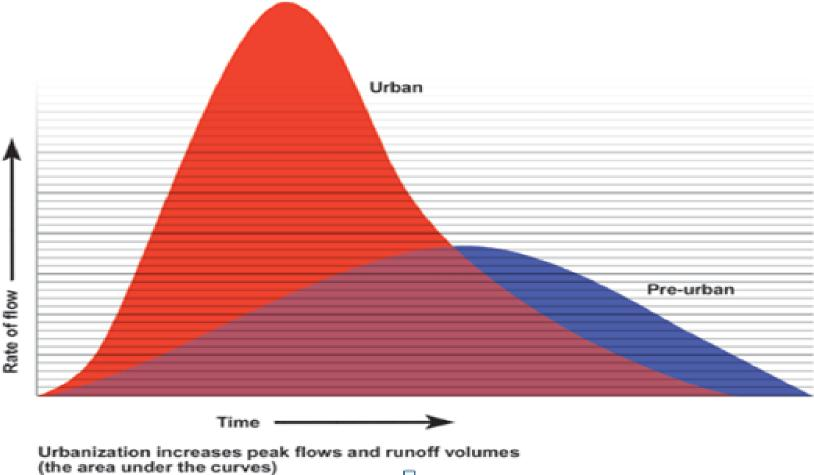
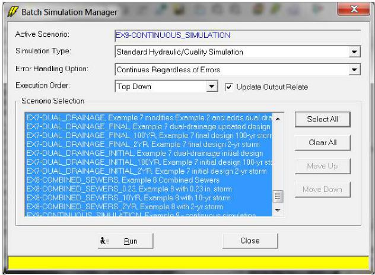
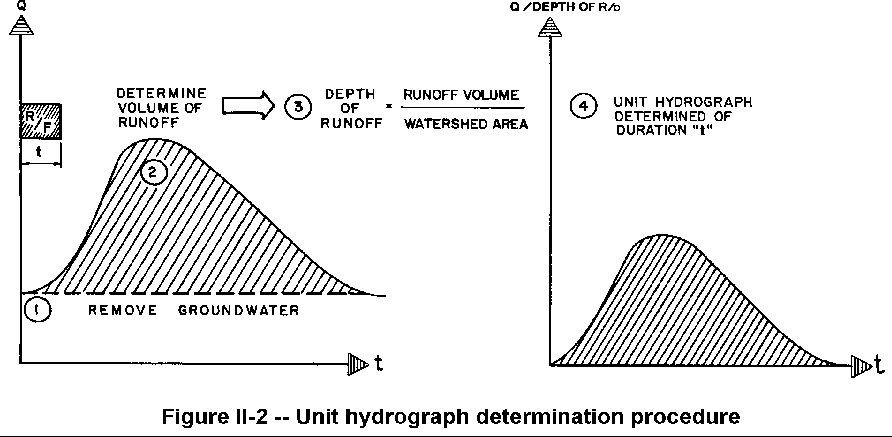
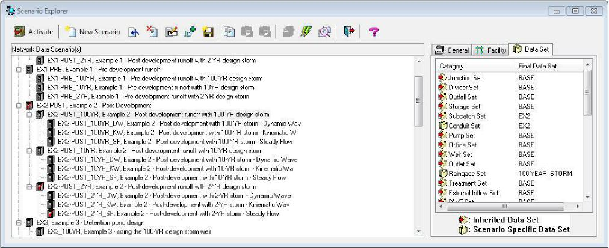
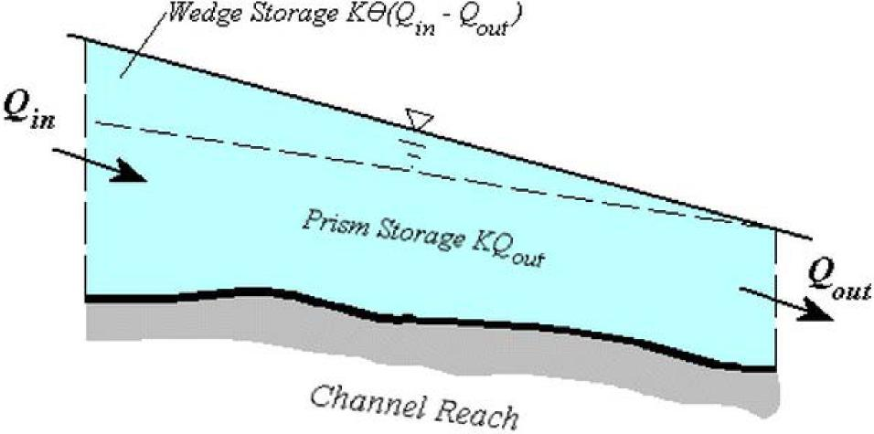
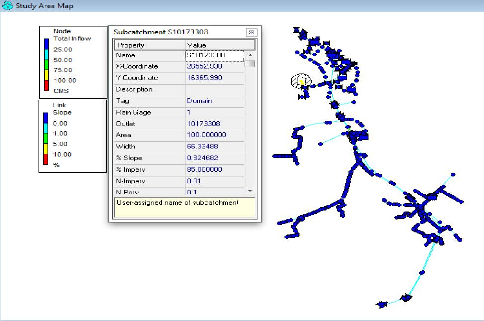
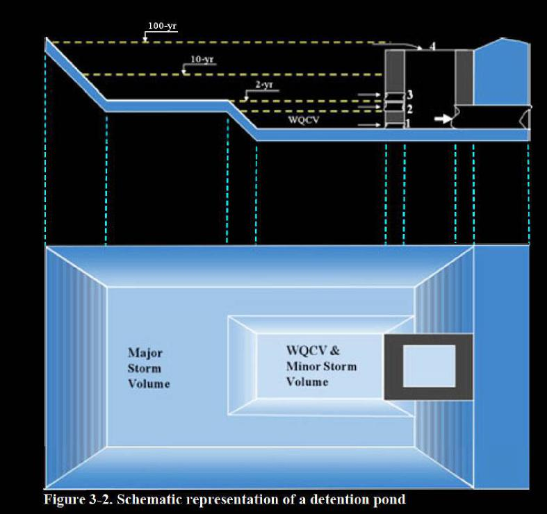
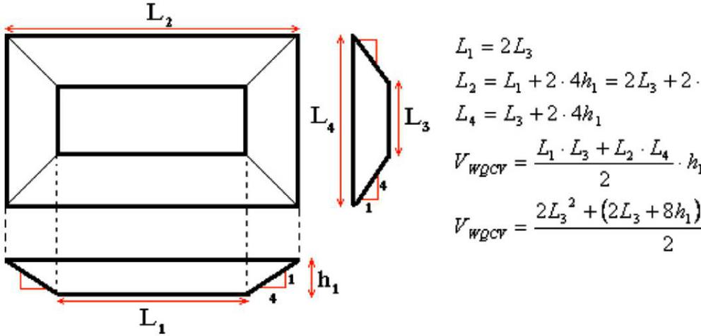

EPA/600/R-16/093

July 2016

Storm Water Management Model  
Reference Manual  
Volume III – Water Quality

By:

Lewis A. Rossman  
Office of Research and Development  
National Risk Management Laboratory  
Cincinnati, OH 45268

and

Wayne C. Huber  
School of Civil and Construction Engineering  
Oregon State University  
Corvallis, OR 97331

National Risk Management Laboratory  
Office of Research and Development  
U.S. Environmental Protection Agency  
26 Martin Luther King Drive  
Cincinnati, OH 45268

July 2016

**Disclaimer**

The information in this document has been funded wholly or in part by the U.S. Environmental Protection Agency (EPA). It has been subjected to the Agency’s peer and administrative review, and has been approved for publication as an EPA document. Mention of trade names or commercial products does not constitute endorsement or recommendation for use.

Although a reasonable effort has been made to assure that the results obtained are correct, the computer programs described in this manual are experimental. Therefore the author and the U.S. Environmental Protection Agency are not responsible and assume no liability whatsoever for any results or any use made of the results obtained from these programs, nor for any damages or litigation that result from the use of these programs for any purpose.

ii

**Abstract**

SWMM is a dynamic rainfall-runoff simulation model used for single event or long-term (continuous) simulation of runoff quantity and quality from primarily urban areas. The runoff component of SWMM operates on a collection of subcatchment areas that receive precipitation and generate runoff and pollutant loads. The routing portion of SWMM transports this runoff through a system of pipes, channels, storage/treatment devices, pumps, and regulators. SWMM tracks the quantity and quality of runoff generated within each subcatchment, and the flow rate, flow depth, and quality of water in each pipe and channel during a simulation period comprised of multiple time steps. The reference manual for this edition of SWMM is comprised of three volumes. Volume I describes SWMM’s hydrologic models, Volume II its hydraulic models, and Volume III its water quality and low impact development models.

iii

**Acknowledgements**

This report was written by Lewis A. Rossman, Environmental Scientist Emeritus, U.S. Environmental Protection Agency, Cincinnati, OH and Wayne C. Huber, Professor Emeritus, School of Civil and Construction Engineering, Oregon State University, Corvallis, OR.

The authors would like to acknowledge the contributions made by the following individuals to previous versions of SWMM that we drew heavily upon in writing this report: John Aldrich, Douglas Ammon, Carl W. Chen, Brett Cunningham, Robert Dickinson, James Heaney, Wayne Huber, Miguel Medina, Russell Mein, Charles Moore, Stephan Nix, Alan Peltz, Don Polmann, Larry Roesner, Lewis Rossman, Charles Rowney, and Robert Shubinsky. Finally, we wish to thank Lewis Rossman, Wayne Huber, Thomas Barnwell (US EPA retired), Richard Field (US EPA retired), Harry Torno (US EPA retired) and William James (University of Guelph) for their continuing efforts to support and maintain the program over the past several decades.

Portions of this document were prepared under Purchase Order 2C-R095-NAEX to Oregon State University.

iv

**Table of Contents**

**Disclaimer ii**

**Abstract iii**

**Acknowledgements iv**

**List of Figures vii**

**List of Tables viii**

**Acronyms and Abbreviations x**

**Chapter 1 – Overview 12**

> 1.1 Introduction 12
>
> 1.2 SWMM’s Object Model 13
>
> 1.3 SWMM’s Process Models 18
>
> 1.4 Simulation Process Overview 20
>
> 1.5 Interpolation and Units 24

**Chapter 2 - Urban Runoff Quality 27**

> 2.1 Introduction 27
>
> 2.2 Pollutant Sources 29
>
> 2.3 Pollutant and Land Use Objects 32
>
> 2.4 Wet Deposition 35
>
> 2.5 Dry Weather Flow 37
>
> 2.6 Simulating Runoff Quality 42

**Chapter 3 - Surface Buildup......................................................................................................46**

> 3.1 Introduction 46
>
> 3.2 Governing Equations 48
>
> 3.3 Computational Steps 53
>
> 3.4 Street Cleaning 54
>
> 3.5 Parameter Estimates 57

**Chapter 4 - Surface Washoff 62**

> 4.1 Introduction 62
>
> 4.2 Governing Equations 62

v

> 4.3 Computational Steps 71
>
> 4.4 Parameter Estimates 74

**Chapter 5 - Transport and Treatment 80**

> 5.1 Introduction 80
>
> 5.2 Governing Equations 81
>
> 5.3 Computational Steps 85
>
> 5.4 Treatment 88

**Chapter 6 - Low Impact Development Controls 97**

> 6.1 Introduction 97
>
> 6.2 Governing Equations 99
>
> 6.3 LID Deployment 118
>
> 6.4 Computational Steps 121
>
> 6.5 Parameter Estimates 125
>
> 6.6 Numerical Example 136

**References..................................................................................................................................141**

**Glossary 153**

vi

**List of Figures**

**Figure 1-1 Elements of a typical urban drainage system 14**

**Figure 1-2 SWMM's conceptual model of a stormwater drainage system 15**

**Figure 1-3 Processes modeled by SWMM 18**

**Figure 1-4 Block diagram of SWMM's state transition process 20**

**Figure 1-5 Flow chart of SWMM's simulation procedure 23**

**Figure 1-6 Interpolation of reported values from computed values 25**

**Figure 2-1 Hourly domestic sewage time patterns 41**

**Figure 3-1 Accumulation of solids on urban streets versus time (Sartor and Boyd, 1972) 48**

**Figure 3-2 Buildup of street solids in San Jose (from Pitt, 1979) 49**

**Figure 3-3 Comparison of buildup equations for a hypothetical pollutant 51**

**Figure 3-4 Evolution of buildup after a storm event 53**

**Figure 4-1 Washoff of street solids by flushing with a sprinkler system (from Sartor and**

**Boyd, 1972) 63**

**Figure 4-2 Comparison of washoff functions 67**

**Figure 4-3 Two-stream approach to modeling pollutant washoff 69**

**Figure 4-4 Simulated load variations within a storm as a function of runoff rate 75**

**Figure 5-1 Representation of the conveyance network in SWMM 80**

**Figure 5-2 Comparison of completely mixed reactor equations for time varying inflow 84**

**Figure 5-3 Comparison of completely mixed reactor equations for a step inflow 85**

**Figure 5-4 Gravity settling treatment of TSS within a detention pond 96**

**Figure 6-1 A typical bio-retention cell 100**

**Figure 6-2 Flow path across the surface of a green roof 108**

**Figure 6-3 Representation of a permeable pavement system 110**

**Figure 6-4 Representation of rooftop disconnection 114**

**Figure 6-5 Representation of a vegetative swale 116**

**Figure 6-6 Different options for placing LID controls 120**

**Figure 6-7 Storm event used for the LID example 137**

**Figure 6-8 Flux rates through the bio-retention cell with no underdrain 137**

**Figure 6-9 Moisture levels in the bio-retention cell with no underdrain 138**

**Figure 6-10 Moisture levels in the bio-retention cell with underdrain 140**

**Figure 6-11 Flux rates through the bio-retention cell with underdrain 140**

**vii**

**List of Tables**

**Table 1-1 Development history of SWMM** 13

**Table 1-2 SWMM's modeling objects** 16

**Table 1-3 State variables used by SWMM** 21

**Table 1-4 Units of expression used by SWMM** 26

**Table 2-1 Sources of contaminants in urban storm water runoff (US EPA, 1999)** 27

**Table 2-2 Typical pollutant loadings from runoff by urban land use (lbs/acre-yr)** 28

**Table 2-3 Median event mean concentrations for urban land uses** 29

**Table 2-4 Potency factors for the Detroit metropolitan area (mg/gram)** 34

**Table 2-5 Potency factors for the Patuxent River Basin (mg/gram)** 34

**Table 2-6 Representative concentrations of constituents in rainfall** 36

**Table 2-7 Average daily dry weather flow in 29 cities** 38

**Table 2-8 Quality properties of untreated domestic wastewater** 39

**Table 2-9 Unit quality loads for domestic sewage, including effects of garbage grinders** 40

**Table 2-10 Autumn water use for six homes near Wheaton, MD** 41

**Table 2-11 Typical hourly DWF correction factors** 42

**Table 2-12 Required temporal detail for receiving water analysis** 44

**Table 3-1 Measured dust and dirt (DD) accumulation in Chicago** 46

**Table 3-2 Milligrams of pollutant per gram of dust and dirt (parts per thousand by mass)**

**for four Chicago land uses** 47

**Table 3-3 Summary of buildup function coefficients** 51

**Table 3-4 Removal efficiencies from street cleaner path for various street cleaning**

**programs (Pitt, 1979)** 56  
**Table 3-5 Nationwide data on linear dust and dirt buildup rates and on pollutant fractions**

**(after Manning et al., 1977)** 59

**Table 4-1 Units of the washoff coefficient** KW **for different washoff models** 66

**Table 4-2 Percent removals for vegetated swales and filter strips** 70

**Table 4-3 Buildup/washoff calibration against annual loading rate for high-density**

**residential land use** 76

**Table 4-4 National EMC's for stormwater** 78

**Table 4-5 EMC's for different regions** 79

**Table 5-1 Treatment processes used by various types of BMPs** 89

**Table 5-2 Median inlet and outlet EMCs for selected stormwater treatment practices** 90

**Table 5-3 Median pollutant removal percentages for select stormwater BMPs** 91

**Table 6-1 Design manuals used as sources for LID parameter values** 126

**Table 6-2 Typical ranges for bio-retention cell parameters** 127

**Table 6-3 Soil characteristics for a typical bio-retention cell soil** 127

**Table 6-4 Typical ranges for green roof parameters** 128

**Table 6-5 Typical ranges for infiltration trench parameters** 129

viii

**Table 6-6 Typical ranges for permeable pavement parameters 130**

**Table 6-7 Typical ranges for vegetative swale parameters 132**

**ix**

**Acronyms and Abbreviations**

APWA American Public Works Association

ASCE American Society of Civil Engineers

BMP Best Management Practice

BOD Biochemical Oxygen Demand

BOD5 Five-Day Biochemical Oxygen Demand

C Carbon

Cd Cadmium

COD Chemical Oxygen Demand

COV Coefficient of Variation

Cr Chromium

CSO Combined Sewer Overflow

Cu Copper

DCIA Directly Connected Impervious Area

DD Dust and Dirt

DWF Dry Weather Flow

EMC Event Mean Concentration

EPA Environmental Protection Agency

ET Evapotranspiration

Fe Iron

GI Green Infrastructure

IMP Integrated Management Practice

JTU Jackson Turbidity Units

LID Low Impact Development

Mn Manganese

MPN Most Probable Number

MTBE Methyl Tertiary Butyl Ether

NADP National Atmospheric Deposition Program

NH3-N Ammonia Nitrogen

NH4 Ammonium

Ni Nickel

NO2 Nitrite

NO3 Nitrate

NPDES National Pollution Discharge Elimination System

NURP National Urban Runoff Program

PAH Polycyclic Aromatic Hydrocarbons

Pb Lead

PCU Platinum-Cobalt Units

x

PO4 Phosphate

RDII Rainfall Dependent Inflow and Infiltration

Sr Strontium

SCM Stormwater Control Measure

SUDS Sustainable Urban Drainage Systems

SWMM Storm Water Management Model

TDS Total Dissolved Solids

TKN Total Kjeldahl Nitrogen

TN Total Nitrogen

TOC Total Organic Carbon

TP Total Phosphorus

TPH Total Petroleum Hydrocarbons

TSS Total Suspended Solids

UK United Kingdom

USGS United States Geological Survey

VOC Volatile Organic Carbon

WPCF Water Pollution Control Federation

WWTP Waste Water Treatment Plant

Zn Zinc

xi

**Chapter 1 – Overview**

**1.1 Introduction**

Urban runoff quantity and quality constitute problems of both a historical and current nature. Cities have long assumed the responsibility of control of stormwater flooding and treatment of point sources (e.g., municipal sewage) of wastewater. Since the 1960s, the severe pollution potential of urban nonpoint sources, principally combined sewer overflows and stormwater discharges, has been recognized, both through field observation and federal legislation. The advent of modern computers has led to the development of complex, sophisticated tools for analysis of both quantity and quality pollution problems in urban areas and elsewhere (Singh, 1995). The EPA Storm Water Management Model, SWMM, first developed in 1969-71, was one of the first such models. It has been continually maintained and updated and is perhaps the best known and most widely used of the available urban runoff quantity/quality models (Huber and Roesner, 2013).

SWMM is a dynamic rainfall-runoff simulation model used for single event or long-term (continuous) simulation of runoff quantity and quality from primarily urban areas. The runoff component of SWMM operates on a collection of subcatchment areas that receive precipitation and generate runoff and pollutant loads. The routing portion of SWMM transports this runoff through a system of pipes, channels, storage/treatment devices, pumps, and regulators. SWMM tracks the quantity and quality of runoff generated within each subcatchment, and the flow rate, flow depth, and quality of water in each pipe and channel during a simulation period comprised of multiple time steps.

Table 1-1 summarizes the development history of SWMM. The current edition, Version 5, is a complete re-write of the previous releases. The reference manual for this edition of SWMM is comprised of three volumes. Volume I describes SWMM’s hydrologic models, Volume II its hydraulic models, and Volume III its water quality and low impact development models. These manuals complement the SWMM 5 User’s Manual (US EPA, 2010), which explains how to run the program, and the SWMM 5 Applications Manual (US EPA, 2009) which presents a number of worked-out examples. The procedures described in this reference manual are based on earlier descriptions included in the original SWMM documentation (Metcalf and Eddy et al., 1971a, 1971b, 1971c, 1971d), intermediate reports (Huber et al., 1975; Heaney et al., 1975; Huber et al., 1981b), plus new material. This information supersedes the Version 4.0 documentation (Huber and Dickinson, 1988; Roesner et al., 1988) and includes descriptions of some newer procedures implemented since 1988. More information on current documentation and the general status of the EPA Storm Water Management Model as well as the full program and its source code is

12

> available on the EPA SWMM web site:. [<u>http://www2.epa.gov/water-research/storm-water-management-model-swmm.</u>](http://www2.epa.gov/water-research/storm-water-management-model-swmm)
>
> **Table 1-1 Development history of SWMM**

<table>
<colgroup>
<col style="width: 25%" />
<col style="width: 11%" />
<col style="width: 29%" />
<col style="width: 34%" />
</colgroup>
<tbody>
<tr class="odd">
<td><blockquote>

<strong>Version</strong>

</blockquote></td>
<td><strong>Year</strong></td>
<td><blockquote>

<strong>Contributors</strong>

</blockquote></td>
<td><blockquote>

<strong>Comments</strong>

</blockquote></td>
</tr>
<tr class="even">
<td><blockquote>

SWMM I

</blockquote></td>
<td>1971</td>
<td><blockquote>

Metcalf &amp; Eddy, Inc.

Water Resources 
Engineers

University of Florida

</blockquote></td>
<td><blockquote>

First version of SWMM; written in FORTRAN, its focus was CSO modeling; Few of its methods are still used today.

</blockquote></td>
</tr>
<tr class="odd">
<td><blockquote>

SWMM II

</blockquote></td>
<td>1975</td>
<td><blockquote>

University of Florida

</blockquote></td>
<td><blockquote>

First widely distributed version of SWMM.

</blockquote></td>
</tr>
<tr class="even">
<td><blockquote>

SWMM 3

</blockquote></td>
<td>1981</td>
<td><blockquote>

University of Florida Camp Dresser &amp; McKee

</blockquote></td>
<td><blockquote>

Full dynamic wave flow routine, Green-Ampt infiltration, snow melt, and continuous simulation added.

</blockquote></td>
</tr>
<tr class="odd">
<td><blockquote>

SWMM 3.3

</blockquote></td>
<td>1983</td>
<td><blockquote>

US EPA

</blockquote></td>
<td><blockquote>

First PC version of SWMM.

</blockquote></td>
</tr>
<tr class="even">
<td><blockquote>

SWMM 4

</blockquote></td>
<td>1988</td>
<td><blockquote>

Oregon State University Camp Dresser &amp; McKee

</blockquote></td>
<td><blockquote>

Groundwater, RDII, irregular channel cross-sections and other refinements added over a series of updates throughout the 1990’s.

</blockquote></td>
</tr>
<tr class="odd">
<td><blockquote>

SWMM 5

</blockquote></td>
<td>2005</td>
<td><blockquote>

US EPA 
CDM-Smith

</blockquote></td>
<td><blockquote>

Complete re-write of the SWMM engine in C; graphical user interface added; improved algorithms and new features (e.g., LID modeling) added.

</blockquote></td>
</tr>
</tbody>
</table>

> **1.2 SWMM’s Object Model**
>
> Figure 1-1 depicts the elements included in a typical urban drainage system. SWMM conceptualizes this system as a series of water and material flows between several major environmental compartments. These compartments include:

13

> 
>
> **Figure 1-1 Elements of a typical urban drainage system**

- The Atmosphere compartment, which generates precipitation and deposits pollutants onto the Land Surface compartment.

- The Land Surface compartment receives precipitation from the Atmosphere compartment in the form of rain or snow. It sends outflow in the forms of 1) evaporation back to the Atmosphere compartment, 2) infiltration into the Sub-Surface compartment and 3) surface runoff and pollutant loadings on to the Conveyance compartment.

- The Sub-Surface compartment receives infiltration from the Land Surface compartment and transfers a portion of this inflow to the Conveyance compartment as lateral groundwater flow.

- The Conveyance compartment contains a network of elements (channels, pipes, pumps, and regulators) and storage/treatment units that convey water to outfalls or to treatment facilities. Inflows to this compartment can come from surface runoff, groundwater flow, sanitary dry weather flow, or from user-defined time series.

> Not all compartments need appear in a particular SWMM model. For example, one could model just the Conveyance compartment, using pre-defined hydrographs and pollutographs as inputs.

14

As illustrated in Figure 1-1, SWMM can be used to model any combination of stormwater collection systems, both separate and combined sanitary sewer systems, as well as natural catchment and river channel systems.

Figure 1-2 shows how SWMM conceptualizes the physical elements of the actual system depicted in Figure 1-1 with a standard set of modeling objects. The principal objects used to model the rainfall/runoff process are Rain Gages and Subcatchments. Snowmelt is modeled with Snow Pack objects placed on top of subcatchments while Aquifer objects placed below subcatchments are used to model groundwater flow. The conveyance portion of the drainage system is modeled with a network of Nodes and Links. Nodes are points that represent simple junctions, flow dividers, storage units, or outfalls. Links connect nodes to one another with conduits (pipes and channels), pumps, or flow regulators (orifices, weirs, or outlets). Land Use and Pollutant objects are used to describe water quality. Finally, a group of data objects that includes Curves, Time Series, Time Patterns, and Control Rules, are used to characterize the inflows and operating behavior of the various physical objects in a SWMM model. Table 1-2 provides a summary of the various objects used in SWMM. Their properties and functions will be described in more detail throughout the course of this manual.

> 

**Figure 1-2 SWMM's conceptual model of a stormwater drainage system**

15

> **Table 1-2 SWMM's modeling objects**

<table>
<colgroup>
<col style="width: 21%" />
<col style="width: 22%" />
<col style="width: 55%" />
</colgroup>
<tbody>
<tr class="odd">
<td><blockquote>

<strong>Category</strong>

</blockquote></td>
<td><blockquote>

<strong>Object Type</strong>

</blockquote></td>
<td><blockquote>

<strong>Description</strong>

</blockquote></td>
</tr>
<tr class="even">
<td rowspan="5"><blockquote>

Hydrology

</blockquote></td>
<td><blockquote>

Rain Gage

</blockquote></td>
<td><blockquote>

Source of precipitation data to one or more subcatchments.

</blockquote></td>
</tr>
<tr class="odd">
<td><blockquote>

Subcatchment

</blockquote></td>
<td>A land parcel that receives precipitation associated 
with a rain gage and generates runoff that flows into 
a drainage system node or to another subcatchment.</td>
</tr>
<tr class="even">
<td><blockquote>

Aquifer

</blockquote></td>
<td><blockquote>

A subsurface area that receives infiltration from the subcatchment above it and exchanges groundwater flow with a conveyance system node.

</blockquote></td>
</tr>
<tr class="odd">
<td><blockquote>

Snow Pack

</blockquote></td>
<td><blockquote>

Accumulated snow that covers a subcatchment.

</blockquote></td>
</tr>
<tr class="even">
<td><blockquote>

Unit Hydrograph

</blockquote></td>
<td><blockquote>

A response function that describes the amount of sewer inflow/infiltration generated over time per unit of instantaneous rainfall.

</blockquote></td>
</tr>
<tr class="odd">
<td rowspan="7"><blockquote>

Hydraulics

</blockquote></td>
<td><blockquote>

Junction

</blockquote></td>
<td><blockquote>

A point in the conveyance system where conduits connect to one another with negligible storage volume (e.g., manholes, pipe fittings, or stream junctions).

</blockquote></td>
</tr>
<tr class="even">
<td><blockquote>

Outfall

</blockquote></td>
<td><blockquote>

An end point of the conveyance system where water is discharged to a receptor (such as a receiving stream or treatment plant) with known water surface elevation.

</blockquote></td>
</tr>
<tr class="odd">
<td><blockquote>

Divider

</blockquote></td>
<td><blockquote>

A point in the conveyance system where the inflow splits into two outflow conduits according to a known relationship.

</blockquote></td>
</tr>
<tr class="even">
<td><blockquote>

Storage Unit

</blockquote></td>
<td><blockquote>

A pond, lake, impoundment, or chamber that provides water storage.

</blockquote></td>
</tr>
<tr class="odd">
<td><blockquote>

Conduit

</blockquote></td>
<td><blockquote>

A channel or pipe that conveys water from one conveyance system node to another.

</blockquote></td>
</tr>
<tr class="even">
<td><blockquote>

Pump

</blockquote></td>
<td><blockquote>

A device that raises the hydraulic head of water.

</blockquote></td>
</tr>
<tr class="odd">
<td><blockquote>

Regulator

</blockquote></td>
<td><blockquote>

A weir, orifice or outlet used to direct and regulate flow between two nodes of the conveyance system.

</blockquote></td>
</tr>
</tbody>
</table>

16

> **Table 1-2 SWMM’s modeling objects (continued)**

<table>
<colgroup>
<col style="width: 21%" />
<col style="width: 22%" />
<col style="width: 55%" />
</colgroup>
<tbody>
<tr class="odd">
<td><blockquote>

<strong>Category</strong>

</blockquote></td>
<td><blockquote>

<strong>Object Type</strong>

</blockquote></td>
<td><blockquote>

<strong>Description</strong>

</blockquote></td>
</tr>
<tr class="even">
<td rowspan="2"><blockquote>

Water Quality

</blockquote></td>
<td><blockquote>

Pollutant

</blockquote></td>
<td><blockquote>

A contaminant that can build up and be washed off of the land surface or be introduced directly into the conveyance system.

</blockquote></td>
</tr>
<tr class="odd">
<td><blockquote>

Land Use

</blockquote></td>
<td><blockquote>

A classification used to characterize the functions that describe pollutant buildup and washoff.

</blockquote></td>
</tr>
<tr class="even">
<td rowspan="2"><blockquote>

Treatment

</blockquote></td>
<td><blockquote>

LID Control

</blockquote></td>
<td><blockquote>

A low impact development control, such as a bio-retention cell, porous pavement, or vegetative swale, used to reduce surface runoff through enhanced infiltration.

</blockquote></td>
</tr>
<tr class="odd">
<td><blockquote>

Treatment Function

</blockquote></td>
<td><blockquote>

A user-defined function that describes how pollutant concentrations are reduced at a conveyance system node as a function of certain variables, such as concentration, flow rate, water depth, etc.

</blockquote></td>
</tr>
<tr class="even">
<td rowspan="4"><blockquote>

Data Object

</blockquote></td>
<td><blockquote>

Curve

</blockquote></td>
<td><blockquote>

A tabular function that defines the relationship between two quantities (e.g., flow rate and hydraulic head for a pump, surface area and depth for a storage node, etc.).

</blockquote></td>
</tr>
<tr class="odd">
<td><blockquote>

Time Series

</blockquote></td>
<td><blockquote>

A tabular function that describes how a quantity varies with time (e.g., rainfall, outfall surface elevation, etc.).

</blockquote></td>
</tr>
<tr class="even">
<td><blockquote>

Time Pattern

</blockquote></td>
<td><blockquote>

A set of factors that repeats over a period of time (e.g., diurnal hourly pattern, weekly daily pattern, etc.).

</blockquote></td>
</tr>
<tr class="odd">
<td><blockquote>

Control Rules

</blockquote></td>
<td><blockquote>

IF-THEN-ELSE statements that determine when specific control actions are taken (e.g., turn a pump on or off when the flow depth at a given node is above or below a certain value).

</blockquote></td>
</tr>
</tbody>
</table>

17

> **1.3 SWMM’s Process Models**
>
> Figure 1-3 depicts the processes that SWMM models using the objects described previously and how they are tied to one another. The hydrological processes depicted in this diagram include:
>
> 
>
> **Figure 1-3 Processes modeled by SWMM**

- time-varying precipitation

- snow accumulation and melting

- rainfall interception from depression storage (initial abstraction)

- evaporation of standing surface water

- infiltration of rainfall into unsaturated soil layers

18

- percolation of infiltrated water into groundwater layers

- interflow between groundwater and the drainage system

- nonlinear reservoir routing of overland flow

- infiltration and evaporation of rainfall/runoff captured by Low Impact Development controls.

> The hydraulic processes occurring within SWMM’s conveyance compartment include:

- external inflow of surface runoff, groundwater interflow, rainfall-dependent infiltration/inflow, dry weather sanitary flow, and user-defined inflows

- unsteady, non-uniform flow routing through any configuration of open channels, pipes and storage units

- various possible flow regimes such as backwater, surcharging, reverse flow, and surface ponding

- flow regulation via pumps, weirs, and orifices including time- and state-dependent control rules that govern their operation.

> Regarding water quality, the following processes can be modeled for any number of user-defined water quality constituents:

- dry-weather pollutant buildup over different land uses

- pollutant washoff from specific land uses during storm events

- direct contribution of rainfall deposition

- reduction in dry-weather buildup due to street cleaning

- reduction in washoff loads due to BMPs

- entry of dry weather sanitary flows and user-specified external inflows at any point in the drainage system

- routing of water quality constituents through the drainage system

- reduction in constituent concentration through treatment in storage units or by natural processes in pipes and channels.

> The numerical procedures that SWMM uses to model the water quality processes listed above as well as Low Impact Development practices are discussed in detail in subsequent chapters of this volume. SWMM’s hydrologic and hydraulic processes are described in volumes I and II of this manual.
>
> 19
>
> **1.4 Simulation Process Overview**
>
> SWMM is a distributed discrete time simulation model. It computes new values of its state variables over a sequence of time steps, where at each time step the system is subjected to a new set of external inputs. As its state variables are updated, other output variables of interest are computed and reported. This process is represented mathematically with the following general set of equations that are solved at each time step as the simulation unfolds:
>
> = (−1, , ) (1-1)
>
> = ( , ) (1-2)

|       |     |
|-------|-----|
| where |     |
| *Xt*  | =   |
| *Yt*  | =   |
| *It*  | =   |
| *P*   | =   |
| *f*   | =   |
| *g*   | =   |

a vector of state variables at time *t*,

a vector of output variables at time *t*,

a vector of inputs at time *t*,

a vector of constant parameters,

a vector-valued state transition function,

a vector-valued output transform function,

> Figure 1-4 depicts the simulation process in block diagram fashion.
>
> 
>
> **Figure 1-4 Block diagram of SWMM's state transition process**
>
> The variables that make up the state vector *Xt* are listed in Table 1-3. This is a surprisingly small number given the comprehensive nature of SWMM. All other quantities can be computed from these variables, external inputs, and fixed input parameters. The meaning of some of the less obvious state variables, such as those used for snow melt, is discussed in other sections of this set of manuals.
>
> 20
>
> **Table 1-3 State variables used by SWMM**

<table>
<colgroup>
<col style="width: 20%" />
<col style="width: 11%" />
<col style="width: 48%" />
<col style="width: 18%" />
</colgroup>
<tbody>
<tr class="odd">
<td><blockquote>

<strong>Process</strong>

</blockquote></td>
<td><blockquote>

<strong>Variable</strong>

</blockquote></td>
<td><blockquote>

<strong>Description</strong>

</blockquote></td>
<td><blockquote>

<strong>Initial Value</strong>

</blockquote></td>
</tr>
<tr class="even">
<td><blockquote>

Runoff

</blockquote></td>
<td><blockquote>

<em>d</em>

</blockquote></td>
<td><blockquote>

Depth of runoff on a subcatchment surface

</blockquote></td>
<td><blockquote>

0

</blockquote></td>
</tr>
<tr class="odd">
<td rowspan="6"><blockquote>

Infiltration*

</blockquote></td>
<td><blockquote>

<em>tp</em>

</blockquote></td>
<td><blockquote>

Equivalent time on the Horton curve

</blockquote></td>
<td><blockquote>

0

</blockquote></td>
</tr>
<tr class="even">
<td><blockquote>

<em>Fe</em>

</blockquote></td>
<td><blockquote>

Cumulative excess infiltration volume

</blockquote></td>
<td><blockquote>

0

</blockquote></td>
</tr>
<tr class="odd">
<td><blockquote>

<em>Fu</em>

</blockquote></td>
<td><blockquote>

Upper zone moisture content

</blockquote></td>
<td><blockquote>

0

</blockquote></td>
</tr>
<tr class="even">
<td><blockquote>

<em>T</em>

</blockquote></td>
<td><blockquote>

Time until the next rainfall event

</blockquote></td>
<td><blockquote>

0

</blockquote></td>
</tr>
<tr class="odd">
<td><blockquote>

<em>P</em>

</blockquote></td>
<td><blockquote>

Cumulative rainfall for current event

</blockquote></td>
<td><blockquote>

0

</blockquote></td>
</tr>
<tr class="even">
<td><blockquote>

<em>S</em>

</blockquote></td>
<td><blockquote>

Soil moisture storage capacity remaining

</blockquote></td>
<td><blockquote>

User supplied

</blockquote></td>
</tr>
<tr class="odd">
<td rowspan="2"><blockquote>

Groundwater

</blockquote></td>
<td><blockquote>

<em>θu</em>

</blockquote></td>
<td><blockquote>

Unsaturated zone moisture content

</blockquote></td>
<td><blockquote>

User supplied

</blockquote></td>
</tr>
<tr class="even">
<td><blockquote>

<em>dL</em>

</blockquote></td>
<td><blockquote>

Depth of saturated zone

</blockquote></td>
<td><blockquote>

User supplied

</blockquote></td>
</tr>
<tr class="odd">
<td rowspan="4"><blockquote>

Snowmelt

</blockquote></td>
<td><blockquote>

<em>wsnow</em>

</blockquote></td>
<td><blockquote>

Snow pack depth

</blockquote></td>
<td><blockquote>

User supplied

</blockquote></td>
</tr>
<tr class="even">
<td><blockquote>

<em>fw</em>

</blockquote></td>
<td><blockquote>

Snow pack free water depth

</blockquote></td>
<td><blockquote>

User supplied

</blockquote></td>
</tr>
<tr class="odd">
<td><blockquote>

<em>ati</em>

</blockquote></td>
<td><blockquote>

Snow pack surface temperature

</blockquote></td>
<td><blockquote>

User supplied

</blockquote></td>
</tr>
<tr class="even">
<td><blockquote>

<em>cc</em>

</blockquote></td>
<td><blockquote>

Snow pack cold content

</blockquote></td>
<td><blockquote>

0

</blockquote></td>
</tr>
<tr class="odd">
<td rowspan="3"><blockquote>

Flow Routing

</blockquote></td>
<td><blockquote>

<em>y</em>

</blockquote></td>
<td><blockquote>

Depth of water at a node

</blockquote></td>
<td><blockquote>

User supplied

</blockquote></td>
</tr>
<tr class="even">
<td><blockquote>

<em>q</em>

</blockquote></td>
<td><blockquote>

Flow rate in a link

</blockquote></td>
<td><blockquote>

User supplied

</blockquote></td>
</tr>
<tr class="odd">
<td><blockquote>

<em>a</em>

</blockquote></td>
<td><blockquote>

Flow area in a link

</blockquote></td>
<td><blockquote>

Inferred from <em>q</em>

</blockquote></td>
</tr>
<tr class="even">
<td rowspan="5"><blockquote>

Water Quality

</blockquote></td>
<td><blockquote>

<em>tsweep</em>

</blockquote></td>
<td><blockquote>

Time since a subcatchment was last swept

</blockquote></td>
<td><blockquote>

User supplied

</blockquote></td>
</tr>
<tr class="odd">
<td><blockquote>

<em>mB</em>

</blockquote></td>
<td><blockquote>

Pollutant buildup on subcatchment surface

</blockquote></td>
<td><blockquote>

User supplied

</blockquote></td>
</tr>
<tr class="even">
<td><blockquote>

<em>mP</em>

</blockquote></td>
<td><blockquote>

Pollutant mass ponded on subcatchment

</blockquote></td>
<td><blockquote>

0

</blockquote></td>
</tr>
<tr class="odd">
<td><blockquote>

<em>cN</em>

</blockquote></td>
<td><blockquote>

Concentration of pollutant at a node

</blockquote></td>
<td><blockquote>

User supplied

</blockquote></td>
</tr>
<tr class="even">
<td><blockquote>

<em>cL</em>

</blockquote></td>
<td><blockquote>

Concentration of pollutant in a link

</blockquote></td>
<td><blockquote>

User supplied

</blockquote></td>
</tr>
</tbody>
</table>

> \*Only a sub-set of these variables is used, depending on the user’s choice of infiltration method.
>
> Examples of user-supplied input variables *It* that produce changes to these state variables include:

- meteorological conditions, such as precipitation, air temperature, evaporation rate and wind speed

- externally imposed inflow hydrographs and pollutographs at specific nodes of the conveyance system

21

- dry weather sanitary inflows to specific nodes of the conveyance system

- water surface elevations at specific outfalls of the conveyance system

- control settings for pumps and regulators.

> The output vector *Yt* that SWMM computes from its updated state variables contains such reportable quantities as:

- runoff flow rate and pollutant concentrations from each subcatchment

- snow depth, infiltration rate and evaporation losses from each subcatchment

- groundwater table elevation and lateral groundwater outflow for each subcatchment

- total lateral inflow (from runoff, groundwater flow, dry weather flow, etc.), water depth, and pollutant concentration for each conveyance system node

- overflow rate and ponded volume at each flooded node

- flow rate, velocity, depth and pollutant concentration for each conveyance system link.

> Regarding the constant parameter vector *P,* SWMM contains over 150 different user-supplied constants and coefficients within its collection of process models. Most of these are either physical dimensions (e.g., land areas, pipe diameters, invert elevations) or quantities that can be obtained from field observation (e.g., percent impervious cover), laboratory testing (e.g., various soil properties), or previously published data tables (e.g., pipe roughness based on pipe material). A smaller remaining number might require some degree of model calibration to determine their proper values. Of course not all parameters are required for every project (e.g., the 14 groundwater parameters for each subcatchment are not needed if groundwater is not being modeled). The subsequent chapters of this manual carefully define each parameter and make suggestions on how to estimate its value.
>
> A flowchart of the overall simulation process is shown in Figure 1-5. The process begins by reading a description of each object and its parameters from an input file whose format is described in the SWMM 5 Users’ Manual (US EPA, 2010). Next the values of all state variables are initialized, as is the current simulation time (T), runoff time (Troff), and reporting time (Trpt).

22

> The program then enters a loop that first determines the time T1 at the end of the current routing time step (∆Trout). If the current runoff time Troff is less than T1, then new runoff calculations are repeatedly made and the runoff time updated until it equals or exceeds time T1. Each set of runoff calculations accounts for any precipitation, evaporation, snowmelt, infiltration, ground water seepage, overland flow, and pollutant buildup and washoff that can contribute flow and pollutant loads into the conveyance system.
>
> Once the runoff time is current, all inflows and pollutant loads occurring at time T are routed through the conveyance system over the time interval from T to T1. This process updates the flow, depth and velocity in each conduit, the water elevation at each node, the pumping rate for each pump, and the water level and volume in each storage unit. In addition, new values for the concentrations of all pollutants at each node and within each conduit are computed. Next a check is made to see if the current reporting time Trpt falls within the interval from T to T1. If it does, then a new set of output results at time Trpt are interpolated from the results at times T and T1 and are saved to an output file. The reporting time is also advanced by the reporting time step ∆Trpt. The simulation time T is then updated to T1 and the process continues until T reaches the desired total duration. SWMM’s Windows-based user interface provides graphical tools for building the aforementioned input file and for viewing the computed output.
>
> **1.5 Interpolation and Units**
>
> SWMM uses linear interpolation to obtain values for quantities at times that fall in between times at which input time series are recorded or at which output results are computed. The concept is illustrated in Figure 1-6 which shows how reported flow values are derived from the computed flow values on either side of it for the typical case where the reporting time step is larger than the routing time step. One exception to this convention is for precipitation and infiltration rates. These remain constant within a runoff time step and no interpolation is made when these values are used within SWMM’s runoff algorithms or for reporting purposes. In other words, if a reporting time falls within a runoff time step the reported rainfall intensity is the value associated with the start of the runoff time step.

24

> **Table 1-4 Units of expression used by SWMM**

<table>
<colgroup>
<col style="width: 35%" />
<col style="width: 32%" />
<col style="width: 32%" />
</colgroup>
<tbody>
<tr class="odd">
<td><blockquote>

<strong>Variable or Parameter</strong>

</blockquote></td>
<td><blockquote>

<strong>US Customary Units</strong>

</blockquote></td>
<td><blockquote>

<strong>SI Metric Units</strong>

</blockquote></td>
</tr>
<tr class="even">
<td><blockquote>

Area (subcatchment)

</blockquote></td>
<td><blockquote>

acres

</blockquote></td>
<td><blockquote>

hectares

</blockquote></td>
</tr>
<tr class="odd">
<td><blockquote>

Area (storage surface area)

</blockquote></td>
<td><blockquote>

square feet

</blockquote></td>
<td><blockquote>

square meters

</blockquote></td>
</tr>
<tr class="even">
<td><blockquote>

Depression Storage

</blockquote></td>
<td><blockquote>

inches

</blockquote></td>
<td><blockquote>

millimeters

</blockquote></td>
</tr>
<tr class="odd">
<td><blockquote>

Depth

</blockquote></td>
<td><blockquote>

feet

</blockquote></td>
<td><blockquote>

meters

</blockquote></td>
</tr>
<tr class="even">
<td><blockquote>

Elevation

</blockquote></td>
<td><blockquote>

feet

</blockquote></td>
<td><blockquote>

meters

</blockquote></td>
</tr>
<tr class="odd">
<td><blockquote>

Evaporation

</blockquote></td>
<td><blockquote>

inches/day

</blockquote></td>
<td><blockquote>

millimeters/day

</blockquote></td>
</tr>
<tr class="even">
<td><blockquote>

Flow Rate

</blockquote></td>
<td><blockquote>

cubic feet/sec (cfs)

gallons/min (gpm)

1 6 gallons/day (mgd)

</blockquote></td>
<td><blockquote>

cubic meters/sec (cms)

liters/sec (lps)

1 6 liters/day (mld)

</blockquote></td>
</tr>
<tr class="odd">
<td><blockquote>

Hydraulic Conductivity

</blockquote></td>
<td><blockquote>

inches/hour

</blockquote></td>
<td><blockquote>

millimeters/hour

</blockquote></td>
</tr>
<tr class="even">
<td><blockquote>

Hydraulic Head

</blockquote></td>
<td><blockquote>

feet

</blockquote></td>
<td><blockquote>

meters

</blockquote></td>
</tr>
<tr class="odd">
<td><blockquote>

Infiltration Rate

</blockquote></td>
<td><blockquote>

inches/hour

</blockquote></td>
<td><blockquote>

millimeters/hour

</blockquote></td>
</tr>
<tr class="even">
<td><blockquote>

Length

</blockquote></td>
<td><blockquote>

feet

</blockquote></td>
<td><blockquote>

meters

</blockquote></td>
</tr>
<tr class="odd">
<td><blockquote>

Manning’s n

</blockquote></td>
<td><blockquote>

seconds/meter1/3

</blockquote></td>
<td><blockquote>

seconds/meter1/3

</blockquote></td>
</tr>
<tr class="even">
<td><blockquote>

Pollutant Buildup

</blockquote></td>
<td><blockquote>

mass/acre

</blockquote></td>
<td><blockquote>

mass/hectare

</blockquote></td>
</tr>
<tr class="odd">
<td><blockquote>

Pollutant Concentration

</blockquote></td>
<td><blockquote>

milligrams/liter (mg/L) micrograms/liter (µg/L) organism counts/liter

</blockquote></td>
<td><blockquote>

milligrams/liter (mg/L) micrograms/liter (µg/L) organism counts/liter

</blockquote></td>
</tr>
<tr class="even">
<td><blockquote>

Rainfall Intensity

</blockquote></td>
<td><blockquote>

inches/hour

</blockquote></td>
<td><blockquote>

millimeters/hour

</blockquote></td>
</tr>
<tr class="odd">
<td><blockquote>

Rainfall Volume

</blockquote></td>
<td><blockquote>

inches

</blockquote></td>
<td><blockquote>

millimeters

</blockquote></td>
</tr>
<tr class="even">
<td><blockquote>

Storage Volume

</blockquote></td>
<td><blockquote>

cubic feet

</blockquote></td>
<td><blockquote>

cubic meters

</blockquote></td>
</tr>
<tr class="odd">
<td><blockquote>

Temperature

</blockquote></td>
<td><blockquote>

degrees Fahrenheit

</blockquote></td>
<td><blockquote>

degrees Celsius

</blockquote></td>
</tr>
<tr class="even">
<td><blockquote>

Velocity

</blockquote></td>
<td><blockquote>

feet/second

</blockquote></td>
<td><blockquote>

meters/second

</blockquote></td>
</tr>
<tr class="odd">
<td><blockquote>

Width

</blockquote></td>
<td><blockquote>

feet

</blockquote></td>
<td><blockquote>

meters

</blockquote></td>
</tr>
<tr class="even">
<td><blockquote>

Wind Speed

</blockquote></td>
<td><blockquote>

miles/hour

</blockquote></td>
<td><blockquote>

kilometers/hour

</blockquote></td>
</tr>
</tbody>
</table>

26

> **Chapter 2 - Urban Runoff Quality**
>
> **2.1 Introduction**
>
> Storm water runoff from urbanized areas can contain significant concentrations of harmful pollutants that can contribute to adverse water quality impacts in receiving streams. Effects can include such things as beach closures, shellfish bed closures, limits on fishing and limits on recreational contact in waters that receive storm water discharges.
>
> Contaminants enter storm water from a variety of sources in the urban landscape. The major sources include residential and commercial areas, industrial activities, construction, streets and parking lots, and atmospheric deposition. Contaminants commonly found in storm water runoff and their likely sources are summarized in Table 2-1. Table 2-2 lists typical pollutant loadings from different urban land uses.
>
> **Table 2-1 Sources of contaminants in urban storm water runoff (US EPA, 1999)**

<table>
<colgroup>
<col style="width: 50%" />
<col style="width: 50%" />
</colgroup>
<tbody>
<tr class="odd">
<td><blockquote>

<strong>Contaminant</strong>

</blockquote></td>
<td><blockquote>

<strong>Contaminant Sources</strong>

</blockquote></td>
</tr>
<tr class="even">
<td><blockquote>

Sediment and Floatables

</blockquote></td>
<td><blockquote>

Streets, lawns, driveways, roads, construction activities, atmospheric deposition, drainage channel erosion

</blockquote></td>
</tr>
<tr class="odd">
<td><blockquote>

Pesticides and Herbicides

</blockquote></td>
<td><blockquote>

Residential lawns and gardens, roadsides, utility right-of-ways, commercial and industrial landscaped areas, soil wash-off

</blockquote></td>
</tr>
<tr class="even">
<td><blockquote>

Organic Materials

</blockquote></td>
<td><blockquote>

Residential lawns and gardens, commercial landscaping, animal wastes

</blockquote></td>
</tr>
<tr class="odd">
<td><blockquote>

Metals

</blockquote></td>
<td><blockquote>

Automobiles, bridges, atmospheric deposition, industrial areas, soil erosion, corroding metal surfaces, combustion processes

</blockquote></td>
</tr>
<tr class="even">
<td><blockquote>

Oil and Grease / Hydrocarbons

</blockquote></td>
<td><blockquote>

Roads, driveways, parking lots, vehicle maintenance areas, gas stations, illicit dumping to storm drains

</blockquote></td>
</tr>
<tr class="odd">
<td><blockquote>

Bacteria and Viruses

</blockquote></td>
<td><blockquote>

Lawns, roads, leaky sanitary sewer lines, sanitary sewer cross-connections, animal waste, septic systems

</blockquote></td>
</tr>
<tr class="even">
<td><blockquote>

Nitrogen and Phosphorus

</blockquote></td>
<td><blockquote>

Lawn fertilizers, atmospheric deposition,

automobile exhaust, soil erosion, animal waste, detergents

</blockquote></td>
</tr>
</tbody>
</table>

> 27
>
> **Table 2-2 Typical pollutant loadings from runoff by urban land use (lbs/acre-yr)**

<table>
<colgroup>
<col style="width: 15%" />
<col style="width: 7%" />
<col style="width: 7%" />
<col style="width: 7%" />
<col style="width: 8%" />
<col style="width: 13%" />
<col style="width: 8%" />
<col style="width: 8%" />
<col style="width: 7%" />
<col style="width: 7%" />
<col style="width: 7%" />
</colgroup>
<tbody>
<tr class="odd">
<td><blockquote>

<strong>Land Use</strong>

</blockquote></td>
<td><strong>TSS</strong></td>
<td><strong>TP</strong></td>
<td><strong>TKN</strong></td>
<td><strong>NH3­ 
N</strong></td>
<td>
<strong>NO2+NO3­</strong>

<strong>N</strong>
</td>
<td><strong>BOD</strong></td>
<td><strong>COD</strong></td>
<td><strong>Pb</strong></td>
<td><strong>Zn</strong></td>
<td><strong>Cu</strong></td>
</tr>
<tr class="even">
<td><blockquote>

Commercial

</blockquote></td>
<td>1000</td>
<td>1.5</td>
<td>6.7</td>
<td>1.9</td>
<td>3.1</td>
<td>62</td>
<td>420</td>
<td>2.7</td>
<td>2.1</td>
<td>0.4</td>
</tr>
<tr class="odd">
<td><blockquote>

Parking Lot

</blockquote></td>
<td>400</td>
<td>0.7</td>
<td>5.1</td>
<td>2</td>
<td>2.9</td>
<td>47</td>
<td>270</td>
<td>0.8</td>
<td>0.8</td>
<td>0.04</td>
</tr>
<tr class="even">
<td><blockquote>

HDR

</blockquote></td>
<td>420</td>
<td>1</td>
<td>4.2</td>
<td>0.8</td>
<td>2</td>
<td>27</td>
<td>170</td>
<td>0.8</td>
<td>0.7</td>
<td>0.03</td>
</tr>
<tr class="odd">
<td><blockquote>

MDR

</blockquote></td>
<td>190</td>
<td>0.5</td>
<td>2.5</td>
<td>0.5</td>
<td>1.4</td>
<td>13</td>
<td>72</td>
<td>0.2</td>
<td>0.2</td>
<td>0.14</td>
</tr>
<tr class="even">
<td><blockquote>

LDR

</blockquote></td>
<td>10</td>
<td>0.04</td>
<td>0.03</td>
<td>0.02</td>
<td>0.1</td>
<td>NA</td>
<td>NA</td>
<td>0.01</td>
<td>0.04</td>
<td>0.01</td>
</tr>
<tr class="odd">
<td><blockquote>

Freeway

</blockquote></td>
<td>880</td>
<td>0.9</td>
<td>7.9</td>
<td>1.5</td>
<td>4.2</td>
<td>NA</td>
<td>NA</td>
<td>4.5</td>
<td>2.1</td>
<td>0.37</td>
</tr>
<tr class="even">
<td><blockquote>

Industrial

</blockquote></td>
<td>860</td>
<td>1.3</td>
<td>3.8</td>
<td>0.2</td>
<td>1.3</td>
<td>NA</td>
<td>NA</td>
<td>2.4</td>
<td>7.3</td>
<td>0.5</td>
</tr>
<tr class="odd">
<td><blockquote>

Park

</blockquote></td>
<td>3</td>
<td>0.03</td>
<td>1.5</td>
<td>NA</td>
<td>0.3</td>
<td>NA</td>
<td>2</td>
<td>0</td>
<td>NA</td>
<td>NA</td>
</tr>
<tr class="even">
<td><blockquote>

Construction

</blockquote></td>
<td>6000</td>
<td>80</td>
<td>NA</td>
<td>NA</td>
<td>NA</td>
<td>NA</td>
<td>NA</td>
<td>NA</td>
<td>NA</td>
<td>NA</td>
</tr>
</tbody>
</table>

> HDR: High Density Residential, MDR: Medium Density Residential, LDR: Low Density
>
> Residential
>
> NA: Not available; insufficient data to characterize loadings
>
> Source: Burton and Pitt (2002).
>
> The most comprehensive study of urban runoff was conducted by US EPA between 1978 and 1983 as part of the National Urban Runoff Program (NURP) (US EPA, 1983). Sampling was conducted for 28 NURP projects which included 81 specific sites and more than 2,300 separate storm events. NURP also examined coliform bacteria and priority pollutants at a subset of sites. Median event mean concentrations (EMCs) for ten general NURP pollutants for various urban land use categories are presented in Table 2-3. Fecal coliform is the most widely used indicator for the presence of harmful pathogens. Its concentration measured in separate urban storm sewers has varied widely, ranging between 400-50,000 MPN/100 ml.

28

> **Table 2-3 Median event mean concentrations for urban land uses**

<table>
<colgroup>
<col style="width: 19%" />
<col style="width: 8%" />
<col style="width: 10%" />
<col style="width: 7%" />
<col style="width: 10%" />
<col style="width: 7%" />
<col style="width: 10%" />
<col style="width: 7%" />
<col style="width: 10%" />
<col style="width: 8%" />
</colgroup>
<tbody>
<tr class="odd">
<td rowspan="2"><blockquote>

<strong>Pollutant</strong>

</blockquote></td>
<td rowspan="2"><blockquote>

<strong>Units</strong>

</blockquote></td>
<td colspan="2"><strong>Residential</strong></td>
<td colspan="2"><strong>Mixed</strong></td>
<td colspan="2"><blockquote>

<strong>Commercial</strong>

</blockquote></td>
<td colspan="2"><strong>Open/Non-</strong> 
<strong>Urban</strong></td>
</tr>
<tr class="even">
<td><blockquote>

<strong>Median</strong>

</blockquote></td>
<td><strong>COV</strong></td>
<td><blockquote>

<strong>Median</strong>

</blockquote></td>
<td><strong>COV</strong></td>
<td><blockquote>

<strong>Median</strong>

</blockquote></td>
<td><strong>COV</strong></td>
<td><blockquote>

<strong>Median</strong>

</blockquote></td>
<td><strong>COV</strong></td>
</tr>
<tr class="odd">
<td><blockquote>

BOD

</blockquote></td>
<td><blockquote>

mg/L

</blockquote></td>
<td><blockquote>

10

</blockquote></td>
<td>0.41</td>
<td><blockquote>

7.8

</blockquote></td>
<td>0.52</td>
<td><blockquote>

9.3

</blockquote></td>
<td>0.31</td>
<td><blockquote>

-

</blockquote></td>
<td>-</td>
</tr>
<tr class="even">
<td><blockquote>

COD

</blockquote></td>
<td><blockquote>

mg/L

</blockquote></td>
<td><blockquote>

73

</blockquote></td>
<td>0.55</td>
<td><blockquote>

65

</blockquote></td>
<td>0.58</td>
<td><blockquote>

57

</blockquote></td>
<td>0.39</td>
<td><blockquote>

40

</blockquote></td>
<td>0.78</td>
</tr>
<tr class="odd">
<td><blockquote>

TSS

</blockquote></td>
<td><blockquote>

mg/L

</blockquote></td>
<td><blockquote>

101

</blockquote></td>
<td>0.96</td>
<td><blockquote>

67

</blockquote></td>
<td>1.14</td>
<td><blockquote>

69

</blockquote></td>
<td>0.85</td>
<td><blockquote>

70

</blockquote></td>
<td>2.92</td>
</tr>
<tr class="even">
<td><blockquote>

Total Lead

</blockquote></td>
<td><blockquote>

tg/L

</blockquote></td>
<td><blockquote>

144

</blockquote></td>
<td>0.75</td>
<td><blockquote>

114

</blockquote></td>
<td>1.35</td>
<td><blockquote>

104

</blockquote></td>
<td>0.68</td>
<td><blockquote>

30

</blockquote></td>
<td>1.52</td>
</tr>
<tr class="odd">
<td><blockquote>

Total Copper

</blockquote></td>
<td><blockquote>

tg/L

</blockquote></td>
<td><blockquote>

33

</blockquote></td>
<td>0.99</td>
<td><blockquote>

27

</blockquote></td>
<td>1.32</td>
<td><blockquote>

29

</blockquote></td>
<td>0.81</td>
<td><blockquote>

-

</blockquote></td>
<td>-</td>
</tr>
<tr class="even">
<td><blockquote>

Total Zinc

</blockquote></td>
<td><blockquote>

tg/L

</blockquote></td>
<td><blockquote>

135

</blockquote></td>
<td>0.84</td>
<td><blockquote>

154

</blockquote></td>
<td>0.78</td>
<td><blockquote>

226

</blockquote></td>
<td>1.07</td>
<td><blockquote>

195

</blockquote></td>
<td>0.66</td>
</tr>
<tr class="odd">
<td><blockquote>

Total Kjeldahl Nitrogen

</blockquote></td>
<td><blockquote>

tg/L

</blockquote></td>
<td><blockquote>

1900

</blockquote></td>
<td>0.73</td>
<td><blockquote>

1288

</blockquote></td>
<td>0.50</td>
<td><blockquote>

1179

</blockquote></td>
<td>0.43</td>
<td><blockquote>

965

</blockquote></td>
<td>1.00</td>
</tr>
<tr class="even">
<td><blockquote>

Nitrate + Nitrite

</blockquote></td>
<td><blockquote>

tg/L

</blockquote></td>
<td><blockquote>

736

</blockquote></td>
<td>0.83</td>
<td><blockquote>

558

</blockquote></td>
<td>0.67</td>
<td><blockquote>

572

</blockquote></td>
<td>0.48</td>
<td><blockquote>

543

</blockquote></td>
<td>0.91</td>
</tr>
<tr class="odd">
<td><blockquote>

Total Phosphorus

</blockquote></td>
<td><blockquote>

tg/L

</blockquote></td>
<td><blockquote>

383

</blockquote></td>
<td>0.69</td>
<td><blockquote>

263

</blockquote></td>
<td>0.75</td>
<td><blockquote>

201

</blockquote></td>
<td>0.67</td>
<td><blockquote>

121

</blockquote></td>
<td>1.66</td>
</tr>
<tr class="even">
<td><blockquote>

Soluble 
Phosphorus

</blockquote></td>
<td><blockquote>

tg/L

</blockquote></td>
<td><blockquote>

143

</blockquote></td>
<td>0.46</td>
<td><blockquote>

56

</blockquote></td>
<td>0.75</td>
<td><blockquote>

80

</blockquote></td>
<td>0.71</td>
<td><blockquote>

26

</blockquote></td>
<td>2.11</td>
</tr>
</tbody>
</table>

> COV: Coefficient of variation
>
> Source: Nationwide Urban Runoff Program (US EPA 1983)
>
> **2.2 Pollutant Sources**
>
> SWMM can consider several different types of pollutant sources that contribute to water quality impairment in urban catchments.
>
> <u>Precipitation</u>
>
> The chemical composition associated with precipitation, also known as wet deposition, represents a direct contribution to the water quality associated with surface runoff. Precipitation quality has been extensively monitored and varies widely by location and time of year. It can contain significant amounts of nitrates, nitrites, sulfates, sulfides, and even mercury (US EPA, 1997). SWMM accounts for this source by allowing the user to specify a constant concentration of constituents in precipitation.
>
> 29
>
> <u>Surface Runoff</u>
>
> For most SWMM applications, surface runoff will be the primary origin of water quality constituents. Several mechanisms contribute to stormwater runoff quality, most notably *buildup* and *washoff*. In an impervious urban area, it is usually assumed that a supply of constituents builds up on the land surface during dry weather preceding a storm. Such a buildup may or may not be a function of time and factors such as traffic flow, dry fallout (dry deposition) and street sweeping (James and Boregowda, 1985). When a storm event occurs, some fraction of this material is then washed off into the drainage system. The physics of the washoff may involve rainfall energy, as in some erosion calculations, or may be a function of bottom shear stress in the flow as in sediment transport theory. Most often, however, washoff is treated by an empirical equation with slight physical justification. Methods for predicting urban runoff quality constituents are reviewed extensively by Huber (1985, 1986), Donigian and Huber (1991), Novotny and Olem (1994), and Donigian et al. (1995).
>
> Erosion of “solids” from soil covering the undeveloped, pervious areas of a subcatchment is another likely source of constituents. This can be modeled as a separate land use category with an unlimited amount of buildup with its own dedicated washoff equation.
>
> <u>Dry Weather Flow</u>
>
> Dry weather flow (DWF) is the continuous discharge of sanitary or industrial wastewater directly into the conveyance portion of a SWMM model, typically at junction nodes of a sanitary sewer network (refer to Figure 1-2). Thus it is only relevant when modeling sanitary or combined sewer systems. DWF usually follows some repeating pattern on both a diurnal, daily, and monthly basis. SWMM allows one to define how both the flow rate and concentration of water quality constituents vary periodically with time at any specific node of the drainage network. More information on dry weather source concentrations and flow patterns is presented in section 2.5.
>
> <u>Groundwater Flow</u>
>
> SWMM models that contain a groundwater component can generate lateral groundwater flow out of the saturated zone of a subcatchment’s sub-surface area into a node of the conveyance network (see Chapter 5 of Volume I). This process is usually reserved for modeling recession curves and base flows in the open channel portions of the drainage network. One can assign constant concentrations to this flow for each water quality constituent being modeled. No attempt is made to track the transport and transformation of constituents that infiltrate from the surface into the unsaturated groundwater zone and then percolate into the saturated zone from which they enter the drainage network. Likewise, the migration of constituents from other parts of the

30

> groundwater aquifer is also ignored. Although there are many unsaturated/saturated 2-D/3-D groundwater models available that can consider such phenomena (Bear and Cheng, 2010), their complexity precludes their use within a general purpose urban drainage model like SWMM.
>
> <u>Inflow/Infiltration (I/I)</u>
>
> SWMM’s hydrology module is also capable of estimating rainfall dependent inflow and infiltration (RDII) in to sewers. These are flows due to "inflow" from direct connections of downspouts, sump pumps, foundation drains, etc. as well as "infiltration" of subsurface water through cracked pipes, leaky joints, and poor manhole connections. As with groundwater, one can assign a constant concentration to water quality constituents associated with RDII flows. The same limitations of using a constant concentration here as for groundwater flow applies. Because RDII analysis is most commonly used to assess the hydraulic capacity of sanitary sewer systems, such analyses rarely consider water quality.
>
> <u>External Inflows</u>
>
> SWMM’s hydraulic module (see Volume II) allows one to introduce externally imposed flows at any point in the conveyance network of channels, pipes and sewers. These flows can have water quality constituents associated with them. The constituent concentration of the inflow at some point in time is given by the following expression:
>
> Concentration at time t = (baseline value) × (baseline pattern factor) +

(scale factor) × (time series value at time t)

> The baseline value is some constant, the baseline pattern is either a repeating hourly, daily, or monthly multiplier factor applied to the baseline value, the time series value is a time varying value, and the scale factor is a constant multiplier applied to each time series value. All values and factors are user-supplied. Time series values can be specified at unequal intervals of time. Interpolation is used to obtain values at intermediate times.
>
> The expression for constituent concentration is multiplied by the flow rate associated with the external inflow to arrive at an external mass inflow rate (in units of mass per time). Instead of specifying the concentration of the external inflow one can instead use the above expression to model a time-varying mass loading of a constituent. In this case it is not necessary to provide an external flow rate to introduce a pollutant into the drainage system.

31

> To summarize, SWMM can model water quality constituents entering a drainage system from direct precipitation, from surface runoff, from lateral groundwater flow, from rainfall dependent inflow/infiltration, from dry weather base flow or sanitary sewage flow, and from user-supplied external time series flows.
>
> **2.3 Pollutant and Land Use Objects  
> ***2.3.1 Pollutant Object*
>
> SWMM represents a water quality constituent through a **Pollutant** object. Any number of pollutants may be defined in a SWMM model and be included in a simulation provided that:

1.  they can be expressed as a concentration of either mass or number (for biological organisms) per volume of water,

2.  their masses are additive, meaning that the concentration of two equal volumes of water mixed together is the sum of the individual concentrations.

> Note that these conditions would preclude naming pH as a constituent since it is expressed as the logarithm of a concentration and the pH of a mixture also depends in a nonlinear fashion on the alkalinity in the volumes being mixed. Other constituents not meeting these criteria include conductivity, turbidity, and color.
>
> The following user-supplied properties are associated with each pollutant object:

- Units – either mg/L or µg/L for chemical constituents or counts/L for biological constituents.

- Rain Concentration – the concentration of the constituent in direct precipitation.

- Groundwater Concentration – the concentration of the constituent in the saturated groundwater zone associated with all subcatchments in which groundwater is modeled.

- Inflow/Infiltration Concentration – the concentration of the constituent in any flow that enters the conveyance system (which would typically be a sanitary sewer system) due to rainfall dependent inflow/infiltration.

- Dry Weather Flow Concentration – the average concentration of the constituent in any dry weather flow (typically sanitary sewage flow) introduced externally into the conveyance system.

- Decay Coefficient – a first order reaction coefficient (in units of 1/days) used to compute the rate at which the constituent decays due to reaction or other processes once it enters the conveyance portion of a SWMM model.

32

- Snow Only Flag – a flag used to indicate if the constituent only builds up on the land surface when snow is present (such as might be the case for chlorides associated with street de-icing operations).

- Co-Pollutant – the name of another pollutant whose concentration adds to the concentration of the current pollutant.

- Co-Fraction – the fraction of the co-pollutant that adds to the concentration of the current pollutant.

> Co-pollutants are useful for representing constituents that can appear in either dissolved or solid forms (e.g., BOD, metals, phosphorus) and may be adsorbed onto other constituents (e.g., pesticides onto “solids”) and thus be generated as a portion or fraction of such other constituents. This co-fraction, also known as a potency factor, is commonly used in agricultural and sediment runoff models, such as HSPF (Bicknell et al., 1997), to relate concentrations of particulate forms of specific constituents (such as phosphorous, BOD, heavy metals, and organic nitrogen) to suspended solids concentrations. The co-fractions (or potency factor) must honor the units used for the two constituents being related. Thus a co-fraction can be greater than 1. In SWMM co-pollutants only apply to buildup/washoff processes – not to the user-specified concentrations in rainwater, groundwater, sewer inflow/infiltration (I/I), and dry weather flow.
>
> Table 2-4 lists potency factors for suspended solids derived from wet weather sampling for different constituents and land uses in the Detroit Metropolitan area. Table 2-5 does the same for the Patuxent River basin in Maryland. The differences in factors for the same constituent at the two locations underscore how site-specific these factors can be.
>
> *2.3.2 Land Use Object*
>
> Because buildup data clearly show that different rates apply to different land uses, SWMM allows one to define different buildup and washoff functions for each combination of pollutant and land use. SWMM’s Land Use object is used to identify a particular type of land use and to store the buildup (and washoff) functions for each SWMM Pollutant.
>
> **Land Uses** are categories of development activities or land surface characteristics assigned to subcatchments. Examples of land use activities are residential, commercial, industrial, and undeveloped. Land surface characteristics might include rooftops, lawns, paved roads, undisturbed soils, etc. Land uses are used solely to account for spatial variation in pollutant buildup and washoff rates within subcatchments.

33

> **Table 2-4 Potency factors for the Detroit metropolitan area (mg/gram)**

<table>
<colgroup>
<col style="width: 18%" />
<col style="width: 18%" />
<col style="width: 26%" />
<col style="width: 17%" />
<col style="width: 17%" />
</colgroup>
<tbody>
<tr class="odd">
<td><blockquote>

<strong>Constituent</strong>

</blockquote></td>
<td><strong>Residential</strong></td>
<td><strong>Commercial/Industrial</strong></td>
<td><strong>Roads</strong></td>
<td><strong>Rural</strong></td>
</tr>
<tr class="even">
<td><blockquote>

BOD5

</blockquote></td>
<td>34</td>
<td>45</td>
<td>10</td>
<td>18</td>
</tr>
<tr class="odd">
<td><blockquote>

Fecal

Coliformsa

</blockquote></td>
<td>87,000</td>
<td>37,000</td>
<td>200,000</td>
<td>300,000</td>
</tr>
<tr class="even">
<td><blockquote>

NH4

</blockquote></td>
<td>0.8</td>
<td>2.4</td>
<td>0.35</td>
<td>0.45</td>
</tr>
<tr class="odd">
<td><blockquote>

NO2 + NO3

</blockquote></td>
<td>1.7</td>
<td>6.4</td>
<td>0.07</td>
<td>3.5</td>
</tr>
<tr class="even">
<td><blockquote>

Total Organic N

</blockquote></td>
<td>4.3</td>
<td>4.1</td>
<td>1.22</td>
<td>7.0</td>
</tr>
<tr class="odd">
<td><blockquote>

Total P

</blockquote></td>
<td>1.9</td>
<td>1.7</td>
<td>0.26</td>
<td>1.5</td>
</tr>
<tr class="even">
<td><blockquote>

PO4

</blockquote></td>
<td>0.24</td>
<td>0.47</td>
<td>0.20</td>
<td>2.4</td>
</tr>
<tr class="odd">
<td><blockquote>

Oil &amp; Grease

</blockquote></td>
<td>25</td>
<td>80</td>
<td>100</td>
<td>13</td>
</tr>
<tr class="even">
<td><blockquote>

Lead

</blockquote></td>
<td>1.8</td>
<td>1.4</td>
<td>0.41</td>
<td>0.21</td>
</tr>
</tbody>
</table>

> a (organisms/100ml) / (gram/L TSS)  
> Source: Roesner (1982).
>
> **Table 2-5 Potency factors for the Patuxent River Basin (mg/gram)**

<table>
<colgroup>
<col style="width: 48%" />
<col style="width: 12%" />
<col style="width: 15%" />
<col style="width: 12%" />
<col style="width: 11%" />
</colgroup>
<tbody>
<tr class="odd">
<td><blockquote>

<strong>Land Use</strong>

</blockquote></td>
<td><strong>NO3</strong></td>
<td><strong>NH4</strong></td>
<td><strong>PO4</strong></td>
<td><strong>BOD</strong></td>
</tr>
<tr class="even">
<td><blockquote>

Low Density Residential

</blockquote></td>
<td>1.5</td>
<td>0.4</td>
<td>1.1</td>
<td>90</td>
</tr>
<tr class="odd">
<td><blockquote>

Medium/High Density Residential

</blockquote></td>
<td>6.0</td>
<td>2.0</td>
<td>1.6</td>
<td>180</td>
</tr>
<tr class="even">
<td><blockquote>

Commercial/Industrial

</blockquote></td>
<td>10.0</td>
<td>3.2</td>
<td>2.7</td>
<td>270</td>
</tr>
<tr class="odd">
<td><blockquote>

Forest and Wetland

</blockquote></td>
<td>0.1-0.18</td>
<td>0.011-0.018</td>
<td>0.04-0.07</td>
<td>11-17</td>
</tr>
<tr class="even">
<td><blockquote>

Pasture

</blockquote></td>
<td>3.6</td>
<td>0.4</td>
<td>0.27</td>
<td>60</td>
</tr>
<tr class="odd">
<td><blockquote>

Idle Agricultural Land

</blockquote></td>
<td>2.0</td>
<td>0.2</td>
<td>0.16</td>
<td>30</td>
</tr>
</tbody>
</table>

> Source: Aqua Terra (1994).
>
> The SWMM user has many options for defining land uses and assigning them to subcatchment areas. One approach is to assign a mix of land uses for each subcatchment, which results in all land uses within the subcatchment having the same pervious and impervious characteristics. Another approach is to create subcatchments that have a single land use classification along with a distinct set of pervious and impervious characteristics that reflects the classification. If surface buildup and washoff is not being modeled, such as when pollutant inflows come only from wet

34

> deposition, dry weather sanitary flows, and external time series flows, then there is no need to add land uses into a project.
>
> **2.4 Wet Deposition**
>
> There is considerable public awareness of the fact that precipitation is by no means “pure” and does not have characteristics of distilled water. Low pH (acid rain) is the best known parameter but many substances can also be found in precipitation, including organics, solids, nutrients, metals and pesticides (Novotny and Olem, 1994). Atmospheric deposition is an important loading factor in coastal waters (NRC, 2000). Compared to surface sources, rainfall is probably an important contributor mainly of some nutrients in urban runoff, although it may contribute substantially to other constituents as well. In particular, Kluesener and Lee (1974) found ammonia levels in rainfall higher than in runoff in a residential catchment in Madison, Wisconsin; rainfall nitrate accounted for 20 to 90 percent of the nitrate in stormwater runoff to Lake Wingra. Mattraw and Sherwood (1977) report similar findings for nitrate and total nitrogen for a residential area near Fort Lauderdale, Florida. Data from the latter study are presented in Table 2-6 in which rainfall may be seen to be an important contributor to all nitrogen forms, plus COD, although the instance of a higher COD value in rainfall than in runoff is probably anomalous.
>
> In addition to the two references first cited, Weibel et al. (1964, 1966) report concentrations of constituents in Cincinnati rainfall (Table 2-6), and a summary is also given by Manning et al. (1977). Other data on rainfall chemistry and loadings are given by Uttormark et al. (1974), Betson (1978), Hendry and Brezonik (1980), Novotny and Kincaid (1981), Randall et al. (1981), Mills et al., (1985), and Novotny and Olem (1994). A comprehensive summary is presented by Brezonik (1975) from which it may be seen in Table 2-6 that there is a wide range of concentrations observed in rainfall. Again, the most important parameters relative to urban runoff are probably the various nitrogen forms.
>
> The previous cited literature reflects relevant but older information regarding precipitation chemistry. A very useful web site is [<u>http://nadp.sws.uiuc.edu</u>](http:http://nadp.sws.uiuc.edu)/, for the National Atmospheric Deposition Program (NADP). Data may be downloaded from this site for hundreds of monitoring locations across the U.S., permitting good estimates of regional precipitation concentrations. Annual, seasonal, and time series data and plots may be downloaded for wet and dry deposition of parameters such as pH, nitrogen species, calcium, chloride, and whatever else is measured at a site. A bonus for some sites is daily precipitation data. Dry deposition values might be included with buildup on the land surface, although other buildup factors, such as wind erosion, traffic, etc. make it very difficult to separate causative factors (James and Boregowda, 1985).

35

> **Table 2-6 Representative concentrations of constituents in rainfall**

<table>
<colgroup>
<col style="width: 6%" />
<col style="width: 24%" />
<col style="width: 16%" />
<col style="width: 15%" />
<col style="width: 16%" />
<col style="width: 20%" />
</colgroup>
<tbody>
<tr class="odd">
<td colspan="2"><blockquote>

<strong>Parameter</strong>

</blockquote></td>
<td>
<strong>Ft.</strong>

<strong>Lauderdalea</strong>
</td>
<td><strong>Cincinnatib</strong></td>
<td><strong>Lodi, NJc</strong></td>
<td><strong>“Typical Range”d</strong></td>
</tr>
<tr class="even">
<td colspan="2"><blockquote>

Acidity (pH)

</blockquote></td>
<td></td>
<td></td>
<td></td>
<td>3-6</td>
</tr>
<tr class="odd">
<td colspan="2"><blockquote>

Organics

</blockquote></td>
<td></td>
<td></td>
<td></td>
<td></td>
</tr>
<tr class="even">
<td></td>
<td><blockquote>

BOD5, mg/L 
COD, mg/L 
TOC, mg/L 
Inorg. C, mg/L

</blockquote></td>
<td>
4-22

1-3

0-2
</td>
<td>16</td>
<td></td>
<td>
1-13

9-16 
Few
</td>
</tr>
<tr class="odd">
<td colspan="2"><blockquote>

Color, PCU

</blockquote></td>
<td>5-10</td>
<td></td>
<td></td>
<td></td>
</tr>
<tr class="even">
<td colspan="2"><blockquote>

Solids

</blockquote></td>
<td></td>
<td></td>
<td></td>
<td></td>
</tr>
<tr class="odd">
<td></td>
<td><blockquote>

Total Solids, mg/L Suspended Solids, mg/L Turbidity, JTU

</blockquote></td>
<td>
18-24

2-10

4-7
</td>
<td>13</td>
<td></td>
<td></td>
</tr>
<tr class="even">
<td colspan="2"><blockquote>

Nutrients

</blockquote></td>
<td></td>
<td></td>
<td></td>
<td></td>
</tr>
<tr class="odd">
<td></td>
<td><blockquote>

Org. N, mg/L NH3-N, mg/L NO2-N, mg/L NO3-N, mg/L Total N, mg/L Orthophosphorus, mg/L Total P, mg/L

</blockquote></td>
<td><blockquote>

0.09-0.15 0.01-0.04 0.00-0.01 0.12-0.73 0.29-0.84 0.01-0.03 0.01-0.05

</blockquote></td>
<td>
0.58

1.27e

0.08
</td>
<td></td>
<td>
0.05-1.0

0.05-1.0 
0.2-1.5 
0.0-0.05 
0.02-0.15
</td>
</tr>
<tr class="even">
<td colspan="2"><blockquote>

Pesticides, tg/L

</blockquote></td>
<td></td>
<td>3-600</td>
<td></td>
<td>Few</td>
</tr>
<tr class="odd">
<td colspan="2"><blockquote>

Heavy metals, tg/L

</blockquote></td>
<td></td>
<td></td>
<td></td>
<td>Few</td>
</tr>
<tr class="even">
<td></td>
<td><blockquote>

Lead, tg/L

</blockquote></td>
<td></td>
<td></td>
<td>45</td>
<td>30-70</td>
</tr>
<tr class="odd">
<td></td>
<td><blockquote>

Nickel, tg/L

</blockquote></td>
<td></td>
<td></td>
<td>3</td>
<td></td>
</tr>
<tr class="even">
<td></td>
<td><blockquote>

Copper, tg/L

</blockquote></td>
<td></td>
<td></td>
<td>6</td>
<td></td>
</tr>
<tr class="odd">
<td></td>
<td><blockquote>

Zinc, tg/L

</blockquote></td>
<td></td>
<td></td>
<td>44</td>
<td></td>
</tr>
<tr class="even">
<td colspan="6"><blockquote>

aRange for three storms (Mattraw and Sherwood, 1977)

bAverage of 35 storms (Weibel et al., 1966)

cWilbur and Hunter (1980)

dBrezonik (1975)

eSum of NH3-N, NO2-N, NO3-N

</blockquote></td>
</tr>
</tbody>
</table>

36

> Constituent concentrations in precipitation are associated with a SWMM Pollutant object. All surface runoff, including snowmelt, is assumed to have at least this concentration, and the precipitation load is calculated by multiplying this concentration by the runoff rate and adding to the load already generated by other mechanisms. It may be inappropriate to add a precipitation load to loads generated by a calibration of buildup-washoff or rating curve parameters against measured runoff concentrations, since the latter already reflect the sum of all contributions, land surface and otherwise. But precipitation loads might well be included if starting with buildup-washoff data from other sources. They also provide another simple means for imposing a constant concentration on any subcatchment constituent.
>
> **2.5 Dry Weather Flow**
>
> For most of this discussion, “dry-weather flow” (DWF), equivalent to base flow in a natural stream, is derived from sanitary sewage or industrial flows entering the drainage system – usually a combined sewer. Since SWMM can also be used to simulate sanitary sewers and systems with cross connections, DWF might also be applied to simulations of those systems. The estimation of DWF quantity and quality in a sewer system can be broken into two parts: 1) estimates of average quantities, and 2) estimates of time patterns to apply to these averages. The discussion that follows addresses each of these aspects.
>
> *2.5.1 Average Dry-Weather Flow Estimates*
>
> Like almost all SWMM input parameters, DWF hydrographs and pollutographs are best determined through monitoring. Monitoring of inflows to a municipal wastewater treatment plant (WWTP) is routinely performed, at least for flow. This end-of-pipe discharge may then be apportioned back through the sewer system on the basis of population through census tract data, as a first approximation. Similarly, population estimates are often used as the basis to determine DWF, on a per capita basis. These per capita estimates vary considerably. For instance, ASCE-WPCF (1969) report per capita data for 34 cities, as summarized in Table 2-7. Data in this table are from the 1960s and reflect sewage discharges at that time; modern cities tend to have less per capita water use due to low-volume plumbing fixtures, etc. Water use itself is another surrogate for DWF measurements, especially winter values that reflect indoor use only (no irrigation, car washing, etc.).
>
> Many other sources contribute to average DWF, including commercial establishments, hospitals, municipal and institutional buildings, apartment buildings, etc., none of which are easily represented on a per capita basis. Environmental engineering texts, such as Metcalf & Eddy, Inc. (2003) provide tables with data from such locations. Industries can generate large quantities of

37

> DWF and must be evaluated individually. Another alternative for DWF estimates is on a per area basis, but such design curves (gallons per acre per day vs. acres) are highly site-specific (ASCE-WPCF, 1969).
>
> **Table 2-7 Average daily dry weather flow in 29 cities**

<table>
<colgroup>
<col style="width: 5%" />
<col style="width: 24%" />
<col style="width: 18%" />
<col style="width: 5%" />
<col style="width: 27%" />
<col style="width: 19%" />
</colgroup>
<tbody>
<tr class="odd">
<td></td>
<td><blockquote>

<strong>City</strong>

</blockquote></td>
<td><blockquote>

<strong>Avg. Sewage Flow, gpd/cap</strong>

</blockquote></td>
<td></td>
<td><blockquote>

<strong>City</strong>

</blockquote></td>
<td><blockquote>

<strong>Avg. Sewage Flow, gpd/cap</strong>

</blockquote></td>
</tr>
<tr class="even">
<td>1</td>
<td><blockquote>

Baltimore, MD

</blockquote></td>
<td><blockquote>

100

</blockquote></td>
<td>19</td>
<td><blockquote>

Los Angeles 2, CA

</blockquote></td>
<td><blockquote>

70

</blockquote></td>
</tr>
<tr class="odd">
<td>2</td>
<td><blockquote>

Berkeley, CA

</blockquote></td>
<td><blockquote>

60

</blockquote></td>
<td>20</td>
<td><blockquote>

Greater Peoria, IL

</blockquote></td>
<td><blockquote>

75

</blockquote></td>
</tr>
<tr class="even">
<td>3</td>
<td><blockquote>

Boston, MA

</blockquote></td>
<td><blockquote>

140

</blockquote></td>
<td>21</td>
<td><blockquote>

Milwaukee, WI

</blockquote></td>
<td><blockquote>

125

</blockquote></td>
</tr>
<tr class="odd">
<td>4</td>
<td><blockquote>

Cleveland, OH

</blockquote></td>
<td><blockquote>

100

</blockquote></td>
<td>22</td>
<td><blockquote>

Memphis, TN

</blockquote></td>
<td><blockquote>

100

</blockquote></td>
</tr>
<tr class="even">
<td>5</td>
<td><blockquote>

Cranston, RI

</blockquote></td>
<td><blockquote>

119

</blockquote></td>
<td>23</td>
<td><blockquote>

Orlando, FL

</blockquote></td>
<td><blockquote>

70

</blockquote></td>
</tr>
<tr class="odd">
<td>6</td>
<td><blockquote>

Des Moines, IA

</blockquote></td>
<td><blockquote>

100

</blockquote></td>
<td>24</td>
<td><blockquote>

Painesville, OH

</blockquote></td>
<td><blockquote>

125

</blockquote></td>
</tr>
<tr class="even">
<td>7</td>
<td><blockquote>

Grand Rapids, MI

</blockquote></td>
<td><blockquote>

190

</blockquote></td>
<td>25</td>
<td><blockquote>

Rapid City, SD

</blockquote></td>
<td><blockquote>

121

</blockquote></td>
</tr>
<tr class="odd">
<td>8</td>
<td><blockquote>

Greenville County,

SC

</blockquote></td>
<td><blockquote>

150

</blockquote></td>
<td>26</td>
<td><blockquote>

Santa Monica, CA

</blockquote></td>
<td><blockquote>

92

</blockquote></td>
</tr>
<tr class="even">
<td>9</td>
<td><blockquote>

Hagerstown, MD

</blockquote></td>
<td><blockquote>

100

</blockquote></td>
<td>27</td>
<td><blockquote>

St. Joseph, MO

</blockquote></td>
<td><blockquote>

125

</blockquote></td>
</tr>
<tr class="odd">
<td>10</td>
<td><blockquote>

Jefferson County, AL

</blockquote></td>
<td><blockquote>

100

</blockquote></td>
<td>28</td>
<td><blockquote>

Washington, DC

</blockquote></td>
<td><blockquote>

100

</blockquote></td>
</tr>
<tr class="even">
<td>11</td>
<td><blockquote>

Johnson County-1,

KS

</blockquote></td>
<td><blockquote>

60

</blockquote></td>
<td>29</td>
<td><blockquote>

Wyoming, MI

</blockquote></td>
<td><blockquote>

82

</blockquote></td>
</tr>
<tr class="odd">
<td>12</td>
<td><blockquote>

Johnson County 2,

KS

</blockquote></td>
<td><blockquote>

60

</blockquote></td>
<td></td>
<td></td>
<td></td>
</tr>
<tr class="even">
<td>13</td>
<td><blockquote>

Kansas City, MO

</blockquote></td>
<td><blockquote>

60

</blockquote></td>
<td></td>
<td><blockquote>

Average

</blockquote></td>
<td><blockquote>

101

</blockquote></td>
</tr>
<tr class="odd">
<td>14</td>
<td><blockquote>

Lancaster County,

NB

</blockquote></td>
<td><blockquote>

92

</blockquote></td>
<td></td>
<td><blockquote>

CV*

</blockquote></td>
<td><blockquote>

0.38

</blockquote></td>
</tr>
<tr class="even">
<td>15</td>
<td><blockquote>

Las Vegas, NV

</blockquote></td>
<td><blockquote>

209

</blockquote></td>
<td></td>
<td><blockquote>

Maximum

</blockquote></td>
<td><blockquote>

209

</blockquote></td>
</tr>
<tr class="odd">
<td>16</td>
<td><blockquote>

Lincoln, NB

</blockquote></td>
<td><blockquote>

60

</blockquote></td>
<td></td>
<td><blockquote>

Minimum

</blockquote></td>
<td><blockquote>

50

</blockquote></td>
</tr>
<tr class="even">
<td>17</td>
<td><blockquote>

Little Rock, AR

</blockquote></td>
<td><blockquote>

50

</blockquote></td>
<td></td>
<td><blockquote>

Median

</blockquote></td>
<td><blockquote>

100

</blockquote></td>
</tr>
<tr class="odd">
<td>18</td>
<td><blockquote>

Los Angeles, CA

</blockquote></td>
<td><blockquote>

85

</blockquote></td>
<td></td>
<td></td>
<td></td>
</tr>
</tbody>
</table>

> \*CV = coefficient of variation = standard deviation/average.  
> Source: ASCE-WPCF (1969)

38

> **Table 2-8 Quality properties of untreated domestic wastewater**

<table style="width:100%;">
<colgroup>
<col style="width: 51%" />
<col style="width: 13%" />
<col style="width: 10%" />
<col style="width: 12%" />
<col style="width: 11%" />
</colgroup>
<tbody>
<tr class="odd">
<td rowspan="2"><blockquote>

<strong>Contaminant</strong>

</blockquote></td>
<td rowspan="2"><blockquote>

<strong>Unit</strong>

</blockquote></td>
<td colspan="3"><strong>Concentration</strong></td>
</tr>
<tr class="even">
<td><blockquote>

<strong>Weak</strong>

</blockquote></td>
<td><strong>Medium</strong></td>
<td><blockquote>

<strong>Strong</strong>

</blockquote></td>
</tr>
<tr class="odd">
<td><blockquote>

Solids, total

</blockquote></td>
<td><blockquote>

mg/L

</blockquote></td>
<td><blockquote>

390

</blockquote></td>
<td><blockquote>

720

</blockquote></td>
<td><blockquote>

1230

</blockquote></td>
</tr>
<tr class="even">
<td><blockquote>

Solids, total dissolved (TDS)

</blockquote></td>
<td><blockquote>

mg/L

</blockquote></td>
<td><blockquote>

270

</blockquote></td>
<td><blockquote>

500

</blockquote></td>
<td><blockquote>

860

</blockquote></td>
</tr>
<tr class="odd">
<td><blockquote>

Fixed

</blockquote></td>
<td><blockquote>

mg/L

</blockquote></td>
<td><blockquote>

160

</blockquote></td>
<td><blockquote>

300

</blockquote></td>
<td><blockquote>

520

</blockquote></td>
</tr>
<tr class="even">
<td><blockquote>

Volatile

</blockquote></td>
<td><blockquote>

mg/L

</blockquote></td>
<td><blockquote>

110

</blockquote></td>
<td><blockquote>

200

</blockquote></td>
<td><blockquote>

340

</blockquote></td>
</tr>
<tr class="odd">
<td><blockquote>

Solids, suspended, total (TSS)

</blockquote></td>
<td><blockquote>

mg/L

</blockquote></td>
<td><blockquote>

120

</blockquote></td>
<td><blockquote>

210

</blockquote></td>
<td><blockquote>

400

</blockquote></td>
</tr>
<tr class="even">
<td><blockquote>

Fixed

</blockquote></td>
<td><blockquote>

mg/L

</blockquote></td>
<td><blockquote>

25

</blockquote></td>
<td><blockquote>

50

</blockquote></td>
<td><blockquote>

85

</blockquote></td>
</tr>
<tr class="odd">
<td><blockquote>

Volatile

</blockquote></td>
<td><blockquote>

mg/L

</blockquote></td>
<td><blockquote>

95

</blockquote></td>
<td><blockquote>

160

</blockquote></td>
<td><blockquote>

315

</blockquote></td>
</tr>
<tr class="even">
<td><blockquote>

Solids, settleable

</blockquote></td>
<td><blockquote>

mg/L

</blockquote></td>
<td><blockquote>

5

</blockquote></td>
<td><blockquote>

10

</blockquote></td>
<td><blockquote>

20

</blockquote></td>
</tr>
<tr class="odd">
<td><blockquote>

Biochemical oxygen demand, 5-day (BOD5)

</blockquote></td>
<td><blockquote>

mg/L

</blockquote></td>
<td><blockquote>

110

</blockquote></td>
<td><blockquote>

190

</blockquote></td>
<td><blockquote>

350

</blockquote></td>
</tr>
<tr class="even">
<td><blockquote>

Total organic carbon (TOC)

</blockquote></td>
<td><blockquote>

mg/L

</blockquote></td>
<td><blockquote>

80

</blockquote></td>
<td><blockquote>

140

</blockquote></td>
<td><blockquote>

260

</blockquote></td>
</tr>
<tr class="odd">
<td><blockquote>

Chemical oxygen demand (COD)

</blockquote></td>
<td><blockquote>

mg/L

</blockquote></td>
<td><blockquote>

250

</blockquote></td>
<td><blockquote>

430

</blockquote></td>
<td><blockquote>

800

</blockquote></td>
</tr>
<tr class="even">
<td><blockquote>

Nitrogen, total as N (TN)

</blockquote></td>
<td><blockquote>

mg/L

</blockquote></td>
<td><blockquote>

20

</blockquote></td>
<td><blockquote>

40

</blockquote></td>
<td><blockquote>

70

</blockquote></td>
</tr>
<tr class="odd">
<td><blockquote>

Organic

</blockquote></td>
<td><blockquote>

mg/L

</blockquote></td>
<td><blockquote>

8

</blockquote></td>
<td><blockquote>

15

</blockquote></td>
<td><blockquote>

25

</blockquote></td>
</tr>
<tr class="even">
<td><blockquote>

Free ammonia (NH3)

</blockquote></td>
<td><blockquote>

mg/L

</blockquote></td>
<td><blockquote>

12

</blockquote></td>
<td><blockquote>

25

</blockquote></td>
<td><blockquote>

45

</blockquote></td>
</tr>
<tr class="odd">
<td><blockquote>

Nitrite (NO2)

</blockquote></td>
<td><blockquote>

mg/L

</blockquote></td>
<td><blockquote>

0

</blockquote></td>
<td><blockquote>

0

</blockquote></td>
<td><blockquote>

0

</blockquote></td>
</tr>
<tr class="even">
<td><blockquote>

Nitrate (NO3)

</blockquote></td>
<td><blockquote>

mg/L

</blockquote></td>
<td><blockquote>

0

</blockquote></td>
<td><blockquote>

0

</blockquote></td>
<td><blockquote>

0

</blockquote></td>
</tr>
<tr class="odd">
<td><blockquote>

Phosphorus, total as P (TP)

</blockquote></td>
<td><blockquote>

mg/L

</blockquote></td>
<td><blockquote>

4

</blockquote></td>
<td><blockquote>

7

</blockquote></td>
<td><blockquote>

12

</blockquote></td>
</tr>
<tr class="even">
<td><blockquote>

Organic

</blockquote></td>
<td><blockquote>

mg/L

</blockquote></td>
<td><blockquote>

1

</blockquote></td>
<td><blockquote>

2

</blockquote></td>
<td><blockquote>

4

</blockquote></td>
</tr>
<tr class="odd">
<td><blockquote>

Inorganic

</blockquote></td>
<td><blockquote>

mg/L

</blockquote></td>
<td><blockquote>

3

</blockquote></td>
<td><blockquote>

5

</blockquote></td>
<td><blockquote>

10

</blockquote></td>
</tr>
<tr class="even">
<td><blockquote>

Chlorides

</blockquote></td>
<td><blockquote>

mg/L

</blockquote></td>
<td><blockquote>

30

</blockquote></td>
<td><blockquote>

50

</blockquote></td>
<td><blockquote>

90

</blockquote></td>
</tr>
<tr class="odd">
<td><blockquote>

Sulfate

</blockquote></td>
<td><blockquote>

mg/l

</blockquote></td>
<td><blockquote>

20

</blockquote></td>
<td><blockquote>

30

</blockquote></td>
<td><blockquote>

50

</blockquote></td>
</tr>
<tr class="even">
<td><blockquote>

Oil and Grease

</blockquote></td>
<td><blockquote>

mg/l

</blockquote></td>
<td><blockquote>

50

</blockquote></td>
<td><blockquote>

90

</blockquote></td>
<td><blockquote>

100

</blockquote></td>
</tr>
<tr class="odd">
<td><blockquote>

Volatile organic compounds (VOCs)

</blockquote></td>
<td><blockquote>

mg/L

</blockquote></td>
<td><blockquote>

&lt;100

</blockquote></td>
<td><blockquote>

100-400

</blockquote></td>
<td><blockquote>

&gt;400

</blockquote></td>
</tr>
<tr class="even">
<td><blockquote>

Total coliform

</blockquote></td>
<td><blockquote>

#/100 mL

</blockquote></td>
<td><blockquote>

106-108

</blockquote></td>
<td><blockquote>

107-109

</blockquote></td>
<td><blockquote>

107-1010

</blockquote></td>
</tr>
<tr class="odd">
<td><blockquote>

Fecal coliform

</blockquote></td>
<td><blockquote>

#/100 mL

</blockquote></td>
<td><blockquote>

103-105

</blockquote></td>
<td><blockquote>

104-106

</blockquote></td>
<td><blockquote>

105-108

</blockquote></td>
</tr>
</tbody>
</table>

“Weak” is based on an approximate wastewater flow rate of 200 gpd/day (750 L/capita-day,  
“medium” of 120 gpd/day (460 L/capita-day), and “strong” of 60 gpd/day (240 L/capita-day).

> Source: Metcalf and Eddy, Inc. (2003)

39

> Domestic wastewater quality is variable, but well documented. Typical values are shown in Table 2-8 (Metcalf and Eddy, Inc., 2003). Estimates are also available on a per capita basis (unit loads) of the type shown in Table 2-9 and expanded upon in texts such as Metcalf and Eddy, Inc. (2003). Commercial, industrial, and institutional quality is typically stronger (higher concentrations) than domestic wastewater and should be evaluated individually. Guidelines may be found in several sources, such as Tchobanoglous and Burton (1991) and Metcalf and Eddy Inc. (2003). Earlier SWMM documentation provides additional literature reviews on these topics (Metcalf and Eddy et al., 1971a; Huber and Dickinson, 1988).
>
> **Table 2-9 Unit quality loads for domestic sewage, including effects of garbage grinders**

<table>
<colgroup>
<col style="width: 37%" />
<col style="width: 27%" />
<col style="width: 35%" />
</colgroup>
<tbody>
<tr class="odd">
<td><blockquote>

<strong>Constituent</strong>

</blockquote></td>
<td>
<strong>Sewage</strong>

<strong>lb/capita-day</strong>
</td>
<td><strong>Ground Garbage 
lb/capita-day</strong></td>
</tr>
<tr class="even">
<td><blockquote>

Total solids

</blockquote></td>
<td>0.55</td>
<td>0.15</td>
</tr>
<tr class="odd">
<td><blockquote>

Total volatile solids

</blockquote></td>
<td>0.32</td>
<td>0.13</td>
</tr>
<tr class="even">
<td><blockquote>

Suspended matter

</blockquote></td>
<td>0.20</td>
<td>0.10</td>
</tr>
<tr class="odd">
<td><blockquote>

BOD5

</blockquote></td>
<td>0.17</td>
<td>0.08</td>
</tr>
<tr class="even">
<td><blockquote>

Fats and greases

</blockquote></td>
<td>0.05</td>
<td>0.03</td>
</tr>
<tr class="odd">
<td><blockquote>

Total nitrogen

</blockquote></td>
<td>0.04</td>
<td>0.002</td>
</tr>
</tbody>
</table>

> Source: Haseltine (1950); Metcalf and Eddy et al. (1971a).
>
> *2.5.2 Temporal Variations in Dry-Weather Flow*
>
> Dry-weather flow quantity and quality varies seasonally, weekly, and daily. SWMM provides monthly (one multiplier for each month of year), daily (one multiplier for each day of week), hourly (one multiplier for each hour of day), and weekend (one multiplier for each hour of weekend days) adjustment factors to be applied to average DWF quantities. Typical sinusoidal variations are shown in texts such as Metcalf and Eddy Inc. (2003) and in ASCE and WPCF (1969), but these variations are best obtained by examination of WWTP inflow hydrographs. Variations in daily water use (surrogate for wastewater discharge) reported for nine homes monitored in November 1964 by Tucker (1967) are shown in Table 2-10. Typical hourly variations in domestic wastewater flow and strength given by Metcalf and Eddy, Inc. (2003) are shown in Figure 2-1 and Table 2-11.

40

> **Table 2-10 Autumn water use for six homes near Wheaton, MD**

<table>
<colgroup>
<col style="width: 18%" />
<col style="width: 10%" />
<col style="width: 8%" />
<col style="width: 8%" />
<col style="width: 8%" />
<col style="width: 9%" />
<col style="width: 9%" />
<col style="width: 9%" />
<col style="width: 8%" />
<col style="width: 10%" />
</colgroup>
<tbody>
<tr class="odd">
<td></td>
<td><blockquote>

<strong>Week</strong>

</blockquote></td>
<td><blockquote>

<strong>Sun</strong>

</blockquote></td>
<td><strong>Mon</strong></td>
<td><strong>Tues</strong></td>
<td><strong>Wed</strong></td>
<td><blockquote>

<strong>Thurs</strong>

</blockquote></td>
<td><blockquote>

<strong>Fri</strong>

</blockquote></td>
<td><blockquote>

<strong>Sat</strong>

</blockquote></td>
<td><blockquote>

<strong>Average</strong>

</blockquote></td>
</tr>
<tr class="even">
<td><blockquote>

<strong>Six home use, gal</strong>

</blockquote></td>
<td><blockquote>

10/18/64

</blockquote></td>
<td><blockquote>

1722

</blockquote></td>
<td>2137</td>
<td>1941</td>
<td>1938</td>
<td><blockquote>

1706

</blockquote></td>
<td><blockquote>

1777

</blockquote></td>
<td><blockquote>

1762

</blockquote></td>
<td><blockquote>

1855

</blockquote></td>
</tr>
<tr class="odd">
<td><blockquote>

<strong>Ratio to avg.</strong>

</blockquote></td>
<td></td>
<td>0.928</td>
<td>1.152</td>
<td>1.047</td>
<td>1.045</td>
<td>0.920</td>
<td>0.958</td>
<td>0.950</td>
<td></td>
</tr>
<tr class="even">
<td></td>
<td></td>
<td></td>
<td></td>
<td></td>
<td></td>
<td></td>
<td></td>
<td></td>
<td></td>
</tr>
<tr class="odd">
<td><blockquote>

<strong>Six home use, gal</strong>

</blockquote></td>
<td><blockquote>

11/1/64

</blockquote></td>
<td><blockquote>

1774

</blockquote></td>
<td>1569</td>
<td>1966</td>
<td>1714</td>
<td><blockquote>

1663

</blockquote></td>
<td><blockquote>

1861

</blockquote></td>
<td><blockquote>

1784

</blockquote></td>
<td><blockquote>

1762

</blockquote></td>
</tr>
<tr class="even">
<td><blockquote>

<strong>Ratio to avg.</strong>

</blockquote></td>
<td></td>
<td>1.007</td>
<td>0.891</td>
<td>1.116</td>
<td>0.973</td>
<td>0.944</td>
<td>1.056</td>
<td>1.013</td>
<td></td>
</tr>
<tr class="odd">
<td></td>
<td></td>
<td></td>
<td></td>
<td></td>
<td></td>
<td></td>
<td></td>
<td></td>
<td></td>
</tr>
<tr class="even">
<td colspan="2"><blockquote>

<strong>Average ratios</strong>

</blockquote></td>
<td>0.968</td>
<td>1.021</td>
<td>1.081</td>
<td>1.009</td>
<td>0.932</td>
<td>1.007</td>
<td>0.981</td>
<td><blockquote>

1.000

</blockquote></td>
</tr>
</tbody>
</table>

> Source: Tucker (1967).
>
> 0 4 8 12 16 20 24
>
> Hour of Day
>
> **Figure 2-1 Hourly domestic sewage time patterns**
>
> (Based on data from Metcalf and Eddy, Inc.(2003). Ratios are based on indicated daily
>
> averages.)

41

> **Table 2-11 Typical hourly DWF correction factors**

<table>
<colgroup>
<col style="width: 14%" />
<col style="width: 12%" />
<col style="width: 12%" />
<col style="width: 12%" />
<col style="width: 14%" />
<col style="width: 11%" />
<col style="width: 11%" />
<col style="width: 11%" />
</colgroup>
<tbody>
<tr class="odd">
<td><blockquote>

<strong>Hour</strong>

</blockquote></td>
<td><strong>Flow</strong></td>
<td><strong>BOD</strong></td>
<td><strong>TSS</strong></td>
<td><blockquote>

<strong>Hour</strong>

</blockquote></td>
<td><strong>Flow</strong></td>
<td><strong>BOD</strong></td>
<td><strong>TSS</strong></td>
</tr>
<tr class="even">
<td><blockquote>

1

</blockquote></td>
<td>0.78</td>
<td>0.73</td>
<td>0.80</td>
<td><blockquote>

13

</blockquote></td>
<td>1.33</td>
<td>1.28</td>
<td>1.49</td>
</tr>
<tr class="odd">
<td><blockquote>

2

</blockquote></td>
<td>0.58</td>
<td>0.55</td>
<td>0.63</td>
<td><blockquote>

14

</blockquote></td>
<td>1.23</td>
<td>1.22</td>
<td>1.31</td>
</tr>
<tr class="even">
<td><blockquote>

3

</blockquote></td>
<td>0.45</td>
<td>0.37</td>
<td>0.40</td>
<td><blockquote>

15

</blockquote></td>
<td>1.16</td>
<td>1.16</td>
<td>1.14</td>
</tr>
<tr class="odd">
<td><blockquote>

4

</blockquote></td>
<td>0.36</td>
<td>0.24</td>
<td>0.29</td>
<td><blockquote>

16

</blockquote></td>
<td>1.07</td>
<td>1.10</td>
<td>0.97</td>
</tr>
<tr class="even">
<td><blockquote>

5

</blockquote></td>
<td>0.32</td>
<td>0.30</td>
<td>0.23</td>
<td><blockquote>

17

</blockquote></td>
<td>1.04</td>
<td>0.97</td>
<td>0.91</td>
</tr>
<tr class="odd">
<td><blockquote>

6

</blockquote></td>
<td>0.39</td>
<td>0.49</td>
<td>0.23</td>
<td><blockquote>

18

</blockquote></td>
<td>1.07</td>
<td>0.97</td>
<td>0.86</td>
</tr>
<tr class="even">
<td><blockquote>

7

</blockquote></td>
<td>0.65</td>
<td>0.73</td>
<td>0.57</td>
<td><blockquote>

19

</blockquote></td>
<td>1.13</td>
<td>1.16</td>
<td>0.91</td>
</tr>
<tr class="odd">
<td><blockquote>

8

</blockquote></td>
<td>0.97</td>
<td>0.97</td>
<td>1.20</td>
<td><blockquote>

20

</blockquote></td>
<td>1.26</td>
<td>1.52</td>
<td>1.20</td>
</tr>
<tr class="even">
<td><blockquote>

9

</blockquote></td>
<td>1.36</td>
<td>1.22</td>
<td>1.49</td>
<td><blockquote>

21

</blockquote></td>
<td>1.29</td>
<td>1.83</td>
<td>1.26</td>
</tr>
<tr class="odd">
<td><blockquote>

10

</blockquote></td>
<td>1.39</td>
<td>1.28</td>
<td>1.54</td>
<td><blockquote>

22

</blockquote></td>
<td>1.26</td>
<td>1.04</td>
<td>1.20</td>
</tr>
<tr class="even">
<td><blockquote>

11

</blockquote></td>
<td>1.42</td>
<td>1.34</td>
<td>1.60</td>
<td><blockquote>

23

</blockquote></td>
<td>1.13</td>
<td>1.22</td>
<td>1.14</td>
</tr>
<tr class="odd">
<td><blockquote>

Noon

</blockquote></td>
<td>1.39</td>
<td>1.34</td>
<td>1.54</td>
<td><blockquote>

Midnight

</blockquote></td>
<td>0.97</td>
<td>0.97</td>
<td>1.09</td>
</tr>
<tr class="even">
<td></td>
<td></td>
<td></td>
<td></td>
<td><blockquote>

<strong>Average</strong>

</blockquote></td>
<td>100</td>
<td>1.00</td>
<td>1.00</td>
</tr>
</tbody>
</table>

> Source: Metcalf and Eddy, Inc. (2003).
>
> **2.6 Simulating Runoff Quality**
>
> Simulation of urban runoff quality is a very inexact science if it can even be called such. Very large uncertainties arise both in the representation of the physical, chemical and biological processes and in the acquisition of data and parameters for model algorithms. For instance, subsequent sections will discuss the concept of “buildup” of pollutants on land surfaces and “washoff” during storm events. The true mechanisms of buildup involve factors such as wind, traffic, atmospheric fallout, land surface activities, erosion, street cleaning and other imponderables. Although efforts have been made to include such factors in physically-based equations (James and Boregowda, 1985), it is unrealistic to assume that they can be represented with enough accuracy to determine *a priori* the amount of pollutants on the surface at the beginning of the storm. Equally naive is the idea that empirical washoff equations truly represent the complex hydrodynamic (and chemical and biological) processes that occur while overland flow moves in random patterns over the land surface. The many difficulties of simulation of urban runoff quality are discussed by Huber (1985, 1986).

42

> Such uncertainties can be dealt with in two ways. The first option is to collect enough calibration and verification data to be able to calibrate the model equations used for quality simulation. Given sufficient data, the equations used in SWMM can usually be manipulated to reproduce measured concentrations and loads. This is essentially the option discussed at length in the following sections. The second option is to abandon the notion of detailed quality simulation altogether and either use a constant concentration (event mean concentration or EMC) applied to quantity predictions (i.e., obtain storm loads by multiplying predicted volumes by an assumed concentration) (Johansen et al., 1984) or use a statistical method (Hydroscience, 1979; Driscoll and Assoc., 1981; US EPA, 1983b; DiToro, 1984; Adams and Papa, 2000). EMC values may be entered directly into SWMM 5. Statistical methods are based in part upon strong evidence that storm event mean concentrations are lognormally distributed (Driscoll, 1986). The statistical methods recognize the frustrations of physically-based modeling and move directly to a stochastic result (e.g., a frequency distribution of EMCs), but they are even more dependent on available data than methods such as those found in SWMM. That is, statistical parameters such as mean, median and variance must be available from other studies in order to use the statistical methods. Furthermore, it is harder to study the effect of controls and catchment modifications using statistical methods.
>
> The main point is that there are alternatives to the buildup-washoff approach available in SWMM; the latter can involve extensive effort at parameter estimation and model calibration to produce quality predictions that may vary greatly from an unknown “reality.” But SWMM also offers simpler options, including the constant concentration or EMC approach. Before delving into the arcane methods incorporated in SWMM and other urban runoff quality simulation models, the user should try to determine whether or not the effort will be worth it in view of the uncertainties of the process and whether or not simpler alternative methods might suffice. The discussions that follow provide a comprehensive view of the options available in SWMM, which are more than in almost any other comparable model, but the extent of the discussion should not be interpreted as a guarantee of success in applying the methods.
>
> Although the conceptualization of the quality processes is not difficult, the reliability and credibility of quality parameter simulation is very challenging to establish. In fact, quality predictions by SWMM or almost any other surface runoff model are mostly hypothetical unless local data for the catchment being simulated are available to use for calibration and validation. If such data are lacking, results may still be used to compare *relative* effects of changes, but parameter magnitudes (i.e., actual values of predicted concentrations) will forever be in doubt. This is in marked contrast to quantity prediction for which reasonable estimates of hydrographs may be made in advance of calibration.

43

> Moreover, there is disagreement in the literature as to what are the important and appropriate physical and chemical mechanisms that should be included in a model to generate surface runoff quality. The objective in SWMM has been to provide flexibility in mechanisms and the opportunity for calibration. But this places a considerable burden on the user to obtain adequate data for model usage and to be familiar with quality mechanisms that may apply to the catchment being studied. This burden is all too often ignored, leading ultimately to model results being discredited.
>
> In the end then, there is no substitute for local data (rain, flow, and concentration measurements) with which to calibrate and verify the quality predictions. *Without such data, little reliability can be placed in the predicted magnitudes of quality parameters.*
>
> Early quality modeling efforts with SWMM emphasized generation of detailed pollutographs, in which concentrations versus time were generated for short time increments during a storm event (e.g., Metcalf and Eddy et al., 1971b). Depending upon the application, such detail may be entirely unnecessary because the receiving waters cannot respond to such rapid changes in concentration or loads. Instead, only the total storm event load is necessary for most studies of receiving water quality. Time scales for the response of various receiving waters are presented in Table 2-12 (Driscoll, 1979; Hydroscience, 1979). Concentration transients occurring within a storm event are unlikely to affect any common quality parameter within the receiving water, with the possible exception of bacteria. Detailed temporal concentration variations within a storm event are needed primarily when they will affect control alternatives. For example, a storage device may need to trap the “first flush” of pollutants, if one exists.
>
> **Table 2-12 Required temporal detail for receiving water analysis**

<table>
<colgroup>
<col style="width: 36%" />
<col style="width: 33%" />
<col style="width: 30%" />
</colgroup>
<tbody>
<tr class="odd">
<td><blockquote>

<strong>Type of</strong>

<strong>Receiving Water</strong>

</blockquote></td>
<td><blockquote>

<strong>Key</strong>

<strong>Constituents</strong>

</blockquote></td>
<td><blockquote>

<strong>Response 
Time</strong>

</blockquote></td>
</tr>
<tr class="even">
<td><blockquote>

Lakes, Bays

</blockquote></td>
<td><blockquote>

Nutrients

</blockquote></td>
<td><blockquote>

Weeks - Years

</blockquote></td>
</tr>
<tr class="odd">
<td><blockquote>

Estuaries

</blockquote></td>
<td><blockquote>

Nutrients, DO

</blockquote></td>
<td><blockquote>

Days - Weeks

</blockquote></td>
</tr>
<tr class="even">
<td><blockquote>

Large Rivers

</blockquote></td>
<td><blockquote>

DO, Nitrogen

</blockquote></td>
<td><blockquote>

Days

</blockquote></td>
</tr>
<tr class="odd">
<td><blockquote>

Streams

</blockquote></td>
<td><blockquote>

DO, Nitrogen 
Bacteria

</blockquote></td>
<td><blockquote>

Hours - Days 
Hours

</blockquote></td>
</tr>
<tr class="even">
<td><blockquote>

Ponds

</blockquote></td>
<td><blockquote>

DO, Nutrients

</blockquote></td>
<td><blockquote>

Hours - Weeks

</blockquote></td>
</tr>
<tr class="odd">
<td><blockquote>

Beaches

</blockquote></td>
<td><blockquote>

Bacteria

</blockquote></td>
<td><blockquote>

Hours

</blockquote></td>
</tr>
</tbody>
</table>

> Source: Driscoll (1979) and Hydroscience (1979).

44

> The significant point is that calibration and verification ordinarily need only be performed on total storm event loads, or on event mean concentrations. This is a much easier task than trying to match detailed concentration transients within a storm event.

45

**Chapter 3 - Surface Buildup**

> **3.1 Introduction**
>
> Simulation of pollutant buildup on the subcatchment surface is only required if SWMM’s Exponential option is used to describe wash off, since that function depends on the amount of buildup present (see Chapter 4). However, even when washoff quality is estimated using an Event Mean Concentration (EMC) or Rating Curve option, buildup simulation could still be useful to establish a maximum mass of pollutant that could be removed during any given storm event.
>
> One of the most influential of the early studies of stormwater pollution was conducted in Chicago by the American Public Works Association (1969). As part of this project, street surface accumulation of “dust and dirt” (DD) (anything passing through a quarter-inch mesh screen) was measured by sweeping with brooms and vacuum cleaners. The accumulations were measured for different land uses and curb length, and the data were normalized in terms of pounds of dust and dirt per dry day per 100 ft of curb or gutter. These well known results are shown in Table 3-1 and imply that dust and dirt buildup is a linear function of time. The dust and dirt samples were analyzed chemically, and the fraction of sample consisting of various constituents for each of four land uses was determined, leading to the results shown in Table 3-2.
>
> **Table 3-1 Measured dust and dirt (DD) accumulation in Chicago**

<table>
<colgroup>
<col style="width: 13%" />
<col style="width: 45%" />
<col style="width: 41%" />
</colgroup>
<tbody>
<tr class="odd">
<td><blockquote>

<strong>Type</strong>

</blockquote></td>
<td><blockquote>

<strong>Land Use</strong>

</blockquote></td>
<td><strong>Pounds DD/dry day per 100 ft-curb</strong></td>
</tr>
<tr class="even">
<td><blockquote>

1

</blockquote></td>
<td><blockquote>

Single Family Residential

</blockquote></td>
<td>0.7</td>
</tr>
<tr class="odd">
<td><blockquote>

2

</blockquote></td>
<td><blockquote>

Multi-Family Residential

</blockquote></td>
<td>2.3</td>
</tr>
<tr class="even">
<td><blockquote>

3

</blockquote></td>
<td><blockquote>

Commercial

</blockquote></td>
<td>3.3</td>
</tr>
<tr class="odd">
<td><blockquote>

4

</blockquote></td>
<td><blockquote>

Industrial

</blockquote></td>
<td>4.6</td>
</tr>
<tr class="even">
<td><blockquote>

5

</blockquote></td>
<td><blockquote>

Undeveloped or Park

</blockquote></td>
<td>1.5</td>
</tr>
</tbody>
</table>

> Source: APWA (1969).
>
> **Table 3-2 Milligrams of pollutant per gram of dust and dirt (parts per thousand by mass) for four Chicago land uses**

<table style="width:100%;">
<colgroup>
<col style="width: 26%" />
<col style="width: 19%" />
<col style="width: 6%" />
<col style="width: 12%" />
<col style="width: 6%" />
<col style="width: 11%" />
<col style="width: 7%" />
<col style="width: 9%" />
</colgroup>
<tbody>
<tr class="odd">
<td rowspan="2"><blockquote>

<strong>Parameter</strong>

</blockquote></td>
<td colspan="2"></td>
<td colspan="2"><strong>Land Use Type</strong></td>
<td colspan="2"></td>
<td></td>
</tr>
<tr class="even">
<td><blockquote>

<strong>Single Family Residential</strong>

</blockquote></td>
<td colspan="2"><blockquote>

<strong>Multi-Family Residential</strong>

</blockquote></td>
<td colspan="2"><blockquote>

<strong>Commercial</strong>

</blockquote></td>
<td colspan="2"><blockquote>

<strong>Industrial</strong>

</blockquote></td>
</tr>
<tr class="odd">
<td><blockquote>

BOD5

</blockquote></td>
<td><blockquote>

5.0

</blockquote></td>
<td><blockquote>

3.6

</blockquote></td>
<td></td>
<td><blockquote>

7.7

</blockquote></td>
<td></td>
<td><blockquote>

3.0

</blockquote></td>
<td></td>
</tr>
<tr class="even">
<td><blockquote>

COD

</blockquote></td>
<td><blockquote>

40.0

</blockquote></td>
<td><blockquote>

40.0

</blockquote></td>
<td></td>
<td><blockquote>

39.0

</blockquote></td>
<td></td>
<td><blockquote>

40.0

</blockquote></td>
<td></td>
</tr>
<tr class="odd">
<td>
a

<blockquote>

Total Coliforms

</blockquote></td>
<td><blockquote>

1.3 &lt; 106

</blockquote></td>
<td><blockquote>

2.7 &lt;

</blockquote></td>
<td>106</td>
<td><blockquote>

1.7 &lt;

</blockquote></td>
<td>106</td>
<td><blockquote>

1.0 &lt;

</blockquote></td>
<td>106</td>
</tr>
<tr class="even">
<td><blockquote>

Total N

</blockquote></td>
<td><blockquote>

0.48

</blockquote></td>
<td><blockquote>

0.61

</blockquote></td>
<td></td>
<td><blockquote>

0.41

</blockquote></td>
<td></td>
<td><blockquote>

0.43

</blockquote></td>
<td></td>
</tr>
<tr class="odd">
<td><blockquote>

Total PO4 (as PO4)

</blockquote></td>
<td><blockquote>

0.05

</blockquote></td>
<td><blockquote>

0.05

</blockquote></td>
<td></td>
<td><blockquote>

0.07

</blockquote></td>
<td></td>
<td><blockquote>

0.03

</blockquote></td>
<td></td>
</tr>
<tr class="even">
<td colspan="3"><blockquote>

a

Units for coliforms are MPN/gram.

</blockquote></td>
<td colspan="2"></td>
<td colspan="2"></td>
<td></td>
</tr>
</tbody>
</table>

> Source: APWA (1969).
>
> From the values shown in Tables 3-1 and 3-2, the buildup of each constituent (also linear with time) can be computed simply by multiplying dust and dirt by the appropriate fraction. Since the APWA study was published during the original SWMM project (1968-1971), it represented the state of the art at the time and linear buildup was used extensively in the development of the surface quality routines in the original SWMM program (Metcalf and Eddy et al., 1971a, Section 11). Ammon (1979) summarized many subsequent studies of pollutant buildup on urban surfaces and found evidence to suggest several nonlinear buildup relationships as alternatives to the linear one. Upper limits for buildup are also likely. Several options for both buildup and washoff were proposed by Ammon and incorporated into SWMM III (Huber et al., 1981b).
>
> Of course, the whole buildup idea essentially ignores the physics of generation of pollutants from sources such as street pavement, vehicles, atmospheric fallout, vegetation, land surfaces, litter, spills, anti-skid compounds and chemicals, construction, and drainage networks. Novotny and Olem (1994) and Novotny (1995) summarize empirical relationships for the urban street surface pollution accumulation process. Lager et al. (1977) and James and Boregowda (1985) consider each source in turn and give guidance on buildup rates. To summarize, several studies and voluminous data exist from the 1960s and 1970s with which to formulate buildup relationships, most of which are purely empirical and data-based, ignoring the underlying physics and chemistry of the generation processes. Nonetheless, they represent what is available, and modeling techniques in SWMM are designed to accommodate them in their heuristic form.

47

> **3.2 Governing Equations**
>
> There is ample evidence that buildup is a nonlinear function of dry days; Sartor and Boyd’s (1972) data are most often cited as examples (Figure 3-1). Later data from Pitt (Figure 3-2) for San Jose indicate almost linear accumulation, although some of the best fit lines indicated in the figure had very poor correlation coefficients, ranging from 0.35 \< R \< 0.9. (The actual data points are not shown in Pitt’s figures.) Even in data collected as carefully as in the San Jose study, the scatter (not shown in the report) is considerable. Thus, the choice of the best functional form is not obvious.
>
> 
>
> **Figure 3-1 Accumulation of solids on urban streets versus time (Sartor and Boyd, 1972)**
>
> Because buildup data clearly show that different rates apply to different land uses, SWMM allows one to define a different buildup function for each combination of pollutant and land use. The Pollutant object used to describe water quality constituents was described previously in section 2.3. SWMM’s Land Use object is used to identify a particular type of land use and to store the buildup (and washoff) functions for each SWMM Pollutant.

48

> 
>
> **Figure 3-2 Buildup of street solids in San Jose (from Pitt, 1979)**
>
> The buildup of each pollutant that accumulates over a category of land use is described by either a mass per unit of subcatchment area or per unit of curb length. For microbial constituents, numbers of organisms is used instead of mass. The choice of quantity to normalize against (area or curb length) can vary by pollutant and land use. In the discussion that follows \[B\] will denote the units being used to express buildup.
>
> Because there is no obviously proper functional form that describes pollutant buildup over time, SWMM provides the user with three different functional options for any combination of constituent and land use. These are:

1.  power function (of which linear buildup is a special case),

2.  exponential, or

3.  saturation.

> Power function buildup accumulates proportional to time raised to some power, until a maximum limit is achieved,
>
> *b = Min(Bmax, KgtNB )* (3-1a)

49

<table>
<colgroup>
<col style="width: 78%" />
<col style="width: 21%" />
</colgroup>
<tbody>
<tr class="odd">
<td>where</td>
<td></td>
</tr>
<tr class="even">
<td><blockquote>

<em>b</em>

</blockquote></td>
<td>=</td>
</tr>
<tr class="odd">
<td><blockquote>

<em>t</em>

</blockquote></td>
<td>=</td>
</tr>
<tr class="even">
<td><blockquote>

<em>Borax</em>

</blockquote></td>
<td>=</td>
</tr>
<tr class="odd">
<td><blockquote>

<em>KB</em>

</blockquote></td>
<td>=</td>
</tr>
<tr class="even">
<td><blockquote>

<em>NB</em>

</blockquote></td>
<td>=</td>
</tr>
</tbody>
</table>

buildup, \[B\]

buildup time interval, days

maximum buildup possible, \[B\] buildup rate constant, \[B\]-days-*NB* buildup time exponent, dimensionless

> The time exponent, *NB,* should be \< 1 so that a decreasing rate of buildup occurs as time increases. When *NB* is set equal to 1, a linear buildup function is obtained.
>
> Exponential buildup follows an exponential growth curve that approaches a maximum limit asymptotically,
>
> *b* = *Bmax* (1 *- e-KBt* ) (3-1b)
>
> where the rate constant *KB* now has units of days-1 .
>
> Saturation buildup begins at a linear rate which proceeds to decline constantly over time until a saturation value is reached,
>
> *b* = *Bmaxt1*(*KB* + *t*) (3-1c)
>
> where now *KB* is a half saturation constant (days to reach half of the maximum buildup).
>
> Table 3-3 summarizes the meaning and units of the coefficients used in each of the buildup functions. The following expression will convert from mass of buildup per unit of area or curb length for a specific land use to total mass
>
> *MB* = *bNfLu*
>
> where *mB* = mass of buildup, *b* = mass per unit of either area or curb length, *N* = total area or curb length for the subcatchment in question, and *fLU* = fraction of the subcatchment's area devoted to the land use in question.
>
> The shapes of the three functions are compared in Figure 3-3 using a hypothetical pollutant as an example that reaches a maximum buildup of 2 kg/ac in about 14 days. The Exponential and Saturation functions have clearly defined asymptotes or upper limits (2 kg/ac in this figure). Upper limits for linear or power function buildup may be imposed if desired. "Instantaneous buildup" may be easily achieved using the power function with *NB* set to 0 and *KB* set equal to

50

> *Bmax*. This would result in a constant buildup of *Bmax* which would always be available at the beginning of any storm event.
>
> **Table 3-3 Summary of buildup function coefficients**

<table>
<colgroup>
<col style="width: 14%" />
<col style="width: 30%" />
<col style="width: 23%" />
<col style="width: 31%" />
</colgroup>
<tbody>
<tr class="odd">
<td rowspan="2"><blockquote>

<strong>Coefficient</strong>

</blockquote></td>
<td colspan="3"><strong>Buildup Function</strong></td>
</tr>
<tr class="even">
<td><strong>Power</strong></td>
<td><strong>Exponential</strong></td>
<td><strong>Saturation</strong></td>
</tr>
<tr class="odd">
<td><blockquote>

<em>Bmax</em>

</blockquote></td>
<td><blockquote>

buildup limit [B]

</blockquote></td>
<td>buildup limit [B]</td>
<td><blockquote>

buildup limit [B]

</blockquote></td>
</tr>
<tr class="even">
<td><blockquote>

<em>KB</em>

</blockquote></td>
<td><blockquote>

rate constant, [<em>B</em>]<em>days-η</em>

</blockquote></td>
<td>rate constant, days-1</td>
<td><blockquote>

1/2 saturation constant, days

</blockquote></td>
</tr>
<tr class="odd">
<td><blockquote>

<em>NB</em>

</blockquote></td>
<td><blockquote>

time exponent

</blockquote></td>
<td></td>
<td></td>
</tr>
</tbody>
</table>

> 
>
> **Figure 3-3 Comparison of buildup equations for a hypothetical pollutant**
>
> It is apparent from Figure 3-3 that different options may be used to accomplish the same objective (e.g., nonlinear buildup); the choice may well be made on the basis of available data to which one of the functional forms has been fit. If an asymptotic form is desired, either the

51

> exponential or saturation option may be used depending upon ease of comprehension of the parameters. For instance, for exponential buildup the rate constant, *KB*, is the familiar exponential decay constant. It may be obtained from the slope of a semi-log plot of buildup
>
> versus time. As a numerical example, if its value were 0.33 day-1, then it would take 7 days to reach 90 percent of the maximum buildup, as in Figure 3-3.
>
> For saturation buildup the parameter *KB* has the interpretation of the half saturation constant, that is, the time at which buildup is half of the maximum (asymptotic) value. For instance, the *KB* of 1 day for the saturation curve in Figure 3-3 corresponds to the time where the buildup reaches half the maximum amount. If the asymptotic value *Bmax* is known or estimated, K*B* may be obtained from buildup data from the slope of a plot of *b* versus *t **x ***(*Bmax* - *b*). Generally, the saturation formulation will rise steeply (in fact, linearly for small *t*) and then approach the asymptote slowly.
>
> The power function may be easily adjusted to resemble asymptotic behavior, but it must always ultimately exceed the maximum value (if used). The parameters are readily found from a log-log plot of buildup versus time. This is a common way of analyzing data, (e.g., Miller et al., 1978; Ammon, 1979; Smolenyak, 1979; Jewell et al., 1980; Wallace, 1980).
>
> When applying a buildup function in dry periods in conjunction with a washoff function in wet periods it is useful to know the number of days *t* it takes to reach a given amount of buildup *b*. This can be found by re-arranging Equation 3-1 as follows:
>
> *t* = (*b/KB* )*1/NB* for power buildup (3-2a)
>
> *t* = *-/n*(1 *- b/Bmax*)*/KB* for exponential buildup (3-2b)
>
> *t* = *b4/*(*Bmax - b*) for saturation buildup (3-2c)
>
> Note that when *NB = 0* for power buildup then buildup *b* is a constant value *Bmax* for all times *t*. Figure 3-4 shows how buildup is adjusted between and after storm events. Assume that b*0* represents the amount of buildup present at the start of a storm event. The event washes off part of that buildup leaving an amount *b1* remaining. Equation 3-2 is used to find the time *t1* associated with buildup *b1*. If a dry period of length ***∆**t* occurs before the start of the next storm, then the amount of buildup available, *b2*, is found by evaluating the buildup function at time *t2* = *t1* + ***∆**t*.

52

> **Figure 3-4 Evolution of buildup after a storm event**
>
> **3.3 Computational Steps**
>
> Pollutant buildup computations are a sub-procedure implemented as part of SWMM’s runoff calculations. They are made at each runoff time step for each subcatchment immediately after surface runoff has been computed as described in Section 3.4 of Volume I. The following constant quantities are known for each subcatchment:

- *A* (the subcatchment area),

- *L* (the curb length of streets in the subcatchment (if used to normalize buildup)),

- *fLU* ( the fraction of the subcatchment’s area devoted to a particular land use,

- *Bmax*, *KB,* and *NB* for each combination of pollutant and land use.

> Note that a pollutant’s buildup constants vary by land use, not by subcatchment. That is, if residential land is assigned a set of buildup constants then those constants apply to the residential portion of all subcatchments. Also available is the buildup *mB* (in mass units) for each pollutant on each land use in the subcatchment at the start of the current time period. Initially at time zero, *mB* is established in one of two ways:

1.  If the user specified an initial buildup (as mass per area) of the pollutant over the entire subcatchment, then the initial *mB* equals that buildup times the area devoted to the particular land use.

2.  Otherwise a user-supplied antecedent dry days value is used with Equation 3-1 to determine an initial buildup per area (or curb length) with the result multiplied by the area (or curb length) associated with the land use to obtain an initial mass *mB*.

53

> The computational steps for updating the buildup of a specific pollutant - land use combination within a subcatchment over a single time step are:

1.  If the runoff rate is greater than 0.001 in/hr then the time step is assumed to belong to a wet weather event and no buildup addition occurs (buildup will actually be reduced according to the amount of washoff produced as described later in Chapter 4).

2.  If buildup for the pollutant has been designated to occur only when snow is present and the current snow depth is less than 0.001 inches then no buildup addition occurs.

3.  Convert the total mass of buildup *mB* to a normalized mass *b* by dividing it by if

> buildup is normalized with respect to area or if normalized with respect to curb
>
> length.

4.  Use Equation 3-2 to find the time *t* corresponding to normalized buildup *b*.

5.  Add the length of the current runoff time step to *t* and use this value in Equation 3-1 to find an updated value for *b*.

6.  Convert the new normalized buildup *b* back to total mass *mB* by multiplying it by the

> normalizing factor (either or ).
>
> This process will produce a new set of pollutant mass buildups *mB* at the end of the runoff time step for each land use within each subcatchment. These buildups will then be used to compute washoff loads (as described in Section 4) when the next wet period occurs.
>
> **3.4 Street Cleaning**
>
> Street cleaning is performed in most urban areas for control of solids and trash deposited along street gutters. Although it has long been assumed that street cleaning has a beneficial effect upon the quality of urban runoff, until recently, few data have been available to quantify this effect. Unless performed on a daily basis, EPA Nationwide Urban Runoff Program (NURP) studies generally found little improvement of runoff quality by street cleaning (EPA, 1983b). On the other hand, more recent studies indicate that technological advances in cleaning equipment can produce much better results (Sutherland and Jelen, 1997).
>
> The most elaborate studies are probably those of Pitt (1979, 1985) in which street surface loadings were carefully monitored along with runoff quality in order to determine the effectiveness of street cleaning. In San Jose, California Pitt (1979) found that frequent street cleaning on smooth asphalt surfaces (once or twice per day) can remove up to 50 percent of the total solids and heavy metal yields of urban runoff. Under more typical cleaning programs of once or twice a month, less than 5 percent of these contaminants were removed. Organics and

54

> nutrients in the runoff cannot be effectively controlled by intensive street cleaning – typically much less than 10 percent removal, even for daily cleaning. This is because the latter originate primarily in runoff and erosion from off-street areas during storms. In Bellevue, Washington, Pitt (1985) reached similar conclusions, with a maximum projected effectiveness for pollutant removal from runoff of about 10 percent.
>
> The removal effectiveness of street cleaning depends upon many factors such as the type of sweeper, whether flushing is included, the presence of parked cars, the quantity of total solids, the constituent being considered, and the relative frequency of rainfall events. Obviously, if street sweeping is performed infrequently in relation to rainfall events, it will not be effective. Removal efficiencies for several constituents are shown in Table 3-4 (Pitt, 1979). Clearly, efficiencies are greater for constituents that behave as particulates.
>
> SWMM allows pollutant buildup within a given land use area to be reduced by street sweeping operations. This reduction is accounted for by having the user supply the following set of parameters:

month/day of the year when street sweeping operations start month/day of the year when street sweeping operations end number of days between street sweeping for a given land use

number of days since the land use was last swept at the start of the simulation

fraction of buildup on the land use that is available for removal by sweeping

fraction of the available buildup of a pollutant on a given land use that is removed by sweeping

> The availability factor, SSA, is intended to account for the fraction of a land use’s area that is actually “sweepable.” A single set of *SS1* and *SS2* values is supplied for the entire study area, *SSI*, *SS0*, and *SSA* values are supplied for each land use category within the study area, and an SSE value is supplied for each combination of pollutant and land use category.

55

> **Table 3-4 Removal efficiencies from street cleaner path for various street cleaning programs (Pitt, 1979)**

<table style="width:100%;">
<colgroup>
<col style="width: 20%" />
<col style="width: 7%" />
<col style="width: 6%" />
<col style="width: 5%" />
<col style="width: 4%" />
<col style="width: 5%" />
<col style="width: 9%" />
<col style="width: 4%" />
<col style="width: 4%" />
<col style="width: 4%" />
<col style="width: 4%" />
<col style="width: 4%" />
<col style="width: 4%" />
<col style="width: 4%" />
<col style="width: 4%" />
<col style="width: 4%" />
</colgroup>
<tbody>
<tr class="odd">
<td><blockquote>

<strong>Street Cleaning Program and Street Surface</strong>

<strong>Loading Conditions</strong>

</blockquote></td>
<td><strong>Total 
Solids</strong></td>
<td><strong>BOD5</strong></td>
<td><strong>COD</strong></td>
<td><strong>KN</strong></td>
<td><strong>PO4</strong></td>
<td><strong>Pesticides</strong></td>
<td><strong>Cd</strong></td>
<td><strong>Sr</strong></td>
<td><strong>Cu</strong></td>
<td><strong>Ni</strong></td>
<td><strong>Cr</strong></td>
<td><strong>Zn</strong></td>
<td><strong>Mn</strong></td>
<td><strong>Pb</strong></td>
<td><strong>Fe</strong></td>
</tr>
<tr class="even">
<td><blockquote>

Vacuum Street Cleaner

20 - 200

lb/curb mile

total solids

</blockquote></td>
<td></td>
<td></td>
<td></td>
<td></td>
<td></td>
<td></td>
<td></td>
<td></td>
<td></td>
<td></td>
<td></td>
<td></td>
<td></td>
<td></td>
<td></td>
</tr>
<tr class="odd">
<td><blockquote>

1 pass

</blockquote></td>
<td>31</td>
<td>24</td>
<td>16</td>
<td>26</td>
<td>8</td>
<td>33</td>
<td>23</td>
<td>27</td>
<td>30</td>
<td>37</td>
<td>34</td>
<td>34</td>
<td>37</td>
<td>40</td>
<td>40</td>
</tr>
<tr class="even">
<td><blockquote>

2 passes

</blockquote></td>
<td>45</td>
<td>35</td>
<td>22</td>
<td>37</td>
<td>12</td>
<td>50</td>
<td>34</td>
<td>35</td>
<td>45</td>
<td>54</td>
<td>53</td>
<td>52</td>
<td>56</td>
<td>59</td>
<td>59</td>
</tr>
<tr class="odd">
<td><blockquote>

3 passes

</blockquote></td>
<td>53</td>
<td>41</td>
<td>27</td>
<td>45</td>
<td>14</td>
<td>59</td>
<td>40</td>
<td>48</td>
<td>52</td>
<td>63</td>
<td>60</td>
<td>59</td>
<td>65</td>
<td>70</td>
<td>68</td>
</tr>
<tr class="even">
<td><blockquote>

Vacuum Street Cleaner

</blockquote></td>
<td></td>
<td></td>
<td></td>
<td></td>
<td></td>
<td></td>
<td></td>
<td></td>
<td></td>
<td></td>
<td></td>
<td></td>
<td></td>
<td></td>
<td></td>
</tr>
<tr class="odd">
<td><blockquote>

200 - 1,000 
lb/curb mile 
total solids

</blockquote></td>
<td></td>
<td></td>
<td></td>
<td></td>
<td></td>
<td></td>
<td></td>
<td></td>
<td></td>
<td></td>
<td></td>
<td></td>
<td></td>
<td></td>
<td></td>
</tr>
<tr class="even">
<td><blockquote>

1 pass

</blockquote></td>
<td>37</td>
<td>29</td>
<td>21</td>
<td>31</td>
<td>12</td>
<td>40</td>
<td>30</td>
<td>34</td>
<td>36</td>
<td>43</td>
<td>42</td>
<td>41</td>
<td>45</td>
<td>49</td>
<td>59</td>
</tr>
<tr class="odd">
<td><blockquote>

2 passes

</blockquote></td>
<td>51</td>
<td>42</td>
<td>29</td>
<td>46</td>
<td>17</td>
<td>59</td>
<td>43</td>
<td>48</td>
<td>49</td>
<td>59</td>
<td>60</td>
<td>59</td>
<td>63</td>
<td>68</td>
<td>68</td>
</tr>
<tr class="even">
<td><blockquote>

3 passes

</blockquote></td>
<td>58</td>
<td>47</td>
<td>35</td>
<td>51</td>
<td>20</td>
<td>67</td>
<td>50</td>
<td>53</td>
<td>59</td>
<td>68</td>
<td>66</td>
<td>67</td>
<td>70</td>
<td>76</td>
<td>75</td>
</tr>
<tr class="odd">
<td><blockquote>

Vacuum Street Cleaner

</blockquote></td>
<td></td>
<td></td>
<td></td>
<td></td>
<td></td>
<td></td>
<td></td>
<td></td>
<td></td>
<td></td>
<td></td>
<td></td>
<td></td>
<td></td>
<td></td>
</tr>
<tr class="even">
<td><blockquote>

1,000 - 10,000 
lb/curb mile 
total solids

</blockquote></td>
<td></td>
<td></td>
<td></td>
<td></td>
<td></td>
<td></td>
<td></td>
<td></td>
<td></td>
<td></td>
<td></td>
<td></td>
<td></td>
<td></td>
<td></td>
</tr>
<tr class="odd">
<td><blockquote>

1 pass

</blockquote></td>
<td>48</td>
<td>38</td>
<td>33</td>
<td>43</td>
<td>20</td>
<td>57</td>
<td>45</td>
<td>44</td>
<td>49</td>
<td>55</td>
<td>53</td>
<td>55</td>
<td>58</td>
<td>62</td>
<td>63</td>
</tr>
<tr class="even">
<td><blockquote>

2 passes

</blockquote></td>
<td>60</td>
<td>50</td>
<td>42</td>
<td>54</td>
<td>25</td>
<td>72</td>
<td>57</td>
<td>55</td>
<td>63</td>
<td>70</td>
<td>68</td>
<td>69</td>
<td>72</td>
<td>79</td>
<td>77</td>
</tr>
<tr class="odd">
<td><blockquote>

3 passes

</blockquote></td>
<td>63</td>
<td>52</td>
<td>44</td>
<td>57</td>
<td>26</td>
<td>75</td>
<td>60</td>
<td>58</td>
<td>66</td>
<td>73</td>
<td>72</td>
<td>73</td>
<td>76</td>
<td>83</td>
<td>82</td>
</tr>
<tr class="even">
<td><blockquote>

Mechanical Street Cleaner

</blockquote></td>
<td></td>
<td></td>
<td></td>
<td></td>
<td></td>
<td></td>
<td></td>
<td></td>
<td></td>
<td></td>
<td></td>
<td></td>
<td></td>
<td></td>
<td></td>
</tr>
<tr class="odd">
<td><blockquote>

180 - 1,800 
lb/curb mile 
total solids

</blockquote></td>
<td></td>
<td></td>
<td></td>
<td></td>
<td></td>
<td></td>
<td></td>
<td></td>
<td></td>
<td></td>
<td></td>
<td></td>
<td></td>
<td></td>
<td></td>
</tr>
<tr class="even">
<td><blockquote>

1 pass

</blockquote></td>
<td>54</td>
<td>40</td>
<td>31</td>
<td>40</td>
<td>20</td>
<td>40</td>
<td>28</td>
<td>40</td>
<td>38</td>
<td>45</td>
<td>44</td>
<td>43</td>
<td>47</td>
<td>44</td>
<td>49</td>
</tr>
<tr class="odd">
<td><blockquote>

2 passes

</blockquote></td>
<td>75</td>
<td>58</td>
<td>48</td>
<td>58</td>
<td>35</td>
<td>60</td>
<td>45</td>
<td>59</td>
<td>58</td>
<td>65</td>
<td>64</td>
<td>64</td>
<td>64</td>
<td>65</td>
<td>71</td>
</tr>
<tr class="even">
<td><blockquote>

3 passes

</blockquote></td>
<td>85</td>
<td>69</td>
<td>59</td>
<td>69</td>
<td>46</td>
<td>72</td>
<td>57</td>
<td>70</td>
<td>69</td>
<td>76</td>
<td>75</td>
<td>75</td>
<td>79</td>
<td>77</td>
<td>82</td>
</tr>
<tr class="odd">
<td><blockquote>

Flusher

</blockquote></td>
<td>30</td>
<td>(a)</td>
<td>(a)</td>
<td>(a)</td>
<td>(a)</td>
<td>(a)</td>
<td>(a)</td>
<td>(a)</td>
<td>(a)</td>
<td>(a)</td>
<td>(a)</td>
<td>(a)</td>
<td>(a)</td>
<td>(a)</td>
<td>(a)</td>
</tr>
<tr class="even">
<td><blockquote>

Mechanical Street Cleaner followed by a Flusher

</blockquote></td>
<td>80</td>
<td>(b)</td>
<td>(b)</td>
<td>(b)</td>
<td>(b)</td>
<td>(b)</td>
<td>(b)</td>
<td>(b)</td>
<td>(b)</td>
<td>(b)</td>
<td>(b)</td>
<td>(b)</td>
<td>(b)</td>
<td>(b)</td>
<td>(b)</td>
</tr>
<tr class="odd">
<td colspan="16"><ol type="a">
<li><blockquote>

15 - 40 percent estimated

</blockquote></li>
<li><blockquote>

35 - 100 percent estimated

</blockquote></li>
</ol></td>
</tr>
<tr class="even">
<td colspan="16"><blockquote>

*These removal values assume all the pollutants would lie within the cleaner path (0 to 8 ft. from the curb)

</blockquote></td>
</tr>
</tbody>
</table>

56

> If the date of the current time step falls within *SS1* and *SS2* then the buildup *mB* found from the previous steps of Section 3.3 (for a specific pollutant and land use) is modified as follows:

1.  If the current rainfall is above 0.001 in/hr or there is more than 0.05 inches of snow on the plowable impervious area of the subcatchment or *SSI* was set to zero then no sweeping occurs.

2.  If the time between the current date and the date when the land use was last swept is less than *SSI* then no sweeping occurs.

3.  Otherwise set *mB* = *mB*(1 *- SSA • SSE*) for each of the land uses's pollutants and set the date when the land use was last swept to the current date.

> **3.5 Parameter Estimates**
>
> There is no single choice of buildup function or parameter values (which are pollutant- and land use-specific) that can be applied universally. Although data from the literature can help determine representative estimates there is no substitute for field data collected for the site in question. The discussion that follows presents sources of buildup data from studies that were made mainly in the 1970's or earlier.
>
> The previously mentioned 1969 APWA study (APWA, 1969) was followed by several more efforts, notably AVCO (1970) (reporting extensive data from Tulsa, Oklahoma), Sartor and Boyd (1972) (reporting a cross section of data from ten U.S. cities), and Shaheen (1975) (reporting data for highways in the Washington, DC area). Pitt and Amy (1973) followed the Sartor and Boyd (1972) study with an analysis of heavy metals on street surfaces from the same ten cities. Later, Pitt (1979) reported on extensive data gathered both on the street surface and in runoff for San Jose. A drawback of the earlier studies is that it is difficult to draw conclusions from them on the relationship between street surface accumulation and stormwater concentra­tions since the two were seldom measured simultaneously.
>
> Amy et al. (1974) provide a summary of data available in 1974 while Lager et al. (1977) provide a similar summary as of 1977 without the extensive data tabulations given by Amy et al. Perhaps the most comprehensive summary of surface accumulation and pollutant fraction data is provided by Manning et al. (1977) in which the many problems and facets of sampling and measurements are also discussed. For instance, some data are obtained by sweeping, others by flushing; the particle size characteristics and degree of removal from the street surface differ for each method. Some results of Manning et al. (1977) will be presented later. Surface ac­cumulation data may be gleaned, somewhat less directly, from references on loading functions that include McElroy et al. (1976), Heaney et al. (1977) and Huber et al. (1981a). Regrettably,

57

> there seem to be no studies since the 1970s in which pollutant accumulation has been measured directly.
>
> Manning et al. (1977) have perhaps the best summary of linear buildup rates; these are presented in Table 3-5. It may be noted that dust and dirt buildup varies considerably among three different studies. Individual constituent buildup may be taken directly from values in the table or computed as a fraction of dust and dirt (simulated as a pollutant) using the “Co-pollutant and Co-fraction” option described subsequently. It is apparent that although a large number of constituents have been sampled, little distinction can be made on the basis of land uses for most of them.
>
> As an example, suppose dust and dirt (DD) is to be simulated as a co-pollutant and values are taken for commercial land use and from the “All Data” row in Table 3-5. Since the data are given as lb · curb-mile-1 · day-1, linear buildup is assumed and for commercial land use DD buildup (average for all data) is 116 lb/(curb-mile – day). Converting from pounds to milligrams (453,592 mg/lb) and mile to 1000-ft (5.28 1000-ft/mi) yields *KB* = 9.97 x 106 mg/1000-ft-day in Equation 3-1a, and of course, *NB* = 1. Constituent fractions are available from the table. For instance, BOD5 as a fraction of DD for commercial land use would be 7.19 mg/g (or 0.00719 as a SWMM Co-fraction), 0.06 mg/g for total phosphorus, 0.00002 mg/g for Hg, and 36,900 MPN/g for fecal coliforms (36.9 MPN/mg as a SWMM input co-fraction). Direct loading rates could be computed for each constituent as an alternative. For instance, for BOD5, the linear buildup rate would equal 9.97 x 106 · 0.00719 = 3,800 mg / (1000-ft curb - day).
>
> It must be stressed once again that the generalized buildup data of Table 3-5 are merely informational and *are never a substitute for local sampling* or even a calibration using measured concentrations. They may serve as a first trial value for a calibration, however. In this respect it is important to point out that the concentrations and loads computed by the SWMM buildup-washoff algorithms are usually linearly proportional to buildup rates. If twice the quantity is available at the beginning of a storm, the concentrations and loads will be usually be doubled. Calibration is probably easiest with linear buildup parameters, but it depends on the rate at which the limiting buildup, i.e., *Bmax*, is approached. If the limiting value is reached during the interval between most storms, then calibration using it will also have almost a linear effect on concentrations and loads.

58

> **Table 3-5 Nationwide data on linear dust and dirt buildup rates and on pollutant fractions (after Manning et al., 1977)**

<table>
<colgroup>
<col style="width: 15%" />
<col style="width: 8%" />
<col style="width: 15%" />
<col style="width: 15%" />
<col style="width: 16%" />
<col style="width: 15%" />
<col style="width: 14%" />
</colgroup>
<tbody>
<tr class="odd">
<td rowspan="2"></td>
<td rowspan="2"></td>
<td colspan="4"><strong>Land Use Categories</strong></td>
<td rowspan="2"></td>
</tr>
<tr class="even">
<td><strong>Single Family</strong></td>
<td><blockquote>

<strong>Multiple 
Family</strong>

</blockquote></td>
<td></td>
<td></td>
</tr>
<tr class="odd">
<td><blockquote>

<strong>Pollutant</strong>

</blockquote></td>
<td></td>
<td><blockquote>

<strong>Residential</strong>

</blockquote></td>
<td><blockquote>

<strong>Residential</strong>

</blockquote></td>
<td><blockquote>

<strong>Commercial</strong>

</blockquote></td>
<td><blockquote>

<strong>Industrial</strong>

</blockquote></td>
<td><blockquote>

<strong>All Data</strong>

</blockquote></td>
</tr>
<tr class="even">
<td><blockquote>

Dust and Dirt

</blockquote></td>
<td colspan="6"></td>
</tr>
<tr class="odd">
<td><blockquote>

Accumulation kg/curb-km/ day

</blockquote></td>
<td colspan="6"></td>
</tr>
<tr class="even">
<td><blockquote>

Chicago(1)

</blockquote></td>
<td>Mean</td>
<td><blockquote>

10

</blockquote></td>
<td><blockquote>

31

</blockquote></td>
<td><blockquote>

51

</blockquote></td>
<td><blockquote>

92

</blockquote></td>
<td><blockquote>

44

</blockquote></td>
</tr>
<tr class="odd">
<td></td>
<td>Range</td>
<td><blockquote>

5-27

</blockquote></td>
<td><blockquote>

17-43

</blockquote></td>
<td><blockquote>

80-151

</blockquote></td>
<td><blockquote>

80-151

</blockquote></td>
<td><blockquote>

5-15

</blockquote></td>
</tr>
<tr class="even">
<td></td>
<td>N</td>
<td><blockquote>

60

</blockquote></td>
<td><blockquote>

93

</blockquote></td>
<td><blockquote>

126

</blockquote></td>
<td><blockquote>

55

</blockquote></td>
<td><blockquote>

334

</blockquote></td>
</tr>
<tr class="odd">
<td><blockquote>

Washington(2)

</blockquote></td>
<td>Mean</td>
<td><blockquote>

-

</blockquote></td>
<td><blockquote>

-

</blockquote></td>
<td><blockquote>

38

</blockquote></td>
<td><blockquote>

-

</blockquote></td>
<td><blockquote>

38

</blockquote></td>
</tr>
<tr class="even">
<td></td>
<td>Range</td>
<td><blockquote>

-

</blockquote></td>
<td><blockquote>

-

</blockquote></td>
<td><blockquote>

10-103

</blockquote></td>
<td><blockquote>

-

</blockquote></td>
<td><blockquote>

10-103

</blockquote></td>
</tr>
<tr class="odd">
<td></td>
<td>N</td>
<td><blockquote>

-

</blockquote></td>
<td><blockquote>

-

</blockquote></td>
<td><blockquote>

22

</blockquote></td>
<td><blockquote>

-

</blockquote></td>
<td><blockquote>

22

</blockquote></td>
</tr>
<tr class="even">
<td><blockquote>

Multi-City(3)

</blockquote></td>
<td>Mean</td>
<td><blockquote>

51

</blockquote></td>
<td><blockquote>

44

</blockquote></td>
<td><blockquote>

13

</blockquote></td>
<td><blockquote>

81

</blockquote></td>
<td><blockquote>

49

</blockquote></td>
</tr>
<tr class="odd">
<td></td>
<td>Range</td>
<td><blockquote>

1-268

</blockquote></td>
<td><blockquote>

2-217

</blockquote></td>
<td><blockquote>

1-73

</blockquote></td>
<td><blockquote>

1-423

</blockquote></td>
<td><blockquote>

1-423

</blockquote></td>
</tr>
<tr class="even">
<td></td>
<td>N</td>
<td><blockquote>

14

</blockquote></td>
<td><blockquote>

8

</blockquote></td>
<td><blockquote>

10

</blockquote></td>
<td><blockquote>

12

</blockquote></td>
<td><blockquote>

44

</blockquote></td>
</tr>
<tr class="odd">
<td><blockquote>

All Data

</blockquote></td>
<td>Mean</td>
<td><blockquote>

17

</blockquote></td>
<td><blockquote>

32

</blockquote></td>
<td><blockquote>

47

</blockquote></td>
<td><blockquote>

90

</blockquote></td>
<td><blockquote>

45

</blockquote></td>
</tr>
<tr class="even">
<td></td>
<td>Range</td>
<td><blockquote>

1-268

</blockquote></td>
<td><blockquote>

2-217

</blockquote></td>
<td><blockquote>

1-103

</blockquote></td>
<td><blockquote>

1-423

</blockquote></td>
<td><blockquote>

1-423

</blockquote></td>
</tr>
<tr class="odd">
<td></td>
<td>N</td>
<td><blockquote>

74

</blockquote></td>
<td><blockquote>

101

</blockquote></td>
<td><blockquote>

158

</blockquote></td>
<td><blockquote>

67

</blockquote></td>
<td><blockquote>

400

</blockquote></td>
</tr>
<tr class="even">
<td><blockquote>

BOD g/kg

</blockquote></td>
<td>Mean</td>
<td><blockquote>

5.26

</blockquote></td>
<td><blockquote>

3.37

</blockquote></td>
<td><blockquote>

7.19

</blockquote></td>
<td><blockquote>

2.92

</blockquote></td>
<td><blockquote>

5.03

</blockquote></td>
</tr>
<tr class="odd">
<td></td>
<td>Range</td>
<td><blockquote>

1.72-9.43

</blockquote></td>
<td><blockquote>

2.03-6.32

</blockquote></td>
<td><blockquote>

1.28-14.54

</blockquote></td>
<td><blockquote>

2.82-2.95

</blockquote></td>
<td><blockquote>

1.29-14.54

</blockquote></td>
</tr>
<tr class="even">
<td></td>
<td>N</td>
<td><blockquote>

59

</blockquote></td>
<td><blockquote>

93

</blockquote></td>
<td><blockquote>

102

</blockquote></td>
<td><blockquote>

56

</blockquote></td>
<td><blockquote>

292

</blockquote></td>
</tr>
<tr class="odd">
<td><blockquote>

COD g/kg

</blockquote></td>
<td>Mean</td>
<td><blockquote>

39.25

</blockquote></td>
<td><blockquote>

41.97

</blockquote></td>
<td><blockquote>

61.73

</blockquote></td>
<td><blockquote>

25.08

</blockquote></td>
<td><blockquote>

46.12

</blockquote></td>
</tr>
<tr class="even">
<td></td>
<td>Range</td>
<td><blockquote>

18.30-72.80

</blockquote></td>
<td><blockquote>

24.6-61.3

</blockquote></td>
<td><blockquote>

24.8-498.41

</blockquote></td>
<td><blockquote>

23.0-31.8

</blockquote></td>
<td><blockquote>

18.3-498.41

</blockquote></td>
</tr>
<tr class="odd">
<td></td>
<td>N</td>
<td><blockquote>

59

</blockquote></td>
<td><blockquote>

93

</blockquote></td>
<td><blockquote>

102

</blockquote></td>
<td><blockquote>

38

</blockquote></td>
<td><blockquote>

292

</blockquote></td>
</tr>
<tr class="even">
<td><blockquote>

Total N-N

</blockquote></td>
<td>Mean</td>
<td><blockquote>

460

</blockquote></td>
<td><blockquote>

550

</blockquote></td>
<td><blockquote>

420

</blockquote></td>
<td><blockquote>

430

</blockquote></td>
<td><blockquote>

480

</blockquote></td>
</tr>
<tr class="odd">
<td><blockquote>

(mg/kg)

</blockquote></td>
<td>Range</td>
<td><blockquote>

325-525

</blockquote></td>
<td><blockquote>

356-961

</blockquote></td>
<td><blockquote>

323-480

</blockquote></td>
<td><blockquote>

410-431

</blockquote></td>
<td><blockquote>

323-480

</blockquote></td>
</tr>
<tr class="even">
<td></td>
<td>N</td>
<td><blockquote>

59

</blockquote></td>
<td><blockquote>

93

</blockquote></td>
<td><blockquote>

80

</blockquote></td>
<td><blockquote>

38

</blockquote></td>
<td><blockquote>

270

</blockquote></td>
</tr>
<tr class="odd">
<td><blockquote>

Kjeldahl N

</blockquote></td>
<td>Mean</td>
<td><blockquote>

-

</blockquote></td>
<td><blockquote>

-

</blockquote></td>
<td><blockquote>

640

</blockquote></td>
<td><blockquote>

-

</blockquote></td>
<td><blockquote>

640

</blockquote></td>
</tr>
<tr class="even">
<td><blockquote>

(mg/kg)

</blockquote></td>
<td>Range</td>
<td><blockquote>

-

</blockquote></td>
<td><blockquote>

-

</blockquote></td>
<td><blockquote>

230-1,790

</blockquote></td>
<td><blockquote>

-

</blockquote></td>
<td><blockquote>

230-1,790

</blockquote></td>
</tr>
<tr class="odd">
<td></td>
<td>N</td>
<td><blockquote>

-

</blockquote></td>
<td><blockquote>

-

</blockquote></td>
<td><blockquote>

22

</blockquote></td>
<td><blockquote>

-

</blockquote></td>
<td><blockquote>

22

</blockquote></td>
</tr>
<tr class="even">
<td><blockquote>

NO3

</blockquote></td>
<td>Mean</td>
<td><blockquote>

-

</blockquote></td>
<td><blockquote>

-

</blockquote></td>
<td><blockquote>

24

</blockquote></td>
<td><blockquote>

-

</blockquote></td>
<td><blockquote>

24

</blockquote></td>
</tr>
<tr class="odd">
<td><blockquote>

(mg/kg)

</blockquote></td>
<td>Range</td>
<td><blockquote>

-

</blockquote></td>
<td><blockquote>

-

</blockquote></td>
<td><blockquote>

10-35

</blockquote></td>
<td><blockquote>

-

</blockquote></td>
<td><blockquote>

10-35

</blockquote></td>
</tr>
<tr class="even">
<td></td>
<td>N</td>
<td><blockquote>

-

</blockquote></td>
<td><blockquote>

-

</blockquote></td>
<td><blockquote>

21

</blockquote></td>
<td><blockquote>

-

</blockquote></td>
<td><blockquote>

21

</blockquote></td>
</tr>
<tr class="odd">
<td><blockquote>

NO2 -N

</blockquote></td>
<td>Mean</td>
<td><blockquote>

-

</blockquote></td>
<td><blockquote>

-

</blockquote></td>
<td><blockquote>

0

</blockquote></td>
<td><blockquote>

-

</blockquote></td>
<td><blockquote>

15

</blockquote></td>
</tr>
<tr class="even">
<td><blockquote>

(mg/kg)

</blockquote></td>
<td>Range</td>
<td><blockquote>

-

</blockquote></td>
<td><blockquote>

-

</blockquote></td>
<td><blockquote>

0

</blockquote></td>
<td><blockquote>

-

</blockquote></td>
<td><blockquote>

0

</blockquote></td>
</tr>
<tr class="odd">
<td></td>
<td>N</td>
<td><blockquote>

-

</blockquote></td>
<td><blockquote>

-

</blockquote></td>
<td><blockquote>

15

</blockquote></td>
<td><blockquote>

-

</blockquote></td>
<td><blockquote>

15

</blockquote></td>
</tr>
<tr class="even">
<td><blockquote>

Total P

</blockquote></td>
<td>Mean</td>
<td><blockquote>

-

</blockquote></td>
<td><blockquote>

-

</blockquote></td>
<td><blockquote>

170

</blockquote></td>
<td><blockquote>

-

</blockquote></td>
<td><blockquote>

170

</blockquote></td>
</tr>
<tr class="odd">
<td><blockquote>

(mg/kg)

</blockquote></td>
<td>Range</td>
<td><blockquote>

-

</blockquote></td>
<td><blockquote>

-

</blockquote></td>
<td><blockquote>

90-340

</blockquote></td>
<td><blockquote>

-

</blockquote></td>
<td><blockquote>

90-340

</blockquote></td>
</tr>
<tr class="even">
<td></td>
<td>N</td>
<td><blockquote>

-

</blockquote></td>
<td><blockquote>

-

</blockquote></td>
<td><blockquote>

21

</blockquote></td>
<td><blockquote>

-

</blockquote></td>
<td><blockquote>

21

</blockquote></td>
</tr>
<tr class="odd">
<td><blockquote>

PO4 -P

</blockquote></td>
<td>Mean</td>
<td><blockquote>

49

</blockquote></td>
<td><blockquote>

58

</blockquote></td>
<td><blockquote>

60

</blockquote></td>
<td><blockquote>

26

</blockquote></td>
<td><blockquote>

53

</blockquote></td>
</tr>
<tr class="even">
<td><blockquote>

(mg/kg)

</blockquote></td>
<td>Range</td>
<td><blockquote>

20-109

</blockquote></td>
<td><blockquote>

20-73

</blockquote></td>
<td><blockquote>

0-142

</blockquote></td>
<td><blockquote>

14-30

</blockquote></td>
<td><blockquote>

0-142

</blockquote></td>
</tr>
<tr class="odd">
<td></td>
<td>N</td>
<td><blockquote>

59

</blockquote></td>
<td><blockquote>

93

</blockquote></td>
<td><blockquote>

101

</blockquote></td>
<td><blockquote>

38

</blockquote></td>
<td><blockquote>

291

</blockquote></td>
</tr>
</tbody>
</table>

59

> **Table 3-5 Continued**

<table>
<colgroup>
<col style="width: 15%" />
<col style="width: 8%" />
<col style="width: 13%" />
<col style="width: 13%" />
<col style="width: 16%" />
<col style="width: 16%" />
<col style="width: 16%" />
</colgroup>
<tbody>
<tr class="odd">
<td rowspan="2"></td>
<td rowspan="2"></td>
<td colspan="4"><strong>Land Use Categories</strong></td>
<td rowspan="2"></td>
</tr>
<tr class="even">
<td><blockquote>

<strong>Single 
Family</strong>

</blockquote></td>
<td><blockquote>

<strong>Multiple Family</strong>

</blockquote></td>
<td></td>
<td></td>
</tr>
<tr class="odd">
<td><blockquote>

<strong>Pollutant</strong>

</blockquote></td>
<td></td>
<td><blockquote>

<strong>Residential</strong>

</blockquote></td>
<td><blockquote>

<strong>Residential</strong>

</blockquote></td>
<td><blockquote>

<strong>Commercial</strong>

</blockquote></td>
<td><blockquote>

<strong>Industrial</strong>

</blockquote></td>
<td><blockquote>

<strong>All Data</strong>

</blockquote></td>
</tr>
<tr class="even">
<td><blockquote>

Chlorides

</blockquote></td>
<td>Mean</td>
<td><blockquote>

-

</blockquote></td>
<td><blockquote>

-

</blockquote></td>
<td><blockquote>

220

</blockquote></td>
<td><blockquote>

-

</blockquote></td>
<td><blockquote>

220

</blockquote></td>
</tr>
<tr class="odd">
<td><blockquote>

(mg/kg)

</blockquote></td>
<td>Range</td>
<td><blockquote>

-

</blockquote></td>
<td><blockquote>

-

</blockquote></td>
<td><blockquote>

100-370

</blockquote></td>
<td><blockquote>

-

</blockquote></td>
<td><blockquote>

100-370

</blockquote></td>
</tr>
<tr class="even">
<td></td>
<td>N</td>
<td><blockquote>

-

</blockquote></td>
<td><blockquote>

-

</blockquote></td>
<td><blockquote>

22

</blockquote></td>
<td><blockquote>

-

</blockquote></td>
<td><blockquote>

22

</blockquote></td>
</tr>
<tr class="odd">
<td><blockquote>

Asbestos

</blockquote></td>
<td>Mean</td>
<td><blockquote>

-

</blockquote></td>
<td><blockquote>

-

</blockquote></td>
<td><blockquote>

126x106

</blockquote></td>
<td><blockquote>

-

</blockquote></td>
<td><blockquote>

126x106

</blockquote></td>
</tr>
<tr class="even">
<td><blockquote>

fibers/kg

</blockquote></td>
<td>Range</td>
<td><blockquote>

-

</blockquote></td>
<td><blockquote>

-

</blockquote></td>
<td><blockquote>

0-380x106

</blockquote></td>
<td><blockquote>

-

</blockquote></td>
<td><blockquote>

0-380x106

</blockquote></td>
</tr>
<tr class="odd">
<td></td>
<td>N</td>
<td><blockquote>

-

</blockquote></td>
<td><blockquote>

-

</blockquote></td>
<td><blockquote>

16

</blockquote></td>
<td><blockquote>

-

</blockquote></td>
<td><blockquote>

16

</blockquote></td>
</tr>
<tr class="even">
<td><blockquote>

Silver

</blockquote></td>
<td>Mean</td>
<td><blockquote>

-

</blockquote></td>
<td><blockquote>

-

</blockquote></td>
<td><blockquote>

200

</blockquote></td>
<td><blockquote>

-

</blockquote></td>
<td><blockquote>

200

</blockquote></td>
</tr>
<tr class="odd">
<td><blockquote>

(mg/kg)

</blockquote></td>
<td>Range</td>
<td><blockquote>

-

</blockquote></td>
<td><blockquote>

-

</blockquote></td>
<td><blockquote>

0-600

</blockquote></td>
<td><blockquote>

-

</blockquote></td>
<td><blockquote>

0-600

</blockquote></td>
</tr>
<tr class="even">
<td></td>
<td>N</td>
<td><blockquote>

-

</blockquote></td>
<td><blockquote>

-

</blockquote></td>
<td><blockquote>

3

</blockquote></td>
<td><blockquote>

-

</blockquote></td>
<td><blockquote>

3

</blockquote></td>
</tr>
<tr class="odd">
<td><blockquote>

Arsenic

</blockquote></td>
<td>Mean</td>
<td><blockquote>

-

</blockquote></td>
<td><blockquote>

-

</blockquote></td>
<td><blockquote>

0

</blockquote></td>
<td><blockquote>

-

</blockquote></td>
<td><blockquote>

0

</blockquote></td>
</tr>
<tr class="even">
<td><blockquote>

(mg/kg)

</blockquote></td>
<td>Range</td>
<td><blockquote>

-

</blockquote></td>
<td><blockquote>

-

</blockquote></td>
<td><blockquote>

0

</blockquote></td>
<td><blockquote>

-

</blockquote></td>
<td><blockquote>

0

</blockquote></td>
</tr>
<tr class="odd">
<td></td>
<td>N</td>
<td><blockquote>

-

</blockquote></td>
<td><blockquote>

-

</blockquote></td>
<td><blockquote>

3

</blockquote></td>
<td><blockquote>

-

</blockquote></td>
<td><blockquote>

3

</blockquote></td>
</tr>
<tr class="even">
<td><blockquote>

Barium

</blockquote></td>
<td>Mean</td>
<td><blockquote>

-

</blockquote></td>
<td><blockquote>

-

</blockquote></td>
<td><blockquote>

38

</blockquote></td>
<td><blockquote>

-

</blockquote></td>
<td><blockquote>

38

</blockquote></td>
</tr>
<tr class="odd">
<td><blockquote>

(mg/kg)

</blockquote></td>
<td>Range</td>
<td><blockquote>

-

</blockquote></td>
<td><blockquote>

-

</blockquote></td>
<td><blockquote>

0-80

</blockquote></td>
<td><blockquote>

-

</blockquote></td>
<td><blockquote>

0-80

</blockquote></td>
</tr>
<tr class="even">
<td></td>
<td>N</td>
<td><blockquote>

-

</blockquote></td>
<td><blockquote>

-

</blockquote></td>
<td><blockquote>

8

</blockquote></td>
<td><blockquote>

-

</blockquote></td>
<td><blockquote>

8

</blockquote></td>
</tr>
<tr class="odd">
<td><blockquote>

Cadmium

</blockquote></td>
<td>Mean</td>
<td><blockquote>

3.3

</blockquote></td>
<td><blockquote>

2.7

</blockquote></td>
<td><blockquote>

2.9

</blockquote></td>
<td><blockquote>

3.6

</blockquote></td>
<td><blockquote>

3.1

</blockquote></td>
</tr>
<tr class="even">
<td><blockquote>

(mg/kg)

</blockquote></td>
<td>Range</td>
<td><blockquote>

0-8.8

</blockquote></td>
<td><blockquote>

0.3-6.0

</blockquote></td>
<td><blockquote>

0-9.3

</blockquote></td>
<td><blockquote>

0.3-11.0

</blockquote></td>
<td><blockquote>

0-11.0

</blockquote></td>
</tr>
<tr class="odd">
<td></td>
<td>N</td>
<td><blockquote>

14

</blockquote></td>
<td><blockquote>

8

</blockquote></td>
<td><blockquote>

22

</blockquote></td>
<td><blockquote>

13

</blockquote></td>
<td><blockquote>

57

</blockquote></td>
</tr>
<tr class="even">
<td><blockquote>

Chromium

</blockquote></td>
<td>Mean</td>
<td><blockquote>

200

</blockquote></td>
<td><blockquote>

180

</blockquote></td>
<td><blockquote>

140

</blockquote></td>
<td><blockquote>

240

</blockquote></td>
<td><blockquote>

180

</blockquote></td>
</tr>
<tr class="odd">
<td><blockquote>

(mg/kg)

</blockquote></td>
<td>Range</td>
<td><blockquote>

111-325

</blockquote></td>
<td><blockquote>

75-325

</blockquote></td>
<td><blockquote>

10-430

</blockquote></td>
<td><blockquote>

159-335

</blockquote></td>
<td><blockquote>

10-430

</blockquote></td>
</tr>
<tr class="even">
<td></td>
<td>N</td>
<td><blockquote>

14

</blockquote></td>
<td><blockquote>

8

</blockquote></td>
<td><blockquote>

30

</blockquote></td>
<td><blockquote>

13

</blockquote></td>
<td><blockquote>

65

</blockquote></td>
</tr>
<tr class="odd">
<td><blockquote>

Copper

</blockquote></td>
<td>Mean</td>
<td><blockquote>

91

</blockquote></td>
<td><blockquote>

73

</blockquote></td>
<td><blockquote>

95

</blockquote></td>
<td><blockquote>

87

</blockquote></td>
<td><blockquote>

90

</blockquote></td>
</tr>
<tr class="even">
<td><blockquote>

(mg/kg)

</blockquote></td>
<td>Range</td>
<td><blockquote>

33-150

</blockquote></td>
<td><blockquote>

34-170

</blockquote></td>
<td><blockquote>

25-810

</blockquote></td>
<td><blockquote>

32-170

</blockquote></td>
<td><blockquote>

25-810

</blockquote></td>
</tr>
<tr class="odd">
<td></td>
<td>N</td>
<td><blockquote>

14

</blockquote></td>
<td><blockquote>

8

</blockquote></td>
<td><blockquote>

30

</blockquote></td>
<td><blockquote>

13

</blockquote></td>
<td><blockquote>

65

</blockquote></td>
</tr>
<tr class="even">
<td><blockquote>

Iron

</blockquote></td>
<td>Mean</td>
<td><blockquote>

21,280

</blockquote></td>
<td><blockquote>

18,500

</blockquote></td>
<td><blockquote>

21,580

</blockquote></td>
<td><blockquote>

22,540

</blockquote></td>
<td><blockquote>

21,220

</blockquote></td>
</tr>
<tr class="odd">
<td><blockquote>

(mg/kg)

</blockquote></td>
<td>Range</td>
<td><blockquote>

11,000-

</blockquote></td>
<td><blockquote>

11,000-

</blockquote></td>
<td><blockquote>

5,000-44,000

</blockquote></td>
<td><blockquote>

14,000-43,000

</blockquote></td>
<td><blockquote>

5,000-48,000

</blockquote></td>
</tr>
<tr class="even">
<td></td>
<td>N</td>
<td><blockquote>

48,000

</blockquote></td>
<td><blockquote>

25,000

</blockquote></td>
<td><blockquote>

10

</blockquote></td>
<td><blockquote>

13

</blockquote></td>
<td><blockquote>

45

</blockquote></td>
</tr>
<tr class="odd">
<td></td>
<td></td>
<td><blockquote>

14

</blockquote></td>
<td><blockquote>

8

</blockquote></td>
<td></td>
<td></td>
<td></td>
</tr>
<tr class="even">
<td><blockquote>

Mercury

</blockquote></td>
<td>Mean</td>
<td><blockquote>

-

</blockquote></td>
<td><blockquote>

-

</blockquote></td>
<td><blockquote>

0.02

</blockquote></td>
<td><blockquote>

-

</blockquote></td>
<td><blockquote>

0.02

</blockquote></td>
</tr>
<tr class="odd">
<td><blockquote>

(mg/kg)

</blockquote></td>
<td>Range</td>
<td><blockquote>

-

</blockquote></td>
<td><blockquote>

-

</blockquote></td>
<td><blockquote>

0-0.1

</blockquote></td>
<td><blockquote>

-

</blockquote></td>
<td><blockquote>

0-0.1

</blockquote></td>
</tr>
<tr class="even">
<td></td>
<td>N</td>
<td><blockquote>

-

</blockquote></td>
<td><blockquote>

-

</blockquote></td>
<td><blockquote>

6

</blockquote></td>
<td><blockquote>

-

</blockquote></td>
<td><blockquote>

6

</blockquote></td>
</tr>
<tr class="odd">
<td><blockquote>

Manganese

</blockquote></td>
<td>Mean</td>
<td><blockquote>

450

</blockquote></td>
<td><blockquote>

340

</blockquote></td>
<td><blockquote>

380

</blockquote></td>
<td><blockquote>

430

</blockquote></td>
<td><blockquote>

410

</blockquote></td>
</tr>
<tr class="even">
<td><blockquote>

(mg/kg)

</blockquote></td>
<td>Range</td>
<td><blockquote>

250-700

</blockquote></td>
<td><blockquote>

230-450

</blockquote></td>
<td><blockquote>

160-540

</blockquote></td>
<td><blockquote>

240-620

</blockquote></td>
<td><blockquote>

160-700

</blockquote></td>
</tr>
<tr class="odd">
<td></td>
<td>N</td>
<td><blockquote>

14

</blockquote></td>
<td><blockquote>

8

</blockquote></td>
<td><blockquote>

10

</blockquote></td>
<td><blockquote>

13

</blockquote></td>
<td><blockquote>

45

</blockquote></td>
</tr>
<tr class="even">
<td><blockquote>

Nickel

</blockquote></td>
<td>Mean</td>
<td><blockquote>

38

</blockquote></td>
<td><blockquote>

18

</blockquote></td>
<td><blockquote>

94

</blockquote></td>
<td><blockquote>

44

</blockquote></td>
<td><blockquote>

62

</blockquote></td>
</tr>
<tr class="odd">
<td><blockquote>

(mg/kg)

</blockquote></td>
<td>Range</td>
<td><blockquote>

0-120

</blockquote></td>
<td><blockquote>

0-80

</blockquote></td>
<td><blockquote>

6-170

</blockquote></td>
<td><blockquote>

1-120

</blockquote></td>
<td><blockquote>

1-170

</blockquote></td>
</tr>
<tr class="even">
<td></td>
<td>N</td>
<td><blockquote>

14

</blockquote></td>
<td><blockquote>

8

</blockquote></td>
<td><blockquote>

30

</blockquote></td>
<td><blockquote>

13

</blockquote></td>
<td><blockquote>

75

</blockquote></td>
</tr>
<tr class="odd">
<td><blockquote>

Lead

</blockquote></td>
<td>Mean</td>
<td><blockquote>

1,570

</blockquote></td>
<td><blockquote>

1,980

</blockquote></td>
<td><blockquote>

2,330

</blockquote></td>
<td><blockquote>

1,590

</blockquote></td>
<td><blockquote>

1,970

</blockquote></td>
</tr>
<tr class="even">
<td><blockquote>

(mg/kg)

</blockquote></td>
<td>Range</td>
<td><blockquote>

220-5,700

</blockquote></td>
<td><blockquote>

470-3,700

</blockquote></td>
<td><blockquote>

0-7,600

</blockquote></td>
<td><blockquote>

260-3,500

</blockquote></td>
<td><blockquote>

0-7,600

</blockquote></td>
</tr>
<tr class="odd">
<td></td>
<td>N</td>
<td><blockquote>

14

</blockquote></td>
<td><blockquote>

8

</blockquote></td>
<td><blockquote>

29

</blockquote></td>
<td><blockquote>

13

</blockquote></td>
<td><blockquote>

64

</blockquote></td>
</tr>
</tbody>
</table>

60

**Table 3-5 Continued**

<table>
<colgroup>
<col style="width: 15%" />
<col style="width: 8%" />
<col style="width: 13%" />
<col style="width: 15%" />
<col style="width: 15%" />
<col style="width: 16%" />
<col style="width: 16%" />
</colgroup>
<tbody>
<tr class="odd">
<td rowspan="2"></td>
<td rowspan="2"></td>
<td colspan="4"><strong>Land Use Categories</strong></td>
<td rowspan="2"></td>
</tr>
<tr class="even">
<td><blockquote>

<strong>Single 
Family</strong>

</blockquote></td>
<td><blockquote>

<strong>Multiple 
Family</strong>

</blockquote></td>
<td></td>
<td></td>
</tr>
<tr class="odd">
<td><blockquote>

<strong>Pollutant</strong>

</blockquote></td>
<td></td>
<td><blockquote>

<strong>Residential</strong>

</blockquote></td>
<td><blockquote>

<strong>Residential</strong>

</blockquote></td>
<td><blockquote>

<strong>Commercial</strong>

</blockquote></td>
<td><blockquote>

<strong>Industrial</strong>

</blockquote></td>
<td><blockquote>

<strong>All Data</strong>

</blockquote></td>
</tr>
<tr class="even">
<td><blockquote>

Antimony

</blockquote></td>
<td>Mean</td>
<td><blockquote>

-

</blockquote></td>
<td><blockquote>

-

</blockquote></td>
<td><blockquote>

54

</blockquote></td>
<td><blockquote>

-

</blockquote></td>
<td><blockquote>

54

</blockquote></td>
</tr>
<tr class="odd">
<td><blockquote>

(mg/kg)

</blockquote></td>
<td>Range</td>
<td><blockquote>

-

</blockquote></td>
<td><blockquote>

-

</blockquote></td>
<td><blockquote>

50-60

</blockquote></td>
<td><blockquote>

-

</blockquote></td>
<td><blockquote>

50-60

</blockquote></td>
</tr>
<tr class="even">
<td></td>
<td>N</td>
<td><blockquote>

-

</blockquote></td>
<td><blockquote>

-

</blockquote></td>
<td><blockquote>

3

</blockquote></td>
<td><blockquote>

-

</blockquote></td>
<td><blockquote>

3

</blockquote></td>
</tr>
<tr class="odd">
<td><blockquote>

Selenium

</blockquote></td>
<td>Mean</td>
<td><blockquote>

-

</blockquote></td>
<td><blockquote>

-

</blockquote></td>
<td><blockquote>

0

</blockquote></td>
<td><blockquote>

-

</blockquote></td>
<td><blockquote>

0

</blockquote></td>
</tr>
<tr class="even">
<td><blockquote>

(mg/kg)

</blockquote></td>
<td>Range</td>
<td><blockquote>

-

</blockquote></td>
<td><blockquote>

-

</blockquote></td>
<td><blockquote>

0

</blockquote></td>
<td><blockquote>

-

</blockquote></td>
<td><blockquote>

0

</blockquote></td>
</tr>
<tr class="odd">
<td></td>
<td>N</td>
<td><blockquote>

-

</blockquote></td>
<td><blockquote>

-

</blockquote></td>
<td><blockquote>

3

</blockquote></td>
<td><blockquote>

-

</blockquote></td>
<td><blockquote>

3

</blockquote></td>
</tr>
<tr class="even">
<td><blockquote>

Tin

</blockquote></td>
<td>Mean</td>
<td><blockquote>

-

</blockquote></td>
<td><blockquote>

-

</blockquote></td>
<td><blockquote>

17

</blockquote></td>
<td><blockquote>

-

</blockquote></td>
<td><blockquote>

17

</blockquote></td>
</tr>
<tr class="odd">
<td><blockquote>

(mg/kg)

</blockquote></td>
<td>Range</td>
<td><blockquote>

-

</blockquote></td>
<td><blockquote>

-

</blockquote></td>
<td><blockquote>

0-50

</blockquote></td>
<td><blockquote>

-

</blockquote></td>
<td><blockquote>

0-50

</blockquote></td>
</tr>
<tr class="even">
<td></td>
<td>N</td>
<td><blockquote>

-

</blockquote></td>
<td><blockquote>

-

</blockquote></td>
<td><blockquote>

3

</blockquote></td>
<td><blockquote>

-

</blockquote></td>
<td><blockquote>

3

</blockquote></td>
</tr>
<tr class="odd">
<td><blockquote>

Strontium

</blockquote></td>
<td>Mean</td>
<td><blockquote>

32

</blockquote></td>
<td><blockquote>

18

</blockquote></td>
<td><blockquote>

17

</blockquote></td>
<td><blockquote>

13

</blockquote></td>
<td><blockquote>

21

</blockquote></td>
</tr>
<tr class="even">
<td><blockquote>

(mg/kg)

</blockquote></td>
<td>Range</td>
<td><blockquote>

5-110

</blockquote></td>
<td><blockquote>

12-24

</blockquote></td>
<td><blockquote>

7-38

</blockquote></td>
<td><blockquote>

0-24

</blockquote></td>
<td><blockquote>

0-110

</blockquote></td>
</tr>
<tr class="odd">
<td></td>
<td>N</td>
<td><blockquote>

14

</blockquote></td>
<td><blockquote>

8

</blockquote></td>
<td><blockquote>

10

</blockquote></td>
<td><blockquote>

13

</blockquote></td>
<td><blockquote>

45

</blockquote></td>
</tr>
<tr class="even">
<td><blockquote>

Zinc

</blockquote></td>
<td>Mean</td>
<td><blockquote>

310

</blockquote></td>
<td><blockquote>

280

</blockquote></td>
<td><blockquote>

690

</blockquote></td>
<td><blockquote>

280

</blockquote></td>
<td><blockquote>

470

</blockquote></td>
</tr>
<tr class="odd">
<td><blockquote>

(mg/kg)

</blockquote></td>
<td>Range</td>
<td><blockquote>

110-810

</blockquote></td>
<td><blockquote>

210-490

</blockquote></td>
<td><blockquote>

90-3,040

</blockquote></td>
<td><blockquote>

140-450

</blockquote></td>
<td><blockquote>

90-3,040

</blockquote></td>
</tr>
<tr class="even">
<td></td>
<td>N</td>
<td><blockquote>

14

</blockquote></td>
<td><blockquote>

8

</blockquote></td>
<td><blockquote>

30

</blockquote></td>
<td><blockquote>

13

</blockquote></td>
<td><blockquote>

65

</blockquote></td>
</tr>
<tr class="odd">
<td><blockquote>

Fecal Strep

</blockquote></td>
<td>Geo.</td>
<td><blockquote>

-

</blockquote></td>
<td><blockquote>

-

</blockquote></td>
<td></td>
<td><blockquote>

-

</blockquote></td>
<td></td>
</tr>
<tr class="even">
<td><blockquote>

No./gram

</blockquote></td>
<td>Mean</td>
<td><blockquote>

-

</blockquote></td>
<td><blockquote>

-

</blockquote></td>
<td><blockquote>

370

</blockquote></td>
<td><blockquote>

-

</blockquote></td>
<td><blockquote>

370

</blockquote></td>
</tr>
<tr class="odd">
<td></td>
<td>Range</td>
<td><blockquote>

-

</blockquote></td>
<td><blockquote>

-

</blockquote></td>
<td><blockquote>

44-2,420

</blockquote></td>
<td><blockquote>

-

</blockquote></td>
<td><blockquote>

44-2,420

</blockquote></td>
</tr>
<tr class="even">
<td></td>
<td>N</td>
<td></td>
<td></td>
<td><blockquote>

17

</blockquote></td>
<td></td>
<td><blockquote>

17

</blockquote></td>
</tr>
<tr class="odd">
<td><blockquote>

Fecal Coli

</blockquote></td>
<td>Geo.</td>
<td></td>
<td></td>
<td></td>
<td></td>
<td></td>
</tr>
<tr class="even">
<td><blockquote>

No./gram

</blockquote></td>
<td>Mean</td>
<td><blockquote>

82,500

</blockquote></td>
<td><blockquote>

38,800

</blockquote></td>
<td><blockquote>

36,900

</blockquote></td>
<td><blockquote>

30,700

</blockquote></td>
<td><blockquote>

94,700

</blockquote></td>
</tr>
<tr class="odd">
<td></td>
<td>Range</td>
<td><blockquote>

26-130,000

</blockquote></td>
<td><blockquote>

1,500-106

</blockquote></td>
<td><blockquote>

140-970,000

</blockquote></td>
<td><blockquote>

67-530,000

</blockquote></td>
<td><blockquote>

26-1,000,000

</blockquote></td>
</tr>
<tr class="even">
<td></td>
<td>N</td>
<td><blockquote>

65

</blockquote></td>
<td><blockquote>

96

</blockquote></td>
<td><blockquote>

84

</blockquote></td>
<td><blockquote>

42

</blockquote></td>
<td><blockquote>

287

</blockquote></td>
</tr>
<tr class="odd">
<td><blockquote>

Total Coliform

</blockquote></td>
<td>Geo.</td>
<td></td>
<td></td>
<td></td>
<td></td>
<td></td>
</tr>
<tr class="even">
<td><blockquote>

No./gram

</blockquote></td>
<td>Mean</td>
<td><blockquote>

891,000

</blockquote></td>
<td><blockquote>

1,900,000

</blockquote></td>
<td><blockquote>

1,000,000

</blockquote></td>
<td><blockquote>

419,000

</blockquote></td>
<td><blockquote>

1,070,000

</blockquote></td>
</tr>
<tr class="odd">
<td></td>
<td>Range</td>
<td><blockquote>

25,000-

</blockquote></td>
<td><blockquote>

80,000-

</blockquote></td>
<td><blockquote>

18,000-

</blockquote></td>
<td><blockquote>

27,000-

</blockquote></td>
<td><blockquote>

18,000-

</blockquote></td>
</tr>
<tr class="even">
<td></td>
<td></td>
<td><blockquote>

3,000,000

</blockquote></td>
<td><blockquote>

5,600,000

</blockquote></td>
<td><blockquote>

3,500,000

</blockquote></td>
<td><blockquote>

2,600,000

</blockquote></td>
<td><blockquote>

5,600,000

</blockquote></td>
</tr>
<tr class="odd">
<td></td>
<td>N</td>
<td><blockquote>

65

</blockquote></td>
<td><blockquote>

97

</blockquote></td>
<td><blockquote>

85

</blockquote></td>
<td><blockquote>

43

</blockquote></td>
<td><blockquote>

290

</blockquote></td>
</tr>
</tbody>
</table>

61

**Chapter 4 - Surface Washoff**

> **4.1 Introduction**
>
> Washoff is the process of erosion or dissolving of constituents from a subcatchment surface during a period of runoff. If the water depth is more than a few millimeters, erosion may be described by sediment transport theory in which the mass flow rate of sediment is proportional to flow and bottom shear stress, and a critical shear stress can be used to determine incipient motion of a particle resting on the bottom of a stream channel (Graf, 1971; Vanoni, 1975). Such a mechanism might apply over pervious areas and in street gutters and larger channels. For thin overland flow, however, rainfall energy can also cause particle detachment and motion. This effect is often incorporated into predictive methods for erosion from pervious areas (Wischmeier and Smith, 1958; Haan et al., 1994; Bicknell et al., 1997) and may also apply to washoff from impervious surfaces, although in this latter case, the effect of a limited supply (buildup) of the material must be considered.
>
> **4.2 Governing Equations**
>
> Ammon (1979) reviewed several theoretical approaches for urban runoff washoff and concluded that although the sediment transport based theory is attractive, it is often insufficient in practice because of lack of data for parameter (e.g., shear stress) evaluation, sensitivity to time step and discretization and because simpler methods usually work as well (still with some theoretical basis) and are usually able to duplicate observed washoff phenomena. SWMM therefore incorporates three different choices of empirical models to represent pollutant washoff: exponential washoff, rating curve washoff, and event mean concentration (EMC) washoff.
>
> *4.2.1 Exponential Washoff*
>
> The most oft-cited results for pollutant washoff behavior are those of Sartor and Boyd (1972), shown in Figure 4-1, in which constituents were flushed from streets using a sprinkler system. From the figure it would appear that an exponential relationship could be developed to describe washoff of the form:
>
> W(t) = mB(0)(1 - e-kt ) (4-1)
>
> where *W* = the cumulative mass of constituent washed off at time *t*, *mB(0)* = the initial mass of constituent on the surface at time 0, and *k* = a coefficient.

62

> It is clear that the coefficient, *k*, is a function of both particle size and runoff rate. An analysis of the Sartor and Boyd (1972) data by Ammon (1979) indicates that *k* increases with runoff rate, as would be expected, and decreases with particle size.
>
> 
>
> **Figure 4-1 Washoff of street solids by flushing with a sprinkler system (from Sartor and Boyd, 1972)**
>
> The Sartor and Boyd data lend credibility to the washoff assumption included in the original SWMM release (and all versions to date) that the rate of washoff, *w*, (e.g., mg/hr) at any time is proportional to the remaining pollutant buildup:

<table>
<colgroup>
<col style="width: 61%" />
<col style="width: 38%" />
</colgroup>
<tbody>
<tr class="odd">
<td>
<em>dm<u>B</u></em>

<em>w</em> = = <em>−kmB</em>

<blockquote>

<em>dt</em>

</blockquote></td>
<td>(4-2)</td>
</tr>
</tbody>
</table>

> It follows then that the amount of buildup *B* remaining on the surface after a time *t* of washoff is:
>
> *mB*(*t*) = *mB*(0)*e-kt* (4-3)
>
> This relation was first proposed by Mr. Allen J. Burdoin, a consultant to Metcalf and Eddy, during the original SWMM development. The coefficient *k* may be evaluated by assuming it is proportional to runoff rate:
>
> *k* = *Kwq* (4-4)
>
> where *KW* = a washoff coefficient (in-1) and *q* = the runoff rate over the subcatchment (in/hr).

63

> Burdoin assumed that one-half inch of total runoff in one hour would wash off 90 percent of the initial surface load, leading to the now familiar (in SWMM modeling circles) value of *KW* of 4.6 in.-1 . (The actual time distribution of intensity does not affect the calculation of *KW.*) To the authors’ knowledge, there are no direct measurements to validate this assumption, which is so often employed.
>
> Sonnen (1980) estimated values for *KW* from sediment transport theory ranging from 0.052 to 6.6 in.-1, increasing as particle diameter decreases, rainfall intensity decreases, and as catchment area decreases. He pointed out that 4.6 in.-1 is relatively large compared to most of his calculated values. Although the exponential washoff formulation of Equations 4-2 and 4-3 is not completely satisfactory as explained below, it has been verified experimentally by Nakamura (1984a, 1984b), who also showed the dependence of the coefficient *k* on slope, runoff rate and cumulative runoff volume.
>
> It was found that the original exponential washoff formulation did not adequately fit some data (Huber and Dickinson, 1988) since making *k* be linearly dependent on runoff rate *q* always produced decreasing washoff concentrations as a function of time. To see this, substitute (4-4) into (4-2) and convert the mass rate *w* to a concentration by dividing by the volumetric runoff rate *qA*, where *A* is the subcatchment area:

<table>
<colgroup>
<col style="width: 67%" />
<col style="width: 32%" />
</colgroup>
<tbody>
<tr class="odd">
<td><blockquote>

(

)

</blockquote>

= = =
</td>
<td>(4-5)</td>
</tr>
</tbody>
</table>

> Thus concentration *c* would decrease continually as the remaining buildup *mB* does the same over time. To avoid this behavior, the relationship in (4-4) was modified to be:
>
> = (4-6)
>
> where *NW* is a washoff exponent. The resulting equation for exponential washoff now becomes:
>
> = (4-7)
>
> with units of mass/hour.
>
> *4.2.2 Rating Curve Washoff*
>
> In natural catchments and rivers, both theory and data support the result that load rate of sediment is proportional to flow rate raised to a power. For instance, sediment data from streams can usually be described by a sediment rating curve of the form

64

> *W* = *KwQ'* (4-8)
>
> where *w* is sediment loading rate (mass/sec), *Q* is flow rate (cfs), and *KW* and *NW* are coefficients. Due to a hysteresis effect, such relationships may vary during the passing of a flood wave, but the functional form is evident in many rivers, e.g., Vanoni (1975), pp. 220-225, Graf (1971), pp. 234-241, and Simons and Senturk (1977), p. 602. Of particular relevance to overland flow washoff is the appearance of similar relationships describing sediment yield from a catchment e.g., Vanoni (1975), pp. 472-481.
>
> Note the similarity of Equation 4-8 to the exponential washoff function 4-7. The presence of buildup *mB* in Equation 4-7 reflects the fact that the total quantity of sediment washed off a largely impervious urban area is likely to be limited to the amount built up during dry weather. Natural catchments and rivers from which Equation 4-8 is derived generally have no source limitation.
>
> Also note that the form of the runoff rate used in the two functions is different. Exponential washoff uses a normalized runoff rate, *q* in (inches/hr), over the total subcatchment surface (both pervious and impervious areas). Rating curve washoff uses the volumetric runoff rate *Q* in cfs, over the fraction *fLU* of total subcatchment area *A* (in acres) devoted to the land use being analyzed. That is,
>
> *Q* = *qfA* (4-9)
>
> The rating curve approach may be combined with constituent buildup if desired to limit the total mass that can be washed off. Otherwise, there is no buildup between storms during continuous simulation, nor will measures like street sweeping have any effect. Constituents will be generated solely on the basis of flow rate.
>
> If buildup is simulated when a rating curve is used, the maximum amount that can be removed is the amount built up prior to the storm. It will have an effect only if this limit is reached, at which time loads and concentrations will suddenly drop to zero. They will not assume non-zero values again until dry-weather time steps occur to allow buildup. Street sweeping will have an effect if the buildup limit is reached.
>
> The rating curve method is generally easiest to use when only total runoff volumes and pollutant loads are available for calibration.

65

> *4.2.3 EMC Washoff*
>
> As a part of NPDES stormwater permitting and as a result of many special studies, there are numerous sources of local event mean concentration (EMC) data available for stormwater. EMC values are usually measured by laboratory analysis of flow- and time-weighted composite samples. EMCs are often the only samples available, in order to save on laboratory costs that would be involved in measurements of several points along the storm hydrograph, although the latter, intra-event samples are particularly valuable data. As a practical matter, EMCs are the most common parameters used to estimate nonpoint water quality loads in SWMM and in most other models. The EMC washoff function has the form:
>
> *w* = *K,qfuA* (4-10)
>
> where now *KW* is the EMC concentration expressed in the same volumetric units as flow rate (e.g., if the EMC is in mg/L and flow is in cfs then *KW* = EMC × 28.3 L/ft3). As with rating curve washoff, *qfuA* is the fraction of the total runoff rate that applies to the land use being analyzed. With EMC washoff all storms will have identical within-storm washoff concentrations. Only the loading rate will vary in direct proportion to runoff rate.
>
> *4.2.4 Comparison of Models*
>
> Table 4-1 lists the units of the washoff coefficient *KW* for the three different washoff models, assuming pollutant mass units of milligrams. Take note that the units of washoff rate *w* are mass/hr for exponential washoff and mass/sec for the other two functions. Also note that the runoff rate used in the washoff equations, whether *q* or *Q*, is based on the runoff computed for the entire subcatchment before any internal routing between the impervious and pervious sub­areas takes place (see Volume I for more details on internal runoff routing). The runoff rate actually leaving the subcatchment, which is what SWMM reports to the user, will always be a lower number when the internal routing option is used.
>
> **Table 4-1 Units of the washoff coefficient *KW* for different washoff models**

<table>
<colgroup>
<col style="width: 33%" />
<col style="width: 33%" />
<col style="width: 33%" />
</colgroup>
<tbody>
<tr class="odd">
<td><blockquote>

<strong>Model (Washoff Units)</strong>

</blockquote></td>
<td><strong>US Units (flow in cfs)</strong></td>
<td><strong>SI Units (flow in cms)</strong></td>
</tr>
<tr class="even">
<td><blockquote>

Exponential (mg/hr)

</blockquote></td>
<td>(in/hr)-N W hr-1</td>
<td>(mm/hr)-N W hr-1</td>
</tr>
<tr class="odd">
<td><blockquote>

Rating Curve (mg/sec)

</blockquote></td>
<td>(mg/sec) (cfs)-N W</td>
<td>(mg/sec) (cms)-N W</td>
</tr>
<tr class="even">
<td><blockquote>

EMC (mg/sec)

</blockquote></td>
<td>mg/ft3</td>
<td>mg/m3</td>
</tr>
</tbody>
</table>

66

> Figure 4-2 compares the shapes of the runoff pollutgraphs for the three different washoff functions for an initial buildup of 20 lbs of pollutant over a one acre catchment subjected to a 2-inch, 6-hour storm with a triangular-shaped runoff hydrograph. To make the functions comparable, their coefficients were selected so that the storm would remove about 45 percent of the initial buildup. The resulting coefficient values are:
>
> **Function *KW NW***
>
> Exponential 0.45 (in/hr)-1.5(hr)-1 1.5
>
> Rating Curve 850 (mg/sec)(cfs)-1.5 1.5
>
> EMC 20 mg/L × 28.3 L/ft3 -
>
> 
>
> **Figure 4-2 Comparison of washoff functions**
>
> It is possible to estimate a *KW* for rating curve washoff that will produce results roughly similar to those for exponential washoff by multiplying the exponential *KW* by an average buildup seen over a storm event and converting from mass/hr to mass/sec. So for this example, assuming an average buildup of 15 lb over the event, the result is:
>
> *KW*,*RC* = 0.45 × 15 *lb* × 454000 (*my ⁄*) × (1 *⁄*3600) (*hr ⁄*sec) *≈* 850

67

> The exponential *KW* value of 0.45 was selected by trial and error to achieve the target of removing 45 percent of the initial buildup.
>
> *4.2.5 Wet Deposition and Runon*
>
> In addition to the washoff of constituents deposited during dry periods, subcatchment runoff may also contain pollutant loads contributed by direct rainfall and by runon from upstream subcatchments. The instantaneous loading rates from these two streams cannot simply be added onto the loads computed from the washoff functions described earlier because they must first be routed through the volume of water (shallow as it may be) that ponds atop the surface of the subcatchment. See Volume I for a description of how SWMM uses a nonlinear reservoir model to describe surface runoff. Consistent with the way that the flow from direct rainfall and runon is treated, these pollutant streams are completely mixed with the current contents of the ponded water and a mass balance is performed to find the pollutant mass from these sources leaving the ponded surface water over the computational time step. This mass flux is added to the mass flux computed from the washoff functions to arrive at a total washoff amount.
>
> Figure 4-3 depicts this two stream approach to handling washoff from both pollutant buildup and from rainfall/runon. A mass balance for the pollutant and volume of the washoff stream originating from the ponded surface water that receives upstream run-on and direct deposition can be written as:

<table>
<colgroup>
<col style="width: 88%" />
<col style="width: 11%" />
</colgroup>
<tbody>
<tr class="odd">
<td><blockquote>

<em>d(V<u>pond</u>edCpo<u>nded</u>)</em>

</blockquote>

<em>= QrunonCrunon + QpptCppt - Cponded(Qinfil + Qout )</em>

<em>dt</em>

<blockquote>

<em>dV<u>ponded</u></em>

</blockquote>

<em>= Qrunon + Qppt - Qinfil - Qevap - Qout</em>

<em>dt</em>

with the variables defined as follows:

<blockquote>

<em>Vponded</em> = volume of water ponded over the subcatchment (ft3)

<em>Cponded</em> = concentration of pollutant in the ponded water (mg/L)

<em>Qrunon</em> = flow rate of runon onto the subcatchment (cfs)

<em>Crunon</em> = concentration of pollutant in the runon stream (mg/L)

<em>Qppt</em> = precipitation rate (cfs)

<em>Cppt</em> = concentration of pollutant in precipitation (mg/L)

<em>Qinfil</em> = infiltration rate (cfs)

<em>Qevap</em> = evaporation rate (cfs)

<em>Qout</em> = rate of runoff leaving the subcatchment (cfs).

</blockquote>

68
</td>
<td>
(4-11)

(4-12)
</td>
</tr>
</tbody>
</table>

> 
>
> **Figure 4-3 Two-stream approach to modeling pollutant washoff**
>
> Note the following:

1.  Equations 4-11 and 4-12 are applied to the subcatchment as a whole, not to its separate impervious and pervious sub-areas.

2.  Precipitation, infiltration, and evaporation rates have been converted from their more conventional units of inches/hr to cfs by multiplying by the subcatchment’s area.

3.  Infiltration removes a proportional amount of mass regardless of constituent.

4.  Evaporation removes volume but not mass causing *Cponded* to increase.

5.  *Qout* is the total runoff flow leaving the subcatchment. It can be lower than the *Qrunoff* used in the buildup washoff functions if internal routing between sub-areas is employed.

6.  The only unknown to solve for is *Cponded*, since all flow rates and volumes are known from the runoff calculations done prior to washoff analysis.

> *Wwashoff* is the total washoff rate obtained by adding together the washoff rates *w* computed for the buildup on each land use. The runoff load from ponded surface storage, *Wponded*, is *Qout*

69

> *Cponded.* The total mass flow rate of pollutant leaving the subcatchment, *Wout*, is *Wwashoff* + *Wponded*. And finally, the concentration of pollutant in the subcatchment's runoff is *Wout / Qout*.
>
> Note that this scheme requires that an additional set of state variables be kept track of over a simulation, namely the ponded mass (mp = VpondedCponded) for each pollutant in each subcatchment.
>
> *4.2.6 BMP Removal*
>
> Both washoff and ponded pollutant loads may be reduced by applying a BMP removal factor to them. This factor is meant to reflect the effect that some assumed best management practice (BMP) would have in removing a surface runoff pollutant. Examples of such BMPs are vegetated swales, overland flow, and riparian buffer strips. Typical removals for these practices are listed in Table 4-2.
>
> **Table 4-2 Percent removals for vegetated swales and filter strips**

<table>
<colgroup>
<col style="width: 33%" />
<col style="width: 33%" />
<col style="width: 33%" />
</colgroup>
<tbody>
<tr class="odd">
<td><blockquote>

<strong>Constituent</strong>

</blockquote></td>
<td><strong>Vegetated Swales</strong></td>
<td><strong>Buffer Strips</strong></td>
</tr>
<tr class="even">
<td><blockquote>

Total Nitrogen

</blockquote></td>
<td>0 - 25</td>
<td>20 - 60</td>
</tr>
<tr class="odd">
<td><blockquote>

Total Phosphorus

</blockquote></td>
<td>29 - 45</td>
<td>20 - 60</td>
</tr>
<tr class="even">
<td><blockquote>

Suspended Solids

</blockquote></td>
<td>60 - 83</td>
<td>20 - 80</td>
</tr>
<tr class="odd">
<td><blockquote>

Heavy Metals

</blockquote></td>
<td>35</td>
<td>20 - 80</td>
</tr>
</tbody>
</table>

> Source: ASCE (2001).
>
> A different BMP removal factor can be associated with each pollutant and category of land use. For washoff of surface buildup, they are applied separately to the washoff rate computed for each pollutant in each land use in a given subcatchment:
>
> Wwashoff = ෍ Wip(1 − Rip) 4-13
>
> i
>
> where *Wwashoff* is the total washoff rate (mass/sec) from buildup of pollutant *p* over the subcatchment, *wjp* is the washoff rate of pollutant *p* over land use *j* in the subcatchment*,* and *Rjp* is the BMP removal factor for pollutant p and land use j.
>
> For the pollutant load from rainfall/runon across the entire subcatchment (and therefore all land uses) an area weighted average removal factor is used:

70

> *Ravg*,*p* = *1 RipAi11 Ai* 4-14
>
> *i i*
>
> where *Aj* is the area of land use *j* in the subcatchment. Thus *Wponded* for pollutant *p* in the subcatchment becomes:
>
> *Wponded* = *Qout Cponded*(1 *− Ravg*,*p*) 4-15
>
> where it is understood that *Qout* and *Cponded* refer to the pollutant and subcatchment of interest.
>
> **4.3 Computational Steps**
>
> Pollutant washoff computations are a sub-procedure implemented as part of SWMM's runoff calculations. They are made at each runoff time step for each subcatchment immediately after surface runoff has been computed as described in Section 3.4 of Volume I. They follow a three-stage process that first computes the loading rate for each constituent due to washoff of surface buildup, then adds to that the loading rate from rainfall/runon, and finally divides the total loading rate by the runoff flow rate to arrive at a constituent concentration in the runoff leaving the subcatchment.
>
> *4.3.1 Washoff Load from Buildup*
>
> This first phase finds the mass flow rate of each pollutant resulting from washoff of dry deposition buildup. The following quantities are known for each subcatchment, pollutant, and user-defined land use at the start of the current time step of length *∆t*:
>
> *KW, NW* washoff coefficients for each pollutant - land use combination
>
> *Rjp* BMP removal factor for each pollutant - land use combination
>
> *A* subcatchment area (acres)
>
> *fLUi* fraction of subcatchment area occupied by each land use *j*
>
> *q* runoff rate per unit area before any internal re-routing is made (in/hr)
>
> *Mgip* mass of buildup of each pollutant *p* on each land use area *j* of the subcatchment
>
> The computational steps for finding the washoff rate from pollutant buildup on a particular subcatchment at the current time step are:

1.  Initialize the washoff rate of each pollutant *p* over the entire subcatchment, *Wwashoff,p*, to 0.

2.  For each combination of pollutant *p* and land use *j* do the following:

71

1.  If the runoff rate *q* is less than 0.001 in/hr or if buildup is being modeled and its current value is zero then the washoff rate *wip* = 0.

2.  Otherwise use the appropriate washoff function (Equation 4-7, 4-8, or 4-10) to find the washoff rate *wip* for each pollutant and land use. For rating curve and EMC functions use a flow rate of *Q* = *qfwiA*.

3.  Reduce the buildup by the amount of washoff over the time step: *MB ip* = *MB i p -*

> *wipAt*.

4.  Reduce the washoff rate by the BMP removal factor: *wip* = *wip*(1 *- Rip*).

5.  Add the washoff rate for this land use to the total rate *Wwashoff,p* for the subcatchment: *Wwashoff*,*p* = *Wwashoff*,*p* + *wip*.

> 3\. After all land uses and pollutants have been evaluated, increase the total washoff rate of pollutant *p* by the amount contributed by any co-pollutant *k*: *Wwashoff*,*p* = *Wwashoff*,*p* + *fph Wwasho ff*,*h* where *fpk* is the co-pollutant fraction.
>
> *4.3.2 Washoff Load from Rainfall/Runon*
>
> The next phase of the washoff calculations evaluates the contribution that pollutant loads in direct rainfall and upstream runon make to the total washoff load from a given subcatchment. The following quantities are known for each subcatchment and pollutant at the start of the current time step of length *∆t* seconds:
>
> *Qppt* precipitation rate over the subcatchment (cfs)
>
> *Cppt* concentration of pollutant in precipitation (mass/ft3)
>
> *Qrunon* rate of runon flow onto the subcatchment (cfs)
>
> *Wrunon* rate of mass flow of pollutant in runon to subcatchment (mass/sec)
>
> *Qout* flow rate of runoff leaving the subcatchment (cfs)
>
> *d1* depth of ponded water over the subcatchment at the start of the time step (ft)
>
> *d2* depth of ponded water over the subcatchment at the end of the time step (ft)
>
> *mP* mass of ponded pollutant over the subcatchment at the start of the time step
>
> *Ravg* area averaged BMP removal factor for the pollutant
>
> *A* area of the subcatchment (ft2)
>
> *Qppt, Qrunon, Qout*, *d1* and *d2* are known from the runoff calculation that has already been made for
>
> the current time step. *Wrunon* was also evaluated by summing the products of runoff flow and

72

> concentration from the previous time step for each of the upstream subcatchments that send their runoff to the subcatchment being analyzed.
>
> The following steps are used to compute the rate at which pollutant mass from rainfall/runon is washed off a given subcatchment.

1.  Find the initial ponded surface volume plus the volume of rainfall/runon over the current time step: *Vponded* = *d1A* + (*Qppt* + *Qrunon*)*Ot*.

2.  Do the same for the pollutant mass: *Mponded* = *mp* + (*Qppt Cppt* + *Wrunon*)*Ot*.

3.  Compute a concentration for this pollutant mass: *Cponded* = *Mponded*/*Vponded*.

4.  Find the rainfall/runon mass remaining at the end of the time step: *mp* = *Cpondedd2A*.

5.  Find the rate of mass leaving the subcatchment volume, adjusted for any BMP removal: *Wponded* = *Qout Cponded*(1 *- Ravg*).

> Note that the effects of mass lost to infiltration and volume loss due to evaporation are implicitly accounted for in step 5 where the end-of-time step volume *d2A* is used to find the mass of pollutant remaining on the subcatchment.
>
> *4.3.3 Total Washoff Load and Concentration*
>
> The final phase of the calculation adds together the two mass flow streams to arrive at a total washoff loading rate, *Wout* for the subcatchment and pollutant being analyzed:
>
> *Wout* = *Wwashoff* + *Wponded* 4-16
>
> The concentration of pollutant in the subcatchment's outflow runoff at the end of the current time step is then:

*Cout* = 28.3*Qout*

> with units of mass//L. If the subcatchment in question sends its runoff to another subcatchment then *Wout* becomes part of *Wrunon* for the receiving subcatchment at the subsequent time step. If the runoff is sent to a node of the conveyance network then *Wout*, along with any other pollutant inflow loads from other subcatchments or external sources (such as dry weather flows and user-supplied inflows), become inputs to SWMM's quality routing routine which is described in the next chapter of this manual.

73

> **4.4 Parameter Estimates**
>
> As with buildup, there is no single choice of washoff function or parameter values (which are pollutant- and land use-specific) that can be applied universally. Although data from the literature can help determine representative estimates there is no substitute for field data collected for the site in question.
>
> Results from sediment transport theory can be used to provide guidance for the magnitude of parameters *KW* and *NW* used for exponential and rating curve washoff. Values of the exponent *NW* range between 1.1 and 2.6 for rivers and sediment yield from catchments, with most values near 2.0. Typically, the exponent tends to decrease (approach 1.0) at high flow rates (Vanoni, 1975, p. 476), indicating a constant concentration (not a function of flow). In SWMM, constituent concentrations will follow runoff rates better if *NW* is higher. A reasonable first guess for *NW* would appear to be in the range of 1.5-2.5.
>
> Values of *KW* are much harder to infer from the sediment rating curve data since the latter vary in nature by almost five orders of magnitude. The issue is further complicated by the fact that Equation 4-7 includes the quantity remaining to be washed off, *mB*, which decreases steadily during an event. At this point it will suffice to say that values of *KW* between 1.0 and 10 (U.S. units) appear to give concentrations in the range of most observed values in urban runoff. Both *KW* and *NW* may be varied in order to calibrate the model to observed data.
>
> The preceding discussion assumes that urban runoff quality constituents will behave in some manner similar to “sediment” of sediment transport theory. Since many constituents are in particulate form the assumption may not be too bad. If the concentration of a dissolved constituent is observed to decrease strongly with increasing flow rate, a value of *NW* \< 1.0 could be used.
>
> Although the development has ignored the physics of rainfall energy in eroding particles, the runoff rate, *q*, in Equation 4-7 closely follows rainfall intensity. Hence, to some degree at least, greater washoff will be experienced with greater rainfall rates. As an option, soil erosion literature could be surveyed to infer a value of *NW* if erosion is proportional to rainfall intensity to a power.
>
> Figure 4-4 illustrates the effect that different values of *KW* and *NW* can have on the washoff rate as runoff rate varies during a storm event. The results are for an initial buildup load of 1000 mg on a 1 acre catchment. By varying *NW* especially, the shape of the curve may be varied to match local data. Also note the hysteresis effect that the decreasing level of *mB* has on washoff for the triangular hydrograph. Washoff is higher for flows on the ascending limb of the hydrograph

74

> because there is higher buildup available and lower during the descending limb since there is less buildup present.
>
> 
>
> **Figure 4-4 Simulated load variations within a storm as a function of runoff rate**
>
> Procedures for calibrating SWMM’s buildup and washoff parameters have been developed by Jewell et al. (1978), Alley (1981), and Baffaut and Delleur (1990). The challenge of calibrating the exponential washoff parameters to individual storm events is that different events will produce different parameter estimates. An example of this is the study made by Avellaneda et al. (2009). Estimating washoff parameters by minimizing the sum of squared differences between the observed and predicted suspended solids concentrations for each of 22 different storm events on a 7.4 acre parking lot resulted in a coefficient of variation (CV or standard deviation / mean) for KW of 1.8. (The CV for NW was only 0.2). Such variability presents problems in selecting a single set of values that will generate reliable pollutographs in future simulations.

75

> Reproducing the time variation of washoff concentration within a storm event may be too lofty a goal to achieve given the simplified representation of the washoff process in SWMM. Instead, it might be more realistic to calibrate against the total mass of washoff produced over a number of storm events. This is the approach used by Behera et al. (2006) using a probabilistic model and by Tetra Tech (2010) using SWMM itself. In the latter case, the choice of parameter values was based on achieving a target annual pollutant loading (lbs/ac-yr) for each combination of pollutant and land use over a multi-year period of rainfall record. Table 4-3 shows the results achieved for the power buildup model and exponential washoff model for high-density residential land use.
>
> **Table 4-3 Buildup/washoff calibration against annual loading rate for high-density residential land use**

<table>
<colgroup>
<col style="width: 13%" />
<col style="width: 10%" />
<col style="width: 10%" />
<col style="width: 10%" />
<col style="width: 10%" />
<col style="width: 10%" />
<col style="width: 10%" />
<col style="width: 13%" />
<col style="width: 10%" />
</colgroup>
<tbody>
<tr class="odd">
<td rowspan="2"><blockquote>

<strong>Pollutant1</strong>

</blockquote></td>
<td colspan="3"><strong>Buildup</strong></td>
<td colspan="2"><strong>Washoff</strong></td>
<td colspan="3"><strong>Calibration Results (kg/ac/yr)</strong></td>
</tr>
<tr class="even">
<td><em><strong>Bmax</strong></em></td>
<td><em><strong>KB</strong></em></td>
<td><blockquote>

<em><strong>NB</strong></em>

</blockquote></td>
<td><em><strong>KW</strong></em></td>
<td><em><strong>NW</strong></em></td>
<td><strong>Target</strong></td>
<td><strong>Calibrated</strong></td>
<td><strong>Error</strong></td>
</tr>
<tr class="odd">
<td><blockquote>

TP

</blockquote></td>
<td>4.75</td>
<td>0.031</td>
<td>0.42</td>
<td>0.71</td>
<td>1.37</td>
<td>0.45</td>
<td>0.449</td>
<td>0.2%</td>
</tr>
<tr class="even">
<td><blockquote>

TSS

</blockquote></td>
<td>28.12</td>
<td>0.76</td>
<td><blockquote>

1.26

</blockquote></td>
<td>5.91</td>
<td>1.46</td>
<td>190.51</td>
<td>190.57</td>
<td>0%</td>
</tr>
<tr class="odd">
<td><blockquote>

TN

</blockquote></td>
<td>18.94</td>
<td>0.027</td>
<td>0.88</td>
<td>4.31</td>
<td>0.57</td>
<td>2.81</td>
<td>2.811</td>
<td>0.04%</td>
</tr>
<tr class="even">
<td><blockquote>

Zn

</blockquote></td>
<td>4.78</td>
<td>0.013</td>
<td>0.088</td>
<td>7.22</td>
<td>1.11</td>
<td>0.32</td>
<td>0.322</td>
<td>0.6%</td>
</tr>
</tbody>
</table>

> TP = total phosphorus, TSS = total suspended solids, TN = total nitrogen and Zn = zinc. Source: Tetra Tech (2010).
>
> The exponential washoff model is most suitable when the pollutant load (mass/sec) versus runoff flow monitored during a storm event plot as a loop, as in Figure 4-4, since it tends to produce lower loads at the end of storm events as the buildup supply becomes depleted. The rating curve washoff model will work better when the load versus flow data plot as a straight line on log-log axes. On the basis of the previous discussion of rating curves based on sediment data, it is expected that the exponent, *NW*, would be in the range of 1.5 to 3.0 for constituents that behave like particulates. For dissolved constituents, the exponent will tend to be less than 1.0 since concentration often decreases as flow increases, and concentration is proportional to flow to the power *NW* - 1. (Constant concentration would use *NW* = 1.0.) Much more variability is expected for *KW*. The rating curve method is generally easiest to use when only total runoff volumes and pollutant loads are available for calibration. In this case a pure regression approach should suffice to determine parameters *KW* and *NW*.
>
> As a part of the NPDES stormwater permitting program and as a result of many special studies, there are numerous sources of local event mean concentration (EMC) data available for

76

> stormwater. EMC values are usually measured by laboratory analysis of flow- and time-weighted composite samples. EMCs are often the only samples available, in order to save on laboratory costs that would be involved in measurements of several points along the storm hydrograph, although the latter, intra-event samples are particularly valuable data. As a practical matter, EMCs are the most common parameters used to estimate nonpoint water quality loads in SWMM and in most other models.
>
> A primary source of EMC data is the Nationwide Urban Runoff Program (NURP), conducted by EPA in the early 1980s (US EPA, 1983). Sampling was conducted for 28 NURP projects which included 81 specific sites and more than 2,300 separate storm events. Table 2-3 presents a summary of the EMCs found from that study. The Center for Watershed Protection has put together a more comprehensive list of national EMCs that includes not just the NURP results but also additional data obtained from the U.S. Geological Survey (USGS), as well as stormwater monitoring conducted for EPA’s National Pollutant Discharge Elimination System (NPDES) stormwater program. These are shown in Table 4-4.
>
> When evaluating stormwater EMC data, it is important to keep in mind that regional EMCs can differ sharply from the reported national pollutant EMCs. Differences in EMCs between regions are often attributed to the variation in the amount and frequency of rainfall and snowmelt. Table 4-5 presents a breakdown of EMCs by different regions of the US classified by rainfall amounts.

77

> **Table 4-4 National EMC's for stormwater**

<table>
<colgroup>
<col style="width: 23%" />
<col style="width: 7%" />
<col style="width: 24%" />
<col style="width: 21%" />
<col style="width: 22%" />
</colgroup>
<tbody>
<tr class="odd">
<td><blockquote>

<strong>Pollutant</strong>

</blockquote></td>
<td></td>
<td><strong>Mean EMC</strong></td>
<td><strong>Median EMC</strong></td>
<td><strong>Number of Events 
Sampled</strong></td>
</tr>
<tr class="even">
<td></td>
<td colspan="4"><strong>Sediment (mg/L)</strong></td>
</tr>
<tr class="odd">
<td><blockquote>

TSS

</blockquote></td>
<td></td>
<td>78.4</td>
<td>54.5</td>
<td>3047</td>
</tr>
<tr class="even">
<td></td>
<td colspan="4"><strong>Organic Carbon (mg/L)</strong></td>
</tr>
<tr class="odd">
<td><blockquote>

TOC

</blockquote></td>
<td></td>
<td>17</td>
<td>15.2</td>
<td>19 studies</td>
</tr>
<tr class="even">
<td><blockquote>

BOD

</blockquote></td>
<td></td>
<td>14.1</td>
<td>11.5</td>
<td>1035</td>
</tr>
<tr class="odd">
<td><blockquote>

COD

</blockquote></td>
<td></td>
<td>52.8</td>
<td>44.7</td>
<td>2639</td>
</tr>
<tr class="even">
<td></td>
<td colspan="4"></td>
</tr>
<tr class="odd">
<td><blockquote>

MTBE

</blockquote></td>
<td></td>
<td>N/R</td>
<td>1.6</td>
<td>592</td>
</tr>
<tr class="even">
<td></td>
<td colspan="4"><strong>Nutrients (mg/L)</strong></td>
</tr>
<tr class="odd">
<td><blockquote>

Total P

</blockquote></td>
<td></td>
<td>0.32</td>
<td>0.26</td>
<td>3094</td>
</tr>
<tr class="even">
<td><blockquote>

Soluble P

</blockquote></td>
<td></td>
<td>0.13</td>
<td>0.10</td>
<td>1091</td>
</tr>
<tr class="odd">
<td><blockquote>

Total N

</blockquote></td>
<td></td>
<td>2.39</td>
<td>2.00</td>
<td>2016</td>
</tr>
<tr class="even">
<td><blockquote>

Total Kjeldahl N

</blockquote></td>
<td></td>
<td>1.73</td>
<td>1.47</td>
<td>2693</td>
</tr>
<tr class="odd">
<td><blockquote>

Nitrite and Nitrate

</blockquote></td>
<td></td>
<td>0.66</td>
<td>0.53</td>
<td>2016</td>
</tr>
<tr class="even">
<td></td>
<td colspan="4"><strong>Metals (ug/L)</strong></td>
</tr>
<tr class="odd">
<td><blockquote>

Copper

</blockquote></td>
<td></td>
<td>13.4</td>
<td>11.1</td>
<td>1657</td>
</tr>
<tr class="even">
<td><blockquote>

Lead

</blockquote></td>
<td></td>
<td>67.5</td>
<td>50.7</td>
<td>2713</td>
</tr>
<tr class="odd">
<td><blockquote>

Zinc

</blockquote></td>
<td></td>
<td>162</td>
<td>129</td>
<td>2234</td>
</tr>
<tr class="even">
<td><blockquote>

Cadmium

</blockquote></td>
<td></td>
<td>0.7</td>
<td>0.5</td>
<td>150</td>
</tr>
<tr class="odd">
<td><blockquote>

Chromium

</blockquote></td>
<td></td>
<td>4.0</td>
<td>7.0</td>
<td>164</td>
</tr>
<tr class="even">
<td></td>
<td colspan="4"><strong>Hydrocarbons (mg/L)</strong></td>
</tr>
<tr class="odd">
<td><blockquote>

PAH

</blockquote></td>
<td></td>
<td>3.5</td>
<td>N/R</td>
<td>N/R</td>
</tr>
<tr class="even">
<td><blockquote>

Oil &amp; Grease

</blockquote></td>
<td></td>
<td>3</td>
<td>N/R</td>
<td>N/R</td>
</tr>
<tr class="odd">
<td></td>
<td colspan="4"><strong>Bacteria and Pathogens (colonies/100 mL)</strong></td>
</tr>
<tr class="even">
<td><blockquote>

Fecal Coliform

</blockquote></td>
<td></td>
<td>15,038</td>
<td>N/R</td>
<td>34</td>
</tr>
<tr class="odd">
<td><blockquote>

Fecal Streptococci

</blockquote></td>
<td></td>
<td>35,351</td>
<td>N/R</td>
<td>17</td>
</tr>
<tr class="even">
<td></td>
<td colspan="4"><strong>Pesticides (ug/L)</strong></td>
</tr>
<tr class="odd">
<td><blockquote>

Diazinon

</blockquote></td>
<td></td>
<td>N/R</td>
<td>0.025</td>
<td>326</td>
</tr>
<tr class="even">
<td><blockquote>

Atrazine

</blockquote></td>
<td></td>
<td>N/R</td>
<td>0.023</td>
<td>327</td>
</tr>
<tr class="odd">
<td><blockquote>

Prometon

</blockquote></td>
<td></td>
<td>N/R</td>
<td>0.031</td>
<td>327</td>
</tr>
<tr class="even">
<td><blockquote>

Simazine

</blockquote></td>
<td></td>
<td>N/R</td>
<td>0.039</td>
<td>327</td>
</tr>
<tr class="odd">
<td></td>
<td colspan="4"><strong>Chloride (mg/L)</strong></td>
</tr>
<tr class="even">
<td><blockquote>

Chloride

</blockquote></td>
<td></td>
<td>N/R</td>
<td>397</td>
<td>282</td>
</tr>
</tbody>
</table>

> Source: CWP (2003).

78

> **Table 4-5 EMC's for different regions**
>
> (units are mg/L except for metals which are in ug/L)

<table>
<colgroup>
<col style="width: 11%" />
<col style="width: 7%" />
<col style="width: 6%" />
<col style="width: 6%" />
<col style="width: 6%" />
<col style="width: 6%" />
<col style="width: 6%" />
<col style="width: 6%" />
<col style="width: 6%" />
<col style="width: 6%" />
<col style="width: 6%" />
<col style="width: 6%" />
<col style="width: 6%" />
<col style="width: 7%" />
</colgroup>
<tbody>
<tr class="odd">
<td colspan="2"></td>
<td colspan="4"><strong>Low Rainfall</strong></td>
<td colspan="3"><strong>Moderate Rainfall</strong></td>
<td colspan="4"><strong>High Rainfall</strong></td>
<td><strong>Snow</strong></td>
</tr>
<tr class="even">
<td></td>
<td><blockquote>

<strong>National</strong>

</blockquote></td>
<td><blockquote>

<strong>Phoenix, AZ</strong>

</blockquote></td>
<td><blockquote>

<strong>San Diego, CA</strong>

</blockquote></td>
<td><blockquote>

<strong>Boise, ID</strong>

</blockquote></td>
<td><blockquote>

<strong>Denver, CO</strong>

</blockquote></td>
<td><blockquote>

<strong>Dallas, TX</strong>

</blockquote></td>
<td><blockquote>

<strong>Marquette, MI</strong>

</blockquote></td>
<td><blockquote>

<strong>Austin, TX</strong>

</blockquote></td>
<td><strong>MD</strong></td>
<td><blockquote>

<strong>Louisville, KY</strong>

</blockquote></td>
<td><strong>GA</strong></td>
<td><strong>FL</strong></td>
<td><strong>MN</strong></td>
</tr>
<tr class="odd">
<td><blockquote>

Annual

Rainfall (in)

</blockquote></td>
<td>N/A</td>
<td>7.1</td>
<td>10</td>
<td>11</td>
<td>15</td>
<td>28</td>
<td>32</td>
<td>32</td>
<td>41</td>
<td>43</td>
<td>51</td>
<td>52</td>
<td>N/R</td>
</tr>
<tr class="even">
<td><blockquote>

Number of Events

</blockquote></td>
<td>3000</td>
<td>40</td>
<td>36</td>
<td>15</td>
<td>35</td>
<td>32</td>
<td>12</td>
<td>N/R</td>
<td>107</td>
<td>21</td>
<td>81</td>
<td>N/R</td>
<td>49</td>
</tr>
<tr class="odd">
<td><blockquote>

<strong>Pollutant</strong>

</blockquote></td>
<td colspan="13"></td>
</tr>
<tr class="even">
<td><blockquote>

TSS

</blockquote></td>
<td>78.4</td>
<td>227</td>
<td>330</td>
<td>116</td>
<td>242</td>
<td>663</td>
<td>159</td>
<td>190</td>
<td>67</td>
<td>98</td>
<td>258</td>
<td>43</td>
<td>112</td>
</tr>
<tr class="odd">
<td><blockquote>

Total N

</blockquote></td>
<td>2.39</td>
<td>3.26</td>
<td>4.55</td>
<td>4.13</td>
<td>4.06</td>
<td>2.7</td>
<td>1.87</td>
<td>2.35</td>
<td>N/R</td>
<td>2.37</td>
<td>2.52</td>
<td>1.74</td>
<td>4.30</td>
</tr>
<tr class="even">
<td><blockquote>

Total P

</blockquote></td>
<td>0.32</td>
<td>0.41</td>
<td>0.7</td>
<td>0.75</td>
<td>0.65</td>
<td>0.78</td>
<td>0.29</td>
<td>0.32</td>
<td>0.33</td>
<td>0.32</td>
<td>0.33</td>
<td>0.38</td>
<td>0.70</td>
</tr>
<tr class="odd">
<td><blockquote>

Soluble P

</blockquote></td>
<td>0.13</td>
<td>0.17</td>
<td>0.4</td>
<td>0.47</td>
<td>N/R</td>
<td>N/R</td>
<td>0.04</td>
<td>0.24</td>
<td>N/R</td>
<td>0.21</td>
<td>0.14</td>
<td>0.23</td>
<td>0.18</td>
</tr>
<tr class="even">
<td><blockquote>

Copper

</blockquote></td>
<td>14</td>
<td>47</td>
<td>25</td>
<td>34</td>
<td>60</td>
<td>40</td>
<td>22</td>
<td>16</td>
<td>18</td>
<td>15</td>
<td>32</td>
<td>1.4</td>
<td>N/R</td>
</tr>
<tr class="odd">
<td><blockquote>

Lead

</blockquote></td>
<td>68</td>
<td>72</td>
<td>44</td>
<td>46</td>
<td>250</td>
<td>330</td>
<td>49</td>
<td>38</td>
<td>12.5</td>
<td>60</td>
<td>28</td>
<td>8.5</td>
<td>100</td>
</tr>
<tr class="even">
<td><blockquote>

Zinc

</blockquote></td>
<td>162</td>
<td>204</td>
<td>180</td>
<td>342</td>
<td>350</td>
<td>540</td>
<td>111</td>
<td>190</td>
<td>143</td>
<td>190</td>
<td>148</td>
<td>55</td>
<td>N/R</td>
</tr>
<tr class="odd">
<td><blockquote>

BOD

</blockquote></td>
<td>14.1</td>
<td>109</td>
<td>21</td>
<td>89</td>
<td>N/R</td>
<td>112</td>
<td>15.4</td>
<td>14</td>
<td>14.4</td>
<td>88</td>
<td>14</td>
<td>11</td>
<td>N/R</td>
</tr>
<tr class="even">
<td><blockquote>

COD

</blockquote></td>
<td>52.8</td>
<td>239</td>
<td>105</td>
<td>261</td>
<td>227</td>
<td>106</td>
<td>66</td>
<td>98</td>
<td>N/R</td>
<td>38</td>
<td>73</td>
<td>64</td>
<td>112</td>
</tr>
</tbody>
</table>

> N/R: Not Recorded  
> Source: CWP (2003)

**Chapter 5 - Transport and Treatment**

> **5.1 Introduction**
>
> Water quality constituents in surface runoff and from other external sources will typically be transported through a conveyance system until they are discharged into a receiving water body, a treatment facility, or some other type of destination (such as back to the land surface for irrigation purposes). Figure 5-1 shows how SWMM represents this conveyance system as a network of Nodes and Links. Nodes are points that represent simple junctions, flow dividers, storage units, or outfalls. Links connect nodes to one another with conduits (pipes and channels), pumps, or flow regulators (orifices, weirs, or outlets). Inflows to nodes can come from surface runoff, groundwater interflow, RDII (rainfall dependent inflow/infiltration), sanitary dry weather flow, or from user-defined time series. Pollutants can be removed by natural decay processes as they flow through conduits and storage nodes, and they can also be reduced by treatment processes applied at both non-storage nodes (e.g., high-rate solids separators) and storage nodes (e.g., physical sedimentation). This chapter describes how SWMM computes pollutant concentrations within all conduits and nodes of the conveyance network at each computational time step after its hydraulic state has been determined. The latter consists of the flow rate and volume of water in each link and the volume of water within each storage node. The methods used to obtain this hydraulic solution are described in Volume II of this manual.
>
> 
>
> **Figure 5-1 Representation of the conveyance network in SWMM**

80

> **5.2 Governing Equations**
>
> *5.2.1 The 1-D Advection Dispersion Equation*
>
> The one-dimensional transport of dissolved constituents along the length of a conduit (a pipe or natural channel) is described by the following conservation of mass equation (Martin and McCutcheon, 1999):
>
> () + ൬
>
> = − ൰ + ()
>
> where *c* = constituent concentration (ML-3), *u* = longitudinal velocity (LT-1), *D* = longitudinal dispersion coefficient (L2/T), *r(c)* = reaction rate term (ML-3T-1)), *x* = longitudinal distance (L), and *t* = time (T). Note that *c* is a continuous function of both distance *x* and time *t*. In general, c can be a vector of constituents in which case a separate Equation 5-1 would apply for each constituent and the reaction rate *r* could be a function of more than one constituent. The first term on the right hand side of Equation 5-1 represents advective transport where the constituent mass within a parcel of water moves along the conduit at the same velocity as the bulk fluid. The second term represents longitudinal dispersion where, due to velocity and concentration gradients, some portion of the mass inside a parcel mixes with the contents of parcels on either side of it. The final term represents any reactions that modify the concentration within a parcel regardless of any fluid motion.
>
> A set of boundary and initial conditions is needed to solve Equation 5-1. In a conveyance network of the type modeled by SWMM the boundary conditions would be the concentrations at the nodes at either end of a conduit. For a simple junction node that has no storage volume associated with it the instantaneous concentration is simply the instantaneous flow weighted average concentration of all inflows that the junction receives:

<table>
<colgroup>
<col style="width: 63%" />
<col style="width: 36%" />
</colgroup>
<tbody>
<tr class="odd">
<td><blockquote>

∑→ 2<u>2</u> +

</blockquote>

= ∑→ 2 +
</td>
<td>(5-2)</td>
</tr>
</tbody>
</table>

> where *cNj* is the concentration at node *j*, *cL2i* is the concentration at the end of link *i* that connects to node *j*, *q2i* is the flow rate at the end of link *i*, *Wj* is the mass flow rate of any direct external source of constituent to node *j*, *Qj* is the flow rate of the external source, and the summations are over all links that have flow directed into node *j*. For a storage node where it is assumed that the contents of the stored volume are completely mixed, the uniform concentration within the node is governed by the following conservation of mass equation:

81

|     |                     |       |
|-----|---------------------|-------|
| ( ) | = ෍ 22 − ෍ 1 + − ()   | (5-3) |

> → →
>
> where *VNj* is the volume of water stored at node *j*, *q2i* is the flow at the end of a link *i* directed into node *j*, *q1k* is the flow at the start of a link *k* directed out of node *j*, *Wj* is the mass flow rate of any direct external source into node *j*, and *r* is a reaction rate term.
>
> Formal numerical methods of solving the advection-dispersion equation 5-1 along a single conduit are discussed by Ewing and Wang (2001). The solution process is made even more difficult because there is one such equation for each pipe and channel in the conveyance network. These are linked together by the boundary conditions 5-2 and 5-3. The result is a large system of algebraic differential equations that must be solved simultaneously.
>
> *5.2.2 The Tanks in Series Model*
>
> SWMM uses a less rigorous but more pragmatic approach to solving constituent transport where the conduits are represented as completely mixed reactors connected together at junctions or at completely mixed storage nodes. This “box model” or “tanks in series” approach is also employed by the widely used EPA WASP model (Ambrose et al., 1988) and the UK QUASAR model (Whitehead et al., 1997). It simplifies the problem by eliminating the need to compute the spatial variation of concentration along the length of a conduit. Equations 5-1 and 5-3 are replaced with the conservation of mass equation for a completely mixed reactor (either a conduit or storage node)
>
> where *V* is the volume within the reactor, *c* is the concentration within the reactor, *Cin* is the concentration of any inflow to the reactor, *Qin* is the volumetric flow rate of this inflow, *Qout* is the volumetric flow rate leaving the reactor, and *r(c)* is a function that determines the rate of loss due to reaction.
>
> Medina et al. (1981) present an analytical solution to Equation 5-4 under the assumptions that:

1.  *Cin, Qin,* and *Qout*, are constant over a solution time step *t* to *t* + ∆*t,*

2.  *V* is represented by an average value over the time step,

<!-- -->

0.  () = 1 , where *K1* is a first-order reaction constant. 82

> Under these conditions the concentration within the conduit or storage node at the end of a time step *∆t* can be expressed as:

<table>
<colgroup>
<col style="width: 71%" />
<col style="width: 28%" />
</colgroup>
<tbody>
<tr class="odd">
<td>
<em>c</em>(<em>t</em> + <em>At</em>) = <em>c</em>(<em>t</em>)<em>e-ocAt</em> + (1 <em>- e-ocAt</em> )

<em>C<u>in</u>Q<u>in</u></em>

<em>oc Vത</em>

where <em>oc</em>= <em>K1</em> + (<em>Qout</em> + <em>AV IAt</em>)/<em>V</em>, <em>AV</em> = <em>V</em>(<em>t</em> + <em>At</em>) <em>- V</em> (<em>t</em>), and <em>V</em>
</td>
<td>
(5-5)

= 0.5[<em>V</em>(<em>t</em> + <em>At</em>) + <em>V</em>(<em>t</em>)].
</td>
</tr>
</tbody>
</table>

> Note that values of *Qin*, *Qou*t and both the initial and final volumes *V* are known from having already routed flow through the conveyance network over the period *t* to *t + ∆t*.
>
> This equation was used in previous versions of SWMM (pre-SWMM 5) for water quality routing. However it can exhibit numerical problems, such as when conveyance elements dry up and their volume approaches 0 or when a relatively large, rapid loss of volume causes α to become negative.
>
> To avoid these issues, SWMM 5 uses a simpler form of the mixing equation which looks as follows:
>
> *c*(*t* + *At*) = \[*c*(*t*)*V*(*t*)*e-iclAt* + *CinQinAt*\]/(*V*(*t*) + *QinAt*) (5-6)
>
> This equation makes the new concentration in the "reactor" equal the original mass left after any reaction has occurred plus the mass introduced by any inflow which is then divided by the original volume plus the inflow volume. It can be shown that it approximates Equation 5-5 for small time steps where the change in reactor volume is not very large. Because the time step used for quality routing is the same as for flow routing and is typically quite small (e.g., less than a minute) to avoid hydraulic instabilities, Equation 5-6 tends to produce quite acceptable results.
>
> Figure 5-2 compares the results obtained by the two equations (5-5 and 5-6) at the end of a 1-mile stretch of pipeline that receives time varying runoff at its upstream end (*Qin* and *Gin* in the figure) and has a decay coefficient of 10 days-1. The pipeline consists of seven 800-foot sections of 18" pipe at a 0.5 percent slope. The routing time step was 30 seconds. For this particular example the difference between the equations is insignificant.

83

> 
>
> 
>
> **Figure 5-2 Comparison of completely mixed reactor equations for time varying inflow**
>
> Figure 5-3 provides another comparison of Equations 5-5 and 5-6 at the end of the same pipeline. This time the upstream inflow hydrograph is a square pulse of 3 hour duration with a constant concentration of 100 mg/L and no reaction. Under these conditions the concentration in the water carried by the pipeline must always be 100 mg/L since there are no other sources or sinks and longitudinal dispersion is not explicitly included in either Equation 5-5 or 5-6. Figure 5-3 shows that the simple mixing equation 5-6 is able to achieve this result while the analytical solution, Equation 5-5, cannot. In fact the latter shows concentrations above 100 mg/L, which are not physically possible. These results support using the simple mixing equation 5-6 in place of the analytical solution for SWMM 5 as it provides accurate and robust water quality solutions.

84

> 
>
> **Figure 5-3 Comparison of completely mixed reactor equations for a step inflow**
>
> **5.3 Computational Steps**
>
> Water quality routing computations are implemented as part of SWMM’s conveyance system routing calculations. They are made at each flow routing time step immediately after a new set of flow rates and volumes has been computed for all elements of the conveyance network. Volume II of this manual describes in detail the procedures used for hydraulic routing.
>
> The following quantities are therefore known for each pollutant and each network link:

flow rate entering the link at time *t+∆t* (cfs)

flow rate exiting the link at time *t+∆t* (cfs)

the volume of water stored in the link at time t (ft3)

the concentration of the pollutant in the link at time t (mass/ft3)

> In addition, the following quantities are known for each pollutant at each node of the network at
>
> time *t*:
>
> *VN(t)* = the volume of water stored at the node (ft3)
>
> *cN(t)* = the concentration of the pollutant at the node at time t (mass/ft3)

85

> Note that for computational purposes, concentration is expressed as mass/ft3. After computations are completed, they are converted back to mass/L for reporting purposes. The objective is to compute values of *cL* for each link and *cN* for each node at time *t+Llt*.
>
> Using Equation 5-6 as its mixing equation for both conduit links and storage nodes, SWMM 5 carries out the following three step process to update pollutant concentrations for each node and link in the conveyance network at the end of each flow routing time step:

1.  First the cumulative mass flow rate of each pollutant into each node of the network at the current time step is found. It includes pollutant loads from subcatchment runoff, dry weather sanitary flow, user-defined external time series loads, and possible groundwater and RDII flows, all evaluated at time *t*. To this is added the mass loads from all links (pipes, channels, pumps, etc.) that flow into the node. These are computed by multiplying the current outflow rate of the inflowing link (*QL2(t+Llt))* by the link’s current pollutant

> concentration (*cL(t))*.

2.  Then a new concentration is computed for each node in the network. If the node is a non-storage node, the concentration is simply the cumulative mass flow rate divided by the cumulative inflow rate (Equation 5-2 above). For a storage node, Equation 5-6 is used to

> compute a new mixture concentration *cN(t+Llt)* where *Qin* is the cumulative inflow rate from step 1 and *Cin* is step 1’s cumulative mass inflow divided by *Qin*.

3.  Finally, Equation 5-6 is applied to determine a new concentration for each pollutant in

> each conduit, *cL(t+Llt)*. In this equation, *Qin* is the flow rate sent into conduit from its
>
> upstream node, *QL1(t+Llt),* and *Cin* is the newly updated concentration of this node, *cN(t+Llt),* found in step 2. For links that have no volume (pumps, regulators, and dummy

conduits) *cL(t+Llt)* is set equal to the upstream node concentration *cN(t+Llt)*.

> Certain modifications must be made to this basic procedure to handle the following special conditions.
>
> <u>Evaporation Losses</u>
>
> Both open conduits and storage units can lose water through evaporation. When water is evaporated, the pollutant mass stays behind (unless it volatilizes, which is not explicitly modeled by SWMM, although it could be approximated through the first order decay process). Thus when evaporation occurs pollutant concentrations will increase. SWMM computes this increase as a multiplierfevap:

86

> = 1 + ()/() (5-7)
>
> where () is the volume lost to evaporation over the time step and () is either *VN(t)* for a
>
> storage node at Step 2 or *VL(t)* for a conduit link at Step 3. This multiplier is then used to adjust
>
> the concentration *cN(t)* before Step 2 is carried out for a storage node or *cL(t)* before Step 3 is
>
> carried out for a conduit link.
>
> <u>Dynamic Wave Flow Routing</u>
>
> When SWMM’s Dynamic Wave flow routing option (see Volume II) is used there is only one flow rate associated with each conduit, so that *QL1* and *QL2* have the same values. This might suggest that there would be no volume change within the conduit over a time step. However the routing process actually does produce a change in volume due to changes in flow depths at either end of the conduit. To make the flow rates consistent with this volume change, the value of *QL1* is adjusted by an amount ∆1 found from the following flow balance equation:
>
> ∆1 = ( + ∆) + () − () (5-8)
>
> where () is the volume of evaporation and seepage loss over the time period ∆.
>
> <u>Steady Flow Routing</u>
>
> SWMM’s Steady Flow routing option (see Volume II) simply translates the inflow to a conduit instantaneously to its outlet node. That is, the inflow to the conduit completely replaces the previous contents over the time step. So there is no mixing of the previous contents with new inflow from the upstream node. Thus Step 3 of the basic water quality routing procedure becomes:
>
> ( + ∆) = ( + ∆)exp(−1∆) (5-9)
>
> where ( + ∆) is the newly computed concentration at the conduit’s upstream node.

87

> **5.4 Treatment  
> ***5.4.1 Background*
>
> Management of stormwater quality is usually performed through a combination of so-called “best management practices” (BMPs) and a form of hydrologic source control popularly known as “low impact development” (LID). Treatment of stormwater runoff, either by natural means or by engineered devices, can occur at both the source of the generated runoff or at locations within the conveyance network. Source treatment through LID is discussed in the next chapter. This section describes how SWMM models treatment applied to flows already captured and transported within a conveyance system.
>
> Table 5-1, adapted from Huber et al. (2006), categorizes the different unit treatment processes used by various types of conveyance system BMPs. Ideally one would like to model these processes at a fundamental level, to be able to estimate pollutant removal based on physical design parameters, hydraulic variables, and intrinsic chemical properties and reaction rates. With a few exceptions, the state of our knowledge does not permit this, at least within the scope of a general purpose stormwater management model like SWMM. Instead one has to rely on empirical relationships developed from site-specific monitoring data.
>
> Strecker et al. (2001) discuss the challenges of using monitoring data to develop consistent estimates of BMP effectiveness and pollutant removal. The International Stormwater BMP Database [<u>(www.bmpdatabase.org)</u>](http://www.bmpdatabase.org/) provides a comprehensive compilation of BMP performance data from over 500 BMP studies on 17 different categories of BMPs and LID practices. It is continually updated with new data contributed by the stormwater management community. Table 5-2 lists the median influent and effluent event mean concentrations (EMCs) for a variety of BMP categories and pollutants that were compiled from this database. The cells highlighted in yellow indicate that a statistically significant removal of the pollutant was achieved by the BMP category. A summary of the median removal percentages of several common pollutants treated by filtration, ponds, and wetlands published in the Minnesota Stormwater Manual is listed in Table 5-3. Most of these percentages are consistent with those inferred from median EMC numbers in the BMP database table 5-2.

88

> **Table 5-1 Treatment processes used by various types of BMPs**

<table>
<colgroup>
<col style="width: 19%" />
<col style="width: 46%" />
<col style="width: 33%" />
</colgroup>
<tbody>
<tr class="odd">
<td><blockquote>

<strong>Process</strong>

</blockquote></td>
<td><blockquote>

<strong>Definition</strong>

</blockquote></td>
<td><blockquote>

<strong>Example BMPs</strong>

</blockquote></td>
</tr>
<tr class="even">
<td><blockquote>

Sedimentation

</blockquote></td>
<td><blockquote>

Gravitational settling of suspended particles from the water column.

</blockquote></td>
<td><blockquote>

Ponds, wetlands, vaults, and tanks.

</blockquote></td>
</tr>
<tr class="odd">
<td><blockquote>

Flotation

</blockquote></td>
<td><blockquote>

Separation of particulates with a specific gravity less than water (e.g., trash, oil and grease).

</blockquote></td>
<td><blockquote>

Oil-water separators, density separators, dissolved-air flotation.

</blockquote></td>
</tr>
<tr class="even">
<td><blockquote>

Filtration

</blockquote></td>
<td><blockquote>

Removal of particulates by passing water through a porous medium like sand, gravel, soil, etc.

</blockquote></td>
<td><blockquote>

Sand filters, screens, and bar racks.

</blockquote></td>
</tr>
<tr class="odd">
<td><blockquote>

Infiltration

</blockquote></td>
<td><blockquote>

Allowing captured runoff to infiltrate into the ground reducing both runoff volume and loadings of particulates and dissolved nutrients and heavy metals.

</blockquote></td>
<td><blockquote>

Infiltration basins, ponds, and constructed wetlands.

</blockquote></td>
</tr>
<tr class="even">
<td><blockquote>

Adsorption

</blockquote></td>
<td><blockquote>

Binding of contaminants to clay particles, vegetation or certain filter media.

</blockquote></td>
<td><blockquote>

Infiltration systems, sand filters with iron oxide, constructed wetlands.

</blockquote></td>
</tr>
<tr class="odd">
<td><blockquote>

Biological 
Uptake and 
Conversion

</blockquote></td>
<td><blockquote>

Uptake of nutrients by aquatic plants and microorganisms; conversion of organics to less harmful compounds by bacteria and other organisms.

</blockquote></td>
<td><blockquote>

Ponds and wetlands.

</blockquote></td>
</tr>
<tr class="even">
<td><blockquote>

Chemical Treatment

</blockquote></td>
<td><blockquote>

Chemicals used to promote settling and filtration. Disinfectants used to treat combined sewer overflows.

</blockquote></td>
<td><blockquote>

Ponds, wetlands, rapid mixing devices.

</blockquote></td>
</tr>
<tr class="odd">
<td><blockquote>

Natural Degradation (volatilization, hydrolysis, photolysis)

</blockquote></td>
<td><blockquote>

Chemical decomposition or conversion to a gaseous state by natural processes.

</blockquote></td>
<td><blockquote>

Ponds and wetlands.

</blockquote></td>
</tr>
<tr class="even">
<td><blockquote>

Hydrodynamic Separation

</blockquote></td>
<td><blockquote>

Uses the physics of flowing water to create a swirling vortex to remove both settleable particulates and flotables.

</blockquote></td>
<td><blockquote>

Swirl concentrators, secondary current devices, oil-water separators.

</blockquote></td>
</tr>
</tbody>
</table>

89

> **Table 5-2 Median inlet and outlet EMCs for selected stormwater treatment practices**

<table>
<colgroup>
<col style="width: 19%" />
<col style="width: 8%" />
<col style="width: 7%" />
<col style="width: 7%" />
<col style="width: 7%" />
<col style="width: 7%" />
<col style="width: 7%" />
<col style="width: 7%" />
<col style="width: 6%" />
<col style="width: 9%" />
<col style="width: 10%" />
</colgroup>
<tbody>
<tr class="odd">
<td rowspan="2"><blockquote>

<strong>Pollutant</strong>

</blockquote></td>
<td colspan="2"><strong>Media Filtration</strong></td>
<td colspan="2"><strong>Detention Basin</strong></td>
<td colspan="2"><strong>Retention Pond</strong></td>
<td colspan="2"><strong>Wetland Basin</strong></td>
<td colspan="2"><strong>Manufactured Device</strong></td>
</tr>
<tr class="even">
<td><strong>In</strong></td>
<td><strong>Out</strong></td>
<td><strong>In</strong></td>
<td><strong>Out</strong></td>
<td><strong>In</strong></td>
<td><strong>Out</strong></td>
<td><strong>In</strong></td>
<td><strong>Out</strong></td>
<td><strong>In</strong></td>
<td><strong>Out</strong></td>
</tr>
<tr class="odd">
<td><blockquote>

TSS mg/L

</blockquote></td>
<td>52.7</td>
<td>8.7</td>
<td>66.8</td>
<td>24.2</td>
<td>70.7</td>
<td>13.5</td>
<td>20.4</td>
<td>9.06</td>
<td>34.5</td>
<td>18.4</td>
</tr>
<tr class="even">
<td><blockquote>

F. Coliform, #/100mL

</blockquote></td>
<td>1350</td>
<td>542</td>
<td>1480</td>
<td>1030</td>
<td>1920</td>
<td>707</td>
<td>13000</td>
<td>6140</td>
<td>2210</td>
<td>2750</td>
</tr>
<tr class="odd">
<td><blockquote>

Cadmium, ug/L

</blockquote></td>
<td>0.31</td>
<td>0.16</td>
<td>0.39</td>
<td>0.31</td>
<td>0.49</td>
<td>0.23</td>
<td>0.31</td>
<td>0.18</td>
<td>0.40</td>
<td>0.28</td>
</tr>
<tr class="even">
<td><blockquote>

Chromium, ug/L

</blockquote></td>
<td>2.02</td>
<td>1.02</td>
<td>5.02</td>
<td>2.97</td>
<td>4.09</td>
<td>1.36</td>
<td></td>
<td></td>
<td>3.66</td>
<td>2.82</td>
</tr>
<tr class="odd">
<td><blockquote>

Copper, ug/L

</blockquote></td>
<td>11.28</td>
<td>6.01</td>
<td>10.62</td>
<td>5.67</td>
<td>9.57</td>
<td>4.99</td>
<td>5.61</td>
<td>3.57</td>
<td>13.42</td>
<td>10.16</td>
</tr>
<tr class="even">
<td><blockquote>

Lead, ug/L

</blockquote></td>
<td>10.5</td>
<td>1.69</td>
<td>6.08</td>
<td>3.10</td>
<td>8.48</td>
<td>2.76</td>
<td>2.03</td>
<td>1.21</td>
<td>8.24</td>
<td>4.63</td>
</tr>
<tr class="odd">
<td><blockquote>

Nickel, ug/L

</blockquote></td>
<td>3.51</td>
<td>2.20</td>
<td>5.64</td>
<td>3.35</td>
<td>4.46</td>
<td>2.19</td>
<td></td>
<td></td>
<td>3.84</td>
<td>4.51</td>
</tr>
<tr class="even">
<td><blockquote>

Zinc, ug/L

</blockquote></td>
<td>77.3</td>
<td>17.9</td>
<td>70.0</td>
<td>17.9</td>
<td>53.6</td>
<td>21.2</td>
<td>48.0</td>
<td>22.0</td>
<td>87.7</td>
<td>58.5</td>
</tr>
<tr class="odd">
<td><blockquote>

Total P, mg/L

</blockquote></td>
<td>0.18</td>
<td>0.09</td>
<td>0.28</td>
<td>0.22</td>
<td>0.30</td>
<td>0.13</td>
<td>0.13</td>
<td>0.08</td>
<td>0.19</td>
<td>0.12</td>
</tr>
<tr class="even">
<td><blockquote>

Orthophosphate, mg/L

</blockquote></td>
<td>0.05</td>
<td>0.03</td>
<td>0.53</td>
<td>0.39</td>
<td>0.10</td>
<td>0.04</td>
<td>0.04</td>
<td>0.02</td>
<td>0.21</td>
<td>0.10</td>
</tr>
<tr class="odd">
<td><blockquote>

Total N, mg/L

</blockquote></td>
<td>1.06</td>
<td>0.82</td>
<td>1.40</td>
<td>2.37</td>
<td>1.83</td>
<td>1.28</td>
<td>1.14</td>
<td>1.19</td>
<td>2.27</td>
<td>2.22</td>
</tr>
<tr class="even">
<td><blockquote>

TKN, mg/L

</blockquote></td>
<td>0.96</td>
<td>0.57</td>
<td>1.49</td>
<td>1.61</td>
<td>1.28</td>
<td>1.05</td>
<td>0.95</td>
<td>1.01</td>
<td>1.59</td>
<td>1.48</td>
</tr>
<tr class="odd">
<td><blockquote>

NOX, mg/L

</blockquote></td>
<td>0.33</td>
<td>0.51</td>
<td>0.55</td>
<td>0.36</td>
<td>0.43</td>
<td>0.18</td>
<td>0.24</td>
<td>0.08</td>
<td>0.41</td>
<td>0.41</td>
</tr>
</tbody>
</table>

> Source: International Stormwater BMP Database, “International Stormwater Best Management Practices (BMP) Database Pollutant Category Summary Statistical Addendum: TSS, Bacteria, Nutrients, and Metals”, July 2012 [<u>(www.bmpdatabase.org)</u>](http://www.bmpdatabase.org/).

90

> **Table 5-3 Median pollutant removal percentages for select stormwater BMPs**

<table>
<colgroup>
<col style="width: 43%" />
<col style="width: 22%" />
<col style="width: 14%" />
<col style="width: 19%" />
</colgroup>
<tbody>
<tr class="odd">
<td><blockquote>

<strong>Pollutant</strong>

</blockquote></td>
<td><strong>Sand Filter</strong></td>
<td><strong>Ponds</strong></td>
<td><strong>Wetlands</strong></td>
</tr>
<tr class="even">
<td><blockquote>

Total Suspended Solids

</blockquote></td>
<td>85</td>
<td>84</td>
<td>73</td>
</tr>
<tr class="odd">
<td><blockquote>

Total Phosphorus

</blockquote></td>
<td>77</td>
<td>50</td>
<td>38</td>
</tr>
<tr class="even">
<td><blockquote>

Particulate Phosphorus

</blockquote></td>
<td>91</td>
<td>91</td>
<td>69</td>
</tr>
<tr class="odd">
<td><blockquote>

Dissolved Phosphorus

</blockquote></td>
<td>60</td>
<td>0</td>
<td>0</td>
</tr>
<tr class="even">
<td><blockquote>

Total Nitrogen

</blockquote></td>
<td>35</td>
<td>30</td>
<td>30</td>
</tr>
<tr class="odd">
<td><blockquote>

Zinc and Copper

</blockquote></td>
<td>50</td>
<td>70</td>
<td>70</td>
</tr>
<tr class="even">
<td><blockquote>

Bacteria

</blockquote></td>
<td>80</td>
<td>60</td>
<td>60</td>
</tr>
</tbody>
</table>

> Source: Minnesota Stormwater Manual ([<u>http://stormwater.pca.state.mn.us</u>](http:http://stormwater.pca.state.mn.us)).
>
> *5.4.2 Treatment Representation*
>
> SWMM 5 allows treatment to be applied to any water quality constituent at any node of the conveyance network. Treatment will act to reduce the nodal concentration of the constituent from the value it had after Step 2 of the water quality routing procedure described in section 5.3 (after a new mixture concentration has been computed for the node but before any outflow from the node is sent into any downstream links). The degree of treatment for a constituent is prescribed by the user, either as a concentration remaining after treatment or as the fractional removal achieved. It can be a function of the current concentration or fractional removal of any set of constituents as well as the current flow rate. For storage nodes, it can also depend on water depth, surface area, routing time step, and hydraulic residence time. Because treatment is applied at every time step, the resulting pollutant concentrations can vary throughout a storm event and will not necessarily represent an event mean concentration (EMC). The exception, of course, would be if treatment is specified as simply a constant concentration that is not dependent on any other variables.
>
> The effect of treatment for a particular pollutant at a particular node can be expressed mathematically using one of the following general expressions (some specific examples will be presented later on):
>
> ***c(t + At) = c(C, R, H)*** (5-10)
>
> ***c(t + At) = (1 - r(C, R, H))Cht(t + At)*** (5-11)

91

> where:
>
> = nodal pollutant concentration after treatment is applied
>
> = pollutant concentration in the node's inflow stream
>
> (... ) = concentration-based treatment function
>
> (... ) = removal-based treatment function
>
> = vector of nodal pollutant concentrations before treatment is applied
>
> = vector of pollutant concentrations in the node's inflow stream
>
> = vector of fractional removals resulting from treatment
>
> = vector of hydraulic variables at the current time step*.*
>
> Note that if treatment is made a function of pollutant concentrations, then for concentration-based treatment these represent the concentrations at the node prior to treatment while for removal-based functions they are the concentrations in the node's combined influent stream. If the node has no volume (e.g., is a non-storage node) then these two types of concentrations are equivalent.
>
> The hydraulic variables that can appear in a treatment expression include the following:
>
> ***FLOW*** flow rate into the node in user defined flow units
>
> ***DEPTH*** average water depth in the node over the time step (ft or m)
>
> ***AREA*** average surface area of the node over the time step (ft2 or m2)
>
> ***DT*** current routing time step (seconds)
>
> ***HRT*** hydraulic residence time of water in a storage node (hours).
>
> The hydraulic residence time is the average time that water has spent within a completely mixed storage node. It is continuously updated for each storage node as the simulation progresses by evaluating the following expression:

<table>
<colgroup>
<col style="width: 70%" />
<col style="width: 29%" />
</colgroup>
<tbody>
<tr class="odd">
<td>
()

( + ∆) = (() + ∆)

() + ∆
</td>
<td>(5-12)</td>
</tr>
</tbody>
</table>

> where () is the hydraulic residence time at time *t* in seconds, () is the cubic feet of stored
>
> water at time t, is the inflow rate to the storage node in cfs, and ∆ is the current time step in
>
> seconds.
>
> SWMM applies the following conditions when evaluating a treatment expression:

1.  The concentration after treatment cannot be less than 0 or greater than the concentration prior to treatment.

2.  A fractional removal cannot be greater than 1.0.  
    > 92

<!-- -->

4.  A removal-based treatment function evaluates to 0 if there is no inflow into the node in question.

5.  If a pollutant with a global first order decay coefficient is assigned a treatment expression at some storage node then the treatment expression takes precedence (i.e., the decay coefficient *K1* in Equation 5-6 is set to 0).

6.  Co-pollutants do not automatically receive an equivalent amount of co-treatment as their dependent pollutant receives.

> The latter condition is necessary because co-pollutants only apply to buildup/washoff processes – not to the user-specified concentrations in rainwater, groundwater, I/I, dry weather flow, and externally imposed inflows.
>
> *5.4.3 Example Treatment Expressions*
>
> Several concrete examples of treatment expressions, in the format used by SWMM 5’s input file, will be given to illustrate how different types of treatment mechanisms can be modeled.
>
> <u>EMC Treatment</u>
>
> Treatment results in a constant concentration. As an example, if this concentration were 10 mg/L then the treatment expression supplied to SWMM would be:
>
> ***c = 10***
>
> <u>Constant Removal Treatment</u>
>
> Treatment results in a constant percent removal. For example, if this removal was 85% then the treatment expression would be:
>
> ***r = 0.85***
>
> <u>Co-Removal Treatment</u>
>
> The removal of some pollutant is proportional to the removal of some other pollutant. For example, if the removal of pollutant X was 75% of the removal of suspended solids (TSS) then the treatment expression would be:
>
> ***r = 0.75 \* R_TSS***

93

> where ***R_TSS*** is the fractional removal computed for pollutant TSS.
>
> <u>Concentration-Dependent Removal</u>
>
> Some empirical performance data indicate higher pollutant removal efficiencies with higher influent concentrations (Strecker et al., 2001). Suppose that the removal of pollutant X is 50% for inflow concentrations below 50 mg/L and 75% for concentrations above 50. The resulting treatment expression would be:

***r = (1 - STEP(C_X – 50)) \* 0.5 + STEP(C_X – 50) \* 0.75***

> where ***C_X*** is the influent concentration of pollutant X and ***STEP*** is the unit step function whose value is zero for negative argument and one for positive argument.
>
> <u>N-th Order Reaction Kinetics</u>
>
> Suppose that during treatment pollutant X exhibits n-th order reaction kinetics where the
>
> instantaneous reaction rate is with *k* being the rate constant and *n* the reaction order. This
>
> can be represented as the following SWMM treatment expression for the specific case where *k* =
>
> 0.02 and *n* = 1.5:
>
> ***c = C_X – 0.02 \* (C_X^1.5) \* DT  
> ***<u>The k-C\* Model</u>
>
> This is a first-order model with background concentration made popular by Kadlec and Knight (1996) for long-term treatment performance of wetlands. The general model can be expressed as:

|                     |        |
|---------------------|--------|
| − ∗ = ( − ∗)exp(− ) | (5-13) |

> where ∗ is a constant residual concentration that always remains, *k* is a rate coefficient with units of length/time, *θ* is the hydraulic residence time, and *d* is water depth. This equation can be re-arranged into a removal function as follows:

<table>
<colgroup>
<col style="width: 72%" />
<col style="width: 27%" />
</colgroup>
<tbody>
<tr class="odd">
<td>
= 1 − = ൤1 − exp ൬−

൰൨ ൤1 − ∗ ൨
</td>
<td>(5-14)</td>
</tr>
</tbody>
</table>

94

> The corresponding SWMM removal expression of some pollutant X with *k* = 0.02 (ft/hr) and ∗
>
> = 20 would look as follows:
>
> ***r = STEP(C_X – 20) \* ((1 – exp(-0.02\*HRT/DEPTH)) \* (1-20/C_X))***
>
> The ***STEP(C_X – 20)*** term insures that no removal occurs when the inflow concentration is below the residual concentration.
>
> <u>Gravity Settling</u>
>
> Consider a size range of suspended particles with average settling velocity *ui*. During a quiescent period of time *∆t* within a storage volume the fraction of these particles that will settle out is
>
> ∆/ where *d* is the water depth. Summing over all particle size ranges leads to the following
>
> expression for the change in TSS concentration *ΔC* during a time step *Δt*:
>
> ∆ = () ෍ (∆⁄) (5-15)
>
> where is the fraction of particles with settling velocity . Because ∑ is generally not
>
> known, it can be replaced with a fitting parameter *k* and in the limit Equation 5-15 becomes:

|     |     |        |
|-----|-----|--------|
| = − | ()  | (5-16) |

> Note that *k* has units of velocity (length/time) and can be thought of as a representative settling velocity for the particles that make up the total suspended solids in solution. Integrating 5-16
>
> between times *t and t + ∆t*, and assuming there is some residual amount of suspended solids *C\**
>
> that is non-settleable leads to the following expression for ( + ∆):
>
> ( + ∆) = ∗ + (() − ∗)exp(− ∆⁄) (5-17)
>
> For particular values of *C\** = 20 and *k* = 0.01 ft/hr this equation would be represented by the following treatment expression for a pollutant named TSS:
>
> ***C = STEP(0.1 - FLOW) \****
>
> ***(20 + (C_TSS – 20) \* exp(-0.01/DEPTH\*DT/3600)) +***
>
> ***(1 – STEP(0.1 - FLOW)) \* C_TSS***
>
> Note that ***DT*** is converted from seconds to hours to be compatible with the time units of *k* and that the ***STEP*** function is used to define quiescent conditions by an inflow rate below 0.1 cfs.

95

> Figure 5.4 shows the result of using this treatment expression when routing a 6-hour runoff hydrograph with a peak flow of 20 cfs through a half acre dry detention pond whose outlet is a 9” high by 18” wide orifice. The TSS in the runoff has a constant EMC of 100 mg/L. The resulting TSS concentration in the pond over both the filling and emptying periods are plotted in the figure, as are the inflow hydrograph and pond water depth. Note that during the inflow period the TSS remains at 100 mg/L and begins to settle out once the inflow ceases. As the pond depth decreases while it empties more solids settle out reducing the TSS level until the residual concentration of 20 mg/L is reached.
>
> 
>
> **Figure 5-4 Gravity settling treatment of TSS within a detention pond**

96

**Chapter 6 - Low Impact Development Controls**

> **6.1 Introduction**
>
> Low impact development (LID) controls are landscaping practices designed to capture and retain stormwater generated from impervious surfaces that would otherwise run off of a site. They are also referred to as green infrastructure (GI), integrated management practices (IMPs) sustainable urban drainage systems (SUDS), and stormwater control measures (SCMs). See Fletcher et al. (2015) for a review of this terminology. Prince Georges County (1999a) describes the LID concept and its application to stormwater management in more detail. Additional informational resources are available from the following US EPA web sites:

- [<u>http://water.epa.gov/polwaste/green/</u>](http://water.epa.gov/polwaste/green/)

- [<u>http://water.epa.gov/infrastructure/greeninfrastructure/index.cfm</u>](http://water.epa.gov/infrastructure/greeninfrastructure/index.cfm) and from the Low Impact Development Center [<u>(http://lowimpactdevelopment.org)</u>](http://lowimpactdevelopment.org/).

> SWMM 5 can explicitly model the following types of LID practices:

<table>
<colgroup>
<col style="width: 76%" />
<col style="width: 21%" />
<col style="width: 2%" />
</colgroup>
<tbody>
<tr class="odd">
<td rowspan="3"><blockquote>

<em><strong>Bio-retention Cells</strong></em> are depressions that contain vegetation grown in an engineered soil mixture placed above a gravel storage bed. They provide storage, infiltration and evaporation of both direct rainfall and runoff captured from surrounding areas. Street planters and bio-swales are common examples of bio-retention cells.

</blockquote></td>
<td></td>
<td rowspan="3"></td>
</tr>
<tr class="even">
<td><blockquote>

</blockquote></td>
</tr>
<tr class="odd">
<td></td>
</tr>
<tr class="even">
<td rowspan="2"><blockquote>

<em><strong>Rain Gardens</strong></em> are a type of bio-retention cell consisting of just the engineered soil layer with no gravel bed below it.

</blockquote></td>
<td><blockquote>

</blockquote></td>
<td rowspan="2"></td>
</tr>
<tr class="odd">
<td></td>
</tr>
<tr class="even">
<td><blockquote>

<em><strong>Green Roofs</strong></em> are another variation of a bio-retention cell that have a soil layer above a thin layer of synthetic drainage mat material or coarse aggregate that conveys excess water draining through the soil layer off of the roof.

</blockquote></td>
<td><blockquote>

</blockquote></td>
<td></td>
</tr>
<tr class="odd">
<td><blockquote>

<em><strong>Infiltration Trenches</strong></em> are narrow ditches filled with gravel that intercept runoff from upslope impervious areas. They provide storage volume and additional time for captured runoff to infiltrate into the native soil below.

</blockquote></td>
<td><blockquote>

</blockquote></td>
<td></td>
</tr>
</tbody>
</table>

97

<table>
<colgroup>
<col style="width: 76%" />
<col style="width: 21%" />
<col style="width: 2%" />
</colgroup>
<tbody>
<tr class="odd">
<td rowspan="3"><blockquote>

<em><strong>Continuous Permeable Pavement</strong></em> systems are street or parking areas paved with a porous concrete or asphalt mix that sits above a gravel storage layer. Rainfall passes through the pavement into the storage layer where it can infiltrate into the site's native soil.

</blockquote></td>
<td colspan="2"></td>
</tr>
<tr class="even">
<td><blockquote>

</blockquote></td>
<td></td>
</tr>
<tr class="odd">
<td colspan="2"></td>
</tr>
<tr class="even">
<td><blockquote>

<em><strong>Block Paver</strong></em> systems consist of impervious paver blocks placed on a sand or pea gravel bed with a gravel storage layer below. Rainfall is captured in the open spaces between the blocks and conveyed to the storage zone where it can infiltrate into the site's native soil.

</blockquote></td>
<td><blockquote>

</blockquote></td>
<td></td>
</tr>
<tr class="odd">
<td><blockquote>

<em><strong>Rain Barrels</strong></em> (or <em><strong>Cisterns</strong></em>) are containers that collect roof runoff during storm events and can either release or re-use the rainwater during dry periods.

</blockquote></td>
<td><blockquote>

</blockquote></td>
<td></td>
</tr>
<tr class="even">
<td><blockquote>

<em><strong>Rooftop Disconnection</strong></em> has roof downspouts discharge to pervious landscaped areas and lawns instead of directly into storm drains. It can also model roofs with directly connected drains that overflow onto pervious areas.

</blockquote></td>
<td><blockquote>

</blockquote></td>
<td></td>
</tr>
<tr class="odd">
<td><blockquote>

<em><strong>Vegetative Swales</strong></em> are channels or depressed areas with sloping sides covered with grass and other vegetation. They slow down the conveyance of collected runoff and allow it more time to infiltrate into the native soil.

</blockquote></td>
<td><blockquote>

</blockquote></td>
<td></td>
</tr>
</tbody>
</table>

> Bio-retention cells, infiltration trenches, and permeable pavement systems can contain optional underdrain systems in their gravel storage beds to convey excess captured runoff off of the site and prevent the unit from flooding. They can also have an impermeable floor or liner that prevents any infiltration into the native soil from occurring. Infiltration trenches and permeable pavement systems can also be subjected to a decrease in hydraulic conductivity over time due to clogging. Other LID practices, such as preservation of natural areas, reduction of impervious cover, and soil restoration, can be modeled by using SWMM’s conventional runoff elements.
>
> LID is a distributed method of runoff source control, that uses surface and landscape modifications located on or adjacent to impervious areas that generate most of the runoff in urbanized areas. For this reason SWMM considers LID controls to be part of its Subcatchment object, where each control is assigned a fraction of the subcatchment’s impervious area whose runoff it captures. The design variables that affect the hydrologic performance of LID controls include the properties of the media (soil and gravel) contained within the unit, the vertical depth

98

> of its media layers, the hydraulic capacity of any underdrain system used, and the surface area of the unit itself. Although some LID practices can also provide significant pollutant reduction benefits (Hunt et al., 2006; Li and Davis, 2009), at this time SWMM only captures the reduction in runoff mass load resulting from the reduction in runoff flow volume.
>
> Several different approaches have been used in the past to model LID hydrology. One simple scheme uses the void volume available in the LID unit (Davis and McCuen, 2005), possibly combined with a modified Curve Number for LID areas (Prince Georges County, 1999b), to determine what depth of storm event will be captured. Although useful for initial sizing, it ignores the effects that varying rainfall intensity and event frequency have on surface infiltration, soil moisture retention, and storage capacity. At the other end of the spectrum are detailed soil physics models, typically based on the Richards equation, that estimate the flows and moisture levels for a single LID unit over the course of a rainfall event (see Dussaillant et al., (2004) and He and Davis, (2011)). These approaches are too computationally intensive to be used in a general purpose engineering model like SWMM, where hundreds of LID units might be deployed throughout a large study area. A third approach, suggested by Huber et al. (2006) is to utilize SWMM’s conventional elements and features, such as internal routing within subcatchments and multiple storage units connected by flow regulator links, to approximate the behavior of LID units. Unfortunately, an accurate representation of LID behavior can require a very complex arrangement of SWMM elements (see Zhang et al. (2006) and Lucas (2010) for examples). To circumvent these issues, SWMM 5 treats LID controls as an additional type of discrete element, using a unit process-based representation of their behavior (Rossman, 2010) that provides a reasonable level of accuracy for simulating dynamic rainfall events in a computationally efficient manner.
>
> **6.2 Governing Equations  
> ***6.2.1 Bio-Retention Cells*
>
> A typical bio-retention cell (see panel A of Figure 6-1) will serve as an example for developing a generic LID performance model. This generic model can then be customized as need be to describe the behavior of other types of LID controls.
>
> Conceptually a bio-retention cell can be represented by a number of horizontal layers as shown in panel B of Figure 6-1. The surface layer (layer 1) receives both direct rainfall and runoff captured from other areas. It loses water through infiltration into the soil layer below it, by evapotranspiration (ET) of any ponded surface water, and by any surface runoff that might occur. The soil layer (layer 2) contains an engineered soil mix that can support vegetative growth. It receives infiltration from the surface layer and loses water through ET and by percolation into

99

> the storage layer below it. The storage layer (layer 3) consists of coarse crushed stone or gravel. It receives percolation from the soil zone above it and loses water by infiltration into the underlying natural soil and by outflow through a perforated pipe underdrain system if present.
>
> **(A) (B) Figure 6-1 A typical bio-retention cell**
>
> To model the hydrologic performance of this LID unit the following simplifying assumptions are made:

1.  The cross-sectional area of the unit remains constant throughout its depth.

2.  Flow through the unit is one-dimensional in the vertical direction.

3.  Inflow to the unit is distributed uniformly over the top surface.

4.  Moisture content is uniformly distributed throughout the soil layer.

5.  Matric forces within the storage layer are negligible so that it acts as a simple reservoir that stores water from the bottom up.

> Under these assumptions the LID unit can be modeled by solving a set of simple flow continuity equations. Each equation describes the change in water content in a particular layer over time as the difference between the inflow and the outflow water flux rates that the layer sees, expressed as volume per unit area per unit time. These equations can be written as follows:

<table>
<colgroup>
<col style="width: 48%" />
<col style="width: 51%" />
</colgroup>
<tbody>
<tr class="odd">
<td>
<em>ad<u>1</u></em>

<em>1 = i + q0 − e1 − f1 − q1</em>

<em>a</em>
</td>
<td>Surface Layer (6-1)</td>
</tr>
</tbody>
</table>

100

<table>
<colgroup>
<col style="width: 39%" />
<col style="width: 60%" />
</colgroup>
<tbody>
<tr class="odd">
<td>
<u>2</u>

2 = 1 − 2 − 2
</td>
<td>Soil Layer (6-2)</td>
</tr>
</tbody>
</table>

where:

> *d1* = depth of water stored on the surface (ft),
>
> *02* = soil layer moisture content (volume of water / total volume of soil),
>
> *d3* = depth of water in the storage layer (ft),
>
> *i* = precipitation rate falling directly on the surface layer (ft/sec),
>
> *q0* = inflow to the surface layer from runoff captured from other areas (ft/sec),
>
> *q1* = surface layer runoff or overflow rate (ft/sec),
>
> *q3* = storage layer underdrain outflow rate (ft/sec),
>
> *e1* = surface ET rate (ft/sec),
>
> *e2* = soil layer ET rate (ft/sec),
>
> *e3* = storage layer ET rate (ft/sec),
>
> *f1* = infiltration rate of surface water into the soil layer (ft/sec),
>
> *f2* = percolation rate of water through the soil layer into the storage layer (ft/sec),
>
> *f3* = exfiltration rate of water from the storage layer into native soil (ft/sec),
>
> 1 = void fraction of any surface volume (i.e., the fraction of freeboard above the surface
>
> not filled with vegetation)

2 = porosity (void volume / total volume) of the soil layer (used later on),

> 3 = void fraction of the storage layer (void volume / total volume),
>
> *D1* = freeboard height for surface ponding (ft) (used later on),
>
> *D2* = thickness of the soil layer (ft),
>
> *D3* = thickness of the storage layer (ft) (used later on).

The flux terms (*q, e,* and *f*) in these equations are functions of the current water content in the various layers (*d1, 02,* and *d3*) and specific site and soil characteristics. This set of coupled equations can be solved numerically at each runoff time step to determine how an inflow hydrograph to the LID unit (*i + q0*) is converted into hydrographs for surface runoff (*q1*), underdrain outflow (*q3*), and exfiltration into the surrounding native soil (*f3*). As applied to a bio-

101

> retention cell, this generic model is similar in spirit to the RECARGA model developed at the University of Wisconsin – Madison (Atchison and Severson, 2004) for rain gardens with no gravel storage zone. How each of the flux terms in Equations 6-1 to 6-3 is computed will now be discussed.
>
> <u>Surface Inflow (*i + q0*)</u>
>
> Inflow to the surface layer comes from both direct rainfall (*i*) and runoff from impervious areas captured by the bio-retention cell (*q0*). Within each runoff time step these values are provided by SWMM’s runoff computation as described in Chapter 3 of Volume I of this manual.
>
> <u>Surface Infiltration (*f1*)</u>
>
> The infiltration of surface water into the soil layer, *f1*, can be modeled with the Green-Ampt equation:

<table>
<colgroup>
<col style="width: 63%" />
<col style="width: 36%" />
</colgroup>
<tbody>
<tr class="odd">
<td>
(<em><strong><u>2</u> − 8<u>20</u></strong></em>)(<em><strong>d<u>1 </u></strong></em>+ <em><strong>11)<u>2</u></strong></em>)

<em><strong>(</strong></em>1 + <em><strong>)</strong></em>

<em><strong>F</strong></em>
</td>
<td>(6-4)</td>
</tr>
</tbody>
</table>

infiltration rate (ft/sec),

soil’s saturated hydraulic conductivity (ft/sec)

moisture content at the top of the soil layer (fraction),

> *ψ2* = suction head at the infiltration wetting front formed in the soil (ft)
>
> *F* = cumulative infiltration volume per unit area over a storm event (ft)
>
> This equation applies only after a saturated condition develops at the top of the soil zone. Prior to this all inflow (*i + q0*) infiltrates. The initial value of *θ20* for a dry soil would be its residual moisture content or its wilting point. It increases after each rainfall event, then decreases during dry periods. The details of implementing the Green-Ampt model over successive time steps are described in Chapter 4 of Volume I of this manual. The properties *K2S*, *φ2*, and *ψ2* for the bio-retention cell’s amended soil can be different from those of the site’s natural soil. This can produce a different infiltration rate into the LID unit when compared to that for rest of the subcatchment.

102

> <u>Evapotranspiration (*e*)</u>
>
> Evapotranspiration (ET) of water stored within the bio-retention cell is computed from the same user-supplied time series of daily potential ET rates that are used in SWMM's runoff module (see Chapter 2 of Volume I). The calculation proceeds from the surface layer downwards, where any un-used potential ET is made available to the next lower layer. So at any time *t*:

<table>
<colgroup>
<col style="width: 13%" />
<col style="width: 2%" />
<col style="width: 23%" />
<col style="width: 15%" />
<col style="width: 2%" />
<col style="width: 19%" />
<col style="width: 23%" />
</colgroup>
<tbody>
<tr class="odd">
<td>1</td>
<td>=</td>
<td><blockquote>

[0(), 1⁄Δ]

</blockquote></td>
<td></td>
<td></td>
<td></td>
<td>(6-5)</td>
</tr>
<tr class="even">
<td>2</td>
<td>=</td>
<td><blockquote>

[0() − 1 , (2 −

</blockquote></td>
<td>)2⁄∆]</td>
<td></td>
<td></td>
<td>(6-6)</td>
</tr>
<tr class="odd">
<td>3</td>
<td>=</td>
<td><blockquote>

൜[0() − 1 − 2 ,

</blockquote></td>
<td>33⁄∆], 2</td>
<td>&lt;</td>
<td>2</td>
<td>(6-7)</td>
</tr>
<tr class="even">
<td></td>
<td></td>
<td></td>
<td>0, 2</td>
<td>≥</td>
<td>2</td>
<td></td>
</tr>
</tbody>
</table>

> where 0() is the potential ET rate that applies for time *t*, *∆t* is the time step used to numerically evaluate the governing flow balance equations 6-1 to 6-3, and is the user-supplied wilting point soil moisture content. A soil's wilting point is the moisture content below which plants can no longer extract water from the soil. Thus when the soil moisture *02* reaches the wilting point there is no contribution to ET from the soil layer.
>
> Note how ET from each layer is limited by the amount of potential ET remaining and the amount of water stored in the layer. In addition:

- *e3* is zero when the soil zone becomes saturated.

- *e2* and *e3* are zero during periods with surface infiltration (1 \> 0) since it is assumed that the resulting vapor pressure will be high enough to prevent any ET from occurring.

> <u>Soil Percolation (*12*)</u>
>
> The rate of percolation of water through the soil layer into the storage layer below it (*f2)* can be modeled using Darcy's Law in the same manner used in SWMM's existing groundwater module (see Chapter 5 of Volume I). The resulting equation for this flux is:

<table>
<colgroup>
<col style="width: 74%" />
<col style="width: 25%" />
</colgroup>
<tbody>
<tr class="odd">
<td>
= ቊ2൫−(2 − 2)൯, 2 &gt;

2 0, 2 ≤
</td>
<td>(6-8)</td>
</tr>
</tbody>
</table>

> where *K2S* is the soil's saturated hydraulic conductivity (ft/sec), *HCO* is a decay constant derived
>
> from moisture retention curve data that describes how conductivity decreases with decreasing

103

> moisture content, and *OFC* is the soil's field capacity moisture content. The same expression for unsaturated soil percolation is used in SWMM's groundwater module. When the moisture content *O2* drops below the field capacity moisture level *OFC* then the percolation rate becomes zero. This limit is in accordance with the concept of field capacity as the drainable soil water that cannot be removed by gravity alone (Hillel, 1982, p. 243).
>
> <u>Bottom Exfiltration (*f3*)</u>
>
> The exfiltration rate from the bottom of the storage zone into native soil would normally depend on the depth of stored water and the moisture profile of the soil beneath the LID unit. Since the latter is not known, SWMM assumes that the exfiltration rate ***f3*** is simply the user-supplied saturated hydraulic conductivity of the native soil beneath the LID unit, *K3S*. Setting *K3S* to zero indicates that the bio-retention cell has an impermeable bottom.
>
> <u>Underdrain Flow (*q3*)</u>
>
> Because the hydraulics of perforated pipe underdrains can be complicated (see van Schilfgaarde 1974) SWMM uses a simple empirical power law to model underdrain outflow *q3* :
>
> ***q3*** = ***C3D*** (***h3***)***3D*** (6-9)
>
> where
>
> *h3* = hydraulic head seen by underdrain, (ft)
>
> *C3D* = underdrain discharge coefficient (ft***-***(***13D-1***)***/***sec)
>
> *173D* = underdrain discharge exponent
>
> The hydraulic head *h3* seen by the underdrain varies with the height of water above it in the following fashion:
>
> ***h3*** = 0 for ***d3 ≤ D3D***
>
> ***h3*** = ***d3 - D3D*** for ***D3D*** \< ***d3*** \< ***D3***
>
> ***h3*** = (***D3 - D3D*** ) + (***O2 - OFD*** )***1***(***02 - OFD*** )***D2*** for ***d3*** = ***D3*** and ***OFD*** \< ***O2*** \< ***02***
>
> ***h3*** = (***D3 - D3D*** ) + ***D2*** + ***d1*** for ***d3*** = ***D3*** and ***O2*** = ***02***
>
> where *D3D* is the height of drain opening above bottom of storage layer (ft) and ***OFD*** is the soil layer's field capacity moisture content below which water does not drain freely from the soil.

104

> Underdrains introduce three additional parameters *C3D, 773D,* and *D3D*, into the description of a bio-retention cell. There is no underdrain flow until the depth of water in the storage layer reaches the drain offset height. Choosing a value of 0.5 for *773D* makes the drain flow formula equivalent to the standard orifice equation, where *C3D* incorporates both the normal orifice discharge coefficient and available flow area. Setting *C3D* to zero indicates that no underdrain is present. The flow rate computed with Equation 6-9 should be considered a maximum potential value. The actual underdrain flow at any time step will be the smaller of this value and the amount of water available to the underdrain.
>
> <u>Surface Runoff (*qi*)</u>
>
> It is assumed that any ponded surface water in excess of the maximum freeboard (or depression storage) height *Di* becomes immediate overflow. Therefore:
>
> a1 = max\[(d1 - D1)/At , 0\] (6-10)
>
> <u>Flux Limits</u>
>
> Limits must be imposed on the various bio-retention cell flux rates to insure that at any given time step the moisture levels in the soil and storage layers do not go negative nor exceed the layer's capacity. These limits are evaluated in the order listed below.
>
> 1\. The soil percolation rate *12* is limited by the amount of drainable water currently in the soil layer plus the net amount of water added to it over the time step:
>
> f2 = min\[f2 , (O2 - OFc )D2/At + f1 - e2\] (6-11)
>
> 2\. The storage exfiltration rate *13* is limited by the amount of water currently in the storage layer plus the net amount of water added to it over the time step:
>
> f3 = min\[f3 , d303/At + f2 - e3\] (6-12)
>
> 3\. When an underdrain is used, the drain flow *q3* is limited by the amount of water stored above the drain offset plus any excess inflow from the soil layer that remains after storage exfiltration is accounted for:

105

> q3 = min\[q3 , (d3 - D3D )03/At + f2 - f3 - e3\] (6-13)

4.  The soil percolation rate is also limited by the amount of unused volume in the storage layer plus the net amount of water removed from storage over the time step.

> f2 = min\[f2 , (D3 - d3)03/At + f3 + q3 + e3\] (6-14)

5.  The rate *f1* at which water can infiltrate into the soil layer is limited by the amount of empty pore space available plus the volume removed by drainage and evaporation over the time step.

> fi = min\[fi , (02 - 02)D2/At + f2 + e2\] (6-15)
>
> When the unit becomes completely saturated (i.e., *θ2 = φ2* and *d3 = D3*) then the vertical flux of
>
> water through both the soil and storage layers has to be the same since there is a common fully
>
> wetted interface between them. For this special case, if f2 \> f3 + q3 then f2 = f3 + q3.
>
> Otherwise f3 = min\[f3 , f2\] and q3 = max\[f3 - f2 ,0\]. In addition the surface infiltration rate *f1*
>
> cannot exceed the adjusted soil percolation rate: fi = min\[fi, f2\]. (Note that because the unit is saturated no sub-surface ET occurs and therefore does not influence these limits.)
>
> It is worth noting that this simple representation of a bio-retention cell uses a total of 15 user-supplied parameters in its description: two surface layer parameters (*φ1, D1*) seven soil layer
>
> parameters (*φ2, θFC, θWP, K2S, ψ2, HCO, D2*), three storage layer parameters *(φ3, K3S*, *D3)* and three underdrain parameters (*C3D, η3D*, *D3D*). The six constants that define the soil layer's moisture limits (02, 11)2, 0Fc , 0wp) and hydraulic conductivity (K2s , HCO) are the same parameters used for infiltration and groundwater flow in SWMM's hydrology module (see Chapters 4 and 5 of Volume I). Because the soil used in a bio-retention cell is an engineered mix chosen to provide good drainage and support plant growth its properties will likely be different than those of the site's native soil. Recommended values for the various parameters associated with all types of LID controls will be presented later on in Section 6.6.
>
> The governing flow balance equations for the other LID controls modeled by SWMM are similar in form to those for bio-retention cells. The following sub-sections discuss the models for rain gardens, green roofs, infiltration trenches, permeable pavement, rain barrels, rooftop disconnection, and vegetative swales in that order.

106

> *6.2.2 Rain Gardens*
>
> SWMM defines a rain garden as a bio-retention cell without a storage layer. Its governing equations are therefore:

<table>
<colgroup>
<col style="width: 48%" />
<col style="width: 51%" />
</colgroup>
<tbody>
<tr class="odd">
<td>
<em>a d<u>1</u></em>

<blockquote>

<em>61)1</em> = + <em>q0 − e1 − f1 − q1</em>

</blockquote>

<em>at</em>

<blockquote>

<em>a<u>2</u> D2</em> = <em>f1 − e2 − f2</em>

</blockquote>

<em>at</em>
</td>
<td>
Surface Layer (6-16)

Soil Layer (6-17)
</td>
</tr>
</tbody>
</table>

> The nominal soil percolation rate *12* is computed via Equation 6-8. It is then limited to the smaller of this value, the amount of drainable water available in the soil layer (Equation 6-11) and the saturated hydraulic conductivity of the native soil beneath the rain garden (*K3S*). The remaining flux rates are computed as described earlier.
>
> *6.2.3 Green Roofs*
>
> SWMM’s green roof is also similar to a bio-retention cell, except it uses a drainage mat instead of gravel aggregate in its storage layer. Drainage mats are thin, multi-layer fabric mats with ribbed undersides that convey water. They have somewhat limited water storage and drainage capacity and are therefore mostly used on sloped roofs. Another type of roof drainage system also suitable for flatter roofs uses slotted pipes placed in a gravel bed and is therefore functionally equivalent to a bio-retention cell with an impermeable bottom (*K3s* = 0) and an underdrain.
>
> The governing equations for a green roof with a drainage mat would be:

<table>
<colgroup>
<col style="width: 45%" />
<col style="width: 54%" />
</colgroup>
<tbody>
<tr class="odd">
<td>
<em>a d<u>1</u></em>

<blockquote>

<em>61)1</em> = <em>− e1 − f1 − q1</em>

</blockquote>

<em>at</em>

<blockquote>

<em>a<u>2</u> D2</em> = <em>f1 − e2 − f2</em>

</blockquote>

<em>at</em>

<em>ad<u>3</u></em>

<blockquote>

<em>61)3</em> = <em>f2 − e3 − q3</em>

</blockquote>

<em>at</em>
</td>
<td>
Surface Layer (6-18)

Soil Layer (6-19)

Drainage Mat Layer (6-20)
</td>
</tr>
</tbody>
</table>

> Note the absence of the captured runoff term *q0* in Equation 6-18 since a green roof would only be capturing direct rainfall. There is also no exfiltration term *13* since the bottom of a green roof consists of an impermeable membrane.

107

> The runoff rate from the soil layer surface (*q1*) is computed using the Manning equation for uniform overland flow. Under the assumption that the width of the flow area is much greater than the depth of flow the Manning equation becomes:

<table>
<colgroup>
<col style="width: 70%" />
<col style="width: 29%" />
</colgroup>
<tbody>
<tr class="odd">
<td>
1 = 1.49 ඥ1(1⁄1)1(1 − 1)5⁄3

1
</td>
<td>(6-21)</td>
</tr>
</tbody>
</table>

<table>
<colgroup>
<col style="width: 72%" />
<col style="width: 27%" />
</colgroup>
<tbody>
<tr class="odd">
<td>
where

<blockquote>

<em>n1</em>

</blockquote></td>
<td>=</td>
</tr>
<tr class="even">
<td><blockquote>

<em>S1</em>

</blockquote></td>
<td>=</td>
</tr>
<tr class="odd">
<td><blockquote>

<em>W1</em>

</blockquote></td>
<td>=</td>
</tr>
<tr class="even">
<td><blockquote>

<em>D1</em>

</blockquote></td>
<td>=</td>
</tr>
<tr class="odd">
<td><blockquote>

<em>A1</em>

</blockquote></td>
<td>=</td>
</tr>
</tbody>
</table>

surface roughness coefficient,

surface slope (ft/ft),

total length along edge of the roof where runoff is collected (ft),

surface depression storage depth (ft),

roof surface area (ft2).

> All of these surface parameters are supplied by the user as part of the green roof’s design. The “surface” that these parameters describe is the surface of the soil layer. The 1⁄1 term represents the length of the flow path that excess water takes before it enters the roof’s drain system (see Figure 6-2). When the depth of ponded water *d1* is at or below the depression storage depth *D1* then no surface outflow occurs.
>
> 
>
> **Figure 6-2 Flow path across the surface of a green roof**
>
> Another option for surface outflow is to have any ponded surface water in excess of the depression storage *D1* become instantaneous runoff using Equation 6-10. This is done by setting either *n1*, *S1*, or *W1* to zero. This may be a better choice for roofs with short flow path lengths or flat roofs that use internal roof drains.

108

> The drainage mat flow rate *q3* in Equation 6-20 is assumed to obey uniform open channel flow within the channels of the mat. Thus it can be expressed as:

<table>
<colgroup>
<col style="width: 68%" />
<col style="width: 31%" />
</colgroup>
<tbody>
<tr class="odd">
<td>
q3 = 1.49 i1/ Si (Wi /Ai)03 (d3)5/3

n3
</td>
<td>(6-22)</td>
</tr>
</tbody>
</table>

> where *n3* is a roughness coefficient for the mat and *S1*, *W1*, and *A1* are the same slope, outflow
>
> face width, and roof surface area, respectively, used to evaluate surface overflow (*q1*).
>
> The remaining flux rates in Equations 6-18 to 6-20 are evaluated in the same fashion as for the bio-retention cell. In addition, the same flux limiting conditions for the bio-retention cell (Equations 6-11 through 6-15) are applied to the green roof to insure that the values used for *f1*, *f2*, and *q3* maintain feasible moisture levels for the soil and drainage layers after each time step.
>
> *6.2.4 Infiltration Trenches*
>
> An infiltration trench can be represented in the same fashion as a bio-retention cell but having just a surface and a storage layer. The governing equations are:

<table>
<colgroup>
<col style="width: 46%" />
<col style="width: 53%" />
</colgroup>
<tbody>
<tr class="odd">
<td>
a d<u>3</u>

03 = fi - e3 - f3 - q3

at
</td>
<td>Storage Layer (6-24)</td>
</tr>
</tbody>
</table>

> where now *f1* is the trench's external inflow plus any ponded surface water that drains into the storage layer over the time step:
>
> fi = i + qo + di/At (6-25)
>
> Nominal values for the remaining flux terms are evaluated in the same fashion as for the bio-retention cell. The surface void fraction *01* does not appear in the surface layer equation since a gravel-filled trench would have no vegetative growth above it.
>
> These nominal rates are subject to the following constraints:
>
> 1\. The storage exfiltration rate *f3* is limited by the amount of water currently in the storage layer plus the net amount of water added to it over the time step:

109

> f3 = min\[f3 , d303/At + fi - e3\] (6-26)

2.  When an underdrain is used, the drain flow *q3* is limited by the amount of water stored above the drain offset plus any excess inflow from the surface that remains after storage exfiltration is accounted for:

> q3 = min\[q3 , (d3 - D3D )03/At + fi - f3 - e3\] (6-27)

3.  The surface inflow rate *f1* is limited by the amount of empty storage layer space available plus the volume removed by exfiltration, underdrain flow, and evaporation over the time step:

> fi = min\[fi , (D3 - d3)03/At + f3 + q3 + e3\] (6-28)
>
> *6.2.5 Permeable Pavement*
>
> Figure 6-3 illustrates a typical continuous permeable pavement system. It consists of a pervious concrete or asphalt top layer, an optional sand filter or bedding layer beneath that and a gravel storage layer on the bottom which can contain an optional slotted pipe underdrain system. It introduces a new type of layer, a pavement layer (layer 4), which is characterized by its thickness (*D4*), porosity (*04*), and permeability *K4*. A block paver system would look the same but with an additional parameter (*F4*) representing the fraction of the surface area taken up by the impermeable paver blocks and where the porosity and permeability refer to the fine gravel used to fill the seams between blocks. For continuous systems *F4* would be 0.
>
> 
>
> **Figure 6-3 Representation of a permeable pavement system**

110

> The governing equations for permeable pavement with a sand layer included are:

<table>
<colgroup>
<col style="width: 8%" />
<col style="width: 17%" />
<col style="width: 5%" />
<col style="width: 10%" />
<col style="width: 37%" />
<col style="width: 20%" />
</colgroup>
<tbody>
<tr class="odd">
<td>1</td>
<td></td>
<td></td>
<td></td>
<td></td>
<td></td>
</tr>
<tr class="even">
<td></td>
<td rowspan="2">+ 0 − 1 − 1</td>
<td rowspan="2">− 1</td>
<td rowspan="2"></td>
<td rowspan="2"><blockquote>

Surface Layer

</blockquote></td>
<td rowspan="2">(6-29)</td>
</tr>
<tr class="odd">
<td>=</td>
</tr>
<tr class="even">
<td></td>
<td>4</td>
<td></td>
<td></td>
<td></td>
<td></td>
</tr>
<tr class="odd">
<td rowspan="2">4(1 −</td>
<td><blockquote>

4)

</blockquote></td>
<td rowspan="2">4 −</td>
<td rowspan="2">4</td>
<td rowspan="2"><blockquote>

Pavement Layer

</blockquote></td>
<td rowspan="2">(6-30)</td>
</tr>
<tr class="even">
<td>= 1 −</td>
</tr>
<tr class="odd">
<td>2</td>
<td></td>
<td></td>
<td></td>
<td></td>
<td></td>
</tr>
<tr class="even">
<td></td>
<td rowspan="2"><blockquote>

= 4 − 2 − 2

</blockquote></td>
<td rowspan="2"></td>
<td rowspan="2"></td>
<td rowspan="2"><blockquote>

Sand Layer

</blockquote></td>
<td rowspan="2">(6-31)</td>
</tr>
<tr class="odd">
<td>2</td>
</tr>
<tr class="even">
<td>3</td>
<td></td>
<td></td>
<td></td>
<td></td>
<td></td>
</tr>
<tr class="odd">
<td></td>
<td rowspan="2">= 2 − 3 − 3</td>
<td rowspan="2">− 3</td>
<td rowspan="2"></td>
<td rowspan="2"><blockquote>

Storage Layer

</blockquote></td>
<td rowspan="2">(6-32)</td>
</tr>
<tr class="even">
<td>3</td>
</tr>
</tbody>
</table>

> where 4 is the moisture content of the permeable pavement layer, 4 is the rate at which water drains out of the pavement layer, and all other terms have been defined previously. Note that when no sand layer is present, Equation 6-31 is removed and 4 replaces 2 in the storage layer Equation 6-32. Also, the surface void fraction *01* does not appear in the surface layer equation since a paved surface would have no vegetative growth above it.
>
> The flux terms in these equations are evaluated in the same manner as for the bio-retention cell with the following exceptions:

1.  Evaporation of any water stored in the pavement layer, *e4*, would proceed at the rate:

> 4 = \[0() − 1 , 44(1 − 4)⁄∆\] (6-33)

with *E0(t)* subsequently reduced by *e4* when ET from the layers below it is evaluated.

2.  The nominal flux rate from the surface layer into the pavement layer (*f1*) is the same as for an infiltration trench:

> 1 = + 0 + 1⁄∆ (6-34)

3.  The nominal flux rate leaving the pavement layer (*f4*) is equal to the pavement's

> permeability *K4*.

4.  When evaluating underdrain outflow *q3*, once both the storage layer and sand layer (if present) become saturated, the head on the underdrain becomes:

111

> h3 = (D3 - D3D ) + D2 + 84D4/04 (6-35)
>
> 5\. The flux rate from the surface into the pavement is limited by the rate at which the pavement can accept inflow:
>
> The following adjustments are applied to the nominal flux rates in the order listed so that feasible moisture levels are maintained:

<table>
<colgroup>
<col style="width: 8%" />
<col style="width: 52%" />
<col style="width: 25%" />
<col style="width: 14%" />
</colgroup>
<tbody>
<tr class="odd">
<td>1.</td>
<td><blockquote>

Pavement flux rate <em>f4</em> :

</blockquote></td>
<td></td>
<td></td>
</tr>
<tr class="even">
<td></td>
<td><blockquote>

f4 = min[f4 , 84D4/At + f1 - e4]

</blockquote></td>
<td></td>
<td>(6-36)</td>
</tr>
<tr class="odd">
<td>2.</td>
<td><blockquote>

Soil percolation rate <em>f2</em> :

</blockquote></td>
<td></td>
<td></td>
</tr>
<tr class="even">
<td></td>
<td><blockquote>

f2 = min[f2 , (82 - 8Fc )D2/At + f4 - e4]

</blockquote></td>
<td></td>
<td>(6-37)</td>
</tr>
<tr class="odd">
<td>3.</td>
<td><blockquote>

Storage exfiltration rate <em>f3</em> :

</blockquote></td>
<td></td>
<td></td>
</tr>
<tr class="even">
<td></td>
<td><blockquote>

f3 = min[f3 , d303/At + f2 - e3]

where <em>f2 = f4</em> if there is no soil layer.

</blockquote></td>
<td></td>
<td>(6-38)</td>
</tr>
<tr class="odd">
<td>4.</td>
<td><blockquote>

Underdrain flow <em>q3</em> (when present):

</blockquote></td>
<td></td>
<td></td>
</tr>
<tr class="even">
<td></td>
<td><blockquote>

q3 = min[q3 , (d3 - D3D )03/At + f2 - f3 - e3]

where again <em>f2 = f4</em> if there is no soil layer.

</blockquote></td>
<td></td>
<td>(6-39)</td>
</tr>
<tr class="odd">
<td>5.</td>
<td><blockquote>

Pavement flux rate <em>f4</em> :

</blockquote></td>
<td></td>
<td></td>
</tr>
<tr class="even">
<td></td>
<td><blockquote>

f4 = min[f4 , (02 - 82)D2/At + f2 + e2]

</blockquote></td>
<td><blockquote>

with soil layer

</blockquote></td>
<td>(6-40)</td>
</tr>
<tr class="odd">
<td></td>
<td><blockquote>

f4 = min[f4 , (D3 - d3)03/At + e3 + f3 + q3]

</blockquote></td>
<td><blockquote>

without soil layer

</blockquote></td>
<td>(6-41)</td>
</tr>
<tr class="even">
<td>6.</td>
<td><blockquote>

Soil percolation rate <em>f2</em> :

</blockquote></td>
<td></td>
<td></td>
</tr>
<tr class="odd">
<td></td>
<td><blockquote>

f2 = min[f2 , (D3 - d3)03/At + f3 + q3 + e3]

</blockquote></td>
<td></td>
<td>(6-42)</td>
</tr>
</tbody>
</table>

112

> *f1* = *min*\[*q0* , (*D3 − d3*)*⁄Lt* + *q3*\] (6-47)
>
> And finally the barrel overflows at a rate *q1* when the runoff applied to the barrel exceeds its capacity to accept that amount of inflow:
>
> *q1* = *max*\[0 , *q0 − f1*\] (6-48)
>
> *6.2.7 Rooftop Disconnection*
>
> Rooftop areas contained within a SWMM subcatchment are normally treated as impervious surfaces whose runoff is directly connected to the subcatchment’s storm drain outlet. By using SWMM’s overland flow re-routing option it is possible to disconnect the rooftop area and make its runoff flow over the subcatchment’s pervious area where it has the opportunity to infiltrate into the soil (see Section 3.6 of Volume I). The rooftop disconnection LID control provides another alternative to model rooftop runoff that allows for a higher level of detail than overland flow re-routing.
>
> Figure 6-4 shows the physical configuration modeled by rooftop disconnection. Runoff from the roof surface is collected in a drain system of gutters, downspouts, and leaders. Any flow that exceeds the capacity of the roof drain system becomes overflow that can be re-routed onto pervious area. The roof drain flow can also be routed back onto pervious area (to disconnect the roof) or be sent to a storm sewer to keep the roof directly connected. Another option, used when modeling dual drainage systems (both street flow and sewer flow), is to allow the overflow to contribute to the major (street) system and the roof drain flow to the minor (sewer) system.
>
> 
>
> **Figure 6-4 Representation of rooftop disconnection**

114

> To model a rooftop in the same fashion as the other LID controls requires a single flow continuity equation for the roof surface:
>
> where now *q3* is interpreted as the flow rate per unit of roof area through the roof drain system and *qi* is the overflow rate from that system.
>
> Evaporation from the roof surface (*ei*) is computed in the same fashion as for the surface of a bio-retention cell (Equation 6-4). The nominal runoff *qi* from the roof's surface, prior to entering the roof gutter, is also computed the same as for a green roof. The Manning equation 6-21 is used if information is provided on the roof's width, slope, and surface roughness. However now the roughness is for the roof surface itself and not the growth media found on a green roof. Otherwise Equation 6-10 is used to convert all flow in excess of any rooftop depression storage (*Di*) into immediate runoff. The amount of flow through the roof drain, *q3*, is the smaller of the nominal *qi* and the flow capacity of the roof drain system (*q3max*):
>
> *g3* = *min*\[*gi* , *g3max*l (6-50)
>
> Note that *q3max* is a user-supplied parameter with units of cfs per square foot of roof area. The actual overflow rate *qi* is simply the difference between its nominal rate and *q3*.
>
> *6.2.8 Vegetative Swale*
>
> As shown in Figure 6-5, SWMM considers a vegetative swale to be a natural grass-lined trapezoidal channel that conveys captured runoff to another location while allowing it to infiltrate into the soil beneath it. It can be modeled with a single surface layer whose continuity equation is:

<table>
<colgroup>
<col style="width: 56%" />
<col style="width: 43%" />
</colgroup>
<tbody>
<tr class="odd">
<td>
<em>ad<u>i</u></em>

<em>lli</em> = (<em>i</em> + <em>g0</em>)<em>ll -</em> (<em>ei</em> + <em>i</em>)<em>lli - gill</em>

<em>at</em>
</td>
<td>Surface Layer (6-51)</td>
</tr>
</tbody>
</table>

> where *Ai* is the surface area at water depth *di* and *A* is the user-supplied surface area occupied by the swale across its full height *Di*. Unlike the other LID controls that were assumed to have a constant surface area throughout all layers, this equation accounts for a varying surface area as the depth of water in the swale changes.

115

> 
>
> **Figure 6-5 Representation of a vegetative swale**
>
> From simple geometry, the relation between surface area *A1* and depth of flow *d1* is: *A*
>
> *A1* = *W1* \[*W1 −* 2*Sx*(*D1 − d1*)\] (6-52)
>
> where *W1* is the width of the swale at its full height *D1* and *SX* is the slope (run over rise) of its trapezoidal side walls. The volume of water contained in the swale, *V1*, is the longitudinal length of the swale, *A ⁄ W1*, multiplied by the area of the wetted cross-section, *AX*:
>
> *V1* = (*A⁄W1*)*Ax* (6-53)
>
> The wetted cross-sectional area is:
>
> *Ax* = *d1*(*Wx* + *d1Sx*)*41* (6-54)
>
> where *WX* is the width across the bottom of the swale’s cross section (equal to *W1 −* 2*SxD1*) and *φ1* is the fraction of the volume above the surface not occupied by vegetation.
>
> The volumetric rate of evaporation of surface water in the swale, *e1A1*, is the smaller of the external potential ET rate, *E0* (*t*)*A1* and the available volume of surface water over the time step, *V1⁄Lt*. Because the swale is assumed to sit on top of the subcatchment’s native soil, the infiltration rate *f1* is the same value computed for the pervious area of the subcatchment by SWMM’s runoff module (see Chapter 4 of Volume I for details).
>
> The swale’s volumetric outflow rate, *q1A*, is computed using the Manning equation:

116

<table>
<colgroup>
<col style="width: 16%" />
<col style="width: 46%" />
<col style="width: 36%" />
</colgroup>
<tbody>
<tr class="odd">
<td><em>glA</em> =</td>
<td>
1.49 <em>ඥ.5l Ax Rx</em>

<blockquote>

<em>2⁄3</em>

</blockquote>

<em>nl</em>
</td>
<td>(6-55)</td>
</tr>
</tbody>
</table>

> where *n1* is the roughness of the swale’s surface, *S1* is its slope in the direction of flow, and *RX* is its hydraulic radius (ft). The latter quantity is given by:
>
> To summarize, the parameters required to model a vegetative swale include its total surface area
>
> *A*, its top width *W1*, its maximum depth *D1*, its surface roughness *n1*, its longitudinal slope *S1*, the slope of its side walls *Sx*, and fraction of its volume not occupied by vegetation *φ1*.
>
> *6.2.9 Clogging*
>
> Clogging from fine sediment deposited within permeable pavement systems degrades infiltration rates over time (Ferguson, 2005) and their surfaces must be periodically vacuumed to maintain their performance (PWD, 2014). Infiltration trenches are also susceptible to clogging (US EPA, 1999) and typically require pretreatment with other BMPs, such as vegetated buffer strips, to remove coarse sediments (MDE, 2009).
>
> SWMM uses a simplified approach to determine how clogging will reduce the hydraulic conductivity of permeable pavement and of the soil underneath a gravel storage layer over time. It is based on the empirically derived model proposed by Siriwardene et al. (2007) and its linearized form used by Lee et al. (2015). In those models the hydraulic conductivity of the media in question decreases over time as a continuous function of the cumulative sediment mass load passing through it. Because clogging is a long-term phenomenon, cumulative sediment mass load can be replaced by cumulative inflow volume by assuming a constant long-term average sediment inflow concentration. This inflow volume can be adjusted for the amount of void space in the relevant LID layer so that hydraulic conductivity reduction becomes a function of the number of the layer’s void volumes processed by the LID unit.
>
> If one defines a clogging factor *CF* as the number of layer void volumes treated to completely clog the layer and assumes a linear loss of conductivity with number of void volumes treated, then the conductivity *K* at some time *t* can be estimated as:

<table>
<colgroup>
<col style="width: 66%" />
<col style="width: 33%" />
</colgroup>
<tbody>
<tr class="odd">
<td>
<em>K</em> (<em>t</em>) = <em>K</em>(0) <em>1(</em>1 <em>− Q</em> (<em>t</em>)<em>V<u>void</u> )i</em>

<em>CF</em>
</td>
<td>(6-57)</td>
</tr>
</tbody>
</table>

117

> where *K(0)* is the initial conductivity, *Vvoid* is the volume of void space per unit area in the LID layer, and *Q(t)* is the cumulative inflow volume (per unit area) to the LID unit up through time *t*.
>
> The latter quantity can be evaluated as:

<table>
<colgroup>
<col style="width: 65%" />
<col style="width: 34%" />
</colgroup>
<tbody>
<tr class="odd">
<td>
() = න (() + 0())

0
</td>
<td>(6-58)</td>
</tr>
</tbody>
</table>

> where () + 0() is the rainfall plus captured runoff inflow seen by the LID unit at time *τ*.
>
> Applying Equation 6-57 to the storage layer of an infiltration trench results in using the following value of *K3S* to evaluate the exfiltration rate from the bottom of the unit at time *t* (via Equation 6-9):
>
> 3() = 3(0)(1 − ()33⁄3) (6-59)
>
> where *K3S(0)* is the initial saturated hydraulic conductivity of the soil beneath the bottom of the trench and *CF3* is the clogging factor for the trench.
>
> Doing the same for the pavement layer of a permeable pavement unit, the pavement’s
>
> permeability *K4* at time *t* would be:
>
> 4() = 4(0)(1 − ()44(1 − 4)⁄4) (6-60)
>
> where *K4(0)* is the pavement’s permeability at time 0 and *CF4* is the pavement’s clogging factor.
>
> This simple clogging model requires only a single user-supplied parameter for each LID control that is subject to clogging, namely its clogging factor CF. If no value is provided (or its value is set to 0) then clogging is ignored.
>
> **6.3 LID Deployment**
>
> Before discussing the computational steps used to solve the governing LID equations it will be useful to describe the various options available for deploying LID controls within a SWMM project. Utilizing LID controls is a two phase process that first creates a set of scale-independent LID designs and then assigns any desired mix and sizing of these designs to selected subcatchments. Because all calculations are made on a per unit area basis, this approach also

118

> allows one to treat replicate units of a given design (e.g., forty 50-gallon rain barrels) as if it were one larger LID unit.
>
> There are two different approaches for placing LID controls within the subcatchments of a SWMM model:

1.  One or more controls are assigned to an existing subcatchment. Each control receives some specified fraction of the runoff generated by the subcatchment’s impervious area.

2.  A single LID control (or replicate units of the same design) occupies the full area of a subcatchment. Its inflow consists of direct rainfall plus runoff from any upstream subcatchments connected to the subcatchment containing the LID unit.

> The first approach would typically be used in larger, area-wide studies where a mix of controls would be deployed over many different subcatchments. The second approach might apply to smaller study areas where detailed analysis of a particular LID treatment train would be desired.
>
> If a subcatchment with multiple LID units receives runoff from upstream subcatchments then that flow is first distributed uniformly over the pervious and impervious areas. The resulting impervious area runoff is then routed onto the various LID units. The options for routing any surface overflow and underdrain flow generated by an LID unit can be summarized as follows:

1.  The default is to send these flows to the parent subcatchment’s outlet destination.

2.  If so desired, underdrain flow from each unit can be routed to a separate destination.

3.  Another option, particularly appropriate for rain barrels, is to route the unit’s entire outflow back onto the subcatchment’s pervious area.

> Figure 6-6 illustrates some the options available for placing LID controls. Panel A of the figure shows a subcatchment containing two different types of controls, each receiving a different fraction of the subcatchment’s impervious area runoff. LID1 contains an underdrain while LID2 does not. Any surface or underdrain flows from the units are sent to the same outlet node that was designated for the subcatchment as a whole. Panel B is similar to Panel A except that LID1 sends its underdrain flow to a different outlet than the subcatchment as a whole. In Panel C of the figure, LID1 now sends its surface overflow and underdrain flow back to the subcatchment’s pervious area. Finally Panel D illustrates the case of two LID units in series, where each unit occupies its entire subcatchment. The inflow to LID1 comes from an upstream subcatchment and its surface overflow is routed to LID2. Its underdrain flow is sent to the same outlet location used by LID2.

119

> 
>
> **Figure 6-6 Different options for placing LID controls**

120

> **6.4 Computational Steps**
>
> LID computations are a sub-procedure of SWMM's runoff calculations. They are made at each runoff time step, for each subcatchment that contains LID controls, immediately after the runoff from the non-LID portions (both pervious and impervious) of the subcatchment have been found and before any groundwater calculations are made (see Section 3.4 of Volume I). The computations for an individual LID unit include the following four steps:

1.  Determine the amount of inflow (*i* + *q0*) treated by the LID unit.

2.  Evaluate the various flux terms (*e, l*and *q*) on the right-hand side of the applicable flow continuity equations.

3.  Solve the continuity equations for the new value of each layer's moisture level at the end of the time step.

4.  Add the unit's surface runoff (*q1*), infiltration (*l3*), and underdrain flow (*q3*) to the subcatchment's totals.

> The process of determining the inflow to the LID unit in step 1 depends on whether the unit comprises only a portion of its subcatchment's area or if it occupies the entire subcatchment. In the former case the runoff rate *qo* treated by the unit can be computed as:
>
> *q0* = *qimpFout RLID* (6-61)
>
> where
>
> *qimp* = total impervious area runoff rate (ft/sec),

*Fout* = fraction of impervious area runoff routed to the subcatchment's outlet,

> *RLID* = capture ratio of the LID unit.
>
> Note that *Fout* accounts for the possibility that the user has assigned some portion of the subcatchment's impervious area runoff to be re-routed onto its pervious area using SWMM's overland flow re-routing option (explained in Section 3.6 of Volume I). When there is no internal re-routing (or disconnecting) of impervious area *Fout* is equal to 1.0. Also introduced is a new parameter, the LID unit's capture ratio *RLID*. It is defined as the amount of the subcatchment's impervious area that is directly connected to the LID unit divided by the area of the LID unit itself.
>
> When a single LID unit occupies the entire subcatchment *qo* is comprised of any external overland flow routed onto the subcatchment. Such flow can consist of runoff originating from

121

> other upstream subcatchments as well as any underdrain flow from other LID units routed onto the subcatchment.
>
> Step 2 of the computational procedure evaluates the flux terms on the right hand side of the governing continuity equation for each layer of the LID unit being analyzed. These terms depend on the current moisture level stored in each layer. Section 6.2 has discussed in detail how each flux term is computed. Recall that evapotranspiration is evaluated first, moving from the top to the bottom of the LID unit. The remaining flux terms are then evaluated in the opposite direction, moving from the bottom to the topmost layer of the unit.
>
> Step 3 integrates the governing continuity equations over a single time step to find new values for the moisture content in each of the LID unit’s layers. Let ***x*** be the vector of the layer moisture
>
> contents, where ***x*** = \[*φ1d1, D2θ2, φ3d3, D4(1-F4)θ4*\], and let ***Γ*** = \[*Γ1, Γ2, Γ3, Γ4*\] be the vector of the net flux (inflow minus outflow) of water through each layer (i.e., the right hand side value of each layer’s continuity equation). If a particular layer *i* does not apply to a given LID unit, such as the soil layer for a rain barrel, then both *xi* and *Γi* would be zero. Now the flow continuity equations can be written more compactly as:

<table>
<colgroup>
<col style="width: 4%" />
<col style="width: 50%" />
<col style="width: 45%" />
</colgroup>
<tbody>
<tr class="odd">
<td><blockquote>

<em>ax at</em>

</blockquote></td>
<td>= <em>r</em>(<em>x</em>(<em>t</em>))</td>
<td>(6-62)</td>
</tr>
</tbody>
</table>

> where in general ***Γ*** is a nonlinear function of ***x***.
>
> This system of equations can be solved numerically by using the trapezoidal method (Ascher and Petzold, 1998) to discretize them in time as follows:
>
> *x*(*t* + *∆t*) = *x*(*t*) + \[*12r*(*x*(*t* + *∆t*) + (1 *− 12*)*r*(*x*(*t*))\]*∆t* (6-63)
>
> where *Ω =* 0.5 and ∆t is the wet hydrologic time step used for computing runoff. (See Section 3.5 of Volume I for a discussion of SWMM’s runoff time steps.) This equation makes the new moisture content in the LID unit equal to the previous moisture content plus the average net flow volume occurring over the time step. At time 0 the moisture content in the LID unit’s soil and storage layers is set to a user-supplied percent of saturation while the other layer moisture levels 00start at 0.
>
> Because ***Γ**(**x**(t+∆t))* appearing on the right hand side of Equation 6-55 depends on the unknown new moisture content, an iterative method must be used to solve the equation. Let ***x**(t+∆t)ν* be

122

> the estimate of ***x**(t+∆t)* at iteration *ν*, where initially ***x**(t+∆t)0 = **x**(t)*. (Note that *ν* is an iteration
>
> counter, not a power.) Then for iteration *ν+1* the new estimate of ***x**(t+∆t)* is:
>
> ( + ∆)+1 = () + \[(( + ∆) + (1 − )(())\]∆ (6-64)
>
> with the iterations stopping when the change in ***x**(t+∆t)* is sufficiently small. SWMM uses a
>
> tolerance of 0.00328 feet (or 1.0 millimeter) as a stopping tolerance.
>
> If *12* is chosen as 0, then Equation 6-64 becomes equivalent to the Euler method and thus:
>
> ( + ∆) = () + (())∆ (6-65)
>
> which can be solved directly without resorting to any iterative scheme. Numerical testing has shown that the simpler Euler method works well with all types of controls except for vegetative swales. The latter requires the iterative trapezoidal method with a *12* of 0.5 to produce results with acceptable continuity errors.
>
> When using either Equation 6-64 or 6-65 to update the LID unit’s moisture state at each time step, the following lower and upper physical limits on moisture levels must be enforced:

|     |              |              |              |              |
|-----|--------------|--------------|--------------|--------------|
| 0 ≤ | 1 | ≤            | 1 |              |
|     | ≤            | 2 | ≤            | 2 |
| 0 ≤ | 3 | ≤            | 3 |              |
| 0 ≤ | 4 | ≤            | 4 |              |

> Finally, Step 4 merges the outflows from the LID unit with those of the subcatchment as a whole. Any infiltration into the native soil produced by the LID unit is added onto the total infiltration for the subcatchment, which is eventually passed onto SWMM’s groundwater module. Any underdrain flow from the LID unit is kept track of separately, so that it can be routed to its designated destination (either another subcatchment or some location in the conveyance system). It is not included as part of the subcatchment’s reported surface runoff. Any surface runoff or overflow from the unit (1) is added to the subcatchment’s total runoff flow rate, except if the unit’s outflow has been designated for return to the subcatchment’s pervious area. In the latter case a separate account is kept of the total return flow and the LID surface flow is added to it.
>
> As regards to water quality, no explicit changes in constituent concentrations are computed as runoff passes through or over an LID control. A subcatchment’s pollutant washoff concentration

123

> is computed as described in Section 4.3, as if no LID controls existed. Any surface outflow or underdrain flow from each of the subcatchment's LID controls is assigned this concentration.
>
> There are two exceptions to this convention. One applies when the LID units take up less than the full area of the subcatchment and a pollutant has a non-zero rainfall concentration. In that case the washoff load from the non-LID portion of the subcatchment (which already accounts for any wet deposition) is combined with the direct rainfall load from the LID areas to arrive at a modified outflow concentration:

<table>
<colgroup>
<col style="width: 71%" />
<col style="width: 28%" />
</colgroup>
<tbody>
<tr class="odd">
<td>
<em>[</em>(<em>C<u>out</u> Qout</em> )<em>non-LID</em> + <em>C<u>ppt</u>iA<u>LID</u> ]</em>

<em>Cout</em> =

<blockquote>

<em>Qout</em>,<em>non-LID</em> + <em>iALID</em>

</blockquote></td>
<td>(6-66)</td>
</tr>
</tbody>
</table>

where

> *Cout* = concentration of a pollutant in the subcatchment's outflow streams after
>
> LID treatment (mass/L),
>
> *Cout,non-LID* = concentration of a pollutant in the subcatchment's outflow streams prior
>
> to LID treatment (mass/L),
>
> *Qout,non-LID* = surface runoff flow rate leaving the subcatchment prior to any LID

treatment (cfs),

concentration of the pollutant in rainfall (mass/L),

rainfall rate (ft/sec),

total surface area of all LID units in the subcatchment (ft2).

> The second exception is when a single LID unit occupies its entire subcatchment. In that case there would be no washoff load generated by any non-LID surfaces and the pollutant concentration in the unit's outflow streams would equal that of its inflow stream. Thus for any particular pollutant,

|          |                                                 |        |
|----------|-------------------------------------------------|--------|
| *Cout* = | *(*(*VVrunon /*28.3) + *CpptiALID )* | (6-67) |
|          | *Qrunon* + *iALID*                              |        |

> where *Qrunon* is the combined runoff flow rate (cfs) of all upstream subcatchments routed onto the LID subcatchment, *Wrunon* is the total pollutant load (mass/sec) contained in this runoff inflow, and the factor 28.3 converts from cubic feet to liters.
>
> Thus although an LID control does not modify the concentration of a water quality constituent it sees in its inflow stream, it does reduce the total pollutant load passed on to downstream

124

> locations in direct proportion to the reduction in runoff it produces. When a storm is completely captured by an LID unit its effective pollutant removal efficiency is 100 percent.
>
> **6.5 Parameter Estimates**
>
> The variety of LID controls modeled by SWMM introduces a significant number of design variables and parameters that must be assigned values by the user. These include sizing parameters (surface area, layer depths, and capture ratio), surface parameters (freeboard depth, outflow face width, slope, and roughness), soil parameters (moisture limits and hydraulic conductivity), pavement parameters (void ratio and permeability), storage parameters (void ratio and native soil conductivity), drain parameters (discharge coefficient and exponent, roof drain capacity, and drain mat roughness), and clogging parameter. Because of the high interest and acceptance of LID, many local and state agencies have prepared design manuals that recommend ranges for many key parameters. Table 6-1 lists a selection of these manuals, all available online. Unless otherwise noted, these manuals served as the source of the LID parameter values described in the sub-sections that follow.
>
> *6.5.1 Bio-Retention Cells and Rain Gardens*
>
> Table 6-2 lists ranges of parameter values for bio-retention cells and rain gardens, expressed in their typical US units of inches and hours. They are internally converted to feet and seconds for use in the governing conservation equations.
>
> The soil moisture limits in the table are based on ranges computed for sand, loamy sand, and sandy loam textures using the SPAW model (Saxton and Rawls, 2006) with organic contents ranging between 2.5 and 8%. The model can be used to estimate specific limits from knowledge of a soil’s sand, clay and organic content. For example, a typical engineered soil might consist of 85% sand, 5% clay and 5% organic matter by weight. Using the SPAW calculator for this soil produces the characteristics listed in Table 6-3. The percolation decay constant *HCO* was estimated by using the calculator to compute hydraulic conductivity *K2* for a range of moisture
>
> contents *θ* and then regressing *−ln(K2⁄K2s )* against *2 − 8* to find a best-fit value for *HCO*. The
>
> equation used to estimate suction head was introduced in Section 4.4 of Volume I.

125

> **Table 6-1 Design manuals used as sources for LID parameter values**

<table>
<colgroup>
<col style="width: 24%" />
<col style="width: 29%" />
<col style="width: 8%" />
<col style="width: 36%" />
</colgroup>
<tbody>
<tr class="odd">
<td><blockquote>

<strong>Organization</strong>

</blockquote></td>
<td><blockquote>

<strong>Manual Title</strong>

</blockquote></td>
<td><strong>Year</strong></td>
<td><blockquote>

<strong>URL</strong>

</blockquote></td>
</tr>
<tr class="even">
<td rowspan="3"><blockquote>

Prince Georges County Maryland

</blockquote></td>
<td rowspan="3"><blockquote>

Low-Impact Development Design: An Integrated Design Approach

</blockquote></td>
<td rowspan="3">1999</td>
<td><blockquote>

<a href="http://water.epa.gov/polwaste/green/upload/lidnatl.pdf"><u>http://water.epa.gov/polwaste/gre</u></a>

</blockquote></td>
</tr>
<tr class="odd">
<td><blockquote>

<a href="http://water.epa.gov/polwaste/green/upload/lidnatl.pdf"><u>en/upload/lidnatl.pdf</u></a>

</blockquote></td>
</tr>
<tr class="even">
<td></td>
</tr>
<tr class="odd">
<td rowspan="5"><blockquote>

Denver Urban Drainage and Flood Control District

</blockquote></td>
<td rowspan="5"><blockquote>

Urban Storm Drainage Criteria Manual, Volume 3 Best Management Practices

</blockquote></td>
<td rowspan="5">2010</td>
<td><blockquote>

<a href="http://udfcd.org/wp-content/uploads/uploads/vol3%20criteria%20manual/USDCM%20Volume%203.pdf"><u>http://udfcd.org/wp-</u></a>

</blockquote></td>
</tr>
<tr class="even">
<td><blockquote>

<a href="http://udfcd.org/wp-content/uploads/uploads/vol3%20criteria%20manual/USDCM%20Volume%203.pdf"><u>content/uploads/uploads/vol3%20</u></a>

</blockquote></td>
</tr>
<tr class="odd">
<td><blockquote>

<a href="http://udfcd.org/wp-content/uploads/uploads/vol3%20criteria%20manual/USDCM%20Volume%203.pdf"><u>criteria%20manual/USDCM%20</u></a>

</blockquote></td>
</tr>
<tr class="even">
<td><blockquote>

<a href="http://udfcd.org/wp-content/uploads/uploads/vol3%20criteria%20manual/USDCM%20Volume%203.pdf"><u>Volume%203.pdf</u></a>

</blockquote></td>
</tr>
<tr class="odd">
<td></td>
</tr>
<tr class="even">
<td rowspan="5"><blockquote>

Toronto and Region Conservation Authority

</blockquote></td>
<td rowspan="5"><blockquote>

Low Impact Development Stormwater Management Planning and Design Guide

</blockquote></td>
<td rowspan="5">2010</td>
<td><blockquote>

<a href="http://www.creditvalleyca.ca/wp-content/uploads/2014/04/LID-SWM-Guide-v1.0_2010_1_no-appendices.pdf"><u>http://www.creditvalleyca.ca/wp-</u></a>

</blockquote></td>
</tr>
<tr class="odd">
<td><blockquote>

<a href="http://www.creditvalleyca.ca/wp-content/uploads/2014/04/LID-SWM-Guide-v1.0_2010_1_no-appendices.pdf"><u>content/uploads/2014/04/LID-</u></a>

</blockquote></td>
</tr>
<tr class="even">
<td><blockquote>

<a href="http://www.creditvalleyca.ca/wp-content/uploads/2014/04/LID-SWM-Guide-v1.0_2010_1_no-appendices.pdf"><u>SWM-Guide-v1.0_2010_1_no-</u></a>

</blockquote></td>
</tr>
<tr class="odd">
<td><blockquote>

<a href="http://www.creditvalleyca.ca/wp-content/uploads/2014/04/LID-SWM-Guide-v1.0_2010_1_no-appendices.pdf"><u>appendices.pdf</u></a>

</blockquote></td>
</tr>
<tr class="even">
<td></td>
</tr>
<tr class="odd">
<td rowspan="4"><blockquote>

Washington State University Extension

</blockquote></td>
<td rowspan="4"><blockquote>

Low Impact Development Technical Guidance Manual for Puget Sound

</blockquote></td>
<td rowspan="4">2012</td>
<td><blockquote>

<a href="http://www.psp.wa.gov/downloads/LID/20121221_LIDmanual_FINAL_secure.pdf"><u>http://www.psp.wa.gov/download</u></a>

</blockquote></td>
</tr>
<tr class="even">
<td><blockquote>

<a href="http://www.psp.wa.gov/downloads/LID/20121221_LIDmanual_FINAL_secure.pdf"><u>s/LID/20121221_LIDmanual_FI</u></a>

</blockquote></td>
</tr>
<tr class="odd">
<td><blockquote>

<a href="http://www.psp.wa.gov/downloads/LID/20121221_LIDmanual_FINAL_secure.pdf"><u>NAL_secure.pdf</u></a>

</blockquote></td>
</tr>
<tr class="even">
<td></td>
</tr>
<tr class="odd">
<td rowspan="2"><blockquote>

District of Columbia

</blockquote></td>
<td rowspan="2"><blockquote>

Stormwater Management Guidebook

</blockquote></td>
<td rowspan="2">2013</td>
<td><blockquote>

<a href="http://doee.dc.gov/swguidebook"><u>http://doee.dc.gov/swguidebook</u></a>

</blockquote></td>
</tr>
<tr class="even">
<td></td>
</tr>
<tr class="odd">
<td rowspan="5"><blockquote>

Philadelphia Water Department

</blockquote></td>
<td rowspan="5"><blockquote>

Stormwater Management Guidance Manual, Version 2.1

</blockquote></td>
<td rowspan="5">2014</td>
<td><blockquote>

<a href="http://www.pwdplanreview.org/upload/pdf/Full%20Manual%20%28Manual%20Version%202.1%29.pdf"><u>http://www.pwdplanreview.org/u</u></a>

</blockquote></td>
</tr>
<tr class="even">
<td><blockquote>

<a href="http://www.pwdplanreview.org/upload/pdf/Full%20Manual%20%28Manual%20Version%202.1%29.pdf"><u>pload/pdf/Full%20Manual%20%2</u></a>

</blockquote></td>
</tr>
<tr class="odd">
<td><blockquote>

<a href="http://www.pwdplanreview.org/upload/pdf/Full%20Manual%20%28Manual%20Version%202.1%29.pdf"><u>8Manual%20Version%202.1%29.</u></a>

</blockquote></td>
</tr>
<tr class="even">
<td><blockquote>

<a href="http://www.pwdplanreview.org/upload/pdf/Full%20Manual%20%28Manual%20Version%202.1%29.pdf"><u>pdf</u></a>

</blockquote></td>
</tr>
<tr class="odd">
<td></td>
</tr>
<tr class="even">
<td rowspan="4"><blockquote>

University of New Hampshire

Stormwater Center

</blockquote></td>
<td rowspan="4"><blockquote>

UNHSC Design Specifications for Porous Asphalt Pavement and Infiltration Beds

</blockquote></td>
<td rowspan="4">2014</td>
<td><blockquote>

<a href="http://www.unh.edu/unhsc/sites/unh.edu.unhsc/files/pubs_specs_info/unhsc_pa_spec_10_09.pdf"><u>http://www.unh.edu/unhsc/sites/u</u></a>

</blockquote></td>
</tr>
<tr class="odd">
<td><blockquote>

<a href="http://www.unh.edu/unhsc/sites/unh.edu.unhsc/files/pubs_specs_info/unhsc_pa_spec_10_09.pdf"><u>nh.edu.unhsc/files/pubs_specs_inf</u></a>

</blockquote></td>
</tr>
<tr class="even">
<td><blockquote>

<a href="http://www.unh.edu/unhsc/sites/unh.edu.unhsc/files/pubs_specs_info/unhsc_pa_spec_10_09.pdf"><u>o/unhsc_pa_spec_10_09.pdf</u></a>

</blockquote></td>
</tr>
<tr class="odd">
<td></td>
</tr>
<tr class="even">
<td rowspan="3"><blockquote>

NY State Department of Environmental Conservation

</blockquote></td>
<td rowspan="3"><blockquote>

Stormwater Management Design Manual

</blockquote></td>
<td rowspan="3">2015</td>
<td><blockquote>

<a href="http://www.dec.ny.gov/docs/water_pdf/swdm2015entire.pdf"><u>http://www.dec.ny.gov/docs/wate</u></a>

</blockquote></td>
</tr>
<tr class="odd">
<td><blockquote>

<a href="http://www.dec.ny.gov/docs/water_pdf/swdm2015entire.pdf"><u>r_pdf/swdm2015entire.pdf</u></a>

</blockquote></td>
</tr>
<tr class="even">
<td></td>
</tr>
</tbody>
</table>

126

> **Table 6-2 Typical ranges for bio-retention cell parameters**

<table>
<colgroup>
<col style="width: 69%" />
<col style="width: 14%" />
<col style="width: 16%" />
</colgroup>
<tbody>
<tr class="odd">
<td><blockquote>

<strong>Parameter</strong>

</blockquote></td>
<td colspan="2"><blockquote>

<strong>Range</strong>

</blockquote></td>
</tr>
<tr class="even">
<td><blockquote>

Maximum Freeboard, inches (<em>D1</em>)

</blockquote></td>
<td><blockquote>

6

</blockquote></td>
<td>– 12</td>
</tr>
<tr class="odd">
<td><blockquote>

Surface Void Fraction (<em>φ1</em>)

</blockquote></td>
<td>0.8</td>
<td>– 1.0</td>
</tr>
<tr class="even">
<td><blockquote>

Soil Layer Thickness, inches (<em>D2</em>)

</blockquote></td>
<td>24</td>
<td>– 48</td>
</tr>
<tr class="odd">
<td><blockquote>

Soil Properties:

</blockquote></td>
<td></td>
<td></td>
</tr>
<tr class="even">
<td><blockquote>

Porosity (<em>φ2</em>)

</blockquote></td>
<td>0.45</td>
<td>– 0.6</td>
</tr>
<tr class="odd">
<td><blockquote>

Field Capacity (<em>θFC</em>)

</blockquote></td>
<td>0.15</td>
<td>– 0.25</td>
</tr>
<tr class="even">
<td><blockquote>

Wilting Point <em>(θWP</em>)

</blockquote></td>
<td>0.05</td>
<td>– 0.15</td>
</tr>
<tr class="odd">
<td><blockquote>

Saturated Hydraulic Conductivity, in/hr (<em>K2S</em>)

</blockquote></td>
<td>2.0</td>
<td>– 5.5</td>
</tr>
<tr class="even">
<td><blockquote>

Wetting Front Suction Head, inches (<em>ψ2</em>)

</blockquote></td>
<td>2</td>
<td>– 4</td>
</tr>
<tr class="odd">
<td><blockquote>

Percolation Decay Constant (<em>HCO</em>)

</blockquote></td>
<td>30</td>
<td>– 55</td>
</tr>
<tr class="even">
<td><blockquote>

Storage Layer Thickness, inches (<em>D3</em>)

</blockquote></td>
<td><blockquote>

6

</blockquote></td>
<td>– 36</td>
</tr>
<tr class="odd">
<td><blockquote>

Storage Void Fraction (<em>φ3</em>)

</blockquote></td>
<td>0.2</td>
<td>– 0.4</td>
</tr>
<tr class="even">
<td><blockquote>

Capture Ratio (<em>RLID</em>)

</blockquote></td>
<td><blockquote>

5

</blockquote></td>
<td>– 15</td>
</tr>
</tbody>
</table>

> **Table 6-3 Soil characteristics for a typical bio-retention cell soil**

<table>
<colgroup>
<col style="width: 69%" />
<col style="width: 30%" />
</colgroup>
<tbody>
<tr class="odd">
<td><blockquote>

<strong>Soil Property</strong>

</blockquote></td>
<td><strong>Value</strong></td>
</tr>
<tr class="even">
<td><blockquote>

Porosity (<em>φ2</em>)

</blockquote></td>
<td>0.52</td>
</tr>
<tr class="odd">
<td><blockquote>

Field Capacity (<em>θFC</em>)

</blockquote></td>
<td>0.15</td>
</tr>
<tr class="even">
<td><blockquote>

Wilting Point <em>(θWP</em>)

</blockquote></td>
<td>0.08</td>
</tr>
<tr class="odd">
<td><blockquote>

Saturated Hydraulic Conductivity, in/hr (<em>K2S</em>)

</blockquote></td>
<td>4.7</td>
</tr>
<tr class="even">
<td><blockquote>

Percolation Decay Constant (<em>HCO</em>)

</blockquote></td>
<td>39.3</td>
</tr>
<tr class="odd">
<td><blockquote>

Wetting Front Suction Head, inches (<em>ψ2 = 3.23(K2S</em>)-0.328)

</blockquote></td>
<td>1.9</td>
</tr>
</tbody>
</table>

127

> *6.5.2 Green Roofs*
>
> Typical ranges of parameter values for Green Roofs are listed in Table 6-4. These are for extensive green roofs of relatively shallow thickness.
>
> **Table 6-4 Typical ranges for green roof parameters**

<table>
<colgroup>
<col style="width: 69%" />
<col style="width: 14%" />
<col style="width: 16%" />
</colgroup>
<tbody>
<tr class="odd">
<td><blockquote>

<strong>Parameter</strong>

</blockquote></td>
<td colspan="2"><strong>Range</strong></td>
</tr>
<tr class="even">
<td><blockquote>

Maximum Freeboard, inches (<em>D1</em>)

</blockquote></td>
<td>0</td>
<td>– 3</td>
</tr>
<tr class="odd">
<td><blockquote>

Surface Void Fraction (<em>Ø1</em>)

</blockquote></td>
<td>0.8</td>
<td>– 1.0</td>
</tr>
<tr class="even">
<td><blockquote>

Soil Layer Thickness, inches (<em>D2</em>)

</blockquote></td>
<td>2</td>
<td>– 6</td>
</tr>
<tr class="odd">
<td><blockquote>

Soil Parameters:

</blockquote></td>
<td></td>
<td></td>
</tr>
<tr class="even">
<td><blockquote>

Porosity (<em>Ø2</em>)

</blockquote></td>
<td>0.45</td>
<td>– 0.6</td>
</tr>
<tr class="odd">
<td><blockquote>

Field Capacity (<em>OFC</em>)

</blockquote></td>
<td>0.3</td>
<td>– 0.5</td>
</tr>
<tr class="even">
<td><blockquote>

Wilting Point (<em>OWP</em>)

</blockquote></td>
<td>0.05</td>
<td>– 0.2</td>
</tr>
<tr class="odd">
<td><blockquote>

Plant Available Water (<em>OFC</em> - <em>OWP</em>)

</blockquote></td>
<td>0.25</td>
<td>– 0.3</td>
</tr>
<tr class="even">
<td><blockquote>

Saturated Hydraulic Conductivity, in/hr (<em>K2S</em>)

</blockquote></td>
<td>40</td>
<td>– 140</td>
</tr>
<tr class="odd">
<td><blockquote>

Wetting Front Suction Head, inches (<em>W2</em>)

</blockquote></td>
<td>2</td>
<td>– 4</td>
</tr>
<tr class="even">
<td><blockquote>

Percolation Parameter (<em>HCO</em>)

</blockquote></td>
<td>30</td>
<td>– 55</td>
</tr>
<tr class="odd">
<td><blockquote>

Drainage Layer Thickness, inches (<em>D3</em>)

</blockquote></td>
<td colspan="2">0.5 – 2</td>
</tr>
<tr class="even">
<td><blockquote>

Drainage Layer Void Fraction (<em>Ø3</em>)

</blockquote></td>
<td>0.2</td>
<td>– 0.4</td>
</tr>
<tr class="odd">
<td><blockquote>

Drainage Layer Roughness (<em>n3</em>)

</blockquote></td>
<td>0.01</td>
<td>– 0.03</td>
</tr>
<tr class="even">
<td><blockquote>

Capture Ratio (<em>RLID</em>)

</blockquote></td>
<td></td>
<td>0</td>
</tr>
</tbody>
</table>

> The “soil” used as a growth media for green roofs is very different from naturally occurring soils. It is an engineered mixture of aggregate (such as expanded slate or shale, pumice, or zeolite), sand, and organic matter producing a light weight product with high porosity and water holding capacity. There is a limited amount of information on the standard agronomic properties of such mixtures. The moisture limits and conductivity values listed in Table 6-4 are based on a literature review provided by Perelli (2014). When compared to the properties for bio-retention cell media, the green roof media’s hydraulic conductivity is much higher. The ranges for suction head and the percolation parameter were defaulted to those typical of loam and sandy loam soils. The capture ratio for a green roof should be 0 since its only inflow is direct rainfall.

128

> *6.5.3 Infiltration Trenches*
>
> Suggested ranges for the parameters associated with infiltration trenches are listed in Table 6-5. Because there is no soil layer to slow down and retain water in excess of gravity drainage, the trench acts as a simple “storage pit” whose change in stored volume over a given time step is simply the difference between the captured runoff/rainfall rate entering through its surface and the rate of exfiltration leaving through its bottom (assuming no underdrain).
>
> **Table 6-5 Typical ranges for infiltration trench parameters**

<table>
<colgroup>
<col style="width: 69%" />
<col style="width: 30%" />
</colgroup>
<tbody>
<tr class="odd">
<td><blockquote>

<strong>Parameter</strong>

</blockquote></td>
<td><strong>Range</strong></td>
</tr>
<tr class="even">
<td><blockquote>

Maximum Freeboard, inches (<em>D1</em>)

</blockquote></td>
<td>0 – 12</td>
</tr>
<tr class="odd">
<td><blockquote>

Surface Void Fraction (<em>φ1</em>)

</blockquote></td>
<td>1.0</td>
</tr>
<tr class="even">
<td><blockquote>

Storage Layer Thickness, inches (<em>D3</em>)

</blockquote></td>
<td>36 – 144</td>
</tr>
<tr class="odd">
<td><blockquote>

Storage Void Fraction (<em>φ3</em>)

</blockquote></td>
<td>0.2 – 0.4</td>
</tr>
<tr class="even">
<td><blockquote>

Contributing Area, acres

</blockquote></td>
<td>1 – 5</td>
</tr>
<tr class="odd">
<td><blockquote>

Capture Ratio (<em>RLID</em>)

</blockquote></td>
<td>5 – 20</td>
</tr>
</tbody>
</table>

> *6.5.4 Permeable Pavement*
>
> Table 6-6 lists typical parameter ranges for permeable pavement installations. The maximum storage height on the surface layer, *D1*, now represents the depth of depression storage on the pavement surface. Its suggested range is characteristic of impervious surfaces in general (ASCE, 1992). The pavement layer properties in the table distinguish between continuous concrete or asphalt pavement systems and block paver systems.
>
> UNHSC (2009) recommends that the optional sand filter layer be composed of coarse sand/fine gravel (bank run gravel). It aids in pollutant removal and in slowing down the movement of water through the unit. Because of the very high conductivity of permeable pavement, with no sand layer present the unit acts in the same manner as an infiltration trench whose change in water level over each time step is simply the difference between the applied surface inflow rate and the exfiltration rate out of the bottom (assuming no underdrain).

129

> **Table 6-6 Typical ranges for permeable pavement parameters**

<table>
<colgroup>
<col style="width: 69%" />
<col style="width: 13%" />
<col style="width: 16%" />
</colgroup>
<tbody>
<tr class="odd">
<td><blockquote>

<strong>Parameter</strong>

</blockquote></td>
<td colspan="2"><strong>Range</strong></td>
</tr>
<tr class="even">
<td><blockquote>

Surface Depression Storage, inches (<em>D1</em>)

</blockquote></td>
<td>0</td>
<td>– 0.1</td>
</tr>
<tr class="odd">
<td><blockquote>

Surface Void Fraction (Ø<em>1</em>)

</blockquote></td>
<td></td>
<td>1.0</td>
</tr>
<tr class="even">
<td><blockquote>

Pavement Thickness, inches (<em>D4</em>)

</blockquote></td>
<td>3</td>
<td>– 8</td>
</tr>
<tr class="odd">
<td><blockquote>

Continuous Pavement:

</blockquote></td>
<td></td>
<td></td>
</tr>
<tr class="even">
<td><blockquote>

Porosity (Ø<em>4</em>)

</blockquote></td>
<td>0.15</td>
<td>– 0.25</td>
</tr>
<tr class="odd">
<td><blockquote>

Permeability, in/hr (<em>K4</em>)

</blockquote></td>
<td>28</td>
<td>– 1750</td>
</tr>
<tr class="even">
<td><blockquote>

Surface Opening Fraction (<em>1 – F4</em>)

</blockquote></td>
<td></td>
<td>0</td>
</tr>
<tr class="odd">
<td><blockquote>

Block Pavers:

</blockquote></td>
<td></td>
<td></td>
</tr>
<tr class="even">
<td><blockquote>

Porosity (Ø<em>4</em>)

</blockquote></td>
<td>0.1</td>
<td>– 0.4</td>
</tr>
<tr class="odd">
<td><blockquote>

Permeability, in/hr (<em>K4</em>)

</blockquote></td>
<td colspan="2">5 – 150</td>
</tr>
<tr class="even">
<td><blockquote>

Surface Opening Fraction (<em>1 – F4</em>)

</blockquote></td>
<td>0.08</td>
<td>– 0.10</td>
</tr>
<tr class="odd">
<td><blockquote>

Sand Filter Layer:

</blockquote></td>
<td></td>
<td></td>
</tr>
<tr class="even">
<td><blockquote>

Thickness, inches (<em>D2</em>)

</blockquote></td>
<td>8</td>
<td>– 12</td>
</tr>
<tr class="odd">
<td><blockquote>

Porosity (Ø<em>2</em>)

</blockquote></td>
<td>0.25</td>
<td>– 0.35</td>
</tr>
<tr class="even">
<td><blockquote>

Field Capacity (O<em>FC</em>)

</blockquote></td>
<td>0.15</td>
<td>– 0.25</td>
</tr>
<tr class="odd">
<td><blockquote>

Wilting Point <em>(</em>O<em>WP</em>)

</blockquote></td>
<td>0.05</td>
<td>– 0.10</td>
</tr>
<tr class="even">
<td><blockquote>

Saturated Hydraulic Conductivity, in/hr (<em>K2S</em>)

</blockquote></td>
<td>5</td>
<td>– 30</td>
</tr>
<tr class="odd">
<td><blockquote>

Wetting Front Suction Head, inches (W<em>2</em>)

</blockquote></td>
<td>2</td>
<td>– 4</td>
</tr>
<tr class="even">
<td><blockquote>

Percolation Parameter (<em>HCO</em>)

</blockquote></td>
<td>30</td>
<td>– 55</td>
</tr>
<tr class="odd">
<td><blockquote>

Storage Layer Thickness, inches (<em>D3</em>)

</blockquote></td>
<td>6</td>
<td>– 36</td>
</tr>
<tr class="even">
<td><blockquote>

Storage Void Fraction (Ø<em>3</em>)

</blockquote></td>
<td>0.2</td>
<td>– 0.4</td>
</tr>
<tr class="odd">
<td><blockquote>

Capture Ratio (<em>RLID</em>)

</blockquote></td>
<td>0</td>
<td>– 5</td>
</tr>
</tbody>
</table>

> *6.5.5 Rain Barrels*
>
> The Rain Barrel LID control can be used to model both rain barrels and cisterns. Rain barrels are typically 50 to 100 gallons in capacity and are used at individual home lots to collect roof runoff for possible landscape irrigation. Cisterns have much larger capacity, typically from 250 to 30,000 gallons, used to harvest rainwater from both homes and commercial facilities for non-potable indoor use. The parameters required for Rain Barrels/Cisterns are the height of the

130

> storage vessel (*D3*), its volume (from which its surface area *ALID* can be derived), its drain parameters, and possibly its drain delay time.
>
> The height and volume of the rain barrel/cistern would be determined by commercially available sizes. The drain offset is typically 6 inches from the bottom (to trap sediment). Alternatively, one could use an offset of 0 and reduce the vessel height accordingly.
>
> The drain flow parameters can be established from the orifice equation (Equation 6-38). The flow exponent would be 0.5 and the flow coefficient would be 4.8 times the ratio of the drain diameter to the barrel diameter squared. The latter quantity has units of ft0.5/sec. To convert to the in0.5/hr (or mm0.5/hr) used in SWMM’s input data set multiply by 12,471 (or 62,768).
>
> As an example, a 2-foot diameter rain barrel with a 3/4 inch spigot would have a drain flow coefficient of 4.8 × (0.75 / (2×12))2 × 12,471 = 58.5 in0.5/hr. This is high enough to drain 4 feet of captured water (94 gallons) in less than 15 minutes. A slower release rate for landscape irrigation can be achieved by leaving the spigot valve only partially open or by using a soaker hose. This action can be simulated by using a reduced drain diameter when computing a drain flow coefficient.
>
> The drain delay time is the period of time after rainfall ceases until the rain barrel is allowed to drain. If the delay time is set to 0 then the drain line is considered to be always open. This option might be appropriate for modeling rainwater harvesting with larger cisterns. Otherwise a choice of delay time will depend on what assumptions one makes about homeowner behavior.
>
> *6.5.6 Rooftop Disconnection*
>
> The parameters required for rooftop disconnection are the length of the flow path for roof runoff (the inverse of the W1/A1 term in Equation 6-21), the roof slope, the roughness coefficient for the roof surface, the depression storage depth of the roof’s surface, and the flow capacity of the roof
>
> drain system (*q3max*).
>
> The flow path length and its slope are obtained directly from the roof’s dimensions. Roughness coefficients for roofing material would be similar to those for asphalt and clay tile, 0.013 to 0.016. Depression storage would range from 0.05 to 0.1 inches with sloped roofs at the low end of this range and flat roofs having possibly higher values. The flow capacity of the roof’s gutters in ft/sec can be estimated from the following equations (Beij, 1934):

131

> *3max = 0.52 2.5⁄* for semicircular gutters (6-68)
>
> *3max = 7.75(⁄)1.6(⁄)0.32.5/* for rectangular gutters (6-69)
>
> where *wg* is the gutter width in feet, *dg* is the gutter depth in feet, *Ar* is the area of the roof serviced by the gutter in square feet, and *Lg* is the length of the gutter in feet. To convert *q3max* to the in/hr or mm/hr required by the SWMM 5 input format, multiply by 43,200 or 1,097,280, respectively.
>
> *6.5.7 Vegetative Swales*
>
> Typical values for the parameters associated with vegetative swales are listed in table 6-7. The
>
> top width of the swale at full depth (*W1*) equals *+ 21*. The maximum surface area
>
> covered by the swale (*ALID*) can be found by multiplying *W1* by the length of the swale.
>
> **Table 6-7 Typical ranges for vegetative swale parameters**

<table>
<colgroup>
<col style="width: 69%" />
<col style="width: 30%" />
</colgroup>
<tbody>
<tr class="odd">
<td><blockquote>

<strong>Parameter</strong>

</blockquote></td>
<td><strong>Range</strong></td>
</tr>
<tr class="even">
<td><blockquote>

Maximum Depth, feet (<em>D1</em>)

</blockquote></td>
<td>0.5 – 2.0</td>
</tr>
<tr class="odd">
<td><blockquote>

Surface Void Fraction (<em>φ1</em>)

</blockquote></td>
<td>0.8 - 1.0</td>
</tr>
<tr class="even">
<td><blockquote>

Bottom Width, feet (<em>WX</em>)

</blockquote></td>
<td>2.0 – 8.0</td>
</tr>
<tr class="odd">
<td><blockquote>

Surface Slope, percent (<em>S1</em>)

</blockquote></td>
<td>0.5 – 3.0</td>
</tr>
<tr class="even">
<td><blockquote>

Side Slope, horizontal : vertical (<em>SX</em>)

</blockquote></td>
<td>2.5 : 1 – 4 : 1</td>
</tr>
<tr class="odd">
<td><blockquote>

Surface Roughness (<em>n1</em>)

</blockquote></td>
<td>0.03 – 0.2</td>
</tr>
<tr class="even">
<td><blockquote>

Capture Ratio (<em>RLID</em>)

</blockquote></td>
<td>5 – 10</td>
</tr>
</tbody>
</table>

> *6.5.8 Underdrains*
>
> Underdrains are either recommended or required when the natural soil infiltration rate is insufficient to prevent the LID unit from flooding. There are three user-supplied parameters that describe underdrain flow: a discharge coefficient (*C3D*), a discharge exponent (*η3D*), and a drain offset height (*DD3*). While the drain offset is part of the cell’s physical design, the discharge coefficient and exponent must be inferred from the hydraulics of underdrain flow. There are several approaches that can be used for this:

132

1.  Assume the flow rate is limited by the flow capacity of the slotted pipe used as the underdrain.

2.  Assume the flow rate is limited by the rate at which water can enter the slots in the drain pipes.

3.  Assume the flow rate is limited by a flow restriction (such as a throttling valve or cap orifice) on the drain's discharge line.

> To use option 1, the full flow capacity of the drain pipe can be computed from the Manning equation as follows:

<table>
<colgroup>
<col style="width: 68%" />
<col style="width: 31%" />
</colgroup>
<tbody>
<tr class="odd">
<td>
<em>Qfuu</em> = <em>(</em>0.464<em>/npipe )Sp ipe Dpipe</em>

<em>0</em>.<em>5 2</em>.<em>67</em>
</td>
<td>(6-70)</td>
</tr>
</tbody>
</table>

> where *Qfuii* is the flow rate (cfs), *npipe* is the roughness coefficient for the pipe's material, *Spipe* is the slope at which the pipe is laid (ft/ft), and *Dpipe* is the pipe's diameter (ft). To convert this value into a set of underdrain discharge parameters, set the drain exponent *773D* to zero and the drain coefficient *C3D* to
>
> *C3D* = *NpipeQfull /1411D* (6-71)
>
> where *Npipe* is the number of drain pipes in the unit and *ALID* is the area (ft2) of the unit. Because
>
> *773D* is zero, the units of *C3D* are ft/sec. To convert these to the in/hr or mm/hr required by the SWMM 5 input format, multiply by 43,200 or 1,097,280, respectively.
>
> As an example, using this method to specify the underdrain parameters for two 4-inch diameter plastic drain lines with roughness of 0.01 placed at a 0.5% slope in a 1,000 sq. ft. bio-retention cell would produce a drain coefficient equal to
>
> *C3D* = 2(0.464 */*0.01)(0.005)*0* (4 */*12)*2*.*67*
>
> .*5 /*1000 = 0.00035 *ft /sec* = 15 *in /hr*.
>
> Once the water height in the storage layer reaches the drain's offset height, any inflow from percolation out of the soil layer will immediately flow out of the underdrain as long as its flow rate is below 15 in/hr (as per Equation 6-8) and the storage volume above the offset height will never be used.
>
> For option 2, one can assume that the standard orifice equation can replace the underdrain flow expression Equation 6-7 so that:
>
> *q3* = *C3D* (*h3*)*0*.*5* (6-72)

133

> where Aout is the cross-sectional area (ft2) of the outlet fitting. The same conversion factors described previously would be used to convert *C3D* from ft0.5/sec to either in0.5/hr or mm0.5/hr.
>
> Applying this approach to the previously mentioned pair of 4-inch diameter drain pipes servicing a 1,000 ft2 cell without any flow restriction would result in a *C3D* value of 10.5 in0.5/hr. This is much higher than the 5.5 in0.5/hr based on inlet control. Hence the latter number would be used for *C3D* under these particular circumstances. If the two underdrain pipes were connected by a tee fitting to a single 4-inch diameter outflow then the discharge coefficient would be 5.25 in0.5/hr and the drain would operate under outlet control.
>
> *6.5.9 Clogging*
>
> Because clogging is a long-term process, it would only apply to simulations of several months or more duration. SWMM assumes that clogging (i.e., reduction of infiltration rates for permeable pavement systems and infiltration trenches) proceeds at a constant rate proportional to the number of void volumes that the LID unit treats over time. The clogging rate constant (or clogging factor *CF*) can be computed from the number of years *Tclog* it takes to fractionally reduce an infiltration rate to a degree *Fclog*. For example, a CF for permeable pavement can be estimated from:

<table>
<colgroup>
<col style="width: 64%" />
<col style="width: 35%" />
</colgroup>
<tbody>
<tr class="odd">
<td>
(1 + )

4 = 44(1 − 4)
</td>
<td>(6-76)</td>
</tr>
</tbody>
</table>

> where *Ia* is the annual volume of rainfall in inches, *RLID* is the unit’s capture ratio, *φ4* is the porosity of the pavement layer, *D4* is the thickness of the pavement layer, and *F4* is the fraction of the surface area covered by impermeable pavers. A similar expression would apply to the CF of an infiltration trench’s storage layer using the layer’s porosity and thickness in the expression
>
> with *F4* set to 0.
>
> For permeable pavement, the rate at which clogging proceeds depends on many factors, such as the type of permeable pavement system employed, the pore sizes in the pavement or in the fill material between paver blocks, the amount and size of the particulate matter in the runoff it treats, and the amount of vehicular traffic passing over it. Perhaps the most important factor for both permeable pavement and infiltration trenches is the capture ratio since that will affect how much solids loading the unit receives over a given span of years. That is, with all other factors being equal, an LID unit with a higher capture ratio will clog in less time than one with a lower capture ratio.

135

> Kumar et al. (2016) measured reductions in infiltration rates of 71 to 85 % after 3 years for a permeable pavement parking lot. Pitt and Voorhees (2000) quote a possible 50 % drop in permeable pavement permeability in 3 years. In simulated loading conditions, Yong et al. (2013) found that permeable asphalt pavement became completely clogged in 8 to 12 years. Bergman et al. (2011) found a 74 % drop in infiltration rate over 15 years for a pair of infiltration trenches in Copenhagen.
>
> **6.6 Numerical Example**
>
> A numerical example will help demonstrate how SWMM is able to model the dynamic behavior that LID controls exhibit during a rainfall event. Consider a bio-retention cell that captures all of the runoff from a parking lot. It consists of a 24 inch soil layer above a 12 inch gravel reservoir and has a 6-inch high berm surrounding it. The growth medium in the soil layer is the same 85% sand, 5% clay and 5% organic matter blend whose properties were listed previously in Table 6-3 (porosity of 0.52, field capacity of 0.15, wilting point of 0.08, saturated hydraulic conductivity of 4.7 in/hr, suction head of 1.9 inches, and percolation decay constant of 39.3). The void fraction of the gravel storage layer is 0.4 and the exfiltration rate out of this layer into the native soil is 0.4 in/hr. Initially it is assumed that the bio-retention cell is not equipped with an underdrain.
>
> The parking lot is completely impervious and is modeled so that all rainfall becomes immediate runoff. The bio-retention cell takes up 5 % of the total catchment area. Thus its Capture Ratio is (1 – 0.05) / 0.05 = 19. The total storage volume contained in the bio-retention cell is 6 inches of above ground surface storage plus 24 × (0.52 – 0.08) inches of soil pore volume plus 12 × 0.4 inches of gravel volume for a total of 21.36 inches. Considering the unit’s capture ratio of 19 plus the area of the unit itself translates into a capacity of 21.36 / (19 + 1) = 1.07 inches for the entire catchment area. Thus it should be capable of completely capturing and infiltrating all storms at or below this depth. This is just an estimate since it ignores the effect that the 0.4 in/hr exfiltration rate out of the bottom of the unit has in making more storage available as an event unfolds.
>
> The parking lot and bio-retention cell were subjected to the 1 inch storm event depicted in Figure 6-7. This is an actual event recorded at a rain gage in Philadelphia, PA during the month of May. The potential evaporation rate for that time of year was 0.18 in/day. SWMM 5 was used to compute the hydrologic response of the parking lot and its LID control to this storm event over a 48-hour period starting with completely dry conditions. Results for the bio-retention cell are shown in Figures 6-8 and 6-9. Figure 6-8 shows the variation over time of the surface inflow, soil layer percolation, and storage layer exfiltration. Figure 6-9 shows how the moisture level within each layer, as a percentage of its full storage capacity, varies with time.

136

> 
>
> **Figure 6-9 Moisture levels in the bio-retention cell with no underdrain**
>
> The bio-retention cell is able to completely capture this 1-inch storm. Although both the storage and soil zones become saturated and some surface ponding occurs (up to a maximum 0.25 × 6 = 1.5 inches), no runoff is produced. The dynamics of flow through the unit can be broken up into five distinct phases:

1.  Wetting Phase:

> For the first 5 hours of the storm event the soil fills with water up to its field capacity of 0.15 (29% of saturation). During this time the soil layer accepts all inflow to the unit without sending any outflow to the storage layer.

2.  Filling Phase:

> During the next 6 hours as the unit continues to receive inflow, water begins to percolate out of the soil layer and into the storage layer at an increasing rate. For the first 3 hours of this period, while the percolation rate is below the bottom exfiltration rate, all of this water leaves the unit and keeps the storage layer dry. Eventually the soil moisture content becomes high enough so that the percolation rate exceeds the exfiltration rate and the storage layer fills in a matter of 3 hours. During this entire phase the unit is still able to accept all of the inflow as shown by the absence of any ponded surface water.

138

4.  Saturation Phase:

> After approximately 11 hours both the soil and storage layers have become full. At this point even though the soil conductivity has risen above 4 in/hr, it cannot transmit water any faster than the full storage layer can exfiltrate it at only 0.4 in/hr. During the next 4 hours as the unit continues to receive inflow while full, the excess ponds atop the surface.

5.  Draining Phase:

> Once inflow to the unit ceases at about 15 hours it begins to drain and water levels recede from the top on down. Surface ponding is gone by 16.5 hours. Then the soil begins to drain down at a rate still limited by the slower bottom exfiltration rate since the storage layer remains full. At about hour 21 the soil percolation rate becomes less than the exfiltration rate and the storage layer begins to empty. It then takes another 15 hours for the storage layer to drain down completely.

6.  Drying Phase:

> After the storage layer has completely drained, water continues to drain out of the soil layer at a rate lower than the bottom exfiltration rate, so all of it infiltrates into the native soil. This continues until the soil’s field capacity moisture is reached. After that, the soil will continue to dry by evapotranspiration until its wilting point is reached.
>
> Now consider what happens when an underdrain is added to the bio-retention cell. The drain is placed at the top of the storage layer so that the layer’s full storage capacity can be utilized. It is assumed to be over-designed so its discharge coefficient is assigned a very large value. The resulting time history of moisture content throughout the cell with the underdrain is shown in Figure 6-10. The drain has prevented any inflow from ponding on top of the unit. As shown in Figure 6-11, the drain carries flow only during the period of time that the storage layer is full. Because it is oversized, it can accept the full amount of water remaining from soil percolation after the bottom exfiltration is accounted for. Compare this with the case of no drain in Figure 6­8, where the soil percolation rate is limited by the exfiltration rate during the time that the storage layer is full.
>
> The total volume of flow carried away by the underdrain is about 14 % of the total storm volume. If this flow is sent to a storm sewer which is typically the case, then the bio-retention cell can no longer be said to have fully captured and eliminated runoff from this 1-inch storm.

139

**References**

> Adams, B.J. and Papa, F., *Urban Stormwater Management Planning, with Analytical Probabilistic Models*, John Wiley and Sons, New York, 2000.
>
> Ascher, U.M. and Petzold, L.R., *Computer Methods for Ordinary Differential Equations and Differential-Algebraic Equations*, SIAM, Philadelphia, 1998.
>
> Avellaneda, P., Ballestero, T.P., Roseen, R.M., and Houle, J.J., “On Parameter Estimation of Urban Storm-Water Runoff Model”, *Journal of Environmental Engineering*, Vol. 135, No. 8, August 2009, pp. 595-608.
>
> Alley, W.M., “Estimation of impervious area washoff parameters”, *Water Resources Research*, Vol. 17, No. 4, 1981, pp. 1161–1166.
>
> Ambrose, R.B. Jr., Wool, T.A., Connolly, J.P, and Schanz, R.W., "WASP4, A Hydrodynamic and Water Quality Model - Model Theory, User's Manual, and Programmer's Guide", EPA/600/3-87/039, U.S. Environmental Protection Agency, Athens, GA 1988.
>
> American Public Works Association, “Water Pollution Aspects of Urban Runoff,” Federal Water Pollution Control Administration, Contract WP-20-15, Washington, DC, 1969.
>
> American Society of Civil Engineers (ASCE) and Water Pollution Control Federation (WPCF), *Design and Construction of Sanitary and Storm Sewers*, Water Pollution Control Federation, Washington, DC, 1969.
>
> American Society of Civil Engineers (ASCE), “Guide for Best Management Practice (BMP) Selection in Urban Developed Areas”, Urban Water Infrastructure Management Committee’s Task Committee for Evaluating Best Management Practices, ASCE, Reston, VA, 2001.
>
> American Society of Civil Engineers (ASCE), “Design and Construction of Urban Stormwater Management Systems.” American Society of Civil Engineers, New York, NY, 1992.
>
> Ammon, D.C., “Urban Stormwater Pollutant Buildup and Washoff Relationships,” Master of Engineering Thesis, Dept. of Environmental Engineering Sciences, University of Florida, Gainesville, FL, 1979.
>
> 141
>
> Amy, G., Pitt, R., Singh, R., Bradford, W.L. and LaGraff, M.B., "Water Quality Management Planning for Urban Runoff,” EPA-440/9-75-004 (NTIS PB-241689), U.S. Environmental Protection Agency, Washington, DC, December 1974.
>
> Atchison, D. and Severson, L., “RECARGA User’s Manual, Version 2.3”, University of Wisconsin – Madison, Civil & Environmental Engineering Department, October, 2004.
>
> AQUA TERRA Consultants, “Patuxent River Basin Watershed Model”, U.S. Geological Survey, Towson, MD, 1994.
>
> AVCO Economic Systems Corporation, “Storm Water Pollution from Urban Land Activity,” EPA 111034FKL07/70 (NTIS PB-19528l), Environmental Protection Agency, Washington, DC, July 1970.
>
> Baffaut, C. and Delleur, J.W., “Calibration of SWMM Runoff Quality Model with Expert System”, *Journal of Water Resources Planning and Management*, Vol. 116, No. 2, March/April, 1990, pp. 247-261.
>
> Bear, J. and Cheng, A. H.-D., *Modeling Groundwater Flow and Contaminant Transport*, Springer, Dordrecht, 2010.
>
> Behera, P.K., Adams, B.J, and Li, J.Y., “Runoff quality analysis of urban catchments with analytical probabilistic models”, *Journal of Water Resources Planning and Management,* Vol. 132, No. 1, 2006, pp 4–14.
>
> Beij, K.H., “Flow in Roof Gutters”, Research Paper RP644, *Bureau of Standards Journal of Research*, Vol. 12, February 1934, pp. 193-213.
>
> Bergman, M., Hedegaard, M.R., Petersen, M.F., Binning, P., Mark, O., and Mikkelsen, P.S., “Evaluation of two stormwater infiltration trenches in central Copenhagen after 15 years of operation”, *Water Science and Technology*, Vol. 63, No. 10, 2011, pp. 2279-2286.
>
> Betson, R.P., “Bulk Precipitation and Streamflow Quality Relationships in an Urban Area,” *Water Resources Research*, Vol. 14, No. 6, December 1978, pp. 1165-1169.
>
> Bicknell, B.R., Imhoff, J.C., Kittle, J.L., Jr., Donigian, A.S., Jr. and R.C. Johanson, *Hydrologic Simulation Program – Fortran: User’s Manual for Release 11*, U.S. Environmental Protection Agency, Office of Research and Development, Athens, GA, 1997.

142

> Brezonik, P.L., “Nutrients and Other Biologically Active Substances in Atmospheric Precipitation,” Proceedings Symposium on Atmospheric Contribution to the Chemistry of Lake Waters, International Association Great Lakes Research, September 1975, pp. 166-186.
>
> Burton, G.A. and Pitt, R.E., *Stormwater Effects Handbook*. Lewis Publishers, CRC Press, Boca Raton, FL, 2002.
>
> Center for Watershed Protection (CWP), *Impacts of Impervious Cover on Aquatic Systems*, Watershed Protection Research Monograph No.1, Center for Watershed Protection, Ellicott City, MD, March 2003.
>
> Davis, A.P. and McCuen, R.H., *Stormwater Management for Smart Growth*, Springer, 2005.
>
> Di Toro, D.M., “Probability Model of Stream Quality Due to Runoff*,” Journal of Environmental Engineering, ASCE*, Vol. 110, No. 3, June 1984, pp. 607-628.
>
> Donigian, A.S., Jr. and W.C. Huber, *Modeling of Nonpoint Source Water Quality in Urban and Non-Urban Areas*, EPA/600/3-91/039 (NTIS PB92-109115), U.S. Environmental Protection Agency, Athens, GA, 1991.
>
> Donigian, A.S., Jr., W.C. Huber and T.O. Barnwell, Jr., “Modeling of Nonpoint Source Water Quality in Urban and Nonurban Areas,” Chapter 7 in *Nonpoint Pollution and Urban Stormwater Management*, V. Novotny, ed., Technomic Publishing Co., Inc., Lancaster, PA, 1995, pp. 293­345.
>
> Driscoll, E.D., in “Benefit Analysis for Combined Sewer Overflow Control,” Seminar Publication, EPA-652/4-79-013, U.S. Environmental Protection Agency, Cincinnati, OH, April 1979.
>
> Driscoll, E.D., “Lognormality of Point and Non-Point Source Pollutant Concentrations,” in *Proc. Stormwater and Water Quality Users Group Meeting*, T.O. Barnwell and W.C. Huber, eds., Orlando, FL, EPA/600/9-86/023 (NTIS PB87-117438/AS), Environmental Protection Agency, Athens, GA, September 1986.
>
> Driscoll, E.D. and Assoc., “Combined Sewer Overflow Analysis Handbook for Use in 201 Facility Planning,” Report to Environmental Protection Agency, Facility Requirements Division, Washington, DC, July 1981.

143

> Dussaillant, A.R., Wu, C.H., and Potter, K.W., “Richards Equation Model of a Rain Garden”, *Journal of Hydrologic Engineering*, Vol. 9, No. 3, May, 2004, pp. 219-225.
>
> Ewing, R.E. and Wang, H., “A summary of numerical methods for time-dependent advection-dominated partial differential equations”, *Journal of Computational and Applied Mathematics*, Vol. 128., 2001, pp. 423-445.
>
> Ferguson, B., *Porous Pavements*, CRC Press, Boca Raton, 2005.
>
> Fletcher, T.D., Shuster, W., Hunt, W.F., Ashley, R., Butler, D., Arthur, S., Trowsdale, S., Barraud, S., Semadeni-Davies, A., Bertrand-Krajewski, J-L., Mikkelsen, P.S., Rivard, G., Uhl, M., Dagenais, D., and Viklander, M., “SUDS, LID, BMPs, WSUD and more – The evolution and application of terminology surrounding urban drainage”, *Urban Water Journal*, Vol. 12, Issue 7, 2015, pp. 525-542.
>
> Graf, W.H., *Hydraulics of Sediment Transport*, McGraw-Hill, New York, 1971.
>
> Haan, C.T., Barfield, B.J. and J.C. Hayes, *Design Hydrology and Sedimentology for Small Catchments*, Academic Press, New York, 1994.
>
> Haseltine, T.R., “Addition of Garbage to Sewage,” *Water and Sewage Works*, 1950.
>
> He, Z., and Davis, A.P., “Process Modeling of Storm-Water Flow in a Bioretention Cell”, Journal of Irrigation and Drainage Engineering, Vol. 137, No. 3, March, 2011, pp. 121-131.
>
> Heaney, J.P., Huber, W.C., Sheikhv, H., Medina, M.A., Doyle, J.R., Peltz, W.A., and Darling, J.E., “Urban Stormwater Management Modeling and Decision Making”, EPA-670/2-75-022 (NTIS PB-242290), U.S. Environmental Protection Agency, Cincinnati, OH, 1975.
>
> Heaney, J.P., Huber, W.C., Medina, M.A., Jr., Murphy, M.P., Nix, S.J. and Haasan, S.M., “Nationwide Evaluation of Combined Sewer Overflows and Urban Stormwater Discharges - Vol. II: Cost Assessment and Impacts,” EPA-600/2-77-064b (NTIS PB-266005), U.S. Environmental Protection Agency, Cincinnati, OH, March 1977.
>
> Hendry, C.D. and Brezonik, P.L., “Chemistry of Precipitation at Gainesville, Florida,”
>
> *Environmental Science and Technology*, Vol. 14, No. 7, July 1980, pp. 843-849.
>
> Hillel, D., *Introduction to Soil Physics*, Academic Press, Orlando, FL, 1982.

144

> Huber, W.C., “Deterministic Modeling of Urban Runoff Quality,” *Urban Runoff Pollution*, H. Torno, J. Marsalek and M. Desbordes, eds., NATO ASI Series, Series G: Ecological Sciences, Vol. 10, Springer-Verlag, New York, 1985, pp. 166-242.
>
> Huber, W.C., “Modeling Urban Runoff Quality: State-of-the-Art,” *Urban Runoff Quality-Impact and Quality Enhancement Technology*, B. Urbonas and L.A. Roesner, eds., Proceedings of an Engineering Foundation Conference, American Society of Civil Engineers, New York, June 1986, pp. 34-48.
>
> Huber, W.C., J.P. Heaney, M.A. Medina, W.A. Peltz, H. Sheikh, and G.F. Smith, “Storm Water Management Model User’s Manual - Version II,” EPA-670/2-75-01· (NTIS PB-257809), U.S. Environmental Protection Agency, Cincinnati, OH, March 1975.
>
> Huber, W.C., Heaney, J.P., Aggidis, D.A., Dickinson, R.E. and Wallace, R.W., “Urban Rainfall-Runoff-Quality Data Base,” EPA-600/2-81-238¸ (NTIS PB82-221094), Environmental Protection Agency, Cincinnati, OH, October 1981a.
>
> Huber, W.C., J.P. Heaney, S.J. Nix, R.E. Dickinson, and D.J. Polmann, “Storm Water Management Model User’s Manual, Version III,” EPA-600/2-84-109a (NTIS PB84-198423), U.S. Environmental Protection Agency, Cincinnati, OH, November 1981b.
>
> Huber, W.C., and R.E. Dickinson, *Storm Water Management Model, Version 4, User's Manual,* EPA/600/3-88/001a (NTIS PB88-236641/AS), U.S. Environmental Protection Agency, Athens, GA, 1988.
>
> Huber, W.C., L. Cannon, and M. Stouder, “BMP Modeling Concepts and Simulation”, EPA/600/R-06/033, U.S. Environmental Protection Agency, Cincinnati, OH, July 2006.
>
> Huber, W.C. and L. Roesner, "The History and Evolution of the EPA SWMM" in Fifty Years of Watershed Modeling - Past, Present And Future, A.S. Donigian and R. Field, eds., ECI Symposium Series, Volume P20, 2013. <u><http://dc.engconfintl.org/watershed/29></u>
>
> Hunt, W.F., A.R. Jarrett, J.T. Smith, and L.J. Sharkey, “Evaluating Bioretention Hydrology and Nutrient Removal at Three Field Sites in North Carolina”, *ASCE Journal of Irrigation and Drainage Engineering*, Vol. 132, No.6, 2006, pp. 600-608.
>
> Hydroscience, Inc., “A Statistical Method for the Assessment of Urban Stormwater,” EPA-440/3-79-023, U.S. Environmental Protection Agency, Washington, DC, May 1979.

145

> James, W. and Boregowda, S., “Continuous Mass-Balance of Pollutant Build-up Processes,” *Urban Runoff Pollution*, H.C. Torno, J. Marsalek and M. Desbordes, eds., NATO ASI Series, Series G: Ecological Sciences, Vol. 10, Springer-Verlag, New York, 1985, pp. 243-271.
>
> Jewell, T.K., Nunno, T.J. and Adrian, D.D., “Methodology for Calibrating Stormwater Models,” *Journal of the Environmental Engineering Division, ASCE*, Vol. 104, No. EE5, June 1978, pp. 485-501.
>
> Jewell, T.K., Adrian, D.D, and DiGiano, F.A., “Urban Stormwater Pollutant Loadings,” Water Resources Research Center Publication No. 113, University of Massachusetts, Amherst, MA, May 1980.
>
> Johansen, N.B., Linde-Jensen, J.J. and P. Harremoes, “Computing Combined System Overflow Based on Historical Rain Series,” Proc. Third International Conference on Urban Storm Drainage, Chalmers University, Goteborg, Sweden, June 1984, Vol. 3, pp. 909-918.
>
> Kluesener, J.W. and Lee, G.F., “Nutrient Loading from a Separate Storm Sewer in Madison, Wisconsin,” *Journal Water Pollution Control Federation*, Vol. 46, No. 5, May 1974, pp. 920­936.
>
> Kadlec, R.H. and Knight, R.L., *Treatment Wetlands*, Lewis Publishers, Boca Raton, F, 1996.
>
> Kumar, K., Kozak, J., Hundal, L., Cox, A., Zhang, H., and Granato, T., "In-situ infiltration performance of different permeable pavements in a employee used parking lot - A four-year study", Journal of Environmental Management 167:8-14, 2016.
>
> Lager, J.A., Smith, W.G., Lynard, W.G., Finn, R.F. and Finnemore, E.J., “Urban Stormwater Management and Technology: Update and User’s Guide,” EPA-600/8-77-014 (NTIS PB-275264), U.S. Environmental Protection Agency, Cincinnati, OH, September 1977.
>
> Lee, J., Borst, M., Brown, R., Rossman, L., and Simon, M., ”Modeling the Hydrologic Processes of a Permeable Pavement System”, Journal of Hydrologic Engineering, Vol. 20, No. 5, 2015.
>
> Li, H. and Davis, A.P., “Water Quality Improvement through Reductions of Pollutant Loads using Bioretention”, *Journal of Environmental Engineering*, Vol.135, No.8, 2009, pp. 567-576.
>
> Lucas, W. C., “Design of integrated bioinfiltration-detention urban retrofits with design storm and continuous simulation methods”, *Journal of Hydrologic Engineering*, Vol. 15, No. 6, 2010, pp. 486-498.

146

> Manning, M.J., Sullivan, R.H. and Kipp, T.M., “Nationwide Evaluation of Combined Sewer Overflows and Urban Stormwater Discharges - Vol. III: Characterization of Discharges,” EPA-600/2-77-064c (NTIS PB-272107), U.S. Environmental Protection Agency, Cincinnati, OH, August 1977.
>
> Martin, J.L, and McCutcheon, S.C., *Hydrodynamics and Transport for Water Quality Modeling*, Lewis Publishers, Boca Raton, FL, 1999.
>
> Maryland Department of the Environment (MDE), *Maryland Stormwater Design Manual, Chapter 3 – Performance Criteria for Urban BMP Design*, 2009.
>
> Mattraw, H.C., Jr., and Sherwood, C.B., “Quality of Storm Water Runoff From a Residential Area, Broward County, Florida,” *Journal Research U.S. Geological Survey*, Vol. 5, No. 6, November-December 1977, pp. 823-834.
>
> McElroy, A.D., Chiu, S.Y., Nebgen, J.W., Aleti, A. and Bennett, F.W., “Loading Functions for Assessment of Water Pollution from Non-point Sources, EPA-600/2-76-151 (NTIS PB-253325), U.S. Environmental Protection Agency, Washington, DC, May 1976.
>
> Medina, M.A., Huber, W.C., and Heaney, J.P., “Modeling Stormwater Storage/Treatment Transients: Theory”, *Journal of the Environmental Engineering Division*, ASCE, Vol. 107, No. EE4, August 1981, pp. 787-797.
>
> Metcalf & Eddy, Inc., *Wastewater Engineering: Treatment and Reuse*, Revised by G. Tchobanoglous, F.L. Burton, and H.D. Stensel, Mc-Graw-Hill, New York, Fourth Edition, 2003.
>
> Metcalf and Eddy, Inc., University of Florida, and Water Resources Engineers, Inc., “Storm Water Management Model, Volume I - Final Report,” EPA Report 11024 DOC 07/71 (NTIS PB-203289), U.S. Environmental Protection Agency, Washington, DC, July 1971a.
>
> Metcalf and Eddy, Inc., University of Florida, and Water Resources Engineers, Inc., “Storm Water Management Model, Volume II - Verification and Testing,” EPA Report 11024 DOC 08/71 (NTIS PB-203290), U.S. Environmental Protection Agency, Washington, DC, August 1971b.
>
> Metcalf and Eddy, Inc., University of Florida, and Water Resources Engineers, Inc., “Storm Water Management Model, Volume III - User’s Manual,” EPA-11024 DOC 09/71 (NTIS PB-203291), U.S. Environmental Protection Agency, Washington, DC, September 1971c.

147

> Metcalf and Eddy, Inc., University of Florida, and Water Resources Engineers, Inc., “Storm Water Management Model, Volume IV - Program Listing,” EPA Report 11024 DOC 10/71 (NTIS PB-203292), U.S. Environmental Protection Agency, Washington, DC, October 1971d.
>
> Miller, R.A., Mattraw, H.C., Jr. and Jennings, M.E., “Statistical Modeling of Urban Storm Water Processes, Broward County, Florida,” Proceedings International Symposium on Urban Storm Water Management, University of Kentucky, Lexington, July 1978, pp. 269-273.
>
> Mills, W.B., Porcella, D.B., Ungs, M.J., Gherini, S.A., Summers, K.V., Mok, L., Rupp, G.L., Bowie, G.L. and D.A. Haith, *Water Quality Assessment: A Screening Procedure for Toxic and Conventional Pollutants in Surface and Ground Water (Revised 1985)*, Parts 1 and 2, EPA/600/6-85/002a (NTIS PB86-122496) and EPA/600/6-85/002b (NTIS PB86-122504), Environmental Protection Agency, Athens, GA, September 1985.
>
> Nakamura, E., “Factors Affecting Stormwater Quality Decay Coefficient,” Proceedings of the Third International Conference on Urban Storm Drainage, Chalmers University, Goteborg, Sweden, June 1984a, Vol. 3, pp. 979-988.
>
> Nakamura, E., “Factors Affecting the Removal Rate of Street Surface Contaminants by Overland Flow,” *Journal of Research*, Public Works Research Institute, Ministry of Construction, Japan, November 1984b.
>
> National Research Council (NRC), *Clean Coastal Waters, Understanding and Reducing the Effects of Nutrient Pollution*, National Academy Press, Washington, DC, 2000.
>
> Novotny, V., ed., *Nonpoint Pollution and Urban Stormwater Management*, Water Quality Management Library Volume 9, Technomic Publishing Co., Inc., Lancaster, PA, 1995.
>
> Novotny, V. and Kincaid, B.W., “Acidity of Urban Precipitation and its Buffering During Overland Flow,” in *Urban Stormwater Quality, Management and Planning*, B.C. Yen, ed., Proceedings of the Second International Conference on Urban Storm Drainage, Urbana, IL, Water Resources Publications, Littleton, CO, June 1981, pp. 1-9.
>
> Novotny, V. and H. Olem, *Water Quality: Prevention, Identification, and Management of Diffuse Pollution*, van Nostrand Reinhold, New York, 1994.
>
> Perelli, G.A., "Characterization of the Green Roof Growth Media", University of Western Ontario, Electronic Thesis and Dissertation Repository, Paper 2205, 2014.

148

> Philadelphia Water Department, *Stormwater Management Guidance Manual, Version 2.1*, City of Philadelphia, February, 2014.
>
> Pitt, R., “Demonstration of Non-point Pollution Abatement Through Improved Street Cleaning Practices,” EPA-600/279-161 (NTIS PB80-108988), U.S. Environmental Protection Agency, Cincinnati, OH, August 1979.
>
> Pitt, R., “Characterizing and Controlling Urban Runoff through Street and Sewerage Cleaning”, EPA/600/2-85/038, (NTIS PB85-186500), U.S. Environmental Protection Agency, Cincinnati, OH, April 1985.
>
> Pitt, R. and Amy, G., “Toxic Materials Analysis of Street Surface Contaminants,” EPA-R2-73­283 (NTIS PB-224677), U.S. Environmental Protection Agency, Washington, DC, August 1973.
>
> Pitt, R. and Voorhees, J., *The Source Loading and Management Model (SLAMM): A Water Quality Management Planning Model for Urban Stormwater Runoff*, [<u>http://rpitt.eng.ua.edu/SLAMMDETPOND/WinSlamm/MainWINSLAMM_book.html,</u>](http://rpitt.eng.ua.edu/SLAMMDETPOND/WinSlamm/MainWINSLAMM_book.html) 2000.
>
> Prince Georges County (PGC), “Low-Impact Development Design: An Integrated Design Approach” Prince George's County, Maryland, Department of Environmental Resources, June 1999a.
>
> Prince Georges County (PGC), “Low-Impact Development Hydrologic Analysis” Prince George's County, Maryland, Department of Environmental Resources, July 1999b.
>
> Randall,C.W., Grizzard, T.J., Helsel, D.R. and Griffin, D.M., Jr., “Comparison of Pollutant Mass Loads in Precipitation and Runoff in Urban Areas,” in *Urban Stormwater Quality, Management and Planning*, B.C. Yen, ed., Proceedings of the Second International Conference on Urban Storm Drainage, Urbana, IL, Water Resources Publications, Littleton, CO, June 1981, pp. 29-38.
>
> Roesner, L.A., “Quality of Urban Runoff” in *Urban Stormwater Hydrology*, edited by D.F. Kibler, American Geophysical Union, Washington DC, 1982.
>
> Roesner, L.A., Aldrich, J.A. and R.E. Dickinson, *Storm Water Management Model, Version 4, User's Manual: Extran Addendum,* EPA/600/3-88/001b (NTIS PB88-236658/AS), Environmental Protection Agency, Athens, GA, 1988.

149

> Rossman, L.A., “Modeling Low Impact Development Alternatives with SWMM” in *Dynamic Modeling of Urban Systems, Monograph 18* (W. James, editor), CHI, Guelph, Ontario, 2010.
>
> Sartor, J.D. and Boyd, G.B., “Water Pollution Aspects of Street Surface Contaminants,” EPA-R2-72-081 (NTIS PB-214408), U.S. Environmental Protection Agency, Washington, DC, November 1972.
>
> Saxton, K.E. and Rawls, W.J., “Soil Water Characteristic Estimates by Texture and Organic Matter for Hydrologic Solutions”, Soil Science American Journal, 70:1569-1578, 2006.
>
> Shaheen, D.G., “Contributions of Urban Roadway Usage to Water Pollution,” EPA-600/2-75­004 (NTIS PB-245854), U.S. Environmental Protection Agency, Washington, DC, April l975.
>
> Simons, D.B. and Senturk, F., *Sediment Transport Technology*, Water Resources Publications, Ft. Collins, CO, 1977.
>
> Singh, V.P., ed., *Computer Models of Watershed Hydrology*, Water Resources Publications, Highlands Ranch, CO, 1995.
>
> Siriwardene, N. R., Deletic, A., and Fletcher, T. D. “Clogging of stormwater gravel infiltration systems and filters: Insights from a laboratory study.” *Water Research*, Vol. 41, No. 7, 2007, pp. 1433–1440.
>
> Smolenyak, K.J., “Urban Wet-Weather Pollutant Loadings,” M.E. Thesis, Dept. of Environmental Engineering Sciences, University of Florida, Gainesville, 1979.
>
> Sonnen, M.B., “Urban Runoff Quality: Information Needs,” *Journal of the Technical Councils, ASCE*, Vol. 106, No. TC1, August 1980, pp. 29-40.
>
> Sutherland, R.C. and Jelen, S.J., “Contrary to Conventional Wisdom, Street Sweeping Can Be an Effective BMP,” Chapter 9 in *Advances in Modeling the Management of Stormwater Impacts*, W. James, ed., Proc. of the Stormwater and Water Quality Modeling Conference, Toronto, February 1996, Computational Hydraulics International, Guelph, ON, 1997, pp. 179-190.
>
> Strecker, E.W., Quigley, M.M., Urbonas, B.R., Jones, J.E. and Clary, J.K., “Determining Urban Storm Water BMP Effectiveness,” *Journal of Water Resources Planning and Management*, 127(3), 2001, pp.144-149.

150

> Tchobanoglous, G. and Burton, F., *Wastewater Engineering, Treatment, Disposal, Reuse*, Third Edition, Metcalf & Eddy, Inc., Boston, MA, 1991.
>
> Tetra Tech, Inc., “Stormwater Best Management Practices (BMP) Performance Analysis”, Report prepared for U.S. Environmental Protection Agency – Region 1, Fairfax, VA, March, 2010.
>
> Tucker, L.S., “Sewage Flow Variations in Individual Homes,” ASCE Combined Sewer Separation Project Tech. Memo No. 2, ASCE, New York, 1967, p. 8.
>
> U.S. Environmental Protection Agency (US EPA), “Results of the Nationwide Urban Runoff Program, Volume I Final Report,” NTIS PB84-185552, Environmental Protection Agency, Washington, DC, December 1983.
>
> U.S. Environmental Protection Agency (US EPA), “Mercury Study Report to Congress: Volume III: Fate and Transport of Mercury in the Environment”, EPA-452/R-97-005, Office of Air Quality Planning & Standards and Office of Research and Development, U.S. Environmental Protection Agency, Washington, DC, 1997.
>
> U. S. Environmental Protection Agency (US EPA), “Storm Water Technology Fact Sheet: Infiltration Trench”, EPA-832-F-99-019, Office of Water, Washington, D.C., September 1999.
>
> U.S. Environmental Protection Agency (US EPA), “SWMM 5 Applications Manual”, EPA/600/R-09/000, National Risk Management Research Laboratory, Office of Research and Development, Cincinnati, OH, 2009.
>
> U.S. Environmental Protection Agency (US EPA), “SWMM 5 User’s Manual”, EPA/600/R-05/040, National Risk Management Research Laboratory, Office of Research and Development, Cincinnati, OH, 2010.
>
> University of New Hampshire Stormwater Center (UNHSC), Design Specifications for Porous Asphalt Pavement and Infiltration Beds, University of New Hampshire Stormwater Center (UNHSC), Durham, NH 2009.
>
> Uttormark, P.D., Chaplin, J.D. and Green, K.M., “Estimating Nutrient Loadings of Lakes from Non-point Sources,” EPA-660/3-74-020, Environmental Protection Agency, Washington, DC, August 1974.
>
> Vanoni, V.A., ed., *Sedimentation Engineering*, ASCE, New York, 1975.

151

> van Schilfgaarde, J., ed., *Drainage for Agriculture*, Agronomy Series No. 17, American Society of Agronomy, Madison, WI, 1974.
>
> Wallace, R.W., “Statistical Modeling of Water Quality Parameters in Urban Runoff,” Master of Engineering Technical Report (unpublished), Department of Environmental Engineering Sciences, University of Florida, Gainesville, 1980.
>
> Weibel, S.R. Anderson, R.J. and Woodward, R.L., “Urban Land Runoff as a Factor in Stream Pollution,” *Journal Water Pollution Control Federation*, Vol. 36. No. 7, July 1964, pp. 914-924.
>
> Weibel, S.R., Weidner, R.B., Cohen, J.M. and Christianson, A.G., “Pesticides and Other Contaminants in Rainfall and Runoff,” *Journal American Water Works Association*, Vol. 58, No. 8, August 1966, pp. 1075-1084.
>
> Whitehead, P.G., Williams, R.J., and Lewis, D.R., “Quality simulation along river systems (QUASAR): model theory and development”, *Sci. Tot. Environ*., Vol. 194/195, pp. 447-456, 1997.
>
> Wilber, W. G., and Hunter, J.V., “The Influence of Urbanization on the Transport of Heavy Metals in New Jersey Streams”, Water Resources Research Institute, Rutgers University, New Brunswick, NJ. 1980.
>
> Wischmeier, W.H. and Smith, D.D., “Rainfall Energy and Its Relationship to Soil Loss,” *Transactions American Geophysical Union*, Vol. 39, No. 2, April 1958, pp. 285-291.
>
> Zhang, G., Hamlett, J.M., and Saravanapavan, T., “Representation of Low Impact Development (LID) Scenarios in SWMM”, *Intelligent Modeling of Urban Water Systems - Monograph 14*, W. James (editor), CHI, Guelph, ON, Canada, 2006.

152

> **Glossary**
>
> **A**
>
> **Advection-Dispersion Equation** – the partial differential equation that expresses conservation of mass for a water quality constituent with respect to time and space across an element of fluid.
>
> **Aquifer –** as defined in SWMM, it is the underground water bearing layer below a land surface, containing both an upper unsaturated zone and a lower saturated zone.
>
> **Availability Factor** – the fraction of buildup on a land use that is available for removal by street sweeping.
>
> **B**
>
> **Best Management Practice** - structural or engineered control devices and systems (e.g. retention ponds) as well as operational or procedural practices used to treat polluted stormwater.
>
> **Bio-Retention Cell** – a LID control that contains vegetation grown in an engineered soil mixture placed above a gravel storage bed providing storage, infiltration and evaporation of both direct rainfall and runoff captured from surrounding areas.
>
> **BMP Removal Factor** – the fractional reduction in runoff pollutant load achieved by implementing a specific BMP.
>
> **C**
>
> **Capillary Suction Head -** the soil water tension at the interface between a fully saturated and partly saturated soil.
>
> **Capture Ratio** – the amount of the subcatchment’s impervious area that is directly connected to an LID unit divided by the area of the LID unit itself.
>
> **Completely Mixed Reactor** – a reactor where the concentration of all water quality constituents are uniform throughout the reactor’s volume.
>
> **Continuous Simulation -** refers to a simulation run that extends over more than just a single rainfall event.
>
> 153
>
> **Co-Pollutant** – a pollutant whose runoff concentration is a fixed fraction of some other pollutant (e.g., phosphorus adsorbed onto suspended solids).
>
> **Curve Number -** a factor, dependent on land cover, used to compute a soil’s maximum moisture storage capacity.
>
> **Curve Number Method -** a method that uses a soil’s maximum moisture storage capacity as derived from its curve number to determine how cumulative infiltration changes with cumulative rainfall during a rainfall event. Not to be confused with the NRCS (formerly SCS) Curve Number runoff method as embodied in TR-55.
>
> **D**
>
> **Darcy’s Law -** states that flow velocity of water through a porous media equals the hydraulic conductivity of the media times the gradient of the hydraulic head it experiences.
>
> **Depression Storage –** the volume over a surface that must be filled prior to the occurrence of runoff. It represents such initial abstractions as surface ponding, interception by flat roofs and vegetation, and surface wetting.
>
> **Design Storm -** a rainfall hyetograph of a specific duration whose total depth corresponds to a particular return period (or recurrence interval), usually chosen from an IDF curve.
>
> **Directly Connected Impervious Area -** impervious area whose runoff flows directly into the collection system without the opportunity to run onto pervious areas such as lawns.
>
> **Drainage Mat** - thin, multi-layer fabric mats with ribbed undersides that carries away any water that drains through the soil layer of a green roof.
>
> **Dry Deposition** – pollutants deposited on land surfaces, typically in the form of particles, during periods of dry weather.
>
> **Dry Weather Flow** - the continuous discharge of sanitary or industrial wastewater directly into a sewer system.
>
> **Dust and Dirt** – street surface accumulation that passes through a quarter-inch mesh screen.

154

> **Dynamic Wave Flow Routing** – a method of modeling non-uniform unsteady open channel flow that solves the full Saint Venant equations for both continuity and momentum. It can account for channel storage, backwater effects, and flow reversals.
>
> **E**
>
> **Event Mean Concentration** – the average concentration of a pollutant in the runoff produced by a single storm event.
>
> **F**
>
> **Field Capacity -** the amount of water a well-drained soil holds after free water has drained off, or the maximum soil moisture held against gravity. Usually defined as the moisture content at a tension of 1/3 atmospheres.
>
> **First Order Decay** – a pollutant decay reaction whose rate is proportional to the concentration of pollutant remaining.
>
> **G**
>
> **Green-Ampt Method -** a method for computing infiltration of rainfall into soil that is based on Darcy’s Law and assumes there is a sharp wetting front that moves downward from the surface, separating saturated soil above from drier soil below.
>
> **Green Roof** – a type of bio-retention cell used on a roof that has a soil layer above a thin layer of synthetic drainage mat material that conveys excess water draining through the soil layer off of the roof.
>
> **H**
>
> **Hydraulic Conductivity -** the rate of water movement through soil under a unit gradient of hydraulic head. Its value increases with increasing soil moisture, up to a maximum for a completely saturated soil (known as the saturated hydraulic conductivity or Ksat).
>
> **Hydraulic Residence Time -** the average time that water has spent within a completely mixed reactor.

155

> **I**
>
> **Impervious Surface** – a surface that does not allow infiltration of rain water, such as a roof, roadway or parking lot.
>
> **Infiltration** – the process by which rainfall penetrates the ground surface and fills the pores of the underlying soil.
>
> **Infiltration Trench** – a narrow ditch filled with gravel that intercepts runoff from upslope impervious areas and provides storage volume and additional time for captured runoff to infiltrate into the native soil.
>
> **Initial Abstraction** – precipitation that is captured on vegetative cover or within surface depressions that is not available to become runoff and is removed by either infiltration or evaporation.
>
> **L**
>
> **Land Use Object** - categories of development activities or land surface characteristics used to account for spatial variation in pollutant buildup and washoff rates.
>
> **LID Control** – a low impact development practice that provides detention storage, enhanced infiltration and evapotranspiration of runoff from localized surrounding areas. Examples include rain gardens, rain barrels, green roofs, vegetative swales, and bio-retention cells.
>
> **Link** – a connection between two nodes of a SWMM conveyance network that transports water. Channels, pipes, pumps, and regulators (weirs and orifices) are all represented as links in a SWMM model.
>
> **Longitudinal Dispersion** – the process whereby a portion of a constituent’s mass inside a parcel of water mixes with the contents of parcels on either side of it due to velocity and concentration gradients.
>
> **M**
>
> **Manning Equation** – the equation that relates flow rate to the slope of the hydraulic grade line for gravity flow in open channels.
>
> **Manning Roughness** – a coefficient that accounts for friction losses in the Manning flow equation.
>
> 156
>
> **Moisture Deficit** – the difference between a soil’s current moisture content and its moisture content at saturation.
>
> **N**
>
> **Node** – a point in a runoff conveyance system that receives runoff and other inflows, that connects conveyance links together, or that discharges water out of the system. Nodes can be simple junctions, flow dividers, storage units, or outfalls. Every conveyance system link is attached to both an upstream and downstream node.
>
> **O**
>
> **Overland Flow Path** – the path that runoff follows as it flows over a surface until it reaches a collection channel or drain.
>
> **P**
>
> **Permeable Pavement** - street or parking areas paved with a porous concrete or asphalt mix that sits above a gravel storage layer allowing rainfall to pass through it into the storage layer where it can infiltrate into the site's native soil.
>
> **Pervious Surface** – a surface that allows water to infiltrate into the soil below it, such as a natural undeveloped area, a lawn or a gravel roadway.
>
> **Pollutant Object** – the representation of a water quality constituent within SWMM. **Pollutograph** – a plot of the concentration of a pollutant in runoff versus time. **Porosity** - the fraction of void (or air) space in a volume of soil.
>
> **Potency Factor** – relates the concentration of the particulate form of a pollutant (such as phosphorous or heavy metals) to the concentration of total suspended solids.
>
> **R**
>
> **Rainfall Dependent Inflow and Infiltration** - stormwater flows that enter sanitary or combined sewers due to "inflow" from direct connections of downspouts, sump pumps, foundation drains, etc. as well as "infiltration" of subsurface water through cracked pipes, leaky joints, poor manhole connections, etc.
>
> 157
>
> **Rain Barrel** – a container that collects roof runoff during storm events and can either release or re-use the rainwater during dry periods.
>
> **Rain Garden** - a type of bio-retention cell consisting of just an engineered soil layer with no gravel bed below it.
>
> **Richards Equation** – the nonlinear partial differential equation that describes the physics of water flow in unsaturated soil as a function of moisture content and moisture tension.
>
> **Rooftop Disconnection** – the practice of directing roof downspouts onto pervious landscaped areas and lawns instead of directly into storm drains.
>
> **S**
>
> **Steady Flow Routing** – a method of modeling uniform steady open channel flow that translates inflow hydrographs at the upstream end of the channel to the downstream end, with no delay or change in shape.
>
> **Subcatchment** – a sub-area of a larger catchment area whose runoff flows into a single drainage pipe or channel (or onto another subcatchment).
>
> **T**
>
> **Tanks in Series Model** – an approach to solving constituent transport where conduits are represented as completely mixed reactors connected together at junctions or at completely mixed storage nodes.
>
> **U**
>
> **Underdrain** – slotted pipes placed in the storage layer of an LID unit that conveys excess captured runoff off of the site and prevents the unit from flooding.
>
> **V**
>
> **Vegetative Swale** - channels or depressed areas with sloping sides covered with grass and other vegetation that slows down the conveyance of collected runoff and allows it more time to infiltrate into the native soil.

158

> **W**
>
> **Wet Deposition** - pollutant loads contributed by direct rainfall on a catchment.
>
> **Wilting Point** - the soil moisture content at which plants can no longer extract moisture to meet their transpiration requirements. It is usually defined as the moisture content at a tension of 15 atmospheres.

159
