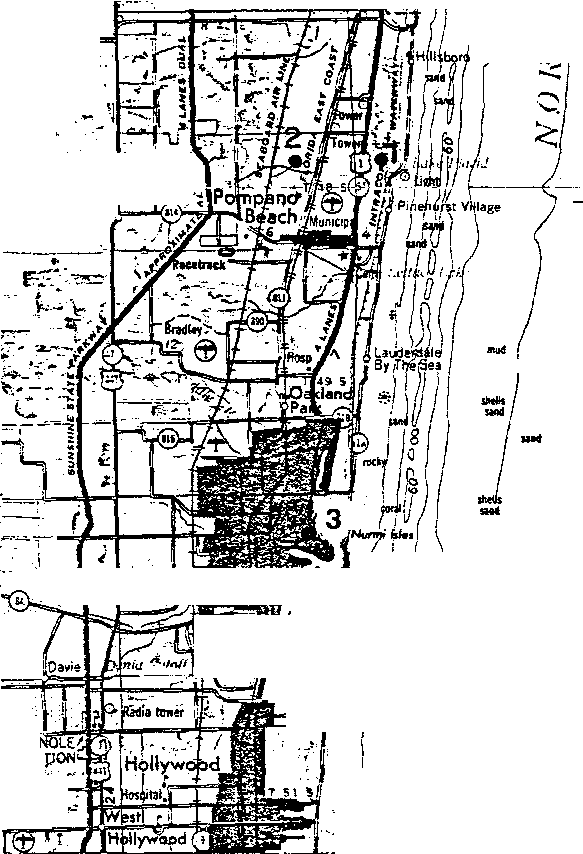
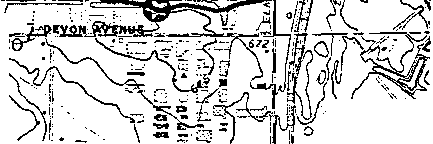
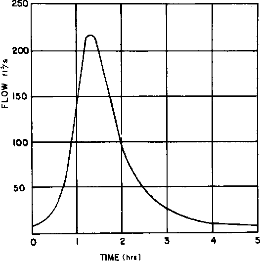
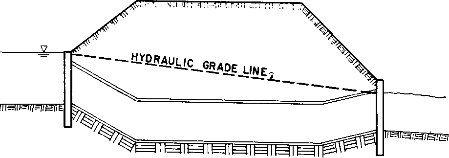

**Hydraulic Engineering Circular No. 22, Third Edition**

**URBAN DRAINAGE**

**DESIGN MANUAL**

> 
>
> 

<table>
<colgroup>
<col style="width: 32%" />
<col style="width: 16%" />
<col style="width: 13%" />
<col style="width: 23%" />
<col style="width: 13%" />
</colgroup>
<tbody>
<tr class="odd">
<td><blockquote>

1. Report No. FHWA-NHI-10-009

</blockquote>

HEC-22
</td>
<td colspan="2"><blockquote>

2. Governmental Accession No.

</blockquote></td>
<td colspan="2"><blockquote>

3. Recipient's Catalog No.

</blockquote></td>
</tr>
<tr class="even">
<td colspan="3" rowspan="2"><blockquote>

4. Title and Subtitle

Urban Drainage Design Manual

Hydraulic Engineering Circular 22, Third Edition

</blockquote></td>
<td colspan="2"><ol start="5" type="1">
<li><blockquote>

Report Date 
September 2009

</blockquote></li>
</ol></td>
</tr>
<tr class="odd">
<td colspan="2"><ol start="6" type="1">
<li><blockquote>

Performing Organization Code

</blockquote></li>
</ol></td>
</tr>
<tr class="even">
<td colspan="3"><ol start="0" type="1">
<li><blockquote>

Author(s)

</blockquote></li>
</ol>
<blockquote>

S.A. Brown, J.D. Schall, J.L. Morris, C.L. Doherty, 
S.M. Stein, J.C. Warner

</blockquote></td>
<td colspan="2"><ol type="1">
<li><blockquote>

Performing Organization Report No.

</blockquote></li>
</ol></td>
</tr>
<tr class="odd">
<td colspan="3" rowspan="2"><ol start="0" type="1">
<li><blockquote>

Performing Organization Name and Address

</blockquote></li>
</ol>
<blockquote>

Ayres Associates Inc

3665 JFK Parkway

Building 2, Suite 200

Fort Collins, Colorado 80525

</blockquote></td>
<td colspan="2"><ol type="1">
<li><blockquote>

Work Unit No. (TRAIS)

</blockquote></li>
</ol></td>
</tr>
<tr class="even">
<td colspan="2"><ol start="2" type="1">
<li><blockquote>

Contract or Grant No. DTFH61-93-C-00096

</blockquote></li>
</ol></td>
</tr>
<tr class="odd">
<td colspan="3" rowspan="2"><ol start="3" type="1">
<li><blockquote>

Sponsoring Agency Name and Address

</blockquote></li>
</ol>
<blockquote>

Federal Highway Administration National Highway Institute

1200 New Jersey Ave., S.E. 4600 N. Fairfax Dr., Suite 800

Washington, D.C. 20590 Arlington, Virginia 22203

</blockquote></td>
<td colspan="2"><ol start="4" type="1">
<li><blockquote>

Type of Report and Period Covered

</blockquote></li>
</ol></td>
</tr>
<tr class="even">
<td colspan="2"><ol start="5" type="1">
<li><blockquote>

Sponsoring Agency Code

</blockquote></li>
</ol></td>
</tr>
<tr class="odd">
<td colspan="5"><ol start="6" type="1">
<li><blockquote>

Supplementary Notes

</blockquote></li>
</ol>
<blockquote>

Project Manager: Dan Ghere, FHWA

Technical Assistants: Joe Krolak, Kornel Kerenyi, FHWA;

Roger Kilgore, Kilgore Consulting and Management

</blockquote></td>
</tr>
<tr class="even">
<td colspan="5"><ol start="7" type="1">
<li><blockquote>

Abstract

</blockquote></li>
</ol>
<blockquote>

This circular provides a comprehensive and practical guide for the design of storm drainage systems associated with transportation facilities. Design guidance is provided for the design of storm drainage systems which collect, convey, and discharge stormwater flowing within and along the highway right-of-way.

Methods and procedures are given for the hydraulic design of storm drainage systems. Design methods are

presented for evaluating rainfall and runoff magnitude, pavement drainage, gutter flow, inlet design, median and roadside ditch flow, structure design, and storm drain piping. Procedures for the design of detention facilities are also presented, along with an overview of storm water pumping stations and urban water quality practices.

This edition presents a major change in the methodology discussed in Chapter 5 for designing channels and in Chapter 7 for calculating energy losses in storm drain access holes.

</blockquote></td>
</tr>
<tr class="odd">
<td colspan="2"><ol start="8" type="1">
<li><blockquote>

Key Words

</blockquote></li>
</ol>
<blockquote>

Storm Drain, Inlets, Storm Water

Management, Water Quality, Best Management

Practices, Pumps, Drainage Design

</blockquote></td>
<td colspan="3"><ol start="9" type="1">
<li><blockquote>

Distribution Statement

</blockquote></li>
</ol>
<blockquote>

This document is available to the public from the National Technical Information Service, Springfield, Virginia 22151

</blockquote></td>
</tr>
<tr class="even">
<td><ol start="10" type="1">
<li><blockquote>

Security Classif. (of this report) Unclassified

</blockquote></li>
</ol></td>
<td colspan="2"><ol start="11" type="1">
<li><blockquote>

Security Classif. (of this page) Unclassified

</blockquote></li>
</ol></td>
<td><ol start="12" type="1">
<li><blockquote>

No. of Pages 
478

</blockquote></li>
</ol></td>
<td><ol start="13" type="1">
<li>
Price
</li>
</ol></td>
</tr>
</tbody>
</table>

**Form DOT F 1700.7** (8-72)Reproduction of completed page authorized

**<u>ACKNOWLEDGEMENTS</u>**

**First Edition**

The first edition of this Hydraulic Engineering Circular was published in November 1996 (FHWA-SA-96-078). The authors were S.A. Brown, S.M. Stein, and J.C. Warner with TVGA Engineering and Surveying, P.C., Lanse, Pennsylvania. The FHWA Contracting Officers Technical Representative (COTR) was Chris Dunn, and the Technical Assistants were Phil Thompson, Johnny Morris, Arlo Waddoups, and Thomas Krylowski.

**Second Edition**

The second edition was published in July 2001 (FHWA-NHI-01-021). This edition corrected minor errors and updated the format used for dual units. There were no major changes in technical content and the original authorship was retained. The editor of this edition was Johnny Morris with Ayres Associates, Inc, Fort Collins, Colorado. The FHWA COTR was Phil Thompson and the Technical Assistant was Arlo Waddoups.

i

**(page intentionally left blank)**

**ii**

<table>
<colgroup>
<col style="width: 49%" />
<col style="width: 0%" />
<col style="width: 49%" />
</colgroup>
<tbody>
<tr class="odd">
<td colspan="3"><strong>SI* (MODERN METRIC) CONVERSION FACTORS</strong></td>
</tr>
<tr class="even">
<td colspan="3"><strong>APPROXIMATE CONVERSIONS TO SI UNITS APPROXIMATE CONVERSIONS FROM SI UNITS</strong></td>
</tr>
<tr class="odd">
<td><strong>Symbol When You Know Multiply By To Find Symbol</strong></td>
<td colspan="2"><strong>Symbol When You Know Multiply By To Find Symbol</strong></td>
</tr>
<tr class="even">
<td rowspan="2"><strong>LENGTH</strong></td>
<td colspan="2"><strong>LENGTH</strong></td>
</tr>
<tr class="odd">
<td colspan="2" rowspan="2"><blockquote>

<strong>mm</strong> millimeters 0.039 inches in

m meters 3.28 feet It

m meters 1.09 yards yd

km kilometers 0.621 miles mi

</blockquote>

<strong>AREA</strong>
</td>
</tr>
<tr class="even">
<td rowspan="2"><blockquote>

in inches 25.4 millimeters <strong>mm</strong>

ft feet 0.305 meters m

yd yards 0.914 meters m

ml miles 1.61 kilometers km

<strong>AREA</strong>

</blockquote></td>
</tr>
<tr class="odd">
<td colspan="2" rowspan="2"><blockquote>

nn' square millimeters 0.0016 square inches in'

m2 square meters 10.764 square feet It

ml square meters 1.195 square yards ac

ha hectares 2.47 acres mil

km2 square kilometers 0.386 square miles

</blockquote>

<strong>VOLUME</strong>
</td>
</tr>
<tr class="even">
<td rowspan="2"><blockquote>

in' square inches 645.2 square millimeters mm'

<strong>ft'</strong> square feet 0.093 square meters m'

yd' square yards 0.836 square meters m2

ac acres 0.405 hectares ha

mi' square miles 2.59 square kilometers km2

</blockquote>

<strong>VOLUME.</strong>
</td>
</tr>
<tr class="odd">
<td colspan="2" rowspan="2"><blockquote>

ml milliliters 0.034 fluid ounces If <strong>oz</strong>

I liters . 0.264 gallons gal

nt' cubic meters 35.71 cubic feet ft'

m' cubic meters 1.307 cubic yards yd'

</blockquote>

<strong>MASS</strong>
</td>
</tr>
<tr class="even">
<td rowspan="2"><blockquote>

fl oz fluid ounces 29.57 milliliters ml

gal gallons 3.785 liters I

ft' cubic feet 0.028 cubic meters m3

yd' cubic yards 0.765 cubic meters m'

NOTE: Volumes greater than 1000 I shall be shown in m3.

<strong>MASS</strong>

</blockquote></td>
</tr>
<tr class="odd">
<td colspan="2" rowspan="2"><blockquote>

g grams 0.035 ounces <strong>oz</strong>

kg kilograms 2.202 pounds lb

Mg megagrams 1.103 short tons (2000 lb) T

</blockquote>

<strong>TEMPERATURE (exact)</strong>
</td>
</tr>
<tr class="even">
<td rowspan="2"><blockquote>

oz ounces 28.35 grams g

lb pounds 0.454 kilograms kg

T short tons (2000 lb) 0.907 megagrams Mg

</blockquote>

<strong>TEMPERATURE (exact)</strong>
</td>
</tr>
<tr class="odd">
<td colspan="2" rowspan="2"><blockquote>

°C Celcius 1.8C + 32 Fahrenheit °F

</blockquote>

temperature temperature

<strong>ILLUMINATION</strong>
</td>
</tr>
<tr class="even">
<td rowspan="2"><blockquote>

°F Fahrenheit 5(F-32)/9 Celcius °C

</blockquote>

temperature or (F-32)1.8 temperature

<strong>ILLUMINATION</strong>
</td>
</tr>
<tr class="odd">
<td colspan="2" rowspan="2"><blockquote>

Ix lux 0.0929 foot-candles fc

cd/m' candela/m2 0.2919 foot-Lamberts ft

</blockquote>

<strong>FORCE and PRESSURE or STRESS</strong>
</td>
</tr>
<tr class="even">
<td rowspan="2"><blockquote>

<em><strong>fc</strong></em> foot-candles 10.76 lux I

<strong>n</strong> foot-Lamberts 3.426 candela/m2 cd/m2

</blockquote>

<strong>FORCE and PRESSURE or STRESS</strong>
</td>
</tr>
<tr class="odd">
<td colspan="2" rowspan="2">
N newtons 0.225 poundforce lbf

kPa kilopascals 0.145 poundforce per psi

square inch -
</td>
</tr>
<tr class="even">
<td><blockquote>

Ibl poundforce 4.45 newtons N

psi poundforce per 6.89 kilopascals kPa

square inch

</blockquote></td>
</tr>
<tr class="odd">
<td colspan="2"></td>
<td></td>
</tr>
</tbody>
</table>

- SI is the symbol for the International System of Units. Appropriate (Revised August 1992)  
  > rounding should be made to comply with Section 4 of ASTM E380.

(page intentionally left blank)

iv

**TABLE OF CONTENTS**

<u>Section Page</u>

ACKNOWLEDGEMENTS i

CONVERSION FACTORS iii

TABLE OF CONTENTS v

LIST OF FIGURES xiii

LIST OF TABLES xvii

LIST OF CHARTS xix

LIST OF SYMBOLS xxi

GLOSSARY xxvii

CHAPTER 1 INTRODUCTION 1-1

CHAPTER 2 SYSTEM PLANNING 2-1

2.1. Design Objectives 2-1

2.2. Design Approach 2-1

2.3. Data Requirements 2-3

2.4. Agency Coordination 2-4

2.5. Regulatory Considerations 2-5

2.5.1. Federal Regulations 2-5

2.5.2. State Regulations 2-7

2.5.3. Local Laws 2-8

2.6. Preliminary Concept Development 2-9

2.6.1. Base Map 2-9

2.6.2. Major vs. Minor Systems 2-9

2.6.3. Concept Plan 2-9

2.6.4. System Components 2-10

2.6.4.1 Stormwater Collection 2-10

2.6.4.2 Stormwater Conveyance 2-11

2.6.4.3 Stormwater Discharge Controls 2-11

2.6.4.4 Flood Water Relief 2-12

2.6.5. Special Considerations 2-12

CHAPTER 3 URBAN HYDROLOGIC PROCEDURES 3-1

3.1. Rainfall (Precipitation) 3-1

3.1.1. Constant Rainfall Intensity 3-1

3.1.2. Dynamic Rainfall (Hyetograph) 3-1

3.1.3. Synthetic Rainfall Events 3-3

v

> 3.2. Determination of Peak Flow Rates 3-4
>
> 3.2.1. Stochastic Methods 3-4
>
> 3.2.2. Rational Method 3-5
>
> 3.2.2.1. Runoff Coefficient 3-5
>
> 3.2.2.2. Rainfall Intensity 3-8
>
> 3.2.2.3. Time of Concentration 3-8
>
> 3.2.3. USGS Regression Equations 3-16
>
> 3.2.3.1. Rural Equations 3-16
>
> 3.2.3.2. Urban Equations 3-16
>
> 3.2.4. SCS (NRCS) Peak Flow Method 3-18
>
> 3.3. Development of Design Hydrographs 3-25
>
> 3.3.1. Unit Hydrograph Methods 3-25
>
> 3.3.1.1. Snyder Synthetic Unit Hydrograph 3-25
>
> 3.3.1.2. SCS (NRCS) Tabular Hydrograph 3-26
>
> 3.3.1.3. SCS (NRCS) Synthetic Unit Hydrograph 3-32
>
> 3.3.2. USGS Nationwide Urban Hydrograph 3-35
>
> CHAPTER 4 PAVEMENT DRAINAGE 4-1
>
> 4.1. Design Frequency and Spread 4-1
>
> 4.1.1. Selection of Design Frequency and Design Spread 4-1
>
> 4.1.2. Selection of Check Storm and Spread 4-3
>
> 4.2. Surface Drainage 4-3
>
> 4.2.1. Hydroplaning 4-4
>
> 4.2.2. Longitudinal Slope 4-4
>
> 4.2.3. Cross (Transverse) Slope 4-5
>
> 4.2.4. Curb and Gutter 4-6
>
> 4.2.5. Roadside and Median Channels 4-7
>
> 4.2.6. Bridge Decks 4-7
>
> 4.2.7. Median Barriers 4-8
>
> 4.2.8. Impact Attenuators 4-8
>
> 4.3. Flow in Gutters 4-8
>
> 4.3.1. Capacity Relationship 4-8
>
> 4.3.2. Conventional Curb and Gutter Sections 4-10
>
> 4.3.2.1. Conventional Gutters of Uniform Cross Slope 4-10
>
> 4.3.2.2. Composite Gutter Sections 4-11
>
> 4.3.2.3. Conventional Gutters with Curved Sections 4-15

vi

> 4.3.3. Shallow Swale Sections 4-15
>
> 4.3.3.1. V-Sections 4-15
>
> 4.3.3.2. Circular Sections 4-24
>
> 4.3.4. Flow in Sag Vertical Curves 4-25
>
> 4.3.5. Relative Flow Capacities 4-25
>
> 4.3.6. Gutter Flow Time 4-26
>
> 4.4. Drainage Inlet Design 4-29
>
> 4.4.1. Inlet Types 4-29
>
> 4.4.2. Characteristics and Uses of Inlets 4-29
>
> 4.4.3. Inlet Capacity 4-30
>
> 4.4.3.1. Factors Affecting Inlet Interception Capacity and Efficiency on
>
> Continuous Grades 4-31
>
> 4.4.3.2. Factors Affecting Inlet Interception Capacity in Sag Locations 4-38
>
> 4.4.3.3. Comparison of Interception Capacity of Inlets on Grade 4-38
>
> 4.4.4. Interception Capacity of Inlets on Grade 4-41
>
> 4.4.4.1. Grate Inlets 4-41
>
> 4.4.4.2. Curb-Opening Inlets 4-46
>
> 4.4.4.3. Slotted Inlets 4-51
>
> 4.4.4.4. Combination Inlets 4-52
>
> 4.4.5. Interception Capacity of Inlets In Sag Locations 4-56
>
> 4.4.5.1. Grate Inlets in Sags 4-56
>
> 4.4.5.2. Curb-Opening Inlets 4-59
>
> 4.4.5.3. Slotted Inlets 4-63
>
> 4.4.5.4. Combination Inlets 4-64
>
> 4.4.6. Inlet Locations 4-67
>
> 4.4.6.1. Geometric Controls 4-67
>
> 4.4.6.2. Inlet Spacing on Continuous Grades 4-67
>
> 4.4.6.3. Flanking Inlets 4-79
>
> 4.4.7. Median, Embankment, and Bridge Inlets 4-81
>
> 4.4.7.1. Median and Roadside Ditch Inlets 4-82
>
> 4.4.7.2. Embankment Inlets 4-87
>
> 4.5. Grate Type Selection Considerations 4-88
>
> CHAPTER 5 ROADSIDE AND MEDIAN CHANNELS 5-1
>
> 5.1. Open Channel Flow Concepts 5-1
>
> 5.1.1. Energy 5-1
>
> vii
>
> 5.1.2. Specific Energy 5-2
>
> 5.1.3. Flow Classification 5-2
>
> 5.1.4. Hydraulic Jump 5-4
>
> 5.1.5. Manning's Equation 5-4
>
> 5.1.6. Flow in Bends 5-7
>
> 5.1.7. Shear Stress 5-7
>
> 5.2. Design Parameters 5-11
>
> 5.2.1. Discharge Frequency 5-11
>
> 5.2.2. Channel Geometry 5-11
>
> 5.2.3. Channel Slope 5-11
>
> 5.2.4. Freeboard 5-12
>
> 5.3. Stable Channel Design 5-13
>
> 5.3.1. Lining Materials 5-13
>
> 5.3.2. Stable Channel Design Procedure 5-14
>
> 5.4. Generalized Design Procedure for Roadside and Median Channels 5-16
>
> CHAPTER 6 STRUCTURES 6-1
>
> 6.1. Inlet Structures 6-1
>
> 6.1.1. Configuration 6-1
>
> 6.1.2. Location 6-1
>
> 6.2. Access Holes 6-3
>
> 6.2.1. Configuration 6-3
>
> 6.2.2. Chamber and Access Shaft 6-3
>
> 6.2.3. Frame and Cover 6-5
>
> 6.2.4. Steps 6-5
>
> 6.2.5. Channel and Bench 6-6
>
> 6.2.6. Access Hole Depth 6-6
>
> 6.2.7. Location and Spacing 6-6
>
> 6.3. Junction Chambers 6-7
>
> 6.4. Other Appurtenances 6-7
>
> 6.4.1. Transitions 6-7
>
> 6.4.2. Flow Splitters 6-9
>
> 6.4.3. Siphons 6-10
>
> 6.4.4. Flap Gates 6-10
>
> CHAPTER 7 STORM DRAINS 7-1
>
> 7.1. Hydraulics of Storm Drainage Systems 7-1
>
> 7.1.1. Flow Type Assumptions 7-1
>
> 7.1.2. Open Channel vs. Pressure Flow 7-1
>
> viii
>
> 7.1.3. Hydraulic Capacity 7-2
>
> 7.1.4. Energy Grade Line/Hydraulic Grade Line 7-7
>
> 7.1.5. Storm Drain Outfalls 7-8
>
> 7.1.6. Energy Losses 7-10
>
> 7.1.6.1. Pipe Friction Losses 7-10
>
> 7.1.6.2. Exit Losses 7-10
>
> 7.1.6.3. Bend Losses 7-11
>
> 7.1.6.4. Transition Losses 7-11
>
> 7.1.6.5. Junction Losses 7-15
>
> 7.1.6.6. Inlet and Access Hole Losses: Approximate Method 7-15
>
> 7.1.6.7. FHWA Inlet and Access Hole Energy Loss 7-16
>
> 7.2. Design Guidelines and Considerations 7-25
>
> 7.2.1. Design Storm Frequency 7-26
>
> 7.2.2. Time of Concentration and Discharge 7-26
>
> 7.2.3. Maximum High Water 7-28
>
> 7.2.4. Minimum Velocity and Grades 7-28
>
> 7.2.5. Cover 7-28
>
> 7.2.6. Location 7-29
>
> 7.2.7. Run Length 7-29
>
> 7.2.8. Alignment 7-30
>
> 7.3. Maintenance Considerations 7-30
>
> 7.4. Preliminary Design Procedure 7-30
>
> 7.5. Energy Grade Line Evaluation Procedure 7-34
>
> 7.6. Storm Drain Design Example 7-44
>
> CHAPTER 8 DETENTION AND RETENTION FACILITIES 8-1
>
> 8.1. Design Objectives 8-2
>
> 8.2. Issues Related to Storm Water Quantity Control Facilities 8-2
>
> 8.2.1. Release Timing 8-2
>
> 8.2.2. Safety 8-3
>
> 8.2.3. Maintenance 8-3
>
> 8.3. Storage Facility Types 8-4
>
> 8.3.1. Detention Facilities 8-4
>
> 8.3.2. Retention Facilities 8-5
>
> 8.4. Preliminary Design Computations 8-6
>
> 8.4.1. Estimating Required Storage 8-6
>
> 8.4.1.1. Hydrograph Method 8-7
>
> 8.4.1.2. Triangular Hydrograph Method 8-7
>
> 8.4.1.3. SCS Procedure 8-7

ix

> 8.4.2. Estimating Peak Flow Reduction 8-11
>
> 8.4.3. Stage-Storage Relationship 8-12
>
> 8.4.4. Stage-Discharge Relationship (Performance Curve) 8-20
>
> 8.4.4.1. Orifices 8-20
>
> 8.4.4.2. Weirs 8-23
>
> 8.4.4.3. Discharge Pipes 8-29
>
> 8.4.4.4. Emergency Spillway 8-30
>
> 8.4.4.5. Infiltration 8-36
>
> 8.4.4.6. Composite Stage Discharge Curves 8-37
>
> 8.5. Generalized Routing Procedure 8-37
>
> 8.6. Water Budget 8-49
>
> 8.7. Land-Locked Retention 8-51
>
> CHAPTER 9 PUMP STATIONS 9-1
>
> 9.1. Introduction 9-1
>
> 9.2. Design Considerations 9-1
>
> 9.2.1. Location 9-2
>
> 9.2.2. Hydrology 9-2
>
> 9.2.3. Collection Systems 9-3
>
> 9.2.4. Station Types 9-3
>
> 9.2.5. Pump Types 9-4
>
> 9.2.6. Submergence 9-6
>
> 9.2.7. Water-Level Sensors 9-7
>
> 9.2.8. Pump Rate and Storage Volume 9-7
>
> 9.2.9. Power 9-7
>
> 9.2.10. Discharge System 9-8
>
> 9.2.11. Flap Gates and Valving 9-8
>
> 9.2.12. Trash Racks and Grit Chambers 9-8
>
> 9.2.13. Ventilation 9-9
>
> 9.2.14. Roof Hatches and Monorails 9-9
>
> 9.2.15. Equipment Certification and Testing 9-9
>
> 9.2.16. Monitoring 9-9
>
> 9.2.17. Hazardous Spills 9-10
>
> 9.2.18. Construction 9-10
>
> 9.2.19. Maintenance 9-10
>
> 9.2.20. Retrofitting Stations 9-11
>
> 9.2.21. Safety 9-11
>
> 9.3. Design Criteria 9-11
>
> 9.3.1. Station Type and Depth 9-11
>
> 9.3.2. Power 9-12
>
> 9.3.3. Discharge Head and System Curve 9-12
>
> 9.3.4. Main Pumps 9-14
>
> 9.3.5. Standby/Spare Pumps 9-15
>
> 9.3.6. Sump Pumps 9-15
>
> 9.3.7. Storage 9-15
>
> 9.3.8. Cycling Sequence and Volumes 9-16
>
> 9.3.9. Allowable High Water Elevation 9-17
>
> 9.3.10. Clearances 9-17
>
> 9.3.11. Intake System 9-17
>
> x

|                                                        |       |
|--------------------------------------------------------|-------|
| 9.4. Pump Station Storage Requirements                 | 9-17  |
| 9.4.1. Inflow Mass Curve                               | 9-17  |
| 9.4.2. Mass Curve Routing                              | 9-18  |
| CHAPTER 10 URBAN WATER QUALITY PRACTICES               | 10-1  |
| 10.1 General BMP Selection Guidance                    | 10-1  |
| 10.2 Estimating Pollutant Loads                        | 10-1  |
| 10.3 Extended Detention Dry Ponds                      | 10-4  |
| 10.4 Wet Ponds                                         | 10-4  |
| 10.5 Infiltration/Exfiltration Trenches                | 10-6  |
| 10.6 Infiltration Basins                               | 10-8  |
| 10.7 Sand Filters                                      | 10-9  |
| 10.8 Water Quality Inlets                              | 10-10 |
| 10.9 Vegetative Practices                              | 10-10 |
| 10.9.1 Grassed Swales                                  | 10-11 |
| 10.9.2 Filter Strips                                   | 10-13 |
| 10.9.3 Wetlands                                        | 10-13 |
| 10.10 Ultra-Urban BMPs                                 | 10-13 |
| 10.11 Temporary Erosion and Sediment Control Practices | 10-14 |
| 10.11.1 Mulching                                       | 10-15 |
| 10.11.2 Temporary/Permanent Seeding                    | 10-15 |
| 10.11.3 Sediment Basins                                | 10-15 |
| 10.11.4 Check Dams                                     | 10-16 |
| 10.11.5 Silt Fence                                     | 10-16 |
| 10.11.6 Brush Barrier                                  | 10-16 |
| 10.11.7 Diversion Dike                                 | 10-16 |
| 10.11.8 Temporary Slope Drain                          | 10-16 |

APPENDIX A. Design Charts A-1

APPENDIX B. Gutter Flow Relationship Development B-1

APPENDIX B.1. Mean Velocity in a Triangular Channel B-1

APPENDIX B.2. Spread Discharge Relationship for Compound Cross Sections B-3

APPENDIX B.3. Spread-Discharge Relationships for Parabolic Cross Sections B-5

APPENDIX B.4. Development of Spread Design Charts for Grate Inlets B-11

APPENDIX C. References C-1

APPENDIX D. Blank Forms D-1

xi

**(page intentionally left blank)**

**xii**

> **LIST OF FIGURES**
>
> <u>Figure Description Page</u>
>
> 3-1 Example IDF curve 3-2
>
> 3-2 Example mass rainfall curve and corresponding hyetography 3-2
>
> 3-3 SCS 24-hour rainfall distribution 3-3
>
> 3-4 Approximate geographic areas for SCS rainfall distributions 3-3
>
> 3-5 Log Pearson Type III distribution analysis, Medina River, Texas 3-4
>
> 3-6 Snyder synthetic hydrograph definition 3-26
>
> 3-7 Dimensionless curvilinear SCS synthetic unit hydrograph and equivalent
>
> triangular hydrograph 3-32
>
> 3-8 Example: The triangular unit hydrograph 3-34
>
> 3-9 USGS Nationwide Urban Hydrograph for existing (unimproved) and
>
> proposed (improved) conditions 3-39
>
> 4-1 Typical gutter sections 4-7
>
> 4-2 Conveyance-spread curves for a composite gutter section 4-12
>
> 4-3 Relative effects of spread, cross slope, and longitudinal slope on gutter
>
> capacity 4-27
>
> 4-4 Classes of storm drain inlets 4-30
>
> 4-5 P - 50 and P - 50 x 100 grate 4-32
>
> 4-6 P - 30 grate 4-33
>
> 4-7 Curved vane grate 4-34
>
> 4-8 45° - 60 and 45° - 85 tilt-bar grates 4-35
>
> 4-9 30° - 85 tilt-bar grates 4-36
>
> 4-10 Reticuline grate 4-37
>
> 4-11 Comparison of inlet interception capacity, slope variable 4-39
>
> 4-12 Comparison of inlet interception capacity, flow rate variable 4-40
>
> 4-13 Depressed curb opening inlet 4-47
>
> 4-14 Slotted drain inlet at an intersection 4-51
>
> 4-15 Combination curb-opening, 45 degree tilt-bar grate inlet 4-52
>
> 4-16 Sweeper combination inlet 4-53
>
> 4-17 Definition of depth 4-57
>
> 4-18 Curb-opening inlets 4-61
>
> 4-19 Inlet spacing computation sheet 4-69
>
> 4-20 Storm drainage system for Example 4-15 4-72
>
> 4-21a Inlet spacing computation sheet for Example 4-15 (SI Units) 4-73
>
> 4-21b Inlet spacing computation sheet for Example 4-15 (English Units) 4-76
>
> 4-22 Example of flanking inlets 4-79
>
> 4-23 Median drop inlet 4-82
>
> 4-24 Embankment inlet and downdrain 4-88
>
> 5-1 Total energy in open channels 5-2
>
> 5-2 Specific energy diagram 5-3
>
> 5-3 Hydraulic jump 5-4
>
> 5-4 Distribution of shear stress 5-8
>
> 5-5 Shear stress distribution in channel bends 5-9
>
> 5-6 Channel geometries 5-12
>
> 5-7 Flexible channel lining design flow chart 5-15
>
> xiii
>
> 6-1 Inlet structures 6-2
>
> 6-2 Typical access hole configurations 6-4
>
> 6-3 "Tee" access hole for large storm drains 6-4
>
> 6-4 Efficient channel and bench configurations 6-8
>
> 6-5 Transitions to avoid obstruction 6-9
>
> 6-6 Twin-barrel siphon 6-11
>
> 7-1 Storm drain capacity sensitivity 7-3
>
> 7-2 Hydraulic and energy grade lines in pipe flow 7-7
>
> 7-3 Angle of cone for pipe diameter changes 7-11
>
> 7-4 Interior angle definition for pipe junctions 7-15
>
> 7-5 Definition sketch for FHWA access hole method 7-17
>
> 7-6 Access hole benching methods 7-21
>
> 7-7 Access hole angled inflow definition 7-23
>
> 7-8 Preliminary storm drain computation sheet 7-32
>
> 7-9 Energy and hydraulic grade line illustration 7-35
>
> 7-10 Energy grade line computation sheet - Table A 7-37
>
> 7-11 Energy grade line computation sheet - Table B 7-38
>
> 7-12 Roadway plan and section for examples 7-46
>
> 7-13 SI - Storm drain profiles for Example 7-3 7-47
>
> 7-14 SI - Storm drain computation sheet for Example 7-3 SI 7-48
>
> 7-15 SI - Energy grade line computation sheet, Table A, for Example 7-3 7-67
>
> 7-16 SI - Energy grade line computation sheet, Table B, for Example 7-3 7-68
>
> 7-13 English - Storm drain profiles for Example 7-3 7-71
>
> 7-14 English - Storm drain computation sheet, Example 7-3 English 7-72
>
> 7-15 English - Energy grade line computation sheet, Table A, for Example 7-3 7-91
>
> 7-16 English - Energy grade line computation sheet, Table B, for Example 7-3 7-92
>
> 8-1 Hydrograph schematic 8-1
>
> 8-2 Example of cumulative hydrograph with and without detention 8-3
>
> 8-3 Estimating required storage hydrograph method 8-8
>
> 8-4 Triangular hydrograph method 8-8
>
> 8-5 SCS detention basin routing curves 8-9
>
> 8-6 Stage-storage curve 8-13
>
> 8-7 Rectangular basin 8-13
>
> 8-8 Trapezoidal basin 8-14
>
> 8-9 Definition sketch for prismoidal formula 8-15
>
> 8-10 Ungula of a cone 8-15
>
> 8-11 Frustum of a pyramid 8-17
>
> 8-12 Definition sketch for orifice flow 8-21
>
> 8-13 Sharp crested weirs 8-24
>
> 8-14 Riser pipe 8-25
>
> 8-15 V-notch weir 8-28
>
> 8-16 Proportional weir dimensions 8-29
>
> 8-17 Emergency spillway design schematic 8-31
>
> 8-18a Discharge coefficients for emergency spillways (SI units) 8-33
>
> 8-18b Discharge coefficients for emergency spillways (English units) 8-33
>
> 8-19 Typical combined stage-discharge relationship 8-38
>
> 8-20 Routing hydrograph schematic 8-39
>
> 8-21 Storage indicator curve 8-41
>
> 8-22 Example 8-9 hydrographs 8-43
>
> 8-23 Mass routing procedure 8-52
>
> xiv

<table>
<colgroup>
<col style="width: 10%" />
<col style="width: 80%" />
<col style="width: 8%" />
</colgroup>
<tbody>
<tr class="odd">
<td><blockquote>

9-1

</blockquote></td>
<td><blockquote>

Typical wet-pit station

</blockquote></td>
<td>9-4</td>
</tr>
<tr class="even">
<td><blockquote>

9-2

</blockquote></td>
<td><blockquote>

Typical dry-pit station

</blockquote></td>
<td>9-5</td>
</tr>
<tr class="odd">
<td><blockquote>

9-3

</blockquote></td>
<td><blockquote>

System head curve

</blockquote></td>
<td>9-13</td>
</tr>
<tr class="even">
<td><blockquote>

9-4

</blockquote></td>
<td><blockquote>

Performance curve courtesy of Flygt Corporation

</blockquote></td>
<td>9-14</td>
</tr>
<tr class="odd">
<td><blockquote>

9-5

</blockquote></td>
<td><blockquote>

Estimated required storage from inflow hydrograph

</blockquote></td>
<td>9-16</td>
</tr>
<tr class="even">
<td><blockquote>

9-6

</blockquote></td>
<td><blockquote>

Mass inflow curve

</blockquote></td>
<td>9-18</td>
</tr>
<tr class="odd">
<td><blockquote>

9-7

</blockquote></td>
<td><blockquote>

Stage-storage curve

</blockquote></td>
<td>9-19</td>
</tr>
<tr class="even">
<td><blockquote>

9-8

</blockquote></td>
<td><blockquote>

Stage-discharge curve

</blockquote></td>
<td>9-19</td>
</tr>
<tr class="odd">
<td><blockquote>

9-9

</blockquote></td>
<td><blockquote>

Mass curve routing diagram

</blockquote></td>
<td>9-20</td>
</tr>
<tr class="even">
<td><blockquote>

10-1

</blockquote></td>
<td><blockquote>

Extended detention pond

</blockquote></td>
<td>10-5</td>
</tr>
<tr class="odd">
<td><blockquote>

10-2

</blockquote></td>
<td><blockquote>

Typical wet pond schematic

</blockquote></td>
<td>10-5</td>
</tr>
<tr class="even">
<td><blockquote>

10-3

</blockquote></td>
<td><blockquote>

Median strip trench design

</blockquote></td>
<td>10-6</td>
</tr>
<tr class="odd">
<td><blockquote>

10-4

</blockquote></td>
<td><blockquote>

Infiltration basin schematic

</blockquote></td>
<td>10-8</td>
</tr>
<tr class="even">
<td><blockquote>

10-5

</blockquote></td>
<td><blockquote>

Cross-section schematic of sand filter compartment

</blockquote></td>
<td>10-9</td>
</tr>
<tr class="odd">
<td><blockquote>

10-6

</blockquote></td>
<td><blockquote>

Cross-section schematic of peat-sand filter

</blockquote></td>
<td>10-10</td>
</tr>
<tr class="even">
<td><blockquote>

10-7

</blockquote></td>
<td><blockquote>

Cross-section detail of a typical oil/grit separator

</blockquote></td>
<td>10-11</td>
</tr>
<tr class="odd">
<td><blockquote>

10-8

</blockquote></td>
<td><blockquote>

Schematic of grass-swale level spreader and check dam

</blockquote></td>
<td>10-12</td>
</tr>
<tr class="even">
<td><blockquote>

B-1

</blockquote></td>
<td><blockquote>

Conceptual sketch of spatially varied gutter flow

</blockquote></td>
<td>B-1</td>
</tr>
<tr class="odd">
<td><blockquote>

B-2

</blockquote></td>
<td><blockquote>

Properties of a parabolic curve

</blockquote></td>
<td>B-6</td>
</tr>
<tr class="even">
<td><blockquote>

B-3

</blockquote></td>
<td><blockquote>

SI - Conveyance curve for a parabolic cross section

</blockquote></td>
<td>B-8</td>
</tr>
<tr class="odd">
<td><blockquote>

B-3

</blockquote></td>
<td><blockquote>

English - Conveyance curve for a parabolic cross section

</blockquote></td>
<td>B-11</td>
</tr>
<tr class="even">
<td><blockquote>

B-4

</blockquote></td>
<td><blockquote>

Interception capacity of a 0.6 m by 0.6 m P - 30 grate

</blockquote></td>
<td>B-13</td>
</tr>
<tr class="odd">
<td><blockquote>

B-5

</blockquote></td>
<td><blockquote>

Interception capacity of a 0.6 m by 1.2 m P - 30 grate

</blockquote></td>
<td>B-14</td>
</tr>
<tr class="even">
<td><blockquote>

B-4

</blockquote></td>
<td><blockquote>

English - Interception capacity of a 2 x 2 ft, P - 30 grate

</blockquote></td>
<td>B-16</td>
</tr>
<tr class="odd">
<td><blockquote>

B-5

</blockquote></td>
<td><blockquote>

English - Interception capacity of a 2 x 4 ft, P - 30 grate

</blockquote></td>
<td>B-17</td>
</tr>
</tbody>
</table>

xv

**(page intentionally left blank)**

**xvi**

**LIST OF TABLES**

<table>
<colgroup>
<col style="width: 6%" />
<col style="width: 87%" />
<col style="width: 5%" />
</colgroup>
<tbody>
<tr class="odd">
<td>Table</td>
<td><blockquote>

Description

</blockquote></td>
<td>Page</td>
</tr>
<tr class="even">
<td>3-1</td>
<td><blockquote>

Runoff Coefficients for Rational Formula

</blockquote></td>
<td>3-6</td>
</tr>
<tr class="odd">
<td>3-2</td>
<td><blockquote>

Manning's Roughness Coefficient (n) for Overland Sheet Flow

</blockquote></td>
<td>3-9</td>
</tr>
<tr class="even">
<td>3-3</td>
<td><blockquote>

Intercept Coefficients for Velocity vs. Slope Relationship of Equation 3-4

</blockquote></td>
<td>3-10</td>
</tr>
<tr class="odd">
<td>3-4</td>
<td><blockquote>

Typical Range of Manning's Coefficient (n) for Channels and Pipes

</blockquote></td>
<td>3-14</td>
</tr>
<tr class="even">
<td>3-5</td>
<td><blockquote>

Nationwide Urban Equations Developed by USGS

</blockquote></td>
<td>3-17</td>
</tr>
<tr class="odd">
<td>3-6</td>
<td><blockquote>

Runoff Curve Numbers for Urban Areas

</blockquote></td>
<td>3-22</td>
</tr>
<tr class="even">
<td>3-7</td>
<td><blockquote>

Coefficients for SCS Peak Discharge Method

</blockquote></td>
<td>3-23</td>
</tr>
<tr class="odd">
<td>3-8</td>
<td><blockquote>

Ia/P for Selected Rainfall Depths and Curve Numbers

</blockquote></td>
<td>3-24</td>
</tr>
<tr class="even">
<td>3-9</td>
<td><blockquote>

Adjustment Factor (Fp) for Pond and Swamp Areas that are Spread

Throughout the Watershed

</blockquote></td>
<td>3-25</td>
</tr>
<tr class="odd">
<td>3-10</td>
<td><blockquote>

SI - Tabular Hydrograph Unit Discharges in m3/s/km2/mm for Type II

Storm Distributions

</blockquote></td>
<td>3-30</td>
</tr>
<tr class="even">
<td>3-10</td>
<td><blockquote>

English - Tabular Hydrograph Unit Discharges (csm/in) for Type II

Rainfall Distributions

</blockquote></td>
<td>3-31</td>
</tr>
<tr class="odd">
<td>3-11</td>
<td><blockquote>

USGS Dimensionless Hydrograph Coordinates

</blockquote></td>
<td>3-35</td>
</tr>
<tr class="even">
<td>4-1</td>
<td><blockquote>

Suggested Minimum Design Frequency and Spread

</blockquote></td>
<td>4-3</td>
</tr>
<tr class="odd">
<td>4-2</td>
<td><blockquote>

Normal Pavement Cross Slopes

</blockquote></td>
<td>4-5</td>
</tr>
<tr class="even">
<td>4-3</td>
<td><blockquote>

Manning's n for Street and Pavement Gutters

</blockquote></td>
<td>4-9</td>
</tr>
<tr class="odd">
<td>4-4</td>
<td><blockquote>

Spread at Average Velocity in a Reach of Triangular Gutter

</blockquote></td>
<td>4-27</td>
</tr>
<tr class="even">
<td>4-5</td>
<td><blockquote>

Average Debris Handling Efficiencies of Grates Tested

</blockquote></td>
<td>4-41</td>
</tr>
<tr class="odd">
<td>4-6</td>
<td><blockquote>

Comparison of Inlet Interception Capacities

</blockquote></td>
<td>4-56</td>
</tr>
<tr class="even">
<td>4-7</td>
<td><blockquote>

Distance to Flanking Inlets in Sag Vertical Curve

</blockquote></td>
<td>4-81</td>
</tr>
<tr class="odd">
<td>4-8</td>
<td><blockquote>

Ranking with Respect to Bicycle and Pedestrian Safety

</blockquote></td>
<td>4-89</td>
</tr>
<tr class="even">
<td>5-1</td>
<td><blockquote>

Typical Channel Lining Manning's Roughness Coefficients

</blockquote></td>
<td>5-5</td>
</tr>
<tr class="odd">
<td>6-1</td>
<td><blockquote>

Access Hole Spacing Criteria

</blockquote></td>
<td>6-7</td>
</tr>
<tr class="even">
<td>6-2</td>
<td><blockquote>

Transition Design Criteria

</blockquote></td>
<td>6-8</td>
</tr>
<tr class="odd">
<td>7-1</td>
<td><blockquote>

Manning's Coefficients for Storm Drain Conduits

</blockquote></td>
<td>7-4</td>
</tr>
<tr class="even">
<td>7-2</td>
<td><blockquote>

Increase in Capacity of Alternate Conduit Shapes Based on a Circular

Pipe with the Same Height

</blockquote></td>
<td>7-5</td>
</tr>
<tr class="odd">
<td>7-3</td>
<td><blockquote>

Frequencies for Coincidental Occurrence

</blockquote></td>
<td>7-9</td>
</tr>
<tr class="even">
<td>7-4a</td>
<td><blockquote>

Typical Values for Ke for Gradual Enlargement of Pipes in Non-Pressure

Flow

</blockquote></td>
<td>7-12</td>
</tr>
<tr class="odd">
<td>7-4b</td>
<td><blockquote>

Typical Values of Kc for Sudden Pipe Contractions

</blockquote></td>
<td>7-12</td>
</tr>
<tr class="even">
<td>7-4c</td>
<td><blockquote>

SI - Values of Ke for Determining Loss of Head due to Sudden

Enlargement in Pipes

</blockquote></td>
<td>7-13</td>
</tr>
<tr class="odd">
<td>7-4c</td>
<td><blockquote>

English - Values of Ke for Determining Loss of Head due to Sudden

Enlargement in Pipes

</blockquote></td>
<td>7-13</td>
</tr>
<tr class="even">
<td>7-4d</td>
<td><blockquote>

Values of Ke for Determining Loss of Head due to Gradual Enlargement

in Pipes

</blockquote></td>
<td>7-13</td>
</tr>
</tbody>
</table>

xvii

<table style="width:100%;">
<colgroup>
<col style="width: 10%" />
<col style="width: 82%" />
<col style="width: 7%" />
</colgroup>
<tbody>
<tr class="odd">
<td><blockquote>

7-4e

</blockquote></td>
<td><blockquote>

SI - Values of Ke for Determining Loss of Head due to Sudden

</blockquote></td>
<td></td>
</tr>
<tr class="even">
<td></td>
<td><blockquote>

Contraction

</blockquote></td>
<td>7-14</td>
</tr>
<tr class="odd">
<td><blockquote>

7-4e

</blockquote></td>
<td><blockquote>

English – Values of Ke for Determining Loss of Head due to Sudden

</blockquote></td>
<td></td>
</tr>
<tr class="even">
<td></td>
<td><blockquote>

Contraction

</blockquote></td>
<td>7-14</td>
</tr>
<tr class="odd">
<td><blockquote>

7-5

</blockquote></td>
<td><blockquote>

Head Loss Coefficients

</blockquote></td>
<td>7-16</td>
</tr>
<tr class="even">
<td><blockquote>

7-6

</blockquote></td>
<td><blockquote>

Values for the Coefficient, CB

</blockquote></td>
<td>7-22</td>
</tr>
<tr class="odd">
<td><blockquote>

7-7

</blockquote></td>
<td><blockquote>

Minimum Pipe Slopes to Ensure 0.9 m/s (3.0 ft/s) Velocity in Storm

</blockquote></td>
<td></td>
</tr>
<tr class="even">
<td></td>
<td><blockquote>

Drains Flowing Full

</blockquote></td>
<td>7-29</td>
</tr>
<tr class="odd">
<td><blockquote>

7-8

</blockquote></td>
<td><blockquote>

Intensity/Duration Data for Example 7-3 (SI Units)

</blockquote></td>
<td>7-44</td>
</tr>
<tr class="even">
<td><blockquote>

7-9

</blockquote></td>
<td><blockquote>

Drainage Area Information for Design Example 7-3 (SI Units)

</blockquote></td>
<td>7-44</td>
</tr>
<tr class="odd">
<td><blockquote>

7-8

</blockquote></td>
<td><blockquote>

Drainage Area Information for Design Example 7-3 (English Units)

</blockquote></td>
<td>7-69</td>
</tr>
<tr class="even">
<td><blockquote>

7-9

</blockquote></td>
<td><blockquote>

Intensity/Duration Data for Example 7-3 (English Units)

</blockquote></td>
<td>7-69</td>
</tr>
<tr class="odd">
<td><blockquote>

8-1

</blockquote></td>
<td><blockquote>

SI Units - Broad-Crested Weir Coefficient C Values as a Function

</blockquote></td>
<td></td>
</tr>
<tr class="even">
<td></td>
<td><blockquote>

of Weir Crest

</blockquote></td>
<td>8-27</td>
</tr>
<tr class="odd">
<td><blockquote>

8-1

</blockquote></td>
<td><blockquote>

English Units - Broad-Crested Weir Coefficient C Values as a Function

</blockquote></td>
<td></td>
</tr>
<tr class="even">
<td></td>
<td><blockquote>

of Weir Crest

</blockquote></td>
<td>8-27</td>
</tr>
<tr class="odd">
<td><blockquote>

8-2

</blockquote></td>
<td><blockquote>

Emergency Spillway Design Parameters (SI units)

</blockquote></td>
<td>8-34</td>
</tr>
<tr class="even">
<td><blockquote>

8-2

</blockquote></td>
<td><blockquote>

Emergency Spillway Design Parameters (English units)

</blockquote></td>
<td>8-35</td>
</tr>
<tr class="odd">
<td><blockquote>

8-3

</blockquote></td>
<td><blockquote>

Stage - Discharge Tabulation

</blockquote></td>
<td>8-39</td>
</tr>
<tr class="even">
<td><blockquote>

10-1

</blockquote></td>
<td><blockquote>

BMP Selection Criteria

</blockquote></td>
<td>10-2</td>
</tr>
<tr class="odd">
<td><blockquote>

10-2

</blockquote></td>
<td><blockquote>

Pollutant Removal Comparison for Various Urban BMP Designs

</blockquote></td>
<td>10-3</td>
</tr>
<tr class="even">
<td><blockquote>

B-1

</blockquote></td>
<td><blockquote>

Spread at Average Velocity in a Reach of Triangular Gutter

</blockquote></td>
<td>B-3</td>
</tr>
<tr class="odd">
<td><blockquote>

B-2

</blockquote></td>
<td><blockquote>

SI - Conveyance Computations, Parabolic Street Section

</blockquote></td>
<td>B-7</td>
</tr>
<tr class="even">
<td><blockquote>

B-3

</blockquote></td>
<td><blockquote>

SI - Conveyance vs. Spread, Parabolic Street Section

</blockquote></td>
<td>B-8</td>
</tr>
<tr class="odd">
<td><blockquote>

B-2

</blockquote></td>
<td><blockquote>

English - Conveyance Computations, Parabolic Street Section

</blockquote></td>
<td>B-10</td>
</tr>
<tr class="even">
<td><blockquote>

B-3

</blockquote></td>
<td><blockquote>

English - Conveyance vs. Spread, Parabolic Street Section

</blockquote></td>
<td>B-10</td>
</tr>
</tbody>
</table>

xviii

**LIST OF CHARTS**

> <u>Chart Description Page</u>
>
> 1A & 1B Flow in triangular gutter sections A-2,3
>
> 2A & 2B Ratio of frontal flow to total gutter flow A-4,5
>
> 3A & 3B Conveyance in circular channels A-6,7
>
> 4A & 4B Velocity in triangular gutter sections A-8,9
>
> 5A & 5B Grate inlet frontal flow interception efficiency A-10,11
>
> 6A & 6B Grate inlet side flow intercept efficiency A-12,13
>
> 7A & 7B Curb-opening and slotted drain inlet length for total interception A-14,15
>
> 8A & 8B Curb-opening and slotted drain inlet interception efficiency A-16,17
>
> 9A & 9B Grate inlet capacity in sump conditions A-18,19
>
> 10A & 10B Depressed curb-opening inlet capacity in sump locations A-20,21
>
> 11A & 11B Undepressed curb-opening inlet capacity in sump locations A-22,23
>
> 12A & 12B Curb-opening inlet orifice capacity for inclined and vertical
>
> orifice throats A-24,25
>
> 13A & 13B Slotted drain inlet capacity in sump locations A-26,27
>
> 14A & 14B Solution of Manning's equation for channels of various side slopes A-28,29
>
> 15A & 15B Ratio of frontal flow to total flow in a trapezoidal channel A-30,31
>
> 16 Manning's n versus relative roughness for selected lining types A-32
>
> 17 Channel side shear stress to bottom shear stress ratio, K1 A-33
>
> 18 Tractive force ratio, K2 A-34
>
> 19 Angle of repose of riprap in terms of mean size and shape of stone A-35
>
> 20A & 20B Protection length, Lp, downstream of channel bend A-36,37
>
> 21 Kb factor for maximum shear stress on channel bends A-38
>
> 22 Geometric design chart for trapezoidal channels A-39
>
> 23A & 23B Solution of Manning's equation for flow in storm drains A-40,41
>
> 24 Hydraulic elements chart A-42,43
>
> 25A & 25B Critical depth in circular pipe A-44,45
>
> 26A & 26B Headwater depth for concrete pipe culverts with inlet control A-46,47
>
> 27A & 27B Headwater depth for c.m. pipe culverts with inlet control A-48,49

xix

**(page intentionally left blank)**

**xx**

**LIST OF SYMBOLS**

<u>Symbol Description Units, S.I. (English)</u>

a Gutter depression mm (in)

a Regression constant --

A Drainage area ha (acres)

A Cross sectional area of flow m2 (ft2)

A Minimum distance from back wall to trash rack m (ft)

Ac Contributing drainage area ha (acres)

Aq Clear opening area of the grate m2 (ft2)

Ak Area km2 (ft2)

Am Area of watershed ha (mi2)

Ao, Ai Outlet and inlet storm drain cross-sectional areas m2 (ft2)

Ao Orifice area m2 (ft2)

Aw Area of flow in depressed gutter section m2 (ft2)

A'w Area of flow in a specified width of the depressed gutter m2 (ft2)

b Access hole or junction chamber diameter m (ft)

b Width of spillway m (ft)

b,c,d Regression coefficients --

B Maximum distance between a pump and the back wall m (ft)

B Bottom width of channel m (ft)

B Cross-sectional area of flow of basin m2 (ft2)

B Road section width from curb to crown m (ft)

BDF Basin development factor --

C Average distance from floor to pump intake m (ft)

c Dimensionless runoff coefficient --

CB Correction factor for benching of storm drainage structure --

CBCW Broad-crested weir coefficient 1.44 to 1.70 (2.61 to 3.08)

Cd Correction factor for flow depth in storm drainage structure --

CD Correction factor for pipe diameter in storm drainage structure --

> (pressure flow only)

Cf Frequency of event correction factor --

Co Orifice coefficient 0.4 – 0.6

CSP Discharge coefficient for spillway 0.41 to 0.48 (2.45 to 2.83)

Cp Correction factor for plunging flow in a storm drainage structure --

CQ Correction factor for relative flow in storm drainage structure --

CSCW Sharp crested weir coefficient 1.83 to 2.21 (3.32 to 4.01)

CW Weir coefficient --

C0, C1, C2 Unit peak flow coefficients --

CN Curve number --

d Depth of flow m (ft)

d Trench depth m (ft)

dc Critical depth of flow in conduit m (ft)

di Depth at lip of curb opening m (ft)

do Effective head on the center of the orifice throat m (ft)

D Pump, orifice, or storm drain diameter m (ft)

D Duration of excess rainfall (SCS UH method) HR

D Gutter depression mm (in)

D Depth of ponding or basin m (ft)

xxi

DHW Design high water elevation m (ft)

Di Inflowing pipe diameter m (ft)

Do Outlet pipe diameter m (ft)

D50 Mean riprap size m (ft)

E Efficiency of an inlet percent

Ea Access hole energy level m (ft)

Ei Energy head for access hole outlet pipe m (ft)

Eai Initial access hole energy level --

Eo Ratio of flow in a depressed gutter section to total gutter flow = --

> (Qw/Q)

E'o Ratio of flow in a portion of a depressed gutter section to total --  
gutter flow

Et Total energy m (ft)

EGLa Access hole energy grade line elevation m (ft)

EGLi Energy grade line elevation at upstream end of a pipe run m (ft)

EGLo Energy grade line elevation at downstream end of a pipe run m (ft)

∆E Total energy lost m (ft)

∆Ep Total power lost as power passes through the access hole --

f Floor-configuration coefficient (power loss method) --

fc Infiltration rate mm/hr (in/hr)

Fp Adjustment factor for pond and swamp areas --

Fr Froude number --

g Acceleration due to gravity 9.81 m/s2 (32.2 ft/s2)

Gi Grade of roadway percent

h Height of curb-opening inlet m (ft)

h Vertical distance of plunging flow from the flow line of the higher m (ft)

> elevation inlet pipe to the center of the outflow pipe

hL Head or energy loss m (ft)

ho, hi Outlet and inlet velocity heads m (ft)

H Wetted pipe length m (ft)

H Head above weir crest excluding velocity head m (ft)

Hah Head loss at access holes or inlet structures (approximate method) m (ft)

Hb Bend loss m (ft)

Hc Height of weir crest above channel bottom mm (ft)

HC Contraction loss m (ft)

He Expansion loss m (ft)

Hf Friction loss m (ft)

Hi Junction loss m (ft)

Hl Losses through fittings, valves, etc. m (ft)

Ho Head measured from centroid of orifice to water surface elevation m (ft)

Hp Loss due to friction in water passing through a pump, valves, fittings m (ft)

Hp Effective head on the emergency spillway m (ft)

Hs Maximum static head m (ft)

Ht Storage depth m (ft)

Hv Velocity head m (ft)

Hx Depth for storage volume m (ft)

HGL Hydraulic grade line elevation at upstream end of a pipe run m (ft)

HGL Hydraulic grade line elevation at downstream end of a pipe run m (ft)

I Rainfall intensity mm/hr (in/hr)

I Degree of site imperviousness (equation 2) percent

I Inflow m3/s (ft3/s)

xxii

Ia Initial abstraction (average = 0.2 SR) mm (in)

IA Percentage of basin occupied by impervious surfaces percent

INV Inlet invert elevation m (ft)

k Intercept coefficient --

K Vertical curve constant m/percent (ft/percent)

K Conveyance m3/s (ft3/s)

K Adjusted loss coefficient for storm drain inlet structure --

Kaho Approximate access-hole loss coefficient --

Kb Shear stress parameter (function of Rc/B) --

Kc Storm drain contraction coefficient (0.5 Ke) --

Ke Expansion coefficient --

Ko Initial head loss coefficient based on relative access hole size --

Ku Units conversion factor or coefficient --

K1 Ratio of side to bottom shear stress of a trapezoidal channel --

K2 Ratio of side to bottom tractive force of a trapezoidal channel --

L Horizontal length of curve, flow length, length of basin at base m (ft)

> length of pipe, weir length, or length of wet well

L Pollutant load kg

LM Main channel length for USGS Nationwide Urban Hydrograph km (mi)

Lo Length of increased shear stress due to the bend m (ft)

LT Curb opening length required to intercept 100% of the gutter flow m (ft)

M Cross-sectional area of flow at midsection of basin m2 (ft2)

n Manning's roughness coefficient --

n Porosity of the backfilled material (dimensionless: void volume/ --

> total volume)

nb Manning's roughness in the channel bend --

O Outflow m3/s (ft3/s)

N Number of equal size pumps --

P Depth of precipitation mm (in)

P Perimeter of the grate disregarding the side against the curb m (ft)

P Wetted perimeter m (ft)

Pi Correction factor for storms that produce no flow (equation 1)

qa Adjusted peak flow m3/s

qp Peak flow m3/s

qu Unit peak flow m3/s/km2/mm

Q Flow m3/s (ft3/s)

Q' One-half of the flow in a composite V-ditch m3/s (ft3/s)

Qb Bypass flow m3/s (ft3/s)

QD Depth of direct runoff mm (in)

Qi Inflow, peak inflow rate, or inlet interception flow capacity m3/s (ft3/s)

Qi Inlet interception flow capacity m3/s (ft3/s)

Qic Interception capacity of curb m3/s (ft3/s)

Qiq Interception capacity of grate m3/s (ft3/s)

Qo, Qi, Ql Outlet, inlet, and lateral flows, respectively m3/s (ft3/s)

Qo Peak flow rate out of the detention basin m3/s (ft3/s)

Qp Peak discharge rate (total capacity of all pumps) m3/s (ft3/s)

Qs Submerged flow m3/s (ft3/s)

QQr Free flow m3/s (ft3/s)

Qs Flow rate in the gutter section above the depressed section m3/s (ft3/s)

m3/s (ft3/s)

xxiii

Qw Flow rate in the depressed section of the gutter m3/s (ft3/s)

Q'w One-half flow rate in depressed section of a composite V-ditch m3/s (ft3/s)

r Ratio of width to length of basin at the base m3/s (ft3/s)

r Pipe radius --

R Hydraulic radius (flow area divided by the wetted perimeter) m (ft)

Rc Radius to centerline of open channel m (ft)

Rf Ratio of frontal flow intercepted to total frontal flow --

RI2 Rainfall intensity for 2-h, 2-year recurrence (in/hr)

RQT T-yr rural peak flow (ft3/s)

Rs Ratio of side flow intercepted to total side flow (side flow --

> interception efficiency)

Rv Runoff coefficient (equation 1) --

S Minimum submergence at the intake of a pump m (ft)

S Surface slope m/m (ft/ft)

Sc Critical slope m/m (ft/ft)

Se Equivalent cross slope m/m (ft/ft)

Sf Friction slope m/m (ft/ft)

SL Longitudinal slope m/m (ft/ft)

So Energy grade line slope m/m (ft/ft)

Sp Slope percent

SR Retention mm (in)

S'w Cross slope of gutter measured from cross slope of pavement m/m (ft/ft)

Sw Cross slope of depressed gutter m/m (ft/ft)

Sx Cross slope m/m (ft/ft)

SL Main channel slope m/km (ft/mi)

ST Basin storage (percentage of basin occupied by lakes, reservoirs, percent

> swamps, and wetlands)

t Travel time in the gutter min

tb Time duration of the unit hydrograph hr

tc Time of concentration hr

tc Minimum allowable cycle time of a pump min

ti Duration of basin inflow min

tp Time to peak of the hydrograph hr or s

tr Time of recession (SCS UH method) hr

T Width of flow (spread) m (ft)

T Surface width of open channel flow m (ft)

T' Hypothetical spread that is correct if contained within Sx1 and Sx2 m (ft)

T' One-half of the total spread in a composite V-ditch m (ft)

TL Lag time from centroid of unit rainfall excess to peak of unit hr

> hydrograph

TR Duration of unit excess rainfall (Snyder UH Method) hr

Ts Width of spread from junction of depressed gutter section and m (ft)

> normal gutter section to limit of spread in both a standard gutter section and a composite V-ditch

TDH Total dynamic head m (ft)

Ts Detention basin storage time hr

Tw Width of circular gutter section m (ft)

Tti Travel time min

UQT Urban peak discharge for T-yr recurrence interval ft3/s

V Velocity m/s (ft/s)

V Storage volume m3 (ft3)

xxiv

Vc Critical velocity m/s (ft/s)

Vd Channel velocity downstream of outlet m/s (ft/s)

Vo Gutter velocity where splash-over first occurs m/s (ft/s)

Vo Average storm drain outlet velocity m/s (ft/s)

Vo, Vi, Vl Outlet, inlet, and lateral velocities, respectively m/s (ft/s)

Vr Voids ratio ha-mm (ac-ft)

Vr Inflow volume of runoff m3 (ft3)

Vs Storage volume estimate m3 (ft3)

Vt Total cycling storage volume m3 (ft3)

Vx Individual pump cycling volumes m/s (ft/s)

V1 Velocity upstream of transition m/s (ft/s)

V2 Velocity downstream of transition m (ft)

W Minimum required distance between pumps m (ft)

W Width of gutter or width of basin at base m (ft)

W, W75 Time width of Snyder Unit Hydrograph at discharge equal to 50% hr

> and 75%, respectively

w Trench width m (ft)

y Flow depth m (ft)

Y Minimum level floor distance upstream of pump m (ft)

Z Elevation above a given datum m (ft)

z Horizontal distance for side slope of trapezoidal channel m (ft)

a Angle radians

A Angle of curvature degrees

Ad Water surface elevation difference in a channel bend m (ft)

AS Change in storage m3 (ft3)

At Time interval min

y Unit weight of water (at 15.6 °C (60 °F)) 9810 N/m3 (62.4 lb/ft3)

t Average shear stress Pa (lb/ft2)

tb Bend shear stress Pa (lb/ft2)

td Maximum shear stress Pa (lb/ft2)

tp Permissible shear stress Pa (lb/ft2)

0 Angle between the inflow and outflow pipes degrees

0 Angle of v-notch degrees

xxv

**(page intentionally left blank)**

**xxvi**

**GLOSSARY**

access holes - Access structures and alignment control points in storm drainage systems.

air/vacuum valves - Valves that provide for both the intake and exhaustion of air on pressure from lines.

axial flow pumps - Pumps that lift the water up a vertical riser pipe; flow is parallel to the pump axis and drive shaft; commonly used for low head, high discharge applications.

basin development factor- A highly significant parameter in regression equations predicting peak flows from urban areas. It provides a measure of the efficiency of the drainage basin and the extent of urbanization.

bench - The elevated bottom of an access hole to help streamline flow through the structure.

bypass flow - Flow which bypasses an inlet on grade and is carried in the street or channel to the next inlet downgrade.

check storm - A lesser frequency event used to assess hazards at critical locations.

check valves - Water tight valves used to prevent backflow.

combination inlets - Use of both a curb opening inlet and a grate inlet.

convolution - The process of using the unit hydrograph to determine the direct runoff hydrograph from the excess rainfall hydrograph.

cover - Distance from the outside top of the pipe to the final grade of the ground surface.

critical flow - Flow in an open channel that is at minimum specific energy and has a Froude number equal to 1.0.

critical depth - Depth of flow during critical flow.

cross slope - The rate of change of roadway elevation with respect to distance perpendicular to the direction of travel. Also known as transverse slope.

crown - The inside top elevation of a conduit.

curb-opening inlet - A discontinuity in the curb structure which is covered by a top slab.

xxvii

detention time - The time required for a drop water to pass through a detention facility when the facility is filled to design capacity.

direct runoff - The streamflow produced in response to a rainfall event and is equal to total stream flow minus baseflow.

drainage inlets - The receptors for surface water collected in ditches and gutters, which serve as the mechanism whereby surface water enters storm drains; refers to all types of inlets such as grate inlets, curb inlets, slotted inlets, etc.

dry-pit stations - Pump stations that use both a wet well and a dry well. Storm water is stored in the wet well which is connected to the dry well by horizontal suction piping. The storm water pumps are located on the floor of the dry well.

emergency spillway - Structure designed to allow controlled release of storm flows in excess of the design discharge from a detention facility.

energy grade line (EGL) - The line that represents the total energy of flow at a given

> location. It is the sum of the elevation head, the pressure head, and the velocity head.

equivalent cross slope - An imaginary straight cross slope having a conveyance capacity equal that of the given compound cross slope.

extended detention Depressed basins that temporarily store a portion of the

dry ponds - stormwater runoff following a storm event. The extended detention time of the stormwater provides an opportunity for urban pollutants carried by the flow to settle out.

flanking inlets - Inlets placed on either side of a low point inlet. Flanking inlets limit the spread of water onto the roadway if the low point inlet becomes clogged or is exceeded in its capacity.

flap gates - A gate which restricts water from flowing back into the discharge pipe and discourages entry into the outfall line.

flow line - The bottom elevation of an open channel or closed conduit.

gate valves - Shut-off devices used on pipe lines to control flow. These valves should not be used to throttle flow. They should be

> either totally open or totally closed.

grate inlets - Parallel and/or transverse bars arranged to form an inlet structure.

gutters - Portion of the roadway structure used to intercept pavement runoff and carry it along the roadway shoulder.

xxviii

hydraulic grade line (HGL) - A line coinciding with the level of flowing water in an open channel. In a closed conduit flowing under pressure, the HGL is the level to which water would rise in a vertical tube at any point along the pipe. It is equal to the energy gradeline elevation minus the velocity head, V2/2g.

hydraulic jump - A flow discontinuity which occurs at an abrupt transition from to supercritical to subcritical flow.

hydraulic radius - The hydraulic radius is the cross sectional area of the flow divided by the wetted perimeter. For a circular pipe flowing full, the hydraulic radius is one-fourth of the diameter. For a wide rectangular channel, the hydraulic radius is approximately equal to the depth.

hydrograph - A plot of flow versus time.

hydrologic abstractions - Losses of rainfall that do not contribute to direct runoff. These losses include water retained in surface depressions, water intercepted by vegetation, evaporation, and infiltration.

hydroplaning - Separation of the vehicle tire from the roadway surface due to a film of water on the roadway surface.

hyetographs - A plot of rainfall intensity vs. time for a specific rainfall event. It is typically plotted in the form of a bar graph.

infiltration trenches - Shallow excavations which have been backfilled with a coarse stone media. The trench forms an underground reservoir which collects runoff and exfiltrates it to the subsoil.

intensity - The rate of rainfall typically given in units of millimeters per hour (inches per hour).

invert - The inside bottom elevation of a closed conduit.

Intensity-Duration IDF curves provide a summary of a site's rainfall characteristics

Frequency Curves - by relating storm duration and exceedence probability (frequency) to rainfall intensity (assumed constant over the duration).

infiltration basins - An excavated area which impounds stormwater flow and gradually exfiltrates it through the basin floor.

junction boxes - Formed control structures used to join sections of storm drains.

longitudinal slope - The rate of change of elevation with respect to distance in the direction of travel or flow.

xxix

major system - This system provides overland relief for stormwater flows exceeding the capacity of the minor system and is composed of pathways that are provided, knowingly or unknowingly, for the runoff to flow to natural or manmade receiving channels such as streams, creeks, or rivers.

mass rainfall curve - The cumulative precipitation plotted over time.

minor system - This system consists of the components of the storm drainage system that are normally designed to carry runoff from the more frequent storm events. These components include: curbs, gutters, ditches, inlets, manholes, pipes and other conduits, open channels, pumps, detention basins, water quality control facilities, etc.

mixed flow pumps - Mixed flow pumps are very similar to axial flow except they create head by a combination of lift and centrifugal action. An obvious physical difference is the presence of the impeller "bowl" just above the pump inlet.

open channel - A natural or manmade structure that conveys water with the top surface in contact with the atmosphere.

open channel flow - Flow in an open conduit or channel that is driven by gravitational forces.

orifice flow - Flow of water into an opening that is submerged. The flow is controlled by pressure forces.

permissible shear stress - Defines the force required to initiate movement of the channel bed or shear stress lining material.

power loss methodology - A method used to determine the energy lost at an access hole methodology or junction box during a storm drainage design procedure.

pressure flow - Flow in a conduit that has no surface exposed to the atmosphere. The flow is driven by pressure forces.

radial flow pumps - Pumps that utilize centrifugal force to move water up the riser pipe. They will handle any range of head and discharge, but are the best choice for high head applications. Radial flow pumps generally handle debris quite well.

retention/detention facilities - Facilities used to control the quantity, quality, and rate of runoff facilities discharged to receiving waters. Detention facilities control the rate of outflow from the watershed and typically produce a lower peak runoff rate than would occur without the facility. Retention facilities capture all of the runoff from the watershed and use infiltration and evaporation to release the water from the facility.

xxx

routing - The process of transposing an inflow hydrograph through a structure and determining the outflow hydrograph from the structure.

sand filters - The process of transposing an inflow hydrograph through a structure and determining the outflow hydrograph from the structure.

scupper - A small opening (usually vertical) in the deck, curb, or barrier through which water can flow.

shallow concentrated flow - Flow that has concentrated in rills or small gullies.

shear stress - Stress on the channel bottom caused by the hydrodynamic forces of the flowing water.

sheet flow - A shallow mass of runoff on a planar surface or land area in the upper reaches of a drainage area.

slotted inlets - A section of pipe cut along the longitudinal axis with transverse bars spaced to form slots.

specific energy - The energy head relative to the channel bottom.

spread - A measure of the transverse lateral distance from the curb face to the limit of the water flowing on the roadway.

steady flow - Flow that remains constant with respect to time.

stochastic methods - Frequency analysis used to evaluate peak flows where

> adequate gaged stream flow data exist. Frequency  
> distributions are used in the analysis of hydrologic data and include the normal distribution, the log-normal distribution, the Gumbel extreme value distribution, and the log-Pearson Type III distribution.

storm drain - A particular storm drainage system component that receives runoff from inlets and conveys the runoff to some point. Storm drains are closed conduits or open channels connecting two or more inlets.

storm drainage systems - Systems which collect, convey, and discharge stormwater flowing systems within and along the highway right-of-way.

subcritical flow - Flow characterized by low velocities, large depths, mild slopes, and a Froude number less than 1.0.

supercritical flow - Flow characterized by high velocities, shallow depths, steep slopes, and a Froude number greater than 1.0.

synthetic rainfall events - Artificially developed rainfall distribution events.

xxxi

time of concentration - The time for runoff to travel from the hydraulically most distant point in concentration the watershed to a point of interest within the watershed. This time is calculated by summing the individual travel times for consecutive components of the drainage system.

total dynamic head - The combination of static head, velocity head, and various head losses in the discharge system caused by friction, bends, obstructions, etc.

tractive force - Force developed by the channel bottom to resist the shear stress caused by the flowing water.

unit hydrograph - The direct runoff hydrograph produced by a storm of given duration such that the volume of excess rainfall and direct runoff is 1 cm (1 inch).

uniform flow - Flow in an open channel with a constant depth and velocity along the length of the channel.

unsteady flow - Flow that changes with respect to time.

varied flow - Flow in an open channel where the flow rate and depth change along the length of the channel.

water quality inlets - Pre-cast storm drain inlets (oil and grit separators) that remove sediment, oil and grease, and large particulates from paved area runoff before it reaches storm drainage systems or infiltration BMPs.

weir flow - Flow over a horizontal obstruction controlled by gravity.

wet-pit stations - Pump stations designed so that the pumps are submerged in a wet well or sump with the motors and the controls located overhead.

wet ponds - A pond designed to store a permanent pool during dry weather.

wetted perimeter - The wetted perimeter is the length of contact between the flowing water and the channel at a specific cross section.

xxxii

**1. INTRODUCTION**

This circular provides a comprehensive and practical guide for the design of storm drainage systems associated with transportation facilities. Design guidance is provided for the design of storm drainage systems which collect, convey, and discharge stormwater flowing within and along the highway right-of-way. As such, this circular covers the design of most types of highway drainage. Two exceptions to this are the design of cross-drainage facilities such as culverts and bridges, and subsurface drainage design. Guidance for the design of cross-drainage facilities is provided in *HDS-1, Hydraulics of Bridge Waterways,*(1) *HDS-5, Hydraulic Design of Highway Culverts*,(2) as well as the *AASHTO Highway Drainage Guidelines Volume IV,*(3) and *Volume VII.*(4) Subsurface drainage design is covered in detail in *Highway Subdrainage Design.*(5)

Methods and procedures are given for the hydraulic design of storm drainage systems. Design methods are presented for evaluating rainfall and runoff magnitude, pavement drainage, gutter flow, inlet design, median and roadside ditch flow, structure design, and storm drain piping. Procedures for the design of detention facilities and the review of storm water pump stations are also presented, along with a review of urban water quality practices.

The reader is assumed to have an understanding of basic hydrologic and hydraulic principles. Detailed coverage of these subjects is available in *HDS-2, Hydrology,*(6) *HDS-4*, *Introduction to Highway Hydraulics,*(7) *Design and Construction of Urban Stormwater Management Systems,*(8) as well as basic hydrology and hydraulic text books.

This document consists of nine additional chapters and four appendices. The nine chapters cover System Planning, Urban Hydrologic Procedures, Pavement Drainage, Roadside and Median Channels, Structures, Storm Drains, Stormwater Quantity Control Facilities, Pump Stations, and Urban Water Quality Practices. Appendixes include: Appendix A, Design Charts; Appendix B, Gutter Flow Relationship Development; Appendix C, Literature Reference, and Appendix D, Blank Forms.

Several illustrative design examples are developed throughout the document. By following the design examples, the reader is led through the design of a complete stormwater management system. In the main body of the manual, all procedures are presented using hand computations in both SI and English units.

1-1

**(page intentionally left blank)**

**1-2**

**2. SYSTEM PLANNING**

Storm drainage design is an integral component in the design of highway and transportation networks. Drainage design for highway facilities must strive to maintain compatibility and minimize interference with existing drainage patterns, control flooding of the roadway surface for design flood events, and minimize potential environmental impacts from highway related storm water runoff. To meet these goals, the planning and coordination of storm drainage systems must begin in the early planning phases of transportation projects.

System planning, prior to commencement of design, is essential to the successful development of a final storm drainage design. Successful system planning will result in a final system design that evolves smoothly through the preliminary and final design stages of the transportation project.

**2.1 Design Objectives**

The objective of highway storm drainage design is to provide for safe passage of vehicles during the design storm event. The drainage system is designed to **collect** stormwater runoff from the roadway surface and right-of-way, **convey** it along and through the right-of-way, and **discharge** it to an adequate receiving body without causing adverse on- or off-site impacts.

Stormwater collection systems must be designed to provide adequate surface drainage. Traffic safety is intimately related to surface drainage. Rapid removal of stormwater from the pavement minimizes the conditions which can result in the hazards of hydroplaning. Surface drainage is a function of transverse and longitudinal pavement slope, pavement roughness, inlet spacing, and inlet capacity.

The objective of stormwater conveyance systems (storm drain piping, ditches and channels, pumps, etc.) is to provide an efficient mechanism for conveying design flows from inlet locations to the discharge point without surcharging inlets or otherwise causing surface flooding. Erosion potential must also be considered in the design of open channels or ditches used for stormwater conveyance.

The design of appropriate discharge facilities for stormwater collection and conveyance systems include consideration of stormwater quantity and quality. Local, State, and/or Federal regulations often control the allowable quantity and quality of stormwater discharges. To meet these regulatory requirements, storm drainage systems will usually require detention or retention basins, and/or other best management practices for the control of discharge quantity and quality.

**2.2 Design Approach**

The design of storm drainage systems is a process which evolves as an overall highway design develops. The primary elements of the process include data collection, agency coordination, preliminary concept development, concept refinement and design, and final design documentation. Each of these elements is briefly described in the following:

2-1

**Step 1. Data Collection**

This step involves assembling and reviewing technical data and background information as necessary to perform the design. Data requirements are outlined in Section 2.3.

**Step 2. Agency Coordination**

This step includes coordination with regulatory and other impacted or interested agencies or groups. Additional information on agency coordination is provided in Section 2.4.

**Step 3. Preliminary Concept Development**

This step involves the development of a preliminary sketch plan and layout for the proposed storm drainage system. Section 2.6 provides additional information on the development of the preliminary concept plan.

**Step 4. Concept Refinement: Hydrologic and Hydraulic Design**

This step comprises the primary design phase which generally proceeds in the following sequence:

1.  Computation of runoff parameters and quantities based on the preliminary concept layout (see Chapter 3)

2.  Refine inlet location and spacing (see Chapter 4)

3.  Refine the storm drain system layout including access holes, connecting mains, outfall control structures, and any other system components (see Chapter 6)

4.  Size pipes, channels, pump stations, discharge control structures, and other storm drain system components (see Chapters 5, 7, 8, 9, and 10)

5.  Compute and review the hydraulic grade line (see Chapter 7)

6.  Revise plan and recompute design parameters as necessary

Through this step the design of the storm drainage system will evolve from the preliminary concept stage to final design as a continuing process. Several levels of system refinement are usually required in response to design changes in the overall transportation process, and input from regulatory and review agencies.

**Step 5. Final Design Documentation**

This step includes the preparation of final documentation for the design files and construction plans. Final design documentation requirements are typically defined by the sponsoring agency, and can vary depending on project scope. A detailed discussion of final design documentation is beyond the scope of this document. The interested reader is referred to Chapter 4, Documentation, of the AASHTO Model Drainage Manual,(9) or the local Department of Transportation Drainage Design Manual for a detailed description of the design documentation. A listing of general documentation to be provided in the final design follows:

2-2

1\. Hydrology

- Contributing watershed size and identification of source (map name, etc.)

- Design frequency and decision for selection

- Hydrologic discharge and hydrograph estimating method and findings

- Flood frequency curves to include design, chosen peak discharge, discharge hydrograph, and any historical floods

- Expected level of development in upstream watershed over the anticipated life of the facility (include sources of, and basis for these development projections)

2\. Open Channels

- Stage discharge curves for the design, peak discharge, and any historical water surface elevations

- Cross section(s) used in the design water surface determinations and their locations.

- Roughness coefficient assignments ("n" values)

- Methods used to obtain the design water surface elevations

- Design or analysis of materials proposed for the channel bed and banks

3\. Storm Drains

- Computations for inlets and pipes (including energy grade lines)

- Complete drainage area map

- Design Frequency

- Information concerning outfalls, existing storm drains, and other design considerations

- Schematic indicating storm drain system layout

4\. Pump Stations

- Inflow design hydrograph from drainage area to pump

- Maximum allowable headwater elevations and related probable damage

- Starting sequence and elevations

- Sump dimensions

- Available storage amounts

- Pump sizes and operations

- Pump calculations and design report

- Mass curve routing diagram

**2.3 Data Requirements**

The design of storm drainage systems requires the accumulation of certain basic data including the following information:

**Watershed mapping** identifying topographic features, watershed boundaries, existing drainage patterns, and ground cover. Information sources include USGS quadrangle maps, field surveys, aerial photography, or mapping available from local river authorities, drainage districts, or other planning agencies.

2-3

**Land use mapping** identifying existing and expected future land uses. This information is typically available from local zoning or planning agencies.

**Soils maps** identifying soil types and hydrologic soil groups. This information is available in county soil surveys which can be obtained from the local U.S. Department of Agriculture, Natural Resource Conservation Service (NRCS) offices.

**Flood histories and high water mark elevations**. Information of this type may be available from local offices of the U.S. Geological Survey, National Weather Service, Federal Emergency Management Agency, U.S. Army Corps of Engineers, and/or local planning agencies, river authorities or drainage districts. Local residents or DOT regional or district maintenance offices may also be able to provide this information.

**Descriptions of existing drainage facilities** including size, shape, material, invert information, age, condition, etc. As-built information for existing drainage facilities may be available from the local owner of the facility. If unavailable, field surveys will need to be performed to obtain this information.

**Design and performance data for existing drainage systems.** This information may be available from the local owner of the facility. If the information is not available for the existing system, it will be necessary for the designer to develop the needed information to define how the existing system will function under the new loading.

**Utility plans and descriptions.** Available from utility owner. If unavailable, field surveys may need to be performed to determine critical design information.

**Existing right-of-way information.** Available from appropriate highway agency right-of-way office, or local tax maps.

**Federal, state, and local regulatory requirements.** Information is available from local regulatory agencies. Typical regulatory authorities include the U.S. Army Corps of Engineers, U.S. Environmental Protection Agency, State Departments of Environmental Regulation, and local governments. Typical regulatory considerations are discussed in the Section 2.5.

**2.4 Agency Coordination**

Prior to the design of a storm drainage system, it is essential to coordinate with regulatory agencies or others that have interests in drainage matters. Regulatory agency involvement may come from any level of government (federal, state, or local). The concerns of these agencies are generally related to potential impacts resulting from highway drainage, and center on stormwater quantity and quality issues. Regulatory concerns are discussed in Section 2.5.

Others with interests in storm drainage systems include local municipalities, and developers. Local municipalities may desire to use portions of the highway storm drainage system to provide for new or better drainage, or to augment old municipal drainage systems. Local municipalities may be interested in developing cooperative projects where a mutual economic benefit may exist. Local municipalities may also be aware of proposed private development in the vicinity of the road project which may impact drainage design. These groups may wish to improve or change drainage patterns, redirect stormwater to the right-of-way, or propose joint projects which could require the highway storm drainage system to carry water for which it

2-4

would not usually be designed. Early planning and coordination is required to identify and coordinate cooperative projects.

Also important are the concerns of citizens who fear that the drainage facility might impact their business or home. Citizen concerns typically include the highway's interruption and redirection of existing drainage patterns, the potential for flow concentration and increased flooding, and water quality impacts to both surface and ground water. Communication and coordination with local citizens is usually accomplished through local government entities and the public hearing process.

**2.5 Regulatory Considerations**

The regulatory environment related to drainage design is ever changing and continues to grow in complexity. Engineers responsible for the planning and design of drainage facilities must be familiar with federal, state, and local regulations, laws, and ordinances which may impact the design of storm drain systems. A detailed discussion of the legal aspects of highway drainage design including a thorough review of applicable laws and regulations is included in AASHTO's Highway Drainage Guidelines, Volume V(10) and AASHTO's Model Drainage Manual, Chapter 2.(11) Some of the more significant federal, state, and local regulations affecting highway drainage design are summarized in the following sections.

**2.5.1 Federal Regulations**

The following federal laws may affect the design of highway storm drainage systems. The highway drainage engineer should be familiar with these laws and any associated regulatory procedures.

**The Fish and Wildlife Act of 1956 (16 U.S.C. 742a et seq.), the Migratory Game-Fish Act (16 U.S.C. 760c-760g) and the Fish and Wildlife Coordination Act (16 U.S.C. 661-666c)** express the concern of congress with the quality of the aquatic environment as it affects the conservation, improvement and enjoyment of fish and wildlife resources. The Fish and Wildlife Service's role in the permit review process is to review and comment on the effects of a proposal on fish and wildlife resources. Highway storm drainage design may impact streams or other channels which fall under the authority of these acts.

**The National Environmental Policy Act of 1969 (NEPA) (42 U.S.C. 4321-4347)** declares the national policy to promote efforts which will prevent or eliminate damage to the environment and biosphere, stimulate the health and welfare of man, and to enrich the understanding of the

ecological systems and natural resources important to the Nation. NEPA, and its  
implementing guidelines from the Council on Environmental Quality and the Federal Highway Administration affect highway drainage design as it relates to impacts on water quality and ecological systems.

**Section 401 of the Federal Water Pollution Control Act Amendments of 1972 (FWPCA-401) (Section 401, PL 92-500, 86 Stat. 816, 33 U.S.C. 1344)** prohibits discharges from point sources unless covered by a National Pollutant Discharge Elimination System (NPDES) permit. These permits are issued under authority of Section 402 of the Act, and must include the more stringent of either technology-based standards and water quality based standards. The NPDES program regulations are found at 40 CFR 122-125. These regulations govern

2-5

how EPA and authorized States write NPDES permits by outlining procedures on how permits shall be issued, what conditions are to be included, and how the permits should be enforced.

**Section 402(p) of the Federal Water Pollution Control Act Amendments of 1972 (FWPCA-402p) (Section 402p, PL 92-500, 86 Stat. 816, 33 U.S.C. 1344)** requires the Environmental Protection Agency (EPA) to establish final regulations governing storm water discharge permit application requirements under the NPDES program. The permit application requirements include storm water discharges associated with industrial activities. Highway construction and maintenance are classified as industrial activities.

**Water Quality Act of 1987: Amendment of Section 402(p) of the Federal Water Pollution Control Act Amendments of 1972 (FWPCA-402p) (Section 402p, PL 92-500, 86 Stat. 816, 33 U.S.C. 1344)** provides a comprehensive framework for EPA to develop a phased approach to regulating storm water discharges under the NPDES program for storm water discharges associated with industrial activity (including construction activities). The Act clarified that permits for discharges of storm water associated with industrial activity must meet all of the applicable provisions of Section 402 and Section 301, including technology and water quality-based standards. The classes of diffuse sources of pollution include urban runoff, construction activities, separate storm drains, waste disposal activities, and resource extraction operations which all correlate well with categories of discharges covered by the NPDES storm water program.

**Section 404 of the Federal Water Pollution Control Act Amendments of 1972 (FWPCA-404) (Section 404, PL 92-500, 86 Stat. 816, 33 U.S.C. 1344)** prohibits the unauthorized discharge of dredged or fill material in navigable waters. The instrument of authorization is termed a permit, and the Secretary of the Army, acting through the Chief of Engineers, U.S. Army Corps of Engineers, has responsibility for the administration of the regulatory program. The definition of navigable waters includes all coastal waters, navigable waters of the United States to their headwaters, streams tributary to navigable waters of the United States to their headwaters, inland lakes used for recreation or other purposes which may be interstate in nature, and wetlands contiguous or adjacent to the above waters. A water quality certification is also required for these activities.

**Coastal Zone Management Act of 1972 (PL 92-583, amended by PL94-310; 86 Stat. 1280, 16 U.S.C. 145, et seq.)** declares a national policy to preserve, protect, develop, and restore or enhance the resources of the nation's coastal zone, and to assist states in establishing management programs to achieve wise use of land and water resources, giving full consideration to ecological, cultural, historic, and aesthetic values as well as to the needs of economic development. The development of highway storm drainage systems in coastal areas must comply with this act in accordance with state coastal zone management programs.

**The Coastal Zone Act Reauthorization Amendments of 1990 (CZARA)** specifically charged state coastal programs (administered under federal authority by NOAA), and state nonpoint source programs (administered under federal authority by EPA), to address nonpoint source pollution issues affecting coastal water quality. The guidance specifies economically achievable management measures to control the addition of pollutants to coastal waters for sources of nonpoint pollution through the application of the best available nonpoint pollution control practices, technologies, processes, siting criteria, operating methods, or other alternatives.

2-6

**The Safe Water Drinking Act of 1974**, as amended, includes provisions for requiring protection of surface water discharges in areas designated as sole or principal source aquifers. Mitigation of activities that may contaminate the aquifer (including highway runoff) are typically required to assure federal funding of the project, which may be withheld if harm to the aquifer occurs.

**2.5.2 State Regulations**(10)

In addition to the above mentioned federal laws, the design of storm drainage systems must also comply with state laws and regulations. State drainage law is derived from both common and statutory law. A summary of applicable state drainage laws originating from common law, or court-made law, and statutory law follow. It is noted that this is a generalized summary of common state drainage law. Drainage engineers should become familiar with the application of these legal principles in their states.

**The Civil Law Rule of Natural Drainage** is based upon the perpetuation of natural drainage. A frequently quoted statement of this law is:

> "... every landowner must bear the burden of receiving upon his land the surface water naturally falling upon land above it and naturally flowing to it therefrom, and he has the corresponding right to have the surface water naturally falling upon his land or naturally coming upon it, flow freely therefrom upon the lower land adjoining, as it would flow under natural conditions. From these rights and burdens, the principle follows that he has a lawful right to complain of others, who, by interfering with natural conditions, cause such surface water to be discharged in greater quantity or in a
>
> different manner upon his land, than would occur under natural conditions " *(Heier v. Krull. 160 Cal 441 (1911))*

This rule is inherently strict, and as a result has been modified to some degree in many states.

**The Reasonable Use Rule** states that the possessor of land incurs liability only when his harmful interference with the flow of surface waters is unreasonable. Under this rule, a possessor of land is legally privileged to make a reasonable use of his land even though the flow of surface waters is altered thereby and causes some harm to others. The possessor of land incurs liability, however, when his harmful interference with the flow of surface waters is unreasonable.

**Stream Water Rules** are founded on a common law maxim which states "water runs and ought to run as it is by natural law accustomed to run." Thus, as a general rule, any interference with the flow of a natural watercourse to the damage of another will result in liability. Surface waters from highways are often discharged into the most convenient watercourse. The right is unquestioned if those waters were naturally tributary to the watercourse and unchallenged if the watercourse has adequate capacity. However, if all or part of the surface waters have been diverted from another watershed to a small watercourse, any lower owner may complain and recover for ensuing damage.

**Eminent Domain** is a statutory law giving public agencies the right to take private property for public use. This right can be exercised as a means to acquire the right to discharge highway drainage across adjoining lands when this right may otherwise be restricted. Whenever the right of eminent domain is exercised, a requirement of just compensation for property taken or damaged must be met.

2-7

**Agricultural Drainage Laws** have been adopted in some states. These laws provide for the establishment, improvement, and maintenance of ditch systems. Drainage engineers may have to take into consideration agricultural laws that may or may not permit irrigation waste water to drain into the highway right-of-way. If the drainage of irrigated agricultural lands into roadside ditches is permitted, excess irrigation water may have to be provided for in the design of the highway drainage system.

**Environmental Quality Acts** have been enacted by many states promoting the enhancement and maintenance of the quality of life. Hydraulic engineers should be familiar with these statutes.

**2.5.3 Local Laws**

Many governmental subdivisions have adopted ordinances and codes which impact drainage design. These include regulations for erosion control, best management practices, and stormwater detention.

**Erosion Control Regulations** set forth practices, procedures, and objectives for controlling erosion from construction sites. Cities, counties, or other government subdivisions commonly have erosion control manuals that provide guidance for meeting local requirements. Erosion control measures are typically installed to control erosion during construction periods, and are often designed to function as a part of the highway drainage system. Additionally, erosion control practices may be required by the regulations governing storm water discharge requirements under the NPDES program. These erosion and sediment control ordinances set forth enforceable practices, procedures, and objectives for developers and contractors to control sedimentation and erosion by setting specific requirements which may include adherence to limits of clearing and grading, time limit or seasonal requirements for construction activities to take place, stabilization of the soil, and structural measures around the perimeter of the construction site.

**Best Management Practice (BMP) Regulations** set forth practices, procedures, and objectives for controlling stormwater quality in urbanizing areas. Many urban city or county government bodies have implemented BMP design procedures and standards as a part of their land development regulations. The design and implementation of appropriate BMP's for controlling stormwater runoff quality in these areas must be a part of the overall design of highway storm drainage systems. Additionally, the NPDES permit program for storm water management addresses construction site runoff by the use of self-designed Storm Water Pollution Prevention Plans. These plans are based upon three main types of BMPs: those that prevent erosion, others which prevent the mixing of pollutants from the construction site with storm water, and those which trap pollutants before they can be discharged. All three of these BMPs are designed to prevent, or at least control, the pollution of storm water before it has a chance to affect receiving streams.

**Stormwater Detention Regulations** set forth practices, procedures, and objectives for controlling stormwater quantity through the use of detention basins or other controlling facilities. The purpose of these facilities is to limit increases in the amount of runoff resulting from land development activities. In some areas, detention facilities may be required as a part of the highway storm drainage system. Detention and retention basins must generally meet design criteria to control the more frequent storms and to safely pass larger storm events. Stormwater management may also include other measures to reduce the rate of runoff from a developed site, such as maximizing the amount of runoff that infiltrates back into the ground.

2-8

**2.6 Preliminary Concept Development**

Layout and design of a storm drainage system begins with the development of sketches or schematics identifying the basic components of the intended design. This section provides an overview of the concepts involved in the development of a preliminary concept plan.

**2.6.1 Base Map**

The first step in the development of a concept storm drainage plan is preparation of a project base map. The base map should identify the watershed areas and subareas, land use and cover types, soil types, existing drainage patterns, and other topographic features. This base information is then supplemented with underground utility locations (and elevations if available), a preliminary roadway plan and profile, and locations of existing and proposed structures.

**2.6.2 Major vs. Minor Systems**

A complete storm drainage system design includes consideration of both major and minor drainage systems. The minor system, sometimes referred to as the "Convenience" system, consists of the components that have been historically considered as part of the "storm drainage system." These components include curbs, gutters, ditches, inlets, access holes, pipes and other conduits, open channels, pumps, detention basins, water quality control facilities, etc. The minor system is normally designed to carry runoff from 10-year frequency storm events.

The major system provides overland relief for stormwater flows exceeding the capacity of the minor system. This usually occurs during more infrequent storm events, such as the 25-, 50-, and 100-year storms. The major system is composed of pathways that are provided - knowingly or unknowingly -for the runoff to flow to natural or manmade receiving channels such as streams, creeks, or rivers.(12) The designer should determine (at least in a general sense) the flow pathways and related depths and velocities of the major system under less frequent or check storm conditions (typically a 100-year event is used as the check storm).

Historically, storm drainage design efforts have focused on components of the minor system with little attention being paid to the major system. Although the more significant design effort is still focused on the minor system, lack of attention to the supplementary functioning of the major storm drainage system is no longer acceptable.

**2.6.3 Concept Plan**

With the preliminary base map completed and the difference between the major and minor system components determined, a conceptual storm drainage plan can be prepared. The development of this plan includes consideration of both major and minor drainage systems and should consist of the following preliminary activities:

1.  Locate and space inlets

2.  Locate main outfall

3.  Locate storm mains and other conveyance elements

4.  Define detention strategy and storage locations

2-9

5.  Define water quality control strategy and facility locations

6.  Define elements of major drainage system

With this sketch, or schematic, the designer will be able to proceed with the detailed process of storm drainage design calculations, adjustments, and refinements as defined in Step 4 of the design approach.

**2.6.4 System Components**

The components of minor storm drainage systems can be categorized by function as those which **collect** stormwater runoff from the roadway surface and right-of-way, **convey** it along and through the right-of-way, and **discharge** it to an adequate receiving body without causing adverse on- or off-site environmental impacts. In addition, major storm drainage systems provide a **flood water relief** function.

2.6.4.1 Stormwater Collection

Stormwater collection is a function of the minor storm drainage system which is accommodated through the use of roadside and median ditches, gutters, and drainage inlets.

**Roadside and Median Ditches** are used to intercept runoff and carry it to an adequate storm drain. These ditches should have adequate capacity for the design runoff and should be located and shaped in a manner that does not present a traffic hazard. If necessary, channel linings should be provided to control erosion in ditches. Where design velocities will permit, vegetative linings should be used.

**Gutters** are used to intercept pavement runoff and carry it along the roadway shoulder to an adequate storm drain inlet. Curbs are typically installed in combination with gutters where runoff from the pavement surface would erode fill slopes and/or where right-of-way requirements or topographic conditions will not permit the development of roadside ditches. Pavement sections are typically curbed in urban settings. Parabolic gutters without curbs are used in some areas.

**Drainage Inlets** are the receptors for surface water collected in ditches and gutters, and serve as the mechanism whereby surface water enters storm drains. When located along the shoulder of the roadway, storm drain inlets are sized and located to limit the spread of surface water onto travel lanes. The term "inlets," as used here, refers to all types of inlets such as grate inlets, curb inlets, slotted inlets, etc.

Drainage inlet locations are often established by the roadway geometries as well as by the intent to reduce the spread of water onto the roadway surface. Generally, inlets are placed at low points in the gutter grade, intersections, crosswalks, cross-slope reversals, and on side streets to prevent the water from flowing onto the main road. Additionally, inlets are placed upgrade of bridges to prevent drainage onto bridge decks and downgrade of bridges to prevent the flow of water from the bridge onto the roadway surface.

2-10

2.6.4.2 Stormwater Conveyance

Upon reaching the main storm drainage system, stormwater is conveyed along and through the right-of-way to its discharge point via storm drains connected by access holes or other access structures. In some situations, stormwater pump stations may also be required as a part of the conveyance system.

**Storm drains** are defined as that portion of the storm drainage system that receives runoff from inlets and conveys the runoff to some point where it is discharged into a channel, waterbody, or other piped system. Storm drains can be closed conduit or open channel; they consist of one or more pipes or conveyance channels connecting two or more inlets.

**Access holes, junction boxes, and inlets** serve as access structures and alignment control points in storm drainage systems. Critical design parameters related to these structures include access structure spacing and storm drain deflection. Spacing limits are often dictated by maintenance activities. In addition, these structures should be located at the intersections of two or more storm drains, when there is a change in the pipe size, and at changes in alignment (horizontal or vertical). These criteria are discussed in Chapter 6.

**Stormwater pump stations** are required as a part of storm drainage systems in areas where gravity drainage is impossible or not economically justifiable. Stormwater pump stations are often required to drain depressed sections of roadways.

2.6.4.3 Stormwater Discharge Controls

Stormwater discharge controls are often required to off-set potential runoff quantity and/or quality impacts. Water quantity controls include detention/retention facilities. Water quality controls include extended detention facilities as well as other water quality management practices.

**Detention/retention** facilities are used to control the quantity of runoff discharged to receiving waters. A reduction in runoff quantity can be achieved by the storage of runoff in detention/retention basins, storm drainage pipes, swales and channels, or other storage facilities. Outlet controls on these facilities are used to reduce the rate of stormwater discharge. This concept should be considered for use in highway drainage design where existing downstream receiving channels are inadequate to handle peak flow rates from the highway project, where highway development would contribute to increased peak flow rates and aggravate downstream flooding problems, or as a technique to reduce the size and associated cost of outfalls from highway storm drainage facilities.

**Water quality controls** are used to control the quality of storm water discharges from highway storm drainage systems. Water quality controls include extended detention ponds, wet ponds, infiltration trenches, infiltration basins, porous pavements, sand filters, water quality inlets, vegetative practices, erosion control practices, and wetlands. Classes of pollutants typically associated with highway runoff include suspended solids, heavy metals, nutrients, and organics. Water quality controls should be considered for use as mitigation measures where predictions indicate that highway runoff may significantly impact the water quality of receiving waters.

2-11

2.6.4.4 Flood Water Relief

Flood water relief is a function provided by the major drainage system. This function is typically provided by streets, surface swales, ditches, streams, and/or other flow conduits which provide a relief mechanism and flow path for flood waters.

**2.6.5 Special Considerations**

As a part of the development of the conceptual storm drainage plan, several additional considerations should be made. First, deep cuts and utilities should be avoided whenever possible. Consideration should also be given to maintenance of traffic and construction related impacts. In some cases, temporary drainage must be provided for temporary bypasses and other traffic control related activities. Construction sequencing must also be considered as it relates to the constructability of laterals and storm mains. Some instances may dictate a trunk line on both sides of the roadway with very few laterals, while other instances may call for a single trunk line.

2-12

**3. URBAN HYDROLOGIC PROCEDURES**

This section provides an overview of hydrologic methods and procedures commonly used in urban highway drainage design. Much of the information contained in this section was condensed from Hydraulic Design Series 2, (HDS-2) Hydrology.(6) The presentation here is intended to provide the reader with an introduction to the methods and procedures, their data requirements, and their limitations. Most of these procedures can be applied using commonly available computer programs. HDS-2 contains additional information and detail on the methods described.

**3.1 Rainfall (Precipitation)**

Rainfall, along with watershed characteristics, determines the flood flows upon which storm drainage design is based. The following sections describe three representations of rainfall which can be used to derive flood flows: constant rainfall intensity, dynamic rainfall, and synthetic rainfall events.

**3.1.1 Constant Rainfall Intensity**

Although rainfall intensity varies during precipitation events, many of the procedures used to derive peak flow are based on an assumed constant rainfall intensity. Intensity is defined as the rate of rainfall and is typically given in units of millimeters per hour (inches per hour).

Intensity-Duration-Frequency curves (IDF curves) have been developed for many jurisdictions throughout the United States through frequency analysis of rainfall events for thousands of rainfall gages. The IDF curve provides a summary of a site's rainfall characteristics by relating storm duration and exceedence probability (frequency) to rainfall intensity (assumed constant over the duration). Figure 3-1 illustrates an example IDF curve. To interpret an IDF curve, find the rainfall duration along the X-axis, go vertically up the graph until reaching the proper return period, then go horizontally to the left and read the intensity off of the Y-axis. Regional IDF curves are available in most highway agency drainage manuals. If the IDF curves are not available, the designer needs to develop them on a project by project basis.

**3.1.2 Dynamic Rainfall (Hyetograph)**

In any given storm, the instantaneous intensity is the slope of the mass rainfall curve at a particular time. The mass rainfall curve is simply the cumulative precipitation which has fallen up to a specific time. For hydrologic analysis, it is desirable to divide the storm into convenient time increments and to determine the average intensity over each of the selected periods. These results are then plotted as rainfall hyetographs, an example of which is presented in Figure 3-2. Hyetographs provide greater precision than a constant rainfall intensity by specifying the precipitation variability over time, and are used in conjunction with hydrographic (rather than peak flow) methods. Hyetographs allow for simulation of actual rainfall events which can provide valuable information on the relative flood risks of different events and, perhaps, calibration of hydrographic models. Hyetographs of actual storms are often available from the National Climatic Data Center, which is part of the National Oceanic and Atmospheric Administration (NOAA).

3-1

**Figure 3-2. Example mass rainfall curve and corresponding hyetograph.**

3-2

> **3.1.3 Synthetic Rainfall Events**
>
> Drainage design is usually based on synthetic rather than actual rainfall events. The SCS 24-hour rainfall distributions are the most widely used synthetic hyetographs. These rainfall distributions were developed by the U.S. Department of Agriculture, Soil Conservation Service (SCS)(13) which is now known as the Natural Resources Conservation Service (NRCS). The SCS 24-hour distributions incorporate the intensity-duration relationship for the design return period. This approach is based on the assumption that the maximum rainfall for any duration within the 24-hour duration should have the same return period. For example, a 10-year, 24-hour design storm would contain the 10-year rainfall depths for all durations up to 24 hour as derived from IDF curves. SCS developed four synthetic 24-hour rainfall distributions as shown in Figure 3-3; approximate geographic boundaries for each storm distribution are shown in Figure 3-4.
>
> 

**Figure 3-3. SCS 24-hour rainfall distribution.**

> 

**Figure 3-4. Approximate geographic areas for SCS rainfall distributions.**

3-3

> HDS-2 provides a tabular listing of the SCS distributions, which are shown in Figure 3-3. Although these distributions do not agree exactly with IDF curves for all locations in the region for which they are intended, the differences are within the accuracy limits of the rainfall depths read from the Weather Bureau's Rainfall Frequency Atlases.(6)
>
> **3.2 Determination of Peak Flow Rates**
>
> Peak flows are generally adequate for design and analysis of conveyance systems such as storm drains or open channels. However, if the design or analysis must include flood routing (e.g., storage basins or complex conveyance networks), a flood hydrograph is required. This section discusses methods used to derive peak flows for both gaged and ungaged sites.
>
> **3.2.1 Stochastic Methods**
>
> Stochastic methods, or frequency analysis, can be used to evaluate peak flows where adequate gaged streamflow data exist. Frequency distributions are used in the analysis of hydrologic data and include the normal distribution, the log-normal distribution, the Gumbel extreme value distribution, and the log-Pearson Type III distribution. The log-Pearson Type III distribution is a three-parameter gamma distribution with a logarithmic transform of the independent variable. It is widely used for flood analyses because the data quite frequently fit the assumed population. It is this flexibility that led the U.S. Water Resources Council to recommend its use as the standard distribution for flood frequency studies by all U.S. Government agencies. Figure 3-5 presents an example of a log-Pearson Type III distribution frequency curve.(6) Stochastic methods are not commonly used in urban drainage design due to the lack of adequate streamflow data. Consult HDS-2(6) for additional information on stochastic methods.
>
> 
>
> **Figure 3-5. Log Pearson Type III distribution analysis, Medina River, Texas.**

3-4

> **3.2.2 Rational Method**
>
> One of the most commonly used equations for the calculation of peak flow from small areas is the Rational formula, given as:
>
> Q = (CIA)/Ku (3-1)
>
> where:
>
> Q = Flow, m3/s (ft3/s)
>
> C = Dimensionless runoff coefficient
>
> I = Rainfall intensity, mm/hr (in/hr)
>
> A = Drainage area, hectares, ha (acres)
>
> Ku = Units conversion factor equal to 360 (1.0 in English Units) Assumptions inherent in the Rational formula are as follows:(6)

- Peak flow occurs when the entire watershed is contributing to the flow.

- Rainfall intensity is the same over the entire drainage area.

- Rainfall intensity is uniform over a time duration equal to the time of concentration, tc. The time of concentration is the time required for water to travel from the hydraulically most remote point of the basin to the point of interest.

- Frequency of the computed peak flow is the same as that of the rainfall intensity, i.e., the 10-year rainfall intensity is assumed to produce the 10-year peak flow.

- Coefficient of runoff is the same for all storms of all recurrence probabilities.

> Because of these inherent assumptions, the Rational formula should only be applied to drainage areas smaller than 80 ha (200 ac).(8)
>
> 3.2.2.1 Runoff Coefficient
>
> The runoff coefficient, C, in Equation 3-1 is a function of the ground cover and a host of other hydrologic abstractions. It relates the estimated peak discharge to a theoretical maximum of 100% runoff. Typical values for C are given in Table 3-1. If the basin contains varying amounts of different land cover or other abstractions, a composite coefficient can be calculated through areal weighing as follows:(6)
>
> Weighted C = Σ (Cx Ax)/Atotal (3-2) where:
>
> x = Subscript designating values for incremental areas with consistent land cover

3-5

<table>
<colgroup>
<col style="width: 54%" />
<col style="width: 21%" />
<col style="width: 23%" />
</colgroup>
<tbody>
<tr class="odd">
<td colspan="3"><strong>Table 3-1. Runoff Coefficients for Rational Formula</strong>.(14)</td>
</tr>
<tr class="even">
<td>Type of Drainage Area</td>
<td colspan="2">Runoff Coefficient, C*</td>
</tr>
<tr class="odd">
<td colspan="2"><blockquote>

Business:

</blockquote></td>
<td></td>
</tr>
<tr class="even">
<td><blockquote>

Downtown areas

</blockquote></td>
<td>0.70</td>
<td>- 0.95</td>
</tr>
<tr class="odd">
<td><blockquote>

Neighborhood areas

</blockquote></td>
<td>0.50</td>
<td>- 0.70</td>
</tr>
<tr class="even">
<td colspan="2"></td>
<td></td>
</tr>
<tr class="odd">
<td colspan="2"><blockquote>

Residential:

</blockquote></td>
<td></td>
</tr>
<tr class="even">
<td><blockquote>

Single-family areas

</blockquote></td>
<td>0.30</td>
<td>- 0.50</td>
</tr>
<tr class="odd">
<td><blockquote>

Multi-units, detached

</blockquote></td>
<td>0.40</td>
<td>- 0.60</td>
</tr>
<tr class="even">
<td><blockquote>

Multi-units, attached

</blockquote></td>
<td>0.60</td>
<td>- 0.75</td>
</tr>
<tr class="odd">
<td><blockquote>

Suburban

</blockquote></td>
<td>0.25</td>
<td>- 0.40</td>
</tr>
<tr class="even">
<td><blockquote>

Apartment dwelling areas

</blockquote></td>
<td>0.50</td>
<td>- 0.70</td>
</tr>
<tr class="odd">
<td colspan="2"></td>
<td></td>
</tr>
<tr class="even">
<td colspan="2"><blockquote>

Industrial:

</blockquote></td>
<td></td>
</tr>
<tr class="odd">
<td><blockquote>

Light areas

</blockquote></td>
<td>0.50</td>
<td>- 0.80</td>
</tr>
<tr class="even">
<td><blockquote>

Heavy areas

</blockquote></td>
<td>0.60</td>
<td>- 0.90</td>
</tr>
<tr class="odd">
<td></td>
<td></td>
<td></td>
</tr>
<tr class="even">
<td><blockquote>

Parks, cemeteries

</blockquote></td>
<td>0.10</td>
<td>- 0.25</td>
</tr>
<tr class="odd">
<td><blockquote>

Playgrounds

</blockquote></td>
<td>0.20</td>
<td>- 0.40</td>
</tr>
<tr class="even">
<td><blockquote>

Railroad yard areas

</blockquote></td>
<td>0.20</td>
<td>- 0.40</td>
</tr>
<tr class="odd">
<td><blockquote>

Unimproved areas

</blockquote></td>
<td>0.10</td>
<td>- 0.30</td>
</tr>
<tr class="even">
<td></td>
<td></td>
<td></td>
</tr>
<tr class="odd">
<td><blockquote>

Lawns:

</blockquote></td>
<td></td>
<td></td>
</tr>
<tr class="even">
<td><blockquote>

Sandy soil, flat, 2%

</blockquote></td>
<td>0.05</td>
<td>- 0.10</td>
</tr>
<tr class="odd">
<td><blockquote>

Sandy soil, average, 2 - 7%

</blockquote></td>
<td>0.10</td>
<td>- 0.15</td>
</tr>
<tr class="even">
<td><blockquote>

Sandy soil, steep, 7%

</blockquote></td>
<td>0.15</td>
<td>- 0.20</td>
</tr>
<tr class="odd">
<td><blockquote>

Heavy soil, flat, 2%

</blockquote></td>
<td>0.13</td>
<td>- 0.17</td>
</tr>
<tr class="even">
<td><blockquote>

Heavy soil, average, 2 - 7%

</blockquote></td>
<td>0.18</td>
<td>- 0.22</td>
</tr>
<tr class="odd">
<td><blockquote>

Heavy soil, steep, 7%

</blockquote></td>
<td>0.25</td>
<td>- 0.35</td>
</tr>
<tr class="even">
<td colspan="2"></td>
<td></td>
</tr>
<tr class="odd">
<td colspan="2"><blockquote>

Streets:

</blockquote></td>
<td></td>
</tr>
<tr class="even">
<td><blockquote>

Asphaltic

</blockquote></td>
<td>0.70</td>
<td>- 0.95</td>
</tr>
<tr class="odd">
<td><blockquote>

Concrete

</blockquote></td>
<td>0.80</td>
<td>- 0.95</td>
</tr>
<tr class="even">
<td><blockquote>

Brick

</blockquote></td>
<td>0.70</td>
<td>- 0.85</td>
</tr>
<tr class="odd">
<td></td>
<td></td>
<td></td>
</tr>
<tr class="even">
<td><blockquote>

Drives and walks

</blockquote></td>
<td>0.75</td>
<td>- 0.85</td>
</tr>
<tr class="odd">
<td></td>
<td></td>
<td></td>
</tr>
<tr class="even">
<td><blockquote>

Roofs

</blockquote></td>
<td>0.75</td>
<td>- 0.95</td>
</tr>
<tr class="odd">
<td colspan="3"><blockquote>

*Higher values are usually appropriate for steeply sloped areas and longer return periods because infiltration and other losses have a proportionally smaller effect on runoff in these cases.

</blockquote></td>
</tr>
</tbody>
</table>

3-6

> The following example illustrates the calculation of the runoff coefficient, C, using area weighing.
>
> **Example 3-1**
>
> ***Given***: The following existing and proposed land uses:

<table>
<colgroup>
<col style="width: 41%" />
<col style="width: 14%" />
<col style="width: 12%" />
<col style="width: 31%" />
</colgroup>
<tbody>
<tr class="odd">
<td colspan="2"><blockquote>

<em>Existing conditions (unimproved):</em>

<em>Land Use Area, ha</em>

</blockquote></td>
<td><em>(ac)</em></td>
<td><em>Runoff Coefficient, C</em></td>
</tr>
<tr class="even">
<td><blockquote>

<em>Unimproved Grass</em>

</blockquote></td>
<td><blockquote>

<em>8.95</em>

</blockquote></td>
<td><em>(22.1)</em></td>
<td><em>0.25</em></td>
</tr>
<tr class="odd">
<td><blockquote>

<em>Grass</em>

</blockquote></td>
<td><blockquote>

<em>8.60</em>

</blockquote></td>
<td><em>(21.2)</em></td>
<td><em>0.22</em></td>
</tr>
<tr class="even">
<td><em>Total =</em></td>
<td><em>17.55</em></td>
<td><em>(43.3)</em></td>
<td></td>
</tr>
<tr class="odd">
<td><blockquote>

<em>Proposed conditions (improved):</em>

</blockquote></td>
<td></td>
<td></td>
<td></td>
</tr>
<tr class="even">
<td><blockquote>

<em>Land Use</em>

</blockquote></td>
<td><blockquote>

<em>Area, ha</em>

</blockquote></td>
<td><blockquote>

<em>(ac)</em>

</blockquote></td>
<td><em>Runoff Coefficient, C</em></td>
</tr>
<tr class="odd">
<td><blockquote>

<em>Paved</em>

</blockquote></td>
<td><em>2.20</em></td>
<td><em>(5.4)</em></td>
<td><em>0.90</em></td>
</tr>
<tr class="even">
<td><blockquote>

<em>Lawn</em>

</blockquote></td>
<td><em>0.66</em></td>
<td><em>(1.6)</em></td>
<td><em>0.15</em></td>
</tr>
<tr class="odd">
<td><blockquote>

<em>Unimproved Grass</em>

</blockquote></td>
<td><em>7.52</em></td>
<td><em>(18.6)</em></td>
<td><em>0.25</em></td>
</tr>
<tr class="even">
<td><blockquote>

<em>Grass</em>

</blockquote></td>
<td><em>7.17</em></td>
<td><em>(17.7)</em></td>
<td><em>0.22</em></td>
</tr>
<tr class="odd">
<td><em>Total =</em></td>
<td><em>17.55</em></td>
<td><em>(43.3)</em></td>
<td></td>
</tr>
</tbody>
</table>

> ***Find:** Weighted runoff coefficient, C, for existing and proposed conditions.*
>
> ***Solution:***
>
> ***<u>SI Units English Units</u>***

*Step 1: Determine Weighted C for existing (unimproved) conditions using Equation 3-2.*

*Weighted C = ' (Cx Ax)/A*

*=\[(8.95)(0.25) + (8.60)(0.22)\] / (17.55) Weighted C = <u>0.235</u>*

*Step 2: Determine Weighted C for proposed (improved) conditions using Equation 3-2.*

*Weighted C = \[(2.2)(0.90)+(0.66)(0.15)+(7.52)*

> *(0.25)+(7.17)(0.22)\] / (17.55)*
>
> *Weighted C = <u>0.315</u>*

*Step 1: Determine Weighted C for existing (unimproved) conditions using Equation 3-2.*

*Weighted C = ' (Cx Ax)/A*

*=\[(22.1)(0.25)+(21.2)(0.22)\] / (43.3) Weighted C = <u>0.235</u>*

*Step 2: Determine Weighted C for proposed (improved) conditions using Equation 3-2.*

*Weighted C = \[(5.4)(0.90)+(1.6)(0.15)+(18.6)*

> *(0.25)+ (17.7)(0.22)\] / (43.3)*
>
> *Weighted C = <u>0.315</u>*
>
> A frequency-of-event correction factor, Cf, is sometimes used as a modifier to the Rational formula runoff coefficient. This coefficient is recommended for use by some agencies but is not endorsed by FHWA. The intent of the correction factor is to compensate for the reduced effect of infiltration and other hydrologic abstractions during less frequent, higher intensity storms. The frequency-of-event correction factor is multiplied times the runoff coefficient, C, to produce an adjusted runoff coefficient. Adjustment factors are tabulated by return period below.

3-7

<table>
<colgroup>
<col style="width: 13%" />
<col style="width: 11%" />
<col style="width: 5%" />
<col style="width: 69%" />
</colgroup>
<tbody>
<tr class="odd">
<td>Tr &lt;</td>
<td><blockquote>

25 years

</blockquote></td>
<td>Cf =</td>
<td>1.00</td>
</tr>
<tr class="even">
<td>Tr =</td>
<td><blockquote>

25 years

</blockquote></td>
<td>Cf =</td>
<td>1.10</td>
</tr>
<tr class="odd">
<td>Tr =</td>
<td><blockquote>

50 years

</blockquote></td>
<td>Cf =</td>
<td>1.20</td>
</tr>
<tr class="even">
<td>Tr =</td>
<td><blockquote>

100 years

</blockquote></td>
<td>Cf =</td>
<td>1.25</td>
</tr>
</tbody>
</table>

> 3.2.2.2 Rainfall Intensity
>
> Rainfall intensity, duration, and frequency curves are necessary to use the Rational method. Regional IDF curves are available in most state highway agency manuals and are also available from the National Oceanic and Atmospheric Administration (NOAA). Again, if the IDF curves are not available, they need to be developed.
>
> 3.2.2.3 Time of Concentration
>
> There are a number of methods that can be used to estimate time of concentration (tc), some of which are intended to calculate the flow velocity within individual segments of the flow path (e.g., shallow concentrated flow, open channel flow, etc.). The time of concentration can be calculated as the sum of the travel times within the various consecutive flow segments. For additional discussion on establishing the time of concentration for inlets and drainage systems, see Section 7.2.2 of this manual.
>
> *Sheet Flow Travel Time.* Sheet flow is the shallow mass of runoff on a planar surface with a uniform depth across the sloping surface. This usually occurs at the headwater of streams over relatively short distances, rarely more than about 130 m (400 ft), and possibly less than 25 m (80 ft). Sheet flow is commonly estimated with a version of the kinematic wave equation, a derivative of Manning's equation, as follows:(6)

<table>
<colgroup>
<col style="width: 7%" />
<col style="width: 4%" />
<col style="width: 4%" />
<col style="width: 83%" />
</colgroup>
<tbody>
<tr class="odd">
<td colspan="3">
0

K u ⎛ n L ⎞

T ti = 0 .4 <strong>⎜ ⎟</strong>

I ⎝ S ⎠
</td>
<td>
.6

(3-3)
</td>
</tr>
<tr class="even">
<td>where:</td>
<td></td>
<td></td>
<td></td>
</tr>
<tr class="odd">
<td></td>
<td>Tti</td>
<td>=</td>
<td><blockquote>

Sheet flow travel time, min

</blockquote></td>
</tr>
<tr class="even">
<td></td>
<td>n</td>
<td>=</td>
<td><blockquote>

Roughness coefficient (see Table 3-2)

</blockquote></td>
</tr>
<tr class="odd">
<td></td>
<td>L</td>
<td>=</td>
<td><blockquote>

Flow length, m (ft)

</blockquote></td>
</tr>
<tr class="even">
<td></td>
<td>I</td>
<td>=</td>
<td><blockquote>

Rainfall intensity, mm/hr (in/hr)

</blockquote></td>
</tr>
<tr class="odd">
<td></td>
<td colspan="2">S =</td>
<td><blockquote>

Surface slope, m/m (ft/ft)

</blockquote></td>
</tr>
<tr class="even">
<td></td>
<td colspan="2">Ku =</td>
<td><blockquote>

Empirical coefficient equal to 6.92 (0.933 in English units)

</blockquote></td>
</tr>
</tbody>
</table>

> Since I depends on tc and tc is not initially known, the computation of tc is an iterative process. An initial estimate of tc is assumed and used to obtain I from the IDF curve for the locality. The tc is then computed from Equation 3-3 and used to check the initial value of tc. If they are not the same, the process is repeated until two successive tc estimates are the same.(6)

3-8

<table>
<colgroup>
<col style="width: 49%" />
<col style="width: 50%" />
</colgroup>
<tbody>
<tr class="odd">
<td colspan="2"><blockquote>

<strong>Table 3-2. Manning's Roughness Coefficient (n) for Overland Sheet Flow</strong>.(6)

</blockquote></td>
</tr>
<tr class="even">
<td>Surface Description</td>
<td>n</td>
</tr>
<tr class="odd">
<td><blockquote>

Smooth asphalt

</blockquote></td>
<td>0.011</td>
</tr>
<tr class="even">
<td><blockquote>

Smooth concrete

</blockquote></td>
<td>0.012</td>
</tr>
<tr class="odd">
<td><blockquote>

Ordinary concrete lining

</blockquote></td>
<td>0.013</td>
</tr>
<tr class="even">
<td><blockquote>

Good wood

</blockquote></td>
<td>0.014</td>
</tr>
<tr class="odd">
<td><blockquote>

Brick with cement mortar

</blockquote></td>
<td>0.014</td>
</tr>
<tr class="even">
<td><blockquote>

Vitrified clay

</blockquote></td>
<td>0.015</td>
</tr>
<tr class="odd">
<td><blockquote>

Cast iron

</blockquote></td>
<td>0.015</td>
</tr>
<tr class="even">
<td><blockquote>

Corrugated metal pipe

</blockquote></td>
<td>0.024</td>
</tr>
<tr class="odd">
<td><blockquote>

Cement rubble surface

</blockquote></td>
<td>0.024</td>
</tr>
<tr class="even">
<td><blockquote>

Fallow (no residue)

</blockquote></td>
<td>0.05</td>
</tr>
<tr class="odd">
<td colspan="2"><blockquote>

Cultivated soils

</blockquote></td>
</tr>
<tr class="even">
<td><blockquote>

Residue cover # 20%

</blockquote></td>
<td>0.06</td>
</tr>
<tr class="odd">
<td><blockquote>

Residue cover &gt; 20%

</blockquote></td>
<td>0.17</td>
</tr>
<tr class="even">
<td><blockquote>

Range (natural)

</blockquote></td>
<td>0.13</td>
</tr>
<tr class="odd">
<td colspan="2"><blockquote>

Grass

</blockquote></td>
</tr>
<tr class="even">
<td><blockquote>

Short grass prairie

</blockquote></td>
<td>0.15</td>
</tr>
<tr class="odd">
<td><blockquote>

Dense grasses

</blockquote></td>
<td>0.24</td>
</tr>
<tr class="even">
<td><blockquote>

Bermuda grass

</blockquote></td>
<td>0.41</td>
</tr>
<tr class="odd">
<td colspan="2"><blockquote>

Woods*

</blockquote></td>
</tr>
<tr class="even">
<td><blockquote>

Light underbrush

</blockquote></td>
<td>0.40</td>
</tr>
<tr class="odd">
<td><blockquote>

Dense underbrush

</blockquote></td>
<td>0.80</td>
</tr>
<tr class="even">
<td colspan="2"><blockquote>

*When selecting n, consider cover to a height of about 30 mm. This is only part of the plant cover that will obstruct sheet flow.

</blockquote></td>
</tr>
</tbody>
</table>

> *Shallow Concentrated Flow Velocity.* After short distances of at most 130 m (400 ft), sheet flow tends to concentrate in rills and then gullies of increasing proportions. Such flow is usually referred to as shallow concentrated flow. The velocity of such flow can be estimated using a relationship between velocity and slope as follows (6):
>
> V = Ku k Sp0.5 (3-4) where:
>
> Ku = 1.0 (3.28 in English units)
>
> V = Velocity, m/s (ft/s)
>
> k = Intercept coefficient (Table 3-3)
>
> Sp = Slope, percent

3-9

<table>
<colgroup>
<col style="width: 88%" />
<col style="width: 11%" />
</colgroup>
<tbody>
<tr class="odd">
<td colspan="2"><strong>Table 3-3. Intercept Coefficients for Velocity vs. Slope Relationship of Equation 3-4</strong>.(6)</td>
</tr>
<tr class="even">
<td>Land Cover/Flow Regime</td>
<td>k</td>
</tr>
<tr class="odd">
<td><blockquote>

Forest with heavy ground litter; hay meadow (overland flow)

</blockquote></td>
<td>0.076</td>
</tr>
<tr class="even">
<td><blockquote>

Trash fallow or minimum tillage cultivation; contour or strip cropped; woodland (overland flow)

</blockquote></td>
<td>0.152</td>
</tr>
<tr class="odd">
<td><blockquote>

Short grass pasture (overland flow)

</blockquote></td>
<td>0.213</td>
</tr>
<tr class="even">
<td><blockquote>

Cultivated straight row (overland flow)

</blockquote></td>
<td>0.274</td>
</tr>
<tr class="odd">
<td><blockquote>

Nearly bare and untilled (overland flow); alluvial fans in western mountain regions

</blockquote></td>
<td>0.305</td>
</tr>
<tr class="even">
<td><blockquote>

Grassed waterway (shallow concentrated flow)

</blockquote></td>
<td>0.457</td>
</tr>
<tr class="odd">
<td><blockquote>

Unpaved (shallow concentrated flow)

</blockquote></td>
<td>0.491</td>
</tr>
<tr class="even">
<td><blockquote>

Paved area (shallow concentrated flow); small upland gullies

</blockquote></td>
<td>0.619</td>
</tr>
</tbody>
</table>

> O*pen Channel and Pipe Flow Velocity.* Flow in gullies empties into channels or pipes. Open channels are assumed to begin where either the blue stream line shows on USGS quadrangle sheets or the channel is visible on aerial photographs. Cross-section geometry and roughness should be obtained for all channel reaches in the watershed. Manning's equation can be used to estimate average flow velocities in pipes and open channels as follows:
>
> V = (Ku/n) R2/3 S1/2 (3-5)
>
> where:
>
> n = Roughness coefficient (see Table 3-4)
>
> V = Velocity, m/s (ft/s)
>
> R = Hydraulic radius (defined as the flow area divided by the wetted perimeter), m (ft)
>
> S = Slope, m/m (ft/ft)
>
> Ku = Units conversion factor equal to 1 (1.49 in English units)
>
> For a circular pipe flowing full, the hydraulic radius is one-fourth of the diameter. For a wide rectangular channel (W \> 10 d), the hydraulic radius is approximately equal to the depth. The travel time is then calculated as follows:
>
> Tti = L / (60 V) (3-6)
>
> where:
>
> Tti = Travel time for Segment I, min
>
> L = Flow length for Segment I, m (ft)
>
> V = Velocity for Segment I, m/s (ft/s)

3-10

> ***Example 3-2***
>
> ***Given:** The following flow path characteristics:*

<table>
<colgroup>
<col style="width: 22%" />
<col style="width: 15%" />
<col style="width: 6%" />
<col style="width: 21%" />
<col style="width: 33%" />
</colgroup>
<tbody>
<tr class="odd">
<td><em><strong>Flow Segment</strong></em></td>
<td><em><strong>Length (m)</strong></em></td>
<td><em><strong>(ft)</strong></em></td>
<td><em><strong>Slope (m/m)(ft/ft)</strong></em></td>
<td><em><strong>Segment Description</strong></em></td>
</tr>
<tr class="even">
<td><blockquote>

<em>1 (sheet flow)</em>

</blockquote></td>
<td><em>68</em></td>
<td><em>223</em></td>
<td><em>0.005</em></td>
<td><blockquote>

<em>Bermuda grass</em>

</blockquote></td>
</tr>
<tr class="odd">
<td><blockquote>

<em>2 (shallow con.)</em>

</blockquote></td>
<td><em>79</em></td>
<td><em>259</em></td>
<td><em>0.006</em></td>
<td><blockquote>

<em>Grassed waterway</em>

</blockquote></td>
</tr>
<tr class="even">
<td><blockquote>

<em>3 (flow in conduit)</em>

</blockquote></td>
<td><em>146</em></td>
<td><em>479</em></td>
<td><em>0.008</em></td>
<td><blockquote>

<em>380 mm (15 in) concrete pipe</em>

</blockquote></td>
</tr>
</tbody>
</table>

***Find:** Time of concentration, tc, for the area.*

***Solution:***

***<u>SI Units</u>***

*Step 1. Calculate time of concentration for each segment, starting at the downstream end, using the 10 - year IDF curve.*

> *<u>Segment 1</u>*

*Obtain Manning's n roughness coefficient from Table 3-4: n = 0.011*

*Determine the pipe flow velocity from Equation 3-5 assuming full flow for this*

> *example*
>
> *V = (1.0/0.011)(0.38/4)0.67 (0.008)0.5 = 1.7 m/s*
>
> *Determine the travel time from Equation 3-6:*
>
> *Tt3 = L/(60 V) = 146/\[(60)(1.7)\] = 1.4 min*
>
> *<u>Segment 2</u>*
>
> *Obtain intercept coefficient, k, from Table 3-3:*
>
> *k = 0.457 and* Ku *= 1.0*
>
> *Determine the concentrated flow velocity from Equation 3-4:*
>
> *V =* Ku *k Sp0.5 = (1.0)(0.457)(0.6)0.5 = 0.35 m/s*
>
> *Determine the travel time from Equation 3-6:*
>
> *Tt2 = L/(60 V) = 79/\[(60)(0.35)\] = 3.7 min*
>
> *<u>Segment 3</u>*
>
> *Obtain Manning's n roughness coefficient from Table 3-2: n = 0.41 Determine the sheet flow travel time using Equation 3-3:*

*Tti = (Ku / I0.4) {\[(nL) / (S0.5)\]0.6}*

> *Since I is being sought and is also in the equation, an iterative approach must be used by estimating a time of concentration (which includes the channel and shallow concentrated flow times computed above) and then reading a rainfall intensity from the appropriate IDF curve. In this example, try a sheet-flow time of concentration of 25 minutes. The time of concentration for the entire watershed is then 25 + 5.1 = 30.1 min (say 30 min). From the IDF curve in Figure 3-1 the intensity is 90 mm/hr. Now use Equation 3-3 to see how good the 25 minute estimate for sheet flow was.*

3-11

> *First, solve the equation in terms of I.*
>
> *Tt1 = \[6.92/(I)0.4\] \[(0.41)(68)/(0.005)0.5\] 0.6 = (249.8)/ I0.4.*
>
> *Insert 90 mm for I, one gets 41.3 min. Since 41.3 \> the assumed 25 min, try the intensity for 41 + 5 = 46 minutes from Figure 3-1 which is 69 mm/hr.*
>
> *Using 69 mm, one gets 45.9 min. Repeat the process for 46 min + 5 = 51 and a time of 47 min was found. This value is close to the 46 min.*
>
> *Use 47 minutes for <u>Segment 1</u>.*

*Step 2. Determine the total travel time by summing the individual travel times:*

> *tc = Tt1 + Tt2 + Tt3 = 47.0 + 3.7 + 1.4 = 52.1 min; <u>use 52 minutes </u>*

***<u>English Units</u>***

*Step 1. Calculate time of concentration for each segment, starting at the downstream end, using the 10-year IDF curve.*

> *<u>Segment 1</u>*
>
> *Obtain Manning's n roughness coefficient from Table 3-4:*
>
> *n = 0.011*

*Determine the pipe flow velocity from Equation 3-5 ( assuming full Flow)*

> *V = (1.49/0.011)(1.25/4)0.67 (0.008)0.5 = 5.58 ft/s*
>
> *Determine the travel time from Equation 3-6:*
>
> *Tt3 = L/(60 V) = 479/\[(60)(5.58)\] = 1.4 min*
>
> *<u>Segment 2</u>*
>
> *Obtain intercept coefficient, k, from Table 3-3:*
>
> *k = 0.457 &* Ku *= 3.281*
>
> *Determine the concentrated flow velocity from Equation 3-4:*
>
> *V =* Ku *k Sp0.5 = (3.281) (0.457)(0.6)0.5= 1.16 ft/s*
>
> *Determine the travel time from Equation 3-6:*
>
> *Tt2 = L/(60 V) = 259/\[(60)(1.16)\] = 3.7 min*
>
> *<u>Segment 3</u>*

*Obtain Manning's n roughness coefficient from Table 3-2: n = 0.41*

> *Determine the sheet flow travel time using Equation 3-3:*

*Tti = (Ku / I0.4) {\[(nL) / (S0.5)\]0.6}*

> *Since I is being sought and is also in the equation, an iterative approach must be used by estimating a time of concentration (which includes the channel and shallow concentrated flow times computed above) and then reading a rainfall intensity from the appropriate IDF curve. In this example, try a sheet flow time of concentration of 25 minutes. The time of concentration for the entire watershed is the 25 + 5.1 = 30.1 min*

3-12

> *(say 30). From the IDF curve in Figure 3-1 the intensity is 3.4 in/hr. Now use Equation 3-3 to see how good the 25 minute estimate for sheet flow was.*
>
> *First, solve the equation in terms of I.*
>
> *Tt1 = \[0.933/(I)0.4\] \[(0.41)(223)/(0.005)0.5\] 0.6 = (68.68)/ I0.4.*
>
> *Insert 3.4 in/hr for I, one gets 42.1 min. Since 42.1\> the assumed 25 min, try the intensity for 42 + 5 = 47 minutes from Figure 3-1 which is 2.7 in/hr.*
>
> *Using 2.7 in/hr., one gets 46.2 min. Repeat the process for 46 + 5 = 51 min and a time of 47 was found. This value is close to the 46.2 min.*
>
> *Use 47 minutes for Segment 1.*
>
> *Step 2. Determine the total travel time by summing the individual travel times:*
>
> *tc = Tt1 + Tt2 + Tt3 = 47.0 + 3.7 + 1.4 = 52.1 min; use <u>52 minutes</u>*

3-13

<table>
<colgroup>
<col style="width: 70%" />
<col style="width: 29%" />
</colgroup>
<tbody>
<tr class="odd">
<td colspan="2"><blockquote>

<strong>Table 3-4. Typical Range of Manning's Coefficient (n) for Channels and Pipes</strong>.

</blockquote></td>
</tr>
<tr class="even">
<td>Conduit Material</td>
<td>Manning's n*</td>
</tr>
<tr class="odd">
<td colspan="2"><blockquote>

Closed Conduits

</blockquote></td>
</tr>
<tr class="even">
<td><blockquote>

Concrete pipe

</blockquote></td>
<td>0.010 - 0.015</td>
</tr>
<tr class="odd">
<td><blockquote>

CMP

</blockquote></td>
<td>0.011 - 0.037</td>
</tr>
<tr class="even">
<td><blockquote>

Plastic pipe (smooth)

</blockquote></td>
<td>0.009 - 0.015</td>
</tr>
<tr class="odd">
<td><blockquote>

Plastic pipe (corrugated)

</blockquote></td>
<td>0.018 - 0.025</td>
</tr>
<tr class="even">
<td><blockquote>

Pavement/gutter sections

</blockquote></td>
<td>0.012 - 0.016</td>
</tr>
<tr class="odd">
<td colspan="2"><blockquote>

Small Open Channels

</blockquote></td>
</tr>
<tr class="even">
<td><blockquote>

Concrete

</blockquote></td>
<td>0.011 - 0.015</td>
</tr>
<tr class="odd">
<td><blockquote>

Rubble or riprap

</blockquote></td>
<td>0.020 - 0.035</td>
</tr>
<tr class="even">
<td><blockquote>

Vegetation

</blockquote></td>
<td>0.020 - 0.150</td>
</tr>
<tr class="odd">
<td><blockquote>

Bare Soil

</blockquote></td>
<td>0.016 - 0.025</td>
</tr>
<tr class="even">
<td><blockquote>

Rock Cut

</blockquote></td>
<td>0.025 - 0.045</td>
</tr>
<tr class="odd">
<td colspan="2"><blockquote>

Natural channels (minor streams, top width at flood stage &lt;30 m (100 ft))

</blockquote></td>
</tr>
<tr class="even">
<td><blockquote>

Fairly regular section

</blockquote></td>
<td>0.025 - 0.050</td>
</tr>
<tr class="odd">
<td><blockquote>

Irregular section with pools

</blockquote></td>
<td>0.040 - 0.150</td>
</tr>
<tr class="even">
<td colspan="2"><blockquote>

*Lower values are usually for well-constructed and maintained (smoother) pipes and channels

</blockquote></td>
</tr>
</tbody>
</table>

3-14

> ***Example 3-3***
>
> ***Given**: Land use conditions from Example 3-1 and the following times of concentration:*

<table>
<colgroup>
<col style="width: 40%" />
<col style="width: 32%" />
<col style="width: 26%" />
</colgroup>
<tbody>
<tr class="odd">
<td></td>
<td><em>Time of concentration 
tc (min)</em></td>
<td><em>Weighted C 
(from Example 3-1)</em></td>
</tr>
<tr class="even">
<td><em>Existing condition (unimproved)</em></td>
<td><em>88</em></td>
<td><em>0.235</em></td>
</tr>
<tr class="odd">
<td><em>Proposed condition (improved)</em></td>
<td><em>66</em></td>
<td><em>0.315</em></td>
</tr>
</tbody>
</table>

> *Area = 17.55 ha (43.36 acres)*
>
> ***Find:** The 10-year peak flow using the Rational Formula and the IDF Curve shown in Figure 3-1.*
>
> ***Solution:***
>
> ***<u>SI Units English Units</u>***

*Step 1. Determine rainfall intensity, I, from the 10-year IDF curve for each time of concentration.*

*Rainfall intensity, I*

*Existing condition (unimproved) 48*

> *mm/hr*
>
> *Proposed condition (improved)*
>
> *58 mm/hr*

*Step 2. Determine peak flow rate, Q.*

> *Existing condition (unimproved): Q = CIA /* KU
>
> *Step 1. Determine rainfall intensity, I, from the 10-year IDF curve for each time of concentration.*
>
> *Rainfall intensity, I*
>
> *Existing condition (unimproved) 1.9*
>
> *in/hr*
>
> *Proposed condition (improved) 2.3*
>
> *in/hr*
>
> *Step 2. Determine peak flow rate, Q.*
>
> *Existing condition (unimproved):*
>
> *Q = CIA /* KU

<table>
<colgroup>
<col style="width: 23%" />
<col style="width: 39%" />
<col style="width: 15%" />
<col style="width: 22%" />
</colgroup>
<tbody>
<tr class="odd">
<td><em>=</em></td>
<td><blockquote>

<em>(0.235)(48)(17.55)/360</em>

</blockquote></td>
<td><em>=</em></td>
<td><blockquote>

<em>(0.235)(1.9)(43.3)/1</em>

</blockquote></td>
</tr>
<tr class="even">
<td><em>=</em></td>
<td><blockquote>

<em>0.55 m3/s</em>

</blockquote></td>
<td><em>=</em></td>
<td><blockquote>

<em>19.3 ft3/s</em>

</blockquote></td>
</tr>
</tbody>
</table>

> *Proposed condition (improved): Proposed condition (improved):*
>
> *Q = CIA /* KU *Q = CIA /* KU

<table>
<colgroup>
<col style="width: 22%" />
<col style="width: 37%" />
<col style="width: 15%" />
<col style="width: 24%" />
</colgroup>
<tbody>
<tr class="odd">
<td><em>=</em></td>
<td><blockquote>

<em>(0.315)(58)(17.55)/360</em>

</blockquote></td>
<td><em>=</em></td>
<td><blockquote>

<em>(0.315)(2.3)(43.3)/1</em>

</blockquote></td>
</tr>
<tr class="even">
<td><em>=</em></td>
<td><blockquote>

<em>0.89 m3/s</em>

</blockquote></td>
<td><em>=</em></td>
<td><blockquote>

<em>31.4 ft3/s</em>

</blockquote></td>
</tr>
</tbody>
</table>

> Reference 6 contains additional information on the Rational method.

3-15

> **3.2.3 USGS Regression Equations**
>
> Regression equations are commonly used for estimating peak flows at ungaged sites or sites with limited data. The United States Geological Survey (USGS) has developed and compiled regional regression equations which are included in a computer program called the National Streamflow Statistics program (NSS). NSS allows quick and easy estimation of peak flows throughout the United States.(15) All the USGS regression equations were developed using dependent variables in English units. Therefore, SI unit information is not provided for this section. Local equations may be available which provide better correspondence to local hydrology than the regional equations found in NSS.
>
> 3.2.3.1 Rural Equations
>
> The rural equations are based on watershed and climatic characteristics within specific regions of each state that can be obtained from topographic maps, rainfall reports, and atlases. These regression equations are generally of the following form:
>
> RQT = a Ab Bc Cd (3-7)
>
> where:
>
> RQT = T-year rural peak flow
>
> a = Regression constant
>
> b,c,d = Regression coefficients  
> A,B,C = Basin characteristics
>
> Through a series of studies conducted by the USGS, State Highway, and other agencies, rural equations have been developed for all states. These equations should not be used where dams and other hydrologic modifications have a significant effect on peak flows. Many other limitations are presented in Reference 6.
>
> 3.2.3.2 Urban Equations
>
> Rural peak flow can be converted to urban peak flows with the seven-parameter Nationwide Urban regression equations developed by USGS. These equations are shown in Table 3-5.(16) A three-parameter equation has also been developed, but the seven-parameter equation is implemented in NSS. The urban equations are based on urban runoff data from 269 basins in 56 cities and 31 states. These equations have been thoroughly tested and proven to give reasonable estimates of peak flows having recurrence intervals between 2 and 500 years. Subsequent testing at 78 additional sites in the southeastern United States verified the adequacy of the equations.(16) While these regression equations have been verified, errors may still be on the order of 35 to 50% when compared to field measurements.

3-16

<table>
<colgroup>
<col style="width: 85%" />
<col style="width: 14%" />
</colgroup>
<tbody>
<tr class="odd">
<td colspan="2"><strong>Table 3-5. Nationwide Urban Equations Developed by USGS</strong>.(16)</td>
</tr>
<tr class="even">
<td><blockquote>

UQ2 = 2.35 As .41SL.17(RI2 + 3)2.04(ST + 8)-.65(13 - BDF)-.32IAs.15RQ2.47

</blockquote></td>
<td>(3-8)</td>
</tr>
<tr class="odd">
<td><blockquote>

UQ5 = 2.70 As .35SL.16(RI2 + 3)1.86(ST + 8)-.59(13 - BDF)-.31IAs.11RQ5.54

</blockquote></td>
<td>(3-9)</td>
</tr>
<tr class="even">
<td><blockquote>

UQ10 = 2.99 As .32SL.15(RI2 + 3)1.75(ST + 8)-.57(13 - BDF)-.30IAs.09RQ10.58

</blockquote></td>
<td>(3-10)</td>
</tr>
<tr class="odd">
<td><blockquote>

UQ25 = 2.78 As .31SL.15(RI2 + 3)1.76(ST + 8)-.55(13 - BDF)-.29IAs.07RQ25.60

</blockquote></td>
<td>(3-11)</td>
</tr>
<tr class="even">
<td><blockquote>

UQ50 = 2.67 As .29SL.15(RI2 + 3)1.74(ST + 8)-.53(13 - BDF)-.28IAs.06RQ50.62

</blockquote></td>
<td>(3-12)</td>
</tr>
<tr class="odd">
<td><blockquote>

UQ100 = 2.50 As .29SL.15(RI2 + 3)1.76(ST + 8)-.52(13 - BDF)-.28IAs.06RQ100.63

</blockquote></td>
<td>(3-13)</td>
</tr>
<tr class="even">
<td><blockquote>

UQ500 = 2.27 As .29SL.16(RI2 + 3)1.86(ST + 8)-.54(13 - BDF)-.27IAs.05RQ500.63

</blockquote></td>
<td>(3-14)</td>
</tr>
<tr class="odd">
<td colspan="2"><blockquote>

where:

</blockquote></td>
</tr>
<tr class="even">
<td colspan="2"><blockquote>

UQT = Urban peak discharge for T-year recurrence interval, ft3/s

As = Contributing drainage area, sq mi

SL = Main channel slope (measured between points which are 10 and 85%

</blockquote>

of main channel length upstream of site), ft/mi

<blockquote>

RI2 = Rainfall amount for 2-h, 2-year recurrence, inches

ST = Basin storage (percentage of basin occupied by lakes, reservoirs, swamps,

</blockquote>

and wetlands), percent
</td>
</tr>
<tr class="odd">
<td colspan="2"><blockquote>

BDF = Basin development factor (provides a measure of the hydraulic efficiency of the basin - see description below

</blockquote></td>
</tr>
<tr class="even">
<td colspan="2"><blockquote>

IA = Percentage of basin occupied by impervious surfaces

RQT = T-year rural peak flow

</blockquote></td>
</tr>
</tbody>
</table>

> The basin development factor (BDF) is a highly significant parameter in the urban equations and provides a measure of the efficiency of the drainage basin and the extent of urbanization. It can be determined from drainage maps and field inspection of the basin. The basin is first divided into upper, middle, and lower thirds. Within each third of the basin, four characteristics must be evaluated and assigned a code of 0 or 1. The four characteristics are: channel improvements; channel lining (prevalence of impervious surface lining); storm drains or storm sewers; and curb and gutter streets. With the curb and gutter characteristic, at least 50% of the partial basin must be urbanized or improved with respect to an individual characteristic to be assigned a code of 1. With four characteristics being evaluated for each third of the basin, complete development would yield a BDF of 12. References 6 and 16 contain detail on calculating the BDF.
>
> ***Example 3-4** (English Units only)*
>
> ***Given:** The following site characteristics:*

- *Site is located in Tulsa, Oklahoma*

- *Drainage area is 3 sq miles*

- *Mean annual precipitation is 38 inches*

- *Urban parameters as follows (see Table 3-5 for parameter definition):*

> *SL* = *53 ft/mi*
>
> *RI2* = *2.2 in*
>
> *ST* = *5  
> BDF* = *7  
> IA* = *35*
>
> 3-17
>
> ***Find:** The 2-year urban peak flow.*
>
> ***Solution:***
>
> *Step 1: Calculate the rural peak flow from appropriate regional equation.(6)*
>
> *From Reference 15, the rural regression equation for Tulsa, Oklahoma is*
>
> *RQ2 = 0.368A.59P1.84= 0.368(3).59(38)1.84 = 568 ft3/s*
>
> *Step 2: Calculate the urban peak flow using Equation 3-8.*
>
> *UQ2* = 2.35*As*.41*SL*.17(*RI2* + 3)2.04(*ST* + 8)-.65(13 - *BDF*)-.32*IAs*.15*RQ2*.47
>
> *UQ2 = 2.35(3).41(53).17(2.2+3)2.04(5+8)-.65 (13-7)-.32(35).15(568).47 = 747 ft3/s*
>
> **3.2.4 SCS (NRCS) Peak Flow Method**
>
> The SCS (now known as NRCS) peak flow method calculates peak flow as a function of drainage basin area, potential watershed storage, and the time of concentration. The graphical approach to this method can be found in TR-55. This rainfall-runoff relationship separates total rainfall into direct runoff, retention, and initial abstraction to yield the following equation for rainfall runoff:

where:

> QD = Depth of direct runoff, mm (in)
>
> P = Depth of 24-hour precipitation, mm (in), this information is available in most  
> highway agency drainage manuals by multiplying the 24-hour rainfall intensity by 24 hours
>
> SR = Retention, mm (in)

Empirical studies found that SR is related to soil type, land cover, and the antecedent moisture condition of the basin. These are represented by the runoff curve number, CN, which is used to estimate SR with the following equation:

SR = Ku \[(1000 / CN) – 10\] (3-16)

where:

> CN = Curve number, listed in Table 3-6 for different land uses and hydrologic soil types. This table assumes average antecedent moisture conditions. For multiple land use/soil type combinations within a basin, use areal weighing (see Example 3-1). Soil maps are generally available through the local jurisdiction or the NRCS.
>
> Ku = Units conversion factor equal to 25.4 (1.0 in English units)

3-18

> Peak flow is then estimated with the following equation:
>
> qp = qu Ak QD (3-17)  
> where:
>
> qp = Peak flow, m3/s (ft3/s)
>
> qu = Unit peak flow, m3/s/km2mm (ft3/s/mi2/in)
>
> Ak = Basin area, km2 (mi2)
>
> QD = Runoff depth, mm (in)
>
> The unit peak flow is calculated with the following equation (graphical depictions are presented in TR- 55):
>
> 2
>
> q u = K u x10 C 0 + C1log tcC2\[log(tc)\]
>
> \+ (3-18)
>
> where:
>
> C0, C1,C2 = Coefficients, listed in Table 3-7, these are a function of the 24 hour rainfall distribution type and Ia/P. Ia/P ratios are listed in Table 3-8.
>
> tc = Time of concentration
>
> Ia = Initial abstraction, mm (in)
>
> Ku = 0.000431 (1.0 English Units)
>
> with:
>
> Ia = 0.2 SR (3-19)
>
> When ponding or swampy areas occur in a basin, considerable runoff may be retained in temporary storage. The peak flow should be reduced to reflect the storage with the following equation:
>
> qa = qp Fp (3-20)
>
> where:
>
> qa = Adjusted peak flow, m3/s (ft3/s)
>
> Fp = Adjustment factor, listed in Table 3-9
>
> This method has a number of limitations which can have an impact on the accuracy of estimated peak flows:

- Basin should have fairly homogeneous CN values

- CN should be 40 or greater

- tc should be between 0.1 and 10 hr

- Ia/P should be between 0.1 and 0.5

- Basin should have one main channel or branches with nearly equal times of concentration

- Neither channel nor reservoir routing can be incorporated

- Fp factor is applied only for ponds and swamps that are not in the tc flow path

3-19

> ***Example 3-5***
>
> ***Given:** The following physical and hydrologic conditions.*

- *3.3 sq km (1.27 mi2) of fair condition open space and 2.8 sq km (1.08 mi2)of large lot residential*

- *Negligible pond and swamp land*

- *Hydrologic soil type C*

- *Average antecedent moisture conditions*

- *Time of concentration is 0.8 hr*

- *24-hour, type II rainfall distribution, 10-year rainfall of 150 mm (5.9 in)*

> ***Find:** The 10-year peak flow using the SCS peak flow method.*
>
> ***Solution:***
>
> ***<u>SI Units</u>***
>
> *Step 1: Calculate the composite curve number using Table 3-6 and Equation 3-2.*
>
> CN = 3 (CNx Ax)/A = \[3.3(79) + 2.8(77)\]/(3.3 + 2.8) = 78
>
> *Step 2: Calculate the retention, SR, using Equation 3-16.*
>
> SR = 25.4(1000/CN - 10) = 25.4 \[(1000/78) - 10\] = 72 mm
>
> *Step 3: Calculate the depth of direct runoff using Equation 3-15.*
>
> QD = (P-0.2SR )2 / (P+0.8SR ) = \[150 - 0.2(72)\]2/\[\[150 + 0.8(72)\] = 89 mm
>
> *Step 4: Determine Ia/P from Table 3-8.*
>
> Ia/P = 0.10
>
> *Step 5: Determine coefficients from Table 3-7.*
>
> C0 = 2.55323 C1 = -0.61512 C2 = -0.16403

<table>
<colgroup>
<col style="width: 11%" />
<col style="width: 2%" />
<col style="width: 11%" />
<col style="width: 31%" />
<col style="width: 43%" />
</colgroup>
<tbody>
<tr class="odd">
<td colspan="4"><em>Step 6: Calculate unit peak flow using Equation 3-18.</em></td>
<td></td>
</tr>
<tr class="even">
<td>q u</td>
<td>=</td>
<td>(0.000431)</td>
<td>
+

C 0 C1log tc+ C2 (log tc) 2

(10)
</td>
<td></td>
</tr>
<tr class="odd">
<td>q u</td>
<td>=</td>
<td>(0.000431)</td>
<td><blockquote>

[ 2.55323+ (0.61512) −+(10) log(0.8)(0.16403−

</blockquote></td>
<td>) [log (0.8)]] 2</td>
</tr>
</tbody>
</table>

> qu = 0.176 m3/s/km2/mm

*Step 7: Calculate peak flow using Equation 3-17.*

> qp = qu Ak QD = (0.176)(3.3 + 2.8)(89) = 96 m3/s

***<u>English Units</u>***

*Step 1: Calculate the composite curve number using Table 3-6 and Equation 3-2.*

> CN = **3** (CNx Ax)/A = \[1.27(79) + 1.08(77)\]/(1.27 + 1.08) = 78

*Step 2: Calculate the retention, SR, using Equation 3-16.*

> SR = 1.0(1000/CN - 10) = 1.0\[(1000/78) - 10\] = 2.82 in

*Step 3: Calculate the depth of direct runoff using Equation 3-15.*

> QD = (P-0.2SR )2 / (P+0.8SR ) = \[5.9 - 0.2(2.82)\]2/\[5.9 + 0.8(2.82)\] = 3.49in

*Step 4: Determine Ia/P from equation Ia = 0.2 SR.*

> Ia = 0.2 (2.82) = 0.564
>
> Ia/P = 0.564/5.9 = 0.096 say 0.10

*Step 5: Determine coefficients from Table 3-7.*

C0 = 2.55323 C1 = -0.61512 C2 = -0.16403  
*Step 6: Calculate unit peak flow using Equation 3-18.*

> q (1.0)(10)
>
> C0C1log tc+ C2(log tc)2
>
> = +
>
> u
>
> q = (\[2.55323+(0.61512)−+1.0)(10) log(0.8)(0.16403− )\[log(0.8)\]\] 2  
> u
>
> qu = 409 ft3 / s / mi2 / in

*Step 7: Calculate peak flow using Equation 3-17.*

> qp = qu Ak QD = (409) (2.35) (3.49) = 3354 ft3/s

3-21

<table style="width:100%;">
<colgroup>
<col style="width: 67%" />
<col style="width: 8%" />
<col style="width: 7%" />
<col style="width: 7%" />
<col style="width: 8%" />
</colgroup>
<tbody>
<tr class="odd">
<td colspan="5"><strong>Table 3-6. Runoff Curve Numbers for Urban Areas 
(Average Watershed Condition, Ia= 0.2 SR)</strong>.(6)</td>
</tr>
<tr class="even">
<td rowspan="2"><blockquote>

Land Use Description

</blockquote></td>
<td colspan="4">Curve Numbers for 
Hydrologic Soil Group</td>
</tr>
<tr class="odd">
<td>A</td>
<td>B</td>
<td>C</td>
<td>D</td>
</tr>
<tr class="even">
<td colspan="5"><blockquote>

Fully developed urban areas (vegetation established)

</blockquote></td>
</tr>
<tr class="odd">
<td colspan="5"><blockquote>

Lawns, open spaces, parks, golf courses, cemeteries, etc.

</blockquote></td>
</tr>
<tr class="even">
<td><blockquote>

Good condition; grass cover on 75% or more of the area

</blockquote></td>
<td>39</td>
<td>61</td>
<td>74</td>
<td>80</td>
</tr>
<tr class="odd">
<td><blockquote>

Fair condition; grass cover on 50 to 75% of the area

</blockquote></td>
<td>49</td>
<td>69</td>
<td>79</td>
<td>84</td>
</tr>
<tr class="even">
<td><blockquote>

Poor condition; grass cover on 50% or less of the area

</blockquote></td>
<td>68</td>
<td>79</td>
<td>86</td>
<td>89</td>
</tr>
<tr class="odd">
<td colspan="5"><blockquote>

Paved parking lots, roofs, driveways, etc. (excl. right-of-way)

</blockquote></td>
</tr>
<tr class="even">
<td><blockquote>

Streets and roads

</blockquote></td>
<td>98</td>
<td>98</td>
<td>98</td>
<td>98</td>
</tr>
<tr class="odd">
<td><blockquote>

Paved with curbs and storm sewers (excl. right-of-way)

</blockquote></td>
<td>98</td>
<td>98</td>
<td>98</td>
<td>98</td>
</tr>
<tr class="even">
<td><blockquote>

Gravel (incl. right-of-way)

</blockquote></td>
<td>76</td>
<td>85</td>
<td>89</td>
<td>91</td>
</tr>
<tr class="odd">
<td><blockquote>

Dirt (inexcl. right-of-way)

</blockquote></td>
<td>72</td>
<td>82</td>
<td>87</td>
<td>89</td>
</tr>
<tr class="even">
<td><blockquote>

Paved with open ditches (incl. right-of-way)

</blockquote></td>
<td>83</td>
<td>89</td>
<td>92</td>
<td>93</td>
</tr>
<tr class="odd">
<td><blockquote>

Average % impervious

</blockquote></td>
<td colspan="4"></td>
</tr>
<tr class="even">
<td><blockquote>

Commercial and business areas 85

</blockquote></td>
<td>89</td>
<td>92</td>
<td>94</td>
<td>95</td>
</tr>
<tr class="odd">
<td><blockquote>

Industrial districts 72

</blockquote></td>
<td>81</td>
<td>88</td>
<td>91</td>
<td>93</td>
</tr>
<tr class="even">
<td><blockquote>

Row houses, town houses, and residential 65 with lot sizes 0.05 ha (1/8 ac) or less

</blockquote></td>
<td>77</td>
<td>85</td>
<td>90</td>
<td>92</td>
</tr>
<tr class="odd">
<td colspan="5"><blockquote>

Residential: average lot size

</blockquote></td>
</tr>
<tr class="even">
<td><blockquote>

0.10 ha (1/4 ac) 38

</blockquote></td>
<td>61</td>
<td>75</td>
<td>83</td>
<td>87</td>
</tr>
<tr class="odd">
<td><blockquote>

0.14 ha (1/3 ac) 30

</blockquote></td>
<td>57</td>
<td>72</td>
<td>81</td>
<td>86</td>
</tr>
<tr class="even">
<td><blockquote>

0.20 ha (1/2 ac) 25

</blockquote></td>
<td>54</td>
<td>70</td>
<td>80</td>
<td>85</td>
</tr>
<tr class="odd">
<td><blockquote>

0.40 ha (1 ac) 20

</blockquote></td>
<td>51</td>
<td>68</td>
<td>79</td>
<td>84</td>
</tr>
<tr class="even">
<td><blockquote>

0.81 ha (2 ac) 12

</blockquote></td>
<td>46</td>
<td>65</td>
<td>77</td>
<td>82</td>
</tr>
<tr class="odd">
<td colspan="5"><blockquote>

Developing urban areas (no vegetation established)

</blockquote></td>
</tr>
<tr class="even">
<td><blockquote>

Newly graded area

</blockquote></td>
<td>77</td>
<td>86</td>
<td>91</td>
<td>94</td>
</tr>
<tr class="odd">
<td colspan="5"><blockquote>

Western desert urban areas:

</blockquote></td>
</tr>
<tr class="even">
<td><blockquote>

Natural desert landscaping (pervious area only)

</blockquote></td>
<td>63</td>
<td>77</td>
<td>85</td>
<td>88</td>
</tr>
<tr class="odd">
<td><blockquote>

Artificial desert landscaping (impervious weed barrier, desert shrub with 25 to 50 mm [1 to 2 in] sand or gravel mulch and basin borders)

</blockquote></td>
<td>96</td>
<td>96</td>
<td>96</td>
<td>96</td>
</tr>
<tr class="even">
<td colspan="5"><blockquote>

Cultivated agricultural land

</blockquote></td>
</tr>
<tr class="odd">
<td colspan="5"><blockquote>

Fallow

</blockquote></td>
</tr>
<tr class="even">
<td><blockquote>

Straight row or bare soil

</blockquote></td>
<td>77</td>
<td>86</td>
<td>91</td>
<td>94</td>
</tr>
<tr class="odd">
<td><blockquote>

Conservation tillage Poor

</blockquote></td>
<td>76</td>
<td>85</td>
<td>90</td>
<td>93</td>
</tr>
<tr class="even">
<td><blockquote>

Conservation tillage Good

</blockquote></td>
<td>74</td>
<td>83</td>
<td>88</td>
<td>90</td>
</tr>
</tbody>
</table>

3-22

|                                                                                          |                 |         |          |          |
|------------------------------------------------------------------------------------------|-----------------|---------|----------|----------|
| **Table 3-7. Coefficients for SCS Peak Discharge Method (Equation 3-18)**.(6) |                 |         |          |          |
| Rainfall Type                                                                            | Ia/P | C0      | C1       | C2       |
| I                                                                                        | 0.10            | 2.30550 | -0.51429 | -0.11750 |
|                                                                                          | 0.20            | 2.23537 | -0.50387 | -0.08929 |
|                                                                                          | 0.25            | 2.18219 | -0.48488 | -0.06589 |
|                                                                                          | 0.30            | 2.10624 | -0.45695 | -0.02835 |
|                                                                                          | 0.35            | 2.00303 | -0.40769 | -0.01983 |
|                                                                                          | 0.40            | 1.87733 | -0.32274 | 0.05754  |
|                                                                                          | 0.45            | 1.76312 | -0.15644 | 0.00453  |
|                                                                                          | 0.50            | 1.67889 | -0.06930 | 0.0      |
|                                                                                          |                 |         |          |          |
| IA                                                                                       | 0.10            | 2.03250 | -0.31583 | -0.13748 |
|                                                                                          | 0.20            | 1.91978 | -0.28215 | -0.07020 |
|                                                                                          | 0.25            | 1.83842 | -0.25543 | -0.02597 |
|                                                                                          | 0.30            | 1.72657 | -0.19826 | 0.02633  |
|                                                                                          | 0.50            | 1.63417 | -0.09100 | 0.0      |
|                                                                                          |                 |         |          |          |
| II                                                                                       | 0.10            | 2.55323 | -0.61512 | -0.16403 |
|                                                                                          | 0.30            | 2.46532 | -0.62257 | -0.11657 |
|                                                                                          | 0.35            | 2.41896 | -0.61594 | -0.08820 |
|                                                                                          | 0.40            | 2.36409 | -0.59857 | -0.05621 |
|                                                                                          | 0.45            | 2.29238 | -0.57005 | -0.02281 |
|                                                                                          | 0.50            | 2.20282 | -0.51599 | -0.01259 |
|                                                                                          |                 |         |          |          |
| III                                                                                      | 0.10            | 2.47317 | -0.51848 | -0.17083 |
|                                                                                          | 0.30            | 2.39628 | -0.51202 | -0.13245 |
|                                                                                          | 0.35            | 2.35477 | -0.49735 | -0.11985 |
|                                                                                          | 0.40            | 2.30726 | -0.46541 | -0.11094 |
|                                                                                          | 0.45            | 2.24876 | -0.41314 | -0.11508 |
|                                                                                          | 0.50            | 2.17772 | -0.36803 | -0.09525 |

3-23

<table>
<colgroup>
<col style="width: 5%" />
<col style="width: 6%" />
<col style="width: 5%" />
<col style="width: 6%" />
<col style="width: 6%" />
<col style="width: 7%" />
<col style="width: 7%" />
<col style="width: 7%" />
<col style="width: 7%" />
<col style="width: 7%" />
<col style="width: 6%" />
<col style="width: 7%" />
<col style="width: 7%" />
<col style="width: 6%" />
</colgroup>
<tbody>
<tr class="odd">
<td colspan="14"><strong>Table 3-8. Ia/P for Selected Rainfall Depths and Curve Numbers</strong>.(6)</td>
</tr>
<tr class="even">
<td colspan="2">
Rainfall

mm (in)
</td>
<td colspan="12">Runoff Curve Number (CN)</td>
</tr>
<tr class="odd">
<td></td>
<td></td>
<td>40</td>
<td>45</td>
<td>50</td>
<td>55</td>
<td>60</td>
<td>65</td>
<td>70</td>
<td>75</td>
<td>80</td>
<td>85</td>
<td>90</td>
<td>95</td>
</tr>
<tr class="even">
<td>10</td>
<td>0.39</td>
<td>*</td>
<td>*</td>
<td>*</td>
<td>*</td>
<td>*</td>
<td>*</td>
<td>*</td>
<td>*</td>
<td>*</td>
<td>*</td>
<td>*</td>
<td>0.27</td>
</tr>
<tr class="odd">
<td>20</td>
<td>0.79</td>
<td>*</td>
<td>*</td>
<td>*</td>
<td>*</td>
<td>*</td>
<td>*</td>
<td>*</td>
<td>*</td>
<td>*</td>
<td>0.45</td>
<td>0.28</td>
<td>0.13</td>
</tr>
<tr class="even">
<td>30</td>
<td>1.18</td>
<td>*</td>
<td>*</td>
<td>*</td>
<td>*</td>
<td>*</td>
<td>*</td>
<td>*</td>
<td>*</td>
<td>0.42</td>
<td>0.30</td>
<td>0.19</td>
<td>+</td>
</tr>
<tr class="odd">
<td>40</td>
<td>1.57</td>
<td>*</td>
<td>*</td>
<td>*</td>
<td>*</td>
<td>*</td>
<td>*</td>
<td>*</td>
<td>0.42</td>
<td>0.32</td>
<td>0.22</td>
<td>0.14</td>
<td>+</td>
</tr>
<tr class="even">
<td>50</td>
<td>1.97</td>
<td>*</td>
<td>*</td>
<td>*</td>
<td>*</td>
<td>*</td>
<td>*</td>
<td>0.44</td>
<td>0.34</td>
<td>0.25</td>
<td>0.18</td>
<td>0.11</td>
<td>+</td>
</tr>
<tr class="odd">
<td colspan="14"></td>
</tr>
<tr class="even">
<td>60</td>
<td>2.36</td>
<td>*</td>
<td>*</td>
<td>*</td>
<td>*</td>
<td>*</td>
<td>0.46</td>
<td>0.36</td>
<td>0.28</td>
<td>0.21</td>
<td>0.15</td>
<td>+</td>
<td>+</td>
</tr>
<tr class="odd">
<td>70</td>
<td>2.76</td>
<td>*</td>
<td>*</td>
<td>*</td>
<td>*</td>
<td>0.48</td>
<td>0.39</td>
<td>0.31</td>
<td>0.24</td>
<td>0.18</td>
<td>0.13</td>
<td>+</td>
<td>+</td>
</tr>
<tr class="even">
<td>80</td>
<td>3.15</td>
<td>*</td>
<td>*</td>
<td>*</td>
<td>*</td>
<td>0.42</td>
<td>0.34</td>
<td>0.27</td>
<td>0.21</td>
<td>0.16</td>
<td>0.11</td>
<td>+</td>
<td>+</td>
</tr>
<tr class="odd">
<td>90</td>
<td>3.54</td>
<td>*</td>
<td>*</td>
<td>*</td>
<td>0.46</td>
<td>0.38</td>
<td>0.30</td>
<td>0.24</td>
<td>0.19</td>
<td>0.14</td>
<td>0.10</td>
<td>+</td>
<td>+</td>
</tr>
<tr class="even">
<td>100</td>
<td>3.94</td>
<td>*</td>
<td>*</td>
<td>*</td>
<td>0.42</td>
<td>0.34</td>
<td>0.27</td>
<td>0.22</td>
<td>0.17</td>
<td>0.13</td>
<td>+</td>
<td>+</td>
<td>+</td>
</tr>
<tr class="odd">
<td colspan="14"></td>
</tr>
<tr class="even">
<td>110</td>
<td>4.33</td>
<td>*</td>
<td>*</td>
<td>0.46</td>
<td>0.38</td>
<td>0.31</td>
<td>0.25</td>
<td>0.20</td>
<td>0.15</td>
<td>0.12</td>
<td>+</td>
<td>+</td>
<td>+</td>
</tr>
<tr class="odd">
<td>120</td>
<td>4.72</td>
<td>*</td>
<td>*</td>
<td>0.42</td>
<td>0.35</td>
<td>0.28</td>
<td>0.23</td>
<td>0.18</td>
<td>0.14</td>
<td>0.11</td>
<td>+</td>
<td>+</td>
<td>+</td>
</tr>
<tr class="even">
<td>130</td>
<td>5.12</td>
<td>*</td>
<td>0.48</td>
<td>0.39</td>
<td>0.32</td>
<td>0.26</td>
<td>0.21</td>
<td>0.17</td>
<td>0.13</td>
<td>0.10</td>
<td>+</td>
<td>+</td>
<td>+</td>
</tr>
<tr class="odd">
<td>140</td>
<td>5.51</td>
<td>*</td>
<td>0.44</td>
<td>0.36</td>
<td>0.30</td>
<td>0.24</td>
<td>0.20</td>
<td>0.16</td>
<td>0.12</td>
<td>+</td>
<td>+</td>
<td>+</td>
<td>+</td>
</tr>
<tr class="even">
<td>150</td>
<td>5.91</td>
<td>*</td>
<td>0.41</td>
<td>0.34</td>
<td>0.28</td>
<td>0.23</td>
<td>0.18</td>
<td>0.15</td>
<td>0.11</td>
<td>+</td>
<td>+</td>
<td>+</td>
<td>+</td>
</tr>
<tr class="odd">
<td colspan="14"></td>
</tr>
<tr class="even">
<td>160</td>
<td>6.30</td>
<td>0.48</td>
<td>0.39</td>
<td>0.32</td>
<td>0.26</td>
<td>0.21</td>
<td>0.17</td>
<td>0.14</td>
<td>0.11</td>
<td>+</td>
<td>+</td>
<td>+</td>
<td>+</td>
</tr>
<tr class="odd">
<td>170</td>
<td>6.69</td>
<td>0.45</td>
<td>0.37</td>
<td>0.30</td>
<td>0.24</td>
<td>0.20</td>
<td>0.16</td>
<td>0.13</td>
<td>0.10</td>
<td>+</td>
<td>+</td>
<td>+</td>
<td>+</td>
</tr>
<tr class="even">
<td>180</td>
<td>7.09</td>
<td>0.42</td>
<td>0.34</td>
<td>0.28</td>
<td>0.23</td>
<td>0.19</td>
<td>0.15</td>
<td>0.12</td>
<td>+</td>
<td>+</td>
<td>+</td>
<td>+</td>
<td>+</td>
</tr>
<tr class="odd">
<td>190</td>
<td>7.48</td>
<td>0.40</td>
<td>0.33</td>
<td>0.27</td>
<td>0.22</td>
<td>0.18</td>
<td>0.14</td>
<td>0.11</td>
<td>+</td>
<td>+</td>
<td>+</td>
<td>+</td>
<td>+</td>
</tr>
<tr class="even">
<td>200</td>
<td>7.87</td>
<td>0.38</td>
<td>0.31</td>
<td>0.25</td>
<td>0.21</td>
<td>0.17</td>
<td>0.14</td>
<td>0.11</td>
<td>+</td>
<td>+</td>
<td>+</td>
<td>+</td>
<td>+</td>
</tr>
<tr class="odd">
<td colspan="14"></td>
</tr>
<tr class="even">
<td>210</td>
<td>8.27</td>
<td>0.36</td>
<td>0.30</td>
<td>0.24</td>
<td>0.20</td>
<td>0.16</td>
<td>0.13</td>
<td>0.10</td>
<td>+</td>
<td>+</td>
<td>+</td>
<td>+</td>
<td>+</td>
</tr>
<tr class="odd">
<td>220</td>
<td>8.66</td>
<td>0.35</td>
<td>0.28</td>
<td>0.23</td>
<td>0.19</td>
<td>0.15</td>
<td>0.12</td>
<td>0.10</td>
<td>+</td>
<td>+</td>
<td>+</td>
<td>+</td>
<td>+</td>
</tr>
<tr class="even">
<td>230</td>
<td>9.06</td>
<td>0.33</td>
<td>0.27</td>
<td>0.22</td>
<td>0.18</td>
<td>0.15</td>
<td>0.12</td>
<td>+</td>
<td>+</td>
<td>+</td>
<td>+</td>
<td>+</td>
<td>+</td>
</tr>
<tr class="odd">
<td>240</td>
<td>9.45</td>
<td>0.32</td>
<td>0.26</td>
<td>0.21</td>
<td>0.17</td>
<td>0.14</td>
<td>0.11</td>
<td>+</td>
<td>+</td>
<td>+</td>
<td>+</td>
<td>+</td>
<td>+</td>
</tr>
<tr class="even">
<td>250</td>
<td>9.84</td>
<td>0.30</td>
<td>0.25</td>
<td>0.20</td>
<td>0.17</td>
<td>0.14</td>
<td>0.11</td>
<td>+</td>
<td>+</td>
<td>+</td>
<td>+</td>
<td>+</td>
<td>+</td>
</tr>
<tr class="odd">
<td colspan="14"></td>
</tr>
<tr class="even">
<td>260</td>
<td>10.24</td>
<td>0.29</td>
<td>0.24</td>
<td>0.20</td>
<td>0.16</td>
<td>0.13</td>
<td>0.11</td>
<td>+</td>
<td>+</td>
<td>+</td>
<td>+</td>
<td>+</td>
<td>+</td>
</tr>
<tr class="odd">
<td>270</td>
<td>10.63</td>
<td>0.28</td>
<td>0.23</td>
<td>0.19</td>
<td>0.15</td>
<td>0.13</td>
<td>0.10</td>
<td>+</td>
<td>+</td>
<td>+</td>
<td>+</td>
<td>+</td>
<td>+</td>
</tr>
<tr class="even">
<td>280</td>
<td>11.02</td>
<td>0.27</td>
<td>0.22</td>
<td>0.18</td>
<td>0.15</td>
<td>0.12</td>
<td>0.10</td>
<td>+</td>
<td>+</td>
<td>+</td>
<td>+</td>
<td>+</td>
<td>+</td>
</tr>
<tr class="odd">
<td>290</td>
<td>11.42</td>
<td>0.26</td>
<td>0.21</td>
<td>0.18</td>
<td>0.14</td>
<td>0.12</td>
<td>+</td>
<td>+</td>
<td>+</td>
<td>+</td>
<td>+</td>
<td>+</td>
<td>+</td>
</tr>
<tr class="even">
<td>300</td>
<td>11.81</td>
<td>0.25</td>
<td>0.21</td>
<td>0.17</td>
<td>0.14</td>
<td>0.11</td>
<td>+</td>
<td>+</td>
<td>+</td>
<td>+</td>
<td>+</td>
<td>+</td>
<td>+</td>
</tr>
<tr class="odd">
<td colspan="14"></td>
</tr>
<tr class="even">
<td>310</td>
<td>12.20</td>
<td>0.25</td>
<td>0.20</td>
<td>0.16</td>
<td>0.13</td>
<td>0.11</td>
<td>+</td>
<td>+</td>
<td>+</td>
<td>+</td>
<td>+</td>
<td>+</td>
<td>+</td>
</tr>
<tr class="odd">
<td>320</td>
<td>12.60</td>
<td>0.24</td>
<td>0.19</td>
<td>0.16</td>
<td>0.13</td>
<td>0.11</td>
<td>+</td>
<td>+</td>
<td>+</td>
<td>+</td>
<td>+</td>
<td>+</td>
<td>+</td>
</tr>
<tr class="even">
<td>330</td>
<td>12.99</td>
<td>0.23</td>
<td>0.19</td>
<td>0.15</td>
<td>0.13</td>
<td>0.10</td>
<td>+</td>
<td>+</td>
<td>+</td>
<td>+</td>
<td>+</td>
<td>+</td>
<td>+</td>
</tr>
<tr class="odd">
<td>340</td>
<td>13.39</td>
<td>0.22</td>
<td>0.18</td>
<td>0.15</td>
<td>0.12</td>
<td>0.10</td>
<td>+</td>
<td>+</td>
<td>+</td>
<td>+</td>
<td>+</td>
<td>+</td>
<td>+</td>
</tr>
<tr class="even">
<td>350</td>
<td>13.78</td>
<td>0.22</td>
<td>0.18</td>
<td>0.15</td>
<td>0.12</td>
<td>0.10</td>
<td>+</td>
<td>+</td>
<td>+</td>
<td>+</td>
<td>+</td>
<td>+</td>
<td>+</td>
</tr>
<tr class="odd">
<td colspan="14"></td>
</tr>
<tr class="even">
<td>360</td>
<td>14.17</td>
<td>0.21</td>
<td>0.17</td>
<td>0.14</td>
<td>0.12</td>
<td>+</td>
<td>+</td>
<td>+</td>
<td>+</td>
<td>+</td>
<td>+</td>
<td>+</td>
<td>+</td>
</tr>
<tr class="odd">
<td>370</td>
<td>14.57</td>
<td>0.21</td>
<td>0.17</td>
<td>0.14</td>
<td>0.11</td>
<td>+</td>
<td>+</td>
<td>+</td>
<td>+</td>
<td>+</td>
<td>+</td>
<td>+</td>
<td>+</td>
</tr>
<tr class="even">
<td>380</td>
<td>14.96</td>
<td>0.20</td>
<td>0.16</td>
<td>0.13</td>
<td>0.11</td>
<td>+</td>
<td>+</td>
<td>+</td>
<td>+</td>
<td>+</td>
<td>+</td>
<td>+</td>
<td>+</td>
</tr>
<tr class="odd">
<td>390</td>
<td>15.35</td>
<td>0.20</td>
<td>0.16</td>
<td>0.13</td>
<td>0.11</td>
<td>+</td>
<td>+</td>
<td>+</td>
<td>+</td>
<td>+</td>
<td>+</td>
<td>+</td>
<td>+</td>
</tr>
<tr class="even">
<td>400</td>
<td>15.75</td>
<td>0.19</td>
<td>0.16</td>
<td>0.13</td>
<td>0.10</td>
<td>+</td>
<td>+</td>
<td>+</td>
<td>+</td>
<td>+</td>
<td>+</td>
<td>+</td>
<td>+</td>
</tr>
<tr class="odd">
<td colspan="14">* signifies that Ia/P = 0.50 should be used + signifies that Ia/P = 0.10 should be used</td>
</tr>
</tbody>
</table>

3-24

<table>
<colgroup>
<col style="width: 15%" />
<col style="width: 41%" />
<col style="width: 43%" />
</colgroup>
<tbody>
<tr class="odd">
<td><strong>Table 3-9.</strong></td>
<td colspan="2"><blockquote>

<strong>Adjustment Factor (Fp) for Pond and Swamp Areas that are Spread Throughout the Watershed</strong>.

</blockquote></td>
</tr>
<tr class="even">
<td colspan="2">Area of Pond or Swamp (%)</td>
<td>Fp</td>
</tr>
<tr class="odd">
<td></td>
<td>0.0</td>
<td>1.00</td>
</tr>
<tr class="even">
<td></td>
<td>0.2</td>
<td>0.97</td>
</tr>
<tr class="odd">
<td></td>
<td>1.0</td>
<td>0.87</td>
</tr>
<tr class="even">
<td></td>
<td>3.0</td>
<td>0.75</td>
</tr>
<tr class="odd">
<td></td>
<td>5.0</td>
<td>0.72</td>
</tr>
</tbody>
</table>

> **3.3 Development of Design Hydrographs**
>
> This section discusses methods used to develop a design hydrograph. Hydrograph methods can be computationally involved so computer programs such as HEC-1, TR-20, TR-55, and HYDRAIN are almost exclusively used to generate runoff hydrographs. Hydrographic analysis is performed when flow routing is important such as in the design of stormwater detention, other water quality facilities, and pump stations. They can also be used to evaluate flow routing through large storm drainage systems to more precisely reflect flow peaking conditions in each segment of complex systems. Reference 6 contains additional information on hydrographic methods.
>
> **3.3.1 Unit Hydrograph Methods**
>
> A unit hydrograph is defined as the direct runoff hydrograph resulting from a rainfall event that has a specific temporal and spatial distribution and that lasts for a unit duration of time. The ordinates of the unit hydrograph are such that the volume of direct runoff represented by the area under the hydrograph is equal to one millimeter of runoff from the drainage area.(6) In the development of a unit hydrograph, there are several underlying assumptions made such as uniform rainfall intensity and duration over the entire watershed. To minimize the effects of non-uniform intensity, a large storm that encompasses the majority of the watershed should be employed. Additionally, storm movement can effect the runoff characteristics of the watershed. Storms moving down a long and narrow watersheds will produce a higher peak runoff rate and a longer time to peak. In order to overcome these limitations, unit hydrographs should be limited to drainage areas less than 2590 km2 (1000 mi2).(6) Two synthetic unit hydrograph methods, Snyder's and SCS's, are discussed in this chapter.
>
> 3.3.1.1 Snyder Synthetic Unit Hydrograph
>
> This method, developed in 1938, has been used extensively by the Corps of Engineers and provides a means of generating a synthetic unit hydrograph. In the Snyder method, empirically defined terms and the physiographic characteristics of the drainage basin are used to determine a unit hydrograph. The key parameters which are explicitly calculated are the lag time, the unit hydrograph duration, the peak discharge, and the hydrograph time widths of 50 and 75% of the peak discharge. With these points, a characteristic unit hydrograph is sketched. The volume of this hydrograph is then checked to ensure it equals one millimeter of runoff. If it does not, it is adjusted accordingly. A typical Snyder hydrograph is shown in Figure 3-6. In the figure:

3-25

> TR = Duration of unit excess rainfall, hr
>
> TL = Lag time from the centroid of the unit rainfall excess to the peak of the unit hydrograph, hr
>
> tp = Time to peak flow of hydrograph, hr
>
> W50, W75 = Time width of unit hydrograph at discharge equal to 50 and 75%, hr
>
> Tb = Time duration of the unit hydrograph, hr
>
> The Snyder Unit Hydrograph was developed for watersheds in the Appalachian highlands; however, the general method has been successfully applied throughout the country by appropriate modification of empirical constants employed in the method.(6) Additional information and an example problem that describes the procedures for computing the Snyder Synthetic Unit Hydrograph can be found in HDS 2.(6)
>
> 
>
> **Figure 3-6. Snyder synthetic hydrograph definition.** 3.3.1.2 SCS (NRCS) Tabular Hydrograph
>
> The Soil Conservation Service (now known as the National Resources Conservation Service) has developed a tabular method which is used to estimate partial composite flood hydrographs at any point in a watershed. This method is generally applicable to small, nonhomogeneous areas which may be beyond the limitations of the Rational Method. It is applicable for estimating the effects of land use change in a portion of the watershed as well as estimating the effects of proposed structures.(13)

3-26

> The SCS Tabular Hydrograph method is based on a series of unit discharge hydrographs expressed in cubic meters of discharge per second per square kilometer (cubic feet of discharge per second per square mile) of watershed per millimeter (in) of runoff. A series of these unit discharge hydrographs are provided in Reference 13 for a range of subarea times of concentration (Tc) from 0.1 hr to 2 hours, and reach travel times (Tt) from 0 to 3 hours. Tables 3-10 and 3-11 provides one such tabulation in SI and English units, respectively.
>
> The hydrograph ordinates for a specific time are determined by multiplying together the runoff depth, the subarea, and the tabular hydrograph unit discharge value for that time as determined from the tables. See Equation 3-21:
>
> q = qt A QD (3-21)
>
> where:
>
> q = Hydrograph ordinate for a specific time, m3/s (ft3/s)
>
> qt = Tabular hydrograph unit discharge from appropriate table, m3/s/km2mm (ft3/s/mi2/in)
>
> A = Sub-basin drainage area, km2 (mi2)
>
> QD = Runoff depth, mm (in)
>
> Chapter 5 of Reference 13 provides a detailed description of the tabular hydrograph method. In developing the tabular hydrograph, the watershed is divided into homogeneous subareas. Input parameters required for the procedure include, (1) the 24-hour rainfall amount, mm (in), (2) an appropriate rainfall distribution (I, IA, II, or III), (3) the runoff curve number, CN, (4) the time of concentration, Tc, (5) the travel time, Tt, and (6) the drainage area, km2 (mi2) for each subarea. The 24-hour rainfall amount, rainfall distribution, and the runoff curve number are used in Equations 3-15 and 3-16 to determine the runoff depth in each subarea. The product of the runoff depth times drainage is multiplied times each tabular hydrograph value to determine the final hydrograph ordinate for a particular subarea. Subarea hydrographs are then added to determine the final hydrograph at a particular point in the watershed. Example 3-6 provides an illustration of the use of the tabular hydrograph method.
>
> Assumptions and limitations inherent in the tabular method are as follows:

- Total area should be less than 800 hectares (2000 acres). Typically, subareas are far smaller than this because the subareas should have fairly homogeneous land use

- Travel time is less than or equal to 3 hours

- Time of concentration is less than or equal to 2 hours

- Drainage areas of individual subareas differ by less than a factor of five

3-27

> ***Example 3-6***
>
> ***Given:** A watershed with three subareas. Subareas 1 and 2 both drain into subarea 3. Basin data for the three subareas are as follows:*

|             |                                          |                      |           |      |
|-------------|------------------------------------------|----------------------|-----------|------|
|             | *Area (km2) (mi2)* | *tc (hr)* | *Tt (hr)* | *CN* |
| *Subarea 1* | *1.0 0.386*                              | *0.5*                | *---*     | *75* |
| *Subarea 2* | *0.5 0.193*                              | *0.5*                | *---*     | *65* |
| *Subarea 3* | *2.4 0.927*                              | *0.5*                | *0.20*    | *70* |

> *A time of concentration, tc, of 0.5 hr, an IA/P value of 0.10, and a type II storm distribution are assumed for convenience in all three subareas. The travel time applies to the reach for the corresponding area; therefore, the travel time in subarea 3 will apply to the tabular hydrographs routed from subareas 1 and 2.*
>
> ***Find**: The outlet hydrograph for a 150-mm (5.9 in) storm.*
>
> ***Solution**:*
>
> ***<u>SI Units</u>***
>
> *Step 1: Calculate the retention for each of the subareas using Equation (3-16).*
>
> *SR =* Ku *(1000/CN - 10) with* Ku *= 25.4*

<table>
<colgroup>
<col style="width: 21%" />
<col style="width: 6%" />
<col style="width: 5%" />
<col style="width: 9%" />
<col style="width: 5%" />
<col style="width: 2%" />
<col style="width: 48%" />
</colgroup>
<tbody>
<tr class="odd">
<td><em>Subarea 1.</em></td>
<td><em>SR =</em></td>
<td><em>25.4</em></td>
<td><em>(1000/75</em></td>
<td><em>- 10)</em></td>
<td><em>=</em></td>
<td><blockquote>

<em>85 mm</em>

</blockquote></td>
</tr>
<tr class="even">
<td><em>Subarea 2.</em></td>
<td><em>SR =</em></td>
<td><em>25.4</em></td>
<td><em>(1000/65</em></td>
<td><em>- 10)</em></td>
<td><em>=</em></td>
<td><blockquote>

<em>137 mm</em>

</blockquote></td>
</tr>
<tr class="odd">
<td><em>Subarea 3.</em></td>
<td><em>SR =</em></td>
<td><em>25.4</em></td>
<td><em>(1000/70</em></td>
<td><em>- 10)</em></td>
<td><em>=</em></td>
<td><blockquote>

<em>109 mm</em>

</blockquote></td>
</tr>
</tbody>
</table>

> *Step 2: Calculate the depth of runoff for each of the subareas using Equation (3-15). QD = \[P - 0.2 (SR )\] 2/ \[P + 0.8 (SR )\]*

<table>
<colgroup>
<col style="width: 21%" />
<col style="width: 7%" />
<col style="width: 5%" />
<col style="width: 5%" />
<col style="width: 6%" />
<col style="width: 6%" />
<col style="width: 5%" />
<col style="width: 6%" />
<col style="width: 34%" />
</colgroup>
<tbody>
<tr class="odd">
<td><em>Subarea 1.</em></td>
<td><em>QD =</em></td>
<td><em>[150</em></td>
<td><em>- 0.2</em></td>
<td colspan="5"><blockquote>

<em>(85)] 2/[150 + 0.8 (85)] = 81 mm</em>

</blockquote></td>
</tr>
<tr class="even">
<td><em>Subarea 2.</em></td>
<td><em>QD =</em></td>
<td><em>[150</em></td>
<td><em>- 0.2</em></td>
<td><blockquote>

<em>(137)]</em>

</blockquote></td>
<td><em>2/[150</em></td>
<td><em>+ 0.8</em></td>
<td><em>(137)]</em></td>
<td><em>= 58 mm</em></td>
</tr>
<tr class="odd">
<td><em>Subarea 3.</em></td>
<td><em>QD =</em></td>
<td><em>[150</em></td>
<td><em>- 0.2</em></td>
<td><blockquote>

<em>(109)]</em>

</blockquote></td>
<td><em>2/[150</em></td>
<td><em>+ 0.8</em></td>
<td><em>(109)]</em></td>
<td><em>= 69 mm</em></td>
</tr>
</tbody>
</table>

> *Step 3: Calculate ordinate values using Equation 3-21 q = qt A Q*
>
> *Multiply the appropriate tabular hydrograph values (qt ) from Table 3-10 (SI Units) by the subarea areas (A) and runoff depths (Q) and sum the values for each time to give the composite hydrograph at the end of subarea 3. For example, the hydrograph flow contributed from subarea 1 (tc = 0.5 hr, Tt = 0.20 hr) at 12.0 hr is calculated as the product of the tabular value, the area, and the runoff depth, or 0.020 (1.0)(81) = 1.6 m3/s.*
>
> *The following table lists the subarea and composite hydrographs. Please note that this example does not use every hydrograph time ordinate.*

3-28

<table>
<colgroup>
<col style="width: 13%" />
<col style="width: 7%" />
<col style="width: 7%" />
<col style="width: 7%" />
<col style="width: 7%" />
<col style="width: 7%" />
<col style="width: 7%" />
<col style="width: 7%" />
<col style="width: 7%" />
<col style="width: 7%" />
<col style="width: 7%" />
<col style="width: 7%" />
</colgroup>
<tbody>
<tr class="odd">
<td colspan="12"><em>Flow at specified time (m3/s)</em></td>
</tr>
<tr class="even">
<td></td>
<td><em>11</em></td>
<td><em>12</em></td>
<td><em>12.2</em></td>
<td><em>12.4</em></td>
<td><em>12.5</em></td>
<td><em>12.6</em></td>
<td><em>12.8</em></td>
<td><em>13</em></td>
<td><em>14</em></td>
<td><em>16</em></td>
<td><em>20</em></td>
</tr>
<tr class="odd">
<td></td>
<td><em>(hr)</em></td>
<td><em>(hr)</em></td>
<td><em>(hr)</em></td>
<td><em>(hr)</em></td>
<td><em>(hr)</em></td>
<td><em>(hr)</em></td>
<td><em>(hr)</em></td>
<td><em>(hr)</em></td>
<td><em>(hr)</em></td>
<td><em>(hr)</em></td>
<td><em>(hr)</em></td>
</tr>
<tr class="even">
<td><blockquote>

<em>Subarea 1</em>

</blockquote></td>
<td><em>0.5</em></td>
<td><em>1.6</em></td>
<td><em>4.1</em></td>
<td><em>11.6</em></td>
<td><em>15.1</em></td>
<td><em>16.7</em></td>
<td><em>13.2</em></td>
<td><em>8.3</em></td>
<td><em>1.9</em></td>
<td><em>1.0</em></td>
<td><em>0.5</em></td>
</tr>
<tr class="odd">
<td><blockquote>

<em>Subarea 2</em>

</blockquote></td>
<td><em>0.2</em></td>
<td><em>0.6</em></td>
<td><em>1.5</em></td>
<td><em>4.1</em></td>
<td><em>5.4</em></td>
<td><em>6.0</em></td>
<td><em>4.7</em></td>
<td><em>3.0</em></td>
<td><em>0.7</em></td>
<td><em>0.3</em></td>
<td><em>0.2</em></td>
</tr>
<tr class="even">
<td><blockquote>

<em>Subarea 3</em>

</blockquote></td>
<td><em>1.2</em></td>
<td><em>6.8</em></td>
<td><em>22.0</em></td>
<td><em>37.8</em></td>
<td><em>36.3</em></td>
<td><em>28.6</em></td>
<td><em>16.1</em></td>
<td><em>10.0</em></td>
<td><em>3.3</em></td>
<td><em>1.8</em></td>
<td><em>1.0</em></td>
</tr>
<tr class="odd">
<td><blockquote>

<em>Total</em>

</blockquote></td>
<td><em>1.9</em></td>
<td><em>9.0</em></td>
<td><em>27.6</em></td>
<td><em>53.5</em></td>
<td><em>56.8</em></td>
<td><em>51.3</em></td>
<td><em>34.0</em></td>
<td><em>21.3</em></td>
<td><em>5.9</em></td>
<td><em>3.1</em></td>
<td><em>1.7</em></td>
</tr>
</tbody>
</table>

> ***<u>English Units</u>***
>
> *Step 1: Calculate the retention for each of the subareas using Equation (3-16).*
>
> *SR =* Ku *(1000/CN - 10) with* Ku *=1.0*

|              |        |       |            |         |     |           |
|--------------|--------|-------|------------|---------|-----|-----------|
| *Subarea 1.* | *SR =* | *1.0* | *(1000/75* | *- 10)* | *=* | *3.33 in* |
| *Subarea 2.* | *SR =* | *1.0* | *(1000/65* | *- 10)* | *=* | *5.38 in* |
| *Subarea 3.* | *SR =* | *1.0* | *(1000/70* | *- 10)* | *=* | *4.29 in* |

> *Step 2: Calculate the depth of runoff for each of the subareas using Equation (3-15). QD = \[P - 0.2 (SR )\] 2/ \[P + 0.8 (SR )\]*

<table style="width:100%;">
<colgroup>
<col style="width: 21%" />
<col style="width: 7%" />
<col style="width: 4%" />
<col style="width: 5%" />
<col style="width: 6%" />
<col style="width: 5%" />
<col style="width: 5%" />
<col style="width: 6%" />
<col style="width: 35%" />
</colgroup>
<tbody>
<tr class="odd">
<td><em>Subarea 1.</em></td>
<td><em>QD =</em></td>
<td><em>[5.9</em></td>
<td><em>- 0.2</em></td>
<td colspan="5"><blockquote>

<em>(85)] 2/[5.9 + 0.8 (85)] = 3.2 in</em>

</blockquote></td>
</tr>
<tr class="even">
<td><em>Subarea 2.</em></td>
<td><em>QD =</em></td>
<td><em>[5.9</em></td>
<td><em>- 0.2</em></td>
<td><blockquote>

<em>(137)]</em>

</blockquote></td>
<td><em>2/[5.9</em></td>
<td><em>+ 0.8</em></td>
<td><em>(137)]</em></td>
<td><em>= 2.28 in</em></td>
</tr>
<tr class="odd">
<td><em>Subarea 3.</em></td>
<td><em>QD =</em></td>
<td><em>[5.9</em></td>
<td><em>- 0.2</em></td>
<td><blockquote>

<em>(109)]</em>

</blockquote></td>
<td><em>2/[5.9</em></td>
<td><em>+ 0.8</em></td>
<td><em>(109)]</em></td>
<td><em>= 2.72 in</em></td>
</tr>
</tbody>
</table>

> *Step 3: Multiply the appropriate tabular hydrograph values from Table 3-10 (English Units) by the subarea areas and runoff depths and sum the values for each time to give the composite hydrograph at the end of subarea 3. For example, the hydrograph flow contributed from subarea 1 (tc = 0.5 hr, Tt = 0.20 hr) at 12.0 hr is calculated as the product of the tabular value, the area, and the runoff depth, or 47 (0.386) 3.2 = 58 ft3/s*
>
> *The following table lists the subarea and composite hydrographs. Please note that this example does not use every hydrograph time ordinate.*

<table>
<colgroup>
<col style="width: 13%" />
<col style="width: 7%" />
<col style="width: 7%" />
<col style="width: 7%" />
<col style="width: 8%" />
<col style="width: 7%" />
<col style="width: 7%" />
<col style="width: 7%" />
<col style="width: 7%" />
<col style="width: 7%" />
<col style="width: 7%" />
<col style="width: 7%" />
</colgroup>
<tbody>
<tr class="odd">
<td colspan="12"><em>Flow at specified time (ft3/s)</em></td>
</tr>
<tr class="even">
<td></td>
<td><em>11</em></td>
<td><em>12</em></td>
<td><em>12.2</em></td>
<td><em>12.4</em></td>
<td><em>12.5</em></td>
<td><em>12.6</em></td>
<td><em>12.8</em></td>
<td><em>13</em></td>
<td><em>14</em></td>
<td><em>16</em></td>
<td><em>20</em></td>
</tr>
<tr class="odd">
<td></td>
<td><em>(hr)</em></td>
<td><em>(hr)</em></td>
<td><em>(hr)</em></td>
<td><em>(hr)</em></td>
<td><em>(hr)</em></td>
<td><em>(hr)</em></td>
<td><em>(hr)</em></td>
<td><em>(hr)</em></td>
<td><em>(hr)</em></td>
<td><em>(hr)</em></td>
<td><em>(hr)</em></td>
</tr>
<tr class="even">
<td><blockquote>

<em>Subarea 1</em>

</blockquote></td>
<td><em>17</em></td>
<td><em>58</em></td>
<td><em>143</em></td>
<td><em>410</em></td>
<td><em>536</em></td>
<td><em>584</em></td>
<td><em>466</em></td>
<td><em>294</em></td>
<td><em>65</em></td>
<td><em>33</em></td>
<td><em>17</em></td>
</tr>
<tr class="odd">
<td><blockquote>

<em>Subarea 2</em>

</blockquote></td>
<td><em>6</em></td>
<td><em>21</em></td>
<td><em>51</em></td>
<td><em>146</em></td>
<td><em>191</em></td>
<td><em>210</em></td>
<td><em>166</em></td>
<td><em>105</em></td>
<td><em>23</em></td>
<td><em>12</em></td>
<td><em>6</em></td>
</tr>
<tr class="even">
<td><blockquote>

<em>Subarea 3</em>

</blockquote></td>
<td><em>43</em></td>
<td><em>238</em></td>
<td><em>778</em></td>
<td><em>1337</em></td>
<td><em>1281</em></td>
<td><em>1016</em></td>
<td><em>571</em></td>
<td><em>354</em></td>
<td><em>119</em></td>
<td><em>66</em></td>
<td><em>35</em></td>
</tr>
<tr class="odd">
<td><blockquote>

<em>Total</em>

</blockquote></td>
<td><em>66</em></td>
<td><em>317</em></td>
<td><em>972</em></td>
<td><em>1893</em></td>
<td><em>2008</em></td>
<td><em>1815</em></td>
<td><em>1203</em></td>
<td><em>753</em></td>
<td><em>207</em></td>
<td><em>111</em></td>
<td><em>58</em></td>
</tr>
</tbody>
</table>

3-29

> **Table 3-10. Tabular hydrograph unit discharges in m3/sfkm2/mm for type II storm distributions (time of concentration - 0.5 hr; Ia/P = 0.10)**

<table>
<colgroup>
<col style="width: 13%" />
<col style="width: 6%" />
<col style="width: 6%" />
<col style="width: 6%" />
<col style="width: 6%" />
<col style="width: 6%" />
<col style="width: 7%" />
<col style="width: 7%" />
<col style="width: 7%" />
<col style="width: 7%" />
<col style="width: 7%" />
<col style="width: 7%" />
<col style="width: 6%" />
</colgroup>
<tbody>
<tr class="odd">
<td></td>
<td colspan="12"><strong>Travel Time (hrs.)</strong></td>
</tr>
<tr class="even">
<td><strong>Hydrograph</strong></td>
<td></td>
<td></td>
<td></td>
<td></td>
<td></td>
<td></td>
<td></td>
<td></td>
<td></td>
<td></td>
<td></td>
<td></td>
</tr>
<tr class="odd">
<td><strong>Time (hr)</strong></td>
<td><strong>0.00</strong></td>
<td><strong>0.10</strong></td>
<td>
<strong>A.</strong>

<strong>0.20</strong>
</td>
<td><strong>0.30</strong></td>
<td><strong>0.40</strong></td>
<td><strong>0.50</strong></td>
<td><strong>0.75</strong></td>
<td><strong>1.00</strong></td>
<td><strong>1.50</strong></td>
<td><strong>2.00</strong></td>
<td>
<strong>2.50</strong>

<strong>.....</strong>
</td>
<td><strong>3.00</strong></td>
</tr>
<tr class="even">
<td><strong>11.0</strong></td>
<td><strong>0.007</strong></td>
<td><strong>0.007</strong></td>
<td><strong>0.006</strong></td>
<td><strong>0.006</strong></td>
<td><strong>0.005</strong></td>
<td><strong>0.005</strong></td>
<td><strong>0.004</strong></td>
<td><strong>0.003</strong></td>
<td><strong>0.002</strong></td>
<td><strong>0.001</strong></td>
<td><strong>0.001</strong></td>
<td><strong>0.000</strong></td>
</tr>
<tr class="odd">
<td><strong>11.3</strong></td>
<td><strong>0.010</strong></td>
<td><strong>0.009</strong></td>
<td><strong>0.008</strong></td>
<td><strong>0.008</strong></td>
<td><strong>0.006</strong></td>
<td><strong>0.006</strong></td>
<td><strong>0.005</strong></td>
<td><strong>0.004</strong></td>
<td><strong>0.003</strong></td>
<td><strong>0.002</strong></td>
<td><strong>0.001</strong></td>
<td><strong>0.000</strong></td>
</tr>
<tr class="even">
<td><strong>11.6</strong></td>
<td><strong>0.014</strong></td>
<td><strong>0.013</strong></td>
<td><strong>0.011</strong></td>
<td><strong>0.010</strong></td>
<td><strong>0.009</strong></td>
<td><strong>0.009</strong></td>
<td><strong>0.006</strong></td>
<td><strong>0.005</strong></td>
<td><strong>0.003</strong></td>
<td><strong>0.003</strong></td>
<td><strong>0.002</strong></td>
<td><strong>0.001</strong></td>
</tr>
<tr class="odd">
<td><strong>11.9</strong></td>
<td><strong>0.025</strong></td>
<td><strong>0.022</strong></td>
<td><strong>0.016</strong></td>
<td><strong>0.015</strong></td>
<td><strong>0.012</strong></td>
<td><strong>0.012</strong></td>
<td><strong>0.008</strong></td>
<td><strong>0.007</strong></td>
<td><strong>0.005</strong></td>
<td><strong>0.003</strong></td>
<td><strong>0.002</strong></td>
<td><strong>0.001</strong></td>
</tr>
<tr class="even">
<td><strong>12.0</strong></td>
<td><strong>0.041</strong></td>
<td><strong>0.034</strong></td>
<td><strong>0.020</strong></td>
<td><strong>0.019</strong></td>
<td><strong>0.014</strong></td>
<td><strong>0.013</strong></td>
<td><strong>0.009</strong></td>
<td><strong>0.007</strong></td>
<td><strong>0.005</strong></td>
<td><strong>0.003</strong></td>
<td><strong>0.002</strong></td>
<td><strong>0.001</strong></td>
</tr>
<tr class="odd">
<td><strong>12.1</strong></td>
<td><strong>0.073</strong></td>
<td><strong>0.060</strong></td>
<td><strong>0.030</strong></td>
<td><strong>0.026</strong></td>
<td><strong>0.017</strong></td>
<td><strong>0.016</strong></td>
<td><strong>0.010</strong></td>
<td><strong>0.008</strong></td>
<td><strong>0.006</strong></td>
<td><strong>0.003</strong></td>
<td><strong>0.003</strong></td>
<td><strong>0.002</strong></td>
</tr>
<tr class="even">
<td><strong>12.2</strong></td>
<td><strong>0.133</strong></td>
<td><strong>0.109</strong></td>
<td><strong>0.050</strong></td>
<td><strong>0.042</strong></td>
<td><strong>0.023</strong></td>
<td><strong>0.021</strong></td>
<td><strong>0.012</strong></td>
<td><strong>0.009</strong></td>
<td><strong>0.006</strong></td>
<td><strong>0.004</strong></td>
<td><strong>0.003</strong></td>
<td><strong>0.002</strong></td>
</tr>
<tr class="odd">
<td><strong>12.3</strong></td>
<td><strong>0.201</strong></td>
<td><strong>0.170</strong></td>
<td><strong>0.089</strong></td>
<td><strong>0.073</strong></td>
<td><strong>0.036</strong></td>
<td><strong>0.031</strong></td>
<td><strong>0.013</strong></td>
<td><strong>0.010</strong></td>
<td><strong>0.006</strong></td>
<td><strong>0.004</strong></td>
<td><strong>0.003</strong></td>
<td><strong>0.002</strong></td>
</tr>
<tr class="even">
<td><strong>12.4</strong></td>
<td><strong>0.228</strong></td>
<td><strong>0.209</strong></td>
<td><strong>0.143</strong></td>
<td><strong>0.120</strong></td>
<td><strong>0.061</strong></td>
<td><strong>0.051</strong></td>
<td><strong>0.016</strong></td>
<td><strong>0.012</strong></td>
<td><strong>0.007</strong></td>
<td><strong>0.004</strong></td>
<td><strong>0.003</strong></td>
<td><strong>0.002</strong></td>
</tr>
<tr class="odd">
<td><strong>12.5</strong></td>
<td><strong>0.219</strong></td>
<td><strong>0.215</strong></td>
<td><strong>0.187</strong></td>
<td><strong>0.165</strong></td>
<td><strong>0.100</strong></td>
<td><strong>0.084</strong></td>
<td><strong>0.021</strong></td>
<td><strong>0.014</strong></td>
<td><strong>0.008</strong></td>
<td><strong>0.005</strong></td>
<td><strong>0.003</strong></td>
<td><strong>0.002</strong></td>
</tr>
<tr class="even">
<td><strong>12.6</strong></td>
<td><strong>0.173</strong></td>
<td><strong>0.187</strong></td>
<td><strong>0.206</strong></td>
<td><strong>0.192</strong></td>
<td><strong>0.143</strong></td>
<td><strong>0.123</strong></td>
<td><strong>0.032</strong></td>
<td><strong>0.017</strong></td>
<td><strong>0.009</strong></td>
<td><strong>0.005</strong></td>
<td><strong>0.004</strong></td>
<td><strong>0.003</strong></td>
</tr>
<tr class="odd">
<td><strong>12.7</strong></td>
<td><strong>0.128</strong></td>
<td><strong>0.148</strong></td>
<td><strong>0.193</strong></td>
<td><strong>0.193</strong></td>
<td><strong>0.176</strong></td>
<td><strong>0.158</strong></td>
<td><strong>0.051</strong></td>
<td><strong>0.024</strong></td>
<td><strong>0.010</strong></td>
<td><strong>0.006</strong></td>
<td><strong>0.004</strong></td>
<td><strong>0.003</strong></td>
</tr>
<tr class="even">
<td><strong>12.8</strong></td>
<td><strong>0.097</strong></td>
<td><strong>0.114</strong></td>
<td><strong>0.163</strong></td>
<td><strong>0.173</strong></td>
<td><strong>0.187</strong></td>
<td><strong>0.178</strong></td>
<td><strong>0.078</strong></td>
<td><strong>0.036</strong></td>
<td><strong>0.012</strong></td>
<td><strong>0.006</strong></td>
<td><strong>0.004</strong></td>
<td><strong>0.003</strong></td>
</tr>
<tr class="odd">
<td><strong>13.0</strong></td>
<td><strong>0.060</strong></td>
<td><strong>0.070</strong></td>
<td><strong>0.103</strong></td>
<td><strong>0.116</strong></td>
<td><strong>0.156</strong></td>
<td><strong>0.163</strong></td>
<td><strong>0.137</strong></td>
<td><strong>0.081</strong></td>
<td><strong>0.019</strong></td>
<td><strong>0.008</strong></td>
<td><strong>0.005</strong></td>
<td><strong>0.003</strong></td>
</tr>
<tr class="even">
<td><strong>13.2</strong></td>
<td><strong>0.041</strong></td>
<td><strong>0.047</strong></td>
<td><strong>0.064</strong></td>
<td><strong>0.074</strong></td>
<td><strong>0.105</strong></td>
<td><strong>0.117</strong></td>
<td><strong>0.161</strong></td>
<td><strong>0.133</strong></td>
<td><strong>0.038</strong></td>
<td><strong>0.010</strong></td>
<td><strong>0.006</strong></td>
<td><strong>0.004</strong></td>
</tr>
<tr class="odd">
<td><strong>13.4</strong></td>
<td><strong>0.032</strong></td>
<td><strong>0.034</strong></td>
<td><strong>0.044</strong></td>
<td><strong>0.049</strong></td>
<td><strong>0.068</strong></td>
<td><strong>0.077</strong></td>
<td><strong>0.141</strong></td>
<td><strong>0.155</strong></td>
<td><strong>0.075</strong></td>
<td><strong>0.015</strong></td>
<td><strong>0.008</strong></td>
<td><strong>0.005</strong></td>
</tr>
<tr class="even">
<td><strong>13.6</strong></td>
<td><strong>0.026</strong></td>
<td><strong>0.028</strong></td>
<td><strong>0.033</strong></td>
<td><strong>0.036</strong></td>
<td><strong>0.046</strong></td>
<td><strong>0.037</strong></td>
<td><strong>0.105</strong></td>
<td><strong>0.139</strong></td>
<td><strong>0.116</strong></td>
<td><strong>0.028</strong></td>
<td><strong>0.010</strong></td>
<td><strong>0.006</strong></td>
</tr>
<tr class="odd">
<td><strong>13.8</strong></td>
<td><strong>0.023</strong></td>
<td><strong>0.024</strong></td>
<td><strong>0.027</strong></td>
<td><strong>0.028</strong></td>
<td><strong>0.034</strong></td>
<td><strong>0.029</strong></td>
<td><strong>0.073</strong></td>
<td><strong>0.106</strong></td>
<td><strong>0.139</strong></td>
<td><strong>0.053</strong></td>
<td><strong>0.016</strong></td>
<td><strong>0.007</strong></td>
</tr>
<tr class="even">
<td><strong>14.0</strong></td>
<td><strong>0.020</strong></td>
<td><strong>0.021</strong></td>
<td><strong>0.023</strong></td>
<td><strong>0.024</strong></td>
<td><strong>0.028</strong></td>
<td><strong>0.023</strong></td>
<td><strong>0.050</strong></td>
<td><strong>0.074</strong></td>
<td><strong>0.133</strong></td>
<td><strong>0.087</strong></td>
<td><strong>0.028</strong></td>
<td><strong>0.009</strong></td>
</tr>
<tr class="odd">
<td><strong>14.3</strong></td>
<td><strong>0.018</strong></td>
<td><strong>0.018</strong></td>
<td><strong>0.019</strong></td>
<td><strong>0.020</strong></td>
<td><strong>0.022</strong></td>
<td><strong>0.019</strong></td>
<td><strong>0.033</strong></td>
<td><strong>0.044</strong></td>
<td><strong>0.097</strong></td>
<td><strong>0.128</strong></td>
<td><strong>0.065</strong></td>
<td><strong>0.016</strong></td>
</tr>
<tr class="even">
<td><strong>14.6</strong></td>
<td><strong>0.016</strong></td>
<td><strong>0.016</strong></td>
<td><strong>0.017</strong></td>
<td><strong>0.017</strong></td>
<td><strong>0.019</strong></td>
<td><strong>0.016</strong></td>
<td><strong>0.024</strong></td>
<td><strong>0.029</strong></td>
<td><strong>0.060</strong></td>
<td><strong>0.121</strong></td>
<td><strong>0.105</strong></td>
<td><strong>0.037</strong></td>
</tr>
<tr class="odd">
<td><strong>15.0</strong></td>
<td><strong>0.014</strong></td>
<td><strong>0.014</strong></td>
<td><strong>0.015</strong></td>
<td><strong>0.015</strong></td>
<td><strong>0.0</strong>.<strong>16</strong></td>
<td><strong>0.014</strong></td>
<td><strong>0.019</strong></td>
<td><strong>0.021</strong></td>
<td><strong>0.033</strong></td>
<td><strong>0.078</strong></td>
<td><strong>0.120</strong></td>
<td><strong>0.085</strong></td>
</tr>
<tr class="even">
<td><strong>15.5</strong></td>
<td><strong>0.012</strong></td>
<td><strong>0.012</strong></td>
<td><strong>0.013</strong></td>
<td><strong>0.013</strong></td>
<td><strong>0.014</strong></td>
<td><strong>0.012</strong></td>
<td><strong>0.015</strong></td>
<td><strong>0.016</strong></td>
<td><strong>0.021</strong></td>
<td><strong>0.038</strong></td>
<td><strong>0.074</strong></td>
<td><strong>0.113</strong></td>
</tr>
<tr class="odd">
<td><strong>16.0</strong></td>
<td><strong>0.011</strong></td>
<td><strong>0.011</strong></td>
<td><strong>0.012</strong></td>
<td><strong>0.012</strong></td>
<td><strong>0.012</strong></td>
<td><strong>0.011</strong></td>
<td><strong>0.013</strong></td>
<td><strong>0.014</strong></td>
<td><strong>0.016</strong></td>
<td><strong>0.022</strong></td>
<td><strong>0.037</strong></td>
<td><strong>0.078</strong></td>
</tr>
<tr class="even">
<td><strong>16.5</strong></td>
<td><strong>0.010</strong></td>
<td><strong>0.010</strong></td>
<td><strong>0.010</strong></td>
<td><strong>0.010</strong></td>
<td><strong>0.011</strong></td>
<td><strong>0.010</strong></td>
<td><strong>0.012</strong></td>
<td><strong>0.012</strong></td>
<td><strong>0.014</strong></td>
<td><strong>0.017</strong></td>
<td><strong>0.022</strong></td>
<td><strong>0.041</strong></td>
</tr>
<tr class="odd">
<td><strong>17.0</strong></td>
<td><strong>0.009</strong></td>
<td><strong>0.009</strong></td>
<td><strong>0.009</strong></td>
<td><strong>0.009</strong></td>
<td><strong>0.009</strong></td>
<td><strong>0.009</strong></td>
<td><strong>0.011</strong></td>
<td><strong>0.010</strong></td>
<td><strong>0.012</strong></td>
<td><strong>0.014</strong></td>
<td><strong>0.017</strong></td>
<td><strong>0.024</strong></td>
</tr>
<tr class="even">
<td><strong>17.5</strong></td>
<td><strong>0.009</strong></td>
<td><strong>0.009</strong></td>
<td><strong>0.009</strong></td>
<td><strong>0.009</strong></td>
<td><strong>0.009</strong></td>
<td><strong>0.009</strong></td>
<td><strong>0.009</strong></td>
<td><strong>0.009</strong></td>
<td><strong>0.011</strong></td>
<td><strong>0.012</strong></td>
<td><strong>0.014</strong></td>
<td><strong>0.017</strong></td>
</tr>
<tr class="odd">
<td><strong>18.0</strong></td>
<td><strong>0.008</strong></td>
<td><strong>0.008</strong></td>
<td><strong>0.008</strong></td>
<td><strong>0.008</strong></td>
<td><strong>0.009</strong></td>
<td><strong>0.007</strong></td>
<td><strong>0.009</strong></td>
<td><strong>0.008</strong></td>
<td><strong>0.010</strong></td>
<td><strong>0.011</strong></td>
<td><strong>0.012</strong></td>
<td><strong>0.014</strong></td>
</tr>
<tr class="even">
<td><strong>19.0</strong></td>
<td><strong>0.007</strong></td>
<td><strong>0.007</strong></td>
<td><strong>0.007</strong></td>
<td><strong>0.007</strong></td>
<td><strong>0.007</strong></td>
<td><strong>0.006</strong></td>
<td><strong>0.008</strong></td>
<td><strong>0.007</strong></td>
<td><strong>0.009</strong></td>
<td><strong>0.009</strong></td>
<td><strong>0.010</strong></td>
<td><strong>0.011</strong></td>
</tr>
<tr class="odd">
<td><strong>20.0</strong></td>
<td><strong>0.006</strong></td>
<td><strong>0.006</strong></td>
<td><strong>0.006</strong></td>
<td><strong>0.006</strong></td>
<td><strong>0.006</strong></td>
<td><strong>0.006</strong></td>
<td><strong>0.007</strong></td>
<td><strong>0.005</strong></td>
<td><strong>0.007</strong></td>
<td><strong>0.008</strong></td>
<td><strong>0.009</strong></td>
<td><strong>0.009</strong></td>
</tr>
<tr class="even">
<td><strong>22.0</strong></td>
<td><strong>0.005</strong></td>
<td><strong>0.005</strong></td>
<td><strong>0.005</strong></td>
<td><strong>0.005</strong></td>
<td><strong>0.005</strong></td>
<td><strong>0.005</strong></td>
<td><strong>0.005</strong></td>
<td><strong>0.005</strong></td>
<td><strong>0.006</strong></td>
<td><strong>0.006</strong></td>
<td><strong>0.006</strong></td>
<td><strong>0.007</strong></td>
</tr>
<tr class="odd">
<td><strong>26.0</strong></td>
<td><strong>0.000</strong></td>
<td><strong>0.000</strong></td>
<td><strong>0.000</strong></td>
<td><strong>0.000</strong></td>
<td><strong>0.000</strong></td>
<td><strong>0.000</strong></td>
<td><strong>0.000</strong></td>
<td><strong>0.000</strong></td>
<td><strong>0.002</strong></td>
<td><strong>0.004</strong></td>
<td><strong>0.005</strong></td>
<td><strong>0.005</strong></td>
</tr>
</tbody>
</table>

**Modified from TR-55 414**

**Table 3-10. (English Units).**

**Tabular hydrograph unit discharges (csm/in) for type II rainfall distributions (Taken from SCS TR-55 Manual)**

<table>
<colgroup>
<col style="width: 7%" />
<col style="width: 7%" />
<col style="width: 3%" />
<col style="width: 12%" />
<col style="width: 2%" />
<col style="width: 2%" />
<col style="width: 2%" />
<col style="width: 2%" />
<col style="width: 2%" />
<col style="width: 2%" />
<col style="width: 2%" />
<col style="width: 10%" />
<col style="width: 2%" />
<col style="width: 2%" />
<col style="width: 2%" />
<col style="width: 2%" />
<col style="width: 2%" />
<col style="width: 2%" />
<col style="width: 2%" />
<col style="width: 16%" />
<col style="width: 2%" />
<col style="width: 4%" />
</colgroup>
<tbody>
<tr class="odd">
<td></td>
<td colspan="2"><blockquote>

<strong>TIM</strong>

<strong>TIME 11.3 
(HR)11.0</strong>

</blockquote></td>
<td><blockquote>

<strong>11.9 12.1</strong>

</blockquote>

<strong>11.6 12.0</strong>

<blockquote>

<strong>IA/P = 0.10</strong>

</blockquote></td>
<td><strong>12.2</strong></td>
<td><strong>12.3</strong></td>
<td><strong>12.4</strong></td>
<td><strong>12.5</strong></td>
<td><strong>12.6</strong></td>
<td><strong>12.7</strong></td>
<td><strong>12.8</strong></td>
<td><blockquote>

<strong>HYDROGRAPH TIME</strong>

<strong>13.0 13.4</strong>

<strong>13.2 13.6</strong>

<strong>* * TC =0.5</strong>

</blockquote></td>
<td colspan="2">
<strong>(HOURS)</strong>

<strong>13.8</strong>

<blockquote>

<strong>14.0</strong>

</blockquote>

<strong>HR * * *</strong>
</td>
<td><strong>14.3</strong></td>
<td><strong>14.6</strong></td>
<td><strong>15.0</strong></td>
<td><strong>15.5</strong></td>
<td><strong>16.0</strong></td>
<td colspan="2">
<strong>17.0 18.0 20.0</strong>

<strong>16.5 17.5 19.0 22.0</strong>

<blockquote>

<strong>IA/P = 0.10</strong>

</blockquote></td>
<td><strong>26.0</strong></td>
</tr>
<tr class="even">
<td></td>
<td><strong>0.0</strong></td>
<td><strong>17</strong></td>
<td><strong>23 32 57 94 170</strong></td>
<td><strong>308</strong></td>
<td><strong>467</strong></td>
<td><strong>520</strong></td>
<td><strong>507</strong></td>
<td><strong>402</strong></td>
<td><strong>297</strong></td>
<td><strong>226</strong></td>
<td><strong>140 96 74 61</strong></td>
<td><strong>53</strong></td>
<td><strong>47</strong></td>
<td><strong>41</strong></td>
<td><strong>36</strong></td>
<td><strong>32</strong></td>
<td><strong>29</strong></td>
<td><strong>26</strong></td>
<td><blockquote>

<strong>23 21 20 19 16 14</strong>

</blockquote></td>
<td><strong>12</strong></td>
<td><strong>0</strong></td>
</tr>
<tr class="odd">
<td></td>
<td><blockquote>

<strong>.10</strong>

</blockquote></td>
<td><strong>16</strong></td>
<td><strong>22 30 51 80 140</strong></td>
<td><strong>252</strong></td>
<td><strong>395</strong></td>
<td><strong>484</strong></td>
<td><strong>499</strong></td>
<td><strong>434</strong></td>
<td><strong>343</strong></td>
<td><strong>265</strong></td>
<td><strong>162 108 80 65</strong></td>
<td><strong>55</strong></td>
<td><strong>49</strong></td>
<td><strong>42</strong></td>
<td><strong>36</strong></td>
<td><strong>33</strong></td>
<td><strong>29</strong></td>
<td><strong>26</strong></td>
<td><blockquote>

<strong>23 21 20 19 16 14</strong>

</blockquote></td>
<td><strong>12</strong></td>
<td><strong>0</strong></td>
</tr>
<tr class="even">
<td></td>
<td><blockquote>

<strong>.20</strong>

</blockquote></td>
<td><strong>14</strong></td>
<td><strong>19 25 38 47 69</strong></td>
<td><strong>116</strong></td>
<td><strong>207</strong></td>
<td><strong>332</strong></td>
<td><strong>434</strong></td>
<td><strong>477</strong></td>
<td><strong>449</strong></td>
<td><strong>378</strong></td>
<td><strong>238 149 101 77</strong></td>
<td><strong>62</strong></td>
<td><strong>53</strong></td>
<td><strong>45</strong></td>
<td><strong>39</strong></td>
<td><strong>34</strong></td>
<td><strong>30</strong></td>
<td><strong>27</strong></td>
<td><blockquote>

<strong>24 22 20 19 17 14</strong>

</blockquote></td>
<td><strong>12</strong></td>
<td><strong>0</strong></td>
</tr>
<tr class="odd">
<td></td>
<td><blockquote>

<strong>.30</strong>

</blockquote></td>
<td><strong>13</strong></td>
<td><strong>18 24 35 43 60</strong></td>
<td><strong>97</strong></td>
<td><strong>170</strong></td>
<td><strong>278</strong></td>
<td><strong>382</strong></td>
<td><strong>446</strong></td>
<td><strong>448</strong></td>
<td><strong>401</strong></td>
<td><strong>270 171 114 83</strong></td>
<td><strong>66</strong></td>
<td><strong>56</strong></td>
<td><strong>46</strong></td>
<td><strong>40</strong></td>
<td><strong>34</strong></td>
<td><strong>31</strong></td>
<td><strong>27</strong></td>
<td><blockquote>

<strong>24 22 20 19 17 15</strong>

</blockquote></td>
<td><strong>12</strong></td>
<td><strong>0</strong></td>
</tr>
<tr class="even">
<td></td>
<td><blockquote>

<strong>.40</strong>

</blockquote></td>
<td><strong>12</strong></td>
<td><strong>15 21 29 33 40</strong></td>
<td><strong>53</strong></td>
<td><strong>83</strong></td>
<td><strong>141</strong></td>
<td><strong>233</strong></td>
<td><strong>332</strong></td>
<td><strong>408</strong></td>
<td><strong>434</strong></td>
<td><strong>361 243 157 107</strong></td>
<td><strong>79</strong></td>
<td><strong>64</strong></td>
<td><strong>51</strong></td>
<td><strong>43</strong></td>
<td><strong>36</strong></td>
<td><strong>32</strong></td>
<td><strong>28</strong></td>
<td><blockquote>

<strong>25 22 21 20 17 15</strong>

</blockquote></td>
<td><strong>12</strong></td>
<td><strong>0</strong></td>
</tr>
<tr class="odd">
<td></td>
<td><blockquote>

<strong>.50</strong>

</blockquote></td>
<td><strong>11</strong></td>
<td><strong>15 20 28 31 37</strong></td>
<td><strong>48</strong></td>
<td><strong>71</strong></td>
<td><strong>118</strong></td>
<td><strong>194</strong></td>
<td><strong>286</strong></td>
<td><strong>367</strong></td>
<td><strong>412</strong></td>
<td><strong>378 271 178 119</strong></td>
<td><strong>86</strong></td>
<td><strong>68</strong></td>
<td><strong>53</strong></td>
<td><strong>44</strong></td>
<td><strong>37</strong></td>
<td><strong>32</strong></td>
<td><strong>29</strong></td>
<td><blockquote>

<strong>25 23 21 20 17 15</strong>

</blockquote></td>
<td><strong>12</strong></td>
<td><strong>0</strong></td>
</tr>
<tr class="even">
<td></td>
<td><blockquote>

<strong>.75</strong>

</blockquote></td>
<td><strong>9</strong></td>
<td><strong>11 14 19 21 24</strong></td>
<td><strong>27</strong></td>
<td><strong>31</strong></td>
<td><strong>37</strong></td>
<td><strong>49</strong></td>
<td><strong>74</strong></td>
<td><strong>118</strong></td>
<td><strong>182</strong></td>
<td><strong>319 374 328 244</strong></td>
<td><strong>169</strong></td>
<td><strong>117</strong></td>
<td><strong>76</strong></td>
<td><strong>56</strong></td>
<td><strong>43</strong></td>
<td><strong>35</strong></td>
<td><strong>31</strong></td>
<td><blockquote>

<strong>28 25 22 21 18 16</strong>

</blockquote></td>
<td><strong>12</strong></td>
<td><strong>1</strong></td>
</tr>
<tr class="odd">
<td></td>
<td><strong>1.0</strong></td>
<td><strong>7</strong></td>
<td><strong>9 12 16 17 19</strong></td>
<td><strong>21</strong></td>
<td><strong>24</strong></td>
<td><strong>27</strong></td>
<td><strong>32</strong></td>
<td><strong>40</strong></td>
<td><strong>55</strong></td>
<td><strong>93</strong></td>
<td><strong>188 309 359 322</strong></td>
<td><strong>245</strong></td>
<td><strong>172</strong></td>
<td><strong>102</strong></td>
<td><strong>68</strong></td>
<td><strong>49</strong></td>
<td><strong>38</strong></td>
<td><strong>32,</strong></td>
<td><blockquote>

<strong>29 26 23 21 19 16</strong>

</blockquote></td>
<td><strong>12</strong></td>
<td><strong>1</strong></td>
</tr>
<tr class="even">
<td></td>
<td><strong>1.5</strong></td>
<td><strong>5</strong></td>
<td><strong>7 8 11 12 13</strong></td>
<td><strong>14</strong></td>
<td><strong>15</strong></td>
<td><strong>17</strong></td>
<td><strong>19</strong></td>
<td><strong>21</strong></td>
<td><strong>23</strong></td>
<td><strong>27</strong></td>
<td><strong>43 89 175 269</strong></td>
<td><strong>322</strong></td>
<td><strong>309</strong></td>
<td><strong>225</strong></td>
<td><strong>140</strong></td>
<td><strong>77</strong></td>
<td><strong>49</strong></td>
<td><strong>38</strong></td>
<td><blockquote>

<strong>32 29 25 23 20 17</strong>

</blockquote></td>
<td><strong>13</strong></td>
<td><strong>5</strong></td>
</tr>
<tr class="odd">
<td></td>
<td><strong>2.0</strong></td>
<td><strong>3</strong></td>
<td><strong>4 6 7 8 8</strong></td>
<td><strong>9</strong></td>
<td><strong>10</strong></td>
<td><strong>10</strong></td>
<td><strong>11</strong></td>
<td><strong>12</strong></td>
<td><strong>14</strong></td>
<td><strong>15</strong></td>
<td><strong>18 23 35 65</strong></td>
<td><strong>123</strong></td>
<td><strong>202</strong></td>
<td><strong>297</strong></td>
<td><strong>280</strong></td>
<td><strong>181</strong></td>
<td><strong>88</strong></td>
<td><strong>52</strong></td>
<td><blockquote>

<strong>39 33 29 26 21 19</strong>

</blockquote></td>
<td><strong>14</strong></td>
<td><strong>10</strong></td>
</tr>
<tr class="even">
<td></td>
<td><strong>2.5</strong></td>
<td><strong>2</strong></td>
<td><strong>3 4 5 5 6</strong></td>
<td><strong>6</strong></td>
<td><strong>7</strong></td>
<td><strong>7</strong></td>
<td><strong>8</strong></td>
<td><strong>9</strong></td>
<td><strong>;</strong></td>
<td><strong>10</strong></td>
<td><strong>12 15 18 24</strong></td>
<td><strong>36</strong></td>
<td><strong>66</strong></td>
<td><strong>150</strong></td>
<td><strong>244</strong></td>
<td><strong>278</strong></td>
<td><strong>171</strong></td>
<td><strong>87</strong></td>
<td><blockquote>

<strong>52 39 33 29 23 20</strong>

</blockquote></td>
<td><strong>15</strong></td>
<td><strong>11</strong></td>
</tr>
<tr class="odd">
<td></td>
<td><strong>3.0</strong></td>
<td><strong>1</strong></td>
<td><strong>1 2 3 3 4</strong></td>
<td><strong>4</strong></td>
<td><strong>4</strong></td>
<td><strong>5</strong></td>
<td><strong>5</strong></td>
<td><strong>6</strong></td>
<td><strong>6</strong></td>
<td><strong>7</strong></td>
<td><strong>8 9 11 13</strong></td>
<td><strong>16</strong></td>
<td><strong>20</strong></td>
<td><strong>37</strong></td>
<td><strong>86</strong></td>
<td><strong>198</strong></td>
<td><strong>263</strong></td>
<td><strong>182</strong></td>
<td><blockquote>

<strong>96 56 40 33 26 21</strong>

</blockquote></td>
<td><strong>16</strong></td>
<td><strong>11</strong></td>
</tr>
<tr class="even">
<td></td>
<td></td>
<td></td>
<td><blockquote>

<strong>IA/P • 0.30</strong>

</blockquote></td>
<td></td>
<td></td>
<td></td>
<td></td>
<td></td>
<td></td>
<td></td>
<td><blockquote>

<strong>* * * TO .0.5</strong>

</blockquote></td>
<td><strong>HR *</strong></td>
<td><strong>* *</strong></td>
<td></td>
<td></td>
<td></td>
<td></td>
<td></td>
<td><blockquote>

<strong>IA/P • 0.30</strong>

</blockquote></td>
<td></td>
<td></td>
</tr>
<tr class="odd">
<td></td>
<td></td>
<td></td>
<td><blockquote>

<strong>+ + -+- + -+-</strong>

</blockquote></td>
<td><strong>+-</strong></td>
<td><strong>-4-</strong></td>
<td><strong>-+-</strong></td>
<td><strong>-+</strong></td>
<td><strong>-4-</strong></td>
<td><strong>-4</strong></td>
<td><strong>-4-</strong></td>
<td><blockquote>

<strong>-4- -+- -+- +-</strong>

</blockquote></td>
<td><strong>-+-</strong></td>
<td><strong>-+-</strong></td>
<td><strong>-+</strong></td>
<td><strong>-+-</strong></td>
<td><strong>+-</strong></td>
<td><strong>-+-</strong></td>
<td><strong>-+-</strong></td>
<td><blockquote>

<strong>-+</strong>

</blockquote></td>
<td></td>
<td></td>
</tr>
<tr class="even">
<td></td>
<td><strong>0.0</strong></td>
<td><strong>0</strong></td>
<td><strong>0 0 1 9 53</strong></td>
<td><strong>157</strong></td>
<td><strong>314</strong></td>
<td><strong>433</strong></td>
<td><strong>439</strong></td>
<td><strong>379</strong></td>
<td><strong>299</strong></td>
<td><strong>237</strong></td>
<td><strong>159 118 95 81</strong></td>
<td><strong>71</strong></td>
<td><strong>e5</strong></td>
<td><strong>56</strong></td>
<td><strong>50</strong></td>
<td><strong>46</strong></td>
<td><strong>42</strong></td>
<td><strong>38</strong></td>
<td><blockquote>

<strong>34 31 30 28 25 2219</strong>

</blockquote></td>
<td><strong>19</strong></td>
<td><strong>00</strong></td>
</tr>
<tr class="odd">
<td></td>
<td><blockquote>

<strong>.10</strong>

</blockquote></td>
<td><strong>0</strong></td>
<td><strong>0 0 1 6</strong></td>
<td><strong>37</strong></td>
<td><strong>117</strong></td>
<td><strong>248</strong></td>
<td><strong>372</strong></td>
<td><strong>416</strong></td>
<td><strong>391</strong></td>
<td><strong>330</strong></td>
<td><strong>218 150 113 92</strong></td>
<td><strong>79</strong></td>
<td><strong>70</strong></td>
<td><strong>60</strong></td>
<td><strong>53</strong></td>
<td><strong>47</strong></td>
<td><strong>43</strong></td>
<td><strong>39</strong></td>
<td><blockquote>

<strong>35 32 30 29 26</strong>

</blockquote></td>
<td></td>
<td></td>
</tr>
<tr class="even">
<td></td>
<td><blockquote>

<strong>.20</strong>

</blockquote></td>
<td><strong>0</strong></td>
<td><strong>0 0 0 1 4</strong></td>
<td><strong>26</strong></td>
<td><strong>87</strong></td>
<td><strong>194</strong></td>
<td><strong>313</strong></td>
<td><strong>382</strong></td>
<td><strong>388</strong></td>
<td><strong>349</strong></td>
<td><strong>244 167 122 97</strong></td>
<td><strong>82</strong></td>
<td><strong>72</strong></td>
<td><strong>62</strong></td>
<td><strong>54</strong></td>
<td><strong>48</strong></td>
<td><strong>43</strong></td>
<td><strong>39</strong></td>
<td><blockquote>

<strong>35 32 30 29 26 22</strong>

</blockquote></td>
<td><strong>19</strong></td>
<td><strong>0</strong></td>
</tr>
<tr class="odd">
<td><strong>3-31</strong></td>
<td></td>
<td></td>
<td></td>
<td></td>
<td></td>
<td></td>
<td></td>
<td></td>
<td></td>
<td></td>
<td></td>
<td></td>
<td></td>
<td></td>
<td></td>
<td></td>
<td></td>
<td></td>
<td></td>
<td></td>
<td></td>
</tr>
<tr class="even">
<td></td>
<td><blockquote>

<strong>.40</strong>

</blockquote></td>
<td><strong>0</strong></td>
<td><strong>0 0 0 0 0</strong></td>
<td><strong>2</strong></td>
<td><strong>13</strong></td>
<td><strong>47</strong></td>
<td><strong>116</strong></td>
<td><strong>211</strong></td>
<td><strong>298</strong></td>
<td><strong>354</strong></td>
<td><strong>328 245 172 127</strong></td>
<td><strong>100</strong></td>
<td><strong>83</strong></td>
<td><strong>69</strong></td>
<td><strong>59</strong></td>
<td><strong>51</strong></td>
<td><strong>45</strong></td>
<td><strong>41</strong></td>
<td><blockquote>

<strong>37 33 31 29 26 23</strong>

</blockquote></td>
<td><strong>19</strong></td>
<td><strong>0</strong></td>
</tr>
<tr class="odd">
<td></td>
<td><blockquote>

<strong>.50</strong>

</blockquote></td>
<td><strong>0</strong></td>
<td><strong>0 0 0 0 0</strong></td>
<td><strong>0</strong></td>
<td><strong>1</strong></td>
<td><strong>9</strong></td>
<td><strong>34</strong></td>
<td><strong>89</strong></td>
<td><strong>170</strong></td>
<td><strong>255</strong></td>
<td><strong>341 303 225 161</strong></td>
<td><strong>120</strong></td>
<td><strong>96</strong></td>
<td><strong>76</strong></td>
<td><strong>64</strong></td>
<td><strong>54</strong></td>
<td><strong>47</strong></td>
<td><strong>42</strong></td>
<td><blockquote>

<strong>38 34 31 30 27 24</strong>

</blockquote></td>
<td><strong>19</strong></td>
<td><strong>0</strong></td>
</tr>
<tr class="even">
<td></td>
<td><blockquote>

<strong>.75</strong>

</blockquote></td>
<td><strong>0</strong></td>
<td><strong>0 0 0 0 0</strong></td>
<td><strong>0</strong></td>
<td><strong>1</strong></td>
<td><strong>4</strong></td>
<td><strong>14</strong></td>
<td><strong>41</strong></td>
<td><strong>89</strong></td>
<td><strong>152</strong></td>
<td><strong>270 305 268 207</strong></td>
<td><strong>155</strong></td>
<td><strong>118</strong></td>
<td><strong>87</strong></td>
<td><strong>70</strong></td>
<td><strong>57</strong></td>
<td><strong>48</strong></td>
<td><strong>44</strong></td>
<td><blockquote>

<strong>39 35 32 30 27 24</strong>

</blockquote></td>
<td><strong>19</strong></td>
<td><strong>0</strong></td>
</tr>
<tr class="odd">
<td></td>
<td><strong>1.0</strong></td>
<td><strong>0</strong></td>
<td><strong>0 0 0 0 0</strong></td>
<td><strong>0</strong></td>
<td><strong>0</strong></td>
<td><strong>0</strong></td>
<td><strong>0</strong></td>
<td><strong>2</strong></td>
<td><strong>7</strong></td>
<td><strong>22</strong></td>
<td><strong>98 212 295 285</strong></td>
<td><strong>237</strong></td>
<td><strong>181</strong></td>
<td><strong>120</strong></td>
<td><strong>88</strong></td>
<td><strong>67</strong></td>
<td><strong>53</strong></td>
<td><strong>46</strong></td>
<td><blockquote>

<strong>42 38 34 31 28 25</strong>

</blockquote></td>
<td><strong>19</strong></td>
<td><strong>2</strong></td>
</tr>
<tr class="even">
<td></td>
<td><strong>1.5</strong></td>
<td><strong>0</strong></td>
<td><strong>0 0 0 0 0</strong></td>
<td><strong>0</strong></td>
<td><strong>0</strong></td>
<td><strong>0</strong></td>
<td><strong>0</strong></td>
<td><strong>0</strong></td>
<td><strong>0</strong></td>
<td><strong>0</strong></td>
<td><strong>5 30 95 183</strong></td>
<td><strong>249</strong></td>
<td><strong>265</strong></td>
<td><strong>217</strong></td>
<td><strong>152</strong></td>
<td><strong>96</strong></td>
<td><strong>66</strong></td>
<td><strong>53</strong></td>
<td><blockquote>

<strong>46 41 37 34 30 26</strong>

</blockquote></td>
<td><strong>20</strong></td>
<td><strong>8</strong></td>
</tr>
<tr class="odd">
<td></td>
<td><strong>2.0</strong></td>
<td><strong>0</strong></td>
<td><strong>0 0 0 0 0</strong></td>
<td><strong>0</strong></td>
<td><strong>0</strong></td>
<td><strong>0</strong></td>
<td><strong>0</strong></td>
<td><strong>0</strong></td>
<td><strong>0</strong></td>
<td><strong>0</strong></td>
<td><strong>0 0 3 18</strong></td>
<td><strong>59</strong></td>
<td><strong>125</strong></td>
<td><strong>221</strong></td>
<td><strong>245</strong></td>
<td><strong>192</strong></td>
<td><strong>105</strong></td>
<td><strong>69</strong></td>
<td><blockquote>

<strong>54 47 42 38 32 28</strong>

</blockquote></td>
<td><strong>22</strong></td>
<td><strong>16</strong></td>
</tr>
<tr class="even">
<td></td>
<td><strong>2.5</strong></td>
<td><strong>0</strong></td>
<td><strong>0 0 0 0 0</strong></td>
<td><strong>0</strong></td>
<td><strong>0</strong></td>
<td><strong>0</strong></td>
<td><strong>0</strong></td>
<td><strong>0</strong></td>
<td><strong>0</strong></td>
<td><strong>0</strong></td>
<td><strong>0 0 0 1</strong></td>
<td><strong>5</strong></td>
<td><strong>21</strong></td>
<td><strong>84</strong></td>
<td><strong>174</strong></td>
<td><strong>230</strong></td>
<td><strong>172</strong></td>
<td><strong>103</strong></td>
<td><blockquote>

<strong>69 54 46 42 34 30</strong>

</blockquote></td>
<td><strong>23</strong></td>
<td><strong>18</strong></td>
</tr>
<tr class="odd">
<td></td>
<td><strong>3.0</strong></td>
<td><strong>0</strong></td>
<td><strong>0 0 0 0 0</strong></td>
<td><strong>0</strong></td>
<td><strong>0</strong></td>
<td><strong>0</strong></td>
<td><strong>0</strong></td>
<td><strong>0</strong></td>
<td><strong>0</strong></td>
<td><strong>0</strong></td>
<td><strong>0 0 0 0</strong></td>
<td><strong>0</strong></td>
<td><strong>1</strong></td>
<td><strong>13</strong></td>
<td><strong>56</strong></td>
<td><strong>157</strong></td>
<td><strong>217</strong></td>
<td><strong>163</strong></td>
<td><blockquote>

<strong>101 68 53 46 37 31</strong>

</blockquote></td>
<td><strong>25</strong></td>
<td><strong>18</strong></td>
</tr>
<tr class="even">
<td></td>
<td></td>
<td><strong>•</strong></td>
<td><blockquote>

<strong>IA/P = 0.50</strong>

</blockquote></td>
<td></td>
<td></td>
<td></td>
<td></td>
<td></td>
<td></td>
<td></td>
<td><blockquote>

<strong>* • * TC .0.5</strong>

</blockquote></td>
<td><strong>MR *</strong></td>
<td><strong>* *</strong></td>
<td></td>
<td></td>
<td></td>
<td></td>
<td></td>
<td><blockquote>

<strong>IA/P • 0.50</strong>

</blockquote></td>
<td></td>
<td></td>
</tr>
<tr class="odd">
<td></td>
<td><blockquote>

<strong>C.0</strong>

</blockquote></td>
<td><strong>0</strong></td>
<td><strong>0 0 0 0 2</strong></td>
<td><strong>26</strong></td>
<td><strong>89</strong></td>
<td><strong>170</strong></td>
<td><strong>217</strong></td>
<td><strong>229</strong></td>
<td><strong>200</strong></td>
<td><strong>179</strong></td>
<td><strong>144 119 104 93</strong></td>
<td><strong>85</strong></td>
<td><strong>78</strong></td>
<td><strong>70</strong></td>
<td><strong>64</strong></td>
<td><strong>59</strong></td>
<td><strong>55</strong></td>
<td><strong>51</strong></td>
<td><blockquote>

<strong>46 43 41 40 36 32</strong>

</blockquote></td>
<td><strong>28</strong></td>
<td><strong>0</strong></td>
</tr>
<tr class="even">
<td></td>
<td><blockquote>

<strong>.10</strong>

</blockquote></td>
<td><strong>0</strong></td>
<td><strong>0 0 0 0 0</strong></td>
<td><strong>1</strong></td>
<td><strong>18</strong></td>
<td><strong>65</strong></td>
<td><strong>135</strong></td>
<td><strong>190</strong></td>
<td><strong>216</strong></td>
<td><strong>205</strong></td>
<td><strong>170 137 115 101</strong></td>
<td><strong>91</strong></td>
<td><strong>83</strong></td>
<td><strong>74</strong></td>
<td><strong>67</strong></td>
<td><strong>61</strong></td>
<td><strong>56</strong></td>
<td><strong>52</strong></td>
<td><blockquote>

<strong>47 44 42 40 36 32</strong>

</blockquote></td>
<td><strong>28</strong></td>
<td><strong>0</strong></td>
</tr>
<tr class="odd">
<td></td>
<td><blockquote>

<strong>.20</strong>

</blockquote></td>
<td><strong>0</strong></td>
<td><strong>0 0 0 0 0</strong></td>
<td><strong>1</strong></td>
<td><strong>12</strong></td>
<td><strong>47</strong></td>
<td><strong>106</strong></td>
<td><strong>162</strong></td>
<td><strong>198</strong></td>
<td><strong>203</strong></td>
<td><strong>178 145 121 105</strong></td>
<td><strong>94</strong></td>
<td><strong>85</strong></td>
<td><strong>76</strong></td>
<td><strong>68</strong></td>
<td><strong>61</strong></td>
<td><strong>57</strong></td>
<td><strong>52</strong></td>
<td><blockquote>

<strong>48 44 42 40 37 32</strong>

</blockquote></td>
<td><strong>28</strong></td>
<td><strong>0</strong></td>
</tr>
<tr class="even">
<td></td>
<td><blockquote>

<strong>.30</strong>

</blockquote></td>
<td><strong>0</strong></td>
<td><strong>0 0 0 0 0</strong></td>
<td><strong>0</strong></td>
<td><strong>1</strong></td>
<td><strong>8</strong></td>
<td><strong>34</strong></td>
<td><strong>82</strong></td>
<td><strong>135</strong></td>
<td><strong>177</strong></td>
<td><strong>194 168 139 117</strong></td>
<td><strong>102</strong></td>
<td><strong>92</strong></td>
<td><strong>80</strong></td>
<td><strong>71</strong></td>
<td><strong>63</strong></td>
<td><strong>58</strong></td>
<td><strong>54</strong></td>
<td><blockquote>

<strong>49 45 43 41 37 33</strong>

</blockquote></td>
<td><strong>28</strong></td>
<td><strong>0</strong></td>
</tr>
<tr class="odd">
<td></td>
<td><blockquote>

<strong>.40</strong>

</blockquote></td>
<td><strong>0</strong></td>
<td><strong>0 C 0 0 0</strong></td>
<td><strong>0</strong></td>
<td><strong>0</strong></td>
<td><strong>6</strong></td>
<td><strong>25</strong></td>
<td><strong>63</strong></td>
<td><strong>111</strong></td>
<td><strong>155</strong></td>
<td><strong>189 174 146 122</strong></td>
<td><strong>106</strong></td>
<td><strong>94</strong></td>
<td><strong>82</strong></td>
<td><strong>73</strong></td>
<td><strong>64</strong></td>
<td><strong>58</strong></td>
<td><strong>54</strong></td>
<td><blockquote>

<strong>50 45 43 41 37 33</strong>

</blockquote></td>
<td><strong>28</strong></td>
<td><strong>0</strong></td>
</tr>
<tr class="even">
<td></td>
<td><blockquote>

<strong>.50</strong>

</blockquote></td>
<td><strong>0</strong></td>
<td><strong>0 0 0 0 0</strong></td>
<td><strong>0</strong></td>
<td><strong>0</strong></td>
<td><strong>4</strong></td>
<td><strong>18</strong></td>
<td><strong>48</strong></td>
<td><strong>90</strong></td>
<td><strong>133</strong></td>
<td><strong>184 177 152 128</strong></td>
<td><strong>110</strong></td>
<td><strong>97</strong></td>
<td><strong>84</strong></td>
<td><strong>74</strong></td>
<td><strong>65</strong></td>
<td><strong>59</strong></td>
<td><strong>55</strong></td>
<td><blockquote>

<strong>50 45 43 41 38 33</strong>

</blockquote></td>
<td><strong>28</strong></td>
<td><strong>0</strong></td>
</tr>
<tr class="odd">
<td></td>
<td><blockquote>

<strong>.75</strong>

</blockquote></td>
<td><strong>0</strong></td>
<td><strong>0 0 0 0 0</strong></td>
<td><strong>0</strong></td>
<td><strong>0</strong></td>
<td><strong>1</strong></td>
<td><strong>7</strong></td>
<td><strong>22</strong></td>
<td><strong>47</strong></td>
<td><strong>AO</strong></td>
<td><strong>142 169 164 144</strong></td>
<td><strong>124</strong></td>
<td><strong>108</strong></td>
<td><strong>91</strong></td>
<td><strong>79</strong></td>
<td><strong>68</strong></td>
<td><strong>61</strong></td>
<td><strong>56</strong></td>
<td><blockquote>

<strong>51 47 44 42 38 34</strong>

</blockquote></td>
<td><strong>28</strong></td>
<td><strong>0</strong></td>
</tr>
<tr class="even">
<td></td>
<td><strong>1.0</strong></td>
<td><strong>0</strong></td>
<td><strong>0 0 0 C 0</strong></td>
<td><strong>0</strong></td>
<td><strong>0</strong></td>
<td><strong>0</strong></td>
<td><strong>0</strong></td>
<td><strong>1</strong></td>
<td><strong>3</strong></td>
<td><strong>11</strong></td>
<td><strong>51 112 155 166</strong></td>
<td><strong>154</strong></td>
<td><strong>134</strong></td>
<td><strong>109</strong></td>
<td><strong>91</strong></td>
<td><strong>76</strong></td>
<td><strong>65</strong></td>
<td><strong>59</strong></td>
<td><blockquote>

<strong>54 49 45 43 39 35</strong>

</blockquote></td>
<td><strong>28</strong></td>
<td><strong>2</strong></td>
</tr>
<tr class="odd">
<td></td>
<td><strong>1.5</strong></td>
<td><strong>0</strong></td>
<td><strong>0 0 0 0 0</strong></td>
<td><strong>0</strong></td>
<td><strong>0</strong></td>
<td><strong>0</strong></td>
<td><strong>0</strong></td>
<td><strong>0</strong></td>
<td><strong>0</strong></td>
<td><strong>0</strong></td>
<td><strong>2 16 50 97</strong></td>
<td><strong>136</strong></td>
<td><strong>154</strong></td>
<td><strong>145</strong></td>
<td><strong>121</strong></td>
<td><strong>95</strong></td>
<td><strong>75</strong></td>
<td><strong>64</strong></td>
<td><blockquote>

<strong>S8 54 49 45 41 37</strong>

</blockquote></td>
<td><strong>29</strong></td>
<td><strong>10</strong></td>
</tr>
<tr class="even">
<td></td>
<td><strong>2.0</strong></td>
<td><strong>0</strong></td>
<td><strong>0 0 0 0 0</strong></td>
<td><strong>0</strong></td>
<td><strong>0</strong></td>
<td><strong>0</strong></td>
<td><strong>0</strong></td>
<td><strong>0</strong></td>
<td><strong>0</strong></td>
<td><strong>0</strong></td>
<td><strong>0 0 4 18</strong></td>
<td><strong>47</strong></td>
<td><strong>86</strong></td>
<td><strong>134</strong></td>
<td><strong>146</strong></td>
<td><strong>125</strong></td>
<td><strong>94</strong></td>
<td><strong>75</strong></td>
<td><blockquote>

<strong>64 58 53 49 42 39</strong>

</blockquote></td>
<td><strong>31</strong></td>
<td><strong>21</strong></td>
</tr>
<tr class="odd">
<td></td>
<td><strong>2.5</strong></td>
<td><strong>0</strong></td>
<td><strong>0 0 0 0 0</strong></td>
<td><strong>0</strong></td>
<td><strong>0</strong></td>
<td><strong>0</strong></td>
<td><strong>0</strong></td>
<td><strong>0</strong></td>
<td><strong>0</strong></td>
<td><strong>0</strong></td>
<td><strong>0 0 0 0</strong></td>
<td><strong>3</strong></td>
<td><strong>11</strong></td>
<td><strong>44</strong></td>
<td><strong>95</strong></td>
<td><strong>140</strong></td>
<td><strong>127</strong></td>
<td><strong>97</strong></td>
<td><blockquote>

<strong>77 65 58 54 45 41</strong>

</blockquote></td>
<td><strong>33</strong></td>
<td><strong>26</strong></td>
</tr>
<tr class="even">
<td></td>
<td><strong>3.0</strong></td>
<td><strong>0</strong></td>
<td><strong>0 0 0 0 0</strong></td>
<td><strong>0</strong></td>
<td><strong>0</strong></td>
<td><strong>0</strong></td>
<td><strong>0</strong></td>
<td><strong>0</strong></td>
<td><strong>0</strong></td>
<td><strong>0</strong></td>
<td><strong>0 0 0 0</strong></td>
<td><strong>0</strong></td>
<td><strong>1</strong></td>
<td><strong>7</strong></td>
<td><strong>29</strong></td>
<td><strong>86</strong></td>
<td><strong>135</strong></td>
<td><strong>122</strong></td>
<td><blockquote>

<strong>95 76 65 58 49 43</strong>

</blockquote></td>
<td><strong>15F..</strong></td>
<td>27</td>
</tr>
<tr class="odd">
<td></td>
<td></td>
<td></td>
<td></td>
<td></td>
<td></td>
<td></td>
<td></td>
<td></td>
<td></td>
<td></td>
<td></td>
<td></td>
<td></td>
<td></td>
<td></td>
<td></td>
<td></td>
<td></td>
<td></td>
<td></td>
<td></td>
</tr>
<tr class="even">
<td></td>
<td></td>
<td></td>
<td><blockquote>

<strong>RAINFALL TYPE . II</strong>

</blockquote></td>
<td></td>
<td></td>
<td></td>
<td></td>
<td></td>
<td></td>
<td></td>
<td><strong>* • • TC 0.5</strong></td>
<td><strong>MR</strong></td>
<td><strong>* *</strong></td>
<td><strong>*</strong></td>
<td></td>
<td></td>
<td></td>
<td></td>
<td><blockquote>

<strong>Copied from TR-55"</strong>

</blockquote></td>
<td></td>
<td></td>
</tr>
</tbody>
</table>

3.3.1.3 SCS (NRCS) Synthetic Unit Hydrograph

The Soil Conservation Service (now known as the Natural Resources Conservation Service) has developed a synthetic unit hydrograph procedure that has been widely used in their conservation and flood control work. The unit hydrograph used by this method is based upon an analysis of a large number of natural unit hydrographs from a broad cross section of geographic locations and hydrologic regions. This method is easy to apply. The only parameters that need to be determined are the peak discharge and the time to peak. A standard unit hydrograph is constructed using these two parameters.

For the development of the SCS Unit Hydrograph, the curvilinear unit hydrograph is approximated by a triangular unit hydrograph (UH) that has similar characteristics. Figure 3-7 shows a comparison of the two dimensionless unit hydrographs. Even though the time base of the triangular UH is 8/3 of the time to peak and the time base of the curvilinear UH is five times the time to peak, the area under the two UH types is the same.

> 
>
> **Figure 3-7. Dimensionless curvilinear SCS synthetic unit hydrograph and equivalent triangular hydrograph.**

The area under a hydrograph equals the volume of direct runoff QD which is 1 millimeter or 1 inch for a unit hydrograph. The peak flow is calculated as follows:

qp = (Ku Ak QD) / tp (3-22) where:

> qp = Peak flow, m3/s (ft3/s)
>
> Ak = Drainage area, km2 (mi2)
>
> QD = Volume of direct runoff (= 1 for unit hydrograph), mm (in)
>
> tp = Time to peak, hr

3-32

Ku = 2.083 (483.5 in English units)

> The constant 2.083 reflects a unit hydrograph that has 3/8 of its area under the rising limb. For mountainous watersheds, the fraction could be expected to be greater than 3/8, and therefore the constant may be near 2.6. For flat, swampy areas, the constant may be on the order of 1.3. Appropriate changes in the English unit constant should also be made.
>
> Time to peak, tp, can be expressed in terms of time of concentration, tc, as follows:
>
> tp = (2/3) tc (3-23) Expressing qp in terms of tc rather than tp yields:
>
> qp = (Ku Ak QD) / tc (3-24) where:
>
> Ku = 3.125 (725.25 for English units)
>
> ***Example 3-7***
>
> ***Given:** The following watershed conditions:*

- *Watershed is commercially developed*

- *Watershed area = 1.2 km2* (0.463 mi2)

- *Time of concentration = 1.34 hr*

- QD = 1cm (For unit hydrograph, 1.0 inch is used for English Calculations)

> ***Find:** The triangular SCS unit hydrograph.  
> **Solution:***
>
> ***<u>SI Units</u>***

*Step 1: Calculate peak flow using Equation 3-24.*

*qp = (Ku Ak QD) / tc*

= \[3.125 (1.12)(1)\] / 1.34

= 2.8 m3/s

***<u>English Units</u>***

*Step 1: Calculate peak flow using Equation 3-24.*

*qp = (Ku Ak QD) / tc*

= \[725.25 (0.463) (1.0)\] / 1.34

= 250.59 ft3/s

3-33

*Rest of problem is the same for both **SI and English Units***

*Step 2: Calculate time to peak using Equation 3-23.*

*Tp = (2/3) tc = (2/3) (1.34) = 0.893 hr*

*Step 3: Calculate time base of UH.*

*Tp = (8/3) (0.893) = 2.38 hr*

*Step 4: Draw resulting triangular UH (see Figure 3-8)*.

> 

**Figure 3-8. Example: The triangular unit hydrograph.**

*Note: The curvilinear SCS UH is more commonly used and is incorporated into many computer programs .*

3-34

> **3.3.2 USGS Nationwide Urban Hydrograph**
>
> The USGS nationwide urban hydrograph method uses information developed by the USGS that approximates the shape and characteristics of hydrographs. Information required for using this method are: (1) dimensionless hydrograph ordinates; (2) time lag; and (3) peak flow. Table 3-11 lists default values for the dimensionless hydrograph ordinates derived from the nationwide urban hydrograph study. These values provide the shape of the dimensionless hydrograph.(17)

|                                                            |          |          |          |
|------------------------------------------------------------|----------|----------|----------|
| **Table 3-11. USGS Dimensionless Hydrograph Coordinates**. |          |          |          |
| Abscissa                                                   | Ordinate | Abscissa | Ordinate |
| 0.0                                                        | 0.00     | 1.3      | 0.65     |
| 0.1                                                        | 0.04     | 1.4      | 0.54     |
| 0.2                                                        | 0.08     | 1.5      | 0.44     |
| 0.3                                                        | 0.14     | 1.6      | 0.36     |
| 0.4                                                        | 0.21     | 1.7      | 0.30     |
| 0.5                                                        | 0.37     | 1.8      | 0.25     |
| 0.6                                                        | 0.56     | 1.9      | 0.21     |
| 0.7                                                        | 0.76     | 2.0      | 0.17     |
| 0.8                                                        | 0.92     | 2.1      | 0.13     |
| 0.9                                                        | 1.00     | 2.2      | 0.10     |
| 1.0                                                        | 0.98     | 2.3      | 0.06     |
| 1.1                                                        | 0.90     | 2.4      | 0.03     |
| 1.2                                                        | 0.78     | 2.5      | 0.00     |

> TL = KL LM0.62 SL-0.31 (13-BDF)0.47 (3-25)
>
> Time lag is computed using the following relationship:  
> where:
>
> TL = Time lag, hr
>
> KL = 0.38 (0.85 in English units)
>
> LM = Main channel length, km (mi)
>
> SL = Main channel slope, m/km (ft/mi)
>
> BDF = Basin development factor (see discussion in Section 3.2.3)
>
> The peak flow can be computed using one of the methods described in Section 3-2. Application of this method proceeds by first multiplying the abscissa in Table 3-11 by the time lag between the centroid of the rainfall and the centroid of the runoff computed using Equation 3-25. Then the ordinates in Table 3-11. are multiplied by the peak flow computed using an appropriate method. The resultant is the design hydrograph. The following example illustrates the design of a hydrograph using the USGS nationwide urban hydrograph method.

3-35

> ***Example 3-8***
>
> ***Given:** Site data from Example 3-3 and supplementary data as follows:*
>
> *Existing conditions (unimproved)*

- *10 - year peak flow = 0.55 m3/s (19.4 ft3/s)*

- *LM = 1.1 km (0.68 mi)*

- *SL = 3.6 m/km (19 ft/mi)*

- *BDF = 0*

> *Proposed conditions (improved)*

- *10 - year peak flow = 0.88 m3/s (31.2 ft3/s)*

- *LM = 0.9 km (0.56 mi)*

- *SL = 4.2 m/km (22 ft/mi)*

- *BDF = 6*

> ***Find:** The ordinates of the USGS nationwide urban hydrograph as applied to the site.*

***Solution:***

***<u>SI Units</u>***

*Step 1: Calculate time lag with Equation 3-25*

Existing conditions (unimproved):

*TL = KL LM 0.62SL-0.31(13 – BDF)0.47*

*= 0.38 (1.1)0.62 (3.6)-0.31 (13-0)0.47 = 0.9 hr*

Proposed conditions (improved)

*TL = KL LM 0.62SL-0.31(13 – BDF)0.47*

*= 0.38 (0.9)0.62 (4.2)-0.31 (13-6)0.47 = 0.57 hr*

***<u>English Units</u>***

*Step 1: Calculate time lag with Equation 3-25*

Existing conditions (unimproved):

*TL = KL LM 0.62SL-0.31(13 – BDF)0.47*

*= 0.85 (0.68)0.62 (19)-0.31 (13-0)0.47 = 0.9 hr*

Proposed conditions (improved)

*TL = KL LM 0.62SL-0.31(13 – BDF)0.47*

*= 0.85 (0.56)0.62 (22)-0.31 (13-6)0.47 = 0.57 hr*

> *Step 2: Multiply lag time by abscissa and peak flow by ordinate in Table 3-11 to form hydrograph coordinates as illustrated in the following tables:*

3-36

***<u>SI Units</u>***

*USGS Nationwide Urban Hydrograph for existing conditions (unimproved):*

|               |     |        |                          |     |        |               |     |        |                          |     |        |
|---------------|-----|--------|--------------------------|-----|--------|---------------|-----|--------|--------------------------|-----|--------|
| *Time (hr)*   |     |        | *Flow (m3/s)* |     |        | *Time (hr)*   |     |        | *Flow (m3/s)* |     |        |
| *(0.0)(0.89)* | *=* | *0.00* | *(0.00)(0.55)*           | *=* | *0.00* | *(1.3)(0.89)* | *=* | *1.16* | *(0.65)(0.55)*           | *=* | *0.36* |
| *(0.1)(0.89)* | *=* | *0.09* | *(0.04)(0.55)*           | *=* | *0.02* | *(1.4)(0.89)* | *=* | *1.25* | *(0.54)(0.55)*           | *=* | *0.30* |
| *(0.2)(0.89)* | *=* | *0.18* | *(0.08)(0.55)*           | *=* | *0.04* | *(1.5)(0.89)* | *=* | *1.34* | *(0.44)(0.55)*           | *=* | *0.24* |
| *(0.3)(0.89)* | *=* | *0.27* | *(0.14)(0.55)*           | *=* | *0.08* | *(1.6)(0.89)* | *=* | *1.42* | *(0.36)(0.55)*           | *=* | *0.20* |
| *(0.4)(0.89)* | *=* | *0.36* | *(0.21)(0.55)*           | *=* | *0.12* | *(1.7)(0.89)* | *=* | *1.51* | *(0.30)(0.55)*           | *=* | *0.17* |
| *(0.5)(0.89)* | *=* | *0.45* | *(0.37)(0.55)*           | *=* | *0.20* | *(1.8)(0.89)* | *=* | *1.60* | *(0.25)(0.55)*           | *=* | *0.14* |
| *(0.6)(0.89)* | *=* | *0.53* | *(0.56)(0.55)*           | *=* | *0.31* | *(1.9)(0.89)* | *=* | *1.69* | *(0.21)(0.55)*           | *=* | *0.12* |
| *(0.7)(0.89)* | *=* | *0.62* | *(0.76)(0.55)*           | *=* | *0.42* | *(2.0)(0.89)* | *=* | *1.78* | *(0.17)(0.55)*           | *=* | *0.09* |
| *(0.8)(0.89)* | *=* | *0.71* | *(0.92)(0.55)*           | *=* | *0.51* | *(2.1)(0.89)* | *=* | *1.87* | *(0.13)(0.55)*           | *=* | *0.07* |
| *(0.9)(0.89)* | *=* | *0.80* | *(1.00)(0.55)*           | *=* | *0.55* | *(2.2)(0.89)* | *=* | *1.96* | *(0.10)(0.55)*           | *=* | *0.06* |
| *(1.0)(0.89)* | *=* | *0.89* | *(0.98)(0.55)*           | *=* | *0.54* | *(2.3)(0.89)* | *=* | *2.05* | *(0.06)(0.55)*           | *=* | *0.03* |
| *(1.1)(0.89)* | *=* | *0.98* | *(0.90)(0.55)*           | *=* | *0.50* | *(2.4)(0.89)* | *=* | *2.14* | *(0.03)(0.55)*           | *=* | *0.02* |
| *(1.2)(0.89)* | *=* | *1.07* | *(0.78)(0.55)*           | *=* | *0.43* | *(2.5)(0.89)* | *=* | *2.23* | *(0.00)(0.55)*           | *=* | *0.00* |

*USGS Nationwide Urban Hydrograph for proposed conditions (improved):*

|               |     |        |                          |     |        |               |     |        |                          |     |        |
|---------------|-----|--------|--------------------------|-----|--------|---------------|-----|--------|--------------------------|-----|--------|
| *Time (hr)*   |     |        | *Flow (m3/s)* |     |        | *Time (hr)*   |     |        | *Flow (m3/s)* |     |        |
| *(0.0)(0.57)* | *=* | *0.00* | *(0.00)(0.88)*           | *=* | *0.00* | *(1.3)(0.57)* | *=* | *0.74* | *(0.65)(0.88)*           | *=* | *0.57* |
| *(0.1)(0.57)* | *=* | *0.06* | *(0.04)(0.88)*           | *=* | *0.04* | *(1.4)(0.57)* | *=* | *0.80* | *(0.54)(0.88)*           | *=* | *0.48* |
| *(0.2)(0.57)* | *=* | *0.11* | *(0.08)(0.88)*           | *=* | *0.07* | *(1.5)(0.57)* | *=* | *0.86* | *(0.44)(0.88)*           | *=* | *0.39* |
| *(0.3)(0.57)* | *=* | *0.17* | *(0.14)(0.88)*           | *=* | *0.12* | *(1.6)(0.57)* | *=* | *0.91* | *(0.36)(0.88)*           | *=* | *0.32* |
| *(0.4)(0.57)* | *=* | *0.23* | *(0.21)(0.88)*           | *=* | *0.18* | *(1.7)(0.57)* | *=* | *0.97* | *(0.30)(0.88)*           | *=* | *0.26* |
| *(0.5)(0.57)* | *=* | *0.29* | *(0.37)(0.88)*           | *=* | *0.33* | *(1.8)(0.57)* | *=* | *1.03* | *(0.25)(0.88)*           | *=* | *0.22* |
| *(0.6)(0.57)* | *=* | *0.34* | *(0.56)(0.88)*           | *=* | *0.49* | *(1.9)(0.57)* | *=* | *1.08* | *(0.21)(0.88)*           | *=* | *0.18* |
| *(0.7)(0.57)* | *=* | *0.40* | *(0.76)(0.88)*           | *=* | *0.67* | *(2.0)(0.57)* | *=* | *1.14* | *(0.17)(0.88)*           | *=* | *0.15* |
| *(0.8)(0.57)* | *=* | *0.46* | *(0.92)(0.88)*           | *=* | *0.81* | *(2.1)(0.57)* | *=* | *1.20* | *(0.13)(0.88)*           | *=* | *0.11* |
| *(0.9)(0.57)* | *=* | *0.51* | *(1.00)(0.88)*           | *=* | *0.88* | *(2.2)(0.57)* | *=* | *1.25* | *(0.10)(0.88)*           | *=* | *0.09* |
| *(1.0)(0.57)* | *=* | *0.57* | *(0.98)(0.88)*           | *=* | *0.86* | *(2.3)(0.57)* | *=* | *1.31* | *(0.06)(0.88)*           | *=* | *0.05* |
| *(1.1)(0.57)* | *=* | *0.63* | *(0.90)(0.88)*           | *=* | *0.79* | *(2.4)(0.57)* | *=* | *1.37* | *(0.03)(0.88)*           | *=* | *0.03* |
| *(1.2)(0.57)* | *=* | *0.68* | *(0.78)(0.88)*           | *=* | *0.69* | *(2.5)(0.57)* | *=* | *1.43* | *(0.00)(0.88)*           | *=* | *0.00* |

> *The final hydrographs are shown in Figure 3-9.*

3-37

***<u>English Units</u>***

*USGS Nationwide Urban Hydrograph for existing conditions (unimproved):*

<table>
<colgroup>
<col style="width: 14%" />
<col style="width: 2%" />
<col style="width: 7%" />
<col style="width: 15%" />
<col style="width: 2%" />
<col style="width: 6%" />
<col style="width: 14%" />
<col style="width: 2%" />
<col style="width: 7%" />
<col style="width: 16%" />
<col style="width: 2%" />
<col style="width: 6%" />
</colgroup>
<tbody>
<tr class="odd">
<td colspan="2"><em>Time (hr)</em></td>
<td></td>
<td colspan="2"><em>Flow (ft3/s)</em></td>
<td></td>
<td colspan="2"><em>Time (hr)</em></td>
<td></td>
<td colspan="2"><em>Flow (ft3/s)</em></td>
<td></td>
</tr>
<tr class="even">
<td><em>(0.0)(0.89)</em></td>
<td><em>=</em></td>
<td><em>0.00</em></td>
<td><em>(0.00)(19.4)</em></td>
<td><em>=</em></td>
<td><em>0.0</em></td>
<td><em>(1.3)(0.89)</em></td>
<td><em>=</em></td>
<td><em>1.16</em></td>
<td><blockquote>

<em>(0.65)(19.4)</em>

</blockquote></td>
<td><em>=</em></td>
<td><em>12.6</em></td>
</tr>
<tr class="odd">
<td><em>(0.1)(0.89)</em></td>
<td><em>=</em></td>
<td><em>0.09</em></td>
<td><em>(0.04)(19.4)</em></td>
<td><em>=</em></td>
<td><em>0.8</em></td>
<td><em>(1.4)(0.89)</em></td>
<td><em>=</em></td>
<td><em>1.25</em></td>
<td><blockquote>

<em>(0.54)(19.4)</em>

</blockquote></td>
<td><em>=</em></td>
<td><em>10.5</em></td>
</tr>
<tr class="even">
<td><em>(0.2)(0.89)</em></td>
<td><em>=</em></td>
<td><em>0.18</em></td>
<td><em>(0.08)(19.4)</em></td>
<td><em>=</em></td>
<td><em>1.6</em></td>
<td><em>(1.5)(0.89)</em></td>
<td><em>=</em></td>
<td><em>1.34</em></td>
<td><blockquote>

<em>(0.44)(19.4)</em>

</blockquote></td>
<td><em>=</em></td>
<td><em>8.5</em></td>
</tr>
<tr class="odd">
<td><em>(0.3)(0.89)</em></td>
<td><em>=</em></td>
<td><em>0.27</em></td>
<td><em>(0.14)(19.4)</em></td>
<td><em>=</em></td>
<td><em>2.7</em></td>
<td><em>(1.6)(0.89)</em></td>
<td><em>=</em></td>
<td><em>1.42</em></td>
<td><blockquote>

<em>(0.36)(19.4)</em>

</blockquote></td>
<td><em>=</em></td>
<td><em>7.0</em></td>
</tr>
<tr class="even">
<td><em>(0.4)(0.89)</em></td>
<td><em>=</em></td>
<td><em>0.36</em></td>
<td><em>(0.21)(19.4)</em></td>
<td><em>=</em></td>
<td><em>4.1</em></td>
<td><em>(1.7)(0.89)</em></td>
<td><em>=</em></td>
<td><em>1.51</em></td>
<td><blockquote>

<em>(0.30)(19.4)</em>

</blockquote></td>
<td><em>=</em></td>
<td><em>5.8</em></td>
</tr>
<tr class="odd">
<td><em>(0.5)(0.89)</em></td>
<td><em>=</em></td>
<td><em>0.45</em></td>
<td><em>(0.37)(19.4)</em></td>
<td><em>=</em></td>
<td><em>7.2</em></td>
<td><em>(1.8)(0.89)</em></td>
<td><em>=</em></td>
<td><em>1.60</em></td>
<td><blockquote>

<em>(0.25)(19.4)</em>

</blockquote></td>
<td><em>=</em></td>
<td><em>4.9</em></td>
</tr>
<tr class="even">
<td><em>(0.6)(0.89)</em></td>
<td><em>=</em></td>
<td><em>0.53</em></td>
<td><em>(0.56)(19.4)</em></td>
<td><em>=</em></td>
<td><em>10.8</em></td>
<td><em>(1.9)(0.89)</em></td>
<td><em>=</em></td>
<td><em>1.69</em></td>
<td><blockquote>

<em>(0.21)(19.4)</em>

</blockquote></td>
<td><em>=</em></td>
<td><em>4.1</em></td>
</tr>
<tr class="odd">
<td><em>(0.7)(0.89)</em></td>
<td><em>=</em></td>
<td><em>0.62</em></td>
<td><em>(0.76)(19.4)</em></td>
<td><em>=</em></td>
<td><em>14.7</em></td>
<td><em>(2.0)(0.89)</em></td>
<td><em>=</em></td>
<td><em>1.78</em></td>
<td><blockquote>

<em>(0.17)(19.4)</em>

</blockquote></td>
<td><em>=</em></td>
<td><em>3.3</em></td>
</tr>
<tr class="even">
<td><em>(0.8)(0.89)</em></td>
<td><em>=</em></td>
<td><em>0.71</em></td>
<td><em>(0.92)(19.4)</em></td>
<td><em>=</em></td>
<td><em>17.8</em></td>
<td><em>(2.1)(0.89)</em></td>
<td><em>=</em></td>
<td><em>1.87</em></td>
<td><blockquote>

<em>(0.13)(19.4)</em>

</blockquote></td>
<td><em>=</em></td>
<td><em>2.5</em></td>
</tr>
<tr class="odd">
<td><em>(0.9)(0.89)</em></td>
<td><em>=</em></td>
<td><em>0.80</em></td>
<td><em>(1.00)(19.4)</em></td>
<td><em>=</em></td>
<td><em>19.4</em></td>
<td><em>(2.2)(0.89)</em></td>
<td><em>=</em></td>
<td><em>1.96</em></td>
<td><blockquote>

<em>(0.10)(19.4)</em>

</blockquote></td>
<td><em>=</em></td>
<td><em>1.9</em></td>
</tr>
<tr class="even">
<td><em>(1.0)(0.89)</em></td>
<td><em>=</em></td>
<td><em>0.89</em></td>
<td><em>(0.98)(19.4)</em></td>
<td><em>=</em></td>
<td><em>19.0</em></td>
<td><em>(2.3)(0.89)</em></td>
<td><em>=</em></td>
<td><em>2.05</em></td>
<td><blockquote>

<em>(0.06)(19.4)</em>

</blockquote></td>
<td><em>=</em></td>
<td><em>1.2</em></td>
</tr>
<tr class="odd">
<td><em>(1.1)(0.89)</em></td>
<td><em>=</em></td>
<td><em>0.98</em></td>
<td><em>(0.90)(19.4)</em></td>
<td><em>=</em></td>
<td><em>17.5</em></td>
<td><em>(2.4)(0.89)</em></td>
<td><em>=</em></td>
<td><em>2.14</em></td>
<td><blockquote>

<em>(0.03)(19.4)</em>

</blockquote></td>
<td><em>=</em></td>
<td><em>0.6</em></td>
</tr>
<tr class="even">
<td><em>(1.2)(0.89)</em></td>
<td><em>=</em></td>
<td><em>1.07</em></td>
<td><em>(0.78)(19.4)</em></td>
<td><em>=</em></td>
<td><em>15.1</em></td>
<td><em>(2.5)(0.89)</em></td>
<td><em>=</em></td>
<td><em>2.23</em></td>
<td><blockquote>

<em>(0.00)(19.4)</em>

</blockquote></td>
<td><em>=</em></td>
<td><em>0.0</em></td>
</tr>
</tbody>
</table>

*USGS Nationwide Urban Hydrograph for proposed conditions (improved):*

|               |     |        |                           |     |        |               |     |        |                           |     |        |
|---------------|-----|--------|---------------------------|-----|--------|---------------|-----|--------|---------------------------|-----|--------|
| *Time (hr)*   |     |        | *Flow (ft3/s)* |     |        | *Time (hr)*   |     |        | *Flow (ft3/s)* |     |        |
| *(0.0)(0.57)* | *=* | *0.00* | *(0.00)(31.2)*            | *=* | *0.0*  | *(1.3)(0.57)* | *=* | *0.74* | *(0.65)(31.2)*            | *=* | *20.3* |
| *(0.1)(0.57)* | *=* | *0.06* | *(0.04)(31.2)*            | *=* | *1.2*  | *(1.4)(0.57)* | *=* | *0.80* | *(0.54)(31.2)*            | *=* | *16.8* |
| *(0.2)(0.57)* | *=* | *0.11* | *(0.08)(31.2)*            | *=* | *2.5*  | *(1.5)(0.57)* | *=* | *0.86* | *(0.44)(31.2)*            | *=* | *13.7* |
| *(0.3)(0.57)* | *=* | *0.17* | *(0.14)(31.2)*            | *=* | *3.1*  | *(1.6)(0.57)* | *=* | *0.91* | *(0.36)(31.2)*            | *=* | *11.2* |
| *(0.4)(0.57)* | *=* | *0.23* | *(0.21)(31.2)*            | *=* | *6.5*  | *(1.7)(0.57)* | *=* | *0.97* | *(0.30)(31.2)*            | *=* | *9.4*  |
| *(0.5)(0.57)* | *=* | *0.29* | *(0.37)(31.2)*            | *=* | *11.5* | *(1.8)(0.57)* | *=* | *1.03* | *(0.25)(31.2)*            | *=* | *7.8*  |
| *(0.6)(0.57)* | *=* | *0.34* | *(0.56)(31.2)*            | *=* | *17.5* | *(1.9)(0.57)* | *=* | *1.08* | *(0.21)(31.2)*            | *=* | *6.6*  |
| *(0.7)(0.57)* | *=* | *0.40* | *(0.76)(31.2)*            | *=* | *23.7* | *(2.0)(0.57)* | *=* | *1.14* | *(0.17)(31.2)*            | *=* | *5.3*  |
| *(0.8)(0.57)* | *=* | *0.46* | *(0.92)(31.2)*            | *=* | *28.7* | *(2.1)(0.57)* | *=* | *1.20* | *(0.13)(31.2)*            | *=* | *4.1*  |
| *(0.9)(0.57)* | *=* | *0.51* | *(1.00)(31.2)*            | *=* | *31.2* | *(2.2)(0.57)* | *=* | *1.25* | *(0.10)(31.2)*            | *=* | *3.1*  |
| *(1.0)(0.57)* | *=* | *0.57* | *(0.98)(31.2)*            | *=* | *30.0* | *(2.3)(0.57)* | *=* | *1.31* | *(0.06)(31.2)*            | *=* | *1.9*  |
| *(1.1)(0.57)* | *=* | *0.63* | *(0.90)(31.2)*            | *=* | *28.1* | *(2.4)(0.57)* | *=* | *1.37* | *(0.03)(31.2)*            | *=* | *0.9*  |
| *(1.2)(0.57)* | *=* | *0.68* | *(0.78)(31.2)*            | *=* | *24.3* | *(2.5)(0.57)* | *=* | *1.43* | *(0.00)(31.2)*            | *=* | *0.0*  |

> *The final hydrographs are shown in Figure 3-9.*

3-38

> 

**Figure 3-9. USGS Nationwide Urban Hydrograph for existing (unimproved) and proposed (improved) conditions**.

3-39

**(page intentionally left blank)**

**3-40**

**4. PAVEMENT DRAINAGE**

Effective drainage of highway pavements is essential to the maintenance of highway service level and to traffic safety. Water on the pavement can interrupt traffic, reduce skid resistance, increase potential for hydroplaning, limit visibility due to splash and spray, and cause difficulty in steering a vehicle when the front wheels encounter puddles.(18)

Pavement drainage requires consideration of surface drainage, gutter flow, and inlet capacity. The design of these elements is dependent on storm frequency and the allowable spread of storm water on the pavement surface. This chapter presents design guidance for the design of these elements. Most of the information presented here was originally published in HEC-12, Drainage of Highway Pavements,(19) and AASHTO's Model Drainage Manual.(18)

**4.1 Design Frequency and Spread**

Two of the more significant variables considered in the design of highway pavement drainage are the frequency of the design runoff event and the allowable spread of water on the pavement. A related consideration is the use of an event of lesser frequency to check the drainage design.

Spread and design frequency are not independent. The implications of the use of a criteria for spread of one-half of a traffic lane is considerably different for one design frequency than for a lesser frequency. It also has different implications for a low-traffic, low-speed highway than for a higher classification highway. These subjects are central to the issue of highway pavement drainage and important to highway safety.

**4.1.1 Selection of Design Frequency and Design Spread**

The objective of highway storm drainage design is to provide for safe passage of vehicles during the design storm event. The design of a drainage system for a curbed highway pavement section is to collect runoff in the gutter and convey it to pavement inlets in a manner that provides reasonable safety for traffic and pedestrians at a reasonable cost. As spread from the curb increases, the risks of traffic accidents and delays, and the nuisance and possible hazard to pedestrian traffic increase.

The process of selecting the recurrence interval and spread for design involves decisions regarding acceptable risks of accidents and traffic delays and acceptable costs for the drainage system. Risks associated with water on traffic lanes are greater with high traffic volumes, high speeds, and higher highway classifications than with lower volumes, speeds, and highway classifications.

A summary of the major considerations that enter into the selection of design frequency and design spread follows:

1\. Classification of the highway is a good starting point in the selection process since it defines the public's expectations regarding water on the pavement surface. Ponding on traffic lanes of high-speed, high-volume highways is contrary to the public's expectations and thus the risks of accidents and the costs of traffic delays are high.

4-1

2.  Design speed is important to the selection of design criteria. At speeds greater than 70 km/hr (45 mi/hr), it has been shown that water on the pavement can cause hydroplaning.

3.  Projected traffic volumes are an indicator of the economic importance of keeping the highway open to traffic. The costs of traffic delays and accidents increase with increasing traffic volumes.

4.  Intensity of rainfall events may significantly affect the selection of design frequency and spread. Risks associated with the spread of water on pavements may be less in arid areas subject to high intensity thunderstorm events than in areas accustomed to frequent but less intense events.

5.  Capital costs are neither the least nor last consideration. Cost considerations make it necessary to formulate a rational approach to the selection of design criteria. "Tradeoffs" between desirable and practicable criteria are sometimes necessary because of costs. In particular, the costs and feasibility of providing for a given design frequency and spread may vary significantly between projects. In some cases, it may be practicable to significantly upgrade the drainage design and reduce risks at moderate costs. In other instances, such as where extensive outfalls or pumping stations are required, costs may be very sensitive to the criteria selected for use in design.

Other considerations include inconvenience, hazards, and nuisances to pedestrian traffic. These considerations should not be minimized and, in some locations such as in commercial areas, may assume major importance. Local design practice may also be a major consideration since it can affect the feasibility of designing to higher standards, and it influences the public's perception of acceptable practice.

The relative elevation of the highway and surrounding terrain is an additional consideration where water can be drained only through a storm drainage system, as in underpasses and depressed sections. The potential for ponding to hazardous depths should be considered in selecting the frequency and spread criteria and in checking the design against storm runoff events of lesser frequency than the design event.

Spread on traffic lanes can be tolerated to greater widths where traffic volumes and speeds are low. Spreads of one-half of a traffic lane or more are usually considered a minimum type design for low-volume local roads.

Selection of design criteria for intermediate types of facilities may be the most difficult. For example, some arterials with relatively high traffic volumes and speeds may not have shoulders which will convey the design runoff without encroaching on the traffic lanes. In these instances, an assessment of the relative risks and costs of various design spreads may be helpful in selecting appropriate design criteria. Table 4-1 provides suggested minimum design frequencies and spread based on the type of highway and traffic speed.

Recommended design frequency for depressed sections and underpasses where ponded water can be removed only through the storm drainage system is a 50-year frequency event. The use of a lesser frequency event, such as a 100-year storm, to assess hazards at critical locations where water can pond to appreciable depths is commonly referred to as a check storm or check event.

4-2

<table>
<colgroup>
<col style="width: 51%" />
<col style="width: 22%" />
<col style="width: 25%" />
</colgroup>
<tbody>
<tr class="odd">
<td colspan="3"><strong>Table 4-1. Suggested Minimum Design Frequency and Spread.</strong></td>
</tr>
<tr class="even">
<td>Road Classification</td>
<td>Design Frequency</td>
<td>Design Spread</td>
</tr>
<tr class="odd">
<td>
High Volume or &lt; 70 km/hr (45 mph)

Divided or Bi- &gt; 70 km/hr (45 mph)

Directional Sag Point
</td>
<td>10-year 
10-year 
50-year</td>
<td>
Shoulder + 1 m (3 ft) 
Shoulder

Shoulder + 1 m (3 ft)
</td>
</tr>
<tr class="even">
<td colspan="3"></td>
</tr>
<tr class="odd">
<td>
&lt; 70 km/hr (45 mph)

Collector &gt; 70 km/hr (45 mph)

Sag Point
</td>
<td>10-year 
10-year 
10-year</td>
<td>
1/2 Driving Lane 
Shoulder

1/2 Driving Lane
</td>
</tr>
<tr class="even">
<td colspan="3"></td>
</tr>
<tr class="odd">
<td>
Low ADT

Local Streets High ADT

Sag Point
</td>
<td>5-year 
10-year 
10-year</td>
<td>1/2 Driving Lane 
1/2 Driving Lane 
1/2 Driving Lane</td>
</tr>
</tbody>
</table>

**4.1.2 Selection of Check Storm and Spread**

A check storm should be used any time runoff could cause unacceptable flooding during less frequent events. Also, inlets should always be evaluated for a check storm when a series of inlets terminates at a sag vertical curve where ponding to hazardous depths could occur.

The frequency selected for the check storm should be based on the same considerations used to select the design storm, i.e., the consequences of spread exceeding that chosen for design and the potential for ponding. Where no significant ponding can occur, check storms are normally unnecessary.

Criteria for spread during the check event are: (1) one lane open to traffic during the check storm event, and (2) one lane free of water during the check storm event. These criteria differ substantively, but each sets a standard by which the design can be evaluated.

**4.2 Surface Drainage**

When rain falls on a sloped pavement surface, it forms a thin film of water that increases in thickness as it flows to the edge of the pavement. Factors which influence the depth of water on the pavement are the length of flow path, surface texture, surface slope, and rainfall intensity. As the depth of water on the pavement increases, the potential for vehicular hydroplaning increases. For the purposes of highway drainage, a discussion of hydroplaning is presented and design guidance for the following drainage elements is presented:

- Longitudinal pavement slope

- Cross or transverse pavement slope

- Curb and gutter design

- Roadside and median ditches

- Bridge decks

- Median barriers

- Impact attenuators

Additional technical information on the mechanics of surface drainage can be found in Reference 20.

4-3

**4.2.1 Hydroplaning**

As the depth of water flowing over a roadway surface increases, the potential for hydroplaning increases. When a rolling tire encounters a film of water on the roadway, the water is channeled through the tire tread pattern and through the surface roughness of the pavement. Hydroplaning occurs when the drainage capacity of the tire tread pattern and the pavement surface is exceeded and the water begins to build up in front of the tire. As the water builds up, a water wedge is created and this wedge produces a hydrodynamic force which can lift the tire off the pavement surface. This is considered as full dynamic hydroplaning and, since water offers little shear resistance, the tire loses its tractive ability and the driver has a loss of control of the vehicle. Hydroplaning can occur at speeds of 89 km/hr (55 mph) with a water depth of 2 mm (0.08 in). (20)

Hydroplaning is a function of the water depth, roadway geometrics, vehicle speed, tread depth, tire inflation pressure, and conditions of the pavement surface. The 1999 AASHTO Model Drainage Manual(90) provides guidance in calculating when it can occur. It also reports that the driver is responsible for using caution and good judgment when driving in wet conditions similar as when driving in ice and snow.(90) In problem areas, hydroplaning may be reduced by the following:

1.  Design the highway geometries to reduce the drainage path lengths of the water flowing over the pavement. This will prevent flow build-up.

2.  Increase the pavement surface texture depth by such methods as grooving of portland cement concrete. An increase of pavement surface texture will increase the drainage capacity at the tire pavement interface.

3.  Use of open graded asphaltic pavements has been shown to greatly reduce the hydroplaning potential of the roadway surface. This reduction is due to the ability of the water to be forced through the pavement under the tire. This releases any hydrodynamic pressures that are created and reduces the potential for the tire to hydroplane.

4.  Use of drainage structures along the roadway to capture the flow of water over the pavement will reduce the thickness of the film of water and reduce the hydroplaning potential of the roadway surface.

**4.2.2 Longitudinal Slope**

Experience has shown that the recommended minimum values of roadway longitudinal slope given in the AASHTO Policy on Geometric Design(21) will provide safe, acceptable pavement drainage. In addition, the following general guidelines are presented:

1.  A minimum longitudinal gradient is more important for a curbed pavement than for an uncurbed pavement since the water is constrained by the curb. However, flat gradients on uncurbed pavements can lead to a spread problem if vegetation is allowed to build up along the pavement edge.

2.  Desirable gutter grades should not be less than 0.5% for curbed pavements with an absolute minimum of 0.3%. Minimum grades can be maintained in very flat terrain by use of a rolling profile, or by warping the cross slope to achieve rolling gutter profiles.

4-4

3\. To provide adequate drainage in sag vertical curves, a minimum slope of 0.3% should be maintained within 15 meters (50 ft) of the low point of the curve. This is accomplished where the length of the curve in meters divided by the algebraic difference in grades in percent (K) is equal to or less than 50 (167 in English units). This is represented as:

K = L / (G2 – G1) (4-1)

where:

> K = Vertical curve constant m/percent (ft/percent)
>
> L = Horizontal length of curve, m (ft)
>
> Gi = Grade of roadway, percent

**4.2.3 Cross (Transverse) Slope**

Table 4-2 indicates an acceptable range of cross slopes as specified in AASHTO's policy on geometric design of highways and streets.(21) These cross slopes are a compromise between the need for reasonably steep cross slopes for drainage and relatively flat cross slopes for driver comfort and safety. These cross slopes represent standard practice. Reference 21 should be consulted before deviating from these values.

<table>
<colgroup>
<col style="width: 41%" />
<col style="width: 58%" />
</colgroup>
<tbody>
<tr class="odd">
<td colspan="2"><strong>Table 4-2. Normal Pavement Cross Slopes.</strong></td>
</tr>
<tr class="even">
<td>Surface Type</td>
<td>Range in Rate of Surface Slope m/m (ft/ft)</td>
</tr>
<tr class="odd">
<td colspan="2"><blockquote>

High-Type Surface

</blockquote></td>
</tr>
<tr class="even">
<td><blockquote>

2-lanes

</blockquote></td>
<td><blockquote>

0.015 - 0.020

</blockquote></td>
</tr>
<tr class="odd">
<td><blockquote>

3 or more lanes, each direction

</blockquote></td>
<td><blockquote>

0.015 minimum; increase 0.005 to 0.010 per lane; 0.040 maximum

</blockquote></td>
</tr>
<tr class="even">
<td><blockquote>

Intermediate Surface

</blockquote></td>
<td><blockquote>

0.015 - 0.030

</blockquote></td>
</tr>
<tr class="odd">
<td><blockquote>

Low-Type Surface

</blockquote></td>
<td><blockquote>

0.020 - 0.060

</blockquote></td>
</tr>
<tr class="even">
<td colspan="2"><blockquote>

Shoulders

</blockquote></td>
</tr>
<tr class="odd">
<td><blockquote>

Bituminous or Concrete

</blockquote></td>
<td><blockquote>

0.020 - 0.060

</blockquote></td>
</tr>
<tr class="even">
<td><blockquote>

With Curbs

</blockquote></td>
<td><blockquote>

$ 0.040

</blockquote></td>
</tr>
</tbody>
</table>

As reported in *Pavement and Geometric Design Criteria for Minimizing Hydroplaning,(22)* cross slopes of 2% have little effect on driver effort in steering or on friction demand for vehicle stability. Use of a cross slope steeper than 2% on pavements with a central crown line is not desirable. In areas of intense rainfall, a somewhat steeper cross slope (2.5%) may be used to facilitate drainage.

On multi-lane highways where three (3) lanes or more are sloped in the same direction, it is desirable to counter the resulting increase in flow depth by increasing the cross slope of the outermost lanes. The two (2) lanes adjacent to the crown line should be pitched at the normal slope, and successive lane pairs, or portions thereof outward, should be increased by about 0.5 to 1%. The maximum pavement cross slope should be limited to 4% (Table 4-2).

4-5

Additional guidelines related to cross slope are:

1.  Although not widely encouraged, inside lanes can be sloped toward the median if conditions warrant.

2.  Median areas should not be drained across travel lanes.

3.  Number and length of flat pavement sections in cross slope transition areas should be minimized. Consideration should be given to increasing cross slopes in sag vertical curves, crest vertical curves, and in sections of flat longitudinal grades.

4.  Shoulders should be sloped to drain away from the pavement, except with raised, narrow medians and superelevations.

**4.2.4 Curb and Gutter**

Curbs are normally used at the outside edge of pavements for low-speed, highway facilities, and in some instances adjacent to shoulders on moderate to high-speed facilities. They serve the following purposes:

- Contain the surface runoff within the roadway and away from adjacent properties

- Prevent erosion on fill slopes

- Provide pavement delineation

- Enable the orderly development of property adjacent to the roadway

Gutters formed in combination with curbs are available in 0.3 through 1.0 meter (12 through 39 inch) widths. Gutter cross slopes may be the same as that of the pavement or may be designed with a steeper cross slope, usually 80 mm per meter (1 inch per foot) steeper than the shoulder or parking lane (if used). AASHTO geometric guidelines state that an 8% slope is a common maximum cross slope.

A curb and gutter combination forms a triangular channel that can convey runoff equal to or less than the design flow without interruption of the traffic. When a design flow occurs, there is a **spread** or widening of the conveyed water surface. The water spreads to include not only the gutter width, but also parking lanes or shoulders, and portions of the traveled surface.

**Spread** is what concerns the hydraulic engineer in curb and gutter flow. The distance of the spread, T, is measured perpendicular to the curb face to the extent of the water on the roadway and is shown in Figure 4-1. Limiting this width becomes a very important design criterion and will be discussed in detail in Section 4.3.

Where practical, runoff from cut slopes and other areas draining toward the roadway should be intercepted before it reaches the highway. By doing so, the deposition of sediment and other debris on the roadway as well as the amount of water which must be carried in the gutter section will be minimized. Where curbs are not needed for traffic control, shallow ditch sections at the edge of the roadway pavement or shoulder offer advantages over curbed sections by providing less of a hazard to traffic than a near-vertical curb and by providing hydraulic capacity that is not dependent on spread on the pavement. These ditch sections are particularly appropriate where curbs have historically been used to prevent water from eroding fill slopes.

4-6

> 

**Figure 4-1. Typical gutter sections.**

**4.2.5 Roadside and Median Channels**

Roadside channels are commonly used with uncurbed roadway sections to convey runoff from the highway pavement and from areas which drain toward the highway. Due to right-of-way limitations, roadside channels cannot be used on most urban arterials. They can be used in cut sections, depressed sections, and other locations where sufficient right-of-way is available and driveways or intersections are infrequent.

To prevent drainage from the median areas from running across the travel lanes, slope median areas and inside shoulders to a center swale. This design is particularly important for high speed facilities and for facilities with more than two lanes of traffic in each direction.

**4.2.6 Bridge Decks**

Bridge deck drainage is similar to that of curbed roadway sections. Effective bridge deck drainage is important for the following reasons:

- Deck structural and reinforcing steel is susceptible to corrosion from deicing salts

- Moisture on bridge decks freezes before surface roadways

- Hydroplaning often occurs at shallower depths on bridges due to the reduced surface texture of concrete bridge decks

4-7

Bridge deck drainage is often less efficient than roadway sections because cross slopes are flatter, parapets collect large amounts of debris, and drainage inlets or typical bridge scuppers are less hydraulically efficient and more easily clogged by debris. Because of the difficulties in providing for and maintaining adequate deck drainage systems, gutter flow from roadways should be intercepted before it reaches a bridge. For similar reasons, zero gradients and sag vertical curves should be avoided on bridges. Additionally, runoff from bridge decks should be collected immediately after it flows onto the subsequent roadway section where larger grates and inlet structures can be used. A detailed coverage of bridge deck drainage systems is included in Reference 23.

**4.2.7 Median Barriers**

Slope the shoulder areas adjacent to median barriers to the center to prevent drainage from running across the traveled pavement. Where median barriers are used, and particularly on horizontal curves with associated superelevations, it is necessary to provide inlets or slotted drains to collect the water accumulated against the barrier. Additionally, some highway department agencies use a piping system to convey water through the barrier.

**4.2.8 Impact Attenuators**

The location of impact attenuator systems should be reviewed to determine the need for drainage structures in these areas. With some impact attenuator systems it is necessary to have a clear or unobstructed opening as traffic approaches the point of impact to allow a vehicle to impact the system head on. If the impact attenuator is placed in an area where superelevation or other grade separation occurs, grate inlets and/or slotted drains may be needed to prevent water from running through the clear opening and crossing the highway lanes or ramp lanes. Curb, curb-type structures or swales cannot be used to direct water across this clear opening as vehicle vaulting could occur.

**4.3 Flow in Gutters**

A pavement gutter is defined, for purposes of this circular, as a section of pavement adjacent to the roadway which conveys water during a storm runoff event. It may include a portion or all of a travel lane. Gutter sections can be categorized as conventional or shallow swale type as illustrated in Figure 4-1. Conventional curb and gutter sections usually have a triangular shape with the curb forming the near-vertical leg of the triangle. Conventional gutters may have a straight cross slope (Figure 4-1, a.1), a composite cross slope where the gutter slope varies from the pavement cross slope (Figure 4-1, a.2), or a parabolic section (Figure 4-1, a.3). Shallow swale gutters typically have V-shaped or circular sections as illustrated in Figure 4-1, b.1, b.2, and b.3, respectively, and are often used in paved median areas on roadways with inverted crowns.

**4.3.1 Capacity Relationship**

Gutter flow calculations are necessary to establish the spread of water on the shoulder, parking lane, or pavement section. A modification of the Manning's equation can be used for computing flow in triangular channels. The modification is necessary because the hydraulic radius in the equation does not adequately describe the gutter cross section, particularly where the top width of the water surface may be more than 40 times the depth at the curb. To compute gutter flow, the Manning's equation is integrated for an increment of width across the section.(24) The resulting equation is:

4-8

Q = (Ku/n) Sx 1.67 SL 0.5 T2.67 (4-2)

or in terms of T

T = \[(Qn) / (Ku Sx 1.67 SL0.5)\]0.375 (4-2)  
where:

> Ku = 0.376 (0.56 in English units)
>
> n = Manning's coefficient (Table 4-3)
>
> Q = Flow rate, m3/s (ft3/s)
>
> T = Width of flow (spread), m (ft)
>
> Sx = Cross slope, m/m (ft/ft)
>
> SL = Longitudinal slope, m/m (ft/ft)

Equation 4-2 neglects the resistance of the curb face since this resistance is negligible.

Spread on the pavement and flow depth at the curb are often used as criteria for spacing pavement drainage inlets. Design Chart 1 in Appendix A is a nomograph for solving Equation 4-2. The chart can be used for either criterion with the relationship:

d = T Sx (4-3)

where:

> d = Depth of flow, m (ft)

<table>
<colgroup>
<col style="width: 74%" />
<col style="width: 25%" />
</colgroup>
<tbody>
<tr class="odd">
<td colspan="2"><strong>Table 4-3. Manning's n for Street and Pavement Gutters</strong>.</td>
</tr>
<tr class="even">
<td>Type of Gutter or Pavement</td>
<td>Manning's n</td>
</tr>
<tr class="odd">
<td><blockquote>

Concrete gutter, troweled finish

</blockquote></td>
<td>0.012</td>
</tr>
<tr class="even">
<td><blockquote>

Asphalt Pavement: 
Smooth texture 
Rough texture

</blockquote></td>
<td>
0.013

0.016
</td>
</tr>
<tr class="odd">
<td><blockquote>

Concrete gutter-asphalt pavement:

Smooth

Rough

</blockquote></td>
<td>
0.013

0.015
</td>
</tr>
<tr class="even">
<td><blockquote>

Concrete pavement: 
Float finish 
Broom finish

</blockquote></td>
<td>
0.014

0.016
</td>
</tr>
<tr class="odd">
<td><blockquote>

For gutters with small slope, where sediment may accumulate, increase above values of "n" by

</blockquote></td>
<td>0.002</td>
</tr>
<tr class="even">
<td colspan="2"><blockquote>

Reference: USDOT, FHWA, HDS-3(36)

</blockquote></td>
</tr>
</tbody>
</table>

Chart 1 can be used for direct solution of gutter flow where the Manning's n value is 0.016. For other values of n, divide the value of Qn by n. Instructions for use and an example problem solution are provided on the chart.

4-9

**4.3.2 Conventional Curb and Gutter Sections**

Conventional gutters begin at the inside base of the curb and usually extend from the curb face toward the roadway centerline a distance of 0.3 to 1 meter (1.0 to 3.0 ft). As illustrated in Figure 4-1, gutters can have uniform, composite, or curved sections. Uniform gutter sections have a cross-slope which is equal to the cross-slope of the shoulder or travel lane adjacent to the gutter. Gutters having composite sections are depressed in relation to the adjacent pavement slope. That is, the paved gutter has a cross-slope which is steeper than that of the adjacent pavement. This concept is illustrated in Example 4-1. Curved gutter sections are sometimes found along older city streets or highways with curved pavement sections. Procedures for computing the capacity of curb and gutter sections follows.

4.3.2.1 Conventional Gutters of Uniform Cross Slope

The nomograph in Chart 1 solves Equation 4-2 for gutters having triangular cross sections. Example 4-1 illustrates its use for the analysis of conventional gutters with uniform cross slope.

***Example 4-1***

***Given:** Gutter section illustrated in Figure 4-1 a.1.*

> *SL = 0.010 m/m (ft/ft)*
>
> *Sx = 0.020 m/m (ft/ft)*
>
> *n = 0.016*

***Find:** (1) Spread at a flow of 0.05 m3/s (1.8 ft3/s)  
(2) Gutter flow at a spread of 2.5 m (8.2 ft)*

***Solution (1):***

***<u>SI Units</u>***

*Step 1. Compute spread, T, using Equation 4-2 or from Chart 1.*

***<u>English Units</u>***

*Step 1. Compute spread, T, using Equation 4-2 or from Chart 1.*

<table>
<colgroup>
<col style="width: 6%" />
<col style="width: 40%" />
<col style="width: 10%" />
<col style="width: 42%" />
</colgroup>
<tbody>
<tr class="odd">
<td><em>T =</em></td>
<td><blockquote>

<em>[(Q n)/(</em>Ku <em>Sx1.67 SL0.5)]0.375</em>

</blockquote></td>
<td><em>T =</em></td>
<td><blockquote>

<em>(Q n)/(</em>Ku <em>Sx1.67 SL0.5)]0.375</em>

</blockquote></td>
</tr>
<tr class="even">
<td><em>T =</em></td>
<td><blockquote>

<em>[(0.05(0.016)/{(0.376)(0.020)1.67</em>

</blockquote></td>
<td><em>T =</em></td>
<td><blockquote>

<em>[</em>(1.8)<em>(0.016)/{(0.56)(0.020)1.67</em>

</blockquote></td>
</tr>
<tr class="odd">
<td></td>
<td><blockquote>

<em>(0.010)0.5)]0.375</em>

</blockquote></td>
<td></td>
<td><em>(0.010)0.5)]0.375</em></td>
</tr>
<tr class="even">
<td><em>T =</em></td>
<td><blockquote>

<em>2.7 m</em>

</blockquote></td>
<td><em>T =</em></td>
<td><blockquote>

<em>9.0 ft</em>

</blockquote></td>
</tr>
</tbody>
</table>

4-10

***Solution (2):***

***<u>SI Units</u>***

*Step 1. Using Equation 4-2 or Chart 1 with T*

*= 2.5 m and the information given above,*

*determine Qn.*

*Qn =* Ku *Sx 1.67 SL 0.5 T2.67*

*Qn = (0.376)(0.020)1.67(0.010)0.5(2.5)2.67*

*Qn = 0.00063 m3/s*

*Step 2. Compute Q from Qn determined in Step 1.*

*Q = Qn / n*

*Q = 0.00063 / .016*

*Q = 0.039 m3/s*

4.3.2.2 Composite Gutter Sections

***<u>English Units</u>***

*Step 1. Using Equation 4-2 or Chart 1 with T*

*= 8.2 ft and the information given above,*

*determine Qn.*

*Qn =* Ku *Sx1.67 SL0.5 T2.67*

*Qn = (0.56)(0.020)1.67(0.010)0.5 (8.2)2.67*

*Qn = 0.22 ft3 /s*

*Step 2. Compute Q from Qn determined in Step 1.*

*Q = Qn / n*

*Q = 0.022 / .016*

*Q = 1.4 ft3/s*

> The design of composite gutter sections requires consideration of flow in the depressed segment of the gutter, Qw. Equation 4-4, displayed graphically as Chart 2, is provided for use with Equations 4-5 and 4-6 below and Chart 1 to determine the flow in a width of gutter in a composite cross section, W, less than the total spread, T. The procedure for analyzing composite gutter sections is demonstrated in Example 4-2.

<table>
<colgroup>
<col style="width: 20%" />
<col style="width: 9%" />
<col style="width: 4%" />
<col style="width: 2%" />
<col style="width: 29%" />
<col style="width: 34%" />
</colgroup>
<tbody>
<tr class="odd">
<td>
⎪

= +

E 1/1
</td>
<td>
S /S

w x
</td>
<td></td>
<td></td>
<td rowspan="2">
⎫

⎪

⎪

⎪

⎪

⎬
</td>
<td rowspan="2">(4-4)</td>
</tr>
<tr class="even">
<td><blockquote>

o

</blockquote></td>
<td></td>
<td><blockquote>

2 .67

</blockquote></td>
<td></td>
</tr>
<tr class="odd">
<td><blockquote>

⎪ ⎡

</blockquote></td>
<td>1</td>
<td></td>
<td></td>
<td>⎪</td>
<td></td>
</tr>
<tr class="even">
<td rowspan="3"><blockquote>

⎪ ⎢

⎪ ⎢ 1+

⎪ ⎢

</blockquote></td>
<td>
S /S ⎥

w x
</td>
<td rowspan="3"></td>
<td rowspan="3">1</td>
<td rowspan="3">
⎪

⎪

⎪
</td>
<td rowspan="3"></td>
</tr>
<tr class="odd">
<td>
T ⎥

1 ⎥

−
</td>
</tr>
<tr class="even">
<td rowspan="2">W ]</td>
</tr>
<tr class="odd">
<td><blockquote>

⎩ ⎣

</blockquote></td>
<td></td>
<td></td>
<td>⎭</td>
<td></td>
</tr>
<tr class="even">
<td><blockquote>

QW = Q - Qs

</blockquote></td>
<td></td>
<td></td>
<td></td>
<td></td>
<td>(4-5)</td>
</tr>
<tr class="odd">
<td><blockquote>

Q = Qs / (1 – Eo) where:

</blockquote></td>
<td></td>
<td></td>
<td></td>
<td></td>
<td>(4-6)</td>
</tr>
</tbody>
</table>

> Qw = Flow rate in the depressed section of the gutter, m3/s (ft3/s)
>
> Q = Gutter flow rate, m3/s (ft3/s)
>
> Qs = Flow capacity of the gutter section above the depressed section, m3/s (ft3/s)
>
> Eo = Ratio of flow in a chosen width (usually the width of a grate) to total gutter flow (Qw/Q)
>
> Sw = Sx + a/W (figure 4-1 a.2)
>
> Figure 4-2 illustrates a design chart for a composite gutter with a 0.60 m (2 foot) wide gutter section with a 50 mm depression at the curb that begins at the projection of the uniform cross slope at the curb face. A series of charts similar to Figure 4-2 for "typical" gutter configurations could be developed. The procedure for developing charts for depressed gutter sections is included as Appendix B.

4-11

> 

**Figure 4-2. Conveyance - spread curves for a composite gutter section.**

***Example 4-2***

***Given:*** Gutter section illustrated in Figure 4-1, a.2 with

<table>
<colgroup>
<col style="width: 31%" />
<col style="width: 7%" />
<col style="width: 60%" />
</colgroup>
<tbody>
<tr class="odd">
<td><blockquote>

W

</blockquote></td>
<td>=</td>
<td>0.6 m (2 ft)</td>
</tr>
<tr class="even">
<td><blockquote>

SL

</blockquote></td>
<td>=</td>
<td>0.01</td>
</tr>
<tr class="odd">
<td><blockquote>

Sx

</blockquote></td>
<td>=</td>
<td>0.020</td>
</tr>
<tr class="even">
<td><blockquote>

n

</blockquote></td>
<td>=</td>
<td>0.016</td>
</tr>
</tbody>
</table>

> Gutter depression, a = 50 mm (2 in)

***Find:*** (1) Gutter flow at a spread, T, of 2.5 m (8.2 ft)  
(2) Spread at a flow of 0.12 m3/s (4.2 ft3/s)

4-12

***Solution (1):***

***<u>SI Units</u>***

*Step 1. Compute the cross slope of the depressed gutter, Sw, and the width of spread from the junction of the gutter and the road to the limit of the spread, Ts.*

<table>
<colgroup>
<col style="width: 12%" />
<col style="width: 8%" />
<col style="width: 42%" />
<col style="width: 36%" />
</colgroup>
<tbody>
<tr class="odd">
<td><em>Sw</em></td>
<td><em>=</em></td>
<td><blockquote>

<em>a / W + Sx</em>

</blockquote></td>
<td></td>
</tr>
<tr class="even">
<td><em>Sw</em></td>
<td><em>=</em></td>
<td><blockquote>

<em>[(50)/(1000)]/(0.6)</em>

</blockquote></td>
<td><em>+ (0.020)</em></td>
</tr>
<tr class="odd">
<td></td>
<td><em>=</em></td>
<td><blockquote>

<em>0.103 m/m</em>

</blockquote></td>
<td></td>
</tr>
<tr class="even">
<td><em>Ts</em></td>
<td><em>=</em></td>
<td colspan="2"><blockquote>

<em>T - W = 2.5 m - 0.6 m</em>

</blockquote></td>
</tr>
<tr class="odd">
<td><em>Ts</em></td>
<td><em>=</em></td>
<td><blockquote>

<em>1.9 m</em>

</blockquote></td>
<td></td>
</tr>
</tbody>
</table>

<table>
<colgroup>
<col style="width: 15%" />
<col style="width: 6%" />
<col style="width: 48%" />
<col style="width: 30%" />
</colgroup>
<tbody>
<tr class="odd">
<td colspan="4">
<em>Step 2. From Equation 4-2 or from Chart 1 (using Ts)</em>

<blockquote>

<em>Qsn =</em> r.u <em>Sx 1.67 SL 0.5 Ts 2.67</em>

</blockquote></td>
</tr>
<tr class="even">
<td><blockquote>

<em>Qsn</em>

</blockquote></td>
<td><em>=</em></td>
<td colspan="2"><blockquote>

<em>(0.376) (0.02)1.67 (0.01)0.5 (1.9)2.67</em>

</blockquote></td>
</tr>
<tr class="odd">
<td><blockquote>

<em>Qsn</em>

</blockquote></td>
<td><em>=</em></td>
<td><blockquote>

<em>0.00031 m3/s, and</em>

</blockquote></td>
<td></td>
</tr>
<tr class="even">
<td><blockquote>

<em>Qs</em>

</blockquote></td>
<td><em>=</em></td>
<td><blockquote>

<em>(Qs n) / n = 0.00031 /</em>

</blockquote></td>
<td><em>0.016</em></td>
</tr>
<tr class="odd">
<td><blockquote>

<em>Qs</em>

</blockquote></td>
<td><em>=</em></td>
<td><blockquote>

<em>0.019 m3/sec</em>

</blockquote></td>
<td></td>
</tr>
</tbody>
</table>

*Step 3. Determine the gutter flow, Q, using Equation 4-4 or Chart 2*

<table>
<colgroup>
<col style="width: 14%" />
<col style="width: 10%" />
<col style="width: 74%" />
</colgroup>
<tbody>
<tr class="odd">
<td colspan="2"><blockquote>

<em>T / W = Sw / Sx =</em>

</blockquote></td>
<td><blockquote>

<em>2.5 / 0.6 = 4.17</em>

<em>0.103 / 0.020 = 5.15</em>

</blockquote></td>
</tr>
<tr class="even">
<td><em>Eo</em></td>
<td><em>=</em></td>
<td><blockquote>

<em>1/ {1 + [(Sw/Sx)/(1+</em>

</blockquote></td>
</tr>
<tr class="odd">
<td></td>
<td></td>
<td><blockquote>

<em>(Sw/Sx)/(T/W-1))2.67-1])</em>

</blockquote></td>
</tr>
<tr class="even">
<td><em>Eo</em></td>
<td><em>=</em></td>
<td><blockquote>

<em>1/ {1 + [5.15/(1 +</em>

</blockquote></td>
</tr>
<tr class="odd">
<td></td>
<td></td>
<td><blockquote>

<em>(5.15)/(4.17-1))2.67-1])</em>

</blockquote></td>
</tr>
<tr class="even">
<td><em>Eo</em></td>
<td><em>=</em></td>
<td><blockquote>

<em>0.70</em>

</blockquote></td>
</tr>
</tbody>
</table>

*Or from Chart 2, for W/T = 0.6/2.5 = 0.24*

> *Eo = Qw / Q = 0.70*
>
> *Q = Qs / (1 - Eo)*
>
> *Q = 0.019 / (1 - 0.70)*
>
> *Q = 0.06 m3/sec*

***<u>English Units</u>***

*Step 1. Compute the cross slope of the depressed gutter, Sw, and the width of spread from the junction of the gutter and the road to the limit of the spread, Ts.*

<table>
<colgroup>
<col style="width: 12%" />
<col style="width: 8%" />
<col style="width: 29%" />
<col style="width: 50%" />
</colgroup>
<tbody>
<tr class="odd">
<td><em>Sw</em></td>
<td><em>=</em></td>
<td><blockquote>

<em>a / W + Sx</em>

</blockquote></td>
<td></td>
</tr>
<tr class="even">
<td><em>Sw</em></td>
<td><em>=</em></td>
<td><blockquote>

<em>[(2)/(12)]/(2)</em>

</blockquote></td>
<td><blockquote>

<em>+ (0.020)</em>

</blockquote></td>
</tr>
<tr class="odd">
<td></td>
<td><em>=</em></td>
<td><blockquote>

<em>0.103 ft/ft</em>

</blockquote></td>
<td></td>
</tr>
<tr class="even">
<td><em>Ts</em></td>
<td><em>=</em></td>
<td><blockquote>

<em>T - W = 8.2-</em>

</blockquote></td>
<td><blockquote>

<em>2.0</em>

</blockquote></td>
</tr>
<tr class="odd">
<td><em>Ts</em></td>
<td><em>=</em></td>
<td><blockquote>

<em>6.2 ft</em>

</blockquote></td>
<td></td>
</tr>
</tbody>
</table>

<table>
<colgroup>
<col style="width: 15%" />
<col style="width: 6%" />
<col style="width: 35%" />
<col style="width: 43%" />
</colgroup>
<tbody>
<tr class="odd">
<td colspan="4">
<em>Step 2. From Equation 4-2 or from Chart 1 (using Ts)</em>

<blockquote>

<em>Qsn =</em> r.u <em>Sx 1.67 SL 0.5 Ts 2.67</em>

</blockquote></td>
</tr>
<tr class="even">
<td><blockquote>

<em>Qsn</em>

</blockquote></td>
<td><em>=</em></td>
<td><blockquote>

<em>(0.56) (0.02)1.67</em>

</blockquote></td>
<td><em>(0.01)0.5 (6.2)2.67</em></td>
</tr>
<tr class="odd">
<td><blockquote>

<em>Qsn</em>

</blockquote></td>
<td><em>=</em></td>
<td><blockquote>

<em>0.011 ft3/s, and</em>

</blockquote></td>
<td></td>
</tr>
<tr class="even">
<td><blockquote>

<em>Qs</em>

</blockquote></td>
<td><em>=</em></td>
<td colspan="2"><blockquote>

<em>(Qs n) / n = 0.011 / 0.016</em>

</blockquote></td>
</tr>
<tr class="odd">
<td><blockquote>

<em>Qs</em>

</blockquote></td>
<td><em>=</em></td>
<td><blockquote>

<em>0.69 ft3/sec</em>

</blockquote></td>
<td></td>
</tr>
</tbody>
</table>

*Step 3. Determine the gutter flow, Q, using Equation 4-4 or Chart 2*

> *T / W = 8.2 / 2= 4.10*
>
> *Sw / Sx = 0.103 / 0.020 = 5.15*
>
> *Eo = 1/ {1 + \[(Sw/Sx)/(1+ (Sw/Sx)/(T/W-1))2.67-1\])*
>
> *Eo = 1/ {1 + \[5.15/(1 +*

*(5.15)/(4.10-1))2.67-1\])*

> *Eo = 0.70*

*Or from Chart 2, for W/T = 2/8.2 =0.24*

<table>
<colgroup>
<col style="width: 12%" />
<col style="width: 8%" />
<col style="width: 79%" />
</colgroup>
<tbody>
<tr class="odd">
<td><em>Eo</em></td>
<td><em>=</em></td>
<td><blockquote>

<em>Qw / Q = 0.70</em>

</blockquote></td>
</tr>
<tr class="even">
<td><em>Q</em></td>
<td><em>=</em></td>
<td><blockquote>

<em>Qs / (1 - Eo)</em>

</blockquote></td>
</tr>
<tr class="odd">
<td><em>Q</em></td>
<td><em>=</em></td>
<td><blockquote>

<em>0.69 / (1 - 0.70)</em>

</blockquote></td>
</tr>
<tr class="even">
<td><em>Q</em></td>
<td><em>=</em></td>
<td><blockquote>

<em>2.3 ft3/sec</em>

</blockquote></td>
</tr>
</tbody>
</table>

4-13

***Solution (2):***

*Since the spread cannot be determined by a direct solution, an iterative approach must be used.*

***<u>SI Units</u>***

*Step 1. Try Qs = 0.04 m3/sec  
Step 2. Compute Qw*

> *Qw = Q - Qs = 0.12 - 0.04*
>
> *Qw = 0.08 m3/sec*

*Step 3. Using Equation 4-4 or from Chart 2, determine W/T ratio*

> *Eo = Qw / Q = 0.08 / 0.12 = 0.67*
>
> *Sw/Sx = 0.103 / 0.020 = 5.15*
>
> *W/T = 0.23 from Chart 2*

*Step 4. Compute spread based on the assumed Qs*

> *T = W / (W/T) = 0.6 / 0.23*
>
> *T = 2.6 m*

*Step 5. Compute Ts based on assumed Qs*

> *Ts = T - W = 2.6 - 0.6 = 2.0 m*

*Step 6. Use Equation 4-2 or Chart 1 to determine Qs for computed Ts*

> *Qsn =* Ku *Sx1.67 SL0.5 T 2.67*
>
> *Qsn = (0.376) (0.02)1.67 (0.01)0.5 (2.0)2.67*
>
> *Qsn = 0.00035 m3/s*
>
> *Qs = Qsn / n = 0.00035 / 0.016*
>
> *Qs = 0.022 m3/s*

*Step 7. Compare computed Qs with assumed Qs.*

> *Qs assumed = 0.04 \> 0.022 = Qs computed Not close - try again*
>
> ***<u>English Units</u>***
>
> *Step 1. Try Qs = 1.4 ft3/s*
>
> *Step 2. Compute Qw*
>
> *Qw = Q - Qs = 4.2 -1.4*
>
> *Qw = 2.8 ft3/s*
>
> *Step 3. Using Equation 4-4 or from Chart 2, determine W/T ratio*
>
> *Eo = Qw / Q = 2.8 / 4.2 = 0.67 Sw/Sx = 0.103 / 0.020 = 5.15 W/T = 0.23 from Chart 2*
>
> *Step 4. Compute spread based on the assumed Qs*
>
> *T = W / (W/T) = 2.0 / 0.23*
>
> *T = 8.7 ft*
>
> *Step 5. Compute Ts based on assumed Qs*
>
> *Ts = T - W = 8.7-2.0 = 6.7 ft*
>
> *Step 6. Use Equation 4-2 or Chart 1 to determine Qs for computed Ts*
>
> *Qsn =* Ku *Sx 1.67 SL 0.5 T 2.67*
>
> *Qsn = (0.56) (0.02)1.67 (0.01)0.5 (6.7)2.67*
>
> *Qsn = 0.0131 ft3/s*
>
> *Qs = Qsn / n = 0.0131/ 0.016*
>
> *Qs = 0.82 ft3/s*
>
> *Step 7. Compare computed Qs with assumed Qs .*
>
> *Qs assumed = 1.4 \> 0.82 = Qs computed Not close - try again*

4-14

***<u>SI Units</u>***

*Step 8. Try a new assumed Qs and repeat Steps 2 through 7.*

> *Assume Qs = 0.058 m3/s*
>
> *Qw = 0.12 - 0.058 = 0.062 m3/s*
>
> *Eo = Qw / Q = 0.062 / 0.12 = 0.52*
>
> *Sw / Sx = 5.15*
>
> *W / T = 0.17*
>
> *T = 0.60 / 0.17 = 3.5 m*
>
> *Ts = 3.5 - 0.6 = 2.9 m*
>
> *Qsn = 0.00094 m3/s*
>
> *Qs = .00094 / 0.016 = 0.059 m3/s*
>
> *Qs assumed = 0.058 m3/s close to*

*0.059 m3/s = Qs computed*

***<u>English Units</u>***

> *Step 8. Try a new assumed Qs and repeat Steps 2 through 7.*
>
> *Assume Qs = 1.9 ft3/s*
>
> *Qw = 4.2 -1.9 = 2.3 ft3/s*
>
> *Eo = Qw / Q = 2.3/4.2 = 0.55*
>
> *Sw / Sx = 5.15*
>
> *W / T = 0.18*
>
> *T = 2.0/0.18 = 11.1 ft*
>
> *Ts = 11.1 - 2.0 = 9.1 ft*
>
> *Qsn = 0.30 ft3/s*
>
> *Qs =0.30 / 0.016 = 1.85 ft3/s*
>
> *Qs assumed = 1.9 ft3/s close to*

*1.85 ft3/s = Qs computed*

> 4.3.2.3 Conventional Gutters with Curved Sections
>
> Where the pavement cross section is curved, gutter capacity varies with the configuration of the pavement. For this reason, discharge-spread or discharge-depth-at-the-curb relationships developed for one pavement configuration are not applicable to another section with a different crown height or half-width.
>
> Procedures for developing conveyance curves for parabolic pavement sections are included in Appendix B.
>
> **4.3.3 Shallow Swale Sections**
>
> Where curbs are not needed for traffic control, a small swale section of circular or V-shape may be used to convey runoff from the pavement. As an example, the control of pavement runoff on fills may be needed to protect the embankment from erosion. Small swale sections may have sufficient capacity to convey the flow to a location suitable for interception.
>
> 4.3.3.1 V-Sections
>
> Chart 1 can be used to compute the flow in a shallow V-shaped section. When using Chart 1 for V-shaped channels, the cross slope, Sx is determined by the following equation:
>
> Sx = (Sx1 Sx2) / (Sx1 + Sx2) (4-7)
>
> 4-15

Example 4-3 demonstrates the use of Chart 1 to analyze a V-shaped shoulder gutter. Analysis of a V-shaped gutter resulting from a roadway with an inverted crown section is illustrated in Example 4-4.

***Example 4-3***

***Given:** V-shaped roadside gutter (Figure 4-1 b.1.) with*

> SL = 0.01 Sx1 = 0.25 Sx3 = 0.02
>
> n = 0.016 Sx2 = 0.04 BC = 0.6 m (2.0 ft)

***Find:** Spread at a flow of 0.05 m3/s (1.77 ft3/s)*

***Solution:***

***<u>SI Units</u>***

*Step 1. Calculate Sx using Equation 4-7 assuming all flow is contained entirely in the V-shaped gutter section defined by Sx1 and Sx2.*

<table>
<colgroup>
<col style="width: 13%" />
<col style="width: 4%" />
<col style="width: 22%" />
<col style="width: 58%" />
</colgroup>
<tbody>
<tr class="odd">
<td><em>Sx</em></td>
<td><em>=</em></td>
<td><blockquote>

<em>Sx1 Sx2 / (Sx1 + Sx2 )</em>

</blockquote></td>
<td><em>= (0.25) (0.04) / (0.25 + 0.04)</em></td>
</tr>
<tr class="even">
<td><em>Sx</em></td>
<td><em>=</em></td>
<td><blockquote>

<em>0.0345</em>

</blockquote></td>
<td></td>
</tr>
</tbody>
</table>

*Step 2. Using Equation 4-2 or Chart 1 find the hypothetical spread, T', assuming all flow contained entirely in the V-shaped gutter.*

<table>
<colgroup>
<col style="width: 13%" />
<col style="width: 4%" />
<col style="width: 81%" />
</colgroup>
<tbody>
<tr class="odd">
<td><em>T'</em></td>
<td><em>=</em></td>
<td><blockquote>

<em>[(Q n)/(</em>Ku <em>Sx1.67 SL0.5)]0.375</em>

</blockquote></td>
</tr>
<tr class="even">
<td><em>T'</em></td>
<td><em>=</em></td>
<td><blockquote>

<em>[(0.05)(0.016)/{(0.376)(0.0345)1.67(0.01)0.5}]0.375</em>

</blockquote></td>
</tr>
<tr class="odd">
<td><em>T'</em></td>
<td><em>=</em></td>
<td><blockquote>

<em>1.94 m</em>

</blockquote></td>
</tr>
</tbody>
</table>

*Step 3. To determine if T' is within Sx1 and Sx2 , compute the depth at point B in the V-shaped gutter knowing* BC *and Sx2. Then knowing the depth at B, the distance* AB *can be computed.*

> 
>
> *dB =* BC *Sx2* AB *= dB / Sx1*

<table>
<colgroup>
<col style="width: 20%" />
<col style="width: 28%" />
<col style="width: 18%" />
<col style="width: 32%" />
</colgroup>
<tbody>
<tr class="odd">
<td><em>=</em></td>
<td><blockquote>

<em>(0.6) (0.04)</em>

</blockquote></td>
<td><em>=</em></td>
<td><blockquote>

<em>(0.024) / (0.25)</em>

</blockquote></td>
</tr>
<tr class="even">
<td><em>=</em></td>
<td><blockquote>

<em>0.024 m</em>

</blockquote></td>
<td><em>=</em></td>
<td><blockquote>

<em>0.096 m</em>

</blockquote></td>
</tr>
</tbody>
</table>

> 
>
> AC = AB + BC
>
> *= 0.096 + 0.60*
>
> *= 0.7 m*

*0.7 m \< T' therefore, spread falls outside V-shaped gutter section. An iterative solution technique must be used to solve for the section spread, T, as illustrated in the following steps.*

4-16

> *Step 4. Solve for the depth at point C, dc, and compute an initial estimate of the spread,* TBD *along* BD*,*
>
> *dc = dB -* BC *(Sx2)*
>
> *From the geometry of the triangle formed by the gutter, an initial estimate for dB is determined as*

<table>
<colgroup>
<col style="width: 14%" />
<col style="width: 5%" />
<col style="width: 26%" />
<col style="width: 53%" />
</colgroup>
<tbody>
<tr class="odd">
<td colspan="2"><blockquote>

<em>(dB /0.25)</em>

</blockquote></td>
<td><blockquote>

<em>+ (dB /0.04) = 1.94</em>

</blockquote></td>
<td></td>
</tr>
<tr class="even">
<td><blockquote>

<em>dB</em>

</blockquote></td>
<td><em>=</em></td>
<td><blockquote>

<em>0.067 m (0.22 ft)</em>

</blockquote></td>
<td></td>
</tr>
<tr class="odd">
<td><blockquote>

<em>dc</em>

</blockquote></td>
<td><em>=</em></td>
<td><blockquote>

<em>0.067 - (0.60) (0.04) =</em>

</blockquote></td>
<td><blockquote>

<em>0.043 m (0.14 ft)</em>

</blockquote></td>
</tr>
<tr class="even">
<td><blockquote>

<em>Ts</em>

</blockquote></td>
<td><em>=</em></td>
<td><blockquote>

<em>dc / Sx3 = 0.043 / 0.02 =</em>

</blockquote></td>
<td><blockquote>

<em>2.15 m</em>

</blockquote></td>
</tr>
</tbody>
</table>

> TBD TsBC2.150.62.75m
>
> = +=+=
>
> *Step 5. Using a spread along* BD *equal to 2.75 m and develop a weighted slope for Sx2 and Sx3.*
>
> *0.6 m at Sx2 (0.04) and 2.15 m at Sx3 (0.02)*
>
> *\[(0.6) (0.04) + (2.15) (0.02)\] / 2.75 = 0.0243*
>
> *Use this slope along with SX1, find Sx using Equation (4-7)*
>
> *Sx = (Sx1 Sx2) / (Sx1 + Sx2)*
>
> *\[(0.25) (0.0243)\] / \[0.25 + 0.0243\] = 0.0221*
>
> *Step 6. Using Equation 4-2 or Chart 1, compute the gutter spread using the composite cross slope, Sx.*

<table>
<colgroup>
<col style="width: 14%" />
<col style="width: 4%" />
<col style="width: 80%" />
</colgroup>
<tbody>
<tr class="odd">
<td><em>T</em></td>
<td><em>=</em></td>
<td><blockquote>

<em>[(Q n)/(</em>Ku <em>Sx 1.67 SL 0.5)] 0.375</em>

</blockquote></td>
</tr>
<tr class="even">
<td><em>T</em></td>
<td><em>=</em></td>
<td><blockquote>

<em>[(0.05)(0.016)/{(0.376)(0.0221)1.67(0.01)0.5}]0.375</em>

</blockquote></td>
</tr>
<tr class="odd">
<td><em>T</em></td>
<td><em>=</em></td>
<td><blockquote>

<em>2.57 m</em>

</blockquote></td>
</tr>
</tbody>
</table>

> *This (2.57 m) is lower than the assumed value of 2.75 m. Therefore, assume* TBD *= 2.50 m and repeat Step 5 and Step 6.*
>
> *Step 5. 0.6 m at Sx2 (0.04) and 1.95 m at Sx3 (0.02)*
>
> *\[(0.6) (0.04) + (1.90) (0.02)\] / 2.50 = 0.0248*
>
> *Use this slope along with Sx1, find Sx using Equation 4-7*
>
> *\[(0.25) (0.0248)\] / (0.25 + 0.0248) = 0.0226*

4-17

> *Step 6. Using Equation 4-2 or Chart 1 compute the spread, T.*

<table>
<colgroup>
<col style="width: 13%" />
<col style="width: 4%" />
<col style="width: 81%" />
</colgroup>
<tbody>
<tr class="odd">
<td><em>T</em></td>
<td><em>=</em></td>
<td><blockquote>

<em>[(Q n)/(</em>Ku <em>Sx1.67 SL0.5)]0.375</em>

</blockquote></td>
</tr>
<tr class="even">
<td><em>T</em></td>
<td><em>=</em></td>
<td><blockquote>

<em>[(0.05)(0.016)/{(0.376)(0.0226)1.67(0.01)0.5)]0.375</em>

</blockquote></td>
</tr>
<tr class="odd">
<td><em>T</em></td>
<td><em>=</em></td>
<td><blockquote>

<em>2.53 m</em>

</blockquote></td>
</tr>
</tbody>
</table>

> *This value of T = 2.53 m is close to the assumed value of 2.50 m, therefore, OK.*
>
> ***<u>English Units</u>***
>
> *Step 1. Calculate Sx using Equation 4-7 assuming all flow is contained entirely in the V-shaped gutter section defined by Sx1 and Sx2.*
>
> *Sx = Sx1 Sx2 / (Sx1 + Sx2 ) = (0.25) (0.04) / (0.25 + 0.04)  
> Sx = 0.0345*
>
> *Step 2. Using Equation 4-2 or Chart 1 find the hypothetical spread, T', assuming all flow contained entirely in the V-shaped gutter.*

<table>
<colgroup>
<col style="width: 14%" />
<col style="width: 4%" />
<col style="width: 81%" />
</colgroup>
<tbody>
<tr class="odd">
<td><em>T'</em></td>
<td><em>=</em></td>
<td><blockquote>

<em>[(Q n)/(</em>Ku <em>Sx1.67 SL0.5)]0.375</em>

</blockquote></td>
</tr>
<tr class="even">
<td><em>T'</em></td>
<td><em>=</em></td>
<td><blockquote>

<em>[(1.77)(0.016)/{(0.56)(0.0345)1.67(0.01)0.5)]0.375</em>

</blockquote></td>
</tr>
<tr class="odd">
<td><em>T'</em></td>
<td><em>=</em></td>
<td><blockquote>

<em>6.4 ft</em>

</blockquote></td>
</tr>
</tbody>
</table>

> *Step 3. To determine i<u>f T'</u> is within Sx1 and Sx2 , compute the depth at point B in the V-shaped gutter knowing* BC *and Sx2. Then knowing the depth at B, the distance AB can be computed.*
>
> 
>
> *dB =* BC *Sx2* AB *= dB / Sx1*
>
> *= (2) (0.04) = (0.08) / (0.25)*
>
> *= 0.08 ft = 0.32 ft*
>
> 
>
> AC = AB + BC
>
> *= 0.32 + 2.0*
>
> *= 2.32 ft*
>
> *2.32 ft \< T' therefore, spread falls outside V-shaped gutter section. An iterative solution technique must be used to solve for the section spread, T, as illustrated in the following steps.*
>
> *Step 4. Solve for the depth at point C, dc, and compute an initial estimate of the spread along*

<table>
<colgroup>
<col style="width: 13%" />
<col style="width: 6%" />
<col style="width: 80%" />
</colgroup>
<tbody>
<tr class="odd">
<td>BD</td>
<td>
, T

BD
</td>
<td></td>
</tr>
</tbody>
</table>

> *dc = dB -*BC *(Sx2)*
>
> *From the geometry of the triangle formed by the gutter, an initial estimate for dB is determined as*

<table>
<colgroup>
<col style="width: 14%" />
<col style="width: 4%" />
<col style="width: 20%" />
<col style="width: 2%" />
<col style="width: 5%" />
<col style="width: 52%" />
</colgroup>
<tbody>
<tr class="odd">
<td colspan="2"><blockquote>

<em>(dB /0.25)</em>

<em>dB =</em>

</blockquote></td>
<td><blockquote>

<em>+ (dB /0.04) = 6.4 ft 0.22 ft</em>

</blockquote></td>
<td></td>
<td></td>
<td></td>
</tr>
<tr class="even">
<td><blockquote>

<em>dc</em>

</blockquote></td>
<td><em>=</em></td>
<td><blockquote>

<em>0.22 - (2.0) (0.04)</em>

</blockquote></td>
<td><em>=</em></td>
<td colspan="2"><em>0.14 ft</em></td>
</tr>
<tr class="odd">
<td><blockquote>

<em>Ts</em>

</blockquote></td>
<td><em>=</em></td>
<td><blockquote>

<em>dc / Sx3 = 0.14/</em>

</blockquote></td>
<td colspan="2"><em>0.02 =</em></td>
<td><em>7 ft</em></td>
</tr>
<tr class="even">
<td><blockquote>

T

</blockquote>

BD
</td>
<td><em>=</em></td>
<td><blockquote>

<em>Ts + = 7 +2 = 9 ft</em>

</blockquote></td>
<td></td>
<td></td>
<td></td>
</tr>
</tbody>
</table>

> 4-18
>
> 
>
> *Step 5. Assume a spread along* BD *equal to 9.0 ft and develop a weighted slope for Sx2 and Sx3.*
>
> *2.0 ft at Sx2 (0.04) and 7.0 ft at Sx3 (0.02)*
>
> *\[(2.0) (0.04) + (7.0) (0.02)\] / 0.90 = 0.024*
>
> *Use this slope along with Sp1, find Sx using Equation (4-7)*
>
> *Sx = (Sx1 Sx2) / (Sx1 + Sx2)*
>
> *= \[(0.25) (0.024)\] / (0.25 + 0.024) = 0.022*
>
> *Step 6. Using Equation 4-2 or Chart 1, compute the gutter spread using the composite cross slope, Sx.*

<table>
<colgroup>
<col style="width: 15%" />
<col style="width: 4%" />
<col style="width: 80%" />
</colgroup>
<tbody>
<tr class="odd">
<td><em>T</em></td>
<td><em>=</em></td>
<td><blockquote>

<em>[(Q n)/(</em>Ku <em>Sx 1.67 SL 0.5)] 0.375</em>

</blockquote></td>
</tr>
<tr class="even">
<td><em>T</em></td>
<td><em>=</em></td>
<td><blockquote>

<em>[(1.77)(0.016)/{(0.56)(0.022)1.67(0.01)0.5)]0.375</em>

</blockquote></td>
</tr>
<tr class="odd">
<td><em>T</em></td>
<td><em>=</em></td>
<td><blockquote>

<em>8.5 ft</em>

</blockquote></td>
</tr>
</tbody>
</table>

> *This 8.5 ft is lower than the assumed value of 9.0 ft. Therefore, assume* TBD *= 8.3 ft and repeat Step 5 and Step 6.*
>
> *Step 5. 2.0 ft at Sx2 (0.04) and 6.3 ft at Sx3 (0.02)*
>
> *\[(2.0) (0.04) + (6.3) (0.02)\] / 8.30 = 0.0248*
>
> *Use this slope along with Sx1, find Sx using Equation 4-7*
>
> *Sx = \[(0.25) (0.0248)\] / (0.25 + 0.0248) = 0.0226*

<table>
<colgroup>
<col style="width: 15%" />
<col style="width: 4%" />
<col style="width: 80%" />
</colgroup>
<tbody>
<tr class="odd">
<td colspan="3"><em>Step 6. Using Equation 4-2 or Chart 1 compute the spread, T.</em></td>
</tr>
<tr class="even">
<td><em>T</em></td>
<td><em>=</em></td>
<td><blockquote>

<em>[(Q n)/(</em>Ku <em>Sx1.67 SL0.5)]0.375</em>

</blockquote></td>
</tr>
<tr class="odd">
<td><em>T</em></td>
<td><em>=</em></td>
<td><blockquote>

<em>[(1.77)(0.016)/{(0.56)(0.0226)1.67(0.01)0.5)]0.375</em>

</blockquote></td>
</tr>
<tr class="even">
<td><em>T</em></td>
<td><em>=</em></td>
<td><blockquote>

<em>8.31 ft</em>

</blockquote></td>
</tr>
</tbody>
</table>

*This value of T = 8.31 ft is close to the assumed value of 8.3 ft, therefore, OK.*

4-19

> ***Example 4-4***
>
> ***Given:** V-shaped gutter as illustrated in Figure 4-1, b.2 with*
>
> 

<table>
<colgroup>
<col style="width: 14%" />
<col style="width: 6%" />
<col style="width: 78%" />
</colgroup>
<tbody>
<tr class="odd">
<td><blockquote>

AB

</blockquote></td>
<td><em>=</em></td>
<td><blockquote>

<em>1 m (3.28ft)</em>

</blockquote></td>
</tr>
<tr class="even">
<td><blockquote>

BC

</blockquote></td>
<td><em>=</em></td>
<td><blockquote>

<em>1 m (3.28 ft)</em>

</blockquote></td>
</tr>
<tr class="odd">
<td><blockquote>

<em>SL</em>

</blockquote></td>
<td><em>=</em></td>
<td><em>0.01</em></td>
</tr>
<tr class="even">
<td><blockquote>

<em>n</em>

</blockquote></td>
<td><em>=</em></td>
<td><em>0.016</em></td>
</tr>
<tr class="odd">
<td><blockquote>

<em>Sx1</em>

</blockquote></td>
<td><em>=</em></td>
<td><blockquote>

<em>Sx2 = 0.25</em>

</blockquote></td>
</tr>
<tr class="even">
<td><blockquote>

<em>Sx3</em>

</blockquote></td>
<td><em>=</em></td>
<td><em>0.04</em></td>
</tr>
</tbody>
</table>

> ***Find:** (1) Spread at a flow of 0.7 m3/s (24.7 ft3/s)  
> (2) Flow at a spread of 7 m (23.0 ft)*
>
> ***Solution (1):***

***<u>SI Units</u>***

> *Step 1. Assume spread remains within middle "V" (A to C) and compute Sx*

<table>
<colgroup>
<col style="width: 14%" />
<col style="width: 4%" />
<col style="width: 80%" />
</colgroup>
<tbody>
<tr class="odd">
<td><em>Sx</em></td>
<td><em>=</em></td>
<td><blockquote>

<em>(Sx1 Sx2 ) / (Sx1 + Sx2 )</em>

</blockquote></td>
</tr>
<tr class="even">
<td><em>Sx</em></td>
<td><em>=</em></td>
<td><blockquote>

<em>(0.25) (0.25) / (0.25 + 0.25)</em>

</blockquote></td>
</tr>
<tr class="odd">
<td><em>Sx</em></td>
<td><em>=</em></td>
<td><blockquote>

<em>0.125</em>

</blockquote></td>
</tr>
</tbody>
</table>

<table>
<colgroup>
<col style="width: 14%" />
<col style="width: 4%" />
<col style="width: 35%" />
<col style="width: 44%" />
</colgroup>
<tbody>
<tr class="odd">
<td colspan="3"><em>Step 2. From Equation 4-2 or Chart 1</em></td>
<td></td>
</tr>
<tr class="even">
<td><em>T</em></td>
<td><em>=</em></td>
<td><blockquote>

<em>[(Q n)/(</em>Ku <em>Sx1.67 SL0.5)]0.375</em>

</blockquote></td>
<td></td>
</tr>
<tr class="odd">
<td><em>T</em></td>
<td><em>=</em></td>
<td><blockquote>

<em>[(0.70)(0.016)/{(0.376) (0.125)1.67</em>

</blockquote></td>
<td><em>(0.01)0.5}]0.375</em></td>
</tr>
<tr class="even">
<td><em>T</em></td>
<td><em>=</em></td>
<td><blockquote>

<em>2.34 m</em>

</blockquote></td>
<td></td>
</tr>
</tbody>
</table>

> *Since "T" is outside Sx1 and Sx2 an iterative approach (as illustrated in Example 4-3) must be used to compute the spread.*
>
> *Step 3. Treat one-half of the median gutter as a composite section and solve for T' equal to one-half of the total spread.*

<table>
<colgroup>
<col style="width: 9%" />
<col style="width: 28%" />
<col style="width: 2%" />
<col style="width: 59%" />
</colgroup>
<tbody>
<tr class="odd">
<td></td>
<td><blockquote>

<em>Q' for T' = 1/2 Q = 0.5 (0.7)</em>

</blockquote></td>
<td><em>=</em></td>
<td><em>0.35 m3/s</em></td>
</tr>
<tr class="even">
<td><em>Step 4.</em></td>
<td><blockquote>

<em>Try Q's = 0.05 m3/s</em>

</blockquote></td>
<td></td>
<td></td>
</tr>
<tr class="odd">
<td></td>
<td><blockquote>

<em>Q'w = Q' - Q's = 0.35 - 0.05</em>

</blockquote></td>
<td><em>=</em></td>
<td><em>0.30 m3/s</em></td>
</tr>
</tbody>
</table>

> *Step 5. Using Equation 4-4 or Chart 2 determine the W/T' ratio*
>
> *E'o = Q'w/Q' = 0.30/0.35 = 0.86*
>
> *Sw / Sx = Sx2 / Sx3 = 0.25 / 0.04 = 6.25*
>
> *W/T' = 0.33 from Chart 2*

4-20

> *Step 6. Compute spread based on assumed Q's*
>
> *T' = W / (W/T') = 1 / 0.33 = 3.03 m*
>
> *Step 7. Compute Ts based on assumed Q's*
>
> *Ts = T' - W = 3.03 - 1.0 = 2.03 m*
>
> *Step 8. Use Equation 4-2 or Chart 1 to determine Q's for Ts*
>
> *Q's n =* Ku *Sx31.67 SL0.5 Ts2.67 = (0.376) (0.04)1.67 (0.01)0.5 (2.03)2.67*
>
> *Q's n = 0.00115*
>
> *Q's = 0.00115 / 0.016 = 0.072 m3/s*
>
> *Step 9. Check computed Q's with assumed Q's*
>
> *Q's assumed = 0.05 \< 0.072 = Q's computed*
>
> *therefore, try a new assumed Q's and repeat steps 4 through 9.*
>
> *Assume Q's = 0.01*

<table>
<colgroup>
<col style="width: 16%" />
<col style="width: 2%" />
<col style="width: 80%" />
</colgroup>
<tbody>
<tr class="odd">
<td><blockquote>

<em>Q'w</em>

</blockquote></td>
<td><em>=</em></td>
<td><em>0.34</em></td>
</tr>
<tr class="even">
<td><blockquote>

<em>E'o</em>

</blockquote></td>
<td><em>=</em></td>
<td><em>0.97</em></td>
</tr>
<tr class="odd">
<td colspan="2"><blockquote>

<em>Sw/Sx =</em>

</blockquote></td>
<td><em>6.25</em></td>
</tr>
<tr class="even">
<td colspan="2"><blockquote>

<em>W/T' =</em>

</blockquote></td>
<td><em>0.50</em></td>
</tr>
<tr class="odd">
<td><blockquote>

<em>T'</em>

</blockquote></td>
<td><em>=</em></td>
<td><em>2.0 m</em></td>
</tr>
<tr class="even">
<td><blockquote>

<em>Ts</em>

</blockquote></td>
<td><em>=</em></td>
<td><em>1.0</em></td>
</tr>
<tr class="odd">
<td><blockquote>

<em>Qs n</em>

</blockquote></td>
<td><em>=</em></td>
<td><em>0.00017</em></td>
</tr>
<tr class="even">
<td><blockquote>

<em>Qs</em>

</blockquote></td>
<td><em>=</em></td>
<td><em>0.01</em></td>
</tr>
</tbody>
</table>

> *Qs computed = 0.01 = 0.01 = Qs assumed  
> T = 2 T' = 2 (2.0) = 4.0 m*
>
> ***Solution (2):***
>
> *Analyze in half-section using composite section techniques. Double the computed half-width flow rate to get the total discharge:*
>
> *Step 1. Compute half-section topwidth*
>
> *T' = T/2 = 7.0 / 2 = 3.5 m  
> Ts = T' - 1.0 = 2.5 m*
>
> *Step 2. From Equation 4-2 or Chart 1 determine Qs  
> Qs n =* Ku *Sx 1.67 SL 0.5 Ts 2.67*

<table>
<colgroup>
<col style="width: 18%" />
<col style="width: 7%" />
<col style="width: 10%" />
<col style="width: 8%" />
<col style="width: 54%" />
</colgroup>
<tbody>
<tr class="odd">
<td><em>Qs n =</em></td>
<td><em>(0.376)</em></td>
<td><em>(0.04)1.67</em></td>
<td><blockquote>

<em>(0.01)0.5</em>

</blockquote></td>
<td><em>(2.5)2.67</em></td>
</tr>
<tr class="even">
<td><em>Qs n =</em></td>
<td><em>0.0020</em></td>
<td></td>
<td></td>
<td></td>
</tr>
<tr class="odd">
<td><em>Qs =</em></td>
<td><em>0.0020</em></td>
<td><em>/ 0.016 =</em></td>
<td><blockquote>

<em>0.126</em>

</blockquote></td>
<td></td>
</tr>
</tbody>
</table>

4-21

> *Step 3. Determine flow in half-section using Equation 4-4 or Chart 2*

<table>
<colgroup>
<col style="width: 14%" />
<col style="width: 4%" />
<col style="width: 80%" />
</colgroup>
<tbody>
<tr class="odd">
<td colspan="3"><blockquote>

<em>T'/W = 3.5 / 1.0 = 3.5</em>

<em>Sw / Sx = 0.25 / 0.04 = 6.25</em>

<em>Eo = 1 / {1 +(Sw/Sx) / [(1 + (Sw/Sx) /(T'/W -1))2.67 - 1])</em>

<em>Eo = 1 / {1 +(6.25) / [(1 + (6.25) /(3.5 -1))2.67 - 1])</em>

</blockquote></td>
</tr>
<tr class="even">
<td><blockquote>

<em>Eo</em>

</blockquote></td>
<td><em>=</em></td>
<td><blockquote>

<em>0.814 = Q'w / Q = 1 - Q's / Q'</em>

</blockquote></td>
</tr>
<tr class="odd">
<td><blockquote>

<em>Q'</em>

</blockquote></td>
<td><em>=</em></td>
<td><blockquote>

<em>Q's / (1 - 0.814) = 0.126 / (1 - 0.814)</em>

</blockquote></td>
</tr>
<tr class="even">
<td><blockquote>

<em>Q'</em>

</blockquote></td>
<td><em>=</em></td>
<td><blockquote>

<em>0.68 m3/s</em>

</blockquote></td>
</tr>
<tr class="odd">
<td><blockquote>

<em>Q</em>

</blockquote></td>
<td><em>=</em></td>
<td><blockquote>

<em>2 Q' = 2 (0.68) = 1.36 m3/s</em>

</blockquote></td>
</tr>
</tbody>
</table>

> ***<u>English Units</u>***
>
> *Step 1. Assume spread remains within middle "V" (A to C) and compute Sx*

<table>
<colgroup>
<col style="width: 14%" />
<col style="width: 4%" />
<col style="width: 80%" />
</colgroup>
<tbody>
<tr class="odd">
<td><em>Sx</em></td>
<td><em>=</em></td>
<td><blockquote>

<em>(Sx1 Sx2 ) / (Sx1 + Sx2 )</em>

</blockquote></td>
</tr>
<tr class="even">
<td><em>Sx</em></td>
<td><em>=</em></td>
<td><blockquote>

<em>(0.25) (0.25) / (0.25 + 0.25)</em>

</blockquote></td>
</tr>
<tr class="odd">
<td><em>Sx</em></td>
<td><em>=</em></td>
<td><blockquote>

<em>0.125</em>

</blockquote></td>
</tr>
</tbody>
</table>

<table>
<colgroup>
<col style="width: 14%" />
<col style="width: 4%" />
<col style="width: 34%" />
<col style="width: 46%" />
</colgroup>
<tbody>
<tr class="odd">
<td colspan="3"><blockquote>

<em>Step 2. From Equation 4-2 or Chart 1</em>

</blockquote></td>
<td></td>
</tr>
<tr class="even">
<td><em>T</em></td>
<td><em>=</em></td>
<td><blockquote>

<em>[(Q n)/(</em>Ku <em>Sx1.67 SL0.5)]0.375</em>

</blockquote></td>
<td></td>
</tr>
<tr class="odd">
<td><em>T</em></td>
<td><em>=</em></td>
<td><blockquote>

<em>[(24.7)(0.016)/{(0.56) (0.125)1.67</em>

</blockquote></td>
<td><em>(0.01)0.5)]0.375</em></td>
</tr>
<tr class="even">
<td><em>T</em></td>
<td><em>=</em></td>
<td><blockquote>

<em>7.65 ft</em>

</blockquote></td>
<td></td>
</tr>
</tbody>
</table>

> *Since "T" is outside Sx1 and Sx2 an iterative approach (as illustrated in Example 4-3) must be used to compute the spread.*
>
> *Step 3. Treat one-half of the median gutter as a composite section and solve for T' equal to one-half of the total spread.*
>
> *Q' for T' = 1/2 Q = 0.5 (24.7) = 12.4 ft3/s*
>
> *Step 4. Try Q's = 1.8 ft3/s*
>
> *Q'w = Q' - Q's =12.4 - 1.8 = 10.6 ft3/s*
>
> *Step 5. Using Equation 4-4 or Chart 2 determine the W/T' ratio*
>
> *E'o = Q'w/Q' = 10.6/12.4 = 0.85*
>
> *Sw / Sx = Sx2 / Sx3 = 0.25 / 0.04 = 6.25*
>
> *W/T' = 0.33 from Chart 2*
>
> *Step 6. Compute spread based on assumed Q's*
>
> *T' = W / (W/T') = 3.28 / 0.33 = 9.94 ft*
>
> 4-22
>
> *Step 7. Compute Ts based on assumed Q's*
>
> *Ts = T' - W = 9.94 - 3.28 = 6.66 ft*
>
> *Step 8. Use Equation 4-2 or Chart 1 to determine Q's for Ts*
>
> *Q's n =* Ku *Sx31.67 SL0.5 Ts2.67 = (0.56) (0.04)1.67 (0.01)0.5 (6.66)2.67 Q's n = 0.041*
>
> *Q's = 0.041/ 0.016 = 2.56 ft3/s*
>
> *Step 9. Check computed Q's with assumed Q's*
>
> *Q's assumed = 1.8\< 2.56 = Q's computed*
>
> *therefore, try a new assumed Q's and repeat steps 4 through 9.*
>
> *Assume Q's = 0.04*
>
> *Q'w = 12.0 ft3/s*
>
> *E'o = 0.97*
>
> *Sw/Sx = 6.25*
>
> *W/T' = 0.50 From Chart 2*
>
> *T' = 6.56 ft*
>
> *Ts = 1.0 ft  
> Qs n = 0.0062*
>
> *Qs = 0.39 ft3/s*
>
> *Qs computed = 0.39 close to 0.40 = Qs assumed, therefore ok.*
>
> *T = 2 T' = 2 (6.56) = 13.12 ft*
>
> ***Solution (2):***
>
> *Analyze in half-section using composite section techniques. Double the computed half-width flow rate to get the total discharge:*
>
> *Step 1. Compute half-section topwidth*
>
> *T' = T/2 = 23 / 2 = 11.5 ft  
> Ts = T' - 3.28 = 8.22 ft*
>
> *Step 2. From Equation 4-2 or Chart 1 determine Qs*
>
> *Qs n =* Ku *Sx 1.67 SL 0.5 Ts 2.67*
>
> *Qs n = (0.56) (0.04)1.67 (0.01)0.5 (8.22)2.67*
>
> *Qs n = 0.073*
>
> *Qs = 0.073 / 0.016 = 4.56 ft3/s*
>
> *Step 3. Determine flow in half-section using Equation 4-4 or Chart 2*
>
> *T'/W = 11.5/ 3.28 = 3.5 1  
> Sw / Sx = 0.25 / 0.04 = 6.25*

4-23

> *Eo = 1 / {1 +(Sw/Sx) / \[(1 + (Sw/Sx) /(T'/W -1))2.67 - 1\]}*
>
> *Eo = 1 / {1 +(6.25) / \[(1 + (6.25) /(3.5 -3.28))2.67 - 1\]}*
>
> *Eo = 0.814 = Q'w / Q = 1 - Q's / Q'*
>
> *Q' = Q's / (1 - 0.814) = 4.56 / (1 - 0.814)*
>
> *Q' = 24.5 ft3/s*
>
> *Q = 2 Q' = 2 (24.5) = 49 ft3/s*
>
> 4.3.3.2 Circular Sections
>
> Flow in shallow circular gutter sections can be represented by the relationship:
>
> (d/D) = Ku \[(Qn) / (D2.67 SL 0.5)\]0.488 (4-8) where:
>
> d = Depth of flow in circular gutter, m (ft)
>
> D = Diameter of circular gutter, m (ft)
>
> Ku = 1.179 (0.972 in English units)
>
> *which is displayed on Chart 3. The width of circular gutter section Tw is represented by the chord of the arc which can be computed using Equation 4-9.*
>
> TW = 2 (r2 – (r – d)2)0.5 (4-9) where:
>
> Tw = Width of circular gutter section, m (ft)
>
> r = Radius of flow in circular gutter, m (ft)
>
> Example 4-5 illustrates the use of Chart 3. ***Example 4-5***
>
> ***Given:** A circular gutter swale as illustrated in Figure 4-1 b (3) with a 1.5 meter (4.92 ft) diameter and*
>
> *SL = 0.01 m/m (ft/ft)  
> n = 0.016*
>
> *Q = 0.5 m3/s (17.6 ft3/s)*
>
> ***Find:** Flow depth and topwidth*

<table>
<colgroup>
<col style="width: 48%" />
<col style="width: 51%" />
</colgroup>
<tbody>
<tr class="odd">
<td>
<em><strong>Solution:</strong></em>

<blockquote>

<em><strong><u>SI UNITS</u></strong></em>

</blockquote>

<em>Step 1. Determine the value of</em>

<em>Q n / (D2.67 SL 0.5)</em>

<blockquote>

<em>= (0.5)(0.016)/[(1.5)2.67 (0.01)0.5]</em>

<em>= 0.027</em>

</blockquote></td>
<td>
<em><strong><u>English Units</u></strong></em>

<em>Step 1. Determine the value of</em>

<em>Q n / (D2.67 SL0.5)</em>

<blockquote>

<em>= (17.6)(0.016)/[(4.92)2.67 (0.01)0.5]</em>

<em>= 0.04</em>

</blockquote></td>
</tr>
</tbody>
</table>

<table>
<colgroup>
<col style="width: 8%" />
<col style="width: 2%" />
<col style="width: 38%" />
<col style="width: 13%" />
<col style="width: 2%" />
<col style="width: 34%" />
</colgroup>
<tbody>
<tr class="odd">
<td colspan="3"><em>Step 2. Using Equation 4-8 or Chart 3, determine d/D</em></td>
<td colspan="3"><blockquote>

<em>Step 2. Using Equation 4-8 or Chart 3, determine d/D</em>

</blockquote></td>
</tr>
<tr class="even">
<td><em>d/D</em></td>
<td><em>=</em></td>
<td><blockquote>

Ku <em>[(Q n)/ (D2.67 SL0.5)]0.488</em>

</blockquote></td>
<td><blockquote>

d/D

</blockquote></td>
<td>=</td>
<td><blockquote>

Ku [(Q n)/ (D2.67 SL0.5)]0.488

</blockquote></td>
</tr>
<tr class="odd">
<td><em>d/D</em></td>
<td><em>=</em></td>
<td><blockquote>

<em>(1.179) [0.027]0.488</em>

</blockquote></td>
<td><blockquote>

d/D

</blockquote></td>
<td>=</td>
<td><blockquote>

(0.972) [0.04]0.488

</blockquote></td>
</tr>
<tr class="even">
<td><em>d/D</em></td>
<td><em>=</em></td>
<td><blockquote>

<em>0.20</em>

</blockquote></td>
<td><blockquote>

d/D

</blockquote></td>
<td>=</td>
<td><blockquote>

0.20

</blockquote></td>
</tr>
<tr class="odd">
<td><em>d</em></td>
<td><em>=</em></td>
<td><blockquote>

<em>D (d/D) = 1.5 (0.20)</em>

</blockquote></td>
<td><blockquote>

d

</blockquote></td>
<td>=</td>
<td><blockquote>

D (d/D) = 4.92(0.20)

</blockquote></td>
</tr>
<tr class="even">
<td></td>
<td><em>=</em></td>
<td><blockquote>

<em>0.30 m</em>

</blockquote></td>
<td></td>
<td>=</td>
<td>0.98 ft</td>
</tr>
</tbody>
</table>

*Step 3. Using Equation 4-9, determine Tw*

> *Tw = 2 \[r2 - (r - d)2\]1/2*
>
> *= 2 \[(0.75)2 - (0.75 - 0.3)2\]1/2*
>
> *= 1.2 m*

*Step 3. Using Equation 4-9, determine Tw*

> Tw = 2 \[r2 - (r - d)2\]1/2
>
> = 2 \[(2.46)2 - (2.46 - 0.98)2\]1/2
>
> = 3.93 ft

**4.3.4 Flow in Sag Vertical Curves**

As gutter flow approaches the low point in a sag vertical curve the flow can exceed the allowable design spread values as a result of the continually decreasing gutter slope. The spread in these areas should be checked to insure it remains within allowable limits. If the computed spread exceeds design values, additional inlets should be provided to reduce the flow as it approaches the low point. Sag vertical curves and measures for reducing spread are discussed further in Section 4.4.

**4.3.5 Relative Flow Capacities**

Examples 4-1 and 4-2 illustrate the advantage of a composite gutter section. The capacity of the section with a depressed gutter in the examples is 70% greater than that of the section with a straight cross slope with all other parameters held constant.

Equation 4-2 can be used to examine the relative effects of changing the values of spread, cross slope, and longitudinal slope on the capacity of a section with a straight cross slope.

To examine the effects of cross slope on gutter capacity, Equation 4-2 can be transformed as follows into a relationship between Sx and Q as follows:

Let

K1 = n / (Kc SL 0.5 T2.67)

4-25

then

Sx1.67 = K1 Q

and

(Sx1 / Sx2)1.67 = \[(K1 Q1) / (K1 Q2)\] = Q1 / Q2 (4-10)

Similar transformations can be performed to evaluate the effects of changing longitudinal slope and width of spread on gutter capacity resulting in Equations 4-11 and 4-12 respectively.

(SL1 / SL2)0.5 = Q1 / Q2 (4-11)

(T1 / T2) 2.67 = Q1 / Q2 (4-12)

Equations 4-10, 4-11, and 4-12 are illustrated in Figure 4-3. As illustrated, the effects of spread on gutter capacity are greater than the effects of cross slope and longitudinal slope, as would be expected due to the larger exponent of the spread term. The magnitude of the effect is demonstrated when gutter capacity with a 3 meter (9.8 ft) spread is 18.8 times greater than with a 1 meter (3.3 ft) spread, and 3 times greater than a spread of 2 meters (6.6 ft).

The effects of cross slope are also relatively great as illustrated by a comparison of gutter capacities with different cross slopes. At a cross slope of 4%, a gutter has 10 times the capacity of a gutter of 1% cross slope. A gutter at 4% cross slope has 3.2 times the capacity of a gutter at 2% cross slope.

Little latitude is generally available to vary longitudinal slope in order to increase gutter capacity, but slope changes which change gutter capacity are frequent. Figure 4-3 shows that a change from S = 0.04 to 0.02 will reduce gutter capacity to 71% of the capacity at S = 0.04.

**4.3.6 Gutter Flow Time**

The flow time in gutters is an important component of the time of concentration for the contributing drainage area to an inlet. To find the gutter flow component of the time of concentration, a method for estimating the average velocity in a reach of gutter is needed. The velocity in a gutter varies with the flow rate and the flow rate varies with the distance along the gutter, i.e., both the velocity and flow rate in a gutter are spatially varied. The time of flow can be estimated by use of an average velocity obtained by integration of the Manning's equation for the gutter section with respect to time. The derivation of such a relationship for triangular channels is presented in Appendix B.

4-26

> 
>
> **Figure 4-3. Relative effects of spread, cross slope, and longitudinal slope on gutter capacity**.

Table 4-4 and Chart 4 can be used to determine the average velocity in triangular gutter sections. In Table 4-4, T1 and T2 are the spread at the upstream and downstream ends of the gutter section respectively. Ta is the spread at the average velocity. Chart 4 is a nomograph to solve Equation 4-13 for the velocity in a triangular channel with known cross slope, gutter slope, and spread.

|                                                                            |      |      |      |      |      |      |      |      |      |
|----------------------------------------------------------------------------|------|------|------|------|------|------|------|------|------|
| **Table 4-4. Spread at Average Velocity in a Reach of Triangular Gutter**. |      |      |      |      |      |      |      |      |      |
| T1/T2                                                                      | 0    | 0.1  | 0.2  | 0.3  | 0.4  | 0.5  | 0.6  | 0.7  | 0.8  |
| Ta/T2                                                                      | 0.65 | 0.66 | 0.68 | 0.70 | 0.74 | 0.77 | 0.82 | 0.86 | 0.90 |

V = (Ku/n) SL 0.5 Sx 0.67 T0.67 (4-13)

where:

> Ku = 0.752 (1.11 in English units)
>
> V = Velocity in the triangular channel, m/s (ft/s)

4-27

Example 4-6 illustrates the use of Table 4-4 and Chart 4 to determine the average gutter velocity.

***Example 4-6***

***Given:** A triangular gutter section with the following characteristics:*

> *T1 = 1 m (3.28 ft)*
>
> *T2 = 3 m (9.84 ft)  
> SL = 0.03 m/m (ft/ft)  
> Sx = 0.02 m/m (ft/ft)  
> n = 0.016*
>
> *Inlet Spacing anticipated to be 100 meters (330 ft).*

***Find:** Time of flow in gutter*

***Solution:***

***<u>SI Units</u>***

*Step 1. Compute the upstream to downstream spread ratio.*

*T1 / T2 = 1 / 3 = 0.33*

*Step 2. Determine the spread at average*

*velocity interpolating between values in Table 4­4.*

*(0.30 - 0.33)/ (0.3 - 0.4) =X / (0.74-0.70) X=0.01*

*Ta / T2 = 0.70 + 0.01*

> *= 0.71*

*Ta = (0.71) (3) = 2.13 m*

*Step 3. Using Equation 4-13 or Chart 4, determine the average velocity*

*Va = (*Ku */n )SL0.5 Sx0.67 T0.67*

*Va = \[0.752/(0.016)\](0.03)0.5(0.02)0.67 (2.13)0.67*

*Va = 0.98 m/s*

*Step 4. Compute the travel time in the gutter.*

*t = L / V = (100) / (0.98) / 60*

> *= 1.7 minutes*

***<u>English Units</u>***

*Step 1. Compute the upstream to downstream spread ratio.*

*T1 / T2 = 3.28 / 9.84 = 0.33*

*Step 2. Determine the spread at average*

*velocity interpolating between values in Table 4­4.*

*(0.30 - 0.33)/(0.3 - 0.4) = X/(0.74-0.70) X=0.01*

*Ta / T2 = 0.70 + 0.01*

> *= 0.71*

*Ta = (0.71) (9.84) = 6.99 ft*

*Step 3. Using Equation 4-13 or Chart 4, determine the average velocity*

*Va = (*Ku */n )SL0.5 Sx0.67 T0.67*

*Va = \[1.11/(0.016)\](0.03)0.5(0.02)0.67 (6.99)0.67*

*Va = 3.21 ft*

*Step 4. Compute the travel time in the gutter.*

*t = L / V = (330) / (3.21) / 60  
= 1.7 minutes*

4-28

**4.4 Drainage Inlet Design**

The hydraulic capacity of a storm drain inlet depends upon its geometry as well as the characteristics of the gutter flow. Inlet capacity governs both the rate of water removal from the gutter and the amount of water that can enter the storm drainage system. Inadequate inlet capacity or poor inlet location may cause flooding on the roadway resulting in a hazard to the traveling public.

**4.4.1 Inlet Types**

Storm drain inlets are used to collect runoff and discharge it to an underground storm drainage system. Inlets are typically located in gutter sections, paved medians, and roadside and median ditches. Inlets used for the drainage of highway surfaces can be divided into the following four classes:

1.  Grate inlets

2.  Curb-opening inlets

3.  Slotted inlets

4.  Combination inlets

Grate inlets consist of an opening in the gutter or ditch covered by a grate. Curb-opening inlets are vertical openings in the curb covered by a top slab. Slotted inlets consist of a pipe cut along the longitudinal axis with bars perpendicular to the opening to maintain the slotted opening. Combination inlets consist of both a curb-opening inlet and a grate inlet placed in a side-by-side configuration, but the curb opening may be located in part upstream of the grate. Figure 4-4 illustrates each class of inlets. Slotted drains may also be used with grates and each type of inlet may be installed with or without a depression of the gutter.

**4.4.2 Characteristics and Uses of Inlets**

**Grate inlets**, as a class, perform satisfactorily over a wide range of gutter grades. Grate inlets generally lose capacity with increase in grade, but to a lesser degree than curb opening inlets. The principal advantage of grate inlets is that they are installed along the roadway where the water is flowing. Their principal disadvantage is that they may be clogged by floating trash or debris. For safety reasons, preference should be given to grate inlets where out-of-control vehicles might be involved. Additionally, where bicycle traffic occurs, grates should be bicycle safe.

**Curb-opening** inlets are most effective on flatter slopes, in sags, and with flows which typically carry significant amounts of floating debris. The interception capacity of curb-opening inlets decreases as the gutter grade steepens. Consequently, the use of curb-opening inlets is recommended in sags and on grades less than 3%. Of course, they are bicycle safe as well.

**Combination inlets** provide the advantages of both curb opening and grate inlets. This combination results in a high capacity inlet which offers the advantages of both grate and curb-opening inlets. When the curb opening precedes the grate in a "Sweeper" configuration, the curb-opening inlet acts as a trash interceptor during the initial phases of a storm. Used in a sag configuration, the sweeper inlet can have a curb opening on both sides of the grate.

4-29

> 

**Figure 4-4. Classes of storm drain inlets.**

**Slotted drain inlets** can be used in areas where it is desirable to intercept sheet flow before it crosses onto a section of roadway. Their principal advantage is their ability to intercept flow over a wide section. However, slotted inlets are very susceptible to clogging from sediments and debris, and are not recommended for use in environments where significant sediment or debris loads may be present. Slotted inlets on a longitudinal grade do have the same hydraulic capacity as curb openings when debris is not a factor.

**4.4.3 Inlet Capacity**

Inlet interception capacity has been investigated by several agencies and manufacturers of grates. Hydraulic tests on grate inlets and slotted inlets included in this document were conducted by the Bureau of Reclamation for the Federal Highway Administration. Four of the grates selected for testing were rated highest in bicycle safety tests, three have designs and bar spacing similar to those proven bicycle-safe, and a parallel bar grate was used as a standard with which to compare the performance of others.

References 25, 26, 27, 28, and 30 are reports resulting from this grate inlet research study. Figures 4-6, through 4-10 show the inlet grates for which design procedures were developed. For ease in identification, the following terms have been adopted:

P-50 Parallel bar grate with bar spacing 48 mm (1-7/8 in) on center (Figure 4-5).

4-30

P-50 x 100 Parallel bar grate with bar spacing 48 mm (1-7/8 in) on center and 10 mm (3/8 in) diameter lateral rods spaced at 102 mm (4 in) on center (Figure 4-5).

P-30 Parallel bar grate with 29 mm (1-1/8 in) on center bar spacing (Figure 4-6).

Curved Vane Curved vane grate with 83 mm (3-1/4 in) longitudinal bar and 108 mm (4-1/4 in) transverse bar spacing on center (Figure 4-7).

45°- 60 Tilt Bar 45° tilt-bar grate with 57 mm (2-1/4 in) longitudinal bar and 102 mm (4 in) transverse bar spacing on center (Figure 4-8).

45°- 85 Tilt Bar 45° tilt-bar grate with 83 mm (3-1/4 in) longitudinal bar and 102 mm (4 in) transverse bar spacing on center (Figure 4-8).

30°- 85 Tilt Bar 30° tilt-bar grate with 83 mm (3-1/4 in) longitudinal bar and 102 mm (4 in) transverse bar spacing on center (Figure 4-9).

Reticuline "Honeycomb" pattern of lateral bars and longitudinal bearing bars (Figure 4-10)

The interception capacity of curb-opening inlets have also been investigated by several agencies. Design procedures adopted for this Circular are largely derived from experimental work at Colorado State University for the Federal Highway Administration, as reported in Reference 24 and from Reference 29.

4.4.3.1 Factors Affecting Inlet Interception Capacity and Efficiency on Continuous Grades

Inlet interception capacity, Qi, is the flow intercepted by an inlet under a given set of conditions. The efficiency of an inlet, E, is the percent of total flow that the inlet will intercept for those conditions. The efficiency of an inlet changes with changes in cross slope, longitudinal slope, total gutter flow, and, to a lesser extent, pavement roughness. In mathematical form, efficiency, E, is defined by the following equation:

E = Q1 / Q (4-14)

where:

> E = Inlet efficiency
>
> Q = Total gutter flow, m3/s (ft3/s)
>
> Qi = Intercepted flow, m3/s (ft3/s)

Flow that is not intercepted by an inlet is termed carryover or bypass and is defined as follows:

Qb = Q - Qi (4-15)  
where:

> Qb = Bypass flow, m3/s (ft3/s)
>
> **Figure 4-5. P-50 and P-50 x 100 grate (P-50 is this grate without 10mm (3/8") transverse rods).**

4-32

<table style="width:100%;">
<colgroup>
<col style="width: 5%" />
<col style="width: 2%" />
<col style="width: 2%" />
<col style="width: 1%" />
<col style="width: 0%" />
<col style="width: 1%" />
<col style="width: 1%" />
<col style="width: 2%" />
<col style="width: 0%" />
<col style="width: 13%" />
<col style="width: 0%" />
<col style="width: 5%" />
<col style="width: 12%" />
<col style="width: 0%" />
<col style="width: 18%" />
<col style="width: 0%" />
<col style="width: 0%" />
<col style="width: 9%" />
<col style="width: 3%" />
<col style="width: 3%" />
<col style="width: 1%" />
<col style="width: 1%" />
<col style="width: 1%" />
<col style="width: 2%" />
<col style="width: 9%" />
</colgroup>
<tbody>
<tr class="odd">
<td colspan="25">L = 610mm To 1219mm</td>
</tr>
<tr class="even">
<td colspan="3"></td>
<td colspan="10">
(24")

19mm (3/4")Long Standard 13mm

13mm (VT) Pipe Spcers

(See Detail)
</td>
<td colspan="10"><blockquote>

(48")

0 <em>ir)</em> Rod Threaded 13mm Nut

At Both Ends (1 <em>r2")</em>

</blockquote></td>
<td colspan="2">Er</td>
</tr>
<tr class="odd">
<td></td>
<td colspan="2"></td>
<td colspan="7"></td>
<td colspan="3"></td>
<td colspan="3"></td>
<td colspan="9"><blockquote>

EA'

</blockquote></td>
</tr>
<tr class="even">
<td></td>
<td colspan="2"></td>
<td colspan="7"></td>
<td colspan="3"></td>
<td colspan="3"></td>
<td colspan="9"></td>
</tr>
<tr class="odd">
<td></td>
<td colspan="2"></td>
<td colspan="7"></td>
<td colspan="3"></td>
<td colspan="3"></td>
<td colspan="9"></td>
</tr>
<tr class="even">
<td></td>
<td colspan="2"></td>
<td colspan="7"></td>
<td colspan="3"></td>
<td colspan="3"></td>
<td colspan="9"></td>
</tr>
<tr class="odd">
<td></td>
<td colspan="2"></td>
<td colspan="7"></td>
<td colspan="3"></td>
<td colspan="3"></td>
<td colspan="9"></td>
</tr>
<tr class="even">
<td></td>
<td colspan="2"></td>
<td colspan="7"></td>
<td colspan="3"></td>
<td colspan="3"></td>
<td colspan="9"></td>
</tr>
<tr class="odd">
<td colspan="3"></td>
<td colspan="7"></td>
<td colspan="3"></td>
<td colspan="3"></td>
<td colspan="9"><blockquote>

Er E't

</blockquote></td>
</tr>
<tr class="even">
<td colspan="3"><blockquote>

E

</blockquote></td>
<td colspan="7"></td>
<td colspan="3"></td>
<td colspan="3"></td>
<td colspan="9"><blockquote>

0.,

</blockquote></td>
</tr>
<tr class="odd">
<td colspan="3"><blockquote>

<strong>-Fr</strong>

</blockquote></td>
<td colspan="7"></td>
<td colspan="3"></td>
<td colspan="3"></td>
<td colspan="9"></td>
</tr>
<tr class="even">
<td colspan="3"><blockquote>

<strong>O</strong>

</blockquote></td>
<td colspan="7"></td>
<td colspan="3"></td>
<td colspan="3"></td>
<td colspan="9"></td>
</tr>
<tr class="odd">
<td colspan="3"><blockquote>

<strong>,</strong>

</blockquote></td>
<td colspan="7"></td>
<td colspan="3"></td>
<td colspan="3"></td>
<td colspan="9"></td>
</tr>
<tr class="even">
<td colspan="3"></td>
<td colspan="7"></td>
<td colspan="3"></td>
<td colspan="3"></td>
<td colspan="9"></td>
</tr>
<tr class="odd">
<td colspan="3"></td>
<td colspan="7"></td>
<td colspan="3"></td>
<td colspan="3"></td>
<td colspan="9"></td>
</tr>
<tr class="even">
<td colspan="3"></td>
<td colspan="7"></td>
<td colspan="3"></td>
<td colspan="3"></td>
<td colspan="9"></td>
</tr>
<tr class="odd">
<td colspan="3"></td>
<td colspan="7"></td>
<td colspan="3"></td>
<td colspan="3"></td>
<td colspan="9"></td>
</tr>
<tr class="even">
<td colspan="3"></td>
<td colspan="7"></td>
<td colspan="3"></td>
<td colspan="3"></td>
<td colspan="9"></td>
</tr>
<tr class="odd">
<td></td>
<td></td>
<td></td>
<td colspan="7"></td>
<td colspan="3"></td>
<td colspan="3"></td>
<td colspan="8"></td>
<td></td>
</tr>
<tr class="even">
<td></td>
<td></td>
<td></td>
<td colspan="7"></td>
<td colspan="3"></td>
<td colspan="3"></td>
<td colspan="8"></td>
<td></td>
</tr>
<tr class="odd">
<td></td>
<td></td>
<td></td>
<td colspan="7"></td>
<td colspan="3"></td>
<td colspan="3"></td>
<td colspan="8"></td>
<td></td>
</tr>
<tr class="even">
<td></td>
<td colspan="2"></td>
<td colspan="7"></td>
<td colspan="3"></td>
<td colspan="4"></td>
<td colspan="8"></td>
</tr>
<tr class="odd">
<td></td>
<td colspan="2"></td>
<td colspan="7"></td>
<td colspan="3"></td>
<td colspan="4"></td>
<td colspan="8"></td>
</tr>
<tr class="even">
<td></td>
<td colspan="2"></td>
<td colspan="7"></td>
<td colspan="3"></td>
<td colspan="4"></td>
<td colspan="8"></td>
</tr>
<tr class="odd">
<td colspan="3">
3

<blockquote>

m

</blockquote></td>
<td colspan="3"></td>
<td colspan="5">286mm</td>
<td colspan="3">286mm</td>
<td>286mm</td>
<td colspan="6"><blockquote>

9mm (3/4")Wide Cast Steel Spacers

</blockquote>

286mm
</td>
<td colspan="4">I-- 38mm</td>
</tr>
<tr class="even">
<td colspan="25">(11/2) (11114") (11114") (111/4") (11114") (1112")</td>
</tr>
<tr class="odd">
<td colspan="25">Flow</td>
</tr>
<tr class="even">
<td colspan="4"></td>
<td colspan="3"></td>
<td colspan="13">O 0 0</td>
<td colspan="2">0</td>
<td colspan="3"></td>
</tr>
<tr class="odd">
<td colspan="25">
i

Er Er;

ig -0-.i't SECTION A-A E .;-- 2 to

A"-

<ul>
<li>
'N
</li>
</ul>

A%s -

Et.i

<blockquote>

21mm

</blockquote></td>
</tr>
<tr class="even">
<td colspan="5"></td>
<td colspan="4"></td>
<td colspan="3"></td>
<td colspan="6">..—.;</td>
<td>r Eco</td>
<td colspan="6">(0.84")</td>
</tr>
<tr class="odd">
<td colspan="5">
r

E
</td>
<td colspan="3">-</td>
<td colspan="4">mm</td>
<td colspan="6"></td>
<td></td>
<td colspan="6"></td>
</tr>
<tr class="even">
<td colspan="5">'/Tr</td>
<td colspan="3"></td>
<td colspan="4">(2 3/8 )</td>
<td colspan="6"></td>
<td></td>
<td colspan="6"></td>
</tr>
<tr class="odd">
<td colspan="5"></td>
<td colspan="4"></td>
<td colspan="3"></td>
<td colspan="13"><blockquote>

Wall

mm

</blockquote></td>
</tr>
<tr class="even">
<td colspan="9"></td>
<td colspan="3">89mm</td>
<td colspan="13"><blockquote>

(0.10R')

</blockquote></td>
</tr>
<tr class="odd">
<td colspan="25">
13mm Pipe Spacer Detail

<blockquote>

(3112") (1n") 
Cast Steel Spacer Detail

</blockquote></td>
</tr>
</tbody>
</table>

**Figure 4-6. P-30 grate.**

4-33

**Figure 4-9. 30**E**- 85 (3.25") tilt-bar grates.**

4-36

> 

**Figure 4-10. Reticuline grate.**

The interception capacity of all inlet configurations increases with increasing flow rates, and inlet efficiency generally decreases with increasing flow rates. Factors affecting gutter flow also affect inlet interception capacity. The depth of water next to the curb is the major factor in the interception capacity of both grate inlets and curb-opening inlets. The interception capacity of a grate inlet depends on the amount of water flowing over the grate, the size and configuration of the grate and the velocity of flow in the gutter. The efficiency of a grate is dependent on the same factors and total flow in the gutter.

Interception capacity of a curb-opening inlet is largely dependent on flow depth at the curb and curb opening length. Flow depth at the curb and consequently, curb-opening inlet interception capacity and efficiency, is increased by the use of a local gutter depression at the curb-opening or a continuously depressed gutter to increase the proportion of the total flow adjacent to the curb. Top slab supports placed flush with the curb line can substantially reduce the interception capacity of curb openings. Tests have shown that such supports reduce the effectiveness of openings downstream of the support by as much as 50% and, if debris is caught at the support, interception by the downstream portion of the opening may be reduced to near zero. If intermediate top slab supports are used, they should be recessed several inches from the curb line and rounded in shape.

Slotted inlets function in essentially the same manner as curb opening inlets, i.e., as weirs with flow entering from the side. Interception capacity is dependent on flow depth and inlet length. Efficiency is dependent on flow depth, inlet length and total gutter flow.

The interception capacity of an equal length combination inlet consisting of a grate placed alongside a curb opening on a grade does not differ materially from that of a grate only. Interception capacity and efficiency are dependent on the same factors which affect grate capacity and efficiency. A combination inlet consisting of a curb-opening inlet placed upstream of a grate inlet has a capacity equal to that of the curb-opening length upstream of the grate plus that of the grate, taking into account the reduced spread and depth of flow over the grate because of the interception by the curb opening. This inlet configuration has the added advantage of intercepting debris that might otherwise clog the grate and deflect water away from the inlet.

4-37

4.4.3.2 Factors Affecting Inlet Interception Capacity in Sag Locations

Grate inlets in sag vertical curves operate as weirs for shallow ponding depths and as orifices at greater depths. Between weir and orifice flow depths, a transition from weir to orifice flow occurs. The perimeter and clear opening area of the grate and the depth of water at the curb affect inlet capacity. The capacity at a given depth can be severely affected if debris collects on the grate and reduces the effective perimeter or clear opening area.

Curb-opening inlets operate as weirs in sag vertical curve locations up to a ponding depth equal to the opening height. At depths above 1.4 times the opening height, the inlet operates as an orifice and between these depths, transition between weir and orifice flow occurs. The curb-opening height and length, and water depth at the curb affect inlet capacity. At a given flow rate, the effective water depth at the curb can be increased by the use of a continuously depressed gutter, by use of a locally depressed curb opening, or by use of an increased cross slope, thus decreasing the width of spread at the inlet.

Slotted inlets operate as weirs for depths below approximately 50 mm (2 in) and orifices in locations where the depth at the upstream edge of the slot is greater than about 120 mm (5 in). Transition flow exists between these depths. For orifice flow, an empirical equation derived from experimental data can be used to compute interception capacity. Interception capacity varies with flow depth, slope, width, and length at a given spread. Slotted drains are not recommended in sag locations because they are susceptible to clogging from debris.

4.4.3.3 Comparison of Interception Capacity of Inlets on Grade

In order to compare the interception capacity and efficiency of various inlets on grade, it is necessary to fix two variables that affect capacity and efficiency and investigate the effects of varying the other factor. Figure 4-11 shows a comparison of curb-opening inlets, grates, and slotted drain inlets with gutter flow fixed at 0.09 m3/s (3.2 ft3/s), cross slope fixed at 3%, and longitudinal slope varied up to 10%. Conclusions drawn from an analysis of this figure are not necessarily transferable to other flow rates or cross slopes, but some inferences can be drawn that are applicable to other sets of conditions. Grate configurations used for interception capacity comparisons in this figure are described in Section 4.4.3.

Figure 4-11 illustrates the effects of flow depth at the curb and curb-opening length on curb-opening inlet interception capacity and efficiency. All of the slotted inlets and curb-opening inlets shown in the figure lose interception capacity and efficiency as the longitudinal slope is increased because spread on the pavement and depth at the curb become smaller as velocity increases. It is accurate to conclude that curb-opening inlet interception capacity and efficiency would increase with steeper cross slopes. It is also accurate to conclude that interception capacity would increase and inlet efficiency would decrease with increased flow rates. Long curb-opening and slotted inlets compare favorably with grates in interception capacity and efficiency for conditions illustrated in Figure 4-11.

The effect of depth at the curb is also illustrated by a comparison of the interception capacity and efficiency of depressed and undepressed curb-opening inlets. A 1.5 m (5 ft) depressed curb-opening inlet has about 67% more interception capacity than an undepressed inlet at 2% longitudinal slope, 3% cross slope, and 0.085 m3/s (3 ft3/s) gutter flow, and about 79% more interception capacity at an 8% longitudinal slope.

4-38

> 

**Figure 4-11. Comparison of inlet interception capacity, slope variable.**

At low velocities, all of the water flowing in the section of gutter occupied by the grate, called frontal flow, is intercepted by grate inlets. Only a small portion of the flow outside of the grate, termed side flow, is intercepted. When the longitudinal slope is increased, water begins to skip or splash over the grate at velocities dependent on the grate configuration. Figure 4-11 shows that interception capacity and efficiency are reduced at slopes steeper than the slope at which splash-over begins. Splash-over for the less efficient grates begins at the slope at which the interception capacity curve begins to deviate from the curve of the more efficient grates. All of the 0.6 m by 0.6 m (2 ft by 2 ft) grates have equal interception capacity and efficiency at a flow rate of 0.085 m3/s (3 ft3/s), cross slope of 3%, and longitudinal slope of 2%. At slopes steeper than 2%, splash-over occurs on the reticuline grate and the interception capacity is reduced. At a slope of 6%, velocities are such that splash-over occurs on all except the curved vane and parallel bar grates. From these performance characteristics curves, it can be concluded that parallel-bar grates and the curved vane grate are relatively efficient at higher velocities and the reticuline grate is least efficient. At low velocities, the grates perform equally. However, some of the grates such as the reticuline grate are more susceptible to clogging by debris than the parallel bar grate.

The capacity and efficiency of grates increase with increased slope and velocity if splash-over does not occur. This is because frontal flow increases with increased velocity, and all frontal flow will be intercepted if splash-over does not occur.

Figure 4-11 also illustrates that interception by longer grates would not be substantially greater than interception by 0.6 m by 0.6 m (2 ft by 2 ft) grates. In order to capture more of the flow, wider grates would be needed.

4-39

Figure 4-12 can be used for further study and comparisons of inlet interception capacity and efficiency. It shows, for example, that at a 6% slope, splash-over begins at about 0.02 m3/s (0.7 ft3/s) on a reticuline grate. It also illustrates that the interception capacity of all inlets increases and inlet efficiency decreases with increased discharge.

> 

**Figure 4-12. Comparison of inlet interception capacity, flow rate variable**.

This comparison of inlet interception capacity and efficiency neglects the effects of debris and clogging on the various inlets. All types of inlets, including curb-opening inlets, are subject to clogging, some being more susceptible than others. Attempts to simulate clogging tendencies in the laboratory have not been notably successful, except to demonstrate the importance of parallel bar spacing in debris handling efficiency. Grates with wider spacings of longitudinal bars pass debris more efficiently. Except for reticuline grates, grates with lateral bar spacing of less than 0.1 m (4 in) were not tested so conclusions cannot be drawn from tests concerning debris handling capabilities of many grates currently in use. Problems with clogging are largely local since the amount of debris varies significantly from one locality to another. Some localities must contend with only a small amount of debris while others experience extensive clogging of drainage inlets. Since partial clogging of inlets on grade rarely causes major problems, allowances should not be made for reduction in inlet interception capacity except where local experience indicates an allowance is advisable.

4-40

**4.4.4 Interception Capacity of Inlets on Grade**

The interception capacity of inlets on grade is dependent on factors discussed in Section 4.4.3.1. In this section, design charts for inlets on grade and procedures for using the charts are presented for the various inlet configurations. Remember that for locally depressed inlets, the quantity of flow reaching the inlet would be dependent on the upstream gutter section geometry and not the depressed section geometry.

Charts for grate inlet interception have been made and are applicable to all grate inlets tested for the Federal Highway Administration (references 25 through 28). The chart for frontal flow interception is based on test results which show that grates intercept all of the frontal flow until a velocity is reached at which water begins to splash over the grate. At velocities greater than "Splash-over" velocity, grate efficiency in intercepting frontal flow is diminished. Grates also intercept a portion of the flow along the length of the grate, or the side flow. A chart is provided to determine side-flow interception.

One set of charts is provided for slotted inlets and curb-opening inlets, because these inlets are both side-flow weirs. The equation developed for determining the length of inlet required for total interception fits the test data for both types of inlets.

A procedure for determining the interception capacity of combination inlets is also presented.

4.4.4.1 Grate Inlets

Grates are effective highway pavement drainage inlets where clogging with debris is not a problem. Where clogging may be a problem, see Table 4-5 where grates are ranked for susceptibility to clogging based on laboratory tests using simulated "leaves." This table should be used for relative comparisons only.

<table>
<colgroup>
<col style="width: 17%" />
<col style="width: 33%" />
<col style="width: 23%" />
<col style="width: 25%" />
</colgroup>
<tbody>
<tr class="odd">
<td colspan="4"><strong>Table 4-5. Average Debris Handling Efficiencies of Grates Tested.</strong></td>
</tr>
<tr class="even">
<td rowspan="2">Rank</td>
<td rowspan="2">Grate</td>
<td colspan="2">Longitudinal Slope</td>
</tr>
<tr class="odd">
<td>0.005</td>
<td>0.04</td>
</tr>
<tr class="even">
<td>1</td>
<td><blockquote>

Curved Vane

</blockquote></td>
<td>46</td>
<td>61</td>
</tr>
<tr class="odd">
<td>2</td>
<td><blockquote>

30°- 85 Tilt Bar

</blockquote></td>
<td>44</td>
<td>55</td>
</tr>
<tr class="even">
<td>3</td>
<td><blockquote>

45°- 85 Tilt Bar

</blockquote></td>
<td>43</td>
<td>48</td>
</tr>
<tr class="odd">
<td>4</td>
<td><blockquote>

P – 50

</blockquote></td>
<td>32</td>
<td>32</td>
</tr>
<tr class="even">
<td>5</td>
<td><blockquote>

P - 50xl00

</blockquote></td>
<td>18</td>
<td>28</td>
</tr>
<tr class="odd">
<td>6</td>
<td><blockquote>

45°- 60 Tilt Bar

</blockquote></td>
<td>16</td>
<td>23</td>
</tr>
<tr class="even">
<td>7</td>
<td><blockquote>

Reticuline

</blockquote></td>
<td>12</td>
<td>16</td>
</tr>
<tr class="odd">
<td>8</td>
<td><blockquote>

P – 30

</blockquote></td>
<td>9</td>
<td>20</td>
</tr>
</tbody>
</table>

When the velocity approaching the grate is less than the "splash-over" velocity, the grate will intercept essentially all of the frontal flow. Conversely, when the gutter flow velocity exceeds the "splash-over" velocity for the grate, only part of the flow will be intercepted. A part of the flow along the side of the grate will be intercepted, dependent on the cross slope of the pavement, the length of the grate, and flow velocity.

4-41

due to this deficiency is very small. In fact, where velocities are high, side flow interception may be neglected without significant error.

The efficiency, E, of a grate is expressed as provided in Equation 4-20:

E = Rf Eo + Rs (1 – Eo) (4-20)

The first term on the right side of Equation 4-20 is the ratio of intercepted frontal flow to total gutter flow, and the second term is the ratio of intercepted side flow to total side flow. The second term is insignificant with high velocities and short grates.

It is important to recognize that the frontal flow to total gutter flow ratio, Eo, for composite gutter sections assumes by definition a frontal flow width equal to the depressed gutter section width. The use of this ratio when determining a grate's efficiency requires that the grate width be equal to the width of the depressed gutter section, W. If a grate having a width less than W is specified, the gutter flow ratio, Eo, must be modified to accurately evaluate the grate's efficiency. Because an average velocity has been assumed for the entire width of gutter flow, the grate's frontal flow ratio, E'o, can be calculated by multiplying Eo by a flow area ratio. The area ratio is defined as the gutter flow area in a width equal to the grate width divided by the total flow area in the depressed gutter section. This adjustment is represented in the following equations:

Eo' = Eo (Aw' / Aw) (4-20a)

where:

> E'o = Adjusted frontal flow area ratio for grates in composite cross sections
>
> A'w = Gutter flow area in a width equal to the grate width, m2 (ft2)
>
> Aw = Flow area in depressed gutter width, m2 (ft2)

The interception capacity of a grate inlet on grade is equal to the efficiency of the grate multiplied by the total gutter flow as represented in Equation 4-21. Note that E'o should be used in place of Eo in Equation 4-21 when appropriate.

Qi = E Q = Q\[Rf Eo + Rs (1 – Eo)\] (4-21)

The use of Charts 5 and 6 are illustrated in the following examples.

***Example 4-7***

***Given:** Given the gutter section from Example 4-2 (illustrated in Figure 4-1 a.2) with*

> *T = 2.5 m (8.2 ft) SL = 0.010*
>
> *W = 0.6 m (2.0 ft) Sx = 0.02*
>
> *n = 0.016*

*Continuous Gutter depression, a = 50 mm (2 in or 0.167 ft)*

***Find:** The interception capacity of a curved vane grate 0.6 m by 0.6 m (2 ft by 2 ft)*

4-43

<table>
<colgroup>
<col style="width: 57%" />
<col style="width: 42%" />
</colgroup>
<tbody>
<tr class="odd">
<td>
<em><strong>Solution:</strong> From Example 4-2,</em>

<blockquote>

<em>Sw = 0.103 m/m (ft/ft) 
Eo = 0.70</em>

<em>Q = 0.06 m3/sec (2.3 ft3/sec)</em>

<em><strong><u>SI Units</u></strong></em>

</blockquote></td>
<td><em><strong><u>English Units</u></strong></em></td>
</tr>
</tbody>
</table>

<table>
<colgroup>
<col style="width: 5%" />
<col style="width: 4%" />
<col style="width: 38%" />
<col style="width: 7%" />
<col style="width: 4%" />
<col style="width: 39%" />
</colgroup>
<tbody>
<tr class="odd">
<td colspan="3"><em>Step 1. Compute the average gutter velocity</em></td>
<td colspan="3"><em>Step 1. Compute the average gutter velocity</em></td>
</tr>
<tr class="even">
<td><em>V</em></td>
<td><em>=</em></td>
<td><blockquote>

<em>Q / A = 0.06 / A</em>

</blockquote></td>
<td><em>V</em></td>
<td><em>=</em></td>
<td><blockquote>

<em>Q / A = 2.3 / A</em>

</blockquote></td>
</tr>
<tr class="odd">
<td><em>A</em></td>
<td><em>=</em></td>
<td><blockquote>

<em>0.5 T2Sx + 0.5 a W</em>

</blockquote></td>
<td><em>A</em></td>
<td><em>=</em></td>
<td><blockquote>

<em>0.5 T2Sx + 0.5 a W</em>

</blockquote></td>
</tr>
<tr class="even">
<td><em>A</em></td>
<td><em>=</em></td>
<td><blockquote>

<em>0.5 (2.5)2 (0.02) + 0.5(0.050)(0.6)</em>

</blockquote></td>
<td><em>A</em></td>
<td><em>=</em></td>
<td><blockquote>

<em>0.5 (8.2)2 (0.02) + 0.5(0.167)(2.0)</em>

</blockquote></td>
</tr>
<tr class="odd">
<td><em>A</em></td>
<td><em>=</em></td>
<td><blockquote>

<em>0.08 m2</em>

</blockquote></td>
<td><em>A</em></td>
<td><em>=</em></td>
<td><blockquote>

<em>0.84 ft2</em>

</blockquote></td>
</tr>
<tr class="even">
<td><em>V</em></td>
<td><em>=</em></td>
<td><blockquote>

<em>0.06 / 0.08 = 0.75 m/s</em>

</blockquote></td>
<td><em>V</em></td>
<td><em>=</em></td>
<td><blockquote>

<em>2.3 / 0.84= 2.74 ft/s</em>

</blockquote></td>
</tr>
</tbody>
</table>

*Step 2. Determine the frontal flow efficiency using Chart 5.*

> *Rf = 1.0*

*Step 3. Determine the side flow efficiency using Equation 4-19 or Chart 6.*

*Step 2. Determine the frontal flow efficiency using Chart 5.*

*Rf = 1.0*

*Step 3. Determine the side flow efficiency using Equation 4-19 or Chart 6.*

<table>
<colgroup>
<col style="width: 33%" />
<col style="width: 7%" />
<col style="width: 10%" />
<col style="width: 8%" />
<col style="width: 31%" />
<col style="width: 9%" />
</colgroup>
<tbody>
<tr class="odd">
<td><blockquote>

<em>Rs = 1/[1+ (</em>Ku <em>V1.8) / (Sx L2.3)]</em>

</blockquote></td>
<td></td>
<td></td>
<td><em>Rs =</em></td>
<td><blockquote>

<em>1/[1+ (</em>Ku <em>V1.8) / (Sx L2.3)]</em>

</blockquote></td>
<td></td>
</tr>
<tr class="even">
<td><blockquote>

<em>Rs = 1/[1+ (0.0828) (0.75)1.8 /</em>

</blockquote></td>
<td><em>[(0.02)</em></td>
<td><em>(0.6)2.3]</em></td>
<td><em>Rs =</em></td>
<td><blockquote>

<em>1/[1+ (0.15) (2.74)1.8 / [(0.02)</em>

</blockquote></td>
<td><em>(2.0)2.3]</em></td>
</tr>
<tr class="odd">
<td><blockquote>

<em>Rs = 0.11</em>

</blockquote></td>
<td></td>
<td></td>
<td><em>Rs =</em></td>
<td><blockquote>

<em>0.10</em>

</blockquote></td>
<td></td>
</tr>
</tbody>
</table>

*Step 4. Compute the interception capacity using Equation 4-21.*

*Step 4. Compute the interception capacity using Equation 4-21.*

<table>
<colgroup>
<col style="width: 6%" />
<col style="width: 4%" />
<col style="width: 30%" />
<col style="width: 10%" />
<col style="width: 6%" />
<col style="width: 4%" />
<col style="width: 28%" />
<col style="width: 8%" />
</colgroup>
<tbody>
<tr class="odd">
<td><em>Qi</em></td>
<td><em>=</em></td>
<td><blockquote>

<em>Q[Rf Eo + Rs (1 - Eo)]</em>

</blockquote></td>
<td></td>
<td><em>Qi</em></td>
<td><em>=</em></td>
<td><blockquote>

<em>Q[Rf Eo + Rs (1 - Eo)]</em>

</blockquote></td>
<td></td>
</tr>
<tr class="even">
<td></td>
<td><em>=</em></td>
<td><blockquote>

<em>(0.06)[(1.0)(0.70) + (0.11)(1</em>

</blockquote></td>
<td><em>- 0.70)]</em></td>
<td></td>
<td><em>=</em></td>
<td><blockquote>

<em>(2.3)[(1.0)(0.70)+(0.10)(1-</em>

</blockquote></td>
<td><em>0.70)]</em></td>
</tr>
<tr class="odd">
<td><em>Qi</em></td>
<td><em>=</em></td>
<td><blockquote>

<em>0.044 m3/s</em>

</blockquote></td>
<td></td>
<td><em>Qi</em></td>
<td><em>=</em></td>
<td><blockquote>

<em>1.68 ft3/s</em>

</blockquote></td>
<td></td>
</tr>
</tbody>
</table>

> ***Example 4-8***
>
> ***Given:** Given the gutter section illustrated in Figure 4-1 a.1 with*
>
> *T = 3 m (9.84 ft)*
>
> *SL = 0.04 m/m (ft/ft)*
>
> *Sx = 0.025 m/m (ft/ft)  
> n = 0.016*
>
> *Bicycle traffic not permitted*
>
> ***Find:** The interception capacity of the following grates:*

1.  *P-50; 0.6 m x 0.6 m (2.0 ft x 2.0 ft)*

2.  *Reticuline; 0.6 m x 0.6 m (2.0 ft x 2.0 ft)*

3.  *Grates in a. and b. with a length of 1.2 m (4.0 ft)*

> 4-44

***Solution:***

***<u>SI Units</u>***

*Step 1. Using Equation 4-2 or Chart 1 determine Q.*

*Q = (*Ku*/n)Sx1.67 SL0.5 T2.67*

*Q = {(0.376)/(0.016))(0.025)1.67 (0.04)0.5(3)2.67*

*Q = 0.19 m3/sec*

*Step 2. Determine Eo from Equation 4-4 or Chart 2.*

*W/T = 0.6/3*

> *= 0.2*

*Eo = Qw/Q*

*Eo = 1-(1-W/T)2.67*

*= 1 - (1 - 0.2)2.67  
Eo = 0.45*

*Step 3. Using Equation 4-13 or Chart 4 compute the gutter flow velocity.*

*V = (*Ku */n)SL0.5 Sx0.67 T0.67*

*V = {0.752/(0.016)) (0.04)0.5 (0.025)0.67 (3)0.67*

*V = 1.66 m/s*

***<u>English Units</u>***

*Step 1. Using Equation 4-2 or Chart 1 determine Q.*

*Q = (*Ku*/n)Sx1.67 SL0.5 T2.67*

*Q = {(.56)/(0.016))(0.025)1.670.04)0.5(9.84)2.67*

*Q = 6.62 ft3/sec*

*Step 2. Determine Eo from Equation 4-4 or Chart 2.*

*W/T = 2.0/9.84*

> *= 0.2*

*Eo = Qw/Q*

*Eo = 1-(1-W/T)2.67*

> *= 1 - ( 1 - 0.2)2.67*

*Eo = 0.45*

*Step 3. Using Equation 4-13 or Chart 4 compute the gutter flow velocity.*

*V = (*Ku*/n) SL0.5 Sx0.67 T0.67*

*V = {(1.11)/(0.016)) (0.04)0.5 (0.025)0.6 9.84)0.67*

*V = 5.4 ft/s*

*Step 4. Using Equation 4-18 or Chart 5, determine the frontal flow efficiency for each grate. Using Equation 4-19 or Chart 6, determine the side flow efficiency for each grate. Using Equation 4-21, compute the interception capacity of each grate.*

The following table summarizes the results.

<table>
<colgroup>
<col style="width: 20%" />
<col style="width: 23%" />
<col style="width: 18%" />
<col style="width: 19%" />
<col style="width: 17%" />
</colgroup>
<tbody>
<tr class="odd">
<td>Grate</td>
<td>
Size

(width by length)
</td>
<td>Frontal Flow 
Efficiency, Rf</td>
<td>Side Flow 
Efficiency, Rs</td>
<td>Interception 
Capacity, Qi</td>
</tr>
<tr class="even">
<td>P – 50</td>
<td>0.6 m by 0.6 m 
(2.0 ft by 2.0 ft)</td>
<td>1.0</td>
<td>0.036</td>
<td>0.091 m3/s 
(3.21 ft3/s)</td>
</tr>
<tr class="odd">
<td>Reticuline</td>
<td>0.6 m by 0.6 m 
(2.0 ft by 2.0 ft)</td>
<td>0.9</td>
<td>0.036</td>
<td>0.082 m3/s 
(2.89 ft3/s)</td>
</tr>
<tr class="even">
<td>P – 50</td>
<td>0.6 m by 1.2 m 
(2.0 ft by 4.0 ft)</td>
<td>1.0</td>
<td>0.155</td>
<td>0.103 m3/s 
(3.63 ft3/s)</td>
</tr>
<tr class="odd">
<td>Reticuline</td>
<td>0.6 m by 1.2 m 
(2.0 ft by 4.0 ft)</td>
<td>1.0</td>
<td>0.155</td>
<td>0.103 m3/s 
(3.63 ft3/s)</td>
</tr>
<tr class="even">
<td colspan="5"><blockquote>

The P-50 parallel bar grate will intercept about 14% more flow than the reticuline grate or 48% of the total flow as opposed to 42% for the reticuline grate. Increasing the length of the grates would not be cost-effective, because the increase in side flow interception is small.

</blockquote></td>
</tr>
</tbody>
</table>

With laboratory data, agencies could develop design curves for their standard grates by using the step-by-step procedure provided in Appendix B.

4-45

4.4.4.2 Curb-Opening Inlets

Curb-opening inlets are effective in the drainage of highway pavements where flow depth at the curb is sufficient for the inlet to perform efficiently, as discussed in Section 4.4.3.1. Curb openings are less susceptible to clogging and offer little interference to traffic operation. They are a viable alternative to grates on flatter grades where grates would be in traffic lanes or would be hazardous for pedestrians or bicyclists.

Curb opening heights vary in dimension, however, a typical maximum height is approximately 100 to 150 mm (4 to 6 in). The length of the curb-opening inlet required for total interception of gutter flow on a pavement section with a uniform cross slope is expressed by Equation 4-22:

LT = Ku Q0.42 SL0.3 \[1 / (n Sx)\]0.6 (4-22)

where:

> Ku = 0.817 (0.6 in English units)
>
> LT = Curb opening length required to intercept 100% of the gutter flow, m (ft)
>
> SL = Longitudinal slope
>
> Q = Gutter flow, m3/s (ft3/s)

The efficiency of curb-opening inlets shorter than the length required for total interception is expressed by Equation 4-23:

E = 1 – \[ 1 – (L / LT)\]1.8 (4-23)

where:

> L = Curb-opening length, m (ft)

Chart 7 is a nomograph for the solution of Equation 4-22, and Chart 8 provides a solution of Equation 4-23.

The length of inlet required for total interception by depressed curb-opening inlets or curb-openings in depressed gutter sections can be found by the use of an equivalent cross slope, Se, in Equation 4-22 in place of Sx. Se can be computed using Equation 4-24.

Se = Sx + S'w Eo (4-24)

where:

<table>
<colgroup>
<col style="width: 76%" />
<col style="width: 23%" />
</colgroup>
<tbody>
<tr class="odd">
<td><blockquote>

S'w

</blockquote></td>
<td>=</td>
</tr>
<tr class="even">
<td><blockquote>

S'w

</blockquote></td>
<td>=</td>
</tr>
<tr class="odd">
<td><blockquote>

a

</blockquote></td>
<td>=</td>
</tr>
<tr class="even">
<td><blockquote>

Eo

</blockquote></td>
<td>=</td>
</tr>
</tbody>
</table>

Cross slope of the gutter measured from the cross slope of the pavement,

Sx, m/m (ft/ft)

a / \[1000 W\] W, for W in m; (a / \[12 W\], for W in ft) or = Sw - Sx

Gutter depression, mm (in)

Ratio of flow in the depressed section to total gutter flow determined by the

gutter configuration upstream of the inlet

4-46

Figure 4-13 shows the depressed curb inlet for Equation 4-24. Eo is the same ratio as used to compute the frontal flow interception of a grate inlet.

**Figure 4-13. Depressed curb opening inlet.**

As seen from Chart 7, the length of curb opening required for total interception can be significantly reduced by increasing the cross slope or the equivalent cross slope. The equivalent cross slope can be increased by use of a continuously depressed gutter section or a locally depressed gutter section.

Using the equivalent cross slope, Se, Equation 4-22 becomes:  
LT = KT Q0.42 SL 0.3 \[1 / (n Se)\]0.6

where:

> KT = 0.817 (0.6 in English Units)

Equation 4-23 is applicable with either straight cross slopes or composite cross slopes. Charts 7 and 8 are applicable to depressed curb-opening inlets using Se rather than Sx.

Equation 4-24 uses the ratio, Eo, in the computation of the equivalent cross slope, Se. Example 4-9a demonstrates the procedure to determine spread and then the example uses Chart 2 to determine Eo. Example 4-9b demonstrates the use of these relationships to design length of a curb opening inlet.

***Example 4-9a***

***Given:** A curb-opening inlet with the following characteristics:*

> *SL = 0.01 m/m (ft/ft)*
>
> *Sx = 0.02 m/m (ft/ft)*
>
> *Q = 0.05 m3/s (1.77 ft3/s)*
>
> *n = 0.016*

4-47

***Find:***

1)  *Qi for a 3 m (9.84 ft) curb-opening.*

2)  *Qi for a depressed 3 m (9.84 ft) curb opening inlet with a continuously depressed curb section.*

> *a = 25 mm (1 in)*
>
> *W = 0.6 m (2 ft)*
>
> ***Solution (1):***

***<u>SI Units</u>***

*Step 1. Determine the length of curb opening required for total interception of gutter flow using Equation 4-22 or Chart 7.*

*LT =* Ku *Q0.42 SL0.3 (1/(n Sx))0.6*

*LT = 0.817(0.05)0.42(0.01)0.3 (1/\[(0.016)(0.02)\])0.6*

*LT = 7.29 m*

*Step 2. Compute the curb-opening efficiency using Equation 4-23 or Chart 8.*

*L / LT = 3 / 7.29 = 0.41*

*E = 1 - (1 - L / LT)1.8*

*E = 1 - (1 - 0.41)1.8  
E = 0.61*

*Step 3. Compute the interception capacity.*

*Qi = E Q*

> *= (0.61)(0.05)*

*Qi = 0.031 m3/s*

***Solution (2):***

***<u>SI Units</u>***

> ***<u>English Units</u>***
>
> *Step 1. Determine the length of curb opening  
> required for total interception of gutter flow  
> using Equation 4-22 or Chart 7.*
>
> *LT =* Ku *Q0.42 SL0.3 (1/(n Sx))0.6*
>
> *LT = 0.6(1.77)0.42(0.01)0.3(1/\[(0.016)(0.02)\])0.6*
>
> *LT = 23.94 ft*
>
> *Step 2. Compute the curb-opening efficiency using Equation 4-23 or Chart 8.*
>
> *L / LT = 9.84 / 23.94 = 0.41*
>
> *E = 1 - (1 - L / LT)1.8*
>
> *E = 1 - (1 - 0.41)1.8  
> E = 0.61*
>
> *Step 3. Compute the interception capacity.*
>
> *Qi = E Q*
>
> *= (0.61)(1.77)*
>
> *Qi = 1.08 ft3/s*
>
> ***<u>English Units</u>***

*Step 1. Use Equation 4-4 (Chart 2) and Equation 4-2 (Chart 1) to determine the W/T ratio.*

*Determine spread, T, (Procedure from Example 4­2, solution 2)*

*Assume Qs = 0.018 m3/s*

> *Qw = Q - Qs*

*= 0.05 - 0.018*

*= 0.032 m3/s*

*Step 1. Use Equation 4-4 (Chart 2) and Equation 4-2 (Chart 1) to determine the W/T ratio.*

*Determine spread, T, (Procedure from Example 4­2, solution 2)*

*Assume Qs = 0.64 ft3/s*

> *Qw = Q - Qs*
>
> *= 1.77 - 0.64*
>
> *= 1.13 ft3/s*

4-48

<table>
<colgroup>
<col style="width: 13%" />
<col style="width: 2%" />
<col style="width: 36%" />
<col style="width: 16%" />
<col style="width: 5%" />
<col style="width: 25%" />
</colgroup>
<tbody>
<tr class="odd">
<td rowspan="2"><blockquote>

<em>Eo</em>

</blockquote></td>
<td colspan="2"><blockquote>

<em><strong>SI Units (continued)</strong></em>

</blockquote></td>
<td rowspan="2"><blockquote>

<em>Eo</em>

</blockquote></td>
<td colspan="2"><em><strong>English Units (continued)</strong></em></td>
</tr>
<tr class="even">
<td><blockquote>

<em>=</em>

</blockquote></td>
<td><blockquote>

<em>Qw / Q</em>

</blockquote></td>
<td><em>=</em></td>
<td><blockquote>

<em>Qw / Q</em>

</blockquote></td>
</tr>
<tr class="odd">
<td></td>
<td><blockquote>

<em>=</em>

</blockquote></td>
<td><blockquote>

<em>0.032 / 0.05</em>

</blockquote></td>
<td></td>
<td><em>=</em></td>
<td><blockquote>

<em>1.13/1.77</em>

</blockquote></td>
</tr>
<tr class="even">
<td></td>
<td><blockquote>

<em>=</em>

</blockquote></td>
<td><blockquote>

<em>0.64</em>

</blockquote></td>
<td></td>
<td><em>=</em></td>
<td><blockquote>

<em>0.64</em>

</blockquote></td>
</tr>
<tr class="odd">
<td><blockquote>

<em>Sw</em>

</blockquote></td>
<td><blockquote>

<em>=</em>

</blockquote></td>
<td><blockquote>

<em>Sx + a/W</em>

</blockquote></td>
<td><blockquote>

<em>Sw</em>

</blockquote></td>
<td><em>=</em></td>
<td><blockquote>

<em>Sx + a/W</em>

</blockquote></td>
</tr>
<tr class="even">
<td></td>
<td><blockquote>

<em>=</em>

</blockquote></td>
<td><blockquote>

<em>0.02 + (25/1000)/0.6</em>

</blockquote></td>
<td></td>
<td><em>=</em></td>
<td><blockquote>

<em>0.02 + (0.83/2.0)</em>

</blockquote></td>
</tr>
<tr class="odd">
<td><blockquote>

<em>Sw</em>

</blockquote></td>
<td><blockquote>

<em>=</em>

</blockquote></td>
<td><blockquote>

<em>0.062</em>

</blockquote></td>
<td colspan="2"><blockquote>

<em>Sw =</em>

</blockquote></td>
<td><blockquote>

<em>0.062</em>

</blockquote></td>
</tr>
<tr class="even">
<td><blockquote>

<em>Sw/Sx</em>

</blockquote></td>
<td><blockquote>

<em>=</em>

</blockquote></td>
<td><blockquote>

<em>0.062/0.02 = 3.1</em>

</blockquote></td>
<td colspan="2"><blockquote>

<em>Sw/Sx =</em>

</blockquote></td>
<td><blockquote>

<em>0.062/0.02 = 3.1</em>

</blockquote></td>
</tr>
</tbody>
</table>

> *Use Equation 4-4 or Chart 2 to determine W/T*
>
> *Use Equation 4-4 or Chart 2 to determine W/T*

<table>
<colgroup>
<col style="width: 7%" />
<col style="width: 7%" />
<col style="width: 36%" />
<col style="width: 27%" />
<col style="width: 5%" />
<col style="width: 15%" />
</colgroup>
<tbody>
<tr class="odd">
<td><em>W/T T</em></td>
<td>
<em>=</em>

<em>=</em>

<em>=</em>
</td>
<td>
<em>0.24</em>

<blockquote>

<em>W / (W/T)</em>

<em>0.6 / 0.24</em>

</blockquote></td>
<td><blockquote>

<em>W/T T</em>

</blockquote></td>
<td>
<em>=</em>

<em>=</em>

<em>=</em>
</td>
<td><blockquote>

<em>0.24</em>

<em>W / (W/T)</em>

<em>2.0 / 0.24</em>

</blockquote></td>
</tr>
<tr class="even">
<td></td>
<td><em>=</em></td>
<td><em>2.5 m</em></td>
<td></td>
<td><em>=</em></td>
<td><em>8.3 ft</em></td>
</tr>
<tr class="odd">
<td><em>Ts</em></td>
<td><em>=</em></td>
<td><blockquote>

<em>T - W</em>

</blockquote></td>
<td><blockquote>

<em>Ts</em>

</blockquote></td>
<td><em>=</em></td>
<td><blockquote>

<em>T - W</em>

</blockquote></td>
</tr>
<tr class="even">
<td></td>
<td><em>=</em></td>
<td><blockquote>

<em>2.5 - 0.6</em>

</blockquote></td>
<td></td>
<td><em>=</em></td>
<td><blockquote>

<em>8.3 - 2.0</em>

</blockquote></td>
</tr>
<tr class="odd">
<td></td>
<td><em>=</em></td>
<td><em>1.9 m</em></td>
<td></td>
<td><em>=</em></td>
<td><em>6.3 ft</em></td>
</tr>
</tbody>
</table>

> *Use Equation 4-2 or Chart 1 to obtain Qs*
>
> *Qs = (Ku/n) Sx1.67 SL0.5 Ts2.67*
>
> *Qs = {(0.376)/(0.016)} (0.02)1.67(0.01)0.5 (1.9)2.67*
>
> *Qs = 0.019 m3/s*
>
> *(equals Qs assumed)*
>
> *Step 2. Determine efficiency of curb opening*
>
> *Use Equation 4-2 or Chart 1 to obtain Qs*
>
> *Qs = (Ku/n) Sx1.67 SL0.5 Ts2.67*
>
> *Qs = {(0.56)/(0.016)} (0.02)1.67(0.01)0.5 (6.3)2.67*
>
> *Qs = 0.69 ft3/s*
>
> *(Close to Qs assumed)*
>
> *Step 2. Determine efficiency of curb opening.*

<table>
<colgroup>
<col style="width: 11%" />
<col style="width: 8%" />
<col style="width: 36%" />
<col style="width: 43%" />
</colgroup>
<tbody>
<tr class="odd">
<td><em>Se =</em></td>
<td colspan="2"><blockquote>

<em>Sx + S'w Eo = Sx + (a/W)Eo</em>

</blockquote></td>
<td><em>Se = Sx + S'w Eo = Sx + (a/W)Eo</em></td>
</tr>
<tr class="even">
<td></td>
<td><em>=</em></td>
<td><em>0.02 +[(25/1000)/(0.6)](0.64)</em></td>
<td><em>= 0.02 + [(0.083)/(2.0)](0.64)</em></td>
</tr>
<tr class="odd">
<td><em>Se =</em></td>
<td><blockquote>

<em>0.047</em>

</blockquote></td>
<td></td>
<td><em>Se = 0.047</em></td>
</tr>
</tbody>
</table>

*Using Equation 4-25 or Chart 7*

*LT = KT Q0.42 SL0.3 \[1/(n Se)\]0.6*

*LT = (0.817) (0.05)0.42 (0.01)0.3 \[1(0.016)(0.047)\]0.6*

*LT = 4.37 m*

*Using Equation 4-23 or Chart 8 to obtain curb inlet efficiency*

*Using Equation 4-25 or Chart 7*

*LT = KT Q0.42 SL0.3*

*\[1/(n Se)\]0.6*

*LT = (0.6) (1.77)0.42 (0.01)0.3 \[1/((0.016)(0.047))\]0.6*

*LT = 14.34 ft*

*Using Equation 4-23 or Chart 8 to obtain curb inlet*

*efficiency*

<table>
<colgroup>
<col style="width: 6%" />
<col style="width: 4%" />
<col style="width: 7%" />
<col style="width: 28%" />
<col style="width: 21%" />
<col style="width: 4%" />
<col style="width: 7%" />
<col style="width: 18%" />
</colgroup>
<tbody>
<tr class="odd">
<td colspan="3"><em>L/LT = 3/4.37</em></td>
<td><blockquote>

<em>= 0.69</em>

</blockquote></td>
<td colspan="2"><blockquote>

<em>L/LT =</em>

</blockquote></td>
<td colspan="2"><blockquote>

<em>9.84/14.34 = 0.69</em>

</blockquote></td>
</tr>
<tr class="even">
<td colspan="3"><em>E = 1 - (1</em></td>
<td><blockquote>

<em>- L/LT)1.8</em>

</blockquote></td>
<td colspan="2"><blockquote>

<em>E =</em>

</blockquote></td>
<td><blockquote>

<em>1 - (1</em>

</blockquote></td>
<td><em>- L/LT)1.8</em></td>
</tr>
<tr class="odd">
<td><em>E</em></td>
<td><em>=</em></td>
<td><em>1 - (1</em></td>
<td><blockquote>

<em>- 0.69)1.8</em>

</blockquote></td>
<td><blockquote>

<em>E</em>

</blockquote></td>
<td><em>=</em></td>
<td><blockquote>

<em>1 - (1</em>

</blockquote></td>
<td><em>- 0.69)1.8</em></td>
</tr>
<tr class="even">
<td><em>E</em></td>
<td><em>=</em></td>
<td><em>0.88</em></td>
<td></td>
<td><blockquote>

<em>E</em>

</blockquote></td>
<td><em>=</em></td>
<td><blockquote>

<em>0.88</em>

</blockquote></td>
<td></td>
</tr>
</tbody>
</table>

4-49

> ***<u>SI Units (continued)</u>***

*Step 3. Compute curb opening inflow using Equation 4-14*

> *Qi = Q E*

*= (0.05) (0.88)*

> *Qi = 0.044 m3/s*
>
> ***<u>English Units (continued)</u>***

*Step 3. Compute curb opening inflow using Equation 4-14*

> *Qi = Q E*

*= (1.77) (0.88)*

> *Qi = 1.55 ft3/s*
>
> *The depressed curb-opening inlet will intercept 1.5 times the flow intercepted by the undepressed curb opening.*
>
> ***Example 4-9b***
>
> ***Given:** From Example 4-7, the following information is given:*
>
> *SL = 0.01 m/m (ft/ft)*
>
> *Sx = 0.02 m/m (ft/ft)*
>
> *T = 2.5 m (8.2 ft)*
>
> *Q = 0.064 m3/s (2.26 ft3/s)*
>
> *n = 0.016*
>
> *W = 0.6 m (2.0 ft)*
>
> *a = 50 mm ( 2.0 in)*
>
> *EO = 0.70*
>
> ***Find:** The minimum length of a locally depressed curb opening inlet required to intercept 100% of the gutter flow.*
>
> ***Solution:***
>
> ***<u>SI Units</u>***
>
> *Step 1. Compute the composite cross slope for the gutter section using Equation 4-24.*
>
> *Se = Sx + S'w Eo*
>
> *Se = 0.02 + (50 / 1000 / 0.6) 0.60 Se = 0.07*
>
> *Step 2. Compute the length of curb opening inlet required from Equation 4-25.*
>
> *LT = 1(T Q0.42 SL0.3 (1 / n Se)0.6*
>
> *LT = (0.817)(0.064)0.42(0.01)0.3\[1/ (0.016) (0.07)\]0.6*
>
> *LT = 3.81 m*

***<u>English Units</u>***

*Step 1. Compute the composite cross slope for the gutter section using Equation 4-24.*

> *Se = Sx + S'w Eo*
>
> *Se = 0.02 + (2/ 12 / 0.6) 0.60  
> Se = 0.07*

*Step 2. Compute the length of curb opening inlet required from Equation 4-25.*

> *LT = 1(T Q0.42 SL0.3 (1 / n Se)0.6*
>
> *LT = (0.60)(2.26)0.42(0.01)0.3\[1/ (0.016) (0.07)\]0.6*
>
> *LT = 12.5 ft*

4-50

4.4.4.3. Slotted Inlets

Wide experience with the debris handling capabilities of slotted inlets is not available. Deposition in the pipe is the problem most commonly encountered. The configuration of slotted inlets makes them accessible for cleaning with a high pressure water jet.

Slotted inlets are effective pavement drainage inlets which have a variety of applications. They can be used on curbed or uncurbed sections and offer little interference to traffic operations. An installation is illustrated in Figure 4-14.

> 

**Figure 4-14. Slotted drain inlet at an intersection.**

Flow interception by slotted inlets and curb-opening inlets is similar in that each is a side weir and the flow is subjected to lateral acceleration due to the cross slope of the pavement. Analysis of data from the Federal Highway Administration tests of slotted inlets with slot widths \$ 45 mm (1.75 in) indicates that the length of slotted inlet required for total interception can be computed by Equation 4-22. Chart 7, is therefore applicable for both curb-opening inlets and slotted inlets. Similarly, Equation 4-23 is also applicable to slotted inlets and Chart 8 can be used to obtain the inlet efficiency for the selected length of inlet.

4-51

When slotted drains are used to capture overland flow, research has indicated that with water depths ranging from 9.7 mm (0.38 in) to 14.2 mm (0.56 in) the 25, 44, and 63 mm (1, 1.75 and 2.5 in) wide slots can accommodate 0.0007 m3/s/m (0.025 ft3/s/ft) with no splash over for slopes from 0.005 to 0.09 m/m (ft/ft).

At a test system capacity of 0.0011 m3/s/m (0.40 ft3/s/ft), a small amount of splash over occurred.

4.4.4.4. Combination Inlets

The interception capacity of a combination inlet consisting of a curb opening and grate placed side-by-side, as shown in Figure 4-15, is no greater than that of the grate alone. Capacity is computed by neglecting the curb opening. A combination inlet is sometimes used with a part of the curb opening placed upstream of the grate as illustrated in Figure 4-16. The curb opening in such an installation intercepts debris which might otherwise clog the grate and is called a "sweeper" inlet. A sweeper combination inlet has an interception capacity equal to the sum of the curb opening upstream of the grate plus the grate capacity, except that the frontal flow and thus the interception capacity of the grate is reduced by interception by the curb opening.

The following example illustrate computation of the interception capacity of a combination curb-opening grate inlet with a portion of the curb opening upstream of the grate.

> 

**Figure 4-15. Combination curb-opening, 45 degree tilt-bar grate inlet.**

4-52

> 

**Figure 4-16. Sweeper combination inlet.**

***Example 4-10***

***Given:** A combination curb-opening grate inlet with a 3 m (9.8 ft) curb opening, 0.6 m by 0.6 m (2 ft by 2 ft) curved vane grate placed adjacent to the downstream 0.6 m (2 ft) of the curb opening. This inlet is located in a gutter section having the following characteristics:*

> *W = 0.6 m (2 ft)*
>
> *Q = 0.05 m3/s (1.77 ft3/s)*
>
> *SL = 0.01 m/m (ft/ft)*
>
> *Sx = 0.02 m/m (ft/ft)*
>
> *SW = 0.062 m/m (ft/ft)*
>
> *n = 0.016*

***Find:** Interception capacity, Qi*

***Solution***

***<u>SI Units</u>***

*Step 1. Compute the interception capacity of the curb-opening upstream of the grate, Qic.*

> *L = 3m - 0.6 m = 2.4 m*

From Example 4-9 a, Solution 2, Step 2

> *LT = 4.37 m*
>
> *L / LT = 2.4 / 4.37 = 0.55*

***<u>English Units</u>***

*Step 1. Compute the interception capacity of the curb-opening upstream of the grate, Qic.*

> *L = 9.84 - 2.0 = 7.84 ft*

From Example 4-9 a, Solution 2, Step 2

> *LT = 14.34 ft*
>
> *L / LT = 7.84/ 14.34 = 0.55*

<table>
<colgroup>
<col style="width: 16%" />
<col style="width: 32%" />
<col style="width: 18%" />
<col style="width: 32%" />
</colgroup>
<tbody>
<tr class="odd">
<td colspan="2"><em>Using Equation 4-23 or Chart 8</em></td>
<td colspan="2"><em>Using Equation 4-23 or Chart 8</em></td>
</tr>
<tr class="even">
<td><blockquote>

<em>E = 1 - (1</em>

</blockquote></td>
<td><em>- L / LT)</em></td>
<td><blockquote>

<em>E =</em>

</blockquote></td>
<td><blockquote>

<em>1 - (1 - L / LT)</em>

</blockquote></td>
</tr>
<tr class="odd">
<td><blockquote>

<em>E = 1 - (1</em>

</blockquote></td>
<td><em>- 0.55)1.8</em></td>
<td><blockquote>

<em>E =</em>

</blockquote></td>
<td><blockquote>

<em>1 - (1 - 0.55)1.8</em>

</blockquote></td>
</tr>
<tr class="even">
<td><blockquote>

<em>E = 0.76</em>

</blockquote></td>
<td></td>
<td><blockquote>

<em>E =</em>

</blockquote></td>
<td><blockquote>

<em>0.76</em>

</blockquote></td>
</tr>
<tr class="odd">
<td><blockquote>

<em>Qic = E Q</em>

</blockquote></td>
<td></td>
<td><blockquote>

<em>Qic</em>

</blockquote></td>
<td><blockquote>

<em>= E Q</em>

</blockquote></td>
</tr>
</tbody>
</table>

> *= (0.76)(0.05)  
> = 0.038 m3/s*
>
> *Step 2. Compute the interception capacity of the grate.*
>
> *Flow at grate*
>
> *Qg = Q - Qic*
>
> *= 0.05 - 0.038*
>
> *Qg = 0.012 m3/s*
>
> *Determine Spread, T (Procedure from Example 4-2, Solution 2)*
>
> *Assume Qs = 0.0003 m3/s*
>
> *Qw = Q - Qs*

*= 0.0120 - 0.0003 = 0.0117m3/s*

> *Eo = Qw / Q*

*= 0.0117 / 0.0120*

> *= 0.97*
>
> *Sw / Sx = 0.062 / 0.02 = 3.1  
> From Equation 4-4 or Chart 2*
>
> *W/T = 1/{(1/\[(1/(1/Eo - 1))(Sw/Sx)+1\]0.375 – 1) (Sw / Sx) +1)*
>
> *= (0.76)(1.77)  
> = 1.35 ft3/s*

*Step 2. Compute the interception capacity of the grate.*

> *Flow at grate*
>
> *Qg = Q - Qic*
>
> *= 1.77 - 1.35*
>
> *Qg = 0.42 ft3/s*

*Determine Spread, T (Procedure from Example 4-2, Solution 2)*

*Assume Qs = 0.01 ft3/s*

> *Qw = Q - Qs*
>
> *= 0.42 - 0.01 = 0.41 ft3/s*
>
> *Eo = Qw / Q*
>
> *= 0.41/0.42*
>
> *= 0.97*

*Sw / Sx = 0.062 / 0.02 = 3.1  
From Equation 4-4 or Chart 2*

*W/T = 1/{(1/\[(1/(1/Eo - 1))(Sw/Sx)+1\]0.375 – 1) (Sw / Sx) +1)*

4-54

<table style="width:100%;">
<colgroup>
<col style="width: 6%" />
<col style="width: 4%" />
<col style="width: 11%" />
<col style="width: 25%" />
<col style="width: 6%" />
<col style="width: 13%" />
<col style="width: 4%" />
<col style="width: 5%" />
<col style="width: 22%" />
</colgroup>
<tbody>
<tr class="odd">
<td colspan="2" rowspan="2"><em>(3.1)</em></td>
<td colspan="2"><em><strong>SI Units (continued)</strong></em></td>
<td rowspan="2"><blockquote>

<em>W/T</em>

</blockquote></td>
<td colspan="4"><em><strong>English Units (continued)</strong></em></td>
</tr>
<tr class="even">
<td colspan="2">
<em>W/T = 1/{(1/[(1/(1/0.97-1))(3.1)+1]0.375</em>

<em>– 1)</em>

<em>+1}</em>
</td>
<td colspan="4"><blockquote>

<em>= 1 / {(1/[(1/(1/0.97 - 1))(3.1)+1]0.375 – 1) (3.1)+1</em>

</blockquote></td>
</tr>
<tr class="odd">
<td><em>W/T</em></td>
<td colspan="2"><blockquote>

<em>= 0.62</em>

</blockquote></td>
<td></td>
<td colspan="2"><blockquote>

<em>W/T = 0.62</em>

</blockquote></td>
<td></td>
<td></td>
<td></td>
</tr>
<tr class="even">
<td><em>T</em></td>
<td><blockquote>

<em>=</em>

</blockquote></td>
<td><blockquote>

<em>W / (W/T)</em>

</blockquote></td>
<td><blockquote>

<em>= 0.6 / 0.62</em>

</blockquote></td>
<td><blockquote>

<em>T</em>

</blockquote></td>
<td><blockquote>

<em>= W / (W/T)</em>

</blockquote></td>
<td><em>=</em></td>
<td><em>2.0 /</em></td>
<td><em>0.62</em></td>
</tr>
<tr class="odd">
<td></td>
<td><blockquote>

<em>=</em>

</blockquote></td>
<td><blockquote>

<em>0.97 m</em>

</blockquote></td>
<td></td>
<td></td>
<td><blockquote>

<em>= 3.2 ft</em>

</blockquote></td>
<td></td>
<td></td>
<td></td>
</tr>
<tr class="even">
<td><em>Ts</em></td>
<td><blockquote>

<em>=</em>

</blockquote></td>
<td><blockquote>

<em>T - W =</em>

</blockquote></td>
<td><blockquote>

<em>0.97 - 0.60</em>

</blockquote></td>
<td><blockquote>

<em>Ts</em>

</blockquote></td>
<td><blockquote>

<em>= T - W =</em>

</blockquote></td>
<td><em>3.2</em></td>
<td><em>-2.0</em></td>
<td></td>
</tr>
</tbody>
</table>

> *= 0.37 m*
>
> *From Chart 1 or Equation 4-2*
>
> *Qs = 0.0003 m3/s*
>
> *Qs Assumed = Qs calculated*
>
> *Determine velocity, V*
>
> *V = Q / A = Q / \[0.5T2Sx + 0.5 a W\]*
>
> *V = 0.012/\[(0.5)(0.97)2(0.02) +*
>
> *(0.5)(25/1000)(0.6)\]*
>
> *V = 0.68 m/s*
>
> *From Chart 5  
> Rf = 1.0*
>
> *From Equation 4-19 or Chart 6  
> Rs = 1 / (1 + (*Ku *V1.8)/(Sx L2.3))  
> Rs = 1 / (1 + \[(0.0828)*
>
> *(0.68)1.8\]/\[(0.02) (0.6)2.3\]  
> Rs = 0.13*
>
> *From Equation 4-21*
>
> *Qig = Qg \[Rf Eo + Rs (1-Eo)\]*
>
> *Qig = 0.012 \[ (1.0)(0.97) +*
>
> *(0.13)(1 - 0.97)\]*
>
> *Qig = 0.011 m3/s*
>
> *Step 3. Compute the total interception capacity. (Note: Interception capacity of curb opening adjacent to grate was neglected.)*
>
> *Qi = Qic + Qig = 0.038 + 0.011*
>
> *Qi = 0.049 m3/s (approximately 100% of*
>
> *the total initial flow)*
>
> *= 1.2 ft*

*From Chart 1 or Equation 4-2*

*Qs = 0.01 ft3/s*

*Qs Assumed = Qs calculated*

*Determine velocity, V*

*V = Q / A = Q / \[0.5T2Sx + 0.5 a W\]*

*V = 0.42/\[(0.5)(3.2)2(0.02) +*

> *(0.5)(0.083)(2.0)\]*

*V = 2.26 ft/s*

*From Chart 5  
Rf = 1.0*

*From Equation 4-19 or Chart 6  
Rs = 1 / (1 + (*Ku *V1.8)/(Sx L2.3))  
Rs = 1 / (1 + \[(0.15)*

*(2.26)1.8\]/\[(0.02) (2.0)2.3\]  
Rs = 0.13*

*From Equation 4-21*

*Qig = Qg \[Rf Eo + Rs (1-Eo)\]*

*Qig = 0.42 \[ (1.0)(0.97) +*

> *(0.13)(1 - 0.97)\]*

*Qig = 0.41 ft3/s*

*Step 3. Compute the total interception capacity. (Note: Interception capacity of curb opening adjacent to grate was neglected.)*

*Qi = Qic + Qig = 1.35 + 0.41*

*Qi = 1.76 ft3/s (approximately*

*100% of the total initial flow*)

4-55

The use of depressed inlets and combination inlets enhances the interception capacity of the inlet. Example 4-7 determined the interception capacity of a depressed curved vane grate, 0.6 m by 0.6 m (2 ft by 2 ft), Example 4-9 for an undepressed curb opening inlet, length = 3.0 m (9.8 ft) and a depressed curb opening inlet, length = 3.0 m (9.8 ft), and Example 4-10 for a combination of 0.6 m by 0.6 m (2 ft by 2 ft) depressed curve vane grate located at the downstream end of 3.0 m (9.8 ft) long depressed curb opening inlet. The geometries of the inlets and the gutter slopes were consistent in the examples and Table 4-6 summarizes a comparison of the intercepted flow of the various configurations.

<table>
<colgroup>
<col style="width: 43%" />
<col style="width: 56%" />
</colgroup>
<tbody>
<tr class="odd">
<td colspan="2"><strong>Table 4-6. Comparison of Inlet Interception Capacities.</strong></td>
</tr>
<tr class="even">
<td>Inlet Type</td>
<td>Intercepted Flow, Qi</td>
</tr>
<tr class="odd">
<td><blockquote>

Curved Vane - Depressed

</blockquote></td>
<td><blockquote>

0.033 m3/s (1.2 ft3/s) (Example 4-7)

</blockquote></td>
</tr>
<tr class="even">
<td><blockquote>

Curb Opening - Undepressed

</blockquote></td>
<td><blockquote>

0.031 m3/s (1.1 ft3/s) (Example 4-9 (1))

</blockquote></td>
</tr>
<tr class="odd">
<td><blockquote>

Curb Opening - Depressed

</blockquote></td>
<td><blockquote>

0.045 m3/s (1.59 ft3/s) (Example 4-9 (2))

</blockquote></td>
</tr>
<tr class="even">
<td><blockquote>

Combination - Depressed

</blockquote></td>
<td><blockquote>

0.049 m3/s (1.76 ft3/s) (Example 4-10)

</blockquote></td>
</tr>
</tbody>
</table>

From Table 4-6, it can be seen that the combination inlet intercepted approximately 100% of the total flow whereas the curved vane grate alone only intercepted 66% of the total flow. The depressed curb opening intercepted 90% of the total flow. However, if the curb opening was undepressed, it would have only intercepted 62% of the total flow.

**4.4.5. Interception Capacity of Inlets In Sag Locations**

Inlets in sag locations operate as weirs under low head conditions and as orifices at greater depths. Orifice flow begins at depths dependent on the grate size, the curb opening height, or the slot width of the inlet. At depths between those at which weir flow definitely prevails and those at which orifice flow prevails, flow is in a transition stage. At these depths, control is ill-defined and flow may fluctuate between weir and orifice control. Design procedures presented here are based on a conservative approach to estimating the capacity of inlets in sump locations.

The efficiency of inlets in passing debris is critical in sag locations because all runoff which enters the sag must be passed through the inlet. Total or partial clogging of inlets in these locations can result in hazardous ponded conditions. Grate inlets alone are not recommended for use in sag locations because of the tendencies of grates to become clogged. Combination inlets or curb-opening inlets are recommended for use in these locations.

4.4.5.1. Grate Inlets in Sags

A grate inlet in a sag location operates as a weir to depths dependent on the size of the grate and as an orifice at greater depths. Grates of larger dimension will operate as weirs to greater depths than smaller grates.

4-56

Qi = Cw P d1.5 (4-26)

where:

<table>
<colgroup>
<col style="width: 69%" />
<col style="width: 30%" />
</colgroup>
<tbody>
<tr class="odd">
<td><blockquote>

P

</blockquote></td>
<td>=</td>
</tr>
<tr class="even">
<td><blockquote>

Cw

</blockquote></td>
<td>=</td>
</tr>
<tr class="odd">
<td><blockquote>

d

</blockquote></td>
<td>=</td>
</tr>
</tbody>
</table>

Perimeter of the grate in m (ft) disregarding the side against the curb

1.66 (3.0 in English units)

Average depth across the grate; 0.5 (d1 + d2), m (ft)

> 

**Figure 4-17. Definition of depth.**

The capacity of a grate inlet operating as an orifice is:

Qi = CoAg (2 g d)0.5 (4-27)  
where:

> Co = Orifice coefficient = 0.67
>
> Aq = Clear opening area of the grate, m2 (ft2)
>
> g = 9.81 m/s2 (32.16 ft/s2)

Use of Equation 4-27 requires the clear area of opening of the grate. Tests of three grates for the Federal Highway Administration(27) showed that for flat bar grates, such as the P-50x100 and P-30 grates, the clear opening is equal to the total area of the grate less the area occupied by longitudinal and lateral bars. The curved vane grate performed about 10% better than a grate with a net opening equal to the total area less the area of the bars projected on a horizontal plane. That is, the projected area of the bars in a curved vane grate is 68% of the total area of the grate leaving a net opening of 32%, however the grate performed as a grate with a net opening of 35%. Tilt-bar grates were not tested, but exploration of the above results would indicate a net opening area of 34% for the 30-degree tilt-bar and zero for the 45-degree tilt-bar grate. Obviously, the 45-degree tilt-bar grate would have greater than zero capacity. Tilt-bar and curved vane grates are not recommended for sump locations where there is a chance that operation would be as an orifice. Opening ratios for the grates are given on Chart 9.

Chart 9 is a plot of Equations 4-26 and 4-27 for various grate sizes. The effects of grate size on the depth at which a grate operates as an orifice is apparent from the chart. Transition from weir to orifice flow results in interception capacity less than that computed by either the weir or the orifice equation. This capacity can be approximated by drawing in a curve between the lines representing the perimeter and net area of the grate to be used.

Example 4-11 illustrates use of Equations 4-26 and 4-27 and Chart 9.

4-57

***Example 4-11***

***Given:** Under design storm conditions a flow to the sag inlet is 0.19 m3/s (6.71 ft 3/s). Also,*

> *Sx = SW = 0.05 m/m (ft/ft)*
>
> *n = 0.016*
>
> *Tallowable = 3 m (9.84 ft)*

***Find:** Find the grate size required and depth at curb for the sag inlet assuming 50% clogging where the width of the grate, W, is 0.6 m (2.0 ft).*

***Solution:***

***<u>SI Units</u>***

*Step 1. Determine the required grate perimeter.*

*Depth at curb, d2*

> *d2 = T Sx = (3.0) (0.05)*
>
> *d2 = 0.15 m*

*Average depth over grate*

> *d = d2 - (W/2) SW*
>
> *d = 0.15 - (0.6/2)(.05)*
>
> *d = 0.135 m*

*From Equation 4-26 or Chart 9*

> *P = Qi / \[Cw d1.5\]*
>
> *P = (0.19)/\[(1.66)(0.135)1.5\]*
>
> *P = 2.31 m*
>
> ***<u>English Units</u>***
>
> *Step 1. Determine the required grate perimeter.*
>
> *Depth at curb, d2*
>
> *d2 = T Sx = (9.84) (0.05)*
>
> *d2 = 0.49 ft*
>
> *Average depth over grate*
>
> *d = d2 - (W/2) SW*
>
> *d = 0.49 - (2.0/2)(.05)*
>
> *d = 0.44 ft*
>
> *From Equation 4-26 or Chart 9*
>
> *P = Qi / \[Cw d1.5\]*
>
> *P = (6.71)/\[(3.0)(0.44)1.5\]*
>
> *P = 7.66 ft*
>
> Some assumptions must be made regarding the nature of the clogging in order to compute the capacity of a partially clogged grate. If the area of a grate is 50% covered by debris so that the debris-covered portion does not contribute to interception, the effective perimeter will be reduced by a lesser amount than 50%. For example, if a 0.6 m by 1.2 m (2 ft by 4 ft) grate is clogged so that the effective width is 0.3 m (1 ft), then the perimeter, P = 0.3 + 1.2 + 0.3 = 1.8 m (6 ft), rather than 2.31 m (7.66 ft), the total perimeter, or 1.2 m (4 ft), half of the total perimeter. The area of the opening would be reduced by 50% and the perimeter by 25%. Therefore, assuming 50% clogging along the length of the grate, a 1.2 m by 1.2 m (4 ft by 4 ft), 0.6 m by 1.8 m (2 ft by 6 ft), or a .9 m by 1.5 m (3 ft by 5 ft) grate would meet requirements of a

<table>
<colgroup>
<col style="width: 51%" />
<col style="width: 14%" />
<col style="width: 1%" />
<col style="width: 31%" />
</colgroup>
<tbody>
<tr class="odd">
<td><blockquote>

2.31 m (7.66 ft) perimeter 50% clogged.

</blockquote></td>
<td></td>
<td></td>
<td></td>
</tr>
<tr class="even">
<td><blockquote>

Assuming 50% clogging along the grate length,

<em>Peffective = 2.4 m = (0.5) (2) W + L</em>

</blockquote></td>
<td><em>Peffective = 8.0</em></td>
<td><em>=</em></td>
<td><em>(0.5) (2) W + L</em></td>
</tr>
</tbody>
</table>

> *if W = 0.6 m then L ≥ 1.8 m if W = 2 ft then L ≥ 6 ft*
>
> *if W = 0.9 m then L ≥ 1.5 m if W = 3 ft then L ≥ 5 ft*

4-58

> ***<u>SI Units (continued) English Units (continued)</u>***
>
> *Select a double 0.6 m by 0.9 m grate. Select a double 2 ft by 3 ft grate.*

<table>
<colgroup>
<col style="width: 9%" />
<col style="width: 2%" />
<col style="width: 9%" />
<col style="width: 26%" />
<col style="width: 11%" />
<col style="width: 3%" />
<col style="width: 5%" />
<col style="width: 31%" />
</colgroup>
<tbody>
<tr class="odd">
<td><em>Peffective</em></td>
<td><blockquote>

<em>=</em>

</blockquote></td>
<td><blockquote>

<em>(0.5) (2)</em>

</blockquote></td>
<td><em>(0.6) + (1.8)</em></td>
<td><em>Peffective</em></td>
<td><blockquote>

<em>=</em>

</blockquote></td>
<td><em>(0.5)</em></td>
<td><em>(2) (2.0) + (6)</em></td>
</tr>
<tr class="even">
<td><em>Peffective</em></td>
<td><blockquote>

<em>=</em>

</blockquote></td>
<td><blockquote>

<em>2.4 m</em>

</blockquote></td>
<td></td>
<td><em>Peffective</em></td>
<td><blockquote>

<em>=</em>

</blockquote></td>
<td><em>8 ft</em></td>
<td></td>
</tr>
<tr class="odd">
<td><em>Step 2.</em></td>
<td colspan="3"><blockquote>

<em>Check depth of flow at curb using</em>

</blockquote></td>
<td><em>Step 2.</em></td>
<td colspan="3"><blockquote>

<em>Check depth of flow at curb using</em>

</blockquote></td>
</tr>
</tbody>
</table>

<table>
<colgroup>
<col style="width: 6%" />
<col style="width: 4%" />
<col style="width: 31%" />
<col style="width: 13%" />
<col style="width: 4%" />
<col style="width: 39%" />
</colgroup>
<tbody>
<tr class="odd">
<td colspan="3"><em>Equation 4-26 or Chart 9.</em></td>
<td colspan="3"><em>Equation 4-26 or Chart 9.</em></td>
</tr>
<tr class="even">
<td><em>d</em></td>
<td><em>=</em></td>
<td><blockquote>

<em>[Q/(Cw P)]0.67</em>

</blockquote></td>
<td><em>d</em></td>
<td><em>=</em></td>
<td><blockquote>

<em>[Q/(Cw P)]0.67</em>

</blockquote></td>
</tr>
<tr class="odd">
<td><em>d</em></td>
<td><em>=</em></td>
<td><blockquote>

<em>[0.19/((1.66) (2.4))]0.67</em>

</blockquote></td>
<td><em>d</em></td>
<td><em>=</em></td>
<td><blockquote>

<em>[6.71/((3.0 (8.0)]0.67</em>

</blockquote></td>
</tr>
<tr class="even">
<td><em>d</em></td>
<td><em>=</em></td>
<td><blockquote>

<em>0.130 m</em>

</blockquote></td>
<td><em>d</em></td>
<td><em>=</em></td>
<td><blockquote>

<em>0.43 ft</em>

</blockquote></td>
</tr>
</tbody>
</table>

> *Therefore, ok Therefore, ok  
> **Conclusion:***
>
> *A double 0.6 m by 0.9 m (2 ft by 3 ft) grate 50% clogged is adequate to intercept the design storm flow at a spread which does not exceed design spread. However, the tendency of grate inlets to clog completely warrants consideration of a combination inlet or curb-opening inlet in a sag where ponding can occur, and flanking inlets in long flat vertical curves*.
>
> 4.4.5.2. Curb-Opening Inlets
>
> The capacity of a curb-opening inlet in a sag depends on water depth at the curb, the curb opening length, and the height of the curb opening. The inlet operates as a weir to depths equal to the curb opening height and as an orifice at depths greater than 1.4 times the opening height. At depths between 1.0 and 1.4 times the opening height, flow is in a transition stage.
>
> Spread on the pavement is the usual criterion for judging the adequacy of a pavement drainage inlet design. It is also convenient and practical in the laboratory to measure depth at the curb upstream of the inlet at the point of maximum spread on the pavement. Therefore, depth at the curb measurements from experiments coincide with the depth at curb of interest to designers. The weir coefficient for a curb-opening inlet is less than the usual weir coefficient for several reasons, the most obvious of which is that depth measurements from experimental tests were not taken at the weir, and drawdown occurs between the point where measurement were made and the weir.
>
> The weir location for a depressed curb-opening inlet is at the edge of the gutter, and the effective weir length is dependent on the width of the depressed gutter and the length of the curb opening. The weir location for a curb-opening inlet that is not depressed is at the lip of the curb opening, and its length is equal to that of the inlet, as shown in Chart 10.
>
> The equation for the interception capacity of a depressed curb-opening inlet operating as a weir is:
>
> Qi = Cw (L + 1.8 W) d1.5 (4-28)

4-59

> where:
>
> Cw = 1.25 (2.3 in English Units)
>
> L = Length of curb opening, m (ft)
>
> W = Lateral width of depression, m (ft)
>
> d = Depth at curb measured from the normal cross slope, m (ft), i.e., d = T Sx
>
> The weir equation is applicable to depths at the curb approximately equal to the height of the opening plus the depth of the depression. Thus, the limitation on the use of Equation 4-28 for a depressed curb-opening inlet is:
>
> d ≤ h + a /(1000) (d ≤ h + a / 12, in English units) (4-29)
>
> where:
>
> h = Height of curb-opening inlet, m (ft)
>
> a = Depth of depression, mm (in)
>
> Experiments have not been conducted for curb-opening inlets with a continuously depressed gutter, but it is reasonable to expect that the effective weir length would be as great as that for an inlet in a local depression. Use of Equation 4-28 will yield conservative estimates of the interception capacity.
>
> The weir equation for curb-opening inlets without depression becomes:
>
> Qi = Cw L d1.5 (4-30)
>
> Without depression of the gutter section, the weir coefficient, Cw, becomes 1.60 (3.0, English system). The depth limitation for operation as a weir becomes d \# h.
>
> At curb-opening lengths greater than 3.6m (12 ft), Equation 4-30 for non-depressed inlet produces intercepted flows which exceed the values for depressed inlets computed using Equation 4-28. Since depressed inlets will perform at least as well as non-depressed inlets of the same length, Equation 4-30 should be used for all curb opening inlets having lengths greater than 3.6 m (12 ft).
>
> Curb-opening inlets operate as orifices at depths greater than approximately 1.4 times the opening height. The interception capacity can be computed by Equation 4-31a and Equation 4-31b. These equations are applicable to depressed and undepressed curb-opening inlets. The depth at the inlet includes any gutter depression.
>
> Qi = Co h L(2 g do)0.5 (4-31a)
>
> or
>
> Qi = Co Ag {2g \[di – (h/2)\]}0.5 (4-31b)  
> where:
>
> Co = Orifice coefficient (0.67)
>
> do = Effective head on the center of the orifice throat, m (ft)
>
> L = Length of orifice opening, m (ft)
>
> Ag = Clear area of opening, m2 (ft2)
>
> di = Depth at lip of curb opening, m (ft)
>
> 4-60
>
> h = Height of curb-opening orifice, m (ft)

The height of the orifice in Equations 4-31a and 4-31b assumes a vertical orifice opening. As illustrated in Figure 4-18, other orifice throat locations can change the effective depth on the orifice and the dimension (di - h/2). A limited throat width could reduce the capacity of the curb-opening inlet by causing the inlet to go into orifice flow at depths less than the height of the opening.

> 

**Figure 4.18. Curb-opening inlets.**

4-61

> For curb-opening inlets with other than vertical faces (see Figure 4-18), Equation 4-31a can be used with:
>
> h = orifice throat width, m (ft)
>
> do = effective head on the center of the orifice throat, m (ft)
>
> Chart 10 provides solutions for Equations 4-28 and 4-31 for depressed curb-opening inlets, and Chart 11 provides solutions for Equations 4-30 and 4-31 for curb-opening inlets without depression. Chart 12 is provided for use for curb openings with other than vertical orifice openings.
>
> Example 4-12 illustrates the use of Charts 11 and 12.
>
> ***Example 4-12***
>
> ***Given:** Curb opening inlet in a sump location with*
>
> *L = 2.5 m (8.2 ft)*
>
> *h = 0.13 m (0.43 ft)*
>
> *(1) Undepressed curb opening (2) Depressed curb opening*
>
> *Sx = 0.02 Sx = 0.02*
>
> *T = 2.5 m (8.2 ft) a = 25 mm (1 in) local*
>
> *W = 0.6 m (2 ft)*
>
> *T = 2.5 m (8.2 ft)*

***Find:** Qi*

***Solution (1):** Undepressed*

***<u>SI Units</u>***

*Step 1. Determine depth at curb.*

> *d = T Sx = (2.5) (0.02)  
> d = 0.05 m*

*d = 0.05 m \< h = 0.13 m,  
therefore weir flow controls*

*Step 2. Use Equation 4-30 or Chart 11 to find Qi.*

> *Qi = Cw L d1.5*
>
> *Qi = (1.60) (2.5) (0.05)1.5*
>
> *= 0.045 m3/s*

***<u>English Units</u>***

*Step 1. Determine depth at curb.*

> *d = T Sx = (8.2) (0.02)*
>
> *d = 0.16 ft*
>
> *d = 0.16 ft \< h = 0.43 ft,*
>
> *therefore weir flow controls*

*Step 2. Use Equation 4-30 or Chart 11 to find Qi.*

> *Qi = Cw L d1.5*
>
> *Qi = (3.0) (8.2) (0.16)1.5*
>
> *= 1.6 ft3/s*

4-62

> **Solution (2):** Depressed

***SI Units***

<table>
<colgroup>
<col style="width: 25%" />
<col style="width: 7%" />
<col style="width: 66%" />
</colgroup>
<tbody>
<tr class="odd">
<td colspan="3"><em>Step 1. Determine depth at curb, di</em></td>
</tr>
<tr class="even">
<td><blockquote>

<em>di</em>

</blockquote></td>
<td><em>=</em></td>
<td><blockquote>

<em>d + a</em>

</blockquote></td>
</tr>
<tr class="odd">
<td><blockquote>

<em>di</em>

</blockquote></td>
<td><em>=</em></td>
<td><blockquote>

<em>Sx T + a</em>

</blockquote></td>
</tr>
<tr class="even">
<td><blockquote>

<em>di</em>

</blockquote></td>
<td><em>=</em></td>
<td><blockquote>

<em>(0.02)(2.5) + 25/1000</em>

</blockquote></td>
</tr>
<tr class="odd">
<td><blockquote>

<em>di</em>

</blockquote></td>
<td><em>=</em></td>
<td><blockquote>

<em>0.075 m</em>

</blockquote></td>
</tr>
<tr class="even">
<td><blockquote>

<em>di</em>

</blockquote></td>
<td><em>=</em></td>
<td><blockquote>

<em>0.075 m &lt; h =0.13 m,</em>

</blockquote></td>
</tr>
</tbody>
</table>

*therefore weir flow controls*

***<u>English Units</u>***

> *Step 1. Determine depth at curb, di*
>
> *di = d + a*
>
> *di = Sx T + a*
>
> *di = (0.02)(8.2) + 1/12*
>
> *di = 0.25 ft*
>
> *di = 0.25 ft \< h =0.43 ft,*

*therefore weir flow controls*

<table>
<colgroup>
<col style="width: 15%" />
<col style="width: 43%" />
<col style="width: 6%" />
<col style="width: 34%" />
</colgroup>
<tbody>
<tr class="odd">
<td colspan="2">
<em>Step 2. Use Equation 4-28 or Chart 10 to Step 2.</em>

<em>find Qi. find Qi.</em>

<em>P = L + 1.8 W</em>
</td>
<td colspan="2">
<em>Use Equation 4-28 or Chart 10 to</em>

<blockquote>

<em>P = L + 1.8 W</em>

</blockquote></td>
</tr>
<tr class="even">
<td><em>P =</em></td>
<td><blockquote>

<em>2.5 m + (1.8)(0.6)</em>

</blockquote></td>
<td><blockquote>

<em>P =</em>

</blockquote></td>
<td><blockquote>

<em>8.2 + (1.8)(2.0)</em>

</blockquote></td>
</tr>
<tr class="odd">
<td><em>P =</em></td>
<td><blockquote>

<em>3.58 m</em>

</blockquote></td>
<td><blockquote>

<em>P =</em>

</blockquote></td>
<td><blockquote>

<em>11.8 ft</em>

</blockquote></td>
</tr>
<tr class="even">
<td><em>Qi =</em></td>
<td><blockquote>

<em>Cw (L + 1.8 W) d1.5</em>

</blockquote></td>
<td><blockquote>

<em>Qi =</em>

</blockquote></td>
<td><blockquote>

<em>Cw (L + 1.8 W) d1.5</em>

</blockquote></td>
</tr>
<tr class="odd">
<td><em>Qi =</em></td>
<td><blockquote>

<em>(1.25) (3.58) (0.05)1.5</em>

</blockquote></td>
<td><blockquote>

<em>Qi =</em>

</blockquote></td>
<td><blockquote>

<em>(2.3) (11.8) (0.16)1.5</em>

</blockquote></td>
</tr>
<tr class="even">
<td><em>Qi =</em></td>
<td><blockquote>

<em>0.048 m3/s</em>

</blockquote></td>
<td><blockquote>

<em>Qi =</em>

</blockquote></td>
<td><blockquote>

<em>1.7 ft3/s</em>

</blockquote></td>
</tr>
</tbody>
</table>

> The depressed curb-opening inlet has 10% more capacity than an inlet without depression.
>
> 4.4.5.3 Slotted Inlets
>
> Slotted inlets in sag locations perform as weirs to depths of about 0.06 m (0.2 ft), dependent on slot width. At depths greater than about 0.12 m, (0.4 ft), they perform as orifices. Between these depths, flow is in a transition stage. The interception capacity of a slotted inlet operating as a weir can be computed by an equation of the form:
>
> Qi = Cw L d1.5 (4-32)
>
> where:
>
> Cw = Weir coefficient; various with flow depth and slot length; typical value is approximately 1.4 (2.48 for English units)
>
> L = Length of slot, m (ft)
>
> d = Depth at curb measured from the normal cross slope, m (ft)
>
> The interception capacity of a slotted inlet operating as an orifice can be computed by Equation 4-33:
>
> Qi = 0.8 L W (2 g d)0.5 (4-33)
>
> 4-63
>
> where:
>
> W = Width of slot, m (ft)
>
> L = Length of slot, m (ft)
>
> d = Depth of water at slot for d \> 0.12 m (0.4 ft), m (ft)
>
> g = 9.81 m/s2 (32.16 ft/s2 in English units)
>
> For a slot width of 45 mm (1.75 in), Equation 4-33 becomes:
>
> Qi = CD L d0.5 (4-34)
>
> where:
>
> CD = 0.16 (0.94 for English units)
>
> Chart 13 provides solutions for weir and orifice flow conditions as represented by Equations 4­32 and 4-33. As indicated in Chart 13, the transition between weir and orifice flow occurs at different depths. To conservatively compute the interception capacity of slotted inlets in sump conditions in the transition area, orifice conditions should be assumed. Due to clogging characteristics, slotted drains are not recommended in sag locations.
>
> ***Example 4-13***
>
> ***Given:** A slotted inlet located along a curb having a slot width of 45 mm (1.75 in). The gutter flow at the upstream end of the inlet is 0.14 m3/s (4.9 ft3/s).*
>
> ***Find:** The length of slotted inlet required to limit maximum depth at the curb to 0.09 m (3.6 in) assuming no clogging.*
>
> ***Solution:***
>
> ***<u>SI Units English Units</u>***
>
> *From Chart 13A with Q = 0.14 m3/s and From Chart 13B with Q = 4.9 ft3/s and*
>
> *d = 0.09, L = 3.66 m say 4.0 m d = 3.6 in, L = 10 ft*
>
> *Note: Since the point defined by Q and d on Chart 13 falls in the weir flow range, Equation 4-32 defines the flow condition. However, Equation 4-32 cannot be directly applied since Cw varies with both flow depth and slot length.*
>
> 4.4.5.4 Combination Inlets
>
> Combination inlets consisting of a grate and a curb opening are considered advisable for use in sags where hazardous ponding can occur. Equal length inlets refer to a grate inlet placed along side a curb opening inlet, both of which have the same length. A sweeper inlet refers to a grate inlet placed at the downstream end of a curb opening inlet. The curb opening inlet is longer than the grate inlet and intercepts the flow before the flow reaches the grate. The sweeper inlet is more efficient than the equal length combination inlet and the curb opening has the ability to intercept any debris which may clog the grate inlet. The interception capacity of the equal length combination inlet is essentially equal to that of a grate alone in weir flow. In orifice flow, the capacity of the equal length combination inlet is equal to the capacity of the grate plus the capacity of the curb opening.
>
> 4-64
>
> Equation 4-26 and Chart 9 can be used for grates in weir flow or combination inlets in sag locations. Assuming complete clogging of the grate, Equations 4-28, 4-30, and 4-31 and Charts 10, 11 and 12 for curb-opening inlets are applicable.
>
> Where depth at the curb is such that orifice flow occurs, the interception capacity of the inlet is computed by adding Equations 4-27 and 4-31a as follows:
>
> Qi = 0.67 Ag (2 g d)0.5 + 0.67 h L (2 g do)0.5 (4-35)
>
> where:
>
> Ag = Clear area of the grate, m2 (ft2)
>
> g = 9.81 m/s2 (32.16 ft/s2 in English units)
>
> d = Average depth over the grate, m (ft)
>
> h = Height of curb opening orifice, m (ft)
>
> L = Length of curb opening, m (ft)
>
> do = Effective depth at the center of the curb opening orifice, m (ft)
>
> Trial and error solutions are necessary for determining the depth at the curb for a given flow rate using Charts 9, 10, and 11 for orifice flow. Different assumptions for clogging of the grate can also be examined using these charts as illustrated by the following example.
>
> ***Example 4-14***
>
> ***Given:** A combination inlet in a sag location with the following characteristics:*
>
> *Grate - 0.6 m by 1.2 m (2 ft by 4 ft) P-50*
>
> *Curb opening –*
>
> *L = 1.2 m (4 ft)*
>
> *h = 0.1 m (3.9 in)*
>
> *Q = 0.15 m3/s (5.3 ft3/s)*
>
> *Sx = 0.03 m/m (ft/ft)*
>
> ***Find:** Depth at curb and spread for:*

1)  *Grate clear of clogging*

2)  *Grate 100% clogged*

<table>
<colgroup>
<col style="width: 50%" />
<col style="width: 49%" />
</colgroup>
<tbody>
<tr class="odd">
<td>
<em><strong>Solution (1):</strong></em>

<em><strong><u>SI Units</u></strong></em>

<em>Step 1. Compute depth at curb.</em>

<em>Assuming grate controls interception:</em>

<blockquote>

<em>P = 2W + L = 2(0.6) + 1.2 P = 2.4 m</em>

<em>From Equation 4-26 or Chart 9</em>

<em>davg = [Qi / (Cw P)]0.67</em>

<em>davg = [(0.15) / {(1.66)(2.4))]0.67</em>

</blockquote>

<em>= 0.11 m</em>
</td>
<td>
<em><strong><u>English Units</u></strong></em>

<em>Step 1. Compute depth at curb.</em>

<em>Assuming grate controls interception:</em>

<blockquote>

<em>P = 2W + L = 2(2) + 4 P = 8.0 ft</em>

</blockquote>

<em>From Equation 4-26 or Chart 9</em>

<em>davg = [Qi / (Cw P)]0.67</em>

<em>davg = [(5.3) / {(3.0)(8.0)]0.67</em>

<em>= 0.36 ft</em>
</td>
</tr>
</tbody>
</table>

<table>
<colgroup>
<col style="width: 15%" />
<col style="width: 3%" />
<col style="width: 19%" />
<col style="width: 23%" />
<col style="width: 2%" />
<col style="width: 8%" />
<col style="width: 27%" />
</colgroup>
<tbody>
<tr class="odd">
<td colspan="4">
<em>Step 2. Compute associated spread. Step 2.</em>

<blockquote>

<em>d = davg + SxW/2</em>

</blockquote></td>
<td><em>d</em></td>
<td colspan="2"><em>Compute associated spread. = davg + SxW/2</em></td>
</tr>
<tr class="even">
<td><blockquote>

<em>d</em>

</blockquote></td>
<td><em>=</em></td>
<td colspan="2"><blockquote>

<em>0.11 + .03 (0.6)/2 =0.119 m</em>

</blockquote></td>
<td><em>d</em></td>
<td><em>=</em></td>
<td><blockquote>

<em>0.36 + .03(2)/2 = 0.39</em>

</blockquote></td>
</tr>
<tr class="odd">
<td><blockquote>

<em>T</em>

</blockquote></td>
<td><em>=</em></td>
<td colspan="2"><blockquote>

<em>d / Sx = (0.119) / (0.03)</em>

</blockquote></td>
<td><em>T</em></td>
<td><em>=</em></td>
<td><blockquote>

<em>d / Sx = (0.39 / (0.03)</em>

</blockquote></td>
</tr>
<tr class="even">
<td><blockquote>

<em>T</em>

</blockquote></td>
<td><em>=</em></td>
<td><blockquote>

<em>3.97 m</em>

</blockquote></td>
<td></td>
<td><em>T</em></td>
<td><em>=</em></td>
<td><blockquote>

<em>13 ft</em>

</blockquote></td>
</tr>
<tr class="odd">
<td><em><strong>Solution (2):</strong></em></td>
<td></td>
<td></td>
<td></td>
<td></td>
<td></td>
<td></td>
</tr>
</tbody>
</table>

***<u>SI Units</u>***

*Step 1. Compute depth at curb.*

*Assuming grate clogged. Using Chart 11 or Equation 4-31b with*

*Q = 0.15 m3/s*

*d = {Qi/(Co h L))2 / (2g) + h/2*

*d = {(0.15)/\[(0.67)(0.10)(1.2)\])2/\[(2)(9.81)\]+(0.1/2)*

*d = 0.24 m*

*Step 2. Compute associated spread.*

*T = d / Sx*

*T = (0.24) / (0.03)  
T = 8.0 m*

***<u>English Units</u>***

*Step 1. Compute depth at curb.*

*Assuming grate clogged. Using Chart 11 or Equation 4-31b with*

*Q = 5.3 ft3/s*

*d = {Qi/(Co h L))2 / (2g) + h/2*

*d =*

*{(5.3)/\[(0.67)(0.325)(4)\])2/\[(2)(32.2)\]+(0.325/2) d = 0.74 ft*

*Step 2. Compute associated spread.*

*T = d / Sx*

*T = (0.74) / (0.03)  
T = 24.7 ft*

> *Interception by the curb-opening only will be in a transition stage between weir and orifice flow with a depth at the curb of about 0.24 m (0.8 ft). Depth at the curb and spread on the pavement would be almost twice as great if the grate should become completely clogged.*

4-66

> **4.4.6. Inlet Locations**
>
> The location of inlets is determined by geometric controls which require inlets at specific locations, the use and location of flanking inlets in sag vertical curves, and the criterion of spread on the pavement. In order to adequately design the location of the inlets for a given project, the following information is needed:

- Layout or plan sheet suitable for outlining drainage areas

- Road profiles

- Typical cross sections

- Grading cross sections

- Superelevation diagrams

- Contour maps

> 4.4.6.1 Geometric Controls
>
> There are a number of locations where inlets may be necessary with little regard to contributing drainage area. These locations should be marked on the plans prior to any computations regarding discharge, water spread, inlet capacity, or flow bypass. Examples of such locations follow.

- At all low points in the gutter grade

- Immediately upstream of median breaks, entrance/exit ramp gores, cross walks, and street intersections, i.e., at any location where water could flow onto the travelway

- Immediately upgrade of bridges (to prevent pavement drainage from flowing onto bridge decks)

- Immediately downstream of bridges (to intercept bridge deck drainage)

- Immediately up grade of cross slope reversals

- Immediately up grade from pedestrian cross walks

- At the end of channels in cut sections

- On side streets immediately up grade from intersections

- Behind curbs, shoulders or sidewalks to drain low area

> In addition to the areas identified above, runoff from areas draining towards the highway pavement should be intercepted by roadside channels or inlets before it reaches the roadway. This applies to drainage from cut slopes, side streets, and other areas alongside the pavement. Curbed pavement sections and pavement drainage inlets are inefficient means for handling extraneous drainage.
>
> 4.4.6.2 Inlet Spacing on Continuous Grades
>
> Design spread is the criterion used for locating storm drain inlets between those required by geometric or other controls. The interception capacity of the upstream inlet will define the initial spread. As flow is contributed to the gutter section in the downstream direction, spread increases. The next downstream inlet is located at the point where the spread in the gutter reaches the design spread. Therefore, the spacing of inlets on a continuous grade is a function of the amount of upstream bypass flow, the tributary drainage area, and the gutter geometry.
>
> For a continuous slope, the designer may establish the uniform design spacing between inlets of a given design if the drainage area consists of pavement only or has reasonably uniform

4-67

> runoff characteristics and is rectangular in shape. In this case, the time of concentration is assumed to be the same for all inlets. The following procedure and example illustrates the effects of inlet efficiency on inlet spacing.
>
> In order to design the location of inlets on a continuous grade, the computation sheet shown in Figure 4-19 may be used to document the analysis. A step by step procedure for the use of Figure 4-19 follows.
>
> Step 1. Complete the blanks at the top of the sheet to identify the job by state project number, route, date, and your initials.
>
> Step 2. Mark on a plan the location of inlets which are necessary even without considering any specific drainage area, such as the locations described in Section 4.4.6.1.
>
> Step 3. Start at a high point, at one end of the job if possible, and work towards the low point. Then begin at the next high point and work backwards toward the same low point.
>
> Step 4. To begin the process, select a trial drainage area approximately 90 to 150 m (300 to 500 ft) long below the high point and outline the area on the plan. Include any area that may drain over the curb, onto the roadway. However, where practical, drainage from large areas behind the curb should be intercepted before it reaches the roadway or gutter.
>
> Step 5. Col. 1 Describe the location of the proposed inlet by number and station and
>
> Col. 2 record this information in columns 1 and 2. Identify the curb and gutter type Col. 19 in column 19 remarks. A sketch of the cross section should be prepared.
>
> Step 6. Col. 3 Compute the drainage area (hectares) (acres) outlined in step 4 and record
>
> in column 3.
>
> Step 7. Col. 4 Determine the runoff coefficient, C, for the drainage area. Select a C value
>
> provided in Table 3-1 or determine a weighted C value using Equation 3-2 and record the value in column 4.
>
> Step 8. Col. 5 Compute the time of concentration, tc, in minutes, for the first inlet and
>
> record in column 5. The time of concentration is the time for the water to flow from the most hydraulically remote point of the drainage area to the inlet, as discussed in Section 3.2.2.3. The minimum time of concentration is 5 minutes.
>
> Step 9. Col. 6 Using the time of concentration, determine the rainfall intensity from the
>
> Intensity-Duration-Frequency (IDF) curve for the design frequency. Enter the value in column 6.
>
> Step 10. Col. 7 Calculate the flow in the gutter using Equation 3-1, Q=CIA/Ku. The flow is calculated by multiplying column 3 times column 4 times column 6 divided by Ku. Using the SI system of units, Ku = 360 (= 1 for English units). Enter the flow value in column 7.
>
> Step 11. Col. 8 From the roadway profile, enter in column 8 the gutter longitudinal slope, SL, at the inlet, taking into account any superelevation.
>
> Step 12. Col. 9 From the cross section, enter the cross slope, Sx, in column 9 and the grate Col. 13 gutter width, W, in column 13

4-68

<table>
<colgroup>
<col style="width: 3%" />
<col style="width: 3%" />
<col style="width: 5%" />
<col style="width: 5%" />
<col style="width: 4%" />
<col style="width: 5%" />
<col style="width: 5%" />
<col style="width: 4%" />
<col style="width: 6%" />
<col style="width: 5%" />
<col style="width: 5%" />
<col style="width: 4%" />
<col style="width: 5%" />
<col style="width: 5%" />
<col style="width: 3%" />
<col style="width: 6%" />
<col style="width: 5%" />
<col style="width: 5%" />
<col style="width: 7%" />
</colgroup>
<tbody>
<tr class="odd">
<td colspan="11" rowspan="2"><blockquote>

<strong>INLET SPACING COMPUTATION SHEET</strong>

</blockquote></td>
<td rowspan="2">I Date Computed</td>
<td colspan="4">SP</td>
<td rowspan="2">
ROUTE

of
</td>
<td colspan="2"></td>
</tr>
<tr class="even">
<td colspan="4">By: Sheet</td>
<td colspan="2"></td>
</tr>
<tr class="odd">
<td colspan="2">INLET</td>
<td colspan="5"><blockquote>

GUTTER DISCHARGE 
Design Frequency

</blockquote></td>
<td colspan="8"><blockquote>

GUTTER DISCHARGE 
Allowable Spread

</blockquote></td>
<td colspan="3">INLET DISCHARGE</td>
<td>REMARK</td>
</tr>
<tr class="even">
<td>
No.

(1)
</td>
<td>
Stat.

(2)
</td>
<td><blockquote>

Drain. Area A

</blockquote>

( )

(3)
</td>
<td><blockquote>

Runoff Coeff.

</blockquote>

C.

(4)
</td>
<td><blockquote>

Time of Conc. t.

</blockquote>

(min)

(5)
</td>
<td><blockquote>

Rainfall I Mens.

</blockquote>

I

( /hr)

(6)
</td>
<td><blockquote>

Q = CIA/K.

</blockquote>

( 3/s)

(7)
</td>
<td><blockquote>

Long Slope

</blockquote>

S,

( / )

(8)
</td>
<td>
Cross 
Slope 
Sx or Sw

( / )

(9)
</td>
<td>
Prey. 
Bypass 
Flow

( 'Is)

(110)
</td>
<td>
Total 
Gutter 
Flow

( 'is)

(11)
</td>
<td><blockquote>

Depth d

</blockquote>

( )

(12)
</td>
<td>
Grate 
or 
Gutter 
Width

( )

(13)
</td>
<td><blockquote>

Spread T

</blockquote>

( )

(14)
</td>
<td>
W/T

(15)
</td>
<td>
Inlet 
Type

(16)
</td>
<td>
Intercept 
Flow 
Q

( °Is)

(17)
</td>
<td>
By-pass 
Flow

Qb

( °Is)

(18)
</td>
<td>(19)</td>
</tr>
<tr class="odd">
<td></td>
<td></td>
<td></td>
<td></td>
<td></td>
<td></td>
<td></td>
<td></td>
<td></td>
<td></td>
<td></td>
<td></td>
<td></td>
<td></td>
<td></td>
<td></td>
<td></td>
<td></td>
<td></td>
</tr>
<tr class="even">
<td></td>
<td></td>
<td></td>
<td></td>
<td></td>
<td></td>
<td></td>
<td></td>
<td></td>
<td></td>
<td></td>
<td></td>
<td></td>
<td></td>
<td></td>
<td></td>
<td></td>
<td></td>
<td></td>
</tr>
<tr class="odd">
<td></td>
<td></td>
<td></td>
<td></td>
<td></td>
<td></td>
<td></td>
<td></td>
<td></td>
<td></td>
<td></td>
<td></td>
<td></td>
<td></td>
<td></td>
<td></td>
<td></td>
<td></td>
<td></td>
</tr>
<tr class="even">
<td></td>
<td></td>
<td></td>
<td></td>
<td></td>
<td></td>
<td></td>
<td></td>
<td></td>
<td></td>
<td></td>
<td></td>
<td></td>
<td></td>
<td></td>
<td></td>
<td></td>
<td></td>
<td></td>
</tr>
<tr class="odd">
<td></td>
<td></td>
<td></td>
<td></td>
<td></td>
<td></td>
<td></td>
<td></td>
<td></td>
<td></td>
<td></td>
<td></td>
<td></td>
<td></td>
<td></td>
<td></td>
<td></td>
<td></td>
<td></td>
</tr>
<tr class="even">
<td></td>
<td></td>
<td></td>
<td></td>
<td></td>
<td></td>
<td></td>
<td></td>
<td></td>
<td></td>
<td></td>
<td></td>
<td></td>
<td></td>
<td></td>
<td></td>
<td></td>
<td></td>
<td></td>
</tr>
<tr class="odd">
<td></td>
<td></td>
<td></td>
<td></td>
<td></td>
<td></td>
<td></td>
<td></td>
<td></td>
<td></td>
<td></td>
<td></td>
<td></td>
<td></td>
<td></td>
<td></td>
<td></td>
<td></td>
<td></td>
</tr>
<tr class="even">
<td></td>
<td></td>
<td></td>
<td></td>
<td></td>
<td></td>
<td></td>
<td></td>
<td></td>
<td></td>
<td></td>
<td></td>
<td></td>
<td></td>
<td></td>
<td></td>
<td></td>
<td></td>
<td></td>
</tr>
<tr class="odd">
<td></td>
<td></td>
<td></td>
<td></td>
<td></td>
<td></td>
<td></td>
<td></td>
<td></td>
<td></td>
<td></td>
<td></td>
<td></td>
<td></td>
<td></td>
<td></td>
<td></td>
<td></td>
<td></td>
</tr>
<tr class="even">
<td></td>
<td></td>
<td></td>
<td></td>
<td></td>
<td></td>
<td></td>
<td></td>
<td></td>
<td></td>
<td></td>
<td></td>
<td></td>
<td></td>
<td></td>
<td></td>
<td></td>
<td></td>
<td></td>
</tr>
<tr class="odd">
<td></td>
<td></td>
<td></td>
<td></td>
<td></td>
<td></td>
<td></td>
<td></td>
<td></td>
<td></td>
<td></td>
<td></td>
<td></td>
<td></td>
<td></td>
<td></td>
<td></td>
<td></td>
<td></td>
</tr>
<tr class="even">
<td></td>
<td></td>
<td></td>
<td></td>
<td></td>
<td></td>
<td></td>
<td></td>
<td></td>
<td></td>
<td></td>
<td></td>
<td></td>
<td></td>
<td></td>
<td></td>
<td></td>
<td></td>
<td></td>
</tr>
<tr class="odd">
<td></td>
<td></td>
<td></td>
<td></td>
<td></td>
<td></td>
<td></td>
<td></td>
<td></td>
<td></td>
<td></td>
<td></td>
<td></td>
<td></td>
<td></td>
<td></td>
<td></td>
<td></td>
<td></td>
</tr>
<tr class="even">
<td></td>
<td></td>
<td></td>
<td></td>
<td></td>
<td></td>
<td></td>
<td></td>
<td></td>
<td></td>
<td></td>
<td></td>
<td></td>
<td></td>
<td></td>
<td></td>
<td></td>
<td></td>
<td></td>
</tr>
<tr class="odd">
<td></td>
<td></td>
<td></td>
<td></td>
<td></td>
<td></td>
<td></td>
<td></td>
<td></td>
<td></td>
<td></td>
<td></td>
<td></td>
<td></td>
<td></td>
<td></td>
<td></td>
<td></td>
<td></td>
</tr>
<tr class="even">
<td></td>
<td></td>
<td></td>
<td></td>
<td></td>
<td></td>
<td></td>
<td></td>
<td></td>
<td></td>
<td></td>
<td></td>
<td></td>
<td></td>
<td></td>
<td></td>
<td></td>
<td></td>
<td></td>
</tr>
<tr class="odd">
<td></td>
<td></td>
<td></td>
<td></td>
<td></td>
<td></td>
<td></td>
<td></td>
<td></td>
<td></td>
<td></td>
<td></td>
<td></td>
<td></td>
<td></td>
<td></td>
<td></td>
<td></td>
<td></td>
</tr>
<tr class="even">
<td></td>
<td></td>
<td></td>
<td></td>
<td></td>
<td></td>
<td></td>
<td></td>
<td></td>
<td></td>
<td></td>
<td></td>
<td></td>
<td></td>
<td></td>
<td></td>
<td></td>
<td></td>
<td></td>
</tr>
<tr class="odd">
<td></td>
<td></td>
<td></td>
<td></td>
<td></td>
<td></td>
<td></td>
<td></td>
<td></td>
<td></td>
<td></td>
<td></td>
<td></td>
<td></td>
<td></td>
<td></td>
<td></td>
<td></td>
<td></td>
</tr>
<tr class="even">
<td></td>
<td></td>
<td></td>
<td></td>
<td></td>
<td></td>
<td></td>
<td></td>
<td></td>
<td></td>
<td></td>
<td></td>
<td></td>
<td></td>
<td></td>
<td></td>
<td></td>
<td></td>
<td></td>
</tr>
<tr class="odd">
<td></td>
<td></td>
<td></td>
<td></td>
<td></td>
<td></td>
<td></td>
<td></td>
<td></td>
<td></td>
<td></td>
<td></td>
<td></td>
<td></td>
<td></td>
<td></td>
<td></td>
<td></td>
<td></td>
</tr>
</tbody>
</table>

Step 13. Col. 11 For the first inlet in a series, enter the value from column 7 into column 11 Col. 10 since there was no previous bypass flow. Additionally, if the inlet is the first in a series, enter 0 into column 10.

Step 14. Col. 14 Determine the spread, T, by using Equations 4-2 and 4-4 or Charts 1 and

> Col. 12 2 and enter the value in column 14. Also, determine the depth at the curb, d, by multiplying the spread by the appropriate cross slope, and enter the value in column 12. Compare the calculated spread with the allowable spread as determined by the design criteria outlined in Section 4.1. Additionally, compare the depth at the curb with the actual curb height in column 19. If the calculated spread, column 14, is near the allowable spread and the depth at the curb is less than the actual curb height, continue on to step 15. Else, expand or decrease the drainage area up to the first inlet to increase or decrease the spread, respectively. The drainage area can be expanded by increasing the length to the inlet and it can be decreased by decreasing the distance to the inlet. Then, repeat steps 6 through 14 until appropriate values are obtained.

Step 15. Col. 15 Calculate W/T and enter the value in column 15.

Step 16. Col. 16 Select the inlet type and dimensions and enter the values in column 16.

Step 17. Col. 17 Calculate the flow intercepted by the grate, Qi, and enter the value in column 17. Use Equations 4-16 and 4-13 or Charts 2 and 4 to define the gutter flow. Use Chart 5 and Equation 4-19 or Chart 6 to define the flow intercepted by the grate. Use Equations 4-22 and 4-23 or Charts 7 and 8 for curb opening inlets. Finally, use Equation 4-21 to determine the intercepted flow.

Step 18. Col. 18 Determine the bypass flow, Qb, and enter into column 18. The bypass flow is column 11 minus column 17.

Step 19. Col. 1-4 Proceed to the next inlet down the grade. To begin the procedure, select a drainage area approximately 90 m to 120 m (300 to 400 ft) below the previous inlet for a first trial. Repeat steps 5 through 7 considering only the area between the inlets.

Step 20. Col. 5 Compute the time of concentration for the next inlet based upon the area between the consecutive inlets and record this value in column 5.

Step 21. Col. 6 Determine the rainfall intensity from the IDF curve based upon the time of concentration determined in step 19 and record the value in column 6.

Step 22. Col. 7 Determine the flow in the gutter by using Equation 3-1 and record the value in column 7.

Step 23. Col. 11 Record the value from column 18 of the previous line into column 10 of the current line. Determine the total gutter flow by adding column 7 and column 10 and record in column 11.

4-70

Step 24. Col. 12 Determine the spread and the depth at the curb as outlined in step 14. Col. 14 Repeat steps 18 through 24 until the spread and the depth at the curb are within the design criteria.

Step 25. Col. 16 Select the inlet type and record in column 16.

Step 26 Col. 17 Determine the intercepted flow in accordance with step 17.

Step 27. Col. 18 Calculate the bypass flow by subtracting column 17 from column 11. This completes the spacing design for the inlet.

Step 28. Repeat steps 19 through 27 for each subsequent inlet down to the low point.

The following example illustrates the use of this procedure and Figure 4-19.

***Example 4-15***

***Given:** The storm drainage system is illustrated in Figure 4-20 with the following roadway characteristics:*

> *n = 0.016*
>
> *Sx = 0.02 m/m (ft/ft)*
>
> *SL = 0.03 m/m (ft/ft)*
>
> *Allowable spread = 2.0 m (6.6 ft)*
>
> *Gutter and shoulder cross slope = 0.04 m/m (ft/ft)*
>
> *W = 0.6 m (2.0 ft)*
>
> *For maintenance reasons, inlet spacing is limited to 110 m (360 ft)*

***Find:** The maximum design inlet spacing for a 0.6 m wide by 0.9 m long (2 ft by 3 ft) P 50 x 100 grate, during a 10 - year storm event.*

***Solution**: Use the inlet computation sheet shown in Figure 4-19. The entries are shown in Figure 4-21a (SI) and Figure 4-21b (English).*

***<u>SI Units</u>***

*Steps 1-4 The computations begin at inlet located at station 20+00. The initial drainage area consists of a 13 m wide roadway section with a length of 200 m. The top of the drainage basin is located at station 22+00.*

*Step 5 Col. 1 Inlet \# 40*

> *Col. 2 Station 20+00*
>
> *Col. 19 composite gutter with a curb height = 0.15 m*

*Step 6 Col. 3 Distance from top of drainage area to first inlet = 22+00 - 20+00 = 200 m.*

*Width = 13 m. Drainage area = (200)(13) = 2600 m2 = 0.26 ha*

4-71

<table>
<colgroup>
<col style="width: 3%" />
<col style="width: 4%" />
<col style="width: 5%" />
<col style="width: 5%" />
<col style="width: 4%" />
<col style="width: 5%" />
<col style="width: 5%" />
<col style="width: 4%" />
<col style="width: 6%" />
<col style="width: 5%" />
<col style="width: 5%" />
<col style="width: 4%" />
<col style="width: 5%" />
<col style="width: 5%" />
<col style="width: 4%" />
<col style="width: 6%" />
<col style="width: 5%" />
<col style="width: 5%" />
<col style="width: 7%" />
</colgroup>
<tbody>
<tr class="odd">
<td colspan="11" rowspan="2"><blockquote>

<strong>INLET SPACING COMPUTATION SHEET (SI Units)</strong>

</blockquote></td>
<td rowspan="2">
I Date

I Computed
</td>
<td colspan="4"><blockquote>

1/16/01 SP

</blockquote></td>
<td rowspan="2">ROUTE</td>
<td colspan="2"></td>
</tr>
<tr class="even">
<td colspan="4">By: JL.M Checked By: AAW</td>
<td colspan="2">Sheet 1 of 1</td>
</tr>
<tr class="odd">
<td colspan="2">INLET</td>
<td colspan="5"><blockquote>

GUTTER DISCHARGE

Design Frequency 10-year

</blockquote></td>
<td colspan="8"><blockquote>

GUTTER DISCHARGE

Allowable Spread 2.0 m

</blockquote></td>
<td colspan="3">INLET DISCHARGE</td>
<td>REMARK</td>
</tr>
<tr class="even">
<td>
No.

(1)
</td>
<td>
Stat.

(2)
</td>
<td><blockquote>

Drain. Area A

</blockquote>

(ha)

(3)
</td>
<td><blockquote>

Runoff Coeff.

</blockquote>

C.

(4)
</td>
<td>
Time

<blockquote>

of Conc.

k (min)

</blockquote>

(5)
</td>
<td><blockquote>

Rainfall Intens.

</blockquote>

I

(mm/hr)

(6)
</td>
<td><blockquote>

Q = CIA/KO

</blockquote>

(m3/s)

(7)
</td>
<td>
Long 
Slope 
Sr

<blockquote>

(m/m)

</blockquote>

(8)
</td>
<td>
Cross 
Slope 
S. or Sy,

(m/m)

(9)
</td>
<td>
Prey. 
Bypass 
Flow

(m3/s)

(10)
</td>
<td>
Total 
Gutter 
Flow

(m3/s)

(11)
</td>
<td><blockquote>

Depth d

</blockquote>

(m)

(12)
</td>
<td>
Grate 
or 
Gutter 
Width

(m)

(13)
</td>
<td>
Spread

T

(m)

(14)
</td>
<td>
W/T

(15)
</td>
<td>
Inlet 
Type

(16)
</td>
<td><blockquote>

Intercept Flow

</blockquote>

Q;

(m3/s)

(17)
</td>
<td><blockquote>

By-pass Flow

</blockquote>

Qb

(m3/s)

(18)
</td>
<td>(19)</td>
</tr>
<tr class="odd">
<td>40</td>
<td>20+00</td>
<td>0.26</td>
<td>0.73</td>
<td>5</td>
<td>180</td>
<td>0.095</td>
<td><blockquote>

0.03

</blockquote></td>
<td>0.04</td>
<td>0</td>
<td>0.095</td>
<td>0.073</td>
<td>0.6</td>
<td>1.83</td>
<td>0.33</td>
<td>P50x100</td>
<td>0.068</td>
<td>0.027</td>
<td>Curb height0.15 m</td>
</tr>
<tr class="even">
<td></td>
<td></td>
<td></td>
<td></td>
<td></td>
<td></td>
<td></td>
<td></td>
<td></td>
<td></td>
<td></td>
<td></td>
<td></td>
<td></td>
<td></td>
<td></td>
<td></td>
<td></td>
<td></td>
</tr>
<tr class="odd">
<td>41</td>
<td>18+80</td>
<td>0.14</td>
<td>0.73</td>
<td>5</td>
<td>180</td>
<td>0.051</td>
<td><blockquote>

0.03

</blockquote></td>
<td>0.04</td>
<td>0.027</td>
<td>0.078</td>
<td>0.060</td>
<td>0.6</td>
<td>1.50</td>
<td>0.40</td>
<td>P50x100</td>
<td>0.057</td>
<td>0.021</td>
<td>0.15 Curb</td>
</tr>
<tr class="even">
<td></td>
<td></td>
<td></td>
<td></td>
<td></td>
<td></td>
<td></td>
<td></td>
<td></td>
<td></td>
<td></td>
<td></td>
<td></td>
<td></td>
<td></td>
<td></td>
<td></td>
<td></td>
<td></td>
</tr>
<tr class="odd">
<td></td>
<td></td>
<td></td>
<td></td>
<td></td>
<td></td>
<td></td>
<td></td>
<td></td>
<td></td>
<td></td>
<td></td>
<td></td>
<td></td>
<td></td>
<td></td>
<td></td>
<td></td>
<td></td>
</tr>
<tr class="even">
<td></td>
<td></td>
<td></td>
<td></td>
<td></td>
<td></td>
<td></td>
<td></td>
<td></td>
<td></td>
<td></td>
<td></td>
<td></td>
<td></td>
<td></td>
<td></td>
<td></td>
<td></td>
<td></td>
</tr>
<tr class="odd">
<td></td>
<td></td>
<td></td>
<td></td>
<td></td>
<td></td>
<td></td>
<td></td>
<td></td>
<td></td>
<td></td>
<td></td>
<td></td>
<td></td>
<td></td>
<td></td>
<td></td>
<td></td>
<td></td>
</tr>
<tr class="even">
<td></td>
<td></td>
<td></td>
<td></td>
<td></td>
<td></td>
<td></td>
<td></td>
<td></td>
<td></td>
<td></td>
<td></td>
<td></td>
<td></td>
<td></td>
<td></td>
<td></td>
<td></td>
<td></td>
</tr>
<tr class="odd">
<td></td>
<td></td>
<td></td>
<td></td>
<td></td>
<td></td>
<td></td>
<td></td>
<td></td>
<td></td>
<td></td>
<td></td>
<td></td>
<td></td>
<td></td>
<td></td>
<td></td>
<td></td>
<td></td>
</tr>
<tr class="even">
<td></td>
<td></td>
<td></td>
<td></td>
<td></td>
<td></td>
<td></td>
<td></td>
<td></td>
<td></td>
<td></td>
<td></td>
<td></td>
<td></td>
<td></td>
<td></td>
<td></td>
<td></td>
<td></td>
</tr>
<tr class="odd">
<td></td>
<td></td>
<td></td>
<td></td>
<td></td>
<td></td>
<td></td>
<td></td>
<td></td>
<td></td>
<td></td>
<td></td>
<td></td>
<td></td>
<td></td>
<td></td>
<td></td>
<td></td>
<td></td>
</tr>
<tr class="even">
<td></td>
<td></td>
<td></td>
<td></td>
<td></td>
<td></td>
<td></td>
<td></td>
<td></td>
<td></td>
<td></td>
<td></td>
<td></td>
<td></td>
<td></td>
<td></td>
<td></td>
<td></td>
<td></td>
</tr>
<tr class="odd">
<td></td>
<td></td>
<td></td>
<td></td>
<td></td>
<td></td>
<td></td>
<td></td>
<td></td>
<td></td>
<td></td>
<td></td>
<td></td>
<td></td>
<td></td>
<td></td>
<td></td>
<td></td>
<td></td>
</tr>
<tr class="even">
<td></td>
<td></td>
<td></td>
<td></td>
<td></td>
<td></td>
<td></td>
<td></td>
<td></td>
<td></td>
<td></td>
<td></td>
<td></td>
<td></td>
<td></td>
<td></td>
<td></td>
<td></td>
<td></td>
</tr>
<tr class="odd">
<td></td>
<td></td>
<td></td>
<td></td>
<td></td>
<td></td>
<td></td>
<td></td>
<td></td>
<td></td>
<td></td>
<td></td>
<td></td>
<td></td>
<td></td>
<td></td>
<td></td>
<td></td>
<td></td>
</tr>
<tr class="even">
<td></td>
<td></td>
<td></td>
<td></td>
<td></td>
<td></td>
<td></td>
<td></td>
<td></td>
<td></td>
<td></td>
<td></td>
<td></td>
<td></td>
<td></td>
<td></td>
<td></td>
<td></td>
<td></td>
</tr>
<tr class="odd">
<td></td>
<td></td>
<td></td>
<td></td>
<td></td>
<td></td>
<td></td>
<td></td>
<td></td>
<td></td>
<td></td>
<td></td>
<td></td>
<td></td>
<td></td>
<td></td>
<td></td>
<td></td>
<td></td>
</tr>
<tr class="even">
<td></td>
<td></td>
<td></td>
<td></td>
<td></td>
<td></td>
<td></td>
<td></td>
<td></td>
<td></td>
<td></td>
<td></td>
<td></td>
<td></td>
<td></td>
<td></td>
<td></td>
<td></td>
<td></td>
</tr>
<tr class="odd">
<td></td>
<td></td>
<td></td>
<td></td>
<td></td>
<td></td>
<td></td>
<td></td>
<td></td>
<td></td>
<td></td>
<td></td>
<td></td>
<td></td>
<td></td>
<td></td>
<td></td>
<td></td>
<td></td>
</tr>
<tr class="even">
<td></td>
<td></td>
<td></td>
<td></td>
<td></td>
<td></td>
<td></td>
<td></td>
<td></td>
<td></td>
<td></td>
<td></td>
<td></td>
<td></td>
<td></td>
<td></td>
<td></td>
<td></td>
<td></td>
</tr>
<tr class="odd">
<td></td>
<td></td>
<td></td>
<td></td>
<td></td>
<td></td>
<td></td>
<td></td>
<td></td>
<td></td>
<td></td>
<td></td>
<td></td>
<td></td>
<td></td>
<td></td>
<td></td>
<td></td>
<td></td>
</tr>
<tr class="even">
<td></td>
<td></td>
<td></td>
<td></td>
<td></td>
<td></td>
<td></td>
<td></td>
<td></td>
<td></td>
<td></td>
<td></td>
<td></td>
<td></td>
<td></td>
<td></td>
<td></td>
<td></td>
<td></td>
</tr>
</tbody>
</table>

*Step 7 Col. 4 Runoff coefficient, C = 0.73 (Table 3-1)*

*Step 8 Col. 5 First calculate velocity of gutter flow using Equation 3-4 and Table 3-3. V = K Sp0.5 = (0.619)(3.0)0.5 = 1.1 m/s*

*Calculate the time of concentration, tc, using Equation 3-6.*

> *tc = L / \[60 V\] = (200) / \[(60)(1.1)\]  
> = 3.0 min (use 5 min minimum)*

*Step 9 Col. 6 Determine rainfall intensity, I, from IDF curve.*

> *I = 180 mm/hr (Figure 3-1)*

*Step 10 Col. 7 Determine gutter flow rate, Q, using Equation 3-1.  
Q = CIA/*Ku *= (0.73)(180)(0.26)/(360)  
= 0.095 m3/s*

*Step 11 Col. 8 SL = 0.03 m/m*

*Step 12 Col. 9 Sw = 0.04 m/m  
Step 13 Col. 13 W = 0.6 m*

*Step 14 Col. 14 Determine spread, T, using Equation 4-2 or Chart 1.*

> *T = \[{Qn} / {K Sx1.67 SL0.5}\]0.375*
>
> *T = \[{(0.095)(0.016)} / {(0.376) (0.04)1.67 (0.03)0.5}\]0.375*
>
> *T = 1.83 m (6.0 ft) (less than allowable so therefore proceed to next*
>
> *step)*
>
> *Col. 12 Determine depth at curb, d, using Equation 4-3.*
>
> *d = T Sx = (1.83)(0.04) = 0.073 m (less than actual curb height*
>
> *so proceed to next step)*

*Step 15 Col. 15 W/T = 0.6 / 1.83 = 0.33*

*Step 16 Col. 16 Select a P 50 x 100 grate measuring 0.6 m wide by 0.9 m long*

*Step 17 Col. 17 Calculate intercepted flow, Qi.*

> *Eo = 1 - (1 - W/T)2.67 (Equation 4-16 or Chart 2)*
>
> *Eo = 1 - (1 - 0.33)2.67*
>
> *Eo = 0.66*
>
> *V = 0.752/n SL0.5 Sx0.67 T0.67 (Equation 4-13 or Chart 4)*
>
> *V = 0.752/(0.016) (0.03)0.5 (0.04)0.67 (1.83)0.67*
>
> *V = 1.41 m/s*
>
> *Rf = 1.0 (Chart 5)*
>
> *Rs = 1 / \[1 + (0.0828 V1.8)/(Sx L2.3)\] (Equation 4-19 or Chart 6)*
>
> *Rs = 1 / \[1 + {(0.0828)(1.41)1.8}/{(0.04)(0.9)2.3}\]*
>
> *Rs = 0.17*
>
> *Qi = Q \[Rf Eo + Rs (1 - Eo)\] (Equation 4-21)*
>
> *Qi = (0.095) \[(1.0)(0.66) + (0.17)(1 - 0.66)\]*
>
> *Qi = 0.068 m3/s*

4-74

<table>
<colgroup>
<col style="width: 11%" />
<col style="width: 11%" />
<col style="width: 45%" />
<col style="width: 31%" />
</colgroup>
<tbody>
<tr class="odd">
<td><em>Step 18</em></td>
<td><blockquote>

<em>Col. 18</em>

</blockquote></td>
<td><blockquote>

<em>Qb = Q - Qi</em>

<em>= 0.095 - 0.068 = 0.027 m3/s</em>

</blockquote></td>
<td></td>
</tr>
<tr class="even">
<td><em>Step 19</em></td>
<td><blockquote>

<em>Col. 1</em>

</blockquote></td>
<td><blockquote>

<em>Inlet # 41</em>

</blockquote></td>
<td></td>
</tr>
<tr class="odd">
<td></td>
<td><blockquote>

<em>Col. 2</em>

</blockquote></td>
<td><blockquote>

<em>Station 18+90</em>

</blockquote></td>
<td></td>
</tr>
<tr class="even">
<td></td>
<td><blockquote>

<em>Col. 3</em>

</blockquote></td>
<td colspan="2"><blockquote>

<em>Drainage area = (110 m)(13 m) = 1430 m2 = 0.14 ha</em>

</blockquote></td>
</tr>
<tr class="odd">
<td></td>
<td><blockquote>

<em>Col. 4</em>

</blockquote></td>
<td><blockquote>

<em>Runoff coefficient, C = 0.73</em>

</blockquote></td>
<td><blockquote>

<em>(Table 3-1)</em>

</blockquote></td>
</tr>
<tr class="even">
<td><em>Step 20</em></td>
<td><blockquote>

<em>Col. 5</em>

</blockquote></td>
<td><blockquote>

<em>V = 1.1 m/s</em>

<em>tc = L/[60 V] = 110/[(60)(1.1)]</em>

<em>tc = 2 min (use 5 min minimum)</em>

</blockquote></td>
<td><blockquote>

<em>(step 8)</em>

<em>(Equation 3-6)</em>

</blockquote></td>
</tr>
<tr class="odd">
<td><em>Step 21</em></td>
<td><blockquote>

<em>Col. 6</em>

</blockquote></td>
<td><blockquote>

<em>I = 180 mm/hr</em>

</blockquote></td>
<td><blockquote>

<em>(Figure 3-1)</em>

</blockquote></td>
</tr>
<tr class="even">
<td><em>Step 22</em></td>
<td><blockquote>

<em>Col. 7</em>

</blockquote></td>
<td><blockquote>

<em>Q = CIA/</em>Ku

</blockquote></td>
<td><blockquote>

<em>(Equation 3-1)</em>

</blockquote></td>
</tr>
<tr class="odd">
<td></td>
<td></td>
<td colspan="2"><blockquote>

<em>Q = (0.73)(180)(0.14)/(360) = 0.051 m3/s</em>

</blockquote></td>
</tr>
<tr class="even">
<td><em>Step 23</em></td>
<td><blockquote>

<em>Col. 11</em>

</blockquote></td>
<td colspan="2"><blockquote>

<em>Col. 11 = Col. 10 + Col. 7 = 0.027 + 0.051 = 0.078 m3/s</em>

</blockquote></td>
</tr>
<tr class="odd">
<td><em>Step 24</em></td>
<td><blockquote>

<em>Col. 14</em>

</blockquote></td>
<td><blockquote>

<em>T = 1.50 m</em>

</blockquote></td>
<td><em>(Equation 4-2 or Chart 1)</em></td>
</tr>
<tr class="even">
<td></td>
<td><blockquote>

<em>Col. 12</em>

</blockquote></td>
<td><blockquote>

<em>T &lt; T allowable</em>

<em>d = 0.06 m</em>

</blockquote></td>
<td></td>
</tr>
</tbody>
</table>

> *d \< curb height*
>
> *Since the actual spread is less than the allowable spread, a larger invert spacing could be used here. However, in this case, maintenance considerations limit the spacing to 110 m.*
>
> *Step 25 Col. 16 Select P 50 x 100 grate 0.6 m wide by 0.9 m long*
>
> *Step 26 Col. 17 Qi = 0.057 m3/s (step 17)*
>
> *Step 27 Col. 18 Qb = Q - Qi*
>
> *Col. 18 = Col. 11 - Col. 17*
>
> *Col. 18 = 0.078 - 0.057 = 0.021 m3/s*
>
> *Step 28 Repeat steps 19 through 27 for each additional inlet.*

***<u>English Units</u>***

> *Steps 1-4 The computations begin at the inlet located at station 20+00. The initial*
>
> *drainage area consists of a 42.7 ft wide roadway section with a length of 656 ft. The top of the drainage basin is located at station 26+56.*
>
> *Step 5 Col. 1 Inlet \# 40*
>
> *Col. 2 Station 20+00*
>
> *Col. 19 Composite gutter with a curb height = 0.50 ft*

4-75

<table style="width:100%;">
<colgroup>
<col style="width: 3%" />
<col style="width: 4%" />
<col style="width: 5%" />
<col style="width: 5%" />
<col style="width: 4%" />
<col style="width: 5%" />
<col style="width: 5%" />
<col style="width: 4%" />
<col style="width: 6%" />
<col style="width: 5%" />
<col style="width: 5%" />
<col style="width: 4%" />
<col style="width: 5%" />
<col style="width: 5%" />
<col style="width: 4%" />
<col style="width: 6%" />
<col style="width: 5%" />
<col style="width: 5%" />
<col style="width: 7%" />
</colgroup>
<tbody>
<tr class="odd">
<td colspan="11" rowspan="2"><blockquote>

<strong>INLET SPACING COMPUTATION SHEET (English Units)</strong>

</blockquote></td>
<td rowspan="2">
I Date

I Computed
</td>
<td colspan="4"><blockquote>

1/16/01 SP

</blockquote></td>
<td rowspan="2">ROUTE</td>
<td colspan="2"></td>
</tr>
<tr class="even">
<td colspan="4">By: JLM Checked By: AAW</td>
<td colspan="2">
Sheet 1 of 1

....._
</td>
</tr>
<tr class="odd">
<td colspan="2">INLET</td>
<td colspan="5"><blockquote>

GUTTER DISCHARGE

Design Frequency 10-year

</blockquote></td>
<td colspan="8"><blockquote>

GUTTER DISCHARGE

Allowable Spread 6.6 ft

</blockquote></td>
<td colspan="3">INLET DISCHARGE</td>
<td>REMARK</td>
</tr>
<tr class="even">
<td>
No.

(1)
</td>
<td>
Stat.

(2)
</td>
<td><blockquote>

Drain. Area A

</blockquote>

(ac)

(3)
</td>
<td><blockquote>

Runoff Coeff.

</blockquote>

C.

(4)
</td>
<td><blockquote>

Time of Conc. to (min)

</blockquote>

(5)
</td>
<td><blockquote>

Rainfall Intens.

</blockquote>

I

(in/hr)

(6)
</td>
<td><blockquote>

Q = CIA/Kc

</blockquote>

(ft3/s)

(7)
</td>
<td>
Long 
Slope 
SL

(ft/ft)

(8)
</td>
<td>
Cross 
Slope 
Sx or Sw

(ft/ft)

(9)
</td>
<td>
Prey. 
Bypass 
Flow

(ft3/s)

(10)
</td>
<td>
Total 
Gutter 
Flow

(es)

(11)
</td>
<td><blockquote>

Depth d

</blockquote>

(ft)

(12)
</td>
<td>
Grate

<blockquote>

or Gutter Width

</blockquote>

(ft)

(13)
</td>
<td>
Spread

T

(ft)

(14)
</td>
<td>
WIT

(15)
</td>
<td>
Inlet 
Type

(16)
</td>
<td><blockquote>

Intercept Flow

</blockquote>

Q,

(fe/s)

(17)
</td>
<td><blockquote>

By-pass Flow

</blockquote>

Qb

(es)

(18)
</td>
<td>(19)</td>
</tr>
<tr class="odd">
<td>40</td>
<td>20+00</td>
<td>0.64</td>
<td>0.73</td>
<td>5</td>
<td>7.1</td>
<td>3.32</td>
<td><blockquote>

0.03

</blockquote></td>
<td>0.04</td>
<td>0</td>
<td>3.32</td>
<td>0.24</td>
<td>2.0</td>
<td>5.99</td>
<td>0.33</td>
<td>P50x100</td>
<td>2.39</td>
<td>0.93</td>
<td>Curb height0.50 ft</td>
</tr>
<tr class="even">
<td></td>
<td></td>
<td></td>
<td></td>
<td></td>
<td></td>
<td></td>
<td></td>
<td></td>
<td></td>
<td></td>
<td></td>
<td></td>
<td></td>
<td></td>
<td></td>
<td></td>
<td></td>
<td></td>
</tr>
<tr class="odd">
<td>41</td>
<td>16+40</td>
<td>0.35</td>
<td>0.73</td>
<td>5</td>
<td>7.1</td>
<td>1.81</td>
<td><blockquote>

0.03

</blockquote></td>
<td>0.04</td>
<td>0.93</td>
<td>2.74</td>
<td>0.22</td>
<td>2.0</td>
<td>5.6</td>
<td>0.36</td>
<td>P50x100</td>
<td>2.05</td>
<td>0.69</td>
<td>
Curb height

ft
</td>
</tr>
<tr class="even">
<td></td>
<td></td>
<td></td>
<td></td>
<td></td>
<td></td>
<td></td>
<td></td>
<td></td>
<td></td>
<td></td>
<td></td>
<td></td>
<td></td>
<td></td>
<td></td>
<td></td>
<td></td>
<td></td>
</tr>
<tr class="odd">
<td></td>
<td></td>
<td></td>
<td></td>
<td></td>
<td></td>
<td></td>
<td></td>
<td></td>
<td></td>
<td></td>
<td></td>
<td></td>
<td></td>
<td></td>
<td></td>
<td></td>
<td></td>
<td></td>
</tr>
<tr class="even">
<td></td>
<td></td>
<td></td>
<td></td>
<td></td>
<td></td>
<td></td>
<td></td>
<td></td>
<td></td>
<td></td>
<td></td>
<td></td>
<td></td>
<td></td>
<td></td>
<td></td>
<td></td>
<td></td>
</tr>
<tr class="odd">
<td></td>
<td></td>
<td></td>
<td></td>
<td></td>
<td></td>
<td></td>
<td></td>
<td></td>
<td></td>
<td></td>
<td></td>
<td></td>
<td></td>
<td></td>
<td></td>
<td></td>
<td></td>
<td></td>
</tr>
<tr class="even">
<td></td>
<td></td>
<td></td>
<td></td>
<td></td>
<td></td>
<td></td>
<td></td>
<td></td>
<td></td>
<td></td>
<td></td>
<td></td>
<td></td>
<td></td>
<td></td>
<td></td>
<td></td>
<td></td>
</tr>
<tr class="odd">
<td></td>
<td></td>
<td></td>
<td></td>
<td></td>
<td></td>
<td></td>
<td></td>
<td></td>
<td></td>
<td></td>
<td></td>
<td></td>
<td></td>
<td></td>
<td></td>
<td></td>
<td></td>
<td></td>
</tr>
<tr class="even">
<td></td>
<td></td>
<td></td>
<td></td>
<td></td>
<td></td>
<td></td>
<td></td>
<td></td>
<td></td>
<td></td>
<td></td>
<td></td>
<td></td>
<td></td>
<td></td>
<td></td>
<td></td>
<td></td>
</tr>
<tr class="odd">
<td></td>
<td></td>
<td></td>
<td></td>
<td></td>
<td></td>
<td></td>
<td></td>
<td></td>
<td></td>
<td></td>
<td></td>
<td></td>
<td></td>
<td></td>
<td></td>
<td></td>
<td></td>
<td></td>
</tr>
<tr class="even">
<td></td>
<td></td>
<td></td>
<td></td>
<td></td>
<td></td>
<td></td>
<td></td>
<td></td>
<td></td>
<td></td>
<td></td>
<td></td>
<td></td>
<td></td>
<td></td>
<td></td>
<td></td>
<td></td>
</tr>
<tr class="odd">
<td></td>
<td></td>
<td></td>
<td></td>
<td></td>
<td></td>
<td></td>
<td></td>
<td></td>
<td></td>
<td></td>
<td></td>
<td></td>
<td></td>
<td></td>
<td></td>
<td></td>
<td></td>
<td></td>
</tr>
<tr class="even">
<td></td>
<td></td>
<td></td>
<td></td>
<td></td>
<td></td>
<td></td>
<td></td>
<td></td>
<td></td>
<td></td>
<td></td>
<td></td>
<td></td>
<td></td>
<td></td>
<td></td>
<td></td>
<td></td>
</tr>
<tr class="odd">
<td></td>
<td></td>
<td></td>
<td></td>
<td></td>
<td></td>
<td></td>
<td></td>
<td></td>
<td></td>
<td></td>
<td></td>
<td></td>
<td></td>
<td></td>
<td></td>
<td></td>
<td></td>
<td></td>
</tr>
<tr class="even">
<td></td>
<td></td>
<td></td>
<td></td>
<td></td>
<td></td>
<td></td>
<td></td>
<td></td>
<td></td>
<td></td>
<td></td>
<td></td>
<td></td>
<td></td>
<td></td>
<td></td>
<td></td>
<td></td>
</tr>
<tr class="odd">
<td></td>
<td></td>
<td></td>
<td></td>
<td></td>
<td></td>
<td></td>
<td></td>
<td></td>
<td></td>
<td></td>
<td></td>
<td></td>
<td></td>
<td></td>
<td></td>
<td></td>
<td></td>
<td></td>
</tr>
<tr class="even">
<td></td>
<td></td>
<td></td>
<td></td>
<td></td>
<td></td>
<td></td>
<td></td>
<td></td>
<td></td>
<td></td>
<td></td>
<td></td>
<td></td>
<td></td>
<td></td>
<td></td>
<td></td>
<td></td>
</tr>
<tr class="odd">
<td></td>
<td></td>
<td></td>
<td></td>
<td></td>
<td></td>
<td></td>
<td></td>
<td></td>
<td></td>
<td></td>
<td></td>
<td></td>
<td></td>
<td></td>
<td></td>
<td></td>
<td></td>
<td></td>
</tr>
<tr class="even">
<td></td>
<td></td>
<td></td>
<td></td>
<td></td>
<td></td>
<td></td>
<td></td>
<td></td>
<td></td>
<td></td>
<td></td>
<td></td>
<td></td>
<td></td>
<td></td>
<td></td>
<td></td>
<td></td>
</tr>
<tr class="odd">
<td></td>
<td></td>
<td></td>
<td></td>
<td></td>
<td></td>
<td></td>
<td></td>
<td></td>
<td></td>
<td></td>
<td></td>
<td></td>
<td></td>
<td></td>
<td></td>
<td></td>
<td></td>
<td></td>
</tr>
<tr class="even">
<td></td>
<td></td>
<td></td>
<td></td>
<td></td>
<td></td>
<td></td>
<td></td>
<td></td>
<td></td>
<td></td>
<td></td>
<td></td>
<td></td>
<td></td>
<td></td>
<td></td>
<td></td>
<td></td>
</tr>
</tbody>
</table>

> *Step 6 Col. 3 Distance from top of drainage area to first inlet = 26+56 - 20+00 = 656 ft. Width = 42.7 ft. Drainage area = (656)(42.7)/43560 = 0.64 ac*
>
> *Step 7 Col. 4 Runoff coefficient, C = 0.73 (Table 3-1)*
>
> *Step 8 Col. 5 First calculate velocity of gutter flow using Equation 3-4 and Table 3-3. V =* Ku *k Sp0.5 = (3.28)(0.619)(3.0)0.5 = 3.5 ft/s*

*Calculate the time of concentration, tc, using Equation 3-6.*

> *tc = L / \[60 V\] = (656) / \[(60)(3.5)\]*
>
> *= 3.1min (use 5 min minimum)*
>
> *Step 9 Col. 6 Determine rainfall intensity, I, from IDF curve.*
>
> *I = 7.1 in/hr (Figure 3-1)*
>
> *Step 10 Col. 7 Determine gutter flow rate, Q, using Equation 3-1.*
>
> *Q = CIA/*Ku *= (0.73)(7.1)(0.64)/(1)*
>
> *= 3.32 ft3/s*
>
> *Step 11 Col. 8 SL = 0.03 ft/ft*
>
> *Step 12 Col. 9 Sw = 0.04 ft/ft*
>
> *Step 13 Col. 13 W = 2 ft*
>
> *Step 14 Col. 14 Determine spread, T, using Equation 4-2 or Chart 1.*
>
> *T = \[{Qn) / {K Sx1.67 SL0.5)\]0.375*
>
> *T = \[{(3.32)(0.016)) / {(0.56) (0.04)1.67 (0.03)0.5)\]0.375*
>
> *T = 5.99 ft (less than allowable so therefore proceed to next step)*
>
> *Col. 12 Determine depth at curb, d, using Equation 4-3.*
>
> *d = T Sx = (5.99)(0.04) = 0.24 ft (less than actual curb height so*
>
> *proceed to next step)*
>
> *Step 15 Col. 15 W/T = 2/5.99 = 0.33*
>
> *Step 16 Col. 16 Select a P 50 x 100 grate measuring 2 ft wide by 3 ft long.*
>
> *Step 17 Col. 17 Calculate intercepted flow, Qi.*
>
> *Eo = 1 - (1 - W/T)2.67 (Equation 4-16 or Chart 2)*
>
> *Eo = 1 - (1 - 0.33)2.67*
>
> *Eo = 0.66*
>
> *V = (*Ku*/n )SL0.5 Sx0.67 T0.67 (Equation 4-13 or Chart 4)*
>
> *V = {1.11/(0.016)) (0.03)0.5 (0.04)0.67 (1.83)0.67*
>
> *V = 4.61 ft/s*
>
> *Rf = 1.0 (Chart 5)*
>
> *Rs = 1 / \[1 + (*Ku *V1.8)/(Sx L2.3)\] (Equation 4-19 or Chart 6)*
>
> *Rs = 1 / \[1 + {(0.15)(4.6)1.8)/{(0.04)(3)2.3)\]*
>
> *Rs = 0.18*

4-77

> *Qi = Q \[Rf Eo + Rs (1 - Eo)\] (Equation 4-21)*
>
> *Qi = (3.32) \[(1.0)(0.66) + (0.18)(1 - 0.66)\]*
>
> *Qi = 2.39 ft3/s*
>
> *Step 18 Col. 18 Qb = Q - Qi*
>
> *= 3.32 - 2.39 = 0.93 ft3/s*
>
> *Step 19 Col. 1 Inlet \# 41*
>
> *Col. 2 Station 16+40*
>
> *Col. 3 Drainage area = (360)(42.6)/43560 =0.35 ac*
>
> *Col. 4 Runoff coefficient, C = 0.73 (Table 3-1)*
>
> *Step 20 Col. 5 V = 3.5 ft/s (Step 8)*
>
> *tc = L/\[60 V\] = 360/\[(60)(3.5)\]*
>
> *tc = 1.7 min (use 5 min minimum) (Equation 3-6)*
>
> *Step 21 Col. 6 I = 7.1 in/hr (Figure 3-1)*
>
> *Step 22 Col. 7 Q = CIA/*Ku *(Equation 3-1)*
>
> *Q = (0.73)(7.1)(0.35)/(1) = 1.81 ft3/s*
>
> *Step 23 Col. 11 Col. 11 = Col. 10 + Col. 7 = 0.93 + 1.81 = 2.74 ft3/s*
>
> *Step 24 Col. 14 T = 5.6 ft (Equation 4-2 or Chart 1)*
>
> *T \< T allowable*
>
> *Col. 12 d = (5.6) (0.4) = 0.22 ft  
> d \< curb height*
>
> *Since the actual spread is less than the allowable spread, a larger invert spacing could be used here. However, in this case, maintenance considerations limit the spacing to 360 ft.*
>
> *Step 25 Col. 16 Select P 50 x 100 grate 2 ft wide by 3 ft long.*
>
> *Step 26 Col. 17 Qi = 2.05 ft3/s (Step 17)*
>
> *Step 27 Col. 18 Qb = Q - Qi*
>
> *Col. 18 = Col. 11 - Col. 17*
>
> *Col. 18 = 2.74 - 2.05 = 0.69 ft3/s*
>
> *Step 28 Repeat steps 19 through 27 for each additional inlet.*
>
> For inlet spacing in areas with changing grades, the spacing will vary as the grade changes. If the grade becomes flatter, inlets may be spaced at closer intervals because the spread will exceed the allowable. Conversely, for an increase in slope, the inlet spacing will become longer because of increased capacity in the gutter sections. Additionally, individual transportation agencies may have limitations for spacing due to maintenance constraints.

4-78

> 4.4.6.3 Flanking Inlets
>
> As discussed in the previous section, inlets should always be located at the low or sag points in the gutter profile. In addition, it is good engineering practice to place flanking inlets on each side of the low point inlet when in a depressed area that has no outlet except through the system. This is illustrated in Figure 4-22. The purpose of the flanking inlets is to act in relief of the inlet at the low point if it should become clogged or if the design spread is exceeded.
>
> 
>
> **Figure 4-22. Example of flanking inlets.**
>
> Flanking inlets can be located so they will function before water spread exceeds the allowable spread at the sump location. The flanking inlets should be located so that they will receive all of the flow when the primary inlet at the bottom of the sag is clogged. They should do this without exceeding the allowable spread at the bottom of the sag. If the flanking inlets are the same dimension as the primary inlet, they will each intercept one-half the design flow when they are located so that the depth of ponding at the flanking inlets is 63% of the depth of ponding at the low point. If the flanker inlets are not the same size as the primary inlet, it will be necessary to either develop a new factor or do a trial and error solution using assumed depths with the weir equation to determine the capacity of the flanker inlet at the given depths.(18)
>
> The spacing required for various depths at curb criteria and vertical curve lengths is defined as follows:
>
> K = L / (G2 - G1) (4-36)
>
> where:
>
> L = Length of the vertical curve in feet
>
> G1, G2 = Approach grades in percent
>
> The AASHTO policy on geometrics specifies maximum K values for various design speeds and a maximum K of 167 considering drainage.
>
> X = (74 d K)0.5 (4-37)
>
> where:
>
> X = Maximum distance from bottom of sag to flanking inlet
>
> d = Depth of water over inlet in bottom of sag as shown in Figure 4-22
>
> K = As defined above

4-79

> Step 1. Determine the K value for the sag curve.
>
> Step 2. Determine the depth at design spread, d = SX T (SX = cross slope, T = gutter
>
> spread)
>
> Step 3. Establish X from Equation 4-37. Note this distance is the maximum distance one
>
> can use.
>
> Table 4-7 provides a check on the distance established by the above procedure. ***Example 4-16***
>
> ***Given:** A 150 m (500 ft)(L) sag vertical curve at an underpass on a 4-lane divided highway with begin and end slopes of -2.5% and +2.5% respectively. The spread at design Q is not to exceed the shoulder width of 3.0 m (9.8 ft).*
>
> Sx = 0.02
>
> ***Find:** The location of the flanking inlets if located to function in relief of the inlet at the low point when the inlet at the low point is clogged.*

***Solution:***

***<u>SI Units</u>***

*Step 1. Find the rate of vertical curvature, K.*

***<u>English Units</u>***

*Step 1. Find the rate of vertical curvature, K.*

<table>
<colgroup>
<col style="width: 10%" />
<col style="width: 4%" />
<col style="width: 34%" />
<col style="width: 9%" />
<col style="width: 4%" />
<col style="width: 36%" />
</colgroup>
<tbody>
<tr class="odd">
<td><em>K</em></td>
<td><em>=</em></td>
<td><blockquote>

<em>L/(Send - Sbeginning)</em>

</blockquote></td>
<td><em>K</em></td>
<td><em>=</em></td>
<td><blockquote>

<em>L/(Send - Sbeginning)</em>

</blockquote></td>
</tr>
<tr class="even">
<td><em>K</em></td>
<td><em>=</em></td>
<td><blockquote>

<em>150 m/(2.5% - (-2.5%))</em>

</blockquote></td>
<td><em>K</em></td>
<td><em>=</em></td>
<td><blockquote>

<em>500 ft/(2.5% - (-2.5%))</em>

</blockquote></td>
</tr>
<tr class="odd">
<td><em>K</em></td>
<td><em>=</em></td>
<td><blockquote>

<em>30 m/ %</em>

</blockquote></td>
<td><em>K</em></td>
<td><em>=</em></td>
<td><blockquote>

<em>100 ft/ %</em>

</blockquote></td>
</tr>
<tr class="even">
<td><blockquote>

<em>Step 2. spread.</em>

</blockquote></td>
<td colspan="2"><em>Determine depth at curb for design</em></td>
<td><blockquote>

<em>Step 2. spread.</em>

</blockquote></td>
<td colspan="2"><em>Determine depth at curb for design</em></td>
</tr>
<tr class="odd">
<td><em>d</em></td>
<td><em>=</em></td>
<td><blockquote>

<em>Sx T = (0.02) (3.0)</em>

</blockquote></td>
<td><em>d</em></td>
<td><em>=</em></td>
<td><blockquote>

<em>Sx T = (0.02) (9.84)</em>

</blockquote></td>
</tr>
<tr class="even">
<td><em>d</em></td>
<td><em>=</em></td>
<td><blockquote>

<em>0.06 m</em>

</blockquote></td>
<td><em>d</em></td>
<td><em>=</em></td>
<td><blockquote>

<em>0.2 ft</em>

</blockquote></td>
</tr>
</tbody>
</table>

*Step 3. Determine the flanker locations.*

*Step 3. Determine the flanker locations.*

<table>
<colgroup>
<col style="width: 7%" />
<col style="width: 7%" />
<col style="width: 28%" />
<col style="width: 12%" />
<col style="width: 7%" />
<col style="width: 36%" />
</colgroup>
<tbody>
<tr class="odd">
<td><em>X</em></td>
<td><em>=</em></td>
<td><blockquote>

X = (74 d K)0.5

</blockquote></td>
<td><em>d</em></td>
<td><em>=</em></td>
<td><blockquote>

X = (74 d K)0.5

</blockquote></td>
</tr>
<tr class="even">
<td></td>
<td><em>=</em></td>
<td><blockquote>

(74 (0 .06)(30))0.5

</blockquote></td>
<td></td>
<td><em>=</em></td>
<td><blockquote>

(74 (0 .2)(100))0.5

</blockquote></td>
</tr>
</tbody>
</table>

> *= 11.5 m* = 34.5 ft
>
> *Inlet spacing = 11.5 m from the sag point; Inlet spacing =* 34.5 *ft from the sag point*
>
> Example problem solutions in Section 4.4.5 illustrate the total interception capacity of inlets in sag locations. Except where inlets become clogged, spread on low gradient approaches to the low point is a more stringent criterion for design than the interception capacity of the sag inlet. AASHTO(21) recommends that a gradient of 0.3% be maintained within 15 m (50 ft) of the level point in order to provide for adequate drainage. It is considered advisable to use spread on the pavement at a gradient comparable to that recommended by the AASHTO Committee on Design to evaluate the location and excessive spread in the sag curve. Standard inlet locations may need to be adjusted to avoid excessive spread in the sag curve.

4-80

> Inlets may be needed between the flankers and the ends of the curves also. For major sag points, the flanking inlets are added as a safety factor, and are not considered as intercepting flow to reduce the bypass flow to the sag point. They are installed to assist the sag point inlet in the event of clogging*.*

<table>
<colgroup>
<col style="width: 7%" />
<col style="width: 8%" />
<col style="width: 8%" />
<col style="width: 8%" />
<col style="width: 8%" />
<col style="width: 8%" />
<col style="width: 8%" />
<col style="width: 8%" />
<col style="width: 8%" />
<col style="width: 8%" />
<col style="width: 8%" />
<col style="width: 8%" />
</colgroup>
<tbody>
<tr class="odd">
<td colspan="12"><strong>Table 4-7. Distance to Flanking Inlets in Sag Vertical Curve.(19)</strong></td>
</tr>
<tr class="even">
<td colspan="12"><strong>SI Units</strong></td>
</tr>
<tr class="odd">
<td></td>
<td><strong>K 
(m/%)</strong></td>
<td><strong>4</strong></td>
<td><strong>8</strong></td>
<td><strong>11</strong></td>
<td><strong>15</strong></td>
<td><strong>20</strong></td>
<td><strong>25</strong></td>
<td><strong>30</strong></td>
<td><strong>37</strong></td>
<td><strong>43</strong></td>
<td><strong>50</strong></td>
</tr>
<tr class="even">
<td><blockquote>

<strong>d (m)</strong>

</blockquote></td>
<td></td>
<td></td>
<td></td>
<td></td>
<td></td>
<td></td>
<td></td>
<td></td>
<td></td>
<td></td>
<td></td>
</tr>
<tr class="odd">
<td><strong>0.01</strong></td>
<td></td>
<td>1.7</td>
<td>2.4</td>
<td>2.8</td>
<td>3.3</td>
<td>3.8</td>
<td>4.3</td>
<td>4.7</td>
<td>5.2</td>
<td>5.6</td>
<td>6.0</td>
</tr>
<tr class="even">
<td><strong>0.02</strong></td>
<td></td>
<td>2.4</td>
<td>3.4</td>
<td>4.0</td>
<td>4.7</td>
<td>5.4</td>
<td>6.0</td>
<td>6.6</td>
<td>7.4</td>
<td>7.9</td>
<td>8.6</td>
</tr>
<tr class="odd">
<td><strong>0.03</strong></td>
<td></td>
<td>2.9</td>
<td>4.2</td>
<td>4..9</td>
<td>5.7</td>
<td>6.6</td>
<td>7.4</td>
<td>8.1</td>
<td>9.0</td>
<td>9.7</td>
<td>10.5</td>
</tr>
<tr class="even">
<td><strong>0.05</strong></td>
<td></td>
<td>3.8</td>
<td>5.4</td>
<td>6.3</td>
<td>7.4</td>
<td>8.6</td>
<td>9.6</td>
<td>10.5</td>
<td>11.7</td>
<td>12.6</td>
<td>13.6</td>
</tr>
<tr class="odd">
<td><strong>0.08</strong></td>
<td></td>
<td>4.8</td>
<td>6.8</td>
<td>8.0</td>
<td>9.4</td>
<td>10.8</td>
<td>12.1</td>
<td>13.3</td>
<td>14.8</td>
<td>15.9</td>
<td>17.2</td>
</tr>
<tr class="even">
<td><strong>0.10</strong></td>
<td></td>
<td>5.4</td>
<td>7.6</td>
<td>9.0</td>
<td>10.5</td>
<td>12.1</td>
<td>13.6</td>
<td>14.8</td>
<td>16.5</td>
<td>17.8</td>
<td>19.2</td>
</tr>
<tr class="odd">
<td><strong>0.15</strong></td>
<td></td>
<td>6.6</td>
<td>9.4</td>
<td>11.0</td>
<td>12.9</td>
<td>14.8</td>
<td>16.6</td>
<td>18.2</td>
<td>20.2</td>
<td>21.8</td>
<td>23.5</td>
</tr>
<tr class="even">
<td><strong>0.18</strong></td>
<td></td>
<td>7.2</td>
<td>10.3</td>
<td>12.1</td>
<td>14.1</td>
<td>16.3</td>
<td>18.2</td>
<td>19.9</td>
<td>22.2</td>
<td>23.9</td>
<td>25.8</td>
</tr>
<tr class="odd">
<td><strong>0.21</strong></td>
<td></td>
<td>7.8</td>
<td>11.1</td>
<td>13.0</td>
<td>15.2</td>
<td>17.6</td>
<td>19.7</td>
<td>21.5</td>
<td>23.9</td>
<td>25.8</td>
<td>27.8</td>
</tr>
<tr class="even">
<td colspan="12"><blockquote>

NOTES: 1. x = (74 dK),0.5 where x = distance from sag point.

</blockquote>
<ol start="2" type="1">
<li><blockquote>

d = depth of ponding at curb as shown in Figure 4.22

</blockquote></li>
<li><blockquote>

Drainage maximum K = 50

</blockquote></li>
</ol></td>
</tr>
<tr class="odd">
<td colspan="12"><strong>English Units</strong></td>
</tr>
<tr class="even">
<td></td>
<td><strong>K 
(ft/%)</strong></td>
<td><strong>20</strong></td>
<td><strong>30</strong></td>
<td><strong>40</strong></td>
<td><strong>50</strong></td>
<td><strong>70</strong></td>
<td><strong>90</strong></td>
<td><strong>110</strong></td>
<td><strong>130</strong></td>
<td><strong>160</strong></td>
<td><strong>167</strong></td>
</tr>
<tr class="odd">
<td><blockquote>

<strong>d (ft)</strong>

</blockquote></td>
<td></td>
<td></td>
<td></td>
<td></td>
<td></td>
<td></td>
<td></td>
<td></td>
<td></td>
<td></td>
<td></td>
</tr>
<tr class="even">
<td><strong>0.1</strong></td>
<td></td>
<td>12</td>
<td>14</td>
<td>17</td>
<td>19</td>
<td>22</td>
<td>25</td>
<td>28</td>
<td>31</td>
<td>34</td>
<td>35</td>
</tr>
<tr class="odd">
<td><strong>0.2</strong></td>
<td></td>
<td>17</td>
<td>21</td>
<td>24</td>
<td>27</td>
<td>32</td>
<td>36</td>
<td>40</td>
<td>43</td>
<td>48</td>
<td>49</td>
</tr>
<tr class="even">
<td><strong>0.3</strong></td>
<td></td>
<td>21</td>
<td>25</td>
<td>29</td>
<td>33</td>
<td>39</td>
<td>44</td>
<td>49</td>
<td>53</td>
<td>59</td>
<td>60</td>
</tr>
<tr class="odd">
<td><strong>0.4</strong></td>
<td></td>
<td>24</td>
<td>29</td>
<td>34</td>
<td>38</td>
<td>45</td>
<td>51</td>
<td>57</td>
<td>62</td>
<td>68</td>
<td>70</td>
</tr>
<tr class="even">
<td><strong>0.5</strong></td>
<td></td>
<td>27</td>
<td>33</td>
<td>38</td>
<td>43</td>
<td>50</td>
<td>57</td>
<td>63</td>
<td>69</td>
<td>76</td>
<td>78</td>
</tr>
<tr class="odd">
<td><strong>0.6</strong></td>
<td></td>
<td>29</td>
<td>36</td>
<td>42</td>
<td>47</td>
<td>55</td>
<td>63</td>
<td>69</td>
<td>75</td>
<td>84</td>
<td>86</td>
</tr>
<tr class="even">
<td><strong>0.7</strong></td>
<td></td>
<td>32</td>
<td>39</td>
<td>45</td>
<td>50</td>
<td>60</td>
<td>68</td>
<td>75</td>
<td>82</td>
<td>91</td>
<td>93</td>
</tr>
<tr class="odd">
<td colspan="12"><blockquote>

NOTES: 1. x = (74 dK),0.5 where x = distance from sag point.

</blockquote>
<ol start="2" type="1">
<li><blockquote>

d = depth of ponding at curb as shown in Figure 4.22

</blockquote></li>
<li><blockquote>

Drainage maximum K =167

</blockquote></li>
</ol></td>
</tr>
</tbody>
</table>

> **4.4.7 Median, Embankment, and Bridge Inlets**
>
> Flow in median and roadside ditches is discussed briefly in Chapter 5 and in Hydraulic Engineering Circular No. 15(34) and Hydraulic Design Series No. 4.(7) It is sometimes necessary to place inlets in medians at intervals to remove water that could cause erosion. Inlets are sometimes used in roadside ditches at the intersection of cut and fill slopes to prevent erosion downstream of cut sections.

4-81

> Where adequate vegetative cover can be established on embankment slopes to prevent erosion, it is preferable to allow storm water to discharge down the slope with as little concentration of flow as practicable. Where storm water must be collected with curbs or swales, inlets are used to receive the water and discharge it through chutes, sod or riprap swales, or pipe downdrains.
>
> 
>
> **Figure 4-23. Median drop inlet.(85)**
>
> Bridge deck drainage is similar to roadway drainage and deck drainage inlets are similar in purpose to roadway inlets. Bridge deck drainage is discussed in Reference 23.
>
> 4.4.7.1 Median and Roadside Ditch Inlets
>
> Median and roadside ditches may be drained by drop inlets similar to those used for pavement drainage, by pipe culverts under one roadway, or by cross drainage culverts which are not continuous across the median. Figure 4-23 illustrates a traffic-safe median inlet. Inlets, pipes, and discontinuous cross drainage culverts should be designed so as not to detract from a safe roadside. Drop inlets should be flush with the ditch bottom and traffic-safe bar grates should be placed on the ends of pipes used to drain medians that would be a hazard to errant vehicles, although this may cause a plugging potential. Cross drainage structures should be continuous across the median unless the median width makes this impractical. Ditches tend to erode at drop inlets; paving around the inlets helps to prevent erosion and may increase the interception capacity of the inlet marginally by acceleration of the flow.
>
> Pipe drains for medians operate as culverts and generally require more water depth to intercept median flow than drop inlets. No test results are available on which to base design procedures for estimating the effects of placing grates on culvert inlets. However, little effect is expected.
>
> The interception capacity of drop inlets in median ditches on continuous grades can be estimated by use of Charts 14 and 15 to estimate flow depth and the ratio of frontal flow to total flow in the ditch.

4-82

> Chart 14 is the solution to the Manning's equation for channels of various side slopes. The Manning's equation for open channels is:
>
> Q = (Ku/n) A R0.67 SL 0.5 (4-38)
>
> where:
>
> Q = Discharge rate, m3/s (ft3/s)
>
> Ku = 1.0 (1.486)
>
> n = Hydraulic resistance variable
>
> A = Cross sectional area of flow, m2 (ft2)
>
> R = Hydraulic radius = area/wetted perimeter, m (ft)
>
> SL = Bed slope, m/m (ft/ft)
>
> For the trapezoidal channel cross section shown on Chart 14, the Manning's equation becomes:
>
> Q = (Ku / n) (Bd + zd2) {(Bd + Zd2) / \[B + 2d (Z2 + 1)0.5\]}0.67 SL 0.5 (4-39)
>
> where:
>
> B = Bottom width, m (ft)
>
> z = Horizontal distance of side slope to a rise of 1 m (ft) vertical, m (ft)
>
> Equation 4-39 is a trial and error solution to Chart 14.
>
> Chart 15 is the ratio of frontal flow to total flow in a trapezoidal channel. This is expressed as:
>
> Eo = W / (B + d z) (4-40)
>
> Charts 5 and 6 are used to estimate the ratios of frontal and side flow intercepted by the grate to total flow.
>
> Small dikes downstream of drop inlets (Figure 4-23) can be provided to impede bypass flow in an attempt to cause complete interception of the approach flow. The dikes usually need not be more than a few inches high and should have traffic safe slopes. The height of dike required for complete interception on continuous grades or the depth of ponding in sag vertical curves can be computed by use of Chart 9. The effective perimeter of a grate in an open channel with a dike should be taken as 2(L + W) since one side of the grate is not adjacent to a curb. Use of Chart 9 is illustrated in Section 4.4.4.1.
>
> The following examples illustrate the use of Charts 14 and 15 for drop inlets in ditches on continuous grade.

4-83

> ***Example 4-17***
>
> ***Given:** A median ditch with the following characteristics:*
>
> *B = 1.2 m (3.9 ft)*
>
> *n = 0.03*
>
> *z = 6*
>
> *S = 0.02*
>
> *The flow in the median ditch is to be intercepted by a drop inlet with a 0.6 m by 0.6 m (2 ft by 2 ft) P-50 parallel bar grate; there is no dike downstream of the inlet.*
>
> *Q = 0.28 m3/s (9.9 ft3/s)*
>
> ***Find:** The intercepted and bypassed flows (Qi and Qb)*
>
> ***Solution:***

***<u>SI Units</u>***

*Step 1. Compute the ratio of frontal to total flow in trapezoidal channel.*

***<u>English Units</u>***

*Step 1. Compute the ratio of frontal to total flow in trapezoidal channel.*

<table>
<colgroup>
<col style="width: 14%" />
<col style="width: 6%" />
<col style="width: 27%" />
<col style="width: 17%" />
<col style="width: 6%" />
<col style="width: 27%" />
</colgroup>
<tbody>
<tr class="odd">
<td><em>Qn</em></td>
<td><em>=</em></td>
<td><em>(0.28)(0.03)</em></td>
<td><em>Qn</em></td>
<td><em>=</em></td>
<td><blockquote>

<em>(9.9)(0.03)</em>

</blockquote></td>
</tr>
<tr class="even">
<td><em>Qn</em></td>
<td><em>=</em></td>
<td><em>0.0084 m3/s</em></td>
<td><em>Qn</em></td>
<td><em>=</em></td>
<td><blockquote>

<em>0.30 ft3/s</em>

</blockquote></td>
</tr>
</tbody>
</table>

<table>
<colgroup>
<col style="width: 15%" />
<col style="width: 6%" />
<col style="width: 27%" />
<col style="width: 17%" />
<col style="width: 6%" />
<col style="width: 27%" />
</colgroup>
<tbody>
<tr class="odd">
<td colspan="3"><blockquote>

<em>From Chart 14</em>

</blockquote></td>
<td colspan="3"><blockquote>

<em>From Chart 14</em>

</blockquote></td>
</tr>
<tr class="even">
<td><blockquote>

<em>d/B</em>

</blockquote></td>
<td><em>=</em></td>
<td><blockquote>

<em>0.12</em>

</blockquote></td>
<td><blockquote>

<em>d/B</em>

</blockquote></td>
<td><em>=</em></td>
<td><blockquote>

<em>0.12</em>

</blockquote></td>
</tr>
<tr class="odd">
<td><blockquote>

<em>d</em>

</blockquote></td>
<td><em>=</em></td>
<td><blockquote>

<em>(B)(d/B)</em>

</blockquote></td>
<td><blockquote>

<em>d</em>

</blockquote></td>
<td><em>=</em></td>
<td><blockquote>

<em>(B)(d/B)</em>

</blockquote></td>
</tr>
<tr class="even">
<td></td>
<td><em>=</em></td>
<td><blockquote>

<em>(0.12)(1.20)</em>

</blockquote></td>
<td></td>
<td><em>=</em></td>
<td><blockquote>

<em>(0.12)(3.9)</em>

</blockquote></td>
</tr>
<tr class="odd">
<td></td>
<td><em>=</em></td>
<td><blockquote>

<em>0.14 m</em>

</blockquote></td>
<td></td>
<td><em>=</em></td>
<td><blockquote>

<em>0.467 ft</em>

</blockquote></td>
</tr>
</tbody>
</table>

> *Using Equation 4-38 or Chart 15 Using Equation 4-38 or Chart 15*
>
> *Eo = W/(B + dz) Eo = W/(B + dz)*
>
> *= (0.6)/\[1.2 + (0.14)(6)\] = (2.0/\[3.9+ (0.47)(6)\]*
>
> *= 0.30 = 0.30*

<table>
<colgroup>
<col style="width: 10%" />
<col style="width: 12%" />
<col style="width: 24%" />
<col style="width: 13%" />
<col style="width: 37%" />
</colgroup>
<tbody>
<tr class="odd">
<td><em>Step 2.</em></td>
<td colspan="2"><em>Compute frontal flow efficiency</em></td>
<td><em>Step 2.</em></td>
<td><em>Compute frontal flow efficiency</em></td>
</tr>
<tr class="even">
<td><em>V</em></td>
<td><em>=</em></td>
<td><blockquote>

<em>Q/A</em>

</blockquote></td>
<td><em>V</em></td>
<td><blockquote>

<em>= Q/A</em>

</blockquote></td>
</tr>
<tr class="odd">
<td><em>A</em></td>
<td><em>=</em></td>
<td><blockquote>

<em>(0.14)[(6)(.14)+1.2)</em>

</blockquote></td>
<td><em>A</em></td>
<td><blockquote>

<em>= (0.47)[(6)(0.47)+3.9)</em>

</blockquote></td>
</tr>
<tr class="even">
<td><em>A</em></td>
<td><em>=</em></td>
<td><blockquote>

<em>0.29 m2</em>

</blockquote></td>
<td><em>A</em></td>
<td><blockquote>

<em>= 3.18 ft2</em>

</blockquote></td>
</tr>
<tr class="odd">
<td><em>V</em></td>
<td><em>=</em></td>
<td><blockquote>

<em>(0.28)/(0.29)</em>

</blockquote></td>
<td><em>V</em></td>
<td><blockquote>

<em>= 9.9/3.18</em>

</blockquote></td>
</tr>
<tr class="even">
<td></td>
<td><em>=</em></td>
<td><blockquote>

<em>0.97 m/s</em>

</blockquote></td>
<td></td>
<td><blockquote>

<em>= 3.11 ft/s</em>

</blockquote></td>
</tr>
<tr class="odd">
<td colspan="2"><em>From Chart 5</em></td>
<td><blockquote>

<em>Rf = 1.0</em>

</blockquote></td>
<td colspan="2"><em>From Chart 5 Rf = 1.0</em></td>
</tr>
</tbody>
</table>

4-84

<table>
<colgroup>
<col style="width: 50%" />
<col style="width: 49%" />
</colgroup>
<tbody>
<tr class="odd">
<td>
<em><strong><u>SI Units (continued)</u></strong> Step 3. Compute side flow efficiency</em>

<em>Since the ditch bottom is wider than the grate and has no cross slope, use the least cross slope available on Chart 6 or use Equation 4-19 to solve for Rs.</em>

<em>Using Equation 4-19 or Chart 6</em>

<em>Rs = 1/[1 + (</em>Ku <em>V1.8)/(Sx L2.3)]</em>

<em>Rs = 1/[1 + (0.0828)(0.97)1.8/{(0.01) (0.6)2.3)]</em>

<em>= 0.04</em>
</td>
<td><blockquote>

<em><strong><u>English Units (continued)</u></strong> Step 3. Compute side flow efficiency</em>

<em>Since the ditch bottom is wider than the grate and has no cross slope, use the least cross slope available on Chart 6 or use Equation 4­19 to solve for Rs.</em>

<em>Using Equation 4-19 or Chart 6</em>

<em>Rs = 1/[1 + (</em>Ku <em>V1.8)/(Sx L2.3)]</em>

<em>Rs = 1/[1 + (0.15)(3.11)1.8/{(0.01) (2.0)2.3)]</em>

<em>= 0.04</em>

<em>Step 4. Compute total efficiency.</em>

</blockquote></td>
</tr>
</tbody>
</table>

<table>
<colgroup>
<col style="width: 44%" />
<col style="width: 55%" />
</colgroup>
<tbody>
<tr class="odd">
<td>
<em>Step 4. Compute total efficiency.</em>

<blockquote>

<em>E = Eo Rf + Rs (1 - Eo)</em>

<em>E = (0.30)(1.0) + (0.04)(1 - 0.30)</em>

</blockquote>

<em>= 0.33</em>
</td>
<td><blockquote>

<em>E = Eo Rf + Rs (1 - Eo)</em>

<em>E = (0.30)(1.0) + (0.04)(1 - 0.30)</em>

</blockquote>

<em>= 0.33</em>
</td>
</tr>
</tbody>
</table>

<table>
<colgroup>
<col style="width: 6%" />
<col style="width: 42%" />
<col style="width: 8%" />
<col style="width: 41%" />
</colgroup>
<tbody>
<tr class="odd">
<td colspan="2"><blockquote>

<em>Step 5. Compute interception and bypass flow.</em>

</blockquote></td>
<td colspan="2"><blockquote>

<em>Step 5. Compute interception and bypass flow. Qi = E Q</em>

</blockquote></td>
</tr>
<tr class="even">
<td><blockquote>

<em>Qi =</em>

</blockquote></td>
<td><blockquote>

<em>E Q</em>

</blockquote></td>
<td><em>Qi =</em></td>
<td><blockquote>

<em>(0.33)(9.9)</em>

</blockquote></td>
</tr>
<tr class="odd">
<td><blockquote>

<em>Qi =</em>

</blockquote></td>
<td><blockquote>

<em>(0.33)(0.28)</em>

</blockquote></td>
<td><em>Qi =</em></td>
<td><blockquote>

<em>3.27 ft3/s</em>

</blockquote></td>
</tr>
<tr class="even">
<td><blockquote>

<em>Qi =</em>

</blockquote></td>
<td><blockquote>

<em>0.1 m3/s</em>

</blockquote></td>
<td></td>
<td></td>
</tr>
<tr class="odd">
<td></td>
<td></td>
<td><em>Qb =</em></td>
<td><blockquote>

<em>Q - Qi = (9.9) - (3.27)</em>

</blockquote></td>
</tr>
<tr class="even">
<td><blockquote>

<em>Qb =</em>

</blockquote></td>
<td><blockquote>

<em>Q - Qi = (0.28) - (0.1)</em>

</blockquote></td>
<td><em>Qb =</em></td>
<td><blockquote>

<em>6.63 ft3/s</em>

</blockquote></td>
</tr>
<tr class="odd">
<td><blockquote>

<em>Qb =</em>

</blockquote></td>
<td><blockquote>

<em>0.18 m3/s</em>

</blockquote></td>
<td></td>
<td></td>
</tr>
</tbody>
</table>

In the above example, a P-50 inlet would intercept about 33% of the flow in a 1.2 m (3.9 ft) bottom ditch on continuous grade.

For grate widths equal to the bottom width of the ditch, use Chart 6 by substituting ditch side slopes for values of Sx, as illustrated in Example 4-18.

***Example 4-18***

***Given:** A median ditch with the following characteristics:*

> *Q = 0.28 m3/s (9.9 ft3/s) B = 0.6 m (2 ft)*
>
> *W = 0.6 m (2 ft) n = 0.03*
>
> *z = 6 Sx = 1/6 = 0.17 m/m (ft/ft)*
>
> *S = 0.03 m/m (ft/ft)*

The flow in the median ditch is to be intercepted by a drop inlet with a 0.6 m by 0.6 m (2 ft by 2 ft) P-50 parallel bar grate; there is not dike downstream of the inlet.

4-85

***Find:*** The intercepted and bypassed flows (Q1 and Qb).

***Solution:***

***<u>SI Units</u>***

*Step 1. Compute ratio of frontal to total flow in trapezoidal channel.*

> *Qn = (0.28)(0.03)*
>
> *Qn = 0.0084 m3/s*
>
> *From Chart 14  
> d/B = 0.25*
>
> *d = (0.25)(0.6) = 0.15 m*

*Using Equation 4-38 or Chart 15*

> *Eo = W / (B + dz)*
>
> *= (0.6) / \[0.6 + (0.15)(6)\] = 0.40*

***<u>English Units</u>***

*Step 1. Compute ratio of frontal to total flow in trapezoidal channel.*

> *Qn = (9.9)(0.03)*
>
> *Qn = 0.30 ft3/s*
>
> *From Chart 14  
> d/B = 0.25*
>
> *d = (0.25)(2.0) = 0.50 ft*

*Using Equation 4-38 or Chart 15*

> *Eo = W / (B + dz)*
>
> *= (2.0) / \[2.0 + (0.5)(6)\]*
>
> *= 0.40*

<table>
<colgroup>
<col style="width: 9%" />
<col style="width: 8%" />
<col style="width: 28%" />
<col style="width: 23%" />
<col style="width: 30%" />
</colgroup>
<tbody>
<tr class="odd">
<td><em>Step 2.</em></td>
<td colspan="2"><em>Compute frontal flow efficiency</em></td>
<td colspan="2"><em>Step 2. Compute frontal flow efficiency</em></td>
</tr>
<tr class="even">
<td><em>V</em></td>
<td><em>=</em></td>
<td><blockquote>

<em>Q/A</em>

</blockquote></td>
<td><em>V =</em></td>
<td><blockquote>

<em>Q/A</em>

</blockquote></td>
</tr>
<tr class="odd">
<td><em>A</em></td>
<td><em>=</em></td>
<td><blockquote>

<em>(0.15)[(6)(.15)+0.6)]</em>

</blockquote></td>
<td><em>A =</em></td>
<td><blockquote>

<em>(0.5)[(6)(.5)+2.0)]</em>

</blockquote></td>
</tr>
<tr class="even">
<td><em>A</em></td>
<td><em>=</em></td>
<td><blockquote>

<em>0.23 m2 (2.42 ft2)</em>

</blockquote></td>
<td><em>A =</em></td>
<td><blockquote>

<em>2.5 ft2</em>

</blockquote></td>
</tr>
<tr class="odd">
<td><em>V</em></td>
<td><em>=</em></td>
<td><blockquote>

<em>(0.28)/(0.23)</em>

</blockquote></td>
<td><em>V =</em></td>
<td><blockquote>

<em>9.9/2.5</em>

</blockquote></td>
</tr>
<tr class="even">
<td></td>
<td><em>=</em></td>
<td><blockquote>

<em>1.22 m/s</em>

</blockquote></td>
<td><em>=</em></td>
<td><blockquote>

<em>4.0 ft/s</em>

</blockquote></td>
</tr>
<tr class="odd">
<td colspan="3"><blockquote>

<em>From Chart 5</em>

</blockquote></td>
<td><em>From Chart 5</em></td>
<td></td>
</tr>
<tr class="even">
<td colspan="3"><blockquote>

<em>Rf = 1.0</em>

</blockquote></td>
<td><em>Rf =</em></td>
<td><blockquote>

<em>1.0</em>

</blockquote></td>
</tr>
</tbody>
</table>

<table>
<colgroup>
<col style="width: 47%" />
<col style="width: 16%" />
<col style="width: 4%" />
<col style="width: 31%" />
</colgroup>
<tbody>
<tr class="odd">
<td><em>Step 3. Compute side flow efficiency Using Equation 4-19 or Chart 6</em></td>
<td colspan="3"><blockquote>

<em>Step 3. Compute side flow efficiency Using Equation 4-19 or Chart 6</em>

</blockquote></td>
</tr>
<tr class="even">
<td><blockquote>

<em>Rs = 1/[1 + (</em>Ku <em>V1.8)/(Sx L2.3)]</em>

</blockquote></td>
<td><em>Rs</em></td>
<td><em>=</em></td>
<td><blockquote>

<em>1/[1 + (</em>Ku <em>V1.8)/(Sx L2.3)]</em>

</blockquote></td>
</tr>
<tr class="odd">
<td><blockquote>

<em>Rs = 1/[1 + (0.0828)(1.22)1.8 / {(0.17)</em>

</blockquote></td>
<td><em>Rs</em></td>
<td><em>=</em></td>
<td><blockquote>

<em>1/[1 + (0.15)(4.0)1.8 /</em>

</blockquote></td>
</tr>
<tr class="even">
<td><em>(0.6)2.3)] = 0.30</em></td>
<td></td>
<td></td>
<td><blockquote>

<em>{(0.17) (2.0)2.3)] = 0.32</em>

</blockquote></td>
</tr>
</tbody>
</table>

*Step 4. Compute total efficiency. Step 4. Compute total efficiency.*

<table>
<colgroup>
<col style="width: 12%" />
<col style="width: 4%" />
<col style="width: 35%" />
<col style="width: 10%" />
<col style="width: 4%" />
<col style="width: 12%" />
<col style="width: 19%" />
</colgroup>
<tbody>
<tr class="odd">
<td><em>E</em></td>
<td><em>=</em></td>
<td><blockquote>

<em>Eo Rf + Rs (1 - Eo)</em>

</blockquote></td>
<td><em>E</em></td>
<td><em>=</em></td>
<td colspan="2"><blockquote>

<em>Eo Rf + Rs (1 - Eo)</em>

</blockquote></td>
</tr>
<tr class="even">
<td><em>E</em></td>
<td><em>=</em></td>
<td><blockquote>

<em>(0.40)(1.0) + (0.30)(1-0.40)</em>

</blockquote></td>
<td><em>E</em></td>
<td><em>=</em></td>
<td><blockquote>

<em>(0.40)(1.0)</em>

</blockquote></td>
<td><em>+ (0.32)(1-0.40)</em></td>
</tr>
<tr class="odd">
<td><em>E</em></td>
<td><em>=</em></td>
<td><blockquote>

<em>0.58</em>

</blockquote></td>
<td><em>E</em></td>
<td><em>=</em></td>
<td><blockquote>

<em>0.59</em>

</blockquote></td>
<td></td>
</tr>
</tbody>
</table>

<table>
<colgroup>
<col style="width: 12%" />
<col style="width: 5%" />
<col style="width: 31%" />
<col style="width: 14%" />
<col style="width: 4%" />
<col style="width: 31%" />
</colgroup>
<tbody>
<tr class="odd">
<td colspan="3"><em>Step 5. Compute interception and bypass flow.</em></td>
<td colspan="3"><em>Step 5. Compute interception and bypass flow.</em></td>
</tr>
<tr class="even">
<td><em>Qi</em></td>
<td><em>=</em></td>
<td><blockquote>

<em>E Q</em>

</blockquote></td>
<td><em>Qi</em></td>
<td><em>=</em></td>
<td><blockquote>

<em>E Q</em>

</blockquote></td>
</tr>
<tr class="odd">
<td><em>Qi</em></td>
<td><em>=</em></td>
<td><blockquote>

<em>(0.58)(0.28)</em>

</blockquote></td>
<td><em>Qi</em></td>
<td><em>=</em></td>
<td><blockquote>

<em>(0.59)(9.9)</em>

</blockquote></td>
</tr>
<tr class="even">
<td><em>Qi</em></td>
<td><em>=</em></td>
<td><blockquote>

<em>0.16 m3/s</em>

</blockquote></td>
<td><em>Qi</em></td>
<td><em>=</em></td>
<td><blockquote>

<em>5.83 ft3/s</em>

</blockquote></td>
</tr>
<tr class="odd">
<td><em>Qb</em></td>
<td><em>=</em></td>
<td><blockquote>

<em>Q - Qi = 0.28 - 0.16</em>

</blockquote></td>
<td><em>Qb</em></td>
<td><em>=</em></td>
<td><blockquote>

<em>Q - Qi = 9.9 - 5.83</em>

</blockquote></td>
</tr>
<tr class="even">
<td><em>Qb</em></td>
<td><em>=</em></td>
<td><blockquote>

<em>0.12 m3/s</em>

</blockquote></td>
<td><em>Qb</em></td>
<td><em>=</em></td>
<td><blockquote>

<em>4.07 ft3/s</em>

</blockquote></td>
</tr>
</tbody>
</table>

4-86

> The height of dike downstream of a drop inlet required for total interception is illustrated by Example 4-19.
>
> ***Example 4-19***
>
> ***Given:** Data from Example 4-18.*
>
> ***Find:** The required height of a berm to be located downstream of the grate inlet to cause total interception of the ditch flow.*
>
> ***Solution:***
>
> ***<u>SI Units English Units</u>***
>
> *P = 2(L+W) P = 2(L+W)*
>
> *P = 2(0.6 + 0.6) P = 2(2.0+ 2.0)*
>
> *= 2.4 m = 8.0 ft*

<table>
<colgroup>
<col style="width: 13%" />
<col style="width: 5%" />
<col style="width: 32%" />
<col style="width: 11%" />
<col style="width: 14%" />
<col style="width: 22%" />
</colgroup>
<tbody>
<tr class="odd">
<td colspan="3"><blockquote>

<em>Using Equation 4-26 or Chart 9</em>

</blockquote></td>
<td colspan="3"><blockquote>

<em>Using Equation 4-26 or Chart 9</em>

</blockquote></td>
</tr>
<tr class="even">
<td colspan="3"><blockquote>

<em>d = [Qi / (Cw P)]0.67</em>

</blockquote></td>
<td colspan="3"><blockquote>

<em>d = [Qi / (Cw P)]0.67</em>

</blockquote></td>
</tr>
<tr class="odd">
<td><blockquote>

<em>d</em>

</blockquote></td>
<td><em>=</em></td>
<td><blockquote>

<em>[(0.28) / {(1.66)(2.4))]0.67</em>

</blockquote></td>
<td><blockquote>

<em>d</em>

</blockquote></td>
<td colspan="2"><blockquote>

<em>= [(9.9) / {(3.0)(8.0))]0.67</em>

</blockquote></td>
</tr>
<tr class="even">
<td><blockquote>

<em>d</em>

</blockquote></td>
<td><em>=</em></td>
<td><blockquote>

<em>0.17 m</em>

</blockquote></td>
<td><blockquote>

<em>d</em>

</blockquote></td>
<td><blockquote>

<em>= 0.55 ft</em>

</blockquote></td>
<td></td>
</tr>
</tbody>
</table>

> *A dike will need to have a minimum height of 0.17 m (0.55 ft) for total interception. Due to the initial velocity of the water which may provide adequate momentum to carry the flow over the dike, an additional 0.15 m (0.5 ft) may be added to the height of the dike to insure complete interception of the flow.*
>
> 4.4.7.2 Embankment Inlets
>
> Drainage inlets are often needed to collect runoff from pavements in order to prevent erosion of fill slopes or to intercept water upgrade or downgrade of bridges. Inlets used at these locations differ from other pavement drainage inlets in three respects. First, the economies which can be achieved by system design are often not possible because a series of inlets is not used; second, total or near total interception is sometimes necessary in order to limit the bypass flow from running onto a bridge deck; and third, a closed storm drainage system is often not available to dispose of the intercepted flow, and the means for disposal must be provided at each inlet. Intercepted flow is usually discharged into open chutes or pipe downdrains which terminate at the toe of the fill slope.
>
> Example problem solutions in other sections of this circular illustrate by inference the difficulty in providing for near total interception on grade. Grate inlets intercept little more than the flow conveyed by the gutter width occupied by the grate. Combination curb-opening and grate inlets can be designed to intercept total flow if the length of curb opening upstream of the grate is sufficient to reduce spread in the gutter to the width of the grate used. Depressing the curb opening would significantly reduce the length of inlet required. Perhaps the most practical inlets or procedure for use where near total interception is necessary are sweeper inlets, increase in grate width, and slotted inlets of sufficient length to intercept 85-of inlets on embankments. Figure 4-24 illustrates a combination inlet and downdrain.

4-87

> 

**Figure 4-24. Embankment inlet and downdrain.**

> Downdrains or chutes used to convey intercepted flow from inlets to the toe of the fill slope may be open or closed chutes. Pipe downdrains are preferable because the flow is confined and cannot cause erosion along the sides. Pipes can be covered to reduce or eliminate interference with maintenance operations on the fill slopes. Open chutes are often damaged by erosion from water splashing over the sides of the chute due to oscillation in the flow and from spill over the sides at bends in the chute. Erosion at the ends of downdrains or chutes can be a problem if not anticipated. The end of the device may be placed low enough to prevent damage by undercutting due to erosion. Well-graded gravel or rock can be used to control the potential for erosion at the outlet of the structure. However, some transportation agencies install an elbow or a "tee" at the end of the downdrains to re-direct the flow and prevent erosion. See HEC-14(35) for additional information on energy dissipator designs. 100% of the gutter flow. Design charts and procedures in Section 4.4.4 are applicable to the design.
>
> **4.5 Grate Type Selection Considerations**
>
> Grate type selection should consider such factors as hydraulic efficiency, debris handling characteristics, pedestrian and bicycle safety, and loading conditions. Relative costs will also influence grate type selection.

4-88

> Charts 5, 6, and 9 illustrate the relative hydraulic efficiencies of the various grate types discussed here. The parallel bar grate (P-50) is hydraulically superior to all others but is not considered bicycle safe. The curved vane and the P-30 grates have good hydraulic characteristics with high velocity flows. The other grates tested are hydraulically effective at lower velocities.
>
> Debris-handling capabilities of various grates are reflected in Table 4-5. The table shows a clear difference in efficiency between the grates with the 83 mm (3-1/4 inch) longitudinal bar spacing and those with smaller spacings. The efficiencies shown in the table are suitable for comparisons between the grate designs tested, but should not be taken as an indication of field performance since the testing procedure used did not simulate actual field conditions. Some local transportation agencies have developed factors for use of debris handling characteristics with specific inlet configurations.
>
> Table 4-8 ranks the grates according to relative bicycle and pedestrian safety. The bicycle safety ratings were based on a subjective test program as described in Reference 30. However, all the grates are considered bicycle and pedestrian safe except the P-50. In recent years with the introduction of very narrow racing bicycle tires, some concern has been expressed about the P-30 grate. Caution is advised in its use in bicycle area.
>
> Grate loading conditions must also be considered when determining an appropriate grate type. Grates in traffic areas must be able to withstand traffic loads; conversely, grates draining yard areas do not generally need to be as rigid.

<table>
<colgroup>
<col style="width: 37%" />
<col style="width: 62%" />
</colgroup>
<tbody>
<tr class="odd">
<td colspan="2"><blockquote>

<strong>Table 4-8. Ranking with Respect to Bicycle and Pedestrian Safety.</strong>

</blockquote></td>
</tr>
<tr class="even">
<td>Rank</td>
<td>Grate Style</td>
</tr>
<tr class="odd">
<td><blockquote>

1

</blockquote></td>
<td>P-50 x 100</td>
</tr>
<tr class="even">
<td><blockquote>

2

</blockquote></td>
<td>Reticuline</td>
</tr>
<tr class="odd">
<td><blockquote>

3

</blockquote></td>
<td>P-30</td>
</tr>
<tr class="even">
<td><blockquote>

4

</blockquote></td>
<td>45E - 85 Tilt Bar</td>
</tr>
<tr class="odd">
<td><blockquote>

5

</blockquote></td>
<td>45E - 60 Tilt Bar</td>
</tr>
<tr class="even">
<td><blockquote>

6

</blockquote></td>
<td>Curved Vane</td>
</tr>
<tr class="odd">
<td><blockquote>

7

</blockquote></td>
<td>30E - 85 Tilt Bar</td>
</tr>
</tbody>
</table>

4-89

**(page intentionally left blank)**

**4-90**

**5. ROADSIDE AND MEDIAN CHANNELS**

> Roadside and median channels are open-channel systems which collect and convey stormwater from the pavement surface, roadside, and median areas. These channels may outlet to a storm drain piping system via a drop inlet, to a detention or retention basin or other storage component, or to an outfall channel. Roadside and median channels are normally trapezoidal in cross section and are lined with grass or other protective lining.
>
> This chapter presents design concepts and relationships for the design of roadside and median channels.
>
> **5.1 Open Channel Flow Concepts**
>
> The design and/or analysis of roadside and median channels follows the basic principles of open channel flow. Summaries of several important open channel flow concepts and relationships are presented in the following sections. A more complete coverage of open channel flow concepts can be found in References 7, 31 and 32.
>
> **5.1.1 Energy**
>
> Conservation of energy is a basic principal in open channel flow. As shown in Figure 5-1, the total energy at a given location in an open channel is expressed as the sum of the potential energy head (elevation), pressure head, and kinetic energy head (velocity head). The total energy at given channel cross section can be represented as:
>
> Et = Z + y + (V2 / 2g) (5-1) where:
>
> Et = Total energy, m (ft)
>
> Z = Elevation above a given datum, m (ft)
>
> y = Flow depth, m (ft)
>
> V = Mean velocity, m/s (ft/s)
>
> g = Gravitational acceleration, 9.81 m/s2 (32.2 ft/s2)
>
> Written between an upstream cross section designated 1 and a downstream cross section designated 2, the energy equation becomes
>
> V2 V 2  
> Z y 1
>
> + + =Z +y +2 +
>
> 1 1 2 2 h L (5-2)
>
> 2 g 2g
>
> where:
>
> hL = Head or energy loss between section 1 and 2, m (ft)
>
> The terms in the energy equation are illustrated in Figure 5-1. The energy equation states that
>
> the total energy head at an upstream cross section is equal to the total energy head at a
>
> downstream section plus the energy head loss between the two sections.

5-1

> 

**Figure 5-1. Total energy in open channels.**

> **5.1.2 Specific Energy**
>
> Specific Energy, E, is defined as the energy head relative to the channel bottom. It is the sum of the depth and velocity head:
>
> E = y + (V2 / 2g) (5-3)
>
> **5.1.3 Flow Classification**
>
> Open channel flow is generally classified using the following characteristics:

- Steady or unsteady

- Uniform or varied

- Subcritical or supercritical

> A **steady flow** is one in which the discharge passing a given cross-section remains constant in time. When the discharge varies in time, the flow is **unsteady**. A **uniform flow** is one in which the flow rate and depth remain constant along the length of the channel. When the flow rate and depth vary along the channel, the flow is considered **varied**. Gradually-varied flows are nonuniform flows in which the depth and velocity change gradually enough in the flow direction that vertical accelerations can be neglected. A typical example of a gradually varied flow is the stream channel condition upstream of a culvert with ponded flow. In rapidly varied flow the changes occur in a very short reach and the vertical accelerations cannot be neglected. A typical example of a rapidly varied flow is the flow profile through a constricted bridge opening. Most natural flow conditions are neither steady nor uniform. However, in roadside and median channels the flow can often be assumed to be steady and uniform for short periods and distances which simplifies hydraulic analysis and design.

5-2

> **Subcritical flow** is distinguished from **supercritical flow** by a dimensionless number called the Froude number (Fr), which represents the ratio of inertial forces to gravitational forces and is defined for rectangular channels by the following equation:
>
> <u>V</u>
>
> Fr = (5-4)
>
> gy

where:

> V = Mean velocity, m/s (ft/s)
>
> g = Acceleration of gravity, 9.81 m/s2 (32.2 ft/s2)
>
> y = Flow depth, m (ft)
>
> **Critical flow** occurs when the Froude number has a value of one (1.0). The flow depth at critical flow is referred to as critical depth. This flow depth represents the minimum specific energy for a given discharge. Critical depth is also the depth of maximum discharge when the specific energy is held constant. These relationships are illustrated in Figure 5-2.
>
> 

**Figure 5-2. Specific energy diagram.**

> **Subcritical flow** occurs when the Froude number is less than one (Fr \< 1). In this state of flow, depths greater than critical depth occur (refer to Figure 5-2), small water surface disturbances travel both upstream and downstream, and the control for the flow depth is always located downstream. The control is a structure or obstruction in the channel which affects the depth of flow. Subcritical flow can be characterized by slower velocities, deeper depths and mild slopes while supercritical flow is represented by faster velocities, shallower depths and steeper slopes. **Supercritical flow** occurs when the Froude number is greater than one (Fr \> 1). In this state of flow, depths less than critical depth occur (refer to Figure 5­2), small water surface disturbances are always swept downstream, and the location of the flow control is always upstream. Most natural open channel flows are subcritical or near critical in nature. However, supercritical flows are not uncommon for smooth-lined ditches on steep grades.

5-3

> It is important that the Froude number be evaluated in open channel flows to determine how close a particular flow is to the critical condition. As illustrated in Figure 5-2 and discussed in the next section, significant changes in depth and velocity can occur as flow passes from subcritical to supercritical. When the Froude number is close to one (1.0) small flow disturbances can initiate a change in the flow state. These possible changes and any resulting impacts on flow depth or channel stability must be considered during design.
>
> **5.1.4 Hydraulic Jump**
>
> A hydraulic jump occurs as an abrupt transition from supercritical to subcritical flow. There are significant changes in depth and velocity in the jump and energy is dissipated. Figure 5-3 illustrates a hydraulic jump.
>
> 

**Figure 5-3. Hydraulic jump.**

> As discussed above, the potential for a hydraulic jump to occur should be considered in all cases where the Froude number is close to one (1.0) and/or where the slope of the channel bottom changes abruptly from steep to mild. The characteristics and analysis of hydraulic jumps are covered in detail in References 31 and 35.
>
> **5.1.5 Manning’s Equation**
>
> Water flows in an open channel due to the force of gravity. Flow is resisted by the friction between the water and the channel boundary. In steady, uniform flow there are no accelerations, streamlines are straight and parallel, and the pressure distribution is hydrostatic. This is the simplest flow condition to analyze, but one that rarely occurs in the real world. However, for many applications the flow is essentially steady and changes in width, depth or direction (resulting in nonuniform flow) are so small that the flow can be considered uniform.
>
> The depth of flow in steady, uniform flow is called the normal depth. The most commonly used equation for solving steady, uniform flow problems is the Manning’s equation (expressed in the discharge form):
>
> Q = (Ku/n) A R0.67 S0.5 (5-5)

5-4

> where:
>
> Ku = 1.0 (1.486)
>
> Q = Discharge rate, m3/s (ft3s)
>
> A = Cross sectional flow area, m2 (ft2)
>
> R = Hydraulic radius, A/P, m (ft)
>
> P = Wetted perimeter, m (ft)
>
> So = Energy Grade line slope, m/m (ft/ft)
>
> n = Manning's roughness coefficient
>
> It is important to repeat that Manning’s equation is a steady, uniform flow equation. Using this equation for anything else, such as gradually varied or rapidly varied flow, will result in errors. Given steady, uniform flow, or a reasonable approximation of that condition, calculating the discharge capacity of a given channel section using Manning’s equation is straightforward. However, given the discharge (i.e. from a hydrologic analysis) and sizing the channel needed to carry that discharge is more complicated and typically involves a trial and error solution. Various computer programs and/or nomographs are available to assist in such calculations, For reference, nomograph solutions to Manning's equation for triangular and trapezoidal channels are presented in Charts 1 and 14, respectively.
>
> A critical parameter in solving Manning’s equation is the Manning’s roughness coefficient, n. The selection of an appropriate Manning's n value for design purposes is often based on observation and experience. For rigid boundary channels (e.g. concrete lined) the n-value is fairly constant, while in grass-lined channels the value can vary quite dramatically based on the type of vegetation and its height relative to flow depth. The effect of relative submergence for various lining types is illustrated by Chart 16. Roughness conditions on a floodplain are further complicated by dense vegetation, typically shallow flow depths, buildings, undefined flow direction, varying slopes and other complexities. In general, the resistance to flow is quite large on a floodplain. The presence of ice affects channel roughness and resistance to flow in various ways, but generally increases resistance and Manning’s n values.
>
> Over many decades, typical Manning’s n values have been compiled for a wide range of channel conditions. Table 5-1 provides a tabulation of typical Manning's n values for various channel linings that might be used in a roadside channel.

|                                                                                       |                         |             |         |         |
|---------------------------------------------------------------------------------------|-------------------------|-------------|---------|---------|
| **Table 5-1. Typical Channel Lining Manning's Roughness Coefficients**(34) |                         |             |         |         |
| Lining Category                                                                       | Lining Type             | Manning’s n |         |         |
|                                                                                       |                         | Maximum     | Typical | Minimum |
| Rigid                                                                                 | Concrete                | 0.015       | 0.013   | 0.011   |
|                                                                                       | Grouted Riprap          | 0.040       | 0.030   | 0.028   |
|                                                                                       | Stone Masonry           | 0.042       | 0.032   | 0.030   |
|                                                                                       | Soil Element            | 0.025       | 0.022   | 0.020   |
|                                                                                       | Asphalt                 | 0.018       | 0.016   | 0.016   |
| Unlined                                                                               | Bare Soil               | 0.025       | 0.020   | 0.016   |
|                                                                                       | Rock Cut                | 0.045       | 0.035   | 0.025   |
| RECP                                                                                  | Open-weave textile      | 0.028       | 0.025   | 0.022   |
|                                                                                       | Erosion control blanket | 0.045       | 0.035   | 0.028   |
|                                                                                       | Turf reinforcement mat  | 0.036       | 0.030   | 0.024   |

5-5

> ***Example 5-1***
>
> **Given:** A trapezoidal channel (as shown in Figure 5-6) with the following characteristics:

|               |     |       |           |
|---------------|-----|-------|-----------|
| So | =   | 0.01  |           |
| B             | =   | 0.8 m | (2.62 ft) |
| z             | =   | 3     |           |
| d             | =   | 0.5 m | (1.64 ft) |

> ***Find:** The channel capacity and flow velocity if the channel is lined with a turf reinforcement mat with an n-value of 0.030.*

<table>
<colgroup>
<col style="width: 11%" />
<col style="width: 3%" />
<col style="width: 34%" />
<col style="width: 13%" />
<col style="width: 3%" />
<col style="width: 33%" />
</colgroup>
<tbody>
<tr class="odd">
<td colspan="2" rowspan="2"><em>Step 1. Determine</em></td>
<td><blockquote>

<em><strong>SI Units</strong></em>

</blockquote></td>
<td colspan="2" rowspan="2"><em>Step 1. Determine</em></td>
<td><blockquote>

<em><strong>English Units</strong></em>

</blockquote></td>
</tr>
<tr class="even">
<td><em>the channel parameters</em></td>
<td><em>the channel parameters</em></td>
</tr>
<tr class="odd">
<td><em>A</em></td>
<td><em>=</em></td>
<td><blockquote>

<em>Bd + 2(1/2)(d)(zd)</em>

</blockquote></td>
<td><em>A</em></td>
<td><em>=</em></td>
<td><blockquote>

<em>Bd + 2(1/2)(d)(zd)</em>

</blockquote></td>
</tr>
<tr class="even">
<td></td>
<td><em>=</em></td>
<td><blockquote>

<em>Bd + zd2</em>

</blockquote></td>
<td></td>
<td><em>=</em></td>
<td><blockquote>

<em>Bd + zd2</em>

</blockquote></td>
</tr>
<tr class="odd">
<td></td>
<td><em>=</em></td>
<td><blockquote>

<em>(0.8)(0.5) + (3)(0.5)2</em>

</blockquote></td>
<td></td>
<td><em>=</em></td>
<td><blockquote>

<em>(2.62)(1.64) + (3)(1.64)2</em>

</blockquote></td>
</tr>
<tr class="even">
<td></td>
<td><em>=</em></td>
<td><em>1.15 m2</em></td>
<td></td>
<td><em>=</em></td>
<td><blockquote>

<em>12.4 ft2</em>

</blockquote></td>
</tr>
<tr class="odd">
<td><em>P</em></td>
<td><em>=</em></td>
<td><blockquote>

<em>B + 2[(zd)2 + d2)]1/2</em>

</blockquote></td>
<td><em>P</em></td>
<td><em>=</em></td>
<td><blockquote>

<em>B + 2[(zd)2 + d2)]1/2</em>

</blockquote></td>
</tr>
<tr class="even">
<td></td>
<td><em>=</em></td>
<td><blockquote>

<em>B + 2d(z2+1)0.5</em>

</blockquote></td>
<td></td>
<td><em>=</em></td>
<td><blockquote>

<em>B + 2d(z2+1)0.5</em>

</blockquote></td>
</tr>
<tr class="odd">
<td></td>
<td><em>=</em></td>
<td><blockquote>

<em>(0.8) + (2)(0.5)(32+1)0.5</em>

</blockquote></td>
<td></td>
<td><em>=</em></td>
<td><blockquote>

<em>(2.62) + (2)(1.64)(32+1)0.5</em>

</blockquote></td>
</tr>
<tr class="even">
<td></td>
<td><em>=</em></td>
<td><em>3.96 m</em></td>
<td></td>
<td><em>=</em></td>
<td><blockquote>

<em>13.0 ft</em>

</blockquote></td>
</tr>
<tr class="odd">
<td><em>R</em></td>
<td><em>=</em></td>
<td><blockquote>

<em>A/P</em>

</blockquote></td>
<td><em>R</em></td>
<td><em>=</em></td>
<td><blockquote>

<em>A/P</em>

</blockquote></td>
</tr>
<tr class="even">
<td></td>
<td><em>=</em></td>
<td><blockquote>

<em>1.15/3.96</em>

</blockquote></td>
<td></td>
<td><em>=</em></td>
<td><blockquote>

<em>12.4/13.0</em>

</blockquote></td>
</tr>
<tr class="odd">
<td></td>
<td><em>=</em></td>
<td><em>0.29 m</em></td>
<td></td>
<td><em>=</em></td>
<td><blockquote>

<em>0.95 ft</em>

</blockquote></td>
</tr>
</tbody>
</table>

<table>
<colgroup>
<col style="width: 10%" />
<col style="width: 4%" />
<col style="width: 31%" />
<col style="width: 13%" />
<col style="width: 4%" />
<col style="width: 35%" />
</colgroup>
<tbody>
<tr class="odd">
<td colspan="6"><blockquote>

<em>Step 2. Compute the flow capacity using Step 2. Compute the flow capacity using</em>

<em>Equation 5-5. Equation 5-5.</em>

<em>Qn = Ku A R0.67 So 0.5 Qn = Ku A R0.67 So0.5</em>

</blockquote></td>
</tr>
<tr class="even">
<td></td>
<td><em>=</em></td>
<td><blockquote>

<em>(1.0)(1.15)(0.29)0.67(0.01)0.5</em>

</blockquote></td>
<td></td>
<td colspan="2"><em>= (1.49)(12.4)(0.95)0.67(0.01)0.5</em></td>
</tr>
<tr class="odd">
<td></td>
<td><em>=</em></td>
<td><blockquote>

<em>0.05 m3/s</em>

</blockquote></td>
<td></td>
<td><em>=</em></td>
<td><blockquote>

<em>1.79 ft3/s</em>

</blockquote></td>
</tr>
<tr class="even">
<td><blockquote>

<em>Q</em>

</blockquote></td>
<td><em>=</em></td>
<td><blockquote>

<em>Qn / n</em>

</blockquote></td>
<td><em>Q</em></td>
<td><em>=</em></td>
<td><blockquote>

<em>Qn / n</em>

</blockquote></td>
</tr>
<tr class="odd">
<td></td>
<td><em>=</em></td>
<td><blockquote>

<em>0.05/0.030</em>

</blockquote></td>
<td></td>
<td><em>=</em></td>
<td><blockquote>

<em>1.79/0.030</em>

</blockquote></td>
</tr>
<tr class="even">
<td></td>
<td><em>=</em></td>
<td><blockquote>

<em>1.67 m3/s</em>

</blockquote></td>
<td></td>
<td><em>=</em></td>
<td><blockquote>

<em>59.7 ft3/s</em>

</blockquote></td>
</tr>
</tbody>
</table>

> *Step 3. Compute the flow velocity Step 3. Compute the flow velocity*

<table>
<colgroup>
<col style="width: 14%" />
<col style="width: 27%" />
<col style="width: 21%" />
<col style="width: 36%" />
</colgroup>
<tbody>
<tr class="odd">
<td><em>V =</em></td>
<td><blockquote>

<em>Q/A</em>

</blockquote></td>
<td><em>V =</em></td>
<td><blockquote>

<em>Q/A</em>

</blockquote></td>
</tr>
<tr class="even">
<td><em>=</em></td>
<td><blockquote>

<em>1.67/1.15</em>

</blockquote></td>
<td><em>=</em></td>
<td><blockquote>

<em>59.7/12.4</em>

</blockquote></td>
</tr>
<tr class="odd">
<td><em>=</em></td>
<td><blockquote>

<em>1.45 m/s</em>

</blockquote></td>
<td><em>=</em></td>
<td><blockquote>

<em>4.8 ft/s</em>

</blockquote></td>
</tr>
</tbody>
</table>

> 5-6

***Solution 1a:** Alternately use Chart 14A with*

***Solution 1a:** Alternately use Chart 14B with*

<table>
<colgroup>
<col style="width: 13%" />
<col style="width: 3%" />
<col style="width: 32%" />
<col style="width: 13%" />
<col style="width: 3%" />
<col style="width: 34%" />
</colgroup>
<tbody>
<tr class="odd">
<td colspan="3"><blockquote>

<em>d/B = 0.5/0.8</em>

</blockquote>

<em>= 0.63</em>

<blockquote>

<em>Qn = 0.05 m3/s - Chart 14A</em>

<em>Q = Qn /n</em>

</blockquote></td>
<td colspan="3"><blockquote>

<em>d/B = 1.64/2.62</em>

</blockquote>

<em>= 0.63</em>

<blockquote>

<em>Qn = 1.8 ft3/s - Chart 14B</em>

<em>Q = Qn /n</em>

</blockquote></td>
</tr>
<tr class="even">
<td></td>
<td><em>=</em></td>
<td><blockquote>

<em>0.05/0.030</em>

</blockquote></td>
<td></td>
<td><em>=</em></td>
<td><em>1.8/0.030</em></td>
</tr>
<tr class="odd">
<td></td>
<td><em>=</em></td>
<td><blockquote>

<em>1.67 m3/s</em>

</blockquote></td>
<td></td>
<td><em>=</em></td>
<td><em>59.7 ft3/s</em></td>
</tr>
<tr class="even">
<td><em>V</em></td>
<td><em>=</em></td>
<td><em>Q/A</em></td>
<td><em>V</em></td>
<td><em>=</em></td>
<td><em>Q/A</em></td>
</tr>
</tbody>
</table>

<table>
<colgroup>
<col style="width: 17%" />
<col style="width: 28%" />
<col style="width: 20%" />
<col style="width: 33%" />
</colgroup>
<tbody>
<tr class="odd">
<td><em>=</em></td>
<td><blockquote>

<em>1.67/1.15</em>

</blockquote></td>
<td><em>=</em></td>
<td><blockquote>

<em>59.7/12.4</em>

</blockquote></td>
</tr>
<tr class="even">
<td><em>=</em></td>
<td><blockquote>

<em>1.46 m/s</em>

</blockquote></td>
<td><em>=</em></td>
<td><blockquote>

<em>4.8 ft/s</em>

</blockquote></td>
</tr>
</tbody>
</table>

> **5.1.6 Flow in Bends**
>
> Flow around a bend in an open channel induces centrifugal forces because of the change in flow direction.(31) This results in a superelevation of the water surface at the outside of bends and can cause the flow to splash over the side of the channel if adequate freeboard is not provided. This superelevation can be estimated by the following equation.
>
> ∆d = (V2 T) / (g Rc) (5-11) where:
>
> ∆d = Difference in water surface elevation between the inner and outer banks of the channel in the bend, m (ft)
>
> V = Average velocity, m/s (ft/s)
>
> T = Surface width of the channel, m (ft)
>
> g = Gravitational acceleration, 9.81 m/s2 (32.2 ft/s2)
>
> Rc = Radius to the centerline of the channel m (ft)
>
> Equation 5-11 is valid for subcritical flow conditions. The elevation of the water surface at the outer channel bank will be ∆d/2 higher than the centerline water surface elevation (the average water surface elevation immediately before the bend) and the elevation of the water surface at the inner channel bank will be ∆d/2 lower than the centerline water surface elevation. Flow around a channel bend also imposes higher shear stress on the channel bottom and banks and may impact channel stability.
>
> **5.1.7 Shear Stress**
>
> The hydrodynamic force created by water flowing in a channel causes a shear stress on the channel bottom. The bed material, in turn, resists this shear stress by developing a tractive force. Tractive force theory states that the flow-induced shear stress should not produce a force greater than the tractive resisting force of the bed material. This tractive resisting force of the bed material creates the permissible or critical shear stress of the bed material. In a uniform flow, the shear stress is equal to the effective component of the gravitational force acting on the body of water parallel to the channel bottom. The average shear stress is equal to:

5-7

> τ = γ R S (5-12) where:
>
> τ = Average shear stress, Pa (lb/ft2)
>
> γ = Unit weight of water, 9810 N/m3 (62.4 lb/ft3) (at 15.6°C (60°F))
>
> R = Hydraulic radius, m (ft)
>
> S = Average bed slope or energy slope, m/m (ft/ft)
>
> The maximum shear stress for a straight channel occurs on the channel bed(31) and is less than or equal to the shear stress at maximum depth. The maximum shear stress is computed as follows:
>
> τd = γ d S (5-13) where:
>
> τd = Maximum shear stress, Pa (lb/ft2)
>
> d = Maximum depth of flow, m (ft)
>
> Shear stress in channels is not uniformly distributed along the wetted perimeter of a channel. A typical distribution of shear stress is illustrated in Figure 5-4.
>
> 

**Figure 5-4. Distribution of shear stress.**

> The ratio of shear stresses on the sides and bottom of a trapezoidal channel, K1, is given in Chart 17 and the tractive force ratio, K2, is given in Chart 18. While the reduced shear stress on the channel sides might suggest increased stability in that region of the channel, this may be diminished by the steepness of side slope. For example, when designing a trapezoidal channel lined with gravel or riprap having side slopes steeper than 3:1, the side slope stability based on the angle of repose must be considered (Chart 19). In this situation, considering both shear stress and angle of repose concepts, the required rock size for the side slopes would be:

5-8

> (D50)sides = (K1 / K2) (D50)bottom (5-14) where:
>
> D50 = Mean riprap size, ft
>
> K1 = Ratio of shear stresses on the sides and bottom of a trapezoidal channel (see Chart 17)
>
> K2 = Ratio of tractive force on the sides and bottom of a trapezoidal channel (see Chart 18)
>
> Flow around bends also creates secondary currents which impose higher shear stresses on the channel sides and bottom compared to straight reaches. Areas of high shear stress in bends are illustrated in Figure 5-5.
>
> 

**Figure 5-5. Shear stress distribution in channel bends.**

> The maximum shear stress in a bend is a function of the ratio of channel curvature to bottom width. This ratio increases as the bend becomes sharper and the maximum shear stress in the bend increases. The bend shear stress can be computed using the following relationship:
>
> τb = Kb τd (5-15) where:
>
> τb = Bend shear stress, Pa (lb/ft2)
>
> Kb = Function of Rc/B (see Chart 21)
>
> Rc = Radius to the centerline of the channel, m (ft)
>
> B = Bottom width of channel, m (ft)
>
> τd = Maximum channel shear stress, Pa (lb/ft2)

5-9

> The increased shear stress produced by the bend persists downstream of the bend a distance Lp, as shown in Figure 5-5. This distance can be computed from Chart 20 or by using the following relationship:
>
> Lp = (Ku R7/6) / nb (5-16) where:
>
> Lp = Length of protection (length of increased shear stress due to the bend) downstream of the point of tangency, m (ft)
>
> nb = Manning's roughness in the channel bend
>
> R = Hydraulic radius, m (ft)
>
> Ku = 0.736 (0.604 in English Units)
>
> ***Example 5-2***
>
> ***Given:** A trapezoidal channel with the following characteristics:*
>
> *So = 0.01 m/m (ft/ft) B = 0.90 m (3.0 ft)*
>
> *z = 3*

*Lining = turf reinforcement mat as described in Example 5-1with n = 0.030.*

> *The channel reach consists of a straight section and a 90 degree bend with a centerline radius of 4.5 m (14.8 ft). The design discharge is 0.80 m3/s (28.2 ft3/s).*
>
> ***Find:** The maximum shear stress in the straight reach and in the bend.  
> **Solution:***

***<u>SI Units</u>***

*Step 1. Compute channel parameters.*

> *Qn = (0.80) (0.030)  
> = 0.024 m3/s*
>
> *From (Chart 14A)  
> d/B = 0.38*
>
> *d = B d/B*
>
> *= (0.9)(0.38)*
>
> *= 0.34 m*

*Step 2. Compute maximum shear stress in straight reach.*

> τ*d =* γ*dS*

*= (9810) (0.34) (0.01)*

> *= 33.4 Pa*

***<u>English Units</u>***

*Step 1. Compute channel parameters.*

> *Qn = (28.2) (0.030)  
> = 0.85 ft3/s*
>
> *From (Chart 14B)  
> d/B = 0.38*
>
> *d = B d/B*
>
> *= (3.0)(0.38)*
>
> *= 1.1 ft*

*Step 2. Compute maximum shear stress in straight reach.*

> τ*d =* γ*dS*
>
> *= (62.4) (1.1) (0.01)*
>
> *= 0.69 lb/ft2*

5-10

*Step 3. Compute shear stress in bend.*

> *Rc/B = (4.50)/(0.90)*
>
> *= 5.0*
>
> *From Chart 21  
> Kb = 1.6*
>
> *Using Equation 5-15*
>
> τ*b = Kb* τ*d*
>
> *= (1.6) (33.4)*
>
> *= 53.4 Pa*

*Step 3. Compute shear stress in bend.*

> *Rc/B = (14.8)/(3.0)*

*= 4.93*

> *From Chart 21*
>
> *Kb = 1.55*
>
> *Using Equation 5-15*
>
> τ*b = Kb* τ*d*

*= (1.55) (0.69)*

*= 1.07 lb/ft2*

> **5.2 Design Parameters**
>
> Parameters required for the design of roadside and median channels include discharge frequency, channel geometry, channel slope, vegetation type, freeboard, and shear stress. This section provides criteria relative to the selection or computation of these design elements.
>
> **5.2.1 Discharge Frequency**
>
> Roadside and median drainage channels are typically designed to carry 5- to 10-year design flows. However, when designing temporary channel linings a lower return period can be used; normally a 2-year return period is appropriate for the design of temporary linings.
>
> **5.2.2 Channel Geometry**
>
> Most highway drainage channels are trapezoidal in shape. Several typical shapes with equations for determining channel properties are illustrated in Figure 5-6. The channel depth, bottom width, and top width must be selected to provide the necessary flow area. Chart 22 provides a nomograph solution for determining channel properties for trapezoidal channels.
>
> Channel side slopes for triangular or trapezoidal channels should not exceed the angle of repose of the soil and/or lining material, and should generally be 1V:3H or flatter.(34) In areas where traffic safety may be of concern, channel side slopes should be 1V:4H or flatter. Design of roadside and median channels should be integrated with the highway geometric and pavement design to insure proper consideration of safety and pavement drainage needs.
>
> **5.2.3 Channel Slope**
>
> Channel bottom slopes are generally dictated by the road profile or other constraints. However, if channel stability conditions warrant, it may be feasible to adjust the channel gradient slightly to achieve a more stable condition. Channel gradients greater than 2% may require the use of flexible linings to maintain stability. Most flexible lining materials are suitable for protecting channel gradients of up to 10%, with the exception of some grasses. Linings, such as riprap and wire-enclosed riprap are more suitable for protecting very steep channels with gradients in excess of 10%. Rigid linings, such as concrete paving, are susceptible to failure from structural instability due to such occurrences as overtopping, freeze thaw cycles, swelling, and excessive soil pore water pressure.

5-11

> 

**Figure 5-6. Channel geometries.**

> **5.2.4 Freeboard**
>
> The freeboard of a channel is the vertical distance from the water surface to the top of the channel. The importance of this factor depends on the consequence of overflow of the channel bank. At a minimum the freeboard should be sufficient to prevent waves, superelevation changes, or fluctuations in water surface from overflowing the sides. In a permanent roadside or median channel, about 150 mm (0.5 ft) of freeboard is generally considered adequate. For temporary channels no freeboard is necessary. However, a steep gradient channel should have a freeboard height equal to the flow depth to compensate for the large variations in flow caused by waves, splashing, and surging.

5-12

> **5.3 Stable Channel Design**
>
> Stable channel design concepts provide a means of evaluating and defining channel configurations that will perform within acceptable limits of stability. For most highway drainage channels, bank instability and lateral migration cannot be tolerated. Stability is achieved when the material or the channel lining forming the channel boundary effectively resists the erosive forces of the flow. Principles of rigid boundary hydraulics can be applied to evaluate this type of system.
>
> HEC-15(34) provides a detailed presentation of stable channel design concepts related to the design of roadside and median channels. This section provides a brief summary of significant concepts.
>
> **5.3.1 Lining Materials**
>
> Lining materials may be classified as flexible or rigid. Flexible linings are able to conform to changes in channel shape and can sustain such changes while maintaining the overall integrity of the channel. In contrast, rigid linings cannot change shape and tend to fail when a portion of the channel lining is damaged. Channel shape may change due to frost-heave, slumping, piping, etc. Typical flexible lining materials include grass and riprap while a typical rigid lining material is concrete. Flexible linings are generally less expensive, have a more natural appearance, and are typically more environmentally acceptable. However, flexible linings are limited in the erosive forces they can sustain without damage to the channel and lining. A rigid lining can typically provide higher capacity and greater erosion resistance and in some cases may be the only feasible alternative.
>
> Flexible linings can be either long-term, transitional or temporary. Long-term flexible linings are used where the channel requires protection against erosion for the life of the channel. Long-term lining materials include vegetation, cobbles, rock riprap, wire-enclosed riprap, and turf reinforcement. Transitional flexible linings are used to provide erosion protection until a long-term lining, such as grass, can be established. Temporary channel linings are used without vegetation to line channels that might be part of a construction site or some other short-term channel situation. Turf reinforcement can serve either a transitional or long-term function by providing additional structure to the soil/vegetation matrix. Typical turf reinforcement materials include gravel/soil mixes and turf reinforcement mats (TRM's). A TRM is a non-degradable rolled erosion control product (RECP) processed into a three-dimensional matrix. A TRM is stiffer, thicker and denser than an erosion control blanket (ECB), which is typically a degradable RECP composed of an even distribution of natural or polymer fibers bound together to form a continuous mat. Open-weave textiles (OWT) are a degradable RECP composed of natural or polymer yarns more loosely woven into a matrix. RECP's are laid in the channel and secured with staples or stakes.
>
> Construction of rigid concrete linings requires specialized equipment and costly materials. As a result the cost of rigid linings is typically high. Prefabricated linings can be a less expensive alternative if shipping distances are not excessive. Interlocking concrete paving blocks are a typical prefabricated lining.
>
> In general, when a lining is needed, the lowest cost lining that affords satisfactory protection should be used. In humid regions, this is often vegetation used alone or in combination with other types of linings. Thus, a channel might be grass-lined on the flatter slopes and lined with more resistant material on the steeper slopes. In cross section, the channel might be lined with a highly resistant material within the depth required to carry floods occurring frequently and lined with grass above that depth for protection from the rare floods.

5-13

> **5.3.2 Stable Channel Design Procedure**
>
> Two methods have been commonly used in stable channel design: the permissible velocity approach and the permissible tractive force (shear stress) approach. Under the permissible velocity approach the channel is assumed stable if the adopted mean velocity is lower than the maximum permissible velocity for the given channel boundary condition. Similarly, the tractive force approach requires that the shear stresses on the channel bed and banks do not exceed the allowable amounts for the given channel boundary. Permissible velocity procedures were first introduced around the 1920s and have been developed and widely used by the Soil Conservation Service, now the Natural Resource Conservation Service. Tractive force procedures based on shear stress concepts originated largely through research by the Bureau of Reclamation in the 1950s. Based on the actual physical processes involved in maintaining a stable channel, specifically the stresses developed at the interface between flowing water and materials forming the channel boundary, the tractive force procedure is a more realistic model and was adopted as the preferred design procedure for flexible linings in Hydraulic Engineering Circular Number 15(34).
>
> The definition and equations for computing the average and maximum shear stress in a channel were provided above in Section 5.1.7. When the permissible shear stress is greater than or equal to the computed shear stress, the lining is considered acceptable.
>
> τp ≥SFτd (5-2) where:
>
> τp = Permissible shear stress for the channel lining, N/m2 (lb/ft2)
>
> SF = Safety factor
>
> The safety factor provides for a measure of uncertainty and failure tolerance, and typically ranges from 1.0 to 1.5.
>
> Flexible linings act to reduce the shear stress on the underlying soil surface. Therefore, the erodibility of the underlying soil is a key factor in the performance of flexible linings. Erodibility of non-cohesive soils (plasticity index less than 10) is mainly due to particle size, while cohesive soils is a function of cohesive strength and soil density. Vegetative and RECP lining performance relates to how well they protect the underlying soil from shear stress, and so these lining types do not have permissible shear stresses independent of soil type. The basic procedure for designing a flexible lining consists of the following steps, which are summarized in Figure 5.7:
>
> Step 1. Determine a design discharge, Q, and select the channel slope and channel shape.
>
> Step 2. Select a trial lining type. Initially, the designer may need to determine if a long-term lining is needed and whether or not a temporary or transitional lining is required. For determining the latter, the trial lining type could be chosen as the native material (unlined), typically bare soil. For example, it may be determined that the bare soil is insufficient for a long-term solution, but vegetation is a good solution. For the transitional period between construction and vegetative establishment, analysis of the bare soil will determine if a temporary lining is prudent.

5-14

**Figure 5-7. Flexible channel lining design flow chart (from HEC-15(34)).**

5-15

> Step 3. Estimate the depth of flow, di in the channel and compute the hydraulic radius, R. The estimated depth may be based on physical limits of the channel, but this first estimate is essentially a guess. Iterations on Steps 3 through 5 may be required.
>
> Step 4. Estimate Manning's n and the discharge implied by the estimated n and flow depth values. Calculate the discharge (Qi).
>
> Step 5. Compare Qi with Q. If Qi is within 5 percent of the design, Q, then proceed on to Step 6. If not, return to Step 3 and select a new estimated flow depth, di+1. This can be estimated from the following equation or any other appropriate method.
>
> di+1 = di (Q/Qi)0.4
>
> Step 6. Calculate the shear stress at maximum depth, 'rd (Equation 5.1), determine the permissible shear stress, 'rp, according to the methods described in HEC-15 and select an appropriate safety factor.
>
> Step 7. Compare the permissible shear stress to the calculated shear stress from Step 6 using Equation 5.2. If the permissible shear stress is adequate then the lining is acceptable. If the permissible shear is inadequate, then return to Step 2 and select an alternative lining type with greater permissible shear stress. As an alternative, a different channel shape may be selected that results in a lower depth of flow.
>
> The selected lining is stable and the design process is complete. Other linings may be tested, if desired, before specifying the preferred lining.
>
> HEC-15 details the tractive force stable channel design procedure for vegetative linings, RECP's, riprap/cobble, and gabion linings. Information on special considerations for steep-slope riprap design and design of composite linings is also included.
>
> **5.4 Generalized Design Procedure for Roadside and Median Channels**
>
> This section presents a generalized procedure for the design of roadside and median channels. Although each project will be unique, the design steps outlined below will normally be applicable.
>
> **Step 1. Establish a Preliminary Drainage Plan**
>
> Development of a preliminary drainage concept plan is discussed in Section 2.6. For proposed median or roadside channels, the following preliminary action should be taken:

1.  Prepare existing and proposed plan and profile of the proposed channels. Include any constraints on design such as highway and road locations, culverts, utilities, etc.

2.  Determine and plot on the plan the locations of natural basin divides and channel outlet points.

3.  Collect any available site data such as soil types and topographic information.

5-16

> **Step 2. Obtain or Establish Cross Section Data**
>
> Establish preliminary cross section geometric parameters and controlling physical features considering the following guides:

1.  Adequate channel depth should be provided to drain the subbase and minimize freeze-thaw.

2.  Channel side slopes based on geometric design criteria including safety, economics, soil, aesthetics, and access should be chosen.

> **Step 3. Determine Initial Channel Grades**
>
> Plot initial grades on the plan and profile. Note that slopes on roadside channels in cuts are usually controlled by highway grades. Use the following guides when establishing initial grades:

1.  Provide a channel slope with sufficient grade to minimize ponding and sediment accumulation.

2.  Where possible, avoid features which may influence or restrict grade, such as utility structures.

> **Step 4. Check flow Capacities and Adjust Sections as Necessary**

1.  Compute the design discharge at the downstream end of channel segments (see Chapter 3).

2.  Set preliminary values for channel size, roughness, and slope, based on long term conditions and considering maintenance.

3.  Determine the maximum allowable depth of channel including freeboard.

4.  Check the flow capacity using Manning's equation (Equation 5-5; Chart 1 for V-shaped channels and Chart 14 for Trapezoidal Channels).

5.  If the capacity is not adequate, possible considerations for increasing the capacity are provided below.

- Increase bottom width

- Make channel side slopes flatter

- Make channel slope steeper

- Provide smoother channel lining

- Install drop inlets and a parallel storm drain pipe beneath the channel to supplement channel capacity

> **Step 5. Determine Channel Protection Needed**
>
> Follow the procedure outlined in Figure 5.7 to complete final design on any reaches requiring a lining for stability.

5-17

> **Step 6. Check Channel Transitions and End of Reach Conditions**
>
> Channel transition include locations where there are changes in cross section, slope, discharge, and/or roughness. At these locations, the gradually varying flow assumption may be violated, and a more detailed hydraulic evaluation may be required.

1.  Identify transition locations.

2.  Review hydraulic conditions upstream and downstream of the transition (flow area, depth, and velocity). If significant changes in these parameters are observed, perform additional hydraulic evaluations to determine flow conditions in the vicinity of the transition. Use the energy equation presented in Equation 5-2 or other information in References 7 and 31 through 35 to evaluate transition flow conditions.

3.  Provide for gradual channel transitions to minimize the possibility for sudden changes in hydraulic conditions at channel transitions.

> **Step 7. Analyze Outlet Points and Downstream Effects**
>
> A. Identify any adverse impacts to downstream properties which may result from one of the following at the channel outlets:

- Increase or decrease in discharge

- Increase in flow velocity

- Confinement of sheet flow

- Change in outlet water quality

- Diversion of flow from another watershed

> B. Mitigate any adverse impacts identified in 7A. Possibilities in order relative to above impacts include:

- Enlarge outlet channel and/or install control structures to provide detention of increased runoff in channel (see Chapter 8)

- Install velocity control or energy dissipation structure (see Reference 35)

- Increase capacity and/or improve lining of downstream channel

- Install sophisticated weirs or other outlet devices to redistribute concentrated channel flow

- Eliminate diversions which result in downstream damage and which cannot be mitigated in a less expensive fashion

> To obtain the optimum roadside channel system design, it may be necessary to make several trials of the above procedure before a final design is achieved.

5-18

**6. STRUCTURES**

> Certain appurtenant structures are essential to the proper functioning of every storm drainage system. These structures include inlet structures, access holes, and junction chambers. Other miscellaneous appurtenances include transitions, flow splitters, siphons, and flap gates.
>
> Most State Departments of Transportation have developed their own design standards for commonly used structures. Therefore, it is to be expected that many variations will be found in the design of even the simplest structures. The discussion to follow is limited to a general description of these structures with special emphasis on the features considered essential to good design.
>
> **6.1 Inlet Structures**
>
> The primary function of an inlet structure is to allow surface water to enter the storm drainage system. As a secondary function, inlet structures also serve as access points for cleaning and inspection. The materials most commonly used for inlet construction are cast-in-place concrete and pre-cast concrete.
>
> **6.1.1 Configuration**
>
> Inlet structures are box structures with inlet openings to receive surface water. Figure 6-1 illustrates several typical inlet structures including a standard drop inlet, catch basin, curb inlet, and combination inlet. The hydraulic design of surface inlets is covered in detail in Chapter 4.
>
> The catch basin, illustrated in Figure 6-1.b, is a special type of inlet structure designed to retain sediment and debris transported by stormwater into the storm drainage system. Catch basins include a sump for the collection of sediment and debris. Catch basin sumps require periodic cleaning to be effective, and may become an odor and mosquito nuisance if not properly maintained. However, in areas where site constraints dictate that storm drains be placed on relatively flat slopes, and where a strict maintenance plan is followed, catch basins can be used to collect sediment and debris but are still ineffective in reducing other pollutant loadings. Additional detail of pre-cast storm drain inlets designed specifically to remove sediment, oil, and debris is discussed in Chapter 10, Section 8.
>
> **6.1.2 Location**
>
> Inlet structures are located at the upstream end and at intermediate points along a storm drain line. Inlet spacing is controlled by the geometry of the site, inlet opening capacity, and tributary drainage magnitude (see Chapter 4). Inlet placement is generally a trial and error procedure that attempts to produce the most economical and hydraulically effective system.

6-1

> 

**Figure 6-1. Inlet structures.**

> The following general rules apply to inlet placement:(8)

- An inlet is required at the uppermost point in a gutter section where gutter capacity criteria are violated. This point is established by moving the inlet and thus changing the drainage area until the tributary flow equals the gutter capacity. Successive inlets are spaced by locating the point where the sum of the bypassing flow and the flow from the additional contributing area exceed the gutter capacity. Example 4-15 illustrates inlet spacing procedures.

- Inlets are normally used at intersections to prevent street cross flow which could cause pedestrian or vehicular hazards. It is desirable to intercept 100% of any potential street cross flow under these conditions. Intersection inlets should be placed on tangent curb sections near corners.

- Inlets are also required where the street cross slope begins to superelevate. The purpose of these inlets is also to reduce the traffic hazard from street cross flow. Sheet flow across the pavement at these locations is particularly susceptible to icing.

6-2

- Inlets should also be located at any point where side drainage enters streets and may overload gutter capacity. Where possible, these side drainage inlets should be located to intercept side drainage before it enters the street.

- Inlets should be placed at all low points in the gutter grade and at median breaks.

- Inlets are also used upstream of bridges to prevent pavement drainage from flowing onto the bridge decks and downstream of bridges to intercept drainage from the bridge.

- As a matter of general practice, inlets should <u>not</u> be located within driveway areas.

> **6.2 Access Holes**
>
> The primary function of an access hole is to provide convenient access to the storm drainage system for inspection and maintenance. As secondary functions, access holes also serve as flow junctions, and can provide ventilation and pressure relief for storm drainage systems. It is noted that inlet structures can also serve as access holes, and should be used in lieu of access holes where possible so that the benefit of extra stormwater interception is achieved at minimal additional cost.
>
> Like storm drain inlets, the materials most commonly used for access hole construction are pre-cast concrete and cast-in-place concrete. In most areas, pre-cast concrete access hole sections are commonly used due to their availability and competitive cost. They can be obtained with cast-in-place steps at the desired locations and special transition sections are available to reduce the diameter of the access hole at the top to accommodate the frame and cover. The transition sections are usually eccentric with one side vertical to accommodate access steps. Pre-cast bottoms are also available in some locations.
>
> **6.2.1 Configuration**
>
> Figure 6-2 illustrates several typical access hole configurations. Where storm drains are too large to reasonably accommodate the typical structure configurations illustrated in Figure 6-2, a vertical riser connected to the storm drain with a commercial "tee" unit is often used. Such a configuration is illustrated in Figure 6-3. As illustrated in Figure 6-2, the design elements of an access hole include the bottom chamber and access shaft, the steps, and the access hole bottom. Each of these elements are discussed in the following sections.
>
> **6.2.2 Chamber and Access Shaft**
>
> Most access holes are circular with the inside dimension of the bottom chamber being sufficient to perform inspection and cleaning operations without difficulty. A minimum inside diameter of 1.2 m (4 ft) has been adopted widely with 1.5 m (5 ft) diameter access hole being used for larger diameter storm drains. The access shaft (cone) tapers to a cast-iron frame that provides a minimum clear opening usually specified as 0.5 to 0.6 m (22 to 24 inches). It is common practice to maintain a constant diameter bottom chamber up to a conical section a short distance below the top as shown in Figure 6-2.a. It has also become common practice to use eccentric cones for the access shaft, especially in precast access hole. This provides a vertical side for the steps (Figure 6-2.b) which makes it much easier to access.

6-3

> Another design option maintains the bottom chamber diameter to a height sufficient for a good working space, then taper to 0.9 m (3 ft) as shown in Figure 6-2.c. The cast iron frame in this case has a broad base to rest on the 0.9 m (3 ft) diameter access shaft. Still another design uses a removable flat reinforced concrete slab instead of a cone, as shown in Figure 6-2.d.
>
> As illustrated in Figure 6-2, the access shaft can be centered over the access hole or offset to one side. The following guidelines are made in this regard:

- For access holes with chambers 0.9 m (3 ft) or less in diameter, the access shaft can be centered over the axis of the access hole.

- For access holes with chamber diameters 1.2 m (4 ft) or greater in diameter, the access shaft should be offset and made tangent to one side of the access hole for better location of the access hole steps.

- For access holes with chambers greater than 1.2 (4 ft) in diameter, where laterals enter from both sides of the access hole, the offset should be toward the side of the smaller lateral.

- The access hole should be oriented so the workers enter it while facing traffic if traffic exists.

> **6.2.3 Frame and Cover**
>
> Access hole frames and covers are designed to provide adequate strength to support superimposed loads, provide a good fit between cover and frame, and maintain provisions for opening while providing resistance to unauthorized opening (primarily from children). In addition, to differentiate storm drain access holes from those on sanitary sewers, communication conduits, or other underground utilities, it is good practice to have the words "STORM DRAIN" or equivalent cast into the top surface of the covers. Most agencies maintain frame and cover standards for their systems.
>
> If the hydraulic grade line could rise above the ground surface at an access hole site, special consideration must be given to the design of the access hole frame and cover. The cover must be secured so that it remains in place during peak flooding periods, avoiding an access hole "blowout." A "blowout" is caused when the hydraulic grade line rises in elevation higher than the access hole cover and forces the lid to explode off. Access hole covers should be bolted or secured in place with a locking mechanism if "blowout" conditions are possible.
>
> **6.2.4 Steps**
>
> Steps are intended to provide a means of convenient access to the access hole. Where access steps are provided, each step should be designed to comply with OSHA requirements. The steps should be corrosion resistant. Steps coated with neoprene or epoxy, or steps fabricated from rust-resistant material such as stainless steel or aluminum coated with bituminous paint are preferable. Steps made from reinforcing steel are absolutely unacceptable.
>
> It is noted that some agencies have abandoned the use of access hole steps in favor of having maintenance personnel supply their own ladders. Reasons for this include danger from rust-damaged steps and the desire to restrict access.

6-5

> **6.2.5 Channel and Bench**
>
> Flow channels and benches are illustrated in Figure 6-2. The purpose of the flow channel is to provide a smooth, continuous conduit for the flow and to eliminate unnecessary turbulence in the access hole by reducing energy losses. The elevated bottom of the access hole on either side of the flow channel is called the bench. The purpose of a bench is to increase hydraulic efficiency of the access hole.
>
> In the design of access holes, benched bottoms are not common. Benching is only used when the hydraulic grade line is relatively flat and there is no appreciable head available. Typically, the slopes of storm drain systems do not require the use of benches to hold the hydraulic grade line in the correct place. Where the hydraulic grade line is not of consequence, the extra expense of adding benches should be avoided.
>
> For the design of the inflow and outflow pipe invert elevations, the pipes should be set so the top of the outlet pipe is below the top of the inlet pipe by the amount of loss in the access hole. This practice is often referred to as "hanging the pipe on the hydraulic grade line."
>
> **6.2.6 Access Hole Depth**
>
> The depth required for an access hole will be dictated by the storm drain profile and surface topography. Common access hole depths range from 1.5 to 4.0 m (5 to 13 ft). Access holes which are shallower or deeper than this may require special consideration.
>
> Irregular surface topography sometimes results in shallow access holes. If the depth to the invert is only 0.6 to 0.9 m (2 to 3 ft), all maintenance operations can be conducted from the surface. However, maintenance activities are not comfortable from the surface, even at shallow depths. It is recommended that the access hole width be of the same size as that for greater depths. Typical access hole widths are 1.2 to 1.5 m (4 to 5 ft). For shallow access holes use of an extra large cover with a 0.7 or 0.9 m (30- or 36-inch) opening will enable a worker to stand in the access hole for maintenance operations.
>
> Deep access holes must be carefully designed to withstand soil pressure loads. If the access hole is to extend very far below the water table, it must also be designed to withstand the associated hydrostatic pressure or excessive seepage may occur. Since long portable ladders would be cumbersome and dangerous, access must be provided with either steps or built-in ladders.
>
> **6.2.7 Location and Spacing**
>
> Access hole location and spacing criteria have been developed in response to storm drain maintenance requirements. Spacing criteria are typically established based on a local agencies past experience and maintenance equipment limitations. At a minimum, access holes should be located at the following points:

- Where two or more storm drains converge

- Where pipe sizes change

- Where a change in alignment occurs

- Where a change in grade occurs

> In addition, access holes may be located at intermediate points along straight runs of storm drain in accordance with the criteria outlined in Table 6-1; however, individual transportation agencies may have limitations on spacing of access holes due to maintenance constraints.

|                                              |                                  |
|----------------------------------------------|----------------------------------|
| **Table 6-1. Access Hole Spacing Criteria**. |                                  |
| Pipe Size mm (in)                            | Suggested Maximum Spacing m (ft) |
| 300 – 600 (12 - 24)                          | 100 (300)                        |
| 700 – 900 (27 - 36)                          | 125 (400                         |
| 1000 - 1400 (42 – 54)                        | 150 (500)                        |
| 1500 and up (60 and up)                      | 300 (1000)                       |

> **6.3 Junction Chambers**
>
> A junction chamber is a special design underground chamber used to join two or more large storm drain conduits. This type of structure is usually required where storm drains are larger than the size that can be accommodated by standard access holes. For smaller diameter storm drains, access holes are typically used instead of junction chambers. Junction chambers by definition do not need to extend to the ground surface and can be completely buried. However, it is recommended that riser structures be used to provide for surface access and/or to intercept surface runoff.
>
> Materials commonly used for junction chamber construction include pre-cast concrete and cast-in-place concrete. On storm drains constructed of corrugated steel the junction chambers are sometimes made of the same material.
>
> To minimize flow turbulence in junction boxes, flow channels and benches are typically built into the bottom of the chambers. Figure 6-4 illustrates several efficient junction channel and bench geometries.
>
> Where junction chambers are used as access points for the storm drain system, their location should adhere to the spacing criteria outlined in Section 6.2.7.
>
> **6.4 Other Appurtenances**
>
> Inlet structures, access holes, and junction chambers, are the most common storm drainage system structures. Other appurtenances worthy of mention include transitions, flow splitters, siphons, and flap gates. These elements are briefly discussed in the following sections.
>
> **6.4.1 Transitions**
>
> In storm drainage systems, transitions from one pipe size to another typically occur in access holes or junction chambers. However, there are times when transitions may be required at other locations within the storm drainage system. A typical example is illustrated in Figure 6-5 where a rectangular pipe transition is used to avoid an obstruction. Commercially available transition sections are also available for circular pipes. These transitions can be used upstream of "tee" type access holes in large storm drains as illustrated in Figure 6-3. Providing a smooth, gradual transition to minimize head losses is the most significant consideration in the design of transition sections. Table 6-2 provides design criteria for transition sections.

6-7

> 

**Figure 6-4. Efficient channel and bench configurations.**

<table>
<colgroup>
<col style="width: 25%" />
<col style="width: 7%" />
<col style="width: 33%" />
<col style="width: 33%" />
</colgroup>
<tbody>
<tr class="odd">
<td></td>
<td colspan="3"><strong>Table 6-2. Transition Design Criteria.</strong></td>
</tr>
<tr class="even">
<td rowspan="2">Type</td>
<td rowspan="2"></td>
<td colspan="2">Flow Condition</td>
</tr>
<tr class="odd">
<td>V &lt; 6 m/s (20 ft/s)</td>
<td>V $6 m/s (20 ft/s)</td>
</tr>
<tr class="even">
<td>Expansion</td>
<td></td>
<td>Straight Walls 
Ratio - 5:1 to 10:1</td>
<td>Straight Walls 
Ratio - 10:1 to 20:1</td>
</tr>
<tr class="odd">
<td>Contraction</td>
<td></td>
<td>Straight Walls 
Ratio - 5:1 to 10:1</td>
<td>Straight Walls 
Ratio - 10:1 to 20:1</td>
</tr>
</tbody>
</table>

6-8

> 

**Figure 6-5. Transitions to avoid obstruction.**

> **6.4.2 Flow Splitters**
>
> As described in Reference 8, a flow splitter is a special structure designed to divide a single flow, and divert the parts into two or more downstream channels. Flow splitters are constructed in a fashion similar to junction boxes except that flows from a single large storm drain are split into several smaller storm drains.
>
> The design of flow splitters must consider minimizing head loss and potential debris problems. Hydraulic disturbances at the point of flow division result in unavoidable head losses. These losses may be reduced by the inclusion of proper flow deflectors in the design of the structure. Hydraulic disturbances within flow splitters often result in regions of flow velocity reduction. These reductions can cause deposition of material suspended in the stormwater flow. In addition, the smaller pipes may not be large enough to carry some of the debris being passed by the large pipe. In some cases, flow splitters can become maintenance intensive. Therefore, their use should be judiciously controlled, and when used, positive maintenance access must be provided.

6-9

> **6.4.3 Siphons**
>
> In practice the term siphon refers to an inverted siphon or depressed pipe which would stand full even without any flow. Its purpose is to carry the flow under an obstruction such as a stream or depressed highway and to regain as much elevation as possible after the obstruction has been passed. Siphons can consist of single or multiple barrels, however AASHTO recommends a minimum of two barrels.(38) Figure 6-6 illustrates a twin barrel siphon.
>
> The following considerations are important to the efficient design of siphons:

- Self flushing velocities should be provided under a wide range of flows

- Hydraulic losses should be minimized

- Provisions for cleaning should be provided

- Sharp bends should be avoided

- The rising portion of the siphon should not be too steep as to make it difficult to flush posits (some agencies limit the rising slope to 15%)

- There should be no change in pipe diameter along the length of the siphon

- Provisions for drainage should be considered

> Additional information related to the design of siphons is provided in Reference 37.
>
> **6.4.4 Flap Gates**
>
> Flap gates are installed at or near storm drain outlets for the purpose of preventing back-flooding of the drainage system at high tides or high stages in the receiving streams. A small differential pressure on the back of the gate will open it, allowing discharge in the desired direction. When water on the front side of the gate rises above that on the back side, the gate closes to prevent backflow. Flap gates are typically made of cast iron or rubber or steel, and are available for round, square, and rectangular openings and in various designs and sizes.
>
> Maintenance is a necessary consideration with the use of flap gates. In storm drain systems which are known to carry significant volumes of suspended sediment and/or floating debris flap gates can act as skimmers and cause brush and trash to collect between the flap and seat. The reduction of flow velocity behind a flap gate may also cause sediment deposition in the storm drain near the outlet. Flap gate installations require regular inspection and removal of accumulated sediment and debris.
>
> In addition, for those drainage structures that have a flap gate mounted on a pipe projecting into a stream, the gate must be protected from damage by floating logs or ice during high flows. In these instances, protection must be provided on the upstream side of the gate.

6-10

**Figure 6-6. Twin-barrel siphon.**

6-11

**(page intentionally left blank)**

**6-12**

**7. STORM DRAINS**

A storm drain is that portion of the highway drainage system that receives surface water through inlets and conveys the water through conduits to an outfall. It is composed of different lengths and sizes of pipe or conduit connected by appurtenant structures. A section of conduit connecting one inlet or appurtenant structure to another is termed a "segment" or "run." The storm drain conduit is most often a circular pipe, but can also be a box or other enclosed conduit shapes. Appurtenant structures include inlet structures (excluding the actual inlet opening), access holes, junction chambers, and other miscellaneous structures. Generalized design considerations for these structures were presented in Chapter 6. The computation of energy losses through these structures will be included here.

**7.1 Hydraulics of Storm Drainage Systems**

Hydraulic design of storm drainage systems requires an understanding of basic hydrologic and hydraulic concepts and principles. Hydrologic concepts were discussed in Chapter 3. Important hydraulic principles include flow classification, conservation of mass, conservation of momentum, and conservation of energy. Chapter 5 introduced some of these elements. Additional discussion of these topics can be found in References 7, 31, and 36. The following sections assume a basic understanding of these topics.

**7.1.1 Flow Type Assumptions**

The design procedures presented here assume that flow within each storm drain segment is steady and uniform. This means that the discharge and flow depth in each segment are assumed to be constant with respect to time and distance. Also, since storm drain conduits are typically prismatic, the average velocity throughout a segment is considered to be constant.

In actual storm drainage systems, the flow at each inlet is variable, and flow conditions are not truly steady or uniform. However, since the usual hydrologic methods employed in storm drain design are based on computed peak discharges at the beginning of each run, it is a conservative practice to design using the steady uniform flow assumption.

**7.1.2 Open Channel vs. Pressure Flow**

Two design philosophies exist for sizing storm drains under the steady uniform flow assumption. The first is referred to as open channel or gravity flow design. To maintain open channel flow, the segment must be sized so that the water surface within the conduit remains open to atmospheric pressure. For open channel flow, flow energy is derived from the flow velocity (kinetic energy), depth (pressure), and elevation (potential energy). If the water surface throughout the conduit is to be maintained at atmospheric pressure, the flow depth must be less than the height of the conduit.

Pressure flow design requires that the flow in the conduit be at a pressure greater than atmospheric. Under this condition, there is no exposed flow surface within the conduit. In pressure flow, flow energy is again derived from the flow velocity, depth, and elevation. The significant difference here is that the pressure head will be above the top of the conduit, and will not equal the depth of flow in the conduit. In this case, the pressure head rises to a level represented by the hydraulic grade line (see Section 7.1.4 for a discussion of the hydraulic grade line).

7-1

The question of whether open channel or pressure flow should control design has been debated among various highway agencies. For a given flow rate, design based on open channel flow requires larger conduit sizes than those sized based on pressure flow. While it may be more expensive to construct storm drainage systems designed based on open channel flow, this design procedure provides a margin of safety by providing additional headroom in the conduit to accommodate an increase in flow above the design discharge. This factor of safety is often desirable since the methods of runoff estimation are not exact, and once placed, storm drains are difficult and expensive to replace.

However, there may be situations where pressure flow design is desirable. For example, on some projects, there may be adequate headroom between the conduit and inlet/access hole elevations to tolerate pressure flow. In this case, a significant costs savings may be realized over the cost of a system designed to maintain open channel flow. Also, in some cases it may be necessary to use an existing system that must be placed under pressure flow to accommodate the proposed design flow rates. In instances such as these, there may be advantages in making a cursory hydraulic and economic analysis of a storm drain using both design methods before making a final selection.

Under most ordinary conditions, it is recommended that storm drains be sized based on a gravity flow criteria at flow full or near full. Designing for full flow is a conservative assumption since the peak flow capacity actually occurs at 93% of the full flow depth. However, the designer should maintain awareness that pressure flow design may be justified in certain instances. When pressure flow is allowed, special emphasis should be placed on the proper design of the joints so that they are able to withstand the pressure flow.

**7.1.3 Hydraulic Capacity**

A storm drain's size, shape, slope, and friction resistance controls its hydraulic capacity. Several flow friction formulas have been advanced which define the relationship between flow capacity and these parameters. The most widely used formula for designing storm drains is Manning's Equation.

The Manning's Equation was introduced in Chapter 5 for computing the capacity for roadside and median channels (Equation 5-5). For circular storm drains flowing full, Manning's Equation becomes:

V = (KV/n) D0.67 So 0.5 Q = (KQ/n) D2.67 So 0.5 (7-1)

where:

> V = Mean velocity, m/s (ft/s)
>
> Q = Rate of flow, m3/s (ft3/s)
>
> KV = 0.397 (0.59 in English units)
>
> KQ = 0.312 (0.46 in English units)
>
> n = Manning's coefficient (Table 7-1)
>
> D = Storm drain diameter, m (ft)
>
> So = Slope of the energy grade line, m/m (ft/ft)

7-2

Chart 23 presents a nomograph solution of Manning's Equation for full flow in circular conduits. Table 7-1 provides representative values of the Manning's coefficient for various storm drain materials. It should be remembered that the values in the table are for new pipe tested in a laboratory. Actual field values for storm drains may vary depending on the effect of abrasion, corrosion, deflection, and joint conditions.

Figure 7-1 illustrates storm drain capacity sensitivity to the parameters in the Manning's equation. This figure can be used to study the effect changes in individual parameters will have on storm drain capacity. For example, if the diameter of a storm drain is doubled, its capacity will be increased by a factor of 6.35; if the slope is doubled, the capacity is increased by a factor of 1.4; however, if the roughness is doubled, the pipe capacity will be reduced by 50%.

> 

**Figure 7-1. Storm drain capacity sensitivity.**

The hydraulic elements graph in Chart 24 is provided to assist in the solution of the Manning's equation for part full flow in storm drains. The hydraulic elements chart shows the relative flow conditions at different depths in a circular pipe and makes the following important points:

1.  Peak flow occurs at 93% of the height of the pipe. This means that if the pipe is designed for full flow, the design will be slightly conservative.

2.  Velocity in a pipe flowing half-full is the same as the velocity for full flow.

3.  Flow velocities for flow depths greater than half-full are greater than velocities at full flow.

4.  As the depth of flow drops below half-full, the flow velocity drops off rapidly.

7-3

<table>
<colgroup>
<col style="width: 40%" />
<col style="width: 31%" />
<col style="width: 28%" />
</colgroup>
<tbody>
<tr class="odd">
<td colspan="3"><blockquote>

<strong>Table 7-1. Manning's Coefficients for Storm Drain Conduits</strong>.*(2)

</blockquote></td>
</tr>
<tr class="even">
<td><blockquote>

Type of Culvert

</blockquote></td>
<td>Roughness or 
Corrugation</td>
<td>Manning's n</td>
</tr>
<tr class="odd">
<td><blockquote>

Concrete Pipe

</blockquote></td>
<td>Smooth</td>
<td>0.010-0.011</td>
</tr>
<tr class="even">
<td><blockquote>

Concrete Boxes

</blockquote></td>
<td>Smooth</td>
<td>0.012-0.015</td>
</tr>
<tr class="odd">
<td><blockquote>

Spiral Rip Metal Pipe

</blockquote></td>
<td>Smooth</td>
<td>0.012-0.013</td>
</tr>
<tr class="even">
<td><blockquote>

Corrugated Metal Pipe, Pipe-Arch

</blockquote></td>
<td>68 by 13 mm</td>
<td>0.022-0.027</td>
</tr>
<tr class="odd">
<td><blockquote>

and Box (Annular or Helical

</blockquote></td>
<td>2-2/3 by 1/2 in Annular</td>
<td></td>
</tr>
<tr class="even">
<td><blockquote>

Corrugations -- see Figure B-3 in

</blockquote></td>
<td></td>
<td></td>
</tr>
<tr class="odd">
<td>Reference 2, Manning's n varies with barrel size)</td>
<td>68 by 13 mm</td>
<td></td>
</tr>
<tr class="even">
<td></td>
<td>2-2/3 by 1/2 in</td>
<td></td>
</tr>
<tr class="odd">
<td></td>
<td>Helical</td>
<td>0.011-0.023</td>
</tr>
<tr class="even">
<td></td>
<td>150 by 25 mm</td>
<td></td>
</tr>
<tr class="odd">
<td></td>
<td>6 by 1 in</td>
<td></td>
</tr>
<tr class="even">
<td></td>
<td>Helical</td>
<td>0.022-0.025</td>
</tr>
<tr class="odd">
<td></td>
<td>125 by 25 mm</td>
<td></td>
</tr>
<tr class="even">
<td></td>
<td>5 by 1 in</td>
<td></td>
</tr>
<tr class="odd">
<td></td>
<td></td>
<td>0.025-0.026</td>
</tr>
<tr class="even">
<td></td>
<td>75 by 25 mm</td>
<td></td>
</tr>
<tr class="odd">
<td></td>
<td>3 by 1 in</td>
<td></td>
</tr>
<tr class="even">
<td></td>
<td></td>
<td>0.027-0.028</td>
</tr>
<tr class="odd">
<td></td>
<td>150 by 50 mm</td>
<td></td>
</tr>
<tr class="even">
<td></td>
<td>6 by 2 in</td>
<td></td>
</tr>
<tr class="odd">
<td></td>
<td>Structural Plate</td>
<td>0.033-0.035</td>
</tr>
<tr class="even">
<td></td>
<td>230 by 64 mm</td>
<td></td>
</tr>
<tr class="odd">
<td></td>
<td>9 by 2-1/2 in</td>
<td></td>
</tr>
<tr class="even">
<td></td>
<td>Structural Plate</td>
<td>0.033-0.037</td>
</tr>
<tr class="odd">
<td><blockquote>

Corrugated Polyethylene

</blockquote></td>
<td>Smooth</td>
<td>0.009-0.015</td>
</tr>
<tr class="even">
<td><blockquote>

Corrugated Polyethylene

</blockquote></td>
<td>Corrugated</td>
<td>0.018-0.025</td>
</tr>
<tr class="odd">
<td><blockquote>

Polyvinyl chloride (PVC)

</blockquote></td>
<td>Smooth</td>
<td>0.009-0.011</td>
</tr>
<tr class="even">
<td colspan="3">*NOTE: Manning's n values indicated in this table were obtained in the laboratory and</td>
</tr>
<tr class="odd">
<td colspan="3"><blockquote>

are supported by the provided reference. Actual field values for culverts may

</blockquote></td>
</tr>
<tr class="even">
<td colspan="3"><blockquote>

vary depending on the effect of abrasion, corrosion, deflection, and joint conditions.

</blockquote></td>
</tr>
</tbody>
</table>

7-4

The shape of a storm drain conduit also influences its capacity. Although most storm drain conduits are circular, a significant increase in capacity can be realized by using an alternate shape. Table 7-2 provides a tabular listing of the increase in capacity which can be achieved using alternate conduit shapes that have the same height as the original circular shape, but have a different cross sectional area. Although these alternate shapes are generally more expensive then circular shapes, their use can be justified in some instances based on their increased capacity.

In addition to the nomograph in Chart 23, numerous charts have been developed for conduits having specific shapes, roughness, and sizes. Reference 36 contains a variety of design charts for circular, arched, and oval conduits that are commonly used in the design of storm drainage systems.

<table>
<colgroup>
<col style="width: 30%" />
<col style="width: 34%" />
<col style="width: 34%" />
</colgroup>
<tbody>
<tr class="odd">
<td colspan="3"><blockquote>

<strong>Table 7-2. Increase in Capacity of Alternate Conduit Shapes Based on a Circular Pipe with the Same Height.</strong>

</blockquote></td>
</tr>
<tr class="even">
<td></td>
<td>
Area

(Percent Increase)
</td>
<td>Conveyance 
(Percent Increase)</td>
</tr>
<tr class="odd">
<td>Circular</td>
<td>--</td>
<td>--</td>
</tr>
<tr class="even">
<td>Oval</td>
<td>63</td>
<td>87</td>
</tr>
<tr class="odd">
<td>Arch</td>
<td>57</td>
<td>78</td>
</tr>
<tr class="even">
<td>Box (B = D)</td>
<td>27</td>
<td>27</td>
</tr>
</tbody>
</table>

***Example 7-1***

***Given:** Q = 0.50 m3/s (17.6 ft3/s)  
So = 0.015 m/m (ft/ft)*

***Find:** The pipe diameter needed to convey the indicated design flow. Consider use of both concrete and helical corrugated metal pipes.*

***Solution:***

***<u>SI Units</u>***

1)  *Concrete pipe*

*Using Equation 7-1 or Chart 23 with n = 0.013 for concrete*

*D = \[(0.50)(0.013)/{(0.312)(0.015)0.5}\]0.375*

*D = 0.514 m = 514 mm*

*Use D =530 mm diameter standard pipe size.*

2)  *Helical corrugated metal pipe.*

*Using Equation 7-1 or Chart 23  
Assume n = 0.017*

*D = \[(Q n)/(KQ So0.5)\] 0.375*

***<u>English Units</u>***

1)  *Concrete pipe*

> *Using Equation 7-1 or Chart 23 with n = 0.013 for concrete*
>
> *D = \[(Q n)/(KQ So0.5)\]0.375*
>
> *D = \[(17.6)(0.013) /{(0.46)(0.015)0.5}\]0.375*
>
> *D = 1.69 ft = (20.3 in)*
>
> *Use D = 21 in diameter standard pipe size.*

2)  *Helical corrugated metal pipe.*

> *Using Equation 7-1 or Chart 23  
> Assume n = 0.017*

*D = \[(0.50)(0.017)/{(0.312)(0.015)0.5)\] 0.375 D = 0.569 m = 569 mm*

*Use D = 610 mm diameter standard size. (Note: The n value for 610 mm = 0.017. The pipe size and n value must coincide as shown in Table 7-1.)*

*D = \[(Q n)/(KQ So0.5)\] 0.375*

*D = \[(17.6)(0.017)/{(0.46)(0.015)0.5)\] 0.375*

*D = 1.87 ft = 22.4 in*

*Use D = 24 in diameter standard size. (Note:*

*The n value for 24 in = 0.017. The pipe size*

*and n value must coincide as shown in Table*

*7-1.)*

***Example 7-2***

***Given:** The concrete and helical corrugated metal pipes in Example 7-1.*

***Find:** The full flow pipe capacity and velocity.*

***Solution:** Use Equation 7-1 or Chart 23.*

> ***<u>SI Units</u>***

*(1) Concrete pipe*

*Q = (KQ/n) D2.67 So0.5*

*Q = (0.312)/(0.013) (0.530)2.67 (0.015)0.5*

*Q = 0.54 m3/s*

*V = (KV/n) D0.67 So0.5*

*V = (0.397)/(0.013) (0.530)0.67 (0.015)0.5*

*V = 2.44 m/s*

> ***<u>English Units</u>***
>
> *(1) Concrete pipe*
>
> *Q = (KQ/n) D2.67 So0.5*
>
> *Q = (0.46)/(0.013) (1.75)2.67 (0.015)0.5*
>
> *Q = 19.3 ft3/s*
>
> *V = (KV/n) D0.67 So0.5*
>
> *V = (0.59)/(0.013) (1.75)0.67 (0.015)0.5*
>
> *V = 8.0 ft/s*
>
> ***<u>SI Units</u>***

*(2) Helical corrugated metal pipe*

*Q = (KQ/n) D2.67 So0.5*

*Q = (0.312)/(0.017) (0.610)2.67 (0.015)0.5*

*Q = 0.60 m3/s*

*V = (KV/n) D0.67 So0.5*

*V = (0.397)/(0.017) (0.610)0.67 (0.015)0.5*

*V = 2.05 m/s*

> ***<u>English Units</u>***
>
> *(2) Helical corrugated metal pipe*
>
> *Q = (KQ/n) D2.67 So0.5*
>
> *Q = (0.46)/(0.017) (2.0)2.67 (0.015)0.5*
>
> *Q = 21.1 ft3/s*
>
> *V = (KV/n) D0.67 So0.5*
>
> *V = (0.59)/(0.017) (2.0)0.67 (0.015)0.5*
>
> *V = 6.8 ft/s*

7-6

**7.1.4 Energy Grade Line/Hydraulic Grade Line**

The energy grade line (EGL) is an imaginary line that represents the total energy along a channel or conduit carrying water. Total energy includes elevation (potential) head, velocity head and pressure head. The calculation of the EGL for the full length of the system is critical to the evaluation of a storm drain. In order to develop the EGL it is necessary to calculate all of the losses through the system. The energy equation states that the energy head at any cross section must equal that in any other downstream section plus the intervening losses. The intervening losses are typically classified as either friction losses or form losses. Knowledge of the location of the EGL is critical to the understanding and estimating the location of the hydraulic grade line (HGL).

The hydraulic grade line (HGL) is a line coinciding with the level of flowing water at any point along an open channel. In closed conduits flowing under pressure, the hydraulic grade line is the level to which water would rise in a vertical tube at any point along the pipe. The hydraulic grade line is used to aid the designer in determining the acceptability of a proposed storm drainage system by establishing the elevation to which water will rise when the system is operating under design conditions.

HGL, a measure of flow energy, is determined by subtracting the velocity head (V2/2g) from the EGL. Energy concepts, introduced in Chapter 5, can be applied to pipe flow as well as open channel flow. Figure 7-2 illustrates the energy and hydraulic grade lines for open channel and pressure flow in pipes.

When water is flowing through the pipe and there is a space of air between the top of the water and the inside of the pipe, the flow is considered as open channel flow and the HGL is at the water surface. When the pipe is flowing full under pressure flow, the HGL will be above the crown of the pipe. When the flow in the pipe just reaches the point where the pipe is flowing full, this condition lies in between open channel flow and pressure flow. At this condition the pipe is under gravity full flow and the flow is influenced by the resistance of the total pipe circumference. Under gravity full flow, the HGL coincides with the crown of the pipe.

> 

**Figure 7-2. Hydraulic and energy grade lines in pipe flow.**

7-7

Inlet surcharging and possible access hole lid displacement can occur if the hydraulic grade line rises above the ground surface. A design based on open channel conditions must be carefully planned as well, including evaluation of the potential for excessive and inadvertent flooding created when a storm event larger than the design storm pressurizes the system. As hydraulic calculations are performed, frequent verification of the existence of the desired flow condition should be made. Storm drainage systems can often alternate between pressure and open channel flow conditions from one section to another.

Methods for determining energy losses in a storm drain are presented in Section 7.1.6. A detailed procedure for evaluating the energy grade line and the hydraulic grade line for storm drainage systems is presented in Section 7.5.

**7.1.5 Storm Drain Outfalls**

All storm drains have an outlet where flow from the storm drainage system is discharged. The discharge point can be a natural river or stream, an existing storm drainage system, or a channel that is either existing or proposed for the purpose of conveying the storm water away from the highway. The procedure for calculating the energy grade line through a storm drainage system begins at the outfall. Therefore, consideration of outfall conditions is an important part of storm drain design.

Several aspects of outfall design must be given serious consideration. These include the flowline or invert (inside bottom) elevation of the proposed storm drain outlet, tailwater elevations, the need for energy dissipation, and the orientation of the outlet structure.

**The flowline or invert elevation** of the proposed outlet should be equal to or higher than the flowline of the outfall. If this is not the case, there may be a need to pump or otherwise lift the water to the elevation of the outfall.

**The tailwater depth or elevation** in the storm drain outfall must be considered carefully. Evaluation of the hydraulic grade line for a storm drainage system begins at the system outfall with the tailwater elevation. For most design applications, the tailwater will either be above the crown of the outlet or can be considered to be between the crown and critical depth of the outlet. The tailwater may also occur between the critical depth and the invert of the outlet. However, the starting point for the hydraulic grade line determination should be either the design tailwater elevation or the average of critical depth and the height of the storm drain conduit, (dc + D)/2, whichever is greater.

An exception to the above rule would be for a very large outfall with low tailwater where a water surface profile calculation would be appropriate to determine the location where the water surface will intersect the top of the barrel and full flow calculations can begin. In this case, the downstream water surface elevation would be based on critical depth or the design tailwater elevation, whichever was highest.

If the outfall channel is a river or stream, it may be necessary to consider the joint or coincidental probability of two hydrologic events occurring at the same time to adequately determine the elevation of the tailwater in the receiving stream. The relative independence of the discharge from the storm drainage system can be qualitatively evaluated by a comparison of the drainage area of the receiving stream to the area of the storm drainage system. For example, if the storm drainage system has a drainage area much smaller than that of the receiving stream, the peak discharge from the storm drainage system may be out of phase with the peak discharge from the receiving watershed. Table 7-3 provides a comparison of discharge frequencies for coincidental occurrence for a 10- and 100-year design storm. This

7-8

table can be used to establish an appropriate design tailwater elevation for a storm drainage system based on the expected coincident storm frequency on the outfall channel. For example, if the receiving stream has a drainage area of 200 hectares and the storm drainage system has a drainage area of 2 hectares, the ratio of receiving area to storm drainage area is 200 to 2 which equals 100 to 1. From Table 7-3 and considering a 10-year design storm occurring over both areas, the flow rate in the main stream will be equal to that of a five year storm when the drainage system flow rate reaches its 10-year peak flow at the outfall. Conversely, when the flow rate in the main channel reaches its 10-year peak flow rate, the flow rate from the storm drainage system will have fallen to the 5-year peak flow rate discharge. This is because the drainage areas are different sizes, and the time to peak for each drainage area is different.

<table>
<colgroup>
<col style="width: 20%" />
<col style="width: 19%" />
<col style="width: 19%" />
<col style="width: 21%" />
<col style="width: 18%" />
</colgroup>
<tbody>
<tr class="odd">
<td colspan="5"><strong>Table 7-3. Frequencies for Coincidental Occurrence.</strong></td>
</tr>
<tr class="even">
<td rowspan="3">Area 
Ratio</td>
<td colspan="4">Frequencies for Coincidental Occurrence</td>
</tr>
<tr class="odd">
<td colspan="2">10-Year Design</td>
<td colspan="2">100-Year Design</td>
</tr>
<tr class="even">
<td>Main Stream</td>
<td>Tributary</td>
<td>Main Stream</td>
<td>Tributary</td>
</tr>
<tr class="odd">
<td>10,000 to 1</td>
<td>
1

10
</td>
<td>
10

1
</td>
<td>
2

100
</td>
<td>
100

2
</td>
</tr>
<tr class="even">
<td>1,000 to 1</td>
<td>
2

10
</td>
<td>
10

2
</td>
<td>
10

100
</td>
<td>
100

10
</td>
</tr>
<tr class="odd">
<td>100 to 1</td>
<td>
5

10
</td>
<td>
10

5
</td>
<td>
25

100
</td>
<td>
100

25
</td>
</tr>
<tr class="even">
<td>10 to 1</td>
<td>
10

10
</td>
<td>
10

10
</td>
<td>
50

100
</td>
<td>
100

50
</td>
</tr>
<tr class="odd">
<td>1 to 1</td>
<td>
10

10
</td>
<td>
10

10
</td>
<td>
100

100
</td>
<td>
100

100
</td>
</tr>
</tbody>
</table>

There may be instances in which an excessive tailwater causes flow to back up the storm drainage system and out of inlets and access holes, creating unexpected and perhaps hazardous flooding conditions. The potential for this should be considered. Flap gates placed at the outlet can sometimes alleviate this condition; otherwise, it may be necessary to isolate the storm drain from the outfall by use of a pump station.

**Energy dissipation** may be required to protect the storm drain outlet. Protection is usually required at the outlet to prevent erosion of the outfall bed and banks. Riprap aprons or energy dissipators should be provided if high velocities are expected (see HEC-14, "Hydraulic Design of Energy Dissipators for Culverts and Channels"(35) for guidance with designing an appropriate dissipator).

The **orientation of the outfall** is another important design consideration. Where practical, the outlet of the storm drain should be positioned in the outfall channel so that it is pointed in a downstream direction. This will reduce turbulence and the potential for excessive erosion. If the outfall structure cannot be oriented in a downstream direction, the potential for outlet scour must be considered. For example, where a storm drain outfall discharges perpendicular to the direction of flow of the receiving channel, care must be taken to avoid erosion on the opposite channel bank. If erosion potential exists, a channel bank lining of riprap or other suitable material should be installed on the bank. Alternatively, an energy dissipator structure could be used at the storm drain outlet.

7-9

**7.1.6 Energy Losses**

Prior to computing the hydraulic grade line, all energy losses in pipe runs and junctions must be estimated. In addition to the principal energy involved in overcoming the friction in each conduit run, energy (or head) is required to overcome changes in momentum or turbulence at outlets, inlets, bends, transitions, junctions, and access holes. The following sections present relationships for estimating typical energy losses in storm drainage systems. The application of some of these relationships is included in the design example in Section 7.6.

7.1.6.1 Pipe Friction Losses

The major loss in a storm drainage system is the friction or boundary shear loss. The head loss due to friction in a pipe is computed as follows:

Hf = Sf L (7-2)

where:

> Hf = Friction loss, m (ft)
>
> Sf = Friction slope, m/m (ft/ft)
>
> L = Length of pipe, m (ft)

The friction slope in Equation 7-2 is also the slope of the hydraulic gradient for a particular pipe run. As indicated by Equation 7-2, the friction loss is simply the hydraulic gradient multiplied by the length of the run. Since this design procedure assumes steady uniform flow (see Section 7.1.1) in open channel flow, the friction slope will match the pipe slope for part full flow. Pipe friction losses for full flow in a circular pipe can be determined by combining Equation 7-2 with Equation 7-1 as follows:

Sf = (Hf / L) = \[(Q n) / (KQ D2.67)\]2 (7-3)

where:

> KQ = 0.312 (0.46 in English units)

7.1.6.2 Exit Losses

The exit loss from a storm drain outlet is a function of the change in velocity at the outlet of the pipe. For a sudden expansion such as at an endwall, the exit loss is:

Ho = 1.0 \[(Vo2 / 2g) – (Vd2 / 2g)\] (7-4)

where:

> Vo = Average outlet velocity
>
> Vd = Channel velocity downstream of outlet in the direction of the pipe flow
>
> g = Acceleration due to gravity, 9.81 m/s2 (32.2 ft/s2)

Note that when Vd = 0, as in a reservoir, the exit loss is one velocity head. For part full flow where the pipe outlets in a channel with water moving in the same direction as the outlet water, the exit loss may be reduced to virtually zero.

7-10

7.1.6.3 Bend Losses

The bend loss coefficient (Hb) for storm drain design (for bends in the pipe run, not in an access hole structure) can be estimated using the following formula:(18)

Hb = 0.0033 (∆) (V2 / 2g) (7-5) where:

> ∆ = Angle of curvature in degrees

7.1.6.4 Transition Losses

A transition is a location where a conduit or channel changes size. Typically, transitions should be avoided and access holes should be used when pipe size increases. However, sometimes transitions are unavoidable. Transitions include expansions, contractions, or both. In small storm drains, transitions may be confined within access holes. However, in larger storm drains or when a specific need arises, transitions may occur within pipe runs as illustrated in Figures 6-3, 6-5, and 7-3.

> 

**Figure 7-3. Angle of cone for pipe diameter changes.**

Energy losses in expansions or contractions in non-pressure flow can be expressed in terms of the kinetic energy at the two ends. Contraction and expansion losses can be evaluated with Equations 7-6 and 7-7, respectively.

|                                              |             |     |       |       |
|----------------------------------------------|-------------|-----|-------|-------|
| Hc = Kc \[(V2 2        | / 2g) - (V1 | 2 / | 2g)\] | (7-6) |
| He = Ke \[(V1 2 where: | / 2g) - (V2 | 2 / | 2g)\] | (7-7) |

> Kc = Contraction coefficient (0.5 Ke)
>
> Ke = Expansion coefficient
>
> V1 = Velocity upstream of transition
>
> V2 = Velocity downstream of transition
>
> g = Acceleration due to gravity 9.81 m/s2 (32.2 ft/s2)

7-11

For gradual contractions, it has been observed that Kc = 0.5 Ke. Typical values of Ke for gradual expansions are tabulated in Table 7-4a. Typical values of Kc for sudden contractions are tabulated in Table 7-4b. The angle of the cone that forms the transition is defined in Figure 7-3.

For storm drain pipes functioning under pressure flow, the loss coefficients listed in Tables 7­4c and 7-4d can be used with Equations 7-8 for sudden and gradual expansions respectively. For sudden contractions in pipes with pressure flow, the loss coefficients listed in Table 7-4e can be used in conjunction with Equation 7-9.(8)

He = Ke (V12 / 2g) (7-8)

Hc = Kc (V2 2 / 2g) (7-9)

where:

> Ke = Expansion coefficient (Tables 7-4c and 7-4d)
>
> Kc = Contraction coefficient (Table 7-4e)
>
> V1 = Velocity upstream of transition
>
> V2 = Velocity downstream of transition
>
> g = Acceleration due to gravity 9.81 m/s2 (32.2 ft/s2)

<table>
<colgroup>
<col style="width: 11%" />
<col style="width: 12%" />
<col style="width: 12%" />
<col style="width: 13%" />
<col style="width: 13%" />
<col style="width: 13%" />
<col style="width: 13%" />
<col style="width: 12%" />
</colgroup>
<tbody>
<tr class="odd">
<td colspan="8"><blockquote>

<strong>Table 7-4a. Typical Values for Ke for Gradual Enlargement of Pipes in Non-Pressure Flow.</strong>

</blockquote></td>
</tr>
<tr class="even">
<td rowspan="2">D2/D1</td>
<td colspan="7">Angle of Cone</td>
</tr>
<tr class="odd">
<td>10°</td>
<td>20°</td>
<td>45°</td>
<td>60°</td>
<td>90°</td>
<td>120°</td>
<td>180°</td>
</tr>
<tr class="even">
<td>1.5</td>
<td>0.17</td>
<td>0.40</td>
<td>1.06</td>
<td>1.21</td>
<td>1.14</td>
<td>1.07</td>
<td>1.00</td>
</tr>
<tr class="odd">
<td>3</td>
<td>0.17</td>
<td>0.40</td>
<td>.86</td>
<td>1.02</td>
<td>1.06</td>
<td>1.04</td>
<td>1.00</td>
</tr>
</tbody>
</table>

|                                                                                 |               |
|---------------------------------------------------------------------------------|---------------|
| **Table 7-4b. Typical Values of Kc for Sudden Pipe Contractions**.   |               |
| D2 /D1                                                                          | Kc |
| 0.2                                                                             | 0.5           |
| 0.4                                                                             | 0.4           |
| 0.6                                                                             | 0.3           |
| 0.8                                                                             | 0.1           |
| 1.0                                                                             | 0.0           |
| D2 /D1 = Ratio of diameter of smaller pipe to large pipe. (Source: Reference 8) |               |

7-12

<table style="width:100%;">
<colgroup>
<col style="width: 8%" />
<col style="width: 6%" />
<col style="width: 6%" />
<col style="width: 6%" />
<col style="width: 6%" />
<col style="width: 6%" />
<col style="width: 6%" />
<col style="width: 7%" />
<col style="width: 7%" />
<col style="width: 7%" />
<col style="width: 7%" />
<col style="width: 6%" />
<col style="width: 6%" />
<col style="width: 8%" />
</colgroup>
<tbody>
<tr class="odd">
<td colspan="14"><blockquote>

<strong>Table 7-4c (SI Units). Values of Ke for Determining Loss of Head due to Sudden Enlargement in Pipes.</strong>

</blockquote></td>
</tr>
<tr class="even">
<td rowspan="2">D2/D1</td>
<td colspan="13">Velocity, V1, in Meters Per Second</td>
</tr>
<tr class="odd">
<td>0.6</td>
<td>0.9</td>
<td>1.2</td>
<td>1.5</td>
<td>1.8</td>
<td>2.1</td>
<td>2.4</td>
<td>3.0</td>
<td>3.7</td>
<td>4.6</td>
<td>6.1</td>
<td>9.1</td>
<td>12.2</td>
</tr>
<tr class="even">
<td>1.2</td>
<td>0.11</td>
<td>0.10</td>
<td>0.10</td>
<td>0.10</td>
<td>0.10</td>
<td>0.10</td>
<td>0.10</td>
<td>0.09</td>
<td>0.09</td>
<td>0.09</td>
<td>0.09</td>
<td>0.09</td>
<td>0.08</td>
</tr>
<tr class="odd">
<td>1.4</td>
<td>0.26</td>
<td>0.26</td>
<td>0.25</td>
<td>0.24</td>
<td>0.24</td>
<td>0.24</td>
<td>0.24</td>
<td>0.23</td>
<td>0.23</td>
<td>0.22</td>
<td>0.22</td>
<td>0.21</td>
<td>0.20</td>
</tr>
<tr class="even">
<td>1.6</td>
<td>0.40</td>
<td>0.39</td>
<td>0.38</td>
<td>0.37</td>
<td>0.37</td>
<td>0.36</td>
<td>0.36</td>
<td>0.35</td>
<td>0.35</td>
<td>0.34</td>
<td>0.33</td>
<td>0.32</td>
<td>0.32</td>
</tr>
<tr class="odd">
<td>1.8</td>
<td>0.51</td>
<td>0.49</td>
<td>0.48</td>
<td>0.47</td>
<td>0.47</td>
<td>0.46</td>
<td>0.46</td>
<td>0.45</td>
<td>0.44</td>
<td>0.43</td>
<td>0.42</td>
<td>0.41</td>
<td>0.40</td>
</tr>
<tr class="even">
<td>2.0</td>
<td>0.60</td>
<td>0.58</td>
<td>0.56</td>
<td>0.55</td>
<td>0.55</td>
<td>0.54</td>
<td>0.53</td>
<td>0.52</td>
<td>0.52</td>
<td>0.51</td>
<td>0.50</td>
<td>0.48</td>
<td>0.47</td>
</tr>
<tr class="odd">
<td>2.5</td>
<td>0.74</td>
<td>0.72</td>
<td>0.70</td>
<td>0.69</td>
<td>0.68</td>
<td>0.67</td>
<td>0.66</td>
<td>0.65</td>
<td>0.64</td>
<td>0.63</td>
<td>0.62</td>
<td>0.60</td>
<td>0.58</td>
</tr>
<tr class="even">
<td>3.0</td>
<td>0.83</td>
<td>0.80</td>
<td>0.78</td>
<td>0.77</td>
<td>0.76</td>
<td>0.75</td>
<td>0.74</td>
<td>0.73</td>
<td>0.72</td>
<td>0.70</td>
<td>0.69</td>
<td>0.67</td>
<td>0.65</td>
</tr>
<tr class="odd">
<td>4.0</td>
<td>0.92</td>
<td>0.89</td>
<td>0.87</td>
<td>0.85</td>
<td>0.84</td>
<td>0.83</td>
<td>0.82</td>
<td>0.80</td>
<td>0.79</td>
<td>0.78</td>
<td>0.76</td>
<td>0.74</td>
<td>0.72</td>
</tr>
<tr class="even">
<td>5.0</td>
<td>0.96</td>
<td>0.93</td>
<td>0.91</td>
<td>0.89</td>
<td>0.88</td>
<td>0.87</td>
<td>0.86</td>
<td>0.84</td>
<td>0.83</td>
<td>0.82</td>
<td>0.80</td>
<td>0.77</td>
<td>0.75</td>
</tr>
<tr class="odd">
<td>10.0</td>
<td>1.00</td>
<td>0.99</td>
<td>0.96</td>
<td>0.95</td>
<td>0.93</td>
<td>0.92</td>
<td>0.91</td>
<td>0.89</td>
<td>0.88</td>
<td>0.86</td>
<td>0.84</td>
<td>0.82</td>
<td>0.80</td>
</tr>
<tr class="even">
<td>∞</td>
<td>1.00</td>
<td>1.00</td>
<td>0.98</td>
<td>0.96</td>
<td>0.95</td>
<td>0.94</td>
<td>0.93</td>
<td>0.91</td>
<td>0.90</td>
<td>0.88</td>
<td>0.86</td>
<td>0.83</td>
<td>0.81</td>
</tr>
<tr class="odd">
<td colspan="14"><blockquote>

D2/D1 = Ratio of diameter of larger pipe to smaller pipe

V1 = Velocity in smaller pipe (upstream of transition) 
(Source: Reference 8)

</blockquote></td>
</tr>
</tbody>
</table>

<table style="width:100%;">
<colgroup>
<col style="width: 8%" />
<col style="width: 6%" />
<col style="width: 6%" />
<col style="width: 6%" />
<col style="width: 6%" />
<col style="width: 6%" />
<col style="width: 6%" />
<col style="width: 7%" />
<col style="width: 7%" />
<col style="width: 7%" />
<col style="width: 7%" />
<col style="width: 6%" />
<col style="width: 6%" />
<col style="width: 8%" />
</colgroup>
<tbody>
<tr class="odd">
<td colspan="14"><blockquote>

<strong>Table 7-4c (English Units). Values of Ke for Determining Loss of Head due to Sudden Enlargement in Pipes.</strong>

</blockquote></td>
</tr>
<tr class="even">
<td rowspan="2">D2/D1</td>
<td colspan="13"><blockquote>

Velocity, V1, in feet Per Second

</blockquote></td>
</tr>
<tr class="odd">
<td>2.0</td>
<td>3.0</td>
<td>4.0</td>
<td>5.0</td>
<td>6.0</td>
<td>7.0</td>
<td>8.0</td>
<td>10.0</td>
<td>12.0</td>
<td>15.0</td>
<td>20.0</td>
<td>30.0</td>
<td>40.0</td>
</tr>
<tr class="even">
<td>1.2</td>
<td>0.11</td>
<td>0.10</td>
<td>0.10</td>
<td>0.10</td>
<td>0.10</td>
<td>0.10</td>
<td>0.10</td>
<td>0.09</td>
<td>0.09</td>
<td>0.09</td>
<td>0.09</td>
<td>0.09</td>
<td>0.08</td>
</tr>
<tr class="odd">
<td>1.4</td>
<td>0.26</td>
<td>0.26</td>
<td>0.25</td>
<td>0.24</td>
<td>0.24</td>
<td>0.24</td>
<td>0.24</td>
<td>0.23</td>
<td>0.23</td>
<td>0.22</td>
<td>0.22</td>
<td>0.21</td>
<td>0.20</td>
</tr>
<tr class="even">
<td>1.6</td>
<td>0.40</td>
<td>0.39</td>
<td>0.38</td>
<td>0.37</td>
<td>0.37</td>
<td>0.36</td>
<td>0.36</td>
<td>0.35</td>
<td>0.35</td>
<td>0.34</td>
<td>0.33</td>
<td>0.32</td>
<td>0.32</td>
</tr>
<tr class="odd">
<td>1.8</td>
<td>0.51</td>
<td>0.49</td>
<td>0.48</td>
<td>0.47</td>
<td>0.47</td>
<td>0.46</td>
<td>0.46</td>
<td>0.45</td>
<td>0.44</td>
<td>0.43</td>
<td>0.42</td>
<td>0.41</td>
<td>0.40</td>
</tr>
<tr class="even">
<td>2.0</td>
<td>0.60</td>
<td>0.58</td>
<td>0.56</td>
<td>0.55</td>
<td>0.55</td>
<td>0.54</td>
<td>0.53</td>
<td>0.52</td>
<td>0.52</td>
<td>0.51</td>
<td>0.50</td>
<td>0.48</td>
<td>0.47</td>
</tr>
<tr class="odd">
<td>2.5</td>
<td>0.74</td>
<td>0.72</td>
<td>0.70</td>
<td>0.69</td>
<td>0.68</td>
<td>0.67</td>
<td>0.66</td>
<td>0.65</td>
<td>0.64</td>
<td>0.63</td>
<td>0.62</td>
<td>0.60</td>
<td>0.58</td>
</tr>
<tr class="even">
<td>3.0</td>
<td>0.83</td>
<td>0.80</td>
<td>0.78</td>
<td>0.77</td>
<td>0.76</td>
<td>0.75</td>
<td>0.74</td>
<td>0.73</td>
<td>0.72</td>
<td>0.70</td>
<td>0.69</td>
<td>0.67</td>
<td>0.65</td>
</tr>
<tr class="odd">
<td>4.0</td>
<td>0.92</td>
<td>0.89</td>
<td>0.87</td>
<td>0.85</td>
<td>0.84</td>
<td>0.83</td>
<td>0.82</td>
<td>0.80</td>
<td>0.79</td>
<td>0.78</td>
<td>0.76</td>
<td>0.74</td>
<td>0.72</td>
</tr>
<tr class="even">
<td>5.0</td>
<td>0.96</td>
<td>0.93</td>
<td>0.91</td>
<td>0.89</td>
<td>0.88</td>
<td>0.87</td>
<td>0.86</td>
<td>0.84</td>
<td>0.83</td>
<td>0.82</td>
<td>0.80</td>
<td>0.77</td>
<td>0.75</td>
</tr>
<tr class="odd">
<td>10.0</td>
<td>1.00</td>
<td>0.99</td>
<td>0.96</td>
<td>0.95</td>
<td>0.93</td>
<td>0.92</td>
<td>0.91</td>
<td>0.89</td>
<td>0.88</td>
<td>0.86</td>
<td>0.84</td>
<td>0.82</td>
<td>0.80</td>
</tr>
<tr class="even">
<td>∞</td>
<td>1.00</td>
<td>1.00</td>
<td>0.98</td>
<td>0.96</td>
<td>0.95</td>
<td>0.94</td>
<td>0.93</td>
<td>0.91</td>
<td>0.90</td>
<td>0.88</td>
<td>0.86</td>
<td>0.83</td>
<td>0.81</td>
</tr>
<tr class="odd">
<td colspan="14"><blockquote>

D2/D1 = Ratio of diameter of larger pipe to smaller pipe

V1 = Velocity in smaller pipe (upstream of transition) 
(Source: Reference 8)

</blockquote></td>
</tr>
</tbody>
</table>

<table>
<colgroup>
<col style="width: 10%" />
<col style="width: 8%" />
<col style="width: 8%" />
<col style="width: 8%" />
<col style="width: 7%" />
<col style="width: 8%" />
<col style="width: 8%" />
<col style="width: 8%" />
<col style="width: 8%" />
<col style="width: 7%" />
<col style="width: 8%" />
<col style="width: 9%" />
</colgroup>
<tbody>
<tr class="odd">
<td colspan="12"><blockquote>

<strong>Table 7-4d. Values of Ke for Determining Loss of Head due to Gradual Enlargement in Pipes.</strong>

</blockquote></td>
</tr>
<tr class="even">
<td rowspan="2">D2/D1</td>
<td colspan="11">Angle of Cone</td>
</tr>
<tr class="odd">
<td>2°</td>
<td>6°</td>
<td>10°</td>
<td>15°</td>
<td>20°</td>
<td>25°</td>
<td>30°</td>
<td>35°</td>
<td>40°</td>
<td>50°</td>
<td>60°</td>
</tr>
<tr class="even">
<td>1.1</td>
<td>0.01</td>
<td>0.01</td>
<td>0.03</td>
<td>0.05</td>
<td>0.10</td>
<td>0.13</td>
<td>0.16</td>
<td>0.18</td>
<td>0.19</td>
<td>0.21</td>
<td>0.23</td>
</tr>
<tr class="odd">
<td>1.2</td>
<td>0.02</td>
<td>0.02</td>
<td>0.04</td>
<td>0.09</td>
<td>0.16</td>
<td>0.21</td>
<td>0.25</td>
<td>0.29</td>
<td>0.31</td>
<td>0.35</td>
<td>0.37</td>
</tr>
<tr class="even">
<td>1.4</td>
<td>0.02</td>
<td>0.03</td>
<td>0.06</td>
<td>0.12</td>
<td>0.23</td>
<td>0.30</td>
<td>0.36</td>
<td>0.41</td>
<td>0.44</td>
<td>0.50</td>
<td>0.53</td>
</tr>
<tr class="odd">
<td>1.6</td>
<td>0.03</td>
<td>0.04</td>
<td>0.07</td>
<td>0.14</td>
<td>0.26</td>
<td>0.35</td>
<td>0.42</td>
<td>0.47</td>
<td>0.51</td>
<td>0.57</td>
<td>0.61</td>
</tr>
<tr class="even">
<td>1.8</td>
<td>0.03</td>
<td>0.04</td>
<td>0.07</td>
<td>0.15</td>
<td>0.28</td>
<td>0.37</td>
<td>0.44</td>
<td>0.50</td>
<td>0.54</td>
<td>0.61</td>
<td>0.65</td>
</tr>
<tr class="odd">
<td>2.0</td>
<td>0.03</td>
<td>0.04</td>
<td>0.07</td>
<td>0.16</td>
<td>0.29</td>
<td>0.38</td>
<td>0.46</td>
<td>0.52</td>
<td>0.56</td>
<td>0.63</td>
<td>0.68</td>
</tr>
<tr class="even">
<td>2.5</td>
<td>0.03</td>
<td>0.04</td>
<td>0.08</td>
<td>0.16</td>
<td>0.30</td>
<td>0.39</td>
<td>0.48</td>
<td>0.54</td>
<td>0.58</td>
<td>0.65</td>
<td>0.70</td>
</tr>
<tr class="odd">
<td>3.0</td>
<td>0.03</td>
<td>0.04</td>
<td>0.08</td>
<td>0.16</td>
<td>0.31</td>
<td>0.40</td>
<td>0.48</td>
<td>0.55</td>
<td>0.59</td>
<td>0.66</td>
<td>0.71</td>
</tr>
<tr class="even">
<td>inf</td>
<td>0.03</td>
<td>0.05</td>
<td>0.08</td>
<td>0.16</td>
<td>0.31</td>
<td>0.40</td>
<td>0.49</td>
<td>0.46</td>
<td>0.60</td>
<td>0.67</td>
<td>0.72</td>
</tr>
<tr class="odd">
<td colspan="12">
D2/D1 = ratio of diameter of larger pipe to diameter of smaller pipe

Angle of cone is the angle in degrees between the sides of the tapering section (Source: Reference 8)
</td>
</tr>
</tbody>
</table>

7-13

<table>
<colgroup>
<col style="width: 6%" />
<col style="width: 2%" />
<col style="width: 6%" />
<col style="width: 6%" />
<col style="width: 6%" />
<col style="width: 6%" />
<col style="width: 6%" />
<col style="width: 6%" />
<col style="width: 7%" />
<col style="width: 7%" />
<col style="width: 7%" />
<col style="width: 7%" />
<col style="width: 6%" />
<col style="width: 6%" />
<col style="width: 8%" />
</colgroup>
<tbody>
<tr class="odd">
<td></td>
<td colspan="14"><blockquote>

<strong>Table 7-4e (SI Units). Values of Ke for Determining Loss of Head due to Sudden Contraction.</strong>

</blockquote></td>
</tr>
<tr class="even">
<td rowspan="2">D2/D1</td>
<td rowspan="2"></td>
<td colspan="13"><blockquote>

Velocity, V1, in Meters Per Second

</blockquote></td>
</tr>
<tr class="odd">
<td>0.6</td>
<td>0.9</td>
<td>1.2</td>
<td>1.5</td>
<td>1.8</td>
<td>2.1</td>
<td>2.4</td>
<td>3.0</td>
<td>3.7</td>
<td>4.6</td>
<td>6.1</td>
<td>9.1</td>
<td>12.2</td>
</tr>
<tr class="even">
<td>1.1</td>
<td></td>
<td>0.03</td>
<td>0.04</td>
<td>0.04</td>
<td>0.04</td>
<td>0.04</td>
<td>0.04</td>
<td>0.04</td>
<td>0.04</td>
<td>0.04</td>
<td>0.04</td>
<td>0.05</td>
<td>0.05</td>
<td>0.06</td>
</tr>
<tr class="odd">
<td>1.2</td>
<td></td>
<td>0.07</td>
<td>0.07</td>
<td>0.07</td>
<td>0.07</td>
<td>0.07</td>
<td>0.07</td>
<td>0.07</td>
<td>0.08</td>
<td>0.08</td>
<td>0.08</td>
<td>0.09</td>
<td>0.10</td>
<td>0.11</td>
</tr>
<tr class="even">
<td>1.4</td>
<td></td>
<td>0.17</td>
<td>0.17</td>
<td>0.17</td>
<td>0.17</td>
<td>0.17</td>
<td>0.17</td>
<td>0.17</td>
<td>0.18</td>
<td>0.18</td>
<td>0.18</td>
<td>0.18</td>
<td>0.19</td>
<td>0.20</td>
</tr>
<tr class="odd">
<td>1.6</td>
<td></td>
<td>0.26</td>
<td>0.26</td>
<td>0.26</td>
<td>0.26</td>
<td>0.26</td>
<td>0.26</td>
<td>0.26</td>
<td>0.26</td>
<td>0.26</td>
<td>0.26</td>
<td>0.25</td>
<td>0.25</td>
<td>0.24</td>
</tr>
<tr class="even">
<td>1.8</td>
<td></td>
<td>0.34</td>
<td>0.34</td>
<td>0.34</td>
<td>0.34</td>
<td>0.34</td>
<td>0.34</td>
<td>0.33</td>
<td>0.33</td>
<td>0.32</td>
<td>0.32</td>
<td>0.32</td>
<td>0.29</td>
<td>0.27</td>
</tr>
<tr class="odd">
<td>2.0</td>
<td></td>
<td>0.38</td>
<td>0.38</td>
<td>0.37</td>
<td>0.37</td>
<td>0.37</td>
<td>0.37</td>
<td>0.36</td>
<td>0.36</td>
<td>0.35</td>
<td>0.34</td>
<td>0.33</td>
<td>0.31</td>
<td>0.29</td>
</tr>
<tr class="even">
<td>2.2</td>
<td></td>
<td>0.40</td>
<td>0.40</td>
<td>0.40</td>
<td>0.39</td>
<td>0.39</td>
<td>0.39</td>
<td>0.39</td>
<td>0.38</td>
<td>0.37</td>
<td>0.37</td>
<td>0.35</td>
<td>0.33</td>
<td>0.30</td>
</tr>
<tr class="odd">
<td>2.5</td>
<td></td>
<td>0.42</td>
<td>0.42</td>
<td>0.42</td>
<td>0.41</td>
<td>0.41</td>
<td>0.41</td>
<td>0.40</td>
<td>0.40</td>
<td>0.39</td>
<td>0.38</td>
<td>0.37</td>
<td>0.34</td>
<td>0.31</td>
</tr>
<tr class="even">
<td>3.0</td>
<td></td>
<td>0.44</td>
<td>0.44</td>
<td>0.44</td>
<td>0.43</td>
<td>0.43</td>
<td>0.43</td>
<td>0.42</td>
<td>0.42</td>
<td>0.41</td>
<td>0.40</td>
<td>0.39</td>
<td>0.36</td>
<td>0.33</td>
</tr>
<tr class="odd">
<td>4.0</td>
<td></td>
<td>0.47</td>
<td>0.46</td>
<td>0.46</td>
<td>0.46</td>
<td>0.45</td>
<td>0.45</td>
<td>0.45</td>
<td>0.44</td>
<td>0.43</td>
<td>0.42</td>
<td>0.41</td>
<td>0.37</td>
<td>0.34</td>
</tr>
<tr class="even">
<td>5.0</td>
<td></td>
<td>0.48</td>
<td>0.48</td>
<td>0.47</td>
<td>0.47</td>
<td>0.47</td>
<td>0.46</td>
<td>0.46</td>
<td>0.45</td>
<td>0.45</td>
<td>0.44</td>
<td>0.42</td>
<td>0.38</td>
<td>0.35</td>
</tr>
<tr class="odd">
<td>10.0</td>
<td></td>
<td>0.49</td>
<td>0.48</td>
<td>0.48</td>
<td>0.48</td>
<td>0.48</td>
<td>0.47</td>
<td>0.47</td>
<td>0.46</td>
<td>0.46</td>
<td>0.45</td>
<td>0.43</td>
<td>0.40</td>
<td>0.36</td>
</tr>
<tr class="even">
<td>∞</td>
<td></td>
<td>0.49</td>
<td>0.49</td>
<td>0.48</td>
<td>0.48</td>
<td>0.48</td>
<td>0.47</td>
<td>0.47</td>
<td>0.47</td>
<td>0.46</td>
<td>0.45</td>
<td>0.44</td>
<td>0.41</td>
<td>0.38</td>
</tr>
<tr class="odd">
<td><blockquote>

D2/D1 V1

</blockquote></td>
<td colspan="14"><blockquote>

= ratio of diameter of larger pipe to smaller pipe

= velocity in smaller pipe (downstream of transition) (Source: Reference 8)

</blockquote></td>
</tr>
</tbody>
</table>

<table>
<colgroup>
<col style="width: 8%" />
<col style="width: 6%" />
<col style="width: 6%" />
<col style="width: 6%" />
<col style="width: 6%" />
<col style="width: 6%" />
<col style="width: 6%" />
<col style="width: 7%" />
<col style="width: 7%" />
<col style="width: 7%" />
<col style="width: 7%" />
<col style="width: 6%" />
<col style="width: 6%" />
<col style="width: 8%" />
</colgroup>
<tbody>
<tr class="odd">
<td colspan="14"><blockquote>

<strong>Table 7-4e (English Units). Values of Ke for Determining Loss of Head due to Sudden Contraction.</strong>

</blockquote></td>
</tr>
<tr class="even">
<td rowspan="2">D2/D1</td>
<td colspan="13">Velocity, V1, in feet Per Second</td>
</tr>
<tr class="odd">
<td>2.0</td>
<td>3.0</td>
<td>4.0</td>
<td>5.0</td>
<td>6.0</td>
<td>7.0</td>
<td>8.0</td>
<td>10.0</td>
<td>12.0</td>
<td>15.0</td>
<td>20.0</td>
<td>30.0</td>
<td>40.0</td>
</tr>
<tr class="even">
<td>1.1</td>
<td>0.03</td>
<td>0.04</td>
<td>0.04</td>
<td>0.04</td>
<td>0.04</td>
<td>0.04</td>
<td>0.04</td>
<td>0.04</td>
<td>0.04</td>
<td>0.04</td>
<td>0.05</td>
<td>0.05</td>
<td>0.06</td>
</tr>
<tr class="odd">
<td>1.2</td>
<td>0.07</td>
<td>0.07</td>
<td>0.07</td>
<td>0.07</td>
<td>0.07</td>
<td>0.07</td>
<td>0.07</td>
<td>0.08</td>
<td>0.08</td>
<td>0.08</td>
<td>0.09</td>
<td>0.10</td>
<td>0.11</td>
</tr>
<tr class="even">
<td>1.4</td>
<td>0.17</td>
<td>0.17</td>
<td>0.17</td>
<td>0.17</td>
<td>0.17</td>
<td>0.17</td>
<td>0.17</td>
<td>0.18</td>
<td>0.18</td>
<td>0.18</td>
<td>0.18</td>
<td>0.19</td>
<td>0.20</td>
</tr>
<tr class="odd">
<td>1.6</td>
<td>0.26</td>
<td>0.26</td>
<td>0.26</td>
<td>0.26</td>
<td>0.26</td>
<td>0.26</td>
<td>0.26</td>
<td>0.26</td>
<td>0.26</td>
<td>0.26</td>
<td>0.25</td>
<td>0.25</td>
<td>0.24</td>
</tr>
<tr class="even">
<td>1.8</td>
<td>0.34</td>
<td>0.34</td>
<td>0.34</td>
<td>0.34</td>
<td>0.34</td>
<td>0.34</td>
<td>0.33</td>
<td>0.33</td>
<td>0.32</td>
<td>0.32</td>
<td>0.32</td>
<td>0.29</td>
<td>0.27</td>
</tr>
<tr class="odd">
<td>2.0</td>
<td>0.38</td>
<td>0.38</td>
<td>0.37</td>
<td>0.37</td>
<td>0.37</td>
<td>0.37</td>
<td>0.36</td>
<td>0.36</td>
<td>0.35</td>
<td>0.34</td>
<td>0.33</td>
<td>0.31</td>
<td>0.29</td>
</tr>
<tr class="even">
<td>2.2</td>
<td>0.40</td>
<td>0.40</td>
<td>0.40</td>
<td>0.39</td>
<td>0.39</td>
<td>0.39</td>
<td>0.39</td>
<td>0.38</td>
<td>0.37</td>
<td>0.37</td>
<td>0.35</td>
<td>0.33</td>
<td>0.30</td>
</tr>
<tr class="odd">
<td>2.5</td>
<td>0.42</td>
<td>0.42</td>
<td>0.42</td>
<td>0.41</td>
<td>0.41</td>
<td>0.41</td>
<td>0.40</td>
<td>0.40</td>
<td>0.39</td>
<td>0.38</td>
<td>0.37</td>
<td>0.34</td>
<td>0.31</td>
</tr>
<tr class="even">
<td>3.0</td>
<td>0.44</td>
<td>0.44</td>
<td>0.44</td>
<td>0.43</td>
<td>0.43</td>
<td>0.43</td>
<td>0.42</td>
<td>0.42</td>
<td>0.41</td>
<td>0.40</td>
<td>0.39</td>
<td>0.36</td>
<td>0.33</td>
</tr>
<tr class="odd">
<td>4.0</td>
<td>0.47</td>
<td>0.46</td>
<td>0.46</td>
<td>0.46</td>
<td>0.45</td>
<td>0.45</td>
<td>0.45</td>
<td>0.44</td>
<td>0.43</td>
<td>0.42</td>
<td>0.41</td>
<td>0.37</td>
<td>0.34</td>
</tr>
<tr class="even">
<td>5.0</td>
<td>0.48</td>
<td>0.48</td>
<td>0.47</td>
<td>0.47</td>
<td>0.47</td>
<td>0.46</td>
<td>0.46</td>
<td>0.45</td>
<td>0.45</td>
<td>0.44</td>
<td>0.42</td>
<td>0.38</td>
<td>0.35</td>
</tr>
<tr class="odd">
<td>10.0</td>
<td>0.49</td>
<td>0.48</td>
<td>0.48</td>
<td>0.48</td>
<td>0.48</td>
<td>0.47</td>
<td>0.47</td>
<td>0.46</td>
<td>0.46</td>
<td>0.45</td>
<td>0.43</td>
<td>0.40</td>
<td>0.36</td>
</tr>
<tr class="even">
<td>∞</td>
<td>0.49</td>
<td>0.49</td>
<td>0.48</td>
<td>0.48</td>
<td>0.48</td>
<td>0.47</td>
<td>0.47</td>
<td>0.47</td>
<td>0.46</td>
<td>0.45</td>
<td>0.44</td>
<td>0.41</td>
<td>0.38</td>
</tr>
<tr class="odd">
<td colspan="14"><blockquote>

D2/D1 = ratio of diameter of larger pipe to smaller pipe

V1 = velocity in smaller pipe (downstream of transition) (Source: Reference 8)

</blockquote></td>
</tr>
</tbody>
</table>

7-14

> 7.1.6.5 Junction Losses
>
> A pipe junction is the connection of a lateral pipe to a larger trunk pipe without the use of an access hole structure. The minor loss equation for a pipe junction is a form of the momentum equation as follows:
>
> Hj = { \[ ( Qo Vo ) - ( Qi Vi ) - ( Ql Vl cos θj ) \] / \[ 0.5g ( Ao i- Ai ) \] } i- hi - ho (7-10)
>
> where:
>
> Hj = Junction loss, m (ft)
>
> Qo, Qi, Ql = Outlet, inlet, and lateral flows respectively, m3/s (ft3/s)
>
> Vo, Vi, Vl = Outlet, inlet, and lateral velocities, respectively, m/s (ft/s)
>
> ho, hi = Outlet and inlet velocity heads, m (ft)
>
> Ao, Ai = Outlet and inlet cross-sectional areas, m2, (ft2)
>
> θj = Angle between the inflow trunk pipe and inflow lateral pipe (Figure 7-4)
>
> 

**Figure 7-4. Interior angle definition for pipe junctions.**

> 7.1.6.6 Inlet and Access Hole Losses: Approximate Method
>
> A more complex situation exists where an access hole or inlet exists at the junction between inflow and outflow pipes. The **Approximate method** is the simplest and appropriate only for preliminary design estimates. Approximate method application recognizes that initial layout of a storm drain system begins at the upstream end of the system. The designer must estimate sizes and establish preliminary elevations as the design progresses downstream. The Approximate method estimates losses across an access hole by multiplying the velocity head of the outflow pipe by a coefficient as represented in Equation 7-11. Table 7.5 tabulates typical coefficients (Kah) applicable for use in this method.

7-15

> Hah = Kah (Vo2 /2g) (7-11)
>
> The Approximate method estimates the initial pipe crown drop across an access hole (or inlet) structure to offset energy losses at the structure. The crown drop is then used to establish the appropriate pipe invert elevations, as demonstrated in Example 7-3.

<table>
<colgroup>
<col style="width: 66%" />
<col style="width: 33%" />
</colgroup>
<tbody>
<tr class="odd">
<td colspan="2"><strong>Table 7-5. Head Loss Coefficients</strong>.</td>
</tr>
<tr class="even">
<td>Structure Configuration</td>
<td>Kah</td>
</tr>
<tr class="odd">
<td><blockquote>

Inlet - straight run, square edge

</blockquote></td>
<td>0.50(2)</td>
</tr>
<tr class="even">
<td><blockquote>

Inlet - angled through 90°

</blockquote></td>
<td>1.50</td>
</tr>
<tr class="odd">
<td><blockquote>

Access Hole - Straight run

</blockquote></td>
<td>min ~ 0.15(8)</td>
</tr>
<tr class="even">
<td><blockquote>

Access Hole - Angled through(40)

</blockquote></td>
<td>Kah</td>
</tr>
<tr class="odd">
<td><blockquote>

90°

</blockquote></td>
<td>1.00</td>
</tr>
<tr class="even">
<td><blockquote>

120°

</blockquote></td>
<td>0.85</td>
</tr>
<tr class="odd">
<td><blockquote>

135°

</blockquote></td>
<td>0.75</td>
</tr>
<tr class="even">
<td><blockquote>

157.5°

</blockquote></td>
<td>0.45</td>
</tr>
<tr class="odd">
<td colspan="2"><blockquote>

</blockquote></td>
</tr>
</tbody>
</table>

> However, this is a preliminary estimate only and ***should not*** be used when making energy grade line (EGL) calculations. Instead, FHWA has determined that the method outlined in Section 7.1.6.7, is most suitable and accurate to calculate the losses across an access hole when establishing the energy grade line.
>
> 7.1.6.7 FHWA Inlet and Access Hole Energy Loss
>
> For many years, FHWA has been developing and refining more complex approaches for estimating losses in access holes and inlets. Various methodologies have been advanced for evaluating losses at access holes and other flow junctions. Notable methods included:

- ***Corrective Coefficient Energy-Loss Method*** - based on a FHWA research report by Chang and Kilgore(41).

- ***Composite Energy Loss Method*** - developed in the research report "Energy Losses through Junction Manholes" (FHWA-RD-94-080, November 1994)(42)

> Since their development and publication, researchers and practitioners in the transportation community have encountered several limitations in these methods (also including the Approximate method). These limitations include:

- Using or developing a single coefficient multiplied by an outlet velocity head limits the representation of very different hydraulic conditions within access holes

- Difficulties with producing reasonable results on some surcharged systems and/or systems with supercritical flows leaving the access hole

7-16

- Under prediction of calculated versus observed access hole flow depths, particularly in the Composite Energy Loss Method

- Methods are relatively complex and require iterative solutions

- Limitations in these methods result in problematic solutions in some situations

- Inconsistent application within FHWA and private vendor software tools for designing storm drains

> To address these issues, FHWA supported research and laboratory efforts to improve methodologies. The resulting approach classifies access holes and their hydraulic conditions in a manner analogous to inlet control and full flow for culverts.
>
> Given this characterization, the method applies equations in appropriate forms for the given classification. In addition to avoiding the limitations described above, this method has the following benefits:

1.  Uses hydraulically sound fundamentals for key computations (inlet control and full flow analogies) as a foundation for extrapolating the method beyond laboratory data

2.  Incorporates approach to handle surcharged systems with the full flow component of the method

3.  Avoids problems associated with supercritical flows in outlet pipe by using a culvert inlet control analogy

4.  Provides equivalent or better performance in predicting access hole water depth and inflow energy grade line on the extensive FHWA laboratory data set

5.  Direct (non-iterative) and simple computational procedure that can be verified manually The method follows three fundamental steps (with terms as defined in Figure 7-5):

> STEP 1: Determine an initial access hole energy level (Eai) based on inlet control (weir and orifice) or outlet control (partial and full flow) equations.
>
> STEP 2: Adjust the initial access hole energy level based on benching, inflow angle(s), and plunging flows to compute the final calculated energy level (Ea).
>
> STEP 3: Calculate the exit loss from each inflow pipe and estimate the energy gradeline (EGLo), which will then be used to continue calculations upstream.
>
> 

**Figure 7-5. Definition sketch for FHWA access hole method.**

7-17

> These three fundamental steps are described in the following sections.  
> **STEP 1: Initial Access Hole Energy Level**
>
> The initial energy level in the access hole structure (Eai) is calculated as the maximum of three possible conditions; these determine the hydraulic regime within the structure. The three conditions considered for the outlet pipe are:
>
> 1\. Outlet control condition

- Outlet control full flow condition - this is a common occurrence when a storm drain system is surcharged and may also occur if flow in the pipe is limited by pipe capacity.

- Outlet control partial flow condition – considered when the outlet pipe is flowing partially full and in subcritical flow.

2.  Inlet control (submerged) condition – considered to possibly occur if the opening in the access hole structure to the outlet pipe is limiting and the resulting water depth in the access hole is sufficiently high that flow through the opening is treated as an orifice.

3.  Inlet control (unsubmerged) condition – considered to possibly occur if the flow control is also limited by the opening, but the resulting water level in the access hole requires treating the opening as a weir.

> ***Energy, Velocity, Pressure, and Potential Heads***
>
> The method addresses one of the weaknesses of other methodologies, which is the large reliance on outflow pipe velocity. The full flow computation uses velocity head, but full flow only applies when the outflow pipe is flowing full. The two inlet control estimates depend only on discharge and pipe diameter. This is important because velocity is not a reliable parameter for the following reasons:

1.  In cases where supercritical flow occurs in the outflow pipe, flow in the outflow pipe (and the corresponding velocity head) are defined by the upstream condition at the access hole rather than the velocity head determining upstream conditions.

2.  In the laboratory setting used to derive most coefficients and methods, velocity is not directly measured. It is calculated from depth and the continuity relationship. Small errors in depth measurement can result in large variations in velocity head.

3.  Velocities produced in laboratory experiments are the result of localized hydraulic conditions, which are not necessarily representative of the velocities calculated based on equilibrium pipe hydraulics in storm drain computations.

> The situation may be exasperated when seeking to obtain values for other elements of total outflow pipe energy head (Ei), such as outflow pipe depth (potential head) and pressure head. Ei can be described as the sum of the potential, pressure, and velocity head components:
>
> Ei = y + (P / γ) + (V2 / 2g) (7-12)
>
> where:
>
> y = Outflow pipe depth (potential head), m (ft)
>
> (P / γ) = Outflow pipe pressure head, m (ft)
>
> (V2 / 2g) = Outflow pipe velocity head, m (ft)

7-18

> Solving for Equation 7-12 may be problematic for certain conditions (e.g., where P cannot be assumed to equal atmospheric pressure). Fortunately, Ei can also be determined by subtracting the outflow pipe invert elevation (Zi) from the outflow pipe energy gradeline (EGLi) (both known values) at that location:
>
> Ei = EGLi - Zi (7-13)
>
> Algebraic manipulation of Equations 7-12 and 7-13 allows derivation of any problematic values, especially in a full flow condition.
>
> Additionally, knowing Ei serves as a check on the method. There are rare, generally very low flow circumstances, where some of the elements may yield access hole energy levels less than the outflow pipe energy head. In such cases, the access energy levels should be made equal to the outflow pipe energy head.
>
> ***Initial Access Hole Energy Level***
>
> The initial estimate of energy level is taken as the maximum of the three values:
>
> Eai = max(Eaio, Eais, Eaiu ) (7-14)  
> where:
>
> Eaio = Estimated access hole energy level for outlet control (full and partial flow)
>
> Eais = Estimated access hole energy level for inlet control (submerged)
>
> Eaiu = Estimated access hole energy level for inlet control (unsubmerged)
>
> *Estimated Energy Level for Outlet Control: Partial Flow and Full Flow*
>
> In the outlet control condition, discharge out of the access hole is limited by the downstream storm drain system such that the outflow pipe is either flowing full or partially full in subcritical flow. The initial structure energy level (Eaio) estimate is:
>
> Eaio = Ei + Hi (7-15)
>
> where:
>
> Hi = Entrance loss assuming outlet control, calculated using Equation 7-16
>
> Hi = Ki (V2 /2g) (7-16)
>
> where:
>
> Ki = Entrance loss coefficient = 0.2, dimensionless(96)
>
> As described earlier, using the concept of outflow pipe energy head (Ei) and Equation 7-15 allows estimation of energy level directly without considering the water surface within the access hole. Defining a one-dimensional velocity head in a location where highly turbulent multi-directional flow may exist presents a challenge.

7-19

> *Estimated Energy Level for Inlet Control: Submerged*
>
> Inlet control calculations employ a dimensionless ratio adapted from the analysis of culverts referred to as the discharge intensity. The discharge intensity is described by the Discharge Intensity (DI) parameter, which is the ratio of discharge to pipe dimensions:
>
> DI = Q / \[A (gDo)0.5\] (7-17)
>
> where:
>
> A = Area of outflow pipe, m2 (ft2)
>
> Do = Diameter of outflow pipe, m (ft)
>
> The submerged inlet control condition uses an orifice analogy to estimate the energy level (Eais) (Equation 7-18). Derivation of Equation 7-18 used data with discharge intensities less than or equal to 1.6.
>
> Eais = Do (DI)2 (7-18)
>
> *Estimated Energy Level for Inlet Control: Unsubmerged*
>
> Laboratory analyses(94, 95) describe that unsubmerged inlet control conditions are associated with discharge intensities (DI) in a 0.0 to 0.5 range (this is not to suggest that the equation is limited to this range). The unsubmerged inlet control condition uses a weir analogy to estimate the energy level (Eaiu):
>
> Eaiu = 1.6 Do (DI)0.67

(7-19)

> **STEP 2: Adjustments for Benching, Angled Inflow, and Plunging Inflow**
>
> The initial structure energy level calculated in STEP 1 is used as a basis for estimating additional losses for: (1) discharges entering the structure at angles other then 180 degrees; (2) benching configurations; and (3) plunging flows entering the structure at elevations above the water depth in the access hole (Flows entering a structure from an inlet can be treated as plunging flows).
>
> The effects of these conditions may be estimated and applied to the initial access hole energy level using the principle of superposition. This additive approach avoids a problem experienced in other methods where extreme values of energy losses are obtained when a single multiplicative coefficient takes on an extreme value.
>
> ***Revised Access Hole Energy Level***
>
> The revised access hole energy level (Ea) equals the initial estimate (Eai) modified by each of the three factors covered in this section as shown below:
>
> Ea = Eai + HB + Hθ + HP (7-20)

7-20

> where:
>
> HB = Additional energy loss for benching (floor configuration)
>
> Hθ = Additional energy loss for angled inflows other than 180 degrees
>
> HP = Additional energy loss for plunging flows
>
> Ea represents the level of the energy gradeline in the access hole. **However, if Ea is calculated to be less than the outflow pipe energy head (Ei), then Ea should be set equal to Ei.**
>
> Designers may also wish to know the water depth in the access hole (ya). A conservative approach would be to use Ea as ya for design purposes.
>
> Traditional approaches to energy losses typically attempt to estimate all losses based on a single velocity head, with the limitations described earlier. The method estimates these additional energy losses as a function of the total energy losses computed between the access hole and the outflow pipe.
>
> *Additional Energy Loss: Benching*
>
> Benching tends to direct flow through the access hole, resulting in a reduction in energy losses. Figure 7-6 illustrates some typical bench configurations.
>
> 

**Figure 7-6. Access hole benching methods.**

7-21

> For the situation where benching occurs in the access hole, the additional benching energy loss is:
>
> HB = CB (Eai - Ei) (7-21)
>
> where:
>
> CB = Energy loss coefficient for benching, from Table 7-6. A negative value indicates water depth will be reduced rather than increased.

<table style="width:100%;">
<colgroup>
<col style="width: 29%" />
<col style="width: 31%" />
<col style="width: 38%" />
</colgroup>
<tbody>
<tr class="odd">
<td colspan="3"><strong>Table 7-6. Values for the Coefficient, <em>CB.</em></strong></td>
</tr>
<tr class="even">
<td>
Floor

Configuration
</td>
<td>Bench Submerged*</td>
<td>Bench Unsubmerged*</td>
</tr>
<tr class="odd">
<td>Flat (level)</td>
<td>-0.05</td>
<td>-0.05</td>
</tr>
<tr class="even">
<td>Depressed</td>
<td>0.0</td>
<td>0.0</td>
</tr>
<tr class="odd">
<td>Half Benched</td>
<td>-0.05</td>
<td>-0.85</td>
</tr>
<tr class="even">
<td>Full Benched</td>
<td>-0.25</td>
<td>-0.93</td>
</tr>
<tr class="odd">
<td>Improved</td>
<td>-0.60</td>
<td>-0.98</td>
</tr>
<tr class="even">
<td colspan="3"><blockquote>

*A bench submerged condition has the properties of (E<em>ai/Do</em>)&gt;2.5 and bench

unsubmerged condition has the properties of (E<em>ai/Do</em>)&lt;1.0. Linear inter­polation between the two values is used for intermediate values.

</blockquote></td>
</tr>
</tbody>
</table>

> *Additional Energy Loss: Angled Inflow*
>
> The effect of skewed inflows entering the structure is addressed considering momentum vectors. To maintain simplicity, the contribution of all inflows contributing to structure and with a hydraulic connection (i.e., not plunging) are resolved into a single flow weighted angle (9w):
>
> 9w = Σ (QJ 9J) / ΣQJ (7-22)
>
> where:
>
> QJ = Contributing flow from inflow pipe, m3/s (ft3/s)
>
> 9J = Angle measured from the outlet pipe (180 degrees is a straight pipe)
>
> Figure 7-7 illustrates the orientation of the pipe inflow angle measurement. The angle for each of the non-plunging inflow pipes is referenced to the outlet pipe, so that the angle is not greater than 180 degrees. A straight pipe angle is 180 degrees. The summation only includes non-plunging flows as indicated by the subscript j. If all flows are plunging, 9w is set to 180 degrees.
>
> An angled inflow coefficient (C9) is then calculated as follows:
>
> C9 = 4.5 (ΣQJ / Qo) cos (9w / 2) (7-23)
>
> where:
>
> Qo = flow in outflow pipe, m3/s (ft3/s)
>
> 7-22
>
> 

**Figure 7-7. Access hole angled inflow definition.**

> The angled inflow coefficient approaches zero as 0w approaches 180 degrees and the relative inflow approaches zero.
>
> The additional angle inflow energy loss is:
>
> H0 = C0 ( Eai - Ei ) (7-24)  
> *Additional Energy Loss: Plunging Inflow*
>
> Plunging inflow is defined as inflow (pipe or inlet) where the invert of the pipe (zk) is greater than the estimated structure water depth (approximated by Eai). The value of zk is the difference between the access hole invert elevation and the inflow pipe invert elevation.

7-23

> The method defines a relative plunge height (hk) for a plunging pipe (denoted by the subscript k) as:
>
> hk = (zk – Eai) / Do (7-25)
>
> This relative plunge height allows determination of the plunging flow coefficient (CP):
>
> CP = Σ (Qk hk) / Qo (7-26)
>
> As the proportion of plunging flows approaches zero, CP also approaches zero. Equation 7-25 and Equation 7-26 are limited to conditions where zk \< 10Do. If zk \> 10Do it should be set to 10Do.
>
> The additional plunging inflow energy loss is given by:
>
> HP = CP (Eai - Ei) (7-27)  
> *Alternative Approach for finding Additional Energy Loss*
>
> The method allows determination of the incremental benching (HB), inflow angle (Hθ), and plunging energy (HP) terms. However, incremental losses can be small - possibly even small enough to be "lost in the rounding." An alternative means of computing Ha would be to algebraically rearrange Equations 7-21, 7-24, and 7-27 to yield:
>
> Ha = (CB + Cθ + CP)(Eai - Ei) (7-28)
>
> Note that the value of Ha should always be positive. If Equation 7-28 yields a negative value, Ha should be set equal to zero. By rearranging Equations 7-20 and 7-28, the access hole energy level (Ea) is:
>
> Ea = Eai + Ha (7-29)
>
> As always, care should be taken such that Ea is never less than Ei. If this occurs, use the higher energy level.
>
> *Access Hole Energy Gradeline*
>
> Knowing the access hole energy level (Ea) and assuming the access hole invert (za) is the same elevation as the outflow pipe invert (zi) allows determination of the access hole energy gradeline (EGLa):
>
> EGLa = Ea + Za (7-30)
>
> As described earlier, the potentially highly turbulent nature of flow within the access hole makes determination of water depth problematic. However, it is not an unreasonable assumption to use the EGLa as a comparison elevation to check for potential surcharging of the system. Research has shown that determining velocity head within the access hole is very difficult - even in controlled laboratory conditions.(96)

7-24

> **STEP 3: Inflow Pipe Exit Losses**
>
> The final step is to calculate the energy gradeline into each inflow pipe: (1) plunging inflow pipe(s) and (2) non-plunging inflow pipe(s).
>
> *Non-Plunging Inflow Pipe*
>
> The first case is for non-plunging inflow pipes, that is, those pipes with a hydraulic connection to the water in the access hole. Inflow pipes operating under this condition are identified when the revised access hole energy gradeline (Ea) is greater than the inflow pipe invert elevation (Zo). In this case, the inflow pipe energy head (EGLo) is equal to:
>
> EGLo = EGLa + Ho (7-31) where:
>
> Ho = Inflow pipe exit loss, calculated using Equation 7-32
>
> Exit loss is calculated in the traditional manner using the inflow pipe velocity head since a condition of supercritical flow is not a concern on the inflow pipe. The equation is as follows:
>
> Ho = Ko (V2 /2g) (7-32) where:
>
> Ko = Exit loss coefficient = 0.4, dimensionless(96)  
> *Plunging Inflow Pipe*
>
> The second case is for an inflow pipe in a plunging condition. For pipes that are plunging, the inflow pipe energy gradeline (EGLo) is taken as the energy gradeline calculated from the inflow pipe hydraulics. Logically, EGLo is independent of access hole water depth and losses. Determining the energy gradeline for the outlet of a pipe has already been described in Section 7.1.5.
>
> *Continuing Computations Upstream*
>
> For either the nonplunging or plunging cases, the resulting energy gradeline is used to continue computations upstream to the next access hole. The three step procedure of estimating: (1) entrance losses, (2) additional losses, and (3) exit losses is repeated at each access hole.
>
> **7.2 Design Guidelines and Considerations**
>
> Design criteria and considerations describe the limiting factors that qualify an acceptable design. Several of these factors, including design and check storm frequency, time of concentration and discharge determination, allowable high water at inlets and access holes, minimum flow velocities, minimum pipe grades, and alignment, are discussed in the following sections.

7-25

> **7.2.1 Design Storm Frequency**
>
> The storm drain conduit is one of the most expensive and permanent elements within storm drainage systems. Storm drains normally remain in use longer than any other system elements. Once installed, it is very expensive to increase the capacity or repair the line. Consequently, the design flood frequency for projected hydrologic conditions should be selected to meet the need of the proposed facility both now and well into the future.
>
> Most state highway agencies consider a **10-year frequency storm as a minimum** for the design of storm drains on interstate and major highways in urban areas. However, caution should be exercised in selecting an appropriate storm frequency. Consideration should be given to traffic volume, type and use of roadway, speed limit, flood damage potential, and the needs of the local community.
>
> Storm drains which drain **sag points** where runoff can only be removed through the storm drainage system **should be designed for a minimum 50-year frequency storm**. The inlet at the sag point as well as the storm drain pipe leading from the sag point must be sized to accommodate this additional runoff. This can be done by computing the bypass occurring at each inlet during a 50-year rainfall and accumulating it at the sag point.
>
> Another method would be to design the upstream system for a 50-year design to minimize the bypass to the sag point. Each case must be evaluated on its own merits and the impacts and risk of flooding a sag point assessed.
>
> Following the initial design of a storm drainage system, it is prudent to evaluate the system using a higher check storm. **A 100-year frequency storm is recommended for the check storm**. The check storm is used to evaluate the performance of the storm drainage system and determine if the major drainage system is adequate to handle the flooding from a storm of this magnitude.
>
> **7.2.2 Time of Concentration and Discharge**
>
> The rate of discharge at any point in the storm drainage system is not the sum of the inlet flow rates of all inlets above the section of interest. It is generally less than this total. The Rational Method is the most common means of determining design discharges for storm drain design. As discussed in Section 3.2.2.3, the time of concentration is very influential in the determination of the design discharge using the Rational Method. The time of concentration is defined as the period required for water to travel from the most hydraulically distant point of the watershed to the point of interest. The designer is usually concerned with two different times of concentration: one for inlet spacing and the other for pipe sizing. The time of concentration for inlet spacing is the time required for water to flow from the hydraulically most distant point of the unique drainage area contributing only to that inlet. Typically, this is the sum of the times required for water to travel overland to the pavement gutter and along the length of the gutter between inlets. If the total time of concentration to the upstream inlet is less than five minutes, a minimum time of concentration of five minutes is used as the duration of rainfall. The time of concentration for each successive inlet should be determined independently in the same manner as was used for the first inlet.
>
> The time of concentration for pipe sizing is defined as the time required for water to travel from the most hydraulically distant point in the total contributing watershed to the design point. Typically, this time consists of two components: (1) the time for overland and gutter flow to reach the first inlet, and (2) the time to flow through the storm drainage system to the point of interest.

7-26

> The flow path having the longest time of concentration to the point of interest in the storm drainage system will usually define the duration used in selecting the intensity value in the Rational Method. Exceptions to the general application of the Rational Equation exist. For example, a small relatively impervious area within a larger drainage area may have an independent discharge higher than that of the total area. This anomaly may occur because of the high runoff coefficient (C value) and high intensity resulting from a short time of concentration. If an exception does exist, it can generally be classified as one of two exception scenarios.
>
> The first exception occurs when a highly impervious section exists at the most downstream area of a watershed and the total upstream area flows through the lower impervious area. When this situation occurs, two separate calculations should be made.

- First, calculate the runoff from the total drainage area with its weighted C value and the intensity associated with the longest time of concentration.

- Secondly, calculate the runoff using only the smaller less pervious area. The typical procedure would be followed using the C value for the small less pervious area and the intensity associated with the shorter time of concentration.

> The results of these two calculations should be compared and the largest value of discharge should be used for design.
>
> The second exception exists when a smaller less pervious area is tributary to the larger primary watershed. When this scenario occurs, two sets of calculations should also be made.

- First, calculate the runoff from the total drainage area with its weighted C value and the intensity associated with the longest time of concentration.

- Secondly, calculate the runoff to consider how much discharge from the larger primary area is contributing at the same time the peak from the smaller less pervious tributary area is occurring. When the small area is discharging, some discharge from the larger primary area is also contributing to the total discharge. In this calculation, the intensity associated with the time of concentration from the small less pervious area is used. The portion of the larger primary area to be considered is determined by the following equation:

> Ac = A (tc1 / tc2) (7-33) where:
>
> Ac = Most downstream part of the larger primary area that will contribute to the discharge during the time of concentration associated with the smaller, less pervious area.
>
> A = Area of the larger primary area
>
> tc1 = Time of concentration of the smaller, less pervious, tributary area,
>
> tc2 = Time of concentration associated with the larger primary area as is used in the first calculation

7-27

> The C value to be used in this computation should be the weighted C value that results from combining C values of the smaller less pervious tributary area and the area Ac. The area to be used in the Rational Method would be the area of the less pervious area plus Ac. This second calculation should only be considered when the less pervious area is tributary to the area with the longer time of concentration and is at or near the downstream end of the total drainage area.
>
> Finally, the results of these calculations should be compared and the largest value of discharge should be used for design.
>
> **7.2.3 Maximum High Water**
>
> Maximum high water is the maximum allowable elevation of the water surface (hydraulic grade line) at any given point along a storm drain. These points include inlets, access holes, or any place where there is access from the storm drain to the ground surface. The maximum high water at any point should not interfere with the intended functioning of an inlet opening, or reach an access hole cover. Maximum allowable high water levels should be established along the storm drainage system prior to initiating hydraulic evaluations.
>
> **7.2.4 Minimum Velocity and Grades**
>
> It is desirable to maintain a self-cleaning velocity in the storm drain to prevent deposition of sediments and subsequent loss of capacity. For this reason, storm drains should be designed to maintain full-flow pipe velocities of 0.9 meter per second (3 feet per second) or greater. A review of the hydraulic elements in Chart 24 indicates that this criteria results in a minimum Flow velocity of 0.6 meters per second (2 feet per second) at a flow depth equal to 25% of the pipe diameter. Minimum slopes required for a velocity of 0.9 meters per second (3 feet per second) can be computed using the form of the Manning's formula given in Equation 7-34. Alternately, values in Table 7-7 can be used.
>
> S = Ku \[(nV) / D0.67\]2 (7-34) where:
>
> Ku = 6.35 (2.87 in English units)
>
> D is to be in m or ft when using Equation 7-34
>
> **7.2.5 Cover**
>
> Both minimum and maximum cover limits must be considered in the design of storm drainage systems. Minimum cover limits are established to ensure the conduits structural stability under live and impact loads. With increasing fill heights, dead load becomes the controlling factor.
>
> For highway applications, a minimum cover depth of 0.9 m (3.0 ft) should be maintained where possible. In cases where this criteria can not be met, the storm drains should be evaluated to determine if they are structurally capable of supporting imposed loads.

7-28

<table>
<colgroup>
<col style="width: 19%" />
<col style="width: 21%" />
<col style="width: 18%" />
<col style="width: 20%" />
<col style="width: 19%" />
</colgroup>
<tbody>
<tr class="odd">
<td colspan="5"><blockquote>

<strong>Table 7-7. Minimum Pipe Slopes to Ensure 0.9 m/s (3.0 ft/s) Velocity in Storm Drains Flowing Full.</strong>

</blockquote></td>
</tr>
<tr class="even">
<td rowspan="2">
Pipe Size 
mm

(in)
</td>
<td rowspan="2">
Full Pipe Flow 
m3/s

(ft3/s)
</td>
<td colspan="3">Minimum Slopes (m/m)</td>
</tr>
<tr class="odd">
<td>
n

0.012
</td>
<td>
n

0.013
</td>
<td>
n

0.024
</td>
</tr>
<tr class="even">
<td>200 (8)</td>
<td>0.03 (1.1)</td>
<td>0.0064</td>
<td>0.0075</td>
<td>0.0256</td>
</tr>
<tr class="odd">
<td><blockquote>

250 (10)

</blockquote></td>
<td>0.05 (1.6)</td>
<td>0.0048</td>
<td>0.0056</td>
<td>0.0190</td>
</tr>
<tr class="even">
<td><blockquote>

300 (12)

</blockquote></td>
<td>0.07 (2.4)</td>
<td>0.0037</td>
<td>0.0044</td>
<td>0.0149</td>
</tr>
<tr class="odd">
<td><blockquote>

380 (15)

</blockquote></td>
<td>0.10 (3.7)</td>
<td>0.0028</td>
<td>0.0032</td>
<td>0.0111</td>
</tr>
<tr class="even">
<td><blockquote>

460 (18)

</blockquote></td>
<td>0.15 (5.3)</td>
<td>0.0022</td>
<td>0.0026</td>
<td>0.0087</td>
</tr>
<tr class="odd">
<td><blockquote>

530 (21)

</blockquote></td>
<td>0.20 (7.2)</td>
<td>0.0018</td>
<td>0.0021</td>
<td>0.0071</td>
</tr>
<tr class="even">
<td><blockquote>

610 (24)

</blockquote></td>
<td>0.27 (9.4)</td>
<td>0.0015</td>
<td>0.0017</td>
<td>0.0059</td>
</tr>
<tr class="odd">
<td><blockquote>

680 (27)

</blockquote></td>
<td>0.34 (11.9)</td>
<td>0.0013</td>
<td>0.0015</td>
<td>0.0051</td>
</tr>
<tr class="even">
<td><blockquote>

760 (30)

</blockquote></td>
<td>0.42 (14.7)</td>
<td>0.0011</td>
<td>0.0013</td>
<td>0.0044</td>
</tr>
<tr class="odd">
<td><blockquote>

840 (33)

</blockquote></td>
<td>0.50 (17.8)</td>
<td>0.0010</td>
<td>0.0011</td>
<td>0.0039</td>
</tr>
<tr class="even">
<td><blockquote>

910 (36)

</blockquote></td>
<td>0.60 (21.2)</td>
<td>0.0009</td>
<td>0.0010</td>
<td>0.0034</td>
</tr>
<tr class="odd">
<td><blockquote>

1070 (42)

</blockquote></td>
<td>0.82 (28.9)</td>
<td>0.0007</td>
<td>0.0008</td>
<td>0.0028</td>
</tr>
<tr class="even">
<td><blockquote>

1220 (48)

</blockquote></td>
<td>1.07 (37.7)</td>
<td>0.0006</td>
<td>0.0007</td>
<td>0.0023</td>
</tr>
<tr class="odd">
<td><blockquote>

1370 (54)

</blockquote></td>
<td>1.35 (47.7)</td>
<td>0.0005</td>
<td>0.0006</td>
<td>0.0020</td>
</tr>
<tr class="even">
<td><blockquote>

1520 (60)

</blockquote></td>
<td>1.67 (58.9)</td>
<td>0.0004</td>
<td>0.0005</td>
<td>0.0017</td>
</tr>
<tr class="odd">
<td><blockquote>

1680 (66)

</blockquote></td>
<td>2.02 (71.3)</td>
<td>0.0004</td>
<td>0.0005</td>
<td>0.0015</td>
</tr>
<tr class="even">
<td><blockquote>

1820 (72)

</blockquote></td>
<td>2.40 (84.8)</td>
<td>0.0003</td>
<td>0.0004</td>
<td>0.0014</td>
</tr>
</tbody>
</table>

> Procedures for analyzing loads on buried structures are outlined in the *Handbook of Steel Drainage and Highway Construction Products*(44) and the *Concrete Pipe Design Manual.*(45) However, in no case should a cover depth less than 0.3 m (1.0 ft) be used.
>
> As indicated above, maximum cover limits are controlled by fill and other dead loads. Height of cover tables are typically available from state highway agencies. Procedures in References 44 and 45 can be used to evaluate special fill or loading conditions.
>
> **7.2.6 Location**
>
> Most local highway agencies maintain standards for storm drain location. They are normally located a short distance behind the curb or in the roadway near the curb. It is preferable to locate storm drains on public property. On occasion, it may be necessary to locate storm drains on private property in easements. The acquisition of required easements can be costly, and should be avoided wherever possible.
>
> **7.2.7 Run Length**
>
> The length of individual storm drain runs is dictated by storm drainage system configuration constraints and structure locations. Storm drainage system constraints include inlet locations, access hole and junction locations, etc. These elements were discussed in Chapter 6. Where straight runs are possible, maximum run length is generally dictated by maintenance requirements. Table 6-1 identifies maximum suggested run lengths for various pipe sizes.

7-29

> **7.2.8 Alignment**
>
> Where possible, storm drains should be straight between access holes. However, curved storm drains are permitted where necessary to conform to street layout or avoid obstructions. Pipe sizes smaller than 1200 mm (4.0 ft) should not be designed with curves. For larger diameter storm drains deflecting the joints to obtain the necessary curvature is not desirable except in very minor curvatures. Long radius bends are available from many suppliers and are the preferable means of changing direction in pipes 1200 mm (4.0 ft) in diameter and larger. The radius of curvature specified should coincide with standard curves available for the type of material being used.
>
> **7.3 Maintenance Considerations**
>
> Design, construction and maintenance are very closely related. It is essential that storm drain maintenance be considered during both design and construction. Common maintenance problems associated with storm drains include debris accumulation, sedimentation, erosion, scour, piping, roadway and embankment settlement, and conduit structural damage.
>
> The accumulation of debris and sediment in storm drains is a possibility. This problem is particularly prevalent during construction. Designs for a minimum full flow velocity of 0.9 m/s (3 ft/s) give some assurance that sedimentation will not occur. It is also important that access hole spacing be maintained in accordance with the criteria presented in Chapter 6 to ensure adequate access for cleaning.
>
> Scour at storm drain outlets is another frequently reported source of storm drain maintenance needs. Prudent design of riprap aprons or energy dissipators at storm drain outlets can minimize scour.
>
> Piping, roadway and embankment settlement, and conduit structural failure can also be avoided through proper design and installation specifications. These problems, when they occur, are usually related to poor construction. Tight specifications along with good construction inspections can help reduce these problems.
>
> Even in a properly designed and constructed storm drainage system, a comprehensive program for storm drain maintenance is essential to the proper functioning of the storm drainage system. A regular in-pipe inspection will detail long term changes and will point out needed maintenance necessary to insure safe and continued operation of the system. The program should include periodic inspections with supplemental inspections following storm events. Since storm drains are virtually entirely underground, inspection of the system is more difficult than surface facilities. Remote-controlled cameras can be used to inspect small diameter conduits. FHWA's *Culvert Inspection Manual*(41) provides guidance for inspecting storm drains or culverts.
>
> **7.4 Preliminary Design Procedure**
>
> The preliminary design of storm drains can be accomplished by using the following steps and the storm drain computation sheet provided in Figure 7-8. This procedure assumes that each storm drain will be initially designed to flow full under gravity conditions. The designer must recognize that when the steps in this section are complete, the design is only preliminary. Final design is accomplished after the energy grade line and hydraulic grade line computations have been completed (see Section 7.5).

7-30

> *Step 1* Prepare a working plan layout and profile of the storm drainage system establishing the following design information:

1.  Location of storm drains

2.  Direction of flow

3.  Location of access holes and other structures

4.  Number or label assigned to each structure

5.  Location of all existing utilities (water, sewer, gas, underground cables, etc.)

> *Step 2* Determine the following hydrologic parameters for the drainage areas tributary to each inlet to the storm drainage system:

1.  Drainage areas

2.  Runoff coefficients

3.  Travel time

> *Step 3* Using the information generated in Steps 1 and 2, complete the following information on the design form for each run of pipe starting with the upstream most storm drain run:

1.  "From" and "To" stations, Columns 1 and 2

2.  "Length" of run, Column 3

3.  "Inc." drainage area, Column 4

> The incremental drainage area tributary to the inlet at the upstream end of the storm drain run under consideration.

4.  "C," Column 6

> The runoff coefficient for the drainage area tributary to the inlet at the upstream end of the storm drain run under consideration. In some cases a composite runoff coefficient will need to be computed.

5.  "Inlet" time of concentration, Column 9

> The time required for water to travel from the hydraulically most distant point of the drainage area to the inlet at the upstream end of the storm drain run under consideration

6.  "System" time of concentration, Column 10

> The time for water to travel from the most remote point in the storm drainage system to the upstream end of the storm drain run under consideration. For the upstream most storm drain run this value will be the same as the value in Column 9. For all other pipe runs this value is computed by adding the "System" time of concentration (Column 10) and the "Section" time of concentration (Column 17) from the previous run together to get the system time of concentration at the upstream end of the section under consideration (see Section 7.2.2 for a general discussion of times of concentration).

7-31

<table>
<colgroup>
<col style="width: 12%" />
<col style="width: 6%" />
<col style="width: 7%" />
<col style="width: 5%" />
<col style="width: 47%" />
<col style="width: 20%" />
</colgroup>
<tbody>
<tr class="odd">
<td rowspan="3"><blockquote>

<strong>COMPUTED BY CHECKED BY PAGE</strong>

</blockquote></td>
<td></td>
<td rowspan="3"><blockquote>

<strong>DATE DATE OF</strong>

</blockquote></td>
<td></td>
<td rowspan="3">
<strong>PRELIMINARY STORM DRAIN COMPUTATION SHEET</strong>

<blockquote>

<strong>ROUTE SECTION COUNTY</strong>

</blockquote></td>
<td></td>
</tr>
<tr class="even">
<td></td>
<td></td>
<td></td>
</tr>
<tr class="odd">
<td></td>
<td></td>
<td></td>
</tr>
<tr class="even">
<td></td>
<td></td>
<td></td>
<td></td>
<td></td>
<td></td>
</tr>
</tbody>
</table>

<table>
<colgroup>
<col style="width: 4%" />
<col style="width: 3%" />
<col style="width: 6%" />
<col style="width: 4%" />
<col style="width: 4%" />
<col style="width: 4%" />
<col style="width: 3%" />
<col style="width: 4%" />
<col style="width: 4%" />
<col style="width: 5%" />
<col style="width: 4%" />
<col style="width: 4%" />
<col style="width: 4%" />
<col style="width: 4%" />
<col style="width: 4%" />
<col style="width: 5%" />
<col style="width: 4%" />
<col style="width: 4%" />
<col style="width: 4%" />
<col style="width: 4%" />
<col style="width: 4%" />
</colgroup>
<tbody>
<tr class="odd">
<td colspan="2">Str. ID</td>
<td rowspan="2">
Length

( )

(3)
</td>
<td colspan="2">Drainage 
Area</td>
<td rowspan="2"><blockquote>

Runoff Coeff.

</blockquote>

"C"

(6)
</td>
<td colspan="2">"Area" X "C"</td>
<td colspan="2">Time of 
Concentration</td>
<td rowspan="2">
Rain

( /hr)

(11)
</td>
<td rowspan="2"><blockquote>

Runoff "Q"

</blockquote>

(3/s)

(12)
</td>
<td rowspan="2"><blockquote>

Pipe Dia.

</blockquote>

( )

(13)
</td>
<td rowspan="2">
QFULL

(3/s)

(14)
</td>
<td colspan="2">Velocity</td>
<td rowspan="2"><blockquote>

Sec Time

</blockquote>

(min)

(17)
</td>
<td colspan="2">Invert 
Elevation</td>
<td rowspan="2"><blockquote>

Crown Drop

</blockquote>

( )

(20)
</td>
<td rowspan="2">
Slope

( / )

(21)
</td>
</tr>
<tr class="even">
<td>
From

(1)
</td>
<td>
To

(2)
</td>
<td>
Inc.

( )

(4)
</td>
<td>
Total

( )

(5)
</td>
<td>
Inc.

( )

(7)
</td>
<td>
Total

( )

(8)
</td>
<td>
Inlet 
(min)

(9)
</td>
<td><blockquote>

System (min)

</blockquote>

(10)
</td>
<td>
Full 
( /s)

(15)
</td>
<td><blockquote>

Design ( /s)

</blockquote>

(16)
</td>
<td>
U/S

( )

(18)
</td>
<td>
D/S

( )

(19)
</td>
</tr>
<tr class="odd">
<td></td>
<td></td>
<td></td>
<td></td>
<td></td>
<td></td>
<td></td>
<td></td>
<td></td>
<td></td>
<td></td>
<td></td>
<td></td>
<td></td>
<td></td>
<td></td>
<td></td>
<td></td>
<td></td>
<td></td>
<td></td>
</tr>
<tr class="even">
<td></td>
<td></td>
<td></td>
<td></td>
<td></td>
<td></td>
<td></td>
<td></td>
<td></td>
<td></td>
<td></td>
<td></td>
<td></td>
<td></td>
<td></td>
<td></td>
<td></td>
<td></td>
<td></td>
<td></td>
<td></td>
</tr>
<tr class="odd">
<td></td>
<td></td>
<td></td>
<td></td>
<td></td>
<td></td>
<td></td>
<td></td>
<td></td>
<td></td>
<td></td>
<td></td>
<td></td>
<td></td>
<td></td>
<td></td>
<td></td>
<td></td>
<td></td>
<td></td>
<td></td>
</tr>
<tr class="even">
<td></td>
<td></td>
<td></td>
<td></td>
<td></td>
<td></td>
<td></td>
<td></td>
<td></td>
<td></td>
<td></td>
<td></td>
<td></td>
<td></td>
<td></td>
<td></td>
<td></td>
<td></td>
<td></td>
<td></td>
<td></td>
</tr>
<tr class="odd">
<td></td>
<td></td>
<td></td>
<td></td>
<td></td>
<td></td>
<td></td>
<td></td>
<td></td>
<td></td>
<td></td>
<td></td>
<td></td>
<td></td>
<td></td>
<td></td>
<td></td>
<td></td>
<td></td>
<td></td>
<td></td>
</tr>
<tr class="even">
<td></td>
<td></td>
<td></td>
<td></td>
<td></td>
<td></td>
<td></td>
<td></td>
<td></td>
<td></td>
<td></td>
<td></td>
<td></td>
<td></td>
<td></td>
<td></td>
<td></td>
<td></td>
<td></td>
<td></td>
<td></td>
</tr>
<tr class="odd">
<td></td>
<td></td>
<td></td>
<td></td>
<td></td>
<td></td>
<td></td>
<td></td>
<td></td>
<td></td>
<td></td>
<td></td>
<td></td>
<td></td>
<td></td>
<td></td>
<td></td>
<td></td>
<td></td>
<td></td>
<td></td>
</tr>
<tr class="even">
<td></td>
<td></td>
<td></td>
<td></td>
<td></td>
<td></td>
<td></td>
<td></td>
<td></td>
<td></td>
<td></td>
<td></td>
<td></td>
<td></td>
<td></td>
<td></td>
<td></td>
<td></td>
<td></td>
<td></td>
<td></td>
</tr>
<tr class="odd">
<td></td>
<td></td>
<td></td>
<td></td>
<td></td>
<td></td>
<td></td>
<td></td>
<td></td>
<td></td>
<td></td>
<td></td>
<td></td>
<td></td>
<td></td>
<td></td>
<td></td>
<td></td>
<td></td>
<td></td>
<td></td>
</tr>
<tr class="even">
<td></td>
<td></td>
<td></td>
<td></td>
<td></td>
<td></td>
<td></td>
<td></td>
<td></td>
<td></td>
<td></td>
<td></td>
<td></td>
<td></td>
<td></td>
<td></td>
<td></td>
<td></td>
<td></td>
<td></td>
<td></td>
</tr>
<tr class="odd">
<td></td>
<td></td>
<td></td>
<td></td>
<td></td>
<td></td>
<td></td>
<td></td>
<td></td>
<td></td>
<td></td>
<td></td>
<td></td>
<td></td>
<td></td>
<td></td>
<td></td>
<td></td>
<td></td>
<td></td>
<td></td>
</tr>
<tr class="even">
<td></td>
<td></td>
<td></td>
<td></td>
<td></td>
<td></td>
<td></td>
<td></td>
<td></td>
<td></td>
<td></td>
<td></td>
<td></td>
<td></td>
<td></td>
<td></td>
<td></td>
<td></td>
<td></td>
<td></td>
<td></td>
</tr>
<tr class="odd">
<td></td>
<td></td>
<td></td>
<td></td>
<td></td>
<td></td>
<td></td>
<td></td>
<td></td>
<td></td>
<td></td>
<td></td>
<td></td>
<td></td>
<td></td>
<td></td>
<td></td>
<td></td>
<td></td>
<td></td>
<td></td>
</tr>
<tr class="even">
<td></td>
<td></td>
<td></td>
<td></td>
<td></td>
<td></td>
<td></td>
<td></td>
<td></td>
<td></td>
<td></td>
<td></td>
<td></td>
<td></td>
<td></td>
<td></td>
<td></td>
<td></td>
<td></td>
<td></td>
<td></td>
</tr>
<tr class="odd">
<td></td>
<td></td>
<td></td>
<td></td>
<td></td>
<td></td>
<td></td>
<td></td>
<td></td>
<td></td>
<td></td>
<td></td>
<td></td>
<td></td>
<td></td>
<td></td>
<td></td>
<td></td>
<td></td>
<td></td>
<td></td>
</tr>
<tr class="even">
<td></td>
<td></td>
<td></td>
<td></td>
<td></td>
<td></td>
<td></td>
<td></td>
<td></td>
<td></td>
<td></td>
<td></td>
<td></td>
<td></td>
<td></td>
<td></td>
<td></td>
<td></td>
<td></td>
<td></td>
<td></td>
</tr>
<tr class="odd">
<td></td>
<td></td>
<td></td>
<td></td>
<td></td>
<td></td>
<td></td>
<td></td>
<td></td>
<td></td>
<td></td>
<td></td>
<td></td>
<td></td>
<td></td>
<td></td>
<td></td>
<td></td>
<td></td>
<td></td>
<td></td>
</tr>
<tr class="even">
<td></td>
<td></td>
<td></td>
<td></td>
<td></td>
<td></td>
<td></td>
<td></td>
<td></td>
<td></td>
<td></td>
<td></td>
<td></td>
<td></td>
<td></td>
<td></td>
<td></td>
<td></td>
<td></td>
<td></td>
<td></td>
</tr>
<tr class="odd">
<td></td>
<td></td>
<td></td>
<td></td>
<td></td>
<td></td>
<td></td>
<td></td>
<td></td>
<td></td>
<td></td>
<td></td>
<td></td>
<td></td>
<td></td>
<td></td>
<td></td>
<td></td>
<td></td>
<td></td>
<td></td>
</tr>
<tr class="even">
<td></td>
<td></td>
<td></td>
<td></td>
<td></td>
<td></td>
<td></td>
<td></td>
<td></td>
<td></td>
<td></td>
<td></td>
<td></td>
<td></td>
<td></td>
<td></td>
<td></td>
<td></td>
<td></td>
<td></td>
<td></td>
</tr>
<tr class="odd">
<td></td>
<td></td>
<td></td>
<td></td>
<td></td>
<td></td>
<td></td>
<td></td>
<td></td>
<td></td>
<td></td>
<td></td>
<td></td>
<td></td>
<td></td>
<td></td>
<td></td>
<td></td>
<td></td>
<td></td>
<td></td>
</tr>
<tr class="even">
<td></td>
<td></td>
<td></td>
<td></td>
<td></td>
<td></td>
<td></td>
<td></td>
<td></td>
<td></td>
<td></td>
<td></td>
<td></td>
<td></td>
<td></td>
<td></td>
<td></td>
<td></td>
<td></td>
<td></td>
<td></td>
</tr>
<tr class="odd">
<td></td>
<td></td>
<td></td>
<td></td>
<td></td>
<td></td>
<td></td>
<td></td>
<td></td>
<td></td>
<td></td>
<td></td>
<td></td>
<td></td>
<td></td>
<td></td>
<td></td>
<td></td>
<td></td>
<td></td>
<td></td>
</tr>
<tr class="even">
<td></td>
<td></td>
<td></td>
<td></td>
<td></td>
<td></td>
<td></td>
<td></td>
<td></td>
<td></td>
<td></td>
<td></td>
<td></td>
<td></td>
<td></td>
<td></td>
<td></td>
<td></td>
<td></td>
<td></td>
<td></td>
</tr>
<tr class="odd">
<td></td>
<td></td>
<td></td>
<td></td>
<td></td>
<td></td>
<td></td>
<td></td>
<td></td>
<td></td>
<td></td>
<td></td>
<td></td>
<td></td>
<td></td>
<td></td>
<td></td>
<td></td>
<td></td>
<td></td>
<td></td>
</tr>
<tr class="even">
<td></td>
<td></td>
<td></td>
<td></td>
<td></td>
<td></td>
<td></td>
<td></td>
<td></td>
<td></td>
<td></td>
<td></td>
<td></td>
<td></td>
<td></td>
<td></td>
<td></td>
<td></td>
<td></td>
<td></td>
<td></td>
</tr>
</tbody>
</table>

> *Step 4* Using the information from Step 3, compute the following:

1.  "TOTAL" area, Column 5

> Add the incremental area in Column 4 to the previous sections total area and place this value in Column 5.

2.  "INC." area x "C," Column 7

> Multiply the drainage area in Column 4 by the runoff coefficient in Column 6. Put the product, CA, in Column 7.

3.  "TOTAL" area x "C," Column 8

> Add the value in Column 7 to the value in Column 8 for the previous storm drain run and put this value in Column 8.

4.  "I," Column 11

> Using the larger of the two times of concentration in Columns 9 and 10, and an Intensity-Duration-Frequency (IDF) curve, determine the rainfall intensity, I, and place this value in Column 11.

5.  "TOTAL Q," Column 12

> Calculate the discharge as the product of Columns 8 and 11. Place this value in Column 12.

6.  "SLOPE," Column 21

> Place the pipe slope value in Column 21. The pipe slope will be approximately the slope of the finished roadway. The slope can be modified as needed.

7.  "PIPE DIA.," Column 13

> Size the pipe using relationships and charts presented in Section 7.1.3 to convey the discharge by varying the slope and pipe size as necessary. The storm drain should be sized as close as possible to a full gravity flow. Since most calculated sizes will not be available, a nominal size will be used. The designer will decide whether to go to the next larger size and have part full flow or whether to go to the next smaller size and have pressure flow.

8.  "CAPACITY FULL," Column 14

> Compute the full flow capacity of the selected pipe using Equation 7-1 and put this information in Column 14.

7-33

9.  "VELOCITIES," Columns 15 and 16

> Compute the full flow and design flow velocities (if different) in the conduit and place these values in Columns 15 and 16. If the pipe is flowing full, the velocities can be determined from V = Q/A, Equation 7-1, or Chart 23. If the pipe is not flowing full, the velocity can be determined from Chart 24.

10. "SECTION TIME," Column 17

> Calculate the travel time in the pipe section by dividing the pipe length (Column 3) by the design flow velocity (Column 16). Place this value in Column 17.

11. "CROWN DROP," Column 20

> Calculate an approximate crown drop at the structure to off-set potential structure energy losses using Equation 7-9 introduced in Section 7.1.6.6. Place this value in Column 20.

12. "INVERT ELEV.," Columns 18 and 19

> Compute the pipe inverts at the upper (U/S) and lower (D/S) ends of this section of pipe, including any pipe size changes that occurred along the section.
>
> *Step 5* Repeat Steps 3 and 4 for all pipe runs to the storm drain outlet. Use equations and nomographs to accomplish the design effort.
>
> *Step 6* Check the design by calculating the energy grade line and hydraulic grade line as described in Section 7.5.
>
> **7.5 Energy Grade Line Evaluation Procedure**
>
> This section presents a step-by-step procedure for manual calculation of the energy grade line (EGL) and the hydraulic grade line (HGL) using the energy loss method. For most storm drainage systems, computer methods are the most efficient means of evaluating the EGL and the HGL. However, it is important that the designer understand the analysis process so that they can better interpret the output from computer generated storm drain designs. Figure 7-9 provides a sketch illustrating use of the two grade lines in developing a storm drainage system. The following step-by-step procedure can be used to manually compute the EGL and HGL. The computation tables in Figures 7-10 and 7-11 can be used to document the procedure outlined below.
>
> Before outlining the computational steps in the procedure, a comment relative to the organization of data on the form is appropriate. In general, a line will contain the information on a specific structure and the line downstream from the structure. As the table is started, the first two lines may be unique. The first line will contain information about the outlet conditions. This may be a pool elevation or information on a known downstream system.

7-34

> 

**Figure 7-9. Energy and hydraulic grade line illustration.**

> The second line will be used to define the conditions right at the end of the last conduit. Following these first two lines the procedure becomes more general. A single line on the computation sheet is used for each junction or structure and its associated outlet pipe. For example, data for the first structure immediately upstream of the outflow pipe and the outflow pipe would be tabulated in the third full line of the computation sheet (lines may be skipped on the form for clarity). Table A (Figure 7-10) is used to calculate the HGL and EGL elevations while Table B (Figure 7-11) is used to calculate the pipe losses and structure losses. Values obtained in Table B are transferred to Table A for use during the design procedure. The description of the computation procedures uses a column number followed by a letter A or B to indicate the appropriate table to use (for example, Table A, Column 1 would be designated as "Column 1A").
>
> EGL computations begin at the outfall and are worked upstream taking each junction into consideration. Many storm drain systems are designed to function in a subcritical flow regime. In subcritical flow, pipe and access hole losses are summed to determine the upstream EGL levels. If supercritical flow occurs, pipe and access losses are not carried upstream. When a storm drain section is identified as being supercritical, the designer should advance to the next upstream pipe section to determine its flow regime. This process continues until the storm drain system returns to a subcritical flow regime.
>
> The EGL computational procedure follows:
>
> *Step 1* The first line of Table A includes information on the system beyond the end of the
>
> conduit system. Define this as the stream, pool, existing system, etc. in Column 1A. Determine the EGL and HGL for the downstream receiving system. If this is a natural body of water, the HGL will be at the water surface. The EGL will also be at the water surface if no velocity is assumed or will be a velocity head above the HGL if there is a velocity in the water body. If the new system is being connected to an existing storm drain system, the EGL and the HGL will be that of the receiving system. Enter the EGL in Column 9A and the HGL in Column 10A of the first line on the computation sheet.

7-35

> *Note: The notation used in this procedure will be that one line in Table A will be devoted to each access hole or inlet and it's respective outflow conduit. The conduit downstream or "outfall" EGLo and HGLo values will be placed in Columns 9A and 10A, respectively. The conduit's upstream or "entrance" EGLi and HGLi will be placed in Columns 13A and 14A, respectively. The EGLa in the access hole will be placed in Column 16A.*
>
> *Step 2* Identify the structure number at the outfall (this may be just the end of the conduit, but it needs a structure number), the tailwater (the hydraulic grade line is either the downstream tailwater elevation or the average of critical depth and the height of the storm drain conduit, (dc + D)/2, whichever is greater), the tailwater energy gradeline, the top of conduit (TOC) elevation at the outfall end, and the ground surface elevation at the outfall end of the conduit. Place these values in Columns 1A, 9A, 10A, 17A, and 18A respectively. Also add the structure number in Column 1B.
>
> *Step 3* Identify the structure ID for the junction immediately upstream of the outflow conduit (for the first conduit) or immediately upstream of the last structure (if working with subsequent lines) and enter this value in Columns 1A and 1B of the next line on the computation sheets. Enter the conduit diameter (D) in Column 2A, the design discharge (Q) in Column 3A, and the conduit length (L) in Column 4A.
>
> *Step 4* Full flow assumption: Determine the EGL and HGL at the inside face of D/S end of the conduit.
>
> *Notes:*

1)  *This is the outflow conduit of the structure identified in Step 3. The procedure assumes that while there may be several inflow conduits entering a structure, there is typically only a single conduit system as the outflow pipe.*

2)  *If the full flow assumption conditions apply at the conduit outfall the designer must later check the Hydraulic Gradeline, HGLi, at the conduit inlet to confirm the conduit does not become unsealed and revert to partial flow conditions (see Step 14) within that section of the storm drain system.*

> The information required depends on the flow conditions at both structure and conduit. This requires consideration of several alternative cases:
>
> Case A: If the TW elevation at the conduit outfall is greater than the TOC (submerged conduit outlet elevation), the pipe is assumed to be in a subcritical, full flow condition.

1)  Enter the full flow velocity from continuity in Column 5A and the velocity head (V2/2g) in column 8A.

2)  The ***exit loss*** (Ho) is calculated (Equation 7-4) based on the velocity head for the conduit flow condition (Column 8A). Place the Ho value in Column 2B.

3)  The EGLo (at inside face of conduit outfall) will be the EGL from line 2 Column 9A plus the exit loss (Column 2B). Place in Column 9A.

7-36

**ENERGY GRADE LINE COMPUTATION SHEET - TABLE A**

> **COMPUTED BY DATE**
>
> **CHECKED BY DATE**
>
> **PAGE OF INITIAL TAILWATER ELEEV.**

<table>
<colgroup>
<col style="width: 5%" />
<col style="width: 5%" />
<col style="width: 5%" />
<col style="width: 5%" />
<col style="width: 5%" />
<col style="width: 5%" />
<col style="width: 5%" />
<col style="width: 5%" />
<col style="width: 5%" />
<col style="width: 5%" />
<col style="width: 5%" />
<col style="width: 6%" />
<col style="width: 5%" />
<col style="width: 5%" />
<col style="width: 6%" />
<col style="width: 5%" />
<col style="width: 5%" />
<col style="width: 5%" />
</colgroup>
<tbody>
<tr class="odd">
<td><blockquote>

Struct. ID

</blockquote>

(1)
</td>
<td>
D

(ft, m)

(2)
</td>
<td>
O 
(cfs, 
cms)

(3)
</td>
<td>
L

(ft, m)

(4)
</td>
<td>
V 
(ft/s,

m/s)

(5)
</td>
<td>
d

(ft, m)

(6)
</td>
<td>
d,

(ft, m)

(7)
</td>
<td>
V2/2g

(ft, m)

(8)
</td>
<td>
EGLO

(ft, m)

(9)
</td>
<td>
HGL,

(ft, m)

(10)
</td>
<td>
<strong>Sf</strong>

(ft/ft, 
m/m)

(11)
</td>
<td>
Total Pipe

Loss 
(Table B)

(ft, m)

(12)
</td>
<td>
EGL;

(ft„ m)

(113)
</td>
<td>
HGLI

(ft, m)

(14)
</td>
<td>Ea 
(Table B) 
(ft, m) 
(15)</td>
<td>
EGLa

(ft, m)

(16)
</td>
<td>
U/S 
TOC

(ft, m)

(17)
</td>
<td>
Surface 
Elev.

(ft, m)

(18)
</td>
</tr>
<tr class="even">
<td></td>
<td></td>
<td></td>
<td></td>
<td></td>
<td></td>
<td></td>
<td></td>
<td></td>
<td></td>
<td></td>
<td></td>
<td></td>
<td></td>
<td></td>
<td></td>
<td></td>
<td></td>
</tr>
<tr class="odd">
<td></td>
<td></td>
<td></td>
<td></td>
<td></td>
<td></td>
<td></td>
<td></td>
<td></td>
<td></td>
<td></td>
<td></td>
<td></td>
<td></td>
<td></td>
<td></td>
<td></td>
<td></td>
</tr>
<tr class="even">
<td></td>
<td></td>
<td></td>
<td></td>
<td></td>
<td></td>
<td></td>
<td></td>
<td></td>
<td></td>
<td></td>
<td></td>
<td></td>
<td></td>
<td></td>
<td></td>
<td></td>
<td></td>
</tr>
<tr class="odd">
<td></td>
<td></td>
<td></td>
<td></td>
<td></td>
<td></td>
<td></td>
<td></td>
<td></td>
<td></td>
<td></td>
<td></td>
<td></td>
<td></td>
<td></td>
<td></td>
<td></td>
<td></td>
</tr>
<tr class="even">
<td></td>
<td></td>
<td></td>
<td></td>
<td></td>
<td></td>
<td></td>
<td></td>
<td></td>
<td></td>
<td></td>
<td></td>
<td></td>
<td></td>
<td></td>
<td></td>
<td></td>
<td></td>
</tr>
<tr class="odd">
<td></td>
<td></td>
<td></td>
<td></td>
<td></td>
<td></td>
<td></td>
<td></td>
<td></td>
<td></td>
<td></td>
<td></td>
<td></td>
<td></td>
<td></td>
<td></td>
<td></td>
<td></td>
</tr>
<tr class="even">
<td></td>
<td></td>
<td></td>
<td></td>
<td></td>
<td></td>
<td></td>
<td></td>
<td></td>
<td></td>
<td></td>
<td></td>
<td></td>
<td></td>
<td></td>
<td></td>
<td></td>
<td></td>
</tr>
<tr class="odd">
<td></td>
<td></td>
<td></td>
<td></td>
<td></td>
<td></td>
<td></td>
<td></td>
<td></td>
<td></td>
<td></td>
<td></td>
<td></td>
<td></td>
<td></td>
<td></td>
<td></td>
<td></td>
</tr>
<tr class="even">
<td></td>
<td></td>
<td></td>
<td></td>
<td></td>
<td></td>
<td></td>
<td></td>
<td></td>
<td></td>
<td></td>
<td></td>
<td></td>
<td></td>
<td></td>
<td></td>
<td></td>
<td></td>
</tr>
<tr class="odd">
<td></td>
<td></td>
<td></td>
<td></td>
<td></td>
<td></td>
<td></td>
<td></td>
<td></td>
<td></td>
<td></td>
<td></td>
<td></td>
<td></td>
<td></td>
<td></td>
<td></td>
<td></td>
</tr>
<tr class="even">
<td></td>
<td></td>
<td></td>
<td></td>
<td></td>
<td></td>
<td></td>
<td></td>
<td></td>
<td></td>
<td></td>
<td></td>
<td></td>
<td></td>
<td></td>
<td></td>
<td></td>
<td></td>
</tr>
<tr class="odd">
<td></td>
<td></td>
<td></td>
<td></td>
<td></td>
<td></td>
<td></td>
<td></td>
<td></td>
<td></td>
<td></td>
<td></td>
<td></td>
<td></td>
<td></td>
<td></td>
<td></td>
<td></td>
</tr>
<tr class="even">
<td></td>
<td></td>
<td></td>
<td></td>
<td></td>
<td></td>
<td></td>
<td></td>
<td></td>
<td></td>
<td></td>
<td></td>
<td></td>
<td></td>
<td></td>
<td></td>
<td></td>
<td></td>
</tr>
<tr class="odd">
<td></td>
<td></td>
<td></td>
<td></td>
<td></td>
<td></td>
<td></td>
<td></td>
<td></td>
<td></td>
<td></td>
<td></td>
<td></td>
<td></td>
<td></td>
<td></td>
<td></td>
<td></td>
</tr>
<tr class="even">
<td></td>
<td></td>
<td></td>
<td></td>
<td></td>
<td></td>
<td></td>
<td></td>
<td></td>
<td></td>
<td></td>
<td></td>
<td></td>
<td></td>
<td></td>
<td></td>
<td></td>
<td></td>
</tr>
<tr class="odd">
<td></td>
<td></td>
<td></td>
<td></td>
<td></td>
<td></td>
<td></td>
<td></td>
<td></td>
<td></td>
<td></td>
<td></td>
<td></td>
<td></td>
<td></td>
<td></td>
<td></td>
<td></td>
</tr>
<tr class="even">
<td></td>
<td></td>
<td></td>
<td></td>
<td></td>
<td></td>
<td></td>
<td></td>
<td></td>
<td></td>
<td></td>
<td></td>
<td></td>
<td></td>
<td></td>
<td></td>
<td></td>
<td></td>
</tr>
<tr class="odd">
<td></td>
<td></td>
<td></td>
<td></td>
<td></td>
<td></td>
<td></td>
<td></td>
<td></td>
<td></td>
<td></td>
<td></td>
<td></td>
<td></td>
<td></td>
<td></td>
<td></td>
<td></td>
</tr>
<tr class="even">
<td></td>
<td></td>
<td></td>
<td></td>
<td></td>
<td></td>
<td></td>
<td></td>
<td></td>
<td></td>
<td></td>
<td></td>
<td></td>
<td></td>
<td></td>
<td></td>
<td></td>
<td></td>
</tr>
<tr class="odd">
<td></td>
<td></td>
<td></td>
<td></td>
<td></td>
<td></td>
<td></td>
<td></td>
<td></td>
<td></td>
<td></td>
<td></td>
<td></td>
<td></td>
<td></td>
<td></td>
<td></td>
<td></td>
</tr>
<tr class="even">
<td></td>
<td></td>
<td></td>
<td></td>
<td></td>
<td></td>
<td></td>
<td></td>
<td></td>
<td></td>
<td></td>
<td></td>
<td></td>
<td></td>
<td></td>
<td></td>
<td></td>
<td></td>
</tr>
<tr class="odd">
<td></td>
<td></td>
<td></td>
<td></td>
<td></td>
<td></td>
<td></td>
<td></td>
<td></td>
<td></td>
<td></td>
<td></td>
<td></td>
<td></td>
<td></td>
<td></td>
<td></td>
<td></td>
</tr>
</tbody>
</table>

**ENERGY GRADE LINE COMPUTATION SHEET - TABLE B**

<table>
<colgroup>
<col style="width: 8%" />
<col style="width: 58%" />
<col style="width: 32%" />
</colgroup>
<tbody>
<tr class="odd">
<td></td>
<td rowspan="3"><blockquote>

<strong>ROUTE SECTION COUNTY</strong>

</blockquote></td>
<td></td>
</tr>
<tr class="even">
<td></td>
<td></td>
</tr>
<tr class="odd">
<td></td>
<td></td>
</tr>
</tbody>
</table>

<table>
<colgroup>
<col style="width: 5%" />
<col style="width: 5%" />
<col style="width: 5%" />
<col style="width: 5%" />
<col style="width: 5%" />
<col style="width: 5%" />
<col style="width: 5%" />
<col style="width: 6%" />
<col style="width: 5%" />
<col style="width: 5%" />
<col style="width: 6%" />
<col style="width: 5%" />
<col style="width: 5%" />
<col style="width: 5%" />
<col style="width: 5%" />
<col style="width: 6%" />
<col style="width: 6%" />
</colgroup>
<tbody>
<tr class="odd">
<td rowspan="2"><blockquote>

Struct. ID

</blockquote>

(1)
</td>
<td>Exit</td>
<td colspan="6">Pipe Losses (ft, m)</td>
<td colspan="9">Structure Losses (ft, m)</td>
</tr>
<tr class="even">
<td>
Ho

(2)
</td>
<td>
<strong>H1</strong>

(3)
</td>
<td>
Hb

(4)
</td>
<td>
Ho

(5)
</td>
<td>
He

(6)
</td>
<td>
H1

(7)
</td>
<td>
Total

(8)
</td>
<td>
E1

(9)
</td>
<td>
y+(P/y)

(10)
</td>
<td>
DI

(11)
</td>
<td>
Ea;

(12)
</td>
<td>
<strong>CB</strong>

(13)
</td>
<td>
Co

(14)
</td>
<td>
Cp

(15)
</td>
<td>
Ha

(16)
</td>
<td>
Ea

(17)
</td>
</tr>
<tr class="odd">
<td></td>
<td></td>
<td></td>
<td></td>
<td></td>
<td></td>
<td></td>
<td></td>
<td></td>
<td></td>
<td></td>
<td></td>
<td></td>
<td></td>
<td></td>
<td></td>
<td></td>
</tr>
<tr class="even">
<td></td>
<td></td>
<td></td>
<td></td>
<td></td>
<td></td>
<td></td>
<td></td>
<td></td>
<td></td>
<td></td>
<td></td>
<td></td>
<td></td>
<td></td>
<td></td>
<td></td>
</tr>
<tr class="odd">
<td></td>
<td></td>
<td></td>
<td></td>
<td></td>
<td></td>
<td></td>
<td></td>
<td></td>
<td></td>
<td></td>
<td></td>
<td></td>
<td></td>
<td></td>
<td></td>
<td></td>
</tr>
<tr class="even">
<td></td>
<td></td>
<td></td>
<td></td>
<td></td>
<td></td>
<td></td>
<td></td>
<td></td>
<td></td>
<td></td>
<td></td>
<td></td>
<td></td>
<td></td>
<td></td>
<td></td>
</tr>
<tr class="odd">
<td></td>
<td></td>
<td></td>
<td></td>
<td></td>
<td></td>
<td></td>
<td></td>
<td></td>
<td></td>
<td></td>
<td></td>
<td></td>
<td></td>
<td></td>
<td></td>
<td></td>
</tr>
<tr class="even">
<td></td>
<td></td>
<td></td>
<td></td>
<td></td>
<td></td>
<td></td>
<td></td>
<td></td>
<td></td>
<td></td>
<td></td>
<td></td>
<td></td>
<td></td>
<td></td>
<td></td>
</tr>
<tr class="odd">
<td></td>
<td></td>
<td></td>
<td></td>
<td></td>
<td></td>
<td></td>
<td></td>
<td></td>
<td></td>
<td></td>
<td></td>
<td></td>
<td></td>
<td></td>
<td></td>
<td></td>
</tr>
<tr class="even">
<td></td>
<td></td>
<td></td>
<td></td>
<td></td>
<td></td>
<td></td>
<td></td>
<td></td>
<td></td>
<td></td>
<td></td>
<td></td>
<td></td>
<td></td>
<td></td>
<td></td>
</tr>
<tr class="odd">
<td></td>
<td></td>
<td></td>
<td></td>
<td></td>
<td></td>
<td></td>
<td></td>
<td></td>
<td></td>
<td></td>
<td></td>
<td></td>
<td></td>
<td></td>
<td></td>
<td></td>
</tr>
<tr class="even">
<td></td>
<td></td>
<td></td>
<td></td>
<td></td>
<td></td>
<td></td>
<td></td>
<td></td>
<td></td>
<td></td>
<td></td>
<td></td>
<td></td>
<td></td>
<td></td>
<td></td>
</tr>
<tr class="odd">
<td></td>
<td></td>
<td></td>
<td></td>
<td></td>
<td></td>
<td></td>
<td></td>
<td></td>
<td></td>
<td></td>
<td></td>
<td></td>
<td></td>
<td></td>
<td></td>
<td></td>
</tr>
<tr class="even">
<td></td>
<td></td>
<td></td>
<td></td>
<td></td>
<td></td>
<td></td>
<td></td>
<td></td>
<td></td>
<td></td>
<td></td>
<td></td>
<td></td>
<td></td>
<td></td>
<td></td>
</tr>
<tr class="odd">
<td></td>
<td></td>
<td></td>
<td></td>
<td></td>
<td></td>
<td></td>
<td></td>
<td></td>
<td></td>
<td></td>
<td></td>
<td></td>
<td></td>
<td></td>
<td></td>
<td></td>
</tr>
<tr class="even">
<td></td>
<td></td>
<td></td>
<td></td>
<td></td>
<td></td>
<td></td>
<td></td>
<td></td>
<td></td>
<td></td>
<td></td>
<td></td>
<td></td>
<td></td>
<td></td>
<td></td>
</tr>
<tr class="odd">
<td></td>
<td></td>
<td></td>
<td></td>
<td></td>
<td></td>
<td></td>
<td></td>
<td></td>
<td></td>
<td></td>
<td></td>
<td></td>
<td></td>
<td></td>
<td></td>
<td></td>
</tr>
<tr class="even">
<td></td>
<td></td>
<td></td>
<td></td>
<td></td>
<td></td>
<td></td>
<td></td>
<td></td>
<td></td>
<td></td>
<td></td>
<td></td>
<td></td>
<td></td>
<td></td>
<td></td>
</tr>
<tr class="odd">
<td></td>
<td></td>
<td></td>
<td></td>
<td></td>
<td></td>
<td></td>
<td></td>
<td></td>
<td></td>
<td></td>
<td></td>
<td></td>
<td></td>
<td></td>
<td></td>
<td></td>
</tr>
<tr class="even">
<td></td>
<td></td>
<td></td>
<td></td>
<td></td>
<td></td>
<td></td>
<td></td>
<td></td>
<td></td>
<td></td>
<td></td>
<td></td>
<td></td>
<td></td>
<td></td>
<td></td>
</tr>
<tr class="odd">
<td></td>
<td></td>
<td></td>
<td></td>
<td></td>
<td></td>
<td></td>
<td></td>
<td></td>
<td></td>
<td></td>
<td></td>
<td></td>
<td></td>
<td></td>
<td></td>
<td></td>
</tr>
<tr class="even">
<td></td>
<td></td>
<td></td>
<td></td>
<td></td>
<td></td>
<td></td>
<td></td>
<td></td>
<td></td>
<td></td>
<td></td>
<td></td>
<td></td>
<td></td>
<td></td>
<td></td>
</tr>
<tr class="odd">
<td></td>
<td></td>
<td></td>
<td></td>
<td></td>
<td></td>
<td></td>
<td></td>
<td></td>
<td></td>
<td></td>
<td></td>
<td></td>
<td></td>
<td></td>
<td></td>
<td></td>
</tr>
</tbody>
</table>

*Step 4* (iv) The HGLo (at inside face of conduit outfall) will be the EGLo (Column

> 9A) minus the velocity head (Column 8A). Place in Column 10A.
>
> \(v\) Continue with Step 11.
>
> Case B: If the energy gradeline elevation (EGLa) in the access hole is greater than the TOC (submerged conduit outlet elevation), the pipe is assumed to be in a subcritical, full flow condition.

1)  Enter the full flow velocity from continuity in Column 5A and the velocity head (V2/2g) in column 8A.

2)  The ***exit loss*** (Ho) will equal to **0.4** times the velocity head for the conduit flow condition (Column 8A) (Equation 7-34). Place the Ho value in Column 2B.

3)  The EGLo will be the EGLa (Column 14A from the previous structure plus the exit loss (Column 2B). Place in Column 9A.

4)  The HGLo (at inside face of conduit outfall) will be the EGLo (Column 9A) minus the velocity head (Column 8A). Place in Column 10A.

5)  Continue with Step 11.

*Step 5* Partial flow assumption: Use the hydraulic elements graph in Chart 24 with the ratio of part full to full flow (values from the Preliminary Storm Drain Computation Form) to compute the velocity and depth of flow (normal depth) in the conduit. Enter these values in Column 5A and 6A. Compute the velocity head (V2/2g) and place in Column 8A.

> *Note: Do not use the full flow velocity determined in Column 15 of the Preliminary Storm Drain Computation Form for part-full flow conditions. For part-full conditions, the calculations in the preliminary form may be helpful. Actual flow velocities need to be used in the EGL/HGL calculations.*

*Step 6* Compute critical depth for the conduit using Chart 25. If the conduit is not circular, see HDS-5(2) for additional charts. Enter this value in Column 7A.

> *Note: The values for dc cannot be greater than the rise or diameter of the conduit.*

*Step 7* Still trying to determine the EGLo and HGLo at the downstream end of the conduit. The information required depends on flow condition and regime at both structure and conduit. This requires consideration of several alternatives (Note: BOC is the conduit downstream invert elevation):

> Case A: If the TW elevation at the conduit outfall OR if the access hole energy gradeline (EGLa) is less than the conduit invert elevation (i.e., a plunging pipe):

1)  The ***exit loss*** (Ho) does not affect the conduit hydraulics. Place a zero (0) value for the Ho value in Column 2B.

2)  The EGLo will be the normal depth elevation (Column 6A plus BOC) plus the velocity head for the conduit flow condition (Column 8A). Place the EGLo in Column 9A.

3)  The HGLo will be the normal depth elevation (Column 6A plus BOC). Place the HGLo in Column 10A.

7-39

> *Step 7* Case B: If the TW elevation at the conduit outfall OR if the access hole energy gradeline (EGLa) is equal to or less than conduit critical depth elevation (i.e., Column 7A plus BOC):

1)  The ***exit loss*** (Ho) does not affect the conduit hydraulics. Place a zero (0) value for the Ho value in Column 2B.

2)  The EGLo will be the normal depth elevation (Column 6A plus BOC) plus the velocity head for the conduit flow condition (Column 8A). Place the EGLo in Column 9A.

3)  The HGLo will be the normal depth elevation (Column 6A plus BOC). Place the HGLo in Column 10A.

> Case C: If the TW elevation at the conduit outfall is greater than conduit critical depth elevation (i.e., Column 7A plus BOC) but less than or equal to the conduit normal depth elevation (i.e., Column 6A plus BOC):

1)  The ***exit loss*** (Ho) is calculated (Equation 7-4) based on the velocity head for the conduit flow condition (Column 8A). Place the Ho value in Column 2B.

2)  The EGLo will be *the greater of*: a) TW elevation plus the exit loss (Column 2B); or b) normal depth elevation (Column 6A plus BOC) plus the velocity head for the conduit flow condition (Column 8A). Place the EGLo in Column 9A.

3)  The HGLo (at inside face of conduit outfall) will be the EGLo (Column 9A) minus the velocity head (Column 8A). Place in Column 10A.

> Case D: If the access hole energy gradeline (EGLa) is greater than conduit critical depth elevation (i.e., Column 7A plus BOC) but less than or equal to the conduit normal depth elevation (i.e., Column 6A plus BOC):

1)  The ***exit loss*** (Ho) will equal to **0.4** times the velocity head (Equation 7­32) for the conduit flow condition (Column 8A). Place the Ho value in Column 2B.

2)  The EGLo will be *the greater of*: a) the access hole energy gradeline (EGLa) (Column 8A) plus the exit loss (Column 2B); or b) normal depth elevation (Column 6A plus BOC) plus the velocity head for the conduit flow condition (Column 8A). Place the EGLo in Column 9A.

3)  The HGLo (at inside face of conduit outfall) will be the EGLo (Column 9A) minus the velocity head (Column 8A). Place in Column 10A.

> Case E: If the TW elevation at the conduit outfall is greater than the conduit normal depth elevation (i.e., Column 6A plus BOC), but less than TOC:

1)  Set D/S conduit face depth equal to TW elevation minus BOC.

2)  Use the hydraulic elements graph in Chart 24 with the ratio of part face depth to diameter to compute the partial flow area of the D/S conduit face. Use flow (Column 3A) and continuity to determine D/S conduit face velocity. Compute the D/S conduit face velocity head (V2/2g) (outlet velocity head).

7-40

> Step 7 – Case E (continued)

3)  The ***exit loss*** (Ho) is calculated (Equation 7-4) based on the velocity head for the conduit flow condition (Column 8A). Place the Ho value in Column 2B.

4)  The EGLo will be this TW elevation plus the outlet velocity head plus exit loss (Column 2B). Place the EGLo in Column 9A.

5)  The HGLo (at inside face of conduit outfall) will be the EGLo (Column 9A) minus the velocity head (Column 8A). Place in Column 10A.

> Case F: If the access hole energy gradeline (EGLa) is greater than the conduit normal depth elevation (i.e., Column 6A plus BOC), but less than TOC:

1)  Set D/S conduit face depth equal to EGLa minus BOC.

2)  Use the hydraulic elements graph in Chart 24 with the ratio of part face depth to diameter to compute the partial flow area of the D/S conduit face. Use flow (Column 3A) and continuity to determine D/S conduit face velocity. Compute the D/S conduit face velocity head (V2/2g) (outlet velocity head).

3)  The ***exit loss*** (Ho) will equal to **0.4** times the outlet velocity head. Place the Ho value in Column 2B.

4)  The EGLo will be the EGLa plus the exit loss (Column 2B). Place the EGLo in Column 9A.

5)  The HGLo (at inside face of conduit outfall) will be the EGLo (Column 9A) minus the velocity head (Column 8A). Place in Column 10A.

> *Step 8* Compare the flow depth in Column 6A with the critical depth in Column 7A to determine the flow regime state in the conduit.
>
> Case A: If the flow depth in Column 6A is greater than the critical depth in Column 7A, the flow is subcritical, continue with Step 11.
>
> Case B: If the flow depth in Column 6A is less than or equal to the critical depth in Column 7A, the flow is supercritical, continue with Step 9.
>
> *Note: In either case, remember that the EGL must be higher upstream for flow to occur. If after checking for supercritical flow in the upstream section of pipe, assure that the EGL is higher in the pipe than in the structure.*
>
> *Step 9* Pipe losses in a supercritical pipe section are not carried upstream. Therefore, enter a zero (0) in Column 8B for this structure.
>
> *Step 10* Assume that the hydraulic gradeline at the upstream end of the conduit (HGLi) is equal to the normal depth (Column 6A) plus the upstream conduit invert elevation. Place in Column 14A. The EGLi would then be HGLi plus the conduit velocity head (Column 8A). After adding the EGLi value to Column 13A, skip to Step 15.
>
> *Step 11* Compute the friction slope (Sf) for the pipe using Equation 7-3: Sf = Hf / L = \[Q n / (KQ D2.67)\]2

7-41

> Enter this value in Column 11A of the current line. Equation 7-3 assumes full flow in the outlet pipe. If full flow does not exist, set the friction slope equal to the pipe slope.
>
> *Step 12* Compute the friction loss (Hf) by multiplying the length (L) in Column 4A by the friction slope (Sf) in Column 11A and enter this value in Column 3B.
>
> Compute other losses along the pipe run such as bend losses (Hb), transition contraction (Hc) and expansion (He) losses, and junction losses (Hi) using Equations 7-5 through 7-10 and place the values in Columns 4B, 5B, 6B, and 7B, respectively. Add the values in Columns 3B, 4B, 5B, 6B, and 7B and place the total in Column 8B and 12A.
>
> *Step 13* Compute the energy grade line value at the U/S end of the conduit (EGLi) as the EGLo from D/S end of the conduit (Column 9A) plus the total pipe losses (Column 12A). Enter the EGLi in Column 13A.
>
> Compute the hydraulic grade line value at the U/S end of the conduit (HGLi) as the
>
> EGLi minus the velocity head to get HGLi. Enter the HGLi in Column 14A.
>
> *Step 14* Verify flow conditions at inlet end of conduit.
>
> Case A: If HGLi is greater than or equal to the TOC of the inlet end of the conduit, the conduit is full flow. Put "full" in Column 6A (normal depth) and not applicable "n/a" in Column 7A (critical depth), and continue with Step 15.
>
> Case B: If HGLi is less than TOC but greater than normal depth and greater than critical depth (see procedures of Steps 5 and 6) conduit is not in full flow, but tailwater or D/S access hole conditions still control. Put the normal depth value in Column 6A (normal depth) and critical depth value in Column 7A (critical depth), and continue with Step 15.
>
> Case C: If HGLi is less than TOC but greater than critical depth and less than or equal to normal depth (see procedures of Steps 5 and 6), this indicates subcritical partial flow conditions. Put the normal depth value in Column 6A (normal depth) and critical depth value in Column 7A (critical depth). Revise EGLi (Column 12A) by adding normal depth plus the velocity head to the conduit invert elevation. Go to Step 15.
>
> Case D: If HGLi is less than critical depth (see procedures of Steps 5 and 6) conduit is in supercritical partial flow conditions. Put the normal depth value in Column 6A (normal depth) and critical depth value in Column 7A (critical depth) and proceed to Step 9.
>
> *Step 15* Estimate outflow pipe energy head (Ei) by subtracting the pipe invert elevation (from the Preliminary Storm Drain Computation Form) from the EGLi (Column 13A). Enter this value in Column 9B. Determine sum of pressure head and potential head (y + P/γ) by subtracting velocity head from Ei (Column 9B). Place this term in Column 10B. Compute the discharge intensity (Equation 7-17) and place in Column 11B.

7-42

> *Step 16* Determine initial access hole energy level (Eai) as the maximum energy level of (a) outlet control - partial or full flow, (b) inlet control - unsubmerged, and (c) inlet control - submerged:

1.  Outlet control - partial or full flow (Eaio): If the outflow conduit is in supercritical flow, then Eaio is equal to zero (see the two conditions associated with Equation 7-15). If not, Eaio equals Ei (Column 8B) plus Equation 7-16 (i.e., the conduit velocity head \[Column 8A\] times 0.2).

2.  Inlet control - submerged (Eais): Place the discharge intensity (Column 11B) into Equation 7-18 to yield Eais.

3.  Inlet control - unsubmerged: (Eaiu): Place the discharge intensity (Column 11B) into Equation 7-19 to yield Eaiu.

> Place the maximum of Eaio , Eais , and Eaiu into Column 12B.
>
> However, if this value is less than Column 9B, the head loss through the access hole will be zero (Column 16B), and Ea is equal to Ei (Column 9B). Enter Ea in Column 17B and Column 15A and skip to Step 22.
>
> *Step 17* Obtain energy loss coefficient for benching (CB) from Table 7-6 and place into Column 13B. Linear interpolation between the two columns of values will most likely be necessary. If benching type is unknown, assume flat benching (making CB equal to -0.05).
>
> *Step 18* For non-plunging inflow pipes (Column 9B greater than inflow pipe invert), use Equation 7-22 and 7-23 to obtain energy loss coefficient for angled inflows (Cθ) and enter this value into Column 14B.
>
> *Step 19* Using Equations 7-25 and 7-26 to compute energy loss coefficient for plunging flow (CP) and enter this value in Column 15B.
>
> N*ote: the value for depth in Equation 7-25 is conservatively estimated by using Eai (Column 12B).*
>
> *Step 20* Subtract Column 9B (Ei) from Column 12B (Eai). If less than zero, place Ei (Column 9B) into Column 17B and Column 15A and skip to Step 22. Otherwise, multiply the remainder by the sum of values of Columns 13B, 14B, and 15B. If greater than zero, place this result in Column 16B.
>
> *Step 21* Add Column 12B to Column 16B. If greater than Ei (Column 9B) place value in Column 17B and 15A (this is Ea). If less than or equal to Ei, place the value of Ei in Column 17B and 15A.
>
> *Step 22* Add Column 15A to outflow pipe invert elevation to compute EGLa. Place EGLa in Column 16A. (Make notation "access hole energy" somewhere on that row). Assume the hydraulic grade line (HGLa) at the access hole structure is equal to the EGLa (Column 16A).
>
> *Step 23* Determine the top of conduit (TOC) value for the inflow pipe (using information from the Preliminary Storm Drain Computation Form) and enter this value in Column 17A.

7-43

> *Step 24* Enter the ground surface, top of grate elevation or other high water limits at the structure in Column 18A. If the EGLa value in Column 16A exceeds the limiting elevation, design modifications will be required.
>
> *Step 25* Continue to compute the EGL through the system by repeating Step 3 through Step 24 for each successive upstream access hole or inlet structure. For each inflow conduit, the hydraulic and other elevation information for the access hole would be repeatedly transferred to appropriate Columns in Table A and B.
>
> **7.6 Storm Drain Design Example**
>
> The following storm drain design example illustrates the application of the design procedures outlined in Sections 7.4 and 7.5.
>
> ***Example 7-3 Preliminary Storm Drain Design - SI Units***
>
> ***Given:** The roadway plan and section illustrated in Figure 7-12, duration intensity information in Table 7-8, and inlet drainage area information in Table 7-9. All grates are type P 50 x 100, all piping is reinforced concrete pipe (RCP) with a Manning's n value of 0.013, and the minimum design pipe diameter = 460 mm for maintenance purposes.*

|                                                                    |     |     |     |     |     |     |     |     |     |
|--------------------------------------------------------------------|-----|-----|-----|-----|-----|-----|-----|-----|-----|
| **Table 7-8. Intensity/Duration Data for Example 7-3 (SI Units).** |     |     |     |     |     |     |     |     |     |
| Time (min)                                                         | 5   | 10  | 15  | 20  | 30  | 40  | 50  | 60  | 120 |
| Intensity (mm/hr)                                                  | 180 | 150 | 130 | 115 | 90  | 75  | 65  | 60  | 35  |

<table>
<colgroup>
<col style="width: 20%" />
<col style="width: 25%" />
<col style="width: 19%" />
<col style="width: 33%" />
</colgroup>
<tbody>
<tr class="odd">
<td colspan="4"><strong>Table 7-9. Drainage Area Information for Design Example 7-3 (SI Units).</strong></td>
</tr>
<tr class="even">
<td>Inlet No.</td>
<td>Drainage Area 
(ha)</td>
<td>"C"</td>
<td>
Time of

Concentration (min)
</td>
</tr>
<tr class="odd">
<td>40</td>
<td>0.26</td>
<td>0.73</td>
<td>3</td>
</tr>
<tr class="even">
<td>41</td>
<td>0.14</td>
<td>0.73</td>
<td>2</td>
</tr>
<tr class="odd">
<td>42</td>
<td>0.13</td>
<td>0.73</td>
<td>2</td>
</tr>
<tr class="even">
<td>43</td>
<td>--</td>
<td>--</td>
<td>--</td>
</tr>
<tr class="odd">
<td>44</td>
<td></td>
<td></td>
<td></td>
</tr>
</tbody>
</table>

> ***Find:***

1)  *Using the procedures outlined in Section 7.4 determine appropriate pipe sizes and inverts for the system illustrated in Figure 7-12.*

2)  *Evaluate the HGL for the system configuration determined in part (1) using the procedure outlined in Section 7-5.*

7-44

> ***Solution:***
>
> ***(1) Preliminary Storm Drain Design (SI Units)***
>
> *Step 1. Figure 7-12 illustrates the proposed system layout including location of storm drains, access holes, and other structures. All structures have been numbered for reference. Figure 7­13 (a) and (b) illustrate the corresponding storm drain profiles.*
>
> *Step 2. Drainage areas, runoff coefficients, and times of concentration are tabulated in Table 7-9. Chapter 4 includes example problems documenting the computation of these values.*
>
> *Starting at the upstream end of a conduit run, Steps 3 and 4 from Section 7.4 are completed for each storm drain pipe. A summary tabulation of the computational process is provided in Figure 7-14. The column by column computations for each section of conduit follow:*
>
> *Structure 40 to 41*

<table>
<colgroup>
<col style="width: 9%" />
<col style="width: 18%" />
<col style="width: 29%" />
<col style="width: 41%" />
</colgroup>
<tbody>
<tr class="odd">
<td><blockquote>

<em>Col. 1</em>

</blockquote></td>
<td colspan="2"><blockquote>

<em>From structure 40</em>

</blockquote></td>
<td></td>
</tr>
<tr class="even">
<td><blockquote>

<em>Col. 2</em>

</blockquote></td>
<td><blockquote>

<em>To structure 41</em>

</blockquote></td>
<td></td>
<td></td>
</tr>
<tr class="odd">
<td><blockquote>

<em>Col. 3</em>

</blockquote></td>
<td><blockquote>

<em>Run Length</em>

</blockquote></td>
<td><blockquote>

<em>L = 2000 m - 1890 m</em>

</blockquote></td>
<td><blockquote>

<em>Figure 7-13</em>

</blockquote></td>
</tr>
<tr class="even">
<td></td>
<td></td>
<td><blockquote>

<em>L = 110 m</em>

</blockquote></td>
<td></td>
</tr>
<tr class="odd">
<td><blockquote>

<em>Col. 4</em>

</blockquote></td>
<td><blockquote>

<em>Inlet Area</em>

</blockquote></td>
<td><blockquote>

<em>Ai = 0.26 ha</em>

</blockquote></td>
<td><blockquote>

<em>Table 7-9</em>

</blockquote></td>
</tr>
<tr class="even">
<td><blockquote>

<em>Col. 5</em>

</blockquote></td>
<td><blockquote>

<em>Total Area</em>

</blockquote></td>
<td><blockquote>

<em>At = 0.26 ha</em>

</blockquote></td>
<td><blockquote>

<em>total area up to inlet 40</em>

</blockquote></td>
</tr>
<tr class="odd">
<td><blockquote>

<em>Col. 6</em>

</blockquote></td>
<td><blockquote>

<em>"C"</em>

</blockquote></td>
<td><blockquote>

<em>C = 0.73</em>

</blockquote></td>
<td><blockquote>

<em>Table 7-9</em>

</blockquote></td>
</tr>
<tr class="even">
<td><blockquote>

<em>Col. 7</em>

</blockquote></td>
<td><blockquote>

<em>Inlet CA</em>

</blockquote></td>
<td><blockquote>

<em>CA = (0.26)(0.73)</em>

</blockquote></td>
<td><blockquote>

<em>Col. 4 times Col. 6</em>

</blockquote></td>
</tr>
<tr class="odd">
<td></td>
<td></td>
<td><blockquote>

<em>CA = 0.19 ha</em>

</blockquote></td>
<td></td>
</tr>
<tr class="even">
<td><blockquote>

<em>Col. 8</em>

</blockquote></td>
<td><blockquote>

<em>Sum CA</em>

</blockquote></td>
<td><blockquote>

<em>ΣCA = 0.19 + 0</em>

</blockquote></td>
<td><blockquote>

<em>Col. 7 plus previous</em>

</blockquote></td>
</tr>
<tr class="odd">
<td></td>
<td></td>
<td><blockquote>

<em>ΣCA= 0.19 ha</em>

</blockquote></td>
<td><blockquote>

<em>Col. 8</em>

</blockquote></td>
</tr>
<tr class="even">
<td><blockquote>

<em>Col. 9</em>

</blockquote></td>
<td><blockquote>

<em>Inlet Time</em>

</blockquote></td>
<td><blockquote>

<em>ti = 3 min</em>

</blockquote></td>
<td><blockquote>

<em>Table 7-9</em>

</blockquote></td>
</tr>
<tr class="odd">
<td><blockquote>

<em>Col. 10</em>

</blockquote></td>
<td><blockquote>

<em>Sys. Time</em>

</blockquote></td>
<td><blockquote>

<em>tc = 3 min (use 5 min)</em>

</blockquote></td>
<td><blockquote>

<em>same as Col. 9 for upstream most section</em>

</blockquote></td>
</tr>
<tr class="even">
<td><blockquote>

<em>Col. 11</em>

</blockquote></td>
<td><blockquote>

<em>Intensity</em>

</blockquote></td>
<td><blockquote>

<em>I = 180 mm/hr</em>

</blockquote></td>
<td><blockquote>

<em>Table 7-8 or Figure 3-1; System time less than 5 minutes therefore, use 5 minutes</em>

</blockquote></td>
</tr>
<tr class="odd">
<td><blockquote>

<em>Col. 12</em>

</blockquote></td>
<td><blockquote>

<em>Runoff</em>

</blockquote></td>
<td><blockquote>

<em>Q = (CA) (I) /</em> Ku

</blockquote></td>
<td><blockquote>

<em>Equation 3-1</em> Ku <em>= 1.0</em>

</blockquote></td>
</tr>
<tr class="even">
<td></td>
<td></td>
<td><blockquote>

<em>Q = (0.19) (180) / 360</em>

</blockquote></td>
<td><blockquote>

<em>Col. 8 times Col. 11 divided by</em>

</blockquote></td>
</tr>
<tr class="odd">
<td></td>
<td></td>
<td></td>
<td><blockquote>

<em>360</em>

</blockquote></td>
</tr>
<tr class="even">
<td></td>
<td></td>
<td><blockquote>

<em>Q = 0.10 m3/sec</em>

</blockquote></td>
<td></td>
</tr>
</tbody>
</table>

7-45

*Col. 21 Slope S = 0.03 select desired pipe slope*

*Col. 13 Pipe Dia. D = \[(Qn)/(KQ So0.5)\] 0.375 Equation 7-1 or Chart 23*

> *D = \[(0.10)(0.013)/(0.312)(0.03) 0.5 \] 0.375  
> D = 0.25 m*
>
> *Dmin = 0.46 m use Dmin*

*Col. 14 Full Cap. Qf = (KQ / n) D 2.67 So 0.5 Equation 7-1 or Chart 23*

> *Qf = (0.312 / 0.013) (0.46) 2.67 (0.03)0.5  
> Qf = 0.52 m3/s*

*Col. 15 Vel. Full Vf = (KV / n) D 0.67 So 0.5 Equation 7-1 or Chart 23*

> *Vf = (0.397 / 0.013) (0.46) 0.67 (0.03)0.5  
> Vf = 3.14 m/s*

*Col. 16 Vel. Design Q/Qf = 0.10 / 0.52 = 0.19*

> *V/Vf = 0.74 Chart 24*
>
> *V = (0.74) (3.14)*
>
> *V = 2.32 m/s*

*Col. 17 Sect. Time ts = L / V = 110 / 2.32 / 60 Col. 3 divided by Col. 16*

> *ts = 0.8 min; use 1 min*

*Col. 20 Crown Drop = 0 Upstream most invert*

*Col. 18 U/S Invert = Grnd - 0.90 m - dia 0.90 m = min cover*

> *= 112.77 - 0.90 - 0.46 Ground elevation from Fig 7-13 = 111.41 m*

*Col. 19 D/S Invert = (111.41) - (110)(0.03) Col. 18 - (Col. 3)(Col. 21)*

> *= 108.11 m*
>
> *At this point, the pipe should be checked to determine if it still has adequate cover. 108.11 + 0.46 + 0.90 = 109.47 Invert elev. + Dia. + min cover*

*Ground elevation of 109.77 m is greater than 109.47 m, so OK*

*<u>Structure 41 to 42</u>*

*Col. 1 From = 41*

*Col. 2 To = 42*

*Col. 3 Run Length L = 1890 - 1790 Figure 7-13*

> *L = 100 m*

*Col. 4 Inlet Area Ai = 0.14 ha Table 7-9*

7-49

*Col. 5 Total Area At = 0.14 ha + 0.26 ha total area up to inlet 40*

> *At = 0.40 ha*

*Col. 6 "C" C = 0.73 Table 7-9*

*Col. 7 Inlet CA CA = (0.14)(0.73) Col. 4 times Col. 6*

> *CA = 0.10 ha*

*Col. 8 Sum CA ΣCA = 0.10 + 0.19 Col. 7 plus previous Col. 8*

> *ΣCA= 0.29 ha*

*Col. 9 Inlet Time ti = 2 min Table 7-9 (Example 4-15)*

*Col. 10 Sys. Time tc = 4 min (use 5 min) Col. 9 + Col. 17 for line 40-41*

*Col. 11 Intensity I = 180 mm/hr Table 7-8; system time equals 5*

> *minutes*

*Col. 12 Runoff Q = (CA) (I) /* Ku

> *Q = (0.29) (180) / 360 Col. 8 x Col. 11 divided by 360 Q = 0.15 m3/sec*

*Col. 21 Slope S = 0.03 Select desired pipe slope*

*Col. 13 Pipe Dia. D = \[(Qn)/(KQ So0.5)\] 0.375 Equation 7-1 or Chart 23*

> *D = \[(0.15)(0.013)/(0.312)(0.03) 0.5 \] 0.375  
> D = 0.29 m*
>
> *Dmin = 0.46 m use Dmin*

*Col. 14 Full Cap. Qf = (KQ / n) D 2.67 So0.5 Equation 7-1 or Chart 23*

> *Qf = (0.312 / 0.013) (0.46) 2.67 (0.03)0.5  
> Qf = 0.52 m3/s*

*Col. 15 Vel. Full Vf = (KV / n) D 0.67 So0.5 Equation 7-1 or Chart 23*

> *Vf = (0.397 / 0.013) (0.46) 0.67 (0.03)0.5  
> Vf = 3.14 m/s*

*Col. 16 Vel. Design Q/Qf = 0.15 / 0.52 = 0.29*

> *V/Vf = 0.84 Chart 24*
>
> *V = (0.84) (3.14)*
>
> *V = 2.64 m/s*

*Col. 17 Sect. Time ts = L / V = 100 / 2.64 / 60 Col. 3 divided by Col. 16*

> *ts = 0.6 min; use 1 min*

*Col. 20 Crown Drop = Hah = Kah V2 / (2g) Equation 7-9 with Table 7-5a*

> *= (0.5)(2.64)2 / \[(2)(9.81)\] Kah = 0.5 for inlet - straight run = 0.18 m*

*Col. 18 U/S Invert = 108.11 - 0.18 Downstream invert of upstream*

> *= 107.93 m conduit minus estimated*
>
> *structure loss (drop)*

7-50

<table>
<colgroup>
<col style="width: 9%" />
<col style="width: 17%" />
<col style="width: 38%" />
<col style="width: 34%" />
</colgroup>
<tbody>
<tr class="odd">
<td colspan="2">
<em>Col. 19 D/S Invert</em>

<em>Structure 42 to 43</em>
</td>
<td><blockquote>

<em>= (107.93) - (100)(0.03) 
= 104.93 m</em>

</blockquote></td>
<td><blockquote>

<em>Col. 18 - (Col. 3)(Col. 21)</em>

</blockquote></td>
</tr>
<tr class="even">
<td><blockquote>

<em>Col. 1</em>

</blockquote></td>
<td><blockquote>

<em>From</em>

</blockquote></td>
<td><blockquote>

<em>= 42</em>

</blockquote></td>
<td></td>
</tr>
<tr class="odd">
<td><blockquote>

<em>Col. 2</em>

</blockquote></td>
<td><blockquote>

<em>To</em>

</blockquote></td>
<td><blockquote>

<em>= 43</em>

</blockquote></td>
<td></td>
</tr>
<tr class="even">
<td><blockquote>

<em>Col. 3</em>

</blockquote></td>
<td><blockquote>

<em>Run Length</em>

</blockquote></td>
<td><blockquote>

<em>L = 32.0 m - 27.7 m</em>

</blockquote></td>
<td><blockquote>

<em>Figure 7-13</em>

</blockquote></td>
</tr>
<tr class="odd">
<td></td>
<td></td>
<td><blockquote>

<em>L = 4.3 m</em>

</blockquote></td>
<td></td>
</tr>
<tr class="even">
<td><blockquote>

<em>Col. 4</em>

</blockquote></td>
<td><blockquote>

<em>Inlet Area</em>

</blockquote></td>
<td><blockquote>

<em>Ai = 0.13 ha</em>

</blockquote></td>
<td><blockquote>

<em>Table 7-9</em>

</blockquote></td>
</tr>
<tr class="odd">
<td><blockquote>

<em>Col. 5</em>

</blockquote></td>
<td><blockquote>

<em>Total Area</em>

</blockquote></td>
<td><blockquote>

<em>At = 0.13 ha + 0.40 ha 
At = 0.53 ha</em>

</blockquote></td>
<td><blockquote>

<em>Col. 4 plus structure 41 total area</em>

</blockquote></td>
</tr>
<tr class="even">
<td><blockquote>

<em>Col. 6</em>

</blockquote></td>
<td><blockquote>

<em>"C"</em>

</blockquote></td>
<td><blockquote>

<em>C = 0.73</em>

</blockquote></td>
<td><blockquote>

<em>Table 7-9</em>

</blockquote></td>
</tr>
<tr class="odd">
<td><blockquote>

<em>Col. 7</em>

</blockquote></td>
<td><blockquote>

<em>Inlet CA</em>

</blockquote></td>
<td><blockquote>

<em>CA = (0.13)(0.73)</em>

</blockquote></td>
<td><blockquote>

<em>Col. 4 times Col. 6</em>

</blockquote></td>
</tr>
<tr class="even">
<td></td>
<td></td>
<td><blockquote>

<em>CA = 0.09 ha</em>

</blockquote></td>
<td></td>
</tr>
<tr class="odd">
<td><blockquote>

<em>Col. 8</em>

</blockquote></td>
<td><blockquote>

<em>Sum CA</em>

</blockquote></td>
<td><blockquote>

<em>ΣCA = 0.09 + 0.29 
ΣCA= 0.38 ha</em>

</blockquote></td>
<td><blockquote>

<em>Col. 7 plus structure 41 total CA values</em>

</blockquote></td>
</tr>
<tr class="even">
<td><blockquote>

<em>Col. 9</em>

</blockquote></td>
<td><blockquote>

<em>Inlet Time</em>

</blockquote></td>
<td><blockquote>

<em>ti = 2 min</em>

</blockquote></td>
<td><blockquote>

<em>Table 7-9</em>

</blockquote></td>
</tr>
<tr class="odd">
<td><blockquote>

<em>Col. 10</em>

</blockquote></td>
<td><blockquote>

<em>Sys. Time</em>

</blockquote></td>
<td><blockquote>

<em>tc = 5 min</em>

</blockquote></td>
<td><blockquote>

<em>Col. 9 + Col. 17 for line 40-41 plus Col. 17 for line 41-42</em>

</blockquote></td>
</tr>
<tr class="even">
<td><blockquote>

<em>Col. 11</em>

</blockquote></td>
<td><blockquote>

<em>Intensity</em>

</blockquote></td>
<td><blockquote>

<em>I = 180 mm/hr</em>

</blockquote></td>
<td><blockquote>

<em>Table 7-8</em>

</blockquote></td>
</tr>
<tr class="odd">
<td><blockquote>

<em>Col. 12</em>

</blockquote></td>
<td><blockquote>

<em>Runoff</em>

</blockquote></td>
<td><blockquote>

<em>Q = (CA) (I) /</em> Ku

</blockquote></td>
<td></td>
</tr>
<tr class="even">
<td></td>
<td></td>
<td><blockquote>

<em>Q = (0.3) (180) / 360</em>

</blockquote></td>
<td><blockquote>

<em>Col. 8 x Col. 11 divided by 360</em>

</blockquote></td>
</tr>
<tr class="odd">
<td></td>
<td></td>
<td><blockquote>

<em>Q = 0.19 m3/sec</em>

</blockquote></td>
<td></td>
</tr>
<tr class="even">
<td><blockquote>

<em>Col. 21</em>

</blockquote></td>
<td><blockquote>

<em>Slope</em>

</blockquote></td>
<td><blockquote>

<em>S = 0.001</em>

</blockquote></td>
<td><blockquote>

<em>Select desired pipe slope</em>

</blockquote></td>
</tr>
<tr class="odd">
<td><blockquote>

<em>Col. 13</em>

</blockquote></td>
<td><blockquote>

<em>Pipe Dia.</em>

</blockquote></td>
<td><blockquote>

<em>D = [(Qn)/(KQ So0.5)] 0.375</em>

</blockquote></td>
<td><blockquote>

<em>Equation 7-1 or Chart 23</em>

</blockquote></td>
</tr>
<tr class="even">
<td></td>
<td></td>
<td><blockquote>

<em>D = [(0.19)(0.013)/(0.312)(0.001)</em>

</blockquote></td>
<td><blockquote>

<em>0.5 ] 0.375</em>

</blockquote></td>
</tr>
<tr class="odd">
<td></td>
<td></td>
<td><blockquote>

<em>D = 0.59 m</em>

</blockquote></td>
<td></td>
</tr>
<tr class="even">
<td></td>
<td></td>
<td><blockquote>

<em>D = 0.61 m</em>

</blockquote></td>
<td><blockquote>

<em>Use nominal size</em>

</blockquote></td>
</tr>
<tr class="odd">
<td><blockquote>

<em>Col. 14</em>

</blockquote></td>
<td><blockquote>

<em>Full Cap.</em>

</blockquote></td>
<td><blockquote>

<em>Qf = (KQ / n) D 2.67 So0.5</em>

</blockquote></td>
<td><blockquote>

<em>Equation 7-1 or Chart 23</em>

</blockquote></td>
</tr>
<tr class="even">
<td></td>
<td></td>
<td colspan="2"><blockquote>

<em>Qf = (0.312 / 0.013) (0.61) 2.67 (0.001)0.5</em>

</blockquote></td>
</tr>
<tr class="odd">
<td></td>
<td></td>
<td><blockquote>

<em>Qf = 0.20 m3/s</em>

</blockquote></td>
<td></td>
</tr>
<tr class="even">
<td><blockquote>

<em>Col. 15</em>

</blockquote></td>
<td><blockquote>

<em>Vel. Full</em>

</blockquote></td>
<td><blockquote>

<em>Vf = (KV / n) D 0.67 So 0.5</em>

</blockquote></td>
<td><blockquote>

<em>Equation 7-1 or Chart 23</em>

</blockquote></td>
</tr>
<tr class="odd">
<td></td>
<td></td>
<td colspan="2"><blockquote>

<em>Vf = (0.397 / 0.013) (0.61) 0.67 (0.001)0.5</em>

</blockquote></td>
</tr>
<tr class="even">
<td></td>
<td></td>
<td><blockquote>

<em>Vf = 0.69 m/s</em>

</blockquote></td>
<td></td>
</tr>
</tbody>
</table>

7-51

<table>
<colgroup>
<col style="width: 9%" />
<col style="width: 16%" />
<col style="width: 33%" />
<col style="width: 40%" />
</colgroup>
<tbody>
<tr class="odd">
<td><em>Col. 16</em></td>
<td><blockquote>

<em>Vel. Design</em>

</blockquote></td>
<td><blockquote>

<em>Q/Qf = 0.19 / 0.20 = 0.95</em>

</blockquote></td>
<td></td>
</tr>
<tr class="even">
<td></td>
<td></td>
<td><blockquote>

<em>V/Vf = 1.15</em>

</blockquote></td>
<td><blockquote>

<em>Chart 24</em>

</blockquote></td>
</tr>
<tr class="odd">
<td></td>
<td></td>
<td><blockquote>

<em>V = (1.15) (0.69)</em>

</blockquote></td>
<td></td>
</tr>
<tr class="even">
<td></td>
<td></td>
<td><blockquote>

<em>V = 0.79 m/s</em>

</blockquote></td>
<td></td>
</tr>
<tr class="odd">
<td><em>Col. 17</em></td>
<td><blockquote>

<em>Sect. Time</em>

</blockquote></td>
<td><blockquote>

<em>ts = L / V = 4.3 / 0.79 / 60</em>

</blockquote></td>
<td><blockquote>

<em>Col. 3 divided by Col. 16</em>

</blockquote></td>
</tr>
<tr class="even">
<td></td>
<td></td>
<td><blockquote>

<em>ts = 0.09 min; use zero min</em>

</blockquote></td>
<td></td>
</tr>
<tr class="odd">
<td><em>Col. 20</em></td>
<td><blockquote>

<em>Crown Drop</em>

</blockquote></td>
<td><blockquote>

<em>= Hah = Kah V2 / (2g)</em>

</blockquote></td>
<td><blockquote>

<em>Equation 7-9 with Table 7-5a;</em>

</blockquote></td>
</tr>
<tr class="even">
<td></td>
<td></td>
<td><blockquote>

<em>= (1.5)(0.79)2 / [(2)(9.81)]</em>

</blockquote></td>
<td><blockquote>

<em>Kah = 1.5 for inlet - angled</em>

</blockquote></td>
</tr>
<tr class="odd">
<td></td>
<td></td>
<td><blockquote>

<em>= 0.048 m</em>

</blockquote></td>
<td><blockquote>

<em>through 90 degrees</em>

</blockquote></td>
</tr>
<tr class="even">
<td><em>Col. 18</em></td>
<td><blockquote>

<em>U/S Invert</em>

</blockquote></td>
<td><blockquote>

<em>= 104.93 m - 0.048 m</em>

</blockquote></td>
<td><blockquote>

<em>Downstream invert of upstream</em>

</blockquote></td>
</tr>
<tr class="odd">
<td></td>
<td></td>
<td><blockquote>

<em>= 104.88 m</em>

</blockquote></td>
<td><blockquote>

<em>conduit minus estimated 
structure loss (drop)</em>

</blockquote></td>
</tr>
<tr class="even">
<td><em>Col. 19</em></td>
<td><blockquote>

<em>D/S Invert</em>

</blockquote></td>
<td><blockquote>

<em>= (104.88) - (4.3)(0.001)</em>

</blockquote></td>
<td><blockquote>

<em>Col. 18 - (Col. 3)(Col. 21)</em>

</blockquote></td>
</tr>
<tr class="odd">
<td></td>
<td></td>
<td><blockquote>

<em>= 104.876 m</em>

</blockquote></td>
<td></td>
</tr>
<tr class="even">
<td></td>
<td></td>
<td><blockquote>

<em>Lower to = 104.87 m</em>

</blockquote></td>
<td><blockquote>

<em>Dropping down the invert by</em>

</blockquote></td>
</tr>
<tr class="odd">
<td></td>
<td></td>
<td></td>
<td><blockquote>

<em>0.6mm will increase slope (to</em>

</blockquote></td>
</tr>
<tr class="even">
<td></td>
<td></td>
<td></td>
<td><blockquote>

<em>0.002 m/m) and therefore the velocity, but within acceptable limits for preliminary design.</em>

</blockquote></td>
</tr>
</tbody>
</table>

*Structure 43 to 44*

<table>
<colgroup>
<col style="width: 9%" />
<col style="width: 16%" />
<col style="width: 31%" />
<col style="width: 43%" />
</colgroup>
<tbody>
<tr class="odd">
<td><blockquote>

<em>Col. 1</em>

</blockquote></td>
<td><blockquote>

<em>From</em>

</blockquote></td>
<td><blockquote>

<em>= 43</em>

</blockquote></td>
<td></td>
</tr>
<tr class="even">
<td><blockquote>

<em>Col. 2</em>

</blockquote></td>
<td><blockquote>

<em>To</em>

</blockquote></td>
<td><blockquote>

<em>= 44</em>

</blockquote></td>
<td></td>
</tr>
<tr class="odd">
<td><blockquote>

<em>Col. 3</em>

</blockquote></td>
<td><blockquote>

<em>Run Length</em>

</blockquote></td>
<td><blockquote>

<em>L = 49.0 m - 32.0 m</em>

</blockquote></td>
<td><blockquote>

<em>Figure 7-13</em>

</blockquote></td>
</tr>
<tr class="even">
<td></td>
<td></td>
<td><blockquote>

<em>L = 17.0 m</em>

</blockquote></td>
<td></td>
</tr>
<tr class="odd">
<td><blockquote>

<em>Col. 4</em>

</blockquote></td>
<td><blockquote>

<em>Inlet Area</em>

</blockquote></td>
<td><blockquote>

<em>Ai = 0.0 ha</em>

</blockquote></td>
<td><blockquote>

<em>Table 7-9</em>

</blockquote></td>
</tr>
<tr class="even">
<td><blockquote>

<em>Col. 5</em>

</blockquote></td>
<td><blockquote>

<em>Total Area</em>

</blockquote></td>
<td><blockquote>

<em>At = 0.0 ha + 0.53 ha At = 0.53 ha</em>

</blockquote></td>
<td><blockquote>

<em>Col. 4 plus structure 42 total area</em>

</blockquote></td>
</tr>
<tr class="odd">
<td><blockquote>

<em>Col. 6</em>

</blockquote></td>
<td><blockquote>

<em>"C"</em>

</blockquote></td>
<td><blockquote>

<em>C = n/a</em>

</blockquote></td>
<td><blockquote>

<em>Table 7-9</em>

</blockquote></td>
</tr>
<tr class="even">
<td><blockquote>

<em>Col. 7</em>

</blockquote></td>
<td><blockquote>

<em>Inlet CA</em>

</blockquote></td>
<td><blockquote>

<em>CA = 0.0</em>

</blockquote></td>
<td><blockquote>

<em>Col. 4 times Col. 6</em>

</blockquote></td>
</tr>
<tr class="odd">
<td><blockquote>

<em>Col. 8</em>

</blockquote></td>
<td><blockquote>

<em>Sum CA</em>

</blockquote></td>
<td><blockquote>

<em>ΣCA = 0.0 + 0.38 
ΣCA= 0.38 ha</em>

</blockquote></td>
<td><blockquote>

<em>Col. 7 plus structure 42 total CA values</em>

</blockquote></td>
</tr>
<tr class="even">
<td><blockquote>

<em>Col. 9</em>

</blockquote></td>
<td><blockquote>

<em>Inlet Time</em>

</blockquote></td>
<td><blockquote>

<em>n/a</em>

</blockquote></td>
<td><blockquote>

<em>No inlet</em>

</blockquote></td>
</tr>
<tr class="odd">
<td><blockquote>

<em>Col. 10</em>

</blockquote></td>
<td><blockquote>

<em>Sys. Time</em>

</blockquote></td>
<td><blockquote>

<em>tc = 5 min</em>

</blockquote></td>
<td><blockquote>

<em>Col. 10 plus Col. 17 for line 42-</em>

</blockquote></td>
</tr>
<tr class="even">
<td></td>
<td></td>
<td></td>
<td><blockquote>

<em>43</em>

</blockquote></td>
</tr>
<tr class="odd">
<td><blockquote>

<em>Col. 11</em>

</blockquote></td>
<td><blockquote>

<em>Intensity</em>

</blockquote></td>
<td><blockquote>

<em>I = 180 mm/hr</em>

</blockquote></td>
<td><blockquote>

<em>Table 7-8</em>

</blockquote></td>
</tr>
</tbody>
</table>

7-52

<table>
<colgroup>
<col style="width: 11%" />
<col style="width: 16%" />
<col style="width: 29%" />
<col style="width: 42%" />
</colgroup>
<tbody>
<tr class="odd">
<td>
<em>Col. 12</em>

<em>Col. 21 
Col. 13</em>
</td>
<td><blockquote>

<em>Runoff</em>

<em>Slope 
Pipe Dia.</em>

</blockquote></td>
<td colspan="2"><blockquote>

<em>Q = (CA) (I) /</em> Ku

<em>Q = (0.38) (180) / 360 Col. 8 x Col. 11 divided by 360 Q = 0.19 m3/sec</em>

<em>S = 0.01 select desired pipe slope</em>

<em>D = [(Qn)/(KQ So0.5)] 0.375 Equation 7-1 or Chart 23</em>

<em>D = [(0.19)(0.013)/(0.312)(0.01) 0.5 ] 0.375</em>

</blockquote></td>
</tr>
<tr class="even">
<td></td>
<td></td>
<td colspan="2"><blockquote>

<em>D = 0.39 m U/S pipe was 0.61 m - do not</em>

</blockquote></td>
</tr>
<tr class="odd">
<td></td>
<td></td>
<td><blockquote>

<em>D = 0.61 m</em>

</blockquote></td>
<td><blockquote>

<em>reduce size within system</em>

</blockquote></td>
</tr>
<tr class="even">
<td><em>Col. 14</em></td>
<td><blockquote>

<em>Full Cap.</em>

</blockquote></td>
<td><blockquote>

<em>Qf = (KQ / n) D 2.67 So 0.5</em>

</blockquote></td>
<td><blockquote>

<em>Equation 7-1 or Chart 23</em>

</blockquote></td>
</tr>
<tr class="odd">
<td></td>
<td></td>
<td><blockquote>

<em>Qf = (0.312 / 0.013) (0.61)</em>

</blockquote></td>
<td><em>2.67 (0.01)0.5</em></td>
</tr>
<tr class="even">
<td></td>
<td></td>
<td><blockquote>

<em>Qf = 0.64 m3/s</em>

</blockquote></td>
<td></td>
</tr>
<tr class="odd">
<td><em>Col. 15</em></td>
<td><blockquote>

<em>Vel. Full</em>

</blockquote></td>
<td><blockquote>

<em>Vf = (KV / n) D 0.67 So 0.5</em>

</blockquote></td>
<td><blockquote>

<em>Equation 7-1 or Chart 23</em>

</blockquote></td>
</tr>
<tr class="even">
<td></td>
<td></td>
<td><blockquote>

<em>Vf = (0.397 / 0.013) (0.61)</em>

</blockquote></td>
<td><em>0.67 (0.01)0.5</em></td>
</tr>
<tr class="odd">
<td></td>
<td></td>
<td><blockquote>

<em>Vf = 2.19 m/s</em>

</blockquote></td>
<td></td>
</tr>
<tr class="even">
<td><em>Col. 16</em></td>
<td><blockquote>

<em>Vel. Design</em>

</blockquote></td>
<td><blockquote>

<em>Q/Qf = 0.19 / 0.64 = 0.30</em>

</blockquote></td>
<td></td>
</tr>
<tr class="odd">
<td></td>
<td></td>
<td><blockquote>

<em>V/Vf = 0.84</em>

</blockquote></td>
<td><blockquote>

<em>Chart 24</em>

</blockquote></td>
</tr>
<tr class="even">
<td></td>
<td></td>
<td><blockquote>

<em>V = (0.84) (2.19)</em>

</blockquote></td>
<td></td>
</tr>
<tr class="odd">
<td></td>
<td></td>
<td><blockquote>

<em>V = 1.84 m/s</em>

</blockquote></td>
<td></td>
</tr>
<tr class="even">
<td><em>Col. 17</em></td>
<td><blockquote>

<em>Sect. Time</em>

</blockquote></td>
<td><blockquote>

<em>ts = L / V = 17 / 1.84 / 60</em>

</blockquote></td>
<td><blockquote>

<em>Col. 3 divided by Col. 16</em>

</blockquote></td>
</tr>
<tr class="odd">
<td></td>
<td></td>
<td><blockquote>

<em>ts = 0.15 min; use 0 min</em>

</blockquote></td>
<td></td>
</tr>
<tr class="even">
<td><em>Col. 19</em></td>
<td><blockquote>

<em>D/S Invert</em>

</blockquote></td>
<td><blockquote>

<em>= 100.80 m</em>

</blockquote></td>
<td><blockquote>

<em>Invert at discharge point in ditch</em>

</blockquote></td>
</tr>
<tr class="odd">
<td><em>Col. 18</em></td>
<td><blockquote>

<em>U/S Invert</em>

</blockquote></td>
<td><blockquote>

<em>= 100.80 + (17.0)(0.01)</em>

</blockquote></td>
<td><blockquote>

<em>Col. 19 + (Col. 3)(Col. 21)</em>

</blockquote></td>
</tr>
<tr class="even">
<td></td>
<td></td>
<td><blockquote>

<em>= 100.97 m</em>

</blockquote></td>
<td></td>
</tr>
<tr class="odd">
<td><em>Col. 20</em></td>
<td><blockquote>

<em>Crown Drop</em>

</blockquote></td>
<td><blockquote>

<em>= 104.87 - 100.97</em>

</blockquote></td>
<td><blockquote>

<em>Col. 19 previous run - Col. 18</em>

</blockquote></td>
</tr>
<tr class="even">
<td></td>
<td></td>
<td><blockquote>

<em>= 3.90 m</em>

</blockquote></td>
<td><blockquote>

<em>straight run</em>

</blockquote></td>
</tr>
</tbody>
</table>

7-53

> ***(2) Energy Grade Line Evaluation Computations - SI Units***
>
> *The following computational procedure follows the steps outlined in Section 7.5 above. Starting at structure 44, computations proceed in the upstream direction. A summary tabulation of the computational process is provided in Figures 7-15 and 7-16. The column by column computations for each section of storm drain follow:*
>
> *RUN FROM STRUCTURE 44 TO 40*
>
> *<u>Outlet</u>*
>
> *Step 1 Col. 1A Outlet*
>
> *Col. 10A HGL = 101.65 m Downstream pool elevation*
>
> *Col. 9A EGL = 101.65 m Assume no velocity in pool*
>
> *<u>Structure 44</u>*
>
> *Step 2 Col. 1A Str. ID = 44 Outlet*
>
> *Col. 10A HGL = TW = 101.65 m*
>
> *Invert = 100.80 m Outfall invert*
>
> *TOC = 100.80 m + 0.61 m Top of storm drain at outfall*
>
> *Col. 17A TOC = 101.41 m*
>
> *Col. 18A Surface Elev = 101.41 m Match TOC*
>
> *<u>Structure 43</u>*
>
> *Step 3 Col. 1A, 1B Str. ID = 43 Next Structure*
>
> *Col. 2A D = 0.61 m Pipe Diameter*
>
> *Col. 3A Q = 0.19 m3/s Conduit design discharge*
>
> *Col. 4A L = 17.0 m Conduit length*
>
> *Step 4 Case A ? TW \> TOC ?*
>
> *101.65 m \> 101.41 m 9 Case A: TW greater than TOC*
>
> *V = Q/A Velocity; use full barrel*
>
> *V = 0.19/\[(π/4)(0.61)2\] velocity since outlet is*
>
> *submerged.*
>
> *Col. 5A V = 0.65 m/s*
>
> *V 2/2g = (0.65)2/(2)(9.81) Velocity head in conduit*
>
> *Col. 8A V 2/2g = 0.022 m*
>
> *Ho = (1.0)V 2/2g Exit loss for an outfall*
>
> *Col. 2B Ho = 0.022 m*
>
> *EGLo = TW + Ho Since Case A, use TW*
>
> *EGLo = 101.65 m + 0.022 m EGL at inside face of conduit*
>
> *Col. 9A EGLo = 101.672 m*

7-54

> *Col. 10A HGLo = EGLo – V2/2g*
>
> *HGLo = 101.672 m – 0.022 m*
>
> *HGLo = 101.650 m*
>
> *Proceed to Step 11.*

*Step 11 Sf = \[(Qn)/(KQD 2.67)\] 2 Equation 7-3*

> *Sf = \[(0.19)(0.013)/(0.312)(0.61) 2.67\] 2*
>
> *Col. 11A Sf = 0.00088 m/m*

*Step 12 Col. 3B Hf = Sf L Equation 7-2*

> *Hf = (0.00088) (17.0) Col. 10A times Col. 4A Hf = 0.015 m*
>
> *Col. 4B - 7B Hb, Hc, He, Hj = 0.0 No other losses in conduit*
>
> *Col. 8B & Total = 0.015 m  
> 12A*

*Step 13 EGLi = EGLo + pipe loss Col. 9A plus Col. 12A*

> *EGLi = 101.672 m + 0.015 m*
>
> *Col. 13A EGLi = 101.687 m*

*Step 14 HGLi = EGLi - V 2/2g Check full flow assumption ...*

> *HGLi = 101.687 m - 0.022 m  
> HGLi = 101.665 m*
>
> *TOCi = BOCi + D BOCi is elevation of U/S*
>
> *TOCi = 100.97 + 0.61 conduit invert TOCi = 101.58 m*
>
> *Case A? HGLi \> TOCi ?*
>
> *101.665 m \> 101.58 m √ Case A*

*Step 15 Ei = EGLi - BOCi Outlet pipe energy head*

> *Ei = 101.687 m - 100.97 m*
>
> *Col. 9B Ei = 0.717 m*
>
> *y+(P/γ) = Ei - V 2/2g*
>
> *y+(P/γ) = 0.717 m - 0.022 m*

*Pressure and potential head sum*

> *Col. 10B y+(P/γ) = 0.695 m*
>
> *DI = Q / \[A(Dg) 0.5\] Discharge intensity*
>
> *DI = 0.19 / \[((π/4)(0.61)2)((0.61)(9.81))0.5\]*
>
> *Col. 11B DI = 0.266*

*Step 16 Eai = max(Eaio, Eais, Eaiu )*

*Step 16a The check for Equation 7-15 takes a look at two conditions to see if Eaio needs to be computed or set to zero.*

> *y+(P/γ) \> D ? Check A 0.695 m \> 0.61 m* 9
>
> *Hi = (Ki)(V2/2g) Equation 7-16*

7-55

> *Hi = (0.2)(0.022)  
> Hi = 0.00431 m*
>
> *Eaio = Ei + Hi Equation 7-15*
>
> *Eaio = 0.717 m + 0.004 m*
>
> *Eaio = 0.721 m*
>
> *Step 16b Eais = (1.0)(DI) 2 (D) Equation 7-18*
>
> *Eacs = (0.266) 2 (0.61)  
> Eais = 0.043 m*
>
> *Step 16c Eaiu = (1.6)(DI) 0.67 (D) Equation 7-19*
>
> *Eaiu = 1.6(0.266) 0.67 (0.61)  
> Eaiu = 0.402 m*
>
> *Col. 12B Eai = 0.721 m Selecting maximum*
>
> *Step 17 Col. 13B CB = -0.05 Eai / D \< 1, so assume Flat*
>
> *bench, unsubmerged access hole*
>
> *Step 18 Col. 14B C9 = 0.0 Plunging flow, so 9w = 180*
>
> *(even though there is a 45 degree bend)*
>
> *Step 19 zk = 104.87 m - 100.97 m Plunging flow height*
>
> *zk = 3.90 m*
>
> *hk = ( zk - Eai ) / Do*
>
> *hk = (3.90 - 0.721)/(0.61)*
>
> *hk = 5.21*
>
> *Cp = (Σ(Qk hk))/Qo*
>
> *Cp = ((0.19)(5.21))/(0.19) Only one inflow*
>
> *Col. 15B Cp = 5.21*
>
> *Step 20 Eai \> Ei ? Check to ensure net energy*
>
> *0.721 \> 0.717 9 Okay, continue with Step 20*
>
> *Ha = (Eai - Ei)(CB + C9 + Cp)*
>
> *Ha = (0.721 - 0.717)(-0.05 + 0.0 + 5.21)*
>
> *Col. 16B Ha = 0.021 m*
>
> *Ha is greater than zero (0), so continue with Step 21*
>
> *Step 21 Ea = Eai + Ha Col. 12B plus Col 16B*
>
> *Col. 17B Ea = 0.721 m + 0.021 m*
>
> *Col. 15A Ea = 0.742 m*
>
> *Step 22 EGLa = Ea + BOCi*
>
> *EGLa = 0.742 m + 100.97 m*
>
> *Col. 16A EGLa = 101.712 m*
>
> 7-56

*Step 23 U/S TOC = Inv. + D Inflow pipe invert from storm*

> *U/S TOC = 104.87 m + 0.61 m drain computation sheet*
>
> *Col. 17A U/S TOC = 105.48 m (Figure 7-14)*

*Step 24 Col. 18A Surf. Elev. = 106.00 m From Figure 7-13*

> *106.00 m \> 101.72 m Surface elev. exceeds HGL,*
>
> *OK*

*Continue with next upstream conduit and structure combination <u>Structure 42</u>*

*Step 3 Col. 1A, 1B Str. ID = 42 Next Structure*

> *Col. 2A D = 0.61 m Pipe Diameter*
>
> *Col. 3A Q = 0.19 m3/s Conduit design discharge*
>
> *Col. 4A L = 4.3 m Conduit length*

*Step 4 Case B? HGLa \> TOCo ?*

> *101.72 m \> 104.87 m + 0.61 m ?*
>
> *101.72 m \> 105.48 m 8 No; Case C, continue to Step*
>
> *5*

*Step 5 Col. 5A V = 0.79 m/s Part full flow: Actual velocity*

> *Q/Qf = 0.19 / 0.20 = 0.95 from preliminary storm drain*
>
> *computation sheet*
>
> *Col. 6A dn = 0.48 m Chart 24*
>
> *V2/2g = (0.79)2/(2)(9.81) Velocity head in conduit*
>
> *Col. 8A V2/2g = 0.032 m*

*Step 6 Col. 7A dc = 0.29 m From Chart 25 or HDS-5*

*Step 7 Case A ? HGLa ≤ dc + BOCo ?*

> *101.72 m ≤ 0.29 m + 104.87 m*
>
> *101.72 m ≤ 105.16 m 9 Yes - proceed with Case A*
>
> *Col. 2B Ho = 0.0*
>
> *EGLo = (BOCo + dn) + V2/2g*
>
> *EGLo = 104.87 m + 0.48 m + 0.032 m*
>
> *Col. 9A EGLo = 105.382 m*
>
> *HGLo = EGLo – V2/2g*
>
> *HGLo = 105.382 m – 0.032 m*
>
> *Col. 10A HGLo = 105.35 m*

*Step 8 dn \> dc ? Flow regime?*

> *0.48 m \> 0.29 m*
>
> *Flow is subcritical, continue to Step 11*

7-57

*Step 11 Col. 11A Sf = (104.88 - 104.87) / 4.3 Conduit not full, so Sf = pipe*

> *Sf = 0.0023 m/m*

*Step 12 Hf = Sf L Equation 7-2*

> *Hf = (0.0023)(4.30) Col. 10A times Col. 4A*
>
> *Col. 3B Hf = 0.01 m*
>
> *Col. 4B - 7B Hb, Hc, He, Hj = 0 No other losses in pipe*
>
> *Col. 8B & Total pipe loss = 0.01 m  
> 12A*

*Step 13 EGLi = EGLo + total pipe loss Col. 9A plus Col. 12A*

> *EGLi = 105.382 m + 0.010 m*
>
> *Col. 13A EGLi = 105.392 m*

*Step 14 HGLi = EGLi - V 2/2g Check full flow assumption ...*

> *Col. 14A HGLi = 105.392 m – 0.032 m  
> HGLi = 105.36 m*
>
> *TOCi = BOCi + D BOCi is elevation of U/S pipe*
>
> *TOCi = 104.88 m + 0.61 m invert  
> TOCi = 105.49 m*
>
> *Case A? HGLi \> TOCi ?*
>
> *105.36 m \> 105.49 m 8 Not Case A*
>
> *Case B? HGLi \> dn + BOCi ? Check normal depth*
>
> *105.36 m \> 0.48 m + 104.88 m*
>
> *105.36 m \> 105.36 m 8 They are equal -\> Not case B*
>
> *Case C? HGLi \> dc + BOCi ?*
>
> *105.36 m \> 0.28 m + 104.88 m*
>
> *105.36 m \> 105.16 m 9 OK: Case C: partial flow*

*Step 15 Ei = EGLi - BOCi Outlet pipe energy head*

> *Ei = 105.392 m - 104.88 m*
>
> *Col. 9B Ei = 0.512 m*
>
> *y+(P/γ) = Ei - V 2/2g*
>
> *y+(P/γ) = 0.512 m - 0.032 m*

*Pressure and potential head sum*

> *Col. 10B y+(P/γ) = 0.480 m*
>
> *DI = Q / \[A(Dg) 0.5\] Discharge intensity*

*DI = 0.19/\[((π/4)(0.61)2)((0.61)(9.81))0.5\]*

> *Col. 11B DI = 0.266*

*Step 16 Eai = max(Eaio, Eais, Eaiu ) Will be placed in Col. 12B*

*Step 16a The check for Equation 7-15 takes a look at two conditions to see if Eaio needs to be computed or set to zero.*

7-58

> *y+(P/y) \< D ? Check A 0.480 m \< 0.61 m* 9
>
> *y \< dc ? Check B*
>
> *HGLi \< dc + BOCi ? Use HGLi to determine y*
>
> *105.36 m \< 105.16 m 8 Compute Ea,oc*
>
> *Step 16a Hi = (Ki)(V2/2g) Equation 7-16*
>
> *Hi = (0.2)(0.032)  
> Hi = 0.0064 m*
>
> *Eaio = Ei + Hi Equation 7-15*
>
> *Eaio = 0.512 + 0.0064*
>
> *Eaio = 0.518 m*
>
> *Step 16b Eais = (1.0)(DI) 2 (D) Equation 7-18*
>
> *Eais = (0.266) 2 (0.61)  
> Eais = 0.043 m*
>
> *Step 16c Eaiu = (1.6)(DI) 0.67 (D) Equation 7-19*
>
> *Eaiu = 1.6(0.266) 0.67 (0.61)  
> Eaiu = 0.402 m*
>
> *Col. 12B Eai = 0.518 m*
>
> *Step 17 Col. 13B CB = -0.05 Eai / D \< 1, so assume Flat*
>
> *bench, unsubmerged access*
>
> *hole*
>
> *C9 = 4.5 (EQj / Qo) cos (9w/2)*
>
> *C9 = 4.5 (0.15 / 0.19) cos (90/2)*
>
> *Step 18 Col. 14B C9 = 2.50 9w = 90*
>
> *Step 19 zk = 106.47 m - 104.88 m = 1.59 Plunging flow from inlet*
>
> *Hk = (Zk - Eai)/Do = 1.59 - 0.518) / 0.61 = 1.76 Cp = Qk Hk / Qo = 0.047 (1.76) / 0.19 = 0.44*
>
> *Col. 15B Cp = 0.00*
>
> *Step 20 Eai \> Ei ? Check to ensure net energy*
>
> *0.518 m \> 0.512 m 9 Okay, continue with Step 20*
>
> *Ha = (Eai - Ei)(CB + C9 + Cp)*
>
> *Ha = (0.518 - 0.512)(-0.05 + 2.50 + 0.44 )*
>
> *Col. 16B Ha = 0.02 m Check against zero  
> Ha is greater than zero (0), so continue with Step 21*
>
> *Step 21 Ea = Eai + Ha Col. 12B plus Col 16B*
>
> *Col. 17B Ea = 0.518 m + 0.02 m*
>
> *Col. 17B Ea = 0.538 m*
>
> 7-59

*Step 22 EGLa = Ea + BOCi*

> *EGLa = 0.538 m + 104.88 m*
>
> *Col. 16A EGLa = 105.42 m*

*Step 23 Col. 17A U/S TOC = Inv. + D From storm drain comp. sheet*

> *U/S TOC = 104.93 m + 0.46 m (Figure 7-14) U/S TOC = 105.39 m*

*Step 24 Col. 18A Surf. Elev. = 106.47 m From Figure 7-13*

> *106.47 m \> 105.42 m Surface elev. exceeds HGL,*
>
> *OK*

*<u>Structure 41</u>*

*Step 3 Col. 1A, 1B Str. ID = 41 Next Structure*

> *Col. 2A D = 0.46 m Pipe Diameter*
>
> *Col. 3A Q = 0.15 m3/s Conduit design discharge*
>
> *Col. 4A L = 100 m Conduit length*

*Step 4 Case B? HGLa \> TOCo ?*

> *105.42 m \> 104.93 m + 0.46 m ?*
>
> *105.42 m \> 105.39 m 9 Yes; Case B (barely)*
>
> *V = Q/A Velocity; use full barrel*
>
> *V = 0.15/\[(π/4)(0.46)2\] velocity since outlet is*
>
> *submerged.*
>
> *Col. 5A V = 0.90 m/s*
>
> *V 2/2g = (0.90)2/(2)(9.81) Velocity head in conduit*
>
> *Col. 8A V 2/2g = 0.041 m*
>
> *Ho = (0.4)V 2/2g Exit loss for an access hole*
>
> *Col. 2B Ho = 0.016 m*
>
> *EGLo = EGLa + Ho Since Case B, use EGLa*
>
> *EGLo = 105.42 m + 0.016 m EGL at inside face of conduit*
>
> *Col. 9A EGLo = 105.436 m*
>
> *Col. 10A HGLo = HGLo – V2/2g*
>
> *HGLo = 105.436 m – 0.041 m*
>
> *HGLo = 105.395 m*
>
> *Proceed to Step 11*

*Step 11 Sf = \[(Qn)/(KQD 2.67)\] 2 Equation 7-3*

> *Sf = \[(0.15)(0.013)/(0.312)(0.46) 2.67\] 2*
>
> *Col. 11A Sf = 0.00247 m/m*
>
> *Col. 3B Hf = Sf L Equation 7-2*
>
> *Hf = (0.00247) (100.0) Col. 10A times Col. 4A Hf = 0.247 m*

7-60

> *Col. 4B - 7B Hb, Hc, He, Hj = 0.0 No other losses in conduit*
>
> *Col. 8B & Total = 0.247 m  
> 12A*

*Step 13 EGLi = EGLo + pipe loss Col. 9A plus Col. 12A*

> *EGLi = 105.436 m + 0.247 m*
>
> *Col. 13A EGLi = 105.683 m*

*Step 14 HGLi = EGLi - V 2/2g Check full flow assumption ...*

> *Col. 14A HGLi = 105.683 m - 0.041 m  
> HGLi = 105.642 m*

<table>
<colgroup>
<col style="width: 62%" />
<col style="width: 37%" />
</colgroup>
<tbody>
<tr class="odd">
<td><blockquote>

<em>TOCi = BOCi + D</em>

<em>TOCi = 107.93 m + 0.46 m</em>

<em>TOCi = 108.39 m</em>

</blockquote></td>
<td><blockquote>

<em>BOCi is U/S conduit invert elevation</em>

</blockquote></td>
</tr>
</tbody>
</table>

> *Case A? HGLi \> TOCi ?*
>
> *105.642 m \> 108.39 m 8 Not Case A*
>
> *Case B? Need to get dn and dc (described in Steps 5 and 6).*
>
> *from Step 5 Q/Qf = 0.15 / 0.52 = 0.29 From Preliminary Storm Drain*
>
> *Computation sheet*
>
> *V/Vf = 0.84 Chart 24 V = (0.84)(3.14)*
>
> *Col. 5A V = 2.64 m/s Revised velocity in Col. 5A*
>
> *dn / D = 0.37 Chart 24 dn = (0.37) (0.46)*
>
> *Col. 6A dn = 0.17 m*
>
> *V2/2g = (2.64)2/(2)(9.81) Revise velocity head in Col.*
>
> *8A*
>
> *Col. 8A V2/2g = 0.36 m*
>
> *from Step 6*
>
> *Col. 7A dc = 0.26 m From Chart 25 or HDS-5*
>
> *Since dc \> dn, we are in a supercritical regime and could proceed directly to Case D. Just as a check, consider Case B and Case C by comparing HGLi and dc and dn.*
>
> *Case B? HGLi \> dn + BOCi ?*
>
> *105.642 m \> 0.17 m + 107.93 m*
>
> *105.642 m \> 108.10 m 8 Not Case B*
>
> *Case C? HGLi \> dc + BOCi ?*
>
> *105.642 m \> 0.26 m + 107.93 m*
>
> *105.642 m \> 108.19 m 8 Not Case B or C*
>
> *Case D? HGLi \< dc + BOCi ?*

7-61

> *105.642 m \< 108.19 m* 9 *Case D. Continue to Step 9*

*Step 9 Col. 8B & Total losses = 0.0 Pipe losses not carried*

> *11A upstream*

*Step 10 HGLi = dn + BOCi*

> *HGLi = 0.17 m + 107.93 m*
>
> *Col. 14A HGLi = 108.10 m*
>
> *EGLi = HGLi + V 2/2g*
>
> *EGLi = 108.10 m + 0.36 m*
>
> *Col. 13A EGLi = 108.46 m Continue to Step 15*
>
> *So in this conduit, the flow is in a supercritical regime. Given that the D/S portion of the conduit nearly submerged by the access hole, there would likely be a hydraulic jump somewhere within the barrel. Important observations are that the energy should not decrease when moving **up** the conduit and assumptions of full flow could yield erroneous results.*

*Step 15 Ei = EGLi - BOCi Outlet pipe energy head*

> *Ei = 108.46 m - 107.93 m*
>
> *Col. 9B Ei = 0.53 m*
>
> *y+(P/γ) = Ei - V 2/2g Pressure and potential head*
>
> *y+(P/γ) = 0.53 m - 0.36 m sum*
>
> *Col. 10B y+(P/γ) = 0.17 m*
>
> *DI = Q / \[A(Dg) 0.5\] Discharge intensity*
>
> *DI = 0.15/\[((π/4)(0.46)2)((0.46)(9.81))0.5\]*
>
> *Col. 11B DI = 0.425*

*Step 16 Eai = max(Eaio, Eais, Eaiu ) Will be placed in Col. 12B*

*Step 16a The check for Equation 7-15 takes a look at two conditions to see if Eaio needs to be computed or set to zero.*

> *y+(P/γ) \< D ? Check A 0.17 m \< 0.46 m* 9
>
> *y \< dc ? Check B*
>
> *HGLi \< dc + BOCi ? Use HGLi to determine y*
>
> *108.10 m \< 108.19 m* 9 *Set Ea,oc to zero Eaio = 0.00 m*

*Step 16b Eais = (1.0)(DI) 2 (D) Equation 7-18*

> *Eais = (0.425) 2 (0.46)*
>
> *Eais = 0.083 m*

*Step 16c Eaiu = (1.6)(DI) 0.67 (D) Equation 7-19*

> *Eaiu = 1.6(0.425) 0.67 (0.46)  
> Eaiu = 0.415 m*
>
> *Col. 12B Eai = 0.415 m*

7-62

> *dn = (0.30) (0.46)*
>
> *Col. 6A dn = 0.14 m*
>
> *V2/2g = (2.32)2/(2)(9.81)*
>
> *Col. 8A V2/2g = 0.27 m Velocity head in conduit*
>
> *Step 6 Col. 7A dc = 0.21 m From Chart 25 or HDS-5*
>
> *Step 7 Case A? (dc + BOCo) \> HGLa ?*
>
> *0.21 m + 108.11 m \> 108.46 m*
>
> *108.32 m \> 108.46 m 8 Not Case A*
>
> *Case B? (dn + BOCo) \> HGLa ?*
>
> *0.14 m + 108.11 m \> 108.46 m*
>
> *108.25 m \> 108.46 m 8 Not Case B*
>
> *Case D? TOCo \> HGLa \> (dn + BOCo) ?*
>
> *108.57 m \> 108.46 m \> 108.25 9 Yes - try Case D*
>
> *D/S face depth = HGLa - BOCo*
>
> *D/S face depth = 108.46 m - 108.11 m*
>
> *D/S face depth = 0.35 m*
>
> *d*f */ D Ratio of face depth to*
>
> *diameter*
>
> *0.35 / 0.46 = 0.76*
>
> *Af / A = 0.82 Chart 24 Af = 0.82(0.1662)*
>
> *Af = 0.136 m2 Face depth area*
>
> *V*f *= Q / A*f *Use continuity to derive*
>
> *Vf = 0.10 m3/s / 0.136 m2 velocity Vf = 0.74 m/s*
>
> *Vf2/2g = (0.74)2/(2)(9.81)*
>
> *Vf2/2g = 0.028 m Velocity head at conduit face*
>
> *Ho = (0.4)Vf2/2g Exit loss for an access hole Ho = (0.4)(0.028)*
>
> *Col. 2B Ho = 0.011 m*
>
> *EGLo = HGLa + Ho  
> EGLo = 108.46 + 0.011*
>
> *Col. 9A EGLo = 108.47 m EGL at inside face of conduit*
>
> *HGLo = EGLo - V2/2g  
> HGLo = 108.47 - 0.028 m*
>
> *Col. 10A HGLo = 108.442 m*
>
> *Step 8 dn \< dc ?*
>
> 7-64
>
> *0.14 m \< 0.21 m Supercritical flow since dn \< dc*

*Step 9 Col. 8B & Total losses = 0.0 Pipe losses not carried*

> *12A upstream*

<table>
<colgroup>
<col style="width: 62%" />
<col style="width: 37%" />
</colgroup>
<tbody>
<tr class="odd">
<td>
<em>Step 10 HGLi = dn + BOCi</em>

<blockquote>

<em>HGLi = 0.14 m + 111.41 m</em>

</blockquote>

<em>Col. 14A HGLi = 111.55 m</em>

<blockquote>

<em>EGLi = HGLi + V 2/2g</em>

<em>EGLi = 111.556 m + 0.28 m</em>

</blockquote></td>
<td><blockquote>

<em>Velocity head in conduit, not face!</em>

</blockquote></td>
</tr>
</tbody>
</table>

> *Col. 13A EGLi = 111.83 m Continue to Step 15*
>
> *Given that the D/S portion of the conduit partially submerged by the access hole, there would likely be a hydraulic jump somewhere within the barrel.*

*Step 15 Ei = EGLi - BOCi Outlet pipe energy head*

> *Ei = 111.83 m - 111.41 m*
>
> *Col. 9B Ei = 0.42 m*
>
> *Col. 10B y+(P/γ) = Ei - V 2/2g Pressure and potential head*
>
> *y+(P/γ) = 0.43 m - 0.28 m sum  
> y+(P/γ) = 0.15 m*
>
> *Col. 11B DI = Q / \[A(Dg) 0.5\] Discharge intensity*
>
> *DI = 0.10 / \[((π/4)(0.46)2)((0.46)(9.81))0.5\]  
> DI = 0.283*

*Step 16 Eai = max(Eaio, Eais, Eaiu ) Will be placed in Col. 12B*

*Step 16a The check for Equation 7-15 takes a look at two conditions to see if Eaio needs to be computed or set to zero.*

> *y+(P/γ) \< D ? Check A 0.15 m \< 0.46 m* 9
>
> *y \< dc ? Check B*
>
> *HGLi \< dc + BOCi ? Use HGLi to determine y*
>
> *111.55 m \< 111.62 m* 9 *Set Ea,oc to zero Eaio = 0.00 m*

*Step 16b Eais = (1.0)(DI) 2 (D) Equation 7-20*

> *Eais = (0.283) 2 (0.46)  
> Eais = 0.037 m*

*Step 16c Eaiu = (1.6)(DI) 0.67 (D) Equation 7-21*

> *Eaiu = 1.6(0.283) 0.67 (0.46)  
> Eaiu = 0.316 m*
>
> *Col. 12B Eai = 0.316 m*

*Step 17 Col. 13B CB = -0.05 Eai / D \< 1, so assume Flat*

7-65

> *bench, unsubmerged access hole*

*Step 18 Col. 14B Cθ = 0.0 No more inflow pipes*

Step 19 *zk = 112.77 m - 111.41 m Plunging flow from inlet*

> *zk = 1.36 m, Eai = 0.316m*
>
> *hk = ( zk - Eai ) / Do*
>
> *hk = (1.36 – 0.316)/(0.46)*
>
> *hk = 2.27*
>
> *Cp = ((ΣQk)(hk))/Qo*
>
> *Cp = ((0.10)(2.27))/(0.10) Only one inflow*
>
> *Col. 15B CP = 2.27*

*Step 20 Eai \> Ei ? Check to ensure net energy*

<table>
<colgroup>
<col style="width: 10%" />
<col style="width: 15%" />
<col style="width: 36%" />
<col style="width: 38%" />
</colgroup>
<tbody>
<tr class="odd">
<td></td>
<td colspan="3">
<em>0.316 m &gt; 0.42 m 8</em>

<blockquote>

<em>Since Eai is less than Ei, use Ei as the net energy and place it into Col. 16 B and Col. 13A, then skip to Step 22.</em>

<em>Col. 16B &amp; Ea = Ei</em>

<em>15A Ea = 0.42 m</em>

</blockquote></td>
</tr>
<tr class="even">
<td><em>Step 22</em></td>
<td></td>
<td><blockquote>

<em>EGLa = Ea + BOCi</em>

</blockquote></td>
<td></td>
</tr>
<tr class="odd">
<td></td>
<td></td>
<td><blockquote>

<em>EGLa = 0.423 m + 111.41 m</em>

</blockquote></td>
<td></td>
</tr>
<tr class="even">
<td></td>
<td><blockquote>

<em>Col. 16A</em>

</blockquote></td>
<td><blockquote>

<em>EGLa = 111.83 m</em>

</blockquote></td>
<td></td>
</tr>
<tr class="odd">
<td><em>Step 23</em></td>
<td><blockquote>

<em>Col. 17A</em>

</blockquote></td>
<td><blockquote>

<em>No more inflow pipes</em>

</blockquote></td>
<td></td>
</tr>
<tr class="even">
<td><em>Step 24</em></td>
<td><blockquote>

<em>Col. 18A</em>

</blockquote></td>
<td><blockquote>

<em>Surf. Elev. = 112.77 m</em>

</blockquote></td>
<td><blockquote>

<em>From Figure 7-12.</em>

</blockquote></td>
</tr>
<tr class="odd">
<td></td>
<td></td>
<td><blockquote>

<em>112.77 m &gt; 111.83 m</em>

</blockquote></td>
<td><blockquote>

<em>Surface elevation exceeds</em>

</blockquote></td>
</tr>
<tr class="even">
<td></td>
<td></td>
<td></td>
<td><blockquote>

<em>HGL, OK</em>

</blockquote></td>
</tr>
</tbody>
</table>

See Figures 7-15 SI and 7-16 SI for the tabulation of results. The final HGL values are indicated in Figure 7-13 SI.

7-66

**ENERGY GRADE LINE COMPUTATION SHEET - TABLE B**

<table>
<colgroup>
<col style="width: 8%" />
<col style="width: 65%" />
<col style="width: 25%" />
</colgroup>
<tbody>
<tr class="odd">
<td></td>
<td rowspan="3"><blockquote>

<strong>ROUTE SECTION COUNTY</strong>

</blockquote></td>
<td><u>Example 7-3 SI Units</u></td>
</tr>
<tr class="even">
<td></td>
<td></td>
</tr>
<tr class="odd">
<td>1</td>
<td></td>
</tr>
</tbody>
</table>

<table>
<colgroup>
<col style="width: 6%" />
<col style="width: 5%" />
<col style="width: 6%" />
<col style="width: 5%" />
<col style="width: 5%" />
<col style="width: 5%" />
<col style="width: 5%" />
<col style="width: 5%" />
<col style="width: 5%" />
<col style="width: 5%" />
<col style="width: 5%" />
<col style="width: 5%" />
<col style="width: 5%" />
<col style="width: 5%" />
<col style="width: 5%" />
<col style="width: 6%" />
<col style="width: 6%" />
</colgroup>
<tbody>
<tr class="odd">
<td rowspan="2">
Struct. 
ID

(1)
</td>
<td>Exit</td>
<td colspan="6">Pipe Losses (ft, m)</td>
<td colspan="9">Structure Losses (ft, m)</td>
</tr>
<tr class="even">
<td>
Ho

(2)
</td>
<td>
Hf

(3)
</td>
<td>
Hb

(4)
</td>
<td>
Ho

(5)
</td>
<td>
He

(6)
</td>
<td>
Hi

(7)
</td>
<td>
Total

(8)
</td>
<td>
Ei

(9)
</td>
<td>
y+(P/y)

(10)
</td>
<td>
DI

(11)
</td>
<td>
Ea;

(12)
</td>
<td>
CB

(13)
</td>
<td>
Ce

(14)
</td>
<td>
Cp

(15)
</td>
<td>
Ha

(16)
</td>
<td>
Ea

(17)
</td>
</tr>
<tr class="odd">
<td>44</td>
<td>0.022</td>
<td colspan="5"><blockquote>

<em>Full Flow Assumption</em>

</blockquote></td>
<td></td>
<td></td>
<td></td>
<td></td>
<td></td>
<td></td>
<td></td>
<td></td>
<td></td>
<td></td>
</tr>
<tr class="even">
<td></td>
<td></td>
<td>0.015</td>
<td>0</td>
<td>0</td>
<td>0</td>
<td>0</td>
<td>0.015</td>
<td></td>
<td></td>
<td></td>
<td></td>
<td></td>
<td></td>
<td></td>
<td></td>
<td></td>
</tr>
<tr class="odd">
<td>43</td>
<td>0.0</td>
<td colspan="5"><blockquote>

<em>Full Flow Assumption</em>

</blockquote></td>
<td></td>
<td>0.717</td>
<td>0.695</td>
<td>0.266</td>
<td>0.721</td>
<td>-0.05</td>
<td>0</td>
<td>5.21</td>
<td>0.021</td>
<td>0.742</td>
</tr>
<tr class="even">
<td></td>
<td></td>
<td>0.01</td>
<td>0</td>
<td>0</td>
<td>0</td>
<td>0</td>
<td>0.01</td>
<td></td>
<td></td>
<td></td>
<td></td>
<td></td>
<td></td>
<td></td>
<td></td>
<td></td>
</tr>
<tr class="odd">
<td>42</td>
<td>0.016</td>
<td colspan="5"><blockquote>

<em>Full Flow Assumption</em>

</blockquote></td>
<td></td>
<td>0.512</td>
<td>0.480</td>
<td>0.266</td>
<td>0.518</td>
<td>-0.05</td>
<td>2.50</td>
<td>0.58</td>
<td>0.02</td>
<td>0.538</td>
</tr>
<tr class="even">
<td></td>
<td></td>
<td>0.247</td>
<td>0</td>
<td>0</td>
<td>0</td>
<td>0</td>
<td>0.247</td>
<td></td>
<td></td>
<td></td>
<td></td>
<td></td>
<td></td>
<td></td>
<td></td>
<td></td>
</tr>
<tr class="odd">
<td>42</td>
<td>0</td>
<td colspan="5"><blockquote>

<em>Partial Full Assumption — Supercritical Flow</em>

</blockquote></td>
<td></td>
<td></td>
<td></td>
<td></td>
<td></td>
<td></td>
<td></td>
<td></td>
<td></td>
<td></td>
</tr>
<tr class="even">
<td></td>
<td></td>
<td><em>0</em></td>
<td>0</td>
<td>0</td>
<td>0</td>
<td>0</td>
<td>0.0</td>
<td></td>
<td></td>
<td></td>
<td></td>
<td></td>
<td></td>
<td></td>
<td></td>
<td></td>
</tr>
<tr class="odd">
<td>41</td>
<td>0.011</td>
<td colspan="5"><blockquote>

<em>Partial Full Assumption — Supercritical Flow</em>

</blockquote></td>
<td></td>
<td>0.53</td>
<td>0.17</td>
<td>0.425</td>
<td>0.415</td>
<td>-0.05</td>
<td>0</td>
<td>1.05</td>
<td>0.0</td>
<td>0.53</td>
</tr>
<tr class="even">
<td></td>
<td></td>
<td>0</td>
<td>0</td>
<td>0</td>
<td>0</td>
<td>0</td>
<td>0.0</td>
<td></td>
<td></td>
<td></td>
<td></td>
<td></td>
<td></td>
<td></td>
<td></td>
<td></td>
</tr>
<tr class="odd">
<td>40</td>
<td></td>
<td></td>
<td></td>
<td></td>
<td></td>
<td></td>
<td></td>
<td>0.42</td>
<td>0.15</td>
<td>0.283</td>
<td>0.316</td>
<td>-0.05</td>
<td>0</td>
<td>2.27</td>
<td>0.0</td>
<td>0.42</td>
</tr>
<tr class="even">
<td></td>
<td></td>
<td></td>
<td></td>
<td></td>
<td></td>
<td></td>
<td></td>
<td></td>
<td></td>
<td></td>
<td></td>
<td></td>
<td></td>
<td></td>
<td></td>
<td></td>
</tr>
<tr class="odd">
<td></td>
<td></td>
<td></td>
<td></td>
<td></td>
<td></td>
<td></td>
<td></td>
<td></td>
<td></td>
<td></td>
<td></td>
<td></td>
<td></td>
<td></td>
<td></td>
<td></td>
</tr>
<tr class="even">
<td></td>
<td></td>
<td></td>
<td></td>
<td></td>
<td></td>
<td></td>
<td></td>
<td></td>
<td></td>
<td></td>
<td></td>
<td></td>
<td></td>
<td></td>
<td></td>
<td></td>
</tr>
<tr class="odd">
<td></td>
<td></td>
<td></td>
<td></td>
<td></td>
<td></td>
<td></td>
<td></td>
<td></td>
<td></td>
<td></td>
<td></td>
<td></td>
<td></td>
<td></td>
<td></td>
<td></td>
</tr>
<tr class="even">
<td></td>
<td></td>
<td></td>
<td></td>
<td></td>
<td></td>
<td></td>
<td></td>
<td></td>
<td></td>
<td></td>
<td></td>
<td></td>
<td></td>
<td></td>
<td></td>
<td></td>
</tr>
<tr class="odd">
<td></td>
<td></td>
<td></td>
<td></td>
<td></td>
<td></td>
<td></td>
<td></td>
<td></td>
<td></td>
<td></td>
<td></td>
<td></td>
<td></td>
<td></td>
<td></td>
<td></td>
</tr>
<tr class="even">
<td></td>
<td></td>
<td></td>
<td></td>
<td></td>
<td></td>
<td></td>
<td></td>
<td></td>
<td></td>
<td></td>
<td></td>
<td></td>
<td></td>
<td></td>
<td></td>
<td></td>
</tr>
</tbody>
</table>

> ***Example 7-3 Preliminary Storm Drain Design - English Units***
>
> ***Given:** The roadway plan and section illustrated in Figure 7-12, duration intensity information in Table 7-9, and inlet drainage area information in Table 7-8. All grates are type P 50 x 100, all piping is reinforced concrete pipe (RCP) with a Manning's n value of 0.013, and the minimum design pipe diameter = 18 in for maintenance purposes.*
>
> ***Find:***

1)  *Using the procedures outlined in Section 7.4 determine appropriate pipe sizes and inverts for the system illustrated in Figure 7-12.*

2)  *Evaluate the HGL for the system configuration determined in part (1) using the procedure outlined in Section 7-5.*

> ***Solution:***
>
> *(**1) Preliminary Storm Drain Design (English Units)***
>
> *Step 1. Figure 7-12 illustrates the proposed system layout including location of storm drains, access holes, and other structures. All structures have been numbered for reference. Figure 7-13 (a) and (b) illustrate the corresponding storm drain profiles.*
>
> *Step 2. Drainage areas, runoff coefficients, and times of concentration are tabulated in Table 7-9. Example problems documenting the computation of these values are included in Chapter 4.*
>
> *Starting at the upstream end of a conduit run, Steps 3 and 4 from Section 7.4 are completed for each storm drain pipe. A summary tabulation of the computational process is provided in Figure 7-14. The column by column computations for each section of conduit follow:*

<table>
<colgroup>
<col style="width: 22%" />
<col style="width: 23%" />
<col style="width: 22%" />
<col style="width: 31%" />
</colgroup>
<tbody>
<tr class="odd">
<td colspan="4"><strong>Table 7-8. Drainage Area Information for Design Example 7-3 (English units).</strong></td>
</tr>
<tr class="even">
<td>Inlet No.</td>
<td>Drainage Area 
(ac)</td>
<td>"C"</td>
<td>
Time of

Concentration

(min)
</td>
</tr>
<tr class="odd">
<td>40</td>
<td>0.64</td>
<td>0.73</td>
<td>3</td>
</tr>
<tr class="even">
<td>41</td>
<td>0.35</td>
<td>0.73</td>
<td>2</td>
</tr>
<tr class="odd">
<td>42</td>
<td>0.32</td>
<td>0.73</td>
<td>2</td>
</tr>
<tr class="even">
<td>43</td>
<td>--</td>
<td>--</td>
<td>--</td>
</tr>
<tr class="odd">
<td>44</td>
<td></td>
<td></td>
<td></td>
</tr>
</tbody>
</table>

|                                                                          |     |     |     |     |     |     |     |     |     |
|--------------------------------------------------------------------------|-----|-----|-----|-----|-----|-----|-----|-----|-----|
| **Table 7-9. Intensity/Duration Data for Example 7-3 ( English Units).** |     |     |     |     |     |     |     |     |     |
| Time (min)                                                               | 5   | 10  | 15  | 20  | 30  | 40  | 50  | 60  | 120 |
| Intensity (in/hr)                                                        | 7.1 | 5.9 | 5.1 | 4.5 | 3.5 | 3.0 | 2.6 | 2.4 | 1.4 |

> 7-69
>
> *Structure 40 to 41*

<table>
<colgroup>
<col style="width: 9%" />
<col style="width: 18%" />
<col style="width: 30%" />
<col style="width: 41%" />
</colgroup>
<tbody>
<tr class="odd">
<td><blockquote>

<em>Col. 1</em>

</blockquote></td>
<td colspan="2"><blockquote>

<em>From structure 40</em>

</blockquote></td>
<td></td>
</tr>
<tr class="even">
<td><blockquote>

<em>Col. 2</em>

</blockquote></td>
<td><blockquote>

<em>To structure 41</em>

</blockquote></td>
<td></td>
<td></td>
</tr>
<tr class="odd">
<td><blockquote>

<em>Col. 3</em>

</blockquote></td>
<td><blockquote>

<em>Run Length</em>

</blockquote></td>
<td><blockquote>

<em>L = 2000 ft - 1639 ft</em>

</blockquote></td>
<td><blockquote>

<em>Figure 7-12</em>

</blockquote></td>
</tr>
<tr class="even">
<td></td>
<td></td>
<td><blockquote>

<em>L = 361 ft</em>

</blockquote></td>
<td></td>
</tr>
<tr class="odd">
<td><blockquote>

<em>Col. 4</em>

</blockquote></td>
<td><blockquote>

<em>Inlet Area</em>

</blockquote></td>
<td><blockquote>

<em>Ai = 0.64 ac</em>

</blockquote></td>
<td><blockquote>

<em>Table 7-9</em>

</blockquote></td>
</tr>
<tr class="even">
<td><blockquote>

<em>Col. 5</em>

</blockquote></td>
<td><blockquote>

<em>Total Area</em>

</blockquote></td>
<td><blockquote>

<em>At = 0.64 ac</em>

</blockquote></td>
<td><blockquote>

<em>total area up to inlet 40</em>

</blockquote></td>
</tr>
<tr class="odd">
<td><blockquote>

<em>Col. 6</em>

</blockquote></td>
<td><blockquote>

<em>"C"</em>

</blockquote></td>
<td><blockquote>

<em>C = 0.73</em>

</blockquote></td>
<td><blockquote>

<em>Table 7-9</em>

</blockquote></td>
</tr>
<tr class="even">
<td><blockquote>

<em>Col. 7</em>

</blockquote></td>
<td><blockquote>

<em>Inlet CA</em>

</blockquote></td>
<td><blockquote>

<em>CA = (0.64)(0.73)</em>

</blockquote></td>
<td><blockquote>

<em>Col. 4 times Col. 6</em>

</blockquote></td>
</tr>
<tr class="odd">
<td></td>
<td></td>
<td><blockquote>

<em>CA = 0.47 ac</em>

</blockquote></td>
<td></td>
</tr>
<tr class="even">
<td><blockquote>

<em>Col. 8</em>

</blockquote></td>
<td><blockquote>

<em>Sum CA</em>

</blockquote></td>
<td><blockquote>

<em>ΣCA = 0.47 + 0</em>

</blockquote></td>
<td><blockquote>

<em>Col. 7 plus previous</em>

</blockquote></td>
</tr>
<tr class="odd">
<td></td>
<td></td>
<td><blockquote>

<em>ΣCA= 0.47 ac</em>

</blockquote></td>
<td><blockquote>

<em>Col. 8</em>

</blockquote></td>
</tr>
<tr class="even">
<td><blockquote>

<em>Col. 9</em>

</blockquote></td>
<td><blockquote>

<em>Inlet Time</em>

</blockquote></td>
<td><blockquote>

<em>ti = 3 min</em>

</blockquote></td>
<td><blockquote>

<em>Table 7-9</em>

</blockquote></td>
</tr>
<tr class="odd">
<td><blockquote>

<em>Col. 10</em>

</blockquote></td>
<td><blockquote>

<em>Sys. Time</em>

</blockquote></td>
<td><blockquote>

<em>tc = 3 min (use 5 min)</em>

</blockquote></td>
<td><blockquote>

<em>same as Col. 9 for upstream most section</em>

</blockquote></td>
</tr>
<tr class="even">
<td><blockquote>

<em>Col. 11</em>

</blockquote></td>
<td><blockquote>

<em>Intensity</em>

</blockquote></td>
<td><blockquote>

<em>I = 7.1 in/hr</em>

</blockquote></td>
<td><blockquote>

<em>Table 7-8 or Figure 3-1; System time less than 5 minutes therefore, use 5 minutes</em>

</blockquote></td>
</tr>
<tr class="odd">
<td><blockquote>

<em>Col. 12</em>

</blockquote></td>
<td><blockquote>

<em>Runoff</em>

</blockquote></td>
<td><blockquote>

<em>Q = (CA) (I) /</em> Ku

</blockquote></td>
<td><blockquote>

<em>Equation 3-1</em> Ku <em>= 1.0</em>

</blockquote></td>
</tr>
<tr class="even">
<td></td>
<td></td>
<td><blockquote>

<em>Q = (0.47) (7.1) / 1.0</em>

</blockquote></td>
<td><blockquote>

<em>Col. 8 times Col. 11 divided by</em>

</blockquote></td>
</tr>
<tr class="odd">
<td></td>
<td></td>
<td></td>
<td><blockquote>

<em>1.0</em>

</blockquote></td>
</tr>
<tr class="even">
<td></td>
<td></td>
<td><blockquote>

<em>Q = 3.3 ft3/sec</em>

</blockquote></td>
<td></td>
</tr>
<tr class="odd">
<td><blockquote>

<em>Col. 21</em>

</blockquote></td>
<td><blockquote>

<em>Slope</em>

</blockquote></td>
<td><blockquote>

<em>S = 0.03</em>

</blockquote></td>
<td><blockquote>

<em>select desired pipe slope</em>

</blockquote></td>
</tr>
<tr class="even">
<td><blockquote>

<em>Col. 13</em>

</blockquote></td>
<td><blockquote>

<em>Pipe Dia.</em>

</blockquote></td>
<td><blockquote>

<em>D = [(Qn)/(KQ So0.5)]0.375</em>

</blockquote></td>
<td><blockquote>

<em>Equation 7-1 or Chart 23</em>

</blockquote></td>
</tr>
<tr class="odd">
<td></td>
<td></td>
<td colspan="2"><blockquote>

<em>D = [(3.3)(0.013)/(0.46)(0.03)0.5]0.375</em>

</blockquote></td>
</tr>
</tbody>
</table>

> *D = 0.8 ft*
>
> *Dmin = 1.5 ft use Dmin*

7-70

> **PRELIMINARY STORM DRAIN COMPUTATION SHEET  
> (English Solution)**

DATE ROUTE

DATE SECTION

OF COUNTY

<table>
<colgroup>
<col style="width: 4%" />
<col style="width: 3%" />
<col style="width: 5%" />
<col style="width: 3%" />
<col style="width: 5%" />
<col style="width: 5%" />
<col style="width: 3%" />
<col style="width: 4%" />
<col style="width: 4%" />
<col style="width: 5%" />
<col style="width: 4%" />
<col style="width: 5%" />
<col style="width: 4%" />
<col style="width: 4%" />
<col style="width: 4%" />
<col style="width: 5%" />
<col style="width: 3%" />
<col style="width: 4%" />
<col style="width: 5%" />
<col style="width: 5%" />
<col style="width: 5%" />
</colgroup>
<tbody>
<tr class="odd">
<td colspan="2">STR. ID -</td>
<td></td>
<td colspan="2">DRAINAGE AREA</td>
<td rowspan="2">
RUNOFF 
COEFF. 
°C"

(6)
</td>
<td colspan="2">'AREA' X 'C'</td>
<td colspan="2">
TIME OF

CONCENTRATION
</td>
<td rowspan="2">RAIN 
.i. 
(in/hr) 
(11)</td>
<td rowspan="2">
RUNOFF

(113/s)

(12)
</td>
<td rowspan="2"><blockquote>

PIPE DIA.

</blockquote>

(8)

(13)
</td>
<td rowspan="2">
Q 
FULL 
(fttm/s)

(14)
</td>
<td colspan="2">VELOCITY</td>
<td rowspan="2">
SEC 
TIME 
(min)

(17)
</td>
<td colspan="2">INVERT ELEVATION</td>
<td rowspan="2">
CROWN 
DROP 
(ft)

(20)
</td>
<td rowspan="2">
SLOPE 
(ft/ft)

(21)
</td>
</tr>
<tr class="even">
<td>
FROM

(1)
</td>
<td>
TO

(2)
</td>
<td>
- LENGTH

(8)

(3)
</td>
<td><blockquote>

INC (ac)

</blockquote>

(4)
</td>
<td><blockquote>

TOTAL (ac)

</blockquote>

(5)
</td>
<td><blockquote>

INC (ac)

</blockquote>

(7)
</td>
<td><blockquote>

TOTAL (ac)

</blockquote>

(8)
</td>
<td><blockquote>

INLET (min)

</blockquote>

(8)
</td>
<td><blockquote>

SYSTEM (min)

</blockquote>

(10)
</td>
<td>
FULL 
(ft/s)

(15)
</td>
<td><blockquote>

DESIGN (ft/s)

</blockquote>

(16)
</td>
<td>
U/S

(8)

(18)
</td>
<td>
D/S

(5)

(19)
</td>
</tr>
<tr class="odd">
<td>40</td>
<td>41</td>
<td>361.0</td>
<td>0.64</td>
<td>0.64</td>
<td>0.73</td>
<td>0.47</td>
<td>0.47</td>
<td>3</td>
<td>5</td>
<td>7.1</td>
<td>3.3</td>
<td>1.50</td>
<td>18.1</td>
<td>10.3</td>
<td>7.52</td>
<td>1</td>
<td>365.50</td>
<td>354.67</td>
<td></td>
<td>0.03</td>
</tr>
<tr class="even">
<td></td>
<td></td>
<td></td>
<td></td>
<td></td>
<td></td>
<td></td>
<td></td>
<td></td>
<td></td>
<td></td>
<td></td>
<td></td>
<td></td>
<td></td>
<td></td>
<td></td>
<td></td>
<td></td>
<td></td>
<td></td>
</tr>
<tr class="odd">
<td>41</td>
<td>42</td>
<td>328.0</td>
<td>0.35</td>
<td>0.99</td>
<td>0.73</td>
<td>0.25</td>
<td>0.72</td>
<td>2</td>
<td>5</td>
<td>7.1</td>
<td>5.1</td>
<td>1.5</td>
<td>18.1</td>
<td>10.3</td>
<td>8.7</td>
<td>1</td>
<td>354.07</td>
<td>344.23</td>
<td>0.6</td>
<td>0.03</td>
</tr>
<tr class="even">
<td></td>
<td></td>
<td></td>
<td></td>
<td></td>
<td></td>
<td></td>
<td></td>
<td></td>
<td></td>
<td></td>
<td></td>
<td></td>
<td></td>
<td></td>
<td></td>
<td></td>
<td></td>
<td></td>
<td></td>
<td></td>
</tr>
<tr class="odd">
<td>42</td>
<td>43</td>
<td>14.1</td>
<td>0.32</td>
<td>1.31</td>
<td>0.73</td>
<td>0.23</td>
<td>0.95</td>
<td>2</td>
<td>5</td>
<td>7.1</td>
<td>6.75</td>
<td>2.0</td>
<td>7.12</td>
<td>2.28</td>
<td>2.6</td>
<td>0</td>
<td>344.07</td>
<td>344.06</td>
<td>0.16</td>
<td>0.001</td>
</tr>
<tr class="even">
<td></td>
<td></td>
<td></td>
<td></td>
<td></td>
<td></td>
<td></td>
<td></td>
<td></td>
<td></td>
<td></td>
<td></td>
<td></td>
<td></td>
<td></td>
<td></td>
<td></td>
<td></td>
<td></td>
<td></td>
<td></td>
</tr>
<tr class="odd">
<td>43</td>
<td>44</td>
<td>55.8</td>
<td>0.00</td>
<td>1.31</td>
<td></td>
<td></td>
<td>0.95</td>
<td>--</td>
<td>5</td>
<td>7.1</td>
<td>6.75</td>
<td>2.0</td>
<td>22.52</td>
<td>7.22</td>
<td>6.10</td>
<td>0</td>
<td>331.27</td>
<td>330.71</td>
<td>12.79</td>
<td>0.01</td>
</tr>
<tr class="even">
<td></td>
<td></td>
<td></td>
<td></td>
<td></td>
<td></td>
<td></td>
<td></td>
<td></td>
<td></td>
<td></td>
<td></td>
<td></td>
<td></td>
<td></td>
<td></td>
<td></td>
<td></td>
<td></td>
<td></td>
<td></td>
</tr>
<tr class="odd">
<td></td>
<td></td>
<td></td>
<td></td>
<td></td>
<td></td>
<td></td>
<td></td>
<td></td>
<td></td>
<td></td>
<td></td>
<td></td>
<td></td>
<td></td>
<td></td>
<td></td>
<td></td>
<td></td>
<td></td>
<td></td>
</tr>
<tr class="even">
<td></td>
<td></td>
<td></td>
<td></td>
<td></td>
<td></td>
<td></td>
<td></td>
<td></td>
<td></td>
<td></td>
<td></td>
<td></td>
<td></td>
<td></td>
<td></td>
<td></td>
<td></td>
<td></td>
<td></td>
<td></td>
</tr>
<tr class="odd">
<td></td>
<td></td>
<td></td>
<td></td>
<td></td>
<td></td>
<td></td>
<td></td>
<td></td>
<td></td>
<td></td>
<td></td>
<td></td>
<td></td>
<td></td>
<td></td>
<td></td>
<td></td>
<td></td>
<td></td>
<td></td>
</tr>
<tr class="even">
<td></td>
<td></td>
<td></td>
<td></td>
<td></td>
<td></td>
<td></td>
<td></td>
<td></td>
<td></td>
<td></td>
<td></td>
<td></td>
<td></td>
<td></td>
<td></td>
<td></td>
<td></td>
<td></td>
<td></td>
<td></td>
</tr>
<tr class="odd">
<td></td>
<td></td>
<td></td>
<td></td>
<td></td>
<td></td>
<td></td>
<td></td>
<td></td>
<td></td>
<td></td>
<td></td>
<td></td>
<td></td>
<td></td>
<td></td>
<td></td>
<td></td>
<td></td>
<td></td>
<td></td>
</tr>
<tr class="even">
<td></td>
<td></td>
<td></td>
<td></td>
<td></td>
<td></td>
<td></td>
<td></td>
<td></td>
<td></td>
<td></td>
<td></td>
<td></td>
<td></td>
<td></td>
<td></td>
<td></td>
<td></td>
<td></td>
<td></td>
<td></td>
</tr>
<tr class="odd">
<td></td>
<td></td>
<td></td>
<td></td>
<td></td>
<td></td>
<td></td>
<td></td>
<td></td>
<td></td>
<td></td>
<td></td>
<td></td>
<td></td>
<td></td>
<td></td>
<td></td>
<td></td>
<td></td>
<td></td>
<td></td>
</tr>
<tr class="even">
<td></td>
<td></td>
<td></td>
<td></td>
<td></td>
<td></td>
<td></td>
<td></td>
<td></td>
<td></td>
<td></td>
<td></td>
<td></td>
<td></td>
<td></td>
<td></td>
<td></td>
<td></td>
<td></td>
<td></td>
<td></td>
</tr>
<tr class="odd">
<td></td>
<td></td>
<td></td>
<td></td>
<td></td>
<td></td>
<td></td>
<td></td>
<td></td>
<td></td>
<td></td>
<td></td>
<td></td>
<td></td>
<td></td>
<td></td>
<td></td>
<td></td>
<td></td>
<td></td>
<td></td>
</tr>
<tr class="even">
<td></td>
<td></td>
<td></td>
<td></td>
<td></td>
<td></td>
<td></td>
<td></td>
<td></td>
<td></td>
<td></td>
<td></td>
<td></td>
<td></td>
<td></td>
<td></td>
<td></td>
<td></td>
<td></td>
<td></td>
<td></td>
</tr>
<tr class="odd">
<td></td>
<td>...</td>
<td>_</td>
<td></td>
<td></td>
<td></td>
<td></td>
<td></td>
<td></td>
<td></td>
<td></td>
<td></td>
<td></td>
<td></td>
<td></td>
<td></td>
<td></td>
<td></td>
<td></td>
<td></td>
<td></td>
</tr>
<tr class="even">
<td></td>
<td></td>
<td></td>
<td></td>
<td></td>
<td></td>
<td></td>
<td></td>
<td></td>
<td></td>
<td></td>
<td></td>
<td></td>
<td></td>
<td></td>
<td></td>
<td></td>
<td></td>
<td></td>
<td></td>
<td></td>
</tr>
<tr class="odd">
<td></td>
<td></td>
<td></td>
<td></td>
<td></td>
<td></td>
<td></td>
<td></td>
<td></td>
<td></td>
<td></td>
<td></td>
<td></td>
<td></td>
<td></td>
<td></td>
<td></td>
<td></td>
<td></td>
<td></td>
<td></td>
</tr>
<tr class="even">
<td></td>
<td></td>
<td></td>
<td></td>
<td></td>
<td></td>
<td></td>
<td></td>
<td></td>
<td></td>
<td></td>
<td></td>
<td></td>
<td></td>
<td></td>
<td></td>
<td></td>
<td></td>
<td></td>
<td></td>
<td></td>
</tr>
<tr class="odd">
<td></td>
<td></td>
<td></td>
<td></td>
<td></td>
<td></td>
<td></td>
<td></td>
<td></td>
<td></td>
<td></td>
<td></td>
<td></td>
<td></td>
<td></td>
<td></td>
<td></td>
<td></td>
<td></td>
<td></td>
<td></td>
</tr>
<tr class="even">
<td></td>
<td></td>
<td></td>
<td></td>
<td></td>
<td></td>
<td></td>
<td></td>
<td></td>
<td></td>
<td></td>
<td></td>
<td></td>
<td></td>
<td></td>
<td></td>
<td></td>
<td></td>
<td></td>
<td></td>
<td></td>
</tr>
<tr class="odd">
<td></td>
<td></td>
<td></td>
<td></td>
<td></td>
<td></td>
<td></td>
<td></td>
<td></td>
<td></td>
<td></td>
<td></td>
<td></td>
<td></td>
<td></td>
<td></td>
<td></td>
<td></td>
<td></td>
<td></td>
<td></td>
</tr>
</tbody>
</table>

<table>
<colgroup>
<col style="width: 9%" />
<col style="width: 16%" />
<col style="width: 37%" />
<col style="width: 36%" />
</colgroup>
<tbody>
<tr class="odd">
<td><em>Col. 14</em></td>
<td><blockquote>

<em>Full Cap.</em>

</blockquote></td>
<td><blockquote>

<em>Qf = (KQ/n) D2.67 So0.5</em>

<em>Qf = (0.46/0.013) (1.5)2.67 (0.03)0.5</em>

<em>Qf = 18.1ft 3/s</em>

</blockquote></td>
<td><blockquote>

<em>Equation 7-1 or Chart 23</em>

</blockquote></td>
</tr>
<tr class="even">
<td><em>Col. 15</em></td>
<td><blockquote>

<em>Vel. Full</em>

</blockquote></td>
<td><blockquote>

<em>Vf = (KV/n) D0.67 So0.5</em>

</blockquote></td>
<td><blockquote>

<em>Equation 7-1 or Chart 23</em>

</blockquote></td>
</tr>
<tr class="odd">
<td></td>
<td></td>
<td><blockquote>

<em>Vf = (0.59/0.013) (1.5)0.67 (0.03)0.5</em>

</blockquote></td>
<td></td>
</tr>
<tr class="even">
<td></td>
<td></td>
<td><blockquote>

<em>Vf = 10.3 ft/s</em>

</blockquote></td>
<td></td>
</tr>
<tr class="odd">
<td><em>Col. 16</em></td>
<td><blockquote>

<em>Vel. Design</em>

</blockquote></td>
<td><blockquote>

<em>Q/Qf = 3.3/18.1 = 0.18</em>

</blockquote></td>
<td></td>
</tr>
<tr class="even">
<td></td>
<td></td>
<td><blockquote>

<em>V/Vf = 0.73</em>

</blockquote></td>
<td><blockquote>

<em>Chart 24</em>

</blockquote></td>
</tr>
<tr class="odd">
<td></td>
<td></td>
<td><blockquote>

<em>V = (0.73) (10.3)</em>

</blockquote></td>
<td></td>
</tr>
<tr class="even">
<td></td>
<td></td>
<td><blockquote>

<em>V = 7.52 ft/s</em>

</blockquote></td>
<td></td>
</tr>
<tr class="odd">
<td><em>Col. 17</em></td>
<td><blockquote>

<em>Sect. Time</em>

</blockquote></td>
<td><blockquote>

<em>ts = L/V = 361 / 7.52 / 60</em>

</blockquote></td>
<td><blockquote>

<em>Col. 3 divided by Col. 16</em>

</blockquote></td>
</tr>
<tr class="even">
<td></td>
<td></td>
<td><blockquote>

<em>ts = 0.8 min; use 1 min</em>

</blockquote></td>
<td></td>
</tr>
<tr class="odd">
<td><em>Col. 20</em></td>
<td><blockquote>

<em>Crown Drop</em>

</blockquote></td>
<td><blockquote>

<em>= 0</em>

</blockquote></td>
<td><blockquote>

<em>Upstream most invert</em>

</blockquote></td>
</tr>
<tr class="even">
<td><em>Col. 18</em></td>
<td><blockquote>

<em>U/S Invert</em>

</blockquote></td>
<td><blockquote>

<em>= Grnd - 3.0 ft - Dia</em>

</blockquote></td>
<td><blockquote>

<em>3 ft = min cover</em>

</blockquote></td>
</tr>
<tr class="odd">
<td></td>
<td></td>
<td><blockquote>

<em>= 370.0 – 3.0 - 1.5</em>

</blockquote></td>
<td><blockquote>

<em>Ground elevation from Fig 7-13</em>

</blockquote></td>
</tr>
<tr class="even">
<td></td>
<td></td>
<td><blockquote>

<em>= 365.5 ft</em>

</blockquote></td>
<td></td>
</tr>
<tr class="odd">
<td><em>Col. 19</em></td>
<td><blockquote>

<em>D/S Invert</em>

</blockquote></td>
<td><blockquote>

<em>= (365.5) - (361.0)(0.03)</em>

</blockquote></td>
<td><blockquote>

<em>Col. 18 - (Col. 3)(Col. 21)</em>

</blockquote></td>
</tr>
</tbody>
</table>

> *= 354.67 ft*

*At this point, the pipe should be checked to determine if it still has adequate cover.*

<table>
<colgroup>
<col style="width: 8%" />
<col style="width: 17%" />
<col style="width: 31%" />
<col style="width: 42%" />
</colgroup>
<tbody>
<tr class="odd">
<td colspan="2">
<em>Ground</em>

<em>Structure 41 to 42</em>
</td>
<td colspan="2" rowspan="2"><blockquote>

<em>354.67 + 1.5 + 3.0 = 359.17 Invert elev. + Dia + min cover elevation of 360.0 ft is greater than 359.17 ft so OK</em>

<em>= 41</em>

<em>= 42</em>

</blockquote></td>
</tr>
<tr class="even">
<td><em>Col. 1 Col. 2</em></td>
<td><blockquote>

<em>From 
To</em>

</blockquote></td>
</tr>
<tr class="odd">
<td><em>Col. 3</em></td>
<td><blockquote>

<em>Run Length</em>

</blockquote></td>
<td><blockquote>

<em>L = 1639 ft - 1311 ft</em>

</blockquote></td>
<td><blockquote>

<em>Figure 7-12</em>

</blockquote></td>
</tr>
<tr class="even">
<td></td>
<td></td>
<td><blockquote>

<em>L = 328 ft</em>

</blockquote></td>
<td></td>
</tr>
<tr class="odd">
<td><em>Col. 4</em></td>
<td><blockquote>

<em>Inlet Area</em>

</blockquote></td>
<td><blockquote>

<em>Ai = 0.35 ac</em>

</blockquote></td>
<td><blockquote>

<em>Table 7-9</em>

</blockquote></td>
</tr>
<tr class="even">
<td><em>Col. 5</em></td>
<td><blockquote>

<em>Total Area</em>

</blockquote></td>
<td><blockquote>

<em>At = 0.35 ac + 0.64 ac</em>

</blockquote></td>
<td><blockquote>

<em>total area up to inlet 40</em>

</blockquote></td>
</tr>
<tr class="odd">
<td></td>
<td></td>
<td><blockquote>

<em>At = 0.99 ac</em>

</blockquote></td>
<td></td>
</tr>
<tr class="even">
<td><em>Col. 6</em></td>
<td><blockquote>

<em>"C"</em>

</blockquote></td>
<td><blockquote>

<em>C = 0.73</em>

</blockquote></td>
<td><blockquote>

<em>Table 7-9</em>

</blockquote></td>
</tr>
<tr class="odd">
<td><em>Col. 7</em></td>
<td><blockquote>

<em>Inlet CA</em>

</blockquote></td>
<td><blockquote>

<em>CA = (0.35)(0.73)</em>

</blockquote></td>
<td><blockquote>

<em>Col. 4 times Col. 6</em>

</blockquote></td>
</tr>
<tr class="even">
<td></td>
<td></td>
<td><blockquote>

<em>CA = 0.25 ac</em>

</blockquote></td>
<td></td>
</tr>
</tbody>
</table>

7-73

> *Col. 8 Sum CA ΣCA = 0.25 + 0.47 Col. 7 plus previous*
>
> *ΣCA= 0.72 ac Col. 8*
>
> *Col. 9 Inlet Time ti = 2 min Table 7-9 (Example 4-15)*
>
> *Col. 10 Sys. Time tc = 4 min (use 5 min) Col. 9 + Col. 17 for line 40-41*
>
> *Col. 11 Intensity I = 7.1 in/hr Table 7-8; system time equals 5*
>
> *minutes*
>
> *Col. 12 Runoff Q = (CA) (I) /* Ku
>
> *Q = (0.72) (7.1) / 1.0 Col. 8 x Col. 11 divided by 1.0 Q = 5.1 ft3/sec*
>
> *Col. 21 Slope S = 0.03 select desired pipe slope*
>
> *Col. 13 Pipe Dia. D = \[(Qn)/(KQ So0.5)\]0.375 Equation 7-1 or Chart 23*
>
> *D = \[(5.1)(0.013)/(0.46)(0.03)0.5\]0.375  
> D = 0.93 ft*
>
> *Dmin = 1.5 ft use Dmin*
>
> *Col. 14 Full Cap. Qf = (KQ/n) D2.67 So 0.5 Equation 7-1 or Chart 23*
>
> *Qf = (0.46/0.013) (1.5)2.67 (0.03)0.5  
> Qf = 18.1ft 3/s*
>
> *Col. 15 Vel. Full Vf = (KV/n) D0.67 So 0.5 Equation 7-1 or Chart 23*
>
> *Vf = (0.59/0.013) (1.5)0.67 (0.03)0.5  
> Vf = 10.3 ft/s*
>
> *Col. 16 Vel. Design Q/Qf = 5.1/18.1 = 0.28*
>
> *V/Vf = 0.84 Chart 24*
>
> *V = (0.84) (10.3)*
>
> *V = 8.75 ft/s*
>
> *Col. 17 Sect. Time ts = L/V = 328 / 8.75 / 60 Col. 3 divided by Col. 16*
>
> *ts = 0.6 min; use 1 min*
>
> *Col. 20 Crown Drop = Hah = Kah V2 / (2g) Equation 7-9 with Table 7-5a*
>
> *= (0.5)(8.7)2 / \[(2)(32.2)\] Kah = 0.5 for inlet – straight run = 0.6 ft*
>
> *Col. 18 U/S Invert = 354.67 - 0.6 Downstream invert of upstream*
>
> *= 354.07 ft conduit minus estimated*
>
> *structure loss (drop)*
>
> *Col. 19 D/S Invert = (354.07) - (328)(0.03) Col. 18 - (Col. 3)(Col. 21)*
>
> *= 344.23 ft*

7-74

> *<u>Structure 42 to 43</u>*
>
> *Col. 1 From = 42*
>
> *Col. 2 To = 43*
>
> *Col. 3 Run Length L = 14.1 ft Figure 7-12*
>
> *Col. 4 Inlet Area Ai = 0.32 ac Table 7-9*
>
> *Col. 5 Total Area At = 0.32 ac + 0.99 ac Col. 4 plus structure 41 total*
>
> *At = 1.31 ac area*
>
> *Col. 6 "C" C = 0.73 Table 7-9*
>
> *Col. 7 Inlet CA CA = (0.32)(0.73) Col. 4 times Col. 6*
>
> *CA = 0.23 ac*
>
> *Col. 8 Sum CA ΣCA = 0.23 + 0.72 Col. 7 plus structure 41 total CA*
>
> *ΣCA= 0.95 ac values*
>
> *Col. 9 Inlet Time ti = 2 min Table 7-9*
>
> *Col. 10 Sys. Time tc = 5 min Col. 9 + Col. 17 for line 40-41*
>
> *plus Col. 17 for line 41-42*
>
> *Col. 11 Intensity I = 7.1 in/hr Table 7-8*
>
> *Col. 12 Runoff Q = (CA) (I) /* Ku
>
> *Q = (0.95) (7.1) / 1.0 Col. 8 x Col. 11 divided by 1.0 Q = 6.75 ft3/sec*
>
> *Col. 21 Slope S = 0.001 select desired pipe slope*
>
> *Col. 13 Pipe Dia. D = \[(Qn)/(KQ So0.5)\]0.375 Equation 7-1 or Chart 23*
>
> *D = \[(6.75)(0.013)/(0.46)(0.001)0.5\]0.375  
> D = 1.96 ft*
>
> *Dmin = 2.0 ft use Dmin*
>
> *Col. 14 Full Cap. Qf = (KQ/n) D2.67 So 0.5 Equation 7-1 or Chart 23*
>
> *Qf = (0.46/0.013) (2.0)2.67 (0.001)0.5  
> Qf = 7.12 ft 3/s*
>
> *Col. 15 Vel. Full Vf = (KV/n) D0.67 So 0.5 Equation 7-1 or Chart 23*
>
> *Vf = (0.59/0.013) (2.0)0.67 (0.001)0.5  
> Vf = 2.28 ft/s*
>
> *Col. 16 Vel. Design Q/Qf = 6.75 / 7.12 = 0.95*
>
> *V/Vf = 1.15 Chart 24*
>
> *V = (1.15) (2.28)*
>
> *V = 2.6 ft/s*

7-75

> *Col. 17 Sect. Time ts = L/V = 14.1 / 2.6 / 60 Col. 3 divided by Col. 16*
>
> *ts = 0.09 min; use 0 min*
>
> *Col. 20 Crown Drop = Hah = Kah V2 / (2g) Equation 7-9 with Table 7-5a*
>
> *= (1.5)(2.6)2 / \[(2)(32.2)\] Kah = 1.5 for inlet - angled*
>
> *= 0.16 ft through 90 degrees*
>
> *Col. 18 U/S Invert = 344.23 ft - 0.16 ft Downstream invert of upstream*
>
> *= 344.07 ft conduit minus estimated*
>
> *structure loss (drop)*
>
> *Col. 19 D/S Invert = (344.07) - (14.1)(0.001) Col. 18 - (Col. 3)(Col. 21)*
>
> *= 344.06 ft*
>
> *<u>Structure 43 to 44</u>*
>
> *Col. 1 From = 43*
>
> *Col. 2 To = 44*
>
> *Col. 3 Run Length L = 55.8 ft Figure 7-13*
>
> *Col. 4 Inlet Area Ai = 0.0 ac Table 7-9*
>
> *Col. 5 Total Area At = 0.0 ac + 1.31 ac Col. 4 plus structure 42 total*
>
> *At = 1.31 ac area*
>
> *Col. 6 "C" C = n/a Table 7-9*
>
> *Col. 7 Inlet CA CA = 0.0 Col. 4 times Col. 6*
>
> *Col. 8 Sum CA ΣCA = 0.0 + 0.95 Col. 7 plus structure 42 total CA*
>
> *ΣCA= 0.95 ac values*
>
> *Col. 9 Inlet Time n/a Table 7-9*
>
> *Col. 10 Sys. Time tc = 5 min Col. 10 plus Col. 17 for line 42-*
>
> *43*
>
> *Col. 11 Intensity I = 7.1 in/hr Table 7-8*
>
> *Col. 12 Runoff Q = (CA) (I) /* Ku
>
> *Q = (0.95) (7.1) / 1.0 Col. 8 x Col. 11 divided by 1.0 Q = 6.75 ft3/sec*
>
> *Col. 21 Slope S = 0.01 select desired pipe slope*
>
> *Col. 13 Pipe Dia. D = \[(Qn)/(KQ So0.5)\]0.375 Equation 7-1 or Chart 23*
>
> *D = \[(6.75)(0.013)/(0.46)(0.01)0.5\]0.375*

7-76

<table>
<colgroup>
<col style="width: 11%" />
<col style="width: 16%" />
<col style="width: 36%" />
<col style="width: 35%" />
</colgroup>
<tbody>
<tr class="odd">
<td></td>
<td></td>
<td><blockquote>

<em>D = 1.27 ft 
D = 2.0 ft</em>

</blockquote></td>
<td><em>U/S conduit size was 2.0 ft. Do not reduce size inside system.</em></td>
</tr>
<tr class="even">
<td><em>Col. 14</em></td>
<td><blockquote>

<em>Full Cap.</em>

</blockquote></td>
<td><blockquote>

<em>Qf = (KQ/n) D2.67 So0.5</em>

</blockquote></td>
<td><blockquote>

<em>Equation 7-1 or Chart 23</em>

</blockquote></td>
</tr>
<tr class="odd">
<td></td>
<td></td>
<td><blockquote>

<em>Qf = (0.46/0.013) (2.0)2.67 (0.01)0.5</em>

</blockquote></td>
<td></td>
</tr>
<tr class="even">
<td></td>
<td></td>
<td><blockquote>

<em>Qf = 22.52 ft 3/s</em>

</blockquote></td>
<td></td>
</tr>
<tr class="odd">
<td><em>Col. 15</em></td>
<td><blockquote>

<em>Vel. Full</em>

</blockquote></td>
<td><blockquote>

<em>Vf = (KV/n) D0.67 So0.5</em>

</blockquote></td>
<td><blockquote>

<em>Equation 7-1 or Chart 23</em>

</blockquote></td>
</tr>
<tr class="even">
<td></td>
<td></td>
<td><blockquote>

<em>Vf = (0.59/0.013) (2.0)0.67 (0.01)0.5</em>

</blockquote></td>
<td></td>
</tr>
<tr class="odd">
<td></td>
<td></td>
<td><blockquote>

<em>Vf = 7.22 ft/s</em>

</blockquote></td>
<td></td>
</tr>
<tr class="even">
<td><em>Col. 16</em></td>
<td><blockquote>

<em>Vel. Design</em>

</blockquote></td>
<td><blockquote>

<em>Q/Qf = 6.75 / 22.52 = 0.30</em>

</blockquote></td>
<td></td>
</tr>
<tr class="odd">
<td></td>
<td></td>
<td><blockquote>

<em>V/Vf = 0.84</em>

</blockquote></td>
<td><blockquote>

<em>Chart 24</em>

</blockquote></td>
</tr>
<tr class="even">
<td></td>
<td></td>
<td><blockquote>

<em>V = (0.84) (7.22)</em>

</blockquote></td>
<td></td>
</tr>
<tr class="odd">
<td></td>
<td></td>
<td><blockquote>

<em>V = 6.1 ft/s</em>

</blockquote></td>
<td></td>
</tr>
<tr class="even">
<td><em>Col. 17</em></td>
<td><blockquote>

<em>Sect. Time</em>

</blockquote></td>
<td><blockquote>

<em>ts = L/V = 55.8 / 6.1 / 60 
ts = 0.15 min; use 0 min</em>

</blockquote></td>
<td><blockquote>

<em>Col. 3 divided by Col. 16</em>

</blockquote></td>
</tr>
<tr class="odd">
<td><em>Col. 19</em></td>
<td><blockquote>

<em>D/S Invert</em>

</blockquote></td>
<td><blockquote>

<em>= 330.71 ft</em>

</blockquote></td>
<td><blockquote>

<em>Invert at discharge point in ditch</em>

</blockquote></td>
</tr>
<tr class="even">
<td><em>Col. 18</em></td>
<td><blockquote>

<em>U/S Invert</em>

</blockquote></td>
<td><blockquote>

<em>= 330.71 + (55.8)(0.01)</em>

</blockquote></td>
<td><blockquote>

<em>Col. 19 + (Col. 3)(Col. 21)</em>

</blockquote></td>
</tr>
<tr class="odd">
<td><em>Col. 20</em></td>
<td><blockquote>

<em>Crown Drop</em>

</blockquote></td>
<td><blockquote>

<em>= 344.06 - 331.27 
= 12.79 ft</em>

</blockquote></td>
<td><em>Col. 19 previous run - Col. 18 straight run</em></td>
</tr>
</tbody>
</table>

7-77

> ***(2) Energy Grade Line Evaluation Computations - English Units***

The following computational procedure follows the steps outlined in Section 7.5 above. Starting at structure 44, computations proceed in the upstream direction. A summary tabulation of the computational process is provided in Figure 7-15 English and Figure 7-16 English. The column by column computations for each section of storm drain follow:

*RUN FROM STRUCTURE 44 TO 40  
<u>Outlet</u>*

*Step 1 Col. 1A Outlet*

> *Col. 14A HGL = 333.5 ft Downstream pool elevation*
>
> *Col. 13A EGL = 333.5 ft Assume no velocity in pool*

*<u>Structure 44</u>*

*Step 2 Col. 1A Str. ID = 44 Outlet*

> *Col. 14A HGL = TW = 333.5 ft*
>
> *Invert = 330.71 ft Outfall invert*
>
> *TOC = 330.71 ft + 2.0 ft Top of storm drain at outfall*
>
> *Col. 17A TOC = 332.71 ft*
>
> *Col. 18A Surface Elev = 332.71 ft Match TOC*

*<u>Structure 43</u>*

*Step 3 Col. 1A, 1B Str. ID = 43 Next Structure*

> *Col. 2A D = 2.0 ft Pipe Diameter*
>
> *Col. 3A Q = 6.75 ft3/s Conduit design discharge*
>
> *Col. 4A L = 55.8 ft Conduit length*

*Step 4 Case A ? TW \> TOC ?*

> *333.5 ft \> 332.71 ft 9 Case A: TW greater than TOC*
>
> *V = Q/A Velocity; use full barrel velocity*
>
> *V = 6.75/\[(π/4)(2.0)2\] since outlet is submerged.*
>
> *Col. 5A V = 2.15 ft/s*
>
> *V 2/2g = (2.15)2/(2)(32.2) Velocity head in conduit*
>
> *Col. 8A V 2/2g = 0.07 ft*
>
> *Ho = (1.0)V 2/2g Exit loss for an outfall*
>
> *Col. 2B Ho = 0.07 ft*
>
> *EGLo = TW + Ho Since Case A, use TW*

<table>
<colgroup>
<col style="width: 61%" />
<col style="width: 38%" />
</colgroup>
<tbody>
<tr class="odd">
<td><blockquote>

<em>EGLo = 333.5 ft + 0.07 ft</em>

</blockquote>

<em>Col. 9A EGLo = 333.57 ft</em>

<blockquote>

<em>HGLo – EGLo – V22g</em>

<em>HGLo = 333.57 ft – 0.07 ft</em>

</blockquote>

<em>Col. 10A HGLo = 335.50 ft</em>

<blockquote>

<em>Proceed to Step 11</em>

</blockquote></td>
<td><em>EGL at inside face of conduit</em></td>
</tr>
</tbody>
</table>

7-78

> *Step 11 Sf = \[(Qn)/(KQD 2.67)\] 2 Equation 7-3*
>
> *Sf = \[(6.75)(0.013)/(0.46)(2.0) 2.67\] 2*
>
> *Col. 11A Sf = 0.00090 ft/ft*
>
> *Step 12 Col. 3B Hf = Sf L Equation 7-2*
>
> *Hf = (0.00090) (55.8) Col. 10A times Col. 4A Hf = 0.05 ft*
>
> *Col. 4B - 7B Hb, Hc, He, Hj = 0.0 No other losses in conduit*
>
> *Col. 8B & Total = 0.05 ft  
> 12A*
>
> *Step 13 EGLi = EGLo + pipe loss Col. 9A plus Col. 12A*
>
> *EGLi = 333.57 ft + 0.05 ft*
>
> *Col. 13A EGLi = 333.62 ft*
>
> *Step 14 HGLi = EGLi - V 2/2g Check full flow assumption ...*
>
> *HGLi = 333.62 ft - 0.07 ft*
>
> *Col. 14A HGLi = 333.55 ft*
>
> *TOCi = BOCi + D BOCi is elevation of U/S conduit*
>
> *TOCi = 331.27 ft + 2.0 ft invert  
> TOCi = 333.27 ft*
>
> *Case A? HGLi \> TOCi ?*
>
> *333.55 ft \> 333.27 ft √ Case A*
>
> *Step 15 Ei = EGLi - BOCi Outlet pipe energy head*
>
> *Ei = 333.62 ft – 331.27 ft*
>
> *Col. 9B Ei = 2.35 ft*
>
> *y+(P/γ) = Ei - V 2/2g Pressure and potential head sum y+(P/γ) = 2.35 ft – 0.07 ft*
>
> *Col. 10B y+(P/γ) = 2.28 ft*
>
> *DI = Q / \[A(Dg) 0.5\] Discharge intensity*
>
> *DI = 6.75 / \[((π/4)(2.0)2)((2.0)(32.2))0.5\]*
>
> *Col. 11B DI = 0.268*
>
> *Step 16 Eai = max(Eaio, Eais, Eaiu )*
>
> *Step 16a The check for Equation 7-15 takes a look at two conditions to see if Eaio needs to be computed or set to zero.*
>
> *y+(P/γ) \> D ? Check A  
> 2.28 ft \> 2.0 ft 9*
>
> *Hi = (Ko)(Vo2/2g) Equation 7-16*
>
> *Hi = (0.2)(0.07)*
>
> *Hi = 0.014 ft*
>
> *Eaio = Ei + Hi Equation 7-15*
>
> *Eaio = 2.35 ft + 0.014 ft*
>
> *Eaio = 2.364 ft*

7-79

> *Step 16b Eais = (1.0)(DI) 2 (D) Equation 7-18*
>
> *Eais = (0.268) 2 (2.0)  
> Eais = 0.14 ft*
>
> *Step 16c Eaiu = (1.6)(DI) 0.67 (D) Equation 7-19*
>
> *Eaiu = 1.6(0.268) 0.67 (2.0)  
> Eaiu = 1.32 ft*
>
> *Col. 12B Eai = 2.36 ft (rounding down) Selecting maximum*
>
> *Step 17 Col. 13B CB = -0.05 Eai / D \< 1, so assume Flat bench,*
>
> *unsubmerged access hole*
>
> *Step 18 Col. 14B C9 = 0.0 Plunging flow, so 9w = 180 (even*
>
> *though there is a 45 degree bend)*
>
> *Step 19 zk = 334.06 ft - 331.27 ft Plunging flow height*
>
> *zk = 12.79 ft*
>
> *hk = ( zk - Eai ) / Do*
>
> *hk = (12.79 – 2.29)/(2.0)*
>
> *hk = 5.25*
>
> *Cp = (Σ (Qk hk))/Qo*
>
> *Cp = ((6.75)(5.25))/(6.75) Only one inflow*
>
> *Col. 15B Cp = 5.25*
>
> *Step 20 Eai \> Ei ? Check to ensure net energy*
>
> *2.36 \> 2.35 9 Okay, continue with Step 20*
>
> *Ha = (Eai - Ei)(CB + CO + CP)*
>
> *Ha = (2.36 – 2.35)(-0.05 + 0.0 + 5.46)*
>
> *Col. 16B Ha = 0.05 ft*
>
> *Ha is greater than zero (0), so continue with Step 21*
>
> *Step 21 Ea = Eai + Ha Col. 12B plus Col 16B*
>
> *Col. 17B Ea = 2.36 ft + 0.05 ft*
>
> *Col. 15A Ea = 2.41 ft*

<table>
<colgroup>
<col style="width: 61%" />
<col style="width: 38%" />
</colgroup>
<tbody>
<tr class="odd">
<td><blockquote>

<em>Step 22 EGLa = Ea + BOCi</em>

<em>EGLa = 2.41ft + 331.27 ft</em>

<em>Col. 16A EGLa = 333.68 ft</em>

<em>Step 23 U/S TOC = Inv. + D</em>

<em>U/S TOC = 344.06 ft + 2.0 ft</em>

<em>Col. 17A U/S TOC = 346.06 ft</em>

</blockquote></td>
<td><blockquote>

<em>Inflow pipe invert from storm drain computation sheet (Figure 7-13)</em>

</blockquote></td>
</tr>
</tbody>
</table>

> *Step 24 Col. 18A Surf. Elev. = 347.78 ft From Figure 7-12.*
>
> *347.78 ft \> 333.68 ft Surface elev. exceeds HGL, OK*
>
> *Continue with next upstream conduit and structure combination*
>
> 7-80
>
> *<u>Structure 42</u>*
>
> *Step 3 Col. 1A, 1B Str. ID = 42 Next Structure*
>
> *Col. 2A D = 2.0 ft Pipe Diameter*
>
> *Col. 3A Q = 6.75 ft3/s Conduit design discharge*
>
> *Col. 4A L = 14.1 ft Conduit length*
>
> *Step 4 Case B? HGLa \> TOCo ?*
>
> *333.68 ft \> 344.06 ft + 2.0 ft ?*
>
> *333.68 ft \> 346.06 ft 8 No; Case C, continue to Step 5*
>
> *Step 5 Col. 5A V = 2.6 ft/s Part full flow: Actual velocity from*
>
> *Q/Qf = 6.75 / 7.12 = 0.95 storm drain computation sheet*
>
> *Col. 6A dn = 1.56 ft Chart 24*
>
> *V2/2g = (2.6)2/(2)(32.2) Velocity head in conduit*
>
> *Col. 8A V2/2g = 0.10 ft*
>
> *Step 6 Col. 7A dc = 0.80 ft From Chart 25 or HDS-5*
>
> *Step 7 Case A ? HGLa ≤ dc + BOCo ?*
>
> *333.21 ft ≤ 0.80 ft + 344.06 ft*
>
> *333.21 ft ≤ 333.68 ft 9 Yes - proceed with Case A*
>
> *Col. 2B Ho = 0.0*
>
> *EGLo = (BOCo + dn) + V2/2g*
>
> *EGLo = 344.06 ft + 1.56 ft + 0.10 ft*
>
> *Col. 9A EGLo = 345.72 ft*
>
> *HGLo = EGLo – V2/2g  
> HGLo = 345.72 – 0.10*
>
> *Col. 10A HGLo = 345.62*
>
> *Step 8 dn \> dc ? Flow regime?*
>
> *1.56 ft \> 0.80 ft*
>
> *Flow is subcritical, continue to Step 11*

<table>
<colgroup>
<col style="width: 60%" />
<col style="width: 39%" />
</colgroup>
<tbody>
<tr class="odd">
<td>
<em>Step 11 Col. 11A Sf = (344.07 - 344.06) / 14.1</em>

<em>Sf = 0.0007 ft/ft</em>
</td>
<td><blockquote>

<em>Conduit not full, so Sf = pipe slope. However, recall that the D/S conduit invert was dropped 2-3 inches, changing the original design slope.</em>

</blockquote></td>
</tr>
</tbody>
</table>

> *Step 12 Hf = Sf L Equation 7-2*
>
> *Hf = (0.0007)(14.1) Col. 10A times Col. 4A*
>
> *Col. 3B Hf = 0.01 ft*
>
> *Col. 4B - 7B Hb, Hc, He, Hj = 0 No other losses in pipe*
>
> *Col. 8B & Total pipe loss = 0.01 ft  
> 12A*
>
> 7-81

*Step 13 EGLi = EGLo + total pipe loss Col. 9A plus Col. 12A EGLi = 345.72 ft + 0.01 ft*

> *Col. 13A EGLi = 345.73 ft*

*Step 14 HGLi = EGLi - V 2/2g Check full flow assumption ...*

> *HGLi = 345.73 ft - 0.10 ft*
>
> *Col. 14A HGLi = 345.63 ft*
>
> *TOCi = BOCi + D BOCi is elevation of U/S pipe invert*
>
> *TOCi = 344.07 ft + 2.0 ft*
>
> *TOCi = 346.07 ft*
>
> *Case A? HGLi \> TOCi ?*
>
> *345.63 ft \> 346.07 ft 8 Not Case A*
>
> *Case B? HGLi \> dn + BOCi ? Check normal depth*
>
> *345.63 ft \> 1.56 ft + 344.07 ft*
>
> *345.63 ft \> 345.63 ft 8 They are equal -\> Not case B*
>
> *Case C? HGLi \> dc + BOCi ?*
>
> *345.63 ft \> 0.80 ft + 344.07 ft*
>
> *345.63 ft \> 344.87 ft 9 OK: Case C: partial flow*

*Step 15 Ei = EGLi - BOCi Outlet pipe energy head*

> *Ei = 345.73 ft - 344.07ft*
>
> *Col. 9B Ei = 1.66 ft*
>
> *y+(P/γ) = Ei - V 2/2g Pressure and potential head sum y+(P/γ) = 1.66 ft - 0.10 ft*
>
> *Col. 10B y+(P/γ) = 1.56 ft*
>
> *DI = Q / \[A(Dg) 0.5\] Discharge intensity*
>
> *DI = 6.75/\[((π/4)(2.0)2)((2.0)(32.2))0.5\]*
>
> *Col. 11B DI = 0.268*

*Step 16 Eai = max(Eaio, Eais, Eaiu ) Will be placed in Col. 12B*

*Step 16a The check for Equation 7-15 takes a look at two conditions to see if Eaio needs to be computed or set to zero.*

> *y+(P/γ) \< D ? Check A  
> 1.56 ft \< 2.0 ft 9*
>
> *y \< dc ? Check B*
>
> *HGLi \< dc + BOCi ? Use HGLi to determine y*
>
> *345.63 ft \< 344.87 ft 8 Compute Ea,oc*

*Step 16a Hi = (Ko)(Vo2/2g) Equation 7-16*

> *Hi = (0.2)(0.10)*
>
> *Hi = 0.02 ft*
>
> *Eaio = Ei + Hi Equation 7-15*
>
> *Eaio = 1.66 ft + 0.02 ft*
>
> *Eaio = 1.68 ft*

7-82

> *Step 16b Eais = (1.0)(DI) 2 (D) Equation 7-18*
>
> *Eais = (0.268) 2 (2.0)  
> Eais = 0.14 ft*
>
> *Step 16c Eaiu = (1.6)(DI) 0.67 (D) Equation 7-19*
>
> *Eaiu = 1.6(0.268) 0.67 (2.0)  
> Eaiu = 1.32 ft*
>
> *Col. 12B Eai = 1.68 ft*
>
> *Step 17 Col. 13B CB = -0.05 Eai / D \< 1, so assume Flat bench,*
>
> *unsubmerged access hole*
>
> *C9 = 4.5 (E Qj /Qo) cos (9w/2)*
>
> *C9 = 4.5 (5.1/6.75) cos (90/2)*
>
> *Step 18 Col. 14B C9 = 2.40 9w = 90*
>
> *Step 19 zk = 349.31 ft - 344.07 ft = 5.24 Plunging flow from inlet*
>
> *Hk = (Zk – Eai)/Do = (5.24 – 1.68) / 2 = 1.78  
> Cp = Qk Hk / Qo = 1.65 (1.78) / 6.75 = 0.44*
>
> *Col. 15B Cp = 0.44*
>
> *Step 20 Eai \> Ei ? Check to ensure net energy*
>
> *1.68 ft \> 1.66 ft 9 Okay, continue with Step 20*
>
> *Ha = (Eai - Ei)(CB + CO + CP)*
>
> *Ha = (1.68 - 1.66)(-0.05 + 2.40 + 0.44 )*
>
> *Col. 16B Ha = 0.06 ft Check against zero*
>
> *Ha is greater than zero (0), so continue with Step 21*
>
> *Step 21 Ea = Eai + Ha Col. 12B plus Col 16B*
>
> *Col. 17B Ea = 1.68 ft + 0.06 ft*
>
> *Col. 15A Ea = 1.74 ft*

<table>
<colgroup>
<col style="width: 61%" />
<col style="width: 38%" />
</colgroup>
<tbody>
<tr class="odd">
<td><blockquote>

<em>Step 22 EGLa = Ea + BOCi</em>

<em>EGLa = 1.74 ft + 344.07 ft</em>

</blockquote>

<em>Col. 16A EGLa = 345.81 ft</em>

<blockquote>

<em>Step 23 Col. 17A U/S TOC = Inv. + D</em>

<em>U/S TOC = 344.23 ft + 1.5 ft</em>

</blockquote></td>
<td><blockquote>

<em>From storm drain comp. sheet (Figure 7-13)</em>

</blockquote></td>
</tr>
</tbody>
</table>

> *U/S TOC = 345.73 ft*
>
> *Step 24 Col. 18A Surf. Elev. = 349.31 ft From Figure 7-12.*
>
> *349.31 ft \> 345.82 ft Surface elev. exceeds HGL, OK*
>
> *<u>Structure 41</u>*
>
> 7-83

*Step 3 Col. 1A, 1B Str. ID = 41 Next Structure*

> *Col. 2A D = 1.5 ft Pipe Diameter*
>
> *Col. 3A Q = 5.1 ft3/s Conduit design discharge*
>
> *Col. 4A L = 328 ft Conduit length*

*Step 4 Case B? HGLa \> TOCo ?*

> *345.81 ft \> 344.23 ft + 1.5 ft ?*
>
> *345.81 ft \> 345.73 ft 9 Yes; Case B (barely)*
>
> *V = Q/A Velocity; use full barrel velocity*
>
> *V = 5.1/\[(π/4)(1.5)2\] since outlet is submerged.*
>
> *Col. 5A V = 2.9 ft/s*
>
> *V 2/2g = (2.9)2/(2)(32.2) Velocity head in conduit*
>
> *Col. 8A V 2/2g = 0.13 ft*
>
> *Ho = (0.4)V 2/2g Exit loss for an access hole*
>
> *Col. 2B Ho = 0.05 ft*
>
> *EGLo = EGLa + Ho Since Case B, use EGLa*
>
> *EGLo = 345.81 ft + 0.05 ft EGL at inside face of conduit*
>
> *Col. 9A EGLo = 345.86 ft*
>
> *HGLo = EGLo – V2/2g  
> HGLo = 345.86 ft – 0.13 ft*
>
> *Col. 10A HGLo = 345.73 ft*
>
> *Proceed to Step 11.*

*Step 11 Sf = \[(Qn)/(KQD 2.67)\] 2 Equation 7-3*

> *Sf = \[(5.1)(0.013)/(0.46)(1.5) 2.67\] 2*
>
> *Col. 11A Sf = 0.0024 ft/ft*
>
> *Col. 2B Hf = Sf L Equation 7-2*
>
> *Hf = (0.0024) (328.0) Col. 10A times Col. 4A Hf = 0.78 ft*
>
> *Col. 4B - 7B Hb, Hc, He, Hj = 0.0 No other losses in conduit*
>
> *Col. 8B & Total = 0.78 ft  
> 12A*

*Step 13 EGLi = EGLo + pipe loss Col. 9A plus Col. 12A*

> *EGLi = 345.86 ft + 0.78 ft*
>
> *Col. 13A EGLi = 346.64 ft*

*Step 14 HGLi = EGLi - V 2/2g Check full flow assumption ...*

> *HGLi = 346.64 ft - 0.13 ft  
> HGLi = 346.51 ft*
>
> *TOCi = BOCi + D BOCi is U/S conduit invert*
>
> *TOCi = 354.07 ft + 1.5 ft elevation*

7-84

> *TOCi = 355.57 ft*
>
> *Case A? HGLi \> TOCi ?*
>
> *346.52 ft \> 355.57 ft 8 Not Case A*
>
> *Case B? Need to get dn and dc (described in Steps 5 and 6).*
>
> *from Step 5 Q/Qf = 5.1 / 18.1 = 0.28 From Preliminary Storm Drain*
>
> *Computation sheet*
>
> *V/Vf = 0.86 Chart 24  
> V = (0.86)(10.3)*
>
> *Col. 5A V = 8.86 ft/s Revised velocity in Col. 5*
>
> *dn / D = 0.37 Chart 24  
> dn = (0.37) (1.5)*
>
> *Col. 6A dn = 0.56 ft*
>
> *V2/2g = (8.86)2/(2)(32.2) Revise velocity head in Col. 8A*
>
> *Col. 8A V2/2g = 1.22 ft*
>
> *from Step 6*
>
> *Col. 7A dc = 0.87 ft From Chart 25 or HDS-5*
>
> *Since dc \> dn, we are in a supercritical regime and could proceed directly to Case D. Just as a check, consider Case B and Case C by comparing HGLi and dc and dn.*
>
> *Case B? HGLi \> dn + BOCi ?*
>
> *346.52 ft \> 0.56 ft + 354.07 ft*
>
> *346.52 ft \> 354.63 ft 8 Not Case B*
>
> *Case C? HGLi \> dc + BOCi ?*
>
> *346.52 ft \> 0.87 ft + 354.07ft*
>
> *346.52 ft \> 354.94 ft 8 Not Case B or C*
>
> *Case D? HGLi \< dc + BOCi ?*
>
> *346.52 ft \< 354.94 ft 9 Case D. Continue to Step 9*
>
> *Step 9 Col. 8B & Total losses = 0.0 Pipe losses not carried upstream*
>
> *12A*
>
> *Step 10 HGLi = dn + BOCi*
>
> *HGLi = 0.56 ft + 354.07 ft*
>
> *Col. 14A HGLi = 354.63 ft*
>
> *EGLi = HGLi + V 2/2g  
> EGLi = 354.63 ft + 1.22 ft*
>
> *Col. 13A EGLi = 355.85 ft Continue to Step 15*

7-85

> *So in this conduit, the flow is in a supercritical regime. Given that the D/S portion of the conduit nearly submerged by the access hole, there would likely be a hydraulic jump somewhere within the barrel. Important observations are that the energy should not decrease when moving **up** the conduit and assumptions of full flow could yield erroneous results.*

*Step 15 Ei = EGLi - BOCi Outlet pipe energy head*

> *Ei = 355.85 ft - 354.07 ft*
>
> *Col. 9B Ei = 1.78 ft*
>
> *y+(P/γ) = Ei - V 2/2g Pressure and potential head sum y+(P/γ) = 1.78 ft - 1.22 ft*
>
> *Col. 10B y+(P/γ) = 0.56 ft*
>
> *DI = Q / \[A(Dg) 0.5\] Discharge intensity*
>
> *DI = 5.1/\[((π/4)(1.5)2)((1.5)(32.2))0.5\]*
>
> *Col. 11B DI = 0.415*

*Step 16 Eai = max(Eaio, Eais, Eaiu ) Will be placed in Col. 12B*

*Step 16a The check for Equation 7-15 takes a look at two conditions to see if Eaio needs to be computed or set to zero.*

> *y+(P/γ) \< D ? Check A  
> 0.56 ft \< 1.5 ft 9*
>
> *y \< dc ? Check B*
>
> *HGLi \< dc + BOCi ? Use HGLi to determine y*
>
> *354.63 ft \< 354.94 ft 9 Set Ea,oc to zero*
>
> *Eaio = 0.00 ft*

*Step 16b Eais = (1.0)(DI) 2 (D) Equation 7-18*

> *Eais = (0.415) 2 (1.5)  
> Eais = 0.26 ft*

*Step 16c Eaiu = (1.6)(DI) 0.67 (D) Equation 7-19*

> *Eaiu = 1.6(0.415) 0.67 (1.5)  
> Eaiu = 1.33 ft*
>
> *Col. 12B Eai = 1.33 ft*

*Step 17 Col. 13B CB = -0.05 Eai / D \< 1, so assume Flat bench,*

> *unsubmerged access hole*

*Step 18 Col. 14B Cθ = 0.0 θw = 180*

*Step 19 zk = 360.00 ft - 354.07 ft = 5.93 Plunging flow from inlet*

> *Hk = (Zk – Eai) / Do = (5.93 – 1.33) / 1.5 = 3.06 Cp = Qk Hk / Qo = 1.8 (3.08) / 5.1 = 1.08*
>
> *Col. 15B Cp = 1.08*

7-86

> *Step 20 Eai \> Ei ? Check to ensure net energy*
>
> *1.33 ft \> 1.78 ft 8*
>
> *Since Eai is less than Ei, use Ei as the net energy and place it into Col. 17 B and Col. 15A, then skip to Step 22.*
>
> *Col. 16B & Ea = Ei*

<table>
<colgroup>
<col style="width: 61%" />
<col style="width: 38%" />
</colgroup>
<tbody>
<tr class="odd">
<td><blockquote>

<em>15A Ea = 1.78 ft</em>

<em>Step 22 EGLa = Ea + BOCi</em>

<em>EGLa = 1.78 ft + 354.07 ft</em>

<em>Col. 14A EGLa = 355.85 ft</em>

<em>Step 23 Col. 17A U/S TOC = Inv. + D</em>

<em>U/S TOC = 354.67 ft + 1.5 ft U/S TOC = 356.17 ft</em>

</blockquote></td>
<td><blockquote>

<em>From Preliminary Storm Drain Computation sheet (Figure 7-14)</em>

</blockquote></td>
</tr>
</tbody>
</table>

> *Step 24 Col. 18A Surf. Elev. = 360.0 ft From Figure 7-13*
>
> *360.0 ft \> 355.85 ft Surface elev. exceeds HGL, OK*
>
> *<u>Structure 40</u>*
>
> *Step 3 Col. 1A, 1B Str. ID = 40 Next Structure*
>
> *Col. 2A D = 1.5 ft Pipe Diameter*
>
> *Col. 3A Q = 3.3 ft3/s Conduit design discharge*
>
> *Col. 4A L = 361.0 ft Conduit length*
>
> *Step 4 Case B? EGLa \> TOCo ?*
>
> *355.85 ft \> 354.67 ft + 1.5 ft ?*
>
> *355.85 ft \> 356.17 ft 8 No; Case C, continue to Step 5*
>
> *Step 5 Q/Qf = 3.3 / 18.1 = 0.18*
>
> *V/Vf = 0.74 Chart 24  
> V = (0.74)(10.3)*
>
> *Col. 5A V = 7.62 ft/s*
>
> *dn/df = 0.30 Chart 24  
> dn = (0.30) (1.5)*
>
> *Col. 6A dn = 0.45 ft*
>
> *V2/2g = (7.62)2/(2)(32.2)*
>
> *Col. 8A V2/2g = 0.90 ft Velocity head in conduit*
>
> *Step 6 Col. 7A dc = 0.67 ft From Chart 25 or HDS-5*
>
> *Step 7 Case A? (dc + BOCo) \> HGLa ?*

7-87

> *0.67 ft + 354.67 ft \> 355.83 ft*
>
> *355.34 ft \> 355.85 ft 8 Not Case A*
>
> *Case B? (dn + BOCo) \> EGLa ?*
>
> *0.45 ft + 354.67 ft \> 355.85 ft*
>
> *355.12 ft \> 355.85 ft 8 Not Case B*
>
> *Case D? TOCo \> EGLa \> (dn + BOCo) ?*
>
> *356.17 ft \>355.85 ft \>355.129 Yes - try Case D*
>
> *D/S face depth = EGLa - BOCo*
>
> *D/S face depth = 355.85 ft - 354.67 ft*
>
> *D/S face depth = 1.18 ft*
>
> *df / D Ratio of face depth to diameter 1.18 / 1.5 = 0.79*
>
> *Af / A = 0.84 Chart 24  
> Af = 0.84(1.77)*
>
> *Af = 1.49 ft2 Face depth area*

<table>
<colgroup>
<col style="width: 57%" />
<col style="width: 42%" />
</colgroup>
<tbody>
<tr class="odd">
<td><blockquote>

<em>Vf = Q / Af</em>

<em>Vf = 3.3 ft3/s / 1.49 ft2</em>

<em>Vf = 2.21 ft/s</em>

</blockquote></td>
<td><em>Use continuity to derive velocity</em></td>
</tr>
</tbody>
</table>

> *Vf2/2g = (2.28)2/(2)(32.2)*
>
> *Vf2/2g = 0.08 ft Velocity head at conduit face*
>
> *Ho = (0.4)Vf2/2g Exit loss for an access hole Ho = (0.4)(0.08)*
>
> *Col. 2B Ho = 0.03 ft*
>
> *EGLo = EGLa + Ho*
>
> *EGLo = 355.85 ft + 0.03 ft*
>
> *Col. 9A EGLo = 355.88 ft EGL at inside face of conduit*
>
> *HGLo = EGLo – V2/2g  
> HGLo = 355.88 ft – 0.08  
> HGLo = 355.80 ft*
>
> *Step 8 dn \< dc ?*
>
> *0.45 ft \< 0.67 ft Supercritical flow since dn \< dc*
>
> *Step 9 Col. 8B Total losses = 0.0 Pipe losses not carried upstream*
>
> *Step 10 HGLi = dn + BOCi*
>
> *HGLi = 0.45 ft + 365.50 ft*
>
> *Col. 14A HGLi = 365.95 ft*
>
> *EGLi = HGLi + V 2/2g Velocity head in conduit, not face! EGLi = 365.95 ft + 0.90 ft*
>
> *Col. 13A EGLi = 366.85 ft Continue to Step 15*
>
> 7-88
>
> *Given that the D/S portion of the conduit partially submerged by the access hole, there would likely be a hydraulic jump somewhere within the barrel.*

*Step 15 Ei = EGLi - BOCi Outlet pipe energy head*

> *Ei = 366.85 ft - 365.50 ft*
>
> *Col. 9B Ei = 1.35 ft*
>
> *Col. 10B y+(P/γ) = Ei - V 2/2g Pressure and potential head sum*
>
> *y+(P/γ) = 1.35 ft - 0.90 ft  
> y+(P/γ) = 0.45 ft*
>
> *Col. 11B DI = Q / \[A(Dg) 0.5\] Discharge intensity*
>
> *DI = 3.3 / \[((π/4)(1.5)2)((1.5)(32.2))0.5\]  
> DI = 0.269*

*Step 16 Eai = max(Eaio, Eais, Eaiu ) Will be placed in Col. 12B*

*Step 16a The check for Equation 7-15 takes a look at two conditions to see if Eaio needs to be computed or set to zero.*

> *y + (P/γ) \< D ? Check A  
> 0.45 ft \< 1.5 ft 9*
>
> *y \< dc ? Check B*
>
> *HGLi \< dc + BOCi ? Use HGLi to determine y*
>
> *365.95 ft \< 366.17 ft 9 Set Ea,oc to zero*
>
> *Eaio = 0.00 ft*

*Step 16b Eais = (1.0)(DI) 2 (D) Equation 7-18*

> *Eais = (0.269) 2 (1.5)  
> Eais = 0.11 ft*

*Step 16c Eaiu = (1.6)(DI) 0.67 (D) Equation 7-19*

> *Eaiu = 1.6(0.269) 0.67 (1.5)  
> Eaiu = 1.00 ft*
>
> *Col. 12B Eai = 1.00 ft*

*Step 17 Col. 13B CB = 0.0 No inflow pipe, benching not a*

> *factor*

*Step 18 Col. 14B Cθ = 0.0 No more inflow pipes*

*Step 19 zk = 370.0 ft - 365.50 ft Plunging flow from inlet*

> *zk = 4.50 ft*
>
> *hk = ( zk - Eai ) / Do*
>
> *hk = (4.50 – 1.00)/(1.5)*

7-89

*hk = 2.34*

> *Cp = ((ΣQk)(hk))/Qo*
>
> *Cp = ((3.3)(2.34))/(3.3) Only one inflow*
>
> *Col. 15B CP = 2.34*
>
> *Step 20 Eai \> Ei ? Check to ensure net energy*
>
> *1.00 ft \> 1.35 ft 8*

<table>
<colgroup>
<col style="width: 11%" />
<col style="width: 15%" />
<col style="width: 32%" />
<col style="width: 40%" />
</colgroup>
<tbody>
<tr class="odd">
<td></td>
<td colspan="3"><blockquote>

<em>Since Eai is less than Ei, use Ei as the net energy and place it into Col. 16 B and Col. 13A, then skip to Step 22.</em>

<em>Col. 16B &amp; Ea = Ei</em>

<em>13A Ea = 1.35 ft</em>

</blockquote></td>
</tr>
<tr class="even">
<td><em>Step 22</em></td>
<td></td>
<td><blockquote>

<em>EGLa = Ea + BOCi</em>

</blockquote></td>
<td></td>
</tr>
<tr class="odd">
<td></td>
<td></td>
<td><blockquote>

<em>EGLa = 1.35 ft + 365.50 ft</em>

</blockquote></td>
<td></td>
</tr>
<tr class="even">
<td></td>
<td><blockquote>

<em>Col. 14A</em>

</blockquote></td>
<td><blockquote>

<em>EGLa = 366.85 ft</em>

</blockquote></td>
<td></td>
</tr>
<tr class="odd">
<td><em>Step 23</em></td>
<td><blockquote>

<em>Col. 16A</em>

</blockquote></td>
<td><blockquote>

<em>No more inflow pipes</em>

</blockquote></td>
<td></td>
</tr>
<tr class="even">
<td><em>Step 24</em></td>
<td><blockquote>

<em>Col. 17A`</em>

</blockquote></td>
<td><blockquote>

<em>Surf. Elev. = 370.0 ft</em>

</blockquote></td>
<td><blockquote>

<em>From Figure 7-13</em>

</blockquote></td>
</tr>
<tr class="odd">
<td></td>
<td></td>
<td><blockquote>

<em>370.0 ft &gt; 366.85 ft</em>

</blockquote></td>
<td><blockquote>

<em>Surface elevation exceeds HGL, OK</em>

</blockquote></td>
</tr>
</tbody>
</table>

> See Figures 7-15 CU and 7-16 CU for the tabulation of results. The final HGL values are indicated in Figure 7-13 CU.

7-90

**ENERGY GRADE LINE COMPUTATION SHEET-TABLE B**

> <u>Example 7-3 English Units</u>

<table style="width:100%;">
<colgroup>
<col style="width: 5%" />
<col style="width: 5%" />
<col style="width: 6%" />
<col style="width: 5%" />
<col style="width: 5%" />
<col style="width: 5%" />
<col style="width: 5%" />
<col style="width: 5%" />
<col style="width: 5%" />
<col style="width: 5%" />
<col style="width: 5%" />
<col style="width: 5%" />
<col style="width: 5%" />
<col style="width: 5%" />
<col style="width: 5%" />
<col style="width: 6%" />
<col style="width: 6%" />
</colgroup>
<tbody>
<tr class="odd">
<td rowspan="2">
Struct. 
ID

(1)
</td>
<td>Exit</td>
<td colspan="6">Pipe Losses (ft, m)</td>
<td colspan="9">Structure Losses (ft, m)</td>
</tr>
<tr class="even">
<td>
H,

(2)
</td>
<td>
<strong>Hf</strong>

(3)
</td>
<td>
<strong>Hb</strong>

(4)
</td>
<td>
H0

(5)
</td>
<td>
He

(6)
</td>
<td>
Hi

(7)
</td>
<td>
Total

(8)
</td>
<td>
E1

(9)
</td>
<td>
y+(P/y)

(10)
</td>
<td>
DI

(11)
</td>
<td>
Ea'

(12)
</td>
<td>
CB

(13)
</td>
<td>
Co

(14)
</td>
<td>
Cp

(15)
</td>
<td>
Ha

(16)
</td>
<td>
Ea

(17)
</td>
</tr>
<tr class="odd">
<td>44</td>
<td>0.07</td>
<td colspan="5"><blockquote>

<em>Full Flow Assumption</em>

</blockquote></td>
<td></td>
<td></td>
<td></td>
<td></td>
<td></td>
<td></td>
<td></td>
<td></td>
<td></td>
<td></td>
</tr>
<tr class="even">
<td></td>
<td></td>
<td>0.05</td>
<td>0</td>
<td>0</td>
<td>0</td>
<td>0</td>
<td>0.05</td>
<td></td>
<td></td>
<td></td>
<td></td>
<td></td>
<td></td>
<td></td>
<td></td>
<td></td>
</tr>
<tr class="odd">
<td>43</td>
<td>0.0</td>
<td colspan="5"><blockquote>

<em>Full Flow Assumption</em>

</blockquote></td>
<td></td>
<td>2.35</td>
<td>2.28</td>
<td>0.268</td>
<td>2.36</td>
<td>-0.05</td>
<td>0</td>
<td>5.25</td>
<td>0.05</td>
<td>2.41</td>
</tr>
<tr class="even">
<td></td>
<td></td>
<td>0.01</td>
<td>0</td>
<td>0</td>
<td>0</td>
<td>0</td>
<td>0.01</td>
<td></td>
<td></td>
<td></td>
<td></td>
<td></td>
<td></td>
<td></td>
<td></td>
<td></td>
</tr>
<tr class="odd">
<td>42</td>
<td>0.05</td>
<td colspan="5"><blockquote>

<em>Full Flow Assumption</em>

</blockquote></td>
<td></td>
<td>1.66</td>
<td>1.56</td>
<td>0.268</td>
<td>1.68</td>
<td>-0.05</td>
<td>2.40</td>
<td>0.44</td>
<td>0.06</td>
<td>1.74</td>
</tr>
<tr class="even">
<td></td>
<td></td>
<td>0.78</td>
<td>0</td>
<td>0</td>
<td>0</td>
<td>0</td>
<td>0.78</td>
<td></td>
<td></td>
<td></td>
<td></td>
<td></td>
<td></td>
<td></td>
<td></td>
<td></td>
</tr>
<tr class="odd">
<td>42</td>
<td>0</td>
<td colspan="5"><blockquote>

<em>Partial Full Assumption — Supercritical Flow</em>

</blockquote></td>
<td></td>
<td></td>
<td></td>
<td></td>
<td></td>
<td></td>
<td></td>
<td></td>
<td></td>
<td></td>
</tr>
<tr class="even">
<td></td>
<td></td>
<td>0</td>
<td>0</td>
<td>0</td>
<td>0</td>
<td>0</td>
<td>0.0</td>
<td></td>
<td></td>
<td></td>
<td></td>
<td></td>
<td></td>
<td></td>
<td></td>
<td></td>
</tr>
<tr class="odd">
<td>41</td>
<td>0.03</td>
<td colspan="5"><blockquote>

<em>Partial Full Assumption - Supercritical Flow</em>

</blockquote></td>
<td></td>
<td>1.78</td>
<td>0.56</td>
<td>0.415</td>
<td>1.33</td>
<td>-0.05</td>
<td>0</td>
<td>1.08</td>
<td>0.0</td>
<td>1.78</td>
</tr>
<tr class="even">
<td></td>
<td></td>
<td>0</td>
<td>0</td>
<td>0</td>
<td>0</td>
<td>0</td>
<td>0.0</td>
<td></td>
<td></td>
<td></td>
<td></td>
<td></td>
<td></td>
<td></td>
<td></td>
<td></td>
</tr>
<tr class="odd">
<td>40</td>
<td></td>
<td></td>
<td></td>
<td></td>
<td></td>
<td></td>
<td></td>
<td>1.35</td>
<td>0.45</td>
<td>0.269</td>
<td>1.00</td>
<td>-0.05</td>
<td>0</td>
<td>2.34</td>
<td>0.0</td>
<td>1.35</td>
</tr>
<tr class="even">
<td></td>
<td></td>
<td></td>
<td></td>
<td></td>
<td></td>
<td></td>
<td></td>
<td></td>
<td></td>
<td></td>
<td></td>
<td></td>
<td></td>
<td></td>
<td></td>
<td></td>
</tr>
<tr class="odd">
<td></td>
<td></td>
<td></td>
<td></td>
<td></td>
<td></td>
<td></td>
<td></td>
<td></td>
<td></td>
<td></td>
<td></td>
<td></td>
<td></td>
<td></td>
<td></td>
<td></td>
</tr>
<tr class="even">
<td></td>
<td></td>
<td></td>
<td></td>
<td></td>
<td></td>
<td></td>
<td></td>
<td></td>
<td></td>
<td></td>
<td></td>
<td></td>
<td></td>
<td></td>
<td></td>
<td></td>
</tr>
<tr class="odd">
<td></td>
<td></td>
<td></td>
<td></td>
<td></td>
<td></td>
<td></td>
<td></td>
<td></td>
<td></td>
<td></td>
<td></td>
<td></td>
<td></td>
<td></td>
<td></td>
<td></td>
</tr>
<tr class="even">
<td></td>
<td></td>
<td></td>
<td></td>
<td></td>
<td></td>
<td></td>
<td></td>
<td></td>
<td></td>
<td></td>
<td></td>
<td></td>
<td></td>
<td></td>
<td></td>
<td></td>
</tr>
<tr class="odd">
<td></td>
<td></td>
<td></td>
<td></td>
<td></td>
<td></td>
<td></td>
<td></td>
<td></td>
<td></td>
<td></td>
<td></td>
<td></td>
<td></td>
<td></td>
<td></td>
<td></td>
</tr>
<tr class="even">
<td></td>
<td></td>
<td></td>
<td></td>
<td></td>
<td></td>
<td></td>
<td></td>
<td></td>
<td></td>
<td></td>
<td></td>
<td></td>
<td></td>
<td></td>
<td></td>
<td></td>
</tr>
</tbody>
</table>

**8. DETENTION AND RETENTION FACILITIES**

Land development activities, including the construction of roads, convert natural pervious areas to impervious and otherwise altered surfaces. These activities cause an increased volume of runoff because infiltration is reduced, the surface is usually smoother thereby allowing more rapid drainage, and depression storage is usually reduced. In addition, natural drainage systems are often replaced by lined channels, storm drains, and curb-and-gutter systems. These man-made systems produce an increase in runoff volume and peak discharge, as well as a reduction in the time to peak of the runoff hydrograph. This concept is illustrated by the hydrograph in Figure 8-1.

> 

**Figure 8-1. Hydrograph schematic.**

The temporary storage or detention/retention of excess storm water runoff as a means of controlling the quantity and quality of storm water releases is a fundamental principle in storm water management and a necessary element of a growing number of highway storm drainage systems. Previous concepts which called for the rapid removal of storm water runoff from developed areas, usually by downstream channelization, are now being combined with methods for storing storm water runoff to prevent overloading of existing downstream drainage systems. The storage of storm water can reduce the frequency and extent of downstream flooding, soil erosion, sedimentation, and water pollution. Detention /retention facilities also have been used to reduce the costs of large storm drainage systems by reducing the required size for downstream storm drain conveyance systems. The use of detention/retention facilities can reduce the peak discharge from a given watershed, as shown in Figure 8-1. The reduced post-development runoff hydrograph is typically designed so that the peak flow is equal to or less than the pre-developed runoff peak flow rate. Additionally, the volume of the post-development hydrograph is the same as the volume of the reduced post-development runoff hydrograph.

8-1

> **8.1 Design Objectives**
>
> One of the fundamental objectives of storm water management is to maintain the peak runoff rate from a developing area at or below the pre-development rate to control flooding, soil erosion, sedimentation, and pollution. Design criteria related to pollution control are presented in Chapter 10.
>
> Specific design criteria for peak flow attenuation are typically established by local government bodies. Some jurisdictions also require that flow volume be controlled to pre-development levels as well. Controlling flow volume is only practical when site conditions permit infiltration. To compensate for the increase in flow volume, some jurisdictions require that the peak post-development flow be reduced to below pre-development levels.
>
> When storm water management first became common, most detention/retention facilities were designed for control of runoff from only a single storm frequency. Typically the 2-, 10-, or 100-year storms were selected as the controlling criteria. However, single storm criteria have been found to be rather ineffective since such a design may provide little control of other storms. For example, design for the control of frequent storms (low return periods) provides little attenuation of less frequent but much larger storm events. Similarly, design for less frequent large storms provides little attenuation for the more frequent smaller storms. Some jurisdictions now enforce multiple-storm regulatory criteria which dictate that multiple storm frequencies be attenuated in a single design. A common criteria would be to regulate the 2-, 10-, and 100-year events.
>
> **8.2. Issues Related to Storm Water Quantity Control Facilities**
>
> There are three potential problem areas associated with the design of storm water quantity control facilities which must be considered during design. These are release timing, safety, and maintenance.
>
> **8.2.1 Release Timing**
>
> The timing of releases from storm water control facilities can be critical to the proper functioning of overall storm water systems. As illustrated in Figure 8-1, storm water quantity control structures reduce the peak discharge and increase the duration of flow events. While this is the desired result for flow tributary to an individual storm water control facility, this shifting of flow peak times and durations in some instances can cause adverse effects downstream.
>
> For example, where the drainage area being controlled is in a downstream portion of a larger watershed, delaying the peak and extending the recession limb of the hydrograph may result in a higher peak on the main channel. As illustrated in Figure 8-2, this can occur if the reduced peak on the controlled tributary watershed is delayed in such a way that it reaches the main stream at or near the time of its peak. On occasions, it has also been observed that in locations where multiple detention facilities have been installed within developing watersheds, downstream storm flooding problems continue to be noticed. In both of these cases the natural timing characteristics of the watershed are not being considered, and certainly are not being duplicated by the uncoordinated use of randomly located detention facilities. It is critical that release timing be considered in the analysis of storm water control facilities to ensure that the desired result is obtained.

8-2

> 
>
> **Figure 8-2. Example of cumulative hydrograph with and without detention.**
>
> **8.2.2 Safety**
>
> In the design of water quantity control facilities it is important that consideration be given to the possibility that children may be attracted to the site, regardless of whether or not the site or structure is intended for their use. It is important to design and construct inflow and outflow structures with safety in mind. Considerations for promoting safety include preventing public trespass, providing emergency escape aids, and eliminating other hazards.
>
> Removable, hydraulically-efficient grates and bars may be considered for all inlet and outlet pipes, particularly if they connect with an underground storm drain system and/or they present a safety hazard. Fences may be needed to enclose ponds under some circumstances.
>
> Where active recreation areas are incorporated into a detention basin, very mild bottom slopes should be used along the periphery of the storage pond. Ideally, detention basins should be located away from busy streets and intersections. Outflow structures should be designed to limit flow velocities at points where people could be drawn into the discharge stream. Persons who enter a detention pond or basin during periods when storm water is being discharged may be at risk. The force of the currents may push a person into an outflow structure or may hold a victim under the water where a bottom discharge is used. Several designs precautions intended to improve safety are discussed in *Urban Stormwater Management.*(12)
>
> **8.2.3 Maintenance**
>
> Storm water management facilities must be properly maintained if they are to function as intended over a long period of time. The following types of maintenance tasks should be performed periodically to ensure that storm water management facilities function properly:
>
> 8-3
>
> **Inspections:** Storm water storage facilities should be inspected periodically for the first few months after construction and on an annual basis thereafter. In addition, these facilities should be inspected during and after major storm events to ensure that the inlet and outlet structures are still functioning as designed, and that no damage or clogging has occurred.
>
> **Mowing:** Impoundments should be mowed at least twice a year to discourage woody growth and control weeds.
>
> **Sediment, Debris and Litter Control:** Accumulated sediment, debris, and litter should be removed from detention facilities at least twice a year. Particular attention should be given to removal of sediment, debris, and trash around outlet structures to prevent clogging of the control device.
>
> **Nuisance Control:** Standing water or soggy conditions within the lower stage of a storage facility can create nuisance conditions such as odors, insects, and weeds. Allowance for positive drainage during design will minimize these problems. Additional control can be provided by periodic inspection and debris removal, and by ensuring that outlet structures are kept free of debris and trash.
>
> **Structural Repairs and Replacement:** Inlet and outlet devices, and standpipe or riser structures have been known to deteriorate with time, and may have to be replaced. The actual life of a structural component will depend on individual site specific criteria, such as soil conditions.
>
> **8.3 Storage Facility Types**
>
> Stormwater quantity control facilities can be classified by function as either detention or retention facilities. The primary function of detention is to store and gradually release or attenuate stormwater runoff by way of a control structure or other release mechanism. True retention facilities provide for storage of stormwater runoff, and release via evaporation and infiltration only. Retention facilities which provide for slow release of storm water over an extended period of several days or more are referred to as extended detention facilities.
>
> **8.3.1 Detention Facilities**
>
> The detention concept is most often employed in highway and municipal stormwater management plans to limit the peak outflow rate to that which existed from the same watershed before development for a specific range of flood frequencies. Detention storage may be provided at one or more locations and may be both above ground or below ground. These locations may exist as impoundments, collection and conveyance facilities, underground tanks, and on-site facilities such as parking lots, pavements, and basins. The facility may have a permanent pool, known as a wet pond. Wet ponds are typically used where pollutant control is important. Detention ponds are the most common type of storage facility used for controlling stormwater runoff peak discharges. The majority of these are dry ponds which release all the runoff temporarily detained during a storm.

8-4

> Detention facilities should be provided only where they are shown to be beneficial by hydrologic, hydraulic, and cost analysis. Additionally, some detention facilities may be required by ordinances and should be constructed as deemed appropriate by the governing agency. The following are design guidance and criteria for detention storage:

- Design rainfall frequency, intensity, and duration must be consistent with highway standards and local requirements.

- Facility's outlet structure must limit the maximum outflow to allowable release rates. The maximum release rate may be a function of existing or developed runoff rates, downstream channel capacity, potential flooding conditions, and/or local ordinances.

- Size, shape, and depth of a detention facility must provide sufficient volume to satisfy the projects' storage requirements. This is best determined by routing the inflow hydrograph through the facility. Section 8.4.1 outlines techniques which can be used to estimate an initial storage volume, and Section 8.5 provides a discussion of storage routing techniques.

- An auxiliary outlet must be provided to allow overflow which may result from excessive inflow or clogging of the main outlet. This outlet should be positioned such that overflows will follow a predetermined route. Preferably, such outflows should discharge into open channels, swales, or other approved storage or conveyance features.

- System must be designed to release excess stormwater expeditiously to ensure that the entire storage volume is available for subsequent storms and to minimize hazards. A dry pond, which is a facility with no permanent pool, may need a paved low flow channel to ensure complete removal of water and to aid in nuisance control.

- Facility must satisfy Federal and State statutes and recognize local ordinances. Some of these statutes are the Federal Water Pollution Control Act, Water Quality Act, and other federal, state, and local regulations such as the stipulations discussed in Chapter 2.

- Access must be provided for maintenance.

- If the facility will be an "attractive nuisance" or is not considered to be reasonably safe, it may have to be fenced and/or signed.

> **8.3.2 Retention Facilities**
>
> Retention facilities as defined here include extended detention facilities, infiltration basins, and swales. In addition to stormwater storage, retention may be used for water supply, recreation, pollutant removal, aesthetics, and/or groundwater recharge. As discussed in Chapter 10, infiltration facilities provide significant water quality benefits, and although groundwater recharge is not a primary goal of highway stormwater management, the use of infiltration basins and/or swales can provide this secondary benefit.
>
> Retention facilities are typically designed to provide the dual functions of stormwater quantity and quality control. These facilities may be provided at one or more locations and may be both above ground or below ground. These locations may exist as impoundments, collection and conveyance facilities (swales or perforated conduits), and on-site facilities such as parking lots and roadways using pervious pavements.
>
> Design criteria for retention facilities are the same as those for detention facilities except that it may not be necessary to remove all runoff after each storm. However the following additional criteria should be applied:

8-5

> *Wet Pond Facilities*

- Wet pond facilities must provide sufficient depth and volume below the normal pool level for any desired multiple use activity.

- Shoreline protection should be provided where erosion from wave action is expected.

- Design should include a provision for lowering the pool elevation or draining the basin for cleaning purposes, shoreline maintenance, and emergency operations.

- Any dike or dam must be designed with a safety factor commensurate with an earth dam and/or as set forth in State statutes.

- Safety benching should be considered below the permanent water line at the toe of steep slopes to guard against accidental drowning.

> *Infiltration Facilities*

- A pervious bottom is necessary to ensure sufficient infiltration capability to drain the basin in a reasonable amount of time so that it will have the capacity needed for another event.

- Because of the potential delay in draining the facility between events, it may be necessary to increase the emergency spillway capacity and/or the volume of impoundment.

- Detailed engineering geological studies are necessary to ensure that the infiltration facility will function as planned.

- Particulates from the inflow should be removed so that they do not settle and preclude infiltration.

> Reference 46 is recommended for additional information on underground detention and retention facilities.
>
> **8.4 Preliminary Design Computations**
>
> The final design of a detention facility requires three items. They are an inflow hydrograph (an example of which was developed in Chapter 3), a stage vs. storage curve, and a stage vs. discharge curve (sometimes called a performance curve). However, before a stage vs. storage and a stage vs. discharge curve can be developed, a preliminary estimate of the needed storage capacity and the shape of the storage facility are required. Trial computations will be made to determine if the estimated storage volume will provide the desired outflow hydrograph.
>
> **8.4.1 Estimating Required Storage**
>
> Estimating the required volume of storage to accomplish the necessary peak reduction is an important task since an accurate first estimate will reduce the number of trials involved in the routing procedure. The following sections present three (3) methods for determining an initial estimate of the storage required to provide a specific reduction in peak discharge. All of the methods presented provide preliminary estimates only. It is recommended that the designer apply several of the methods and a degree of judgment to determine the initial storage estimate.

8-6

> 8.4.1.1 Hydrograph Method
>
> The hydrograph method of estimating the required volume of storage requires an inflow hydrograph and an outflow hydrograph. The storage required for the basin will be the volume difference between the two hydrographs. The inflow hydrograph will be the one established as the final runoff from the watershed flowing into the detention basin. The outflow hydrograph is unknown at the beginning of the process and is what the routing process will eventually establish. However, for the initial estimation of the needed storage, the outflow hydrograph must be estimated. It may be approximated by straight lines or by sketching an assumed outflow curve as shown on Figure 8-3. The peak of this estimated outflow hydrograph must not exceed the desired peak outflow from the detention basin. After this curve is established, the shaded area between the curves represents the estimated storage that must be provided. To determine the necessary storage, the shaded area can be planimetered or computed mathematically by using a reasonable time period and appropriate hydrograph ordinates.
>
> 8.4.1.2 Triangular Hydrograph Method
>
> A preliminary estimate of the storage volume required for peak flow attenuation may be obtained from a simplified design procedure that replaces the actual inflow and outflow hydrographs with standard triangular shapes. This method should not be applied if the hydrographs can not be approximated by a triangular shape. This would introduce additional errors of the preliminary estimate of the required storage. The procedure is illustrated by Figure 8-4. The required storage volume may be estimated from the area above the outflow hydrograph and inside the inflow hydrograph as defined by Equation 8-1.
>
> Vs = 0.5 ti (Qi – Qo) (8-1)
>
> where:
>
> Vs = Storage volume estimate, m3 (ft3)
>
> Qi = Peak inflow rate into the basin, m3/s (ft3/s)
>
> Qo = Peak outflow rate out of the basin, m3/s (ft3/s)
>
> ti = Duration of basin inflow, s
>
> to = Time to peak of the inflow hydrograph, s
>
> The duration of basin inflow should be derived from the estimated inflow hydrograph. The triangular hydrograph procedure, originally described by Boyd,(47) was found to compare favorably with more complete design procedures involving reservoir routing.
>
> 8.4.1.3 SCS Procedure
>
> The Soil Conservation Service (SCS), in its TR-55 Second Edition Report,(13) describe a manual method for estimating required storage volumes based on peak inflow and outflow rates. The method is based on average storage and routing effects observed for a large number of structures. A dimensionless figure relating the ratio of basin storage volume (Vs) to the inflow runoff volume (Vr) with the ratio of peak outflow (Qo) to peak inflow (Qi) was developed as illustrated in Figure 8-5. This procedure for estimating storage volume may have errors up to 25% and, therefore, should only be used for preliminary estimates.

8-7

> 

**Figure 8-3. Estimating required storage hydrograph method.**

> 

**Figure 8-4. Triangular hydrograph method.**

8-8

> 
>
> **Figure 8-5. SCS detention basin routing curves.(13)**
>
> The procedure for using Figure 8-5 in estimating the detention storage required is described as follows:(13)

1.  Determine the inflow and outflow discharges Qi and Qo

2.  Compute the ratio Qo/Qi

3.  Compute the inflow runoff volume, Vr, for the design storm

> Vr = Kr QD Am (8-2)
>
> where:
>
> Vr = Inflow volume of runoff, ha-mm (ac-ft)
>
> Kr = 1.00 (53.33 for English units)
>
> QD = Depth of direct runoff, mm (in)
>
> Am = Area of watershed, ha (mi2)

6.  Using Figure 8-5, determine the ratio Vs/Vr

7.  Determine the storage volume, Vs, as

> Vs = Vr (Vs / Vr) (8-3)
>
> The following example problem demonstrates the use of some of these storage volume estimation methods.
>
> 8-9
>
> ***Example 8-1***
>
> ***Given:** The post-developed (improved conditions) hydrograph from Example 3-8 and a limiting outflow rate from the proposed detention facility of 0.55 m3/s (19.4 ft3/s). This limiting outflow is a constraint imposed by the downstream receiving water course and is the maximum outflow rate from the drainage area for unimproved conditions.*
>
> ***Find:** The estimated required storage of a detention facility by using the:*

1)  *Hydrograph Method*

2)  *Triangular hydrograph method*

3)  *SCS Procedure*

***<u>SI Units</u>***

***Solution: (1) - Hydrograph Method***

*Figure 3-9 illustrates the existing conditions and proposed conditions hydrographs. Assuming the proposed detention facility should produce an outflow hydrograph similar to existing conditions, the required detention volume is determined as the area above the existing hydrograph and below the proposed hydrograph. Planimetering this area yields an area of 9 square centimeters, which converts to the following volume:*

*Vs = (9 sq cm) (109 m3/cm2)  
= 980 m3*

***Solution: (2) - Triangular hydrograph method***

*From Example 3-8, the duration of basin inflow (ti) is 1.43 hours (5148 seconds) and the inflow rate into the detention basin (Qi) is 0.88 m3/s. Due to a local ordinance, the peak flow rate out of the basin (Qo) is set to be = 0.55 m3/s.*

***<u>SI Units</u>***

*Using Equation 8-1, the initial storage volume is computed as:*

***<u>English Units</u>***

***Solution: (1) - Hydrograph Method***

*Figure 3-9 illustrates the existing conditions and proposed conditions hydrographs. Assuming the proposed detention facility should produce an outflow hydrograph similar to existing conditions, the required detention volume is determined as the area above the existing hydrograph and below the proposed hydrograph. Planimetering this area yields an area of 1.4 square inches, which converts to the following volume:*

*Vs = (1.4 in2) (24.75) ft3ñn2)  
= 34,643 ft3*

***Solution: (2) - Triangular hydrograph method***

*From Example 3-8, the duration of basin inflow (ti) is 1.43 hours (5148 seconds) and the inflow rate into the detention basin (Qi) is 31.1 ft3/s. Due to a local ordinance, the peak flow rate out of the basin (Qo) is set to be = 19.4 ft3/s.*

***<u>English Units</u>***

*Using Equation 8-1, the initial storage volume is computed as:*

<table>
<colgroup>
<col style="width: 6%" />
<col style="width: 9%" />
<col style="width: 26%" />
<col style="width: 12%" />
<col style="width: 35%" />
<col style="width: 9%" />
</colgroup>
<tbody>
<tr class="odd">
<td><em>Vs</em></td>
<td><em>=</em></td>
<td><blockquote>

<em>0.5 ti (Qi - Qo)</em>

</blockquote></td>
<td></td>
<td><blockquote>

<em>Vs = 0.5 ti (Qi - Qo)</em>

</blockquote></td>
<td></td>
</tr>
<tr class="even">
<td><em>Vs</em></td>
<td><em>=</em></td>
<td><blockquote>

<em>(0.5)(5148)(0.88</em>

</blockquote></td>
<td><em>- 0.55)</em></td>
<td><blockquote>

<em>Vs = (0.5)(5148)(31.1-</em>

</blockquote></td>
<td><em>19.4)</em></td>
</tr>
<tr class="odd">
<td></td>
<td><em>=</em></td>
<td><blockquote>

<em>849 m3</em>

</blockquote></td>
<td></td>
<td><blockquote>

<em>= 30116 ft3</em>

</blockquote></td>
<td></td>
</tr>
</tbody>
</table>

8-10

***Solution: (3) - SCS Procedure***

*Step 1. From Example 3-8, the inflow discharge is 0.88 m3/s, and the outflow discharge is set to be = 0.55 m3/s by local ordinance.*

*Step 2. The ratio of basin inflow to basin outflow is:*

*Qo / Qi = 0.55 / 0.88*

> *= 0.63*

*Step 3. The inflow runoff (Vr) is computed using Equation 8-2. The depth of direct runoff (QD) is given to be 11 mm and the area of the basin is 17.55 ha.*

> *Vr = Kr QD Am*
>
> *Vr = (1.00)(11)(17.55)=193 ha-mm*
>
> *Vr = (193 ha-mm)(10,000 m2/ha)*
>
> *(1m / 1000 mm)*
>
> *Vr = 1930 m3*

*Step 4. With Qo / Qi = 0.63 and a Type II Storm, use Figure 8-5 to determine Vs / Vr.*

> *Vs / Vr = 0.23*

*Step 5. The preliminary estimated storage volume (Vs) is determined from Equation 8-3:*

> *Vs = Vr (Vs / Vr )  
> Vs = (1930)(0.23)  
> Vs = 444 m3*

***Solution: (3) - SCS Procedure***

*Step 1. From Example 3-8, the inflow discharge is 31.1 ft3/, and the outflow discharge is set to be = 19.4 ft3/s by local ordinance.*

*Step 2. The ratio of basin inflow to basin outflow is:*

*Qo / Qi = 19.4/31.1*

> *= 0.62*

*Step 3. The inflow runoff (Vr) is computed using Equation 8-2. The depth of direct runoff (QD) is given to be 0.43 in and the area of the basin is 43.37 ac.*

> *Vr = Kr QD Am*
>
> *Vr = (53.33)(0.43)(43.37/640)*
>
> *= 1.55 ac-ft*
>
> *Vr = 1.55 ac-ft (43560 ft2/ac)*
>
> *Vr = 67518 ft3*

*Step 4. With Qo / Qi = 0.62 and a Type II Storm, use Figure 8-5 to determine Vs / Vr.*

> *Vs / Vr = 0.23*

*Step 5. The preliminary estimated storage volume (Vs) is determined from Equation 8-3:*

> *Vs = Vr (Vs / Vr )*
>
> *Vs = (167518)(0.23)*
>
> *Vs = 15529 ft3*
>
> *The hydrograph and triangular hydrograph methods result in the most consistent estimates.*
>
> **8.4.2 Estimating Peak Flow Reduction**
>
> Similarly, if a storage volume is known and you want to estimate the peak discharge, two methods can be used. First, the TR-55 method as demonstrated in Figure 8-5 can be solved backwards for the ratio of Qo/Qi. Secondly, a preliminary estimate of the potential peak flow reduction can be obtained by rewriting the regression Equation 8-4 in terms of discharges. This use of the regression equations is demonstrated below.
>
> 1\. Determine the volume of runoff in the inflow hydrograph (Vr), the peak flow rate of the inflow hydrograph (Qi), the time base of the inflow hydrograph (Ti), the time to peak of the inflow hydrograph (Tp), and the storage volume (Vs).
>
> 8-11

2.  Calculate a preliminary estimate of the potential peak flow reduction for the selected storage volume using the following equation. (2)

> (Qo / Qi) = 1 – 0.712 (Vs / Vr)1.328 (Ti / Tp)0.546 (8-5)

3.  Multiply the peak flow rate of the inflow hydrograph (Qi) times the potential peak flow reduction ratio calculated from step 2 to obtain the estimated peak outflow rate (Qo) for the selected storage volume.

> **8.4.3 Stage-Storage Relationship**
>
> A stage-storage relationship defines the relationship between the depth of water and storage volume in the storage facility. The volume of storage can be calculated by using simple geometric formulas expressed as a function of storage depth. This relationship between storage volume and depth defines the stage-storage curve. A typical stage-storage curve is illustrated in Figure 8-6. After the required storage has been estimated, the configuration of the storage basin must be determined so that the stage-storage curve can be developed. The following relationships can be used for computing the volumes at specific depths of geometric shapes commonly used in detention facilities.
>
> **Rectangular Basins:** Underground storage tanks are often rectangular. The volume of a rectangular basin can be computed by dividing the volume into triangular and rectangular shapes and using Equation 8-6. The variables in Equation 8-6 are illustrated in Figure 8-7.
>
> Box: Triangle:
>
> V = L W D V = 0.5 W (D2 / S) (8-6)  
> where:
>
> V = Volume at a specific depth, m3 (ft3)
>
> D = Depth of ponding for that shape, m (ft)
>
> W = Width of basin at base, m (ft)
>
> L = Length of basin at base, m (ft)
>
> S = Slope of basin, m/m (ft/ft)
>
> If the basin is not on a slope, then the geometry will consist only of rectangular shaped boxes.

8-12

> **Trapezoidal Basins:** The volume of a trapezoidal basin can be calculated in a manner similar to that of rectangular basins by dividing the volume into triangular and rectangular shaped components and applying Equation 8-7. The variables in Equation 8-7 are illustrated in Figure 8-8. "Z" in this equation is the ratio of the horizontal to vertical components of the side slope. For example, if the side slope is 1 to 2 (V:H), "Z" will be equal to 2.
>
> 
>
> **Figure 8-8. Trapezoidal basin.**
>
> V = L W D + (L + W) Z D2 + (4/3) Z2 D3 (8-7)  
> where:
>
> V = Volume at a specific depth, m3 (ft3)
>
> D = Depth of ponding or basin, m (ft)
>
> L = Length of basin at base, m (ft)
>
> W = Width of basin at base, m (ft)
>
> r = Ratio of width to length of basin at the base
>
> Z = Side slope factor; ratio of horizontal to vertical components of side slope
>
> Estimating the trial dimensions of a basin for a given basin storage volume can be accomplished by rearranging Equation 8-7 as shown in Equation 8-8. The use of Equation 8-8 is demonstrated in Example 8-2.
>
> L = { - Z D (r + 1) + \[(Z D)2 (r + 1)2 – 5.33 (Z D)2 r + ((4r V) / D)\]0.5} / 2r (8-8)

8-14

> **Pipes and Conduits:** If pipes or other storm drain conduits are used for storage, positive slope should be provided to transport sediment. This complicates storage calculations. The prismoidal formula presented in Equation 8-9 can be used to determine the volume in sloping storm drain pipes. Figure 8-9 provides a definition sketch for the terms in Equation 8-9.
>
> 
>
> **Figure 8-9. Definition sketch for prismoidal formula.**
>
> V = (L / 6) (A1 + 4M + A2) (8-9)

<table>
<colgroup>
<col style="width: 73%" />
<col style="width: 26%" />
</colgroup>
<tbody>
<tr class="odd">
<td>where:</td>
<td></td>
</tr>
<tr class="even">
<td><blockquote>

V

</blockquote></td>
<td>=</td>
</tr>
<tr class="odd">
<td><blockquote>

L

</blockquote></td>
<td>=</td>
</tr>
<tr class="even">
<td><blockquote>

A1

</blockquote></td>
<td>=</td>
</tr>
<tr class="odd">
<td><blockquote>

A2

</blockquote></td>
<td>=</td>
</tr>
<tr class="even">
<td><blockquote>

M

</blockquote></td>
<td>=</td>
</tr>
</tbody>
</table>

Volume of storage, m3 (ft3)

Length of section, m (ft)

Cross-sectional area of flow at base, m2 (ft2)

Cross-sectional area of flow at top, m2 (ft2)

Cross-sectional area of flow at midsection, m2 (ft2)

> Calculations will be simplified if circular pipes are used, since the ungula of a cone and cylinder formulas may be used. The storage volume in a circular pipe, illustrated in Figure 8­10, can be computed using Equation 8-10.
>
> V = \[H (0.667 a3 + c B)\] / (r + c) (8-10)
>
> 

**Figure 8-10. Ungula of a cone.**

8-15

> a = \[(2r – d) d\]0.5 (8-11)
>
> c = d – r (8-12)
>
> α = 2 sin-1 (a / r) (8-13)
>
> where:
>
> V = Volume of ungula, m3 (ft3)
>
> B = Cross-sectional end area at depth d, m2 (ft2)
>
> H = Wetted pipe length, m (ft)
>
> r = Pipe radius, m (ft)
>
> a, c, and α (radians) are as defined in Figure 8-10 (a and c have units of m (ft))
>
> d = Flow depth in pipe, m (ft)
>
> To assist in the determination of the cross-sectional area of the Flow, B, Equation 8-14 can be used to find the area of the associated circular segment.
>
> As = (α - sin α) (r2 / 2) (8-14)
>
> where:
>
> As = Segment area, m2 (ft2)
>
> Using Equation 8-10, the wetted area is computed as follows:
>
> For d ≤ r; B = As  
> For d \> r; B = A-As
>
> Alternatively, various texts such as Reference 49 contain tables and charts which can be used to determine the depths and areas described in the above equations.
>
> **Natural Basins**: The storage volume for natural basins in irregular terrain is usually developed using a topographic map and the double-end area or frustum of a pyramid formulas. The double-end area formula is expressed as:
>
> V1,2 =\[(A1 +A2)/2\]d (8-15)
>
> where:
>
> V1,2 = Storage volume between elevations 1 and 2, m3 (ft3)
>
> A1 = Surface area at elevation 1, m2 (ft2)
>
> A2 = Surface area at elevation 2, m2 (ft2)
>
> d = Change in elevation between points 1 and 2, m (ft)

8-16

The frustum of a pyramid is shown in Figure 8-11 and is expressed as:

V = d\[A1 + (A1 A2)0.5 + A2\] /3 (8-16)  
where:

> V = Volume of frustum of a pyramid, m3 (ft3)
>
> A1 = Surface area at elevation 1, m2 (ft2)
>
> A2 = Surface area at elevation 2, m2 (ft2)
>
> d = Change in elevation between points 1 and 2, m (ft)
>
> 

**Figure 8-11. Frustum of a pyramid.**

The following examples illustrate the development of a stage-storage relationship. ***Example 8-2***

***Given:** Estimated Storage Volume (V) = 850 m3 (30,016 ft3) (selecting the triangular hydrograph from Example 8-1 since it is the middle value).*

> *Depth Available for Storage During 10-year Event (D) = 1.6 m (5.25 ft)*
>
> *Available Freeboard = 0.6 m (2.0 ft)*
>
> *Basin Side Slopes (Z) = 3 (V:H = 1:3)*
>
> *Width to Length Ratio of Basin (r) = 1/2*

8-17

> *Find: (1) The dimensions of the basin at its base.*
>
> *(2) Develop a stage-storage curve for the basin assuming that the base elevation of the basin is 10.0 m (32.8 ft) and the crest of the embankment is at 12.2 m (40.0 ft). (This crest elevation is determined by adding the 1.6 m of available depth plus the 0.6 m of freeboard.)*
>
> ***Solution: <u>SI Units</u>***
>
> *(1) Substituting the given values in Equation 8-8 yields the following:*
>
> L = {-Z D (r + 1) + \[(Z D)2 (r + 1)2 – 5.33 (Z D)2 r+ ((4r V) / D)\]0.5} / 2r
>
> L = {(-3 (1.6) (0.5 + 1) + \[(3 (1.6))2 (0.5 + 1)2 – 5.33 (3 (1.6))2 0.5 + ((4 (0.5) 850) / 1.6)\]0.5 / 2 (0.5)
>
> *L = 25.2 m*
>
> *Use L = 26 m*
>
> *W = 0.5 L = 13 m*
>
> *<u>Therefore, use 26 m by 13 m basin</u>*
>
> ***<u>English Units</u>***
>
> *(1) Substituting the given values in Equation 8-8 yields the following:*
>
> L = {-Z D (r + 1) + \[(Z D)2 (r + 1)2 – 5.33 (Z D)2 r+ ((4r V) / D)\]0.5} / 2r
>
> L = {(-3 (5.25) (0.5 + 1)+\[(3 (5.25))2 (0.5+1)2 – 5.33 (3 (5.25))2 0.5+((4 (0.5) 30016)/5.25)\]0.5 }/ 2 (0.5)
>
> *L = 82.82 ft*
>
> *Use L = 85 ft*
>
> *W = 0.5 L = 42.5 ft say 43 ft*
>
> *<u>Therefore use 85 ft by 43 ft basin</u>*
>
> ***<u>SI and English Units</u>***
>
> *(2) By varying the depth (D) in Equation 8-7, a stage-storage relationship can be developed for the trapezoidal basin sized in part 1. The following table summarizes the results:*

8-18

|         |        |         |         |                   |                    |
|---------|--------|---------|---------|-------------------|--------------------|
| *DEPTH* |        | *STAGE* |         | *STORAGE VOLUME*  |                    |
| *(m)*   | *(ft)* | *(m)*   | *(ft)*  | *(m3)* | *(ft3)* |
| *0.00*  | *0.0*  | *10.0*  | *32.81* | *0*               | *0*                |
| *0.20*  | *0.66* | *10.2*  | *33.46* | *72*              | *2567*             |
| *0.40*  | *1.31* | *10.4*  | *34.12* | *155*             | *5425*             |
| *0.60*  | *1.97* | *10.6*  | *34.77* | *248*             | *8774*             |
| *0.80*  | *2.62* | *10.8*  | *35.43* | *353*             | *12455*            |
| *1.00*  | *3.28* | *11.0*  | *36.09* | *470*             | *16548*            |
| *1.20*  | *3.94* | *11.2*  | *36.75* | *600*             | *21074*            |
| *1.40*  | *4.59* | *11.4*  | *37.40* | *744*             | *26052*            |
| *1.60*  | *5.25* | *11.6*  | *38.06* | *902*             | *31503*            |
| *1.80*  | *5.91* | *11.8*  | *38.71* | *1075*            | *37413*            |
| *2.00*  | *6.56* | *12.0*  | *39.37* | *1264*            | *43906*            |

> ***Example 8-3***
>
> ***Given:** Given a storm drain pipe having the following properties:*
>
> *Diameter = 1500 mm (60 in) Pipe Slope = 0.01 m/m (ft/ft) Pipe Length = 250 m (820 ft) Invert Elevation = 30 m (98 ft)*
>
> ***Find:** Develop a stage-storage tabulation between elevations 30 m (98 ft) and 31.5 m (103 ft)*
>
> ***Solution:** Solve for the volume of storage using Equations 8-10 and 8-14.*
>
> *V = H \[(2/3 a3 + c B) / (r + c)\] As = (α - sin α) (r2 / 2)*
>
> *Note that: B = As for d ≤ r*
>
> *B = A - As for d \> r*
>
> *where:*
>
> *As is the segment area and A is the total pipe area. The solution is provided in tabular form as follows:*

8-19

|        |        |        |        |         |         |         |         |         |                   |                    |                   |                    |
|--------|--------|--------|--------|---------|---------|---------|---------|---------|-------------------|--------------------|-------------------|--------------------|
| *d*    |        | *a*    |        | *c*     |         | *H*     |         | *alpha* | *B*               |                    | *V*               |                    |
| *(m)*  | *(ft)* | *(m)*  | *(ft)* | *(m)*   | *(ft)*  | *(m)*   | *(ft)*  | *(rad)* | *(m2)* | *(ft2)* | *(m3)* | *(ft3)* |
| *0.00* | *0.0*  | *0.00* | *0.00* | *-0.75* | *-2.46* | *0.0*   | *0.0*   | *0.000* | *0.00*            | *0.0*              | *0.00*            | *0.0*              |
| *0.20* | *0.7*  | *0.51* | *1.67* | *-0.55* | *-1.80* | *20.0*  | *66.0*  | *1.495* | *0.14*            | *1.5*              | *1.18*            | *41.6*             |
| *0.40* | *1.3*  | *0.66* | *2.18* | *-0.35* | *-1.15* | *40.0*  | *131.0* | *2.171* | *0.38*            | *4.1*              | *6.31*            | *222.8*            |
| *0.60* | *2.0*  | *0.74* | *2.41* | *-0.15* | *-0.49* | *60.0*  | *197.0* | *2.739* | *0.66*            | *7.1*              | *16.69*           | *588.8*            |
| *0.80* | *2.6*  | *0.75* | *2.45* | *0.05*  | *0.16*  | *80.0*  | *262.0* | *3.008* | *0.96*            | *10.3*             | *32.87*           | *1159.9*           |
| *1.00* | *3.3*  | *0.71* | *2.32* | *0.25*  | *0.82*  | *100.0* | *328.0* | *2.462* | *1.25*            | *13.5*             | *54.98*           | *1940.0*           |
| *1.20* | *3.9*  | *0.60* | *1.97* | *0.45*  | *1.48*  | *120.0* | *394.0* | *1.855* | *1.52*            | *16.3*             | *82.67*           | *2917.3*           |
| *1.40* | *4.6*  | *0.37* | *1.23* | *0.65*  | *2.13*  | *140.0* | *459.0* | *1.045* | *1.72*            | *18.5*             | *115.09*          | *4061.1*           |
| *1.50* | *4.9*  | *0.00* | *0.00* | *0.75*  | *2.46*  | *150.0* | *492.0* | *0.000* | *1.77*            | *19.01*            | *132.54*          | *4676.9*           |

> **8.4.4 Stage-Discharge Relationship (Performance Curve)**
>
> A stage-discharge (performance) curve defines the relationship between the depth of water and the discharge or outflow from a storage facility. A typical storage facility will have both a principal and an emergency outlet. The principal outlet is usually designed with a capacity sufficient to convey the design flood without allowing flow to enter the emergency spillway. The structure for the principal outlet will typically consist of a pipe culvert, weir, orifice, or other appropriate hydraulic control device. Multiple outlet control devices are often used to provide discharge controls for multiple frequency storms.
>
> Development of a composite stage-discharge curve requires consideration of the discharge rating relationships for each component of the outlet structure. The following sections present design relationships for typical outlet controls.
>
> 8.4.4.1 Orifices
>
> For a single orifice as illustrated in Figure 8-12 (a), orifice flow can be determined using Equation 8-17.
>
> Q = Co Ao (2 g Ho)0.5 (8-17)
>
> where:
>
> Q = Orifice flow rate, m3/s (ft3s)
>
> Co = Discharge coefficient (0.40 – 0.60)
>
> Ao = Area of orifice, m2 (ft2)
>
> Ho = Effective head on the orifice measured from the centroid of the opening, m (ft)
>
> g = Gravitational acceleration, 9.81 m/s2 (32.2 ft/s2 for English units)

8-20

> 
>
> **Figure 8-12. Definition sketch for orifice flow.**
>
> If the orifice discharges as a free outfall, then the effective head is measured from the centerline of the orifice to the upstream water surface elevation. If the orifice discharge is submerged, then the effective head is the difference in elevation of the upstream and downstream water surfaces. This latter condition of a submerged discharge is shown in Figure 8-12(b).
>
> For square-edged, uniform orifice entrance conditions, a discharge coefficient of 0.6 should be used. For ragged edged orifices, such as those resulting from the use of an acetylene torch to cut orifice openings in corrugated pipe, a value of 0.4 should be used.
>
> For circular orifices with Co set equal to 0.6, the following equation results:
>
> Q = Kor D2 Ho0.50 (8-18)  
> where:
>
> Kor = 2.09 in SI units (3.78 in English units)
>
> D = Orifice diameter, m (ft)
>
> Pipes smaller than 0.3 m (1 ft) in diameter may be analyzed as a submerged orifice as long as Ho/D is greater than 1.5. Pipes greater than 0.3 m (1 ft) in diameter should be analyzed as a discharge pipe with headwater and tailwater effects taken into account, not just as an orifice.
>
> Flow through multiple orifices (see Figure 8-12(c)) can be computed by summing the flow through individual orifices. For multiple orifices of the same size and under the influence of the same effective head, the total flow can be determined by multiplying the discharge for a single orifice by the number of openings. The procedure is demonstrated in the following example:
>
> ***Example 8-4***
>
> ***Given:** Given the orifice plate in Figure 8-12 (c) with a free discharge and:*

<table>
<colgroup>
<col style="width: 18%" />
<col style="width: 81%" />
</colgroup>
<tbody>
<tr class="odd">
<td colspan="2"><blockquote>

<em>orifice diameter = 25 mm (1.0 in or 0.0833 ft)</em>

</blockquote></td>
</tr>
<tr class="even">
<td><blockquote>

<em>H1 =</em>

</blockquote></td>
<td><em>1.1 m (3.61 ft)</em></td>
</tr>
<tr class="odd">
<td><blockquote>

<em>H2 =</em>

</blockquote></td>
<td><em>1.2 m (3.94 ft)</em></td>
</tr>
<tr class="even">
<td><blockquote>

<em>H3 =</em>

</blockquote></td>
<td><em>1.3 m (4. 26 ft)</em></td>
</tr>
</tbody>
</table>

> 8-21
>
> ***Find:** Total discharge through the orifice plate.*
>
> ***Solution:** Using a modification of Equation 8-18 for multiple orifices,*
>
> ***<u>SI Units</u>***
>
> *Qi = Kor D2 (Hi) 0.5 Ni*
>
> *Qi = (2.09) (0.025)2 (Hi )0.5 Ni*
>
> *= 0.0013 Hi0.5 Ni*
>
> ***<u>English Units</u>***

*Q i = Kor D2 (Hi) 0.5 Ni*

*Qi = (3.78) (0.083)2 (Hi )0.5 Ni*

> *= 0.026 Hi0.5 Ni*

|      |     |          |                       |       |     |          |      |     |         |                        |       |     |        |
|------|-----|----------|-----------------------|-------|-----|----------|------|-----|---------|------------------------|-------|-----|--------|
| *Q1* | *=* | *0.0013* | *(1.1)0.5* | *(3)* | *=* | *0.0040* | *Q1* | *=* | *0.026* | *(3.61)0.5* | *(3)* | *=* | *0.15* |
| *Q2* | *=* | *0.0013* | *(1.2)0.5* | *(4)* | *=* | *0.0058* | *Q2* | *=* | *0.026* | *(3.94)0.5* | *(4)* | *=* | *0.21* |
| *Q2* | *=* | *0.0013* | *(1.3)0.5* | *(3)* | *=* | *0.0045* | *Q2* | *=* | *0.026* | *(4.26)0.5* | *(3)* | *=* | *0.16* |

> *Q total = Q1 + Q2 + Q3 = 0.0143 m3/s Q total = Q1 + Q2 + Q3 = 0.52 ft3/s*
>
> **Example 8-5**
>
> ***Given:** Given the circular orifice in Figure 8-12(a) with:*
>
> *orifice diameter = 0.15 m (0.49 ft)*
>
> *orifice invert = 10.0 m (32.80 ft)  
> discharge coeff. = 0.60*
>
> ***Find:** The stage - discharge rating between 10 m (32.80 ft) and 12.0 m (39.37 ft). **Solution:***

***<u>SI Units</u>***

*Using Equation 8-18 with D = 0.15 m yields the following relationship between the effective head on the orifice (Ho) and the resulting discharge:*

***<u>English Units</u>***

*Using Equation 8-18 with D = 0.49 ft yields the following relationship between the effective head on the orifice (Ho) and the resulting discharge:*

<table style="width:100%;">
<colgroup>
<col style="width: 16%" />
<col style="width: 3%" />
<col style="width: 14%" />
<col style="width: 15%" />
<col style="width: 15%" />
<col style="width: 4%" />
<col style="width: 14%" />
<col style="width: 14%" />
</colgroup>
<tbody>
<tr class="odd">
<td><em>Q</em></td>
<td><em>=</em></td>
<td><blockquote>

<em>Kor D2 HO0.5</em>

</blockquote></td>
<td></td>
<td><em>Q</em></td>
<td><em>=</em></td>
<td><blockquote>

<em>Kor D2 HO0.5</em>

</blockquote></td>
<td></td>
</tr>
<tr class="even">
<td></td>
<td><em>=</em></td>
<td><blockquote>

<em>(2.09)(0.15)2</em>

</blockquote></td>
<td><em>H0.5</em></td>
<td></td>
<td><em>=</em></td>
<td><blockquote>

<em>(3.78)(0.49)2</em>

</blockquote></td>
<td><em>H0.5</em></td>
</tr>
<tr class="odd">
<td><em>Q</em></td>
<td><em>=</em></td>
<td><blockquote>

<em>0.047 Ho0.5</em>

</blockquote></td>
<td></td>
<td><em>Q</em></td>
<td><em>=</em></td>
<td><blockquote>

<em>0.908 Ho0.5</em>

</blockquote></td>
<td></td>
</tr>
<tr class="even">
<td><em>Ho</em></td>
<td><em>=</em></td>
<td><blockquote>

<em>Depth -D/2</em>

</blockquote></td>
<td></td>
<td><em>Ho</em></td>
<td><em>=</em></td>
<td><blockquote>

<em>Depth -D/2</em>

</blockquote></td>
<td></td>
</tr>
</tbody>
</table>

|                                                  |     |                      |                                                    |                       |
|--------------------------------------------------|-----|----------------------|----------------------------------------------------|-----------------------|
| For D = 1 m, Ho = 1.0-(0.15)/2= 0.925 |     |                      | For D = 3.3 ft, Ho = 3.3-(0.49)/2= 3.06 |                       |
| Q = 0.047 (0.925)0.5                  |     |                      | Q = 0.908 (3.06)0.5                     |                       |
|                                                  | =   | .045 m3/s | =                                                  | 1.59 ft3/s |

> *The solution of this equation in table form is as follows:*

8-22

> ***Stage Discharge Tabulation for Only Orifice Flow***

|            |          |            |          |                     |                      |
|------------|----------|------------|----------|---------------------|----------------------|
| *DEPTH*    |          | *STAGE*    |          | *DISCHARGE*         |                      |
| *(meters)* | *(feet)* | *(meters)* | *(feet)* | *(m3/s)* | *(ft3/s)* |
| *0.00*     | *0.0*    | *10.0*     | *32.8*   | *0.000*             | *0.00*               |
| *0.20*     | *0.7*    | *10.2*     | *33.5*   | *0.017*             | *0.61*               |
| *0.40*     | *1.3*    | *10.4*     | *34.1*   | *0.027*             | *0.93*               |
| *0.60*     | *2.0*    | *10.6*     | *34.8*   | *0.034*             | *1.20*               |
| *0.80*     | *2.6*    | *10.8*     | *35.4*   | *0.040*             | *1.39*               |
| *1.00*     | *3.3*    | *11.0*     | *36.1*   | *0.045*             | *1.59*               |
| *1.20*     | *3.9*    | *11.2*     | *36.7*   | *0.050*             | *1.74*               |
| *1.40*     | *4.6*    | *11.4*     | *37.4*   | *0.054*             | *1.89*               |
| *1.60*     | *5.2*    | *11.6*     | *38.0*   | *0.058*             | *2.02*               |
| *1.80*     | *5.9*    | *11.8*     | *38.7*   | *0.062*             | *2.16*               |
| *2.00*     | *6.6*    | *12.0*     | *39.4*   | *0.065*             | *2.29*               |

> 8.4.4.2 Weirs
>
> Relationships for sharp-crested, broad-crested, V-notch, and proportional weirs are provided in the following sections:
>
> **Sharp Crested Weirs**
>
> Typical sharp crested weirs are illustrated in Figure 8-13. Equation 8-19 provides the discharge relationship for **sharp crested weirs** with no end contractions (illustrated in Figure 8-13a).
>
> Q = Cscw L H1.5 (8-19)
>
> where:
>
> Q = Discharge, m3/s (ft3/s)
>
> L = Horizontal weir length, m (ft)
>
> H = Head above weir crest excluding velocity head, m (ft)
>
> Cscw = 1.81 + 0.22 (H/Hc) \[3.27 + 0.4 (H/Hc) in English units\]
>
> As indicated above, the value of the coefficient CSCW is known to vary with the ratio H/Hc (see Figure 8-13c for definition of terms). For values of the ratio H/Hc less than 0.3, a constant CSCW of 1.84 (3.33 in English units) is often used.
>
> Equation 8-20 provides the discharge equation for **sharp-crested weirs with end contractions** (illustrated in Figure 8-13(b)). As indicated above, the value of the coefficient Cscw is known to vary with the ratio H/Hc (see Figure 8-13c for definition of terms). For values of the ratio H/Hc less than 0.3, a constant Cscw of 1.84 (3.33 in English units) is often used.
>
> Q = Cscw (L – 0.2 H) H1.5 (8-20)
>
> 8-23
>
> 
>
> **Figure 8-13. Sharp crested weirs.**
>
> Sharp crested weirs will be effected by submergence when the tailwater rises above the weir crest elevation, as shown in Figure 8-13(d). The result will be that the discharge over the weir will be reduced. The discharge equation for a **submerged sharp-crested weir** is:(49)
>
> Qs = Qr (1 – (H2 / H1)1.5)0.385 (8-21)
>
> where:
>
> Qs = Submerged flow, m3/s (ft3/s)
>
> Qr = Unsubmerged weir flow from Equation 8-19 or 8-20, m3/s (ft3/s)
>
> H1 = Upstream head above crest, m (ft)
>
> H2 = Downstream head above crest, m (ft)
>
> Flow over the top edge of a riser pipe is typically treated as flow over a sharp crested weir with no end constrictions. Equation 8-19 should be used for this case.
>
> ***Example 8-6***
>
> ***Given:** A riser pipe as shown in Figure 8-14 with the following characteristics:*

<table>
<colgroup>
<col style="width: 35%" />
<col style="width: 8%" />
<col style="width: 56%" />
</colgroup>
<tbody>
<tr class="odd">
<td><blockquote>

<em>diameter (D)</em>

</blockquote></td>
<td><em>=</em></td>
<td><blockquote>

<em>0.53 m (1.74 ft)</em>

</blockquote></td>
</tr>
<tr class="even">
<td><blockquote>

<em>crest elevation</em>

</blockquote></td>
<td><em>=</em></td>
<td><blockquote>

<em>10.8 m (35.4 ft)</em>

</blockquote></td>
</tr>
<tr class="odd">
<td><blockquote>

<em>weir height (Hc)</em>

</blockquote></td>
<td><em>=</em></td>
<td><blockquote>

<em>0.8 m (2.6 ft)</em>

</blockquote></td>
</tr>
</tbody>
</table>

> ***Find:** Stage - discharge rating for the riser pipe between 10 m (32.8 ft) and 12.0 m (39.4 ft).*
>
> 8-24
>
> 

**Figure 8-14. Riser pipe.**

> ***Solution:** Since the riser pipe functions as both a weir and an orifice (depending on stage), the rating is developed by comparing the stage - discharge produced by both weir and orifice flow as follows:*

***<u>SI Units</u>***

*Using Equation 8-18 for orifices with D = 0.53 m yields the following relationship between the effective head on the orifice (Ho) and the resulting discharge:*

*Q = Kor D2 Ho0.50*

*Q = (2.09)(0.53)2 Ho0.50*

*Q = 0.587 Ho0.50*

*Using Equation 8-19 for sharp crested weirs with CSCW = 1.84 (H/Hc assumed less than 0.3), and L = pipe circumference = 1.67 m yields the following relationship between the effective head on the riser (H) and the resulting discharge:*

*Q = CSCW L H1.5*

*Q = (1.84)(1.67) H1.5*

> *Q = 3.073 H1.5*

***<u>English Units</u>***

*Using Equation 8-18 for orifices with D = 1.74 ft yields the following relationship between the effective head on the orifice (Ho) and the resulting discharge:*

> *Q = Kor D2 Ho0.50*
>
> *Q = (3.78)(1.74)2 Ho0.50*
>
> *Q = 11.44 Ho0.50*

*Using Equation 8-19 for sharp crested weirs with CSCW = 3.33 (H/Hc assumed less than 0.3), and L = pipe circumference = 5.5 ft yields the following relationship between the effective head on the riser (H) and the resulting discharge:*

> *Q = CSCW L H1.5*
>
> *Q = (3.33)(5.5) H1.5*
>
> *Q = (18.32 H1.5*

8-25

> *The resulting stage - discharge relationship is summarized in the following table:*

<table>
<colgroup>
<col style="width: 9%" />
<col style="width: 10%" />
<col style="width: 8%" />
<col style="width: 12%" />
<col style="width: 15%" />
<col style="width: 14%" />
<col style="width: 14%" />
<col style="width: 14%" />
</colgroup>
<tbody>
<tr class="odd">
<td colspan="2"><em>STAGE</em></td>
<td colspan="2"><em>EFFECTIVE 
HEAD</em></td>
<td colspan="2"><em>ORIFICE FLOW</em></td>
<td colspan="2"><em>WEIR FLOW</em></td>
</tr>
<tr class="even">
<td><em>(m)</em></td>
<td><em>(ft)</em></td>
<td><em>(m)</em></td>
<td><em>(ft)</em></td>
<td><em>(m3/s)</em></td>
<td><em>(ft3/s)</em></td>
<td><em>(m3/s)</em></td>
<td><em>(ft3/s)</em></td>
</tr>
<tr class="odd">
<td><em>10.0</em></td>
<td><em>32.80</em></td>
<td><em>0.0</em></td>
<td><em>0.0</em></td>
<td><em>0.00</em></td>
<td><em>0.0</em></td>
<td><em>0.00</em></td>
<td><em>0.0</em></td>
</tr>
<tr class="even">
<td><em>10.8</em></td>
<td><em>35.43</em></td>
<td><em>0.0</em></td>
<td><em>0.0</em></td>
<td><em>0.00</em></td>
<td><em>0.0</em></td>
<td><em>0.00</em></td>
<td><em>0.0</em></td>
</tr>
<tr class="odd">
<td><em>10.9</em></td>
<td><em>35.76</em></td>
<td><em>0.1</em></td>
<td><em>0.33</em></td>
<td><em>0.19</em></td>
<td><em>6.6</em></td>
<td><em>0.10*</em></td>
<td><em>3.5*</em></td>
</tr>
<tr class="even">
<td><em>11.0</em></td>
<td><em>36.09</em></td>
<td><em>0.2</em></td>
<td><em>0.66</em></td>
<td><em>0.26*</em></td>
<td><em>9.2*</em></td>
<td><em>0.27</em></td>
<td><em>9.8</em></td>
</tr>
<tr class="odd">
<td><em>11.2</em></td>
<td><em>36.74</em></td>
<td><em>0.4</em></td>
<td><em>1.31</em></td>
<td><em>0.37*</em></td>
<td><em>13.1*</em></td>
<td><em>0.78</em></td>
<td><em>27.5</em></td>
</tr>
<tr class="even">
<td><em>11.4</em></td>
<td><em>37.40</em></td>
<td><em>0.6</em></td>
<td><em>1.97</em></td>
<td><em>0.45*</em></td>
<td><em>15.9*</em></td>
<td><em>1.43</em></td>
<td><em>50.6</em></td>
</tr>
<tr class="odd">
<td><em>11.6</em></td>
<td><em>38.06</em></td>
<td><em>0.8</em></td>
<td><em>2.63</em></td>
<td><em>0.53*</em></td>
<td><em>18.7*</em></td>
<td><em>2.20</em></td>
<td><em>77.7</em></td>
</tr>
<tr class="even">
<td><em>11.8</em></td>
<td><em>38.71</em></td>
<td><em>1.0</em></td>
<td><em>3.28</em></td>
<td><em>0.59*</em></td>
<td><em>20.8*</em></td>
<td><em>3.07</em></td>
<td><em>108.8</em></td>
</tr>
<tr class="odd">
<td><em>12.0</em></td>
<td><em>39.37</em></td>
<td><em>1.2</em></td>
<td><em>3.94</em></td>
<td><em>0.64*</em></td>
<td><em>22.6*</em></td>
<td><em>4.04</em></td>
<td><em>143.2</em></td>
</tr>
</tbody>
</table>

> *\*Designates controlling flow.*
>
> *The flow condition, orifice or weir, producing the lowest discharge for a given stage defines the controlling relationship. As illustrated in the above table, at a stage of 10.9 m (35.76 ft) weir flow controls the discharge through the riser. However, at and above a stage of 11.0 m (36.09 ft), orifice flow controls the discharge through the riser.*
>
> **Broad-Crested Weir**
>
> The equation typically used for a broad-crested weir is:(49)
>
> Q = CBCW L H1.5 (8-22)  
> where:
>
> Q = Discharge, m3/s (ft3/s)
>
> CBCW = Broad-crested weir coefficient, 1.35 – 1.83 (2.34 to 3.32)
>
> L = Broad-Crested weir length, m (ft)
>
> H = Head above weir crest, m (ft)
>
> If the upstream edge of a broad-crested weir is so rounded as to prevent contraction and if the slope of the crest is as great as the loss of head due to friction, flow will pass through critical depth at the weir crest; this gives the maximum C value of 1.70 (3.09 in English units). For sharp corners on the broad crested weir, a minimum value of 1.44 (2.62 in English units) should be used. Additional information on C values as a function of weir crest breadth and head is given in Table 8-1.

8-26

<table>
<colgroup>
<col style="width: 7%" />
<col style="width: 5%" />
<col style="width: 5%" />
<col style="width: 6%" />
<col style="width: 6%" />
<col style="width: 6%" />
<col style="width: 6%" />
<col style="width: 6%" />
<col style="width: 6%" />
<col style="width: 6%" />
<col style="width: 6%" />
<col style="width: 6%" />
<col style="width: 6%" />
<col style="width: 6%" />
<col style="width: 6%" />
<col style="width: 6%" />
</colgroup>
<tbody>
<tr class="odd">
<td colspan="16"><strong>Table 8-1. SI Units - Broad-Crested Weir Coefficient C Values as a Function of Weir Crest.</strong></td>
</tr>
<tr class="even">
<td colspan="16">Broad-Crested Weir Coefficient C Values as a Function of Weir Crest 
Breadth and Head (coefficient has units of m0.5/sec)(1)</td>
</tr>
<tr class="odd">
<td rowspan="2"><blockquote>

Head(2) (m)

</blockquote></td>
<td colspan="15">Breadth of Crest of Weir (m)</td>
</tr>
<tr class="even">
<td>0.15</td>
<td>0.20</td>
<td>0.30</td>
<td>0.40</td>
<td>0.50</td>
<td>0.60</td>
<td>0.70</td>
<td>0.80</td>
<td>0.90</td>
<td>1.00</td>
<td>1.25</td>
<td>1.50</td>
<td>2.00</td>
<td>3.00</td>
<td>4.00</td>
</tr>
<tr class="odd">
<td>0.10</td>
<td>1.59</td>
<td>1.56</td>
<td>1.50</td>
<td>1.47</td>
<td>1.45</td>
<td>1.43</td>
<td>1.42</td>
<td>1.41</td>
<td>1.40</td>
<td>1.39</td>
<td>1.37</td>
<td>1.35</td>
<td>1.36</td>
<td>1.40</td>
<td>1.45</td>
</tr>
<tr class="even">
<td>0.15</td>
<td>1.65</td>
<td>1.60</td>
<td>1.51</td>
<td>1.48</td>
<td>1.45</td>
<td>1.44</td>
<td>1.44</td>
<td>1.44</td>
<td>1.45</td>
<td>1.45</td>
<td>1.44</td>
<td>1.43</td>
<td>1.44</td>
<td>1.45</td>
<td>1.47</td>
</tr>
<tr class="odd">
<td>0.20</td>
<td>1.73</td>
<td>1.66</td>
<td>1.54</td>
<td>1.49</td>
<td>1.46</td>
<td>1.44</td>
<td>1.44</td>
<td>1.45</td>
<td>1.47</td>
<td>1.48</td>
<td>1.48</td>
<td>1.49</td>
<td>1.49</td>
<td>1.49</td>
<td>1.48</td>
</tr>
<tr class="even">
<td>0.30</td>
<td>1.83</td>
<td>1.77</td>
<td>1.64</td>
<td>1.56</td>
<td>1.50</td>
<td>1.47</td>
<td>1.46</td>
<td>1.46</td>
<td>1.46</td>
<td>1.47</td>
<td>1.47</td>
<td>1.48</td>
<td>1.48</td>
<td>1.48</td>
<td>1.46</td>
</tr>
<tr class="odd">
<td>0.40</td>
<td>1.83</td>
<td>1.80</td>
<td>1.74</td>
<td>1.65</td>
<td>1.57</td>
<td>1.52</td>
<td>1.49</td>
<td>1.47</td>
<td>1.46</td>
<td>1.46</td>
<td>1.47</td>
<td>1.47</td>
<td>1.47</td>
<td>1.48</td>
<td>1.47</td>
</tr>
<tr class="even">
<td>0.50</td>
<td>1.83</td>
<td>1.82</td>
<td>1.81</td>
<td>1.74</td>
<td>1.67</td>
<td>1.60</td>
<td>1.55</td>
<td>1.51</td>
<td>1.48</td>
<td>1.48</td>
<td>1.47</td>
<td>1.46</td>
<td>1.46</td>
<td>1.46</td>
<td>1.45</td>
</tr>
<tr class="odd">
<td>0.60</td>
<td>1.83</td>
<td>1.83</td>
<td>1.82</td>
<td>1.73</td>
<td>1.65</td>
<td>1.58</td>
<td>1.54</td>
<td>1.46</td>
<td>1.31</td>
<td>1.34</td>
<td>1.48</td>
<td>1.46</td>
<td>1.46</td>
<td>1.46</td>
<td>1.45</td>
</tr>
<tr class="even">
<td>0.70</td>
<td>1.83</td>
<td>1.83</td>
<td>1.83</td>
<td>1.78</td>
<td>1.72</td>
<td>1.65</td>
<td>1.60</td>
<td>1.53</td>
<td>1.44</td>
<td>1.45</td>
<td>1.49</td>
<td>1.47</td>
<td>1.47</td>
<td>1.46</td>
<td>1.45</td>
</tr>
<tr class="odd">
<td>0.80</td>
<td>1.83</td>
<td>1.83</td>
<td>1.83</td>
<td>1.82</td>
<td>1.79</td>
<td>1.72</td>
<td>1.66</td>
<td>1.60</td>
<td>1.57</td>
<td>1.55</td>
<td>1.50</td>
<td>1.47</td>
<td>1.47</td>
<td>1.46</td>
<td>1.45</td>
</tr>
<tr class="even">
<td>0.90</td>
<td>1.83</td>
<td>1.83</td>
<td>1.83</td>
<td>1.83</td>
<td>1.81</td>
<td>1.76</td>
<td>1.71</td>
<td>1.66</td>
<td>1.61</td>
<td>1.58</td>
<td>1.50</td>
<td>1.47</td>
<td>1.47</td>
<td>1.46</td>
<td>1.45</td>
</tr>
<tr class="odd">
<td>1.00</td>
<td>1.83</td>
<td>1.83</td>
<td>1.83</td>
<td>1.83</td>
<td>1.82</td>
<td>1.81</td>
<td>1.76</td>
<td>1.70</td>
<td>1.64</td>
<td>1.60</td>
<td>1.51</td>
<td>1.48</td>
<td>1.47</td>
<td>1.46</td>
<td>1.45</td>
</tr>
<tr class="even">
<td>1.10</td>
<td>1.83</td>
<td>1.83</td>
<td>1.83</td>
<td>1.83</td>
<td>1.83</td>
<td>1.83</td>
<td>1.80</td>
<td>1.75</td>
<td>1.66</td>
<td>1.62</td>
<td>1.52</td>
<td>1.49</td>
<td>1.47</td>
<td>1.46</td>
<td>1.45</td>
</tr>
<tr class="odd">
<td>1.20</td>
<td>1.83</td>
<td>1.83</td>
<td>1.83</td>
<td>1.83</td>
<td>1.83</td>
<td>1.83</td>
<td>1.83</td>
<td>1.79</td>
<td>1.70</td>
<td>1.65</td>
<td>1.53</td>
<td>1.49</td>
<td>1.48</td>
<td>1.46</td>
<td>1.45</td>
</tr>
<tr class="even">
<td>1.30</td>
<td>1.83</td>
<td>1.83</td>
<td>1.83</td>
<td>1.83</td>
<td>1.83</td>
<td>1.83</td>
<td>1.83</td>
<td>1.82</td>
<td>1.77</td>
<td>1.71</td>
<td>1.56</td>
<td>1.51</td>
<td>1.49</td>
<td>1.46</td>
<td>1.45</td>
</tr>
<tr class="odd">
<td>1.40</td>
<td>1.83</td>
<td>1.83</td>
<td>1.83</td>
<td>1.83</td>
<td>1.83</td>
<td>1.83</td>
<td>1.83</td>
<td>1.83</td>
<td>1.83</td>
<td>1.77</td>
<td>1.60</td>
<td>1.52</td>
<td>1.50</td>
<td>1.46</td>
<td>1.45</td>
</tr>
<tr class="even">
<td>1.50</td>
<td>1.83</td>
<td>1.83</td>
<td>1.83</td>
<td>1.83</td>
<td>1.83</td>
<td>1.83</td>
<td>1.83</td>
<td>1.83</td>
<td>1.83</td>
<td>1.79</td>
<td>1.66</td>
<td>1.55</td>
<td>1.51</td>
<td>1.46</td>
<td>1.45</td>
</tr>
<tr class="odd">
<td>1.60</td>
<td>1.83</td>
<td>1.83</td>
<td>1.83</td>
<td>1.83</td>
<td>1.83</td>
<td>1.83</td>
<td>1.83</td>
<td>1.83</td>
<td>1.83</td>
<td>1.81</td>
<td>1.74</td>
<td>1.58</td>
<td>1.53</td>
<td>1.46</td>
<td>1.45</td>
</tr>
<tr class="even">
<td colspan="16"><blockquote>

(1) Modified from Reference 49 (2) Measured at least 2.5 Hc upstream of the weir

</blockquote></td>
</tr>
</tbody>
</table>

<table>
<colgroup>
<col style="width: 8%" />
<col style="width: 9%" />
<col style="width: 6%" />
<col style="width: 7%" />
<col style="width: 7%" />
<col style="width: 7%" />
<col style="width: 8%" />
<col style="width: 7%" />
<col style="width: 8%" />
<col style="width: 8%" />
<col style="width: 9%" />
<col style="width: 9%" />
</colgroup>
<tbody>
<tr class="odd">
<td colspan="12">
<strong>Table 8-1. English Units</strong> - <strong>Broad-Crested Weir Coefficient C Values as a</strong>

<strong>Function of Weir Crest.</strong>
</td>
</tr>
<tr class="even">
<td colspan="12">Broad-Crested Weir Coefficient C Values as a Function of Weir Crest 
Breadth and Head (coefficient has units of ft0.5/sec)(1)</td>
</tr>
<tr class="odd">
<td rowspan="2"><blockquote>

Head(2) (ft)

</blockquote></td>
<td colspan="11">Breadth of Crest of Weir (ft)</td>
</tr>
<tr class="even">
<td>0.50</td>
<td>0.75</td>
<td>1.00</td>
<td>1.5</td>
<td>2.0</td>
<td>2.50</td>
<td>3.00</td>
<td>4.00</td>
<td>5.00</td>
<td>10.00</td>
<td>15.00</td>
</tr>
<tr class="odd">
<td>0.2</td>
<td>2.80</td>
<td>2.75</td>
<td>2.69</td>
<td>2.62</td>
<td>2.54</td>
<td>2.48</td>
<td>2.44</td>
<td>2.38</td>
<td>2.34</td>
<td>2.49</td>
<td>2.68</td>
</tr>
<tr class="even">
<td>0.4</td>
<td>2.92</td>
<td>2.80</td>
<td>2.72</td>
<td>2.64</td>
<td>2.61</td>
<td>2.60</td>
<td>2.58</td>
<td>2.54</td>
<td>2.50</td>
<td>2.56</td>
<td>2.70</td>
</tr>
<tr class="odd">
<td>0.6</td>
<td>3.08</td>
<td>2.89</td>
<td>2.75</td>
<td>2.64</td>
<td>2.61</td>
<td>2.60</td>
<td>2.68</td>
<td>2.69</td>
<td>2.70</td>
<td>2.70</td>
<td>2.70</td>
</tr>
<tr class="even">
<td>0.8</td>
<td>3.30</td>
<td>3.04</td>
<td>2.85</td>
<td>2.68</td>
<td>2.60</td>
<td>2.60</td>
<td>2.67</td>
<td>2.68</td>
<td>2.68</td>
<td>2.69</td>
<td>2.64</td>
</tr>
<tr class="odd">
<td>1.0</td>
<td>3.32</td>
<td>3.14</td>
<td>2.98</td>
<td>2.75</td>
<td>2.66</td>
<td>2.64</td>
<td>2.65</td>
<td>2.67</td>
<td>2.68</td>
<td>2.68</td>
<td>2.63</td>
</tr>
<tr class="even">
<td>1.2</td>
<td>3.32</td>
<td>3.20</td>
<td>3.08</td>
<td>2.86</td>
<td>2.70</td>
<td>2.65</td>
<td>2.64</td>
<td>2.67</td>
<td>2.66</td>
<td>2.69</td>
<td>2.64</td>
</tr>
<tr class="odd">
<td>1.4</td>
<td>3.32</td>
<td>3.26</td>
<td>3.20</td>
<td>2.92</td>
<td>2.77</td>
<td>2.68</td>
<td>2.64</td>
<td>2.65</td>
<td>2.65</td>
<td>2.67</td>
<td>2.64</td>
</tr>
<tr class="even">
<td>1.6</td>
<td>3.32</td>
<td>3.29</td>
<td>3.28</td>
<td>3.07</td>
<td>2.89</td>
<td>2.75</td>
<td>2.68</td>
<td>2.66</td>
<td>2.65</td>
<td>2.64</td>
<td>2.63</td>
</tr>
<tr class="odd">
<td>1.8</td>
<td>3.32</td>
<td>3.32</td>
<td>3.31</td>
<td>3.07</td>
<td>2.88</td>
<td>2.74</td>
<td>2.68</td>
<td>2.66</td>
<td>2.65</td>
<td>2.64</td>
<td>2.63</td>
</tr>
<tr class="even">
<td>2.0</td>
<td>3.32</td>
<td>3.31</td>
<td>3.30</td>
<td>3.03</td>
<td>2.85</td>
<td>2.76</td>
<td>2.72</td>
<td>2.68</td>
<td>2.65</td>
<td>2.64</td>
<td>2.63</td>
</tr>
<tr class="odd">
<td>2.5</td>
<td>3.32</td>
<td>3.32</td>
<td>3.31</td>
<td>3.28</td>
<td>3.07</td>
<td>2.89</td>
<td>2.81</td>
<td>2.72</td>
<td>2.67</td>
<td>2.64</td>
<td>2.63</td>
</tr>
<tr class="even">
<td>3.0</td>
<td>3.32</td>
<td>3.32</td>
<td>3.32</td>
<td>3.32</td>
<td>3.20</td>
<td>3.05</td>
<td>2.92</td>
<td>2.73</td>
<td>2.66</td>
<td>2.64</td>
<td>2.63</td>
</tr>
<tr class="odd">
<td>3.5</td>
<td>3.32</td>
<td>3.32</td>
<td>3.32</td>
<td>3.32</td>
<td>3.32</td>
<td>3.19</td>
<td>2.97</td>
<td>2.76</td>
<td>2.68</td>
<td>2.64</td>
<td>2.63</td>
</tr>
<tr class="even">
<td>4.0</td>
<td>3.32</td>
<td>3.32</td>
<td>3.32</td>
<td>3.32</td>
<td>3.32</td>
<td>3.32</td>
<td>3.07</td>
<td>2.79</td>
<td>2.70</td>
<td>2.64</td>
<td>2.63</td>
</tr>
<tr class="odd">
<td>4.5</td>
<td>3.32</td>
<td>3.32</td>
<td>3.32</td>
<td>3.32</td>
<td>3.32</td>
<td>3.32</td>
<td>3.32</td>
<td>2.88</td>
<td>2.74</td>
<td>2.64</td>
<td>2.63</td>
</tr>
<tr class="even">
<td>5.0</td>
<td>3.32</td>
<td>3.32</td>
<td>3.32</td>
<td>3.32</td>
<td>3.32</td>
<td>3.32</td>
<td>3.32</td>
<td>3.07</td>
<td>2.79</td>
<td>2.64</td>
<td>2.63</td>
</tr>
<tr class="odd">
<td>5.5</td>
<td>3.32</td>
<td>3.32</td>
<td>3.32</td>
<td>3.32</td>
<td>3.32</td>
<td>3.32</td>
<td>3.32</td>
<td>3.32</td>
<td>2.88</td>
<td>2.64</td>
<td>2.63</td>
</tr>
<tr class="even">
<td colspan="12"><blockquote>

(1) Table is taken from Reference 49.

</blockquote></td>
</tr>
</tbody>
</table>

8-27

> **V-Notch Weir**
>
> The discharge through a v-notch weir is shown in Figure 8-15 and can be calculated from the following equation:(49)
>
> Q = Ku \[tan (θ / 2)\] H2.5 (8-23)
>
> where:
>
> Q = Discharge, m3/s (ft3/s)
>
> θ = Angle of v-notch, degrees
>
> H = Head on apex of v-notch, m (ft)
>
> Ku = 1.38, (2.5 in English units)
>
> 
>
> **Figure 8-15. V-notch weir.**
>
> **Proportional Weir**
>
> Although more complex to design and construct, a proportional weir may significantly reduce the required storage volume for a given site. The proportional weir is distinguished from other control devices by having a linear head-discharge relationship. This relationship is achieved by allowing the discharge area to vary nonlinearly with head.
>
> Design equations for proportional weirs are as follows: (50)
>
> Q = Ku a0.5 b (H – a/3) (8-24)
>
> x / b = 1 – (0.315) \[arctan (y / a)0.5\] (8-25)
>
> where:
>
> KU = 2.74, (4.96 English units)
>
> Q = Discharge, m3/s (ft3/s)
>
> H = Head above horizontal sill, m (ft)
>
> Dimensions a, b, x, and y are shown in Figure 8-16

8-28

> 
>
> **Figure 8-16. Proportional weir dimensions.**
>
> 8.4.4.3 Discharge Pipes
>
> Discharge pipes are often used as outlet structures for detention facilities. The design of these pipes can be for either single or multistage discharges. A single step discharge system would consist of a single culvert entrance system and would not be designed to carry emergency flows. A multistage inlet would involve the placement of a control structure at the inlet end of the pipe. The inlet structure would be designed in such a way that the design discharge would pass through a weir or orifice in the lower levels of the structure and the emergency flows would pass over the top of the structure. The pipe would need to be designed to carry the full range of flows from a drainage area including the emergency flows.
>
> For single stage systems, the facility would be designed as if it were a simple culvert. Appropriate design procedures are outlined in *Hydraulic Design of Highway Culverts (HDS-5).*(2) For multistage control structures, the inlet control structure would be designed considering both the design flow and the emergency flows. A stage-discharge curve would be developed for the full range of flows that the structure would experience. The design flows will typically be orifice flow through whatever shape the designer has chosen while the higher flows will typically be weir flow over the top of the control structure. Orifices can be designed using the equations in Section 8.4.4.1 and weirs can be designed using the equations in Section 8.4.4.2. The pipe must be designed to carry all flows considered in the design of the control structure.
>
> In designing a multistage structure, the designer would first develop peak discharges that must be passed through the facility. The second step would be to select a pipe that will pass the peak flow within the allowable headwater and develop a performance curve for the pipe. Thirdly, the designer would develop a stage-discharge curve for the inlet control structure, recognizing that the headwater for the discharge pipe will be the tailwater that needs to be considered in designing the inlet structure. Last, the designer would use the stage-discharge curve in the basin routing procedure.
>
> 8-29
>
> ***Example 8-7***
>
> ***Given:** A corrugated steel discharge pipe as shown in Figure 8-14 with the following characteristics:*
>
> *maximum head on pipe = 0.75 m (2.3 ft) (conservative value of 0.05 m less than the riser height specified in Example 3-8.*
>
> *inlet invert = 10.0 m (32.8 ft)*
>
> *length (L) = 50 m (164 ft)*
>
> *slope = 0.04 m/m (ft/ft)*
>
> *roughness = 0.024*
>
> *square edge entrance (Ke = 0.5)*
>
> *discharge pipe outfall is free (not submerged)*
>
> *Runoff characteristics as defined in Example 3-8.*
>
> ***Find:** The size pipe needed to carry the maximum allowable flow rate from the detention basin.*
>
> ***Solution:** From Example 3-8, the maximum predeveloped discharge from the watershed is 0.55 m3/s (19.4 ft3/s). Since the discharge pipe can function under inlet or barrel control, the pipe size will be evaluated for both conditions. The larger pipe size will be selected for the final design.*
>
> *Using Chart 2 from HDS-5(2) yields the relationship between head on the pipe and the resulting discharge for inlet control. From the chart, the pipe diameter necessary to carry the flow is 750 mm (30 in).*
>
> *Using Chart 6 from HDS-5(2) yields the relationship between head on the pipe and discharge for barrel control. From the chart, the pipe diameter necessary to carry the flow is 675 mm (27 in).*
>
> *For the design, select pipe diameter = 750 mm (30 in).*
>
> 8.4.4.4 Emergency Spillway
>
> The purpose of an emergency spillway is to provide a controlled overflow relief for storm flows in excess of the design discharge for the storage facility. The inlet control structure discussed in Section 8.4.5.3 is commonly used to release emergency flows. Another suitable emergency spillway for detention storage facilities for highway applications is a broad-crested overflow weir cut through the original ground next to the embankment. The transverse cross-section of the weir cut is typically trapezoidal in shape for ease of construction. Such an excavated emergency spillway is illustrated in Figure 8-17. The invert of the spillway at the outfall should be at an elevation 0.3 m (1 ft) to 0.6 m (2 ft) above the maximum design storage elevation. It is preferable to have a freeboard of 0.6 m (2 ft) minimum. However, for very small impoundments (less than 0.4 to 0.8 hectare surface area) an absolute minimum of 0.3 meter of freeboard may be acceptable.(40)

8-30

> Equation 8-26 presents a relationship for computing the flow through a broad-crested emergency spillway. The dimensional terms in the equation are illustrated in Figure 8-17.
>
> Q = Csp b Hp1.5 (8-26)
>
> where:
>
> Q = Emergency spillway discharge, m3/s (ft3/s)
>
> CSP = Discharge coefficient
>
> b = Width of the emergency spillway, m (ft)
>
> Hp = Effective head on the emergency spillway, m (ft)
>
> The discharge coefficient, CSP, in Equation 8-26 varies as a function of spillway bottom width and effective head. Figure 8-18 illustrates this relationship. Table 8-2, modified from Reference 51, provides a tabulation of emergency spillway design parameters.
>
> The critical slopes of Table 8-2 are based upon an assumed n = 0.040 for turf cover of the spillway. For a paved spillway, the n should be assumed as 0.015. Equations 8-27 and 8-28 can be used to compute the critical velocity and slope for spillway materials having other roughness values.
>
> Vc = KSP (Q / b)0.33 (8-27)
>
> where:
>
> Vc = Critical velocity at emergency spillway control section, m/s (ft/s)
>
> Q = Emergency spillway discharge, m3/s (ft3/s)
>
> b = Width of the emergency spillway, m (ft)
>
> KSP = 2.14 (3.18 in English units)
>
> Sc = K'SP n2\[(Vc b) / Q)\]0.33 (8-28)
>
> where:
>
> Sc = Critical slope, m/m (ft/ft)
>
> n = Manning's coefficient
>
> Vc = Critical velocity at emergency spillway control section, m/s (ft/s)
>
> Q = Emergency spillway discharge, m3/s (ft3/s)
>
> b = Width of the emergency spillway, m (ft)
>
> KSP' = 9.84 (14.6 in English units)

8-32

> 

**Figure 8-18a. Discharge coefficients for emergency spillways, SI units.**

> 

**Figure 8-18b. Discharge coefficients for emergency spillways, English units.**

8-33

<table>
<colgroup>
<col style="width: 4%" />
<col style="width: 4%" />
<col style="width: 6%" />
<col style="width: 6%" />
<col style="width: 6%" />
<col style="width: 5%" />
<col style="width: 5%" />
<col style="width: 5%" />
<col style="width: 5%" />
<col style="width: 5%" />
<col style="width: 5%" />
<col style="width: 5%" />
<col style="width: 5%" />
<col style="width: 5%" />
<col style="width: 5%" />
<col style="width: 5%" />
<col style="width: 6%" />
</colgroup>
<tbody>
<tr class="odd">
<td colspan="17"><strong>Table 8-2. Emergency Spillway Design Parameters (SI units).</strong></td>
</tr>
<tr class="even">
<td colspan="2" rowspan="2">
Hp

m
</td>
<td colspan="15"><blockquote>

Spillway Bottom Width, b, meters

</blockquote></td>
</tr>
<tr class="odd">
<td>2.0</td>
<td>2.5</td>
<td>3.0</td>
<td>3.5</td>
<td>4.0</td>
<td>4.5</td>
<td>5.0</td>
<td>5.5</td>
<td>6.0</td>
<td>6.5</td>
<td>7.0</td>
<td>7.5</td>
<td>8.0</td>
<td>8.5</td>
<td>9.0</td>
</tr>
<tr class="even">
<td rowspan="3">0.20</td>
<td>Q</td>
<td>0.19</td>
<td>0.26</td>
<td>0.35</td>
<td>0.40</td>
<td>0.44</td>
<td>0.50</td>
<td>0.58</td>
<td>0.65</td>
<td>0.69</td>
<td>0.73</td>
<td>-</td>
<td>-</td>
<td>-</td>
<td>-</td>
<td>-</td>
</tr>
<tr class="odd">
<td>Vc</td>
<td>0.98</td>
<td>1.02</td>
<td>1.06</td>
<td>1.05</td>
<td>1.03</td>
<td>1.04</td>
<td>1.05</td>
<td>1.06</td>
<td>1.05</td>
<td>1.04</td>
<td>-</td>
<td>-</td>
<td>-</td>
<td>-</td>
<td>-</td>
</tr>
<tr class="even">
<td>Sc</td>
<td>3.4%</td>
<td>3.3%</td>
<td>3.2%</td>
<td>3.2%</td>
<td>3.3%</td>
<td>3.3%</td>
<td>3.2%</td>
<td>3.2%</td>
<td>3.2%</td>
<td>3.2%</td>
<td>-</td>
<td>-</td>
<td>-</td>
<td>-</td>
<td>-</td>
</tr>
<tr class="odd">
<td rowspan="3">0.25</td>
<td>Q</td>
<td>0.34</td>
<td>0.43</td>
<td>0.52</td>
<td>0.60</td>
<td>0.67</td>
<td>0.75</td>
<td>0.85</td>
<td>0.94</td>
<td>1.02</td>
<td>1.09</td>
<td>-</td>
<td>-</td>
<td>-</td>
<td>-</td>
<td>-</td>
</tr>
<tr class="even">
<td>Vc</td>
<td>1.19</td>
<td>1.20</td>
<td>1.20</td>
<td>1.19</td>
<td>1.19</td>
<td>1.19</td>
<td>1.19</td>
<td>1.20</td>
<td>1.19</td>
<td>1.19</td>
<td>-</td>
<td>-</td>
<td>-</td>
<td>-</td>
<td>-</td>
</tr>
<tr class="odd">
<td>Sc</td>
<td>3.0%</td>
<td>3.0%</td>
<td>3.0%</td>
<td>3.0%</td>
<td>3.0%</td>
<td>3.0%</td>
<td>3.0%</td>
<td>3.0%</td>
<td>3.0%</td>
<td>3.0%</td>
<td>-</td>
<td>-</td>
<td>-</td>
<td>-</td>
<td>-</td>
</tr>
<tr class="even">
<td rowspan="3">0.30</td>
<td>Q</td>
<td>0.53</td>
<td>0.63</td>
<td>0.72</td>
<td>0.83</td>
<td>0.95</td>
<td>1.06</td>
<td>1.18</td>
<td>1.29</td>
<td>1.41</td>
<td>1.52</td>
<td>1.64</td>
<td>1.75</td>
<td>1.87</td>
<td>1.96</td>
<td>2.07</td>
</tr>
<tr class="odd">
<td>Vc</td>
<td>1.38</td>
<td>1.36</td>
<td>1.34</td>
<td>1.33</td>
<td>1.33</td>
<td>1.33</td>
<td>1.33</td>
<td>1.33</td>
<td>1.33</td>
<td>1.33</td>
<td>1.33</td>
<td>1.32</td>
<td>1.32</td>
<td>1.32</td>
<td>1.32</td>
</tr>
<tr class="even">
<td>Sc</td>
<td>2.7%</td>
<td>2.7%</td>
<td>2.8%</td>
<td>2.8%</td>
<td>2.8%</td>
<td>2.8%</td>
<td>2.8%</td>
<td>2.8%</td>
<td>2.8%</td>
<td>2.8%</td>
<td>2.8%</td>
<td>2.8%</td>
<td>2.8%</td>
<td>2.8%</td>
<td>2.8%</td>
</tr>
<tr class="odd">
<td rowspan="3">0.35</td>
<td>Q</td>
<td>0.68</td>
<td>0.82</td>
<td>0.95</td>
<td>1.10</td>
<td>1.24</td>
<td>1.37</td>
<td>1.51</td>
<td>1.66</td>
<td>1.81</td>
<td>1.94</td>
<td>2.08</td>
<td>2.21</td>
<td>2.34</td>
<td>2.49</td>
<td>2.62</td>
</tr>
<tr class="even">
<td>Vc</td>
<td>1.50</td>
<td>1.48</td>
<td>1.46</td>
<td>1.46</td>
<td>1.45</td>
<td>1.45</td>
<td>1.44</td>
<td>1.44</td>
<td>1.44</td>
<td>1.44</td>
<td>1.43</td>
<td>1.43</td>
<td>1.43</td>
<td>1.43</td>
<td>1.42</td>
</tr>
<tr class="odd">
<td>Sc</td>
<td>2.5%</td>
<td>2.6%</td>
<td>2.6%</td>
<td>2.6%</td>
<td>2.6%</td>
<td>2.6%</td>
<td>2.6%</td>
<td>2.6%</td>
<td>2.6%</td>
<td>2.6%</td>
<td>2.6%</td>
<td>2.6%</td>
<td>2.6%</td>
<td>2.6%</td>
<td>2.6%</td>
</tr>
<tr class="even">
<td rowspan="3">0.40</td>
<td>Q</td>
<td>0.86</td>
<td>1.04</td>
<td>1.20</td>
<td>1.38</td>
<td>1.55</td>
<td>1.72</td>
<td>1.89</td>
<td>2.07</td>
<td>2.25</td>
<td>2.42</td>
<td>2.58</td>
<td>2.74</td>
<td>2.90</td>
<td>3.09</td>
<td>3.27</td>
</tr>
<tr class="odd">
<td>Vc</td>
<td>1.62</td>
<td>1.60</td>
<td>1.58</td>
<td>1.57</td>
<td>1.57</td>
<td>1.56</td>
<td>1.55</td>
<td>1.55</td>
<td>1.55</td>
<td>1.55</td>
<td>1.54</td>
<td>1.53</td>
<td>1.53</td>
<td>1.53</td>
<td>1.53</td>
</tr>
<tr class="even">
<td>Sc</td>
<td>2.4%</td>
<td>2.4%</td>
<td>2.5%</td>
<td>2.5%</td>
<td>2.5%</td>
<td>2.5%</td>
<td>2.5%</td>
<td>2.5%</td>
<td>2.5%</td>
<td>2.5%</td>
<td>2.5%</td>
<td>2.5%</td>
<td>2.5%</td>
<td>2.5%</td>
<td>2.5%</td>
</tr>
<tr class="odd">
<td rowspan="3">0.45</td>
<td>Q</td>
<td>1.05</td>
<td>1.27</td>
<td>1.48</td>
<td>1.69</td>
<td>1.90</td>
<td>2.11</td>
<td>2.32</td>
<td>2.53</td>
<td>2.74</td>
<td>2.95</td>
<td>3.15</td>
<td>3.35</td>
<td>3.56</td>
<td>3.78</td>
<td>4.00</td>
</tr>
<tr class="even">
<td>Vc</td>
<td>1.73</td>
<td>1.71</td>
<td>1.70</td>
<td>1.68</td>
<td>1.67</td>
<td>1.67</td>
<td>1.66</td>
<td>1.66</td>
<td>1.65</td>
<td>1.65</td>
<td>1.64</td>
<td>1.64</td>
<td>1.64</td>
<td>1.64</td>
<td>1.64</td>
</tr>
<tr class="odd">
<td>Sc</td>
<td>2.3%</td>
<td>2.3%</td>
<td>2.4%</td>
<td>2.4%</td>
<td>2.4%</td>
<td>2.4%</td>
<td>2.4%</td>
<td>2.4%</td>
<td>2.4%</td>
<td>2.4%</td>
<td>2.4%</td>
<td>2.4%</td>
<td>2.4%</td>
<td>2.4%</td>
<td>2.4%</td>
</tr>
<tr class="even">
<td rowspan="3">0.50</td>
<td>Q</td>
<td>1.27</td>
<td>1.55</td>
<td>1.81</td>
<td>2.05</td>
<td>2.30</td>
<td>2.54</td>
<td>2.79</td>
<td>3.05</td>
<td>3.30</td>
<td>3.54</td>
<td>3.79</td>
<td>4.05</td>
<td>4.31</td>
<td>4.55</td>
<td>4.79</td>
</tr>
<tr class="odd">
<td>Vc</td>
<td>1.84</td>
<td>1.83</td>
<td>1.81</td>
<td>1.79</td>
<td>1.78</td>
<td>1.77</td>
<td>1.77</td>
<td>1.76</td>
<td>1.75</td>
<td>1.75</td>
<td>1.75</td>
<td>1.75</td>
<td>1.74</td>
<td>1.74</td>
<td>1.74</td>
</tr>
<tr class="even">
<td>Sc</td>
<td>2.2%</td>
<td>2.2%</td>
<td>2.3%</td>
<td>2.3%</td>
<td>2.3%</td>
<td>2.3%</td>
<td>2.3%</td>
<td>2.3%</td>
<td>2.3%</td>
<td>2.3%</td>
<td>2.3%</td>
<td>2.3%</td>
<td>2.3%</td>
<td>2.3%</td>
<td>2.3%</td>
</tr>
<tr class="odd">
<td rowspan="3">0.55</td>
<td>Q</td>
<td>1.54</td>
<td>1.85</td>
<td>2.13</td>
<td>2.43</td>
<td>2.73</td>
<td>3.03</td>
<td>3.33</td>
<td>3.60</td>
<td>3.91</td>
<td>4.19</td>
<td>4.47</td>
<td>4.75</td>
<td>5.02</td>
<td>5.30</td>
<td>5.58</td>
</tr>
<tr class="even">
<td>Vc</td>
<td>1.96</td>
<td>1.94</td>
<td>1.91</td>
<td>1.90</td>
<td>1.89</td>
<td>1.88</td>
<td>1.87</td>
<td>1.86</td>
<td>1.86</td>
<td>1.85</td>
<td>1.85</td>
<td>1.84</td>
<td>1.84</td>
<td>1.83</td>
<td>1.83</td>
</tr>
<tr class="odd">
<td>Sc</td>
<td>2.1%</td>
<td>2.2%</td>
<td>2.2%</td>
<td>2.2%</td>
<td>2.2%</td>
<td>2.2%</td>
<td>2.2%</td>
<td>2.2%</td>
<td>2.2%</td>
<td>2.2%</td>
<td>2.2%</td>
<td>2.2%</td>
<td>2.2%</td>
<td>2.2%</td>
<td>2.2%</td>
</tr>
<tr class="even">
<td rowspan="3">0.60</td>
<td>Q</td>
<td>1.84</td>
<td>2.18</td>
<td>2.48</td>
<td>2.81</td>
<td>3.17</td>
<td>3.52</td>
<td>3.86</td>
<td>4.19</td>
<td>4.53</td>
<td>4.85</td>
<td>5.18</td>
<td>5.52</td>
<td>5.85</td>
<td>6.17</td>
<td>6.50</td>
</tr>
<tr class="odd">
<td>Vc</td>
<td>2.08</td>
<td>2.05</td>
<td>2.01</td>
<td>1.99</td>
<td>1.98</td>
<td>1.97</td>
<td>1.96</td>
<td>1.96</td>
<td>1.95</td>
<td>1.94</td>
<td>1.94</td>
<td>1.93</td>
<td>1.93</td>
<td>1.93</td>
<td>1.92</td>
</tr>
<tr class="even">
<td>Sc</td>
<td>2. 1%</td>
<td>2.1%</td>
<td>2.1%</td>
<td>2.1%</td>
<td>2.1%</td>
<td>2.1%</td>
<td>2.1%</td>
<td>2.1%</td>
<td>2.1%</td>
<td>2.2%</td>
<td>2.2%</td>
<td>2.2%</td>
<td>2.2%</td>
<td>2.2%</td>
<td>2.2%</td>
</tr>
<tr class="odd">
<td colspan="17"><blockquote>

NOTE 1. For a given Hp, decreasing exit slope from Sc decreases spillway discharge, but increasing exit slope from Sc does not increase discharge.

</blockquote>
<ol start="2" type="1">
<li><blockquote>

If a slope Se steeper than Sc is used, velocity Ve in the exit channel will increase according to the following relationship:

</blockquote></li>
</ol>

Ve = Vc (Se/Sc)0.3

<ol start="4" type="1">
<li><blockquote>

After Maryland SCS

</blockquote></li>
</ol></td>
</tr>
</tbody>
</table>

8-34

<table>
<colgroup>
<col style="width: 7%" />
<col style="width: 7%" />
<col style="width: 6%" />
<col style="width: 7%" />
<col style="width: 7%" />
<col style="width: 7%" />
<col style="width: 7%" />
<col style="width: 7%" />
<col style="width: 7%" />
<col style="width: 7%" />
<col style="width: 6%" />
<col style="width: 7%" />
<col style="width: 7%" />
<col style="width: 7%" />
</colgroup>
<tbody>
<tr class="odd">
<td colspan="14"><strong>Table 8-2. Emergency Spillway Design Parameters (English units).</strong></td>
</tr>
<tr class="even">
<td colspan="2" rowspan="2">Hp 
ft</td>
<td colspan="12">Spillway Bottom Width, b, feet</td>
</tr>
<tr class="odd">
<td>8</td>
<td>10</td>
<td>12</td>
<td>14</td>
<td>16</td>
<td>18</td>
<td>20</td>
<td>22</td>
<td>24</td>
<td>26</td>
<td>28</td>
<td>30</td>
</tr>
<tr class="even">
<td rowspan="3">0.8</td>
<td>Q</td>
<td>14</td>
<td>18</td>
<td>21</td>
<td>24</td>
<td>28</td>
<td>32</td>
<td>35</td>
<td>-</td>
<td>-</td>
<td>-</td>
<td>-</td>
<td>-</td>
</tr>
<tr class="odd">
<td>Vc</td>
<td>3.6</td>
<td>3.6</td>
<td>3.6</td>
<td>3.7</td>
<td>3.7</td>
<td>3.7</td>
<td>3.7</td>
<td>-</td>
<td>-</td>
<td>-</td>
<td>-</td>
<td>-</td>
</tr>
<tr class="even">
<td>Sc</td>
<td>3.2</td>
<td>3.2</td>
<td>3.2</td>
<td>3.2</td>
<td>3.1</td>
<td>3.1</td>
<td>3.1</td>
<td>-</td>
<td>-</td>
<td>-</td>
<td>-</td>
<td>-</td>
</tr>
<tr class="odd">
<td rowspan="3">1.0</td>
<td>Q</td>
<td>22</td>
<td>26</td>
<td>31</td>
<td>36</td>
<td>41</td>
<td>46</td>
<td>51</td>
<td>56</td>
<td>61</td>
<td>66</td>
<td>70</td>
<td>75</td>
</tr>
<tr class="even">
<td>Vc</td>
<td>4.1</td>
<td>4.1</td>
<td>4.1</td>
<td>4.1</td>
<td>4.1</td>
<td>4.1</td>
<td>4.2</td>
<td>4.2</td>
<td>4.2</td>
<td>4.2</td>
<td>4.2</td>
<td>4.2</td>
</tr>
<tr class="odd">
<td>Sc</td>
<td>3.0</td>
<td>3.0</td>
<td>3.0</td>
<td>3.0</td>
<td>2.9</td>
<td>2.9</td>
<td>2.9</td>
<td>2.9</td>
<td>2.9</td>
<td>2.9</td>
<td>2.9</td>
<td>2.9</td>
</tr>
<tr class="even">
<td rowspan="3">1.2</td>
<td>Q</td>
<td>31</td>
<td>37</td>
<td>44</td>
<td>50</td>
<td>56</td>
<td>63</td>
<td>70</td>
<td>76</td>
<td>82</td>
<td>88</td>
<td>95</td>
<td>101</td>
</tr>
<tr class="odd">
<td>Vc</td>
<td>4.5</td>
<td>4.5</td>
<td>4.5</td>
<td>4.6</td>
<td>4.6</td>
<td>4.6</td>
<td>4.6</td>
<td>4.7</td>
<td>4.6</td>
<td>4.6</td>
<td>4.6</td>
<td>4.6</td>
</tr>
<tr class="even">
<td>Sc</td>
<td>2.8</td>
<td>2.8</td>
<td>2.8</td>
<td>2.8</td>
<td>2.7</td>
<td>2.7</td>
<td>2.7</td>
<td>2.7</td>
<td>2.7</td>
<td>2.7</td>
<td>2.7</td>
<td>2.6</td>
</tr>
<tr class="odd">
<td rowspan="3">1.4</td>
<td>Q</td>
<td>40</td>
<td>48</td>
<td>56</td>
<td>65</td>
<td>73</td>
<td>81</td>
<td>90</td>
<td>98</td>
<td>105</td>
<td>113</td>
<td>122</td>
<td>131</td>
</tr>
<tr class="even">
<td>Vc</td>
<td>4.9</td>
<td>4.9</td>
<td>4.9</td>
<td>4.9</td>
<td>5.0</td>
<td>5.0</td>
<td>5.0</td>
<td>5.0</td>
<td>5.0</td>
<td>5.0</td>
<td>5.0</td>
<td>5.0</td>
</tr>
<tr class="odd">
<td>Sc</td>
<td>2.7</td>
<td>2.7</td>
<td>2.6</td>
<td>2.6</td>
<td>2.6</td>
<td>2.6</td>
<td>2.6</td>
<td>2.6</td>
<td>2.6</td>
<td>2.6</td>
<td>2.6</td>
<td>2.6</td>
</tr>
<tr class="even">
<td rowspan="3">1.6</td>
<td>Q</td>
<td>51</td>
<td>62</td>
<td>72</td>
<td>82</td>
<td>92</td>
<td>103</td>
<td>113</td>
<td>123</td>
<td>134</td>
<td>145</td>
<td>155</td>
<td>165</td>
</tr>
<tr class="odd">
<td>Vc</td>
<td>5.2</td>
<td>5.2</td>
<td>5.3</td>
<td>5.3</td>
<td>5.3</td>
<td>5.3</td>
<td>5.3</td>
<td>5.4</td>
<td>5.4</td>
<td>5.4</td>
<td>5.4</td>
<td>5.4</td>
</tr>
<tr class="even">
<td>Sc</td>
<td>2.6</td>
<td>2.6</td>
<td>2.6</td>
<td>2.6</td>
<td>2.5</td>
<td>2.5</td>
<td>2.5</td>
<td>2.5</td>
<td>2.5</td>
<td>2.5</td>
<td>2.5</td>
<td>2.4</td>
</tr>
<tr class="odd">
<td rowspan="3">1.8</td>
<td>Q</td>
<td>64</td>
<td>76</td>
<td>89</td>
<td>102</td>
<td>115</td>
<td>127</td>
<td>140</td>
<td>152</td>
<td>164</td>
<td>176</td>
<td>188</td>
<td>200</td>
</tr>
<tr class="even">
<td>Vc</td>
<td>5.5</td>
<td>5.5</td>
<td>5.6</td>
<td>5.6</td>
<td>5.6</td>
<td>5.7</td>
<td>5.7</td>
<td>5.7</td>
<td>5.7</td>
<td>5.7</td>
<td>5.7</td>
<td>5.7</td>
</tr>
<tr class="odd">
<td>Sc</td>
<td>2.5</td>
<td>2.5</td>
<td>2.5</td>
<td>2.4</td>
<td>2.4</td>
<td>2.4</td>
<td>2.4</td>
<td>2.4</td>
<td>2.4</td>
<td>2.3</td>
<td>2.3</td>
<td>2.3</td>
</tr>
<tr class="even">
<td rowspan="3">2.0</td>
<td>Q</td>
<td>78</td>
<td>91</td>
<td>106</td>
<td>122</td>
<td>137</td>
<td>152</td>
<td>167</td>
<td>181</td>
<td>196</td>
<td>211</td>
<td>225</td>
<td>240</td>
</tr>
<tr class="odd">
<td>Vc</td>
<td>5.8</td>
<td>5.8</td>
<td>5.8</td>
<td>5.9</td>
<td>6.0</td>
<td>6.0</td>
<td>6.0</td>
<td>6.0</td>
<td>6.0</td>
<td>6.0</td>
<td>6.0</td>
<td>6.0</td>
</tr>
<tr class="even">
<td>Sc</td>
<td>2.5</td>
<td>2.4</td>
<td>2.4</td>
<td>2.4</td>
<td>2.3</td>
<td>2.3</td>
<td>2.3</td>
<td>2.3</td>
<td>2.3</td>
<td>2.3</td>
<td>2.3</td>
<td>2.3</td>
</tr>
<tr class="odd">
<td colspan="14"><blockquote>

NOTE: 1. For a given Hp, decreasing exit slope from Sc decreases spillway discharge, but increasing exit slope from Sc does not increase discharge.

</blockquote>
<ol start="2" type="1">
<li><blockquote>

If a slope Se steeper than Sc is used, velocity Ve in the exit channel will increase according to the following relationship:

</blockquote></li>
</ol>
<blockquote>

Ve = Vc (Se/Sc)0.3

</blockquote>
<ol start="3" type="1">
<li>
After Maryland SCS
</li>
</ol></td>
</tr>
</tbody>
</table>

8-35

***Example 8-8***

***Given:** An emergency spillway with the following characteristics:*

> *invert elev. = 11.6 m (38.0 ft)*
>
> *width (b) = 5 m (16.4 ft)*
>
> *discharge coeff. (CSP) = See Figures 8-18 SI & English*

***Find:** The stage - discharge rating for the spillway up to an elevation of 12.0 m (39.4 ft).*

***Solution:** Using Equation 8-26 with the given parameters and for Hp of 0.3 m (0.98 ft) with CSP varies with head on spillway. Using Figure 8-18 SI units and English units yields:*

> ***<u>SI Units English Units</u>***
>
> *Q = CSP b Hp1.5 Q = CSP b Hp1.5*
>
> *Q = 1.43 (5) (0.3)1.5 Q = 2.55 (16.4) (0.98)1.5*
>
> *Q = 1.17 m3/s Q = 40.6 ft3/s*
>
> *The following table provides the stage-discharge tabulation:*

<table>
<colgroup>
<col style="width: 12%" />
<col style="width: 11%" />
<col style="width: 14%" />
<col style="width: 16%" />
<col style="width: 12%" />
<col style="width: 11%" />
<col style="width: 11%" />
<col style="width: 10%" />
</colgroup>
<tbody>
<tr class="odd">
<td colspan="2"><em>STAGE</em></td>
<td colspan="2"><em>EFFECTIVE HEAD 
ON SPILLWAY</em></td>
<td><em>CSP 
SI</em></td>
<td><em>CSP 
Eng.</em></td>
<td colspan="2"><em>SPILLWAY 
DISCHARGE</em></td>
</tr>
<tr class="even">
<td><em>(m)</em></td>
<td><em>(ft)</em></td>
<td><em>(m)</em></td>
<td><em>(ft)</em></td>
<td></td>
<td></td>
<td><em>(m3/s)</em></td>
<td><em>(ft3/s)</em></td>
</tr>
<tr class="odd">
<td><em>11.6</em></td>
<td><em>38.0</em></td>
<td><em>0.00</em></td>
<td><em>0.00</em></td>
<td><em>-</em></td>
<td><em>-</em></td>
<td><em>0.00</em></td>
<td><em>0.0</em></td>
</tr>
<tr class="even">
<td><em>11.7</em></td>
<td><em>38.4</em></td>
<td><em>0.10</em></td>
<td><em>0.33</em></td>
<td><em>.,1.35*</em></td>
<td><em>.,2.4*</em></td>
<td><em>0.21</em></td>
<td><em>7.5</em></td>
</tr>
<tr class="odd">
<td><em>11.8</em></td>
<td><em>38.7</em></td>
<td><em>0.20</em></td>
<td><em>0.66</em></td>
<td><em>.,1.35*</em></td>
<td><em>.,2.4*</em></td>
<td><em>0.60</em></td>
<td><em>21.1</em></td>
</tr>
<tr class="even">
<td><em>11.9</em></td>
<td><em>39.0</em></td>
<td><em>0.30</em></td>
<td><em>0.98</em></td>
<td><em>1.43</em></td>
<td><em>2.55</em></td>
<td><em>1.17</em></td>
<td><em>40.6</em></td>
</tr>
<tr class="odd">
<td><em>12.0</em></td>
<td><em>39.4</em></td>
<td><em>0.40</em></td>
<td><em>1.31</em></td>
<td><em>1.50</em></td>
<td><em>2.7</em></td>
<td><em>1.90</em></td>
<td><em>66.4</em></td>
</tr>
</tbody>
</table>

> \*Use the value on lowest curve since no other data is available.

8.4.4.5 Infiltration

Analysis of discharges from retention facilities requires knowledge of soil permeabilities and hydrogeologic conditions in the vicinity of the basin. Although infiltration rates are published in many county soils reports, it is advised that good field measurements be made to provide better estimates for these parameters. This is particularly important in karst areas where the hydrogeologic phenomenon controlling infiltration rates may be complex.

Discharges controlled by infiltration processes are typically several orders of magnitude smaller than design inflow rates. If a retention facility includes an emergency overflow structure, it is often reasonable to ignore infiltration as a component of the discharge performance curve for the structure. However, if the retention facility is land-locked and has no outlet, it may be important to evaluate infiltration rates as they relate to the overall storage volume required (see Section 8.7 for discussion of land-locked storage).

8-36

> 8.4.4.6 Composite Stage Discharge Curves
>
> As indicated by the discussions in the preceding sections, development of a stage - discharge curve for a particular outlet control structure will depend on the interaction of the individual ratings for each component of the control structure. Figure 8-19 illustrates the construction of a stage - discharge curve for an outlet control device consisting of a low flow orifice and a riser pipe connected to an outflow pipe. The structure also includes an emergency spillway. These individual components are as described in examples 8-5, 8-6, and 8-8.
>
> The impact of each element in the control structure can be seen in Figure 8-19. Initially, the low flow orifice controls the discharge. At an elevation of 10.8 m (35.4 ft) the water surface in the storage facility reaches the top of the riser pipe and begins to flow into the riser. The flow at this point is a combination of the flows through the orifice and the riser. As indicated in Example 8-6, orifice flow through the riser controls the riser discharge above a stage of 11.0 m (36.1 ft). At an elevation of 11.6 meters (38.0 ft), flow begins to pass over the emergency spillway. Beyond this point, the total discharge from the facility is a summation of the flows through the low flow orifice, the riser pipe, and the emergency spillway. The data used to construct the curves in Figure 8-19 are tabulated in Table 8-3. Additionally, the designer needs to ensure that the outlet pipe from the detention basin is large enough to carry the total flows from the low orifice and the riser section. This ensures that the outlet pipe is not controlling the flow from the basin.
>
> **8.5 Generalized Routing Procedure**
>
> The most commonly used method for routing inflow hydrograph through a detention pond is the Storage Indication or modified Puls method. This method begins with the continuity equation which states that the inflow minus the outflow equals the change in storage (I - 0=S). By taking the average of two closely spaced inflows and two closely spaced outflows, the method is expressed by Equation 8-29. This relationship is illustrated graphically in Figure 8­20.

where:

> ∆S = Change in storage, m3 (ft3)
>
> ∆t = Time interval, min
>
> l = Inflow, m3 (ft3)
>
> O = Outflow, m3 (ft3)

In Equation 8-29, subscript 1 refers to the beginning and subscript 2 refers to the end of the time interval.

8-37

**Figure 8-19. Typical combined stage-discharge relationship.**

8-38

<table>
<colgroup>
<col style="width: 10%" />
<col style="width: 12%" />
<col style="width: 14%" />
<col style="width: 17%" />
<col style="width: 15%" />
<col style="width: 14%" />
<col style="width: 14%" />
</colgroup>
<tbody>
<tr class="odd">
<td colspan="7"><strong>Table 8-3. Stage - Discharge Tabulation.</strong></td>
</tr>
<tr class="even">
<td colspan="2">Stage</td>
<td rowspan="2">Low Flow 
Orifice 
(m3/s)</td>
<td rowspan="2">Riser Orifice 
Flow 
(m3/s)</td>
<td rowspan="2">Emergency 
Spillway 
(m3/s)</td>
<td colspan="2">Total Discharge</td>
</tr>
<tr class="odd">
<td>(m)</td>
<td>(ft)</td>
<td>(m3/s)</td>
<td>(ft3/s)</td>
</tr>
<tr class="even">
<td>10.0</td>
<td>32.8</td>
<td>0.000</td>
<td>0.00</td>
<td>0.00</td>
<td>0.00</td>
<td>0.00</td>
</tr>
<tr class="odd">
<td>10.2</td>
<td>33.5</td>
<td>0.011</td>
<td>0.00</td>
<td>0.00</td>
<td>0.01</td>
<td>0.40</td>
</tr>
<tr class="even">
<td>10.4</td>
<td>34.1</td>
<td>0.024</td>
<td>0.00</td>
<td>0.00</td>
<td>0.02</td>
<td>0.80</td>
</tr>
<tr class="odd">
<td>10.6</td>
<td>34.8</td>
<td>0.032</td>
<td>0.00</td>
<td>0.00</td>
<td>0.03</td>
<td>1.10</td>
</tr>
<tr class="even">
<td>10.8</td>
<td>35.4</td>
<td>0.038</td>
<td>0.00</td>
<td>0.00</td>
<td>0.04</td>
<td>1.30</td>
</tr>
<tr class="odd">
<td>11.0</td>
<td>36.1</td>
<td>0.043</td>
<td>0.26</td>
<td>0.00</td>
<td>0.31</td>
<td>10.70</td>
</tr>
<tr class="even">
<td>11.2</td>
<td>36.7</td>
<td>0.048</td>
<td>0.37</td>
<td>0.00</td>
<td>0.42</td>
<td>14.80</td>
</tr>
<tr class="odd">
<td>11.4</td>
<td>37.4</td>
<td>0.053</td>
<td>0.45</td>
<td>0.00</td>
<td>0.50</td>
<td>17.70</td>
</tr>
<tr class="even">
<td>11.6</td>
<td>38.1</td>
<td>0.057</td>
<td>0.53</td>
<td>0.00</td>
<td>0.59</td>
<td>20.70</td>
</tr>
<tr class="odd">
<td>11.8</td>
<td>38.7</td>
<td>0.061</td>
<td>0.59</td>
<td>1.12</td>
<td>1.77</td>
<td>62.50</td>
</tr>
<tr class="even">
<td>12.0</td>
<td>39.4</td>
<td>0.064</td>
<td>0.64</td>
<td>1.58</td>
<td>2.28</td>
<td>80.60</td>
</tr>
</tbody>
</table>

> 

**Figure 8-20. Routing hydrograph schematic.**

> Equation 8-29 can be rearranged so that all the known values are on the left side of the equation and all the unknown values are located on the right hand side of the equation, as shown in Equation 8-30. Now the equation with two unknowns, S2 and O2, can be solved with one equation. The following procedure can be used to perform routing through a reservoir or storage facility using Equation 8-30.
>
> l l
>
> <u>1</u> + <u>2</u>11
>
> S O ⎞ ⎞
>
> O ⎛ +
>
> S O
>
> + ⎛ +
>
> ⎜ ⎟ −= ⎜ 2 2
>
> 1 ⎟ (8-30)
>
> 2 ⎝ ∆ t 2 ⎠ ⎝ ∆ t 2 ⎠

8-39

> Step 1. Develop an inflow hydrograph, stage-discharge curve, and stage-storage curve for the proposed storage facility.
>
> Step 2. Select a routing time period, At, to provide a minimum of five points on the rising limb of the inflow hydrograph.
>
> Step 3. Use the stage-storage and stage-discharge data from Step 1 to develop a storage indicator numbers table that provides storage indicator values, S/(At) + O/2, versus stage. A typical storage indicator numbers table contains the following column headings:

<table>
<colgroup>
<col style="width: 24%" />
<col style="width: 15%" />
<col style="width: 12%" />
<col style="width: 12%" />
<col style="width: 10%" />
<col style="width: 24%" />
</colgroup>
<tbody>
<tr class="odd">
<td><blockquote>

(1) Stage (m)(ft)

</blockquote></td>
<td>
(2)

Discharge

(O)

(m3/s)(ft3/s)
</td>
<td>
(3)

Storage

(S)

(m3)(ft3)
</td>
<td>(4) 
O2/2 
(m3/s) 
(ft3/s)</td>
<td>
(5)

<blockquote>

S2/At (m3/s) (ft3/s)

</blockquote></td>
<td><blockquote>

(6)

</blockquote>

S2/At + O2/2
</td>
</tr>
</tbody>
</table>

1.  Discharge (O) and storage (S) are obtained from the stage-discharge and stage-storage curves, respectively.

2.  Subscript 2 is arbitrarily assigned at this time.

3.  Time interval (At) must be the same as the time interval used in the tabulated inflow hydrograph.

> Step 4. Develop a storage indicator numbers curve by plotting the outflow (column 2) vertically against the storage indicator numbers in column (6). An equal value line plotted as O2 = S2/At + 02/2 should also be plotted. If the storage indicator curve crosses the equal value line, a smaller time increment (t) is needed (refer to Figure 8­21).
>
> Step 5. A supplementary curve of storage (column 3) vs. S2/At + O2/2 (column 4) can also be constructed. This curve does not enter into the mainstream of the routing; however, it is useful for identifying storage for any given value of S2/At + O2/2. A plot of storage vs. time can be developed from this curve.

8-40

> 

**Figure 8-21. Storage indicator curve.**

Step 6. Routing can now be performed by developing a routing table for the solution of Equation 8-30 as follows:

1.  Columns (1) and (2) are obtained from the inflow hydrograph.

2.  Column (3) is the average inflow over the time interval.

3.  The initial values for columns (4) and (5) are generally assumed to be zero since there is no storage or discharge at the beginning of the hydrograph when there is no inflow into the basin.

4.  The left side of Equation 8-30 is determined algebraically as columns (3) + (4) - (5). This value equals the right side of Equation 8-30 or S2/∆t + 02/2 and is placed in column (6).

5.  Enter the storage indicator curve with S2/∆t + O2/2 (column 6) to obtain O2 (column 7).

8-41

0.  Column (6) (S2/∆t + O2/2) and column (7) (O2) are transported to the next line and become S1/∆t + O1/2 and O1 in columns (4) and (5), respectively. Because (S2/∆t + O2/2) and O2 are the ending values for the first time step, they can also be said to be the beginning values for the second time step.

1.  Columns (3), (4), and (5) are again combined and the process is continued until the storm is routed.

2.  Peak storage depth and discharge (O2 in column (7)) will occur when column (6) reaches a maximum. The storage indicator numbers table developed in Step 3 is entered with the maximum value of S2/∆t + O2/2 to obtain the maximum amount of storage required. This table can also be used to determine the corresponding elevation of the depth of stored water.

3.  Designer needs to make sure that the peak value in column (7) does not exceed the allowable discharge as prescribed by the stormwater management criteria.

Step 7. Plot O2 (column 7) versus time (column 1) to obtain the outflow hydrograph.

> The above procedure is illustrated in the following example.

***Example 8-9***

***Given:** The inflow hydrograph from Example 3-8, the storage basin from Example 8-2, and a discharge control structure comprised of the components in Examples 8-5 through 8-8 having a composite stage-discharge relationship defined in Table 8-3.*

***Find:** The outflow hydrograph.*

***Solution:** Use the generalized routing procedure outlined above.*

***<u>SI Units</u>***

*Step 1. The inflow hydrograph developed in Example 3-8 is tabulated in the final routing table to follow and illustrated in Figure 8-22. The stage-storage curve for the basin in Example 8-2 is illustrated in Figure 8-6. The composite stage-discharge curve tabulated in Table 8-3 is illustrated in Figure 8-19.*

*Step 2. A routing time interval of 0.057 hrs is selected to match the interval used in the inflow hydrograph. This interval provides 9 points on the rising limb of the hydrograph.*

*Step 3. Using the given stage-storage and stage-discharge curve data, and a time step of 0.057 hr, storage indicator numbers table can be developed as illustrated in the table below.*

*Step 4. A storage indicator curve is constructed by plotting the outflow (column 2 from the table below) against the storage indicator numbers (column 6). This curve is illustrated in Figure 8-21. Note that an equal value line is also plotted in Figure 8-21, and since the storage indicator numbers curve does not cross the equal value line, the time step selected is adequate.*

8-42

> 
>
> **8-22. Example 8-9 hydrographs.**
>
> *Step 5. (The supplementary curve of storage (column 3) vs. the storage indicator numbers (column 6) is not required for this example.)*
>
> *Step 6. The final routing is shown in the final routing table below and is developed using the procedures outlined in Section 8.6.*
>
> *Step 7. The inflow and outflow hydrographs are plotted in Figure 8-22.*
>
> *As indicated in the final routing table, the peak routed outflow is 0.52 m3/s. This peak outflow is less than the maximum allowable value of 0.55 m3/s established in Example 3-8. Using the table below, it can be determined that the outflow of 0.52 m3/s corresponds to an approximate basin stage of 11.46 m which is less than the maximum available stage of 11.6 m established in Example 8-2, and a storage volume of 794 m3 which is less than the estimated storage requirement of 850 m3 estimated in Example 8-2. At the peak stage of 11.46 m, the water is not flowing over the emergency spillway. Only the riser pipe and the low flow orifice are functioning.*
>
> *As a last check, it must be determined that the discharge pipe will carry the peak discharge at a head equal to or less than the final stage in the basin. At the peak discharge determined above, the head on the discharge pipe is 1.46 m. In Example 8-7, it was determined that a 750 mm discharge pipe would carry a discharge greater than 0.55 m3/s at a stage of 0.75 m. Therefore, the discharge pipe capacity is adequate, and the pipe will not control the flow of water from the basin.*
>
> 8-43

<table>
<colgroup>
<col style="width: 13%" />
<col style="width: 19%" />
<col style="width: 16%" />
<col style="width: 16%" />
<col style="width: 16%" />
<col style="width: 16%" />
</colgroup>
<tbody>
<tr class="odd">
<td colspan="6"><em><strong>Storage Indicator Numbers Table SI Problem</strong></em></td>
</tr>
<tr class="even">
<td>
<em>(1) 
Stage</em>

<em>(m)</em>
</td>
<td>
<em>(2)</em>

<em>Discharge (O2 ) 
(m3/s)</em>
</td>
<td>
<em>(3)</em>

<em>Storage (S2 )</em>

<em>(m3)</em>
</td>
<td>
<em>(4)</em>

<em>O2 /2 
(m3/s)</em>
</td>
<td>
<em>(5)</em>

<em>S2 /t 
(m3/s)</em>
</td>
<td>
<em>(6)</em>

<em>S2 /t + O2 /2 
(m3/s)</em>
</td>
</tr>
<tr class="odd">
<td><em>10.0</em></td>
<td><em>0.000</em></td>
<td><em>0</em></td>
<td><em>0.000</em></td>
<td><em>0.000</em></td>
<td><em>0.000</em></td>
</tr>
<tr class="even">
<td><em>10.1</em></td>
<td><em>0.006</em></td>
<td><em>35</em></td>
<td><em>0.003</em></td>
<td><em>0.171</em></td>
<td><em>0.174</em></td>
</tr>
<tr class="odd">
<td><em>10.2</em></td>
<td><em>0.011</em></td>
<td><em>72</em></td>
<td><em>0.006</em></td>
<td><em>0.351</em></td>
<td><em>0.357</em></td>
</tr>
<tr class="even">
<td><em>10.3</em></td>
<td><em>0.018</em></td>
<td><em>109</em></td>
<td><em>0.009</em></td>
<td><em>0.531</em></td>
<td><em>0.540</em></td>
</tr>
<tr class="odd">
<td><em>10.4</em></td>
<td><em>0.024</em></td>
<td><em>155</em></td>
<td><em>0.012</em></td>
<td><em>0.755</em></td>
<td><em>0.767</em></td>
</tr>
<tr class="even">
<td><em>10.5</em></td>
<td><em>0.028</em></td>
<td><em>199</em></td>
<td><em>0.014</em></td>
<td><em>0.970</em></td>
<td><em>0.984</em></td>
</tr>
<tr class="odd">
<td><em>10.6</em></td>
<td><em>0.032</em></td>
<td><em>248</em></td>
<td><em>0.016</em></td>
<td><em>1.209</em></td>
<td><em>1.225</em></td>
</tr>
<tr class="even">
<td><em>10.7</em></td>
<td><em>0.035</em></td>
<td><em>299</em></td>
<td><em>0.018</em></td>
<td><em>1.457</em></td>
<td><em>1.475</em></td>
</tr>
<tr class="odd">
<td><em>10.8</em></td>
<td><em>0.038</em></td>
<td><em>353</em></td>
<td><em>0.019</em></td>
<td><em>1.720</em></td>
<td><em>1.739</em></td>
</tr>
<tr class="even">
<td><em>10.9</em></td>
<td><em>0.171</em></td>
<td><em>414</em></td>
<td><em>0.086</em></td>
<td><em>2.018</em></td>
<td><em>2.104</em></td>
</tr>
<tr class="odd">
<td><em>11.0</em></td>
<td><em>0.303</em></td>
<td><em>470</em></td>
<td><em>0.152</em></td>
<td><em>2.290</em></td>
<td><em>2.442</em></td>
</tr>
<tr class="even">
<td><em>11.0</em></td>
<td><em>0.378</em></td>
<td><em>540</em></td>
<td><em>0.189</em></td>
<td><em>2.632</em></td>
<td><em>2.821</em></td>
</tr>
<tr class="odd">
<td><em>11.0</em></td>
<td><em>0.418</em></td>
<td><em>600</em></td>
<td><em>0.209</em></td>
<td><em>2.924</em></td>
<td><em>3.133</em></td>
</tr>
<tr class="even">
<td><em>11.0</em></td>
<td><em>0.464</em></td>
<td><em>672</em></td>
<td><em>0.235</em></td>
<td><em>3.275</em></td>
<td><em>3.510</em></td>
</tr>
<tr class="odd">
<td><em>11.0</em></td>
<td><em>0.503</em></td>
<td><em>744</em></td>
<td><em>0.252</em></td>
<td><em>3.626</em></td>
<td><em>3.878</em></td>
</tr>
<tr class="even">
<td><em>11.0</em></td>
<td><em>0.530</em></td>
<td><em>824</em></td>
<td><em>0.265</em></td>
<td><em>4.016</em></td>
<td><em>4.281</em></td>
</tr>
<tr class="odd">
<td><em>11.0</em></td>
<td><em>0.587</em></td>
<td><em>902</em></td>
<td><em>0.294</em></td>
<td><em>4.396</em></td>
<td><em>4.690</em></td>
</tr>
<tr class="even">
<td><em>11.0</em></td>
<td><em>1.150</em></td>
<td><em>986</em></td>
<td><em>0.575</em></td>
<td><em>4.805</em></td>
<td><em>5.380</em></td>
</tr>
<tr class="odd">
<td><em>11.0</em></td>
<td><em>1.771</em></td>
<td><em>1075</em></td>
<td><em>0.886</em></td>
<td><em>5.239</em></td>
<td><em>6.125</em></td>
</tr>
<tr class="even">
<td><em>11.0</em></td>
<td><em>2.069</em></td>
<td><em>1160</em></td>
<td><em>1.035</em></td>
<td><em>5.653</em></td>
<td><em>6.688</em></td>
</tr>
<tr class="odd">
<td><em>12.0</em></td>
<td><em>2.284</em></td>
<td><em>1264</em></td>
<td><em>1.142</em></td>
<td><em>6.160</em></td>
<td><em>7.302</em></td>
</tr>
</tbody>
</table>

8-44

<table>
<colgroup>
<col style="width: 14%" />
<col style="width: 12%" />
<col style="width: 13%" />
<col style="width: 19%" />
<col style="width: 10%" />
<col style="width: 18%" />
<col style="width: 10%" />
</colgroup>
<tbody>
<tr class="odd">
<td colspan="7"><strong>Final Routing Table - SI Problem</strong></td>
</tr>
<tr class="even">
<td>
(1) 
Time

(hr)
</td>
<td>(2) 
Inflow 
(m3/s)</td>
<td>
(3)

(I1+I2)/2 
(m3/s)
</td>
<td>
(4)

(S1 /t+O1 /2) 
(m3/s)
</td>
<td>
(5)

O1 
(m3/s)
</td>
<td>
(6)

(S2 /t+O2 /2) 
(m3/s)
</td>
<td>
(7)

O2 
(m3/s)
</td>
</tr>
<tr class="odd">
<td>0.00</td>
<td>0.00</td>
<td>0.00</td>
<td>0.00</td>
<td>0.00</td>
<td>0.00</td>
<td>0.00</td>
</tr>
<tr class="even">
<td>0.06</td>
<td>0.04</td>
<td>0.02</td>
<td>0.00</td>
<td>0.00</td>
<td>0.02</td>
<td>0.00</td>
</tr>
<tr class="odd">
<td>0.11</td>
<td>0.07</td>
<td>0.06</td>
<td>0.02</td>
<td>0.00</td>
<td>0.08</td>
<td>0.00</td>
</tr>
<tr class="even">
<td>0.17</td>
<td>0.12</td>
<td>0.10</td>
<td>0.08</td>
<td>0.00</td>
<td>0.17</td>
<td>0.01</td>
</tr>
<tr class="odd">
<td>0.23</td>
<td>0.18</td>
<td>0.15</td>
<td>0.17</td>
<td>0.01</td>
<td>0.31</td>
<td>0.01</td>
</tr>
<tr class="even">
<td>0.29</td>
<td>0.33</td>
<td>0.26</td>
<td>0.31</td>
<td>0.01</td>
<td>0.56</td>
<td>0.02</td>
</tr>
<tr class="odd">
<td>0.34</td>
<td>0.49</td>
<td>0.41</td>
<td>0.56</td>
<td>0.02</td>
<td>0.95</td>
<td>0.03</td>
</tr>
<tr class="even">
<td>0.40</td>
<td>0.67</td>
<td>0.58</td>
<td>0.95</td>
<td>0.03</td>
<td>1.50</td>
<td>0.04</td>
</tr>
<tr class="odd">
<td>0.46</td>
<td>0.81</td>
<td>0.74</td>
<td>1.50</td>
<td>0.04</td>
<td>2.20</td>
<td>0.21</td>
</tr>
<tr class="even">
<td>0.51</td>
<td>0.88</td>
<td>0.85</td>
<td>2.20</td>
<td>0.21</td>
<td>2.83</td>
<td>0.38</td>
</tr>
<tr class="odd">
<td>0.57</td>
<td>0.86</td>
<td>0.87</td>
<td>2.83</td>
<td>0.38</td>
<td>3.32</td>
<td>0.45</td>
</tr>
<tr class="even">
<td>0.63</td>
<td>0.79</td>
<td>0.83</td>
<td>3.32</td>
<td>0.45</td>
<td>3.70</td>
<td>0.49</td>
</tr>
<tr class="odd">
<td>0.68</td>
<td>0.69</td>
<td>0.74</td>
<td>3.70</td>
<td>0.49</td>
<td>3.95</td>
<td>0.51</td>
</tr>
<tr class="even">
<td>0.74</td>
<td>0.57</td>
<td>0.63</td>
<td>3.95</td>
<td>0.51</td>
<td>4.07</td>
<td>0.52</td>
</tr>
<tr class="odd">
<td>0.80</td>
<td>0.48</td>
<td>0.53</td>
<td>4.07</td>
<td>0.52</td>
<td>4.07</td>
<td>0.52</td>
</tr>
<tr class="even">
<td>0.86</td>
<td>0.39</td>
<td>0.44</td>
<td>4.07</td>
<td>0.52</td>
<td>3.99</td>
<td>0.51</td>
</tr>
<tr class="odd">
<td>0.91</td>
<td>0.32</td>
<td>0.36</td>
<td>3.99</td>
<td>0.51</td>
<td>3.83</td>
<td>0.50</td>
</tr>
<tr class="even">
<td>0.97</td>
<td>0.26</td>
<td>0.29</td>
<td>3.83</td>
<td>0.50</td>
<td>3.62</td>
<td>0.48</td>
</tr>
<tr class="odd">
<td>1.03</td>
<td>0.22</td>
<td>0.24</td>
<td>3.62</td>
<td>0.48</td>
<td>3.38</td>
<td>0.45</td>
</tr>
<tr class="even">
<td>1.08</td>
<td>0.18</td>
<td>0.20</td>
<td>3.38</td>
<td>0.45</td>
<td>3.13</td>
<td>0.42</td>
</tr>
<tr class="odd">
<td>1.14</td>
<td>0.15</td>
<td>0.17</td>
<td>3.13</td>
<td>0.42</td>
<td>2.88</td>
<td>0.39</td>
</tr>
<tr class="even">
<td>1.20</td>
<td>0.11</td>
<td>0.13</td>
<td>2.88</td>
<td>0.39</td>
<td>2.62</td>
<td>0.34</td>
</tr>
<tr class="odd">
<td>1.25</td>
<td>0.09</td>
<td>0.10</td>
<td>2.62</td>
<td>0.34</td>
<td>2.38</td>
<td>0.28</td>
</tr>
<tr class="even">
<td>1.31</td>
<td>0.05</td>
<td>0.07</td>
<td>2.38</td>
<td>0.28</td>
<td>2.17</td>
<td>0.20</td>
</tr>
<tr class="odd">
<td>1.37</td>
<td>0.03</td>
<td>0.04</td>
<td>2.17</td>
<td>0.20</td>
<td>2.01</td>
<td>0.14</td>
</tr>
<tr class="even">
<td>1.43</td>
<td>0.00</td>
<td>0.02</td>
<td>2.01</td>
<td>0.14</td>
<td>1.88</td>
<td>0.07</td>
</tr>
<tr class="odd">
<td>1.48</td>
<td>0.00</td>
<td>0.00</td>
<td>1.88</td>
<td>0.07</td>
<td>1.81</td>
<td>0.06</td>
</tr>
<tr class="even">
<td>1.54</td>
<td>0.00</td>
<td>0.00</td>
<td>1.81</td>
<td>0.06</td>
<td>1.75</td>
<td>0.05</td>
</tr>
<tr class="odd">
<td>1.60</td>
<td>0.00</td>
<td>0.00</td>
<td>1.75</td>
<td>0.05</td>
<td>1.70</td>
<td>0.04</td>
</tr>
<tr class="even">
<td>1.65</td>
<td>0.00</td>
<td>0.00</td>
<td>1.70</td>
<td>0.04</td>
<td>1.66</td>
<td>0.04</td>
</tr>
<tr class="odd">
<td>1.71</td>
<td>0.00</td>
<td>0.00</td>
<td>1.66</td>
<td>0.04</td>
<td>1.62</td>
<td>0.04</td>
</tr>
<tr class="even">
<td>1.77</td>
<td>0.00</td>
<td>0.00</td>
<td>1.62</td>
<td>0.04</td>
<td>1.58</td>
<td>0.04</td>
</tr>
<tr class="odd">
<td>1.82</td>
<td>0.00</td>
<td>0.00</td>
<td>1.58</td>
<td>0.04</td>
<td>1.54</td>
<td>0.04</td>
</tr>
<tr class="even">
<td>1.88</td>
<td>0.00</td>
<td>0.00</td>
<td>1.54</td>
<td>0.04</td>
<td>1.50</td>
<td>0.04</td>
</tr>
<tr class="odd">
<td>1.94</td>
<td>0.00</td>
<td>0.00</td>
<td>1.50</td>
<td>0.04</td>
<td>1.46</td>
<td>0.03</td>
</tr>
<tr class="even">
<td>1.99</td>
<td>0.00</td>
<td>0.00</td>
<td>1.46</td>
<td>0.03</td>
<td>1.43</td>
<td>0.03</td>
</tr>
<tr class="odd">
<td>2.05</td>
<td>0.00</td>
<td>0.00</td>
<td>1.43</td>
<td>0.03</td>
<td>1.40</td>
<td>0.03</td>
</tr>
<tr class="even">
<td>2.11</td>
<td>0.00</td>
<td>0.00</td>
<td>1.40</td>
<td>0.03</td>
<td>1.37</td>
<td>0.03</td>
</tr>
<tr class="odd">
<td>2.17</td>
<td>0.00</td>
<td>0.00</td>
<td>1.37</td>
<td>0.03</td>
<td>1.34</td>
<td>0.03</td>
</tr>
</tbody>
</table>

8-45

> **<u>English Units</u>**
>
> Step 1. The inflow hydrograph developed in Example 3-8 is tabulated in the final routing table to follow and illustrated in Figure 8-22. The stage-storage curve for the basin in Example 8-2 is illustrated in Figure 8-6. The composite stage-discharge curve tabulated in Table 8-3 is illustrated in Figure 8-19.
>
> Step 2. A routing time interval of 0.057 hrs is selected to match the interval used in the inflow hydrograph. This interval provides 9 points on the rising limb of the hydrograph.
>
> Step 3. Using the given stage-storage and stage-discharge curve data, and a time step of 0.057 hr, storage indicator numbers table can be developed as illustrated in the table below.
>
> Step 4. A storage indicator curve is constructed by plotting the outflow (column 2 from the table below) against the storage indicator numbers (column 6). This curve is illustrated in Figure 8-21. Note that an equal value line is also plotted in Figure 8-21, and since the storage indicator numbers curve does not cross the equal value line, the time step selected is adequate.
>
> Step 5. (The supplementary curve of storage (column 3) vs. the storage indicator numbers (column 6) is not required for this example.)
>
> *Step 6. The final routing is shown in the final routing table below and is developed using the procedures outlined in Section 8.6.*
>
> *Step 7. The inflow and outflow hydrographs are plotted in Figure 8-22.*
>
> *As indicated in the final routing table, the peak routed outflow is 18.3 ft3/s. This peak outflow is less than the maximum allowable value of 19.4 ft3/s established in Example 3-8. Using the table below, it can be determined that the outflow of 18.3 ft3/s corresponds to an approximate basin stage of 37.58 ft which is less than the maximum available stage of 38.1 ft established in Example 8-2, and a storage volume of 27816 ft3 which is less than the estimated storage requirement of 30,000 ft3 estimated in Example 8-2. At the peak stage of 37.58 ft, the water is not flowing over the emergency spillway. Only the riser pipe and the low flow orifice are functioning.*
>
> *As a last check, it must be determined that the discharge pipe will carry the peak discharge at a head equal to or less than the final stage in the basin. At the peak discharge determined above, the head on the discharge pipe is 4.8 ft. In Example 8-7, it was determined that a 30 in. discharge pipe would carry a discharge greater than 19.4 ft3/s at a stage of 2.51 ft. Therefore, the discharge pipe capacity is adequate, and the pipe will not control the flow of water from the basin.*
>
> 8-46

|                                                              |                      |                    |                      |                      |                      |
|--------------------------------------------------------------|----------------------|--------------------|----------------------|----------------------|----------------------|
| ***Storage Indicator Numbers Table** - **English Problem.*** |                      |                    |                      |                      |                      |
| *(1)*                                                        | *(2)*                | *(3)*              | *(4)*                | *(5)*                | *(6)*                |
| *Stage*                                                      | *Discharge (O2 )*    | *Storage (S2 )*    | *O2 /2*              | *S2/*∆t              | *S2/*∆t *+ O2 /2*    |
| *(ft)*                                                       | *(ft3/s)* | *(ft3)* | *(ft3/s)* | *(ft3/s)* | *(ft3/s)* |
| *32.8*                                                       | *0.0*                | *0*                | *0*                  | *0*                  | *0*                  |
| *33.1*                                                       | *0.2*                | *1236*             | *0.1*                | *6.02*               | *6.12*               |
| *33.5*                                                       | *0.4*                | *2567*             | *0.2*                | *12.51*              | *12.71*              |
| *33.8*                                                       | *0.6*                | *3849*             | *0.3*                | *18.76*              | *19.06*              |
| *34.1*                                                       | *0.8*                | *5485*             | *0.4*                | *26.73*              | *27.13*              |
| *34.4*                                                       | *1.0*                | *7028*             | *0.5*                | *34.25*              | *34.75*              |
| *34.8*                                                       | *1.1*                | *8774*             | *0.55*               | *42.76*              | *43.31*              |
| *35.1*                                                       | *1.2*                | *10559*            | *0.6*                | *51.46*              | *52.06*              |
| *35.4*                                                       | *1.3*                | *12455*            | *0.65*               | *60.7*               | *61.35*              |
| *35.8*                                                       | *6.0*                | *14620*            | *3.0*                | *73.92*              | *74.25*              |
| *36.1*                                                       | *10.7*               | *16548*            | *5.25*               | *80.64*              | *85.99*              |
| *36.4*                                                       | *13.3*               | *19070*            | *6.65*               | *92.93*              | *99.58*              |
| *36.7*                                                       | *14.8*               | *21074*            | *7.4*                | *102.70*             | *110.10*             |
| *37.1*                                                       | *16.4*               | *23731*            | *8.2*                | *115.65*             | *123.85*             |
| *37.4*                                                       | *17.7*               | *26054*            | *8.35*               | *126.97*             | *135.82*             |
| *37.7*                                                       | *18.7*               | *29099*            | *9.35*               | *141.81*             | *151.16*             |
| *38.0*                                                       | *20.7*               | *31503*            | *10.35*              | *153.52*             | *163.87*             |
| *38.4*                                                       | *40.6*               | *34820*            | *20.3*               | *169.69*             | *189.99*             |
| *38.7*                                                       | *62.5*               | *37413*            | *31.25*              | *182.32*             | *213.57*             |
| *39.0*                                                       | *73.1*               | *40965*            | *36.55*              | *199.63*             | *236.18*             |
| *39.4*                                                       | *80.7*               | *43906*            | *40.35*              | *213.97*             | *254.32*             |

8-47

***Final Routing Table - English Problem.***

<table style="width:100%;">
<colgroup>
<col style="width: 12%" />
<col style="width: 13%" />
<col style="width: 12%" />
<col style="width: 18%" />
<col style="width: 10%" />
<col style="width: 18%" />
<col style="width: 13%" />
</colgroup>
<tbody>
<tr class="odd">
<td>
<em>(1) 
Time</em>

<em>(hr)</em>
</td>
<td><em>(2) 
Inflow 
(ft3/s)</em></td>
<td>
<em>(3)</em>

<em>(I1+I2)/2 
(ft3/s)</em>
</td>
<td>
<em>(4)</em>

<em>(S1 /t+O1 /2) 
(ft3/s)</em>
</td>
<td>
<em>(5)</em>

<em>O1 
(ft3/s)</em>
</td>
<td>
<em>(6)</em>

<em>(S2 /t+O2 /2) 
(ft3/s)</em>
</td>
<td>
<em>(7)</em>

<em>O2 
(ft3/s)</em>
</td>
</tr>
<tr class="even">
<td><em>0.00</em></td>
<td><em>0</em></td>
<td><em>0</em></td>
<td><em>0</em></td>
<td><em>0</em></td>
<td><em>0</em></td>
<td><em>0</em></td>
</tr>
<tr class="odd">
<td><em>0.06</em></td>
<td><em>1.4</em></td>
<td><em>0.7</em></td>
<td><em>0</em></td>
<td><em>0</em></td>
<td><em>0.7</em></td>
<td><em>0</em></td>
</tr>
<tr class="even">
<td><em>0.11</em></td>
<td><em>2.5</em></td>
<td><em>1.95</em></td>
<td><em>0.7</em></td>
<td><em>0</em></td>
<td><em>2.65</em></td>
<td><em>0.1</em></td>
</tr>
<tr class="odd">
<td><em>0.17</em></td>
<td><em>4.2</em></td>
<td><em>3.35</em></td>
<td><em>2.65</em></td>
<td><em>0.1</em></td>
<td><em>5.9</em></td>
<td><em>0.2</em></td>
</tr>
<tr class="even">
<td><em>0.23</em></td>
<td><em>6.4</em></td>
<td><em>5.3</em></td>
<td><em>5.9</em></td>
<td><em>0.2</em></td>
<td><em>11.0</em></td>
<td><em>0.3</em></td>
</tr>
<tr class="odd">
<td><em>0.29</em></td>
<td><em>11.7</em></td>
<td><em>9.05</em></td>
<td><em>11.0</em></td>
<td><em>0.3</em></td>
<td><em>19.75</em></td>
<td><em>0.6</em></td>
</tr>
<tr class="even">
<td><em>0.34</em></td>
<td><em>17.3</em></td>
<td><em>14.5</em></td>
<td><em>19.75</em></td>
<td><em>0.6</em></td>
<td><em>33.65</em></td>
<td><em>1.0</em></td>
</tr>
<tr class="odd">
<td><em>0.40</em></td>
<td><em>23.7</em></td>
<td><em>20.5</em></td>
<td><em>33.65</em></td>
<td><em>1.0</em></td>
<td><em>53.15</em></td>
<td><em>1.2</em></td>
</tr>
<tr class="even">
<td><em>0.46</em></td>
<td><em>28.6</em></td>
<td><em>26.15</em></td>
<td><em>53.15</em></td>
<td><em>1.2</em></td>
<td><em>78.1</em></td>
<td><em>7.5</em></td>
</tr>
<tr class="odd">
<td><em>0.51</em></td>
<td><em>31.1</em></td>
<td><em>29.85</em></td>
<td><em>78.10</em></td>
<td><em>7.5</em></td>
<td><em>100.45</em></td>
<td><em>13.4</em></td>
</tr>
<tr class="even">
<td><em>0.57</em></td>
<td><em>30.4</em></td>
<td><em>30.75</em></td>
<td><em>100.45</em></td>
<td><em>13.4</em></td>
<td><em>117.8</em></td>
<td><em>15.7</em></td>
</tr>
<tr class="odd">
<td><em>0.63</em></td>
<td><em>27.9</em></td>
<td><em>29.15</em></td>
<td><em>117.80</em></td>
<td><em>15.7</em></td>
<td><em>131.25</em></td>
<td><em>17.2</em></td>
</tr>
<tr class="even">
<td><em>0.68</em></td>
<td><em>24.4</em></td>
<td><em>26.15</em></td>
<td><em>131.25</em></td>
<td><em>17.2</em></td>
<td><em>140.2</em></td>
<td><em>18.0</em></td>
</tr>
<tr class="odd">
<td><em>0.74</em></td>
<td><em>20.1</em></td>
<td><em>22.25</em></td>
<td><em>140.20</em></td>
<td><em>18.0</em></td>
<td><em>144.45</em></td>
<td><em>18.3</em></td>
</tr>
<tr class="even">
<td><em>0.80</em></td>
<td><em>17.0</em></td>
<td><em>18.55</em></td>
<td><em>144.45</em></td>
<td><em>18.3</em></td>
<td><em>144.7</em></td>
<td><em>18.3</em></td>
</tr>
<tr class="odd">
<td><em>0.86</em></td>
<td><em>13.8</em></td>
<td><em>15.4</em></td>
<td><em>144.70</em></td>
<td><em>18.3</em></td>
<td><em>141.8</em></td>
<td><em>18.1</em></td>
</tr>
<tr class="even">
<td><em>0.91</em></td>
<td><em>11.3</em></td>
<td><em>12.55</em></td>
<td><em>141.8</em></td>
<td><em>18.1</em></td>
<td><em>136.25</em></td>
<td><em>17.7</em></td>
</tr>
<tr class="odd">
<td><em>0.97</em></td>
<td><em>9.2</em></td>
<td><em>10.25</em></td>
<td><em>136.25</em></td>
<td><em>17.7</em></td>
<td><em>128.8</em></td>
<td><em>16.9</em></td>
</tr>
<tr class="even">
<td><em>1.03</em></td>
<td><em>7.8</em></td>
<td><em>8.5</em></td>
<td><em>128.8</em></td>
<td><em>16.9</em></td>
<td><em>120.4</em></td>
<td><em>16.0</em></td>
</tr>
<tr class="odd">
<td><em>1.08</em></td>
<td><em>6.4</em></td>
<td><em>7.1</em></td>
<td><em>120.4</em></td>
<td><em>16.0</em></td>
<td><em>111.5</em></td>
<td><em>15.0</em></td>
</tr>
<tr class="even">
<td><em>1.14</em></td>
<td><em>5.3</em></td>
<td><em>5.85</em></td>
<td><em>111.50</em></td>
<td><em>15.0</em></td>
<td><em>102.35</em></td>
<td><em>13.7</em></td>
</tr>
<tr class="odd">
<td><em>1.20</em></td>
<td><em>3.9</em></td>
<td><em>4.6</em></td>
<td><em>102.35</em></td>
<td><em>13.7</em></td>
<td><em>93.35</em></td>
<td><em>12.1</em></td>
</tr>
<tr class="even">
<td><em>1.25</em></td>
<td><em>3.2</em></td>
<td><em>3.55</em></td>
<td><em>93.25</em></td>
<td><em>12.1</em></td>
<td><em>84.7</em></td>
<td><em>10.2</em></td>
</tr>
<tr class="odd">
<td><em>1.31</em></td>
<td><em>1.8</em></td>
<td><em>2.5</em></td>
<td><em>84.70</em></td>
<td><em>10.2</em></td>
<td><em>77.0</em></td>
<td><em>7.1</em></td>
</tr>
<tr class="even">
<td><em>1.37</em></td>
<td><em>1.1</em></td>
<td><em>1.45</em></td>
<td><em>77.00</em></td>
<td><em>7.1</em></td>
<td><em>71.35</em></td>
<td><em>5.0</em></td>
</tr>
<tr class="odd">
<td><em>1.43</em></td>
<td><em>0</em></td>
<td><em>0.55</em></td>
<td><em>71.35</em></td>
<td><em>5.0</em></td>
<td><em>66.9</em></td>
<td><em>3.3</em></td>
</tr>
<tr class="even">
<td><em>1.48</em></td>
<td><em>0</em></td>
<td><em>0</em></td>
<td><em>66.9</em></td>
<td><em>3.3</em></td>
<td><em>63.6</em></td>
<td><em>2.1</em></td>
</tr>
<tr class="odd">
<td><em>1.54</em></td>
<td><em>0</em></td>
<td><em>0</em></td>
<td><em>63.6</em></td>
<td><em>2.1</em></td>
<td><em>61.5</em></td>
<td><em>1.4</em></td>
</tr>
<tr class="even">
<td><em>1.60</em></td>
<td><em>0</em></td>
<td><em>0</em></td>
<td><em>61.5</em></td>
<td><em>1.4</em></td>
<td><em>60.1</em></td>
<td><em>1.3</em></td>
</tr>
<tr class="odd">
<td><em>1.65</em></td>
<td><em>0</em></td>
<td><em>0</em></td>
<td><em>60.1</em></td>
<td><em>1.3</em></td>
<td><em>58.8</em></td>
<td><em>1.3</em></td>
</tr>
<tr class="even">
<td><em>1.71</em></td>
<td><em>0</em></td>
<td><em>0</em></td>
<td><em>58.8</em></td>
<td><em>1.3</em></td>
<td><em>57.5</em></td>
<td><em>1.3</em></td>
</tr>
<tr class="odd">
<td><em>1.77</em></td>
<td><em>0</em></td>
<td><em>0</em></td>
<td><em>57.5</em></td>
<td><em>1.3</em></td>
<td><em>56.2</em></td>
<td><em>1.2</em></td>
</tr>
<tr class="even">
<td><em>1.82</em></td>
<td><em>0</em></td>
<td><em>0</em></td>
<td><em>56.2</em></td>
<td><em>1.2</em></td>
<td><em>55.0</em></td>
<td><em>1.2</em></td>
</tr>
<tr class="odd">
<td><em>1.88</em></td>
<td><em>0</em></td>
<td><em>0</em></td>
<td><em>55.0</em></td>
<td><em>1.2</em></td>
<td><em>53.8</em></td>
<td><em>1.2</em></td>
</tr>
<tr class="even">
<td><em>1.94</em></td>
<td><em>0</em></td>
<td><em>0</em></td>
<td><em>53.8</em></td>
<td><em>1.2</em></td>
<td><em>52.6</em></td>
<td><em>1.2</em></td>
</tr>
<tr class="odd">
<td><em>1.99</em></td>
<td></td>
<td></td>
<td></td>
<td></td>
<td></td>
<td></td>
</tr>
<tr class="even">
<td><em>2.05</em></td>
<td></td>
<td></td>
<td></td>
<td></td>
<td></td>
<td></td>
</tr>
<tr class="odd">
<td><em>2.11</em></td>
<td></td>
<td></td>
<td></td>
<td></td>
<td></td>
<td></td>
</tr>
<tr class="even">
<td><em>2.17</em></td>
<td></td>
<td></td>
<td></td>
<td></td>
<td></td>
<td></td>
</tr>
</tbody>
</table>

8-48

> **8.6 Water Budget**
>
> Water budget calculations should be made for all permanent pool facilities and should consider performance for average annual conditions. The water budget should consider all significant inflows and outflows including, but not limited to, rainfall, runoff, infiltration, exfiltration, evaporation, and outflow.
>
> Average annual runoff may be computed using a weighted runoff coefficient for the tributary drainage area multiplied by the average annual rainfall volume. Infiltration and exfiltration should be based on site-specific soils testing data. Evaporation may be approximated using the mean monthly pan evaporation or free water surface evaporation data for the area of interest.
>
> ***Example 8-10***
>
> ***Given:** A shallow basin with the following characteristics:*

- *Average surface area = 1.21 ha (3 acres)*

- *Bottom area = 0.81 ha (2 acres)*

- *Watershed area = 40.5 ha (100 acres)*

- *Post-development runoff coefficient = 0.3*

- *Average infiltration rate for soils = 2.5 mm per hr (0.1 in per hr)*

- *From rainfall records, the average annual rainfall is about 127 cm (50 in or 4.17 ft)*

- *Mean annual evaporation is 89 cm (35 in or 2.92 ft)*

> ***Find:** For average annual conditions determine if the facility will function as a retention facility with a permanent pool.*
>
> ***Solution:***
>
> ***<u>SI Units</u>***
>
> *Step 1. The computed average annual runoff as:*
>
> *Runoff = C QD A (modification of Equation 3-1)*
>
> *Runoff = (0.3)(1.27m)(40.5 ha) (10,000 m2 / 1 ha)*
>
> *= 154,305 m3*
>
> *Step 2. The average annual evaporation is estimated to be:*
>
> *Evaporation = (Evap. depth) (Basin area)*
>
> *= (0.89 m) (1.21 ha)*
>
> *= 10,769 m3*
>
> *Step 3. The average annual infiltration is estimated as:*
>
> *Infiltration = (Infil. rate)(time)(bottom area)*
>
> *Infiltration = (2.5 mm/hr)(24 hrs/day) (365 days/yr) (0.81 ha)*
>
> *Infiltration = 177,390 m3*

8-49

*Step 4. Neglecting basin outflow and assuming no change in storage, the runoff (or inflow) less evaporation and infiltration losses is:*

> *Net Budget = 154,305 - 10,769 - 177,390 = -33,854 m3*
>
> *Since the average annual losses exceed the average annual rainfall, the proposed facility will not function as a retention facility with a permanent pool. If the facility needs to function with a permanent pool, this can be accomplished by reducing the pool size as shown below.*

*Step 5. Revise the pool surface area to be = 0.81 ha and bottom area = 0.40 ha Step 6. Recompute the evaporation and infiltration*

> *Evaporation = (0.89 m) (0.81 ha) = 7,210 m3*
>
> *Infiltration = (2.5) (24) (365) (0.4) = 87,600 m3*

*Step 7. Revised runoff less evaporation and infiltration losses is:*

> *Net Budget = 154,305 - 7,210 - 87,600 = 59,495 m3*
>
> *The revised facility appears to have the capacity to function as a retention facility with a permanent pool. However, it must be recognized that these calculations are based on average precipitation, evaporation, and losses. During years of low rainfall, the pool may not be maintained.*

***<u>English Units</u>***

*Step 1. The computed average annual runoff as:*

> *Runoff = C QD A (modification of Equation 3-1)*
>
> *Runoff = (0.3)(4.17 ft)(100 ac) (43560 ft2/ac )*
>
> *= 5,445,000 ft3*

*Step 2. The average annual evaporation is estimated to be:*

> *Evaporation = (Evap. depth) (Basin area)*
>
> *= (2.92 ft) (3 ac) (43560 ft2 /ac)*
>
> *= 381,150 ft3*

*Step 3. The average annual infiltration is estimated as:*

> *Infiltration = (Infil. rate)(time)(bottom area)*
>
> *Infiltration = (.01 in/hr)(24 hrs/day) (365 days/yr) (2.0 ac) (43560 ft2/ac)*
>
> *Infiltration = 6,359,760 ft3*

*Step 4. Neglecting basin outflow and assuming no change in storage, the runoff (or inflow) less evaporation and infiltration losses is:*

> *Net Budget = 5,445,000 - 381,150 - 6,359,760 = -1,295,910 ft3*

8-50

> *Since the average annual losses exceed the average annual rainfall, the proposed facility will not function as a retention facility with a permanent pool. If the facility needs to function with a permanent pool, this can be accomplished by reducing the pool size as shown below.*
>
> *Step 5. Revise the pool surface area to be = 2.0 ac and bottom area = 1.0 ac Step 6. Recompute the evaporation and infiltration*
>
> *Evaporation = (2.92 in) (2.0 ac) (43560 ft2/ac) = 254,100 ft3*
>
> *Infiltration = (.01) (24) (365) (1.0) (43560/12) = 3,179,880 ft3*
>
> *Step 7. Revised runoff less evaporation and infiltration losses is:*
>
> *Net Budget = 5,495,000 - 254,100 - 3,179,880 = 2,011,020 ft3*
>
> *The revised facility appears to have the capacity to function as a retention facility with a permanent pool. However, it must be recognized that these calculations are based on average precipitation, evaporation, and losses. During years of low rainfall, the pool may not be maintained.*
>
> **8.7 Land-Locked Retention**
>
> Watershed areas which drain to a central depressions with no positive outlet can be evaluated using a mass flow routing procedure to estimate flood elevations. Typical examples would be retention basins in karst topography or other areas having high infiltration rates. Although this procedure is fairly straightforward, the evaluation of basin outflow is a complex hydrologic phenomenon that requires good field measurements and a thorough understanding of local conditions. Since outflow rates for flooded conditions are difficult to calculate, field measurements are desirable.
>
> A mass routing procedure for the analysis of land-locked retention areas is illustrated in Figure 8-23. The step-by-step procedure follows:
>
> Step 1. Obtain cumulative rainfall data for the design storm. If no local criteria are available, a 100-year, 10-day storm is suggested.18
>
> Step 2. Calculate the cumulative inflow to the land-locked retention basin using the rainfall data from Step 1 and an appropriate runoff hydrograph method (see Chapter 3).
>
> Step 3. Develop the basin outflow from field measurements of hydraulic conductivity or infiltration, taking into consideration worst-case water table conditions. Hydraulic conductivity/infiltration should be established using insitu test methods. The mass outflow can then be plotted with a slope corresponding to the worst-case outflow in mm/hr (in/hr).
>
> Step 4. Draw a line tangent to the mass inflow curve from Step 2 having a slope parallel to the mass outflow line from Step 3.

8-51

> 
>
> **8-23. Mass routing procedure.**
>
> Step 5. Locate the point of tangency between the mass inflow curve of Step 2 and the tangent line drawn for Step 4. The distance from this point of tangency and the mass outflow line multiplied by the drainage area represents the maximum storage required for the design runoff.
>
> Step 6. Determine the flood elevation associated with the maximum storage volume determined in Step 5. Use this flood elevation to evaluate flood protection requirements of the project. The zero volume elevation shall be established as the normal wet season water surface or water table elevation or the pit bottom, whichever is highest.
>
> If runoff from a project area discharges into a drainage system tributary to the land-locked depression, detention storage facilities may be required to comply with the pre-development discharge requirements for the project.
>
> 8-52
>
> **9. PUMP STATIONS**
>
> **9.1 Introduction**
>
> Storm water pump stations are necessary to remove storm water from highway sections that can not be drained by gravity. Because of high costs and the potential problems associated with pump stations, their use is recommended only where other systems are not feasible. When operation and maintenance costs are capitalized, a considerable expenditure can be justified for a gravity system. Alternatives to pump stations include deep tunnels, siphons and recharge basins (although recharge basins are often aesthetically unpleasing and can create maintenance problems). General guidance and information on all aspects of pump station design can be found in <u>HEC-24 Highway Stormwater Pump Station Design</u>, Publication No. FHWA NHI-01-007.(89) The Hydraulic Institute, 9 Sylvan Way, Parsippany, New Jersey, 07054­3802 also has several publications which provide essential information for the successful design of pump stations.(54,55)
>
> Typical pump station design procedures seen in the literature do not represent most highway storm water pump station situations. Many storm water management plans limit the post development discharge to that which existed prior to the development. In order to meet this requirement, it is often necessary to provide storage in the system. Traditional pump design procedures have not considered this storage volume and are thus oriented toward only wet well volumes. These designs are required to pump higher rates with limited storage volumes and thus start-stop and cycling relationships are very critical and can consume considerable design effort.
>
> The mass inflow curve procedure discussed in this document is commonly used when significant storage is provided outside of the wet well. The plotting of the performance curve on the mass inflow diagram gives the designer a good graphical tool for determining storage requirements. The procedure also makes it easy to visualize pump start/stop and run times. In the event that a pump failure should occur, the designer can also evaluate the storage requirement and thus the flooding or inundation that could occur.
>
> **9.2 Design Considerations**
>
> Pump station design presents the designer with a challenge to provide a cost-effective drainage system that meets the needs of the project. There are a myriad of considerations involved in their design. Below is a listing of some of them:

- Wet-pit vs. dry-pit

- Type of pumps

- Number and capacity of pumps

- Motor vs. engine drive

- Peak flow vs. storage

- Force main vs. gravity

- Above grade vs. below grade

- Monitoring systems

- Backup systems

- Maintenance requirements

> 9-1
>
> Many of the decisions regarding the above are currently based on engineering judgment and experience. To assure cost-effectiveness, the designer should assess each choice and develop economic comparisons of alternatives on the basis of annual cost. However, some general recommendations can be made which will help minimize the design effort and the cost of these expensive drainage facilities. These recommendations are discussed in the following pages.
>
> **9.2.1 Location**
>
> Economic and design considerations dictate that pump stations be located near the low point in the highway drainage system they are intended to serve. Hopefully a frontage road or overpass is available for easy access to the station. The station and access road should be located on high ground so that access can be obtained if the highway becomes flooded. Soil borings should be made during the selection of the site to determine the allowable bearing capacity of the soil and to identify any potential problems.
>
> Architectural and landscaping decisions should be made in the location phase for above­ground stations so the station will blend into the surrounding community. The following are considerations that should be used in the location and design of pump stations.

- Modern pump stations can be architecturally pleasing with a minimum increase in cost

- Clean functional lines will improve the station's appearance

- Masonry or a textured concrete exterior can be very pleasing

- Screening walls may be provided to hide exterior equipment and break up the lines of the building

- A small amount of landscaping can substantially improve the overall appearance of the site

- It may be necessary or desirable to place the station entirely underground

- Ample parking and work areas should be provided adjacent to the station to accommodate maintenance requirements

> **9.2.2 Hydrology**
>
> Because of traffic safety and flood hazards, pump stations serving major expressways and arterials are usually designed to accommodate a 50-year storm. It is desirable to check the drainage system for the 100-year storm to determine the extent of flooding and the associated risk. Every attempt should be made to keep the drainage area tributary to the station as small as possible. By-pass or pass-through all possible drainage to reduce pumping requirements. Avoid future increases in pumping by isolating the drainage area, i.e., prevent off-site drainage from possibly being diverted to the pump station. Hydrologic design should be based on the ultimate development of the area which must drain to the station.

9-2

> Designers should consider storage, in addition to that which exists in the wet well, at all pump station sites. For most highway pump stations, the high discharges associated with the inflow hydrograph occur over a relatively short time. Additional storage, skillfully designed, may greatly reduce the peak pumping rate required. An economic analysis can be used to determine the optimum combination of storage and pumping capacity. Because of the nature of the sites where highway related pump stations are located, it is usually necessary to locate storage well below normal ground level.
>
> If flow attenuation is required for purposes other than reducing the size of the pump facility, and cannot be obtained upstream of the station, consideration may be given to providing the storage downstream of the pump station. This will require large flows to be pumped and will result in higher pump installation and operation costs.
>
> If storage is used to reduce peak flow rates, a routing procedure must be used to design the system. The routing procedure integrates three independent elements to determine the required pump rate; an inflow hydrograph, a stage-storage relationship and a stage-discharge relationship.
>
> **9.2.3 Collection Systems**
>
> Storm drains leading to the pumping station are typically designed on mild grades to minimize depth and associated construction cost. To avoid siltation problems in the collection system, a minimum grade that produces a velocity of 1 m/s (3 ft/s) in the pipe while flowing full is suggested. Minimum cover or local head requirements should govern the depth of the uppermost inlets. The inlet pipe should enter the station perpendicular to the line of pumps. The inflow should distribute itself equally to all pumps. Baffles may be required to ensure that this is achieved. The Hydraulic Institute provides excellent guidance for pump station layout.
>
> Collector lines should preferably terminate at a forebay or storage box. However, they may discharge directly into the station. Under the latter condition, the capacity of the collectors and the storage within them is critical to providing adequate cycling time for the pumps and must be carefully calculated. To minimize siltation problems in storage units, a minimum grade of 2% should be used.
>
> Storm drainage systems tributary to pump stations can be quite extensive and costly. For some pump stations, the amount of storage in the collection piping may be significant. It may also be possible to effectively enlarge the collection system near the pump station in order to develop the needed storage volumes.
>
> It is recommended that screens be used to prevent large objects from entering the system and possibly damaging the pumps. Larger debris may be screened either at the surface or inside the wet well/storage system. The level of maintenance required should be considered when selecting debris removal procedures.
>
> **9.2.4 Station Types**
>
> There are two types of stations, wet-pit and dry-pit. A discussion of each type follows:

9-3

> <u>Wet-Pit Stations</u>: In the wet-pit station, the pumps are submerged in a wet well or sump with the motors and the controls located overhead. With this design, the storm water is pumped vertically through a riser pipe. The motor is commonly connected to the pump by a long drive shaft located in the center of the riser pipe (see Figure 9-1 for a typical layout). Another type of wet-pit design involves the use of submersible pumps. The submersible pump commonly requires less maintenance and less horsepower because a long drive shaft is not required. Submersible pumps also allow for convenient maintenance in wet-pit stations because of easy pump removal. Submersible pumps are now available in large sizes and should be considered for use in all station designs. Rail systems are available which allow removal of pumps without entering the wet well.
>
> 
>
> **Figure 9-1. Typical wet-pit station.**(51)
>
> <u>Dry-Pit Stations</u>: Dry-pit stations consist of two separate elements: the storage box or wet well and the dry well. Storm water is stored in the wet well which is connected to the dry well by horizontal suction piping. The storm water pumps are located on the floor of the dry well. Centrifugal pumps are usually used. Power is provided by either close-coupled motors in the dry well or long drive shafts with the motors located overhead. The main advantage of the dry-pit station for storm water is the availability of a dry area for personnel to perform routine and emergency pump and pipe maintenance (see Figure 9-2 for a typical layout).
>
> **9.2.5 Pump Types**
>
> The most common types of storm water pumps are axial flow (propeller), radial flow (impeller) and mixed flow (combination of the previous two). Each type of pump has its particular merits.

9-4

**Figure 9-2. Typical dry-pit station.**(51)

9-5

> <u>Axial Flow Pumps</u> - Axial flow pumps lift the water up a vertical riser pipe; flow is parallel to the pump axis and drive shaft. They are commonly used for low head, high discharge applications. Axial flow pumps do not handle debris particularly well because the propellers may be damaged if they strike a relatively large, hard object. Also, fibrous material will wrap itself around the propellers.
>
> <u>Radial Flow Pumps</u> - Radial flow pumps utilize centrifugal force to move water up the riser pipe. They will handle any range of head and discharge, but are the best choice for high head applications. Radial flow pumps generally handle debris quite well. A single vane, non-clog impeller handles debris the best because it provides the largest impeller opening. The debris handling capability decreases with an increase in the number of vanes since the size of the openings decrease.
>
> <u>Mixed Flow Pumps</u> - Mixed flow pumps are very similar to axial flow except they create head by a combination of lift and centrifugal action. An obvious physical difference is the presence of the impeller "bowl" just above the pump inlet. They are used for intermediate head and discharge applications and handle debris slightly better than propellers.
>
> All pumps can be driven by motors or engines housed overhead or in a dry well, or by submersible motors located in a wet well. Submersible pumps frequently provide special advantages in simplifying the design, construction, maintenance and, therefore, cost of the pumping station. Use of anything other than a constant speed, single stage, single suction pump would be rare.
>
> The pump selection procedure is to first establish the criteria and then to select a combination from the options available which clearly meets the design criteria. Cost, reliability, operating and maintenance requirements are all important considerations when making the selection. It is difficult and beyond the scope of this Manual to develop a totally objective selection procedure. First costs are usually of more concern than operating costs in storm water pump stations since the operating periods during the year are relatively short. Ordinarily, first costs are minimized by providing as much storage as possible.
>
> **9.2.6 Submergence**
>
> Submergence is the depth of water above the pump inlet necessary to prevent cavitation and vortexing. It varies significantly with pump type and speed and atmospheric pressure. This dimension is provided by the pump manufacturer and is determined by laboratory testing. A very important part of submergence is the required net positive suction head (NPSH) because it governs [<u>cavitation. Net</u>](http://cavitation.Net) positive suction head is the minimum pressure under which fluid will enter the eye of the impeller. The available NPSH should be calculated and compared to the manufacturer's requirement. Additional submergence may be required at higher elevations. As a general rule, radial flow pumps require the least submergence while axial flow pumps require the most.
>
> One popular method of reducing the submergence requirement (and therefore the station depth) for axial and mixed flow pumps, when cavitation is not a concern, is to attach a suction umbrella. A suction umbrella is a dish-shaped steel plate attached to the pump inlet which improves the entrance conditions by reducing the intake velocities.

9-6

> **9.2.7 Water-Level Sensors**
>
> Water-level sensors are used to activate the pumps and, therefore, are a vital component of the control system. There are a number of different types of sensors that can be used. Types include the float switch, electronic probes, ultrasonic devices, mercury switch, and air pressure switch.
>
> The location or setting of these sensors control the start and stop operations of pump motors. Their function is critical because pump motors or engines must not start more frequently than an allowable number of times per hour (i.e., the minimum cycle time) to avoid damage. To prolong the life of the motors, sufficient volume must be provided between the pump start and stop elevations to meet the minimum cycle time requirement.
>
> **9.2.8 Pump Rate and Storage Volume**
>
> There is a complex relationship between the variables of pumping rates, storage and pump on-off settings in pump station design. Additionally, the allowable pumping rate may be set by storm water management limitations, capacity of the receiving system, desirable pump size, or available storage. Multiple pumps are usually recommended, and the number of pumps may be varied to achieve the required pump capacity.
>
> A trial and success approach is usually necessary for estimating pumping rates and required storage for a balanced design. The goal is to develop an economic balance between storage volume and allowable or desired pump capacity.
>
> **9.2.9 Power**
>
> Several types of power may be available for a pump station. Examples are electric motors and gasoline, diesel or natural gas engines. The designer should select the type of power that best meets the needs of the project based on an estimate of future energy considerations and overall station reliability. A comparative cost analysis of alternatives is helpful in making this decision. However, when readily available, electric power is usually the most economical and reliable choice. The maintenance engineer should provide input in the selection process.
>
> There generally is a need for backup power. However, if the consequences of failure are not severe, backup power may not be required. The decision to provide backup power should be based on economics and safety. For electric motors, two independent electrical feeds from the electric utility with an automatic transfer switch may be the cost-effective choice when backup power is required.
>
> For extensive depressed freeway systems involving a number of electric motor-driven stations, mobile generators may be a consideration for backup power. A trailer mounted generator can be a stored at any one of the pump stations. If a power outage occurs, maintenance forces can move the generator to the affected station to provide temporary power. If a mobile generator is used as the source of backup power, it may be necessary to add additional storage to compensate for the time lag that results in moving the generator from site to site. This lag will typically be 1.0 to 1.5 hours from the time the maintenance forces are notified. The capacity of the mobile generator may limit the size of the pump motors.

9-7

> **9.2.10 Discharge System**
>
> The discharge piping should be kept as simple as possible. Pump systems that lift the storm water vertically and discharge it through individual lines to a gravity storm drain as quickly as possible are preferred. Individual lines may exit the pumping station either above or below grade. Frost depth shall be considered while deciding the depth of discharge piping. Frozen discharge pipes could exert additional back pressure on pumps.
>
> It may be necessary to pump to a higher elevation using long discharge lines. This may dictate that the individual lines be combined into a force main via a manifold. For such cases, check valves must be provided on the individual lines to keep storm water from flowing back into the wet well and restarting the pumps or prolonging their operation time. Check valves should preferably be located in horizontal lines. Gate valves should be provided in each pump discharge line to provide for continued operation during periods of repair, etc. A cost analysis should be performed to determine what length and type of discharge piping justifies a manifold. The number of valves required should be kept to a minimum to reduce cost, maintenance and head loss through the system.
>
> **9.2.11 Flap Gates and Valving**
>
> <u>Flap Gates</u> - The purpose of a flap gate is to restrict water from flowing back into the discharge pipe and to discourage entry into the outfall line. Flap gates are usually not water tight so the elevation of the discharge pipe should be set above the normal water levels in the receiving channel. If flap gates are used, it may not be necessary to provide for check valves.
>
> <u>Check Valves</u> - Check valves are water tight and are required to prevent backflow on force mains which contain sufficient water to restart the pumps. They also effectively stop backflow from reversing the direction of pump and motor rotation. They must be used on manifolds to prevent return flow from perpetuating pump operation. Check valves should be "non-slam" to prevent water hammer. Types include: swing, ball, dash pot and electric.
>
> <u>Gate Valves</u> - Gate valves are simply a shut-off device used on force mains to allow for pump or valve removal. These valves should not be used to throttle flow. They should be either totally open or totally closed.
>
> <u>Air/Vacuum Valves</u> - Air/Vacuum valves are used to allow air to escape the discharge piping when pumping begins and to prevent vacuum damage to the discharge piping when pumping stops. They are especially important with large diameter pipe. If the pump discharge is open to the atmosphere, an air-vacuum release valve is not necessary. Combination air release valves are used at high points in force mains to evacuate trapped air and to allow entry of air when the system is drained.
>
> **9.2.12 Trash Racks and Grit Chambers**
>
> Trash racks should be provided at the entrance to the wet well if large debris is anticipated. For storm water pumping stations, simple steel bar screens are adequate. Usually, the bar screens are inclined with bar spacings approximately 38 mm (1.5 in). Constructing the screens in modules facilitate removal for maintenance. If the screen is relatively small, an emergency overflow should be provided to protect against clogging and subsequent

9-8

> surcharging of the collection system. Screening large debris at surface inlets may be very effective in minimizing the need for trash racks.
>
> If substantial amounts of sediment are anticipated, a chamber may be provided to catch solids that are expected to settle out. This will minimize wear on the pumps and limit deposits in the wet well. The grit chamber should be designed so that a convenient means of sediment removal is available.
>
> **9.2.13 Ventilation**
>
> Ventilation of dry and wet wells is necessary to ensure a safe working environment for maintenance personnel. Wet wells commonly have exhaust fan systems that draw air from the bottom of the wet well. The ventilation system can be activated by a switch at the entrance to the station. Maintenance procedures should require personnel to wait ten (10) minutes after ventilation has started before entering the well. Some owners require that the air in the wet well be tested prior to allowing entry. Safety procedures for working in wet wells should be well established and carefully followed.
>
> If mechanical ventilation is required to prevent buildup of potentially explosive gasses, the pump motors or any spark producing equipment should be rated explosion proof or the fans run continuously. Heating and dehumidifying requirements are variable. Their use is primarily dependent upon equipment and station type, environmental conditions and station use.
>
> **9.2.14 Roof Hatches and Monorails**
>
> It will be necessary to remove motors and pumps from the station for periodic maintenance and repair. Removable roof hatches located over the equipment are a cost-effective way of providing this capability. Mobile cranes can simply lift the smaller equipment directly from the station onto maintenance trucks. Monorails are usually more cost-effective for larger stations.
>
> **9.2.15 Equipment Certification and Testing**
>
> Equipment certification and testing is a crucial element of pump station development. The purchaser has a right to witness equipment testing at the manufacturer's lab. However, this is not always practical. As an alternative, the manufacturer should provide certified test results to the owner. It is good practice to include in the contract specifications the requirement for acceptance testing by the owner, when possible, to ensure proper operation of the completed pump station. The testing should be done in the presence of the owners representative. If the representative waves his right to observe the test, a written report should be provided to give assurance that the pump equipment meets all performance requirements. Any component which fails should be repaired and retested.
>
> **9.2.16 Monitoring**
>
> Pump stations are vulnerable to a wide range of operational problems from malfunction of the equipment to loss of power. Monitoring systems such as on-site warning lights and remote alarms can help minimize such failures and their consequences.

9-9

> Telemetering is an option that should be considered for monitoring critical pump stations. Operating functions may be telemetered from the station to a central control unit. This allows the central control unit to initiate corrective actions immediately if a malfunction occurs. Such functions as power, pump operations, unauthorized entry, explosive fumes, and high water levels can be monitored effectively in this manner. Perhaps the best overall procedure to assure the proper functioning of a pump station is the implementation of a regular schedule of maintenance conducted by trained, experienced personnel.
>
> **9.2.17 Hazardous Spills**
>
> The possibility of hazardous spills is always present under highway conditions. In particular, this has reference to gasoline, and the vulnerability of pump stations and pumping equipment to fire damage. There is a history of such incidents having occurred and also of spills of oils, corrosive chemicals, pesticides and the like having been flushed into stations, with undesirable results. The usual design practice has been to provide a closed conduit system leading directly from the highway to the pump station without any open forebay to intercept hazardous fluids, or vent off volatile gases. With a closed system, there must be a gas-tight seal between the pump pit and the motor room in the pump station. Preferably, the pump station should be isolated from the main collection system and the effect of hazardous spills by a properly designed storage facility upstream of the station. This may be an open forebay or a closed box below the highway pavement or adjacent to it. The closed box must be ventilated by sufficient grating area at each end.
>
> **9.2.18 Construction**
>
> The method of construction has a major impact on the cost of the pump station. For near continuous operation, such as pumping sewage, it has been estimated that construction represents more than 20% of the pump station costs over a 10-year period. With a less frequently operating storm water pump station, operating costs may be insignificant compared to construction costs. Therefore, the type of construction should be chosen carefully. Options would typically include caisson construction, in which the station is usually circular, and open-pit construction. Soil conditions are the primary factor in selecting the most cost-effective alternative.
>
> Feedback should be provided by the construction personnel on any problems encountered in the construction of the station so the designers can improve future designs. Any changes should be documented by "as-built" drawings. Construction inspections of pump stations should be conducted by personnel who are knowledgeable and experienced with such equipment.
>
> **9.2.19 Maintenance**
>
> Since major storm events are infrequent, a comprehensive, preventive maintenance program should be developed for maintaining and testing the equipment so that it will function properly when needed. Instruments such as hour meters and number-of-starts meters should be used on each pump to help schedule maintenance. Input from maintenance forces should be a continuous process so that each new generation of stations will be an improvement.

9-10

> **9.2.20 Retrofitting Stations**
>
> Retrofitting existing storm water pump stations may be required when changes to the highway cause an increase in runoff. The recommended approach to this problem is to increase the capacity of the station without making major structural changes. This can sometimes be achieved by using a cycling sequence which requires less cycling volume or power units which allow a greater number of starts per hour (i.e., shorter cycling time). Submersible pumps have been used effectively in retrofitting stations because of the flexibility in design and construction afforded by their frequent cycling capability. Increased external storage can often minimize the need to increase pump capacity.
>
> **9.2.21 Safety**
>
> All elements of the pump station should be carefully reviewed for safety of operation and maintenance. Ladders, stairwells and other access points should facilitate use by maintenance personnel. Adequate space should be provided for the operation and maintenance of all equipment. Particular attention should be given to guarding moving components such as drive shafts and providing proper and reliable lighting. It may also be prudent to provide air testing equipment in the station so maintenance personnel can be assured of clean air before entering.
>
> Pump stations may be classified as a confined space. In this case, access requirements along with any safety equipment are all defined by code. Pump stations should be designed to be secure from entry by unauthorized personnel; as few windows as possible should be provided.
>
> **9.3 Design Criteria**
>
> The following recommendations are being made with the objective of minimizing the construction, operation and maintenance costs of highway storm water pump stations while remaining consistent with the practical limitations of all aspects.
>
> **9.3.1 Station Type and Depth**
>
> Since dry-pit stations are more expensive than wet-pit stations, wet-pit stations are most often used. Dry-pit stations are more appropriate for handling sewage because of the potential health hazards to maintenance personnel. The hazards associated with pumping storm water usually do not warrant the added expense. Some advantages associated with dry-pit stations include ease of access for repair and maintenance and the protection of equipment from fire and explosion.
>
> The station depth should be minimum. No more depth than that required for pump submergence and clearance below the inlet invert is necessary, unless foundation conditions dictate otherwise.

9-11

> **9.3.2 Power**
>
> Electric power is usually the most desirable power source if it is available. Constant speed, 3-phase induction motors (National Electrical Manufacturers Association Design B) are recommended. Motor voltages between 440 and 575 are very economical for pumping applications. Consequently, it is recommended that 225 kW (300 hp) be the maximum size motor used. This size is also a good upper limit for ease of maintenance.
>
> Consideration should be given to whether the pump station is to have standby power (SBP). If the owner prefers that stations have a SBP receptacle, transfer switch, and a portable engine/generator set, then the practical power limit of the pumps becomes about 56 kW (75 hp) since this is the limit of the power generating capabilities of most portable generator units. Two pumps would be operated by one engine/generator set.
>
> **9.3.3 Discharge Head and System Curve**
>
> Since storm water pumps are sensitive to changes in head, the head demand on the pumps should be calculated as accurately as possible. All valve and bend losses should be considered in the computations. In selecting the size of discharge piping, consideration should be given to the manufactured pump outlet size vs. the head loss that results from a matching pipe size. The discharge pipe may be sized larger to reduce the loss in the line. This approach should identify a reasonable compromise in balancing cost.
>
> The combination of static head, velocity head and various head losses in the discharge system due to friction is called total dynamic head (TDH). The TDH is computed as follows:
>
> TDH = Hs + Hf + Hv + KI (9-1) where:
>
> THD = Total dynamic head, m (ft)
>
> Hs = Static head, m (ft)
>
> Hf = Friction head, m (ft) (i.e., friction loss)
>
> Hv = Velocity head, m (ft) \[= V2/(2g)\]
>
> Hl = Losses through fittings, valves, etc., m (ft)
>
> It is usual to minimize these various head losses by the selection of correctly sized discharge lines and other components.
>
> Once the head losses have been calculated for the range of discharges expected, the system curve (Q vs. TDH) can be plotted. This curve defines the energy required to pump any flow through the discharge system. It is especially critical for the analysis of a discharge system with a force main. When overlaid with pump performance curves (provided by manufacturer), it will yield the pump operating points (Figure 9-3).

9-12

> 
>
> **Figure 9-3. System head curve.**(51)
>
> When the pump is raising the water from the lowest level, the static head will be greatest and the discharge will be the least. When operating at the highest level, the static head will be the least and the discharge will be the greatest. The capabilities of the pump must always be expressed in both quantity of discharge and the total dynamic head at a given level.
>
> A pump is selected to operate with the best efficiency at its design point which corresponds to the design water level of the station. Pump performance is expressed as the required discharge in cubic meters per hour (gallons per minute) at the resulting total dynamic head. The efficiency of a storm water pump at its design point will vary, depending on the pump type.
>
> When the static lift is greatest (low water in sump), the power required (kilowatts or horsepower) may be the greatest even though the quantity of water raised is less. This is because the pump efficiency may also be much less. The pump selection should be made so that maximum efficiency is at the design point.
>
> Pumps for a given station are selected to all operate together to deliver the design flow (Q) at a total dynamic head (TDH) computed to correspond with the design water level. Because pumps must operate over a range of water levels, the quantity delivered will vary significantly between the low level of the range and the high level. Typically, the designer will be required to specify at least three points on the performance curve. These will typically be the conditions for the TDH near the highest head, the design head and the lowest head expected over the full operating range of the pump. A curve of total dynamic head versus pump capacity is always plotted for each pump by the manufacturer (see Figure 9-4 for a typical curve). When running, the pump will respond to the total dynamic head prevailing and the quantity of discharge will be in accordance with the curve. The designer must study the pump performance curves for various pumps in order to develop an understanding of the pumping conditions (head, discharge, efficiency, horsepower, etc.) throughout the full range of head that the pump will operate under. The system specified must operate properly under the full range of calculated heads.
>
> 9-13
>
> 
>
> **Figure 9-4. Performance curve courtesy of Flygt Corporation.(89)**
>
> The total dynamic head (TDH) must be determined for a sufficient number of points to draw the system head curve. Adjustments may need to be made to these curves to account for losses within the pumping unit provided by the manufacturer. The TDH can be computed using Equation 9-1.
>
> **9.3.4 Main Pumps**
>
> The designer will determine the number of pumps needed by following a systematic process defined in Section 9.4. However, two to three pumps have been judged to be the recommended minimum. If the total discharge to be pumped is small and the area draining to the station has little chance of increasing substantially, the use of a two pump station is preferred. Consideration may be given to over sizing the pumps to compensate, in part, for a pump failure. The two pump system could have pumps designed to pump from 66 to 100% of the required discharge and the three pump system could be designed so that each pump would pump 50% of the design flow. The resulting damage caused by the loss of one pump could be used as a basis for deciding the size and numbers of the pumps.
>
> It is recommended that economic limitations on power unit size as well as practical limitations governing operation and maintenance be used to determine the upper limit of pump size. The minimum number of pumps used may increase due to these limitations.
>
> 9-14
>
> It is also recommended that equal-size pumps be used. Identical size and type enables all pumps to be freely alternated into service. It is recommended that an automatic alternation system be provided for each pump station. This system would automatically redefine the lead and lag pump after each pump cycle. The lead pump will always come on first, but this pump would be redefined after each start so that each pump in turn would become the lead pump. This equalizes wear and reduces needed cycling storage. It also simplifies scheduling maintenance and allows pump parts to be interchangeable. Hour meters and start meters should be provided to aid in scheduling needed maintenance.
>
> **9.3.5 Standby/Spare Pumps**
>
> Considering the short duration of high inflows, the low frequency of the design storm, the odds of a malfunction, and the typical consequences of a malfunction, spare or standby pumps are typically not warranted in storm water applications. If the consequences of a malfunction are particularly critical, it is more appropriate to add another main pump.
>
> **9.3.6 Sump Pumps**
>
> These are usually small submersible pumps necessary only in the dry well of dry-pit stations to protect equipment from seepage water damage. Because of their size, they are prone to sediment locking in wet-pit stations and, therefore, are not recommended for those installations. If it is necessary to evacuate the wet well, a portable pump can be used.
>
> **9.3.7 Storage**
>
> An important initial evaluation in pump station design is how much total storage capacity can or should be provided. Using the inflow hydrograph and pump-system curves, various levels of pump capacity can be tried and the corresponding required total storage can be determined. An estimate of the required storage volume can be made by comparing the inflow hydrograph to the controlling pump discharge rate as illustrated in Figure 9-5. The volume in the shaded area is the estimated volume required above the last pump turn-on point. The basic principle is that the volume of water as represented by the shaded area of the hydrograph in Figure 9-5 is beyond the capacity of the pumps and must be stored. If most of the design storm is allowed to collect in a storage facility, a much smaller pump station can be used, with anticipated cost benefits. If the discharge rate is to be limited, ample storage is essential.
>
> Since most highway related pump stations are associated with either short underpasses or long depressed sections, it is not reasonable to consider above ground storage. Water that originates outside of the depressed areas should not be allowed to enter the depressed areas because of the need to pump all of this water. The simplest form of storage for these depressed situations is either the enlargement of the collection system or the construction of an underground storage facility. These can typically be constructed under the roadway area or in the median and will not require additional right-of-way. The pump stations can remove the stored water by either the dry pit or the wet pit approach as chosen by the designer.

9-15

> 
>
> **Figure 9-5. Estimated required storage from inflow hydrograph.**
>
> **9.3.8 Cycling Sequence and Volumes**
>
> Cycling is the starting and stopping of pumps, the frequency of which must be limited to prevent damage and possible malfunction. The pumping system must be designed to provide sufficient volume for safe cycling. The volume required to satisfy the minimum cycle time is dependent upon the characteristics of the power unit, the number and capacity of pumps, the sequential order in which the pumps operate and whether or not the pumps are alternated during operation. The development of the mass curve routing diagram will aid in the definition of pump cycling and volume requirements.
>
> The cycling time for the first pump will be minimum when the inflow equals one-half of the pump capacity. The required storage volume to assure that the number of starts per hour are not exceeded is determined by the following equation:
>
> Vmin = 15 Qpt (9-2) where:
>
> Vmin = Minimum required cycle volume m3 (ft3)
>
> Qp = Individual pump rate, m3/s (cfs)
>
> t = Minimum cycle time, mins
>
> For subsequent pumps, it can be shown that the above equation is valid for any number of equal-sized pumps. The calculated volume should be available between the start and stop elevations of each subsequent pump. The cycling time for the second pump is minimum when the inflow rate is 1.5 times the individual pump rate, 2.5 times the individual pump rate for the third pump, and so on.
>
> 9-16
>
> **9.3.9 Allowable High Water Elevation**
>
> The allowable high water (AHW) elevation in the station should be set such that the water surface elevation at the lowest inlet in the collection system provides 0.3 to 0.6 m (1 to 2 ft) of freeboard below the roadway grate.
>
> **9.3.10 Clearances**
>
> Pump to pump, pump to back wall, and pump to sidewall clearances should be as recommended by the Hydraulic Institute. The clearance from the pump inlet to the floor plus the pump submergence requirement constitutes the distance from the lowest pump off elevation to the wet well floor. The final elevation may have to be adjusted if the type of pump to be installed is different than anticipated.
>
> **9.3.11 Intake System**
>
> The primary function of the intake structure is to supply an even distribution of flow to the pumps. An uneven distribution may cause strong local currents resulting in reduced pump efficiency and undesirable operational characteristics. The ideal approach is a straight channel coming directly into the pump or suction pipe. Turns and obstructions are detrimental, since they may cause eddy currents and tend to initiate deep cored vortices. The inflow should be perpendicular to a line of pumps and water should not flow past one pump to get to another. Unusual circumstances will require a unique design of the intake structure to provide proper flow to the pumps.
>
> **9.4 Pump Station Storage Requirements**
>
> Storage capacity is usually required as a part of pump station design to permit the use of smaller, more economical pumps. When determining the volume of storage for a pump station, the designer should recognize that a balance must be reached between pump rates and storage volume; increasing the provided storage will minimize the required pump size. The process of determining appropriate storage volumes and pump sizes requires a trial and success procedure in conjunction with an economic analysis. Pump stations are very costly. Alternatives to minimize total costs need to be considered.
>
> The principles of minimum run time and pump cycling should also be considered during the development of an optimum storage requirement. Typically, the concern for meeting minimum run times and cycling time will be reduced with increased storage volume because the volume of storage is sufficient to prevent these conditions from controlling the pump operation.
>
> The approach used to evaluate the relationship between pump station storage and pumping rate requires development of an inflow mass curve and execution of a mass curve routing procedure. These elements of the design are outlined in the following sections.
>
> **9.4.1 Inflow Mass Curve**
>
> The inflow mass curve is develop by dividing the inflow hydrograph into uniform time increments, computing the inflow volume over each time step, and summing the inflow volumes to obtain a cumulative inflow volume. This cumulative inflow volume is plotted against time to produce the inflow mass curve (Figure 9-6).

9-17

> 
>
> **Figure 9-6. Mass inflow curve.**
>
> **9.4.2 Mass Curve Routing**
>
> The approach used to evaluate the relationship between pump station storage and pumping rates involves using the mass inflow curve in either a computerized or a graphical mass curve routing procedure. The designer assigns an initial pump discharge rate based on downstream capacity considerations, limits imposed by local jurisdictions, or other criteria. With the inflow mass curve and an assigned pumping rate, the required storage can be determined by various trials of the routing procedure.
>
> It is important that the designer have an understanding of how a typical pump station operates prior to starting the mass curve routing. As storm water flows to the pump station, the water will be stored and the water level will rise to an elevation which activates the first pump. If the inflow rate is greater than the pump rate, the water level will continue to rise and cause the second pump to start. This process will be continued until the inflow rate subsides. As the inflow rate drops below the pump rate, the stage in the station will recede until the pump stop elevations are reached.
>
> In order to do the mass curve routing it is necessary to have an inflow hydrograph (Figure 9-5), a stage-storage curve (Figure 9-7), and a stage-discharge curve (Figure 9-8). Using this information, a mass curve routing diagram (Figure 9-9) can be developed. The vertical lines on the routing diagram represent the total volume stored at any given time such as when a pump is started or stopped. The maximum vertical distance between the inflow mass curve and the pump discharge curve represents the maximum amount of storage needed for that set of conditions. The pump start elevations are tied directly to the storage volume at that elevation. Several different start elevations should be tried in order to minimize the storage that is needed.
>
> 9-18
>
> 

**Figure 9-9. Mass curve routing diagram.**

> In the plot in Figure 9-9, the first pump will start at point A and pump at a rate represented by the slope of the line between A and B. At point B, the storage has been emptied and the pump turns off. At point C the start volume has accumulated again and the lead pump turns on. At Point D the storage has filled to the elevation where the second pump turns on. Since this is a two pump system, both pumps will operate along the pump curve from D to E. Point E represents the elevation where the second pump turns off and at point F the storage has been emptied and the lead pump turns off.

9-20

> **10. URBAN WATER QUALITY PRACTICES**
>
> The objective of this chapter is to provide an overview of urban water quality practices. The purpose of an urban Best Management Practice (BMP) is to mitigate the adverse impacts of development activity. BMPs can be employed for stormwater control benefits and/or pollutant removal capabilities. Several BMP options are available and should be carefully considered based on site-specific conditions and the overall management objectives of the watershed. Regulatory control for water quality practices are driven by National Pollution Discharge Elimination System (NPDES) requirements under such programs as the Clean Water Act Amendments. These requirements were discussed in Chapter 2. Water quality practices may not be required depending on local ordinances and regulations in specific project locations.
>
> This chapter provides a brief introduction to the kinds of BMPs that have been historically used to provide water quality benefits. Tables 10-1 and 10-2 provide brief information on the selection criteria and the pollutant removal capabilities of the various BMP options. It is beyond the scope of this document to provide procedures for estimating pollutant loading or for the detailed design of the BMPs. Section 10.10 includes information and references for developing technologies referred to as "Ultra-Urban" technologies.
>
> **10.1 General BMP Selection Guidance**
>
> Several factors are involved in determining the suitability of a particular BMP. They include physical conditions at the site, the watershed area served, and stormwater and water quality objectives. Table 10-1 presents a matrix that shows site selection criteria for BMPs.(57) A dot indicates that a BMP is feasible. The site selection restrictions for each BMP are also indicated. Be aware that the "Area Served" criteria presented in Table 10-1, and at other locations throughout this chapter, should not be taken as a strict limitation. They are suggested rules of thumb based primarily on pollutant removal effectiveness and cost effectiveness of typical facilities as reported in the literature. In terms of water quality benefit, Table 10-2 provides a comparative analysis of pollutant removal for various BMP designs.(58) Generally, BMPs provide high pollutant removal for non-soluble particulate pollutants, such as suspended sediment and trace metals. Much lower rates are achieved for soluble pollutants such as phosphorus and nitrogen.
>
> An important parameter in BMP design is the runoff volume treated. This volume is often referred to as the first-flush volume or the water quality volume (WQV). This initial flush of runoff is known to carry the most significant non-point pollutant loads. Definitions for this first-flush or WQV vary. The most common definitions are (a) the first 13 mm (0.5 in) of runoff per hectare (acre) of impervious area, (b) the first 13 mm (0.5 in) of runoff per hectare (acre) of catchment area, and (c) the first 25 mm (1.0 in) of runoff per hectare (acre) of catchment area. In general terms, the greater the volume treated, the better the pollutant removal efficiency. However, treating volumes in excess of 25 mm (1.0 in) per hectare (acre) of catchment area results in only minor improvements in pollutant removal efficiency.(58)
>
> **10.2 Estimating Pollutant Loads**
>
> To predict the impact of highway development activities in a watershed, pollutant loadings can be estimated for both pre- and post-development scenarios. Several methods and models are currently available which employ algorithms for pollutant loading estimation. The Simple method is an aptly named empirical method which is intended for use on sites of less than 2.5 km2 (1 mi2).(58) It assumes an average pollutant concentration is multiplied by the average runoff to yield an average loading estimate.
>
> 10-1

<table>
<colgroup>
<col style="width: 12%" />
<col style="width: 3%" />
<col style="width: 3%" />
<col style="width: 3%" />
<col style="width: 4%" />
<col style="width: 3%" />
<col style="width: 3%" />
<col style="width: 4%" />
<col style="width: 4%" />
<col style="width: 4%" />
<col style="width: 4%" />
<col style="width: 4%" />
<col style="width: 4%" />
<col style="width: 4%" />
<col style="width: 4%" />
<col style="width: 3%" />
<col style="width: 3%" />
<col style="width: 5%" />
<col style="width: 4%" />
<col style="width: 3%" />
<col style="width: 6%" />
</colgroup>
<tbody>
<tr class="odd">
<td colspan="21"><strong>Table 10-1. BMP Selection Criteria.(57)</strong></td>
</tr>
<tr class="even">
<td rowspan="3"><blockquote>

Best Management Practices (BMPs)

</blockquote></td>
<td colspan="5">Area Served (ha)</td>
<td colspan="11"><blockquote>

Soil Type and Minimum Infiltration Rate (mm/hr)

</blockquote></td>
<td colspan="4">Other Restrictions</td>
</tr>
<tr class="odd">
<td colspan="5"></td>
<td>
Sand

210
</td>
<td><blockquote>

Loamy Sand

</blockquote>

61
</td>
<td><blockquote>

Sandy Loam

</blockquote>

26
</td>
<td>
Loam

13
</td>
<td>
Silt 
Loam

7
</td>
<td>
Sandy 
Clay 
Loam

4
</td>
<td>
Clay 
Loam

2
</td>
<td>
Silty 
Clay 
Loam

1
</td>
<td><blockquote>

Sandy Clay

</blockquote>

1
</td>
<td><blockquote>

Silty Clay

</blockquote>

1
</td>
<td>
Clay

0.5
</td>
<td rowspan="2">
Ground- 
water 
Table

(m)
</td>
<td rowspan="2">
Slope

(%)
</td>
<td rowspan="2">
Prox. 
to 
Wells

(m)
</td>
<td rowspan="2">
Normal 
Depth 
Range

(m)
</td>
</tr>
<tr class="even">
<td>0-2</td>
<td>2-4</td>
<td>4-12</td>
<td>12-20</td>
<td>20+</td>
<td>A</td>
<td>A</td>
<td>B</td>
<td>B</td>
<td>C</td>
<td>C</td>
<td>D</td>
<td>D</td>
<td>D</td>
<td>D</td>
<td>D</td>
</tr>
<tr class="odd">
<td><blockquote>

Biofiltration

</blockquote></td>
<td>•</td>
<td>•</td>
<td></td>
<td></td>
<td></td>
<td></td>
<td></td>
<td>•</td>
<td>•</td>
<td>•</td>
<td>•</td>
<td>•</td>
<td>•</td>
<td></td>
<td></td>
<td></td>
<td>0.3 — 0.6</td>
<td>&lt;4</td>
<td></td>
<td></td>
</tr>
<tr class="even">
<td><blockquote>

Infiltration Trench

</blockquote></td>
<td>•</td>
<td>•</td>
<td></td>
<td></td>
<td></td>
<td>•</td>
<td>•</td>
<td>•</td>
<td>•</td>
<td></td>
<td></td>
<td></td>
<td></td>
<td></td>
<td></td>
<td></td>
<td>0.6 -1.2</td>
<td>&lt;20</td>
<td>&gt;30</td>
<td>0.6 -1.8</td>
</tr>
<tr class="odd">
<td><blockquote>

Infiltration Basin

</blockquote></td>
<td></td>
<td>•</td>
<td>•</td>
<td>•</td>
<td></td>
<td>•</td>
<td>•</td>
<td>•</td>
<td>•</td>
<td></td>
<td></td>
<td></td>
<td></td>
<td></td>
<td></td>
<td></td>
<td>0.6 - 1.2</td>
<td>&lt;20</td>
<td>&gt;30</td>
<td>0.6 - 1.8</td>
</tr>
<tr class="even">
<td><blockquote>

Grassed Swales (with Check Dams)

</blockquote></td>
<td>•</td>
<td>•</td>
<td>•</td>
<td></td>
<td></td>
<td>•</td>
<td>•</td>
<td>•</td>
<td>•</td>
<td>•</td>
<td>•</td>
<td></td>
<td></td>
<td></td>
<td></td>
<td></td>
<td>0.3 — 0.6</td>
<td>&lt;5</td>
<td></td>
<td>0.15 - 0.6</td>
</tr>
<tr class="odd">
<td><blockquote>

Filter Strips

</blockquote></td>
<td>•</td>
<td></td>
<td></td>
<td></td>
<td></td>
<td>•</td>
<td>•</td>
<td>•</td>
<td>•</td>
<td>•</td>
<td>•</td>
<td></td>
<td></td>
<td></td>
<td></td>
<td></td>
<td>0.3 — 0.6</td>
<td>&lt;20</td>
<td></td>
<td></td>
</tr>
<tr class="even">
<td><blockquote>

Water Quality Inlet

</blockquote></td>
<td>•</td>
<td></td>
<td></td>
<td></td>
<td></td>
<td>•</td>
<td>•</td>
<td>•</td>
<td>•</td>
<td>•</td>
<td>•</td>
<td>•</td>
<td>.</td>
<td>.</td>
<td>•</td>
<td>•</td>
<td></td>
<td></td>
<td></td>
<td></td>
</tr>
<tr class="odd">
<td><blockquote>

Detention Ponds

</blockquote></td>
<td></td>
<td></td>
<td>•</td>
<td>•</td>
<td>•</td>
<td>•</td>
<td>•</td>
<td>•</td>
<td>•</td>
<td>•</td>
<td>•</td>
<td>•</td>
<td>•</td>
<td>•</td>
<td></td>
<td></td>
<td></td>
<td></td>
<td></td>
<td></td>
</tr>
<tr class="even">
<td><blockquote>

Retention Ponds

</blockquote></td>
<td></td>
<td></td>
<td>•</td>
<td>•</td>
<td>•</td>
<td></td>
<td></td>
<td></td>
<td>•</td>
<td>•</td>
<td>•</td>
<td>.</td>
<td>.</td>
<td>.</td>
<td>•</td>
<td>•</td>
<td></td>
<td></td>
<td></td>
<td></td>
</tr>
<tr class="odd">
<td><blockquote>

Extended Detention/ Retention Ponds

</blockquote></td>
<td></td>
<td></td>
<td>.</td>
<td>.</td>
<td>.</td>
<td>.</td>
<td>.</td>
<td>.</td>
<td>.</td>
<td>.</td>
<td>.</td>
<td>.</td>
<td>.</td>
<td>.</td>
<td></td>
<td></td>
<td></td>
<td></td>
<td></td>
<td></td>
</tr>
<tr class="even">
<td><blockquote>

Detention/Retention with Wetland Bottoms

</blockquote></td>
<td></td>
<td></td>
<td>.</td>
<td>.</td>
<td>.</td>
<td>.</td>
<td>.</td>
<td>.</td>
<td>.</td>
<td>.</td>
<td>.</td>
<td>.</td>
<td>.</td>
<td></td>
<td></td>
<td></td>
<td></td>
<td></td>
<td></td>
<td></td>
</tr>
</tbody>
</table>

<table>
<colgroup>
<col style="width: 15%" />
<col style="width: 8%" />
<col style="width: 11%" />
<col style="width: 11%" />
<col style="width: 10%" />
<col style="width: 10%" />
<col style="width: 10%" />
<col style="width: 9%" />
<col style="width: 12%" />
</colgroup>
<tbody>
<tr class="odd">
<td colspan="9"><strong>Table 10-2. Pollutant Removal Comparison for Various Urban BMP Designs.(58)</strong></td>
</tr>
<tr class="even">
<td colspan="2"></td>
<td colspan="7">Pollutant Removal Efficiency (%)</td>
</tr>
<tr class="odd">
<td colspan="2"></td>
<td></td>
<td></td>
<td></td>
<td></td>
<td></td>
<td></td>
<td>Overall</td>
</tr>
<tr class="even">
<td colspan="2">BMP/Design</td>
<td>Suspended</td>
<td>Total</td>
<td><blockquote>

Total

</blockquote></td>
<td><blockquote>

Oxygen

</blockquote></td>
<td>Trace</td>
<td></td>
<td>Removal</td>
</tr>
<tr class="odd">
<td colspan="2"></td>
<td>Sediment</td>
<td>Phosphorus</td>
<td><blockquote>

Nitrogen

</blockquote></td>
<td><blockquote>

Demand

</blockquote></td>
<td>Metals</td>
<td>Bacteria</td>
<td>Capacity</td>
</tr>
<tr class="even">
<td><blockquote>

Extended Detention

</blockquote></td>
<td><blockquote>

Design 1

</blockquote></td>
<td>60 - 80</td>
<td>20 - 40</td>
<td><blockquote>

20 - 40

</blockquote></td>
<td><blockquote>

20 - 40

</blockquote></td>
<td>40 - 60</td>
<td>Unknown</td>
<td>Moderate</td>
</tr>
<tr class="odd">
<td><blockquote>

Pond

</blockquote></td>
<td><blockquote>

Design 2

</blockquote></td>
<td>80 - 100</td>
<td>40 - 60</td>
<td><blockquote>

20 - 40

</blockquote></td>
<td><blockquote>

40 - 60

</blockquote></td>
<td>60 - 80</td>
<td>Unknown</td>
<td>Moderate</td>
</tr>
<tr class="even">
<td></td>
<td><blockquote>

Design 3

</blockquote></td>
<td>80 -100</td>
<td>60 - 80</td>
<td><blockquote>

40 - 60

</blockquote></td>
<td><blockquote>

40 - 60

</blockquote></td>
<td>60 - 80</td>
<td>Unknown</td>
<td>High</td>
</tr>
<tr class="odd">
<td><blockquote>

Wet Pond

</blockquote></td>
<td><blockquote>

Design 4

</blockquote></td>
<td>60 - 80</td>
<td>40 - 60</td>
<td><blockquote>

20 - 40

</blockquote></td>
<td><blockquote>

20 - 40

</blockquote></td>
<td>20 - 40</td>
<td>Unknown</td>
<td>Moderate</td>
</tr>
<tr class="even">
<td></td>
<td><blockquote>

Design 5

</blockquote></td>
<td>60 - 80</td>
<td>40 - 60</td>
<td><blockquote>

20 - 40

</blockquote></td>
<td><blockquote>

20 - 40

</blockquote></td>
<td>60 - 80</td>
<td>Unknown</td>
<td>Moderate</td>
</tr>
<tr class="odd">
<td></td>
<td><blockquote>

Design 6

</blockquote></td>
<td>80 - 100</td>
<td>60 - 80</td>
<td><blockquote>

40 - 60

</blockquote></td>
<td><blockquote>

40 - 60

</blockquote></td>
<td>60 - 80</td>
<td>Unknown</td>
<td>High</td>
</tr>
<tr class="even">
<td><blockquote>

Infiltration Trench

</blockquote></td>
<td><blockquote>

Design 7

</blockquote></td>
<td>60 - 80</td>
<td>40 - 60</td>
<td><blockquote>

40 - 60

</blockquote></td>
<td><blockquote>

60 - 80

</blockquote></td>
<td>60 - 80</td>
<td>60 - 80</td>
<td>Moderate</td>
</tr>
<tr class="odd">
<td></td>
<td><blockquote>

Design 8

</blockquote></td>
<td>80 - 100</td>
<td>40 - 60</td>
<td><blockquote>

40 - 60

</blockquote></td>
<td><blockquote>

60 - 80

</blockquote></td>
<td>80 - 100</td>
<td>60 - 80</td>
<td>High</td>
</tr>
<tr class="even">
<td></td>
<td><blockquote>

Design 9

</blockquote></td>
<td>80 - 100</td>
<td>60 - 80</td>
<td><blockquote>

60 - 80

</blockquote></td>
<td><blockquote>

80 - 100

</blockquote></td>
<td>80 - 100</td>
<td>80 - 100</td>
<td>High</td>
</tr>
<tr class="odd">
<td><blockquote>

Infiltration Basin

</blockquote></td>
<td><blockquote>

Design 7

</blockquote></td>
<td>60 - 80</td>
<td>40 - 60</td>
<td><blockquote>

40 - 60

</blockquote></td>
<td><blockquote>

60 - 80

</blockquote></td>
<td>40 - 60</td>
<td>60 - 80</td>
<td>Moderate</td>
</tr>
<tr class="even">
<td></td>
<td><blockquote>

Design 8

</blockquote></td>
<td>80 - 100</td>
<td>40 - 60</td>
<td><blockquote>

40 - 60

</blockquote></td>
<td><blockquote>

60 - 80

</blockquote></td>
<td>80 - 100</td>
<td>60 - 80</td>
<td>High</td>
</tr>
<tr class="odd">
<td></td>
<td><blockquote>

Design 9

</blockquote></td>
<td>80 - 100</td>
<td>60 - 80</td>
<td><blockquote>

60 - 80

</blockquote></td>
<td><blockquote>

80 -100

</blockquote></td>
<td>80 - 100</td>
<td>80 - 100</td>
<td>High</td>
</tr>
<tr class="even">
<td><blockquote>

Porous Pavement

</blockquote></td>
<td><blockquote>

Design 7

</blockquote></td>
<td>40 - 60</td>
<td>60 - 80</td>
<td><blockquote>

40 - 60

</blockquote></td>
<td><blockquote>

60 - 80

</blockquote></td>
<td>40 - 60</td>
<td>60 - 80</td>
<td>Moderate</td>
</tr>
<tr class="odd">
<td></td>
<td><blockquote>

Design 8

</blockquote></td>
<td>80 - 100</td>
<td>60 - 80</td>
<td><blockquote>

60 - 80

</blockquote></td>
<td><blockquote>

60 - 80

</blockquote></td>
<td>80 -100</td>
<td>80 -100</td>
<td>High</td>
</tr>
<tr class="even">
<td></td>
<td><blockquote>

Design 9

</blockquote></td>
<td>80 - 100</td>
<td>60 - 80</td>
<td><blockquote>

60 - 80

</blockquote></td>
<td><blockquote>

80 - 100

</blockquote></td>
<td>80 -100</td>
<td>80 - 100</td>
<td>High</td>
</tr>
<tr class="odd">
<td><blockquote>

Water Quality Inlet

</blockquote></td>
<td><blockquote>

Design 10

</blockquote></td>
<td>0 - 20</td>
<td>Unknown</td>
<td><blockquote>

Unknown

</blockquote></td>
<td><blockquote>

Unknown

</blockquote></td>
<td>Unknown</td>
<td>Unknown</td>
<td>Low</td>
</tr>
<tr class="even">
<td><blockquote>

Filter Strip

</blockquote></td>
<td><blockquote>

Design 11

</blockquote></td>
<td>20 - 40</td>
<td>0 - 20</td>
<td><blockquote>

0 - 20

</blockquote></td>
<td>0 - 20</td>
<td>20 - 40</td>
<td>Unknown</td>
<td>Low</td>
</tr>
<tr class="odd">
<td></td>
<td><blockquote>

Design 12

</blockquote></td>
<td>80 - 100</td>
<td>40 - 60</td>
<td><blockquote>

40 - 60

</blockquote></td>
<td><blockquote>

40 - 60

</blockquote></td>
<td>80 - 100</td>
<td>Unknown</td>
<td>Moderate</td>
</tr>
<tr class="even">
<td><blockquote>

Grassed Swale

</blockquote></td>
<td><blockquote>

Design 13

</blockquote></td>
<td>0 - 20</td>
<td>0 - 20</td>
<td><blockquote>

0 - 20

</blockquote></td>
<td>0 - 20</td>
<td>0 - 20</td>
<td>Unknown</td>
<td>Low</td>
</tr>
<tr class="odd">
<td></td>
<td><blockquote>

Design 14

</blockquote></td>
<td>20 - 40</td>
<td>20 - 40</td>
<td><blockquote>

20 - 40

</blockquote></td>
<td><blockquote>

20 - 40

</blockquote></td>
<td>0 - 20</td>
<td>Unknown</td>
<td>Low</td>
</tr>
<tr class="even">
<td colspan="9"><blockquote>

<strong>Design 1:</strong> First-flush runoff volume detained for 6-12 h. <strong>Design 2:</strong> Runoff volume produced by 25 mm (1.0 in), detained 24 h. <strong>Design 3:</strong> As in

</blockquote></td>
</tr>
<tr class="odd">
<td colspan="9"><blockquote>

Design 2, but with shallow marsh in bottom stage. <strong>Design 4:</strong> Permanent pool equal to 13 mm (0.5 in) storage per impervious hectare (acre).

</blockquote></td>
</tr>
<tr class="even">
<td colspan="9"><blockquote>

<strong>Design 5:</strong> Permanent pool equal to 2.5 (Vr); where Vr = mean storm runoff. <strong>Design 6:</strong> Permanent pool equal to 4.0 (Vr); approx. 2 weeks

</blockquote></td>
</tr>
<tr class="odd">
<td colspan="9"><blockquote>

retention. <strong>Design 7:</strong> Facility exfiltrates first-flush; 13 mm (0.5 in) runoff/imper. hectare (acre). <strong>Design 8:</strong> Facility exfiltrates 25-mm (1-in) runoff

</blockquote></td>
</tr>
<tr class="even">
<td colspan="9"><blockquote>

volume per imper. hectare (acre). <strong>Design 9:</strong> Facility exfiltrates all runoff, up to the 2-year design storm. <strong>Design 10:</strong> 11 m3 (400 ft3) wet storage per

</blockquote></td>
</tr>
<tr class="odd">
<td colspan="9"><blockquote>

imper. hectare (acre). <strong>Design 11:</strong> 6-m (20-ft) wide turf strip. <strong>Design 12:</strong> 30-m (100-ft) wide forested strip, with level spreader. <strong>Design 13:</strong> High-

</blockquote></td>
</tr>
<tr class="even">
<td colspan="9"><blockquote>

slope swales with no check darns. <strong>Design 14:</strong> Low-gradient swales with check dams.

</blockquote></td>
</tr>
</tbody>
</table>

The FHWA has developed a computer model which deals with the characterization of stormwater runoff pollutant loads from highways.(61) Impacts to receiving water, specifically lakes and streams, are predicted from the estimated loadings. More detail on the estimating procedures can be found in the four-volume FHWA report *"Pollutant Loadings and Impacts from Highway Stormwater Runoff".*(61)

Several other comprehensive stormwater management models have the ability to generate pollutant loads and the fate and transport of the pollutants. These models are:

- Stormwater Management Model (SWMM)

- Storage, Treatment, Overflow, Runoff-Model (STORM)

- Hydrologic Simulation Program, Fortran (HSPF)

- Virginia Storm model (VAST)

**10.3 Extended Detention Dry Ponds**

Extended detention dry ponds are depressed basins that temporarily store a portion of stormwater runoff following a storm event. Water is typically stored for up to 48 hours following a storm by means of a hydraulic control structure to restrict outlet discharge. The extended detention of the stormwater provides an opportunity for urban pollutants carried by the flow to settle out. The water quality benefits of a detention dry pond increase by extending the detention time. Removal of as much as 90% of particulates is possible if stormwater is retained for 24 hours or more. However, extended detention only slightly reduces levels of soluble phosphorus and nitrogen found in urban runoff. The extended detention dry ponds normally do not have a permanent water pool between storm events.

Figure 10-1 shows the plan and profile views of an ideal extended detention facility and its components. Extended detention dry pond components include a stabilized low-flow channel, an extended detention control device (riser with hood) and an emergency spillway.

Extended detention dry ponds significantly reduce the frequency of occurrence of erosive floods downstream, depending on the quantity of stormwater detained and the time over which it is released. Extended detention is extremely cost effective, with construction costs seldom more than 10% above those reported for conventional dry ponds (conventional dry ponds have far less detention time and are used as a flood control device).

Positive impacts of extended detention dry ponds include creation of local wetland and wildlife habitat, limited protection of downstream aquatic habitat, and recreational use in the infrequently inundated portion of the pond. Negative impacts include occasional nuisance and aesthetic problems in the inundated portion of the pond (e.g., odor, debris, and weeds), moderate to high routine maintenance requirements, and the eventual need for costly sediment removal. Extended detention generally can be applied in most new development situations, and also is an attractive option for retrofitting existing dry and wet ponds.

**10.4 Wet Ponds**

A wet pond, or retention pond, serves the dual purpose of controlling the volume of stormwater runoff and treating the runoff for pollutant removal. They are designed to store a permanent pool during dry weather. Wet ponds are an attractive BMP alternative because the permanent pool can have aesthetic value and can be used for recreational purposes and as an emergency water supply. Overflow from the pond is released by hydraulic outlet devices designed to discharge flows at various elevations and peak flow rates. A plan and profile view of a typical wet pond and its components is shown in Figure 10-2.

10-4

Wet ponds are an extremely effective water quality BMP. If properly sized and maintained, wet ponds can achieve a high removal rate of sediment, BOD, organic nutrients and trace metals. Biological processes within the pond also remove soluble nutrients (nitrate and ortho-phosphorus) that contribute to nutrient enrichment (eutrophication). Wet ponds are most cost effective in larger, more intensively developed sites. Positive impacts of wet ponds include: creation of local wildlife habitat; higher property values; recreation; and landscape amenities. Negative impacts include: possible upstream and downstream habitat degradation; potential safety hazards; occasional nuisance problems (e.g., odor, algae, and debris); and the eventual need for costly sediment removal.

**10.5 Infiltration/Exfiltration Trenches**

Infiltration trenches are shallow excavations which have been backfilled with a coarse stone media. The trench forms an underground reservoir which collects runoff and either exfiltrates it to the subsoil or diverts it to an outflow facility. The trenches primarily serve as a BMP which provide moderate to high removal of fine particulates and soluble pollutants, but also are employed to reduce peak flows to pre-development levels. Use of an infiltration trench is feasible only when soils are permeable and the seasonal groundwater table is below the bottom of the trench. An example of surface trench design is shown in Figure 10-3.(58) This design is frequently used for highway median strips and parking lot "islands" (depressions between two lots or adjacent sides of one lot). The components of an infiltration trench can include: backfill material; observation wells; sand filter; overflow pipes, emergency overflow berms; and a vegetated buffer strip.

> 

**Figure 10-3. Median strip trench design.**

Advantages of infiltration trenches are that they preserve the natural groundwater recharge capabilities of the site. Infiltration trenches are also relatively easy to fit into the margins, perimeters, and other unutilized areas of a development site. This is one of the few BMPs offering pollutant removal on small sites or infill developments.

10-6

The disadvantages associated with infiltration trenches include practical difficulties in keeping sediment out of the structure during site construction (particularly if development occurs in phases), the need for careful construction of the trench and regular maintenance thereafter, and a possible risk of groundwater contamination.

There are three basic trench systems: complete exfiltration, partial exfiltration, and water quality exfiltration systems. These are described below.

- *Complete Exfiltration System*. In this design, water can exit the trench only by passing through the stone reservoir and into the underlying soils (i.e., there is no positive pipe outlet from the trench). As a result, the stone reservoir must be large enough to accommodate the entire expected design runoff volume, less any runoff volume lost via exfiltration during the storm. The complete exfiltration system provides total peak discharge, volume, and water quality control for all rainfall events less than or equal to the design storm. A rudimentary overflow channel, such as a shallow berm or dike, may be needed to handle any excess runoff from storms greater than the design storm.

- *Partial Exfiltration System.* It may not always be feasible or prudent to rely completely on exfiltration to dispose of runoff. For example, there may be concerns about the long-term permeability of the underlying soils, downstream seepage, or clogging at the interface between the filter fabric and subsoil.

> Many current designs improperly use a perforated underdrain at the bottom of the trench to collect runoff and direct it to a central outlet. Since trenches are narrow, the collection efficiency of the underdrain is very high. As a result, these designs may only act as a short-term underground detention system. The low exfiltration rates and short residence times, together, result in poor pollutant removal and hydrologic control.
>
> Performance of partial exfiltration systems can be improved during smaller storms when perforated underdrains are not used. Instead, a perforated pipe can be inserted near the top of the trench. Runoff then will not exit the trench until it rises to the level of the outlet pipe. Storms with less volume than the design storm may never fill the trench to this level, and will be subject to complete exfiltration.
>
> In either design, the passage of the inflow hydrograph through the trench can be modeled with hydrograph routing procedures to determine the appropriate sizing of the trench. Due to storage and timing effects, partial exfiltration trenches will be smaller in size than full exfiltration trenches serving the same site.

- *Water Quality Exfiltration Systems.* The storage volume of a water quality trench is set to receive only the first flush of runoff volume during a storm. As discussed in Section 10.1, the first flush volume has been variously defined as: (1) 13 mm (0.5 in) of runoff per impervious hectare (acre); (2) 13 mm (0.5 in) of runoff per hectare (acre); and (3) the first 25 mm (1 in) of runoff per hectare (acre) of catchment area. The remaining runoff volume is not treated by the trench, and is conveyed to a conventional detention or retention facility downstream.

> While water quality exfiltration systems do not satisfy stormwater storage requirements, they may result in smaller, less costly facilities downstream. The smaller size and area requirements of water quality exfiltration systems allows considerable flexibility in their placement within a development site, an important factor for "tight" sites. Additionally, if for some reason the water quality trench fails, stormwater may still be adequately controlled by a downstream stormwater management (SWM) facility.

10-7

**10.6 Infiltration Basins**

An infiltration basin is an excavated area which impounds stormwater flow and gradually exfiltrates it through the basin floor. They are similar in appearance and construction to conventional dry ponds. However, the detained runoff is exfiltrated though permeable soils beneath the basin, removing both fine and soluble pollutants. Infiltration basins can be designed as combined exfiltration/detention facilities or as simple infiltration basins. They can be adapted to provide stormwater management functions by attenuating peak discharges from large design storms and can serve drainage areas up to 20 ha (50 ac). Figure 10-4 is a plan and profile schematic of an infiltration basin and its components.

> 

**Figure 10-4. Infiltration basin schematic.**

Basins are a feasible option where soils are permeable and the water table and bedrock are situated well below the soil surface. Both the construction costs and maintenance requirements for basins are similar to those for conventional dry ponds. Infiltration basins do need to be inspected regularly to check for standing water. Experience to date has indicated that infiltration basins have one of the higher failure rates of any BMP. Failure results from plugging of the permeable soils.

Advantages of infiltration basins include the following:

- Preserve the natural water balance of the site

- Serve larger developments

- Can be used as sediment basins during the construction phase

- Reasonably cost effective in comparison with other BMPs

10-8

Disadvantages of infiltration basins include the following:

- Experience a high rate of failure due to unsuitable soils.

- Need frequent maintenance.

- Often experience nuisance problems (e.g., odors, mosquitoes, soggy ground).

**10.7 Sand Filters**

Sand filters provide stormwater treatment for first flush runoff. The runoff is filtered through a sand bed before being returned to a stream or channel. Sand filters are generally used in urban areas and are particularly useful for groundwater protection where infiltration into soils is not feasible. Alternative designs of sand filters use a top layer of peat or some form of grass cover through which runoff is passed before being strained through the sand layer. This combination of layers increases pollutant removal.

A variety of sand filter designs are currently in use. Figures 10-5 and 10-6 are examples of the two general types of filter systems. Figure 10-5 shows a cross-section schematic of a sand filter compartment, and Figure 10-6 is a cross-section schematic of a peat-sand filter.(70,71)

> 

**Figure 10-5. Cross-section schematic of sand filter compartment.**

One of the main advantages of sand filters is their adaptability. They can be used on areas with thin soils, high evaporation rates, low soil infiltration rates, and limited space. Sand filters also have high removal rates for sediment and trace metals, and have a very low failure rate. Disadvantages associated with sand filters include the necessity for frequent maintenance to ensure proper operation, unattractive surfaces, and odor problems.

10-9

> 

**Figure 10-6. Cross-section schematic of peat-sand filter.**

**10.8 Water Quality Inlets**

Water quality inlets are pre-cast storm drain inlets that remove sediment, oil and grease, and large particulates from parking lot runoff before it reaches storm drainage systems or infiltration BMPs. They are commonly known as oil and grit separators. Water quality inlets typically serve highway storm drainage facilities adjacent to commercial sites where large amounts of vehicle wastes are generated, such as gas stations, vehicle repair facilities, and loading areas. They may be used to pretreat runoff before it enters an underground filter system. The inlet is a three-stage underground retention system designed to settle out grit and absorbed hydrocarbons.

An oil and grit separator consists of three chambers as shown in Figure 10-7; a sediment trapping chamber, an oil separation chamber, and the final chamber attached to the outlet. The sediment trapping chamber is a permanent pool that settles out grit and sediment, and traps floating debris. An orifice protected by a trash rack, connects this chamber to the oil separation chamber. This chamber also maintains a permanent pool of water. An inverted elbow connects the separation chamber to the third chamber.

Advantages of the water quality inlets lie in their compatibility with the storm drain network, easy access, capability to pretreat runoff before it enters infiltration BMPs, and in the fact that they are unobtrusive. Disadvantages include their limited stormwater and pollutant removal capabilities, the need for frequent cleaning (which cannot always be assured), the possible difficulties in disposing of accumulated sediments, and costs.

**10.9 Vegetative Practices**

Several types of vegetative BMPs can be applied to convey and filter runoff. They include:

- Grassed swales

- Filter strips

- Wetlands

10-10

> 

**Figure 10-7. Cross-section detail of a typical oil/grit separator.**

Vegetative practices are non-structural BMPs and are significantly less costly than structural controls. They are commonly used in conjunction with structural BMPs, particularly as a means of pre-treating runoff before it is transferred to a location for retention, detention, storage or discharge.

All of these practices rely on various forms of vegetation to enhance the pollutant removal, the habitat value and the appearance of a development site. While each practice by itself is not generally capable of entirely controlling the increased runoff and pollutant export from a site, they can improve the performance and amenity value of other BMPs and should be considered as an integral part of site plans. Vegetative BMPs can usually be applied during any stage of development and in some instances, are attractive retrofit candidates.

**10.9.1 Grassed Swales**

Grassed swales are typically applied in developments and highway medians as an alternative to curb and gutter drainage systems. Swales have a limited capacity to accept runoff from large design storms, and often must lead into storm drain inlets to prevent large, concentrated flows from gullying/eroding the swale. HEC-15(34) provides guidance for the design of grassed swales.

Two components which can be incorporated into a grass swale are check dams and level spreaders. Level spreaders are excavated depressions that run perpendicular across the swale. Level spreaders and check dams may be incorporated into a swale design to reduce overland runoff velocities. Figure 10-8 is a schematic of a grassed-swale level spreader and check dam. If check dams are placed across the flow path, swales can provide some stormwater management for small design storms by infiltration and flow attenuation. In most cases, however, swales must be used in combination with other BMPs downstream to meet stormwater management requirements.

10-11

> 

**Figure 10-8. Schematic of grass-swale level spreader and check dam.**

Some modeling efforts and field studies indicate that swales can filter out particulate pollutants under certain site conditions. However, swales are not generally capable of removing soluble pollutants, such as nutrients. In some cases, trace metals leached from culverts and nutrients leached from lawn fertilization may actually increase the export of soluble pollutants. Grassed swales are usually less expensive than the curb and gutter alternative.

In addition to being simple conveyors of stormwater, conventional grassy swales can also be used as biofilters in the management of the quality of stormwater runoff from roads. Conventional swales which are designed to increase hydraulic residence to promote biofiltration are known as biofiltration swales. Biofiltration swales take advantage of filtration, infiltration, adsorption, and biological uptakes as runoff flows over and through vegetation. Removal of pollutants by a biofiltration swale depends on the time that water remains in the swale, or the hydraulic residence time, and the extent of its contact with vegetation and soil surfaces. The Washington State Department of Transportation "*Highway Runoff Manual*" is an excellent reference on biofiltration swales.(72)

10-12

**10.9.2 Filter Strips**

Filter strips are similar in many respects to grassed swales, except that they are designed to only accept overland sheet flow. Runoff from an adjacent impervious area must be evenly distributed across the filter strips. This is not an easy task, as runoff has a strong tendency to concentrate and form a channel. Once a channel is formed, the filter strip is effectively "short-circuited" and will not perform as designed.

To work properly, a filter strip must be (1) equipped with some sort of level spreading device,

2)  densely vegetated with a mix of erosion resistant plant species that effectively bind the soil,

3)  graded to a uniform, even, and relatively low slope, and (4) be at least as long as the contributing runoff area. HEC-15 should be consulted for permissible shear stresses (erosion resistance) of various types of vegetation.(34) Modeling studies indicate that filter strips built to these exacting specifications can remove a high percentage of particulate pollutants. Much less is known about the capability of filter strips in removing soluble pollutants. Filter strips are relatively inexpensive to establish and cost almost nothing if preserved before the site is developed. A creatively landscaped filter strip can become a valuable community amenity, providing wildlife habitat, screening, and stream protection. Grass filter strips are also extensively used to protect surface infiltration trenches from clogging by sediment.

Filter strips do not provide enough storage or infiltration to effectively reduce peak discharges. Typically, filter strips are viewed as one component in an integrated stormwater management system. Thus, the strips can lower runoff velocity (and, consequently, the watershed time of concentration), slightly reduce both runoff volume and watershed imperviousness, and contribute to groundwater recharge. Filter strips are also of great value in preserving the riparian zone and stabilizing streambanks.

**10.9.3 Wetlands**

Wetlands can be a highly efficient means of removing pollutants from highway and urban runoff. Often, wetlands or shallow marshes are used in conjunction with other BMPs to achieve maximum pollutant removal. A recent study concluded that detention basins and wetlands appear to function equally well at removing monitored pollutant parameters.(75) An ideal design of a wetland as a quality measure would include the creation of a detention basin upstream of the wetland. The detention basin provides an area where heavy particulate matter can settle out, thus minimizing disturbance of the wetland soils and vegetation.

The use of wetlands for BMP purposes is generally applicable in conjunction with wet pond sites provided that the runoff passing through the vegetation does not dislodge the aquatic vegetation.(58) Consult HEC-15 to determine vegetation stability.(34) Vegetation systems may not be effective where the water's edge is extremely unstable or where there is heavy use of the water's edge. Some types of marsh vegetation are not effective in flood-prone areas due to the alteration of the hydraulic characteristics of the watercourse.

**10.10 Ultra-Urban BMPs**

The relative merits of traditional stormwater control measures in the context of existing developed communities have become an important issue. The EPA stormwater Phase II regulations, the safety of public water supplies, and the threat to endangered aquatic species have intensified interest in identifying innovative approaches for protecting source and

10-13

receiving water quality. Also, additional drivers for innovation are the implementation of the Coastal Zone Act Reauthorization Amendments (CZARA), Section 6217g, Nonpoint Source Management Measures by Coastal Zone States, and the desire of many local watershed committees to improve and restore degraded streams as part of their watershed restoration priorities submitted to EPA by states as requested by the Clean Water Action Plan. Comprehensive stormwater regulations, space limitations, hardened infrastructure, high urban land values, limitations of traditional BMPs, and the increase in urban runoff pollutant loads over the last decade have spurred the development of a new class of products and technologies. These non-traditional methods of capturing runoff contaminants before they reach surface and groundwater have been labeled in many circles as "ultra-urban" technologies.

Ultra-urban stormwater technologies have an appeal that historical methods of stormwater management do not have in developed areas. They are particularly suited to retrofit applications in the normal course of urban renewal, community revitalization, and redevelopment, as well as new urban development. These engineered devices are typically structural and are made on a production line in a factory. They may be designed to handle a range of pollutant and water quantity conditions in highly urbanized areas. Some ultra-urban stormwater controls have small footprints and may be literally dropped into the urban infrastructure or integrated into the streetscape of both private and public sector property. Others may be installed beneath parking lots and garages or on rooftops. Still others are designed to remove pollutants before they are flushed into urban runoff collection systems.

The Civil Engineering Research Foundation's (CERF) Environmental Technology Evaluation Center (EvTEC) has developed a web site focusing on new and innovative stormwater control technologies. It is:

[<u>http://www.cerf.org/evtec/evals.htm</u>](http://www.cerf.org/evtec/evals.htm)

Two such projects sites on the web site are:

1.  Stormwater Best Management Practices (BMPs) Verification Program [<u>http://www.cerf.org/evtec/eval/wsdot2.htm,</u>](http://www.cerf.org/evtec/eval/wsdot2.htm,) and

2.  Low-Cost Stormwater BMP Study [<u>http://www.cerf.org/evtec/unofark.htm</u>](http://www.cerf.org/evtec/unofark.htm)

**10.11 Temporary Erosion and Sediment Control Practices**

Most states have erosion and sedimentation (E&S) control regulations for land disturbance activities. The purpose of E&S measures is to reduce erosive runoff velocity and to filter the sediment created by the land disturbance. Temporary E&S controls are applied during the construction process, and consist of structural and/or vegetative practices. The control measures are generally removed after final site stabilization unless they prove to be necessary for permanent stabilization.

For an E&S program to be effective, provisions for the control measures should be made during the planning stage, and implemented during the construction phase. The basic technical principles that should be adhered to by the planner/designer include the following:(76)

- Plan the project to fit the particular topography, soils, drainage patterns and natural vegetation of the site

10-14

- Minimize the extent of the area exposed at one time and the duration of the exposure

- Apply erosion control practices within the site to prevent on-site damage

- Apply perimeter control practices to protect the disturbed area from off-site runoff and to prevent sedimentation damage to areas below the development site

- Keep runoff velocities low and retain runoff on the site to the extent possible

- Stabilize disturbed areas immediately after final grade has been attained

- Implement a thorough maintenance and follow-up program, E&S controls should be inspected and repaired as necessary following each significant rainfall event

A wide variety of E&S control practices are available to the planner/designer, consisting of both vegetative and structural practices. Environmental regulatory agencies in most states have developed detailed design guidelines for the application of erosion and sediment controls for land development activities within the state. These guidelines should be referenced for applicable design guidance. This section provides a brief summary of erosion and sediment control practices.

**10.11.1 Mulching**

Mulching refers to the application of plant residues or other suitable materials to disturbed surfaces to prevent erosion and reduce overland flow velocities. Mulching also fosters plant growth by increasing available moisture and providing insulation against extreme heat or cold.

**10.11.2 Temporary/Permanent Seeding**

Temporary and permanent seeding are the two types of vegetative controls. Temporary seeding should be provided in areas that will be dormant for 15 days or more. Permanent seeding is required on areas that will be dormant for one year or more. Selection of vegetation types depends on the season, site conditions and costs. Local erosion and sediment control manuals should be consulted for descriptions and costs of the applicable vegetation types.

**10.11.3 Sediment Basins**

A sediment basin is a constructed embankment of compacted soil across a drainageway which detains sediment-laden runoff. They are normally used when construction disturbs 2 ha (5 ac) or more of area. The basin allows runoff to pond and sediment to settle out. Outflow is controlled by a release structure (either a riser or a rock check dam outlet). Maximum life is 18 months, unless designed as a permanent pond.

The embankment of a sediment basin should be checked regularly to ensure that it is structurally sound and has not been damaged by erosion or construction equipment. Accumulated sediment within the basin should be removed as necessary.

10-15

**10.11.4 Check Dams**

Check dams are small temporary dams constructed across a drainage ditch to reduce erosive runoff velocities of concentrated flows. Check dams are limited to use on small open channels draining 4 ha (10 ac) or less. Sediment should be removed when it reaches approximately half the height of the dam. Check dams should be spaced in the channel so that the crest of the downstream dam is at the elevation of the toe of the upstream dam.

**10.11.5 Silt Fence**

A silt fence is the most widely used temporary sediment barrier. The fence consists of a filter fabric supported by wooden posts or wire mesh. It is placed across or at the toe of a slope to intercept and detain sediment and reduce flow velocities. The maximum effective life of a silt fence is approximately six months. Proper maintenance of a silt fence requires removal of sediment deposits when necessary. Silt fences which decompose or become ineffective prior to the end of the expected useable life should be replaced immediately.

**10.11.6 Brush Barrier**

A brush barrier is a temporary sediment barrier composed of spoil material from the clearing of a site. Material such as limbs, weeds, vines, root mats, soil, rock and other cleared material are pushed together at the perimeter of a site and at the toe of fills. Maintenance measures include inspection following each rainfall and removal of sediment deposits when they reach half of the barrier height.

**10.11.7 Diversion Dike**

A diversion dike is constructed of compacted soil and is used to divert runoff to an acceptable location. They are placed either at the top of a disturbed area to divert off site runoff, or at the bottom to deflect sediment-laden runoff to a sediment trapping structure. The maximum useful life of a diversion dike is approximately 18 months. Dikes should be inspected weekly and after rainfall events and repairs made as necessary.

**10.11.8 Temporary Slope Drain**

A slope drain is a flexible tubing or conduit used to convey concentrated runoff from the top to the bottom of a disturbed area without causing erosion on or below the slope. It can also be used to carry stormwater down a slope away from a control facility. Slope drains should be inspected weekly and after rainfall events to ensure proper operation.

Detailed design information on these and other temporary sediment and erosion control measures can be found in References 69 and 76 as well as other state erosion control manuals. FHWA requirements are found at 23 CFR 650 Subpart B which references the AASHTO Highway Drainage Guidelines, Volume 3(56) and Model Drainage Manual, Chapter

16.(90)

10-16

**APPENDIX A**

**LIST OF CHARTS**

<table>
<colgroup>
<col style="width: 89%" />
<col style="width: 10%" />
</colgroup>
<tbody>
<tr class="odd">
<td><blockquote>

1A &amp; 1B Flow in triangular gutter sections

</blockquote></td>
<td>A-2,3</td>
</tr>
<tr class="even">
<td><blockquote>

2A &amp; 2B Ratio of frontal flow to total gutter flow

</blockquote></td>
<td>A-4,5</td>
</tr>
<tr class="odd">
<td><blockquote>

3A &amp; 3B Conveyance in circular channels

</blockquote></td>
<td>A-6,7</td>
</tr>
<tr class="even">
<td><blockquote>

4A &amp; 4B Velocity in triangular gutter sections

</blockquote></td>
<td>A-8,9</td>
</tr>
<tr class="odd">
<td><blockquote>

5A &amp; 5B Grate inlet frontal flow interception efficiency

</blockquote></td>
<td>A-10,11</td>
</tr>
<tr class="even">
<td><blockquote>

6A &amp; 6B Grate inlet side flow interception efficiency

</blockquote></td>
<td>A-12,13</td>
</tr>
<tr class="odd">
<td><blockquote>

7A &amp; 7B Curb-opening and slotted drain inlet length for total interception

</blockquote></td>
<td>A-14,15</td>
</tr>
<tr class="even">
<td><blockquote>

8A &amp; 8B Curb-opening and slotted drain inlet interception efficiency

</blockquote></td>
<td>A-16,17</td>
</tr>
<tr class="odd">
<td><blockquote>

9A &amp; 9B Grate inlet capacity in sump conditions

</blockquote></td>
<td>A-18,19</td>
</tr>
<tr class="even">
<td><blockquote>

10A &amp; 10B Depressed curb-opening inlet in sump locations

</blockquote></td>
<td>A-20,21</td>
</tr>
<tr class="odd">
<td><blockquote>

11A &amp; 11B Undepressed curb-opening inlet in sump locations

</blockquote></td>
<td>A-22,23</td>
</tr>
<tr class="even">
<td><blockquote>

12A &amp; 12B Curb-opening inlet orifice capacity for inclined and vertical

orifice throats

</blockquote></td>
<td>A-24,25</td>
</tr>
<tr class="odd">
<td><blockquote>

13A &amp; 13B Slotted drain inlet capacity in sump locations

</blockquote></td>
<td>A-26,27</td>
</tr>
<tr class="even">
<td><blockquote>

14A &amp; 14B Solution of Manning's equation for channels of various side slopes

</blockquote></td>
<td>A-28,29</td>
</tr>
<tr class="odd">
<td><blockquote>

15A &amp; 15B Ratio of frontal flow to total flow in a trapezoidal channel

</blockquote></td>
<td>A-30,31</td>
</tr>
<tr class="even">
<td><blockquote>

16 Manning's n versus relative roughness for selected lining types

</blockquote></td>
<td>A-32</td>
</tr>
<tr class="odd">
<td><blockquote>

17 Channel side shear stress to bottom shear stress ratio, K1

</blockquote></td>
<td>A-33</td>
</tr>
<tr class="even">
<td><blockquote>

18 Tractive force ratio, K2

</blockquote></td>
<td>A-34</td>
</tr>
<tr class="odd">
<td><blockquote>

19 Angle of repose of riprap in terms of mean size and shape of stone

</blockquote></td>
<td>A-35</td>
</tr>
<tr class="even">
<td><blockquote>

20A &amp; 20B Protection length, Lp, downstream of channel bend

</blockquote></td>
<td>A-36,37</td>
</tr>
<tr class="odd">
<td><blockquote>

21 Kb factor for maximum shear stress on channel bends

</blockquote></td>
<td>A-38</td>
</tr>
<tr class="even">
<td><blockquote>

22 Geometric design chart for trapezoidal channels

</blockquote></td>
<td>A-39</td>
</tr>
<tr class="odd">
<td><blockquote>

23A &amp; 23B Solution of Manning's formula for flow in storm drains

</blockquote></td>
<td>A-40,41</td>
</tr>
<tr class="even">
<td><blockquote>

24 Hydraulic elements chart

</blockquote></td>
<td>A-42,43</td>
</tr>
<tr class="odd">
<td><blockquote>

25A &amp; 25B Critical depth in circular pipes

</blockquote></td>
<td>A-44,45</td>
</tr>
<tr class="even">
<td><blockquote>

26A &amp; 26B Headwater depth for concrete pipe culverts with inlet control

</blockquote></td>
<td>A-46,47</td>
</tr>
<tr class="odd">
<td><blockquote>

27A &amp; 27B Headwater depth for c.m. pipe culverts with inlet control

</blockquote></td>
<td>A-48,49</td>
</tr>
</tbody>
</table>

A-1

**CHART 2A**

0 0.2 0.4 0.6 0.8 I.0

**W/T**

> **Ratio of frontal flow to total gutter flow.**

**A-4**

> 

A-5

**Qn**

**D2.67'S 0.5**

> L

**Conveyance in circular channels - SI Units**

> . Grate Inlet Frontal Flow Interception Efficiency
>
> 

> 

A-12

**CHART 10B**

> 2 3 4 5 6 7 8 910 20 30 40

**DISCHARGE Q (FT3/S)**

Depressed Curb-opening Inlet Capacity in Sump Locations - English Units

A-21

**Intercepted Flow, Qi (m3 Is)**

> **Curb Opening Inlet Orifice Capacity  
> For Inclined And Vertical Orifice Throats.**
>
> i 2 3 4 5 6 7 8 9I0 20 30 40 50

**DISCHARGE a (FT3/SI**

Curb-opening Inlet Orifice Capacity for Inclined and Vertical Orifice Throats - English Units

**CHART 14A**

**Solution to Manning's Equation for Channels of Various Side Slopes.**

**A-28**

<table>
<colgroup>
<col style="width: 6%" />
<col style="width: 5%" />
<col style="width: 4%" />
<col style="width: 4%" />
<col style="width: 5%" />
<col style="width: 4%" />
<col style="width: 5%" />
<col style="width: 4%" />
<col style="width: 5%" />
<col style="width: 5%" />
<col style="width: 4%" />
<col style="width: 5%" />
<col style="width: 4%" />
<col style="width: 5%" />
<col style="width: 0%" />
<col style="width: 4%" />
<col style="width: 4%" />
<col style="width: 5%" />
<col style="width: 4%" />
<col style="width: 4%" />
<col style="width: 3%" />
</colgroup>
<tbody>
<tr class="odd">
<td colspan="11" rowspan="2"><strong>.43</strong></td>
<td></td>
<td></td>
<td></td>
<td colspan="2"></td>
<td></td>
<td></td>
<td></td>
<td></td>
<td></td>
</tr>
<tr class="even">
<td rowspan="2"></td>
<td rowspan="2"></td>
<td rowspan="2"></td>
<td colspan="2" rowspan="2"></td>
<td rowspan="2"></td>
<td rowspan="2"></td>
<td rowspan="2"></td>
<td rowspan="2"></td>
<td rowspan="2"></td>
</tr>
<tr class="odd">
<td colspan="3" rowspan="2"><blockquote>

<strong>Nsss</strong>

</blockquote></td>
<td colspan="8" rowspan="2">
<strong>7z,</strong>

<strong>E .36</strong>

<strong>d</strong>

<strong>Z</strong>
</td>
</tr>
<tr class="even">
<td rowspan="2"><strong>li</strong></td>
<td rowspan="2"><strong>r67</strong></td>
<td rowspan="2"><strong>va,</strong></td>
<td colspan="2" rowspan="2"></td>
<td rowspan="2"></td>
<td rowspan="2"></td>
<td rowspan="2"><em><strong>r</strong></em></td>
<td rowspan="2"></td>
<td rowspan="2"></td>
</tr>
<tr class="odd">
<td colspan="11" rowspan="2">
<strong>-a</strong>

<strong>,_ .30</strong>

a)

<strong>[.. -•-.1</strong>

<strong>B kl</strong>

<strong>* j</strong>
</td>
</tr>
<tr class="even">
<td rowspan="2"></td>
<td rowspan="2"></td>
<td rowspan="2"></td>
<td colspan="2" rowspan="2"><strong>4,</strong></td>
<td rowspan="2"></td>
<td rowspan="2"></td>
<td rowspan="2"></td>
<td rowspan="2"></td>
<td rowspan="2"></td>
</tr>
<tr class="odd">
<td colspan="11" rowspan="3">
<strong>g .24</strong>

<strong>O</strong>

<strong>EXAMPLE: .c</strong>

<strong>.</strong>
</td>
</tr>
<tr class="even">
<td></td>
<td></td>
<td rowspan="3"></td>
<td colspan="2" rowspan="3"></td>
<td rowspan="3"></td>
<td rowspan="3"></td>
<td rowspan="3"></td>
<td rowspan="3"></td>
<td rowspan="3"></td>
</tr>
<tr class="odd">
<td rowspan="2"></td>
<td rowspan="2"></td>
</tr>
<tr class="even">
<td colspan="11" rowspan="4">
<strong>. .18</strong>

<strong>GIVEN: D=.21 m; Z=3; B=2.44 m; W=.61 m p</strong>

<strong>FIND: E O=0.2 .12</strong>

<strong>EO =IN I ( B+clZ ) .06</strong>

<blockquote>

<strong>1.00 0.9 0.8 0.7 0.6 0.5 0.4 0.3 0.2 0.1</strong>

</blockquote></td>
</tr>
<tr class="odd">
<td></td>
<td><strong>)</strong></td>
<td></td>
<td colspan="2"></td>
<td></td>
<td></td>
<td></td>
<td></td>
<td></td>
</tr>
<tr class="even">
<td></td>
<td></td>
<td></td>
<td colspan="2"></td>
<td></td>
<td></td>
<td></td>
<td></td>
<td></td>
</tr>
<tr class="odd">
<td></td>
<td></td>
<td></td>
<td colspan="2"></td>
<td></td>
<td></td>
<td></td>
<td></td>
<td></td>
</tr>
<tr class="even">
<td></td>
<td></td>
<td><strong>---1..-</strong></td>
<td><strong>----,____._„....................._</strong></td>
<td></td>
<td></td>
<td></td>
<td></td>
<td></td>
<td></td>
<td></td>
<td><strong>.1.4\........</strong></td>
<td></td>
<td></td>
<td colspan="2"></td>
<td></td>
<td></td>
<td></td>
<td></td>
<td></td>
</tr>
<tr class="odd">
<td></td>
<td></td>
<td></td>
<td></td>
<td></td>
<td></td>
<td></td>
<td><ul>
<li><blockquote>

<strong>6/ 
<em>.9/</em></strong>

</blockquote></li>
</ul></td>
<td><strong>10</strong></td>
<td></td>
<td></td>
<td></td>
<td></td>
<td></td>
<td colspan="2"><strong>tif •</strong></td>
<td><strong>el</strong></td>
<td></td>
<td></td>
<td></td>
<td></td>
</tr>
<tr class="even">
<td rowspan="2"></td>
<td rowspan="2"></td>
<td rowspan="2"></td>
<td rowspan="2"></td>
<td rowspan="2"></td>
<td rowspan="2"></td>
<td rowspan="2"><em><strong>1.2R,</strong></em></td>
<td rowspan="2"></td>
<td rowspan="2"></td>
<td></td>
<td></td>
<td></td>
<td></td>
<td rowspan="2"></td>
<td colspan="3" rowspan="2">
<strong>f0</strong>

<em><strong>-2</strong></em>

<em><strong>8</strong></em>
</td>
<td rowspan="2"></td>
<td rowspan="2"></td>
<td rowspan="2"></td>
<td rowspan="2"></td>
</tr>
<tr class="odd">
<td></td>
<td></td>
<td></td>
<td></td>
</tr>
<tr class="even">
<td></td>
<td></td>
<td></td>
<td></td>
<td></td>
<td></td>
<td></td>
<td></td>
<td></td>
<td></td>
<td></td>
<td></td>
<td></td>
<td></td>
<td colspan="2"><blockquote>

<em><strong>2.44 3.04</strong></em>

</blockquote></td>
<td></td>
<td></td>
<td></td>
<td></td>
<td></td>
</tr>
<tr class="odd">
<td></td>
<td></td>
<td></td>
<td></td>
<td></td>
<td></td>
<td></td>
<td></td>
<td></td>
<td></td>
<td></td>
<td></td>
<td></td>
<td colspan="3"><em><strong>3.86</strong></em></td>
<td></td>
<td></td>
<td></td>
<td></td>
<td></td>
</tr>
<tr class="even">
<td></td>
<td></td>
<td></td>
<td></td>
<td></td>
<td></td>
<td></td>
<td></td>
<td></td>
<td></td>
<td></td>
<td><em><strong>IMIIIIIIIIIIIIIN.-"0</strong></em></td>
<td></td>
<td colspan="2"><em><strong>4.88</strong></em></td>
<td><strong>lir-</strong></td>
<td></td>
<td></td>
<td></td>
<td></td>
<td></td>
</tr>
<tr class="odd">
<td></td>
<td></td>
<td></td>
<td></td>
<td></td>
<td></td>
<td></td>
<td></td>
<td></td>
<td></td>
<td></td>
<td></td>
<td></td>
<td colspan="2"></td>
<td></td>
<td></td>
<td></td>
<td></td>
<td></td>
<td></td>
</tr>
</tbody>
</table>

**Ratio of Frontal Flow Total Flow in a Trapezoidal Channel.**

**CHART 15B**

<table>
<colgroup>
<col style="width: 7%" />
<col style="width: 4%" />
<col style="width: 1%" />
<col style="width: 4%" />
<col style="width: 1%" />
<col style="width: 0%" />
<col style="width: 4%" />
<col style="width: 2%" />
<col style="width: 3%" />
<col style="width: 3%" />
<col style="width: 6%" />
<col style="width: 6%" />
<col style="width: 6%" />
<col style="width: 3%" />
<col style="width: 2%" />
<col style="width: 0%" />
<col style="width: 6%" />
<col style="width: 0%" />
<col style="width: 3%" />
<col style="width: 3%" />
<col style="width: 0%" />
<col style="width: 6%" />
<col style="width: 6%" />
<col style="width: 0%" />
<col style="width: 6%" />
<col style="width: 0%" />
<col style="width: 6%" />
</colgroup>
<tbody>
<tr class="odd">
<td></td>
<td colspan="2"></td>
<td colspan="3"></td>
<td colspan="2"></td>
<td colspan="2"></td>
<td></td>
<td></td>
<td></td>
<td colspan="3"></td>
<td colspan="2"></td>
<td colspan="3"></td>
<td></td>
<td colspan="2"></td>
<td colspan="2"></td>
<td></td>
</tr>
<tr class="even">
<td></td>
<td colspan="2"></td>
<td colspan="3"></td>
<td colspan="2"><em>.</em></td>
<td colspan="2"></td>
<td></td>
<td></td>
<td></td>
<td colspan="3"></td>
<td colspan="2"></td>
<td colspan="3"></td>
<td></td>
<td colspan="2"><em>E</em></td>
<td colspan="2"></td>
<td></td>
</tr>
<tr class="odd">
<td></td>
<td colspan="2"></td>
<td colspan="3"></td>
<td colspan="2"></td>
<td colspan="2" rowspan="2"></td>
<td rowspan="2"></td>
<td rowspan="2"></td>
<td rowspan="2"></td>
<td colspan="3" rowspan="2"></td>
<td colspan="2" rowspan="2"></td>
<td colspan="3" rowspan="2"></td>
<td rowspan="2"></td>
<td colspan="2" rowspan="2"></td>
<td colspan="2" rowspan="2"></td>
<td rowspan="2"></td>
</tr>
<tr class="even">
<td rowspan="2"></td>
<td colspan="2" rowspan="2"></td>
<td colspan="3" rowspan="2"></td>
<td colspan="2" rowspan="2">0</td>
</tr>
<tr class="odd">
<td colspan="2" rowspan="2"></td>
<td rowspan="2"></td>
<td rowspan="2"></td>
<td rowspan="2"></td>
<td colspan="3" rowspan="2"></td>
<td colspan="2" rowspan="2"></td>
<td colspan="3" rowspan="2">k</td>
<td rowspan="2"></td>
<td colspan="2" rowspan="2"></td>
<td colspan="2" rowspan="2"></td>
<td rowspan="2"></td>
</tr>
<tr class="even">
<td rowspan="2"></td>
<td colspan="2" rowspan="2"></td>
<td colspan="5" rowspan="2">
0

S'
</td>
</tr>
<tr class="odd">
<td colspan="2" rowspan="2"></td>
<td rowspan="2"></td>
<td rowspan="2"></td>
<td rowspan="2"></td>
<td colspan="3" rowspan="2"></td>
<td colspan="2" rowspan="2"></td>
<td colspan="4" rowspan="2">
<em>il</em>

(11
</td>
<td colspan="2" rowspan="2"></td>
<td colspan="2" rowspan="2"></td>
<td rowspan="2"></td>
</tr>
<tr class="even">
<td rowspan="2"></td>
<td colspan="2" rowspan="2"></td>
<td colspan="5" rowspan="2">
9

S
</td>
</tr>
<tr class="odd">
<td colspan="2" rowspan="2"></td>
<td rowspan="2"></td>
<td rowspan="2"></td>
<td rowspan="2"></td>
<td colspan="3" rowspan="2"></td>
<td colspan="2" rowspan="2"><em>co</em></td>
<td colspan="2" rowspan="2"></td>
<td colspan="7" rowspan="2">
')

co

0
</td>
</tr>
<tr class="even">
<td rowspan="2"></td>
<td colspan="4" rowspan="2"><em>b</em></td>
<td colspan="3" rowspan="2"></td>
</tr>
<tr class="odd">
<td colspan="2" rowspan="2"></td>
<td rowspan="2"></td>
<td rowspan="2"></td>
<td rowspan="2"></td>
<td colspan="3" rowspan="2"></td>
<td colspan="2" rowspan="2"></td>
<td colspan="2" rowspan="2"></td>
<td colspan="2" rowspan="2"></td>
<td colspan="3" rowspan="2">(I,</td>
<td colspan="2" rowspan="2"></td>
</tr>
<tr class="even">
<td rowspan="3"></td>
<td colspan="4" rowspan="3"></td>
<td colspan="3" rowspan="3"></td>
</tr>
<tr class="odd">
<td colspan="2"></td>
<td></td>
<td></td>
<td></td>
<td colspan="3"></td>
<td colspan="2"></td>
<td colspan="2"></td>
<td colspan="2"></td>
<td></td>
<td colspan="2"></td>
<td colspan="2"></td>
</tr>
<tr class="even">
<td></td>
<td></td>
<td></td>
<td></td>
<td></td>
<td colspan="3"></td>
<td colspan="2"></td>
<td></td>
<td></td>
<td colspan="2"></td>
<td></td>
<td colspan="2"></td>
<td colspan="2"></td>
</tr>
<tr class="odd">
<td></td>
<td colspan="4">I r• Z</td>
<td colspan="3"></td>
<td></td>
<td></td>
<td></td>
<td></td>
<td></td>
<td colspan="3">I,</td>
<td colspan="2"></td>
<td></td>
<td></td>
<td colspan="2"></td>
<td></td>
<td colspan="2"></td>
<td colspan="2"></td>
</tr>
<tr class="even">
<td colspan="2" rowspan="12"></td>
<td colspan="5" rowspan="7"></td>
<td colspan="6" rowspan="7"><blockquote>

I-,

</blockquote>

3; B8FT; W2F1 O6

o4

<strong>,=W/(Bi-dZ)</strong> O2

<u>0.6 0.5 0.4 0.3 0.2 0.1</u>
</td>
<td colspan="3"></td>
<td colspan="2"></td>
<td></td>
<td></td>
<td colspan="2"></td>
<td></td>
<td colspan="2"></td>
<td colspan="2"></td>
</tr>
<tr class="odd">
<td colspan="3"></td>
<td colspan="2"></td>
<td></td>
<td></td>
<td colspan="2"></td>
<td></td>
<td colspan="2"></td>
<td colspan="2">e------</td>
</tr>
<tr class="even">
<td colspan="3"></td>
<td colspan="2">/..</td>
<td colspan="2"></td>
<td colspan="2"></td>
<td></td>
<td colspan="2"></td>
<td colspan="2"></td>
</tr>
<tr class="odd">
<td colspan="7"><blockquote>

4.

<em>ni</em>

,, Ao

</blockquote></td>
<td colspan="2"></td>
<td></td>
<td colspan="2"></td>
<td colspan="2"></td>
</tr>
<tr class="even">
<td colspan="7">.k. °''</td>
<td colspan="2"></td>
<td></td>
<td colspan="2"></td>
<td colspan="2"></td>
</tr>
<tr class="odd">
<td colspan="2"></td>
<td colspan="2"></td>
<td colspan="3"></td>
<td colspan="2"></td>
<td></td>
<td colspan="2"></td>
<td colspan="2"></td>
</tr>
<tr class="even">
<td colspan="2" rowspan="2"></td>
<td colspan="2" rowspan="2"></td>
<td colspan="3" rowspan="2"></td>
<td colspan="2" rowspan="2"></td>
<td rowspan="2"></td>
<td colspan="2" rowspan="2"></td>
<td colspan="2" rowspan="2"></td>
</tr>
<tr class="odd">
<td colspan="2" rowspan="5"></td>
<td colspan="9" rowspan="5"></td>
</tr>
<tr class="even">
<td colspan="2"></td>
<td colspan="2"></td>
<td colspan="3"></td>
<td colspan="2"></td>
<td></td>
<td colspan="2"></td>
<td colspan="2"></td>
</tr>
<tr class="odd">
<td></td>
<td colspan="3"></td>
<td colspan="3"></td>
<td colspan="2"></td>
<td></td>
<td colspan="2"></td>
<td colspan="2"></td>
</tr>
<tr class="even">
<td></td>
<td colspan="3"></td>
<td colspan="3"></td>
<td colspan="2"></td>
<td></td>
<td colspan="2"></td>
<td colspan="2"></td>
</tr>
<tr class="odd">
<td colspan="14"></td>
</tr>
</tbody>
</table>

**Ratio of frontal flow to total flow in a Trapezoidal Channel – English Units**

**A-31**

**CHART 19**

5 6 8 10 20 30 40 50 80 100 200 300 400 600

**Mean Stone Size, D5,„ mm**

**Angle Of Repose Of Riprap In Terms Of Mean Size And Shape Of Stone.**

**A-35**

**CHART 21**

0 1 2 3 4 5 6 7 8 9 10

B

> Kb Factor For Maximum Shear Stress On Channel Bends. (12)

A-38

**05 06 07 08 0 9 1 0 2 0 3 0 4.0 5 0 6.0 8.0 10.0 20,0**

> R/d **A/Bd**
>
> **Geometric Design Chart For Trapezoidal Channels.**

**CHART 26B**

Headwater Depth for Concrete Pipe Culverts with Inlet Control – English Units

A-47

**(page intentionally left blank)**

**A-50**

**APPENDIX B**

**GUTTER FLOW RELATIONSHIPS DEVELOPMENT**

**B.1 Mean Velocity in a Triangular Channel**

Flow time in curbed gutters is one component of the time of concentration for the contributing drainage area to the inlet. Velocity in a triangular gutter varies with the flow rate, and the flow rate varies with distance along the gutter, i.e., both the velocity and flow rate in the gutter are spatially varied. Figure B-1 is a sketch of the concept used to develop average velocity in a reach of channel.

> 

**Figure B-1. Conceptual sketch of spatially varied gutter flow.**

Time of flow can be estimated by use of an average velocity obtained by integration of the Manning's equation for a triangular channel with respect to time. The assumption of this solution is that the flow rate in the gutter varies uniformly from Q1 at the beginning of the section to Q2 at the inlet.

Q = \[(Ku SL °.5 Sx 1.67 T2.67) / n\] = K1 T2.67 (B-1)

> K1 = \[Ku SL °.5 Sx 1.67) / n\]

and,

V = Q / ((T2 Sx) / 2) = \[(Ku SL)°.5 Sx °.67 T°.67) / n\] = K2 T°.67 (B-2)

> K2 = (Ku SL °.5 Sx °.67) / n

B-1

> where:
>
> n = Manning's coefficient
>
> SL = Gutter longitudinal slope, m/m (ft/ft)
>
> Sx = Gutter transverse scope, m/m (ft/ft)
>
> T = Spread, m (ft)
>
> Q = Gutter flow, m3/s, (ft3/s)
>
> V = Gutter flow velocity, m/s (ft/s)
>
> Ku for Q = 0.38 (0.56 for English units)  
> Ku for V = 0.752 (1.11 for English units)
>
> From Equation B-1:
>
> T 0.67 = (Q / K1) 0.25 (B-3)
>
> Substituting Equation B-3 into Equation B-2 results in:  
> V = dx / dt = (K2 / K1 0.25) Q0.25
>
> or
>
> (dx / Q0.25) = (K2 / K1 0.25) dt (B-4)  
> where:
>
> dx = Change in longitudinal distance, m (ft)
>
> dt = Change in time, s
>
> Here, Q = Q1 + qx and therefore dQ = qdx. Combining these with Equation B-4 and performing the integration, the following equation results:
>
> t = (4/3 (Q2 0.75 – Q1 0.75) \[K1 0.25 / (K2 q)\] (B-5)
>
> then, the average velocity, Va can be computed by dividing the length, L, by time, t:
>
> Va = L / t = \[(3 K2 q) / (4 K1 0.25)\] \[L / (Q2 0.75 – Q1 0.75)\] (B-6)
>
> Upon substitution of L = (Q2 - Q1)/q and Q = K1T2.67, Va becomes:
>
> Va = (3/4) K2 \[(T2 2.67 – T1 2.67) / (T22 – T1 2)\] (B-7)

B-2

> To determine spread, Ta, where velocity is equal to the average velocity, let V = Va:
>
> K2 Ta 0.67 = (3/4) K2 \[T2 2.67 – T1 2.67) / (T2 2 – T1 2)\] (B-8)
>
> which results in:
>
> Ta / T2 = 0.65 \[(1 – (T1 / T2) 2.67) / (1 – (T1 – T2)2)\]1.5 (B-9)  
> Solving Equation B-9 for values of T1/T2 gives results shown in the Table B-1.

|                                                                            |      |      |      |      |      |      |      |      |      |      |     |
|----------------------------------------------------------------------------|------|------|------|------|------|------|------|------|------|------|-----|
| **Table B-1. Spread at Average Velocity in a Reach of Triangular Gutter.** |      |      |      |      |      |      |      |      |      |      |     |
| T1/T2                                                                      | 0    | 0.1  | 0.2  | 0.3  | 0.4  | 0.5  | 0.6  | 0.7  | 0.8  | 0.9  | 1.0 |
| Ta/T2                                                                      | 0.65 | 0.66 | 0.68 | 0.70 | 0.74 | 0.77 | 0.82 | 0.86 | 0.91 | 0.95 | 1.0 |

> The average velocity in a triangular channel can be computed by using Table B-1 to solve for the spread, Ta, where the average velocity occurs. Where the initial spread is zero, average velocity occurs where the spread is 65% of the spread at the downstream end of the reach.
>
> **B.2 Spread Discharge Relationship for Compound Cross Slopes**
>
> The computations needed to develop charts relating spread to conveyance for a gutter section are not original with this circular. The purpose for including the procedure, as well as the procedure for developing charts for parabolic sections, is to encourage agencies to develop charts for sections which they use as standards.
>
> The computations required for the development of charts involves dividing the channel into two sections at the break in cross slope and use of the integrated form of the Manning's equation (Equation B-10) to compute the conveyance in each section. Total conveyance in the channel is equal to the sum of the parts. The following example provides a step-by-step procedure for developing spread-discharge relationship.
>
> Q = (Ku Sx 1.67 SL 0.5 T2.67) / n (B-10)
>
> Q = (Ku SL 0.5 d2.67) / (n Sx)
>
> where:
>
> Ku = 0.38 (0.56 for English units)

<table>
<colgroup>
<col style="width: 18%" />
<col style="width: 5%" />
<col style="width: 7%" />
<col style="width: 69%" />
</colgroup>
<tbody>
<tr class="odd">
<td><blockquote>

<em><strong>Example B-1</strong></em>

</blockquote></td>
<td></td>
<td></td>
<td></td>
</tr>
<tr class="even">
<td><blockquote>

<em><strong>Given:</strong></em>

</blockquote></td>
<td><em>W</em></td>
<td><em>=</em></td>
<td><blockquote>

<em>0.6 m (2 ft)</em>

</blockquote></td>
</tr>
<tr class="odd">
<td></td>
<td><em>a</em></td>
<td><em>=</em></td>
<td><blockquote>

<em>50 mm (2 in)</em>

</blockquote></td>
</tr>
<tr class="even">
<td></td>
<td><em>T</em></td>
<td><em>=</em></td>
<td><blockquote>

<em>1.8 m (6 ft)</em>

</blockquote></td>
</tr>
<tr class="odd">
<td></td>
<td><em>Sx</em></td>
<td><em>=</em></td>
<td><blockquote>

<em>0.04</em>

</blockquote></td>
</tr>
<tr class="even">
<td></td>
<td><em>K</em></td>
<td><em>=</em></td>
<td><blockquote>

<em>Q/S0.5</em>

</blockquote></td>
</tr>
<tr class="odd">
<td></td>
<td><em>n</em></td>
<td><em>=</em></td>
<td><blockquote>

<em>0.016</em>

</blockquote></td>
</tr>
</tbody>
</table>

> ***Find:** Develop K - T relationship*
>
> ***Solution:***

***<u>SI Units</u>***

> *Step 1: Compute d1 and d2 where d1 is the depth of flow at the curb and d2 is the depth at the break in the cross slope (see sketch, Chart 2).*

<table>
<colgroup>
<col style="width: 15%" />
<col style="width: 7%" />
<col style="width: 15%" />
<col style="width: 7%" />
<col style="width: 53%" />
</colgroup>
<tbody>
<tr class="odd">
<td><em>d2</em></td>
<td><em>=</em></td>
<td><blockquote>

<em>(T - W)Sx</em>

</blockquote></td>
<td><em>=</em></td>
<td><blockquote>

<em>(1.8 - 0.6) 0.04</em>

</blockquote></td>
</tr>
<tr class="even">
<td><em>d2</em></td>
<td><em>=</em></td>
<td><blockquote>

<em>0.048 m</em>

</blockquote></td>
<td></td>
<td></td>
</tr>
<tr class="odd">
<td><em>d1</em></td>
<td><em>=</em></td>
<td><blockquote>

<em>TSx + a</em>

</blockquote></td>
<td><em>=</em></td>
<td><blockquote>

<em>1.8 (0.04) + 0.050</em>

</blockquote></td>
</tr>
<tr class="even">
<td><em>d1</em></td>
<td><em>=</em></td>
<td><blockquote>

<em>0.122 m</em>

</blockquote></td>
<td></td>
<td></td>
</tr>
</tbody>
</table>

> *Step 2: Compute conveyance in section outside of gutter.*

<table>
<colgroup>
<col style="width: 22%" />
<col style="width: 8%" />
<col style="width: 69%" />
</colgroup>
<tbody>
<tr class="odd">
<td><em>Qs / S0.5</em></td>
<td><em>=</em></td>
<td><blockquote>

<em>(</em>Ku <em>d22.67) / nSx</em>

</blockquote></td>
</tr>
<tr class="even">
<td><em>Qs / S0.5</em></td>
<td><em>=</em></td>
<td><blockquote>

<em>(0.38) (0.0482.67)/[(0.16)(0.04)]</em>

</blockquote></td>
</tr>
<tr class="odd">
<td><em>Qs / S0.5</em></td>
<td><em>=</em></td>
<td><blockquote>

<em>0.18 m3/s</em>

</blockquote></td>
</tr>
</tbody>
</table>

<table>
<colgroup>
<col style="width: 15%" />
<col style="width: 7%" />
<col style="width: 7%" />
<col style="width: 33%" />
<col style="width: 7%" />
<col style="width: 8%" />
<col style="width: 20%" />
</colgroup>
<tbody>
<tr class="odd">
<td colspan="4"><em>Step 3: Compute conveyance in the gutter.</em></td>
<td></td>
<td></td>
<td></td>
</tr>
<tr class="even">
<td><em>Qw /</em></td>
<td><em>S0.5</em></td>
<td><em>=</em></td>
<td><blockquote>

<em>0.38 (d12.67 - d22.67) / nSw</em>

</blockquote></td>
<td></td>
<td></td>
<td></td>
</tr>
<tr class="odd">
<td><em>Qw /</em></td>
<td><em>S0.5</em></td>
<td><em>=</em></td>
<td><blockquote>

<em>[0.38 (0.1222.67 – 0.0482.67)] /</em>

</blockquote></td>
<td><em>[0.016</em></td>
<td><em>(0.0833</em></td>
<td><em>+ 0.04)]</em></td>
</tr>
<tr class="even">
<td><em>Qw /</em></td>
<td><em>S0.5</em></td>
<td><em>=</em></td>
<td><blockquote>

<em>0.64 m3/s</em>

</blockquote></td>
<td></td>
<td></td>
<td></td>
</tr>
</tbody>
</table>

> *Step 4: Compute total conveyance by adding results from Steps 2 and 3.*
>
> *0.18 + 0.64 = 0.82 m3/s*
>
> *Step 5: Repeat Steps 1 through 4 for other widths of spread, T.*
>
> *Step 6: Repeat Steps 1 through 5 for other cross slopes, Sx.*
>
> *Step 7: Plot curves of K - T relationship as shown in Figure 4-2, Section 4.3.2.2.*

B-4

***<u>English Units</u>***

> *Step 1: Compute d1 and d2 where d1 is the depth of flow at the curb and d2 is the depth at the break in the cross slope (see sketch, Chart 2).*

<table>
<colgroup>
<col style="width: 14%" />
<col style="width: 7%" />
<col style="width: 15%" />
<col style="width: 7%" />
<col style="width: 55%" />
</colgroup>
<tbody>
<tr class="odd">
<td><em>d2</em></td>
<td><em>=</em></td>
<td><blockquote>

<em>(T - W)Sx</em>

</blockquote></td>
<td><em>=</em></td>
<td><blockquote>

<em>(6 - 2) 0.04</em>

</blockquote></td>
</tr>
<tr class="even">
<td><em>d2</em></td>
<td><em>=</em></td>
<td><blockquote>

<em>0.16 ft</em>

</blockquote></td>
<td></td>
<td></td>
</tr>
<tr class="odd">
<td><em>d1</em></td>
<td><em>=</em></td>
<td><blockquote>

<em>TSx + a</em>

</blockquote></td>
<td><em>=</em></td>
<td><blockquote>

<em>6(0.04) + 0.167</em>

</blockquote></td>
</tr>
<tr class="even">
<td><em>d1</em></td>
<td><em>=</em></td>
<td><blockquote>

<em>0.407 ft</em>

</blockquote></td>
<td></td>
<td></td>
</tr>
</tbody>
</table>

> *Step 2: Compute conveyance in section outside of gutter.*

<table>
<colgroup>
<col style="width: 21%" />
<col style="width: 8%" />
<col style="width: 70%" />
</colgroup>
<tbody>
<tr class="odd">
<td><em>Qs / S0.5</em></td>
<td><em>=</em></td>
<td><blockquote>

<em>(</em>Ku <em>d22.67) / nSx</em>

</blockquote></td>
</tr>
<tr class="even">
<td><em>Qs / S0.5</em></td>
<td><em>=</em></td>
<td><blockquote>

<em>(0.56) (0.162.67)/[(0.16)(0.04)]</em>

</blockquote></td>
</tr>
<tr class="odd">
<td><em>Qs / S0.5</em></td>
<td><em>=</em></td>
<td><blockquote>

<em>6.56 ft3/s</em>

</blockquote></td>
</tr>
</tbody>
</table>

<table>
<colgroup>
<col style="width: 13%" />
<col style="width: 7%" />
<col style="width: 7%" />
<col style="width: 32%" />
<col style="width: 7%" />
<col style="width: 8%" />
<col style="width: 23%" />
</colgroup>
<tbody>
<tr class="odd">
<td colspan="4"><em>Step 3: Compute conveyance in the gutter.</em></td>
<td></td>
<td></td>
<td></td>
</tr>
<tr class="even">
<td><em>Qw /</em></td>
<td><em>S0.5</em></td>
<td><em>=</em></td>
<td><blockquote>

<em>0.56(d12.67 - d22.67) / nSw</em>

</blockquote></td>
<td></td>
<td></td>
<td></td>
</tr>
<tr class="odd">
<td><em>Qw /</em></td>
<td><em>S0.5</em></td>
<td><em>=</em></td>
<td><blockquote>

<em>[0.56 (0.4072.67 – 0.162.67)] /</em>

</blockquote></td>
<td><em>[0.016</em></td>
<td><em>(0.0833</em></td>
<td><em>+ 0.04)]</em></td>
</tr>
<tr class="even">
<td><em>Qw /</em></td>
<td><em>S0.5</em></td>
<td><em>=</em></td>
<td><blockquote>

<em>23.61 ft3/s</em>

</blockquote></td>
<td></td>
<td></td>
<td></td>
</tr>
</tbody>
</table>

> *Step 4: Compute total conveyance by adding results from Steps 2 and 3.*
>
> *6.56 + 23.61 = 30.17 ft3/s*
>
> *Step 5: Repeat Steps 1 through 4 for other widths of spread, T.*
>
> *Step 6: Repeat Steps 1 through 5 for other cross slopes, Sx.*
>
> *Step 7: Plot curves of K - T relationship as shown in Figure 4-2, Section 4.3.2.2.*
>
> **B.3 Spread - Discharge Relationships for Parabolic Cross Sections** A parabolic cross section can be described by the equation:
>
> y = a x – b x2 (B-11)  
> where:
>
> a = 2H/B
>
> b = H/B2
>
> H = Crown height, m (ft)
>
> b = Half width, m (ft)
>
> The relationships between a, b, crown height, H, and half width, B, are shown in Figure B-2.
>
> 
>
> **Figure B-2. Properties of a parabolic curve.**
>
> To determine total gutter flow, divide the cross section into segments of equal width and compute the discharge for each segment by Manning's equation. The parabola can be approximated very closely by 0.6 m (2 ft) chords. The total discharge will be the sum of the discharges in all segments.
>
> The crown height, H, and half width, B, vary from one design to another. Since discharge is directly related to the configuration of the cross section, discharge-depth (or spread) relationships developed for one configuration are not applicable for roadways of other configurations. For this reason, the relationships must be developed for each roadway configuration.
>
> *The following procedure illustrates the development of a conveyance curve for a parabolic pavement section with a half width, B = 7.3 m (23.9 ft) and a crown height, H = 0.15 m (0.48 ft). The procedure is presented with reference to Table B-2. Conveyance computations for spreads of 0.6 m (2 ft), 1.2 m and 1.8 m (6 ft) are shown for illustration purposes.*
>
> ***<u>SI Units</u>***
>
> *Procedure:*
>
> *Column 1: Choose the width of segment, x, for which the vertical rise will be computed and recorded in column 1.*
>
> *Column 2: Compute the vertical rise using Equation B-11. For H = 0.15 m and B = 7.3 m, Equation B-11 becomes:*
>
> *y = 0.04x - 0.0028x2*

B-6

<table>
<colgroup>
<col style="width: 10%" />
<col style="width: 10%" />
<col style="width: 12%" />
<col style="width: 11%" />
<col style="width: 11%" />
<col style="width: 11%" />
<col style="width: 11%" />
<col style="width: 11%" />
<col style="width: 11%" />
</colgroup>
<tbody>
<tr class="odd">
<td colspan="9"><strong>Table B-2 (SI). Conveyance Computations, Parabolic Street Section.</strong></td>
</tr>
<tr class="even">
<td rowspan="2">Distance 
From 
Curb</td>
<td rowspan="2">
Vertical 
Rise

y
</td>
<td rowspan="2">Ave. 
Rise 
Ya</td>
<td colspan="2">T = 0.6 m</td>
<td colspan="2">T = 1.2 m</td>
<td colspan="2">T = 1.8 m</td>
</tr>
<tr class="odd">
<td><blockquote>

Ave. Flow Depth

</blockquote>

(d)
</td>
<td>d5/3</td>
<td><blockquote>

Ave. Flow Depth

</blockquote>

(d)
</td>
<td>d5/3</td>
<td><blockquote>

Ave. Flow Depth

</blockquote>

(d)
</td>
<td>d5/3</td>
</tr>
<tr class="even">
<td>(1)</td>
<td>(2)</td>
<td>(3)</td>
<td>(4)</td>
<td>(5)</td>
<td>(6)</td>
<td>(7)</td>
<td>(8)</td>
<td>(9)</td>
</tr>
<tr class="odd">
<td>0</td>
<td>0</td>
<td>0.0117</td>
<td>0.0117</td>
<td>0.00059</td>
<td>0.0330</td>
<td>0.00336</td>
<td>0.0523</td>
<td>0.00724</td>
</tr>
<tr class="even">
<td>0.6</td>
<td>0.0234</td>
<td>0.0341</td>
<td></td>
<td></td>
<td>0.0106</td>
<td>0.00050</td>
<td>0.0300</td>
<td>0.00286</td>
</tr>
<tr class="odd">
<td>1.2</td>
<td>0.0447</td>
<td>0.0454</td>
<td></td>
<td></td>
<td></td>
<td></td>
<td>0.0096</td>
<td>0.00043</td>
</tr>
<tr class="even">
<td>1.8</td>
<td>0.0640</td>
<td>0.0727</td>
<td></td>
<td></td>
<td></td>
<td></td>
<td></td>
<td></td>
</tr>
<tr class="odd">
<td>2.4</td>
<td>0.0813</td>
<td>0.0889</td>
<td></td>
<td></td>
<td></td>
<td></td>
<td></td>
<td></td>
</tr>
<tr class="even">
<td>3.0</td>
<td>0.0966</td>
<td>0.1032</td>
<td></td>
<td></td>
<td></td>
<td></td>
<td></td>
<td></td>
</tr>
<tr class="odd">
<td>3.6</td>
<td>0.1097</td>
<td>0.1154</td>
<td></td>
<td></td>
<td></td>
<td></td>
<td></td>
<td></td>
</tr>
<tr class="even">
<td>4.2</td>
<td>0.1209</td>
<td>0.1253</td>
<td></td>
<td></td>
<td></td>
<td></td>
<td></td>
<td></td>
</tr>
<tr class="odd">
<td>4.8</td>
<td>0.1301</td>
<td>0.1337</td>
<td></td>
<td></td>
<td></td>
<td></td>
<td></td>
<td></td>
</tr>
<tr class="even">
<td>5.4</td>
<td>0.1372</td>
<td>0.1398</td>
<td></td>
<td></td>
<td></td>
<td></td>
<td></td>
<td></td>
</tr>
<tr class="odd">
<td>6.0</td>
<td>0.1423</td>
<td>0.1438</td>
<td></td>
<td></td>
<td></td>
<td></td>
<td></td>
<td></td>
</tr>
<tr class="even">
<td>6.6</td>
<td>0.1454</td>
<td>0.1459</td>
<td></td>
<td></td>
<td></td>
<td></td>
<td></td>
<td></td>
</tr>
<tr class="odd">
<td>7.2</td>
<td>0.1463</td>
<td></td>
<td></td>
<td></td>
<td></td>
<td></td>
<td></td>
<td></td>
</tr>
<tr class="even">
<td>Sum</td>
<td></td>
<td></td>
<td></td>
<td>0.00059</td>
<td></td>
<td>0.00386</td>
<td></td>
<td>0.01053</td>
</tr>
<tr class="odd">
<td></td>
<td>Q/S0.5 =</td>
<td colspan="2">0.0227 m3/s</td>
<td colspan="2">0.1482 m3/s</td>
<td></td>
<td colspan="2">0.4043 m3/s</td>
</tr>
</tbody>
</table>

> *Column 3: Compute the mean rise, ya, of each segment and record in column 3.*
>
> *Column 4: Depth of flow at the curb, d, for a given spread, T, is equal to the vertical rise, y, shown in column 2. The average flow depth for any segment is equal to depth at the curb for the spread minus the mean rise in that segment. For example, depth at curb for a 0.6 m spread is equal to 0.023 m. The mean rise in the segment is equal to 0.012 m. Therefore, average flow depth in the segment, d = 0.023 - 0.012 = 0.011 m.*
>
> *Column 5: Conveyance for a segment can be determined from the equation:*
>
> *K = \[Ku A d2/3\] / n = \[Ku (∆x) d5/3\] / n*
>
> Ku *is 1.0 and (1.49 for English units). Only "d" in the above equation varies from one segment to another. Therefore, the equation can be operated on with a summation of d5/3.*
>
> *Column 6: Average flow depth in the first 0.6 m segment nearest the curb is equal to the depth at the curb minus the average rise in the segment,*

<table>
<colgroup>
<col style="width: 28%" />
<col style="width: 7%" />
<col style="width: 63%" />
</colgroup>
<tbody>
<tr class="odd">
<td><em>d</em></td>
<td><em>=</em></td>
<td><blockquote>

<em>y - ya</em>

</blockquote></td>
</tr>
<tr class="even">
<td><em>d</em></td>
<td><em>=</em></td>
<td><blockquote>

<em>0.0447 - 0.0117</em>

</blockquote></td>
</tr>
<tr class="odd">
<td><em>d</em></td>
<td><em>=</em></td>
<td><blockquote>

<em>0.0330 m</em>

</blockquote></td>
</tr>
</tbody>
</table>

> *Similarly, the average flow depth in the second 0.6 m segment away from the curb is:*

B-7

> *d = 0.0444 - 0.0341*
>
> *d = 0.103 m*
>
> *Q = K S0.5 = (1.0 A R0.67 S0.5) / n  
> K = (1.0 (∆x) d1.67) / n*
>
> *For n = 0.016, and ∆x = 0.6m:*
>
> *Columns 7, 8 and 9 are computed in the same manner as columns 4, 5, 6.*
>
> *The same analysis is repeated for other spreads equal to the half section width or for depths equal to the curb heights, for curb heights \< H.*
>
> *Results of the analyses for spreads of 2.4 to 7.2 m are shown in Table B-3. The results of the computations are plotted in Figure B-3. For a given spread or flow depth at the curb, the conveyance can be read from the figure and the discharge computed from the equation, Q = KS0.5. For a given discharge and longitudinal slope, the flow depth or spread can be read directly from the figure by first computing the conveyance, K = Q/S0.5, and using this value to enter the figure. An example is given on Figure B-3 (SI).*

|                                                                        |         |         |         |         |         |         |         |         |         |
|------------------------------------------------------------------------|---------|---------|---------|---------|---------|---------|---------|---------|---------|
| ***Table B-3 (SI). Conveyance vs. Spread, Parabolic Street Section.*** |         |         |         |         |         |         |         |         |         |
| *T (m)*                                                                | *2.4*   | *3.0*   | *3.6*   | *4.2*   | *4.8*   | *5.4*   | *6.0*   | *6.6*   | *7.2*   |
| *d (m)*                                                                | *0.081* | *0.097* | *0.110* | *0.121* | *0.130* | *0.137* | *0.142* | *0.145* | *0.146* |
| *K (m3/s)*                                                  | *0.78*  | *1.27*  | *1.83*  | *2.42*  | *2.99*  | *3.51*  | *3.91*  | *4.17*  | *4.26*  |

> 
>
> **Figure B-3 (SI) Conveyance curve for a parabolic cross section.**

B-8

> ***<u>English Units</u>***
>
> *Procedure:*
>
> *Column 1: Choose the width of segment, x, for which the vertical rise will be computed and recorded in column 1.*
>
> *Column 2: Compute the vertical rise using Equation B-11. For H = 0.48 ft and B = 24 ft, Equation B-11 becomes:*
>
> *y = 0.04x - 0.00083x2*
>
> *Column 3: Compute the mean rise, ya, of each segment and record in column 3.*
>
> *Column 4: Depth of flow at the curb, d, for a given spread, T, is equal to the vertical rise, y, shown in column 2. The average flow depth for any segment is equal to depth at the curb for the spread minus the mean rise in that segment. For example, depth at curb for a 2 ft spread is equal to 0.0767 ft. The mean rise in the segment is equal to 0.0384 ft. Therefore, average flow depth in the segment, d = 0.0767 - 0.0384 = 0.0383 ft.*
>
> *Column 5: Conveyance for a segment can be determined from the equation:*
>
> *K = \[Ku A d2/3\] / n = \[Ku (∆x) d5/3\] / n*
>
> Ku *is 1.0 and (1.49 for English units). Only "d" in the above equation varies from one segment to another. Therefore, the equation can be operated on with a summation of d5/3.*
>
> *Column 6: Average flow depth in the first 2 ft segment nearest the curb is equal to the depth at the curb minus the average rise in the segment,*

<table>
<colgroup>
<col style="width: 28%" />
<col style="width: 7%" />
<col style="width: 64%" />
</colgroup>
<tbody>
<tr class="odd">
<td><em>d</em></td>
<td><em>=</em></td>
<td><blockquote>

<em>y - ya</em>

</blockquote></td>
</tr>
<tr class="even">
<td><em>d</em></td>
<td><em>=</em></td>
<td><blockquote>

<em>0.1467 - 0.0384</em>

</blockquote></td>
</tr>
<tr class="odd">
<td><em>d</em></td>
<td><em>=</em></td>
<td><blockquote>

<em>0.1083 ft</em>

</blockquote></td>
</tr>
</tbody>
</table>

> *Similarly, the average flow depth in the second 2 ft segment away from the curb is:*
>
> *d = 0.1467 - 0.1117*
>
> *d = 0.0350 ft*
>
> *Q = K S0.5 = (1.49 A R0.67 S0.5) / n  
> K = (1.49 (∆x) d1.67) / n*
>
> *For n = 0.016, and ∆x = 2 ft:*
>
> B-9

<table>
<colgroup>
<col style="width: 11%" />
<col style="width: 11%" />
<col style="width: 11%" />
<col style="width: 11%" />
<col style="width: 11%" />
<col style="width: 11%" />
<col style="width: 11%" />
<col style="width: 11%" />
<col style="width: 11%" />
</colgroup>
<tbody>
<tr class="odd">
<td colspan="9"><strong>Table B-2 (English). Conveyance Computations, Parabolic Street Section.</strong></td>
</tr>
<tr class="even">
<td rowspan="2">Distance 
From 
Curb</td>
<td rowspan="2">
Vertical 
Rise

y
</td>
<td rowspan="2">Ave. 
Rise 
Ya</td>
<td colspan="2">T = 2 ft</td>
<td colspan="2">T = 4 ft</td>
<td colspan="2">T = 6 ft</td>
</tr>
<tr class="odd">
<td><blockquote>

Ave. Flow Depth (d)

</blockquote></td>
<td>d5/3</td>
<td><blockquote>

Ave. Flow Depth (d)

</blockquote></td>
<td>d5/3</td>
<td><blockquote>

Ave. Flow Depth (d)

</blockquote></td>
<td>d5/3</td>
</tr>
<tr class="even">
<td>(1)</td>
<td>(2)</td>
<td>(3)</td>
<td>(4)</td>
<td>(5)</td>
<td>(6)</td>
<td>(7)</td>
<td>(8)</td>
<td>(9)</td>
</tr>
<tr class="odd">
<td>0</td>
<td>0</td>
<td>0.0384</td>
<td>0.0383</td>
<td>0.0043</td>
<td>0.1083</td>
<td>0.0244</td>
<td>0.1716</td>
<td>0.0527</td>
</tr>
<tr class="even">
<td>2</td>
<td>0.0767</td>
<td>0.1117</td>
<td></td>
<td></td>
<td>0.0350</td>
<td>0.0037</td>
<td>0.0983</td>
<td>0.0208</td>
</tr>
<tr class="odd">
<td>4</td>
<td>0.1467</td>
<td>0.1784</td>
<td></td>
<td></td>
<td></td>
<td></td>
<td>0.0316</td>
<td>0.0031</td>
</tr>
<tr class="even">
<td>6</td>
<td>0.2100</td>
<td>0.2384</td>
<td></td>
<td></td>
<td></td>
<td></td>
<td></td>
<td></td>
</tr>
<tr class="odd">
<td>8</td>
<td>0.2667</td>
<td>0.2917</td>
<td></td>
<td></td>
<td></td>
<td></td>
<td></td>
<td></td>
</tr>
<tr class="even">
<td>10</td>
<td>0.3167</td>
<td>0.3384</td>
<td></td>
<td></td>
<td></td>
<td></td>
<td></td>
<td></td>
</tr>
<tr class="odd">
<td>12</td>
<td>0.3600</td>
<td>0.3784</td>
<td></td>
<td></td>
<td></td>
<td></td>
<td></td>
<td></td>
</tr>
<tr class="even">
<td>14</td>
<td>0.3967</td>
<td>0.4118</td>
<td></td>
<td></td>
<td></td>
<td></td>
<td></td>
<td></td>
</tr>
<tr class="odd">
<td>16</td>
<td>0.4268</td>
<td>0.4385</td>
<td></td>
<td></td>
<td></td>
<td></td>
<td></td>
<td></td>
</tr>
<tr class="even">
<td>18</td>
<td>0.4501</td>
<td>0.4585</td>
<td></td>
<td></td>
<td></td>
<td></td>
<td></td>
<td></td>
</tr>
<tr class="odd">
<td>20</td>
<td>0.4668</td>
<td>0.4718</td>
<td></td>
<td></td>
<td></td>
<td></td>
<td></td>
<td></td>
</tr>
<tr class="even">
<td>22</td>
<td>0.4768</td>
<td>0.4784</td>
<td></td>
<td></td>
<td></td>
<td></td>
<td></td>
<td></td>
</tr>
<tr class="odd">
<td>24</td>
<td>0.4800</td>
<td></td>
<td></td>
<td></td>
<td></td>
<td></td>
<td></td>
<td></td>
</tr>
<tr class="even">
<td>Sum</td>
<td></td>
<td></td>
<td></td>
<td>0.0043</td>
<td></td>
<td>0.0281</td>
<td></td>
<td>0.0766</td>
</tr>
<tr class="odd">
<td></td>
<td>Q/S0.5 =</td>
<td colspan="2">0.8 ft3/s</td>
<td colspan="2">5.23 ft3/s</td>
<td></td>
<td colspan="2">14.27 ft3/s</td>
</tr>
</tbody>
</table>

> *Columns 7, 8 and 9 are computed in the same manner as columns 4, 5, 6.*
>
> *The same analysis is repeated for other spreads equal to the half section width or for depths equal to the curb heights, for curb heights \<H.*
>
> Results of the analyses for spreads of 8 to 24 ft are shown in Table B-3. The results of the computations are plotted in Figure B-3. For a given spread or flow depth at the curb, the conveyance can be read from the figure and the discharge computed from the equation, Q = KS0.5. For a given discharge and longitudinal slope, the flow depth or spread can be read directly from the figure by first computing the conveyance, K = Q/S0.5, and using this value to enter the figure. An example is given on Figure B-3 (English).

|                                                                           |       |       |       |       |        |        |        |        |       |
|---------------------------------------------------------------------------|-------|-------|-------|-------|--------|--------|--------|--------|-------|
| **Table B-3 (English). Conveyance vs. Spread, Parabolic Street Section.** |       |       |       |       |        |        |        |        |       |
| T (ft)                                                                    | 8     | 10    | 12    | 14    | 16     | 18     | 20     | 22     | 24    |
| d (ft)                                                                    | 0.267 | 0.317 | 0.360 | 0.397 | 0.427  | 0.450  | 0.467  | 0.477  | 0.480 |
| K (ft3/s)                                                      | 27.53 | 44.71 | 64.45 | 85.26 | 105.54 | 123.63 | 137.98 | 147.26 | 150.5 |

B-10

> 
>
> **Figure B-3 (English). Conveyance curve for a parabolic cross section.**
>
> **B.4 Development of Spread Design Charts for Grate Inlets**
>
> The following step-by-step procedure may be used to develop design curves relating intercepted flow and total gutter flow, with spread as the third variable, for a given roadway geometry, grate type and size.
>
> ***Example B-2:***
>
> ***Given:** Sx = 0.04*
>
> *Grate - Type: P - 30*
>
> *Size: 0.6 m by 0.6 m (2 ft by 2 ft)*
>
> *n = 0.016*
>
> ***Find:** Develop design curves relating intercepted flow, Qi, to total gutter flow, Q, for various spread widths, T. Intercepted flow is a function of total gutter flow, cross slope, and longitudinal slope, SL. A discharge of 0.085 m3/s (3 ft3/s) and longitudinal slope of 0.01 are used here to illustrate the development of curves.*
>
> ***Procedure:***
>
> ***<u>SI Units</u>***
>
> *Step 1: Determine spread, T, by use of Chart 1A or the following form of Equation B-10:*
>
> *T = (nQ / 0.38SL0.5)0.375 / Sx0.625*
>
> B-11
>
> *For this example, with SL = 0.01,*
>
> *T = \[(.016)(.085)/(.38)(.01).5\].375/(.04).625*
>
> *T = 2.14 m*
>
> *Step 2: Determine the ratio, Eo, of the frontal flow to total flow from Equation 4-16 or Chart 2.*
>
> *W/T = 0.6/2.14 = 0.28*
>
> *Eo = 1 - (1 - W/T)2.67 = 1 - (1 - 0.28)2.67*
>
> *Eo = 0.59*
>
> *Step 3: Determine the mean velocity from Equation 4-13 or Chart 4.*
>
> *V =* **Ku** */n SL0.5 Sx0.67 T0.67 = 0.752/(0.016) (0.01)0.5 (0.04)0.67 (2.14)0.67*
>
> *V = 0.91 m/s*
>
> *Step 4: Determine the frontal flow interception efficiency, Rf, using Chart 5.*
>
> *Rf = 1.0*
>
> *Step 5: Determine side flow interception efficiency, Rs, using Equation 4-19 or Chart 6A.*
>
> *Rs = 1 / \[1 + (0.0828 V1.8) / Sx L2.3\] = 1 / \[1 + (0.0828)(0.91)1.8 / {(0.04)(0.6)2.3}\] Rs = 0.15*
>
> *Step 6: Compute the inlet interception efficiency by using Equation 4-20.*
>
> *E = RfEo + Rs(1 - Eo)*
>
> *E = (1.0)(0.59) + (0.15)(1 - 0.59)*
>
> *E = 0.65*
>
> *Step 7: Compute the intercepted flow.*
>
> *Qi = E Q = 0.65(0.085)*
>
> *Qi = .055 m3/s*
>
> *Step 8: Repeat steps 1 through 7 for other longitudinal slopes to complete the design curve for Q = 0.085 m3/s.*
>
> *Step 9: Repeat steps 1 through 8 for other flow rates. Curves for the grates and cross slope selected for this illustration are shown in Figures B-4 and B-5.*
>
> **Design curves for other grate configurations, roadway cross slopes, and gutter configurations can be developed similarly.**

**B-12**

<table>
<colgroup>
<col style="width: 15%" />
<col style="width: 13%" />
<col style="width: 13%" />
<col style="width: 13%" />
<col style="width: 13%" />
<col style="width: 13%" />
<col style="width: 13%" />
<col style="width: 3%" />
</colgroup>
<tbody>
<tr class="odd">
<td rowspan="26"><blockquote>

INTERCEPTED FLOW . (m3/sec)

P 0 P

0 -

<u>0 C-fl</u> --

</blockquote></td>
<td colspan="6"></td>
<td rowspan="2"></td>
</tr>
<tr class="even">
<td colspan="6"><strong>P-30 GRATE:</strong></td>
</tr>
<tr class="odd">
<td colspan="6">n=0.016: Sx =0.04; W=0.6m L=0.6m</td>
<td></td>
</tr>
<tr class="even">
<td></td>
<td></td>
<td></td>
<td></td>
<td></td>
<td></td>
<td rowspan="3"></td>
</tr>
<tr class="odd">
<td rowspan="2"></td>
<td></td>
<td rowspan="2">--.--.,-__</td>
<td rowspan="2"></td>
<td rowspan="2"></td>
<td rowspan="2">Q(m3/sec)</td>
</tr>
<tr class="even">
<td></td>
</tr>
<tr class="odd">
<td>..::„........................---</td>
<td></td>
<td></td>
<td></td>
<td>-----------.........Z.</td>
<td>0.28,...,</td>
<td></td>
</tr>
<tr class="even">
<td></td>
<td></td>
<td>
60%

- - -------
</td>
<td>
.

- ,
</td>
<td></td>
<td>
<em>GI•26</em> ........7.-.

0.23`
</td>
<td></td>
</tr>
<tr class="odd">
<td></td>
<td rowspan="2"></td>
<td rowspan="2"></td>
<td></td>
<td rowspan="2"></td>
<td></td>
<td rowspan="2"></td>
</tr>
<tr class="even">
<td></td>
<td></td>
<td>
0.20

........
</td>
</tr>
<tr class="odd">
<td></td>
<td></td>
<td></td>
<td></td>
<td></td>
<td>
..._,

0°01.111471.,..
</td>
<td></td>
</tr>
<tr class="even">
<td rowspan="2"></td>
<td rowspan="2"></td>
<td rowspan="2"></td>
<td></td>
<td rowspan="2"></td>
<td rowspan="2">_</td>
<td rowspan="2"></td>
</tr>
<tr class="odd">
<td></td>
</tr>
<tr class="even">
<td>- ,/</td>
<td>----</td>
<td>--</td>
<td></td>
<td></td>
<td>..,..........."</td>
<td></td>
</tr>
<tr class="odd">
<td></td>
<td>--</td>
<td></td>
<td><blockquote>

...--

</blockquote></td>
<td>_______________________</td>
<td>--- 0.09</td>
<td></td>
</tr>
<tr class="even">
<td></td>
<td></td>
<td>aTit</td>
<td>- - -</td>
<td></td>
<td>
-r.

-- 0.06i-7-6.-
</td>
<td></td>
</tr>
<tr class="odd">
<td rowspan="2"></td>
<td rowspan="2"></td>
<td rowspan="2"></td>
<td></td>
<td rowspan="2">,------</td>
<td rowspan="2"></td>
<td rowspan="2"></td>
</tr>
<tr class="even">
<td></td>
</tr>
<tr class="odd">
<td>.</td>
<td>---</td>
<td>yooti-_-</td>
<td>
,c,-(

<blockquote>

g91:­- - -

</blockquote>

-
</td>
<td></td>
<td></td>
<td></td>
</tr>
<tr class="even">
<td rowspan="2"></td>
<td rowspan="2">
- - ..-

- - - -
</td>
<td>
-

.--
</td>
<td></td>
<td></td>
<td>0.03—</td>
<td rowspan="2"></td>
</tr>
<tr class="odd">
<td rowspan="2">-</td>
<td rowspan="2"></td>
<td rowspan="2"></td>
<td rowspan="2"></td>
</tr>
<tr class="even">
<td>'</td>
<td>-</td>
<td></td>
</tr>
<tr class="odd">
<td>----</td>
<td></td>
<td></td>
<td></td>
<td></td>
<td></td>
<td></td>
</tr>
<tr class="even">
<td></td>
<td>- ----</td>
<td></td>
<td></td>
<td>—</td>
<td>— 0.01-</td>
<td rowspan="2"></td>
</tr>
<tr class="odd">
<td rowspan="2">.-"-</td>
<td rowspan="2"></td>
<td rowspan="2"></td>
<td rowspan="2"></td>
<td rowspan="2"></td>
<td rowspan="2"></td>
</tr>
<tr class="even">
<td></td>
</tr>
<tr class="odd">
<td>u0</td>
<td colspan="6">0.02 0.04 0 06 0.08 0 10 0.12</td>
<td></td>
</tr>
<tr class="even">
<td colspan="8">LONGITUDINAL SLOPE S</td>
</tr>
</tbody>
</table>

**Figure B-4. Interception capacity of a 0.6 m by 0.6 m P-30 grate.**

B-13

***<u>English Example</u>***

*Step 1: Determine spread, T, by use of Chart 1B or the following form of Equation B-10:*

> *T = (nQ / 0.56SL0.5)0.375 / Sx0.625  
> For this example, with SL = 0.01,*
>
> *T = \[(.016)(3.0/(.56)(.01).5\].375/(.04).625*
>
> *T = 7.08 ft*

*Step 2: Determine the ratio, Eo, of frontal flow to total flow from Equation 4-16 or Chart 2.*

> *W/T = 2.0/7.08 = 0.28*
>
> *Eo = 1 - (1 - W/T)2.67 = 1 - (1 - 0.28)2.67*
>
> *Eo = 0.59*

*Step 3: Determine the mean velocity from Equation 4-13 or Chart 4B.*

> *V =* Ku */n SL0.5 Sx0.67 T0.67 = 1.11/(0.016) (0.01)0.5 (0.04)0.67 (7.08)0.67*
>
> *V = 3 ft/s*

*Step 4: Determine the frontal flow interception efficiency, Rf, using Chart 5B.*

> *Rf = 1.0*

*Step 5: Determine the side flow interception efficiency, Rs, using Equation 4-19 or Chart 6B.*

> *Rs = 1 / \[1 + (*Ku *V1.8) / Sx L2.3\] = 1 / \[1 + (0.15)(3)1.8 / {(0.04)(2)2.3}\] Rs = 0.15*

*Step 6: Compute the inlet interception efficiency by using Equation 4-20.*

> *E = RfEo + Rs(1 - Eo)*
>
> *E = (1.0)(0.59) + (0.15)(1 - 0.59)*
>
> *E = 0.65*

*Step 7: Compute the intercepted flow.*

> *Qi = E Q = 0.65(3)*
>
> *Qi = 1.95 ft3/s*

*Step 8: Repeat steps 1 through 7 for other longitudinal slopes to complete the design curve for Q =3 ft3/s.*

*Step 9: Repeat steps 1 through 8 for other flow rates. Curves for the grates and cross slope selected for this illustration are shown in Figures B-4 (English)and B-5(English).*

Design curves for other grate configurations, roadway cross slopes, and gutter configurations can be developed similarly.

B-15

<table>
<colgroup>
<col style="width: 7%" />
<col style="width: 11%" />
<col style="width: 3%" />
<col style="width: 9%" />
<col style="width: 5%" />
<col style="width: 10%" />
<col style="width: 4%" />
<col style="width: 5%" />
<col style="width: 2%" />
<col style="width: 3%" />
<col style="width: 3%" />
<col style="width: 6%" />
<col style="width: 8%" />
<col style="width: 5%" />
<col style="width: 4%" />
<col style="width: 4%" />
<col style="width: 2%" />
</colgroup>
<tbody>
<tr class="odd">
<td rowspan="22"><blockquote>

INTERCEPTED FLOW QI (FT3/S)

N) (3'

</blockquote></td>
<td></td>
<td colspan="2"></td>
<td colspan="2"></td>
<td colspan="2"></td>
<td></td>
<td></td>
<td colspan="2"></td>
<td colspan="2"></td>
<td></td>
<td></td>
<td rowspan="22"></td>
</tr>
<tr class="even">
<td>P-I-1/8</td>
<td colspan="2"><blockquote>

GRATE:

</blockquote></td>
<td colspan="2"><blockquote>

n=0.016;

</blockquote></td>
<td colspan="2">Sx = 0.04</td>
<td>;</td>
<td colspan="3">W:2 FT;</td>
<td colspan="2">L=2 FT</td>
<td></td>
<td></td>
</tr>
<tr class="odd">
<td></td>
<td></td>
<td></td>
<td></td>
<td></td>
<td></td>
<td></td>
<td></td>
<td></td>
<td></td>
<td></td>
<td></td>
<td></td>
<td></td>
<td></td>
</tr>
<tr class="even">
<td rowspan="2"></td>
<td rowspan="2"></td>
<td rowspan="2"></td>
<td></td>
<td rowspan="2"></td>
<td rowspan="2"></td>
<td rowspan="2"></td>
<td rowspan="2"></td>
<td rowspan="2"></td>
<td rowspan="2"></td>
<td rowspan="2"></td>
<td rowspan="2"></td>
<td rowspan="2"></td>
<td rowspan="2"></td>
<td rowspan="2"></td>
</tr>
<tr class="odd">
<td></td>
</tr>
<tr class="even">
<td rowspan="3"></td>
<td rowspan="3"></td>
<td rowspan="3"></td>
<td></td>
<td></td>
<td rowspan="2"></td>
<td rowspan="3"></td>
<td rowspan="3"></td>
<td rowspan="3"></td>
<td rowspan="3"></td>
<td rowspan="3"></td>
<td rowspan="3"></td>
<td rowspan="3"></td>
<td rowspan="9">
Q (FT3/S)

/0

9

8

6

5

3
</td>
<td rowspan="3">-.,.....</td>
</tr>
<tr class="odd">
<td rowspan="2"></td>
<td></td>
</tr>
<tr class="even">
<td></td>
<td></td>
</tr>
<tr class="odd">
<td rowspan="3"></td>
<td rowspan="3"></td>
<td rowspan="3"></td>
<td rowspan="3">0--</td>
<td></td>
<td></td>
<td rowspan="2">--- -</td>
<td rowspan="2">-</td>
<td rowspan="2"></td>
<td rowspan="2"></td>
<td rowspan="3"></td>
<td rowspan="3">- - ,</td>
<td rowspan="3">, - ....</td>
<td rowspan="3">
,........

-.....„
</td>
</tr>
<tr class="even">
<td rowspan="2"></td>
<td rowspan="2"></td>
</tr>
<tr class="odd">
<td></td>
<td></td>
<td></td>
<td></td>
</tr>
<tr class="even">
<td colspan="2" rowspan="3">------.7</td>
<td rowspan="3">--</td>
<td rowspan="2"></td>
<td rowspan="2"></td>
<td rowspan="2"></td>
<td></td>
<td></td>
<td></td>
<td></td>
<td></td>
<td></td>
<td rowspan="2"></td>
<td rowspan="3">... -....</td>
</tr>
<tr class="odd">
<td></td>
<td></td>
<td></td>
<td></td>
<td></td>
<td></td>
</tr>
<tr class="even">
<td></td>
<td></td>
<td></td>
<td></td>
<td></td>
<td></td>
<td></td>
<td></td>
<td></td>
<td></td>
</tr>
<tr class="odd">
<td rowspan="3">
,

/
</td>
<td rowspan="3"><blockquote>

, '

</blockquote></td>
<td rowspan="3">
,

,

- -

-

-,-
</td>
<td rowspan="3">- -</td>
<td rowspan="3">
°to

-

Oo io
</td>
<td rowspan="3">
_ - -

-
</td>
<td rowspan="2">
80,<em>_</em>

_ _ _
</td>
<td rowspan="2"></td>
<td rowspan="2"></td>
<td rowspan="2"></td>
<td></td>
<td></td>
<td rowspan="3"><em>Ire</em></td>
<td rowspan="7">
2

I

0.5
</td>
<td>=_:_-- -</td>
</tr>
<tr class="even">
<td rowspan="2"></td>
<td rowspan="2"></td>
<td rowspan="2"></td>
</tr>
<tr class="odd">
<td>- -</td>
<td></td>
<td></td>
<td></td>
</tr>
<tr class="even">
<td></td>
<td></td>
<td></td>
<td rowspan="2"></td>
<td rowspan="2">.-</td>
<td rowspan="2"></td>
<td rowspan="2"></td>
<td rowspan="2"></td>
<td rowspan="2"></td>
<td rowspan="2"></td>
<td rowspan="2"></td>
<td rowspan="2"></td>
<td rowspan="2"></td>
<td rowspan="2">
—

-
</td>
</tr>
<tr class="odd">
<td>-</td>
<td></td>
<td>EFF\ \</td>
</tr>
<tr class="even">
<td></td>
<td></td>
<td rowspan="2"></td>
<td rowspan="2"></td>
<td rowspan="2"></td>
<td rowspan="2"></td>
<td rowspan="2"></td>
<td rowspan="2"></td>
<td rowspan="2"></td>
<td rowspan="2"></td>
<td rowspan="2"></td>
<td rowspan="2"></td>
<td rowspan="2"></td>
<td rowspan="2"></td>
</tr>
<tr class="odd">
<td></td>
<td></td>
</tr>
<tr class="even">
<td>0</td>
<td colspan="2"><blockquote>

0.02

</blockquote></td>
<td colspan="6"><blockquote>

0.04 0.06

</blockquote>

LONGITUDINAL SLOPE
</td>
<td colspan="2">
0.08

S
</td>
<td colspan="2">0.1</td>
<td></td>
<td>0.12</td>
</tr>
</tbody>
</table>

**Figure B-4 (English). Interception capacity of a 2 x 2 ft, P-30 grate.**

B-16

**(page intentionally left blank)**

**B-18**

**APPENDIX C  
REFERENCES**

1.  Federal Highway Administration, 1978. <u>Hydraulics of Bridge Waterways</u>, Hydraulic Design Series No. 1, FHWA-EPD-86-10, Washington, D.C.

2.  Normann, J.M., Houghtalen, R.J., and Johnston, W.J., 2005. <u>Hydraulic Design of Highway Culverts</u>, Hydraulic Design Series No. 5, Publication No. FHWA-NHI-01-020, Federal Highway Administration, Washington, D.C.

3.  American Association of State Highway and Transportation Officials, 1992. <u>Highway Drainage Guidelines</u>, "Vol. IV: Hydraulic Design of Highway Culverts," AASHTO, Inc., Washington, D.C.

4.  American Association of State Highway and Transportation Officials, 1992. <u>Highway Drainage Guidelines</u>, "Vol. VII: Hydraulic Analysis for the Location and Design of Bridges." AASHTO, Inc., Washington, D.C.

5.  Moulton, L.K., 1980. <u>Highway Subdrainage Design</u>, Federal Highway Administration Publication No. FHWA-TS-80-224, Washington, D.C.

6.  McCuen, R.H., Johnson, P.A., and Ragan, R.M., 2002. <u>Highway Hydrology</u>, Hydraulic Design Series No. 2, Second Edition, Publication No. FHWA-NHI-02-001, Federal Highway Administration, Washington, D.C.

7.  Schall, J.D., Richardson, E.V., and Morris, J.L., 2008. <u>Introduction to Highway Hydraulics</u>, Hydraulic Design Series No. 4, FHWA-NHI-08-090, Federal Highway Administration, Washington, D.C.

8.  American Society of Civil Engineers, 1992. <u>Design and Construction of Urban Stormwater Management Systems</u>, "ASCE Manuals and Reports of Engineering Practice No. 77, WEF Manual of Practice FD-20," New York, NY.

9.  American Association of State Highway and Transportation Officials, 1991. <u>Model Drainage Manual</u>, "Chapter 4: Documentation," Washington, D.C.

10. American Association of State Highway and Transportation Officials, 1992. <u>Highway Drainage Guidelines</u>, "Volume V: Legal Aspects of Highway Drainage," AASHTO, Inc., Washington, D.C.

11. American Association of State Highway and Transportation Officials, 1991. <u>Model Drainage Manual</u>, "Chapter 2: Legal Aspects," Washington, D.C.

12. American Public Works Association Research Foundation and the Institute for Water Resources, 1981. <u>Urban Stormwater Management</u>, Special Report No. 49, American Public Works Association, Washington, D.C.

13. Soil Conservation Service, 1986. <u>Urban Hydrology for Small Watersheds</u>, Technical Release No. 55, U.S. Department of Agriculture.

C-1

14. American Society of Civil Engineers, 1960. <u>Design Manual for Storm Drainage</u>, New York, NY.

15. Reis, K.G., 2007. <u>The National Streamflow Statistics Program: A Computer Program for Estimating Streamflow Statistics for Ungaged Sites</u>, Chapter 6, Book 4, Hydrologic Analysis and Interpretation, Section A, Statistical Analysis, U.S. Geological Survey.

16. Sauer, V.B., Thomas, Jr., W.O., Stricker, V.A., and Wilson, K.V., 1983. <u>Flood Characteristics of Urban Watersheds in the United States</u>, prepared in cooperation with U.S. Department of Transportation, Federal Highway Administration, U.S. Geological Survey Water-Supply Paper 2207.

17. Sauer, V.B., 1989. <u>Dimensionless Hydrograph Method of Simulating Flood Hydrographs</u>. Preprint, 68th Annual Meeting of the Transportation Research Board, Washington, D.C., pp. 22-26 (January).

18. American Association of State Highway and Transportation Officials, 1991. <u>Model Drainage Manual</u>, "Chapter 13: Storm Drainage Systems," AASHTO, Washington, D.C.

19. Johnson, F.L. and Chang, F.M., 1984. <u>Drainage of Highway Pavements</u>, Hydraulic Engineering Circular No. 12, Federal Highway Administration, FHWA-TS-84-202, Washington, D.C.

20. Anderson, D.A., Reed, J.R., Huebner, R.S., Henry, J.J., Kilareski, W.P., and Warner, J.C., 1995. <u>Improved Surface Drainage of Pavements</u>, NCHRP Project I-29, Pennsylvania Transportation Institute, Pennsylvania State University, Federal Highway Administration, Washington, D.C.

21. American Association of State Highway and Transportation Officials, 1990. <u>A Policy on Geometric Design of Highways and Streets</u>, AASHTO, Washington, D.C.

22. Gallaway, B.C. et al., December 1979. <u>Pavement and Geometric Design Criteria for Minimizing Hydroplaning</u>, Texas Transportation Institute, Texas A&M University, Federal Highway Administration, Report No. FHWA-RD-79-30, A Technical Summary.

23. Young, G.K. Walker, S.E., and Chang, F., 1993. <u>Design of Bridge Deck Drainage</u>, Publication number FHWA-SA-92-010, HEC-21, Federal Highway Administration, Washington, D.C.

24. Izzard, C.F., 1946. <u>Hydraulics of Runoff from Developed Surfaces</u>, Proc. Highway Research Board, Volume 26, p. 129-150, Highway Research Board, Washington, D.C.

25. Burgi, P.H. and Gober, D.E., 1977. <u>Bicycle-Safe Grate Inlets Study, Volume 1 - Hydraulic and Safety Characteristics of Selected Grate Inlets on Continuous Grades</u>, Report No. FHWA-RD-77-24, Federal Highway Administration (June).

26. Burgi, P.H., 1978. <u>Bicycle-Safe Grate Inlets Study, Volume 2 - Hydraulic Characteristics of Three Selected Grate Inlets on Continuous Grades</u>, Report No. FHWA-RD-78-4, Federal Highway Administration (May).

C-2

27. Burgi, P.H., 1978. <u>Bicycle-Safe Grate Inlets Study, Volume 3 - Hydraulic Characteristics of Three Selected Grate Inlets in a Sump Condition</u>, Report No. FHWA-RD-78-70, Federal Highway Administration (September).

28. Pugh, C.A., 1980. <u>Bicycle-Safe Grate Inlets Study, Volume 4 - Hydraulic Characteristics of Slotted Drain Inlets</u>, Report No. FHWA-RD-79-106, Federal Highway Administration (February).

29. Bauer, W.J. and Woo, D.C., 1964. <u>Hydraulic Design of Depressed Curb-Opening Inlets</u>, Highway Research Record No. 58, Highway Research Board, Washington, D.C.

30. ibid. 25 and 26.

31. Chow, V.T., 1959. <u>Open-Channel Hydraulics</u>, McGraw-Hill, New York, 1959.

32. Richardson, E.V., Simons, D.B., and Lagasse, P.F., 2001. <u>River Engineering for Highway Encroachments: Highways in the River Environment</u>, Report No. FHWA-NHI-01-004, HDS 6, Federal Highway Administration.

33. AASHTO Task Force on Hydrology and Hydraulics, 1991. <u>Model Drainage Manual</u>, "Chapter 8: Channels," American Association of State Highway and Transportation Officials," Washington, D.C.

34. Kilgore, R.T. and Cotton, G.K., 2005. <u>Design of Roadside Channels with Flexible Linings</u>, Hydraulic Engineering Circular No. 15, Third Edition, Publication No. FHWA-NHI-05-114, Federal Highway Administration, Washington, D.C.

35. Kilgore, R.T. and Thompson, P.L., 2006. <u>Hydraulic Design of Energy Dissipators for Culverts and Channels</u>, Hydraulic Engineering Circular No. 14, FHWA-NHI-06-086, Federal Highway Administration, Washington, D.C.

36. Federal Highway Administration, 1977 reprint. <u>Design Charts for Open-Channel Flow</u>, Hydraulic Design Series No. 3, U.S. Department of Transportation, Washington, D.C.

37. American Society of Civil Engineers and Water Pollution Control Federation, 1986. <u>Design and Construction of Sanitary and Storm Sewers</u>, ASCE Manuals and Reports of Engineering Practice No. 37, WPCF Manual of Practice No. 9, American Society of Civil Engineers, New York, NY, and Water Pollution Control Federation, Washington, D.C.

38. American Association of State Highway and Transportation Officials, 1991. <u>Model Drainage Manual</u>, "Chapter 9: Culverts," AASHTO, Washington, D.C.

39. American Iron and Steel Institute, 1990. <u>Modern Sewer Design</u>, Washington, D.C.

40. Denver Urban Drainage and Flood Control District, 2001. <u>Urban Storm Drainage Criteria Manual</u>, Volume 1, pg. 47, Denver, CO

41. Federal Highway Administration, 1989. <u>Calculation of Head Loss Coefficients for Junction Manholes</u>, unpublished research report by F.M. Chang and R.T. Kilgore.

C-3

42. Chang, F.M., Kilgore, R.T. et al., 1994. <u>Energy Losses through Junction Manholes</u>, "Volume I: Research Report and Design Guide," FHWA-RD-94-080, U.S. Department of Transportation, Federal Highway Administration, McLean, VA.

43. GKY & Associates, 1994. <u>HYDRAIN -Integrated Drainage Design Computer System; Version 5.0</u>, "Volume III: HYDRA - Storm Drains," FHWA-RD-92-061, U.S. Department of Transportation, Federal Highway Administration, McLean, VA.

44. American Iron and Steel Institute, 1983. <u>Handbook of Steel Drainage and Highway Construction Products</u>, Washington, D.C.

45. American Concrete Pipe Association, 1978. <u>Concrete Pipe Design Manual</u>, ACPA, Washington, D.C.

46. Federal Highway Administration, 1979. <u>Underground Disposal of Stormwater Runoff</u>, Design Guidelines Manual FHWA-TS-80-218, Federal Highway Administration, Washington, D.C.

47. Boyd, M.J., 1981. <u>Preliminary Design Procedures for Detention Basins</u>, *Proceedings*, Second International Conference on Urban Storm Drainage, Urbana, IL.

48. Wycoff, R.L. and Singh, U.P., 1976. <u>Preliminary Hydrologic Design of Small Flood Detention Reservoirs</u>, Water Resources Bulletin, Vol. 12, No. 2, American Water Resources Association, Middleburg, VA, (Note: Prior to 1997, the Journal of the American Association of Water Resources was known as the "Water Resources Bulletin").

49. Brater, E.F. and King, H.W., 1976. <u>Handbook of Hydraulics</u>, 6th ed., McGraw Hill Book Company, New York, NY.

50. Sandvik, A., 1985. <u>Proportional Weirs for Stormwater Pond Outlets</u>, *Civil Engineering*, American Society of Civil Engineers, New York, NY.

51. U.S. Department of Agriculture - Soil Conservation Service, 1969. <u>Standards and Specifications for Soil Erosion and Sediment Control in Urbanizing Areas</u>, College Park, MD.

52. Lever, W.F., 1982. <u>Manual for Highway Storm Water Pumping Stations</u>, Volume 1 and 2, FHWA-IP-82-17, U.S. Department of Transportation, Federal Highway Administration, Washington, D.C.

53. Flygt. "Cost Savings In Pumping Stations."

54. "Hydraulic Institute Engineering Data Book," Hydraulic Institute, Cleveland, OH.

55. "Hydraulic Institute Standards for Vertical Turbine Pumps," Hydraulic Institute, Cleveland, OH.

56. American Association of State Highway and Transportation Officials, 1992. <u>Highway Drainage Guidelines</u>, "Vol. III: Erosion and Sediment Control in Highway Construction." AASHTO, Inc., Washington, D.C.

C-4

57. Malhotra, V.P. and Normann, J.M., 1994. <u>Best Management Practices Computer Model</u>, SDN Water Resources.

58. Shueler, T.R., 1987. <u>Controlling Urban Runoff: A Practical Manual for Planning and Designing Urban BMPs</u>, Metropolitan Council of Governments, Washington, D.C.

59. American Association of State Highway and Transportation Officials, 1991. <u>Model Drainage Manual</u>, "Chapter 15: Surface Water Environment," Washington, D.C.

60. Hicks, R.J. et al., 1993. <u>Memorandum: Development of Consistent Stormwater Management Water Quality Criteria</u>, Commonwealth of Virginia, Department of Conservation and Recreation (November).

61. Driscoll, E.D. Driscoll, 1990. <u>Pollutants Loadings and Impacts from Highway Stormwater Runoff; Volume II</u>, FHWA/RD-88-007, Woodward-Clyde Consultants, Federal Highway Administration, Washington, D.C. (April).

62. Occoquan Watershed Monitoring Laboratory (OWML), 1983. <u>Final Contract Report: Washington Area NURP Project</u>, prepared for Metropolitan Washington Council of Governments, Manassas, VA.

63. Occoquan Watershed Monitoring Laboratory (OWML), 1986. <u>1986a Interim Progress Report, Loudoun Commons Extended Detention Pond Monitoring Study</u>, prepared for Virginia Department of Conservation and Historic Resources, Richmond, VA.

64. Dorman, M.E. et al., 1988. <u>Retention, Detention and Overland Flow for Pollutant Removal from Highway Stormwater Runoff: Interim Guidelines for Management Measures</u>, FHWA/RD-87/056, Federal Highway Administration, McLean, VA (March).

65. Young, G.K. and Graziano, F.R., 1989. <u>Outlet Hydraulics of Extended Detention Facilities</u>, prepared for the Northern Virginia Planning District Commission, Annandale, VA (August).

66. Northern Virginia Planning District Commission, 1987. <u>BMP Handbook for the Occoquan Watershed</u>, Annandale, VA.

67. Shueler, T.R., 1992. <u>A Current Assessment of Urban Best Management Practices</u>, Metropolitan Council of Governments, Washington, D.C. (March).

68. GKY and Associates, Inc., 1991. <u>BMP Facilities Manual</u>, Rappahannock Area Development Commission, Fredericksburg, VA (September).

69. Yu, S.L. and Kaghn, R.J., 1992. <u>VDOT Manual of Practice for Planning Stormwater Management</u>, Virginia Transportation Research Council, Charlottesville, VA (January).

70. City of Alexandria, Virginia, 1992. <u>Alexandria Supplement to the Northern Virginia BMP Handbook</u>, Department of Transportation and Environmental Protection, Alexandria, VA.

71. Galli, F.J., 1990. <u>The Peat Sand Filter: An Innovative BMP for Controlling Urban Stormwater</u>, Anacostia Restoration Team, Washington, D.C.

C-5

72. Washington State Department of Transportation, 1995. <u>Highway Runoff Manual</u> (February).

73. Horner, R.R., 1988. <u>Biofiltration Systems for Storm Runoff Water Quality Control</u>, prepared for Washington State Department of Ecology.

74. Lowrance, R. et al., 1984. <u>Riparian Forests as Nutrient Fillers in Agricultural Watersheds</u>, BioScience 34(6).

75. Stricker, E.W. et al., 1992. <u>The Use of Wetlands for Controlling Stormwater Pollution</u>, Woodward-Clyde Consultants for the Terrene Institute, Washington, D.C. (April).

76. <u>Virginia Erosion and Sediment Control Handbook</u>, 1980. Division of Soil and Water Conservation, Virginia Department of Conservation and Historic Resources, Richmond, VA.

77. Young, G.K. and Krolak, J.S., 1994. <u>HYDRAIN-Integrated Drainage Design Computer System, Version 5.0</u>, Federal Highway Administration, FHWA-RD-92-061, McLean, VA.

78. Soil Conservation Service, 1982. <u>TR-20, Project Formulation-Hydrology</u>, Technical Release 20, Lanham, MD.

79. U.S. Army Corps of Engineers, 1990. <u>HEC-1, Flood Hydrograph Package, User's Manual</u>, Hydrologic Engineering Center, Davis, CA.

80. Huber, W.C. et al., 1988. <u>Storm Water Management Model User's Manual, Version IV</u>, U.S. Environmental Protection Agency, Athens, GA.

81. Roesner, L.A. et al., 1989. <u>Stormwater Management Model User's Manual, Version IV</u>, EXTRAN Addendum, Athens, GA.

82. Aron, G. et al., 1992. <u>Penn State Runoff Quality Model User Manual</u>, Department of Civil Engineering, Pennsylvania State University.

83. Alley, W.M. and Smith, P.E., 1990. <u>Distributed Routing Rainfall-Runoff Model-Version II, User's Manual</u>, Open-File Report 82-344, U.S. Geological Survey, NSTL Station, MS.

84. Driscoll, E.D., Shelley, P.E., and Strecker, E.W., 1990. <u>Pollutant Loadings and Impacts from Highway Stormwater Runoff, Volumes I-IV</u>, FHWA-RD-88-006/009, Office of Engineering and Highway Operations R&D, Federal Highway Administration, McLean, VA.

85. Pennsylvania Department of Transportation, 1994. <u>Standards for Roadway Construction</u>, Publication No. 72, Harrisburg, PA (March).

86. Bell, W., 1996. "Technologies for Ultra-Urban Settings," in <u>Proceedings of Effective Land Management for Reduced Environmental Impact</u>, Tidewaters Land Management Conference on Water Quality (August).

C-6

87. Young, G.K. et al., 1996. <u>Evaluation and Management of Highway Runoff Water Quality</u>, FHWA-PD-96-032, Office of Environment and Planning, Federal Highway Administration, Washington, D.C. (June).

88. Young, G.K., et al., 2000. <u>Stormwater Best Management Practices in an Ultra Urban Setting, Selection and Monitoring</u>, Office of Environment and Planning, Federal Highway Administration, Washington, D.C. (May).

89. Federal Highway Administration, 2001. <u>Highway Storm Water Pump Station Design</u>, Hydraulic Engineering Circular No. 24, FHWA NHI-01-007, U.S. Department of Transportation, Washington, D.C.

90. American Association of State Highway and Transportation Officials, 1999. <u>Model Drainage Manual</u>, "Chapter 13," AASHTO, Washington, D.C.

91. Marsalek, J., 1985. <u>Head Losses at Selected Sewer Access holes</u>, Special Report No. 52, American Public Works Association.

92. Chang, F.M., Kilgore, R.T., Woo, D.C., Mistichelli, M.P., 1994. <u>Energy Losses Through Junction Access Holes</u>, Volume I: Research Report and Design Guide, Federal Highway Administration, FHWA-RD-94-090, McLean, VA.

93. Sangster, W.M., Wood, H.W., Snerdon, E.T., and Bossy, H.G., 1958. "Pressure Changes at Storm Drain Junctions," Engineering Series, Bulletin 42, Engineering Experiment Station, University of Missouri, Columbia, MO.

94. Kilgore, R.T., 2005. <u>A Proposed Storm Drain Energy Loss Methodology for Access Holes</u>, presented at the Transportation Research Board 84th Annual Meeting, Washington, D.C., January 9-13.

95. Kilgore, R.T., 2006. <u>A Proposed Storm Drain Energy Loss methodology for Access Holes</u>, unpublished report to FHWA, January.

96. Kerenyi, K., Jones, J.S., and Stein, S., 2006. <u>Junction Loss Experiments: Laboratory Report</u>, FHWA-HRT-07-036, July.

C-7

**(page intentionally left blank)**

**C-8**

**APPENDIX D**

> Blank forms without page numbers are provided for use in future computations in the following pages.

**PRELIMINARY STORM DRAIN COMPUTATION SHEET**

<table>
<colgroup>
<col style="width: 21%" />
<col style="width: 7%" />
<col style="width: 14%" />
<col style="width: 7%" />
<col style="width: 10%" />
<col style="width: 19%" />
<col style="width: 19%" />
</colgroup>
<tbody>
<tr class="odd">
<td rowspan="3"><blockquote>

COMPUTED BY 
CHECKED BY 
PAGE

</blockquote></td>
<td></td>
<td colspan="3" rowspan="3">
DATE

<blockquote>

DATE 
OF

</blockquote></td>
<td colspan="2" rowspan="4">
ROUTE

SECTION

COUNTY
</td>
</tr>
<tr class="even">
<td></td>
</tr>
<tr class="odd">
<td></td>
</tr>
<tr class="even">
<td></td>
<td></td>
<td></td>
<td></td>
<td></td>
</tr>
<tr class="odd">
<td></td>
<td></td>
<td></td>
<td></td>
<td></td>
<td></td>
<td></td>
</tr>
</tbody>
</table>

**ENERGY GRADE LINE COMPUTATION SHEET - TABLE A**

<table>
<colgroup>
<col style="width: 5%" />
<col style="width: 5%" />
<col style="width: 5%" />
<col style="width: 5%" />
<col style="width: 5%" />
<col style="width: 5%" />
<col style="width: 5%" />
<col style="width: 5%" />
<col style="width: 5%" />
<col style="width: 5%" />
<col style="width: 5%" />
<col style="width: 6%" />
<col style="width: 5%" />
<col style="width: 5%" />
<col style="width: 6%" />
<col style="width: 5%" />
<col style="width: 5%" />
<col style="width: 5%" />
</colgroup>
<tbody>
<tr class="odd">
<td><blockquote>

Struct. ID

</blockquote>

(1)
</td>
<td>
O

(ft, m)

(2)
</td>
<td>
O 
(cfs, 
cms)

(3)
</td>
<td>
L

(ft, m)

(4)
</td>
<td>
V 
(Ws, 
m/s)

(5)
</td>
<td>
d

(ft, m)

(6)
</td>
<td>
dc

(ft, m)

(7)
</td>
<td>
V2/2g

(ft, m)

(8)
</td>
<td>
<strong>EGL0</strong>

(ft, m)

(9)
</td>
<td>
<strong>HGLO</strong>

(ft, m)

(10)
</td>
<td>
<strong>St</strong>

<blockquote>

(ft/ft, m/m)

</blockquote>

(11)
</td>
<td>
Total Pipe

Loss 
(Table B)

(ft, m)

(12)
</td>
<td>
Ea.,

(ft, m)

(13)
</td>
<td>
<strong>HGL,</strong>

(t1, m)

(14)
</td>
<td><strong>Ea 
</strong>(Table B) 
(ft, m) 
(15)</td>
<td>
<strong>EGLa</strong>

(ft, m)

(16)
</td>
<td>
U/S 
TOC

(ft, m)

(17)
</td>
<td>
Surface 
Elev.

(ft, m)

(18)
</td>
</tr>
<tr class="even">
<td></td>
<td></td>
<td></td>
<td></td>
<td></td>
<td></td>
<td></td>
<td></td>
<td></td>
<td></td>
<td></td>
<td></td>
<td></td>
<td></td>
<td></td>
<td></td>
<td></td>
<td></td>
</tr>
<tr class="odd">
<td></td>
<td></td>
<td></td>
<td></td>
<td></td>
<td></td>
<td></td>
<td></td>
<td></td>
<td></td>
<td></td>
<td></td>
<td></td>
<td></td>
<td></td>
<td></td>
<td></td>
<td></td>
</tr>
<tr class="even">
<td></td>
<td></td>
<td></td>
<td></td>
<td></td>
<td></td>
<td></td>
<td></td>
<td></td>
<td></td>
<td></td>
<td></td>
<td></td>
<td></td>
<td></td>
<td></td>
<td></td>
<td></td>
</tr>
<tr class="odd">
<td></td>
<td></td>
<td></td>
<td></td>
<td></td>
<td></td>
<td></td>
<td></td>
<td></td>
<td></td>
<td></td>
<td></td>
<td></td>
<td></td>
<td></td>
<td></td>
<td></td>
<td></td>
</tr>
<tr class="even">
<td></td>
<td></td>
<td></td>
<td></td>
<td></td>
<td></td>
<td></td>
<td></td>
<td></td>
<td></td>
<td></td>
<td></td>
<td></td>
<td></td>
<td></td>
<td></td>
<td></td>
<td></td>
</tr>
<tr class="odd">
<td></td>
<td></td>
<td></td>
<td></td>
<td></td>
<td></td>
<td></td>
<td></td>
<td></td>
<td></td>
<td></td>
<td></td>
<td></td>
<td></td>
<td></td>
<td></td>
<td></td>
<td></td>
</tr>
<tr class="even">
<td></td>
<td></td>
<td></td>
<td></td>
<td></td>
<td></td>
<td></td>
<td></td>
<td></td>
<td></td>
<td></td>
<td></td>
<td></td>
<td></td>
<td></td>
<td></td>
<td></td>
<td></td>
</tr>
<tr class="odd">
<td></td>
<td></td>
<td></td>
<td></td>
<td></td>
<td></td>
<td></td>
<td></td>
<td></td>
<td></td>
<td></td>
<td></td>
<td></td>
<td></td>
<td></td>
<td></td>
<td></td>
<td></td>
</tr>
<tr class="even">
<td></td>
<td></td>
<td></td>
<td></td>
<td></td>
<td></td>
<td></td>
<td></td>
<td></td>
<td></td>
<td></td>
<td></td>
<td></td>
<td></td>
<td></td>
<td></td>
<td></td>
<td></td>
</tr>
<tr class="odd">
<td></td>
<td></td>
<td></td>
<td></td>
<td></td>
<td></td>
<td></td>
<td></td>
<td></td>
<td></td>
<td></td>
<td></td>
<td></td>
<td></td>
<td></td>
<td></td>
<td></td>
<td></td>
</tr>
<tr class="even">
<td></td>
<td></td>
<td></td>
<td></td>
<td></td>
<td></td>
<td></td>
<td></td>
<td></td>
<td></td>
<td></td>
<td></td>
<td></td>
<td></td>
<td></td>
<td></td>
<td></td>
<td></td>
</tr>
<tr class="odd">
<td></td>
<td></td>
<td></td>
<td></td>
<td></td>
<td></td>
<td></td>
<td></td>
<td></td>
<td></td>
<td></td>
<td></td>
<td></td>
<td></td>
<td></td>
<td></td>
<td></td>
<td></td>
</tr>
<tr class="even">
<td></td>
<td></td>
<td></td>
<td></td>
<td></td>
<td></td>
<td></td>
<td></td>
<td></td>
<td></td>
<td></td>
<td></td>
<td></td>
<td></td>
<td></td>
<td></td>
<td></td>
<td></td>
</tr>
<tr class="odd">
<td></td>
<td></td>
<td></td>
<td></td>
<td></td>
<td></td>
<td></td>
<td></td>
<td></td>
<td></td>
<td></td>
<td></td>
<td></td>
<td></td>
<td></td>
<td></td>
<td></td>
<td></td>
</tr>
<tr class="even">
<td></td>
<td></td>
<td></td>
<td></td>
<td></td>
<td></td>
<td></td>
<td></td>
<td></td>
<td></td>
<td></td>
<td></td>
<td></td>
<td></td>
<td></td>
<td></td>
<td></td>
<td></td>
</tr>
<tr class="odd">
<td></td>
<td></td>
<td></td>
<td></td>
<td></td>
<td></td>
<td></td>
<td></td>
<td></td>
<td></td>
<td></td>
<td></td>
<td></td>
<td></td>
<td></td>
<td></td>
<td></td>
<td></td>
</tr>
<tr class="even">
<td></td>
<td></td>
<td></td>
<td></td>
<td></td>
<td></td>
<td></td>
<td></td>
<td></td>
<td></td>
<td></td>
<td></td>
<td></td>
<td></td>
<td></td>
<td></td>
<td></td>
<td></td>
</tr>
<tr class="odd">
<td></td>
<td></td>
<td></td>
<td></td>
<td></td>
<td></td>
<td></td>
<td></td>
<td></td>
<td></td>
<td></td>
<td></td>
<td></td>
<td></td>
<td></td>
<td></td>
<td></td>
<td></td>
</tr>
<tr class="even">
<td></td>
<td></td>
<td></td>
<td></td>
<td></td>
<td></td>
<td></td>
<td></td>
<td></td>
<td></td>
<td></td>
<td></td>
<td></td>
<td></td>
<td></td>
<td></td>
<td></td>
<td></td>
</tr>
<tr class="odd">
<td></td>
<td></td>
<td></td>
<td></td>
<td></td>
<td></td>
<td></td>
<td></td>
<td></td>
<td></td>
<td></td>
<td></td>
<td></td>
<td></td>
<td></td>
<td></td>
<td></td>
<td></td>
</tr>
<tr class="even">
<td></td>
<td></td>
<td></td>
<td></td>
<td></td>
<td></td>
<td></td>
<td></td>
<td></td>
<td></td>
<td></td>
<td></td>
<td></td>
<td></td>
<td></td>
<td></td>
<td></td>
<td></td>
</tr>
<tr class="odd">
<td></td>
<td></td>
<td></td>
<td></td>
<td></td>
<td></td>
<td></td>
<td></td>
<td></td>
<td></td>
<td></td>
<td></td>
<td></td>
<td></td>
<td></td>
<td></td>
<td></td>
<td></td>
</tr>
</tbody>
</table>

**ENERGY GRADE LINE COMPUTATION SHEET - TABLE B**

<table>
<colgroup>
<col style="width: 17%" />
<col style="width: 5%" />
<col style="width: 9%" />
<col style="width: 5%" />
<col style="width: 39%" />
<col style="width: 22%" />
</colgroup>
<tbody>
<tr class="odd">
<td rowspan="3"><blockquote>

<strong>COMPUTED BY 
CHECKED BY 
PAGE</strong>

</blockquote></td>
<td></td>
<td rowspan="3"><blockquote>

<strong>DATE DATE OF</strong>

</blockquote></td>
<td></td>
<td rowspan="3"><blockquote>

<strong>ROUTE SECTION COUNTY</strong>

</blockquote></td>
<td></td>
</tr>
<tr class="even">
<td></td>
<td></td>
<td></td>
</tr>
<tr class="odd">
<td></td>
<td></td>
<td></td>
</tr>
<tr class="even">
<td></td>
<td></td>
<td></td>
<td></td>
<td></td>
<td></td>
</tr>
</tbody>
</table>

<table>
<colgroup>
<col style="width: 5%" />
<col style="width: 5%" />
<col style="width: 5%" />
<col style="width: 5%" />
<col style="width: 5%" />
<col style="width: 5%" />
<col style="width: 5%" />
<col style="width: 6%" />
<col style="width: 5%" />
<col style="width: 5%" />
<col style="width: 6%" />
<col style="width: 5%" />
<col style="width: 5%" />
<col style="width: 5%" />
<col style="width: 5%" />
<col style="width: 6%" />
<col style="width: 6%" />
</colgroup>
<tbody>
<tr class="odd">
<td rowspan="2"><blockquote>

Struct. ID

</blockquote>

(1)
</td>
<td>Exit</td>
<td colspan="6">Pipe Losses (ft, m)</td>
<td colspan="9">Structure Losses (ft, m)</td>
</tr>
<tr class="even">
<td>
Ho

(2)
</td>
<td>
<strong>H1</strong>

(3)
</td>
<td>
<strong>Hb</strong>

(4)
</td>
<td>
Ho

(5)
</td>
<td>
H.

(6)
</td>
<td>
HI

(7)
</td>
<td>
Total

(8)
</td>
<td>
E,

(9)
</td>
<td>
y+(P/y)

(10)
</td>
<td>
DI

(11)
</td>
<td>
<strong>E81</strong>

(12)
</td>
<td>
<strong>CB</strong>

(13)
</td>
<td>
<strong>Co</strong>

(14)
</td>
<td>
Cp

(15)
</td>
<td>
Ha

(16)
</td>
<td>
Ea

(17)
</td>
</tr>
<tr class="odd">
<td></td>
<td></td>
<td></td>
<td></td>
<td></td>
<td></td>
<td></td>
<td></td>
<td></td>
<td></td>
<td></td>
<td></td>
<td></td>
<td></td>
<td></td>
<td></td>
<td></td>
</tr>
<tr class="even">
<td></td>
<td></td>
<td></td>
<td></td>
<td></td>
<td></td>
<td></td>
<td></td>
<td></td>
<td></td>
<td></td>
<td></td>
<td></td>
<td></td>
<td></td>
<td></td>
<td></td>
</tr>
<tr class="odd">
<td></td>
<td></td>
<td></td>
<td></td>
<td></td>
<td></td>
<td></td>
<td></td>
<td></td>
<td></td>
<td></td>
<td></td>
<td></td>
<td></td>
<td></td>
<td></td>
<td></td>
</tr>
<tr class="even">
<td></td>
<td></td>
<td></td>
<td></td>
<td></td>
<td></td>
<td></td>
<td></td>
<td></td>
<td></td>
<td></td>
<td></td>
<td></td>
<td></td>
<td></td>
<td></td>
<td></td>
</tr>
<tr class="odd">
<td></td>
<td></td>
<td></td>
<td></td>
<td></td>
<td></td>
<td></td>
<td></td>
<td></td>
<td></td>
<td></td>
<td></td>
<td></td>
<td></td>
<td></td>
<td></td>
<td></td>
</tr>
<tr class="even">
<td></td>
<td></td>
<td></td>
<td></td>
<td></td>
<td></td>
<td></td>
<td></td>
<td></td>
<td></td>
<td></td>
<td></td>
<td></td>
<td></td>
<td></td>
<td></td>
<td></td>
</tr>
<tr class="odd">
<td></td>
<td></td>
<td></td>
<td></td>
<td></td>
<td></td>
<td></td>
<td></td>
<td></td>
<td></td>
<td></td>
<td></td>
<td></td>
<td></td>
<td></td>
<td></td>
<td></td>
</tr>
<tr class="even">
<td></td>
<td></td>
<td></td>
<td></td>
<td></td>
<td></td>
<td></td>
<td></td>
<td></td>
<td></td>
<td></td>
<td></td>
<td></td>
<td></td>
<td></td>
<td></td>
<td></td>
</tr>
<tr class="odd">
<td></td>
<td></td>
<td></td>
<td></td>
<td></td>
<td></td>
<td></td>
<td></td>
<td></td>
<td></td>
<td></td>
<td></td>
<td></td>
<td></td>
<td></td>
<td></td>
<td></td>
</tr>
<tr class="even">
<td></td>
<td></td>
<td></td>
<td></td>
<td></td>
<td></td>
<td></td>
<td></td>
<td></td>
<td></td>
<td></td>
<td></td>
<td></td>
<td></td>
<td></td>
<td></td>
<td></td>
</tr>
<tr class="odd">
<td></td>
<td></td>
<td></td>
<td></td>
<td></td>
<td></td>
<td></td>
<td></td>
<td></td>
<td></td>
<td></td>
<td></td>
<td></td>
<td></td>
<td></td>
<td></td>
<td></td>
</tr>
<tr class="even">
<td></td>
<td></td>
<td></td>
<td></td>
<td></td>
<td></td>
<td></td>
<td></td>
<td></td>
<td></td>
<td></td>
<td></td>
<td></td>
<td></td>
<td></td>
<td></td>
<td></td>
</tr>
<tr class="odd">
<td></td>
<td></td>
<td></td>
<td></td>
<td></td>
<td></td>
<td></td>
<td></td>
<td></td>
<td></td>
<td></td>
<td></td>
<td></td>
<td></td>
<td></td>
<td></td>
<td></td>
</tr>
<tr class="even">
<td></td>
<td></td>
<td></td>
<td></td>
<td></td>
<td></td>
<td></td>
<td></td>
<td></td>
<td></td>
<td></td>
<td></td>
<td></td>
<td></td>
<td></td>
<td></td>
<td></td>
</tr>
<tr class="odd">
<td></td>
<td></td>
<td></td>
<td></td>
<td></td>
<td></td>
<td></td>
<td></td>
<td></td>
<td></td>
<td></td>
<td></td>
<td></td>
<td></td>
<td></td>
<td></td>
<td></td>
</tr>
<tr class="even">
<td></td>
<td></td>
<td></td>
<td></td>
<td></td>
<td></td>
<td></td>
<td></td>
<td></td>
<td></td>
<td></td>
<td></td>
<td></td>
<td></td>
<td></td>
<td></td>
<td></td>
</tr>
<tr class="odd">
<td></td>
<td></td>
<td></td>
<td></td>
<td></td>
<td></td>
<td></td>
<td></td>
<td></td>
<td></td>
<td></td>
<td></td>
<td></td>
<td></td>
<td></td>
<td></td>
<td></td>
</tr>
<tr class="even">
<td></td>
<td></td>
<td></td>
<td></td>
<td></td>
<td></td>
<td></td>
<td></td>
<td></td>
<td></td>
<td></td>
<td></td>
<td></td>
<td></td>
<td></td>
<td></td>
<td></td>
</tr>
<tr class="odd">
<td></td>
<td></td>
<td></td>
<td></td>
<td></td>
<td></td>
<td></td>
<td></td>
<td></td>
<td></td>
<td></td>
<td></td>
<td></td>
<td></td>
<td></td>
<td></td>
<td></td>
</tr>
<tr class="even">
<td></td>
<td></td>
<td></td>
<td></td>
<td></td>
<td></td>
<td></td>
<td></td>
<td></td>
<td></td>
<td></td>
<td></td>
<td></td>
<td></td>
<td></td>
<td></td>
<td></td>
</tr>
<tr class="odd">
<td></td>
<td></td>
<td></td>
<td></td>
<td></td>
<td></td>
<td></td>
<td></td>
<td></td>
<td></td>
<td></td>
<td></td>
<td></td>
<td></td>
<td></td>
<td></td>
<td></td>
</tr>
</tbody>
</table>

**Storage Indicator Table**

<table>
<colgroup>
<col style="width: 15%" />
<col style="width: 16%" />
<col style="width: 16%" />
<col style="width: 16%" />
<col style="width: 16%" />
<col style="width: 16%" />
</colgroup>
<tbody>
<tr class="odd">
<td>
Depth

)

((1)
</td>
<td>
Discharge

( 31s)

(2)
</td>
<td>
Volume

( 3)

(3)
</td>
<td>
O2/2

( 3/s)

(4)
</td>
<td>
S2 /At

( 3's)

(5)
</td>
<td>
S2/At + O2/2

( 3/s)

(6)
</td>
</tr>
<tr class="even">
<td></td>
<td></td>
<td></td>
<td></td>
<td></td>
<td></td>
</tr>
<tr class="odd">
<td></td>
<td></td>
<td></td>
<td></td>
<td></td>
<td></td>
</tr>
<tr class="even">
<td></td>
<td></td>
<td></td>
<td></td>
<td></td>
<td></td>
</tr>
<tr class="odd">
<td></td>
<td></td>
<td></td>
<td></td>
<td></td>
<td></td>
</tr>
<tr class="even">
<td></td>
<td></td>
<td></td>
<td></td>
<td></td>
<td></td>
</tr>
<tr class="odd">
<td></td>
<td></td>
<td></td>
<td></td>
<td></td>
<td></td>
</tr>
<tr class="even">
<td></td>
<td></td>
<td></td>
<td></td>
<td></td>
<td></td>
</tr>
<tr class="odd">
<td></td>
<td></td>
<td></td>
<td></td>
<td></td>
<td></td>
</tr>
<tr class="even">
<td></td>
<td></td>
<td></td>
<td></td>
<td></td>
<td></td>
</tr>
<tr class="odd">
<td></td>
<td></td>
<td></td>
<td></td>
<td></td>
<td></td>
</tr>
<tr class="even">
<td></td>
<td></td>
<td></td>
<td></td>
<td></td>
<td></td>
</tr>
<tr class="odd">
<td></td>
<td></td>
<td></td>
<td></td>
<td></td>
<td></td>
</tr>
<tr class="even">
<td></td>
<td></td>
<td></td>
<td></td>
<td></td>
<td></td>
</tr>
<tr class="odd">
<td></td>
<td></td>
<td></td>
<td></td>
<td></td>
<td></td>
</tr>
<tr class="even">
<td></td>
<td></td>
<td></td>
<td></td>
<td></td>
<td></td>
</tr>
<tr class="odd">
<td></td>
<td></td>
<td></td>
<td></td>
<td></td>
<td></td>
</tr>
</tbody>
</table>

**Routing Table**

<table>
<colgroup>
<col style="width: 13%" />
<col style="width: 14%" />
<col style="width: 11%" />
<col style="width: 16%" />
<col style="width: 12%" />
<col style="width: 17%" />
<col style="width: 14%" />
</colgroup>
<tbody>
<tr class="odd">
<td>
Time (hr)

(1)
</td>
<td>
Inflow

( 3/s)

(2)
</td>
<td>
(11+12)/2

( 3/s)

(3)
</td>
<td>
Si/At + O1/2

( 3/S)

(4)
</td>
<td>
01

( 31s)

(5)
</td>
<td>
S2/Ot + O2/2

( 3/S)

(6)
</td>
<td>
02

( 3/s)

(7)
</td>
</tr>
<tr class="even">
<td></td>
<td></td>
<td></td>
<td></td>
<td></td>
<td></td>
<td></td>
</tr>
<tr class="odd">
<td></td>
<td></td>
<td></td>
<td></td>
<td></td>
<td></td>
<td></td>
</tr>
<tr class="even">
<td></td>
<td></td>
<td></td>
<td></td>
<td></td>
<td></td>
<td></td>
</tr>
<tr class="odd">
<td></td>
<td></td>
<td></td>
<td></td>
<td></td>
<td></td>
<td></td>
</tr>
<tr class="even">
<td></td>
<td></td>
<td></td>
<td></td>
<td></td>
<td></td>
<td></td>
</tr>
<tr class="odd">
<td></td>
<td></td>
<td></td>
<td></td>
<td></td>
<td></td>
<td></td>
</tr>
<tr class="even">
<td></td>
<td></td>
<td></td>
<td></td>
<td></td>
<td></td>
<td></td>
</tr>
<tr class="odd">
<td></td>
<td></td>
<td></td>
<td></td>
<td></td>
<td></td>
<td></td>
</tr>
<tr class="even">
<td></td>
<td></td>
<td></td>
<td></td>
<td></td>
<td></td>
<td></td>
</tr>
<tr class="odd">
<td></td>
<td></td>
<td></td>
<td></td>
<td></td>
<td></td>
<td></td>
</tr>
<tr class="even">
<td></td>
<td></td>
<td></td>
<td></td>
<td></td>
<td></td>
<td></td>
</tr>
<tr class="odd">
<td></td>
<td></td>
<td></td>
<td></td>
<td></td>
<td></td>
<td></td>
</tr>
<tr class="even">
<td></td>
<td></td>
<td></td>
<td></td>
<td></td>
<td></td>
<td></td>
</tr>
<tr class="odd">
<td></td>
<td></td>
<td></td>
<td></td>
<td></td>
<td></td>
<td></td>
</tr>
<tr class="even">
<td></td>
<td></td>
<td></td>
<td></td>
<td></td>
<td></td>
<td></td>
</tr>
<tr class="odd">
<td></td>
<td></td>
<td></td>
<td></td>
<td></td>
<td></td>
<td></td>
</tr>
<tr class="even">
<td></td>
<td></td>
<td></td>
<td></td>
<td></td>
<td></td>
<td></td>
</tr>
<tr class="odd">
<td></td>
<td></td>
<td></td>
<td></td>
<td></td>
<td></td>
<td></td>
</tr>
</tbody>
</table>
