{width="3.5in"
height="4.669998906386701in"}

> [FIFTH EDITION]{.underline}

Hydrology and Floodplain Analysis

> **PHILIP B. BEDIENT**
>
> *Rice University*
>
> **WAYNE C. HUBER**
>
> *Oregon State University*
>
> **BAXTER E. VIEUX**
>
> *University of Oklahoma*
>
> **International Edition contributions by**
>
> **MURALIDHAR MALLIDU**
>
> K.L.E Institute of Technology, Hubli
>
> Upper Saddle River Boston Columbus San Francisco New York Indianapolis
> London Toronto Sydney Singapore Tokyo Montreal
>
> Dubai Madrid Hong Kong Mexico City Munich Paris Amsterdam Cape Town
>
> **Vice President and Editorial Director, ECS:**
>
> Marcia J. Horton
>
> **Executive Editor:** Holly Stark
>
> **Editorial Assistant:** Carlin Heinle
>
> **Vice-President, Production:** Vince O'Brien **Marketing Manager:**
> Tim Galligan **Marketing Assistant:** Jon Bryant
>
> **Permissions Project Manager:** Karen Sanatar **Senior Managing
> Editor:** Scott Disanno **Production Liaison:** Clare Romeo
> **Production Manager:** Pat Brown
>
> **Publisher, International Edition:**
>
> Angshuman Chakraborty
>
> **Acquisitions Editor, International Edition:**
>
> Somnath Basu
>
> **Publishing Assistant, International Edition:**
>
> Shokhi Shah
>
> **Print and Media Editor, International Edition:**
>
> Ashwitha Jayakumar
>
> **Project Editor, International Edition:**
>
> Jayashree Arunachalam
>
> **Publishing Administrator, International Edition:**
>
> Hema Mehta
>
> **Senior Manufacturing Controller, Production, International
> Edition:** Trudy Kimber
>
> **Creative Director:** Jayne Conte **Cover Design:** Suzanne Behnke
> **Cover Photo:** Dan Wallach
>
> **Full-Service Project Management:** Sandeep Rawat/Aptara^®^, Inc.
> **Printer/Binder:** Courier/Westford
>
> **Typeface:** Times Ten Roman
>
> Pearson Education Limited Edinburgh Gate
>
> Harlow
>
> Essex CM20 2JE England
>
> and Associated Companies throughout the world
>
> Visit us on the World Wide Web at:
> [www.pearsoninternationaleditions.com](http://www.pearsoninternationaleditions.com/)
>
> © Pearson Education Limited 2013
>
> The right of Philip B. Bedient, Wayne C. Huber and Baxter E. Vieux to
> be identified as authors of this work has been asserted by them in
> accordance with the Copyright, Designs and Patents Act 1988.
>
> *Authorized adaptation from the United States edition, entitled
> Hydrology and Floodplain Analysis, 5th edition, ISBN 978-0-13-256796-1
> by Philip B. Bedient, Wayne C. Huber and Baxter E. Vieux published by
> Pearson Education © 2013.*
>
> All rights reserved. No part of this publication may be reproduced,
> stored in a retrieval system, or transmitted in any form or by any
> means, electronic, mechanical, photocopying, recording or otherwise,
> without either the prior written permission of the publisher or a
> licence permitting restricted copying in the United Kingdom issued by
> the Copyright Licensing Agency Ltd, Saffron House, 6--10 Kirby Street,
> London EC1N 8TS.
>
> All trademarks used herein are the property of their respective
> owners. The use of any trademark in this text does not vest in the
> author or publisher any trademark ownership rights in such trademarks,
> nor does the use of such trademarks imply any affiliation with or
> endorsement of this book by such owners.
>
> Microsoft and/or its respective suppliers make no representations
> about the suitability of the information contained in the documents
> and related graphics published as part of the services for any
> purpose. All such documents and related graphics are provided "as is"
> without warranty of any kind. Microsoft and/or its respective
> suppliers hereby disclaim all warranties and conditions with regard to
> this information, including all warranties and conditions of
> merchantability, whether express, implied or statutory, fitness for a
> particular purpose, title and non-infringement. In no event shall
> Microsoft and/or its respective suppliers be liable for any special,
> indirect or consequential damages or any damages whatsoever resulting
> from loss of use, data or profits, whether in an action of contract,
> negligence or other tortious action, arising out of or in connection
> with the use or performance of information available from the
> services.
>
> The documents and related graphics contained herein could include
> technical inaccuracies or typographical errors. Changes are
> periodically added to the information herein. Microsoft and/or its
> respective suppliers may make improvements and/or changes in the
> product(s) and/or the program(s) described herein at any time. Partial
> screen shots may be viewed in full within the software version
> specified.
>
> Microsoft^®^ and Windows^®^ are registered trademarks of the Microsoft
> Corporation in the U.S.A. and other countries. This book is not
> sponsored or endorsed by or affiliated with the Microsoft Corporation.
>
> ISBN 10: 0-273-77427-1
>
> ISBN 13: 978-0-273-77427-3
>
> British Library Cataloguing-in-Publication Data
>
> A catalogue record for this book is available from the British Library
>
> 10 9 8 7 6 5 4 3 2 1
>
> 14 13 12 11 10
>
> Typeset in Times Ten Roman by Sandeep Rawat/Aptara^®^, Inc
>
> Printed and bound by Courier Westford in The United States of America
> The publisher's policy is to use paper manufactured from sustainable
> forests.

### Dedication

> *To Cindy, Eric, and Courtney,*
>
> *to my parents for their guidance, and to my teachers, and to all my
> students over the past 35 years.*
>
> *To My Family*
>
> *To my wife, Jean, and to our children William, Ellen, Laura, Anne,
> and Kimberly, and to my parents*
>
> P.B.B.
>
> W.C.H.
>
> B.E.V.
>
> CONTENTS
>
> PREFACE 9

1.  HYDROLOGIC PRINCIPLES 15

    1.  Introduction to Hydrology 15

    2.  Weather Systems 22

    3.  Precipitation 37

    4.  The Hydrologic Cycle 51

    5.  Simple Rainfall-Runoff 57

    6.  Streamflow and the Hydrograph 58

    7.  Hydrograph Analysis 61

    8.  Hydrologic Measurement 70 Summary 77

> Problems 78
>
> References 85

2.  HYDROLOGIC ANALYSIS 88

    1.  Watershed Concepts 88

    2.  Unit Hydrograph Theory 92

    3.  Synthetic Unit Hydrograph Development 103

    4.  Applications of Unit Hydrographs 117

    5.  Linear and Kinematic Wave Models 122

    6.  Hydrologic Loss---Evaporation and ET 126

    7.  Hydrologic Loss---Infiltration 136

    8.  Green and Ampt Infiltration Method 142

    9.  Snowfall and Snowmelt 152 Summary 160

> Problems 161
>
> References 169

3.  FREQUENCY ANALYSIS 174

    1.  Introduction 174

    2.  Probability Concepts 180

> **4**

3.  Random Variables and Probability Distributions 182

4.  Return Period or Recurrence Interval 193

5.  Common Probabilistic Models 197

6.  Graphical Presentation of Data 213

7.  Regional Analysis 225

8.  Related Topics 227 Summary 228 Problems 229 References 239

```{=html}
<!-- -->
```
4.  FLOOD ROUTING 243

    1.  Hydrologic and Hydraulic Routing 243

    2.  Hydrologic River Routing 250

    3.  Hydrologic Reservoir Routing 259

    4.  Governing Equations for Hydraulic River Routing 267

    5.  Movement of a Flood Wave 271

    6.  Kinematic Wave Routing 274

    7.  Hydraulic River Routing 284 Summary 294

> Problems 294
>
> References 302

5.  HYDROLOGIC SIMULATION MODELS 304

    1.  Introduction to Hydrologic Models 304

    2.  Steps in Watershed Modeling 308

    3.  Description of Major Hydrologic Models 309

    4.  HEC-HMS Flood Hydrograph Theory 313

    5.  Application of HEC-HMS to Watersheds 322

    6.  HEC-HMS Watershed Analysis: Case Study 333 Summary 342

> Problems 342
>
> References 346

6.  URBAN HYDROLOGY 349

    1.  Characteristics of Urban Hydrology 349

    2.  Review of Physical Processes 355

    3.  Rainfall Analysis in Urban Basins 363

    4.  Methods for Quantity Analysis 373

    5.  Sewer System Hydraulics 387

    6.  Control Options 391

    7.  Operational Computer Models 397

    8.  Case Study 401 Summary 414 Problems 414 References 428

7.  FLOODPLAIN HYDRAULICS 439

    1.  Uniform Flow 439

    2.  Uniform Flow Computations 443

    3.  Specific Energy and Critical Flow 448

    4.  Occurrence of Critical Depth 452

    5.  Nonuniform Flow or Gradually Varied Flow 453

    6.  Gradually Varied Flow Equations 453

    7.  Classification of Water Surface Profiles 458

    8.  Hydraulic Jump 462

    9.  Introduction to the HEC-RAS Model 464

    10. Theoretical Basis for HEC-RAS 465

    11. Basic Data Requirements (Steady State) 467

    12. Optional HEC-RAS Capabilities 471

    13. Bridge Modeling in HEC-RAS 472

    14. HEC-RAS Features 478 Summary 489 Problems 490 References 494

8.  GROUND WATER HYDROLOGY 495

    1.  Introduction 495

    2.  Properties of Ground Water 498

    3.  Ground Water Movement 503

    4.  Flow Nets 508

    5.  General Flow Equations 511

    6.  Dupuit Equation 513

    7.  Streamlines and Equipotential Lines 518

    8.  Unsaturated Flow 519

    9.  Steady-State Well Hydraulics 520

    10. Unsteady Well Hydraulics 528

    11. Water Wells 539

    12. Ground Water Modeling Techniques 542 Summary 552

> Problems 552
>
> References 557

9.  DESIGN APPLICATIONS IN HYDROLOGY 560

    1.  Introduction 560

    2.  Drainage Collection Systems 561

    3.  Design of Culverts 576

    4.  Detention Basins Used to Mitigate Project Impacts 591

    5.  Floodplain Management Design Issues 603 Summary 624

> Problems 625
>
> References 627

10. GIS APPLICATIONS IN HYDROLOGY 628

    1.  Introduction to GIS 628

    2.  General GIS Concepts 630

    3.  Digital Representation Hydrologic Parameters 636

    4.  Digital Representation of Topography 640

    5.  GIS-Based Hydrology and Hydraulics 643

    6.  Common GIS Software Programs 651 Summary 653

> Online Resources 654
>
> References 655

11. RADAR RAINFALL APPLICATIONS IN HYDROLOGY 657

    1.  Introduction 657

    2.  Radar Estimation of Rainfall 663

    3.  NEXRAD (WSR-88D) Radar System 671

    4.  Gage Adjustment of Radar 676

    5.  Hydrologic Applications 681 Summary 699

> References 699

12. SEVERE STORM IMPACTS AND FLOOD MANAGEMENT 703

    1.  Introduction 703

    2.  Flood Management Issues and Basic Terminology 704

    3.  Structural and Nonstructural Methods of Flood Control 707

    4.  The Flood Control Paradox 715

    5.  Major Gulf Hurricanes: Katrina and Ike 717

    6.  Improved Strategies Toward Flood Management 724

> Summary 731
>
> References 731

13. CASE STUDIES IN HYDROLOGIC ENGINEERING: WATER RESOURCE PROJECTS 734

    1.  Introduction 734

    2.  The City of San Antonio---Deep in the Heart of Texas 736

    3.  The Colorado River---Taming the Wild West 747

    4.  Across the Pond---The River Thames 756

    5.  Global Climate Change and Water Resources 757

> References 762
>
> APPENDIX A SYMBOLS AND NOTATION 765 APPENDIX B CONVERSION FACTORS 768
> APPENDIX C PROPERTIES OF WATER 770 APPENDIX D NORMAL DISTRIBUTION
> TABLES 772 APPENDIX E USEFUL HYDROLOGY-RELATED
>
> INTERNET LINKS 774
>
> GLOSSARY 780
>
> INDEX 798

PREFACE

> The field of hydrology is of fundamental importance to civil and
> environ- mental engineers, hydrogeologists, and other earth scientists
> because of the environmental significance of water supply, major
> floods and droughts and their management, drainage and urban
> stormwater issues, floodplain man- agement, and water quality impacts.
> In recent years, hurricanes and storm surge have caused significant
> urban disasters, especially along coastal areas where urban
> development has expanded rapidly. This text was written to address the
> computational emphasis of modern hydrology at an undergrad- uate or
> graduate level, and to provide a balanced approach to important
> applications in hydrologic engineering and science.
>
> Increasing use and sophistication of personal computers has
> revolutionized the daily practice of hydrology. The Internet has
> revolutionized the accessibil- ity of hydrologic data and computer
> models. The impact of transferring online data from governmental and
> scientific sources to the practicing hydrologist or student has been
> phenomenal. Hydrologic data, digital terrain models, and mapping
> software linked with hydrologic modeling have allowed complex problems
> to be solved. Geographical information systems (GIS) and radar
> rainfall have greatly improved our ability to predict hydrologic
> response using distributed information. A number of major improvements
> have been made to existing hydrologic models, such as HEC and SWMM,
> and advances in distributed hydrologic modeling such as Vflo. A list
> of important websites and links currently used routinely in hydrology
> is contained in Appendix E and can be found at the textbook website:
> *hydrology.rice.edu*.
>
> **THE EVOLUTION OF HYDROLOGY**

-   **Chapter 1:** Extensive updates and changes, and completely rewrit-
    > ten with a more introductory coverage of topics, including simple
    > rainfall runoff and hydrograph analysis with new examples and
    > completely revised homework problems.

-   **Chapter 2:** Coverage of the unit hydrograph and includes hydro-
    > logic losses such as evaporation and infiltration. New examples
    > have been added on Green and Ampt infiltration, as well as many
    > additional homework problems.

-   **Chapter 4:** Expanded coverage and new examples on flood routing.
    > Many of the older numerical schemes have been simplified or
    > removed, and new homework problems have been added to stream- line
    > the chapter.

-   **Chapter 5:** Presents updated methods for simulating rainfall and
    > runoff, flood hydrograph prediction, and flood control options in
    > a

> **NEW TO THIS EDITION**

**9**

> watershed. New models are highlighted with new examples and a new
> detailed case study, including flood control alternatives. All new
> homework problems have been written as well.

-   **Chapter 10:** Describes the application of GIS and geospatial
    > infor- mation in hydrologic analysis and formulation of hydrologic
    > models. An updated list of available GIS and related software is
    > provided.

-   **Chapter 11:** Major advances in detecting accurate and representa-
    > tive rainfall with radar and rain gages are presented. The
    > applica- tion of radar rainfall as distributed model input is
    > described. Details on distributed hydrologic modeling are
    > presented for a case study, for which sample datasets are
    > available in Appendix E.

-   **Chapter 12:** Reviews the new emerging trends in flood control
    > methods and floodplain management, a vital topic given the recent
    > storm events in the United States, such as Hurricane Irene in the
    > northeast. A detailed discussion of massive hurricane impacts
    > along the Gulf Coast, including Hurricane Katrina and Ike, two of
    > the most damaging hurricanes in history.

-   **Chapter 13:** Brand new and includes emphasis on the San Antonio
    > River and Edwards Aquifer System in Central Texas, the Colorado
    > River Basin system, and the Thames River in England. The chapter
    > also briefly highlights international water issues in China and
    > South- east Asia. The chapter ends with a discussion of the
    > changing global condition and the need for sustainable interaction
    > between human and natural systems.

> **ORGANIZATION OF THE 5TH EDITION**
>
> The 5th edition of the text is divided into three main sections. The
> first sec- tion, consisting of the first four chapters, covers
> traditional topics in hydrol- ogy related to the water balance such
> as: (1) hydrologic principles, hydrologic cycle, and measurement
> techniques, (2) hydrologic analysis using hydrographs for
> rainfall-runoff, (3) statistical and flood frequency analysis, and (4)
> hydrologic and hydraulic flood routing methods. The sec- ond major
> section, Chapters 5 through 9, is designed to apply hydrologic theory
> and available hydrologic modeling techniques to several areas of
> engineering hydrology and design: watershed analysis, floodplain
> delinea- tion, ground water, and urban stormwater. The latest methods
> and com- puter models are emphasized in enough detail for practical
> use, and updated examples and new case studies are provided.
>
> Chapter 5 on Hydrologic Simulation Models has been completely redone
> and updated to include the latest model versions as highlighted below
> in the next section. Chapter 6, Urban Hydrology, presents methods and
> reviews available computer models for pipe and open channel storm
> drainage systems. The Storm Water Management Model (SWMM5) is
> highlighted as the most comprehensive urban runoff model available
> today. Chapter 7, Floodplain Hydraulics, first reviews concepts from
> open channel flow and includes uni- form flow and critical flow
> coverage, as required to understand water surface
>
> profile computations. The HEC-RAS model is described in detail with a
> case study demonstrating the power of the model to evaluate natural
> floodplains. Chapter 8 presents ground water hydrology as a
> stand-alone chapter, including flow in porous media, aquifer
> properties, well mechanics, and computer appli- cations. Governing
> equations of flow are derived and applied to a number of ground water
> problems, including both steady-state and transient analyses. Chapter
> 9, written by James Thompson, is a comprehensive chapter on design
> applications in hydrology. It addresses design rainfall, small
> watershed design, hydraulic design, detention pond design, detailed
> culvert design, and flood- plain mitigation design issues. It is one
> of the most comprehensive design chap- ters ever written and presents
> both the theory and method behind modern hydrologic and hydraulic
> design techniques.
>
> In the final section of the 5th edition, three chapters (10, 11, 12)
> guide the user to the next generation of hydrologic computation,
> watershed eval- uation, and discussion of important severe storm
> impacts and flood man- agement. No other textbook presents this type
> of material all in one place. Chapter 13, a new chapter for the 5th
> edition, presents details of major water resource projects around the
> world.
>
> Chapter 10 presents the use of geographic information systems (GIS)
> and digital elevation models (DEMs) as important tools for watershed
> analysis, hydrologic modeling, and modern floodplain delineation. Many
> useful hydrologic datasets and software are now widely available in
> high- resolution digital form on the web (see Appendix E). Chapter 11
> depicts some of the latest technology on the use of NEXRAD radar data
> to esti- mate rainfall intensities over watershed areas. Radar
> rainfall has greatly improved our ability to predict rainfall patterns
> over a watershed and offers real advantages for hydrologic flood alert
> systems. Distributed hydrologic modeling is introduced that
> capitalizes on advances in radar rainfall detection.

The 5th edition of the text should provide the engineering or science
stu- dent with all the necessary theory to understand principles of
hydrology, hydrologic modeling, floodplain hydraulics and analysis, and
water resources in the modern digital world. The student or practicing
engineer should find the book a useful reference for hydrologic methods,
current models, design examples, and extensively documented case
studies. In addition, simple calculations and spreadsheet examples are
utilized and highlighted in numerous places in the 5th edition, which
contains over 80 worked examples, over 220 homework problems, and 6
major case studies.

> The World Wide Web offers many opportunities for access to regional
> data with minimal cost and effort (see Appendix E), but the U.S.
> Geological Survey, National Weather Service, National Resources
> Conservation Service,
>
> U.S. Army Corps of Engineers, and other state and local agencies
> should be emphasized for students as likely sources of regional
> hydrologic data.
>
> The text includes a Companion website *hydrology.rice.edu* where
> updates and information can be found regarding the 5th edition. Dr.
> Bedi- ent maintains the site that contains selected problems, example
> datasets,
>
> **AUDIENCE AND AVAILABLE RESOURCES**
>
> simple Excel programs, and dozens of PowerPoint presentations that are
> available to any instructors and students in the course at no charge.
> These resources are designed to improve the teaching of a hydrology
> course at either the undergraduate or graduate level. A detailed
> solutions manual with updated problems is available for the 5th
> edition. The solutions man- ual for the International Edition can be
> accessed at www.pearsoninterna- tionaleditions.com/bedient.
>
> **ACKNOWL- EDGMENTS**
>
> The textbook was developed over a period of 25 years, beginning in
> 1982, from original course notes in a class in Hydrology and Watershed
> Analysis. During the many years of interaction with colleagues and
> students, the book evolved into its present form with emphasis on
> simple examples, clear explanations, and modern computational methods.
> The 5th edition includes a new Chapter 13 written by Antonia Sebastian
> and several existing chap- ters with significant updates such as
> Chapter 5 (Zheng Fang and George Doubleday) and Chapter 12 (Jude
> Benavides and Heather Winter).
>
> We are particularly indebted to the following individuals for their
> care- ful review of the draft manuscript and for numerous suggestions
> and com- ments: Michael Boufadel, Temple University; Stephanie Moret,
> Louisiana State University; Rao S. Govindaraju, Purdue University;
> William R. Wise, the University of Florida; and Francisco Olivera,
> Texas A&M University.
>
> Holly Stark, Executive Editor at Prentice Hall, was instrumental in
> guiding the significant changes for this 5th edition; the authors
> thank all the professionals at Prentice Hall for their efforts on our
> behalf.
>
> A successful textbook always represents a team effort, and the team at
> Rice University has been excellent in their continuing support and
> attention to detail. Antonia Sebastian contributed by organizing and
> writing Chapter 13. Dr. Zheng Fang and George Doubleday contributed to
> Chapter 5, and Heather Winter added sections and review for Chapter
> 12. Special thanks are due to students Tatyana Luttenschlager and Roni
> Deitz at Rice University for their technical skills in reviewing text
> and figures, and for providing valuable input to examples and homework
> problems. We would like to thank Erin Baker for helping to organize
> text, figures, pictures, and permissions for the 5th edition, as well
> as Mr. Rik Hovinga at Rice University for excellent graphics design,
> picture selection, and the design of the image that appears on the
> front cover. We would also like to thank Rice University students
> Johan Loveless, Alexandra Rasch, and Mike Burcham who assisted greatly
> in solving examples and developing and checking new homework problems
> for the 5th edition. Maria Corcuera was also instrumental in helping
> to organize text and figures for the 5th edition.
>
> Philip B. Bedient, *Rice University* Wayne C. Huber, *Oregon State
> University* Baxter E. Vieux, *University of Oklahoma*
>
> The publishers wish to thank S. Saravanan of the National Institute of
> Tech- nology, Tiruchirappalli, for reviewing the content of the
> International Edition.
>
> **Philip B. Bedient** is the Herman Brown Professor of Engineering,
> with the Department of Civil and Environmental Engineering, Rice
> University, Houston, TX. He received the PhD degree in environmental
> engineering sciences from the University of Florida. He is a
> registered professional engi- neer and teaches and performs research
> in surface hydrology, modeling, and flood prediction systems, and
> ground water hydrology. He has directed over 55 research projects over
> the past 36 years, and has written over 180 journal articles and
> conference proceedings over that time. He has also written four
> textbooks in the area of surface and groundwater hydrology. He
> received the Shell Distinguished Chair in environmental science
> (1988--92), the C.V. Theis Award in 2007, and he was elected Fellow of
> ASCE in 2006.
>
> Dr. Bedient has worked on a variety of hydrologic problems, includ-
> ing river basin analyses, major floodplain studies, groundwater
> contamina- tion models, and hydrologic/GIS models in water resources.
> He has been actively involved in developing computer systems for flood
> prediction and warning, and recently directed the development of a
> real-time flood alert system (FAS2 and FAS3) for the Texas Medical
> Center (TMC) in Houston. He has built real-time flood alert systems
> for several communities across Texas. He currently directs the Severe
> Storm Prediction Education and Evacuation from Disasters (SSPEED)
> Center at Rice University, an eight- university research organization
> with private and public entities that pre- dicts and assesses the
> impacts of severe storms on the Gulf Coast. This center is devoted to
> developing real-time flood alert and surge alert systems for the
> coastal areas around Houston such as the Houston Ship Channel, and
> also evaluates structural and non-structural methods for mitigation of
> severe storms.
>
> Dr. Bedient has overseen the monitoring, modeling, and remediation at
> numerous hazardous waste sites, and has extensive experience in con-
> taminant transport at sites impacted with chlorinated solvents and
> fuels. He has served on two National Academy of Science committees
> relating to environmental remediation and technology, and has received
> research funding from NSF, the U.S. EPA, the U.S. Department of
> Defense, the State of Texas, the U.S. Army Corps of Engineers, the
> City of Houston, and the Houston Endowment.
>
> **Wayne C. Huber** is Emeritus of Civil and, Construction, and
> Environ- mental Engineering at Oregon State University, Corvallis and
> Senior Con- sultant with Geosyntec Consultants, Portland, Oregon. His
> doctoral work at the Massachusetts Institute of Technology dealt with
> thermal stratifica- tion in reservoirs, for which he received the
> Lorenz G. Straub Award from the University of Minnesota and the
> Hilgard Hydraulic Prize from the American Society of Civil Engineers
> (ASCE). He is a member of several technical societies and has served
> several administrative functions within the ASCE. He is the author of
> over 120 reports and technical papers, is a registered professional
> engineer, and has served as a consultant on numer- ous studies done by
> public agencies and private engineering firms.
>
> **ABOUT THE AUTHORS**
>
> Beginning at the University of Florida and continuing at Oregon State
> University, Dr. Huber's research has included studies of urban
> hydrology, stormwater management, nonpoint source runoff, river basin
> hydrology, lake eutrophication, rainfall statistics, and hydrologic
> and water quality modeling. He is one of the original authors of the
> EPA Storm Water Man- agement Model and helped to maintain and improve
> the model following its 1971 introduction. Dr. Huber is an
> internationally recognized authority on runoff quantity and quality
> processes in urban areas.
>
> **Baxter E. Vieux** Baxter E. Vieux is a Joseph A. Brandt Professor in
> the School of Civil Engineering and Environmental Science, University
> of Oklahoma, Norman. He teaches courses in hydrology, Environmental
> Modeling, GIS applications, water quality management, and engineering
> graphics and design. Before joining OU in 1990, he held a
> professorship at Michigan State University teaching watershed
> management after earning his PhD there. Prior to his academic career,
> he spent ten years with the USDA Natural Resources Conservation
> Service (formerly SCS) serving as Acting State Engineer, and was
> responsible for statewide engineering design and construction programs
> in Michigan. He is a registered profes- sional engineer in several
> states and is co-principal and founder of Vieux & Associates, Inc., an
> engineering technology company with clients in the US and
> internationally in radar rainfall, GIS, and hydrology. Dr. Vieux is
> the innovator and architect of the first commercially available
> physics-based distributed hydrologic model, Vflo™, which uses
> real-time radar inputs for hydrologic analysis and prediction. This
> model is designed for both urban and rural hydrology, and is the
> subject of a US Patent, 7,136,756 B1, A Method for Determining Runoff.
> Externally sponsored academic research has been funded by NSF, USGS,
> NASA, EPA, NWS, NOAA, Army Corps of Engineers, NSF, and state/local
> agencies. He has authored over 110 pub- lications in hydrology
> including a recent book in its second edition, Distrib- uted
> Hydrologic Modeling Using GIS, Kluwer Academic Press, Vol. 48. As a
> hydrologist, Dr. Vieux has developed radar rainfall monitoring and
> run- off modeling technology, deployed operational hydrologic
> forecasting ser- vices, and consulted in surface water modeling for a
> variety of projects and clients in the US. Internationally, he has
> conducted research and worked on projects dealing with distributed
> hydrology for a number of agencies.
>
> Chapter 1

## Hydrologic Principles

{width="2.0625in" height="2.75in"}

> Upper Yosemite Fall, Yosemite National Park. (Photo courtesy National
> Park Service, U.S. Dept. Interior.)
>
> Hydrology is a multidisciplinary subject that deals with the
> occurrence, cir- culation, storage, and distribution of surface and
> ground water on the earth. The domain of hydrology includes the
> physical, chemical, and biological reactions of water in natural and
> man-made environments. Because of the complex nature of the hydrologic
> cycle and its relation to weather inputs and climatic patterns, soil
> types, topography, geomorphology, and other related factors, the
> boundary between hydrology and other earth sciences (i.e.,
> meteorology, geology, oceanography, and ecology) is not distinct.
>
> The study of hydrology also includes topics from traditional fluid
> mechanics, hydrodynamics, and water resources engineering (Maidment,
> 1993; Mays, 2001). In addition, many modern hydrologic problems
> include considerations of water quality and contaminant transport.
> Water quality topics, though important, are not included in this text
> due to space limita- tions; they have been covered in a number of
> modern sources on surface water quality (Huber, 1993; Chapra, 1997;
> Martin and McCutcheon, 1999) and ground water hydrology and
> contamination (Bedient et al., 1999; Fetter, 1999; Charbeneau, 2000).
>
> **1.1**
>
> **INTRODUCTION TO HYDROLOGY**

**15**

> The **hydrologic cycle** is a continuous process in which water is
> evapo- rated from water surfaces and the oceans, moves inland as moist
> air masses, and produces precipitation if the correct vertical lifting
> conditions exist. The precipitation that falls from clouds onto the
> land surface of the earth is dis- persed to the hydrologic cycle via
> several pathways (Fig. 1--1). A portion of the **precipitation** *P*,
> or rainfall, is retained on the soil near where it falls and returns
> to the atmosphere via **evaporation** *E*, the conversion of water to
> water vapor from a water surface, and **transpiration** *T*, the loss
> of water vapor through plant tissue and leaves. The combined loss,
> called **evapotrans- piration** *ET*, is a maximum value if the water
> supply in the soil is adequate at all times. These parameters are
> further discussed in subsequent sections of this chapter and Section
> 2.6.
>
> Some water enters the soil system as **infiltration** *F*, which is a
> function of soil moisture conditions and soil type, and may reenter
> channels later as interflow or may percolate to recharge the shallow
> ground water. **Ground water** *G* flows in porous media in the
> subsurface in either shallow or deeper aquifer systems that can be
> pumped for water supply to agricultural and municipal water systems
> (see Chapter 8).
>
> The remaining portion of precipitation becomes overland flow or
> **direct runoff** *R*, which flows generally in a down-gradient
> direction to accu- mulate in local streams that then flow to rivers.
> Hydrologic analysis to deter- mine runoff response from a watershed
> area is covered in Chapter 2. Evaporation and infiltration are both
> complex losses from input rainfall and are difficult to measure or
> compute from theoretical methods, covered in detail in Sections 2.6,
> 2.7, and 2.8.
>
> 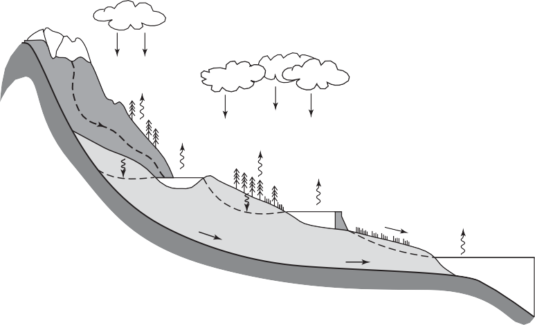**Figure 1--1a**
>
> The hydrologic cycle discharges surface water and groundwater from the
> higher elevation to the lower elevation.


> **Figure 1--1b**
>
> Flow chart of the components of the hydrologic cycle.
>
> Surface and ground waters flow from higher elevations toward lower
> elevations and may eventually discharge into the ocean, especially
> after large rainfall events (Fig. 1--1a). However, large quantities of
> surface water and portions of ground water return to the atmosphere by
> evaporation or *ET*, thus completing the natural hydrologic cycle
> (Fig. 1--1b). Precipitation from the atmosphere is a major force that
> drives the hydrologic cycle, and under- standing major weather
> parameters and systems is important for the predic- tion of
> precipitation events (see Section 1.3).
>
> **Ancient History**
>
> Biswas (1972), in a concise treatment of the history of hydrology,
> describes the early water management practices of the Sumerians and
> Egyptians in the Middle East and the Chinese along the banks of the
> Huang He (Yellow River). Archeological evidence exists for hydraulic
> structures that were built for irrigation and other water control
> activities. A dam was built across the Nile about 4000
> [b]{.smallcaps}.c., and later a canal for fresh water was constructed
> between Cairo and Suez.
>
> The Greek philosophers were the first serious students of hydrology,
> with Aristotle proposing the conversion of moist air into water deep
> inside mountains as the source of springs and streams. Homer suggested
> the idea
>
> {width="2.3552077865266843in"
> height="1.5655205599300088in"}
>
> **Figure 1--2**
>
> Roman aqueducts, known as Pond du Gard located in Southern France,
> crosses the River Gardon (Gard).
>
> of an underground sea as the source of all surface waters. The Romans
> con- structed numerous aqueducts to serve large cities as well as
> small towns and industrial sites. The Romans had the largest
> collection with water being sup- plied by 11 aqueducts constructed
> over a period of about 500 years. Figure 1--2 shows one of the famous
> aqueducts built in France during that early period. They served
> potable water and supplied the numerous baths and fountains in the
> city, as well as finally being emptied into the sewers, where the
> once-used gray water performed their last function in removing wastes.
> The construction of the Roman aqueducts is considered one of the most
> important engineering feats in history.
>
> Streamflow measurement techniques were first attempted in the water
> systems of Rome (a.d. 97) based on the cross-sectional area of flow.
> It remained for Leonardo da Vinci to discover the proper relationship
> between area, velocity, and flow rate during the Italian Renaissance.
> The first recorded measurement of rainfall and surface flow was made
> in the seven- teenth century by Perrault. He compared measured
> rainfall to the estimated flow of the Seine River to show the two were
> related. Perrault's findings were published in 1694. Halley, the
> English astronomer (1656--1742), used a small pan to estimate
> evaporation from the Mediterranean Sea and con- cluded that it was
> enough to account for tributary flows. Mariotte gaged the velocity of
> flow in the Seine River in Paris. These early beginnings of the
> science of hydrology provided the foundation for numerous advances in
> the eighteenth century, including Bernoulli's theorem, the Pitot tube
> for measur- ing velocity, and the Chezy (1769) formula, which form the
> basis for modern hydraulics and fluid measurement.
>
> During the nineteenth century, significant advances in ground water
> hydrology and hydraulics occurred. Darcy's law for flow in porous
> media was a major advance, as well as the Dupuit--Thiem well flow
> formula (Chapter 8). In addition, the Hagen--Poiseuille capillary flow
> equation was developed to describe flow in small channels. The
> Darcy-Weisbach equa- tion for pipe flow was also developed during this
> same period in the 1850s. In surface water hydrology, many flow
> formulas and measuring instruments
>
> were developed that allowed for the beginning of systematic stream
> gaging. In 1867, discharge measurements were organized on the Rhine
> River at Basel and quickly expanded throughout Europe.
>
> The U.S. Geological Survey set up the first systematic program of flow
> measurement in the United States on the Mississippi in 1888. During
> this same period, the United States founded a number of hydrologic
> agencies, including the U.S. Army Corps of Engineers (1802), the U.S.
> Geological Survey (USGS, 1879), the Weather Bureau (1891), and the
> Mississippi River Commission (1893). The Price current meter was
> invented in 1885, and Man- ning's formula was introduced in 1889
> (Manning, 1889). The Weather Bureau is now called the National Weather
> Service (NWS) and is one of six organizations underneath the National
> Oceanic and Atmospheric Adminis- tration (NOAA). NOAA is the agency
> responsible for weather data collec- tion and severe-storm, river, and
> hurricane forecasting for the United States, and many of its websites
> are listed throughout the textbook. The USGS gag- ing network for
> rainfall, streamflow, and water quality is one of the most extensive
> in the world.
>
> **Early History (1930s--1950s)**
>
> The period from 1930 to 1950, which Chow (1964) called the Period of
> Ratio- nalization, produced a significant step forward for the field
> of hydrology, as government agencies began to develop their own
> programs of hydrologic research. Sherman's unit hydrograph (1932) (see
> Chapter 2), Horton's infil- tration theory (1933), and Theis's
> nonequilibrium equation (1935) in well hydraulics (Chapter 8) advanced
> the state of hydrology in very significant ways. Gumbel (1958)
> proposed the use of extreme-value distributions for frequency analysis
> of hydrologic data, thus forming the basis for modern statistical
> hydrology (Chapter 3). In this period, the U.S. Army Corps of
> Engineers (ACOE), the NWS within NOAA, the U.S. Department of Agri-
> culture (USDA), and the USGS made significant contributions in
> hydrologic theory and the development of a national network of gages
> for precipitation, evaporation, and streamflow measurements. The NWS
> is still largely respon- sible for rainfall measurements, reporting
> and forecasting of severe storms, and other related hydrologic
> investigations.
>
> The U.S. ACOE and the USDA Soil Conservation Service (now called the
> Natural Resources Conservation Service \[NRCS\]) made significant con-
> tributions to the field of hydrology in relation to flood control,
> reservoir development, irrigation, and soil conservation during this
> period. More recently, the USGS has taken significant strides to set
> up a national network of stream gages and rainfall gages for both
> quantity and quality data. Their water supply publications and special
> investigations have done much to advance the field of hydrology by
> presenting the analysis of complex hydro- logic data to develop
> relationships and explain hydrologic processes. The NWS and USGS both
> support numerous websites for the dissemination of watershed
> information and precipitation and streamflow data from thousands
>
> of gages around the country. Many of these sites are listed in
> Appendix E and on the textbook website
> ([http://hydrology.rice.edu/bedient).](http://hydrology.rice.edu/bedient))
>
> The government agencies in the United States have long performed vital
> research themselves, providing funding for private and university
> research in the hydrologic area. Many of the water resources studies
> and large dam, reservoir, and flood control projects in the 1930s and
> 1940s were a direct result of advances in the fields of fluid
> mechanics, hydrologic sys- tems, statistical hydrology, evaporation
> analysis, flood routing, and opera- tions research. Many of the
> advances from that era continue to this day as the methods to predict
> runoff, infiltration, and evaporation have not changed much in over 50
> years. Major contributions from Horton (1933, 1940, 1941) and from
> Penman (1948) in understanding hydrologic losses were related to the
> water and irrigation needs of the agricultural sector in the United
> States following the devastation of the dust bowl era of the 1930s.
>
> Major water resources projects built during the 1930s were a direct
> result of major floods on the Mississippi River and the economic
> depression across the nation. The building of the massive Hoover Dam
> on the Colorado River for flood and sediment control and water supply
> in the early 1930s provided employment for over 40,000 and was the
> largest construction proj- ect ever conceived to that point (see
> Chapters 12 and 13).
>
> **Modern History**
>
> In the 1950s and 1960s, the tremendous increase of urbanization
> following World War II in the United States and Europe led to better
> methods for predicting peak flows from floods, for understanding
> impacts from urban expansion, and for addressing variations in storage
> in water supply reservoirs. Major expansion of cities and water
> systems within the United States during the 1950s led to a need for
> better understanding of floods and droughts, especially in urban
> areas. Water resource studies became an everyday occur- rence in many
> rapidly developing areas of the United States, tied to the expansion
> of population centers in the southern, southwestern, and western
> states. Hydrologic analyses presented in detail in Chapters 2 through
> 9 in the text were a major component of many of these studies.
>
> During the 1970s and early 1980s, the evaluation and delineation of
> floodplain boundaries became a major function of hydrologists, as
> required by the Federal Emergency Management Agency (FEMA) and local
> flood control or drainage districts. In order for communities to be
> eligible for flood insurance administered by FEMA, they are required
> to delineate floodplain boundaries using hydrologic analysis and
> models. Floodplain analysis is cov- ered in detail in Chapters 5, 7,
> 9, and 12. This function has taken on a vital role in many urban
> areas, as damages from severe floods and hurricanes continue to plague
> the United States, especially in coastal and low-lying areas. The
> period from 2004 to 2010 accounted for numerous hurricanes that caused
> massive damages and deaths in several areas, especially along the
>
> coastlines of Texas, Louisiana, Mississippi, Alabama, and Florida. The
> mas- sive Mississippi flood of 1993 wreaked havoc within the central
> United States, and was repeated in 2011 with major devastation to
> states from Illi- nois south to Louisiana (Chapter 12).
>
> In recent years, the traditional approaches to flood control have been
> reassessed. A study titled "Higher Ground" from the National Wildlife
> Fed- eration (1998) found a number of communities with large numbers
> of repet- itive flood losses, such as New Orleans and Houston. Since
> the great midwestern flood of 1993, there has been a significant shift
> in national flood policy away from using only structural solutions,
> such as levee and channel construction. Flood damage from Tropical
> Storm Allison in Houston in 2001 was a major wake-up call for better
> protection and warning systems in criti- cal urban areas. The massive
> devastation from Hurricane Katrina in New Orleans in August 2005 and
> Hurricane Ike in 2008 in Houston-Galveston will provide long-lasting
> incentive to improve our ability to warn for and recover from such
> severe storms. Modern methods for structural flood con- trol, as well
> as nonstructural approaches, better management of flood-prone areas,
> and voluntary property buyouts, must be considered in any overall
> flood management plan (Chapter 12). Chapter 13 explores several major
> water resources projects across the United States and Asia in terms of
> engi- neering significance as well as associated environmental and
> policy impacts on the nation.
>
> **Computer Advances**
>
> The introduction of the digital computer into hydrology during the
> 1960s and 1970s allowed complex water problems to be simulated as
> complete systems for the first time. Large computer models can now be
> used to match historical data and help answer difficult hydrologic
> questions (Singh and Frevert, 2006). The development of these tools
> over the past few decades has helped direct the collection of the
> hydrologic data to calibrate, or "match," the models against
> observation. In the process, the understanding of the hydrologic
> system has been greatly advanced. Hydrologic computer models developed
> in the 1970s have been applied to areas previously unstud- ied or only
> empirically defined. For example, urban stormwater, floodplain and
> watershed hydrology, drainage design, reservoir design and operation,
> flood frequency analysis, and large-river basin management have all
> bene- fited from the application of computer models.
>
> Hydrologic simulation models applied to watershed analysis are
> described in detail in Chapter 5. Single-event models such as HEC-HMS
> are used to simulate or calculate the resulting storm hydrograph
> (discharge vs. time) from a well-defined watershed area for a given
> pattern of rainfall intensity. Continuous models such as the
> Hydrological Simulation Pro- gram---Fortran (HSPF) and the Storm Water
> Management Model (SWMM) can account for soil moisture storage,
> evapotranspiration, and antecedent
>
> rainfall over long time periods. Statistical models can be used to
> generate a time series of rainfall or streamflow data, which can then
> be analyzed with flood frequency methods.
>
> Newer distributed hydrologic models (i.e., VFLO and the MIKE series of
> models) can handle input, output, and data manipulation at the
> watershed level (see Chapters 5, 10, 11, and 12). Unquestionably new
> digital approaches combined with distributed terrain modeling have
> revolutionized hydrology in recent years, just as the original wave of
> models did in the decade of the 1970s. Also faster computers and
> available datasets have been instrumental in advancing the field.
>
> The data revolution in hydrology and geographical information sys-
> tems (GIS) have made available newer and more accurate datasets on
> topog- raphy, slope, rainfall, soils, land use, and channel
> characteristics for many areas. Moreover, most hydrological and
> meteorological data may be retrieved online from agencies such as the
> USGS and NWS, and various county and municipal sources. These
> datasets, combined with existing simu- lation models in hydrology, if
> applied correctly, provide the most accurate approach to understanding
> complex water resources systems, and a new era in the science of
> hydrology has begun this decade. New design and operating policies are
> being advanced and implemented that could not have been real- ized or
> tested before without the aid of sophisticated computer models linked
> with digital data.

**1.2**

> **WEATHER SYSTEMS**
>
> The atmosphere is the major hydrologic link between oceans and
> continents on the planet, facilitating the cycle of water movement on
> earth. The hydro- logic cycle is shaped by the conditions of the
> atmosphere, with precipitation as the main input to the cycle. Water
> vapor content is both a major catalyst and a balancing factor of
> atmospheric processes that create the weather in the lower atmosphere.
> The following section reviews major elements of atmospheric processes
> that directly impact the hydrologic cycle. More details on atmospheric
> processes can be found in modern meteorology and hydrol- ogy textbooks
> (Anthes, 1997; Ahrens, 2000; Dingman, 2002).
>
> **Atmospheric Parameters**
>
> Pressure is defined as the force per unit area exerted on a surface,
> and **atmo- spheric pressure** measures the weight of the air per unit
> area. Average air pressure at sea level is approximately 1 atmosphere,
> or 1013 millibars (mb) or 14.7 lb/in.^2^ or 760 mm-Hg or 29.97 in.-Hg.
> Note that 1 mb = 10^2^ pascals (Pa), where 1 Pa = 1 N/m^2^. As
> elevation increases and the density of air molecules decreases,
> atmospheric pressure also decreases. The horizontal and vertical
> pressure variations that occur due to low- and high-pressure systems
> are responsible for wind, and help drive much of our weather. Abso-
> lute temperature (*T*), pressure (*P*), and density 1r2 are related
> through the
>
> ideal gas law, *P* = r*RT*, where *R* is the gas constant for the gas
> in question (see Eq. 1--1). At constant density, temperature is
> directly proportional to pressure; thus, with an increase in
> temperature comes an increase in pres- sure. Air pressure is
> proportional to density, so that in the atmosphere a decrease in
> temperature causes an increase in the density of the air mole- cules.
> Cold air masses are generally associated with the higher atmospheric
> pressure.
>
> **Humidity** is a measure of the amount of water vapor in the
> atmosphere and can be expressed in several ways. Specific humidity is
> the mass of water vapor in a unit mass of moist air. The **relative
> humidity** is a ratio of the air's actual water vapor content compared
> to the amount of water vapor at satu- ration for that temperature. The
> partial pressure of water vapor is the con- tribution made by water to
> the total atmospheric pressure. When a volume reaches its maximum
> capacity for water vapor, the volume is said to be satu- rated and can
> accept no more vapor. This vapor pressure is known as **satura- tion
> vapor pressure**. Vapor pressure is dependent on temperature; and as
> air is lifted and cools, its relative humidity increases until
> saturation, and then condensation of water vapor to liquid water can
> occur. The temperature to which a sample of air must be cooled to
> reach saturation is defined as the **dew point temperature**. These
> concepts are described in more detail later in this section.
>
> Water vapor has the ability, unique among gases, to change from one
> state of matter to another (solid, liquid, or gas) at the temperatures
> and pressures that typically exist on earth. A change in phase (e.g.,
> from liquid to vapor) requires that heat be released or absorbed. The
> processes of con- verting solid ice to liquid water, called melting,
> and water to vapor, called evaporation, both require significant heat
> exchange. It takes approximately 600 cal to convert 1 g of water to
> water vapor. When such changes take place, the heat is absorbed and no
> temperature change takes place. The heat used in this process is
> latent heat. Condensation is the process in which water vapor changes
> into a liquid state. For this to occur, energy must be released in an
> amount equivalent to what was absorbed during evaporation. This latent
> heat often becomes the source of energy for severe thunderstorms,
> tornadoes, and hurricanes.
>
> **The Atmosphere and Clouds**
>
> Atmospheric weather systems are fueled by solar input and
> characterized by air masses in motion, circulating winds, cloud
> generation, and changes in tem- perature and pressure. Lifting
> mechanisms are required for moist air masses to cool and approach
> saturation conditions. As a result of the interaction of rising air
> masses with atmospheric moisture, the presence of small atmospheric
> nuclei, and droplet growth, precipitation in the form of rain, snow,
> or hail can result. The exact mechanisms that lead to precipitation
> are sometimes quite complex and difficult to predict for specific
> areas. But precipitation remains
>
> as the main input to the hydrologic cycle, and the hydrologist needs a
> general understanding of the mechanisms that cause its formation.
>
> Horizontal variations in atmospheric pressure cause air to move from
> higher pressure toward lower pressure, resulting in the generation of
> wind. Vertical displacement causes air to move as well, but at a far
> slower rate than horizontal winds. The vertical movement and lifting
> of air results in the formation of clouds. Clouds are familiar to all
> of us, and represent collec- tions of small droplets of water or tiny
> crystals of ice. The names of the basic clouds have the following
> roots:
>
> **cirrus**, feathery or fibrous clouds
>
> **stratus**, layered clouds
>
> **cumulus**, towering, puffy clouds **alto**, middle-level clouds
> **nimbus**, rain clouds
>
> The second aspect of cloud classification is by height. Anthes (1997)
> presents a detailed coverage of cloud types for the interested
> student. One type of high cloud of importance in hydrology is the
> **cumulonimbus**, one often found in heavy thunderstorms that produce
> massive rainfall. Cirrus clouds are very high collections of ice
> crystals and often indicate the approach of a cold front and that
> weather is about to change. While clouds result when air rises and
> cools, surface fog results from cooling near the surface or from the
> addition of enough water vapor to cause saturation. Fog is essentially
> a low cloud with a base that is very near the ground, often reducing
> the visibil- ity in the area within or around it. Marine fog is common
> along the Califor- nia and upper Atlantic coasts in the United States.
>
> **General Circulation**
>
> The general circulation of wind across the earth is caused by the
> uneven heating of earth's surface through solar input, and by the
> earth's rotation. At the equator, solar radiation input and
> temperature are greatest because of the shape and tilt of the globe
> relative to the sun. Three latitudinal circu- lation cells transport
> heat from the equator to the poles (Fig. 1--3). As warm air travels
> northward in the middle latitudinal cell on a spinning earth, it tends
> to shift to the right (toward the east) in the northern hemisphere due
> to the Coriolis force, thus causing the occurrence of winds called
> **westerlies**. These winds tend to drive the direction of major
> weather systems from west to east across major portions of the
> continental United States.
>
> Between 30 degrees north latitude and the equator, the flow is
> generally toward the south and is altered to create the trade winds
> (**easterlies**) by the Coriolis force in the northern hemisphere. The
> trade winds allowed explorers from Europe to sail across the ocean to
> the New World. The Coriolis force causes the flow along latitude
> circles (east/west) to be 10 times greater than
>
> Mean position of polar jet
>
> Easterlies Polar front
>
> Mean positions of subtropical jets
>
> Westerlies Horse latitudes
>
> NE trade winds ITCZ
>
> SE trade winds
>
> Horse latitudes Westerlies
>
> Mean positions of subtropical jets
>
> Polar front
>
> Easterlies
>
> **Figure 1--3**
>
> Mean position of polar jet
>
> General circulation of currents and wind patterns across the earth.
>
> the flow along the meridians (north/south). Around the 30 degrees
> north and south latitudes, descending air creates a region of minimal
> winds and little cloudiness that is known as the horse latitudes. Near
> the equator is another region of light and variable winds called the
> doldrums, or the intertropical convergence zone. This is the area of
> maximum solar heating, where surface air rises and flows toward both
> poles.
>
> **Jet streams**, first observed in 1946, are narrow bands of
> high-speed winds that circle each hemisphere like great rivers, at
> elevations extending from 2.5 or 3 miles to above the tropopause. The
> polar and subtropical jets are associated with the polar front near 45
> degrees latitude and 30 degrees latitude, respectively. The jet
> streams are highly variable and can flow at speeds as high as 100 mph
> faster than the air on either side of them. Jet streams have a major
> impact as the driving force for weather systems across the United
> States, especially in the winter season.
>
> **Air Masses and Fronts**
>
> Air masses are large bodies of air with fairly consistent temperature
> and humidity gradients in the horizontal direction at a given
> altitude. Air masses dominate our weather and are classified in two
> ways: the source from which
>
> they were generated, land (continental) or water (maritime), and the
> latitude of generation (polar or tropical). The four combinations are
> designated cP, cT, mP, and mT.
>
> Each of these types of air masses is present in the United States. The
> continental polar air mass emanates from Canada and passes over the
> north- ern United States, often dropping significant amounts of rain
> and snow on areas downwind of the Great Lakes. The maritime polar air
> mass also comes southward from the Atlantic coast of Canada and
> affects the New England states. Another maritime polar air mass comes
> from the Pacific and hits the extreme northwestern states. The
> maritime tropical air masses come from the Pacific, the Gulf of
> Mexico, and the Atlantic. The entire southern United States is
> affected by these air masses. The only time continental tropical air
> masses form is during the summer, and they originate in Texas and
> affect the states bordering to the north.
>
> The boundary between one air mass and another is called a frontal
> zone, or **front**. When two air masses meet, the front will slope
> diagonally, as the colder, denser air mass pushes under the warmer air
> mass. Between the two fronts, a transition zone occurs, usually 30 to
> 60 miles wide. Whether the masses are traveling against each other or
> in the same direction, the warmer air mass will be forced upward and
> cooled by expansion. Since cooling a parcel of air lowers its
> saturation vapor pressure, this may cause condensa- tion and the
> development of precipitation often associated with frontal sys- tems
> (Fig. 1--4). The NWS website provides an amazing amount of weather
> information and satellite data all on one place
> ([http://www.nws.noaa.gov/).](http://www.nws.noaa.gov/))
>
> Cold front Warm front
>
> **Figure 1--4**
>
> Direction of the cold and warm fronts in the eastern United States.
> The cold fronts come from the North toward the Gulf and the warm
> fronts start from the Gulf to push inland.
>
> Development of surface cyclones along fronts occurs when an upper-
> level disturbance approaches a front. The upper-level patterns of
> conver- gence and divergence produce pressure changes at the surface,
> which then produce low-level circulation (**wave cyclone**). As a wave
> cyclone develops, low pressure forms at its apex and both the warm and
> cold currents move in a cyclonic pattern (counterclockwise in the
> northern hemisphere) around it. To the left of the apex, the cold
> front is advancing towards the warm air, and the warm front is
> receding to the right. The warm air between the fronts is known as the
> warm sector. The entire system generally moves toward the right
> (eastward), and ahead of the warm front the first sign of the
> approach- ing system is high cirrus clouds. As the center of low
> pressure approaches, the pressure falls and the wind increases and
> changes its direction to coun- terclockwise. The temperature begins to
> decrease as the frontal zone approaches. Within several hundred miles
> of the surface position of the front, precipitation begins, either
> rain or snow. Fronts can be fast moving in the winter or can be slowed
> or stalled due to the presence of other air masses or high-pressure
> systems in the fall or spring (Anthes, 1997). Warm fronts can also
> generate rainfalls as they move across an area.
>
> Fronts are a major factor in U.S. weather patterns, especially from
> September through April in most years. The type of weather
> accompanying the passage of the cold front depends on the front's
> sharpness, its speed, and the stability of the air being forced aloft.
> Often there are towering cumulus clouds and showers along the forward
> edge of the front. Sometimes, espe- cially in the Midwest during the
> spring, several **squalls**, or a strong line of storms, precede the
> front. Tornadoes can form in these storm cells, especially in areas of
> north Texas, Oklahoma, and Arkansas. But in other cases, nim-
> bostratus clouds and rain extend over a zone of 50 to 60 miles. After
> the frontal passage, the wind changes sharply and the pressure begins
> to rise. Within a short distance behind the cold front, the weather
> clears, the tem- perature begins to fall, and the visibility greatly
> improves.
>
> **Thunderstorms**
>
> Thunderstorm activity is characterized by cumulonimbus clouds that can
> produce heavy rainfall, thunder, lightning, and occasionally hail.
> Thunder- storms are the result of strong vertical movements in the
> atmosphere and usually occur in the spring or summer in the United
> States. They require warm, moist air, which when lifted will release
> enough latent heat to provide the buoyancy needed to maintain its
> upward motion. Accordingly, they gen- erally occur in warm air masses
> that have become unstable either through extreme low-pressure systems,
> surface heating, or forced ascent over moun- tains. The geographic
> pattern of thunderstorm occurrence in the United States is a result of
> both an area's distance from source air masses and its topography.
> Florida and the Gulf Coast are affected most frequently, some- times
> as often as 100 times in a year.
>
> {width="4.022112860892388in"
> height="2.0366655730533685in"}
>
> **Figure 1--5**
>
> The Cumulonimbus cloud that signals that a storm is approaching.
>
> Thunderstorms develop in three characteristic stages. The first is the
> cumulus stage, when moist air rises and cools and condenses into a
> cumulus cloud. The cumulus cloud then continues to grow taller as the
> rising air condenses at successively higher levels (Fig. 1--5). The
> diameter of the storm cell grows in width from about 1 mile to 6 to 9
> miles and vertically to 5 or 6 miles. The rising air is no longer able
> to retain water droplets and rain begins to fall.
>
> The rain marks the beginning of the second stage of the thunder-
> storm, the mature stage. During the mature stage, the large water
> particles or hail in the clouds begin to fall because they have become
> too large to be supported by the updraft. As this happens, drier air
> around the cloud is being drawn into it, in a process known as
> entrainment. This drying of the air results in the evaporation of some
> rain drops, which cools the air. The air is now colder and heavier
> than the air around it and, while the upper part of the cloud still
> has a strong updraft, a lower part of the storm cloud begins to
> descend as a downdraft. This downdraft eventually reaches the ground
> and spreads away from the thunderstorm, causing the cool gusts of wind
> that usually foreshadow the arrival of a thunderstorm. Meanwhile, the
> upper part of the cloud reaches a stable part of the atmosphere, and
> high-altitude winds may create a typical anvil shape (Fig. 1--6). The
> cloud reaches its greatest vertical development in this stage,
> extending upward over 7.5 mi (40,000 ft, 12 km). Lightning,
> turbulence, heavy rains, and, if present, hail are all found at this
> time. The second stage is the most intense period of the thunderstorm.
>
> When the downdraft has spread over the entire storm cell and the
> updraft has been cut off, the storm begins its final stage, the
> dissipating stage. The rate of precipitation diminishes and so the
> downdrafts are also gradually subdued. The final flashes of lightning
> fade away and the cloud begins to
>
> 15
>
> 10 Storm motion
>
> 5
>
> 0 Wake of cool air
>
> 25 km
>
> **Figure 1--6**
>
> Typical thunderstorm cloud evolution. The typical anvil-shaped clouds
> that are present during a thunderstorm are caused by the movement of
> cold air and warm air. As the cold air moves downward and the warm air
> moves upward, the warm air above spreads out in order to cool,
> resulting in the following shape, very much like an anvil.
>
> dissolve or perhaps persist a while longer in a stratified form (see
> Fig. 1--6). Intense thunderstorms are of great interest, since they
> can produce signifi- cant amounts of rainfall in a short time period.
> Chapter 11 discusses new radar methods for the detection of severe
> storms and for the measurement of rainfall intensities associated with
> severe storms.
>
> **Hurricanes**
>
> **Tropical cyclones** or **hurricanes** are intense cyclonic storms
> that form over the tropical oceans, between 5 and 20 degrees latitude.
> With extreme amounts of rainfall and winds that can exceed 186 mph
> (300 km/hr), trop- ical cyclones are the most destructive storms on
> earth. The local name for this storm varies throughout the world:
> typhoon in Eastern Asia, cyclone in India, and baguio in the China
> Sea. The North American term, used in this discussion, is hurricane.
> By international agreement, a storm is a hur- ricane if it has wind
> speeds of at least 74 mph (119 km/hr) and a rotary circulation. When
> its wind speeds are between 39 mph (63 km/hr) and 73 mph (119 km/hr),
> it is a tropical storm. Tropical disturbances with winds that do not
> exceed 39 mph (61 km/hr) are tropical depressions. All tropical storms
> and hurricanes are given proper names in alphabetical order, start-
> ing at the beginning of the alphabet when the storm season begins on
> June 1 and starting over during the next season. Hurricanes are
> classified accord- ing to a scale based on central pressure, storm
> surge height, and wind speed. The scale has five categories, ranging
> from category 1, a hurricane of minimal damage, to category 5, a
> hurricane of catastrophic proportions (see Table 1--1).
>
> **Table 1--1.** The Saffir-Simpson Hurricane Wind Scale

+-------------+-----------+------------+------------------------------+
| > *         | > **Wind  | > **Extent | > **Damage Description**     |
| *Category** | > Speed   | > of       |                              |
|             | > (mph)** | > Damage** |                              |
+=============+===========+============+==============================+
| > Tropical  | > 39--73  | > Minor    | > Some flooding              |
| > Storm     |           |            | >                            |
|             |           |            | > Damage limited to          |
|             |           |            | > unanchored mobile homes,   |
|             |           |            | > shrubbery, and trees       |
|             |           |            | >                            |
|             |           |            | > Some roof, door and window |
|             |           |            | > damage to buildings, some  |
|             |           |            | > trees blown down           |
|             |           |            | >                            |
|             |           |            | > Some structural damage to  |
|             |           |            | > residences and utility     |
|             |           |            | > buildings, trees           |
|             |           |            | > defoliated and many blown  |
|             |           |            | > down                       |
|             |           |            | >                            |
|             |           |            | > Extensive curtainwall      |
|             |           |            | > failures and some complete |
|             |           |            | > roof failures, shrubs,     |
|             |           |            | > trees, and all signs blown |
|             |           |            | > down                       |
|             |           |            | >                            |
|             |           |            | > Complete roof failure and  |
|             |           |            | > some complete building     |
|             |           |            | > failures                   |
+-------------+-----------+------------+------------------------------+
| 1           | > 74--95  | > Minimal  |                              |
+-------------+-----------+------------+------------------------------+
| 2           | > 96--110 | > Moderate |                              |
+-------------+-----------+------------+------------------------------+
| 3           | >         | >          |                              |
|             |  111--130 |  Extensive |                              |
+-------------+-----------+------------+------------------------------+
| 4           | >         | > Extreme  |                              |
|             |  131--155 |            |                              |
+-------------+-----------+------------+------------------------------+
| 5           | > 156+    | > Ca       |                              |
|             |           | tastrophic |                              |
+-------------+-----------+------------+------------------------------+

> The warm, moisture-laden air of the tropical oceans possesses an enor-
> mous capacity for heat energy, and most of the energy required to
> create and sustain a hurricane comes from what is released through
> condensation from vapor to water. Hurricanes develop most often during
> the late summer when the oceans are warm (26°C or higher) and are thus
> able to provide the necessary heat and moisture to the air. The
> hurricane season in the West Indies extends from June 1 to November 1,
> but 84% of the hurricanes and tropical cyclones below hurricane
> intensity reported from 1887 to 1958 in the North Atlantic occurred
> during August, September, and October. There is considerable
> variability in the number of hurricanes in the Atlantic annu- ally. In
> the 40-year period from 1950 to 1990, the number of hurricanes in the
> Atlantic varied from 3 to 12 per year.
>
> The decades of the 1990s and 2000s have seen especially high hurricane
> activity in the North Atlantic basin, including both hurricane
> frequency and intensity. As indicated below, 2004 and 2005 were very
> active hurricane years for the coastal United States. Figure 1--7
> shows the devastating track of Hurricane Ike that damaged the
> Houston-Galveston coastline in Septem- ber, 2008. Statistics have
> shown that the number of tropical storms correlates with several
> climatological anomalies on a global scale, including rainfall in West
> Africa in the prior year, the direction of the winds in the
> stratosphere, and the **El Niño-Southern Oscillation (ENSO)**
> phenomenon, characterized by a warm phase associated with high sea
> surface temperatures off the coast of Peru, low atmospheric pressure
> over the eastern Pacific, high pressure in the western Pacific, and
> strong winds aloft over the tropical Atlantic (creat- ing high
> vertical wind shear and unfavorable conditions for hurricane devel-
> opment). A cold phase (**La Niña**) has low sea surface temperatures
> in the
>
> 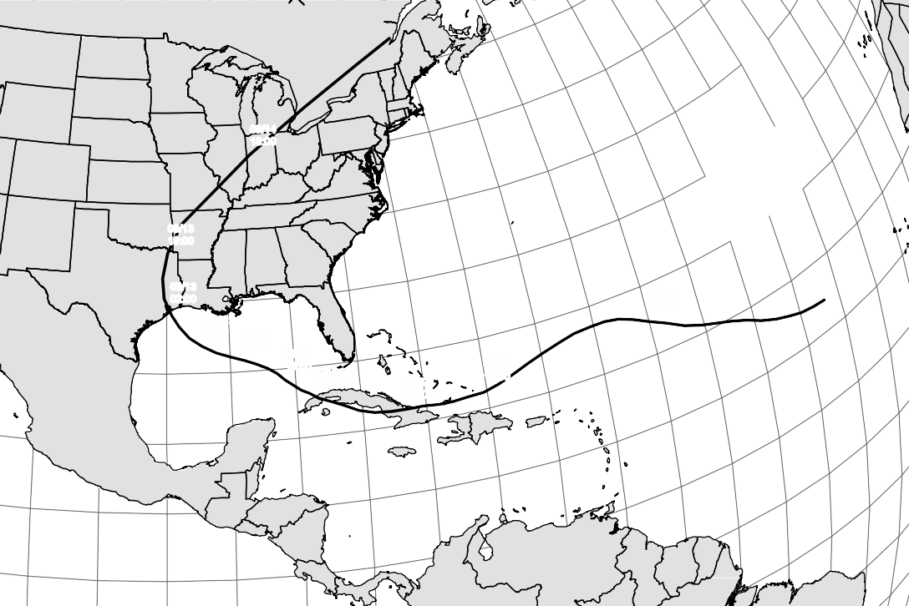**Figure 1--7**
>
> Hurricane Ike's track. The hurricane started in the Atlantic and made
> its way into the Gulf. What started out as a Category 4 storm in the
> Atlantic became a Category 3 as it hit Cuba and finally weakened to a
> Category 2 storm as it made landfall in Texas.
>
> eastern Pacific and the opposite pressure and wind anomalies.
> Meteorology textbooks and websites usually provide more details on the
> occurrence and characteristics of hurricanes (Anthes, 1997; Ahrens,
> 2000; Dingman, 2002). More details can be found in Chapter 12.
>
> **Moisture Relationships**
>
> Atmospheric moisture is a necessary source for precipitation and is
> generally provided from evaporation and transpiration. Precipitation
> across the United States is largely due to proximity of evaporation
> from oceans and the Gulf of Mexico and to subsequent transport over
> the continent by the atmo- spheric circulation system. Common measures
> of atmospheric moisture, or humidity, include vapor pressure, specific
> humidity, mixing ratio, relative humidity, and dew point temperature.
> (Most of these terms were defined earlier in the chapter.) Under moist
> conditions, water vapor can be assumed to obey the ideal gas law,
> which allows derivation of simple relations between pressure, density,
> and temperature.
>
> The partial pressure is the pressure that would be exerted on the sur-
> face of a container by a particular gas in a mixture. The partial
> pressure exerted by water vapor is called **vapor pressure** and can
> be derived from Dalton's law and the ideal gas law as
>
> *e* [r*w RT*]{.underline}, (1--1)
>
> 0.622
>
> where
>
> *e* = vapor pressure (mb),
>
> r*~w~* = vapor density or absolute humidity (g/cm^3^),
>
> *R* = dry air gas constant = 2.87 \* 10^3^ mb cm^3^/g°K,
>
> *T* = absolute temperature (°K).
>
> The factor 0.622 arises from the ratio of the molecular weight of
> water (18) to that of air (29). Near the earth's surface, the water
> vapor pressure is 1% to 2% of the total atmospheric pressure, where
> average atmospheric pres- sure is 1013.2 mb (1 mb = 10^2^ pascals
> (Pa)). **Saturation vapor pressure** is the partial pressure of water
> vapor when the air is completely saturated (no further evaporation
> occurs) and is a function of temperature.
>
> **Relative humidity** (*RH*) is approximately the ratio of water vapor
> pressure to that which would prevail under saturated conditions at the
> same temperature. It can also be stated as *RH* = 100 *e*\>*e~s~*.
> Thus, 50% relative humidity means that the atmosphere contains 50% of
> the maximum moisture it could hold under saturated conditions at that
> temperature. Typical relative humidity averages (high and low
> percentages) for eight major American cities are as follows: Houston
> (89, 67), Seattle (84, 62), Chicago (80, 64), New York
>
> City (72, 56), Miami (83, 61), Denver (67, 40), Albuquerque (58, 29),
> and Las
>
> Vegas (40, 21).
>
> Specific humidity is the mass of water vapor contained in a unit mass
> of moist air (g/g) and is equal to r*~w~*\>r*~m~*, where r*~w~* is the
> vapor density and r*~m~* is the density of moist air. Using Dalton's
> law and assuming that the atmosphere is composed of only air and water
> vapor, we have
>
> [1*P* - *e*2 + 0.622*e*]{.underline} *P*

r*~m~* =

> *RT* = *RT* 11 - 0.378*e*\>*P*2. (1--2)
>
> Equation (1--2) shows that moist air is actually lighter than dry air
> for the same pressure and temperature. Thus,

where

*q* = [r*w*]{.underline}

r*~m~*

> = [0.622*e *]{.underline}, (1--3)
>
> *P* - 0.378*e*
>
> *q* = specific humidity (g/g),
>
> *e* = vapor pressure (mb),
>
> *P* = total atmospheric pressure (mb),
>
> r*~m~* = density of mixture of dry air and moist air (g/cm^3^).
>
> Finally, the **dew point temperature** *T~d~* is the value at which an
> air mass just becomes saturated 1*e* = *e~s~*2 when cooled at constant
> pressure and moisture content. An approximate relationship for
> saturation vapor pressure over water *e~s~* as a function of
> temperature *T* is

*e~s~* = 2.7489 × 10^8^ expa - [4278.6]{.underline} b, (1--4)

> *T* + 242.79
>
> where *e~s~* is in mb and *T* is in °C. The relationship is accurate
> to within 0.5% of tabulated values (List, 1966) over a range of
> temperatures from 05C to 40°C. Homework problems for Chapter 1 and the
> following Example 1.1 explore the use of Eq. (1--4) in more detail.
> More details on their applica- tion and use can be found in standard
> textbooks (Wallace and Hobbs, 1977; Ahrens, 2000; Dingman, 2002).
>
> At the airport, weather specialist measured the air pressure to be
> 124.3 kPa, the air temperature was 28^◦^C, and the dew point
> temperature was 20^◦^C. Calculate the corresponding vapor pressure,
> relative humidity, and specific
>
> humidity. First compute *e* and *e~s~*.
>
> **EXAMPLE 1--1**
>
> Air temp = 28^◦^C
>
> *T~d~* = 20^◦^C
>
> \*Hint: 100 Pa = 1 mb

#### Vapor Pressure

> Air pressure = 124.3 kPa = 1243 mb
>
> **SOLUTION**
>
> *e* = 2.749 × 10^8^ expa [- 4278.6]{.underline} b, plug in 20^◦^C for
> T to get 23.34 mb
>
> *T~d~* + 242.79
>
> *e~s~* = 2.7489 × 10^8^ expa - [4278.6]{.underline} b, plug in 28^◦^C
> for T to get 37.56 mb
>
> *T* + 242.79

#### Relative Humidity

> H = 100 *^e^*/*~e~*
>
> = 100 . 23.34/~37.56~ = 100 . 0.62 = 62%

#### Specific Humidity

> *q* = [r*w*]{.underline}

r*~m~*

> = [0.622*e *]{.underline}, plug in 23.34 mb for *e* and 1243 mb for P
> to get 0.0117 kg
>
> *P* - 0.378*e*
>
> water/kg moist air
>
> **Atmospheric Stability and Phase Changes**
>
> In order for vapor to condense to water to begin the formation of
> precipita- tion, a quantity of heat known as latent heat must be
> removed from the moist air. The **latent heat** of condensation *L~c~*
> is equal to the latent heat of evapora- tion *L~e~*, the amount of
> heat required to convert water to vapor at the same temperature. With
> *T* measured in °C,
>
> *L~e~* = - *L~c~* = 597.3 - 0.57(*T* - 0°C), (1--5)
>
> where *L~e~* is in cal/g. The latent heat of melting and freezing are
> also related:
>
> *L~m~* = - *L~f~* = 79.7,
>
> where *L~m~* is also in cal/g. Thus, it takes about 7.5 times the
> energy to evapo- rate a gram of water compared to melting a gram of
> ice.
>
> As moist, unsaturated air rises, the relative humidity increases, and
> at some elevation saturation is reached and relative humidity becomes
> 100%. Fur- ther cooling of the air results in condensation of the
> moisture at a defined lifting condensation level (LCL). Latent heat of
> condensation is released, warming the air and lowering the atmospheric
> lapse rate, or the rate of temperature change with elevation. As
> discussed earlier, latent heat exchange is the major energy source
> that fuels tropical cyclones and hurricanes. It has also been observed
> that a relation does not necessarily exist between the amount of water
> vapor and the resulting precipitation over a region. Thus,
> condensation can occur in cloud formations without the production of
> precipitation at the ground surface.
>
> Meteorologists use the moisture relationships and the latent-heat con-
> cepts to obtain pressure--temperature relationships for cooling of
> rising moist air in the atmosphere. The rate of temperature change
> with elevation in the atmosphere is called the **adiabatic lapse
> rate**. The dry adiabatic lapse rate (DALR) is 9.8°C per km and
> assumes no phase changes of water. The average ambient lapse rate is
> about 6.5°C per km, but varies with moisture conditions. An unstable
> atmosphere is one in which the ambient lapse rate is greater than the
> DALR. A stable atmosphere is one in which the ambient lapse rate is
> less than the DALR, and an air parcel tends to cool faster than the
> environment as it rises vertically. Figure 1--8 shows the variation of
> lapse rates and different types of atmospheric conditions, with an
> unstable atmo- sphere being very conducive to lifting of moist air and
> to formation of severe weather and/or rainfall conditions.
>
> **Mechanisms of Precipitation Formation**
>
> Precipitation is the primary input to the hydrologic cycle, whether in
> the form of rainfall, snow, or hail, and is generally derived from
> atmospheric moisture. In order for precipitation to occur at the
> earth's surface,

1.  a moisture source must be available,

2.  moist air must undergo lifting and resultant cooling,

> Temperature of environment (°C)
>
> Temperature of environment (°C)
>
> 3000
>
> 2000
>
> Environmental 0° lapse rate
>
> 7°C/1000 m

16°

> 0°
>
> 10°
>
> 3000
>
> 2000
>
> Moist adiabatic rate
>
> 6°C/1000 m
>
> 9°
>
> 16°
>
> 12°
>
> 18°
>
> 1000
>
> 0
>
> 0
>
> Dry adiabatic rate
>
> 10°C/1000 m
>
> 10 20 30°C
>
> 23°
>
> 30°
>
> 20°
>
> 30°

1000

0

> Environmental lapse rate
>
> 7°C/1000 m

0 10 20 30°C

> 23°
>
> 30°
>
> 24°
>
> 30°
>
> 32 50 68 86°F
>
> Temperature of lifted unsaturated air (°C) (dry rate)
>
> 32 50 68 86°F
>
> Temperature of lifted saturated air (°C) (moist rate)

(a) The unsaturated parcel of air at each elevation is colder than its
    surroundings. The atmosphere is stable with respect to unsaturated,
    rising air.

> **Figure 1--8**

(b) The lifted, saturated air parcel is warmer at each elevation than
    its surroundings. The atmosphere is unstable with respect to
    saturated, rising air.

> Variation of lapse rates and different types of atmospheric
> conditions. When air is colder than its sur- roundings and rises, it
> results in what is called a stable atmosphere. On the other hand, when
> warmer air rises, it results in an unstable atmosphere (greater
> movement of air).

3.  a phase change must occur with resulting condensation onto small
    > nuclei in the air,

4.  droplets must grow large enough to overcome drag and evaporation to
    > reach the ground.

> Precipitation is often classified according to conditions that
> generate vertical air motion. Figure 1--9 shows the three main
> mechanisms:

1.  **convective,** due to intense heating of air at the ground, which
    > leads to expansion and vertical rise of air;

> **Figure 1--9**
>
> The three different precipitation lift-

30 ing mechanisms

that result when

> 20 air at different

temperatures meet

10 in different topog-

> raphies.

2.  **cyclonic,** associated with the movement of large air-mass
    > systems, as in the case of warm or cold fronts; and

3.  **orographic,** due to mechanical lifting of moist air masses over
    > the windward side of mountain ranges.

> Orographic precipitation is caused by mechanical lifting of moist air
> over mountain ranges. Notable examples include the western side of the
> Cascade Mountains, the western side of the Andes in Chile, and the
> western coast of Norway. On the lee side of mountain barriers are dry
> areas, called rain shadows, since most of the moisture is dropped as
> rain or snow over the mountain ranges. Good examples of rain shadows
> can be found east of the Cascades in Washington and Oregon and east of
> the Sierra Nevada range in California (see Fig. 1--10).
>
> **Condensation** of water vapor into cloud droplets occurs due to
> cooling of moist air to a temperature below the saturation point for
> water vapor. This is most commonly achieved through vertical lifting
> to levels where pressure and temperature are lower. A large portion of
> the atmospheric mass lies within 18,000 ft of the surface and contains
> most of the clouds and moisture. Condensation can be caused by (1)
> adiabatic cooling (no heat loss to sur- roundings), (2) mixing of air
> masses having different temperatures, (3) cool- ing by advection of
> cold air masses, and (4) cooling by radiation. Adiabatic cooling is by
> far the most important producer of appreciable precipitation.


> **Figure 1--10**
>
> Distribution of average annual precipitation across the United States.
>
> Dew, frost, and fog are minor producers of precipitation caused
> primarily by advective and radiative cooling.
>
> Small condensation nuclei must be present for the formation of cloud
> droplets. Such nuclei come from many sources, such as ocean salt, dust
> from clay soils, industrial combustion products, and volcanoes, and
> they range in size from 0.1 m to 10 m. Cloud droplets originally
> average 0.01 mm in diam- eter, and it is only when they exceed 0.5 mm
> that significant precipitation occurs. It may take hours for a small
> raindrop (1 mm) to grow on a conden- sation nucleus. As vapor-laden
> air rises, it cools as it expands; and as satura- tion occurs, water
> vapor begins to condense on the most active nuclei. The principal
> mechanism for the supply of water to the growing droplet in early
> stages is diffusion of water-vapor molecules down the vapor-pressure
> gradi- ent toward the droplet surface. As the droplets increase in
> mass, they begin to move relative to the overall cloud. However, other
> processes must support the growth of droplets of sufficient size
> (0.5--3.0 mm) to overcome air resis- tance and to fall as
> precipitation. These include the coalescence process and the
> ice-crystal process.
>
> The **coalescence process** is considered dominant in summer shower
> precipitation. As water droplets fall, the smaller ones are overtaken
> by larger ones, and droplet size is increased through collision. This
> can produce significant precipitation, especially in warm cumulus
> clouds in tropical regions. The **ice-crystal process** attracts
> condensation on freezing nuclei because of lower vapor pressures. The
> ice crystals grow in size through contact with other particles, and
> collisions cause snowflakes to form. Snow- flakes may change into rain
> droplets after entering air in which the tem- perature is above
> freezing. Snowfall and snowmelt processes are presented in detail in
> Chapter 2.
>
> **Point Measurement**
>
> The main source of moisture for annual rainfall totals is evaporation
> from the oceans; thus, precipitation tends to be heavier near the
> coastlines, with distor- tion due to orographic effects---that is,
> effects of changes in elevation over mountain ranges. In general,
> amount and frequency of precipitation is greater on the windward side
> of mountain barriers (the western side for the United States) and less
> on the lee side (eastern side), also shown in Figure 1--10.
> Considerable amounts of precipitation data are available from the NWS,
> the USGS, and various local governmental agencies. A number of useful
> websites for precipitation data are listed in Appendix E and on the
> textbook website
> [http://hydrology.rice.edu.](http://hydrology.rice.edu/)
> Interpretation of national networks of rainfall data shows extreme
> variability in space and time, as can be seen in annual and monthly
> variations in Figures 1--10 and 1--11, respectively.
>
> Time variation of precipitation occurs seasonally or within a single
> storm, and distributions vary with storm type, intensity, duration,
> and time
>
> **1.3**
>
> **PRECIPITATION**
>
> 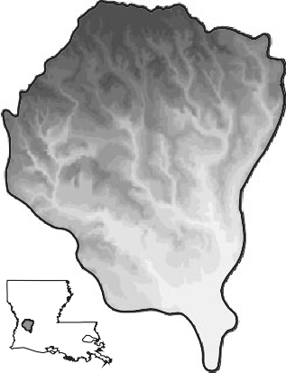{width="7.2533344269466316in"
> height="4.48in"}5
>
> 4
>
> 3
>
> 2
>
> 1
>
> 0 J J D
>
> Seattle, WA
>
> 2
>
> 1
>
> 0 J J D
>
> Boise, ID
>
> 3
>
> 2
>
> 1
>
> 0 J J D
>
> Havre, MT

4

3

2

1

0 J J D

> 3
>
> 2
>
> 1
>
> 0 J J D
>
> Fargo, ND
>
> Normal monthly distribution in CONUS
>
> 4
>
> 3
>
> 2 5
>
> 1 4
>
> 0 J J D 3
>
> Buffalo, NY 2

Rapid City, SD

3

2

1

4

3

2

1

> 0 J J D
>
> Chicago, IL
>
> 5
>
> 1
>
> 0 J J D
>
> Boston, MA
>
> 6
>
> 5
>
> 4
>
> 5
>
> 4
>
> 3
>
> 2
>
> 1
>
> 0 J J D
>
> 1
>
> 0
>
> J J D
>
> Las Vegas, NV
>
> 0 J J D
>
> Denver, CO
>
> 4
>
> 3
>
> 2
>
> 1
>
> 0 J J D
>
> Kansas City, MO 5

4

> 3
>
> 2
>
> 1
>
> 0 J J D
>
> Norfork, VA
>
> San Francisco, CA
>
> 2
>
> 1
>
> 0 J J D
>
> El Paso, TX
>
> 5
>
> 4
>
> 3
>
> 2
>
> 1
>
> 0 J J D
>
> Houston, TX
>
> 3
>
> 2
>
> 1
>
> 0 J J D
>
> Atlanta, GA
>
> 10
>
> 9
>
> 8
>
> 7
>
> 6
>
> 5
>
> 4
>
> 3
>
> 2
>
> 1
>
> 0 J J D
>
> Miami, Fla.
>
> **Figure 1--11**
>
> Normal monthly distribution of precipitation in different U.S. cities
> (in.) (1 in. = 25.4 mm). (U.S. Environmental Data Services.)
>
> **Table 1--2** Maximum Recorded Rainfall across the United States
> (in.)

+-------------------------------+---------+----------------+-----------+
|                               | > **Dur |                |           |
|                               | ation** |                |           |
+===============================+=========+================+===========+
|                               | > **1   | **6 hr**       | **24 hr** |
|                               | > hr**  |                |           |
+-------------------------------+---------+----------------+-----------+
| > San Francisco, CA           | > 1.07  | 2.34           | 4.67      |
+-------------------------------+---------+----------------+-----------+
| > Portland, OR                | > 1.31  | ---            | 7.66      |
+-------------------------------+---------+----------------+-----------+
| > Denver, CO                  | > 2.20  | 2.91           | 6.53      |
+-------------------------------+---------+----------------+-----------+
| > St. Louis, MO               | > 3.47  | 5.82           | 8.78      |
+-------------------------------+---------+----------------+-----------+
| > New Orleans, LA             | > 4.71  | 8.62           | 14.01     |
+-------------------------------+---------+----------------+-----------+
| > Alvin, TX (near Houston)    | > 4.00  | 15.67          | 43.00     |
+-------------------------------+---------+----------------+-----------+
| > New York, NY                | > 2.97  | 4.44           | 9.55      |
+-------------------------------+---------+----------------+-----------+
| > Miami, FL                   | > 4.53  | 10.64          | 15.10     |
+-------------------------------+---------+----------------+-----------+

> of year. Prevailing winds and relative temperature of land and
> proximity of bordering ocean have an effect. One interesting statistic
> is the maximum recorded rainfall that can occur at a single gage.
> These data are shown for eight major U.S. cities in Table 1--2. The
> highest value for 24-hr rainfall in the United States was 43 in. (1092
> mm) in Alvin near Houston, TX, indicat- ing the impact of severe
> storms and hurricanes near coastal areas. World precipitation records,
> shown in Table 1--3, clearly indicate the effect of prox- imity to
> major oceans, as in the case of India.
>
> Seasonal or monthly distributions for the United States are shown in
> Figure 1--11, where it is clear that areas such as Florida,
> California, and the Pacific Northwest have significant seasonal
> rainfall patterns compared to most areas in the country and along the
> eastern seaboard. Also, the west and southwest are significantly drier
> than the east or northwest. But the values shown are deceptive in that
> high-intensity thunderstorms or hurricanes can produce 15 to 30 in. of
> rainfall in a matter of days along the Gulf and Atlantic coasts. For
> example, Oregon and Washington receive most of their rainfall in the
> winter from fronts that move across the area, whereas in Florida
> thunderstorms and hurricanes produce large summer totals. Southern
> California, where most of the population resides,
>
> **Table 1--3** World Record Rainfalls

+------------+----------------+---------------+------------------------+
| > **       | > **in.**      | > **mm**      | > **Location**         |
| Duration** |                |               |                        |
+============+================+===============+========================+
| > 1 min    | 1.50           | 38            | > Barot, Guadeloupe    |
+------------+----------------+---------------+------------------------+
| > 15 min   | 7.80           | 198           | > Plumb Point, Jamaica |
+------------+----------------+---------------+------------------------+
| > 1 hr     | 15.80          | 401           | > Shangdi, China       |
+------------+----------------+---------------+------------------------+
| > 12 hr    | 52.76          | 1,340         | > Belouve, Reunion     |
+------------+----------------+---------------+------------------------+
| > 24 hr    | 72.40          | 1,840         | > Cherrapunji, India   |
+------------+----------------+---------------+------------------------+
| > 2 days   | 98.42          | 2,500         | > Ciliaos, Reunion     |
+------------+----------------+---------------+------------------------+
| > 15 days  | 253.60         | 6,443         | > Commerson, La        |
|            |                |               | > Reunion              |
+------------+----------------+---------------+------------------------+
| > 1 mo     | 366.14         | 9,300         | > Cherrapunji, India   |
+------------+----------------+---------------+------------------------+
| > 1 yr     | 1041.78        | 26,461        | > Cherrapunji, India   |
+------------+----------------+---------------+------------------------+

> gets significantly less rainfall than the northern part. This
> difference in available water led to the building of the California
> Water Project, which transports water hundreds of miles from the
> reservoirs in the north to the Los Angeles area.
>
> Hourly or even more detailed variations of rainfall are often impor-
> tant for planning water resource projects, especially urban drainage
> sys- tems. Figure 1--12 shows the cumulative rainfall for a major
> flood in the Houston area from 1979. Areal rainfalls such as shown in
> Figure 1--13 form
>
> T.S. Allison, which are useful in urban hydrologic studies. The
> intensity and duration of rainfall events and spatial variations are
> important in determin- ing the hydrologic response for a watershed.
> Such data are available only
>
> **Figure 1--12**

44

42

40

38

36

34

32

30

28

26

24

22

20

18

16

14

12

10

8

6

4

2

> 0
>
> Noon 24
>
> Mid
>
> Noon 25
>
> Mid Time
>
> Noon 26
>
> Mid
>
> Accumulated rainfall for the July 1979 storm event near Houston, TX.
>
> 
>
> **Figure 1--13**
>
> T.S. Allison 9-hr rainfall gage contours from Brays Bayou watershed in
> Houston, TX.
>
> from sophisticated rainfall recording networks, usually located in
> larger urban areas and along major river basins. Rainfall gage
> networks are main- tained by the NWS, the USGS, and local county flood
> control districts and utilities. An excellent source of rainfall data
> is now available on specific websites, such as National Climatic Data
> Center (NCDC) and NWS (see Appendix E).
>
> Rainfall gages may be of the recording (Fig. 1--14a) or non-record-
> ing type, but recording gages are required if the time distribution of
> rain- fall is desired, as is often the case for urban drainage or
> flood control works. The recording gage operates from a small tipping
> bucket that records on a data logger, every 0.1 or 0.01 in. of
> rainfall (or 0.1 or 1 mm in Canada). The data are displayed in a form
> shown in Figure 1--12 as a **cumulative mass curve** and can be
> readily interpreted for total volume and intensity variations.
> Observers usually report daily or 12-hr amounts
>
> Precipitation
>
> Receiver
>
> Funnel
>
> Tipping bucket Strip recorder
>
> Electric line
>
> Measuring tube
>
> \(a\)
>
> Digital accumulator
>
> Trace analysis
>
> **Figure 1--14a**
>
> Time (hr) (b)
>
> Recording tipping bucket gage. Trace returns to zero after each inch
> of rainfall. The slope of the trace registers intensity (in./hr).
>
> {width="4.3325in" height="3.25in"}
>
> **Figure 1--14b**
>
> Typical recording gage.
>
> of rainfall (in. or mm) for non-recording gages, providing little
> informa- tion on intensity. A typical rainfall and stream gage with
> telemetry is shown in Figure 1--14b.
>
> Point rainfall can be plotted as accumulated total rainfall or as
> rainfall intensity vs. time at a particular gage. The first plot is
> referred to as a cumu- lative mass curve (Fig. 1--12), which can be
> analyzed for a variety of storms to determine the frequency and
> character of rainfall at a given site. A **hyeto- graph** is a plot of
> rainfall intensity (in./hr) vs. time, and one is depicted in Example
> 1--2 along with cumulative mass curves for total rainfall. Hyeto-
> graphs are often used as input to hydrologic computer models for
> predicting watershed response to input rainfall.
>
> **Table E1--2** Rainfall Data from a Recording Gage

+--------+-----------+------------+---------+------------+-----------+
| >      | > **Gage  | > **Gage   | >       | > **Gage   | > **Gage  |
| **Time | >         | >          |  **Time | > Rainfall | >         |
| >      |  Rainfall |  Intensity | >       | > (in.)**  | Intensity |
| (hr)** | > (in.)** | >          |  (hr)** |            | > (       |
|        |           | (in./hr)** |         |            | in./hr)** |
+========+===========+============+=========+============+===========+
| > 0    | > 0       | > 0        | > 5.75  | > 3.78     | > 0.24    |
+--------+-----------+------------+---------+------------+-----------+
| > 0.25 | > 0.02    | > 0.08     | > 6     | > 3.84     | > 0.24    |
+--------+-----------+------------+---------+------------+-----------+
| > 0.5  | > 0.07    | > 0.2      | > 6.25  | > 3.9      | > 0.24    |
+--------+-----------+------------+---------+------------+-----------+
| > 0.75 | > 0.4     | > 1.32     | > 6.5   | > 3.95     | > 0.2     |
+--------+-----------+------------+---------+------------+-----------+
| > 1.0  | > 0.55    | > 0.6      | > 6.75  | > 4.1      | > 0.6     |
+--------+-----------+------------+---------+------------+-----------+
| > 1.25 | > 0.6     | > 0.2      | > 7.0   | > 4.3      | > 0.8     |
+--------+-----------+------------+---------+------------+-----------+
| > 1.5  | > 0.62    | > 0.08     | > 7.25  | > 4.93     | > 2.52    |
+--------+-----------+------------+---------+------------+-----------+
| > 1.75 | > 0.62    | > 0        | > 7.5   | > 5.4      | > 1.88    |
+--------+-----------+------------+---------+------------+-----------+
| > 2.0  | > 0.82    | > 0.8      | > 7.75  | > 5.61     | > 0.84    |
+--------+-----------+------------+---------+------------+-----------+
| > 2.25 | > 0.88    | > 0.24     | > 8.0   | > 5.77     | > 0.64    |
+--------+-----------+------------+---------+------------+-----------+
| > 2.5  | > 0.92    | > 0.16     | > 8.25  | > 6.17     | > 1.6     |
+--------+-----------+------------+---------+------------+-----------+
| > 2.75 | > 1.06    | > 0.56     | > 8.5   | > 6.22     | > 0.2     |
+--------+-----------+------------+---------+------------+-----------+
| > 3.0  | > 1.1     | > 0.16     | > 8.75  | > 6.27     | > 0.2     |
+--------+-----------+------------+---------+------------+-----------+
| > 3.25 | > 1.47    | > 1.48     | > 9.0   | > 6.29     | > 0.08    |
+--------+-----------+------------+---------+------------+-----------+
| > 3.5  | > 1.87    | > 1.6      | > 9.25  | > 6.3      | > 0.04    |
+--------+-----------+------------+---------+------------+-----------+
| > 3.75 | > 2.32    | > 1.8      | > 9.5   | > 6.31     | > 0.04    |
+--------+-----------+------------+---------+------------+-----------+
| > 4.0  | > 3.1     | > 3.12     | > 9.75  | > 6.32     | > 0.04    |
+--------+-----------+------------+---------+------------+-----------+
| > 4.25 | > 3.4     | > 1.2      | > 10.0  | > 6.33     | > 0.04    |
+--------+-----------+------------+---------+------------+-----------+
| > 4.5  | > 3.48    | > 0.32     | > 10.25 | > 6.34     | > 0.04    |
+--------+-----------+------------+---------+------------+-----------+
| > 4.75 | > 3.54    | > 0.24     | > 10.5  | > 6.35     | > 0.04    |
+--------+-----------+------------+---------+------------+-----------+
| > 5.0  | > 3.62    | > 0.32     | > 10.75 | > 6.36     | > 0.04    |
+--------+-----------+------------+---------+------------+-----------+
| > 5.25 | > 3.68    | > 0.24     | > 11.0  | > 6.37     | > 0.04    |
+--------+-----------+------------+---------+------------+-----------+
| > 5.5  | > 3.72    | > 0.16     | > 11.25 | > 6.38     | > 0.04    |
+--------+-----------+------------+---------+------------+-----------+

> **SOLUTION**
>
> To plot the hyetograph for a gage, we subtract the measurement for
> each time period from that of the previous time period, and divide by
> the time step to compute intensity as shown in the table. Because the
> data are given as a cumulative reading, the mass curves are simply a
> plot of the data as given (see Fig. E1--2).
>
> **Figure E1--2**
>
> Total gage rainfall and gage rainfall intensity.
>
> **Total Gage Rainfall**
>
> 7
>
> 6
>
> 5
>
> 4
>
> 3
>
> 2
>
> 1
>
> 0
>
> 0 1 2 3 4 5 6 7 8 9 10 11
>
> **Time (hours)**
>
> \(a\)
>
> Statistical methods (Chapter 3) can be applied to a long time series
> of rainfall data. For example, rainfalls of various duration ranging
> from 5 min to 24 hr can be analyzed to develop an estimate of, for
> example, the 100-yr frequency event. These data are fitted with a
> contour line to form one of the curves on the
> **intensity--duration--frequency** (IDF) curves in Figure 1--15. Other
> IDF probability lines are derived in a similar fashion for the 2-yr,
> 5-yr, 10-yr, 25-yr, and 50-yr design rainfalls. It should be noted
> that IDF curves do not represent the time history of actual storms.
> Data points on an IDF curve are usually derived from many segments of
> longer storms, and the values extrapolated by frequency analysis. It
> can be seen that the intensity of rainfall tends to decrease with
> increasing duration of rainfall for each of the IDF curves. Instead of
> analyzing historical rainfall time series, the IDF curves can be used
> to derive design rainfall events, such as the 10-yr, 2-hr storm, which
> equals 2.0 in./hr, or the 10-yr, 24-hr storm, which equals 0.3 in./hr
> or 7.2 in. in 24 hr. One of the homework problems indicates how this
> procedure is carried out. Such design storms are often used as input
> to a hydrologic model for drainage design or flood analysis (see
> Chapters 5 and 6).
>
> **Figure 1--15** Intensity-duration frequency curves for Houston, TX.
>
> 20.0
>
> 15.0
>
> 10.0
>
> 8.0
>
> 6.0
>
> 4.0
>
> Houston, Texas, 1910 --1951
>
> 2.0
>
> 1.0
>
> 0.8
>
> 0.6
>
> 0.4
>
> 0.2
>
> 0.1
>
> 0.08
>
> 0.06
>
> 0.04
>
> 0.025 10 15 20 30 40 60 2 3 4 5 6 8 10 12 18 24
>
> (min) (hr)
>
> Duration
>
> It is sometimes necessary to estimate point rainfall at a given
> location from recorded values at surrounding sites. The NWS (1972) has
> developed a method for this based on a weighted average of surrounding
> values. The weights are reciprocals of the sum of squares of distances
> *D,* measured from the point of interest. Thus, for four rain gages
> where one of them did not record (P1), one would estimate D2, D3, and
> D4, distances from the non- functional gage. Then the estimate for P1,
> based on measured values of P2, P3, and P4, would be given by Equation
> 1--8 below with the weights deter- mined by the inverse square of the
> distance away from P1.
>
> *D*^2^ = *x*^2^ + *y*^2^, (1--6)
>
> *W* = 1\>*D*^2^ = weight, (1--7)
>
> rainfall estimate = a *P~i~W*\> a *W~i~*. (1--8)
>
> *i i*
>
> **Areal Precipitation**
>
> Predicting watershed response to a given precipitation event often
> requires knowledge of the average rainfall that occurs over a
> watershed area in a specified duration. The average depth of
> precipitation over a specific water- shed area is more accurately
> estimated for an area that is well monitored. Three basic methods
> exist to derive areally averaged values from point rain- fall data:
> the arithmetic mean, the Thiessen polygon method, and the isohy- etal
> method. Radar-based estimates of rainfall provide an interesting
> alternative for areas where rainfall gages may be lacking, and these
> methods are described in Chapter 11.
>
> The simplest method is an **arithmetic mean** of point rainfalls from
> available gages \[Fig. 1--16a\]. This method is satisfactory if the
> gages are uni- formly distributed and individual variations are not
> far from the mean rain- fall. The method is not particularly accurate
> for larger areas where rainfall distribution is variable.

2.0 "

> [1.8 + 1.2 + 1.0]{.underline} = 1.33 in.
>
> 3
>
> **Figure 1--16**
>
> The different rainfall averaging methods can produce different results
> for the same watershed.
>
> 1 in. = 5.5 mi

(a) Arithmetic mean

*~r~*)

> 2.0 " 2.0 "

(b) Thiessen polygon method

> Isohyet *A*
>
> *P*av *V*

1.8 "

> 1.8 "
>
> 1.2"
>
> 1.2" 1.0 "
>
> 1.0"
>
> (in.) 2.0

1.8

1.2

1.0

> (mi^2^) 5.1
>
> 9.8
>
> 3.1
>
> 5.6
>
> 23.6
>
> (in.) 1.9
>
> 1.5
>
> 1.1
>
> 0.5^\*^
>
> (in.---mi^2^) 9.69
>
> 14.7
>
> 3.41
>
> 2.8
>
> 30.6
>
> Average rainfall = 30.6 / 23.6 = 1.30 in.
>
> \* Estimated

(c) Isohyetal method

> The **Thiessen polygon method** \[Fig. 1--16(b)\] allows for areal
> weighting of rainfall from each gage. Such a polygon is the locus of
> points closer to the given gage than to any other. Connecting lines
> are drawn between stations located on a map. Perpendicular bisectors
> are drawn to form polygons around each gage, and the ratio of the area
> of each polygon *A~i~* within the watershed boundary to the total area
> *A~T~* is used to weigh each station's rainfall. The method is unique
> for each gage network and does not allow for orographic effects (those
> due to elevation changes), but it is probably the most widely used of
> the three available methods.
>
> The **isohyetal method** \[Fig. 1--16(c)\] involves drawing contours
> of equal precipitation (isohyets) and is the most accurate method.
> However, an extensive gage network is required to draw isohyets
> accurately. The rainfall calculation is based on finding the average
> rainfall between each pair of contours, multiplying by the area
> between them, totaling these products, and dividing by the total area.
> The isohyetal method can include orographic effects and storm
> morphology and can represent an accurate map of the rainfall pattern,
> as shown for T. S. Allison for a watershed in Houston, TX (see Fig.
> 1--13).

+--------------------------+-------------------------------------------+
| > **Gage**               | > **Rainfall (in.)**                      |
+==========================+===========================================+
| A                        | > 5.13                                    |
+--------------------------+-------------------------------------------+
| B                        | > 6.74                                    |
+--------------------------+-------------------------------------------+
| C                        | > 9.00                                    |
+--------------------------+-------------------------------------------+
| D                        | > 6.01                                    |
+--------------------------+-------------------------------------------+
| E                        | > 5.56                                    |
+--------------------------+-------------------------------------------+
| F                        | > 4.98                                    |
+--------------------------+-------------------------------------------+
| G                        | > 4.55                                    |
+--------------------------+-------------------------------------------+

(a) For the arithmetic averaging method, only the gages within the
    > watershed are used---in this example the gages B and D. Thus, the
    > arithmetic average is

> (6.74 + 6.01)\>2 = 6.38 in.

(b) The first step in the Thiessen polygon method is to connect all
    > nearby rain gages by straight lines. The result is a system of
    > tri- angles, as shown by the dashed lines in Figure E1--3b. Next,
    > we construct perpendicular bisectors of the dashed lines in Figure
    > E1--3c. The bisectors meet at a common point inside or outside the
    > triangle. The resulting polygons around each rainfall gage are
    > known as the Thiessen polygons.

> **SOLUTION**

*A*

*d*

> *d*
>
> *B*

*D*

> **Figure E1--3b**
>
> Resulting bisectors of rainfall gages to find rain- fall in the
> watershed.
>
> **Figure E1--3c**
>
> Bisectors for the Thiessen polygons.
>
> The area of each polygon within the watershed boundary is measured
> using a map tool or GIS, or by counting squares on graph paper, and
> each individual area is divided by the total watershed area and
> multiplied by the depth of rainfall, measured at its corresponding
> gage. The sum of fraction area times rainfall for all the gages gives
> the average rainfall over the watershed. These computations, easily
> carried out in Microsoft Excel, are shown in the following table. A
> perpendicular bisector sepa- rates the triangle legs into two equal
> length segments. It intersects the leg at a 90-degree angle. The
> Thiessen polygons that weigh each rain gage are created by the solid
> perpendicular bisector lines and the boundary of the watershed.

+-------------+-------+----------+-----------+------------+-----------+
| > Thus, the |       |          |           |            |           |
| > Thiessen  |       |          |           |            |           |
| > polygon   |       |          |           |            |           |
| > method    |       |          |           |            |           |
| > (see      |       |          |           |            |           |
| > Table     |       |          |           |            |           |
| > E1--3)    |       |          |           |            |           |
| > gives an  |       |          |           |            |           |
| > average   |       |          |           |            |           |
| > rainfall  |       |          |           |            |           |
| > over the  |       |          |           |            |           |
| > basin of  |       |          |           |            |           |
| >           |       |          |           |            |           |
| > 6.13 in., |       |          |           |            |           |
| > compared  |       |          |           |            |           |
| > to 6.38   |       |          |           |            |           |
| > in. above |       |          |           |            |           |
| >           |       |          |           |            |           |
| > **Table   |       |          |           |            |           |
| > E1--3**   |       |          |           |            |           |
+=============+=======+==========+===========+============+===========+
|             |       | > **     | > *       |            | >         |
|             |       | *P~i~*** | **A~i~*** |            | **(*P~i~* |
|             |       |          |           |            | )(*A~i~/A |
|             |       |          |           |            | ***I**)** |
+-------------+-------+----------+-----------+------------+-----------+
|             | > **G | > *      | > **      | > ***      | >         |
|             | age** | *(in.)** | (mi^2^)** | A~i~/A***I | **(in.)** |
+-------------+-------+----------+-----------+------------+-----------+
|             | A     | > 5.13   | > 1.74    | > 0.062    | > 0.32    |
+-------------+-------+----------+-----------+------------+-----------+
|             | B     | > 6.74   | > 6.70    | > 0.238    | > 1.60    |
+-------------+-------+----------+-----------+------------+-----------+
|             | C     | > 9.00   | > 1.77    | > 0.063    | > 0.57    |
+-------------+-------+----------+-----------+------------+-----------+
|             | D     | > 6.01   | > 13.02   | > 0.463    | > 2.78    |
+-------------+-------+----------+-----------+------------+-----------+
|             | E     | > 5.56   | > 0.83    | > 0.029    | > 0.16    |
+-------------+-------+----------+-----------+------------+-----------+
|             | F     | > 4.98   | > 2.68    | > 0.095    | > 0.47    |
+-------------+-------+----------+-----------+------------+-----------+
|             | G     | > 4.55   | > 1.42    | > 0.050    | > 0.23    |
+-------------+-------+----------+-----------+------------+-----------+
|             |       |          | > 28.16   | > 1.000    | > 6.13    |
+-------------+-------+----------+-----------+------------+-----------+
|             |       |          |           |            |           |
+-------------+-------+----------+-----------+------------+-----------+

> **Radar-Based Precipitation**
>
> Advances in weather radar (called **NEXRAD** for next-generation
> radar) in the early 1990s greatly improved our ability to determine
> rainfall rates over watershed areas. NEXRAD reflects off raindrops in
> the atmosphere to estimate rainfall rates in time and space. NEXRAD is
> a 10-cm-wave- length radar that records reflectivity, radial velocity,
> and spectrum width of reflected signals. A more complete description
> of radar data products and processing may be found in Chapter 11 and
> in Crum and Alberty (1993), Klazura and Imy (1993), Smith et al.
> (1996), Fulton et al. (1998),
>
> and Vieux (2004).
>
> Until the advent of the NEXRAD system nationwide, gaging stations were
> the only source of rainfall data for hydrologic modeling and flood
> pre- diction. Radar data can be translated from their original radial
> coordinates from the source radar into a gridded coordinate system
> with 1.0-km^2^ resolu- tion grids. Recent efforts have been successful
> in measuring rainfall rates and cumulative totals using radar
> technology developed and implemented in the 1990s (Vieux and Bedient,
> 1998; Bedient et al., 2000, 2003; Vieux, 2004). Figure 1--17 depicts
> the type of radar rainfall information available from NEXRAD radar
> systems every 5--6 minutes for a storm event in Lou- isiana. Chapters
> 10 and 11 present the background and details for using radar data to
> support hydrologic prediction from models and for associated flood
> alert systems.
>
> 
>
> **Figure 1--17**
>
> Typical NEXRAD rainfall data for a watershed located in central
> Louisiana.
>
> The hydrologic cycle is a very complex series of processes (Fig.
> 1--1b), but under certain well-defined conditions the response of a
> watershed to rainfall, infiltration, and evaporation can be calculated
> if simple assumptions can be made. A **watershed** is a contiguous
> area that drains to an outlet, such that precipitation that falls
> within the watershed runs off through that single out- let (the term
> **catchment** is sometimes used synonymously for just the surface
> portion of the watershed). For example, if the rainfall rate over a
> watershed area is less than the rate of infiltration into soil and if
> there is ample storage in soil moisture, then direct runoff from the
> surface and resulting streamflow will be zero. If, on the other hand,
> antecedent or previous rainfall has filled soil storage and if the
> rainfall rate is so large that infiltration and evaporation can be
> neglected, then the volume of surface runoff will be equal to the
> volume of rainfall. In most cases, however, the conditions fall
> somewhere
>
> **1.4**
>
> **THE HYDROLOGIC CYCLE**
>
> between these limitations, and we must carefully measure or calculate
> more than one component of the cycle to predict watershed response.
> The water- shed is the basic hydrologic unit within which all
> measurements, calculations, and predictions are made in hydrology (see
> Fig. 1--13).
>
> **The Water Balance**
>
> The basic components of the hydrologic cycle include precipitation,
> evap- oration, evapotranspiration, infiltration, overland flow,
> streamflow, and ground water flow (Fig. 1--1a). The movement of water
> (rainfall and run- off) through various phases of the hydrologic cycle
> varies greatly in time and space, giving rise to extremes of floods or
> droughts. The magnitude and the frequency of occurrence of these
> extremes are of great interest to the engineering hydrologist from a
> design and operations standpoint. In some cases, it is possible to
> perform a water budget calculation in order to predict changes in
> storage to be expected based on inputs and outputs from the system.
>
> For any hydrologic system, a water budget can be developed to account
> for various flow pathways and storage components. The hydrologic
> continu- ity equation for any system is

where

> *I* = inflow in L^3^/*t*,
>
> *Q* = outflow in L^3^/*t*,
>
> *I Q [dS]{.underline}*, (1--9)
>
> *dt*
>
> *dS*\>*dt* = change in storage per time in L^3^/*t*.
>
> The simplest system is an impervious inclined plane, confined on all
> four sides with a single outlet. A small urban parking lot follows
> such a model, and as rainfall accumulates on the surface, the surface
> detention, or stor- age, slowly increases and eventually becomes
> outflow from the system. Neglecting evaporation for the period of
> input, and assuming a long rainfall time period, all input rainfall
> eventually becomes outflow from the area, but delayed somewhat in
> time. The difference between inflow to the park- ing lot and outflow
> at any time represents the change in storage \[Eq. (1--9)\]. Thus, the
> total storage volume that is eventually released from the area is
> equal to the accumulated difference in inflow volume and outflow
> volume, or 1(*I* - *Q*)Δ*t*.
>
> The same concept can be applied to small basins or large watersheds.
> Note that urban watersheds include both natural and man-made elements.
> For a given time period, a conceptual mathematical model for the
> budget for the urban hydrologic cycle shown in Figure 1--18 would
> become, in units of depth (in. or mm) over the basin,
>
> *P* - *R* - *G* - *E* - *T* = Δ*S*, (1--10)
>
> **Figure 1--18**
>
> Urban hydrologic cycle. A combination of runoff from natural
> surroundings and man-made drainage systems, these runoffs come
> together at a single outlet.
>
> where
>
> *P* = precipitation,
>
> *R* = surface runoff,
>
> *G* = ground water flow,
>
> *E* = evaporation,
>
> *T* = transpiration,
>
> Δ *S* = change in storage in a specified time period.
>
> A **runoff coefficient** can be defined as the ratio *R*\>*P* for any
> watershed. Note that infiltration *I* is a loss from the surface
> system and a gain to ground water, and thus cancels out of the overall
> budget above. Also, the units of inches (or mm) represent a volume of
> water when multiplied by the surface area of the watershed. If a water
> body receives inflow for a period of time, the change in water depth
> due to the inflow can be easily calculated. There are two ways of
> denoting the volume of water that is added, either as a flow
>
> rate for a specified time or as a water depth across an area. The
> following equation results:
>
> volume = (flow rate)(time) = (depth)(watershed area). (1--11) Typical
> units may be English or metric, as indicated below:
>
> To convert from a flow to a change in water depth, rearrange the
> equation above and multiply by necessary conversion factors:
>
> (flow rate)(time)(conversion factor)

depth =

> watershed area . (1--12)
>
> Conversion factors = (30 days/month) (24 hr/day) (3600 s/hr) (1
> acre/43,560 ft)
>
> (12 in./ft). Note that **1.0 ac-inch** 5 **1.008 cfs-hr.**
>
> **EXAMPLE 1--4**
>
> **WATER BALANCE IN A LAKE**
>
> For a given month, a 300-acre lake has 15 cfs of inflow, 13 cfs of
> outflow, and a total storage increase of 16 ac-ft. A USGS gage next to
> the lake recorded a total of 1.3 in. precipitation for the lake for
> the month. Assum- ing that infiltration loss is insignificant for the
> lake, determine the evapo- ration loss, in inches, over the lake for
> the month.
>
> **SOLUTION** Solving the water balance for inflow *I* and outflow *O*
> in a lake gives, for evaporation,
>
> *E* = *I* - *O* + *P* - Δ*S*,
>
> evaporation inflow outflow precipitation change in storage
>
> (15 ft^3^/s)(ac/43,560 ft^2^)(12 in./ft)(3600 s/hr)(24 hr/day)(30
> day/month)(1 month)
>
> *I* =
>
> = 35.70 in.,
>
> 300 ac
>
> (13 ft^3^/s)(ac/43,560ft^2^)(12 in./ft)(3600 s/hr)(24 hr/day)(30
> day/month)(1 month)
>
> *O* = 300 ac
>
> = 30.94 in.,
>
> *P* = 1.3 in.,
>
> [(16 ac - ft)(12 in./ft)]{.underline}
>
> Δ*S* =
>
> 300 ac = 0.64 in.,
>
> *E* = (35.70) - (30.94) + (1.3) - (0.64) in.,
>
> *E* = 5.42 in.
>
> **WATER BALANCE IN A SWIMMING POOL**
>
> A swimming pool (20 ft × 20 ft × 5 ft) has a small leak at the bottom.
> You are given measurements of rainfall, evaporation, and water level
> on a daily basis for 10 days. As an engineer, use the water balance to
> determine the average daily leakage out of the swimming pool in
> ft^3^/day. Assume the pool is exactly 5 ft (60 inches) deep at the end
> of day 1.

+--------+--------------------+----------------+---------------+------+
| > Day  | > Evaporation      | > Rainfall     | Measured      | > L  |
|        | > (in.)            | > (in.)        |               | evel |
|        |                    |                | (in.)         |      |
+========+====================+================+===============+======+
| 1      | > 0.5              |                | > 60          |      |
+--------+--------------------+----------------+---------------+------+
| 2      | > 0                | > 1.0          |               |      |
+--------+--------------------+----------------+---------------+------+
| 3      | > 0.5              |                |               |      |
+--------+--------------------+----------------+---------------+------+
| 4      | > 0                | > 2.0          |               |      |
+--------+--------------------+----------------+---------------+------+
| 5      | > 0.5              |                |               |      |
+--------+--------------------+----------------+---------------+------+
| 6      | > 0.5              |                |               |      |
+--------+--------------------+----------------+---------------+------+
| 7      | > 0                | > 4.0          |               |      |
+--------+--------------------+----------------+---------------+------+
| 8      | > 0.5              |                |               |      |
+--------+--------------------+----------------+---------------+------+
| 9      | > 0.5              |                |               |      |
+--------+--------------------+----------------+---------------+------+
| > 10   | > 0.5              |                | > 52          |      |
+--------+--------------------+----------------+---------------+------+

> The water-balance equation becomes:
>
> outflow = precipitation - evaporation - Δstorage
>
> All values must be in the same units. Thus, the total change in
> storage is 52 - 60 = - 8 in. The precipitation is 1.0 + 2.0 + 4.0 = 7
> in. The
>
> evaporation is (7)(0.5) = 3.5 in.
>
> Thus,
>
> **EXAMPLE 1--5**
>
> **SOLUTION**
>
> outflow = 7 - 3.5 - (- 8), outflow = 11.5 in.
>
> Outflow should be in ft^3^\>day. The height change is distributed over
> the pool area.
>
> outflow =
>
> (11.5 in.)(1 ft\>12 in.)(20 ft)(20 ft)
>
> 10 days ,
>
> outflow = 38.3 ft^3^/day.
>
> **The Watershed**
>
> The watershed or basin area is an important physiographic property
> that determines the volume of runoff to be expected from a given
> rainfall event that falls over the area. Watershed areas vary in size
> from a few acres in an urban area to thousands of square miles for a
> major river basin. The **watershed divide** is the loci of points (the
> ridge line) that separates two
>
> **Figure
> 1--19a** Typical watershed area shapes. The difference in shape
> affects timing and
>
> peak flow of runoff to the outlet.
>
> Outlet

1.  Elongated shape 2. Concentrated shape

> adjacent watersheds, which then drain into two different outlets.
> Figure 1--19a depicts several watershed areas that have been defined
> based on topographic or elevation data.
>
> The topographic divide for a basin is usually drawn on a USGS map or
> quadrangle sheet (1:24,000 scale) or other topographic map by
> identifying high points and contours of constant elevation to
> determine directions of surface runoff. The area encompassed by the
> divide is the watershed area. Runoff originates at higher elevations
> and moves toward lower elevations in a direction perpendicular to the
> contour lines, as shown in Figure 1--19b. Note that the


> **Figure 1--19b**
>
> Subwatershed delineation with overland flow direction and elevation
> contours.
>
> arrows indicate the directions of flow in each subarea (A through G),
> and that flows generally move toward the nearest stream in a
> down-gradient direction.
>
> In general, the larger the watershed area, the greater the surface
> runoff rate, the greater the overland flow rate, and the greater the
> streamflow rate. Formulas developed to relate peak flow to watershed
> area take the form *Q~p~* = *cA^n^*, where *Q~p~* = peakflow, *A* =
> watershed area, and *c* and *n* are regression constants to be
> determined (Chapter 3). Peak flow is the product of a channel
> cross-sectional area and its average velocity at peak conditions.
> Watershed area is an important parameter that governs peak flow in
> most of the hydrologic prediction methods described later in this
> chapter and throughout the text.
>
> **Watershed relief** is the elevation difference between two reference
> points within a watersehed. Maximum relief is the difference between
> the highest point on the watershed divide and the watershed outlet.
> The longi- tudinal profile of the main channel is a plot of elevation
> vs. horizontal dis- tance and is an indicator of channel gradient.
> Most streams, and especially rivers, show a decrease in channel
> gradient as one proceeds in a downstream direction (see Fig. 1--19b).
> This is due to the interaction of bottom friction and water depth.
> Channel gradients vary from about 0.1 (10%) for a moun- tain stream
> and as low as 0.0001 (.01%) for coastal areas.
>
> Hydrologists are concerned with the amount of surface runoff generated
> in a watershed for a given rainfall pattern, and attempts have been
> made to analyze historical rainfall, infiltration, evaporation, and
> streamflow data to develop predictive relationships. When rainfall
> exceeds the infiltration rate at the surface, excess water begins to
> accumulate as surface storage in small depressions governed by surface
> topography. Eventually, the entire area is contributing to runoff at
> the outlet of a watershed.
>
> The USGS as well as local flood control agencies are responsible for
> extensive hydrologic gaging networks within the United States, and
> data gathered on an hourly or daily basis can be plotted for a given
> watershed to relate rainfall to direct runoff for various time
> periods. Annual rainfall--run- off relationships remove seasonal
> effects and other storage effects, so that the relationship of
> rainfall minus losses vs. runoff can often be approximated by a linear
> regression line. The USGS developed a series of reports and
> relationships for predicting flood-peak discharges for urban and rural
> areas in the United States. Some of these are reviewed in Chapter 3.
>
> Simple rainfall--runoff relationships should be used in water
> resources planning studies only where approximate water balances are
> required. A detailed knowledge of the magnitude and time distribution
> of both rainfall and runoff or streamflow is required for most flood
> control or floodplain studies, especially in urban watersheds. Many
> websites listed in Appendix E support USGS streamflow data from most
> of the stations in the United States.
>
> **1.5**
>
> **SIMPLE RAINFALL-- RUNOFF**
>
> One of the simplest rainfall--runoff formulas, which is often used for
> drainage design purposes in small watersheds and/or basins, is the
> **Rational Method** (Chapters 6 and 9), which allows for the
> prediction of peak flow *Q~p~* (cfs) from the formula

where

> *Q~p~* = *CiA* (1--13)
>
> *C* = runoff coefficient, variable with land use,
>
> *i* = intensity of rainfall of chosen frequency for a duration equal
> to time of concentration *t~c~* (in./hr),
>
> *t~c~* = equilibrium time for rainfall occurring at the most remote
> portion of the basin to contribute flow at the outlet (min or hr),
>
> *A* = area of watershed (acres).
>
> The Rational Method is usually attributed to Kuichling (1889) and
> Lloyd- Davies (1906), but Mulvaney (1851) clearly outlined the
> procedure in a paper in Ireland. The underlying assumption is that a
> steady, uniform rainfall rate will produce maximum runoff when all
> parts of a watershed are contributing to out- flow, a condition that
> is met after the time of concentration *t~c~* has elapsed. Time of
> concentration *t~c~* is defined as the time for a wave of water to
> propagate from the most distant point in the basin to the outlet (see
> Section 2.1). Runoff is as- sumed to reach a maximum when the rainfall
> intensity lasts as long as the *t~c~*. The runoff coefficient is
> assumed constant during a storm event. More details can be found in
> later chapters and in McCuen (2005). The rational method is often used
> in small urban areas to design drainage systems, including pipe
> systems, culverts, and open channels. Chapters 6 and 9 present
> detailed discussion and examples of the rational method applied to
> small watershed areas. Larger wa- tersheds (greater than a few square
> miles) usually require a consideration of the entire hydrograph
> because timing and storage issues become important, and the rational
> method is usually limited to basins less than a few hundred acres in
> size.

**1.6**

**STREAMFLOW**

> **AND THE HYDROGRAPH**
>
> The hydrologic cycle is shown as a schematic in Figure 1--1, where
> precipita- tion *P* initially falls on the land surface, and it may
> distribute to fill **depres- sion storage**, infiltrate to become soil
> moisture and shallow ground water, or travel as interflow to a
> receiving stream. Evaporation *E* is often a small component of a
> specific storm event, since it is minimal as rain is actually falling,
> and is usually only a factor in longer-term water balances. Depression
> storage capacity is usually satisfied early in storm passage, followed
> by infil- tration capacity into the soil (see Fig. 1--20). Eventually,
> overland flow and surface runoff commence after soil storage and
> depression storage are satis- fied. Overland flow then quickly moves
> down-gradient toward the nearest small rivulet or channel, which then
> flows into the next larger stream, and eventually reaches the main
> stream channel as open-channel flow.
>
> The **hydrograph**, a plot of flow rate vs. time that is measured at a
> stream cross section, is made up primarily of various contributing
> flows. Base flow
>
> **Figure 1--20** Distribution of uni-
> form rainfall pre- sented with a runoff hydrograph. Note the
> parameters of in- filtration, depression storage, and deten- tion
> storage.
>
> Time (hr)
>
> can also contribute and is produced from soil moisture and ground
> water contributions. The actual shape and timing of the hydrograph is
> determined largely by the size, shape, slope, and storage in the basin
> and by the intensity and duration of input rainfall. Chapter 2
> presents these concepts in more detailed examples for ultimate
> hydrograph analysis. Evaporation and infiltra- tion losses are covered
> briefly in Section 1.8, and in more detail in Chapter 2.
>
> The classic concept of streamflow generation by **overland flow** is
> due to Horton (1933), who proposed that overland flow is common and
> areally widespread. Later investigators incorporated concepts of
> heterogeneity, which exists across natural watersheds, and developed
> the partial area con- tribution concept (Betson, 1964). This model
> recognized that only certain portions of a watershed regularly
> contribute overland flow to streams and that no more than about 10% of
> a watershed contributes overland flow. In urban environments with
> large areas of impervious cover, the overland flow percentage may be
> larger. Significant surface runoff occurs only after rainfall
> intensity exceeds infiltration capacity, or (*i* 7 *f*) and soil
> moisture storage has been filled. Infiltration *f* is the loss rate
> into the soil system.
>
> The channel may contain a certain amount of **baseflow** coming from
> ground water and soil contributions even in the absence of rainfall.
> Discharge from rainfall excess, after infiltration losses have been
> subtracted, makes up the **direct-runoff hydrograph (DRO)**. The total
> storm hydrograph consists of direct runoff plus baseflow. The duration
> of rainfall determines the portion of watershed area contributing to
> the peak, and the intensity of rainfall deter- mines the resulting
> peak flow rate. If rainfall maintains a constant intensity for a very
> long time, maximum storage is achieved and a state of equilibrium dis-
> charge is reached, where the hydrograph tends to level off to a
> constant value for a period of time. The condition of equilibrium
> discharge is seldom attained over a large basin in nature because of
> the variability of actual rainfall.
>
> Figure 1--21 depicts several hydrographs for a given rainfall from
> water- sheds of similar size, but with differing shape and land use
> characteristics. As
>
> 
>
> **Figure 1--21**
>
> Land use effects on the hydrograph for both types of watershed shape.
> For a natu- ral watershed, it can be seen that the elongated shape's
> hydrograph is longer and has a smaller peak flow than the concentrated
> shape's. In both cases, however, the effect of development shows a
> decrease in timing and an increase in peak flow.
>
> Development has a greater effect on the concentrated shape.
>
> a watershed develops with urbanization through time, the response
> normally increases in peak flow and decreases in terms of the time of
> peak. This is due to increased impervious areas and greater channel
> density that speeds runoff toward the outlet of the basin (see
> Chapters 6 and 9). As can be seen, the shape and timing of the
> hydrograph are largely related to watershed shape characteristics, and
> it is a central problem of hydrology to understand and provide tools
> to predict these relationships. As watersheds become more complex as
> they develop or urbanize through time, it becomes necessary to use
> hydrologic computer models to simulate watershed response to a given
> input rainfall and land use pattern (see Chapters 5, 6, and 7). Unit
> hydrograph analysis and computational methods are discussed in more
> detail in Chapter 2 along with the effects of land use changes and
> urbanization, as well as advanced methods for addressing overland
> flow.
>
> **Surface Runoff Phenomena**
>
> Figure 1--22 shows a typical watershed area that receives rainfall
> input. Rain- fall that falls on the watershed makes its way from west
> to east across the area and finally flows out at the outlet.
> Meteorological factors, physiographic or watershed factors, and human
> factors (i.e., land use cover) all contribute to the response at the
> outlet. Note that subareas G and F flow out through area D, then
> through B (areas E and C then flow into the confluence where B and C
> flow together), and finally flow through A and contribute to the
>
> **1.7**
>
> **HYDROGRAPH ANALYSIS**
>
> **Figure 1--22**
>
> Typical subwatershed delineation in an elongated watershed.
>
> outlet. Hydrographs are flood routed through the stream reaches that
> are numbered 1 to 4 (Chapter 4).
>
> Figure 1--23 illustrates how the **time area histogram** is used to
> com- pute the hydrograph response from a watershed. The concept
> assumes that the hydrograph is built up by various contributions from
> areas of equal travel time from the outlet. Isochrones define the
> subareas and travel times and thus a complex rainfall event can be
> analyzed by comput- ing products of rainfall P~i~ and area A~i~.
> Surface runoff from A1 arrives at the outlet first, followed by A2,
> A3, and so on. Note that rainfall from period P1 falling on A2 arrives
> at the outlet at the same time as rainfall from period P2 falling on
> A1, and produces outflow Q2. The hydrograph peak occurs when all areas
> of the watershed are contributing to the outlet.
>
> **Figure 1--23**
>
> Time Area Method for a hypothetical watershed with four rainfalls
> recorded and four areas delin- eated by isochrone lines. This method
>
> is used to create a hydrograph at the
>
> Isochrone of
>
> equal time to outlet

*A*3

*A*4 *A*2

*A*1

> 15 5

10

> Outlet
>
> outlet.

(a) Watershed

Time *t*

> 0 5 10 15 20
>
> Time *t*

(b) Rainfall hyetograph (c) Time--area histogram

> *t*
>
> \(d\) Hydrograph at outlet
>
> The Clark unit hydrograph in HEC-HMS is based on using a time area
> histogram (Chapter 5).
>
> Often the time duration of rainfall is usually much shorter than the
> time base of the hydrograph. An actual rainfall (in.) and associated
> hydro- graph (cfs) is depicted vs. time in Figure 1--24 for Little
> Cypress Creek in Houston for several periods of intense rainfall. It
> can be seen that the hydro- graph rises to a peak flow and then
> recedes to a zero flow after about 40 hr. The early part of the 3.3
> in. rainfall infiltrated into the soil surface, and resulted in about
> 50% as direct runoff contributing to the hydrograph. The student
> should verify this by estimating the volume under the hydrograph (3.5
> sq mi basin) using a triangle to approximate the area, and compare to
> the recorded rainfall.
>
> An interesting concept is that of uniform rainfall occurring for an
> extended time over a small watershed. If rainfall continues at a
> constant intensity for a very long period, storage is filled at some
> point, and then an **equilibrium discharge** can be reached such that
> inflow and outflow are equal (Fig. 1--25). The point *P* indicates the
> time at which the entire discharge area contributes to the flow, the
> time of concentration. The condition of equilib- rium discharge is
> seldom observed in nature, except for very small basins or parking
> lots, because of natural variations in rainfall intensity and
> duration. This concept is used later when the S-curve is discussed for
> unit hydrographs in Chapter 2.
>
> Some precipitation may percolate to the water table, usually located
> 10 to 100 feet below the ground surface in porous media, and may
> slowly contribute flow to a stream if the water table intersects the
> stream channel. **Base flow** in a natural channel is due to these
> contributions from shallow ground water and contributes some flow to a
> hydrograph. A simple constant

400

350

300

250

200

150

100

50

> Outflow resulting from 3.3 in. of rain over a 3.5 mi2 watershed in
> Northwest Houston
>
> 0
>
> 0.2
>
> 0.4
>
> 0.6
>
> 0.8
>
> 1
>
> 1.2
>
> 1.4
>
> **Figure 1--24** Actual rainfall and hydrograph result- ing from 3.3
> in. of
>
> rain for little Cypress Creek.
>
> 0 0 5 10 15 20 25 30 35 40
>
> Time (hr)
>
> 1.6
>
> **Figure 1--25** Equilibrium Hy- drograph. A result of uniform
> rainfall over a small watershed
>
> in which equilibrium discharge is reached when inflow and out- flow
> are equal.
>
> Time (hr)
>
> base flow is shown in Figure 1--26. In large natural watersheds or
> river basins, base flow may be a significant fraction of streamflow,
> while it can often be neglected in small, urbanized streams where
> overland flow predominates. Base flow can be separated from the total
> storm hydrograph by a number of methods (Fig 1--27), described later,
> in order to derive the **direct runoff (DRO) hydrograph**.
>
> A typical **hydrograph** is characterized by (1) a **rising limb**,
> (2) a **crest segment**, and (3) a **recession curve**, as shown in
> Figure 1--26. The inflection
>
> *Pn*
>
> *Q*
>
> **Figure 1--26**
>
> Time
>
> Time
>
> Components of an outflow hydrograph. When baseflow is removed, the
> result is the direct runoff outflow (DRO).
>
> **Figure 1--27**
>
> Two methods for base flow separation (Straight line and Concave).
>
> point on the falling limb is often assumed to be the point where
> direct runoff ends. Rainfall excess *P~n~* is obtained by subtracting
> infiltration losses from total storm rainfall (Fig. 1--26), while
> evaporation can usually be neglected for an individual storm event on
> a small basin. The DRO represents the hydrograph response of the
> watershed to rainfall excess *P~n~*, defined as gross precipitation
> minus infiltration. The shape and timing of the DRO hydro- graph are
> related to the duration and intensity of rainfall as well as the
> various factors governing the watershed area.
>
> **Infiltration and the Hydrograph Response**
>
> The relative contribution of each component to the hydrograph is
> dependent on rainfall rate *i* relative to the infiltration rate *f*
> of the soil. Infiltration loss concepts are presented in detail in
> Sections 2.7 and 2.8, where several meth- ods are presented that can
> handle most cases of variable infiltration and variable rainfall
> intensity. The contributions also depend on the level of **soil
> moisture storage** *S~D~* vs. **field capacity** *F* of the soil,
> which is defined as the amount of water held in place after excess
> gravitational water has drained. No overland runoff occurs for the
> case *i* 6 *f*, since all rainfall infil- trates, and interflow and
> ground water flow are zero if *F* 6 *S~D~*, since soil moisture
> storage exists and can handle additional inflows. In this first case,
> no measurable hydrograph is produced, and all rainfall infiltrates as
> in the
>
> case of a small rainfall under very dry soil conditions.
>
> However, the extreme case where both *i* 7 *f* and *F* 7 *S~D~* is
> typical of a large storm event in which direct surface runoff,
> interflow, and base flow all contribute to the hydrograph. In this
> case, the intensity of rainfall domi- nates the system, and large
> quantities of overland flow and channel flow are produced. Channel
> precipitation is usually a very small fraction of total flow rate and
> is usually neglected in practice. In urban areas, the infiltration
> com- ponent may be minor where concrete surfaces and channels dominate
> the response. In more forested and natural watersheds, infiltration
> and surface roughness may be major factors and significantly alter the
> hydrograph.
>
> Infiltration is one of the most complex of hydrologic phenomena. Hor-
> ton (1933) showed that when the rainfall rate *i* exceeds the
> infiltration rate *f*, water infiltrates the surface soils at a rate
> that generally decreases with time (Fig. 1--28). These rates are
> usually reported in inches per hour. For any given soil, a limiting
> curve defines the maximum possible rates of infiltration vs. time. The
> rate of infiltration depends in a complex way on rainfall inten- sity,
> soil type, surface condition, and vegetal cover. Sand will generally
> infil- trate at much greater rates than silt or clay. Infiltration
> from a large basin can represent as much as 25% to 30% of rainfall,
> but usually is in the 5% to 15% range.
>
> The F **index** is the simplest infiltration method and is calculated
> by finding the loss difference between gross precipitation and
> observed surface runoff measured as a hydrograph. The f index method
> assumes that the loss
>
> **Figure 1--28**
>
> Time
>
> Infiltration loss curves used to find rainfall excess. Horton's
> infiltration curve and the phi index with initial loss for depression
> storage.
>
> is uniformly distributed across the rainfall pattern (Fig. 1--28).
> Sometimes the method is modified to include a greater initial loss or
> abstraction fol- lowed by a constant loss for the event. The use of f
> index methods for infil- tration is illustrated in Example 2--11.
>
> **Recession and Base Flow Separation**
>
> It is generally customary to consider the hydrograph to be divided
> into only two parts: direct runoff (DRO) and base flow (BF), as shown
> in Figures 1--26 and 1--27. DRO may include some interflow, whereas
> base flow is considered to be mostly from contributing ground water.
> In most urban streams, base flow will be a relatively small component,
> usually less than a few percent, while it can be a significant
> component in a large river basin.
>
> Several techniques exist to separate DRO from base flow based on the
> analysis of ground water recession curves. In many cases, the
> recession curve can be described by an exponential depletion equation
> of the general form
>
> *q~t~* = *q*~0~*e* ^-*kt*^, (1--14)
>
> where
>
> *q*~0~ = specified initial discharge, *q~t~* = discharge at a later
> time *t*, *k* = recession constant.
>
> Equations of this form are used often in engineering to describe
> first-order decay or depletion. Equation (1--14) will plot as a
> straight-line depletion curve on semilogarithmic paper, and the
> difference between this curve and
>
> the total hydrograph plotted on the same paper represents the DRO.
> Several storms should be used in order to develop a master depletion
> curve (Mc- Cuen, 2005). In practice, there are three simpler methods
> for handling base flow separation. The base flow recession can be
> extended forward under the peak of the hydrograph, starting with the
> point of lowest discharge and then extending at constant discharge to
> a point on the recession limb (*AD* in Fig. 1--27). The inflection
> point on the recession is assumed to be the point where the DRO ends.
> A second method is the concave method, where base flow is extended
> under the peak of the hydrograph and then is connected to the
> inflection point on the recession curve (*ABC*). Figure 1--27 shows
> two of the above methods. Computerized methods for base flow
> separation are also available (Sloto and Crouse, 1996).
>
> The separation methods all suffer the disadvantage of being arbitrary
> and somewhat inaccurate. At present, base flow separation is more an
> art than a science. In many cases of practical interest such as urban
> drainage, base flow is often neglected because it represents such a
> small component. Base flow is usually more important in natural
> streams and large rivers because of the contribution along the banks
> from a water table.
>
> **Net Storm Rainfall and the Hydrograph**
>
> Surface runoff phenomena have been discussed above, and the
> distribution of gross rainfall can be divided into components of
> infiltration, depression storage, detention storage, and direct
> runoff. We can write the continuity equation for this process as
>
> gross rainfall = depression storage + evaporation + infiltration
>
> \+ surface runoff,
>
> where detention storage is included as eventual surface runoff. In
> cases where depression storage is small and evaporation can be
> neglected, one can compute rainfall excess, which equals direct
> runoff, DRO, by
>
> rainfall excess (*P~n~*) = DRO
>
> = gross rainfall - (infiltration + depression storage).
>
> It is often important to determine the time distribution for rainfall
> excess, *P~n~*. Generally, the simpler methods employed to determine
> rainfall excess include the Horton infiltration method and the f index
> method, with initial loss included for depression storage, as shown in
> Figure 1--28. Loss volumes can be determined by comparing total
> rainfall and hydrograph vol- umes using various infiltration equations
> (i.e., compute in./hr over the water- shed area), as described in
> detail in Example 1.6. The Horton method estimates infiltration with
> an exponential-type equation that slowly declines in time as rainfall
> continues; the f index infiltration methods is based on a constant
> rate in in./hr through the rainfall period. In practice, the loss-rate
> coefficients are difficult to estimate, and the simpler f index method
> is often
>
> used, probably because of the lack of data on infiltration
> distribution in time. Note that the f index tends to underestimate
> losses at the beginning of the storm and overestimate losses at the
> end. More advanced infiltration meth- ods (Green and Ampt, 1911; Mein
> and Larson, 1973) can also be employed where detailed soils data and
> hydraulic conditions are available, as described in Chapter 2.
>
> **EXAMPLE 1--6**
>
> **NET STORM RAINFALL**
>
> Rain falls as shown in the rainfall hyetograph (intensity vs. time) in
> Figure E1--6a. The f index for the storm is 0.5 in./hr and is constant
> over 5 hr. Plot the net rainfall on the hydrograph (flow vs. time)
> given in Figure E1--6a. Determine the total volume of runoff and the
> watershed area.

2.0

1.5

1.0

0.5

0 1 2 3 4 5

> Time (hr)

700

600

500

400

300

200

100

0

4 8 12 16 20 24

Time (hr)

> **Figure E1--6a**
>
> Rainfall hyetograph and hydrograph.
>
> **SOLUTION** First we develop the net rainfall hyetograph shown in
> Figure E1--6b. Then, we add this to the hydrograph plot in the upper
> left corner of Figure E1--6c. Note that the rainfall excess becomes
> 3.5 inches total with a duration of 4 hr, since rainfall equals
> infiltration during the final hour of rainfall.
>
> *iN* (in./ hr)

2.0

1.5

1.0

0.5

0 1 2 3 4 5

> Time (hr)

0

1.0

700

600

500

400

300

200

100

0

4 8 12 16 20 24

Time (hr)

> **Figure E1--6b**
>
> Net rainfall hyetograph.
>
> **Figure E1--6c**
>
> Final hydrograph plotted with net rainfall.
>
> The volume of runoff is equal to the area under the hydrograph. To
> determine the volume of runoff, we can use π*Qdt*. This estimates the
> volume as the bar graph shown in Figure E1--6d. Calculations are tabu-
> lated in the accompanying table.

+-------------------+----------------------+--------------------------+
| > **Time (hr)**   | > ***Q* (cfs)**      | > **Volume (cfs-hr)**    |
+===================+======================+==========================+
| > 0--2            | > 100                | > 200                    |
+-------------------+----------------------+--------------------------+
| > 2--4            | > 300                | > 600                    |
+-------------------+----------------------+--------------------------+
| > 4--6            | > 500                | > 1000                   |
+-------------------+----------------------+--------------------------+
| > 6--8            | > 700                | > 1400                   |
+-------------------+----------------------+--------------------------+
| > 8--10           | > 650                | > 1300                   |
+-------------------+----------------------+--------------------------+
| > 10--12          | > 600                | > 1200                   |
+-------------------+----------------------+--------------------------+
| > 12--14          | > 500                | > 1000                   |
+-------------------+----------------------+--------------------------+
| > 14--16          | > 400                | > 800                    |
+-------------------+----------------------+--------------------------+
| > 16--18          | > 300                | > 600                    |
+-------------------+----------------------+--------------------------+
| > 18--20          | > 200                | > 400                    |
+-------------------+----------------------+--------------------------+
| > 20--22          | > 150                | > 300                    |
+-------------------+----------------------+--------------------------+
| > 22--24          | > 100                | > 200                    |
+-------------------+----------------------+--------------------------+
| > 24--26          | > 50                 | > 100                    |
+-------------------+----------------------+--------------------------+

> Σ*Q dt* = 9100 cfs-hr
>
> = 9028 ac-in of direct runoff (1 ac-in/hr = 1.008 cfs-hr)
>
> = 3.47 inches over the watershed area of 2600 acres.
>
> 700
>
> 600
>
> 500
>
> 400
>
> 300
>
> 200
>
> 100
>
> 0 4 8 12 16 20 24
>
> **Figure E1--6d**
>
> Time (hr)
>
> Estimation of runoff volume ©*Qdt* resulting bar graph.
>
> Other methods that could be used with Figure E1--6d include mathe-
> matical methods of integration, such as the trapezoidal rule and
> Simpson's rule. Both methods approximate the area under the graph
> hydrograph between two values of time. If base flow were included in
> the hydrograph, we would have to subtract it first from the flow
> values at each time step before computing volumes of direct runoff.
>
> Once rainfall excess has been determined for a watershed, it then
> becomes a central problem of engineering hydrology to convert it into
> direct runoff, DRO. The resulting hydrograph is basically built up
> from contribu- tions of overland flow and channel flow arriving at
> different times from all points in the watershed. The relative times
> of travel of overland and channel flow are related to the size of the
> watershed; overland flow time is more significant in a small
> watershed, whereas time of travel in the channel pre- dominates in a
> large watershed.
>
> A number of investigators have attempted to develop rainfall--runoff
> relationships that could apply to any region or watershed under any
> set of conditions. The Soil Conservation Service (SCS, 1964, 1986)
> presented a useful set of rainfall--runoff curves that also include
> land cover, soil type, and initial losses (abstraction) in determining
> direct runoff (Section 2.3). A number of unit hydrograph methods are
> presented in Chapter 2, and Snyder's method, the TC & R method, and
> the SCS methods are most often used based on their simplic- ity and
> relative accuracy under a variety of watershed conditions.

**1.8**

> **HYDROLOGIC MEASUREMENT**
>
> Hydrologic processes vary in space and time, and accurate measurement
> requires the use of sophisticated instruments, which are usually at a
> fixed location in space. The resulting data from rainfall,
> evaporation, or stream- flow levels measured over time create a time
> series, which may be further analyzed statistically. The overall
> sequence of steps for hydrologic measure- ment includes

1.  Sensing, which transforms the intensity of the process into a
    > measur- able signal;

2.  Recording, usually in electronic form;

3.  Transmitting to a central processing site via telemetry;

4.  Translating, which converts the record into a data sequence;

5.  Editing, or checking for any errors in the data;

6.  Storing, in a computer database for viewing;

7.  Retrieving the data for further use.

> The advent of advanced telemetry, radar systems, use of the Internet,
> and use of large database storage devices has revolutionized
> hydrologic informa- tion storage, retrieval, and distribution. A
> number of useful websites often used in hydrology for rainfall and
> streamflow data are listed in Appendix E.
>
> **Atmospheric Parameters and Precipitation**
>
> The measurement of atmospheric moisture near the ground often utilizes
> a climate station, which usually consists of a psychrometer (or
> hygrometer) to measure humidity, a rainfall gage, an evaporation pan,
> and an anemometer for wind speed and direction. Total incoming or
> outgoing radiation can be measured with a radiometer. Weather balloons
> are used to measure tem- perature, humidity, air pressure, and wind
> speed at various elevations above the earth.
>
> The fundamental instrument for measuring atmospheric pressure is the
> mercurial **barometer**, which is constructed by filling a long glass
> tube with mercury. The barometer acts as a weighing balance, and
> changes in atmo- spheric pressure are detected from changes in the
> height of the column of mercury. The **psychrometer** is an instrument
> based on temperature differ- ences between two thermometers, one of
> which is covered in a wet cloth, called the wet bulb. The difference
> in temperature of the dry and wet bulbs, when ventilated, is a measure
> of degree of saturation of the air, which is a measure of relative
> humidity.
>
> Precipitation or rainfall is measured at a point with either
> non-recording or recording gages. The non-recording gage consists of a
> simple open tube with readings along the side for visually determining
> rainfall amounts. Recording gages are required in urban settings for
> flood control studies if the time distribution of rainfall is desired.
> The tipping bucket recording gage operates off a pair of small buckets
> (Fig. 1--14a), which move in a flip-flop motion and make electrical
> contact for every increment of rainfall. The buck- ets direct water
> into a reservoir, which can be checked for cumulative totals at the
> end of a storm event. The gage usually records every 0.01 in. or 0.1
> in. of rain and telemeters this to a central computer for storage and
> analysis.
>
> **Radar** (radio detection and ranging) has been used to measure
> rainfall rates on the ground since 1994, and GIS methods have greatly
> improved our ability to determine rainfall rates for specific
> watershed areas. Chapter 11 presents more details.
>
> **Evaporation and Infiltration Losses**
>
> **Evaporation** is the process by which water in its liquid or solid
> state is trans- formed into water vapor, which mixes with the
> atmosphere. **Evapotranspi- ration** (*ET*) is considered separately
> as the combined loss of water vapor from the surface of plants
> (transpiration) and the evaporation of moisture from soil. Knowledge
> of evaporation processes is important in predicting water losses to
> evaporation from a lake or reservoir. On average, approxi- mately 70%
> of the mean annual rainfall in the United States is returned to the
> atmosphere as evaporation or transpiration. However, variations in
> evaporation across the continent can be very large due to effects of
> solar input, location of mountains, and proximity to oceans. On an
> annual basis, evaporation rates can exceed mean annual rainfall,
> especially in arid regions
>
> of the southwest. For example, arid areas in Texas, Arizona, New
> Mexico, Nevada, and southern California can exceed 70 inches per year,
> compared to about 30 to 40 inches per year for much of the rest of the
> country. For the case of evaporation from a lake surface, water loss
> is a function of solar radiation, temperature of the water and air,
> difference in vapor pressure between water and the overlying air, and
> wind speed across the lake.
>
> Evaporation is important in the long-term water balance and is usually
> of concern for large-scale water resources planning and water supply
> studies, especially in the Western states where evaporation rates can
> exceed rainfall rates. During typical storm periods, with intensities
> of 0.5 in./hr, evaporation is on the order of 0.01 in./hr and is
> normally neglected for flood flow studies and urban drainage design
> applications.
>
> Measurement of evaporation is usually from a standard class A pan
> (Fig. 1--29), which is filled to 8 in. and then observed on a daily
> basis. Adjust- ments are made for rainfall input using a rainfall gage
> nearby. Methods to compute and measure evaporation and
> evapotranspiration are covered in detail in Section 2.6. Evaporation
> and ET are very difficult to measure accu- rately for large
> watersheds.
>
> **Infiltration**, or movement of water from the surface into the soil
> zone, can be measured with a ring infiltrometer, which is a ring about
> 2 ft in diam- eter driven into the soil. Water is placed in the ring,
> and the rate of infiltra- tion, *f*, is measured by the drop in water
> level over time. Carefully controlled experiments require the use of
> tensiometers to measure capillary suction with depth, electrical
> resistance to record moisture content, and wells to record the
> response at the water table below. Infiltration is one of the most
> difficult hydrologic parameters to measure because of the extreme
> variations in soil and water conditions, which can greatly affect the
> measured rate. In actual watersheds, infiltration is often determined
> by the difference between gross rainfall and direct runoff measured
> from a hydrograph. Both simple and advanced infiltration methods are
> presented in Sections 2.7 and 2.8.
>
> Galvanized iron evaporation pan
>
> Stilling well and hook gage for water level
>
> Anemometer

10 in.

> *D* = 4 ft
>
> Slatted platform
>
> **Figure 1--29**
>
> Standard class A evaporation pan with cup anemometer and rain gage.
>
> **Streamflow Measurement**
>
> Streamflow is generally measured by observing stage, or elevation
> above a specified elevation datum (i.e., mean sea level), in a channel
> and then relat- ing stage to discharge via a rating curve. A staff
> gage is a fixed scale set so that a portion is immersed in water and
> can be read manually during storm passage. A wire-weight gage is
> lowered from a bridge structure to the water surface, and readings are
> taken as a function of time through a storm event. A crest stage gage
> uses a small amount of cork inside an enclosed staff gage. The cork
> floats as the water rises and adheres to the scale recording at the
> highest water level.
>
> Most automatic recording gages, such as those used by the USGS for
> routine streamflow monitoring, use a float-type device to measure
> stage or a gas bubbler to measure pressure (Fig. 1--30a). The bubble
> gage senses water level by maintaining a continuous stream of gas in a
> small pipe under the water. Another approach is to use a pressure
> transducer near the bottom of a stream that senses the pressure or
> height of water that sits above the monitor. In some urban basins,
> hydrologic data are often transmitted over telephone lines or through
> telemetry directly into computers. Acoustic Doppler flow meters (ADFM)
> have recently emerged as a new method to accurately measure flow rate
> by measuring the actual velocity profile in a pipe or open channel.
>
> (b) Gas bubbler Gas cylinder
>
> **Figure 1--30a**
>
> *D* Gas kept at constant flow
>
> Typical USGS streamflow gages with a float-type device to measure
> stage (a) or a gas bubbler to measure pressure (b).
>
> Station
>
> A B C D E F G

H

> 0.2*D*
>
> I J K L M

0.6*D*

0.8*D*

0.6*D*

> *n*
>
> Σ *vi Di* Δ*Wi*
>
> *i*=1
>
> **Figure 1--30b**
>
> Stream section divided to find total discharge. Each section area is
> multiplied by the average velocity within that section and then summed
> up to yield total discharge.
>
> Selection of a site for stream gaging must include consideration of
> access, channel controls where flow rate and depth are related, and
> seasonal changes in vegetation. Most USGS sites have been carefully
> selected to incorporate access factors.
>
> Once a stream station has been established, usually at a bridge
> crossing, a rating curve can be developed between stage and discharge
> by actually measuring velocity in the channel at a number of different
> stages with a current meter. The current meter is suspended from a
> bridge or held by a rod in shallow water and records velocity
> according to the rotational speed of the propeller. The recommended
> procedure for deter- mining mean velocity is to take measures at
> 0.2*D* and 0.8*D* (down from the surface), where *D* is stream depth,
> and average the two values (see Fig. 1--30b).
>
> The total discharge is found by dividing the channel into several
> sections, as shown in Figure 1--30b. The average velocity of each
> section is multiplied by its associated area (width times depth of
> section), and these are summed across the channel to yield total
> discharge *Q* corre- sponding to a particular stage *z*, obtaining one
> point on the graph in Fig- ure 1--31. Other points are obtained by
> measuring velocity at different stages in the stream. Rating curves
> can change through time, as water- sheds change in terms of land use
> and channel type, and should be rechecked periodically.
>
> It will be shown in Chapter 4 that actual rating curves can be looped
> because of storage and hydraulic effects in the channel, and the
> single- valued rating curve is at best an approximation to the actual
> relationship (see Fig. 4--14). A more detailed discussion of
> streamflow prediction and measurement is contained in Chapter 4.
>
> **Figure 1--31**
>
> Rating curve. A rating curve is obtained for a particular cross
> section by finding the total Q at a particular stage z. The other
> points are obtained by finding different velocities to obtain Q at
> different stages. These can change as water- sheds change due to land
> use and channel types.
>
> *Z*
>
> *Zi*
>
> *Qi Q*
>
> Conventional stream gaging depends on a collection of stage mea-
> surements and occasional current-meter discharge measurements upstream
> of an open-channel control in a stream or river. The USGS has more
> than 10,000 conventional gaging systems in operation, and its website
> is listed in Appendix E. However, for urban gaging situations, where
> the range in stage is not excessive, specialized gaging systems have
> been developed. Figure 1--32 shows a typical urban hydrology gaging
> system being used in a concrete-lined urban stream in Texas. This type
> of stream is often com- posed of a stage recording mechanism (bubbler
> type), a recording rain gage, a crest stage gage indicator, and two
> independent staff gages. The gaging system is equipped with two
> automatic digital recorders, one for stage and one for rainfall, with
> data recorded and stored at approximately 5-min intervals. The station
> is equipped with telemetry for radio signals back to a base station or
> computer.

{width="4.343074146981627in"
height="2.0866666666666664in"}

> **Figure 1--32**
>
> U.S. Geological Survey stream gage station with telemetry.
>
> **Flood Alert Systems**
>
> In recent years, with the advent of software for personal computers
> and advanced electronic transmitters, hydrologists have designed flood
> alert sys- tems to collect, transmit, and analyze data from remote
> gages in a large watershed. The Harris County Office of Emergency
> Management (HCOEM) near Houston, Texas, has implemented such a system
> from Sierra Misco, Inc. (1986), and many others are in existence
> around the United States. The remote stations can provide radio
> signals for both rainfall and streamflow gaged data on a real-time
> basis during the passage of a large storm event. The data are sent
> directly to a base station, where the analog signals are converted to
> digital for computer storage and analysis. If the incoming data are
> from a remote location, repeater antennae are used to intercept the
> remote signal and send it to the base station.
>
> Figure 1--33 shows data flow through a typical flood alert system on a
> real-time basis. The Texas Medical Center in Houston has implemented


> **Figure 1--33**
>
> Typical RADAR-based flood alert system.
>
> a unique flood alert system (FAS3) to provide flood information to the
> over 22 hospitals located in the Brays Bayou watershed (Bedient et
> al., 2003, 2007). This system allows emergency vehicles and personnel
> to better plan for the unexpected during a large storm event over the
> watershed. The FAS2 relies on NEXRAD data to estimate rainfall
> intensities and cumulative amounts over a 100-sq-mi watershed in
> southwest Houston. More details on FAS3 are provided in Chapters 11
> and 12, where NEXRAD radar-rainfall and hydrologic models are
> presented in more detail in Fang et al., 2011.
>
> Chapter 1 has covered the basic principles of hydrology, including the
> water bal- ance, weather systems, precipitation, streamflow, simple
> hydrograph analysis, hydrologic losses, and hydrologic measurement.
> Solar radiation and atmospheric water phase changes provide the main
> energy inputs, and result in the generation of precipitation. Once
> rain falls to the earth, it can infiltrate into the soil system,
> percolate to deeper ground water, evaporate back to the atmosphere, or
> gener- ate runoff to the nearest stream or river. Overall water
> balance is maintained through the various storage mechanisms within
> the hydrologic cycle, and detailed examples are provided. The ocean is
> the ultimate receptor of surface flow from rivers and channels, and
> provides the main source of water for evaporation back to the
> atmosphere.
>
> The atmosphere is the major hydrologic link between oceans and
> continents on the planet, facilitating the cycle of movement of water
> on earth. The hydrologic cycle is largely shaped by the conditions of
> the atmosphere, with precipitation as the main input when the
> atmospheric conditions are unstable. Solar radiation, general
> circulation, wind systems, moisture source, water vapor content, and
> lifting mecha- nisms are all covered in the chapter. As moist air
> rises, phase change from vapor to liquid with release of latent heat
> is an important driver supplying atmospheric energy. Major
> thunderstorms and hurricanes are the result of unstable atmospheres
> and strong vertical movements, and produce major rainfall and damaging
> winds and tornadoes.
>
> The concept of the watershed, a basin area that drains to a single
> outlet, as the basic hydrologic unit is defined with examples.
> Watershed response from a given rainfall depends on size, shape,
> slope, soils, storage, and land use within the area. The actual
> response is often plotted as a hydrograph of flow rate *Q* vs. time
> *t*. Precipitation input is the main driver of the hydrologic cycle,
> as it relates to river flow, water supply, flooding, agricultural and
> urban drainage, and recharge to ground water.
>
> Simple hydrograph analysis, the conversion of rainfall into runoff
> overland or in a stream, is covered in Chapter 1, and expanded with
> the unit hydrograph in Chapter 2. Point, areal, design, and
> radar-based rainfalls are described in some de- tail as input to the
> creation of the hydrograph from a watershed area. Precipitation, from
> gages or radar, and streamflow can be directly measured by methods
> detailed in Section 1.8.
>
> **SUMMARY**
>
> **CONCEPT CHECK**

1.  What is the hydrologic cycle? What are the pathways that
    precipitation falling onto the land surface of the earth is
    dispersed to the hydrologic cycle?

2.  Who is responsible for the first recorded rainfall measurements?
    Describe the technique used to obtain these measurements.

3.  Explain the difference between humidity and relative humidity.

4.  Explain how air masses are classified. Where are these types of air
    masses located?

5.  List seven major factors that determine a watershed's response to a
    given rainfall.

> **PROBLEMS**

6.  A lake with a surface area of 750 acres was monitored over a period
    of time. During a one-month period, the inflow was 35 cfs, the
    outflow was 28 cfs, and a 1.5-in. seepage loss was measured. During
    the same month, the total precipita- tion was 4.8 in. Evaporation
    loss was estimated as 6.0 in. Estimate the storage change for this
    lake during the month.

7.  Clear Lake has a surface area of 610,000 m^2^ (61.0 ha). For a given
    month, the lake has an inflow of 1.5 m^3^/s and an outflow of 1.25
    m^3^/s. A + 1.0-m storage change or increase in lake level was
    recorded. If a precipitation gage recorded a total of 20 cm for this
    month, determine the evaporation loss (in cm) for the lake. Assume
    that seepage loss is negligible.

8.  In a given month, a watershed with an area of 1500 m^2^ received 100
    cm of precipitation. During the same month, the loss due to
    evaporation was 15 cm. Ignore losses due to transpiration and
    infiltration due to ground water. What would be the average rate of
    flow measured in a gage at the outlet of the wa- tershed in
    *m*^3^\>day?

9.  In a given year, a watershed with an area of 2000 km^2^ received 120
    cm of precipitation. The average rate of flow measured in a gage at
    the outlet of the watershed was 30 m^3^/sec. Estimate the water
    losses due to the combined effects of evaporation, transpiration,
    and infiltration due to ground water. How much runoff reached the
    river for the year (in cm)?

10. Using the data from problem 1.9, what is the runoff coefficient?

11. Plot Equation (1--4) as a graph (*e~s~* vs. *T*) for a range of
    temperatures from

> \- 305C to 405C and a range of pressures from 0 to 70 mb. The area
> below the curve represents the unsaturated air condition. Using this
> graph, answer the following:

a.  Select two saturated and two unsaturated samples of air from the
    > dataset of pressure and temperature given below:

> Pressure (mb): {10, 20, 30}
>
> Temperature (5C): {10, 20, 30}

b.  Let A and B be two air samples, where A: (*T* = 30°C, *P* = 20 mb)
    > and B: (*T* = 30°C, *P* = 40 mb). For each sample, determine the
    > following:

    i.  Saturation vapor pressure

    ii. Dew point

    iii. Relative humidity

c.  Suppose both samples A and B were cooled to 20°C. What would be
    > their relative humidity? What would be their dew point
    > temperature?

```{=html}
<!-- -->
```
12. The gas constant *R* has the value 2.87 × 10^6^ cm^2^/s^2^ °K for
    dry air, when pres- sure is in mb. Using the ideal gas law (*P* =
    r*RT*), find the density of dry air at 255C with a pressure of 1150
    mb. Find the density of moist air at the same pressure and
    temperature if the relative humidity is 65%.

13. At a weather station, the air pressure was measured to be 95.1 kPa,
    the air temperature was 225C, and the dew point temperature was
    185C. Calculate the corresponding vapor pressure, relative humidity,
    specific humidity, and air density. First compute *e* and *e~s~*.

14. What are the three main mechanisms for generation of vertical air
    motion?

15. Describe the naming system for describing basic clouds.

16. Below are three different atmospheric systems. The dashed line
    represents the dry adiabatic lapse rate where as the solid line
    represents the dry ambient lapse rate. Label whether the atmosphere
    is stable, unstable, or neutral:

> \(a\) (b) (c) (d)
>
> 1000
>
> 1000
>
> 1000
>
> 1000

0

> 50 60
>
> Temp
>
> 0
>
> 50 60
>
> Temp
>
> 0
>
> 50 60
>
> Temp
>
> 0
>
> 50 60
>
> Temp

17. Hurricane Katrina was the most devastating hurricane in U.S.
    history. Refer to
    [http://www.hpc.ncep.noaa.gov/.](http://www.hpc.ncep.noaa.gov/) Find
    the information concerning total rainfall during Hurricane Katrina,
    and answer the following questions:

    a.  What category event was Hurricane Katrina when it made landfall?

    b.  Which state experienced the most cumulative rainfall during
        > Hurricane Katrina?

    c.  What was the lowest central pressure recorded during the
        > hurricane?

    d.  What finally halted the path of the hurricane?

18. A watershed of 465 ac with six rainfall gages can be divided into
    Thiessen polygons with the listed data in the accompanying table.
    Using the total storm rainfall depths listed, find the average
    rainfall over the watershed in ac-ft.

+-----------------+-----------------------------+----------------------+
| > Gage          | > Rainfall (in.)            | > Area (ac)          |
+=================+=============================+======================+
| > A             | > 2.20                      | > 90                 |
+-----------------+-----------------------------+----------------------+
| > B             | > 3.22                      | > 77                 |
+-----------------+-----------------------------+----------------------+
| > C             | > 0.71                      | > 17                 |
+-----------------+-----------------------------+----------------------+
| > D             | > 2.49                      | > 89                 |
+-----------------+-----------------------------+----------------------+
| > E             | > 0.88                      | > 162                |
+-----------------+-----------------------------+----------------------+
| > F             | > 6.72                      | > 30                 |
+-----------------+-----------------------------+----------------------+

19. A small urban watershed has four rainfall gages as located in Figure
    > P1--19. Total rainfall recorded at each gage during a storm event
    > is listed in the table below. Compute the mean areal rainfall for
    > this storm using (a) arithmetic averaging and (b) the Thiessen
    > method.

> **Figure P1--19**
>
> Four rainfall gages with watershed boundary.

+-------------------------------+--------------------------------------+
| > Gage                        | > Rainfall (in.)                     |
+===============================+======================================+
| A                             | 3.26                                 |
+-------------------------------+--------------------------------------+
| B                             | 2.92                                 |
+-------------------------------+--------------------------------------+
| C                             | 3.01                                 |
+-------------------------------+--------------------------------------+
| D                             | 3.05                                 |
+-------------------------------+--------------------------------------+

20. Mud Creek has the watershed boundaries shown in Figure P1--20. There
    > are six rain gages in and near the watershed, and the amount of
    > rainfall at each one during a storm is given in the accompanying
    > table. Using the Thiessen method and a scale of 1 in. = 10 mi,
    > determine the mean rainfall of the given storm.

> 6 **Figure P1--20**
>
> Six rainfall gages with watershed boundary.

1

> 2
>
> 3
>
> 4

5

> 10 mi

+-----------------------------------+----------------------------------+
| > Gage Number                     | > Rainfall (cm)                  |
+===================================+==================================+
| > 1                               | 5.5                              |
+-----------------------------------+----------------------------------+
| > 2                               | 4.5                              |
+-----------------------------------+----------------------------------+
| > 3                               | 4.0                              |
+-----------------------------------+----------------------------------+
| > 4                               | 6.2                              |
+-----------------------------------+----------------------------------+
| > 5                               | 7.0                              |
+-----------------------------------+----------------------------------+
| > 6                               | 2.1                              |
+-----------------------------------+----------------------------------+

21. Table P1--21 lists rainfall data recorded at a USGS gage for the
    storm of Sep- tember 1, 1999. The basin area is 2050 acres. Using
    these data, develop a rain- fall hyetograph (in./hr vs. *t*) in
    15-min intervals and determine the time period with the highest
    intensity rainfall.

> *Problems 1.22 and 1.23 refer to the hydrologic data used in Problem
> 1.21.*

22. \(a\) Plot the cumulative mass curve for rainfall and the hydrograph
    (flow rate vs. time) on the same graph using two scales.

> \(b\) Compute the volume of infiltration loss for the storm,
> neglecting ET by sub- tracting the volume of gross rainfall from the
> volume under the hydrograph.
>
> **Table P1--21**

+-----------------+------------------------------+---------------------+
| > **Time (hr)** | > **Accumulated Rainfall     | > **Discharge       |
|                 | > (in.)**                    | > (cfs)**           |
+=================+==============================+=====================+
| > 16:05         | > 0                          | 0                   |
+-----------------+------------------------------+---------------------+
| > 16:20         | > 0.4                        | 5                   |
+-----------------+------------------------------+---------------------+
| > 16:35         | > 1.4                        | 600                 |
+-----------------+------------------------------+---------------------+
| > 16:50         | > 1.9                        | 1110                |
+-----------------+------------------------------+---------------------+
| > 17:05         | > 2.3                        | 1300                |
+-----------------+------------------------------+---------------------+
| > 17:20         | > 2.5                        | 1380                |
+-----------------+------------------------------+---------------------+
| > 17:35         | > 2.6                        | 1350                |
+-----------------+------------------------------+---------------------+
| > 17:50         |                              | 1280                |
+-----------------+------------------------------+---------------------+
| > 18:05         |                              | 1110                |
+-----------------+------------------------------+---------------------+
| > 18:20         |                              | 790                 |
+-----------------+------------------------------+---------------------+
| > 18:35         |                              | 460                 |
+-----------------+------------------------------+---------------------+
| > 18:50         |                              | 240                 |
+-----------------+------------------------------+---------------------+
| > 19:05         |                              | 110                 |
+-----------------+------------------------------+---------------------+
| > 19:20         |                              | 59                  |
+-----------------+------------------------------+---------------------+
| > 19:35         |                              | 35                  |
+-----------------+------------------------------+---------------------+
| > 19:50         |                              | 20                  |
+-----------------+------------------------------+---------------------+
| > 20:05         |                              | 12                  |
+-----------------+------------------------------+---------------------+
| > 20:20         |                              | 7                   |
+-----------------+------------------------------+---------------------+
| > 20:35         |                              | 4                   |
+-----------------+------------------------------+---------------------+
| > 20:50         |                              | 2                   |
+-----------------+------------------------------+---------------------+

23. What is the runoff coefficient for the September 1, 1999, storm,
    > where Coeff.

> = *R*\>*P*?

24. The following questions refer to Figure 1--15, the IDF curve for
    > Houston, Texas.

    a.  What is the return period of a storm that recorded 3.1 in./hr
        > for 2 hr in Houston?

    b.  What amount of rain (in.) would have to fall in a 6-hr period to
        > be consid- ered a 100-yr storm in Houston?

    c.  What is the return period of a storm that lasts 1 hr and records
        > 3.5 in. of rainfall?

    d.  Develop and plot a 6-hr, 100-yr storm design rainfall using 1-hr
        > time steps (see Fig. 1--8). Assume the maximum hourly value
        > occurs between hours 3 and 4.

        i.  Find the rainfall intensity for a 1-hr duration and plot the
            > rainfall intensity in in./hr between the hours of 3 and 4
            > on a bar graph.

        ii. Then, find the rainfall intensity for a 2-hr duration;
            > multiply the in- tensity by the duration of rain to get
            > the volume. Plot the difference between the 2-hr duration
            > volume and the 1-hr duration volume for hour 2 to 3 on a
            > bar graph.

        iii. Continue in the same way for the 3-hr duration, plotting
             > the new intensity to the right of the maximum (hour
             > between 4--5). (Find the 3-hr volume and subtract the
             > 2-hr volume.)

        iv. Then, find the rainfall intensity for a 6-hr duration and
            > the respective volume. Plot the remaining volume (6-hr
            > minus 3-hr) over the 3 hr, assuming equal distribution
            > between them, with two bars to the left and one to the
            > right of the maximum (time intervals 0--1, 1--2, and
            > 5--6).

25. Given the stream section shown in Figure P1--25 and the following
    measure- ments, calculate the total discharge throughout the section
    (Table P1--25).

> **Table P1--25**

+---------------+--------------------+--------------+----------------+
| >             | > **Distance       | > **Depth D  | > **Mean       |
| **Measurement | > Across Stream    | > (ft)**     | > Velocity v   |
| > Station**   | > (ft)**           |              | > (ft/sec)**   |
+===============+====================+==============+================+
| > A           | 0                  | > 0          | > 0            |
+---------------+--------------------+--------------+----------------+
| > B           | 14                 | > 1.1        | > 0.43         |
+---------------+--------------------+--------------+----------------+
| > C           | 26                 | > 2.6        | > 0.61         |
+---------------+--------------------+--------------+----------------+
| > D           | 38                 | > 3.5        | > 1.54         |
+---------------+--------------------+--------------+----------------+
| > E           | 49                 | > 3.2        | > 1.21         |
+---------------+--------------------+--------------+----------------+
| > F           | 61                 | > 3.1        | > 1.13         |
+---------------+--------------------+--------------+----------------+
| > G           | 78                 | > 3.9        | > 1.52         |
+---------------+--------------------+--------------+----------------+
| > H           | 95                 | > 4.2        | > 2.34         |
+---------------+--------------------+--------------+----------------+
| > I           | 114                | > 3.3        | > 1.42         |
+---------------+--------------------+--------------+----------------+
| > J           | 133                | > 2.9        | > 1.34         |
+---------------+--------------------+--------------+----------------+
| > K           | 152                | > 2.1        | > 1.23         |
+---------------+--------------------+--------------+----------------+
| > L           | 171                | > 1.4        | > 0.53         |
+---------------+--------------------+--------------+----------------+
| > M           | 190                | > 0          | > 0            |
+---------------+--------------------+--------------+----------------+

> Station
>
> 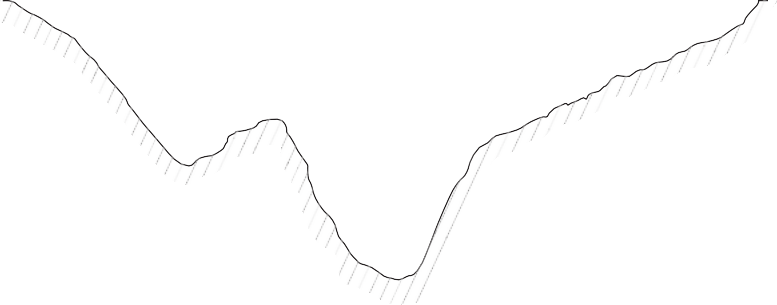A B C D E F G
>
> H I J K L M 0.2*D*
>
> **Figure P1--25** Divided stream section.
>
> 0.6*D*
>
> 0.8*D*
>
> 0.6*D*
>
> *n*
>
> Σ *vi Di* Δ*Wi*
>
> *i*=1

26. Assume that stations B through L in Problem 1--25 have all become
    0.2 ft deeper. In addition, a tributary has joined the stream and
    added approximately 600 cfs to the flow in the channel. Calculate
    the new discharge amounts for each station by altering the depths
    and adding the tributary's contribution across the channel in
    proportion to the modified discharge distribution. As- sume velocity
    distribution remains unchanged.

27. The incremental rainfall data in the table were recorded at a
    > rainfall gage on a small urban parking lot of 1 acre. Be careful
    > to use a 0.5-hr time step and record intensity in cm/hr.

    a.  Plot the rainfall hyetograph.

    b.  Determine the total storm rainfall depth (inches).

    c.  If 100% of the rainfall occurs as runoff and the time base of a
        > triangular hydrograph (flow rate vs. time) is 3 hr, find the
        > peak flow of the hydro- graph in cfs. Be careful with units.

> *Hint:* First find the volume of rainfall, then equate it to the area
> under the hydrograph.

+-------------------------------+--------------------------------------+
| > Time                        | > Rainfall                           |
+===============================+======================================+
| > (hr)                        | > \(cm\)                             |
+-------------------------------+--------------------------------------+
| > 0                           | > 0                                  |
+-------------------------------+--------------------------------------+
| > 0.5                         | > 5.0                                |
+-------------------------------+--------------------------------------+
| > 1.0                         | > 5.5                                |
+-------------------------------+--------------------------------------+
| > 1.5                         | > 10.0                               |
+-------------------------------+--------------------------------------+
| > 2.0                         | > 12.0                               |
+-------------------------------+--------------------------------------+
| > 2.5                         | > 10.0                               |
+-------------------------------+--------------------------------------+
| > 3.0                         | > 4.5                                |
+-------------------------------+--------------------------------------+
| > 3.5                         | > 3.0                                |
+-------------------------------+--------------------------------------+
| > 4.0                         | > 2.5                                |
+-------------------------------+--------------------------------------+
| > 4.5                         | > 0                                  |
+-------------------------------+--------------------------------------+

28. For the rainfall record provided below, plot cumulative rainfall
    > (*P*) and gross rainfall hyetograph (in./hr) using Δ*t* = 30 min =
    > 0.5 hr.

<table>
<colgroup>
<col style="width: 13%" />
<col style="width: 8%" />
<col style="width: 7%" />
<col style="width: 7%" />
<col style="width: 7%" />
<col style="width: 7%" />
<col style="width: 7%" />
<col style="width: 7%" />
<col style="width: 7%" />
<col style="width: 7%" />
<col style="width: 7%" />
<col style="width: 5%" />
<col style="width: 5%" />
</colgroup>
<thead>
<tr class="header">
<th><blockquote>
<p><strong>Time (min)</strong></p>
</blockquote></th>
<th><blockquote>
<p>0</p>
</blockquote></th>
<th>15</th>
<th><blockquote>
<p>30</p>
</blockquote></th>
<th>45</th>
<th><blockquote>
<p>60</p>
</blockquote></th>
<th><blockquote>
<p>75</p>
</blockquote></th>
<th>90</th>
<th><blockquote>
<p>105</p>
</blockquote></th>
<th><blockquote>
<p>120</p>
</blockquote></th>
<th><blockquote>
<p>135</p>
</blockquote></th>
<th></th>
<th></th>
</tr>
</thead>
<tbody>
<tr class="odd">
<td><strong><em>P</em> (in.)</strong></td>
<td><blockquote>
<p>0</p>
</blockquote></td>
<td>0.2</td>
<td><blockquote>
<p>0.6</p>
</blockquote></td>
<td>1.1</td>
<td><blockquote>
<p>1.5</p>
</blockquote></td>
<td><blockquote>
<p>1.8</p>
</blockquote></td>
<td>2.0</td>
<td><blockquote>
<p>2.2</p>
</blockquote></td>
<td><blockquote>
<p>2.3</p>
</blockquote></td>
<td><blockquote>
<p>2.5</p>
</blockquote></td>
<td></td>
<td></td>
</tr>
<tr class="even">
<td><blockquote>
<p><strong>Time (hr)</strong></p>
</blockquote></td>
<td><blockquote>
<p>1</p>
</blockquote></td>
<td><blockquote>
<p>2</p>
</blockquote></td>
<td><blockquote>
<p>3</p>
</blockquote></td>
<td>4</td>
<td><blockquote>
<p>5</p>
</blockquote></td>
<td><blockquote>
<p>6</p>
</blockquote></td>
<td>7</td>
<td><blockquote>
<p>8</p>
</blockquote></td>
<td><blockquote>
<p>9</p>
</blockquote></td>
<td><blockquote>
<p>10</p>
</blockquote></td>
<td><blockquote>
<p>11</p>
</blockquote></td>
<td><blockquote>
<p>12</p>
</blockquote></td>
</tr>
<tr class="odd">
<td><strong>(cfs)</strong></td>
<td><blockquote>
<p>100</p>
</blockquote></td>
<td>200</td>
<td><blockquote>
<p>500</p>
</blockquote></td>
<td>800</td>
<td><blockquote>
<p>700</p>
</blockquote></td>
<td><blockquote>
<p>550</p>
</blockquote></td>
<td>450</td>
<td><blockquote>
<p>250</p>
</blockquote></td>
<td><blockquote>
<p>150</p>
</blockquote></td>
<td><blockquote>
<p>100</p>
</blockquote></td>
<td><blockquote>
<p>75</p>
</blockquote></td>
<td>0</td>
</tr>
</tbody>
</table>

> {width="0.10312445319335083in"
> height="8.593722659667541e-2in"}*Problem 1.29 utilizes the rainfall
> from Problem 1.28.*

29. If the gross rainfall of Problem 1.28 falls over a watershed with
    > area of 3200 acres, find the volume that was left to infiltration
    > (assume evaporation can be neglected) based on the volume under
    > the hydrograph.

30. Rework Example 1 from the case study on Jones Creek for Subbasin C
    > (see PowerPoint on textbook website). The baseflow for Subbasin C
    > is 200 cfs. In addition, the initial infiltration for the first
    > hour is 1 in and a constant infiltra- tion of 0.5 in thereafter.
    > The storm hydrograph and rainfall hyetograph for Subbasin C are
    > given in Figures P1--30a and P1--30b.

> **Figure P1--30a**
>
> **Figure P1--30b**
>
> A[h]{.smallcaps}rens, C. D., 2000, *Meteorology Today: An Introduction
> to Weather, Climate, and the Environment,* 6th ed., Brooks/Cole,
> Pacific Grove, CA.
>
> Ant[h]{.smallcaps}es, R. A., 1997, *Meteorology,* 7th ed., Prentice
> Hall, Upper Saddle River, NJ.
>
> Bed[i]{.smallcaps}ent, P. B., H. R[i]{.smallcaps}fa[i]{.smallcaps},
> and C. Newell, 1999, *Ground Water Contamination: Trans- port and
> Remediation,* 2nd ed., Prentice Hall PTR, Upper Saddle River, NJ.
>
> Bed[i]{.smallcaps}ent, P. B., B. C.
> Ho[b]{.smallcaps}l[i]{.smallcaps}t, D. C. Gladwell, and B. E.
> V[i]{.smallcaps}e[u]{.smallcaps}x, 2000, "NEXRAD Ra- dar for Flood
> Prediction in Houston," *ASCE J. Hydrologic Eng., 5*(3), pp. 269--277.
>
> Bed[i]{.smallcaps}ent, P. B., A. Holder, J. A.
> Benav[i]{.smallcaps}des, and B. E. V[i]{.smallcaps}e[u]{.smallcaps}x,
> 2003, "Radar-Based Flood Warning System Applied to Tropical Storm
> Allison," *ASCE J. Hydrologic Eng.*, *8*(6), pp. 308--318.
>
> Bed[i]{.smallcaps}ent, P. B., A. Holder, J. F.
> T[h]{.smallcaps}om[p]{.smallcaps}son, and Z. Fan[g]{.smallcaps} ,
> 2007, "Modeling of Storm- Water Response under Large Tailwater
> Conditions: Case Study for the Texas Medical Center," *ASCE J.
> Hydrologic Eng.*, *12*(3), pp. 256--266.
>
> Betson, R. P., 1964, "What Is Watershed Runoff?" *J. Geophys. Res.,
> 69*, pp. 1541--1551. B[i]{.smallcaps}swas, A. K., 1972, *History of
> Hydrology,* North Holland Publishing Co., Amsterdam.
>
> **REFERENCES**
>
> C[h]{.smallcaps}a[p]{.smallcaps}ra, S. C., 1997, *Surface
> Water-Quality Modeling,* McGraw-Hill, New York.
> C[h]{.smallcaps}ar[b]{.smallcaps}enea[u]{.smallcaps}, R. J., 2000,
> *Groundwater Hydraulics and Pollutant Transport,* Prentice
>
> Hall, Upper Saddle River, NJ.
>
> C[h]{.smallcaps}ez[y]{.smallcaps}, 1769, referred to in
> Ro[u]{.smallcaps}se, H., and S. Ince, 1957, *History of Hydraulics,*
> Iowa Institute of Hydraulic Research, State University of Iowa.
>
> C[h]{.smallcaps}ow, V. T. (Ed.), 1964, *Handbook of Applied
> Hydrology,* McGraw-Hill, New York. Cr[u]{.smallcaps}m, T. D., and R.
> L. Al[b]{.smallcaps}ert[y]{.smallcaps}, 1993, "The WSR-88D and the
> WSR-88D Opera-
>
> tional Support Facility," *Bull. Am. Meteorological Soc., 27*(9), pp.
> 1669--1687.
>
> D[i]{.smallcaps}n[g]{.smallcaps}man, S. L., 2002, *Physical
> Hydrology*, 2nd ed., Prentice Hall, Upper Saddle River, NJ.
>
> Fan[g]{.smallcaps}, Z., Bed[i]{.smallcaps}ent, P. B., and
> B[u]{.smallcaps}zc[u]{.smallcaps}-G[u]{.smallcaps}ven, B. 2011.
> "Long-Term Performance of a Flood Alert System and Upgrade to FAS3: A
> Houston Texas Case Study". ASCE *J. Hydrologic Engi., 16*(10), pp.
> 818--828. .
>
> Fetter, C. W., 1999, *Contaminant Hydrogeology,* 2nd ed., Prentice
> Hall, Upper Saddle River, NJ.
>
> F[u]{.smallcaps}lton, R. A., J. P.
> Bre[i]{.smallcaps}den[b]{.smallcaps}ac[h]{.smallcaps}, D. Seo, and D.
> A. M[i]{.smallcaps}ller, 1998, "The WSR-88D Rainfall Algorithm," *Wea.
> Forecasting, 13*, pp. 377--395.
>
> Green, W. H., and G. A. Am[p]{.smallcaps}t, 1911, "Studies of Soil
> Physics, 1: The Flow of Air and Water Through Soils," *J. Agric. Sci.,
> 4*(1), pp. 1--24.
>
> G[u]{.smallcaps}m[b]{.smallcaps}el, E. J., 1958, *Statistics of
> Extremes,* Columbia University Press, New York. Horton, R. E., 1933,
> "The Role of Infiltration in the Hydrologic Cycle," *Trans. Am.*
>
> *Geophys. Union, 14*, pp. 446--460.
>
> Horton, R. E., 1940, "An Approach Towards a Physical Interpretation of
> Infiltration Capacity," *Proc. Soil Sci. Soc. Am., 5*, pp. 399--417.
>
> Horton, R. E., 1941, "Sheet Erosion, Present and Past," *Trans. Am.
> Geophys. Union, 22*, pp. 299--305.
>
> H[ub]{.smallcaps}er, W. C., 1993, "Contaminant Transport in Surface
> Water," Chapter 14 in
>
> *Handbook of Hydrology,* Maidment, D. R. (Ed.), McGraw-Hill, New York.
> Klaz[u]{.smallcaps}ra, G. E., and D. A. Im[y]{.smallcaps}, 1993, "A
> Description of the Initial Set of Analysis
>
> Products Available from the NEXRAD WSR-88D System," *Bull. Am.
> Meteoro-*
>
> *logical Soc., 74*(7), pp. 1293--1311.
>
> K[ui]{.smallcaps}c[h]{.smallcaps}l[i]{.smallcaps}n[g]{.smallcaps}, E.,
> 1889, "The Relation Between the Rainfall and the Discharge of Sewers
> in Populous Districts," *ASCE Trans*.*, 20*, pp. 1--56.
>
> L[i]{.smallcaps}st, R. J., 1966, *Smithsonian Meteorological Tables,*
> 6th ed., Smithsonian Institution, Washington, D.C.
>
> Llo[y]{.smallcaps}d-Dav[i]{.smallcaps}es, D. E., 1906, "The
> Elimination of Storm Water from Sewerage Sys- tems," *Inst. Civ. Eng.
> Proc., 164*, pp. 41--67.
>
> Ma[i]{.smallcaps}dment, D. R., 1993, *Handbook of Hydrology,*
> McGraw-Hill, New York. Mann[i]{.smallcaps}n[g]{.smallcaps}, R., 1889,
> "On the Flow of Water in Open Channels and Pipes," *Trans.*
>
> *Inst. Civil Engrs., Ireland*, *20*, pp. 161--207, 1891, Dublin,
> Ireland; *Supplement*, *24*,
>
> pp. 179--207, 1895. (The formula was first presented on Dec. 4, 1889,
> at a meeting of the Institution.)
>
> Mart[i]{.smallcaps}n, J. L., and S. C.
> McC[u]{.smallcaps}tc[h]{.smallcaps}eon, 1999, *Hydrodynamics and
> Transport for Water Quality Modeling*, Lewis Publishers, Boca Raton,
> FL.
>
> Ma[y]{.smallcaps}s, L. M., 2001, *Water Resources Engineering,* John
> Wiley & Sons, New York. McC[u]{.smallcaps}en, R. H., 2005, *Hydrologic
> Analysis and Design,* 2nd ed., Prentice Hall, Up-
>
> per Saddle River, NJ.
>
> Me[i]{.smallcaps}n, R. G., and C. L. Larson, 1973, "Modeling
> Infiltration During a Steady Rain,"
>
> *Water Resour. Res.*, *9*(2), pp. 384--394.
>
> M[u]{.smallcaps}lvane[y]{.smallcaps}, T. J., 1851, "On the Use of
> Self-Registering Rain and Flood Gauges,"
>
> *Inst. Civ. Eng. (Ireland) Trans., 4*, pp. 1--8.
>
> National Weather Service, 1972, *National Weather Service River
> Forecast System Forecast Procedures*, NOAA Tech. Memo. NWS HYDRO 14,
> Silver Spring, MD.
>
> National Wildlife Federation, 1998, *Higher Ground,* Washington, D.C.
>
> Penman, H. L., 1948, "Natural Evaporation from Open Water, Bare Soil,
> and Grass,"
>
> *Proc. R. Soc. London*, ser. A, *27*, pp. 779--787.
>
> S[h]{.smallcaps}erman, L. K., 1932, "Streamflow from Rainfall by the
> Unit-Graph Method," *Eng. News-Rec., 108*, pp. 501--505.
>
> Sierra/Misco, Inc., 1986, "Flood Early Warning System for Harris
> County, Texas," Berkeley, CA.
>
> S[i]{.smallcaps}n[gh]{.smallcaps}, V. P., and D. K. Frevert (Eds.),
> 2006, *Watershed Models*, CRC Press, Boca Raton, FL.
>
> Sloto, R. A., and M. Y. Cro[u]{.smallcaps}se, 1996, "HYSEP: A Computer
> Program for Stream- flow Hydrograph Separation and Analysis," USGS
> Water Resources Investigations Report 96-4040, Denver, CO.
> (<http://water.usgs.gov/software/code/surface_water/>
> hysep/doc/hysep.pdf)
>
> Sm[i]{.smallcaps}t[h]{.smallcaps}, J. A., D. J. Seo, M. L.
> Baec[k]{.smallcaps}, and M. D. H[u]{.smallcaps}dlow, 1996, "An
> Intercom- parison Study of NEXRAD Precipitation Estimates," *Water
> Resour. Res., 32*(7), pp. 2035--2045.
>
> Soil Conservation Service, 1964, *SCS National Engineering Handbook,
> Section 4: Hydrology,* updated 1972, U.S. Department of Agriculture,
> Washington, D.C.
>
> Soil Conservation Service, 1986, *Urban Hydrology for Small
> Watersheds,* 2nd ed., Tech. Release No. 55 (NTIS PB87-101580), U.S.
> Department of Agriculture, Washington, D.C.
>
> T[h]{.smallcaps}e[i]{.smallcaps}s, C. V., 1935, "The Relation Between
> the Lowering of the Piezometric Surface and the Rate and Duration of a
> Well Using Ground-Water Recharge," *Trans. Am. Geophys. Union, 16*,
> pp. 519--524.
>
> V[i]{.smallcaps}e[u]{.smallcaps}x, B. E., and P. B.
> Bed[i]{.smallcaps}ent, 1998, "Estimation of Rainfall for Flood
> Prediction from WSR-88D Reflectivity: A Case Study, 17--18 October
> 1994." *Wea. Forecast- ing, 13*(2), pp. 401--415.
>
> V[i]{.smallcaps}e[u]{.smallcaps}x, B. E., 2004, *Distributed
> Hydrologic Modeling Using GIS*, 2nd ed., Springer Verlag.
>
> Wallace, J. M., and P. V. Ho[bb]{.smallcaps}s, 1977, *Atmosphere
> Science: An Introductory Survey*, Academic Press, New York.
>
> Chapter 2

## Hydrologic Analysis

{width="4.172551399825021in"
height="2.7533333333333334in"}

> Typical flood scene of T.S. Allison in Houston, Texas. (Photo courtesy
> of Dan Wallach.)

**2.1**

> **WATERSHED CONCEPTS**
>
> **88**
>
> The **watershed** is the basic unit used in most hydrologic
> calculations relating to the water balance or computation of
> rainfall--runoff and other losses. The **watershed boundary** defines
> a contiguous area, such that the net rainfall or runoff over that area
> will contribute water to the outlet (Fig. 1--19(b)). Rain that falls
> outside the watershed boundary will generate runoff to some other
> outlet. A watershed boundary can be drawn from a topographic map by
> defining the ridgeline to the outlet, and runoff will generally travel
> from higher to lower elevation in a direction perpendicular to the
> elevation con- tours (see Fig. 1--19(b)).
>
> Hydrologists are most often concerned with the amount of surface
> runoff generated within a watershed that becomes streamflow for a
> given input rainfall pattern. The main watershed characteristics that
> affect hydro- logic response include the size, shape, slope, soil
> type, and storage within a watershed area. These issues are described
> in some detail in this chapter and form the basis for more detailed
> analyses in later chapters. The **hydrograph**, as presented earlier,
> is a plot of flow rate vs. time for a given location within a stream
> and represents the main hydrologic response function. Several
>
> example watersheds were depicted in Figure 1--19(a), and a typical
> water- shed with subareas depicted is shown in Figure 1--22.
>
> Watersheds are often characterized by one main channel and by tribu-
> taries that drain into a main channel at one or more confluence
> points. The subarea of a tributary can be delineated by starting at
> the confluence and drawing a boundary along the subarea ridgeline.
> Larger watersheds can have many subareas that contribute runoff to a
> single outlet. An important water- shed parameter is drainage area
> *A*, since it reflects the volume of water that can be generated from
> rainfall. Watershed length measures are depicted for subarea E in
> Figure 1--22. Channel length *L* is usually measured along the main
> channel from the outlet to the basin divide. Length to centroid *L~c~*
> is measured along the main channel to a point nearest the centroid
> (center of mass) of the watershed. These two length parameters help
> determine water- shed shape and are used extensively in unit
> hydrograph calculations dis- cussed later (Section 2.3).
>
> Another important physiographic parameter is **channel slope *S ***or
> **watershed slope *S*~0~**, which reflects the rate of change of
> elevation with dis- tance along the main channel or within an overland
> flow area. Both slope measures are used in performing unit hydrograph,
> flood routing, and time- of-travel calculations. Slope estimates are
> used in several of the unit hydro- graph methods described later in
> this chapter. Field surveys or topographic maps, either paper or
> electronic, can be used to measure elevation changes so that watershed
> or channel slopes can be determined.
>
> **Soil types** in a watershed are critical, as they determine
> infiltration rates that can occur for the area. Soil properties can
> vary significantly across a watershed area, and the USDA Natural
> Resources Conservation Service (NRCS) is responsible for developing
> soils maps to provide information on soil type, soil texture, and
> hydrologic soil groups. The three main soil classes are characterized
> by particle diameter *d* in mm, for sand, silt, and clay. Typical
> values are listed in Table 8--2 in Chapter 8. Soil texture is
> important in determining water-holding capacity and infiltration
> capacity of a soil layer. Thus, sands generally infiltrate water at a
> greater rate than do silts or clays. Of course, there can be mixtures
> of sizes, which can complicate the overall soil structure. The NRCS
> classified thousands of soils on the basis of runoff potential and
> grouped them into four hydrologic soil groups, A, B, C, and D. Type A
> infiltrates at the highest rate, D at the lowest. The relationship of
> soil type to infiltration capacity is presented in detail in Sec-
> tions 2.8 and 2.9.
>
> **Land use and land cover**, in the form of parking lots and urban
> develop- ment, can have profound effects on watershed response. In
> fact, many of the methods described later were developed to address
> urban development impacts in a watershed. For example, the **Rational
> Method** \[see Eq. (1--13)\] uses a coefficient *C* to reflect the
> runoff potential of a watershed. The value of *C* for commercial
> (0.75) is greater than residential (0.3), which is greater than
> forested (0.15), indicating that more intense development generates
>
> greater rates of runoff for the same rainfall (see Sections 6.4 and
> 9.3). Urban development is also characterized by the percent
> imperviousness, or paved area, which can range from 50% to 90% for
> commercial compared to 20% to 40% for residential areas (see Table
> 2--1). Several of the unit hydrograph methods (Section 2.3) contain
> parameters that relate to urban land use effects.
>
> **Table 2--1** Runoff Curve Numbers for Selected Agricultural,
> Suburban, and Urban Land Use (Antecedent Moisture Condition II; *I~a~*
> = 0.2*S*)

+-------------------------------------------------------+---+---+---+---+
| > **Land Use Description**                            | > |   |   |   |
|                                                       |   |   |   |   |
|                                                       | * |   |   |   |
|                                                       | * |   |   |   |
|                                                       | H |   |   |   |
|                                                       | y |   |   |   |
|                                                       | d |   |   |   |
|                                                       | r |   |   |   |
|                                                       | o |   |   |   |
|                                                       | l |   |   |   |
|                                                       | o |   |   |   |
|                                                       | g |   |   |   |
|                                                       | i |   |   |   |
|                                                       | c |   |   |   |
|                                                       | > |   |   |   |
|                                                       |   |   |   |   |
|                                                       | S |   |   |   |
|                                                       | o |   |   |   |
|                                                       | i |   |   |   |
|                                                       | l |   |   |   |
|                                                       | > |   |   |   |
|                                                       |   |   |   |   |
|                                                       | G |   |   |   |
|                                                       | r |   |   |   |
|                                                       | o |   |   |   |
|                                                       | u |   |   |   |
|                                                       | p |   |   |   |
|                                                       | * |   |   |   |
|                                                       | * |   |   |   |
+=======================================================+===+===+===+===+
|                                                       | > | > | > | > |
|                                                       |   |   |   |   |
|                                                       | * | * | * | * |
|                                                       | * | * | * | * |
|                                                       | A | B | C | D |
|                                                       | * | * | * | * |
|                                                       | * | * | * | * |
+-------------------------------------------------------+---+---+---+---+
| > Cultivated land^1^                                  |   |   |   |   |
+-------------------------------------------------------+---+---+---+---+
| > Without conservation treatment                      | > | > | > | > |
|                                                       |   |   |   |   |
|                                                       | 7 | 8 | 8 | 9 |
|                                                       | 2 | 1 | 8 | 1 |
+-------------------------------------------------------+---+---+---+---+
| > With conservation treatment                         | > | > | > | > |
|                                                       |   |   |   |   |
|                                                       | 6 | 7 | 7 | 8 |
|                                                       | 2 | 1 | 8 | 1 |
+-------------------------------------------------------+---+---+---+---+
| > Pasture or range land                               |   |   |   |   |
+-------------------------------------------------------+---+---+---+---+
| > Poor condition                                      | > | > | > | > |
|                                                       |   |   |   |   |
|                                                       | 6 | 7 | 8 | 8 |
|                                                       | 8 | 9 | 6 | 9 |
+-------------------------------------------------------+---+---+---+---+
| > Good condition                                      | > | > | > | > |
|                                                       |   |   |   |   |
|                                                       | 3 | 6 | 7 | 8 |
|                                                       | 9 | 1 | 4 | 0 |
+-------------------------------------------------------+---+---+---+---+
| > Meadow                                              |   |   |   |   |
+-------------------------------------------------------+---+---+---+---+
| > Good condition                                      | > | > | > | > |
|                                                       |   |   |   |   |
|                                                       | 3 | 5 | 7 | 7 |
|                                                       | 0 | 8 | 1 | 8 |
+-------------------------------------------------------+---+---+---+---+
| > Wood or forest land                                 |   |   |   |   |
+-------------------------------------------------------+---+---+---+---+
| > Thin stand, poor cover, no mulch                    | > | > | > | > |
|                                                       |   |   |   |   |
|                                                       | 4 | 6 | 7 | 8 |
|                                                       | 5 | 6 | 7 | 3 |
+-------------------------------------------------------+---+---+---+---+
| > Good cover^2^                                       | > | > | > | > |
|                                                       |   |   |   |   |
|                                                       | 2 | 5 | 7 | 7 |
|                                                       | 5 | 5 | 0 | 7 |
+-------------------------------------------------------+---+---+---+---+
| > Open spaces, lawns, parks, golf courses,            |   |   |   |   |
| > cemeteries, etc.                                    |   |   |   |   |
+-------------------------------------------------------+---+---+---+---+
| > Good condition: grass cover on 75% or more of the   | > | > | > | > |
| > area                                                |   |   |   |   |
|                                                       | 3 | 6 | 7 | 8 |
|                                                       | 9 | 1 | 4 | 0 |
+-------------------------------------------------------+---+---+---+---+
| > Fair condition: grass cover on 50%--75% of the area | > | > | > | > |
|                                                       |   |   |   |   |
|                                                       | 4 | 6 | 7 | 8 |
|                                                       | 9 | 9 | 9 | 4 |
+-------------------------------------------------------+---+---+---+---+
| > Commercial and business areas (85% impervious)      | > | > | > | > |
|                                                       |   |   |   |   |
|                                                       | 8 | 9 | 9 | 9 |
|                                                       | 9 | 2 | 4 | 5 |
+-------------------------------------------------------+---+---+---+---+
| > Industrial districts (72% impervious)               | > | > | > | > |
|                                                       |   |   |   |   |
|                                                       | 8 | 8 | 9 | 9 |
|                                                       | 1 | 8 | 1 | 3 |
+-------------------------------------------------------+---+---+---+---+
| > Residential^3^                                      |   |   |   |   |
+-------------------------------------------------------+---+---+---+---+
| > Average lot size Average % impervious^4^            |   |   |   |   |
+-------------------------------------------------------+---+---+---+---+
| > 1/8 ac or less 65                                   | > | > | > | > |
|                                                       |   |   |   |   |
|                                                       | 7 | 8 | 9 | 9 |
|                                                       | 7 | 5 | 0 | 2 |
+-------------------------------------------------------+---+---+---+---+
| > 1/4 ac 38                                           | > | > | > | > |
|                                                       |   |   |   |   |
|                                                       | 6 | 7 | 8 | 8 |
|                                                       | 1 | 5 | 3 | 7 |
+-------------------------------------------------------+---+---+---+---+
| > 1/3 ac 30                                           | > | > | > | > |
|                                                       |   |   |   |   |
|                                                       | 5 | 7 | 8 | 8 |
|                                                       | 7 | 2 | 1 | 6 |
+-------------------------------------------------------+---+---+---+---+
| > 1/2 ac 25                                           | > | > | > | > |
|                                                       |   |   |   |   |
|                                                       | 5 | 7 | 8 | 8 |
|                                                       | 4 | 0 | 0 | 5 |
+-------------------------------------------------------+---+---+---+---+
| > 1 ac 20                                             | > | > | > | > |
|                                                       |   |   |   |   |
|                                                       | 5 | 6 | 7 | 8 |
|                                                       | 1 | 8 | 9 | 4 |
+-------------------------------------------------------+---+---+---+---+
| > Paved parking lots, roofs, driveways, etc.^5^       | > | > | > | > |
|                                                       |   |   |   |   |
|                                                       | 9 | 9 | 9 | 9 |
|                                                       | 8 | 8 | 8 | 8 |
+-------------------------------------------------------+---+---+---+---+
| > Streets and roads                                   |   |   |   |   |
+-------------------------------------------------------+---+---+---+---+
| > Paved with curbs and storm sewers^5^                | > | > | > | > |
|                                                       |   |   |   |   |
|                                                       | 9 | 9 | 9 | 9 |
|                                                       | 8 | 8 | 8 | 8 |
+-------------------------------------------------------+---+---+---+---+
| > Gravel                                              | > | > | > | > |
|                                                       |   |   |   |   |
|                                                       | 7 | 8 | 8 | 9 |
|                                                       | 6 | 5 | 9 | 1 |
+-------------------------------------------------------+---+---+---+---+
| > Dirt                                                | > | > | > | > |
|                                                       |   |   |   |   |
|                                                       | 7 | 8 | 8 | 8 |
|                                                       | 2 | 2 | 7 | 9 |
+-------------------------------------------------------+---+---+---+---+

> 1For a more detailed description of agricultural land use curve
> numbers, refer to *National Engineering Handbook,* Section 4,
> "Hydrology," Chapter 9, Aug. 1972.
>
> 2Good cover is protected from grazing, and litter and brush cover
> soil.
>
> 3Curve numbers are computed assuming that the runoff from the house
> and driveway is directed toward the street with a minimum of roof
> water directed to lawns where additional infiltration could occur.
>
> 4The remaining pervious areas (lawn) are considered to be in good
> pasture condition for these curve numbers.
>
> 5In some warmer climates of the country, a curve number of 95 may be
> used.
>
> **Main channel** and **tributary characteristics** can affect
> streamflow response in a variety of ways. As presented in Chapters 4
> and 7, open-channel flow factors such as slope, cross-sectional area,
> Manning's roughness coef- ficient *n*, presence of obstructions,
> meander pattern, and channel condition can all contribute. Effects of
> channel geomorphology on flow patterns are covered in more detail in
> textbooks on geology and fluid mechanics. Flood- plain analysis and
> floodplain mapping, presented in Chapters 7, 10, and 12, are based
> largely on an understanding of the nature of channel geomorphology as
> it relates to overland flow processes, which produces runoff that must
> be moved downstream by the channel. The shape, slope, and character of
> a floodplain will determine the volume and flow rate of water that can
> be safely handled during excessive events. The picture on the textbook
> cover shows the effects of a major out of bank flooding in Houston,
> TX, during Tropical Storm Allison in 2001. Flood problems occur in a
> watershed when either too much water is generated from a rainfall
> event or the channel is inadequate or not properly maintained to
> handle excessive overland flows.
>
> Physiographic characteristics frequently used in hydrologic studies
> have been compiled for the USGS-EPA National Urban Studies Program
> (USGS, 1980) and are summarized below. Land use characteristics should
> be updated during the course of a hydrologic study to account for
> changes occurring in a watershed. Such physiographic information can
> be developed from maps describing land use, soils, topography, and
> storm drainage as well as from aerial photography. Fortunately, many
> advances in recent years in the area of geographic information systems
> (GIS), with the linkage of elec- tronic maps and databases, have
> allowed this process to be greatly improved in time requirements and
> overall accuracy, as described in Chapter 10. A selected list of
> parameters follows below:

1.  Total drainage area, in square miles

2.  Impervious area in percentage of drainage area

3.  Average basin slope determined and main conveyance slope at points
    10% and 85% along the stream from the outlet to the divide

4.  Hydraulic conductivity of the A horizon of the soil profile, in
    inches per hour

5.  Hydrologic soil group and water capacity for soils (A, B, C, or D)
    according to NRCS methodology

6.  Land use of the basins as a percentage of drainage area, including

    a.  Rural and pasture

    b.  Agricultural

    c.  Low-density residential (0.5 to 2 acres per dwelling)

    d.  Medium-density residential (3 to 8 dwellings per acre)

    e.  High-density residential (9 or more dwellings per acre)

    f.  Commercial

    g.  Industrial

    h.  Under construction (bare surface)

    i.  Idle or vacant land

    j.  Wetland

    k.  Parkland

7.  Detention storage, in ac-ft of storage, and detention storage in
    > ac-ft/ acre of basin

8.  Percent of watershed upstream from detention storage

9.  Percent of area drained by a storm sewer system

**2.2**

> **UNIT HYDROGRAPH**

**THEORY**

> Sherman (1932) originally advanced the theory of the unit hydrograph
> (UH), defined as "basin outflow resulting from 1.0 inch (1.0 mm) of
> direct runoff generated uniformly over the drainage area at a uniform
> rainfall rate during a specified period of rainfall duration." An
> important point here is that UH is composed of 1.0 inch of direct
> runoff, which is equivalent to 1.0 inch of net rainfall for a given
> duration, *D*, and therefore all losses to infiltration must be
> subtracted before computations. Several assumptions inherent in the
> unit hydrograph approach tend to limit its application for any given
> watershed (Johnstone and Cross, 1949):

1.  Rainfall excesses of equal duration are assumed to produce
    > hydrographs with equivalent time bases regardless of the intensity
    > of the rain.

2.  Direct runoff ordinates for a storm of given duration are assumed
    > directly proportional to rainfall excess volumes. Thus, twice the
    > rain- fall produces a doubling of hydrograph ordinates.

3.  The time distribution of direct runoff is assumed independent of
    > antecedent precipitation.

4.  Rainfall distribution is assumed to be the same for all storms of
    > equal duration, both spatially and temporally.

> The classic statement of unit hydrograph theory can be summarized
> briefly: The hydrologic system is linear and time invariant (Dooge,
> 1973). The linear assumption implies that complex storm hydrographs
> can be pro- duced by adding up individual unit hydrographs, adjusted
> for rainfall vol- umes and added and lagged in time. For example, a
> 2-inch rainfall in X hours will produce double the response of 1 inch
> falling in X hours over a given watershed. While the assumptions of
> linearity and time invariance are not strictly correct for every
> watershed, we adopt them as long as they are useful. Nonlinear
> examples exist in open-channel flow, laboratory runoff models, and
> actual watersheds.
>
> **Derivation of Unit Hydrographs: Gaged Watersheds**
>
> A typical storm hydrograph and rainfall hyetograph for a drainage
> basin are shown in Figure 2--1(a). The total storm hydrograph is a
> simple plot of flow or discharge (cfs or cms) vs. time. The hydrograph
> is characterized by

0

1.5

> 160
>
> 140
>
> 120
>
> 100
>
> 80
>
> 60
>
> 40
>
> 20
>
> 00 1 2 3 4 5 6 7 8 9 10 11 12 13
>
> Time (hr) (a)
>
> **Figure 2--1**
>
> Unit hydrograph de- termination. (a)
> Total storm hydrograph.

(b) Hydrograph minus baseflow, rainfall minus losses.

(c) Hydrograph adjusted to be a 2-hr unit hydrograph.

> 0.0
>
> 1.0
>
> 120
>
> 80
>
> 40
>
> 0 0 2 4 6 8 10 12
>
> *Tb*
>
> Time (hr) (b)

0

> 0.5
>
> 80
>
> 40
>
> 0 0 2 4

*Tb*

> 6 8 10 12
>
> Time (hr) (c)
>
> a rising limb, a crest segment, and a recession curve (see Fig.
> 1--26). Timing parameters such as **duration** *D* of rainfall excess
> and **time to peak**, *t~p~*, are also illustrated. The main timing
> aspects of the hydrograph can be charac- terized by the following
> parameters:

1.  **Duration** of rainfall excess (*D*): the time from start to finish
    > of rain- fall excess.

2.  **Lag time** (*t~p~*): the time from the center of mass of rainfall
    > excess to the peak of the hydrograph.

3.  **Time of rise** (*T~R~*): the time from the start of rainfall
    > excess to the peak of the hydrograph.

4.  **Time of concentration** (*t~c~*): the time for a wave (of water)
    > to propa- gate from the most distant point in the watershed to the
    > outlet. One estimate is the time from the end of net rainfall to
    > the inflection point of the hydrograph.

5.  **Time base** (*T~b~*): the total duration of the DRO hydrograph.

> If rainfall--runoff data exist, it is useful to develop unit
> hydrographs from measured rainfall events and streamflow from gages in
> a defined water- shed. The following general rules should be observed
> in developing unit hydrographs from gauged watersheds:

1.  Storms should be selected with a simple structure with relatively
    > uniform spatial and temporal distributions.

2.  Watershed sizes should generally fall between 1.0 and 100 mi^2^ in
    > modern watershed analysis.

3.  Direct runoff should range from 0.5 to 2.0 in.

4.  Duration of rainfall excess *D* should be approximately 25% to 30%
    > of lag time *t~p~*.

5.  A number of storms of similar duration should be analyzed to obtain
    > an average unit hydrograph for that duration.

6.  Step 5 should be repeated for several rainfalls of different
    > duration.

> The following are the essential steps for developing a unit hydrograph
> from a single storm hydrograph (see Fig. 2--1 and Example 2--1):

1.  Analyze the hydrograph and separate base flow.

2.  Measure the total volume of DRO under the hydrograph and con- vert
    > this to inches (mm) over the watershed.

3.  Convert total rainfall to rainfall excess through infiltration
    > methods, such that rainfall excess = DRO, and evaluate duration
    > *D* of the rainfall excess that produced the DRO hydrograph.

4.  Divide the ordinates of the DRO hydrograph (Fig. 2--1(b)) by the
    > volume in inches (mm) and plot these results as the unit
    > hydrograph

> for the basin (Fig. 2--1(c)). The time base *T~b~* is assumed constant
> for storms of equal duration and thus it will not change.

5.  Check the volume of the unit hydrograph to make sure that it is 1.0
    in. (1.0 mm), and graphically adjust ordinates as required.

> **DETERMINATION OF UNIT HYDROGRAPH**
>
> Convert the direct runoff hydrograph shown in Figure E2--1a into a
> 2-hr UH. (The UH is labeled with its duration.) Note that the duration
> of net rainfall is 2 hr. The total rainfall hyetograph is given in the
> figure, and the infiltration loss for the storm was 0.5 in./hr as a
> constant value. The base flow in the channel was 100 cfs (constant).
> What are *t~p~* and *T~b~* for the storm?
>
> **EXAMPLE 2--1**

1.5

1.0

0.5

> 1 2 3 4
>
> **Figure E2--1a** Runoff hydrograph with baseflow and rainfall.
>
> Time (hr)
>
> 1000
>
> 500
>
> 0 Base flow
>
> 0 1 2 3 4 5 6 7 8 9 10 11
>
> Time (hr)
>
> First we find the net rainfall. After subtracting the infiltration, we
> plot the rainfall excess hyetograph shown in Figure E2--1b. This
> represents

0.  in. of rainfall, or 1 in./hr for 2 hr. Then we subtract base flow
    from all the flow values. Finally, the hydrograph must be converted
    to 1 in. of direct runoff over the watershed, or 0.5 in./hr of rain
    for 2 hr. To do so,

> **SOLUTION**

1.0

0.5

> 1 2 3 4
>
> **Figure E2--1b** Resulting hyetograph.
>
> Time (hr)
>
> we take each ordinate minus its base flow and divide it by 2. This
> entire procedure is tabulated as follows.

+--------------+---------------+-------------------+-------------+---+
| > **Time     | ***Q* (cfs)** | > ***Q*-BF        | > **2-hr    | > |
| > (hr)**     |               | > (cfs)**         | > UH,**     |   |
|              |               |                   |             | * |
|              |               |                   |             | * |
|              |               |                   |             | * |
|              |               |                   |             | Q |
|              |               |                   |             | * |
|              |               |                   |             | * |
|              |               |                   |             | * |
+==============+===============+===================+=============+===+
| 0            | 100           | > 0               | > 0         |   |
+--------------+---------------+-------------------+-------------+---+
| 1            | 100           | > 0               | > 0         |   |
+--------------+---------------+-------------------+-------------+---+
| 2            | 300           | > 200             | > 100       |   |
+--------------+---------------+-------------------+-------------+---+
| 3            | 700           | > 600             | > 300       |   |
+--------------+---------------+-------------------+-------------+---+
| 4            | 1000          | > 900             | > 450       |   |
+--------------+---------------+-------------------+-------------+---+
| 5            | 800           | > 700             | > 350       |   |
+--------------+---------------+-------------------+-------------+---+
| 6            | 600           | > 500             | > 250       |   |
+--------------+---------------+-------------------+-------------+---+
| 7            | 400           | > 300             | > 150       |   |
+--------------+---------------+-------------------+-------------+---+
| 8            | 300           | > 200             | > 100       |   |
+--------------+---------------+-------------------+-------------+---+
| 9            | 200           | > 100             | > 50        |   |
+--------------+---------------+-------------------+-------------+---+
| > 10         | 100           | > 0               | > 0         |   |
+--------------+---------------+-------------------+-------------+---+
| > 11         | 100           | > 0               | > 0         |   |
+--------------+---------------+-------------------+-------------+---+

> The 2-hr UH graphs as shown in Figure E2--1c. *T~b~*, the time base of
> the storm, is 9 hr, and the time to peak *t~p~* measured from the
> center of mass of rainfall is 2 hr.
>
> **Figure E2--1c**

2.  hr UH.

0

0.5

> 500
>
> 400
>
> 300
>
> 200
>
> 100
>
> 2-hr unit hydrograph
>
> *tp*
>
> 0 1 2 3 4 5 6

*TB*

> 7 8 9 10
>
> Time (hr)
>
> Because of assumptions of linearity inherent in the UH development,
> care must be used in applying UHs under conditions that tend to
> violate linearity. If intensity variations are large over the
> long-duration storm, assumptions of linearity may be violated. Also,
> if storage effects in the water- shed are important, assumptions may
> be violated. For large watersheds (above 100--500 mi^2^), it is
> usually advisable to divide the watershed into a number of subareas so
> that individual UHs can be developed for each. Typ- ically, UH should
> not exceed areas of 5 to 10 sq mi.
>
> Amount of runoff and areal distribution of runoff can cause variations
> in the shape of the hydrograph. For large basins, it is usually best
> to develop UHs for subareas and then add and lag, or convolute, them
> together to gen- erate an overall hydrograph. Peaks of UHs derived
> from very small events are often lower than those derived from larger
> storms because of differences in interflow and channel flow times.
> Assumptions of linearity can usually be verified by comparing
> hydrographs from storms of various magnitudes. If nonlinearity does
> exist, then derived UHs should be used only for generating events of
> similar magnitude, and caution should be exercised in using unit
> hydrographs to extrapolate to extreme events. Despite these
> limitations, when unit hydrographs have been used in conjunction with
> modern flood routing methods, resulting flood prediction for small and
> large basins is quite accurate. Detailed applications of the unit
> hydrograph are presented later in this chapter and in Chapters 5 and
> 9.
>
> **S-Curve Method**
>
> A UH for a particular watershed is defined for a specific duration *D*
> of rainfall excess (RF~net~). The linear property of the UH can be
> used to gen- erate a UH of larger or smaller duration. For example,
> given a 1-hr UH for a particular watershed, a UH resulting from a 2-hr
> unit storm can be developed by adding two 1-hr UHs, the second one
> lagged by 1 hr, adding together the ordinates, and dividing the result
> by 2. In this way, the 1 in. of rainfall in 1 hr has been distributed
> uniformly over 2 hr in deriving the 2-hr UH (Fig. 2--2). This lagging
> procedure is restricted to integer multi- ples of the original
> duration. In the same way, the 3-hr UH results from adding and lagging
> three together and dividing the ordinates by 3 (see Example 2--3).
>
> The **S-curve method** allows construction of a UH of any duration.
> Assume that a UH of duration *D* is known and that we wish to generate
> a UH for the same watershed with duration *D*\'. The first step is to
> generate the S-curve hydrograph by adding a series of UHs of duration
> *D,* each lagged by time period *D*. This corresponds to the runoff
> hydrograph result- ing from a continuous rainfall excess intensity of
> 1 *D* in./hr, where *D* is measured in hours. Note that an equilibrium
> hydrograph (S-curve) results
>
> **Figure 2--2** Graphical repre-
> sentation of unit hydrograph lagging (from a 1-hr UH to a 2-hr UH).
>
> 1
>
> **Figure 2--3**
>
> Graphical representation of the S-curve hydrograph method.
>
> from this addition of many UHs, each lagged by *D* hr (see Fig. 2--3),
> and is equivalent to a continuous rainfall intensity falling until
> inflow and outflow are equal.
>
> By shifting the S-curve in time by *D*\' hr and subtracting ordinates
> between the two S-curves, the resulting hydrograph (Fig. 2--3, curve
> b) must be due to rainfall of 1 *D* in./hr that occurs for *D*\' hr.
> Thus, to con- vert curve b to a UH, we must multiply all the
> hydrograph ordinates by *D D*\' resulting in the UH of duration *D*\'.
> A homework problem explores these calculations in detail. The
> procedure is ideally suited for an Excel spread sheet.
>
> **Unit Hydrograph Convolution**
>
> The real importance of the UH approach is demonstrated in the develop-
> ment of storm hydrographs due to an actual rainfall event over a
> watershed. UH ordinates *U~j~* are multiplied by rainfall excess
> *P~n~* and added and lagged in a sequence to produce a resulting storm
> hydrograph, which ideally can be done using available Excel
> spreadsheets. Hydrograph convolution, the procedure of deriving a
> storm hydrograph from a multiperiod rainfall excess, is illustrated in
> Example 2--2. For actual watersheds, these calcula- tions are almost
> always done in a hydrologic model such as HEC-HMS (see Chapter 5).
>
> Each unit hydrograph is added at the time corresponding to the rain-
> fall spike that produced a response. Base flow can be added to produce
> a
>
> realistic storm hydrograph if base flow values are available for the
> water- shed under study. Care should be taken in this calculation to
> ensure that the time increments of rainfall excess correspond exactly
> to the duration of the UH. For example, 1-hr time increments should be
> used with the 1-hr UH. The governing equation for the storm hydrograph
> in discrete form is called the **convolution equation**:

*n*

> *Q~n~* = a *P~i~U~n~*~-*i*+1~, (2--1)
>
> *i* = 1
>
> or
>
> *Q~n~* = *P~n~U*~1~ + *P~n~*~-1~*U*~2~ + *P~n~*~-2~*U*~3~ + g +
> *P*~1~*U~j~*,
>
> where *Q~n~* is the storm hydrograph ordinate, *P~i~* is rainfall
> excess, and *U~j~* (*j* = *n* - *i* + 1) is the unit hydrograph
> ordinate. Periods of no rainfall can also be included, as shown in
> Example 2--2.
>
> **STORM HYDROGRAPH FROM THE UNIT HYDROGRAPH**
>
> Given the rainfall excess hyetograph and the 1-hr UH below, derive the
> storm hydrograph for the watershed using hydrograph convolution (add
> and lag). Compute the resulting storm hydrograph and assume no losses
> to infiltration or evapotranspiration.
>
> **EXAMPLE 2--2**
>
> Equation (2--1) states
>
> *Q~n~* = *P~n~U*~1~ + *P~n~*~-1~*U*~2~ + *P~n~*~-2~*U*~3~ + g +
> *P*~1~*U~j~*.
>
> Here net rainfall is provided,
>
> *P~n~* = \[0.5, 1.0, 1.5, 0.0, 0.5\] in.,
>
> from the rainfall hyetograph. Using intervals of 1 hr, we have unit
> hydro- graph ordinates
>
> *U~n~* = \[0, 100, 320, 450, 370, 250, 160, 90, 40, 0\] cfs
>
> from the unit hydrograph. By Eq. (2--1),
>
> *Q*~0~ = (0.5)(0) = 0,
>
> *Q*~1~ = (1.0)(0) + (0.5)(100) = 50 cfs,
>
> *Q*~2~ = (1.5)(0) + (1.0)(100) + (0.5)(320) = 260 cfs, . . .
>
> The value derived from these calculations can be tabulated as in Table
> E2--2. *Q~n~* is equal to the sum across the row for time *n.* The
> resulting storm hydrograph, *Q~n~*, is shown in Table E2--2.
> Spreadsheets are available on the textbook website and Appendix E and
> should be used to solve many
>
> of the homework problems in Chapter 2.
>
> **SOLUTION**

+-----------+--------+--------+--------+--------+--------+--------+
| > **Time  | ***P   | ***P   | ***P   | > ***P | ***P   | > ***Q |
| > (hr)**  | *~1~*U | *~2~*U | *~3~*U | *~4~*U | *~5~*U | ~n~*** |
|           | ~n~*** | ~n~*** | ~n~*** | ~n~*** | ~n~*** |        |
+===========+========+========+========+========+========+========+
| > 0       | 0      |        |        |        |        | **0**  |
+-----------+--------+--------+--------+--------+--------+--------+
| > 1       | 50     | 0      |        |        |        | **50** |
+-----------+--------+--------+--------+--------+--------+--------+
| > 2       | 160    | 100    | 0      |        |        | *      |
|           |        |        |        |        |        | *260** |
+-----------+--------+--------+--------+--------+--------+--------+
| > 3       | 225    | 320    | 150    | > 0    |        | *      |
|           |        |        |        |        |        | *695** |
+-----------+--------+--------+--------+--------+--------+--------+
| > 4       | 185    | 450    | 480    | > 0    | 0      | **     |
|           |        |        |        |        |        | 1115** |
+-----------+--------+--------+--------+--------+--------+--------+
| > 5       | 125    | 370    | 675    | > 0    | 50     | **     |
|           |        |        |        |        |        | 1220** |
+-----------+--------+--------+--------+--------+--------+--------+
| > 6       | 80     | 250    | 555    | > 0    | 160    | **     |
|           |        |        |        |        |        | 1045** |
+-----------+--------+--------+--------+--------+--------+--------+
| > 7       | 45     | 160    | 375    | > 0    | 225    | *      |
|           |        |        |        |        |        | *805** |
+-----------+--------+--------+--------+--------+--------+--------+
| > 8       | 20     | 90     | 240    | > 0    | 185    | *      |
|           |        |        |        |        |        | *535** |
+-----------+--------+--------+--------+--------+--------+--------+
| > 9       | 0      | 40     | 135    | > 0    | 125    | *      |
|           |        |        |        |        |        | *300** |
+-----------+--------+--------+--------+--------+--------+--------+
| > 10      |        | 0      | 60     | > 0    | 80     | *      |
|           |        |        |        |        |        | *140** |
+-----------+--------+--------+--------+--------+--------+--------+
| > 11      |        |        | 0      | > 0    | 45     | **45** |
+-----------+--------+--------+--------+--------+--------+--------+
| > 12      |        |        |        | > 0    | 20     | **20** |
+-----------+--------+--------+--------+--------+--------+--------+
| > 13      |        |        |        |        | 0      | **0**  |
+-----------+--------+--------+--------+--------+--------+--------+

> The reverse procedure using matrix methods allows us to determine a UH
> from a direct storm hydrograph produced by a multiperiod rainfall
> excess. For a four-period rainfall (Fig. 2--4), the following
> equations result:
>
> *Q*~1~ = *P*~1~*U*~1~,
>
> *Q*~2~ = *P*~2~*U*~1~ + *P*~1~*U*~2~,
>
> *Q*~3~ = *P*~3~*U*~1~ + *P*~2~*U*~2~ + *P*~1~*U*~3~,
>
> *Q*~4~ = *P*~4~*U*~1~ + *P*~3~*U*~2~ + *P*~2~*U*~3~ + *P*~1~*U*~4~,
>
> *Q*~5~ = *P*~4~*U*~2~ + *P*~3~*U*~3~ + *P*~2~*U*~4~ + *P*~1~*U*~5~,
> (2--2)
>
> *Q*~6~ = *P*~4~*U*~3~ + *P*~3~*U*~4~ + *P*~2~*U*~5~ + *P*~1~*U*~6~,
>
> *Q*~7~ = *P*~4~*U*~4~ + *P*~3~*U*~5~ + *P*~2~*U*~6~ + *P*~1~*U*~7~,
> *Q*~8~ = *P*~4~*U*~5~ + *P*~3~*U*~6~ + *P*~2~*U*~7~,
>
> *Q*~9~ = *P*~4~*U*~6~ + *P*~3~*U*~7~, *Q*~10~ = *P*~4~*U*~7~.
>
> The relationship between the number of storm hydrograph periods *n*,
> the UH ordinates *j,* and the rainfall excess periods *i* is
>
> *n* = *j* + *i* - 1.
>
> The general equation \[Eq. (2--2)\] can be expressed in a more
> compressed form as
>
> \[*Q*\] = \[*P*\]\[*U*\], (2--3)
>
> where \[*P*\] is a matrix that can be solved for \[*U*\]. Such a
> solution requires the inverse matrix \[*P*\]^-1^, which must be a
> square matrix with a nonzero

*t*

\(a\)

> **Figure 2--4** Graphical repre- sentation of a unit hydrograph for a
> multiperiod storm

0 1 2

> 3 4 5 6 7 8

*t*

> \(b\)

0 1 2

> 3 4 5 6 7 8 9 10
>
> *t*
>
> \(c\)
>
> determinant. The matrix \[*P*\] does not meet this condition, but by
> using the transpose matrix \[*P^T^*\], a square symmetrical matrix
> \[*P^T^P*\] can be gener- ated. The matrix \[*P^T^P*\] can then be
> used to obtain
>
> \[*P^T^P*\]\[*U*\] = \[*P^T^*\]\[*Q*\]. (2--4)
>
> This equation generates simultaneous normal equations for a
> least-squares solution. Equation (2--4) can be solved explicitly for
> \[*U*\] using
>
> \[*U*\] = \[*P^T^P*\]^-1^\[*P^T^*\]\[*Q*\]. (2--5)
>
> Equation (2--3) can be solved using the Gauss elimination method of
> solv- ing simultaneous equations or Excel's matrix solver tools. As
> with any nu- merical procedure, under certain conditions the error in
> the values of \[*U*\]
>
> can grow rapidly, and unrealistic or oscillating values can result,
> especially for later ordinates of the UH. Note that the decomposition
> procedure is rarely used, and it is usually better to develop UHs from
> simple storms, if possible.
>
> **EXAMPLE 2--3**
>
> **UNIT HYDROGRAPH EXAMPLE**
>
> Convert the 1-hr unit hydrograph (UH) given below to a 3-hr UH and
> find the area of the watershed.

+-------------------------------+--------------------------------------+
| > **Time (hr)**               | > **UH (1 hr)**                      |
+===============================+======================================+
| 0                             | > 0                                  |
+-------------------------------+--------------------------------------+
| 1                             | > 25                                 |
+-------------------------------+--------------------------------------+
| 2                             | > 50                                 |
+-------------------------------+--------------------------------------+
| 3                             | > 100                                |
+-------------------------------+--------------------------------------+
| 4                             | > 80                                 |
+-------------------------------+--------------------------------------+
| 5                             | > 60                                 |
+-------------------------------+--------------------------------------+
| 6                             | > 40                                 |
+-------------------------------+--------------------------------------+
| 7                             | > 20                                 |
+-------------------------------+--------------------------------------+
| 8                             | > 0                                  |
+-------------------------------+--------------------------------------+

> **SOLUTION** First, we graph the 1-hr unit hydrograph.
>
> To transform a 1-hr UH to a 3-hr UH, we must first lag the 1-hr UH
> twice, thus producing three 1-hr unit hydrographs over 3 hr.

+--------------+----------------+-------------------+-----------------+
| > **Time     | > **UH         | > **Lagged 1-hr   | > **Lagged 1-hr |
| > (hr)**     | > (1-hr)**     | > UH**            | > UH**          |
+==============+================+===================+=================+
| 0            | > 0            | 0                 | 0               |
+--------------+----------------+-------------------+-----------------+
| 1            | > 25           | 0                 | 0               |
+--------------+----------------+-------------------+-----------------+
| 2            | > 50           | 25                | 0               |
+--------------+----------------+-------------------+-----------------+
| 3            | > 100          | 50                | 25              |
+--------------+----------------+-------------------+-----------------+
| 4            | > 80           | 100               | 50              |
+--------------+----------------+-------------------+-----------------+
| 5            | > 60           | 80                | 100             |
+--------------+----------------+-------------------+-----------------+
| 6            | > 40           | 60                | 80              |
+--------------+----------------+-------------------+-----------------+
| 7            | > 20           | 40                | 60              |
+--------------+----------------+-------------------+-----------------+
| 8            | > 0            | 20                | 40              |
+--------------+----------------+-------------------+-----------------+
| 9            | > 0            | 0                 | 20              |
+--------------+----------------+-------------------+-----------------+
| > 10         | > 0            | 0                 | 0               |
+--------------+----------------+-------------------+-----------------+

> After we have lagged the UH, we must add the three unit hydro- graphs
> together and divide by 3 in our case to adjust to 1.0 in. of direct
> runoff.

+-------------------------+--------------------------------------------+
| > **Sum of all 1-hr     | > **3-hr UH \[(added 3 1-hr UH)/3\]**      |
| > UH**                  |                                            |
+=========================+============================================+
| 0                       | 0                                          |
+-------------------------+--------------------------------------------+
| 25                      | 8.3                                        |
+-------------------------+--------------------------------------------+
| 75                      | 25.0                                       |
+-------------------------+--------------------------------------------+
| 175                     | 58.3                                       |
+-------------------------+--------------------------------------------+
| 230                     | 76.7                                       |
+-------------------------+--------------------------------------------+
| 240                     | 80.0                                       |
+-------------------------+--------------------------------------------+
| 180                     | 60.0                                       |
+-------------------------+--------------------------------------------+
| 120                     | 40.0                                       |
+-------------------------+--------------------------------------------+
| 60                      | 20.0                                       |
+-------------------------+--------------------------------------------+
| 20                      | 6.7                                        |
+-------------------------+--------------------------------------------+
| 0                       | 0                                          |
+-------------------------+--------------------------------------------+

> A number of equations have been developed over the years to predict
> many of the above unit hydrograph parameters as a function of
> measurable water- shed characteristics, and several of the more
> popular approaches are pre- sented in this section. With the
> increasing use of computer models in hydrology and GIS methods, the
> synthetic methods have generally replaced the gauged-based method for
> most watersheds, especially since many water- sheds are not gaged.
>
> Methods for deriving UH for ungaged watersheds have evolved based on
> theoretical or empirical formulas relating hydrograph peak flow and
> tim- ing to watershed characteristics. These are usually referred to
> as **synthetic unit hydrographs** (UH) and offer the hydrologist or
> engineer a multitude of methods for developing a UH for a particular
> basin. Most UH methods were developed in the period from 1932 to 1970,
> and they still provide one of the most useful and accurate approaches
> for hydrologic prediction for a given rainfall event.
>
> Synthetic UHs, once developed for a watershed area, can be used with
> historical or design rainfalls (see Example 2--2) to produce storm
> hydro- graphs at the outlet of the watershed. As the watershed changes
> over time, the UH can be updated to better represent land use and
> channel alterations. Synthetic UHs developed along two main lines of
> thought; one assumed that each watershed had a unique UH related to
> specific watershed characteris- tics, and the second assumed that all
> UHs could be represented by a single
>
> **2.3**
>
> **SYNTHETIC UNIT HYDROGRAPH DEVELOPMENT**
>
> family of curves or a single equation. However, the formulas all have
> certain limiting assumptions and should be applied to new areas with
> extreme cau- tion. Some calibration to adjacent watersheds where
> streamflow gages exist should be attempted, if possible.
>
> The first line of development was based on the rational method modi-
> fied to include the travel time to the outlet for a particular
> watershed. Clark (1945) assumed that watershed response would be given
> by routing the time-- area relationship through an element of linear
> storage (see Eq. 2--23), which tends to attenuate and time-lag the
> hydrograph. The Clark unit hydrograph is contained in HEC-HMS and is
> presented in detail later in this section and in Table 5--10. The
> second approach to UH development assumed mathe- matical
> representations for the shape of the UH. A useful approach was
> advanced by the Soil Conservation Service (SCS, 1964, 1986), based on
> mea- surements from thousands of small watershed areas, which
> represented a dimensionless UH of discharge vs. time by a gamma
> function (discussed later). Since volume is fixed, only one parameter
> is required to determine the entire UH, either the *t~p~* or the peak
> flow rate, *Q~p~*.
>
> In the late 1950s, both approaches began to converge after the impor-
> tant contributions of O'Kelly (1955) and Nash (1958, 1959). O'Kelly's
> work was based on replacing the time--area curve by a UH in the shape
> of an isosceles triangle. Empirical expressions were necessary to
> transform the methods of Clark (1945) into usable UH techniques for
> actual basins. John- stone and Cross (1949) proposed one of the first
> relationships for *t~c~*, the time of concentration in hours, defined
> earlier in the chapter.
>
> *t~c~* = 5.0(*L*\> 1*S*)^0.5^, (2--6)
>
> and for **storage delay time**, *K*, in hours,
>
> *K* = 1.5 + 90(*A*\>*LR*), (2--7)
>
> where *L* is the length of the main stream in mi, *A* is the area in
> mi^2^, *S* is the slope in ft/mi, and *R* is an overland slope factor.
>
> Hydrologists have realized that a number of parameters are important
> in determining the shape and timing of the UH for a watershed. The lag
> or time to peak *t~p~* and the time of concentration *t~c~* are often
> used (Fig. 2--1(a)). The time of rise *T~R~* measured from time zero
> to the hydrograph peak is sometimes used. The time base *T~b~* of the
> hydrograph is included to define the duration of direct runoff. These
> timing parameters must be statistically or theoretically related to
> watershed characteristics in developing a syn- thetic UH.
>
> The discharge parameter most often used is the peak discharge *Q~p~*.
> A **routing parameter** *K* is sometimes included when the hydrograph
> has been routed through a linear reservoir with storage delay time
> *K*. This tends to delay and attenuate the input hydrograph. Watershed
> parameters of most concern include area *A*, main channel length *L*,
> length to watershed centroid *L~c~*, and slope of main channel *S*
> (see Section 2.1 and Fig. 1--22).
>
> **Assumptions and Modifying Factors**
>
> Most synthetic UH methods assume that the UH of a basin represents the
> integrated effect of size, slope, shape, and storage characteristics.
> As long as these factors are constant between two basins and do not
> vary with time, the unit response will be identical for the two
> basins. For two basins of the same size, if the slope of one is
> greater or if the basin shape of one is more con- centrated (if the
> length/width ratio is lower), the shape of the hydrograph will shift,
> as shown by the shift from *a* to *b* in Figure 2--5. Storage
> character- istics of the basin relate to slope, soil type, topography,
> channel resistance, and shape. If upstream reservoir storage is
> combined with downstream chan- nelization, the UH may shift to curve
> *b* due to a more rapid rise time from concrete channels and less
> infiltration loss from urban development. Finally, if an elongated
> basin were fully developed, one might expect a shift to curve *c*,
> where time of rise is much shorter and peak flow is much greater than
> in the original UH, *a*. Such a case is shown in Figure 2--6 for a
> fully developed watershed, Brays Bayou in Houston, Texas. Original
> synthetic hydrograph methods generally do not consider urbanization
> effects, but more modern empirical formulas usually account for urban
> channels, percent impervious (paved) area, or percent storm-sewered
> area.
>
> *tc tb ta t*
>
> Natural Partially developed Fully
> developed
>
> **Figure 2--5**
>
> \(a\) (b) (c)
>
> Modifying factors on unit hydrographs. (a) Natural watershed
> development, repre- sented by curve *a* in the bottom part of the
> figure. (b) Partial development, repre- sented by curve *b.* (c) Fully
> developed watershed, represented by curve *c.*
>
> **Figure 2--6**
>
> Changes in land use cause changes in the shape of the Brays Bayou UH.
>
> 10,000
>
> 5000
>
> 0 5 10 15 20
>
> Time (hr)
>
> Most of the methods for synthetic UHs relate lag time *t~p~* or time
> of rise *T~R~* of the hydrograph to measures of the length of the main
> channel and shape of the basin. Some methods also relate timing to the
> inverse of the slope of the main channel or land. Thus, the longer the
> basin and the smaller the slope, the greater the time of rise of the
> hydrograph, as expected. Fig- ure 1--19(a) (Chapter 1) shows the
> general effect of watershed shape and land use (i.e., elongated vs.
> concentrated) on UH response.
>
> A second relation is usually presented between peak flow *Q~p~* and
> area of basin, and between *Q~p~* and the inverse of the *t~p~* or
> *T~R~* of the hydrograph, thus indicating that larger areas produce
> higher *Q~p~*. From continuity, the higher the peak flow, the smaller
> *t~p~* must be to keep the volume of the unit
>
> hydrograph constant with 1.0 in. of direct runoff. This is easily seen
> by refer- ring to Figure 2--5, where curves *a*, *b*, and *c* are all
> unit hydrographs. The following sections describe a few of the more
> popular synthetic unit hydro- graph methods. Specific areas of the
> United States have developed their own empirical methods that are
> similar to the standard methods, but based on local watershed data.
>
> **Snyder's Method**
>
> Snyder (1938) was the first to develop a synthetic UH based on a study
> of watersheds in the Appalachian Highlands. In basins ranging from 10
> to 10,000 mi^2^, Snyder's relations are
>
> *t~p~* = *C~t~*(*LL~c~*)^0.3^, (2--8)
>
> where
>
> *t~p~* = basin lag (hr),
>
> *L* = length of the main stream from the outlet to the divide (mi),
>
> *L~c~* = length along the main stream to a point nearest the watershed
> centroid (mi),
>
> *C~t~* = coefficient usually ranging from 1.8 to 2.2 (*C~t~* has been
> found to vary from 0.4 in mountainous areas to 8.0 along the Gulf of
> Mexico),
>
> where
>
> *Q~p~* = 640 *C~p~A*\>*t~p~*, (2--9)
>
> *Q~p~* = peak discharge of the unit hydrograph (cfs),
>
> *A* = drainage area (mi^2^),
>
> *C~p~* = storage coefficient ranging from 0.4 to 0.8, where larger
> values of
>
> *C~p~* are associated with smaller values of *C~t~*,
>
> *T~b~* = 3 + *t~p~*\>8, (2--10)
>
> where *T~b~* is the time base of the hydrograph, in days. For small
> watersheds, Equation (2--10) should be replaced by multiplying *t~p~*
> by a value that varies from 3 to 5 as a better estimate of *T~b~*.
> Equations (2--8), (2--9), and (2--10) define points for a unit
> hydrograph produced by an excess rainfall of dura- tion *D* = *t~p~*
> 5.5. For other rainfall excess durations *D*\', an adjusted formula
> for *t~p~* becomes
>
> *t~p~*\' = *t~p~* + 0.25(*D*\' - *D*), (2--11)
>
> where *t~p~*\' is the adjusted lag time (hr) for duration *D*\' (hr).
> Once the three quantities *t~p~*, *Q~p~*, and *T~b~* are known, the UH
> can be sketched so that the area under the curve represents 1.0 in. of
> direct runoff from the watershed. Snyder's method is a popular method
> because of its simplicity. Caution should be used in applying Snyder's
> method to a new area without first deriving
>
> coefficients for gaged streams in the general vicinity of the problem
> basin. The coefficients *C~t~* and *C~p~* have been found to vary
> considerably from one region to another. Example 2--4 illustrates
> Snyder's method. Width equations at 50% and 75% of *Q~p~* are
> presented in Example 2--4 to help sketch the Snyder UH.
>
> **EXAMPLE 2--4**
>
> **SNYDER'S METHOD**
>
> Use Snyder's method to develop a UH for the area of 100 mi^2^
> described below. Sketch the approximate shape. What duration rainfall
> does this correspond to?
>
> *C~t~* = 1.8, *L* = 18 mi,
>
> *C~p~* = 0.6, *L~c~* = 10 mi
>
> **SOLUTION** The UH is sketched in Figure E2--4. Note that width
> equations for W50 and W75 are given there to help shape the UH.
>
> By Equation (2--8),
>
> **Figure E2--4** Typical Snyder unit hydrograph with
>
> By Equation (2--9),

*tp*

> *t~p~* = *C~t~*(*LL~c~*)^0.3^,
>
> *t~p~* = 1.8(18 . 10)^0.3^ hr,
>
> *t~p~* = 8.6 hr.
>
> *Q~p~* = 640(*C~p~*)(*A*)\>*t~p~*,
>
> = 640(0.6)(100)\>8.6,
>
> *Q~p~* = 4465 cfs.
>
> *W*75 = 440 (*Qp* /*A*)^---1.08^
>
> *W*50 = 770 (*Qp* /*A*)^---1.08^
>
> (Widths are distributed
>
> special relationships indicated.
>
> 4465
>
> 4000
>
> *Qp*
>
> *W*75
>
> 1/3 before *Qp* and 2/3 after.)

2000

> *W*50
>
> 0 3 6 9 12 15
>
> Area drawn to represent 1 in. of runoff over the watershed
>
> 18 21 24
>
> Time (hr)
>
> 27 30 33 36
>
> 34.4 hr
>
> **SCS Methods**
>
> The methods developed by the Soil Conservation Service (SCS, 1957,
> 1964) are based on a **dimensionless hydrograph**, developed from a
> large number of UHs from gaged watersheds ranging in size and
> geographic location (Fig. 2--7). The SCS is now called the Natural
> Resources Conservation Service (NRCS). More details and examples on
> SCS methods can be found in McCuen (2005). The earliest method assumed
> a hydrograph represented as a simple triangle (Fig. 2--7), with
> rainfall duration *D* (hr), time of rise *T~R~* (hr), time of fall *B*
> (hr), and peak flow *Q~p~* (cfs). The volume of direct runoff is
>
> Vol =
>
> or
>
> *Q~p~T~R~*
>
> 2 +
>
> *Q~p~B*
>
> 2 (2--12)

[2 Vol]{.underline}

> *TR* + *B*. (2--13)
>
> From a review of a large number of hydrographs, it was found that
>
> *B* = 1.67*T~R~*. (2--14)
>
> Therefore, Equation (2--12) becomes, for 1.0 in. of rainfall excess,
>
> *Qp* = [0.75 Vol]{.underline}
>
> *T~R~*
>
> (0.75)(640) *A*(1.008)
>
> = *TR* (2--15)
>
> where
>
> = [484 *A*]{.underline}, (2--16)
>
> *T~R~*

*A* = area of basin (sq mi),

> *T~R~* = time of rise (hr).
>
> **Figure 2--7** *D*

(a) SCS triangular unit hydrograph.

(b) SCS dimension- less unit hydrograph (SCS 1964).

> \(a\)
>
> 1.0
>
> 0.9
>
> 0.8
>
> 0.7
>
> 0.6
>
> 0.5
>
> 0.4
>
> 0.3
>
> 0.2
>
> 0.1
>
> 0 1 2 3 4 5
>
> *t* /*TR* (b)
>
> Capece et al. (1984) found that a factor as low as 10--50 holds for
> flat, high- water-table watersheds rather than the value 484 presented
> here. Mc Cuen indicates a possible range from 300 to 600.
>
> From Figure 2--7 it can be shown that
>
> *T~R~* = *[D]{.underline}* + *t~p~*, (2--17)
>
> where
>
> *D* = rainfall duration (hr),
>
> *t~p~* = lag time from centroid of rainfall to *Q~p~* (hr).
>
> Lag time *t~p~* is estimated from any one of several empirical
> equations used by the SCS, and the one that is often reported is (note
> that units must be carefully followed in the SCS method)
>
> *L*0.8(*S* + 1)0.7
>
> *t~p~* = 1900 1*y* (2--18)
>
> where
>
> *t~p~* = lag time (hr),
>
> *L* = length to divide (ft),
>
> *y* = average watershed slope (in percent),
>
> *S* = 1000\>CN - 10 (in.), (2--19)
>
> CN = curve number for various soil/land use (see Table 2--1).
>
> The SCS dimensionless UH can be used to develop a curved hydrograph,
> using the same *t~p~* and *Q~p~* as the triangular hydrograph in
> Figure 2--7 (see Example 2--6). The SCS also found that time of
> concentration *t~c~* was equal to 1.67 times the lag time above.
>
> SCS (1964) runoff estimates assume a relationship between accumu-
> lated total storm rainfall *P*, runoff *Q*, and infiltration plus
> initial abstraction (*F* + *I~a~*). Based on SCS watershed studies
>
> *I~a~* = 0.2*S*, (2--20)
>
> It is also assumed that
>
> *F*\>*S* = *Q*\>*P~e~*, (2--21)
>
> where *F* is infiltration occurring after runoff begins, *S* is
> **potential abstraction**, *Q* is direct runoff (inches), and *P~e~*
> is effective storm runoff (*P* - *I~a~*). Given *F* = (*P~e~* - *Q*)
> and *P~e~* = (*P* - *I~a~*) = (*P* - 0.2*S*) based on data from small
> watersheds, one can show
>
> (*P* - 0.2*S*)^2^
>
> *Q* = *P* + 0.8*S* . (2--22)
>
> The SCS method uses the runoff curve number CN, related to potential
> abstraction *S* by CN = 1000 (*S* + 10), or *S* (in.) = (1000) CN -
> 10. Fig- ure 2--8 presents SCS Equation (2--22) in a graphical form
> for a range of CN values and rainfalls.
>
> Runoff curve numbers for selected land uses are presented in Table
> 2--1, where hydrologic soil group A is sandy and well drained, group B
> is sandy loam, group C is clay loam or shallow sandy loam, and group D
> has a poorly drained, heavy plastic clay that swells when wet. Group A
> has the highest infiltration capacity and Group D the lowest. The CN
> values in Figure 2--8 assume normal antecedent moisture condition II,
> and other antecedent moisture conditions and effects of urbanization
> can be developed using the SCS report, *Urban Hydrology for Small
> Watersheds* (SCS, 1986). For a
>
> **Figure 2--8**
>
> Graphical solution of rainfall-runoff equation.
>
> watershed made up of several soil types and land uses, a composite CN
> can be calculated (Example 2--5). The TR-20 and TR-55 computer
> programs are the adaptations of the SCS methods for nonurban and urban
> areas, respectively. McCuen (2005) provides more detailed coverage
> with exam- ples on SCS methods.

+----------------+------------------+--------------+---------+--------+
| > **Land Use** | > **Soil Group** | > **Fraction |         | **CN** |
|                |                  | > of Area**  |         |        |
+================+==================+==============+=========+========+
| > Wooded       | > B              | 0.4(0.5)     | > = 0.2 | 55     |
+----------------+------------------+--------------+---------+--------+
|                | > C              | 0.4(0.5)     | > = 0.2 | 70     |
+----------------+------------------+--------------+---------+--------+
| > Residential  | > B              | 0.6(0.5)     | > = 0.3 | 75     |
+----------------+------------------+--------------+---------+--------+
|                | > C              | 0.6(0.5)     | > = 0.3 | 83     |
+----------------+------------------+--------------+---------+--------+

> While SCS methods are used extensively in engineering practice, and a
> PC version for urban watersheds (TR-55) is available (SCS, 1986), the
> methods have some weaknesses, as pointed out by Capece et al. (1984).
> It is difficult to match measured hydrographs in areas with high water
> tables, and the various antecedent conditions (I, II, and III) cannot
> handle the problem accurately. The strength of the SCS method is the
> enormous database of soils information, soils maps, and site-specific
> rainfall--runoff studies. McCuen (2005) provides more details on SCS
> assumptions and design criteria, as compared to other operational
> computer models in hy- drology. Example 2--6 illustrates the SCS unit
> hydrograph method, based on using Equation (2--18) for lag time.
>
> **SCS TRIANGULAR UNIT HYDROGRAPH**
>
> Use the SCS method to develop a UH for the area of 10 mi^2^ described
> below. Use rainfall duration of *D* = 2.0 hr. Sketch the approximate
> shape of the triangular UH.
>
> **EXAMPLE 2--6**
>
> *L* = 5 miles
>
> *L~c~* = 2 miles
>
> The watershed consists of meadows in good condition with soil group
> *D*. The average slope in the watershed is 100 ft/mi. Sketch the
> resulting SCS triangular hydrograph.
>
> Equation (2--18) gives the following relationship for *t~p~* :
>
> *L*0.8(*S* + 1)0.7
>
> **SOLUTION**

*t~p~* =

> 1900 1*y*
>
> From Table 2--1, the SCS curve number is found to be 78. Therefore,
>
> *S* = 1000\>CN - 10
>
> = 1000\>78 - 10,
>
> *S* = 2.82 in.
>
> Converting *L* = 5 mi, or
>
> *L* = (5 mi)(5280 ft/mi) = 26,400 ft
>
> The slope is 100 ft/mi, so convert to percent for the equation
>
> *y* = (100 ft/mi)(1 mi/5280 ft)(100)
>
> = 1.9

and

*t~p~* = c

(26,400)^0.8^(2.82 + 1)^0.7^ d

1900 21.9

> = 3.36 hr.
>
> From Equation (2--17) and with rainfall duration *D* = 2.0 hr,
>
> *T~R~* = *D*\>2 + *t~p~*
>
> = 12\>22 + 3.36 hr,
>
> *T~R~* = 4.36 hr, the rise time of the hydrograph, and Equation
> (2--16) gives for A = 10 mi^2^
>
> *Qp* = [484 *A*]{.underline}
>
> *T~R~*
>
> 484(10)
>
> = 4.36 cfs,
>
> \[*Q~p~* = 1,110 cfs.\]
>
> To complete the graph, it is also necessary to know the time of fall
> *B*. The volume is known to be 1 in. of direct runoff over the
> watershed, so

Vol

> = (10 mi^2^) a

[5280 ft]{.underline} b 2

> mi

a [ac]{.underline} b (1 in.) = 6400 ac@in. 43,560 ft^2^

> From Equation (2--12),
>
> *Q~p~T~R~ Q~p~B*
>
> Vol = 2 + 2 = 6400 ac@in = 6400 cfs@hr,
>
> 6400 cfs@hr [(1110 cfs \* 4.36 hr)]{.underline}
>
> 2
>
> so

*B* = 7.17 hr.

> [(1110 cfs)(*B* hr)]{.underline}
>
> \+ 2 ,
>
> The triangular unit hydrograph is shown in Figure E2--6; note the time
> base of 11.5 hr. The next example demonstrates the use of the dimen-
> sionless SCS UH; for this example. Table E2--6 lists the resulting
> shaped SCS hydrograph.
>
> **Table E2--6** *T~R~* = 4.36 hrs and *Q~p~* = 1110 cfs

+---------+---------------+---------------+---------------+-----------+
| >       | > ***Q        | > *           | > ***t*       | ***Q~i~*  |
| ***t*/* | ~i~*/*Q~p~*** | **V~a~*/*V*** | > (hr)**      | (cfs)**   |
| T~R~*** |               |               |               |           |
+=========+===============+===============+===============+===========+
| > 0     | > 0           | > 0           | 0             | 0         |
+---------+---------------+---------------+---------------+-----------+
| > 0.2   | > 0.1         | > 0.006       | 0.87          | 111       |
+---------+---------------+---------------+---------------+-----------+
| > 0.3   | > 0.19        | > 0.012       | > 1.3         | 211       |
+---------+---------------+---------------+---------------+-----------+
| > 0.4   | > 0.31        | > 0.035       | 1.74          | 344       |
+---------+---------------+---------------+---------------+-----------+
| > 0.5   | > 0.47        | > 0.065       | 2.18          | 522       |
+---------+---------------+---------------+---------------+-----------+
| > 0.6   | > 0.66        | > 0.107       | 2.62          | 733       |
+---------+---------------+---------------+---------------+-----------+
| > 0.7   | > 0.82        | > 0.163       | 3.05          | 910       |
+---------+---------------+---------------+---------------+-----------+
| > 0.8   | > 0.93        | > 0.228       | 3.49          | 1032      |
+---------+---------------+---------------+---------------+-----------+
| > 0.9   | > 0.99        | > 0.3         | 3.92          | 1099      |
+---------+---------------+---------------+---------------+-----------+
| > 1.0   | > 1.0         | > 0.375       | 4.36          | 1110      |
+---------+---------------+---------------+---------------+-----------+
| > 1.2   | > 0.93        | > 0.522       | 5.23          | 1032      |
+---------+---------------+---------------+---------------+-----------+
| > 1.4   | > 0.78        | > 0.65        | 6.10          | 866       |
+---------+---------------+---------------+---------------+-----------+
| > 1.6   | > 0.56        | > 0.75        | 6.98          | 622       |
+---------+---------------+---------------+---------------+-----------+
| > 1.8   | > 0.39        | > 0.822       | 7.85          | 433       |
+---------+---------------+---------------+---------------+-----------+
| > 2.0   | > 0.28        | > 0.871       | 8.72          | 311       |
+---------+---------------+---------------+---------------+-----------+
| > 2.2   | > 0.207       | > 0.908       | 9.59          | 230       |
+---------+---------------+---------------+---------------+-----------+
| > 2.4   | > 0.147       | > 0.934       | > 10.46       | 163       |
+---------+---------------+---------------+---------------+-----------+
| > 2.6   | > 0.107       | > 0.953       | > 11.36       | 119       |
+---------+---------------+---------------+---------------+-----------+
| > 2.8   | > 0.077       | > 0.967       | > 12.21       | 85        |
+---------+---------------+---------------+---------------+-----------+
| > 3.0   | > 0.055       | > 0.977       | > 13.1        | 61        |
+---------+---------------+---------------+---------------+-----------+
| > 3.4   | > 0.029       | > 0.989       | > 14.82       | 32        |
+---------+---------------+---------------+---------------+-----------+
| > 4.0   | > 0.011       | > 0.997       | > 17.44       | 12        |
+---------+---------------+---------------+---------------+-----------+
| > 5.0   | > 0           | > 1.0         | > 21.8        | 0         |
+---------+---------------+---------------+---------------+-----------+

1000

> Center of mass of rainfall (1.0 hr)
>
> *D* = 2.0 hr
>
> **Figure E2--6** Triangular unit hydrograph for Example E2--6.
>
> 500
>
> 0 2 4 6 8
>
> Time (hr)
>
> 10 12
>
> **Clark UH Method**
>
> The Clark (1945) UH is based on the use of a watershed and is modeled
> as a linear channel in series with a linear reservoir to account for
> translation and attenuation, respectively. This conceptual model
> defines the outflow from the linear channel as inflow (*I~i~*) to the
> linear reservoir, and the outflow
>
> (*O~i~*) from the linear reservoir as the instantaneous unit
> hydrograph (IUH). The linear channel uses an area--time relationship
> (i.e., isochrones of travel time to the outlet of watershed), and it
> is used to estimate the time distribu- tion of runoff from the basin.
> Time of concentration is represented by the time of runoff from the
> most remote part of the basin to the outlet. The linear reservoir
> signifies the combining effects of storage and resistance from the
> basin. Hoggan (1997) described the Clark method in details using the
> concept of the instantaneous unit hydrograph. Derivation starts with
> the relationship between the reservoir outflow and the storage is
> expressed as
>
> *S~i~* = *RO~i~*, (2--23)
>
> where
>
> *S~i~* = storage at end of period *i*, *O~i~* = outflow during period
> *i*, *R* = storage coefficient.
>
> The continuity equation can be modified as

where

> [*Oi* - 1 + *Oi*]{.underline}
>
> *i* 2
>
> [*Si* - *Si* - 1]{.underline}, (2--24)
>
> Δ*t*
>
> *I~i~* = average inflow in period *i*, determined from the area--time
> method,
>
> *O~i~* = outflow during period *i*,
>
> *S~i~* = storage at the end of period *i*.
>
> Substituting Equation (2--23) into Equation (2--24) yields
>
> [*Oi* - 1 + *Oi*]{.underline}
>
> *i* 2
>
> [*RO~i~* - *RO~i~*~-1~]{.underline}
>
> Δ*t*
>
> (2--25)
>
> A term *C* is defined as in Equation (2--26):

*C* = [2 Δ*t *]{.underline}

2*R* + Δ*t*

(2--26)

> The outflow (*O~i~*) from the linear reservoir can be obtained with
> the flow rates and duration (Δ*t*) by combining Equations (2--25) and
> (2--26) as follows:
>
> *O~i~* = *CI~i~* + (1 - *C*)*O~i~*~-1~ (2--27)
>
> Numerical solutions of Equation (2--27) can be used to plot the
> instanta- neous unit hydrograph (IUH).
>
> Two major parameters of the Clark unit hydrograph are the time of con-
> centration *T~c~* and the storage coefficient *R*, which is the slope
> of the storage-- outflow curve for the linear reservoir. *T~c~* and
> *R* values can usually be obtained
>
> from observed hydrographs for gaged basins: *T~c~* is estimated as the
> time from the end of a burst rainfall excess to the inflection point
> on the receding limb; *R* is estimated by dividing the direct-runoff
> discharge at the inflection point by the slope of the curve at that
> point. The inflection point means where inflow to the linear reservoir
> is zero. At the inflection point, the continuity equation can be
> expressed as
>
> [*Oi* - 1 + *Oi*]{.underline}
>
> 2
>
> [*Si* - *Si* - 1]{.underline}. (2--28)
>
> Δ*t*
>
> By substituting Equation (2--23), a new equation for *R* is derived:
>
> [(*O~i~*~-1~ + *O~i~*)\>2]{.underline}
>
> *R* = -(*Oi* - *Oi* - 1)\>Δ*t*. (2--29)
>
> Equation (2--29) theoretically produces the value of *R* as the ratio
> between the average discharge at the inflection point and the negative
> slope of the hydrograph at this point (which is negative).
>
> For ungaged basins, *T~c~* is usually determined from an analysis of
> travel time in the basin or from regression relationships that have
> been developed for the region. Even though the storage coefficient
> (*R*) cannot be obtained from measurable watershed characteristics
> directly, many regression equa- tions have been developed from some
> regions. Because *T~c~* and *R* are inter- dependent, the combining
> variables, *T~c~* + *R* and *R* (*T~c~* + *R*) are always used in unit
> hydrograph computations. Thus, the Clark method is now called the TC
> and R method, and is routinely used in HEC-HMS models, as shown in
> Table 5--10.
>
> Once a UH of given duration based on known storms or synthetic methods
> has been developed for a particular basin under a given set of physio-
> graphic conditions, it can then be utilized for a number of hydrologic
> cal- culations (Fig. 2--9). Such hydrographs can be developed for
> almost any area where UH methods have been developed or by applying
> general methods such as SCS's or Snyder's. In particular, for a single
> basin area, the UH can be used with a given storm event to determine
> the storm hydrograph through the add-and-lag procedure. For complex
> watersheds of several subbasins:

1.  Design storm hydrographs for selected recurrence-interval storms
    (10-yr, 25-yr, 100-yr) can be developed through convolution (adding
    and lagging) procedures for a given watershed area (Fig. 2--9(a)).

2.  Effects of land use changes, channel modifications, storage
    additions, and other variables can be tested to determine changes in
    the UH (Fig. 2--9).

> **2.4**
>
> **APPLICATIONS OF UNIT HYDROGRAPHS**
>
> **Figure 2--9**
>
> Unit hydrograph applications.

(a) Development of a design storm hydrograph.

(b) Development of a watershed hydrograph.

> Time
>
> Unit hydrograph
>
> Time
>
> Unit hydrograph convolution
>
> \(a\)

Time

\(b\)

> Time
>
> 
>
> \(b\)

3.  Storm hydrographs for each subbasin can be simulated by adding,
    > lagging, and routing the flows produced by unit hydrographs
    > through channel reaches (Chapter 4). Effects of various rainfall
    > pat- terns and land use distributions can be tested on overall
    > hydrologic response of the large watershed (Fig. 2--9(b)), as
    > demonstrated in Example 2--7.

4.  Storage routing methods (Chapter 4) can be used to translate inflow
    > UHs through a reservoir or detention basin of particular size to
    > attenuate peak flow or lag time to the peak of the hydrograph.
    > This is used for analysis of flood control options.

> **HYDROGRAPH CONVOLUTION**
>
> Given UH~1~ and UH~2~ for two subareas of a watershed that meet at
> conflu- ence point *A*; use the 10-yr 6-hr design rainfall for Houston
> (Fig. 1--15) to find the resulting storm hydrograph at the point of
> confluence. Use hydrograph convolution (add and lag). Assume
> infiltration losses are
>
> 0.15 in. for the first hour and 0.1 in./hr thereafter. Estimate the
> area of subarea 1. Figure E2--7 shows the watershed.
>
> **EXAMPLE 2--7**

<table>
<colgroup>
<col style="width: 9%" />
<col style="width: 6%" />
<col style="width: 9%" />
<col style="width: 9%" />
<col style="width: 9%" />
<col style="width: 9%" />
<col style="width: 9%" />
<col style="width: 9%" />
<col style="width: 9%" />
<col style="width: 8%" />
<col style="width: 6%" />
</colgroup>
<thead>
<tr class="header">
<th><blockquote>
<p><strong>Time</strong></p>
</blockquote></th>
<th><blockquote>
<p><strong>0</strong></p>
</blockquote></th>
<th><blockquote>
<p><strong>1</strong></p>
</blockquote></th>
<th><blockquote>
<p><strong>2</strong></p>
</blockquote></th>
<th><blockquote>
<p><strong>3</strong></p>
</blockquote></th>
<th><blockquote>
<p><strong>4</strong></p>
</blockquote></th>
<th><blockquote>
<p><strong>5</strong></p>
</blockquote></th>
<th><blockquote>
<p><strong>6</strong></p>
</blockquote></th>
<th><blockquote>
<p><strong>7</strong></p>
</blockquote></th>
<th><strong>8</strong></th>
<th><blockquote>
<p><strong>9</strong></p>
</blockquote></th>
</tr>
</thead>
<tbody>
<tr class="odd">
<td><blockquote>
<p>UH<sub>1</sub></p>
</blockquote></td>
<td><blockquote>
<p>0</p>
</blockquote></td>
<td><blockquote>
<p>100</p>
</blockquote></td>
<td><blockquote>
<p>300</p>
</blockquote></td>
<td><blockquote>
<p>450</p>
</blockquote></td>
<td><blockquote>
<p>350</p>
</blockquote></td>
<td><blockquote>
<p>250</p>
</blockquote></td>
<td><blockquote>
<p>150</p>
</blockquote></td>
<td><blockquote>
<p>100</p>
</blockquote></td>
<td><blockquote>
<p>50</p>
</blockquote></td>
<td><blockquote>
<p>0</p>
</blockquote></td>
</tr>
<tr class="even">
<td><blockquote>
<p>UH<sub>2</sub></p>
</blockquote></td>
<td><blockquote>
<p>0</p>
</blockquote></td>
<td><blockquote>
<p>160</p>
</blockquote></td>
<td><blockquote>
<p>480</p>
</blockquote></td>
<td><blockquote>
<p>720</p>
</blockquote></td>
<td><blockquote>
<p>560</p>
</blockquote></td>
<td><blockquote>
<p>400</p>
</blockquote></td>
<td><blockquote>
<p>240</p>
</blockquote></td>
<td><blockquote>
<p>160</p>
</blockquote></td>
<td><blockquote>
<p>80</p>
</blockquote></td>
<td><blockquote>
<p>0</p>
</blockquote></td>
</tr>
</tbody>
</table>

> Subarea 1 (undeveloped)
>
> Subarea 2 (developed)
>
> **Figure E2--7** Subareas 1 and 2. Subarea 1 is devel- oped, while
> subarea 2 is undeveloped.

A

> Note: 1 ac-in/hr ≈ 1 cfs
>
> By definition, the area under the UH curve (volume of direct runoff)
> divided by the area of the watershed equals one inch of net rainfall.
>
> Sum of UH~1~ ordinates = 1750 cfs-hr = 1750 ac-in. Since this results
> in one inch of net rainfall, the subarea 1 is 1750 ac. (Note: 1 acre =
> 0.0015 sq mi)
>
> 1750 ac = 2.73 sq mi.
>
> Find the 10-yr design storm volumes for the 6-hr duration and other
> use- ful durations going down to 1-hr from Figure 1--15. For a 6-yr
> storm, hav- ing the storm volumes for 1, 2, and 3 hr will give a clear
> definition of the 3 hr of highest rainfall. After that, the 6-yr storm
> volume will do, as there is no need to be more specific than to divide
> up the remaining low rainfall.
>
> **SOLUTION**

+---------------+------+-----------------+----------------------------+
| > ***t*       | ***  | > **(in./hr)**  | > **Rainfall (in.)**       |
| > (hr)**      | i*** |                 |                            |
+===============+======+=================+============================+
| > 6           | >    |                 | > 5.4                      |
|               |  0.9 |                 |                            |
+---------------+------+-----------------+----------------------------+
| > 3           | >    |                 | > 4.5                      |
|               |  1.5 |                 |                            |
+---------------+------+-----------------+----------------------------+
| > 2           | 2    |                 | 4                          |
+---------------+------+-----------------+----------------------------+
| > 1           | >    |                 | > 3.1                      |
|               |  3.1 |                 |                            |
+---------------+------+-----------------+----------------------------+

> Convert design rainfall to a design net hyetograph (in./hr) by placing
> the highest rainfall (the 1-hr value) at the center of the storm
> (interval 2--3 or 3--4). In this case, we will use the interval 3--4.
> The 2-hr value is 4.0, so 0.9 in. (4.0 in. - 3.1 in.) fell between the
> peak 1 hr and the next highest hour (the earlier interval of 2--3).
> The 3-hr value is 4.8, so 0.8 in. (4.8 in. - 3.1 in. - 0.9 in.) fell
> from *t* = 4--5 hr. This is the interval directly after the peak, so
> now the peak of the hyetograph is defined. Divide the remaining 0.6
> in. of rain over the remaining 3 hr, assum- ing equal intensity, and
> then subtract the infiltration losses each hour, which yields.

+---------+--------------------------+--------------+-----------------+
| >       | ***i***                  | ***f***      | > ***i~N~***    |
| ***t*** |                          |              | >               |
| >       | > **(in./hr)**           | >            | > **(in./hr)**  |
| > *     |                          | **(in./hr)** |                 |
| *(hr)** |                          |              |                 |
+=========+==========================+==============+=================+
| > 0--1  | > 0.2                    | > 0.15       | > 0.05          |
+---------+--------------------------+--------------+-----------------+
| > 1--2  | > 0.2                    | > 0.1        | > 0.1           |
+---------+--------------------------+--------------+-----------------+
| > 2--3  | > 0.9                    | > 0.1        | > 0.8           |
+---------+--------------------------+--------------+-----------------+
| > 3--4  | > 3.1                    | > 0.1        | > 3.0           |
+---------+--------------------------+--------------+-----------------+
| > 4--5  | > 0.8                    | > 0.1        | > 0.7           |
+---------+--------------------------+--------------+-----------------+
| > 5--6  | > 0.2                    | > 0.1        | > 0.1           |
+---------+--------------------------+--------------+-----------------+
|         | > Total = 5.4 inches     |              |                 |
+---------+--------------------------+--------------+-----------------+

> Use hydrograph convolution (Excel spreadsheet) for each subarea, and
> then combine the two storm hydrographs to obtain the final storm hy-
> drograph. Subarea 1 is shown on the following page.

+------+--------+--------+--------+--------+-------+--------+-------+
| > ** | > ***P | > ***P | ***P   | > ***P | > *   | > ***P | > **  |
| Time | *~1~*U | *~2~*U | *~3~*U | *~4~*U | **P*~ | *~6~*U | *Q*** |
| > (h | ~n~*** | ~n~*** | ~n~*** | ~n~*** | 5~*U~ | ~n~*** | >     |
| r)** |        |        |        |        | n~*** |        | >     |
|      |        |        |        |        |       |        |  **(c |
|      |        |        |        |        |       |        | fs)** |
+======+========+========+========+========+=======+========+=======+
| > 0  | > 0    |        |        |        |       |        | 0     |
+------+--------+--------+--------+--------+-------+--------+-------+
| > 1  | > 5    | > 0    |        |        |       |        | 5     |
+------+--------+--------+--------+--------+-------+--------+-------+
| > 2  | > 15   | > 10   | 0      |        |       |        | 25    |
+------+--------+--------+--------+--------+-------+--------+-------+
| > 3  | > 23   | > 30   | 80     | 0      |       |        | 133   |
+------+--------+--------+--------+--------+-------+--------+-------+
| > 4  | > 18   | > 45   | 240    | 300    | > 0   |        | 603   |
+------+--------+--------+--------+--------+-------+--------+-------+
| > 5  | > 13   | > 35   | 360    | 900    | > 70  | > 0    | 1378  |
+------+--------+--------+--------+--------+-------+--------+-------+
| > 6  | > 8    | > 25   | 280    | > 1350 | > 210 | > 10   | 1883  |
+------+--------+--------+--------+--------+-------+--------+-------+
| > 7  | > 5    | > 15   | 200    | > 1050 | > 315 | > 30   | 1615  |
+------+--------+--------+--------+--------+-------+--------+-------+
| > 8  | > 3    | > 10   | 120    | 750    | > 245 | > 45   | 1173  |
+------+--------+--------+--------+--------+-------+--------+-------+
| > 9  | > 0    | > 5    | 80     | 450    | > 175 | > 35   | 745   |
+------+--------+--------+--------+--------+-------+--------+-------+
|      | > 0    | > 0    | 40     | 300    | > 105 | > 25   | 470   |
+------+--------+--------+--------+--------+-------+--------+-------+
|      |        | > 0    | 0      | 150    | > 70  | > 15   | 235   |
+------+--------+--------+--------+--------+-------+--------+-------+
|      |        |        |        | 0      | > 35  | > 10   | 45    |
+------+--------+--------+--------+--------+-------+--------+-------+
|      |        |        |        |        | > 0   | > 5    | 5     |
+------+--------+--------+--------+--------+-------+--------+-------+
|      |        |        |        |        |       | > 0    | 0     |
+------+--------+--------+--------+--------+-------+--------+-------+

> Subarea 2 is shown below.

+------+--------+--------+--------+--------+-------+--------+-------+
| > ** | ***P   | > ***P | ***P   | ***P   | > *   | > ***P | > **  |
| Time | *~1~*U | *~2~*U | *~3~*U | *~4~*U | **P*~ | *~6~*U | *Q*** |
| > (h | ~n~*** | ~n~*** | ~n~*** | ~n~*** | 5~*U~ | ~n~*** | >     |
| r)** |        |        |        |        | n~*** |        | >     |
|      |        |        |        |        |       |        |  **(c |
|      |        |        |        |        |       |        | fs)** |
+======+========+========+========+========+=======+========+=======+
| > 0  | 0      |        |        |        |       |        | 0     |
+------+--------+--------+--------+--------+-------+--------+-------+
| > 1  | 8      | > 0    |        |        |       |        | 8     |
+------+--------+--------+--------+--------+-------+--------+-------+
| > 2  | 24     | > 16   | 0      |        |       |        | 40    |
+------+--------+--------+--------+--------+-------+--------+-------+
| > 3  | 36     | > 48   | 128    | 0      |       |        | 212   |
+------+--------+--------+--------+--------+-------+--------+-------+
| > 4  | 28     | > 72   | 384    | 480    | > 0   |        | 964   |
+------+--------+--------+--------+--------+-------+--------+-------+
| > 5  | 20     | > 56   | 576    | 1440   | > 112 | > 0    | 2204  |
+------+--------+--------+--------+--------+-------+--------+-------+
| > 6  | 12     | > 40   | 448    | 2160   | > 336 | > 16   | 3012  |
+------+--------+--------+--------+--------+-------+--------+-------+
| > 7  | 8      | > 24   | 320    | 1680   | > 504 | > 48   | 2584  |
+------+--------+--------+--------+--------+-------+--------+-------+
| > 8  | 4      | > 16   | 192    | 1200   | > 392 | > 72   | 1876  |
+------+--------+--------+--------+--------+-------+--------+-------+
| > 9  | 0      | > 8    | 128    | 720    | > 280 | > 56   | 1192  |
+------+--------+--------+--------+--------+-------+--------+-------+
|      |        | > 0    | 64     | 480    | > 168 | > 40   | 752   |
+------+--------+--------+--------+--------+-------+--------+-------+
|      |        |        | 0      | 240    | > 112 | > 24   | 376   |
+------+--------+--------+--------+--------+-------+--------+-------+
|      |        |        |        | 0      | > 56  | > 16   | 72    |
+------+--------+--------+--------+--------+-------+--------+-------+
|      |        |        |        |        | > 0   | > 8    | 8     |
+------+--------+--------+--------+--------+-------+--------+-------+
|      |        |        |        |        |       | > 0    | 0     |
+------+--------+--------+--------+--------+-------+--------+-------+

> The resulting storm flow is calculated by adding the flows together
> from subareas 1 and 2. Final peak flow is 4895 cfs at hour 6, as shown
> below in the shaded column.

+--------------+------------------+-----------------+-----------------+
| > **Time     | > ***Q*~1~**     | > ***Q*~2~**    | > **Total *Q*** |
| > (hr)**     | >                | >               | >               |
|              | > **(cfs)**      | > **(cfs)**     | > **(cfs)**     |
+==============+==================+=================+=================+
| 0            | 0                | 0               | 0               |
+--------------+------------------+-----------------+-----------------+
| 1            | 5                | 8               | 13              |
+--------------+------------------+-----------------+-----------------+
| 2            | 25               | 40              | 65              |
+--------------+------------------+-----------------+-----------------+
| 3            | 133              | 212             | 345             |
+--------------+------------------+-----------------+-----------------+
| 4            | 603              | 964             | 1567            |
+--------------+------------------+-----------------+-----------------+
| 5            | 1378             | 2204            | 3582            |
+--------------+------------------+-----------------+-----------------+
| 6            | 1883             | 3012            | 4895            |
+--------------+------------------+-----------------+-----------------+
| 7            | 1615             | 2584            | 4199            |
+--------------+------------------+-----------------+-----------------+
| 8            | 1173             | 1876            | 3049            |
+--------------+------------------+-----------------+-----------------+
| 9            | 745              | 1192            | 1937            |
+--------------+------------------+-----------------+-----------------+
| 10           | 470              | 752             | 1222            |
+--------------+------------------+-----------------+-----------------+
| 11           | 235              | 376             | 611             |
+--------------+------------------+-----------------+-----------------+
| 12           | 45               | 72              | 117             |
+--------------+------------------+-----------------+-----------------+
| 13           | 5                | 8               | 13              |
+--------------+------------------+-----------------+-----------------+
| 14           | 0                | 0               | 0               |
+--------------+------------------+-----------------+-----------------+

> The above computations show the final peak of 4895 cfs at hour 6. They
> can be easily done in Excel spreadsheets, but for more complex water-
> sheds and more complex rainfalls, where flood routing in streams might
> be needed, it is usually necessary to use computer models such as
> those presented in Chapters 5 and 6.
>
> **2.5**
>
> **LINEAR AND KINEMATIC WAVE MODELS**
>
> **Instantaneous Unit Hydrographs**
>
> Nash suggested that the two-parameter gamma distribution gave the
> general shape of an **instantaneous unit hydrograph** (IUH), produced
> from a unit rainfall falling for time *D* as *D* approaches zero. The
> IUH was shown to be equivalent to the output from a cascade of linear
> reservoirs. (A linear reser- voir is a reservoir with outflow that is
> linearly proportional to the storage volume.) Gray (1962) later based
> a popular UH method on the same gamma distribution (see Chapter 3).
>
> A useful mathematical extension of UHs of finite duration can be
> developed if the duration of rainfall excess *D* approaches zero while
> the quantity (unit depth) remains constant. The runoff produced by
> this "instan- taneous rainfall" is called the **instantaneous unit
> hydrograph**. The IUH is a response function for a particular
> watershed to a unit impulse of rainfall excess. By summing up the
> outputs due to all instantaneous inputs through time, one arrives at
> *Q*(*t*), the output hydrograph.
>
> The IUH is assumed to be a unique function for a watershed, indepen-
> dent of time or antecedent conditions. The output function *Q*(*t*),
> or total storm discharge, is produced by summing the outputs due to
> all instanta- neous inputs *i*(*t*). If the input is a succession of
> inputs of volume *i*(t)*d*t, then each adds its contribution
> *i*(t)*u*(*t* - t)*d*t to the rate of output *Q* at time *t.*
>
> Stated mathematically, the runoff rate at any fixed time *t* is

*t*

> *Q*(*t*) = *i*(t)*u*(*t* - t) *d*t, (2--30)
>
> L0
>
> where *i*(t) is the rainfall excess at time t (Fig. 2--10) and
> *u*(*t* - t) can be viewed as a weighting function given to rainfall
> intensities that occurred at time (*t* - t) before. The integral,
> known as the convolution integral, gives the output runoff as a
> continuous function of time *t.* Equation (2--1) from Section 2.2 is
> the discrete form of Equation (2--30).
>
> The real usefulness of the IUH as a mathematical concept can be seen
> in relation to the S-curve presented in Section 2.2. Consider an
> S-curve formed by a continuous rainfall of unit intensity, which can
> be an infinite series of very small time units, each separated by t.
> Summing all the indi- vidual UHs of duration t, the S-curve ordinates
> become
>
> *S*(*t*) = t\[*u*(*t*) + *u*(*t* - t) + *u*(*t* - 2t) + g\] (2--31)
>
> since t also equals the depth for a unit intensity. Then, as t S 0 in
> the limit for the IUH,
>
> *t*
>
> *S*(*t*) = L0 *u*(*t*)*dt*. (2--32)
>
> Therefore, the S-curve is the integral of the IUH, and the IUH is the
> first derivative of the S-curve. The slope of the S-curve, *dS dt*, is
> proportional to the ordinate of the IUH.
>
> **Figure 2--10** Graphical represen- tation of how to use an IUH to
> generate a hydrograph.
>
> The IUH has been widely used, although it suffers the same disadvan-
> tage as the UH in that rainfall--runoff responses may be nonlinear and
> dependent on antecedent conditions. Nonlinear models for the unit
> hydro- graph have been developed in the general literature and are
> reviewed by Chow (1964) and Raudkivi (1979).
>
> Nash (1959) presented a linear UH model based on *n* reservoirs in
> series to represent a watershed, each with a linear storage relation
> *S* = *KQ*, that resulted in a gamma distribution for shape. Figure
> 2--11 shows various shapes that result for selecting two parameters
> *n* and *K* in the model.
>
> **Kinematic Wave Methods for Overland Flow**
>
> Henderson and Wooding (1964) and Wooding (1965) developed a unique
> theory for overland flow and the stream hydrograph based on the
> concept of the **kinematic wave**, which assumes that the weight or
> gravity force of flowing
>
> Various UH's for Nash linear model for n reservoirs
>
> 16
>
> 14
>
> 12
>
> 10
>
> 8
>
> 6
>
> 4
>
> 2
>
> 0 0
>
> **Figure 2--11**
>
> 2 4 6 8 10 12
>
> Time (hr)
>
> 14 16
>
> 18 20
>
> Various UHs based on the Nash linear model.
>
> water is simply balanced by the resistive forces of bed friction. All
> flows are assumed to obey the equations of continuity and momentum
> (e.g., Manning's equation) as shown in Section 4.6. A complete
> derivation of the concept of the kinematic wave is presented there,
> and it is mentioned here because the kinematic wave method is a
> physics-based approach similar to the unit hydro- graph for watershed
> areas. Modern distributed models solve these equations numerically
> over a finite grid that is used to represent the variation of eleva-
> tion and channel configuration for a basin area (Chapter 11).
>
> Solution methods to above equations for the kinematic wave using the
> method of characteristics are described in detail by Lighthill and
> Whitham (1955), Eagleson (1970), Overton and Meadows (1976), Raudkivi
> (1979), Stephenson and Meadows (1986), and Singh (1996). Most
> practical applica- tions of kinematic wave methods require the use of
> numerical methods because of nonuniform rainfall and variable basin
> characteristics and are presented in Chapter 4 along with other
> numerical flood routing procedures. Modern distributed models are
> based on these equations, and an example model and application are
> presented in Chapter 11.
>
> Kinematic (KW) wave routing can be used to derive overland flow
> hydrographs, which can be added to produce collector or channel hydro-
> graphs and, eventually, can be flood routed as channel or stream
> hydrographs. In the early 1980s, the kinematic wave method was
> formally added to several available computer models, such as the
> HEC-HMS from the U.S. Army Corps of Engineers (Hydrologic Engineering
> Center, 2010). Figure 2--12
>
> {width="3.3578608923884516in"
> height="5.715680227471566in"}Overland flow elements (overland flow
> strips)
>
> *q*
>
> *L* 1
>
> **Figure 2--12** Conceptual model of the kinematic wave.
>
> 01 *L*~0~
>
> *q* 2

2

> Flows from overland flow elements
>
> Collector channel
>
> *Q*in

Subbasin inflow

> *Lm* Main

channel

> Inflows from collector channel
>
> *Q*out
>
> Subbasin outflow
>
> shows the kinematic wave concept, which uses a number of
> interconnected elements, including overland flow elements, collector
> channels or pipes, and main channels, to describe an overall
> watershed. Explicit numerical methods (Section 4.6) are employed to
> solve equations for each element, and over- land flow becomes input to
> the collector system, which eventually forms the lateral input
> hydrograph to a main channel. Chapter 4 presents kinematic
>
> wave flood routing in detail, and Chapter 5 presents some applications
> for the HEC-HMS models. The KW method also is a main driver of the
> Storm Water Management Model, described in Chapter 6, and the
> distributed model VFlo, presented in Chapter 11. Stephenson and
> Meadows (1986), Singh (1996), and Vieux (2002) provide excellent
> reviews of kinematic wave modeling methods.

**2.6**

**HYDROLOGIC**

> **LOSS--- EVAPORATION**

**AND ET**

> **Introduction to Evaporation**
>
> Evaporation is the process by which water in its liquid or solid state
> is trans- formed into water vapor, which as a gas mixes with the
> atmosphere. Evapo- transpiration (*ET*) is considered separately as
> the combined loss of water vapor from the surface of plants
> (transpiration) and the evaporation of mois- ture from soil. Knowledge
> of evaporation processes is important in predict- ing water losses to
> evaporation from a lake or reservoir. On average, approximately 70% of
> the mean annual rainfall in the United States is returned to the
> atmosphere as evaporation or transpiration. However, vari- ations in
> evaporation across the continent can be very large due to effects of
> solar input, location of mountains, and proximity to oceans. On an
> annual basis, evaporation rates can exceed mean annual rainfall,
> especially in arid regions of the southwest. For example, arid areas
> in Texas, Arizona, New Mexico, Nevada, and southern California can
> exceed 70 in. per year, com- pared to about 30 to 40 in. per year for
> much of the rest of the country.
>
> For the case of evaporation from a lake surface, water loss is a
> function of solar radiation, temperature of the water and air,
> difference in vapor pres- sure between water and the overlying air,
> and wind speed across the lake. As evaporation proceeds in a
> closed-container system at a constant tem- perature, pressure in the
> air space increases because of an increase in partial pressure of
> water vapor. Evaporation continues until vapor pressure of the
> overlying air equals the surface vapor pressure; at this point, the
> air space is said to be saturated at that temperature, and further
> evaporation ceases. This state of equilibrium would not be reached if
> the container were open to the atmosphere, in which case all water
> would eventually evaporate. Ther- mal energy is required to increase
> the free energy of water molecules to allow escape across the
> liquid--gas interface. The amount of heat required to convert water to
> vapor at constant temperature (597 cal/g at 0°C) is called the latent
> heat of evaporation, as given in Equation (1--5).
>
> As vaporization continues over a flat free-water surface, an accumula-
> tion of vapor molecules causes an increase in the vapor pressure *e*
> in the air just above the water surface, until eventually condensation
> begins. The air is saturated when the rate of condensation equals the
> rate of vaporization and *e* equals the saturation vapor pressure.
> However, various convective transport processes operate to transport
> the vapor (by wind-driven currents) and prevent equilibrium from
> occurring.
>
> Evaporation is important in the long-term water balance and is usually
> of concern for large-scale water resources planning and water supply
> studies. Dur- ing typical storm periods, with intensities of 0.5
> in./hr, evaporation is on the order of 0.01 in./hr and is normally
> neglected for flood flow studies and urban drainage design
> applications. Evaporation has been extensively studied in the United
> States since the 1950s, beginning with the comprehensive Lake Hefner
> evaporation research project by Marciano and Harbeck (1954). Three
> primary methods are used to estimate evaporation from a lake surface:
> the water budget method, the mass transfer method, and the energy
> budget method. These are discussed in more detail in the sections that
> follow, and Brutsaert (1982) and Dingman (2002) present a more
> detailed review of evaporation mechanisms.
>
> **Water Budget Method for Determining Evaporation**
>
> The water budget method for lake evaporation is based on the
> continuity equation. Assuming that change in storage Δ*S*, surface
> inflow *I*, surface out- flow *O*, subsurface seepage to ground water
> flow *GW*, and precipitation *P* can be measured, evaporation *E* can
> be computed as
>
> *E* = - Δ*S* + *I* + *P* - *O* - *GW*. (2--33)
>
> The approach is simple in theory, but evaluating seepage terms can
> make the method quite difficult to implement. The obvious problems
> result from errors in measuring precipitation, inflow, outflow, change
> in storage, and subsurface seepage. Good estimates using the method
> were obtained for Lake Hefner, near Oklahoma City, with 5% to 10%
> error. It should be emphasized that Lake Hefner was selected from more
> than one hundred lakes and reservoirs as one of three or four that
> best met water budget requirements and had minimal seepage losses to
> the subsurface.
>
> **Mass Transfer Method**
>
> Mass transfer techniques are based primarily on the concept of
> turbulent transfer of water vapor from a water surface to the
> atmosphere. Numerous empirical formulas have been derived to express
> evaporation rate as a function of vapor-pressure differences and wind
> speed above a lake or reservoir. Many such equations can be written in
> the form of a diffusive flux of water vapor, whose concept dates back
> to Dalton's original theories (Brutsaert, 1982):
>
> *E* = (*e~s~* - *e~a~*)(*a* + *bu*), (2--34)
>
> where
>
> *e~s~* = saturation vapor pressure at the *T~s~* of the water surface,
>
> *e~a~* = vapor pressure at some fixed level above the water surface,
> the product of relative humidity times saturation vapor pressure at
> *T~a~* of the air,
>
> = wind speed,
>
> *a*, *b* = empirical constants.
>
> An obstacle to comparing different evaporation formulas is the vari-
> ability in measurement heights for *u* and *e~a~*. Reducing all
> formulas to the same measurement level of 2 m (6.5 ft) for wind speed
> and vapor pressure and taking into account the 30% difference between
> reservoir and pan evap- oration, the scatter between the common
> formulas is considerably reduced. The formula with the best database
> is the Lake Hefner formula given by Marciano and Harbeck (1954), which
> also performed well at Lake Mead (Harbeck, 1958). Some formulas use a
> zero value of the constant *a* in Equa- tion (2--34), due probably to
> small local air movements with velocities insuf- ficient to remove
> excess vapor from above a pan surface. Harbeck and Meyers (1970)
> present the formula
>
> *E* = *bu*~2~(*e~s~* - *e*~2~), (2--35)
>
> where
>
> *E* = evaporation (cm/day),
>
> *b* = 0.012 for Lake Hefner, 0.0118 for Lake Mead
> (cm-day^-1^-m^-1^-s-mb^-1^),
>
> *e~s~* = vapor pressure at water surface (mb),
>
> *e*~2~ = vapor pressure 2 m above water surface (mb),
>
> *u*~2~ = wind speed 2 m above the water surface (m/s).
>
> **Energy Budget Method**
>
> The most accurate and complex method for determining evaporation uses
> the energy budget of a lake (Fig. 2--13). The overall energy budget
> for a lake can be written in langleys/day, where 1 langleys (Ly) = 1
> cal/cm^2^:
>
> *Q~N~* - *Q~h~* - *Q~e~* = *Q*~u~ - *Q~v~*, (2--36)
>
> **Figure 2--13**
>
> A lake's energy budget.
>
> *QN* = (*Qs* --- *Qr* --- *Qb*)
>
> where *Qs* = shortwave solar radiation
>
> *Qr* = reflected shortwave radiation
>
> *Qb* = longwave radiation back to atmosphere
>
> where
>
> *Q~N~* = net radiation absorbed by the water body,
>
> *Q~h~* = sensible heat transfer (conduction and convection to the
> atmosphere),
>
> *Q~e~* = energy used for evaporation,
>
> *Q*~u~ = increase in energy stored in the water body,
>
> *Q~v~* = advected energy of inflow and outflow.
>
> Letting *L~e~* represent the latent heat of vaporization (cal/g) and
> *R* the ratio of heat loss by conduction to heat loss by evaporation,
> Equation (2--36) becomes

*E* = [*QN* + *Qv* - *Q*u]{.underline}, (2--37)

> r*L~e~*(1 + *R*)
>
> where *E* is the evaporation (cm/day) and r is the density of water
> (g/cm^3^). The Bowen ratio (*R*) is used as a measure of sensible heat
> transfer and can be computed by

*R* = 0.66 a [*Ts* - *Ta*]{.underline} ba *[P]{.underline}* b = g
[*Ts* - *Ta*]{.underline}, (2--38)

> where
>
> *e~s~* - *e~a~*
>
> 1000
>
> *e~s~* - *e~a~*
>
> *P* = atmospheric pressure (mb),
>
> *T~a~* = air temperature (°C),
>
> *T~s~* = water surface temperature (°C),
>
> *e~a~* = vapor pressure of the air (mb),
>
> *e~s~* = saturation vapor pressure at surface water temperature (mb),
>
> g = the psychometric constant 0.66*P* 1000 (mb/°C).
>
> Application of the energy budget method requires measurements of total
> incoming or net radiation. The Bowen ratio was conceived because sen-
> sible heat transfer cannot be readily computed. The method was applied
> to Lake Hefner and Lake Mead and was used to evaluate empirical
> coefficients for the mass transfer method and to interpret pan
> evaporation data at Lake Hefner. The energy budget method is
> theoretically the most accurate, but it requires the collection of
> large amounts of detailed atmospheric data, which are sometimes not
> available. To get around this problem, other methods such as pan
> evaporation methods have been developed to estimate shallow-lake
> evaporation, which is used at many stations across the United States.
>
> **Pan Evaporation**
>
> Evaporation can be measured from a standard Weather Bureau class A
> pan, an open galvanized iron tank 4 ft in diameter and 10 in. deep
> mounted 12 in. above the ground (see Fig. 1--29). To estimate
> evaporation, the pan is filled to a depth of 8 in. and must be
> refilled when the depth has fallen to 7 in. The water surface level is
> measured daily, and evaporation is computed as the
>
> difference between observed levels, adjusted for any precipitation
> measured in a standard rain gage. Alternatively, water is added each
> day to bring the level up to a fixed point. Pan evaporation rates are
> higher than actual lake evapora- tion and must be adjusted to account
> for radiation and heat-exchange effects. The adjustment factor is
> called the pan coefficient, which ranges from 0.64 to
>
> 0.81 and averages 0.70 for the United States. However, the pan
> coefficient var- ies with season, exposure, and climatic conditions
> and should be used only for rough estimates of lake evaporation. Pan
> evaporation data are archived by the National Climatic Data Center and
> are available at a number of stations in the United States (Farnsworth
> and Thompson, 1982; Dingman, 2002).
>
> **Combined Methods**
>
> Penman (1948) first used the best features of the mass transfer and
> energy budget methods to derive a water surface evaporation relation
> that is fairly easy to compute. The Penman equation is

where

Δ

> *E~h~* = Δ + g *Q~N~*
>
> g
>
> \+ Δ + g

*E~a~*, (2--39)

> *E~h~* = flux of latent heat due to evaporation (energy/area-time)
>
> = r*L~e~E* with *E* in units of *L T*,
>
> *L~e~* = latent heat of vaporization \[Eq. (1--5)\], customarily
> evaluated at the temperature of the air (energy/mass),
>
> Δ = slope of *e~s~*-vs.-*T* curve, which is shown as Δ g vs. *T* in
> Van Bavel (1966).
>
> It is customary to evaluate Δ\>g or just Δ at the temperature of the
> air, not the temperature of the water surface. Alternatively, since Δ
> represents the slope of saturated vapor pressure vs. temperature, it
> can be obtained by dif- ferentiating Equation (1--4), thus

*[de~s~]{.underline}*

> 2.7489 \* 10^8^ \* 4278.6
>
> 4278.6
>
> Δ = *dT* = (*T* + 242.79)2 exp a - *T* + 242.79 b (2--40)
>
> with units for Δ of mb\>°C, and *T* in °C.
>
> *Q~N~* = net radiation absorbed in Equation (2--36) (energy/area-time)
>
> g = psychometric constant from Equation (2--38) (mb/°C)
>
> *E~a~* represents the "drying power" of the air (Brutsaert, 1982) and
> is given by
>
> *E~a~* = r*L*~e~(*a* + *bu*)(*e~sa~* - *e~a~*), (2--41)
>
> where
>
> *E~a~* has units of energy flux (energy/area-time),
>
> *a* + *bu* = empirical transfer constants from Equation (2--34) or
> (2--35) (L/T) per unit of pressure,
>
> *e~sa~* = saturation vapor pressure at temperature of the air,
>
> *e~a~* = actual vapor pressure in air RH ≈ *e~sa~*, RH = relative
> humidity (fraction).
>
> The Penman equation has the advantage that the water or soil surface
> temperature need not be known. It has thus been found very useful for
> evapotranspiration studies, in which it is difficult to determine the
> surface temperature of vegetation (Jensen et al., 1990). When the
> surface tempera- ture of the water can be readily measured, the energy
> budget--Bowen ratio approach discussed previously is probably better
> because it avoids the need to use an empirical transfer coefficient
> (*a* + *bu*).
>
> The Penman equation is the basis for the graphical regression proce-
> dure shown in Figure 2--14 (Kohler et al., 1955); this regression is
> illustrated in Example 2--8. The use of the Penman equation itself
> \[Eq. (2--39)\] is shown in Example 2--9.
>
> 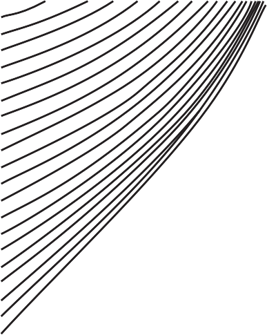100
>
> 90
>
> 80
>
> 70
>
> 60
>
> 50
>
> 40
>
> 30
>
> 20
>
> 10
>
> **Figure 2--14**
>
> Shallow lake evaporation as a function of solar radiation, air
> temperature, dew point, and wind move- ment (Adapted from Kohler et
> al., 1995).
>
> **EXAMPLE 2--9**
>
> **EVAPORATION USING THE PENMAN EQUATION**
>
> An example of Equation (2--34) is given by Meyer (1944) for Minnesota
> lakes:
>
> *E* = 0.0106(1 + 0.1*u*)(*e~s~* - *e~a~*)
>
> with *E* in in./day, *u* in mph, and vapor pressures in mb. For an air
> tem- perature of 90°F (32.2°C), wind speed of 20 mph, relative
> humidity of 30%, and net radiation flux of 400 ly/day, estimate the
> evaporation rate using the Penman equation. Assume atmospheric
> pressure ≈ 1000 mb,
>
> so the psychometric constant g = 0.66 mb/°C.
>
> **SOLUTION** We evaluate Δ from Equation (2--40) at the air
> temperature of 32.2°C:

*[de~s~]{.underline}*

> 2.7489 \* 10^8^ \* 4278.6
>
> 4278.6

Δ = *dT* =

> exp a b
>
> (32.2 + 242.79)^2^ 32.2 + 242.79
>
> = 2.72 mb/°C.
>
> For Equation (2--39), we need the saturation vapor pressure at 32.2°C.
>
> From Equation (1--6), we then have
>
> *e~sa~* = 2.7489 \* 10^8^ exp\[ - 4278.6\>(32.2 + 242.79)\] = 48.1 mb.
>
> Thus, *e~a~* = *e~sa~* = 0.3(48.1) = 14.4 mb. The latent heat of
> vaporization at the air temperature of 32.2°C is
>
> *L~e~* = 597.3 - 0.57(32.2) = 579 cal/g.
>
> **Evapotranspiration**

For a water budget over the whole watershed, one is usually concerned
with the total evaporation from all free-water surfaces, plus
**transpiration**, the loss of vapor through small openings (stomata) in
plant tissue (e.g., leaves). For most plants, transpiration occurs only
during daylight hours during photo- synthesis, which can lead to diurnal
variations in the shallow ground water table in heavily vegetated areas.
The combined evaporation and transpira- tion loss is called
**evapotranspiration (ET)** and is a maximum if the water supply to both
the plant and soil surface is unlimited. The maximum possible loss is
limited by meteorological conditions and is called **potential ET**
(Thornthwaite, 1948); potential ET is approximately equal to the
evapora- tion from a large, free-water surface such as a lake. Thus,
methods discussed in the previous section for evaporation can be used to
predict potential ET. Large surface area and high temperature of leaves
can easily create transpiration rates that equal or even exceed
potential ET. Exceedance is possible in instances of an "oasis" of
well-watered vegetation, such as a crop or golf course, located in a
larger area in which actual ET is less than the potential. Actual
transpiration and, hence, actual ET are usually lim- ited by moisture
supply to the plants. Obviously the effect of limited mois- ture will
depend on plant characteristics such as root depth and the ability of
the soil to transport water to the roots. These effects have led to
various empirical factors that may be applied to potential ET, computed
using one of the evaporation methods discussed previously. For example,
Penman (1950) determined that ET from a vegetated land surface in Great
Britain was 60% to 80% of potential ET computed using his method; Shih
et al. (1983) used a value of 70% for crops in southern Florida. On the
other hand, Priestly and Taylor (1972) multiplied Penman equation
evaporation by 1.26 for well-watered crops to compute ET. Other
empirical formulas

> **Table 2--2** Pan Coefficients for Evapotranspiration Estimates

+------------------------------+-------------+-------------------------+
| > **Type of Cover**          | > **Pan     | > **Reference**         |
|                              | > Co        |                         |
|                              | efficient** |                         |
+==============================+=============+=========================+
| > St. Augustine grass Bell   | > 0.77      | > Weaver and Stephens   |
| > peppers                    | >           | > (1963)                |
| >                            | >           | >                       |
| > Grass and clover           |  0.85--1.04 | > Brutsaert (1982, p.   |
| >                            | >           | > 253)                  |
| > Oak--pine flatwoods (east  | > 0.80      | >                       |
| > Texas) Well-watered grass  | >           | > Englund (1977) Shih   |
| > turf                       | > 1.20      | > et al. (1983)         |
| >                            | >           | >                       |
| > Light wind, high relative  | > 0.85      | > Hargreaves and Samani |
| > humidity Strong wind, low  | >           | > (1982)                |
| > relative humidity          | > 0.35      |                         |
| >                            | >           |                         |
| > Everglades agricultural    | > 0.65      |                         |
| > areas Irrigated grass      | >           |                         |
| > pasture                    | > 0.76      |                         |
| >                            |             |                         |
| > (central California)       |             |                         |
+------------------------------+-------------+-------------------------+

> that incorporate radiation, air temperature, and precipitation are
> given by Thornthwaite (1948), Turc (1954), and Hamon (1961), and in
> agricultural practice the Blaney--Criddle method is widely used
> (Blaney and Criddle, 1950; Criddle, 1958).
>
> Once again, pan evaporation can be used to estimate ET if coefficients
> are known for the specific vegetation. There is a wide range of pan
> coeffi- cient values, as indicated in Table 2--2. Caution should be
> used with any pan coefficient method for prediction of ET, since the
> method is weak to begin with (Brutsaert, 1982) and coefficients will
> experience a strong seasonal variation that follows vegetative growth
> patterns.
>
> The complex annual relationship among potential ET, rainfall, and soil
> moisture is illustrated in Figure 2--15 for plants with three
> different root depths. The **field capacity** of the soil is the
> moisture content above which water will be drained by gravity. The
> **wilting point** of the soil is the moisture content below which
> plants cannot extract further water. As the soil mois- ture content is
> reduced below field capacity, actual ET becomes less than potential
> ET. If the soil water content is reduced below the wilting point, the
> plant may die. This complicated process depends on the plant, soil
> type, meteorology, and season. A full discussion is beyond the scope
> of this text; further details may be found in Brutsaert (1982), Hillel
> (1982), Salisbury and Ross (1969), ASCE (2005), and Dingman (2002).
>
> **Tabulated Evapotranspiration Estimates**
>
> Most ET estimates today are based on a modification of the Penman
> equation for specific assumptions about transfer coefficients \[Eq.
> (2--41)\] and vegeta- tive surface. The Penman--Monteith equation
> (ASCE, 2005) is one example, in which the Penman equation is applied
> to different crops on the basis of their roughness, height, and
> stomatal resistance to transpiration. The Kim- berly--Penman equation,
> developed by the U.S. Department of Agriculture at Kimberly, Idaho,
> was developed using data to refine transfer coefficients
>
> **Figure 2--15** Idealized annual soil
> moisture cycle for three vegetation types.
>
> Field capacity
>
> Soil moisture deficit
>
> *PET* = Potential evapotranspiration
>
> *R* = Rainfall
>
> for reference crops of alfalfa and well-clipped fescue grass (ASCE,
> 2005). ASCE (2005) recommends a standardized form of such an equation
> as the basis for ET estimates from many different vegetative surfaces.
> The methods work by computing a reference ET estimate based on local
> meteorology, and then multiplying by crop coefficients that
> incorporate crop-specific stomatal resistance and surface roughness to
> convert the reference estimates to ET estimates for each crop. The
> crop coefficients vary by location, season, and growth stage of the
> crop. Reference ET is updated daily on the basis of local meteorology.
>
> An example of dissemination of these very useful data (e.g., for
> irriga- tion estimates) is the AgriMet service of the Bureau of
> Reclamation in the
>
> U.S. Pacific Northwest and northern California and Nevada
> ([http://www.](http://www/) usbr.gov/pn/agrimet/general.html). Daily
> reference ET estimates are com- puted using the Kimberly--Penman
> equation for a reference crop of alfalfa for more than 70 weather
> stations in the region. Crop coefficients are site specific and
> available for almost all crops grown in a locality. Real-time and
>
> historic weather data may also be extracted from the weather stations,
> mak- ing AgriMet a valuable data resource for more than just ET
> estimates. Application of reference ET toward ET estimates for natural
> vegetation (e.g., forests, grasslands) depends not only on obvious
> location and vegeta- tion-specific parameters but also on available
> moisture content. However, such estimates can be attempted with
> additional information, as explained by ASCE (1996). The advantage of
> applying reference ET estimates to nat- ural watersheds is the use of
> real-time, site-specific weather data for the reference ET
> computation, which are much more available than are pan measurements.
>
> **Interception**
>
> Some rainfall on vegetation is trapped on leaves and other vegetative
> sur- faces and subsequently lost to the atmosphere through
> evaporation. The trapped water, or interception, does not reach the
> ground surface and is a loss of water that might otherwise potentially
> run off from the catchment. Rainfall that drops through the vegetation
> is known as through-fall. Intercep- tion is an example of depression
> storage or initial abstraction that is sub- tracted from rainfall
> during the initial stage of a storm (Chapters 2 and 6). Because the
> ultimate fate of such water is evaporation, interception is some-
> times lumped with overall basin ET. However, estimates are available
> as a function of plant type, location, and season. Clearly, leafy
> deciduous trees may intercept considerable water in the summer and
> almost none in the winter. On an annual basis, Dingman (2002) reports
> annual interception as a percent of annual precipitation on the order
> of 24%--35% for Pacific Northwest conifers and on the order of 10% for
> North Carolina hardwoods. On a storm event basis, Shuttleworth (1993)
> reports canopy interception on the order of 1.2 mm for coniferous
> forests and 0.8 mm for broadleaf canopies in full leaf. Interception
> capacity is recovered during interevent dry periods as a function of
> evaporation rates.

**2.7**

**HYDROLOGIC**

> **LOSS--- INFILTRATION**
>
> The process of infiltration has been widely studied and represents an
> impor- tant mechanism for the movement of water into the soil under
> gravity and capillarity forces. Infiltration volume is subtracted from
> a precipitation event in order to determine the net volume of
> rainfall, or rainfall excess, which is equivalent to the direct runoff
> from a watershed area. Horton (1933) showed that when the rainfall
> rate *i* exceeds the infiltration rate *f*, water infiltrates the
> surface soils at a rate that generally decreases with time. These
> rates are usually reported in inches per hour. For any given soil, a
> limiting curve defines the maximum possible rates of infiltration vs.
> time. The rate of infil- tration depends in a complex way on rainfall
> intensity, soil type, surface condition, and vegetal cover.
>
> **Figure 2--16** Horton's infiltration concept.
>
> *fo*
>
> *fc*

*t*

> For excess rates of rainfall, the actual infiltration rate will follow
> the limiting curve shown in Figure 2--16, called the **Horton
> infiltration capacity** curve of the soil. The capacity decreases with
> time and ultimately reaches a constant rate, caused by filling of soil
> pores with water, which reduces capil- lary suction. For example, it
> has been shown through controlled tests that the decline is more rapid
> and the final constant rate is much lower for clay soils than for
> sandy soils. Thus, sand will generally infiltrate more volume at a
> higher rate than clay soils.
>
> **Simple Equations for Infiltration Rate**
>
> The hydrologic concept of infiltration capacity is empirically based
> on observations at the ground surface. Horton (1940) suggested the
> follow- ing form of the infiltration equation, where rainfall
> intensity *i* 7 *f* at all times:
>
> *f* = *f~c~* + (*f*~0~ - *f~c~*)*e*^-*kt*^, (2--42)
>
> where
>
> *f* = infiltration capacity (in./hr),
>
> *f*~0~ = initial infiltration capacity (in./hr),
>
> *f~c~* = final capacity (in./hr),
>
> *k* = empirical constant (hr^--1^).
>
> Rubin and coworkers (1963, 1964) showed that Horton's observed curves
> can be theoretically predicted, given the rainfall intensity, the
> initial soil moisture conditions, and a set of unsaturated
> characteristic curves for the soil. They showed that the final
> infiltration rate is numerically equivalent to the saturated hydraulic
> conductivity of the soil. Furthermore, Rubin showed that ponding at
> the surface will occur if rainfall duration is greater than the time
> required for soil to become saturated at the surface. Hor- ton's
> equation is depicted graphically in Figure 2--16, and Example 2--10
> illustrates its use.
>
> **EXAMPLE 2--10**
>
> **HORTON'S INFILTRATION EQUATION**
>
> The initial infiltration capacity *f*~0~ of a watershed is estimated
> as 1.5 in./hr, and the time constant is taken to be 0.35 hr^--1^. The
> equilibrium capacity *f~c~* is 0.2 in./hr. Use Horton's equation to
> find (a) the values of *f* at *t* = 10 min, 30 min, 1 hr, 2 hr, and 6
> hr, and (b) the total volume of infiltration over the 6-hr period.
>
> **SOLUTION** Horton's Equation \[Eq. (2--42)\] is
>
> *f* = *f~c~* + ( *f*~0~ - *f~c~*)*e*^-*kt*^.
>
> Substituting the values for *f*~0~, *f~c~*, and *k* gives
>
> *f* = 0.2 in./hr + 1.3(*e*^-0.35*t*^) in./hr. Solving for each value
> of *t* gives the following table:

+-----------------------------+---------------+-----------------------+
| > ***t* (hr)**              | ***f***       | > **(in./hr)**        |
+=============================+===============+=======================+
| > 1/6                       | > 1.43        |                       |
+-----------------------------+---------------+-----------------------+
| > 1/2                       | > 1.29        |                       |
+-----------------------------+---------------+-----------------------+
| > 1                         | > 1.12        |                       |
+-----------------------------+---------------+-----------------------+
| > 2                         | > 0.85        |                       |
+-----------------------------+---------------+-----------------------+
| > 6                         | > 0.36        |                       |
+-----------------------------+---------------+-----------------------+

> The volume (in inches over the watershed) can be found by plotting the
> curve given by the table of values and then finding the area under the
> curve bounded by *t* = 0 and *t* = 6 hr. The plot is shown in Figure
> E2--10. The curve is given by the equation below, and to find *F* ,
> the volume of infiltra- tion and the area under the *F* curve, we must
> integrate Horton's equation.
>
> ( *f*~0~ - *f~c~*)*e*^-*kt*^

*F*\' = *f~c~t* +

> \- *k* .
>
> **Figure E2--10** Horton infiltration curve. The area shaded under the
> curve represents the total volume of infiltration over a
>
> 6-hr period.
>
> 2.0
>
> 1.5
>
> 1.0
>
> 0.5
>
> *f* = 0.2 in./hr + 1.3(*e* ^-0.35*t*^) in./hr.
>
> Volume of 6-hr period
>
> 00 1 2 3 4 5
>
> 6 7 8 9 10 11 12

Time (hr)

> Horton's equation in the form of Equation (2--42) suffers from the
> fact that infiltration capacity decreases as a function of time
> regardless of the actual amount of water available for infiltration.
> That is, the equa- tion assumes ponding on the surface and a reduction
> of infiltration capac- ity, regardless of whether or not the rainfall
> intensity *i* exceeds the computed value of infiltration capacity
> *f*~0~. For example, it is common that the infiltration capacity of
> sandy soils greatly exceeds most rainfall inten- sities, with values
> of *f*~0~ up to 23 in./hr (Table 2--3). Even intense rainfall pulses
> are seldom this high, with the consequence that all rainfall may
> infiltrate; that is, *f* = *i*. The infiltration capacity should be
> reduced in proportion to the cumulative infiltration volume, not in
> proportion to time.
>
> The cumulative infiltration volume is given by the integral of Equa-
> tion (2--42),
>
> *F*(*t*) = *f t* + c [*f*0 - *fc*]{.underline} d (1 - *e* ^-*kt*^).
> (2--43)
>
> *c k*
>
> To find the infiltration capacity at any time, Equation (2--42) may be
> solved iteratively for a time *t~p~* as a function of *F*. The time
> *t~p~* is used to establish the appropriate infiltration capacity for
> the next time in- terval. This procedure is used, for example, in the
> SWMM (Huber and Dickinson, 1988), and details can be found there and
> in Viessman and Lewis (1996).
>
> **Table 2--3** Typical Values of the Parameters of *f*~0~, *fc*, and
> *k* of the Horton Model

+--------------------------+-----+---------+---------------+----------+
| > **Soil Type**          | *   | > **(in | > ***f*~0~    | ***k*    |
|                          | **f | ./hr)** | > (in./hr)**  | (hr      |
|                          | ~c~ |         |               | ^--1^)** |
|                          | *** |         |               |          |
+==========================+=====+=========+===============+==========+
| > Alphalpha loamy sand   | > 1 |         | > 19.00       | 38.29    |
|                          | .40 |         |               |          |
+--------------------------+-----+---------+---------------+----------+
| > Carnegie sandy loam    | > 1 |         | > 14.77       | 19.64    |
|                          | .77 |         |               |          |
+--------------------------+-----+---------+---------------+----------+
| > Dothan loamy sand      | > 2 |         | > 3.47        | 1.40     |
|                          | .63 |         |               |          |
+--------------------------+-----+---------+---------------+----------+
| > Fuquay pebbly loamy    | > 2 |         | > 6.24        | 4.70     |
| > sand                   | .42 |         |               |          |
+--------------------------+-----+---------+---------------+----------+
| > Leefield loamy sand    | > 1 |         | > 11.34       | 7.70     |
|                          | .73 |         |               |          |
+--------------------------+-----+---------+---------------+----------+
| > Tooup sand             | > 1 |         | > 23.01       | 32.71    |
|                          | .80 |         |               |          |
+--------------------------+-----+---------+---------------+----------+

> After Rawls et al., 1983.
>
> Horton parameters for natural soils (e.g., Table 2--3) are generally
> not applicable to disturbed soils found everywhere in and near
> constructed (developed) areas. Pitt et al. (1999, 2001) provide some
> data and guidance on infiltration parameters as a function of commonly
> measured soil compac- tion parameters. This also illustrates the
> importance of local infiltrometer measurements wherever possible.
>
> Other equations have been developed utilizing analytical solutions to
> the unsaturated flow equation from soil physics (see Section 2.8).
> Philip (1957), in a classic set of papers, developed two equations of
> the form
>
> *f* = (0.5)*St*^-1\>2^ + *K*, (2--44)
>
> *F* = *St*^1\>2^ + *Kt*, (2--45)
>
> where
>
> *f* = infiltration capacity (in./hr),
>
> *F* = cumulative infiltration volume (in.),
>
> *S* =

1\>2

> sorptivity, a constant related to soil suction potential (in./hr ),
>
> *K* = soil hydraulic conductivity (in./hr).
>
> Without detailed measurements of actual loss rates and because urban
> wa- tersheds have high imperviousness, empirical approaches usually
> give quite satisfactory results. Many urban drainage and flood control
> studies rely on either the Horton equation or simpler methods to
> predict average losses during storm passage.
>
> The F **index** is the simplest infiltration method and is calculated
> by finding the loss difference between gross precipitation and
> observed surface runoff measured as a hydrograph. The f index method
> assumes that the loss is uniformly distributed across the rainfall
> pattern (Fig. 2--17). The shaded area sums to the volume of
> infiltration, and the area above the f index sums to the volume of
> direct runoff. Sometimes the method is modified to include a greater
> initial loss or abstraction followed by a constant loss for the event.
> The use of f index methods for infiltration is illustrated in Example
> 2--11.
>
> **Figure 2--17** Graphical repre- sentation of the phi index method.
>
> *t*
>
> **PHI INDEX METHOD FOR INFILTRATION**
>
> Use the rainfall data below to determine the f index for a watershed
> that is 0.875 square miles, where the runoff volume is 228.7 ac-ft.

+---------------------------------+------------------------------------+
| > **Time (hr)**                 | > **Rainfall (in./hr)**            |
+=================================+====================================+
| > 0--2                          | 1.4                                |
+---------------------------------+------------------------------------+
| > 2--5                          | 2.3                                |
+---------------------------------+------------------------------------+
| > 5--7                          | 1.1                                |
+---------------------------------+------------------------------------+
| > 7--10                         | 0.7                                |
+---------------------------------+------------------------------------+
| > 10--12                        | 0.3                                |
+---------------------------------+------------------------------------+

> The first step involves graphing the given data, as in Figure E2--10.
> To approach the problem, we must first change the area of the
> watershed into acres:
>
> **EXAMPLE 2--11**
>
> **SOLUTION**
>
> area(ac) = 0.875 sq mi (640 acres/sq mi), area = 560 acres,
>
> We develop an equation for rainfall minus infiltration for each of the
> time intervals as given:
>
> 2(1.4 - f) + 3(2.3 - f) + 2(1.1 - f) + 3(0.7 - f) + 2(0.3 - f) = 4.9
>
> Note that if f is greater than the net rainfall for a specific time
> period, no negative rainfall is added into the runoff calculation.
>
> The rate of infiltration can be found only by trial and error:
>
> Assume f = 1.5 in./hr. The runoff is the volume of water above the
> line at which *y* = 1.5 on the graph in Figure E2--11. This f index
> would then account for 3(2.3 - 1.5) = 2.4 in. of runoff (neglecting
> negative components), which is less than 4.9 in. Try again.
>
> 3
>
> 2
>
> 1.4

2.3

> 1.1
>
> **Figure E2--11** Graph of rainfall intensity vs. time.
>
> 1
>
> 00 2 4 6

Time (hour)

> 0.7
>
> 8

0.3

10 12

> More advanced infiltration methods based on actual soil types and
> solving the governing equations of flow in porous media (i.e.,
> Richard's equation) are presented with examples in the next section.
> Green and Ampt (1911) assumed a sharp wetting front, separating
> initial moisture content from saturated moisture content, which has
> penetrated to a depth *L* in time *t* since infiltration began. Water
> is ponded to a small depth on the surface, and the Green and Ampt
> model can be used to predict cumulative infiltra- tion as a function
> of time and soil type. The method requires estimates of hydraulic
> conductivity, porosity, and wetting front soil suction head. This
> method has received much attention, since it is based on readily
> measured parameters for various soil classes.

**2.8**

> **GREEN AND AMPT INFILTRATION**

**METHOD**

> The abstraction term in the water-balance equation usually includes
> the loss of water through the interception of precipitation on
> aboveground vegetation, depression storage on the ground surface, and
> infiltration into underlying soils. As previously discussed,
> infiltration can be determined using simple empirical methods or
> theoretically. The infiltration methods that rely on physical rather
> than empirical parameters provide solutions to the governing equations
> of flow in porous media (i.e., Darcy's equation presented in Chapter
> 8) for specific soil types and grain size distributions. This section
> is a more advanced treatment of infiltration, and it can be skipped
> without a loss of continuity in the text.
>
> Infiltration is modeled as unsaturated flow and differs from saturated
> (aquifer) flow because both a liquid (water) and a gas (air) phase are
> present in the unsaturated system. Gravity and friction are the only
> forces at work for saturated flow; however, a suction force as
> discussed in the next para- graph must be included for unsaturated
> flow. Richard's equation for unsat- urated flow in porous media
> applies the equation of continuity to Darcy's law in order to account
> for the presence of a gas phase in the subsurface. Richard's equation
> takes the form:
>
> [0u]{.underline} = - [0]{.underline} c *k*(u)[0c(u)]{.underline} d -
> [0*K*(u)]{.underline}, (2--46)
>
> 0*t* 0*z* 0*z* 0*z*
>
> where
>
> u = volumetric moisture content (cm^3^/cm^3^),
>
> *z* = distance below the surface (cm),
>
> c(u) = capillary suction (pressure) (cm of water),
>
> *K*(u) = unsaturated hydraulic conductivity (cm/s).
>
> **Moisture content** u is defined as the ratio of the volume of water
> to the total volume of a unit of porous media. For saturated ground
> water flow, u equals the **porosity** of the sample, *n*, defined as
> the ratio of interconnected void volume to total sample volume. For
> unsaturated flow above the water table, u \< *n*, and remaining void
> space is filled with air.
>
> The **hydraulic conductivity** *K* as defined by Darcy's law relates
> ground water velocity to the hydraulic gradient and is described as
> the volume of water that will flow through a unit soil column in a
> given time. Hydraulic conductivity is thus directly proportional to
> the moisture content of the soil and is usually written as *K*(u) for
> unsaturated flow.
>
> The **capillary suction** c is a measure of the combined adhesive
> forces that bind the water molecules to solid walls and the cohesive
> forces that attract water molecules to each other. The capillary
> suction head draws water to a point at which the tensile suction
> forces acting on an element of water are in equilibrium with the
> downward force of gravity acting on the fluid ele- ment. The sign of
> the variable c can be thought of in terms of energy or work; c is
> greater than zero in the saturated zone (because positive work is
> required to push an element of water against hydrostatic pressure) and
> equals zero at the boundary between the unsaturated and saturated
> zones. It follows that c is less than zero in the unsaturated zone,
> reflecting the fact that water is held in soil pores under
> surface-tension forces. During infiltration, the suction acts in the
> same direction as the water flow and pulls water downward.
>
> Soil physicists refer to c \< 0 as the tension head or **capillary
> suction**,
>
> which can be measured by an instrument called a tensiometer. The
> capillary
>
> term can be added to the elevation head to produce the tota.l
> hydraulic head
>
> acting on an element of water, *h* = c + *z*, where *c* = *P*\>r*g* c
> is given as the
>
> liquid pressure at a certain point divided by the liquid specific
> weight; this unit equates to a length term and reiterates that suction
> head is the relative eleva- tion of a liquid element at a given point
> with respect to the saturated zone. As opposed to the hydraulic
> conductivity, the tension head increases with decreas- ing moisture
> content and can be written c(u) for unsaturated flow.
>
> The u and c relationships differ significantly for different types of
> soil and different saturations; a soil with smaller pores has larger
> soil surface area acting on an element of water than a large-pored
> soil. More tension can be applied per unit of water in the smaller
> pore spaces, allowing water to travel further in the capillary to the
> point where suction reaches equilibrium with gravity. Greater moisture
> content permits water molecules to cohere inward to each other rather
> than adhere to the soil grains, and capillary length decreases. Figure
> 2--18 summarizes the various unsaturated zone parameters and
> relationships.
>
> Moisture contentθ (%) Hydraulic conductivity *k*(cm/s)
>
> Plainfield sand Columbia sandy loam Guelph loam

140

120

> Ida silt loam
>
> Yolo light clay
>
> 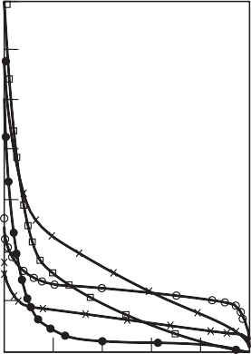{width="1.4431386701662292in"
> height="2.029388670166229in"}140
>
> 120
>
> {width="1.3284722222222223in"
> height="2.039471784776903in"}100
>
> 80
>
> 60
>
> 40
>
> 20
>
> 0 0.1 0.2 0.3 0.4 0.5
>
> Moisture content (vol/vol)
>
> 100
>
> 80
>
> 60
>
> 40
>
> 20
>
> 0 0 0.2 0.4 0.6 0.8 1.0
>
> Relative conductivity
>
> Moisture content θ
>
> (% by vol)
>
> 0
>
> Pressure head † (cm of water) Negative 0 Positive
>
> †1
>
> **Figure 2--18**
>
> Water table

†3

> Saturated moisture
>
> content equals porosity of soil
>
> Water table
>
> Typical relationships in the unsaturated zone.
>
> θ*i* θ*s*
>
> θ*i* θ*s*
>
> **Figure 2--19** Moisture and infiltra- tion relationships.

a.  Moisture profile at moment of surface saturation. (b) Mois- ture
    > profile at a later time. (c) Infiltration behavior under different
    > rainfall. (Adapted from Main and Larson, 1973).

    a.  \(b\)

> Time *t*
>
> \(c\)
>
> Green and Ampt represents the typical relationship between moisture
> content and soil depth (Fig. 2--19(a)) as a sharp wetting front
> separating saturated moisture content at the top of the soil column
> from the initial moisture content at the column base. The Green and
> Ampt model is now widely accepted, since it can be used to predict
> cumulative infiltration as a function of time and readily available
> soil parameters. For example, it was used as the basis for the
> analysis of Houston area watersheds after T. S. Allison in 2001
> (TSARP, 2001).
>
> The Green and Ampt model operates under five principal assumptions
> (Ferguson, 1994):

1.  The soil under consideration is homogeneous and stable, implying
    that macropores and preferential migration pathways should not be
    considered.

2.  The supply of ponded water at the surface is not limited (an assump-
    tion subject to modification below).

3.  A distinct and precisely definable wetting front exists, and as
    > water continues to infiltrate, the wetting front advances at the
    > same rate with depth.

4.  The capillary suction just below the wetting front is uniform
    > through- out the profile and constant in time during the
    > infiltration event.

5.  The soil is uniformly saturated above the wetting front, and the
    > vol- umetric water contents remain constant above and below the
    > advanc- ing wetting front.

> At the wetting front, the average capillary suction head c is used to
> represent the characteristic moisture curve. The moisture-content
> profile at the moment of surface saturation is shown in Figure 2--19a.
> The area above the moisture profile is the amount of infiltration up
> to surface saturation *F* and is represented by the shaded area of
> depth *L* in Figure 2--19a. Thus, *F* = (u*~s~* - u*~i~*)*L* =
> *M~d~L*, where u*~i~* is the initial moisture content, u*~s~* is the
> sat- urated moisture content, and *M~d~* = u*~s~* - u*~i~* is the
> initial moisture deficit.
>
> The unsaturated hydraulic conductivity of the soil *K*(u) can be
> substi- tuted into Darcy's law (Chapter 8) to yield:
>
> *q* = - *K*(u) [0*h*]{.underline}, (2--47)
>
> 0*z*
>
> where
>
> *q* = Darcy velocity (cm/s),
>
> *z* = depth below surface (cm),
>
> *h* = potential or head = *z* + c (cm),
>
> c = suction (negative cm),
>
> *K*(u) = unsaturated hydraulic conductivity (cm/s),
>
> u = volumetric moisture content.
>
> Equation (2--47) is then applied as an approximation to the saturated
> condi- tions between the soil surface (subscript "surf") and the
> wetting front (sub- script "wf"), as indicated in Figure 2--19b:
>
> *q* = - *f* ≅ - *K~s~*(*h*~surf~ - *h*~wf~)\>(*z*~surf~ - *z*~wf~),
> (2--48)
>
> in which it is assumed that the Darcy velocity at the soil surface
> equals the downward infiltration rate - *f*, and the saturated
> hydraulic conductivity *K~s~* is used to represent conditions between
> the surface and the wetting front. The depth to the wetting front is
> *L*. Thus, with the coordinate *z* positive upward, *z*~wf~ = - *L*.
> Using the average capillary suction at the wetting front c, we have
>
> *h*~wf~ = *z* + c ≅ - *L* + c. (2--49) Noting that *h* = 0 at the
> surface, Equation (2--48) becomes
>
> \- *f* = - *K~S~*\[0 - (- *L* + c)\]\>\[0 - (- *L*)\] (2--50)
>
> *f* = *K~s~*(1 - c\>*L*).
>
> The volume of infiltration down to the depth *L* is given by
>
> *F* = *L*(u*~s~* - u*~i~*) = *LM~d~*. (2--51)
>
> Substituting for *L* in Equation (2--50) gives the original form of
> the **Green-- Ampt equation**:
>
> *f* = *K~s~*(1 - *M~d~*c\>*F*). (2--52)
>
> Equation (2--52) depicts the relationship between the infiltration
> rate

(f) and the cumulative depth of water infiltrated into the soil (*F*).
    Remem- bering that the hydraulic conductivity that transmits water
    downward based on the hydrostatic pressure is accompanied by the
    suction head, c, which pulls water downward into unsaturated soil,
    Equation (2--52) indicates that the infiltration rate is a value
    greater than the saturated hydraulic conductiv- ity as long as there
    is sufficient water at the surface for infiltration, as sketched in
    curves B--C and D of Figure 2--19c. The infiltration rate decreases
    as the cumulative infiltration increases.

> Solution of the Green and Ampt equation requires the estimation of
> three parameters: the vertical saturated hydraulic conductivity
> (*K~s~*), the moisture deficit (*M~d~*), and the wetting front suction
> head (c). *K~s~* is the most commonly available of the three and is
> the limiting downward rate of water transmission; for a given fluid,
> *K~s~* depends on the pore size and grain size properties (Chapter 8).
> The moisture deficit is a function of the effective porosity and the
> initial saturation; effective porosity is the space available for
> water flow (the porosity minus the thin film of water surrounding all
> soil grains that comprise the residual water content). The suction
> head is the difference between the atmospheric and hydrostatic
> pressures.
>
> Three rainfall-infiltration scenarios are possible:
>
> **Case 1: *i ***\* ***K~s~*.** The rainfall intensity is less than the
> maximum down- ward hydraulic conductivity, meaning that runoff will
> never occur and all rainfall will infiltrate regardless of the
> duration.
>
> **Case 2: *K~s~ ***\* ***i*** \* ***f*.** The rainfall intensity is
> greater than the saturated hydraulic conductivity but less than the
> infiltration rate. The time to ponding varies for different rainfall
> intensities.
>
> **Case 3: *i ***+ ***f*.** The rainfall intensity is greater than the
> infiltration rate and runoff can occur.
>
> As mentioned in the discussion of the Horton equation, the rainfall
> intensity *i* can be less than the potential infiltration rate given
> by Equation (2--52), in which case *f* = *i*. Mein and Larson (1973)
> showed how the equa- tion can be used to develop the cumulative
> infiltration *F* as a function of *f*. The infiltration is governed by
> either the rainfall rate or the Green and Ampt function. At the moment
> of surface saturation, *f* = *i*, let the corre- sponding volume of
> infiltration be *F~s~*. With *f* = *i*, Equation (2--52) can then be
> solved for *F~s~*, the volume of infiltration occurring at the time of
> surface
>
> saturation *t~s~*, when Equation (2--52) becomes valid. Thus, setting
> *i* = *f* and solving for *F~s~* results in the following Green and
> Ampt equation,
>
> *F~s~* = *M~d~*c\>(1 - *i*\>*K~s~*). (2--53)
>
> We require *i* 7 *K~s~* in Equation (2--53) and remember that
> capillary suction c is negative. The Green--Ampt infiltration method
> will predict the following results for various intensities of rainfall
> *i*:

1.  If *i* ... *K~s~*, then *f* = *i* (curve A in Fig. 2--19(c)),

2.  If *i* 7 *K~s~*, then *f* = *i* until *F* = *it~s~* = *F~s~*,

3.  Following surface saturation,

> *f* = *K* a1 - [*Md*c]{.underline}b from Equation 2--52 for *i* 7 *K*
> and *f* = *i* for *i* ... *K* .
>
> *S F s s*
>
> The combined process is sketched in curve B--C of Figure 2--19c. As
> long as the rainfall intensity is greater than the saturated hydraulic
> conduc- tivity, the infiltration rate asymptotically approaches *K~s~*
> as a limiting lower value. Mein and Larson (1973) found excellent
> agreement between this Green--Ampt method, numerical solutions of
> Richards' equation, and exper- imental soils data.
>
> Ponded water descends into the soil due partially to the capillary
> suction of underlying soil that is drier than the soil near the
> surface and due to the hydrostatic pressure of the water accumulating
> on the ground surface. Downward movement stops when all the water that
> has soaked into the soil and is in equilibrium with the capillary
> suction of the sur- rounding soil.
>
> If the rainfall rate starts above, drops below, and then again rises
> above *K~s~* during the infiltration computations, the use of
> Green--Ampt becomes more complicated. It is necessary to redistribute
> the moisture in the soil column, rather than maintaining the
> assumption of saturation from the sur- face down to the wetting front
> shown in Figure 2--19b. The use of the Green-- Ampt procedures for
> unsteady rainfall sequences is illustrated by Skaggs and Khaleel
> (1982).
>
> Equation (2--52) predicts infiltration rate, *f*, as a function of
> cumulative infiltration *F*, not time. Because *f* = *dF dt*, the
> equation can be converted into a differential equation, the solution
> of which can then be solved itera- tively for *F*(*t*).
>
> **Application of Green--Ampt Method for Infiltration**
>
> A major advantage of the Green--Ampt model is that, in principle, the
> necessary parameters *K~s~*, c, and *M~d~* can be determined from
> physical mea- surements in the soil. For example, saturated hydraulic
> conductivity is tabulated by the U.S. Natural Resources Conservation
> Service (NRCS, formerly SCS) for a large number of soils as part of
> that agency's Soil
>
> Properties and Interpretation sheets (available from local NRCS
> offices and from the web---see Appendix E). An increasing quantity of
> tension vs. moisture content data (as shown in Fig. 2--18) are also
> available, from which a value of c can be obtained by integration over
> the moisture con- tent of interest. For example, several volumes of
> such information have been assembled for Florida soils (e.g., Carlisle
> et al., 1981). In practice, the Green--Ampt parameters are often
> calibrated, especially when used in con- tinuous simulation models.
>
> A very useful source of information on Green--Ampt parameters is
> provided by Rawls et al. (1983), who present data for a large
> selection of soils from across the United States. These parameters are
> shown in Table 2--4. Two porosity (u*~s~*) values are given: total and
> effective. Effective porosity accounts for trapped air and residual
> water and is the more rea- sonable value to use in computations,
> because it denotes the intercon- nected pore space available for water
> flow. It can be seen in Table 2--4 that as the soil particles get
> finer, from sands to clays, the saturated hydraulic conductivity
> *K~s~* decreases, the average wetting front suction c increases
> (negatively), and porosity u*~s~* is variable. Note that *K~s~* also
> serves as an
>
> **Table 2--4** Green--Ampt Infiltration Parameters for Various Soil
> Texture Classes

+-----------+----------+-------------+---------------+---------------+
| > **Soil  | > **Po   | >           | > **Wetting   | > **Hydraulic |
| > Class** | rosity** | **Effective | > Front       | > C           |
|           | > H      | >           | > Suction     | onductivity** |
|           |          |  Porosity** | > Head** C    | >             |
|           |          | >           | > **(-cm)**   | > ***K*       |
|           |          | >           |               | > (cm/hr)**   |
|           |          |  U***~e~*** |               |               |
+===========+==========+=============+===============+===============+
| > Sand    | > 0.437  | > 0.417     | > 4.95        | 11.78         |
+-----------+----------+-------------+---------------+---------------+
|           | > 0.37   | > 0         | > 0.97--25.36 |               |
|           | 4--0.500 | .354--0.480 |               |               |
+-----------+----------+-------------+---------------+---------------+
| > Loamy   | > 0.437  | > 0.401     | > 6.13        | 2.99          |
| > sand    |          |             |               |               |
+-----------+----------+-------------+---------------+---------------+
|           | > 0.36   | > 0         | > 1.35--27.94 |               |
|           | 3--0.506 | .329--0.473 |               |               |
+-----------+----------+-------------+---------------+---------------+
| > Sandy   | > 0.453  | > 0.412     | > 11.01       | 1.09          |
| > loam    |          |             |               |               |
+-----------+----------+-------------+---------------+---------------+
|           | > 0.35   | > 0         | > 2.67--45.47 |               |
|           | 1--0.555 | .283--0.541 |               |               |
+-----------+----------+-------------+---------------+---------------+
| > Loam    | > 0.463  | > 0.434     | > 8.89        | 0.34          |
+-----------+----------+-------------+---------------+---------------+
|           | > 0.37   | > 0         | > 1.33--59.38 |               |
|           | 5--0.551 | .334--0.534 |               |               |
+-----------+----------+-------------+---------------+---------------+
| > Silt    | > 0.501  | > 0.486     | > 16.68       | 0.65          |
| > loam    |          |             |               |               |
+-----------+----------+-------------+---------------+---------------+
|           | > 0.42   | > 0         | > 2.92--95.39 |               |
|           | 0--0.582 | .394--0.578 |               |               |
+-----------+----------+-------------+---------------+---------------+
| > Sandy   | > 0.398  | > 0.330     | > 21.85       | 0.15          |
| > clay    |          |             |               |               |
| > loam    |          |             |               |               |
+-----------+----------+-------------+---------------+---------------+
|           | > 0.33   | > 0         | > 4.42--108.0 |               |
|           | 2--0.464 | .235--0.425 |               |               |
+-----------+----------+-------------+---------------+---------------+
| > Clay    | > 0.464  | > 0.309     | > 20.88       | 0.10          |
| > loam    |          |             |               |               |
+-----------+----------+-------------+---------------+---------------+
|           | > 0.40   | > 0         | > 4.79--91.10 |               |
|           | 9--0.519 | .279--0.501 |               |               |
+-----------+----------+-------------+---------------+---------------+
| > Silty   | > 0.471  | > 0.432     | > 27.30       | 0.10          |
| > clay    |          |             |               |               |
| > loam    |          |             |               |               |
+-----------+----------+-------------+---------------+---------------+
|           | > 0.41   | > 0         | >             |               |
|           | 8--0.524 | .347--0.517 |  5.67--131.50 |               |
+-----------+----------+-------------+---------------+---------------+
| > Sandy   | > 0.430  | > 0.321     | > 23.90       | 0.06          |
| > clay    |          |             |               |               |
+-----------+----------+-------------+---------------+---------------+
|           | > 0.37   | > 0         | > 4.08--140.2 |               |
|           | 0--0.490 | .207--0.435 |               |               |
+-----------+----------+-------------+---------------+---------------+
| > Silty   | > 0.479  | > 0.423     | > 29.22       | 0.05          |
| > clay    |          |             |               |               |
+-----------+----------+-------------+---------------+---------------+
|           | > 0.42   | > 0         | > 6.13--139.4 |               |
|           | 5--0.533 | .334--0.512 |               |               |
+-----------+----------+-------------+---------------+---------------+
| > Clay    | > 0.475  | > 0.385     | > 31.63       | 0.03          |
+-----------+----------+-------------+---------------+---------------+
|           | > 0.42   | > 0         | > 6.39--156.5 |               |
|           | 7--0.523 | .269--0.501 |               |               |
+-----------+----------+-------------+---------------+---------------+

> *Source:* Rawls et al., 1983.
>
> estimate for Horton's final infiltration capacity, *f~c~* \[Eq.
> (2--42)\]. Table 2--4 provides valuable estimates for Green--Ampt
> parameters, but local data (e.g., Carlisle et al., 1981) are
> preferable if available. Missing is the initial moisture content,
> since it depends on antecedent rainfall and moisture conditions.
> Ideally, *M~d~* = *n* - u*~i~* should be measured, but this is rarely
> accomplished. A lower bound for maximum *M~d~* may be inferred from
> the "available water capacity, in./in." found on NRCS Soil Properties
> and Interpretation sheets. Available water capacity on these sheets is
> the dif- ference between field capacity and wilting point, with
> typical values usu- ally range from 0.05 to 0.30 in./in. These are
> lower bounds on the maximum *M~d~*, since they do not include water
> stored above field capacity. The value of *M~d~* to use for a
> particular soil in question is best determined from a soil test.
> Otherwise, a conservative (low) *M~d~* value could be used for design
> purposes (e.g., 0.10). *M~d~* values must be updated in continuous
> simulation hydrologic models that account for soil moisture content.
>
> In areas of high water tables, there is a limit to the soil storage
> capac- ity, and infiltration cannot continue indefinitely without
> complete satura- tion of the soil. In such cases, infiltration ceases,
> losses (rainfall abstractions) become zero, and rainfall excess
> intensity equals rainfall intensity. If site-specific information is
> available, this capacity, *S*, can be estimated from soil moisture
> data and depth to water table, *L*, as implied in Figure 2--19b,
>
> *S* = *L*(u*~s~* - u*~i~*), (2--54)
>
> where *L* is now the depth to the water table. In some localities,
> regional information on available soil storage has been prepared
> (e.g., South Florida Water Management District, 1987). The above value
> of *S* is essentially the same as the storage value in the SCS methods
> described earlier.
>
> The examples below demonstrate the use of Green and Ampt equa- tions
> with actual soils data. An Excel spreadsheet is available on the text-
> book website for use in solving for infiltration *f* as a function of
> time.
>
> Noting that *M~d~* = u*~s~* - u*~i~*, we can solve Equation (2--53) to
> obtain the volume of water that will infiltrate before surface
> saturation is reached:
>
> **SOLUTION**

*F~s~* =

> c*M~d~*
>
> 11 - *i*\>*K~s~*2
>
> [- (9.37 in.)(0.518 - 0.318)]{.underline}
>
> 1 - \[(7.88 in./hr)\>(1.97 in./hr)\]
>
> *F~s~* = 0.625 in.
>
> Until 0.625 in. has infiltrated, the rate of infiltration is equal to
> the rain- fall rate. After that point (surface saturation), the rate
> of infiltration is given by the equation \[Eq. (2--52)\]
>
> *f* = *K~s~*(1 - *M~d~*c\>*F*).
>
> Solving this equation for various values of *F* gives the graph shown
> in Figure E2--12, where *f* decreases as *F* increases.
>
> 10
>
> 9
>
> 8
>
> 7
>
> 6
>
> 5
>
> 4
>
> 3
>
> 2
>
> 1
>
> 0
>
> **Figure E2--12** Infiltration rate vs. infiltration volume.
>
> 0 1 2 3 4 5
>
> *F* (in.)
>
> 6 7 8
>
> **SOLUTION**
>
> The initial moisture deficit *M~d~* = 0.523 - 0.300 = 0.223. In order
> to obtain the ponding time, we compute the ponding depth required to
> produce saturation from Equation (2--53):
>
> *F~s~* = (- 17.0 cm)(0.223)\>(1 - 6*K~s~*\>*K~s~*) = 0.76 cm.
>
> The ponding time 1*t~s~*2 is
>
> *t~s~* = *F~s~*\>*i* = (0.76 cm)\>\[(6 × 1.81 × 10^-4^ cm/s)(60
> s/min)\] = 11.7 min
>
> It shows that it takes rainfall 11.7 minutes to saturate the soil.
> However, after this point (11.7 min \< 20 min), the infiltration depth
> is not going to be equal to the product of the rainfall intensity
> (*i*) and time but increase exponentially according to the equation as
> follows (Chow et al., 1988):
>
> *K* (*t* - *t* ) = *F* - *F*
>
> \+ c*M*
>
> ln c [*M~d~*c - *F *]{.underline} d
>
> *s p p*
>
> *^d^ M~d~*c - *F~p~*
>
> Apparently, infiltration depth (*F*) varies with time (*t*) in this
> equation. There is only one unknown variable (*F*) in the equation at
> any time after ponding. Wehaveknown *t~s~* = 11.7 min, *M~d~* = 0.223,
> c = -17.0 cm, *F~s~* = 0.76 cm, and *t* = 20 min. By Goal Seek and
> rearranging the above equation in Excel spreadsheet to make it equal
> to zero, the infiltration depth for 20-minute rainfall can be
> calculated as 1.20 cm. It indicates that 0.44 cm (1.2 cm - 0.76 cm) of
> rainfall has been infiltrated in 8.3 minutes (20 min - 11.7 min) after
> the ponding.

**2.9**

> **SNOWFALL AND SNOWMELT**
>
> A small percentage (about 13%) of precipitation over the entire U.S.
> falls as snow, but it can be a dominant source of streamflow,
> especially in mountain- ous areas during spring melt. This is
> certainly true of the western United States, but significant
> percentages of runoff in the northeast and midwest also originate as
> snow. Because the storage and melting of snow play an important role
> in the hydrologic cycle of some areas, hydrologists must be able to
> reliably predict the contribution of snowmelt to overall runoff.
> Because snowmelt begins in the spring and the derived runoff is out of
> phase with periods of greatest water demand, control schemes such as
> storage res- ervoirs have been implemented in many areas for water
> supply. Under cer- tain conditions, snowmelt can also contribute to
> flooding problems, especially in larger river basins with mountainous
> areas. In addition to forecasting flood situations, snowmelt
> predictions are also valuable to power companies that generate
> hydroelectricity and to irrigation districts.
>
> Because of the range of uses for estimating the contribution of snow-
> melt to streamflow and the variation of conditions applicable to each
> case, many methods have been developed for computing snowmelt as it
> affects streamflow. These methods have consistently found that the
> timing and
>
> amount of runoff depend mainly on three factors: the energy of a
> snowpack available for melt, the areal extent of the melting
> snowcover, and the effects of storage on the movement of the meltwater
> (Male and Gray, 1981).
>
> Snow measurements are obtained using standard and recording rain
> gages, snow stakes, and snow boards, which measure accumulation over a
> period of time. Snow surveys at a number of spaced points along a snow
> course are necessary to account for drifting and blowing snow. The
> Natural Resources Conservation Service (NRCS) uses devices called snow
> pillows, which continuously record and transmit the pressure from snow
> at the bottom of a snowpack. The NRCS has about 500 telemetry sites
> ("SNOTEL" sites) throughout the western United States transmitting
> data from snow pillows.
>
> The distribution of mean annual snowfall in the United States is quite
> variable, and errors may be large in mountainous regions because of
> the lack of measurements in remote areas. There is a gradual increase
> in snowfall with latitude and elevation, and from 400 to 500 in./yr
> (\~1000 cm/yr) can occur in the Sierra Nevada and Cascade Range of the
> western United States. Large snows
>
> can also occur near the Great Lakes, with average values over 100 in.
> (254 cm).
>
> **Physics of Snowmelt**
>
> The energy exchanged between the snowpack, the atmosphere, and the
> earth's surface is the controlling factor in rates of snowmelt. Other
> geo- graphic, topographic, and surface cover factors are also
> important. Density of snow is a major aspect of predicting runoff and
> is determined by several factors. Snow that is formed under dry, cold
> conditions will be less dense than snow formed under wet and warmer
> conditions. As snow accumulates on the ground over a period of time,
> its density increases with the settling and compaction due to factors
> such as wind. Wind increases the density of snow in two ways: First,
> the turbulence breaks ice crystals into smaller ones, making them
> settle more compactly, and second, drag forces are exerted on the
> surface of snow due to the moving air and particles. Newly fallen snow
> has a density about 10% that of liquid water, but the density can
> increase to 50% with aging. The depth of water that would result if
> all the snow melted is called the **snow water equivalent, SWE**, and
> is given by the equation
>
> SWE = 0.01 *d~s~*r*~s~*, (2--55)
>
> where SWE is in mm, snowdepth *d~s~* is in cm, and r*~s~* is in
> kg/m^3^. The density of snow is often assumed to be 100 kg/m^3^. Hence
> a rule of thumb for new snow is that the depth of water equivalent is
> approximately 1/10 the depth of the snowpack. *Ripe snow* holds all
> the liquid water it can against the action of gravity. If a snowpack
> is ripe, additional rain can not only result in runoff itself but also
> warm the snow due to the release of the latent heat when the rain
> fuses with the pack (Male and Gray, 1981). Hence, any heat added to
> ripe snow will produce runoff. Heat added to a snowpack at a
> temperature below freezing will act to warm it.
>
> Snowmelt and evaporation are both thermodynamic processes and can be
> studied with an energy-balance approach. The energy for snowmelt is
> derived from the following: (1) net solar radiation, (2) net longwave
> radia- tion exchange (from atmosphere and clouds), (3) conduction
> (diffusion) and convection transfer of sensible heat to or from the
> overlying air, (4) conden- sation of water vapor from the overlying
> air, (5) conduction from the under- lying soil, and (6) heat supply by
> incident rainfall. The heat exchange at the snow--air interface
> dominates the snowmelt process, and heat exchange with the soil is
> secondarily important.
>
> For each gram of water melted in a snowpack at 0°C (32°F), 80 cal/g of
> latent heat must be supplied. Thus, if the density of water is 1 g/cm,
> 80 cal will melt 80 cm^3^ (water equivalent) of snow. Hence, 80 ly
> (cal/cm^2^) are required to melt 1 cm depth of snow. Meltwater may
> refreeze with cooling, or it may drain from the snowpack, contributing
> to soil moisture, streamflow, or ground water recharge. Snowmelt
> computations are made difficult by the variations in solar radiation
> received by the surface and variations in the **albedo**, the
> reflection coefficient equal to the ratio of reflected to incident
> shortwave radiation.
>
> Although only 5% to 10% of incoming shortwave radiation is reflected
> by a water surface, up to 83% is reflected by a clean, dry snow
> surface. As the snow ages, its albedo can drop to less than 50%
> because of structural changes, and shortwave radiation penetrates to
> varying depths, depending on snow density. New precipitation affects
> the albedo of a snowpack: A snowfall increases the albedo to 0.8 and
> rain reduces it to 0.4 (Male and Gray, 1981).
>
> Snow radiates essentially as a black body (emissivity = 0.97)
> according to the Stefan-Boltzmann law, and outgoing longwave radiation
> at 0°C is equivalent to 8.4 cm (3.3 in.) of melt over a one-day
> period. Because of re- radiation from the atmosphere back to the
> earth, longwave radiation loss is equivalent to only about 2 cm (0.8
> in.) of melt per day under clear skies and near-freezing temperatures.
>
> Heat exchange between a snowpack and the atmosphere is affected by
> conduction, convection, condensation, and evaporation (Anderson, 1976;
> U.S. Army Corps of Engineers, 1956). However, very little evaporation
> from snow occurs. Direct transformation of snow (ice) to vapor, known
> as *sublimation,* is an important part of the water balance in the
> Arctic. Wind velocity and air temperature are primary factors
> affecting the density of new snow. The rate of transfer of sensible
> heat (convection) is proportional to the temperature difference
> between the air *T~a~* and the snow *T~s~* and to the wind velocity
> *v.* Condensation melt is proportional to the vapor-pressure
> difference between the snow surface and the atmosphere and to the wind
> velocity. The transfer of heat from the underlying soil to the
> snowpack is small on a daily basis but may accumulate to several
> centimeters of melt during an entire season. This may be enough to
> keep the soil saturated and to produce a rapid response of runoff when
> melting occurs. Raindrop temperature is reduced as it enters a
> snowpack, and an equivalent amount of heat is imparted to the snow
> based on the surface wet-bulb temperature. For example, the heat
> available in 10 mm of rain at 10°C will melt about 1.2 mm of water
> from the snowpack.
>
> In many basins of very high relief, the lower limit of snowcover (the
> snow line) is dynamic and moves up and down the slope. As melting pro-
> ceeds, snowcover recedes more rapidly on southerly and barren slopes,
> with the rate of snowmelt decreasing with elevation. Given the
> temperature at an index station, an area--elevation curve for the
> basin, and the average snow- line elevation, one can compute the area
> subject to melting based on the rate of change of temperature with
> elevation, typically about 1°C per 100 m (5°F per 1000 ft) increase in
> elevation.
>
> **The Snowpack Energy Budget**
>
> The snowpack energy budget is written in terms of the energy flux to
> and from the snowpack, with units of energy per unit area per unit
> time. The most convenient units for *Q* are cal/cm^2^-day (ly/day). In
> terms of the energy budget components mentioned earlier,

Δ*H*\>Δ*t* = *Q~N~* + *Q~g~* + *Q~c~* + *Q~e~* + *Q~p~*, (2--56)

> where
>
> Δ*H* = change in heat storage in snowpack,
>
> *Q~N~* = net (incoming minus reflected minus outgoing) shortwave and
> longwave radiation,
>
> *Q~g~* = conduction of heat to snowpack from underlying ground,
>
> *Q~c~* = convective transport of sensible heat from air to snowpack
> (negative if from snowpack to air),
>
> *Q~e~* = release of latent heat of vaporization by condensation of
> water vapor onto snowpack,
>
> *Q~p~* = advection of heat to snowpack by rain.
>
> If the change in storage is positive, it will act either to warm the
> snow, or to ripen the snow, or to produce melt. These are the three
> phases of snow melt, though they do not always occur in clear, steady
> sequence (Dingman, 2002). Detailed computation of net shortwave and
> longwave radiation is discussed in detail in Gray and Prowse, (1993).
> Convective heat transport and con- densation melt are both diffusive
> processes; the heat flux is proportional to the gradient of
> temperature for the former and to the gradient of vapor pressure for
> the latter. Diffusivities or transfer coefficients are functions of
> wind velocity and surface roughness. Heat transfer to or from the
> ground *Q~g~* is usually neglected unless the snowpack and ground
> surface tempera- tures are both known. Heat advected by rain into the
> snowpack is simply proportional to the difference between the rain
> temperature (usually as- sumed equal to the wet-bulb temperature) and
> the temperature of the snow.
>
> Using a given time duration and the sum of energy budget components in
> ly/day (*Q*~1~ + *Q*~2~ + *Q*~3~ + g), missing variables such as water
> output can be found from equations for heat storage change (Δ*H*) (see
> Dingman, 2002, for examples). The equations for each phase of snowpack
> development (warming, ripening, and melting) are similar to those of
> simple melting ice.
>
> First the snow warms from below freezing to 0°C before it can begin
> melting, according to the equation
>
> *H*~1~ = - *c~i~*\*r*~w~*\*SWE\*(*T*~s~ - T~m~) (2--57)
>
> where *c~i~* is the heat capacity of ice (502.1 cal/kg-K), r*~w~* is
> the density of water, SWE is the water equivalent depth of the snow,
> *T~s~* is the temperature of the snow, and *T~m~* is the melting-point
> temperature (0°C). This brings the snow- pack to the point where it
> can begin phase change; snow turns to retained water within while
> maintaining a temperature of 0°C. The pore spaces fill until
> saturation, and the energy input required is
>
> *H*~2~ = u~ret~\**h~s~*\*r*~w~*\**L* (2--58) where u~ret~ is the
> maximum volumetric water content that the snow can retain,
>
> *h~s~* is the depth of the snow, and *L* is the latent heat of fusion
> (79.8 KJ/kg).
>
> Finally, water begins exiting the snowpack as the phase change contin-
> ues. The heat required for the snow to melt is
>
> *H*~3~ = (SWE - *h*~wret~)\*r*~w~*\**L* (2--59)
>
> where *h*~wret~ is the depth of the retained water that is already
> melted (Ding- man, 2002).
>
> Adding *H*~1~, *H*~2~, and *H*~3~ results in the change in heat
> storage necessary to achieve melting. The approximation of 80 ly
> (cal/cm^2^) to melt 1 cm depth of snow (from above) takes into account
> such equations. Assuming the snow is already ripe, the amount of melt
> from a positive value of Δ*H* can be found with a shortcut
>
> *M* = Δ*H*\>80 cm/day (2--60)
>
> or
>
> *M* = Δ*H*\>203.2 in./day.
>
> Energy budget methods represent the best techniques for predicting
> snow- melt when all components can be estimated.
>
> The National Weather Service (Anderson, 1973, 1976) has developed an
> energy budget model for runoff forecasting. Unfortunately, some energy
> budget components are usually missing, leading to the use of simpler
> but less accurate "degree-day methods" based solely on temperature
> data.
>
> **Degree-Day or Temperature-Index Melt Equations**
>
> Degree-day or temperature-index equations are empirical or can result
> from a linearization of the energy budget equation (Huber and
> Dickinson, 1988). The simplest equation used is
>
> *M* = *D~f~* (*T~i~* - *T~B~*), (2--61)
>
> where
>
> *M* = daily melt as a depth of water equivalent (in./day; mm/day),
>
> *T~i~* = index air temperature (°F; °C),
>
> *T~B~* = base melt temperature (°F; °C),
>
> *D~f~* = degree-day melt factor, (in./day-°F; mm/day-°C).
>
> Empirical degree-day factors range from 0.05 to 0.15 in./day-°F and
> can be determined by several equations, one of the simplest being
>
> *D~f~* = 0.011r*~s~*, (2--62)
>
> where *D~f~* is in units of mm/day-°C above 0°C and r*~s~* is the snow
> density in kg/ m^3^. This factor is affected by location, time of
> year, and meteorological condi- tions, and more complex equations may
> take into account vegetation transmis- sion for radiation, solar
> radiation, and snow albedo (Male and Gray, 1981).
>
> Equation (2--61) is basically a regression equation; ACOE (1956)
> results are shown in Figure 2--20. Either the maximum or average daily
> tem- perature for the portion over 0°C is usually used for the index
> air tempera- ture *T~i~*, and 0°C is most commonly used for *T~B~*
> (Gray and Prowse, 1993). However, base melt temperatures can be below
> freezing, since Equation (2--62) represents a linearization about
> reference conditions well above freezing. Thus, the equations shown in
> Figure 2--20 should not be used for *T~i~* \< 34°F. The
> temperature-index approach is most useful and accurate under normal
> conditions and less so for extreme conditions. The ACOE developed a
> number of equations for generalized areas.
>
> The general equation used by the ACOE to calculate the amount of
> snowmelt accounts for the total amount of energy available for melting
> the snowpack at a point. The equation is given as:
>
> *M* = Qm334.9rwB (2--63)

2.8

2.4

2.0

> **Figure 2--20** Empirical degree-day equations. (From U.S. Army Corps
> of Engineers, 1956.)
>
> 1.6
>
> 1.2
>
> 0.8
>
> 0.4
>
> 0 42 46
>
> 50 54 58 62 66
>
> Mean daily temperature *T* ( F)
>
> *Note:* Equations are applicable only to range of temperatures shown
> on the diagram.

where

> *M* = snowmelt, mm per day of water equivalent
>
> *Q~m~* = algebraic sum of all heat components, kJ/m^2^/day
>
> *B* = thermal quality of the snow (e.g., ratio of heat required to
> heat a unit weight of the snow to that of ice at 0°C)
>
> 334.9 = latent heat of fusion of ice, kJ/kg
>
> *P~w~* = density of water, kg/m^3^
>
> The general equation for snowmelt (2--63) can be combined with long-
> wave radiation snow melt equations described by ACOE, resulting in a
> non- linear relationship between temperature and long-wave radiation.
> These relationships were simplified by fitting linear approximations
> and shifted to the Fahrenheit temperature scale to derive the
> following long-wave radia- tion melt equations.

a.  For melt under clear skies:

*M~l~* = 0.0212(*T~a~* - 32) - 0.84 (2--64)

b.  For melt under a forest canopy or low cloud cover:

*M~l~* = 0.029(*T~a~* - 32) (2--65)

> where
>
> *M~l~* = long-wave radiation melt (inches/day)
>
> *T~a~* = air temperature, *F*
>
> These are generalized equations used by the ACOE, but other factors
> such as rain, wind, and percent of forest cover also affect the rate
> of snow- melt. For further information regarding factors affecting
> snowmelt and calculating snowmelt rate, please refer to the U.S. Army
> Corps of Engineers Engineering and Design Manual for Runoff from
> Snowmelt (1998).
>
> United States Army Corps of Engineers, 1998, Engineering and Design
> Manual, *Runoff From Snowmelt*, Washington, DC.
>
> **Comparison of Model Accuracy**
>
> To help compare the energy-balance and temperature-index models,
> lysime- ters are useful for providing actual data in point locations
> to ensure accuracy, since they collect water from overlying snow and
> measure outflow over time. In 1976, Anderson set up lysimeters in a
> clearing in Vermont and observed through six winters the necessary
> variables of the energy-balance and temper- ature-index models
> (Dingman, 2002). The final results show good accuracy for both models,
> although some years favored one over the other. During the melting
> phase, Anderson closely matched both snow--water equivalent (SWE) over
> time and daily water output with lysimeter and visual observation
> data. Although both models worked well, each requires detailed
> knowledge of the local environment and changes in conditions. The
> temperature-index model requires a careful choice of coefficients, and
> the energy-balance model works
>
> 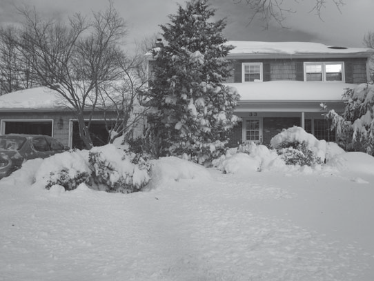{width="3.6153412073490814in"
> height="2.7133333333333334in"}
>
> **Figure 2--21**
>
> Comparison of snow estimation models. (From Anderson, 1976.)
>
> better with the inclusion of more variables. Dingman recommends data
> on at least air temperature, humidity, wind speed, cloud cover,
> precipitation, and snow surface. Figure 2.21 shows a typical blizzard
> in the Northeast, U.S.
>
> **Computation of Runoff from Snowmelt**
>
> Synthesis of runoff hydrographs associated with snowmelt can be short
> term, for a few days, or long term, for a complete melt season.
> Short-term forecast- ing is used in preparing operational plans for
> reservoirs or other flood con- trol works and for calculating design
> floods. To forecast a few days in advance, only the present condition
> of a snowpack and stream flow are required. Programs used to predict
> runoff from snowmelt include the ACOE Streamflow Synthesis and
> Reservoir Regulation (SSARR) and the U.S. NWS River Forecasting
> System, Snow Accumulation and Ablation Model. For long-term
> forecasting over a whole season, initial conditions are required as
> well as reliable predictions of meteorologic parameters.
>
> Snowmelt occurs only from those portions of a watershed covered by
> snow, and elevation is significant, since rates of snowmelt generally
> decrease with higher elevation due to a general reduction in
> temperature. Elevation effects can be considered by dividing a basin
> into a series of elevation zones, where the snow depth, losses, and
> snowmelt are assumed uniform in each. In most practical cases,
> snowmelt is estimated by the index methods presented in the previous
> section. The budget method itself is used in design flood studies.
> Once inflow water has been calculated, storage routing techniques are
> used to accommodate surface and ground water components, each with a
> different storage time and number of routing units. Storage routing
> methods are treated in detail in Chapter 4.
>
> **SUMMARY**
>
> Chapter 2 presents the concept of rainfall--runoff analysis, or the
> conversion of pre- cipitation to runoff or streamflow, a central
> problem of engineering hydrology. Gross rainfall must be adjusted for
> losses to infiltration, evaporation, and depression stor- age to
> obtain rainfall excess, which equals direct runoff (DRO).
>
> The UH is defined as 1 in. (1 mm) of direct runoff generated uniformly
> over a basin for a specified period of rainfall and is a powerful
> method still used for many watershed studies. The concept of the UH
> allows for the conversion of rainfall ex- cess into a basin
> hydrograph, through a linear adding and lagging procedure called
> hydrograph convolution.
>
> UHs can be derived from actual storm data for gauged basins. Synthetic
> UHs represent theoretical or empirical approaches that can be applied
> to ungaged basins. These are most often used for the analysis of
> watersheds where limited gauging might exist. Most synthetic UH
> formulas relate parameters such as time to peak or lag time to
> measures of channel length, slope, watershed size, and watershed
> shape. A second rela- tion usually correlates peak flow to basin area
> and lag time. UHs are greatly affected by urban development and
> channelization, and UH techniques have been customized for local or
> regional conditions using statistical methods (Chapter 3). Several of
> the more popular UH methods are presented with examples, including
> Snyder, SCS, and Clark (TC & R), all contained within the HEC-HMS
> computer model (Chapter 5).
>
> Kinematic wave methods developed in the 1970s for overland flow hydro-
> graphs and channel hydrographs were based on solutions of the
> continuity and Man- ning's equation for a given geometry. Kinematic
> wave methods are now more useful with the current popularity of
> numerical methods and advanced hydrologic models, which include
> HEC-HMS from the U.S. ACOE Hydrologic Engineering Center (2006, 2010)
> and distributed hydrologic models (Vieux, 2002).
>
> Hydrologic losses are covered in detail in Chapter 2, including
> evaporation and ET for water bodies and vegetated surfaces. The Penman
> equation is presented along with a detailed example of its use.
> Infiltration loss is presented using both simple empiri- cal methods
> such as Horton and more physics-based methods such as Green and Ampt.
> Several examples and homework problems are included to cover these
> methods in detail. Chapter 2 also presents snowfall and snowmelt
> theory as it relates to the rain- fall--runoff process. The physics of
> snowmelt is briefly covered, and energy budget and empirical
> degree-day equations are shown that can be used to estimate melt rates
> in in./day or cm/day as a function of air temperature, snow
> temperature, and other fac- tors. Snowmelt can be a significant factor
> in flood flows and water supply estimates,
>
> especially out west in the Rockies and in the Sierra Nevada range in
> California.
>
> **CONCEPT CHECK**

1.  What characterizes a watershed?

2.  Describe the four assumptions made that are inherent to the unit
    hydrograph.

3.  What physical factors affect the shape and timing of the unit
    hydrograph?

4.  Discuss the parameters that describe the main timing aspects of the
    hydrograph.

5.  What two characteristics of the hydrograph do most methods for the
    synthetic unit hydrographs relate?

6.  In order to determine which of the three excavation sites could have
    potentially contributed to the sedimentation of the three lakes, it
    is necessary to determine the watershed boundaries and the
    contributing drainage areas of the system of lakes. Catchment basins
    (watersheds) can be determined by connecting ridge lines and
    dividing lines. Ridge lines will follow the elevation isocontours,
    and dividing lines are perpendicular to the elevation isocontours at
    the end and start at the confluences of streams. Using the map on
    the textbook website displaying the elevation data, determine the
    following:

    a.  How many confluences are displayed on the map?

    b.  Delineate the watersheds using the elevation isocontours. The
        > total drainage area of the study area is approximately 238
        > acres.

    c.  Determine which of the three lakes may be affected by
        > accelerated sedimentation.

    d.  Determine which of the three excavation sites may be responsible
        > for the accelerated sedimentation of the lakes.

7.  A watershed has the following characteristics:

> *A* = 2600 ac
>
> *L* = 5 mi.
>
> *S* = 53 ft/mi.
>
> *y* = 40%
>
> The channel is lined with concrete.
>
> The watershed is a residential area with 1/4-ac lots. The soil is
> categorized as soil group B. Assume that the average watershed slope
> is the same as the chan- nel slope. Determine the UH for this area for
> a storm duration of 1 hr using the SCS triangular UH method.

8.  Determine the storm hydrograph resulting from the rainfall pattern
    in Figure P2--8a using the triangular 1-hr UH given in Figure
    P2--8b.

> **PROBLEMS**
>
> 3 1.0
>
> 2
>
> 1
>
> 00 1 2 3 4
>
> 0.5

0 0

> 1 2 3 4 5 6
>
> **Figure P2--8a**
>
> Time (hr)
>
> **Figure P2--8b**
>
> Time (hr)
>
> Storm hyetograph. Triangular 1-hr UH.

9.  \(a\) Given a triangular 1-hr UH with

> *T~B~* = 12 hr,
>
> *T~R~* = 4 hr,
>
> *Q~p~* = 200 cfs, where
>
> *T~B~* = time base of the UH,
>
> *T~R~* = time of rise,
>
> *Q~P~* = peak flow,
>
> develop a storm hydrograph for hourly rainfall (in.) of *P* = \[0.1,
> 0.5, 1.2\].

(b) Repeat the above problem for hourly rainfall (in.) of *P* = \[0.2,
    > 1.0, 0.4\].

    9.  A sketch of the Buffalo Creek Watershed is shown in Figure
        > P2--10. Areas A and B are identical in size, shape, slope, and
        > channel length. UHs (1 hr) are provided for natural and fully
        > developed conditions for both areas.

> **Figure P2--10** Sketch of Buffalo Creek watershed.
>
> 1

<table>
<colgroup>
<col style="width: 11%" />
<col style="width: 3%" />
<col style="width: 5%" />
<col style="width: 6%" />
<col style="width: 6%" />
<col style="width: 6%" />
<col style="width: 6%" />
<col style="width: 6%" />
<col style="width: 6%" />
<col style="width: 5%" />
<col style="width: 5%" />
<col style="width: 6%" />
<col style="width: 6%" />
<col style="width: 6%" />
<col style="width: 6%" />
<col style="width: 6%" />
</colgroup>
<thead>
<tr class="header">
<th><blockquote>
<p><strong>Time (hr)</strong></p>
</blockquote></th>
<th><blockquote>
<p><strong>0</strong></p>
</blockquote></th>
<th><strong>1</strong></th>
<th><strong>2</strong></th>
<th><strong>3</strong></th>
<th><strong>4</strong></th>
<th><blockquote>
<p><strong>5</strong></p>
</blockquote></th>
<th><strong>6</strong></th>
<th><strong>7</strong></th>
<th><strong>8</strong></th>
<th colspan="6" rowspan="2"></th>
</tr>
<tr class="odd">
<th><blockquote>
<p>UH<sub>dev</sub> (cfs)</p>
</blockquote></th>
<th><blockquote>
<p>0</p>
</blockquote></th>
<th>40</th>
<th>196</th>
<th>300</th>
<th>268</th>
<th><blockquote>
<p>185</p>
</blockquote></th>
<th>90</th>
<th>30</th>
<th>0</th>
</tr>
</thead>
<tbody>
<tr class="odd">
<td><blockquote>
<p><strong>Time (hr)</strong></p>
</blockquote></td>
<td><blockquote>
<p><strong>0</strong></p>
</blockquote></td>
<td><strong>1</strong></td>
<td><strong>2</strong></td>
<td><strong>3</strong></td>
<td><strong>4</strong></td>
<td><blockquote>
<p><strong>5</strong></p>
</blockquote></td>
<td><strong>6</strong></td>
<td><strong>7</strong></td>
<td><strong>8</strong></td>
<td><strong>9</strong></td>
<td><blockquote>
<p><strong>10</strong></p>
</blockquote></td>
<td><blockquote>
<p><strong>11</strong></p>
</blockquote></td>
<td><blockquote>
<p><strong>12</strong></p>
</blockquote></td>
<td><blockquote>
<p><strong>13</strong></p>
</blockquote></td>
<td><blockquote>
<p><strong>14</strong></p>
</blockquote></td>
</tr>
<tr class="even">
<td><blockquote>
<p>UH (nat)</p>
</blockquote></td>
<td><blockquote>
<p>0</p>
</blockquote></td>
<td>12</td>
<td>32</td>
<td>62</td>
<td>108</td>
<td><blockquote>
<p>180</p>
</blockquote></td>
<td>230</td>
<td>182</td>
<td>126</td>
<td>80</td>
<td><blockquote>
<p>53</p>
</blockquote></td>
<td><blockquote>
<p>32</p>
</blockquote></td>
<td><blockquote>
<p>18</p>
</blockquote></td>
<td>6</td>
<td>0</td>
</tr>
</tbody>
</table>

a.  Assuming natural conditions for both areas, evaluate the peak
    > outflow at point 1 if 2.5 in./hr of rain falls for 2 hr. Assume a
    > total infiltration loss of 1 in.

b.  Assume that area B has reached full development and area A has re-
    > mained in natural conditions. Determine the outflow hydrograph at
    > point 1 if a net rainfall of 2 in./hr falls for 1 hr.

c.  Sketch the outflow hydrograph for the Buffalo Creek Watershed under
    > com- plete development (A and B both urbanized) for the rainfall
    > given in part (b).

```{=html}
<!-- -->
```
10. The 1-hr UH in the accompanying table was recorded for a particular
    > water- shed. Determine the size of the watershed in acres and then
    > convert the 1-hr UH into a 3-hr UH for the watershed.

<table style="width:100%;">
<colgroup>
<col style="width: 16%" />
<col style="width: 6%" />
<col style="width: 6%" />
<col style="width: 7%" />
<col style="width: 8%" />
<col style="width: 8%" />
<col style="width: 8%" />
<col style="width: 8%" />
<col style="width: 8%" />
<col style="width: 8%" />
<col style="width: 6%" />
<col style="width: 8%" />
</colgroup>
<thead>
<tr class="header">
<th><blockquote>
<p><strong>Time (hr)</strong></p>
</blockquote></th>
<th><blockquote>
<p><strong>0</strong></p>
</blockquote></th>
<th><blockquote>
<p><strong>1</strong></p>
</blockquote></th>
<th><blockquote>
<p><strong>2</strong></p>
</blockquote></th>
<th><blockquote>
<p><strong>3</strong></p>
</blockquote></th>
<th><blockquote>
<p><strong>4</strong></p>
</blockquote></th>
<th><blockquote>
<p><strong>5</strong></p>
</blockquote></th>
<th><blockquote>
<p><strong>6</strong></p>
</blockquote></th>
<th><blockquote>
<p><strong>7</strong></p>
</blockquote></th>
<th><blockquote>
<p><strong>8</strong></p>
</blockquote></th>
<th><blockquote>
<p><strong>9</strong></p>
</blockquote></th>
<th><blockquote>
<p><strong>10</strong></p>
</blockquote></th>
</tr>
</thead>
<tbody>
<tr class="odd">
<td><blockquote>
<p>U (cfs)</p>
</blockquote></td>
<td>0</td>
<td><blockquote>
<p>6</p>
</blockquote></td>
<td><blockquote>
<p>20</p>
</blockquote></td>
<td><blockquote>
<p>50</p>
</blockquote></td>
<td><blockquote>
<p>80</p>
</blockquote></td>
<td><blockquote>
<p>60</p>
</blockquote></td>
<td><blockquote>
<p>50</p>
</blockquote></td>
<td><blockquote>
<p>20</p>
</blockquote></td>
<td><blockquote>
<p>15</p>
</blockquote></td>
<td>5</td>
<td>0</td>
</tr>
</tbody>
</table>

11. A major storm event was recorded for Little Bear Creek. The
    incremental rain- fall and measured hydrograph data for this storm
    are provided in Table P2--12 in 1-hr increments. The drainage area
    for the basin is 4.5 mi^2^. Assume that the base flow for Little
    Bear is zero. (See Fig. 1--26.)

> **Table P2--12** Little Bear Creek Data

+--------+--------------+---------+----------+---------------+------+
| > **   | > **P        | > **Q** | >        | > **          | > *  |
| TIME** | recipitation | >       | **TIME** | Precipitation | *Q** |
| >      | > (in)**     | > **    | >        | > (in)**      | >    |
| > **   |              | (cfs)** | >        |               | > *  |
| (hr)** |              |         | **(hr)** |               | *(cf |
|        |              |         |          |               | s)** |
+========+==============+=========+==========+===============+======+
| 15:30  | > 0          | > 0     | 7:00     | > 0           | 320  |
+--------+--------------+---------+----------+---------------+------+
| 16:00  | > 0          | 0.4     | 7:30     | > 0           | 293  |
+--------+--------------+---------+----------+---------------+------+
| 16:30  | > 0.01       | 0.4     | 8:00     | > 0           | 269  |
+--------+--------------+---------+----------+---------------+------+
| 17:00  | > 0.05       | 0.4     | 8:30     | > 0           | 246  |
+--------+--------------+---------+----------+---------------+------+
| 17:30  | > 0.05       | 0.5     | 9:00     | > 0           | 225  |
+--------+--------------+---------+----------+---------------+------+
| 18:00  | > 0.04       | 0.5     | 9:30     | > 0           | 207  |
+--------+--------------+---------+----------+---------------+------+
| 18:30  | > 0          | 0.5     | 10:00    | > 0           | 189  |
+--------+--------------+---------+----------+---------------+------+
| 19:00  | > 0          | 0.6     | 10:30    | > 0           | 173  |
+--------+--------------+---------+----------+---------------+------+
| 19:30  | > 0.37       | 4.2     | 11:00    | > 0           | 159  |
+--------+--------------+---------+----------+---------------+------+
| 20:00  | > 0.08       | > 14    | 11:30    | > 0           | 146  |
+--------+--------------+---------+----------+---------------+------+
| 20:30  | > 0.01       | > 27    | 12:00    | > 0           | 133  |
+--------+--------------+---------+----------+---------------+------+
| 21:00  | > 0          | > 43    | 12:30    | > 0           | 122  |
+--------+--------------+---------+----------+---------------+------+
| 21:30  | > 0.05       | > 58    | 13:00    | > 0           | 112  |
+--------+--------------+---------+----------+---------------+------+
| 22:00  | > 0.42       | > 74    | 13:30    | > 0           | 103  |
+--------+--------------+---------+----------+---------------+------+
| 22:30  | > 0.18       | > 93    | 14:00    | > 0           | 94   |
+--------+--------------+---------+----------+---------------+------+
| 23:00  | > 0.1        | > 112   | 14:30    | > 0           | 86   |
+--------+--------------+---------+----------+---------------+------+
| 23:30  | > 0.28       | > 134   | 15:00    | > 0           | 79   |
+--------+--------------+---------+----------+---------------+------+
| 0:00   | > 0.3        | > 163   | 15:30    | > 0           | 72   |
+--------+--------------+---------+----------+---------------+------+
| 0:30   | > 0.15       | > 196   | 16:00    | > 0           | 66   |
+--------+--------------+---------+----------+---------------+------+
| 1:00   | > 0.06       | > 229   | 16:30    | > 0           | 61   |
+--------+--------------+---------+----------+---------------+------+
| 1:30   | > 0.14       | > 255   | 17:00    | > 0           | 56   |
+--------+--------------+---------+----------+---------------+------+
| 2:00   | > 0.19       | > 273   | 17:30    | > 0           | 51   |
+--------+--------------+---------+----------+---------------+------+
| 2:30   | > 0.23       | > 288   | 18:00    | > 0           | 47   |
+--------+--------------+---------+----------+---------------+------+
| 3:00   | > 0.50       | > 303   | 18:30    | > 0           | 43   |
+--------+--------------+---------+----------+---------------+------+
| 3:30   | > 0.11       | > 321   | 19:00    | > 0           | 39   |
+--------+--------------+---------+----------+---------------+------+
| 4:00   | > 0.01       | > 340   | 19:30    | > 0           | 36   |
+--------+--------------+---------+----------+---------------+------+
| 4:30   | > 0.01       | > 358   | 20:00    | > 0           | 33   |
+--------+--------------+---------+----------+---------------+------+
| 5:00   | > 0.01       | > 372   |          |               |      |
+--------+--------------+---------+----------+---------------+------+
| 5:30   | > 0          | > 422   |          |               |      |
+--------+--------------+---------+----------+---------------+------+
| 6:00   | > 0          | > 367   |          |               |      |
+--------+--------------+---------+----------+---------------+------+
| 6:30   | > 0          | > 344   |          |               |      |
+--------+--------------+---------+----------+---------------+------+

a.  Using storm hydrograph, estimate the vol of runoff in inches over
    > the watershed.

b.  Estimate the vol of infiltration (in.).

c.  Estimate tp for the entire event.

```{=html}
<!-- -->
```
12. Plot the hydrograph for the storm data given in Problem 1.22 (flow
    > rate vs. time). Label the following:

    a.  peak flow *Q~p~*,

    b.  time to peak *t~p~* (distance from the center of mass of
        > rainfall to the peak flow),

    c.  time of rise *T~R~* (distance from the start of discharge to the
        > peak flow),

    d.  time base *T~B~* (distance from the start of discharge to the
        > end of discharge).

13. Using the convolution equation, develop a storm hydrograph for the
    > rainfall intensity *i* and infiltration *f* given in the table (at
    > the end of each time step) using the 30-min unit hydrograph U
    > given below.

<table style="width:100%;">
<colgroup>
<col style="width: 14%" />
<col style="width: 5%" />
<col style="width: 9%" />
<col style="width: 9%" />
<col style="width: 7%" />
<col style="width: 7%" />
<col style="width: 7%" />
<col style="width: 7%" />
<col style="width: 7%" />
<col style="width: 7%" />
<col style="width: 7%" />
<col style="width: 7%" />
</colgroup>
<thead>
<tr class="header">
<th><blockquote>
<p><strong>Time (hr)</strong></p>
</blockquote></th>
<th><strong>0</strong></th>
<th><blockquote>
<p><strong>0.5</strong></p>
</blockquote></th>
<th><strong>1.0</strong></th>
<th><blockquote>
<p><strong>1.5</strong></p>
</blockquote></th>
<th><blockquote>
<p><strong>2.0</strong></p>
</blockquote></th>
<th><blockquote>
<p><strong>2.5</strong></p>
</blockquote></th>
<th><blockquote>
<p><strong>3.0</strong></p>
</blockquote></th>
<th><blockquote>
<p><strong>3.5</strong></p>
</blockquote></th>
<th><blockquote>
<p><strong>4.0</strong></p>
</blockquote></th>
<th><blockquote>
<p><strong>4.5</strong></p>
</blockquote></th>
<th><blockquote>
<p><strong>5.0</strong></p>
</blockquote></th>
</tr>
</thead>
<tbody>
<tr class="odd">
<td><blockquote>
<p><em>i</em> (cm/hr<em><strong>)</strong></em></p>
</blockquote></td>
<td>0</td>
<td><blockquote>
<p>1.0</p>
</blockquote></td>
<td>1.25</td>
<td><blockquote>
<p>2.5</p>
</blockquote></td>
<td><blockquote>
<p>1.0</p>
</blockquote></td>
<td></td>
<td></td>
<td></td>
<td></td>
<td></td>
<td></td>
</tr>
<tr class="even">
<td><blockquote>
<p><em>f</em> (cm/hr<em><strong>)</strong></em></p>
</blockquote></td>
<td>0</td>
<td><blockquote>
<p>0.75</p>
</blockquote></td>
<td>0.5</td>
<td><blockquote>
<p>0.4</p>
</blockquote></td>
<td><blockquote>
<p>0.3</p>
</blockquote></td>
<td></td>
<td></td>
<td></td>
<td></td>
<td></td>
<td></td>
</tr>
<tr class="odd">
<td><blockquote>
<p>U (m<sup>3</sup>/s)</p>
</blockquote></td>
<td>0</td>
<td><blockquote>
<p>33</p>
</blockquote></td>
<td><blockquote>
<p>66</p>
</blockquote></td>
<td><blockquote>
<p>90</p>
</blockquote></td>
<td><blockquote>
<p>75</p>
</blockquote></td>
<td><blockquote>
<p>55</p>
</blockquote></td>
<td><blockquote>
<p>35</p>
</blockquote></td>
<td><blockquote>
<p>20</p>
</blockquote></td>
<td><blockquote>
<p>10</p>
</blockquote></td>
<td><blockquote>
<p>4</p>
</blockquote></td>
<td><blockquote>
<p>0</p>
</blockquote></td>
</tr>
</tbody>
</table>

14. Using a program such as Excel, develop the S-curve for the given
    > 30-min UH, and then develop the 15-min UH from the 30-min UH.

+----------+------+-------+-------+--------+--------+-------+------+
| > **Time | > *  | > **0 | > **  | **     | > *    | > **1 | >    |
| > (hr)** | *0** | .25** | 0.5** | 0.75** | *1.0** | .25** |  **1 |
|          |      |       |       |        |        |       | .5** |
+==========+======+=======+=======+========+========+=======+======+
| > U      | > 0  | > 15  | >     | 118.6  | >      | > 110 | >    |
| > (cfs)  |      |       |  70.9 |        |  120.0 |       | 60.9 |
+----------+------+-------+-------+--------+--------+-------+------+

+----------+------+-------+-------+-------+-----------+------+------+
| > **Time | **1. | > **  | **2   | **    | >         | >    | >    |
| > (hr)** | 75** | 2.0** | .25** | 2.5** |  **2.75** |  **3 | **3. |
|          |      |       |       |       |           | .0** | 25** |
+==========+======+=======+=======+=======+===========+======+======+
| > U      | 45.4 | >     | 25.3  | 18.9  | > 14.1    | >    | >    |
| > (cfs)  |      |  33.9 |       |       |           | 10.5 |  7.8 |
+----------+------+-------+-------+-------+-----------+------+------+

+----------+------+-------+-------+-------+---+--------+------+------+
| > **Time | **3  | > **3 | > **  | > **4 | > | **     | **5  | >    |
| > (hr)** | .5** | .75** | 4.0** | .25** |   | 4.75** | .0** | **5. |
|          |      |       |       |       | * |        |      | 25** |
|          |      |       |       |       | * |        |      |      |
|          |      |       |       |       | 4 |        |      |      |
|          |      |       |       |       | . |        |      |      |
|          |      |       |       |       | 5 |        |      |      |
|          |      |       |       |       | * |        |      |      |
|          |      |       |       |       | * |        |      |      |
+==========+======+=======+=======+=======+===+========+======+======+
| > U      | 5.8  | > 4.4 | > 3.3 | > 2.4 | > | 1.6    | 0.8  | > 0  |
| > (cfs)  |      |       |       |       |   |        |      |      |
|          |      |       |       |       | 1 |        |      |      |
|          |      |       |       |       | . |        |      |      |
|          |      |       |       |       | 8 |        |      |      |
+----------+------+-------+-------+-------+---+--------+------+------+

15. Using Excel spreadsheet programs, develop the S-curve for the given
    > 3-hr UH, and then develop the 2-hr UH from the 3-hr UH.

+---------+--------+---------+----------+---------+---------+-------+
| >       | **0**  | > **1** | > **2**  | > **3** | > **4** | >     |
|  **Time |        | >       | >        | >       | >       | **5** |
| >       | 0      | > 75    | > 180    | > 280   | > 220   | >     |
|  (hr)** |        |         |          |         |         | > 220 |
| >       |        |         |          |         |         |       |
| > U     |        |         |          |         |         |       |
| > (cfs) |        |         |          |         |         |       |
+=========+========+=========+==========+=========+=========+=======+
| >       | **6**  | > **7** | > **8**  | > **9** | **10**  | *     |
|  **Time |        |         |          |         |         | *11** |
| >       |        |         |          |         |         |       |
|  (hr)** |        |         |          |         |         |       |
+---------+--------+---------+----------+---------+---------+-------+
| > U     | > 140  | > 60    | > 30     | > 15    | 5       | 0     |
| > (cfs) |        |         |          |         |         |       |
+---------+--------+---------+----------+---------+---------+-------+

16. Given the following 2-hr unit hydrograph, calculate the 1-hr unit
    > hydrograph. Then back calculate and find the 2-hr unit hydrograph
    > to prove that the method of cal- culation is accurate. Graph both
    > unit hydrographs against time on the same plot.

+----------+-------+--------+--------+--------+--------+-------+------+
| > **Time | **0** | **1**  | **2**  | >      | **4**  | **5** | *    |
| > (hr)** |       |        |        |  **3** |        |       | *6** |
+==========+=======+========+========+========+========+=======+======+
| > Flow   | 0     | 25     | > 120  | > 200  | 400    | 500   | 450  |
| > (cfs)  |       |        |        |        |        |       |      |
+----------+-------+--------+--------+--------+--------+-------+------+
|          |       |        |        |        |        |       |      |
+----------+-------+--------+--------+--------+--------+-------+------+
| > **Time | **7** | **8**  | >      | >      | **11** | *     | **   |
| > (hr)** |       |        |  **9** | **10** |        | *12** | 13** |
+----------+-------+--------+--------+--------+--------+-------+------+
| > Flow   | > 360 | 300    | > 230  | > 160  | 100    | 30    | 0    |
| > (cfs)  |       |        |        |        |        |       |      |
+----------+-------+--------+--------+--------+--------+-------+------+

17. Develop storm hydrographs from UHs of subareas 1 and 2 shown in
    Figure P2--18 for the given rainfall and infiltration.

+----------------+----------------------------+-----------------------+
| > ***t***      | ***i***                    | > ***f***             |
| >              |                            | >                     |
| > **(hr)**     | > **(in./hr)**             | > **(in./hr)**        |
+================+============================+=======================+
| > 1            | > 0.5                      | 0.4                   |
+----------------+----------------------------+-----------------------+
| > 2            | > 1.1                      | 0.2                   |
+----------------+----------------------------+-----------------------+
| > 3            | 3                          | 0.2                   |
+----------------+----------------------------+-----------------------+
| > 4            | > 0.9                      | 0.2                   |
+----------------+----------------------------+-----------------------+

<table style="width:100%;">
<colgroup>
<col style="width: 16%" />
<col style="width: 8%" />
<col style="width: 9%" />
<col style="width: 8%" />
<col style="width: 8%" />
<col style="width: 8%" />
<col style="width: 8%" />
<col style="width: 8%" />
<col style="width: 9%" />
<col style="width: 7%" />
<col style="width: 5%" />
</colgroup>
<thead>
<tr class="header">
<th><blockquote>
<p><strong>Time (hr)</strong></p>
</blockquote></th>
<th><strong>0</strong></th>
<th><blockquote>
<p><strong>1</strong></p>
</blockquote></th>
<th><blockquote>
<p><strong>2</strong></p>
</blockquote></th>
<th><blockquote>
<p><strong>3</strong></p>
</blockquote></th>
<th><blockquote>
<p><strong>4</strong></p>
</blockquote></th>
<th><blockquote>
<p><strong>5</strong></p>
</blockquote></th>
<th><blockquote>
<p><strong>6</strong></p>
</blockquote></th>
<th><strong>7</strong></th>
<th><blockquote>
<p><strong>8</strong></p>
</blockquote></th>
<th><blockquote>
<p><strong>9</strong></p>
</blockquote></th>
</tr>
</thead>
<tbody>
<tr class="odd">
<td><blockquote>
<p>UH<sub>1</sub> (cfs)</p>
</blockquote></td>
<td>0</td>
<td><blockquote>
<p>200</p>
</blockquote></td>
<td><blockquote>
<p>450</p>
</blockquote></td>
<td><blockquote>
<p>650</p>
</blockquote></td>
<td><blockquote>
<p>450</p>
</blockquote></td>
<td><blockquote>
<p>300</p>
</blockquote></td>
<td><blockquote>
<p>150</p>
</blockquote></td>
<td>0</td>
<td></td>
<td></td>
</tr>
<tr class="even">
<td><blockquote>
<p>UH<sub>2</sub> (cfs)</p>
</blockquote></td>
<td>0</td>
<td><blockquote>
<p>100</p>
</blockquote></td>
<td><blockquote>
<p>300</p>
</blockquote></td>
<td><blockquote>
<p>450</p>
</blockquote></td>
<td><blockquote>
<p>350</p>
</blockquote></td>
<td><blockquote>
<p>250</p>
</blockquote></td>
<td><blockquote>
<p>130</p>
</blockquote></td>
<td><blockquote>
<p>100</p>
</blockquote></td>
<td><blockquote>
<p>50</p>
</blockquote></td>
<td><blockquote>
<p>0</p>
</blockquote></td>
</tr>
</tbody>
</table>

> Wooded **Figure P2--18**
>
> Watershed with three subareas and their respective land use
>
> Meadows
>
> Meadows
>
> types.

18. Develop a combined storm hydrograph at point *A* in the watershed
    (Fig. P2--18) and lag route (shift in time only) assuming that
    travel time from point *A* to *B* is exactly 2 hr.

19. Develop a storm hydrograph for subarea 3 from the given UH, add to
    the com- bined hydrograph from Problem 2.19, and produce a final
    storm hydrograph at the outlet of the watershed, *B*.

+----------+-------------+------------+----------------+-------------+
| > **Time | > **UH~3~** | ***t***    | > ***i***      | > ***F***   |
| > (hr)** | >           |            | >              | >           |
|          | > **(cfs)** | > **(hr)** | > **(in./hr)** | > *         |
|          |             |            |                | *(in./hr)** |
+==========+=============+============+================+=============+
| > 0      | 0           | > 1        | > 0.5          | 0.4         |
+----------+-------------+------------+----------------+-------------+
| > 1      | 140         | > 2        | > 1.1          | 0.2         |
+----------+-------------+------------+----------------+-------------+
| > 2      | 420         | > 3        | > 3            | 0.2         |
+----------+-------------+------------+----------------+-------------+
| > 3      | 700         | > 4        | > 0.9          | 0.2         |
+----------+-------------+------------+----------------+-------------+
| > 4      | 490         |            |                |             |
+----------+-------------+------------+----------------+-------------+
| > 5      | 350         |            |                |             |
+----------+-------------+------------+----------------+-------------+
| > 6      | 210         |            |                |             |
+----------+-------------+------------+----------------+-------------+
| > 7      | 130         |            |                |             |
+----------+-------------+------------+----------------+-------------+
| > 8      | 70          |            |                |             |
+----------+-------------+------------+----------------+-------------+
| > 9      | 0           |            |                |             |
+----------+-------------+------------+----------------+-------------+

> **Figure P2--27**
>
> Unit hydrograph for Subbasin C.

20. Redo Example 2--6 if the watershed is soil type B in good cover
    forest land. How does the forested area compare to the meadow UH?

21. Sketch the SCS triangular and curvilinear UHs and the mass curve for
    a 100-mi^2^ watershed which is 60% good condition meadow and 40%
    good cover forest land. The watershed consists of 70% soil group C
    and 30% soil group A. The average slope is 100 ft/mi, the rainfall
    duration is 3 hr, and the length to divide is 18 mi.

22. A small watershed has the characteristics given below. Find the peak
    discharge *Q~p~*, the basin lag time *t~p~*, and the time base of
    the unit hydrograph *T~b~*~,~ using Snyder's method.

> A = 200 mi.^2^; *C~t~* = 1.70; L = 27 mi.; L*~c~* = 15 mi.; C*~p~* =
> 0.7

23. For a 55 mi^2^ watershed with *C~t~* = 2.2, L = 15 mi., *L~c~* = 7
    mi., and *C~p~* = 0.5, find

> *t~p~*, *Q~p~*, *T~b~*, and D. Plot the resulting Snyder UH.

24. Watershed data are provided on Figure 1--22 for a small forested
    watershed that contains seven subareas as shown. Compute an SCS UH
    (dimensionless) for subarea B, based on lengths and areas from the
    watershed. Assume a wa- tershed slope of 0.5% and a CN = 70.

25. Assume the watershed in Example 2--5 has gone through extensive
    commercial and industrial growth on the wooded area. Now 50% of the
    formerly wooded areas have become urbanized, so of that portion, 40%
    is commercial and busi- ness and 60% is fair condition lawn space.
    Assume the soil is 50% group B and 50% group C for all areas. Using
    Figure 2--8, determine the runoff volume for a rainfall of 6 in.

26. Make sure that the unit hydrograph for subbasin C is a unit
    hydrograph (sub- basin C area = 770 ac). The unit hydrograph for
    subbasin C is graphed in Figure P2--27.

> Subbasin C (Unit Hydrograph)
>
> 300.0
>
> 250.0
>
> 200.0
>
> 150.0
>
> 100.0
>
> 50.0
>
> 0.0
>
> 0
>
> 2 4 6 8 10 12
>
> Time (0.5 hr)

28. Using Figure 2--14, find the daily evaporation from a shallow lake
    > with the following characteristics:

> Mean daily temperature = 25.6°C, Daily solar radiation = 550
> cal/cm^2^,
>
> Mean daily dew point = 4.4°C,
>
> Wind movement (6 in. above pan) = 5.5 ft/s.

29. A class A pan is maintained near a small lake to determine daily
    evaporation (see table). The level in the pan is observed at the end
    of everyday. Water is added if the level falls *near* 7 in. For each
    day the difference in height level is calculated between the current
    and previous day, and the precipitation value is from the current
    day. Determine the daily lake evaporation if the pan coefficient is
    0.70.

+-------------+---------------------------+----------------------------+
| **Day**     | > **Rainfall (in.)**      | > **Water Level (in.)**    |
+=============+===========================+============================+
| 1           | 0                         | > 8.00                     |
+-------------+---------------------------+----------------------------+
| 2           | > 0.23                    | > 7.92                     |
+-------------+---------------------------+----------------------------+
| 3           | > 0.56                    | > 7.87                     |
+-------------+---------------------------+----------------------------+
| 4           | > 0.05                    | > 7.85                     |
+-------------+---------------------------+----------------------------+
| 5           | > 0.01                    | > 7.76                     |
+-------------+---------------------------+----------------------------+
| 6           | 0                         | > 7.58                     |
+-------------+---------------------------+----------------------------+
| 7           | > 0.02                    | > 7.43                     |
+-------------+---------------------------+----------------------------+
| 8           | > 0.01                    | > 7.32                     |
+-------------+---------------------------+----------------------------+
| 9           | 0                         | > 7.25                     |
+-------------+---------------------------+----------------------------+
| 10          | 0                         | > 7.19                     |
+-------------+---------------------------+----------------------------+
| 11          | 0                         | > 7.08\*                   |
+-------------+---------------------------+----------------------------+
| 12          | > 0.01                    | > 7.91                     |
+-------------+---------------------------+----------------------------+
| 13          | 0                         | > 7.86                     |
+-------------+---------------------------+----------------------------+
| 14          | > 0.02                    | > 7.8                      |
+-------------+---------------------------+----------------------------+

> \*Refilled at this point to 8 inches

30. Given an initial rate of infiltration equal to 1.5 in./hr and a
    final capacity of 0.5 in./hr, use Horton's equation \[Eq. (2--42)\]
    to find the infiltration capacity at the following times: *t* = 10
    min, 15 min, 30 min, 1 hr, 2 hr, 4 hr, and 6 hr. You may assume a
    time constant *k* = 0.25/hr.

31. Determine a Horton equation to fit the following times and
    infiltration capacities.

+-------------------------------+--------------------------------------+
| > **Time (hr)**               | > ***f***                            |
|                               | >                                    |
|                               | > **(in./hr)**                       |
+===============================+======================================+
| > 1                           | 6.34                                 |
+-------------------------------+--------------------------------------+
| > 2                           | 5.20                                 |
+-------------------------------+--------------------------------------+
| > 6.5                         | 2.50                                 |
+-------------------------------+--------------------------------------+
| > ∞                           | 1.20                                 |
+-------------------------------+--------------------------------------+

32. A 5-hr storm over a 15-ac basin produces a 5-in. rainfall: 1.2
    in./hr for the first hour, 2.1 in./hr for the second hour, 0.9
    in./hr for the third hour, and 0.4 in./hr for the last 2 hr.
    Determine the infiltration that would result from the Horton model
    with k = 1.1/hr, *f~c~* = 0.2 in./hr, and *f~o~* = 0.9 in./hr. Plot
    the overland flow for this condition in in./hr vs. *t*.

33. A plot of the infiltration curve obtained using Horton's equation is
    shown in

> Figure P2--33. Prove that *k* = [( *fo* - *fc*)]{.underline} if *F*¿
> is the area between the curve and

\'

> the *f~c~* line. Find the area by integration over time, as time
> approaches infinity.
>
> **Figure P2--33**
>
> Horton's infiltration *fo*
>
> curve.
>
> Time (hr)
>
> **Figure P2--34**
>
> Rainfall distribution.

34. Determine the index of Figure P2--34 if the runoff depth was (a) 5.6
    in. of rainfall over the watershed area and (b) 6.5 in.

> Rainfall distribution
>
> 1.0
>
> 0.8
>
> 0.6
>
> 0.4
>
> 0.2

0.0 0 2

> 4 6 8 10 12 14 16 18 20 22 24
>
> Time (hr)

35. A sandy loam has an initial moisture content of 0.18, hydraulic
    > conductivity of 7.8 mm/hr, and average capillary suction of
    > 100 mm. Rain falls at 2.9 cm/ hr, and the final moisture content
    > is measured to be 0.45. When does surface saturation occur? Plot
    > the infiltration rate vs. the inflitation volume in 2-35.

36. Use the parameters given to graph the infiltration rate vs. the
    > infiltration volume for the same storm for both types of soil.
    > Prepare a graph using the Green--Ampt method, comparing all the
    > curves calculated with both the lower-bound and upper- bound
    > porosity parameters. The rainfall intensity of the storm was 1.5
    > cm/hr for several hours, and the initial moisture content of all
    > the soils was 0.15.

+------------+--------------+------------------+----------------------+
| > **Soil** | **Porosity** | > **Capillary    | > **Hydraulic        |
|            |              | > Suction (cm)** | > Conductivity       |
|            |              |                  | > (cm/hr)**          |
+============+==============+==================+======================+
| > Silt     | 0.42--0.58   | > 16.75          | 0.65                 |
| > loam     |              |                  |                      |
+------------+--------------+------------------+----------------------+
| > Sandy    | 0.3--0.49    | > 23.95          | 0.10                 |
| > clay     |              |                  |                      |
+------------+--------------+------------------+----------------------+

37. The Green and Ampt infiltration equation is a loss function used to
    compute

> the cumulative infiltration, *F* (cm) for a given infiltration rate,
> *f* (cm/hr). Recall that, *f* = *K~s~* . (1 - (*M* . *w~f~*)\>*F*).
> For the given soil properties and infiltration
>
> rate, answer the following.

+----------------+---------------------------+------------------------+
| > *K*          | 1                         | > cm/hr                |
+================+===========================+========================+
| > *w~f~*       | -11                       | > cm                   |
+----------------+---------------------------+------------------------+
| > *M*          | 0.2                       |                        |
+----------------+---------------------------+------------------------+

+-------------------+------------------------------+-------------------+
| > ***t* (hr)**    | > ***f* (cm/hr)**            | > ***F* (cm)**    |
+===================+==============================+===================+
| > 0               | > 0                          | > 0               |
+-------------------+------------------------------+-------------------+
| > 0.01            | > 15.34                      | > 0.15            |
+-------------------+------------------------------+-------------------+
| > 0.25            | > 3.32                       | > 0.95            |
+-------------------+------------------------------+-------------------+
| > 0.50            | > 2.42                       | > 1.55            |
+-------------------+------------------------------+-------------------+
| > 0.75            |                              | > 2.07            |
+-------------------+------------------------------+-------------------+

a.  Compute the infiltration rate, *f* (cm/hr) for F = 2.07 cm, and show
    > your computations.

b.  Compute the cumulative infiltration resulting from a constant rain
    > rate of

> 0.5 cm/hr for 1 hr.

c.  At saturation, what is the infiltration rate in cm/hr? Justify.

```{=html}
<!-- -->
```
38. Please refer to the Green and Ampt Infiltration and Runoff Example
    posted on the textbook website along with the associated Excel
    spreadsheet. Complete the problem in the example, and then repeat
    the procedure with a constant rainfall rate of 50 mm/hr for 1.8 hrs.
    Determine the new cumulative runoff and runoff coefficient.

> A[merican]{.smallcaps} s[ociety]{.smallcaps} [o]{.smallcaps}f
> [civil]{.smallcaps} [engineer]{.smallcaps}s (ASCE), 2005, *The ASCE
> Standardized Refer- ence Evaporation Equation*, R. G. Allen, I. A.
> Walter, R. L. Elliott, T. A. Howell,
>
> D. Itenfisu, M. E. Jensen, and R. L. Snyder (Eds.), Task Committee on
> Standard- ization of Reference Evapotranspiration, Environmental and
> Water Resources Institute, ASCE, Reston, VA.
>
> A[n]{.smallcaps}d[er]{.smallcaps}s[on]{.smallcaps}, E. A., 1973,
> "National Weather Service River Forecast System: Snow Accumulation and
> Ablation Model," *NOAA Tech. Memo. NWS HYDRO-17,* U.S. Dept. of
> Commerce, Washington, D.C.
>
> A[n]{.smallcaps}d[er]{.smallcaps}s[on]{.smallcaps}, E. A., 1976, *A
> Point Energy and Mass Balance of a Snow Cover,* NOAA Tech. Rept. NWS
> 19, U.S. Dept of Commerce, Washington, D.C.
>
> B[laney]{.smallcaps}, H. F., and W. D.
> C[ri]{.smallcaps}dd[le]{.smallcaps}, 1950, "Determining Water
> Requirements in Irri- gated Areas from Climatological and Irrigation
> Data," U.S. Dept. Agriculture, Soil Conservation Service, Tech. Pap.
> 96, Washington, D.C.
>
> B[rut]{.smallcaps}s[aert]{.smallcaps}, W. H., 1982, *Evaporation into
> the Atmosphere,* D. Reidel Publishing Co., Boston.
>
> **REFERENCES**
>
> C[apece]{.smallcaps}, J. C., K. L. C[ampbell]{.smallcaps}, and L. B.
> B[al]{.smallcaps}d[win]{.smallcaps}, 1984, "Estimating Runoff Peak
> Rates and Volumes from Flat, High-Water-Table Watersheds," Paper no.
> 84--2020, ASAE, St. Joseph, MO.
>
> C[arli]{.smallcaps}s[le]{.smallcaps}, V. W., C. T.
> H[allmark]{.smallcaps}, F. S[o]{.smallcaps}d[ek]{.smallcaps}, III, R.
> E. C[al]{.smallcaps}d[well]{.smallcaps}, L. C. H[ammon]{.smallcaps}d,
> and V. E. B[erkhei]{.smallcaps}s[er]{.smallcaps}, 1981 (June),
> "Characterization Data for Selected Florida Soils," Soil
> Characterization Laboratory, Soil Science Department, University of
> Florida, Gainesville.
>
> C[how]{.smallcaps}, V. T. (Ed.), 1964, *Handbook of Applied
> Hydrology,* McGraw-Hill, New York. C[how]{.smallcaps}, V. T., D. R.
> M[ai]{.smallcaps}d[ment]{.smallcaps}, and L. W. M[ay]{.smallcaps}s,
> 1988, *Applied Hydrology,* McGraw-
>
> Hill, New York.
>
> C[lark]{.smallcaps}, C. O., 1945, "Storage and the Unit Hydrograph,"
> *ASCE Trans., 110*, pp. 1419--1446.
>
> C[ri]{.smallcaps}dd[le]{.smallcaps}, W. D., 1958, "Methods of
> Computing Consumptive Use of Water," *J. Irrig. Drain. Div., Proc.
> ASCE*, *84*(IR 1, January), p. 27.
>
> D[ingman]{.smallcaps}, S. L., 2002, *Physical Hydrology*, 2nd ed.,
> Prentice Hall, Upper Saddle River, NJ.
>
> D[ooge]{.smallcaps}, J. C. I., 1973, *Linear Theory of Hydrologic
> Systems,* Agr. Res. Ser. Tech. Bull. No. 1468, United States
> Department of Agriculture, Washington, D.C.
>
> E[agle]{.smallcaps}s[on]{.smallcaps}, P. S., 1970, *Dynamic
> Hydrology,* McGraw-Hill, New York.
>
> E[nglun]{.smallcaps}d, C. B., 1977, "Modeling Soil Water Hydrology
> Under a Post Oak-Shortleaf Pine Stand in East Texas," *Water Resour.
> Res., 13*(3, June), pp. 683--686.
>
> F[arn]{.smallcaps}s[worth]{.smallcaps}, R. K., and E. S.
> T[homp]{.smallcaps}s[on]{.smallcaps}, 1982, "Mean Monthly, Seasonal,
> and Annual Pan Evaporation for the United States," NOAA Tech. Rept.
> NWS34, Washington, D.C.
>
> F[ergu]{.smallcaps}s[on]{.smallcaps}, B. K., 1994, *Stormwater
> Infiltration*, CRC Press, Boca Raton, FL.
>
> G[ray]{.smallcaps}, D. M., 1962, *Derivation of Hydrographs for Small
> Watersheds from Measur- able Physical Characteristics,* Iowa State
> University, Agr. and Home Econ. Expt. Sta. Res. Bull. 506, pp.
> 514--570.
>
> G[ray]{.smallcaps}, D. M., and T. D.
> P[row]{.smallcaps}s[e]{.smallcaps}, 1993, "Chapter 7, Snow and
> Floating Ice," *Hand- book of Hydrology,* D. R. Maidment (Ed.),
> McGraw-Hill, New York.
>
> G[reen]{.smallcaps}, W. H., and G. A. A[mpt]{.smallcaps}, 1911,
> "Studies of Soil Physics, 1: The Flow of Air and Water Through Soils,"
> *J. Agric. Science, 4*(1), pp. 1--24.
>
> H[amon]{.smallcaps}, W. R., 1961, "Estimating Potential
> Evapotranspiration," *J. Hydraulics Divi- sion, Proc. ASCE, 87*(HY3,
> May), pp. 107--120.
>
> H[arbeck]{.smallcaps}, G. E., 1958, *Water-Loss Investigations: Lake
> Mead Studies*, U.S. Geol. Surv. Prof. Pap. 298, pp. 29--37.
>
> H[arbeck]{.smallcaps}, G. E., and J. S. M[eyer]{.smallcaps}s, 1970,
> "Present Day Evaporation Measurement Techniques," *Proc. ASCE, J. Hyd.
> Div.*, *96*(HY7), pp. 1381--1389.
>
> H[argreave]{.smallcaps}s, G. H., and Z. A. S[amani]{.smallcaps}, 1982,
> "Estimating Potential Evapotranspira- tion," *J. Irrig. Drain. Div.,
> Proc. ASCE*, *108* (IR3, September), pp. 225--230.
>
> H[en]{.smallcaps}d[er]{.smallcaps}s[on]{.smallcaps}, F. M., and F. A.
> W[oo]{.smallcaps}d[ing]{.smallcaps}, 1964, "Overland Flow and
> Groundwater Flow from Steady Rainfall of Finite Duration," *J.
> Geophys. Res., 69*(8), pp. 1531--1539.
>
> H[illel]{.smallcaps}, D., 1982, *Introduction to Soil Physics,*
> Academic Press, New York.
>
> H[oggan]{.smallcaps}, D. H., 1997, *Computer-Assisted Floodplain
> Hydrology and Hydraulics,* 2nd ed., McGraw-Hill, New York.
>
> H[orton]{.smallcaps}, R. E., 1933, "The Role of Infiltration in the
> Hydrologic Cycle," *Trans. Am. Geophys. Union, 14*, pp. 446--460.
>
> H[orton]{.smallcaps}, R. E., 1940, "An Approach Towards a Physical
> Interpretation of Infiltration Capacity," *Proc. Soil Sci. Soc. Am.,
> 5*, pp. 399--417.
>
> H[uber]{.smallcaps}, W. C., and R. E.
> D[ickin]{.smallcaps}s[on]{.smallcaps}, 1988, *Storm Water Management
> Model, Version 4, User's Manual,* EPA-600/3-88/001a (NTIS
> PB88-236641/AS), EPA, Athens, GA.
>
> Hydrologic Engineering Center, 2006*, HEC-HMS: Hydrologic Modeling
> System User's Manual,* U.S. Army Corps of Engineers, Davis, CA.
>
> Hydrologic Engineering Center, 2010*, HEC-HMS: Hydrologic Modeling
> System User's Manual,* U.S. Army Corps of Engineers, Davis, CA.
>
> J[en]{.smallcaps}s[en]{.smallcaps}, M. E., R. D. B[urman]{.smallcaps},
> and R. G. A[llen]{.smallcaps}, 1990, "Evapotranspiration and Ir-
> rigation Water Requirements," ASCE Manuals and Reports on Eng Practice
> No. 70, *ASCE,* New York.
>
> J[ohn]{.smallcaps}s[tone]{.smallcaps}, D., and W. P.
> C[ro]{.smallcaps}ss, 1949, *Elements of Applied Hydrology,* Ronald
> Press Company, New York.
>
> K[ohler]{.smallcaps}, M. A., T. J.
> N[or]{.smallcaps}d[en]{.smallcaps}s[on]{.smallcaps}, and W. E.
> F[o]{.smallcaps}x, 1955, "Evaporation from Pans and Lakes," U.S.
> Weather Bureau Res. Paper 38, Washington, D.C.
>
> L[ighthill]{.smallcaps}, M. J., and G. B. W[hitham]{.smallcaps}, 1955,
> "On Kinematic Waves, Part I: Flood Move- ment in Long Rivers," *Roy.
> Soc. (London) Proc.,* ser. A, *229* (1178), pp. 281--316.
> M[ale]{.smallcaps}, D. H., and D. M. G[ray]{.smallcaps}, 1981,
> "Snowcover Ablation and Runoff," in D. M.
>
> Gray and D. H. Male (Eds.), *Handbook of Snow: Principles, Process,
> Management*
>
> *& Use,* Pergamon Press, Toronto, pp. 360--436.
>
> M[arciano]{.smallcaps}, J. J., and G. E. H[arbeck]{.smallcaps}, 1954,
> "Mass Transfer Studies," *Water Loss Investigations: Lake Hefner,*
> USGS Prof. Paper 269, Washington, D.C.
>
> M[c]{.smallcaps}C[uen]{.smallcaps}, R. H., 2005, *Hydrologic Analysis
> and Design,* 2nd ed., Prentice Hall, Upper Saddle River, NJ.
>
> M[ein]{.smallcaps}, R. G., and C. L.
> L[ar]{.smallcaps}s[on]{.smallcaps}, 1973, "Modeling Infiltration
> During a Steady Rain,"
>
> *Water Resour. Res., 9*(2), pp. 384--394.
>
> M[eyer]{.smallcaps}, A. F., 1944 (June), *Evaporation from Lakes and
> Reservoirs*, Minnesota Re- sources Commission, St. Paul.
>
> N[a]{.smallcaps}s[h]{.smallcaps}, J. E., 1958, "The Form of the
> Instantaneous Unit Hydrograph," *General As- sembly of Toronto,
> Internatl. Assoc. Sci. Hydrol. (Gentbrugge) Pub. 42,* Compt. Rend. 3,
> pp. 114--118.
>
> N[a]{.smallcaps}s[h]{.smallcaps}, J. E., 1959, "Systematic
> Determination of Unit Hydrograph Parameters," *J. Geophys. Res.,
> 64*(1), pp. 111--115.

O'K[elly]{.smallcaps}, J. J., 1955, "The Employment of Unit-Hydrographs
to Determine the Flows of Irish Arterial Drainage Channels," *Inst. Civ.
Eng. (Ireland) Proc., 4*(3), pp. 364--412. O[verton]{.smallcaps}, D. E.,
and M. E. M[ea]{.smallcaps}d[ow]{.smallcaps}s, 1976, *Stormwater
Modeling,* Academic Press,

> New York.
>
> P[enman]{.smallcaps}, H. L., 1948, "Natural Evaporation from Open
> Water, Bare Soil, and Grass,"
>
> *Proc. R. Soc. London*, ser. A, *27*, pp. 779--787.
>
> P[enman]{.smallcaps}, H. L., 1950, "Evaporation over the British
> Isles," *Quart J. Roy. Met. Soc., 76*(330), pp. 372--383.
>
> P[itt]{.smallcaps}, R. E., S-E. C[hen]{.smallcaps}, C-K.
> O[ng]{.smallcaps}, and S. C[lark]{.smallcaps}, 2001. "Measurements of
> Infiltration Rates in Compacted Urban Soils," *Linking Stormwater BMP
> Designs and Perfor- mance to Receiving Water Impact Mitigation*, in B.
> R. Urbonas (Ed.), Proceedings Engineering Foundation Conference, ASCE,
> Reston, VA, pp. 534--538.
>
> P[itt]{.smallcaps}, R. E., J. L[antrip]{.smallcaps}, R.
> H[arri]{.smallcaps}s[on]{.smallcaps}, C. L. H[enry]{.smallcaps}, and
> D. X[ue]{.smallcaps}, 1999, *Infiltration through Disturbed Urban
> Soils and Compost-Amended Soil Effects on Runoff Quality and
> Quantity*. EPA/600/R-00/016, U.S. Environmental Protection Agency,
> Cincinnati, OH.
>
> P[hilip]{.smallcaps}, J. R., 1957, "The Theory of Infiltration: I. The
> Infiltration Equation and Its Solution," *Soil Sci., 83*, pp.
> 345--357.
>
> P[rie]{.smallcaps}s[tly]{.smallcaps}, C. H. B., and R. J.
> T[aylor]{.smallcaps}, 1972, "On the Assessment of Surface Heat Flux
> and Evaporation Using Large Scale Parameters," *Mon. Weather Rev.,
> 100*, pp. 81--92.
>
> R[au]{.smallcaps}d[kivi]{.smallcaps}, A. J., 1979, *Hydrology,*
> Pergamon Press, Elmsford, NY.
>
> R[awl]{.smallcaps}s, W. J., D. L.
> B[raken]{.smallcaps}s[iek]{.smallcaps}, and N. M[iller]{.smallcaps},
> 1983, "Green-Ampt Infiltration Parameters from Soils Data," *J.
> Hydraulic Eng.,* ASCE, *109*(1), pp. 62--70.
>
> R[ubin]{.smallcaps}, J., and R.
> S[teinhar]{.smallcaps}d[t]{.smallcaps}, 1963, "Soil Water Relations
> During Rain Infiltration, I: Theory," *Soil Sci. Soc. Amer. Proc*.,
> *27*, pp. 246--251.
>
> R[ubin]{.smallcaps}, J., R. S[teinhar]{.smallcaps}d[t]{.smallcaps},
> and P. R[einiger]{.smallcaps}, 1964, "Soil Water Relations During Rain
> Infiltration, II: Moisture Content Profiles During Rains of Low
> Intensities," *Soil Sci. Soc. Amer. Proc*., *28*, pp. 1--5.
>
> S[ali]{.smallcaps}s[bury]{.smallcaps}, F. B., and C.
> R[o]{.smallcaps}ss, 1969, *Plant Physiology,* Wadsworth Publishing,
> Belmont, CA.
>
> S[herman]{.smallcaps}, L. K., 1932, "Streamflow from Rainfall by the
> Unit-Graph Method," *Eng. News-Rec., 108*, pp. 501--505.
>
> S[hih]{.smallcaps}, S. F., L. H. A[llen]{.smallcaps},
> J[r]{.smallcaps}., L. C. H[ammon]{.smallcaps}d, J. W.
> J[one]{.smallcaps}s, J. S. R[oger]{.smallcaps}s, and A. G.
> S[ma]{.smallcaps}js[trla]{.smallcaps}, 1983, "Basinwide Water
> Requirement Estimation in Southern Flor- ida," *Trans. Am. Soc. Agri.
> Engr*, *26*(3), pp. 760--766.
>
> S[huttleworth]{.smallcaps}, W. J., 1993, "Evaporation," Chapter 4 in
> *Handbook of Hydrology*,
>
> D. A. Maidment (Ed.), McGraw Hill, New York, 1993.
>
> S[ingh]{.smallcaps}, V. P., 1996, *Kinematic Wave Modeling in Water
> Resources,* John Wiley & Sons, Inc., New York.
>
> S[kagg]{.smallcaps}s, R. W., and R. K[haleel]{.smallcaps}, 1982,
> "Chapter 4, Infiltration," in *Hydrologic Mod- eling of Small
> Watersheds,* C. T. Hann, J. P. Johnson, and D. L. Brakensiek (Eds.),
> American Society of Agricultural Engineers, Monograph No. 5, St.
> Joseph, MO.
>
> S[ny]{.smallcaps}d[er]{.smallcaps}, F. F., 1938, "Synthetic Unit
> Graphs," *Trans. Am. Geophys. Union, 19*, pp. 447--454.
>
> S[oil]{.smallcaps} C[on]{.smallcaps}s[ervation]{.smallcaps}
> S[ervice]{.smallcaps}, 1957, *Use of Storm and Watershed
> Characteristics in Synthetic Hydrograph Analysis and Application,*
> U.S. Department of Agriculture, Washington, D.C.
>
> S[oil]{.smallcaps} C[on]{.smallcaps}s[ervation]{.smallcaps}
> S[ervice]{.smallcaps}, 1964, *SCS National Engineering Handbook,
> Section 4: Hydrology,* updated 1972, U.S. Department of Agriculture,
> Washington, D.C.
>
> S[oil]{.smallcaps} C[on]{.smallcaps}s[ervation]{.smallcaps}
> S[ervice]{.smallcaps}, 1986, *Urban Hydrology for Small Watersheds,*
> 2nd ed., Tech. Release No. 55 (NTIS PB87-101580), U.S. Department of
> Agriculture, Washington, D.C.
>
> S[outh]{.smallcaps} F[lori]{.smallcaps}d[a]{.smallcaps}
> W[ater]{.smallcaps} M[anagement]{.smallcaps}
> D[i]{.smallcaps}s[trict]{.smallcaps}, 1987*, Management and Storage of
> Surface Waters, Permit Information Manual,* Vol. IV, West Palm Beach,
> FL.
>
> S[tephen]{.smallcaps}s[on]{.smallcaps}, D., and M.
> M[ea]{.smallcaps}d[ow]{.smallcaps}s, 1986, *Kinematic Hydrology and
> Modeling,* Else- vier Science Publishing Company, New York.
>
> T[hornthwaite]{.smallcaps}, C. W., 1948, "An Approach Toward a
> Rational Classification of Climate," *Geograph. Rev.*, *38*, pp.
> 55--94.
>
> Tropical Storm Allison Recovery Project (TSARP), 2001,
> <http://www.tsarp.org/> T[urc]{.smallcaps}, L., 1954, "Calcul du Bilan
> de L'eau Evaluation en Fonction des Précipitations
>
> et des Températures," IASH Rome Symp. 111 Pub. No. 38, pp. 188--202.
>
> U[nite]{.smallcaps}d S[tate]{.smallcaps}s A[rmy]{.smallcaps}
> C[orp]{.smallcaps}s [o]{.smallcaps}f E[ngineer]{.smallcaps}s,
> N[orth]{.smallcaps} P[aci]{.smallcaps}f[ic]{.smallcaps}
> D[ivi]{.smallcaps}s[ion]{.smallcaps}, 1956, *Snow Hydrology,*
> Portland, OR.
>
> U.S. G[eological]{.smallcaps} S[urvey]{.smallcaps}, 1980 (February),
> *USGS-EPA Urban Hydrology Studies Program Technical Coordination
> Plan,* draft, 30 pp., Reston, VA.
>
> V[an]{.smallcaps} B[avel]{.smallcaps}, C. H. M., 1966, "Potential
> Evaporation: The Combination Concept and Its Experimental
> Verification," *Water Resour. Res., 2*(3), pp. 455--467.
>
> V[ie]{.smallcaps}ss[man]{.smallcaps}, W., J[r]{.smallcaps}., and G. L.
> L[ewi]{.smallcaps}s, 1996, *Introduction to Hydrology*, 4th ed.,
> Harper- Collins, New York.
>
> V[ieu]{.smallcaps}x, B. E., 2002, *Distributed Hydrologic Modeling in
> GIS,* 2nd ed., Kluwer, Holland.
>
> W[eaver]{.smallcaps}, H. A., and J. C. S[tephen]{.smallcaps}s, 1963,
> "Relation of Evaporation of Potential Evapotranspiration," *Trans. Am.
> Soc. Agr. Engs*, *6*, pp. 55--56.
>
> W[oo]{.smallcaps}d[ing]{.smallcaps}, R. A., 1965, "A Hydraulic Model
> for the Catchment-Stream Problem, Part I: Kinematic Wave Theory," *J.
> Hydrol., 3*, pp. 254--267.
>
> Chapter 3

## Frequency Analysis

> {width="1.9052941819772529in"
> height="2.6266666666666665in"}
> {width="3.594740813648294in"
> height="2.6333333333333333in"}
>
> Flooding of the Willamette River at Corvallis, Oregon, February 1996.
> (Photo by Tony Overman. Courtesy Corvallis Gazette-Times, with
> permission.)
>
> Flooding Occurs Throughout New Orleans as Levees Break Fol- lowing
> Hurricane Katrina. (Photo Courtesy Jocelyn Augustino/FEMA.)

**3.1**

> **INTRODUCTION**
>
> **Scope of the Chapter**
>
> Many processes in hydrology must be analyzed and explained in a
> probabi- listic sense because of their inherent randomness. For
> instance, it is not pos- sible to predict streamflow and rainfall on a
> purely deterministic basis in either the past (hindcasting) or the
> future (forecasting), since it is impossible to know all their causal
> mechanisms quantitatively. Fortunately, statistical methods are
> available to organize, present, and reduce observed data to a form
> that facilitates their interpretation and evaluation. This chapter
> pres- ents methods by which the uncertainty in hydrologic data may be
> quantified and presented in a standard probabilistic framework. The
> primary objective is to relate the magnitude of a hydrologic event,
> such as a flood, to its prob- ability and vice versa. Within this
> chapter, the word "flood" is used generi- cally to mean the magnitude
> of a hydrologic event. Although actual flood data are used in
> examples, the same techniques may be applied to precipita- tion and
> many other hydrologic variables.
>
> **174**
>
> **Random Variables**
>
> A random variable is a parameter (e.g., streamflow, rainfall, stage)
> that can- not be predicted with certainty; that is, a random variable
> is the outcome of a random or uncertain process. Such variables may be
> treated statistically as either **discrete** or **continuous**. Most
> hydrologic data are continuous and are analyzed probabilistically
> using continuous frequency distributions. For example, values of flow
> in the hydrograph sketched in Figure 3--1(a) can equal any positive
> real number to the accuracy of the flow meter; that is, the data are
> continuous. However, the data themselves are often presented in a
> discrete form because of the measurement process. For example, daily
> streamflows might be estimated to the nearest cfs. This form of data
> presen- tation is called **quantized continuous**; that is, the
> continuous observations are assigned to discrete ranges. This is also
> illustrated in Figure 3--1(a), in which flows are assigned to the
> nearest cfs.
>
> Discrete random variables can take on values only from a specified
> domain of discrete values. For example, flipping a coin will produce
> either a head or a tail; rolling a die produces an integer from 1 to
> 6. The output from a tipping-bucket rain gage is a hydrologic example
> (Fig. 3--1(b)): There either is
>
> 5 **Figure 3--1**
>
> Continuous and discrete data.
>
> 4 (a) Continuous and
>
> quantized data.
>
> 3 (b) Discrete data.
>
> Strip chart output from a tipping-bucket
>
> 2 rain gage. Each
>
> vertical increment is
>
> 1 0.01 in. of rain.

0 0 10 20 30 40

> Time (hr) (a)
>
> 15 16 17 18 19 20 21 22 23 M 1 2
>
> \(b\)
>
> or is not a tip during any time interval. Quantized-continuous data
> could be treated as discrete; indeed, they are discretized whenever
> tabulated data are processed, since numerical values must be truncated
> (e.g., to the gage accuracy for flow or to the nearest 0.01 in. for
> rainfall). However, for frequency analysis this is usually very
> inconvenient because of the enormous range of values that would have
> to be considered. For example, if streamflows are measured to the
> nearest cfs and there is a range of flows from 0 to 5000 cfs, then
> 5000 discrete intervals would have to be considered. Approximating the
> record as continuous is much easier. Although discrete frequency
> distributions are sometimes applied to continuous variables (e.g.,
> storm rainfall depths), most applications of discrete distributions in
> hydrology are to a random variable that represents the *number* of
> events satisfying a certain criterion---for example, the number of
> floods expected to exceed a certain magnitude during a period of
> years.
>
> **Presentation of Data**
>
> A key assumption of frequency analysis is that the data are
> **independent**; that is, the magnitude of a future event does not
> depend upon the magnitude of past events. While underlying
> climatological mechanisms in hydrology, such as the El Niño--Southern
> Oscillation (ENSO), may affect long-term flow records, climatological
> cause-and-effect mechanisms are difficult to quantify (Tootle et al.,
> 2005). A qualitative judgment regarding the presence of a nonrandom
> pattern in the time series of hydrologic data can often be made on the
> basis of a plot of the time series (a time series is a record of
> magnitude vs. the time at which it occurs). For instance, a 75-yr
> record of the Siletz River near the western Oregon coast is shown in
> Figure 3--2. A 5-yr running average (the average of the given year and
> the four preceding years) is also shown, as

**Figure 3--2**

50,000

40,000

30,000

20,000

10,000

0

> Siletz River near Siletz, Oregon, 1925--99 With 5-yr Running Mean


1920 1940 1960 1980 2000

> Water year
>
> Time series of annual maximum peak flows for the Siletz River, near
> Siletz, Oregon. Also shown is the 5-yr running mean, from which
> longer-term trends can sometimes be discerned. Only quantitative
> methods of time-series analysis can determine for sure whether or not
> there are periodicities or nonstationary components in the data, but
> none are obvious visually.
>
> a way to dampen out short-term oscillations. There are no obvious
> visual indicators of flow changes that might indicate changes in the
> watershed or climatology of the region. Indeed, the Siletz River was
> chosen for this exam- ple largely because its watershed is relatively
> unaltered. Examples of other possible outcomes leading to
> **nonstationarity** in the time series are illustrated in Figure 3--3.
> The statistical descriptors of the data (e.g., mean, variance) change
> in Figure 3--3(a) due to a linear trend---for example, due to
> urbaniza- tion or other development that increases runoff. Long-term
> cyclic trends are shown in Figure 3--3(b), perhaps due to
> climatological changes. The variance of the flows is reduced around
> 1970 in Figure 3--3(c), perhaps due to construc- tion of a dam
> upstream of the gage. Finally, the average flow decreases around 1970
> in Figure 3--3(d), perhaps due to upstream diversions. Formal methods
> for evaluating such changes or trends in time series are discussed by
> Priestly (1981), Helsel and Hirsch (1992), Salas (1993), and Chatfield
> (2003).
>
> Another possible concern is **mixed populations**---that is, the
> presence of two or more causative mechanisms for the time series data.
> For example, floods may be caused by rainfall events, snowmelt events,
> or a combination of both. The frequency characteristics of events with
> different causative mechanisms

50,000

40,000

30,000

20,000

10,000

0

> Linear trend

50,000

40,000

30,000

20,000

10,000

0

> Periodic trend
>
> 1920 1940 1960 1980 2000 1920
>
> Water year
>
> 1940 1960 1980 2000
>
> Water year
>
> \(a\) (b)

50,000

40,000

30,000

20,000

10,000

0

> Change in variance

1920 1940 1960 1980 2000

> Water year

50,000

40,000

30,000

20,000

10,000

0

1920

> Change in average
>
> 1940 1960 1980 2000
>
> Water year
>
> **Figure 3--3**

(c) \(d\)

> Hypothetical examples of nonstationary time series. (a) Linear trend.
> (b) Periodic trend. (c) Change in variance. (d) Change in average.
>
> can be quite different, although one or the other will usually
> represent the highest extremes. In such cases, it is common to perform
> separate frequency analyses on the two types of data, as illustrated
> by Cudworth (1989).
>
> To aid in the selection of a fitted frequency distribution, quantized-
> continuous data are often presented in the form of a *bar chart,* or
> **histogram**. The height and general shape of the histogram are
> useful for characterizing the data and lend insight into the selection
> of a frequency distribution to be applied---for example, whether or
> not the distribution should be symmetric or skewed. Using streamflows
> as an example, the range of flows is first divided into **class
> intervals**, and the number of observations (**frequency**)
> corresponding to each class interval is tabulated. The width of the
> class inter- vals should be small enough so that the underlying
> pattern of the data may be seen but large enough so that such a
> pattern does not become confusing. The value used for the class
> interval can alter the viewer's impression of the data (Benjamin and
> Cornell, 1970); this value may conveniently be altered in many
> computer plotting programs so that the engineer can compare many
> different options. As an aid, Panofsky and Brier (1968) suggest
>
> *k* = 5 log~10~ *n*, (3--1)
>
> where *k* is the number of class intervals and *n* is the number of
> data values. Class intervals do not have to be of constant width if it
> is more convenient to group some data into a larger, aggregated
> interval.
>
> If the ordinates of the histogram are divided by the total number of
> observations, **relative frequencies** (probabilities) of each class
> interval result, such that the ordinates sum to 1.0, providing an
> alternative method of plot- ting the data. Still a third way is in the
> form of a **cumulative frequency dis- tribution**, which represents a
> summation of the histogram relative frequencies up to a given interval
> and is the probability that a value along the abscissa is less than or
> equal to the magnitude at that point. Both relative frequencies and
> cumulative frequencies are extensively used in hydrology and are best
> illustrated by an example.
>
> **Table 3--1** Data and Frequency Analysis Computations for the Siletz
> River, at Siletz, Oregon

+-------+-------------+---------+-------------+---------+-----------+
| > **  | > **Peak    | >       | > **Peak    | >       | > **Peak  |
| Water | > Flow      | **Water | > Flow      | **Water | > Flow    |
| > Y   | > (cfs)**   | >       | > (cfs)**   | >       | > (cfs)** |
| ear** |             |  Year** |             |  Year** |           |
+=======+=============+=========+=============+=========+===========+
| >     | > 18,800    | > 1950  | > 16,400    | 1975    | 21,500    |
|  1925 |             |         |             |         |           |
+-------+-------------+---------+-------------+---------+-----------+
| >     | > 16,800    | > 1951  | > 16,600    | 1976    | 23,600    |
|  1926 |             |         |             |         |           |
+-------+-------------+---------+-------------+---------+-----------+
| >     | > 19,500    | > 1952  | > 19,400    | 1977    | 8630      |
|  1927 |             |         |             |         |           |
+-------+-------------+---------+-------------+---------+-----------+
| >     | > 30,700    | > 1953  | > 24,600    | 1978    | 23,100    |
|  1928 |             |         |             |         |           |
+-------+-------------+---------+-------------+---------+-----------+
| >     | > 11,200    | > 1954  | > 21,900    | 1979    | 16,600    |
|  1929 |             |         |             |         |           |
+-------+-------------+---------+-------------+---------+-----------+
| >     | > 11,500    | > 1955  | > 21,200    | 1980    | 14,500    |
|  1930 |             |         |             |         |           |
+-------+-------------+---------+-------------+---------+-----------+
| >     | > 34,100    | > 1956  | > 22,700    | 1981    | 26,500    |
|  1931 |             |         |             |         |           |
+-------+-------------+---------+-------------+---------+-----------+
| >     | > 21,800    | > 1957  | > 20,900    | 1982    | 21,400    |
|  1932 |             |         |             |         |           |
+-------+-------------+---------+-------------+---------+-----------+
| >     | > 19,800    | > 1958  | > 22,200    | 1983    | 18,300    |
|  1933 |             |         |             |         |           |
+-------+-------------+---------+-------------+---------+-----------+
| >     | > 28,700    | > 1959  | > 14,200    | 1984    | 11,300    |
|  1934 |             |         |             |         |           |
+-------+-------------+---------+-------------+---------+-----------+
| >     | > 15,000    | > 1960  | > 14,200    | 1985    | 13,600    |
|  1935 |             |         |             |         |           |
+-------+-------------+---------+-------------+---------+-----------+
| >     | > 19,600    | > 1961  | > 24,400    | 1986    | 17,100    |
|  1936 |             |         |             |         |           |
+-------+-------------+---------+-------------+---------+-----------+
| >     | > 16,100    | > 1962  | > 20,900    | 1987    | 20,000    |
|  1937 |             |         |             |         |           |
+-------+-------------+---------+-------------+---------+-----------+
| >     | > 30,100    | > 1963  | > 26,300    | 1988    | 19,200    |
|  1938 |             |         |             |         |           |
+-------+-------------+---------+-------------+---------+-----------+
| >     | > 17,800    | > 1964  | > 19,700    | 1989    | 15,400    |
|  1939 |             |         |             |         |           |
+-------+-------------+---------+-------------+---------+-----------+
| >     | > 21,400    | > 1965  | > 32,200    | 1990    | 17,200    |
|  1940 |             |         |             |         |           |
+-------+-------------+---------+-------------+---------+-----------+
| >     | > 13,200    | > 1966  | > 19,500    | 1991    | 20,500    |
|  1941 |             |         |             |         |           |
+-------+-------------+---------+-------------+---------+-----------+
| >     | > 25,400    | > 1967  | > 19,100    | 1992    | 10,800    |
|  1942 |             |         |             |         |           |
+-------+-------------+---------+-------------+---------+-----------+
| >     | > 26,500    | > 1968  | > 18,600    | 1993    | 12,000    |
|  1943 |             |         |             |         |           |
+-------+-------------+---------+-------------+---------+-----------+
| >     | > 12,800    | > 1969  | > 14,500    | 1994    | 18,300    |
|  1944 |             |         |             |         |           |
+-------+-------------+---------+-------------+---------+-----------+
| >     | > 22,400    | > 1970  | > 17,200    | 1995    | 18,800    |
|  1945 |             |         |             |         |           |
+-------+-------------+---------+-------------+---------+-----------+
| >     | > 21,600    | > 1971  | > 18,100    | 1996    | 34,700    |
|  1946 |             |         |             |         |           |
+-------+-------------+---------+-------------+---------+-----------+
| >     | > 28,000    | > 1972  | > 31,800    | 1997    | 22,700    |
|  1947 |             |         |             |         |           |
+-------+-------------+---------+-------------+---------+-----------+
| >     | > 21,900    | > 1973  | > 19,700    | 1998    | 16,800    |
|  1948 |             |         |             |         |           |
+-------+-------------+---------+-------------+---------+-----------+
| >     | > 29,000    | > 1974  | > 20,900    | 1999    | 40,500    |
|  1949 |             |         |             |         |           |
+-------+-------------+---------+-------------+---------+-----------+

> Data were downloaded for USGS Gage Number 14305500 from the USGS
> website, [http://water.](http://water/) usgs.gov/nwis/. The continuous
> record from 1925 has been used.
>
> 0.40
>
> 0.35
>
> 0.30
>
> 0.25
>
> 0.20
>
> 0.15
>
> 0.10
>
> 0.05
>
> 0.00
>
> 2,500 7,500 12,500 17,500 22,500 27,500 32,500 37,500 42,500
>
> Class mark, cfs
>
> **Figure 3--4** Relative frequen- cies (probabilities) for the Siletz
> River, plotted vs. their class mark.
>
> **Figure 3--5** Cumulative fre- quency histogram for the Siletz River,
> plotted vs. class intervals.
>
> 100
>
> 80
>
> 60
>
> 40
>
> 20
>
> 0
>
> 0-- 5--10
>
> 10--15
>
> 15--20
>
> 20--25
>
> 25--30
>
> 30--35
>
> 35--40
>
> 40--45
>
> Class interval, 1000 cfs
>
> example, in Figure 3--4, relative frequencies are plotted vs. the
> midpoint of the interval or **class mark**. The probability that a
> flow lies between 10,000 and 15,000 cfs is 0.17. From the
> cumulative-frequency histogram (Fig. 3--5), the probability that a
> flow is less than or equal to 20,000 cfs is 55%. Note that the
> relative frequencies sum to 1.0 (or 100%), as indicated in Table 3--1
> and by the final ordinate shown in Figure 3--5.
>
> Excel Tools/Data Analysis/Histogram Output (First Three Columns)

+--------+---------+------------+---------------+----------+---------+
| > *    | >       | **         | > **Class     | >        | > **R   |
| *Bin** |  **Freq | Cumulative | > Interval    |  **Class | elative |
|        | uency** | %**        | > (cfs)**     | > Mark   | > Freq  |
|        |         |            |               | >        | uency** |
|        |         |            |               |  (cfs)** |         |
+========+=========+============+===============+==========+=========+
| > 5000 | > 0     | > 0.00%    | > 0--5000     | 2500     | > 0.000 |
+--------+---------+------------+---------------+----------+---------+
| >      | > 1     | > 1.33%    | 5000--10,000  | 7500     | > 0.013 |
| 10,000 |         |            |               |          |         |
+--------+---------+------------+---------------+----------+---------+
| >      | > 13    | > 18.67%   | 1             | 12,500   | > 0.173 |
| 15,000 |         |            | 0,000--15,000 |          |         |
+--------+---------+------------+---------------+----------+---------+
| >      | > 27    | > 54.67%   | 1             | 17,500   | > 0.360 |
| 20,000 |         |            | 5,000--20,000 |          |         |
+--------+---------+------------+---------------+----------+---------+
| >      | > 20    | > 81.33%   | 2             | 22,500   | > 0.267 |
| 25,000 |         |            | 0,000--25,000 |          |         |
+--------+---------+------------+---------------+----------+---------+
| >      | > 7     | > 90.67%   | 2             | 27,500   | > 0.093 |
| 30,000 |         |            | 5,000--30,000 |          |         |
+--------+---------+------------+---------------+----------+---------+
| >      | > 6     | > 98.67%   | 3             | 32,500   | > 0.080 |
| 35,000 |         |            | 0,000--35,000 |          |         |
+--------+---------+------------+---------------+----------+---------+
| >      | > 0     | > 98.67%   | 3             | 37,500   | > 0.000 |
| 40,000 |         |            | 5,000--40,000 |          |         |
+--------+---------+------------+---------------+----------+---------+
| >      | > 1     | > 100.00%  | 4             | 42,500   | > 0.013 |
| 45,000 |         |            | 0,000--45,000 |          |         |
+--------+---------+------------+---------------+----------+---------+
| >      | > [     | [          |               |          |         |
| [More] | 0]{.und | 100.00%]{. |               |          |         |
| {.unde | erline} | underline} |               |          |         |
| rline} |         |            |               |          |         |
+--------+---------+------------+---------------+----------+---------+
| > g =  | > 75    |            |               | > g =    | > 1.000 |
+--------+---------+------------+---------------+----------+---------+

> The positive **skew** of the Siletz River flows is apparent (Fig.
> 3--4); that is, there is a decided "tail" to the right. This will be
> quantified and related to various distributions in further examples.

**3.2**

> **PROBABILITY CONCEPTS**
>
> Consider an experiment with *N* possible outcomes, *X*~1~, *X*~2~, . .
> . , *X~i~*, . . . , *X~N~*. The outcomes are **mutually exclusive** if
> no two of them can occur simultane- ously. They are **collectively
> exhaustive** if they account for all possible out- comes of the
> experiment. The **probability** of an event *X~i~* may be defined as
>
> the relative number of occurrences of the event after a very large
> number of trials. This probability may be estimated as *P*(*X~i~*) =
> *n~i~ n*, where *n~i~* is the number of occurrences (frequency) of
> event *X~i~* in *n* trials. Thus, *n~i~ n* is the relative frequency
> or probability of occurrence of *X~i~*. (See Fig. 3--4.)
>
> A **discrete probability** is simply the probability of a discrete
> event. If one defines *P*(*X~i~*) as the probability of the random
> event *X~i~*, the following conditions hold on the discrete
> probabilities of these events when considered over the sample space of
> *N* possible outcomes:
>
> 0 ≤ *P*(*X~i~*) ≤ 1, (3--2)

*N*

> a *P*(*X~i~*) = 1. (3--3)
>
> *i* = 1
>
> The probability of the **union** (occurrence of either, symbolized by
> U) of two mutually exclusive events is the sum of the probabilities of
> each:

*P*(*X*~1~ U *X*~2~) = *P*(*X*~1~) + *P*(*X*~2~). (3--4)

> Two events *X*~1~ and *Y*~1~ are **independent** if the occurrence of
> one does not influence the occurrence of the other. The probability of
> the **intersection** (occurrence of both, symbolized by ∩) of two
> independent events is the product of their individual probabilities:
>
> *P*(*X*~1~ U *Y*~1~) = *P*(*X*~1~) . *P*(*Y*~1~). (3--5)
>
> For events that are neither independent nor mutually exclusive,

*P*(*X*~1~ U *X*~2~) = *P*(*X*~1~) + *P*(*Y*~1~) - *P*(*X*~1~ ∩ *Y*~1~).
(3--6)

> The conditional probability of event *X*~1~ given that event *Y*~1~
> has occurred is
>
> *P*(*X*~1~ \| *Y*~1~) = *P*(*X*~1~ ∩ *Y*~1~)\>*P*(*Y*~1~). (3--7)
>
> If events *X*~1~ and *Y*~1~ are independent, then Equations (3--5) and
> (3--7) com- bine to give

*P*(*X*~1~ \| *Y*~1~) = *P*(*X*~1~) . *P*(*Y*~1~)\>*P*(*Y*~1~) =
*P*(*X*~1~). (3--8)

> These concepts are often illustrated on Venn diagrams (Fig. 3--6), on
> which areas are proportional to probabilities, with the total area
> correspond- ing to a probability of 1.0, or 100%.
>
> *P* (*X*1) = *A*1+*A*4 *P* (*Y*1) =
> *A*1+*A*2 *P* (*X*1 ∩ *Y*1) = *A*1
>
> *P* (*X*1 U *Y*1) = *A*1+*A*2+*A*4
>
> *P* (*X*1 \| *Y*2) = *A*4 /(*A*3+*A*4)
>
> Total area = 1.0
>
> **Figure 3--6**
>
> Venn diagram for illustration of prob- abilities.
>
> **EXAMPLE 3--2**

**3.3**

> **RANDOM VARIABLES AND PROBABILITY DISTRIBUTIONS**
>
> **CONDITIONAL PROBABILITIES**
>
> Let event *Y*~1~ be the condition that a rainstorm occurs on a given
> day and event *X*~1~ be the condition that lightning is observed on a
> given day.
>
> Let probabilities of these events be
>
> *P*(*X*~1~) = 0.3 (Probability of lightning = 30%)
>
> *P*(*Y*~1~) = 0.1 (Probability of rain = 10%)
>
> *P*(*Y*~1~ \| *X*~1~) = 0.5 (If there is lightning, the conditional
> probability
>
> of rain is 50%)
>
> What is the probability that *both* rain and lightning occur (i.e.,
> the prob- ability of the intersection of *X*~1~ and *Y*~1~)? From
> Equation (3--7),
>
> *P*(*X*~1~ ∩ *Y*~1~) = *P*(*Y*~1~ \| *X*~1~) . *P*(*X*~1~) = 0.15.
>
> But what if both events were independent, such that *P*(*Y*~1~ \|
> *X*~1~) =
>
> *P*(*Y*~1~) = 0.1? Then
>
> *P*(*X*~1~ ∩ *Y*~1~) = *P*(*X*~1~) . *P*(*Y*~1~) = 0.03.
>
> The probability of the joint occurrence of independent events will
> always be less than or equal to the probability of their joint
> occurrence if they are dependent.
>
> **Discrete and Continuous Random Variables**
>
> The behavior of a random variable may be described by its probability
> dis- tribution. Every possible outcome of an experiment is assigned a
> numerical value according to a discrete **probability mass function**
> (PMF) or a continuous **probability density function (PDF)**. In
> hydrology, discrete random variables are most commonly used to
> describe the *number* of occurrences that satisfy a certain criterion,
> such as the number of floods that exceed a specified value or the
> number of storms that occur at a given location. Examples later in
> this chapter will be of this type. As a rule, discrete random
> variables are associ- ated with parameters that can assume only
> integer values. However, it is possible to round continuous variables
> to the nearest integer or to rescale to integers. For example, 2.18
> in. of rain is 218 hundredths of an inch of rain.
>
> Occasionally, it is convenient to treat a continuous variable in a
> dis- crete sense, as for the flows described in Figure 3--4. Let the
> notation *P*(*x*~1~)
>
> mean the probability that the random variable *X* takes on the value
> *x*~1~ { Δ*x*.
>
> From Figure 3--4, Δ*x* = 2500 cfs, or half of the class interval. Thus
> letting *X*
>
> represent "discrete" streamflows, we can assign relative frequencies
> from Figure 3--4:

*P*(7500) = 0.013, *P*(27,500) = 0.093,

*P*(12,500) = 0.173, *P*(32,500) = 0.080,

> *P*(17,500) = 0.360, *P*(37,500) = 0.000,
>
> *P*(22,500) = 0.267, *P*(42,500) = 0.013.
>
> Note that these values satisfy the probability axioms of Equations
> (3--2) and (3--3). Furthermore, for discrete probabilities,
>
> *P*(*a* ≤ *x* ≤ *b*) = a *P*(*x~i~*). (3--9)
>
> *a* ≤ *x~i~* ≤ *b*
>
> The **cumulative distribution function** (CDF) is defined as
>
> *F*(*x*) = *P*(*X* ≤ *x*) = a *P*(*x~i~*). (3--10)
>
> *x~i~* ≤ *x*
>
> From the values tabulated above, *F*(22,500) = 0.013 + 0.173 + 0.360 +
> 0.267
>
> = 0.813 or 81.3%.
>
> Continuous random variables are usually used to represent hydrologic
> phenomena, such as flow, rainfall, volume, depth, and time. Values are
> not restricted to integers, although continuous variables might be
> commonly rounded to integers. For a continuous random variable, the
> *area* under the PDF *f* (*x*) represents probability. Thus (see Fig.
> 3--7),
>
> *x*~2~

*P*(*x*~1~ ≤ *x* ≤ *x*~2~) = *f* (*x*) *dx*, (3--11)

> L*x*~1~
>
> and the area under the PDF equals 1.0:

∞

*f* (*x*) *dx* = 1.0. (3--12)

> L- ∞
>
> The PDF itself is *not* a probability and has units the inverse of the
> units of *X*---for example, cfs^-1^. However, unlike other engineering
> calcula- tions, it is not customary to list the units of the PDF. In
> fact, the numerical value of the PDF is rarely needed. Rather, it is
> the CDF that is of interest,
>
> 0.10
>
> 0.09
>
> 0.08
>
> 0.07
>
> 0.06
>
> 0.05
>
> 0.04
>
> 0.03
>
> 0.02
>
> 0.01
>
> 0 *a b x*
>
> **Figure 3--7** Continuous probabil- ity density function.
>
> since it *is* a probability. The continuous CDF is defined similarly
> to its dis- crete counterpart:
>
> *x*~1~
>
> *F*(*x*~1~) = *P*(- ∞ ≤ *x* ≤ *x*~1~) = *f* (*x*) *dx*. (3--13)
>
> L- ∞
>
> Other properties include

and

0 ≤ *F*(*x*) ≤ 1.0 (3--14)

*P*(*x*~1~ 6 *x* ≤ *x*~2~) = *F*(*x*~2~) - *F*(*x*~1~). (3--15)

> The PDF and CDF are related by Equation (3--13), whose inverse is
>
> *dF*(*x*)
>
> *dx* = *f* (*x*). (3--16)
>
> The histogram of Figure 3--4 may be represented by a continuous PDF if
> the relative frequencies are divided by the class interval Δ*x*. The
> area under the histogram is then 1.0. For example, if the ordinates of
> the relative- frequency histogram of Figure 3--4 were divided by 5000
> cfs, the figure would correspond to a PDF. This illustrates that PDFs
> may have any nonnegative and single-valued shape; they need not look
> like smooth curves.
>
> It is possible to have mixed distributions in which a discrete
> probability mass represents the probability that a variable takes on a
> specific (discrete) value, while a continuous PDF represents the rest
> of the range, with an area equal to 1.0 minus the discrete probability
> mass. For example, a mixed distribu- tion is shown in Figure 3--8, in
> which the probability is 0.15 that the flow is zero.
>
> **Figure 3--8**
>
> Mixed frequency dis- tribution. Use discrete PMF for probability of
> zero value and continuous PDF (scaled to area = 0.85) for probabili-
> ties for values
>
> greater than zero.
>
> 0.040
>
> 0.035
>
> 0.030
>
> 0.025
>
> 0.020
>
> 0.015
>
> 0.010
>
> 0.005
>
> 0 5 5 15 25 35
>
> Hypothetical scale for *x*
>
> The choice of which continuous PDF to use to represent the data is
> difficult, since several candidates often are able to mimic the shape
> of the frequency histogram (Fig. 3--4). Representative PDFs commonly
> used for hydrologic variables will be described subsequently.
>
> **Moments of a Distribution**
>
> The concept of moments is common from engineering mechanics. A PMF or
> PDF is a functional form whose moments are related to its parameters.
> Thus, if moments can be found, then generally so can the parameters of
> the distribution. The moments themselves are also indicative of the
> shape of the distribution.
>
> For a discrete distribution, the *N*th moment about the origin can be
> defined as

m*~N~*\'

> ∞
>
> = a
>
> *i* =- ∞

*x^N^P*(*x* ) (3--17)

> and for a continuous distribution as

∞

m*~N~*\'

> = *x^N^f* (*x*) *dx*. (3--18)
>
> L- ∞
>
> The first moment about the origin is the mean or average or expected
> value, denoted by *E*(*x*) for "expectation." Thus,
>
> ∞

*E*(*x*) K m = a *x~i~P*(*x~i~*) (for a discrete PMF) (3--19)

> \- ∞
>
> and
>
> ∞
>
> *E*(*x*) K m = *xf* (*x*) *dx* (for a continuous PDF). (3--20)
>
> L- ∞
>
> The mean is a measure of central tendency and is also called a
> *location pa- rameter*, because it indicates where along the *x*-axis
> the bulk of the distribu- tion is located.
>
> Often the distribution of one variable will be known, and information
> will be desired about a related variable. For example, the
> distribution of flows may be known and information desired about
> stage, which is a function of flow. The expected value of a function
> *g*(*x*) of a random variable *x* may be defined in a similar manner
> as for the original variable *x*:

∞

> *E*\[*g*(*x*)\] = a *g*(*x~i~*)*P*(*x~i~*) (3--21)
>
> \- ∞
>
> when *x* is a discrete random variable, and

∞

> *E*\[*g*(*x*)\] = L- ∞ *g*(*x*)*f* (*x*) *dx* (3--22)
>
> when *x* is a continuous random variable. The expectation is a linear
> operator, such that if *a* and *b* are constants,
>
> *E*(*a*) = *a*, (3--23)
>
> *E*(*bx*) = *bE*(*x*), (3--24)

and

*E*(*a* + *bx*) = *a* + *bE*(*x*). (3--25)

Higher-order moments about the origin of distributions are usually not

> needed. Instead, **central moments** about the mean may be defined for
> a discrete PMF as
>
> ∞
>
> m*~N~* = a (*x~i~* - m)*^N^P*(*x~i~*) (3--26)
>
> \- ∞
>
> and for a continuous PDF as
>
> ∞
>
> m*~N~* = (*x* - m)*^N^f* (*x*) *dx*. (3--27)
>
> L- ∞
>
> These moments are simply the expected value of the difference between
> *x* and the mean, raised to the *N*th power. Clearly, the first
> central moment is zero. The second central moment is called the
> **variance** and is very important:
>
> ∞
>
> Var(*x*) K s^2^ = m~2~ = *E*(*x* - *u*)^2^ = a (*x~i~* -
> m)^2^*P*(*x~i~*) (3--28)
>
> \- ∞
>
> for discrete random variables, and

∞

> Var(*x*) K s^2^ = m~2~ = *E*\[(*x* - m)^2^\] = L- ∞ (*x~i~* - m)^2^*f*
> (*x*) *dx* (3--29)
>
> for continuous random variables. The variance is the expected value of
> the squared deviations about the mean and represents the *scale*, or
> spread, of the distribution. An equivalent measure is the **standard
> deviation**, s, which is simply the square root of the variance. From
> the properties of the expectation,
>
> Var(*x*) = *E*\[(*x* - m)^2^\] = *E*(*x*^2^ - 2*x*m + m^2^)
>
> = *E*(*x*^2^) - *E*(2m*x*) + *E*(m^2^)
>
> = *E*(*x*^2^) - 2m*E*(*x*) + m^2^ = *E*(*x*^2^) - 2m^2^ + m^2^ (3--30)
>
> = *E*(*x*^2^) - m^2^
>
> = *E*(*x*^2^) - \[*E*(*x*)\]^2^.
>
> The variance is *not* a linear operator. Useful relationships include
>
> Var(*a*) = 0, (3--31)
>
> Var(*bx*) = *b*^2^ Var(*x*), (3--32)

Mean = Mode = Median

Symmetrical

> Positive skew
>
> Negative skew
>
> **Figure 3--9**
>
> Effect of skewness on PDF and relative locations of mean, median, and
> mode.
>
> Var(*a* + *bx*) = *b*^2^ Var(*x*), (3--33) where *a* and *b* are
> constants.
>
> Higher moments can be defined if needed, but the only one commonly
> used in hydrology is the **skewness**, which is the third central
> moment normal- ized by dividing by the cube of the standard deviation:
>
> *g* K m~3~\>s^3^. (3--34)
>
> The skewness is a *shape* parameter and is illustrated in Figure 3--9.
> If the distribution is symmetric, the skewness is *zero*.
>
> It is sometimes useful to have a normalized measure of the scale of
> the distribution. The coefficient of variation, defined as the ratio
> of the standard deviation to the mean, may be used for this purpose:
>
> *CV* = s\>m. (3--35)
>
> An additional measure of central tendency is the **median**, *x~m~*,
> which is not a moment but rather the value of *x* for which the CDF
> equals 0.5:
>
> *F*(*x~m~*) = 0.5. (3--36)
>
> Although not a moment, another parameter of occasional interest is the
> **mode** of the distribution. This is the value of *x* at which the
> PDF (or PMF) is a maximum. The relationship between the mean, median,
> and mode is also illustrated in Figure 3--8. Most distributions of
> interest are unimodal. (The mixed distribution of Fig. 3--8 is
> bimodal.)
>
> The moments and parameters discussed in this subsection refer to the
> underlying probability distributions and may be derived analytically.
> Func- tional forms for PMFs or PDFs can be substituted into the
> summations or integrals and the moments evaluated in terms of the
> parameters of the distribution (Benjamin and Cornell, 1970). This task
> is not illustrated here, since the relationships between moments and
> distribution parameters will be given for each distribution discussed.
> The relationships provide a simple method of obtaining estimates of
> distribution parameters if the moments are known. For this purpose,
> estimates of the moments must be made from the data.
>
> **Estimates of Moments from the Data**
>
> Given numerical values for the parameters of a distribution, it is
> possible to generate a series *x*~1~, *x*~2~, . . . , *x~n~* of random
> variables that belong to a
>
> given PMF or PDF. Such a series of infinite length would constitute
> the **population** of all random variables belonging to a given PMF or
> PDF with a given set of parameters. Similarly, the parameters define
> the moments, since they are related, as discussed above (and
> demonstrated subse- quently). Observed hydrologic data often result
> from a mixture of physi- cal processes (e.g., runoff may result from a
> mixture of rainfall and snowmelt) and hence may incorporate a mixture
> of underlying probability distributions. In addition, observed data
> are ordinarily subject to errors of observation and will not fit any
> distribution perfectly. Hence, the underlying population values of the
> moments calculated from such data will remain unknown. However,
> *estimates* of their values may readily be obtained from the data, as
> shown below for the three moments of most importance in hydrology. If
> the number of independent samples of a ran- dom variable is *n*, an
> estimate of the mean (function AVERAGE in Excel) is
>
> 1 *n*
>
> m = *x* = a *x~i~*. (3--37)
>
> *i* = 1
>
> Higher moments are subject to **bias** in their estimates. An unbiased
> es- timate is one for which the expected value of the estimate equals
> the population value. It can be shown (Benjamin and Cornell, 1970)
> that *E*(*x*) = m, as desired. For the variance, an unbiased estimate
> (the "sample estimate") is
>
> s ^2^ K *S*^2^ = [1]{.underline} Σ(*x~i~* - *x*)^2^ *n* - 1
>
> Σ*x*^2^ - *nx*^2^

= *n* - 1

> , (3--38)
>
> where the divisor *n* - 1 (instead of the intuitive value *n*)
> eliminates the bias. This is function VAR in Excel. (Unless stated
> otherwise, all sum- mations are from 1 to *n*.) Clearly, for large
> samples, a divisor of *n* (the "population estimate") would yield
> almost the same answer, and both di- visors may be found in practice,
> although the unbiased estimate is usually preferred. Computationally,
> the second form of Equation (3--38) is often preferable.
>
> Since the moment estimates are functions of random variables, they
> themselves are random variables. The variance of the estimate of the
> mean may be computed to be

2

> Var(*x*) K *S*^2^ = *^[x]{.underline}^*. (3--39)
>
> *x n*
>
> Thus, if the variance of the mean is interpreted as a measure of the
> error in the estimate of the mean, it is reduced as the sample size
> increases. This is generally true for all moment estimates.
>
> The skewness presents special problems, since it involves a summation
> of the cubes of deviations from the mean and is therefore subject to
> larger errors in its computation. An approximately unbiased estimate
> is

*[n]{.underline}* . Σ(*x~i~* - *x*)^3^

> *Cs* K *g* = (*n* - 1)(*n* - 2) 3
>
> (3--40)
>
> with *S*^3^ given by Equation (3--38). (This is function SKEW in
> Excel.) Un- fortunately, the appropriate bias correction depends on
> the underlying dis- tribution; various corrections derived from
> hydrologic data are available (Bobee and Robitaille, 1975; Tasker and
> Stedinger, 1986). The skewness estimate computed using Equation
> (3--40) is called the **station estimate**, meaning that the estimate
> incorporates data values only from the gaging station of interest.
>
> Error and bias in the skewness estimate increase as the number of
> observations *n* decreases. The "Bulletin 17B method" (Interagency
> Advi- sory Committee on Water Data, or IACWD, 1982) uses a generalized
> esti- mate of the coefficient of skewness, *C~w~*, based on the
> equation
>
> *C~w~* = *WC~s~* + (1 - *W*)*C~m~*, (3--41)
>
> where *W* is a weighting factor, *C~s~* is the coefficient of skewness
> computed using the sample data \[Eq. (3--40)\], and *C~m~* is a
> regional skewness, which is determined from a map such as in Figure
> 3--10. The weighting factor *W* is calculated to minimize the variance
> of *C~w~*, where
>
> *W* = [*V*(*Cm*)]{.underline} . (3--42)
>
> *V*(*C~s~*) + *V*(*C~m~*)
>
> Determination of *W* requires knowledge of variance of
> *C~m~*\[*V*(*C~m~*)\] and variance of *C~s~*\[*V*(*C~s~*)\].
> *V*(*C~m~*) has been estimated from the map of skew coef- ficients for
> the United States as 0.302 (IACWD, 1982). By substituting *W* into
> Equation (3--41), the weighted skew *C~w~* can be written
>
> [*V*(*C~m~*)*C~s~* + *V*(*C~s~*)*C~m~*]{.underline} *^w^ V*(*C~m~*) +
> *V*(*C~s~*)
>
> The variance of the station skew *C~s~* for log Pearson type 3 random
> variables can be obtained from the results of Monte Carlo experiments
> by Wallis et al. (1974). They showed that
>
> *V*(*Cs*) = 10*A* - *B* log~10~(*n*\>10),
>
> where

+-------------------------------------+-------+---------+-------------+
| > *A* = - 0.33 + 0.08 \| *C~s~* \|  | > if  | \|      | > ≤ 0.90 or |
|                                     |       | *C~s~*  |             |
|                                     |       | \|      |             |
+=====================================+=======+=========+=============+
| > *A* = - 0.52 + 0.30 \| *C~s~* \|  | > if  | \|      | > 7 0.90,   |
|                                     |       | *C~s~*  |             |
|                                     |       | \|      |             |
+-------------------------------------+-------+---------+-------------+
| > *B* = 0.94 - 0.26 \| *C~s~* \|    | > if  | \|      | > ≤ 1.50 or |
|                                     |       | *C~s~*  |             |
|                                     |       | \|      |             |
+-------------------------------------+-------+---------+-------------+
| > *B* = 0.55                        | > if  | \|      | > 7 1.50,   |
|                                     |       | *C~s~*  |             |
|                                     |       | \|      |             |
+-------------------------------------+-------+---------+-------------+

> 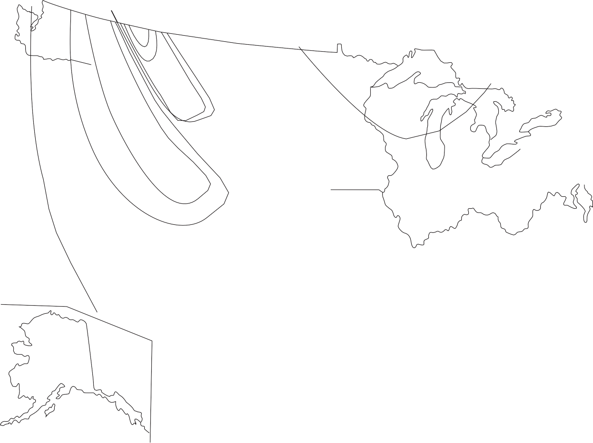0

.1

> .3 0

---.1

> ---.4 ---.1
>
> 0
>
> .3
>
> .6
>
> ---.1
>
> ---.4
>
> ---.4 ---.3

0

> ---.2
>
> .5
>
> .7
>
> .7
>
> .5

.3

.3 0

0

> .2 0 ---.1 .1
>
> ---.2

.70

> 0 200
>
> ---.05

---.2

> ---.1

---.1

0

> ---.2
>
> ---.3
>
> ---.3
>
> ---.2

0

> .2
>
> ---.2
>
> **Figure 3--10**
>
> 0 100
>
> 0 50
>
> .1
>
> 0 100 200
>
> miles
>
> Generalized skew coefficients of logarithms of annual maximum
> streamflow. (From IACWD, 1982.)
>
> in which \| *C~s~* \| is the absolute value of the station skew (used
> as an estimate of population skew) and *n* is the record length in
> years. Stedinger and Griffis (2008) describe issues with the Bulletin
> 17B method that may be addressed
>
> in the future. One of the more important such issue is an eventual
> updating of the regional skewness map and map variance (0.302); the
> latter is likely too high in light of available longer station records
> since the publication of Bulletin 17B. Griffis and Stedinger (2009)
> present methods for improved estimates of weighted skew that are able
> to incorporate updated regional skew values.
>
> Urbanizing watersheds pose difficult problems in the estimation of
> moments, since the runoff tends to increase with time. Hence, the
> frequency distributions and moments may be nonstationary (time
> varying). Simulation models, described in Chapters 5 and 6, may be
> used to develop frequency dis- tributions for flows in rapidly
> urbanizing basins at a given stage of development.
>
> **MOMENTS OF AN ANNUAL MAXIMUM SERIES**
>
> The series of 75 annual maximum flows for the Siletz River is shown in
> Table 3--1. Evaluate the mean and standard deviation of the original
> data and of the logs (base 10) of the data using Equations (3--37) and
> (3--38). Compare the various skewness estimates.
>
> **EXAMPLE 3--3**
>
> This exercise is easily performed in a spreadsheet. For example, Excel
> functions to perform the moment calculations for the column of data in
> Table 3--1 are shown below. Moments for log~10~ DATA are performed on
> the log~10~ transformation of the column of flows. Note, for instance,
> that the log of the mean flow is not equal to the mean of the logs;
> that is, log (20452) = 4.3107 4.2921. (Ample significant figures
> should be car- ried when working with logarithms.) The results are
> presented in Table 3--2. A coefficient of variation of the flow data
> of 30% indicates wide vari- ability of the flows, as is evident in
> Figure 3--2. Considering the log~10~ values, using the regional data
> from Figure 3--10 gives *C~m~* = 0.0 for the
>
> **Table 3--2** Computed Moments for Annual Maximum Floods for the
> Siletz River, Near Siletz, Oregon, Water Years 1925--1999.
>
> **SOLUTION**

+----------------------------+-----------+-----------------+----------+
| > **Excel Function**       |           | > **Original    | > *      |
|                            |           | > Data (cfs)**  | *log~10~ |
|                            |           |                 | > Data   |
|                            |           |                 | > (log   |
|                            |           |                 | > cfs)** |
+============================+===========+=================+==========+
| > Number of data points    | > COUNT   | > 75            | > 75     |
+----------------------------+-----------+-----------------+----------+
| > Mean \[Eq. (3--37)\]     | > AVERAGE | > 20,452 cfs    | > 4.2921 |
+----------------------------+-----------+-----------------+----------+
| > Variance \[Eq. (3--38)\] | > VAR     | > 37,079,690    | >        |
|                            |           | > cfs^2^        |  0.01665 |
+----------------------------+-----------+-----------------+----------+
| > Standard deviation       | > STDEV   | > 6089 cfs      | >        |
|                            |           |                 |  0.12905 |
+----------------------------+-----------+-----------------+----------+
| > Coefficient of variation |           | > 0.298         | > 0.030  |
+----------------------------+-----------+-----------------+----------+
| > Skewness \[Eq. (3--40)\] | > SKEW    | > 0.7889        | >        |
|                            |           |                 |  -0.1565 |
+----------------------------+-----------+-----------------+----------+
| > Weighted skewness \[Eq.  |           |                 | >        |
| > (3--41)\]                |           |                 |  -0.1242 |
+----------------------------+-----------+-----------------+----------+

> north-central coastline of Oregon. A weighted average using Equa- tion
> (3--41) gives an alternative estimate for the skewness of the logs of
>
> \- 0.1242, somewhat less in magnitude than the station value given by
> Equation (3--40). Which value is more nearly correct could be deter-
> mined from a study of other stations in the region; the practical
> effect of the small difference in this case is minor. For purposes of
> examples in this chapter, the weighted value of - 0.1242 will be used
> \[Eq. (3--41)\]. The weighted average skewness is computed as follows:
>
> For the Siletz River data for Oregon, using Equation (3--41), *C~m~* =
> 0.0 and \| *C~s~* \| = 0.1565. Therefore,
>
> *A* = - 0.33 + 0.08(0.1565) = - 0.31748
>
> *B* = 0.94 - 0.26(0.1565) = 0.899315
>
> *V*(*C* ) = 10^*A*-*B*^ ^log^10(*n*\>10) = 0.0786 and *V*(*C* ) =
> 0.302 for the map.

*m*

> Finally,

and

*W* = [0.302]{.underline} = 0.793 and 1 - *W* = 0.207

> 0.0786 + 0.302

*C~w~* = 0.793( - 0.1565) + (0.207)(0.0) = - 0.1242.

> **Fitting a Distribution to Data**
>
> An intuitive use for moment estimates is to fit probability
> distributions to data by equating the moment estimates obtained from
> the data to the func- tional form for the distribution. For example,
> the normal distribution has parameters mean m and variance s^2^. The
> **method of moments** fit for the normal distribution is simply to use
> the estimates from the data for the mean and variance. As another
> example, the parameter l of the exponential dis- tribution is equal to
> the reciprocal of the mean of the distribution. Hence,
>
> the method of moments fit is l = 1 m .
>
> Graphical methods and the **method of maximum likelihood** are two
> alternative procedures to the method of moments for fitting
> distributions to data. Graphical methods will be discussed in Section
> 3.6. Although the method of maximum likelihood is superior to the
> method of moments by some statistical measures, it is generally much
> more computationally com- plex and is beyond the scope of this text.
> Maximum likelihood methods for several distributions used in hydrology
> are presented by Kite (1977). Graph- ical methods will be illustrated
> later.
>
> Finally, alternatives exist to use of the product-moment estimates
> given in this section for variance \[Eq. (3--38)\] and skewness \[Eq.
> (3--40)\]. So-called **L-moments** (L for "linear") are linear
> combinations of the ordered
>
> (ranked) samples of a variable (Hosking and Wallis, 1997). Among other
> advantages, because no powers ("products") of samples are used in the
> com- putation, L-moments are less subject to bias in estimation.
> However, they are not a part of the Bulletin 17-B (IACWD, 1982)
> procedure and will not be described herein. Applications to parameter
> estimation are shown by Stedinger et al. (1993) and Hosking and Wallis
> (1997).
>
> The main objective of determining a distribution's parameters is usu-
> ally to evaluate its CDF. In some cases, however, the same purpose may
> be accomplished without calculating the actual distribution
> parameters. Instead, the distribution is evaluated using a frequency
> factor *K*, defined as
>
> *K* = [*x* - *x*]{.underline}. (3--43)

*S~x~*

> The value of *K* is a function of the desired value for the CDF and
> may also be a function of the skewness. Hence, if *K*(*F*, *C~s~*) is
> known for the calculated skewness and desired CDF value, the
> corresponding magnitude of *x* can be calculated. Frequency factors
> will be illustrated subsequently for several of the distributions to
> be discussed.
>
> The most common means used in hydrology to indicate the probability of
> an event is to assign a **return period**, or **recurrence interval**,
> to the event. The return period is defined as follows:
>
> An annual maximum event has a return period (or recurrence interval)
> of *T* years if its magnitude is equaled or exceeded once, *on the
> average*, every *T* years. The reciprocal of *T* is the exceed- ance
> probability, 1 - *F*, of the event---that is, the probability that the
> event is equaled or exceeded in any one year.
>
> Thus, the 50-yr flood has a probability of 0.02, or 2%, of being
> equaled or exceeded in any single year. It is imperative to realize
> that the return period implies nothing about the actual time sequence
> of an event. The 50-yr flood does not occur like clockwork once every
> 50 yr. Rather, one expects that on the average, about twenty 50-yr
> floods will be experienced during a 1000-yr period. There could in
> fact be two 50-yr floods in a row (with probability

2.  \* 0.02 = 0.0004 for independent events). For this reason, labeling
    a 50-yr flood as a "2% flood" is often a clearer indication to the
    public as to its true likelihood of occurrence in any one year.

> The concept of a return period implies independent events and is usu-
> ally found by analyzing the series of maximum annual floods (or
> rainfalls, etc.). The largest event in one year is assumed to be
> independent of the larg- est event in any other year. But it is also
> possible to apply such an analysis to the *n* largest independent
> events from an *n*-yr period, regardless of the year in which they
> occur. In this case, if the second largest event in one year was
> greater than the largest event in another year, it could be included
> in the
>
> **3.4**
>
> **RETURN PERIOD OR RECURRENCE INTERVAL**
>
> **Figure 3--11**
>
> Relationship between 20
>
> return period for an-
>
> nual exceedances *T~e~* 10
>
> and return period for
>
> annual maxima *T~m~* 5
>
> \[Eq. (3--44)\].
>
> 2
>
> 1
>
> 0.5
>
> 0.2
>
> 1 2
>
> 5 10 20
>
> *Tm*
>
> frequency analysis. This series of *n* largest (independent) values is
> called the series of **annual exceedances**, as opposed to an annual
> maximum series. Both series are used in hydrology, with little
> difference at high return periods (rare events). There are likely to
> be more problems of ensuring independence when using annual
> exceedances, but for low return periods annual exceed- ances give a
> more realistic lower return period for the same magnitude than do
> annual maxima. The relationship between return period based on annual
> exceedances *T~e~* and annual maxima *T~m~* is (Chow, 1964)
>
> *T~e~* = [1]{.underline} . (3--44)
>
> ln *T~m~* - ln(*T~m~* - 1)

This relationship is shown in Figure 3--11.

+--------------+-----------+--------------------------+---------------+
| > **Year**   |           | > **Three Highest        |               |
|              |           | > Independent Flows      |               |
|              |           | > (cfs)**                |               |
+==============+===========+==========================+===============+
| 1            | 700       | 300                      | 150           |
+--------------+-----------+--------------------------+---------------+
| 2            | 900       | 600                      | 100           |
+--------------+-----------+--------------------------+---------------+
| 3            | 550       | 400                      | 200           |
+--------------+-----------+--------------------------+---------------+
| 4            | 850       | 650                      | 350           |
+--------------+-----------+--------------------------+---------------+
| 5            | 500       | 350                      | 100           |
+--------------+-----------+--------------------------+---------------+

+----------------+-------------------------+---------------------------+
| > **Rank**     | > **Annual Maxima**     | > **Annual Exceedances**  |
+================+=========================+===========================+
| 1              | > 900                   | 900                       |
+----------------+-------------------------+---------------------------+
| 2              | > 850                   | 850                       |
+----------------+-------------------------+---------------------------+
| 3              | > 700                   | 700                       |
+----------------+-------------------------+---------------------------+
| 4              | > 550                   | 650                       |
+----------------+-------------------------+---------------------------+
| 5              | > 500                   | 600                       |
+----------------+-------------------------+---------------------------+

> Return periods may be assigned to minimum events (e.g., droughts) in
> an entirely analogous manner, with the interpretation that "equaled or
> exceeded" means "equal to or more severe than." Thus, a 20-yr low flow
> is one for which the probability, *F*, is 5% that the flow will be
> less than or equal to the given value in any one year.
>
> Return periods need not be limited to units of years. As long as the
> events are independent, months or even weeks can be used. The 6-month
> rainfall thus has a probability of 1 6 of being equaled or exceeded in
> any one month.
>
> A further option is to use all the data in the historic time series,
> whether or not they are independent. This is called the **complete
> series**; an example is the series of 365 daily average streamflows.
> Note that the maximum daily average streamflow is not necessarily the
> maximum flow for the day, since the U.S. Geological Survey records
> hourly or 15-min values and determines the maximum flow as the highest
> recorded value and the daily average as the average of the 24 or 96
> recorded values. Frequency information derived from such a complete
> series is usually shown in a **flow-duration curve** (Searcy, 1959),
> which is a plot of magnitude vs. percentage of time the mag- nitude is
> equaled or exceeded (Fig. 3--12). The information from such an
> analysis cannot be directly related to return period, since the values
> in the complete series are not necessarily independent; for example,
> day-to-day average streamflow values are highly correlated.
> Flow-duration curves are especially useful for hydropower development
> or any water use that depends upon a reliable minimum flow (Warnick,
> 1984; Mays, 2001).
>
> **Figure 3--12**
>
> Flow-duration curve for the Siletz River.

(a) Arithmetic scale, used for analysis of yield for water supply.

(b) Logarithmic scale, useful when maxi- mum and minimum flows have
    large separation.

10,000

9,000

8,000

7,000

6,000

5,000

4,000

3,000

2,000

1,000

0

> 

0 20 40 60 80 100

> Percent time flow value equaled or exceeded (a)
>
> 100,000
>
> 10,000
>
> 1,000

100

> 10
>
> 0 20 40 60 80 100
>
> Percent time flow value equaled or exceeded (b)
>
> **References and Objectives**
>
> Many discrete PMFs and continuous PDFs are used in hydrology, but this
> text can focus on only a few of the most common. Others are covered in
> references on statistical hydrology, such as Gumbel (1958), Chow
> (1964), Benjamin and Cornell (1970), Kite (1977), Stedinger et al.
> (1993), and Haan (2002). It is especially difficult to pare down the
> number of con- tinuous distributions for inclusion, since at least 10
> could be selected that have been applied to flood flows. However, the
> most common are the normal, lognormal, gamma (Pearson type 3), and
> log-gamma (log Pearson type 3); only these four are included here. In
> addition, the exponential distribution is discussed because of its
> simplicity and its application to interevent times.
>
> The objective of a discrete analysis is most often to assign
> probabilities to the number of occurrences of an event, whereas the
> objective of a con- tinuous analysis is most often to determine the
> probability of the magnitude of an event, and vice versa. For the
> discrete analysis, there may be interest in both the PMF and the CDF,
> but for continuous analysis the value of the PDF itself is rarely of
> interest. Rather, only the CDF for the continuous random variable need
> be evaluated. These distinctions will be seen as the various
> distributions are presented.
>
> **The Binomial Distribution**
>
> It is common to examine a sequence of independent events for which the
> outcome of each can be either a success or a failure; for example,
> either the *T*-yr flood occurs or it does not. Such a sequence
> consists of Bernoulli trials, independent trials for which the
> probability of success at each trial is a con- stant *p*. The binomial
> distribution answers the question: What is the prob- ability of
> exactly *x* successes in *n* Bernoulli trials? This will be the only
> discrete distribution considered in this text; it is very commonly
> used in hydrology.
>
> The probability that there will be *x* successes followed by *n* - *x*
> fail- ures is just the product of the probabilities of the *n*
> independent events: *p^x^*(1 - *p*)^*n*-*x*^. But this represents just
> one possible sequence for *x* successes and *n* - *x* failures; all
> possible sequences must be considered, including those in which the
> successes do not occur consecutively. The number of pos- sible ways
> (combinations) of choosing *x* events out of *n* possible events is
> given by the **binomial coefficient** (Parzen, 1960):
>
> a *n* b = [*n*!]{.underline} . (3--45)
>
> **3.5**
>
> **COMMON PROBABILISTIC MODELS**
>
> *x x*!(*n* - *x*)!
>
> Thus, the desired probability is the product of the probability of any
> one sequence and the number of ways in which such a sequence can
> occur:

*p*(*x*) = a *n* b *p^x^*(1 - *p*)^*n*-*x*^, *x* = 0, 1, 2, 3, . . . ,
*n*. (3--46)

> The notation *B*(*n*, *p*) indicates the binomial distribution with
> parameters *n* and *p*; example PMFs are shown in Figure 3--13. From
> Equations (3--19) and (3--28), the mean and variance of *x* are

*E*(*x*) = *np*, (3--47)

Var(*x*) = *np*(1 - *p*). (3--48)

> The skewness is
>
> [1 - 2*p *]{.underline}
>
> *g* = \[*np*(1 - *p*)\]0.5. (3--49)
>
> **Figure 3--13** Binomial probability mass function (PMF).
>
> 0.6
>
> 0.4
>
> 0.6
>
> 0.4

0.2 0.2

> 0
>
> 0 2 4

*x*

> 0
>
> 0 2 4

*x*

> 0.4
>
> 0.2
>
> 0
>
> 0 2 4 6 8 10

*x*

> 0.4
>
> 0.2
>
> 0
>
> 0 2 4 6 8 10

*x*

> Clearly, the skewness is zero and the distribution is symmetric if *p*
> = 0.5.
>
> The cumulative distribution function is

*x*

*i n* - *i*

> *F*(*x*) = a a b *p* (1 - *p*)
>
> *i* = 0
>
> . (3--50)
>
> Evaluation of the CDF can get very cumbersome for large values of *n*
> and intermediate values of *x*. It is tabulated by the Chemical Rubber
> Company (n.d.) and by the National Bureau of Standards (1950). For
> large values of *n*, the relationship between the binomial and beta
> distribution may be used (Abramowitz and Stegun, 1964; Benjamin and
> Cornell, 1970), or it may be
>
> approximated by the normal when *p* ≈ 0.5. However, the easiest option
>
> is to use available functions in spreadsheets. For example, the
> function BI-
>
> NOMDIST in Excel will evaluate both the PMF and CDF for any desired
>
> *x*, *n*, and *p*.
>
> This concept of risk and reliability is very important for hydrologic
> design. Equation (3--51) can be used to determine the return period
> required for a given design life and level of risk. Values are shown
> in Table 3--3 that illustrate the very high return periods required
> for low risk for a long de- sign life.
>
> **Table 3--3** Return Periods for Various Degrees of Risk and Expected
> Design Life \[Eq. (3--51)\]

<table>
<colgroup>
<col style="width: 7%" />
<col style="width: 11%" />
<col style="width: 9%" />
<col style="width: 9%" />
<col style="width: 10%" />
<col style="width: 10%" />
<col style="width: 9%" />
<col style="width: 1%" />
<col style="width: 9%" />
<col style="width: 10%" />
<col style="width: 11%" />
</colgroup>
<thead>
<tr class="header">
<th><blockquote>
<p><strong>Risk (%)</strong></p>
</blockquote></th>
<th><blockquote>
<p><strong>Reliability (%)</strong></p>
</blockquote></th>
<th><strong>2</strong></th>
<th><strong>5</strong></th>
<th><blockquote>
<p><strong>10</strong></p>
</blockquote></th>
<th colspan="2"><blockquote>
<p><strong>Expected Design Life, 15 20</strong></p>
</blockquote></th>
<th><blockquote>
<p><em><strong>n</strong></em></p>
</blockquote></th>
<th><blockquote>
<p><strong>(yr)</strong></p>
<p><strong>25</strong></p>
</blockquote></th>
<th><blockquote>
<p><strong>50</strong></p>
</blockquote></th>
<th><blockquote>
<p><strong>100</strong></p>
</blockquote></th>
</tr>
</thead>
<tbody>
<tr class="odd">
<td><blockquote>
<p>75</p>
</blockquote></td>
<td><blockquote>
<p>25</p>
</blockquote></td>
<td>2.0</td>
<td>4.1</td>
<td>7.7</td>
<td>11.3</td>
<td>14.9</td>
<td colspan="2"><blockquote>
<p>18.5</p>
</blockquote></td>
<td>36.6</td>
<td>72.6</td>
</tr>
<tr class="even">
<td><blockquote>
<p>63</p>
</blockquote></td>
<td><blockquote>
<p>37</p>
</blockquote></td>
<td>2.6</td>
<td>5.5</td>
<td>10.6</td>
<td>15.6</td>
<td>20.6</td>
<td colspan="2"><blockquote>
<p>25.6</p>
</blockquote></td>
<td>50.8</td>
<td>101.1</td>
</tr>
<tr class="odd">
<td><blockquote>
<p>50</p>
</blockquote></td>
<td><blockquote>
<p>50</p>
</blockquote></td>
<td>3.4</td>
<td>7.7</td>
<td>14.9</td>
<td>22.1</td>
<td>29.4</td>
<td colspan="2"><blockquote>
<p>36.6</p>
</blockquote></td>
<td>72.6</td>
<td>144.8</td>
</tr>
<tr class="even">
<td><blockquote>
<p>40</p>
</blockquote></td>
<td><blockquote>
<p>60</p>
</blockquote></td>
<td>4.4</td>
<td>10.3</td>
<td>20.1</td>
<td>29.9</td>
<td>39.7</td>
<td colspan="2"><blockquote>
<p>49.4</p>
</blockquote></td>
<td>98.4</td>
<td>196.3</td>
</tr>
<tr class="odd">
<td><blockquote>
<p>30</p>
</blockquote></td>
<td><blockquote>
<p>70</p>
</blockquote></td>
<td>6.1</td>
<td>14.5</td>
<td>28.5</td>
<td>42.6</td>
<td>56.6</td>
<td colspan="2"><blockquote>
<p>70.6</p>
</blockquote></td>
<td>140.7</td>
<td>280.9</td>
</tr>
<tr class="even">
<td><blockquote>
<p>25</p>
</blockquote></td>
<td><blockquote>
<p>75</p>
</blockquote></td>
<td>7.5</td>
<td>17.9</td>
<td>35.3</td>
<td>52.6</td>
<td>70.0</td>
<td colspan="2"><blockquote>
<p>87.4</p>
</blockquote></td>
<td>174.3</td>
<td>348.1</td>
</tr>
<tr class="odd">
<td><blockquote>
<p>20</p>
</blockquote></td>
<td><blockquote>
<p>80</p>
</blockquote></td>
<td>9.5</td>
<td>22.9</td>
<td>45.3</td>
<td>67.7</td>
<td>90.1</td>
<td colspan="2"><blockquote>
<p>112.5</p>
</blockquote></td>
<td>224.6</td>
<td>448.6</td>
</tr>
<tr class="even">
<td><blockquote>
<p>15</p>
</blockquote></td>
<td><blockquote>
<p>85</p>
</blockquote></td>
<td>12.8</td>
<td>31.3</td>
<td>62.0</td>
<td>92.8</td>
<td>123.6</td>
<td colspan="2"><blockquote>
<p>154.3</p>
</blockquote></td>
<td>308.2</td>
<td>615.8</td>
</tr>
<tr class="odd">
<td><blockquote>
<p>10</p>
</blockquote></td>
<td><blockquote>
<p>90</p>
</blockquote></td>
<td>19.5</td>
<td>48.0</td>
<td>95.4</td>
<td>142.9</td>
<td>190.3</td>
<td colspan="2"><blockquote>
<p>237.8</p>
</blockquote></td>
<td>475.1</td>
<td>949.6</td>
</tr>
<tr class="even">
<td>5</td>
<td><blockquote>
<p>95</p>
</blockquote></td>
<td>39.5</td>
<td>98.0</td>
<td>195.5</td>
<td>292.9</td>
<td>390.4</td>
<td colspan="2"><blockquote>
<p>487.9</p>
</blockquote></td>
<td>975.3</td>
<td>1950.1</td>
</tr>
<tr class="odd">
<td>2</td>
<td><blockquote>
<p>98</p>
</blockquote></td>
<td>99.5</td>
<td>248.0</td>
<td>495.5</td>
<td>743.0</td>
<td>990.5</td>
<td colspan="2"><blockquote>
<p>1238.0</p>
</blockquote></td>
<td>2475.4</td>
<td>4950.3</td>
</tr>
<tr class="even">
<td>1</td>
<td><blockquote>
<p>99</p>
</blockquote></td>
<td>199.5</td>
<td>498.0</td>
<td>995.5</td>
<td>1493.0</td>
<td>1990.5</td>
<td colspan="2"><blockquote>
<p>2488.0</p>
</blockquote></td>
<td>4975.5</td>
<td>9950.4</td>
</tr>
<tr class="odd">
<td><blockquote>
<p>0.5</p>
</blockquote></td>
<td><blockquote>
<p>99.5</p>
</blockquote></td>
<td>399.5</td>
<td>998.0</td>
<td>1995.5</td>
<td>2993.0</td>
<td>3990.5</td>
<td colspan="2"><blockquote>
<p>4988.0</p>
</blockquote></td>
<td>9975.5</td>
<td>19950.5</td>
</tr>
</tbody>
</table>

> **EXAMPLE 3--7**
>
> **CRITICAL FLOOD DESIGN**
>
> Consider the 50-yr flood 1*p* = 0.022.

a.  What is the probability that at least one 50-yr flood will occur
    > during the 30-yr lifetime of a flood control project? This is just
    > the risk of failure discussed above, and the distribution of the
    > number of failures is *B*(30, 0.02). Thus, from Equation (3--51),

> Risk = 1 - (1.0 - 0.02)^30^
>
> = 1 - 0.98^30^
>
> = 1 - 0.545
>
> = 0.455.
>
> If this risk is too great, the engineer might design for the 100-yr
> event for which the risk is
>
> Risk = 1 - 0.99^30^ = 0.26
>
> and the reliability is 0.74. For this latter circumstance, there is a
> 26% chance of occurrence of the 100-yr event over the 30-yr life- time
> of the project.
>
> When it is not possible to reduce the risk to a desired level by
> designing for a high (but hypothetical) return period event, an
> alternative is to design for the **probable maximum flood**, which is
> the flood that results from the **probable maximum precipitation
> (PMP)** event. The PMP is the highest precipitation likely to occur
> under known meteorological conditions (Smith, 1993; Mays, 2001)
>
> and has been computed for most areas of the United States by the
> National Weather Service Hydrometeorological Design Studies Center
> ([http://www.nws.noaa.gov/oh/hdsc/studies/pmp.html).](http://www.nws.noaa.gov/oh/hdsc/studies/pmp.html))

b.  What is the probability that the 100-yr flood will not occur in 10
    > yr? In 100 yr?

For *n* = 10, *P*(*x* = 0) = (1 - *P*)^10^ = 0.99^10^ = 0.904,

For *n* = 100, *P*(*x* = 0) = (1 - *p*)^100^ = 0.99^100^ = 0.37.

> Thus, there is a 37% chance (37% reliability) that the 100-yr flood
> will not occur during a sequence of 100 yr.

c.  In general, what is the probability of having no floods greater than
    > the *T*-yr flood during a sequence of *T* yr?

> *P*(*x* = 0) = (1 - 1\>*T*)*^T^*.

As *T* gets large, this approaches 1\>*e* (Benjamin and Cornell, 1970,

> p\. 234). Thus for large *T*,
>
> *P*(*x* = 0) ≈ *e*^-1^ = 0.368 (the reliability)

and

> *P*(*x* ≥ 0) ≈ 1 - *e*^-1^ = 0.632 (the risk).
>
> As an approximation, the *T*-yr flood will occur within a *T*-yr
> period with approximately a 2 3 probability.
>
> **The Exponential Distribution**
>
> Consider a process of random arrivals such that the arrivals (events)
> are independent, the process is stationary (the parameters of the
> process do not change with time), and it is not possible to have more
> than one arrival at an instant in time. These conditions describe a
> Poisson process (Benjamin and Cornell, 1970), which is often
> representative of the arrival of storm events. If the random variable
> *t* represents the interarrival time (the time between events), it is
> found to be exponentially distributed with PDF
>
> *f* (*t*) = l*e*^-l*t*^, *t* ≥ 0. (3--53) This PDF is sketched in
> Figure 3--14.
>
> The mean of the distribution is
>
> *E*(*t*) = 1\>l. (3--54)
>
> and the variance is
>
> Var(*t*) = 1\>l^2^. (3--55)
>
> **Figure 3--14** Exponential PDF parameters for Example 3--9.
>
> 0.014
>
> 0.013
>
> 0.012
>
> 0.011
>
> 0.010
>
> 0.009
>
> 0.008
>
> 0.007
>
> 0.006
>
> 0.005
>
> 0.004
>
> 0.003
>
> 0.002
>
> 0.001
>
> 0 0 40 80 120 160 200 240 280
>
> Time (hr)
>
> Thus, this distribution has the interesting property that its mean
> equals its standard deviation, or *CV* = 1.0, where *CV* is the
> coefficient of variation. The distribution is obviously skewed to the
> right, with a constant skew- ness, *g* = 2.
>
> The CDF may easily be evaluated analytically:

*t*

> *F*(*t*) = l*e*^-lt^ *d*t = 1 - *e*^-l*t*^. (3--56)
>
> L0
>
> Clearly, when *t* = ∞, *F*( ∞) = 1, as it should (the area under the
> PDF must equal 1).
>
> The exponential distribution may be easily manipulated analytically
> and as a result is sometimes used to approximate more complex skewed
> distributions, such as the gamma or extreme value. It is occasionally
> used to fit rainfall totals or river flows but is most often applied
> to interevent times. Closely related distributions are the Poisson,
> which is the PMF for the num- ber of arrivals in time *t,* and the
> gamma, which is the PDF for the time between *k* events (Benjamin and
> Cornell, 1970).
>
> **STORM INTERARRIVAL TIMES**
>
> During the course of a year, about 110 independent storm events occur
> at Gainesville, Florida, and their average duration is 5.3 hr.
> Ignoring sea- sonal variations, in a year of 8760 hr, the average
> interevent time is
>
> [8760 - 110 . 5.3]{.underline}
>
> **EXAMPLE 3--9**
>
> *t* = 110 = 74.3 hr.
>
> The exponential distribution may thus be fit by the method of moments
> with l = 1\> *t* = 0.0135 hr^-1^.

a.  What is the probability that at least 4 days = 96 hr elapse between
    > storms?

> Prob(*t* ≥ 96) = 1 - *F*(96) = *e*^-0.0135^.96 = 0.27.

b.  What is the probability that the separation between two storms will
    > be exactly 12 hr?

Prob(*t* = 12) = 0,

> since the probability that a continuous variable exactly equals a
> specific value is zero.

c.  What is the probability that the separation between two storms will
    > be less than or equal to 12 hr?

Prob(*t* ≤ 12) = *F*(12) = 1 - *e*^-0.0135^.12 = 1 - 0.85 = 0.15.

> **The Normal Distribution**
>
> The normal distribution is also known as the Gaussian distribution, or
> nor- mal error curve, and is fundamental to the entire realm of
> probability and statistics. One reason is that the central limit
> theorem states that under very general conditions, as the number of
> variables in the sum becomes large, the distribution of the sum of a
> large number of random variables will approach the normal
> distribution, regardless of the underlying distribution (Benjamin and
> Cornell, 1970). Many physical processes can be conceptualized as the
> sum of individual processes. Hence, the normal distribution finds many
> applications in hydrology as well as in the statistical areas of
> hypothesis test- ing, confidence intervals, and quality control.
>
> The PDF for the normal (the bell-shaped curve) is included with three
> other PDFs in Figure 3--15 and is given by
>
> *f* (*x*) = [1]{.underline} *e*^-(1\>2)\[(*x*-m)\>s\]^2, - ∞ ≤ *x* ≤
> ∞. (3--57)

22ps

> The parameters of the distribution are the mean m and variance s^2^
> them- selves, and the skewness is zero. The method-of-moments fit is
> therefore simply to use the estimates *x* and *S*^2^ in the
> distribution. Random variables having the distribution of Equation
> (3--57) are denoted by *N*(m, s^2^). Al- though the symmetric nature
> of the normal distribution usually makes it unsuitable for flood flows
> (or other extremes), it often describes annual totals (e.g., annual
> runoff in ac-ft) quite well.
>
> The CDF is evaluated after a change of variable to
>
> *z* K (*x* - m)\>s, (3--58)
>
> **Figure 3--15**
>
> Four PDFs fit to data for the Siletz River. Fit is by the method of
> moments, as shown in the text, with moments given in Example 3--3.

0.00008

0.00007

0.00006

0.00005

0.00004

0.00003

0.00002

0.00001

0

> Siletz River, Comparison of PDFs

0 10,000 20,000 30,000 40,000 50,000

Flow, cfs

> where *z* is known as the standard normal variate and is *N*(0, 1).
> The CDF is then

*z*

*F*(*z*) =

> [1]{.underline} *e*^-*u*^2\>2*du*. (3--59)
>
> L-∞ 22p
>
> Unfortunately, the integration cannot be performed analytically, but
> tables of *F*(*z*) vs. *z* are found in virtually every statistics
> text and in this book in Appendix D. However, the process may be
> greatly simplified through the use of spreadsheets. For example, the
> Excel functions NORMDIST and NORMINV may be used to obtain the
> cumulative, *F*\[(*x* - *x*) *S~x~*\], and the inverse, *x* = *F*
> ^-1^(*x*, *S~x~*, *F* ), respectively.
>
> The similarity of Equation (3--58) to Equation (3--43) for the
> frequency factor is not accidental. In fact, *z* corresponds exactly
> to the frequency factor *K*, discussed in Section 3.3. The magnitude
> of *x* for a given return period can be found easily by the following
> procedure:
>
> 1\. *F*(*z*) = 1 - 1\>*T*.

2.  Obtain *z* from Appendix D.

3.  Then *x* = *x* + *z* . *S~x~*.

> **The Lognormal Distribution**
>
> Consider a hypothetical runoff calculation, in which runoff is equal
> to the *product* of functions of several random factors, such as
> rainfall, contributing area, loss coefficient, and evaporation. In
> general, if a random variable *x* results from the product of a large
> number of other random variables (i.e., a "multiplicative mechanism"),
> then the distribution of the logarithm of *x* will approach normality,
> since the logarithm of *x* will consist of the sum of the logs of the
> contributing factors. In hydrology, it is easy to conceive of many
> contributing factors to runoff that are inherently random and about
> which there is very little deterministic information. Hence, a
> multiplicative mechanism for runoff may be a very reasonable
> assumption. In general, a random variable has a **lognormal**
> distribution if the log of the random vari- able is distributed
> normally. For example, if *y* = log *x* and if *y* is distributed
> normally, then *x* is distributed lognormally.
>
> The lognormal PDF is sketched in Figure 3--15. Because it is bounded
> on the left by zero, has a positive skewness, and is easily used
> through its relationship to the normal, it is widely applied in
> hydrology. The skewness is a function of the coefficient of variation:
>
> *g* = 3*CV* + *CV*^3^. (3--60)
>
> The skewness of the transformed variable *y* is, of course, zero,
> since *y* is distributed normally.
>
> Although the PDF of *x* (the untransformed variable) can easily be
> derived (Benjamin and Cornell, 1970), it is seldom needed. Instead,
> the moments of *y* = log *x* (either base 10 or natural logs may be
> used) are found, and the normal distribution is used for *y*. This may
> be done in two ways. The method of moments requires that the moments
> of the untransformed data be calculated and related to the moments of
> the logs. When the natural log is used (i.e., *y* = ln *x*), these
> relationships are

2

*CV*^2^ K *^[x]{.underline}^*

> = *e*^s^2 - 1, (3--61)

and

> *x* 2

*x*

> m = *e*^m^*y* +s2\>2, (3--62)
>
> which can be solved for m*~y~* and s^2^. (If base 10 logarithms are
> used, the mean and standard deviation must be converted to those for
> natural logs by multiplying by ln 10 = 2.3026 prior to the use of
> Equations (3--61) and (3--62); see Example 3--11, part (c)). The
> method of moments using Equa- tions (3--61) and (3--62) will preserve
> the moments of *x*, should it be neces- sary (e.g., for simulation of
> river flows; see Fiering and Jackson, 1971, and Section 3.7).
>
> Note that the log of the mean is *not* the mean of the logs. Rather,
>
> m*~y~* = log *x~m~*, (3--63)
>
> where *x~m~* is the median of *x*. Another useful relationship of the
> lognormal distribution is
>
> m*~x~* = *x~m~*11 + *CV*^2^2, (3--64)
>
> which demonstrates again that the mean value of *x* is greater than
> the me- dian (see Fig. 3--9).
>
> Estimation of the parameters directly from the log-transformed data is
> more common and amounts to the maximum likelihood estimates for the
> parameters of *y*. In this case, logarithms of all the flows are
> calculated first. Then the mean and variance of the log-transformed
> data are used. If moments of the transformed data are calculated by
> both methods, their cor- respondence will increase as the sample size
> increases.
>
> The three-parameter lognormal distribution has an additional param-
> eter that is a nonzero lower bound on the value of *x*. Three moments
> are required to estimate the three parameters; applications to
> hydrology are given by Sangal and Biswas (1970).
>
> **APPLICATION OF LOGNORMAL DISTRIBUTION TO FLOOD FLOWS**
>
> Repeat Example 3--10 using the lognormal distribution. Parameters of
> the logs (base 10) were calculated in Example 3--3.

(a) What is the 100-yr flood?

> The *z* value was found in Example 3--10 to be 2.326. Thus,
>
> *y*~100~ = 4.29209 + 2.326 . 0.12905 = 4.5923
>
> **EXAMPLE 3--11**

and

> *Q*~100~ = 10*^y^*100 = 39,100 cfs.
>
> This value is much higher than the estimate (34,620 cfs) from the
> normal distribution. But it is a better estimate because the lognor-
> mal distribution more accurately reflects the skewness of the actual
> flow data. (Note that it is a good practice to carry several
> significant figures when working with logarithms, and round only for
> the final answer.)

(b) What is the probability that a flow will be less than or equal to
    > 30,000 cfs?

> The value of *y* = log~10~ 30,000 = 4.4771.
>
> *z* [4.4771 - 4.2921]{.underline} 1.4337.
>
> 0.12905
>
> Interpolating linearly in Table D--1, *F* 11.43372 = 0.9242. The
> return period of a 30,000-cfs flood is thus 1\> 11 - 0.92422 = 13.1
> yr.

(c) How do the moment estimates from the log-transformed data com- pare
    > with those found using Equations (3--61) and (3--62)? These two
    > equations must be solved for the moments of the logs. With data
    > from Table 3--2, using symbols for the estimated mean and
    > variance, and rearranging the equations gives values for natural
    > logs:

> *S*^2^ = ln 1*CV*^2^ + 12 = ln 10.298^2^ + 12 = 0.0849 (3--65)

*y x*

> and
>
> *y* = ln *x* - *S*^2^\>2 = ln 20452 - 0.08492 = 9.8834. (3--66)
>
> Converting to base 10 logs by dividing the mean by 2.3026 and the
> variance by 2.3026^2^ gives the following results.

*y*

> The values are unusually close for this example, but that is not
> always the case, especially for shorter records. However, use of
> moments obtained directly from the transformed data is most common,
> easiest, and preferable.
>
> **The Gamma (Pearson Type 3) Distribution**
>
> This distribution receives extensive use in hydrology simply because
> of its shape and its well-known mathematical properties. The
> three-parameter gamma distribution is sketched in Figure 3--15 and has
> the pleasing proper- ties of being bounded on the left (the lower
> limit is 5015 cfs) and of positive skewness. (The distribution can
> also be used with negative skewness.) Although the three parameters of
> the PDF are simple functions of the mean, variance, and skewness
> (Kite, 1977; Bobée and Ashkar, 1991), it is more common in hydrologic
> applications to evaluate the CDF with frequency fac- tors (Section
> 3.3), for which the PDF parameters are unnecessary. (How- ever, note
> that spreadsheet functions such as Excel's GAMMADIST and GAMMAINV make
> it possible to avoid the tedious process of using any tabular values;
> see Problem 3.12.) The frequency factors *K* are a function of the
> skewness and return period (or CDF) and are given in Table 3--4. Thus,
> to evaluate the *T*-yr flood, the moments of the data are computed and
>
> *Q~T~* = *Q* + *K*(*C~s~*, *T*) . *S~Q~*. (3--67)
>
> This procedure is satisfactory for return periods listed in Table
> 3--4, but interpolation between return periods is not appropriate.
> Instead, the
>
> **Table 3--4** Frequency Factors *K* for Gamma and Log Pearson Type 3
> Distributions

+--------+-------+-------+----+--------+--------+-----+------+-----+
| >      | >     | >     | >  | >      |        | >   | >    | > * |
| **Skew | **1.0 | **2** |  * | **Recu |        | **5 |  **1 | *20 |
| >      | 101** | >     | *5 | rrence |        | 0** | 00** | 0** |
|  Coeff | >     | > *   | ** | > In   |        | >   |      | >   |
| icient | > *   | *50** | >  | terval |        | >   | *    | > * |
| > *C   | *99** |       | >  | > in   |        |  ** | *1** | *0. |
| ~s~*** |       |       | ** | >      |        | 2** |      | 5** |
|        |       |       | 20 |  Years |        |     |      |     |
|        |       |       | ** | > 10   |        |     |      |     |
|        |       |       |    | > 25** |        |     |      |     |
|        |       |       |    |        |        |     |      |     |
|        |       |       |    | **P    |        |     |      |     |
|        |       |       |    | ercent |        |     |      |     |
|        |       |       |    | Chance |        |     |      |     |
|        |       |       |    | (** \# |        |     |      |     |
|        |       |       |    | **)**  |        |     |      |     |
|        |       |       |    | =      |        |     |      |     |
|        |       |       |    | **1**  |        |     |      |     |
|        |       |       |    | ---    |        |     |      |     |
|        |       |       |    | *      |        |     |      |     |
|        |       |       |    | **F*** |        |     |      |     |
|        |       |       |    |        |        |     |      |     |
|        |       |       |    | > **10 |        |     |      |     |
|        |       |       |    | > 4**  |        |     |      |     |
+========+=======+=======+====+========+========+=====+======+=====+
| 3.0    | > -   | -     | 0  | 1.180  | >      | >   | > 4  | 4.  |
|        | 0.667 | 0.396 | .4 |        |  2.278 |  3. | .051 | 970 |
|        |       |       | 20 |        |        | 152 |      |     |
+--------+-------+-------+----+--------+--------+-----+------+-----+
| 2.9    | > -   | -     | 0  | 1.195  | >      | >   | > 4  | 4.  |
|        | 0.690 | 0.390 | .4 |        |  2.277 |  3. | .013 | 904 |
|        |       |       | 40 |        |        | 134 |      |     |
+--------+-------+-------+----+--------+--------+-----+------+-----+
| 2.8    | > -   | -     | 0  | 1.210  | >      | >   | > 3  | 4.  |
|        | 0.714 | 0.384 | .4 |        |  2.275 |  3. | .973 | 847 |
|        |       |       | 60 |        |        | 114 |      |     |
+--------+-------+-------+----+--------+--------+-----+------+-----+
| 2.7    | > -   | -     | 0  | 1.224  | >      | >   | > 3  | 4.  |
|        | 0.740 | 0.376 | .4 |        |  2.272 |  3. | .932 | 783 |
|        |       |       | 79 |        |        | 093 |      |     |
+--------+-------+-------+----+--------+--------+-----+------+-----+
| 2.6    | > -   | -     | 0  | 1.238  | >      | >   | > 3  | 4.  |
|        | 0.769 | 0.368 | .4 |        |  2.267 |  3. | .889 | 718 |
|        |       |       | 99 |        |        | 071 |      |     |
+--------+-------+-------+----+--------+--------+-----+------+-----+
| 2.5    | > -   | -     | 0  | 1.250  | >      | >   | > 3  | 4.  |
|        | 0.799 | 0.360 | .5 |        |  2.262 |  3. | .845 | 652 |
|        |       |       | 18 |        |        | 048 |      |     |
+--------+-------+-------+----+--------+--------+-----+------+-----+
| 2.4    | > -   | -     | 0  | 1.262  | >      | >   | > 3  | 4.  |
|        | 0.832 | 0.351 | .5 |        |  2.256 |  3. | .800 | 584 |
|        |       |       | 37 |        |        | 023 |      |     |
+--------+-------+-------+----+--------+--------+-----+------+-----+
| 2.3    | > -   | -     | 0  | 1.274  | >      | >   | > 3  | 4.  |
|        | 0.867 | 0.341 | .5 |        |  2.248 |  2. | .753 | 515 |
|        |       |       | 55 |        |        | 997 |      |     |
+--------+-------+-------+----+--------+--------+-----+------+-----+
| 2.2    | > -   | -     | 0  | 1.284  | >      | >   | > 3  | 4.  |
|        | 0.905 | 0.330 | .5 |        |  2.240 |  2. | .705 | 444 |
|        |       |       | 74 |        |        | 970 |      |     |
+--------+-------+-------+----+--------+--------+-----+------+-----+
| 2.1    | > -   | -     | 0  | 1.294  | >      | >   | > 3  | 4.  |
|        | 0.946 | 0.319 | .5 |        |  2.230 |  2. | .656 | 372 |
|        |       |       | 92 |        |        | 942 |      |     |
+--------+-------+-------+----+--------+--------+-----+------+-----+
| 2.0    | > -   | -     | 0  | 1.302  | >      | >   | > 3  | 4.  |
|        | 0.990 | 0.307 | .6 |        |  2.219 |  2. | .605 | 298 |
|        |       |       | 09 |        |        | 912 |      |     |
+--------+-------+-------+----+--------+--------+-----+------+-----+
| 1.9    | > -   | -     | 0  | 1.310  | >      | >   | > 3  | 4.  |
|        | 1.037 | 0.294 | .6 |        |  2.207 |  2. | .553 | 223 |
|        |       |       | 27 |        |        | 881 |      |     |
+--------+-------+-------+----+--------+--------+-----+------+-----+
| 1.8    | > -   | -     | 0  | 1.318  | >      | >   | > 3  | 4.  |
|        | 1.087 | 0.282 | .6 |        |  2.193 |  2. | .499 | 147 |
|        |       |       | 43 |        |        | 848 |      |     |
+--------+-------+-------+----+--------+--------+-----+------+-----+
| 1.7    | > -   | -     | 0  | 1.324  | >      | >   | > 3  | 4.  |
|        | 1.140 | 0.268 | .6 |        |  2.179 |  2. | .444 | 069 |
|        |       |       | 60 |        |        | 815 |      |     |
+--------+-------+-------+----+--------+--------+-----+------+-----+
| 1.6    | > -   | -     | 0  | 1.329  | >      | >   | > 3  | 3.  |
|        | 1.197 | 0.254 | .6 |        |  2.163 |  2. | .388 | 990 |
|        |       |       | 75 |        |        | 780 |      |     |
+--------+-------+-------+----+--------+--------+-----+------+-----+
| 1.5    | > -   | -     | 0  | 1.333  | >      | >   | > 3  | 3.  |
|        | 1.256 | 0.240 | .6 |        |  2.146 |  2. | .330 | 910 |
|        |       |       | 90 |        |        | 743 |      |     |
+--------+-------+-------+----+--------+--------+-----+------+-----+
| 1.4    | > -   | -     | 0  | 1.337  | >      | >   | > 3  | 3.  |
|        | 1.318 | 0.225 | .7 |        |  2.128 |  2. | .271 | 828 |
|        |       |       | 05 |        |        | 706 |      |     |
+--------+-------+-------+----+--------+--------+-----+------+-----+
| 1.3    | > -   | -     | 0  | 1.339  | >      | >   | > 3  | 3.  |
|        | 1.383 | 0.210 | .7 |        |  2.108 |  2. | .211 | 745 |
|        |       |       | 19 |        |        | 666 |      |     |
+--------+-------+-------+----+--------+--------+-----+------+-----+
| 1.2    | > -   | -     | 0  | 1.340  | >      | >   | > 3  | 3.  |
|        | 1.449 | 0.195 | .7 |        |  2.087 |  2. | .149 | 661 |
|        |       |       | 32 |        |        | 626 |      |     |
+--------+-------+-------+----+--------+--------+-----+------+-----+
| 1.1    | > -   | -     | 0  | 1.341  | >      | >   | > 3  | 3.  |
|        | 1.518 | 0.180 | .7 |        |  2.066 |  2. | .087 | 575 |
|        |       |       | 45 |        |        | 585 |      |     |
+--------+-------+-------+----+--------+--------+-----+------+-----+
| 1.0    | > -   | -     | 0  | 1.340  | >      | >   | > 3  | 3.  |
|        | 1.588 | 0.164 | .7 |        |  2.043 |  2. | .022 | 489 |
|        |       |       | 58 |        |        | 542 |      |     |
+--------+-------+-------+----+--------+--------+-----+------+-----+
| .9     | > -   | -     | 0  | 1.339  | >      | >   | > 2  | 3.  |
|        | 1.660 | 0.148 | .7 |        |  2.018 |  2. | .957 | 401 |
|        |       |       | 69 |        |        | 498 |      |     |
+--------+-------+-------+----+--------+--------+-----+------+-----+
| .8     | > -   | -     | 0  | 1.336  | >      | >   | > 2  | 3.  |
|        | 1.733 | 0.132 | .7 |        |  1.993 |  2. | .891 | 312 |
|        |       |       | 80 |        |        | 453 |      |     |
+--------+-------+-------+----+--------+--------+-----+------+-----+
| .7     | > -   | -     | 0  | 1.333  | >      | >   | > 2  | 3.  |
|        | 1.806 | 0.116 | .7 |        |  1.967 |  2. | .824 | 223 |
|        |       |       | 90 |        |        | 407 |      |     |
+--------+-------+-------+----+--------+--------+-----+------+-----+
| .6     | > -   | -     | 0  | 1.328  | >      | >   | > 2  | 3.  |
|        | 1.880 | 0.099 | .8 |        |  1.939 |  2. | .755 | 132 |
|        |       |       | 00 |        |        | 359 |      |     |
+--------+-------+-------+----+--------+--------+-----+------+-----+
| .5     | > -   | -     | 0  | 1.323  | >      | >   | > 2  | 3.  |
|        | 1.955 | 0.083 | .8 |        |  1.910 |  2. | .686 | 041 |
|        |       |       | 08 |        |        | 311 |      |     |
+--------+-------+-------+----+--------+--------+-----+------+-----+
| .4     | > -   | -     | 0  | 1.317  | >      | >   | > 2  | 2.  |
|        | 2.029 | 0.066 | .8 |        |  1.880 |  2. | .615 | 949 |
|        |       |       | 16 |        |        | 261 |      |     |
+--------+-------+-------+----+--------+--------+-----+------+-----+
| .3     | > -   | -     | 0  | 1.309  | >      | >   | > 2  | 2.  |
|        | 2.104 | 0.050 | .8 |        |  1.849 |  2. | .544 | 856 |
|        |       |       | 24 |        |        | 211 |      |     |
+--------+-------+-------+----+--------+--------+-----+------+-----+
| .2     | > -   | -     | 0  | 1.301  | >      | >   | > 2  | 2.  |
|        | 2.178 | 0.033 | .8 |        |  1.818 |  2. | .472 | 763 |
|        |       |       | 30 |        |        | 159 |      |     |
+--------+-------+-------+----+--------+--------+-----+------+-----+
| .1     | > -   | -     | 0  | 1.292  | >      | >   | > 2  | 2.  |
|        | 2.252 | 0.017 | .8 |        |  1.785 |  2. | .400 | 670 |
|        |       |       | 36 |        |        | 107 |      |     |
+--------+-------+-------+----+--------+--------+-----+------+-----+
| > 0    | > -   | 0     | 0  | 1.282  | >      | >   | > 2  | 2.  |
|        | 2.326 |       | .8 |        |  1.751 |  2. | .326 | 576 |
|        |       |       | 42 |        |        | 054 |      |     |
+--------+-------+-------+----+--------+--------+-----+------+-----+
| > -0.1 | > -   | 0.017 | 0  | 1.270  | >      | >   | > 2  | 2.  |
|        | 2.400 |       | .8 |        |  1.716 |  2. | .252 | 482 |
|        |       |       | 46 |        |        | 000 |      |     |
+--------+-------+-------+----+--------+--------+-----+------+-----+
| > -0.2 | > -   | 0.033 | 0  | 1.258  | >      | >   | > 2  | 2.  |
|        | 2.472 |       | .8 |        |  1.680 |  1. | .178 | 388 |
|        |       |       | 50 |        |        | 945 |      |     |
+--------+-------+-------+----+--------+--------+-----+------+-----+
| > -0.3 | > -   | 0.050 | 0  | 1.245  | >      | >   | > 2  | 2.  |
|        | 2.544 |       | .8 |        |  1.643 |  1. | .104 | 294 |
|        |       |       | 53 |        |        | 890 |      |     |
+--------+-------+-------+----+--------+--------+-----+------+-----+
| > -0.4 | > -   | 0.066 | 0  | 1.231  | >      | >   | > 2  | 2.  |
|        | 2.615 |       | .8 |        |  1.606 |  1. | .029 | 201 |
|        |       |       | 55 |        |        | 834 |      |     |
+--------+-------+-------+----+--------+--------+-----+------+-----+
| > -0.5 | > -   | 0.083 | 0  | 1.216  | >      | >   | > 1  | 2.  |
|        | 2.686 |       | .8 |        |  1.567 |  1. | .955 | 108 |
|        |       |       | 56 |        |        | 777 |      |     |
+--------+-------+-------+----+--------+--------+-----+------+-----+
| > -0.6 | > -   | 0.099 | 0  | 1.200  | >      | >   | > 1  | 2.  |
|        | 2.755 |       | .8 |        |  1.528 |  1. | .880 | 016 |
|        |       |       | 57 |        |        | 720 |      |     |
+--------+-------+-------+----+--------+--------+-----+------+-----+
| > -0.7 | > -   | 0.116 | 0  | 1.183  | >      | >   | > 1  | 1.  |
|        | 2.824 |       | .8 |        |  1.488 |  1. | .806 | 926 |
|        |       |       | 57 |        |        | 663 |      |     |
+--------+-------+-------+----+--------+--------+-----+------+-----+
| > -0.8 | > -   | 0.132 | 0  | 1.166  | >      | >   | > 1  | 1.  |
|        | 2.891 |       | .8 |        |  1.448 |  1. | .733 | 837 |
|        |       |       | 56 |        |        | 606 |      |     |
+--------+-------+-------+----+--------+--------+-----+------+-----+
| > -0.9 | > -   | 0.148 | 0  | 1.147  | >      | >   | > 1  | 1.  |
|        | 2.957 |       | .8 |        |  1.407 |  1. | .660 | 749 |
|        |       |       | 54 |        |        | 549 |      |     |
+--------+-------+-------+----+--------+--------+-----+------+-----+
| > -1.0 | > -   | 0.164 | 0  | 1.128  | >      | >   | > 1  | 1.  |
|        | 3.022 |       | .8 |        |  1.366 |  1. | .588 | 664 |
|        |       |       | 52 |        |        | 492 |      |     |
+--------+-------+-------+----+--------+--------+-----+------+-----+

+--------+-------+-------+----+--------+--------+-----+------+-----+
| >      | >     | **2** | >  | >      |        | >   | >    | > * |
| **Skew | **1.0 |       |  * | **Recu |        | **5 |  **1 | *20 |
| >      | 101** | > *   | *5 | rrence |        | 0** | 00** | 0** |
|  Coeff | >     | *50** | ** | > In   |        | >   | >    | >   |
| icient | > *   |       | >  | terval |        | >   | > *  | > * |
| > *C   | *99** |       | >  | > in   |        |  ** | *1** | *0. |
| ~s~*** |       |       | ** | >      |        | 2** |      | 5** |
|        |       |       | 20 |  Years |        |     |      |     |
|        |       |       | ** | > 10   |        |     |      |     |
|        |       |       |    | > 25** |        |     |      |     |
|        |       |       |    |        |        |     |      |     |
|        |       |       |    | **P    |        |     |      |     |
|        |       |       |    | ercent |        |     |      |     |
|        |       |       |    | Chance |        |     |      |     |
|        |       |       |    | (** \# |        |     |      |     |
|        |       |       |    | **)**  |        |     |      |     |
|        |       |       |    | =      |        |     |      |     |
|        |       |       |    | **1**  |        |     |      |     |
|        |       |       |    | ---    |        |     |      |     |
|        |       |       |    | *      |        |     |      |     |
|        |       |       |    | **F*** |        |     |      |     |
|        |       |       |    |        |        |     |      |     |
|        |       |       |    | > **10 |        |     |      |     |
|        |       |       |    | > 4**  |        |     |      |     |
+========+=======+=======+====+========+========+=====+======+=====+
| > -1.1 | > -   | 0.180 | 0  | 1.107  | >      | >   | > 1  | 1.  |
|        | 3.087 |       | .8 |        |  1.324 |  1. | .518 | 581 |
|        |       |       | 48 |        |        | 435 |      |     |
+--------+-------+-------+----+--------+--------+-----+------+-----+
| > -1.2 | > -   | 0.195 | 0  | 1.086  | >      | >   | > 1  | 1.  |
|        | 3.149 |       | .8 |        |  1.282 |  1. | .449 | 501 |
|        |       |       | 44 |        |        | 379 |      |     |
+--------+-------+-------+----+--------+--------+-----+------+-----+
| > -1.3 | > -   | 0.210 | 0  | 1.064  | >      | >   | > 1  | 1.  |
|        | 3.211 |       | .8 |        |  1.240 |  1. | .383 | 424 |
|        |       |       | 38 |        |        | 324 |      |     |
+--------+-------+-------+----+--------+--------+-----+------+-----+
| > -1.4 | > -   | 0.225 | 0  | 1.041  | >      | >   | > 1  | 1.  |
|        | 3.271 |       | .8 |        |  1.198 |  1. | .318 | 351 |
|        |       |       | 32 |        |        | 270 |      |     |
+--------+-------+-------+----+--------+--------+-----+------+-----+
| > -1.5 | > -   | 0.240 | 0  | 1.018  | >      | >   | > 1  | 1.  |
|        | 3.330 |       | .8 |        |  1.157 |  1. | .256 | 282 |
|        |       |       | 25 |        |        | 217 |      |     |
+--------+-------+-------+----+--------+--------+-----+------+-----+
| > -1.6 | > -   | 0.254 | 0  | 0.994  | >      | >   | > 1  | 1.  |
|        | 3.388 |       | .8 |        |  1.116 |  1. | .197 | 216 |
|        |       |       | 17 |        |        | 166 |      |     |
+--------+-------+-------+----+--------+--------+-----+------+-----+
| > -1.7 | > -   | 0.268 | 0  | 0.970  | >      | >   | > 1  | 1.  |
|        | 3.444 |       | .8 |        |  1.075 |  1. | .140 | 155 |
|        |       |       | 08 |        |        | 116 |      |     |
+--------+-------+-------+----+--------+--------+-----+------+-----+
| > -1.8 | > -   | 0.282 | 0  | 0.945  | >      | >   | > 1  | 1.  |
|        | 3.499 |       | .7 |        |  1.035 |  1. | .087 | 097 |
|        |       |       | 99 |        |        | 069 |      |     |
+--------+-------+-------+----+--------+--------+-----+------+-----+
| > -1.9 | > -   | 0.294 | 0  | 0.920  | >      | >   | > 1  | 1.  |
|        | 3.553 |       | .7 |        |  0.996 |  1. | .037 | 044 |
|        |       |       | 88 |        |        | 023 |      |     |
+--------+-------+-------+----+--------+--------+-----+------+-----+
| > -2.0 | > -   | 0.307 | 0  | 0.895  | >      | >   | > 0  | 0.  |
|        | 3.605 |       | .7 |        |  0.959 |  0. | .990 | 995 |
|        |       |       | 77 |        |        | 980 |      |     |
+--------+-------+-------+----+--------+--------+-----+------+-----+
| > -2.1 | > -   | 0.319 | 0  | 0.869  | >      | >   | > 0  | 0.  |
|        | 3.656 |       | .7 |        |  0.923 |  0. | .946 | 949 |
|        |       |       | 65 |        |        | 939 |      |     |
+--------+-------+-------+----+--------+--------+-----+------+-----+
| > -2.2 | > -   | 0.330 | 0  | 0.844  | >      | >   | > 0  | 0.  |
|        | 3.705 |       | .7 |        |  0.888 |  0. | .905 | 907 |
|        |       |       | 52 |        |        | 900 |      |     |
+--------+-------+-------+----+--------+--------+-----+------+-----+
| > -2.3 | > -   | 0.341 | 0  | 0.819  | >      | >   | > 0  | 0.  |
|        | 3.753 |       | .7 |        |  0.855 |  0. | .867 | 869 |
|        |       |       | 39 |        |        | 864 |      |     |
+--------+-------+-------+----+--------+--------+-----+------+-----+
| > -2.4 | > -   | 0.351 | 0  | 0.795  | >      | >   | > 0  | 0.  |
|        | 3.800 |       | .7 |        |  0.823 |  0. | .832 | 833 |
|        |       |       | 25 |        |        | 830 |      |     |
+--------+-------+-------+----+--------+--------+-----+------+-----+
| > -2.5 | > -   | 0.360 | 0  | 0.771  | >      | >   | > 0  | 0.  |
|        | 3.845 |       | .7 |        |  0.793 |  0. | .799 | 800 |
|        |       |       | 11 |        |        | 798 |      |     |
+--------+-------+-------+----+--------+--------+-----+------+-----+
| > -2.6 | > -   | 0.368 | 0  | 0.747  | >      | >   | > 0  | 0.  |
|        | 3.889 |       | .6 |        |  0.764 |  0. | .769 | 769 |
|        |       |       | 96 |        |        | 768 |      |     |
+--------+-------+-------+----+--------+--------+-----+------+-----+
| > -2.7 | > -   | 0.376 | 0  | 0.724  | >      | >   | > 0  | 0.  |
|        | 3.932 |       | .6 |        |  0.738 |  0. | .740 | 741 |
|        |       |       | 81 |        |        | 740 |      |     |
+--------+-------+-------+----+--------+--------+-----+------+-----+
| > -2.8 | > -   | 0.384 | 0  | 0.702  | >      | >   | > 0  | 0.  |
|        | 3.973 |       | .6 |        |  0.712 |  0. | .714 | 714 |
|        |       |       | 66 |        |        | 714 |      |     |
+--------+-------+-------+----+--------+--------+-----+------+-----+
| > -2.9 | > -   | 0.390 | 0  | 0.681  | >      | >   | > 0  | 0.  |
|        | 4.013 |       | .6 |        |  0.683 |  0. | .690 | 690 |
|        |       |       | 51 |        |        | 689 |      |     |
+--------+-------+-------+----+--------+--------+-----+------+-----+
| > -3.0 | > -   | 0.396 | 0  | 0.660  | >      | >   | > 0  | 0.  |
|        | 4.051 |       | .6 |        |  0.666 |  0. | .667 | 667 |
|        |       |       | 36 |        |        | 666 |      |     |
+--------+-------+-------+----+--------+--------+-----+------+-----+

> *Source:* IACWD (1982).
>
> magnitudes should be plotted vs. return period or vs. the CDF, and
> graph- ical interpolation performed. (Graphical procedures will be
> discussed in Section 3.6.) This is also the procedure to use for the
> inverse problem of finding the probability (or return period)
> corresponding to a given flood magnitude. Alternatively, the three
> parameters of the distribution may be found and tables of the CDF (or
> spreadsheet functions) used to determine either the magnitude or the
> probability; see Problem 3.12. The gamma dis- tribution is directly
> related to the chi-square distribution, for which many tables are
> available (Abramowitz and Stegun, 1964; Benjamin and Cornell, 1970;
> Haan, 2002).
>
> The two-parameter gamma distribution corresponds to setting the left
> boundary (Fig. 3--15) to zero. In this case, the sample skewness need
> not be calculated. Instead, the skewness of the two-parameter gamma
> should be used:
>
> *g* = 2*CV* or *C~s~* = 2*S~x~*\>*x* = 2*CV*. (3--68)
>
> This skewness can then be used in Table 3--4.
>
> **The Log Pearson Type 3 Distribution**
>
> Analogous to the normal--lognormal distributions, when the
> three-parame- ter gamma distribution is applied to the logs of the
> random variables, it is customarily called the log Pearson type 3
> (LP3) distribution. It plays an important role in hydrology because it
> has been recommended for applica- tion to flood flows by the U.S.
> IACWD (1982) in the committee's Bulletin 17B method. (Potential
> improvements to this method are discussed by Ste- dinger and Griffis
> \[2008\].) The shape of the LP3 is quite flexible due to its three
> parameters; an example for the Siletz River is shown in Figure 3--15.
>
> Its use is entirely analogous to the lognormal discussed earlier;
> however, the moments of the transformed and untransformed variables
> will not be related here. Instead, the data are transformed by taking
> logarithms (either base 10 or natural), and the gamma-3 distribution
> is applied exactly as in the preceding section. This means that the
> magnitudes can readily be computed for return periods shown in Table
> 3--4, but the inverse problem of determining the return period (or
> CDF) corresponding to a given magnitude should be done graphically or
> with the tables mentioned in the preceding section or through the use
> of spreadsheet functions for the gamma distribution.
>
> **Extreme Value Distributions**
>
> Several additional distributions for hydrologic variables could be
> considered, and the most important of which, perhaps, are the
> **extreme value** (EV) fam- ily of distributions (Gumbel, 1958). These
> include the EV I, or Gumbel distribution, the EV II, the EV III (also
> known as the Weibull distribution when used for minima, such as
> droughts), and the generalized extreme-value distribution (GEV), which
> incorporates the three types just listed as special cases (Jenkinson,
> 1955; Stedinger et al., 1993). Although these distributions are often
> used in hydrology, space does not permit further examination in this
> text; see the references just cited as well as Benjamin and Cornell
> (1970) and Kite (1977).
>
> One relationship sometimes encountered in hydrology, however, is the
> concept of the return period of the mean annual flood. The return
> period of the mean could be evaluated using any of the distributions
> discussed in this chapter, by *T*(m) = 1 \[1 - *F*(m)\]. Using the
> Gumbel (EV I) distribution, it is found that

and

> *F*(m) = 0.57 (3--69)
>
> *T*(m) = [1]{.underline} = 2.33 yr, (3--70)
>
> 1 - *F*
>
> a value often encountered in the hydrologic literature. If only a plot
> of flow vs. return period is available, this relationship is sometimes
> used as a crude estimate of the mean of the flows, assuming that they
> obey a Gumbel distribution.
>
> **Table 3--5** Comparison of Estimated 100-yr Floods and Measured and
> Predicted Skewness Values

+--------------------+--------------+---------------------+------------+
| > **Distribution** | >            | > **Predicted       | >          |
|                    |  **Predicted | > Skewness**        | **Measured |
|                    | > 100-yr     |                     | >          |
|                    | > Flood      |                     | Skewness** |
|                    | > (cfs)**    |                     |            |
+====================+==============+=====================+============+
| > Normal           | 34,620       | > 0                 | > 0.789    |
+--------------------+--------------+---------------------+------------+
| > Lognormal        | 39,110       | > 2.86 \[Eq.        | > 0.789    |
|                    |              | > (3--60)\]         |            |
+--------------------+--------------+---------------------+------------+
|                    |              | > 0\*               | > -0.156\* |
+--------------------+--------------+---------------------+------------+
| > Gamma (Pearson   | 38,010       | > 0.789             | > 0.789    |
| > 3)               |              |                     |            |
+--------------------+--------------+---------------------+------------+
| > Log Pearson 3    | 38,060       | > -0.124\*\*        | >          |
|                    |              |                     | -0.124\*\* |
+--------------------+--------------+---------------------+------------+

> \*Skewness of logarithms of the data.
>
> \*\*Weighted skewness of the logs.
>
> can be performed on the basis of skewness. The untransformed data and
> their logarithms (Example 3--3) both exhibit nonzero skewness, so the
> normal distribution is suspect. All the other distributions have
> nonzero skewness, but only the gamma and log-gamma (LP3) theoretically
> match the data exactly (since they are three-parameter distributions).
> Finally, the LP3 is recommended by the IACWD. The best fit may also be
> evalu- ated on the basis of a comparison of the fitted (theoretical)
> CDF to the empirical CDF. This is done graphically, as explained in
> the next section.
>
> **Introduction**
>
> As in much of statistics, a visual inspection of the fit of the
> frequency distri- bution is probably the best aid in determining how
> well an individual distri- bution fits a set of data or which
> distribution fits "best." Two questions must be addressed to plot the
> data: (1) What kind of graph paper (i.e., type of scaling) should be
> used? and (2) How should the data points be plotted (the question of
> **plotting position**)?
>
> **Probability Paper**
>
> Although ordinary graph paper could be used to plot the CDF vs. the
> mag- nitude of the random variable, it is customary to try to use
> paper scaled such that the theoretical fit is a straight line. That
> is, it is desirable to plot magni- tude *x* vs. some function of the
> CDF *h*\[*F*(*x*)\] such that *x* vs. *h* is linear. If this can be
> done, one ordinate of the paper will be the magnitude and the other
> the function *h*, but this axis will be labeled with values of *F*,
> not *h*. Among other advantages, this permits a graphical fit of the
> distribution to the data simply by drawing a straight line through the
> plotted data points.

The frequency factor *K* \[Eq. (3--43)\] serves as the required function

*h*(*F*) as long as it is not also a function of skewness. For example,
for the

> **3.6**
>
> **GRAPHICAL PRESENTATION OF DATA**
>
> **Figure 3--16** Normal probability paper.
>
> 1---*F*
>
> 99.99 99.9 99 98 95 90 80 70 60 50 40 30 20 10 5 2 1 0.5 0.1 0.01
>
> 0.01 0.1 0.5 1 2 5 10 20 30 40 50 60 70 80 90 95 98 99 99.9 99.99
>
> *F*
>
> normal distribution, *K* = *z*, the standard normal variate. Clearly,
> a plot of *x* vs. *z* is linear \[Eq. (3--58)\], and equal increments
> of *z* on one axis of probabil- ity paper can be labeled with the
> corresponding value of *F* for convenience. This is exactly how normal
> probability paper is constructed (Fig. 3--16). Log- normal paper is
> easily constructed also, either by plotting the logs on an arithmetic
> scale or, more commonly, by providing a log scale instead of an
> arithmetic scale for the magnitude of the variable (Fig. 3--17). A
> good source for normal, lognormal, and many other kinds of graph paper
> is Craver (1996). Excel does not provide probability scales of the
> type shown in Figures 3--16 and 3--17. One option for use with this
> spreadsheet is simply to plot magni- tude (or log-magnitude) vs. *z*
> (found using the NORMINV function), to test the linearity of a fit.
> With more effort, normal probability paper may be con- structed by the
> user by "drawing" the vertical lines shown in Figure 3--16 after
> determining their location from a computation of the corresponding
> *z*-value. The vertical lines are then labeled with their *F*-value.
> Finally, data are plotted on the graph against the hidden *z*-scale.
> This method was used to construct Figures 3--18 and 3--19 in this
> chapter. Finally, magnitude is sometimes plotted against log(T) or
> log(1--*F*) as an expedient, in the absence of probability paper. Of
> course, there will be no straight-line fit in this case (but see com-
> ment about the exponential distribution, below).
>
> For the normal distribution, the straight fitted line passes through
> the estimate of the mean of the data at the 50% probability (*z* = 0)
> and through

99.9

99.8

99.5

99

98

> 95
>
> 90
>
> 80
>
> 70
>
> 60
>
> 50
>
> 40
>
> *F* 30
>
> 20
>
> 10
>
> 5

2

1

0.5

0.2

> 0.11 2 3 4 5 1 2 3 4 5 1
>
> 2 3 4 5
>
> **Figure 3--17** Lognormal probability paper.
>
> 1
>
> the location *x* { *S~x~* at the 84.1% or 15.9% frequencies \[values
> of *F*(*x*)\], respectively, from which *x* and *S~x~* can be found
> graphically.
>
> The problem is not quite as simple for the lognormal, since it is the
> logs, not the untransformed variables, which are distributed linearly
> vs. *z.* Thus, the 50% CDF value corresponds to the median of *x*, not
> the mean. To estimate the mean and standard deviation of the
> untransformed data from a graphical lognormal fit, the following
> procedure must be used.

1.  Estimate the mean of the logs and the standard deviation of the logs
    > using the procedure just described for the normal distribution.
    > That is, the logarithm of the value plotted at 50% is the mean of
    > the logs:

> *y* = ln *x~m~* = ln *x*~50~ (3--71)
>
> and
>
> where
>
> *S~y~* = ln *x*~84.1~ - ln *x*~50~ = ln(*x*~84.1~\>*x*~50~), (3--72)
>
> *y* = ln *x*.

2.  Knowing these moments of *y*, the moments of the untransformed
    > variable *x* must be calculated from the relationships given in
    > Equa- tions (3--61) and (3--62).

> This procedure will be illustrated later in Example 3--16.
>
> Probability paper also exists for the extreme value distributions
> (Prob- lem 3.20) but is not discussed herein. Unfortunately, no
> general probability paper can be constructed for the gamma or
> log-gamma distributions, since the frequency factor is a function of
> the skewness. Thus, a probability scale must be constructed for every
> value of *C~s~*, which is feasible using computer programs for that
> purpose (Bobée and Ashkar, 1991). However, it is com- mon to plot
> gamma or LP3 distributions on lognormal paper, on which they appear as
> smooth curves, with higher curvature for higher skewness. This will be
> illustrated in Example 3--16.
>
> Finally, it may be mentioned that the exponential distribution has a
> very simple probability paper. If the exceedance frequency is *G*(*x*)
> = 1 - *F*(*x*), then

and

> *G*(*x*) = *e*^-l*x*^ (3--73)
>
> ln *G* = - l*x*. (3--74)
>
> Thus, ordinary semilog paper serves as probability paper for the
> exponential distribution with *G* plotted on the log scale.
>
> **Plotting Position**
>
> To plot the flood (or other hydrologic) data, the data values must
> first be ranked from 1 to *n* (the number of years of record) in order
> of decreasing magnitude. Thus, magnitude *m* = 1 is the largest value
> and *m* = *n* the smallest. The rank *m* and number of years of record
> *n* are then used to com- pute a plotting position, or empirical
> estimate of frequency *F*, or return period *T*.
>
> In hydrology, the most common plotting position is the Weibull
> formula:

and

> *T [n ]{.underline}*[+ 1]{.underline}

*m*

(3--75)

> *F* = 1 - *[m]{.underline}* , (3--76) (*n* + 1)
>
> which is analyzed in detail by Gumbel (1958). For example, the largest
> value from a 25-yr record would plot at a return period of 26 yr or a
> CDF of 25 26 = 0.962.
>
> However, the venerable Weibull formula has been criticized because it
> does not provide an estimate of the CDF *F* such that *E*(*F*) equals
> the theoretical value for the *m*th largest out of *n* total samples
> for any underlying distribution other than the uniform, thus excluding
> all of the distributions commonly employed for flood frequency and
> other hydrologic analysis
>
> (Cunnane, 1978). Instead, a generalized form first proposed by
> Gringorten (1963) may be used:
>
> and
>
> *T* = [*n* + 1 - 2*a*]{.underline}
>
> *m* - *a*
>
> (3--77)
>
> *F* = 1 - [*m* - *a *]{.underline}. (3--78)

*n* + 1 - 2*a*

> The parameter *a* depends on the distribution and equals 0.375 for the
> normal (or lognormal) and 0.44 for the Gumbel, with a value of 0.40
> suggested as a good compromise for the customary situation in which
> the exact distribution is unknown. Although the Weibull formula still
> finds much acceptance in hydrology, Equations (3--77) and (3--78) are
> better from a theoretical stand- point and will be used in the
> examples that follow, with parameter *a* = 0.4. For example, the
> largest value in a 25-yr record would plot with a return period of 42
> yr and CDF = 0.976. Hirsch and Stedinger (1987) offer alterna- tive
> plotting-position formulas for instances in which a continuous
> historical flood record is augmented by estimates of historical flood
> peaks prior to the period of continuous stream gaging.
> (Plotting-position computations are illustrated in Example 3--16.)
>
> **Confidence Limits, Outliers, and Zeros**
>
> **Confidence limits** are control curves plotted on either side of the
> fitted CDF, with the property that, if the data belong to the fitted
> distribution, a known percentage of the data points should fall
> between the two curves. Unfortu- nately, the computation of these
> limits differs for the different distributions; Kite (1977) and
> Stedinger et al. (1993) summarize the procedures to be used for each.
> Stedinger et al. also summarize and provide references for alterna-
> tive procedures such as the probability plot correlation coefficient.
>
> However, to illustrate the large uncertainty in frequency estimates,
> an approximate procedure used by Benjamin and Cornell (1970) will be
> dem- onstrated. They use the Kolmogorov--Smirnov (KS) goodness of fit
> statistic to plot confidence limits for the Gumbel and lognormal
> distributions, with the implication that it will serve as an
> approximate procedure for other dis- tributions as well. Let
> *F~p~*(*x*) be the *predicted* value of the CDF. Then a con- fidence
> interval on the CDF can be constructed such that
>
> Prob(*F* ≤ *F~u~*) = Prob(*F* ≤ *F~p~* + *KS*) = 1 - a (3--79)
>
> and
>
> Prob(*F~l~* ≤ *F*) = Prob(*F~p~* - *KS* ≤ *F* ) = 1 - a, (3--80)
>
> where *KS* is the Kolmogorov--Smirnov statistic at confidence level a,
> and subscripts *u* and *l* mean upper and lower, respectively. Values
> of *KS* are
>
> **Table 3--6** Kolmogorov-Smirnov Statistics

+----------+-----+------------------+-----------------+---------------+
| >        |     |                  |                 |               |
|  **[*KS* |     |                  |                 |               |
| > Value  |     |                  |                 |               |
| > (f     |     |                  |                 |               |
| raction) |     |                  |                 |               |
| > for    |     |                  |                 |               |
| > Co     |     |                  |                 |               |
| nfidence |     |                  |                 |               |
| > Le     |     |                  |                 |               |
| vel]{.un |     |                  |                 |               |
| derline} |     |                  |                 |               |
| > Sample |     |                  |                 |               |
| > Size** |     |                  |                 |               |
| > A =    |     |                  |                 |               |
| > **1%** |     |                  |                 |               |
| > A =    |     |                  |                 |               |
| > **5%** |     |                  |                 |               |
| > A =    |     |                  |                 |               |
| >        |     |                  |                 |               |
|  **10%** |     |                  |                 |               |
+==========+=====+==================+=================+===============+
| 5        |     | > 0.67           | > 0.56          | > 0.51        |
+----------+-----+------------------+-----------------+---------------+
| 10       |     | > 0.49           | > 0.41          | > 0.37        |
+----------+-----+------------------+-----------------+---------------+
| 15       |     | > 0.40           | > 0.34          | > 0.30        |
+----------+-----+------------------+-----------------+---------------+
| 20       |     | > 0.35           | > 0.29          | > 0.26        |
+----------+-----+------------------+-----------------+---------------+
| 25       |     | > 0.32           | > 0.26          | > 0.24        |
+----------+-----+------------------+-----------------+---------------+
| 30       |     | > 0.29           | > 0.24          | > 0.22        |
+----------+-----+------------------+-----------------+---------------+
| 40       |     | > 0.25           | > 0.21          | > 0.19        |
+----------+-----+------------------+-----------------+---------------+
| Large    | >   | > 1.63\> 1*n*    | > 1.36\> 1*n*   | > 1.22\> 1*n* |
|          | *n* |                  |                 |               |
+----------+-----+------------------+-----------------+---------------+

> listed in Table 3--6 as a function of a and the sample size *n*. The
> (1 - 2a) percent confidence limits may be formed on *F*(*x*) by
>
> Prob(*F~p~* - *KS* ≤ *F* ≤ *F~p~* + *KS*) = 1 - 2a. (3--81)
>
> For example, for a sample size of 40, 90% confidence limits may be
> placed on the predicted CDF by
>
> Prob(*F~p~* - 0.21 ≤ *F* ≤ *F~p~* + 0.21) = 90.
>
> These limits may be plotted on the graph of magnitude vs. CDF and
> control curves smoothed in for intermediate values; the curves can
> then be used to estimate confidence limits on magnitudes as well as
> CDF values. The procedure will be illustrated in Example 3--15.
>
> The *KS* statistic is weak inasmuch as it is independent of the actual
> distribution being plotted. It is also a constant and does not reflect
> the addi- tional uncertainty in predicted values of *F* at the
> extremes of the plotted points (i.e., *m* = 1). Finally, it cannot be
> used to compute *F~u~* when *F~p~* + *KS* 7 1.0 or to compute *F~l~*
> when *F~p~* - *KS* 6 0. The best procedure is to use the method
> appropriate to each distribution. The details are beyond the scope of
> this text; see Kite (1977) and Stedinger et al. (1993).
>
> **Outliers** are data points that "depart significantly from the trend
> of the remaining data" (Interagency Advisory Committee on Water Data,
> 1982) and pose another problem in frequency analysis. Should they be
> included in the analysis or are they anomalies? Statistical tests are
> available (e.g., Inter- agency Advisory Committee on Water Data, 1982;
> see Problem 3.23), but in the end the decision about whether or not to
> retain an outlier is usually made subjectively on the basis of
> confidence in the individual data value.
>
> The presence of zeros among the data is usually treated by means of a
> mixed distribution (Fig. 3--8). If there are *n*~0~ zeros among *n*
> samples, the discrete probability *P*(0) = Prob(*Q* = 0) is estimated
> as *n*~0~ *n*. A continuous PDF is then fit to the remainder of the
> data using the moments of the non- zero data, but scaled such that its
> total mass is 1 - *P*(0) instead of 1.0. This
>
> is done by simply multiplying values of the CDF by 1 - *P*(0). The
> base value of the CDF on a plot is thus *P*(0). An example of this
> procedure is given by Haan (2002).
>
> **GRAPHICAL FIT OF LOGNORMAL DISTRIBUTION**
>
> The Siletz River data from Example 3--3 are to be used to fit the log-
> normal distribution and to plot the results. The fit has already been
> performed in Example 3--11 using the method of moments. Hence, the
> fitted distribution will be plotted using those results. Both Table
> 3--7 and Figure 3--18 were prepared using the Excel spreadsheet.
>
> To plot the data points, the data of Table 3--2 are first ranked, as
> shown in Table 3--7. (Only every fifth point is tabulated in the
> middle of the ranked series, to save space.)
>
> Return periods and CDF values are then assigned using Equations
> (3--77) and (3--78), also indicated in Table 3--7. To plot 90%
> confidence intervals, the theoretical (fitted) CDF is computed for
> each flow, and approxi- mate values for *F~u~* and *F~l~* are computed
> using *KS* = 1.36 1*n* = 0.157 for a = 5% and *n* = 75 yr (Table
> 3--6). Clearly, *F~u~* cannot be computed for
>
> **EXAMPLE 3--15**
>
> 100,000
>
> 10,000

1,000

99.5

> 99.9
>
> 0.01 0.05 0.1 0.2 0.5 1 2 5 10 15 20 30 40 50 60 70 80 85 90 95 98 99
>
> Probability flow ≤ value
>
> 99.8 99.95 99.99
>
> **Figure 3--18**
>
> Lognormal plot of Siletz River flows, with 90% confidence intervals.
> Only every fifth value is plotted in the middle of the ranked series,
> for additional clarity.
>
> **Table 3--7** Tabulated Siletz River Data for Lognormal Plot

+-----+--------+--------+--------+-------+-------+---------+--------+
| > * | >      | >      | >      | > *   | > **F | >       | > *    |
| *Wa | **Rank |  **Emp |  **Emp | *Peak | itted | **Upper | *Lower |
| ter | > (    | irical | irical | >     | >     | > Con   | > Conf |
| >   | *m*)** | >      | >      |  Flow | CDF** | fidence | idence |
| Yea |        | Return |  CDF** | > (c  |       | > Li    | >      |
| r** |        | > Pe   |        | fs)** |       | mit\*** |  Limit |
|     |        | riod** |        |       |       |         | \*\*** |
+=====+========+========+========+=======+=======+=========+========+
| > 1 | > 1    | >      | >      | 4     | > 0   |         | >      |
| 999 |        |  125.3 | 0.9920 | 0,500 | .9927 |         |  0.836 |
+-----+--------+--------+--------+-------+-------+---------+--------+
| > 1 | > 2    | > 47.0 | >      | 3     | > 0   |         | >      |
| 996 |        |        | 0.9787 | 4,700 | .9728 |         |  0.816 |
+-----+--------+--------+--------+-------+-------+---------+--------+
| > 1 | > 3    | > 28.9 | >      | 3     | > 0   |         | >      |
| 931 |        |        | 0.9654 | 4,100 | .9689 |         |  0.812 |
+-----+--------+--------+--------+-------+-------+---------+--------+
| > 1 | > 4    | > 20.9 | >      | 3     | > 0   |         | >      |
| 965 |        |        | 0.9521 | 2,200 | .9527 |         |  0.796 |
+-----+--------+--------+--------+-------+-------+---------+--------+
| > 1 | > 5    | > 16.3 | >      | 3     | > 0   |         | >      |
| 972 |        |        | 0.9388 | 1,800 | .9484 |         |  0.791 |
+-----+--------+--------+--------+-------+-------+---------+--------+
| > 1 | > 6    | > 13.4 | >      | 3     | > 0   |         | >      |
| 928 |        |        | 0.9255 | 0,700 | .9347 |         |  0.778 |
+-----+--------+--------+--------+-------+-------+---------+--------+
| > 1 | > 7    | > 11.4 | >      | 3     | > 0   |         | >      |
| 938 |        |        | 0.9122 | 0,100 | .9258 |         |  0.769 |
+-----+--------+--------+--------+-------+-------+---------+--------+
| > 1 | > 8    | > 9.9  | >      | 2     | >     |         | >      |
| 949 |        |        | 0.8989 | 9,000 | 0.907 |         |  0.749 |
+-----+--------+--------+--------+-------+-------+---------+--------+
| > 1 | > 9    | > 8.7  | >      | 2     | >     |         | >      |
| 934 |        |        | 0.8856 | 8,700 | 0.901 |         |  0.744 |
+-----+--------+--------+--------+-------+-------+---------+--------+
| > 1 | > 10   | > 7.8  | >      | 2     | >     |         | >      |
| 947 |        |        | 0.8723 | 8,000 | 0.885 |         |  0.728 |
+-----+--------+--------+--------+-------+-------+---------+--------+
| > 1 | > 11   | > 7.1  | >      | 2     | >     |         | >      |
| 943 |        |        | 0.8590 | 6,500 | 0.845 |         |  0.688 |
+-----+--------+--------+--------+-------+-------+---------+--------+
| > 1 | > 12   | > 6.5  | >      | 2     | >     |         | >      |
| 981 |        |        | 0.8457 | 6,500 | 0.845 |         |  0.688 |
+-----+--------+--------+--------+-------+-------+---------+--------+
| > 1 | > 13   | > 6.0  | >      | 2     | >     | > 0.996 | >      |
| 963 |        |        | 0.8324 | 6,300 | 0.839 |         |  0.682 |
+-----+--------+--------+--------+-------+-------+---------+--------+
| > 1 | > 14   | > 5.5  | >      | 2     | >     | > 0.966 | >      |
| 942 |        |        | 0.8191 | 5,400 | 0.809 |         |  0.652 |
+-----+--------+--------+--------+-------+-------+---------+--------+
| > 1 | > 15   | > 5.2  | >      | 2     | >     | > 0.935 | >      |
| 953 |        |        | 0.8059 | 4,600 | 0.778 |         |  0.621 |
+-----+--------+--------+--------+-------+-------+---------+--------+
| > 1 | > 20   | > 3.8  | >      | 2     | >     | > 0.847 | >      |
| 997 |        |        | 0.7394 | 2,700 | 0.690 |         |  0.533 |
+-----+--------+--------+--------+-------+-------+---------+--------+
| > 1 | > 25   | > 3.1  | >      | 2     | >     | > 0.797 | >      |
| 932 |        |        | 0.6729 | 1,800 | 0.640 |         |  0.483 |
+-----+--------+--------+--------+-------+-------+---------+--------+
| > 1 | > 30   | > 2.5  | >      | 2     | >     | > 0.762 | >      |
| 955 |        |        | 0.6064 | 1,200 | 0.605 |         |  0.448 |
+-----+--------+--------+--------+-------+-------+---------+--------+
| > 1 | > 35   | > 2.2  | >      | 2     | >     | > 0.685 | >      |
| 987 |        |        | 0.5399 | 0,000 | 0.528 |         |  0.371 |
+-----+--------+--------+--------+-------+-------+---------+--------+
| > 1 | > 40   | > 1.9  | >      | 1     | >     | > 0.651 | >      |
| 927 |        |        | 0.4734 | 9,500 | 0.494 |         |  0.337 |
+-----+--------+--------+--------+-------+-------+---------+--------+
| > 1 | > 45   | > 1.7  | >      | 1     | >     | > 0.602 | >      |
| 925 |        |        | 0.4069 | 8,800 | 0.445 |         |  0.288 |
+-----+--------+--------+--------+-------+-------+---------+--------+
| > 1 | > 50   | > 1.5  | >      | 1     | >     | > 0.552 | >      |
| 971 |        |        | 0.3404 | 8,100 | 0.395 |         |  0.238 |
+-----+--------+--------+--------+-------+-------+---------+--------+
| > 1 | > 55   | > 1.4  | >      | 1     | >     | > 0.459 | >      |
| 926 |        |        | 0.2739 | 6,800 | 0.302 |         |  0.145 |
+-----+--------+--------+--------+-------+-------+---------+--------+
| > 1 | > 60   | > 1.3  | >      | 1     | >     | > 0.411 | >      |
| 937 |        |        | 0.2074 | 6,100 | 0.254 |         | 0.0974 |
+-----+--------+--------+--------+-------+-------+---------+--------+
| > 1 | > 61   | > 1.2  | >      | 1     | >     | > 0.366 | >      |
| 989 |        |        | 0.1941 | 5,400 | 0.209 |         | 0.0518 |
+-----+--------+--------+--------+-------+-------+---------+--------+
| > 1 | > 62   | > 1.2  | >      | 1     | >     | > 0.341 | >      |
| 935 |        |        | 0.1809 | 5,000 | 0.184 |         | 0.0273 |
+-----+--------+--------+--------+-------+-------+---------+--------+
| > 1 | > 63   | > 1.2  | >      | 1     | >     | > 0.313 |        |
| 969 |        |        | 0.1676 | 4,500 | 0.156 |         |        |
+-----+--------+--------+--------+-------+-------+---------+--------+
| > 1 | > 64   | > 1.2  | >      | 1     | >     | > 0.313 |        |
| 980 |        |        | 0.1543 | 4,500 | 0.156 |         |        |
+-----+--------+--------+--------+-------+-------+---------+--------+
| > 1 | > 65   | > 1.2  | >      | 1     | >     | > 0.296 |        |
| 959 |        |        | 0.1410 | 4,200 | 0.139 |         |        |
+-----+--------+--------+--------+-------+-------+---------+--------+
| > 1 | > 66   | 1.15   | >      | 1     | >     | > 0.296 |        |
| 960 |        |        | 0.1277 | 4,200 | 0.139 |         |        |
+-----+--------+--------+--------+-------+-------+---------+--------+
| > 1 | > 67   | 1.13   | >      | 1     | >     | > 0.267 |        |
| 985 |        |        | 0.1144 | 3,600 | 0.110 |         |        |
+-----+--------+--------+--------+-------+-------+---------+--------+
| > 1 | > 68   | 1.11   | >      | 1     | > 0   | > 0.249 |        |
| 941 |        |        | 0.1011 | 3,200 | .0919 |         |        |
+-----+--------+--------+--------+-------+-------+---------+--------+
| > 1 | > 69   | 1.10   | >      | 1     | > 0   | > 0.233 |        |
| 944 |        |        | 0.0878 | 2,800 | .0760 |         |        |
+-----+--------+--------+--------+-------+-------+---------+--------+
| > 1 | > 70   | 1.08   | >      | 1     | > 0   | > 0.207 |        |
| 993 |        |        | 0.0745 | 2,000 | .0495 |         |        |
+-----+--------+--------+--------+-------+-------+---------+--------+
| > 1 | > 71   | 1.07   | >      | 1     | > 0   | > 0.194 |        |
| 930 |        |        | 0.0612 | 1,500 | .0365 |         |        |
+-----+--------+--------+--------+-------+-------+---------+--------+
| > 1 | > 72   | 1.05   | >      | 1     | > 0   | > 0.189 |        |
| 984 |        |        | 0.0479 | 1,300 | .0320 |         |        |
+-----+--------+--------+--------+-------+-------+---------+--------+
| > 1 | > 73   | 1.04   | >      | 1     | > 0   | > 0.187 |        |
| 929 |        |        | 0.0346 | 1,200 | .0299 |         |        |
+-----+--------+--------+--------+-------+-------+---------+--------+
| > 1 | > 74   | 1.02   | >      | 1     | > 0   | > 0.180 |        |
| 992 |        |        | 0.0213 | 0,800 | .0225 |         |        |
+-----+--------+--------+--------+-------+-------+---------+--------+
| > 1 | > 75   | 1.01   | >      | 8630  | > 0   | > 0.160 |        |
| 977 |        |        | 0.0080 |       | .0029 |         |        |
+-----+--------+--------+--------+-------+-------+---------+--------+

> \*Fitted CDF + KS value of 0.157.
>
> \*\*Fitted CDF - KS value of 0.157.
>
> *F* ≥ 0.84 (i.e., for *F* ≥ 1 - *KS*) and *F~l~* cannot be computed
> for *F* ≤ 0.16. Finally, the data, fitted distribution, and confidence
> limits are plotted in Figure 3--18.
>
> The lognormal is an excellent fit and could be fit by eye by drawing a
> straight line through the data points. However, here the fit of
> Example 3--11 is shown, for which only two points need be computed to
> draw the straight line: The 50% magnitude (the median) is
>
> *Q~m~* = *Q*~50~ = 10*^y^* = 10^4.2921^ = 19,590 cfs (*y* = log~10~
> *Q*).
>
> A second point for the straight line is found by adding the standard
> devi- ation of the logs to the mean of the logs:
>
> *y*~84.1~ = *y* + *S~y~* = 4.2921 + 0.12905 = 4.4216.
>
> Thus,
>
> *Q*~84.1~ = 10^4.4216^ = 26,400 cfs.
>
> Two points are now available with which to draw the straight fitted
> CDF. The slightly poorer fit of the distribution at the low end is not
> of concern when the analysis is for flood conditions. In fact, one
> improvement to standard flood frequency protocols that has been
> suggested by the National Research Council (1988) is to focus only on
> the extremes (upper tail), as opposed to, or even to the exclusion of,
> central characteristics, in the common situation in which the overall
> fit of a distribution is not as good as shown in Figure 3--18.
>
> What are the mean and standard deviation of the untransformed flows
> using the graphical fit? This question may make more sense when the
> fit has been performed by eye instead of analytically as in Example
> 3--11. Nonetheless, assume that the mean and standard deviations of
> the base 10 logs of the flows are found to be 4.292 and 0.129,
> respectively, by an inverse of the procedure explained in the previous
> paragraph. Then *Q* and *S~Q~* must be found using the relationships
> of Equations (3--61) and (3--62). The log statistics are first
> converted to natural logs (if necessary, as it is in this example):
>
> ln *Q* = 2.3026 . 4.292 = 9.878
>
> and
>
> *S*~ln*Q*~ = 2.3026 . 0.129 = 0.297.
>
> Equations (3--61) and (3--62) then give
>
> *Q* = *e*9.878 + 0.297^2^\>2 = 20,380 cfs
>
> and
>
> *S* = 20,380(*e*^0.297^2 - 1)^0.5^ = 6190 cfs
>
> **Comparison of Fits**
>
> The question of which distribution gives the best fit may be addressed
> quan- titatively using measures such as the chi-square statistic and
> Kolmogorov-- Smirnov test (Benjamin and Cornell, 1970; Haan, 2002),
> but these tests are seldom helpful in discriminating among different
> distributions, because their confidence limits are so large that both
> tend to lead to acceptance of the hypothesis that the distribution
> fits the data. See, for example, the very wide 90% confidence
> intervals plotted in Figure 3--18 using the *KS* statistic. An
> alternative is to use heuristic measures of goodness of fit, such as
> the average of absolute values of deviations between the fitted and
> plotted CDF (Benson, 1968). Another possibility is to include the
> third and fourth moments of the data in the analysis, since these may
> be used to categorize different distribu- tions (Harr, 1977). But the
> problems of estimation of higher moments have already been discussed.
> Better alternatives (in the sense of greater discrimina- tion among
> alternative distributions) are the probability plot correlation coef-
> ficient method and L-moment tests, summarized by Stedinger et al.
> (1993). In the end, the decision is often subjective and based on a
> preference for the underlying mechanism of one distribution vs.
> another. That is, the engineer may prefer the multiplicative mechanism
> of the lognormal distribution or the empiricism of the gamma or log
> Pearson type 3 distributions.
>
> Graphical comparison of the fitted and plotted CDFs is of considerable
> use in the decision. King (1971) has shown the form that several CDFs
> exhibit when plotted on the probability paper of another distribution,
> and Reich and Renard (1981) apply these shapes to hydrology. For
> example, if the data are plotted on lognormal paper and a Gumbel
> distribution fits the data, the data should appear with curvature.
> Unfortunately, the gamma and log Pearson 3 distributions cannot be
> assessed in this manner, since they have no probability paper.
>
> Instead of trying several distributions and attempting to select the
> best fit, one could simply accept the recommendations of the U.S.
> IACWD (1982) (formerly the U.S. Water Resources Council; Benson,
>
> 1968\) that the LP3 distribution is best suited for flood frequency
> analysis. On the other hand, the log-Gumbel (extreme-value type II)
> was deter- mined by the Natural Environment Research Council (1975) to
> be pref- erable for flood frequency analysis in Great Britain.
> Individual rivers are likely to vary in their optimal distribution,
> and the question of which distribution to use for floods and myriad
> other hydrologic variables will always remain open.
>
> **GRAPHICAL COMPARISON OF FOUR DISTRIBUTIONS**
>
> Which distribution is best for the data for the Siletz River? One very
> qualitative assessment can be made from the four PDFs shown in Fig-
> ure 3--15. From the figure, we see little difference among them. How-
> ever, common practice is to compare the CDFs on probability paper; and
> for this purpose, all the distributions may be plotted together on
> lognormal paper for another qualitative assessment. Several predicted
> magnitudes are needed, since all but the lognormal will plot as smooth
> curves. These calculations are shown in Table 3--8 (including more
> than just the required two points for the lognormal). The resulting
> plots are shown in Figure 3--19 along with selected data points (only
> every fifth data point is plotted in the middle of the distribution,
> in order to have a better view of the four fitted distributions).
>
> **EXAMPLE 3--16**
>
> **Table 3--8** Computation of Estimated Flood Magnitudes, Siletz
> River, Near Siletz, Oregon, Water Years 1925--1999

<table>
<colgroup>
<col style="width: 11%" />
<col style="width: 11%" />
<col style="width: 9%" />
<col style="width: 9%" />
<col style="width: 9%" />
<col style="width: 9%" />
<col style="width: 9%" />
<col style="width: 9%" />
<col style="width: 9%" />
<col style="width: 9%" />
</colgroup>
<thead>
<tr class="header">
<th colspan="10"><blockquote>
<p><strong>Return <u>Normal</u> <u>Lognormal</u> <u>Gamma-3</u> <u>Log
Pearson 3</u> Period CDF <em>K </em></strong>5 <strong><em>z Q</em>
(cfs) <em>K </em></strong>5 <strong><em>z Q</em> (cfs) <em>K Q</em>
(cfs) <em>K Q</em> (cfs)</strong></p>
</blockquote></th>
</tr>
</thead>
<tbody>
<tr class="odd">
<td><blockquote>
<p>500</p>
</blockquote></td>
<td><blockquote>
<p>0.998</p>
</blockquote></td>
<td>2.878</td>
<td>37,980</td>
<td>2.878</td>
<td>46,080</td>
<td><blockquote>
<p>3.837</p>
</blockquote></td>
<td>43,810</td>
<td>2.728</td>
<td><blockquote>
<p>44,070</p>
</blockquote></td>
</tr>
<tr class="even">
<td><blockquote>
<p>200</p>
</blockquote></td>
<td><blockquote>
<p>0.995</p>
</blockquote></td>
<td>2.576</td>
<td>36,140</td>
<td>2.576</td>
<td>42,120</td>
<td><blockquote>
<p>3.303</p>
</blockquote></td>
<td>40,560</td>
<td>2.459</td>
<td><blockquote>
<p>40,690</p>
</blockquote></td>
</tr>
<tr class="odd">
<td><blockquote>
<p>100</p>
</blockquote></td>
<td><blockquote>
<p>0.99</p>
</blockquote></td>
<td>2.326</td>
<td>34,620</td>
<td>2.326</td>
<td>39,110</td>
<td><blockquote>
<p>2.884</p>
</blockquote></td>
<td>38,010</td>
<td>2.235</td>
<td><blockquote>
<p>38,060</p>
</blockquote></td>
</tr>
<tr class="even">
<td><blockquote>
<p>50</p>
</blockquote></td>
<td><blockquote>
<p>0.98</p>
</blockquote></td>
<td>2.054</td>
<td>32,960</td>
<td>2.054</td>
<td>36,070</td>
<td><blockquote>
<p>2.448</p>
</blockquote></td>
<td>35,360</td>
<td>1.987</td>
<td><blockquote>
<p>35,360</p>
</blockquote></td>
</tr>
<tr class="odd">
<td><blockquote>
<p>25</p>
</blockquote></td>
<td><blockquote>
<p>0.96</p>
</blockquote></td>
<td>1.751</td>
<td>31,110</td>
<td>1.751</td>
<td>32,960</td>
<td><blockquote>
<p>1.990</p>
</blockquote></td>
<td>32,570</td>
<td>1.707</td>
<td><blockquote>
<p>32,540</p>
</blockquote></td>
</tr>
<tr class="even">
<td><blockquote>
<p>10</p>
</blockquote></td>
<td><blockquote>
<p>0.9</p>
</blockquote></td>
<td>1.282</td>
<td>28,260</td>
<td>1.282</td>
<td>28,670</td>
<td><blockquote>
<p>1.336</p>
</blockquote></td>
<td>28,590</td>
<td>1.268</td>
<td><blockquote>
<p>28,550</p>
</blockquote></td>
</tr>
<tr class="odd">
<td><blockquote>
<p>5</p>
</blockquote></td>
<td><blockquote>
<p>0.8</p>
</blockquote></td>
<td>0.842</td>
<td>25,580</td>
<td>0.842</td>
<td>25,160</td>
<td><blockquote>
<p>0.781</p>
</blockquote></td>
<td>25,210</td>
<td>0.847</td>
<td><blockquote>
<p>25,200</p>
</blockquote></td>
</tr>
<tr class="even">
<td><blockquote>
<p>2</p>
</blockquote></td>
<td><blockquote>
<p>0.5</p>
</blockquote></td>
<td><blockquote>
<p>0</p>
</blockquote></td>
<td>20,450</td>
<td><blockquote>
<p>0</p>
</blockquote></td>
<td>19,590</td>
<td><blockquote>
<p>-0.130</p>
</blockquote></td>
<td>19,660</td>
<td>0.021</td>
<td><blockquote>
<p>19,710</p>
</blockquote></td>
</tr>
<tr class="odd">
<td><blockquote>
<p>1.0101</p>
</blockquote></td>
<td><blockquote>
<p>0.009999</p>
</blockquote></td>
<td><blockquote>
<p>-2.326</p>
</blockquote></td>
<td>6290</td>
<td><blockquote>
<p>-2.326</p>
</blockquote></td>
<td>9810</td>
<td><blockquote>
<p>-1.741</p>
</blockquote></td>
<td>9850</td>
<td>-2.417</td>
<td><blockquote>
<p>9550</p>
</blockquote></td>
</tr>
</tbody>
</table>

> This table was prepared using Excel. Frequency factors (*K*) for the
> normal distribution were obtained using Excel function NORMSINV and so
> might differ slightly from linear interpolation in Table D--1.
> Frequency factors for the gamma and LP3 distributions were obtained
> using Excel function GAMMAINV and so might differ slightly from linear
> interpolation in Table 3--4. All estimated flows are rounded to the
> nearest 10 cfs.
>
> Mean of flows = 20,452 cfs
>
> Standard deviation of flows = 6089 cfs Skewness of flows = 0.789
>
> Mean of log~10~ (flows) = 4.2921
>
> Standard deviation of log~10~ (flows) = 0.12905
>
> Weighted skewness \[Eq. (3--41)\] of log~10~ (flows) = -0.1242.
>
> It is important to realize that, were
> confidence limits shown (as on Fig. 3--18), they would be very wide at
> the upper limit of the CDF, reflect- ing the uncertainty of predicting
> the magnitude of, say, the 100-yr flood from only 75 yr of data. The
> uncertainty can be quantified by computing the standard deviation of
> the estimates at the extremes, using a different procedure for each
> distribution (Kite, 1977; Stedinger et al., 1993). One way to reduce
> the uncertainty is to use a longer period of record (not pos- sible)
> or a regional analysis, in which regional streamflow data are
>
> aggregated and used in a regression-type analysis (Section 3.7). The
> National Research Council (1988) study describes several options for
> improvements of frequency estimates, including regional analysis,
> better structure in models, and focusing on the upper extremes (for
> floods).
>
> Finally, plots such as Figure 3--19 can be used to interpolate for
> flood frequencies for the gamma and LP3 distributions, as suggested in
> Examples 3--12 and 3--13, in lieu of the use of tables or spreadsheet
> functions. Given the uncertainty inherent in flood frequency
> estimates, two-significant- figure accuracy from a plot is generally
> accurate enough. For instance, the nonexceedance probability of a flow
> of 30,000 cfs is approximately 93% by any of the four distributions,
> with a corresponding return period of about 14 years.
>
> **Computer Programs**
>
> All the computations, tables, and figures in this chapter were
> prepared eas- ily in Excel. Functions for obtaining the cumulative
> normal distribution and its inverse and the cumulative gamma
> distribution and its inverse are par- ticularly helpful. On the other
> hand, preparation of probability paper plots of the type of Figures
> 3--18 and 3--19 takes more effort, since the vertical lines of the
> probability scale must be inserted ("drawn") and labeled by the user.
> Nonetheless, the task is straightforward.
>
> Flood frequency software is available from various sources. The Hydro-
> logical Frequency Analysis (HFA) program may be purchased as an
> adjunct to the text by Bobée and Ashkar (1991) for analysis and
> probability plots of various formulations of the gamma and LP3
> distributions. The Bulletin 17B procedure of the IACWD (1982) has been
> programmed by the Army Corps of Engineers, Hydrologic Engineering
> Center (HEC), and is available as the program HEC-SSP (HEC Statistical
> Software Package). See the HEC web- site
> (<http://www.hec.usace.army.mil/)> for information about how to obtain
> the software. A similar program for Bulletin 17B analysis, PEAKFQ, has
> been prepared by the U.S. Geological Survey and may be downloaded from
> its website,
> [http://water.usgs.gov/software/lists/surface_water.](http://water.usgs.gov/software/lists/surface_water)
> At the same location, the program SWSTAT may be downloaded, which
> performs many different kinds of statistical and related analyses on
> time-series data, includ- ing preparation of flow-duration curves,
> trend analysis, and a simplified form of the Bulletin 17B analysis.
>
> Flood frequency estimates illustrated in this chapter rely upon a
> record of flows measured at one station. The shorter the record, the
> more uncer- tainty in the frequency estimates. See, for example, how
> the *KS* values of Table 3--6 increase with decreasing *n.* **Regional
> analysis** is one way in which problems of short records are
> addressed. A summary of literature is pro- vided by Stedinger et al.
> (1993), and advanced techniques are provided by
>
> **3.7**
>
> **REGIONAL ANALYSIS**
>
> Hosking and Wallis (1997). One alternative is to perform regional
> esti- mates of key statistics, such as skewness, illustrated with the
> discussion of Figure 3--10. Another alternative is a regional
> regression: *T*-year floods are computed for as many streams as
> possible using the LP3 distribution, sometimes with the aid of
> simulation models, and their magnitudes regressed against catchment
> characteristics. The relationship often takes the form of a multiple
> regression analysis (power-function form), in which catchment area is
> usually the most important independent variable. In this way,
> uncertainty in a short-record-length estimate at one station is bal-
> anced against a longer-record estimate at other stations. Such
> relationships are also good ways in which to estimate flood peaks at
> ungaged locations. The U.S. Geological Survey has prepared these
> relationships for many locations in the United States. Examples
> include Harris et al. (1979) and Cooper (2005) for western Oregon,
> Sauer et al. (1983) for urban areas in the United States, Laenen
> (1983) for urban areas in western Oregon, and Franklin and Losey
> (1984) for Tallahassee, Florida. An automated pro- gram, NFF (for
> National Flood Frequency), which incorporates all pub- lished results
> for the United States, has been published by the USGS (Ries and
> Crouse, 2002). Local offices of the USGS should be contacted for
> access to studies for specific regions.
>
> The nationwide urban equations of Sauer et al. (1983) depend on local
> estimates of rural peaks and cannot be demonstrated here. However, as
> an example, the USGS (Franklin and Losey, 1984) has performed a flood
> fre- quency analysis on 15 basins in the Tallahassee, Florida, area
> using a com- bination of continuous simulation and regression. The
> resulting regression equation for most of the Tallahassee area is
>
> *Q~p~*(*T*) = *C~p~A^a^IA^b^*, (3--82)
>
> where
>
> *Q~p~* = predicted flood peak for return period *T* (cfs),
>
> *A* = drainage area (mi^2^),
>
> *IA* = impervious area as percentage of total area *A*,
>
> and *C~p~*, *a*, and *b* are coefficients that are functions of return
> period, as given in Table 3--9. The 15 basins ranged from 0.2 to 16
> mi^2^ and imperviousness ranged from 5.8% to 54%. Coefficients of
> determination (*R*^2^) for the multiple regression ranged from 0.97 to
> 0.99 for the indicated equations, but standard errors of estimate were
> 18% to 30%. That is, there is a 68% chance (one standard deviation on
> either side of the mean, for the normal distribution) that the unknown
> "true" flood estimate will fall within 18% to 30% of the true mean.
> The regression predictions are mainly for use in ungaged catch- ments.
> For example, for the 3.44 mi^2^ McGinnis Arm Catchment in Tallahas-
> see, the imperviousness percentage is 28.3, for which Equation (3--82)
> yields a 10-yr peak flow of 1850 cfs.
>
> **Table 3--9** Coefficients for Flood Peak Prediction in Tallahassee,
> for Equation (3--82)

+-----------------------+---------------+---------------+------------+
| > **Return Period     | > **C*~p~***  | > ***a***     | > ***b***  |
| > (yr)**              |               |               |            |
+=======================+===============+===============+============+
| 2                     | > 10.7        | > 0.766       | > 1.07     |
+-----------------------+---------------+---------------+------------+
| 5                     | > 24.5        | > 0.770       | > 0.943    |
+-----------------------+---------------+---------------+------------+
| > 10                  | > 39.1        | > 0.776       | > 0.867    |
+-----------------------+---------------+---------------+------------+
| > 25                  | > 63.2        | > 0.787       | > 0.791    |
+-----------------------+---------------+---------------+------------+
| > 50                  | > 88.0        | > 0.797       | > 0.736    |
+-----------------------+---------------+---------------+------------+
| > 100                 | > 118.0       | > 0.808       | > 0.687    |
+-----------------------+---------------+---------------+------------+
| > 500                 | > 218.0       | > 0.834       | > 0.589    |
+-----------------------+---------------+---------------+------------+

> Hydrologic analysis often wanders further into statistics and
> time-series analysis. It is assumed that the reader is familiar with
> common tools of sta- tistics such as regression and correlation
> analysis, which are described in almost any statistics text.
> **Time-series analysis** deals with the treatment of data while
> retaining their temporal sequence, with possible serial correlation
> and other underlying relationships (e.g., periodic cycles) among the
> indi- vidual data points. Priestly (1981) and Chatfield (2003)
> describe techniques, and hydrologic applications may be found in texts
> such as Salas et al. (1980), Bras and Rodriguez-Iturbe (1985), and
> Salas (1993). An excellent reference for application of a broad range
> of statistical techniques to water resources problems is provided by
> Helsel and Hirsch (1992).
>
> Modern techniques for analysis of water resources systems often rely
> upon long-term (continuous) simulations for optimization of management
> options. For example, many different operating policies may be
> feasible for a reservoir or for a series of hydraulic structures in a
> watershed. What poli- cies are optimal for various goals? Simulation
> models are often used to test different design and management options
> and are driven either by historic time series of rainfall and/or flows
> or by **synthetic rain** and/or **flow sequences**. A synthetic time
> series is one generated statistically that maintains key sta- tistics
> of a measured time series, typically the mean, variance, and serial
> correlation, although additional constraints can also be met. An
> unlimited number of data points may be generated synthetically,
> compared to the lim- ited historical record, thus, the usefulness of
> the synthetic sequences for simulations. For example, a **Markov
> model** for generation of a series of *normally* distributed synthetic
> flows is:
>
> *Q~n~*~+1~ = *Q* + *r*~1~(*Q~n~* - *Q*) + (1 - *r*^2^)^0.5^*S~Q~z*,
> (3--83)
>
> **3.8**
>
> **RELATED TOPICS**
>
> where
>
> *Q~n~*~+1~ = flow in time period *n* + 1,
>
> *Q~n~* = flow in time period *n*,
>
> *Q* = mean of the flows,
>
> *r*~1~ = lag-1 serial correlation coefficient between flows in time
> pe- riod *n* + 1 vs. flows in time period *n* (obtained simply by lin-
> ear regression or through programs for time-series analysis and
> typically a small, positive fraction, e.g., 0.05--0.25),
>
> *r*^2^ = coefficient of determination of the serial
> correlation---i.e., the
>
> fraction of variance in *Q~n~*~+*l*~ accounted for by the correlation
> with *Q~n~*,
>
> *S~Q~* = unbiased standard deviation of the flows, and
>
> *z* = normally distributed random variable with zero mean and unit
> variance---i.e., an *N*(0,1) distribution.
>
> Flow sequences generated by Equation (3--82) will preserve the mean,
> standard deviation, and lag-1 serial correlation coefficient of the
> flows. Random numbers may be generated for almost any distribution
> (Abramowitz and Stegun, 1964), and most spreadsheets provide functions
> to generate normally distributed random numbers. Note that logarithms
> of flow sequences could be generated similarly, thus simulating a
> lognor- mally distributed time series. In this case, however,
> statistics of the logs should be based on the moment relationships of
> Equations (3--61) and (3--62) (Fiering and Jackson, 1971), as in
> Example 3--11(c), not on the basis of the transformed data. Options
> for other frequency distributions are given in the cited references.
>
> The first significant application of synthetic flow sequences was pro-
> vided by Maass et al. (1962); more complicated time-series models are
> provided by Box and Jenkins (1976). Classical Markovian procedures are
> presented by Fiering and Jackson (1971) and Haan (2002). A summary of
> methods for use in hydrology is provided by Salas (1993).
>
> **SUMMARY**
>
> This chapter contains only a sampling of possible topics in frequency
> analysis. Other topics of particular importance are improved
> estimation procedures by the method of maximum likelihood and
> L-moments (see Section 3.3), and confidence limits and uncertainty
> (see Section 3.6). The reader may refer to the cited references for
> ad- ditional information.
>
> In this chapter, introductory definitions related to description of
> data and probability theory are followed by methods for fitting
> theoretical frequency distri- butions to measured data. One discrete
> and five continuous distributions are de- scribed and applied. The
> emphasis is on flood frequency analysis, but the procedures can be
> applied to any set of independent hydrologic data, such as rainfall,
> stage, annual flow volumes, temperatures, and water quality
> parameters. Apart from the recommended use of the log-Pearson 3
> distribution for flood frequency analysis in
>
> the United States (IACWD, 1982), there is no consensus regarding
> distributions most suited to any particular variable; however, for
> storm runoff quality, studies have shown that storm runoff event mean
> concentrations (i.e., flow-weighted av- erage storm event
> concentrations) are almost universally distributed lognormally
> (Driscoll, 1986).
>
> Although most of the distributions discussed can also be applied to
> minima (e.g., droughts), the parameter estimates may vary from those
> given for the maxima to accommodate the possible negative skewness of
> the droughts. For use of any dis- tribution other than the normal for
> minima, reference should be made to Gumbel (1958), Benjamin and
> Cornell (1970), Stedinger et al. (1993), or Haan (2002) for parameter
> estimation.

1.  This chapter employs Siletz River data for the continuous period
    1925--1999. As of this writing, peak flow data through water year
    2010 are available on the USGS Oregon surface water data webpage
    [http://waterdata.usgs.gov/or/nwis/sw,](http://waterdata.usgs.gov/or/nwis/sw)
    including for Gage Number 14305500, which is the Siletz River. You
    will be asked in different problems in this chapter to update the
    Chapter 3 examples by using the 86-yr record, 1925--2010.

    a.  Download the peak flow data for the Siletz River, and enter the
        > data into a spreadsheet.

    b.  Plot the 86 years of peak flows (1925--2010) and a 5-yr running
        > mean vs. their water year, to update Figure 3--2. Comment in
        > general about the appearance of this time series, in the
        > manner of the discussion of Figure 3--2.

    c.  Using the updated data, develop new relative frequency and
        > cumulative frequency histograms; that is, update Figures 3--4
        > and 3--5.

2.  \(a\) Use the data found in Problem 3.1 to calculate the mean,
    standard devia- tion, and skew coefficient (Eqs. 3--37, 3--38, and
    3--40) of the updated Siletz River data (1925--2010).

```{=html}
<!-- -->
```
(b) Repeat part (a) using the logs (base 10) of the Siletz River data.

(c) Develop the weighted skewness of the logs according to the Bulletin
    > 17B protocol. That is, redo Example 3--3. At the conclusion of
    > this problem, you should have an updated version of Table 3--2.

    1.  A temporary cofferdam is being designed to protect a 5-yr
        construction project from the 30-yr flood. What is the
        probability that the cofferdam will be overtopped:

        a.  at least once during the 5-yr project,

        b.  not at all during the project,

        c.  in the first year only,

        d.  in the fourth year and fifth year exactly?

> **PROBLEMS**

2.  A recreational park is built near Buffalo Creek. The stream channel
    > can carry 200 m^3^/s, which is the peak flow of the 5-yr storm of
    > the watershed. Find the following.

    a.  The probability that the park will flood next year

    b.  The probability that the park will flood at least once in the
        > next 20 yr

    c.  The probability that the park will flood three times in the next
        > 20 yr

    d.  The probability that the park will flood 10 times in the next 20
        > yr

> *Problems 3.5 through 3.8 refer to the updated 1925--2010 Siletz River
> data developed in Problems 3.1 and 3.2. For consistency, assume that
> the following moments are valid for the period water years
> 1925--2010:*

+------------------------+---------------------+----------------------+
| > **Original Data      |                     | > **Log~10~ Data     |
| > (cfs)**              |                     | > (log cfs)**        |
+========================+=====================+======================+
| > Mean                 | 20,796              | > 4.29217            |
+------------------------+---------------------+----------------------+
| > Standard Deviation   | 7386                | > 0.1527             |
+------------------------+---------------------+----------------------+
| > Station Skewness     | 1.341               | > -0.3510            |
+------------------------+---------------------+----------------------+
| > Weighted Skewness    |                     | > -0.2773            |
+------------------------+---------------------+----------------------+

3.  Assume that the Siltez River data are normally distributed. Find the
    > following.

    a.  Peak flow of the 100-yr flood

    b.  Peak flow of the 50-yr flood

    c.  Probability that a flood will be less than or equal to 30,000
        > cfs

    d.  Return period of the 30,000-cfs flood

4.  Assume that the Siletz River data are lognormally distributed. Find
    > the following.

    a.  Peak flow of the 100-yr flood

    b.  Peak flow of the 50-yr flood

    c.  Probability that a flood will be less than or equal to 30,000
        > cfs

    d.  Return period of the 30,000-cfs flood

5.  Assume that the Siletz River data may be fit by a three-parameter
    > Gamma (Pearson 3) distribution. Find the following.

    a.  Peak flow of the 100-yr flood

    b.  Peak flow of the 50-year flood

6.  Assume that the Siletz River data may be fit by a log-Pearson 3
    > (LP3) distribu- tion. Find the following.

    a.  Peak flow of the 100-yr flood

    b.  Peak flow of the 50-yr flood

7.  Generate a new flood frequency plot for the updated Siletz River
    > data, 1925--2010. That is, generate an updated version of Figure
    > 3--19, but only plot the Gamma-3 and LP3 fits. You may omit some
    > data points in the middle of the ordered series to ease crowding.
    > If you are unable to obtain lognormal

> probability paper, a plot of magnitude vs. log(T) or magnitude vs.
> log(1-F) can serve as a substitute. That is, plot magnitude on the
> arithmetic scale vs. T or 1-F on the log scale on semilog paper or in
> Excel.

8.  Using graphs from Problem 3.9 and additional computations as
    appropriate, estimate the return period and nonexceedance
    probability, *F*(*Q*), of a flood of magnitude 30,000 cfs for the
    Siletz River, 1925--2010.

9.  Match the letters on the right with the numbers on the left to
    complete the mathematical statements about PDF properties. Assume
    that *x* is a normally distributed annual occurrence.

> m

+-----------------------------------+-----------+----------------------+
| > 1\. *f* (*x*) *dx* = ☐          | \(a\)     | > Standard deviation |
| >                                 |           |                      |
| > Lm                              |           |                      |
+===================================+===========+======================+
| > ∞                               |           |                      |
+-----------------------------------+-----------+----------------------+
| > 2\. *f* (*x*) *dx* = 0.02       | \(b\)     | > Median             |
| >                                 |           |                      |
| > L☐                              |           |                      |
+-----------------------------------+-----------+----------------------+
| > m + ☐                           |           |                      |
+-----------------------------------+-----------+----------------------+
| > 3\. *f* (*x*) *dx* = 0.34       | \(c\)     | > 0                  |
| >                                 |           |                      |
| > Lm                              |           |                      |
+-----------------------------------+-----------+----------------------+
| > ☐                               |           |                      |
+-----------------------------------+-----------+----------------------+
| > 4\. *f* (*x*) *dx* = 0.5        | \(d\)     | > *P*(*m*~1~ ≤ *x* ≤ |
| >                                 |           | > *m*~2~)            |
| > L-∞                             |           |                      |
| >                                 |           |                      |
| > *m*~2~                          |           |                      |
+-----------------------------------+-----------+----------------------+
| > 5\. *f* (*x*) *dx* = ☐          | \(e\)     | > 50-yr magnitude    |
| >                                 |           |                      |
| > L*m*~1~                         |           |                      |
+-----------------------------------+-----------+----------------------+

f.  Variance

g.  *F*(*x*)

```{=html}
<!-- -->
```
10. The gamma distribution may be written in many different (but
    mathemati- cally equivalent) forms. Excel uses the following form
    for the two-param- eter gamma distribution in its functions
    GAMMADIST(*x*~1~) K *F*(*x*~1~) and GAMMAINV(*F*) K *x*~1~:

> *F*(*x*~1~, a, b) =
>
> *x*~1~ 1
>
> L0 b^a^Г(a)
>
> *x*^a-1^*e*^-*x*\>b^ *dx*, *x* ≥ 0.
>
> The three-parameter gamma distribution with lower bound *x*~0~ is
> easily evalu- ated by replacing the lower and upper limits by *x*~0~
> and *x*~1~ - *x*~0~, respectively.
>
> Method-of-moments estimates for the three parameters are
>
> a = 4\>*C*^2^
>
> b = *S~x~* . *C~s~*\>2 = *S~x~*\> 1a
>
> *x* = *x* - ab = *x* - [2*Sx*]{.underline}.
>
> *s*
>
> If *C~s~* \< 0, b will be negative (not allowed in Excel). In this
> case, \| b \| is used in the Excel functions, and GAMMADIST returns
> 1 - *F*, and the argument of
>
> GAMMAINV is 1 - *F*. Method-of-moments estimates for the two-parameter
> gamma distribution are:
>
> a = *x*^2^\>*S*^2^ = 1\>*CV*^2^
>
> b = *S*^2^\>*x*
>
> The skewness of the two-parameter gamma distribution is
>
> *C~s~* = 2\> 1a = 2*CV*,
>
> which provides a way of computing frequency factors, as described
> below.
>
> Of course, moments are computed using logarithms of the data for the
> LP3 distribution. For given values of a and b, Excel function
> GAMMADIST returns
>
> *F*(*x*~1~) given *x*~1~, and GAMMAINV returns *x*~1~ given *F.*
> Letting *x*~1~ = *x* + *K* . *S~x~*,
>
> where *K*(*F*, *C~s~*) is the frequency factor, and using the
> parameter estimates given above, the upper limit of the integral can
> be manipulated to give
>
> *K*(*F*, *C~s~*) = *G~inv~* . *C~s~*\>2 - 2\>*C~s~*,
>
> where *G~inv~* = GAMMAINV(*F*, a, b). To evaluate *K*, set b = 1 and a
> = 4\>*C*^2^. Hence, frequency factors can be computed only as a
> function of the CDF and skewness for any values of either parameter,
> and Table 3--4 can be avoided. For negative skewness, the symmetry of
> the distribution is exploited, and the same relationship holds for
> *K*, but with 1 - *F* as the argument of GAMMAINV, in- stead of *F*.
> (The negative sign of *C~s~* is retained in the equation.) For the
> special case of *C~s~* = 0, *K* = *z* = standard normal variate.

a.  Compute frequency factors for *T* = 2 yr and 100 yr and for *C~s~*
    > = + 0.5 and - 0.5. Compare the four values with the values given
    > in Table 3--4.

b.  Repeat Problems 3.7, 3.8, and 3.10 using Excel functions GAMMADIST
    > and GAMMAINV.

```{=html}
<!-- -->
```
11. The total annual runoff for a small watershed was determined to be
    > approxi- mately normal with a mean of 360 mm and a variance of
    > 3000 mm^2^. Determine the probability that the total runoff from
    > the basin will exceed 250 mm in all four of the next consecutive
    > four years.

12. Data for Cypress Creek for the period 1951--2010 are listed on the
    > USGS web- site. Following the link below, create a table of yearly
    > peak streamflows, and then rank the data. Using these data,
    > develop a relative frequency histogram and a cumulative frequency
    > histogram for Cypress Creek, 1951--2010. Use a class interval of
    > 2000 cfs.

> *USGS National Water Information System for Gage \# 0806900:*
> [http://waterdata.usgs.](http://waterdata.usgs/) gov/tx/nwis/dv

13. \(a\) Use the data found in Problem 3.14 to calculate the mean,
    > standard devia- tion, and skew coefficient (Equations 3--37,
    > 3--38, and 3--40) of the Cypress Creek data (1951--2010).

> \(b\) Repeat part (a) using the log (base 10) of the Cypress Creek
> data.
>
> *Problems 3.16 and 3.17 refer to the Cypress Creek data found in
> Problem 3.14*

14. Assume that the Cypress Creek data for the period 1951--2010 are
    normally distributed. Find the following.

    a.  Peak flow of the 25-yr flood

    b.  Peak flow of the 5-yr flood

    c.  Probability that a flood will be less than or equal to 2000 cfs

    d.  Return period of the 2000 cfs flood

15. Assume that the Cypress Creek data for 1981--2010 fit a log Pearson
    3 distribu- tion (statistics of base 10 logs are *C~s~* = - 0.788,
    mean = 3.8262, Var = 0.05104, and st. dev. = 0.2259). Find the peak
    flow of the 100-yr flood, and compare it with the peak flow using
    the entire dataset (14,757 cfs peak 100-yr flood using entire
    dataset). Explain the difference, knowing that 95% of residential
    development along Cypress Creek occurred after 1965.

16. The following parameters were computed for a stream near Dallas,
    Texas, for 1940--1959, inclusive. The data were transformed to
    log~10~ *Q* = *y*.

> *y* = 3.52 (mean),
>
> *S~y~* = 0.50 (standard deviation),
>
> *C~s~* = 0.50 **(weighted skewness).**
>
> Find the magnitude of the 50-yr flood, assuming that the annual peak
> flow follows (a) log Pearson 3 distribution and (b) lognormal
> distribution.

17. A probability plot of 66 yr of peak discharges for the Kentucky
    River near Salvisa, Kentucky, is shown in Figure P3-19.

    a.  What probability distribution is being used?

    b.  What are the mean and standard deviation of the peak discharges?

    c.  If the distribution has other parameters, what are their values?

    d.  What is the 50-yr flow?

    e.  What is the 75-yr flow?

    f.  What is the probability that the annual peak flow will be
        > greater than or equal to 50,000 cfs for all of the next
        > consecutive three years?

    g.  What is the probability that at least one 100-yr event will
        > occur in the next 40 years? In the next 100 years?

    h.  Which plotting position has been used to plot the data points?

    i.  Do the Kentucky River data appear to be skewed?

18. A probability plot of 19 yr of peak discharges for the West Branch
    of the Mahoning River near Newton Falls, Ohio, is shown in Figure
    P3--20. This is an example of Gumbel, or extreme-value I,
    probability paper. Simply use the straight, fitted line to obtain
    the answers.

    a.  What is the 30-yr flow?

    b.  What is the 120-yr flow?

> **Figure P3-19**
>
> Normal probability
>
> 1.01
>
> 1.11
>
> Return period (yr)
>
> 2 5
>
> 10 20
>
> 50 100200
>
> plot for Kentucky River data. (From Haan, 1977, p. 137.)
>
> 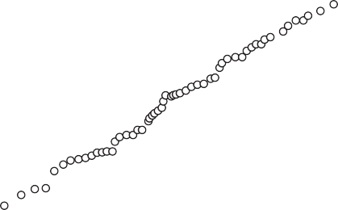99.9 99 98 95 90

130

120

110

100

90

80

70

60

50

40

30

20

10

0

> Percent greater than 80 70 60 50 40 30 20
>
> 10 5
>
> 2 1 0.5 0.2 0.1
>
> 0.10.2 0.5 1 2 5 10 20 30 40 50 60 70 80 90 95 98 99 99.9
>
> Percent less than

(c) What is the return period of a flow of 5200 cfs?

(d) What is the probability that the annual peak discharge will fall
    > between 5000 and 7000 cfs?

    1.  The following annual total rainfall data for Houston
        > Intercontinental Airport were collected over a 21-yr period.

+-------+---------------+---------+--------------+-------+-----------+
| > **Y | > **Rainfall  | > *     | > **Rainfall | **Y   | > *       |
| ear** | > (in.)**     | *Year** | > (in.)**    | ear** | *Rainfall |
|       |               |         |              |       | > (in.)** |
+=======+===============+=========+==============+=======+===========+
| >     | > 48.19       | > 1977  | > 34.94      | 1984  | > 48.19   |
|  1970 |               |         |              |       |           |
+-------+---------------+---------+--------------+-------+-----------+
| >     | > 37.83       | > 1978  | > 44.93      | 1985  | > 49.14   |
|  1971 |               |         |              |       |           |
+-------+---------------+---------+--------------+-------+-----------+
| >     | > 50.80       | > 1979  | > 58.97      | 1986  | > 44.93   |
|  1972 |               |         |              |       |           |
+-------+---------------+---------+--------------+-------+-----------+
| >     | > 70.16       | > 1980  | > 38.99      | 1987  | > 40.60   |
|  1973 |               |         |              |       |           |
+-------+---------------+---------+--------------+-------+-----------+
| >     | > 49.29       | > 1981  | > 55.98      | 1988  | > 22.93   |
|  1974 |               |         |              |       |           |
+-------+---------------+---------+--------------+-------+-----------+
| >     | > 50.97       | > 1982  | > 42.87      | 1989  | > 52.73   |
|  1975 |               |         |              |       |           |
+-------+---------------+---------+--------------+-------+-----------+
| >     | > 54.62       | > 1983  | > 53.21      | 1990  | > 40.37   |
|  1976 |               |         |              |       |           |
+-------+---------------+---------+--------------+-------+-----------+

a.  Compute the mean, variance, and the skewness coefficient (*C*~s~).

b.  Plot a histogram using 5-in. intervals.

Return period *T* (yr)

1.001 1.01 1.10 1.40 2.0 3.0 5.0 10 20 30 50 100 200 500 1000

> 90
>
> 80
>
> 70
>
> 60
>
> 50
>
> 40
>
> 30
>
> 20
>
> 10

---2.0 ---1.0 0.0 1.0 2.0 3.0 4.0 5.0 6.0 7.0

Reduced variate *y*

> **Figure P3--20**
>
> Annual floods of the West Branch Mahoning River near Newton Falls,
> Ohio, 1927--1945, on Gumbel probability paper. Vertical lines on the
> plot correspond to the lower probability scale, *F*(*x*). (From
> National Bureau of Standards, 1953, *Probabil- ity Tables for the
> Analysis of Extreme Value Data,* Applied Mathematics Series 22, U.S.
> Government Printing Office, Washington, D.C.)

c.  Fit the data with the normal distribution. Sketch the normal PDF on
    > the histogram of part (b), scaling such that the areas under the
    > histogram and under the PDF are the same (e.g., see Fig. 3--15).

d.  Find the value of the 10-yr annual rainfall total.

e.  Which years most closely represent the mean annual and 10-yr
    > rainfalls for Houston?

```{=html}
<!-- -->
```
2.  Explain how IDF curves (see Fig. 1--8) are statistically developed
    for any ur- ban rainfall gage. Assume that data are available for
    5-, 15-, 30-, and 60-min intervals up to 24 hr.

3.  Annual rainfall data for the Alvin, Texas, gage are given below. The
    data should be fitted using a log Pearson type 3 distribution.
    Decide if 1979 is an outlier by performing the analysis with and
    without the data point included.

+-------+--------------+--------+--------------+--------+------------+
| > **Y | > **Rainfall | > **   | > **Rainfall | **     | >          |
| ear** | > (in.)**    | Year** | > (in.)**    | Year** | **Rainfall |
|       |              |        |              |        | > (in.)**  |
+=======+==============+========+==============+========+============+
| >     | > 48.82      | > 1977 | > 34.53      | 1984   | > 45.99    |
|  1970 |              |        |              |        |            |
+-------+--------------+--------+--------------+--------+------------+
| >     | > 38.27      | > 1978 | > 41.43      | 1985   | > 59.12    |
|  1971 |              |        |              |        |            |
+-------+--------------+--------+--------------+--------+------------+
| >     | > 53.34      | > 1979 | > 102.58     | 1986   | > 51.75    |
|  1972 |              |        |              |        |            |
+-------+--------------+--------+--------------+--------+------------+
| >     | > 71.93      | > 1980 | > 41.15      | 1987   | > 67.70    |
|  1973 |              |        |              |        |            |
+-------+--------------+--------+--------------+--------+------------+
| >     | > 51.85      | > 1981 | > 52.79      | 1988   | > 34.19    |
|  1974 |              |        |              |        |            |
+-------+--------------+--------+--------------+--------+------------+
| >     | > 43.73      | > 1982 | > 42.89      | 1989   | > 48.02    |
|  1975 |              |        |              |        |            |
+-------+--------------+--------+--------------+--------+------------+
| >     | > 54.52      | > 1983 | > 60.48      | 1990   | > 41.45    |
|  1976 |              |        |              |        |            |
+-------+--------------+--------+--------------+--------+------------+

> To determine if a value is an outlier, perform the following analysis,
> as pre- sented by the Interagency Advisory Committee on Water Data
> (1982): De- termine the high and low outlier thresholds of the
> distribution. If an outlier occurs, then discard it from the dataset
> and repeat the analysis. These values can be calculated from the
> following equations:
>
> *y~H~* = m + *K~n~*s, *y~L~* = m - *K~n~*s,
>
> where *K~n~* is the one-sided 10% significance level for the normal
> distribution, a function of *n.* (For *n* = 21, *K~n~* = 2.408. For
> *n* = 20, *K~n~* = 2.385.) The value *y~H~* is the high outlier
> threshold (in log units for the lognormal or LP3 distribu- tions),
> *y~L~* is the low outlier threshold (in log units for the lognormal or
> LP3 distributions), m is the mean (of the log-transformed data for the
> lognormal or LP3 distributions), and s is the standard deviation.

4.  The random variable *x* represents the depth of rainfall in June,
    > July, and Au- gust in Houston. The whole PDF is *symmetric* and is
    > shaped as an isosceles triangle, with base 0--60 in. Between
    > values of *x* = 0 and *x* = 30, the prob- ability density function
    > has the equation

> *f* (*x*) *[x]{.underline}* , 0 *x* 30.
>
> 900

a.  Sketch the complete PDF. Demonstrate that 1*f* 1*x*2 *dx* = 3.0.

b.  Find the probability that next summer's rainfall will not exceed 20
    > in.

c.  Find the probability that summer rainfall will equal or exceed 30
    > in. for the next three consecutive summers.

d.  For the above PDF, what is the mean value of summer rainfall?

```{=html}
<!-- -->
```
5.  This problem asks you to perform a descriptive analysis using real
    > data of inter- est to you. The problem should be done using
    > spreadsheet or similar software.

    a.  Download a series of annual maximum flows for a river of
        > interest to you. USGS data may be obtained starting at the
        > website <http://water.usgs.gov/> nwis/. Import the data into
        > your spreadsheet or similar software. Convert the lines of
        > text data into columnar data.

    b.  Note the characteristics of the basin from its description in
        > the USGS files. What are the basin area and latitude and
        > longitude of the gage? Are there diversions, controls, or
        > storage (e.g., reservoirs) upstream?

    c.  Plot the time series of peak flows and log~10~ (flows) vs. water
        > year. The series of log~10~ (flows) should have a lower
        > coefficient of variation. Does the shape of the time-series
        > plot of flows suggest that the time-series of river peak flows
        > is nonstationary? If so, discuss possible reasons.

    d.  Compute and plot relative-frequency histograms for the flows and
        > log (flows). Discuss any difference in skewness evident from
        > the two plots.

    e.  Compute the following statistics for the series of flows and for
        > the series of log~10~ (flows): number, average, unbiased
        > variance, unbiased standard deviation, coefficient of
        > variation, unbiased skewness, maximum, and minimum.

6.  For the data of Problem 3.25, compute a weighted skew coefficient
    according to the Bulletin 17B method.

7.  For the data of Problem 3.25, fit a log Pearson 3 distribution to
    the peak flows, using the method of moments described in this text.
    Use the weighted skew coefficient computed in Problem 3.26.

    a.  Compute estimated flows for return periods listed in Table 3--4.

    b.  Plot the fitted CDF on lognormal probability paper.

    c.  Using the Cunnane plotting-position formula (with parameter *a*
        > = 0.4), plot enough of the measured flows to provide a
        > comparison similar to Figure 3--19. Discuss the fit.

8.  Repeat Problem 3.27 using the lognormal and three-parameter gamma
    distributions.

9.  For a station of interest to you, download 10 yr of daily average
    streamflow data from the USGS website
    [http://water.usgs.gov/nwis/.](http://water.usgs.gov/nwis/) Paste
    the data into a spreadsheet and convert the text data to columns.
    Construct and plot a flow- duration curve for these data. From the
    table and chart, what are the flows equaled or exceeded 20%, 50%,
    and 90% of the time?

10. Interevent times for winter storms arriving at Corvallis, Oregon,
    for the months November through April for the winters of 1996--97,
    1997--98, and 1998--99 were determined, and a frequency histogram
    prepared as shown in the table below. The average interevent time
    was 2.59 days.

    a.  Fit an exponential distribution to these data by finding the
        > parameter l.

    b.  Plot the relative-frequency histogram and the fitted exponential
        > PDF on the same chart. Care may need to be taken to be sure
        > that the histogram and PDF are properly aligned. Each day
        > (0--1, 1--2, and so on) is a class interval.

    c.  From the relative-frequency histogram, compute the
        > cumulative-frequency histogram and plot on arithmetic graph
        > paper.

    d.  On two-cycle semilog paper (or using spreadsheet options for
        > log-scales), plot the empirical CDF from part (c) and the
        > fitted CDF. On this "prob- ability paper," values should be
        > plotted at the class mark, centering on

> half-days. The empirical values from part (c) should be plotted as
> individual points, and one fitted CDF (exceedance probability) should
> be plotted as a straight line.

e.  What is the probability that the time between winter storms is ≤ 3
    > days? Compute using both the empirical CDF and the fitted CDF.

+--------------------------------------+-------------------------------+
| > **Interevent Time (days)**         | > **Frequency**               |
+======================================+===============================+
| > 0--1                               | > 35                          |
+--------------------------------------+-------------------------------+
| > 1--2                               | > 12                          |
+--------------------------------------+-------------------------------+
| > 2--3                               | > 6                           |
+--------------------------------------+-------------------------------+
| > 3--4                               | > 6                           |
+--------------------------------------+-------------------------------+
| > 4--5                               | > 7                           |
+--------------------------------------+-------------------------------+
| > 5--6                               | > 3                           |
+--------------------------------------+-------------------------------+
| > 6--7                               | > 1                           |
+--------------------------------------+-------------------------------+
| > 7--8                               | > 1                           |
+--------------------------------------+-------------------------------+
| > 8--9                               | > 3                           |
+--------------------------------------+-------------------------------+
| > 9--10                              | > 2                           |
+--------------------------------------+-------------------------------+
| > 10--11                             | > 1                           |
+--------------------------------------+-------------------------------+
| > 11--12                             | > 0                           |
+--------------------------------------+-------------------------------+
| > 12--13                             | > 0                           |
+--------------------------------------+-------------------------------+
| > 13--14                             | > 1                           |
+--------------------------------------+-------------------------------+
| > 714                                | > 0                           |
+--------------------------------------+-------------------------------+

11. The data presented in the table for Problem 3.30 are known as
    > **grouped data**, of the type that are developed in order to plot
    > a frequency histogram. The mean of such data can be determined as
    > a weighted average of the class marks, as follows:

> *k*
>
> a *f~i~t~i~ t* = [*i* = 1]{.underline}
>
> a *f~i~*
>
> *i* = 1
>
> where *f~i~* and *t~i~* are the frequency and class mark,
> respectively, for *k* class intervals.

a.  Demonstrate that the mean of the interevent times of Problem 3.30 is
    > as stated.

b.  How many interevent time values were used in the analysis?

```{=html}
<!-- -->
```
12. Using statistics for Siletz River peak flows, 1979--1999 (Table
    > 3--1), generate a se- ries of normally distributed synthetic
    > streamflows by following these guidelines.

    a.  By performing a regression of flows for the period 1980--1999
        > vs. flows during 1979--1998, verify that the serial
        > correlation coefficient for this time period is 0.1411.

    b.  Verify that the mean and unbiased standard deviation for the
        > full 21-year period are 19,343 cfs and 7217 cfs, respectively.
        > Use these values for part (c).

    c.  The list of 21 *N*(0, 1) random numbers below was generated in
        > Excel using the Tools/Data Analysis/Random Number Generation
        > option with a seed of 12345. (The option for a seed allows one
        > to generate identical sequences of random numbers.) Assuming
        > that the initial flow = mean (at "step 0"), generate a
        > sequence of 21 random flows using Equation (3--83). Com- pute
        > the mean, standard deviation, and serial correlation
        > coefficient of the synthetic flow sequence to see how well
        > these statistics are preserved. *Optional:* Create a new
        > series of *N*(0, 1) random numbers and repeat the generation.
        > Notice that as the mean and standard deviation of the random
        > numbers differ from 0 and 1, respectively, so do the mean and
        > standard deviation of the synthetic sequence differ from their
        > historic values.

+-----+--------------+---------+--------------+---------+------------+
| > * | > ***z***    | ***n*** | > ***z***    | >       | > ***z***  |
| **n | >            |         |              | ***n*** |            |
| *** | > **n/a**    |         |              |         |            |
| >   |              |         |              |         |            |
| >   |              |         |              |         |            |
|  ** |              |         |              |         |            |
| 0** |              |         |              |         |            |
+=====+==============+=========+==============+=========+============+
| > 1 | -0.7341      | > 8     | -0.9733      | > 15    | -0.5506    |
+-----+--------------+---------+--------------+---------+------------+
| > 2 | 0.2143       | > 9     | 1.2119       | > 16    | -0.1774    |
+-----+--------------+---------+--------------+---------+------------+
| > 3 | 0.7968       | > 10    | 0.5659       | > 17    | 0.4409     |
+-----+--------------+---------+--------------+---------+------------+
| > 4 | 0.4544       | > 11    | -0.1092      | > 18    | -0.4908    |
+-----+--------------+---------+--------------+---------+------------+
| > 5 | -0.9235      | > 12    | -0.1214      | > 19    | 0.8266     |
+-----+--------------+---------+--------------+---------+------------+
| > 6 | 0.5659       | > 13    | 0.3157       | > 20    | -1.1724    |
+-----+--------------+---------+--------------+---------+------------+
| > 7 | 0.9885       | > 14    | 0.4213       | > 21    | -0.4906    |
+-----+--------------+---------+--------------+---------+------------+

> A[bramowitz]{.smallcaps}, M., and I. A. S[tegun]{.smallcaps}, 1964,
> *Handbook of Mathematical Functions,* National Bureau of Standards,
> U.S. Govt. Printing Office, Washington, D.C. (also published by Dover
> Publications).
>
> B[en]{.smallcaps}j[amin]{.smallcaps}, J. R., and C. A.
> C[ornell]{.smallcaps}, 1970, *Probability Statistics and Decision for
> Civil Engineers,* McGraw-Hill, New York.
>
> B[en]{.smallcaps}s[on]{.smallcaps}, M. A., 1968, "Uniform
> Flood-Frequency Estimating Methods for Federal Agencies," *Water
> Resour. Res., 4*(5, October), pp. 891--908.
>
> B[obée]{.smallcaps}, B. B., and F. As[hkar]{.smallcaps}, 1991, *The
> Gamma Family and Derived Distributions Applied in Hydrology,* Water
> Resources Publications, Littleton, CO.
>
> B[obée]{.smallcaps}, B. B., and R. R[obitaille]{.smallcaps}, 1975,
> "Correction of Bias in Estimation of the Coef- ficient of Skewness,"
> *Water Resour. Res., 11*(6, December), pp. 851--854.
>
> B[o]{.smallcaps}x, G. E. P., and G. M. J[enkin]{.smallcaps}s, 1976,
> *Time Series Analysis: Forecasting and Con- trol,* Holden-Day, San
> Francisco.
>
> B[ra]{.smallcaps}s, R. L., and I.
> R[odriguez]{.smallcaps}-I[turbe]{.smallcaps}, 1985, *Random Functions
> and Hydrology,*
>
> Addison-Wesley Publishing Company, Reading, MA.
>
> C[hat]{.smallcaps}f[ield]{.smallcaps}, C., 2003, *The Analysis of Time
> Series: An Introduction,* 6th ed., Chapman and Hall, New York.
>
> Chemical Rubber Company, n.d., *Standard Mathematical Tables,*
> Cleveland, OH, updated periodically.
>
> **REFERENCES**
>
> C[how]{.smallcaps}, V. T. (Ed.), 1964, *Handbook of Applied
> Hydrology,* Chapter 8, "Statistical and Probability Analysis of
> Hydrologic Data," McGraw-Hill, New York.
>
> C[ooper]{.smallcaps}, R. M., 2005, *Estimation of Peak Discharges for
> Rural, Unregulated Streams in Western Oregon,* USGS Scientific
> Investigations Report 2005-5116, Denver, CO. Online at:
> [http://www.wrd.state.or.us/OWRD/SW/peak_flow.shtml.](http://www.wrd.state.or.us/OWRD/SW/peak_flow.shtml)
>
> C[raver]{.smallcaps}, J. S., 1996, *Graph Paper from Your Computer or
> Copier,* 3rd ed., Fisher Books, Tucson, AZ.
>
> C[udworth]{.smallcaps}, A. G., J[r]{.smallcaps}., 1989, *Flood
> Hydrology Manual,* U.S. Department of the Interior, U.S. Government
> Printing Office, Denver, CO.
>
> C[unnane]{.smallcaps}, C., 1978, "Unbiased Plotting Positions: A
> Review," *J. Hydrology, 37*, pp. 205--222.
>
> D[ri]{.smallcaps}sc[oll]{.smallcaps}, E. D., 1986, "Lognormality of
> Point and Non-Point Source Pollutant Con- centrations," *Proc. of
> Stormwater and Water Quality Model Users Group Meeting,* Orlando, FL,
> EPA/600/986/023 (NTIS PB87-117438/AS), Environmental Protec- tion
> Agency, Athens, Georgia, March, pp. 157--176.
>
> F[iering]{.smallcaps}, M. B., and B. B.
> J[a]{.smallcaps}c[k]{.smallcaps}s[on]{.smallcaps}, 1971, *Synthetic
> Streamflows*, Water Resources Monograph 1, American Geophysical Union,
> Washington, D.C.
>
> F[ranklin]{.smallcaps}, M. A., and G. T.
> L[o]{.smallcaps}s[ey]{.smallcaps}, 1984, *Magnitude and Frequency of
> Floods from Urban Streams in Leon County, Florida,* USGS Water
> Resources Investigations Report 84-4004, Tallahassee, FL.
>
> G[ri]{.smallcaps}ff[i]{.smallcaps}s, V. W., and J.R.
> S[tedinger]{.smallcaps}, 2009, "Log-Pearson Type 3 Distribution and
> Its Application in Flood Frequency Analysis. III: Sample Skew and
> Weighted Skew Estimators," *J. Hydrologic Eng., ASCE, 14*(2,
> February), pp. 121--130.
>
> G[ringorten]{.smallcaps}, I. I., 1963, "A Plotting Rule for Extreme
> Probability Paper," *J. Geophysical Res., 68*(3), pp. 813--814.
>
> G[umbel]{.smallcaps}, E. J., 1958, *Statistics of Extremes,* Columbia
> University Press, New York. H[aan]{.smallcaps}, C. T., 1977,
> *Statistical Methods in Hydrology,* 1st ed., Iowa State University
>
> Press, Ames, IA.
>
> H[aan]{.smallcaps}, C. T., 2002, *Statistical Methods in Hydrology,*
> 2nd ed., Blackwell Publishing, Ames, IA.
>
> H[arr]{.smallcaps}, M. E., 1977, *Mechanics of Particulate Media: A
> Probabilistic Approach,*

McGraw-Hill, New York.

> H[arri]{.smallcaps}s, D. D., L. L. H[ubbard]{.smallcaps}, and L. E.
> H[ubbard]{.smallcaps}, 1979, *Magnitude and Frequency of Floods in
> Western Oregon,* USGS Open-File Report 79-553, Portland, OR.
>
> H[el]{.smallcaps}s[el]{.smallcaps}, D. R., and R. M.
> H[ir]{.smallcaps}sc[h]{.smallcaps}, 1992, *Statistical Methods in
> Water Resources,* Studies in Environmental Sciences 49, Elsevier, New
> York.
>
> H[ir]{.smallcaps}sc[h]{.smallcaps}, R. M., and J. R.
> S[tedinger]{.smallcaps}, 1987, "Plotting Positions for Historical
> Floods and Their Precision," *Water Resour. Res., 23* (4, April), pp.
> 715--727.
>
> H[o]{.smallcaps}s[king]{.smallcaps}, J. R. M., and J. R.
> W[alli]{.smallcaps}s, 1997, *Regional Frequency Analysis, An Approach
> Based on L-Moments,* Cambridge University Press, New York.
>
> Interagency Advisory Committee on Water Data, IACWD, 1982, "Guidelines
> for Determining Flood Flow Frequency," *Bulletin #17B of the Hydrology
> Subcom- mittee,* Office of Water Data Coordination, U.S. Geological
> Survey, Reston, VA.
>
> J[enkin]{.smallcaps}s[on]{.smallcaps}, A. F., 1955, "The Frequency
> Distribution of the Annual Maximum (or Minimum) Values of
> Meteorological Elements," *Quart. J. Roy. Meteor. Soc., 81*, pp.
> 158--171.
>
> K[ing]{.smallcaps}, J. R., 1971, *Probability Charts for Decision
> Making,* Industrial Press, New York.
>
> K[ite]{.smallcaps}, G. W., 1977, *Frequency and Risk Analyses in
> Hydrology,* Water Resources Publications, Littleton, CO.
>
> L[aenen]{.smallcaps}, A., 1983, *Storm Runoff as Related to
> Urbanization Based on Data Collected in Salem and Portland, and
> Generalized for the Willamette Valley, Oregon,* USGS Water-Resources
> Investigations Report 83-4143, Portland, OR.
>
> M[aa]{.smallcaps}ss, A., M. M. H[u]{.smallcaps}fsc[hmidt]{.smallcaps},
> R. D[or]{.smallcaps}f[man]{.smallcaps}, H. A. T[homa]{.smallcaps}s,
> J[r]{.smallcaps}., S. A. M[arglin]{.smallcaps}, and
>
> G. M. F[air]{.smallcaps}, 1962, *Design of Water-Resource Systems,*
> Harvard University Press, Cambridge, MA.
>
> M[ay]{.smallcaps}s, L. W., 2001, *Water Resources Engineering,* John
> Wiley & Sons, New York. National Bureau of Standards, 1950, *Tables of
> the Binomial Probability Distribution,*
>
> Applied Mathematics Series 6, U.S. Government Printing Office,
> Washington, D.C.
>
> Natural Environment Research Council, 1975, *Flood Studies Report,* 5
> vols., Institute of Hydrology, Wallingford, U.K.
>
> National Research Council, Committee on Techniques for Estimating
> Probabilities of Extreme Floods, 1988, *Estimating Probabilities of
> Extreme Floods, Methods and Recommended Research,* National Academy
> Press, Washington, D.C.
>
> P[ano]{.smallcaps}fs[ky]{.smallcaps}, H. A., and G. W.
> B[rier]{.smallcaps}, 1968, *Some Applications of Statistics to
> Meteorol- ogy,* Pennsylvania State University Press, University Park.
>
> P[arzen]{.smallcaps}, E., 1960, *Modern Probability Theory and Its
> Applications,* John Wiley & Sons, New York.
>
> P[rie]{.smallcaps}s[tly]{.smallcaps}, M. B., 1981, *Spectral Analysis
> and Time Series,* Academic Press, New York.
> R[ei]{.smallcaps}c[h]{.smallcaps}, B. M., and K. G.
> R[enard]{.smallcaps}, 1981, "Applications of Advances in Flood Fre-
>
> quency Analysis," *Water Resour. Bull., 17*(1, February), pp. 67--74.
>
> R[ie]{.smallcaps}s, K. G., III, and M. Y.
> C[rou]{.smallcaps}s[e]{.smallcaps} (Eds.), 2002, *The National Flood
> Frequency Pro- gram, Version 3: A Computer Program for Estimating
> Magnitude and Frequency of Floods for Ungaged Sites,* USGS
> Water-Resources Investigations Report 02-4168, Reston, VA. Online at:
> [http://water.usgs.gov/software/nff.html.](http://water.usgs.gov/software/nff.html)
>
> S[ala]{.smallcaps}s, J. D., J. W. D[elleur]{.smallcaps}, V.
> Y[ev]{.smallcaps}j[evi]{.smallcaps}c[h]{.smallcaps}, and W. L.
> L[ane]{.smallcaps}, 1980, *Applied Modeling of Hydrologic Time
> Series,* Water Resources Publications, Littleton, CO.

S[ala]{.smallcaps}s, J. D., 1993, "Analysis and Modeling of Hydrologic
Time Series," Chapter 19 in *Handbook of Hydrology,* D. R. Maidment
(Ed.), McGraw-Hill, New York.

> S[angal]{.smallcaps}, B. P., and A. K.
> B[i]{.smallcaps}s[wa]{.smallcaps}s, 1970, "The 3-Parameter Lognormal
> Distribution and Its Applications in Hydrology," *Water Resour. Res.,
> 6*(2, April), pp. 505--515. S[auer]{.smallcaps}, V. B., W. O.
> T[homa]{.smallcaps}s, J[r]{.smallcaps}., V. A.
> S[tri]{.smallcaps}c[ker]{.smallcaps}, and K. V.
> W[il]{.smallcaps}s[on]{.smallcaps}, 1983, *Flood*
>
> *Characteristics of Urban Watersheds in the United States,* USGS
> Water-Supply Paper
>
> 2207, Reston, VA.
>
> S[ear]{.smallcaps}c[y]{.smallcaps}, J. K., 1959, *Flow Duration
> Curves,* USGS Water Supply Paper 1542-A, Washington, D.C.
>
> S[mith]{.smallcaps}, J. A., 1993, "Precipitation," Chapter 3 in
> *Handbook of Hydrology,* D. R. Maidment (Ed.), McGraw-Hill, New York.
>
> S[tedinger]{.smallcaps}, J. R., and V. W.
> G[ri]{.smallcaps}ff[i]{.smallcaps}s, 2008, "Flood Frequency Analysis
> in the United States: Time to Update," *J. Hydrologic Eng., ASCE,
> 13*(4, April), pp. 199--204. S[tedinger]{.smallcaps}, J. R., R. M.
> V[ogel]{.smallcaps}, and E.
> F[ou]{.smallcaps}f[oula]{.smallcaps}-G[eorgiou]{.smallcaps}, 1993,
> "Frequency Anal-
>
> ysis of Extreme Events," Chapter 18 in *Handbook of Hydrology,* D. R.
> Maidment
>
> (Ed.), McGraw-Hill, New York.
>
> T[a]{.smallcaps}s[ker]{.smallcaps}, G. D., and J. R.
> S[tedinger]{.smallcaps}, 1986, "Regional Skew with Weighted LS Regres-
> sion," *J. Water Resour. Plann. Manage., ASCE, 112*(2, April), pp.
> 225--237.
>
> T[ootle]{.smallcaps}, G. A., T. C.
> P[ie]{.smallcaps}c[hota]{.smallcaps}, and A. S[ingh]{.smallcaps},
> 2005, "Coupled Oceanic-Atmospheric Variability and U.S. Streamflow,"
> *Water Resour. Res., 41*(12, December), Paper W12408.
>
> W[alli]{.smallcaps}s, J. R., N. C. M[atala]{.smallcaps}s, and J. R.
> S[la]{.smallcaps}c[k]{.smallcaps}, 1974, "Just a Moment," *Water
> Resour. Res., 10*(2), pp. 211--219.
>
> W[arni]{.smallcaps}c[k]{.smallcaps}, C. C., 1984, *Hydropower
> Engineering,* Prentice Hall, Englewood Cliffs, NJ.
>
> Chapter 4

## Flood Routing

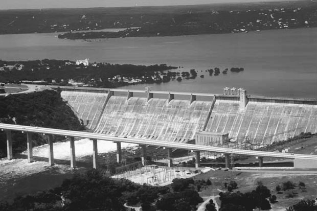{width="4.141679790026247in"
height="2.7533333333333334in"}

> Mansfield Dam, Hill Country of Texas.
>
> The movement of a flood wave down a channel or through a reservoir and
> the associated change in timing or attenuation of the wave constitute
> an important topic in floodplain hydrology. It is essential to
> understand the theoretical and practical aspects of flood routing to
> predict the temporal and spatial variations of a flood wave through a
> river reach or reservoir. Flood routing methods can also be used to
> predict the outflow hydrograph from a watershed subjected to a known
> amount of precipitation.
>
> The **storage routing** concept is most easily understood by referring
> to Figure 4--1. Inflow and outflow hydrographs for a small
> level-surface reser- voir have been plotted on the same graph. Area
> *A* represents the volume of water that fills available storage up to
> time *t*~1~. Inflow exceeds outflow and the reservoir is filling. At
> time *t*~1~, inflow and outflow are equal and the maximum storage is
> reached. For times exceeding *t*~1~, outflow exceeds inflow and the
> reservoir empties. Area *C* represents the volume of water that flows
> out of the reservoir and must equal area *A* if the reservoir begins
> and ends at the same level. The peak of the outflow from a reservoir
> should intersect the inflow hydrograph as shown in Figure 4--1, since,
> in general, the outflow is uniquely determined by reservoir storage or
> level.
>
> **4.1**
>
> **HYDROLOGIC AND HYDRAULIC ROUTING**

**243**

> **Figure 4--1**
>
> Reservoir concepts.

(a) Reservoir storage.

(b) Inflow to and outflow from the res- ervoir. (c) Storage in the
    reservoir.

> Inflow
>
> (a)
>
> Dam
>
> Time (hr) (b)
>
> *t*~1~ Time (hr) (c)
>
> We will see that storage routing through a reservoir will generally
> atten- uate the peak outflow and lag the time to peak for the outflow
> hydrograph. The rate of change of storage can be written as the
> continuity equation
>
> *I* - *Q* = [Δ*S*]{.underline}, (4--1)
>
> Δ
>
> where
>
> *I* = inflow,
>
> *Q* = outflow,
>
> Δ*S* = change in storage,
>
> Δ*t* = change in time.
>
> Example 4--1 is a detailed illustration of reservoir storage concepts.
>
> **STORAGE COMPUTATIONS**
>
> Inflow and outflow hydrographs for a reservoir are depicted in Fig-
> ure E4--1(a).

a.  Determine the average storage for each one-day period (Δ*t* = 1
    > day). Graph storage vs. time for the reservoir for the event.
    > Assume that *S*~0~ = 0 (the reservoir is initially empty).

b.  What is the (approximate) maximum storage reached during this storm
    > event?

> **EXAMPLE 4--1**
>
> 10, 000
>
> 5, 000
>
> Inflow
>
> Storage change for day 3
>
> Outflow
>
> 0 1 2
>
> 3 4 5 6 7
>
> 8 9 10 11
>
> 12 13 14
>
> **Figure E4--1(a)**
>
> Time (days)
>
> \(a\) The rate of change in storage is equal to inflow minus outflow.
> First, we tabulate values of *I* and *Q* and take their difference.
> Storage is equal to the area between the inflow and outflow curves, or
>
> **SOLUTION**
>
> *S* = 1(*I* - *Q*) *dt*.
>
> This integral can be simply approximated by
>
> *S* = a (*I* - *Q*) Δ*t*,

*i*

> where *I* and *Q* are averages for each day. Using a simple approach,
> *I* and *Q* values are averaged at noon each day. Other more accu-
> rate methods could be used for the numerical integration and include
> the trapezoidal rule, or Simpson's rule (Chapra and Canale, 2006). Any
> of these methods can be used as in Example 2--1 to determine volumes
> under hydrographs.

+------------------+--------------+---------------+-------------------+
| > **Time         | > *          | ***Q-*(cfs)** | >                 |
| > (days)**       | **I-*(cfs)** |               |  Δ***S***\>Δ***t* |
|                  |              |               | > (cfs)**         |
+==================+==============+===============+===================+
| > 0.5            | 500          | 250           | > 250             |
+------------------+--------------+---------------+-------------------+
| > 1.5            | > 3500       | 1000          | > 2500            |
+------------------+--------------+---------------+-------------------+
| > 2.5            | > 9000       | 3000          | > 6000            |
+------------------+--------------+---------------+-------------------+
| > 3.5            | > 9750       | 4500          | > 5250            |
+------------------+--------------+---------------+-------------------+
| > 4.5            | > 8000       | 5750          | > 2250            |
+------------------+--------------+---------------+-------------------+
| > 5.5            | > 4500       | 6000          | > -1500           |
+------------------+--------------+---------------+-------------------+
| > 6.5            | > 2250       | 5250          | > -3000           |
+------------------+--------------+---------------+-------------------+
| > 7.5            | > 1250       | 4250          | > -3000           |
+------------------+--------------+---------------+-------------------+
| > 8.5            | 250          | 3250          | > -3000           |
+------------------+--------------+---------------+-------------------+
| > 9.5            | 0            | 2500          | > -2500           |
+------------------+--------------+---------------+-------------------+
| > 10.5           | 0            | 1500          | > -1500           |
+------------------+--------------+---------------+-------------------+
| > 11.5           | 0            | 1000          | > -1000           |
+------------------+--------------+---------------+-------------------+
| > 12.5           | 0            | 750           | > -750            |
+------------------+--------------+---------------+-------------------+
| > 13.5           | 0            | 0             | 0                 |
+------------------+--------------+---------------+-------------------+

> Using Δ*t* = 1 day, storage at the end of the first day, *S*~1~, is
>
> *S*~1~ = *S*~0~ + (*I*~1~ - *Q*~1~) Δ*t*
>
> = 0 + (250 cfs)(1 day) a [24 hr]{.underline} ba [3600 s]{.underline}
> ba [ac]{.underline} b

= 496 ac - ft.

day

> hr 43,560 ft^2^
>
> For day 2, cumulative storage becomes
>
> *S*~2~ = *S*~1~ + (*I*~2~ - *Q*~2~) Δ*t*,
>
> *S* 496 (2500)(24)(3600) a [1]{.underline} b ac-ft

43,560

> **Figure E4--1(b)**
>
> = 5455 ac-ft.
>
> The procedure is shown completed in the following table and the
> storage curve in Figure E4--1(b).
>
> 50,000

25,000

> 0 1 2 3 4 5 6 7 8 9 10 11 12 13 14
>
> Time (days)

+-------------------------------+--------------------------------------+
| > **Time (day)**              | > **Storage (ac-ft)**                |
+===============================+======================================+
| 1                             | > 496                                |
+-------------------------------+--------------------------------------+
| 2                             | > 5455                               |
+-------------------------------+--------------------------------------+
| 3                             | > 17,356                             |
+-------------------------------+--------------------------------------+
| 4                             | > 27,769                             |
+-------------------------------+--------------------------------------+
| 5                             | > 32,232                             |
+-------------------------------+--------------------------------------+
| 6                             | > 29,256                             |
+-------------------------------+--------------------------------------+
| 7                             | > 23,306                             |
+-------------------------------+--------------------------------------+
| 8                             | > 17,356                             |
+-------------------------------+--------------------------------------+
| 9                             | > 11,405                             |
+-------------------------------+--------------------------------------+
| > 10                          | > 6446                               |
+-------------------------------+--------------------------------------+
| > 11                          | > 3471                               |
+-------------------------------+--------------------------------------+
| > 12                          | > 1488                               |
+-------------------------------+--------------------------------------+
| > 13                          | 0                                    |
+-------------------------------+--------------------------------------+
| > 14                          | 0                                    |
+-------------------------------+--------------------------------------+

> River routing differs from reservoir routing in that storage in a
> river reach of length *L* depends on more than just outflow. The peak
> of the out- flow hydrograph from a reach is usually attenuated and
> delayed compared with that of the inflow hydrograph. Because storage
> in a river reach is a function of whether stages are rising or
> falling, storage in this case is a func- tion of both outflow and
> inflow for the routing reach (see Section 4.3). Also, as river stages
> rise high enough to inundate a floodplain beyond the banks of the
> channel, significant velocity reductions are observed in the
> floodplain compared with the main channel. Example 4--2 presents
> differences between river and reservoir routing.
>
> **Figure E4--2(a)**
>
> *l*---*Q* = *[ds]{.underline}*
>
> Level pool reservoir
>
> *l Q* (weir flow)
>
> River reach
>
> *l*

*Q*

> *S H Q* (orifice flow)
>
> *S* = *f* (*Q*)
>
> *Q* = *f* (*H*)
>
> *l*
>
> Orifice flow: *Q* = *CA* 2*gH*
>
> *l Q*
>
> Riverbed

*l*

> Riverbed

*l*

> Riverbed
>
> *Q S* = *f* (*l, Q*)
>
> Inflow

Rising

*Q*

> *l* =*Q Q*

Falling

*Q*

Inflow

> Weir flow: *Q*= *CLH*^3/2^
>
> *Q*
>
> Outflow

*t*

> *l* =*Q*

*l* =*Q*

> Outflow

*t*

> **SOLUTION**
>
> Storage in a reservoir may be determined from the height of water in
> the reservoir \[see Fig. E4--2(b)\]. For instance, in a level-pool
> reservoir, *A* is a function of depth such that
>
> *S* = *f* (*H*) = 1*A~r~*(*H*) *dH*,


> **Figure E4--2(b)** *Ar* (*H* )
>
> *H*
>
> **Hydrologic Routing Methods**
>
> Routing techniques may be classified in two major categories: simple
> **hydro- logic routing** and more complex **hydraulic routing**.
> Hydrologic routing involves the balancing of inflow, outflow, and
> volume of storage through the use of the continuity equation. A second
> relationship, the storage--discharge relation, is also required
> between outflow rate and storage in the system. Applications of
> hydrologic routing techniques to problems of flood predic- tion, flood
> control measures, reservoir design and operation, watershed
> simulation, and urban design are numerous. Many computer models are
>
> available that take input rainfall, convert it to outflow hydrographs,
> and then route the hydrographs through complex river or reservoir
> networks using hydrologic routing methods. These applications are
> presented in detail in Chapters 5 and 6.
>
> **Hydraulic Routing Methods**
>
> Hydraulic routing is more complex and accurate than hydrologic
> routing. It is based on the solution of the continuity equation and
> the momentum equa- tion for unsteady flow in open channels. Usually
> solved by explicit or implicit numerical methods on a computer, these
> differential equations are known as the Saint Venant equations, first
> derived in 1871, for which no closed-form solutions exist.
>
> Unsteady flow in rivers, reservoirs, and estuaries is caused by motion
> of long waves due to tides, flood waves, storm surges, and dynamic
> reservoir releases. These types of wave forms can be adequately
> described only by the one-dimensional Saint Venant equations, which
> are presented in detail in Section 4.4. In many cases, the governing
> equations can be simplified to a one-dimensional continuity equation
> and a uniform flow relationship, referred to as **kinematic wave
> routing**, which implies that discharge can be computed as a simple
> function of depth alone. In 1981, kinematic wave rout- ing was added
> to the HEC-HMS flood hydrograph package with a numerical solver, as
> described in Section 4.6.
>
> Uniform flow implies a balance between gravitational and frictional
> forces in the channel. This assumption cannot always be justified,
> especially on very flat slopes where effects of water surface slope
> cannot be ignored. Cases where other terms in the momentum equation
> for hydraulic routing must be retained include (1) upstream movement
> of tides and storm surges,

(2) backwater effects from downstream reservoirs and tributary inflows,

(3) flood waves in channels of very flat slope (2--3 ft/mi), and (4)
    > abrupt waves caused by sudden releases from reservoirs or dam
    > failures. For these cases, the complete solution of the Saint
    > Venant equations should be used. Several computer models exist to
    > solve these equations.

**4.2**

> **HYDROLOGIC RIVER ROUTING**
>
> As a flood wave passes through a river reach, the peak of the outflow
> hydrograph is usually attenuated and delayed due to channel resistance
> and storage capacity. Considering a lumped storage approach for the
> reach, the difference between the ordinates of the inflow and outflow
> hydrographs, represented by shaded areas in Figure 4--2, is equal to
> the rate of change of storage in the reach, as shown in Equation
> (4--1). The value of Δ*S* Δ*t* in the continuity equation is positive
> when storage is increasing and negative when storage is decreasing,
> and *S* can be plotted as a function of time. Equation (4--1) can be
> written in finite-difference
>
> **Figure 4--2** Storage in a river
> reach.

*t*1 *t*2

*t*

*t*1

*t*

> *Sn*

*Q*falling *Q*rising

> Discharge *Q*
>
> form as Equation (4--2), where Δ*t* is referred to as the routing time
> period and subscripts 1 and 2 denote the beginning and end of the time
> period, respectively:

[1]{.underline}(*I* + *I* ) - [1]{.underline}(*Q* + *Q* ) = [*S*2 -
*S*1]{.underline}. (4--2)

> 2 1 2 2 1 2 Δ*t*
>
> If storage is plotted against outflow for a river reach, the resulting
> curve will generally take the form of a loop, as shown in Figure 4--2.
> This loop effect implies greater storage for a given outflow during
> falling stages than during rising stages. If one considers water
> surface profiles at various times during the passage of the flood
> wave, the concept of prism and wedge storage is use- ful. This is
> shown in Figure 4--3. A large volume of wedge storage may exist during
> rising stages before outflows have increased. During falling stages,
>
> **Figure 4--3**
>
> Prism and wedge storage concepts.
>
> Direction of flow
>
> *A B*

Riverbed

> *I* \>*Q*
>
> Shown as if river cut down the center lengthwise
>
> *A B*

*I* = *Q*

> Riverbed
>
> *A B*
>
> Wedge storage

*I* \<*Q*

> Riverbed
>
> Observer on bank
>
> inflow drops more rapidly than outflow, and the wedge storage becomes
> negative. Hydrologic routing in rivers and channels thus requires a
> storage relationship that allows for wedge storage. This is
> accomplished by allowing storage to be a function of both inflow and
> outflow, as in the Muskingum method of flood routing (McCarthy, 1938).
> The method suffers the disad- vantage of assuming the uniform flow
> rating curve in place of the loop curve shown in Figure 4--2.
>
> **Muskingum Method**
>
> The Muskingum method was developed by McCarthy (1938) and utilizes the
> continuity equation \[Eq. (4--2)\] and a storage relationship that
> depends on both inflow and outflow. The storage within the reach at a
> given time can be related to inflow and outflow by (Chow, 1959)
>
> *b*\[*xI^m^*^/*n*^ + (1 - *x*)*Q^m^*^/*n*^\]
>
> *S* = *am*/*n* , (4--3)
>
> where inflow *I* and outflow *Q* are related to *ay^n^* from Manning's
> equation, where *a* and *n* are constants. Storage in the reach is
> related to *by^m^*, where *b* and *m* are constants that depend on the
> cross section of the channel. The parameter *x* defines the relative
> weighting of inflow and outflow in deter- mining storage volume in the
> reach.
>
> The Muskingum method assumes that flow and storage are both related to
> depth such that *m n* = 1 and *b a* = *K*, the travel time, resulting
> in a linear relationship of the form
>
> *S* = *K*\[*xI* + (1 - *x*)*Q*\], (4--4)
>
> where
>
> *K* = travel time constant for the reach,
>
> *x* = weighting factor, which varies from 0 to 0.5 for a given reach.
>
> For the case of linear reservoir routing where *S* depends only on
> outflow, *x* = 0 in Equation (4--4). In smooth uniform channels, *x* =
> 0.5 yields equal weight to inflow and outflow, which theoretically
> results in pure translation of the wave. A typical range for most
> natural streams is *x* = 0.2 to 0.3, which results in some attenuation
> of the flood wave.
>
> The routing procedure uses the finite-difference form of continuity
> Equation (4--2) combined with Equation (4--4) in the form

*S*~2~ - *S*~1~ = *K*\[*x*(*I*~2~ - *I*~1~) + (1 - *x*)(*Q*~2~ -
*Q*~1~)\] (4--5)

> to produce the Muskingum routing equation for a river reach:
>
> *Q*~2~ = *C*~0~*I*~2~ + *C*~1~*I*~1~ + *C*~2~*Q*~1~, (4--6)
>
> where
>
> *C*0 = [- *Kx* + 0.5 Δ*t*]{.underline}, (4--7)
>
> *C*1 = [*Kx* + 0.5 Δ*t*]{.underline}, (4--8)
>
> *C*2 = [*K* - *Kx* - 0.5 Δ*t*]{.underline}, (4--9)
>
> *D* = *K* - *Kx* + 0.5Δ*t*. (4--10)
>
> This procedure is ideally set up for a calculator or a personal
> computer. Note that *K* and Δ*t* must have the same units, and 2*Kx* 6
> Δ*t* ... *K* for numerical accuracy, and that the coefficients *C*~0~,
> *C*~1~, and *C*~2~ sum to 1.0. The routing operation is accomplished
> by solving Equation (4--6) for successive time increments, with *Q*~2~
> of one routing period becoming *Q*~1~ of the succeeding period.
> Example 4--3 illustrates the row-by-row computation, and a spread-
> sheet program can be easily written in Excel.
>
> **EXAMPLE 4--3**
>
> **MUSKINGUM ROUTING**
>
> Route the inflow hydrograph tabulated in the following table through a
> river reach for which *x* = 0.2 and *K* = 2 days. Use a routing period
> Δ*t* = 1 day and assume that inflow equals outflow for the first day.

+----------------------------------+-----------------------------------+
| > **Time (day)**                 | **Inflow (cfs)**                  |
+==================================+===================================+
| 1                                | 4000                              |
+----------------------------------+-----------------------------------+
| 2                                | 7000                              |
+----------------------------------+-----------------------------------+
| 3                                | > 11,000                          |
+----------------------------------+-----------------------------------+
| 4                                | > 17,000                          |
+----------------------------------+-----------------------------------+
| 5                                | > 22,000                          |
+----------------------------------+-----------------------------------+
| 6                                | > 27,000                          |
+----------------------------------+-----------------------------------+
| 7                                | > 30,000                          |
+----------------------------------+-----------------------------------+
| 8                                | > 28,000                          |
+----------------------------------+-----------------------------------+
| 9                                | > 25,000                          |
+----------------------------------+-----------------------------------+
| > 10                             | > 23,000                          |
+----------------------------------+-----------------------------------+
| > 11                             | > 20,000                          |
+----------------------------------+-----------------------------------+
| > 12                             | > 17,000                          |
+----------------------------------+-----------------------------------+
| > 13                             | > 14,000                          |
+----------------------------------+-----------------------------------+
| > 14                             | > 11,000                          |
+----------------------------------+-----------------------------------+
| > 15                             | 8000                              |
+----------------------------------+-----------------------------------+
| > 16                             | 5000                              |
+----------------------------------+-----------------------------------+
| > 17                             | 4000                              |
+----------------------------------+-----------------------------------+
| > 18                             | 4000                              |
+----------------------------------+-----------------------------------+
| > 19                             | 4000                              |
+----------------------------------+-----------------------------------+
| > 20                             | 4000                              |
+----------------------------------+-----------------------------------+

> **SOLUTION** First, we determine the coefficients *C*~0~, *C*~1~, and
> *C*~2~ for the reach:
>
> *C*0 = [- *Kx* + 0.5 Δ*t*]{.underline},
>
> *C*1 = [*Kx* + 0.5 Δ*t*]{.underline},
>
> *C*2 = [*K* - *Kx* - 0.5 Δ*t*]{.underline},
>
> *D* = *K* - *Kx* + 0.5 Δ*t*.

For *K* = 2 days, Δ*t* = 1 day, and *x* = 0.2,

> *D* = 2 - 2(0.2) + 0.5(1)
>
> = 2.1,
>
> *C* [-(2)(0.2) + (0.5)(1)]{.underline},
>
> (2.1)
>
> *C*~0~ = 0.0476,
>
> *C*~1~ = 0.4286,
>
> *C*~2~ = 0.5238.
>
> We may check our computations by seeing if the coefficients sum to 1:
> (0.0476) + (0.4286) + (0.5238) = 1.0000.
>
> We substitute these values into Equation (4--6) to obtain
>
> *Q*~2~ = (0.0476)*I*~2~ + (0.4286)*I*~1~ + (0.5238)*Q*~1~.
>
> For *t* = 1 day,
>
> *Q*~1~ = *I*~1~ = 4000 cfs.
>
> For *t* = 2 days,
>
> *Q*~2~ = (0.0476)(7000) + (0.4286)(4000) + (0.5238)(4000)
>
> = 4143 cfs.
>
> For *t* = 3 days,
>
> *Q*~3~ = (0.0476)(11,000) + (0.4286)(7000) + (0.5238)(4143)
>
> = 5694 cfs.
>
> This procedure is shown completed for *t* = 1 to *t* = 20 days in the
> fol- lowing table.

+-------------+----------------------------+--------------------------+
| > **Time**  | > **Inflow (cfs)**         | > **Outflow (cfs)**      |
+=============+============================+==========================+
| 1           | 4000                       | > 4000                   |
+-------------+----------------------------+--------------------------+
| 2           | 7000                       | > 4143                   |
+-------------+----------------------------+--------------------------+
| 3           | 11,000                     | > 5694                   |
+-------------+----------------------------+--------------------------+
| 4           | 17,000                     | > 8506                   |
+-------------+----------------------------+--------------------------+
| 5           | 22,000                     | > 12,789                 |
+-------------+----------------------------+--------------------------+
| 6           | 27,000                     | > 17,413                 |
+-------------+----------------------------+--------------------------+
| 7           | *I~p~* S 30,000            | > 22,121                 |
+-------------+----------------------------+--------------------------+
| 8           | 28,000                     | > 25,778                 |
+-------------+----------------------------+--------------------------+
| 9           | 25,000                     | > 26,693 d *Q~p~*        |
+-------------+----------------------------+--------------------------+
| > 10        | 23,000                     | > 25,792                 |
+-------------+----------------------------+--------------------------+
| > 11        | 20,000                     | > 24,319                 |
+-------------+----------------------------+--------------------------+
| > 12        | 17,000                     | > 22,120                 |
+-------------+----------------------------+--------------------------+
| > 13        | 14,000                     | > 19,539                 |
+-------------+----------------------------+--------------------------+
| > 14        | 11,000                     | > 16,758                 |
+-------------+----------------------------+--------------------------+
| > 15        | 8000                       | > 13,873                 |
+-------------+----------------------------+--------------------------+
| > 16        | 5000                       | > 10,934                 |
+-------------+----------------------------+--------------------------+
| > 17        | 4000                       | > 8061                   |
+-------------+----------------------------+--------------------------+
| > 18        | 4000                       | > 6127                   |
+-------------+----------------------------+--------------------------+
| > 19        | 4000                       | > 5114                   |
+-------------+----------------------------+--------------------------+
| > 20        | 4000                       | > 4583                   |
+-------------+----------------------------+--------------------------+

> *Note: Q~p~* lags *I~p~* by two days, i.e., approximately by *K*.
>
> It is possible to compute outflow at any time if the following inflows
> are known: *I*~1~, *I*~2~, *I*~3~, p , *I~n~*. Equation (4--6) can be
> rewritten as
>
> *Q~n~* = *C*~0~*I~n~* + *C*~1~*I~n~*~-1~ + *C*~2~*Q~n~*~-1~ (4--11)

and

> *Qn* - 1 = *C*0*In* - 1 + *C*1*In* - 2 + *C*2*Qn* - 2.
>
> Repeated calculations for *Q~n~*~-2~, *Q~n~*~-3~, p can be performed
> so that the fol- lowing equation for *Q~n~* can be derived:
>
> *Q~n~* = *K*~1~*I~n~* + *K*~2~*I~n~*~-1~ + *K*~3~*I~n~*~-2~ + g +
> *K~n~I*~1~, (4--12)
>
> where
>
> *K*~1~ = *C*~0~; *K*~2~ = *C*~0~*C*~2~ + *C*~1~; *K*~3~ =
> *K*~2~*C*~2~,
>
> *K~i~* = *K~i~*~-1~*C*~2~ for *i* 7 2.
>
> **Determination of Storage Constants**
>
> The Muskingum *K* is usually estimated from the travel time for a
> flood wave through the reach, and *x* averages 0.2 to 0.3 for a
> natural stream. However, if both inflow and outflow hydrograph records
> are available, better estimates for *K* and *x* can be made through
> graphical methods. Storage *S* is plotted vs. weighted discharge,
> *xI* + (1 - *x*)*Q*, for several selected values of *x*, and the plot
> that yields the most linear single-valued curve provides the best
> value for *x*. The Muskingum method assumes that this curve is a
> straight line with reciprocal slope *K*. Figure 4--4 and Example 4--4
> illustrate the concept of selecting *x* and *K*. Thus, the Muskingum
> method assumes that storage is a single-valued function of weighted
> inflow and outflow. Normally, a river must be divided into several
> reaches for application of the Muskingum rout- ing method in order to
> maintain numerical stability. This requires that the flow changes
> slowly with time. This method has been shown to work quite
>
> **Figure 4--4** Selection of Muskin- gum coefficients.
>
> *S*
>
> well for ordinary streams with small slopes where the
> storage--discharge curve is approximately linear. However, in cases
> involving very steep or mild slopes, backwater effects, or abrupt
> waves, dynamic effects of flow may be pronounced and hydraulic routing
> methods should be used rather than hydrologic methods. Alternatively,
> the Muskingum--Cunge method may be used as a more accurate version of
> the Muskingum method. Hydraulic rout- ing methods are described in
> Section 4.7.
>
> **DETERMINATION OF THE MUSKINGUM ROUTING COEFFICIENTS**
>
> The values listed in Table E4--4 for inflow, outflow, and storage were
> measured for a particular reach of a river. Determine the coefficients
> *K* and *x* for use in the Muskingum routing equations for this reach.
>
> **Table E4--4**

+-----------+-------------------+---------------------+---------------+
| > **Time  | > **Avg.**        | > **Avg.**          | > **Storage   |
| >         | >                 | >                   | >             |
|  (days)** | > **Inflow        | > **Outflow (cfs)** |  (cfs-days)** |
|           | > (cfs)**         |                     |               |
+===========+===================+=====================+===============+
| 1         | 59                | 42                  | 17            |
+-----------+-------------------+---------------------+---------------+
| 2         | 93                | 70                  | 40            |
+-----------+-------------------+---------------------+---------------+
| 3         | 129               | 76                  | 94            |
+-----------+-------------------+---------------------+---------------+
| 4         | 205               | 142                 | 157           |
+-----------+-------------------+---------------------+---------------+
| 5         | 210               | 183                 | 184           |
+-----------+-------------------+---------------------+---------------+
| 6         | 234               | 185                 | 233           |
+-----------+-------------------+---------------------+---------------+
| 7         | 325               | 213                 | 345           |
+-----------+-------------------+---------------------+---------------+
| 8         | 554               | 293                 | 606           |
+-----------+-------------------+---------------------+---------------+
| 9         | 627               | 397                 | 836           |
+-----------+-------------------+---------------------+---------------+
| 10        | 526               | 487                 | 875           |
+-----------+-------------------+---------------------+---------------+
| 11        | 432               | 533                 | 774           |
+-----------+-------------------+---------------------+---------------+
| 12        | 400               | 487                 | 687           |
+-----------+-------------------+---------------------+---------------+
| 13        | 388               | 446                 | 629           |
+-----------+-------------------+---------------------+---------------+
| 14        | 270               | 400                 | 499           |
+-----------+-------------------+---------------------+---------------+
| 15        | 162               | 360                 | 301           |
+-----------+-------------------+---------------------+---------------+
| 16        | 124               | 230                 | 195           |
+-----------+-------------------+---------------------+---------------+
| 17        | 102               | 140                 | 157           |
+-----------+-------------------+---------------------+---------------+
| 18        | 81                | 115                 | 123           |
+-----------+-------------------+---------------------+---------------+
| 19        | 60                | 93                  | 90            |
+-----------+-------------------+---------------------+---------------+
| 20        | 51                | 71                  | 70            |
+-----------+-------------------+---------------------+---------------+

> To determine Muskingum coefficients, we guess a value of *x* and then
> plot \[*xI* + (1 - *x*)*Q*\] vs. *S*. The one plot that comes closest
> to being a straight line is chosen to determine the coefficient
> values. The average value is *x* = 0.2 for a natural stream.
> Therefore, we assume that *x* must lie between
>
> 0.1 and 0.3. Plots of \[*xI* + (1 - *x*)*Q*\] vs. *S* are made for *x*
> = 0.1, *x* = 0.2, and *x* = 0.3 using the values listed in Table E4--4
> (see Fig. E4--4).
>
> **EXAMPLE 4--4**
>
> **SOLUTION**

+-----------------+-----+-------+---+---+-------------------+---------+
| > **Storage     | *   | > 5   | > | > | > **(1** ---      | > 5     |
| > (cfs-days)**  | **x | > **  |   |   | > ***x*)*Q*\]     | >       |
|                 | *** | 0.1** | * | \ | > (cfs)**         | **0.3** |
|                 |     |       | * | + | >                 |         |
|                 |     |       | \ |   | > ***x*** 5 **0.2 |         |
|                 |     |       | [ |   | > *x***           |         |
|                 |     |       | * |   |                   |         |
|                 |     |       | x |   |                   |         |
|                 |     |       | I |   |                   |         |
|                 |     |       | * |   |                   |         |
|                 |     |       | * |   |                   |         |
|                 |     |       | * |   |                   |         |
+=================+=====+=======+===+===+===================+=========+
| 17              | >   |       | > |   |                   | > 47    |
|                 |  43 |       |   |   |                   |         |
|                 |     |       | 4 |   |                   |         |
|                 |     |       | 5 |   |                   |         |
+-----------------+-----+-------+---+---+-------------------+---------+
| 40              | >   |       | > |   |                   | > 77    |
|                 |  72 |       |   |   |                   |         |
|                 |     |       | 7 |   |                   |         |
|                 |     |       | 4 |   |                   |         |
+-----------------+-----+-------+---+---+-------------------+---------+
| 94              | >   |       | > |   |                   | > 92    |
|                 |  81 |       |   |   |                   |         |
|                 |     |       | 8 |   |                   |         |
|                 |     |       | 6 |   |                   |         |
+-----------------+-----+-------+---+---+-------------------+---------+
| 157             | >   |       | > |   |                   | > 161   |
|                 | 148 |       |   |   |                   |         |
|                 |     |       | 1 |   |                   |         |
|                 |     |       | 5 |   |                   |         |
|                 |     |       | 5 |   |                   |         |
+-----------------+-----+-------+---+---+-------------------+---------+
| 184             | >   |       | > |   |                   | > 191   |
|                 | 186 |       |   |   |                   |         |
|                 |     |       | 1 |   |                   |         |
|                 |     |       | 8 |   |                   |         |
|                 |     |       | 8 |   |                   |         |
+-----------------+-----+-------+---+---+-------------------+---------+
| 233             | >   |       | > |   |                   | > 200   |
|                 | 190 |       |   |   |                   |         |
|                 |     |       | 1 |   |                   |         |
|                 |     |       | 9 |   |                   |         |
|                 |     |       | 5 |   |                   |         |
+-----------------+-----+-------+---+---+-------------------+---------+
| 345             | >   |       | > |   |                   | > 247   |
|                 | 224 |       |   |   |                   |         |
|                 |     |       | 2 |   |                   |         |
|                 |     |       | 3 |   |                   |         |
|                 |     |       | 5 |   |                   |         |
+-----------------+-----+-------+---+---+-------------------+---------+
| 606             | >   |       | > |   |                   | > 371   |
|                 | 319 |       |   |   |                   |         |
|                 |     |       | 3 |   |                   |         |
|                 |     |       | 4 |   |                   |         |
|                 |     |       | 5 |   |                   |         |
+-----------------+-----+-------+---+---+-------------------+---------+
| 836             | >   |       | > |   |                   | > 466   |
|                 | 420 |       |   |   |                   |         |
|                 |     |       | 4 |   |                   |         |
|                 |     |       | 4 |   |                   |         |
|                 |     |       | 3 |   |                   |         |
+-----------------+-----+-------+---+---+-------------------+---------+
| 875             | >   |       | > |   |                   | > 499   |
|                 | 491 |       |   |   |                   |         |
|                 |     |       | 4 |   |                   |         |
|                 |     |       | 9 |   |                   |         |
|                 |     |       | 5 |   |                   |         |
+-----------------+-----+-------+---+---+-------------------+---------+
| 774             | >   |       | > |   |                   | > 503   |
|                 | 523 |       |   |   |                   |         |
|                 |     |       | 5 |   |                   |         |
|                 |     |       | 1 |   |                   |         |
|                 |     |       | 3 |   |                   |         |
+-----------------+-----+-------+---+---+-------------------+---------+
| 687             | >   |       | > |   |                   | > 461   |
|                 | 478 |       |   |   |                   |         |
|                 |     |       | 4 |   |                   |         |
|                 |     |       | 7 |   |                   |         |
|                 |     |       | 0 |   |                   |         |
+-----------------+-----+-------+---+---+-------------------+---------+
| 629             | >   |       | > |   |                   | > 429   |
|                 | 440 |       |   |   |                   |         |
|                 |     |       | 4 |   |                   |         |
|                 |     |       | 3 |   |                   |         |
|                 |     |       | 4 |   |                   |         |
+-----------------+-----+-------+---+---+-------------------+---------+
| 499             | >   |       | > |   |                   | > 361   |
|                 | 387 |       |   |   |                   |         |
|                 |     |       | 3 |   |                   |         |
|                 |     |       | 7 |   |                   |         |
|                 |     |       | 4 |   |                   |         |
+-----------------+-----+-------+---+---+-------------------+---------+
| 301             | >   |       | > |   |                   | > 301   |
|                 | 340 |       |   |   |                   |         |
|                 |     |       | 3 |   |                   |         |
|                 |     |       | 2 |   |                   |         |
|                 |     |       | 0 |   |                   |         |
+-----------------+-----+-------+---+---+-------------------+---------+
| 195             | >   |       | > |   |                   | > 198   |
|                 | 219 |       |   |   |                   |         |
|                 |     |       | 2 |   |                   |         |
|                 |     |       | 0 |   |                   |         |
|                 |     |       | 9 |   |                   |         |
+-----------------+-----+-------+---+---+-------------------+---------+
| 157             | >   |       | > |   |                   | > 129   |
|                 | 136 |       |   |   |                   |         |
|                 |     |       | 1 |   |                   |         |
|                 |     |       | 3 |   |                   |         |
|                 |     |       | 2 |   |                   |         |
+-----------------+-----+-------+---+---+-------------------+---------+
| 123             | >   |       | > |   |                   | > 105   |
|                 | 112 |       |   |   |                   |         |
|                 |     |       | 1 |   |                   |         |
|                 |     |       | 0 |   |                   |         |
|                 |     |       | 8 |   |                   |         |
+-----------------+-----+-------+---+---+-------------------+---------+
| 90              | >   |       | > |   |                   | > 83    |
|                 |  89 |       |   |   |                   |         |
|                 |     |       | 8 |   |                   |         |
|                 |     |       | 6 |   |                   |         |
+-----------------+-----+-------+---+---+-------------------+---------+
| 70              | >   |       | > |   |                   | > 65    |
|                 |  69 |       |   |   |                   |         |
|                 |     |       | 6 |   |                   |         |
|                 |     |       | 7 |   |                   |         |
+-----------------+-----+-------+---+---+-------------------+---------+

> **Figure E4--4**
>
> 600 *X* = 0.1
>
> 500
>
> 400
>
> 300
>
> 200
>
> 100
>
> 600
>
> 500
>
> 400
>
> 300
>
> 200
>
> 100
>
> *X* = 0.2
>
> 600
>
> 500
>
> 400
>
> 300
>
> 200
>
> 100
>
> *X* = 0.3
>
> 190
>
> 350
>
> 0
>
> 0 500
>
> 1000
>
> 0
>
> 0 500
>
> 1000
>
> 0
>
> 0 500
>
> 1000
>
> Storage *S* (cfs---days)
>
> Storage *S* (cfs---days)
>
> Storage *S* (cfs---days)
>
> **Storage-Indication Method**
>
> Reservoir or detention basin routing is generally easier to perform
> than river routing because storage--discharge relations for pipes,
> weirs, and spillways are single-valued functions independent of
> inflow. Thus, a simple **storage- indication method** or **modified
> Puls method** uses the finite-difference form of the continuity
> equation combined with a storage-indication curve (2*S* Δ*t* + *Q* vs.
> *Q*). Equation (4--2) can be generalized to the following
> finite-difference equation for two points in time:
>
> **4.3**
>
> **HYDROLOGIC RESERVOIR ROUTING**
>
> (*I~n~* + *I~n~*~+1~

) + a [2*Sn*]{.underline} - *Q*

Δ

b a [2*Sn* + 1]{.underline}

> Δ*t n* + 1

b, (4--13)

> in which the only unknowns are *S~n~*~+1~ and *Q~n~*~+1~ on the
> right-hand side. *I* is known for all *n*, and *S~n~* and *Q~n~* are
> known for the initial time step; therefore, the right-hand side of
> Equation (4--13) can be calculated. Values of *S~n~*~+1~ and
> *Q~n~*~+1~ are then used as input on the left-hand side, and the
> calculation is repeated for the second time interval, and so on. The
> storage-indication curve is a plot of 2*S* Δ*t* + *Q* vs. *Q*, as
> shown in Example 4--5. Thus, once the right-hand side of Equation
> (4--13) has been determined, one can read values of *Q* directly from
> the curve. Values for 2*S* Δ*t* - *Q* for the left-hand side of
> Equation (4--13) are calculated by subtracting 2(*Q*) from the
> right-hand side values. The detailed computations are shown in Example
> 4--5. Other storage reservoir routing examples are included in
> Chapters 5, 6, and 9.
>
> **Figure E4--5(a)** 60
>
> Inflow and outflow
>
> hydrographs. 50

40

> Inflow (cfs) Outflow (cfs)
>
> 30
>
> 20

10

0

> 0 20 40 60 80 100 120 140 160
>
> Time (min)
>
> **Figure E4--5(b)**
>
> Pond details.
>
> 50 ft
>
> *h* = 7 ft

*h* = 5 ft

> 0
>
> *h* = 0 ft
>
> Outlet structure
>
> 50 ft

0 50

100

> 150 ft
>
> Inflow 5 ft

Spillover

weir

> *h*
>
> 0 Orifice

The lower outflow is an 18-in. reinforced concrete pipe (RCP) that will
be assumed to behave as an orifice with an entrance loss coefficient,
*C~d~*, of 0.9:

*Q*orifice = *CdAo* 22*gh*,

> where
>
> *Q*~orifice~ = orifice outflow (cfs or cms),
>
> *C~d~* = orifice entrance loss coefficient,
>
> *A~o~* = orifice area = p*D*^2^ 4 for a circular pipe of diameter *D*,
> *g* = gravitational acceleration (32.2 ft/s^2^ or 9.8 m/s^2^), and
>
> *h* = depth above the orifice centerline (ft or m).
>
> The ogee spillway is assumed to behave like a weir (Davis, 1952;
> French, 1985) with equation
>
> *Q*~weir~ = *C~e~* 12\>32 22*g L*1*h* - *h*~0~21.5,
>
> where
>
> *Q*~weir~ = spillway discharge (cfs or cms),
>
> *C~e~* = weir discharge coefficient,
>
> *L* = weir length (perpendicular to discharge) (ft or m), and
>
> *h*~0~ = elevation of weir crest (ft or m).
>
> For this example, *D* = 1.5 ft, *C~d~* = 0.9, *C~e~* ≈ 0.7 (Davis,
> 1952), *L* = 15 ft, and *h*~0~ = 5 ft. The orifice and weir outflows
> are assumed to obey the indicated equations even for low heads. The
> stage--discharge analysis
>
> could be refined in the event that this assumption must be modified.
> The sum of the orifice and weir outflows constitutes a **rating
> curve** for the small reservoir. The rating curve could be tabular or
> derived from exper- iments in lieu of equations such as those for the
> orifice and weir.
>
> Using the depth, storage, and outflow relationships developed in the
> table, route the hydrograph through the reservoir. What is the maximum
> height reached in the reservoir for this inflow? Use Δ*t* = 10 min.

<table style="width:100%;">
<colgroup>
<col style="width: 6%" />
<col style="width: 9%" />
<col style="width: 7%" />
<col style="width: 8%" />
<col style="width: 9%" />
<col style="width: 9%" />
<col style="width: 9%" />
<col style="width: 8%" />
<col style="width: 8%" />
<col style="width: 7%" />
<col style="width: 3%" />
<col style="width: 6%" />
<col style="width: 3%" />
</colgroup>
<thead>
<tr class="header">
<th><blockquote>
<p><em><strong>h</strong></em></p>
<p><strong>(ft)</strong></p>
</blockquote></th>
<th><blockquote>
<p><strong>Trap Bottom (ft)</strong></p>
</blockquote></th>
<th><blockquote>
<p><strong>Trap Top (ft)</strong></p>
</blockquote></th>
<th><blockquote>
<p><strong>Trap Height (ft)</strong></p>
</blockquote></th>
<th><blockquote>
<p><strong>Trap Area (ft<sup>2</sup>)</strong></p>
</blockquote></th>
<th><blockquote>
<p><strong>Increm. Vol. (ft<sup>3</sup>)</strong></p>
</blockquote></th>
<th><blockquote>
<p><strong>Cum. Vol. (ft<sup>3</sup>)</strong></p>
</blockquote></th>
<th><blockquote>
<p><strong><em>Q</em>orifice</strong></p>
<p><strong>(cfs)</strong></p>
</blockquote></th>
<th><blockquote>
<p><strong><em>Q</em>weir</strong></p>
<p><strong>(cfs)</strong></p>
</blockquote></th>
<th><blockquote>
<p><strong><em>Q</em> total</strong></p>
<p><strong>(cfs)</strong></p>
</blockquote></th>
<th><blockquote>
<p><strong>2<em>S</em></strong></p>
</blockquote></th>
<th><blockquote>
<p>/ Δ<em><strong>t</strong></em> +</p>
<p><strong>(cfs)</strong></p>
</blockquote></th>
<th><blockquote>
<p><em><strong>Q</strong></em></p>
</blockquote></th>
</tr>
</thead>
<tbody>
<tr class="odd">
<td>0</td>
<td><blockquote>
<p>80.0</p>
</blockquote></td>
<td><blockquote>
<p>20.0</p>
</blockquote></td>
<td><blockquote>
<p>120</p>
</blockquote></td>
<td>6000</td>
<td>0</td>
<td>0</td>
<td>0</td>
<td><blockquote>
<p>0</p>
</blockquote></td>
<td>0</td>
<td colspan="3"><blockquote>
<p>0</p>
</blockquote></td>
</tr>
<tr class="even">
<td>1</td>
<td><blockquote>
<p>88.9</p>
</blockquote></td>
<td><blockquote>
<p>28.9</p>
</blockquote></td>
<td><blockquote>
<p>128</p>
</blockquote></td>
<td>7545</td>
<td>6772</td>
<td>6772</td>
<td><blockquote>
<p>12.8</p>
</blockquote></td>
<td><blockquote>
<p>0</p>
</blockquote></td>
<td>13</td>
<td colspan="3"><blockquote>
<p>35</p>
</blockquote></td>
</tr>
<tr class="odd">
<td>2</td>
<td><blockquote>
<p>97.9</p>
</blockquote></td>
<td><blockquote>
<p>37.9</p>
</blockquote></td>
<td><blockquote>
<p>136</p>
</blockquote></td>
<td>9233</td>
<td>8389</td>
<td>15,161</td>
<td><blockquote>
<p>18.0</p>
</blockquote></td>
<td><blockquote>
<p>0</p>
</blockquote></td>
<td>18</td>
<td colspan="3"><blockquote>
<p>69</p>
</blockquote></td>
</tr>
<tr class="even">
<td>3</td>
<td><blockquote>
<p>106.8</p>
</blockquote></td>
<td><blockquote>
<p>46.8</p>
</blockquote></td>
<td><blockquote>
<p>144</p>
</blockquote></td>
<td>11,064</td>
<td>10,148</td>
<td>25,310</td>
<td><blockquote>
<p>22.1</p>
</blockquote></td>
<td><blockquote>
<p>0</p>
</blockquote></td>
<td>22</td>
<td colspan="3"><blockquote>
<p>106</p>
</blockquote></td>
</tr>
<tr class="odd">
<td>4</td>
<td><blockquote>
<p>115.8</p>
</blockquote></td>
<td><blockquote>
<p>55.8</p>
</blockquote></td>
<td><blockquote>
<p>152</p>
</blockquote></td>
<td>13,038</td>
<td>12,051</td>
<td>37,361</td>
<td><blockquote>
<p>25.5</p>
</blockquote></td>
<td><blockquote>
<p>0</p>
</blockquote></td>
<td>26</td>
<td colspan="3"><blockquote>
<p>150</p>
</blockquote></td>
</tr>
<tr class="even">
<td>5</td>
<td><blockquote>
<p>124.7</p>
</blockquote></td>
<td><blockquote>
<p>64.7</p>
</blockquote></td>
<td><blockquote>
<p>160</p>
</blockquote></td>
<td>15,155</td>
<td>14,097</td>
<td>51,457</td>
<td><blockquote>
<p>28.5</p>
</blockquote></td>
<td><blockquote>
<p>0</p>
</blockquote></td>
<td>29</td>
<td colspan="3"><blockquote>
<p>200</p>
</blockquote></td>
</tr>
<tr class="odd">
<td><blockquote>
<p>5.5</p>
</blockquote></td>
<td><blockquote>
<p>127.0</p>
</blockquote></td>
<td><blockquote>
<p>67.0</p>
</blockquote></td>
<td><blockquote>
<p>162</p>
</blockquote></td>
<td>15,707</td>
<td>7716</td>
<td>59,173</td>
<td><blockquote>
<p>29.9</p>
</blockquote></td>
<td>19.9</td>
<td>50</td>
<td colspan="3"><blockquote>
<p>247</p>
</blockquote></td>
</tr>
<tr class="even">
<td>6</td>
<td><blockquote>
<p>129.2</p>
</blockquote></td>
<td><blockquote>
<p>69.2</p>
</blockquote></td>
<td><blockquote>
<p>164</p>
</blockquote></td>
<td>16,268</td>
<td>7994</td>
<td>67,167</td>
<td><blockquote>
<p>31.3</p>
</blockquote></td>
<td>56.2</td>
<td>87</td>
<td colspan="3"><blockquote>
<p>311</p>
</blockquote></td>
</tr>
<tr class="odd">
<td><blockquote>
<p>6.5</p>
</blockquote></td>
<td><blockquote>
<p>131.4</p>
</blockquote></td>
<td><blockquote>
<p>71.4</p>
</blockquote></td>
<td><blockquote>
<p>166</p>
</blockquote></td>
<td>16,837</td>
<td>8276</td>
<td>75,443</td>
<td><blockquote>
<p>32.5</p>
</blockquote></td>
<td>103.2</td>
<td>136</td>
<td colspan="3"><blockquote>
<p>387</p>
</blockquote></td>
</tr>
<tr class="even">
<td>7</td>
<td><blockquote>
<p>133.7</p>
</blockquote></td>
<td><blockquote>
<p>73.7</p>
</blockquote></td>
<td><blockquote>
<p>168</p>
</blockquote></td>
<td>17,416</td>
<td>8563</td>
<td>84,006</td>
<td><blockquote>
<p>33.8</p>
</blockquote></td>
<td>158.9</td>
<td>193</td>
<td colspan="3"><blockquote>
<p>473</p>
</blockquote></td>
</tr>
</tbody>
</table>

> **SOLUTION**
>
> There are two steps to the solution: In step 1, we develop a storage-
> indication curve from the indicated geometry and outflow
> relationships. This will involve additional computations to determine
> storage vs. depth. Step 2 is the routing procedure using the
> continuity equation and the storage-indication curve.
>
> The geometry of the trapezoids results in the surface areas shown in
> the table. Storage (volume) *S* is the integral of surface area *A*:
>
> *S* = 1*A dh*.
>
> The integration is performed numerically in the table, using the
> **trapezoi- dal rule**. In this case, incremental volumes are computed
> by assuming the function *A h* can be approximated as a series of
> trapezoids with sides *A~i~* and *A~i~*~+1~ and width Δ*h*. Then the
> incremental volume is
>
> Δ*S [Ai ]{.underline}*[+ *Ai* + 1]{.underline} Δ*h*.
>
> 2
>
> Thus, the incremental volume between depth 2 ft and 3 ft is

Δ*S* =

> 9233 ft^2^ + 11,064 ft^2^
>
> 2
>
> . 1 ft = 10,148 ft^3^.
>
> Cumulative volume is simply the sum of the incremental volumes. Note
> that the elevation increment Δ*h* need not remain constant and can be
> reduced if greater definition of outflows is needed---above the weir
> crest, for instance. Also, note that the depth *h* is an intermedi-
> ate variable in the computations and is not used in the remainder of
> the procedure. Finally, observe the importance of accurate contours,
> normally derived from a survey, in developing the stage-vs.-volume
> relationship.
>
> Next, we develop a storage-indication curve for the pond. This is a
> plot of 2*S* Δ*t* + *Q* vs. *Q* (where *Q* is total outflow). For
> instance, at *Q* = 50 cfs, *S* = 59,173 ft^3^ and

2*S* 2(59,173 ft^3^)

> Δ*t* + *Q* = (10 min)(60 s/min) + 50 cfs = 247 cfs.
>
> These values are tabulated in the preceding table, and the storage-
> indication curve is plotted in Figure E4--5(c). The curve is simply
> another way of presenting the hydraulic relationship between storage
> and outflow. The meaning is that if by another mechanism the quantity
> 2*S* Δ*t* + *Q* can be determined, then the outflow *Q* can be
> determined from this relation- ship. Note that the storage-indication
> curve has nothing to do with the inflow hydrograph; the only link is
> that the value of Δ*t* used to develop the storage-indication curve
> must correspond to the time increment of the inflow hydrograph.
>
> 200
>
> 150
>
> **Figure E4--5(c)** Storage-indication curve.
>
> 100
>
> 50
>
> 0 0 100 200 300 400 500

2*S*/Δ*t* + *Q* (cfs)

> Step 2 of the procedure is the actual flow routing. Equation (4--13)
> states:
>
> (*I~n~* + *I~n~*~+1~

) + a [2*Sn*]{.underline} - *Q*

Δ

b a [2*Sn* + 1]{.underline} b

> Δ*t n* + 1
>
> For *t~n~* = 0, *I~n~* = 0, *S~n~* = 0, and *Q~n~* = 0 (from the known
> initial condi- tions). At *t~n~*~+1~ = 10 min, *I~n~*~+1~ = 20 cfs, as
> seen in Figure E4--5(a) and in the flow routing table that follows.
> Hence,
>
> *I~n~* + *I~n~*~+1~ = 20 cfs.
>
> At *t~n~*~+1~ = 10 min, *S~n~* and *Q~n~* = 0 and the left-hand side
> of Equation (4--13) is 20 + 0 = 20. Thus, Equation (4--13) becomes
>
> 20 + (0) = a [2*Sn* + 1]{.underline}

Δ

> \+ *Q~n~*~+1~b,

a [2*Sn* + 1]{.underline}

Δ*t*

> \+ *Qn* + 1

b = 20.

> By linear interpolation within the storage-indication curve, for

a [2*S*]{.underline}

Δ*t*

> \+ *Q* b = 20,
>
> *Q* = 7.2 cfs.
>
> For *t~n~* = 10 min and *t~n~*~+1~ = 20 min, *I~n~* = 20 cfs and
> *I~n~*~+1~ = 40 cfs, hence their sum is 60 cfs. It is not necessary to
> compute the storage, *S~n~*, to com- pute the quantity 2*S* Δ*t* - *Q*
> at step *n*. Instead, we subtract twice the flow from the known value
> of 2*S* Δ*t* + *Q* at time step *n* (previous row)*.* Thus,

[2*S~n~*]{.underline} - *Q*

> = a [2*Sn*]{.underline} + *Q*
>
> b - 2*Q*
>
> Δ*t ^n^* Δ*t ^n^ ^n^*
>
> = 20 cfs - 2(7.2 cfs)
>
> = 5.6 cfs.

and

> a [2*S~n~*]{.underline} b a [2*S~n~*~+1~]{.underline} b
>
> *n n* + 1 Δ*t n Dt n* + 1
>
> 20 + 40 + 5.6 = 65.6.
>
> From the storage-indication curve, for

a [2*S*]{.underline}

Δ*t*

> \+ *Q* b = 65.6,
>
> *Q* = 17.6 cfs.
>
> The procedure is shown completed in the accompanying table.

<table>
<colgroup>
<col style="width: 10%" />
<col style="width: 10%" />
<col style="width: 6%" />
<col style="width: 12%" />
<col style="width: 4%" />
<col style="width: 11%" />
<col style="width: 4%" />
<col style="width: 4%" />
<col style="width: 11%" />
<col style="width: 3%" />
<col style="width: 1%" />
<col style="width: 5%" />
<col style="width: 11%" />
</colgroup>
<thead>
<tr class="header">
<th><blockquote>
<p><strong>Time (min)</strong></p>
</blockquote></th>
<th><blockquote>
<p><em><strong>In</strong></em>+<strong>1</strong></p>
<p><strong>(cfs)</strong></p>
</blockquote></th>
<th><blockquote>
<p>(<em><strong>I<sub>n</sub></strong></em></p>
</blockquote></th>
<th><blockquote>
<p>+
<em><strong>I<sub>n</sub></strong></em><sub>+<strong>1</strong></sub>)</p>
<p><strong>(cfs)</strong></p>
</blockquote></th>
<th>a</th>
<th><blockquote>
<p><strong><u>2<em>S<sub>n</sub></em></u></strong></p>
<p>Δ<em><strong>t</strong></em> —
<em><strong>Q<sub>n</sub></strong></em></p>
<p><strong>(cfs)</strong></p>
</blockquote></th>
<th><blockquote>
<p>b</p>
</blockquote></th>
<th>a</th>
<th><p><u><strong>2<em>Sn</em></strong>+<strong>1</strong></u></p>
<blockquote>
<p>+</p>
</blockquote>
<p>Δ<em><strong>t</strong></em></p>
<blockquote>
<p><strong>(cfs)</strong></p>
</blockquote></th>
<th><blockquote>
<p><em><strong>Q<sub>n</sub></strong></em></p>
</blockquote></th>
<th><blockquote>
<p>+</p>
</blockquote></th>
<th><blockquote>
<p><strong><sub>1</sub></strong>b</p>
</blockquote></th>
<th><blockquote>
<p><em><strong>Qn</strong></em>+<strong>1</strong></p>
<p><strong>(cfs)</strong></p>
</blockquote></th>
</tr>
</thead>
<tbody>
<tr class="odd">
<td><blockquote>
<p>0</p>
</blockquote></td>
<td><blockquote>
<p>0</p>
</blockquote></td>
<td colspan="2"><blockquote>
<p>0</p>
</blockquote></td>
<td colspan="2"><blockquote>
<p>0</p>
</blockquote></td>
<td colspan="3">0</td>
<td colspan="4">0</td>
</tr>
<tr class="even">
<td><blockquote>
<p>10</p>
</blockquote></td>
<td><blockquote>
<p>20</p>
</blockquote></td>
<td colspan="2"><blockquote>
<p>20</p>
</blockquote></td>
<td colspan="2"><blockquote>
<p>0</p>
</blockquote></td>
<td colspan="3">20</td>
<td colspan="4">7.2</td>
</tr>
<tr class="odd">
<td><blockquote>
<p>20</p>
</blockquote></td>
<td><blockquote>
<p>40</p>
</blockquote></td>
<td colspan="2"><blockquote>
<p>60</p>
</blockquote></td>
<td colspan="2"><blockquote>
<p>5.6</p>
</blockquote></td>
<td colspan="3">65.6</td>
<td colspan="4">17.6</td>
</tr>
<tr class="even">
<td><blockquote>
<p>30</p>
</blockquote></td>
<td><blockquote>
<p>60</p>
</blockquote></td>
<td colspan="2"><blockquote>
<p>100</p>
</blockquote></td>
<td colspan="2"><blockquote>
<p>30.4</p>
</blockquote></td>
<td colspan="3"><blockquote>
<p>130.4</p>
</blockquote></td>
<td colspan="4">24.0</td>
</tr>
<tr class="odd">
<td><blockquote>
<p>40</p>
</blockquote></td>
<td><blockquote>
<p>50</p>
</blockquote></td>
<td colspan="2"><blockquote>
<p>110</p>
</blockquote></td>
<td colspan="2"><blockquote>
<p>82.4</p>
</blockquote></td>
<td colspan="3"><blockquote>
<p>192.4</p>
</blockquote></td>
<td colspan="4">28.1</td>
</tr>
<tr class="even">
<td><blockquote>
<p>50</p>
</blockquote></td>
<td><blockquote>
<p>40</p>
</blockquote></td>
<td colspan="2"><blockquote>
<p>90</p>
</blockquote></td>
<td colspan="2"><blockquote>
<p>136.3</p>
</blockquote></td>
<td colspan="3"><blockquote>
<p>226.3</p>
</blockquote></td>
<td colspan="4">40.4</td>
</tr>
<tr class="odd">
<td><blockquote>
<p>60</p>
</blockquote></td>
<td><blockquote>
<p>30</p>
</blockquote></td>
<td colspan="2"><blockquote>
<p>70</p>
</blockquote></td>
<td colspan="2"><blockquote>
<p>145.5</p>
</blockquote></td>
<td colspan="3"><blockquote>
<p>215.5</p>
</blockquote></td>
<td colspan="4">35.5</td>
</tr>
<tr class="even">
<td><blockquote>
<p>70</p>
</blockquote></td>
<td><blockquote>
<p>20</p>
</blockquote></td>
<td colspan="2"><blockquote>
<p>50</p>
</blockquote></td>
<td colspan="2"><blockquote>
<p>144.5</p>
</blockquote></td>
<td colspan="3"><blockquote>
<p>194.5</p>
</blockquote></td>
<td colspan="4">28.2</td>
</tr>
<tr class="odd">
<td><blockquote>
<p>80</p>
</blockquote></td>
<td><blockquote>
<p>10</p>
</blockquote></td>
<td colspan="2"><blockquote>
<p>30</p>
</blockquote></td>
<td colspan="2"><blockquote>
<p>138.0</p>
</blockquote></td>
<td colspan="3"><blockquote>
<p>168.0</p>
</blockquote></td>
<td colspan="4">26.6</td>
</tr>
<tr class="even">
<td><blockquote>
<p>90</p>
</blockquote></td>
<td><blockquote>
<p>0</p>
</blockquote></td>
<td colspan="2"><blockquote>
<p>10</p>
</blockquote></td>
<td colspan="2"><blockquote>
<p>114.8</p>
</blockquote></td>
<td colspan="3"><blockquote>
<p>124.8</p>
</blockquote></td>
<td colspan="4">23.5</td>
</tr>
<tr class="odd">
<td><blockquote>
<p>100</p>
</blockquote></td>
<td><blockquote>
<p>0</p>
</blockquote></td>
<td colspan="2"><blockquote>
<p>0</p>
</blockquote></td>
<td colspan="2"><blockquote>
<p>77.7</p>
</blockquote></td>
<td colspan="3">77.7</td>
<td colspan="4">19.0</td>
</tr>
<tr class="even">
<td><blockquote>
<p>110</p>
</blockquote></td>
<td><blockquote>
<p>0</p>
</blockquote></td>
<td colspan="2"><blockquote>
<p>0</p>
</blockquote></td>
<td colspan="2"><blockquote>
<p>39.7</p>
</blockquote></td>
<td colspan="3">39.7</td>
<td colspan="4">13.5</td>
</tr>
<tr class="odd">
<td><blockquote>
<p>120</p>
</blockquote></td>
<td><blockquote>
<p>0</p>
</blockquote></td>
<td colspan="2"><blockquote>
<p>0</p>
</blockquote></td>
<td colspan="2"><blockquote>
<p>12.8</p>
</blockquote></td>
<td colspan="3">12.8</td>
<td colspan="4">4.6</td>
</tr>
<tr class="even">
<td><blockquote>
<p>130</p>
</blockquote></td>
<td><blockquote>
<p>0</p>
</blockquote></td>
<td colspan="2"><blockquote>
<p>0</p>
</blockquote></td>
<td colspan="2"><blockquote>
<p>3.5</p>
</blockquote></td>
<td colspan="3">3.5</td>
<td colspan="4">1.3</td>
</tr>
<tr class="odd">
<td><blockquote>
<p>140</p>
</blockquote></td>
<td><blockquote>
<p>0</p>
</blockquote></td>
<td colspan="2"><blockquote>
<p>0</p>
</blockquote></td>
<td colspan="2"><blockquote>
<p>1.0</p>
</blockquote></td>
<td colspan="3">1.0</td>
<td colspan="4">0.4</td>
</tr>
<tr class="even">
<td><blockquote>
<p>150</p>
</blockquote></td>
<td><blockquote>
<p>0</p>
</blockquote></td>
<td colspan="2"><blockquote>
<p>0</p>
</blockquote></td>
<td colspan="2"><blockquote>
<p>0.3</p>
</blockquote></td>
<td colspan="3">0.3</td>
<td colspan="4">0.1</td>
</tr>
<tr class="odd">
<td><blockquote>
<p>160</p>
</blockquote></td>
<td><blockquote>
<p>0</p>
</blockquote></td>
<td colspan="2"><blockquote>
<p>0</p>
</blockquote></td>
<td colspan="2"><blockquote>
<p>0.1</p>
</blockquote></td>
<td colspan="3">0.1</td>
<td colspan="4">0.0</td>
</tr>
</tbody>
</table>

> In the flood routing table, the row for which we are solving for *Q*
> is considered to be at step *n* + 1, and the previous row is step *n*.
> Note that computations can continue beyond the end of the input
> hydrograph. If more precise computations are needed, the time step
> Δ*t* may be short- ened and/or the vertical depth increment made
> smaller that is used to develop the storage indication curve.
>
> The outflow hydrograph is also plotted in Figure E4--5(a). The "bump"
> at the maximum flow occurs because the water level rises above the
> weir crest, and the outflow relation changes. To determine the maximum
> height of the reservoir during this inflow, a depth-vs.-discharge
> curve may be developed using the data for the storage-indication curve
> (first table), or the value simply interpolated from the table. The
> maximum
>
> **Detention Basin Routing**
>
> The purpose of flood routing for detention basin design is to
> determine how the outflow from a detention basin and the storage in
> the basin vary with time for a known inflow hydrograph. More accurate
> numerical routing schemes for solving the continuity and storage
> equation include the Runge-- Kutta methods. Chapra and Canale (2006)
> discuss **Runge--Kutta** (R-K) methods in detail for solving ordinary
> differential equations. They can be developed to solve the following
> equations with various orders of accuracy, where the first-order
> method is called Euler's method, the second-order method is called
> Heun's method, and the fourth-order method is referred to as
> Runge--Kutta.
>
> The continuity equation is expressed
>
> *dV*
>
> *dt* = *Q*~in~(*t*) - *Q*~out~(*H*), (4--14)
>
> where
>
> *V* = volume of water in storage in the basin,
>
> *Q*~in~(*t*) = inflow into the detention basin as a function of time,
>
> *Q*~out~(*H*) = outflow from a detention basin as a function of head
> (*H*) in the basin.

The change in volume *dV* due to a change in depth *dH* can be expressed
as

*dV* = *A~r~*(*H*) *dH*, (4--15)

> where *A~r~*(*H*) is the surface area related to *H*. The continuity
> equation is then expressed as
>
> *[dH]{.underline}* = [*Q*~in~(*t*) - *Q*~out~(*H*)]{.underline}.
> (4--16)
>
> *dt A~r~*(*H*)
>
> Figure 4--5(a) illustrates the first-order method. Equation (4--16)
> can be rep- resented by
>
> *dH*
>
> *dt* = *f* (*H~n~*, *t~n~*),
>
> where
>
> *H* = the dependent variable,
>
> *t* = the independent variable.
>
> **Figure 4--5a**
>
> First-order Runge--Kutta (Euler) technique.

*HN* +1

*HN*

> *tN* Time (a)
>
> *tN*+1
>
> In the first-order solution, a finite time increment Δ*t* is chosen.
> Then
>
> Δ*H* = *f* (*H~n~*, *t~n~*) Δ*t*,
>
> *H~n~*~+1~ = *H~n~* + Δ*H*, (4--17)
>
> assuming that the initial head *H~n~* is known. However, since Δ*H* is
> not con- stant but is continually changing with time, error is
> introduced. The second- order R-K technique (Huen method) alleviates
> some of this error, as shown in Figure 4--5(b), where Δ*H* is
> calculated at the beginning and end of the chosen time increment Δ*t*,
> and the two values of Δ*H* are averaged.
>
> Note that the line for step 1 is tangent to *f*(*H~n~*, *t~n~*) at
> *t~n~*. The line for step 2 is tangent to *f* (*H~n~*, *t~n~*) at
> *t~n~*~+1~. First, Δ*H~t~* is found from
>
> Δ*H*~1~ = *f* (*H~n~*, *t~n~*) Δ*t*.
>
> **Figure 4--5b** Second-order Runge--Kutta (Huen) technique.
>
> Δ*H*1
>
> *HN* +1

*HN*

> *tN tN* +1
>
> Time (b)
>
> Since *H~n~*~+1~ has not yet been calculated, Δ*H*~2~ cannot be found
> at that point. But Δ*H*~2~ is estimated by evaluating Equation (4--17)
> at *H~n~* + Δ*H*~1~ and *t~n~* + Δ*t*:
>
> Then
>
> Δ*H*~2~ = *f*(*H~n~* + Δ*H*~1~, *t~n~* + Δ*t*)Δ*t*.
>
> [Δ*H*~1~ + Δ*H*~2~]{.underline}
>
> Δ*H* = 2 ,
>
> *H~n~*~+1~ = *H~n~* + Δ*H*. (4--18)
>
> Applying this technique to Equation (4--16), we have
>
> [*Q*~in~(*t~n~*) - *Q*~out~(*H~n~*)]{.underline}
>
> Δ*H*~1~ =
>
> Δ*H*~2~ =
>
> *A~r~*(*H~n~*) Δ*t*,
>
> [*Q*~in~(*t~n~* + Δ*t*) - *Q*~out~(*H~n~* + Δ*H*~1~)]{.underline}
>
> *A~r~*(*H~n~* + Δ*H*~1~) Δ*t*.
>
> (4--19)
>
> The second-order Huen solution of Equation (4--19) is more accurate
> than the first-order method.
>
> By reasoning similar to that used in the above solution, the fourth-
> order R-K solutions attempt to improve the accuracy of the estimate of
> Δ*H*. In the classical fourth-order R-K technique,

*H~n~*~+1~ = *H~n~* + [1]{.underline} \[*k*~1~ + 2*k*~2~ + 2*k*~3~ +
*k*~4~\] Δ*t*, (4--20)

> where
>
> *k*~1~ = *f* (*t~n~*, *H~n~*),
>
> *k*~2~ = *f* a *t~n~* + [Δ*t*]{.underline}, *H~n~* + [1]{.underline}
> *k*~1~Δ*t* b,
>
> 2 2 (4--21)
>
> *k*~3~ = *f* a *t~n~* + [Δ*t*]{.underline}, *H~n~* + [1]{.underline}
> *k*~2~Δ*t* b,

2 2

> *k*~4~ = *f* (*t~n~* + Δ*t*, *H~n~* + *k*~3~Δ*t*).
>
> The fourth-order R-K scheme is considered to be the most accurate of
> the various orders. Homework problems illustrate the use of the R-K
> solution, and an Excel program can be easily written (see Liengme,
> 2000).
>
> Hydraulic routing differs from hydrologic routing in that both the
> equation of continuity and the momentum equation are solved
> simultaneously rather than through the use of an empirical
> storage--discharge relation. Since closed-form solutions do not exist
> for the Saint Venant equations, various numerical methods have been
> developed for the computer. **Explicit methods** calculate values of
> velocity and depth over a grid system based on previously
>
> **4.4**
>
> **GOVERNING EQUATIONS FOR HYDRAULIC RIVER ROUTING**
>
> known data for the river reach. **Implicit methods** set up a series
> of simultane- ous numerical equations over a grid system for the
> entire river, and the equations are solved at each time step.
> **Characteristic methods** employ the concept of characteristic curves
> in the *xt*-plane, produced by converting par- tial differential
> equations into ordinary differential equations. The equations can be
> simplified under certain conditions to allow for the use of a uniform
> flow equation in place of the full momentum equation. This method is
> referred to as the **kinematic wave model**.
>
> The general equation of continuity states that inflow minus outflow
> equals rate of change of storage. For the river element shown in
> Figure 4--6,
>
> inflow = a *Q* - [0*Q* Δ*x*]{.underline} b Δ*t* + *q*Δ*x*Δ*t*,
>
> 0*x* 2
>
> outflow = a *Q* + [0*Q* Δ*x*]{.underline} b Δ*t*, (4--22)

where

> 0*x* 2
>
> storage change = [0*A*]{.underline}Δ*x*Δ*t*,
>
> 0*t*
>
> *q* = rate of lateral inflow per unit length of channel,
>
> *A* = cross-sectional area.
>
> The equation of continuity becomes, after dividing by Δ*x* and Δ*t*,
>
> [0*A*]{.underline} + [0*Q*]{.underline} = *q*. (4--23)
>
> **Figure 4--6** Continuity and momentum elements for a river reach.
>
> *[Q]{.underline} Q* --- *x* ∙

[Δ*x*]{.underline}

> 2
>
> 0*t* 0*x*
>
> *Q* + *[Q]{.underline}* ∙
> [Δ*x*]{.underline}

*x* 2

> Continuity
>
> *FH*

*FH*

> Force balance
>
> For a unit width *b* of channel with *v* = average velocity, the
> continuity equa- tion can be written
>
> *y*[0*v*]{.underline} + *v*[0*y*]{.underline} + [0*y*]{.underline} =
> *[q]{.underline}*. (4--24)
>
> 0*x* 0*x* 0*t b*
>
> The momentum equation in the *x*-direction is produced from a force
> balance on the river element, according to Newton's second law of
> motion.
>
> The following three main external forces are acting on area *A* as
> shown in Figure 4--6:
>
> hydrostatic: *F~H~*
>
> = - g [0(*yA*)]{.underline} Δ*x*,
>
> 0*x*
>
> where
>
> gravity: *F~G~* = g*AS*~0~Δ*x*, friction: *F~f~* = - g*AS~f~* Δ*x*,

g = specific weight of water (r*g*),

> *y* = distance from the water surface to the centroid of the pressure
> prism,
>
> *S~f~* = friction slope, obtained by solving for the slope in a
> uniform flow equation, such as Manning's equation,
>
> *S*~0~ = bed slope.
>
> The hydrostatic force is the net pressure force acting on each end of
> the reach. The gravity force is along the channel and due to the
> weight of water in the control volume. The friction force acts along
> the bottom and sides of the control volume. Other forces that could be
> included are wind shear and expansion/contraction. The rate of change
> of momentum is expressed from Newton's second law as

*F [d]{.underline}* (*mv*),

*dt*

> *d*(*mv*) *dv dm dv*
>
> *dt* = *m dt* + *v dt* = r*A*Δ*x dt* + r*vq*Δ*x*, (4--25) where the
> total derivative of with respect to *t* can be expressed
>
> *[dv]{.underline}* = [0*v*]{.underline} + *v* [0*v*]{.underline}.
>
> *dt* 0*t* 0*x*
>
> Equating Equation (4--25) to the sum of the three external forces
> above results in
>
> [0*v*]{.underline} + *v* [0*v*]{.underline} + *g* 0(*yA*) + *vq*
>
> = *g*(*S*
>
> \- *S* ). (4--26)

0*t* 0*x*

> *A* 0*x A* ^0^ *^f^*
>
> For negligible lateral inflow and a wide channel, the equation can be
> rear- ranged to yield (Henderson, 1966)
>
> *S* = *S* - [0*y*]{.underline} - [*v* 0*v*]{.underline} - [1
> 0*v*]{.underline}. (4--27)

*f* 0 0*x*

> *g* 0*x*
>
> *g* 0*t*
>
> The full dynamic wave equations (Saint Venant equations), presented as
> Equations (4--23) and (4--27), require numerical techniques for
> solution and large quantities of measured hydraulic data, including
> detailed stream cross-section descriptions. These drawbacks can be
> overcome by simplifying the equations under certain conditions. For
> overland flow and many channel flow situations, some of the terms in
> Equation (4--27) can be neglected (Eagleson, 1970). In a typical
> shallow stream, if the bed slope is 0.01, the rate of change of water
> depth (*dy dx*) will probably not exceed 0.001; the longi- tudinal
> velocity gradient term (*v g*)(0*v* 0*x*) and the time-rate of
> change-of- velocity term (1 *g*)(0*v* 0*t*) will typically be less
> than 0.001. Thus, the last three terms on the right-hand side of
> Equation (4--27) can often be neglected. In overland flow conditions,
> the three terms will be two orders of magnitude less than those for
> the bed slope. Various flow routing methods will result, depending on
> the terms neglected (Table 4--1).
>
> The two approaches that have found the widest application in engineer-
> ing practice are the **kinematic wave** model and the **diffusion
> model** (Table 4--1).
>
> The kinematic wave model further assumes that the pressure term is
> negligible, resulting in
>
> *S*~0~ = *S~f~*,
>
> which means that a simple uniform flow formula such as Manning's
> equation can be used. The diffusion analogy results in the continuity
> equation \[Eq. (4--23)\] and the simplified form of the momentum
> equation \[Eq. (4--27)\] as
>
> *dy*
>
> *dx* = *S*~0~ - *S~f~*.
>
> The diffusion model is described in more detail in Section 4.7. The
> effect of the diffusion term, compared with the kinematic wave, is to
> make depth *y* decrease in the view of an observer moving at velocity
> *c*. Thus, attenuation of the flood wave is included in the diffusion
> model, but not for the kinematic wave. The **dynamic wave** model,
> which uses the full unsteady nonuniform version of the momentum
> equation, is only used when both pressure and inertial forces are
> important.
>
> **Table 4--1** Forms of the Momentum Equation

+------------------------------+-----+---+------------------------------+
| > **Type of Flow Momentum    |     |   |                              |
| > Equation**                 |     |   |                              |
+==============================+=====+===+==============================+
| > Kinematic wave (steady     | *S~ | > | > *S*~0~                     |
| > uniform)                   | f~* |   |                              |
|                              |     | = |                              |
+------------------------------+-----+---+------------------------------+
| > Diffusion (noninertia)     | *S~ | > | > *S*~0~ - 0*y*\>0*x*        |
| > model                      | f~* |   |                              |
|                              |     | = |                              |
+------------------------------+-----+---+------------------------------+
| > Steady nonuniform          | *S~ | > | > *S*~0~ - 0*y*\>0*x* -      |
|                              | f~* |   | > (*v*\>*g*)0*v*\>0*x*       |
|                              |     | = |                              |
+------------------------------+-----+---+------------------------------+
| > Unsteady nonuniform        | *S~ | > | > *S*~0~ - 0*y*\>0*x* -      |
|                              | f~* |   | > (*v*\>*g*)0*v*\>0*x* -     |
|                              |     | = | > (1\>*g*)0*v*\>0*t*         |
+------------------------------+-----+---+------------------------------+

> One of the simplest of all waveforms is the monoclinal flood wave
> shown in Figure 4--7(a). It is simply a step increase in discharge
> that moves down- stream at wave celerity *u* = *c* and with no change
> in shape. The **kinematic wave** is a stable version of the monoclinal
> wave and usually occurs over several kilometers so that, to the
> observer on the bank, flow appears uniform (Ghosh, 1997). Applying the
> continuity equation (inflow minus outflow equals change in storage)
> within the reach and neglecting changes in wave- shape results in
>
> **4.5**
>
> **MOVEMENT OF A FLOOD WAVE**
>
> *u*(*A*~2~ - *A*~1~) = *A*~2~*v*~2~ - *A*~1~*v*~1~, (4--28)
>
> where *u* and are velocities of the wave and water, respectively, and
> *A* is cross-sectional area of the channel. Thus,
>
> *u* = [*A*~1~*v*~1~ - *A*~2~*v*~2~]{.underline}

*A*~1~ - *A*~2~

> = [*Q*~1~ - *Q*~2~]{.underline},
>
> *A*~1~ - *A*~2~
>
> where *Q* is measured relative to the bank. For the wave of small
> height in a wide rectangular channel, velocity is called the **wave
> celerity** *c* and is equal to
>
> *c* = *dQ* = 1 *dQ*, (4--29)

*dA B dy*

> where *B* is channel top width. Seddon (1900) first developed Equation
> (4--29) for the Mississippi River.
>
> The argument leading to Equation (4--29) implies that the wave profile
> is permanent without any change in shape and that *Q* is a
> single-valued func- tion of depth or area. The Manning formula
> describes average velocity in an open channel:
>
> where
>
> *v* = *[km]{.underline}R*^2\>3^2*S*, (4--30)

*R* = *A*\>*P*, the hydraulic radius (ft),

> *P* = wetted perimeter (ft),
>
> **Figure 4--7a** Monoclinal rising flood wave.

\(a\)

> *A* = cross-sectional area (ft^2^),
>
> *S* = energy slope (ft/ft),
>
> *n* = roughness coefficient (Manning's),
>
> *k~m~* = 1.49 for units of ft and s, and 1.0 for units of m and s.
>
> Then, for a wide rectangular channel where *R* ≈ *y* and *A* = *By*,
> multiplying by area gives the flow rate
>
> Differentiating, we have
>
> *Q* = *[km]{.underline} By*^5\>3^2*S*. (4--31)
>
> *dQ* = a 5 b *km By*^2\>3^2*S* = 5 *Bv*, (4--32)
>
> *dy* 3 *n* 3
>
> and substituting into Equation (4--29) gives
>
> *c* [5]{.underline} *v*. (4--33)
>
> 3
>
> The ratio of *c* to is always greater than unity; that is, wave
> celerity exceeds velocity for the monoclinal flood wave \[Fig.
> 4--7(b)\].
>
> It can be shown (Chow, 1959) that **dynamic waves** (i.e., a gradually
> varied flood wave that attenuates as it moves downstream) in open
> channels or tidal bores have wave velocities of
>
> *c* = *v* { 2*gA*\>*B*, (4--34)
>
> measured relative to the bank. Thus, an observer on the bank moving at
> velocity *c* will see a steady profile (i.e., the wave will appear to
> not change in time). In Equation 4--34, the cross-sectional area, *A*,
> divided by the top width, *B*, is equal to the hydraulic depth, *D*.
> In wide, rectangular channels, the hydraulic depth is equal to the
> flow depth. This type of dynamic wave has a different velocity than
> the one presented in Equation (4--28), and it can propagate in either
> direction. A single-valued relation between *Q* and
>
> **Figure 4--7b** Area--discharge relation for streams.
>
> *Q*
>
> *O A*1 *A*2
>
> Area (b)
>
> *A* is not assumed, and the momentum equation must also be solved for
> the dynamic wave.
>
> Waves of the form presented in Equation (4--29) are termed **kinematic
> waves** because they are based on the continuity equation and imply a
> unique function between *Q* and *y* (Lighthill and Whitham, 1955)
> based on a uniform flow equation. Kinematic waves imply that *S~f~* =
> *S*~0~ and that all other terms in the governing momentum equation
> \[Eq. (4--27)\] are negligible.
>
> An alternative derivation of Equation (4--29) comes directly from the
> continuity equation for a prismatic channel:
>
> [0*Q*]{.underline} + [*B*0*y*]{.underline} = 0, (4--35)
>
> 0*x* 0*t*
>
> or
>
> [1 *dQ* 0*y*]{.underline} + [0*y*]{.underline} = 0, (4--36)
>
> *B dy* 0*x* 0*t*
>
> but when moving with the wave speed *c*,
>
> *dy* = *dx* 0*y* + 0*y* = 0. (4--37)
>
> Thus,
>
> *dt dt* 0*x* 0*t*
>
> *[dx]{.underline}* = *c* = [1 *dQ*]{.underline}
>
> (4--38)
>
> *dt B dy*
>
> since Equations (4--36) and (4--37) are both equal to zero. It follows
> from Equation (4--37) that to an observer moving with velocity *c*
> relative to the river bank given by Equation (4--38), *y* and *Q* will
> appear to be constant. Figure 4--8 shows what a stationary observer on
> the bank sees in the case of dynamic and kinematic waves. Kinematic
> waves appear as uniform, unsteady flow with water surfaces parallel to
> the bed and energy grade line.
>
> In a natural flood wave, both kinematic and dynamic waves may be
> present. The speed of the main flood wave is approximately that of a
> kinematic wave, with dynamic waves moving ahead of and behind at
> speeds *v* { 1*gA B*. The speed of the kinematic wave is the same as
> that of the monoclinal wave, Equation (4--29). If the kinematic wave
> moves according to Equation (4--33), *c* will be less than the leading
> dynamic wave speed, provided that the Froude number is less than 2,
> where Fr = *v* 1*gA B*. This condition occurs in most natural rivers
> except extremely steep mountain torrents. Given a wave celerity of 10
> ft/s and a rate of rise of 5 ft/hr, 0*y* 0*x* = 1 7200 from Equation
> (4--37). This implies that only for extremely flat slopes or extremely
> large rates of rise (as for a dam break) are the kinematic assumptions
> violated and the water surface slope (0*y* 0*x* = 1 7200) becomes
> important (Ghosh, 1997) (i.e., dynamic waves are present). However, it
> turns out that, for normal floods in natu- ral rivers, the dynamic
> wave fronts attenuate very rapidly as long as
>
> 
>
> A *dynamic wave* appears as gradually varied, unsteady flow;
> streamlines and water surface profiles are not parallel.
>
> A *kinematic wave* appears as uniform, unsteady flow; water surfaces
> and bed are parallel to each other and to the energy grade line.
>
> *t* = 4Δ*t A t* = 3Δ*t*
>
> *t* = 2Δ*t t* = Δ*t*
>
> *t* = 0
>
> *t* = 3Δ*t A B*
>
> *t* = 2Δ*t t* = Δ*t*
>
> *t* = 0

Observer

> **Figure 4--8**
>
> Visualization of dynamic and kinematic waves.
>
> Fr 6 2, and kinematic waves dominate the flood response (Henderson,
> 1966). More details on kinematic and dynamic flood waves can be found
> in Chow et al. (1988) and Singh (1996).

**4.6**

**KINEMATIC WAVE**

**ROUTING**

> The kinematic wave assumption is that inertial and pressure effects
> are unimportant and that the weight or gravity force of fluid is
> approximately balanced by the resistive forces of bed friction \[Eq.
> (4--30) and Table 4--1\]. Kinematic waves will not accelerate
> appreciably and can flow only in a downstream direction without any
> crest subsidence. Hence, kinematic wave methods cannot account for
> backwater. The flood wave will be observed as a uniform rise and fall
> in water surface over a relatively long period of time. Thus,
> kinematic waves represent the characteristic changes in discharge,
> velocity, and water surface elevation with time at any one location on
> an overland flow plane or along a stream channel. Kinematic waves are
> often classified as uniform, unsteady flows.
>
> The kinematic wave method of routing overland and river flows is
> included in the HEC-HMS program, as described in detail in Chapter 5.
> The following discussion and numerical solutions are based on the HMS
> program because of the wide acceptance and availability (Hydrologic
> Engineering
>
> Center, 2006). Kinematic wave routing is also an important aspect of
> the Storm Water Management Model (Huber and Dickinson, 1988), as
> described in Chapter 6, and the Vflo model described in Chapter 11.
>
> The concept incorporated into HEC-HMS uses various elements such as
> overland flow planes, collector channels, and main channels to route
> kine- matic waves (Fig. 4--9). These various elements are combined to
> describe basin and subbasin responses to storm events. Overland flow
> is handled
>
> {width="3.350150918635171in"
> height="5.706013779527559in"}Overland flow elements (overland flow
> strips)
>
> *q*
>
> *L L*
>
> 1 2
>
> *q*
>
> 2
>
> **Figure 4--9** Relationships be- tween flow elements.
>
> Collector channel
>
> Flows from overland flow elements
>
> *qc*

*Lc*

*Q*in

Subbasin inflow

> *qc*
>
> *Lm* Main

channel

> Inflows from collector channel
>
> *Q*out
>
> Subbasin outflow
>
> separately from open-channel flow because of the assumptions inherent
> in developing the kinematic flow equation for overland flow planes.
>
> Overland flow in the model is distributed over a wide area and at very
> shallow average depths until it reaches a well-defined collector
> channel. Pervi- ous and impervious flow surfaces are allowed in
> HEC-HMS with unique slopes, flow lengths, roughnesses, and loss rates.
> After overland runoff is routed down the length of the overland flow
> strip, it is then routed along the collector system and eventually
> into a main channel. Runoff moves through the collector sys- tem,
> picking up additional lateral inflow from adjacent strips uniformly
> distrib- uted along the system. Collector and main channel kinematic
> wave routing are similar in theory and differ only in the shape of the
> collector.
>
> **Governing Equation for Kinematic Overland Flow Routing**
>
> For the conditions of kinematic flow, and with no appreciable
> backwater effect, the discharge can be described as a function of area
> only, for all *x* and *t*:
>
> *Q* = a*A^m^*, (4--39)
>
> where
>
> *Q* = discharge in cfs,
>
> *A* = cross-sectional area

a,*m* = kinematic wave routing parameters.

> Henderson (1966) presents the normalized momentum equation \[Eq.
> (4--27)\] in the form

[1]{.underline} [0*y*]{.underline}

> [*v* 0*v*]{.underline}
>
> [1 0*v*]{.underline}
>
> *qv* 1\>2

*Q* = *Q*~0~a 1 -

> a 0*x* + *g* 0*x* + *g* 0*t* + *gy* bb
>
> , (4--40)
>
> where *Q*~0~ is the flow under uniform conditions. This equation
> describes the condition of kinematic flow if the sum of terms to the
> right of the minus sign is much less than 1. Then
>
> *Q* ≈ *Q*~0~. (4--41)
>
> It has been shown previously that the kinematic wave form dominates
> only if Fr 6 2. Woolhiser and Liggett (1967) analyzed characteristics
> of the rising overland flow hydrograph and found that the dynamic
> terms can generally be neglected if
>
> *k* = [*S*0*L *]{.underline} 7 10 or [*S*0*Lg*]{.underline} 7 10,
> (4--42)

where

> *y* Fr^2^ *v*^2^
>
> *L* = the length of the plane,
>
> Fr = *v* 1*gy* with *v* = overland velocity,
>
> *y* = the depth at the end of the plane,
>
> *S*~0~ = the slope,
>
> *k* = the dimensionless kinematic flow number.

1.0

0.9

0.8

0.7

0.6

0.5

0.4

0.3

0.2

0.1

0 0

> 0.2

0.4 0.6 0.8 1.0

*t* \*

> 1.2 1.4 1.6 1.8 2.0
>
> **Figure 4--10**
>
> Effect of kinematic wave number *k* on the rising hydrograph. (From
> Woolhiser and Liggett, 1967.)
>
> These results are best summarized in Figure 4--10, where *Q*~\*~
> (dimensionless flow) is plotted vs. *t*~\*~ (dimensionless time) for
> various values of *k* in Equation (4--42). It can be seen that for *k*
> ... 10, large errors in calculated *Q*~\*~ result by deleting dynamic
> terms from the momentum equation for overland flow.
>
> The kinematic wave equation for an overland flow segment on a wide
> plane with shallow flows can be derived from Equation (4--39) and Man-
> ning's equation for overland flow:

*q* = *[km]{.underline}* 1*S*

*y*^5\>3^. (4--43)

> Values of Manning's *n* for overland flow are typically greater than
> Man- ning's *n* for channels and are presented in Table 4--2, based on
> field and laboratory investigations.
>
> Rewriting equations in terms of flow per unit width for overland flow
>
> *q*~0~, we have
>
> *q*~0~ = a *y^m^*0, (4--44)

0 0

> where
>
> *[k~m~]{.underline}*
>
> a~0~ = *n* 2*S*~0~ = conveyance factor,
>
> *m*~0~ = 5\>3 from Manning's equation, *S*~0~ = average overland flow
> slope, *y*~0~ = mean depth of overland flow.
>
> The continuity equation is
>
> where
>
> [0*y*~0~]{.underline} 0*t*
>
> \+ [0*q*~0~]{.underline}
>
> 0*x*
>
> = *i* - *f*, (4--45)
>
> *i* = rate of gross rainfall (ft/s),
>
> *f* = infiltration rate (ft/s)
>
> *q*~0~ = flow rate per unit width (cfs/ft),
>
> *y*~0~ = mean depth of overland flow (ft).
>
> **Table 4--2** Estimates of Manning's Roughness Coefficients for
> Overland Flow

+----------------+----------------------------+--------+-------------+
| > **Source**   | > **Ground Cover**         | > *    | > **Range** |
|                |                            | **n*** |             |
+================+============================+========+=============+
| > Crawford and | > Smooth asphalt           | >      |             |
|                |                            |  0.012 |             |
+----------------+----------------------------+--------+-------------+
| > Linsley      | > Asphalt of concrete      | >      |             |
| > (1966)\*     | > paving                   |  0.014 |             |
+----------------+----------------------------+--------+-------------+
|                | > Packed clay              | > 0.03 |             |
+----------------+----------------------------+--------+-------------+
|                | > Light turf               | > 0.20 |             |
+----------------+----------------------------+--------+-------------+
|                | > Dense turf               | > 0.35 |             |
+----------------+----------------------------+--------+-------------+
|                | > Dense shrubbery and      | > 0.4  |             |
|                | > forest litter            |        |             |
+----------------+----------------------------+--------+-------------+
| > Engman       | > Concrete or asphalt      | >      | 0.01--0.013 |
| > (1986)^†^    |                            |  0.011 |             |
+----------------+----------------------------+--------+-------------+
|                | > Bare sand                | > 0.01 | 0.01--0.016 |
+----------------+----------------------------+--------+-------------+
|                | > Graveled surface         | > 0.02 | >           |
|                |                            |        | 0.012--0.03 |
+----------------+----------------------------+--------+-------------+
|                | > Bare clay-loam (eroded)  | > 0.02 | 0           |
|                |                            |        | .012--0.033 |
+----------------+----------------------------+--------+-------------+
|                | > Range (natural)          | > 0.13 | >           |
|                |                            |        |  0.01--0.32 |
+----------------+----------------------------+--------+-------------+
|                | > Bluegrass sod            | > 0.45 | >           |
|                |                            |        |  0.39--0.63 |
+----------------+----------------------------+--------+-------------+
|                | > Short-grass prairie      | > 0.15 | >           |
|                |                            |        |  0.10--0.20 |
+----------------+----------------------------+--------+-------------+
|                | > Bermuda grass            | > 0.41 | >           |
|                |                            |        |  0.30--0.48 |
+----------------+----------------------------+--------+-------------+

> \*Obtained by calibration of Stanford Watershed Model.
>
> †Computed by Engman (1986) by kinematic wave and storage analysis of
> measured rainfall--runoff data.
>
> Finally, by substitution of Equation (4--45) in Equation (4--44), we
> have

[0*y*~0~]{.underline} + a *m ym*0-1 [0*y*~0~]{.underline}

> = *i* - *f*, (4--46)
>
> 0*t* ^0^ ^0^ ^0^ 0*x*
>
> which can be solved numerically for *y*~0~ = *f* (*x*, *t*, *i* -
> *f*). Once *y*~0~ is found, it is substituted into Equation (4--44) to
> give a value for *q*~0~. Equations (4--44) and (4--46) form the
> complete kinematic wave equations for overland flow. Analytical
> solutions for runoff from an impermeable plane surface are pre- sented
> in more advanced texts (Singh, 1996), and will not be presented here.
> Numerical techniques for solving these equations are described in more
> detail in the section on finite differences.
>
> **Kinematic Channel Routing**
>
> Simple cross-sectional shapes such as triangles, trapezoids, and
> circles are used as representative collectors or stream channels.
> These are com- pletely characterized by slope, length, cross-sectional
> dimensions, shape, and Manning's *n* value. The basic forms of the
> equations are similar to the overland flow Equations (4--44) and
> (4--45). For stream channels or collectors,
>
> [0*Ac*]{.underline} + [0*Qc*]{.underline} = *q* , (4--47)
>
> 0*t* 0*x* ^0^
>
> *Q~c~* = a *A^m^c*, (4--48)
>
> where
>
> *A~c~* = cross-sectional flow area (ft^2^),
>
> *Q~c~* = discharge (cfs),
>
> *q*~0~ = overland inflow per unit length (cfs/ft),
>
> a*~c~*, *m~c~* = kinematic wave parameters for the particular channel.
>
> The values of a*~c~* and *m~c~* are derived for a simple triangular
> section in Example 4--6, and results are then presented only for
> rectangular, trapezoidal, and circular shapes in Table 4--3. Figure
> 4--11 presents shape parameters for typical channels.
>
> *yc* Circular
>
> \(a\)
>
> With *z* = 0
>
> *yc* Rectangular

*yc* Trapezoidal

> With *W* = 0
>
> *y~c~* Triangular
>
> **Figure 4--11**
>
> \(b\)
>
> Basic channel shapes and their variations used by the HEC-HMS flood
> hydrograph package for kinematic wave stream routing.
>
> **Table 4--3** Kinematic Channel Parameters\*

+-------------------+----------------------------------------+---------+
| > **Shape**       | > **U.S. Customary Units**             | > ***   |
|                   | >                                      | m~c~*** |
|                   | > A***~c~***                           |         |
+===================+========================================+=========+
| > Square          | > [0.72 2*S*]{.underline}              | > 4/3   |
|                   | >                                      |         |
|                   | > *n*                                  |         |
|                   | >                                      |         |
|                   | > [1.49 2*S*]{.underline} (*W* -2\>3)  |         |
|                   | >                                      |         |
|                   | > *n*                                  |         |
|                   | >                                      |         |
|                   | > Variable, function of *A* and *W*    |         |
|                   | >                                      |         |
|                   | > [0.804 2*S*]{.underline} (*D*1\>6)   |         |
|                   | >                                      |         |
|                   | > *n c*                                |         |
+-------------------+----------------------------------------+---------+
| > Rectangle       |                                        | > 5/3   |
+-------------------+----------------------------------------+---------+
| > Trapezoidal     |                                        |         |
+-------------------+----------------------------------------+---------+
| > Circular        |                                        | > 5/4   |
+-------------------+----------------------------------------+---------+

> \*From Hydrologic Engineering Center, 1981.
>
> **Finite-Difference Approximations**
>
> Finite-difference approximations must be used to solve the kinematic
> wave equations for actual watersheds and variable rainfalls and can be
> derived by considering a continuous function *y*(*x*) and its
> derivatives (Chapra and Canale, 2006). A Taylor series expansion of
> *y*(*x*) at *x* + *h*, where *h* = Δ*x*, is
>
> *y*(*x* + *h*) = *y*(*x*) + *hy*\'(*x*) + *h*2 *y*"(*x*) + *h*3 *y*
> (*x*) + g, (4--49)

2! 3!

> and the Taylor series expansion at *x* - *h* is
>
> *y*(*x* - *h*) = *y*(*x*) - *hy*\'(*x*) + *h*2 *y*"(*x*) - *h*3 *y*
> (*x*) + g, (4--50)

2! 3!

> where *y*\'(*x*), *y*"(*x*), and *y* (*x*) are the first, second, and
> third derivatives of
>
> *y*(*x*), respectively.
>
> A central-difference approximation is defined by subtracting the
> expansion Equations (4--49) and (4--50),
>
> *y*(*x* + *h*) - *y*(*x* - *h*) = 2*hy*\'(*x*) - 2*h*3 *y* (*x*) + g,
> (4--51)
>
> and then solving for *y*\'(*x*), assuming the third- and higher-order
> forms are negligible (\|*y* (*x*) \| V1), so that
>
> *y*\'(*x*) [*y*(*x* + *h*) - *y*(*x* - *h*)]{.underline}, (4--52)

2*h*

> which has an error of approximation (truncation error) of order
> *h*^2^.
>
> A forward difference is defined by considering the expansion, Equa-
> tion (4--49), as
>
> *y*(*x* + *h*) = *y*(*x*) + *hy*\'(*x*) + g. (4--53)
>
> Solving for *y*\'(*x*) and assuming the second- and higher-order terms
> are neg- ligible, we have
>
> *y*\'(*x*) [*y*(*x* + *h*) - *y*(*x*)]{.underline}, (4--54)

*h*

> which has an error of approximation of order *h*.
>
> **Figure 4--12** Illustration of finite- difference grid and method.

*j* + 1

*j*

*j* --- 1

*y* (*x* --- *h*)

> *x*
>
> Continuous function *y y* (*x*)

*y* (*x* + *h*)

> *h h*
>
> Δ*x* Δ *x*
>
> The backward-difference approximation can be determined consider- ing
> the expansion, Equation (4--50), and solving for *y*\'(*x*):
>
> *y*\'(*x*) [*y*(*x*) - *y*(*x* - *h*)]{.underline}. (4--55)
>
> *h*
>
> An *xt*-plane (Fig. 4--12) consisting of a rectangular net of discrete
> points is used to represent the continuous solution domain defined by
> the independent variables (*x* and *t*) in the governing flow
> equations \[Eqs. (4--44) and (4--46)\]. The lines parallel to the
> *x*-axis are spaced by the time increment. The discrete points in the
> solution domain are defined by the subscript *i* for the *x*-position
> and the subscript *j* for the time line. More details on finite-
> difference approximations can be found in Chapra and Canale (2006).
>
> **Explicit Solution for Kinematic Wave**
>
> The governing kinematic wave equation to be solved is of the form
>
> [0*Ac*]{.underline} + a *m A^m^c*-1 [0*Ac*]{.underline} = *q* ,
> (4--56)
>
> 0*t c c c* 0*x* 0
>
> where Equation (4--48) has been substituted into Equation (4--47).
> These methods are included into the HEC-HMS Flood Hydrograph package
>
> (Hydrologic Engineering Center, 1981, 1990), and coding information
> and boundary conditions are presented there. Further details on
> numerical meth- ods for kinematic wave routing are contained in
> Overton and Meadows (1976), Stephenson and Meadows (1986), Bras
> (1990), and Singh (1996).
>
> The governing equations are similar in form for overland flow, collec-
> tor elements, and main channels; therefore, solution details are
> presented only for the collector elements, since the others are
> basically the same. Finite-difference approximations are made for the
> various derivatives in Equation (4--56) over a grid space in *x* and
> *t*. Explicit computations advance along the *x*-dimension downstream
> for each time step Δ*t* until all the flows and stages are calculated
> along the entire distance *L*. The time increment is advanced by Δ*t*,
> and the procedure is repeated once again. Figure 4--12 shows the grid
> space in *x* and *t* over which the solution is found.
>
> The standard form of the equation solves for the values of *A~c~* and
> *Q* at point *A* in Figure 4--12 as a function of known values at
> previous points in *x* and *t*. Thus, using backward differences and
> an explicit solution results in
>
> [*Ai*,*j* - *Ai*,*j* - 1]{.underline}
>
> Δ*t*
>
> \+ a*~c~m~c~* a

[*Ai*,*j* - 1 + *Ai* - 1,*j* - 1]{.underline}

2

b *m~c~* - 1

> a [*Ai*,*j* - 1 + *Ai* - 1,*j* - 1]{.underline} b
>
> Δ*x*
>
> [*qi*,*j* + *qi*,*j* - 1]{.underline}, (4--57)
>
> 2
>
> where two of the terms are averaged over two points in space or time.
> We solve for *A~i~*~,*j*~ (directly as a function of other known
> values) and then compute *Q~i~*~,*j*~ from
>
> *Q~i~*~,*j*~ = a*~c~*(*A~i~*~,*j*~)*^m^c*. (4--58) We can also compute
> *y* for a given flow, time, and location, knowing *Q*
>
> and *A*.
>
> This method requires the Courant condition to be met, that is, *c*
> Δ*t* Δ*x* ... 1 to maintain numerical stability (Hydrologic
> Engineering Cen- ter, 1981), where *c* is the kinematic wave celerity
> defined earlier in Equation (4--29). However, if the Courant condition
> is violated, or *c* 7 Δ*x* Δ*t*, the numerical scheme must be modified
> to maintain numerical stability. The conservative form of Equation
> (4--47) solves first for *Q~i~*~,*j*~ as
>
> *Q~i~*~,*j*~ = *Q~i~*~-1,*j*~ + *q* Δ*x* -
> \[Δ*x*\>Δ*t*\]\[*A~i~*~-1,*j*~ - *A~i~*~-1,*j*-1~\],
>
> where

[*qi*,*j* + *qi*,*j* - 1]{.underline}

> *q* 2 . (4--59)
>
> Knowing *Q~i~*~,*j*~, we find *A~i~*~,*j*~ by solving

*A~i~*~,*j*~ = a

*Qi*,*j*

> a*~c~*
>
> 1\>*m~c~*
>
> . (4--60)
>
> Some numerical instability can occur under certain conditions using
> the above explicit method, since *c* may vary in space and time. Chow
> et al. (1988) present an alternative scheme that solves for *Q* as the
> only dependent variable by combining the continuity and momentum
> equations together. They solve the following governing equation using
> a finite-difference scheme similar to the one above,

where

> [0*Q*]{.underline} + c
>
> 0*x*
>
> [1]{.underline} d 1\>*m* [1]{.underline}

a *m*

*Q*1\>*m* - 1 [0*Q*]{.underline}

0*t*

> = *q*, (4--61)
>
> for the momentum equation.
>
> *A* c *Q* d *a*

1\>*m*

**4.7**

**HYDRAULIC RIVER**

**ROUTING**

> The application of the Saint Venant equations \[Eqs. (4--23) and
> (4--27)\] in flood routing involves solving them simultaneously down
> the length of a stream channel. An excellent review of methods is
> given by Price (1974), who compares four of the more important
> numerical methods for hydraulic flood routing with exact analytical
> solutions for the monoclinal wave (Sec- tion 4.5). Price found that
> the four-point implicit numerical scheme of Amein and Fang (1970) was
> the most efficient of the methods and is most accurate when Δ*x* Δ*t*
> is approximately equal to the speed of the monoclinal wave, the
> kinematic wave speed. In the numerical schemes, the stage was defined
> at the upstream boundary, and rating curve conditions were specified
> at the downstream boundary.
>
> The objective of the numerical flood routing method is to simulate the
> propagation of a flood downstream in a river, given a stage or
> discharge hydrograph at an upstream section. The preceding methods
> provide the most accurate solution available for predicting floods
> downstream in a large river or for considering effects of channel
> alteration or reservoir storage. Because the computational effort is
> relatively large for any numerical solu- tion, careful consideration
> should be given to selecting one of the available hydraulic methods
> vs. one of the simpler, approximate methods such as kine- matic wave
> or the Muskingum method.
>
> **Characteristic Methods**
>
> The early approaches to numerical flood routing were based on the
> charac- teristic form of the governing equations. This form basically
> replaces the par- tial differential equations with four ordinary
> differential equations, which are then solved numerically along the
> characteristic curves. Henderson (1966) and Overton and Meadows (1976)
> present details of the conversion. However, the characteristic method
> is cumbersome because of required interpolation over
>
> the variable grid mesh in space and time. The method involves
> integration along two sets of characteristic curves, and a network of
> variable points is located in the *xt*-plane by the intersection of
> the forward and backward char- acteristic curves. With the advent of
> the more efficient implicit methods described in the sections that
> follow, the characteristic method offers no addi- tional accuracy with
> relatively complex interpolation problems.
>
> **Explicit Methods**
>
> Explicit methods are primarily the outcome of the pioneering work of
> Stoker (1957) and Issacson et al. (1956). A network of nodes, as shown
> in Figure 4--13, is defined for solving the governing equations in *x*
> and *t*. The variables are known at points *L*, *M*, and *R.* The
> centered difference solution is used to solve Equations (4--23) and
> (4--27) for velocity *v*(*P*) and depth*y*(*P*) at point *P*. The
> initial condition and boundary conditions (upstream and downstream)
> must be known from inflow hydrographs and stage--outflow relations.
> The major disadvantage of the explicit approach is the requirement of
> using small time steps, known as the Courant condition, to avoid
> stability problems \[Δ*t* ... Δ*x c*, where *c* is defined in Eq.
> (4--34)\].
>
> **Implicit Methods**
>
> Implicit methods have received the most interest in recent years
> because they overcome the stability problems of explicit methods and
> allow fewer time steps for flood routing. The four-point implicit
> method of Amein and Fang (1970) has the feature of solving the
> nonlinear simultaneous finite- difference equations using the Newton
> iteration technique. In this method, a set of *N* equations with *N*
> unknowns results from writing the equations in space and time and
> incorporating upstream and downstream boundary con- ditions. The
> details of the iteration process are given in Amein and Fang (1970)
> with relevant boundary conditions. The method was applied to sev- eral
> actual flood predictions in North Carolina and was found to be
> accurate and more efficient than the explicit or characteristic
> methods. Computer
>
> **Figure 4--13**
>
> Grid used for explicit solution.

*t t*

> Δ *t*

Δ *x x*

> time can be further reduced using the Gaussian elimination procedure
> sug- gested by Fread (1971). Comparisons by Price (1974) with exact
> analytical solutions for the monoclinal wave also found the four-point
> implicit method to be most efficient of the ones tested. More details
> can be found in Ponce (1989) and Chow et al. (1988). Numerical methods
> are presented in detail in Chapra and Canale (2006).
>
> Hydraulic variables at three nodes are known from initial and bound-
> ary conditions, and all unknowns are evaluated at a fourth point at
> the next time step. The resulting set of algebraic finite-difference
> equations is non- linear and must be solved using an iterative scheme.
> The solution procedure solves for all unknowns at one advanced time
> level simultaneously, and larger Δ*x* and Δ*t* values can be used than
> in the explicit method.
>
> **Diffusion Model**
>
> The diffusion wave model (also called the noninertia model) is
> intermediate in complexity between the kinematic wave model and the
> full dynamic wave model and assumes that the inertia terms in Equation
> (4--27) are negligible compared with the pressure, friction, and
> gravity terms. The momentum equation becomes
>
> [0*y*]{.underline}
>
> 0*x* ^0^
>
> \- *S~f~*, (4--62)
>
> and when combined with the continuity Equation (4--23), the resulting
> equa- tion resembles a form of the classic diffusion equation in
> mathematics:

[0*Q*]{.underline} [0*Q*]{.underline}

> 0^2^*Q*
>
> 0*t* + *c* 0*x* = *D*~1~ 0*x*2 , (4--63)
>
> where *c* is wave celerity and *D*~1~ is a diffusion coefficient
> (defined in the next section). The effect of the diffusion term,
> compared with the kinematic wave, is to make *y* decrease in the view
> of an observer moving at velocity *c*. Thus, attenuation of the flood
> wave is included in the diffusion model, but not for the kinematic
> wave. Attenuation may be important in long rivers or for rivers with
> large floodplains.
>
> The kinematic model applies to shallow flow on steep slopes or to
> long- duration flood waves. The diffusion model applies to a wider
> range of condi- tions, and the full dynamic model applies to any
> condition.
>
> **Muskingum--Cunge Method**
>
> The Muskingum method presented in Section 4.2 is based on the
> continuity equation and the storage--discharge relation. Cunge (1969)
> extended the method into a finite-difference scheme called the
> Muskingum--Cunge method that takes the form

*dS d*

> *dt* = *K dt* \[*xQ~j~* + (1 - *x*)*Q~j~*~+1~\] = *Q~j~* - *Q~j~*~+1~,
> (4--64)
>
> where
>
> *Q~j~* = inflow to reach,

*Q~j~* + 1 = outflow from reach,

*S* = storage in the reach,

> *K* = travel-time parameter,
>
> *x* = weighting factor (0 ... *x* ... 0.5).
>
> In finite-difference form,
>
> *[K]{.underline}* \[*xQ^n^*^+1^ + (1 - *x*)*Q^n^*^+1^ - *xQ^n^* - (1 -
> *x*)*Q^n^* \]
>
> Δ*t ^j^*
>
> *j*+1 *j*

*j*+1

> (4--65)
>
> = [1]{.underline} (*Q^n^*^+1^ - *Q^n^*^+1^ + *Q^n^* - *Q^n^* ).
>
> 2 *j j*+1
>
> *j j*+1
>
> Cunge then showed that if *K* = Δ*x*\>*c*, then Equation (4--65) is
> the finite- difference form of the original kinematic wave equation
>
> [0*Q*]{.underline} + *c* [0*Q*]{.underline} = 0. (4--66)
>
> 0*t* 0*x*
>
> Cunge then showed that if *D*~1~ = (1\>2 - *x*)*c* Δ*x*, then the
> diffusion equation results and has the advantage of including
> attenuation in the flood wave based on stream characteristics. The
> diffusion equation is

[0*Q*]{.underline} [0*Q*]{.underline}

> 0^2^*Q*
>
> 0*t* + *c* 0*x* = *D*~1~ 0*x*2 . (4--67)
>
> If the diffusion coefficient is defined as
>
> *Q~p~ D*~1~ = 2 *BS*0,
>
> then
>
> *x* = [1]{.underline} - [*D*1]{.underline} , (4--68)
>
> 2 *c Dx*
>
> where *B* is the top width, Δ*x* is the subreach length, *Q~p~* is the
> peak flow, and
>
> *S*~0~ is the channel slope.
>
> According to the Cunge method, the outflow hydrograph at the down-
> stream end is calculated similarly to Equation (4--6) for the
> Muskingum method, using
>
> *Q^n^*^+1^ = *C Q^n^* + *C Q^n^*^+1^ + *C Q^n^*
>
> \+ *C* , (4--69)
>
> where
>
> *j* + 1
>
> 1 *j* 2 *j*
>
> 3 *j* + 1 4

*C*~1~ =

*C*~2~ =

> [*Kx* + Δ*t*\>2]{.underline}
>
> *D* , (4--70)
>
> [Δ*t*\>2 - *Kx*]{.underline} *D*

*C*~3~ =

> [*K*(1 - *x*) - Δ*t*\>2]{.underline}
>
> *D* , (4--71)
>
> [*q*Δ*t*Δ*x*]{.underline}
>
> *C*~4~ = *D* ,
>
> *D* = *K*(1 - *x*) + [Δ*t*]{.underline}.
>
> Thus, computationally, the Muskingum and Muskingum--Cunge methods are
> identical. The advantage of the latter is as an aid in parameter
> selec- tion (*K*, *x*, Δ*t*, Δ*x*) based on stream characteristics.
> Cunge (1969) showed for numerical stability it is required that 0 ,
> *x* , 1 2. A complete example of the Muskingum--Cunge routing
> procedure is presented in Example 4--7, as adapted from Raudkivi
> (1979).

+-----------------------------+----------------------------------------+
| > **Time (hr)**             | > **Flow (m^3^/s)**                    |
+=============================+========================================+
| 0                           | > 10                                   |
+-----------------------------+----------------------------------------+
| 1                           | > 12                                   |
+-----------------------------+----------------------------------------+
| 2                           | > 18                                   |
+-----------------------------+----------------------------------------+
| 3                           | > 28.5                                 |
+-----------------------------+----------------------------------------+
| 4                           | > 50                                   |
+-----------------------------+----------------------------------------+
| 5                           | > 78                                   |
+-----------------------------+----------------------------------------+
| 6                           | > 107                                  |
+-----------------------------+----------------------------------------+
| 7                           | > 134.5                                |
+-----------------------------+----------------------------------------+
| 8                           | > 147                                  |
+-----------------------------+----------------------------------------+
| 9                           | > 150                                  |
+-----------------------------+----------------------------------------+
| > 10                        | > 146                                  |
+-----------------------------+----------------------------------------+
| > 11                        | > 129                                  |
+-----------------------------+----------------------------------------+
| > 12                        | > 105                                  |
+-----------------------------+----------------------------------------+
| > 13                        | > 78                                   |
+-----------------------------+----------------------------------------+
| > 14                        | > 59                                   |
+-----------------------------+----------------------------------------+
| > 15                        | > 45                                   |
+-----------------------------+----------------------------------------+
| > 16                        | > 33                                   |
+-----------------------------+----------------------------------------+
| > 17                        | > 24                                   |
+-----------------------------+----------------------------------------+
| > 18                        | > 17                                   |
+-----------------------------+----------------------------------------+
| > 19                        | > 12                                   |
+-----------------------------+----------------------------------------+
| > 20                        | > 10                                   |
+-----------------------------+----------------------------------------+

> Set
>
> *K* = Δ*x*\>*c*
>
> 6 km . 1000 m/km
>
> **SOLUTION**
>
> = 2 m/s
>
> *K* = 3000 sec.
>
> Then Equation (4--68) gives
>
> *x* = [1]{.underline} - *[Qp]{.underline}* , where *Q*
>
> = 150 m^3^/s
>
> 2 2 *BS*~0~*c* Δ*x ^p^*
>
> 1 150 m^3^/s
>
> = 2 - 2(2)(25.3)(.001)(6000) m^3^/s
>
> *x* = 0.253.
>
> No lateral inflow means *q* = 0. Δ*t* is found from Figure 4--14 for
>
> *x* = 0.253:
>
> Δ*x*\>(*c* Δ*t*) ≤ 0.82,
>
> Δ*t* \> Δ*x*\>(*c*)(0.82),
>
> [6 km . 1000 m/km]{.underline}
>
> Δ*t* \> 2 m/s . 0.82
>
> Use
>
> Δ*t* \> 3658 s.
>
> Δ*t* = 7200 sec (120 min).
>
> Then Equations (4--70) and (4--71) give

*D* = *K*(1 - *x*) + [1]{.underline} Δ*t*

> = 50(1 - 0.253) + 0.5(120)
>
> *D* = 97.33 min,

[*Kx* + Δ*t*\>2]{.underline}

> *C*~1~ = *D*
>
> = \[50(0.253) + 0.5(120)\]\>97.33
>
> *C*~1~ = 0.7466,
>
> *C*~2~ = 0.4863,
>
> *C*~3~ = - 0.2329,
>
> Check

*q* Δ*t* Δ*x*

*C*~4~ = *D* = 0.

> Σ*C~i~* = 0.7466 + 0.4863 - 0.2329 = 1.0.

Then

> *Q^n^*^+1^ = *C Q^n^* + *C Q^n^*^+1^ + *C Q^n^*
>
> \+ *C* . (4--69)

*j* + 1

> 1 *j* 2 *j*
>
> 3 *j* + 1 4
>
> For *j* = 0, Δ*x* = 0, and Δ*t* = 2 hr. Thus, the hydrograph for *j* =
> 0 is given in column 3 of the following table. For any *j* and *n* = 0
> (time 0), the flow is assumed to be 10 m^3^/s. For *j* = 0, *n* = 0:

*Q*^1^ = *C Q*^0^ + *C Q*^1^ + *C Q*^0^,

> = (0.7466)(10) + (0.4863)(18) + (- 0.2329)(10)
>
> *Q*^1^ = 13.89 m^3^/s.
>
> For *j* = 0, *n* = 1,
>
> *Q*^2^ = *C Q*^1^ + *C Q*^2^ + *C Q*^1^
>
> = (0.7466)(18) + (0.4863)(50) + (0.2329)(13.89),
>
> *Q*^2^ = 34.51 m^3^/s.
>
> The process is continued through *j* = 3, *n* = 14, to obtain the
> following values, where Δ*t* = 2 hr and Δ*x* = 6 km.

+---------+-----------+-------------+----+------------+-------------+
| >       | >         |             | >  | > **12**   | > **18**    |
| ***n*** |  [***j*** |             | ** |            |             |
| > Δ     | > Δ***x   |             | [( |            |             |
| ***t*** | > ***]{.u |             | km |            |             |
| >       | nderline} |             | )] |            |             |
| > *     | >         |             | {. |            |             |
| *(hr)** | > **0 6** |             | un |            |             |
|         |           |             | de |            |             |
|         |           |             | rl |            |             |
|         |           |             | in |            |             |
|         |           |             | e} |            |             |
|         |           |             | ** |            |             |
+=========+===========+=============+====+============+=============+
| 0       | > 10      | > 10        | >  |            | > 10        |
|         |           |             | 10 |            |             |
+---------+-----------+-------------+----+------------+-------------+
| 2       | > 18      | 13.89       | >  |            | 10.92       |
|         |           |             |  1 |            |             |
|         |           |             | 1. |            |             |
|         |           |             | 89 |            |             |
+---------+-----------+-------------+----+------------+-------------+
| 4       | > 50      | 34.51       | >  |            | 18.19       |
|         |           |             |  2 |            |             |
|         |           |             | 4. |            |             |
|         |           |             | 38 |            |             |
+---------+-----------+-------------+----+------------+-------------+
| 6       | > 107     | 81.32       | >  |            | 42.96       |
|         |           |             |  5 |            |             |
|         |           |             | 9. |            |             |
|         |           |             | 63 |            |             |
+---------+-----------+-------------+----+------------+-------------+
| 8       | > 147     | 132.44      | >  |            | 88.60       |
|         |           |             | 11 |            |             |
|         |           |             | 1. |            |             |
|         |           |             | 23 |            |             |
+---------+-----------+-------------+----+------------+-------------+
| 10      | > 146     | 149.91      | >  |            | 133.35      |
|         |           |             | 14 |            |             |
|         |           |             | 5. |            |             |
|         |           |             | 88 |            |             |
+---------+-----------+-------------+----+------------+-------------+
| 12      | > 105     | 125.16      | >  |            | 145.37      |
|         |           |             | 13 |            |             |
|         |           |             | 8. |            |             |
|         |           |             | 82 |            |             |
+---------+-----------+-------------+----+------------+-------------+
| 14      | > 59      | 77.93       | >  |            | 117.94      |
|         |           |             |  9 |            |             |
|         |           |             | 9. |            |             |
|         |           |             | 01 |            |             |
+---------+-----------+-------------+----+------------+-------------+
| 16      | > 33      | 41.94       | >  |            | 73.45       |
|         |           |             |  5 |            |             |
|         |           |             | 5. |            |             |
|         |           |             | 52 |            |             |
+---------+-----------+-------------+----+------------+-------------+
| 18      | > 17      | 23.14       | >  |            | 38.75       |
|         |           |             |  2 |            |             |
|         |           |             | 9. |            |             |
|         |           |             | 63 |            |             |
+---------+-----------+-------------+----+------------+-------------+
| 20      | > 10      | 12.17       | >  |            | 21.02       |
|         |           |             |  1 |            |             |
|         |           |             | 6. |            |             |
|         |           |             | 29 |            |             |
+---------+-----------+-------------+----+------------+-------------+
| 22      | > 10      | 9.49        | >  |            | 12.09       |
|         |           |             | 9. |            |             |
|         |           |             | 91 |            |             |
+---------+-----------+-------------+----+------------+-------------+
| 24      | > 10      | 10.12       | >  |            | 9.30        |
|         |           |             | 9. |            |             |
|         |           |             | 70 |            |             |
+---------+-----------+-------------+----+------------+-------------+
| 26      | > 10      | 9.97        | >  |            | 10.01       |
|         |           |             |  1 |            |             |
|         |           |             | 0. |            |             |
|         |           |             | 15 |            |             |
+---------+-----------+-------------+----+------------+-------------+
| 28      | > 10      | 10.01       | >  |            | 10.08       |
|         |           |             | 9. |            |             |
|         |           |             | 95 |            |             |
+---------+-----------+-------------+----+------------+-------------+

> **Rating Curves**
>
> Rating curves are plots of water level (stage) vs. discharge. These
> are devel- oped from continuous records of water level coupled with
> discrete discharge measurements made at times of various river stages
> to produce a unique relationship between the two for a particular
> location and cross section. However, unless flow can be approximated
> as uniform (*S~f~* = *S*~0~), discharge
>
> will be greater during the rising stage of a flood hydrograph than
> during the falling stage, leading to a loop rating curve, as shown in
> Figure 4--14. If the hydrograph has multiple peaks, the curve can be
> very complex, as shown in Figure 4--14(a). A theoretical shape for a
> smooth, single-peak hydrograph is shown in Figure 4--14(b).
>
> The physical explanation for the hysteresis present in the rating
> curve lies primarily with the water surface slope. It is the next most
> significant term in the momentum equation \[Eq. (4--27)\]; if it is
> retained, it leads to diffusion or noninertial routing \[Eq.
> (4--62)\]. When the momentum equa- tion is rearranged into the form of
> Equation (4--40), it is seen that the flow
>
> 80 **Figure 4--14a**

Loop rating curves.

75 Stage--discharge re-

lation for Red River,

70 Alexandria, Loui-

siana. (From Fread,

> 65 1978.)
>
> 60
>
> 55
>
> 50
>
> 45
>
> 40 10 20 30 40 50 60
>
> 70 80
>
> 90 100 110
>
> Discharge *Q* (1000 cfs) (a)
>
> Discharge (b)
>
> **Figure 4--14b**
>
> Loop rating curves. Theoretical rating curve.
>
> (Henderson, F. M., Open Channel Flow, 1st ed., © 1966.
>
> Reprinted and Electroni- cally reproduced by permission of Pearson
> Education, Inc., Upper Saddle River, New Jersey.)
>
> equals uniform flow multiplied by a factor that depends on the water
> sur- face slope, a lateral inflow term (the last term), and two
> inertial terms of lesser significance. During the rising portion of
> the flood wave, the water surface slope is in the same direction as
> the slope of the bed *S*~0~ and acts to accelerate the flow \[the
> slope appears as wedge storage in Fig. 4--3(a)\]. During this time,
> the slope 0*y* 0*x* is negative and adds to the flow in Equa- tion
> (4--40). After the flood crest has passed, the water surface slope is
> positive \[Fig. 4--3(c)\] and acts to decrease the flow in Equation
> (4--40). Physically, the positive water surface slope acts to move
> water in the reverse direction, thus decelerating the positive flow.
>
> The water surface slope effect can be approximated using depth vs.
> time data in the following manner. Retaining only the slope term in
> Equa- tion (4--40) gives
>
> *Q* = 1 - 1 0*y*. (4--72)
>
> *Q*~0~ A *S*~0~ 0*x*
>
> The kinematic wave equation (Eq. 4--37) can be used to approximate the
> slope as
>
> [0*y*]{.underline} = - [1 0*y*]{.underline}, (4--73)
>
> 0*x c* 0*t*
>
> where *c* = kinematic wave celerity. Substituting Equation (4--73)
> into Equa- tion (4--72) leads to the Jones formula (Henderson, 1966):
>
> *Q* = 1 + 1 0*y*. (4--74)
>
> *Q*~0~ A *S*~0~*c* 0*t*
>
> Here it can be seen that flow is greater than uniform during periods
> of rising stage (0*y* 0*t* \> 0) and less than uniform during periods
> of falling stage, leading to hysteresis and the loop rating curve. The
> advantage of the Jones formula is that it involves only terms that can
> be measured at a single gaging location, whereas computation of 0*y*
> 0*x* must involve at least two locations. Additional corrections to
> Equation (4--74) can be made to account for subsidence of the flood
> wave (Henderson, 1966; Stephenson and Meadows, 1986).
>
> Interesting features of the loop rating curve are described by Hender-
> son (1966). Point *C* in Figure 4--14(b) is the point of maximum flow,
> and point *A* is the point of maximum stage. Thus, an observer on the
> bank watching a flood will experience the maximum flow rate before
> experienc- ing the maximum stage. The kinematic wave method uses the
> uniform flow relationship shown in Figure 4--14(b) and thus cannot
> simulate the loop rating curve.
>
> The USGS computes rating curves for all of its gaging stations; these
> are usually plotted on logarithmic scales, which tend to "straighten"
> the fit (Kennedy, 1983). Fortunately, most gaging data tend to produce
> rating curves that can be represented as single valued, thus avoiding
> the complex
>
> problems of hysteresis just discussed. The USGS website listed in
> Appendix E contains data on rating curves at selected sites.
>
> **Unsteady or Dynamic Models**
>
> Hydrologic routing techniques are not adequate for modeling unsteady
> flows subject to backwater or tidal effects and channels with very
> mild bottom slopes. Chapter 7 discusses the unsteady state version of
> HEC-RAS which uses UNET as the internal program for computations. The
> St. Venant equa- tions, as described earlier, are typically used to
> solve unsteady flow prob- lems. As a result of the development of
> computer hardware and software technology, simulation software became
> widely available to solve the full St. Venant equations in the 1980s
> and 1990s. In the United States, there are two widely used dynamic
> models using the St. Venant equations, FLDWAV and UNET. The FLDWAV
> model that evolved from its earlier versions DAM- BRK (1984) and
> DWOPER (1978) was developed by D. Fread and has been mainly applied to
> the national river forecast; while the UNET model was developed by
> Barkau and has been incorporated into the USACE Hydro- logic
> Engineering Center's River Analysis Systems (HEC-RAS) in order to
> simulate one-dimensional unsteady flow through a full network of open
> channels (Barkau, 1992; HEC, 2010).
>
> Discrete solution over a grid and iteration are the two major
> processes in the computational process in solving the St. Venant
> Equations. HEC-RAS uses an implicit finite-difference scheme in the
> stage of discretization to determine the new values of water level and
> discharge at a discrete point based on all discrete points and with at
> least two time steps solved simultane- ously. This implicit scheme is
> found more stable than other explicit schemes. Both HEC-RAS and DWOPER
> use the four-point numerical scheme. Solv- ing the implicit equations
> requires an iteration approach, which means that at a given time step,
> successive solutions of water level and discharge are obtained until
> the difference of the latest values and the values from the previous
> iteration is small enough. Thus, it is regarded to have converged on
> the correct value. For instance, HEC-RAS uses 0.02 ft and 20 as the
> default water-level convergence and the maximum number of iterations.
>
> The unsteady flow component in HEC-RAS was developed primarily for
> subcritical flow regime calculations. But with version (4.1) of
> HEC-RAS, the model is able to perform mixed flow regime (subcritical,
> super-critical, hydrau- lic jumps, and draw downs) calculations in the
> unsteady flow computation mod- ule. The hydraulic calculations for
> cross sections, bridges, culverts, and other hydraulic structures that
> were developed for the steady flow component were incorporated into
> the unsteady flow module. Additionally, the unsteady flow component is
> capable of handling dam break analysis, levee breaching and
> overtopping, pumping stations, navigation dam operations, and
> pressurized pipe systems. Further details of the unsteady flow
> component can be found in the manual provided with HEC-RAS (HEC,
> 2010).
>
> **SUMMARY**
>
> Chapter 4 covers hydrologic (storage) and hydraulic routing methods to
> predict flood movement for rivers and reservoirs. Hydrologic routing
> requires solution of the lumped continuity equation and a
> storage--outflow relation. The relation may be a function of both
> inflow and outflow for a river, but for a reservoir, storage is
> related only to outflow. Simple numerical methods are presented for
> solving the flood rout- ing equations through time.
>
> Hydraulic river routing is more complex than hydrologic routing in
> that both the one-dimensional continuity and the momentum equations
> must be solved. In many cases, the momentum equation may be simplified
> to Manning's equation; the procedure is called kinematic wave routing.
> Most practical kinematic wave solutions require numerical methods to
> compute actual hydrographs, such as those that are currently included
> in the HEC-HMS (HMS) Flood Hydrograph package or the Vflo model
> (Vieux, 2004).
>
> Full hydraulic (dynamic) routing requires solution of the Saint Venant
> equations, for which advanced numerical schemes must be employed to
> maintain mathematical stability and provide accurate solutions.
> Implicit finite-difference methods are the most commonly used
> techniques. One of the most accurate com- puter models for dynamic
> routing is DWOPER, which uses the four-point implicit method. DWOPER
> (as well as the newer NWS FLDWAV) has been extensively tested for
> floods on the Mississippi, Ohio, and Columbia Rivers with excellent
> results.
>
> The UNET model was developed by Barkau (1992) and has been incorpo-
> rated into the USACE HEC-RAS model in order to simulate
> one-dimensional unsteady flow through a full network of open channels
> (HEC, 2010). This model is currently widely used for applications to
> flood evaluation and analysis at all scale levels.
>
> **CONCEPT CHECK**

1.  How does river routing differ from reservoir routing?

2.  Compare and contrast hydrologic and hydraulic routing methods.

3.  What are the assumptions made for Kinematic Wave Routing? As a
    result of these assumptions, what are the shortcomings of the
    method?

4.  How does the method in Problem 4.20 compare with the kinematic wave
    rout- ing method described in this chapter? What hydraulic
    conditions are neces- sary for kinematic wave assumptions to be
    valid for overland flow? What are advantages and disadvantages of
    using kinematic channel routing compared with solving the Saint
    Venant equations?

5.  What is a rating curve? How does a loop rating curve occur?

> **PROBLEMS**

6.  An inflow hydrograph is measured for a cross section of a stream.
    Compute the outflow hydrograph at a point 5 miles downstream using
    the Muskingum method. Assume *K* = 12 hr, *x* = 0.1, and that
    outflow equals inflow initially. Plot the inflow and outflow
    hydrographs.

+--------------------------------+-------------------------------------+
| > **Time (hr)**                | > **Inflow (cfs)**                  |
+================================+=====================================+
| 6                              | > 50                                |
+--------------------------------+-------------------------------------+
| > 12                           | > 75                                |
+--------------------------------+-------------------------------------+
| > 18                           | > 150                               |
+--------------------------------+-------------------------------------+
| > 24                           | > 450                               |
+--------------------------------+-------------------------------------+
| > 30                           | > 1000                              |
+--------------------------------+-------------------------------------+
| > 36                           | > 840                               |
+--------------------------------+-------------------------------------+
| > 42                           | > 750                               |
+--------------------------------+-------------------------------------+
| > 48                           | > 600                               |
+--------------------------------+-------------------------------------+
| > 54                           | > 300                               |
+--------------------------------+-------------------------------------+
| > 60                           | > 100                               |
+--------------------------------+-------------------------------------+
| > 66                           | > 50                                |
+--------------------------------+-------------------------------------+

7.  Using the Muskingum method, route the following inflow hydrograph
    assum- ing (a) *K* = 4 hr, *x* = 0.2, and (b) *K* = 2 hr, *x* = 0.4.
    Plot the inflow and out- flow hydrographs for each case assuming
    initial outflow equals initial inflow.

+-----------------------------+----------------------------------------+
| > **Time (hr)**             | > **Inflow (m^3^/s)**                  |
+=============================+========================================+
| 0                           | > 0                                    |
+-----------------------------+----------------------------------------+
| 2                           | > 5                                    |
+-----------------------------+----------------------------------------+
| 4                           | > 25                                   |
+-----------------------------+----------------------------------------+
| 6                           | > 50                                   |
+-----------------------------+----------------------------------------+
| 8                           | > 35                                   |
+-----------------------------+----------------------------------------+
| > 10                        | > 21                                   |
+-----------------------------+----------------------------------------+
| > 12                        | > 13                                   |
+-----------------------------+----------------------------------------+
| > 14                        | > 7.5                                  |
+-----------------------------+----------------------------------------+
| > 16                        | > 2.5                                  |
+-----------------------------+----------------------------------------+
| > 18                        | > 0                                    |
+-----------------------------+----------------------------------------+

8.  Develop a Muskingum routing program in Excel, and repeat Problem
    4.7. Compare the results.

9.  Flood route the given input hydrograph through a linear reservoir
    (*S* = *KQ*), given *K* = 2.5 hr and Δ*t* = 1 hr. Solve one step
    beyond the peak outflow by developing a simple relation for
    computing outflow *Q*~2~, as a function of *Q*~1~, and inflows
    *I*~1~ and *I*~2~. Assume that storage and outflow are initially
    zero. Use the fact that *S* = *K*(*xI* + (1 - *x*)*Q*) and *I* - *Q*
    = Δ*S*\>Δ*t*. (*Hint:* Use the fact that the reservoir is linear to
    determine *x*).

+--------------------------------+-------------------------------------+
| > **Time (hr)**                | > **Inflow (cfs)**                  |
+================================+=====================================+
| 0                              | > 0                                 |
+--------------------------------+-------------------------------------+
| 1                              | > 100                               |
+--------------------------------+-------------------------------------+
| 2                              | > 250                               |
+--------------------------------+-------------------------------------+
| 3                              | > 400                               |
+--------------------------------+-------------------------------------+
| 4                              | > 350                               |
+--------------------------------+-------------------------------------+
| 5                              | > 300                               |
+--------------------------------+-------------------------------------+
| 6                              | > 200                               |
+--------------------------------+-------------------------------------+
| 7                              | > 100                               |
+--------------------------------+-------------------------------------+
| 8                              | > 50                                |
+--------------------------------+-------------------------------------+
| 9                              | > 0                                 |
+--------------------------------+-------------------------------------+

> **Figure P4--10**

10. A detention pond needs to be designed with a total capacity of 30
    ac-in. of stor- age. The inflow hydrograph for the pond is given in
    Figure P4--10. Assume that that pond is initially 50% full and
    outflow will cease when the pond is again 50% full. Graphically
    determine the peak outflow from the pond assuming a linear rise and
    fall in the outflow hydrograph. Draw the outflow hydrograph. At what
    time does outflow cease? (*Hint:* The outflow hydrograph will peak
    at the intersection of the inflow and the outflow hydrographs. Also,
    make use of the fact that the available volume for storage is equal
    to the area between the two triangular hydrographs and must be equal
    to 50% of the storage.)

> 8

6

4

> 2
>
> 0 0 2
>
> 4 6 8 10 12
>
> Time (hr)

11. An inflow hydrograph is given for a reservoir that has a
    > weir-spillway outflow structure. The flow through the spillway is
    > governed by the equation

> *Q* = 3.75*Ly*^3\>2^ (cfs),
>
> where *L* is the length of the weir and *y* is the height of the water
> above the spillway crest. The storage in the reservoir is governed by
>
> *S* = 300*y* (ac-ft).
>
> Using Δ*t* = 10 hr, *L* = 15 ft, and *S*~0~ = *Q*~0~ = *O*, route the
> inflow hydrograph through the reservoir using the storage indication
> method.

+--------------------------------+-------------------------------------+
| > **Time (hr)**                | > **Inflow (cfs)**                  |
+================================+=====================================+
| > 12                           | > 40                                |
+--------------------------------+-------------------------------------+
| > 24                           | > 35                                |
+--------------------------------+-------------------------------------+
| > 36                           | > 37                                |
+--------------------------------+-------------------------------------+
| > 48                           | > 125                               |
+--------------------------------+-------------------------------------+
| > 60                           | > 340                               |
+--------------------------------+-------------------------------------+
| > 72                           | > 575                               |
+--------------------------------+-------------------------------------+
| > 84                           | > 722                               |
+--------------------------------+-------------------------------------+
| > 96                           | > 740                               |
+--------------------------------+-------------------------------------+
| > 108                          | > 673                               |
+--------------------------------+-------------------------------------+
| > 120                          | > 456                               |
+--------------------------------+-------------------------------------+
| > 132                          | > 250                               |
+--------------------------------+-------------------------------------+
| > 144                          | > 140                               |
+--------------------------------+-------------------------------------+
| > 156                          | > 10                                |
+--------------------------------+-------------------------------------+

12. A reservoir has a linear *S-Q* relationship of

*S* = *KQ*,

> where *K* = 1.3 hr. The inflow hydrograph for a storm event is given
> in the table.

a.  Develop a simple recursive relation using the continuity equation
    > and *S-Q* relationship for the linear reservoir \[i.e., *aQ*~2~ =
    > *bQ*~1~ + *cI*, where *a, b*, and *c* are constants and *I* =
    > (*I*~1~ + *I*~2~)\>2\].

b.  Storage route the hydrograph through the reservoir using Δ*t* = 1
    > hr.

c.  Explain why the shape of storage-discharge relations is usually not
    > linear for actual reservoirs.

+------------------------------+---------------------------------------+
| > **Time (hr)**              | > **Inflow (m^3^/s)**                 |
+==============================+=======================================+
| 0                            | > 0                                   |
+------------------------------+---------------------------------------+
| 1                            | > 100                                 |
+------------------------------+---------------------------------------+
| 2                            | > 200                                 |
+------------------------------+---------------------------------------+
| 3                            | > 400                                 |
+------------------------------+---------------------------------------+
| 4                            | > 300                                 |
+------------------------------+---------------------------------------+
| 5                            | > 200                                 |
+------------------------------+---------------------------------------+
| 6                            | > 100                                 |
+------------------------------+---------------------------------------+
| 7                            | > 50                                  |
+------------------------------+---------------------------------------+
| 8                            | > 0                                   |
+------------------------------+---------------------------------------+

13. Given the reservoir with a storage-discharge relationship governed
    by the equation

*S* = *KQ*^3\>2^,

> route the inflow hydrograph for Problem 4.5 using storage routing
> techniques and a value of *K* = 1.31 for *Q* in m^3^/s and *S* in
> m^3^/s-hr. Discuss the differences in the outflow hydrograph for this
> reservoir and for the reservoir of Problem 4.12. Use Δ*t* = 1 hr.

14. A storm event occurred on Falls Creek Watershed that produced a
    rainfall pat- tern of 5 cm/hr for the first 10 min, 10 cm/hr in the
    second 10 min, and 5 cm/hr in the next 10 min. The watershed is
    divided into three subbasins (see Fig. P4--14), with the unit
    hydrographs given in the following table. Subbasins *A* and *B* had
    a loss rate of 2.5 cm/hr for the first 10 min and 1.0 cm/hr
    thereafter. Subbasin *C* had a loss rate of 1.0 cm/hr for the first
    10 min and 0 cm/hr thereafter. Using a simple lag routing method
    (time shift the hydrograph by *K*), determine the storm hydrograph
    at point 2. Assume a lag time *K* of 40 min.

**Figure P4--14**

> 2
>
> **10-Minute Unit Hydrographs**

+-------------+---+------+--------------+---+------+----------+----------+
| > *         | > | >    | >            | > | >    | > **     |          |
| *Subbasin** |   | **(m | **Subbasin** |   | **(m | Subbasin |          |
| >           | * | ^3^/ | >            | * | ^3^/ | > *C***  |          |
| > **Time    | * | s)** | > **Time     | * | s)** | >        |          |
| > (min)**   | * |      | > (min)**    | * |      | > **Time |          |
|             | A |      |              | B |      | > (min)  |          |
|             | * |      |              | * |      | > *Q*    |          |
|             | * |      |              | * |      | > (m     |          |
|             | * |      |              | * |      | ^3^/s)** |          |
|             | > |      |              | > |      |          |          |
|             | > |      |              | > |      |          |          |
|             |   |      |              |   |      |          |          |
|             | * |      |              | * |      |          |          |
|             | * |      |              | * |      |          |          |
|             | * |      |              | * |      |          |          |
|             | Q |      |              | Q |      |          |          |
|             | * |      |              | * |      |          |          |
|             | * |      |              | * |      |          |          |
|             | * |      |              | * |      |          |          |
+=============+===+======+==============+===+======+==========+==========+
| 0           | 0 |      | 0            | 0 |      | 0        | > 0      |
+-------------+---+------+--------------+---+------+----------+----------+
| 10          | 5 |      | 10           | 5 |      | 10       | > 16.7   |
+-------------+---+------+--------------+---+------+----------+----------+
| 20          | > |      | 20           | > |      | 20       | > 33.4   |
|             |   |      |              |   |      |          |          |
|             | 1 |      |              | 1 |      |          |          |
|             | 0 |      |              | 0 |      |          |          |
+-------------+---+------+--------------+---+------+----------+----------+
| 30          | > |      | 30           | > |      | 30       | > 50.0   |
|             |   |      |              |   |      |          |          |
|             | 1 |      |              | 1 |      |          |          |
|             | 5 |      |              | 5 |      |          |          |
+-------------+---+------+--------------+---+------+----------+----------+
| 40          | > |      | 40           | > |      | 40       | > 33.4   |
|             |   |      |              |   |      |          |          |
|             | 2 |      |              | 2 |      |          |          |
|             | 0 |      |              | 0 |      |          |          |
+-------------+---+------+--------------+---+------+----------+----------+
| 50          | > |      | 50           | > |      | 50       | > 16.7   |
|             |   |      |              |   |      |          |          |
|             | 2 |      |              | 2 |      |          |          |
|             | 5 |      |              | 5 |      |          |          |
+-------------+---+------+--------------+---+------+----------+----------+
| 60          | > |      | 60           | > |      | 60       | > 0      |
|             |   |      |              |   |      |          |          |
|             | 2 |      |              | 2 |      |          |          |
|             | 0 |      |              | 0 |      |          |          |
+-------------+---+------+--------------+---+------+----------+----------+
| 70          | > |      | 70           | > |      |          |          |
|             |   |      |              |   |      |          |          |
|             | 1 |      |              | 1 |      |          |          |
|             | 5 |      |              | 5 |      |          |          |
+-------------+---+------+--------------+---+------+----------+----------+
| 80          | > |      | 80           | > |      |          |          |
|             |   |      |              |   |      |          |          |
|             | 1 |      |              | 1 |      |          |          |
|             | 0 |      |              | 0 |      |          |          |
+-------------+---+------+--------------+---+------+----------+----------+
| 90          | 5 |      | 90           | 5 |      |          |          |
+-------------+---+------+--------------+---+------+----------+----------+
| 100         | 0 |      | 100          | 0 |      |          |          |
+-------------+---+------+--------------+---+------+----------+----------+

15. Repeat Problem 4.14 using Muskingum routing methods instead of
    > simple lag routing. Discuss the differences between the two storm
    > hydrographs. Use *x* = 0.2, *K* = 40 min, and Δ*t* = 10 min. The
    > hydrographs in each subarea are found in Problem 4.14.

16. Develop a spreadsheet for Muskingum routing using the given inflow
    > hydro- graph through the river reach, where *K* = 3 hr, *x* =
    > 0.15, and Δ*t* = 2 hr.

+------------------------------+---------------------------------------+
| > **Time (hr)**              | > **Inflow (m^3^/s)**                 |
+==============================+=======================================+
| 0                            | > 60                                  |
+------------------------------+---------------------------------------+
| 2                            | > 100                                 |
+------------------------------+---------------------------------------+
| 4                            | > 200                                 |
+------------------------------+---------------------------------------+
| 6                            | > 360                                 |
+------------------------------+---------------------------------------+
| 8                            | > 600                                 |
+------------------------------+---------------------------------------+
| > 10                         | > 1310                                |
+------------------------------+---------------------------------------+
| > 12                         | > 1930                                |
+------------------------------+---------------------------------------+
| > 14                         | > 1460                                |
+------------------------------+---------------------------------------+
| > 16                         | > 930                                 |
+------------------------------+---------------------------------------+
| > 18                         | > 650                                 |
+------------------------------+---------------------------------------+
| > 20                         | > 440                                 |
+------------------------------+---------------------------------------+
| > 22                         | > 300                                 |
+------------------------------+---------------------------------------+
| > 24                         | > 180                                 |
+------------------------------+---------------------------------------+
| > 26                         | > 120                                 |
+------------------------------+---------------------------------------+
| > 28                         | > 80                                  |
+------------------------------+---------------------------------------+
| > 30                         | > 60                                  |
+------------------------------+---------------------------------------+

17. A reservoir has the storage-discharge relationship below. Route the
    > inflow hydrograph in Problem 4.16 through the reservoir, assuming
    > an initial storage of 52 \* 10^6^ m^3^ of water.

+----------------------------------+-----------------------------------+
| > **Storage (10^6^ m^3^)**       | > **Discharge (m^3^/s)**          |
+==================================+===================================+
| > 52                             | > 20                              |
+----------------------------------+-----------------------------------+
| > 56                             | > 120                             |
+----------------------------------+-----------------------------------+
| > 67.5                           | > 440                             |
+----------------------------------+-----------------------------------+
| > 88                             | > 1100                            |
+----------------------------------+-----------------------------------+
| > 113                            | > 2000                            |
+----------------------------------+-----------------------------------+

18. The storage equation has been given as

*S~i~* = *K*\[*xI~i~* + (1 - *x*)*O~i~*\]

> and the continuity equation as

*I* = *O* + Δ*S*\>Δ*t*.

> Given that *I* and *O* are the average inflow and outflow within the
> time period and
>
> Δ*S* is the change in the storage, derive the Muskingum river routing
> equation:

*O*~2~ = *C*~0~*I*~2~ + *C*~1~*I*~1~ + *C*~2~*O*~1~,

> where *I*~2~ and *O*~2~ refer to the inflow and outflow at the end of
> the time period, and *I*~1~ and *O*~1~ refer to those values at the
> beginning of the time period. Verify the equations for *C*~0~, *C*~1~,
> and *C*~2~ given in Section 4.2.

19. Determine the outflow hydrograph given the inflow hydrograph below.
    Use Muskingum routing, taking *K* = 2 hr, *x* = 0.1, and Δ*t* = 1
    hour.

+------------------------------+---------------------------------------+
| > **Time (hr)**              | > **Inflow (m^3^/s)**                 |
+==============================+=======================================+
| 1                            | > 100                                 |
+------------------------------+---------------------------------------+
| 2                            | > 140                                 |
+------------------------------+---------------------------------------+
| 3                            | > 200                                 |
+------------------------------+---------------------------------------+
| 4                            | > 320                                 |
+------------------------------+---------------------------------------+
| 5                            | > 440                                 |
+------------------------------+---------------------------------------+
| 6                            | > 560                                 |
+------------------------------+---------------------------------------+
| 7                            | > 750                                 |
+------------------------------+---------------------------------------+
| 8                            | > 700                                 |
+------------------------------+---------------------------------------+
| 9                            | > 600                                 |
+------------------------------+---------------------------------------+
| > 10                         | > 500                                 |
+------------------------------+---------------------------------------+
| > 11                         | > 400                                 |
+------------------------------+---------------------------------------+
| > 12                         | > 300                                 |
+------------------------------+---------------------------------------+
| > 13                         | > 200                                 |
+------------------------------+---------------------------------------+
| > 14                         | > 100                                 |
+------------------------------+---------------------------------------+
| > 15                         | > 100                                 |
+------------------------------+---------------------------------------+
| > 16                         | > 100                                 |
+------------------------------+---------------------------------------+
| > 17                         | > 100                                 |
+------------------------------+---------------------------------------+
| > 18                         | > 100                                 |
+------------------------------+---------------------------------------+
| > 19                         | > 100                                 |
+------------------------------+---------------------------------------+
| > 20                         | > 100                                 |
+------------------------------+---------------------------------------+

20. Develop a new flood routing method for rectangular cross sections
    based on the Muskingum and storage indication techniques. Instead of
    using the Musk- ingum storage equation *S* = *f* (*K*, *x*, *I*,
    *Q*), use Manning's equation in the form where *a* and *m* are
    constants. Assume prismatic channel conditions at each time step,
    and derive the necessary equation for flood routing in a given rect-
    angular channel with length *L*, inflows *I*~1~ and *I*~2~, channel
    width *B*, and outflows *Q*~1~ and *Q*~2~. Manning's equation takes
    the form

> *Q* = *ay^m^*.

21. Equation (4--47) and Manning's equation (Eq. 4--48) can be combined
    to develop a second form of the kinematic wave equation \[Eq.
    (4--56)\], but in terms of *Q*.

    a.  Prove that the equation

> [0*Q*]{.underline} + *a*b*Q*^b-1^ [0*Q*]{.underline} = *q*
>
> 0*x* 0*t*
>
> is another form of the kinematic wave equation.

b.  What are the values of *a* and b from Manning's equation?

```{=html}
<!-- -->
```
22. Repeat Problem 4.11 for the case that the reservoir is partially
    > full of water with initial height above the weir of *y* = 3 ft.
    > Assume vertical walls (i.e., con- stant surface area for all
    > depths).

23. The hydrograph at the upstream end of a river is given in the
    > following table. Develop the hydrograph for the downstream end of
    > this river reach according to the Muskingum--Cunge method. The
    > reach of interest is 4 km long. The channel is trapezoidal (2:1
    > side slope) with bottom width of 10 m. Assume *S*~0~ = 0.001, Δ*x*
    > = 2 km, Δ*t* = 30 min, *c* = 1.47 m/s, and no lateral inflow.

+---------------------------------+------------------------------------+
| > **Time (min)**                | > **Flow (m^3^/s)**                |
+=================================+====================================+
| 0                               | > 0                                |
+---------------------------------+------------------------------------+
| > 30                            | > 4                                |
+---------------------------------+------------------------------------+
| > 60                            | > 14                               |
+---------------------------------+------------------------------------+
| > 90                            | > 27                               |
+---------------------------------+------------------------------------+
| > 120                           | > 30                               |
+---------------------------------+------------------------------------+
| > 150                           | > 29                               |
+---------------------------------+------------------------------------+
| > 180                           | > 27                               |
+---------------------------------+------------------------------------+
| > 210                           | > 24                               |
+---------------------------------+------------------------------------+
| > 240                           | > 18                               |
+---------------------------------+------------------------------------+
| > 270                           | > 12                               |
+---------------------------------+------------------------------------+
| > 300                           | > 8                                |
+---------------------------------+------------------------------------+
| > 330                           | > 5                                |
+---------------------------------+------------------------------------+
| > 360                           | > 3                                |
+---------------------------------+------------------------------------+
| > 390                           | > 1                                |
+---------------------------------+------------------------------------+
| > 420                           | > 0                                |
+---------------------------------+------------------------------------+

24. The inflow hydrograph to a rectangular channel is tabulated below.
    > The chan- nel has a width of 100 ft, a bottom slope of 0.001, and
    > Manning *n* of 0.035. The length of the channel is *L* = 30,000
    > ft. Using the Kinematic Wave, obtain the outflow hydrograph.

+----------------------------------+-----------------------------------+
| > **Time (min)**                 | > **Inflow (cfs)**                |
+==================================+===================================+
| > 0                              | > 2500                            |
+----------------------------------+-----------------------------------+
| > 20                             | > 2500                            |
+----------------------------------+-----------------------------------+
| > 40                             | > 3500                            |
+----------------------------------+-----------------------------------+
| > 60                             | > 4500                            |
+----------------------------------+-----------------------------------+
| > 80                             | > 5500                            |
+----------------------------------+-----------------------------------+
| > 100                            | > 6500                            |
+----------------------------------+-----------------------------------+
| > 120                            | > 5000                            |
+----------------------------------+-----------------------------------+
| > 140                            | > 4000                            |
+----------------------------------+-----------------------------------+
| > 160                            | > 3000                            |
+----------------------------------+-----------------------------------+
| > 180                            | > 2000                            |
+----------------------------------+-----------------------------------+
| > 200                            | > 2000                            |
+----------------------------------+-----------------------------------+
| > 220                            | > 2000                            |
+----------------------------------+-----------------------------------+

25. Using only the inflow hydrograph from Example 4.7 (i.e., no
    precipitation), use HEC- HMS\*
    ([http://www.hec.usace.army.mil/software/hec-hms/download.](http://www.hec.usace.army.mil/software/hec-hms/download)
    html) to route the hydrograph through a channel using the
    Muskingum--Cunge routing method. The channel has a trapezoidal cross
    section with a 3:1 side slope (horizontal:vertical), a Manning's
    roughness (n) of 0.039, and a bottom width of 8 meters. Assume there
    is no loss in the channel. What is the value of peak flow and when
    does it occur? (*\*Refer to Chapter 5 for detailed information on
    HEC-HMS.*)

26. Repeat Problem 4.25 for reach lengths of 6, 12, and 32 km. What
    happens to the timing and value of the peak flow? Explain.

27. Bull Creek Watershed has a reservoir with storage relationship

*S* = *AH*,

> where *A* is the area (300 ac) and *H* is the depth or head of the
> reservoir in feet.
>
> For simplicity, the area is assumed to be constant with depth. The
> outflow is governed by the equation

*Q* = 56.25*H*^3\>2^,

> where Q is in cfs. Route the storm hydrograph represented in the
> following table through the reservoir, using the fourth-order
> Runge--Kutta method.
>
> The governing equation is

[Δ*H*]{.underline} = *f* (*t*, *H*) = [*Q*~in~(*t*) -
*Q*~out~(*H*)]{.underline}.

> Δ*t A~r~*(*H*)
>
> The fourth-order R-K equation will be used as shown in Equations
> (4--20) and (4--21). The assumption is made that *H*~0~ = 0 ft and
> *Q*~out~(*H*~0~) = 0 cfs. Values of *Q*~in~ are interpolated as
> necessary, and values of *Q*~out~ are found from the equation *Q* =
> 56.25*H*^3/2^.

+--------------------------------+-------------------------------------+
| > **Time (hr)**                | > **Inflow (cfs)**                  |
+================================+=====================================+
| > 12                           | > 40                                |
+--------------------------------+-------------------------------------+
| > 24                           | > 35                                |
+--------------------------------+-------------------------------------+
| > 36                           | > 37                                |
+--------------------------------+-------------------------------------+
| > 48                           | > 125                               |
+--------------------------------+-------------------------------------+
| > 60                           | > 340                               |
+--------------------------------+-------------------------------------+
| > 72                           | > 575                               |
+--------------------------------+-------------------------------------+
| > 84                           | > 722                               |
+--------------------------------+-------------------------------------+
| > 96                           | > 740                               |
+--------------------------------+-------------------------------------+
| > 108                          | > 673                               |
+--------------------------------+-------------------------------------+
| > 120                          | > 456                               |
+--------------------------------+-------------------------------------+
| > 132                          | > 250                               |
+--------------------------------+-------------------------------------+
| > 144                          | > 140                               |
+--------------------------------+-------------------------------------+
| > 156                          | > 10                                |
+--------------------------------+-------------------------------------+

> **REFERENCES** A[mein]{.smallcaps}, M., and C. S. F[ang]{.smallcaps},
> 1970, "Implicit Flood Routing in Natural Channels,"
>
> *ASCE, J. Hyd. Div*.*, 96*(HY12), pp. 2481--2500.
>
> B[arkau]{.smallcaps}, R. L., 1992, UNET, One-Dimensional Unsteady Flow
> Through a Full Net- work of Open Channels, *Computer Program,* St.
> Louis, MO.
>
> B[ra]{.smallcaps}s, R. L., 1990, *Hydrology: An Introduction to
> Hydrologic Science,* Addison-Wesley Publishing Company, Reading, MA.
>
> C[hapra]{.smallcaps}, S. C., and R. P. C[anale]{.smallcaps}, 2006,
> *Numerical Methods for Engineers,* 6th ed., McGraw-Hill, New York.
>
> C[how]{.smallcaps}, V. T., 1959, *Open Channel Hydraulics,*
> McGraw-Hill, New York.
>
> C[how]{.smallcaps}, V. T., D. R. M[aidment]{.smallcaps}, and L. W.
> M[ay]{.smallcaps}s, 1988, *Applied Hydrology,* McGraw- Hill, New York.
>
> C[unge]{.smallcaps}, K. A., 1969, "On the Subject of a Flood
> Propagation Method (Muskingum Method)," *J. Hyd. Res*., 7(2), pp.
> 205--230.
>
> C[raw]{.smallcaps}fo[rd]{.smallcaps}, N. H., and R. K.
> L[in]{.smallcaps}s[ley]{.smallcaps}, 1966, *Digital Simulation in
> Hydrology, Stanford Watershed Model IV,* Tech. Rep. 39, Civil
> Engineering Dept., Stanford University, Stanford, CA.
>
> D[a]{.smallcaps}v[i]{.smallcaps}s, C. V. (Ed.), 1952, *Handbook of
> Applied Hydraulics,* 2nd ed., McGraw-Hill, New York.
>
> E[agle]{.smallcaps}so[n]{.smallcaps}, P. S., 1970, *Dynamic
> Hydrology,* McGraw-Hill, New York.
>
> E[ngman]{.smallcaps}, E. T., 1986, "Roughness Coefficients for Routing
> Surface Runoff," *J. Irrig. and Drain. Engrg., 112*(1), pp. 39--53.
>
> F[read]{.smallcaps}, D. L., 1971, "Flood Routing in Meandering Rivers
> with Flood Plains," *Rivers '76,* vol. 1, Symp. Inland Waterways for
> Navigation, Flood Control, and Water Diversions, ASCE, pp. 16--35.
>
> F[read]{.smallcaps}, D. L., 1978, "National Weather Service
> Operational Dynamic Wave Model," *Verification of Math. and Physical
> Models in Hydraulic Engr*.*,* Proc. 26th Annual Hydr. Div., Special
> Conf., ASCE, College Park, MD.
>
> F[rench]{.smallcaps}, R. H., 1985, *Open-Channel Hydraulics,*
> McGraw-Hill, New York.
>
> G[ho]{.smallcaps}s[h]{.smallcaps}, S. N., 1997, *Flood Control and
> Drainage Engineering*, A.A. Balkema Pub- lishers, Brookfield, VT.
>
> H[ender]{.smallcaps}so[n]{.smallcaps}, F. M., 1966, *Open Channel
> Flow,* Macmillan, New York.
>
> H[uber]{.smallcaps}, W. C., and R. E.
> D[ickin]{.smallcaps}so[n]{.smallcaps}, 1988, *Storm Water Management
> Model, Version 4, User's Manual,* EPA-600/3-88/001a (NTIS
> PB88-236641/AS), EPA, Athens, GA.
>
> Hydrologic Engineering Center, 1981, *HEC-HMS Flood Hydrograph
> Package: User's Manual and Programmer's Manual,* updated 1987, U.S.
> Army Corps of Engineers, Davis, CA.
>
> Hydrologic Engineering Center, 1990, *HEC-HMS Flood Hydrograph
> Package: User's Manual and Programmer's Manual,* U.S. Army Corps of
> Engineers, Davis, CA. Hydrologic Engineering Center, 2006, *HEC-HMS
> Hydrologic Modeling System:*
>
> *User's Manual,* U.S. Army Corps of Engineers, Davis, CA.
>
> Hydrologic Engineering Center, 2010, *HEC-RAS River Analysis System
> Hydraulic Reference Manual,* U.S. Army Corps of Engineers, Davis, CA.
>
> Iss[ac]{.smallcaps}s[on]{.smallcaps}, E., J. J. S[toker]{.smallcaps},
> and B. A. T[roe]{.smallcaps}s[ch]{.smallcaps}, 1956, "Numerical
> Solution of Flood Prediction and River Regulation Problems," *Inst.
> Math. Sci*., Report no. IMM-235, New York University, New York.
>
> K[ennedy]{.smallcaps}, E. J., 1983, *Computation of Continuous Records
> of Streamflow,* Book 3, Chapter A13, Techniques of Water Resources
> Investigations of the United States Geological Survey, Distribution
> Branch, USGS, Alexandria, VA.
>
> L[iengme]{.smallcaps}, B. V., 2000, *A Guide to Microsoft Excel for
> Scientists and Engineers,* 2nd ed., Butterworth-Heinemann, Woburn, MA.
>
> L[ighthill]{.smallcaps}, M. J., and G. B. W[hitham]{.smallcaps}, 1955,
> "I: Flood Movement in Long Rivers,"
>
> *Proc. R. Sci*.*,* ser. A., vol. 229, pp. 281--316.
>
> M[c]{.smallcaps}C[arthy]{.smallcaps}, G. T., 1938, "The Unit
> Hydrograph and Flood Routing," unpublished paper presented at a
> conference of the North Atlantic Div., U.S. Army Corps of Engineers.
>
> Ov[erton]{.smallcaps}, D. E., and M. E. M[eadow]{.smallcaps}s, 1976,
> *Stormwater Modeling,* Academic Press, New York.
>
> P[once]{.smallcaps}, V. M., 1989, *Engineering Hydrology,* Prentice
> Hall, Upper Saddle River, NJ. P[rice]{.smallcaps}, R. K., 1974,
> "Comparison of Four Numerical Methods for Flood Routing,"
>
> *ASCE Proc., J Hyd. Div*.*, 100* ( HY7), pp. 879--899.
>
> R[audki]{.smallcaps}v[i]{.smallcaps}, A. J., 1979, *Hydrology,*
> Pergamon Press, Elmsford, NY. S[eddon]{.smallcaps}, J., 1900, "River
> Hydraulics," *Trans. ASCE, 43*, pp. 217--229.
>
> S[ingh]{.smallcaps}, V. P., 1996, *Kinematic Wave Modeling in Water
> Resources,* John Wiley & Sons, New York.
>
> S[tephen]{.smallcaps}s[on]{.smallcaps}, D., and M. E.
> M[eadow]{.smallcaps}s, 1986, *Kinematic Hydrology and Modeling,*
>
> Elsevier Science Publishing Company, New York.
>
> S[toker]{.smallcaps}, J. J., 1957, *Water Waves,* Interscience Press,
> New York.
>
> V[ieu]{.smallcaps}x, B. E., 2004, *Distributed Hydrologic Modeling
> Using GIS,* 2nd ed., Kluwer Academic Publishers, Norwell, MA, Water
> Science Technology Series, vol. 48, ISBN: 1-4020-2459-2.
>
> W[oolhi]{.smallcaps}s[er]{.smallcaps}, D. A., and J. A.
> L[iggett]{.smallcaps}, 1967, "Unsteady One Dimensional Flow over a
> Plane: The Rising Hydrograph," *Water Resour. Res., 3*(3), pp.
> 753--771.
>
> Chapter 5

## Hydrologic Simulation Models

### ---Zheng Fang and George M. Doubleday

{width="4.1687434383202095in"
height="2.7933333333333334in"}

> GIS & hydrologic laboratory. (Photo courtesy Donald Soward.)

**5.1**

> **INTRODUCTION TO HYDROLOGIC**

**MODELS**

> **304**
>
> Advances in computer hardware and software since the 1970s combined
> with larger and more extensive hydrologic data-monitoring efforts
> allowed for the development and application of a number of models in
> hydrology. These computer models can be used for a variety of purposes
> in simulating hydro- logic response under a number of assumptions
> within a watershed area. Such models incorporate various equations to
> describe hydrologic transport pro- cesses and storages and to account
> for water balances in space and time. Complex rainfall patterns and
> heterogeneous basins can be simulated with relative ease if watershed
> and hydrologic data are sufficient, and various design and control
> schemes can be tested with hydrologic models. HEC models will be
> highlighted in this chapter with detailed examples, and others are
> presented in Chapters 6, 9, and 11.
>
> Earlier chapters have presented a number of computational methods
> routinely used to convert rainfall into a storm hydrograph at the
> basin outlet. The rainfall--runoff process was presented in detail in
> Chapters 1 and 2, where we showed how input rainfall is distributed
> into various components of evap- oration, infiltration, detention or
> depression storage, overland flow, and
>
> **Table 5--1** Factors Affecting the Hydrograph
>
> eventually streamflow. The concept of the unit hydrograph was
> demonstrated converting rainfall over a watershed into associated
> runoff. Chapter 3 pre- sented various statistical methods for treating
> return frequency events such as rainfall or streamflow hydrologic
> series. Chapter 4 presented various flood routing methods within
> channels and rivers to move hydrographs from one point to another.
> Hydrologic models allow for hydrologic prediction in space and time
> through the use of well-known numerical methods.
>
> The actual shape and timing of the response hydrograph for a given
> watershed have been shown to be a function of many physiographic, land
> use, and meteorological variables, which are listed in Table 5--1.
> Rainfall intensity and duration are the major driving forces of the
> rainfall--runoff process, followed by watershed characteristics that
> translate the rainfall input into an output hydrograph at the outlet
> of the basin. Size, slope, shape, soils, and storage capacity are all
> important parameters in watershed geo- morphology. Land use and land
> cover parameters can significantly alter the natural hydrologic
> response through increases in impervious cover, altered slopes, and
> improved drainage channel networks.
>
> Major research programs by Harvard University, Stanford University,
> and the U.S. Army Corps of Engineers during the 1960s were pioneering
> efforts to use early versions of digital computers to simulate
> watershed behavior on a continuous basis. The Stanford Watershed Model
> (Crawford and Linsley, 1966), which later evolved into HSPF
> (Hydrologic Simulation Program---FORTRAN) (Johanson et al., 1980; US
> EPA, 2007), was the first available major watershed model. Continuous
> models such as HSPF are based on long-term water-balance equations and
> thus account directly for effects of antecedent conditions.
>
> From these early efforts, a range of modeling approaches including
> event models was developed and applied during the 1970s for urban
> storm- water, floodplain hydrology, agricultural drainage, reservoir
> design, and river basin management. Much of the model development was
> driven by the interest in stream and lake water quality in urban
> runoff that surged during the 1970s.
>
> Single event models are designed to simulate rainfall--runoff from
> single storm events. Models such as the original HEC-1 Flood
> Hydrograph Package (HEC, 1981), the revised HEC-HMS (HEC, 1998, 2006,
> 2010) are widely used for floodplain analysis. The more sophisticated
> model was the Storm Water Management Model (SWMM), developed in 1971
> for EPA to address in detail the quantity and quality variations in
> urban runoff (Metcalf et al., 1971). The SWMM model can be used for
> storm event or continuous simulation and has been through a number of
> updates and improvements over the years (Huber and Dickinson, 1988;
> SWMM5, 2005; Rossman, 2010). This model is considered one of the most
> comprehensive for simulating urban runoff dynamics, drainage design,
> hydraulic analysis, and nonpoint source water quality. With more
> demands from end users, the SWMM model was enhanced into a commercial
> modeling package---XP-SWMM (eXPert Stormwater and Wastewater
> Management Model) by XP Software (2010). Besides all the capabilities
> of SWMM, the XP-SWMM model has a better graphical user interface and
> the ability of linking the 1-D flow simulation to a 2-D overland flow
> model to generate floodplain maps.
>
> As an important addition to the water resources modeling field, the
> Danish Hydraulic Institute (DHI) Water and Environment, Inc., provides
> a whole suite of hydrologic and hydraulic modeling tools (MIKE URBAN,
> MIKE FLOOD, etc.) to address engineering problems of rainfall-runoff,
> pipe flows, overland flows, water quality, and sediment transport. For
> instance, the MIKE URBAN model enables users to simulate water,
> wastewater, and storm water in one integrated GIS-based framework that
> is powered by ESRI's ArcObjects components (DHI, 2011). The basic
> module of MIKE URBAN - Model Manager incorporates the U.S. EPA's fully
> dynamic storm water and waste water network modeling package (SWMM 5)
> and the stan- dard distribution network model (EPANET) to simulate
> hydraulics and water quality. In addition, the 2-D flow simulation
> module provides an easy and flexible tool for computing and
> visualizing the flows above and below ground in one fully integrated
> dynamic simulation.
>
> Hydrologic simulation models can be classified according to a wide
> range of characteristics, as shown in Table 5--2. For watershed
> analysis, the major categories of interest include lumped parameter
> vs. distributed parameter, event vs. continuous, and stochastic vs.
> deterministic. Lumped
>
> **Table 5--2** Hydrologic Models

+--------------------------+-------------------------------------------+
| > **Model Type**         | > **Example of Mode**                     |
+==========================+===========================================+
| > Lumped parameter       | > HEC-HMS, Snyder or Clark UH             |
+--------------------------+-------------------------------------------+
| > Distributed            | > Vflo, MIKE URBAN, MIKE FLOOD            |
+--------------------------+-------------------------------------------+
| > Event                  | > HEC-HMS, SWMM, SCS TR-20                |
+--------------------------+-------------------------------------------+
| > Continuous             | > SWMM, HSPF, Vflo                        |
+--------------------------+-------------------------------------------+
| > Physically based       | > HEC-HMS, SWMM, HSPF, Vflo               |
+--------------------------+-------------------------------------------+
| > Stochastic             | > Synthetic streamflows                   |
+--------------------------+-------------------------------------------+

> parameter models transform actual rainfall input into runoff output by
> con- ceptualizing that the subwatershed processes occur at one spatial
> subarea (as in a "black box"). Model parameters may or may not have a
> direct physical definition in the system. Synthetic unit hydrographs
> (UHs) pre- sented in Chapter 2 are a widely used method to convert
> rainfall into runoff within a watershed or basin.
>
> Distributed parameter models attempt to describe physical processes
> and mechanisms in space, as evidenced by certain classes of hydrologic
> sim- ulation models. Kinematic wave methods have become very popular
> to com- pute both overland flow and channel routing. This is due to
> heightened interest in distributed hydrologic modeling with the advent
> of GIS and dig- ital elevation data for watersheds that has become
> available since the mid- 1990s. These issues are described in more
> detail in Chapters 10 and 11 (i.e., Vflo) along with radar rainfall
> input and digital elevation methods for setting up grids to compute
> overland flow and channel flow.
>
> Both HEC and SWMM rely on the kinematic wave methods described in
> Chapter 4. Major new graphical user interfaces (GUIs) have been devel-
> oped for these two models and have revolutionized the way in which we
> deal with hydrologic data and parameter inputs. The HEC-HMS and its
> 2010 version 3.5 are presented in this chapter, the HEC-RAS model is
> presented in detail in Chapter 7, and the SWMM model is described with
> a detailed example (SWMM5) in Chapter 6. A useful guide to the EPA
> SWMM5 model has been compiled and updated by Rossman (2010).
>
> Some models include a random or stochastic component to represent
> input rainfall, which is then used to generate time series of
> streamflow. The time series can then be statistically evaluated using
> flood frequency analysis. Hydrologic synthesis allows hydrologists to
> extend short historical records, such as streamflow, to longer
> sequences based on statistical methods. Syn- thetic sequences either
> preserve the statistical character of the historical record or follow
> a prescribed probability distribution, such as a lognormal or log
> Pearson type 3 (Section 3.5). Mass curve analysis assumes that his-
> torical records will repeat exactly. Random generations assume that
> succes- sive flows are independent and distributed according to a
> known probability distribution. Details on stochastic models can be
> found in Bras and Rodri- guez--Iturbe (1984), Stedinger et al. (1993),
> and Hirsch et al. (1993).
>
> A major advantage of simulation models is the insight gained by
> gather- ing and organizing data required as input to the mathematical
> algorithms that comprise the overall model system. This exercise can
> often guide the collection of additional data or direct the
> improvement of mathematical formulations to better represent watershed
> behavior. Another advantage is that many alterna- tive schemes for
> water supply systems, for urban development, or flood con- trol
> options can be quickly tested and compared with simulation models.
>
> The major limitation of simulation models is the inability to properly
> calibrate and verify applications in which input data are lacking.
> Current practice assumes that the simplest model that will
> satisfactorily describe the
>
> system for the given input data should be used. Model accuracy is
> largely determined by available input data and observed input and
> output time series at various locations in a watershed. Modern radar
> rainfall, hydrologic, and topographic datasets are now available for
> many areas, and model accu- racy has increased accordingly.
>
> Despite their limitations, simulation models still provide the most
> logical and scientifically advanced approach to understanding the
> hydrologic behavior of complex watershed and water resources systems.
> The availabil- ity of digital elevation datasets and radar rainfall
> data has opened a new era in the science of hydrology and has led to
> many new design and operating policies never realized or tested before
> (see Chapters 6, 9, 10, and 11). Sev- eral excellent reviews of models
> in hydrology have been published, including Maidment (1993), DeVries
> and Hromadka (1993), Hoggan (1997), James and James (1998a), and
> McCuen (2005). The reader is referred to these references for details
> beyond the scope of this chapter.

**5.2**

> **STEPS IN WATERSHED MODELING**
>
> With so many hydrologic models available to the hydrologist or civil
> engi- neer, very little new model development is currently being
> supported. Rather, one must select one of the available simulation
> models based on characteristics of the system to be studied, the
> objectives to be met, and the available budget for data collection and
> analysis. Once the model is selected, the steps involved in watershed
> simulation analysis generally follow the sequence of Table 5--3.
>
> **Table 5--3** Steps in Watershed Modeling
>
> The selection of a model is a very difficult and important decision,
> since the success of the analysis hinges on accuracy of the results.
> Table 5--2 should be considered along with characteristics of the
> watershed, study objectives, and so on to develop a modeling plan. In
> general, unless digital watershed data are extensive in space and
> time, the usual approach to water- shed analysis is to use a
> deterministic event model with lumped parameter concepts for
> developing hydrographs and flood routing. The HEC-HMS (2006, 2010) is
> one of the most widely used models for typical watershed analysis to
> convert rainfall to runoff and streamflow. An Applications Guide was
> written in 2008 by Ford et al. to illustrate applications of HEC-HMS
> to studies on urban floods, flood frequency, flood loss reduction,
> flood warning, reservoir design, and environmental issues.
>
> If a watershed has extensive data available on rainfall, infiltration,
> baseflow, streamflow, and soils and land use, then HSPF from U.S. EPA
> BASINS (2007) can be applied for calculating continuous long-term
> water balances and outflow hydrographs. For the case of a well-defined
> urban drainage network, a distributed event model such as SWMM (Huber
> and Dickinson, 1988; James and 1998b; SWMM5, 2005; Rossman, 2010) can
> be applied to define hydrologic response for components throughout the
> sys- tem. Urban stormwater models are discussed in more detail in
> Section 5.3 and Chapter 6. Another GIS-based distributed model, Vflo,
> is presented in Chapter 11.
>
> Step 5 in Table 5--3, model calibration and verification, is important
> in fitting the model parameters and producing accurate and reliable
> results in steps 6 and 7. Model calibration involves selecting a
> measured set of input data (rainfall, channel routing, land use, and
> so on) and measured output hydrographs for model application. The
> controlling parameters in the model are adjusted until a "best fit" is
> obtained for this set of data. The model should then be "verified" by
> simulating a second or third event (i.e., different rainfall) and
> keeping all other parameters unchanged to produce a com- parison of
> predicted and measured hydrographs. A detailed example of the HEC-HMS
> model is described in Section 5.6, where an actual case study is
> highlighted to indicate difficulties and complexities that are often
> encoun- tered in watershed analyses.
>
> A selected number of the most popular event, continuous, and urban
> runoff models for hydrologic simulation are listed in Table 5--4.
> Universities or federal agencies supported the development of most of
> these models. Some of the models are very well documented and, as a
> result, have seen wide application to watersheds, especially in the
> United States. Others have been applied only to specific areas in the
> country. Extreme care and judgment must be exercised in applying any
> one of these models to areas where data exist to define UH and routing
> parameters.
>
> **5.3**
>
> **DESCRIPTION OF MAJOR HYDROLOGIC MODELS**
>
> Several of the surface water models in Table 5--4 will be briefly
> reviewed below.
>
> The **HSPF** was the commercial successor to SWM-IV and was modi- fied
> to include water quality considerations, kinematic wave routing, and
> variable time steps. The current version is HSPF, which is a
> redesigned modular version that performs simulations of a variety of
> hydrologic and water quality processes on or under the land surface,
> in channels, and in reservoirs (Johanson et al., 1980). The HSPF model
> simulates both water- shed hydrology and water quality. It allows an
> integrated simulation of land and soil contaminant runoff processes
> with in-stream hydraulic and sediment-chemical interactions. The
> program provides a time history of runoff rate, sediment load, and
> nutrient and pesticide concentration, along with a time history of
> water quality and quantity at specific points in a watershed. HSPF
> computes a continuous hydrograph of streamflow at the basin outlet.
> Input is a continuous record of rainfall and evaporation data.
> Infiltration is divided into surface runoff and interflow, and deeper
> perco- lation to the ground water. Three soil moisture zones are
> included in the model. Total streamflow is a combination of overland
> flow, interflow, and ground water flow.
>
> One of the most useful modules in HSPF is the nonpoint-source model
> (NPS), which provides for continuous simulation of nonpoint pol-
> lutants from urban and undeveloped land surfaces. It is available as a
> separate model from EPA and has been extensively tested with HSP by
> the Northern Virginia Planning Commission. HSPF is the model of choice
> for evaluation of continuous runoff and nonpoint-source loads (EPA-
> BASINS, 2007). Originally introduced in 1996 with subsequent releases
> in 2001 and 2007, BASINS is a multipurpose environmental analysis
> system designed for use by regional, state, and local agencies in
> performing water- shed and water-quality-based studies. This system
> makes it possible to quickly assess large amounts of point-source and
> nonpoint-source data in
>
> **Table 5--4** Selected Simulation Models in Hydrology

+---------+---------------+-------------+-----------------------------+
| > **    | > **Author**  | > **Date**  | > **Description**           |
| Model** |               |             |                             |
+=========+===============+=============+=============================+
| >       | > HEC         | > 2006,     | > Hydrologic modeling       |
| HEC-HMS |               | > 2010      | > system (replacing HEC-1)  |
+---------+---------------+-------------+-----------------------------+
| >       | > HEC         | > 2006,     | > River analysis system     |
| HEC-RAS |               | > 2010      | > (replacing HEC-2)         |
+---------+---------------+-------------+-----------------------------+
| > S     | > USDA SCS    | > 1984      | > Hydrologic simulation     |
| CS-TR20 |               |             | > model                     |
+---------+---------------+-------------+-----------------------------+
| > HSPF  | > EPA Basins  | > 2007      | > Hydrological simulation   |
|         | > Version 4.0 |             | > program---Fortran         |
+---------+---------------+-------------+-----------------------------+
| > SWMM  | > Huber and   | > 1971,     | > Storm water management    |
|         | > Dickinson   | > 1988,     | > model                     |
|         |               | > 2005      |                             |
+---------+---------------+-------------+-----------------------------+
| > MIKE  | > DHI         | > 2011      | > Modeling and GIS for      |
| > URBAN |               |             | > wastewater and storm      |
+---------+---------------+-------------+-----------------------------+
|         |               |             | > water collection systems  |
+---------+---------------+-------------+-----------------------------+
| > MIKE  | > DHI         | > 2011      | > Combined river, sewer,    |
| > FLOOD |               |             | > and floodplain            |
+---------+---------------+-------------+-----------------------------+
|         |               |             | > modeling                  |
+---------+---------------+-------------+-----------------------------+
| >       | > NWS, Fread  | > 1978      | > NWS operational dynamic   |
|  DWOPER |               |             | > wave model                |
+---------+---------------+-------------+-----------------------------+
| > UNET  | > Barkau      | > 1992      | > One-dimensional dynamic   |
|         |               |             | > wave                      |
+---------+---------------+-------------+-----------------------------+

> a format that is easy to use and understand. Installed on a personal
> com- puter, BASINS allows the user to assess water quality at selected
> stream sites or throughout an entire watershed. This invaluable tool
> integrates environmental data, analytical tools, and modeling programs
> to support development of cost-effective approaches to watershed
> management and environmental protection.
>
> The **EPA SWMM** development dates back in the 1970s. SWMM is the most
> comprehensive urban runoff model and provides for continuous and/ or
> event simulation for a variety of catchments, conveyance, storage,
> treat- ment, and receiving streams. Both water quantity and quality
> can be simu- lated for a stormwater network, and flow routing can be
> performed by nonlinear reservoir methods, kinematic wave methods, or
> with the full Saint Venant equations in the SWMM EXTRAN Block. The
> SWMM hydraulic engine is able to handle gradually varied,
> one-dimensional unsteady flow throughout the drainage network taking
> account of backwater effects, reversed flow, surcharged flow,
> pressurized flow, and interconnected ponds. The model has gone through
> a number of revisions; version 5 (Huber and Dickinson, 1988; James and
> James, 1998b; SWMM5, 2005; Rossman, 2010) is currently available.
>
> The new **XP-SWMM** was released in 1997 and contains a 2-D model for
> simulating flows on the surface combined with the full pipe network
> analysis from the original model. Scientists and engineers often use
> XP- SWMM to develop link-node and spatially distributed models to
> assess, design, and simulate flows in storm water and wastewater
> systems and in natural systems such as river, lakes, and floodplains
> with groundwater inter- action. Hydraulically, flows are simulated in
> 1-D channels and pipes, and can be coupled to a powerful 2-D engine
> for comprehensive flood modeling and mapping. Like other hydrologic
> models, XP-SWMM simulates the complete hydrologic cycle for rural and
> urban watersheds starting from rainfall events through collection,
> conveyance, and treatment systems to the final outfalls. The model
> takes into account snowmelt, evaporation, infiltration, surface
> ponding, and ground-surface water exchanges in the process of
> hydrologic/ hydraulic simulations. With the water quality module,
> XP-SWMM is able to route pollutants and treatment through the urban
> and natural systems. Cur- rently, XP-SWMM has been approved by the
> U.S. Federal Emergency Man- agement Agency (FEMA) as a computer model
> in floodplain mapping for the National Flood Insurance Program (NFIP)
> and has been popularly used in the fields of storm water management,
> sanitary sewers, floodplain man- agement, hydrology, hydraulics, and
> water quality. SWMM is described in full detail with examples in
> Chapter 6.
>
> As one of the many hydrologic models that provide distributed simula-
> tion and hydrologic prediction, Vflo, a physics-based model developed
> by Vieux & Associates, Inc., allows for spatial variability to be
> considered within a watershed when calculating runoff. It uses input
> from the GIS that provides gridded watershed data for a variety of
> parameters, such as elevation, land
>
> use, and soils. Within Vflo, each grid cell can be assigned different
> properties that allow a watershed with highly diverse characteristics
> to be modeled pre- cisely (Vieux, 2004). The kinematic wave analogy is
> used to route runoff from overland flow to channel flow, according to
> a flow direction grid derived from a digital elevation model (DEM).
> Vflo has been proven performance based on extensive applications in
> low-slope urbanized watersheds (Fang et al., 2010). The model takes
> into account overland flow, infiltration, and channel flow in a
> connected grid system built within a governing GIS environment. Vflo
> shows many advantages, including its flexibility for data setup, its
> accu- racy in hydrograph comparison, its ability to handle NEXRAD
> rainfall directly, and the fact that one can observe hydrographs at
> any location within the watershed. Readers can find more information
> and examples of Vflo in Chapters 10 and 11.
>
> The demands for better tools for hydrologic and hydraulic modeling
> have inherently increased, and there is an irreversible trend toward a
> com- bined 1-D and 2-D approach in floodplain and urban flooding
> studies. DHI Water & Environment, a research and consulting
> organization, developed MIKE series of numerical modeling software and
> applied advanced tech- nologies in hydraulic and water resources
> engineering since 1964. For better understanding of flow dynamics in
> urban settings, people often use MIKE URBAN and MIKE FLOOD. **MIKE
> URBAN** is a GIS-based modeling tool for water distribution and
> wastewater collection systems based on three major modules: MIKE URBAN
> Model Manager, Collection System (CS), and Water Distribution (WD).
> Because the MIKE URBAN Model Manager provides a complete modeling
> environment with the latest versions of public domain modeling
> tools---SWMM 5 and EPANET to simulate dynamics of flows in storm water
> and wastewater systems, it can handle simulations of flows in sewers,
> storm water drainage systems interacting with 2-D overland flows, and
> flows in water distribution systems as well.
>
> **MIKE FLOOD** is another computer program developed by DHI that
> simulates river inundation, floodplains, and urban drainage systems.
> It dynamically couples 1-D (MIKE 11 and MOUSE) and 2-D (MIKE 21) fea-
> tures into one integrated numerical modeling tool, which enables
> people to simulate different flood problems related to rivers,
> floodplains, floods in streets, drainage networks, coastal areas, dam
> operations, and levee breaches. Thus, MIKE FLOOD is suitable to handle
> flood assessments, flood hazard mapping, flood risk analysis, and
> integrated urban drainage design. For more detailed information,
> readers should consult with the DHI Water & Environment (DHI, 2011).
>
> The **SCS** or Natural Resources Conservation Service (**NRCS**) has
> devel- oped a number of methods and models that are based on its
> extensive small- watershed database. Graphical, tabular, and chart
> methods are available for the SCS TR-55 (SCS, 1986), entitled "Urban
> Hydrology for Small Water- sheds." These methods are based primarily
> on the runoff-curve-number method described in Chapter 2. The SCS
> TR-20 (SCS, 1984) is a computerized
>
> method for solving hydrologic problems using SCS procedures. The
> program develops runoff hydrographs, flood routes these through
> channel reaches and reservoirs, and combines or separates hydrographs
> at confluences. For each subbasin, the area, runoff curve number, and
> time of concentration are required. Routing procedures are somewhat
> simpler than those used in HEC- HMS and include the convex routing
> method or a simple routing coefficient. NRCS methods are often used
> for agricultural and undeveloped areas or for- ested sites. The
> interested reader should consult McCuen (2005) for discussion and
> application of NRCS methods.
>
> The preceding discussion has provided a review of many of the popular
> hydrologic simulation models used for watershed analysis. The reader
> should consult user documentation directly from authors before
> attempting to apply the models to an actual watershed. Many new models
> have been released in response to availability of radar rainfall,
> digital elevation data, and faster computer technology.
>
> The next two sections are devoted to introduction to HEC-HMS the- ory
> (Section 5.4) and application (Section 5.5), along with examples. It
> is considered by many to be the most versatile model and is the most
> often used of the available computer models described. The current
> HEC-HMS was released in 2010 (HEC, Version 3.5) and is presented along
> with detailed case studies in Sections 5.5 and 5.6. HEC-HMS offers
> significant advantages to the first-time user over other models
> described above, since the GUI has been very well designed. The model
> is a very useful educa- tional tool for any first-time student to the
> field of hydrologic models, and continues to be improved and updated.
> New students should spend time learning about HEC-HMS, since it is
> available free over the Internet, and details on its availability and
> related hydrologic training courses are pro- vided in Appendix E.
>
> HEC-1 was originally designed in 1967, with the official release in
> 1973, to simulate surface runoff processes from precipitation over a
> watershed. The flood hydrograph package was developed over a number of
> years by the Hydrologic Engineering Center. The student should consult
> the latest HEC- HMS user's manual for more details (HEC-HMS, version
> 3.5, 2010).
>
> The process of converting precipitation to direct runoff can be simu-
> lated for either small subbasins or large complex watersheds. An
> original HEC model for any river basin has basic components for
> subbasin runoff, channel and reservoir routing, and hydrograph
> combining (see Fig. 5--1). Subarea boundaries are delineated so that
> lumped precipitation loss and watershed parameters can be used. The
> computations proceed from upstream to downstream in the watershed, and
> hydrograph data or plots can be provided at any convenient point.
> Historical rainfall events or design rainfall is transformed to runoff
> via UH methods covered in Chap- ter 2. A discharge hydrograph is
> computed at the outlet of each subarea
>
> **5.4**
>
> **HEC-HMS FLOOD HYDROGRAPH THEORY**
>
> **Figure 5--1** HEC model
> configuration.

Outflow point

> (see Fig. 5--1). For example, a storm hyrdrograph for a given rainfall
> would be computed for subareas 10, 20, 30, 40, and 50 in Figure 5--1.
>
> The routing component in HEC-HMS requires input parameters to define
> the specific routing characteristics of a river reach or reservoir.
> Out- put consists of an outflow hydrograph at the downstream station.
> Hydro- graph combining at key locations is essential for the overall
> system logic in HEC and allows for an optimal use of computer storage
> in the model. Com- bine steps occur at the triangle indicators in
> Figure 5--1, where two or more hydrographs are joined. Finally, simple
> river routing as presented in Chap- ter 4 is accomplished for both
> reach A and reach B, as shown by the square indicators. The final
> output hydrograph is computed at the outlet or outflow point.
>
> HEC-HMS is a general flood hydrograph package with the following
> capabilities:

1.  Simulation of watershed runoff and streamflow from historical or
    > design rainfall

2.  Determination of flood flows at various locations for use in flood-
    > plain studies

3.  Evaluation of land use or topographic changes in a watershed area

4.  Simulation of flood control measures, such as reservoir storage and
    > channel options

5.  Computation of damage frequency curves and expected annual dam- ages
    > for various locations and multiple flood control plans

> **Watershed Delineation and Organization**
>
> HEC-HMS uses parameters averaged in space and time to simulate the
> runoff process. The size of subbasins, routing reaches, or computation
> interval is selected based on the basin physiography, available
> rainfall data, available streamflow data, and required accuracy. A
> watershed is subdi- vided into small and relatively homogeneous
> subbasins according to drain- age divides based on mapped or digital
> topography, as shown in Figure 5--1. The size of a subbasin should
> generally be in the range of 1--10 mi^2^ because of limitations of UH
> theory, especially in urban areas. Routing reaches are identified, and
> the overall order of the runoff computation is defined (from upstream
> to downstream) for input to HEC. Routing reaches should be long enough
> so that a flood wave will not travel faster than the computation time
> step. Otherwise, numerical errors in flood calculations will occur.
> Simple routing methods described in Sections 4.1 to 4.3 are contained
> in HEC-HMS.
>
> **Precipitation**
>
> Precipitation *P* is computed for each subbasin in Figure 5--1 using
> his- torical data or synthetic design storms. The model allows for (1)
> incre- mental *P* (depth of *P* for each time interval) for each
> subbasin, (2) total cumulative *P* and a time distribution, or (3)
> historical gage data together with areal weighting (Thiessen)
> coefficients for each subbasin. Standard design storms can be used in
> the form of (1) depth vs. duration data,
>
> \(2\) probable maximum precipitation, or (3) standard project
> precipita- tion. The precipitation data must be input at a constant
> time interval, but this interval may be different from the
> computational time interval in the model. Precipitation inputs are
> described for HEC-HMS in Section 5.5, and a detailed example is
> contained in Section 5.6 for a complex water- shed. Figure 5--2 shows
> a typical basin model for the HEC-HMS model indicating various
> subareas and river reaches that connect the subareas together.
>
> HEC-HMS is capable of simulating snowfall and snowmelt. Up to 10
> elevation zones of equal increments may be specified in each subbasin.
> Usually, an elevation increment of 1000 ft is used, but any increment
> may be specified as long as the air-temperature lapse rate corresponds
> to the change in elevation within the zone. Snowmelt occurs when the
> tem- perature is equal to or greater than the melt temperature and is
> calcu- lated by either the degree-day method or an energy budget
> method (see Section 2.9). For more detail on snowfall and snowmelt
> calculations, see the HEC user's manual (HEC, 2010) and *Runoff from
> Snowmelt* (U.S. ACOE, 1960). Dingman (2002) covers snowmelt in more
> detail with examples.
>
> **Figure 5--2** Example of a watershed
> in HEC-HMS.
>
> **Loss Rate Analysis**
>
> HEC contains several methods for computing the loss of precipitation
> to interception and infiltration, as shown in Table 5--5. The simplest
> is the initial and constant loss rate function, in which the initial
> loss volume is satisfied before the constant loss rate begins. The
> remaining constant loss is identical to the f index method for
> infiltration (see Section 2.7) and is often used in design storm
> analysis or where data are insufficient to allow calculation with more
> sophisticated methods.
>
> **Table 5--5** HEC-HMS Loss Methods
>
> The SCS method employs the SCS curve number, CN, which is directly
> related to land use and hydrologic soil properties of a watershed. The
> SCS approach relates accumulated rainfall excess or runoff to accu-
> mulated rainfall with CN (see Section 2.5). It is popular because of
> its application to ungaged areas and its large empirical database. The
> method requires input of CN, initial abstraction, and percent
> imperviousness (McCuen, 2005).
>
> The Green and Ampt method was added to HEC in 1990 and prob- ably is
> one of the best estimates for infiltration, since the parameters are
> all measurable and directly related to soil types in a watershed.
> Version 3.5 of HMS uses four different parameters to apply the method;
> it is necessary to measure or estimate hydraulic conductivity,
> capillary suction at the wetting front, initial moisture content, and
> saturated moisture content (see Section

8.  for Green and Ampt and Table 2--4 for data). These parameters can be
    estimated effectively using physical soil characteristics, such as
    soil texture class and major soil horizon classification.
    Calculation of these parameters assumes that the soil is a
    homogeneous medium with uniform initial mois- ture content. The
    Green and Ampt method has received significant atten- tion in recent
    years with the release of HEC-HMS. For example, the TSARP program
    instituted in Houston, TX, after T.S. Allison flooding uti- lized
    the Green and Ampt methods in modeling 22 different watersheds (see
    Appendix E).

> **Subbasin Runoff Calculation**
>
> Several methods for surface runoff or transform computations in HEC
> are available in the model and can be selected by the user. These are
> presented in Table 5--6 and include the UH methods of Clark *TC & R*
> (1945), Snyder (1938), and the Soil Conservation Service (SCS, 1984,
> 1986). Known UHs

**Table 5--6** Surface Runoff Methods in HEC-HMS

> can also be directly input. The kinematic wave overland flow
> computation was added to HEC in 1981 and allows more accurate
> representation of urbanized areas for UH calculations (HEC, 1981).
> Kinematic wave methods are described in more detail in Section 4.6. A
> similar setup for conversion of rainfall to runoff exists for HEC-HMS
> (Section 5.5).
>
> Clark's method is based on the time--area curve method described in
> Chapter 2. The time--area histogram, determined from isochrones of the
> watershed, or contours from points at which water arrives at the same
> time, is convoluted with a unit design storm hyetograph to yield the
> hydro- graph, which is then routed through linear reservoir storage to
> allow for peak attenuation. The Clark-method parameters are the time
> of concen- tration and the storage coefficient *R*, defined in Section
> 2.5. Hoggan (1997) provides more details on the Clark method, and
> Table 5--10 presents empirical *TC* and *R* equations derived for
> Houston, TX (within Harris County).
>
> The HEC model uses a synthetic time--area curve derived from a gen-
> eralized basin shape, and the equations are applicable to most basins:

*AI* = 1.414*T*^1.5^, 0 ... *T* 6 0.5, (5--1)

1 - *AI* = 1.414(1 - *T*)^1.5^, 0.5 6 *T* 6 1. (5--2)

> where *AI* is the cumulative area as a fraction of subbasin area and
> *T* is fraction of time of concentration, *T~c~*. Specific time--area
> curves can also be input to HEC model if they can be computed from
> some other GIS-type method.
>
> The computed hydrograph based on a time--area method is routed through
> a linear reservoir (Section 4.3) to produce the final UH. A family of
> 2-hr UHs generated by HEC is shown in Figure 5--3 for a 4.3-mi^2^
> basin with *TC* = 0.45 hr. Note the wide range of hydrograph shapes
> that can be produced by the two-parameter UH. An SCS UH is shown for
> comparison. The larger the value of *R* (*TC* + *R*), the flatter the
> UH response, more typical of natural watersheds with flat slopes.
> Thus, the smaller ratios cor- respond to more urbanized watersheds.
> The steepest hydrograph could also represent a basin with steep slopes
> and a small amount of storage (Hoggan, 1997).
>
> 1-Hr Unit Hydrographs
>
> *[R]{.underline}*
>
> **Figure 5--3**
>
> Family of 1-hr UHs

2500

2000

1500

> *TC*+*R* = 0.1
>
> SCS UH
>
> *[R]{.underline}* = 0.3
>
> *TC*+*R*
>
> TC = 0.45 hr
>
> Area = 4.3 mi2
>
> \% Development = 80 SCS Curve Number= 94
>
> for a 4.3-square- mile basin with 80% development and an SCS Curve
> Number of 94.
>
> 1000
>
> 500

0

> *[R]{.underline}* = 0.5
>
> *TC*+*R*
>
> *[R]{.underline}* = 0.7
>
> *TC*+*R*

0:00 1:00 2:00 3:00 4:00 5:00 6:00 7:00

Time (hr)

> Snyder's method (Section 2.3) provides time to peak *t~p~* and peaking
> coefficient *C~p~*, which are insufficient to produce the curved shape
> of the hydrograph. Clark's method is therefore used to help smooth and
> define the shape of the hydrograph corresponding to Snyder's
> coefficients within the HEC model. The direct runoff ordinates are
> then calculated by convo- lution of the UH with the net precipitation
> for the subbasin.
>
> The kinematic wave process, described in more detail in Section 4.6,
> represents a nonlinear runoff response compared with linear UH
> methods. The kinematic wave method relies on parameters that are
> generally measur- able from a basin, such as slope, land use, lengths,
> channel shape, roughness, and area. Overland flow, collector, and main
> channel elements are used to represent the characteristics of a
> drainage basin (Fig. 4--9). In the method, the main equations are
> Manning's equation of flow and continuity \[Eqs. (4--47) and
> (4--48)\]. These are solved numerically to produce overland flow as a
> function of time and space. The same equations are solved for channel
> elements (Fig. 4--9). The kinematic wave (KW) method is more
> applicable to the analysis of urban basins, since KW theory does not
> provide for the attenuation of flood waves. The area of the subbasin
> is required along with *L*, *S*, *n*, shape, and size, and any
> upstream hydrograph to be routed in the reach. KW routing is also
> available in the main channel. Chapter 11 presents a section on
> distributed modeling with VFLO using kinematic wave methods (Vieux,
> 2004).
>
> **Baseflow Calculation**
>
> HEC-HMS simulates baseflow of a flood hydrograph with three
> parameters:
>
> \(1\) *Q*~0~, flow in channel prior to start of rising limb; (2) ratio
> of recession flows at t=1 (RTIOR), exponential decay rate; and (3)
> *Q~R~*, point on falling
>
> **Figure 5--4** Components of streamflow hydrograph.

*Q*0

> *T* (hr)
>
> limb called the recession threshold (Fig. 5--4). The above parameters
> can be obtained through a semilog plot of observed *Q* vs. time. The
> decay rate RTIOR is equal to the slope of the line, and *Q~R~ Q*~peak~
> is usually in the range of 0.05 to 0.15.
>
> Equation (5--3) defines the parameters that are used in the model, in
> which the recession flow threshold *Q~R~* and the decay constant RTIOR
> must be specified by the user. Figure 5--4 defines the relation
> between the stream- flow hydrograph and user-defined parameters.
> Equation (5--3) computes recession flow *Q* as

where

> *Q* = *Q*~0~(RTIOR)^-*n*Δ*t*^, (5--3)
>
> *Q*~0~ = starting baseflow prior to the rising limb,
>
> *Q* = baseflow rate at end of *n*Δ*t*,
>
> RTIOR = ratio of recession flows at *t* = 1 hr increment apart.
>
> Many applications of HEC are for major urban flood events, where base-
> flow is a relatively small percentage of the total hydrograph flow. Of
> course, baseflow can be entered as a constant value or as zero.
> Several possibilities exist for computing baseflow in HEC-HMS (Section
> 5.5).
>
> **Flood Routing**
>
> Flood routing involves analyzing the movement of a flood wave as it
> travels from reach to reach through a stream or river. Table 5--7
> lists the major methods of flood routing that are available in HEC-HMS
> (see Chapter 4), where both storage-indication reservoir and river
> routing methods were cov- ered. The Muskingum method requires a *K*
> and *x*, where *K* can be obtained from analyses shown in Section 4.2
> or using the reach length divided by the wave velocity determined from
> Equation (4--38). *dQ dy* can be obtained
>
> **Table 5--7** Flood Routing in HEC-HMS
>
> from the slope of the rating curve at a typical discharge value to be
> routed. To avoid numerical instability, note that for the Muskingum
> method, 2*Kx* 6 Δ*t* ... *K* and number of subreaches = *K* Δ*t*,
> where *K* = travel time and Δ*t* = time interval.
>
> The Modified Puls method was briefly presented in Section 4.3 for a
> reservoir but can also be applied for rivers by developing a
> storage--dis- charge *S-Q* relation. One of several methods can be
> used: (1) steady-flow profile computation, (2) observed profiles, (3)
> normal depth profiles,

(4) storage from inflow and outflow hydrographs, and (5) optimization
    tech- niques. These are described in more detail in Hoggan (1997)
    and will not be repeated here. For method 1, several water surface
    profiles are generated: *WS*~1~ to *WS*~5~, corresponding to
    discharges, and *Q*~1~ to *Q*~5~, using the HEC-RAS program (Chapter
    7). The storage volumes are computed from cross-sectional areas of
    the channel and their lengths for each *WS~i~*. An *S-Q* curve
    (rating curve) is determined (Fig. 5--5). The number of routing
    steps to be used for a river reach is NSTEPs, equal to *K* Δ*t*.
    This is a numerical parameter related to flood wave speed vs. the
    computational time step so that numeri- cal stability is maintained.
    The greater the storage in a reach per unit of flow, the greater the
    attenuation of the flood wave as it is routed through (see Section
    5.6 for detailed example).

> The kinematic wave channel routing method does not allow flood peak
> attenuation, which is a problem where the floodplain is extensive.
> Thus, KW can overestimate flows compared to other methods. But it has
> the advantage of allowing for laterally distributed inflow along the
> main channel (HEC, 1990). Manning's equation forms the basis for the
> kinematic wave method, as described in detail in Section 4.6. All of
> the above flood routing methods exist for HEC-HMS and any one of them
> can be selected in the flood routing setup options. Vflo in Chapter 11
> is a good example where KW overland flow combined with storage routing
> in channels can provide accurate results for most watersheds.
>
> **Figure 5--5**

a.  Steady-flow water surface profiles. (b) Storage-

> outflow curve. (This is generic info, created from into in text.)
>
> *Q*4 *Q*3 *Q*2 *Q*1

152

115

> 53
>
> Station
>
> 20 10 0
>
> *S*2
>
> *Q*2
>
> Outflow

**5.5**

> **APPLICATION OF HEC-HMS TO WATERSHEDS**
>
> The HEC Hydrologic Modeling System (version 3.0, 2006; version 3.5,
> 2010) is a Windows-based hydrologic model that continues to be
> improved and upgraded over the years. This section contains a brief
> description of the back- ground, capabilities, and usage of the
> program; specific information is given on the selection and
> application of the various methods offered. A detailed applications
> manual is available from HEC (Ford et al., 2008). Example 5--1 gives
> the user a hands-on introduction to HEC-HMS, and Section 5.6 con-
> tains a case study of a typical watershed area that demonstrates the
> applica- tion of the model in detail. The beginning student is advised
> to refer to the most recent user manuals for the actual model setup,
> tutorials, and applica- tions. Several datasets and examples are
> provided in Appendix E in the text and on the textbook website.
>
> In HEC-HMS, a project consists of three separate parts: the basin
> model, the meteorologic model, and the control specifications. A back-
> ground map containing subwatershed boundaries and streams can be
> entered from a GIS mapfile as a visual reference, but it is not used
> for any calcula- tions. Mapfiles can be used as a background by
> selecting "background maps" under the View file menu and entering the
> name of the existing mapfile. The
>
> {width="4.512049431321085in"
> height="3.5in"}
>
> **Figure 5--6(a)**
>
> Screenshot of a basin model in HEC-HMS version 3.5.
>
> three model sections are accessed by the main screen, within the
> Watershed Explorer (WE) screen, which is the top window on the left
> side panel shown in Figure 5--6(a). This screen links to all the data
> and tools through the menus for the various main components. The user
> can select the models in the Watershed Explorer, and edit their
> components in the bottom window on the left side panel.
>
> **The Basin Model**
>
> The basin model contains the basin and routing parameters of the model
> as well as connectivity data for the basin. The GUI uses a simple
> click-and-drag method to place subbasins, reaches, reservoirs,
> junctions, diversions, sources, and sinks together to form the
> watershed. Each element can be given a name and description, and the
> user may select the method of calculation to be used by the model. The
> basin model is merely a representation of the actual watershed, and
> the visual location and sizes of each element do not matter as long as
> the numerical data and connectivity are correct. HEC-HMS then connects
> some objects placed at either end of routing reaches. Multiple ele-
> ments can connect downstream to one element, but one element cannot
> have multiple downstream connections. The user must be careful to
> connect
>
> objects in the correct direction of flow, which can be checked by
> selecting the option to show flow directions from the toolbar. A
> series of icons are used to represent the various elements within the
> model such as subbasin, routing reach, junction, reservoir, or outlet
> and are arranged in a horizontal line beneath the main menu. The icon
> representations for subbasins and junctions can be identified in basin
> model in Figure 5--6(a).
>
> **Subbasins** represent the physical areas within the basin and
> produce a discharge hydrograph at the outlet of their respective
> areas. The hydrograph produced is calculated from precipitation data
> minus the losses. The result- ing precipitation excess is transformed
> using a UH methodology to compute runoff at the outlet, which is then
> added to baseflow. Each component can be calculated using several
> methods. The area, loss rate, runoff, and baseflow inputs for each
> subbasin are entered into the basin model for each one using the
> Watershed Explorer.
>
> **Loss rates** can be simulated by one of several methods. For event
> mod- eling, techniques include initial and constant, SCS curve number,
> gridded SCS curve number, and Green and Ampt methods. The one-layer
> deficit and constant model can be used for simple continuous modeling.
> For modeling of complex infiltration and evapotranspiration
> environments, the five-layer soil moisture accounting model can be
> used. The method is changed in a simple menu-driven window, and the
> input data are entered on the "Loss" tab in the editor (Fig. 5--6(a)).
>
> **Transform methods**, which convert rainfall excess into surface
> runoff, can also be simulated using a variety of tools. HEC-HMS
> includes the pop- ular Clark TC & R and SCS UH techniques, as well as
> the Snyder Method or user specified UH. Spatially distributed runoff
> can be computed with the quasi-distributed linear transform of
> cell-based precipitation and infiltration. The Modified Clark method
> (ModClark) is a linear quasi-distributed UH method that can be used
> with gridded precipitation data. If the ModClark transform with
> gridded rainfall is used, a file that contains characteristics of
> subbasin grid cells is required. HEC-HMS can handle grid cell
> depiction of the watershed for distributed runoff computations. The
> kinematic wave method with multiple planes and channels is also
> included (see Chapter 4 for detail). Input data are entered in a
> simple menu-driven window.
>
> **Baseflow** takes into account normal flow through a channel or the
> effects of ground water. HEC-HMS offers two methods for baseflow
> calcu- lation: recession and constant monthly. The recession method is
> an expo- nential decay function of a defined starting baseflow. For
> the constant monthly method, the user simply enters a constant
> baseflow value for each month. No baseflow is also an option, and in
> simple hydrologic models over short time periods or highly urbanized
> basins with channels, baseflow can usually be neglected.
>
> **Flood routing** in HEC-HMS offers a number of options for the
> reaches and routing of flood hydrographs. The Muskingum method can be
> used for general routing; routing with no attenuation can be modeled
> with the lag
>
> method. The most popular and accurate is the Modified Puls method,
> which can be used to model a reach with a user-specified
> storage--outflow relation- ship. The S-Q relationship is derived from
> a hydraulics model such as HEC- RAS (Chapter 7).
>
> Channels with trapezoidal, rectangular, triangular, or circular cross
> sections can be modeled with Modified Puls, the kinematic wave or
> Musk- ingum--Cunge method (see Chapter 4). Channels with overbank
> areas can be modeled with the Muskingum--Cunge eight-point method,
> which takes coordinates at eight points in a cross section of the
> channel. The addition of options for subbasins and reaches allows
> different users to run HMS using the methods most appropriate to their
> watersheds. Input data are entered in a simple menu-driven window
> within Watershed Explorer. Homework problems in this chapter expand
> upon this further.
>
> **Reservoirs** store the inflow from upstream elements and produces an
> outflow hydrograph based on a monotonically increasing
> storage--outflow relationship. A reservoir can be entered with one of
> three possible types of relationships: storage vs. outflow, elevation
> vs. storage vs. outflow, or eleva- tion vs. area vs. outflow. The
> outflow structure must be well understood in order to develop an
> accurate storage--discharge relation. The inflow entering the
> reservoir must be contained with the minimum and maximum values of the
> data entered. The user must also select an initial condition of
> storage, elevation, outflow, or select inflow equal to outflow. The
> model assumes that elements have a level pool, such as ponds, lakes,
> or reservoirs. The effect of adding a detention pond to a basin can be
> modeled by using a reservoir. The input window for a reservoir is used
> to relate storage to outflow. A reservoir icon is used to represent
> storage at any point in the watershed and is then connected downstream
> to a junction.
>
> **Sources** are elements that represent a discharge into the basin as
> an observed hydrograph or a hydrograph generated by a previous
> simulation. They often are used to represent inflow from reservoirs,
> unmodeled head- water regions, or a watershed outside the region. This
> may be entered as gage data or a constant discharge. **Sinks** are
> elements that have an inflow and no outflow. The only inputs are the
> name and description of the sink. It may represent the lowest point of
> the drainage area or the outlet.
>
> **Diversions** for hydrologic models use a simple table relating
> inflow to diverted flow and routed flow. These relationships can be
> determined using geometric calculations and hydraulic models.
> Diversions will have two "downstream" connections, one being the
> routed path and the other the diverted path. The user specifies the
> diverted flow through the use of a table (inflow-diversion), and
> whatever flow is not diverted will travel the main path. If the
> "connected" option is selected, then the diverted flow will return to
> the watershed at the downstream location.
>
> Figure 5--6(a) shows a typical basin model with a mapfile in the back-
> ground. In very complicated watersheds where icons are often too
> crowded to display all labels, the user can identify objects by
> clicking on the buttons
>
> in the toolbar of the basin model. The selected item will be
> highlighted gray in the basin model. The toolbar also contains a
> magnifying button to zoom into a selected area, and the user can zoom
> out of an area by going to "Zoom Out" under View in menu the main
> menu. Objects can only be selected using the arrow tool.
>
> **The Meteorologic Model**
>
> The meteorologic model contains the precipitation data, either
> historical or hypothetical, for the HEC-HMS model. The model contains
> a number of options for modeling precipitation and can also account
> for evapotranspira- tion. Examples of historical precipitation inputs
> include hyetographs, gage weighting, and inverse-distance gage
> weighting (Fig. 5--6(b)). The program can handle an unlimited number
> of recording and nonrecording gages, and gage data can be entered
> manually, imported from an existing DSS file, or based on an Excel
> file, as described later. In addition, HEC-HMS has the capability to
> model gridded rainfall, such as NEXRAD-estimated radar rainfall
> (Chapters 11 and 12). Hypothetical precipitation data can be used for
> design storms based on frequency storm analysis and standard project
> storm (SPS) models. Figure 5--6(c) presents an example of how the
> 100-year frequency storm for Houston, TX, would be inputed into the
> model. Note that by clicking on the meteorological model the user can
> select the type of storm (Fig. 5--6(b)), and by clicking on the type
> of storm directly beneath the meteorological model the user can edit
> the specifications for that storm (Fig. 5--6(c)).
>
> {width="2.064277121609799in"
> height="3.063041338582677in"}{width="2.220068897637795in"
> height="3.063041338582677in"}**Figure 5--6(b)** Meteorologic model
> options.
>
> {width="2.0908333333333333in"
> height="3.040444006999125in"}{width="2.192276902887139in"
> height="3.040444006999125in"}**Figure 5--6(c)** Inputting frequency
> storm information into the meteoro- logic model.
>
> **Control Specifications**
>
> The control specifications contains all the timing information for the
> model, including the start time and date, stop time and date, and
> computational time step of the simulation (Fig. 5--6(d)). This allows
> for easy organization of modeling data, which requires a separate
> dataset describing all aspects of
>
> 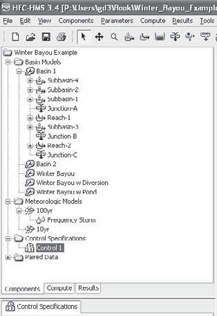{width="2.092707786526684in"
> height="3.0352635608048995in"}{width="2.1936942257217846in"
> height="3.0352635608048995in"}**Figure 5--6(d)** HEC-HMS Control
> Specifications.
>
> each independent modeling run. A series of runs can be easily
> organized using this option with several different scenarios. HEC-HMS
> can also handle continuous hydrograph simulation over long periods. It
> is standard to run the model several days past the end of the storm to
> ensure that the falling limb of the computed hydrograph is completely
> captured.
>
> **Data Handling**
>
> A major improvement for HEC-HMS is the use of the Data Storage System,
> or HEC-DSS, used to manage time-series and tabular data. The system
> was the result of a need in hydrologic engineering to store a variety
> of types of data in a standardized format. Previously, data formatted
> for one program would need to be entered into another format for a
> different program by hand by each user. Each program would then use
> separate functions to ana- lyze and graph the data. The HEC-DSS
> software is the result of an effort to make hydrologic data management
> more efficient and allow for the HEC family of programs to use the
> same database.
>
> HEC-HMS stores all its output in a DSS file and can store much of its
> tabular or time-series input data in one or more DSS files. For
> example, reservoir storage--outflow relationships as well as
> precipitation and observed flow time-series data are stored in a DSS
> file. The user either can input the data manually into HEC-HMS using
> the appropriate dialog boxes or can tell HMS to access the data from a
> DSS file where they are stored. HEC-HMS can use more than one DSS file
> for a project. There is always one DSS file associated with the
> project, which stores output. A second DSS file (or more) can hold
> precipitation and observed flow data as well as other user- entered
> data (see user's manual for more detail).
>
> While the HEC-DSS software package is an improved means of man- aging
> hydrologic data, there is no easy way to transfer the data from a
> spreadsheet to a HEC-DSS file. HEC-DSS utility software available for
> download from the USACE website given in Appendix E will allow import
> and export of data from text files for input to HEC-HMS.
>
> **Running HEC-HMS and Viewing Results**
>
> The user may specify different data sets for each component within a
> project and then run the hydrologic simulation using different
> combinations of mod- els. For example, one can run a 10-year or a
> 100-year frequency storm model using the same basin model and control
> specifications to compare the result- ing flows. Or, one can model the
> effects of adding diversions and reservoirs to a basin by saving it
> under a different name, altering the new basin model, and running the
> simulation under the same precipitation and control speci- fications.
> With several basin models saved in the same project, running
> simulations with various models is a simple task. In order to create
> the sce- nario for a particular run, go to "Simulation run" under
> Compute in the main
>
> file menu. Select one basin model, one meteorologic model, and one
> control specification. Then run the scenario by selecting "Select
> run," and subse- quently "Compute run," both of which are under
> Compute in the main file menu. If changes are made to one of the
> models after a run with the same configuration has been calculated,
> select the correct run to recalculate. Note that the "Compute" tab
> beneath the Watershed Explorer allows the user to easily select
> different runs.
>
> Results can be viewed by going to the "Results" tab beneath the
> Watershed Explorer, clicking on any object (e.g., subbasin or
> junction) in the basin model, and selecting from the menu. The program
> gives the result- ing times and flows for each basin element and its
> immediate upstream ele- ments in the form of a graph, summary table,
> or time-series table. The graph shows time vs. flow, the summary table
> shows peak flows and corresponding times, and the time-series table
> gives the inflow and outflow for each time step. For subbasins, HMS
> also shows the precipitation, loss, excess, and base- flow in each
> form of viewing results. Junction plots show tributary hydro- graphs
> and their combined result. Examples of resulting hydrographs are
> presented at the end of Section 5.6. Subbasin output hydrographs
> plotted with rainfall can be obtained by clicking on the appropriate
> icon. Summary table information is also available for each junction or
> subarea.
>
> **Other Features**
>
> HEC-HMS includes advanced features such as parameter estimation with
> optimization, soil moisture accounting, GIS and grid-cell hydrology,
> snow- melt simulation, and improved hydraulics. HEC-GeoHMS is a
> companion program that allows for the creation of HEC-HMS projects
> from GIS sources, including digital elevation models, land use data,
> and other elec- tronic sources (see Chapter 10).
>
> The parameter estimation and optimization function is used to com-
> pare resulting hydrographs to observed hydrographs, so at least one
> element in the basin must have observed data. The program
> automatically estimates the parameters in order to find the best fit
> of the generated hydrograph to the observed one for one element. It
> allows the user to set initial values for the parameters of each
> element along with maximum and minimum values so that the parameter
> values estimated by the program must fall in a reason- able range. The
> optimization function measures the degree of variation between the two
> hydrographs based on four possible choices: peak-weighted RMS error,
> sum of squared residuals, sum of absolute values, or percent error in
> peak flow. The program is run iteratively until the user is satisfied
> with the objective function value, which is zero if the hydrographs
> match identically.
>
> The development of HEC-HMS is a project that continues to evolve with
> time; users should periodically check the HEC U.S. Army Corp of
> Engineer's (ACOE) website for updates. For further information and
> help
>
> with HEC-HMS, the user's manual can be downloaded from the HEC web-
> site: [http://www.hec.usace.army.mil.](http://www.hec.usace.army.mil/)
> The latest updates and other informa- tion can be found on the ACOE's
> web page (see Appendix E for more details). Version 3.5 is a
> significant improvement over earlier versions and is available to
> anyone for free (see Appendix E).
>
> **EXAMPLE 5--1**
>
> **SMALL-WATERSHED EXAMPLE (HEC-HMS)**
>
> A small undeveloped watershed has the parameters listed in the accom-
> panying tables. A unit hydrograph and Muskingum routing coefficients
> are known for subbasin 3, shown in Figure E5--1(a). *TC* and *R*
> values (Clark UH from Table 5.10) for subbasins 1 and 2 and associated
> SCS curve numbers (CN) are provided as shown. A 5-hr rainfall
> hyetograph in in./hr is shown in Figure E5--1(b) for a storm event
> that occurred on May 5, 2011. Assume that the rain fell uniformly over
> the watershed. Use the information given to develop a HEC-HMS input
> data set to model this storm. Run the model to determine the predicted
> outflow at point *B*.

+-----------+--------+--------+-------------+----------------+-------+
| > *       | > **   | > *    | > **SCS     | > **%          | > *   |
| *Subbasin | *TC*** | **R*** | > Curve     | > Impervious   | *Area |
| >         | >      | >      | > Number**  | > (%)**        | >     |
|  Number** | > **   | > **   |             |                |  (mi^ |
|           | (hr)** | (hr)** |             |                | 2^)** |
+===========+========+========+=============+================+=======+
| > 1       | > 2.5  | 5.5    | > 66        | > 0            | 2.5   |
+-----------+--------+--------+-------------+----------------+-------+
| > 2       | > 2.8  | 7.5    | > 58        | > 0            | 2.7   |
+-----------+--------+--------+-------------+----------------+-------+
| > 3       | > ---  | ---    | > 58        | > 0            | 3.3   |
+-----------+--------+--------+-------------+----------------+-------+

<table>
<colgroup>
<col style="width: 17%" />
<col style="width: 14%" />
<col style="width: 6%" />
<col style="width: 9%" />
<col style="width: 9%" />
<col style="width: 9%" />
<col style="width: 9%" />
<col style="width: 9%" />
<col style="width: 9%" />
<col style="width: 5%" />
</colgroup>
<thead>
<tr class="header">
<th><blockquote>
<p>Input UH for</p>
</blockquote></th>
<th><blockquote>
<p>Time (hr)</p>
</blockquote></th>
<th><blockquote>
<p>0</p>
</blockquote></th>
<th><blockquote>
<p>1</p>
</blockquote></th>
<th><blockquote>
<p>2</p>
</blockquote></th>
<th><blockquote>
<p>3</p>
</blockquote></th>
<th><blockquote>
<p>4</p>
</blockquote></th>
<th><blockquote>
<p>5</p>
</blockquote></th>
<th><blockquote>
<p>6</p>
</blockquote></th>
<th>7</th>
</tr>
</thead>
<tbody>
<tr class="odd">
<td><blockquote>
<p>Subbasin 3:</p>
</blockquote></td>
<td><blockquote>
<p><em>U</em> (cfs)</p>
</blockquote></td>
<td><blockquote>
<p>0</p>
</blockquote></td>
<td><blockquote>
<p>200</p>
</blockquote></td>
<td><blockquote>
<p>400</p>
</blockquote></td>
<td><blockquote>
<p>600</p>
</blockquote></td>
<td><blockquote>
<p>450</p>
</blockquote></td>
<td><blockquote>
<p>300</p>
</blockquote></td>
<td><blockquote>
<p>150</p>
</blockquote></td>
<td>0</td>
</tr>
</tbody>
</table>

> Muskingum coefficients: *x* = 0.15, *K* = 3 hr, area = 3.3 sq mi.
>
> Wooded

1 2

*A*

3

*B*

> **Figure E5--1(a)**
>
> Meadows Meadows
>
> 2.0
>
> 1.0
>
> 0
>
> 000 100 200 300 400 500
>
> May 5, 2011
>
> Time (hr)
>
> **Figure E5--1(b)**

900

800

700

600

500

400

300

200

100

0

> --100
>
> 00:00 06:00 12:00
>
> 05May2011
>
> Legend (Compute Time: 15Jun2011, 09:16:29)

18:00 00:00 06:00 12:00

06May2011

> **Figure E5--1(c)**
>
> Outflow hydrograph at outlet with reach and subbasin inputs.
>
> Run: Ex5.1 Element:JUCTION-2 Result:Outflow Run: Ex5.1
> Element:SUBBASIN-3 Result:Outflow Run: Ex5.1 Element:REACH-1
> Result:Outflow
>
> Table E5--1 lists the general steps for creating a project in HEC-HMS
> and the corresponding steps for running the watershed from Example
> 5--1. Run the project in HEC-HMS, and evaluate the final outflow hy-
> drograph (Fig. E5--1(c)).
>
> **SOLUTION**
>
> **Table E5--1** Steps for Example 5--1

(*continued* )

> **Table E5--1** (Continued)

9.  Click on any of the subbasins in your model and look at the
    > **Subbasin** tab in the data window. Define the **Area** for each
    > subbasin as defined in the first table. Under the **Loss Method**,
    > select **SCS Curve Number** for each subbasin. The **Transform
    > Method** will be **Clark Unit Hydrograph** for Subbasins 1 and 2,
    > but will be **User-Specified Unit Hydrograph** for Subbasin 3.
    > Select *None* as the **Baseflow Method** for each of the
    > subbasins.

10. On the **Loss** and **Transform** tabs in the Component Editor
    window, input the appropriate values given in the first table for
    each subbasin.

11. Select **Components** from the main menu and pick **Paired Data
    Manager**. Select **Unit Hydrograph Curves** from the **Data Type**
    pull-down and click the **New...** button to initiate a new paired
    data set. Name this set *Subbasin3UH*, click the **Create** button,
    and close the Paired Data Manager window.

12. In the Watershed Explorer window, expand the **Paired Data** and
    **Unit Hydrograph Curves** and select the **Subbasin3UH** data set.
    Change the time interval value to *1 hour*. The **Data Source** will
    be *Manual Entry*, so click the **Table** tab to manually enter the
    unit hydrograph for Subbasin 3. Enter the data from the second
    table.

13. Now that the paired dataset is created, click on the **Subbasin 3**
    element and under the **Transform**

> tab, select *Subbasin3UH*.

14. Click on the **Main** reach and set its **Routing Method** to
    **Muskingum**. In the Component Editor window, select the
    **Routing** tab and enter given **x** and **K** coefficients (use a
    subreaches value of 6).

15. To add precipitation data, select **Components** from the main menu
    and click **Meteorologic Model Manager**. Select the **New...**
    button and name the storm event *5May11*. Click the **Create**
    button and close the Meteorologic Model Manager.

16. In the Watershed Explorer window, expand **Meteorologic Models** and
    select the **5May11** event. In the Component Editor window, select
    *Specified Hyetograph* for **Precipitation** on the Meteorology
    Model tab. Next, select the **Basins** tab and select YES under the
    **Include Subbasins** question.

17. Next we define a gage location where this storm event was observed.
    Under **Components** in the main menu, select **Time-Series Data
    Manager** and confirm that **Data Type** is set to *Precipitation
    Gages*. Click the **New...** button, name this *Gage 1*, click the
    **Create** button and close the Time-Series Data Manager.

18. Expand the **Time-Series Data**, **Precipitation Gages**, and the
    **Gage 1** items in the Watershed Explorer window. In the Component
    Editor window, change the Time Interval to *1 hour*. Clicking on the
    Time Window tab will allow you to modify the time domain for this
    event. Change storm date and time to 00:00 to 5:00 on 5May2011.
    Click the **Table** tab to manually input the incremental rainfall
    values for this storm (Fig. E5--1(b)).

19. Next, attach this gage data to the defined hyetograph by selecting
    *Specified Hyetograph* under 19Jun10 in the Watershed Explorer
    window. Select *Gage 1* for each of the subbasins shown in the
    Component Editor window.

20. Select **Components** in the main menu and click on **Control
    Specifications Manager**. Click on the **New...** button, add a
    control specification named *Test01*. Click the **Create** button
    and close the Control Specifications Manager. Expand the new Control
    Specifications item in the Watershed Explorer window and select the
    Test01 item. Define the Start Date/Time and End Date/Time as
    5May2011 at 00:00 and 6May2011 at 12:00. Select *10 minutes* for the
    time interval.

21. Now we can finally define a project simulation. Select **Compute**
    from the main menu and click on **Create Simulation Run**. Name the
    run *5May11* and click the "Next" button. In the next dialogs,
    select **Basin 1** for the basin model, **5May11** for the
    meteorologic model, and **Test01** for the control specifications.

22. To run your model, select **Compute** in the main menu, and choose
    **Select Run** and **5May11**. Next, select **Compute** (main menu)
    and *Compute Run \[5May2011\]*.

23. Click the **Results** tab in the Watershed Explorer window, expand
    the Simulation Runs item and click on any of the elements to view
    the simulation results.

> **Watershed Description**
>
> This section analyzes streamflow in a hypothetical watershed,
> Winterday Creek (Fig. 5--7(a)), and the separate effects of adding a
> detention pond and a diversion. The watershed, with a total area of
> about 10.99 mi^2^, is made up of four subbasins with varying sets of
> hydrologic parameters. In their existing condition, the subbasins in
> this watershed range from 18% imperviousness (subbasin 2) to 60%
> imperviousness (subbasin 4). The subbasins are relatively flat (10 to
> 20 ft/mi) and range in size from 2.0 to 4.3 mi^2^ (see Table 5.8(a)).
>
> **Physical Parameters**
>
> The physical parameters for each of the subbasins in the hypothetical
> watershed are shown in Tables 5--8(a,b), Theoretically, parameters of
> main interest such as channel slopes, channel lengths, percent
> develop- ment, and percent conveyance (the ratio of flow in the
> channel to total flow) could be determined for any watershed, given
> the existence of top- ographic maps and land use data. Chapter 10
> presents alternative elec-
>
> **5.6**
>
> **HEC-HMS WATERSHED ANALYSIS: CASE STUDY**
>
> **Figure 5--7(a)** Watershed map
> showing subarea delineation of Winterday Creek.
>
> n-C
>
> **Figure 5--7(b)** Watershed map
> showing the loca- tion of an added detention pond.

Reservoir

> n-C
>
> **Table 5--8(a)** Physical Parameters for the Hypothetical Watershed

+---------+------+--------+-------+-------+-------------+-----------+
| > **Sub | > ** | **L**  | >     | >     | > **        | > **C     |
| basin** | Area |        | **Lca | **S** | Development | onveyance |
|         | > (  | > **   | > (   | >     | > (%)**     | > (%)**   |
|         | mi^2 | (ft)** | ft)** | > *   |             |           |
|         | ^)** |        |       | *(ft/ |             |           |
|         |      |        |       | mi)** |             |           |
+=========+======+========+=======+=======+=============+===========+
| 1       | >    | 7000   | >     | > 20  | > 30        | > 80      |
|         |  2.0 |        |  4000 |       |             |           |
+---------+------+--------+-------+-------+-------------+-----------+
| 2       | >    | 9000   | >     | > 10  | > 28        | > 80      |
|         | 2.32 |        |  5050 |       |             |           |
+---------+------+--------+-------+-------+-------------+-----------+
| 3       | >    | 8750   | >     | > 10  | > 75        | > 100     |
|         | 2.37 |        |  4975 |       |             |           |
+---------+------+--------+-------+-------+-------------+-----------+
| 4       | >    | 10,000 | >     | > 10  | > 80        | > 100     |
|         |  4.3 |        |  6340 |       |             |           |
+---------+------+--------+-------+-------+-------------+-----------+

> **Table 5--8(b)** Infiltration Loss Data for Each Subbasin

+----------------+------------------------+----------------------------+
| > **Subbasin** | > **Impervious (%)**   | > **SCS Curve Number**     |
+================+========================+============================+
| 1              | > 20                   | > 78                       |
+----------------+------------------------+----------------------------+
| 2              | > 18                   | > 80                       |
+----------------+------------------------+----------------------------+
| 3              | > 52                   | > 85                       |
+----------------+------------------------+----------------------------+
| 4              | > 60                   | > 90                       |
+----------------+------------------------+----------------------------+

> tronic data available in GIS formats and DEMs (digital elevation
> models) for use in hydrologic watershed analysis. Detailed examples
> are provided in Chapters 10 and 11.
>
> **Rainfall Data**
>
> The HEC-HMS model can accept rainfall data in a number of ways: his-
> torical data from recording or non-recording gages or design storm
> data. When using data from gages spaced unevenly across a given
> watershed, the gage values should be weighted accordingly. The
> Thiessen method is the usual approach. Although not discussed in this
> example (see Chapter 1), problems 5.10--5.11 address the Thiessen
> method for subbasin data when only gage values are known.
>
> The 10-yr and 100-yr synthetic 24-hr design storms for the Houston
> area are depicted in Table 5--9 and Figure 5--8 (TSARP, 2002). For
> example, the HEC-HMS model accepts input data for the 15-min, 2-hr,
> 3-hr, 6-hr, 12-hr, and 24-hr total design rainfalls, and then
> distributes the data as a bar graph by centering the maximum at a
> user-specified point in time (i.e., 33%, 50%, 67%, or 75% of storm
> duration), according to agency standards. Thus, one can input any
> design rainfall into HEC-HMS, calculate the outflow hydrograph, and
> compare the result with a given historical rainfall. In this way, one
> can deter- mine the approximate frequency of occurrence of the
> historical storm. In prac- tice, a range of design storms including
> the 2-yr, 5-yr, 10-yr, 25-yr, 50-yr, 100-yr, and 500-yr rainfalls are
> evaluated in most flood studies.

**Table 5--9** Houston Frequency Rainfall, Updated 2002 (TSARP)

+-----------+----------+-------+--------------+-----------+---------+
| > **D     | > **5    | **10  | > **Houston  |           | **100   |
| uration** | > yr**   | yr**  | > Frequency  |           | yr**    |
|           |          |       | > Rainfall** |           |         |
|           |          |       | >            |           |         |
|           |          |       | > **25 yr 50 |           |         |
|           |          |       | > yr**       |           |         |
+===========+==========+=======+==============+===========+=========+
| > 15 min  | > 0.59   | 0.69  | > 0.83       | 0.95      | 1.08    |
+-----------+----------+-------+--------------+-----------+---------+
| > 1 hr    | > 2.37   | 2.76  | > 3.33       | > 3.8     | 4.32    |
+-----------+----------+-------+--------------+-----------+---------+
| > 2 hr    | > 2.96   | 3.51  | > 4.32       | 5.02      | 5.83    |
+-----------+----------+-------+--------------+-----------+---------+
| > 3 hr    | > 3.55   | 4.25  | > 5.3        | 6.24      | 7.33    |
+-----------+----------+-------+--------------+-----------+---------+
| > 6 hr    | > 4.31   | 5.27  | > 6.76       | 8.14      | 9.82    |
+-----------+----------+-------+--------------+-----------+---------+
| > 12 hr   | > 5.14   | 6.37  | > 8.31       | 10.12     | 12.31   |
+-----------+----------+-------+--------------+-----------+---------+
| > 24 hr   | > 5.95   | 7.35  | > 9.51       | 11.50     | 13.89   |
+-----------+----------+-------+--------------+-----------+---------+

10. and 100-Year Design Hyetographs for Houston, TX

> 5
>
> 4
>
> 3
>
> 2
>
> 1
>
> 0
>
> **Figure 5--8**
>
> Design hyetograph for Houston, Texas.
>
> **Unit Hydrograph Data**
>
> In the case study of Winterday Creek, the Clark (*TC* & *R*) method
> will be used to illustrate its applications to an urban watershed. The
> *TC* & *R* method is summarized in Table 5--10 with empirical
> equations that have been devel- oped for the Harris County (Houston)
> area in Texas. The equations used here are based on the analysis of a
> number of watersheds along the Texas Gulf Coast (Harris County Flood
> Control District, 1983; TSARP, 2002). Many similar equations have been
> generated for other urban areas and regions across the country, and
> the user of HEC-HMS is strongly urged to evaluate the *TC* & *R*
> method carefully before applying it to any ungaged watersheds.
>
> The physical parameters presented in Table 5--8 were used to develop
> the values for *TC* & *R* shown in Table 5--11. Generally, the lower
> the percent development and percent conveyance in a subbasin, the
> higher the value of *TC* & *R*. Thus, subbasin 2 has the highest value
> of *TC* & *R* and has the flat- test UH response. Individual values
> for each subbasin are input into HEC- HMS using the transform tab in
> the subbasin editor. Note also that SCS Curve Number method was
> selected for infiltration losses and the corre- sponding parameters
> were inserted in the subbasin editor under the loss rate tab (Table
> 5--8(b)).
>
> **Hydrograph and Channel Routing**
>
> The HEC-HMS model calculates outflow hydrographs for each subbasin
> based on unit hydrographs. For this watershed, the flood hydrographs
> from subbasins 1 and 2 are computed for the outlet of those subbasins
> (point *A* in Fig. 5--7(a)). The storm hydrograph from subbasin 3 is
> assumed to occur at point *B*, and the hydrograph from subbasin 4 is
> assumed to occur at point *C*. It is therefore required that the
> combined hydrograph from subbasins 1 and 2 at point *A* be flood
> routed through reach *AB* and then combined with the
>
> **Table 5--10** Equations for *TC* & *R* Method for Houston, Texas
>
> The method requires that (*TC* + *R*) and *TC* are computed from the
> following formulas, then
>
> *R* is found by subtraction of the two, where *R* = (*TC* + *R*) -
> *TC*.
>
> *TC* + *R* = *C* a *[L]{.underline}* b 0.706
>
> 2*S*
>
> where
>
> *TC* = time of concentration (hr),
>
> *R* = routing constant (hr),
>
> *L* = length of channel (outflow to basin boundary) (mi),
>
> *S* = channel slope (ft/mi),
>
> *C* = 4295\[% Dev\]^-0.678^\[% Conv\]^-0.967^,
>
> *C* = 7.25 if % Dev ... 18,
>
> *TC* = *C* a *[Lca]{.underline}* b 1.06
>
> \' ,
>
> 1*S*
>
> where *C*\' is taken from the following for overland slope and % Dev:

+-------+---+---------+-----------+-------------------+----------------+
| > *** |   |         |           |                   |                |
| S*~0~ |   |         |           |                   |                |
| > (f  |   |         |           |                   |                |
| t/mi) |   |         |           |                   |                |
| > %   |   |         |           |                   |                |
| > Dev |   |         |           |                   |                |
| > *C  |   |         |           |                   |                |
| ***\' |   |         |           |                   |                |
+=======+===+=========+===========+===================+================+
|       |   | > 740   |           | 0                 | 5.12           |
+-------+---+---------+-----------+-------------------+----------------+
| > 20  | > | >       | > 40      | 0                 | 3.79           |
|       |   |  *S*~0~ |           |                   |                |
|       | 6 | > ...   |           |                   |                |
+-------+---+---------+-----------+-------------------+----------------+
|       |   | > ...   |           | 0                 | 2.46           |
|       |   | > 20    |           |                   |                |
+-------+---+---------+-----------+-------------------+----------------+
|       |   | > 740   |           | 100               | 1.95           |
+-------+---+---------+-----------+-------------------+----------------+
|       |   | > ...   |           | 100               | 0.94           |
|       |   | > 20    |           |                   |                |
+-------+---+---------+-----------+-------------------+----------------+

> (If the percent development is between 0 and 100, *C*\' is found by
> linear interpolation.)
>
> *L~ca~* = length along channel to centroid of area (mi),
>
> *S*~0~ = representative overland slope (ft/mi),
>
> \% Dev = percent of area that is developed (%),
>
> \% Conv = % conveyance, the ratio of flow in channel to total flow
> (%),
>
> *TC* = time of concentration (hr),
>
> *R* = routing constant (hr).
>
> **Table 5--11** Computed *TC & R* Coefficients for Each Subbasin

+----------------+-------------+-----------+---------------------------+
| > **Subbasin   | > ***TC***  | > ***TC & | > **Coefficients**        |
| > Number**     |             | > R***    | >                         |
|                |             | >         | > **Impervious (%)**      |
|                |             | > ***R*** |                           |
+================+=============+===========+===========================+
| > 1            | > 0.3       | 2.31      | 20                        |
+----------------+-------------+-----------+---------------------------+
| > 2            | > 0.57      | 3.61      | 18                        |
+----------------+-------------+-----------+---------------------------+
| > 3            | > 0.36      | 1.33      | 52                        |
+----------------+-------------+-----------+---------------------------+
| > 4            | > 0.44      | 1.34      | 60                        |
+----------------+-------------+-----------+---------------------------+

> hydrograph from subbasin 3 at point *B*. Likewise, the combined
> hydrograph at point *B* is routed to point *C* and then combined with
> the hydrograph from subbasin 4 to produce the outlet hydrograph.
> Larger watersheds with more complicated channel networks can be
> represented in the HEC-HMS model in a similar fashion.
>
> Storage routing data are sometimes difficult to obtain, especially if
> hydraulic calculations have not been completed for the main channel.
> Often in well-studied basins, the HEC-RAS model has been applied to
> develop water surface profiles and hydraulic information for the main
> channel (refer to Chapter 7). Computations with HEC-RAS or a similar
> model allow the development of storage--discharge relations for the
> reaches in the channels, which is then used in HEC-HMS to route the
> hydrographs from one point to another in the main channel.
>
> Routing information can be entered into HEC-HMS by clicking on each
> reach in the Watershed Explorer and changing the "Routing Method" in
> the drop-down menu located in the bottom window on the left side
> panel. Parameters for the selected routing method are then entered on
> the "Rout- ing" tab. If the **Modified Puls** method is selected, a
> storage-discharge rela- tionship must be added by going to the Paired
> Data Manager under Components in the main menu. The user then
> specifies the specific storage-- discharge relationship for the reach
> in the "Stor-Dis Function" drop-down menu under the "Routing" tab of
> the reach. Initial stage or flow can also be specified, but is usually
> set to zero. The Modified Puls routing method is used when modeling
> flow in Winterday Creek. Table 5--12 presents storage in ac-ft vs.
> discharge in cfs for the two reaches in the watershed.
>
> A second method of flood routing that is sometimes used is the **kine-
> matic wave method**. This method works well in areas with a
> significant over- land slope in which the flood wave is essentially
> translated. The Houston area is exceptionally flat with very little
> slope, which results in much more attenuation of the flood wave than
> the kinematic wave method allows for. For this reason, the Modified
> Puls method is usually a better choice. More
>
> **Table 5--12** Channel Storage Routing Data

+----------------+------------------+-------------------+-------------+
| > **Reach A-B  |                  |                   |             |
| > Reach B-C**  |                  |                   |             |
| >              |                  |                   |             |
| > **S ac-ft Q  |                  |                   |             |
| > cfs S ac-ft  |                  |                   |             |
| > Q cfs**      |                  |                   |             |
+================+==================+===================+=============+
| 0.0            | > 0.0            | > 0               | 0           |
+----------------+------------------+-------------------+-------------+
| > 120          | > 120            | 72.3              | 465         |
+----------------+------------------+-------------------+-------------+
| > 189          | > 256            | > 114             | 930         |
+----------------+------------------+-------------------+-------------+
| > 245          | > 315            | 180.8             | 1860        |
+----------------+------------------+-------------------+-------------+
| 276.1          | > 412            | 325.7             | 2790        |
+----------------+------------------+-------------------+-------------+
| > 1042.7       | > 1564           | > 842             | 3720        |
+----------------+------------------+-------------------+-------------+
| > 1800         | > 1901           | 1664.9            | 4650        |
+----------------+------------------+-------------------+-------------+
| > 3077         | > 2099           | 2653.7            | 5580        |
+----------------+------------------+-------------------+-------------+
| > 4555.8       | > 2200           | 4379.9            | 6975        |
+----------------+------------------+-------------------+-------------+

> discussion is presented in Chapter 11 for distributed models using
> kinematic wave routing. The various methods of calculation that
> HEC-HMS uses are established and have been proven to work well in the
> field. In reality, how- ever, certain methods are designed to work
> better with watersheds of certain physical characteristics than with
> others. It is always important to check that one is using the best
> method for a given watershed to ensure that the most accurate results
> are obtained. Figure 5--5 shows a graph to demonstrate the Modified
> Puls method.
>
> **Resulting Hydrographs**
>
> The HEC-HMS model was run using data presented in the tables above and
> using the Clark (*TC* & *R*) method. Two different rainfalls were
> tested: the 10-yr frequency design storm and the 100-yr frequency
> design storm. The rainfall input datasets used for the 10-yr and
> 100-yr design storms are shown in Table 5--9 and Figure 5--8.
> Resulting peak outflows for both storms are listed in Table 5--13. In
> general, it is always useful to check three parameters against the
> measured gage data in calibrating HEC-HMS input: peak flow, volume
> under the hydrograph, and time to peak. Some adjustment of water- shed
> parameters is usually necessary to calibrate the model fully.
>
> Once the HEC-HMS input data are calibrated for several measured storm
> events, predictions for the 10-yr, 100-yr, or any other design storm
> can be made by changing rainfall input in the model (see Problems
> 5.6--5.9). The resulting 10-yr and 100-yr design storm hydrographs
> then provide an esti- mate of peak flows at various points along the
> main channel. These flows can be used with cross-section data and
> hydraulic computations to derive elevations for the 10-yr and 100-yr
> floodplain using HEC-RAS as described in Chapter 7.
>
> As with any modeling exercise, sources of error in the calibration of
> HEC-HMS to a watershed include the following:

1.  Spatially variable input rainfall with too few rain gages across the
    > watershed

2.  Infiltration or loss inaccuracies due to variable rainfall or
    > changing land use

3.  Inaccurate estimates of routing coefficients for channels

4.  Nonlinear hydrographs that cannot be properly represented by lin-
    > ear unit hydrograph theory

> **Table 5--13** Comparison of Peak Flows for the Hypothetical
> Watershed

+-----------------------------+-------------+--------------------------+
| > **Frequency Design        | > **J       | > **Peak Flow (cfs)**    |
| > Storm**                   | unction-B** | >                        |
|                             |             | > **Junction-C Outlet**  |
+=============================+=============+==========================+
| > 10-yr                     | > 3052      | 6830                     |
+-----------------------------+-------------+--------------------------+
| > 100-yr                    | > 4197      | 9024                     |
+-----------------------------+-------------+--------------------------+

> **Flood Control Alternatives**
>
> Once a watershed has been evaluated under existing conditions of land
> use and channel morphology, the HEC-HMS model can be used to test
> flood control plans that might include a reservoir or detention pond
> to increase storage in the watershed. Some diversion of part of the
> flow to another watershed where storage is available might also be
> possible. These possi- bilities are investigated with HEC-HMS in this
> section.
>
> A powerful feature of the HEC-HMS model is its ability to represent
> changes in watershed physiography or land use that may occur as a
> water- shed develops. For Winterday Creek, we will consider two
> examples: (1) a large detention pond at point *B* for the storage of
> flood waters from sub- basins 1, 2, and 3, and (2) the diversion of a
> portion of the flow at point *B* into a diversion channel that leads
> to another watershed. In both cases, the watershed will be assumed to
> have existing land use (Fig. 5--7(b)).
>
> To input a detention pond into HEC-HMS, the storage routing data must
> be changed to represent the storage--discharge relation for the
> particu- lar detention pond. The pond data are located in the input
> through logical placement so that all contributing hydrographs route
> through the pond. The starting water elevation in the pond depends on
> the operation of the system. The discharge characteristics can be
> considered in detail through options available in the model, but
> generally pipe flow is assumed for low flows and weir flow for flood
> levels. Details on equations that govern such flows are provided in
> Chapters 4 and 7.
>
> The input data of the detention pond in HEC-HMS are depicted in Table
> 5--14. The storage--discharge data are based on pond geometry, which
> is a func- tion of available land area and available outfall depth.
> The existing 100-yr peak flow in the water is 4197 cfs at point *B*
> and 9024 cfs at the outlet (*C*). To control the peak flows at the
> point B and at the outlet of the watershed, a pond was located just
> upstream of point *B* along the stream (Fig. 5--7(b)). Table 5--15
> shows the relative effects of this pond compared with existing
> conditions. Add- ing a pond yields a 50% reduction in peak flow at the
> 100-yr level through the pond and a 24% reduction in peak flow through
> point *C* (Fig. 5--9).
>
> **Table 5--14** Storage-Discharge Relation for the Detention Pond

+---------+----+------+------+------+------+------+-------+-------+
| > **S   | >  | >    | >    | >    | 798  | >    | >     | >     |
| > (a    |  0 |  200 |  450 |  689 |      |  950 |  1200 |  1800 |
| c-ft)** |    |      |      |      |      |      |       |       |
+=========+====+======+======+======+======+======+=======+=======+
| > **Q   | >  | >    | >    | >    | 501  | >    | >     | >     |
| >       |  0 |  146 |  300 |  420 |      |  778 |  1500 |  6000 |
| (cfs)** |    |      |      |      |      |      |       |       |
+---------+----+------+------+------+------+------+-------+-------+

> **Table 5--15** Comparison of Peak Flows with and without a Detention
> Pond in the Hypothetical Watershed for the 100-yr Storm

+-------------------+---------------+--------------------+------------+
| > **Conditions**  | > *           | > **Peak Outflow   | > **Ju     |
|                   | *Junction-B** | > (cfs)**          | nction-C** |
|                   |               | >                  |            |
|                   |               | > **Pond**         |            |
+===================+===============+====================+============+
| > Without pond    | > 4197        | > \-\--            | > 9024     |
+-------------------+---------------+--------------------+------------+
| > With pond       | > 2099        | > 2099             | > 6856     |
+-------------------+---------------+--------------------+------------+

> {width="4.223333333333334in"
> height="3.6066666666666665in"}**Figure 5--9(a)**
>
> Outlet hydrograph for Winterday Creek modeled under

100. yr storm fre- quency conditions.

> {width="4.346666666666667in"
> height="3.723333333333333in"}**Figure 5--9(b)** Effect of the pond at
> point B.
>
> **Table 5--16(a)** Inflow-Diversion Relation for the Added Diversion
>
> **Table 5--16(b)** Comparison of Peak Flows with and without a
> Diversion in the Hypothetical Watershed for the 100-yr Storm
>
> A second alternative for flood control is **diversion** of flood
> runoff to another watershed. This is accomplished in HEC-HMS via the
> diversion icon in the basin model, which allows the user to define a
> flow level above which a certain percentage will be diverted from the
> main channel (Table 5--16(a)). While this option implies that there
> must be an adjacent watershed or stor- age area that can receive the
> excess flood water, it can be a viable alternative in some cases. For
> this example, water will be diverted at point *B* and the effect on
> the resulting hydrograph will be observed just downstream and at the
> watershed outlet (Table 5--16(b) and Fig. 5--10).
>
> 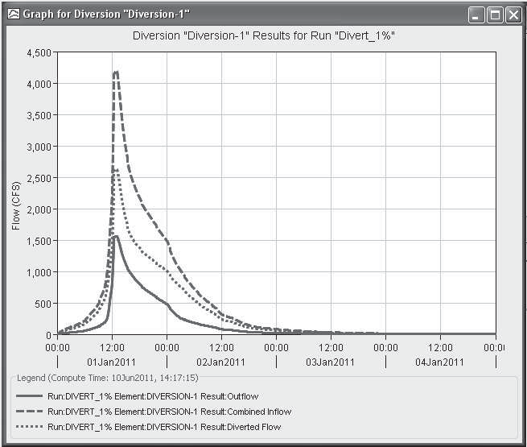{width="4.413333333333333in"
> height="3.7533333333333334in"}**Figure 5--10**
>
> Effect of the diversion at point B.
>
> One final exercise with the HEC-HMS model application to this
> watershed is a consideration of full development conditions in the
> water- shed, which is consistent with the future conditions in
> Houston. As the watershed proceeds to full urbanization, significant
> changes in UH and loss rate parameters will be needed in the model.
> There would also be associ- ated channelization of laterals and the
> main stream, which may require changes in the routing parameters in
> the model. From the previous discus- sion of effects of urbanization,
> it should be clear that full development will worsen the flood
> problem, especially downstream. Homework problem 5.5 explores this
> issue in more detail. Once developed, the HEC-HMS model for a
> watershed can be used to evaluate a number of scenarios for flood
> management and control.
>
> **SUMMARY** Simulation models in hydrology have been developed and
> applied over the last four decades with remarkable success. These
> models incorporate various equa- tions to describe hydrologic
> processes in space and time. Complex rainfall pat- terns affecting
> large watersheds can be simulated, and computer models can be used to
> test various design and control schemes. A selected number of the most
> popular rainfall--runoff models for hydrologic simulation are
> contained in Table 5--4. Models of some note include HEC-HMS, HEC-RAS,
> HSPF, SWMM, and Vflo and are some of the most popular and
> comprehensive models for detailed water- shed analysis**.**
>
> The second half of the chapter is devoted to a detailed presentation
> of HEC- HMS developed by the U.S. Army Corps of Engineers, considered
> by many to be the most versatile and most often used hydrologic model.
> It is the model of choice for most floodplain computations performed
> in the United States by various agencies such as FEMA and local
> drainage districts (HEC, 2006, 2010). Homework problems 5.1--5.12
> concern a detailed case study and application of HEC-HMS to an urban
> watershed in Houston, Texas. Input data for the model are developed,
> using the Clark UH methods (*TC* & *R*), Muskingum Routing method,
> rain gage data, and several design storms, and the results from each
> are compared. The problems also introduce the effects of development
> within a watershed and explore the Green and Ampt method to account
> for infiltration losses. Several flood control alternatives are
> modeled, including flow diversion and detention ponds at critical
> locations, to demonstrate the overall capabili- ties of the HEC-HMS
> program.
>
> **PROBLEMS** *Problems 5.1 through 5.12 deal with a hypothetical
> watershed with the following pa- rameters. Problems 5.1 through 5.5
> involve input data setup only, while Problems 5.6 through 5.12 require
> actual HEC-HMS program computations.*

+---------+-------+--------+-------+-------+------------+-----------+
| > **S   | > *   | > *    | >     | > **  | > **D      | > **C     |
| ubbasin | *Area | **L*** |  ***L | *S*** | evelopment | onveyance |
| > N     | > (   | >      | ca*** | >     | > (%)**    | > (%)**   |
| umber** | ac)** | > **   | >     | > *   |            |           |
|         |       | (ft)** | > **( | *(ft/ |            |           |
|         |       |        | ft)** | mi)** |            |           |
+=========+=======+========+=======+=======+============+===========+
| > 1     | >     | 7000   | >     | 20    | > 30       | > 80      |
|         |  1280 |        |  4000 |       |            |           |
+---------+-------+--------+-------+-------+------------+-----------+
| > 2     | >     | 9000   | >     | 20    | > 28       | > 80      |
|         |  1485 |        |  5050 |       |            |           |
+---------+-------+--------+-------+-------+------------+-----------+
| > 3     | >     | 8750   | >     | 10    | > 70       | > 100     |
|         |  2045 |        |  4975 |       |            |           |
+---------+-------+--------+-------+-------+------------+-----------+
| > 4     | >     | 8230   | >     | 10    | > 70       | > 100     |
|         |  1517 |        |  4115 |       |            |           |
+---------+-------+--------+-------+-------+------------+-----------+
| > 5     | >     | 10,000 | >     | 10    | > 75       | > 100     |
|         |  2752 |        |  6340 |       |            |           |
+---------+-------+--------+-------+-------+------------+-----------+

> Assume *S* = *S*~0~ in each subbasin. The infiltration data are as
> follows:

+----------------+-------------------------+--------------------------+
| > **Subbasin** | > **Impervious (%)**    | > **SCS Curve Number**   |
+================+=========================+==========================+
| 1              | > 20                    | > 78                     |
+----------------+-------------------------+--------------------------+
| 2              | > 18                    | > 80                     |
+----------------+-------------------------+--------------------------+
| 3              | > 52                    | > 85                     |
+----------------+-------------------------+--------------------------+
| 4              | > 55                    | > 85                     |
+----------------+-------------------------+--------------------------+
| 5              | > 60                    | > 90                     |
+----------------+-------------------------+--------------------------+

1.  Calculate the *TC* & *R* coefficients for each subbasin in the given
    watershed shown in Figure P5--1. Assume that the equations listed in
    Table 5--10 are ap- plicable and that *S* = *S*~0~.

**Figure P5--1**

2.  Create the basin model of the watershed in HEC-HMS using the data
    provided. Set up input data for the watershed using Clark's UH
    method (*TC* & *R*). Use Muskingum routing methods and assume that
    *K* = 0.60 hr and *x* = 0.5 in reaches 1, 2, and 3. Assume two
    subreaches in each reach and assume baseflow is zero.

3.  Using the data shown in Table 5--9, create two meteorologic models
    in HEC- HMS using the 24-hr hypothetical design storms for the
    100-yr frequency and the 10-yr frequency events. Place the peak
    center at 50% for both storms and use 20-min maximum intensity
    duration.

4.  Create a new basin model for HEC-HMS Problem 5.2 to reflect a
    detention pond near Junction 2. Assume that the pond can be modeled
    in such a way

> that only the runoff from subbasin 3 should be routed through it. The
> storage-- discharge relation is given as follows:

+----------+----+------+------+------+------+-------+-------+-------+
| > **S    | >  | >    | >    | >    | >    | >     | >     | >     |
| > (      |  0 |  200 |  375 |  508 |  860 |  1123 |  1500 |  2120 |
| ac-ft)** |    |      |      |      |      |       |       |       |
+==========+====+======+======+======+======+=======+=======+=======+
| > **Q    | >  | >    | >    | >    | >    | > 600 | > 710 | >     |
| >        |  0 |  146 |  222 |  352 |  480 |       |       |  1733 |
|  (cfs)** |    |      |      |      |      |       |       |       |
+----------+----+------+------+------+------+-------+-------+-------+

5.  The watershed is predicted to grow in the next 20 years and approach
    > 100% development over most of the watershed. If this occurs,
    > certain parameters will change, as shown in the following table.
    > Compute the new *TC* & *R* coefficients, and change the basin
    > model of Problem 5.3 to reflect these fully developed condi-
    > tions. Assume that the Muskingum values used in Problem 5.2 will
    > still be correct.

+-----------+---------------+--------------+-------------+-----------+
| > **S     | >             | >            | > *         | > **SCS   |
| ubbasin** | **Development | **Conveyance | *Impervious | > Curve   |
|           | > (%)**       | > (%)**      | > (%)**     | >         |
|           |               |              |             |  Number** |
+===========+===============+==============+=============+===========+
| 1         | > 50          | > 100        | > 38        | 83        |
+-----------+---------------+--------------+-------------+-----------+
| 2         | > 75          | > 100        | > 30        | 81        |
+-----------+---------------+--------------+-------------+-----------+
| 3         | > 100         | > 100        | > 80        | 94        |
+-----------+---------------+--------------+-------------+-----------+
| 4         | > 100         | > 100        | > 85        | 94        |
+-----------+---------------+--------------+-------------+-----------+
| 5         | > 100         | > 100        | > 85        | 94        |
+-----------+---------------+--------------+-------------+-----------+

6.  Run the HEC-HMS model with Δ*t* = 20 min to reflect the existing
    > conditions, the effect of the pond with existing conditions, fully
    > developed conditions, and the effect of the pond with fully
    > developed conditions for both the 100-yr and the 10-yr design
    > storms. Compare the peak flows at Junction 3 for the various run
    > combinations.

7.  Set up a diversion at Junction 2 of the existing condition basin so
    > that Reach 1 and subbasin 3 flow into it. Use the
    > inflow--diversion relationship from Table 5--16, and compare the
    > peak outflows at Junction 3 of the new basin model for the 10-yr
    > and 100-yr storm events.

8.  Use the Existing Basin conditions from Problem 5.2, and add a
    > detention pond in the two largest subbasins, using the
    > storage--discharge relationship from Problem 5--4 for each. Run
    > the 10-yr and 100-yr storm events, and compare the hydrograph and
    > peak outflow at the outlet to that of the existing basin model.
    > Discuss the differences.

9.  Use the Existing Basin conditions to make a new model, setting the
    > loss method to Green and Ampt for each subbasin. Enter the Green
    > and Ampt parameters shown in the following table (values come from
    > Table 2--4) and run the 10-yr and 100-yr storm event. Compare the
    > resulting hydrographs and peak flows at Junctions 1 and 4.

+----------+---------------+------------------+---------+------------+
| > **Su   | > **Initial   | > **Saturated    | > **    | > **Co     |
| bbasin** | > Content     | > Content (%)**  | Suction | nductivity |
|          | > (%)**       |                  | >       | >          |
|          |               |                  |  (in)** |  (in/hr)** |
+==========+===============+==================+=========+============+
| 1        | > 0.232       | > 0.464          | 8.22    | 0.039      |
+----------+---------------+------------------+---------+------------+
| 2        | > 0.232       | > 0.464          | 8.22    | 0.039      |
+----------+---------------+------------------+---------+------------+
| 3        | > 0.232       | > 0.464          | 8.22    | 0.039      |
+----------+---------------+------------------+---------+------------+
| 4        | > 0.232       | > 0.464          | 8.22    | 0.039      |
+----------+---------------+------------------+---------+------------+
| 5        | > 0.232       | > 0.464          | 8.22    | 0.039      |
+----------+---------------+------------------+---------+------------+

10. Rain gage data are given in Table P5--10(a) for three rain gages
    within the wa- tershed. Weight the gage data over the five subareas
    according to the weighting values given in Table P5--10(b) (see
    Example 1--3 in Chapter 1). Set up the me- teorological model for
    subareas 1 through 5 in the watershed to reference this storm's
    rainfall data. For example, subbasin 2 receives 1/3 of gage 100R
    rainfall and 2/3 of gage 200R rainfall. Enter the actual rain gage
    data and weights into HEC-HMS.

> **Table P5--10(a)** Cumulative Rainfall Data

+------------------+--------------+------------------------+-----------+
| > **Time (hr)**  | > **100R**   | > **Gage Numbers**     | >         |
|                  |              | >                      |  **300R** |
|                  |              | > **200R**             |           |
+==================+==============+========================+===========+
| 0                | > 0.0        | > 0.0                  | > 0.0     |
+------------------+--------------+------------------------+-----------+
| 1                | > 0.60       | > 0.50                 | > 0.30    |
+------------------+--------------+------------------------+-----------+
| 2                | > 1.03       | > 1.10                 | > 0.93    |
+------------------+--------------+------------------------+-----------+
| 3                | > 1.06       | > 1.10                 | > 0.95    |
+------------------+--------------+------------------------+-----------+
| 4                | > 1.29       | > 1.20                 | > 1.05    |
+------------------+--------------+------------------------+-----------+
| 5                | > 1.94       | > 1.40                 | > 1.13    |
+------------------+--------------+------------------------+-----------+
| 6                | > 4.18       | > 2.50                 | > 1.38    |
+------------------+--------------+------------------------+-----------+
| 7                | > 4.32       | > 2.90                 | > 1.88    |
+------------------+--------------+------------------------+-----------+
| 8                | > 4.38       | > 3.00                 | > 1.96    |
+------------------+--------------+------------------------+-----------+
| 9                | > 4.54       | > 3.10                 | > 2.25    |
+------------------+--------------+------------------------+-----------+
| > 10             | > 4.70       | > 3.20                 | > 2.36    |
+------------------+--------------+------------------------+-----------+
| > 11             | > 4.76       | > 3.40                 | > 2.58    |
+------------------+--------------+------------------------+-----------+
| > 12             | > 4.84       | > 3.50                 | > 2.65    |
+------------------+--------------+------------------------+-----------+
| > 13             | > 4.88       | > 3.50                 | > 2.69    |
+------------------+--------------+------------------------+-----------+
| > 14             | > 4.90       | > 3.50                 | > 2.71    |
+------------------+--------------+------------------------+-----------+

> **Table P5--10(b)** Precipitation Gage Weights

+-------------------+--------------+-----------------------+----------+
| > **Subbasin**    | **100R**     | > **Gage Numbers**    | >        |
|                   |              | >                     | **300R** |
|                   |              | > **200R**            |          |
+===================+==============+=======================+==========+
| 1                 | 1.00         | > 0.00                | > 0.00   |
+-------------------+--------------+-----------------------+----------+
| 2                 | 0.33         | > 0.67                | > 0.00   |
+-------------------+--------------+-----------------------+----------+
| 3                 | 0.00         | > 0.61                | > 0.39   |
+-------------------+--------------+-----------------------+----------+
| 4                 | 0.00         | > 0.00                | > 1.00   |
+-------------------+--------------+-----------------------+----------+
| 5                 | 0.00         | > 0.00                | > 1.00   |
+-------------------+--------------+-----------------------+----------+

11. Run the given storm through the watershed using the Existing Basin
    condi- tions. Find the peak flows for this storm at Junction 2 and
    at the outlet.

12. For the Muskingum coefficients given in Problem 5.2, determine the
    dimen- sions of a wide rectangular channel needed to carry the
    100-yr flow under existing development conditions. Use a Manning's
    *n* value of 0.04, and assume a channel L = 10,000 ft and S = 0.001.
    (*Hint:* Use Muskingum's K equation and Manning's equation.)

> *Problems 5.13 -- 5.15 refer back to Example 5--1 in the Chapter.*

13. Rework Example 5--1, assuming the same type of soil and that the
    > woods in subbasin 1 have grown much denser and provide good cover.
    > Run the re- vised HEC-HMS and then graph the original and the
    > updated discharge hy- drographs from subbasin 1. How does the
    > curve number affect the amount of runoff?

14. Rework Example 5--1 as described in Problem 5.13 and also assume
    > that subba- sin 2 has been developed into 1/4-ac residences. Let
    > the values for *TC* = 1.14 and *R* = 3.5. Plot the final
    > hydrograph for the whole basin vs. the original one in Example
    > 5--1. Discuss the differences.

15. Alter the rainfall in Example 5--1 by using the following hourly
    > cumulative rainfall measurements:

+-----------+---+-----------------------------------------------------+
| > Time    | 0 | > 1 2 3 4 5 6 7 8 9 10                              |
| > (hr)    |   |                                                     |
+===========+===+=====================================================+
| >         | 0 | > 0.47 0.74 1.34 2.64 2.87 3.08 3.95 5.16 5.44 5.44 |
|  Rainfall |   |                                                     |
| > (in.)   |   |                                                     |
+-----------+---+-----------------------------------------------------+

> Assume that there is a detention pond at point *B* of the basin that
> is used for flood control. Assume a storage--discharge relationship
> *S* = *k* \* *Q*, where *k* is equivalent to 0.75 ac-ft/cfs. Prepare a
> graph of the outflow from the basin, with and without detention, and
> compare results.
>
> **REFERENCES** B[arkau]{.smallcaps}, R. L., 1992, UNET,
> One-Dimensional Unsteady Flow Through a Full Net- work of Open
> Channels, *Computer Program,* St. Louis, MO.
>
> B[ra]{.smallcaps}s, R. L., and I.
> R[odriguez]{.smallcaps}-I[turbe]{.smallcaps}, 1984, *Random Functions
> and Hydrology,*
>
> Addison-Wesley, Reading, MA.
>
> C[lark]{.smallcaps}, C. O., 1945, "Storage and the Unit Hydrograph,"
> *Trans. ASCE,* 110, pp. 1419--1446.
>
> C[ra]{.smallcaps}wf[ord]{.smallcaps}, N. H., and R. K.
> L[in]{.smallcaps}s[ley]{.smallcaps}, 1966, *Digital Simulation in
> Hydrology, Stanford Watershed Model IV,* Tech. Rep. 39, Civil
> Engineering Dept., Stanford University, Stanford, CA.
>
> Danish Hydraulic Institute (DHI) Water & Environment, 2011,
> \<[http://www.](http://www/) dhigroup.com/\>.
>
> D[e]{.smallcaps}V[rie]{.smallcaps}s, J. J., and T. V.
> H[romadka]{.smallcaps}, 1993, "Computer Models for Surface Water," in
> *Handbook of Hydrology,* D. R. Maidment (Ed.), McGraw-Hill, New York.
>
> D[ingman]{.smallcaps}, S. L., 2002, *Physical Hydrology,* 2nd ed.*,*
> Prentice Hall.
>
> F[ang]{.smallcaps}, Z., A. Z[immer]{.smallcaps}, P. B.
> B[edient]{.smallcaps}, H. R[obin]{.smallcaps}s[on]{.smallcaps}, J.
> C[hri]{.smallcaps}s[tian]{.smallcaps}, and B. E, V[ieu]{.smallcaps}x,
> 2010, "Using a Distributed Hydrologic Model to Evaluate the Location
> of Urban Development and Flood Control Storage," *ASCE, J. Water
> Resour. Plng. and Mgmt*, *136*(5).
>
> F[ord]{.smallcaps}, D., N. P[ingel]{.smallcaps}, and J. J.
> D[e]{.smallcaps}V[rie]{.smallcaps}s, 2008, *HEC-HMS: Hydrologic
> Modeling System Applications Guide*, U.S. Army Corps of Engineers,
> Davis, CA.
>
> F[read]{.smallcaps}, D. L., 1978, "National Weather Service
> Operational Dynamic Wave Model," *Verification of Math and Physical
> Models in Hydraulic Engr.,* Proc. 26th Annual Hydr. Div., Special
> Conf., ASCE, College Park, MD.
>
> Harris County Flood Control District, 1983, *Flood Hazard Study of
> Harris County Hydrologic Methodology,* Houston, TX.
>
> H[ir]{.smallcaps}sc[h]{.smallcaps}, R. M., D. R.
> H[el]{.smallcaps}s[el]{.smallcaps}, T. A. C[ohn]{.smallcaps}, and E.
> J. G[ilroy]{.smallcaps}, 1993, "Statistical Analysis of Hydrologic
> Data," in *Handbook of Hydrology,* D. R. Maidment (Ed.), McGraw- Hill,
> New York.
>
> H[oggan]{.smallcaps}, D. H., 1997, *Computer-Assisted Floodplain
> Hydrology and Hydraulics,* 2nd ed., McGraw-Hill, New York.
>
> H[uber]{.smallcaps}, W. C., and R. E.
> D[i]{.smallcaps}c[kin]{.smallcaps}s[on]{.smallcaps}, 1988, *Storm
> Water Management Model, Version 4, User's Manual*, EPA/600/3-88/001a
> (NTIS PB88-236641/AS), Environmental Protection Agency, Athens, GA.

Hydrologic Engineering Center, 1981, *HEC Flood Hydrograph Package:
User's Manual* and *Programmer's Manual,* U.S. Army Corps of Engineers,
Davis, CA. Hydrologic Engineering Center, 1990, *HEC Flood Hydrograph
Package, Users Man-*

*ual,* U.S. Army Corps of Engineers, Davis, CA.

Hydrologic Engineering Center, 1998, *HEC-HMS: Hydrologic Modeling
System,*

> U.S. Army Corps of Engineers, Davis, CA.
>
> Hydrologic Engineering Center, 2006, *HEC-HMS: Hydrologic Modeling
> System Ver- sion 3.0,* U.S. Army Corps of Engineers, Davis, CA.
>
> Hydrologic Engineering Center, 2010, *HEC-HMS: Hydrologic Modeling
> System Ver- sion 3.5,* U.S. Army Corps of Engineers, Davis, CA.
>
> J[ame]{.smallcaps}s, W., and R. C. J[ame]{.smallcaps}s, 1998a, *Water
> Systems Models 1: Hydrology, Users Guide to SWMM4,* Computational
> Hydrologic Int., Ontario, Canada.
>
> J[ame]{.smallcaps}s, W., and R. C. J[ame]{.smallcaps}s, 1998b, *Water
> Systems Models 2: Hydraulics, Users Guide to SWMM4,* Computational
> Hydrologic Int., Ontario, Canada.
>
> J[ohan]{.smallcaps}s[on]{.smallcaps}, R. C., J. C.
> I[mho]{.smallcaps}ff, and H. H. D[a]{.smallcaps}v[i]{.smallcaps}s,
> 1980, *User's Manual for Hydro- logical Simulation Program---FORTRAN
> (HSPF),* EPA-600/9-80-015, U.S. EPA, Athens, GA.
>
> M[aidment]{.smallcaps}, D. R., 1993, *Handbook of Hydrology,*
> McGraw-Hill, New York. McC[uen]{.smallcaps}, R. H., 2005, *Hydrologic
> Analysis and Design,* 3rd ed., Prentice Hall, Upper
>
> Saddle River, NJ.
>
> Metcalf & Eddy, Inc., University of Florida, Gainesville, and Water
> Resources Engineers, Inc., 1971, *Storm Water Management Model, for
> Environmental Pro- tection Agency,* 4 Volumes, EPA Rep. Nos.
> 11024DOC07/71, 11024DOC08/71, 11024DOC09/71, and 11024DOC10/71.
>
> R[o]{.smallcaps}ss[man]{.smallcaps}, L. A., 2010, *Storm Water
> Management Model EPA SWMM5 Version*
>
> *5.0 User's Manual*, EPA/600/R-05/040, Environmental Protection
> Agency, Cin- cinnati, OH.
>
> S[nyder]{.smallcaps}, F. F., 1938, "Synthetic Unit Hydrographs,"
> *Trans. Am. Geophys. Union, 19*
>
> (part 1), pp. 447--454.
>
> Soil Conservation Service (SCS), 1984, *Computer Program for Project
> Formulation, Hydrology,* Tech. Release No. 20, U.S. Department of
> Agriculture, Washington, D.C.
>
> Soil Conservation Service (SCS), 1986, *Urban Hydrology for Small
> Watersheds,* Tech. Release No. 55, U.S. Department of Agriculture,
> Washington, D.C.
>
> S[tedinger]{.smallcaps}, J. R., R. M. V[ogel]{.smallcaps}, and E.
> F[ou]{.smallcaps}f[oula]{.smallcaps}-G[eorgiou]{.smallcaps}, 1993,
> "Frequency Analysis of Extreme Events," in *Handbook of Hydrology,* D.
> R. Maidment (Ed.), McGraw-Hill, New York.
>
> SWMM5, U.S. Environmental Protection Agency, September 2005.
>
> Tropical Storm Allison Recovery Project (TSARP), 2002, *Determination
> of Updated Precipitation Depth Duration Frequency-Values after
> Tropical Storm Allison,* LJA Engineering & Surveying, Inc.
>
> U.S. Army Corps of Engineers, 1960, *Runoff from Snowmelt,* Eng. Man.
> 1110-2-1406,
>
> U.S. Army, Washington, D.C.
>
> U.S. Environmental Protection Agency, 2007, BASINS, EPA-823-C-07-001;
> version 4.0, 2007.
>
> V[ieu]{.smallcaps}x, B. E., 2004, *Distributed Hydrologic Modeling
> Using GIS*, Ed. 2, 2004, Kluwer Academic Publishers, Dordrecht, the
> Netherlands.
>
> XP Software, 2010, XPSWMM Technical Description. Oshman Engineering
> Design Kitchen
>
> Chapter 6

## Urban Hydrology

{width="2.065in"
height="2.7533333333333334in"}

> The Chicago River which serves as a link between the Great Lakes and
> Mississippi River Valley. (Photo courtesy Courtney Ray.)
>
> **Scope of This Chapter**
>
> This chapter describes techniques commonly applied in urban hydrology,
> emphasizing techniques not already discussed earlier in the text and
> modify- ing conventional techniques specifically for the urban
> situation. Modifica- tions include unique loss estimates for
> calculation of rainfall excess, decreased lag times in unit hydrograph
> (UH) procedures, and emphasis on kinematic wave techniques for
> overland flow routing. The choice of input rainfall for construction
> of a design hyetograph is of special importance in urban hydrology
> because impervious urban surfaces rapidly convert the rain- fall to
> runoff, such that short-time increment variations in the rainfall
> hyeto- graph usually create similar variations in the runoff
> hydrograph. Sewer hydraulics and options for control of urban flooding
> are discussed.
>
> Several comprehensive computer models also are available for applica-
> tion in urban situations; the chapter culminates in a review of such
> models plus a case study involving the EPA Storm Water Management
> Model, SWMM5. A considerable volume of literature is available on
> urban hydrology, including
>
> **6.1**
>
> **CHARACTERISTICS OF URBAN HYDROLOGY**

**349**

> texts by Moffa (1990), Urbonas and Stahre (1993), Nix (1994), Field et
> al. (2000), Mays (2001b), Debo and Reese (2003), and Field and
> Sullivan (2003) and design guidance that includes Urbonas and Roesner
> (1993) and Water Environment Federation and American Society of Civil
> Engineers (1992, 1998). In addition, numerous design manuals are
> available from state depart- ments of transportation and other public
> agencies, such as King County (1995) and Denver Urban Drainage and
> Flood Control District (see Appendix E). Many agencies make these
> manuals freely available on their websites.
>
> **Introduction**
>
> Although the same physical principles hold as elsewhere in the
> hydrologic cycle, the hydrology of urban areas is dominated by two
> distinct character- istics: (1) the preponderance of impervious
> surfaces (e.g., pavement, roofs) and (2) the presence of man-made or
> hydraulically "improved" drainage systems (e.g., a sewer system).
> Thus, the response of an urban catchment to rainfall is much faster
> than that of a rural catchment of equivalent area, slope, and soils.
> In addition, the runoff volume from an urban catchment is larger
> because there is less pervious area available for infiltration. These
> well-documented characteristics are illustrated in Figure 6--1. While
> the
>
> [Discharge after urbanization]{.underline} Discharge before
> urbanization

Time (hr)

100

80

60

40

20

> 2
>
> 1.5
>
> 6

5

4

> 3
>
> 2.5
>
> 0
>
> 0 20 40 60 80 100
>
> Area impervious (%)
>
> **Figure 6--1**
>
> Time (hr) (a)

a.  

> Effect of urbanization on urban runoff hydrograph. (a) Shape. (b) Peak
> flows. (From Leopold, 1968.)
>
> faster response and greater runoff volumes may aggravate the
> management problem, these same characteristics of urbanization also
> tend to make the engineering analysis problem somewhat easier, because
> estimation of losses is simplified and channel characteristics such as
> shape, slope, and roughness are much better known.
>
> Drainage systems in urban areas may rely on natural channels, but most
> cities have a sewer network for removal of stormwater. If the system
> is exclu- sively for stormwater removal, it is called a **storm
> sewer**. If the same conduit also carries domestic sewage, it is
> called a **combined sewer**. A combined sewer usually has a regulator
> (hydraulic control structure such as a weir or orifice) at its
> downstream end that diverts the dry-weather flow (domestic and
> industrial sewage) into an **interceptor**, which carries it to a
> treatment plant (Fig. 6--2). During wet weather, when the hydraulic
> capacities of the
>
> **Figure 6--2** Urban drainage system.
> (From
>
> Metcalf and Eddy et al., 1971.)
>
> interceptor and the regulator are exceeded, the combined sewer
> overflow (CSO, a mixture of stormwater and sewage) is released
> directly to the receiv- ing water body, with the potential for
> pollution problems. When the storm- water and domestic sewage are
> carried in separate conduits, the drainage system is said to be
> **separated**, as opposed to combined. Most newer cities have separate
> systems, but many older cities (e.g., Boston, Philadelphia, Atlanta,
> Chicago, San Francisco) retain their combined systems, especially in
> the northeastern and midwestern United States.
>
> Storm and combined sewers are installed to remove stormwater from the
> land surface, thus preventing flooding and permitting normal transpor-
> tation on highways and the like. As such, they are usually designed to
> han- dle a peak flow corresponding to a given return period (Chapter
> 3) according to local regulations (2--10 yr for suburban drainage and
> 10--50 yr for major highways are typical). It should always be
> remembered that a storm (or combined) sewer system is a **minor
> drainage system** for stormwa- ter. That is, if the capacity is
> exceeded, the runoff will then find an alterna- tive pathway along the
> surface, or **major drainage system**. If the surface system (streets,
> for instance) is not designed to accommodate it, then the surface flow
> may flow through structures, with disastrous consequences. In other
> words, the major drainage system should always be designed with
> consideration of the possibility of failure or exceedance of the minor
> system (see Chapter 9).
>
> **The Engineering Problem in Urban Hydrology**
>
> The engineering problem in urban hydrology usually consists of the
> need to control peak flows and maximum depths throughout the drainage
> system. If the hydraulic grade line is too high, sewers may
> **surcharge**; that is, the water level may rise above the crown (top)
> of the sewer conduit, leading occasion- ally to basement flooding or
> discharge to streets. New facilities must be designed to minimize such
> occurrences, and existing drainage systems must often be modified
> ("**retrofitted**") to correct for them. Exceeding the capac- ity of
> an existing system is a problem that often occurs in newly developed
> areas that are served by an old sewer system.
>
> The water quality of urban runoff may also be poor (Environmental
> Protection Agency, 1983; Huber, 1993; Novotny, 1995), and special
> measures may be required simply to improve the quality of the runoff
> prior to dis- charge into receiving waters. This is especially true
> for the discharge of com- bined sewer overflows (Water Pollution
> Control Federation, 1989; Water Environment Federation and American
> Society of Civil Engineers, 1998).
>
> Alternatives for control of urban runoff quantity are many; a
> represen- tative list is given in Table 6--1 and discussed later. In
> new developments, it may be possible to provide retention (e.g., by
> infiltration) and detention to reduce downstream effects, but this is
> seldom an economical alternative for remediation of older systems in
> dense urban settings. Attenuation of flood
>
> **Table 6--1** Some Alternatives for Control of Urban Runoff Quantity

+-----------------------+----------------------------------------------+
| > **Measure**         | > **Description**                            |
+=======================+==============================================+
| > *Storage*           |                                              |
+-----------------------+----------------------------------------------+
| > Detention           | > Water detained and released after          |
|                       | > attenuation by reservoir effect            |
+-----------------------+----------------------------------------------+
| > Retention           | > Water retained in facility, not released   |
|                       | > downstream; removed only by                |
+-----------------------+----------------------------------------------+
|                       | > infiltration and evaporation               |
+-----------------------+----------------------------------------------+
| > Examples            | > Basins, concrete tanks, available storage  |
|                       | > within sewer system, swales,               |
+-----------------------+----------------------------------------------+
|                       | > parks, roofs, parking lots                 |
+-----------------------+----------------------------------------------+
| > Advantages          | > Inexpensive if land is available; can      |
|                       | > promote water conservation and             |
+-----------------------+----------------------------------------------+
|                       | > flow equalization                          |
+-----------------------+----------------------------------------------+
| > Disadvantages       | > Costly if land unavailable; storage on     |
|                       | > private property (e.g., roofs,             |
+-----------------------+----------------------------------------------+
|                       | > parking lots) subject to maintenance       |
|                       | > problems                                   |
+-----------------------+----------------------------------------------+
| > *Increased          | > Reduction of impervious area               |
| > Infiltration*       |                                              |
+-----------------------+----------------------------------------------+
| > Examples            | > Porous pavement and parking lots           |
+-----------------------+----------------------------------------------+
| > Advantages          | > Promotes water conservation                |
+-----------------------+----------------------------------------------+
| > Disadvantages       | > Unsuitable for old cities; unable to       |
|                       | > reduce volumes of large storms;            |
+-----------------------+----------------------------------------------+
|                       | > occasional structural problems             |
+-----------------------+----------------------------------------------+
| > *Traditional Flood  | > Measures used in urban and nonurban        |
| > Control Measures*   | > settings                                   |
+-----------------------+----------------------------------------------+
| > Examples            | > Channelization, floodplain zoning,         |
|                       | > floodproofing                              |
+-----------------------+----------------------------------------------+
| > Advantages          | > Well studied; effective in new areas       |
+-----------------------+----------------------------------------------+
| > Disadvantages       | > Zoning, floodproofing may be unsuitable    |
|                       | > for old cities                             |
+-----------------------+----------------------------------------------+
| > *Other*             |                                              |
+-----------------------+----------------------------------------------+
| > Examples            | > Inlet restrictions, improved maintenance   |
+-----------------------+----------------------------------------------+
| > Comment             | > Options for older systems                  |
+-----------------------+----------------------------------------------+

> peaks using storage, whether on the surface or within the drainage
> system, is the most common control alternative. Storage also has the
> secondary ben- efit of encouraging infiltration (if the storage basin
> is on pervious soil) and evaporation, thus reducing the runoff volume
> as well as the peak. In addi- tion, storage facilities act as
> sedimentation basins for water quality control. Many additional
> options are available for quality control (Schueler, 1987; Water
> Pollution Control Federation, 1989; Schueler et al., 1992; Environ-
> mental Protection Agency, 1993; Urbonas and Roesner, 1993; Urbonas and
> Stahre, 1993; Field et al., 1994; Horner et al., 1994; Water
> Environment Federation and American Society of Civil Engineers, 1998;
> Field et al., 2000; Debo and Reese, 2003; Field and Sullivan, 2003;
> USEPA, 2004; Minton, 2005; Field et al., 2006; Oregon State University
> et al., 2006).
>
> The American Society of Civil Engineers and other groups maintain a
> database on the effectiveness of **best management practices** (BMPs).
> It is available through the World Wide Web at
> [http://www.bmpdatabase.org/.](http://www.bmpdatabase.org/) **Low
> impact development**, or LID, is a contemporary site design technique
> that attempts to mimic predevelopment site hydrology (Wright et al.,
> 2000; Prince George's County, 2000). This emphasis at the parcel
> (urban lot) level
>
> often means that hydrologic processes must be evaluated on a very
> small scale. An important concept of LID is emphasis on
> evapotranspiration for stormwater removal, from such as vegetated
> ("green" or "eco") roofs and rain gardens (vegetated swales or
> depressions receiving runoff from imper- vious areas) (Oregon State
> University et al., 2006).
>
> Control options may often be actively traded off against each other
> during the design phase; when a mixture of controls is used, the cost
> for one will usually decrease as the use of the other is increased
> (Heaney and Nix, 1977). Economic optimization is a necessary part of
> any design. Life-cycle cost analysis of urban drainage systems is
> discussed by Geosyntec Consul- tants et al. (2006).
>
> Data and information needed for analysis of problems in urban
> hydrology are similar to those needed in other areas of
> hydrology---for example, information on rainfall, surface catchment
> characteristics, and characteristics of the drainage system, natural
> or man made. When ana- lytical methods are used to calculate
> hydrographs, it is highly desirable to have measurements available
> with which to calibrate and verify predictions (Chapters 2 and 9).
>
> Modern analytical tools range from simple methods for predicting peak
> flows and runoff volumes to sophisticated computer models for predict-
> ing the complete hydrograph at any point in the drainage system. Such
> meth- ods usually include a means for converting rainfall to runoff
> from the land surface, followed by a method for routing flows through
> the drainage system. All standard computer models are available for
> microcomputers, and most techniques can easily be programmed in a
> spreadsheet or in a formal lan- guage (e.g., FORTRAN, C, BASIC, Java).
>
> **Design Objectives**
>
> The engineering objective when dealing with urban hydrology is to
> provide for control of peak flows and maximum depths at all locations
> within the drainage system while simultaneously protecting the
> environment. In essence it is the same flood control problem dealt
> with in Chapter 4, but with the added considerations associated with
> urbanization. Secondary issues include minimization of increased
> runoff volumes as well as basement flood- ing, surcharging, and water
> quality control.
>
> The analytical problems that must be solved to address these objec-
> tives are the predictions of runoff peaks, volumes, and complete
> hydro- graphs anywhere in the drainage system. These problems are
> often separated into those involving the surface drainage system, for
> which rain- fall must be converted into an overland flow hydrograph
> (or inlet hydro- graph, for flow into the inlet to the sewer system),
> and those involving the channel or sewer system, which often may be
> handled through conventional flow routing techniques (Chapter 4).
> However, there is a tendency in urban hydrology to lump the two
> systems together and produce one aggregate
>
> hydrograph (or peak flow or runoff volume) at the system outlet, such
> as by a unit hydrograph.
>
> The distinction between the needs to predict peak flows, runoff vol-
> umes, and complete hydrographs is important, since the three
> objectives may require very different analytical methods. In general,
> predictions of peaks and volumes lend themselves to simplified
> techniques, while hydrographs require a more comprehensive analysis.
>
> Estimation of base flow in urban drainage systems also requires
> special consideration, since water may enter the channels both as
> infiltration (seep- age into a conduit or open channel from ground
> water) and as domestic sewage. The total of the two is often evaluated
> from monitoring at down- stream treatment plants or from special
> infiltration/inflow (I/I) studies (Environmental Protection Agency,
> 1977; Pitt et al., 1993).
>
> A further distinction will be made regarding the application of ana-
> lytical techniques---namely, the design of new systems vs. the
> alleviation of drainage problems in old ones. More options are usually
> available for the former, whereas existing systems may impose severe
> constraints on control options for the latter.
>
> **Rainfall--Runoff**
>
> Conversion of rainfall into runoff in urban areas is usually somewhat
> simpli- fied because of the relatively high imperviousness of such
> areas, although in residential and open-land districts the calculation
> of infiltration into pervious surfaces may still represent a critical
> factor in the analysis. Infiltration esti- mates are complicated by
> the fact that urban soils are inevitably disturbed, and estimates
> based on data for natural soils may be in error (Pitt et al., 1999,
> 2001). Once computed, however, rainfall excess may be converted into a
> runoff hydrograph using almost any of the methods used for natural
> catch- ments (Chapter 2).
>
> When hydrographs are to be computed, special effort is required to
> obtain adequate rainfall data. This is because urban areas respond
> quickly to rainfall transients, in contrast to natural catchments,
> which dampen out short- term fluctuations. Thus, rainfall data should
> be available at 5-min or shorter increments to predict the runoff
> hydrograph adequately. Since 5-min data are seldom available, 15-min
> data from the National Climatic Data Center (NCDC) of the U.S.
> National Oceanographic and Atmospheric Administra- tion (NOAA) are
> often the next best resource (Appendix E). A further con- sideration
> is the storm direction; as for natural catchments, the hydrograph can
> have a considerably higher peak if the storm moves down the catchment
> toward the outlet. This means that one rain gage is seldom sufficient;
> at least three, plus a wind measurement, may be necessary to describe
> the dynamics of moving storms (James and Scheckenberger, 1984). Radar
> provides an excellent means of tracking moving storms (Chapter 11).
>
> **6.2**
>
> **REVIEW OF PHYSICAL PROCESSES**
>
> **Catchment Description**
>
> The urban catchment is characterized by its area, shape, slope, soils,
> land use, imperviousness, roughness, and storage. The area and
> imperviousness are the two most important parameters for a good
> prediction of hydro- graph volumes. Although it is a seemingly
> straightforward parameter, esti- mation of the percent imperviousness
> can be subtle. In particular, it is usually necessary to distinguish
> between **directly connected impervious areas** (DCIA) and those that
> are not. Directly connected, or hydraulically effective, impervious
> areas are those that drain directly into the drainage system, such as
> a street surface with curbs and gutters that directs the run- off into
> a storm sewer inlet. **Nondirectly connected impervious areas**
> include rooftops or driveways that drain onto pervious areas. Runoff
> from such areas does not enter the storm drainage system unless the
> pervious areas become saturated.
>
> Estimates of imperviousness can be made by measuring such areas on
> aerial photographs or by considering land use; typical values are
> shown in Table 6--2. More recent data compiled using a geographical
> information sys- tem (GIS) are presented by Field et al. (2000) and
> Lee and Heaney (2003). For large urban areas, imperviousness can be
> estimated on the basis of pop- ulation density (e.g., Stankowski,
> 1974):
>
> *I* = 9.6 *PD*(0.573-0.017 ln *PD*), (6--1)
>
> where
>
> *I* = percent imperviousness,

*PD* = population density (persons/ac).

> Equation (6--1) is based on a regression analysis of 567 communities
> in New Jersey, so it should be used with caution elsewhere!
> Imperviousness is often used as a calibration parameter in models.
>
> Superimposed on the catchment is the drainage system, either nat- ural
> or (more likely) **improved**---that is to say, *hydraulically*
> improved--- aesthetics may be another matter! Improved drainage
> usually consists of
>
> **Table 6--2** Imperviousness by Type of Land Use for Nine Ontario
> Cities

+---------------------+-----------------------+------------------------+
| > **Land Use**      | **Percent             |                        |
|                     | Imperviousness**      |                        |
|                     |                       |                        |
|                     | **Average Range**     |                        |
+=====================+=======================+========================+
| > Residential       | 30                    | 22--44                 |
+---------------------+-----------------------+------------------------+
| > Commercial        | 81                    | 52--90                 |
+---------------------+-----------------------+------------------------+
| > Industrial        | 40                    | 11--57                 |
+---------------------+-----------------------+------------------------+
| > Institutional     | 30                    | 17--38                 |
+---------------------+-----------------------+------------------------+
| > Open              | 5                     | 1--14                  |
+---------------------+-----------------------+------------------------+

> (Evaluation of the Magnitude and Significance of Pollution from Urban
> Stormwater Runoff in Ontario, Research Report No. 81, Canada_Ontario
> Agreement, Environ- ment Canada, 1978. Reproduced with the permission
> of the Minister of Public Works and Government Services Canada, 2012.)
>
> a network of channels and conduits forming a sewer system that
> normally flows with a free-surface or open-channel flow, as opposed to
> pressure flow in a pipeline. The drainage system thus has its own set
> of parameters to describe its geometry and hydraulic characteristics.
> For a new system, all of these parameters are design parameters and
> may be varied accord- ing to the engineer's needs. For instance, the
> design of new systems often emphasizes retention of natural stream
> functions as much as possible, for ecological and aesthetic reasons.
> For an existing system, a major effort at collecting data may be
> required to describe the as-built system con- figuration accurately.
> This is especially difficult in old systems in which ad hoc repairs
> and alterations may have been made over many decades and for which a
> field survey may be required if accurate data, such as elevations of
> conduit **inverts** (bottoms), are to be obtained. Accurate surveying
> is usually a necessary preliminary activity prior to analysis or
> modeling.
>
> **Calculation of Losses**
>
> Rainfall excess is computed as rainfall minus losses. Losses result
> from depression storage (or "initial abstraction") on vegetation and
> other sur- faces, infiltration into pervious surfaces, and evaporation
> (Chapters 1 and 2). For an individual storm, evaporation is relatively
> unimportant, but for a long-term analysis of the urban water budget
> (or for long-term simulation), evaporation is just as important as it
> is in natural catchments. Infiltration calculations can also proceed
> in the same manner as for natural areas (Chap- ter 2), with allowance
> for the impact of compacted soils on infiltration rates (Pitt et al.,
> 1999, 2001).
>
> Depression storage is difficult to separate from infiltration over
> per- vious areas; rough estimates for large urban areas include those
> shown in Table 6--3. For highly impervious areas, measurements have
> been made to relate depression storage to the slope of the catchment
> (Fig. 6--3). Depression storage is often used as a calibration
> parameter in models, since, although representative of a real loss,
> its estimation is very difficult a priori.
>
> **Table 6--3** Depression Storage Estimates in Urban Areas

+-------------+----------------+-------------+------------------------+
| > **City**  | **Depression   |             | > **Reference**        |
|             | Storage**      |             |                        |
|             |                |             |                        |
|             | **Cover        |             |                        |
|             | (in.)**        |             |                        |
+=============+================+=============+========================+
| > Chicago   | > Pervious     | > 0.25      | > Tholin and Keifer    |
|             |                |             | > (1960)               |
+-------------+----------------+-------------+------------------------+
|             | > Impervious   | > 0.0625    |                        |
+-------------+----------------+-------------+------------------------+
| > Los       | > Sand         | > 0.20      | > Hicks (1944)         |
| > Angeles   |                |             |                        |
+-------------+----------------+-------------+------------------------+
|             | > Loam         | > 0.15      |                        |
+-------------+----------------+-------------+------------------------+
|             | > Clay         | > 0.10      |                        |
+-------------+----------------+-------------+------------------------+

> **Figure 6--3** Depression stor- age vs. catchment slope. (After Kidd,
> 1978; Viessman
>
> and Lewis, 1996.)
>
> 0.07
>
> 0.06
>
> 0.05

0.04

2.  

0.02

0.01

0

> 0 1 2 3 4 5
>
> Average slope (%)
>
> **Table E6--1** Computation of Rainfall Excess

+------------+--------+----------------+---------------+-------------+
| > **Time   | > **Ra | >              | > **Average   | > **Average |
| > Interval | infall | **Infiltration | >             | > Rainfall  |
| > (min)**  | > (in. | > Capacity at  |  Infiltration | > Excess    |
|            | /hr)** | > Start of     | > Capacity    | >           |
|            |        | > Interval     | > (in./hr)**  |  (in./hr)** |
|            |        | > (in./hr)**   |               |             |
+============+========+================+===============+=============+
| > 0--10    | > 0.30 |                |               |             |
+------------+--------+----------------+---------------+-------------+
| > 10--17.5 | > 0.80 |                |               |             |
+------------+--------+----------------+---------------+-------------+
| > 17.5--20 | > 0.80 | > 0.450        | > 0.442       | > 0.358     |
+------------+--------+----------------+---------------+-------------+
| > 20--30   | > 0.45 | > 0.434        | > 0.404       | > 0.046     |
+------------+--------+----------------+---------------+-------------+
| > 30--40   | > 0.55 | > 0.375        | > 0.350       | > 0.200     |
+------------+--------+----------------+---------------+-------------+
| > 40--50   | > 0.25 | > 0.325        | > 0.304       | > 0\*       |
+------------+--------+----------------+---------------+-------------+
| > 50--60   | > 0.40 | > 0.283        | > 0.265       | > 0.135     |
+------------+--------+----------------+---------------+-------------+
| > 60--70   | > 0.45 | > 0.247        | > 0.232       | > 0.218     |
+------------+--------+----------------+---------------+-------------+
| > 70--80   | > 0.30 | > 0.217        | > 0.204       | > 0.096     |
+------------+--------+----------------+---------------+-------------+
| > 80--90   | > 0.00 | > 0.191        |               | > 0.000     |
+------------+--------+----------------+---------------+-------------+

> \*Negative value set to zero.
>
> Depression storage is customarily removed "off the top," prior to the
> deduc- tion of any infiltration losses. The volume of the first 10-min
> rainfall incre- ment is 0.3 in./hr \* 1 6 hr = 0.05 in. This leaves
> 0.15 - 0.05 = 0.10 in. of depression storage to be filled during the
> next rainfall increment(s). This occurs at a time
>
> *t* = 1\>6 hr + (0.10 in.\>0.8 in./hr) = 1\>6 hr + 1\>8 hr = 17.5 min.
>
> Thus infiltration begins at 17.5 min, as sketched in Figure E6--1. The
> infil- tration calculations are summarized in Table E6--1, and the
> rainfall excess is sketched in Figure E6--1. Note that a negative
> rainfall excess is not possible. Note also that for this example,
> infiltration capacity is assumed to continue to diminish at the same
> rate between times 40 and 50 min even though the rainfall rate is less
> than the infiltration capacity. The integrated form of Horton's
> equation may be used to avoid this situation, as discussed in Chapter
> 2.
>
> The volumes of rainfall and rainfall excess are found by summing the
> ordi- nates and multiplying by the time interval (1 6 hr). Thus, the
> rainfall volume is 3.5 \* 1 6 = 0.583 in. The volume of rainfall
> excess is computed similarly, except that the first time increment is
> only 2.5 min instead of 10 min. Thus, the volume of rainfall excess is
> 0.695 \* 1 6 + 0.358 \* 2.5 60 = 0.131 in. Since the depression
> storage volume was 0.15 in., the actual infiltration vol- ume is
> 0.583 - 0.15 - 0.131 = 0.302 in. Note that this is *not* equal to the
> area under the infiltration curve, since not all of the infiltration
> capacity was used during the interval between 40 and 50 min. A
> volumetric runoff coefficient can be defined simply as the ratio of
> runoff (rainfall excess) to rainfall. Here the ratio is 0.131 0.583 =
> 0.22.
>
> When rainfall excess is computed, it is customary to leave it
> tabulated in the original hyetograph time increments (10 min for this
> example). In
>
> **SOLUTION**
>
> **Time of Concentration**
>
> The time of concentration *t~c~* was introduced in Chapter 4 as part
> of the development of kinematic wave theory. The definitions of *t~c~*
> are worth a brief review, since it is fundamental to much of the
> analysis in urban hydrol- ogy. There are two related definitions:

1.  The time of concentration is the travel time of a *wave* to move
    > from the hydraulically most distant point in the catchment to the
    > outlet.

2.  The time of concentration is the time to equilibrium of the
    > catchment under a steady rainfall excess (i.e., when the outflow
    > from the catch- ment equals the rainfall excess onto the
    > catchment).

> Note especially that *t~c~* is *not* the travel time taken by a parcel
> of water to move down the catchment, as is so often cited in texts.
> The catchment is in equilibrium when the time *t~c~* is reached
> because the outlet then "feels" the inflow from every portion of the
> catchment. Since a wave moves faster than does a parcel of water, the
> time of concentration (and equilibrium) occurs sooner than if based on
> overland flow (or channel) water velocities (Overton and Meadows,
> 1976). For overland flow, the wave speed (celerity) is usually given
> by the kinematic wave equation
>
> *c* = *mV* = a*my^m^*^-1^, (6--2)
>
> where
>
> *c* = wave speed,
>
> *V* = average velocity of water,
>
> *y* = water depth,
>
> a, *m* = kinematic wave parameters in the uniform flow momentum
> equation, and

where

> *q* = *yV* = a*y^m^*, (6--3)

*q* = flow per unit width of the catchment.

> Using Manning's equation, the parameter *m* is 5\>3 for turbulent flow
> and 3 for laminar flow. Thus, the wave can travel from 1.7 to 3 times
> as fast as does
>
> a parcel of water. Corresponding values of the parameter a for
> turbulent and laminar flow, respectively, are
>
> [*k~m~*1*S*]{.underline}

a = *n* (*m* = 5\>3) turbulent flow, (6--4)

> where
>
> a = *gS*\>3n (*m* = 3) laminar flow, (6--5)
>
> *S* = slope (small, such that sin *S* ≈ tan *S* ≈ *S*), *n* =
> Manning's roughness,
>
> *g* = acceleration of gravity,
>
> n = kinematic viscosity, and
>
> *k~m~* = 1.49 for units of ft and *s* in Equation (6--4),
>
> = 1.0 for units of *m* and *s.*
>
> The time of concentration for overland flow by kinematic wave theory
> is
>
> where
>
> *t~c~* = a

*[L]{.underline}* b

a*im* - 1

1\>*m*

> , (6--6)
>
> *L* = length of overland flow plane,
>
> *i~e~* = rainfall excess.
>
> Care should be taken to use consistent units in Equation (6--6)! It
> can be seen that *t~c~* depends inversely on the rainfall excess;
> thus, higher-intensity rain- fall excess will reduce *t~c~*.
> Alternative equations for *t~c~* based on water parcel travel times
> seldom include this inherent physical property of the catchment
> (Huber, 1987; McCuen et al., 1984).
>
> In free-surface flow, waves in channels and conduits (e.g., street
> gutters, sewers) move with the *dynamic wave* speed
>
> *c* = *V* { 2*gA*\>*B*, (6--7)
>
> where
>
> *A* = cross-sectional area in the channel,
>
> *B* = surface width.
>
> Downstream wave speeds (positive sign) given by Equation (6--7) are
> obvi- ously greater than the water velocity *V*. Wave speeds
> calculated using the negative sign are downstream for supercritical
> flow and upstream for subcrit- ical flow. Thus, dynamic waves can
> account for backwater effects, whereas kinematic waves move only
> downstream. If flow through closed conduits (pressure flow) occurs in
> the catchment, waves move with the speed of sound (Wylie and Streeter,
> 1978)---very fast indeed.
>
> To summarize, any catchment, urban or otherwise, responds to an input
> of rainfall through the passage of *waves* downstream along all water
> pathways--- overland flow, open channels and conduits, and closed
> conduits. The net effect is that the time of concentration (or time to
> equilibrium) is reached well in advance of the travel time required by
> a parcel of water to move the complete distance downstream. An
> accurate value of *t~c~* is essential in the use of the ratio- nal
> method, presented in Section 6.4, for estimation of peak flows as well
> as for evaluation of the catchment response to changes in the rainfall
> regime.
>
> **Lag Times**
>
> Other timing parameters of the urban hydrograph include the various
> pos- sible lag times discussed in Chapter 2 (Fig. E2--7). These lag
> parameters, such as time to peak *t~p~*, have the distinct advantage
> of being possible to measure,
>
> whereas the time of concentration is very difficult to measure
> (Overton and Meadows, 1976) and is more of a conceptual parameter. Lag
> times are often incorporated into UH theory and conceptual models.
>
> **Flow Routing**
>
> Flow routing through the urban drainage system may be accomplished
> using almost any of the methods discussed in Chapter 4. The task is
> made some- what easier because of the presence of uniform channel
> sections (e.g., circu- lar pipes) in the sewer system. But at the same
> time, difficulties may arise at the many junctions and hydraulic
> structures encountered in a sewer system. Most of these difficulties
> may be overcome through the use of more sophis- ticated hydraulic
> methods discussed in Section 6.5 (such as the Saint Venant equations)
> if desired (Yen, 1986); the level of the analysis should be tailored
> to the desired accuracy of the predictions, and all predictions should
> be verified against measured flows wherever possible.
>
> **Data Sources**
>
> Rainfall is the driving force in most hydrologic analysis. Generally,
> for urban hydrology, shorter time increment data (15-min or less) are
> better because of the shorter response times of urban basins. Two
> types of rainfall data are commonly required in urban hydrology: (1)
> "raw" point precipitation data (i.e., actual hyetographs) and (2)
> processed data, usually in the form of fre- quency information.
> Computerized point precipitation data are available from the NCDC
> (Asheville, North Carolina 28801-2696, http://www.ncdc. noaa.gov/) in
> the form of hourly or 15-min values from recording rain gages.
> Recently, 5-min data are available for a number of stations, with the
> period of record beginning at about the year 2000
> (ftp://ftp.ncdc.noaa.gov/pub/data/ asos-fivemin/). The hourly data
> were historically given in the monthly "Cli- matological Data,"
> published for each state by the National Weather Service (NWS).
> Photocopies of some older rain gage charts are available for desired
> dates from the NCDC if more detailed time resolution is needed. The
> NWS network of weather stations is the prime source for all
> meteorological data, but its data may often be supplemented by other
> sources that collect data continuously or as part of special projects.
> These sources include the U.S. Geological Survey (USGS), the Natural
> Resources Conservation Service (NRCS), and the Army Corps of Engineers
> (ACOE) as well as state agen- cies, the state climatologist, local
> utilities, and universities. Finally, radar rainfall data may be used,
> as described in Chapter 11. It is often necessary to contact several
> agencies to obtain all available data for a catchment.
>
> It is useful to note that the rainfall data published in the NWS's
> printed publications are often slightly different from the
> computerized data obtained from the NCDC because the values come from
> different rain gages. These
>
> **6.3**
>
> **RAINFALL ANALYSIS IN URBAN BASINS**
>
> gages may be within a few feet of each other, but still the recording
> rain gage data (which are computerized) almost always differ from the
> nonrecording gage data (which are printed as daily totals in official
> publications). The nonrecording (printed) data are traditionally
> regarded as "official."
>
> Processed data include many varieties of statistical summaries, but
> the most common type of processed data used in urban hydrology is in
> the form of intensity--duration--frequency (IDF) curves, shown in
> Figure 1--15 and later in this chapter. IDF curves are available from
> the NWS (Hershfield, 1961 and updated at:
> [http://hdsc.nws.noaa.gov/hdsc/pfds/index.html),](http://hdsc.nws.noaa.gov/hdsc/pfds/index.html))
> the NRCS, and local sources such as state departments of
> transportation (e.g., Weldon, 1985; Oregon Department of
> Transportation, 2005). The best infor- mation usually comes from local
> sources, an increasing amount of which may be found on the web, e.g.,
> by a simple search or using the following NOAA site as a starting
> point:
> [http://www.nws.noaa.gov/ohd/hdsc/index.html.](http://www.nws.noaa.gov/ohd/hdsc/index.html)
>
> **Rainfall Measurement**
>
> As mentioned earlier, a unique aspect of urban hydrology is the fast
> response of an urban catchment to the rainfall input. This means that
> high-frequency information in the rainfall signal is transformed into
> high-frequency pulses in the runoff hydrograph, since the highly
> impervious urban catchment does not significantly dampen such
> fluctuations. In most cases, a tipping-bucket rain gage will provide
> an adequate resolution of high frequencies, in contrast to weighing
> bucket gages, which are also commonly employed. Tipping- bucket gages
> (Chapter 1) are much easier to install in a network because the
> electrical pulses can be transmitted over a telephone or other
> communica- tion device or recorded on a data logger at the site. In
> most urban modeling work, it is necessary to have hyetographs with
> 5-min or better resolution, although this may be relaxed somewhat for
> larger basins.
>
> Unless the catchment is very small (such that a storm completely
> "covers" the basin spatially), the outfall hydrograph will also be
> sensitive to the storm direction (James and Shtifter, 1981). To
> simulate the effects of a moving (or kinematic) storm, it is necessary
> to have more than one rain gage so that the longitudinal movement (up
> or down the basin) can be defined. Movement of the storm *across* the
> flow direction does not affect the hydrograph as much as longitudinal
> movement. These effects can be seen in Figure 6--4.
>
> **Intensity--Duration--Frequency Curves: Use and Misuse**
>
> IDF curves summarize *conditional* probabilities (frequencies) of
> rainfall depths or average intensities. Specifically, IDF curves are
> graphical repre- sentations of the probability that a certain average
> rainfall intensity will occur, given a duration; their derivation is
> discussed by McPherson (1978). For example, IDF curves for Houston,
> TX, are shown in Figure 1--15 and for Tallahassee, Florida, are shown
> in Figure 6--5 (Weldon, 1985). The return
>
> 240
>
> 160
>
> 80

0

480

400

320

240

> 160
>
> 80

0

320

240

160

80

0

> 0 160 320 480 640 800 960 1120
>
> Time (min)
>
> **Figure 6--4**
>
> Effect of storm moving upstream, downstream, and broadside to an urban
> catchment. (From Surkan, 1974.)

15

10

9

8

7

6

5

4

3

2

1.0

0.9

0.8

0.7

0.6

0.5

0.4

0.3

0.2

8 10 15 20 30 40 50 60 2 3 4 5 10 15 20 24

> 15
>
> 10
>
> 9
>
> 8
>
> 7
>
> 6
>
> 5
>
> 4
>
> 3
>
> 2
>
> 1.0
>
> 0.9
>
> 0.8
>
> 0.7
>
> 0.6
>
> 0.5
>
> 0.4
>
> 0.3
>
> 0.2
>
> **Figure 6--5**
>
> IDF curves for the Tallahassee, Florida, region. (Author: K. E.
> Weldon, in "FDOT Rainfall Intensity_Duration\_ Frequency Curve
> Generation,"
>
> in *Stormwater Management, An Update*, M. P.
>
> Wanielista and Y.
>
> A. Yousef, eds., Environmental Systems Engineer- ing Institute, Uni-
> versity of Central Florida, Orlando, FL, July, pp.11--31,
>
> © 1985)

(min)

> Duration
>
> (hr)
>
> period of an average intensity of 3.6 in./hr for a duration of 40 min
> in Tallahassee is 5 yr. (As described in Chapter 3, the return period
> is the reciprocal of the probability that an event will be equaled or
> exceeded in any one year or other time unit.) Conversely, if one
> wanted to know what aver- age intensity could be expected for a
> duration of 20 min once, on the aver- age, every 10 yr, Figure 6--5
> gives a value of 5.6 in./hr. These values are conditional on the
> duration---the duration must always be specified by some means to use
> IDF curves---and the duration is *not* the duration of an actual
> rainstorm.
>
> A critical characteristic of IDF curves is that the intensities are
> indeed averages over the specified duration and *do not represent
> actual time histories of rainfall*. The contour for a given return
> period could rep- resent the smoothed results of several different
> storms. Moreover, the duration is not the actual length of a storm;
> rather, it is merely a 20-min period, say, within a longer storm of
> any duration, during which the aver- age intensity happened to be the
> specified value. In fact, given that the IDF curves are really
> smoothed contours, unless a data point falls on a contour, they are
> completely hypothetical! A detailed analysis of the method of
> constructing IDF curves and the perils of improper interpreta- tion is
> given by McPherson (1978).
>
> To reiterate, (1) IDF curves do *not* represent time histories of real
> storms---the intensities are *averages* over the indicated duration,
> (2) a single curve represents data from several different storms, (3)
> the duration is *not* the duration of an actual storm and most likely
> represents a shorter period within a longer storm, and (4) it is
> incorrect to use IDF curves to obtain a storm event volume because the
> duration must be arbitrarily assigned. The preponderance of IDF
> information in the hydrologic litera- ture is primarily a result of
> the need for IDF curves for use in the rational method (described in
> Section 6.4). As will be seen, the IDF data are prop- erly applied in
> this case.
>
> **Definition of a Storm Event**
>
> Return periods (or frequencies) can be assigned to rainfall events on
> the basis of several different parameters, but most commonly on the
> basis of total volume, average intensity, peak intensity, duration, or
> interevent time. To work with any of these parameters, the rainfall
> time series must first be separated into a series of discrete,
> independent events. When this is done, they may be ranked by volume or
> any desired parameter and a conventional frequency analysis performed
> (Chapter 3).
>
> For ease of computation, a statistical measure is usually employed to
> separate independent storm events. A minimum interevent time (MIT) is
> defined such that rainfall pulses separated by a time less than this
> value are considered part of the same event. The process can be
> illustrated by an example.
>
> **SEPARATION OF RAINFALL INTO EVENTS**
>
> Given the hypothetical rainfall sequence shown in Figure E6--3, deter-
> mine the number of events corresponding to various values of the MIT.
>
> 0.18
>
> 0.16
>
> 0.14
>
> 0.12
>
> **EXAMPLE 6--3**
>
> **Figure E6--3** Hypothetical hourly rainfall hyetograph for
> illustration of event separation.
>
> 0.10
>
> 0.08
>
> 0.06

2.  

> 0.02

0 0

> 5 10 15
>
> 20 25
>
> 30 35

Elapsed time (hr)

> The results are summarized in the following table: **SOLUTION**

+--------------------+-------------------------------------------------+
| **MIT**            | > **Number of Events**                          |
+====================+=================================================+
| 0                  | > 20                                            |
+--------------------+-------------------------------------------------+
| 1                  | > 7                                             |
+--------------------+-------------------------------------------------+
| 2                  | > 5                                             |
+--------------------+-------------------------------------------------+
| 3                  | > 4                                             |
+--------------------+-------------------------------------------------+
| 4                  | > 3                                             |
+--------------------+-------------------------------------------------+
| 5                  | > 2                                             |
+--------------------+-------------------------------------------------+
| 6                  | > 2                                             |
+--------------------+-------------------------------------------------+
| Ú 7                | > 1                                             |
+--------------------+-------------------------------------------------+

> When an MIT value of zero is used, all rainfall hours are considered
> to be separate events; hence the number of events is equal to the
> number of rainfall hours. For an MIT value of 1 hr, at least 1 dry
> hour is required to separate events, leading to the seven events
> (clusters of contiguous wet hours) given in the table. Since there are
> no rainfall hours separated by more than 6 hr, all rainfall is
> considered to be a single event for an MIT value greater than or equal
> to 7 hr. Note that the magnitudes of the hourly rainfall values play
> no role in this analysis unless a threshold depth is used, such as
> 0.10 in., below which it is assumed no runoff will occur.
>
> Several possibilities exist for a statistical measure with which to
> define independence between rainfall values, including examination of
> the correla- tion between rainfall values at different lags (Heaney et
> al., 1977; Tavares, 1975). However, the easiest definition
> (Hydroscience, 1979; Restrepo-Posada and Eagleson, 1982) is based on
> the observation that interevent times are usually well described by an
> exponential probability density function (Section 3.5), for which the
> standard deviation equals the mean (or their ratio, the coefficient of
> variation *CV*, equals 1.0). The procedure is to use trial values of
> MIT until the *CV* of the interevent times is closest to 1.0. Typical
> values of the resulting MIT may range from 5 to 50 hr for a time
> series of hourly rain- fall values, depending on location and season.
> The analysis is facilitated by the use of a computer program such as
> SYNOP (Driscoll et al., 1989; Envi- ronmental Protection Agency, 1976;
> Hydroscience, 1979), also integrated into the Statistics Tool of the
> SWMM5 model (<http://www.epa.gov/nrmrl/wswrd/> wq/models/swmm/), which
> performs the event separation and frequency analysis for a given MIT
> value, in the manner of Example 6--3.
>
> Having completed the event separation, the events may be ranked by the
> parameter of interest for any desired frequency analysis. For example,
> the seven highest total storm volumes for a 25-yr record of hourly
> rainfalls in Tallahassee, Florida, are shown in Table 6--4, for which
> the MIT is 5 hr. It is clear that these volumes can arise from actual
> storms of greatly differing durations, certainly not fixed as on an
> IDF curve. For comparison, 24-hr depths are also shown, taken from IDF
> data for the Tallahassee region (Wel- don, 1985). Notice that the
> 24-hr depths are in the correct range of return periods for total
> storm depths, but this would not be true if other durations were used.
>
> **Table 6--4** Comparison of 24-hr IDF Storm Depths with SYNOP
> Frequency Analysis of Historical Storms for Tallahassee, Florida,
> 1949--1975

+-----------+-----------------+------------+-----------+--------------+
| > **Storm | > **Return      | >          | > **Depth | >            |
| > Date**  | > Period\*      | **Duration | > (in.)** |  **Intensity |
|           | > (yr)**        | > (hr)**   |           | > (in./hr)** |
+===========+=================+============+===========+==============+
| > 9/20/69 | > 26.0          | > 54       | > 13.41   | > 0.25       |
+-----------+-----------------+------------+-----------+--------------+
| > IDF     | > 25            | > 24       | > 10.08   | > 0.42       |
+-----------+-----------------+------------+-----------+--------------+
| > 7/17/64 | > 13.0          | > 33       | > 9.76    | > 0.30       |
+-----------+-----------------+------------+-----------+--------------+
| > IDF     | > 10            | > 24       | > 8.64    | > 0.36       |
+-----------+-----------------+------------+-----------+--------------+
| >         | > 8.7           | > 36       | > 9.73    | > 0.27       |
|  12/13/64 |                 |            |           |              |
+-----------+-----------------+------------+-----------+--------------+
| > 7/28/75 | > 6.5           | > 53       | > 8.84    | > 0.17       |
+-----------+-----------------+------------+-----------+--------------+
| > 7/21/70 | > 5.2           | > 20       | > 8.18    | > 0.41       |
+-----------+-----------------+------------+-----------+--------------+
| > IDF     | 5               | > 24       | > 7.32    | > 0.31       |
+-----------+-----------------+------------+-----------+--------------+
| > 8/30/50 | > 4.3           | > 36       | > 7.34    | > 0.20       |
+-----------+-----------------+------------+-----------+--------------+
| > 6/18/72 | > 3.7           | > 46       | > 7.17    | > 0.16       |
+-----------+-----------------+------------+-----------+--------------+

> \*By Weibul formula \[Eq. (3--75)\], actual return period will be
> different if based on a fitted distribution (Chapter 3).
>
> **Choice of Design Rainfall**
>
> Often in an urban analysis it is necessary to provide a design storm
> for a model with which to evaluate the effectiveness of a drainage
> system. Ideally these rainfall inputs consist of measured hyetographs
> obtained during a monitoring program of the catchment and are used for
> calibration and veri- fication of a model. In this case, there is
> little question about the choice of rainfall input, but more often
> than not an agency will require a design storm corresponding to a
> specified return period, such as a 25-yr storm. There are several ways
> to define such an event, and the method of constructing and applying a
> design storm can be very controversial (Adams and Howard, 1985;
> Harremšeös, 1983; McPherson, 1978; Patry and McPherson, 1979; Debo and
> Reese, 2003).
>
> The first question is, to what storm parameter does the return period
> apply? That is, is it a 25-yr storm based on runoff volume, peak flow,
> aver- age flow, or rainfall volume, rainfall average intensity, and so
> on? Equally important, given that antecedent conditions in the
> catchment can be highly variable and that the catchment will alter the
> nature of the rainfall input in any case, the return period of a storm
> based on rainfall characteristics will *not,* in general, be the same
> as the return period of the same storm based on runoff
> characteristics. For example, the 25-yr storm based on rainfall volume
> may be only the 5-yr storm based on runoff volume if the catchment is
> dry before the storm occurs. (This characteristic is illustrated in
> the SWMM5 example at the end of this chapter.) Thus, it is an error to
> assign a return period to a runoff characteristic based on a frequency
> anal- ysis of rainfall.
>
> **Synthetic Design Storms**
>
> The use of IDF curves (e.g., Fig. 6--5) is intimately linked to most
> of the methods for constructing **synthetic** (hypothetical) **design
> storms**. A typical synthetic design storm is constructed in the
> following manner (e.g., King County, 1995; Debo and Reese, 2003).
> First, a duration is specified, often arbitrarily by an agency, say 24
> hr. Second, the 24-hr depth is obtained from an IDF curve for the
> desired return period. Third, the rainfall must be dis- tributed in
> time to construct the synthetic hyetograph. There are major
> differences in the literature in this last step (Arnell, 1982). The
> shape varies, mainly depending on the type of storm to be simulated: A
> cyclonic storm usually has the highest intensities near the middle,
> and a convective storm usually has the highest intensities near the
> beginning. However, in the United States, temporal distributions
> published by the Natural Resources Conservation Service (formerly the
> SCS) are often used, such as the type II distribution in the Southeast
> and type 1A distribution in the Pacific Northwest.
>
> **EXAMPLE 6--4**
>
> **CONSTRUCTION OF SCS TYPE II, 24-HR DESIGN STORM**
>
> Construct a 5-yr, 24-hr design storm for Tallahassee, using the SCS
> type II distribution.
>
> **SOLUTION**
>
> The distribution (percentage mass curve) is tabulated in Table E6--4.
> The duration of the design storm must be 24 hr to use the SCS type II
> distribution, which is specifically given for a 24-hr duration. From
> the Tallahassee IDF curve shown in Figure 6--5, the average intensity
> for 24 hr and a 5-yr return period is 0.305 in./hr. This leads to a
> total depth for 24 hr of 7.32 in., as indicated in Table 6--4. The
> total depth is allocated over the hourly increments in Table E6--4,
> and the average intensities for each hour are plotted in Figure E6--4.
> Because the time interval used is 1 hr, average intensities are the
> same numerically as incremental depths, which are not shown. Notice
> the very high intensity during hour 12, re- flecting the fact that
> 42.5% (i.e., 66% --23.5%, from Table E6--4) of the total rainfall is
> assumed to occur during this interval.
>
> **Table E6--4** 24-hr Design Storm from SCS Type II Distribution
> (Total Depth = 7.32 in.)

+------+----------------+---------------------+-----------------------+
| >    | > **Total      | > **Cumulative      | > **Average Intensity |
| **Ho | > Depth (%)**  | > Depth (in.)**     | > (in./hr)**          |
| ur** |                |                     |                       |
+======+================+=====================+=======================+
| > 0  | > 0.00         | > 0.00              |                       |
+------+----------------+---------------------+-----------------------+
| > 1  | > 1.00         | > 0.07              | > 0.07                |
+------+----------------+---------------------+-----------------------+
| > 2  | > 2.20         | > 0.16              | > 0.09                |
+------+----------------+---------------------+-----------------------+
| > 3  | > 3.55         | > 0.26              | > 0.10                |
+------+----------------+---------------------+-----------------------+
| > 4  | > 4.91         | > 0.36              | > 0.10                |
+------+----------------+---------------------+-----------------------+
| > 5  | > 6.20         | > 0.45              | > 0.09                |
+------+----------------+---------------------+-----------------------+
| > 6  | > 8.10         | > 0.59              | > 0.14                |
+------+----------------+---------------------+-----------------------+
| > 7  | > 10.00        | > 0.73              | > 0.14                |
+------+----------------+---------------------+-----------------------+
| > 8  | > 12.10        | > 0.89              | > 0.15                |
+------+----------------+---------------------+-----------------------+
| > 9  | > 14.70        | > 1.08              | > 0.19                |
+------+----------------+---------------------+-----------------------+
| > 10 | > 18.60        | > 1.36              | > 0.29                |
+------+----------------+---------------------+-----------------------+
| > 11 | > 23.50        | > 1.72              | > 0.36                |
+------+----------------+---------------------+-----------------------+
| > 12 | > 66.00        | > 4.83              | > 3.11                |
+------+----------------+---------------------+-----------------------+
| > 13 | > 77.40        | > 5.67              | > 0.83                |
+------+----------------+---------------------+-----------------------+
| > 14 | > 82.10        | > 6.01              | > 0.34                |
+------+----------------+---------------------+-----------------------+
| > 15 | > 85.30        | > 6.24              | > 0.23                |
+------+----------------+---------------------+-----------------------+
| > 16 | > 88.10        | > 6.45              | > 0.20                |
+------+----------------+---------------------+-----------------------+
| > 17 | > 90.10        | > 6.60              | > 0.15                |
+------+----------------+---------------------+-----------------------+
| > 18 | > 92.20        | > 6.75              | > 0.15                |
+------+----------------+---------------------+-----------------------+
| > 19 | > 93.50        | > 6.84              | > 0.10                |
+------+----------------+---------------------+-----------------------+
| > 20 | > 94.80        | > 6.94              | > 0.10                |
+------+----------------+---------------------+-----------------------+
| > 21 | > 96.10        | > 7.03              | > 0.10                |
+------+----------------+---------------------+-----------------------+
| > 22 | > 97.40        | > 7.13              | > 0.10                |
+------+----------------+---------------------+-----------------------+
| > 23 | > 98.70        | > 7.22              | > 0.10                |
+------+----------------+---------------------+-----------------------+
| > 24 | > 100.00       | > 7.32              | > 0.10                |
+------+----------------+---------------------+-----------------------+

> McPherson (1978) compares a 5-yr, 3-hr synthetic storm for Chicago
> with historic storms based on total storm event depth. As shown in
> Figure 6--6, not only is the depth of the synthetic storm different
> from the two historic storms that bracket a 5-yr return period, but
> also the hyetograph shapes bear no rela- tion to the assumed shape for
> the synthetic storm. Thus, although the synthetic storm may certainly
> be applied in a study, the shape of the storm is so unusual and its
> duration so arbitrary that the true return period of the storm, based
> on any criterion, is totally unknown.
>
> 8
>
> Storm of July 16, 1914,
>
> 7 *T*~ϵ~ = 4.6 yr
>
> (1913 -- 1935)
>
> 4 on basis of total depth (1.61 in.)
>
> 3
>
> Storm of June 13, 1926,
>
> *Te* = 5.8 yr (1913 -- 1935)
>
> on basis of total
>
> depth (1.85 in.)
>
> **Figure 6--6**
>
> Actual vs. synthetic storm patterns, Chicago. (From McPherson, 1978.)
>
> 2
>
> 5-yr synthetic storm
>
> 1 (total depth = 2.28 in.)

0

> 0 20 40
>
> 60 80
>
> 100 120 140 160 180

Time (min)

> **Alternatives to Synthetic Design Storms**
>
> Synthetic design storms are very popular because they are relatively
> easy to construct and use. They require only IDF curves and an assumed
> shape for the hyetograph, not extensive historic rainfall data, and
> they may be consis- tently applied by oversight agencies. What are the
> alternatives? The best method is to analyze historical runoff data for
> the catchment to identify storms of interest based on a frequency
> analysis of peak flows, flood depths, runoff volumes, and so on. The
> storms that caused, say, the 5-yr peak flow could then be used for
> design purposes (given adequate information on ante- cedent
> conditions). This would involve several storms, with very different
> temporal distributions, each with a return period close to 5 yr, based
> on some criterion. The case study at the conclusion of this chapter
> illustrates a collec- tion of such storms, based on simulation
> results, not monitoring results.
>
> Selection of storms from a monitoring program is seldom possible in
> urban areas because flow-monitoring programs are typically short, and
> there may be extensive development underway in the catchment that
> alters the rainfall--runoff mechanisms, thus destroying the
> homogeneity of the runoff record. Probably the best alternative is to
> apply a continuous simulation model to simulate runoff hydrographs for
> a period of, say, 25 yr based on historic rainfall records available
> from the NCDC. When available, 15-min data are preferable to the more
> common 1-hr data. The model must first be calibrated using measured
> rainfall and runoff data. A frequency analysis can then be performed
> on the simulated hydrographs---on the parameters of interest---from
> which historical design storms can be identified for more detailed
> analysis (Huber et al., 1986). (The detailed analysis must also have a
> means for establishing the correct antecedent conditions, a problem
> auto- matically handled during the continuous simulation.) Both of
> these options (frequency analysis of measured or simulated
> hydrographs) have the advan- tage of an analysis of runoff, not of
> rainfall. This continuous simulation approach is routinely used by the
> USGS to develop its regional flood fre- quency data and is
> demonstrated in the case study at the end of this chapter.
>
> A third alternative is a frequency analysis on rainfall *events,*
> similar to that shown in Table 6--4. If historical events from such an
> analysis are sub- sequently used for design storms, the disadvantage
> remains of basing return periods on rainfall characteristics instead
> of on runoff characteristics, but at least there would not be an
> assumption of a duration. A frequency analysis of rainfall statistics
> can also be used in a **derived distribution** approach, in which the
> frequency distribution of runoff is derived from the frequency
> distribution of rainfall (Adams and Papa, 2000).
>
> To summarize, the use of historical storms for design purposes is pre-
> ferred because the frequency analysis can be directed to the specific
> param- eter of interest without an assumed duration and because there
> is no need to make an arbitrary assumption about the shape of the
> hyetograph. The use of historical storms also has an advantage when
> dealing with the public, because a design can be presented to prevent
> the flooding that occurred
>
> from a specific real event in the public's memory. The main
> disadvantage is simply the extra effort involved in a continuous
> simulation or a frequency analysis based on storm events rather than
> on conditional frequencies read- ily available from published IDF
> data. As a result, synthetic design storms are most often used in
> practice.
>
> A final word of caution is warranted regarding continuous simulation.
> Because there are seldom enough long-term rain gages to cover the
> urban area adequately, a single gage is often used to drive a
> continuous model, assuming that the entire catchment receives the
> point rainfall measured by the gage. This is an acceptable assumption
> for small catchments and/or spatially uniform (e.g., cyclonic)
> rainfall. However, for spatially variable (e.g., convective) rainfall,
> peaks may be overestimated by the model because the rainfall may not
> cover the entire basin. Long-term volumes are probably adequately
> reproduced, but peak flows identified from a fre- quency analysis
> using a modeling scheme of this sort should be reexamined on an event
> basis using a realistic spatial distribution of rainfall before being
> used for design purposes.
>
> **Peak Flow, Volume, or Hydrograph?**
>
> Recall that there are several possible parameters to be determined in
> an urban hydrologic analysis, but most often they include peak flow,
> runoff volume, or the complete runoff hydrograph. Related parameters
> might be the hydraulic grade line or flooding depths. If hydrographs
> are predicted, then peaks and volumes are an implicit part of the
> analysis, but some of the simpler methods, e.g., the rational method,
> will not necessarily provide all parameters of possible interest.
>
> **Peak Flows by the Rational Method**
>
> The rational method dates from the 1850s in Ireland (Dooge, 1973) and
> is called the Lloyd-Davies method in Great Britain. Published in the
> United States by Kuichling (1889), it is one of the simplest and
> best-known meth- ods routinely applied in urban hydrology; although it
> contains subtleties that are not always appreciated. Peak flows are
> predicted by the simple product
>
> **6.4**
>
> **METHODS FOR QUANTITY ANALYSIS**
>
> where
>
> *Q~p~* = *k~c~CiA*, (6--8)
>
> *Q~p~* = peak flow (cfs or m^3^/s),
>
> *C* = runoff coefficient,
>
> *i* = rainfall intensity (in./hr or mm/hr),
>
> *A* = catchment area (ac or ha),
>
> *k~c~* = conversion factor.
>
> When U.S. customary units are used, the conversion factor *k~c~* =
> 1.008 to convert ac-in./hr to cfs and is routinely ignored; this
> simple conversion is the basis for the term *rational* in the rational
> method. (The approximate equivalence of ac-in./hr to cfs is worth
> remembering for convenient rough calculations.) For the alternative
> metric units given with Equation (6--8), the conversion factor *k~c~*
> = 0.00278 to convert ha-mm/hr to m^3^/s.
>
> Because of the assumptions regarding the homogeneity of rainfall and
> equilibrium conditions at the time of peak flow, the rational method
> should not be used on areas larger than several hundred acres (a few
> hundred hect- ares) without subdividing the overall catchment into
> subcatchments and including the effect of routing through drainage
> channels (Water Environment Federation and American Society of Civil
> Engineers, 1992). Since actual rain- fall is not homogeneous in space
> and time, the rational method becomes more conservative (i.e., it
> overpredicts peak flows) as the area becomes larger.
>
> All catchment losses are incorporated into the runoff coefficient *C*,
> which is usually given as a function of land use (Table 6--5). The
> runoff coef- ficient is higher for higher return period (more severe)
> storms because infil- tration and depression storage are relatively
> less important; values in Table 6--5 are typical for return periods of
> 2 to 10 yrs. A study for the Denver Urban Drainage and Flood Control
> District (Wright-McLaughlin Engineers, 1984) documented the effect
> qualitatively but not quantitatively. That is, runoff coefficients may
> be increased beyond the upper bounds in Table 6--5 for *T* 7 10 yr,
> but by what factor is not known. Runoff coefficients for a variety of
> nonurban lands may be found in Schwab et al. (1971).
>
> When multiple land uses are found within the catchment, it is custom-
> ary to use an area-weighted runoff coefficient in Equation (6--8). A
> better *C*-estimate would be obtained from measurements, but peak flow
> measure- ments are seldom available to correlate with rainfall
> intensity. It is often assumed (but is seldom true) that *C* is
> approximately the same as the volu- metric runoff coefficient,
> *C*~vol~,
>
> *C* [runoff volume]{.underline} . (6--9) rainfall volume
>
> When tabulated for actual storm data, there is usually considerable
> varia- tion in *C*~vol~ values, but the calculation is useful since it
> gives a rough idea of catchment losses. One of the principal fallacies
> of the rational method is the assumption that a real catchment will
> experience a constant fractional loss, regardless of the total
> rainfall volume or antecedent conditions. The approximation is better
> as the imperviousness of the catchment increases; Equation (6--8) is
> probably most nearly exact for a rooftop.
>
> The intensity *i* is obtained from an IDF curve (e.g., Fig. 6--5) for
> a specified return period under the assumption that the duration
> *t~r~* equals the time of concentration *t~c~*. This is physically
> realistic because the time of con- centration also is the time to
> equilibrium, at which time the whole catchment contributes to flow at
> the outfall. Thus, if *t~r~* 6 *t~c~*, then equilibrium would not
>
> **Table 6--5** Typical Runoff Coefficients for 2-yr to 10-yr Frequency
> Design

+----------------------------------------+-----------------------------+
| > **Description of Area**              | > **Runoff Coefficients**   |
+========================================+=============================+
| > *Business*                           |                             |
+----------------------------------------+-----------------------------+
| > Downtown areas                       | > 0.70--0.95                |
+----------------------------------------+-----------------------------+
| > Neighborhood areas                   | > 0.50--0.70                |
+----------------------------------------+-----------------------------+
| > *Residential*                        |                             |
+----------------------------------------+-----------------------------+
| > Single-family areas                  | > 0.30--0.50                |
+----------------------------------------+-----------------------------+
| > Multi-units, detached                | > 0.40--0.60                |
+----------------------------------------+-----------------------------+
| > Multi-units, attached                | > 0.60--0.75                |
+----------------------------------------+-----------------------------+
| > Residential (suburban)               | > 0.25--0.40                |
+----------------------------------------+-----------------------------+
| > Apartment dwelling areas             | > 0.50--0.70                |
+----------------------------------------+-----------------------------+
| > *Industrial*                         |                             |
+----------------------------------------+-----------------------------+
| > Light areas                          | > 0.50--0.80                |
+----------------------------------------+-----------------------------+
| > Heavy areas                          | > 0.60--0.90                |
+----------------------------------------+-----------------------------+
| > Parks, cemeteries                    | > 0.10--0.25                |
+----------------------------------------+-----------------------------+
| > Playgrounds                          | > 0.20--0.35                |
+----------------------------------------+-----------------------------+
| > Railroad yard areas                  | > 0.20--0.40                |
+----------------------------------------+-----------------------------+
| > Unimproved areas                     | > 0.10--0.30                |
+----------------------------------------+-----------------------------+
| > *Streets*                            |                             |
+----------------------------------------+-----------------------------+
| > Asphalt                              | > 0.70--0.95                |
+----------------------------------------+-----------------------------+
| > Concrete                             | > 0.80--0.95                |
+----------------------------------------+-----------------------------+
| > Brick                                | > 0.70--0.85                |
+----------------------------------------+-----------------------------+
| > Drives and walks                     | > 0.75--0.85                |
+----------------------------------------+-----------------------------+
| > Roofs                                | > 0.75--0.95                |
+----------------------------------------+-----------------------------+
| > *Lawns, sandy soil*                  |                             |
+----------------------------------------+-----------------------------+
| > Flat, 2%                             | > 0.05--0.10                |
+----------------------------------------+-----------------------------+
| > Average, 2%--7%                      | > 0.10--0.15                |
+----------------------------------------+-----------------------------+
| > Steep, 7%                            | > 0.15--0.20                |
+----------------------------------------+-----------------------------+
| > *Lawns, heavy soil*                  |                             |
+----------------------------------------+-----------------------------+
| > Flat, 2%                             | > 0.13--0.17                |
+----------------------------------------+-----------------------------+
| > Average, 2%--7%                      | > 0.18--0.22                |
+----------------------------------------+-----------------------------+
| > Steep, 7%                            | > 0.25--0.35                |
+----------------------------------------+-----------------------------+

> These runoff coefficients are typical values for return periods of
> 2--10 yr. Higher values are appropriate for higher return periods.
>
> *Source:* ASCE and WPCF (1969).
>
> be reached and it would be wrong to use the total area *A*. If *t~r~*
> 7 *t~c~*, then equilibrium would have been reached earlier and a
> higher intensity should be used. The key is a proper evaluation of
> *t~c~*. Since it is inversely related to the rainfall intensity, the
> kinematic wave equation should be used for over- land flow. Since
> *t~c~* by Equation (6--6) is proportional to the (unknown) rain- fall
> intensity, an iterative solution is necessary, combining Equation
> (6--6) with the IDF curves. Such an iterative solution is easily
> accomplished, as will be illustrated in Example 6--6.
>
> IDF curves may sometimes be approximated by the following func- tional
> form (Meyer, 1928):
>
> *i* = *[a]{.underline}* , (6--10)
>
> *b* + *t~r~*
>
> where *a* and *b* are regression coefficients obtained graphically or
> by least squares. When substituted into Equation (6--6), the equation
> can rapidly be solved for *t~r~* = *t~c~* by Newton--Raphson iteration
> (Chapra and Canale, 2002) or through Excel's Solver function.
>
> To avoid the complications of an iterative process, constant overland
> flow inlet times are often used to approximate the time of
> concentration. These vary from 5 to 30 min, with 5 to 15 min being
> most commonly used (American Society of Civil Engineers and Water
> Pollution Control Federa- tion, 1969). A value of 5 min is appropriate
> for highly developed, impervious urban areas with closely spaced
> stormwater inlets, increasing from 10 to 15 min for flat developed
> urban areas of somewhat lesser density. Values of 20 to 30 min are
> appropriate for residential districts with widely spaced inlets, with
> longer values for flatter slopes and larger areas. Inlet times are
> illustrated in Problems 6.19 and 6.20. Due to the ease with which
> iterative computations can be performed on the computer (Example
> 6--6), there should be little need for simplifications such as inlet
> times. A detailed ratio- nal method example for drainage design is
> illustrated in Chapter 9. Param- eter estimation for wave travel times
> is illustrated as part of the SWMM5 case study at the end of this
> chapter.
>
> Another option for avoiding an iterative solution of the coupled kine-
> matic wave equation (6--6) and IDF curve is to use Equation (6--6)
> with an assumed, representative rainfall intensity, held constant
> (e.g., Oregon Department of Transportation, 2005). This provides a
> more realistic esti- mate of a constant *t*~c~ than does the use of
> inlet times but is less accurate than the full iterative solution.

+---------------------------+-----------------+-----------------------+
| > **Land Use**            | > **Area (ha)** | > **Runoff            |
|                           |                 | > Coefficient\***     |
+===========================+=================+=======================+
| > Single-family           | > 30            | > 0.40                |
| > residential             |                 |                       |
+---------------------------+-----------------+-----------------------+
| > Commercial              | > 3             | > 0.60                |
+---------------------------+-----------------+-----------------------+
| > Park                    | > 7             | > 0.15                |
+---------------------------+-----------------+-----------------------+

> **RATIONAL METHOD DESIGN WITH KINEMATIC WAVE**
>
> Drainage design is to be accomplished for a 4-ac asphalt parking lot
> in Tallahassee for a 5-yr return period. The dimensions are such that
> the overland flow length is 1000 ft down a 1% slope.

(a) What will be the peak runoff rate?

> A runoff coefficient of 0.95 will be assumed (see Table 6--5), as will
> a Manning roughness coefficient of 0.013 for asphalt (Chow, 1959, and
> Table 4--2). From Example 6--2, the kinematic wave parameters for this
> problem are a = 11.46 ft^1^ ^3^/s and *m* = 5 3
>
> **EXAMPLE 6--6**
>
> for turbulent flow. The IDF curves of Figure 6--5 may be used to
> obtain intensity *i* as a function of duration *t~r~*. However, an
> itera- tive procedure must be used, since the time of concentration
> *t~c~* is also a function of *i*.
>
> Two options for the iterative procedure have been explained in the
> text. Use of the Meyer equation to approximate an IDF curve is a good
> alternative if extrapolation of the IDF curve is required, as could
> occur if the necessary time were less than the minimum value of 8 min
> given in Figure 6--5. Alternatively, values can simply be read from
> the graph and inserted into Equation (6--6) on a trial basis until
> *t~r~* = *t~c~*. This second method is used here and is easily
> facilitated using a spreadsheet program, as indicated in Table E6--6.
>
> **Table E6--6** Iterative Calculations for Rational Method

+------------+--------------------+-----------+-----------------------+
| > **Trial  | > **Intensity**    | > *       | > **Calculation of**  |
| > *t~r~*   | >                  | **t~c~*** | >                     |
| > (min)**  | > *i*              | >         | > ***Q~p~*** 5        |
|            | >                  | >         | > ***CiA***           |
|            | > ***i* (in./hr)** | **(min)** | >                     |
|            |                    |           | > **(cfs)**           |
+============+====================+===========+=======================+
| > 10       | > 6.4              | 8.45      | 24.3                  |
+------------+--------------------+-----------+-----------------------+
| > 8        | > 6.6              | 8.35      | 25.1                  |
+------------+--------------------+-----------+-----------------------+
| > 8.4      | > 6.5              | 8.40      | 24.7                  |
+------------+--------------------+-----------+-----------------------+

> For the calculations, a value of *t~r~* is assumed and a value of *i*
> is read from Figure 6--5. Rainfall excess is computed by multiplying
> intensity from the IDF curve by the runoff coefficient, followed by
> computa- tion of *t~c~* and *Q~p~*. (These last three steps are done
> automatically by the spreadsheet program.) Although only the final
> value of *Q~p~* is of use, the last column shows the relative
> insensitivity of the peak flow to the changes in *t~r~* due to the
> "flatness" of the IDF curve in this region. Caution must be taken to
> use consistent units in Equation (6--6)! Thus, when evaluating the
> equation, rainfall intensity must be converted to ft/s and the
> resulting value of *t~c~* converted from seconds to minutes. For
> example, the first trial for *t~r~* 5 10 min gives
>
> c [1000]{.underline} d 0.6
>
> 11.46 ˙ 16.4 ˙0.95\>43,20022\>3

*t~c~* =

> 60 = 8.45 min,
>
> where the factor of 43,200 converts in./hr to ft/s. Because of the
> "flat" response of *t~c~*, convergence is easily obtained in this
> example, to the accuracy of the IDF curves. (Remember that the last
> two columns are automatically recalculated by the spreadsheet
> software.)

(b) What size concrete pipe (*n* = 0.015) is required for drainage at
    > the downstream end of the parking lot, for an available slope of
    > 2%? Standard pipe sizes (in the United States) come in 6-in.
    > incre- ments to a 60-in. diameter, followed by 12-in. increments.
    > Trial computations using Manning's equation show that a
    > 2-ft-diameter pipe is adequate. The full-flow capacity (about 8%
    > less than max-

> imum capacity) is

*Qf* = a [1.49]{.underline} b

*A~f~R*

2\>3

*S*1\>2

> a [1.49]{.underline} b 3.14 0.5^2\>3^ 0.02^1\>2^ 27.8 cfs.
>
> 0.015

(c) For the calculation of the time of concentration, should a correc-
    > tion be made for the wave travel time in the drainage pipe?

> The length of the pipe is equal to half the width of the 4-ac parking
> lot. The width is
>
> *W* = 4 ac \* 43,560 ft^2^/ac/1000 ft = 174 ft,
>
> so the half-width is 87 ft. During the approach to equilibrium, let
> average conditions in the pipe be represented by a half-full state.
> Using Manning's equation, we find the velocity
>
> *V* a [1.49]{.underline} b 0.5^2\>3^ 0.02^1\>2^ 8.85 ft/s.

0.015

> In large catchments, the drainage channels may also need to be con-
> sidered in the estimate of *t~c~*. For this purpose, the wave travel
> times along the flow pathways may be added to yield an overall time of
> concentration (see the SWMM5 example at the end of this chapter).
> Travel times in chan- nels and conduits should be based on the wave
> speed given by Equation (6--7), using an estimate of the channel size,
> depth, and velocity. Since one objective may be the design of this
> channel, it may again be necessary to iterate to find the matching
> values of *t~c~* and *t~r~*. This possibility is examined in Example
> 6--6. However, in most cases, the overland flow wave travel time
> dominates the *t~c~* computation.
>
> Directly connected impervious area (DCIA) or other land uses with a
> high runoff coefficient that are part of a larger catchment may
> contribute a higher peak flow by themselves than will the whole
> catchment. This is because the combination of shorter time of
> concentration and higher *C*-value may overcome the smaller tributary
> area (Water Environment Federation and American Society of Civil
> Engineers, 1992). Thus, two calculations are often necessary to see
> which yields the higher peak flow, as illustrated in Example 6--7.
>
> Conceptual
> directly-connected-impervious area of homes

Inlets

Lawns

Street

80\'

> 40\'

40\'

> 200\'
>
> 1000\'
>
> **Figure E6--7**
>
> Conceptual sketch of subdivision illustrating DCIA.
>
> The area of the street is 1000 \* 40 = 40,000 ft^2^. The area of the
> five homes is 5 \* 40 \* 80 = 16,000 ft^2^. Hence, the total DCIA =
> 56,000 ft^2^
>
> = 1.29 ac. The area of the total subdivision is 200 \* 1000 ft =
> 200,000 ft^2^
>
> = 4.59 ac. Hence, the area of the lawns is 4.59 - 1.29 = 3.30 ac.
>
> From Table 6--5, the runoff coefficient for the DCIA subarea is 0.95.
> The runoff coefficient for the lawns is 0.15. An average runoff
> coefficient for the entire area is
>
> *C* [1.29 \* 0.95 + 3.30 \* 0.15]{.underline} 0.37.
>
> 4.59
>
> From Figure 6--5, the 10-yr, 8-min rainfall intensity for Tallahassee
> is
>
> 7.5 in./hr, and the 10-yr, 20-min intensity is 5.7 in./hr. Hence, for
> the DCIA only,
>
> *Q* = *C*~DCIA~*iA*~DCIA~ = 0.95 \* 7.5 \* 1.29 = 9.2 cfs.
>
> For the total area,
>
> *Q* = *CiA*~total~ = 0.37 \* 5.7 \* 4.59 = 9.7 cfs.
>
> The total area governs in this case, and the sewer downstream of the
> inlet should be sized for 9.7 cfs. But there are frequent occasions
> when the DCIA will govern. Both areas should be routinely checked
> during appli- cation of the rational method. At this point, the pipe
> again could be sized, as in Example 6--6, part (b).
>
> In summary, the rational method is based on the false assumption that
> losses may be treated as a constant fraction of rainfall regardless of
> the amount of rainfall or of the antecedent conditions. Fortunately,
> this assumption gets better as the degree of urbanization increases
> (i.e., as imperviousness
>
> increases), and intelligent use of the rational method (i.e., in
> conjunction with the kinematic wave equation for time of
> concentration) should yield a reason- able approximation to the
> desired peak flow. A more detailed rational method design example is
> shown in Chapter 9.
>
> **Coefficient and Regression Methods**
>
> Regression techniques are often incorporated into other methods such
> as synthetic unit hydrographs (Chapter 2), in which parameters of the
> hydro- graph are related to physical parameters of the urban
> catchment. Peak flows may also be found by regression analysis (e.g.,
> Bensen, 1962), but this appli- cation is usually performed only for
> large nonurban catchments. The USGS also uses regional regression
> techniques to relate frequency-analysis results to catchment
> characteristics (Sections 3.7). However, the most straightfor- ward
> application is to determine a relationship between measured values of
> desired independent and dependent variables, such as rainfall and
> runoff.
>
> When measured rainfall and runoff data are available, it is common to
> regress the runoff against the rainfall. If a linear equation is fit
> to the data, it will have the form
>
> *R* = *CR*(*P* - *DS*), (6--11)
>
> where
>
> *R* = runoff depth,
>
> *P* = rainfall depth,
>
> *CR* = slope of the fitted line (approximate runoff coefficient),
>
> *DS* = depression storage (depth).
>
> Here depths, not flows, are predicted. Since the depths are equivalent
> to volumes (when multiplied by the catchment area), depth and volume
> are often used interchangeably. The form of Equation (6--11) assumes
> that there will be no runoff until the depression storage is filled by
> rainfall. (If *DS* is negative, the equation can be rewritten to
> indicate a positive intercept on the runoff axis. This situation
> implies a base flow---that is, a contribution to runoff even with zero
> rainfall.) The slope *CR* is almost equivalent to a runoff coefficient
> \[Eq. (6--9)\], except that part of the losses is incorporated into
> the depression storage. Equation (6--11) works best for monthly or
> annual totals rather than for individual storm events and is not
> suited for situations in which there is appreciable carryover in the
> catchment storage (Diskin, 1970).
>
> **Table E6--8** Rainfall-Runoff Data for Megginnis Arm Catchment,
> Tallahassee, Florida

+-----+-----------------------+--------+---------------+--------------+
| >   | > **Date of Storm     | >      | > **Rain      | > **Runoff   |
| **M | > Event Day**         | **Yr** | > (in.)**     | > (in.)**    |
| o** |                       |        |               |              |
+=====+=======================+========+===============+==============+
| > 6 | 6                     | > 79   | 1.48          | 0.316        |
+-----+-----------------------+--------+---------------+--------------+
| > 9 | 21                    | > 79   | 1.13          | 0.201        |
+-----+-----------------------+--------+---------------+--------------+
| > 9 | 25                    | > 79   | 0.54          | 0.070        |
+-----+-----------------------+--------+---------------+--------------+
| > 9 | 26                    | > 79   | 2.40          | 0.586        |
+-----+-----------------------+--------+---------------+--------------+
| > 9 | 27                    | > 79   | 0.73          | 0.148        |
+-----+-----------------------+--------+---------------+--------------+
| > 3 | 9                     | > 80   | 0.92          | 0.296        |
+-----+-----------------------+--------+---------------+--------------+
| > 4 | 10                    | > 80   | 1.35          | 0.721        |
+-----+-----------------------+--------+---------------+--------------+
| > 5 | 22                    | > 80   | 0.86          | 0.285        |
+-----+-----------------------+--------+---------------+--------------+
| > 5 | 23                    | > 80   | 1.43          | 0.537        |
+-----+-----------------------+--------+---------------+--------------+
| > 2 | 10                    | > 81   | 4.55          | 1.400        |
+-----+-----------------------+--------+---------------+--------------+

> **Figure E6--8** Runoff depth vs. rainfall depth for 10 storm events
> in Tallahassee, Florida.
>
> 1.4
>
> 1.3
>
> 1.2
>
> 1.1
>
> 1.0
>
> 0.9
>
> 0.8
>
> 0.7
>
> 0.6
>
> 0.5
>
> 0.4
>
> 0.3
>
> 0.2
>
> 0.1
>
> *r* 2 = 0.869
>
> *n* = 10
>
> d\. f. = 8
>
> *t* = 7.276 (calculated)
>
> *t* = 2.306 (tables, 95%)
>
> 0.0 0 1 2 3 4 5
>
> Rainfall (in.)
>
> is significant at the 95% level (Haan, 2002), although in this
> instance the regression is heavily influenced by the single "large"
> data point at 4.55 in. of rain and 1.4 in. of runoff. The fitted line
> has the equation
>
> runoff = 0.308(rainfall - 0.059),
>
> with both parameters measured in inches. Although the depression
> storage value of about 0.06 in. indicates that at least that much rain
> must fall before runoff is expected, the parameter is not
> significantly different from zero in this instance. This is typical of
> urban areas in which impervious land cover tends to generate some
> runoff even for small rainfall totals.
>
> **Regression---Flood Frequency Methods**
>
> The USGS extrapolates urban flood frequencies by regression analysis.
> Peak flow prediction by this method has been performed for urban areas
> for the United States as a whole (Sauer et al., 1983) and for many
> individual cities. For example, flood volumes and flood peaks have
> been analyzed for Talla- hassee by Franklin (1984) and Franklin and
> Losey (1984), respectively, and by Laenen (1983) for Oregon's
> Willamette Valley. The procedure is one way of performing a *regional
> analysis* and is described in Section 3.7, and exam- ple regression
> equations for Tallahassee are given in Table 3--9.
>
> **Unit Hydrographs**
>
> Unit hydrographs, introduced in Chapter 2, have also been applied in
> urban areas, with the parameters of the UH related to catchment
> parameters by regression analysis. This was first performed by
> Eagleson (1962) and later by several researchers, including Brater and
> Sherrill (1975) and Espey et al. (1977). Applications of UHs were
> presented in Chapter 2 and are an option in the HEC-HMS model (Chapter
> 5).
>
> **Time--Area Methods**
>
> Time--area methods have also been applied with success in urban areas
> because of the relative ease of estimation of losses. The origin of
> the time-- area curve was discussed in Chapter 1, but it should be
> emphasized that, strictly speaking, the isochrones of equal travel
> time shown in Figure 1--23 should be travel times of *waves,* not
> parcels of water, to reach the outlet, since the principle involved is
> one of time to equilibrium from each contrib- uting area---i.e., the
> same principle discussed earlier in the context of the kinematic wave.
> This concept is often ignored in applications of time--area methods,
> but a relatively easy correction to water parcel travel times can be
> made using Equation (6--2), in which water velocities are multiplied
> by the appropriate kinematic wave exponent to approximate wave
> velocities. Two urban models that employ time--area methods are the
> Road Research Lab- oratory (RRL) model (Stall and Terstriep, 1972;
> Watkins, 1962) and the ILLUDAS model (Terstriep and Stall, 1974). The
> time--area method is dem- onstrated in Problems 6.14 and 6.15.
>
> If the time--area diagram is approximated by an isosceles triangle,
> with base *t~c~*, and outflows are then routed through a linear
> reservoir; the tech- nique is sometimes called the O'Kelly model
> (O'Kelly, 1955; Dooge, 1973). The linear reservoir is intended to
> provide attenuation not represented by the translation effect of the
> time--area diagram. The Santa Barbara method (Stubchaer, 1975;
> Wanielista, 1990) consists of routing rainfall excess, weighted from
> impervious and pervious areas, through a linear reservoir with time
> constant equal to the time of concentration. The Santa Barbara method
> is illustrated in Problem 6.22.
>
> **Kinematic Wave Methods**
>
> The kinematic wave equations have been discussed earlier in this
> chapter as well as in Chapter 4. The numerical techniques shown in
> Chapter 4 are usu- ally necessary for urban areas with unsteady and
> nonuniform rainfall excess. However, the analytical solution for the
> case of steady, uniform rainfall excess (Eagleson, 1970) highlights
> the concept of wave travel times \[Eqs. (6--2) and (6--7)\] and the
> time of concentration \[Eq. (6--6)\], both immensely useful in urban
> hydrology. An example of a watershed model that uses kine- matic waves
> (HEC-HMS) was discussed in Chapter 5. The SWMM model (Huber and
> Dickinson, 1988; Rossman, 2005) optionally uses the kinematic wave for
> the channel routing component (see Section 4.6). A distributed model
> for overland flow based on the kinematic wave applied to a grid sys-
> tem is presented in Chapter 11.
>
> **Linear and Nonlinear Reservoirs**
>
> A catchment surface may be conceptualized as a "reservoir" with
> inflows due to rainfall (and possible upstream contributions) and
> outflows due to evaporation, infiltration, and surface runoff (Fig.
> 6--7(a)). This has led to sev- eral methods for conversion of rainfall
> into runoff, based on solutions to the reservoir routing equations
> (Dooge, 1973). For use of reservoir methods, surface storage is
> spatially lumped; that is, there is no variation with hori- zontal
> distance, and the storage is conceptualized as a "tank" with inflows
> and outflows. Spatial variations may be incorporated by distributing
> these lumped storages over the catchment to reflect parameter
> variations and so on (Fig. 6--7(b)). The distributed storages are then
> linked by channel routing routines. The equations for reservoir
> routing can be solved both for conver- sion of rainfall into runoff
> and for application to "real" reservoirs, such as detention basins.
> The latter will be described in Section 6.6.
>
> **Figure 6--7** Conceptual reser- voir models.

(a) Individual catchment.

(b) River network. (*Note:* "Reser- voirs" are "shape- less." A circular
    shape is used only for convenience.)

> Rain Evapotranspiration
>
> Runoff
>
> Infiltration

a.  \(b\)

> As shown in Chapter 4, several routing techniques are based on a
> lumped form of the continuity equation:
>
> *Q~i~* - *Q* = *dV*\>*dt*, (6--12)
>
> where
>
> *Q~i~* = inflow (cfs),
>
> *Q* = outflow (cfs),
>
> *V* = storage (ft^3^),
>
> *t* = time (s).
>
> The inflow *Q~i~*(*t*) may consist of upstream flows or rainfall or
> both and is assumed to be known. A second equation is thus needed to
> solve for the two unknowns, *Q*(*t*) and *V*(*t*), such as a weir,
> orifice, or rating curve. The two equations are then solved for the
> two unknowns: *Q* and *V.* Storage- indication and numerical (e.g.,
> Runge--Kutta) methods are two solution alternatives shown for this
> purpose in Chapter 4. The former is especially adaptable to complex
> rating curves formed by the combination of multiple outlets.
>
> An additional alternative for the "second equation" is to use the
> relationship
>
> *Q* = *aV^b^*, (6--13)
>
> where *a* and *b* are power-function parameters that may be fit by
> regression techniques or through physical relationships. For example,
> outflow by a weir or orifice or by Manning's equation lends itself
> naturally to a power function, especially if depth *h*(*t*) is used as
> the dependent variable instead of *V*(*t*), by the relationship
>
> *dV dh*
>
> where
>
> *dt* = *A*(*h*) *dt* , (6--14)
>
> *A* = surface area and is a function of depth *h*.
>
> Then a weir outflow can be represented as
>
> *Q* = *C~w~L~w~*(*h* - *h*~0~)^1.5^, (6--15)
>
> where
>
> *L~w~* = weir length (perpendicular to flow),
>
> *h* = water surface elevation upstream of weir crest,
>
> *h*~0~ = weir crest elevation,
>
> *C~w~* = weir coefficient = *C~e~*(2 3) 12*g*, illustrating its
> dimensionality (length^1^ ^2^ time),
>
> *C~e~* = effective discharge coefficient, and
>
> *g* = gravitational acceleration.
>
> The weir coefficient *C~w~* is obviously dimensional and depends on
> several factors, especially the weir geometry (Davis, 1952; King and
> Brater, 1963; Daugherty et al., 1985; French, 1985). Approximate
> values for sharp- crested, rectangular horizontal weirs perpendicular
> to the flow direc- tion are *C~w~* = 3.3 ft^0.5^ s for U.S. customary
> units and *C~w~* = 1.8 m^0.5^ s for metric units.
>
> An orifice would be included as
>
> *Q* = *C~d~A*~0~22*g* (*h* - *h*~0~), (6--16)
>
> where
>
> *C~d~* = discharge coefficient,
>
> *A*~0~ = area of orifice,
>
> *h* = water surface elevation,
>
> *h*~0~ = elevation of orifice centerline.
>
> Submerged culverts often behave as orifices with discharge
> coefficients rang- ing from 0.62 for a sharp-edged entrance to nearly
> 1.0 for a well-rounded entrance (Daugherty et al., 1985). Apart from
> their universal presence along highways, culverts are widely used as
> outlets from detention ponds in urban areas.
>
> Finally, Manning's equation can be used as the second relationship
> between storage and outflow. For a wide rectangular channel (as for
> over- land flow), the hydraulic radius is equal to the depth, and
> Manning's equa- tion has the form

where

> *Q* = *W [km]{.underline}* (*h* - *DS*)^5\>3^*S*^1\>2^, (6--17)

*W* = width of (overland) flow,

> *n* = Manning's roughness,
>
> *DS* = depression storage (depth),
>
> *S* = slope.
>
> \[The constant *k~m~* was discussed in conjunction with Eq. (6--4).\]
> The relation- ship \[Eq. (6--17)\] can be coupled with the continuity
> equation for generation of overland flow, as shown in Example 6--9.
>
> Let inflow to the "reservoir" equal the product of rainfall excess
> *i~e~* and catchment area *A*. Using U.S. customary units, Manning's
> equation can be substituted into the continuity equation, yielding
>
> *i~e~A* - *W*(1.49\>*n*)(*h* - *DS*)^5\>3^*S*^1\>2^ = *A
> [dh]{.underline}*, (6--18)
>
> in which the surface area *A* is assumed to be constant. Dividing by
> the area gives
>
> **SOLUTION**
>
> where
>
> *i~e~* + *WCON*(*h* - *DS*)^5\>3^ = *[dh]{.underline}*, (6--19)

*WCON* K

> 1.49*WS*^1\>2^
>
> *An* (6--20)
>
> and lumps all Manning's equation parameters into one comprehensive
> constant.
>
> For use in a simulation model, Equation (6--19) must be solved nu-
> merically, since *i~e~* can be an arbitrary function of time and since
> the equa- tion is nonlinear in the dependent variable *h*. This is
> readily done using any "equation solver" for ordinary differential
> equations, such as the Runge--Kutta methods discussed in Chapter 4. In
> the SWMM5 model, a fifth-order Runge--Kutta (RK5) method is used
> (Rossman, 2005).
>
> The special case of *b* = 1 in Equation (6--13) corresponds to a
> **linear reservoir**, which is often used as a conceptual catchment
> model (Zoch, 1934; Dooge, 1973) and sometimes as a reservoir or stream
> routing model (Chap- ters 2 and 4). Routing using a linear reservoir
> is easily accomplished using the Muskingum method shown in Chapter 4
> with Muskingum parameter *x* = 0. Analytical solutions are also
> available that may be evaluated with more or less ease depending on
> the functional form of the inflow *Q~i~*(*t*) (Hen- derson, 1966;
> Medina et al., 1981). The general case of a nonlinear reservoir *b* 1
> in Equation (6--13) has received analytical attention (see Dooge,
> 1973, for a summary) and is readily solved by numerical integration of
> Equa- tions (6--12) and (6--13).
>
> **Flow Routing**
>
> A sewer system is similar to any other network of channels except that
> the geometry is well known and regular (e.g., a system of circular
> pipes). It is often necessary, however, to conduct a field survey to
> obtain invert and ground surface elevations, since the system may have
> been altered or plans
>
> **6.5**
>
> **SEWER SYSTEM HYDRAULICS**
>
> may have been lost since construction. In principle, open-channel flow
> through such a system should be readily described by flow routing
> methods that properly account for the geometry of the sewer cross
> section. Many shapes are found in various cities (e.g., circular,
> horseshoe, egg); the geom- etries of several are described by Chow
> (1959), Davis (1952), and Metcalf and Eddy (1914). (Descriptions of
> some shapes can be found only in very old references!) Flow routing is
> often made more complicated, however, by energy losses at various
> structures and inflow points, possible surcharging and pressure flow
> regimes, supercritical flow and transitions in steep areas, and
> complex behavior at diversions such as pump stations and combined
> sewer overflow regulators (Fig. 6--2). Mays (2001b) provides a good
> sum- mary. The energy grade line along a hypothetical sewer with
> surcharge con- ditions is shown in Figure 6--8 (see also Section 9.2).
>
> For a network of pipes with no complex structures, flow routing can be
> accomplished by almost any of the methods discussed in Chapter 4. For
> example, kinematic wave, Muskingum, nonlinear reservoir, and diffusion
> methods have all been applied to urban drainage systems, but mostly in
> the context of urban runoff models, since numerical solutions are
> almost always required. A unit hydrograph is an example of a
> "combination method," which combines the runoff generation and
> routing.
>
> **Saint Venant Equations**
>
> The "simpler" methods previously discussed in Chapter 4 (those that
> use fewer than all the terms in the momentum equation) have the
> advantage of computational simplicity but are limited to (1)
> situations in which backwater in the sewer network is unimportant and
> (2) dendritic networks, in which any branching of the network in the
> downstream direction does not depend on flow conditions downstream.
> Weirs and combined sewer regulators satisfy
>
> HGL
>
> (water surface)
>
> Surface inflow
>
> Manhole or inlet
>
> HGL
>
> Basement drain

Basement flooding

Discharge

Sewer invert

HGL

HGL

> to street

**Figure 6--8**

> Begin surcharged and pressure flow conditions
>
> Hydraulic grade line (HGL) along a surcharged sewer segment. High HGL
> at downstream end could be caused by high tail-water elevation or
> excessive inflows to sewer system.
>
> the latter condition as long as they are not submerged due to
> downstream backwater effects, and for many urban drainage networks
> backwater may be neglected through most of the system. In areas in
> which backwater must be considered, it is sometimes due to a
> "reservoir effect," in which a horizontal water surface extends
> upstream in the network due to the ponding action of a weir, for
> instance. This situation may be treated as an in-line reservoir. But
> the most general case of a drainage system with low slopes and
> possible downstream boundary condition of a fixed water level (as at
> the entrance to a large river, lake, or estuary) requires the complete
> Saint Venant equations \[Eqs. (4--23) and (4--26)\] to simulate the
> resulting backwater effects. Solution of the complete equations is
> also necessary in the case of looped networks, in which the flow along
> each pathway of a loop is a function of downstream conditions. Note
> that this transient analysis differs from the classical steady- state
> backwater analysis (illustrated in Chapter 7).
>
> The numerical methods discussed in Chapter 4 for application to the
> Saint Venant equations can be applied equally well in urban drainage
> systems; a survey of several different approaches is given by Yen
> (1986) and Mays (2001b). Successful models have been built on the
> method of characteristics (Sevuk et al., 1973), explicit methods
> (Roesner et al., 1988), and the four-point implicit method (Cunge et
> al., 1980). However, the method of characteristics seems to have the
> most limitations regarding the special structures and flow conditions
> encountered in sewer systems; in particular, both the explicit and
> implicit methods are more easily adapted to surcharge conditions.
> Simulation models that solve the full Saint Venant equations in an
> urban setting include the dynamic routing option of SWMM5 (see Section
> 6.7; Roesner et al., 1988; Rossman, 2006), the UNET model of the Corps
> of Engineers, Hydrologic Engineering Center (included with
> HEC-RAS---see Chapter 7), the FEQ ("full equations") model of the
> USGS, as well as several American and Euro- pean proprietary models.
> All models just discussed are also capable of simulat- ing the fully
> dynamic regime in natural channels, in the manner of FLDWAV (Chapter
> 4), and URLs for each are given in Appendix E.
>
> **Surcharging**
>
> Surcharging occurs when the hydraulic grade line (HGL) of the flow is
> above the sewer crown, as in the downstream segment sketched in Figure
> 6--8. If the HGL rises above the level of basement drains connected to
> the sewer system, water will be backed into basements and will cause
> basement flood- ing. Health problems may also result if combined
> sewage enters basements, as sometimes occurs in older cities. The most
> spectacular effects of surcharg- ing are blown manhole covers and
> geysers out of the sewer system when the HGL rises well above the
> ground surface. If the HGL remains below the ground surface and below
> the level of basement drains, usually no special problem is associated
> with surcharging, and the flow may even be acceler- ated by
> pressurizing the conduit.
>
> Since surcharged conduits are really just a network flowing under
> pres- surized conditions, one way of simulating the surcharge
> conditions is to treat the network like a water distribution network,
> in which an iterative solution is used for heads (HGL) at nodes while
> maintaining continuity and friction losses. This method has been
> applied on a steady-state basis by Wood and Heitzman (1983) and as
> part of the more general SWMM5 Dynamic Routing procedure (Roesner et
> al., 1988; Rossman, 2006). Another option is to use the Preissmann
> slot method, in which a small "imaginary" slot above the sewer allows
> free-surface flow to be maintained at all times and permits the use of
> only the Saint Venant equations. Models that use this scheme include
> Carredas (SOGREAH, 1977) and S11S (Hoff-Clausen et al., 1981).
>
> The transition from free-surface flow to a surcharged condition is not
> necessarily smooth and may be accompanied by the release of trapped
> air, hydraulic jumps, and pressure waves (McCorquodale and Hamam,
> 1983; Song et al., 1983). No general sewer routing model deals with
> this problem; special hydraulic model studies or numerical techniques
> are needed and must be used if it is important.
>
> **Routing at Internal Hydraulic Structures**
>
> Structures that may be found in a storm or combined sewer include
> weirs, orifices, pump stations, tide gates, storage tanks, and
> diversion structures or regulators of various kinds that may or may
> not behave as a conven- tional weir or orifice. To the extent that
> they do, Equation (6--16) may be used to represent an orifice and
> Equation (6--15) a weir. Special allowance must be made for submerged
> weirs and weirs of other geometries (see Fig. 9--17 or Davis, 1952;
> Chow, 1959; King and Brater, 1963; French, 1985; Mays, 2001b).
>
> **Side-flow weirs** are often encountered in sewer systems. An exact
> analysis requires analysis of the gradually varied flow past the weir
> (Chow, 1959; Henderson, 1966; Metcalf and Eddy, 1972; Hager, 1987;
> Debo and Reese, 2003). Early experimental work by Engels (1921)
> resulted in the following equation for total discharge over a
> side-flow weir in a rectangu- lar channel, for which the water surface
> profile rises along the length of the weir:

where

> *Q* = 3.32*L*^0.83^*h*^1.67^, (6--21)
>
> *Q* = side-flow weir discharge, cfs,
>
> *L* = weir length (in direction of main channel flow), ft,
>
> *h* = head on lower (downstream) end of weir, ft.
>
> For a more rigorous solution, the flow per unit length along the
> side-flow weir is
>
> *q* = *C~s~h*^3\>2^, (6--22)
>
> where
>
> *q* = discharge per unit length over the side weir (cfs/ft or m^2^/s),
>
> *h* = *h*(*x*) = head along the weir crest (ft or m),
>
> *C~s~* = weir coefficient (ft^1/2^/s or m^1/2^/s).
>
> The head will vary along the length of the weir, and a numerical
> solution for the head and discharge is required (Henderson, 1966;
> Metcalf and Eddy, 1972; Debo and Reese, 2003). The coefficient *C~s~*
> is a function of the geom- etry of the weir installation and of the
> upstream Froude number. As an approximation, a constant value of 4.1
> for U.S. customary units and 2.26 for metric units may be used
> (Ackers, 1957). The full functional relationship for *C~s~* is
> presented by Hager (1987).
>
> Similarly, a gradually varied flow analysis may be used for the exact
> analysis of flow over an open **grate inlet** on the street surface.
> Resource material for the hydraulics of flow over grate inlets on the
> surface of the ground is provided by Ring (1983), U.S. Department of
> Transportation (1984), Water Environment Federation and American
> Society of Civil Engi- neers (1992), Mays (2001b), and Debo and Reese
> (2003).
>
> **Tide gates**, usually in the form of **flap gates**, are often
> installed at the outlet of a sewer system to prevent backflow of the
> receiving water into the sewer conduits; they open only when the head
> inside the conduits is higher than the head in the receiving water. As
> such, they are often treated as an orifice, with discharge
> coefficients available from the manufacturer.
>
> **Pumps** are usually operated in at least two stages. The first stage
> is turned on when the water in the wet well rises to a certain level,
> and the second stage and any additional stages are started when and if
> the water rises to higher specified levels. The pumps may simply raise
> the water to a higher level for continued free-surface flow, or they
> may discharge through a **force main** (a pressurized conduit).
> Outflow for either situation will consist of pulses as the pumps
> alternately turn on and off. Records of pumping cycles sometimes serve
> as a means for approximate flow measurements, but the actual discharge
> depends on the head-vs.-discharge rating curve for the pumps.
>
> Weirs and other structures often create storage in the system. Routing
> through such storage can be accomplished by conventional means
> (Chapter 4), as described next.
>
> Several options for control of urban runoff quantity were listed in
> Table 6--1, of which storage in one form or another is dominant.
> Regulations in many states and localities now require storage for
> quantity or water quality control in developing urban areas, and most
> new highways are designed with road- side swales (low depressions,
> usually vegetated) for mitigation of runoff peaks and volumes. Storage
> and other measures identified in Table 6--1 will be examined briefly
> here.
>
> **6.6**
>
> **CONTROL OPTIONS**
>
> **Detention/Retention**
>
> **Detention storage**, also known as **extended detention storage**,
> involves detaining or slowing runoff, as in a reservoir, and then
> releasing it, typically over a period of from 24 to 72 hours. In
> **retention storage**, runoff is not released downstream and is
> usually removed from storage only by infiltra- tion through a porous
> bottom or by evaporation. Both types of storage are very common,
> although designed retention becomes less practical as the size of the
> drainage area increases. The required retention basin volume should be
> based on an analysis of storm event volumes, as discussed in Section
> 6.3.
>
> **EXAMPLE 6--10**
>
> **DETENTION BASIN SIZING**
>
> Obtain an estimate for the size of a detention basin required to hold
> the runoff from a 5-yr (volume) storm for the 2230-ac Megginnis Arm
> catch- ment in Tallahassee, Florida.
>
> **SOLUTION**
>
> The regression relationship developed in Example 6--8 can be used as a
> very rough method for converting rainfall into runoff. The 5-yr storm
> event rainfall depth is approximately 8.18 in., from Table 6--4. Thus,
>
> runoff = 0.308(8.18 - 0.059) = 2.50 in. = 0.21 ft.
>
> The required volume is the depth times the catchment area: volume =
> 0.21 ft \* 2230 ac \* 43560 ft^3^/ac = 2.04 \* 10^7^ ft^3^.
>
> If the 5-yr, 24-hr depths of 7.32 in. from the Tallahassee IDF curves
> were used, a similar calculation would yield a runoff depth of 2.24
> in. (0.186 ft) and a volume of 1.81 \* 10^7^ ft^3^. This value is
> slightly less than that obtained from the frequency analysis of storm
> event depths.
>
> Note that this crude regression analysis ignores important factors of
> antecedent conditions, variable loss coefficients, and spatial and
> tem- poral rainfall variations that can be included in the analysis
> when using continuous simulation in rainfall--runoff models. The use
> of such output for detention basin sizing is demonstrated in the SWMM5
> case study at the end of this chapter. Methods based on design storms
> are discussed by Urbonas and Stahre (1993).
>
> Extended detention basins (also called retarding basins, or storm-
> water management basins) usually serve the multiple purposes of flood
> control and water quality control. The outlets are designed to hold a
> small volume of water (the "water quality volume" or "BMP volume") for
> as
>
> 
>
> **Figure 6--9**
>
> Outlet configuration for multiple-objective stormwater control.
>
> long as possible to promote sedimentation, while providing larger
> outlets at higher depths to release larger inflows more rapidly (Fig.
> 6--9). The concept of draining within, say, 72 hours, is to have the
> basin be ready to receive inflow from the next storm. Continuous
> simulation of extended detention basins permits a design that
> considers the possible hold-over of water from the previous storm. A
> hypothetical design with a low flow out- let and emergency weir or
> spillway for high flows is shown in Figure 6--10. Flow routing may be
> performed by the methods of Chapter 4, as shown in Example 4--5. The
> following example illustrates how the detention pond can alternatively
> be treated as a nonlinear reservoir and the equations solved
> numerically.
>
> Rain Evaporation
>
> **Figure 6--10**
>
> Hypothetical detention basin.
>
> **EXAMPLE 6--11**
>
> **FLOW ROUTING THROUGH A DETENTION POND**
>
> The hypothetical design of Figure 6--10 receives as inflow the
> triangular hydrograph shown in Figure E6--11. Determine the outflow
> and stage hydrographs for the conditions given below.
>
> Outflow is only by a culvert of 0.225 m (225 mm) diameter that behaves
> as an orifice \[Eq. (6--16)\], with discharge coefficient *C~d~* =
> 0.9. The surface area of the basin is given by the power relationship
>
> *A* = 400*h*^0.7^,
>
> with *A* in m^2^ and *h* in m above the culvert centerline (i.e., *h*
> = 0 at the culvert/orifice centerline). The basin has an initial depth
> of 0.5 m (above the culvert centerline).
>
> Combining Equations (6--12), (6--14), and (6--16) yields the governing
> differential equation for the depth *h*(*t*):
>
> *Q~i~*(*t*) - *C~d~A*~0~12*gh* = 400*h*^0.7^ *[dh]{.underline}*.
> (6--23)
>
> Placing the derivative on the left-hand side, dividing by the
> expression for surface area, and substituting for *C~d~* and *A*~0~
> put the equation in a form suitable for numerical solution:
>
> *[dh]{.underline}* = *Q~i~*(*t*) - 0.0358 ˙ 119.6*h*, (6--24)
>
> *dt* 400*h*^0.7^
>
> in which the substitution *g* = 9.8 m/s^2^ has also been made.
> Equation (6--24) may be solved by the methods already presented and
> demonstrated in Chap- ter 4, such as Euler or Runge--Kutta techniques,
> and its solution is not pursued further here. Results for an Euler
> method solution are shown in Figure E6--11.
>
> **Figure E6--11** Inflow and out-flow hydrographs for a detention
> pond.
>
> 1.2
>
> 1.1
>
> 1.0
>
> 0.9
>
> 0.8
>
> 0.7
>
> 0.6
>
> 0.5
>
> 0.4
>
> 0.3
>
> 0.2
>
> 0.1

0 0

> 2 4 6
>
> Time (hr)
>
> Inflow Outflow
>
> 8 10
>
> {width="2.671707130358705in"
> height="1.7666655730533682in"}
>
> {width="2.6760826771653545in"
> height="1.8030129046369203in"}**Figure 6--11**
>
> \(a\)
>
> \(b\)
>
> Typical detention basin installations. (a) Storage in wet pond in
> Houston, with pumped outflow.

b.  Large, multipurpose dry detention area in Harvard Gulch, Denver,
    Colorado.

> Examples of detention ponds are shown in Figure 6--11. There are many
> practical considerations in the design of both kinds of basins, espe-
> cially siting, land costs, maintenance, and the like. In some areas,
> the exca- vation may extend below the water table, resulting in a "wet
> pond." A wet pond may also result if the bottom is sealed through
> sedimentation. Some kinds of vegetation can become nuisances in wet
> ponds, but wet ponds are often aesthetically pleasing as well as
> offering good sedimentation and pol- lutant removal. On the other
> hand, some "dry ponds" are hardly noticed by the public, since they
> may be implemented as multiple-use facilities, such as parks and
> recreation areas, and filled only during exceptional storms (Fig.
> 6--11b). Many details and considerations in the design and operation
> of detention/retention facilities and many other kinds of BMPs are
> given by Schueler (1987), Water Pollution Control Federation (1989),
> Water Environment Federation and American Society of Civil Engineers
> (1992, 1998), Urbonas and Stahre (1993), Horner et al. (1994), Urban
> Drainage and Flood Control District (1999), Mays (2001b), Washington
> State Depart- ment of Ecology (2001), Debo and Reese (2003), Field and
> Sullivan (2003), USEPA (2004), and Field et al. (2006).
>
> In-system storage can be installed in areas where cheaper surface
> stor- age is unavailable. Such storage can consist of concrete tanks
> or oversized conduits, or it can simply use the sewer system volume
> itself, sometimes by means of adjustable weirs that are used to detain
> water in the system.
>
> Surface storage may also be available on rooftops, in parking lots,
> and on other private lands. For example, if a roof is structurally
> suited, water may be ponded up to a few inches by using special drain
> fixtures. Rooftop vegetation for this purpose may also be
> employed---an example of "green engineering" (Field et al., 2000;
> Prince George's County, 2000; Field and Sullivan, 2003; Field et al.,
> 2006). Green roofs may also reduce energy costs
>
> because of the additional insulation they provide. Unfortunately,
> there is little incentive for a private owner to endure problems with
> leaks and main- tenance, and storage on private lands often is
> unsuccessful for this reason. (In general, maintenance of BMPs is a
> huge practical issue.) When storage does exist on private lands or
> adjacent to highways, an allowance for this "loss" must be made in the
> depression storage value used for the catchment.
>
> **Increased Infiltration**
>
> Since urbanization creates increased imperviousness, one likely
> control is to increase the amount of pervious area wherever possible.
> This has been accomplished with porous parking lots through the use of
> concrete block or similar shapes laid such that water can infiltrate
> through the soil-filled center. The blocks lend strength to the soil,
> and grass may grow on the soil so that the blocks are not visible.
> Monolithic permeable pavement is con- structed by leaving out most of
> the fine fraction of aggregate of the pave- ment mix, and placed like
> regular pavement (Urbonas and Stahre, 1993), and most difficulties of
> possible clogging have been overcome. Interlocking porous pavement
> does not generally have the clogging issue, depending on the paver
> hole size (Field et al., 2000). Although increased infiltration is
> very useful for small storms and for water quality control (of small
> storms), it is not of much use for larger storms, for which the soil
> may become saturated. On the other hand, vegetated areas that
> facilitate infiltration also facilitate evapotranspiration (ET).
> Increased ET is a good way to reduce stormwater runoff volumes from
> more frequent small storm events, especially when BMPs for this
> purpose are distributed around the catch- ment, in the manner of
> low-impact development (LID). Design guidelines for several types of
> LID facilities are provided by Low Impact Develop- ment Center et al.
> (2006).
>
> **Other Methods**
>
> Inlet restrictions are sometimes used in older cities that suffer from
> sur- charged sewer lines and for which storage is not an option. Such
> devices (Water Pollution Control Federation, 1989; Field et al., 2004)
> limit the rate at which surface runoff can enter the sewer system,
> thus trading off a reduc- tion in the hydraulic grade line in the
> sewer for increased street surface flooding. However, the latter is
> usually only temporary, and this measure does reduce basement
> flooding. Hence inlet restrictions may be the least expensive
> alternative in older combined sewer systems.
>
> Nonstructural alternatives include **floodplain zoning** and
> **floodproofing** of individual structures, as for general floodplain
> management (James and Lee, 1971; Mays, 2001a). Floodplain zoning
> restricts land use in flood-prone areas (often designated as the 10-yr
> or 100-yr floodplain) to compatible uses, such as parks, agriculture,
> and so on. Although some damages may still occur during flooding,
> major damage to the urban infrastructure is usually avoided.
>
> Floodproofing involves raising the foundation of structures above a
> designated flood elevation, using either fill or pilings, or "stilts."
> The methods may be used in combination, with zoning near the channel
> and floodproofing farther away (James and Lee, 1971). These two
> nonstructural alternatives are often not feasible in older cities
> because of the impossibility of relocating existing structures. Many
> additional nonstructural alternatives exist for management of
> stormwater quality (Field et al., 2006). These topics are covered in
> more detail in Chapter 12.
>
> **Definition**
>
> The evolution of hydrologic models, as discussed in Chapter 1, is a
> natural consequence of computer evolution and availability,
> theoretical develop- ments, and data collection efforts during the
> past four decades. Comput- ers and models in fact have revolutionized
> the manner in which hydrologic computations are now routinely
> performed. However, many more models have been developed than can be
> summarized briefly in a text, and a screening method must be employed,
> leading to the concept of opera- tional models.
>
> In this text, the term *operational* implies three conditions: (1)
> docu- mentation, especially a user's manual for operation of the
> program, if any;
>
> \(2\) use and testing by someone other than the model developer; and
> (3) maintenance and user support. Maintenance most often means support
> by a government agency; notable examples are the ACOE, Hydrologic
> Engi- neering Center in Davis, California, and the various programs
> within the Environmental Protection Agency. Operational models are
> generally avail- able and can be acquired and successfully implemented
> by new users, who would have much more trouble attempting to follow a
> procedure docu- mented only in a technical paper.
>
> Examples of several operational models are given in Table 5--4. This
> section discusses a few of the most widely used operational models in
> urban hydrology that are in the public domain. Reviews and comparisons
> are avail- able from Donigian et al. (1995), Singh (1995), National
> Research Council (2000), Mays (2001b), and Singh and Frevert (2005).
> Because model capa- bilities change rapidly, readers are encouraged to
> find current information from World Wide Web sites of the various
> model developers. Water quality processes are not reviewed in this
> text; a summary of methods is given by Huber (1985). Additionally, the
> degree of "user friendliness" varies widely from model to model.
> Finally, it should be noted that various American and European
> proprietary models offer sophistication and a good graphical user
> interface and might logically be investigated as alternatives to the
> public- domain models listed in this section. Some proprietary models
> also offer two-dimensional simulation of land-surface runoff with the
> aid of contem- porary GIS and LiDAR resources.
>
> **6.7**
>
> **OPERATIONAL COMPUTER MODELS**
>
> **Federal Highway Administration Models**
>
> Numerous programs are available from the Federal Highway Administra-
> tion for various hydrologic and hydraulic analyses related to
> highways. The programs may be downloaded from the website
> <http://www.fhwa.dot.gov/> engineering/hydraulics/software.cfm. They
> include programs for water sur- face profiles (WSPRO, similar to
> HEC-RAS), culvert analysis (HY8), and general surface drainage (HY22
> and HYDRAIN).
>
> **HEC-HMS**
>
> The Hydrologic Modeling System (HEC-HMS) from the U.S. Army COE
> Hydrologic Engineering Center has already been discussed extensively
> in Chapter 5. The model is designed to simulate the
> precipitation--runoff pro- cesses of dendritic watershed systems and
> includes several user options for this purpose, such as NRCS methods,
> unit hydrographs, and kinematic wave as well as options for continuous
> simulation and parameter estimation. HEC-HMS is freely available from
> the HEC website
> [http://www.hec.usace.army.mil/.](http://www.hec.usace.army.mil/)
>
> **HSPF**
>
> The first widely used continuous simulation model in hydrology was the
> Stan- ford Watershed Model (Crawford and Linsley, 1966), which was
> first applied in watersheds in northern California. Input
> precipitation data for continuous simulation included long-term hourly
> values from the NCDC. These hydro- logic roots are incorporated into
> the Hydrological Simulation Program--- FORTRAN (HSPF), a continuous or
> single-event hydrologic model that can also be used to simulate
> nonpoint source water quality processes (Bicknell et al., 1997).
> Simulation output includes time histories of the quantity and qual-
> ity of water transported over the land surface and through various
> soil zones, down to the ground water aquifer. Although most often
> applied in rural situ- ations, HSPF is readily applicable to urban
> applications through its impervi- ous land module. HSPF is also a part
> of the EPA BASINS (Better Assessment Science Integrating Point and
> Nonpoint Sources) methodology for nonpoint source evaluation (Lahlou
> et al., 1998), in which HSPF is incorporated with a GIS for
> integration of spatial data with modeling capabilities. The newest
> version of HSPF includes a graphical user interface (GUI) and is
> supported by the USGS
> (<http://water.usgs.gov/software/surface_water.html)> and by the EPA
> Center for Exposure Assessment Modeling at Athens, Georgia (http://
> [www.epa.gov/ceampubl/swater/).](http://www.epa.gov/ceampubl/swater/))
> The model and documentation may be downloaded from the USGS or CEAM
> websites (Bicknell et al., 1997).
>
> **Natural Resources Conservation Service**
>
> The basics of the Natural Resources Conservation Service (NRCS,
> formerly the Soil Conservation Service or SCS) method (1964) have been
> presented in Chapter 2. The "method" is actually a thick handbook
> dealing with many
>
> aspects of hydrology, from rainfall analysis to flood routing, but its
> best- known component uses information on soil storage, as
> characterized by curve numbers, to predict the runoff volume resulting
> from rainfall. A vari- ety of unit hydrograph procedures are then
> available to distribute the runoff in time. The computerized version
> of the NRCS procedures is called TR-20. SCS techniques are
> incorporated into many programs for watershed analy- sis, including
> HEC-HMS (Chapter 5).
>
> An adaptation of the original method to urban areas is called TR-55
> (Soil Conservation Service, 1986). Additional curve numbers are
> provided in TR-55 as a function of urban land use, and information is
> presented on travel times and times of concentration for application
> of the unit hydro- graph procedures. The SCS procedures are widely
> used in engineering prac- tice, and additional source material is
> available (McCuen, 1982; Viessman and Lewis, 1996). The newest
> computerized versions of TR-20 and TR-55 are called WinTR-20 and
> WinTR-55, which, along with other useful hydro- logic software, may be
> downloaded from the NRCS; search for "NRCS WinTR-55." The strength of
> the NRCS method is the experience of four decades of model development
> and use and the enormous database of soils information; highly
> site-specific data can be obtained from county soils maps and NRCS
> Soil Survey Interpretation Sheets. (These data are also very use- ful
> in applications using methods other than the SCS method.) The weakness
> of the NRCS method is its synthetic design storm philosophy, which was
> critiqued in Section 6.3. With this method, it is also difficult to
> duplicate measured hydrographs in areas with high water tables. This
> difficulty arises from the SCS method's sensitivity to the depth of
> the water table and its inability to represent this factor using the
> three available antecedent condi- tions (Capece et al., 1984).
>
> **SWMM**
>
> The Storm Water Management Model (SWMM) was developed for the
> Environmental Protection Agency in 1969--1971 as a single-event model
> for simulation of quantity and quality processes in combined sewer
> systems (Metcalf and Eddy et al., 1971; Huber et al., 2005). It has
> since been applied to virtually every aspect of urban drainage, from
> routine drainage design to sophisticated hydraulic analysis to
> nonpoint-source runoff quality studies, using both single-event and
> continuous simulation. By subdividing large catchments and routing
> flows down the drainage system, SWMM can be applied to catchments of
> almost any size, from parking lots to subdivisions to cities. An
> extensive literature exists for SWMM, exemplified in proceed- ings of
> the type edited by James et al. (2006).
>
> Although Version 4 of SWMM (Huber and Dickinson, 1988; Roesner et al.,
> 1988) is still useful for some purposes, most SWMM users will be best
> served by Version 5: SWMM5, released in 2004. This version has been
> care- fully recoded in the C language to eliminate errors and add
> features, and it
>
> includes a GUI. The model, code, and documentation (Rossman, 2005) may
> be freely downloaded at <http://www.epa.gov/nrmrl/wswrd/wq/models/>
> swmm/. Notable in the documentation is an applications manual (Gironás
> et al., 2009).
>
> Runoff is generated from rainfall in SWMM using a nonlinear reservoir
> method (Example 6--9). Subsurface flow routing of water infiltrated
> through the soil surface is optional. Flow routing may be performed by
> the kinematic wave method or by using the complete Saint Venant
> equations. This dynamic wave routing remains one of the most powerful
> features of SWMM. Simula- tion of storage and hydraulic controls may
> be performed throughout the catch- ment and drainage systems. Water
> quality generation and transport may also be simulated throughout the
> catchment and drainage systems, as well as treat- ment in storage
> devices and elsewhere for modeling of most best management practices
> (BMPs). SWMM5 includes many graphical and other reporting tools. For
> instance, the statistics tool may be used to separate continuous
> simulation hydrographs and pollutographs (concentration vs. time) into
> independent storm events (as in Example 6--3), calculate statistical
> moments, and perform elementary frequency analyses. Metric units are
> optional. A detailed case study of the use of SWMM5 is given later in
> this chapter.
>
> **U.S. Geological Survey Models**
>
> The USGS is the leading federal agency for research in hydrology and
> has produced several rainfall--runoff models and flow routing software
> (e.g., the FEQ model described earlier), all of which are freely
> available from the USGS website:
> [http://water.usgs.gov/software/surface_water.html.](http://water.usgs.gov/software/surface_water.html)
> However, support for USGS surface water simulation tools is not as
> readily available as for the models previously described. In addition
> to simulation models, a large number of software packages for
> statistical analysis, sediment trans- port, scour analysis, and other
> hydrologic and hydraulic computations are also available from their
> generous website.
>
> **Model Selection**
>
> Although there may be theoretical reasons for preference of one model
> over another, the choice is often made on much more pragmatic grounds.
> Con- siderations include designation of a required model by a
> permitting agency, model support and documentation, familiarity with
> techniques used in a model, type of computer required, and
> availability of data. The last factor is probably the most important.
> For example, complex flow routing in a sewer cannot be performed
> without detailed information on invert elevations, ground surface
> elevations, and hydraulic structures in the sewer system. If such
> information is not available, a lumped parameter approach using a much
> simpler method (such as a UH) might be appropriate.
>
> When both rainfall and runoff data are available for calibration, most
> of the models discussed in this section can be calibrated for the
> catchment
>
> under consideration. In general, the simplest model that is applicable
> to the problems under study and that can be properly calibrated is
> probably the best choice. However, simple models are generally able to
> address fewer hypothetical "what-if" questions dealing with
> alternative design formula- tions, because the required physically
> based procedures may not be incor- porated into the models. Hence
> model choice is an important function of model capability as well as
> model simplicity.
>
> A sensitivity analysis of a model will reveal information on the
> relative importance of the many input parameters as well as
> uncertainty in model output (James and Kuch, 1998). This is an
> important introductory step for the use of any model.
>
> Finally, model reviews and comparative studies referenced earlier in
> this section may be consulted for guidance. Since model capabilities
> continu- ally change and improve, caution should be exercised when
> reading about models in older references and in this text. World Wide
> Web sites for all models are the best way to survey current model
> capabilities and availability.
>
> **Introduction**
>
> How may an urban rainfall--runoff model be applied to a real
> catchment? What kind of information results, and for what purpose? To
> illustrate the use of such a model, the calibration and verification
> of the SWMM5 model on a high-density residential (apartment)
> catchment, abbreviated HDR, in Miami, Florida, will be shown. Results
> of continuous simulations will be illustrated for purposes of
> frequency analysis and selection of design storms from the historic
> record. This particular catchment is one of four south Flor- ida
> catchments monitored by the USGS (Mattraw et al., 1978; Hardee et al.,
> 1978; Miller et al., 1979; Hardee et al., 1979), which collectively
> form one of the best model-testing opportunities of any extant
> dataset. The usefulness of the measured rainfall, runoff, and quality
> data is tremendously enhanced by the foresight of Miller (1979) in
> providing data needed for modeling for each of the four catchments.
>
> **The Catchment**
>
> The 14.7-ac HDR Catchment (Fig. 6--12) discharges to Snapper Creek
> (South Florida Water Management District Canal C-2) in south Miami,
> just southwest of the interchange of state highways 826 and 878. A
> watershed map used in SWMM5 is shown in Figure 6--12. Hardee et al.
> (1979) moni- tored 16 storms for rainfall, runoff, and water quality
> between May 1977 and June 1978. The apartment complex in 2011 is
> essentially the same as it was during the monitoring period, although
> cultural changes over 30 years would be expected to change runoff
> quality characteristics. The HDR catchment
>
> **6.8**
>
> **CASE STUDY**
>
> **Figure 6--12** SWMM5 water- shed area with inlets and pipes shown,
> Miami High Density Residential catchment.
>
> {width="4.180027340332458in"
> height="3.2666666666666666in"}
>
> has been studied and modeled by several investigators, including
> Cunning- ham and Huber (1987), Huber et al. (1991), Hamid (1995), and
> Lee and Heaney (2005). Catchment characteristics compiled by Miller
> (1979) are listed in Table 6--6, along with SWMM5 roughness,
> depression storage, and infiltration parameters and their basis.
>
> **Data Input and SWMM Calibration**
>
> Rainfall is converted into runoff in SWMM5 by the nonlinear reservoir
> method illustrated in Example 6--9; corresponding subcatchment input
> parameters are listed in Table 6--7, in addition to the global
> roughness, depression storage, and infiltration parameters listed in
> Table 6--6. The aver- age subcatchment slope could be found by
> selecting several points at the edge of the subcatchment, calculating
> the path length of each point to the subcatchment outlet, dividing the
> path lengths by the change in elevation, and taking an area-weighted
> average of the eight slopes. In this case, average slope was computed
> using an Arc/Info utility TIN (triangular irregular net- work) applied
> to a digitized map of the basin (Huber et al., 1991; see also Chapter
> 10). Percent imperviousness is DCIA (pavement, sidewalks) from
> Miller's (1979) data. An additional SWMM5 option would be to enter
> total imperviousness and then route the non-directly connected
> impervious runoff ("runon") over the adjacent pervious area (the
> remaining DCIA would drain directly to the subcatchment outlet). This
> refinement was not used for this example but would be especially
> useful in situations for which saturation of the pervious area is
> likely due to runon.
>
> **Table 6--6** Hydrologic Characteristics of Miami High-Density
> Residential (HDR) Catchment (Miller, 1979).
>
> **Latitude, Longitude**
>
> **Parameter Value**
>
> **25**8**40**9**31**0 **N,**
>
> **80**8**19**9**11**0 **W**
>
> Area 14.7 ac (5.95 ha)
>
> Percent total imperviousness 71
>
> Percent directly connected imperviousness 44
>
> (DCIA)---excludes apartment roofs; downspouts are connected to lawn
>
> Mean annual rainfall 56 in. (1420 mm)
>
> Soil description Perrine marl: friable marl of silt-loam texture;
> contains few shell fragments; underlain by limestone; NRCS hydrologic
> soil group D.
>
> Streets Asphalt streets have no curb and gutter and drain to depressed
> centerline of street.
>
> Storm sewers Circular, corrugated metal except for lowest
>
> two pipes, connecting links 5-1 and 1-A in Fig. 6--12.
>
> Manning's roughness
>
> Impervious sidewalks and asphalt pavement (Table 4--2)
>
> 0.014
>
> Pervious lawn (Table 4--2) 0.2
>
> Corrugated metal pipe (CMP) (Table 7--1) 0.024
>
> Reinforced concrete pipe (RCP) (Table 7--1) 0.013
>
> Depression storage (Table 6--3)
>
> Impervious 0.05 in. (1.3 mm)
>
> Pervious 0.15 in. (3.8 mm)
>
> Green--Ampt parameters (Table 2--4)
>
> Suction 6.6 in. (168 mm)
>
> Hydraulic conductivity 0.25 in./hr (6.4 mm/hr)
>
> Initial moisture deficit 0.1
>
> **Table 6--7** Subcatchment Characteristics for HDR Catchment

+-------------+--------+---------------+---------+--------+---------+
| > **Sub     | >      | > **Percent   | > **    | > *    | >       |
| catchment** | **Area | > Total       | Percent | *Width | **Slope |
|             | >      | > Imp         | >       | >      | > (per  |
|             | (ac)** | erviousness** |  DCIA** | (ft)** | cent)** |
+=============+========+===============+=========+========+=========+
| > 201       | 1.157  | 60            | 36      | 254    | 3.1     |
+-------------+--------+---------------+---------+--------+---------+
| > 202       | 0.352  | 88            | 31      | 87     | 3.5     |
+-------------+--------+---------------+---------+--------+---------+
| > 203       | 1.412  | 56            | 40      | 148    | 2.9     |
+-------------+--------+---------------+---------+--------+---------+
| > 204       | 1.236  | 69            | 37      | 150    | 2.0     |
+-------------+--------+---------------+---------+--------+---------+
| > 205       | 0.842  | 78            | 47      | 241    | 2.7     |
+-------------+--------+---------------+---------+--------+---------+
| > 206       | 0.395  | 77            | 32      | 88     | 3.0     |
+-------------+--------+---------------+---------+--------+---------+
| > 207       | 1.204  | 74            | 49      | 81     | 1.8     |
+-------------+--------+---------------+---------+--------+---------+
| > 208       | 1.006  | 69            | 51      | 65     | 2.0     |
+-------------+--------+---------------+---------+--------+---------+
| > 209       | 0.761  | 76            | 32      | 126    | 3.1     |
+-------------+--------+---------------+---------+--------+---------+
| > 210       | 2.798  | 79            | 49      | 175    | 2.1     |
+-------------+--------+---------------+---------+--------+---------+
| > 211       | 1.049  | 50            | 36      | 89     | 1.4     |
+-------------+--------+---------------+---------+--------+---------+
| > 212       | 1.452  | 80            | 60      | 112    | 1.3     |
+-------------+--------+---------------+---------+--------+---------+
| > 213       | 1.079  | 73            | 41      | 145    | 2.8     |
+-------------+--------+---------------+---------+--------+---------+

> Subcatchment width is a shape parameter, often used for calibration of
> peak flows. It can be estimated by determining the "average maximum"
> flow path length to the outlet, and dividing the area by this path
> length. The "average maximum" is the average of several flow path
> lengths from the outlet to the subcatchment boundary. This is the
> method used by Huber et al. (1991) to estimate widths for the HDR
> subcatchments. However, as per- haps more of an ambiguous input
> parameter than slope or roughness (nei- ther of which is necessarily
> straightforward to estimate), width is often used as the calibration
> parameter of choice for peak flows, since from Equation (6--20) it can
> be seen than any two of the three (width, slope, roughness) may be
> fixed and the third varied for calibration. Higher width usually means
> higher hydrograph peaks, because water runs off the subcatchment
> faster. However, in this modeling example, a priori input parameter
> estimates were sufficient to produce good calibration and verification
> simulations, and parameters were not varied beyond what is shown in
> Tables 6--6 and 6--7.
>
> Average monthly evaporation was not included in simulations for indi-
> vidual storm events, since it has minimal effect over a period of only
> a few hours. For continuous simulation runs, average monthly pan
> evaporation data were obtained from NWS values published by Farnsworth
> and Thomp- son (1982) for the nearest station to the HDR catchment:
> Hialeah (NWS station 08309), about 14 mi north, from which actual
> evapotranspiration (ET) estimates were calculated by multiplying by a
> pan coefficient of 0.8 (Table 1--5) to reflect total ET. These ET
> estimates are shown in Table 6--8.
>
> Five-minute interval rainfall--runoff data for calibration and
> verification were monitored and reported by Hardee et al. (1979) for
> 16 events. Ten of the storms were selected from the two-year study and
> randomly divided into two sets of five storms each, one for
> calibration and the other for verification
>
> **Table 6--8** Evaporation Data Used for ET Estimates (Farnsworth and
> Thompson, 1982)

+-----------------+--------------------+---------+---+---------+------+
| > **Month**     | > **PAN**          | **ET**  | > | >       | >    |
|                 | >                  |         |   | **PAN** |  **0 |
|                 | > **(in.)**        |         | 5 | > 3     | .8** |
|                 |                    |         |   | >       |      |
|                 |                    |         |   | > **    |      |
|                 |                    |         |   | (in.)** |      |
+=================+====================+=========+===+=========+======+
| > Jan           | > 3.81             | > 3.05  |   |         |      |
+-----------------+--------------------+---------+---+---------+------+
| > Feb           | > 4.42             | > 3.54  |   |         |      |
+-----------------+--------------------+---------+---+---------+------+
| > Mar           | > 6.12             | > 4.90  |   |         |      |
+-----------------+--------------------+---------+---+---------+------+
| > Apr           | > 7.26             | > 5.81  |   |         |      |
+-----------------+--------------------+---------+---+---------+------+
| > May           | > 7.80             | > 6.24  |   |         |      |
+-----------------+--------------------+---------+---+---------+------+
| > Jun           | > 7.12             | > 5.70  |   |         |      |
+-----------------+--------------------+---------+---+---------+------+
| > Jul           | > 7.36             | > 5.89  |   |         |      |
+-----------------+--------------------+---------+---+---------+------+
| > Aug           | > 7.22             | > 5.78  |   |         |      |
+-----------------+--------------------+---------+---+---------+------+
| > Sep           | > 5.91             | > 4.73  |   |         |      |
+-----------------+--------------------+---------+---+---------+------+
| > Oct           | > 5.81             | > 4.65  |   |         |      |
+-----------------+--------------------+---------+---+---------+------+
| > Nov           | > 4.79             | > 3.83  |   |         |      |
+-----------------+--------------------+---------+---+---------+------+
| > Dec           | > 3.80             | > 3.04  |   |         |      |
+-----------------+--------------------+---------+---+---------+------+

> **Table 6--9** HDR Catchment Monitored Storms and 10 SWMM5 Simulation
> Results

+----+--------+-----+-----+-------+-------+-------+--------+--------+
| >  | > **   | >   | >   | > **  | >     | >     | > **S  | > **S  |
| ** | Date** | **R | **R | Monit | **Mea | **Mea | imulat | imulat |
| US |        | ain | ain | oring | sured | sured | ed\*\* | ed\*\* |
| GS |        | > G | > G | >     | > R   | > R   | >      | >      |
| >  |        | age | age | Durat | unoff | unoff | Runoff | Runoff |
| ID |        | > 1 | > 2 | ion\* | > V   | >     | >      | > Peak |
| ** |        | > ( | > ( | > (   | olume |  Peak | Volume | > (    |
|    |        | in. | in. | hr)** | > (i  | > (c  | > (    | cfs)** |
|    |        | )** | )** |       | n.)** | fs)** | in.)** |        |
+====+========+=====+=====+=======+=======+=======+========+========+
| >  | 5/     | > 2 | >   | >     | >     | 20.68 | >      | 20.58  |
|  1 | 4/1977 | .85 | --- |  5.67 | 1.983 |       |  1.588 |        |
+----+--------+-----+-----+-------+-------+-------+--------+--------+
| >  | 5/1    | > 1 | >   | >     | >     | 31.57 | >      | 30.58  |
|  3 | 1/1977 | .17 | --- |  0.83 | 0.657 |       |  0.669 |        |
+----+--------+-----+-----+-------+-------+-------+--------+--------+
| >  | 5/1    | > 2 | >   | >     | >     | 26.47 | >      | 20.07  |
|  4 | 1/1977 | .08 | --- | 2.083 | 1.426 |       |  1.228 |        |
+----+--------+-----+-----+-------+-------+-------+--------+--------+
| >  | 6/     | > 1 | > 1 | >     | >     | 15.64 |        |        |
|  5 | 1/1977 | .86 | .66 |  4.25 | 1.176 |       |        |        |
+----+--------+-----+-----+-------+-------+-------+--------+--------+
| >  | 7/1    | > 1 | > 1 | >     | >     | 15.28 | >      | 15.01  |
|  9 | 5/1977 | .67 | .45 |  3.17 | 0.668 |       |  0.854 |        |
+----+--------+-----+-----+-------+-------+-------+--------+--------+
| >  | 8/     | >   | > 0 | >     | >     | 11.91 | >      | 10.41  |
| 16 | 8/1977 | --- | .53 |  1.33 | 0.217 |       |  0.215 |        |
+----+--------+-----+-----+-------+-------+-------+--------+--------+
| >  | 8/     | > 0 | > 1 | >     | >     | 12.98 | >      | 11.51  |
| 17 | 8/1977 | .84 |     |  4.33 | 0.541 |       |  0.365 |        |
+----+--------+-----+-----+-------+-------+-------+--------+--------+
| >  | 8/1    | > 1 | > 1 | >     | > 0.9 | 16.26 |        |        |
| 18 | 2/1977 | .50 | .49 | 6.083 |       |       |        |        |
+----+--------+-----+-----+-------+-------+-------+--------+--------+
| >  | 12/    | > 0 | >   | > 2.5 | >     | 15.57 | >      | 10.94  |
| 33 | 6/1977 | .70 | 0.8 |       | 0.308 |       |  0.335 |        |
+----+--------+-----+-----+-------+-------+-------+--------+--------+
| >  | 1/1    | > 0 | > 0 | > 5.5 | >     | 9.99  |        |        |
| 38 | 9/1978 | .73 | .79 |       | 0.277 |       |        |        |
+----+--------+-----+-----+-------+-------+-------+--------+--------+
| >  | 2/1    | > 2 | >   | >     | >     | 10.98 |        |        |
| 39 | 8/1978 | .02 | 2.1 | 7.917 | 0.712 |       |        |        |
+----+--------+-----+-----+-------+-------+-------+--------+--------+
| >  | 3/     | > 1 | > 1 | >     | >     | 14.04 |        |        |
| 40 | 3/1978 | .56 | .51 |  4.67 | 0.423 |       |        |        |
+----+--------+-----+-----+-------+-------+-------+--------+--------+
| >  | 4/2    | > 0 | > 0 | >     | >     | 14.33 | >      | 12.72  |
| 44 | 3/1978 | .74 | .73 |  2.17 |  0.33 |       |  0.321 |        |
+----+--------+-----+-----+-------+-------+-------+--------+--------+
| >  | 5/1    | > 0 | > 0 | >     | >     | 7.96  | >      | 6.53   |
| 48 | 8/1978 | .75 | .74 |  3.83 | 0.238 |       |  0.303 |        |
+----+--------+-----+-----+-------+-------+-------+--------+--------+
| >  | 5/2    | > 0 | > 0 | >     | >     | 10.53 |        |        |
| 50 | 6/1978 | .61 | .58 |  2.17 | 0.266 |       |        |        |
+----+--------+-----+-----+-------+-------+-------+--------+--------+
| >  | 6/1    | > 1 | > 1 | >     | >     | 24.03 | >      | 25.75  |
| 52 | 2/1978 | .01 | .01 | 1.083 | 0.444 |       |  0.548 |        |
+----+--------+-----+-----+-------+-------+-------+--------+--------+

> \*Monitoring was at 5-min intervals and duration reflects the 1/12-hr
> intervals. The duration corresponds to the end of flow sampling. The
> rainfall duration was usually less by many minutes.
>
> \*\*Gray shading corresponds to storms used for verification while
> unshaded means calibration storms.
>
> (Table 6--9). (Except for the additional effort, all 16 storms could
> be used.) Rainfall was monitored at one or two gages for all storms,
> as indicated in Table 6--9. For SWMM simulations, gage 1 (near outlet,
> at bottom of Fig. 6--12) was assigned to subcatchments 201--206 and
> gage 2 to the remainder. Runoff was measured in the outfall pipe
> (connecting nodes 1-A in Fig. 6--12). A 5-min time step was used for
> both the single-event and continuous simulation runs.
>
> The model was first run for the five calibration storms
> simultaneously--- that is, while maintaining the same parameter values
> for each (Maalel and Huber, 1984). This results in a calibration that
> is less than what might be achievable for an individual storm but
> robust for a group of storms. The idea of verification events is to
> test the calibration on a set of events not used to calibrate the
> model, and five such verification storms were then run. A com- mon way
> of demonstrating multiple-storm calibration is shown in Figures 6--13
> for volumes and 6--14 for peak flows. Perfect agreement would have
> data points fall on a 45-degree line. Although modelers are seldom so
> fortunate, the agreement of measured and simulated runoff volumes (as
> a depth) and peak flows was deemed sufficient without further
> parameter adjustments; that is, the model was not calibrated using the
> rainfall--runoff data. Calibrations are generally easier in urban
> catchments with high imperviousness. A listing of the storms simulated
> and the data used in Figures 6--13 and 6--14 is given in
>
> **Figure 6--13** Goodness of fit of runoff volumes.

2

1.8

1.6

1.4

1.2

1

0.8

0.6

0.4

0.2

> 0 0 0.2 0.4 0.6
>
> 0.8 1
>
> 1.2
>
> 1.4
>
> 1.6
>
> 1.8 2
>
> Measured volume, in.
>
> Table 6--9. Two examples of SWMM5 output graphics comparing simulated
> and measured hydrographs are shown in Figure 6--15. Multiobjective
> calibra- tion of SWMM is discussed by Herrera et al. (2006).
>
> **Analysis of Continuous Results**
>
> When the verification was completed, a continuous run of 31 yrs (376
> months: April 1972 to August 2003) was made using 15-min rainfall data
> from the nearest available gage with 15-min rainfall: Pennsuco, NWS
> 086988, approximately 18.8 miles west of the catchment. Statistical
> analysis of the predicted flows was performed using the Statistics
> Tool of SWMM5. The time series of 5-min runoff values was separated
> into 2199 independent storm events using an MIT value of 6 hr (see
> Section 6.3) and an outfall flow threshold of 0.1 cfs. The objective
> is to identify historic events with return periods of about 5 years
> (arbitrary, for this example) for possible use as design events for
> stormwater management.
>
> **Figure 6--14** Goodness of fit of runoff peaks.
>
> 35
>
> 30
>
> 25
>
> 20
>
> 15
>
> 10
>
> 5
>
> 0 0 5 10
>
> 15 20
>
> 25 30 35
>
> Measured peak (cfs)

25.0

20.0

> Link 101 Flow, storm 1
>
> **Figure 6--15**
>
> SWMM5 GUI com-
>
> parison of simulated and measured flows for two storms.
>
> 15.0
>
> 10.0
>
> 5.0
>
> 0.0
>
> 0 1
>
> 2 3 4
>
> Elapsed Time (hr)
>
> 5 6 7

Link 101 Flow, storm 9

> 16.0
>
> 14.0
>
> 12.0
>
> 10.0
>
> 8.0
>
> 6.0
>
> 4.0
>
> 2.0
>
> 0.0

0 0.5 1 1.5 2 2.5 3 3.5

Elapsed Time (hr)

> The SWMM5 Statistics Tool performs a frequency analysis on any or all
> of the following parameters: runoff volume, average flow, peak flow,
> event duration, and interevent duration. (If pollutants were being
> simulated, fre- quency analyses could also be performed on total load,
> average load, peak load, event mean concentration, and peak
> concentration.) Storm events are sorted and ranked by magnitude for
> each parameter of interest and are assigned an empirical return period
> in years according to the Weibull formula \[Eq. (3--75)\]. The
> largest-magnitude event for this 31.3-yr simulation was thus assigned
> a return period of 32 years. For this simulation, the sixth and
> seventh largest events bracket a 5-yr event with return periods of 5.3
> and 4.6 years, respectively, both of which are compared as "candidate
> design events."
>
> On this basis, four storms from the historical record were selected
> for the 5-yr storm: two based on peak flow and two based on total flow
> (runoff volume). The hyetographs of these storms are shown in Figures
> 6--16 and 6--17, and their characteristics are listed in Table 6--10.
> An unfortunate
>
> **Table 6--10** Characteristics of Historical Design Storms

+-------+-------+-------+------+-----+-------+------+--------+------+
| > **  | > **D | > **R | >    | >   | >     | > ** | >      | > ** |
| Storm | ate** | unoff | **Ru | **P | **Rai | Rain | **Time | Rain |
| >     |       | > Dur | noff | eak | nfall | fall | >      | fall |
| Numbe |       | ation | > Vo | > F | > Dur | > Vo |  Since | >    |
| r\*** |       | > (   | lume | low | ation | lume | > Last | Last |
|       |       | hr)** | >    | > ( | > (   | >    | >      | > E  |
|       |       |       |  (in | cfs | hr)** |  (in |  Event | vent |
|       |       |       | .)** | )** |       | .)** | >      | >    |
|       |       |       |      |     |       |      | (hr)** |  (in |
|       |       |       |      |     |       |      |        | .)** |
+=======+=======+=======+======+=====+=======+======+========+======+
| >     | > 5/  | >     | >    | > 2 | 13.75 | >    | > 66.5 | >    |
| V-5.3 | 31/99 | 14.67 | 2.39 | 3.5 |       |  5.6 |        |  0.7 |
+-------+-------+-------+------+-----+-------+------+--------+------+
| >     | > 6/  | >     | >    | > 5 | 2.25  | >    | > 23.5 | >    |
| V-4.6 | 29/79 |  2.83 | 2.33 | 7.5 |       |  3.2 |        |  0.3 |
+-------+-------+-------+------+-----+-------+------+--------+------+
| >     | > 8/  | >     | >    | > 4 | > 1.0 | >    | > 47.5 | >    |
| P-5.3 | 20/72 |  2.08 | 1.34 | 9.4 |       |  2.1 |        |  0.1 |
+-------+-------+-------+------+-----+-------+------+--------+------+
| >     | > 7/  | >     | >    | > 4 | > 1.5 | >    | > 31   | >    |
| P-4.6 | 15/85 |  2.08 | 2.10 | 8.3 |       |  3.0 |        |  0.7 |
+-------+-------+-------+------+-----+-------+------+--------+------+

> \*V means ranked by runoff volume, P means ranked by runoff peak, and
> numbers following are return periods in years.
>
> **Figure 6--16**
>
> Five-year historic de- sign events based on frequency analysis of
> storm event volumes.
>
> (a)
>
> \(b\)
>
> **Figure 6--17**
>
> Five-year historic de- sign events based on frequency analysis of
> storm event peaks.

\(a\)

\(b\)

> characteristic of many of the 15-min datasets from the NCDC is
> apparent from the hyetographs: the minimum depth resolution is 0.1
> in., instead of

1.  in. for daily measurements and for many hourly datasets. This means
    that the minimum 15-min intensities will be 0.1 in. 0.25 hr = 0.4
    in./hr. Small catchments such as the Miami HDR catchment can easily
    respond to inten- sities less than 0.4 in./hr, as may be seen from
    the calibration and verification runs (Fig. 6--15); however, shorter
    time resolution (15-min rainfall) data were selected over better
    depth resolution (hourly rainfall) data.

> The modeling results emphasize the fact that the return periods of the
> individual storms are different when ranked by another parameter, as
> shown
>
> **Table 6--11** Return Periods (Years) of Storms by Volume, Peak Flow,
> and Rainfall

+---------+------------+--------------+----------------+---------------+
| >       | > **Date** | > **Rank,    | > **Rank,      | > **Rank,     |
| **Storm |            | > Return     | > Return       | > Return      |
| > N     |            | > Period by  | > Period by    | > Period by   |
| umber** |            | > Volume**   | > Peak Flow**  | > Rainfall    |
|         |            |              |                | > Volume**    |
+=========+============+==============+================+===============+
| > V-5.3 | > 5/31/99  | > 6, 5.3     | > 75, 0.43     | > 4, 8.0      |
+---------+------------+--------------+----------------+---------------+
| > V-4.6 | > 6/29/79  | > 7, 4.6     | > 5, 6.4       | > 29, 1.1     |
+---------+------------+--------------+----------------+---------------+
| > P-5.3 | > 8/20/72  | > 36, 0.89   | > 6, 5.4       | 100, 0.32     |
+---------+------------+--------------+----------------+---------------+
| > P-4.6 | > 7/15/85  | > 10, 3.2    | > 7, 4.6       | 35, 0.91      |
+---------+------------+--------------+----------------+---------------+

> in Table 6--11. For example, storm V-5.3 is the 6th largest by volume,
> 4th largest by rainfall volume, but 75th largest by peak flow! On the
> other hand, storm V-4.6 is the 7th largest by volume, 29th largest by
> rainfall volume, but 5th largest by peak flow. Table 6--11 illustrates
> that return periods of the same event ranked by different parameters
> are rarely the same. Chin (2004) reports that 5-yr, 1-hr storms are
> used for assessing the capacity of onsite drainage structures, such as
> BMPs. Three of the design events shown in Figures 6--16 and 6--17 are
> coincidentally on the order of 1 hr duration, but could be longer or
> shorter, since the peaks are a result of bursts of high- intensity
> rain within the storm event. This points out the inconsistency of
> assigning an arbitrary duration to design storms, especially for a
> catchment this small. Continuous simulation allows the engineer to use
> actual durations of actual storms, avoiding the vexing problem of
> having to choose a duration at the start of the analysis for
> application of a synthetic hyetograph.
>
> **Other Design Techniques**
>
> Unfortunately, USGS regional flood frequency techniques (Chapter 3)
> cannot be applied to this small urban catchment in Miami because, as
> of 2011, no generalized equations are available for either the rural
> or urban areas of South Florida
> ([http://water.usgs.gov/software/nff.html).](http://water.usgs.gov/software/nff.html))
> However, the 5-yr rational method peak can be compared to the historic
> storms, and this section also serves to provide an additional rational
> method example. Chin (2004) provides a functional form of the IDF
> curves used in the Miami-Dade area:

where

> *i* = [308.5]{.underline} , (6--25) 48.6*T* ^-0.11^ + *t*(0.5895 + *T*
> ^-0.67^)

*i* = intensity (in./hr),

> *T* = return period (year), and
>
> *t* = rainfall duration (min).
>
> Interestingly, for a fixed *T*, Equation (6--25) is of the same form
> as Equation (6--10). The kinematic wave overland flow travel time
> \[Eq. (4--60)\] will be
>
> used in conjunction with assumed dynamic wave \[Eq. (6--7)\] travel
> times down the circular pipes shown in Figure 6--12. The longest
> travel time probably oc- curs from the combination of overland flow
> down subcatchments 207 and 208 toward inlets 7 and 8, plus the travel
> time down the four pipes from junction 8 to junction 1, neglecting the
> travel time down the outfall pipe, since that pipe typically has some
> standing water in it. From the SWMM5 input data, the four pipes
> connecting junctions 1 and 8 total 410 ft and all but one are 3 ft in
> diameter. The upper three pipes are corrugated metal pipe (CMP), with
> a Manning roughness of about 0.022 (Table 7--1), while the pipe
> connecting junctions 5 and 1 is reinforced concrete pipe (RCP), with a
> Manning roughness of about 0.013. Because the computations that follow
> are insensitive to most of the numbers used for the wave speed
> calculation, a simple average of 0.017 will be used for *n* instead of
> computation of a length-weighted harmonic mean or computation of wave
> speeds down the individual pipe segments. Invert elevations at
> junctions 8 and 1 are 2.262 and - 0.889 ft NGVD, respectively, giving
> an average slope of 0.00769. Assuming a 3-ft diameter pipe half full,
> Equation (6--7) gives a wave velocity of 6.16 ft/s and a corresponding
> dynamic
>
> wave travel time down the four pipes of 54 s ≈ 1 min.
>
> The dynamic wave travel time through the sewers will be added to the
>
> kinematic wave overland flow travel time. The latter is computed using
> an overland flow length of 500 ft (estimate for subcatchments 207 and
> 208 from Fig. 6--12), Manning roughness of 0.014 for the pavement
> (Table 6--6), and slope = 0.019 (SWMM input parameters for
> subcatchments 207 and 208). Iterations proceed as in Example 6--6,
> with the difference that total time of concentration = overland flow
> *t~c~* + wave travel time in sewers (\~1 min). Computations are
> summarized in Table 6--12.
>
> **Table 6--12** Kinematic Wave Iterations for 5-yr Peak Flow

<table>
<colgroup>
<col style="width: 10%" />
<col style="width: 14%" />
<col style="width: 15%" />
<col style="width: 13%" />
<col style="width: 5%" />
<col style="width: 10%" />
<col style="width: 5%" />
<col style="width: 10%" />
<col style="width: 5%" />
<col style="width: 8%" />
</colgroup>
<thead>
<tr class="header">
<th><blockquote>
<p><em><strong>t<sub>r</sub></strong></em></p>
<p><strong>(min)</strong></p>
</blockquote></th>
<th><blockquote>
<p><em><strong>i</strong></em></p>
<p><strong>Eq. (6–28)</strong></p>
<p><strong>(in./hr)</strong></p>
</blockquote></th>
<th><blockquote>
<p><strong>Kin. Wave <em>t<sub>c</sub></em> Eq. (4–60)</strong></p>
<p><strong>(min)</strong></p>
</blockquote></th>
<th><blockquote>
<p><strong><em>t<sub>c</sub></em> Total (min)</strong></p>
</blockquote></th>
<th><em><strong>C</strong></em></th>
<th><blockquote>
<p>5 <strong>0.7</strong></p>
<p><strong>(cfs)</strong></p>
</blockquote></th>
<th><blockquote>
<p><em><strong>Q C</strong></em></p>
</blockquote></th>
<th><blockquote>
<p>5 <em><strong>CiA</strong></em></p>
<p>5 <strong>0.6</strong></p>
<p><strong>(cfs)</strong></p>
</blockquote></th>
<th><em><strong>C</strong></em></th>
<th><blockquote>
<p>5 <strong>0.5</strong></p>
<p><strong>(cfs)</strong></p>
</blockquote></th>
</tr>
</thead>
<tbody>
<tr class="odd">
<td><blockquote>
<p>5</p>
</blockquote></td>
<td><blockquote>
<p>6.801</p>
</blockquote></td>
<td><blockquote>
<p>4.559</p>
</blockquote></td>
<td><blockquote>
<p>5.559</p>
</blockquote></td>
<td colspan="2"></td>
<td colspan="2"></td>
<td colspan="2"></td>
</tr>
<tr class="even">
<td><blockquote>
<p>5.6</p>
</blockquote></td>
<td><blockquote>
<p>6.718</p>
</blockquote></td>
<td><blockquote>
<p>4.582</p>
</blockquote></td>
<td><blockquote>
<p>5.582</p>
</blockquote></td>
<td colspan="2"><blockquote>
<p>69.1</p>
</blockquote></td>
<td colspan="2"><blockquote>
<p>59.3</p>
</blockquote></td>
<td colspan="2"><blockquote>
<p>49.4</p>
</blockquote></td>
</tr>
<tr class="odd">
<td><blockquote>
<p>6</p>
</blockquote></td>
<td><blockquote>
<p>6.664</p>
</blockquote></td>
<td><blockquote>
<p>4.596</p>
</blockquote></td>
<td><blockquote>
<p>5.596</p>
</blockquote></td>
<td colspan="2"></td>
<td colspan="2"></td>
<td colspan="2"></td>
</tr>
<tr class="even">
<td><blockquote>
<p>7</p>
</blockquote></td>
<td><blockquote>
<p>6.533</p>
</blockquote></td>
<td><blockquote>
<p>4.633</p>
</blockquote></td>
<td><blockquote>
<p>5.633</p>
</blockquote></td>
<td colspan="2"></td>
<td colspan="2"></td>
<td colspan="2"></td>
</tr>
<tr class="odd">
<td><blockquote>
<p>8</p>
</blockquote></td>
<td><blockquote>
<p>6.407</p>
</blockquote></td>
<td><blockquote>
<p>4.669</p>
</blockquote></td>
<td><blockquote>
<p>5.669</p>
</blockquote></td>
<td colspan="2"></td>
<td colspan="2"></td>
<td colspan="2"></td>
</tr>
<tr class="even">
<td><blockquote>
<p>9</p>
</blockquote></td>
<td><blockquote>
<p>6.285</p>
</blockquote></td>
<td><blockquote>
<p>4.705</p>
</blockquote></td>
<td><blockquote>
<p>5.705</p>
</blockquote></td>
<td colspan="2"></td>
<td colspan="2"></td>
<td colspan="2"></td>
</tr>
<tr class="odd">
<td><blockquote>
<p>10</p>
</blockquote></td>
<td><blockquote>
<p>6.169</p>
</blockquote></td>
<td><blockquote>
<p>4.741</p>
</blockquote></td>
<td><blockquote>
<p>5.741</p>
</blockquote></td>
<td colspan="2"></td>
<td colspan="2"></td>
<td colspan="2"></td>
</tr>
<tr class="even">
<td><blockquote>
<p>15</p>
</blockquote></td>
<td><blockquote>
<p>5.644</p>
</blockquote></td>
<td></td>
<td></td>
<td colspan="2"></td>
<td colspan="2"></td>
<td colspan="2"></td>
</tr>
<tr class="odd">
<td><blockquote>
<p>30</p>
</blockquote></td>
<td><blockquote>
<p>4.497</p>
</blockquote></td>
<td></td>
<td></td>
<td colspan="2"></td>
<td colspan="2"></td>
<td colspan="2"></td>
</tr>
<tr class="even">
<td><blockquote>
<p>45</p>
</blockquote></td>
<td><blockquote>
<p>3.737</p>
</blockquote></td>
<td></td>
<td></td>
<td colspan="2"></td>
<td colspan="2"></td>
<td colspan="2"></td>
</tr>
<tr class="odd">
<td><blockquote>
<p>60</p>
</blockquote></td>
<td><blockquote>
<p>3.197</p>
</blockquote></td>
<td></td>
<td></td>
<td colspan="2"></td>
<td colspan="2"></td>
<td colspan="2"></td>
</tr>
</tbody>
</table>

> With access to a functional equation for the IDF curve, quick conver-
> gence is reached for an overall *t~c~* = *t~r~* of about 5.6 min.
> Other numbers are left in the table to illustrate the relative
> insensitivity of both the intensity and *t~c~* value to the assumed
> duration, *t~r~*. If the reader performs his/her own com- putations
> using these data, the final rainfall intensity is generally
> insensitive to almost all the assumptions listed in the preceding
> paragraphs. However, the rational method *Q* = *CiA* is highly
> sensitive to *C*, probably the least well-defined parameter among all
> that are being used! The runoff coefficient for "residential,
> multi-units" ranges from 0.4 to 0.75 from Table 6--5. The units for
> this apartment complex are detached but "large." Picking a mid- range
> value for detached units gives *C* = 0.5, but a higher value might
> pre- vail (and be more conservative). However, a *C* value of 0.5
> gives *Q* = 49 cfs and remarkably (and unusually) good agreement with
> the SWMM continu- ous simulation results, shown in Table 6--10, for
> which 5-yr peaks are in the range 48--50 cfs. The 4-ft CMP outfall
> sewer has a slope of 0.00505 (SWMM input) and roughness of 0.013
> (Table 7--1). The full-flow computation using Manning's equation \[Eq.
> (4--30)\] gives *Q* = *vA* = 34 cfs. Coupled with likely high
> tailwater in the Snapper Creek receiving water, the outfall is likely
> underdesigned for the 5-yr peak flow, based on both continuous
> simulation and rational method results. The result will be additional
> overland flow toward the canal during such events and/or temporary
> ponding of water on the land surface.
>
> Finally, SWMM (and other model) continuous simulation output may be
> used for direct evaluation of the relationship between magnitude of
> run- off volume or peak flow and frequency of occurrence. SWMM5 output
> for a simple ranked evaluation (i.e., a duration curve of the type
> discussed in Section 3.5) of runoff peaks is shown in Figure 6--18.
> The resulting fre- quency curve can be interpreted as the percentage
> of annual runoff volume
>
> **Figure 6--18** Percentage of annual runoff volume pass- ing through
> a control device that accepts up to indicated unit peak flow.
>
> that would be captured---i.e., passed through a BMP---for a given
> maximum inflow for the BMP. For instance, for the HDR catchment, if it
> were desired to capture (and treat) 90% of the annual runoff by a
> flow-limited BMP (i.e., one with little or no storage volume), the
> device would need to be able to
>
> accept about 0.4 in./hr, unit runoff rate, or 0.4 in. hr \* 14.7 ac ≈
> 5.9 cfs. Regional frequency diagrams of this type have been
> constructed by Geo-
>
> syntec Consultants et al. (2006). The shape of the curve in Figure
> 6--18 is very typical of an analysis of this type: Most of the control
> is managed through capture of "small" storm events, whether the
> control is based on peak flows or runoff volumes, as demonstrated by
> several authors, such as Heaney et al. (1977), Urbonas and Stahre
> (1993), and Water Environment Federation and American Society of Civil
> Engineers (1998). Similar analy- sis of volume controls must be done
> by simulating the storage device as well as the hydrology, to account
> for the draw-down between storms and the interaction between water
> remaining in storage and storm interevent times. Regional curves for
> this purpose are also provided by Geosyntec Consul- tants et al.
> (2006).
>
> **Case Study Summary**
>
> The SWMM5 model was calibrated and verified for a high-density
> residen- tial apartment complex in Miami. Based on a continuous
> simulation, his- torical storm events were selected for prediction of
> peak flows and runoff volumes at desired return periods. A comparison
> was made with the 5-yr rational method peak, for which the results are
> highly sensitive to the choice of the runoff coefficient, *C*, but for
> which the rational method *Q*~peak~ was within the range of continuous
> simulation results using *C* = 0.5. The pri- mary advantage of the
> rational method and synthetic design storms is sim- plicity and ease
> of standardization by an agency. Advantages of continuous simulation
> using historical storms (Linsley and Crawford, 1974) include the
> following:

1.  Simulation using historical storms implies a frequency analysis of
    > peak flows (or runoff volumes), not a conditional frequency
    > analysis of rainfall depths. That is, the frequency analysis is on
    > the parameter of interest.

2.  The frequency analysis of the continuous time series of flows
    > includes all effects of antecedent conditions, whereas analysis of
    > the synthetic design storms does not.

3.  The historical storms avoid the vexing questions of storm duration,
    > shape, and hyetograph discretization. The duration is especially
    > critical, since peak flows may arise out of a storm that lasts a
    > few or several hours. There is simply no basis for establishing a
    > standard duration, such as 24 hr, for all design work, as seems to
    > be the unfor- tunate tendency in many urban areas.

4.  Historical storms can also be used for analysis of volumes for
    > design of basins for detention or retention. The volume of
    > synthetic storms is arbitrarily linked to the assumed rainfall
    > duration. A given volume can result from infinitely many
    > combinations of intensity and dura- tion, with a corresponding
    > range of return periods.

5.  If historical storms, rather than "unreal" synthetic storms, are
    > used for design, local citizens can be confident that the design
    > will withstand a real storm that they may remember for its
    > flooding. Thus, the engineers or agency can make a statement such
    > as, "Our design will avoid the flooding that resulted from the
    > storm of August 20, 1972."

6.  BMP design may be performed with more accurate knowledge of the
    > relationship between the magnitude of inflow rate or device volume
    > and the percentage of annual runoff volume controlled by the BMP.

> **SUMMARY**
>
> A wealth of analytical options exists for application to quantity
> problems in urban hydrology. These range from the simple calculations
> of the rational method (properly applied) to sophisticated computer
> models. However, only the latter option permits the use of continuous
> simulation, which avoids knotty problems of antecedent con- ditions
> and assignment of frequency to hydrographs that are inherent in the
> use of IDF curves and synthetic design storms. Regardless of whether
> an operational model is used for analysis of urban runoff, the same
> hydrologic tasks as in nonurban areas must be performed. These tasks
> include collection and analysis of rainfall data, com- putation of
> losses, conversion of rainfall excess to runoff by any of several
> methods, and flow routing down the drainage system. Although many of
> the analytical meth- ods that are applied to nonurban areas may also
> be applied to computation of urban runoff, urban areas present special
> problems associated with high imperviousness, fast response times, and
> complex hydraulic phenomena in the sewer system. New methods and
> models are continually revealed; the readers should maintain contact
> with the hydrologic literature to stay abreast of new developments in
> a field subject to rapid change.
>
> **PROBLEMS**

1.  Land use and population density data are given for several cities in
    the accompanying table. Estimate the percent imperviousness for each
    city us- ing two methods: (1) imperviousness as a function of
    population density and (2) weighted imperviousness as a function of
    land use. Assume that undeveloped land is the same as "open" in
    Table 6--2, and "other" is 50% institutional and 50% open. (Data
    sources: Heaney et al., 1977; Sullivan et al., 1978.)

+---------+------+-------+-------+------+------+-----+---------+---+
| > *     | >    | > **  | >     | > ** | > ** |     | > **Und | * |
| *City** |  **U | Popul | **Res | Comm | Land |     | evelope | * |
|         | rban | ation | ident | erci | >    |     | d\*\*** | T |
|         | ized | > De  | ial** | al** |  Use |     |         | o |
|         | >    | nsity |       |      | > (  |     |         | t |
|         | Area | >     |       |      | perc |     |         | a |
|         | > (  |  (per |       |      | ent) |     |         | l |
|         | 1000 | sons/ |       |      | > In |     |         | * |
|         | > a  | ac)** |       |      | dust |     |         | * |
|         | c)** |       |       |      | rial |     |         |   |
|         |      |       |       |      | > O  |     |         |   |
|         |      |       |       |      | ther |     |         |   |
|         |      |       |       |      | \*** |     |         |   |
+=========+======+=======+=======+======+======+=====+=========+===+
| >       | 425  | >     | >     | >    | 9.7  | 1   | > 34.6  | 1 |
| Boston, |      |  6.24 |  38.2 |  5.6 |      | 1.9 |         | 0 |
| > MA    |      |       |       |      |      |     |         | 0 |
+---------+------+-------+-------+------+------+-----+---------+---+
| > T     | 42   | >     | >     | >    | 10.0 | 1   | > 32.6  | 1 |
| renton, |      |  6.59 |  39.3 |  5.8 |      | 2.3 |         | 0 |
| > NJ    |      |       |       |      |      |     |         | 0 |
+---------+------+-------+-------+------+------+-----+---------+---+
| > Talla | 19   | >     | >     | >    | 7.4  | 9.1 | > 50.1  | 1 |
| hassee, |      |  4.06 |  29.1 |  4.3 |      |     |         | 0 |
| > FL    |      |       |       |      |      |     |         | 0 |
+---------+------+-------+-------+------+------+-----+---------+---+
| > H     | 345  | >     | >     | >    | 8.3  | 1   | > 43.7  | 1 |
| ouston, |      |  4.86 |  33.0 |  4.8 |      | 0.2 |         | 0 |
| > TX    |      |       |       |      |      |     |         | 0 |
+---------+------+-------+-------+------+------+-----+---------+---+
| > C     | 626  | >     | >     | >    | 11.7 | 1   | > 21.2  | 1 |
| hicago, |      |  9.13 |  46.0 |  6.8 |      | 4.3 |         | 0 |
| > IL    |      |       |       |      |      |     |         | 0 |
+---------+------+-------+-------+------+------+-----+---------+---+
| >       | 188  | >     | >     | >    | 9.1  | 1   | > 38.6  | 1 |
| Denver, |      |  5.58 |  35.8 |  5.3 |      | 1.2 |         | 0 |
| > CO    |      |       |       |      |      |     |         | 0 |
+---------+------+-------+-------+------+------+-----+---------+---+
| > San   | 436  | >     | >     | >    | 10.2 | 1   | > 31.2  | 1 |
| > Fra   |      |  6.86 |  40.2 |  5.9 |      | 2.5 |         | 0 |
| ncisco, |      |       |       |      |      |     |         | 0 |
| > CA    |      |       |       |      |      |     |         |   |
+---------+------+-------+-------+------+------+-----+---------+---+
| > W     | 26   | >     | >     | >    | 10.0 | 1   | > 27.3  | 1 |
| indsor, |      |  7.63 |  38.0 |  6.0 |      | 8.7 |         | 0 |
| > Ont.  |      |       |       |      |      |     |         | 0 |
+---------+------+-------+-------+------+------+-----+---------+---+

> \*"Other" = recreational, schools and colleges, cemeteries.
>
> \*\*High "undeveloped" results from the definition of urbanized area,
> which includes population densities as low as one person/ac.
>
> **Figure P6--2**

2.  A small, 2-ha, mostly impervious urban catchment has an average
    slope of 1.5% and the following average Horton infiltration
    parameters: *f*~0~ = 4 mm/hr, *f~c~* = 1 mm/hr, *k* = 2.2 hr^-1^
    (infiltration occurs through cracks in the paving). Consider the
    rainfall hyetograph in Figure P6--2.

    a.  Determine the depression storage using Figure 6--3.

    b.  Determine the time of beginning of runoff.

    c.  Calculate and sketch the hyetograph of rainfall excess. Use the
        > same time intervals as for the rainfall hyetograph, and
        > average the first nonzero rain- fall excess over the whole
        > time interval.

    d.  Determine the runoff coefficient.

    e.  Compute the volume of runoff, in m^3^.

> 20
>
> 18
>
> 16
>
> 14
>
> 12
>
> 10
>
> 8
>
> 6
>
> 4
>
> 2
>
> 0 0 20 40
>
> Time (min)
>
> **Figure P6--4**

3.  Using the runoff volume found in Problem 6.2, determine the depth of
    storage in a retention basin that has vertical walls and a base area
    of 600 m^2^.

4.  For the hyetograph of hourly rainfall values shown in Figure P6--4,
    determine the number of events corresponding to minimum interevent
    times (MITs) of

> 12
>
> 11
>
> 10
>
> 9
>
> 8
>
> 7
>
> 6
>
> 5
>
> 4
>
> 3
>
> 2
>
> 1
>
> 0 0 5 10 15 20 25 30 35 40
>
> Time (hr)
>
> 0, 1, 2, 3, 4, and 5 hr. What MIT is needed to have the entire 40-hr
> sequence treated as one event?

5.  The EPA SYNOP program (Environmental Protection Agency, 1976; Hydro-
    science, 1979; SWMM4 Rain block---Huber and Dickinson, 1988) has
    been run for hourly rainfall data for Houston for the period
    1948--1979. A minimum interevent time of 16 hr was used to separate
    independent storm events, giving the following results:

+-----------+---------------------+-------------------+--------------+
| >         | > **Date**          | > **Rainfall      | > **Duration |
|  **Rank** |                     | > Depth (in.)**   | > (hr)**     |
+===========+=====================+===================+==============+
| > 1       | > 06/11/73          | 11.55             | 52           |
+-----------+---------------------+-------------------+--------------+
| > 2       | > 06/24/60          | 11.33             | 63           |
+-----------+---------------------+-------------------+--------------+
| > 3       | > 10/11/70          | 7.15              | 17           |
+-----------+---------------------+-------------------+--------------+
| > 4       | > 10/14/57          | 6.78              | 40           |
+-----------+---------------------+-------------------+--------------+
| > 5       | > 11/12/61          | 6.59              | 22           |
+-----------+---------------------+-------------------+--------------+
| > 6       | > 07/14/49          | 6.33              | 53           |
+-----------+---------------------+-------------------+--------------+
| > 7       | > 06/20/63          | 5.69              | 11           |
+-----------+---------------------+-------------------+--------------+
| > 8       | > 04/14/66          | 5.49              | 17           |
+-----------+---------------------+-------------------+--------------+
| > 9       | > 09/09/71          | 5.45              | 29           |
+-----------+---------------------+-------------------+--------------+
| > 10      | > 09/04/73          | 5.28              | 41           |
+-----------+---------------------+-------------------+--------------+
| > 11      | > 07/09/61          | 5.22              | 77           |
+-----------+---------------------+-------------------+--------------+
| > 12      | > 04/14/73          | 4.81              | 47           |
+-----------+---------------------+-------------------+--------------+
| > 13      | > 10/22/70          | 4.80              | 21           |
+-----------+---------------------+-------------------+--------------+
| > 14      | > 10/06/49          | 4.60              | 46           |
+-----------+---------------------+-------------------+--------------+
| > 15      | > 07/29/54          | 4.55              | 24           |
+-----------+---------------------+-------------------+--------------+
| > 16      | > 09/19/67          | 4.43              | 47           |
+-----------+---------------------+-------------------+--------------+
| > 17      | > 08/24/67          | 4.38              | 27           |
+-----------+---------------------+-------------------+--------------+
| > 18      | > 03/20/72          | 4.22              | 7            |
+-----------+---------------------+-------------------+--------------+
| > 19      | > 10/31/74          | 4.10              | 34           |
+-----------+---------------------+-------------------+--------------+
| > 20      | > 05/12/72          | 3.98              | 4            |
+-----------+---------------------+-------------------+--------------+
| > 21      | > 05/21/70          | 3.90              | 10           |
+-----------+---------------------+-------------------+--------------+
| > 22      | > 06/17/68          | 3.86              | 8            |
+-----------+---------------------+-------------------+--------------+
| > 23      | > 08/02/71          | 3.84              | 46           |
+-----------+---------------------+-------------------+--------------+
| > 24      | > 05/15/70          | 3.74              | 28           |
+-----------+---------------------+-------------------+--------------+
| > 25      | > 07/07/73          | 3.70              | 11           |
+-----------+---------------------+-------------------+--------------+
| > 26      | > 12/10/63          | 3.60              | 94           |
+-----------+---------------------+-------------------+--------------+
|           | > Check Sums        | 139.37            | 876          |
+-----------+---------------------+-------------------+--------------+

+------------------------+--------------+----------------+-------------+
| > **Depth (in.)**      |              | > **Duration   | > **Log~10~ |
|                        |              | > (hr)**       | > Depth**   |
+========================+==============+================+=============+
| > Mean                 | > 5.37       | > 33.4         | > 0.7082    |
+------------------------+--------------+----------------+-------------+
| > Unbiased standard    | > 2.01       | > 22.2         | > 0.1325    |
+------------------------+--------------+----------------+-------------+
| > Deviation            |              |                |             |
+------------------------+--------------+----------------+-------------+
| > Unbiased skew        | > 2.150      | > 0.938        | > 1.355     |
+------------------------+--------------+----------------+-------------+

a.  Perform a log Pearson type 3 frequency analysis (Chapter 3) to
    > determine the storm volume magnitudes corresponding to return
    > periods of 2, 5, 10, 25, 50, and 100 yr. Use the method-of-moments
    > fit.

b.  Compare the volumes of part (a) with the 24-hr volumes indicated on
    > the Houston IDF curve shown in Figure 1--15. The fair agreement
    > between the LP3-fitted storm event depths and the 24-hr IDF depths
    > indicates that the IDF curves were probably derived from these
    > very same data, extracting the largest 24-hr depth out of a much
    > longer storm event (see the durations listed in the preceding
    > table).

c.  Plot storm event depths vs. storm event durations. Compute the
    > coefficient of determination (*R*^2^). The linear relationship
    > between event depths and event durations is very poor and is not
    > significant at the 95% level.

```{=html}
<!-- -->
```
6.  Using the IDF curves for Houston shown in Figure 1--8 and the SCS
    > hyeto- graph distribution given in Table E6--4, prepare a 25-yr
    > SCS type II design storm for Houston. Plot the hyetograph of
    > hourly values.

7.  Consider a circular pipe of diameter l m and a trapezoidal channel
    > of maximum depth l m. The trapezoidal channel has a bottom width
    > of l m and side slopes (vertical/horizontal) of 0.25.

    a.  For a Manning roughness of 0.020 and slope of 0.008 for each
        > channel, calcu- late the water velocity under uniform flow at
        > depths of 0.25, 0.50, and 0.75 m.

    b.  Calculate the dynamic wave speeds (in downstream direction) in
        > each channel for depths of 0.25, 0.50, and 0.75 m.

    c.  For each wave speed and each channel, calculate the travel time
        > over a length of 300 m.

8.  A planned 5.68-ac subdivision is sketched in Figure P6--8. The soils
    > are gener- ally sandy, and the only runoff will occur from the
    > directly connected (i.e., hydraulically effective) impervious
    > street and driveway surfaces shown in the figure. (Only the 20 \*
    > 30 ft portion of each driveway that drains to the street is
    > shown.) The street is 30 ft wide and the cul-de-sac has a radius
    > of 30 ft. For storm drainage, the plan is to let the stormwater
    > run along the street gutters in lieu of installing a pipe. For
    > purposes of this problem, the entire drainage system can be
    > treated as overland flow. The street slopes from an elevation of
    > 165 ft at the center of the cul-de-sac to 160 ft at the entrance
    > to the subdivision and has a Manning roughness of 0.016.

> Drainage regulations specify a 5-yr return period design. Local IDF
> curves can be approximated functionally as
>
> *i* = *[a]{.underline}* ,
>
> *b* + *t~r~*
>
> where
>
> *i* = rainfall intensity (in./hr),
>
> *t~r~* = duration (min),
>
> *a*, *b* = constants for different return periods.
>
> For this hypothetical location, *a* = 160 and *b* = 18 for a return
> period of 5 yr.

a.  Estimate the directly connected impervious area (ac).

b.  Estimate the maximum drainage length along the DCIA (ft).

**Figure P6--8**

0 100

Scale (ft)

> 200

a.  Determine the kinematic wave parameters a and *m.*

b.  Estimate the 5-yr peak flow at the outlet. Assume that the
    > impervious surface experiences no losses and ignore the geometry
    > of street gutters (treat the street as a flat surface).

```{=html}
<!-- -->
```
9.  The subdivision of Problem 6.8 drains to the upstream end of a
    circular pipe that has an *n* value of 0.013 and a slope of 0.006
    ft/ft. Determine the size of pipe needed to carry the flow from the
    5-yr storm. (*Note:* Standard diameters in the United States start
    at 12 in. and increase in 6-in. increments to 60 in., then continue
    to increase in 12-in. increments.)

10. A 14.7-ac multifamily residential catchment in Miami has a total
    impervious area of 10.4 ac, but it has a hydraulically effective
    impervious area of only 6.48 ac. The pervious portions of the basin
    consist of lawns over a Perrine marl, with a very slow infiltration
    rate. Rainfall and runoff data monitored by the USGS (Hardee et
    al., 1979) are reported in Table 6--9 for 16 storm events.

    a.  Determine a linear relationship between runoff and rainfall
        > using linear regression analysis (least squares). Test the
        > significance of the regression, and plot the data points and
        > the fitted line.

    b.  What is the value of depression storage for this basin?

11. Using the data of Problem 6.10, determine the average runoff
    coefficient by

    a.  computing the runoff coefficient for each storm and finding the
        average;

    b.  dividing the total runoff for all storms by the total rainfall
        for all storms;

    c.  finding the slope of a runoff-vs.-rainfall regression line that
        > is "forced" through the origin.

> Discuss the computed runoff coefficients in relation to the values of
> impervi- ousness and hydraulically effective imperviousness.

12. A detention pond has the shape of an inverted truncated pyramid,
    > shown in Figure P6--12(a). It has a rectangular bottom of
    > dimension 120 \* 80 ft, a maxi- mum depth of 5 ft, and uniform
    > side slopes of 3:1 (horizontal:vertical). Hence the dimensions at
    > 5-ft depth are also rectangular, with length 150 ft and width 110
    > ft. The outlet from the basin behaves as an orifice, with a
    > diameter of 1 ft and a discharge coefficient of 0.9. The opening
    > of the orifice (a pipe draining from the center of the basin) is
    > effectively at a depth of zero (i.e., at the bottom of the pond).
    > (The pond floor would typically slope toward the outlet, but this
    > slope will be ignored in this problem. In addition, the orifice
    > will be assumed to follow its theoretical behavior even at very
    > small depths.)

    a.  What is the total volume of the pond, in ft^3^ and ac-ft?

    b.  Develop the depth-vs.-surface-area and depth-vs.-volume curves
        > for the pond. Use 1-ft intervals. Tabulate and plot.

> **Figure P6--12**

5\'

\(a\)

> 18
>
> 17
>
> 16
>
> 15
>
> 14
>
> 13
>
> 12
>
> 11
>
> 10
>
> 9
>
> 8
>
> 7
>
> 6
>
> 5
>
> 4
>
> 3
>
> 2
>
> 1
>
> 0 0 40 80 120
>
> 160 200
>
> 240 280
>
> Time (min) (b)

c.  A triangular inflow hydrograph is shown in Figure P6--12(b). Route
    > it through the detention pond. The storage indication method (Puls
    > method) of Section 4.3 is recommended, with a time step of 10 min.
    > Plot the outflow hydrograph on the same graph as the inflow
    > hydrograph.

```{=html}
<!-- -->
```
13. Use the USGS regression equation \[Eq. (3--82)\] to compute the 5-yr
    peak flow for a 4-ac Tallahassee catchment that is 95% impervious.
    Compare your answer with the value computed in Example 6--6. The
    reason for the large discrepancy is that the regression equations
    were developed for much larger catchments (the smallest being 0.21
    mi^2^) and probably do not apply to a 4-ac catchment.

14. The time--area--concentration curve for an urban basin is given
    below. Also provided is a table giving the rainfall hyetograph and
    losses.

+-------------------------+--------------------------------------------+
| > **Time (min)**        | > **Incremental Area (ac)**                |
+=========================+============================================+
| 0--10                   | 4                                          |
+-------------------------+--------------------------------------------+
| 10--20                  | 20                                         |
+-------------------------+--------------------------------------------+
| 20--30                  | 15                                         |
+-------------------------+--------------------------------------------+
| 30--40                  | 8                                          |
+-------------------------+--------------------------------------------+
| 40--50                  | 5                                          |
+-------------------------+--------------------------------------------+

+---------------------+--------------------------+---------------------+
| > **Time (min)**    | > **Intensity (in./hr)** | > **Losses          |
|                     |                          | > (in./hr)**        |
+=====================+==========================+=====================+
| 0--10               | > 0.10                   | 0.08                |
+---------------------+--------------------------+---------------------+
| 10--20              | > 0.30                   | 0.06                |
+---------------------+--------------------------+---------------------+
| 20--30              | > 0.25                   | 0.04                |
+---------------------+--------------------------+---------------------+
| 30--40              | > 0.15                   | 0.04                |
+---------------------+--------------------------+---------------------+

a.  What is the total area of the catchment?

b.  What is the time of concentration of the overall catchment?

c.  Compute and plot the hyetograph of rainfall excess as a bar chart.

d.  Plot the time--area--concentration curve as a bar chart.

e.  Use the time--area method to compute the runoff hydrograph, without
    > any additional attenuation.

f.  Provide additional attenuation by routing the runoff hydrograph
    > through a linear reservoir with time constant *K* = 20 min. Use
    > the Muskingum method (Chapter 4) to perform the routing, with
    > routing parameter *x* = 0. When a time--area hydrograph is routed
    > through a linear reservoir, this is known as a Clark model (1945).

g.  Repeat part (f) for a time constant *K* = 7.5 min. Plot the inflow
    > hydro- graph from part (e) and the attenuated hydrographs from
    > parts (f) and (g) on the same chart. Note the difference in
    > attenuation for the two linear reservoirs.

```{=html}
<!-- -->
```
15. A catchment is to be simulated using the Clark model---that is, by
    > routing using a time--area method (to produce hydrograph time
    > delays), followed by routing through a linear reservoir (to
    > produce hydrograph attenuation). The time--area and
    > rainfall--excess data are given below:

+----------------+-------------+-----------------+---------------------+
| > **Time       | > **Area    | > **Time        | > **Rainfall Excess |
| > (min)**      | > (ac)**    | > (min)**       | > (in./hr)**        |
+================+=============+=================+=====================+
| > 0--30        | 8           | > 0--30         | 0.35                |
+----------------+-------------+-----------------+---------------------+
| > 30--60       | 42          | > 30--60        | 0.25                |
+----------------+-------------+-----------------+---------------------+
| > 60--90       | 40          | > 60--90        | 0.30                |
+----------------+-------------+-----------------+---------------------+
| 90--120        | 11          | > 90--120       | 0.10                |
+----------------+-------------+-----------------+---------------------+
| 120--150       | 19          |                 |                     |
+----------------+-------------+-----------------+---------------------+

a.  What is the total area of the catchment?

b.  What is the time of concentration of the overall catchment?

c.  Perform the indicated time--area routing.

```{=html}
<!-- -->
```
16. Compare and contrast the features of SWMM model and HEC-HMS (see
    > Chapter 5).

17. Monitoring data for an Oregon catchment produce the following record
    > of annual precipitation and runoff:

+-----------+--------+----------------+-------------------------------+
| > **Preci |        |                |                               |
| pitation, |        |                |                               |
| > in./yr  |        |                |                               |
| > Runoff, |        |                |                               |
| > 100     |        |                |                               |
| 0-ac-ft** |        |                |                               |
+===========+========+================+===============================+
|           |        | > 33           | 650                           |
+-----------+--------+----------------+-------------------------------+
|           |        | > 42           | 940                           |
+-----------+--------+----------------+-------------------------------+
|           |        | > 50           | 1010                          |
+-----------+--------+----------------+-------------------------------+
|           |        | > 35           | 740                           |
+-----------+--------+----------------+-------------------------------+
|           |        | > 36           | 620                           |
+-----------+--------+----------------+-------------------------------+
|           |        | > 44           | 850                           |
+-----------+--------+----------------+-------------------------------+
|           |        | > 43           | 980                           |
+-----------+--------+----------------+-------------------------------+
|           |        | > 48           | 910                           |
+-----------+--------+----------------+-------------------------------+
|           |        | > 37           | 800                           |
+-----------+--------+----------------+-------------------------------+
|           |        | > 42           | 990                           |
+-----------+--------+----------------+-------------------------------+
|           |        | > 49           | 1280                          |
+-----------+--------+----------------+-------------------------------+
|           |        | > 40           | 880                           |
+-----------+--------+----------------+-------------------------------+
|           |        | > 41           | 1070                          |
+-----------+--------+----------------+-------------------------------+
|           |        | > 55           | 1330                          |
+-----------+--------+----------------+-------------------------------+
|           |        | > 45           | 970                           |
+-----------+--------+----------------+-------------------------------+
|           |        | > 39           | 800                           |
+-----------+--------+----------------+-------------------------------+
|           |        | > 46           | 1040                          |
+-----------+--------+----------------+-------------------------------+
| > Check   | >      | > 725          | 15,860                        |
|           |  Sums: |                |                               |
+-----------+--------+----------------+-------------------------------+

(a) Determine a linear relationship between runoff and precipitation
    > using linear regression analysis (least squares). Test the
    > significance of the re- gression, and plot the data points and the
    > fitted line.

(b) Does this catchment exhibit the characteristics of depression
    > storage or of baseflow?

(c) Do you think this is a large catchment or a smaller one? Assume
    > "large" is an area greater than 100 square miles. Base your
    > assessment on an evalu- ation of the slope of the fitted line and
    > its units.

    1.  A 9.6-acre low-density residential site in Anchorage, Alaska,
        was monitored by the USGS during a study of the hydrology and
        water quality characteristics of the area (Brabets, 1987). Data
        for rainfall depth, runoff depth, and suspended solids, SS (in
        units of lb and lb/ac-in.) are given in the table. These data
        are for discrete rainfall events. Note that pounds per acre-inch
        has units of mass/ volume and is a concentration, whereas pounds
        of SS are a load (mass) and calculated by multiplying
        concentration *x* volume of runoff. (Appropriate con- version
        factors are included, of course.)

+-------+-----+--------+--------------+--------------+--------------+
| > *   |     |        | > **Runoff   | > **SS**     | > **SS**     |
| *Rain |     |        | > (in.)**    | >            | >            |
| > (i  |     |        |              | > **(lb)**   | > **(        |
| n.)** |     |        |              |              | lb/ac-in.)** |
+=======+=====+========+==============+==============+==============+
|       |     | > 0.08 | 0.024        | > 12.4       | 53.8         |
+-------+-----+--------+--------------+--------------+--------------+
|       |     | > 0.08 | 0.010        | > 6.4        | 66.7         |
+-------+-----+--------+--------------+--------------+--------------+
|       |     | > 0.31 | 0.060        | > 6.0        | 10.4         |
+-------+-----+--------+--------------+--------------+--------------+
|       |     | > 0.50 | 0.133        | > 9.6        | 7.5          |
+-------+-----+--------+--------------+--------------+--------------+
|       |     | > 0.19 | 0.030        | > 3.9        | 13.5         |
+-------+-----+--------+--------------+--------------+--------------+
|       |     | > 0.23 | 0.110        | > 5.1        | 4.8          |
+-------+-----+--------+--------------+--------------+--------------+
|       |     | > 0.30 | 0.090        | > 8.3        | 9.6          |
+-------+-----+--------+--------------+--------------+--------------+
|       |     | > 0.22 | 0.060        | > 5.7        | 9.9          |
+-------+-----+--------+--------------+--------------+--------------+
|       |     | > 0.11 | 0.025        | > 21.1       | 87.9         |
+-------+-----+--------+--------------+--------------+--------------+
|       |     | > 0.13 | 0.029        | > 19.0       | 68.2         |
+-------+-----+--------+--------------+--------------+--------------+
|       |     | > 0.16 | 0.026        | > 9.7        | 38.9         |
+-------+-----+--------+--------------+--------------+--------------+
|       |     | > 0.18 | 0.046        | > 17.8       | 40.3         |
+-------+-----+--------+--------------+--------------+--------------+
|       |     | > 0.17 | 0.041        | > 4.3        | 10.9         |
+-------+-----+--------+--------------+--------------+--------------+
|       |     | > 0.48 | 0.129        | > 57.4       | 46.4         |
+-------+-----+--------+--------------+--------------+--------------+
|       |     | > 0.10 | 0.039        | > 22.5       | 60.1         |
+-------+-----+--------+--------------+--------------+--------------+
|       |     | > 0.06 | 0.010        | > 1.2        | 12.5         |
+-------+-----+--------+--------------+--------------+--------------+
|       |     | > 0.14 | 0.022        | > 5.0        | 23.7         |
+-------+-----+--------+--------------+--------------+--------------+
|       |     | > 0.54 | 0.133        | > 55.4       | 43.4         |
+-------+-----+--------+--------------+--------------+--------------+
|       |     | > 0.08 | 0.037        | > 9.5        | 26.7         |
+-------+-----+--------+--------------+--------------+--------------+
|       |     | > 0.55 | 0.090        | > 17.1       | 19.8         |
+-------+-----+--------+--------------+--------------+--------------+
|       |     | > 0.23 | 0.059        | > 22.9       | 40.4         |
+-------+-----+--------+--------------+--------------+--------------+
|       |     | > 0.23 | 0.042        | > 16.9       | 41.9         |
+-------+-----+--------+--------------+--------------+--------------+
|       |     | > 0.16 | 0.040        | > 6.5        | 16.9         |
+-------+-----+--------+--------------+--------------+--------------+
|       |     | > 0.35 | 0.110        | > 25.6       | 24.2         |
+-------+-----+--------+--------------+--------------+--------------+
| >     | >   | > 5.58 | 1.395        | > 369.3      | 778.4        |
| Check |  Su |        |              |              |              |
|       | ms: |        |              |              |              |
+-------+-----+--------+--------------+--------------+--------------+

a.  Demonstrate the units conversion computation for the first row in
    > the table (i.e., that 53.8 lb/ac-in. with a runoff of 0.024 in.
    > results in 12.4 lb of SS).

b.  Rainfall is to be considered as an explanatory variable (independent
    > vari- able) for the prediction of runoff, SS (lb), and SS
    > (lb/ac-in.). Perform the three indicated linear regressions. Test
    > the significance of the regressions at the 95% level (alpha = 5%).
    > Plot the data points for runoff vs. rainfall on one graph and for
    > both SS values vs. rainfall on one or two other graphs. If the
    > regression is significant, include the predicted straight line.

> Although your software may test the significance automatically, list
> the "table" *T*-value that must be exceeded for the regression to be
> significant. Obtain this value from a statistics book.

c.  What other causative factors (that would vary with each storm) might
    > be included in a multiple linear regression of runoff vs. rainfall
    > (depths)?

> *Note:* This problem illustrates an example of "spurious correlation"
> for the
>
> SS-vs.-rainfall data. Load is the product of a constant \* runoff
> depth \* concentra- tion. Since runoff is correlated with rainfall,
> the dependent variable (load) "includes" rainfall as part of its
> value. Hence, load will always correlate better with rainfall than
> will concentration.

2.  A 6-ac basin is to be developed into 2 ac of commercial development

> (*C* = 0.95) and 4 ac of park (*C* = 0.2), as sketched in Figure
> P6--19. Using the tabulated IDF information, what should be the design
> flow at the inlet?
>
> **Figure P6--19** Sketch of catchment for Problem 6.19.

+-----------------------------------+----------------------------------+
| > **Duration (min)**              | > **Intensity (in./hr)**         |
+===================================+==================================+
| 5                                 | 11.1                             |
+-----------------------------------+----------------------------------+
| 10                                | 8.2                              |
+-----------------------------------+----------------------------------+
| 15                                | 7.5                              |
+-----------------------------------+----------------------------------+
| 20                                | 8.6                              |
+-----------------------------------+----------------------------------+
| 25                                | 6.5                              |
+-----------------------------------+----------------------------------+
| 30                                | 5.8                              |
+-----------------------------------+----------------------------------+

3.  A planned subdivision near Tallahassee can be represented
    > conceptually as shown in Figure P6--20.

> The inner rectangle represents DCIA, consisting of rooftops, streets,
> side- walks, driveways, and so on. The dimensions of the inner
> rectangle are 1000 ft wide by 2500 ft tall. The pervious area behaves
> like "lawns, sandy soil, average
>
> **Figure P6--20** Conceptual sketch of catchment, with DCIA "lumped"
> at outlet.
>
> slope." The DCIA has characteristics of streets and roofs. "High-end"
> values of runoff coefficients should be used.
>
> The inlet time for flow from the far upper end of the catchment (e.g.,
> an upper corner of the pervious area) is 2 hr. The inlet time just for
> the DCIA is 20 min.

(a) What is the 25-yr outflow, by the rational method? Remember to
    > compute runoff both for the total area and for just the DCIA.

(b) Use the USGS regression equations for Tallahassee \[Eq. (3--82)\]
    > and com- pute the 25-yr peak flow. Observe that this value is
    > close to the rational method estimate for DCIA, from part (a).

(c) A corrugated metal pipe (CMP) culvert (*n* = 0.024) will receive the
    > 25-yr flow from the catchment, using the rational method of part
    > (a). If the pipe slope is 1%, what standard U.S. diameter (see
    > Problem 6.9) should be used?

    1.  A subdivision in Corvallis, Oregon, is shown in Figure P6--21.
        Rational method design is performed using the 10-yr return
        period IDF curve of the Oregon Department of
        Transportation (2005) for Zone 8, which may be approximated as
        follows:

> *i* = 0.2081 + [29.8438]{.underline} - [184.51]{.underline} +
> [432.8875]{.underline},

2 3

*r r r*

> with *i* in in./hr and *t~r~* in minutes. The standard error of
> estimate is 0.0079 in./hr.

(a) Estimate the peak flow at the outlet from the "curved end portion"
    > of Sitka Place, roughly where a line on the asphalt pavement would
    > connect houses 3 and 8, as shown by the arrow on the figure.
    > Follow these steps and guidelines:

    -   You must construct an estimate of the tributary area.

    -   The impervious areas of houses 4, 5, 6, and 7 contribute runoff
        > to flow at the upper end of the street, but none of the other
        > houses do. Thus,

> **Figure P6--21**
>
> Subdivision for Problem 6.21, with 10-ft contours. All impervious area
> is directly connected to the drainage system. To set a scale, the
> distance between the upper left corner of house 4 and lower right
> corner of house 10 is 381 ft. The outside dimensions of the whole
> figure are approximately 708 ft by 1104 ft.
>
> you can assume that the downhill edges of houses 4 and 7 and the
> downstream edge of their driveways define the lower boundary of the
> basin (apart from the pavement of the cul-de-sac).

-   Work uphill from these lower boundaries toward the high point on the
    > hill to define the tributary area, keeping in mind that the
    > boundary

> should be perpendicular to the contours. This will define a
> "teardrop"- shaped catchment.

-   Estimate the area using a planimeter or by counting squares.
    > Estimate an average slope by dividing the difference in upper and
    > lower eleva- tions by an estimated path length.

-   The undeveloped area above the end of the street behaves like a lawn
    > on "heavy soil." Overland flow roughness for this surface could be
    > char- acterized as for "dense shrubbery and forest litter."

-   Use the kinematic wave method to estimate *t~c~* and hence the peak
    > flow. Assume that the travel time over the impervious area is much
    > less than the travel time over the pervious area. Thus, base
    > kinematic wave pa- rameter a only on the pervious area
    > characteristics. Do not compute a weighted Manning's roughness.

-   The limit for the intensity-vs.-duration equation is 3 ... *t~r~*
    > ... 400 min- utes. Stop computation at 3 minutes if indicated.

(b) All the impervious area (rooftops, driveways, streets) is directly
    > con- nected. Hence, compute a second estimate of peak flow based
    > only on the DCIA. Which estimate governs?

(c) The AutoCAD map of Figure P6--21 was prepared in 1991. But in the
    > year 2007, the hill above Sitka Place was completely developed
    > with new houses! What does this imply about hydrologic design for
    > areas such as this?

    1.  The Santa Barbara Urban Hydrograph Method (SBUHM) consists of
        two basic computational steps:

```{=html}
<!-- -->
```
(1) Compute rainfall excesses for each rainfall time step. Rainfall
    > excesses (depth/time) from the pervious and impervious areas are
    > multiplied by their respective areas and summed to obtain one flow
    > value per time step for the entire catchment (the "instantaneous
    > hydrograph"). Any conven- ient means may be used to compute
    > rainfall excess, ranging from very simple runoff coefficients with
    > depression storage \[Eq. (6--11)\], to SCS curve numbers (Chapter
    > 2), to the infiltration equations of Chapter 2. In this method,
    > DCIA is often assumed to have no losses.

(2) The resulting instantaneous hydrograph is then routed through an
    > imagi- nary linear reservoir to provide delay and attenuation. The
    > linear reservoir has a time constant *K* = *t~c~* for the
    > catchment. Routing is performed using the Muskingum method
    > equations (Section 4.2), with Muskingum param- eter *x* = 0 (for a
    > linear reservoir) and Δ*t* = time step of instantaneous
    > hydrograph.

> Use the data from Problem 6.15 to perform SBUHM routing. Assume that
> the rainfall excess applies to the entire catchment area (so for this
> problem, there is no merging of runoff from pervious area and DCIA).

a.  Compute the instantaneous hydrograph at 30-min intervals, in units
    > of cfs ≈ ac@in./hr.

b.  Inferring a value for the time of concentration for the overall
    > catchment from the given time--area data, compute Muskingum
    > coefficients *C*~0~, *C*~1~, and *C*~2~, with Muskingum *K* =
    > *t~c~* and *x* = 0 for the linear reservoir.

c.  Perform the indicated flow routing through the hypothetical
    > reservoir. Plot the inflow "instantaneous hydrograph" and outflow
    > hydrograph on the same graph. Remember that the hydrographs begin
    > with zero flow.

d.  If you have worked Problem 6.15, compare the hydrographs by the two
    > methods.

> **REFERENCES** Ac[ker]{.smallcaps}s, P., 1957, "A Theoretical
> Consideration of Side Weirs as Stormwater Over- flows," *Proc. Inst.
> Civ. Engrs.,* London, vol. 120, p. 255, February.
>
> Ad[am]{.smallcaps}s, B. J., and C. D. D. How[ar]{.smallcaps}d, 1985,
> *The Pathology of Design Storms,* Publica- tion 85-03, University of
> Toronto, Dept. of Civil Engineering, Toronto, Ontario, January.
>
> Ad[am]{.smallcaps}s, B. J., and F. P[apa]{.smallcaps}, 2000, *Urban
> Stormwater Management Planning with Ana- lytical Probabilistic
> Models,* John Wiley & Sons, New York.
>
> American Society of Civil Engineers and Water Pollution Control
> Federation, 1969, *Design and Construction of Sanitary and Storm
> Sewers,* WPCF Manual of Practice No. 9, Water Pollution Control
> Federation, Washington, D.C.
>
> A[rnell]{.smallcaps}, V., 1982, *Rainfall Data for the Design of Sewer
> Pipe Systems,* Report Series A:8, Chalmers University of Technology,
> Dept. of Hydraulics, Gšteborg, Sweden.
> B[en]{.smallcaps}s[en]{.smallcaps}, M. A., 1962, *Factors Influencing
> the Occurrence of Floods in a Humid Re-*
>
> *gion of Diverse Terrain,* USGS Water Supply Paper 1580-B, Washington,
> D.C.
>
> B[i]{.smallcaps}c[knell]{.smallcaps}, B. R., J. C.
> I[mho]{.smallcaps}ff, J. L. K[ittle]{.smallcaps}, J[r]{.smallcaps}.,
> A. S. D[onigian]{.smallcaps}, J[r]{.smallcaps}., and R. C.
> J[ohan]{.smallcaps}s[on]{.smallcaps}, 1997, *Hydrologic Simulation
> Program---Fortran: User's Manual for Release 11*, USEPA, Office of
> Research and Development, Athens, GA. (Available from
> <http://www.epa.gov/ceampubl/softwdos.htm.)>
>
> B[rabet]{.smallcaps}s, T. P., 1987, *Quantity and Quality of Urban
> Runoff from the Chester Creek Basin,* Anchorage, Alaska, USGS
> Water-Resources Investigations 86-4312, Anchorage, AK.
>
> B[rater]{.smallcaps}, E. F., and J. D. S[herrill]{.smallcaps}, 1975,
> *Rainfall-Runoff Relations on Urban and Rural Areas,* EPA-670/2-75-046
> (NTIS PB-242830), Environmental Protection Agency, Cincinnati, OH,
> May.
>
> C[ape]{.smallcaps}c[e]{.smallcaps}, J. C., K. L.
> C[ampbell]{.smallcaps}, and L. B. B[al]{.smallcaps}dw[in]{.smallcaps},
> 1984, "Estimating Runoff Peak Rates and Volumes from Flat,
> High-Water-Table Watersheds," Paper No. 84-2020, American Society of
> Agricultural Engineers, St. Joseph, MI, June.
>
> C[hapra]{.smallcaps}, S. C., and R. P. C[anale]{.smallcaps}, 2002,
> *Numerical Methods for Engineers, with Soft- ware and Programming
> Applications,* 4th ed., McGraw-Hill, New York.
>
> C[hin]{.smallcaps}, D. A., 2004, *An Overview of Urban
> Stormwater-Management Practices in Miami-Dade County, Florida*, USGS
> Open-File Report 2004-1346, Denver, CO
> ([http://pubs.er.usgs.gov/usgspubs/ofr/ofr20041346).](http://pubs.er.usgs.gov/usgspubs/ofr/ofr20041346))
>
> C[how]{.smallcaps}, V. T., 1959, *Open Channel Hydraulics,*
> McGraw-Hill, New York.
>
> C[lark]{.smallcaps}, C. O., 1945, "Storage and the Unit Hydrograph,"
> *Trans. ASCE, 110*, pp. 1416--1446.
>
> C[raw]{.smallcaps}f[or]{.smallcaps}d, N. H., and R. K.
> L[in]{.smallcaps}s[ely]{.smallcaps}, 1966, *Digital Simulation in
> Hydrology: Stanford Watershed Model IV,* Technical Report No. 39,
> Civil Engineering Dept., Stanford University, Palo Alto, CA, July.
>
> C[unningham]{.smallcaps}, B. A., and W. C. H[uber]{.smallcaps}, 1987,
> *Economic and Predictive Reliability Implications of Stormwater Design
> Methodologies,* Publication No. 98, Florida Water Resources Research
> Center, University of Florida, Gainesville.
>
> C[unge]{.smallcaps}, J. A., F. M. H[olly]{.smallcaps},
> J[r]{.smallcaps}., and A. V[erwey]{.smallcaps}, 1980, *Practical
> Aspects of Compu- tational River Hydraulics,* Pitman Publishing,
> Boston.
>
> D[augherty]{.smallcaps}, R. L., J. G. F[ranzini]{.smallcaps}, and E.
> J. F[innemore]{.smallcaps}, 1985, *Fluid Mechanics with Engineering
> Applications,* McGraw-Hill, New York.
>
> D[a]{.smallcaps}v[i]{.smallcaps}s, C. V., 1952, *Handbook of Applied
> Hydraulics,* 2nd ed., McGraw-Hill, New York.
>
> D[ebo]{.smallcaps}, T. N., and A. J.
> R[ee]{.smallcaps}s[e]{.smallcaps}, 2003, *Municipal Storm Water
> Management,* 2nd ed., Lewis Publishers, Boca Raton, FL.
>
> D[i]{.smallcaps}s[kin]{.smallcaps}, M. H., 1970, "Definition and Uses
> of the Linear Regression Model," *Water Resour. Res., 6*(6), pp.
> 1668--1673.
>
> D[onigian]{.smallcaps}, A. S., J[r]{.smallcaps}., W. C.
> H[uber]{.smallcaps}, and T. O. B[arnwell]{.smallcaps},
> J[r]{.smallcaps}., 1995, "Modeling of Nonpoint Source Water Quality in
> Urban and Nonurban Areas," Chapter 7 in *Nonpoint Pollution and Urban
> Stormwater Management,* V. Novotny (Ed.), Tech- nomic Publishing Co.,
> Inc., Lancaster, PA, pp. 293--345.

D[ooge]{.smallcaps}, J. C. I., 1973, *Linear Theory of Hydrologic
Systems,* Technical Bulletin No. 1468, Agricultural Research Service,
U.S. Dept. of Agriculture, Washington, D.C.
D[ri]{.smallcaps}sc[oll]{.smallcaps}, E. D., E. W.
S[tre]{.smallcaps}c[ker]{.smallcaps}, G. E. P[alhegyi]{.smallcaps}, and
P. E. S[helley]{.smallcaps}, 1989, *Synoptic*

*Analysis of Selected Rainfall Gages Throughout the United States,*
Report to the

> U.S. Environmental Protection Agency, Woodward-Clyde Consultants,
> Oakland, CA, October.
>
> E[agle]{.smallcaps}s[on]{.smallcaps}, P. S., 1962, "Unit Hydrograph
> Characteristics for Sewered Areas,"
>
> *J. Hydraulics Div., Proc. ASCE, 88*(HY2), pp. 1--25.
>
> E[agle]{.smallcaps}s[on]{.smallcaps}, P. S., 1970, *Dynamic
> Hydrology,* McGraw-Hill, New York.
>
> E[mmett]{.smallcaps}, W. W., 1978, "Overland Flow," Chapter 5 of
> *Hillslope Hydrology,* M. J. Kirkby (Ed.), John Wiley & Sons, New
> York.
>
> E[ngel]{.smallcaps}s, H., 1921, *Handbuch des Wasserbaues*, vol. 1, W.
> Engelmann, Leipzig, Ger- many.
>
> Environmental Protection Agency, 1976, *Areawide Assessment Procedures
> Manual,* Three Volumes, EPA-600/9-76-014, Environmental Protection
> Agency, Cincin- nati, OH, July.
>
> Environmental Protection Agency, 1977, *Sewer System Evaluation,
> Rehabilitation, and New Construction: A Manual of Practice,*
> EPA-600/2-77-017d (NTIS PB-279248), Environmental Protection Agency,
> Cincinnati, OH.
>
> Environmental Protection Agency, 1983, *Results of the Nationwide
> Urban Runoff Program, Volume I---Final Report,* NTIS PB84-185552,
> Environmental Protection Agency, Washington, D.C.
>
> Environmental Protection Agency, 1993, *Combined Sewer Overflow
> Control Manual,* EPA/625/R-93/007, Environmental Protection Agency,
> Cincinnati, OH, September. Es[pey]{.smallcaps}, W. H.,
> J[r]{.smallcaps}., D. G. A[ltman]{.smallcaps}, and C. B.
> G[ra]{.smallcaps}v[e]{.smallcaps}s, J[r]{.smallcaps}., 1977,
> *Nomographs for*

*Ten-Minute Unit Hydrographs for Small Urban Watersheds,* Technical
Memo-

> randum No. 32 (NTIS PB-282158), ASCE Urban Water Resources Research
> Program, ASCE, New York (also, Addendum 3 in *Urban Runoff Control
> Plan- ning,* EPA-600/9-78-035, EPA, Washington, D.C.), December.
>
> F[arn]{.smallcaps}s[worth]{.smallcaps}, R. K., and E. S.
> T[homp]{.smallcaps}s[on]{.smallcaps}, 1982, *Mean Monthly, Seasonal,
> and Annual Pan Evaporation for the United States,* NOAA Technical
> Report NWS 34, Office of Hydrology, National Weather Service,
> Washington, D.C., December.
>
> F[iel]{.smallcaps}d, R., M. P. B[rown]{.smallcaps}, and W. V.
> V[ilkeli]{.smallcaps}s, 1994, *Stormwater Pollution Abatement
> Technologies,* EPA/600/R-94/129, Environmental Protection Agency,
> Cincinnati, OH, September.
>
> F[iel]{.smallcaps}d, R., J. P. H[eaney]{.smallcaps}, and R.
> P[itt]{.smallcaps} (Eds.), 2000, *Innovative Urban Wet-Weather Flow
> Management Systems,* Technomic Publishing Co., Lancaster, PA.
>
> F[iel]{.smallcaps}d, R., and D. S[ulli]{.smallcaps}v[an]{.smallcaps}
> (Eds.), 2003, *Wet-Weather Flow in the Urban Watershed,*
>
> Lewis Publishers, Boca Raton, FL.
>
> F[iel]{.smallcaps}d, R., D. S[ulli]{.smallcaps}v[an]{.smallcaps}, and
> A. N. T[a]{.smallcaps}f[uri]{.smallcaps} (Eds.), 2004, *Management of
> Combined Sewer Overflows*, Lewis Publishers, Boca Raton, FL.
>
> F[iel]{.smallcaps}d, R., A. N. T[a]{.smallcaps}f[uri]{.smallcaps}, S.
> M[uthukri]{.smallcaps}s[hnan]{.smallcaps}, B. A.
> Ac[qui]{.smallcaps}s[to]{.smallcaps}, and A.
> S[el]{.smallcaps}v[akumar]{.smallcaps}, 2006, *The Use of Best
> Management Practices (BMPs) in Urban Watersheds,* DEStech
> Publications, Inc., Lancaster, PA.
>
> F[ranklin]{.smallcaps}, M. A., 1984, *Magnitude and Frequency of Flood
> Volumes for Urban Wa- tersheds in Leon County, Florida,* USGS Water
> Resources Investigations Report 84-4233, Tallahassee, FL.
>
> F[ranklin]{.smallcaps}, M. A., and G. T.
> L[o]{.smallcaps}s[ey]{.smallcaps}, 1984, *Magnitude and Frequency of
> Floods from Urban Streams in Leon County, Florida,* USGS Water
> Resources Investigations Report 84-4004, Tallahassee, FL.
>
> F[ren]{.smallcaps}c[h]{.smallcaps}, R. H., 1985, *Open-Channel
> Hydraulics*, McGraw-Hill, New York. Geosyntec Consultants, Oregon
> State University, University of Florida, Low Im-
>
> pact Development Center, Inc., 2006, *Evaluation of Best Management
> Practices*
>
> *and Low Impact Development for Highway Runoff Control: User's Guide
> for BMP/LID Selection,* Final Report, NCHRP Report 565, National
> Cooperative Highway Research Program, Project 25-20(01),
> Transportation Research Board, Washington, D.C.
>
> Gironás, J., L. A. Roesner, and J. Davis, 2009, *Storm Water
> Management Model Ap- plications Manual*, EPA/600/R-09/000, U.S.
> Environmental Protection Agency, National Risk Management Research
> Laboratory, Cincinnati, OH.
>
> H[aan]{.smallcaps}, C. T., 2002, *Statistical Methods in Hydrology,*
> 2nd ed., Blackwell Publishing, Ames, IA.
>
> H[ager]{.smallcaps}, W. H., 1987, "Lateral Outflow over Side Weirs,"
> *J. Hydraulic Eng., ASCE, 113*(4), pp. 491--504.
>
> H[ami]{.smallcaps}d, R., 1995, *Modeling of Nonpoint Source Pollution
> from Urban Stormwater Runoff---Applications to South Florida*. M.S.
> Thesis, Florida International Uni- versity, Miami, FL.
>
> H[ar]{.smallcaps}d[ee]{.smallcaps}, J., R. A. M[iller]{.smallcaps},
> and H. C. M[attraw]{.smallcaps}, J[r]{.smallcaps}., 1978, *Stormwater
> Runoff Data for a Highway Area, Broward County, Florida,* USGS
> Open-File Report 78-612, Tallahassee, FL.
>
> H[ar]{.smallcaps}d[ee]{.smallcaps}, J., R. A. M[iller]{.smallcaps},
> and H. C. M[attraw]{.smallcaps}, J[r]{.smallcaps}., 1979, *Stormwater
> Runoff Data for a Multifamily Residential Area, Dade County, Florida,*
> USGS Open-File Report 79-1295, Tallahassee, FL.
>
> H[arrem]{.smallcaps}ö[e]{.smallcaps}s, P. (Ed.), 1983, *Rainfall as
> the Basis for Urban Runoff Design and Analy- sis,* Proceedings of the
> Seminar, Pergamon Press, New York, August.
>
> H[eaney]{.smallcaps}, J. P., W. C. H[uber]{.smallcaps}, M. A.
> M[e]{.smallcaps}d[ina]{.smallcaps}, J[r]{.smallcaps}., M. P.
> M[urphy]{.smallcaps}, S. J. N[i]{.smallcaps}x, and S. M.
> H[a]{.smallcaps}s[an]{.smallcaps}, 1977, *Nationwide Evaluation of
> Combined Sewer Overflows and Urban Stormwater Discharges, Vol. II:
> Cost Assessment and Impacts,* EPA-600/2-77-064b (NTIS PB-242290),
> Environmental Protection Agency, Cincinnati, OH, March.
>
> H[eaney]{.smallcaps}, J. P., and S. J. N[i]{.smallcaps}x, 1977, *Storm
> Water Management Model: Level I--- Comparative Evaluation of
> Storage-Treatment and Other Management Practices,* EPA-600/2-77-083
> (NTIS PB-265671), Environmental Protection Agency, Cin- cinnati, OH,
> April.
>
> H[en]{.smallcaps}d[er]{.smallcaps}s[on]{.smallcaps}, F. M., 1966,
> *Open Channel Flow,* Macmillan, New York.
>
> H[errera]{.smallcaps}, M., I. H[eath]{.smallcaps}c[ote]{.smallcaps},
> W. J[ame]{.smallcaps}s, and A. B[ra]{.smallcaps}df[or]{.smallcaps}d,
> 2006, "Multi-objective Calibration of SWMM for Improved Simulation of
> the Hydrologic Regime," Chapter 15 in *Intelligent Modeling of Urban
> Water Systems,* Monograph 14, Com- putational Hydraulics
> International, Guelph, Ontario, pp. 343--378.
>
> H[er]{.smallcaps}s[h]{.smallcaps}f[iel]{.smallcaps}d, D. M., 1961,
> *Rainfall Frequency Atlas of the United States for Durations from 30
> Minutes to 24 Hours and Return Periods from 1 to 100 Years,* Technical
> Paper No. 40, Weather Bureau, U.S. Dept. of Commerce, Washington,
> D.C., May.
>
> H[i]{.smallcaps}c[k]{.smallcaps}s, W. I., 1944, "A Method of Computing
> Urban Runoff," *Trans. ASCE, 109*, pp. 1217--1253.
>
> H[o]{.smallcaps}ff-C[lau]{.smallcaps}s[en]{.smallcaps}, N. E., K.
> H[a]{.smallcaps}v[n]{.smallcaps}ø, and A. K[ey]{.smallcaps}, 1981,
> "System 11 Sewer: A Storm Sewer Model," *Urban Stormwater Hydraulics
> and Hydrology,* Proceedings of the Second International Conference on
> Urban Storm Drainage, B. C. Yen (Ed.), Water Resources Publications,
> Littleton, Colorado, pp. 137--145, June.
>
> H[orner]{.smallcaps}, R. R., J. J. S[kupien]{.smallcaps}, E. H.
> L[i]{.smallcaps}v[ing]{.smallcaps}s[ton]{.smallcaps}, and H. E.
> S[ha]{.smallcaps}v[er]{.smallcaps}, 1994, *Funda- mentals of Urban
> Runoff Management: Technical and Institutional Issues*, Terrene
> Institute, Alexandria, VA.
>
> H[uber]{.smallcaps}, W. C., 1985, "Deterministic Modeling of Urban
> Runoff Quality," in *Urban Runoff Pollution,* Proceedings of the NATO
> Advanced Research Workshop on Urban Runoff Pollution, H. C.
> T[orno]{.smallcaps}, J. M[ar]{.smallcaps}s[alek]{.smallcaps}, and M.
> D[e]{.smallcaps}s[bor]{.smallcaps}d[e]{.smallcaps}s (Eds.),
> Springer-Verlag, New York, Series G: Ecological Sciences, vol. 10.,
> pp. 167--242.
>
> H[uber]{.smallcaps}, W. C., 1987, Discussion of "Estimating Urban Time
> of Concentration," by
>
> R. H. McCuen et al., *J. Hydraulic Eng., ASCE, 113*(1), pp. 122--124.
>
> H[uber]{.smallcaps}, W. C., 1993, "Contaminant Transport in Surface
> Water," Chapter 14 in
>
> *Handbook of Hydrology,* D. R. Maidment (Ed.), McGraw-Hill, New York.
> H[uber]{.smallcaps}, W. C., B. A. C[unningham]{.smallcaps}, and K. A.
> C[a]{.smallcaps}v[en]{.smallcaps}d[er]{.smallcaps}, 1986, "Use of
> Continu-
>
> ous SWMM for Selection of Historic Design Events in Tallahassee,"
> *Proceed-*
>
> *ings of Stormwater and Water Quality Model Users Group Meeting,*
> Orlando, FL, EPA/600/9-86/023 (NTIS PB87-117438/AS), Environmental
> Protection Agency, Athens, Georgia, pp. 295--321, March.
>
> H[uber]{.smallcaps}, W. C., and R. E.
> D[i]{.smallcaps}c[kin]{.smallcaps}s[on]{.smallcaps}, 1988, *Storm
> Water Management Model, Version 4, User's Manual,* EPA/600/3-88/001a
> (NTIS PB88-236641/AS), U.S. Environmen- tal Protection Agency, Athens,
> GA.
>
> H[uber]{.smallcaps}, W. C., L. A. R[o]{.smallcaps}ss[man]{.smallcaps},
> and R. E. D[i]{.smallcaps}c[kin]{.smallcaps}s[on]{.smallcaps}, 2005,
> "EPA Storm Water Man- agement Model, SWMM5," Chapter 14 in *Watershed
> Models,* V. P. Singh and D.
>
> K. Frevert (Eds.), CRC Press, Boca Raton, FL.
>
> H[uber]{.smallcaps}, W. C., A. F. Z[ollo]{.smallcaps}, T. W.
> T[arbo]{.smallcaps}x, and J. P. H[eaney]{.smallcaps}, 1991,
> "Integration of the SWMM Runoff Block with Arc/Info and AutoCAD: A
> Case Study," Final Report to Foster-Wheeler Enviresponse, US
> Environmental Protection Agency, Risk Reduction Engineering
> Laboratory, Edison, NJ.
>
> Hydroscience, Inc., 1979, *A Statistical Method for Assessment of
> Urban Stormwater Loads-Impacts-Controls,* EPA-440/3-79-023,
> Environmental Protection Agency, Washington, D.C., January.
>
> J[ame]{.smallcaps}s, L. D., and R. R. L[ee]{.smallcaps}, 1971,
> *Economics of Water Resources Planning,* McGraw- Hill, New York.
>
> J[ame]{.smallcaps}s, W., K. N. I[r]{.smallcaps}v[ine]{.smallcaps}, E.
> A. Mc[bean]{.smallcaps}, and R. E. P[itt]{.smallcaps}, eds., 2006,
> *Intelligent Mod- eling of Urban Water Systems,* Monograph 14,
> Proceedings of Conference on Stormwater and Urban Water Systems
> Modeling, Toronto, 2005, Computational Hydraulics International,
> Guelph, Ontario.
>
> J[ame]{.smallcaps}s, W., and A. W. K[u]{.smallcaps}c[h]{.smallcaps},
> 1998, "Sensitivity-Calibration Decision-Support Tools for Continuous
> SWMM Modeling: A Fuzzy-Logic Approach," Chapter 9 in *Mod- eling the
> Management of Stormwater Impacts,* W. James (Ed.), Monograph 6,
> Proceedings of Conference on the Stormwater and Water Quality
> Management Modeling Conference, Toronto, 1997, Computational
> Hydraulics International, Guelph, Ontario.
>
> J[ame]{.smallcaps}s, W., and R.
> Sc[he]{.smallcaps}c[kenberger]{.smallcaps}, 1984, "RAINPAK: A Program
> Package for Analysis of Storm Dynamics in Computing Rainfall
> Dynamics," *Proceedings of Stormwater and Water Quality Model Users
> Group Meeting,* Detroit, MI, EPA- 600/9-85-003 (NTIS PB85-168003/AS),
> Environmental Protection Agency, Athens, GA, April.
>
> J[ame]{.smallcaps}s, W., and Z. S[hti]{.smallcaps}f[ter]{.smallcaps},
> 1981, "Implications of Storm Dynamics on Design Storm Inputs,"
> *Proceedings of Stormwater and Water Quality Management Modeling and
> SWMM Users Group Meeting,* Niagara Falls, Ontario, McMaster
> University, Dept. of Civil Engineering, Hamilton, Ontario, pp. 55--78,
> September.
>
> K[i]{.smallcaps}dd, C. H. R., 1978, *Rainfall-Runoff Processes over
> Urban Surfaces,* Proceedings of the International Workshop held at the
> Institute of Hydrology, Wallingford, Oxon, United Kingdom, April.
>
> K[ing]{.smallcaps}, H. W., and E. F. B[rater]{.smallcaps}, 1963,
> *Handbook of Hydraulics, for the Solution of Hydrostatic and
> Fluid-flow Problems,* 5th ed., McGraw-Hill, New York.
>
> King County, Washington, 1995, *Surface Water Design Manual,* Surface
> Water Division, Department of Public Works, Seattle, WA.
>
> K[ui]{.smallcaps}c[hling]{.smallcaps}, E., 1889, "The Relation Between
> Rainfall and the Discharge of Sewers in Populous Districts," *Trans.
> ASCE, 20*, pp. 1--56.
>
> L[aenen]{.smallcaps}, A., 1983, *Storm Runoff as Related to
> Urbanization Based on Data Col- lected in Salem and Portland, and
> Generalized for the Willamette Valley, Or- egon,* U.S. Geological
> Survey Water-Resources Investigations Report 83-4143, Portland, OR.
>
> L[ahlou]{.smallcaps}, M., L. S[hoemaker]{.smallcaps}, S.
> C[hou]{.smallcaps}d[hury]{.smallcaps}, R. E[lmer]{.smallcaps}, A.
> H[u]{.smallcaps}, H. M[anguerra]{.smallcaps}, and
>
> A. P[arker]{.smallcaps}, 1998, *BASINS Version 2.0 User's Manual,*
> Environmental Protection Agency, Office of Water, Washington, D.C.
> (See the website: <http://www.epa.gov/> ostwater/BASINS/)
>
> L[ee]{.smallcaps}, J. G., and J. P. H[eaney]{.smallcaps}, 2003,
> "Estimation of Urban Imperviousness and Its Impacts on Storm Water
> Systems," *J. Water Resour. Plan. Manage., 129*(5), pp. 419--426.
>
> L[ee]{.smallcaps}, J. G., and J. P. H[eaney]{.smallcaps}, 2005,
> "Directly Connected Impervious Areas as Major Sources of Urban
> Stormwater Quality Problems---Evidence from South Florida," in *Proc.
> 7th Biennial Conference on Stormwater Research and Water Quality Man-
> agement,* Tampa, Florida, Southwest Florida Water Management District,
> Brooks- ville,
> ([http://www.stormwater.ucf.edu/).](http://www.stormwater.ucf.edu/))
>
> L[eopol]{.smallcaps}d, L. B., 1968, *Hydrology for Urban Land
> Planning: A Guidebook on the Hydrologic Effects of Urban Land Use,*
> USGS Circular 554, Washington, D.C.
>
> L[in]{.smallcaps}s[ley]{.smallcaps}, R. K., and N. H.
> C[raw]{.smallcaps}f[or]{.smallcaps}d, 1974, "Continuous Simulation
> Models in Urban Hydrology," *Geophys. Res. Letters, 1*(1), pp. 59--62.
>
> Low Impact Development Center, Inc., Geosyntec Consultants, Oregon
> State University, and University of Florida, 2006, *Evaluation of Best
> Management Practices and Low Impact Development for Highway Runoff
> Control: Low Im- pact Development Design Manual,* NCHRP Report 565,
> National Cooperative Highway Research Program, Project 25-20(01),
> Transportation Research Board, Washington, D.C.
>
> M[aalel]{.smallcaps}, K., and W. C. H[uber]{.smallcaps}, 1984, "SWMM
> Calibration Using Continuous and Multiple Event Simulation," *Proc.
> Third International Conference on Urban Storm Drainage,* Chalmers
> University, Gšteborg, Sweden, vol. 2, pp. 595--604, June.
>
> M[attraw]{.smallcaps}, H. C., J[r]{.smallcaps}., J.
> H[ar]{.smallcaps}d[ee]{.smallcaps}, and R. A. M[iller]{.smallcaps},
> 1978, *Urban Stormwater Runoff Data for a Residential Area, Pompano
> Beach, Florida,* USGS Open-File Report 78-324, Tallahassee, FL.
>
> M[ay]{.smallcaps}s, L. W., 2001a, *Water Resources Engineering,* John
> Wiley & Sons, New York.
>
> M[ay]{.smallcaps}s, L. W., 2001b, *Stormwater Collection Systems
> Design Handbook,* McGraw Hill, New York.
>
> Mcc[orquo]{.smallcaps}d[ale]{.smallcaps}, J. A., and M. A.
> H[amam]{.smallcaps}, 1983, "Modeling Surcharged Flow in Sewers,"
> *Proc. 1983 International Symposium on Urban Hydrology, Hydraulics and
> Sediment Control,* Report UKY BU131, University of Kentucky,
> Lexington, pp. 331--338, July.
>
> Mcc[uen]{.smallcaps}, R. H., 1982, *A Guide to Hydrologic Analysis
> Using SCS Methods,* Prentice Hall, Englewood Cliffs, NJ.
>
> Mcc[uen]{.smallcaps}, R. H., S. L. W[ong]{.smallcaps}, and W. J.
> R[awl]{.smallcaps}s, 1984, "Estimating Urban Time of Concentration,"
> *J. Hydraulic Eng., ASCE, 110*(7), pp. 887--904.
>
> Mc[pher]{.smallcaps}s[on]{.smallcaps}, M. B., 1978, *Urban Runoff
> Control Planning,* EPA-600/9-78-035, Envi- ronmental Protection
> Agency, Washington, D.C., October.
>
> M[e]{.smallcaps}d[ina]{.smallcaps}, M. A., W. C. H[uber]{.smallcaps},
> and J. P. H[eaney]{.smallcaps}, 1981, "Modeling Stormwater Stor-
> age/Treatment Transients: Theory," *J. Environmental Eng. Div., Proc.
> ASCE, 107*(EE4), pp. 781--797.
>
> Metcalf and Eddy, Inc., 1914, *American Sewerage Practice, Design of
> Sewers,* vol. 1, 1st ed., McGraw-Hill, New York.
>
> Metcalf and Eddy, Inc., 1972, *Wastewater Engineering: Collection,
> Treatment, Disposal*, 1st ed., McGraw-Hill, New York.
>
> Metcalf and Eddy, Inc., University of Florida, and Water Resources
> Engineers, Inc., 1971, *Storm Water Management Model, Volume I: Final
> Report,* EPA Report 11024DOC07/71 (NTIS PB-203289), Environmental
> Protection Agency, Wash- ington, D.C., July.
>
> M[eyer]{.smallcaps}, A. F., 1928, *Elements of Hydrology,* 2nd ed.,
> John Wiley, New York. M[iller]{.smallcaps}, R. A., 1979,
> *Characteristics of Four Urbanized Basins in South Florida*.
>
> USGS Open-File Report 79-694, Tallahassee, FL.
>
> M[iller]{.smallcaps}, R. A., H. C. M[attraw]{.smallcaps},
> J[r]{.smallcaps}., and J. H[ar]{.smallcaps}d[ee]{.smallcaps}, 1979,
> Stormwater-Runoff Data for a Commercial Area, Broward County, Florida,
> USGS Open-File Report, Tallahassee, FL.
>
> M[inton]{.smallcaps}, G. R., 2005, *Stormwater Treatment: Biological,
> Chemical, and Engineering Principles*, Resource Planning Associates,
> Seattle, WA. (http://www.stormwater- book.com/)
>
> M[o]{.smallcaps}ff[a]{.smallcaps}, P. E. (Ed.), 1990, *Control and
> Treatment of Combined Sewer Overflows,* Van Nostrand Reinhold, New
> York.
>
> National Research Council, 2000, *Clean Coastal Waters, Understanding
> and Reduc- ing the Effects of Nutrient Pollution,* National Academy
> Press, Washington, D.C. N[i]{.smallcaps}x, S. J., 1994, *Urban
> Stormwater Management Modeling and Simulation*, Lewis
>
> Publishers, Boca Raton, FL.
>
> N[o]{.smallcaps}v[otny]{.smallcaps}, V. (Ed.), 1995, *Nonpoint
> Pollution and Urban Stormwater Management,*
>
> Technomic Publishing Co., Lancaster, PA.
>
> O'K[elly]{.smallcaps}, J. J., 1955, "The Employment of
> Unit-Hydrographs to Determine the Flows of Irish Arterial Drainage
> Channels," *Proc. Institution of Civil Engineers (Ireland)*, *4*(3),
> pp. 365--412.
>
> Oregon Department of Transportation, 2005, *Hydraulics Manual,*
> Highway Division, Salem, OR,
> <http://egov.oregon.gov/ODOT/HWY/GEOENVIRONMENTAL/>
> docs/HydraulicManual/HydraulicManual_Nav_1.pdf.
>
> Oregon State University, Geosyntec Consultants, University of Florida,
> and Low Impact Development Center, Inc., 2006, *Evaluation of Best
> Management Practices for Highway Runoff Control,* NCHRP Report 565,
> National Cooperative Highway Research Program, Transportation Research
> Board, Washington, D.C.
>
> Ov[erton]{.smallcaps}, D. E., and M. E.
> M[ea]{.smallcaps}d[ow]{.smallcaps}s, 1976, *Stormwater Modeling,*
> Academic Press, New York.
>
> P[atry]{.smallcaps}, G., and M. B.
> Mc[pher]{.smallcaps}s[on]{.smallcaps} (Eds.), 1979, *The Design Storm
> Concept,* Report EP80-R-8, GREMU-79/02, Civil Engineering Dept., Ecole
> Polytechnique de Mon- trZal, Montreal, Quebec, December.
>
> P[itt]{.smallcaps}, R. E., S-E. C[hen]{.smallcaps}, C-K.
> O[ng]{.smallcaps}, and S. C[lark]{.smallcaps}, 2001, "Measurements of
> Infiltration Rates in Compacted Urban Soils," in *Linking Stormwater
> BMP Designs and Per- formance to Receiving Water Impact Mitigation,*
> B. R. Urbonas (Ed.), Proceedings Engineering Foundation Conference,
> ASCE, Reston, VA, pp. 534--538.
>
> P[itt]{.smallcaps}, R., M. L[alor]{.smallcaps}, R. I.
> F[iel]{.smallcaps}d, D. D. Ad[rian]{.smallcaps}, and D.
> B[arbéz]{.smallcaps}, 1993, *Investigation of Inappropriate Pollutant
> Entries into Storm Drainage Systems,* EPA/600/R-92/238, Environmental
> Protection Agency, Cincinnati, OH, January.
>
> P[itt]{.smallcaps}, R., J. L[antrip]{.smallcaps}, R.
> H[arri]{.smallcaps}s[on]{.smallcaps}, C. L. H[enry]{.smallcaps}, and
> D. X[ue]{.smallcaps}, 1999, *Infiltration Through Disturbed Urban
> Soils and Compost-Amended Soil Effects on Runoff Quality and
> Quantity,* EPA/600/R-00/016, Environmental Protection Agency, Cin-
> cinnati, OH, December.
>
> Prince George's County, 2000, *Low-Impact Development: An Integrated
> Design Approach,* Department of Environmental Resources, Prince
> George's County, Largo, MD, January.
>
> R[e]{.smallcaps}s[trepo]{.smallcaps}-P[o]{.smallcaps}s[a]{.smallcaps}d[a]{.smallcaps},
> P. J., and P. S. E[agle]{.smallcaps}s[on]{.smallcaps}, 1982,
> "Identification of Independent Rainstorms," *J. Hydrol., 55*, pp.
> 303--319.
>
> R[ing]{.smallcaps}, S. L., 1983, "Analyzing Storm Water Flow on Urban
> Streets: The Weakest Link," *Proc. 1983 International Symposium on
> Urban Hydrology, Hydraulics and Sediment Control,* Report UKY BU131,
> University of Kentucky, Lexington, pp. 351--358, July.
>
> R[oe]{.smallcaps}s[ner]{.smallcaps}, L. A., J. A.
> A[l]{.smallcaps}d[ri]{.smallcaps}c[h]{.smallcaps}, and R. E.
> D[i]{.smallcaps}c[kin]{.smallcaps}s[on]{.smallcaps}, 1988, *Storm
> Water Management Model, Version 4, User's Manual: Extran Addendum,*
> EPA/600/3-88/001b (NTIS PB88-236658/AS), U.S. Environmental Protection
> Agency, Athens, GA.
>
> R[o]{.smallcaps}ss[man]{.smallcaps}, L. A., 2005 (Revised 2010),
> *Storm Water Management Model User's Man- ual Version 5.0*,
> EPA/600/R-05/040, U.S. Environmental Protection Agency, Na- tional
> Risk Management Research Laboratory, Cincinnati, OH. (http://www.epa.
> gov/ednnrmrl/models/swmm/index.htm#Downloads)
>
> R[o]{.smallcaps}ss[man]{.smallcaps}, L. A., 2006, *Storm Water
> Management Model Quality Assurance Re- port: Dynamic Wave Flow
> Routing*, EPA/600/R-06/097, Environmental Protec- tion Agency,
> National Risk Management Research Laboratory, Cincinnati, OH.
> (<http://www.epa.gov/ednnrmrl/models/swmm/index.htm#Downloads)>
>
> S[auer]{.smallcaps}, V. B., W. O. T[homa]{.smallcaps}s,
> J[r]{.smallcaps}., V. A. S[tri]{.smallcaps}c[ker]{.smallcaps}, and K.
> B. W[il]{.smallcaps}s[on]{.smallcaps}, 1983, *Flood Characteristics of
> Urban Watersheds in the United States,* USGS Water Supply Paper 2207,
> U.S. Government Printing Office, Washington, D.C.
>
> Sc[hueler]{.smallcaps}, T. R., 1987, *Controlling Urban Runoff: A
> Practical Manual for Planning and Designing Urban BMPs,* Dept. of
> Environmental Programs, Metropolitan Washington Council of
> Governments, Washington, D.C., July. (Available from Water Resources
> Publications, Highlands Ranch, CO.)
>
> Sc[hueler]{.smallcaps}, T. R., P. A. K[umble]{.smallcaps}, and M. A.
> H[eraty]{.smallcaps}, 1992, *A Current Assessment of Urban Best
> Management Practices, Techniques for Reducing Non-Point Source
> Pollution in the Coastal Zone,* Metropolitan Washington Council of
> Governments, Washington, D.C.
>
> Sc[hwab]{.smallcaps}, G. O., K. K. B[arne]{.smallcaps}s, R. K.
> F[re]{.smallcaps}v[ert]{.smallcaps}, and T. W.
> Ed[min]{.smallcaps}s[ter]{.smallcaps}, 1971, *Elementary Soil and
> Water Engineering,* 2nd ed., John Wiley & Sons, New York.
>
> S[e]{.smallcaps}v[uk]{.smallcaps}, A. S., B. C. Y[en]{.smallcaps}, and
> G. E. P[eter]{.smallcaps}s[on]{.smallcaps}, 1973, *Illinois Storm
> Sewer System Simulation Model: User's Manual,* Research Report No. 73,
> UILU-WRC-73-0073, Water Resources Research Center, University of
> Illinois, Urbana, IL, October.
>
> S[ingh]{.smallcaps}, V. P. (Ed.), 1995, *Computer Models of Watershed
> Hydrology,* Water Re- sources Publications, Highlands Ranch, CO.
>
> S[ingh]{.smallcaps}, V. P., and D. K.
> F[re]{.smallcaps}v[ert]{.smallcaps} (Eds.), 2005, *Watershed Models*,
> C[r]{.smallcaps}c Press, Boca Raton, FL.
>
> S[ogreah]{.smallcaps}, 1977, *Mathematical Model of Flow in an Urban
> Drainage Programme,*
>
> SOGREAH Brochure 06-77-33-05-A, SOGREAH, Grenoble, France.
>
> Soil Conservation Service, 1964, *SCS National Engineering Handbook,
> Section 4, Hydrology* (updated 1972), Soil Conservation Service, U.S.
> Dept. Agriculture,
>
> U.S. Government Printing Office, Washington, D.C.
>
> Soil Conservation Service, 1986, *Urban Hydrology for Small
> Watersheds,* Technical Release 55, 2nd ed., U.S. Dept. Agriculture,
> NTIS PB87-101580, Springfield, VA (microcomputer version 2.1 and
> documentation available at
> [http://www.ftw.nrcs.](http://www.ftw.nrcs/)
> usda.gov/tech_tools.html).
>
> S[ong]{.smallcaps}, C. C. S., J. A.
> C[ar]{.smallcaps}d[le]{.smallcaps}, and K. S. L[eung]{.smallcaps},
> 1983, "Transient Mixed-Flow Models for Storm Sewers," *J. Hydraulic
> Eng., ASCE, 109*(11), pp. 1487--1504.
>
> S[tall]{.smallcaps}, J. B., and M. L.
> T[er]{.smallcaps}s[triep]{.smallcaps}, 1972, *Storm Sewer Design: An
> Evaluation of the RRL Method,* EPA-R2-72-068, Environmental Protection
> Agency, Washington, D.C., October.
>
> S[tankow]{.smallcaps}s[ki]{.smallcaps}, S. J., 1974, *Magnitude and
> Frequency of Floods in New Jersey with Effects of Urbanization,*
> Special Report 38, USGS, Water Resources Division, Trenton, NJ.
>
> S[tub]{.smallcaps}c[haer]{.smallcaps}, J. M., 1975, "The Santa Barbara
> Urban Hydrograph Method," *Proc. National Symposium on Urban Hydrology
> and Sediment Control,* Report UKY BU109, University of Kentucky,
> Lexington, pp. 131--141, July.
>
> S[ulli]{.smallcaps}v[an]{.smallcaps}, R. H., W. D.
> H[ur]{.smallcaps}s[t]{.smallcaps}, T. M. K[ipp]{.smallcaps}, J. P.
> H[eaney]{.smallcaps}, W. C. H[uber]{.smallcaps}, and S. J.
> N[i]{.smallcaps}x, 1978, *Evaluation of the Magnitude and Significance
> of Pollution from Urban*
>
> *Stormwater Runoff in Ontario,* Research Report No. 81, Canada-Ontario
> Agree- ment, Environment Canada, Ottawa, Ontario.
>
> S[urkan]{.smallcaps}, A. J., 1974, "Simulation of Storm Velocity
> Effects on Flow from Distributed Channel Networks," *Water Resour.
> Res., 10*(6), pp. 1149--1160.
>
> T[a]{.smallcaps}v[are]{.smallcaps}s, L. V., 1975, "Continuous
> Hydrological Time Series Discretization," *J. Hy- draulics Div. Proc.
> ASCE, 101*(HY1), pp. 49--63.
>
> T[er]{.smallcaps}s[triep]{.smallcaps}, M. L., and J. B.
> S[tall]{.smallcaps}, 1974, *The Illinois Urban Drainage Area
> Simulator, ILLUDAS,* Bulletin 58, Illinois State Water Survey, Urbana,
> IL.
>
> T[holin]{.smallcaps}, A. L., and C. J.
> K[ei]{.smallcaps}f[er]{.smallcaps}, 1960, "Hydrology of Urban Runoff,"
> *Trans. ASCE, 125*, pp. 1308--1379.
>
> Urban Drainage and Flood Control District, 1999, *Urban Storm Drainage
> Criteria Manual*, Denver, CO.
> (<http://www.udfcd.org/downloads/down_critmanual.htm.)>
>
> U[rbona]{.smallcaps}s, B., and L. A.
> R[oe]{.smallcaps}s[ner]{.smallcaps}, 1993, "Hydrologic Design for
> Urban Drainage and Flood Control," Chap. 28 in *Handbook of
> Hydrology,* D. R. Maidment (Ed.), McGraw-Hill, New York.
>
> U[rbona]{.smallcaps}s, B., and P. S[tahre]{.smallcaps}, 1993,
> *Stormwater: Best Management Practices and Detention for Water
> Quality, Drainage, and CSO Management,* Prentice Hall, Englewood
> Cliffs, NJ.
>
> U.S. Department of Transportation, 1984, *Drainage of Highway
> Pavements*, Federal Highway Administration, Hydraulic Engineering
> Circular No. 12, Washington, D.C.
>
> USEPA, 2004, *Stormwater Best Management Practice Design Guide,*
> \[online\] [www.](http://www/)
> epa.gov/ORD/NRMRL/pubs/600r04121/600r04121.htm.
>
> V[ie]{.smallcaps}ss[man]{.smallcaps}, W., J[r]{.smallcaps}., and G. L.
> L[ewi]{.smallcaps}s, 1996, *Introduction to Hydrology,* 4th ed.,
> Harper- Collins, New York.
>
> W[anieli]{.smallcaps}s[ta]{.smallcaps}, M. P., 1990, *Hydrology and
> Water Quantity Control,* John Wiley & Sons, New York.
>
> Washington State Department of Ecology (WADoE), 2001, *Stormwater
> Management Manual for Western Washington,* Olympia, WA.
>
> Water Environment Federation and American Society of Civil Engineers,
> 1992, *De- sign and Construction of Urban Stormwater Management
> Systems,* WEF Manual of Practice No. FD-20, ASCE Manuals and Reports
> of Engineering Practice No. 77, Water Environment Federation,
> Alexandria, VA.
>
> Water Environment Federation and American Society of Civil Engineers,
> 1998, *Urban Runoff Quality Management,* WEF Manual of Practice No.
> 23, ASCE Manuals and Reports of Engineering Practice No. 87, Water
> Environment Fed- eration, Alexandria, VA.
>
> Water Pollution Control Federation, 1989, *Combined Sewer Overflow
> Pollution Abatement,* Manual of Practice No. FD-17, Alexandria, VA.
>
> W[atkin]{.smallcaps}s, L. H., 1962, *The Design of Urban Sewer
> Systems,* Road Research Technical Paper No. 55, Dept. of Scientific
> and Industrial Research, Her Majesty's Stationery Office, London.
>
> W[el]{.smallcaps}d[on]{.smallcaps}, K. E., 1985, "FDOT Rainfall
> Intensity-Duration-Frequency Curve Genera- tion," in *Stormwater
> Management, An Update,* M. P. Wanielista and Y. A. Yousef (Eds.),
> Environmental Systems Engineering Institute, University of Central
> Flor- ida, Orlando, FL, July, pp. 11--31.
>
> W[oo]{.smallcaps}d, D. J., and G. C. H[eitzman]{.smallcaps}, 1983,
> *Hydraulic Analysis of Surcharged Storm Sewer Systems,* Research
> Report No. 137, Water Resources Research Institute, University of
> Kentucky, Lexington.
>
> W[right]{.smallcaps}, L. T., J. P. H[eaney]{.smallcaps}, and N.
> W[ein]{.smallcaps}s[tein]{.smallcaps}, 2000, "Modeling of Low Impact
> Development Stormwater Practices," *Proc. ASCE Conf. on Water
> Resources Engi- neering and Water Resources Planning and Management*
> (CD-ROM), Minneapolis, MN, ASCE, Reston, VA, 10 pp.
>
> W[right]{.smallcaps}-Mc[laughlin]{.smallcaps} E[ngineer]{.smallcaps}s,
> 1984, *Urban Storm Drainage Criteria Manual, Vol. I and II (Revised),*
> Prepared for the Denver Regional Council of Governments, Denver, CO.
>
> W[ylie]{.smallcaps}, E. B., and V. L. S[treeter]{.smallcaps}, 1978,
> *Fluid Transients,* McGraw-Hill, New York. Y[en]{.smallcaps}, B. C.,
> 1986, "Hydraulics of Sewers," in *Advances in Hydroscience,* vol. 14,
> B.
>
> C. Yen (Ed.), Academic Press, New York, pp. 1--122.
>
> Z[o]{.smallcaps}c[h]{.smallcaps}, R. T., 1934, "On the Relation
> between Rainfall and Stream-flow, Part I," *Mon. Wea. Rev., 62*, pp.
> 315--322.
>
> Chapter 7

## Floodplain Hydraulics

{width="2.950332458442695in"
height="2.0in"}{width="2.542166447944007in"
height="2.0in"}

White Water Rafting in Browns Canyon, Colorado. Hood River near junction
with Columbia River,

> Oregon.
>
> This chapter on **open-channel flow** is limited to coverage of
> steady-flow problems, such as **uniform flow** and **nonuniform
> flow**. Unsteady channel flow hydraulics is beyond the scope of this
> text but is available in more advanced fluid mechanics references.
> Channel and floodplain computations of **water surface profiles** are
> critical to defining levels of flood inundation and are normally
> treated as steady-flow problems.
>
> Uniform open-channel flow is the hydraulic condition in which the
> water depth and the channel cross section do not change over some
> reach of the channel. These criteria require that the energy grade
> line, water surface, and channel bottom are all parallel. In other
> words, the total energy change over the channel reach is exactly equal
> to the energy losses of boundary fric- tion and turbulence.
>
> Uniform flow is eventually established over any long channel reach
> that has constant flow and an unchanging channel cross section. Strict
> uni- form flow is rare in natural streams because of the constantly
> changing chan- nel conditions. But it is often assumed in natural
> streams for engineering calculations, with the understanding that the
> results are general approxima- tions of the actual hydraulic
> conditions. Uniform flow assumptions should not be made in cases where
> a well-defined and consistent channel does not exist and where rapidly
> varying flow is caused by changes in the channel. Man-made channels
> are usually very consistent, and uniform flow calcula- tions are much
> more exact for them.
>
> **7.1**
>
> **UNIFORM FLOW**

**439**

> Two uniform flow equations are frequently used for open-channel flow
> problems: the Chezy formula and Manning's equation, which relate the
> fol- lowing variables:
>
> *A* = cross-sectional area of channel,
>
> *V* = channel velocity,
>
> *P* = the wetted perimeter of the channel,
>
> *R* = hydraulic radius, or cross-sectional area *A* divided by the
> wetted perimeter *P*,
>
> *S* = energy slope, which is equal to the slope of the channel bed
> under the uniform flow assumptions,
>
> *C* or *n* = roughness coefficient, related to the friction loss
> associated with water flowing over the bottom and sides of the
> channel.
>
> The Chezy formula was developed in 1775; it relates channel velocity
> to roughness, hydraulic radius, and channel slope:
>
> *V* = *C* 1*RS*. (7--1)
>
> The *C* factor can be related to Darcy's friction factor *f*, used in
> pipe flow, with the relationship
>
> *C* = 18*g*\>*f*, (7--2)
>
> where *g* is the gravitational constant.
>
> The Chezy equation is based on two main assumptions: the frictional
> force is proportional to the square of the velocity, and the uniform
> flow assumption that the gravity force is balanced by the frictional
> resistance of the stream. The Chezy equation has been used for
> pressure pipe flow as well as open channel flow. The Chezy *C*
> coefficient for open channel conditions can be calculated using
> relationships from Chow (1959).
>
> For most present applications, however, Manning's equation is used
> instead of the Chezy formula for open-channel computations. Manning's
> equa- tion was presented in 1890; it describes roughness with the
> Manning's rough- ness coefficient *n*:
>
> *V* = [1]{.underline} *R*^2\>3^1*S*. (7--3)
>
> The roughness coefficients were originally developed in the metric
> system (m and s), and a conversion coefficient must be used to apply
> Manning's equation with U.S. customary units:
>
> *V* = [1.49]{.underline} *R*^2\>3^1*S*. (7--4)
>
> The conversion coefficient 1.49 is the cube root of 3.28, which
> converts m to ft. A dimensional analysis of *n* shows units of
> *TL*^-1\>3^ and illustrates a theoretical problem with Manning's
> equation. The empirical nature of the relationship does not restrict
> its usefulness, however, and it is widely used to solve numerous types
> of open-channel flow problems.
>
> The selection of the roughness coefficient *n* is usually based on
> "best
>
> engineering judgment" or on values prescribed by municipal design
> ordinances. Several tables are available in the general literature for
> the selec- tion of Manning's roughness coefficient for a particular
> open channel (see Table 7--1 or Chow, 1959).
>
> **Table 7--1.** Values of the Channel Roughness Coefficient *n*

+-----------------------------------------+--------+---------+--------+
| > **Type of Channel and Description**   | >      | > **N   | >      |
|                                         |  **Min | ormal** |  **Max |
|                                         | imum** |         | imum** |
+=========================================+========+=========+========+
| > A. Closed conduits flowing partly     | >      | > 0.016 | >      |
| > full A-1. Metal                       |  0.013 |         |  0.017 |
|                                         |        |         |        |
| a.  Steel                               |        |         |        |
|                                         |        |         |        |
|     1.  Riveted and Spiral              |        |         |        |
|                                         |        |         |        |
| b.  Cast iron                           |        |         |        |
|                                         |        |         |        |
|     1.  Coated                          |        |         |        |
|                                         |        |         |        |
|     2.  Uncoated                        |        |         |        |
|                                         |        |         |        |
| c.  Corrugated metal                    |        |         |        |
|                                         |        |         |        |
|     1.  Subdrain                        |        |         |        |
|                                         |        |         |        |
|     2.  Storm drain A-2. Nonmetal       |        |         |        |
|                                         |        |         |        |
| ```{=html}                              |        |         |        |
| <!-- -->                                |        |         |        |
| ```                                     |        |         |        |
| a.  Cement                              |        |         |        |
|                                         |        |         |        |
|     1.  Mortar                          |        |         |        |
|                                         |        |         |        |
| b.  Concrete                            |        |         |        |
|                                         |        |         |        |
|     1.  Culvert, straight, and free of  |        |         |        |
|         > debris                        |        |         |        |
|                                         |        |         |        |
|     2.  Culvert, with bends,            |        |         |        |
|         > connections, and some debris  |        |         |        |
|                                         |        |         |        |
|     3.  Finished                        |        |         |        |
|                                         |        |         |        |
|     4.  Sewer with manholes, inlets,    |        |         |        |
|         > and so on, straight           |        |         |        |
|                                         |        |         |        |
|     5.  Unfinished, steel form          |        |         |        |
|                                         |        |         |        |
|     6.  Unfinished, smooth wood form    |        |         |        |
|                                         |        |         |        |
|     7.  Unfinished, rough wood form     |        |         |        |
|                                         |        |         |        |
| c.  Wood                                |        |         |        |
|                                         |        |         |        |
|     1.  Stave                           |        |         |        |
|                                         |        |         |        |
|     2.  Laminated, treated              |        |         |        |
|                                         |        |         |        |
| d.  Clay                                |        |         |        |
|                                         |        |         |        |
|     1.  Common drainage title           |        |         |        |
|                                         |        |         |        |
|     2.  Vitrified sewer                 |        |         |        |
|                                         |        |         |        |
|     3.  Vitrified sewer with manholes,  |        |         |        |
|         > inlet, and so on              |        |         |        |
|                                         |        |         |        |
|     4.  Vitrified subdrain with open    |        |         |        |
|         > joint                         |        |         |        |
|                                         |        |         |        |
| e.  Brick work                          |        |         |        |
|                                         |        |         |        |
|     1.  Glazed                          |        |         |        |
|                                         |        |         |        |
| f.  Sanitary sewers coated with sewer   |        |         |        |
|     > slimes, with bends and            |        |         |        |
|     > connections                       |        |         |        |
|                                         |        |         |        |
| g.  Paved invert, sewer, smooth bottom  |        |         |        |
|                                         |        |         |        |
| h.  Rubble masonry, cemented            |        |         |        |
+-----------------------------------------+--------+---------+--------+
|                                         | >      | > 0.013 | >      |
|                                         |  0.010 |         |  0.014 |
+-----------------------------------------+--------+---------+--------+
|                                         | >      | > 0.014 | >      |
|                                         |  0.011 |         |  0.016 |
+-----------------------------------------+--------+---------+--------+
|                                         | >      | > 0.019 | >      |
|                                         |  0.017 |         |  0.021 |
+-----------------------------------------+--------+---------+--------+
|                                         | >      | > 0.024 | >      |
|                                         |  0.021 |         |  0.030 |
+-----------------------------------------+--------+---------+--------+
|                                         | >      | > 0.013 | >      |
|                                         |  0.011 |         |  0.015 |
+-----------------------------------------+--------+---------+--------+
|                                         | >      | > 0.011 | >      |
|                                         |  0.010 |         |  0.013 |
+-----------------------------------------+--------+---------+--------+
|                                         | >      | > 0.013 | >      |
|                                         |  0.011 |         |  0.014 |
+-----------------------------------------+--------+---------+--------+
|                                         | >      | > 0.012 | >      |
|                                         |  0.011 |         |  0.014 |
+-----------------------------------------+--------+---------+--------+
|                                         | >      | > 0.015 | >      |
|                                         |  0.013 |         |  0.017 |
+-----------------------------------------+--------+---------+--------+
|                                         | >      | > 0.013 | >      |
|                                         |  0.012 |         |  0.014 |
+-----------------------------------------+--------+---------+--------+
|                                         | >      | > 0.014 | >      |
|                                         |  0.012 |         |  0.016 |
+-----------------------------------------+--------+---------+--------+
|                                         | >      | > 0.017 | >      |
|                                         |  0.015 |         |  0.020 |
+-----------------------------------------+--------+---------+--------+
|                                         | >      | > 0.012 | >      |
|                                         |  0.010 |         |  0.014 |
+-----------------------------------------+--------+---------+--------+
|                                         | >      | > 0.017 | >      |
|                                         |  0.015 |         |  0.020 |
+-----------------------------------------+--------+---------+--------+
|                                         | >      | > 0.013 | >      |
|                                         |  0.011 |         |  0.017 |
+-----------------------------------------+--------+---------+--------+
|                                         | >      | > 0.014 | >      |
|                                         |  0.011 |         |  0.017 |
+-----------------------------------------+--------+---------+--------+
|                                         | >      | > 0.015 | >      |
|                                         |  0.013 |         |  0.017 |
+-----------------------------------------+--------+---------+--------+
|                                         | >      | > 0.016 | >      |
|                                         |  0.014 |         |  0.018 |
+-----------------------------------------+--------+---------+--------+
|                                         | >      | > 0.013 | >      |
|                                         |  0.011 |         |  0.015 |
+-----------------------------------------+--------+---------+--------+
|                                         | >      | > 0.013 | >      |
|                                         |  0.012 |         |  0.016 |
+-----------------------------------------+--------+---------+--------+
|                                         | >      | > 0.019 | >      |
|                                         |  0.016 |         |  0.020 |
+-----------------------------------------+--------+---------+--------+
|                                         | >      | > 0.025 | >      |
|                                         |  0.018 |         |  0.030 |
+-----------------------------------------+--------+---------+--------+

> **Table 7--1.** (*Continued* )

+----------------------------------------+---------+---------+--------+
| > **Type of Channel and Description**  | > **Mi  | > **N   | >      |
|                                        | nimum** | ormal** |  **Max |
|                                        |         |         | imum** |
+========================================+=========+=========+========+
| > B. Lined or built-up channels B-1.   | > 0.011 | > 0.012 | >      |
| > Metal                                |         |         |  0.014 |
|                                        |         |         |        |
| a.  Smooth steel surface               |         |         |        |
|                                        |         |         |        |
|     1.  Unpainted                      |         |         |        |
|                                        |         |         |        |
| b.  Corrugated B-2. Nonmetal           |         |         |        |
|                                        |         |         |        |
| ```{=html}                             |         |         |        |
| <!-- -->                               |         |         |        |
| ```                                    |         |         |        |
| a.  Wood                               |         |         |        |
|                                        |         |         |        |
|     1.  Planed, untreated              |         |         |        |
|                                        |         |         |        |
| b.  Concrete                           |         |         |        |
|                                        |         |         |        |
|     1.  Trowel finish                  |         |         |        |
|                                        |         |         |        |
|     2.  Float finish                   |         |         |        |
|                                        |         |         |        |
|     3.  Gunite, wavy section           |         |         |        |
|                                        |         |         |        |
| c.  Concrete bottom float finish with  |         |         |        |
|     > sides of                         |         |         |        |
|                                        |         |         |        |
|     1.  Random stone in mortar         |         |         |        |
|                                        |         |         |        |
|     2.  Cement rubble masonry          |         |         |        |
|                                        |         |         |        |
|     3.  Dry rubble or riprap           |         |         |        |
|                                        |         |         |        |
| d.  Gravel bottom with sides of        |         |         |        |
|                                        |         |         |        |
|     1.  Formed concrete                |         |         |        |
|                                        |         |         |        |
| > C. Excavated or dredged              |         |         |        |
|                                        |         |         |        |
| a.  Earth, straight and uniform        |         |         |        |
|                                        |         |         |        |
|     1.  Clean, recently completed      |         |         |        |
|                                        |         |         |        |
|     2.  Clean, after weathering        |         |         |        |
|                                        |         |         |        |
|     3.  Gravel, uniform section, clean |         |         |        |
|                                        |         |         |        |
|     4.  With short grass, few weeds    |         |         |        |
|                                        |         |         |        |
| b.  Earth, winding and sluggish        |         |         |        |
|                                        |         |         |        |
|     1.  No vegetation                  |         |         |        |
|                                        |         |         |        |
|     2.  Grass, some weeds              |         |         |        |
|                                        |         |         |        |
|     3.  Dense weeds or aquatic plants  |         |         |        |
|         > in deep channels             |         |         |        |
|                                        |         |         |        |
|     4.  Earth bottom and rubble sides  |         |         |        |
|                                        |         |         |        |
|     5.  Stony bottom and weedy banks   |         |         |        |
|                                        |         |         |        |
|     6.  Cobble bottom and clean sides  |         |         |        |
|                                        |         |         |        |
| c.  Rock cuts                          |         |         |        |
|                                        |         |         |        |
|     1.  Smooth and uniform             |         |         |        |
|                                        |         |         |        |
|     2.  Jagged and irregular           |         |         |        |
|                                        |         |         |        |
| d.  Channels not maintained, weeds and |         |         |        |
|     > brush uncut                      |         |         |        |
|                                        |         |         |        |
|     1.  Dense weeds, high as flow      |         |         |        |
|         > depth                        |         |         |        |
|                                        |         |         |        |
|     2.  Clean bottom, brush on sides   |         |         |        |
|                                        |         |         |        |
|     3.  Dense brush, high stage        |         |         |        |
|                                        |         |         |        |
| > D. Natural streams                   |         |         |        |
| >                                      |         |         |        |
| > D-1. Minor streams (top width at     |         |         |        |
| > flood stage \< 100 ft)               |         |         |        |
| >                                      |         |         |        |
| > a\. Streams on plain                 |         |         |        |
|                                        |         |         |        |
| 1.  Clean, straight, full stage, no    |         |         |        |
|     > rifts or deep pools              |         |         |        |
|                                        |         |         |        |
| 2.  Same as above, but more stones and |         |         |        |
|     > weeds                            |         |         |        |
|                                        |         |         |        |
| 3.  Clean, winding, some pools and     |         |         |        |
|     > shoals                           |         |         |        |
|                                        |         |         |        |
| 4.  Same as above, but some weeds and  |         |         |        |
|     > stones                           |         |         |        |
|                                        |         |         |        |
| 5.  Same as above, lower stages, more  |         |         |        |
|     > effective slopes and sections    |         |         |        |
|                                        |         |         |        |
| 6.  Same as 4, but more stones         |         |         |        |
+----------------------------------------+---------+---------+--------+
|                                        | > 0.021 | > 0.025 | >      |
|                                        |         |         |  0.030 |
+----------------------------------------+---------+---------+--------+
|                                        | > 0.010 | > 0.012 | >      |
|                                        |         |         |  0.014 |
+----------------------------------------+---------+---------+--------+
|                                        | > 0.011 | > 0.013 | >      |
|                                        |         |         |  0.015 |
+----------------------------------------+---------+---------+--------+
|                                        | > 0.013 | > 0.015 | >      |
|                                        |         |         |  0.016 |
+----------------------------------------+---------+---------+--------+
|                                        | > 0.018 | > 0.022 | >      |
|                                        |         |         |  0.025 |
+----------------------------------------+---------+---------+--------+
|                                        | > 0.017 | > 0.020 | >      |
|                                        |         |         |  0.024 |
+----------------------------------------+---------+---------+--------+
|                                        | > 0.020 | > 0.025 | >      |
|                                        |         |         |  0.030 |
+----------------------------------------+---------+---------+--------+
|                                        | > 0.020 | > 0.030 | >      |
|                                        |         |         |  0.035 |
+----------------------------------------+---------+---------+--------+
|                                        | > 0.017 | > 0.020 | >      |
|                                        |         |         |  0.025 |
+----------------------------------------+---------+---------+--------+
|                                        | > 0.016 | > 0.018 | >      |
|                                        |         |         |  0.020 |
+----------------------------------------+---------+---------+--------+
|                                        | > 0.018 | > 0.022 | >      |
|                                        |         |         |  0.025 |
+----------------------------------------+---------+---------+--------+
|                                        | > 0.022 | > 0.025 | >      |
|                                        |         |         |  0.030 |
+----------------------------------------+---------+---------+--------+
|                                        | > 0.022 | > 0.027 | >      |
|                                        |         |         |  0.033 |
+----------------------------------------+---------+---------+--------+
|                                        | > 0.023 | > 0.025 | >      |
|                                        |         |         |  0.030 |
+----------------------------------------+---------+---------+--------+
|                                        | > 0.025 | > 0.030 | >      |
|                                        |         |         |  0.033 |
+----------------------------------------+---------+---------+--------+
|                                        | > 0.030 | > 0.035 | >      |
|                                        |         |         |  0.040 |
+----------------------------------------+---------+---------+--------+
|                                        | > 0.028 | > 0.030 | >      |
|                                        |         |         |  0.035 |
+----------------------------------------+---------+---------+--------+
|                                        | > 0.025 | > 0.035 | >      |
|                                        |         |         |  0.040 |
+----------------------------------------+---------+---------+--------+
|                                        | > 0.030 | > 0.040 | >      |
|                                        |         |         |  0.050 |
+----------------------------------------+---------+---------+--------+
|                                        | > 0.025 | > 0.035 | >      |
|                                        |         |         |  0.040 |
+----------------------------------------+---------+---------+--------+
|                                        | > 0.035 | > 0.040 | >      |
|                                        |         |         |  0.050 |
+----------------------------------------+---------+---------+--------+
|                                        | > 0.050 | > 0.080 | >      |
|                                        |         |         |  0.120 |
+----------------------------------------+---------+---------+--------+
|                                        | > 0.040 | > 0.050 | >      |
|                                        |         |         |  0.080 |
+----------------------------------------+---------+---------+--------+
|                                        | > 0.080 | > 0.100 | >      |
|                                        |         |         |  0.140 |
+----------------------------------------+---------+---------+--------+
|                                        | > 0.025 | > 0.030 | >      |
|                                        |         |         |  0.033 |
+----------------------------------------+---------+---------+--------+
|                                        | > 0.030 | > 0.035 | >      |
|                                        |         |         |  0.040 |
+----------------------------------------+---------+---------+--------+
|                                        | > 0.033 | > 0.040 | >      |
|                                        |         |         |  0.045 |
+----------------------------------------+---------+---------+--------+
|                                        | > 0.035 | > 0.045 | >      |
|                                        |         |         |  0.050 |
+----------------------------------------+---------+---------+--------+
|                                        | > 0.040 | > 0.048 | >      |
|                                        |         |         |  0.055 |
+----------------------------------------+---------+---------+--------+
|                                        | > 0.045 | > 0.050 | >      |
|                                        |         |         |  0.060 |
+----------------------------------------+---------+---------+--------+

(*Continued* )

> **Table 7--1.** Values of the Channel Roughness Coefficient *n*

+-----------------------------------------+--------+---------+--------+
| > **Type of Channel and Description**   | >      | > **N   | >      |
|                                         |  **Min | ormal** |  **Max |
|                                         | imum** |         | imum** |
+=========================================+========+=========+========+
| 7.  Sluggish reaches, weedy, deep pools | >      | > 0.070 | >      |
|                                         |  0.050 |         |  0.080 |
| 8.  Very weedy reaches, deep pools or   |        |         |        |
|     > floodways with heavy loads of     |        |         |        |
|     > timber and underbrush             |        |         |        |
|                                         |        |         |        |
| > b\. Mountain streams, no vegetation   |        |         |        |
| > in channel, banks                     |        |         |        |
| >                                       |        |         |        |
| > usually steep, trees and brush along  |        |         |        |
| > banks submerged in high stages        |        |         |        |
|                                         |        |         |        |
| 1.  Bottom: gravels, cobbles, and few   |        |         |        |
|     > boulders                          |        |         |        |
|                                         |        |         |        |
| 2.  Bottom: cobbles with large boulders |        |         |        |
|     > D-2. Flood plains                 |        |         |        |
|                                         |        |         |        |
| ```{=html}                              |        |         |        |
| <!-- -->                                |        |         |        |
| ```                                     |        |         |        |
| a.  Pasture, no brush                   |        |         |        |
|                                         |        |         |        |
|     1.  Short grass                     |        |         |        |
|                                         |        |         |        |
|     2.  High grass                      |        |         |        |
|                                         |        |         |        |
| b.  Cultivated areas                    |        |         |        |
|                                         |        |         |        |
|     1.  No crop                         |        |         |        |
|                                         |        |         |        |
|     2.  Mature row crops                |        |         |        |
|                                         |        |         |        |
|     3.  Mature field crops              |        |         |        |
|                                         |        |         |        |
| c.  Brush                               |        |         |        |
|                                         |        |         |        |
|     1.  Scattered brush, heavy weeds    |        |         |        |
|                                         |        |         |        |
|     2.  Light brush and trees, in       |        |         |        |
|         > winter                        |        |         |        |
|                                         |        |         |        |
|     3.  Light brush and trees, in       |        |         |        |
|         > summer                        |        |         |        |
|                                         |        |         |        |
|     4.  Medium to dense brush, in       |        |         |        |
|         > winter                        |        |         |        |
|                                         |        |         |        |
|     5.  Medium to dense brush, in       |        |         |        |
|         > summer                        |        |         |        |
|                                         |        |         |        |
| d.  Trees                               |        |         |        |
|                                         |        |         |        |
|     1.  Dense willows, summer, straight |        |         |        |
|                                         |        |         |        |
|     2.  Cleared land with tree stumps,  |        |         |        |
|         > no sprouts                    |        |         |        |
|                                         |        |         |        |
|     3.  Same as above, but with heavy   |        |         |        |
|         > growth of sprouts             |        |         |        |
|                                         |        |         |        |
|     4.  Heavy stand of timber, a few    |        |         |        |
|         > down trees, little            |        |         |        |
|         > undergrowth, flood stage      |        |         |        |
|         > below branches                |        |         |        |
|                                         |        |         |        |
|     5.  Same as above, but with flood   |        |         |        |
|         > stage reaching                |        |         |        |
|                                         |        |         |        |
| > branches                              |        |         |        |
| >                                       |        |         |        |
| > D-3. Major streams (top width at      |        |         |        |
| > flood stage \> 100 ft. The n-value is |        |         |        |
| > less than that for minor streams of   |        |         |        |
| > similar                               |        |         |        |
| >                                       |        |         |        |
| > description, because banks offer less |        |         |        |
| > effective resistance.                 |        |         |        |
|                                         |        |         |        |
| a.  Regular section with no boulders or |        |         |        |
|     > brush                             |        |         |        |
|                                         |        |         |        |
| b.  Irregular and rough section         |        |         |        |
+-----------------------------------------+--------+---------+--------+
|                                         | >      | > 0.100 | >      |
|                                         |  0.075 |         |  0.150 |
+-----------------------------------------+--------+---------+--------+
|                                         | >      | > 0.040 | >      |
|                                         |  0.030 |         |  0.050 |
+-----------------------------------------+--------+---------+--------+
|                                         | >      | > 0.050 | >      |
|                                         |  0.040 |         |  0.070 |
+-----------------------------------------+--------+---------+--------+
|                                         | >      | > 0.030 | >      |
|                                         |  0.025 |         |  0.035 |
+-----------------------------------------+--------+---------+--------+
|                                         | >      | > 0.035 | >      |
|                                         |  0.030 |         |  0.050 |
+-----------------------------------------+--------+---------+--------+
|                                         | >      | > 0.030 | >      |
|                                         |  0.020 |         |  0.040 |
+-----------------------------------------+--------+---------+--------+
|                                         | >      | > 0.035 | >      |
|                                         |  0.025 |         |  0.045 |
+-----------------------------------------+--------+---------+--------+
|                                         | >      | > 0.040 | >      |
|                                         |  0.030 |         |  0.050 |
+-----------------------------------------+--------+---------+--------+
|                                         | >      | > 0.050 | >      |
|                                         |  0.035 |         |  0.070 |
+-----------------------------------------+--------+---------+--------+
|                                         | >      | > 0.050 | >      |
|                                         |  0.035 |         |  0.060 |
+-----------------------------------------+--------+---------+--------+
|                                         | >      | > 0.060 | >      |
|                                         |  0.040 |         |  0.080 |
+-----------------------------------------+--------+---------+--------+
|                                         | >      | > 0.070 | >      |
|                                         |  0.045 |         |  0.110 |
+-----------------------------------------+--------+---------+--------+
|                                         | >      | > 0.100 | >      |
|                                         |  0.070 |         |  0.160 |
+-----------------------------------------+--------+---------+--------+
|                                         | >      | > 0.150 | >      |
|                                         |  0.110 |         |  0.200 |
+-----------------------------------------+--------+---------+--------+
|                                         | >      | > 0.040 | >      |
|                                         |  0.030 |         |  0.050 |
+-----------------------------------------+--------+---------+--------+
|                                         | >      | > 0.060 | >      |
|                                         |  0.050 |         |  0.080 |
+-----------------------------------------+--------+---------+--------+
|                                         | >      | > 0.100 | >      |
|                                         |  0.080 |         |  0.120 |
+-----------------------------------------+--------+---------+--------+
|                                         | >      | > 0.120 | >      |
|                                         |  0.100 |         |  0.100 |
+-----------------------------------------+--------+---------+--------+
|                                         | >      | ---     | >      |
|                                         |  0.025 |         |  0.060 |
+-----------------------------------------+--------+---------+--------+
|                                         | >      | ---     | >      |
|                                         |  0.035 |         |  0.100 |
+-----------------------------------------+--------+---------+--------+

> Uniform flow problems usually involve the application of Manning's
> equa- tion to compute the **normal depth** *y~n~*, the only water
> depth at which flow is uniform. The selection of Manning's *n*
> requires more judgment and experi- ence on the part of the engineer or
> hydrologist than any other parameters in the equation. One usually
> solves for normal depth as a function of given bed slope *S*~0~, flow
> rate, and channel geometry. Likewise, one can solve for the design
> width of a channel when the normal depth is specified. Various types
> of nomographs, tables, and computer programs are available for the
> solution of open-channel flow problems for channels of varying shape
> and dimension.
>
> **7.2**
>
> **UNIFORM FLOW COMPUTATIONS**
>
> Shape
>
> Section
>
> Flow Area *A*
>
> Wetted Perimeter *P*
>
> Hydraulic Radius *R*
>
> Trapezoidal
>
> *y*(*b* + *zy*)
>
> *b* + 2*y* 1 + *z*^2^

(*b* + *zy*)*y*

*b* 2

\+ 2*y* 1 + *z*

> Triangular
>
> Rectangular

*zy*^2^

*by*

> 2*y* 1 + *z*^2^
>
> *b* + 2*y*

*zy*

2*y* 1 ^2^

*by*

*b* + 2*y*

> Wide flat
>
> *y*
>
> *by b y*
>
> *b* \>\> *y*
>
> Circular
>
> (θ --- sinθ) *D*

8

> [θ*D*]{.underline} *[D]{.underline}* 1 ---
>
> 2 4
>
> [sinθ]{.underline} θ
>
> **Figure 7--1**
>
> Geometric properties of common open-channel shapes.
>
> A cross section can be characterized by its shape, normal depth,
> cross- sectional area, and hydraulic radius, defined as the ratio of
> area to wetted perimeter. Figure 7--1 indicates the properties of
> various geometries of open channel flow sections. Depending on the
> shape of the sections, Manning's equation can be used to solve for
> normal depth or width, given the other parameters. Examples 7--1 and
> 7--2 indicate the solution of uniform flow problems for a rectangular
> and trapezoidal open channel, respectively.

**Figure E7--1**

> *yn*

*b*

> Given
>
> Equation (7--3) gives
>
> *Q* = 2.28 m^3^\>s,
>
> *n* = 0.014,
>
> *S*~0~ = 0.006 m\>m,
>
> *b* = 2 m,
>
> *V* = [1]{.underline} *R*^2\>3^1*S*~0~
>
> **SOLUTION**
>
> for metric units. It is known that *Q* = *VA*, so
>
> *Q* = [1]{.underline} *AR*^2\>3^1*S*~0~.
>
> Knowing that
>
> *R* = *A*\>*P*
>
> and referring to the figure, we have
>
> *A* = *y~n~b* = 2.0*y~n~*,
>
> *P* = 2*y~n~* + 2.0.
>
> Therefore,
>
> *Q* = [1]{.underline} *AR*^2\>3^1*S*~0~,
>
> [1]{.underline}

[2*y~n~ *]{.underline}

> 2\>3

2.28 =

> 0.014
>
> 12*y~n~*2a

b

2*y~n~* + 2

> 10.006,
>
> 0.413 = a

[1]{.underline} b 2*y~n~* + 2

2\>3

12*y~n~*2

5\>3

> *y~n~* = 0.45 m.
>
> **EXAMPLE 7--2**
>
> **Figure E7--2**
>
> **UNIFORM FLOW IN A TRAPEZOIDAL CHANNEL**
>
> A trapezoidal channel with side slopes of 2 to 1 is designed to carry
> a normal flow of 200 cfs. The channel is grass-lined with a Manning's
> *n* of
>
> 0.025 and has a bottom slope of 0.0006 ft/ft. Determine the normal
> depth, bottom width, and top width (see Fig. E7--2) assuming normal
> flow and the bottom width (*BW*) as 1.5 times the normal depth.
>
> *TW*
>
> 1 1 *yn*
>
> 2 2
>
> *BW*
>
> **SOLUTION**
>
> Given
>
> Equation (7--4) gives
>
> *Q* = 200 cfs,
>
> *n* = 0.025,
>
> *S*~0~ = 0.0006 ft\>ft,
>
> *BW* = 1.5*y~n~*,
>
> *V* = [1.49]{.underline} *R*^2\>3^1*S*~0~.
>
> Referring to the figure, we have
>
> *P* = *BW* + 21*y*^2^ + 4*y*^2^21\>2

and

> *n n*
>
> = 1.5*y~n~* + 21 15*y~n~*2
>
> = *y~n~*11.5 + 2152
>
> *A* = *BWy~n~* + 211\>22 12*y~n~*2 1*y~n~*2
>
> = 1.5*y*^2^ + 2*y*^2^

Then

*n*

> = 3.5*y*^2^.
>
> *R* = *A*\>*P*
>
> *n*
>
> 13.5*y*^2^2
>
> = 1 2 1 2
>
> *y~n~* 1.5 + 215
>
> = 0.586*y~n~*,
>
> For a given slope, flow rate, and roughness, an **optimum channel
> cross section** can be found that requires a minimum flow area. The
> optimum cross section is the one for which the hydraulic radius *R* is
> a maximum and the wetted perimeter is a minimum, since *R* = *A P*.
> Figure 7--2 indicates the properties of optimum open-channel sections
> based on minimizing the wet- ted perimeter for each shape.
>
> Shape
>
> Section
>
> Optimum Geometry
>
> θ = 60
>
> Normal
>
> Depth *yn*

3/8

> Cross-Sectional Area *A*
>
> 3/4
>
> Trapezoidal (half hexagon)
>
> *b* = [2]{.underline} *yn*

3

> 0.968
>
> 1.622
>
> Rectangular (half square)
>
> *b* = 2*yn*
>
> 0.917

3/8

> 1.682
>
> 3/4
>
> Triangular (half square)
>
> θ = 45
>
> 1.297

3/8

> 1.682
>
> 3/4
>
> Circular (half full)
>
> *D* = 2*yn*

1.00

3/8

> 1.583
>
> 3/4
>
> **Figure 7--2**
>
> Properties of optimum open-channel sections.

**7.3**

> **SPECIFIC ENERGY AND CRITICAL**

**FLOW**

> **Specific energy** is a case of **total energy** that can be defined
> for any location along an open channel. The total energy can be
> defined as the sum of the pressure head, the elevation head, and the
> velocity head for any cross sec- tion. In its simplest form, the
> energy equation becomes

*p*

*H* = g + *z* +

> *V*2 , (7--5)
>
> 2*g*
>
> where g = r*g* and *y* = *p*\>g = depth. Specific energy *E* at a
> single section is referenced to the channel bed and therefore is a sum
> of depth *y* and **velocity head** *V*^2^ 2*g*:

*E* = *y* +

> *V*2 , (7--6)
>
> 2*g*
>
> 5 **Figure 7--3**
>
> Specific energy diagram.
>
> 4
>
> 3
>
> 2
>
> 1
>
> 0 1 2 3 4 5
>
> Specific energy *E* (m)
>
> where the depth *y* is measured normal to the channel bed. For uniform
> flow at a section, specific energy can be written in terms of flow
> rate *Q* by substi- tuting *V* = *Q A* in Equation (7--6):

*Q*2

> *E* = *y* + 2*gA*2 . (7--7)
>
> For simplicity, the following discussion is limited to a wide
> rectangular channel where *V* = *Q A* = *q y*, where *q* is flow per
> unit width in the open channel *Q b.* Thus *E* can be written as a
> function of *y* only:

*Q*2

> *E* = *y* + 2*gb*2*y*2 , (7--8)
>
> where *b* is channel width.
>
> Figure 7--3 shows the variation of depth as a function of *E* for a
> given flow rate. It can be seen that for a given flow rate and
> specific energy, there are two possible values of depth *y*, called
> alternate depths. The curve for constant *q* gives a curve of depth
> values and the corresponding values of
>
> *E.* As *q* increases, the curves are shifted to the right. For each
> curve in Fig- ure 7--3, there is a value of depth *y~c~* that gives a
> minimum *E*, which may be determined by differentiating Equation
> (7--8) and setting the result to 0:
>
> *dE q*^2^
>
> *dy* = 1 - a *gy*3 b. (7--9) Solving for *y*, we obtain the **critical
> depth** *y~c~*, defined as

*y~c~* = a *g* b

1\>3

. (7--10)

> Summarizing the results for a rectangular channel, **critical flow**
> can be char- acterized by the following relationships:

*E*~min~ = a

3 b a *V*2 b

2 2*g*

Thus,

2 *yc*

2*g* 2

> Fr = *[Vc]{.underline}* = 1, (7--11)
>
> 1*gy~c~*

*y~c~* = a *g* b

1\>3

.

> The critical condition occurs when **Froude number** (Fr) is equal to
> 1, where *Fr* = *V* 1*gy*. The two arms of the curve in Figure 7--3
> provide addi- tional information for classifying open-channel flows.
> On the upper limb of the curve, the flow is said to be tranquil, while
> on the lower limb it is called rapid flow. The velocity and flow rate
> occurring at the critical depth are termed *V~c~* and *q~c~*, the
> critical velocity and critical flow, respectively. The velocity of the
> upper limb flow is slower than critical and is called **subcritical**
> velocity, and the velocity of the lower limb flow is faster than
> critical and is called **supercritical** velocity.
>
> The Froude number is used to characterize open-channel flow, and Fr 6
> 1 occurs for subcritical flow and Fr 7 1 for supercritical flow. From
> Equation (7--11) a condition of subcritical or supercritical flow may
> be easily tested by comparing the velocity head *V*^2^ 2*g* to the
> value of *y* 2. For any value of *E* there exists a critical depth for
> which the flow is a maximum. For any value of *q* there exists a
> critical depth for which specific energy is a minimum. For any flow
> condition other than critical, there exists an alternate depth at
> which the same rate of discharge is carried by the same specific
> energy. Alternate depth can be found by solving Equation (7--8).
>
> The condition of critical flow just defined is used to define channel
> slope. If, for a given roughness and shape, the channel slope is such
> that the uniform flow is subcritical, slope is said to be **mild** and
> *y* 7 *y~c~*. If the uniform flow is supercritical, the slope is
> termed **steep** and *y* 6 *y~c~*. A **critical slope** *S~c~* is the
> slope that will just sustain a given rate of discharge in a uniform
> flow at critical depth. When flow is near critical, a small change in
> *E* results in a large change in depth, and an undulating stream
> surface will result. Because of this phenomenon, shown in Figure 7--3,
> it is undesirable to design channels with slopes near the critical
> condition.
>
> For nonrectangular channels, the specific energy equation becomes
>
> *Q*2
>
> *E* = *y* + 2*gA*2 , (7--12)
>
> where area *A* = *f* (*y*). Differentiating with respect to *y* and
> realizing that
>
> *dA* = *B dy*, where *B* is the top width of the water surface, we
> obtain
>
> *dE Q*^2^
>
> 2 *dA*

*dy* = 1 -

> or

*Q*2

> a b
>
> 2*g A*3 *dy*
>
> *A*3

*g* = a *B* b

> . (7--13)

*y* = *y~c~*

> The Froude number for a nonrectangular channel is defined as *Fr* =
> *V*\>1*gD*, where *D* is the hydraulic depth, or *A*\>*B*. If the
> channel is rectangular, *A* = *By*, and the above reduces to Equation
> (7--10). Example 7--4 indicates the computa- tion of critical flow
> conditions for an open channel based on the above equations.

**7.4**

> **OCCURRENCE OF CRITICAL DEPTH**
>
> **Figure 7--4** Occurrence of critical depth.

(a) Change in flow from subcritical to supercritical at a break in
    slope.

(b) Free outfall. Mild slope.

> When flow changes from subcritical to supercritical or vice versa, the
> depth must pass through critical depth. The condition of critical
> depth implies a unique relationship between *y* and *V* or *Q.* This
> condition can occur only at a **control section**. In the transition
> from supercritical to subcritical flow, a **hydraulic jump** will
> occur, as described in Section 7.8. By measuring the depth at a
> control sec- tion, we can compute a value of *Q* for a channel based
> on critical flow equations. Critical depth occurs when flow passes
> over a weir or a free outfall with subcritical flow in the channel
> prior to the control section. Critical depth may also occur in a
> channel if the bottom is suddenly elevated or if the sidewalls are
> moved in by contraction. In fact, flumes are designed so as to force
> flow to pass through critical depth by adjusting the bottom and sides
> of a channel.
>
> In this way, one simply measures the depth in the flume to estimate
> *Q.*
>
> In mountainous streams, a sudden change in slope from mild to steep
> will force the flow condition to pass through critical and will set up
> the possibility for standing waves or whitewater. One should never
> design a channel on a slope that is near critical because of the
> unpredictable water surface. Figure 7--4
>
> \(a\)

*y*0 *yc*

*S*0 \< *Sc*

\(b\)

> 3*yc* to 10*yc*
>
> *yb* ≈ 0.7*yc*
>
> indicates two possible conditions under which critical depth can occur
> in an open channel.
>
> The previous discussion of uniform flow indicates that a channel of
> constant shape and slope is a requirement for the condition of uniform
> flow. How- ever, with a natural stream, the shape, size, and slope of
> the cross section typically varies along the stream length. Such
> variations produce the condi- tion of nonuniform flow in most
> floodplain problems of interest to the engi- neering hydrologist.
> Equations from uniform flow can be applied to the nonuniform case by
> dividing the stream into lengths or reaches within which uniform
> conditions apply.
>
> In an open channel or natural stream the effect of a grade or slope
> tends to produce a flow with a continually increasing velocity along
> the flow path. Gravity is opposed by frictional resistance, which
> increases with veloc- ity, and eventually the two will be in balance,
> for the case of uniform flow. When the two forces are not in balance,
> the flow is nonuniform, and is called **gradually varied flow** if
> changing conditions occur over a long distance. **Rapidly varied
> flow** occurs when there is an abrupt change or transition confined to
> a short distance. Rapid flow is covered in more advanced texts that
> address fluid mechanics and open channel flow (Chow, 1959; Wylie and
> Streeter, 1978).
>
> Gradually varied flow can occur along the profile of a channel or
> natural stream, at changes in cross-sectional shape or size, at bends
> in the stream, and at structures such as dams, bridges, or weirs. Of
> particular interest in watershed analysis and floodplain hydraulics is
> the case of the natural stream and the impact associated with bridge
> or culvert crossings, especially in urban areas. This represents one
> of the most complex applica- tions of nonuniform flow theory, and
> computer models have been written to handle all of the necessary
> computations. An example of a very popular flood profile model is the
> U.S. Army Corps of Engineers HEC-2 model (Hydrologic Engineering
> Center, 1982, 1990), which is described in detail later in this
> chapter (Sections 7.9 to 7.14). HEC-2 is described in more detail in
> Hoggan (1997) and in the user's manual (HEC, 1990). The new version of
> HEC-2, called HEC-RAS (HEC, 1995), has been greatly improved with
> graphical user interface and is described with a detailed example in
> Section 7.16.
>
> **7.5**
>
> **NONUNIFORM FLOW OR GRADUALLY VARIED FLOW**
>
> When flow in an open channel or stream encounters a change in bed
> slope or a change in cross-sectional shape, the flow depth may change
> gradually. Such a flow condition where depth and velocity may change
> along the chan- nel must be analyzed numerically. The energy equation
> is applied to a dif- ferential control volume, and the resulting
> equation relates change in depth to distance along the flow path. A
> solution is possible if one assumes that head loss at each section is
> the same as that for normal flow with the same
>
> **7.6**
>
> **GRADUALLY VARIED FLOW EQUATIONS**
>
> **Figure 7--5** Typical velocity distribution in an open channel.
>
> velocity and depth of the section. Thus a nonuniform flow problem is
> approximated by a series of uniform-flow stream segments.
>
> The total energy of a given channel section can be written

*H* = *z* + *y* +

> a*V*2 , (7--14)
>
> 2*g*
>
> where *z* + *y* is the potential energy head above a datum and the
> kinetic energy head is represented by the velocity head term. The
> value of a ranges from 1.05 to 1.36 for most channels and is an
> indication of the velocity dis- tribution across the cross section. It
> is defined as the energy coefficient, or
>
> [*v~i~* Δ*A*]{.underline}

a = a

*i*

> *V*^3^*A*
>
> where *v~i~* is the individual velocity at section Δ*A* and *V* is the
> average veloc- ity over the entire cross section. In many cases, the
> value of a is assumed to be 1.0 (see Fig. 7--5), but it must be
> computed for actual streams or rivers where velocity variation can be
> large.
>
> The energy equation for steady flow between two sections, 1 and 2, a
> distance *L* apart becomes (Fig. 7--6)
>
> a *V*^2^
>
> *z y*
>
> 2*g*
>
> a *V*^2^
>
> *z y*
>
> 2*g*
>
> \+ *h~L~*, (7--15)
>
> 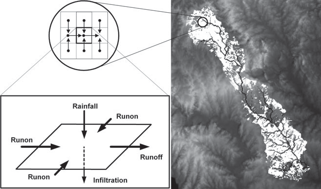2 1 1
>
> 2*g*
>
> *y*1 *hL*

2

2 2

> *z*1 2*g*
>
> *y*2 *z*2
>
> **Figure 7--6**
>
> Nonuniform flow energy equation. For steady flow between two stations,
> 1 and 2, a distance L apart.
>
> a *V*^2^ a *V*^2^
>
> *z*~1~ + *y*~1~ + [^1^ ^1^]{.underline} = *z*~2~ + *y*~2~ + [^2^
> ^2^]{.underline} + *h~L~.*
>
> 2*g* 2*g*
>
> where *h~L~* is the head loss from section 1 to section 2. If we
> assume that
>
> a = 1, *z*~1~ - *z*~2~ = *S*~0~*L*, and *h~L~* = *SL*, the energy
> equation becomes
>
> *V*2 *V*2
>
> *y y*
>
> 2*g* 2*g*
>
> \+ 1*S* - *S*~0~2 *L*. (7--16)
>
> The energy slope is determined by assuming that the rate of head loss
> at a section is the same as that for flow at normal depth with the
> mean velocity and mean hydraulic radius of the section. Thus, using
> Manning's equation (ft-s units) and solving for *S*, we have

*S* = a

*[nV~m~]{.underline}* ^2^

1.49*R*^2\>3^

, (7--17)

> where the subscript *m* refers to a mean value for the reach. If we
> differenti- ate Equation (7--14) with respect to *x*, the distance
> along the channel, the rate of energy change is found to be
>
> *dH dz dy* a *d*(*V*^2^)
>
> *dx* = *dx* + *dx* + 2*g*
>
> *dx* . (7--18)
>
> Equation (7--18) describes the variation of water surface profile for
> gradually varying flows. *S*~0~ and *S* terms can be substituted. The
> sign of the slope of the water surface profile depends on whether flow
> is subcritical or supercritical and on the relative magnitudes of *S*
> and *S*~0~. We observe *V* = *q y* for Equation (7--18), and the last
> term can be written as (a = 1)
>
> [1 *d *]{.underline} 2
>
> [1 *d *]{.underline} *q*^2^
>
> *q*^2^ 1 *dy*
>
> Thus,
>
> 2*g dx* (*V* ) = 2*g dx* a *y*2 b = - a *g* ba 3 b *dx* . (7--19)

*dy q*^2^

> \- *S* = - *S*~0~ + *dx* a 1 - *gy*3 b. (7--20)
>
> If we include the definition of the Froude number (Fr), then the water
> sur- face profile for a rectangular section can be written as
>
> *dy* = *S*~0~ - *S*
>
> = *S*0 - *S* . (7--21)
>
> *dx* 1 - (*V*^2^\>*gy*)
>
> 1 - Fr^2^
>
> With *S*~0~ and *n* known and the depths and velocities at both ends
> of the reach given, the length *L* of the reach can be computed as
> follows:
>
> \[ *y*~1~ + (*V*^2^\>2*g*)\] - \[*y*~2~ + (*V*^2^\>2*g*)\]
>
> *L* = ^1^
>
> *S* - *S*~0~
>
> ^2^ . (7--22)
>
> Example 7--5 explores the backwater analysis for a trapezoidal channel
> and illustrates the water surface profile computation using Equation
> (7--22). This is referred to as the standard step method, which forms
> the basis for most floodplain analyses.
>
> **EXAMPLE 7--5 WATER SURFACE PROFILE DETERMINATION**
>
> A trapezoidal channel with the dimensions shown in Figure E7--5(a) is
> laid on a slope of 0.001 ft/ft. The Manning's *n* value for this
> channel is 0.025, and the rate of flow through the channel is 1000
> cfs. Calculate and plot the water surface profile from the point where
> the channel ends (as- sume a free outfall) to the point where *y* ...
> 0.9*y~n~*.
>
> **Figure E7--5(a)** *B*
>
> 1
>
> 1.5

*y*

20\'

> 1
>
> 1.5
>
> **SOLUTION** At the point of free outfall, flow will pass through
> critical depth. Equa- tion (7--13) is used for a nonrectangular
> channel shape to find the value of critical depth:
>
> *Q*2
>
> *g* =
>
> Referring to the figure, we have
>
> *A*3. *B*

Then

> *A* = 20*y~c~* + 2(1\>2)(*y~c~*)(1.5*y~c~*)
>
> = *y~c~*(20 + 1.5*y~c~*),
>
> *B* = 20 + 2(1.5*y~c~*)
>
> = 20 + 3*y~c~*.
>
> (1000 cfs)^2^
>
> (32.2 ft\>s^2^)
>
> or
>
> *y*^3^(20 + 1.5*y* )^3^
>
> = ,
>
> (20 + 3*y~c~*)
>
> *y*^3^(20 + 1.5*y* )^3^ 5
>
> *c c*
>
> (20 + 3*y~c~*)
>
> = 31,056 ft .
>
> Solving by trial and error or using **Goal Seek** in Excel yields
>
> *y~c~* = 3.853 ft.
>
> The value of normal depth is found using Manning's equation for flow
> \[Eq. (7--3)\]:
>
> *Q* = a [1.49]{.underline} b *AR*^2\>3^1*S*~0~.
>
> Referring again to the figure, we have
>
> *P* = 20 + 213.25*y~n~*
>
> *R* = [*y~n~*(20 + 1.5*y~n~*)]{.underline} .

20 + 3.61*y~n~*

> So
>
> 1000 cfs =
>
> or
>
> [1.49]{.underline}
>
> 0.025
>
> \[*y~n~*(20 + 1.5*y~n~*)\] c

[*y~n~*(20 + 1.5*y~n~*)]{.underline}

> (20 + 3.61*y~n~*)
>
> 2\>3

d 1.001,

> \[*y~n~*(20 + 1.5*y~n~*)\]^5\>3^
>
> (20 + 3.61*y* )^2\>3^ = 530.58.
>
> Solving by trial and error or using Goal Seek in Excel yields,

*y~n~* = 6.55 ft

> and
>
> 0.9*y~n~* = 5.90 ft.
>
> Thus the range of depth for which the profile is desired is 3.85 ft to
> 5.90 ft. For chosen values of *y*~1~ and *y*~2~, *V*~1~ and *V*~2~ can
> be found by *V* = *Q A*, and *S* can be calculated using Equation
> (7--17). *P* and *R* can also be computed from the channel geometry
> for sections 1 and 2. Thus for each pair of chosen *y*~1~ and *y*~2~,
> a reach length *L* = Δ*x* can be determined from Equa- tion (7--22).
> Values of *y*, *A*, *P*, *R*, *V*, *V~m~*, *R~m~*, *S*, *y* + *V*^2^
> 2*g*, Δ*x*, and *x* are given in Table E7--5, which can be easily
> solved by an Excel spreadsheet. The negative sign for *x* values
> indicates that the profile is a backwater profile that extends
> upstream from the boundary condition of *y* = *y~c~*. As
>
> **Table E7--5.** Backwater Computation

<table>
<colgroup>
<col style="width: 8%" />
<col style="width: 10%" />
<col style="width: 8%" />
<col style="width: 7%" />
<col style="width: 8%" />
<col style="width: 9%" />
<col style="width: 7%" />
<col style="width: 8%" />
<col style="width: 2%" />
<col style="width: 6%" />
<col style="width: 11%" />
<col style="width: 11%" />
</colgroup>
<thead>
<tr class="header">
<th><blockquote>
<p><em><strong>Y</strong></em></p>
<p><strong>(ft)</strong></p>
</blockquote></th>
<th><blockquote>
<p><em><strong>A</strong></em></p>
<p><strong>(ft<sup>2</sup>)</strong></p>
</blockquote></th>
<th><blockquote>
<p><em><strong>P</strong></em></p>
<p><strong>(ft)</strong></p>
</blockquote></th>
<th><blockquote>
<p><em><strong>R</strong></em></p>
<p><strong>(ft)</strong></p>
</blockquote></th>
<th><blockquote>
<p><strong><em>V</em> (ft/s)</strong></p>
</blockquote></th>
<th><blockquote>
<p><strong><em>V<sub>m</sub></em> (ft/s)</strong></p>
</blockquote></th>
<th><blockquote>
<p><strong><em>R<sub>m</sub></em> (ft)</strong></p>
</blockquote></th>
<th><blockquote>
<p><em><strong>S</strong></em></p>
</blockquote></th>
<th><blockquote>
<p><em><strong>y</strong></em></p>
</blockquote></th>
<th><blockquote>
<p><strong><em>V</em> 2</strong></p>
<p>+ <strong>2<em>g</em></strong></p>
<p><strong>(ft)</strong></p>
</blockquote></th>
<th><blockquote>
<p>Δ<em><strong>x</strong></em></p>
<p><strong>(ft)</strong></p>
</blockquote></th>
<th><blockquote>
<p><em><strong>x</strong></em> = ΣΔ<em><strong>x</strong></em></p>
<p><strong>(ft)</strong></p>
</blockquote></th>
</tr>
</thead>
<tbody>
<tr class="odd">
<td>3.85</td>
<td><blockquote>
<p>99.23</p>
</blockquote></td>
<td><blockquote>
<p>33.88</p>
</blockquote></td>
<td><blockquote>
<p>2.93</p>
</blockquote></td>
<td><blockquote>
<p>10.08</p>
</blockquote></td>
<td rowspan="10"><blockquote>
<p>9.71</p>
<p>8.94</p>
<p>8.21</p>
<p>7.57</p>
<p>7.01</p>
<p>6.52</p>
<p>6.08</p>
<p>5.69</p>
<p>5.34</p>
</blockquote></td>
<td rowspan="10"><blockquote>
<p>3.01</p>
<p>3.17</p>
<p>3.35</p>
<p>3.53</p>
<p>3.70</p>
<p>3.87</p>
<p>4.04</p>
<p>4.21</p>
<p>4.37</p>
</blockquote></td>
<td rowspan="10"><blockquote>
<p>0.0061</p>
<p>0.0048</p>
<p>0.0038</p>
<p>0.0030</p>
<p>0.0024</p>
<p>0.0020</p>
<p>0.0016</p>
<p>0.0013</p>
<p>0.0011</p>
</blockquote></td>
<td colspan="2"><blockquote>
<p>5.43</p>
</blockquote></td>
<td rowspan="10"><p>−3.92</p>
<p>−21.05</p>
<p>−46.43</p>
<p>−80.00</p>
<p>−135.70</p>
<p>−200.00</p>
<p>−383.30</p>
<p>−766.70</p>
<p>−2500.00</p></td>
<td><blockquote>
<p>0</p>
</blockquote></td>
</tr>
<tr class="even">
<td>4.10</td>
<td><blockquote>
<p>107.22</p>
</blockquote></td>
<td><blockquote>
<p>34.78</p>
</blockquote></td>
<td><blockquote>
<p>3.08</p>
</blockquote></td>
<td><blockquote>
<p>9.33</p>
</blockquote></td>
<td colspan="2"><blockquote>
<p>5.45</p>
</blockquote></td>
<td>−3.9</td>
</tr>
<tr class="odd">
<td>4.40</td>
<td><blockquote>
<p>117.04</p>
</blockquote></td>
<td><blockquote>
<p>35.86</p>
</blockquote></td>
<td><blockquote>
<p>3.26</p>
</blockquote></td>
<td><blockquote>
<p>8.54</p>
</blockquote></td>
<td colspan="2"><blockquote>
<p>5.53</p>
</blockquote></td>
<td>−25.0</td>
</tr>
<tr class="even">
<td>4.70</td>
<td><blockquote>
<p>127.14</p>
</blockquote></td>
<td><blockquote>
<p>36.95</p>
</blockquote></td>
<td><blockquote>
<p>3.44</p>
</blockquote></td>
<td><blockquote>
<p>7.87</p>
</blockquote></td>
<td colspan="2"><blockquote>
<p>5.66</p>
</blockquote></td>
<td>−71.4</td>
</tr>
<tr class="odd">
<td>5.00</td>
<td><blockquote>
<p>137.50</p>
</blockquote></td>
<td><blockquote>
<p>38.03</p>
</blockquote></td>
<td><blockquote>
<p>3.61</p>
</blockquote></td>
<td><blockquote>
<p>7.27</p>
</blockquote></td>
<td colspan="2"><blockquote>
<p>5.82</p>
</blockquote></td>
<td>−151.4</td>
</tr>
<tr class="even">
<td>5.30</td>
<td><blockquote>
<p>148.14</p>
</blockquote></td>
<td><blockquote>
<p>39.11</p>
</blockquote></td>
<td><blockquote>
<p>3.79</p>
</blockquote></td>
<td><blockquote>
<p>6.75</p>
</blockquote></td>
<td colspan="2"><blockquote>
<p>6.01</p>
</blockquote></td>
<td>−287.1</td>
</tr>
<tr class="odd">
<td>5.60</td>
<td><blockquote>
<p>159.04</p>
</blockquote></td>
<td><blockquote>
<p>40.19</p>
</blockquote></td>
<td><blockquote>
<p>3.95</p>
</blockquote></td>
<td><blockquote>
<p>6.29</p>
</blockquote></td>
<td colspan="2"><blockquote>
<p>6.21</p>
</blockquote></td>
<td>−487.1</td>
</tr>
<tr class="even">
<td>5.90</td>
<td><blockquote>
<p>170.22</p>
</blockquote></td>
<td><blockquote>
<p>41.27</p>
</blockquote></td>
<td><blockquote>
<p>4.12</p>
</blockquote></td>
<td><blockquote>
<p>5.87</p>
</blockquote></td>
<td colspan="2"><blockquote>
<p>6.44</p>
</blockquote></td>
<td>−870.4</td>
</tr>
<tr class="odd">
<td>6.20</td>
<td><blockquote>
<p>181.70</p>
</blockquote></td>
<td><blockquote>
<p>42.35</p>
</blockquote></td>
<td><blockquote>
<p>4.29</p>
</blockquote></td>
<td><blockquote>
<p>5.50</p>
</blockquote></td>
<td colspan="2"><blockquote>
<p>6.67</p>
</blockquote></td>
<td>−1637.1</td>
</tr>
<tr class="even">
<td>6.50</td>
<td><blockquote>
<p>193.40</p>
</blockquote></td>
<td><blockquote>
<p>43.44</p>
</blockquote></td>
<td><blockquote>
<p>4.45</p>
</blockquote></td>
<td><blockquote>
<p>5.17</p>
</blockquote></td>
<td colspan="2"><blockquote>
<p>6.92</p>
</blockquote></td>
<td>−4137.1</td>
</tr>
</tbody>
</table>

> **Figure E7--5(b)**
>
> 19
>
> 17
>
> 15
>
> 13
>
> 11
>
> 9
>
> 7
>
> 5 *y* ≈ *yn*
>
> 3
>
> 1
>
> ---1
>
> Water surface Channel bottom
>
> *m*1 *y*0 = 8.0 ft
>
> *m*2
>
> *yc*
>
> ---1800 ---1600 ---1400 ---1200 ---1000 ---800 ---600 ---400 ---200 0
>
> Distance from outfall (ft)
>
> seen in column 1, *y*-values are chosen at a regular interval and
> extend up to but not beyond the normal depth. It is possible to use
> smaller intervals for *y* near the free outfall, since this is the
> steepest part of the profile and *y* is changing quickly over small
> distances of *x*. The water surface profile for the example is plotted
> in Figure E7--5(b) with respect to the channel bottom, using the free
> outfall as the datum.
>
> Problem 7.23 explores the effect of altering the downstream boundary
> con- dition to be *y* = 8.0 ft, and the result is also plotted in
> Figure E7--5(b). Note that the standard step method can be used to
> evaluate any mild slope profile, given a downstream starting
> condition, channel geometry, and flow rate.

**7.7**

**CLASSIFICATION**

**OF WATER**

> The classification of water surface profiles for nonuniform flow can
> be stud- ied most easily for rectangular channels. Then Equation
> (7--21) becomes

*dy S*~0~ - *S S*~0~(1 - *S*\>*S*~0~)

> **SURFACE PROFILES**
>
> where
>
> *dx* = 1 - Fr^2^ = 1 - Fr^2^ ,
>
> *n*2*V*2 *n*2*Q*2
>
> *S* = *y*4\>3 = *b*2*y*10\>3
>
> in metric units. From Manning's equation for a wide rectangular
> channel of width *b*, *Q* is related to normal depth:
>
> *R*^2/3^1*S A y*^2/3^1*S by*
>
> *Q* = [^0^]{.underline} = [*^n^* ^0^ *^n^*]{.underline} . (7--23)
>
> Solving for *S*~0~, we have
>
> *n n*
>
> *n*2*Q*2

*S*0 = *b*2*y*10\>3

(7--24)

> and
>
> *S*\>*S*~0~ = (*y~n~*\>*y*)^10\>3^ . (7--25)
>
> With the Froude number expressed in terms of critical depth,
>
> Fr = (*y~c~*\>*y*)^3\>2^ , (7--26)
>
> the slope of the water surface for this case becomes
>
> *dy* 1 - (*y~n~*\>*y*)^10\>3^ d
>
> *dx S* 1 - (*y* \>*y*)3 . (7--27)
>
> The sign of *dy*\>*dx*, the water slope, depends on the relations
> among depths
>
> *y*, *y~n~*, and *y~c~* in Equation (7--27) (see Table 7--2).
>
> From earlier consideration of critical flow, in Section 7.3, the
> following definitions are presented:
>
> If *y~n~* 7 *y~c~*, then *S*~0~ 6 *S~c~* and the slope is mild
> (subcritical). If *y~n~* = *y~c~*, then *S*~0~ = *S~c~* and the slope
> is critical.
>
> If *y~n~* 6 *y~c~*, then *S*~0~ 7 *S~c~* and the slope is steep
> (supercritical).
>
> The three conditions are referred to as mild (*M*), critical (*C*),
> and steep (*S*) slopes. Other slopes may be **horizontal** (*H*) or
> **adverse** (*A*). The derivation presented here can also be shown to
> apply to a general cross-sectional channel.
>
> For a given bed slope, the shape of the water surface profile depends
> on actual depth *y* relative to *y~n~* and *y~c~*. If the water
> surface lies above both normal and critical depth lines, it is type 1;
> if it lies between these lines, it is type 2; and if it is below both
> lines, it is type 3. There are a total of twelve possibilities, as
> shown in Table 7--2. For most cases of interest in the analysis of
> floodplains or floodways, the *M*1 profile is the most important and
> most observed case.
>
> **Mild Slope Cases**
>
> For the *M*1 profile, called the **backwater curve**, *y* 7 *y~n~* and
> *y~n~* 7 *y~c~*, and both the numerator and denominator are positive
> in Equation (7--27). The water surface slope *dy dx* is positive, and
> as *y* increases, the water slope approaches *S*~0~ and the free
> surface approaches the horizontal. As depth increases, velocity must
> decrease gradually to maintain constant *Q*. The *M*1 profile
> typically occurs where dams, bridges, or other control structures tend
> to create a backwater effect along a stream \[see Fig. 7--7(a)\]. For
> a uniform, prismatic channel, Equation (7--21) can be solved using the
> **standard step method** depicted in Example 7--5. Lengths upstream of
> the dam are calcu- lated incrementally as depths are gradually
> decreased toward *y~n~*, since the depth *y* will asymptotically
> approach normal depth at some point upstream. Accuracy of the
> resulting calculation depends on the number of increments selected
> between the starting water surface at the dam and the value of *y~n~*.
>
> **Table
> 7--2.** Surface Profiles for Gradually Varied Flow

+--------------------+---------+-------------+------------+------------+
| > **Surface        | > **    | > **Depth** | > **Flow** | >          |
| > Profiles**       | Curve** |             |            |  **Surface |
|                    |         |             |            | > Slope**  |
+====================+=========+=============+============+============+
| > Mild slope,      | > *M1*  | > *y* \>    | > S        | > Positive |
| > *S*~0~ \< *Sc*   |         | > *y~n~* \> | ubcritical |            |
|                    |         | > *y~c~*    |            |            |
| *M* 1              |         |             |            |            |
|                    |         |             |            |            |
| > *yn M* 2         |         |             |            |            |
| >                  |         |             |            |            |
| > *yc*             |         |             |            |            |
|                    |         |             |            |            |
| *M* 3              |         |             |            |            |
|                    |         |             |            |            |
| > Steep slope,     |         |             |            |            |
| > *S*~0~ \> *Sc*   |         |             |            |            |
| >                  |         |             |            |            |
| > *S* 1            |         |             |            |            |
| >                  |         |             |            |            |
| > *yc*             |         |             |            |            |
| >                  |         |             |            |            |
| > *yn S* 2         |         |             |            |            |
| >                  |         |             |            |            |
| > *S* 3            |         |             |            |            |
| >                  |         |             |            |            |
| > Critical slope,  |         |             |            |            |
| > *S*~0~ = *Sc*    |         |             |            |            |
|                    |         |             |            |            |
| *C* 1              |         |             |            |            |
|                    |         |             |            |            |
| > *yn* = *yc C* 3  |         |             |            |            |
| >                  |         |             |            |            |
| > Horizontal       |         |             |            |            |
| > slope, *S*~0~ =  |         |             |            |            |
| > 0                |         |             |            |            |
|                    |         |             |            |            |
| *H* 2              |         |             |            |            |
|                    |         |             |            |            |
| > *yc H* 3         |         |             |            |            |
| >                  |         |             |            |            |
| > Adverse slope,   |         |             |            |            |
| > *S*~0~ \< 0      |         |             |            |            |
|                    |         |             |            |            |
| *A*2               |         |             |            |            |
|                    |         |             |            |            |
| > *A*3             |         |             |            |            |
| >                  |         |             |            |            |
| > *yc*             |         |             |            |            |
+--------------------+---------+-------------+------------+------------+
|                    | > *M2*  | > *y~n~* \> | > S        | > Negative |
|                    |         | > *y* \>    | ubcritical |            |
|                    |         | > *y~c~*    |            |            |
+--------------------+---------+-------------+------------+------------+
|                    | > *M3*  | > *y~n~* \> | > Sup      | > Positive |
|                    |         | > *y~c~* \> | ercritical |            |
|                    |         | > *y*       |            |            |
+--------------------+---------+-------------+------------+------------+
|                    | > *S1*  | > *y* \>    | > S        | > Positive |
|                    |         | > *y~c~* \> | ubcritical |            |
|                    |         | > *y~n~*    |            |            |
+--------------------+---------+-------------+------------+------------+
|                    | > *S2*  | > *y~c~* \> | > Sup      | > Negative |
|                    |         | > *y* \>    | ercritical |            |
|                    |         | > *y~n~*    |            |            |
+--------------------+---------+-------------+------------+------------+
|                    | > *S3*  | > *y~c~* \> | > Sup      | > Positive |
|                    |         | > *y~n~* \> | ercritical |            |
|                    |         | > *y*       |            |            |
+--------------------+---------+-------------+------------+------------+
|                    | > *C1*  | > *y* \>    | > S        | > Positive |
|                    |         | > *y~c~* =  | ubcritical |            |
|                    |         | > *y~n~*    |            |            |
+--------------------+---------+-------------+------------+------------+
|                    | > *C3*  | > *y* \<    | > Sup      | > Positive |
|                    |         | > *y~c~* =  | ercritical |            |
|                    |         | > *y~n~*    |            |            |
+--------------------+---------+-------------+------------+------------+
|                    | > *H2*  | > *y* \>    | > S        | > Negative |
|                    |         | > *y~c~*    | ubcritical |            |
+--------------------+---------+-------------+------------+------------+
|                    | > *H3*  | > *y* \<    | > Sup      | > Positive |
|                    |         | > *y~c~*    | ercritical |            |
+--------------------+---------+-------------+------------+------------+
|                    | > *A2*  | > *y* \>    | > S        | > Negative |
|                    |         | > *y~c~*    | ubcritical |            |
+--------------------+---------+-------------+------------+------------+
|                    | > *A3*  | > *y* \<    | > Sup      | > Positive |
|                    |         | > *y~c~*    | ercritical |            |
+--------------------+---------+-------------+------------+------------+

> 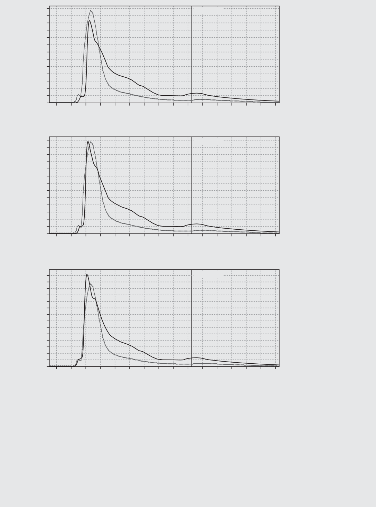For a
> natural stream, cross-sectional areas and slopes may change at various
> points along the stream. Since Manning's *n* values may vary both with
> location in the cross section and with location along the stream, more
> sophis- ticated computer programs must be used for calculation of the
> *M*1 profile. Sections 7.9 through 7.15 describe in detail the HEC-2
> model, one of the most widely used water surface profile models. The
> model, updated to HEC-RAS

(a)

\(b\)

> Weir
>
> **Figure 7--7**

(a) Example of an M1 profile.

(b) Example of an M2 profile.

> by the Hydrologic Engineering Center in 1995, is primarily used to
> define floodplains and floodways for natural streams (HEC, 1990,
> 1995).
>
> For the *M*2 profile, *y~n~* 7 *y* 7 *y~c~* and flow is subcritical,
> with a negative
>
> numerator and positive denominator in Equation (7--27). Thus, *dy dx*
> is negative, and depth decreases in the direction of flow, with a
> strong curva- ture when *y* S *y~c~*, where the equation predicts *dy
> dx* S ∞. Thus the equa- tion does not strictly hold at *y* = *y~c~*
> and Equation (7--11) applies. The *M*2 curve, called the drawdown
> curve, can occur upstream from a section where the channel slope
> changes from mild to critical or supercritical, as in flow over a
> spillway crest or weir \[see Fig. 7--7(b)\]. The *M*2 profile is
> created due to a control condition *downstream,* since flow is
> subcritical.
>
> The *M*3 profile is for supercritical flow where *y~n~* 7 *y~c~* 7
> *y*; both
>
> numerator and denominator are negative, so *dy dx* is positive, and
> depth increases in the direction of flow. The *M*3 curve occurs
> downstream of a spillway or sluice gate, and as critical depth is
> approached from below, a sudden transition called the hydraulic jump
> occurs from supercritical to sub- critical conditions (see Figs. 7--8
> and 7--9).
>
> **Steep Slope Cases**
>
> The steep curves that occur on steep slopes (*S*~0~ 7 *S~c~*), where
> *y~c~* 7 *y~n~*, can be analyzed in the same way as the *M* curves,
> with the change that down- stream control occurs for subcritical flow
> (*S*1) and upstream control occurs for supercritical flow (*S*2 and
> *S*3). For example, a dam on a steep slope will
>
> Sluice gate
>
> **Figure 7--8** Example of an M3 profile.
>
> 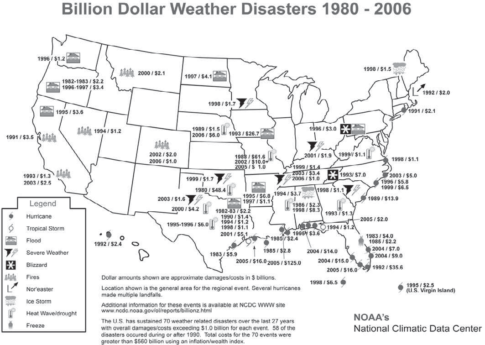**Figure 7--9** Hydraulic jump on
> horizontal bed fol- lowing spillway.

**7.8**

> **HYDRAULIC JUMP**
>
> produce an *S*1 curve, which is preceded by a hydraulic jump. A sluice
> gate on a steep channel will produce an *S*3 curve, which will
> smoothly approach the uniform-depth line (*y* = *y~n~*). Table 7--2
> illustrates the steep slope cases.
>
> **Horizontal and Adverse Slope Cases**
>
> The *H*2 and *H*3 profiles correspond to the *M*2 and *M*3 curves for
> *S*~0~ = 0. *H*1 cannot exist, since for *S*~0~ = 0, normal depth is
> infinite. The profile slope can be determined from Equation (7--21),
> but this profile can exist only for a short section contained in more
> complex channel reaches, since flow cannot continue indefinitely on a
> horizontal bed.
>
> The adverse slope, *S*~0~ 6 0, occurs where flows sometimes move
> against gravity; as in the case of horizontal slopes, the adverse
> slope can occur only for a short section in a more complex channel
> system. In some natural channel systems, there are occasional reaches
> where these conditions can and do occur.
>
> The hydraulic jump is covered in detail in most fluid mechanics
> textbooks (Daugherty et al., 1985; Fox and McDonald, 1985). The
> transition from supercritical to subcritical flow produces a marked
> discontinuity in the sur- face, characterized by a steep upward slope
> of the profile and a significant loss of energy through turbulence.
> The hydraulic jump can best be explained by reference to the *M*3
> curve of Table 7--2 and Figure 7--8, downstream of a sluice gate. The
> flow decelerates because the mild slope is not great enough to
> maintain constant supercritical flow, and the specific energy *E*
> decreases as the depth increases. When downstream conditions require a
> change to subcritical flow, the need for the change cannot be
> telegraphed upstream. Theory calls for a vertical slope of the water
> surface. Therefore, a hydraulic jump occurs and flow changes from
> supercritical to subcritical conditions.
>
> When flow at a section is supercritical and downstream conditions
> require a change to subcritical flow, the abrupt change in depth
> involves a significant energy loss through turbulent mixing. A jump
> will form when slope changes from steep to mild, as on the apron at
> the base of a spillway. In fact, stilling basins below spillways are
> designed to dissipate the damaging energy of supercritical velocities,
> and downstream erosion is held in check. An equation can be derived
> for horizontal or very mild slopes to relate depth before and after
> the jump has occurred. Assuming hydrostatic pressure
>
> and neglecting gravity and friction forces in this case, Newton's
> equation for momentum change becomes (Fig. 7--9)

a *F~x~* = g*h*~1~*A*~1~ - g*h*~2~*A*~2~ = (g*Q*\>*g*) (*V*~2~ -
*V*~1~), (7--28)

> For a rectangular channel of unit width,
>
> 2 2
>
> [1 1]{.underline}
>
> *g* 2
>
> *V*^2^*y y*^2^
>
> *g* 2 .
>
> The continuity equation implies, for Sections 1 and 2, that
>
> *V*~1~*y*~1~ = *V*~2~*y*~2~. (7--29)
>
> Solving Eqs. (7--28) and (7--29) simultaneously after eliminating
> *V*~2~ and rearranging,
>
> 2 2 2*V*^2^*y* (*y*~2~ - *y*~1~)
>
> *y*~2~ - *y*~1~ = a [^1^ ^1^]{.underline} b a

2

> b\. (7--30)
>
> Dividing by *y*~2~ - *y*~1~, multiplying by *y*~2~\>*y*^2^ and solving
> for *y*~2~\>*y*~1~, using the
>
> quadratic formula, we obtain

*y*~2~\>*y*~1~ =

> 21 + 8 Fr^2^ - 1
>
> 2

, (7--31)

> where Fr~1~ is the upstream Froude number. Thus the ratio
> *y*~2~\>*y*~1~ is dependent only on upstream Froude number Fr~1~, and
> *y*~1~ and *y*~2~ are called conjugate depths. An increase in depth
> requires Fr~1~ 7 1, or supercritical conditions upstream. The head
> loss and location of a hydraulic jump can also be calcu- lated, but
> this is beyond the scope of the present coverage. Example 7--6 illus-
> trates the use of Equation (7--31) to evaluate depths for the
> hydraulic jump.


**7.9**

> **INTRODUCTION TO THE HEC-RAS**

**MODEL**

> The HEC-2 model was originally developed in the 1970s by the
> Hydrologic Engineering Center (1982) of the U.S. ACOE. The program was
> updated to HEC-RAS in 1995 with an easy-to-use graphical user
> interface (GUI). The program is designed to calculate water surface
> profiles for steady, gradually varied flow in natural or man-made
> channels. The computational procedure is based on solution of the
> one-dimensional energy equation \[Eq. (7--16)\] using the standard
> step method. The program can be applied to floodplain manage- ment and
> flood insurance studies to evaluate **floodway encroachments** and to
> delineate **flood hazard** zones. The model can also be used to
> evaluate effects on water surface profiles of channel improvements and
> levees, altered flow values, as well as the presence of bridges or
> other structures in the floodplain. The main objective of the HEC-RAS
> program is to compute water surface elevations at cross-section
> locations of interest along a river or stream, for given flow values.
> Data requirements include flow regime, starting elevation, flow rate,
> loss coefficients, roughness, cross-sectional geometry, and reach
> lengths. Profile computations begin at a cross section with known or
> assumed starting conditions and proceed upstream for subcritical flow
> or downstream for super- critical flow. Subcritical profiles are
> constrained to critical depth or above, and supercritical profiles are
> constrained to critical depth or below. The program will not allow
> profile computations to cross critical depth in most cases because
>
> the governing equations do not apply for *y* = *y~c~*, as discussed in
> Section 7.4. The HEC-RAS program is often used in association with the
> HEC-
>
> HMS program (Chapter 5) for determination of flood flows and flood
> eleva- tions in a particular watershed. Peak flows at various
> locations along the main stream or channel are computed by HEC-HMS for
> a given rainfall.
>
> These peak flows are then used in HEC-RAS to calculate the
> steady-state, nonuniform water surface profile along the stream. For
> example, the 100-yr rainfall could be used in HEC-HMS to calculate
> 100-yr flows, which then could be used in HEC-RAS to predict the
> 100-yr floodplain. RAS can be used to compute storage--outflow
> relationships to be used in HEC-HMS by computing a series of water
> surface profiles and corresponding discharges. HEC-RAS is a very
> sophisticated computer program designed to han-
>
> dle a number of hydraulic computations in a single run in a GUI. The
> main focus in the design of the interface was to make it easy to use
> the software, while still maintaining a high level of efficiency for
> the user. The basic pro- gram and the basic input data requirements
> are relatively easy to learn and are covered in detail in the sections
> that follow. Special features and other options are described in the
> user's manual (Hydrologic Engineering Center, 1995, 2000, 2001, 2002),
> the book of floodplain modeling using HEC-RAS (Haestad et al., 2003),
> and an earlier text describing HEC-2 (Hoggan, 1997).
>
> Equations presented in Section 7.6 are solved using the standard step
> method to compute an unknown water surface elevation at a particular
> cross section. The next several sections (7.10 to 7.14) present the
> theory behind the HEC- RAS model for natural or man-made streams. The
> new release of HEC-RAS is presented in detail with an example in
> Section 7.14. HEC-RAS is capable of performing one-dimensional water
> surface profile calculations for steady, gradually varied flow in
> natural or constructed channels. The following two equations are
> solved for basic water surface profiles by an iterative proce- dure
> for upstream (subscript 2) and downstream (subscript 1) sections:
>
> **7.10**
>
> **THEORETICAL BASIS FOR HEC-RAS**
>
> a *V*^2^
>
> *WS*
>
> 2*g*
>
> a *V*^2^
>
> *WS*
>
> 2*g*
>
> \+ *h~e~*, (7--32)
>
> where
>
> a *V*^2^
>
> *h LS C*
>
> 2*g*
>
> a *V*^2^
>
> , (7--33)
>
> 2*g*
>
> *WS*~1~, *WS*~2~ = water surface elevations at ends of reach,
>
> *V*~1~, *V*~2~ = mean velocities (total discharge/total flow area) at
> ends of reach,
>
> a~1~, a~2~ = velocity or energy coefficients for flow at ends of
> reach,
>
> *g* = gravitational constant,
>
> *h~e~* = energy head loss,
>
> *L* = discharge-weighted reach length,
>
> *S~f~* = representative friction slope for reach,
>
> *C* = expansion or contraction loss coefficient.
>
> Cross-section data are traditionally defined looking in the downstream
> direc- tion. The discharge-weighted reach length *L* is computed by
> weighting lengths in the **left overbank** (LOB), channel (CH), and
> **right overbank** (ROB) with their respective flows at the end of the
> reach. A representative
>
> friction slope is usually expressed as follows, although alternative
> equations can be used:

*S~f~* = a

[*Q*~1~ + *Q*~2~]{.underline}

> *K*~1~ + *K*~2~

b 2, (7--34)

> where *K*~1~ and *K*~2~ represent the conveyance at the beginning and
> end of a reach.
>
> **Conveyance** is defined from Manning's equation (U.S. customary
> units) as
>
> *K* [1.49]{.underline} *AR*^2\>3^ . (7--35)
>
> *n*
>
> The total conveyance for a cross section is obtained by summing the
> convey- ance from the left and right overbanks and the channel. The
> energy or veloc- ity coefficient a is obtained with the equation
>
> *A*2 *K*3 *K* 3 *K* 3
>
> a = a *[T]{.underline}* b a [LOB]{.underline} + [CH]{.underline}
>
> \+ ^[ROB]{.underline}^ b, (7--36)
>
> 3 2 2
>
> *T* LOB CH
>
> 2
>
> ROB
>
> where the subscript *T* is for cross-sectional total, LOB is for left
> overbank, CH is for channel, and ROB is for right overbank.
>
> The computational procedure for the iterative solution of Eqs. (7--32)
> and (7--33) is as follows:

1.  Assume a water surface elevation at the upstream cross section
    > (i.e., a first trial is Δ*WS* = (*Q*\>*K*)^2^*L*).

2.  Based on assumed elevation, determine the corresponding total con-
    > veyance and velocity head for the upstream section (2).

3.  With values from step 2, compute friction slope *S~f~* and solve
    > Equation (7--33) for head loss *h~e~*.

4.  With values from steps 2 and 3, solve Equation (7--32) for *WS*~2~.

5.  Compare the computed value of *WS*~2~ with the values assumed in
    > step 1, and repeat steps 1--5 until values agree to within 0.01 ft
    > (0.01 m).

> The first iterative trial is based on the friction slope from the
> previous two cross sections. The second trial is an average of the
> computed and assumed elevations from the first trial. Once a balanced
> water surface elevation has been obtained for a cross section, checks
> are made to be sure that the eleva- tion is on the correct side of the
> critical water surface elevation. If otherwise, critical depth is
> assumed and a message to that effect is provided. The occur- rence of
> critical depth in the program is usually the result of a problem with
> reach lengths or flow areas unless a critical flow condition actually
> occurs.
>
> The following assumptions are implicit in the equations and procedures
> used in the program: (1) flow is steady, (2) flow is gradually varied,
> (3) flow is one dimensional, and (4) river channels have small slopes
> (less than 1:10). If any of these assumptions are violated, the
> results from the HEC-RAS program may be in error.
>
> Flow is assumed to be steady because time-dependent variables are not
> included in the energy equation, Equation (7--32). When flow
> conditions do
>
> vary with time at a discrete location, the flow is classified as
> **unsteady**. Since the equations used to model unsteady-state flow
> are quite complex, civil engi- neers usually prefer to assume steady
> flow conditions when computing peak water surface elevations. However,
> engineers sometimes encounter situations for which the assumption of
> gradually varied, steady-state flow is not appropri- ate and they must
> turn to unsteady-state flow modeling. Generally, the St. Venant
> equations, a combination of both the continuity and momentum equa-
> tions, are used to handle unsteady-state flow problems (Chapter 4).
> Since it is not possible to solve the full St. Venant equations
> analytically, this difficulty leads to a number of simplifications
> such as neglecting the local acceleration term, convective
> acceleration term, and pressure term when using backwater methods,
> Muskingum/Muskingum Cunge methods, and kinematic wave rout- ing,
> respectively. By doing so, simplified representation of St. Venant
> equation can be obtained to solve for stage and flow approximately.
> The Unsteady NET work simulator (UNET) was modified for HEC-RAS as a
> solver to simulate one-dimensional unsteady flow through a network of
> open channels (Barkau, 1992). Detailed features and other information
> about unsteady-state modeling are described in the user's manual
> (Hydrologic Engineering Center, 2002) and in the book of floodplain
> modeling using HEC-RAS (Haestad et al., 2003).
>
> An overview of the cross-sectional data required of the HEC-RAS model
> is shown in Figure 7--10a along with a typical plan view of a
> floodplain (Fig. 7--10b). The model begins its computation with a
> water surface elevation and a begin- ning discharge at the most
> downstream cross section for a mild slope case; near the mouth of a
> stream or river steep slopes are computed from upstream to downstream.
> The orientation for left or right overbank is for the user to be
> standing in the stream looking downstream in the direction of flow.
> Discharges are specified at every cross section from upstream to
> downstream for each reach, as HEC-RAS performs calculations in an
> upstream direction for sub- critical flows. Once one flow value is
> entered at a specific cross section, it is assumed that the flow
> remains constant until another flow value is encoun- tered at
> downstream location. Input lateral inflows can be accommodated.
> Cross-sectional geometry is specified in terms of ground surface
> profiles ori- ented perpendicular to the stream and the measured
> distances between them in an upstream direction. Spacing of cross
> sections is dependent on a number of variables, described below.
> Within each cross section, the left overbank, the right overbank, and
> the channel locations must be specified (Fig. 7--11).
>
> Loss coefficients are of great importance to the hydraulic
> computations performed by HEC-RAS; in particular, Manning's roughness
> factor *n* must be specified for the channel and overbank areas of the
> stream, and may vary both horizontally and/or vertically. Contraction
> or expansion coefficients due to changes in channel cross section must
> also be specified, especially around bridges and other structures.
> Figure 7--11 indicates how a typical cross section is specified. Once
> the basic data requirements and flow values have been met for HEC-RAS,
> execution of the program will provide water surface elevations,
>
> **7.11**
>
> **BASIC DATA REQUIREMENTS (STEADY STATE)**
>
> **Figure 7--10a** HEC-RAS cross-
> section parameters.

NO2

> Centerline of channel Cross section Channel bank Direction of flow
>
> XNL = Manning\'s *n* value for left overbank XNR = Manning\'s *n*
> value for right overbank
>
> XNCH = Manning\'s *n* value for channel
>
> XLOBL = Distance along flow path of left overbank between sections
> XLOBR = Distance along flow path of right overbank between sections
>
> XLCH = Distance along channel centerline between sections
>
> SECNO1 = First downstream cross section SECNO2 = Cross section just
> upstream of SECNO1
>
> velocities, areas, volumes, top widths, and other pertinent geometric
> data for each cross section. Output can be organized into tables for
> easy reference or can be plotted as cross sections or longitudinal
> profiles along the stream. Thus HEC-RAS uses hydraulic and geometric
> data for a stream and peak flow values to arrive at estimates of the
> resulting water surface at each sec- tion under steady-state flow
> condition.
>
> Steady flow data are required in order to perform a steady water sur-
> face profile calculation. Input data consist of: flow regime, boundary
> condi- tions, and peak discharge information. The flow regime
> (subcritical, supercritical, or mixed flow regime) is specified on the
> Steady Flow Analysis window of the user interface. Boundary conditions
> are necessary to establish the starting water surface at the ends of
> the river system (upstream or down- stream) in order for the program
> to begin the calculations. In a subcritical flow regime, boundary
> conditions are necessary only at the downstream ends of the river
> system; if a supercritical flow regime is to be calculated, bound- ary
> conditions are necessary only at the upstream ends. If a mixed flow
>
> **Figure 7--10b** Typical cross-
> section layout for floodplain analysis.
>
> Floodplain boundary
>
> 96 + 70
>
> Lockwood Rd.

Landfill

> Levee
>
> 70 + 63
>
> 69 + 63
>
> 69 + 22
>
> 68 + 25
>
> 2000 feet N
>
> *n* = 0.15
>
> EL*a* EL STN*a*
>
> STN*b*
>
> 100-yr CWSEL
>
> {width="3.2126246719160103in"
> height="1.4926465441819772in"}STCHL STCHR
>
> *n* = 0.045
>
> *n* = 0.1
>
> (Flow into page)
>
> Datum
>
> **Figure 7--11** Typical cross section.
>
> Reference point
>
> EL*a* , EL*b* = Ground elevation above datum for points *a* and *b*,
> respectively STN*a* , STN*b* = Distance from reference point for
> points *a* and *b*, respectively
>
> STCHL = Left channel bank station (when looking downstream) STCHR =
> Right channel bank station (when looking downstream)
>
> *Note:* Up to 100 points (EL, STN) may be defined for each section.
>
> regime calculation is to be performed, then boundary conditions must
> be entered at both ends of the river system.
>
> Four types of boundary conditions are available to the user to define
> starting water surface elevations: (1) known water surface elevation,
> (2) critical depth, (3) normal depth, or (4) rating curves. The user
> must enter a known water surface elevation for each profile to be
> computed. The critical depth condition should be used at locations
> where critical conditions are known to exist, such as at a waterfall,
> weir, or rapids. The normal depth will be calculated for each profile
> based on a user-entered energy slope. For each profile to be computed,
> the elevation is interpolated from the rating curve given the flow,
> using linear interpolation between the user-entered points. The user
> is allowed to choose only one boundary condition from above four
> options in the HEC-RAS program for each profile. (See Section 7.14.)
>
> Several types of loss coefficients are utilized by the program, such
> as Manning's *n* for friction loss, contraction and expansion loss,
> and bridge loss coefficients for weir or pressure flow. These values
> are typically indicated on Cross Section Data Editor window interface
> in the HEC-RAS program. Selection of an appropriate value for
> Manning's *n* is very significant to the accuracy of the computed
> water surface profiles. Typical values of Man- ning's *n* for various
> channels were given in Table 7--1.
>
> Contraction or expansion of flow due to changes in the channel cross
> sec- tion is a common cause of energy losses within a reach. These
> losses can be computed by specifying contraction and expansion
> coefficients. For small changes in river cross section, coefficients
> are typically 0.1 and 0.3 for contrac- tion and expansion,
> respectively, up to 0.3 and 0.5 at bridges. For abrupt changes, the
> coefficients may be as high as 0.6 and 1.0. The coefficients can be
> changed at any cross section shown in the Cross Section Data Editor
> (see Section 7.14). Cross-sectional geometry for natural streams is
> specified in terms of ground surface profiles (cross sections) and the
> measured distances between them (reach lengths). Generally, cross
> sections should cover the entire flood- plain and should be
> perpendicular to the main flow line (Fig. 7--10b). Cross sections are
> required at representative locations along a stream length, and where
> abrupt changes occur, several cross sections should be used, as in the
> case of a bridge. Cross-section spacing is a function of stream size,
> slope, and
>
> the number of abrupt changes.
>
> Each cross section is identified and described as a unique river
> station number. Each data point is given a station number
> corresponding to the hor- izontal distance from a zero point on the
> left. The elevation and corresponding station number of each data
> point are input into the Cross Section Data Editor window, with a
> maximum of 500 points allowed. It is important that the cross section
> be **oriented looking downstream** so that the lowest station numbers
> are on the left. The left- and right-bank station numbers separating
> the main channel from the overbank areas must be specified on the
> Cross Section Data Editor window. Endpoints that are too low will
> automatically be extended vertically and noted in the output. A number
> of program options are available
>
> to easily add or modify cross-sectional data. For example, a cross
> section can be easily duplicated or adjusted vertically or
> horizontally by changing variables in the Cross Section Data Editor.
> Channel improvement or encroachment options are slightly more
> difficult to implement and are described later.
>
> The last basic data requirement involves the definition of reach
> lengths for the left overbank, right overbank, and the channel.
> Channel reach lengths are typically measured along the curvature of
> the stream profile (thalweg), and overbank reach lengths are measured
> along the center of mass of overbank flow (see Fig. 7--10b).
>
> The HEC-RAS model has been designed with maximum flexibility so that
> the user has a number of optional capabilities. All special options
> are described in the user's manual, but only those most commonly used
> will be discussed here (Hydrologic Engineering Center, 2000; Haestad
> et al., 2003). In this section the main options described are multiple
> profile analysis, bridge losses, encroachment, channel improvement,
> and storage outflow data generation. Options not described here
> include critical depth, effective flow area, friction loss equations,
> interpolated cross sections, tributary stream profiles, Manning's *n*
> calculation, split-flow option, and ice-covered streams (see the
> HEC-RAS user's manual).
>
> HEC-RAS can compute up to 500 profiles in a single run for the same
> geometric data within a single execution of the steady flow
> computations. Typically, this option allows the user to evaluate flows
> of different magni- tudes (2, 5, 10, 25, 100, 500 yr return periods)
> in a single run. The multiple- profile option also allows for the
> generation of stream routing data for the modified Puls method in
> HEC-HMS. For this purpose, storage--outflow data in a tabular form are
> automatically created and stored in a Data Storage System (DSS), which
> is able to be accessed by the HEC-RAS program. Data storage is
> accomplished through the use of ASCII and binary files as well as the
> HEC-DSS. Input data are stored in ASCII and binary files under sepa-
> rate categories of project, plan, geometry, steady flow, unsteady
> flow, and sediment data. Output data are predominantly stored in
> separate binary files. Data can be transferred between HEC-RAS and
> other programs by utilizing HEC-DSS (Hydrologic Engineering Center,
> 2002).
>
> Energy losses through culverts and bridges are computed in two steps.
> First, losses due to expansion and contraction upstream and downstream
> of the structure are computed. Second, the HEC-RAS bridge method is
> usually used to compute the loss through the structure itself. The
> bridge method should be used for bridges with piers with low-flow
> controls, for pressure flow, and when flow passes through critical
> depth within the structure. The bridge method allows for both pressure
> flow and weir flow or any combination of the two. HEC-RAS bridge
> methods are described in detail in Section 7.13. Chap- ter 9 presents
> a detailed culvert example from HEC-RAS.
>
> **7.12**
>
> **OPTIONAL HEC- RAS CAPABILITIES**
>
> A number of methods are available in HEC-RAS for specifying encroach-
> ments for floodway studies. The floodway is defined as the area that
> passes the 100-yr flow where encroachments (i.e. levees) increase the
> water surface by 1 ft. Stations and elevations of the left or right
> encroachment can be specified for individual cross sections using
> method 1. Method 4 requires an equal loss of conveyance on each side
> of the channel, and each modified cross section will have the same
> discharge as the natural cross section. Figure 12--2 in Chapter 12
> shows the floodway compared to the floodplain.
>
> Cross-sectional data may be modified automatically by the channel
> modification option in HEC-RAS to analyze improvements made to natural
> stream sections. Trapezoidal excavation is assumed, and geometric data
> are provided to specify the location, elevation, roughness, side
> slopes, and bottom width. Numerous program options are available for
> the user to add or modify cross-section data. One useful feature of
> the model is the insertion of addi- tional cross sections between
> those specified by input. For example, when the user wants to
> duplicate a surveyed cross section, an option from the Cross Section
> Data Editor window enables him/her to make a copy of any cross-
> section data. Once a cross section is copied, other options are
> available to allow the user to modify the horizontal and vertical
> dimensions of the dupli- cated cross-section data. Note that the
> graphical user interface (GUI) for HEC-RAS has revolutionized our
> ability to handle large-watershed models and to link the analysis to
> other models within a GIS framework.

**7.13**

> **BRIDGE MODELING IN**
>
> **HEC-RAS**
>
> HEC-RAS program computes energy losses caused by structures such as
> bridges and culverts in three parts: loss from contraction in the
> steam imme- diately upstream from the structure, loss at the structure
> itself, and loss from the expansion in the stream immediately
> downstream from the structure. The bridge routines in the HEC-RAS
> allow users to analyze a bridge with several different methods without
> changing the bridge geometry. The bridge routines have the
> capabilities to model low flow (Class A, B, and C), low flow and weir
> flow (with adjustments for submergence on the weir), pressure flow
> (orifice and sluice gate equations), pressure and weir flow, and
> highly submerged flows. The advantage of the HEC-RAS program is that
> it will automatically switch to the energy equation when the flow over
> the road is highly submerged. The general bridge layout for cross
> sections is shown in Figure 7--12.
>
> **Bridge Modeling Routines**
>
> The bridge modeling routines in HEC-RAS use specific hydraulic
> equations for a number of possible flow conditions, including **low
> flow**, **pressure flow**, **weir flow**, or any possible combination
> (Fig. 7--13). In this method, the open- ing under the bridge is
> approximated by a trapezoid with given bottom elevation, bottom width,
> and side slopes. The presence of piers is accounted for by specifying
> a total width of flow obstruction due to the piers.
>
> Determined


> For low flow under bridges with piers, HEC-RAS considers three con-
> ditions, labeled class A, class B, and class C. Class A low flow
> assumes that the flow is subcritical, and the Yarnell equation is used
> to compute the change in water surface elevation due to the bridge:
>
> *H*~3~ = 2*K*(*K* + 10*w* - 0.6) (*a* + 15*a*^4^) (*V*^2^\>2*g*),
> (7--37)
>
> **Figure 7--12** Cross section layout for bridge modeling.
>
> where
>
> *H*~3~ = change in water surface elevation through bridge (from
> Section 3 to Section 2),
>
> *K* = pier shape coefficient,
>
> = ratio of velocity head to depth downstream of bridge at Section 2,
>
> *a* [obstructed area]{.underline} total unobstructed area
>
> (at Section 2)
>
> *V*~2~ = velocity downstream from the bridge at Section 2.
>
> **Figure 7--13** Pressure flow and weir flow through bridges.

\(a\)

> **Figure 7--13b**
>
> (Continued)

2

[3 3]{.underline}

  ------- ---------- ------------------------------------ ---------- -------
                                                                     

                                                                     
  ------- ---------- ------------------------------------ ---------- -------

> \(b\)
>
> The value of *H*~3~ is added to the downstream water surface elevation
> after the computation to account for the bridge.
>
> Class B low flow occurs when the water surface profile passes through
> critical depth underneath the bridge. HEC-RAS uses a momentum balance
> for cross sections adjacent to and under the bridge, as described in
> more detail in the HEC-RAS user's manual (Hydrologic Engineering
> Center, 1995, 2002) and the book of floodplain modeling using HEC-RAS
> (Haestad et al., 2003). Class C low flow occurs when the flow
> condition is supercritical, and the same procedure used for class B is
> applied in this case.
>
> Pressure flow occurs when the bridge deck becomes submerged such that
> the low chord is in contact with water and a head buildup occurs on
> the upstream side of the bridge. The energy-based method is applied to
> handle the pressure flow scenario. Occasionally, the water surface
> inside of the bridge represents the hydraulic gradeline elevation, not
> necessarily the actual water surface elevation. When both the upstream
> and downstream side of a bridge are submerged, we can regard this kind
> of pressure flow through the bridge as orifice flow in fluid mechanics
> and can describe it by the equation
>
> *Q* = *C~d~A*(2*gH*)^0.5^, (7--38)
>
> where
>
> *H* = total energy difference upstream and downstream,
>
> *C~d~* = discharge coefficient (0.7 to 0.8),
>
> *A* = cross-sectional area of the bridge opening,
>
> *Q* = total orifice flow.
>
> HEC-RAS defines *H* as the distance from the energy grade line to the
> cen- troid of the orifice area.
>
> Weir flow occurs when water begins to flow over the bridge and ele-
> vated roadway approaches, and HEC-RAS uses the standard weir equation
> for this flow condition:
>
> where
>
> *Q* = *CLH*^3\>2^ , (7--39)
>
> *C* = weir discharge coefficient,
>
> *L* = effective length of weir,
>
> *H* = total energy difference upstream of the bridge and top of the
> roadway,
>
> *Q* = flow over the weir.

The coefficient of discharge *C* varies according to the configuration
of the bridge and the roadway and is reduced in HEC-RAS model whenever
the weir or bridge is submerged by high tailwater. Typically, discharge
coeffi- cient value *C* ranges from 2.5 to 3.1 for broad-crested weirs
when no tailwa- ter effect occurs. For high tailwater elevation, HEC-RAS
is able to automatically reduce the amount of weir flow to account for
the submer- gence on the weir. Submergence is defined as a ratio of the
water depth above the minimum weir elevation on the downstream side
divided by the height of the energy gradeline above the minimum weir
elevation on the upstream side. When the weir is highly submerged,
HEC-RAS program automatically switches to calculating the upstream water
surface by the energy equation instead of using the pressure and weir
flow equation. The user can set up the criteria for when to switch to
energy-based computations.

> Sometimes combination of low flows or pressure flow occurs with weir
> flow. Such flows are handled by HEC-RAS using an iterative procedure
> to balance energy elevations and computed flow rate.
>
> **Cross-Section Layout for Bridge Modeling**
>
> Figure 7--12 illustrates the cross-section requirements for bridge
> modeling. In order to perform computation properly, HEC-RAS program
> requires four key cross sections: (1) one cross section downstream of
> the bridge where flow is not affected by the bridge, (2) one just
> downstream of the bridge, (3) one just upstream of the bridge, and (4)
> one cross section located far enough upstream to be out of the
> backwater influence. Based on these four chosen cross sections,
> HEC-RAS program automatically adds two more cross sections immediately
> inside the upstream and downstream bridge faces. Thus, in HEC-RAS,
> bridge modeling is usually performed with a total of six cross
> sections, with four sec- tions provided by the user and two more
> developed by the program.
>
> The spacing of cross sections downstream of the bridge should be based
> on a 4:1 expansion of flow, which corresponds to 1 ft laterally for
> every 4 ft traveled in the flow direction. This phenomenon is shown in
> Figure 7--14.
>
> **Figure 7--14** Expansion and contraction of flow at bridges.
>
> Water\'s edge
>
> Unrestricted top width (Locate final cross section in bridge
>
> [1]{.underline} model here) [1]{.underline} 1 1
>
> Restricted top width Bridge
>
> 4 4
>
> 1 1
>
> Water\'s edge
>
> Unrestricted top width (Locate first cross section in bridge
>
> model here)
>
> The location of the final bridge cross section in the bridge method
> should be based on a 1:1 contraction of flow. To avoid complications
> where reach lengths become too long upstream or downstream of bridges,
> the expansion and contraction criteria should be used to limit the
> lateral extent of any intermediate (inserted) cross sections.
>
> **Ineffective Area Option**
>
> **Effective flow area** is that portion of the total cross-sectional
> area where flow velocity is normal to the cross section in the
> downstream direction. Any other areas that do not convey flow in the
> downstream direction are called **ineffective flow areas**. Figure
> 7--15 illustrates some examples of ineffective flow areas created by
> the presence of bridges.
>
> The ineffective flow area may be eliminated from consideration by
> defining the top of road and low chord profiles of a bridge. The
> ineffective area option in HEC-RAS may be used to "block out" portions
> of the chan- nel cross section that are not effective in conveying
> flow downstream. For example, all flow can be restricted to a channel
> cross section until the com- puted water surface elevation exceeds the
> elevation of one or both channel banks. Encroachment stations for a
> cross section can be considered using
>
> Approach embankments
>
> Bridge deck
>
> **Figure 7--15** Examples of inef- fective areas at bridges.
>
> this same method. All parameters necessary for implementing the
> ineffective area option are contained in the Cross Section Data Editor
> window.
>
> Detailed discussion of applications of the ineffective area option,
> together with coefficients for bridge and culvert modeling, are
> contained in the HEC-RAS user's manual (Hydrologic Engineering Center,
> 2000) and in books on floodplain modeling using HEC-RAS (Haestad et
> al., 2003) and in Hoggan (1997).
>
> After the HEC-RAS program is executed for a stream reach, a detailed
> output for each profile appears. Summary tables provide the basic
> informa- tion to define water surface elevation (WSEL), channel
> velocity (VCH), area, flow rate (*Q*), top width, and a host of other
> variables that could be requested. HEC-RAS could also be used to
> evaluate

1.  effects of altered (increased or decreased) peak flows from urban
    > development or reservoir storage,

2.  effects of additional bridge crossings or altered bridge openings,

3.  effects of altering roughness coefficients or channel sizes, and

4.  effects of changing the starting water surface elevation downstream
    > (i.e., at the confluence with a larger stream).

> Finally, HEC-RAS can be used to generate a series of water surface
> eleva- tions and the corresponding flows to generate a
> storage--discharge relation for HEC-HMS flood routing. Thus, HEC-HMS
> and HEC-RAS together provide powerful computer tools for hydrologic
> analysis and design. More details can be found in Hoggan (1997) and
> the HEC user manuals, and a detailed example is provided at the end of
> this chapter.

**7.14**

> **HEC-RAS FEATURES**
>
> The impetus behind the creation of HEC-RAS was the desire to use the
> com- putational power of HEC-2 but present it in a very easy-to-use
> format. Several other improvements have been made. HEC-RAS is able to
> operate with mixed regime conditions, provided the proper boundary
> conditions are input into the program. HEC-RAS also includes the
> ability to model inline weirs and gates and multiple culvert openings,
> and has a new method for handling piers on bridges. The discussion of
> HEC-RAS that follows is designed to give the student a basic overview
> of the program and an appreciation for its strength as a hydraulic
> modeling tool. Its flexibility has been enhanced as its data are used
> in conjunction with other programs, as seen later in the chapter. For
> a more complete presentation of the program details, please refer to
> the HEC- RAS user's manual, which is downloadable, along with HEC-RAS
> itself, from the U.S. ACOE website at
> [www.hec.usace.army.mil.](http://www.hec.usace.army.mil/) In order to
> better intro- duce HEC-RAS, a model set up will be shown from a
> project on Big Creek, Texas, a creek that flows about 25 miles
> southwest of Houston.
>
> **Creating a Project**
>
> HEC-RAS divides the necessary input into two categories: geometric
> data and flow data. Both can be accessed through the Edit menu in the
> main program window or by clicking on one of the shortcut buttons in
> the same window. Doing so takes the user into either the Geometric
> Data Editor or the Steady Flow Editor. Each project has a main project
> file, which contains a list of all supporting files associated with
> that project, including geometry, flow, plan, and output files. A
> project can hold many different geometry and flow files and each
> combination of geometry and flow files that creates a plan file.
> Finally, the result of each run is then stored as an output file.
>
> **Geometric Data**
>
> The Geometric Data Editor window is where all physical and
> topographical data are input. The first step in creating a model is to
> click on a button on the left side of the window labeled **River
> Reach**. The user is then able to click the mouse in the viewing area
> and draw the river reach. The drawing in the window has no effect on
> the program computationally, so it does not need to be an accurate
> visual representation of what the reach looks like.
>
> Once the reach is drawn, the cross sections can be entered. As cross
> sec- tions are created, they are automatically placed on the drawing
> of the river reach. Clicking on the **Cross Section** button on the
> left of the Geometric Data Editor brings up the Cross Section Data
> window. To create a new cross section,
>
> click on **Add a new Cross Section** in the Options menu. The program
> will prompt the user for the river station number. After the number is
> entered, one can input data for the cross section into the program.
> HEC-RAS requires a variety of data types. This window is where points
> along the cross section and their elevations are assigned. Distances
> to the next downstream cross section are needed along the left
> overbank (LOB), the channel, and the right overbank (ROB). Channel
> bank stations as well as contraction and expansion coefficients are
> also necessary. Note that the cross sections are shown from the
> perspective of the user looking downstream standing in the middle of
> the cross section.
>
> {width="4.499749562554681in"
> height="4.525249343832021in"}The Manning *n* values can be entered in
> one of two different ways (see Table 7--1 for values). If there is no
> variation in the *n* value within a portion of the cross section, such
> as the ROB, then the *n* values can be directly entered into the
> existing fields. If there is variation in *n* values within a part of
> the cross section, choosing **Horizontal Variation in *n* Values**
> from the Options menu creates a new column next to the cross-sectional
> elevation field. Values in this column must be entered only when there
> is a change in *n*-values going from left to right across the cross
> section. Figure 7--16 shows an example of a completed Cross Section
> data input window.
>
> **Figure 7--16** Input window for cross section.
>
> **Figure 7--17** Cross section with water surface profiles.
>
> {width="4.502395013123359in"
> height="3.8098950131233598in"}
>
> Other important options are accessed from the Cross Section Data win-
> dow. Areas of ineffective flow as well as levees and blocked
> obstructions are defined from the Options menu. Areas of ineffective
> flow are areas in which flow is hampered. Examples of ineffective flow
> are often seen on the sides of the channel just next to bridges, where
> the water is rapidly contracting or expanding (see Fig. 7--15).
> Clicking on **Plot Cross Section** in the Plot menu brings up a plot
> of the cross section (Fig. 7--17). This is a good way to check if all
> the points are entered correctly and is another advantage of HEC-RAS
> compared to the original HEC-2. HEC-RAS cross-section data can be
> checked by simply clicking through the cross-section plots on the
> screen, using up and down arrows. The zoom feature is particularly
> useful to study specific details.
>
> Bridges in HEC-RAS require four cross sections: two just a few feet
> away from each face of the bridge, one far enough upstream that flow
> has not yet begun to contract, and one far enough downstream that flow
> has completely expanded (Fig. 7--14). These cross sections are created
> just as any others, and clicking on the **Brdg/Culv** button in the
> Geometric Data Editor opens the Bridge Culvert Data window. From this
> window both bridges and culverts can be cre- ated. Click on Options
> and select **Add a Bridge and/or Culvert** to begin the process of
> creating the bridge. Defining a bridge's deck or roadway is very simi-
> lar to defining the elevations and points along a cross section and
> can be done in the **Deck/Roadway** editor. The only difference is
> that two elevations must be
>
> defined: the top chord and the low chord, which must be entered for
> both the upstream and downstream faces of the bridge (Fig. 7--13).
> These values are often the same for the two faces, so HEC-RAS provides
> a copy up-to-down button that simply copies the chord elevation data
> from one face to the other. A detailed analysis of the culvert program
> within HEC-RAS is contained in Section 9.3.
>
> HEC-RAS allows the user to input individual bridge piers and to define
> the height and width of each pier, which in turn allows for pier
> widths that vary with elevation. Piers are defined in their own
> window, labeled **Pier** in the **Bridge Culvert Data** window. The
> **Pier** window is used for defining the size and location of the
> piers. A third window can be used to input sloping abutments. Finally,
> a fourth window allows the user to determine the method that HEC- RAS
> uses in calculating losses through the bridge. An option is even
> included for HEC-RAS to use the calculation method that results in the
> highest energy loss, which is a useful option that results in a more
> conservative model than if a single approach were used. Figure 7--18
> shows a typical bridge section in HEC-RAS, and the zoom feature can be
> used to see more details.
>
> {width="4.333110236220472in"
> height="4.777777777777778in"}**Figure 7--18** Bridge cross section.
>
> **Flow Data**
>
> The second major category of input data in HEC-RAS is flow data. HEC-
> RAS requires the user to select the reach and all the cross sections
> where a change in flow occurs. Once a flow is selected for a cross
> section, that flow is used on all cross sections upstream of the first
> until the program encoun- ters a different flow. HEC-RAS also
> maintains the ability to model multiple profiles simultaneously. This
> allows the user to easily compare, for example, the 10-yr, 25-yr,
> 50-yr, and 100-yr floods on one graph. As mentioned before, the Steady
> Flow Data Editor is accessed by clicking **Edit** in the main pro-
> gram window, and then clicking **Steady Flow Data**. The flow data
> that are used are often generated by HEC-HMS and can be imported into
> HEC- RAS. This iteration between RAS and HMS can be used to compute
> and refine storage--outflow relationships that normally are used for
> flood routing in HMS (see Fig. 5--5).
>
> The Steady Flow Data Editor has one other job of major importance, and
> that is setting the boundary conditions for the reach. A boundary
> condi- tion must be selected for each profile, and one must keep in
> mind whether the flow is subcritical, supercritical, or mixed regime
> flow, as this determines whether to use downstream, upstream, or both
> boundary conditions. It should be noted that for floodplain analysis,
> downstream boundary condi- tions are generally used most often. Four
> types of boundary conditions can be used: known water surfaces,
> critical depth, normal depth, and given rating curves. Only one
> condition needs to be defined.
>
> **Running and Viewing Results**
>
> Once all geometric data, flow data, and boundary conditions have been
> entered, HEC-RAS can run the simulation. Click on **Run** and then
> **Steady Flow Analysis** in the main program window. This brings up a
> new win- dow. If the user has several flow or geometry files, he/she
> can then choose which set of files to run. Each combination of
> geometry and flow files is stored as a separate plan, which can be
> given a unique name. Each time a new plan is computed, an output file
> is generated and saved with the results.
>
> Results of HEC-RAS are useful in their ability to create various plots
> and tables of the output results. The displayed data are easily chosen
> from a menu so that the user is able to customize the data that are of
> interest. The cross-section output table lists a number of variables
> and associated values computed for each particular cross section. A
> typical cross-section output table is shown in Figure 7--19. All of
> the plots and tables that will be dis- cussed in this section can be
> found by clicking on the **View** menu in the main program window.
>
> A cross-section plot is one of the plots that are available (see Fig.
> 7--17 or 7--18). It plots any cross section in the reach and displays
> the water surfaces from as many or as few of the flow profiles as the
> user chooses.
>
> {width="4.624633639545057in"
> height="3.225in"}
>
> **Figure 7--19**
>
> Cross-section output table.
>
> It can also display the energy grade lines and the critical depth,
> along with numerous other options. Other cross sections can be easily
> viewed by click- ing on the arrow keys above the window. The water
> surface profile plot is another plot that displays the water surface
> and energy grade lines as a profile that runs lengthwise down the
> center of the channel (Fig. 7--20a). This plot can also graph the bank
> as well as the bridge stations on either side of the channel. This is
> a useful feature in that it shows not only where the water is
> overtopping the banks and bridges, but also by how much.
>
> Another useful tool is the X-Y-Z perspective plot. Figure 7--20b shows
> the reach in three dimensions; the user may rotate the image about two
> axes. There is also a zoom-in command to allow the user to study a
> particular segment in more detail. This gives the user an easy way to
> see the relative extent that the floodwaters have traveled outside the
> bank and the relative slope change as one moves downstream along the
> profile. This plot can also display multiple profiles at once, making
> it easy to com- pare floods of different magnitude. This capability is
> a great improvement over HEC-2, allowing the user to visualize the
> floodplain in three-dimen- sional perspective.
>
> Other options that exist in the View menu include the ability to
> create rating curves for any cross section, and tables that provide a
> vast array of calculated properties for each cross section and
> profile. A powerful feature
>
> {width="4.5in"
> height="3.7121937882764655in"}**Figure 7--20a** Profile plot of reach.
>
> {width="4.5in"
> height="3.794082458442695in"}**Figure 7--20b**

D.  XYZ perspec- tive plot of reach.

> of all graphs and tables in HEC-RAS is the ability to customize the
> output. The user has great freedom in choosing which variables to
> display in a given form of output. Also, HEC-RAS, in the File menu of
> the main program window, can generate a report. Here as well, the user
> specifies what sort of information goes in the report. This is an
> important feature because other programs can use generated reports as
> input files, as described in a later section.
>
> **Channel Modification**
>
> Thus far, all the tools necessary to create and examine a stream or
> channel have been introduced. However, the job of the engineer is not
> always just to model the flooding, but to find ways to alleviate it.
> In a typical hydraulic analysis, this may involve making improvements
> to the channel in the form of deepening or widening a section. HEC-RAS
> has a window called **Channel Modification** that makes improving the
> channel a very simple process. The Channel Modification window can be
> found in the Tools menu in the Geo- metric Data Editor. The improved
> channel is referred to as the cut. Channel modification entails
> telling the model what range of cross sections will be widened and
> what the bottom width, side slope, and *n* values of the cut will
> become, along with a few other specifications.
>
> The user begins by entering data into a part of the window entitled
> **Set Range of Values**. The range of cross sections to be modified is
> entered first, then the other properties of the cut. The Channel
> Modification window allows the invert elevations to be set in a number
> of ways. The elevations can remain the same, they can be set to a
> constant elevation, or a slope can be extended upstream from the
> downstream endpoint or downstream from the upstream endpoint. When the
> **Set Range of Values** portion of the win- dow is completed, the
> **Apply Cuts to Selected Range** button is clicked. A table containing
> data from all the cross sections in the reach, not just the ones being
> modified, can be found at the bottom of the Channel Modifica- tion
> window. Once the cuts have been applied, the updated data appear in
> this table of cross sections. From here the user can make
> modifications to individual cross sections. Also, if the new channel
> does not run along the centerline of the existing channel, the center
> station must be entered in this table. Finally, the **Compute Cuts**
> button is pressed to update all the changes. A useful feature is the
> **Cut and Fill Areas** button. Pressing this button pro- duces a
> report in tabular form that shows all of the calculated volumes of
> soil that must be excavated for the proposed channel, which is a good
> way to estimate the cost of the project. The modified channel can then
> be saved as a new geometry file and processed in the simulation.
>
> **Unsteady Flow Simulation**
>
> Version 3.0 of HEC-RAS allows, for the first time, for the unsteady
> flow analysis within a floodplain, and the user can actually view the
> change of
>
> depth as a function of both space and time. The Unsteady NETwork
> simula- tor (UNET) was modified for HEC-RAS in order to simulate
> one-dimen- sional unsteady flow through a full network of open
> channels. In addition to solving the network system, UNET provides the
> user with the ability to apply several external and internal boundary
> conditions, including flow and stage hydrographs, rating curves, gated
> and uncontrolled spillways, pump stations, bridges, culverts, and
> levee systems. The UNET program was originally developed by Barkau
> (1992).
>
> The program uses an unsteady flow solver at each node for each time
> step, and data are organized for each cross section. All HEC-RAS
> output options as well as complete animation of cross section,
> profile, and 3-D plots are available. This feature allows the user to
> view the dynamics of a flood wave as it moves downstream. As modern
> floodplain problems become more complex and the demand grows for more
> accurate solutions, the use of UNET within HEC-RAS will continue to
> increase. Other programs are also available to solve the dynamic
> equations presented in Chapter 4 and provide output as a flood wave
> moves downstream. A detailed unsteady- state example is provided in
> the textbook website hydrology.rice.edu.
>
> **EXAMPLE 7--7**
>
> **APPLICATION OF HEC-RAS FOR BIG CREEK**
>
> Big Creek is a small creek located about 25 miles southwest of Hous-
> ton, Texas. It is typical of many of the waterways in the Houston area
> in that it is characterized by a mild slope in the channel bed and a
> flat topography in the area surrounding. A portion of the creek has
> been modeled in HEC-RAS and will be used as the basis for the example.
> The project file is accessible to students in the textbook website
> listing in Appendix E. It contains a flow file and a geometry file of
> the existing conditions. The interested student should implement the
> channelization and bridge modifications for Big Creek by following
> along with direc- tions in the book.
>
> The problem is that a builder would like to develop a very large tract
> of land near the upstream portion of Big Creek, to consist of new
> houses and shopping centers. A hydrologic study is commissioned, and
> it is determined that the development would add 2200 cfs of additional
> flow to the 100-year storm, which has an existing flow rate of 4825
> cfs at the mouth of the reach. This consequently raises the water
> surface elevation at the cross section farthest upstream to 57.54 ft,
> an increase of 1.7 ft above the existing elevation of 55.84 ft.
> Regulations require that a development cannot raise the water surface
> elevation downstream of the development by more than 0.01 ft. The
> developer has two options. The first is to build a detention pond in
> order to alleviate the impact of increased flow. However, this would
> tie up some of his land, which is at
>
> a premium in this part of Houston. Therefore, the builder is
> interested in the feasibility of channelizing the portion of Big Creek
> downstream of the point of impact that has been modeled.
>
> In addition to the increased flow rates, the HEC-RAS model shows that
> an existing bridge is causing a backwater effect in the reach of
> interest. The bridge is an old one and was poorly designed, such that
> it increases the water surface elevation by 0.37 ft just upstream of
> the bridge. In addition to the effect of channelization, the effect of
> raising the bridge should also be considered.
>
> The model of Big Creek consists of 25 cross sections and two bridges
> over a reach length of 25,025 ft (4.74 mi). The current floodplain
> ranges in width from about 300 to about 3000 ft. The greatest changes
> in width due to increased flow in the creek occur in the upstream
> portion of the watershed due to geometry of the main channel. The
> depth of floodwaters outside the creek banks generally ranges from 1.0
> to 5.0 ft.
>
> In examining the geometry of the existing creek, one sees that the
> creek bed has a width of 60 ft. We enter the **Channel Modification**
> win- dow. We begin by setting the range of cross sections to be
> channelized. We choose to begin at Section 109047 and end at Section
> 84629, a distance of 24,418 ft. Continuing in the **Select Range of
> Values** section of the win- dow, we select center cuts and a width of
> 80 ft. The invert elevation is left blank, meaning that the existing
> depth of the channel will remain the same. A left and right side slope
> of 3 is chosen, meaning that the side slope is equal to 3 ft
> horizontally to every 1 ft vertically. The *n*-value for the cut is
> entered to be .03, which is a typical value used for channelized
> reaches. Once these values are entered, the **Apply Cuts to Selected
> Range** button is pushed. If there are no other modifications that
> need to be made to the cut, then the **Compute Cuts** button can be
> pushed. As mentioned before, a useful feature of the Channel
> Modification program is the **Cut and Fill Areas** button. This
> calculates and reports the total volume of soil that must be
> excavated. We see that it is necessary to remove 360,988 yd^3^ for
> this project. Given a base estimate of \$4.00/yd^3^, it is estimated
> that this project will cost \$1.44 million.
>
> Finally, the **Create Modified Geometry** button is pushed, and a new
> window is opened. The new geometry is saved as a new geometry file
> with a name such as "80ft channel." Finally, we return to the HEC- RAS
> main window and select **Run**, then **Steady Flow Analysis**. From
> the dropdown menu, we choose "80ft channel" as our geometry file, 100
> yr dev as our flow file, and then run the program. We can view the
> profile output table and see that the upstream water surface elevation
> has been lowered to 55.61 ft, which is almost exactly what it was
> before the proposed development. Therefore, this channelization
> project was successful in reaching its goal of properly lowering the
> water surface elevation.
>
> It is now the responsibility of the developer to weigh the advantages
> of the channelization against the economic and environmental costs of
> the project. Channelization often leads to destruction of the riparian
> habitat, and this must be seriously considered. The developer may also
> look into the option of using an off-line detention pond as a means of
> flood attenuation, which may not create the environmental damage that
> channelization may incur. The option of using a detention pond is
> explored using HEC-HMS, which is discussed in Chapter 5.
>
> The issue of raising the bridge needs to be examined. The bridge in
> question is located at Section 97030. The area underneath the bridge
> that is open to flow is too small for the flow at the rate that it
> must pass through, and the physical mass of the bridge structure is
> creating a dam- ming effect on the water. To examine this backwater
> effect, open a water surface profile plot from the **View** menu in
> the main project win- dow. The sudden increase seen in the water
> surface elevation upstream of bridge Section 97030 indicates that the
> bridge is holding water back. One solution to this problem is to
> create a greater area for flow by rais- ing the old bridge. In
> HEC-RAS, the user enters the Deck/Roadway window from the Bridge
> Culvert Data Editor. The high and low chords can be altered so that
> over the channel section, the high and low chords are raised to 57 and
> 55 ft, respectively, and pier heights should also be mod- ified, using
> Pier Editor. The changes are saved and the results are run in HEC-RAS.
>
> The final results are easily compared using the water surface profile
> plot. The newest geometry, with the improved channel and raised
> bridge, can be compared against the original conditions. It is seen
> that down- stream of bridge Section 97030, the two water surface
> profiles match up almost exactly. Upstream of bridge Section 97030,
> the original conditions actually have a slightly higher water surface
> elevation due to the back- water effect at the bridge. It is seen then
> that the channelization has maintained the water surface elevation,
> and the raised bridge actually improves the water surface elevation.
>
> Table 7--3 depicts a flowchart of steps to be implemented in running
> the HEC-RAS model for a new project, such as Big Creek described in
> this example. In fact, all of the figures referred to in the table are
> from the Big Creek application and show a typical series of data and
> plots that one would generate as part of a floodplain analysis with
> the model. The RAS figures are described in more detail throughout
> this section. The interested student is encouraged to download HEC-RAS
> from the HEC ACOE website and to utilize the Big Creek data set, which
> is available at the textbook site for this textbook (see Appendix E).
> A few of the homework problems (7.26 to 7.30) help guide the
> first-time user through the application of the model.
>
> **Table 7--3.** Basic Guide to Creating a HEC-RAS Model
>
> **Step**
>
> **Number Description of HEC-RAS Operation**

1.  Open HEC-RAS, start a '**New Project**' under the '**File**' menu,
    > name the project.

2.  Enter Geometric Data Editor and push '**River Reach**'. Draw the
    > reach,

> name it, and save the geometry file.

3.  Enter Cross Section Editor. Create cross sections by providing all
    > necessary data on X-Y coordinates, downstream reach lengths,
    > Manning's *n*-values, bank stations, and contraction/expansion
    > coefficients. See Figure 7--16. The cross section can be examined
    > as a plot, as seen in Figure 7--17.

4.  Enter Bridge/Culvert Data Editor. Enter data for Deck/Roadway, Pier,
    > and

> Bridge Modeling Approach. If it is a culvert, enter the data specific
> to the culvert in the Culvert Data Editor. A plot of the bridge or
> culvert can be created, as seen in Figure 7--18.

5.  Save geometry file (*projectname.g*01).

6.  Return to main project window and enter Steady Flow Editor.

7.  Enter number of flow profiles and enter reach boundary conditions by
    > selecting either upstream or downstream boundary conditions and
    > then choosing to define a known water surface, critical depth,
    > normal depth, or a rating curve.

8.  Add flow change locations and enter the flowrate at each.

9.  Save the flow data (*projectname.f*01).

10. From main project window, select '**Run**' and then '**Steady Flow
    > Analysis ...**'

11. Check to make sure proper geometry and flow files are selected
    > before pressing '**Compute**'.

12. View results by choosing one of the output options in the '**View**'
    > menu in

> the main project window. Some of the more popular forms of output are:

-   Cross-section plot (Fig. 7--17)

-   Detailed output table (Fig. 7--19)

-   Water surface profile plot (Fig. 7--20a)

-   X-Y-Z perspective plot (Fig. 7--20b)

> This chapter presents a review of uniform and nonuniform open-channel
> flow. Uni- form flow computations with Manning's equation are derived
> and examples are pre- sented for various channel shapes. Critical flow
> conditions are defined in which the Froude number is used to
> characterize channel conditions as subcritical or supercriti- cal. The
> gradually varied flow equations are derived based on energy loss
> through a channel. These equations are used to classify water surface
> profiles for backwater computations, which are presented in the
> examples.
>
> The HEC_RAS model is an extremely flexible tool that can be used to
> calculate water surface profiles for natural or man-made streams. It
> contains all of the necessary hydraulic coefficients and equations for
> most flow conditions that would be encoun- tered and can handle a
> number of options for bridges, multiple profiles, ineffective
>
> **SUMMARY**
>
> areas, encroachments, and split flow. The detailed example presented
> in the chapter is designed to represent typical input and output, and
> more detailed applications re- quire familiarity with the HEC-RAS
> user's manual. HEC-RAS represents a marked improvement over the
> original HEC-2 due to its expanded user interface and its im- proved
> output capabilities. See Haestad et al. (2003) and the HEC-RAS user's
> manual (Hydrologic Engineering Center, 1995, 2002).
>
> **PROBLEMS**

1.  The Colorado River System Aqueduct has the cross section shown in
    Fig- ure P7--1. When the water in the aqueduct is 11 ft deep, flow
    is measured as 1600 cfs. If *n* = 0.014, what is *S*~0~ in (a) ft/ft
    and (b) ft/mi?

> **Figure P7--1**

2.  A rectangular open channel that is 2 m wide has water flowing at a
    > depth of

> 0.50 m. Using *n* = 0.014, find the rate of flow in the channel if
> *S*~0~ is (a) 0.002 m/m, (b) 0.006 m/m, and (c) 0.012 m/m.

3.  A channel has the irregular shape shown in Figure P7--3, with a
    > bottom slope of 0.0016 ft/ft. The indicated Manning's *n*-values
    > apply to the corresponding areas only. Assuming that *Q* =
    > *Q*~1~ + *Q*~2~ + *Q*~3~, find the rate of flow in the channel if
    > *y*~1~ = 2.5 ft, *y*~2~ = 10 ft, and *y*~3~ = 3 ft.

> **Figure P7--3**
>
> *n*~1~ = *n* ~3~ = 0.04
>
> *n* ~2~ = 0.025

4.  Water is flowing 2.5 m deep in a rectangular channel that is 2.5 m
    > wide. The average velocity is 5.8 m/s and C = 100 What is the
    > slope of the channel? (Use Chezy's formula.)

5.  A triangular channel with side slopes at 45 degrees to the
    > horizontal has water flowing through it at a velocity of 10 ft/s.
    > Find Chezy's roughness coefficient *C* if the bed slope is 0.05
    > ft/ft and the depth is 4 ft.

6.  Water is flowing at a rate of 900 cfs in a trapezoidal open channel.
    > Given that *S*~0~ = 0.001, *n* = 0.015, bottom width *b* = 25 ft,
    > and the side slopes are 1:1.5, what is the normal depth *y~n~*?

7.  Find the normal depth *y~n~* for the triangular channel shown in
    Figure P7--7 if

> *S*~0~ = 0.0003 m/m, *Q* = 50 m^3^/s, and *n* = 0.030.

**Figure P7--7**

8.  Determine the critical depth and the critical velocity for the
    Colorado River System Aqueduct (Problem 7.1) if *Q* = 1500 cfs.

9.  Find the critical depth and critical velocity for the triangular
    channel of Prob- lem 7.7 if *Q* is (a) 20 m^3^/s and (b) 50 cfs.

10. Determine the local change in water surface elevation caused by a
    0.2-ft-high obstruction in the bottom of a 10-ft-wide rectangular
    channel on a slope of 0.0005 ft/ft. The rate of flow is 25 cfs and
    the unobstructed flow depth is 0.9 ft. (See Fig. P7--10). Assume no
    head loss.

*dy* = ?

> **Figure P7--10**
>
> 0.9\'

0.2\'

> 1 0.0005

11. A rectangular channel with *n* = 0.012 is 5 ft wide and is built on
    a slope of 0.0006 ft/ft. At point *a,* the flow rate is 60 cfs and
    *y~a~* = 3 ft. Using one reach, find the distance to point *b* where
    *y~b~* = 2.5 ft and determine whether this point is upstream or
    downstream of point *a.*

12. If a channel with the same cross-sectional and flow properties as
    the chan- nel of Problem 7.11 is laid on a slope of 0.01 ft/ft,
    determine whether the flow is supercritical or subcritical. Find the
    depth of flow at a point 1000 ft downstream from the point where *y*
    = 1.5 ft. (A trial-and-error solution may be necessary.)

13. Classify the water surface profiles according to Table 7--2 of (a)
    Problem 7.11 and (b) Problem 7.12.

14. Classify the bed slopes (mild, critical, steep) of the channels of
    the following problems: (a) Problem 7.1, (b) Problem 7.6, and (c)
    Problem 7.7.

15. A stream bed has a rectangular cross Section 5 m wide and a slope of
    0.0002 m/m. The rate of flow in the stream is 8.75 m^3^/s. A dam is
    built across the stream, causing the water surface to rise to 2.5 m
    just upstream of the dam. (See Fig. P7--15.) Using the step method
    illustrated in Example 7--5, determine the

> water surface profile upstream of the dam to a point where *y* =
> *y~n~* { 0.1 m.
>
> Assume *n* = 0.015. How far upstream does this point occur?
>
> **Figure P7--15**
>
> *n* = 0.015 Dam

16. A rectangular concrete channel (*n* = 0.020) changes from a mild
    > slope to a steep slope. The channel is 20 m wide throughout, and
    > the rate of flow is 180 m^3^/s. If the slope of the mild portion
    > of the channel is 0.0006 m/m, determine the distance upstream from
    > the slope change to the point where *y* = 3.0 m. (*Hint:* Use the
    > same step method as in Example 7--5, with *y* intervals of 0.1 m.)

17. A rectangular channel 1.4 m wide on a slope of 0.0026 m/m has water
    > flow- ing through it at a rate of 1 m^3^/s and a depth of 0.6 m. A
    > cross section of the channel is constricted to a width of 0.9 m.
    > What is the change in water surface elevation at this point?

> **Problems 7.18 through 7.20 refer to the watershed shown in Figs.
> P7--18(a) and (b).** Cypress Creek has a rectangular cross section
> with a bottom width of 200 ft, *n* = 0.03, and *S*~0~ = 0.001 ft/ft.
> East Creek has the same characteristics except that the bottom width
> is 100 ft. The 100-yr storm hydrographs are shown for both creeks. The
> assumption is made that the flow in the creeks remains con- stant
> above point *C* and that the 100-yr hydrograph for Cypress Creek
> includes the inflow from East Creek at point *C.*

18. Determine the normal and critical depths for both creeks for the
    > 100-yr peak flow.

> 14
>
> 12
>
> 10
>
> 8
>
> 6
>
> 4
>
> 2

0 10

> *t* (hr)
>
> 20 26

Outlet

> **Figure P7--18(a)**
>
> 100-yr storm hydrographs
>
> **Figure P7--18(b)**

19. Assume that East Creek meets Cypress Creek as shown. Using a
    starting eleva- tion at point *C* consistent with the 100-yr flow in
    Cypress Creek, develop the 100-yr water surface profile for East
    Creek. Use six points between the starting elevation and the
    elevation *y* = 1.1*y~n~*.

20. A developer proposes improvements to the East Creek subwatershed
    that will increase the peak flow of the 100-yr storm by 1000 cfs.
    The developer contends that there will be no change in the 100-yr
    elevations on the East Creek above point *C.* Determine the 100-yr
    water surface profile for East Creek. Use an interval of Δ*y* = 0.15
    ft. up to *y* = 1.1*y~n~*. Discuss.

21. Lost Creek has a rectangular channel 2 mi in length (10,560 ft) with
    a wooden bridge in the middle of this reach (*x* = 5280 ft). (See
    Fig. P7--21.) The channel is dredged earth (*n* = 0.025) with a
    bottom width of 200 ft and a bed slope of

> 0.001. The computed 100-yr peak flow is 12,000 cfs for the entire 2-mi
> reach.

(a) Compute the normal depth.

(b) Compute the critical depth.

> Highway House

Slab

> Wooden
>
> bridge Starting
>
> water elevation
>
> **Figure P7--21**
>
> 10.56 10 8 6 4 2 0

(1000 ft) *x*

1.  For Lost Creek in Problem 7.21, the initial downstream water
    elevation is 10 ft. A house is to be built at a distance of *x* =
    2640 ft upstream of the bridge.

    a.  At what elevation should the house foundation be built to ensure
        > 100-yr flood protection (neglect effects of the bridge)? Note
        > the water velocity just downstream of the bridge.

    b.  Compute the head loss through the bridge according to the
        > Yarnell equa- tion \[Eq. (7--37)\] using *K* = 0.95, *a* =
        > 1\>10, and the velocity just down- stream of the bridge as
        > computed in part (a).

    c.  Determine slab elevation of the house for flood safety, taking
        > into account the effects of the bridge. Compare the slab
        > elevation in part (a) to that computed in part (b). What
        > effect (if any) does the bridge have on the slab elevation?

2.  Derive the backwater curve for Example 7--5 with a starting
    downstream elevation of 8.0 ft. Repeat the calculation for 9.0 ft.
    All other parameters remain the same.

3.  Set up the input data structure to run Example 7--5 using HEC-RAS,
    with a starting downstream elevation of (a) 8.0 and (b) 9.0 ft.

4.  Refer to the HEC-RAS user's manual as needed. Run the sample river
    dataset provided in the tutorial.

> **For Problems 7.26--7.30, set up the Big Creek data for Example 7--7,
> available from the textbook website (see Appendix E).**

5.  Run the existing condition 100-year floodplain and plot the profile
    > output with HEC-RAS. Rerun the model with a 25% increase in flow
    > rate and compare.

6.  Evaluate the effect of removing the upstream bridge at Section
    > 106365 on the backwater profile in HEC-RAS.

7.  Evaluate the effect of increasing the downstream boundary condition
    > water elevation by 2.0 ft in HEC-RAS.

8.  Run the existing condition 100-year floodplain and plot three cross
    > sections as well as the X-Y-Z perspective plot with HEC-RAS.

9.  Set up the Big Creek data for Example 7--7, available from the
    > Prentice Hall website (see Appendix E). Investigate the effects of
    > changing Manning's *n*- values for the channel from 0.04 to 0.06
    > and from 0.08 to 0.10 for ROB and LOB areas in HEC-RAS.

> **REFERENCES** B[arkau]{.smallcaps}, R. L., 1992, UNET,
> One-Dimensional Unsteady Flow Through a Full Net- work of Open
> Channels, *Computer Program,* St. Louis, MO.
>
> C[how]{.smallcaps}, V. T., 1959, *Open Channel Hydraulics,*
> McGraw-Hill, New York. D[augherty]{.smallcaps}, R. L., J. B.
> F[ranzini]{.smallcaps}, and E. J. F[innemore]{.smallcaps}, 1985,
> *Fluid Mechanics with*
>
> *Engineering Applications,* 8th ed., McGraw-Hill, New York.
>
> F[o]{.smallcaps}x, R. W., and A. T. Mcd[onald]{.smallcaps}, 1985,
> *Introduction to Fluid Mechanics,* John Wiley & Sons, New York.
>
> Haestead Methods, 2003, *Floodplain Modeling Using HEC-RAS*, Haestead
> Press, Westbury, CT.
>
> H[oggan]{.smallcaps}, D. H., 1997, *Computer-Assisted Floodplain
> Hydrology and Hydraulics,* 2nd ed., McGraw-Hill, New York.
>
> Hydrologic Engineering Center, 1982, *HEC-2 Water Surface Profiles,
> User's Manual,*
>
> U.S. Army Corps of Engineers, Davis, CA.
>
> Hydrologic Engineering Center, 1990, *HEC-2 Water Surface Profiles,
> User's Manual,*
>
> U.S. Army Corps of Engineers, Davis, CA.
>
> Hydrologic Engineering Center, 1995, *HEC-RAS River Analysis System,
> User's Manual,* U.S. Army Corps of Engineers, Davis, CA.
>
> Hydrologic Engineering Center, 2002, *HEC-RAS River Analysis System,
> Vesion 3.0, User's Manual,* U.S. Army Corps of Engineers, Davis, CA.
>
> K[ing]{.smallcaps}, H. W., and E. F. B[rater]{.smallcaps}, 1976,
> *Handbook of Hydraulics,* 6th ed., McGraw- Hill, New York.
>
> W[ylie]{.smallcaps}, E. B., and V. L. S[treeter]{.smallcaps}, 1978,
> *Fluid Transients,* McGraw-Hill, New York.
>
> Chapter 8

## Ground Water Hydrology

{width="2.0374660979877515in"
height="2.7533333333333334in"}

> Groundwater well drilling.
>
> Our study of hydrology up to this point has concentrated on various
> aspects of surface water processes, but an engineering hydrologist
> also must be able to address issues in ground water hydrology and well
> mechanics. This chapter presents a concise treatment of ground water
> topics, including properties of ground water aquifers, ground water
> flow, governing equa- tions, well hydraulics, and ground water
> modeling techniques. This repre- sents a minimum coverage for the
> practicing hydrologist or engineering student. Several excellent
> textbooks in the ground water area offer more detailed treatment,
> including discussion of important contamination issues (Bear, 1979;
> Todd and Mays, 2005; Fetter, 1994; Bedient et al., 1999;
>
> Charbeneau, 2000).
>
> Ground water hydrology is of great importance because of the use of
> **aquifer systems** for water supply and because of the threat of
> contamination from waste sites at or below the ground surface. Recent
> attention has focused on ground water contamination problems
> associated with industrial or chemical spills and leaks. Properties of
> the **porous media** and subsurface geology govern both the rate and
> direction of ground water flow in any
>
> **8.1**
>
> **INTRODUCTION**

**495**

> 500
>
> 450
>
> 400
>
> 350
>
> 300
>
> 250
>
> 200
>
> 150
>
> 100
>
> 50
>
> 0 1960
>
> 1965
>
> 1970
>
> 1975
>
> 1980
>
> 1985
>
> 1990
>
> 1995
>
> **Figure
> 8--1**
>
> Trends in ground water use in the United States, 1960--1995.
> (*Source:* Based on data provided by Solley, 1998, U.S. Geological
> Survey Circular 1.)
>
> aquifer system. The injection or accidental spill of waste into an
> aquifer or the pumping of the aquifer for water supply may alter the
> natural hydraulic flow patterns. The hydrologist must have a working
> knowledge of methods that have been developed to predict rates of flow
> and directions of move- ment in ground water systems. Only then can
> one possibly address problems of ground water contamination.
>
> Ground water is an important source of water supply for municipali-
> ties, agriculture, and industry. Figure 8--1 indicates the
> distribution (1965 to 1995) of various types of ground water use in
> the United States, and it can be seen that irrigation and
> thermoelectric account for the greatest percent- age. Western and
> midwestern areas of the United States are generally much more
> dependent on ground water than the eastern areas, except for Florida
> and Mississippi, which depend on ground water to a large extent.
> Techniques for the design of water supply systems that rely in part on
> ground water aquifers are an important part of engineering hydrology.
>
> The study of ground water became a very big issue in the late 1970s
> and early 1980s with the discovery of numerous hazardous and leaking
>
> **Figure 8--2** Typical hydrocar- bon
> spill.
>
> waste sites across the United States. Ground water became a common
> household term when over 1500 sites were placed on the National
> Priority List from the U.S. EPA. But thousands of other sites were
> also evaluated, monitored, sampled, and remediated over the past two
> decades. One of the most widely known contamination problems was
> associated with leak- ing underground storage tanks. The fuels that
> leaked caused enormous problems in shallow aquifer systems across the
> country and continue to leak in a number of communities despite
> massive cleanup costs. The engi- neering hydrologist today must be
> able to deal with mechanisms of ground water flow and contamination,
> as shown in Figure 8--2. More details on ground water transport can be
> found in Charbeneau (2000) and Bedient et al. (1999).
>
> The U.S. Geological Survey (USGS) has primary responsibility for the
> collection of ground water data and evaluation of these data in terms
> of impacts on water supply, water quality, water depletion, and
> potential contamination. Results published by the USGS provide
> information on ground water levels and water quality data throughout
> the United States. Other primary sources of information are state
> water resources agencies, the American Geophysical Union, and the
> National Water Well Associa- tion. Journals such as *Ground Water,
> Water Resources Research,* and *ASCE* journals are some of the major
> mechanisms for exchange of techni- cal information.

**8.2**

> **PROPERTIES OF GROUND WATER**
>
> **Vertical Distribution of Ground Water**
>
> Ground water can be characterized according to vertical distribution,
> as shown in Figure 8--3, which indicates the main divisions of
> subsurface water. The unsaturated zone or **vadose zone** extends
> above the water table and includes the soil water zone down to the
> water table, which divides the unsat- urated zone from the saturated
> zone. The **water table** is defined as the level to which water will
> rise in a well drilled into the saturated zone. Thickness may vary
> from a few feet for high water table conditions to several hundred
> feet in arid regions of the country, such as Arizona or New Mexico.
>
> The **soil water zone,** which extends from the ground surface down
> through the major root zone, varies with soil type and vegetation. The
> amount of water present in the soil water zone depends primarily on
> recent exposure to rainfall and infiltration. Following rainfall, the
> water content in this zone will decrease due to downward drainage as
> well as losses to evaporation and root uptake. **Hygroscopic water**
> remains adsorbed to the surface of soil grains, while **gravitational
> water** drains through the soil under the influence of gravity.
> **Capillary water** is held in the zone just above the water table and
> exists because water can be pulled upward from the water table by
> surface tension. The capillary zone, or fringe, extends from the water
> table up to the limit of **capillary rise,** which varies inversely
> with the pore size of the soil and directly with the surface tension.
> Capillary rise can range from a few cm for fine gravel to more than
> 200 cm for silt (Todd and Mays, 2005). Just above the water table
> almost all pores contain capillary water, but then the water content
>
> Soil-water
> zone
>
> Vadose zone
>
> Capillary zone
>
> {width="2.648526902887139in"
> height="0.11770778652668416in"}Impermeable rock
>
> **Figure 8--3**
>
> Vertical zones of subsurface water.
>
> **Figure 8--4** Typical soil mois-
> ture relationship.
>
> Moisture content by volume %
>
> decreases quickly with height, depending on the type of soil. A
> typical soil moisture curve is shown in Figure 8--4.
>
> In the saturated zone, which occurs beneath the water table, the
> **porosity** is a direct measure of the water contained per unit
> volume, expressed as the ratio of the volume of voids to the total
> volume. Porosity ranges from 25% to 35% for most aquifer systems. Only
> a portion of the water can be removed from the saturated zone by
> drainage or by pumping from a well. **Specific yield** is defined as
> the volume of water released from an unconfined aquifer per unit
> surface area per unit head decline in the water table. Fine-grained
> materials yield little water, whereas coarse-grained materials provide
> sig- nificant water and thus serve as aquifers. In general, specific
> yields for unconsolidated formations fall in the range of 7% to 25%.
>
> For water supply or to study the characteristics of aquifer systems,
> wells are often installed. A **well** is a vertical hole dug into the
> earth, usually cased with metal or PVC plastic up to the land surface.
> Often, the portion of the well hole that is open to the aquifer is
> **screened** to prevent aquifer material from entering the well. A
> vertical penetration used to collect soil or water samples that is not
> cased is called a borehole. Wells are generally placed into the
> saturated zone and are pumped for water supply for municipal, agricul-
> tural, and industrial customers. Wells can also be used for recharge,
> disposal of contaminated water or saltwater, and for water level
> observation. For more detail on well construction methods, see Section
> 8.11.
>
> **Aquifer Systems**
>
> An **aquifer** can be defined as a formation that contains sufficient
> permeable material to yield significant quantities of water to wells
> and springs. Aquifers are generally areally extensive and may be
> overlain or underlain by confining beds. Many aquifers in the United
> States have been extensively evaluated for water supply and for
> contamination problems. Several aquifers of note include the Edwards
> limestone near Austin, Texas, Ogallala in West Texas, and the Floridan
> Aquifer, the subject of a detailed modeling case study in Section
> 8.12.
>
> An **aquiclude** is saturated and is a relatively impermeable
> confining unit, such as clay, that might act as a confining layer
> above or below an aquifer system. An **aquitard** is a saturated, low
> permeability stratum, such as a silty clay, that may leak water from
> one aquifer to another.
>
> Aquifers can be characterized by the porosity of the rock or soil,
> expressed as the ratio of the volume of voids *V~v~* to the total
> volume *V.* Poros- ity may also be expressed by
>
> *n [V~v~]{.underline} V*
>
> = 1 - [r*b*]{.underline} , (8--1)
>
> r*~m~*
>
> where r*~m~* is the **density** of the grains and r*~b~* is the **bulk
> density**, defined as the oven-dried mass of the sample divided by its
> original volume. Table 8--1 shows a range of porosities for a number
> of aquifer materials, but usually 25% to 30% is assumed for most
> aquifers. Fractured rock or limestone can have lower porosities in the
> range of 1% to 10%.
>
> Unconsolidated geologic materials are normally classified according to
> their size and distribution. Soil classification based on particle
> size is shown in Table 8--2. Particle sizes are measured by
> mechanically sieving grain sizes larger than 0.05 mm and measuring
> rates of settlement for smaller particles in suspension. A typical
> particle-size distribution graph is shown in Figure 8--5. The
> **uniformity coefficient**, defined as *D*~60~ *D*~10~, indicates the
> relative uniformity of the material. A uniform material such as fine
> beach sand has a low uniformity coefficient, while a well-graded
> material such as **alluvium** has a high coefficient (Fig. 8--5).
>
> The texture of a soil is defined by the relative proportions of sand,
> silt, and clay present in the particle-size analysis and can be
> expressed most eas- ily on a triangle diagram of soil textures. These
> are presented in any standard

**Table 8--1.** Representative Ranges of Porosity

+--------------------------------------+-------------+---+--------------+
| > **Material Porosity (%)**          |             |   |              |
+======================================+=============+===+==============+
| > Sand or gravel, well sorted        | 25          | > | > 50         |
|                                      |             |   |              |
|                                      |             | t |              |
|                                      |             | o |              |
+--------------------------------------+-------------+---+--------------+
| > Sand and gravel, mixed             | 20          | > | > 35         |
|                                      |             |   |              |
|                                      |             | t |              |
|                                      |             | o |              |
+--------------------------------------+-------------+---+--------------+
| > Glacial till                       | 10          | > | > 20         |
|                                      |             |   |              |
|                                      |             | t |              |
|                                      |             | o |              |
+--------------------------------------+-------------+---+--------------+
| > Silt                               | 35          | > | > 50         |
|                                      |             |   |              |
|                                      |             | t |              |
|                                      |             | o |              |
+--------------------------------------+-------------+---+--------------+
| > Clay                               | 33          | > | > 60         |
|                                      |             |   |              |
|                                      |             | t |              |
|                                      |             | o |              |
+--------------------------------------+-------------+---+--------------+

> **Table 8--2.** Soil Classification Based on Particle Size^\*^

+---------------------------------+------------------------------------+
| > **Material**                  | **Particle Size (mm)**             |
+=================================+====================================+
| > Clay                          | > \<0.004                          |
+---------------------------------+------------------------------------+
| > Silt                          | 0.004--0.062                       |
+---------------------------------+------------------------------------+
| > Very fine sand                | 0.062--0.125                       |
+---------------------------------+------------------------------------+
| > Fine sand                     | > 0.125--0.25                      |
+---------------------------------+------------------------------------+
| > Medium sand                   | > 0.25--0.5                        |
+---------------------------------+------------------------------------+
| > Coarse sand                   | > 0.5--1.0                         |
+---------------------------------+------------------------------------+
| > Very coarse sand              | > 1.0--2.0                         |
+---------------------------------+------------------------------------+
| > Very fine gravel              | > 2.0--4.0                         |
+---------------------------------+------------------------------------+
| > Fine gravel                   | > 4.0--8.0                         |
+---------------------------------+------------------------------------+
| > Medium gravel                 | > 8.0--16.0                        |
+---------------------------------+------------------------------------+
| > Coarse gravel                 | > 16.0--32.0                       |
+---------------------------------+------------------------------------+
| > Very coarse gravel            | > 32.0--64.0                       |
+---------------------------------+------------------------------------+

> \*After Morris and Johnson, 1967.
>
> soils textbook. For example, a soil with 30% clay, 60% silt, and 10%
> sand is referred to as a silty clay loam.
>
> Most aquifers can be considered underground storage reservoirs that
> receive recharge from rainfall or from an artificial source. Water
> flows out of an aquifer due to gravity or to pumping from wells.
> Aquifers may be clas- sified as **unconfined**, depending on the
> existence of a water table, defined by levels in shallow wells. A
> **confined** aquifer is one that is overlain by a confin- ing unit and
> is under pressure. A **leaky** confined aquifer represents a stratum
> that allows water to flow from above through the confining zone. A
> **perched water table** is an example where an unconfined water body
> sits on top of a clay lens, separated from the main aquifer below.
>
> 100 **Figure 8--5**
>
> Particle-size distribution graph
>
> 80 for two geologic
>
> samples.
>
> 60
>
> 40
>
> 20
>
> 0

Particle size (mm)

> 
>
> **Figure 8--6**
>
> Schematic cross section illustrating unconfined and confined aquifers.
>
> Figure 8--6 shows a vertical cross section illustrating unconfined and
> con- fined aquifers. An unconfined aquifer is one in which a water
> table exists, which often rises and falls with changes in rainfall and
> recharge. Shallow wells are usu- ally placed to help define the level
> of water and the general direction of flow, based on the slope of the
> water table. Confined aquifers occur where ground water is confined by
> a relatively impermeable stratum, or confining unit, and water is
> under pressure greater than atmospheric. If a well penetrates such an
> aquifer, the water level will rise above the bottom of the confining
> unit. If the water level rises above the land surface, a flowing well
> or spring results and is referred to as an **artesian well**. Details
> on wells are provided in Section 8.11.
>
> A recharge area supplies water to a confined aquifer, and such an
> aqui- fer can convey water from the recharge area to locations of
> natural or arti- ficial discharge. The **piezometric surface**
> (potentiometric surface) of a confined aquifer is the hydrostatic
> pressure level of water in the aquifer, defined by the water level
> that occurs in a lined penetrating well. It should be noted that a
> confined aquifer can become unconfined when the surface falls below
> the bottom of the upper confining bed. Contour maps and pro- files can
> be prepared of the water table for an unconfined aquifer or the
> piezometric surface for a confined aquifer. These **equipotential
> lines** are lines of constant head and will be described in more
> detail in Section 8.7. Figure 8--7 depicts a simple flow net, which is
> a set of constant head and orthogonal streamlines to indicate the
> direction of flow (from higher head to lower head) in a ground water
> system.

No flow

> **Figure 8--7**
>
> Simple flow net.
>
> *h* 0 *h* 1
>
> Equipotential lines No flow
>
> A parameter of some importance is the **storage coefficient** *S*,
> which relates to the water-yielding capacity of an aquifer. *S* is
> defined as the vol- ume of water that an aquifer releases from or
> takes into storage per unit surface area per unit change in
> piezometric head. For a confined aquifer, values of *S* fall in the
> range of 0.00005 to 0.005, indicating that large pressure changes
> produce small changes in the storage volume. For unconfined aqui-
> fers, a change in storage volume is expressed simply by the product of
> the volume of aquifer lying below the water table at the beginning and
> end of a period of time and the average specific yield of the
> formation. Thus, the storage coefficient for an unconfined aquifer is
> approximately equal to the specific yield, or percentage of aquifer
> made up of water (typically 7% to 25%). Storage coefficient is
> described in more detail in Section 8.5.
>
> **Darcy's Law**
>
> The movement of ground water is well established by hydraulic
> principles reported in 1856 by Henri Darcy, who investigated the flow
> of water through beds of permeable sand. Darcy discovered one of the
> most important laws in hydrology---that the flow rate through porous
> media is proportional to the head loss and inversely proportional to
> the length of the flow path. Darcy's law serves as the basis for
> present-day knowledge of ground water flow and well hydraulics and
> forms the basis for the governing ground water flow equations (Section
> 8.5).
>
> **8.3**
>
> **GROUND WATER MOVEMENT**
>
> **Figure 8--8**
>
> Head loss through a sand column.
>
> Figure 8--8 depicts the experimental setup for determining head loss
> through a sand column, with **piezometers** located a distance *L*
> apart. Total energy for this system can be expressed by the Bernoulli
> equation

where

[*p*~1~]{.underline}

g

*p* = pressure,

> *v*^2^ *p*~2~
>
> 2*g* + *z*~1~ = g
>
> *v*2
>
> 2*g* + *z*~2~ + *h*~1~, (8--2)
>
> g = specific weight of water.
>
> *v* = velocity,
>
> *z* = elevation,
>
> *h*~1~ = head loss.
>
> Because velocities are very small in porous media, velocity heads may
> be neglected, allowing head loss from 1 to 2 to be expressed as
>
> *h* = a[*p*1]{.underline} + *z* b - a[*p*2]{.underline} + *z* b.
> (8--3)
>
> 1 g 1 g 2
>
> It follows that the head loss is independent of the inclination of the
> col- umn. Darcy related flow rate to head loss and length of column
> through a proportionality constant referred to as *K*, the **hydraulic
> conductivity**, a measure of the ability of the porous media to
> transmit water. Darcy's law can be stated
>
> *V* = *Q* = - *K dh* . (8--4)
>
> *A dL*
>
> The negative sign indicates that flow of water is in the direction of
> decreas- ing head. The Darcy velocity that results from Equation
> (8--4) is an average discharge velocity through the entire cross
> section of the column. The actual flow is limited to the pore channels
> only, so that the seepage velocity *V~s~* is equal to the Darcy
> velocity divided by porosity:

*Q*

> *V~s~* = *nA* . (8--5)
>
> Thus, actual seepage velocities are usually much higher (by a factor
> of 3) than the Darcy velocities. Seepage velocity should be used for
> all contami- nant transport calculations in ground water.
>
> It should be pointed out that Darcy's law applies to laminar flow in
> porous media, and experiments indicate that Darcy's law is valid for
> Reyn- olds numbers less than 1 and perhaps as high as 10. This
> represents an upper limit to the validity of Darcy's law, which turns
> out to be applicable in most ground water systems. Deviations can
> occur near pumped wells and in frac- tured aquifer systems with large
> openings.
>
> **Hydraulic Conductivity**
>
> The hydraulic conductivity of a soil or rock depends on a variety of
> physical factors and is an indication of an aquifer's ability to
> transmit water. Thus, sand aquifers have *K* values many orders of
> magnitude larger than clay units. Table 8--3 indicates representative
> values of hydraulic conductivity for a variety of materials. As can be
> seen, *K* can vary over many orders of magni- tude in an aquifer that
> may contain different types of material. Typical val- ues would be 10
> ^-2^ cm/sec for sand, 10 ^-4^ cm/sec for silt, and 10 ^-7^ cm/sec for
> clay aquifers. Thus, velocities and flow rates can also vary over the
> same range, as expressed by Darcy's law.
>
> **Transmissivity** is a term often used in ground water hydraulics as
> applied to confined aquifers. It is defined as the product of *K* and
> the aver- age saturated thickness of the aquifer, *b*. Hydraulic
> conductivity *K* is usually expressed in m/day (ft/day), and
> transmissivity *T* in m^2^/day (ft^2^/day). An older unit for *T* that
> is still reported in some texts is gal/day/ft. Common conversion
> factors are contained in Table 8--3.
>
> **Table 8--3.** Representative Values of Hydraulic Conductivity

+--------------------------------------------+-----------+---+-----------+
| > **Hydraulic Conductivity**               |           |   |           |
| >                                          |           |   |           |
| > **Unconsolidated Sediments *K*(cm/sec)** |           |   |           |
+============================================+===========+===+===========+
| > Well-sorted gravel                       | 1         | > | > 10--2   |
|                                            |           |   |           |
|                                            |           | t |           |
|                                            |           | o |           |
+--------------------------------------------+-----------+---+-----------+
| > Well-sorted sands and glacial outwash    | 10--1     | > | > 10--3   |
|                                            |           |   |           |
|                                            |           | t |           |
|                                            |           | o |           |
+--------------------------------------------+-----------+---+-----------+
| > Silty sands, fine sands                  | 10--3     | > | > 10--5   |
|                                            |           |   |           |
|                                            |           | t |           |
|                                            |           | o |           |
+--------------------------------------------+-----------+---+-----------+
| > Silt, sandy silt, clayey sands, till     | 10--4     | > | > 10--6   |
|                                            |           |   |           |
|                                            |           | t |           |
|                                            |           | o |           |
+--------------------------------------------+-----------+---+-----------+
| > Clay                                     | 10--6     | > | > 10--9   |
|                                            |           |   |           |
|                                            |           | t |           |
|                                            |           | o |           |
+--------------------------------------------+-----------+---+-----------+

> *Note on units:* 1 m/sec = 1 \* 102 cm/sec = 3.28 ft/sec = 2.12 \* 106
> gal/day/ft2.
>
> The **intrinsic permeability** of a rock or soil is a property of the
> medium only, independent of fluid properties. Intrinsic permeability
> *k* can be related to hydraulic conductivity by
>
> *k [K]{.underline}*[m]{.underline}, (8--6)
>
> r*g*
>
> where
>
> m = dynamic viscosity,
>
> p = fluid density,
>
> *g* = gravitational constant.
>
> Intrinsic permeability *k* has units of m^2^ or darcy, equal to 0.987
> (mm)^2^; *k* is often used in the petroleum industry, whereas *K* is
> used in ground water hydrology for evaluating aquifer systems.
>
> **Determination of Hydraulic Conductivity**
>
> Hydraulic conductivity in saturated zones can be determined by a
> number of techniques in the laboratory as well as in the field.
> Constant-head and falling-head *permeameters* are used in the
> laboratory for measuring *K* and are described in more detail below.
> In the field, **pump tests**, **slug tests**, and **tracer tests** are
> available for determination of *K.* These tests are described in more
> detail in Sections 8.9 and 8.10 under the general heading of well
> hydraulics.
>
> A permeameter is used in the laboratory to measure *K* by maintaining
> flow through a small column of material and measuring flow rate and
> head loss. For a constant-head permeameter, Darcy's law can be
> directly applied to find *K*, where *V* is volume flowing in time *t*
> through a sample of area *A*, length *L*, and with constant head *h*:
>
> *K [VL]{.underline}* . (8--7)
>
> *Ath*
>
> The falling-head permeameter test consists of measuring the rate of
> fall of the water level in an attached tube or column and noting that
>
> *Q* p *r*^2^ *[dh]{.underline}* . (8--8)
>
> *dt*

Darcy's law can be written for the sample as

> *Q* = p *r*^2^*K [dh]{.underline}* . (8--9)
>
> After equating and integrating,

*K*

> *^c^ dl*
>
> *r*^2^*L [h]{.underline}*~[1]{.underline}~

ln a

*r*^2^*t h*2

b, (8--10)

> where *L*, *r*, and *r~c~* are the radii of the tube and sample,
> respectively, and *t* is the time interval for water to fall from
> *h*~1~ to *h*~2~.
>
> In the field, slug tests, pump tests, and tracer tests are preferable
> for determination of *K*, since they provide a better estimate of
> actual field con- ditions. The slug test for shallow wells operates
> based on a measurement of decline or recovery of the water level in
> the well through time. Either the well can be pumped to lower the
> water level, and allowed to recover in time, or the water level can be
> increased and allowed to drain out in time (Section 8.10). Hydraulic
> *K* is then determined by evaluating the rate of change in the water
> level with time.
>
> The pump test involves the constant removal of water from a single
> well and observations of water-level declines at several adjacent
> wells. In this way, an integrated *K* value for a portion of the
> aquifer is obtained. Field methods generally yield different values of
> *K* than corresponding laboratory tests performed on cores removed
> from the aquifer. Thus, field tests are preferable for the accurate
> determination of aquifer parameters.
>
> Tracer tests involve the injection of inorganic (chloride or bromide
> tracers) or organic chemicals into a well and the temporal measurement
> of concentration changes in wells positioned in the direction of
> ground water flow. Average seepage velocities can be determined by
> analyzing the break- through curves of tracer from the downgradient
> wells. *K* can then be deter- mined from Darcy's law.
>
> **Anisotropic Aquifers**
>
> Most real geologic systems tend to have variations in one or more
> directions due to the processes of deposition and layering that can
> occur. In the typical field situation in alluvial deposits, we find
> the hydraulic conductivity in the vertical direction *K~z~* to be less
> than the value in the horizontal direction *K~x~*. For the case of a
> two-layered aquifer of different *K* in each layer and differ- ent
> thicknesses, we can apply Darcy's law to horizontal flow to show
>
> or, in general,
>
> [*K*~1~*z*~1~ + *K*~2~*z*~2~]{.underline}
>
> *^x^ z*~1~ + *z*~2~
>
> (8--11)

*K~x~*

> where
>
> *K~i~* = *K* in layer *i*,
>
> *z~i~* = thickness of layer *i.*
>
> = [Σ *Kizi*]{.underline}, (8--12)
>
> Σ *z~i~*
>
> For the case of vertical flow through two layers, *q~z~* is the same
> flow per unit horizontal area in each layer:
>
> *dh* + *dh* = a [*z*1]{.underline} + [*z*2]{.underline} b *q* ,
> (8--13)
>
> 1 2 *K*1 *K*2 *z*

but

> *dh* + *dh* = a [*z*1 + *z*2]{.underline} b *q* , (8--14)
>
> 1 2 *Kz z*
>
> where *K~z~* is the hydraulic conductivity for the entire system.
> Equating Equa- tions (8--13) and (8--14), we have
>
> or, in general,
>
> *[z]{.underline}* [+ *z*]{.underline}
>
> *Kz* (*z*~1~\>*K*~1~) + (*z*~2~\>*K*~2~)

(8--15)

> *K* = [Σ *zi *]{.underline} . (8--16)
>
> Σ *i i*
>
> Ratios of *K~x~*\>*K~z~* usually fall in the range of 2 to 10 for
> alluvium, with values up to 100 where clay layers exist. In actual
> application to layered systems, it is usually necessary to apply
> ground water flow models that can properly handle complex geologic
> strata through numerical simu- lation. A selected modeling case study
> for a layered aquifer system is described in Section 8.12.

**8.4**

> **FLOW NETS**
>
> Darcy's law was originally derived in one dimension, but because many
> ground water problems are really two-dimensional or three-dimensional,
> methods are available for the determination of flow rate and
> direction. A specified set of **streamlines** c and **equipotential
> lines** f can be constructed for a given set of boundary conditions to
> form a **flow net** (Fig. 8--9) in two dimensions. The theory behind c
> and f is presented in more detail in Char- beneau (2000).
>
> For an **isotropic** aquifer, equipotential lines are prepared based
> on observed water levels in wells penetrating the aquifer. Flow lines
> are then drawn orthogonally to indicate the direction of flow. For the
> flow net of Figure 8--9, the hydraulic gradient *i* is given by

*i [dh]{.underline}*, (8--17)

> *ds*

and constant flow *q* per unit thickness between two adjacent flow lines
is

*q K [dh]{.underline} dm*. (8--18)

> *ds*
>
> If we assume *ds* = *dm* for a square net, then for *n* squares
> between two flow lines over which total head is divided (*h* = *H n*)
> and for *m* divided flow channels,
>
> *Q*\' = *mq* = *[KmH]{.underline}*, (8--19)
>
> **Figure 8--9** Typical flow net for a
> dam.
>
> 8

\(a\)

> 17 ft
>
> 2 ft
>
> 5 ft
>
> 17 0

30 ft 16

15

> 14 13 12
>
> 1
>
> 11 10 9 8 7 6 5 4 3 2
>
> 100 ft (b)
>
> where
>
> *Q*\' = flow per unit width
>
> *K* = hydraulic conductivity of the aquifer,
>
> *m* = number of flow channels,
>
> *n* = number of squares over the direction of flow,
>
> *H* = total head loss in direction of flow.
>
> Flow nets are useful graphical methods to display streamlines and
> equipo- tential lines. Since no flow can cross an impermeable
> boundary, streamlines must parallel it. Also, streamlines are usually
> horizontal through high-*K* material and vertical through low-*K*
> material, because of refraction of lines across a boundary between
> different-*K* media. It can be shown that
>
> [*K*1]{.underline} = [tan u1]{.underline} . (8--20)
>
> *K*~2~ tan u~2~
>
> **Figure 8--10**
>
> Potentiometric surface of lower aquifer in the Atlantic Coastal Plain.
>
> Flow nets can be used to evaluate the effects of pumping on ground
> water levels and directions of flow. Figure 8--10 depicts the contour
> map result- ing from heavy pumping along the Atlantic coastal plain,
> over a period of years. Note the cones of depression from several
> pumping centers. Direc- tions of flow are perpendicular to the
> equipotential lines, which are lines of constant head.
>
> The governing flow equations for ground water are derived in most of
> the standard texts in the field (Bear, 1979; Freeze and Cherry, 1979;
> Todd and Mays, 2005; Fetter, 1994; Bedient et al., 1999). The equation
> of continuity from fluid mechanics is combined with Darcy's law in
> three dimensions to yield a partial differential equation of flow in
> porous media, as shown in the next sec- tion. Both steady-state and
> transient flow equations can be derived. Mathemat- ical solutions for
> specific boundary conditions are well known for the governing ground
> water flow equation. For complex boundaries and heterogeneous sys-
> tems, numerical computer solutions must be used (see Bedient et al.,
> 1999).
>
> **Steady-State Saturated Flow**
>
> Consider a unit volume of porous media (Fig. 8--11) called an
> elemental control volume. The law of conservation of mass requires
> that
>
> mass in - mass out = change in storage per time.
>
> For steady-state conditions, the right-hand side is zero, and the
> equation of continuity becomes (Fig. 8--11)
>
> \- [0]{.underline} (r*V~x~*) - [0]{.underline} (r*V~y~*) -
> [0]{.underline} (r*V~z~*) = 0. (8--21)
>
> **8.5**
>
> **GENERAL FLOW EQUATIONS**
>
> 0*x* 0*y* 0*z*
>
> The units of p*V* are mass/area/time, as required. For an
> incompressible fluid, r(*x*, *y*, *z*) = constant, and p can be
> divided out of Equation (8--21). Substitu- tion of Darcy's law for
> *V~x~*, *V~y~*, and *V~z~* yields

[0]{.underline} a *K~x~* [0*h*]{.underline} b + [0]{.underline} a *K~y~*
[0*h*]{.underline} b + [0]{.underline} a *K~z~* [0*h*]{.underline} b =
0. (8--22)

> 0*x* 0*x* 0*y* 0*y* 0*z* 0*z*
>
> For an isotropic, homogeneous medium, *K~x~* = *K~y~* = *K~z~* = *K*
> and can be divided out of the equation to yield
>
> 0^2^*h* 0*x*^2^
>
> \+ 0^2^*h*
>
> 0*y*^2^
>
> 0^2^*h* 0*z*^2^ =
>
> 0\. (8--23)
>
> **Figure 8--11** Elemental control
> volume.

p*Vx*

> p*Vz*
>
> Equation (8--23) is called Laplace's equation and is one of the
> best-under- stood partial differential equations. The solution is *h*
> = *h*(*x*, *y*, *z*), the hy- draulic head at any point in the flow
> domain. In two dimensions, the solution is equivalent to the graphical
> flow nets described in Section 8.4. If there were no variation of *h*
> with *z*, then the equation would reduce to two terms on the left-hand
> side of Equation (8--23).
>
> **Transient Saturated Flow**
>
> The transient equation of continuity for a confined aquifer becomes
>
> \- [0]{.underline} (r*V* ) - [0]{.underline} (r*V* ) - [0]{.underline}
> (r*V* ) = [0]{.underline} (r*n*) = *n* [0r]{.underline} + r
> [0*n*]{.underline} . (8--24)

0*x ^x^*

> 0*y ^y^*
>
> 0*z ^z^* 0*t*
>
> 0*t* 0*t*
>
> The first term on the right-hand side of Equation (8--24) is the mass
> rate of water produced by an expansion of water under a change in r.
> The second term is the mass rate of water produced by compaction of
> the porous media (change in *n*). The first term relates to the
> compressibility of the fluid β and the second term to the aquifer
> compressibility a.
>
> Compressibility and effective stress are discussed in detail in Freeze
> and Cherry (1979), Domenico and Schwartz (1998), and Charbeneau
> (2000), and will only be briefly reviewed here. The total stress
> acting on a plane in a saturated porous media is due to the sum of the
> weight of overlying rock and fluid pressure. The portion of the total
> stress not borne by the fluid is the effective stress s*~e~*. Since
> total stress can be considered constant in most problems, the change
> in effective stress is equal to the negative of the pres- sure change
> in the media, which is related to head change by *dp* = r*g dh*. Thus,
> a decrease in hydraulic head or pressure results in an increase in
> effec- tive stress, since *d*s*~e~* = - *dp*.
>
> The compressibility of water β implies that a change in volume occurs
> for a given change in stress or pressure, defined as (- *dV V*) *dp*,
> where *dV*
>
> is volume change of a given mass of water under a pressure change of
> *dp*. The compressibility is approximately constant at 4.4 \* 10 ^-10^
> m^2^/N for water at usual ground water temperatures.
>
> The compressibility of the porous media or aquifer, a, is related to
> vertical consolidation for a given change in effective stress, or a =
> (*db b*) *d*s*~e~*, where *b* is the vertical dimension. From
> laboratory studies, a is a function of the applied stress and is
> dependent on previous loading history. Clays respond differently than
> sands in this regard, and compaction of clays is largely irre-
> versible for a reduced pressure in the aquifer compared to the
> response in sands. Land surface subsidence is a good example of
> aquifer compressibility on a regional scale where clays have been
> depressured over time.
>
> Freeze and Cherry (1979) indicate that a change in *h* will produce a
> change in r and *n*, and the volume of water produced for a unit head
> decline is *S~s~*, the specific storage. Theoretically, we can show
> that
>
> *S~s~* = r*g*(a + *n*b), (8--25)
>
> and the mass rate of water produced is *S~s~*(0 *h* \> 0 *t*).
> Equation (8--24) becomes, after substituting Equation (8--25) and
> Darcy's law,

[0]{.underline} a*K~x~* [0*h*]{.underline} b + [0]{.underline} a*K~y~*
[0*h*]{.underline} b + [0]{.underline} a*K~z~* [0*h*]{.underline} b =
*S~s~* [0*h*]{.underline} . (8--26)

> 0*x* 0*x* 0*y* 0*y* 0*z* 0*z* 0*t*
>
> For homogeneous and isotropic media,
>
> 0^2^*h* 0*x*^2^
>
> \+ 0^2^*h*
>
> 0*y*^2^
>
> 0^2^*h [S~s~]{.underline}*
>
> 0*z*^2^ = *K*
>
> [0*h*]{.underline} . (8--27)
>
> 0*t*
>
> For the special case of a horizontal confined aquifer of thickness
> *b*,
>
> *S* = *S~s~b*, where *S* is the storativity or storage coefficient
>
> *T* = *Kb*,
>
> ∇ 2*h [S]{.underline}* [0*h*]{.underline} *T* 0*t*
>
> in two dimensions (8--28)
>
> Solution of Equation (8--28) requires knowledge of *S* and *T* to
> produce *h*(*x*, *y*) over the flow domain. The classical development
> of Equation (8--28) was first advanced by Jacob (1940) along with
> considerations of storage concepts.
>
> For the case of unconfined ground water flow, Dupuit developed a
> theory that allows for a simple solution based on several important
> assumptions:

1.  The water table or free surface is only slightly inclined.

2.  Streamlines may be considered horizontal and equipotential lines
    > vertical.

3.  Slopes of the free surface and hydraulic gradient are equal.

> **8.6**
>
> **DUPUIT EQUATION**
>
> **Figure 8--12**
>
> *x* = 0

*X*

> Impermeable
>
> *x* = *L*

Steady flow in an unconfined aquifer between two water bodies.

> Figure 8--12 shows the graphical example of Dupuit's assumptions for
> es- sentially one-dimensional flow. The free surface from *x* = 0 to
> *x* = *L* can be derived by considering Darcy's law and the governing
> one-dimensional equation. Example 8--2 shows the derivation of the
> Dupuit equations.
>
> or the governing flow equation becomes
>
> *d*2*h*2
>
> *dx*2 = 0.
>
> Integration yields
>
> *h*^2^ = *ax* + *b*,
>
> where *a* and *b* are constants. Setting the boundary condition *h* =
> *h*~0~ at
>
> *x* = 0,

*b* = *h*^2^.

> Differentiation of *h*^2^ = *ax* + *b* gives

*a* 2*h [dh]{.underline}* .

*dx*

> From Darcy's law,
>
> *h [dh]{.underline}* = - *[q]{.underline}* ,

*dx K*

> so, by substitution into the governing flow equation,
>
> *h*^2^ = *h*^2^ - 2*qx* .
>
> 0 *K*
>
> Setting *h* = *h~L~* at *x* = *L* and neglecting flow across the
> seepage face yields
>
> *h*^2^ = *h*^2^ - 2*qL* .
>
> Rearrangement gives
>
> *L* 0 *K*
>
> *q* = *[K]{.underline}* (*h*^2^ - *h*^2^ ) Dupuit equation
>
> 2*L* 0 *L*
>
> Then, the general equation for the shape of the parabola is
>
> *h*^2^ = *h*^2^ - *[x]{.underline}* (*h*^2^ - *h*^2^ ) Dupuit parabola
>
> 0 *L* 0 *L*
>
> The derivation of the Dupuit equations in Example 8--2 does not
> consider re- charge to the aquifer. For the case of a system with
> recharge, the **Dupuit pa- rabola** will take the mounded shape shown
> in Figure 8--13. The point where *h* = *h*~max~ is known as the
> **water divide.** At the water divide, *q* = 0, since the gradient is
> zero. Example 8--3 applies the Dupuit equation for recharge and
> illustrates the use of the water-divide concept.
>
> *w w w w*
>
> **Figure 8--13**
>
> Dupuit parabola with recharge.
>
> **EXAMPLE 8--3**
>
> **DUPUIT EQUATION WITH RECHARGE W**

(a) Two rivers located 1000 m apart fully penetrate an aquifer (see Fig.
    8--13). The aquifer has a *K* value of 0.5 m/day. The region
    receives an average rainfall of 15 cm/yr and evaporation is about 10
    cm/yr. Assume that the water elevation in River 1 is 20 m and the
    water elevation in River 2 is 18 m. Use the Dupuit equation with
    recharge, and determine the location and height of the water divide.

(b) What is the daily discharge per m width into River 1 and River 2?

> **SOLUTION** The Dupuit equations with recharge become
>
> *q* = *[K]{.underline}* (*h*^2^ - *h*^2^ ) + *W*a *x* -
> *[L]{.underline}* b for the flow rate per

2*L* 0 *L*

> 2 unit width.
>
> *h*^2^ = *h*^2^ - *[x]{.underline}* (*h*^2^ - *h*^2^ ) +
> *[Wx]{.underline}*
>
> (*L* - *x*) for the parabola.

0 *L* 0

(a) Given

> *L K*
>
> *L* = 1000 m,
>
> *K* = 0.5 m/day,
>
> *h*~0~ = 20 m,
>
> *h~L~* = 18 m,
>
> *W* = 5 cm/yr = 1.369 \* 10 ^-4^ m/day.
>
> At *x* = *d*, *q* = 0 (see Fig. 8 - 13), and *d* can be found by
>
> 0 = *[K]{.underline}* (*h*^2^ - *h*^2^ ) + *W*a*d* - *[L]{.underline}*
> b,
>
> 2*L* ^0^ *^L^* 2
>
> *d* = *[L]{.underline}* - *[L]{.underline}* (*h*^2^ - *h*^2^ )
>
> 2 2*WL* ^0^ *^L^*
>
> 1000 m (0.5 m/day) (20^2^ m^2^ - 18^2^ m^2^)
>
> = 2 - (2) (1.369 \* 10 ^-4^ m/day) (1000 m)
>
> = 500 m - 138.8 m,
>
> *d* = 361.2 m.
>
> At *x* = 361.2 m from the edge of River 1, *h* = *h*~max~.
>
> Substituting into the parabola equation, *h*~max~ = 20.9 m.

(b) For discharge into River 1, set *x* = 0 m:

> *q* = *[K]{.underline}* + (*h*^2^ - *h*^2^ ) + *W*a0 -
> *[L]{.underline}* b
>
> 2*L* ^0^ *^L^* 2
>
> (0.5 m/day)
>
> = (2) (1000 m)
>
> (20^2^ m^2^ - 18^2^ m^2^)
>
> \+ (1.369 \* 10 ^-4^ m/day) (- 1000 m\>2),
>
> *q* = - 0.05 m^2^/day into River 1.
>
> The negative sign indicates that flow is in the opposite direction
> from the *x*-direction. Therefore, flow is toward River 1 to the left.
> For discharge into River 2, set *x* = *L* = 1000 m:
>
> *q* = *[K]{.underline}* + (*h*^2^ - *h*^2^ ) + *W*a 1000 m -
> *[L]{.underline}* b
>
> 2*L* ^0^ *^L^* 2
>
> (0.5 m/day)
>
> = (2) (1000 m)
>
> (20^2^ m^2^ - 18^2^ m^2^)
>
> \+ (1.369 \* 10 ^-4^ m/day) (1000 m - 1000 m\>2),
>
> *q* = 0.087 m^2^/day into River 2.

**8.7**

**STREAMLINES**

> **AND EQUIPOTENTIAL**

**LINES**

> The equation of continuity for steady, incompressible, isotropic flow
> in two dimensions is
>
> [0*u*]{.underline} + [0*v*]{.underline} = 0.
>
> 0*x* 0*y*
>
> The governing steady-state ground water flow equation is

∇^2^*h* =

> 0^2^*h* +
>
> 0*x*^2^
>
> 0^2^*h*
>
> 0*y*2 = 0. (8--29)
>
> Potential theory applies to flow fields where the flux may be derived
> from the gradient of a scalar field called a potential field. The
> common path of a fluid particle is called a **flow line** or a
> **streamline.** Charbeneau (2000) pres- ents an excellent discussion
> of potential theory and stream functions for a variety of common
> ground water conditions.
>
> The **potential function** f is a scalar function and can be written
>
> f(*x*, *y*) = - *K*(*z* + r\>g) + *c*, (8--30)
>
> where *K* and *c* are assumed constant. From Darcy's law in two
> dimensions,
>
> *u* = [0f]{.underline} , *v* = [0f]{.underline} . (8--31)
>
> 0*x* 0*y*

Using Equation (8--29) in two dimensions, we have

∇^2^f =

> 0^2^f 0*x*^2^ +
>
> 0^2^f
>
> 0*y*2 = 0. (8--32)
>
> where f(*x*, *y*) = constant represents a family of equipotential
> curves on a two-dimensional surface. It can be shown that the **stream
> function** c(*x*, *y*) is a constant along a flow line and is
> orthogonal to f(*x*, *y*) = constant. Both functions satisfy the
> equation of continuity and Laplace's equation. The stream function
> c(*x*, *y*) is defined by
>
> *u* = [0c]{.underline} , *v* = - [0c]{.underline} . (8--33)
>
> 0*y* 0*x*
>
> Combining Equations (8--31) and (8--33), the Cauchy--Riemann equations
> become
>
> [0c]{.underline} = [0c]{.underline} , [0c]{.underline} = -
> [0c]{.underline} . (8--34)
>
> 0*x* 0*y* 0*y* 0*x*
>
> If c is constant along a flow line, then for any displacement along
> the flow line,
>
> *d*c = [0c]{.underline} *dx* + [0c]{.underline} *dy* = 0,
>
> 0*x* 0*y*
>
> and it can be shown that c must also satisfy Laplace's equation

∇^2^c =

> 0^2^c 0*x*^2^ +
>
> 0^2^c
>
> 0*y*2 = 0. (8--35)
>
> It can be easily shown that c(*x*, *y*) and f(*x*, *y*) are orthogonal
> (at right an- gles) for homogeneous, isotropic flow and essentially
> result in the flow nets described earlier (see Fig. 8--7). Also, the
> flow between two streamlines is given by the difference in their
> stream function values, and the spacing be- tween streamlines reveals
> the relative magnitude of the flow between them (Bear, 1979;
> Charbeneau, 2000).
>
> The nonlinear nature of soil moisture relationships greatly
> complicates anal- yses in the unsaturated zone (see Section 2.9 on
> infiltration theory). Hydrau- lic conductivity *K*(u) in the
> unsaturated zone above the water table relates velocity and hydraulic
> gradient in Darcy's law. **Moisture content** u is defined as the
> ratio of the volume of water to the total volume of a unit of porous
> media. To complicate the analysis of unsaturated flow, the moisture
> content u and the hydraulic conductivity *K* are functions of the
> capillary suction c. Also, it has been observed experimentally that
> the u - c relationships differ significantly for different types of
> soil. Figure 8--4 shows the characteristic drying and wetting curves
> that occur in soils that are draining water or receiving infiltration
> of water (see Fig. 2--19).
>
> The water table defines the boundary between the unsaturated and
> saturated zones and is defined by the surface on which the fluid
> pressure *P* is exactly atmospheric, or *P* = 0. Hence, the total
> hydraulic head w = c + *z*, where c = *P* r*g*, the pressure head. For
> saturated ground water flow, u equals the porosity of the sample *n*,
> defined as the ratio of volume of voids to total volume of sample; for
> unsaturated flow above a water table, u 6 *n*.
>
> Darcy's law is used with the unsaturated value for *K* and can be
> written \[Eq. (8--4)\]
>
> **8.8**
>
> **UNSATURATED FLOW**
>
> where
>
> *v* = Darcy velocity,

*v* = - *K*(u) [0*h*]{.underline},

> 0*z*
>
> *z* = depth below surface,
>
> *h* = potential or head = *z* + c, c = tension or suction,
>
> *K*(u) = unsaturated hydraulic conductivity,
>
> u = volumetric moisture content.
>
> Near the water table a capillary fringe can occur where c is a small
> negative pressure corresponding to the air entry pressure. This
> capillary zone is small for sandy soils but can be up to two meters
> deep for fine-grained soils. By definition, pressure head is negative
> (under tension) at all points above the water table and is positive
> for points below the water table. The value of c is greater than zero
> in the saturated zone below the water table and equals zero at the
> water table. Soil physicists refer to c 6 0 as the tension head or
>
> capillary suction head, and it can be measured in the laboratory or
> field by an instrument called a tensiometer.
>
> To summarize the properties of the unsaturated zone as compared to the
> saturated zone, Freeze and Cherry (1979) state for the unsaturated
> zone (vadose zone)

1.  It occurs above the water table and above the capillary fringe.

2.  The soil pores are only partially filled with water; the moisture
    > con- tent u is less than the porosity *n*.

3.  The fluid pressure *p* is less than atmospheric; the pressure head c
    > is less than zero.

4.  The hydraulic head *h* must be measured with a tensiometer.

5.  The hydraulic conductivity *K* and the moisture content u are both
    > functions of the pressure head c.

> More details on the unsaturated zone can be found in other textbooks,
> where both flow and transport in the unsaturated zone are described
> along with applications of analytical and numerical methods. However,
> the unsat- urated zone still remains a very complex environment in
> which detailed results are difficult to measure and predict. The
> interested student should consult such books as Guymon (1994), Bedient
> et al. (1999), and Charbe- neau (2000) for more details.

**8.9**

**STEADY-STATE**

> **WELL HYDRAULICS**
>
> The case of steady flow to a well implies that the variation of head
> occurs only in space and not in time. The governing equations
> presented in Section
>
> 8.5 can be solved for pumping wells in unconfined or confined aquifers
> under steady or unsteady conditions. Boundary conditions must be kept
> relatively simple, and aquifers must be assumed to be homogeneous and
> isotropic in each layer. More complex geometries can be handled by
> numerical simula- tion models in two or three dimensions (Section
> 8.12).
>
> **Steady One-Dimensional Flow**
>
> For the case of ground water flow in the *x*-direction in a confined
> aquifer, the governing equation becomes
>
> and has the solution
>
> *d*^2^*h*
>
> *dx*2 = 0 (8--36)
>
> *h* [- *vx*]{.underline}, (8--37)
>
> *K*
>
> where *h* = 0 and *x* = 0 and *dh*\>*dx* = - *v*\>*K* according to
> Darcy's law. This states that head varies linearly with flow in the
> *x*-direction. If plotted, the solution would appear as the simple
> flow net in Figure 8--7 with parallel streamlines in only one
> direction, from higher head toward lower head.
>
> The simplest case of steady one-dimensional flow in an unconfined
> aquifer was presented in Section 8.6, using Dupuit's assumptions. The
> result- ing variation of head with *x* is called the Dupuit parabola
> and represents the approximate shape of the water table for relatively
> flat slopes. In the pres- ence of steep slopes near wells, the Dupuit
> approximation may be in error, and more sophisticated computer methods
> should be used.
>
> **Steady Radial Flow to a Well---Confined**
>
> The **drawdown** curve, or **cone of depression,** varies with
> distance from a pumping well in a confined aquifer (Fig. 8--14). The
> flow is assumed two- dimensional for a completely penetrating well in
> a homogeneous, isotropic aquifer of unlimited extent. For horizontal
> flow, the above assumptions apply and *Q* at any *r* equals, from
> Darcy's law,
>
> *Q* 2 p *r bK [dh]{.underline} dr*
>
> (8--38)
>
> for steady radial flow to a well. Integrating after separation of
> variables, with
>
> *h* = *h~w~* at *r* = *r~w~* at the well, yields
>
> *Q* = 2p *K b [h ]{.underline}*[- *hw *]{.underline} . (8--39)

*w*

> Equation (8--39) shows that *h* increases indefinitely with increasing
> *r*, yet the maximum head is *h*~0~ for Figure 8--14. Near the well
> the relationship holds and can be rearranged to yield an estimate for
> transmissivity *T*,
>
> *T* = *Kb* = *Q*

2p(*h*~2~ - *h*~1~)

> ln *r*2, (8--40)
>
> *r*~1~
>
> **Figure 8--14** Radial flow to a well
> penetrating an extensive con- fined aquifer.
>
> by observing heads *h*~1~ and *h*~2~ at two adjacent observation wells
> located at *r*~1~ and *r*~2~, respectively, from the pumping well. In
> practice, it is often necessary to use unsteady-state analyses because
> of the long times required to reach steady state.

+------------+---------------------------------------------------+----+
| >          | > **DETERMINATION OF *K* AND *T* IN A CONFINED    | ob |
|  **EXAMPLE | > AQUIFER**                                       | se |
| > 8--4**   | >                                                 | r- |
|            | > A well is constructed to pump water from a      | m  |
|            | > confined aquifer. Two vation wells, MW1 and     | a  |
|            | > MW2, are constructed at distances of 100 1000   | nd |
|            | > m, respectively. Water is pumped from the       | ra |
|            | > pumping well at a                               | te |
|            | >                                                 | of |
|            | > 0.2 m^3^/min. At steady state, drawdown *s*\'   | 2  |
|            | > is observed as 2 m in MW 8 m in MW1. Note that  | a  |
|            | > drawdown is greater (8 m) for well MW1 lo       | nd |
|            | > closest to the pumping well. Determine the      | c  |
|            | > hydraulic conductivity transmissivity *T* if    | at |
|            | > the aquifer is 20 m thick.                      | ed |
|            |                                                   | *  |
|            |                                                   | K* |
|            |                                                   | a  |
|            |                                                   | nd |
+============+===================================================+====+
| > **       | > Given                                           |    |
| SOLUTION** | >                                                 |    |
|            | > *Q* = 0.2 m^3^/min,                             |    |
|            | >                                                 |    |
|            | > *r*~2~ = 1000 m, *r*~1~ = 100 m, *s*~2~\' = 2   |    |
|            | > m,                                              |    |
|            | >                                                 |    |
|            | > *s*~1~\' = 8 m,                                 |    |
|            | >                                                 |    |
|            | > *b* = 20 m.                                     |    |
|            | >                                                 |    |
|            | > Equation (8--40) gives                          |    |
|            |                                                   |    |
|            | *T* = *Kb* = *Q* ln a*r*2 b.                      |    |
|            |                                                   |    |
|            | 2p(*h*~2~ - *h*~1~) *r*~1~                        |    |
|            |                                                   |    |
|            | > Knowing that *s*\'~1~ = *h*~0~ - *h*~1~ and     |    |
|            | > *s*\'~2~ = *h*~0~ - *h*~2~, we have             |    |
|            |                                                   |    |
|            | *T* = *Kb* = *Q* c ln a *r*2 b d                  |    |
|            |                                                   |    |
|            | > 2p(*s*~1~\' - *s*\'~2~) *r*~1~                  |    |
|            | >                                                 |    |
|            | > 0.2 m^3^/ min 1000 m                            |    |
|            | >                                                 |    |
|            | > = ln a b,                                       |    |
|            |                                                   |    |
|            | (2p) (8 m - 2 m) 100 m                            |    |
|            |                                                   |    |
|            | > *T* = 0.0122 m^2^/ min = 2.04 cm^2^/ sec.       |    |
|            | >                                                 |    |
|            | > Then,                                           |    |
|            | >                                                 |    |
|            | > *K* = *T*\>*b*                                  |    |
|            | >                                                 |    |
|            | > = (2.04 cm^2^/s)\>(20 m) (100 cm\>1 m),         |    |
|            | >                                                 |    |
|            | > *K* = 1.02 \* 10 ^-3^ cm/sec.                   |    |
+------------+---------------------------------------------------+----+

> 
>
> **Figure 8--15**
>
> Radial flow to a well penetrating an unconfined aquifer.
>
> **Steady Radial Flow to a Well---Unconfined**
>
> Applying Darcy's law for radial flow in an unconfined, homogeneous,
> iso- tropic, and horizontal aquifer and using Dupuit's assumptions
> (Fig. 8--15),
>
> *Q* 2p *rKh [dh]{.underline}* . (8--41)

*dr*

> Integrating, as before,
>
> *h*^2^ - *h*^2^
>
> *Q* = p *K* ^2^ ^1^ . (8--42)
>
> Solving for *K*,
>
> ln(*r*~2~\>*r*~1~)
>
> *K* = *Q*

p (*h*^2^ - *h*^2^)

> ln *r*2, (8--43)
>
> *r*~1~
>
> where heads *h*~1~ and *h*~2~ are observed at adjacent wells located
> distances *r*~1~
>
> and *r*~2~ from the pumping well, respectively.
>
> **Well Pumping from a Leaky Aquifer System**
>
> A typical problem involves the case of a well pumping at steady state
> from a deeper aquifer, which has a shallow water-table aquifer (*k* =
> 10 ft/day) lying above (Fig. 8--16). An aquitard (*K* = 0.3 ft/day)
> separates the overlying unconfined from the deeper leaky confined
> aquifer. The level of the water table is above the level of the
> piezometric surface, and so water moves verti- cally downward through
> the aquitard, as shown. We write Darcy's law from point *A* to *B*,
> over a distance of 29 ft, and use *C* as the location of the datum.
> With the dimensions and parameter values shown in Figure 8--16, we
> obtain
>
> *v* = *K [dh]{.underline}* = 10 [34 - *hb*]{.underline} . (8--44)
>
> *dl* 29
>
> By writing Darcy's law from point *B* to *C*, over a distance of 5 ft,
> we obtain
>
> *v* = *K [dh]{.underline}* = 0.3 [*hb* - 30]{.underline} . (8--45)
>
> *dl* 5
>
> By setting the two velocities equal at steady state, we can solve for
> *h~b~*
>
> *h~b~* = 33.4 ft measured above point *C*, (8--46) where it can be
> seen that the head at point *B* is slightly less than the head at
>
> *A*, the unconfined aquifer level. Thus, there is a head loss
> associated with vertical downward movement through the shallow aquifer
> of 0.6 ft.
>
> {width="0.3634251968503937in"
> height="0.4895833333333333in"}4\'
>
> 25\'
>
> 5\'
>
> **Figure 8--16**
>
> Application of Darcy's law for leaky aquifer system.
>
> *K* = 10 ft/d
>
> *K* = 0.3 ft/d
>
> If the above aquifer were to be pumped from the lower aquifer, then
> additional leakage would occur from the upper to the lower due to the
> increase in head difference. If the upper aquifer were to be pumped,
> then one could reverse the flow of water from lower toward upper. The
> case study in Section 8.12 illustrates the concept of recharge and its
> relationship to water levels due to overpumping in a layered limestone
> aquifer system in Florida.
>
> **Multiple-Well Systems**
>
> For multiple wells with drawdowns that overlap, the principle of
> linear superposition can be used. This principle implies that the
> drawdown level at any point in the area of influence of several
> pumping wells is equal to the sum of drawdowns from each contributing
> well in confined or unconfined aquifers (Fig. 8--17). Note that the
> drawdown in between two pumping wells with the same pumping rate is
> greater than that from a single well.
>
> The same principle applies for well flow near a boundary. Figure 8--18
> shows the cases for a well pumping near a fixed-head stream and near
> an impermeable boundary. Image wells placed on the other side of the
> bound- ary at a distance *x~w~* can be used to represent the
> equivalent hydraulic condi- tion. In case *A*, the image well is
> recharging at the same rate *Q*, and in case *B* it is pumping at rate
> *Q.* The summation of drawdowns from the original pumping well and the
> image well provides a correct boundary condition at
>
> **Figure 8--17** Individual and
> composite draw- down curves for two wells in a line.
>
> **Figure 8--18a**
>
> Sectional views.

(1) Discharging well near a peren- nial stream.

(2) Equivalent hy- draulic system in an aquifer of infi- nite areal
    extent.

> (1)
>
> \(2\)

(1)

> Drawdown component of image well
>
> Drawdown component of real well
>
> **Figure 8--18b**
>
> \(2\)
>
> \(1\) Discharging well near an impermeable boundary. (2) Equivalent
> hydraulic sys- tem in an aquifer of infinite areal extent. (After
> Ferris et al., 1962.)
>
> any distance *r* from the well. Thus, the use of image wells allows an
> aquifer of finite extent to be transformed into an infinite aquifer so
> that closed-form solution methods can be applied.
>
> Figure 8--19 shows a flow net for a pumping well and a recharging
> image well and indicates a line of constant head between the two
> wells. The steady-state drawdown *s*\' at any point (*x*, *y*), where
> *y* is the axis of symmetry, is given by
>
> *Q* (*x* + *x~w~*)^2^ + (*y* - *y~w~*)^2^
>
> *s*\' = 4p *T* ln (*x* - *x*
>
> )^2^ + (*y* - *y*
>
> )2, (8--47)
>
> where {*x~w~* and *y~w~* = 0 are the locations of the recharge and
> discharge wells for the case shown in Figure 8--19.
>
> **Figure 8--19**
>
> Flow net for a discharging real well and a recharging image well.
> (After Ferris et al., 1962.)

**8.10**

> **UNSTEADY WELL HYDRAULICS**
>
> **The Theis Method of Solution**
>
> As a well penetrating a confined aquifer of infinite extent is pumped
> at a constant rate, a drawdown occurs radially, extending from the
> well. The rate of decline of head times the storage coefficient summed
> over the area of influence equals the discharge. The rate of decline
> decreases continuously as the area of influence expands.
>
> The governing ground water flow equation \[Eq. (8--27)\] in plane
> polar coordinates is
>
> 0^2^*h* + [1]{.underline} [0*h*]{.underline} *[S]{.underline}*
> [0*h*]{.underline}
>
> where
>
> *h* = head,
>
> *r* = radial distance,

0*r*^2^

> *r* 0*r* = *T*
>
> 0*t* , (8--48)
>
> *S* = storage coefficient,
>
> *T* = transmissivity.
>
> Theis (1935) obtained a solution for Equation (8--48) by assuming that
> the well is a mathematical sink of constant strength and by using
> boundary conditions *h* = *h*~0~ for *t* = 0 and *h* S *h*~0~ as *r* S
> ∞ for *t* Ú 0:
>
> *Q* ^∞^ *e* ^-*u*^ *du Q*
>
> *s*\' = 4p*T* L *u* = 4p*T W*(*u*), (8--49)
>
> where *s*\' is drawdown, *Q* is discharge at the well, and

*r*^2^*S*

> *u* = 4*Tt* . (8--50)
>
> Equation (8--49) is known as the nonequilibrium, or Theis, equation.
> The integral is written as *W*(*u*) and is known as the exponential
> integral, or well function, which can be expanded as a series:
>
> *W*(*u*) = - 0.5772 - ln(*u*) + *u* - *u*2

!

> *u*3
>
> 3 . 3!
>
> *u*4
>
> 4 . 4!
>
> \+ g . (8--51)

The equation can be used to obtain aquifer constants *S* and *T* by
means of pump- ing tests at fully penetrating wells. It is widely used
because a value of *S* can be determined, only one observation well and
a relatively short pumping period are required, and large portions of
the flow field can be sampled with one test. The assumptions inherent in
the Theis equation should be included,

> since they are often overlooked:

1.  The aquifer is homogeneous, isotropic, uniformly thick, and of infi-
    > nite areal extent.

2.  Prior to pumping, the piezometric surface is horizontal.

3.  The fully penetrating well is pumped at a constant rate.

4.  Flow is horizontal within the aquifer.

5.  Storage within the well can be neglected.

6.  Water removed from storage responds instantaneously with a declin-
    > ing head.

> These assumptions are seldom completely satisfied for a field problem,
> but the method still provides one of the most useful and accurate
> techniques for aquifer characterization. The complete Theis solution
> requires the graph- ical solution of two equations with four unknowns:

*s*\' *Q*

4p*T*

> *W*(*u*), (8--52)
>
> *r* a 4*T*
>
> *t S*

b *u*. (8--53)

> The relation between *W*(*u*) and *u* must be the same as that between
> *s*\' and *r*^2^ *t*, because all other terms are constants in the
> equations. Theis suggested a solution based on graphical
> superposition. Example 8--6 indicates how a plot of *W*(*u*) vs. *u*,
> called a type curve, is superimposed over observed time-- drawdown
> data while keeping the coordinate axes parallel. The two plots are
> adjusted until a position is found by trial, such that most of the
> observed data fall on a segment of the type curve. Any convenient
> point is selected, and values of *W*(*u*), *u*, *s*\', and *r*^2^ *t*
> are used in Equations (8--52) and (8--53) to determine *S* and *T*
> (see Fig. 8--20).
>
> **Figure 8--20** Theis method of
> superposition for
>
> solution of the 10
>
> nonequilibrium equation.
>
> 1.0
>
> 0.1
>
> 0.01
>
> 0.0001 0.001
>
> 0.01 0.1 1.0 10
>
> *u*
>
> It is also possible to use Theis's solution for the case where several
> wells are sampled for drawdown simultaneously near a pumped well.
>
> Distance--drawdown data are then fitted to the type curve similar to
> the method just outlined.

+-------------+---------------------+-----------------+--------------+
| > **Time    | > ***s***\'         | > **Time        | > ***s***\'  |
| > (min)**   | >                   | > (min)**       | >            |
|             | > **(m)**           |                 | > **(m)**    |
+=============+=====================+=================+==============+
| 1           | > 0.11              | 60              | 1.02         |
+-------------+---------------------+-----------------+--------------+
| 2           | > 0.20              | 70              | 1.05         |
+-------------+---------------------+-----------------+--------------+
| 3           | > 0.28              | 80              | 1.08         |
+-------------+---------------------+-----------------+--------------+
| 4           | > 0.34              | 90              | 1.11         |
+-------------+---------------------+-----------------+--------------+
| 6           | > 0.44              | 100             | 1.15         |
+-------------+---------------------+-----------------+--------------+
| 8           | > 0.50              | 200             | 1.35         |
+-------------+---------------------+-----------------+--------------+
| 10          | > 0.54              | 400             | 1.55         |
+-------------+---------------------+-----------------+--------------+
| 20          | > 0.71              | 600             | 1.61         |
+-------------+---------------------+-----------------+--------------+
| 30          | > 0.82              | 800             | 1.75         |
+-------------+---------------------+-----------------+--------------+
| 40          | > 0.85              | 1000            | 1.80         |
+-------------+---------------------+-----------------+--------------+
| 50          | > 0.92              |                 |              |
+-------------+---------------------+-----------------+--------------+

> A plot of *s*\' vs. *r*^2^\>*t* is made on log-log paper. This is
> superimposed on a plot of *W*(*u*) vs. *u*, which is also on log-log
> paper. A point is cho- sen at some convenient point on the matched
> curve, and values for *s*\', *r*^2^ *t*, *W*(*u*), and *u* are read
> (see Fig. 8--20 and the accompanying table of values for the well
> function).
>
> By overlaying the data with the well function curve, one obtains the
> best fit plot of the data, and then determines four values from the
> plot,
>
> *r*^2^\>*t* = 180 m^2^/min,
>
> *s*\' = 1.0 m,
>
> *u* = 0.01,
>
> *W*(*u*) = 4.0.
>
> Solving Equation (8--52) gives an estimate for *T* based on the pump
> test data:
>
> **SOLUTION**

*s*\' *Q*

4p*T*

> *W*(*u*),
>
> *T* = *QW*(*u*)\>4p*s*\', (0.2 m^3^/s)\>(4.0)
>
> *T* = (4p) (1.0 m) ,
>
> *T* = 6.37 × 10 ^-2^ m^2^/ sec
>
> Equation (8--53) gives
>
> *r*^2^\>*t* [4*Tu*]{.underline},

*S*

> [4*Tu*]{.underline} *r*^2^\>*t*
>
> = (4) (6.37 × 10 ^-2^ m^2^/s) (0.01)\>(180 m^2^/ min ) (1 min/60 s),
>
> *S* = 8.49 × 10 ^-4^ .
>
> Values of the Function *W(u)* for Various Values of *u*

+---------+-------+--------+-------+--------+-------+-------+------+
| >       | > **  | > *    | > **  | > *    | > **  | > **  | >    |
| ***u*** | *W*(* | **u*** | *W*(* | **u*** | *W*(* | *u*** | ***W |
|         | u*)** |        | u*)** |        | u*)** |       | *(*u |
|         |       |        |       |        |       |       | *)** |
+=========+=======+========+=======+========+=======+=======+======+
| > ~1~ . | >     | > 7 .  | >     | > 4 .  | >     | > 1 . | >    |
| >       | 22.45 | > 1    | 15.90 | > 1    |  9.55 | > 10  | 4.04 |
|  10--10 |       | 0^--8^ |       | 0^--5^ |       | ^--2^ |      |
+---------+-------+--------+-------+--------+-------+-------+------+
| > 2     | >     | > 8    | >     | > 5    | >     | > 2   | >    |
|         | 21.76 |        | 15.76 |        |  9.33 |       | 3.35 |
+---------+-------+--------+-------+--------+-------+-------+------+
| > 3     | >     | > 9    | >     | > 6    | >     | > 3   | >    |
| >       | 21.35 | >      | 15.65 | >      |  9.14 | >     | 2.96 |
| > 4     | >     | > 1 .  | >     | > 7    | >     | > 4   | >    |
|         | >     | > 1    | >     |        | >     |       | >    |
|         | 21.06 | 0^--7^ | 15.54 |        |  8.99 |       | 2.68 |
+---------+-------+--------+-------+--------+-------+-------+------+
| > 5     | >     | > 2    | >     | > 8    | >     | > 5   | >    |
|         | 20.84 |        | 14.85 |        |  8.86 |       | 2.47 |
+---------+-------+--------+-------+--------+-------+-------+------+
| > 6     | >     | > 3    | >     | > 9    | >     | > 6   | >    |
| >       | 20.66 | >      | 14.44 | >      |  8.74 | >     | 2.30 |
| > 7     | >     | > 4    | >     | > 1 .  | >     | > 7   | >    |
|         | >     |        | >     | > 1    | >     |       | >    |
|         | 20.50 |        | 14.15 | 0^--4^ |  8.63 |       | 2.15 |
+---------+-------+--------+-------+--------+-------+-------+------+
| > 8     | >     | > 5    | >     | > 2    | >     | > 8   | >    |
|         | 20.37 |        | 13.93 |        |  7.94 |       | 2.03 |
+---------+-------+--------+-------+--------+-------+-------+------+

(*Continued* )

+---------+-------+--------+-------+--------+-------+-------+------+
| >       | **    | > *    | > **  | > *    | > **  | > **  | >    |
| ***u*** | *W*(* | **u*** | *W*(* | **u*** | *W*(* | *u*** | ***W |
|         | u*)** |        | u*)** |        | u*)** |       | *(*u |
|         |       |        |       |        |       |       | *)** |
+=========+=======+========+=======+========+=======+=======+======+
| > 9     | >     | > 6    | >     | > 3    | >     | > 9   | >    |
| >       | 20.25 | >      | 13.75 | >      |  7.53 | >     | 1.92 |
| > 1 .   | >     | > 7    | >     | > 4    | >     | > 1 . | >    |
| >       | >     | >      | >     |        | >     | > 1   | > 1  |
|  10^-9^ | 20.15 | > 8    | 13.60 |        |  7.25 | 0^-1^ | .823 |
|         |       | >      | >     |        |       | >     | >    |
|         |       | > 9    | >     |        |       | > 2   | > 1  |
|         |       | >      | 13.46 |        |       | >     | .223 |
|         |       | > 1 .  | >     |        |       | > 3   | >    |
|         |       | >      | >     |        |       | >     | > 0  |
|         |       | 10^-6^ | 13.34 |        |       | > 4   | .906 |
|         |       | >      | >     |        |       | >     | >    |
|         |       | > 2    | >     |        |       | > 5   | > 0  |
|         |       | >      | 13.24 |        |       | >     | .702 |
|         |       | > 3    | >     |        |       | > 6   | >    |
|         |       | >      | >     |        |       | >     | > 0  |
|         |       | > 4    | 12.55 |        |       | > 7   | .560 |
|         |       | >      | >     |        |       | >     | >    |
|         |       | > 5    | >     |        |       | > 8   | > 0  |
|         |       | >      | 12.14 |        |       | >     | .454 |
|         |       | > 6    | >     |        |       | > 9   | >    |
|         |       | >      | >     |        |       | >     | > 0  |
|         |       | > 7    | 11.85 |        |       | > 1 . | .374 |
|         |       | >      | >     |        |       | >     | >    |
|         |       | > 8    | >     |        |       | 10^0^ | > 0  |
|         |       | >      | 11.63 |        |       | >     | .311 |
|         |       | > 9    | >     |        |       | > 2   | >    |
|         |       | >      | >     |        |       | >     | > 0  |
|         |       | > 1 .  | 11.45 |        |       | > 3   | .260 |
|         |       | >      | >     |        |       | >     | >    |
|         |       | 10^-5^ | >     |        |       | > 4   | > 0  |
|         |       | >      | 11.29 |        |       | >     | .219 |
|         |       | > 2    | >     |        |       | > 5   | >    |
|         |       | >      | >     |        |       |       | > 0  |
|         |       | > 3    | 11.16 |        |       |       | .049 |
|         |       |        | >     |        |       |       | >    |
|         |       |        | >     |        |       |       | > 0  |
|         |       |        | 11.04 |        |       |       | .013 |
|         |       |        | >     |        |       |       | >    |
|         |       |        | >     |        |       |       | > 0  |
|         |       |        | 10.94 |        |       |       | .004 |
|         |       |        | >     |        |       |       | >    |
|         |       |        | >     |        |       |       | > 0  |
|         |       |        | 10.24 |        |       |       | .001 |
|         |       |        | >     |        |       |       |      |
|         |       |        | >     |        |       |       |      |
|         |       |        |  9.84 |        |       |       |      |
+---------+-------+--------+-------+--------+-------+-------+------+
| > 2     | 19.45 |        |       | > 5    | >     |       |      |
|         |       |        |       |        |  7.02 |       |      |
+---------+-------+--------+-------+--------+-------+-------+------+
| > 3     | 19.05 |        |       | > 6    | >     |       |      |
|         |       |        |       |        |  6.84 |       |      |
+---------+-------+--------+-------+--------+-------+-------+------+
| > 4     | 18.76 |        |       | > 7    | >     |       |      |
|         |       |        |       |        |  6.69 |       |      |
+---------+-------+--------+-------+--------+-------+-------+------+
| > 5     | 18.54 |        |       | > 8    | >     |       |      |
|         |       |        |       |        |  6.55 |       |      |
+---------+-------+--------+-------+--------+-------+-------+------+
| > 6     | >     |        |       | > 9    | >     |       |      |
| >       | 18.35 |        |       | >      |  6.44 |       |      |
| > 7     | >     |        |       | > 1 .  | >     |       |      |
|         | >     |        |       | >      | >     |       |      |
|         | 18.20 |        |       | 10^-3^ |  6.33 |       |      |
+---------+-------+--------+-------+--------+-------+-------+------+
| > 8     | 18.07 |        |       | > 2    | >     |       |      |
|         |       |        |       |        |  5.64 |       |      |
+---------+-------+--------+-------+--------+-------+-------+------+
| > 9     | >     |        |       | > 3    | >     |       |      |
| >       | 17.95 |        |       | >      |  5.23 |       |      |
| > 1 .   | >     |        |       | > 4    | >     |       |      |
| >       | >     |        |       |        | >     |       |      |
|  10^-8^ | 17.84 |        |       |        |  4.95 |       |      |
+---------+-------+--------+-------+--------+-------+-------+------+
| > 2     | 17.15 |        |       | > 5    | >     |       |      |
|         |       |        |       |        |  4.73 |       |      |
+---------+-------+--------+-------+--------+-------+-------+------+
| > 3     | 16.74 |        |       | > 6    | >     |       |      |
|         |       |        |       |        |  4.54 |       |      |
+---------+-------+--------+-------+--------+-------+-------+------+
| > 4     | 16.46 |        |       | > 7    | >     |       |      |
|         |       |        |       |        |  4.39 |       |      |
+---------+-------+--------+-------+--------+-------+-------+------+
| > 5     | 16.23 |        |       | > 8    | >     |       |      |
|         |       |        |       |        |  4.26 |       |      |
+---------+-------+--------+-------+--------+-------+-------+------+
| > 6     | 16.05 |        |       | > 9    | >     |       |      |
|         |       |        |       |        |  4.14 |       |      |
+---------+-------+--------+-------+--------+-------+-------+------+

> **Cooper--Jacob Method of Solution**
>
> Cooper and Jacob (1946) noted that for small values of *r* and large
> values of *t*, the parameter *u* in Equation (8--49) becomes very
> small, so that the well function can be approximated by

*s*\' =

> *Q*
>
> 4p*T*
>
> c - 0.5772 - ln a

*r*^2^*S*

4*Tt*

bd . (8--54)

> Further arrangement and conversion to decimal logs yields
>
> *s*\' = [2.30*Q*]{.underline} log a[2.25*Tt*]{.underline} b. (8--55)

4p*T*

> *r*^2^*S*
>
> Thus, a plot of drawdown *s*\' vs. log *t* forms a straight line, as
> shown in Fig- ure 8--21, and a projection of the line to *s*\' = 0,
> where *t* = *t*~0~, yields
>
> 0 = [2.30*Q*]{.underline} log a [2.25*Tt*0]{.underline} b, (8--56)

4p*T*

> *r*^2^*S*
>
> and it follows that since log (1) = 0, one can solve for *S* from the
> argument of the log to get
>
> *S* a [2.25*Tt*0]{.underline} b. (8--57)
>
> *r*2
>
> Finally, by replacing *s*\' by Δ*s*\', where Δ*s*\' is the drawdown
> difference of data per log cycle of *t*, Equation (8--55) becomes
>
> *T* a [2.3*Q *]{.underline}b . (8--58)
>
> 4p Δ*s*\'
>
> 2.0
>
> 1.8
>
> 1.6
>
> 1.4
>
> 1.2
>
> 1.0
>
> 0.8
>
> 0.6
>
> 0.4
>
> 0.2
>
> 0
>
> 0.1 1.0 10 100 1000

*t* (min)

> **Figure 8--21**
>
> Cooper--Jacob method of analysis.
>
> The Cooper--Jacob method solves first for *T* with Equation (8--58)
> and then for *S* with Equation (8--57) and is applicable for small
> values of *u* (less than 0.01). Calculations with the Theis method
> were presented earlier, and Example 8--7 demonstrates the use of the
> Cooper--Jacob method.
>
> **DETERMINATION OF T AND S BY THE COOPER--JACOB METHOD**
>
> Using the data given in Example 8--6, determine the transmissivity and
> stor- ativity of the 25-m-thick confined aquifer, using the
> Cooper--Jacob method.
>
> Values of *s*\' and *t* are plotted on semilog paper with the *t*-axis
> logarith- mic (see Fig. 8--21). A line is fitted through the later
> time periods and is projected back to a point where *s*\' = 0. This
> point determines *t*~0~. Δ*s*\' is measured over one log cycle of *t*.
>
> From the plot,
>
> **EXAMPLE 8--7**
>
> **SOLUTION**

*t*~0~ = 1.6 min,

Δ*s*\' = 0.65 m.

> Equation (8--58) can be used to provide an estimate for *T*, the
> transmis- sivity,
>
> *T* [2.3*Q *]{.underline}
>
> 4 p Δ*s*\'
>
> (2.3) (0.2 m^3^/s)
>
> = (4p) (0.65 m) ,
>
> *T* = 5.63 × 10 ^-2^ m^2^/sec.
>
> **Slug Tests**
>
> Slug tests involve the use of a single well for the determination of
> aquifer formation constants. Rather than pumping the well for a period
> of time, as described in the previous section, a volume of water is
> suddenly removed or added to the well casing and observations of
> recovery or drawdown are noted through time. By careful evaluation of
> the drawdown curve and knowledge of the well screen geometry, it is
> possible to derive *K* or *T* for an aquifer.
>
> Typical procedure for a slug test requires use of a rod of slightly
> smaller diameter than the well casing or a pump to evacuate the well
> casing. The simplest slug-test method in a piezometer was published by
> Hvorslev (1951), who used the recovery of water level over time to
> calculate hydraulic con- ductivity of the porous media. Hvorslev's
> method relates the flow *q*(*t*) at the piezometer at any time to the
> hydraulic conductivity and the unrecovered head distance, *H*~0~ -
> *h*, in Figure 8--22, by
>
> *q*(*t*) = p *r*^2^ *[dh]{.underline}* = *FK*(*H*~0~ - *h*), (8--59)
>
> where *F* is a factor that depends on the shape and dimensions of the
> piezom- eter intake. If *q* = *q*~0~ at *t* = 0, then *q*(*t*) will
> decrease toward zero as time increases. Hvorslev defined the basic
> time lag

*T*~0~ =

> p *r*^2^ *FK*
>
> and solved Equation (8--59) with initial conditions *h* = *H*~0~ at
> *t* = 0. Thus,
>
> [*H* - *h *]{.underline} = *e* ^-*t*\>*T*^0 . (8--60)
>
> *H* - *H*~0~
>
> By plotting recovery (*H* - *h*)\>(*H* - *H*~0~) vs. time on semilog
> graph paper, we find that *t* = *T*~0~, where recovery equals 0.37
> (Fig. 8--22). For piezometer intake length divided by radius (*L R*)
> greater than 8, Hvorslev has evaluated the shape factor *F* and
> obtained an equation for *K*:
>
> *r*^2^ ln(*L*\>*R*)
>
> *K* = 2*LT*0 . (8--61)
>
> *r*
>
> 1.0
>
> *t* = *x* (and *t* \< 0)
>
> *t* + *dt t*
>
> *dh*
>
> *t* = 0
>
> 0.5
>
> 0.37
>
> 0.2
>
> *H h H*~0~ *L*
>
> *q*

*R*

> 0.1
>
> 0 2
>
> 4 6 8 10
>
> *t* (hr)
>
> **Figure 8--22**
>
> Datum (a)
>
> \(b\)
>
> Hvorslev piezometer test. (a) Geometry. (b) Method of analysis.
>
> Several other slug-test methods have been developed by Papadopoulos et
> al. (1973) for confined aquifers. These methods are similar to Theis's
> in that a curve-matching procedure is used to obtain *S* and *T* for a
> given aqui- fer. The solution method is graphical and requires a
> semilogarithmic plot of measured *H*(*t*) *H*~0~ vs. *t*, where *H*~0~
> is the assumed initial excess head. The data are then curve matched to
> the plotted type curves by horizontal transla- tion until the best
> match is achieved.
>
> The most commonly used method for determining hydraulic conduc- tivity
> in ground water investigations is the Bouwer and Rice (1976) slug
> test. While it was originally designed for unconfined aquifers, it can
> be used for confined or stratified aquifers if the top of the screen
> is some distance below the upper confining layer. The method is based
> on the following equation:
>
> *r*^2^ ln(*R* \>*R*) 1
>
> *K* = *[c e]{.underline}*
>
> ln *y*[0]{.underline}, (8--62)
>
> where
>
> *r~c~* = radius of casing,
>
> 2*L~e~*
>
> *t y~t~*
>
> *y*~0~ = vertical difference between water level inside well and water
> level outside at *t* = 0,
>
> *y~t~* = vertical difference between water level inside well and water
> table outside (drawdown) at time *t,*
>
> *R~e~* = effective radial distance over which head is dissipated, and
> vary- ing with well geometry,
>
> *R* = radial distance of undisturbed portion of aquifer from
> centerline (usually thickness of gravel pack),
>
> *L~e~* = length of screened, perforated, or otherwise open section of
> well,
>
> *t* = time.
>
> If *L~w~* is less than *H* in Figure 8--23(a), the saturated thickness
> of the aquifer, then

ln(*R~e~*\>*R*) = c

> If *L~w~* is equal to *H*, then

[1.1]{.underline}

ln(*L~w~*\>*R*) +

> [*A* + *B* ln(*H* - *L~w~*)\>*R*]{.underline} d - 1
>
> *L~e~*\>*R~e~*
>
> ln(*R* \>*R*) = c [1.1]{.underline} + *[C]{.underline}* d - 1
>
> *e* ln(*L~w~*\>*R*) *L~e~*\>*R~e~*
>
> where *A*, *B*, and *C* are constants that can be found in Figure
> 8--23(c), plotted as a function of *L~e~ R*.
>
> In Equation (8--62) *y~t~* and *t* are the only variables. Thus, if a
> number of *y~t~* and *t* measurements are taken, they can be plotted
> on semilogarithmic paper to give a straight line. The slope of the
> best-fitting straight line will provide a value for \[ln(*y*~0~
> *y~t~*)\] *t*. All the other parameters in the above equa- tion are
> known from well geometry, and *K* can be calculated. A point to note
> is that drawdown on the ground water table becomes increasingly
> significant as the test progresses, and the points will begin to
> deviate from the straight line for large *t* and small *y*. Hence,
> only the straight-line portion of the data must be used in the
> calculation for *K*, as shown in Figure 8--23.
>
> **Radial Flow in a Leaky Aquifer**
>
> Leaky aquifers represent a unique and complex problem in well
> mechanics. When a leaky aquifer is pumped, as shown in Figure 8--24,
> water is withdrawn both from the lower aquifer and from the saturated
> portion of the overlying aquitard. By creating a lowered piezometric
> surface below the water table, ground water can migrate vertically
> downward and then move horizontally to the well. While steady-state
> conditions in a leaky system are possible, a more general
> nonequilibrium analysis for unsteady flow is more applicable and more
> often occurs in the field. When pumping starts from a well in a leaky
> aquifer, drawdown of the piezometric surface can be given by

*s*\' *Q*

4p*T*

> where the quantity *r*\>*B* is given by

*r*

> *W* a *u*, *r* b, (8--63)
>
> *B*
>
> *r*
>
> *B* = 2*T*\>(*K*\'\>*b*\')

0.5

0.1

0.01

> Impermeable (a)
>
> 0.0010 10 20 30 40
>
> *t* in sec (b)
>
> 14
>
> *A* 12
>
> and
>
> *C* 10
>
> 8 4

*B*

> 6 3
>
> 4 2
>
> 2
>
> 0
>
> 1
>
> **Figure 8--23**
>
> 1
>
> 0
>
> 5 10 50 100 500 1000 5000
>
> *Le* /*rw* (c)
>
> Illustration of the Bouwer and Rice slug test.
>
> **Figure 8--24** Well pumping from a
> leaky aquifer.
>
> where *T* is transmissivity of the aquifer, *K*\' is vertical
> hydraulic conductivity of the aquitard, and *b*\' is thickness of the
> aquitard. Values of the function *W*(*u*, *r B*) have been tabulated
> by Hantush (1956) and have been used by Walton (1960) to prepare a
> family of type curves, shown in Figure 8--25. Equation (8--61) reduces
> to the Theis equation for *K*\' = 0 and *r B* = 0.
>
> 100
>
> 10
>
> 1.0
>
> 0.1
>
> **Figure 8--25**

0.01

> 10^---1^ 1.0

10 10^2^ 10^3^

[1]{.underline}

*u*

> 10^4^
>
> 10^5^ 10^6^
>
> 10^7^
>
> Type curves for analysis of pumping test data to evaluate storage
> coefficient and transmissivity of leaky aquifers. (After Walton, 1960,
> Illinois State Water Survey.)
>
> The method of solution for the leaky aquifer works in the same way as
> the Theis solution with a superposition of drawdown data on top of the
> leaky type curves. A curve of best fit is selected, and values of *W*,
> 1 *u*, *s*\', and *t* are found, which allows *T* and *S* to be
> determined. Finally, based on the value of *r B*, it is possible to
> calculate *K*\' and *b*\'.
>
> In general, leaky aquifers are much more difficult to deal with than
> con- fined or unconfined systems. But the method just described does
> provide a useful tool for evaluating leaky systems analytically. For
> more complex geolo- gies and systems with lenses, a three-dimensional
> computer simulation must be employed to properly represent ground
> water flow. These types of numer- ical models and their applications
> are described in detail in Section 8.12.
>
> **Shallow Well Construction**
>
> A **water well** is a vertical hole dug into the earth, usually
> designed for bringing ground water to the surface. Wells can be used
> for pumping, artificial recharge, waste disposal, water level
> observation, and water quality monitoring. A vari- ety of methods
> exist for constructing wells, depending on the flow rate, depth to
> ground water, geologic condition, casing material, and economic
> factors.
>
> Prior to drilling a well in a new area, a test hole is normally
> drilled and a record, or log, is kept of various geologic formations
> and the depths at which they are encountered. Cable tool, rotary, and
> jetting methods are commonly employed for making test holes. Sample
> cuttings are often col- lected at selected depths and later studied
> and analyzed for grain size distri- bution. Borings can be removed
> using a Shelby tube or a split-spoon sampler, and these cores can be
> analyzed for a variety of parameters, such as hydrau- lic
> conductivity, porosity, grain size, texture, and soil classification.
>
> Shallow wells are usually less than 15 m deep and are constructed by
> digging, boring, driving, or jetting methods. Dug wells are generally
> exca- vated by hand and are vertical holes in the ground that
> intersect the water table. A modern domestic dug well should have a
> rock curb, a concrete seal, and a pump to lift water to the surface.
> Bored wells are constructed with hand-operated or power-driven augers,
> available in several shapes and sizes, with cutting blades that bore
> into the ground with a rotary motion. When the blades fill with loose
> earth, the auger is removed from the hole and emptied. Depths up to 30
> m can be achieved under favorable conditions. Hand-bored wells seldom
> exceed 20 cm in diameter.
>
> A continuous-flight power auger has a spiral extending from the bottom
> of the hole to the surface, and sections of the auger may be added as
> depth increases. Cuttings are carried to the surface in the drilling
> process, and depths up to 50 m can be achieved with truck-mounted
> equipment. Hollow- stem augers are often used to construct
> small-diameter wells, which are asso- ciated with waste sites for
> monitoring or pumping. Augers work best in formations that do not
> cave, such as where some clay or silt is present in the aquifer.
> Figure 8--26 shows a typical example well drilled with a hollow-stem
>
> **8.11**
>
> **WATER WELLS**
>
> **Figure 8--26** Typical well de-
> signs for unconsol- idated formations.
>
> auger, where bentonite is used to seal the casing and sand is used
> near the screen interval.
>
> Driven wells consist of a series of pipe lengths driven vertically
> down- ward by repeated impacts into the ground. Water enters the wells
> through a drive point at the lower end, which consists of a screened,
> cylindrical section, protected by a steel cone. Driven wells usually
> have diameters of less than 10 cm, with depths generally below 15 m.
> Yields from driven wells are usu- ally fairly small, but a battery of
> such wells connected to a single pipe and pump are effective for
> lowering water-table elevations. Such a system is known as a
> well-point system and is used for de-watering excavations for
> subsurface construction. Jetted wells are constructed with a
> high-velocity
>
> stream of water directed vertically downward, while the casing that is
> low- ered into the hole conducts the water and cuttings to the
> surface. Small- diameter holes, up to 10 cm, with depths up to 15 m,
> can be installed in unconsolidated formations. Because of the speed of
> installation, jetted wells are useful for observation wells and
> well-point systems.
>
> **Deep Well Construction**
>
> Most deep wells of high capacity are constructed by drilling with a
> cable tool or with one of several rotary methods. Construction
> techniques vary depend- ing on the type of geologic formation, depth
> of the well, and required flow rate. Cable tool drilling is
> accomplished by regular lifting and dropping of a string of tools,
> with a sharp bit on the lower end to break rock by impact. The method
> is most useful for consolidated rock materials to depths of 600 m.
>
> A rapid method for drilling in unconsolidated formations (sands or
> silts) is the rotary method, which consists of drilling with a hollow,
> rotating bit, with drilling mud, or water used to increase efficiency.
> No casing is required with drilling mud, because the mud forms a clay
> lining on the wall of the well.
>
> Drilling mud consists of a suspension of water, bentonite clay, and
> various organic additives. Proper mixture is essential for
> trouble-free drill- ing. This method is used extensively for oil
> wells. Advantages are the rapid drilling rate and the convenience for
> electric logging. Air rotary methods use compressed air in place of
> drilling mud and are convenient for consolidated formations. Drilling
> depths can exceed 150 m under favorable conditions.
>
> **Well Completion and Pumping**
>
> Once a well has been drilled, it must be completed in such a way that
> it remains an efficient producer of water. This may involve
> installation of cas- ing, cementing, placement of well screens, and
> gravel packs. Well casings serve as a lining to maintain an open hole
> up to the ground surface. They provide structural support against
> caving materials and seal out surface water. Casing materials include
> wrought iron, steel, and PVC pipe.
>
> Wells are cemented in the annular space around the casing to prevent
> entrance of water of unsatisfactory quality. Cement grout, which may
> con- tain additives, is usually introduced at the bottom of the space
> to ensure proper sealing. **Grout seals** are common for layered
> aquifers, where it is desirable to pump from one layer while not
> disturbing another. **Well screens**, typically used for
> unconsolidated formations, are perforated sections of pipe of variable
> length that allow ground water to flow into the well. Their main
> purpose is to prevent aquifer material, such as sand or gravel, from
> entering the well and to minimize hydraulic resistance to flow.
> Screens are made of a variety of metals and metal alloys, PVC, and
> wood. Where a well screen is to be surrounded by an artificial
> **gravel pack**, the size of the screen openings is governed by the
> size of the gravel (see Fig. 8--26).
>
> A gravel pack that envelops a well screen is designed to stabilize the
> aquifer and provide an annular zone of high-permeability material. In
> lay- ered systems, gravel packs can provide conduits of flow from one
> layer to another and should be separated by grout plugs. Details on
> gravel-pack material and well-screen sizes are available from Campbell
> and Lehr (1973). Well development follows completion and is designed
> to increase the hydraulic efficiency by removing the finer material
> from the formation sur- rounding the screen. The importance of well
> development is often over- looked but is required to produce
> full-potential yields. Development procedures include pumping,
> surging, use of compressed air, hydraulic jet- ting, chemical
> addition, and use of explosives. The methods are discussed in
>
> Campbell and Lehr (1973) and will not be described in detail here.
>
> For shallow wells, low-capacity and low-head pumps can be used. For
> deeper wells used to supply water for municipal or agricultural needs,
> deep- well turbine and submersible pumps are needed. Pump impellers
> are con- tained in bowls and can be connected in series to deliver
> high heads. They are suspended vertically on a long drive shaft driven
> by a surface-mounted motor. Whenever ground water is pumped and is to
> be used for human consumption, proper sanitary precautions must be
> taken to protect water quality. Surface pollution can enter wells
> through the annular space or through the top of the well itself.
> Cement grout outside the casing and a watertight cover of concrete
> should be installed for protection. Samples of well water should be
> evaluated for quality after development and after periods of excessive
> flooding, if con- tamination is suspected. Wells are often associated
> with septic tank systems in rural areas, and most communities have
> requirements on the distance neces- sary to separate a water well from
> the nearest septic tank as a measure of sanitary protection. Ground
> water contamination in wells is discussed in detail in Freeze and
> Cherry (1979), Bedient et al. (1999), and Charbeneau (2000).

**8.12**

**GROUND WATER**

> **MODELING TECHNIQUES**
>
> **Use of Ground Water Models**
>
> Ground water models have become significant tools of analysis in the
> past two decades, with increasing use of digital computers and greater
> access to data from federal and state agencies. Mathematical models in
> ground water have been greatly expanded and improved in recent years,
> especially with the advent of graphical user interfaces (GUI). One
> great advantage of a com- puter model is its flexibility---it can be
> used to model a large number of dif- ferent problems with the same
> program by simply varying input data such as pumping rates or boundary
> conditions. Some computer codes are extremely versatile, treating both
> saturated and unsaturated flow in two or three dimen- sions. It is
> beyond the scope of this text to address ground water modeling in
> detail, but heterogeneous and layered aquifer systems can be modeled
> easily today, using finite-difference and finite-element numerical
> techniques. More details and examples are described in Anderson and
> Woessner (1992), Zheng and Bennett (1995), Bedient et al. (1999), and
> Charbeneau (2000).
>
> A completely revised and updated version of the original Trescott et
> al. (1976) flow model from the USGS was released in 1984 as MODFLOW,
> with a second update in 1988 by the USGS, authored by McDonald and
> Harbaugh (1988). A recent version of the model was released by
> Harbaugh et al. (2000) with many additional features. This standard
> flow code is a modular, three-dimensional finite-difference ground
> water flow model. The model is designed so that it can be readily
> modified, can be executed on a variety of platforms, and is relatively
> efficient with respect to computer memory and execution time. The
> model's structure consists of a main pro- gram and a series of highly
> independent subroutines called modules. Each module deals with a
> specific feature of the hydrologic system, such as flow from rivers,
> flow from wells, or flow into drains. The numerical procedures are
> included in separate modules and can be selected by the user. The
> model documentation is extremely complete and easy to use and
> represents the state of the art in ground water flow models. A number
> of GUIs have been created to make running the model and dealing with
> large data sets much easier. MODFLOW is highlighted in the next
> section for a case study involving aquifer response to overpumping one
> of the main aquifers in Florida. More details can be found in Bedient
> et al. (1999) and Todd and Mays (2005).
>
> Particle-tracking computer programs such as MODPATH from Pol- lock
> (1988) have become very popular in recent years to predict directions
> and rates of flow within groundwater systems. Particles are placed at
> known source areas and move according to the ground water velocity in
> particular layers of an aquifer. The particles are used to visualize
> the flow field and track contaminant movement from source to receptor.
> MOD- PATH is very useful in evaluating different model parameters and
> bound- ary-condition effects. MODPATH is sometimes used in place of a
> contaminant transport model to predict where contaminants might
> migrate through time.
>
> **Introduction**
>
> Ground water overpumping and aquifer depletion are now a serious prob-
> lem in many parts of the United States and around the world. Aquifers
> in New York, Texas, Idaho, Arizona, Washington, and California have
> all felt the impacts of overpumping and overuse (USGS, 1999).
> Worldwide, the consumption of fresh water is doubling every 20 years,
> which is more than twice the rate of the increase in human population
> (Barlow, 1999). This mas- sive consumption of water is placing
> enormous pressures on areas where aquatic ecosystems dominate,
> especially lakes and wetlands, as in Florida.
>
> The following is an overview of a case study that concerns ground
> water pumping in the layered, Karst aquifer system near Tampa,
> Florida. Impacts of overpumping are discussed, with a brief
> description of the study area. The
>
> **MODELING LAYERED AQUIFER SYSTEMS: A**
>
> **CASE STUDY OF THE EFFECTS OF GROUND WATER OVERPUMPING**
>
> Southwest Florida Water Management District (SWFWMD) had an existing
> MODFLOW model based on data from 1993, and the original model was
> updated using new information incorporated through 1998. The results
> of present and projected pumping of ground water were evaluated using
> existing and improved numerical ground water flow models, based on the
> original model. The case study provides the student with a unique view
> of how such models are applied for a large and complex aquifer system,
> in order to better manage the water resources in the five-county
> region of southwest Florida.
>
> In Florida, water resources are an integral part of the state's
> welfare, affecting the state's economy, natural environment, and
> future growth pos- sibilities. Florida currently relies on ground
> water for over 90% of its water supply. Florida's increase in
> population in the last few decades has led to additional development
> and an intensified water need for agriculture, industry, and public
> supplies. In order to provide for this additional water use and to
> plan for future growth and demand, the state has worked on developing
> long-range plans for protecting its water resources, at both the state
> and local levels.
>
> One of the state's most stressed areas in terms of water resources is
> located in the Northern Tampa Bay (NTB) region (Fig. 8--27). Ground
> water pumping for water supply in the NTB area, which encompasses part
> or all of Hillsborough, Hernando, Pasco, Pinellas, and Polk counties,
> has doubled in the past 30 years (Fig. 8--28). In 1966, 44.2 million
> gallons per day (mgd) of ground water was pumped from the regional
> wellfields, but by 1996, the
>
> **Figure 8--27** Counties encom-
> passed in NTB wrap area model. (SWFWMD, 1996.)
>
> {width="4.8566666666666665in"
> height="2.736665573053368in"}**Figure 8--28**
>
> Ground water pumping in NTB area well fields. (SWFWMD, 1999.)
>
> pumping rate was estimated to be 122 mgd (SWFWMD, 1993). Withdrawals
> have put a large strain on the hydrologic system and have caused
> serious problems to the region. The need for additional ground water
> is expected to increase in the future. The greatest increase in ground
> water use is projected to be in the southern part of the district,
> which is the same area that already shows tremendous stress on the
> Floridan Aquifer, the main drinking-water supply aquifer (SWFWMD,
> 1999). District studies have projected that if current trends
> continue, ground water pumping in NTB counties will have increased
> significantly by 2035.
>
> **Aquifer Systems and Overpumping**
>
> In order to quantify the ground water effects of pumping in a complex
> sys- tem, it is important to first identify the interactions between
> the ground water and the surface water. Ground water and surface water
> are intricately interconnected in the NTB area because of the Karst
> limestone features that underlie the area. Figure 8--29 shows many of
> the hydraulic links that often exist in Karst systems, such as
> fractures and layering of units. Water enters the ground water system
> through pathways such as rainfall and recharge, and it leaves the
> system through pathways such as runoff, ground water outflow, and
> evapotranspiration. Many interactions are also occurring between the
> different layers of the system. For example, the NTB area has two area
> aquifers, the surficial aquifer and the Floridan Aquifer, which are
> separated by leaky confining beds. Vertical transfer of water occurs
> across these leaky layers and is related to rates of pumping from the
> lower aquifer (Figs. 8--24 and 8--29).
>
> **Figure 8--29** Surface and ground water interactions. (Modified from
> Hutchinson, 1984.)
>
> Layer 1
>
> Layer 2

Layer 3

> Vertical Scale Greatly Exaggerated
>
> The NTB MODFLOW model area covers approximately 1500 square miles and
> includes two principal aquifers, the surficial aquifer and the Upper
> Floridan Aquifer. The NTB model represents these aquifers as three
> layers, with layer 1 simulating the surficial aquifer, layer 2
> simulating the Tampa/ Suwanee portion of the Floridan Aquifer, and
> layer 3 simulating the Avon Park Formation portion of the Floridan
> Aquifer. The surficial aquifer is defined to be approximately 35 ft
> thick, while the Upper Floridan is a total of 900 ft thick and is
> divided into 500 ft in layer 2 and 400 ft in layer 3. The aquifer
> layers are separated by semiconfining zones, which allow for vertical
> interchange between the layers (USGS, 1989).
>
> Due to the Karst geology present in this area, the area's ground water
> and surface water are closely interconnected, which leads to major
> concerns over the present and projected increases in pumping
> throughout the area. Over- pumping of water from aquifer systems can
> cause both direct and indirect prob- lems. Direct effects include
> lowering of the potentiometric surface of the aquifer, lowering the
> water table of the shallow aquifer, lowering of the amount of water
> available for surface runoff, deterioration of water quality, and
> increased pump- ing costs (Drew and Hotzl, 1999). An example of water
> quality deterioration is the potential for seawater intrusion.
> Overpumping of coastal aquifers produces a lowering of water-table
> levels, which are protected by the recharge in the coastal strip of
> the sea level. When extracted volumes are greater than the recharge,
> saltwater begins to intrude into the aquifer (Freeze and Cherry,
> 1979). In the Pinellas County coastal subregion, a study done by the
> SWFWMD detailed that water quality trends indicate localized seawater
> intrusion may be occurring. Chloride data from wells in this area show
> the number of significant
>
> increasing chloride trends (SWFWMD, 1999). For the interested student,
> a more detailed discussion of saltwater intrusion can be found in
> Fetter (1994).
>
> One of the most serious effects observed in the NTB area has been the
> decline of ground water levels, which have dropped in some areas as
> much as 20 ft between the 1940s and 1990s (SWFWMD, 1993). The decline
> in aquifer water levels can also cause many problems with surface
> water bodies. In the NTB area there is currently concern over the
> effect of lowered water levels on lakes, wetlands, springs, and
> reduced stream flow in river systems caused by overpumping in the
> area. The effect of pumping on the surface water bodies is dependent
> on a variety of factors. These include

-   the distance between the pumping well and the lake,

-   the rate and duration of pumping,

-   geologic and hydrologic characteristics of the aquifer,

-   vertical permeability and thickness of the confining beds,

-   difference in head established between the deeper aquifer and the
    > shallow water-table aquifer, and

-   the degree of interconnection between the lake bottoms and the
    > under- lying unconsolidated sediments and the limestone (Stewart,
    > 1968).

> Since there are hundreds of lakes and wetlands dispersed throughout
> the NTB area, many of which are near the major pumping centers, the
> area's surface water bodies have been greatly affected (SWFWMD, 1993).
>
> **Data Collection and Model Input**
>
> The NTB model is an example of a regional model that includes 11 well
> fields in a five-county region that covers a total of 1500 square
> miles (SWF- WMD, 1993). The NTB model takes advantage of the
> flexibility allowed by MODFLOW in having variable spacing with
> grid-cell areas ranging from
>
> 0.25 to 1 square mile. This variable spacing was selected to allow for
> smaller grid cells around areas of high ground water use and areas
> with well-defined hydrogeological information. The grid area includes
> 62 rows and 69 columns that are bounded by constant-head boundaries,
> no-flow boundaries, and general head boundaries.
>
> Observation data were used to assess both spatial and temporal agree-
> ment of the models. For temporal comparisons, all available data
> points were compared; but for spatial comparisons, 17 locations were
> selected as representative samples across the region (Fig. 8--30).
> These locations were selected to be representative of both aquifer
> levels as well as to be widely distributed across the grid. The three
> clusters of wells near Eldridge Wilde and Morris Bridge well fields
> were selected to study the model's ability to simulate the local
> impacts around large-volume pumping centers.
>
> Ground water models require input information to define the hydrogeo-
> logic and hydrogeochemical conditions of the area. The input
> information is categorized into three areas: geologic, physical and
> chemical parameters, and
>
> **Figure 8--30** Spatial com-
> parisons of ob- servation station locations. Sev- enteen locations
> were selected to be representative of both aquifer levels as well as
> to be widely dis- tributed across the grid.
>
> external stress parameters. The geologic inputs outline the location
> of the boundaries and thickness of geologic units in the model. The
> external stresses include inputs on pumping, injection, and recharge.
> The physical and chemical parameter inputs define the hydraulic
> conductivity, porosity, transmissivity, and evapotranspiration of each
> grid cell. The recharge value is based on land use, average rainfall
> in subbasins, and a recharge coefficient predetermined by the water
> district. Changes in growth and development require temporal updating
> of parameters such as pumping, recharge, and evapotranspiration. It is
> impor- tant to note that model input parameters are never completely
> defined; there is always associated uncertainty of sampling and
> interpolation error (Zheng and Bennett, 1995). The calibrated SWFWMD
> 1993 model was used as the starting point for this study. The
> calibrated model provided all initial estimates of trans- missivity,
> hydraulic conductivity, storage, leakage, recharge, and evapotranspi-
> ration. These values are based on model data sets collected from the
> tricounty well-field model and the Pasco County water resources model
> (Fretwell, 1988) and on field data collected by the NTB project and
> other investigators.
>
> **GMS and Modflow**
>
> The Groundwater Modeling System (GMS) model is a robust and compre-
> hensive ground water modeling package that provides tools for every
> phase of a ground water simulation, including site description, model
> development, postprocessing, calibration, and visualization. Modeling
> with GMS allows
>
> the user variation and flexibility in graphical output. GMS includes a
> sophis- ticated multilayer MODFLOW interface that allows models to be
> defined and edited at the conceptual model level or on a cell-by-cell
> basis at the grid level. MODFLOW is one of the most widely used flow
> models and consists of a main program and a series of independent
> subroutines grouped into modules, or packages. Each package deals with
> a specific feature of the hydrologic system, such as flow from rivers,
> recharge, or transmissivity. The division of the program into packages
> allows the user to analyze the specific hydrologic features of the
> model independently.
>
> MODFLOW is a three-dimensional finite-difference ground water flow
> model, developed for the USGS by McDonald and Harbaugh (1988). MODFLOW
> is based on solving the following partial differential equation for
> head in three-dimensional movement of ground water of constant density
> through porous media:
>
> [0]{.underline} a*K~xx~* [0*h*]{.underline} b + [0]{.underline}
> a*K~yy~* [0*h*]{.underline} b + [0]{.underline} a*K~zz~*
> [0*h*]{.underline} b - *W* = *S~s~* [0*h*]{.underline}, (8--64)
>
> 0*x* 0*x* 0*y* 0*y* 0*z* 0*z* 0*t*
>
> where *K~xx~*, *K~yy~*, and *K~zz~* are defined as the hydraulic
> conductivity along the coordinate axis, *h* represents the
> potentiometric head, *W* is the volumetric flux per unit volume being
> pumped, *S~s~* is the specific storage of the aquifer, and *t* is the
> time.
>
> MODFLOW uses a block-centered finite-difference grid approach in which
> flux boundaries are always located at the edge of the block (Anderson
> and Woessner, 1992). The model can handle unconfined or confined
> systems, external stresses such as wells, areal recharge,
> evapotranspiration, flow to drains, and flow through rivers. It is
> considered the standard flow model in the field and is often linked
> with other contaminant transport models to sim- ulate movement of
> chemicals in the subsurface. The model is designed so that it can be
> modified easily and executed on a variety of computers, and it is
> efficient to use with graphical programs such as GMS (Bedient et al.,
> 1999).
>
> **Case Study Results**
>
> In order to update the SWFWMD's model, which was based upon data from
> 1993, the MODFLOW model needed to be restructured using data through
> 1998. Simulations were performed using various combinations of
> pumping, recharge, transmissivity, and evapotranspiration input files.
> Results were analyzed for both temporal and spatial agreement.
> Recharge was a main parameter not known with significant accuracy due
> to lack of necessary hydrogeologic data, changes in land use, rainfall
> pattern variation, and the fact that some overprediction was observed
> in the original 1993 model runs. In addition, recharge was evaluated
> by the SWFWMD on an annual basis, which masked fluctuations that
> occurred on a monthly basis. Thus, recharge was altered to account for
> the variability in data; several recharge data sets were considered,
> which utilized the current annual average recharge from
>
> 
>
> **Figure 8--31**
>
> Contour of simulated heads (ft) for December 1998, using 70% recharge
> simulation.
>
> the district as well as reduced values of 90% recharge, 80% recharge,
> 75% recharge, and 70% recharge. For example, the 70% recharge implies
> that the original district recharge values have been multiplied by
> 70%.
>
> Qualitative analysis was done using graphical features within GMS for
> MODFLOW, including comparing contour plots of heads and drawdowns and
> plots of observed versus simulated values. Figure 8--31 shows typical
> results of the analysis from GMS, displaying the contours of simulated
> heads for December 1998, using the 70% recharge simulation. This
> analysis with GMS was useful in initial model evaluation and
> development; however, in order to identify the simulation that best
> represented the observed condi- tions, quantitative statistical
> analyses were needed.
>
> Model accuracy was improved for the existing NTB model by using
> monthly variations and improved inputs for 1989--1998. These
> improvements were evaluated using comparative statistical analysis. In
> order to have con- fidence in the results of this study, it was first
> necessary to demonstrate that the model was simulating the area within
> reasonable error and that the error was improved over previous
> studies. Both temporal and spatial statistical comparisons, using 104
> observation stations and 40 representative time steps, were performed
> for the period from 1989--1998. The 70% recharge simulation, as shown
> in Figure 8--31, proved to be the most accurate simula- tion tested,
> with a mean absolute error (MAE) of 4.34 ft, a mean error (ME) of 0.24
> ft, and an *r*^2^ correlation of 0.935.
>
> ME is computed as the difference between the measured head and
> simulated heads; values closer to zero indicate the best overall
> agreement. MAE is the absolute value of the difference between the
> measured head and simulated head. The *r*^2^ correlation indicates the
> scatter between the simu- lated and observed data. These errors are
> all smaller than the district's pre- vious model, which had an MAE of
> 6.48 ft and consistently overpredicted with an average ME of - 5.06
> ft.
>
> **Future Conditions**
>
> Future conditions were projected with the model with current pumping
> rates from the Upper Floridan Aquifer (2010 Current Pumpage) along
> with the 70% recharge condition. The 2010 Current Pumpage simulation
> results indi- cated water levels in the aquifer would remain on
> average within 0.1 ft of the 1999 water levels that were estimated by
> the district (SWFMWD, 1993). However, both the 1999 and the 2010 water
> levels averaged 6.8 ft lower than historic levels. Since the predicted
> levels were generally much lower than historic levels, continued
> damage to lakes, wetlands, and the aquifers is expected. Thus, some
> reduction in pumpage is clearly needed.
>
> Future conditions were also projected with reduced pumping rates in
> the aquifer. When testing the effect of reduced pumping using the 2010
> Reduced Pumpage simulation, the model results indicated water levels
> increasing at the stations located near pumping fields. These 2010
> water levels had an average increase of 3.25 ft from estimated 1999
> water levels, were much closer to historic levels than the current
> projections, and were on an average 3.4 ft lower than historic levels.
> Although some locations did not meet the historic levels, they did
> improve on the current conditions, which should decrease the magnitude
> of impacts.
>
> Figure 8--32 presents results from the SR 52 Deep Recovery Station and
> shows the original district prediction, the district 70% recharge,
> 2010 Current Pumpage, and 2010 Reduced Pumpage results. All four
> computer runs were compared against the Required Recovery Level, the
> level where further withdrawal would be significantly harmful to the
> water resources of
>
> SR 52 DEEP EAST
>
> 78
>
> 76
>
> 74
>
> 72
>
> 70
>
> 68
>
> 66
>
> 0 2000 4000 6000 8000
>
> Time (Days)
>
> **Figure 8--32** Simulation results for SR 52 Deep East Recovery
> Station.
>
> the area. Continued work with the model is needed to better calibrate
> the past and the future conditions, as more data become available
> through time. The use of GMS and MODFLOW enabled predictions using
> many different variations of the governing ground water parameters.
> Input and output data sets were efficiently managed with the GMS
> software and allowed a complex modeling exercise in MODFLOW to be
> handled with relative ease. Several other excellent case studies on
> ground water modeling can be found in the literature and in Anderson
> and Woessner (1992), Bedi-
>
> ent et al. (1999), Charbeneau (2000), and Todd and Mays (2000).
>
> **SUMMARY**
>
> Ground water hydrology is introduced and reviewed in this chapter.
> Ground water flow according to Darcy's law is described, and the
> general flow equations are de- rived for confined and unconfined
> aquifers. The theory of streamlines and equipo- tential lines is
> presented to explain flow-net concepts. Dupuit flow and seepage are
> shown for unconfined aquifers along with equations for steady radial
> flow to a well for single-well and multiple-well systems. The concept
> of superposition is presented and can be used for handling complex
> flow fields.
>
> Theis's method for unsteady well hydraulics is derived in theory and
> several applications are included; it forms the modern basis for
> aquifer pump tests. The simpler Cooper--Jacob method can be used to
> solve the unsteady-flow equation un- der certain conditions. Finally,
> radial flow in a leaky aquifer is presented in theory and example.
> Slug tests are used to determine aquifer properties using a single
> well, whereas pump tests require more than one well.
>
> Ground water modeling techniques include both analytical and numerical
> solu- tions to the governing flow equations. Usually,
> finite-difference methods for steady- state or transient flow are
> used, especially where heterogeneous properties exist. One of the most
> popular computer models for ground water flow is MODFLOW. It has
> become the model of choice for any ground water study of regional
> hydrogeology or contaminant transport. When used along with MODPATH to
> predict flow direc- tions and streamlines, it can represent any
> layered aquifer system along with complex boundary and initial
> conditions for a site. A case study using MODFLOW applied to an
> aquifer in Florida is described in detail to provide a useful level of
> coverage for the beginning student or professional. Ground water
> modeling case studies can be found in the literature and in Anderson
> and Woessner (1992), Bedient et al. (1999), Charbeneau (2000), and
> Todd and Mays (2000).
>
> **PROBLEMS**

1.  Compute the Darcy velocity and seepage velocity for water flowing
    through a sand column with the following characteristics:

> *K* = 10 ^-4^ cm/s,
>
> *dh*\>*dl* = 0.01, area = 75 cm^2^,
>
> *n* = 0.30.

2.  The average water-table elevation has dropped 4 ft due to the
    removal of 100,000 ac-ft from an unconfined aquifer over an area of
    75 mi^2^. Determine the storage coefficient for the aquifer.

3.  A confined aquifer is 50 m thick and 0.5 km wide. Two observation
    wells are located 1.5 km apart in the direction of flow. Head in
    well 1 is 50.0 m and in well 2 is 42 m. Hydraulic conductivity *K*
    is 0.7 m/day.

    a.  What is the total daily flow of water through the aquifer?

    b.  What is the height *z* of the piezometric surface 0.5 km from
        > well 1 and 0.9 km from well 2?

4.  A well with a diameter of 18 in. penetrates an unconfined aquifer
    that is 100 ft thick. Two observation wells are located at 100 ft
    and 235 ft from the well, and the measured drawdowns are 22.2 ft and
    21 ft, respectively. Flow is steady and the hydraulic conductivity
    is 1400 gpd/ft^2^. What is the steady-state rate of discharge from
    the well?

5.  Two piezometers are located 1200 ft apart with the bottom located at
    depths of 50 ft and 350 ft, respectively, in a 400-ft-thick
    unconfined aquifer. The depth to the water table is 50 ft in the
    deeper piezometer and 40 ft in the shallow one. Assume that
    hydraulic conductivity is 0.0002 ft/s.

    a.  Use the Dupuit equation to calculate the height of the water
        > table midway between the piezometers.

    b.  Find the flow rate per unit thickness for a section midway
        > between the wells.

6.  In a fully penetrating well, the equilibrium drawdown is 30 ft
    measured at *r* = 100 ft from the well, which pumps at a rate of 20
    gpm. The aquifer is un- confined with *K* = 30 ft/day, and the
    saturated thickness is 100 ft. What is the steady-state drawdown at
    the well (*r* = 0.5 ft) for this aquifer?

7.  A soil sample 6 in. in diameter and 1 ft long is placed in a
    falling-head per- meameter. The falling-head tube diameter is 1 in.
    and the initial head is 8 in. The head falls 1 in. over a 2-hr
    period. Calculate the hydraulic conductivity.

8.  A constant-head permeameter containing very fine-grained sand has a
    length of 12 cm and a cross-sectional area of 30 cm^2^. With a head
    of 10 cm, a total of 100 ml of water is collected in 30 min. Find
    the hydraulic conductivity.

9.  Bull Creek flows through and completely penetrates a confined
    aquifer 10 ft thick, as shown in Figure P8--9. The flow is reduced
    in the stream by 16 cfs between two gaging stations located 4 miles
    apart along the creek. On the west side of the creek, the
    piezometric contours parallel the bank and slope toward Bull Creek
    at *S* = 0.0004 ft/ft. The piezometric contours on the east side of
    the creek slope away from the channel at a slope of 0.0006 ft/ft.
    Using Darcy's law and the continuity equation, compute the
    transmissivity of the aquifer along this section of Bull Creek. Note
    that the flow area to the creek is 15 ft thick and 4 miles wide.

> **Figure P8--9**

10. Three geologic formations overlie one another with the
    > characteristics listed below. A constant-velocity vertical flow
    > field exists across the three forma- tions. The hydraulic head is
    > 75 ft at the top of the formations and 59 ft at the bottom, with a
    > datum located at the bottom of the three units. Calculate the
    > hydraulic head at the two internal boundaries.

> *b*~1~ = 20 ft, *K*~1~ = 20 ft/day,
>
> *b*~2~ = 10 ft, *K*~2~ = 0.20 ft/day,
>
> *b*~3~ = 25 ft, *K*~3~ = 0.030 ft/day.

11. Two wells are located 100 m apart in a confined aquifer with a
    > transmissivity

> *T* = 2 . 10 ^-4^ m^2^/s and storativity *S* = 7 . 10 ^-5^. One well
> to the west is pumped
>
> at a rate of 6.6 m^3^/hr and the other to the east at a rate of 10.0
> m^3^/hr. Plot draw- down as a function of distance along the line
> joining the wells at 1 hr after the pumping starts.

12. At a waste site, a Hvorslev slug test was performed in a confined
    > aquifer with a piezometer intake length of 20 ft and a radius of 1
    > in. The radius of the rod was 0.68 in. The following recovery data
    > for the well were observed. Given that the static water level is
    > 7.58 ft and *H*~0~ = 6.88 ft, calculate the hydraulic
    > conductivity.

+----+---+-------+--------+--------+--------+--------+--------+--------+
| Ti | > | > 20  | > 45   | > 75   | > 101  | > 138  | 164    | > 199  |
| me |   |       |        |        |        |        |        |        |
|    | ( |       |        |        |        |        |        |        |
|    | * |       |        |        |        |        |        |        |
|    | s |       |        |        |        |        |        |        |
|    | * |       |        |        |        |        |        |        |
|    | ) |       |        |        |        |        |        |        |
+====+===+=======+========+========+========+========+========+========+
| *  | > |       | > 7.00 | > 7.21 | > 7.27 | > 7.34 | 7.38   | > 7.40 |
| h* |   |       |        |        |        |        |        |        |
| (f | 6 |       |        |        |        |        |        |        |
| t) | . |       |        |        |        |        |        |        |
|    | 9 |       |        |        |        |        |        |        |
|    | 4 |       |        |        |        |        |        |        |
+----+---+-------+--------+--------+--------+--------+--------+--------+

13. A well casing with a radius of 2 in. is installed through a
    > confining layer into a formation with a thickness of 10 ft. A
    > screen with a radius of 2 in. is installed in the casing. A slug
    > of water is injected, raising the water level by 0.5 ft initially.
    > Given the following recorded data for head decline, find the
    > values of *T* and *K* for this aquifer, using Hvorslev analysis.
    > Assume *H*~0~ = 0.0 and *H* = 0.5 ft after injection. Assume *L* =
    > 15 ft.

+----+---+-------+--------+--------+--------+--------+--------+--------+
| Ti | > | 5     | > 10   | 30     | > 50   | > 80   | > 100  | > 120  |
| me |   |       |        |        |        |        |        |        |
|    | ( |       |        |        |        |        |        |        |
|    | * |       |        |        |        |        |        |        |
|    | s |       |        |        |        |        |        |        |
|    | * |       |        |        |        |        |        |        |
|    | ) |       |        |        |        |        |        |        |
+====+===+=======+========+========+========+========+========+========+
| *  | > |       | > 0.42 | 0.32   | > 0.26 | > 0.15 | > 0.12 | > 0.10 |
| h* |   |       |        |        |        |        |        |        |
| (f | 0 |       |        |        |        |        |        |        |
| t) | . |       |        |        |        |        |        |        |
|    | 4 |       |        |        |        |        |        |        |
|    | 7 |       |        |        |        |        |        |        |
+----+---+-------+--------+--------+--------+--------+--------+--------+

14. A small municipal well was pumped for 2 hr at a rate of 15.75
    liters/s (0.556 cfs). An observation well was located 50 ft from the
    pumping well and the following data were recorded. Using the Theis
    method outlined in Example 8--6, compute *T* and *S*.

+-------+--------+--------+--------+--------+--------+--------+--------+
| > *t* | > 0    | > 1    | > 2    | > 3    | 5      | 7      | 9      |
| (min) | >      | >      | >      | >      |        |        |        |
| >     | > 0    | > 1.5  | > 4.0  | > 6.2  | > 8.5  | > 10.0 | > 12.0 |
| >     |        |        |        |        |        |        |        |
| *s*\' |        |        |        |        |        |        |        |
| >     |        |        |        |        |        |        |        |
|  (ft) |        |        |        |        |        |        |        |
+=======+========+========+========+========+========+========+========+
| > *t* | > 12   | > 15   | > 20   | > 40   | > 60   | > 90   | > 120  |
| (min) |        |        |        |        |        |        |        |
+-------+--------+--------+--------+--------+--------+--------+--------+
| >     | > 13.7 | > 14.9 | > 17.0 | > 21.7 | > 23.1 | > 26.0 | > 28.0 |
| *s*\' |        |        |        |        |        |        |        |
| >     |        |        |        |        |        |        |        |
|  (ft) |        |        |        |        |        |        |        |
+-------+--------+--------+--------+--------+--------+--------+--------+

15. A well in a confined aquifer is pumped at a rate of 833 liters/min
    (1199.5 m^3^/day) for a period of over 8 hr. Time--drawdown data for
    an observation well located 250 m away are given below. The aquifer
    is 5 m thick. Use the Cooper--Jacob method to find values of *T*,
    *K*, and *S* for this aquifer.

+------------------------------+---------------------------------------+
| > **Time (hr)**              | > **Drawdown (m)**                    |
+==============================+=======================================+
| > 0.050                      | 0.091                                 |
+------------------------------+---------------------------------------+
| > 0.083                      | 0.214                                 |
+------------------------------+---------------------------------------+
| > 0.133                      | 0.397                                 |
+------------------------------+---------------------------------------+
| > 0.200                      | 0.640                                 |
+------------------------------+---------------------------------------+
| > 0.333                      | 0.976                                 |
+------------------------------+---------------------------------------+
| > 0.400                      | 1.100                                 |
+------------------------------+---------------------------------------+
| > 0.500                      | 1.250                                 |
+------------------------------+---------------------------------------+
| > 0.630                      | 1.430                                 |
+------------------------------+---------------------------------------+
| > 0.780                      | 1.560                                 |
+------------------------------+---------------------------------------+
| > 0.830                      | 1.620                                 |
+------------------------------+---------------------------------------+
| > 1.000                      | 1.740                                 |
+------------------------------+---------------------------------------+
| > 1.170                      | 1.860                                 |
+------------------------------+---------------------------------------+
| > 1.333                      | 1.920                                 |
+------------------------------+---------------------------------------+
| > 1.500                      | 2.040                                 |
+------------------------------+---------------------------------------+
| > 1.670                      | 2.130                                 |
+------------------------------+---------------------------------------+
| > 2.170                      | 2.290                                 |
+------------------------------+---------------------------------------+
| > 2.670                      | 2.530                                 |
+------------------------------+---------------------------------------+
| > 3.333                      | 2.590                                 |
+------------------------------+---------------------------------------+
| > 4.333                      | 2.810                                 |
+------------------------------+---------------------------------------+
| > 5.333                      | 2.960                                 |
+------------------------------+---------------------------------------+
| > 6.333                      | 3.110                                 |
+------------------------------+---------------------------------------+
| > 8.333                      | 3.320                                 |
+------------------------------+---------------------------------------+

16. Drawdown was observed in a well located 100 ft from a pumping well
    that was pumped at a rate of 1.11 cfs (498 gpm) for a 30-hr period.
    Use the Cooper--Jacob method to compute *T* and *S* for this
    aquifer.

17. Repeat Problem 8.16 using the Theis method.

18. Refer to Figure 8--9(b), which shows a flow net under a dam section.
    > Note the values of head for the two sides of the dam, and compute
    > the seepage or flow rate through the dam if the dam is 120 ft long
    > with *K* = 20 ft/day.

19. A landfill liner is laid at elevation 50 ft msl (mean sea level) on
    > top of a good clay unit. A clean sand unit extends from elevation
    > 50 ft to elevation 75 ft, and another clay unit extends up to the
    > surface, located at elevation 100 ft. The landfill can be
    > represented by a square with length of 500 ft on a side and a
    > vertical depth of 50 ft from the surface. The landfill has a
    > 3-ft-thick clay liner with *K* = 10 ^-7^ cm/s around the sides and
    > bottom, as shown in Figure P8--19. The regional ground water level
    > for the confined sand (*K* = 10 ^-2^ cm/s) is located at a depth
    > of 10 ft below the surface, or elevation = 90 ft.

> How
> much water will have to be continuously pumped from the landfill to
> keep the potentiometric surface at 60 ft elevation (msl) within the
> landfill? Assume mostly horizontal flow through the clay liner.
>
> **Figure P8--19**
>
> 100\' msl surface
>
> 3\' Thick liner

---75\'

Sand *K* =

> ---60\' 10^---2^ cm/sec
>
> ---50\'
>
> Clay liner (3\') (Note: 1.0 ft = 30.5 cm)

20. Repeat Problem 8.19 if the clean sand unit extends below the
    > landfill to an elevation of 25 ft msl. The clay liner exists
    > around and on the bottom of the landfill. Consider Darcy's law
    > across both the sides and bottom of the clay liner.

21. A well located at *x* = 0, *y* = 0 injects water into an aquifer at
    > *Q* = 1.0 cfs, and observation wells are located along the
    > *x*-axis at *x* = 10, 50, 150, and 300 ft away from the injection
    > well. The confined aquifer with thickness of 10 ft has *T* = 3200
    > sq ft/day and *S* = 0.005. The injection is affected by the
    > presence of a linear river located at *x* = 300 ft east of the
    > injection well. Compute the head buildup along the *x*-axis at the
    > observation-well locations after 6 hr of injection.

22. Repeat Dupuit Example 8--3 for the case where net recharge *W* = 10
    > cm/yr. Repeat the example for the case where *W* = 0.

23. Use the Theis-method equations to characterize the behavior of a
    con- fined aquifer that is homogeneous and isotropic with *T* = 500
    m^2^/day and *S* = 1 × 10 ^-5^. A single well is pumped at 2500
    m^3^/day.

    a.  Compute the drawdown 75 m away from the well at *t* = 1, 10,
        > 100, 1000, and 10,000 minutes after pumping began.

    b.  Compute the drawdown after 1.0 day of pumping at locations

> *r* = 2, 5, 10, 50, 200, and 1000 m from the pumping well.

24. A well at a distance *d* from an impermeable boundary pumps at a
    flow rate *Q*. The head and any point (*x, y*) is given by the
    following equation:

> *h*(*x*, *y*) *Q*

2p*T*

> \[ln(*r*~1~

*r*~2~)\] + *C*,

> where *C* is a constant, *r*~1~ is the straight-line distance from the
> well to the point (*x, y*), and *r*~2~ is the distance from the image
> well to the point (*x*, *y*). The *y*-axis lies along the impermeable
> boundary. Use Darcy's law to show that the flow across the boundary
> (*y*-axis) is indeed zero.

25. A fully penetrating well pumps from a confined aquifer of thickness
    20 m and *K* = 10 m/day. The radius of the well is 0.25 m and the
    recorded pump rate in the well is 100 m^3^/day at steady state.
    Assume that the radius of influence of the well is 1250 m. Compute
    the drawdown at the well if it is located 100 m from an impermeable
    boundary (see Problem 8.24).

> American Water Works Association, 1967, *AWWA Standard for Deep
> Wells,*
>
> AWWA-A 100--66, Denver, CO.
>
> A[n]{.smallcaps}d[er]{.smallcaps}so[n]{.smallcaps}, M. P., and W.
> Wo[e]{.smallcaps}ss[ner]{.smallcaps}, 1992, *Applied Groundwater
> Modeling*, Aca- demic Press, San Diego, CA.
>
> B[arl]{.smallcaps}ow, M., 1999, "Will There Be A Private Drain From
> Public Water?" *Environ- mental Science and Engineering,* vol. 12, no
> 3.
>
> B[ear]{.smallcaps}, J., 1979, *Hydraulics of Groundwater,*
> McGraw-Hill, New York.
>
> B[e]{.smallcaps}d[ient]{.smallcaps}, P. B., H. S.
> R[i]{.smallcaps}f[ai]{.smallcaps}, and C. J.
> N[e]{.smallcaps}w[ell]{.smallcaps}, 1999, *Ground Water
> Contamination,*
>
> 2nd ed., Prentice Hall PTR, Upper Saddle River, NJ.
>
> Bo[u]{.smallcaps}w[er]{.smallcaps}, H., and R. C. R[ice]{.smallcaps},
> 1976, "A Slug Test for Determining Hydraulic Con- ductivity of
> Unconfined Aquifers with Completely or Partially Penetrating Wells,"
> *Water Resources Res*.*,* vol. 12, pp. 423--428.
>
> C[ampbell]{.smallcaps}, M. D., and J. H. L[ehr]{.smallcaps}, 1973,
> *Water Well Technology,* McGraw-Hill, New York.
>
> C[harbeneau]{.smallcaps}, R. J., 2000, *Groundwater Hydraulics and
> Pollutant Transport,* Prentice Hall, Upper Saddle River, NJ.
>
> Coo[per]{.smallcaps}, H. H., JR., and C. E.
> J[ac]{.smallcaps}o[b]{.smallcaps}, 1946, "A Generalized Graphical
> Method for Evaluating Formation Constants and Summarizing Well Field
> History," *Trans. Am. Geophys. Union,* vol. 27, pp. 526--534.
>
> Do[menic]{.smallcaps}o, P. A., and F. W.
> S[ch]{.smallcaps}w[art]{.smallcaps}z, 1998, *Physical and Chemical
> Hydrogeology,*
>
> 2nd ed., John Wiley & Sons, New York.
>
> **REFERENCES**
>
> D[re]{.smallcaps}w, D., and Ho[t]{.smallcaps}z[l]{.smallcaps}, H. ed.,
> 1999, *Karst Hydrogeology and Human Activities,* A.
>
> A. Balkema, Brookfield, VT.
>
> F[erri]{.smallcaps}s, J. G., D. B.
> K[n]{.smallcaps}ow[le]{.smallcaps}s, R. H.
> B[r]{.smallcaps}ow[ne]{.smallcaps}, and R. W. S[tallman]{.smallcaps},
> 1962, *Theory of Aquifer Tests,* USGS Water Supply Paper 1536-E.
>
> F[etter]{.smallcaps}, C. W., 1994, *Applied Hydrogeology,* 3rd ed.,
> Macmillan College Publishing Company, Inc., New York.
>
> F[ree]{.smallcaps}z[e]{.smallcaps}, R. A., and J. A.
> C[herry]{.smallcaps}, 1979, *Groundwater,* Prentice-Hall, Englewood
> Cliffs, NJ.
>
> F[ret]{.smallcaps}w[ell]{.smallcaps}, J. D., 1988, "Water Resources
> and Effects of Ground-Water Develop- ment in Pasco County, FL," *USGS
> Water-Resources Investigations Report* 87-4188, Tallahassee, FL: USGS.
>
> G[uyman]{.smallcaps}, G. L., 1994, *Unsaturated Zone Hydrology,*
> Prentice Hall PTR, Englewood Cliffs, NJ.
>
> H[antu]{.smallcaps}s[h]{.smallcaps}, M. S., 1956, "Analysis of Data
> from Pumping Tests in Leaky Aquifers,"
>
> *J. Geophys. Res*.*,* vol. 69, pp. 4221--4235.
>
> H[arbaugh]{.smallcaps}, A. W., E. R. B[anta]{.smallcaps}, M.
> [c]{.smallcaps}. H[ill]{.smallcaps}, and M. G.
> M[c]{.smallcaps}do[nal]{.smallcaps}d, 2000, *M[o]{.smallcaps}D-
> FL[o]{.smallcaps}W-2000, the USGS Modular Ground-Water Model,* USGS
> Open File Report 00-92, Reston, VA.
>
> Hvo[r]{.smallcaps}s[le]{.smallcaps}v, M. J., 1951, *Time Lag and Soil
> Permeability in Groundwater [o]{.smallcaps}bservations,*
>
> U.S. Army Corps of Engineers Waterways Exp. Sta. Bull. 36, Vicksburg,
> MS. J[ac]{.smallcaps}o[b]{.smallcaps}, C. E., 1940, "On the Flow of
> Water in an Elastic Artesian Aquifer," *Trans.*
>
> *Am. Geophys. Union,* vol. 2, pp. 574--586.
>
> M[c]{.smallcaps}Do[nal]{.smallcaps}d, M., and A.
> H[arbaugh]{.smallcaps}, 1988, *A Modular Three-Dimensional Finite-
> Difference Ground-Water Flow Model Book 6 Modeling Techniques,*
> Scientific Software Group, Washington, D.C.
>
> Mo[rri]{.smallcaps}s, D. A., and A. J.
> Jo[hn]{.smallcaps}so[n]{.smallcaps}, 1967, Summary of Hydrology and
> Physical Proper- ties of Rock and Soil Materials, as Analyzed by the
> Hydro Lab of USGS, USGS Water Supply Paper 1839-D.
>
> P[apa]{.smallcaps}do[p]{.smallcaps}o[ul]{.smallcaps}os, I. S., J. D.
> B[re]{.smallcaps}d[ch]{.smallcaps}o[e]{.smallcaps}f[t]{.smallcaps},
> and H. H. Coo[per]{.smallcaps}, Jr., 1973, "On the Analysis of Slug
> Test Data," *Water Resour. Res*.*,* vol. 9, no. 4, pp. 1087--1089.
>
> Po[ll]{.smallcaps}o[ck]{.smallcaps}, D. W., 1988, "Semi-analytical
> Computation of Path Lines for Finite Difference Models," *Ground
> Water,* vol. 26, no. 6, pp. 743--750.
>
> So[lley]{.smallcaps} W. B, R. R. P[ierce]{.smallcaps}, and H. A.
> P[erlman]{.smallcaps}, 1998, "Estimated Use of Water in the United
> States in 1995," USGS *Circular 1,* 200.
>
> Southwest Florida Water Management District, 1993, *Computer Model in
> the NTB*
>
> (DRAFT), SWFWMD, Brooksville, FL.
>
> Southwest Florida Water Management District, 1999, *Water Management:
> Realizing the Vision: District Water Mgmt Plan, Volumes I and II,*
> DRAFT*,* SWFWMD, Brooksville, FL.
>
> S[te]{.smallcaps}w[art]{.smallcaps}, J. W., 1968, "Hydrologic Effect
> of Pumping from the Floridan Aquifer in Northwest Hillsborough,
> Northwest Pinellas, and Southwest Pasco Counties, Florida," *USGS
> Report*, Tallahassee, FL.
>
> T[hei]{.smallcaps}s, C. V., 1935, "The Relation Between the Lowering
> of the Piezometric Surface and the Rate and Duration of Discharge of a
> Well Using Ground-Water Storage," *Trans. Am. Geophys. Union,* vol.
> 16, pp. 519--524.
>
> Todd, D. K., and L. W. M[ay]{.smallcaps}s, 2005, *Groundwater
> Hydrology*, 3rd ed., John Wiley & Sons, New York.
>
> T[re]{.smallcaps}s[c]{.smallcaps}o[tt]{.smallcaps}, P. E., G. F.
> P[in]{.smallcaps}d[er]{.smallcaps}, and S. P.
> L[ar]{.smallcaps}so[n]{.smallcaps}, 1976, "Finite-Difference Model for
> Aquifer Simulation in Two Dimensions with Results of Numerical
> Experiments," in *Techniques of Water-Resources Investigations,* Book
> 7, Chap. C1, U.S. Geologi- cal Survey, Washington, D.C.
>
> U.S. Geological Survey, 1989, "Simulation of Steady-State Ground Water
> and Spring Flow in the Upper Floridan Aquifer of Coastal Citrus and
> Hernando Counties, Florida," *USGS Water-Resources Investigations
> Report* 88-4036, D. K. Yobbi, Tal- lahassee, FL.
>
> W[alt]{.smallcaps}o[n]{.smallcaps}, W. C., 1960, *Leaky Artesian
> Aquifer Conditions in Illinois,* Illinois State Water Surv. Rept.
> Invest. 39, Urbana, IL.
>
> Z[heng]{.smallcaps}, C., and G. B[ennett]{.smallcaps}, 1995, *Applied
> Contaminant Transport Modeling,* Van Nostrand Reinhold, New York.
>
> Chapter 9

## Design Applications in Hydrology

### ---By James F. Thompson


> Open channel improvements in Houston, Texas.

**9.1**

> **INTRODUCTION**
>
> **560**
>
> This chapter addresses many fundamental design applications in
> hydrology that are routinely used in engineering and related analyses.
> The basic design ele- ments of drainage collection systems for
> urbanized areas are presented along with the applications of synthetic
> design storms used in common design and analysis situations. Culvert
> design is presented at a fundamental level, and ap- plications of
> detention basins for peak runoff control are also discussed as ap-
> plied to typical urban developments and improvement projects. Design
> issues applied in floodplain management for the purposes of flood
> damage reduction are discussed, along with an example of various
> stages of applications.
>
> Detailed examples of design applications are presented in this
> chapter, and much of the discussion builds upon other topics in
> hydrology presented in other chapters. Design approaches commonly used
> in engineering applications are described, employing conventional
> hand-calculation methods as well as com- puter modeling using HEC-HMS,
> HEC-RAS, and other software programs.
>
> Typically, a drainage design is initiated based upon a need either for
> facilitat- ing drainage of a particular project area or for improved
> drainage as would be required to address the flood reduction of a
> particular area. Five steps are normally taken in the design of
> drainage collection systems:

1.  Define the drainage areas serving the project area.

2.  Determine the hydrologic response and runoff from these drainage
    > areas, given a particular design or actual storm event.

3.  Design the stormwater conveyance conduits.

4.  Analyze the effects of increased stormwater quantity, if any.

5.  Mitigate any project negative effects.

> Another component commonly included in design relates to stormwa- ter
> quality. Many references address the issue of the management of runoff
> quality. Local or regional jurisdictions usually control the design
> parameters and criteria to be employed for a particular collection
> system.
>
> A typical urban stormwater system consists of streets constructed with
> curbs, gutters, inlets, and roadside ditches; underground storm
> sewers; and open outfall channels such as streams, bayous, and rivers
> receiving runoff. In designing a system, the first basic step is to
> determine the contributing drainage areas to the system, so that the
> runoff may be estimated. This en- tails the development of a drainage
> area map based upon the topography of the project area. Figure 9--1
> illustrates a typical urban setting, upon which a drainage area map
> has been developed to define the contributing drainage areas to storm
> sewer system junctions.
>
> More explicit maps are often prepared delineating the individual
> drain- age areas based upon inlet placement. The drainage area map
> illustrates a simplified layout to be used for design of the storm
> sewer system. Inlet design and placement are critical and are
> discussed later in this chapter. In Figure 9--1, each individual
> drainage area drains to the associated manhole junction (drainage area
> A9 to manhole junction MH-A9, and so on).
>
> The development of a proper drainage area map is a fundamental build-
> ing block of any urban stormwater system. Existing topographic maps
> and other map sources illustrating relative topographic contours may
> be used to develop the map. More advanced methods may be employed,
> such as aerial photography, which is in turn used to develop a digital
> elevation model (DEM). Further developments in remote sensing
> techniques are being applied today, such as light detection and
> ranging (LIDAR), which is used to produce very accurate
> three-dimensional digital maps for use in the development of drainage
> area boundaries. Regardless of the source, it is imperative that the
> drainage area map reflect the true pattern of the surface flow of
> rainfall runoff. Once these patterns and contributing drainage areas
> are known, the quantity of storm water runoff may be determined.
> Chapter 10 presents more details on topographic analysis using
> geographical information systems (GIS).
>
> **9.2**
>
> **DRAINAGE COLLECTION SYSTEMS**
>
> **Figure 9--1**
>
> Typical drainage area map for an urban project.
>
> **Synthetic Design Storms**
>
> Synthetic design storms, as explained in Chapter 6, are commonly used
> in design applications to size particular collection elements such as
> inlets, con- duits such as storm sewers and open ditches or channels,
> and storage ele- ments in the form of detention basins. The basic
> principles of establishing synthetic storms entails the creation of a
> particular storm event hyetograph, as shown in Figure 9--2, relating
> the intensity (inches per hour) to storm
>
> **Figure 9--2** Typical storm hyetograph.
>
> 1.40
>
> 1.20
>
> 1.00
>
> 0.80
>
> 0.60
>
> 0.40
>
> 0.20
>
> 0.00
>
> 2-yr, 24-hr Hyetograph
>
> 1 3 5 7 9 11 13 15 17 19 21 23
>
> Time (hr)
>
> **Table 9--1.** Design Event Frequencies and Probability of Occurrence

+-----------+--------------------------+-------------------------------+
| >         | > **Percent Probability  | > **Common Applications in    |
|  **Design | > of Occurrence in Any   | > Design**                    |
| > Event   | > Given Year**           |                               |
| > Fr      |                          |                               |
| equency** |                          |                               |
+===========+==========================+===============================+
| 2         | > 50%                    | > Local roads and minor       |
|           |                          | > channels                    |
+-----------+--------------------------+-------------------------------+
| 5         | > 20%                    | > Local roads and minor       |
|           |                          | > channels                    |
+-----------+--------------------------+-------------------------------+
| 10        | > 10%                    | > Principal roads and         |
|           |                          | > channels                    |
+-----------+--------------------------+-------------------------------+
| 25        | > 4%                     | > Principal roads and         |
|           |                          | > channels                    |
+-----------+--------------------------+-------------------------------+
| 50        | > 2%                     | > Major highways and channels |
+-----------+--------------------------+-------------------------------+
| 100       | > 1%                     | > Critical infrastructure and |
|           |                          | > channels                    |
+-----------+--------------------------+-------------------------------+
| 500       | > 0.2%                   | > Critical infrastructure and |
|           |                          | > channels                    |
+-----------+--------------------------+-------------------------------+

> duration (hours). Particular synthetic storm events are typically
> associated with a particular return frequency, as shown in Table 9--1.
> This table also lists common applications for the various synthetic
> design storms.
>
> Collection systems are designed to convey a particular design storm
> for a given return period as typically specified by a local governing
> agency. Some entities (i.e., city, county, and state agencies) require
> more stringent standard design capacities for local collection systems
> than do others. The variety of design events utilized for various
> applications is extensive. In some locations, a 2-yr design storm is
> suitable for local collector systems, whereas in others, established
> criteria may require that a larger design storm event be managed by
> the collection system, such as a 10-yr design storm. For spe- cial
> stormwater management features such as pump stations, even greater
> design storm events may be required. The particular requirements in
> terms of collection and conveyance are commonly a function of
> occurrence, cost, and the associated benefit derived from lower
> stormwater levels in channels, ditches, streets, and other related
> infrastructure features.
>
> **Rational Method as Applied to Design**
>
> The most commonly used method for determining peak flow rates from a
> given project drainage area is the rational method using the formula
>
> *Q* = (*CA*) . *i* (9--1)
>
> where *Q* is the peak runoff flow in cfs, *C* is the dimensionless
> runoff coeffi- cient, *A* is the drainage area in acres, and *i* is
> the rainfall intensity in inches per hour. The rational method is
> simplistic in that it relies on the basic phys- ical characteristic of
> a drainage area (i.e., size and runoff coefficient) multi- plied by a
> rainfall intensity as based upon the design event being considered.
> The runoff coefficient, *C*, varies dramatically based upon the
> developed state of the drainage area. Table 6--6 lists commonly
> utilized runoff coefficients. Section 6.2 presents more details on the
> rational method.
>
> The rainfall intensity is a function of the return frequency or design
> event and the time of concentration (*Tc*). *Tc* is normally thought
> of as the equilibrium time for rainfall at the most remote part of the
> drainage area to contribute flow at the outlet or design point---in
> other words, how many minutes it takes for a water particle to travel
> the longest distance within a contributing drainage area
>
> **Figure 9--3** Rational formula hyetograph and runoff hydrograph.

*Tc*

> Time (min)
>
> being considered. The basic fundamental assumption of *Tc* in the
> rational method is that the time to peak, *Tp*, is equal to *Tc* and
> that the runoff hydro- graph for a project area has a simplified
> relationship, as shown in Figure 9--3.
>
> A critical function in the rational formula is the rainfall intensity,
> *i.* While specific rainfall intensities can be used for a given
> project area, it is common to use established
> intensity--duration--frequency (IDF) curves. Using sources relating
> total rainfall depth to a rainfall duration period (i.e., 5- to
> 60-minute; and 6-, 12-, and 24-hour, and so on), such as Technical
> Paper No. 40 and Technical Memorandum Hydro 35 from the National
> Weather Service, we may develop IDF curves which relate *Tc*, the
> design event or frequency, and the runoff intensity measured in inches
> per hour. Most major municipalities and state entities have IDF
> curves, or formulas used to create specific IDF curves, readily
> available for use. Furthermore, these same entities typically specify
> the design event to be utilized on a given project. Typical IDF curves
> are illustrated in Figure 9--4.
>
> **Figure 9--4** Typical IDF curves.
>
> 100
>
> 10
>
> IDF Curves

1

> 1 10
>
> Time of Concentration, *Tc* (min)

100

> **Table 9--2.** Coefficients for Rational Method Intensity Formula

+----+-----------+---------+---------+---------+----------+---------+
| >  |           | > **3   | > *     |         | > **25   | > **100 |
|  * |           | > yr**  | *Design |         | > yr**   | > yr**  |
| *2 |           |         | >       |         |          |         |
| >  |           |         | Storm** |         |          |         |
| yr |           |         | >       |         |          |         |
| ** |           |         | > **5   |         |          |         |
|    |           |         | > yr 10 |         |          |         |
|    |           |         | > yr**  |         |          |         |
+====+===========+=========+=========+=========+==========+=========+
| >  | > 0.8315  | >       | >       | >       | > 0.7808 | >       |
|  * |           |  0.8075 |  0.7881 |  0.7742 |          |  0.7500 |
| e* |           |         |         |         |          |         |
+----+-----------+---------+---------+---------+----------+---------+
| >  | > 75.01   | > 77.27 | > 84.14 | > 93.53 | > 115.90 | >       |
|  * |           |         |         |         |          |  125.40 |
| b* |           |         |         |         |          |         |
+----+-----------+---------+---------+---------+----------+---------+
| >  | > 16.2    | > 17.1  | > 17.8  | > 18.9  | > 21.2   | > 21.8  |
|  * |           |         |         |         |          |         |
| d* |           |         |         |         |          |         |
+----+-----------+---------+---------+---------+----------+---------+

> By fitting the various data points along a curve for an extended
> series of times of concentration, the curves can be used to create an
> intensity for- mula which represents the IDF curves. For Figure 9--4,
> the formula is:
>
> *[b]{.underline}*
>
> (*Tc* + *d*)*^e^*
>
> (9--2)
>
> where *i* = intensity (in./hr), and the *e*, *b*, and *d* coefficients
> are given in Table 9--2.
>
> Numerous reference materials deal with the above application of the
> rational method. There are also several other methods for determining
> run- off rates for given drainage areas. Some of these other methods
> are listed in Table 9--3.
>
> The rational method is generally considered applicable to drainage
> areas smaller than 200 acres. When dealing with contributing drainage
> areas larger than 200 acres, other methods listed in Table 9--3 may
> prove more applicable.
>
> **Design of Conveyance Conduits**
>
> Once a design storm is created in compliance with the maximum storm
> fre- quency, the peak flow of that storm can be used to design an
> adequate conduit. Two types of conveyance conduits are routinely used
> with drainage collection systems: closed conduits and open channels.
> Closed conduits include all types of sewer systems, including round
> pipes, square culverts, and other shapes of
>
> **Table 9--3.** Common Runoff Determination Methods
>
> conduits. Drainage-system open channels come in all sizes, from small
> drain- age swales that are only barely noticeable to major open
> channels. Major open channels commonly encountered in floodplain
> management are discussed, from a design standpoint, later in this
> chapter. For drainage collection systems, the most common form of open
> channel encountered is the ordinary roadside ditch. Roadside ditches,
> like closed conduits, come in all sizes.
>
> The actual design of urban storm sewers and open channels, or con-
> duits, is a process of sizing the conveyance conduit to facilitate the
> estimated peak flow rate at that point in the system, considering the
> upstream drainage area(s). In using the rational method, as the
> drainage areas are summed moving downstream along the new or proposed
> storm drainage conduit, *Tc* is naturally increased. This reflects the
> dampening or attenuation of the storm flood wave as it propagates
> downstream through the conduits. To size the conduits themselves, it
> is common to use Manning's equation,

*Q* [1.49]{.underline} *AR*

*n*

2\>3

*S*1\>2

, (9--3)

> where *Q* = flow (cfs), *n* = Manning's roughness coefficient = 0.011
> to
>
> 0.013 for concrete and 0.022 to 0.035 for turf-lined ditches (see
> Table 7--1 for an expanded list of *n*-values), *A* = cross-sectional
> area (ft^2^), *R* = *A P* = the hydraulic radius (ft), and *P* =
> wetted perimeter (ft).
>
> In parallel with the sizing of the conduits, the relative position of
> the resultant water surface profile should be examined. This is
> achieved by cal- culating the hydraulic grade line (HGL), starting at
> the most downstream point in the system, typically the storm drainage
> system outlet. Sometimes called a backwater calculation, the HGL
> represents the locus of elevations to which the stormwater would rise
> if open to atmospheric pressure, such as within piezometer tubes; it
> can be used to evaluate the adequacy of the de- sign and identify
> areas of potential surface flooding. The difference in eleva- tion of
> the water surface in successive conduit reaches reflects the friction
> and other minor losses in the conduits due to drops and bends,
> assuming gradually varied flow conditions. If the conduit has a slope
> equal to the fric- tion slope, then the HGL will be parallel to the
> conduit. Considering Equa- tion (9--3), the conduit slope, *S*, is
> equal to the friction loss, *h~f~*, divided by the length of conduit,
> *L*, in full-flow conditions, ignoring minor losses. Solving for
> *h~f~*, Equation (9--4) represents Manning's equation as utilized for
> deter- mining the friction head loss of a conduit reach:

*h~f~* = *L* a

> *Qn* ^2^

1.49*AR*^2\>3^

(9--4)

> where *h~f~* = head loss in conduit reach due to friction (ft), *L* =
> length of conduit reach (ft), and other terms are as previously
> stated.
>
> It is also important for a designer to understand the relationship of
> the HGL to the energy grade line (EGL). The EGL represents the total
>
> **Figure 9--5** Relationship of the hydraulic grade line (HGL) and the
> energy grade line (EGL) in closed conduit systems under pressure.
>
> energy head, or the HGL plus the velocity head at any given point
> along a conduit computed by
>
> *EGL HGL V*2

2*g*

> (9--5)
>
> where *V* = velocity of flow (ft/sec), and *g* = gravitational
> constant (32.2 ft/sec^2^).
>
> In a physical sense, the EGL would be represented by a series of pitot
> tubes (small tubes with their end openings pointed upstream)
> intercepting the kinetic energy of the flow, whereas the HGL is
> represented by piezom- eters that register only pressure head. Figure
> 9--5 illustrates the relationship between the HGL, the EGL, and a
> conduit (in this case a storm sewer pipe). Notice that if the starting
> water surface elevation of the downstream outlet of a conduit is below
> the soffit of the conduit itself, then the conduit may be flowing
> partially full. Conversely, if the outlet is fully submerged, then the
> conduit will be under pressure, at least at the outlet, assuming that
> the con- duit is a pipe. Open channels behave similarly as closed
> conduits except that there are no bounding physical conditions that
> would cause an open channel to become pressurized, as typically occurs
> in a closed conduit such as a pipe. Consulting further references on
> the behavior of open and closed conduit systems is encouraged for full
> understanding of the behavior of such systems.
>
> The relationship of the HGL to the surrounding environment is critical
> in the design of a storm drainage system. In a common urban
> environment, storm drainage systems usually exist as roadside ditches,
> roadside ditches in combination with an underground storm sewer, or a
> depressed curb-and- gutter street with an underground storm sewer.
> When two physical drainage facilities exist in conjunction with each
> other, such as with a depressed curb- and-gutter street and an
> underground storm sewer system, the storm sewer system acts as the
> primary drainage mechanism and the street as a secondary one (i.e.,
> stormwater flows within the street as an open channel). This rela-
> tionship demonstrates the importance of the relative position of the
> primary
>
> Water surface
>
> elevation in street Street
>
> Channel
>
> Inlet
>
> Inlet lead Manhole

Flow

> HGL
>
> *ht*
>
> Water surface elevation
>
> in channel
>
> **Figure 9--6**
>
> Relationship of HGL to surface flooding.
>
> drainage system HGL. For example, if a calculated HGL elevation is
> shown to be above the natural ground elevation along a project route,
> then surface flooding, even beyond the street, is indicated. Figure
> 9--6 is a simplified il- lustration that demonstrates the critical
> relationship between the HGL and the surface features of a project
> area, such as streets and structures (homes, buildings, etc.). If
> there is too much friction loss in a given sewer, surface flooding can
> occur whereby the streets are impassable to traffic and struc- tures
> are in danger of flooding. What is ignored in the illustration is the
> other contributing losses due to the manhole, inlets, and inlet leads.
> These are very important factors in urban stormwater management
> design, and their design to provide connectivity between the primary
> and secondary drainage mech- anisms is extremely important and is
> discussed later within this chapter.
>
> **EXAMPLE 9--1**
>
> **STORM SEWER COLLECTION SYSTEM DESIGN**
>
> Figure 9--1 shows an actual drainage area map of a project area and
> urban storm sewer layout. Figure 9--4 shows the applicable IDF curves
> for this region, and Equation (9--2) provides a useful method for
> calculating the intensity values. The sizing of conduits for this
> storm sewer can be com- pleted with a typical storm sewer design
> spreadsheet, as shown in Table E9--1(a). Complete the unfinished lines
> (shaded cells) of this spreadsheet (Manhole A6 to A3) using the data
> provided in the table and finish cal- culating the HGL elevations up
> to Manhole A9 in column 24 of the table. This will determine the
> correct size of each conduit needed to accom- modate a given design
> storm and will calculate the HGL or water surface profile of the
> system. Given that this is a new storm sewer system in an existing
> urban area, many of the conduit characteristics are set in order to
> avoid conflicts with existing utilities. In the completion of this
> example, only the conduit size is to be determined as a design
> variable based on the other fixed characteristics (U/S and D/S
> elevations, lengths, and slopes). A minimum of 3 ft/sec shall be used
> in the storm sewer, assuming full-flow conditions in order to maintain
> a minimum self-cleaning velocity in the sewers. Use standard
> reinforced concrete pipe sizes in the design (0.5-ft diameter
> increments in size). Ignore minor losses of manholes.
>
> **Table E9--1(a).** Storm Sewer Design Spreadsheet

<table>
<colgroup>
<col style="width: 4%" />
<col style="width: 4%" />
<col style="width: 2%" />
<col style="width: 4%" />
<col style="width: 2%" />
<col style="width: 3%" />
<col style="width: 4%" />
<col style="width: 4%" />
<col style="width: 2%" />
<col style="width: 4%" />
<col style="width: 4%" />
<col style="width: 3%" />
<col style="width: 3%" />
<col style="width: 3%" />
<col style="width: 3%" />
<col style="width: 3%" />
<col style="width: 4%" />
<col style="width: 4%" />
<col style="width: 3%" />
<col style="width: 4%" />
<col style="width: 3%" />
<col style="width: 5%" />
<col style="width: 4%" />
<col style="width: 5%" />
<col style="width: 5%" />
</colgroup>
<thead>
<tr class="header">
<th colspan="25"><blockquote>
<p><strong>Storm Sewer Design Spreadsheet</strong></p>
</blockquote></th>
</tr>
</thead>
<tbody>
<tr class="odd">
<td colspan="25"><blockquote>
<p><strong>Project Name: Garden Villas Storm Sewer 1.5 ft (18 in.) Span,
Rise, or Dia</strong></p>
<p><strong>Designer: JFT HGL Starting WSEL: 31.00 ft Minimum Conduit
Size: 10 min</strong></p>
<p><strong>Date: 12/12/2006 24-hr Storm Event: 2 yr Minimum Tc to be
Used:</strong></p>
</blockquote></td>
</tr>
<tr class="even">
<td><blockquote>
<p>1</p>
</blockquote></td>
<td><blockquote>
<p>2</p>
</blockquote></td>
<td><blockquote>
<p>3</p>
</blockquote></td>
<td><blockquote>
<p>4</p>
</blockquote></td>
<td><blockquote>
<p>5</p>
</blockquote></td>
<td><blockquote>
<p>6</p>
</blockquote></td>
<td><blockquote>
<p>7</p>
</blockquote></td>
<td><blockquote>
<p>8</p>
</blockquote></td>
<td><blockquote>
<p>9</p>
</blockquote></td>
<td><blockquote>
<p>10</p>
</blockquote></td>
<td><blockquote>
<p>11</p>
</blockquote></td>
<td><blockquote>
<p>12</p>
</blockquote></td>
<td><blockquote>
<p>13</p>
</blockquote></td>
<td><blockquote>
<p>14</p>
</blockquote></td>
<td><blockquote>
<p>15</p>
</blockquote></td>
<td><blockquote>
<p>16</p>
</blockquote></td>
<td><blockquote>
<p>17</p>
</blockquote></td>
<td><blockquote>
<p>18</p>
</blockquote></td>
<td><blockquote>
<p>19</p>
</blockquote></td>
<td><blockquote>
<p>20</p>
</blockquote></td>
<td><blockquote>
<p>21</p>
</blockquote></td>
<td><blockquote>
<p>22</p>
</blockquote></td>
<td><blockquote>
<p>23</p>
</blockquote></td>
<td><blockquote>
<p>24</p>
</blockquote></td>
<td><blockquote>
<p>25</p>
</blockquote></td>
</tr>
<tr class="odd">
<td rowspan="3"><blockquote>
<p>U/S Manhole</p>
</blockquote></td>
<td rowspan="3"><blockquote>
<p>D/S Manhole</p>
</blockquote></td>
<td colspan="2" rowspan="2"><blockquote>
<p>Drainage Area</p>
</blockquote></td>
<td rowspan="3"><blockquote>
<p><em>C</em></p>
</blockquote></td>
<td rowspan="3"><blockquote>
<p><em>C</em> * <em>A</em></p>
</blockquote></td>
<td rowspan="3"><blockquote>
<p>Sum</p>
<p><em>C</em> * <em>A</em></p>
</blockquote></td>
<td rowspan="3"><blockquote>
<p>Total DA</p>
<p>(ac)</p>
</blockquote></td>
<td rowspan="3"><blockquote>
<p><em>Tc</em></p>
<p>(min)</p>
</blockquote></td>
<td rowspan="3"><blockquote>
<p>I</p>
<p>(in./hr)</p>
</blockquote></td>
<td rowspan="3"><blockquote>
<p>Flow Q (cfs)</p>
</blockquote></td>
<td colspan="11"><blockquote>
<p>Conduit Characteristics</p>
</blockquote></td>
<td rowspan="3"><blockquote>
<p>Actual Velocity (fps)</p>
</blockquote></td>
<td rowspan="3"><blockquote>
<p>Friction Headlose (ft)</p>
</blockquote></td>
<td rowspan="3"><blockquote>
<p>U/S Manhole HGL EI (ft)</p>
</blockquote></td>
</tr>
<tr class="even">
<td colspan="2"><blockquote>
<p>Elevation (ft)</p>
</blockquote></td>
<td colspan="2"><blockquote>
<p>Dimensions (ft)</p>
</blockquote></td>
<td rowspan="2"><blockquote>
<p>Shape</p>
</blockquote></td>
<td rowspan="2"><blockquote>
<p>Area (sq ft)</p>
</blockquote></td>
<td rowspan="2"><blockquote>
<p><em>R</em></p>
<p>(ft)</p>
</blockquote></td>
<td rowspan="2"><blockquote>
<p>Length (ft)</p>
</blockquote></td>
<td rowspan="2"><blockquote>
<p>Slope (ft/ft)</p>
</blockquote></td>
<td rowspan="2"><blockquote>
<p><em>n</em></p>
</blockquote></td>
<td rowspan="2"><blockquote>
<p>Capacity (cfs)</p>
</blockquote></td>
</tr>
<tr class="odd">
<td><blockquote>
<p>No.</p>
</blockquote></td>
<td><blockquote>
<p>Area (ac)</p>
</blockquote></td>
<td><blockquote>
<p>U/S</p>
</blockquote></td>
<td>D/S</td>
<td><blockquote>
<p>Span</p>
</blockquote></td>
<td><blockquote>
<p>Rise</p>
</blockquote></td>
</tr>
<tr class="even">
<td colspan="2"><blockquote>
<p>Line A</p>
</blockquote></td>
<td></td>
<td></td>
<td></td>
<td></td>
<td></td>
<td></td>
<td></td>
<td></td>
<td></td>
<td></td>
<td></td>
<td></td>
<td></td>
<td></td>
<td></td>
<td></td>
<td></td>
<td></td>
<td></td>
<td></td>
<td></td>
<td></td>
<td></td>
</tr>
<tr class="odd">
<td rowspan="3"><blockquote>
<p>A9 A8 A7 A6 A5 A4 A3</p>
<p>A2</p>
</blockquote></td>
<td rowspan="3"><blockquote>
<p>A8 A7 A6 A5 A4 A3 A2</p>
<p>A1</p>
</blockquote></td>
<td rowspan="3"><blockquote>
<p>A9 A8 A7 A6 A5 A4 A3</p>
<p>A2</p>
</blockquote></td>
<td rowspan="3"><blockquote>
<p>7.44</p>
<p>4.77</p>
<p>11.36</p>
<p>8.48</p>
<p>10.42</p>
<p>3.48</p>
<p>1.09</p>
<p>4.31</p>
</blockquote></td>
<td rowspan="3"><blockquote>
<p>0.45</p>
<p>0.45</p>
<p>0.45</p>
<p>0.45</p>
<p>0.45</p>
<p>0.45</p>
<p>0.45</p>
<p>0.45</p>
</blockquote></td>
<td rowspan="3"><blockquote>
<p>3.35</p>
<p>2.15</p>
<p>5.11</p>
<p>3.82</p>
<p>4.69</p>
<p>1.57</p>
<p>0.49</p>
<p>1.94</p>
</blockquote></td>
<td rowspan="3"><blockquote>
<p>3.35</p>
<p>5.49</p>
<p>10.61</p>
<p>14.42</p>
<p>19.11</p>
<p>20.68</p>
<p>21.17</p>
<p>23.11</p>
</blockquote></td>
<td rowspan="3"><blockquote>
<p>7.44</p>
<p>12.21</p>
<p>23.57</p>
<p>32.05</p>
<p>42.47</p>
<p>45.95</p>
<p>47.04</p>
<p>51.35</p>
</blockquote></td>
<td rowspan="3"><blockquote>
<p>19</p>
<p>21</p>
<p>23</p>
<p>26</p>
<p>29</p>
<p>31</p>
<p>32</p>
<p>35</p>
</blockquote></td>
<td rowspan="3"><blockquote>
<p>3.88</p>
<p>3.71</p>
<p>3.55</p>
<p>3.34</p>
<p>3.15</p>
<p>3.04</p>
<p>2.99</p>
<p>2.84</p>
</blockquote></td>
<td rowspan="3"><blockquote>
<p>13.00</p>
<p>20.38</p>
<p>37.66</p>
<p>48.16</p>
<p>60.28</p>
<p>62.91</p>
<p>63.29</p>
<p>65.71</p>
</blockquote></td>
<td rowspan="3"><blockquote>
<p>34.00</p>
<p>32.10</p>
<p>29.65</p>
<p>28.71</p>
<p>27.24</p>
<p>26.75</p>
<p>26.10</p>
<p>25.39</p>
</blockquote></td>
<td rowspan="3"><blockquote>
<p>32.60</p>
<p>31.15</p>
<p>29.00</p>
<p>28.00</p>
<p>26.75</p>
<p>26.40</p>
<p>25.39</p>
<p>24.50</p>
</blockquote></td>
<td><blockquote>
<p>2</p>
<p>2.5</p>
<p>4</p>
</blockquote></td>
<td><blockquote>
<p>2</p>
<p>2.5</p>
<p>4</p>
</blockquote></td>
<td rowspan="3"><blockquote>
<p>Rnd Rnd Rnd Rnd Rnd Rnd Rnd</p>
<p>Rnd</p>
</blockquote></td>
<td><blockquote>
<p>3.14</p>
<p>4.91</p>
<p>12.56</p>
</blockquote></td>
<td><blockquote>
<p>0.500</p>
<p>0.625</p>
<p>1.000</p>
</blockquote></td>
<td rowspan="3"><blockquote>
<p>425</p>
<p>355</p>
<p>587</p>
<p>595</p>
<p>485</p>
<p>270</p>
<p>580</p>
<p>530</p>
</blockquote></td>
<td rowspan="3"><blockquote>
<p>0.0033</p>
<p>0.0027</p>
<p>0.0011</p>
<p>0.0012</p>
<p>0.0010</p>
<p>0.0013</p>
<p>0.0012</p>
<p>0.0017</p>
</blockquote></td>
<td rowspan="3"><blockquote>
<p>0.013</p>
<p>0.013</p>
<p>0.013</p>
<p>0.013</p>
<p>0.013</p>
<p>0.013</p>
<p>0.013</p>
<p>0.013</p>
</blockquote></td>
<td><blockquote>
<p>13.01</p>
<p>21.26</p>
<p>47.90</p>
</blockquote></td>
<td><blockquote>
<p>4.14</p>
<p>4.15</p>
<p>3.00</p>
</blockquote></td>
<td><blockquote>
<p>1.40</p>
<p>0.87</p>
<p>0.40</p>
</blockquote></td>
<td></td>
</tr>
<tr class="even">
<td></td>
<td></td>
<td></td>
<td></td>
<td></td>
<td></td>
<td></td>
<td></td>
</tr>
<tr class="odd">
<td><blockquote>
<p>4.5</p>
<p>4.5</p>
</blockquote></td>
<td><blockquote>
<p>4.5</p>
<p>4.5</p>
</blockquote></td>
<td><blockquote>
<p>15.90</p>
<p>15.90</p>
</blockquote></td>
<td><blockquote>
<p>1.125</p>
<p>1.125</p>
</blockquote></td>
<td><blockquote>
<p>68.95</p>
<p>80.76</p>
</blockquote></td>
<td><blockquote>
<p>3.98</p>
<p>4.13</p>
</blockquote></td>
<td><blockquote>
<p>0.60</p>
<p>0.59</p>
</blockquote></td>
<td><blockquote>
<p>32.42</p>
<p>31.83</p>
</blockquote></td>
</tr>
<tr class="even">
<td colspan="2"><blockquote>
<p>Line B</p>
</blockquote></td>
<td></td>
<td></td>
<td></td>
<td></td>
<td></td>
<td></td>
<td></td>
<td></td>
<td></td>
<td></td>
<td></td>
<td></td>
<td></td>
<td></td>
<td></td>
<td></td>
<td></td>
<td></td>
<td></td>
<td></td>
<td></td>
<td></td>
<td></td>
</tr>
<tr class="odd">
<td><blockquote>
<p>B3</p>
<p>B2 B1</p>
</blockquote></td>
<td><blockquote>
<p>B2</p>
<p>B1 A1</p>
</blockquote></td>
<td><blockquote>
<p>B3</p>
<p>B2 B1</p>
</blockquote></td>
<td><blockquote>
<p>2.5</p>
<p>0.87</p>
<p>1.35</p>
</blockquote></td>
<td><blockquote>
<p>0.65</p>
<p>0.45</p>
<p>0.70</p>
</blockquote></td>
<td><blockquote>
<p>1.63</p>
<p>0.39</p>
<p>0.95</p>
</blockquote></td>
<td><blockquote>
<p>1.63</p>
<p>2.02</p>
<p>2.96</p>
</blockquote></td>
<td><blockquote>
<p>2.5</p>
<p>3.37</p>
<p>4.72</p>
</blockquote></td>
<td><blockquote>
<p>11</p>
<p>12</p>
<p>13</p>
</blockquote></td>
<td><blockquote>
<p>4.81</p>
<p>4.67</p>
<p>4.54</p>
</blockquote></td>
<td><blockquote>
<p>7.82</p>
<p>9.42</p>
<p>13.43</p>
</blockquote></td>
<td><blockquote>
<p>27.60</p>
<p>26.60</p>
<p>25.28</p>
</blockquote></td>
<td><blockquote>
<p>26.60</p>
<p>25.75</p>
<p>24.25</p>
</blockquote></td>
<td><blockquote>
<p>1.5</p>
<p>2</p>
<p>2</p>
</blockquote></td>
<td><blockquote>
<p>1.5</p>
<p>2</p>
<p>2</p>
</blockquote></td>
<td><blockquote>
<p>Rnd</p>
<p>Rnd Rnd</p>
</blockquote></td>
<td><blockquote>
<p>1.77</p>
<p>3.14</p>
<p>3.14</p>
</blockquote></td>
<td><blockquote>
<p>0.375</p>
<p>0.500</p>
<p>0.500</p>
</blockquote></td>
<td><blockquote>
<p>166</p>
<p>193</p>
<p>215</p>
</blockquote></td>
<td><blockquote>
<p>0.0060</p>
<p>0.0044</p>
<p>0.0048</p>
</blockquote></td>
<td><blockquote>
<p>0.013</p>
<p>0.013</p>
<p>0.013</p>
</blockquote></td>
<td><blockquote>
<p>8.17</p>
<p>15.05</p>
<p>15.69</p>
</blockquote></td>
<td><blockquote>
<p>4.43</p>
<p>3.00</p>
<p>4.28</p>
</blockquote></td>
<td><blockquote>
<p>0.92</p>
<p>0.33</p>
<p>0.75</p>
</blockquote></td>
<td><blockquote>
<p>33.24</p>
<p>32.32</p>
<p>31.99</p>
</blockquote></td>
</tr>
<tr class="even">
<td colspan="2"><blockquote>
<p>Line A</p>
</blockquote></td>
<td></td>
<td></td>
<td></td>
<td></td>
<td></td>
<td></td>
<td></td>
<td></td>
<td></td>
<td></td>
<td></td>
<td></td>
<td></td>
<td></td>
<td></td>
<td></td>
<td></td>
<td></td>
<td></td>
<td></td>
<td></td>
<td></td>
<td></td>
</tr>
<tr class="odd">
<td><blockquote>
<p>A1</p>
</blockquote></td>
<td><blockquote>
<p>Outlet</p>
</blockquote></td>
<td><blockquote>
<p>A1</p>
</blockquote></td>
<td><blockquote>
<p>5.42</p>
</blockquote></td>
<td><blockquote>
<p>0.45</p>
</blockquote></td>
<td><blockquote>
<p>2.44</p>
</blockquote></td>
<td><blockquote>
<p>28.51</p>
</blockquote></td>
<td><blockquote>
<p>61.49</p>
</blockquote></td>
<td><blockquote>
<p>38</p>
</blockquote></td>
<td><blockquote>
<p>2.71</p>
</blockquote></td>
<td><blockquote>
<p>77.32</p>
</blockquote></td>
<td><blockquote>
<p>22.18</p>
</blockquote></td>
<td>21.92</td>
<td><blockquote>
<p>5</p>
</blockquote></td>
<td><blockquote>
<p>5</p>
</blockquote></td>
<td><blockquote>
<p>Rnd</p>
</blockquote></td>
<td><blockquote>
<p>19.63</p>
</blockquote></td>
<td><blockquote>
<p>1.250</p>
</blockquote></td>
<td><blockquote>
<p>270</p>
</blockquote></td>
<td><blockquote>
<p>0.0010</p>
</blockquote></td>
<td><blockquote>
<p>0.013</p>
</blockquote></td>
<td><blockquote>
<p>81.00</p>
</blockquote></td>
<td><blockquote>
<p>3.94</p>
</blockquote></td>
<td><blockquote>
<p>0.24</p>
</blockquote></td>
<td><blockquote>
<p>31.24</p>
</blockquote></td>
</tr>
</tbody>
</table>

> *Notes:* The Dimensions (span and rise) called for in the Conduit
> Characteristics will be the same in cases of round pipe. Other shapes
> can normally apply (i.e., box or oval sewers).
>
> The Elevation data input in the Conduit Characteristics is for the
> flow lines of the conduits. U/S and D/S denote Upstream and
> Downstream, respectively. The Actual Velocity is calculated based upon
> full-flow conditions for the design flow in Column 11.
>
> **SOLUTION**
>
> Once the fundamentals of the above equations are understood, the
> actual de- sign development is rather straightforward. Referencing
> back to Figure 9--1 as a fundamental basis for the design, proceed
> from upstream to downstream in the calculations of the storm sewer
> sizing. Visualize the connectivity of the system. Line A goes from the
> Outlet to Manhole A9. Line B connects to Line A at Manhole A1 and
> continues up to Manhole B3. The following steps are worked for every
> conduit reach (a conduit reach being from one manhole junc- tion to a
> connecting manhole junction) and apply to all lines in the
> spreadsheet.

1.  Multiply the given *C* coefficient and contributing drainage area
    > for the receiving upstream manhole location. Tabulate the result
    > in column 6.

2.  Sum the combined *C* \* *A* values from the rational method in col-
    > umn 7, thus providing a weighted *C* \* *A* value to account for
    > dif- ferent *C* values along the project route.

> *Note:* For the last row (reach A1 to Outlet), add the upstream
> reaches in Line A and B together for the Total Drainage Area and Sum
> *C* \* *A* (include its own drainage area, 5.42).

3.  Determine the various intensity values from IDF curves or the re-
    > lated intensity formula using the determined *Tc* (in this
    > example, the established *Tc*) and tabulate in column 10.

> *Note:* The Design Storm is a 2-yr, 24-hr event, as stated at the top
> of the spreadsheet.

4.  Calculate the flow rates, *Q*, for each design reach in column 11
    > us- ing Equation (9--1).

5.  At this point the conduit can be sized accordingly. A roughness of

> 0.013 is used, as the conduit shall be reinforced concrete pipe (see
> column 21). In this example, all conduits shall be round pipe and the
> conduit span and rise dimensions (columns 14 and 15) are the same.
> Since the geometry of the storm sewer system is fixed, as described
> above, the design entails finding a suitable pipe size that will meet
> flow and velocity criteria. Two means can be used at this stage to
> design the storm sewer size. The first method can entail the rear-
> rangement of Equation (9--3) to explicitly find the pipe diameter in
> feet, since all other variables are known. Once this is done, the
> nearest larger standard pipe size can be used. The second method is
> simply by trial and error in the spreadsheet (try a size, see if it
> works, and adjust if needed). Both methods, using the explicit cal-
> culation of the conduit size or trial and error, work suitably well.
>
> Remember, there are two basic checks to make when designing every
> conduit size:

(a) Is the capacity of the sewer reach greater than or equal to the
    actual flow (column 22 compared to 11)?

(b) Does the actual velocity of the sewer reach meet or exceed the mini-
    mum 3 ft/sec requirement?

> The design intent is to use the smallest standard-sized reinforced
> concrete pipe that will meet these criteria, because this will provide
> the most cost benefit. In addition, if a conduit is too large for a
> given flow, the actual velocity of the flow in the sewer will be too
> low.

1.  Once the pipeline diameter is determined, use the usual form of
    > Manning's equation \[Eq. (9--3)\] to calculate flow capacity for
    > the designed conduit (column 22). Dividing the actual flow
    > (column 11) by the designed conduit area (column 17) gives the
    > actual velocity in the conduit, assuming full-flow conditions.

2.  After the conduits are sized, it is common then to calculate the HGL
    > or water surface profile of the system. We do so by calcu- lating
    > the friction loss in each storm sewer reach and then add- ing
    > those together, on a reach-by-reach basis, starting at the most
    > downstream known water surface location---in this case, the
    > outlet. Unlike the storm sewer system itself, which is designed
    > from up- stream to downstream, the HGL is determined from
    > downstream to upstream. Minor losses, including manhole junction
    > losses, can be employed for a more accurate HGL computation, but
    > in many instances, and in this example, the minor losses are
    > ignored.

> In closed conduit systems, the friction loss in each reach can be
> found with Equation (9--4). The HGL is formed by adding those losses,
> on a reach- by-reach basis, to the starting water surface elevation at
> the outlet---hence the importance of defining a proper starting water
> surface elevation at the outlet (31.00 ft in this example---see the
> top of the spreadsheet). Given the starting tailwater elevation
> relative to the storm sewers, the sewers are flowing full in this
> example, and the friction loss is computed in a straightforward
> manner, as described above.
>
> In completing the design as stipulated above (using the smallest
> standard- sized reinforced concrete pipe, in half-foot increments,
> that has sufficient ca- pacity and yields at least the minimum
> full-flow velocity required), the design solution for the reaches'
> left bank is tabulated in Table E9--1(b). A profile plot of the storm
> sewer design for Line A is included in Figure 9--7, and im- portant
> considerations of overland flow are discussed following this example.
>
> **Table E9--1(b).** Design Solutions for Storm Sewer Reaches

+---------------+---------------+----------------+--------------------+
| > **Reach**   |               | > **Span and   | > **U/S Manhole    |
|               |               | > Rise (ft)**  | > HGL El (ft)**    |
+===============+===============+================+====================+
| > **U/S       | > **D/S       |                |                    |
| > Manhole**   | > Manhole**   |                |                    |
+---------------+---------------+----------------+--------------------+
| > A9          | A8            | > 2            | > 36.49            |
+---------------+---------------+----------------+--------------------+
| > A8          | A7            | > 2.5          | > 35.09            |
+---------------+---------------+----------------+--------------------+
| > A7          | A6            | > 4            | > 34.22            |
+---------------+---------------+----------------+--------------------+
| > A6          | A5            | > 4            | > 33.82            |
+---------------+---------------+----------------+--------------------+
| > A5          | A4            | > 4.5          | > 33.15            |
+---------------+---------------+----------------+--------------------+
| > A4          | A3            | > 4.5          | > 32.70            |
+---------------+---------------+----------------+--------------------+

> Design tailwater

Natural ground

> Depressed curb and gutter street
>
> Street profile grade line (PGL)
>
> HGL
>
> Cascading overland flow in flood event
>
> Normal water surface elevation
>
> Storm sewer
>
> Manhole junctions
>
> **Figure 9--7**
>
> Sims Bayou
>
> Typical profile plot of urban storm sewer system.
>
> The overall way a storm sewer design works hand-in-hand with surface
> drainage features is critical to the performance of the combined
> subsurface and surface drainage components (i.e., the underground
> conduits and the above- ground drainage mechanisms like the surface
> streets). Figure 9--7 is a profile plot of the design results of Line
> A in Example 9--1. Notice that the HGL is suitably below the natural
> ground and street gutter lines, thus indicating that surface flooding
> is not anticipated for that particular design event, assuming the
> inlets are designed adequately, as discussed later in this chapter.
> Also notice that the surface streets are graded to allow for an
> overland flow path of stormwater, in an extreme storm event that would
> exceed the designed capacity of the storm sewer system, to flow to the
> receiving outfall, in this case a bayou, in a cascading fashion over
> the street profile grade line (PGL) high points. Referring both to
> Figures 9--6 and 9--7 gives a visual representation of the
> relationships between the storm sewer design, the position of the HGL
> of the sewer system, and the design of the overland flow mechanisms
> such as the surface streets.
>
> In designing storm sewer systems, it is important to consider the
> effect of the downstream starting water surface elevation at the
> outlet or outfall. The water surface elevation chosen for the outlet
> dictates the regional storm's effect on HGL height in the local
> system. This elevation must have some rela- tion and may be used as
> provided by other studies and analyses or as deter- mined from
> approximations, if acceptable, using normal depth calculations within
> the outlet receiving channel. In many instances, the design criterion
> allows for simplified assumptions pertaining to starting water surface
> eleva- tions at the outlet for the purposes of computing the HGL along
> a designed storm sewer system. This may be the soffit (top or crown)
> of the last reach of pipe at the outlet or even perhaps some arbitrary
> elevation as prescribed by a governing flood control agency. In any
> case, the HGL is computed upstream
>
> throughout the storm sewer system to detect instances where
> significant head loss may exist. Increasing the size of the conduit
> increases the hydraulic radius of the conduit, thereby reducing the
> friction loss and the slope of the HGL. In cases where certain HGL
> criteria must be met, a trial-and-error type of approach is often
> exercised to finalize a design that satisfies the design intent.
>
> **Minor Losses in Storm Sewers**
>
> Manhole and junction losses as well as bend losses may be considered
> in the development of the HGL profile. In some cases, these losses are
> considered minor and insignificant; in other cases, especially where
> relative velocities are rather high, the losses may be considered
> significant and therefore added to the conduit friction losses at the
> junctions. Equation (9--6) represents the equation for the calculation
> of manhole/junction losses. Notice the primary influencing parameter
> in these equations is the velocity term. When the velocity is rather
> low, these losses are indeed very minor (thousandths of a foot);
> however, they do add up and can exacerbate a potential flooding
> problem due to high-HGL problems, such as illustrated in Figure 9--6.
> In general, it is desirable to keep the minimum velocities within
> conduits above 3 feet per second. Maximum veloci- ties should not
> exceed 8 feet per second without due consideration of the use of
> energy-dissipation features to control the effects of high velocities
> such as ero- sion. Again, local design guidelines generally dictate
> this controlling criterion.
>
> In some design circumstances, the friction coefficient, *n*, is used
> to consider the minor losses anticipated. In Example 9--1, had the
> friction coef- ficient been 0.011, a reasonable *n*-value found in
> laboratory case studies, in lieu of the used 0.013 value, the total
> friction loss would have been reduced over 1.5 ft throughout the
> entire Line A system. Hence the *n*-value can be used to aid the
> overall design in terms of trying to more accurately estimate the
> total loss through the system when minor losses (bends, manhole junc-
> tions, and inlet losses) are ignored.
>
> When manhole junction losses are desired to be considered, we may use
> the equation

*h~j~* = *K~j~* a *V*

b (9--6)

> where *h~j~* is the manhole/junction loss without a curved deflector
> (ft), *V* is the velocity through the manhole in ft/sec, *g* =
> gravitational constant (32.2 ft/sec^2^), and *K~j~* is as shown in
> Figure 9--8.
>
> **Inlets Used with Storm Sewers**
>
> Equally important as the design of the conduits is the design of
> inlets and other stormwater capture facilities. An inlet is simply a
> stormwater capture feature that physically receives flow from overland
> sheet flow or more channelized flow such as within a gutter, and the
> importance of properly sized inlets cannot be overstated. After all,
> the conduit system may be sized adequately for a certain design event,
> but if the stormwater cannot enter the conduits at the
>
> **Figure 9--8** Manhole junction loss coefficients.
>
> [θ *Kj *]{.underline}
>
> 0 0.05

+----------------------------+-----------------------------------------+
| > 15                       | > 0.08                                  |
+============================+=========================================+
| > 30                       | > 0.20                                  |
+----------------------------+-----------------------------------------+
| > 45                       | > 0.38                                  |
+----------------------------+-----------------------------------------+
| > 60                       | > 0.65                                  |
+----------------------------+-----------------------------------------+
| > 75                       | > 0.94                                  |
+----------------------------+-----------------------------------------+
| > 90                       | > 1.33                                  |
+----------------------------+-----------------------------------------+

> Manhole with no special shaping or deflector
>
> rate designed for, then the hydraulic connectivity of the system is
> compro- mised. This is especially true of depressed curb-and-gutter
> street sections using conventional on-grade and sag inlets. Inlets
> work hand-in-hand with the sur- face streets in urbanized storm sewer
> systems. As previously mentioned, the storm sewers act as the primary
> drainage system while the surface streets act as the secondary system.
> Those stormwater flows not facilitated by the storm sewers are
> conveyed overland by the street system. Inlets provide the vital
> function of hydraulic connectivity between the primary and secondary
> sys- tems. Much study has been done on the subject of inlet behavior,
> and studies are still ongoing. The inlet capacity is designed based
> upon allowable street ponding widths, street gutter flow rates, street
> physical features such as slope and friction value, and the inlet
> physical features. It is highly recommended that inlet computations be
> precisely considered using established guidelines such as those
> developed by the Hydraulic Engineering Circular No. 22 (HEC 22) as
> published by the Federal Highway Administration (FHWA).
>
> There are all types and shapes of inlets. In general, inlets act as
> weirs until submerged, and then they transition to act as orifices. In
> curb opening inlets at a roadway depression, as illustrated in Figure
> 9--9, the weir and orifice behavior transitions at depths between 1.0
> and 1.4 times the inlet opening height. In these cases, the inlet
> behavior should be analyzed using both the weir and orifice equations,
> and the lesser of these two capacities computed should be used in the
> design (a conservative approach). Test studies have shown that inlet
> phys- ical features such as inlet throat depressions and grate types
> greatly affect the actual performance of an inlet. For these reasons,
> it is recommended to refer to detailed guidelines as previously
> mentioned or to check with local governing agencies, which likely will
> have published allowable inlet capacities for those types of inlets
> commonly utilized in the project area. Absent of these detailed
> procedures, inlet behavior may be approximated using weir and orifice
> equa- tions, as depicted in Eqs. (9--7) and (9--8); yet, due
> consideration must be given to the other parameters that may limit
> inlet capacities, such as inlets on steep grades, which induce the
> likelihood of substantial inlet bypass flow:
>
> *Q* = *C~w~*(*L* + 1.8*W*)*d*^1.5^ (9--7)
>
> where *Q* = weir condition inlet flow (cfs), *C~w~* = weir coefficient
> = 2.3 (if no gutter depression, *C~w~* = 3.0), *L* = length of curb
> inlet opening (ft), *d* = depth
>
> **Figure 9--9** Standard curb inlet
> with gutter depression at a sag in a roadway.
>
> of water at the inlet curb measured from the normal cross slope of the
> pave- ment (i.e., depth at curb just upstream of the inlet out of the
> gutter depres- sion) (ft), and *W* = lateral width of inlet throat
> depression (ft).
>
> *Q* = *C~o~hL*(2*gd~o~*)^0.5^ (9--8)
>
> where *Q* = orifice condition inlet flow (cfs), *C~o~* = orifice
> coefficient = 0.67, *L* = length of curb opening (ft), *d~o~* =
> effective head on the center of the inlet throat (i.e., the depth of
> water measured to the center of the inlet throat considering the
> gutter depression depth) (ft), *g* = acceleration due to gravity (32.2
> ft/sec^2^), and *h* = height of inlet throat curb opening (ft).
>
> The importance of the behavior of the primary and secondary drainage
> systems, working collectively, cannot be overemphasized. When surface
> flooding does occur, ponded sections within roadways and other areas
> act as storage junctions. These junctions detain stormwater flows
> until the primary drainage system can facilitate that stored volume.
> In cases where there is in- sufficient storage volume on the surface
> for a particular storm event, then the water surface elevation (WSEL)
> of the flooded secondary system, commonly a street, increases to a
> point in which structural flooding of adjacent homes and buildings may
> occur. Furthermore, stormwater typically flows overland between the
> surface storage junctions. This is a very common occurrence in urban
> drainage systems where overland flow is conveyed between surface
> storage junctions, which may exist as street intersections, for
> example. In these cases, the relative position of the overland flow
> routes in a project area
>
> must be fully understood, so as to limit the potential for build up of
> flooded WSEL to the point at which the structural flooding of homes
> and businesses occurs. Such surface conduits (i.e., the streets) may
> be considered using weir equations or even calculated as conventional
> open channels. Mother Nature developed flow patterns along our surface
> topography long before we in- duced urbanized development upon our
> lands. These natural flow patterns must be recognized and respected,
> as there is always another natural storm that may or eventually will
> occur above and beyond that which was planned for in the design
> development of our urban drainage systems.

**9.3**

> **DESIGN OF CULVERTS**
>
> **Fundamentals of Culverts**
>
> Culverts are commonly referred to as those conveyance conduits
> constructed within embankments for the purposes of supporting a
> roadway, a railroad, or for the particular functionality of the
> embankment itself, such as would be the case in a levee. Culverts are
> different than storm sewers in that they are typically much shorter
> (although there are cases of long-span culverts) and are exposed at
> both ends to accommodate unobstructed inflow and outflow of storm
> water. The simple culvert crossing of a street connecting two road-
> side ditches is one of the most common culvert applications readily
> identified. Culvert crossings, as they are commonly known, come in all
> shapes and sizes. A variety of materials are often used in culvert
> construction, in a variety of shapes, such as circular, box, and
> elliptical. As needed to convey a given amount of stormwater flow,
> given particular depth requirements, multiple barrels of culverts may
> be used at a single location. While appearing simple, culvert behavior
> and culvert design are deceptively complex.
>
> Referring to Figure 9--10, the factors that affect culvert design
> include the headwater (*HW*), the tailwater (*TW*), the length (*L*),
> the size or diameter (*D*), the slope (*S*), and the friction factor
> (*n*). Many other factors also affect the performance of culverts,
> such as the inlet and outlet geometry, which would include the use of
> headwalls and even the shape of the culvert edges. The basic driving
> culvert design parameter is considered to be the allowable headwater
> depth. After all, the intent of a culvert is to allow stormwater to
> pass through an embankment at a planned rate, which relates to an
> allowable headwater depth on the upstream side of the culvert, given
> an established
>
> **Figure 9--10** Relationship of
> culvert features and
>
> characteristics.
>
> tailwater condition downstream of the culvert. Looking at Figure
> 9--10, the simple balanced equation for comparing the water surface
> elevations on both sides of the culvert is
>
> *HW* + *LS* = *TW* + *H* (9--9)
>
> where *HW* is the upstream headwater at the inlet of the culvert, *LS*
> is the product of the length multiplied by the slope of the culvert,
> *TW* is the down- stream tailwater at the outlet of the culvert, and
> *H* is the total head loss through the culvert, as described in
> further detail below.
>
> Culverts are generally divided into two classifications: **inlet
> controlled** or **outlet controlled**. Inlet-controlled culverts are
> governed by the inlet of the culvert, and the discharge through the
> culvert is predominately affected by the culvert entrance. In a
> simplistic sense, inlet control exists when the discharge through the
> culvert itself can be at a greater rate than what is capable of
> entering into the culvert at the inlet. Inlet-controlled culverts are
> not affected so much by the internal culvert characteristics, such as
> rough- ness and length, as by the headwater depth, entrance geometry
> and configu- ration, and type of inlet edge. Culverts do not flow full
> throughout their entire length under inlet control conditions, and
> generally flows are super- critical in the culverts. If the culvert
> application is in an environment of relatively steep slope, inlet
> control is more likely. Figure 9--11 illustrates an example of
> inlet-control conditions for a culvert; other inlet-control flow
> conditions exist as well (see reference material for a more detailed
> description of other flow conditions).
>
> Inlet control can be somewhat involved in terms of the calculations
> employed due to the partially full-flow conditions of the culvert.
> Many publications document the behavior of culvert conditions in a
> variety of applications. As would be typical, inlet-control conditions
> require the use of tables, charts, nomographs, or other available
> reference materials from the Federal Highway Administration (FHWA) or
> other sources that will aid the designer in defining the behavior of
> the culvert in terms of hydraulic perfor- mance based upon extensive
> research. The design of inlet-controlled culverts can be complex for
> the reasons stated above, and in lieu of using the described published
> culvert behavior tables, charts, and so on, it is common to apply
> readily available software programs, such as HEC-RAS, as described
> later in this chapter.
>
> Roadway pavement

Slope

> HW
>
> Road base material
>
> Embankment
>
> **Figure 9--11** Example of inlet control conditions for a culvert
> crossing.
>
> Culvert
>
> Inlet Control---Square End Projecting From Fill
>
> **Figure 9--12** Example of outlet control condition for a culvert
> crossing.
>
> Roadway pavement

Slope

> HW
>
> Road base material
>
> Embankment

*H*

> Culvert
>
> Outlet Control---Square End Projecting From Fill
>
> Outlet control for culverts exists if the rate of flow that can enter
> the culvert is greater than that possible through the culvert. In
> outlet-controlled culverts, the physical characteristics of the
> culvert play a significant role, as do the tailwater conditions for a
> particular storm event being applied. If the culvert application is in
> an environment of relatively mild slope, outlet con- trol is more
> likely to govern. Generally, culverts flow full throughout all or most
> of their length in outlet-control conditions, and the flow is either
> sub- critical or under pressure throughout the culverts. Figure 9--12
> illustrates an example of outlet-control conditions for a culvert;
> however, outlet-control circumstances can exist whereby the culvert
> outlet is not submerged (see reference material for a more detailed
> description of other flow conditions). Looking at Figure 9--12, the
> tailwater is above the outlet crown of the culvert pipe (the crown of
> a pipe is the inner top of the pipe, often called the pipe soffit). If
> the tailwater is below the crown of the pipe, then outlet- control
> conditions can still exist, but the calculation of the tailwater depth
>
> will be more involved. For the condition shown in Figure 9--12,
>
> *H* = *H*~ent~ + *H*~exit~ + *H~f~* (9--10)
>
> where *H*~ent~ equals the entrance head loss in feet, *H*~exit~ equals
> the exit head loss in feet, and *H~f~* equals the friction head loss
> in feet.
>
> The entrance loss is computed by,

*H*~ent~ = *K~e~V*^2^\>2*g* (9--11)

> where *K~e~* is an entrance loss coefficient and the other terms are
> as applied pre- viously. Table 9--4 provides several commonly applied
> entrance loss coefficients. The exit head loss computation can be
> simplified by assuming the downstream culvert end empties into a
> nonflowing body of water, in which
>
> case the exit head loss is computed by taking the full velocity head
> at the exit of the culvert (*V*^2^\>2*g*, using *V* as the velocity in
> the culvert). A more accurate means is to recognize the downstream
> velocity in the channel, downstream of the culvert. Therefore, the
> exit head loss is computed by

*H*~exit~ = (*V*^2^\>2*g*)~culvert~ - (*V*^2^\>2*g*)~channel~, (9--12)

> where *V* equals the velocity of flow in the culvert or downstream
> channel as ap- propriate in feet per second, and *g* equals the
> gravitational constant of 32.2 ft/sec^2^. *H~f~* is the friction loss
> within the culvert and is calculated by Equation (9--4).
>
> **Table 9--4.** Culvert Entrance Loss Coefficients, *K~e~*

+-----------------------------------------------------+-----------+---+
| > **Type of Structure and Design of Entrance**      | > **Coeff | > |
|                                                     | icient,** |   |
|                                                     |           | * |
|                                                     |           | * |
|                                                     |           | * |
|                                                     |           | K |
|                                                     |           | ~ |
|                                                     |           | e |
|                                                     |           | ~ |
|                                                     |           | * |
|                                                     |           | * |
|                                                     |           | * |
+=====================================================+===========+===+
| > **Concrete Pipe**                                 |           |   |
+-----------------------------------------------------+-----------+---+
| > Projecting from fill, socket end (groove end)     | > 0.2     |   |
+-----------------------------------------------------+-----------+---+
| > Projecting from fill, square cut end              | > 0.5     |   |
+-----------------------------------------------------+-----------+---+
| > Headwall or headwall with wingwalls               |           |   |
+-----------------------------------------------------+-----------+---+
| > Socket end (groove end)                           | > 0.2     |   |
+-----------------------------------------------------+-----------+---+
| > Square end                                        | > 0.5     |   |
+-----------------------------------------------------+-----------+---+
| > Rounded end                                       | > 0.2     |   |
+-----------------------------------------------------+-----------+---+
| > Mitered to conform to fill slope                  | > 0.7     |   |
+-----------------------------------------------------+-----------+---+
| > **Corrugated Metal Pipe or Pipe Arch**            |           |   |
+-----------------------------------------------------+-----------+---+
| > Projecting from fill (no headwall)                | > 0.9     |   |
+-----------------------------------------------------+-----------+---+
| Headwall or headwall and wingwalls, square edge     | > 0.5     |   |
+-----------------------------------------------------+-----------+---+
| > Mitered to conform to fill slope                  | > 0.7     |   |
+-----------------------------------------------------+-----------+---+
| > **Concrete Box**                                  |           |   |
+-----------------------------------------------------+-----------+---+
| Headwall parallel to embankment (no wingwalls)      |           |   |
+-----------------------------------------------------+-----------+---+
| > Square edged on 3 edges                           | > 0.5     |   |
+-----------------------------------------------------+-----------+---+
| > Rounded on 3 edges                                | > 0.2     |   |
+-----------------------------------------------------+-----------+---+
| > Wingwalls at 30 to 75 degrees to box              |           |   |
+-----------------------------------------------------+-----------+---+
| > Square edged at crown                             | > 0.4     |   |
+-----------------------------------------------------+-----------+---+
| > Crown edge rounded                                | > 0.2     |   |
+-----------------------------------------------------+-----------+---+
| > Wingwalls at 10 to 30 degrees to box              |           |   |
+-----------------------------------------------------+-----------+---+
| > Square edged at crown                             | > 0.5     |   |
+-----------------------------------------------------+-----------+---+
| > Wingwalls parallel (extension of sides)           |           |   |
+-----------------------------------------------------+-----------+---+
| > Square edged at crown                             | > 0.7     |   |
+-----------------------------------------------------+-----------+---+

> Equation (9--9) in conjunction with Equation (9--10) provides a simple
> approach to solving outlet-control culvert conditions when the
> tailwater has been computed by means of downstream normal depth
> computations or has been provided by other means. The sizing of the
> culvert or culverts is based upon a simple iterative process whereby
> various culvert sizes for a given length are used, losses are
> computed, and the resultant headwater is deter- mined. If
> unsatisfactory in terms of headwater height, enlarging the culvert or
> culverts or adding more culvert barrels may be employed.
>
> In looking at the design of a culvert system at a given location sus-
> pected of being under outlet-control conditions (i.e., a very mild or
> flat sloped environment), a basic starting point is determining the
> actual tailwater ele- vation at the given location. This can be
> achieved by many means. If a known nearby studied stream is associated
> with the local drainage network, perhaps a backwater analysis using
> HEC-RAS would be warranted. But in many cases where few or no data
> exist to readily establish a given tailwater eleva- tion at a given
> location, it is common to compute the runoff at the location of
> interest using the rational method or some unit hydrograph method as
> described in Chapter 6 and then use a normal depth calculation using
> Man- ning's equation \[Eq. (9--3)\] to determine the depth of flow for
> that particu- lar location.
>
> **EXAMPLE 9--2**
>
> **DESIGN OF CULVERT CROSSING**
>
> A new culvert is to be designed and constructed replacing an existing
> culvert in a small channel at a location which receives drainage from
> 160 acres of park land near Houston, Texas. The design criteria
> require that the culvert be sized such that a 10-yr synthetic design
> storm for the project area will not cause stormwater to overtop (i.e.,
> go over) the roadway, as shown in Figure E9--2(a). Due to the two-lane
> roadway pavement and pavement base material, the maximum rise or
> height of a culvert to be used is 3 ft. Note that a box culvert must
> be utilized, since a 3-ft-diameter
>
> round pipe culvert exists in this location now and has proven
> inadequate.

(a) Use the rational method with *Tc* = 18 min., *C* = 0.18 (for park
    > land), and the IDF curves shown in Figure 9--4 along with Equa-
    > tion (9--2) for a 10-yr storm.

(b) Establish the tailwater (*TW*) depth in the channel by calculating
    > the normal depth at the downstream end of the culvert using the
    > Manning's equation applied to the channel cross section shown in
    > Figure E9--2(a).

(c) Establish the allowable total head loss, *H*.

(d) Size the culvert using a 3-ft maximum rise or height. Use a square-
    > cut end entrance projecting from the fill of the embankment.

> **Figure E9--2(a)** Culvert crossing characteristics.
>
> el. = 80.0 ft
>
> Roadway crown el. = 86.0 ft
>
> Pavement Base material
>
> Concrete box max rise = 3 ft *n* = 0.012
>
> Slope = 0.20%
>
> or 0.002 ft/ft
>
> Culvert and roadway cross section (not to scale)


> 36 ft

6 ft

> Grass lined
>
> *n* = 0.030
>
> Channel cross section at project location (not to scale)

1.  Compute the runoff to the culvert crossing location.

> *T~c~* = 16 min,
>
> *Q* = (*CA*) . *i*,
>
> *I* = 6.0 in./hr 3from IDF curve, Fig 9--4; or Eq. (9--2)4,
>
> *A* = 160 acres,
>
> *C* = 0.18 (see Chapter 6),
>
> *Q*~peak~ = (0.18)(160)(6.0),
>
> = 172.8 cfs.

2.  Calculate the normal depth in channel to determine *TW*.

> **SOLUTION STEPS**
>
> where
>
> *Q* [1.49]{.underline} *AR*

*n*

2\>3

*S*1\>2,

> *Q* = *Q*~peak~ = 172.8 cfs,
>
> *n* = 0.030 (friction coefficient in the channel),
>
> *S* = 0.002.
>
> Solve for *AR*^2\>3^.
>
> *AR*2\>3 = [172.8]{.underline} ,
>
> a [1.43]{.underline} b (0.002)^1\>2^ 0.030
>
> where
>
> *AR*^2\>3^ = 77.797,
>
> *A* = area of flow,
>
> *P* = wetted perimeter,
>
> *R* = *A*\>*P*.
>
> Considering the triangular roadside channel with 3:1 side slopes as
> shown in Figure E9--2(b), and using the calculated *AR*^2^ ^3^ above,
> calculate the uniform depth of flow, *d*, through iteration.
>
> *d* = 4.09 ft.
>
> **Figure E9--2(b)** Channel depth geometry.
>
> 1 *d*
>
> 3

3.  Establish the maximum allowable total head loss, *H*, using the
    > known maximum upstream water surface elevation allowed.

> The culvert is an outlet-control scenario because, given the lim-
> itation of a maximum 3-ft rise or height of our box culvert, the
> outlet is submerged (3 6 4.09), and we have an extremely flat slope
> along the channel (0.002 ft/ft), which will result in a higher *HW*
> relative to the conduit, due to the total head loss through the
> system; therefore, the conduit barrel is under pressure its entire
> length. Additionally, given the slope and flow for the channel, the
> critical depth can be calculated as 2.91 ft (see Chapter 7 for
> description of critical depth), which is below the actual depth of
> flow calculated above, which indicates the flow is subcritical in the
> channel.
>
> The upstream invert or flow-line elevation of the culvert is
>
> 80.0 ft. Therefore, the downstream culvert flowline is 80 - 42(0.002)
> = 79.92 ft,
>
> where 0.002 is the slope of the culvert and 42 is the length of the
> culvert in feet. The *TW* elevation (the downstream water surface
> elevation) is then simply the elevation of the downstream culvert flow
> line plus the normal depth, *d*, of flow in the channel.
>
> *TW* = 79.92 + 4.09 = 84.01 ft.
>
> The maximum *HW* elevation (the upstream water surface eleva- tion) is
> 86.00 ft, since a project criterion is to not have roadway
> overtopping. Therefore,
>
> allowable *H* = 86.00 - 84.01 = 1.99 ft.

4.  Size the culvert.

> Using a 3-ft maximum rise in box size, try different box spans
> (widths) of standard size (box culverts are usually width \* rise---
> i.e., a 6 \* 3 would be a 6-ft span or width by a 3-ft rise or
> height). Standard box spans are in 1-ft increments. Try a 6ft \* 3ft
> box.
>
> *Q* = *VA* (continuity equation ignoring storage), 172.8 = *V*(6 \*
> 3),
>
> *V* = 9.60 ft/sec through the culvert,
>
> and for the channel with area *A* = 50.18 ft^2^ calculated using the
> flow depth of 4.09 ft,
>
> *V* = 172.8\>50.18,
>
> *V* = 3.44 ft/sec in the channel downstream of the culvert.
>
> Calculate the entrance head loss using the culvert velocity.
>
> *K~e~* = 0.5 (Table 9--4, square-cut end projecting from fill),
>
> *H*~ent~ = *K~e~* a *V* b
>
> = 0.5(1.43)
>
> = 0.72 ft.
>
> Calculate the exit head loss using both the culvert velocity and the
> downstream channel velocity.
>
> *H*exit = (*V*2 \>2*g*)culvert - (*V*2 \>2*g*)channel
>
> = 39.60^2^\>2(32.2 ft/sec^2^)4 - 33.44^2^\>2(32.2 ft/sec^2^)4
>
> = 1.25 ft.
>
> Calculate the friction loss through the culvert.
>
> *H~f~* = *L* a
>
> *Qn* ^2^

1.49*AR*^2\>3^

> = 42 ± [172.8 \* 0.012]{.underline} ≤
>
> 1.49(6 \* 3) a

[6 \* 3]{.underline} b 2(6) + 2(3)

2\>3

> a*R [A]{.underline}*, culvert is flowing fullb
>
> *P*
>
> = 0.25 ft,
>
> *H* = *H*ent + *H*exit + *Hf*
>
> = 0.72 + 1.25 + 0.25
>
> = 2.22 ft 7 1.99 ft allowable.
>
> Increase span of culvert to reduce the total head loss, *H*.
>
> Try 7 \* 3 culvert and use the same calculations as before to solve:
>
> *H*~ent~ = 0.53 ft, *H*~exit~ = 0.87 ft, *H~f~* = 0.17 ft,
>
> *H* = 0.53 + 0.87 + 0.17,
>
> = 1.57 ft 6 2 ft allowable, OK.
>
> 
>
> This same culvert configuration can be modeled in HEC-RAS with very
> much the same results. As can be seen from the culvert output window
> in Fig- ure 9--13, the entrance, exit, and friction losses are exactly
> the same as calculated above. The minor difference in upstream water
> surface elevation is due to the modeling methodology used in HEC-RAS
> for culvert routines. RAS calculates the water surface elevation at
> the first cross section upstream of the culvert by computing the water
> surface that corresponds to the energy for the given flow rate. The
> input is rather straightforward, and, following the standard culvert
> modeling procedures outlined in the HEC-RAS User's Manual available
> on- line, the same input data as described in the above example will
> yield the same results illustrated in Figs. 9--13 and 9--14. (*Note:*
> The exact cross-section loca- tions in HEC-RAS will vary the water
> surface elevation results slightly.)
>
> **Complex Culvert Design and Analysis Using HEC-RAS**
>
> As previously stated, culvert design can be deceivingly complex. For
> simple applications, as illustrated above in Example 9--2, hand
> calculations will work very well and suitably for a given scenario.
> There are numerous good reference manuals for culvert design with
> nomographs for various culvert
>
> {width="4.066679790026247in"
> height="4.07in"}**Figure 9--13** HEC-RAS culvert output table of
> Example 9--2.
>
> {width="4.0in"
> height="3.1166666666666667in"}**Figure 9--14**
>
> HEC-RAS
>
> profile plot of Example 9--2.
>
> configurations and characteristics. The FHWA is an excellent resource
> for such information, as are the various State Departments of
> Transportation throughout the United States. The procedures within
> these published refer- ence manuals are intended to aid a designer and
> avoid the use of more ardu- ous computational procedures by hand. Many
> culvert flow scenarios can exist---partially full with inlet control,
> partially full for some culvert length with outlet control, and so on.
> For this reason, the discussion and examples herein are intended only
> to serve as an introduction to the meticulous issues facing a designer
> when facing a culvert problem, and it is strongly recom- mended that
> the cited reference material be examined for a much expanded
> discussion on the theory behind culvert behavior and design.
>
> Considering the complex behavior of culverts and culvert systems, an
> ex- cellent tool that is readily available, relatively simple to
> apply, and is commonly used is the HEC-RAS computer program discussed
> in Chapter 7. HEC-RAS is free and, once the user is familiar with the
> culvert routines included within the software, it is relatively easy
> to use. The main benefit of using HEC-RAS, or some other sort of
> culvert analysis software, is that the various flow regimes that exist
> at any given design location can be readily analyzed, and the complex
> calculations that are required for various flow scenarios are easily
> accommo- dated by the program. In addition, the output of the software
> provides a great deal of beneficial information that is useful in
> refining a given design.
>
> Not all culvert applications are simple ones, 90 degrees to the
> embank- ment. Culvert skews are common, as are various other design
> elements, such as complex stream flows, that necessitate a more
> complex analysis. The HEC- RAS User's Manual is a good reference
> source for some of these applications. In keeping with the basic
> design and analysis approach presented thus far, Example 9--3 involves
> the analysis of the same culvert crossing as described in Example 9--2
> but with a steeper slope (1%) of the man-made drainage channel.
>
> 20 ft
>
> *n* = 0.035
>
> 36 ft
>
> *n* = 0.030
>
> 20 ft
>
> *n* = 0.035
>
> 2 ft
>
> 6 ft
>
> HEC-RAS
>
> Channel cross section at project location (not to scale)
>
> HEC-RAS
>
> cross section locations
>
> Roadway crown el. = 86.0 ft el. = 80.0 ft
>
> 4 ft
>
> Pavement Base material
>
> cross section locations
>
> Concrete box max rise = 3 ft *n* = 0.012
>
> Slope = 1.0%
>
> or 0.01 ft/ft


> RAS Sta 140 RAS Sta 100 RAS Sta 50 RAS Sta 10
>
> Culvert and roadway cross section (not to scale)
>
> **Figure E9--3(a)**
>
> Culvert crossing information for use in HEC-RAS model.
>
> and culvert system as well as the previously known behavior of the 7
> \* 3 box culvert, it is suspected that the culvert is under inlet
> control.

1.  Create a project in HEC-RAS titled *culvert example* and with a file
    > name of *culvert.prj* (*File* S *New Project* S *type
    > culvert*.*prj*)

2.  Create a new geometric data file with 4 cross sections and the cul-
    > vert. In the geometry file, create a River called *Ditch* and a
    > Reach called *Roadway*. Enter 4 cross sections (2 upstream and 2
    > down- stream of the culvert), with river stations 10, 50, 100, and
    > 140.

> For these cross sections, calculate the flow-line and top bank eleva-
> tions based on maintaining the upstream invert section 4 feet upstream
> and downstream of the culvert (stations 100 and 50, respectively).
> Refer to Figs. E9--3(a) and E9--3(b) for cross-section placement, and
> base all elevations on the upstream culvert invert elevation of 80.00
> ft. The upstream end of the culvert is technically at river station 96
> (100 - 4). Remember that in RAS, stationing is upstream to down, and
> cross sections are viewed looking downstream. The channel slope and
> all resultant cross-section elevation changes are based upon a 1%
> slope or gradient. The centerline station for the cross sections and
> cul- vert is set at station 18. Other data are as presented in Figure
> E9--3(c).


> **Figure E9--3(b)**
>
> Geometric data plan view.
>
> **Figure E9--3(c)**
>
> Cross-section data for station 140.


> **Figure E9--3(d)** Culvert data for input.
>
> A culvert is added at river station 75 using the options tab of the
> Bridge Culvert Data window within the Geometry Editor. Station 75
> represents the center station between the upstream and downstream
> bounding stations of 100 and 50, respectively. The culvert is 42 ft
> long, and with the 4 ft upstream and downstream of the culvert ends to
> the nearest stations, the total distances add correctly (station 50 +
> 4 + 42 + 4 = station 100).
>
> For the roadway deck, input the upstream and downstream high chord
> elevation of 86 for 50 ft left and right of the culvert (a length
> greater than what is needed to fully span the ditch). The elevation of
> 86 ft is the centerline elevation of the roadway for overtopping
> considerations. Leaving the low chord fields blank confirms to RAS
> that there are no openings in the embankment other than the culvert.
>
> Save the geometry file once complete.

3.  Create a new steady-flow data file by selecting the Enter/ Edit
    > Steady Flow Data shortcut button and then selecting: *File* S *New
    > Flow Data*. Enter/Edit Number of Profiles is 1. River is *Ditch,*
    > Reach is *Roadway,* and River Station is 140 (the up- stream
    > project cross section for this example). Enter in 172.8 cfs for
    > Profile 1.

> Next select Reach Boundary Conditions, the Normal Depth button, and
> enter a slope of 0.01 in the pop-up for the slope as the downstream
> slope for the normal depth calculation.


> Save the steady-flow file as *inlet.f01* or another desired file name.

4.  Select the Run shortcut button ("Running Man") for a steady- flow
    > simulation. Open a new plan by selecting the new geometry data
    > file and new steady-flow file created in steps 2 and 3 above.
    > Press Compute and view results such as the Cross Section plot,
    > Detailed Output Table, Profile Plot, X-Y-Z Perspective Plot, and
    > the Culvert Output under the detailed output shortcut. From the
    > Culvert Output window, note that the culvert is under inlet con-
    > trol. A view of the Profile plot illustrates the satisfactory
    > behavior of the culvert system \[Fig. E9--3(e)\].

5.  Now that the analysis has been performed on the 7 \* 3 culvert and
    > the results examined satisfactorily, change the culvert size to 6
    > \* 3 in the Culvert Data Editor window and examine the results as
    > you did above. Notice that from the Culvert Output table and as
    > viewed in the profile plot \[Fig. E9--3(f)\], weir flow over the
    > roadway (i.e., roadway overtopping) is occurring. Refine- ment of
    > the runs will be needed to accurately assess the true weir flow;
    > however, since roadway overtopping was not permitted in the
    > initial project parameters, a 6 \* 3 box culvert will not work
    > satisfactorily at this location.

> **Figure E9--3(e)** Profile plot of 7 × 3 culvert
>
> illustrating inlet- control behavior.
>
> 
>
> **Detention Concepts and Applications**
>
> The basic premise for the use for detention basins within drainage
> collection systems is to reduce the peak discharges to predeveloped or
> preproject con- ditions. In floodplain management design, detention
> basins can have other uses, as will be discussed later within this
> chapter. Detention basins are com- monly used in conjunction with
> other infrastructure improvements, such as with the design of new land
> developments and storm sewer and roadside ditch collection system
> improvements.
>
> The development of an improvement project within an existing water-
> shed can consist of not only the construction of new facilities on raw
> land, but also the alteration of existing impervious levels and
> drainage character- istics in previously developed areas. As such, new
> developments, channel modifications, roadway reconstructions, and
> other common civil works proj- ects may lead to the creation of
> undesirable hydraulic impacts in the form of increased peak runoffs
> from various storm events. The identification, quantification, and
> mitigation of such impacts to receiving outlet channels or conduits
> and adjoining properties have become a primary focus in a typ- ical
> project development life cycle. This is a main activity for design
> engi- neers and engineering hydrologists.
>
> The term "impact" is used extensively in design as related to a
> particu- lar project's development. By strict definition, all changes
> to the behavior of
>
> **9.4**
>
> **DETENTION BASINS USED TO MITIGATE**
>
> **PROJECT IMPACTS**
>
> existing stormwater flows as routed from or through a project area
> could be deemed impacts. These impacts may be negative or positive.
> The alteration of an existing watershed's drainage characteristics, as
> caused by an urban development project, for example, often leads to
> increased flow rates to the receiving outlet or downstream collection
> system. In many cases, these in- creased flow rates equate to rises in
> open-channel water surface elevations or the surcharging of existing
> storm sewer systems, which in turn often di- rectly relate to
> increased levels of surface flooding.
>
> While the elimination or significant reduction of the increase of
> surface flooding is desired, not all increases in flow rates from a
> given project area negatively impact receiving outlet channels or
> closed conduit systems. This would be the case if an outlet system had
> sufficient capacity to facilitate these increased flows without any
> effect or alteration to levels of surface flooding. Considering this
> discussion on various baseline parameters for the identification of
> negative impacts, the term *impact* actually implies *adverse impact*.
> An adverse impact would exist from a project development stand- point
> if the resultant increase in existing runoff flow rates caused by the
> al- teration to the watershed characteristics directly resulted in
> increased surface flooding, erosion, or other such physically damaging
> phenomena. After an improvement project is designed, using either
> advanced or conventional means, the system should be analyzed to
> ascertain if any adverse impacts do indeed exist as a result of the
> new or proposed improvements. If these im- pacts do exist, then
> mitigation measures should be undertaken. Typically, the determination
> and mitigation of hydrologic and hydraulic impacts can entail a rather
> complex analysis utilizing complex tools. Simplified ap- proaches are
> available in urbanized areas where storage coefficients or other such
> watershed parameters have been established to facilitate the develop-
> ment of stormwater management improvements. This may be the case, for
> example, if detention-basin requirements are simplified to a
> per-acre-of- detention-needed vs. the size of a given project area. As
> always, designers are encouraged to check local governing entities for
> such established criteria. A common form of mitigation is the use of a
> detention basin within the project design. There are numerous detailed
> references on detention design, but the basic fundamental sizing of a
> detention basin for the purposes of mitigating increased runoff due to
> a particular project is based on the com- parison of the existing to
> proposed discharge hydrograph at the outlet of the drainage collection
> system. The needed storage volume is determined from the area
> difference under the proposed vs. under the existing hydrograph, as
> illustrated in Figure 9--15. By providing this storage in the
> detention basin and properly sizing the outlet of the basin to govern
> the discharge to the desired predevelopment or preproject conditions,
> the negative effects or impacts of the given improvement project can
> be mitigated to mimic the existing-conditions peak flow rate, as can
> be seen in Figure 9--15. In other words, a properly designed detention
> basin can reduce the peak flow for the project proposed conditions to
> approximate the project existing conditions.

450 **Figure 9--15**

Existing and

> 400 proposed condi-
>
> tions hydrographs

350 illustrating an

estimation of

> 300 required storage.
>
> 250
>
> 200
>
> 150
>
> 100
>
> 50

0

0 10 20 30 40 50

> Time (min)
>
> In this discussion and throughout this chapter, "existing conditions"
> are syn- onymous with "predevelopment conditions" and "preproject
> conditions." Similarly, "proposed conditions" are synonymous with
> "postdevelopment conditions" and "postproject conditions."
>
> It should be noted that the volume of runoff, at times, is indeed
> greater in the postproject improvement conditions (i.e., the proposed
> conditions). This is a common phenomenon when the impervious cover of
> a project area is increased. By the use of a properly sized detention
> basin, as described above, the peak discharge of the proposed
> conditions is reduced to that of the existing conditions, and the
> additional runoff volume (stored in the basin and in the drainage
> collection system) is released over time.
>
> Mitigation measures using detention basins are not easily employed in
> densely developed urban areas. In many cases, available land for
> detention basins either does not exist or is too costly. As is often
> the case, a complex balance of manipulating available storage within
> storm sewers, ditches, and even depressed curb-and-gutter streets in
> conjunction with adjusting the routing of flows within the storm
> drainage system is required to successfully mitigate adverse impacts
> resulting from the proposed improvements. For these reasons, complex
> modeling techniques using sophisticated computer software such as the
> EPA's Storm Water Management Model (SWMM) are often required to
> properly analyze the project conditions, make an accurate
> determination of adverse impacts, and adequately design the needed
> mitiga- tion measures, which may or may not employ a detention basin
> or basins (see Chapter 6).
>
> **Detention Basin Design**
>
> The actual design process of a detention basin is rather
> straightforward. As mentioned above, some communities already have
> predetermined param- eters for detention basin sizing that are based
> upon percentages of change in imperviousness or other such criteria.
> Given the absence of such prede- termined criteria for design
> purposes, the basic steps in the design of a deten- tion basin are:

1.  Develop the existing-conditions (preproject) runoff hydrograph for
    > the project area.

2.  After designing the drainage collection system or system improve-
    > ments for the project area, develop the proposed-conditions (post-
    > project) runoff hydrograph for the project area.

3.  Comparing the existing- to proposed-conditions hydrographs, deter-
    > mine the detention volume needed to reduce the proposed peak
    > discharge.

4.  Size the detention outlet and basin to use the storage provided and
    > to govern the discharge as desired.

> The above steps are for commonly applied detention basins used in
> conjunction with drainage collection systems. This is known as
> "in-line" detention, whereby the detention basin is actually in line
> with the drainage collection system, typically at the utmost
> downstream end, as connected to the outfall or receiving channel or
> other drainage system. "Off-line" deten- tion systems are commonly
> applied in floodplain management and typically involve side-flow weirs
> for connectivity to the drainage system. Detention basins used with
> drainage collection systems may indeed be off line, whereby the
> project area discharge conduit is restricted to govern the flow of
> discharge and a detention basin is connected to the collection system
> in a lateral sense; hence, it is an off-line basin. Off-line detention
> basins are discussed later in this chapter in conjunction with
> floodplain management design techniques.
>
> Many features and appurtenances are commonly employed in deten- tion
> basins. One such feature is the utilization of a flap gate or pinch
> valve at the outlet to the receiving outfall channel. Such a flap gate
> or similar de- vice prevents backflow into the detention basin as the
> outfall channel rises during a storm event, thereby utilizing the
> storage available in the basin. In some cases, the provision of
> detention storage within the watershed is viewed as a positive feature
> regardless of whether the inflow comes from a project site or from
> backflow from the receiving outfall channel. The use of flap gates or
> pinch valves with detention basins is just one of many design deci-
> sions in project planning. Should such a gate or valve be used, the
> head loss through it is sometimes ignored, as modern gates and valves
> can be specially fitted or even custom made for each application,
> resulting in rather minor losses in their use.
>
> **DETENTION-BASIN DESIGN**
>
> A 150-acre new land development is planned for a given area that is
> currently undeveloped, open grassland in good condition. Next to the
> development site is a natural open channel that will serve as the
> project outfall. A detention basin is to be constructed adjacent to
> the open-channel outfall, as shown in Figure E9--4(a), to reduce
> (i.e., miti- gate) the 100-yr proposed (postproject or developed)
> condition peak discharge rate from the project area to approximate the
> 100-yr existing (preproject or undeveloped) condition peak discharge
> rate as required by the local governing authority. A flap-gate or
> pinch-valve outlet structure will be constructed in the basin outlet
> conduit to prevent backflow from the outfall channel back up into the
> detention basin (i.e., no reverse flow in the outlet conduit). Ignore
> the minor loss of the flap gate or pinch valve. SCS TR-20 methodology
> is to be used with the following data to develop the existing
> (preproject) and proposed (postproject) conditions hydrographs, and
> these hydrographs are to be used in the sizing of the basin and outlet
> to the receiving project outfall channel.
>
> **EXAMPLE 9--4**
>
> Existing (preproject) *Tc* = 1.0 hr Proposed (postproject) *Tc* = 0.45
> hr
>
> Existing Condition SCS Curve No. = 61 Proposed Condition SCS Curve No.
> = 75
>
> 24@hr, 100@yr Rainfall Depth = 8.0 in.
>
> Rainfall Distribution = SCS Type II, 24@hr
>
> Design tailwater
>
> = 223.00 ft
>
> Emergency spillway
>
> Emergency spillway and basin design elevation = 231.00 ft
>
> 1 15.5 ft
>
> 3
>
> Existing project outfall channel
>
> Existing channel Normal depth =
>
> 213.96 ft
>
> **Figure E9--4a**
>
> FL = 214.96 ft
>
> Flap gate or pinch valve and outlet structure
>
> FL = 215.50 ft
>
> Basin outlet conduit (length = 200.00 ft)
>
> Detention basin
>
> Incoming storm sewer from development
>
> Detention basin characteristics and
> design parameters.
>
> **SOLUTION**
>
> **Figure E9--4(b)** Main window of WinTR-55 for existing- and
> proposed- conditions hydrograph generation.

1.  Develop the existing- and proposed-conditions runoff hydro- graphs
    using SCS TR-20 methodology. There are many means of achieving this.
    Chapter 2 includes a brief description of this meth- odology. As
    commonly applied, computer programs are readily available that
    quickly compute runoff hydrographs based on TR- 20 methodology. One
    such program is the WinTR-55 Small Wa- tershed Hydrology program,
    available from the Natural Resource and Conservation Service (NRCS;
    formerly the SCS), a branch of the USDA. WinTR-55 is a single-event
    rainfall--runoff watershed model that uses the TR-20 methodology for
    developing runoff hydrographs \[see Fig. E9--4(b)\]. The program can
    be downloaded directly from the USDA and NRCS website (see Appendix
    E). WinTR-55 computes peak discharges and provides a graphic plot of
    runoff hydrographs. Furthermore, WinTR-55 produces a TR- 20
    hydrograph text output file that can be exported to any spread-
    sheet for use in calculating required storage volumes or for other
    reasons in support of a given design.

> After input of the above data for the existing and proposed
> conditions, WinTR-55 can be run to generate the hydrographs for export
> to a spreadsheet (but the tabular TR-20 hydrograph text
>
> data can be obtained from WinTR-55 and the data can be plotted and
> utilized by hand methods equally as well!).

2.  Within an electronic spreadsheet (or by hand methods), overlay the
    > existing and proposed hydrographs and visualize the impacts of the
    > proposed (postproject) conditions. Measure the area under the
    > proposed-condition curve compared to the existing-condition curve
    > to estimate the storage volume required, as illustrated in Figure
    > E9--4(c). Also, note the maximum existing-condition discharge or
    > runoff from this figure (or taken directly from the WinTR-55
    > output).

3.  Size the outfall pipe for a maximum discharge equal to the existing
    > peak flow at the maximum allowable head differential between the
    > tailwater elevation at the outfall and the maximum allowable water
    > surface elevation in the detention basin. A commonly used equation
    > for the head loss through a culvert flowing full is

> *H~t~* = (1 + *Ke* + 29*n*^2^*L*\>*R*^1.33^)*V*^2^\>2*g*.
>
> However, this requires solving iteratively and calculating *R* and *v*
> repeatedly. For round pipe conduit (the type of conduit that will be
> used for the basin outlet conduit), this equation can be simplified to
>
> *H~t~* = (1 + *Ke* + 183*n*^2^*L*\>*d*^1.33^)0.81*Q*^2^\>(*gd*^4^),
>
> where
>
> *H~t~* = allowable head differential = 8.0 ft (231.00 - 223.00),
>
> *Ke* = entrance loss coefficient = 0.5,
>
> Existing and Proposed Hydrographs
>
> **Figure E9--4(c)**
>
> Hydrographs for

800

700

600

500

400

300

200

> Proposed peak *Q*
>
> = 710 cfs
>
> Storage Volume
>
> = 24.3 ac-ft
>
> Existing peak *Q*
>
> = 279 cfs

Proposed (Postproject)

Existing (Preproject)

> existing and proposed conditions developed from TR-55 output data.
>
> 100
>
> 0 6 7 8 9 10 11 12 13 14 15 16 17 18 19
>
> Time (hr)
>
> *n* = Manning's roughness coefficient = 0.024,
>
> *L* = discharge conduit length = 200 ft,
>
> *R* = hydraulic radius,
>
> = velocity in conduit,
>
> *d* = diameter of discharge conduit,
>
> *Q* = design discharge rate = existing peak flow = 279 cfs,
>
> *g* = acceleration due to gravity = 32.2 ft/s^2^.
>
> In the latter equation, the only unknown is *d*, and only this one
> equation need be solved iteratively, which reduces the calculation
> effort. By iterative trial and error, the discharge diameter is 5.48
> ft. Round up to the next normal standard conduit size (in 0.5-ft
> incre- ments); use standard conduit size of 5.5-ft (66-in.) diameter.

4.  Determine the approximate dimensions of the detention basin,
    > assuming the basin to be square with side slopes of 3:1, as shown
    > in Figure E9--4(a). From the figure, the depth of the basin is
    > based on the flow line of the discharge pipe and the design water
    > sur- face elevation of the basin at the top of the emergency
    > spillway, which results in a depth of 15.5 ft (231.00 - 215.50).
    > The required volume was previously determined in step 2. With the
    > depth and volume known, the equation for a pyramidal frustum can
    > be used to determine the dimensions:

> *V* = 1*h* 3*A*top + *A*bottom + Sqrt(*A*top \* *A*bottom) 4
>
> where
>
> *V* = volume,
>
> *h* = depth of basin,
>
> *A* = area.
>
> Area top

*h*

Area bottom

> The resulting dimensions are top side lengths of 306.44 ft and bot-
> tom side lengths of 213.44 ft. However, since the basin would be
> constructed holding depth, side slopes, and top side lengths con-
> stant, and we are starting with an estimate of the required volume, we
> will use top side lengths of 310 ft (slightly larger than the cal-
> culated 306.44 ft) with all other depth (15.5 ft) and slope (3:1)
> information the same. Should this prove inadequate in size in terms of
> the storage provided, we can increase the top side lengths.

5.  With the discharge conduit sized and the dimensions of the basin
    > established, develop a stage--storage--discharge relationship.

> This can also be done in conjunction with developing data for a
> storage-indication curve that will be used in the routing. Each stage
> in the table will have a specified amount of storage, *S* (based on
> the geometry of the basin determined in step 5), a specified discharge
> from the basin, *Q* (based on the differential head between the
> tailwater and stage level in the basin for the conduit sized in step
> 3), and a value for 2*S* Δ*t* + *Q* based on the *Q* and *S* for that
> stage \[see Table E9--4(a)\]. This table will then be used in the
> routing procedure.
>
> *A note of caution at this point about terms:* Chapter 4 gives
> detailed descriptions of the routing procedures used herein, and the
> terms used in the design can become confusing if not man- aged. We
> have an inflow rate into the basin and an outflow rate out of the
> basin, all working integrally with the change in storage in the basin
> itself. The term "discharge" is used to refer to the outflow leaving
> the basin to the outfall channel, and the term "*Q*" is used in the
> tables and figure that follow to refer to this discharge rate. The
> inflow is referred to by "*I*" as utilized in Chapter 4.
>
> In the creation of the table in step 5 above, the elevation data are
> simply tabulated from the flow line of the basin to the emer- gency
> spillway elevation, using an increment of tabulation that will provide
> sufficient detail to determine the behavior of the ba- sin. Experience
> plays a role in making the determination of the increments used. In
> this case, 35 incremental steps in terms of basin elevation were
> chosen to analyze the basin performance. Once the elevations are
> tabulated, then the stage, storage, and basin pool top area are
> calculated for each elevation increment. The discharge is then
> calculated based upon the equations in step 3 above. But note that
> discharge from the basin does not occur until after the basin
> elevation of 223.00 ft is exceeded, since the pool level in the basin
> must exceed the water surface elevation in the outfall channel in
> order for discharge to occur out of the basin. In addition, it should
> be noted that the flap-gate or pinch-valve feature at the end of the
> outlet conduit is keeping inflow from oc- curring back into the basin
> from the outfall channel, which would consume valuable storage in the
> basin. Should such a flap gate or pinch valve not be included in the
> design, the storage needed would have to be above elevation 223.00 ft
> (the design water sur- face elevation in the outfall channel), unless
> governing local cri- teria dictate otherwise.
>
> Finally, Table E9--4(a) includes a column at the far right that will
> be used for the routing computations included in the next step. In
> order to complete this calculation, the time step to be used in the
> routing needs to be determined (see Chapter 4 for a detailed
>
> explanation of this procedure and the equations utilized). A very
> small time step, of the order of, say, 1 minute, would pro- duce a
> very detailed routing tabulation that might not produce any additional
> benefit. On the other hand, too great a time step, say, 1 hour, would
> not produce enough accuracy in the routing
>
> **Table E9--4(a).** Table Relating Storage and Discharge for Basin

+---------+------+---------+-------+--------+----------+-----------+
| > **El  | >    | > **    | >     | >      | > **Disc | > *       |
| evation |  **S | Storage |  **St | **Area | harge,** | *2*S*/**Δ |
| >       | tage | > (cu   | orage | > Top  | >        | ***t*** + |
|  (ft)** | > (f | > ft)** | >     | > (sq  | > ***Q*  | > **Q**   |
|         | t)** |         |  (ac- | >      | >        | >         |
|         |      |         | ft)** |  ft)** |  (cfs)** | >         |
|         |      |         |       |        |          | **(cfs)** |
+=========+======+=========+=======+========+==========+===========+
| >       | >    | 0       | 0.0   | 47089  | 0.00     | 0.00      |
|  215.50 | 0.00 |         |       |        |          |           |
+---------+------+---------+-------+--------+----------+-----------+
| >       | >    | 21739   | 0.5   | 48284  | 0.00     | 48.31     |
|  215.96 | 0.46 |         |       |        |          |           |
+---------+------+---------+-------+--------+----------+-----------+
| >       | >    | 44026   | 1.0   | 49493  | 0.00     | 97.83     |
|  216.41 | 0.91 |         |       |        |          |           |
+---------+------+---------+-------+--------+----------+-----------+
| >       | >    | 66867   | 1.5   | 50718  | 0.00     | 148.59    |
|  216.87 | 1.37 |         |       |        |          |           |
+---------+------+---------+-------+--------+----------+-----------+
| >       | >    | 90270   | 2.1   | 51957  | 0.00     | 200.60    |
|  217.32 | 1.82 |         |       |        |          |           |
+---------+------+---------+-------+--------+----------+-----------+
| >       | >    | 114242  | 2.6   | 53212  | 0.00     | 253.87    |
|  217.78 | 2.28 |         |       |        |          |           |
+---------+------+---------+-------+--------+----------+-----------+
| >       | >    | 138789  | 3.2   | 54481  | 0.00     | 308.42    |
|  218.24 | 2.74 |         |       |        |          |           |
+---------+------+---------+-------+--------+----------+-----------+
| >       | >    | 163918  | 3.8   | 55765  | 0.00     | 364.26    |
|  218.69 | 3.19 |         |       |        |          |           |
+---------+------+---------+-------+--------+----------+-----------+
| >       | >    | 189636  | 4.4   | 57065  | 0.00     | 421.41    |
|  219.15 | 3.65 |         |       |        |          |           |
+---------+------+---------+-------+--------+----------+-----------+
| >       | >    | 215950  | 5.0   | 58379  | 0.00     | 479.89    |
|  219.60 | 4.10 |         |       |        |          |           |
+---------+------+---------+-------+--------+----------+-----------+
| >       | >    | 242867  | 5.6   | 59708  | 0.00     | 539.70    |
|  220.06 | 4.56 |         |       |        |          |           |
+---------+------+---------+-------+--------+----------+-----------+
| >       | >    | 270393  | 6.2   | 61053  | 0.00     | 600.87    |
|  220.51 | 5.01 |         |       |        |          |           |
+---------+------+---------+-------+--------+----------+-----------+
| >       | >    | 298535  | 6.9   | 62412  | 0.00     | 663.41    |
|  220.97 | 5.47 |         |       |        |          |           |
+---------+------+---------+-------+--------+----------+-----------+
| >       | >    | 327300  | 7.5   | 63786  | 0.00     | 727.33    |
|  221.43 | 5.93 |         |       |        |          |           |
+---------+------+---------+-------+--------+----------+-----------+
| >       | >    | 356695  | 8.2   | 65175  | 0.00     | 792.65    |
|  221.88 | 6.38 |         |       |        |          |           |
+---------+------+---------+-------+--------+----------+-----------+
| >       | >    | 386726  | 8.9   | 66579  | 0.00     | 859.39    |
|  222.34 | 6.84 |         |       |        |          |           |
+---------+------+---------+-------+--------+----------+-----------+
| >       | >    | 417401  | 9.6   | 67998  | 0.00     | 927.56    |
|  222.79 | 7.29 |         |       |        |          |           |
+---------+------+---------+-------+--------+----------+-----------+
| >       | >    | 448727  | 10.3  | 69432  | 49.69    | 1046.86   |
|  223.25 | 7.75 |         |       |        |          |           |
+---------+------+---------+-------+--------+----------+-----------+
| >       | >    | 480710  | 11.0  | 70881  | 83.49    | 1151.73   |
|  223.71 | 8.21 |         |       |        |          |           |
+---------+------+---------+-------+--------+----------+-----------+
| >       | >    | 513356  | 11.8  | 72345  | 107.11   | 1247.90   |
|  224.16 | 8.66 |         |       |        |          |           |
+---------+------+---------+-------+--------+----------+-----------+
| >       | >    | 546674  | 12.5  | 73824  | 126.39   | 1341.22   |
|  224.62 | 9.12 |         |       |        |          |           |
+---------+------+---------+-------+--------+----------+-----------+
| >       | >    | 580669  | 13.3  | 75318  | 143.09   | 1433.47   |
|  225.07 | 9.57 |         |       |        |          |           |
+---------+------+---------+-------+--------+----------+-----------+
| >       | > 1  | 615348  | 14.1  | 76827  | 158.04   | 1525.48   |
|  225.53 | 0.03 |         |       |        |          |           |
+---------+------+---------+-------+--------+----------+-----------+
| >       | > 1  | 650719  | 14.9  | 78351  | 171.69   | 1617.74   |
|  225.99 | 0.49 |         |       |        |          |           |
+---------+------+---------+-------+--------+----------+-----------+
| >       | > 1  | 686788  | 15.8  | 79889  | 184.34   | 1710.53   |
|  226.44 | 0.94 |         |       |        |          |           |
+---------+------+---------+-------+--------+----------+-----------+
| >       | > 1  | 723561  | 16.6  | 81443  | 196.17   | 1804.08   |
|  226.90 | 1.40 |         |       |        |          |           |
+---------+------+---------+-------+--------+----------+-----------+
| >       | > 1  | 761047  | 17.5  | 83012  | 207.33   | 1898.54   |
|  227.35 | 1.85 |         |       |        |          |           |
+---------+------+---------+-------+--------+----------+-----------+
| >       | > 1  | 799251  | 18.3  | 84595  | 217.91   | 1994.02   |
|  227.81 | 2.31 |         |       |        |          |           |
+---------+------+---------+-------+--------+----------+-----------+
| >       | > 1  | 838180  | 19.2  | 86194  | 228.01   | 2090.63   |
|  228.26 | 2.76 |         |       |        |          |           |
+---------+------+---------+-------+--------+----------+-----------+
| >       | > 1  | 877842  | 20.2  | 87808  | 237.67   | 2188.43   |
|  228.72 | 3.22 |         |       |        |          |           |
+---------+------+---------+-------+--------+----------+-----------+
| >       | > 1  | 918243  | 21.1  | 89436  | 246.96   | 2287.50   |
|  229.18 | 3.68 |         |       |        |          |           |
+---------+------+---------+-------+--------+----------+-----------+
| >       | > 1  | 959389  | 22.0  | 91080  | 255.91   | 2387.89   |
|  229.63 | 4.13 |         |       |        |          |           |
+---------+------+---------+-------+--------+----------+-----------+
| >       | > 1  | 1001288 | 23.0  | 92738  | 264.56   | 2489.65   |
|  230.09 | 4.59 |         |       |        |          |           |
+---------+------+---------+-------+--------+----------+-----------+
| >       | > 1  | 1043947 | 24.0  | 94412  | 272.94   | 2592.82   |
|  230.54 | 5.04 |         |       |        |          |           |
+---------+------+---------+-------+--------+----------+-----------+
| >       | > 1  | 1087372 | 25.0  | 96100  | 281.06   | 2697.45   |
|  231.00 | 5.50 |         |       |        |          |           |
+---------+------+---------+-------+--------+----------+-----------+

> computation. Again, experience comes into play, and for this example
> 15 minutes is determined to be a suitable time step. Therefore, Δ*t* =
> 15 minutes (900 sec), and the calculations re- lating storage, Δ*t*,
> and discharge are made to complete Table 9--4(a).
>
> The storage-indication curve as shown in Figure E9--4(d) is then
> produced and will be used in step 6 to complete the basin flood
> routing. This curve is a simple graphic relating the 2*S* Δ*t* + *Q*
> value to the discharge, *Q* (see Chapter 4).

6.  Route the proposed hydrograph thru the detention basin and outfall
    > conduit to determine if the peak outflow and the size of the basin
    > are adequate, using the data developed in the previous steps and
    > the routing procedure described earlier. In this example, there is
    > no reverse flow into the basin from the outfall channel due to the
    > flap-gate or pinch-valve structure, and outflow from the basin
    > into the outfall channel does not occur until the eleva- tion of
    > the water in the basin is greater than the tailwater eleva- tion
    > in the outfall channel. Use the table developed in step 5 to
    > determine the outflow and stage at the end of each routing step.
    > Check the resulting routing to determine if the maximum stage or
    > discharge exceeds design parameters, or if the basin was oversized
    > and can be reduced in size. If either of the design parameters was
    > exceeded, the basin needs to be resized to avoid this.

> The following steps can be taken to follow Table 9--4(b):

(a) Tabulate the time steps in hours and minutes based upon the de-
    > termined time step, Δ*t*, in step 5.

> Storage-indication curve
>
> 300
>
> 250
>
> 200
>
> 150
>
> 100
>
> 50
>
> 0
>
> 0 500 1000 1500 2000 2500 3000
>
> 2*S*/Δ*t* + *Q* (cfs)
>
> **Figure E9--4(d)**
>
> Storage-indication curve used for basin routing.

b.  Determine the inflow, *I~n~*~+~ ~1~, from the proposed-conditions
    > hydro- graph or from the output table of the WinTr-55 run above.

c.  Calculate (*I~n~* + *I~n~*~+~ ~1~) by simply summing the inflow at a
    > given time step with the inflow from the previous time step.

d.  Refer to the detailed routing description in Chapter 4, utilizing
    > Equation (4--13) as restated below.

> (*I~n~* + *I~n~*~+~ ~1~) + (2*S~n~*\> Δ*t* - *Q~n~*) = (2*S~n~*~+~
> ~1~\> Δ*t* + *Q~n~*~+~ ~1~).
>
> Note that at the first tabulated time step of 6.20 hr, all inflow,
> discharge, stage, and storage variables are equal to zero. At time
> 6.45 hr, (2*S~n~* Δ*t* - *Q~n~*) = 0 because *S~n~* and *Q~n~* = 0
> (the stor- age and discharge at the previous time step, 6.20 hr).
> Therefore, solving the above equation yields (2*S~n~*~+~ ~1~ Δ*t* +
> *Q~n~*~+~ ~1~) = 0.06 cfs. *Q~n~*~+~ ~1~ is then determined directly
> from the storage-indication curve, interpolating between the data
> points as prepared in step 5. Subsequent time steps are calculated in
> the same fashion.

e.  Next, the storage is computed for each time step by solving
    > *S~n~*~+~ ~1~. Continuing with the step at 6.45 hr,

> (2*S~n~*~+~ ~1~\> Δ*t* + *Q~n~*~+~ ~1~) = 0.06 cfs.
>
> *Q~n~*~+~ ~1~ = 0,
>
> Δ*t* = 15 min = 900 sec.

Therefore,

> *S~n~*~+~ ~1~ = storage = 27 ft^3^.
>
> The calculation is repeated for every time step.

f.  For every known storage value, the stage is determined via inter-
    > polation from Table E9--4(a) created in step 5.

> The results tabulated in Table E9--4(b) demonstrate that the basin
> acts efficiently. The maximum stage elevation of 15.5 ft is not
> exceeded; however, the basin is almost fully utilized (maximum stage
> elevation of 15.02 ft). Notice that no outflow occurs until the
> minimum stage of 7.50 ft is achieved (223.00 ft - 215.50 ft), and in
> actuality the basin would drain out as the outfall channel flood water
> surface elevation recedes to its normal base flow depth. The inflow
> and outflow for the basin plot similarly to that shown in Figure
> E9--4(c). Notice the maximum discharge from the basin is 272.65 cfs,
> which is less than the existing-con- ditions peak discharge of 279
> cfs, thereby indicating a mitigated proposed condition.
>
> **Table E9--4(b).** Detention Basin Routing

+-----+----+-----+-------+----------+------------+-----+------+----+
| >   | >  | > * | > **( | > **(2*  | > **(2*S~  | > * | > *  | >  |
| **T | ** | **I | *I~n~ | S~n~*/** | n~*~+1~/** | **Q | *Sto |  * |
| ime | Ti | n*+ | >     | Δ***t*** | Δ***t*** + | n*+ | rage | *S |
| >   | me | 1** |  ***+ | > ---    | > ***Q~    | 1** | >    | ta |
| (hr | >  | >   | >     | > *      | n~*~+1~)** | >   |  (cu | ge |
| )** |  ( | >   | ***I~ | **Q~n~*) | >          | >   | > f  | >  |
|     | mi | **( | n~*~+ | >        | >          | **( | t)** | (f |
|     | n) | cfs | 1~)** |  (cfs)** |  **(cfs)** | cfs |      | t) |
|     | ** | )** | >     |          |            | )** |      | ** |
|     |    |     | >     |          |            |     |      |    |
|     |    |     |  **(c |          |            |     |      |    |
|     |    |     | fs)** |          |            |     |      |    |
+=====+====+=====+=======+==========+============+=====+======+====+
| 6   | >  | 0   | 0.00  | 0.00     | 0.00       | 0   | 0    | 0. |
| .20 |  3 | .00 |       |          |            | .00 |      | 00 |
|     | 72 |     |       |          |            |     |      |    |
+-----+----+-----+-------+----------+------------+-----+------+----+
| 6   | >  | 0   | 0.06  | 0.00     | 0.06       | 0   | 27   | 0. |
| .45 |  3 | .06 |       |          |            | .00 |      | 00 |
|     | 87 |     |       |          |            |     |      |    |
+-----+----+-----+-------+----------+------------+-----+------+----+
| 6   | >  | 0   | 0.45  | 0.06     | 0.51       | 0   | 230  | 0. |
| .70 |  4 | .39 |       |          |            | .00 |      | 00 |
|     | 02 |     |       |          |            |     |      |    |
+-----+----+-----+-------+----------+------------+-----+------+----+
| 6   | >  | 0   | 1.25  | 0.51     | 1.76       | 0   | 792  | 0. |
| .95 |  4 | .86 |       |          |            | .00 |      | 00 |
|     | 17 |     |       |          |            |     |      |    |
+-----+----+-----+-------+----------+------------+-----+------+----+
| 7   | >  | 1   | 2.25  | 1.76     | 4.01       | 0   | 1805 | 0. |
| .20 |  4 | .39 |       |          |            | .00 |      | 00 |
|     | 32 |     |       |          |            |     |      |    |
+-----+----+-----+-------+----------+------------+-----+------+----+
| 7   | >  | 1   | 3.34  | 4.01     | 7.35       | 0   | 3308 | 0. |
| .45 |  4 | .95 |       |          |            | .00 |      | 00 |
|     | 47 |     |       |          |            |     |      |    |
+-----+----+-----+-------+----------+------------+-----+------+----+
| 7   | >  | 2   | 4.48  | 7.35     | 11.83      | 0   | 5324 | 0. |
| .70 |  4 | .53 |       |          |            | .00 |      | 00 |
|     | 62 |     |       |          |            |     |      |    |
+-----+----+-----+-------+----------+------------+-----+------+----+
| 7   | >  | 3   | 5.67  | 11.83    | 17.50      | 0   | 7875 | 0. |
| .95 |  4 | .14 |       |          |            | .00 |      | 00 |
|     | 77 |     |       |          |            |     |      |    |
+-----+----+-----+-------+----------+------------+-----+------+----+
| 8   | >  | 3   | 6.91  | 17.50    | 24.41      | 0   | 1    | 0. |
| .20 |  4 | .77 |       |          |            | .00 | 0985 | 00 |
|     | 92 |     |       |          |            |     |      |    |
+-----+----+-----+-------+----------+------------+-----+------+----+
| 8   | >  | 4   | 8.40  | 24.41    | 32.81      | 0   | 1    | 0. |
| .45 |  5 | .63 |       |          |            | .00 | 4765 | 00 |
|     | 07 |     |       |          |            |     |      |    |
+-----+----+-----+-------+----------+------------+-----+------+----+
| 8   | >  | 5   | 10.41 | 32.81    | 43.22      | 0   | 1    | 0. |
| .70 |  5 | .78 |       |          |            | .00 | 9449 | 00 |
|     | 22 |     |       |          |            |     |      |    |
+-----+----+-----+-------+----------+------------+-----+------+----+
| 8   | >  | 7   | 12.89 | 43.22    | 56.11      | 0   | 2    | 0. |
| .95 |  5 | .11 |       |          |            | .00 | 5250 | 00 |
|     | 37 |     |       |          |            |     |      |    |
+-----+----+-----+-------+----------+------------+-----+------+----+
| 9   | >  | 8   | 15.70 | 56.11    | 71.81      | 0   | 3    | 0. |
| .20 |  5 | .59 |       |          |            | .00 | 2315 | 00 |
|     | 52 |     |       |          |            |     |      |    |
+-----+----+-----+-------+----------+------------+-----+------+----+
| 9   | >  | 9   | 18.44 | 71.81    | 90.25      | 0   | 4    | 0. |
| .45 |  5 | .85 |       |          |            | .00 | 0613 | 00 |
|     | 67 |     |       |          |            |     |      |    |
+-----+----+-----+-------+----------+------------+-----+------+----+
| 9   | >  | 10  | 20.79 | 90.25    | 111.04     | 0   | 4    | 0. |
| .70 |  5 | .94 |       |          |            | .00 | 9968 | 00 |
|     | 82 |     |       |          |            |     |      |    |
+-----+----+-----+-------+----------+------------+-----+------+----+
| 9   | >  | 12  | 23.59 | 111.04   | 134.63     | 0   | 6    | 0. |
| .95 |  5 | .65 |       |          |            | .00 | 0584 | 00 |
|     | 97 |     |       |          |            |     |      |    |
+-----+----+-----+-------+----------+------------+-----+------+----+
| 10  | >  | 15  | 27.77 | 134.63   | 162.40     | 0   | 7    | 0. |
| .20 |  6 | .12 |       |          |            | .00 | 3080 | 00 |
|     | 12 |     |       |          |            |     |      |    |
+-----+----+-----+-------+----------+------------+-----+------+----+
| 10  | >  | 18  | 33.52 | 162.40   | 195.92     | 0   | 8    | 0. |
| .45 |  6 | .40 |       |          |            | .00 | 8164 | 00 |
|     | 27 |     |       |          |            |     |      |    |
+-----+----+-----+-------+----------+------------+-----+------+----+
| 10  | >  | 22  | 41.00 | 195.92   | 236.92     | 0   | 10   | 0. |
| .70 |  6 | .60 |       |          |            | .00 | 6614 | 00 |
|     | 42 |     |       |          |            |     |      |    |
+-----+----+-----+-------+----------+------------+-----+------+----+
| 10  | >  | 28  | 50.95 | 236.92   | 287.87     | 0   | 12   | 0. |
| .95 |  6 | .35 |       |          |            | .00 | 9542 | 00 |
|     | 57 |     |       |          |            |     |      |    |
+-----+----+-----+-------+----------+------------+-----+------+----+
| 11  | >  | 36  | 64.41 | 287.87   | 352.28     | 0   | 15   | 0. |
| .20 |  6 | .06 |       |          |            | .00 | 8526 | 00 |
|     | 72 |     |       |          |            |     |      |    |
+-----+----+-----+-------+----------+------------+-----+------+----+
| 11  | >  | 48  | 84.90 | 352.28   | 437.18     | 0   | 19   | 0. |
| .45 |  6 | .84 |       |          |            | .00 | 6731 | 00 |
|     | 87 |     |       |          |            |     |      |    |
+-----+----+-----+-------+----------+------------+-----+------+----+
| 11  | >  | 88  | 1     | 437.18   | 574.98     | 0   | 25   | 0. |
| .70 |  7 | .96 | 37.80 |          |            | .00 | 8741 | 00 |
|     | 02 |     |       |          |            |     |      |    |
+-----+----+-----+-------+----------+------------+-----+------+----+
| 11  | >  | 392 | 4     | 574.98   | 1056.81    | 52  | 45   | 7. |
| .95 |  7 | .87 | 81.83 |          |            | .82 | 1796 | 79 |
|     | 17 |     |       |          |            |     |      |    |
+-----+----+-----+-------+----------+------------+-----+------+----+
| 12  | >  | 683 | 10    | 951.17   | 2027.62    | 221 | 81   | 1  |
| .20 |  7 | .58 | 76.45 |          |            | .42 | 2790 | 2. |
|     | 32 |     |       |          |            |     |      | 47 |
+-----+----+-----+-------+----------+------------+-----+------+----+
| 12  | >  | 320 | 10    | 1584.78  | 2589.29    | 272 | 104  | 1  |
| .45 |  7 | .93 | 04.51 |          |            | .65 | 2488 | 5. |
|     | 47 |     |       |          |            |     |      | 02 |
+-----+----+-----+-------+----------+------------+-----+------+----+
| 12  | >  | 159 | 4     | 2043.99  | 2524.79    | 267 | 101  | 1  |
| .70 |  7 | .87 | 80.80 |          |            | .41 | 5821 | 4. |
|     | 62 |     |       |          |            |     |      | 74 |
+-----+----+-----+-------+----------+------------+-----+------+----+
| 12  | >  | 99  | 2     | 1989.97  | 2249.40    | 243 | 90   | 1  |
| .95 |  7 | .56 | 59.43 |          |            | .39 | 2705 | 3. |
|     | 77 |     |       |          |            |     |      | 50 |
+-----+----+-----+-------+----------+------------+-----+------+----+
| 13  | >  | 74  | 1     | 1762.62  | 1936.97    | 211 | 77   | 1  |
| .20 |  7 | .79 | 74.35 |          |            | .59 | 6421 | 2. |
|     | 92 |     |       |          |            |     |      | 04 |
+-----+----+-----+-------+----------+------------+-----+------+----+
| 13  | >  | 61  | 1     | 1513.79  | 1650.43    | 176 | 66   | 1  |
| .45 |  8 | .85 | 36.64 |          |            | .15 | 3426 | 0. |
|     | 07 |     |       |          |            |     |      | 65 |
+-----+----+-----+-------+----------+------------+-----+------+----+
| 13  | >  | 53  | 1     | 1298.13  | 1413.81    | 139 | 57   | 9. |
| .70 |  8 | .83 | 15.68 |          |            | .53 | 3426 | 47 |
|     | 22 |     |       |          |            |     |      |    |
+-----+----+-----+-------+----------+------------+-----+------+----+
| 13  | >  | 47  | 1     | 1134.75  | 1236.09    | 104 | 50   | 8. |
| .95 |  8 | .51 | 01.34 |          |            | .21 | 9346 | 60 |
|     | 37 |     |       |          |            |     |      |    |
+-----+----+-----+-------+----------+------------+-----+------+----+
| 14  | >  | 42  | 89.84 | 1027.67  | 1117.51    | 72  | 47   | 8. |
| .20 |  8 | .33 |       |          |            | .46 | 0273 | 06 |
|     | 52 |     |       |          |            |     |      |    |
+-----+----+-----+-------+----------+------------+-----+------+----+
| 14  | >  | 38  | 81.14 | 972.59   | 1053.73    | 51  | 45   | 7. |
| .45 |  8 | .81 |       |          |            | .90 | 0824 | 78 |
|     | 67 |     |       |          |            |     |      |    |
+-----+----+-----+-------+----------+------------+-----+------+----+

> *Note:* Once the storage is clearly declining, the routing may be
> stopped, as the maximum stage will have been reached (in this case,
> 15.02 ft).
>
> **Management Applications**
>
> There are countless scenarios for design applications in modern
> floodplain management. Typically, a main objective of such
> applications is flood dam- age reduction. In a simple sense, this
> involves the reduction of flood levels
>
> **9.5**
>
> **FLOODPLAIN MANAGEMENT DESIGN ISSUES**
>
> for a given storm event, such that properties and structures are not
> nega- tively affected by high flood waters. In many cases, the
> reduction of flood waters involves the protection of human life as
> well. In other applications of floodplain management, designs are
> often employed to provide prevention of erosion at bridge structures
> and the protection of stream banks and other such physical features.
>
> Flood damage reduction is a whole area of risk and predictability
> analyses. In all civilizations throughout history, in all locations
> around the world, flood damage reduction in the form of prevention has
> been a key factor in the development of human communities. It is
> common for com- munities to be developed next to or near existing
> natural channels (i.e., rivers, streams, and so on) for reasons of
> quality of life, transportation, and trade. Riverine flooding of
> properties and structures occurs for three fun- damental reasons:

1.  The properties and structures are in the floodplain of a given storm
    > event. In other words, they are simply too close to the channel or
    > within the channel's associated natural flood-prone areas;

2.  The channel's flood level for a given storm event has risen due to
    > increased development of the surrounding community, such that more
    > peak runoff discharges result in higher water surface elevations
    > in the channel; or,

3.  A combination of the above two.

> Other flooding scenarios can arise from poor or inadequate stormwater
> in- frastructure. Regardless of the reasons, flood damage reduction is
> sought to reduce repetitive flooding losses and the associated trauma.
>
> There are many ways to employ flood damage reduction techniques.
> Waterproofing is a simple means of protecting properties and
> structures, as with the use of waterproof flood doors, for example.
> Yet, it is commonly deemed necessary to reduce the floodwaters of a
> given channel, either a natural or man-made channel, via designed
> improvement schemes. Two fun- damental schemes commonly employed
> are 1) channel improvements, and
>
> 2\) detention. Channel improvement is simply increasing the conveyance
> characteristics of a given channel reach. Obviously, increasing the
> cross- sectional area of a given channel reach, while keeping the same
> flow, will reduce the water surface elevation in the channel and
> increase the storage capacity of the channel reach. Figure 9--16 gives
> a simple relationship of channel improvements as discussed herein.
>
> At first glance, it appears ideal to simply increase a given channel
> cross section (i.e., employ channel improvements) in order to reduce
> the water surface elevation for a given storm event; however, related
> issues can have negative effects on the surrounding environs if not
> addressed correctly. When the water surface elevation is reduced due
> to channel improvements, then the effect of storage change must be
> considered. Looking at Figure 9--16, the reduction in water surface
> elevation, given the same flow rate from a
>
> Looking downstream
>
> **Figure 9--16** Channel improve- ments made to a natural channel.
>
> Sloped channel bottom
>
> particular storm event, might appear a very desirable outcome.
> However, consider the changes in storage. Prior to the channel
> improvements, there was a given volume of water in the left and right
> overbanks. With the water surface elevation reduced after channel
> improvements, this storage is no longer utilized, and the volume of
> water previously stored in the overbank regions is now routed
> downstream within the channel. In areas of large floodplains where the
> storage within the said overbank regions is significant, the volume of
> flood water routed downstream after channel improvements have been
> made can be equally significant, resulting in downstream increases in
> water surface elevation. In effect, the improvement (i.e.,
> enlargement) of a given channel cross section for the lowering of
> water surface elevations along a river or channel reach can directly
> result in the routing of increased flows downstream, which in turn can
> result in increased water surface eleva- tions downstream. This whole
> concept of channel improvements in relation to conveyance, storage,
> and routing is fundamental to the desired outcome of flood damage
> reduction without inducing negative affects along the river or channel
> system.
>
> Another commonly employed means of lowering water surface eleva- tions
> for a given storm event in a river system is detention. The behavior
> and characteristics are similar to those discussed above dealing with
> reduction
>
> Channel or river
>
> Side weir
>
> Basin
>
> Basin
>
> Outflow conduit
>
> Bank Bank
>
> **Figure 9--17**
>
> In-Line Off-Line
>
> Open-channel detention basin types.
>
> of peak discharges. In essence, additional storage volume is added to
> the channel system, and this storage, if properly planned and
> designed, can aid in the reduction of water surface elevations for a
> given storm event (i.e., provide some flood damage reduction
> potential). If not properly planned and designed, a detention basin
> may add little to no positive effect in flood damage reduction.
>
> Detention basin types---in-line and off-line---were described earlier.
> Figure 9--17 illustrates commonly applied in-line and off-line
> detention basin designs. Example 9--4 describes a relatively small
> in-line basin at the end of a drainage collection system. In-line
> basins can be effectively constructed by simply widening a channel to
> provide more storage at a planned location; however, in large-scale
> open-channel or river projects, in-line basins often need to be
> substantial in size to provide the desired effects. A large dam and
> reservoir in a river system is an example of a very large in-line
> basin, al- though technically it is a *retention* basin, as the basin
> itself---in this case the reservoir---actually is intended to *retain*
> water at all times. In-line detention basins for common larger flood
> control projects usually involve a large levee- and-dam system
> integrated in-line with a natural channel system. As a flood event
> occurs, the flood waters are detained behind the levee-and-dam sys-
> tem, and an outlet structure or structures control the release of
> flood waters downstream. This is similar to the applied concepts used
> in Example 9--4,
>
> dealing with an in-line detention basin for a development
> project---just on a much larger scale.
>
> The second fundamental type of detention basin commonly utilized, an
> off-line basin, is adjacent to the channel or river and is
> hydraulically connected to the channel by means of a side weir or
> conduit or both. An outflow conduit is typically provided from the
> bottom of the off-line basin back to the channel to provide stored
> flow in the basin to reenter the channel as the flood waters recede. A
> flap gate is commonly provided in the outflow conduit to prevent flows
> from entering the conduit from the channel. The intent is to provide a
> storage facility of an adequate size to help reduce the peak of the
> flood hydro- graph in the channel or river by setting the side weir
> (typically a broad-crest weir) at the right elevation, such that flows
> enter the basin at the correct time and flood-wave height in the
> channel. If the weir is not set at the correct height (e.g., is set
> too low), then the basin can fill up prior to the peak of the flood
> wave propagating down the channel, resulting in all of the volume of
> the basin being utilized before the storage is needed to reduce the
> peak of the channel flood wave. It is common to use terms like
> "cutting off the top of the hydro- graph" when discussing the
> propagation of flood waves down a given channel in relation to the use
> of off-line detention basins. What this means is that the side weir is
> set at an appropriate elevation and sized correctly with the basin,
> such that as the hydrograph at the river station adjacent to the basin
> rises in terms of flow relative to time, the hydrograph is "cut off"
> at a planned level, as the flow enters the basin via the established
> side weir. The end result is an off- line basin that provides storage
> at the desired time so as to reduce the peak discharge in the channel,
> thus reducing the peak water surface elevation.
>
> **Flood Damage Reduction Design Using HEC-HMS and HEC-RAS**
>
> A fundamental hydrologic and hydraulic analysis and design process in-
> tended to address the impacts of urbanization on a watershed is the
> develop- ment of flood damage reduction (FDR) projects. FDR can take
> many forms, ranging from structural solutions, such as channelization
> and detention to reduce water surface elevations, to nonstructural
> solutions, such as buyouts of homes to reduce damages caused by the
> high water surface elevations. Combinations of structural and
> nonstructural activities are often the most cost-effective solutions.
> Simply employing channel improvements to reduce water surface
> elevations and thereby alleviate flooding in one particular location
> or area can exacerbate flooding in other areas. This is generally due
> to the routing of previously stored flood waters downstream, as
> described previously within this chapter and in Chapter 12. An
> important process in an overall FDR analysis and design is to fully
> understand the behavior and response of the watershed, given the
> existing conditions and any planned improvements to reduce flood
> damage.
>
> There are many tools for developing reductions in water surface eleva-
> tions that yield flood damage reduction benefits. Some of the most
> readily
>
> available and commonly used are the HEC-HMS and HEC-RAS computer
> programs introduced in previous chapters. HEC-HMS can be readily used
> to evaluate the hydrology of a given watershed to examine the affects
> of development and urbanization. HEC-RAS can be used to efficiently
> model the behavior of a given channel or river system and then
> evaluate several design scenarios to provide reductions in water
> surface elevations. For de- tention basin design, HEC-RAS along with
> HEC-HMS can be utilized for full routing and the development of
> storage--discharge relationships, or HEC-RAS can be used in the
> unsteady simulation mode, whereby a known hydrograph is routed along a
> channel system in conjunction with a deten- tion basin.
>
> As the best way to illustrate the process described above, the
> following example is presented in stages that build upon one another
> in the develop- ment of an actual FDR design scenario.
>
> **EXAMPLE 9--5**
>
> **FLOOD DAMAGE REDUCTION DESIGN AND MITIGATION**
>
> In this example, we will observe the impact of urbanization on a
> simple watershed and develop a structural flood damage reduction (FDR)
> proj- ect to mitigate the impact of the urbanization. The site will be
> modeled at several stages of development, ranging from Preexisting to
> Proposed conditions, with a structural FDR project in place.
>
> There are four main stages of this example, as outlined below. The
> user of this example may perform any or all stages. At the conclusion
> of each stage, sufficient information is provided to initiate the next
> stage.
>
> Stage 1: Preexisting-conditions HEC-HMS and HEC-RAS analysis to give a
> baseline of how the watershed responded prior to any human
> development.
>
> Stage 2: Existing-conditions HEC-HMS and HEC-RAS analysis to
> understand how the watershed is performing after urban- ization has
> taken the watershed to existing development conditions.
>
> Stage 3: Proposed-conditions HEC-HMS and HEC-RAS analysis and design
> to develop channel improvements to reduce flooding in the overbank
> regions of the channel for flood damage reduction (FDR) purposes.
>
> Stage 4: Mitigated Proposed conditions with an off-line detention
> basin HEC-RAS unsteady analysis to develop a design of a detention
> basin to mitigate downstream impacts caused by the channel
> improvements implemented in stage 3 above.
>
> This example is completely developed using HEC-HMS 3.1.0 and HEC-RAS
> 3.1.3 and assumes some working familiarity with the software.
>
> Upstream
>
> US Junction
>
> Downstream


> Channel
>
> DS Junction
>
> **Figure E9--5(a)**
>
> Schematic of the watershed and its connectivity.
>
> Both programs have very good built-in help functions that should be of
> assistance in case anything below is not completely clear. (HEC-HMS
> and HEC-RAS are available from http://www.hec.usace.army.mil.)
>
> All of the examples use the same watershed with the same basic con-
> nectivity. The physical layout, connectivity, and parameters of a
> water- shed are entered into a Basin Model in HEC-HMS. The Upstream
> subbasin flows to an upstream junction (US Junction) and then through
> a reach called Channel to a downstream junction (DS Junction), where
> its flow combines with flow from the Downstream subbasin, as shown in
> Figure E9--5(a). The elements of HEC-HMS were covered in detail in
> Chapter 5. Each item can be selected and its parameters can then be
> assigned to it or modified.
>
> For the purpose of this example, the same synthetic storm with a 1%
> exceedance probability (i.e., a 100-yr synthetic design storm) will be
> used for all four stages. The rainfall pattern is input into the
> Meteorologic Model of HEC-HMS using the Frequency Storm precipitation
> method with the data shown in Table E9--5(a). The storm duration is 24
> hr (1 day), the Intensity Position is at 50% (the peak rainfall
> occurring halfway
>
> **Table E9--5(a).** Frequency Storm Precipitation Method Depths for
> HEC-HMS Meteorologic Model

+---------------+-----------------+------------------------------------+
| >             |                 | > **Depth (in.)**                  |
|  **Duration** |                 |                                    |
+===============+=================+====================================+
| 5             | > min           | > 1.2                              |
+---------------+-----------------+------------------------------------+
| 15            | > min           | > 2.1                              |
+---------------+-----------------+------------------------------------+
| 1             | > hr            | > 4.3                              |
+---------------+-----------------+------------------------------------+
| 2             | > hr            | > 5.7                              |
+---------------+-----------------+------------------------------------+
| 3             | > hr            | > 6.7                              |
+---------------+-----------------+------------------------------------+
| 6             | > hr            | > 8.9                              |
+---------------+-----------------+------------------------------------+
| 12            | > hr            | > 10.8                             |
+---------------+-----------------+------------------------------------+
| 24            | > hr            | > 13.2                             |
+---------------+-----------------+------------------------------------+

> through the duration of the storm), and the maximum Intensity Duration
> is 5 minutes.
>
> **Stage 1: Preexisting Conditions**
>
> Preexisting conditions describe the watershed before urban
> development. In this case, there are two subbasins, each 2.0 mi^2^ in
> area, and with the same hydrologic characteristics represented by the
> following Clark Unit Hydrograph parameters: Time of Concentration,
> *Tc* = 1.0 hr; and Stor- age Coefficient, *R* = 5.0 hrs.
>
> In HEC-HMS, the rainfall data is entered in a Meteorologic Model, with
> a Frequency Storm precipitation method. Once the Meteorologic Model
> has been created, it will need to be specifically authorized to work
> with a given Basin Model. Otherwise, an error message in HEC-HMS will
> remind you to address the issue. This example uses a 5-minute time
> step for the HEC-HMS models. The time-step size and the simulation
> start/ end dates for the model are set using the Control
> Specifications.
>
> The Channel will be modeled using the Modified-Puls method, which
> determines the outflow from a channel segment based on the inflow and
> a relationship between channel storage and outflow. The storage--
> discharge relationship (sometimes called "S vs Q" or "SvsQ" or "SVSQ")
> is typically determined from a hydraulic model (i.e., HEC-RAS) as a
> table of volume in the system for a series of different flow profiles.
> Chapter 4 in this text and Chapter 8 of the HEC-HMS Technical
> Reference Manual (included with the software download) have brief
> descriptions of the Modified-Puls method and how to develop SvsQ
> relationships. Only a brief outline of the detailed procedures is
> given within this example.
>
> In this case, the Preexisting-conditions channel is a natural channel
> with steep banks and a fairly flat floodplain in the overbanks. The
> overall topography of the project area can be classified as very flat.
> The channel is 2.4 miles (12,672 ft) long, has a uniform channel slope
> of 0.00075 ft/ft, and has the station/elevation data presented in
> Table E9--5(b). Figure E9--5(b) shows the downstream end of the
> channel (River Station 0, RS 0, or RS = 0), along with the roughness
> values of the channel and the two overbanks. The upstream end is an
> exact copy at RS 2.4 that has had the
>
> **Table E9--5(b).** Example Cross-Section Station/Elevation Data for
> Channel at Furthest Downstream End (RS = 0); All Station and Elevation
> Data in Feet

+----------+-----------+----------+-----------+----------+-----------+
| > **S    | > **El    | > **S    | > **El    | > **S    | > **El    |
| tation** | evation** | tation** | evation** | tation** | evation** |
+==========+===========+==========+===========+==========+===========+
| > --200  | > 22      | > --15   | 5         | > 29     | > 14.8    |
+----------+-----------+----------+-----------+----------+-----------+
| > --100  | > 17      | > --5    | > 0.5     | > 32     | > 15      |
+----------+-----------+----------+-----------+----------+-----------+
| > --34   | > 15.1    | > 0      | 0         | > 34     | > 15.1    |
+----------+-----------+----------+-----------+----------+-----------+
| > --32   | > 15      | > 5      | > 0.5     | > 100    | > 17      |
+----------+-----------+----------+-----------+----------+-----------+
| > --29   | > 14.8    | > 15     | 5         | > 200    | > 22      |
+----------+-----------+----------+-----------+----------+-----------+

> FDR Example Plan: Preexisting Conditions RS = 0
>
> .12
>
> 25
>
> 20
>
> 15

.08

.12

> Legend Ground Bank Sta
>
> 10
>
> 5
>
> 0
>
> ---200
>
> **Figure E9--5(b)**
>
> ---100
>
> 0
>
> Station (ft)
>
> 100
>
> 200
>
> Channel cross section at furthest downstream end (RS = 0).
>
> elevation adjusted up 9.51 ft for all cross-section points and has
> left over- bank (LOB), channel, and right overbank (ROB) downstream
> reach lengths equal to the channel length (i.e., there are no bends in
> the chan- nel). The left and right bank stations are at - 29 ft and 29
> ft, respectively. SvsQ relationships can be determined several ways.
> One method is to take the flow profiles from various hypothetical
> storms (e.g., 2-yr, 5-yr, 10-yr). This method produces good SvsQ
> curves, and as a side benefit, when the SvsQ iteration process is
> complete, all of the various storms have also been analyzed and the
> SvsQ for each will be internally consistent. A second method, used in
> this example, uses the peak flows from the 100-yr storm and several
> multipliers of the peak flow. These flows are entered into the HEC-RAS
> steady-flow file, which is then run, calculating the stor- age
> volumes. The multipliers used herein are 0.01, 0.05, 0.1, 0.2, 0.4,
> 0.6,
>
> 0.8, 0.9, 1.0, 1.1, and 1.25. This method with the multipliers does
> not always correctly model storage for other storms, as the SvsQ
> relationship can be impacted by when, in the curve, the low chord of a
> bridge is submerged. For this example, since we are using only one
> design storm in our analysis and we are modeling a straight uniform
> channel, this method is sufficient. At this point, initial SvsQ values
> are determined using the HEC-RAS model output with an estimated 100-yr
> peak flow (3000 cfs is a good first estimate), and SvsQ iterations
> using the multipliers of the peak flow should be performed. In the
> SvsQ iterations, the SvsQ values from HEC- RAS are pasted into
> HEC-HMS, a new peak flow is found, and that new peak flow and its
> multipliers are used in HEC-RAS to get a new SvsQ relationship. This
> procedure continues until the peak flow stops changing within a
> suitable tolerance (usually within a few percent of the peak). At


> **Table E9--5(c).** Storage--Discharge Relationship for Channel in
> Preexisting-Conditions HEC-HMS Model

+----------------------+----------------------+------------------------+
| > **HEC-RAS          | > **Storage          | > **Discharge (cfs)**  |
| > Profile**          | > (ac-ft)**          |                        |
+======================+======================+========================+
| > N/A                | > 0.000              | > 0.000                |
+----------------------+----------------------+------------------------+
| > 0.01 \* 100-yr     | > 11.190             | > 28.807               |
+----------------------+----------------------+------------------------+
| > 0.05 \* 100-yr     | > 35.850             | > 144.030              |
+----------------------+----------------------+------------------------+
| > 0.1 \* 100-yr      | > 58.770             | > 288.070              |
+----------------------+----------------------+------------------------+
| > 0.2 \* 100-yr      | > 97.270             | > 576.130              |
+----------------------+----------------------+------------------------+
| > 0.4 \* 100-yr      | > 161.450            | > 1152.300             |
+----------------------+----------------------+------------------------+
| > 0.6 \* 100-yr      | > 262.270            | > 1728.400             |
+----------------------+----------------------+------------------------+
| > 0.8 \* 100-yr      | > 372.110            | > 2304.500             |
+----------------------+----------------------+------------------------+
| > 0.9 \* 100-yr      | > 425.550            | > 2592.600             |
+----------------------+----------------------+------------------------+
| > 1.0 \* 100-yr      | > 478.290            | > 2880.700             |
+----------------------+----------------------+------------------------+
| > 1.1 \* 100-yr      | > 529.920            | > 3168.700             |
+----------------------+----------------------+------------------------+
| > 1.25 \* 100-yr     | > 605.980            | > 3600.800             |
+----------------------+----------------------+------------------------+

> the conclusion of this analysis, the results in Table E9--5(c) have
> been determined for the watershed and channel described above.
>
> Figure E9--5(c) illustrates the outflow hydrograph at the DS Junction
> including the two component hydrographs resulting from the Channel
>
> **Figure E9--5(c)**
>
> Outflow hydrograph at DS Junction, with component hydrographs for
> preexisting conditions HEC-HMS model. Peak outflow used in HEC-RAS =
> 2880.7 cfs.
>
> FDR Example Plan: Preexisting Conditions RS = 0
>
> .12
>
> 25
>
> 20
>
> 15

.08

.12

> Legend WS 1%
>
> Ground Bank Sta
>
> 10
>
> 5
>
> 0
>
> ---200 ---100 0 100 200
>
> Station (ft)
>
> **Figure E9--5(d)**
>
> 100-year water surface elevation for preexisting conditions (RS = 0).
>
> flow and the Downstream subbasin runoff. Since the Upstream and
> Downstream subbasins have the same runoff characteristics, the impact
> of the channel can be seen by comparing the Downstream subbasin run-
> off with the Channel outflow. The channel causes a shift of about 2.5
> hr and a reduction in peak flow of about 43 cfs due to the timing lag
> and attenuation of the flood wave as it propagates down the channel.
> Figure E9--5(d) is a cross-section plot of RS 0 showing the 100-yr
> WSEL.
>
> **Stage 2: Existing Conditions Demonstrating Effects of Urbanization**
>
> For Stage 2, demonstrating the effects of urbanization, the only
> changes to the watershed are that development has caused a reduction
> in the time of concentration (*Tc*) and storage coefficient (*R*)
> associated with the two HEC- HMS subbasins. Each of these values is
> cut in half for the example, to 0.5 hr and 2.5 hr, respectively.
> Reducing *Tc* and *R* causes the peak flows to rise and to respond
> more quickly. The new HEC-HMS peak flows cause the water surface
> elevation in HEC-RAS to rise, changing the values (but not the general
> shape) of the storage--discharge relationship. After running the SvsQ
> relationship iterations again as described in Stage 1 above, but now
> with the reduced *Tc* and *R* values, the HEC-HMS and HEC-RAS model
> outputs are shown in Figs. E9--5(e) through E9--5(g) and Table
> 9--5(d).
>
> A note about the nomenclature used in several of these figures: HEC-
> HMS and HEC-RAS have several built-in graphs that are used below, and
> each can show an "Observed Flow" on the graph---a very convenient fea-
> ture as utilized herein. In each of the graphs, "Observed Flow" refers
> to the flow from a previous model run. In this example, each figure
> caption indicates which previous model run is being shown as an
> "Observed Flow."
>
> **Figure E9--5(e)**
>
> Increase in subbasin peak flow due to urbanization. Preexisting
> conditions shown as "Observed Flow." Increase in subbasin flow
> approximately 1000 cfs.
>
> Graph for Junction "DS Junction"

4,000

3,500

3,000

2,500

2,000

1,500

1,000

500

0

> Junction Element "DS Junction" Results for Run "Existing Conditions"
>
> 00:00 12:00
>
> 01 Jan 2000

00:00

> 12:00
>
> 02 Jan 2000
>
> 00:00
>
>  Legend
>
> Run: EXISTING CONDITIONS Element: DS JUNCTION Result: Observed Flow
> Run: EXISTING CONDITIONS Element: DS JUNCTION Result: Outflow Run:
> Existing Conditions Element: Downstream Result: Outflow Run: Existing
> Conditions Element: Channel Result: Outflow
>
> **Figure E9--5(f)**
>
> Increase in total peak flow at DS Junction due to urbanization.
> Preexisting conditions shown as "Observed Flow." Note that the total
> increase in peak flow is about 1000 cfs, which is the same as the
> increase for the subbasin flow. This is due to the timing and
> attenuation of the flows in the channel. The peak flow under Existing
> (urbanized) Conditions is 3801 cfs.
>
> 25 .12
>
> 20
>
> 15
>
> 10
>
> 5

FDR Example Plan Preexisting and Existing 1%

> RS = 0

.08 .12

> Legend WS Existing
>
> 1%
>
> WS Preexisting 1%
>
> Ground Bank Sta
>
> 0
>
> −200
>
> **Figure E9--5(g)**
>
> −100
>
> 0
>
> Station (ft)
>
> 100
>
> 200
>
> Increase in WSEL due to urbanization.
>
> **Table E9--5(d).** Storage--Discharge Relationship for Channel in
> Existing-Conditions HEC-HMS Model

+-----------------------+---------------------+-----------------------+
| > **HEC-RAS Profile** | > **Storage         | > **Discharge (cfs)** |
|                       | > (ac-ft)**         |                       |
+=======================+=====================+=======================+
| > N/A                 | > 0.000             | > 0.000               |
+-----------------------+---------------------+-----------------------+
| > 0.01 \* 100-yr      | > 13.680            | > 38.010              |
+-----------------------+---------------------+-----------------------+
| > 0.05 \* 100-yr      | > 43.620            | > 190.050             |
+-----------------------+---------------------+-----------------------+
| > 0.1 \* 100-yr       | > 71.790            | > 380.100             |
+-----------------------+---------------------+-----------------------+
| > 0.2 \* 100-yr       | > 119.300           | > 760.200             |
+-----------------------+---------------------+-----------------------+
| > 0.4 \* 100-yr       | > 221.610           | > 1520.400            |
+-----------------------+---------------------+-----------------------+
| > 0.6 \* 100-yr       | > 367.620           | > 2280.600            |
+-----------------------+---------------------+-----------------------+
| > 0.8 \* 100-yr       | > 507.050           | > 3040.800            |
+-----------------------+---------------------+-----------------------+
| > 0.9 \* 100-yr       | > 574.630           | > 3420.900            |
+-----------------------+---------------------+-----------------------+
| > 1.0 \* 100-yr       | > 640.370           | > 3801.000            |
+-----------------------+---------------------+-----------------------+
| > 1.1 \* 100-yr       | > 700.500           | > 4181.100            |
+-----------------------+---------------------+-----------------------+
| > 1.25 \* 100-yr      | > 781.050           | > 4751.250            |
+-----------------------+---------------------+-----------------------+

> **Stage 3: Proposed Conditions with Channel Improvements**
>
> Next, channel modifications are performed to develop a channel geom-
> etry that can carry all of the flow from the existing system within
> banks. The intention to perform channel improvements to invoke flood
> damage reduction (FDR) in the overbank regions, as shown in Figure
> 9--16. Chan- nel improvements (modifications) can be computed by
> HEC-RAS using the Channel Modification tool to calculate the new bank
> stations and eleva- tions, which is a very convenient feature. In
> essence, we are leaving the

16

14

12

10

8

6

4

2

0

> **Figure E9--5(h)**
>
> FDR Example Plan: 1) Prop 1% 2) Pre-Ex and Ex RS = 0

−80 −60 −40 −20 0 20 40 60 80

Station (ft)

> Channel modifications for Proposed conditions. Note that the bottom
> three points of the Proposed section match the Existing section.
>
> bottom three points of the existing cross section the same in terms of
> sta- tion and elevation and then we are cutting back the side slopes
> at 4:1 to meet the existing overbank regions. Using the HEC-RAS
> Channel Mod- ification tool in the geometry editor, the following
> modification param- eters to the Existing-conditions channel cross
> sections \[see Fig. E9--5h\] can be invoked: Bottom width = 10 ft;
> left and right slopes = 4:1; Man- ning's roughness = 0.040; the new
> cut channel invert elevation (not to be confused with the channel
> flow-line invert elevation itself---in other words, the points where
> the 4:1 cut side slope begins) = 0.5 ft up from the channel flow-line
> elevation. The channel cut should be projected from the lower RS at
> the same slope as the existing conditions (slope = 0.00075 ft/ft).
> Note that the proposed channel's bottom section is the same as the
> existing channel, as shown in Figure E9--5(h), but the channel banks
> have moved out due to the 4:1 side slope channel cuts. The HEC-RAS
> User's Manual gives a good description of the Channel Modification
> tool and its use. The roughness along the bottom of the channel in the
> new geom- etry file should be changed to the new roughness value of
> 0.040. The overbank roughness remains unchanged. Once the channel
> improve- ments are made in HEC-RAS, SvsQ iterations are again
> performed on the new channel improvement geometry, resulting in a peak
> flow of 4267.5 cfs.
>
> FDR Example Plan: 1) Prop 1% 2) Pre-Ex and Ex RS = 0
>
> 25
>
> 20
>
> 15
>
> 10
>
> 5
>
> 0
>
> Legend
>
> WS Existing 1% - Pre-Ex and Ex WS Pre-Existing 1% - Pre-Ex and Ex
>
> WS Prop 1% - Prop 1%
>
> WS Prop 1% - Prop 1% Ground - Pre-Ex and Ex
>
> Bank Sta - Pre-Ex and Ex Ground - Prop 1% Bank Sta - Prop 1%

−200 −100 0 100 200

> Station (ft)
>
> **Figure E9--5(i)**
>
> Channel modifications and WSELs for Preexisting, Existing, and
> Proposed conditions.
>
> Figure E9--5(i) shows the existing and proposed channel banks, as well
> as the preexisting, existing and proposed WSELs for the analysis.
> Notice the proposed WSEL (Prop 1%) is now below the banks of the
> channel. Table E9--5(e) lists the storage--discharge relationship
> produced after the SvsQ iterations are performed again, and Table
> E9--5(f) is a summary table of the flow and WSEL results for the
> Preexisting-, Existing-, and Proposed-conditions models.
>
> Looking at RS 0, once the channel improvement modifications are in
> place, the water surface elevation is reduced to 15.54 ft, from an
> Existing- conditions level of 21.76 ft. The new channel banks at this
> RS are at an eleva- tion of 16.06 ft, so the new project has 0.52 ft
> of freeboard above the 100-yr
>
> **Table E9--5(e).** Storage--Discharge Relationship for Channel in
> Proposed-Conditions HEC-HMS Model.

+-------------------------+----------------------+--------------------+
| **HEC-RAS Profile**     | **Storage (ac-ft)**  | > **Discharge      |
|                         |                      | > (cfs)**          |
+=========================+======================+====================+
| > N/A                   | 0.000                | > 0.000            |
+-------------------------+----------------------+--------------------+
| 0.01 \* 100-yr          | 9.940                | > 42.675           |
+-------------------------+----------------------+--------------------+
| 0.05 \* 100-yr          | > 32.730             | > 213.380          |
+-------------------------+----------------------+--------------------+
| 0.1 \* 100-yr           | > 54.900             | > 426.750          |
+-------------------------+----------------------+--------------------+
| 0.2 \* 100-yr           | > 92.200             | > 853.510          |
+-------------------------+----------------------+--------------------+
| 0.4 \* 100-yr           | > 154.920            | > 1707.000         |
+-------------------------+----------------------+--------------------+
| 0.6 \* 100-yr           | > 209.930            | > 2560.500         |
+-------------------------+----------------------+--------------------+
| 0.8 \* 100-yr           | > 260.460            | > 3414.000         |
+-------------------------+----------------------+--------------------+
| 0.9 \* 100-yr           | > 284.490            | > 3840.800         |
+-------------------------+----------------------+--------------------+
| 1.0 \* 100-yr           | > 307.790            | > 4267.500         |
+-------------------------+----------------------+--------------------+
| 1.1 \* 100-yr           | > 330.130            | > 4694.300         |
+-------------------------+----------------------+--------------------+
| 1.25 \* 100-yr          | > 361.640            | > 5334.400         |
+-------------------------+----------------------+--------------------+

> **Table E9--5(f)** Summary Flow and WSEL Data for Preexisting-,
>
> Existing-, and Proposed-Conditions Models

+--------------------------------------+-----------------+------------+
| > **River Station Profile**          | > **Q Total     | > **WSEL   |
|                                      | > (cfs)**       | > (ft)**   |
+======================================+=================+============+
| 2.4 Preexisting 1%                   | > 2881          | > 29.72    |
+--------------------------------------+-----------------+------------+
| > 2.4 Existing 1%                    | > 3801          | > 31.27    |
+--------------------------------------+-----------------+------------+
| > 2.4 Proposed 1%                    | > 4267          | > 25.05    |
+--------------------------------------+-----------------+------------+
| 0 Preexisting 1%                     | > 2881          | > 20.21    |
+--------------------------------------+-----------------+------------+
| > 0 Existing 1%                      | > 3801          | > 21.76    |
+--------------------------------------+-----------------+------------+
| > 0 Proposed 1%                      | > 4267          | > 15.54    |
+--------------------------------------+-----------------+------------+

> peak WSEL. These channel modifications, however, cause the peak
> outflow from this reach of channel to increase from 3801 cfs to 4267
> cfs, about 12%. At the same time, the storage in the overbanks is
> reduced from about 440 ac-ft to 0 ac-ft, as there is no flow or
> storage in the proposed overbank regions, while the volume below the
> new channel banks is increased from about 200 ac-ft to about 307
> ac-ft. This increase in flow rate and the corresponding total
> reduction in storage of about 333 ac-ft will cause a significant
> impact down- stream of this section of channel, as previously
> described in this chapter. In an actual detailed project situation,
> the downstream channel (or receiving stream) would be modeled as part
> of this study to determine whether there is no adverse impact. For
> this example, we will assume that if the peak flow rate can be reduced
> back to the Existing-conditions rate of 3801 cfs from 4267 cfs, the
> impacts of the channel modifications will have been fully miti- gated.
> The above steady-state analysis can be expanded to include unsteady
> state as shown below, but this presents a more complex solution.
>
> **Stage 4: Mitigated Proposed Conditions with an Off-Line Detention
> Basin**
>
> The final stage of the example is the introduction of an off-line
> detention basin, similar to the one illustrated in Figure 9--17, to
> mitigate the impacts of the channel improvement modifications
> introduced in Stage 3. Detention basins can be modeled by several
> methods, including steady-state diversion and detention in HEC-HMS. In
> this analysis, we use a more sophisticated unsteady modeling
> application in HEC-RAS to provide a view of advanced design
> techniques. A main benefit of using unsteady HEC-RAS at this point is
> that once the unsteady flow data is entered into the model, a large
> number of trials can be easily run to examine the behavior of a
> detention basin in various configurations and sizes. All of the
> channel and detention basin routing is performed in HEC-RAS. To ensure
> the best comparison between conditions with and without the detention
> basin, Existing condi- tions are also modeled in HEC-RAS
> unsteady-state mode.
>
> The detention basin is to be a peak "cut-off" or "shaving" basin, as
> previously described in this section, designed to reduce the peak
> outflow
>
> in a channel by removing water from the top of the hydrograph. An off-
> line detention basin, like that shown in Figure 9--17, with a
> side-flow weir will perform this task most efficiently, as the basin
> will not begin to fill until the hydrograph is already rising, and
> will, if designed properly, reduce the peak flow rate downstream of
> the basin.
>
> For the unsteady HEC-RAS model, several changes to the Existing-
> conditions geometry are necessary. None of them change the results
> when run with the steady-flow profiles. First, some cross sections
> need to be inter- polated, with a maximum spacing of 500 ft, to
> improve model stability, allow for assignments of flows along the
> channel, and allow for the placement of the detention basin. HEC-RAS
> cross-section interpolation assumes that there are linear changes
> between the end cross sections and allows the user to determine which
> points along the channel are 'equivalent.' For this exam- ple, since
> the original cross sections are the same, all of the interpolated
> cross sections will have exactly the same shape, but will be shifted
> vertically, and the distances between the cross sections will be
> adjusted. When interpolating cross sections, the user enters a maximum
> spacing, and HEC-RAS calculates the largest spacing for an equally
> spaced set of interpolated cross sections just closer together than
> that maximum. Reach stations for the new cross sections are calculated
> from the upstream and downstream reach stations, and interpolated
> cross sections are marked with an asterisk (\*) at the end of their
> names. There must be two cross sections between most boundary con-
> ditions, such as bridges, weirs, lateral structures, and the upstream
> and downstream ends of river reaches, so more cross sections than
> actually nec- essary were used to allow the detention basin to be
> placed closer to the end of the channel. The results of the
> cross-section interpolation and the addition of the off-line detention
> basin are illustrated in Figure E9--5(j).
>
> All of the routing in the unsteady model will be performed by unsteady
> HEC-RAS, thus eliminating the SvsQ iterations necessary with the
> steady- flow models. The outflows from the Upstream and Downstream
> subbasins will be applied at the appropriate locations along the
> channel. Since the outflow from the subbasins for Existing and
> Proposed is the same for developed conditions, flows from either one
> can be used for the unsteady analyses. The Upstream subbasin's flow
> should be applied at the upstream end as a flow hydrograph, and the
> Downstream subbasin's flow should be applied as a uniform lateral
> inflow hydrograph between RS 2.21538\* and RS 0.184616\*. The
> downstream boundary condition will be normal depth at a slope of
> 0.00075 ft/ft. When these changes are made, the unsteady
> Existing-conditions model can be run. The resulting model has a down-
> stream WSEL of 21.60 ft, which is 0.16 ft lower than the downstream
> WSEL in the steady-state model. The unsteady model's peak flow rate is
> 3704 cfs, which is about 100 cfs lower than the flow rate from the
> steady-state model. It is typical for unsteady models to differ
> slightly from their steady counterparts due to changes in routing and
> timing of the hydrographs. These
>
> **Figure E9--5(j)**
>
> HEC-RAS
>
> schematic showing the detention basin and the weir connecting it to
> the channel.
>
> HEC-RAS requires
>
> 2.4
>
> 2.30769\*
>
> 2.21538\*
>
> 2.12307\*
>
> 2.03076\*
>
> 1.93846\*
>
> 1.84615\*
>
> 1.75384\*
>
> two cross sections between a structure and the model boundary (RS 0).
>
> FDF
>
> 1.66153\*
>
> 1.56923\*
>
> 1.47692\*
>
> 1.38461\*
>
> 1.29230\*
>
> 1.2\*
>
> 1.10769\*
>
> 1.01538\*
>
> .923077\*
>
> .830769\*
>
> .738462\*
>
> .646154\*
>
> .553846\*
>
> .461538\*
>
> .369231\*
>
> .276923\*
>
> .184616\* 0.15 .092308\*
>
> Detention Basin 0
>
> slight differences are deemed suitable for the utilization of HEC-RAS
> unsteady in development of the detention basin for this project
> example. Figure E9--5(k) shows the downstream hydrographs from the two
> Existing- conditions models (steady vs. unsteady). The change in
> timing is clearly shown, with the unsteady model having a slower rise
> and lower peak, but the same time to peak as the steady model. These
> differences are why the Existing-conditions model was converted to
> unsteady mode such that we can make appropriate comparisons, using the
> unsteady model data, between the Existing- and Mitigated
> Proposed-conditions models.
>
> Next, the same cross-section interpolations are made to the Proposed-
> conditions geometry file with the channel modifications, and the same
>
> 4000
>
> 3000
>
> 2000
>
> Plan: UnsExist River: FDR River Reach: FDR Reach RS: 0
>
> [Legend]{.underline} Flow
>
> Obs Flow
>
> 1000
>
> 0
>
> 2400 0600 1200
>
> 01 Jan 2000
>
> 1800
>
> 2400
>
> Time
>
> 0600
>
> 1200
>
> 02 Jan 2000
>
> 1800
>
> 2400
>
> **Figure E9--5(k)**
>
> Downstream hydrograph from steady and unsteady models. Steady model is
> shown as "Obs Flow."
>
> boundary conditions are applied. At this stage, a model run of the
> Pro- posed conditions without any mitigation can be run. The results
> of this run are shown later along with the results of the run that
> includes the detention basin (the Mitigated Proposed conditions).
>
> Finally, a storage area and lateral structure can be added in HEC-RAS.
> After several model runs varying the detention volume, the weir eleva-
> tion, and the weir width, a 120 ac-ft basin with a 130-ft weir was
> designed. This result can be determined by many means, but a
> trial-error process is easy to apply and very suitable. The detention
> basin storage area's eleva- tion vs. volume data are shown in Table
> E9--5(g), and the lateral struc- ture's weir is defined in Table
> E9--5(h). The lateral structure will be at RS
>
> 0.15 and will flow into the storage area. The weir should be 182 ft
> from the upstream cross section, with a weir coefficient of 2. To
> allow the detention basin to drain at the end of the storm, a 36-in.
> corrugated metal pipe (CMP) culvert will be installed at the
> downstream end of the weir (120 ft from the upstream end). The 100-ft
> length of CMP has a roughness
>
> **Table E9--5(g).** Detention Basin Storage Area Elevation vs. Volume
> Data for Proposed-Conditions Unsteady HEC-RAS Model

+---------------------------------+------------------------------------+
| > **Elevation (ft)**            | > **Volume (ac-ft)**               |
+=================================+====================================+
| > 0.61                          | > 0                                |
+---------------------------------+------------------------------------+
| > 1                             | > 1                                |
+---------------------------------+------------------------------------+
| > 5                             | > 50                               |
+---------------------------------+------------------------------------+
| > 15                            | > 120                              |
+---------------------------------+------------------------------------+
| > 17                            | > 122                              |
+---------------------------------+------------------------------------+

> **Table E9--5(h).** Detention Basin Lateral Structure (Weir) Station
> vs. Elevation Data for Proposed-Conditions Unsteady HEC-RAS Model

+--------------------------------+-------------------------------------+
| > **Station (ft)**             | > **Elevation (ft)**                |
+================================+=====================================+
| > 0                            | > 17                                |
+--------------------------------+-------------------------------------+
| > 16                           | > 13                                |
+--------------------------------+-------------------------------------+
| > 146                          | > 13                                |
+--------------------------------+-------------------------------------+
| > 162                          | > 17                                |
+--------------------------------+-------------------------------------+

> of 0.024, an entrance loss coefficient of 0.5, an upstream invert of
> 0.61 ft, which is also the bottom or wet basin elevation of the
> detention basin, and a downstream invert of 0.51 ft, which is
> approximately the channel invert at the outfall location. Finally, the
> culvert should have 'No Positive Flow Flaps' applied, which will keep
> water from entering the reservoir through the culvert. Without the
> flap gate, the basin will begin to fill during the rising limb of the
> storm, thus decreasing its effectiveness.
>
> Figure E9--5(l) shows the resulting hydrographs at the downstream end
> of the channel. The "UnsNoDet" model results show the impact of chan-
> nelization without including detention (i.e., the Proposed conditions
> with the FDR channel improvements in place). The "UnsDet" model
> results show the Mitigated Proposed conditions with the detention
> basin in place. The time to peak of the hydrograph shortens by 75
> minutes, and the peak flow increases by about 700 cfs when comparing
> the Proposed-conditions ("UnsNoDet") hydrograph with the
> Existing-conditions ("UnsExist") hydrograph. Introducing the detention
> basin reduces the peak flow rate
>
> River: FDR River Reach: FDR Reach RS: 0
>
> 5000
>
> 4000
>
> 3000
>
> 2000
>
> 1000
>
> 0
>
> 2400

0600

> 1200
>
> 01 Jan 2000

Time

> 1800

2400

02 Jan 2000

0600

> **Figure E9--5(l)**
>
> Downstream hydrographs comparing Existing ("UnsExist"), Proposed with
> no detention ("UnsNoDet"), and Mitigated Proposed with detention
> ("UnsDet").
>
> of the Proposed- to the Existing-conditions level, though the time to
> peak is still much earlier. By reducing the peak flow rate \[i.e., the
> Mitigated Proposed peak flow rate---"UnsDet" in Fig. E9--5(l)\] to
> that of the Exist- ing conditions, the project example is deemed fully
> mitigated of adverse impacts downstream.
>
> Changing any of the three primary weir/basin parameters (length of the
> weir, elevation of the weir, and volume of the detention basin) will
> change the general behavior of the basin as a whole. Increasing the
> length of the weir will cause it to fill faster, lowering the weir
> will cause it to start filling sooner, and changing the volume of the
> basin will change the time when the basin is full.
>
> In this example, the basin fills up before the flow falls back to the
> Existing-conditions peak flow, allowing a second 'peak' in the final
> hydro- graph \[see Fig. E9--5(l)\]. Reducing the weir length will
> increase the height of the first peak, and the water surface will
> recede before filling the basin completely. Increasing it will reduce
> the first peak, but the basin will fill before the upstream hydrograph
> falls below the Existing flow rate, caus- ing that higher flow rate to
> be passed downstream. Experimentation with variations in weir/basin
> geometry, as well as the elimination of the outlet conduit flap gate,
> is encouraged at this point to develop insights into how these items
> affect the operation and effectiveness of the basin.
>
> Figure E9--5(m) shows the maximum water surface profiles along the
> channel for the same three models. Introducing the detention basin
>
> FDR Example Plan: 1) UnsExist 2) UnsDet 3) UnsNoDet
>
> 30
>
> 25
>
> 20
>
> 15
>
> 10
>
> 5
>
> 0
>
> 0 2000 4000 6000 8000 10000 12000 14000
>
> Main Channel Distance (ft)
>
> **Figure E9--5(m)**
>
> Channel profiles of unsteady Existing ("UnsExist"), Proposed without
> detention ("UnsNoDet"), and Mitigated Proposed with detention
> ("UnsDet") models. The "Ground" profile illustrates the channel slope.
>
> **Table E9--5(i).** Summary Flow and WSEL Data for Unsteady
> Preexisting,
>
> Existing, Proposed, and Mitigated Proposed Conditions Models

+--------------------------------------+-----------------+-------------+
| > **River**                          | > **Q Total     | > **WSEL**  |
| >                                    | > (cfs)**       | >           |
| > **Station Profile**                |                 | > **(ft)**  |
+======================================+=================+=============+
| 2.4 Preexisting                      | 1471            | 27.21       |
+--------------------------------------+-----------------+-------------+
| > 2.4 Existing                       | 2186            | 29.07       |
+--------------------------------------+-----------------+-------------+
| > 2.4 Proposed                       | 2322            | 23.00       |
+--------------------------------------+-----------------+-------------+
| > 2.4 Mitigated                      | 2339            | 22.98       |
+--------------------------------------+-----------------+-------------+
| > .184616\* Preexisting              | 2728            | 20.64       |
+--------------------------------------+-----------------+-------------+
| > .184616\* Existing                 | 3705            | 22.33       |
+--------------------------------------+-----------------+-------------+
| > .184616\* Proposed                 | 4465            | 16.54       |
+--------------------------------------+-----------------+-------------+
| > .184616\* Mitigated                | 3645            | 15.33       |
+--------------------------------------+-----------------+-------------+
| 0 Preexisting                        | 2728            | 19.91       |
+--------------------------------------+-----------------+-------------+
| > 0 Existing                         | 3704            | 21.60       |
+--------------------------------------+-----------------+-------------+
| > 0 Proposed                         | 4465            | 15.82       |
+--------------------------------------+-----------------+-------------+
| > 0 Mitigated                        | 3697            | 14.68       |
+--------------------------------------+-----------------+-------------+

> reduces the flow rate at the downstream end, which reduces the WSEL at
> that stage as well. This example, however, does not account for the
> channel conditions downstream of the project. Understanding the full
> impact of a given channel modification project would require modeling
> of the full downstream reach as well unless the outfall is into a
> large res- ervoir or bay for which the downstream boundary condition
> is essentially an infinitely large hydraulic sink. Table E9--5(i)
> lists the final summary results of all four stages of this example as
> run with unsteady HEC-RAS (Preexisting, Existing, Proposed, and
> Mitigated Proposed) for review. Note that the "Mitigated" flow at RS 0
> is slightly less than the "Existing" flow, indicating the mitigated
> conditions.
>
> **SUMMARY**
>
> Chapter 9 presents design applications in hydrology with detailed
> explanations, giv- ing examples of the design procedures commonly used
> in urban, rural, and floodplain hydrology applications. The design
> development of drainage collection systems using the rational method
> is presented along with the application of synthetic design storms.
> The design explanation continues with the presentation of the concepts
> of overland flows combined with underground conveyance systems. This
> is a very com- plex subject, as it involves the dynamic nature of
> urban storm water management. Example 9--1 provides a detailed example
> of the design of an urban storm sewer reconstruction project, and the
> HGL is developed and plotted in Figure 9--7 to il- lustrate the
> completed design; however, a more detailed design including the design
> of street inlets would usually be performed. Minor losses for storm
> sewers as well as the behavior of inlets are discussed at the
> conclusion of Section 9.2.
>
> In Section 9.3 the theory of culvert behavior is presented, and
> Example 9--2 is a detailed example using hand calculation methods for
> a culvert under outlet control.
>
> There is much more information on culvert analysis and design, and
> other reference sources are identified to develop a better
> understanding of culverts. More complex culvert design and analysis is
> presented, and an example of a culvert under inlet control modeled
> using HEC-RAS is included. Considering the impacts of urbaniza- tion,
> detention basin design is included in Section 9.4 along with a
> detailed example. The procedures in this example can be input into a
> spreadsheet as a convenient tool for detention basin sizing. In
> Section 9.5 floodplain management design issues are presented with a
> complete flood damage reduction project example. It is required that
> the user of this final example be rather familiar with HEC-HMS and
> RAS, as the various steps use this software extensively. The unsteady
> HEC-RAS modeling techniques presented in Example 9--5 are very much
> real applications, and they pro- vide an excellent opportunity for the
> user to understand the relationships of storage and routing in
> floodplain management design and analysis.

1.  Confirm the data for a 10-yr storm from Equation (9--2) and Table
    9--2 for 10-min, 15-min, 30-min, and 60-min durations. Compare to
    Figure 9--4.

2.  Construct the 100-yr, 24-hr synthetic design hyetograph using
    Equation (9--2) and 1-hr time intervals. Center the maximum
    intensity (the 1-hr intensity) at hr 12; the next highest intensity
    (determined by the depth from 2 hr - 1 hr over the 1-hr
    interval---hence, intensity) at hr 11; the next-highest intensity
    (depth from 3 hr - 2 hr) at hr 13; the next-highest intensity (depth
    from 4 hr - 3 hr) at hr 10; and back and forth similarly. Check the
    total volume under the hyeto- graph and see that it matches the
    total rainfall depth.

3.  Determine the runoff *Q* using Equation (9--1) for a project with
    *A* = 30 ac, *C* = 0.65, *Tc* = 12 min, and an *i*-value developed
    from Equation (9--2) for a 5-yr design storm.

4.  Determine the smallest required concrete round pipe and rectangular
    box sewers for *Q* = 125, 175, 225, and 275 cfs, *S* = 0.005 ft/ft,
    and *n* = 0.013 using Equation (9--3). Tabulate results and compare
    capacities and areas of the round to box sew- ers. Use standard
    increment sizes of 0.5 ft for round pipe and 1.0 ft for box sewers.

5.  Derive Equation (9--4) from Equation (9--3).

6.  For a *Q* = 100 cfs, calculate the *h~f~* = for a 3.5-ft-diameter,
    500-ft-long, round pipe sewer with *n* = 0.012 flowing full.

7.  Using the same flow and the same 500-ft-long round pipe sewer as in
    Problem 9.6, determine and plot the HGL and EGL for the sewer reach,
    given the fol- lowing additional information: U/S pipe invert
    elevation = 100.00 ft; D\>S pipe invert elevation = 96.00 ft; and
    the tailwater elevation for the sewer (i.e., the outlet water
    surface elevation) = 106.00 ft.

8.  Referring to Table E9--1(a), double the flows in Column 11 for each
    sewer reach and determine the minimum commercially available
    concrete box sizes required (available in 1.0-ft increments) for
    each sewer reach using a minimum box span and rise of 2.0 ft. Keep
    all elevation, length, slope, and roughness data the same as
    presented in the table. After sizing the box sewers, recompute the

> **PROBLEMS**
>
> HGL for the entire system. Evaluate any problems with maintaining a
> mini- mum actual velocity of 3 fps.

9.  Calculate the manhole losses, *h~j~*, of 90-, 60-, 45-, 30-, and
    > 15-degree manhole junctions with no special deflector for a
    > 4.5-ft-diameter round pipe sewer flow- ing full with *Q* = 150
    > cfs. Tabulate and compare the results.

10. Given the inlet in Figure 9--9 with *h* = 0.5 ft and *W* = 1.5 ft,
    > determine what minimum length, *L*, of inlet (in whole-foot
    > increments) is required for *Q* = 8 cfs, such that the depth of
    > flow at the curb does not exceed 0.5 ft.

11. Given the inlet in Figure 9--9 with *h* = 0.5 ft, *W* = 1.5 ft, *L*
    > = 4.0 ft, and a gutter depression depth = 0.33 ft, determine what
    > is the *Q* into the inlet if the depth of storm water at the curb
    > is 1.0 ft (i.e., there is 6 inches of water depth above the
    > standard curb height of 6 inches for a total depth at curb of 1.0
    > ft).

12. Repeat Example 9--2 using 3-ft-diameter round corrugated metal pipe
    > culverts with an *n* = 0.024. Determine the minimum number of
    > culvert barrels needed to convey the flow without overtopping the
    > roadway.

13. Repeat Example 9--3 using HEC-RAS but use a 100-yr storm at this
    > location. Recalculate *Q* for a 100-yr storm using the same *C*,
    > *A*, and *Tc* information provided in Example 9--2. Evaluate the
    > behavior of the 7 \* 3 box culvert and then examine the behavior
    > of a 6 \* 3 box culvert at this location. Document the differences
    > in culvert performance, including weir flow depths for com-
    > parative purposes. Determine the minimum span (width) of box
    > culvert needed to prevent overtopping of the roadway if the box
    > culvert rise (height) allowed is increased to 4 ft.

14. Repeat Example 9--4 but with the following changes to the data:

    a.  SCS TR-20 methodology data

        i.  Existing (preproject) *Tc* = 1.3 hr; changed from 1.0 hr

        ii. Proposed (postproject) *Tc* = 0.4 hr; changed from 0.45 hr

    b.  Figure E9--4(a) data

        i.  Emergency spillway and basin design elevation = 229.50 ft;
            > changed from 231.00 ft

        ii. Maximum basin depth = 14.0 ft (229.50 - 215.50); changed
            > from

> 15.5 ft
>
> All other data and information remain unchanged.

15. Repeat Example 9--5 using the same data except that the two
    > subbasins (Up- stream and Downstream) are 2.85 mi^2^ each now
    > (changed from 2.0 mi^2^ each). All other data remain unchanged.
    > This will necessitate extending the existing overbank regions of
    > the Preexisting- and Existing-conditions cross sections along the
    > same slopes to properly analyze the behavior of the channel in
    > steps 1 and 2. In step 3, increase the bottom width of the
    > Proposed cross section beyond 10 ft, keeping the same 4:1 side
    > cross slopes, until the flow is contained within the channel
    > banks. Adjust the weir and detention basin geometry as needed in
    > step 4 to fully mitigate the impacts, as described in the example.

> American Concrete Pipe Association, 2000, *Concrete Pipe Design
> Manual,* American Concrete Pipe Association, Irving, TX.
>
> American Iron and Steel Institute, 1999, *Modern Sewer Design,* 4th
> ed., American Iron and Steel Institute, Washington, D.C.
>
> B[rater]{.smallcaps}, E. F., H. W. K[ing]{.smallcaps}, J. E.
> L[indell]{.smallcaps}, and C. Y. W[ei]{.smallcaps}, 1996, *Handbook of
> Hy- draulics,* 7th ed., McGraw-Hill Book Company, New York.
>
> C[how]{.smallcaps}, V. T., 1959, *Open-Channel Hydraulics,*
> McGraw-Hill, Inc., New York. National Weather Service, 1977a, *Five to
> 60-minute Precipitation Frequency for the*
>
> *Eastern and Central United States,* NOAA Technical Memo NWS HYDRO-35,
>
> Silver Spring, Maryland, June.
>
> National Weather Service, National Oceanic and Atmospheric
> Administration. *Technical Paper No. 40, Rainfall Frequency Atlas of
> the United States,* [http://www.](http://www/)
> srh.noaa.gov/lub/wx/precip_freq/precip_index.htm.
>
> Texas Department of Transportation DES, 2004, *Hydraulic Design
> Manual,* March.
>
> U.S. Army Corp of Engineers HEC, 2002, *HEC-RAS, River Analysis System
> Hy- draulic Reference Manual,* Version 3.1, November.
>
> U.S. Army Corps of Engineers HEC, 2002, *HEC-RAS, River Analysis
> System User's Manual,* Version 3.1, November.
>
> U.S. Army Corp of Engineers HEC, 2000, *Hydrologic Modeling System
> HEC-HMS Technical Reference Manual,* March.
>
> U.S. Army Corps of Engineers HEC, 2001, *Hydrologic Modeling System
> HEC-HMS User's Manual,* Version 2.1, January.
>
> U.S. Department of Transportation, Federal Highway Administration,
> National Highway Institute, 2001. *Hydraulic Design of Highway
> Culverts,* Publication No. FHWA-NHI-01-020, Hydraulic Design Series
> Number 5, 2nd ed., September.
>
> U.S. Department of Transportation, Federal Highway Administration,
> National Highway Institute, 2001, *Urban Drainage Design Manual,*
> Publication No. FHWA- NHI-01-021, Hydraulic Engineering Circular No.
> 22, 2nd ed., August.
>
> USDA, Natural Resources Conservation Service, Conservation Engineering
> Divi- sion, 1986, *Urban Hydrology for Small Watersheds, TR-55,*
> Technical Release 55, June.
>
> **REFERENCES**
>
> Chapter 10

## GIS Applications in Hydrology

{width="2.9334831583552057in"
height="2.406665573053368in"}{width="2.650264654418198in"
height="2.406665573053368in"}

> GIS map of NEXRAD rainfall over a watershed LiDAR digital elevation
> data shown here with
>
> hillshading reveals topographic information used for hydrologic
> modeling (Photo courtesy Vieux and Associates)

**10.1**

**INTRODUCTION**

**TO GIS**

> **628**
>
> A geographical information system (GIS) includes: (1) attribute or
> feature information in a database format, (2) locational information
> for these attri- butes or features, and (3) analysis functions for
> deriving new information on spatial relationships. GIS has a wide
> application in a variety of civil and environmental applications,
> including demography, meteorology, transpor- tation, urban planning,
> and hydrology. In the past three decades, hydrologic applications have
> been revolutionized by GIS, making it an indispensable technology for
> digital terrain and hydrologic analysis of watersheds. The role and
> usage of GIS technology, software, data formats, and sources of
> geospa- tial data are essential to hydrologic analysis as covered in
> this chapter.
>
> Common to all definitions of a GIS is the concept of linking data with
> a geographical location, which is the definition of **spatial data**.
> Attributes within the context of GIS refer to the characteristic(s)
> mapped at a specific location. For example, attributes could be the
> population and demographics in a city block, or the slope of the land
> surface, or the land use for a given area. Successful use and adoption
> of GIS technology for any purpose depends on factors that extend
> beyond the data and the computer on which
>
> they reside. Effective use of a GIS system requires resources devoted
> to the computer hardware, GIS software, and user training in data
> characteristics and spatial analysis techniques. This chapter
> describes the background and use of GIS in hydrologic analysis and
> relates common GIS terminology and functions to specific hydrologic
> applications.
>
> A GIS can record observations or measurements, which can be thought of
> as **features**, **activities**, or **events**. A **feature** is a
> term used in digital cartography to refer to an item or piece of
> information placed on a map. Point features such as rain gages or a
> benchmark have location with no dimension (0-D), while line features
> such as a watershed boundary or river have several locations strung
> together to form an ordered sequence of points that are
> one-dimensional in space (1-D). Area features, such as the area
> representing a watershed or floodplain boundary, consist of lines that
> form a closed polygon, i.e., a two-dimensional feature (2-D). Besides
> phys- ical features, human **activities** are often described with
> geographical pat- terns and spatial distributions. Population maps,
> census maps, and urban infrastructure maps, e.g., sewers and water
> distribution networks, are exam- ples of human activities that can be
> mapped within a GIS. The temporal dimension of GIS data requires a
> definition of *when* something occurred, termed an event. Mitchell
> (1999) defines an **event** as something that occurs at a point in
> time and can be mapped over time. For example, a GIS data- base
> containing a time series of rainfall values at a point or over a
> watershed can be used to identify the accumulation of rainfall depth,
> duration and intensity in the selected time interval, summation during
> storm event, or long-term amounts such as annual precipitation. A GIS
> database containing spatial location, attributes, and temporal records
> supports queries and anal- ysis of the spatial and temporal dimension
> of hydrologic quantities such as rainfall.
>
> Ian McHarg (McHarg, 1995) popularized the use of GIS in landscape
> design in the 1970s. Its employment in census and population
> demographics and geography or urban planning disciplines gained
> recognition before its application to hydrology evolved. Like the
> adoption of electronic spread- sheet technology, first developed for
> accountants, and later used extensively in other scientific and
> engineering analysis, the application of GIS began in geography and
> has rapidly been adopted by other scientific disciplines. GIS is
> widespread and established in hydrologic applications, for which its
> accep- tance and growth were accelerated by the availability of:

-   Worldwide geospatial data, such as soils, topography, and land use/
    > cover

-   Inexpensive computer hardware capable of performing complex and
    > detailed computations

-   Training and education targeted to the engineering community

-   Generally available GIS software with extensions tailored for hydro-
    > logic analysis

> Active involvement in hydrology by the GIS community is represented
> today by user groups devoted to GIS technology applications to
> hydrology, natural resources management, or urban planning. National
> hydrographic and elevation datasets are available from the U.S.
> Geological Survey (USGS), digital soils data from the Natural
> Resources Conservation Service (NRCS), and abundant other spatial data
> formatted for GIS use are avail- able from other federal and state
> agencies. Universities introduced GIS training into their engineering
> curricula to bridge the gap between technol- ogy and education, and
> technology centers offer training for technicians that can perform
> routine GIS functions.
>
> In hydrology, GIS is used for watershed delineation, runoff estima-
> tion, hydrologic and hydraulic modeling, and floodplain mapping.
> Digital representation of topography, soils, land use/cover, and
> precipitation may be accomplished using GIS data and methodology.
> These applications are enhanced through the use of GIS, because
> hydrology is inherently spatial in nature.
>
> Data types can differ, depending on the scale at which survey data and
> public GIS data are collected and compiled. The resolution and spatial
> detail found in generally available geospatial data may be appropriate
> for hydro- logic applications when dealing with large basins. However,
> in smaller water- sheds, the scale, spatial detail, and resolution may
> not be sufficient. Considerations of map scale and resolution are
> presented in Vieux and Thompson (2004) along with the standards for
> scale and resolution of GIS, remotely sensed imagery, and surveyed
> data collected for a variety of appli- cations including hydrology.
>
> The sections that follow provide an introduction to GIS concepts, data
> structures, geographic projections, and spatial analysis techniques
> applicable to hydrology. Further details may be found in the excellent
> textbooks and references mentioned and through online sources (see
> Appendix E).

**10.2**

> **GENERAL GIS CONCEPTS**
>
> Data used in GIS generally have a structure and coordinate system that
> is formed from **vector segments**, e.g., lines, points, or polygons;
> or is composed of a regular array of rectangular grid cells referred
> to as a **raster**. For exam- ple, digital representation of land
> surface elevations may be in the form of contour lines (vectors) or of
> a grid of elevations at regularly spaced intervals (raster format).
> The coordinate system used to locate vector or raster data is
> referenced to the earth surface so that the distance between features
> and spatial relationships between them can be derived. Data
> structures, map scale and spatial detail, datum issues, and coordinate
> systems are general concepts needed for understanding GIS usage and
> application to hydrology. A basic understanding of these issues is
> necessary to effectively utilize GIS systems for analysis of
> hydrologic information. Each of these topics is dis- cussed below in
> further detail.
>
> **Raster and Vector Data**
>
> GIS data are usually formatted in a **vector** or **raster**
> structure. A vector dataset maps a geographic feature using lines
> drawn between points or coor- dinate pairs. An advantage of vector
> formats is that a database containing multiple attributes may be
> associated with any given point, line, or polygon, whereas in the
> raster format only a single attribute is usually associated with a
> grid cell. Vector data are used to show rain gages as points, streams
> as lines, and the watershed boundary as a polygon in Figure 10--1
> (left). On the right, a raster of grid cells represents rainfall in
> relation to the watershed and other features in the map. Vector format
> supports the ability to store topology of the data, which defines the
> order and relationship among vector data. For example, a vector data
> structure containing topologic information could be used to represent
> a stream network within a watershed. A GIS system con- taining the
> data could be used to query and search for all downstream seg- ments
> affected by a spill or discharge of pollutants within the stream
> network. Raster data are used to describe spatially continuous
> information and are usually sampled on a regularly spaced grid, as
> seen in Figure 10--1 (right). Examples of raster datasets are digital
> elevation models (DEMs), gridded radar rainfall data, or land uses
> from satellite imagery. The vertical resolu- tion of the data and the
> reliability of the resulting delineated stream network for watersheds
> are described by Gyasi-Agyei et al. (2006).
>
> {width="2.3996205161854767in"
> height="1.203124453193351in"}In many hydrologic applications of GIS, a
> combination of both vector and raster data is needed, depending on the
> specific application or data source. For example, mathematical and/or
> feature manipulation of two datasets to create a new dataset could be
> used to derive rainfall estimates over a watershed. The intersection
> of NEXRAD radar data (raster) and subwatershed delineations (vector)
> can be performed to calculate rainfall depth over each subwatershed.
> This concept is illustrated in Figure 10--1 (right), where gridded
> radar rainfall is overlaid on the watershed area of


> **Figure 10--1**
>
> {width="0.29857830271216096in"
> height="0.13812445319335084in"}Vector GIS features can be points,
> lines, or polygons (left panel), while raster GIS data represent a
> gridded array of continuous data (right panel).
>
> Brays Bayou in Houston, Texas. Analysis of GIS data can involve
> raster-- raster, vector--vector, or raster--vector manipulations.
> Spatial analysis tech- niques such as intersection, union,
> mathematical computation, buffer generation, dissolving boundaries,
> tabular data analyses, network analyses, and digital terrain modeling
> make GIS indispensable in hydrology as in many other disciplines. Such
> spatial operations create new knowledge about relationships between
> data layers.
>
> **Map Scale and Spatial Detail**
>
> The scale and resolution at which the data are collected or measured
> on a map is termed the **native scale** or resolution. Unlike paper
> maps, map scale is easily altered within a GIS system. Therefore, a
> distinction should be drawn between the inherent or native scale of
> the data and the displayed or printed scale. If the spot or point
> elevations are surveyed in the field on a grid of 100 m, then this is
> its native resolution. Once contours are interpo- lated between the
> points and plotted on a paper map, a native scale of the data is
> introduced. For example, if a paper USGS quad sheet is digitized, the
> native scale will be 1:24,000. As a result, performing an analysis of
> this data at a 1:1000 scale could adversely influence the accuracy of
> the analysis.
>
> A small-scale map is one in which features appear small. For instance,
> maps at 1:1,000,000 have the advantage of covering large areas, but
> show few details. Conversely, large-scale maps have features that
> appear large and show significantly more detail. A topographic map can
> be shown at any scale within a GIS, depending on the needs of the
> application, provided one does not exceed the accuracy supported by
> the data.
>
> **Datum and Spheroid**
>
> Geodesy is the branch of applied mathematics concerned with
> determining the size and shape of the earth and the exact positions of
> points on its sur- face. The earth is often treated as a sphere to
> make mathematical calcula- tions easier, but it is actually a
> **spheroid**. The earth must be treated as a spheroid to maintain
> accuracy in maps of large spatial extent, and a number of standard
> spheroids are commonly used to describe its shape. In North America,
> these include the Clarke 1866 Spheroid and the GRS80 (Geodetic
> Reference System of 1980).
>
> A horizontal datum is a reference frame used to measure locations on
> the surface of the earth. It defines the origin and orientation of the
> lines of latitude and longitude. A horizontal datum is always related
> to a specific spheroid. There are two types of datums: earth centered
> (geocentric) and local. A local datum is aligned so that it closely
> corresponds to the earth's surface for a particular area, such as the
> 1927 North American Datum (NAD27). This datum uses the Clarke 1866
> Spheroid, which passes through Meades Ranch, Kansas. Each point on the
> earth's surface can be defined with a latitude--longitude coordinate
> pair. Latitude and longitude represent
>
> the angles (N-S and E-W) to that point from the center of the earth.
> Stan- dard latitudes and longitudes used over the globe are then
> measured from the center of this spheroid, which does not necessarily
> correspond with the center of mass of the earth. The Clarke 1866
> Spheroid and NAD27 fit North America fairly well, but are not accurate
> for other continents. An earth- centered datum, such as the 1983 North
> American Datum (NAD83), is based on the GRS80 spheroid centered at the
> mass center of the earth, and is therefore more accurate for maps of
> larger extent than North America. The national geodetic survey is
> responsible for establishing geodetic datums (see www.ngs.noaa.gov).
>
> From a vertical standpoint, land elevation is measured from a theo-
> retical surface called mean sea level, which is the elevation that the
> ocean would adopt if it uniformly covered the earth. Because mean sea
> level can- not be defined inland, a geoid is used as a vertical
> reference. The geoid is a surface of constant gravitational
> acceleration (g) over the earth. However, there are problems
> delineating the geoid due to gravitational anomalies, of which maps
> have been prepared and are constantly being improved. For North
> America, the standard vertical datums are the National Geodetic
> Vertical Datum of 1929 (NGVD29) and the North American Vertical Datum
> of 1988 (NAVD88). Care should be exercised when using geospatial data
> compiled in different datums. Geospatial data in one datum must be
> adjusted through reprojection to be consistent with features mapped in
> another datum. The datum used to compile data and maps in a GIS should
> be documented to avoid problems associated with inconsistent vertical
> and horizontal datums.
>
> **Geographic and Cartesian Coordinate Systems**
>
> A geographic coordinate system is based on latitude and longitude, as
> defined above. A transformation or **projection** from a curved
> geographic coordinate system to a Cartesian coordinate system is
> necessary to view all or part of the earth as a flat map. Because it
> is impossible to represent a three-dimensional figure such as the
> earth as a two-dimensional map with minimal distortion, various
> projections have been developed to pre- serve one or more of the
> following properties: shape, area, distance, and direction.
>
> In choosing a projection, we seek to minimize the distortion in one or
> more of the above properties, depending on which aspect is more
> important. **Conformal** projections maintain local angles and shapes,
> **equal-area** projections maintain area, **equidistant projections**
> maintain distance, and **true-direction** maps maintain directions
> with respect to a fixed central point.
>
> No projection maintains all of the above characteristics, but some
> projections maintain more than one. For example, the Universal
> Transverse Mercator (UTM) projection, commonly used in the United
> States, is
>
> 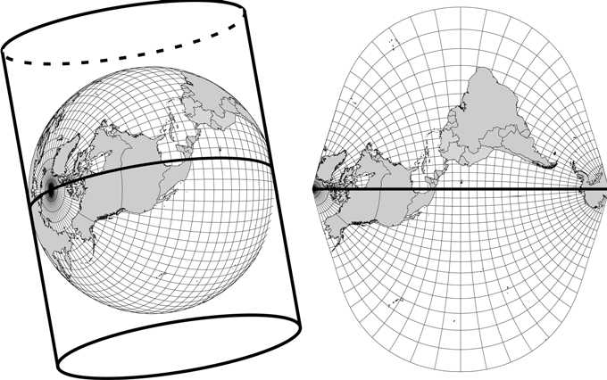{width="4.54377624671916in"
> height="2.84in"}
>
> **Figure 10--2**
>
> The UTM projection of the earth's surface, with a central meridian
> through Dodge City, Kansas (100°W).
>
> designed to be both conformal and equal area. Note in Figure 10--2 how
> the projection has the least distortion along the centerline (central
> meridian). In order to minimize distortion and maintain equal area and
> conformity, UTM projections are not used more than 3 degrees longitude
> away from the central meridian. Because of this, the earth is divided
> into 60 UTM zones. The continental United States spans UTM Zones 10
> through 19. The coordinate in the east-west direction is 500,000 at
> the center of each zone. The north-south UTM coordinate is zero at the
> equator and is measured northward. Because the coordinate system is
> referenced to the center of each zone, i.e., the *x*-coordinate starts
> over in each zone, features may not be mapped across UTM zones without
> reprojection into a common coordi- nate system or projection.
>
> Even though maps may be in the same coordinate system, each can have a
> different datum, depending on when the data were compiled. How- ever,
> if data are in the same coordinate system (geographic or Cartesian)
> and on the same datum, they should overlie. Some discrepancy may still
> exist with data from different sources because the scale and spatial
> detail in one dataset are different from those in another. Figure
> 10--3 shows two streams overlaid on top of a digital orthophoto, where
> an overlay problem clearly exists. An **orthophoto** is a photograph
> that has been rectified to a georefer- enced coordinate system and can
> be correctly positioned on a map. The illustrated orthophoto was
> registered to a coordinate system based on the
>
> {width="3.5316666666666667in"
> height="3.5in"}
>
> **Figure 10--3**
>
> Two streams shown on an digital orthophoto showing hydrographic
> features with mismatched datum (Black stream, NAD27; white stream,
> NAD83).
>
> NAD83 datum. The second stream, displaced to the south and east, was
> registered to the same coordinate system, but on an older datum,
> NAD27. Hydrography compiled in the same coordinate system based on
> NAD83 (shown with black dashed lines) matches well with stream channel
> features in the photograph. The NAD27 stream (shown in white) is
> inconsistent with the photograph. This type of error is referred to as
> misregistration. Misreg- istration may be particularly important when
> map features are used in hydraulic computations such as floodplain
> delineation. Conversion routines exist to transform spatial data from
> one datum to another within most GIS software systems. Significant
> care should be taken to correctly enter projec- tion data when using
> these transformation routines.
>
> Figure 10--4 shows the earth projected onto a plane tangent to the
> North Pole. This projection, called the **stereographic** projection,
> has long been used for navigational purposes and has been used more
> recently for hydrologic purposes. Vieux and Thompson (2004), Vieux
> (2004), and Snyder (1987) give information on the datum, projection,
> and coordinate systems used in GIS and geospatial data.
>
> {width="3.8397758092738408in"
> height="2.98in"}
>
> **Figure 10--4**
>
> Stereographic polar projection showing countries together with lines
> of longitude and latitude.

**10.3**

> **DIGITAL REPRESENTATION HYDROLOGIC PARAMETERS**
>
> Parameters of importance to hydrologists that can be derived from
> digital data sources include rainfall, infiltration,
> evapotranspiration, and hydraulic roughness. Rainfall may be
> represented as a time series at a point measured at a gage, as a
> radial-polar array or a gridded array of rainfall rates derived from
> radar or isohyetal contours. Infiltration rates, derived from soil
> maps, are generalized over the polygon describing the soil-mapping
> unit. Land use/ cover may be used to develop evapotranspiration rates
> or estimates of hydraulic roughness from polygonal areas or from a
> raster array of remotely sensed surrogate measures.
>
> A dataset may be based on either a direct measure of the physical
> characteristics or an indirect (surrogate) measure requiring
> conversion or interpretation. An example of an indirect measurement is
> NEXRAD's esti- mation of rainfall from radar reflectivity. Chapter 11
> has a more detailed discussion of using NEXRAD rainfall for hydrologic
> applications.
>
> **Soil Type**
>
> Computation of direct runoff requires an estimate of infiltration
> character- istics for the different soil types in a drainage area.
> Soil-type data are widely available for the United States and can be
> downloaded from the Natural
>
> Resources Conservation Service at
> [www.nrcs.usda.gov.](http://www.nrcs.usda.gov/) A **soil-mapping
> unit** is the smallest unit on a soil map that can be assigned a set
> of representative properties. Soil maps and the associated soil
> properties form a major source of data for estimating infiltration.
> Some adjustment is inevitable when esti- mating infiltration
> parameters from generalized soils databases for hydro- logic modeling.
> Obtaining infiltration parameters from soil properties requires
> reclassification of the soil-mapping unit into a parameter meaning-
> ful to the hydrologic model.
>
> **Land Use/Cover**
>
> The land surface condition can affect hydrologic processes such as
> runoff and evapotranspiration. A GIS map of the land use and
> associated cover is an important descriptor of the hydrology, whether
> it is vegetative, such as pasture or forest, or the surface is
> modified with asphalt or concrete pave- ment. Land use and land cover
> (LULC) GIS data are compiled for many applications and may be useful
> for hydrologic modeling. Digital LULC maps, derived from direct
> observation or remotely sensed data or digitized from paper LULC
> classification maps, can be used to develop hydrologic parameters such
> as hydraulic roughness, albedo, or aerodynamic roughness height, which
> influences evapotranspiration.
>
> General-purpose LULC maps may or may not contain sufficient detail or
> classification to be useful for deriving hydrologic model parameters.
> LULC maps and the classification scheme are generally not developed
> for hydrologic purposes. For example, in Figure 10--5 there is
> discrimination between pasture and cropland; however, the Anderson
> classification scheme used in USGS LULC maps makes no distinction
> between these two catego- ries (Table 10--1). In terms of runoff rate
> or evapotranspiration, these two categories may behave differently. In
> any case, the hydrologist must exercise judgment when interpreting
> generalized land use categories for purposes of hydrologic modeling.
>
> Hydraulic roughness is a parameter that controls the rate of runoff
> over the land surface. Classification codes from the Anderson
> classification scheme are listed in Table 10--1 with second-level
> categories indented below the major categories. Maps of hydraulic
> roughness can be derived using a lookup table that relates hydraulic
> roughness (see for example, Table 4-2) to the LULC classification
> scheme (Vieux, 2004). Simple reclassification of a LULC map into
> hydraulic roughness represents the deterministic varia- tion. Other
> sources of LULC may include remotely sensed data. In either case, a
> lookup table transforms the LULC into a map of hydraulic rough- ness
> parameters. On-site experience and published values are helpful in
> establishing at least an initial map for calibration of distributed or
> lumped parameter models.
>
> Reclassifying the National Land Cover Database (NLCD) dominant land
> use/cover into hydraulic roughness assumes a lookup table that is
>
> **Table 10--1.** Anderson Land Use Land Cover Classification Codes:
> First- and Second-Level Categories
>
> based on roughness that is characteristic of a particular land
> use/cover classification, but should be guided by local hydrologic
> knowledge of the area. Assignment of hydraulic roughness to land
> use/cover classified from remotely sensed data has been compiled by
> Engman (1986). From the NLCD geospatial data, impervious cover can
> also be estimated from Landsat imagery. A map of fractional impervious
> area is seen in Figure 10--5(a) that was derived from the NLCD
> landcover data. In this dataset, no distinction is made with regard to
> directly connected impervious area (DCIA) that may affect stormwater
> runoff; however, the NLCD maps of impervious cover can provide a
> starting point for assigning infiltration parameters to an urbanized
> or partially urbanized watershed. An example of a hydraulic roughness
> map based on reclassification of the NLCD land use/cover is shown in
> Figure 10--5(b). This map is used in Example 11--4 in Chapter 11 for
> demonstration of distributed hydrologic modeling. The NLCD land
> use/cover classifications are presented in Table 10--1 and can be used
> to assign roughness based on lookup values established from local
> knowledge of the watershed. Overland roughness derived from remotely
>
> 1 1

mi

> **Figure 10--5(a)**
>
> **Legend**
>
> **Impervious Fraction**
>
> {width="0.2163746719160105in"
> height="0.40358267716535434in"}High : 1.00
>
> Low : 0.00
>
> Watershed Boundary Stream channels
>
> Impervious cover derived for the watershed from the NLCD remotely
> sensed data.
>
> sensed data may not be representative of channel areas particularly if
> channels are left in natural conditions, e.g., rough surfaces, while
> overland areas comprise smoother man-made surfaces. If urbanization,
> wildfires, or other modification of the vegetative cover have taken
> place since the compilation of the NLCD (e.g. 2001), then adjustment
> should be made to the roughness values.
>
> The USGS provides these datasets and associated maps as a part of its
> National Mapping Program (see the Online Internet Resources link for
> the USGS Seamless Data Distribution System at the end of this
> chapter). In Chapter 4, Table 4-2 presents typical Manning hydraulic
> roughness val- ues for various cover types that can be assigned to the
> Anderson LULC classifications, but with hydrologic judgment. Example
> 10--2, "Deriving Hydrologic Parameters from GIS Maps of Land Use and
> Soils," at the end of this chapter describes the process of
> reclassification of land use from generalized categories to hydraulic
> parameters controlling overland flow and infiltration.
>
> 
>
> **Figure 10--5(b)**
>
> Hydraulic roughness interpreted from land use/cover.

**10.4**

> **DIGITAL REPRESENTATION OF TOPOGRAPHY**
>
> Topography plays an important role in the distribution and flux of
> water in natural and man-made systems. The automated extraction of
> topographic parameters from **digital terrain models (DTMs)** using
> GIS is currently rec- ognized as a viable alternative to traditional
> surveys and manual evaluation of topographic maps (Moore et al., 1991;
> Martz and Garbrecht, 1992). A DTM is any digital representation of the
> terrain, such as a series of point elevations, contour lines, and
> triangular facets, composing a **triangulated irregular network
> (TIN)**, also known as a **digital elevation model (DEM)**.
>
> **Contours**
>
> Many existing paper maps (USGS 7^1^-minute quadrangle series) use
> contours to describe the topography. An **elevation contour** is a
> line connecting the points on the earth's surface having the same
> elevation. Representation of
>
> a surface using contours shows gradients and relative minima and
> maxima. Many of the original DEMs produced by the USGS were generated
> by linear interpolation of digitized contour maps. The USGS elevation
> contours have intervals and errors that may be larger than those
> associated with surveyed contours used in civil engineering site
> development. However, even though the elevations may be uncertain,
> fail to show topographic detail, and contain vertical/horizontal
> errors, the contour data can be useful for preliminary delineation of
> watershed areas and computation of channel slope for hydro- logic
> analysis.
>
> **Digital Elevation**
>
> One of the most useful types of geospatial data is digital terrain.
> Useful hydrologic quantities can be derived from a DEM. Other terrain
> attri- butes such as slope and drainage direction are derived from a
> DEM. A model of terrain traditionally relies on contours of equal
> elevation that define watershed boundaries, channel slope, and other
> features. Within a GIS, representation of terrain can be accomplished
> with contours, gridded elevations (also known as a raster DEM), and
> triangular irregular net- works (TIN). Watershed characteristics such
> as slope and drainage length can be derived from a digital model of
> the terrain. A **raster DEM** consists of an array of numbers
> representing the spatial distribution of elevations. It may consist of
> elevations sampled at discrete points or the average elevation over a
> specified segment of the landscape---usually the former. Raster DEMs
> are one of the most widely used elevation data structures because of
> the ease with which computer algorithms are implemented using
> grid-based data.
>
> Digital elevation data are acquired through a technique that relies on
> aerial photography to produce a stereographic image. With survey
> controls to establish horizontal and vertical position (elevation),
> contours are produced from the stereographic images. Interpolation of
> elevation from the contours results in a regularly sampled grid of
> elevations, which are then used to define watershed drainage areas and
> other derivative quantities. Recent advances in laser altimetry called
> light detection and ranging (LiDAR) can achieve submeter resolution.
> Due to expense, acquisition of LiDAR data is usually reserved for
> special projects of lim- ited extent, such as floodplain mapping,
> where high impact or economic value demands high resolution. Due to
> high sampling frequency of the reflected laser light, many nonterrain
> features are recorded that must be removed by postprocessing of the
> data. LiDAR elevation data are col- lected and processed as a regular
> array of elevations in raster format. Digital data describing terrain
> are available for the United States and much of the world from the
> Internet at 1-km or better resolution, and rounded to the nearest one
> meter in elevation. The USGS has produced these DEMs at 90-meter
> resolution for most areas in the United States,
>
> with 30-meter data commonly available and even 10-meter resolution in
> some U.S. locations (see Internet Resources at the end of this
> chapter). While generally available DEM data are useful for analysis
> of larger watersheds, they may be too coarse for small drainage areas,
> urbanized areas, or flat terrains that lack sufficient vertical
> resolution, i.e., elevation difference for reliable delineation.
>
> A raster DEM can be used to delineate efficiently watershed boundar-
> ies, stream networks, and hydrologic characteristics of a watershed.
> Many of the methods used for watershed delineation stem from Peuker
> and Doug- las (1975), O'Callaghan and Mark (1984), and Jenson and
> Domingue (1988). Many of the innovations since these pioneering
> methods deal with difficul- ties posed by pits, anomalies, and flat
> areas within the digital representation of terrain. While a raster DEM
> can produce accurate boundaries, additional processing is usually
> required to force the boundary to agree with accepted or known
> boundaries. Errors in automatically generated boundaries can stem from
> the precision of the elevation model among other factors (Fisher and
> Tate, 2006), which may not be sufficient to pick up boundaries in flat
> areas. Various methods have been developed for overcoming the
> difficulty with flat areas when delineating a watershed from digital
> terrain data that may contain pits or anomalies. Zhu et al. (2005)
> developed a hybrid method for depression filling and scanning
> neighboring cells for assigning flow direc- tion over flat areas. The
> relationship between the drainage network and hydrologic response is
> termed geomorphic. Moussa (2003) compared and classified the basin
> shape and delineated stream network in an effort to identify scale
> effects present in the relationship between morphometric properties
> and the basin hydrological response. Selecting a threshold that
> defines a stream channel will result in a more or less detailed stream
> channel network that should correspond to actual watershed geomorphic
> character- istics. Methods for automatic delineation of watershed
> boundaries from DEMs are discussed in Section 10.5.
>
> **Triangulated Irregular Network**
>
> A **triangulated irregular network (TIN)** represents a surface as a
> set of nonoverlapping contiguous triangular facets of varying size and
> shape. Generally, a TIN is produced from a DEM through GIS software
> and has several distinct advantages over contour and raster
> representations of sur- faces. The primary advantage is that the size
> of each triangle may be var- ied such that broad flat areas are
> covered with a few large triangles, while highly variable or steeply
> sloping areas are covered with many smaller triangles. This provides
> some storage and detail efficiency over raster data structures, since
> the element may vary in size according to the variability of the
> surface. TINs have become increasingly popular because of their
> efficiency in storing data and their simple data structure for
> accommodat- ing irregularly spaced elevation data. Most TIN models
> assume planar
>
> {width="4.130472440944882in"
> height="3.54in"}
>
> **Figure 10--6**
>
> TIN elevation model derived from a contours.
>
> triangular facets for the purpose of simpler interpolation or
> contouring. Vertices in TINs describe nodal terrain features (e.g.,
> peaks, pits, or passes), while edges depict linear terrain features
> (e.g., break, ridge, or channel lines).
>
> Depending on the usage or software requirements, it may be necessary
> to convert a DTM from one type (e.g., DEM) to a different type (e.g.,
> TIN). Building a TIN from a DEM requires some automated method for
> selecting which DEM points will become TIN vertices. Figure 10--6 is a
> TIN created from a grid DEM. Notice the larger triangles representing
> flat areas and the smaller, more numerous, triangles in areas where
> there is more topographic relief. Because DEMs are widely available at
> a relatively low cost, they are often the basis for creating TINs
> (Lee, 1991).
>
> GIS processing of digital data is useful for both lumped parameter and
> dis- tributed models. A lumped parameter model, such as HEC-HMS,
> assumes that hydrologic parameters, such as percent imperviousness or
> land use, can be approximated by a single lumped subwatershed value. A
> distributed
>
> **10.5**
>
> **GIS-BASED HYDROLOGY AND HYDRAULICS**
>
> model uses a gridded representation of all hydrologic parameters
> (e.g., ele- vation, soil type, imperviousness) to perform model
> calculations, usually over a grid system. In either case, delineated
> watersheds are often required for hydrologic analysis.
>
> **Watershed Delineation Using Digital Terrain Models**
>
> Stream and watershed delineation from DEMs are presented by Olivera
> (2001). Algorithms for the calculation of stream segment and watershed
> hydrologic parameters are also discussed. These parameters are curve
> num- ber, area, and lag time for the watersheds, and routing model and
> travel time for the stream segments. A watershed, with its
> subwatersheds and streams, is the basic structure for hydrologic
> computation for both lumped parameter and distributed hydrologic
> models. Moore et al. (1991) discuss the major data structures for
> watershed delineation, including the grid, TIN, and con- tour methods.
> Methods for delineation of watersheds using digital terrain data for
> hydrologic applications are presented in Tarboton (1997) and Tur-
> cotte et al. (2001).
>
> Watershed boundaries are primarily delineated in a GIS using a DEM.
> Within the GIS algorithm used for delineation, the steepest slope
> determines the direction of flow from each cell. GIS algorithms can
> use this information to determine how many cells flow into each grid
> cell, resulting in a delineated watershed and stream network (Figs.
> 10--7 and 10--8). The basic technique for delineation of a watershed
> is to consider a 3 \* 3 kernel of cells. The direc- tion of flow from
> a given cell to its neighbor is found by comparing the eleva- tion
> difference between the central cell and its surrounding cells. Figure
> 10--7 shows a simplified example of how the eight possible directions
> of flow are found. In Figure 10--7(a), the elevation of each cell is
> compared to the neighboring cells in the eight possible directions:
> E-W, N-S, and diagonal directions. In Figure 10--7(b), the drainage
> direction in each cell is assigned. In the final step, the stream
> network is defined as seen in Figure 10--7(c), starting with the cell
> designated by the value 4, which indicates the flow accumulation. From
> this delineation process, flow direction, flow accumula- tion, and
> stream network are derived from a DEM. Applying this process to the
> entire watershed, i.e., considering all kernels, the drainage network
> is determined as shown in Figure 10--8.
>
> As required for most hydrologic modeling applications, automated
> watershed and stream network delineation seeks to produce a fully con-
> nected drainage network of single cell widths. Drainage networks pro-
> duced by automated methods may not be very accurate in flat areas.
> Because elevations in many DEMs are rounded off, drainage directions
> and the watershed boundary may be in error. If a high-quality map of
> the stream network and watershed boundary is available in vector
> format, they may be used to constrain the automated watershed
> delineation. A water- shed and stream vector map may be used to *burn
> in* the elevations, forcing
>
> 
>
> {width="1.6555544619422573in"
> height="2.1599989063867016in"}

(b)

> {width="1.4235793963254593in"
> height="1.8733333333333333in"}
>
> **Figure 10--7**
>
> \(c\)
>
> **Figure 10--8**
>
> \(c\)
>
> Schematic representation of the eight-direction pour-point method. (a)
> Flow direction grid.

(b) Flow accumulation grid. (c) Stream network.

> Results of applying the eight-direction pour-point method to the
> Whisky-Chitto watershed in Louisi- ana. (a) Flow direction grid. (b)
> Flow accumula- tion grid. (c) Stream network. **645**
>
> the drainage network to coincide with the vector map depicting the
> desired drainage network. By burning in the stream (i.e., artificially
> lowering the DEM at the location of mapped streams), the correct
> location of the auto- matically delineated watershed and corresponding
> stream network is pre- served. Watersheds and stream networks
> delineated from a DEM become a structure for organizing lumped and
> distributed hydrologic model com- putations. Once the watershed and
> stream network have been delineated using automatic methods, the
> resulting map should be verified in the field and compared with other
> maps compiled from other sources. Figure 10--9(a) shows the effect of
> not burning in a stream in a watershed that was auto- matically
> delineated from 1-m resolution LiDAR. The vector representa- tion of
> the main channels is indicated by the continuous black line, whereas
> the gray elemental flow paths within a 75-m resolution model grid in
> V*flo*™ deviate as indicated within the dotted ellipse. Once the
> stream channel is burned in, i.e., delineation is constrained to
> follow the channel, the delineated flow paths conform closely to the
> stream channel. No longer does the stream channel *jump* over into an
> adjacent catchment as seen in Figure 10--9(b), and the delineated flow
> paths follow the stream channel defined by the vector map.


> **Figure 10--9(a)**
>
> Watershed delineation without stream channel enforcement.
>
> 
>
> **Figure 10--9(b)**
>
> Watershed delineation with stream channel enforcement.
>
> A watershed boundary can be established using a vector boundary to
> form a wall to constrain the automated delineation. A wall confines
> the auto- mated process so that the delineation conforms to the
> accepted boundary of the watershed. Without constraint, the elevation
> in each grid may allow the delineated watershed to deviate from the
> boundary due to elevation errors or flatness of the terrain.
> Constraining the automated watershed delineation is demonstrated by
> the results from the input processor in V*flo*™ called Auto- BOP
> (Automated Basin Overland Properties) shown in Figures 10--10(a) and
> 10--10(b). In Figure 10--10(a), delineating the watershed without the
> use of a vector boundary allows flow paths to extend across the vector
> boundary and into an adjacent watershed (see ellipse and arrow). The
> watershed delineation in Figure 10--10(b) is consistent with the
> vector boundary because it is used as a *wall* in the process. The
> dotted ellipses in Figures 10--10(a) and (b) indicate the region where
> flat slopes along the divide or urbanized infrastructure resulted in
> drainage area capture. While digital terrain data can be invaluable
> for delineating watersheds based on natural elevations, urbanization
> can alter the pathways especially where constructed drainage
> infrastructure conveys runoff in directions other than that dictated
> by the steepest decent. The sup- plemental website contains the
> presentation that describes the procedure.
>
> 
>
> **Figure 10--10(a)**
>
> Watershed delineation without enforcement of the watershed boundary.
>
> **GIS Tools for Hydrologic and Hydraulic Modeling**
>
> One of the main tasks in creating and applying a hydrologic or
> hydraulic model is the preparation of the appropriate datasets for
> modeling a water- shed or basin. Early models were data-intensive, and
> most of the param- eters required for a model have to be estimated
> manually and typed into computer files (i.e., FORTRAN input files),
> using very specific formats. As a result, hydrologists have to be
> specially trained in the application of these models. Modern
> computer-based technologies such as spreadsheets, data- bases, and
> graphical capabilities greatly facilitate some of the time-intensive
> data entry procedures. User-friendly interfaces allow hydrologists to
> enter
>
> 
>
> **Figure 10--10(b)**
>
> Watershed delineation with enforcement of the watershed boundary.
>
> model data in free formats and provide online help screens to assist
> the user in understanding the specific parameters required. There are
> two main GIS modules for use with the lumped hydrologic model: the
> HEC- HMS and HEC-RAS hydraulic model (see Chapters 5 and 7). HEC-
> GeoHMS and HEC-GeoRAS are modules that run with the ESRI software,
> ArcView and ArcGIS. Besides the user manuals for this software men-
> tioned in Chapters 5 and 7, additional information on extracting
> hydraulic information from digital terrain is provided by Ackerman et
> al. (2000) and by Tate et al. (2002), who describe the formation of a
> digital terrain model for floodplain mapping.
>
> **EXAMPLE 10--1**
>
> **GIS PROCESSING OF DIGITAL TERRAIN**
>
> A basic application of GIS in hydrology is the delineation of
> watershed boundaries and corresponding stream network. Several modules
> are available for automatic delineation from a DEM. Because a vector
> map of the watershed boundary or stream channel location may have more
> ac- curacy than the DEM, the automated delineation can be improved
> using the vector maps to constrain the delineated boundary and stream
> channel location. Constrained watershed delineation helps ensure that
> the result- ing maps are consistent with the watershed boundary and
> stream channel mapped in vector format. This example provides an
> overview of how to *burn in* a DEM with a stream network and use the
> watershed boundary to constrain the watershed delineation. The
> watershed delineation relies on the Arc Hydro Tools extension in
> ArcMap. The watershed delineation is performed using LiDAR data at
> 4.7-meter resolution that is resampled to coarser resolution. Detailed
> instructions and presentation material called *GIS Processing of
> Digital Terrain* may be found on the textbook website along with
> sample data (see Appendix E).
>
> The steps followed in the presentation are:

-   Reproject original DEM to the desired projection with horizontal and
    > vertical units of meters.

-   Resample original DEM to a selected resolution.

-   Merge stream network and basin/subbasin outline into a DEM to ensure
    > proper flow direction.

-   Use Arc Hydro Tools extension to produce flow direction, flow
    > accumulation, and a stream grid.

> The resulting watershed maps demonstrate the burn-in procedure using a
> combination of raster and vector map information. The flow direction
> map is for use in the distributed hydrologic model, V*flo*™. An
> alternative approach is to use the HEC-GeoHMS processing module to
> process the DEM and to produce subbasin boundaries and stream channel
> map infor- mation for input to HEC-HMS.
>
> Interpretation of the dominant land use category is needed to express
> the category in terms of an appropriate value of the corresponding
> hydrau- lic roughness parameter. Because a particular land use
> category may be heavily or lightly vegetated, the assigned hydraulic
> roughness should be adjusted to represent this in the model.
> Similarly, soil maps can be re- classified based on soil texture into
> infiltration parameters for use in the Green--Ampt equation. Detailed
> instructions and presentation material called *Deriving Hydrologic
> Parameters from GIS Maps of Land Use and Soils* may be found on the
> textbook website along with sample data.
>
> The steps followed in the presentation are:

-   Reclassify land use/soils datasets to hydrologic parameters defin-
    > ing hydraulic roughness and infiltration.

-   Use multiplicative factor when reclassifying integer-based land
    > use/soils classes, then divide out multiplicative factor with
    > Raster Calculator (RC).

-   Resample roughness/infiltration values to desired V*flo*™ model grid
    > resolution.

-   Clip the resampled grid to a specific model domain.

-   Export roughness/infiltration grids and load in V*flo*™ as ArcGIS
    > Grids or ASCII files.

> The resulting watershed maps demonstrate the reclassification of GIS
> maps of land use/cover and soils into hydraulic and hydrologic model
> parameters. The resulting maps are for use in the distributed
> hydrologic model, V*flo*™. Alternatively, the same approach to
> reclassification can be applied to obtain parameters for input to
> HEC-HMS by averaging the distributed values over each subbasin area
> within the watershed.
>
> Numerous GIS programs are available that may be adapted for use in
> hydro- logic applications. Table 10--2 summarizes some of the more
> common ones and is not intended as a comprehensive list. Note that
> programs tend to change through time as new ones are developed.
>
> These GIS programs and others can be used by hydrologists to develop
> hydrologic data and perform analyses in the preparation of model
> input, and for the interpretation and visualization of
> hydrologic/hydraulic model results.
>
> **Additional Resources**
>
> Principles of GIS, its background, and application may be found in
> books by Burrough and McDonnell (1998). Other references that provide
> the funda- mentals of GIS, spatial analysis, and principles include
> Clarke 2001 and
>
> **10.6**
>
> **COMMON GIS SOFTWARE PROGRAMS**
>
> **Table 10--2.** Common GIS Software Programs

+---------+------------------------------+-----------------------------+
| > **Sof | > **Description**            | > **Modules**               |
| tware** |                              |                             |
+=========+==============================+=============================+
| > *     | > ArcGIS Desktop is a        | > ArcGIS Desktop includes   |
| *ArcGIS | > collection of software     | > ArcView and other         |
| > De    | > products used to create,   | > products that provide     |
| sktop** | > import, edit, query, map,  | > extensive mapping, data   |
| >       | > analyze, and publish       | > use, and analysis along   |
| > **    | > geographic information.    | > with simple editing and   |
| ERDAS** | > There are four products in | > geoprocessing             |
|         | > the ArcGIS Desktop         | >                           |
|         | > collection; each adds a    | > capabilities. The ArcView |
|         | > higher level of            | > Extension called Spatial  |
|         | > functionality. This        | > Analyst provides          |
|         | > software                   | > important terrain-        |
|         | >                            | > processing functions      |
|         | > is distributed by ESRI,    | > useful for hydrologic     |
|         | > Redlands, California.      | > applications.             |
|         | > (www.esri.com)             | >                           |
|         | >                            | > Extensive support for     |
|         | > This software is           | > remotely sensed data      |
|         | > distributed by Earth       | > includes unsupervised     |
|         | > Resource Data Analysis     | > classification, geometric |
|         | > System (ERDAS) established | > correction, and           |
|         | > in 1978. ERDAS is located  | > cartographic map          |
|         | > in Atlanta, Georgia.       | > production tools. ERDAS   |
|         | > (www.erdas.com)            | > IMAGINE^®^ suite supports |
|         |                              | > spatial analysis of       |
|         |                              | > imagery from aerial       |
|         |                              | > photography and satellite |
|         |                              | > remote sensing. Besides   |
|         |                              | > ortho-rectification and   |
|         |                              | > reclassification of       |
|         |                              | > images, support for       |
|         |                              | > raster and vector formats |
|         |                              | > and interfaces with other |
|         |                              | > GIS software packages is  |
|         |                              | > provided.                 |
|         |                              | >                           |
|         |                              | > IDRISI Andes is an        |
|         |                              | > integrated GIS and image- |
|         |                              | > processing software       |
|         |                              | > solution for the analysis |
|         |                              | > and display of digital    |
|         |                              | > spatial information. The  |
|         |                              | > IDRISI software offers    |
|         |                              | > GIS and image- processing |
|         |                              | > tools for land planning,  |
|         |                              | > decision support, and     |
|         |                              | > risk analysis, which are  |
|         |                              | > included with tools for   |
|         |                              | > spatial statistics,       |
|         |                              | > surface analysis, and     |
|         |                              | > spatial modeling.         |
|         |                              | >                           |
|         |                              | > Bentley Map consists of   |
|         |                              | > the Bentley geospatial    |
|         |                              | > desktop and server        |
|         |                              | > products. It is a full-   |
|         |                              | > featured 2-D and 3-D GIS  |
|         |                              | > designed for              |
|         |                              | > organizations that map,   |
|         |                              | > plan, design, build, and  |
|         |                              | > operate the world's       |
|         |                              | > infrastructure. In        |
|         |                              | > addition to GIS software, |
|         |                              | > Bentley distributes       |
|         |                              | >                           |
|         |                              | > the CAD software          |
|         |                              | > MicroStation.             |
+---------+------------------------------+-----------------------------+
| > **I   | > A popular software package |                             |
| DRISI** | > for teaching and research. |                             |
|         | > Distributed by Clark Labs, |                             |
|         | >                            |                             |
|         | > Clark University,          |                             |
|         | > Worcester, Massachusetts.  |                             |
|         | > (www.clarklabs.org)        |                             |
+---------+------------------------------+-----------------------------+
| > **Be  | > Bentley provides software  |                             |
| ntley** | > dedicated to architects,   |                             |
|         | > engineers, constructors,   |                             |
|         | > and owner-operators with   |                             |
|         | > comprehensive software     |                             |
|         | > solutions for sustaining   |                             |
|         | > infrastructure. Company    |                             |
|         | > headquarters: 685 Stockton |                             |
|         | > Drive, Exton, PA 19341,    |                             |
|         | > United States.             |                             |
|         | > ([www.bentley.com/         |                             |
|         | )](http://www.bentley.com/)) |                             |
+---------+------------------------------+-----------------------------+

> DeMers (2004). Terrain analysis and the use of raster data formats are
> described in Wilson and Gallant (2000) and DeMers (2001).
>
> The proliferation of worldwide geospatial data has made it possible to
> perform GIS analysis for almost any location using generally available
> data. Such geospatial data have limitations and may not contain
> sufficient detail for some hydrologic applications. Methods of
> obtaining publicly available geospatial data, the software used for
> processing, and examples of use are discussed in Ralston (2004). The
> science and technology for measuring the earth are described in
> textbooks such as Wilson and Gallant (2000) or *Geo- matics* by
> Kavanagh (2009). These textbooks provide a clear description of
>
> terrain data and processing techniques, survey data, GPS, GIS,
> geospatial data, and remote sensing data, emphasizing the measurement
> accuracy, database management, geospatial data formats, and coordinate
> systems employed with such data.
>
> Use of GIS for urban planning and development applications is pre-
> sented by Easa and Chan (2000). Shamsi (2002) describes the use of GIS
> in urban/engineering application areas of water, wastewater, and
> stormwater. These authors address urban planning and development
> applications of GIS, giving information on practical planning and
> development. Topics address a wide variety of topics that include
> regional planning, transportation, pub- lic utilities, stormwater and
> waste management, cultural and resources man- agement, environmental
> assessment, program evaluation and policy analysis, and education.
>
> The modeling technology available for hydrology has advanced along
> with the advent of geospatial data useful for watershed modeling.
> Distrib- uted modeling uses geospatial data directly to model the
> spatially variable watershed characteristics. The report by ASCE
> (1999) guides the profes- sional in the selection of GIS modules and
> distributed models for watershed runoff analysis. GIS hydrology
> analysis software and techniques are pre- sented in addition to
> geospatial data types and map projections. Important topics covered
> include the limitations of available data and the integration of
> watershed hydrological analysis software with GIS software. An
> appendix is provided in ASCE (1999), which highlights nine different
> watershed- modeling systems that operate in conjunction with GIS
> software and geo- spatial data. The research monograph by Vieux (2004)
> presents a unified approach to GIS usage in distributed hydrology. It
> addresses the technology and theoretical background required for
> distributed modeling, including GIS processing, radar rainfall, and
> calibration and case studies. The book's second edition includes
> software and sample data as well as the background, theory, and
> practical applications of GIS and geospatial data in distributed
> hydro- logic modeling.
>
> Considering the spatial character of various parameters in hydrologic
> processes, it is not surprising that GIS has become an integral part
> of modern hydrologic studies. Global digital databases of topography,
> LULC, and other data types offer unparalleled capabilities for
> hydrologic modeling throughout the world. Rapid expansion of spatial
> data in the United States provides the hydrologist with a rich array
> of data. GIS maps are now readily available that describe topography,
> LULC, soils, and rainfall. Additionally, meteorological variables such
> as rainfall can be estimated with radar and entered directly into
> GIS-based studies. Care must be taken to ensure that the derived
> hydrologic parameters, delineated basins, projections, and datums are
> accurate and have sufficient precision to be useful in hydrologic
> analyses.
>
> **SUMMARY**
>
> **ONLINE RESOURCES**
>
> *Hydrologic Engineering Center, U.S. Army Corps of Engineers*
>
> The Geospatial Hydrologic Modeling Extension (HEC-GeoHMS) is an
> extension for use with ESRI ArcView. The modules can produce watershed
> delineations using digital elevation models. The results can be used
> independently or for input in the HEC-HMS hydrologic model available
> from the same site.
> <http://www.hec.usace.army.mil/software/hec-geohms/>
>
> HEC-GeoRAS is a set of procedures, tools, and utilities for processing
> geospatial data in ArcGIS using a graphical user interface (GUI). The
> interface allows the preparation of geometric data for import into
> HEC-RAS and processes simulation results exported from HEC-RAS.
>
> <http://www.hec.usace.army.mil/software/hec-ras/hec-georas.html>
>
> *Minnesota Department of Natural Resources*
>
> This site provides online information for using the ESRI ArcView 3.x
> GIS software and data. The ArcView Utility Tools extension contains a
> number of extended GIS functions that are commonly used by resource
> managers but not available on the standard ArcView interface. The
> ArcView Utility Tools contains a form that contains a number of
> buttons that perform a variety of GIS processing functions. Some of
> these are directly related to geographic analysis (clip, buffer,
> intersect, etc.), and some are general utility commands that have been
> commonly requested.
> <http://www.dnr.state.mn.us/mis/gis/tools/arcview/extensions/tools/tools.html>
>
> *FEMA Digital Flood Maps Online*
>
> FEMA's Map Service Center (MSC) is the official government source for
> flood hazard mapping information, products, and services.
>
> <http://msc.fema.gov/>
>
> *EPA GIS Information*
>
> EPA's National Geospatial Program coordinates the Agency's geospatial
> data, appli- cations, policies, and programs. This website provides
> access to data and applications besides related links and is found at:
>
> <http://www.epa.gov/geospatial/>
>
> *USGS Seamless Data Viewer and Downloads*
>
> The United States Geologic Survey (USGS) maintains the Seamless Data
> Distribu- tion System (SDDS), which enables the user to view and
> download many geospatial data layers, such as National Elevation
> Dataset, National Land Cover Dataset, and High Resolution
> Orthoimagery.
>
> [http://seamless.usgs.gov](http://seamless.usgs.gov/)
>
> *Geospatial Data Clearinghouse Links*
>
> The FGDC provides a one-stop portal and helps coordinate the sharing
> of geo- graphic data, maps, and online services through an online
> portal, geodata.gov, which searches metadata held within the NSDI
> Clearinghouse Network. The portal pro- vides "one-stop" access to all
> registered geographic information and related online access services
> within the United States. Geographic data, imagery, applications,
>
> documents, websites, and other resources have been catalogued for
> discovery in this portal. The portal and related information, data,
> and services may be found at: <http://www.fgdc.gov/dataandservices>
>
> A[ckerman]{.smallcaps}, C. T., T. A. E[van]{.smallcaps}s, and G. W.
> B[runner]{.smallcaps}, 2000, *HEC-GeoRAS: Link- ing GIS to Hydraulic
> Analysis Using ARC/INFO and HEC-RAS, Hydrologic and Hydraulic Modeling
> Support with Geographic Information Systems,* ESRI Press, Redlands,
> CA.
>
> ASCE, 1999, *GIS Modules and Distributed Modules of the Watershed,*
> Edited vol- ume, Task Committee on GIS Modules and Distributed Modules
> of the Water- shed, American Society of Civil Engineers (ASCE Press),
> Reston, VA, ISBN: 0784404437, p. 136.
>
> B[urrough]{.smallcaps}, P. A., and R. A.,
> M[c]{.smallcaps}D[onnell]{.smallcaps}, 1998, *Principles of
> Geographical Informa- tion Systems.* Oxford University Press, New
> York.
>
> C[larke]{.smallcaps}, K. C., 2001, *Getting Started with Geographic
> Information Systems,* 3rd ed., Prentice Hall, Upper Saddle River, NJ.
>
> D[e]{.smallcaps}M[er]{.smallcaps}s, M. N., 2001, *GIS Modeling in
> Raster,* John Wiley & Sons, New York, ISBN: 0-471-31965-1, p. 208.
>
> D[e]{.smallcaps}M[er]{.smallcaps}s, M. N., 2004, *Fundamentals of
> Geographic Information Systems,* 3rd ed., John Wiley & Sons, New York,
> ISBN: 0-471-20491-9, p. 480.
>
> E[a]{.smallcaps}s[a]{.smallcaps}, S., and Y. C[han]{.smallcaps}, 2000,
> *Urban Planning and Development Applications of GIS,*
>
> S. Easa and Y. Chan (Eds.), American Society of Civil Engineers (ASCE
> Press), Reston, VA, ISBN: 0784404615, p. 304.
>
> E[ngman]{.smallcaps}, E. T., 1986, "Roughness Coefficients for Routing
> Surface Runoff," *ASCE,*
>
> *J. Irrig. and Drain. Eng.*, *112*(1), pp. 39--52.
>
> F[i]{.smallcaps}s[her]{.smallcaps}, P. F., and N. J.
> T[ate]{.smallcaps}, 2006, "Causes and Consequences of Error in Digital
> Elevation Models," *Prog. Phys. Geog. 30*(4), pp. 467--489.
>
> G[ya]{.smallcaps}s[i]{.smallcaps}-A[gyei]{.smallcaps}, Y., G.
> W[illgoo]{.smallcaps}s[e]{.smallcaps}, and F. P.
> d[e]{.smallcaps}T[roch]{.smallcaps}, 2006, "Effects of Vertical Reso-
> lution and Map Scale of Digital Elevation Models on Geomorphological
> Param- eters Used in Hydrology," *Hydrol. Process., 9*(3--4), pp.
> 363--382.
>
> J[en]{.smallcaps}s[on]{.smallcaps}, S. K., and J. O.
> D[omingue]{.smallcaps}, 1988, "Extracting Topographic Structure from
> Digital Elevation Data for Geographic Information System Analysis,"
> *Photo- gramm. Eng. Rem. Sens.*, *54*(11), pp. 1593--1600.
>
> L[ee]{.smallcaps}, J., 1991, "Comparison of Existing Methods for
> Building Triangular Irregular Network Models from Grid Digital
> Elevation Models," *Int. J. Geographical Infor- mation Systems, 5*(3),
> pp. 267--285.
>
> M[artz]{.smallcaps}, L. W., and J. G[arbrecht]{.smallcaps}, 1992,
> "Numerical Definition of Drainage Network and Subcatchment Areas from
> Digital Elevation Models," *Comput. Geosci., 14*(5), pp. 627--640.
>
> M[c]{.smallcaps}H[arg]{.smallcaps}, I. L., 1995, Design with Nature,
> John Wiley Series in Sustainable Design, Hoboken, NJ 07030-5774, ISBN:
> 978-0-471-11460-4.
>
> **REFERENCES**
>
> M[itchell]{.smallcaps}, A., 1999, *The ESRI Guide to GIS Analysis,
> Volume 1: Geographic Patterns and Relationships,* ESRI, Redlands, CA.
>
> M[oore]{.smallcaps}, I. D., R. B. G[ray]{.smallcaps}s[on]{.smallcaps},
> and A. R. L[a]{.smallcaps}ds[on]{.smallcaps}, 1991, "Digital Terrian
> Modeling: A Review of Hydrological, Geomorphological and Biological
> Applications," *Hydrol. Process., 5,* pp. 3--30.
>
> M[ou]{.smallcaps}ss[a]{.smallcaps}, R., 2003, "On Morphometric
> Properties of Basins, Scale Effects and Hy- drological Response,"
> *Hydrol. Process., 17*(1), pp. 33--58.
>
> O'C[allaghan]{.smallcaps}, J. F., and D. M. M[ark]{.smallcaps}, 1984,
> "The Extraction of Drainage Networks from Digital Elevation Data,"
> *Comput. Vision, Graph. Image Processing, 28,* pp. 323--344.
> O[livera]{.smallcaps}, F., 2001, "Extracting Hydrologic Information
> from Spatial Data for HMS
>
> Modeling," *ASCE J. Hydrol. Eng. 6*(6): pp. 524--530.
>
> P[euker]{.smallcaps}, T. K., and D. H. D[ougla]{.smallcaps}s, 1975,
> "Detection of Surface-Specific Points by Local Parallel Processing of
> Discrete Terrain Elevation Data," *Comput. Graphics Image Process.,
> 4*, pp. 375--387.
>
> R[al]{.smallcaps}s[ton]{.smallcaps}, B., 2004, *GIS and Public Data,*
> Thomson/Delmar Learning, Clifton Park, NY., ISBN: 1401877818.
>
> S[ham]{.smallcaps}s[i]{.smallcaps}, U., 2002, *GIS Tools for Water,
> Wastewater, and Stormwater Systems,* American Society of Civil
> Engineers (ASCE Press), Reston, VA, ISBN: 0784405735, p. 392.
> S[ny]{.smallcaps}d[er]{.smallcaps}, J. P., 1987, *Map Projections---A
> Working Manual,* U.S. Geological Survey
>
> Professional Paper 1395, p. 383.
>
> T[arboton]{.smallcaps}, D. G., 1997, "A New Method for the
> Determination of Flow Directions and Upslope Areas in Grid Digital
> Elevation Models," *Water Resour. Res. 33*(2), pp. 309--319.
>
> T[urcotte]{.smallcaps}, R., J.-P. F[ortin]{.smallcaps}, A. N.
> R[ou]{.smallcaps}ss[eau]{.smallcaps}, S.
> M[a]{.smallcaps}ss[icotte]{.smallcaps}, and J.-P.
> V[illeneuve]{.smallcaps}, 2001, "Determination of the Drainage
> Structure of a Watershed Using a Digital Elevation Model and a Digital
> River and Lake Network," *J. Hydrol.*, *240*(3--4), pp. 225 --242.
>
> T[ate]{.smallcaps}, E., D. M[ai]{.smallcaps}d[ment]{.smallcaps}, F.
> O[livera]{.smallcaps}, and D.
> A[n]{.smallcaps}d[er]{.smallcaps}s[on]{.smallcaps}, 2002, "Creating a
> Terrain Model for Floodplain Mapping," *ASCE J. Hydrol. Eng., 7*(2),
> pp. 100--108.
>
> V[ieu]{.smallcaps}x, B. E., 2004, *Distributed Hydrologic Modeling
> Using GIS,* 2nd ed., Kluwer Ac- ademic Publishers, Norwell, MA, Water
> Science Technology Series, vol. 48, ISBN: 1-4020-2459-2, p. 289.
> CD-ROM includes model software and documentation.
>
> V[ieu]{.smallcaps}x, B. E., and J. F.
> T[homp]{.smallcaps}s[on]{.smallcaps}, 2004, "Surveying Applications
> for Geographic Infor- mation Systems," Chap. 168 in *The Engineering
> Handbook,* 2nd ed., ISBN: \_0-8493- 1586-7; Richard C. Dorf (Ed.), CRC
> Press, Boca Raton, FL 33431, \_ pp. 168-1--168-12.
>
> W[il]{.smallcaps}s[on]{.smallcaps}, J. P., and J. C. Gallant, 2000,
> *Terrain Analysis: Principles and Applications,*
>
> J. P. Wilson and J. C. Gallant (Eds.), John Wiley & Sons, ISBN:
> 0-471-32188-5, p. 512.
>
> Z[hu]{.smallcaps}, Q., Y. T[ian]{.smallcaps}, and J.
> Z[hao]{.smallcaps}, 2005, "An Efficient Depression Processing
> Algorithm for Hydrologic Analysism," *Comput. Geosci., 32*(5), pp.
> 615--623.
>
> Chapter 11

## Radar Rainfall Applications in Hydrology

{width="3.137322834645669in"
height="2.6733333333333333in"}

> Hurricane Ike on September 13, 2008 approaches the Gulf Coast near
> Houston, Texas. Radar measures reflec- tivity at high spatial and
> temporal resolution over water- sheds. (Photo courtesy Vieux &
> Associates, Inc.)
>
> Advances in radar technology have enabled accurate characterization of
> the distribution of precipitation over a watershed. When properly
> adjusted with rain gage measurements, radar can provide the spatial
> and temporal varia- tion of rainfall necessary for hydrologic
> prediction and analysis. Rain gages provide effective high-resolution
> temporal information but are limited by sampling at a single point in
> space. The combination of radar and rain gages can produce
> representative precipitation measurements over a watershed that is
> more accurate than can be achieved from either rain gages or radar
> used alone (Wilson and Brandes, 1979).
>
> When rain gages are the only means of measuring or characterizing
> rainfall over a watershed, rainfall amounts from several gage
> measurements must be distributed over the area or assumed uniform over
> the area. Thiessen polygons or inverse distance weighting are the
> primary methods for spatially
>
> **11.1**
>
> **INTRODUCTION**

**657**

> distributing rainfall from point measurements. Such spatial
> distribution meth- ods do not account for the variability of rainfall
> that occurs between the rain gages. In modeling actual storm events or
> in continuous simulation, uniform rainfall assumptions can lead to
> overprediction or inaccurate hydrograph response, which makes radar
> rainfall attractive. When assumed rainfall dis- tribution patterns are
> inaccurate or depart from the actual variation of rain- fall occurring
> over a watershed area, model results and hydrologic assumptions can be
> grossly in error.
>
> Rain gages operated by the National Weather Service (NWS) can pro-
> vide high-quality data with long record lengths for climatological
> purposes. Primary gages are located at airports and other permanent
> installations and record hourly precipitation. Cooperative observers
> supplement the primary network with observations taken on a daily
> basis. Even though these data are often the best available, the
> primary network and cooperative observer networks are generally too
> sparse to capture the entire spatial variability of precipitation
> affecting a watershed or river basin. Another source of rain gage
> information is automated local evaluation in real time (ALERT) sen-
> sors, which are installed by local governments and other agencies to
> monitor rainfall and other variables at higher spatial resolutions
> than gages operated by the NWS. However, even ALERT and other private
> gage networks may not be sufficient to capture the spatial variation
> of rainfall, especially in convective situations where rain-producing
> storm cells may pass through the gage network without detection of the
> most intense rainfall rates. Rain gage networks are important sources
> of rain gage data by themselves and as a means for enhancing the
> accuracy of precipitation estimates derived from weather radar.
>
> This chapter deals with the use of weather radar in hydrology, with
> the primary emphasis on distributed modeling of watershed-scale
> processes. Many studies have shown that accurate measurements of rain
> intensity, with good spatial and temporal resolution, are essential to
> hydrologic analysis and prediction. There are three principal methods
> to measure rainfall: (1) rain gage, (2) radar, and (3) satellite
> imagery. Besides rainfall, radar estimation of frozen precipitation
> such as snowfall is not treated here. Radar rainfall, if properly
> adjusted with rain gage data, accurately characterizes rainfall dis-
> tribution over a watershed, and temporally as hyetographs. The use of
> radar for hydrologic purposes is becoming more commonplace for
> applications where model predictions are used to simulate continuous
> streamflow or indi- vidual events, make flood predictions, or
> characterize inflow to stormwater, combined, or separate sanitary
> sewers. Development and application of radar for hydrological purposes
> is described in a review by Einfalt et al. (2004). Adjustment of radar
> using rain gages and the factors affecting the accuracy of the
> rainfall product are described in many references, including Morin et
> al. (1995), Rosenfeld et al. (1993, 1994), Smith et al. (1996),
> Sanchez-Diezma et al. (2001), Vieux and Bedient (1998), and Vieux and
> Vieux (2005).
>
> Rainfall derived from radar fills in the gaps between gage measure-
> ments, since radar data far exceed spatial densities of most rain gage
> net- works. While radar provides the spatial and temporal patterns of
> rainfall, it requires correction or adjustment to remove systematic
> over- or underesti- mation of rainfall rates. To understand how radar
> is used to measure rainfall, one must understand the measurement
> process, conversion of reflectivity to rain rate, system
> characteristics affecting resolution and precision of the rainfall
> data, and bias adjustment for systematic errors. First, we examine the
> origin and characteristics of radar estimation of rainfall.
>
> The word *radar* is an acronym for radio detection and ranging. Radar
> was originally developed in the 1930s as a simple device for detecting
> air- craft. It has evolved to a complex system involving transmitter
> and receiver components coupled with a computer processing system for
> detection of a variety of targets. Some of these targets are
> meteorological in nature and therefore of interest in hydrology. A
> radar system transmits pulses of elec- tromagnetic energy in the
> microwave frequency spectrum and then "listens" for the strength of
> the reflected signal. The timing of the returned signal compared to
> the transmitted pulse gives the range or distance to an object. The
> strength of the returned signal, i.e., reflectivity, depends on the
> cross section of the object and an electrical property called the
> dielectric constant. The returned signal strength is also termed
> reflectivity. The Doppler effect measures whether the object is moving
> away from or toward a radar instal- lation. Relative velocities
> provide the weather forecaster with valuable infor- mation related to
> the formation of tornadic activity, strong winds, and the motion of
> storms.
>
> One of the benefits of war-related research and development was the
> birth of radar meteorology. During World War II, it became obvious
> that precipitation targets prevented full use of the radar for
> detection of aircraft. At first, precipitation was an obstacle to the
> radar's intended military pur- pose, but later was modified to improve
> its ability to detect weather phenom- ena. Many of the scientific
> achievements in this area resulted from the availability of military
> hardware. The NWS and commercial meteorological services have been
> using radar for more than 30 years to monitor and track a variety of
> weather conditions, including strong winds, hurricanes, tornados, and
> precipitation.
>
> Early NWS and Air Force weather radars were converted from air- borne
> systems designed for detecting military objects. Since the
> introduction of radar technology, several nationwide radar systems
> have been developed and deployed by the U.S. government, notably the
> WSR-57 and later the WSR-88D radar network. Successive improvements
> have been made in microwave technology, sensitivity, spatial and
> temporal resolution, and the computer systems necessary to process the
> data into quantities relevant to weather surveillance.
>
> NEXRAD (next-generation radar) was prototyped by the National Severe
> Storms Laboratory (NSSL) in Norman, Oklahoma. Operation and
>
> **Figure 11--1**
>
> NEXRAD (WSR-88D)
>
> radar installation Norman, Oklahoma.
>
> {width="2.805332458442695in"
> height="3.506666666666667in"}

support are provided by the NEXRAD agencies, which are the NWS, the
Federal Aviation Administration (FAA), and the Air Force. NEXRAD is
technically known as the WSR-88D (weather surveillance radar prototyped
in 1988; the D is for Doppler). WSR-88D is a Doppler radar with a 10-cm-
wavelength (S-band) transmitter/receiver that records reflectivity,
radial Doppler velocity, and the spectrum width of reflected signals. A
typical WSR-88D installation is shown in Figure 11--1. Located near
Norman, Okla- homa, the radar installation designated by the call sign
KTLX was the first operational WSR-88D radar installed in the United
States.

Approximately 160 WSR-88D radars have been installed in the conti-
nental United States (CONUS) and abroad at U.S. military installations.
Figure 11--2 shows the distribution of WSR-88D radars nationwide along
with 230-km range circles centered over each radar installation.
Coverage of the United States is generally good except in western areas,
where few radars exist or terrain causes blockage. Within the
continental United States, there is usually at least one WSR-88D radar
within 230-km range of a given location. From the strength of the
returned signal, and after adjusting for distance and other effects,
certain characteristics can be deduced about the target. Water in the
form of raindrops, hail, or snowflakes reflects energy transmitted by
the radar. In the case of raindrops, the strength of the returned signal
is related to the rainfall rate. The primary use of radar in hydrology
is the estimation of precipitation based on reflectivity.

> {width="5.714523184601925in"
> height="4.193333333333333in"}
>
> **Figure 11--2**
>
> CONUS distribution of NEXRAD (WSR-88D) radars nationwide along with
> 230-km range circles centered over each radar installation.
>
> Enhancement to radar technology through polarization of the radar
> signal improves discrimination of precipitation phase, i.e., frozen or
> liquid hydrometeors. Dual polarization, in the vertical and horizontal
> planes, pro- duces additional measures, called polarization diversity
> measurements, which are related to rainfall rate and outperform
> precipitation estimation based solely on single-polarized reflectivity
> (Doviak and Zrnic, 1993). Ryzhkov et al. (2005a, b) have documented
> significant improvements in rainfall estimation that can be achieved
> through the implementation of dual-polarization technology. These and
> other recently published compar- isons compare precipitation estimates
> between horizontal-polarization Z-R estimates and multiparameter
> dual-polarization estimates of rainfall. Because of the improved
> rainfall estimation obtained with dual polariza- tion, the CONUS
> WSR-88D radars will be upgraded during 2009--2012, depending on
> federal funding.
>
> **Figure 11--3(a)** Cumulus clouds during a summer storm near Okla-
> homa City, June 16, 2000, at 9:00 P.M.
>
> (Vieux, 2004.)
>
> {width="4.005534776902887in"
> height="2.6733333333333333in"}
>
> Cumulus clouds rising over Oklahoma in Figure 11--3(a) were photo-
> graphed at approximately 9:00 [p]{.smallcaps}.[m]{.smallcaps}., June
> 16, 2000. The corresponding radar reflectivity at 8:57
> [p]{.smallcaps}.[m]{.smallcaps}. is shown in Figure 11--3(b).
> Reflectivity measured by the radar depends on the distribution of
> raindrop sizes in the clouds, shown in Figure 11--3(a); higher
> reflectivity ( 735 dBZ), shown in black, represents more intense
> rainfall. Radar is an important source of spatially and tempo- rally
> distributed rainfall data for hydrologic modeling. Radar is capable of
>
> {width="4.671441382327209in"
> height="2.8666666666666667in"}
>
> **Figure 11--3(b)**
>
> Composite reflectivity corresponding to the same time period. The
> arrow indicates the direction from which the photograph in Figure
> 11--3(a) was taken. (Vieux, 2004.)
>
> measuring patterns of rainfall not only in space, but also over time.
> At each revolution of the radar, an updated pattern of rainfall
> results. Taken as a series in time, the evolution of the storm is
> mapped as it intensifies or decays, and approaches, passes over, and
> leaves the watershed of interest. Archival radar data can be used to
> reconstruct continuous periods or storm events for analysis and
> hydrologic model calibration. Because the rainfall derived from radar
> is more representative of actual rainfall patterns, hydrologic model
> calibration can be more efficient and produces results that are more
> consis- tent than those obtained with only a few rain gages in or near
> the catchment. Using a calibrated model for design carries more
> confidence, because the model can match an individual event or series
> of events characterized by radar. Vieux and Bedient (2004) describe
> the reconstruction of major flood events using archival radar data
> adjusted to ALERT rain gages to represent the distribution of rainfall
> over an urban catchment. While flood prediction depends on both
> terrestrial parameters and rainfall inputs, a key determi- nant of
> success is the accuracy of the rainfall and its representativeness
> over the watershed (Looper et al., 2009; Looper and Vieux, 2011). The
> accuracy of gage-adjusted radar rainfall estimates for urban sanitary
> and storm sewer modeling is reviewed in Vieux and Vieux (2005). For
> radar rainfall usage and processing protocols for hydrologic and
> hydraulic model calibration applications, refer to Burgess et al.
> (2003) and Vieux and Bedient (2004).
>
> Radar estimation of rainfall offers unique advantages over rain gages,
> the most evident of which are (1) coverage over large areas, (2)
> temporal updates as short as 5 minutes, (3) long-range coverage, and
> (4) a high resolu- tion in space of 1 degree by 1 km. The frequency
> band of the radar and its transmitter and receiver and antenna
> characteristics affect the range and resolution achievable by weather
> radar. The WSR-88D radar is an S-band radar with a wavelength of 10
> cm, which is resistant to severe attenuation by intense precipitation.
> Other radars include shorter wavelength radars used for broadcast
> meteorology or tailored systems for specific applications. Within the
> NWS weather and river forecast offices and for users outside of the
> federal government, the WSR-88D system serves a wide range of hydro-
> meteorological applications. Hydrologists are interested in how much
> rain fell, is falling, or is projected to fall over a particular
> watershed, which is the primary application of WSR-88D radar
> precipitation estimates in hydrology. Understanding how radar
> estimates precipitation is important for effective application of this
> observational system to hydrology as described below.
>
> **Precipitation Detection**
>
> Radar transmits pulses of microwave energy and then "listens" for the
> returned pulse. The power of the received pulse reflected by the
> target is known as reflectivity. The detection of precipitation
> targets is dependent on a variety of factors, the most important being
> (1) atmospheric conditions
>
> **11.2**
>
> **RADAR ESTIMATION OF RAINFALL**
>
> between the radar and target, (2) distance from the radar to the
> target,
>
> \(3\) target characteristics, and (4) radar characteristics.
>
> Atmospheric conditions between the radar and target affect the effi-
> ciency with which microwave energy is reflected back to the radar
> receiver. Backscattering and absorption of the radar signal by the
> raindrops in the intervening atmosphere reduce, or attenuate, the
> signal strength. With dis- tance, signal strength is further
> attenuated, making accurate rainfall-rate estimation difficult. The
> radar operator does not generally know the size of the raindrops or
> the number of drops of each size. The probability distribu- tion of
> drop sizes is known as the drop-size distribution (DSD)---which
> affects the strength of the returned signal. It is important to
> realize that radar measures reflectivity at heights extending to 15 km
> in the atmosphere, below which liquid and frozen hydrometeors may
> coexist. In tropical latitudes, the frozen state is almost never
> encountered. The proportion between liquid and frozen hydrometeors
> also affects the power returned, causing difficulties in accurate
> estimation of precipitation rates.
>
> **Radar Equation**
>
> Reflectivity values are obtained from radar measurements of the
> backscat- tered power for a particular DSD. If the object is small in
> relation to the wavelength of the impinging radiation, the Rayleigh
> approximation is used. Under this assumption, Rayleigh backscattering
> of radiation of wavelength l from raindrops of diameter *D* is valid
> when *D* 6 l 16 . The WSR-88D radar operates at a frequency equivalent
> to a wavelength of 10 cm (also referred to as S-band). Raindrops
> rarely exceed 4 or 5 mm before they break up into smaller drops.
> Backscattered radiation by raindrops measured with a 10-cm-wavelength
> radar appropriately uses Rayleigh scattering to estimate the rainfall
> rate, since the permissible diameter l 16 = 100 16 = 6.25 mm. Objects
> in the atmosphere larger than 4 or 5 mm differ in scattering proper-
> ties and would be described by the Mie rather than the Rayleigh
> backscat- tering property (AMS, 2000).
>
> In radar meteorology, the Probert--Jones equation is also known as the
> radar equation (Doviak and Zrnic, 1993). The Probert--Jones equation
> for meteorological radar relates received radar-measured power, *P~r~*
> , to charac- teristics of the radar and to characteristics of the
> precipitation targets:
>
> *P~r~* = *[CLZ]{.underline}* , (11--1)
>
> *r*
>
> where *P~r~* denotes radar-measured power; *C* is a constant that
> depends on radar design parameters such as power transmission, beam
> width, wave- length, and antenna size; *L* represents attenuation
> losses; *Z* is the radar reflectivity of the target; and *r* is the
> range to the target. Reflectivity, *Z*, is expressed in units of
> mm^6^/m^3^, or the sixth power of the diameter of rain- drops in mm
> per cubic meter.
>
> Because the returned power decreases according to the square of the
> distance, the WSR-88D radar-signal processing must compensate for this
> variation over a range of 2 to 230 km. The range-correction algorithm
> is also designed to compensate for variations associated with
> incomplete beam fill- ing and the height of the beam in the
> atmosphere. The assumption underly- ing range correction is that
> precipitation is detected, but underestimated, because of the large
> sample volume and the elevation in the atmosphere. The Probert--Jones
> equation combined with the range-correction algorithm is used to
> calculate the reflectivity of the rainfall droplets from the radar-
> measured power of the return signal.
>
> **Reflectivity--Rainfall Relationship**
>
> What is rain? While we all have ideas about rain from experience, to
> under- stand how radar is used to estimate rainfall we must examine
> rainfall from the radar point of view. To determine the rainfall rate
> from the reflectivity, we establish a relationship between DSD and
> rainfall rate. The resulting relationship of reflectivity to rainfall
> rate is known as a *Z-R* relationship and is the primary means for
> estimating rainfall with radar.
>
> The radar return power from a raindrop is proportional to the sixth
> power of the diameter of the raindrop. If you separate the raindrops
> from one cubic meter of air into *n* size categories, the sum of
> *D*^6^ over all the particles and size categories is equal to the
> radar reflectivity factor *Z*, defined as
>
> 1 *n* 6
>
> *Z* = a *N~i~ D~i~* , (11--2)
>
> *i* = 1
>
> where *n* is the number of drop-size categories in the sample volume;
> *N~i~* is the number of drops in each size category, *i*, per unit
> volume, *v*; and *D~i~* is the diameter (mm) of size category *i*.
> While units of *Z* in Equation (11--2) are mm^6^/m^3^, they are
> usually transformed using logarithms and stated in terms of decibels
> or dBZ.
>
> In order to complete the summation in Equation (11--2), one must know
> the number of drops in each drop-size category per unit volume. Prob-
> abilistic approaches are employed. Marshall and Palmer (1948) proposed
> a DSD based on measurements using an exponential probability
> distribution, which is one form of the gamma distribution known as the
> Marshall--Palmer DSD. The number of raindrops, *N*, of size *D* (mm)
> has units of drops per cubic meter per mm (mm^-1^ m^-3^). When
> integrated over the range of drop sizes (mm), the units of *N* become
> drops per cubic meter (m^-3^). The number of drops, *N*, per cubic
> meter is
>
> *N* = *N*~0~*e*^-▲*D*^, (11--3)
>
> where *N*~0~ = 8000 (mm^−1^ m^−3^) is the number of drops at diameter
> zero (the number of drops does not vanish as the diameter approaches
> zero,
>
> but converges to *N*~0~), and ▲ = 3.67\>*D*~0~ is related to the
> median drop size with units of mm^−1^. The parameter ▲ is also related
> to the rainfall rate *R*, so that the rainfall changes with DSD. The
> DSD is thus the com- mon linkage between the reflectivity *Z* and the
> rainfall rate *R*. The Mar- shall--Palmer DSD parameters are taken as
> *N*~0~ = 8000 (mm^−1^ m^−3^) and
>
> ▲ = 3.67\>*D*~0~ = 4.1*R*^-0.21^. Figure 11--4 shows the distribution
> of drop sizes for three different rainfall rates: 1, 10, and 100
> mm/hr, illustrating the de- pendence of rain rate on the DSD.
>
> Substituting Equation (11--3) into Equation (11--2) and integrating
> over all drop sizes in the DSD yields

∞

> *Z* = *N e*^-▲*D*^*D*^6^*dD* = *N*
>
> Г(7)
>
> , (11--4)
>
> L 0 0 ▲7
>
> 0
>
> where Г(7) is the gamma function, which in this case is factorial 6,
> or 6!, and other terms are as defined previously. Equation (11--4)
> tends to over- estimate the reflectivity if it is integrated over the
> range 0 S ∞. More realistically, the upper integration limit should be
> taken as *D*~max~, the maxi- mum drop size (generally less than 3--4
> mm diameter), rather than infin- ity. Substituting the
> Marshall--Palmer DSD parameters (▲ = 3.67 *D*~0~) into Equation
> (11--4) results in a more computationally convenient form for the
> reflectivity *Z*:
>
> *Z* = 0.080*N D*^7^, (11--5)
>
> 0 0
>
> where *D*~0~ is the median drop size. Thus, reflectivity is related to
> the two parameters of the drop-size distribution.

9000

8000

7000

6000

5000

4000

3000

2000

1000

0

> **Figure 11--4**
>
> 1 3 5
>
> Diameter (*D*)
>
> Marshall--Palmer DSD for rainfall rates 1, 10, and 100 mm/hr.
>
> **ESTIMATING REFLECTIVITY BASED ON DSD PARAMETERS**
>
> Rearranging Equation (11--4) in terms of the media drop size, the
> follow- ing computational form results:
>
> *Z* = *N*~0~ [6!]{.underline} = 0.080*N D*^7^.
>
> **EXAMPLE 11--1**
>
> (3.67\>*D*~0~)^7^ ^0^ ^0^
>
> For example, given the number of drops, *N*~0~ = 8000 raindrops
> (mm^−1^ m^−3^), and the median drop size, *D*~0~ = 2.42 mm, the
> corresponding reflectivity factor would be
>
> *Z* = (0.080)(8000)(2.42)^7^ = 311,091 (mm^6^ m^-3^).
>
> Because the reflectivity factor may cross several orders of magnitude,
> it is more convenient to work with decibels of reflectivity. By
> convention, a decibel is 10\*log~10~ of some number. A decibel of
> reflectivity is termed a dBZ; thus,
>
> 10\*log(*Z*) = 10\*log(311 ,091) = 54.9 , or \~ 55 dBZ.
>
> When working with radar data, the reflectivity is almost always
> reported in dBZ. As will be seen, reflectivity of 55 dBZ corresponds
> to very intense precipitation. Because the reflectivity factor is
> reported in deci- bels, small changes in this logarithmic quantity
> represent large changes in the rainfall rate.
>
> The distribution parameters of the DSD are used to compute not only
> reflectivity but also rainfall rate, *R*. The rainfall associated with
> *R* is not actually measured directly by the radar, but rather is
> inferred from the fall velocity of the raindrops based on the diameter
> estimated from reflectivity. Atlas and Ulbrich (1977) reported an
> empirical formula for the fall velocity, *V~D~* = 386.6*D*^0.67^
> (m/s), for rainfall drop sizes, *D*, in meters. A median drop size,
> *D*~0~ = 2.42 mm or 0.00242 m, will fall at approximately 6.8 m/s in
> calm air. Downdrafts (updrafts) during a thunderstorm cause a
> localized increase (decrease) in the rainfall rate because *V~D~* is
> increased (decreased) from the fall velocity. The localized effects of
> updrafts and downdrafts, among others, cause rainfall rates estimated
> aloft by radar to differ from those measured on the ground at point
> locations using gages. Variations in fall speed and departures from
> the assumed DSD increase the systematic and random errors associated
> with radar rainfall.
>
> Using techniques similar to those used to calculate the reflectivity
> from the DSD, the rainfall rate may be calculated from the DSD.
> Rainfall rate, *R*, expressed as depth per unit time, is related to
> the DSD and the fall velocity by
>
> ∞ *N D*14\>3
>
> *R* (*number velocity volume*) *dD* [^0^ ^0^]{.underline} (mm/hr) ,
> (11--6)
>
> L 4026
>
> 0
>
> where *N*~0~ and *D*~0~ are as defined previously. As with Equation
> 11--5, the rain- fall rate is also related to the two parameter
> drop-size distribution. Deriva- tion of Equation (11--6) is left to
> the reader as an exercise.
>
> Now that we have *Z*-DSD (Eq. 11--4) and *R*-DSD (Eq. 11--6) relation-
> ships, we can combine the two equations to form a single *Z-R*
> relationship. Example 11--2 illustrates two ways to arrive at a *Z-R*
> relationship, algebraically and empirically. Battan (1973) lists as
> many as 69 different *Z-R* relationships. Efforts to classify the type
> of precipitation mechanism (e.g., thunderstorms, stratiform, or
> tropical) and then use an appropriate *Z-R* relationship may reduce
> the number of such relationships applicable to a particular storm.
> How- ever, due to uncertainty in the DSD and resulting reflectivity,
> adjustment with rain gages is still necessary. Other factors that
> cause uncertainty in this relation- ship are differences in
> transmitted and received radar power, which also may give rise to the
> large number of *Z-R* relationships (Doviak and Zrnic, 1993).
>
> Marshall and Palmer (1948) measured *Z*-DSD and *R*-DSD relation-
> ships for drop sizes between 1.0 and 3.5 mm diameter. The combination
> of those measured relationships resulted in the empirically derived
> Marshall-- Palmer *Z-R* relationship,
>
> *Z* = 200*R*^1.6^. (11--7)
>
> Several other *Z-R* relationships have been derived and will be
> discussed in subsequent sections. Because the diameter is raised to
> the sixth power, changes in drop size and numbers of these raindrops
> can have dramatic effects on the estimated rainfall rate. In practical
> applications, the *Z-R* relationship most appropriate for the type of
> storm (tropical, convective, or stratiform) is applied to reflectivity
> and rainfall rates derived. Example 11--2 demonstrates the basis of
> the *Z-R* relationship on assumed DSD parameters.
>
> Substituting *D*^7^ into the *Z* equation and using *N*
>
> = 8000 (mm^−1^m^−3^),

0

> we get
>
> 0
>
> *Z* = 228*R*^1.5^(mm^6^ m^-3^).
>
> We will assume that we have measured *Z* and *R* for a range of *D*~0~
> values, and we did not have an algebraic relationship. First, we will
> estimate *Z* and *R* for the same *D*~0~ values from our measured
> *Z*-DSD and *R*-DSD relationships (actually, these numbers are
> calculated from the previous equations for a range of drop sizes,
> assuming *N*~0~ = 8000).

+-------------------+---------------------------+------+--------------+
| > ***D*~0~ (mm)   | > ***Z* (mm^6^m^−3^) 2**  | ***  | > **(mm/hr)  |
| > 1**             |                           | R*** | > 3**        |
+===================+===========================+======+==============+
| > 1.00            | 640                       | > 2  |              |
+-------------------+---------------------------+------+--------------+
| > 1.25            | 3052                      | > 6  |              |
+-------------------+---------------------------+------+--------------+
| > 1.50            | 10,935                    | > 13 |              |
+-------------------+---------------------------+------+--------------+
| > 1.75            | 32,170                    | > 27 |              |
+-------------------+---------------------------+------+--------------+
| > 2.00            | 81,920                    | > 50 |              |
+-------------------+---------------------------+------+--------------+
| > 2.25            | 186,835                   | > 87 |              |
+-------------------+---------------------------+------+--------------+
| > 2.50            | 390,625                   | >    |              |
|                   |                           |  143 |              |
+-------------------+---------------------------+------+--------------+

> Plotting column 2 vs. column 3 in the table results in a *Z-R* graph
> that can be used to fit an equation of the form *Z* = *aR^b^*, where
> *a* and *b* are deter- mined by least-squares analysis or with Excel's
> trendline function.
>
> In Figure 11--5, we can compare the two relationships and see the
> differ- ence in the *Z-R* relationship caused by variations in the DSD
> and in the *R*-DSD and *Z*-DSD relationships. The empirically derived
> Marshall-- Palmer relationship of *Z* = 200*R*^1.6^ uses a drop-size
> range of 1.0 to 3.5 mm,
>
> 600,000
>
> 500,000
>
> 400,000
>
> 300,000
>
> 200,000
>
> *Z* = 200*R*^1.6^
>
> *Z* = 228*R*^1.5^
>
> *Z* Marshall
>
> *Z* Example
>
> 100,000
>
> 0
>
> 0 20 40 60 80 100 120 140
>
> Rainfall rate (mm/hr)
>
> **Figure 11--5**
>
> Comparison of analytic and empirically derived *Z-R* relationships.
>
> Because the assumed DSD usually differs from the actual storm, the
> resulting radar rainfall estimates are biased upward or downward,
> which is a systematic error. Atlas and Chmela (1957) report a number
> of radar- estimated rainfall rates for the same type of precipitation
> event varying by as much as 300%. Doviak and Zrnic (1993) suggest that
> part of the wide variation in *Z*-*R* relationships may in fact be due
> to calibration of the radar that affects the transmitted power. It is
> difficult to calibrate
>
> radars to within { 1 dB of power. Because two radars may have
> different
>
> power characteristics, they are often referred to as being
> comparatively
>
> *hot* or *cold*. Rainfall estimates, made at the same location but
> measured from two radars, may differ due to the power differences
> transmitted and received and the elevation of the target in the
> atmosphere as viewed by the radars.
>
> To overcome systematic errors (bias) inherent in the *Z-R*
> relationship, radar correction through adjustment with rain gages can
> be performed in real time, or in postanalysis using archival radar and
> gage data. This proce- dure usually consists of comparing
> accumulations between radar and gage. The ratio of the radar to gage
> measurement is termed a **bias correction fac- tor**. When the bias
> correction is computed as a mean field bias, the correc- tion
> procedure consists of comparing many radar/gage pairs of accumulations
> and then averaging to obtain a mean correction over some geographic
> area or window. If the radar is underestimating by 20%, the rainfall
> fields are increased by 20% to compensate for the bias. Adjustment of
> the radar to agree with rain gage accumulations, using the method of
> Wilson and Brandes (1979), is the most common technique for correcting
> radar rainfall estimates. In effect, such calibration is an adjustment
> of the multiplicative constant in the *Z-R* relationship. For example,
> during a major rainfall event in southeast Texas in October 1994, the
> WSR-88D radar at Houston- Galveston (KHGX) underestimated the rainfall
> by as much as 50%. In a reanalysis of the radar reflectivity, Vieux
> and Bedient (1998) found that the tropical *Z-R Z* = 250*R*^1.2^
> relationship better characterized the October 1994 storm event than
> the *Z-R* relationship used by the NWS at the time of the event. Using
> the tropical *Z-R* to compute daily accumulations, the mean field bias
> for this event ranged from 6% underestimation on October 17 to 15%
> overestimation on October 18. From this study, the WSR-88D radar was
> found to be a viable source of rainfall information for flood warning
> and hydrologic prediction, provided that an appropriate *Z-R*
> relationship
>
> is used. While the use of an appropriate *Z-R* relationship will
> reduce the difference between rain gage and radar rainfall
> accumulations, adjustment of the *Z-R* relationship through comparison
> with rain gage accumulations is usually required before the
> radar-derived rainfall can be used for hydro- logic purposes.
>
> When gage-adjusted radar is used as rainfall input to lumped or dis-
> tributed hydrologic models, the hydrograph rising limb and peak flow
> are typically more accurate than the hydrographs produced from rain
> gage data alone. The fundamental advantage of radar over rain gage
> networks for rainfall estimation is the density of measurement
> provided by the radar. Measurement strategies are dictated by the
> radar system characteristics and intended use, whether for severe
> storm and tornado detection or precipitation estimates. The following
> section describes the high-resolution precipita- tion products
> available from the WSR-88D system.
>
> The WSR-88D radar is called a volume-scanning radar, because as the
> antenna rotates, it covers the surrounding atmosphere with successive
> tilts, beginning at 0.5-degree angles and incrementing approximately
> by 1 degree with each revolution. These measurements extend over the
> entire volume of the atmosphere, out to 460 km in range for
> reflectivity and 230 km for precipitation. Depending on the
> volume-scanning pattern (VCP), the rate at which each volume scan is
> completed varies from 5 or 6 minutes during precipitation to longer
> durations during *clear air* mode. Rates of data acquisition are 12,
> 10, and 6 volume scans per hour for VCP 11, VCP 21, and VCP 32,
> respectively. These variable rates have important conse- quences on
> the reflectivity and derived precipitation products. From a hydrologic
> viewpoint, the VCP determines the time resolution of rainfall
> intensities and depth estimates. During a storm event, a NEXRAD radar
> operator may switch from VCP 11 to VCP 21 and back several times,
> caus- ing variable time-step precipitation estimates or hyetographs.
> New volume scanning strategies have been put into practice by the NWS
> to measure quickly evolving severe storms more rapidly in less than
> 2--3 minutes. To use derived estimates of rainfall, interpolation to
> constant-time interval is often necessary for use with hydrologic
> models such as SWMM or HEC- HMS (HEC-1). Radar system characteristics
> of the WSR-88D radar are described next.
>
> **Precipitation Processing System Characteristics**
>
> The WSR-88D precipitation processing system (PPS) generates products
> use- ful for weather forecasting. There are several precipitation
> products with varying degrees of spatiotemporal resolution and data
> precision. These prod- ucts, as well as components comprising the NWS
> Precipitation Processing System, are described in Fulton et al. (1998)
> and in the sections that follow.
>
> **11.3**
>
> **NEXRAD (WSR-88D)**
>
> **RADAR SYSTEM**
>
> The Level II base data generated by the NEXRAD system are composed of
> reflectivity, Doppler velocity, and spectrum width. Reflectivity is of
> interest to hydrologists because the reflectivity data, reported in
> decibels of reflec- tance, dBZ, may be transformed into rainfall
> rates. *Z-R* relationships, as dem- onstrated, depend on a number of
> factors, including the DSD, making it necessary to calibrate the
> resulting rainfall rates with rain gages. During the stages of
> precipitation processing by the system, NWS algorithms are designed to
> remove spurious reflectivity caused by sidelobe contamination, ground
> clutter, and anomalous propagation of the beam; reflectivity is
> converted to rainfall rate using a *Z-R* relationship; and rain rates
> are accumulated over time and adjusted based on rain gage reports.
> Provisions have been made for calibrating to rain gages located under
> the radar umbrella, although this has not been fully realized
> operationally by the NWS. Processing rainfall infor- mation from Level
> II data independently from the PPS has the advantage of yielding the
> finest space/time resolution data available, though still in polar
> coordinates of 1 km in range by 1 degree in azimuth. Dissemination of
> "super resolution" Level II data is planned for the NEXRAD system,
> which will be at 0.25-km range resolution and one-half degree azimuth.
>
> Rainfall rates are estimated from radar using a selected *Z-R*
> relation- ship. In postanalysis of storm events, if the reflectivity
> data are available, the analyst should apply an appropriate *Z-R*
> relationship. Operationally, the radar operator selects the most
> appropriate *Z-R* relationship according to the season or type of
> event producing the precipitation. The standard *Z-R* relationship
> used with the initial installation of all WSR-88D radars in the United
> States was *Z* = 300*R*^1.4^. Since deployment, the NWS has adopted
> several *Z*-*R* relationships that are applicable to convective,
> tropical, winter- time stratiform storms, among others. The tropical
> *Z-R* relationship, *Z* = 250*R*^1.2^, is more representative of warm
> rain processes that occur in areas near the tropics, e.g., coastal
> areas of Texas to Florida. The tropical *Z-R* is more appropriate for
> tropical storms or for storms from clouds that have temperatures 732°F
> producing rain from coalescence of droplets (AMS, 2000). Precipitation
> products currently generated by the NEXRAD radar product generator and
> single radar images obtained from the NWS via the web may not be gage
> adjusted.
>
> In a computationally convenient form, the conversion from reflectivity
> (dBZ) to rainfall rate (*R* in mm/hr) can be made using the following
> equa- tions for the tropical *Z-R* and standard *Z-R* relationships:
>
> Tropical *Z-R* relationship *Z* = 250*R*^1.2^ can be rearranged to

*R* = a

10dBZ\>10

> 250
>
> (1\>1.2)

=

> 10dBZ\>12
>
> 99.6

. (11--8)

> Standard *Z-R* relationship *Z* = 300*R*^1.4^ can be rearranged to

*R* = a

10dBZ\>10

> 300
>
> (1\>1.4)

=

> 10dBZ\>14
>
> 58.8

. (11--9)

> Rainfall rates produced from the two *Z-R* relationships \[Eqs.
> (11--8) and (11--9)\] are compared in Table 11--1 for a typical range
> of reflectivity. The reflectivity recorded for each sector of the
> volume scan is in dBZ of reflec- tance, or 10\*log~10~(*Z*). The
> logarithmic scale is important to keep in mind when comparing
> reflectivity. Seemingly small increases in detected reflec- tivity on
> a logarithmic scale represent large increases in rainfall rate. An in-
> crease of just 5 dBZ (e.g., from 35 to 40 dBZ) results in more than a
> threefold increase in *Z*, which translates into 21.63 mm/hr compared
> with 8.29 mm/ hr in the tropical *Z-R* relation. For this reason, the
> precision of the radar reflectivity data recorded by the precipitation
> processing system becomes important. More levels of precision,
> referred to as quantizing, correspond to more precise rainfall
> estimates.
>
> The large differences between a tropical and standard *Z-R* relation-
> ship are evident in the last two columns of Table 11--1. If a
> reflectivity of 45 dBZ were detected, the tropical relation would
> estimate the rainfall rate to be 56.46 mm/hr, compared with 27.86
> mm/hr for the standard. In practice, the appropriate *Z-R*
> relationship should be selected based on the physical meteorological
> character of the storm producing the precipitation. The underlying
> physics of the rainfall-producing process governs the DSD and can only
> be guessed at by the radar operator. A high reflectivity cap is also
> applied to reduce the influence of water-coated hydrometeors such as
> hail. This cap is an adaptable parameter at the radar installation but
> is usually set to 53 dBZ, which corresponds to 103.8 mm/hr, using the
> standard con- vective *Z-R* relation.
>
> A brief description of the WSR-88D radar data acquisition and pro-
> cessing stream is useful for understanding the data source, quality,
> and type of precipitation data available for use in hydrologic
> modeling. Depending on where you receive data from the system, data of
> varying precision, resolution, and format will result. Reflectivity
> and precipitation products displayed on the web by the NWS are in an
> image format and have lower data precision, typically with only 16
> data levels depicted by the color scale. Furthermore, web-based
> products are likely not gage adjusted or in a georeferenced coordinate
> system. Crum and Alberty
>
> **Table 11--1** Comparison of *Z-R* Relationships for a Range of
> Reflectivity

+----------------+---------------+-------------------+----------------+
| > ***Z***      | > **dBZ**     | > **Tropical      | > **Standard   |
|                |               | > (in./hr)**      | > (in./hr)**   |
+================+===============+===================+================+
| 100            | > 20          | > 0.02            | 0.02           |
+----------------+---------------+-------------------+----------------+
| 316            | > 25          | > 0.05            | 0.04           |
+----------------+---------------+-------------------+----------------+
| 1000           | > 30          | > 0.12            | 0.09           |
+----------------+---------------+-------------------+----------------+
| 3162           | > 35          | > 0.32            | 0.21           |
+----------------+---------------+-------------------+----------------+
| 10,000         | > 40          | > 0.84            | 0.47           |
+----------------+---------------+-------------------+----------------+
| 31,623         | > 45          | > 2.19            | 1.08           |
+----------------+---------------+-------------------+----------------+
| 100,000        | > 50          | > 5.71            | 2.46           |
+----------------+---------------+-------------------+----------------+

> \(1993\) describe the initial WSR-88D system, which is an evolving
> system. More recent description of the radar system, theory,
> operation, and mete- orological data products and processing may be
> found in FCM-H11A (2006), FCM-H11B (2005), FCM-H11C (2006), and
> FCM-H11D (2006).
>
> Radar data and derivative products can be accessed by users outside of
> the WSR-88D agencies. Real-time access to products and Level II data
> is provided through two networks managed by the NWS: (1) Radar Product
> Central Collection Dissemination Service (RPCCDS) and (2) Level II
> data obtained through the NWS Level II Data Collection and
> Distribution Network. Archival Level II data produced by the system
> are also available from the National Climatic Data Center. Value-added
> precipitation prod- ucts that have been quality controlled and
> enhanced for accuracy through gage correction are available from
> private-sector vendors in hydrologic model and GIS formats.
>
> The major components of a WSR-88D radar unit are: (1) Radar Data
> Acquisition (RDA), (2) Radar Product Generator (RPG), (3) Asso- ciated
> Principal User Display Systems, and (4) Communications. The RDA
> provides the detection and measurement of meteorological and
> hydrological phenomena. The RDA functional area consists of the hard-
> ware, firmware, and software required to control the antenna; transmit
> and receive radio-frequency pulses; perform signal processing, ground
> clutter suppression, and range unfolding; and distribute base data in
> the form of three base moments (reflectivity, mean radial velocity,
> and veloc- ity spectrum width) to the RPG. The RDA is composed of the
> antenna, pedestal, radome, facilities, transmitter, receiver, signal
> processor, user interfaces, and communications.
>
> The base data is collected at various tilt elevation angles of the
> radar. The beam height and range are plotted in Figure 11--6 for the
> tilt elevations measured by the radar during the volume scanning of
> the atmosphere. Data from the RDA are referred to as Level II and
> consist of unprocessed (raw) reflectivity, Doppler wind velocity, and
> spectrum width. For hydrologic pur- poses, reflectivity data are in
> general the only data collected that are of interest. The next phase
> in the processing stream is the RPG, which applies computer algorithms
> to produce the four precipitation processing system (PPS) products:
> 1-hr accumulation, 3-hr accumulation, storm total accumu- lation, and
> hourly digital precipitation. Data from the RPG are referred to as
> Level III. During the RPG processing, the data are aggregated in time
> and space, depending on the product generated. The precipitation
> products generally available to the public are aggregated at various
> resolutions and time intervals. The Stage 1 product is generated at
> individual radar installa- tions and generally has not been adjusted
> to rain gage data. After the data stream leaves the individual radar
> installation, gage bias corrections are made at Stage 2, and multiple
> radars are mosaiced together to form what is called a Stage 3 product
> over river forecast areas, such as the Arkansas--Red River Basin,
> among others. At Stage 4, a national mosaic is formed as in
>
> Range (n mi)

25 50 75 100 125

60

> 16
>
> 50
>
> 14
>
> 12 40
>
> 10
>
> 30
>
> 8
>
> 6 20
>
> 4
>
> 10
>
> 2
>
> 0
>
> 0 40 80 120 160 200 240
>
> Range (km)
>
> **Figure 11--6**
>
> Radar beam altitude and range for tilt angles above horizontal.
>
> Figure 11--7. The national radar mosaic in Figure 11--7 is produced
> from Stage 3 mosaics and shows radar reflectivity for the entire
> United States during a widespread winter storm event occurring in the
> central states of Kansas, Oklahoma, and Texas at 20:08 UTC (universal
> coordinated time) on January 20, 2007. The reflectivity data are
> produced by combining many radars in different local time zones to
> form the mosaic.
>
> {width="5.666666666666667in"
> height="2.6666666666666665in"}
>
> **Figure 11--7**
>
> National radar mosaic showing the latest reflectivity for the entire
> United States valid at 20:08 UTC on January 20, 2007.

**11.4**

> **GAGE ADJUSTMENT OF RADAR**
>
> With adequate maintenance, calibration, and data archiving, rain gage
> net- works provide important point measurements of rainfall, which are
> useful for rainfall estimation. Any measurement is subject to
> measurement errors. Rain gage measurement accuracy and precision
> depend on the type of gage, periodic maintenance, rain shadowing by
> adjacent obstructions, clog- ging, malfunctioning telemetry, and wind-
> and evaporation-induced losses. After rain gage data have been checked
> for missing data and systematic and random errors, they are used in
> conjunction with radar to estimate rainfall.
>
> The process for combining radar and gage estimates relies on comput-
> ing a systematic error, or bias correction factor, and applying the
> correction to the unadjusted radar rainfall accumulations. Computing a
> single bias cor- rection factor that is spatially constant is called a
> mean field bias correction. Allowing the correction factor to vary in
> space is termed a local bias correc- tion. Seo et al. (1999) and Seo
> and Breidenbach (2002) describe the mean field and local bias approach
> to gage correction of radar. After bias correc- tion, random errors
> related to scale differences between gage orifice and radar sample
> volume and updraft/downdraft effects will remain. After adjusting for
> systematic error, the radar estimate is consistent, though not
> necessarily in precise agreement with rainfall measured at a point
> location represented by the gage.
>
> **Mean Field Bias**
>
> Wilson and Brandes (1979) described removal of systematic errors in
> radar estimates using rain gage accumulations. Bias in radar terms
> means that the radar is overestimating or underestimating, compared
> with gage accumula- tions. At any one gage, the radar may be
> overestimating or underestimating. However, the mean over many gages
> provides a statistical basis for removing systematic bias. Pairs
> composed of gage (*G~i~*) and radar (*R~i~*) rainfall accumu- lations
> may be compared on an hourly, daily, or storm-total basis. Two meth-
> ods are commonly used for correcting radar estimates: (1) ratio of the
> means (RM) of the gage--radar pairs and (2) mean of the ratios.
> Correction of the radar bias is accomplished by applying the
> multiplicative factor *F~RM~*, which removes the mean field bias
> (MFB), defined as
>
> *n*
>
> a *G~i~*

*F~RM~* =

> [^*i*=1^]{.underline} , (11--10)
>
> a *R~i~*
>
> *i* = 1
>
> where *G~i~* and *R~i~* are the *i*th gage--radar pairs of
> accumulations and *n* is the num- ber of pairs. When computed for a
> storm event total, *G* and *R* represent total accumulations for the
> event. This factor is recognized as the ratio of the means of *G* and
> *R*, respectively, or *F~RM~* = *G R*, whereas the factor *F~MR~* is
> the mean ratio or *G R*. Relative dispersion gives an estimate of the
> cluster about the mean. It is computed as the standard deviation s of
> the *G R* pairs, normalized by the multiplicative factor *F~RM~*. The
> relative dispersion, *RD,* is the standard deviation of the
> gage--radar pairs after bias correction and is defined as
>
> *RD* = sa *[Gi]{.underline}* b, (11--11)
>
> *R~i~*
>
> The normalizing factor *F~RM~* or *F~MR~* will have a value of 1 when
> there is perfect agreement between gage and radar, i.e., no bias.
>
> Bias is removed from the radar by multiplying each cell value by the
> multiplicative factor, *F*, computed by either formula, using *G R* or
> *G R*. Once the systematic bias is removed, random errors remain. The
> accurate determination of random errors is accomplished by computing
> the average difference between the gage and radar accumulations after
> the bias removal. The average difference *D* is defined as
>
> [100%]{.underline} *^n^*
>
> *D* = a

*i* = 1

> 2 [*Gi* - *FRM*\**Ri*]{.underline} 2 , (11--12)
>
> *G~i~*
>
> where *F~RM~* is the multiplicative factor defined above. The average
> difference, *D*, is a measure of the uncertainty of the radar
> estimates compared to rain gage accumulations. This statistic can be
> considered as a measure of random error after the systematic bias is
> removed, using the multiplicative factor *F~RM~*.
>
> **EXAMPLE 11--3**
>
> **RADAR ADJUSTMENT USING RAIN GAGES**
>
> The radar rainfall event analysis period was from 7/12/01 1:00 CDT to
> 7/12/01 10:00 CDT (7/12/01 6:00 UTC to 7/12/01 15:00 UTC). Level
>
> II NEXRAD data from the primary radar, KEAX, were used to pro- cess
> the event. No gage outliers were detected during this event. The
> convective *Z*-*R* relationship, *Z* = 300*R*^1.4^, was used to
> convert radar reflectivity to rainfall rates. Table E11--3--1
> summarizes the results for each gage--radar pair used for radar
> adjustment, where *G~i~* is the gage estimate, *R~i~* is the
> nonadjusted radar estimate, *R*^\*^ is the adjusted radar estimate,
> Diff\* (in.) is the difference in inches between the gage and adjusted
> radar estimate, and Diff\* (%) is the percent difference be- tween the
> gage and adjusted radar estimate. The Bias column is the ratio of
> gage/radar. The distribution of this ratio by spatial interpolation is
> multiplied times the raw radar accumulation, *R~i~* , to obtain the
> cor- rected radar accumulation, *R*^\*^. Note that the gage-adjusted
> radar at any given location is the result of distance-weighted
> correction. For this reason, the individual radar accumulations are
> not a simple product of the local bias and the unadjusted radar
> accumulation, but rather a combination produced from surrounding
> gages. After gage adjustment, the percent difference, Diff\*(%),
> ranges from - 11.8 to 10%, whereas, in the last column, the Diff\*
> (in.) ranges from -0.09 to .0.14 in. The Bias ranges from 1.60 to
> 0.82, indicating a range of correction factors that increase or
> decrease the radar, depending on location. The vari- ability of the
> Bias may be due to a variety of factors already discussed, including
> difference in DSD and updrafts/downdrafts. The mean field bias
> correction factor is computed by the mean gage and mean radar
> accumulation as
>
> *F~RM~* = *[G]{.underline}* = [1.01]{.underline} = 1.14 ,
>
> *R* 0.88
>
> which represents a mean field bias correction factor because it is
> com- puted as a mean of the radar and gage accumulations.
>
> **Table E11--3--1** Summary of Individual Radar--Gage Storm Total
> Accumulations

+---------+-------+---------+---------+---------+-----------+---------+
| > *     | >     | > ***   | > **    | > *     | **Diff\*  | *       |
| *Gage** | ***G~ | R~i~*** | *R\**** | *Bias** | (in.)**   | *Diff\* |
|         | i~*** |         | >       |         |           | (%)**   |
|         |       |         | >       |         |           |         |
|         |       |         | ***i*** |         |           |         |
+=========+=======+=========+=========+=========+===========+=========+
| > RG 02 | >     | > 0.89  | > 0.82  | > 1.60  | > -0.09   | > -11.8 |
|         |  0.73 |         |         |         |           |         |
+---------+-------+---------+---------+---------+-----------+---------+
| > RG 04 | >     | > 0.93  | > 1.20  | > 0.82  | > -0.09   | > -8.0  |
|         |  1.11 |         |         |         |           |         |
+---------+-------+---------+---------+---------+-----------+---------+
| > RG 06 | >     | > 0.72  | > 0.78  | > 1.02  | > 0.01    | 1.1     |
|         |  0.79 |         |         |         |           |         |
+---------+-------+---------+---------+---------+-----------+---------+
| > RG 03 | >     | > 1.01  | > 1.01  | > 1.19  | > 0.02    | 2.4     |
|         |  1.03 |         |         |         |           |         |
+---------+-------+---------+---------+---------+-----------+---------+
| > RG 01 | >     | > 0.87  | > 1.25  | > 1.09  | > 0.14    | > 10.0  |
|         |  1.39 |         |         |         |           |         |
+---------+-------+---------+---------+---------+-----------+---------+
| > Mean  | >     | > 0.884 | > 1.012 | > 1.144 | -0.002    | -1.26   |
| > =     |  1.01 |         |         |         |           |         |
+---------+-------+---------+---------+---------+-----------+---------+

> When the correction factor, *F~RM~*, defined in Equation 11--10, is
> applied to the radar accumulations, the radar will be increased by
> 14%, and thus removing the bias. Applying the spatial constant
> correction factor is termed a mean field bias correction. If the
> correction variable is allowed to vary in space, then a local bias
> correction is achieved. In this example, the correction factor is
> applied based on a storm total. Alternatively, the mean field or local
> bias correction may be updated during the storm evo- lution in time.
> In real-time applications, the correction must be computed as a
> running average in time to account for the variability of correction
> factors in time. Note that the mean bias factor is *F~RM~* = 1.14, but
> varies in space (across the gage network) from a low of 0.82 to a high
> of 1.60.
>
> Figure E11--3--1(a) is the unadjusted gage--radar scatter plot, and
> Fig- ure E11--3--1(b) presents the scatter plot of the adjusted radar
> and gage totals. The slope of the trend line in the unadjusted radar
> of 0.84 indicates that the radar is underestimating by about 16%. If
> greater than 1.0, the bias correction factor indicates underestimation
> by the radar, which in this case is about 14%. After gage adjustment,
> the bias is nearly gone, as shown by the slope of the best-fit line of
> 0.988, or about one to one.
>
> 2.00
>
> *y* = 0.8353*x*
>
> 1.50
>
> 1.00
>
> 0.50
>
> 0.00
>
> 0.00
>
> **Figure E11--3--1(a)**
>
> 0.50 1.00 1.50 2.00
>
> Gage (in.)
>
> Unadjusted scatter plot of calibrated
> radar and gage storm totals.

2.00

1.00

> *y* = 0.9881*x R*^2^ = 0.8116


> 0.00
>
> 0.00 1.00 2.00
>
> Gage (in.)
>
> **Figure E11--3--1(b)**
>
> Gage-adjusted scatter plot of calibrated radar and gage storm totals.
>
> After producing gage-adjusted rainfall maps, the data may be aggre-
> gated to watershed areas in the form basin averages. The time history
> can be reconstructed from the radar accumulations, which are generally
> col- lected every 5 or 6 minutes depending on the scanning strategy of
> the radar during operations. The time distribution of gage rainfall
> and adjusted/unadjusted radar may be plotted along with gage
> accumulations, as shown in Figure E11--3--2. The adjusted radar
> rainfall cumulative hye- tograph will not agree precisely with the
> gage because the plot shown is for a local bias adjustment, where the
> correction is the result of the local and surrounding gages. The
> adjusted radar accumulation agrees more closely with the gage than
> does the unadjusted radar. Other differences may be due to the scale
> difference between the radar sample volume on the order of one or more
> square kilometers and the rain gage on the order of 8 inches for a
> standard NWS gage.
>
> The comparison of temporal evolution of the radar and gage hyeto-
> graphs provides useful information for quality control and evaluation
> of gage performance during the event. Even after the radar is bias
> corrected, perfect agreement between the gage and radar accumulations
> is not
>
> From radar, hyetographs aggregated for each subbasin or grid may be
> used for input to a hydrologic model. Besides file format
> manipulation, the link between radar data and hydrologic models
> requires spatial aggregation from one grid to another or to subbasin
> areas. Aggregation from polar coordi- nates to basins or rectangular
> grids is usually accomplished with GIS or special-purpose tools that
> can handle spatial data in geographic projections. When rainfall data
> are aggregated from polar grids to subbasin definitions, they may be
> used as input to hydrologic models such as HEC-HMS for sur- face
> runoff, or such models as InfoWorks, Mouse, or SWMM for sewer model
> applications. Radar rainfall that is gage adjusted is used for
> hydraulic modeling in the design and rehabilitation in both combined
> and separate sanitary sewers. Quantifying the rainfall distribution in
> space and time for
>
> **11.5**
>
> **HYDROLOGIC APPLICATIONS**
>
> each catchment in the model simplifies the model calibration process,
> because more representative rainfall makes the modeled results more
> reli- able (Burgess et al., 2003; Wride et al., 2003).
>
> Gage-adjusted rainfall on August 28, 2006, over Hamilton County and
> Greater Cincinnati, Ohio, is shown as a storm total map in Figure
> 11--8. The rainfall is shown in polar coordinates along with an
> outline of sewer catch- ments and rain gage locations. The rainfall
> totals in Figure 11--8 as polar sample volumes are aggregated to
> subbasin definitions in Figure 11--9. The subbasin aggregation
> produces hyetographs that are representative of rain- fall over each
> model subbasin or catchment for input to a hydraulic model, SWMM.
> Radar precipitation measurement captures more variability than would
> be achieved from using adjacent rain gages. The rain gage network
> density over Hamilton County is variable but averages one gage per 33
> km^2^ based on a bounding box. The rainfall variability, indicated by
> the gray shades in Figures 11--8 and 11--9, is considerably greater
> than could be cap- tured by the rain gage network. Rain gages inside
> and outside of the modeled


> **Figure 11--8**
>
> Gage-adjusted radar rainfall storm total for August 28, 2006, over
> Hamilton County and Greater Cincinnati, Ohio. Rainfall distribution is
> shown in the radar sample volumes in polar coordinates. Rain gage
> locations are indicated by the triangles.
>
> 
>
> **Figure 11--9**
>
> Rainfall storm total aggregated by subbasin of the sewer network.
>
> basins are used to correct and adjust the radar rainfall. In some
> instances, where no rain gages exist directly in the target basin,
> radar corrected with surrounding gages is the only means of providing
> accurate and representa- tive rainfall over the target basin.
>
> To produce the rainfall map shown, radar reflectivity is converted to
> rainfall rate, using a *Z-R* relationship, and sampled at the same
> location, as several rain gages, producing radar hyetographs at each
> gage location, as illus- trated by the hyetograph presented in Example
> 11--3. Adjustment of the radar storm total may be performed using mean
> field bias adjustment, local bias adjustment, or both. Gages that fall
> outside established outlier criteria, such as upper and lower
> confidence intervals of + - one or two standard deviations, should be
> excluded in forming the radar product. Techniques for bias adjust-
> ment apply a correction factor to enhance the accuracy of the radar
> rainfall estimates. Here the ratios of gage to radar accumulations (*G
> R*) are spatially distributed over the spatial domain to account for
> variations in DSD and updrafts/downdrafts during the storm event. The
> method used here is the local bias correction technique. Figure 11--10
> shows the scatter plot of the radar vs. gage accumulations after the
> radar is corrected using a local bias correction. In
>
> 4.00
>
> 3.00
>
> 2.00
>
> 1.00
>
> 0.00
>
> 0.00 1.00 2.00 3.00 4.00
>
> Gage (in.)
>
> **Figure 11--10**
>
> Scatter plot of radar and gage rainfall accumulations after local bias
> correction for the August 28, 2006, event. Confidence intervals are
> shown here for the 80% level.
>
> this particular event, 28 of 35 gages are used. Of the seven gages
> rejected, two had missing data and five fell outside the quality
> control limits established at
>
> \+ - one standard deviation. The resulting bias-corrected gage--radar
> rainfall pairs fall within the 80% control limits, as indicated in
> Figure 11--10.
>
> Data manipulation is usually required before radar input may be uti-
> lized with hydrologic models unless specifically designed for in the
> model. Other than general meteorological applications, unadjusted
> radar rainfall is usually not sufficiently accurate to be used
> directly for hydrologic purposes. Processing of the rainfall data
> produced from radar, besides being necessary for enhancing the
> accuracy, is needed for transforming the rainfall into a suitable grid
> or into subbasin aggregations and into file formats that can be read
> by the model. GIS supports the use and management of radar rainfall
> data along with the other geospatial data such as digital elevation
> data, soil maps, and vegetative cover (see Chapter 10).
> General-purpose GIS software tools, such as ArcView, or
> special-purpose processing software may be employed for creating the
> required model inputs. Software systems used operationally
> automatically transform and "feed" the rainfall data to a hydrologic
> model or make comparisons to threshold values.
>
> **Flash Flood Forecasting**
>
> Integration of rainfall monitoring technology produced an efficient
> and valu- able tool for recognizing the threat of flooding with a
> detailed, site-specific display system. Emergency managers require
> accurate information on the spe- cific locations and severity of
> potential flooding. Near-real-time operation of flood warning systems
> supported by radar rainfall serves emergency managers, helps reduce
> public exposure to flooding, and increases public safety. Flash flood
> systems operated in real time help to identify the development of
> flood hazard conditions that warrant public safety response for
> roadway closings and building evacuations. Observational sensors using
> various telemetry meth- ods, e.g., radio or telephone, transmit stream
> water level and rainfall data to a central site for use in
> decision-making and for accuracy enhancement of the radar. Operational
> use of flood warning information systems can improve stormwater
> management, especially where structural solutions may not be feasible.
> Implementation and operation of flood warning information systems can
> complement drainage infrastructure design to provide warnings when
> run- off exceeds the drainage infrastructure capacity. Such systems
> rely on radar and rain gage networks for input to hydrologic models to
> update the evolution of rainfall and runoff and to forecast future
> rainfall. Distributed models such as V*flo*™ are useful for
> operational flood forecasting (Bedient et al., 2003; Vieux et al.,
> 2003), because having accurate rainfall input over the target basins
> is critical for accurate flood forecasting (Vieux and Bedient, 2004;
> Vieux and Vieux, 2005; Looper et al., 2009; Looper and Vieux, 2011).
>
> Radar data obtained in real time along with rainfall data measured by
> rain gage networks provide rainfall input for comparison to rainfall
> thresholds and for hydrologic modeling (Janek et al., 2006; Looper and
> Vieux, 2011). The rainfall produced by the remnants of Tropical Storm
> Hermine September 7--9, 2010, is shown in Figure 11--11 is used to
> forecast stream locations that are expected to flood, and to predict
> when and how much flooding will occur for a range of watershed sizes
> and time of concentration. In Figure 11--12, a zoom-in to Lake and
> Rattan basin is shown with rainfall averaging 10 inches over Lake
> Creek and 9 inches over Rattan Creek. The gridded display (see Fig.
> 11--11) is transformed to subbasin averages (Fig. 11--12) through
> aggrega- tion. Real-time operation of hydrologic models is supported
> by the combina- tion of rain gage and radar as input to the
> distributed model V*flo*™. The next section describes distributed
> models in more detail.
>
> **Distributed Hydrologic Modeling**
>
> Advances in physics-based distributed hydrologic modeling have made it
> pos- sible to support real-time decision making for reservoir
> operations; hydro- logic analysis of storm events; long-term
> water-balance runoff--recharge studies, and prediction of
> site-specific flooding for stormwater and emergency management.
> Gridded rainfall and the spatial variation captured by radar can be
> used in a distributed model directly without lumping to large
> watershed
>
> **Figure 11--11** Storm total from
> Tropical Storm Hermine over watersheds in and around Austin, Texas.
>
> **Figure 11--12** Gridded rainfall
> over Lake and Rattan Creek during Tropical Storm Hermine.
>
> areas. Evaluation of the hydrologic effects of land use/cover changes
> can be accomplished with a distributed model. In the application
> described below, an ungaged watershed is modeled with radar data to
> identify whether specific land use/cover changes were responsible for
> flooding, or if it was due to intense rainfall. The linkage between
> radar and a distributed model occurs where the temporal evolution of
> the rainfall hyetographs in each model grid cell is supplied by
> gage-adjusted radar rainfall accumulations for a specified interval,
> e.g., 5 or 15 minutes. The grid-cell-based distributed hydrologic mod-
> eling scheme is shown in Figure 11--13, which shows the grid-cell
> connectivity based on terrain and the principal direction of slope.
> Figure 11--14 shows a shaded relief map and hydrograph inset with
> simulated (solid line) and observed streamflow (dotted line) for Lake
> and Rattan Creeks in Austin, Texas, during the remnants of Tropical
> Storm Hermine. The information known for the watershed consisted of
> LiDAR 1-m terrain, soils from the USDA-NRCS, and land use/cover from
> NLCD. The radar rainfall used as model input was produced in real time
> by the radar rainfall system during Tropical Storm Hermine (see Figs.
> 11--11 and 11--12 above). Remarkably good agreement, without
> calibration, was obtained with little knowledge about the watershed
> except parameters derived from available geospatial data and the
> physics-based equations used to compute runoff. The 2.25 mi^2^ basin
> has an average hydraulic roughness of *n* = 0.029, average slope of
> 2.9%, estimated 15% impervious cover, and clay soils with a depth of
> 28.2 inches, Green and Ampt parameters that are estimated from texture
> to have a wet- ting front suction of 28.2 in, and saturated hydraulic
> conductivity of 0.06 in/hr (Saxton and Rawls, 2006). The channels are
> represented by cross-sections cut from the LiDAR terrain and used in
> each 75-m model grid. A feature of physics-based distributed models is
> that they can be set up using physically realistic model parameters
> and radar rainfall input, and can produce mean- ingful results without
> model calibration as demonstrated here.
>
> {width="4.3805413385826775in"
> height="2.566666666666667in"}**Figure 11--13** Distributed model
> runoff scheme and associated grid connectivity.
>
> **Figure 11--14**
>
> Shaded relief map and hydrograph inset (lower right) with simulated
> (solid line) and observed stage (dotted line) for Lake and Rattan
> Creeks in Austin, Texas, during the remnants of Tropical Storm
> Hermine.
>
> **V*flo*™ Model Background**
>
> The physics-based distributed hydrologic model, V*flo*™, employs a
> finite-ele- ment solution of the kinematic wave equations for runoff
> routing and Green-- Ampt infiltration equations and saturation excess
> for runoff generation. Physically realistic model parameters are
> derived from geospatial data repre- sentative of the terrain, soils,
> and land use/cover and input as gridded files from the GIS. Vieux
> (2004) describes the model background, governing equations,
> parameterization using geospatial data, distributed model calibration,
> and sample model applications. Application of the model to predict
> reservoir inflow and its sensitivity to rainfall input and soil
> moisture is presented by Vieux et al. (2009). Vieux and Moreda (2003)
> describe the ordered physics-based param- eter adjustment (OPPA)
> approach used to calibrate a distributed model. The identification of
> optimal parameters obtained by scaling the magnitude of dis- tributed
> parameter maps is described in White et al. (2002 and 2003).
>
> The model is designed to use distributed rainfall rates derived from
> radar and rain gages in real time and in retrospective studies using
> archival rainfall. Soil moisture is tracked continuously for real-time
> flood forecasting and streamflow prediction. The model is
> parameterized with generally avail- able geospatial data that
> represent the watershed terrain, soils, and land cover/use conditions
> and impervious areas. The runoff is generated using both saturation
> and infiltration rate excess. Runoff is routed from overland grids
> that connect to channels within a drainage network. The kinematic wave
> equations are solved numerically for the drainage network based on
> conservation equations. The flow depth, *h*, depends on runon from
> upslope, infiltration, rainfall intensity, slope, and hydraulic
> roughness. The kinematic wave equation in terms of flow depth is
>
> [0*h*]{.underline} *S*0.5 *h*5\>3

0*t* + *n*

> *x* = *i* - *f*, (11--13)
>
> where *S* is slope, *n* is the Manning roughness coefficient, *i* is
> rainfall rate, and *f* is infiltration rate. The type of runoff
> represented by this equation is known as Hortonian runoff or
> **infiltration excess runoff**. Additionally, when the soil profile
> becomes saturated, rainfall becomes runoff known as **satura- tion
> excess runoff**. Both overland and channel flow may be represented
> using this equation with appropriate modifications. In general,
> numerical solutions of Equation 11--13 are required since analytic
> solutions do not exist except with simplifying assumptions. There is
> numerical dispersion associated with the numerical solution that
> produces hydrographs that attenuate and ap- proximate diffusive wave
> solutions. The kinematic wave equations solved in this manner yield
> useful approximations with diffusive characteristics, but without
> reverting to the full St. Venant Equations that are often difficult to
> solve when applied to the wide variety of conditions found in a
> watershed.
>
> Channel characteristics are represented using a trapezoidal cross
> section, surveyed cross sections, or stage--discharge rating curves.
> The model is appli- cable both in rural watersheds that range in scale
> from headwaters to rivers and in urban settings by explicit
> representation of hydraulic characteristics and watershed conditions.
> The model setup and data required are as follows.

1.  **Geospatial data.** Geospatial data are used to set up V*flo*™
    > starting with a digital elevation model (DEM) for the derivation
    > of slope and flow direction; remotely sensed land use/cover for
    > overland hydrau- lic roughness; impervious area and soil
    > characteristics for the deriva- tion of Green and Ampt
    > infiltration parameters and soil depth; channel geometry and
    > hydraulic characteristics.

2.  **Precipitation inputs.** Rainfall and snowmelt may be input on a
    > grid- ded basis as maps, or input as uniformly distributed
    > rainfall rates/ accumulations. Distributed precipitation formats
    > supported include radar formats, e.g., NEXRAD Level II
    > reflectivity, and ESRI ASCII grids. Automated filtering of the
    > radar grid into the model grid is

> available when geographic projection information is provided. Point
> hyetographs may be input for subareas such as basins or uniformly over
> the entire domain with user-defined or SCS-type hyetographs. Snowmelt
> is modeled on a distributed basis using the temperature index method.
> Synthetic dynamic (moving) design storms are simu- lated for defined
> hyetographs, movement, and direction.

3.  **Runoff routing.** The kinematic wave equations are solved on a
    > grid- cell basis within a drainage network composed of finite
    > elements. The formulas are adapted to represent overland and
    > channel hydrau- lics. Floodplain storage effects can be simulated
    > using the Modified Puls method to account for attenuation due to
    > temporary storage. Complex channel hydraulics can be represented
    > by (1) rating curves for stage area/discharge, (2) surveyed
    > channel cross sections with slope and Manning's roughness, or (3)
    > trapezoidal cross sections with slope and Manning's roughness.

4.  **Soil moisture and infiltration.** The infiltration module is the
    > Green and Ampt equation, which relies on the soil properties to
    > model runoff. Infiltration rate excess runoff is computed in each
    > grid cell as a func- tion of soil properties and antecedent
    > conditions. Once the soil storage capacity is filled, saturation
    > excess runoff is then computed. When the soil moisture is modeled
    > over time, the infiltration rate is adjusted to account for a
    > range of soil moisture. The rate of soil moisture deple- tion is
    > limited by the climatologic evapotranspiration (ET) rate and
    > available soil moisture. Impervious area and initial abstraction
    > may be set to account for urbanization effects or ponding on the
    > land surface.

5.  **Distributed output.** A feature unique to distributed models is
    > the capability to output distributed runoff and other hydrologic
    > quanti- ties at any location. This capability supports generation
    > of hydro- graphs at locations selected in the drainage network
    > regardless of current watershed delineations. Distributed runoff
    > can be used for water quality modeling and transport such as
    > debris flow forecasting where heavy rainfall, soil conditions, and
    > slope play a role in the initiation of landslides and subsequent
    > transport of mud and debris. Because the model outputs stage at
    > distributed locations along the channel, inundation mapping can be
    > accomplished that is more detailed than routing in channel
    > reaches.

> The V*flo*™ model is designed for ingest of radar or gridded
> precipita- tion on an event scale, or over a longer-term continuous
> basis. In the latter case, a series of distributed rainfall grids are
> provided and used along with potential evapotranspiration to model
> runoff. Cumulative runoff volume, infiltration volume, and discharge
> are tabulated during the continuous sim- ulation period. Thus, with
> continuous simulation, the history of storm event depth, hyetographs,
> duration, interarrival time, and the effects of evapora- tion on
> runoff can be modeled.
>
> **Hydrologic Model Summary**
>
> **HEC-HMS.** Two options exist for importing WSR-88D data into HEC-
> HMS. One method is to take the average rainfall from the radar grid
> cells within a basin or subbasin and create a pseudo-precipitation
> gage. The time step can vary from about 5 minutes up to a user-defined
> increment. HEC-HMS is then run with radar rainfall as input, and
> output hydrographs are compared to observed stream gage informa- tion.
> The number of subbasins in the HEC-HMS model affects the resulting
> hydrograph accuracy, because averaging high- and low-inten- sity
> rainfall over larger areas can cause discrepancies in the modeled
> watershed response. Another option in HEC-HMS is to use gridded data
> in the Modified Clark (or ModClark) unit hydrograph method. In either
> case, it is important to use the radar data that have been adjusted to
> gage accumulations, or at least compared for consistency. Import
> options exist for bringing both of these data types into the HEC-HMS
> model. Basin hyetographs derived from radar can be input in a manner
> similar to a rain gage hyetograph.
>
> **Flood warning systems.** Radar rainfall can provide timely
> information for estimating river or stream levels related to flooding.
> The advantage of radar is that rainfall can be extracted directly over
> basins of interest in near real time. Based on a selected threshold
> base of rainfall accu- mulations, a flood threat can be recognized and
> actions taken to miti- gate impacts or reduce public exposure to
> flooded conditions. Besides computing thresholds, running a hydrologic
> model in real time using the radar rainfall as input can provide
> additional flood threat informa- tion (Bedient et al., 2003; Vieux and
> Bedient, 2004; Janek et al., 2006). Lead time and the hydrologic
> response time of a basin can limit the area that can be feasibly
> forecast. Soil moisture tracking by the hydro- logic model run in real
> time is an important consideration in most watersheds, such that the
> model will be properly initialized by anteced- ent soil moisture
> conditions. Chapter 12 presents more details on flood alert systems.
>
> **Distributed hydrologic models.** Distributed models preserve the
> spatial variation of slope, hydraulic roughness, infiltration, and
> rainfall input without lumping to the watershed-level of aggregation.
> Such models use physics-based conservation equations to represent
> overland and channel flow. Full dynamic, kinematic, and diffusive wave
> analogies are used to derive systems of equations that are then solved
> by finite- difference or finite-element methods. V*flo*™ is a
> distributed model that runs as a real-time operational application or
> as a desktop model (Vieux et al., 2003; Vieux and Vieux, 2002; Vieux,
> 2004). Parameters are derived from geospatial data and published
> physical characteristics according to the method described in Vieux
> (2004) and Vieux and Moreda (2003).
>
> **Additional Resources**
>
> Understanding the usage and variability of precipitation can be
> investigated using the tutorials provided online for V*flo*™. See the
> website for supplemental resources that include access to model
> software, tutorials, and required data.
>
> **EXAMPLE 11--4**
>
> **V*flo*™ MODEL EXAMPLE**
>
> As this example demonstrates, the physics-based distributed approach
> produces hydrograph response that matches observed flow without model
> parameter calibration. The V*flo*™ model uses the conservation of mass
> and momentum equations to route rainfall excess through a network com-
> posed of overland and channel cells. Runoff from both infiltration
> rate excess (i.e., when rainfall rate exceeds infiltration rate) and
> saturation ex- cess (when the fillable porosity within the soil
> profile becomes saturated) is modeled simultaneously in the watershed.
>
> The hydrograph response to rainfall input is determined from the
> hydraulic characteristics of the drainage network. The rainfall rates
> in each grid cell determine how much runs off, while the slope and
> hydrau- lic roughness determine the flow depth and velocity of flow in
> overland and channel cells. The configuration of the drainage network
> that defines the watershed shape and the diversity of hydraulic travel
> time also deter- mine the hydrograph shape as expected from discussion
> in previous chap- ters on watershed response. The distribution in time
> and space of rainfall intensity coupled with terrain characteristics
> become an important deter- minant of the response in terms of runoff
> volume, peak discharge, timing of the peak, and the entire hydrograph
> shape.
>
> Accurate portrayal of the distributed drainage network, vegetative
> cover, and soil characteristics can result in hydrograph predictions
> that agree well with observed streamflow without model parameter
> calibration. An example of this agreement is offered for the 9.58
> mi^2^ Fishpot Creek located in eastern Missouri for three events, two
> in May and July of 2008, and one in February of 2009. The model
> parameters and radar rainfall used in this case study are presented
> below and are made available via the website that contains detailed
> datasets for V*flo*™ and radar rainfall.
>
> **Watershed Description**
>
> To begin the watershed analysis, digital terrain is obtained from
> LiDAR presented in Figure E11--4--1, and is used to extract the
> drainage network and slope. Channels are delineated for 10% of the
> area. The drainage network extracted by the V*flo*™ module called
> AutoBop is seen in Fig- ure E11--4--2. The cells are assigned as
> channels such that channel cells comprise 10% of the watershed. See
> Chapter 10 for a description of GIS watershed delineation. The
> watershed is long and narrow implying that runoff from the upper part
> of the watershed will take longer to arrive at the outlet than runoff
> following flow paths nearer to the outlet.
>
> 1 0.5 mi
>
> **Figure E11--4--1**
>
> Digital terrain data showing topographic relief and stream channels.
>
> Basin Outlet
>
> **Figure E11--4--2**
>
> Stream Gauge
>
> {width="5.666999125109362in"
> height="7.642193788276465in"}Fishpot Creek outlet and drainage
> network, overland and channel cells, extracted by V*flo*.
>
> **Parameters**
>
> Once the network has been extracted, parameters are assigned to
> overland and channels based on land use/cover, or more specific
> information known for the watershed (see Chapter 10). Maps of
> hydraulic roughness are derived from standard lookup tables of land
> use/cover (see for example, Vieux, 2004,
>
> p\. 124) and used to populate the model grid. Table E11--4--1 presents
> the range of distributed parameters used to obtain the three event
> hydrographs. The soils in the Fishpot Creek are classified as a silt
> loam in the top layer, 0−7 inches, (A-horizon) with urban built-up
> areas for over 60% of the soils in the watershed. The clay
> accumulation in the B-horizon of the soil transi- tions to silty clay
> loam at deeper depths. From sand, silt, clay, and gravel fractions,
> the Green and Ampt parameters of hydraulic conductivity, wet- ting
> front suction, and porosity are estimated for the A-horizon of the
> soil profile. Urban development is evident from the patterns observed
> in the impervious map seen in Chapter 10, Figure 10--5(a). For this
> watershed, imperviousness is estimated from the NLCD land use/cover
> and averages

0.31 (31%). Converted the NLCD to roughness, the watershed ranges from

> 0.024 to 0.2, with an average of n=0.040 in the watershed. Both the
> Green-- Ampt and hydraulic roughness parameters in Table E11--4--1 are
> sampled from the original maps into the 75-m model grid for the basin.
>
> **Radar Rainfall Input**
>
> Inputs to the model consist of gauge-adjusted radar rainfall (GARR);
> that is, rain rates have been adjusted by the local bias correction
> described herein Chapter 11. Three events are tested using GARR and
> the output simulated at the USGS 07019120 stream gauge and compared to
> observed flow during this events. In Figure E11--4--3, the rainfall
> total (upper image) and the basin- averaged hyetograph (lower) are
> shown for the July 28, 2008, event. The total rainfall for this event
> averages 1.37 in. with the main runoff producing rain rate over 1.5
> in./hr falling between 3:30 and 4:30 across the basin.
>
> **Table E11--4--1** Range and Mean value of Distributed Parameters

+-------------------+-----------------+-----------------+--------------+
| > **Parameter**   | > **Min.**      | > **Mean**      | > **Max.**   |
+===================+=================+=================+==============+
| > Roughness       | > 0.024         | > 0.040         | > 0.200      |
+-------------------+-----------------+-----------------+--------------+
| > Slope           | > 0.07%         | > 6.626%        | > 37.46%     |
+-------------------+-----------------+-----------------+--------------+
| > Hyd.            | > 0.05 in/h     | > 0.09 in/h     | > 0.13 in/h  |
| > conductivity    |                 |                 |              |
+-------------------+-----------------+-----------------+--------------+
| > Wetting front   | > 12.36 in      | > 15.7 in       | > 19.94 in   |
+-------------------+-----------------+-----------------+--------------+
| > Effective       | > 0.423         | > 0.447         | > 0.455      |
| > porosity        |                 |                 |              |
+-------------------+-----------------+-----------------+--------------+
| > Soil depth      | > 2.0 in        | > 4.0 in        | > 5.0 in     |
+-------------------+-----------------+-----------------+--------------+
| > Initial         | > 0.95          | > 0.95          | > 0.95       |
| > saturation      |                 |                 |              |
+-------------------+-----------------+-----------------+--------------+
| > Impervious      | > 0.0           | > 0.316         | > 1.0        |
+-------------------+-----------------+-----------------+--------------+
| > Abstraction     | > 0.0 in        | > 0.0 in        | > 0.0 in     |
+-------------------+-----------------+-----------------+--------------+
| > Channel width   | > 50.0 ft       | > 50.0 ft       | > 50.0 ft    |
+-------------------+-----------------+-----------------+--------------+
| > Side slope      | > 1.0           | > 1.0           | > 1.0        |
+-------------------+-----------------+-----------------+--------------+

1.6

1.5

1.4

1.3

1.2

1.1

1.0

0.9

0.8

0.7

0.6

0.5

0.4

0.3

0.2

0.1

0.0

> 03:00
>
> Jul-28
>
> 04:00
>
> Jul-28
>
> 05:00
>
> Jul-28
>
> 06:00
>
> Jul-28
>
> 07:00
>
> Jul-28

Time

> 08:00
>
> Jul-28
>
> 09:00
>
> Jul-28
>
> 10:00
>
> Jul-28
>
> 11:00
>
> Jul-28
>
> 12:00
>
> Jul-28
>
> **Figure E11--4--3**
>
> Rainfall storm total (upper) and basin hyetograph (lower) for the
> event on July 28, 2008.
>
> Initial degree of saturation is taken from NOAA soil moisture. The
> ini- tial degree of saturation (IS) is varied ±5% and then simulated
> and com- pared to observed discharge. No adjustment is made to the *a
> priori* model parameters for the three events shown. The model
> parameters are assigned based on standard lookup values for hydraulic
> roughness from land use/ cover and soils geospatial data (See Chapter
> 10). Figures E11--4--4, 4--5,

4,000

3,500

3,000

2,500

2,000

1,500

1,000

500

0

> End of Rain

02:00

> 03:00
>
> 04:00
>
> 05:00
>
> 06:00
>
> 07:00
>
> 08:00
>
> 09:00
>
> 10:00
>
> 11:00
>
> 12:00

4,000

3,500

3,000

2,500

2,000

1,500

1,000

500

0

> May-31 May-31 May-31 May-31 May-31 May-31 May-31 May-31 May-31 May-31
> May-31
>
> Time
>
> End of Rain

02:00

> 03:00
>
> 04:00
>
> 05:00
>
> 06:00
>
> 07:00
>
> 08:00
>
> 09:00
>
> 10:00
>
> 11:00
>
> 12:00
>
> May-31 May-31 May-31 May-31 May-31 May-31 May-31 May-31 May-31 May-31
> May-31
>
> Time

4,000

3,500

3,000

2,500

2,000

1,500

1,000

500

0

> End of Rain

02:00

> 03:00
>
> 04:00
>
> 05:00
>
> 06:00
>
> 07:00
>
> 08:00
>
> 09:00
>
> 10:00
>
> 11:00
>
> 12:00
>
> May-31 May-31 May-31 May-31 May-31 May-31 May-31 May-31 May-31 May-31
> May-31
>
> Time
>
> **Figure E11--4--4**
>
> Hydrograph response for event on May 31, 2008, showing sensitivity to
> initial degree of saturation.

3,250

3,000

2,750

2,500

2,250

2,000

1,750

1,500

1,250

1,000

750

500

250

0

> End of Rain

03:00

> 04:00
>
> 05:00
>
> 06:00
>
> 07:00
>
> 08:00
>
> 09:00
>
> 10:00
>
> 11:00
>
> 12:00
>
> 13:00
>
> 14:00
>
> 15:00
>
> 16:00
>
> 17:00
>
> 18:00
>
> Jul-28 Jul-28 Jul-28 Jul-28 Jul-28 Jul-28 Jul-28 Jul-28 Jul-28 Jul-28
> Jul-28 Jul-28 Jul-28 Jul-28 Jul-28 Jul-28
>
> Time

3,250

3,000

2,750

2,500

2,250

2,000

1,750

1,500

1,250

1,000

750

500

250

0

> End of Rain

03:00

> 04:00
>
> 05:00
>
> 06:00
>
> 07:00
>
> 08:00
>
> 09:00
>
> 10:00
>
> 11:00
>
> 12:00
>
> 13:00
>
> 14:00
>
> 15:00
>
> 16:00
>
> 17:00
>
> 18:00
>
> Jul-28 Jul-28 Jul-28 Jul-28 Jul-28 Jul-28 Jul-28 Jul-28 Jul-28 Jul-28
> Jul-28 Jul-28 Jul-28 Jul-28 Jul-28 Jul-28
>
> Time

3,500

3,250

3,000

2,750

2,500

2,250

2,000

1,750

1,500

1,250

1,000

750

500

250

0

> End of Rain

03:00

> 04:00
>
> 05:00
>
> 06:00
>
> 07:00
>
> 08:00
>
> 09:00
>
> 10:00
>
> 11:00
>
> 12:00
>
> 13:00
>
> 14:00
>
> 15:00
>
> 16:00
>
> 17:00
>
> 18:00
>
> {width="5.666999125109362in"
> height="7.642193788276465in"}Jul-28 Jul-28 Jul-28 Jul-28 Jul-28 Jul-28
> Jul-28 Jul-28 Jul-28 Jul-28 Jul-28 Jul-28 Jul-28 Jul-28 Jul-28 Jul-28
>
> Time
>
> **Figure E11--4--5**
>
> As in Figure E11--4--4, but for event on July 28, 2008.
>
> and 4--6 show the event hydrographs for each initial saturation on May
> 31, 2008, July 28, 2008, and February 11, 2009, respectively.
>
> In summary, this example demonstrates that good agreement can be
> obtained for a set of storm events using a single model parameter set,
> and without calibration. In the model V*flo*™, parameters are derived
> from geospatial data with typical values of roughness and infiltration
> assigned. The GARR input plays a role in these results, because
> accurate portrayal

1,750

> End of Rain
>
> 1,500
>
> 1,250
>
> 1,000
>
> 750
>
> 500
>
> 250
>
> 0
>
> 02:00 03:00 04:00 05:00 06:00 07:00 08:00 09:00 10:00 11:00 12:00
> 13:00 14:00 15:00 16:00 17:00

Feb-11

> Feb-11
>
> Feb-11
>
> Feb-11

Time

> Feb-11
>
> Feb-11
>
> Feb-11
>
> Feb-11

2,000

1,750

1,500

1,250

1,000

750

500

250

0

> End of Rain
>
> 02:00 03:00 04:00 05:00 06:00 07:00 08:00 09:00 10:00 11:00 12:00
> 13:00 14:00 15:00 16:00 17:00

Feb-11

> Feb-11
>
> Feb-11
>
> Feb-11

Time

> Feb-11
>
> Feb-11
>
> Feb-11
>
> Feb-11

2,000

1,750

1,500

1,250

1,000

750

500

250

0

> End of Rain
>
> 02:00 03:00 04:00 05:00 06:00 07:00 08:00 09:00 10:00 11:00 12:00
> 13:00 14:00 15:00 16:00 17:00

Feb-11

> **Figure E11--4--6**
>
> Feb-11
>
> Feb-11
>
> Feb-11

Time

> Feb-11
>
> Feb-11
>
> Feb-11
>
> Feb-11
>
> As in Figure E11--4--5, but for Event on February 11, 2009.
>
> of rainfall variability in space and time is critical to obtaining an
> accurate hydrograph response for actual storms. Varying the initial
> degree of satu- ration affects the infiltration rate defined by the
> Green and Ampt soil parameters, and results in increased/decreased
> change in peak discharge and runoff volume. The hydraulics of the
> channel and overland elements define the hydrograph response that is
> very close to observed flow.
>
> A primary advantage of weather radar is the density of measurement
> that is not obtainable by rain gage alone. Combining these two sensor
> systems produces bet- ter rainfall estimates that are more accurate
> and characteristic of rainfall over a watershed. Radar adapted from
> historical military uses has provided a valuable tool of detecting
> severe weather and can be adapted for hydrologic purposes. Us- ing
> radar, the hydrologist benefits from having more information about
> rainfall rates at high resolution in space and time over large areas.
> The way in which radar measures rainfall rates depends on assumptions
> about the number and sizes of raindrops in a representative volume of
> the atmosphere. The number of drops and distribution of sizes are
> described by the probability distribution of drop sizes. It was shown
> that both radar reflectivity and rainfall rate depend on the
> parameters of this distribution. The relationship that embodies this
> dependence is known as the *Z-R* relationship. Various *Z-R*
> relationships have been derived from a theoretical or empirical basis.
> Depending on storm type and the power of the radar, a range of *Z-R*
> relationships is possible. Once an appropriate *Z-R* relationship is
> selected, comparison with rain gage accumulations is used to remove
> any systematic error, known as bias. After bias removal, differences
> between radar and gage estimates remain as random error.
>
> Dramatic progress has been made in the recent decade toward a
> hydrodynamic approach to hydrologic prediction and the necessary
> precipitation imputs. Hydro- logic models, both distributed and
> lumped, benefit from having accurate and repre- sentative rainfall
> inputs. Distributed models are particularly well suited to utilizing
> radar rainfall such as V*flo*™ that is demonstrated to produce stage
> and discharge hydrographs with no model calibration. Distributed
> models designed from the outset to utilize high-resolution rainfall
> rates from multiple sensors (radar, satellite, and rain gage) allow
> detailed predictions at almost any location in a watershed
> characterized with geospatial data relating to topography, soils, and
> land cover. Besides hydrologic design, radar rainfall can also provide
> timely inputs to flood warning systems, so that individuals,
> hospitals, businesses, and emergency management personnel can take
> proactive steps to protect property from flooding. Considering the
> need for precipi- tation measurements for hydrologic analysis and
> prediction, radar rainfall is clearly one of the most significant
> advances in hydrology. With the advent of distributed precipitation
> measurements, distributed hydrologic modeling can be exploited to its
> full potential in analysis and prediction.
>
> **SUMMARY**
>
> American Meteorological Society (AMS), 2000, *Glossary of
> Meteorology,* 2nd ed.,
>
> T. S. Glickman (Ed.), American Meteorological Society, p. 827.
>
> A[tla]{.smallcaps}s, D., and A. C. C[hmela]{.smallcaps}, 1957,
> "Physical-Synoptic Variations of Drop Size Parameters," *Proc. 65th
> Weather Radar Conf.,* pp. 21--30.
>
> A[tla]{.smallcaps}s, D., and C. W. U[lbrich]{.smallcaps}, 1977, "Path-
> and Area-Integrated Rainfall Mea- surement by Microwave Attenuation in
> the 1--3 Cm Band," *J. Appl. Meteor., 16,* pp. 1322--1331.
>
> **REFERENCES**
>
> B[attan]{.smallcaps}, L. J., 1973, *Radar Observation of the
> Atmosphere,* The University of Chicago Press, Chicago, IL, p. 324.
>
> B[edient]{.smallcaps}, P. B., A. Ho[lder]{.smallcaps}, J.
> B[ena]{.smallcaps}v[ide]{.smallcaps}s, and B. E. V[ieu]{.smallcaps}x,
> 2003, "Radar Based Flood Warning System---T. S. Allison," American
> Society of Civil Engineers, *J. of Hydrologic Eng., 8*(6), pp.
> 308--318.
>
> B[urge]{.smallcaps}ss, E. H., B. E. V[ieu]{.smallcaps}x, S.
> Mo[i]{.smallcaps}s[io]{.smallcaps}, and R. C.
> Jo[hn]{.smallcaps}s[tone]{.smallcaps}, 2003, "Design Storm Analysis of
> Sewer System Capacity," *Proc. of the 76th Annual Conference of the
> Water Environment Federation,* October 11--15, Los Angeles, CA.
>
> C[rum]{.smallcaps}, T. D., and R. L. A[lberty]{.smallcaps}, 1993, "The
> WSR-88D and the WSR-88D Opera- tional Support Facility*,*" *Bull.
> Amer. Meteor. Soc., 27*(9), pp. 1669--1687.
>
> Dov[iak]{.smallcaps}, R. J., and D. S. Z[rnic]{.smallcaps}, 1993,
> *Doppler Radar and Weather Observations,*
>
> Academic Press, San Diego, ISBN: 0-12-221422-6.
>
> E[in]{.smallcaps}f[alt]{.smallcaps}, T., K.
> A[rnb]{.smallcaps}j[erg]{.smallcaps}-N[iel]{.smallcaps}s[en]{.smallcaps},
> D. F[aure]{.smallcaps}, N.-E. J[en]{.smallcaps}s[en]{.smallcaps}, M.
> Q[uirmbach]{.smallcaps}, G. V[ae]{.smallcaps}s, B. E.
> V[ieu]{.smallcaps}x, and C. Go[lz]{.smallcaps}, 2004, "Towards a
> Roadmap for Use of Radar Rainfall Data in Urban Drainage," *J.
> Hydrol., 299*(3--4), pp. 186--202. Special Is- sue on Urban Hydrology.
>
> FCM-H11A, 2006, *Federal Meteorological Handbook No. 11, Doppler Radar
> Meteo- rological Observations; Part A; System Concepts,
> Responsibilities, and Procedures,* FCM-H11A-2006. Department of
> Commerce, Office of the Federal Coordinator for Meteorological
> Services and Supporting Research, available on the Internet at
> [www.roc.noaa.gov/FMH11,](http://www.roc.noaa.gov/FMH11) last accessed
> January 20, 2007.
>
> FCM-H11B, 2005, *Federal Meteorological Handbook No. 11, Doppler Radar
> Meteorological Observations; Part B, Doppler Radar Theory and
> Meteorology,* FCM-H11B-2005. Department of Commerce, Office of the
> Federal Coordinator for Meteorological Services and Supporting
> Research, available on the Internet at
> [www.roc.noaa.gov/,](http://www.roc.noaa.gov/) last accessed November
> 2, 2011.
>
> FCM-H11C, 2006, Federal Meteorological Handbook No. 11, WSR-88D
> Products and Algorithms, FCM-H11C-2006. Department of Commerce, Office
> of the Fed- eral Coordinator for Meteorological Services and
> Supporting Research, available on the Internet at
> [www.roc.noaa.gov/,](http://www.roc.noaa.gov/) last accessed November
> 2, 2011.
>
> FCM-H11D, 2006, Federal Meteorological Handbook No. 11, WSR-88D Unit
> Description and Operational Applications, FCM-H11D-2006. Department of
> Commerce, Office of the Federal Coordinator for Meteorological
> Services and Supporting Research, available on the Internet at
> [www.roc.noaa.gov/,](http://www.roc.noaa.gov/) last accessed November
> 2, 2011.
>
> F[ulton]{.smallcaps}, R. A., J. P. B[reidenbach]{.smallcaps}, D.-J.
> S[eo]{.smallcaps}, D. A. M[iller]{.smallcaps}, and T.
> O'[bannon]{.smallcaps}, 1998, "The WSR-88D Rainfall Algorithm." *J.
> Wea. and Forecasting, 13*(2), pp. 377--395.
>
> L[ooper]{.smallcaps}, J. P., B. E. V[ieu]{.smallcaps}x, and M. A.
> M[oreno]{.smallcaps}, 2009, "Assessing the Impacts of Precipitation
> Bias on Distributed Hydrologic Model Calibration and Prediction
> Accuracy," *J. Hydrol.*
>
> L[ooper]{.smallcaps}, J. P., and B. E. V[ieu]{.smallcaps}x, 2011. An
> assessment of distributed flash flood forecast- ing accuracy using
> radar and rain gauge input for a physics-based model. *Journal of
> Hydrology*. Hydrology Conference 2010, Vols. 412--413, pp. 114--132.
>
> M[ar]{.smallcaps}s[hall]{.smallcaps}, J. S., and W. M[c]{.smallcaps}.
> P[almer]{.smallcaps}, 1948, "The Distribution of Raindrops with Size,"
> *J. Meteoro*.*, 5,* pp. 165--166.
>
> M[orin]{.smallcaps}, J., D.
> R[o]{.smallcaps}s[en]{.smallcaps}f[ield]{.smallcaps}, and E.
> A[mitai]{.smallcaps}, 1995, "Radar Rain Field Evaluation and Possible
> Use of Its High Temporal and Spatial Resolution for Hydrological Pur-
> poses*,*" *J. Hydrol., 172,* pp. 275--292.
>
> R[o]{.smallcaps}s[en]{.smallcaps}f[eld]{.smallcaps}, D., D. B.
> W[ol]{.smallcaps}ff, and D. A[tla]{.smallcaps}s, 1993, "General
> Probability-Matched Relations between Radar Reflectivity and Rain
> Rate," *J. Appl. Meteor., 32,* pp. 50--72.

R[o]{.smallcaps}s[en]{.smallcaps}f[eld]{.smallcaps} D., D. B.
W[ol]{.smallcaps}ff, and E. A[mitai]{.smallcaps}, 1994, "The Window
Probability Match- ing Method for Rainfall Measurements with Radar," *J.
Appl. Met*.*, 33,* pp. 682--693.

> R[yzhko]{.smallcaps}v, A. V., S. E. G[iangrande]{.smallcaps}, and T.
> J. S[chuur]{.smallcaps}, 2005a, "Rainfall Estima- tion with a
> Polarimetric Prototype of the WSR-88D Radar," *J. Appl. Met*., *44,*
> pp. 502--515.
>
> R[yzhko]{.smallcaps}v, A. V., T. J. S[chuur]{.smallcaps}, D. W.
> B[urge]{.smallcaps}ss, P. L. H[ein]{.smallcaps}s[elman]{.smallcaps},
> S. G[iangrande]{.smallcaps}, and D. S. Z[rnic]{.smallcaps}, 2005b,
> "The Joint Polarization Experiment: Polarimetric Rainfall Measurements
> and Hydrometeor Classification," *Bull. Amer. Meteor. Soc., 86,* pp.
> 809--824.
>
> S[anchez]{.smallcaps}-D[iezma]{.smallcaps}, R., D.
> S[empere]{.smallcaps}-T[orre]{.smallcaps}s, J. D.
> C[reutin]{.smallcaps}, I. Z[awadzki]{.smallcaps}, and G.
> D[el]{.smallcaps}- [rieu]{.smallcaps}, 2001, "Factors Affecting the
> Precision of Radar Measurement of Rain. An Assessment from an
> Hydrological Perspective," Preprints, *30th Intl. Conf. on Ra- dar
> Meteor.,* Amer. Meteor. Soc., Munich, Germany, pp. 573--575.
>
> S[a]{.smallcaps}x[ton]{.smallcaps}, K. E., and W. J.
> R[awl]{.smallcaps}s, 2006, "Soil Water Characteristic Estimates by
> Texture and Organic Matter for Hydrologic Solutions," *Soil Sci. Soc.
> Am. J*. 70, pp. 1569--1578.
>
> S[eo]{.smallcaps}, D.-J., J. P. B[reidenbach]{.smallcaps}, and E. R.
> J[ohn]{.smallcaps}s[on]{.smallcaps}, 1999, "Real-Time Estimation of
> Mean Field Bias in Radar Rainfall Data," *J. Hydrol., 23,* pp.
> 131--147.
>
> S[eo]{.smallcaps}, D.-J., and P. B[reidenbach]{.smallcaps}, 2002,
> "Real-Time Correction of Spatially Nonuni- form Bias in Radar Rainfall
> Data Using Rain Gages Measurements," *J. Hydro- meteor., 3,* pp.
> 93--111.
>
> S[mith]{.smallcaps}, J. A., D. J. S[eo]{.smallcaps}, M. L.
> B[aeck]{.smallcaps}, and M. D. H[udlow]{.smallcaps}, 1996, "An
> Intercompari- son Study of WSR-88D Precipitation Estimates," *Water
> Resour. Res., 32*(7), pp. 2035--2045.
>
> V[ieu]{.smallcaps}x, B. E., and P. B. B[edient]{.smallcaps}, 1998,
> "Estimation of Rainfall for Flood Prediction from WSR-88D
> Reflectivity: A Case Study, 17--18 October 1994," *J. Weather and
> Forecasting, 13*(2), pp. 407--415.
>
> V[ieu]{.smallcaps}x, B. E., and J. E. V[ieu]{.smallcaps}x, 2002.
> V*flo*™: "A Real-Time Distributed Hydrologic Model," *Proc. of the 2nd
> Federal Intragency Hydrologic Modeling Conference,* July 28--August 1,
> 2002, Las Vegas, Nevada. Abstract and paper on CD-ROM.
>
> V[ieu]{.smallcaps}x, B. E., and F. G. M[oreda]{.smallcaps}, 2003,
> "Ordered Physics-Based Parameter Adjust- ment of a Distributed Model,"
> Chap. 20 in *Advances in Calibration of Watershed Models,* Q. Duan, S.
> Sorooshian, H. V. Gupta, A. N. Rousseau, and R. Turcotte (Eds.),
> *Water Science and Application Series, 6,* American, Geophysical
> Union, ISBN: 0-87590-335-X, pp. 267--281.
>
> V[ieu]{.smallcaps}x, B. E., J. E. C. C[hen]{.smallcaps}, and K. W.
> H[oward]{.smallcaps}, 2003, "Operational Deployment of a Physics-Based
> Distributed Rainfall-Runoff Model for Flood Forecasting in Tai- wan,"
> *Proc. of the Int. Symp. on Information from Weather Radar and
> Distributed Hydrological Modeling,* IAHS General Assembly at Sapporo,
> Japan, July 3--11.
>
> V[ieu]{.smallcaps}x, B. E., 2004, *Distributed Hydrologic Modeling
> Using GIS,* 2nd ed., Kluwer Ac- ademic Publishers, Norwell,
> Massachusetts, Water Science Technology Series, vol. 48, ISBN:
> 1-4020-2459-2, CD-ROM including model software and documentation.
>
> V[ieu]{.smallcaps}x, B. E., and P. B. B[edient]{.smallcaps}, 2004,
> "Assessing Urban Hydrologic Prediction Ac- curacy through Event
> Reconstruction," *J. Hydrol., 299*(3--4), pp. 217--236. Special Issue
> on Urban Hydrology.
>
> V[ieu]{.smallcaps}x, B. E., and J. E. V[ieu]{.smallcaps}x, 2005,
> "Statistical Evaluation of a Radar Rainfall Sys- tem for Sewer System
> Management," *J. Atmos. Res., 77*, pp. 322--336.
>
> V[ieu]{.smallcaps}x, B. E., J. P[ark]{.smallcaps}, and B.
> K[ang]{.smallcaps}, 2009, "On Distributed Hydrologic Prediction:
> Sensitivity to Accuracy of Initial Soil Moisture Conditions and Radar
> Rainfall Input," *J. Hydrol. Eng., 14*(7), pp. 671--689.
>
> W[hite]{.smallcaps}, L. W., B. E. V[ieu]{.smallcaps}x, and D.
> A[rmand]{.smallcaps}, 2002, "Surface Flow Model: Inverse Problems and
> Predictions," *J. Advances in Water Resources, 25*(3), pp. 317--324.
>
> W[hite]{.smallcaps}, L. W., B. E. V[ieu]{.smallcaps}x, and D.
> A[rmand]{.smallcaps}, 2003, "Estimation of Optimal Parameters for a
> Surface Hydrology Model," *J. Advances in Water Resources, 26*, pp.
> 337--348. W[il]{.smallcaps}s[on]{.smallcaps}, J., and E.
> B[rande]{.smallcaps}s, 1979, "Radar Measurement of Rainfall: A
> Summary,"
>
> *Bull. Amer. Meteor. Soc., 60,* pp. 1048--1058.
>
> W[ride]{.smallcaps}, D., S. V[allabhaneni]{.smallcaps}, M.
> C[hen]{.smallcaps}, R. J[ohn]{.smallcaps}s[tone]{.smallcaps}, and S.
> M[oi]{.smallcaps}s[io]{.smallcaps}, 2003, "Using Radar-Rainfall to
> Improve the Characterization of the Inflow/Infiltration (I/I) Re-
> sponse," *Water Environment Federation---Collection Systems,
> Collection Systems Conference,* Austin, Texas, June 1--4.
>
> Chapter 12

## Severe Storm Impacts

> and Flood Management

### ---By Jude A. Benavides, Ph.D., and Heather M. Winter

{width="1.9707239720034995in"
height="2.546666666666667in"}{width="3.3930511811023623in"
height="2.546666666666667in"}

> Hurricane Katrina on its devastating approach towards New Orleans and
> the Mississippi Gulf Coast. (Photo courtesy NASA.)
>
> Drainage outlet with gage that monitors water flow.
>
> The overarching theme of this chapter is the importance of a sound
> flood- plain management strategy in mitigating severe storm impacts.
> In particular, the chapter focuses on the increasing impact of severe
> storms on major coastal urban centers in the United States. The basic
> fundamentals and ter- minology associated with floodplain management
> and flood damage reduc- tion strategies are introduced and illustrated
> through a variety of case studies and historical storm events.
>
> Sections 12.2 and 12.3 provide essential information about floodplain
> management issues and flood damage reduction alternatives, including
> both structural and nonstructural options. Sections 12.4 and 12.5
> discuss the flood control paradox and the growing susceptibility to
> flood damage caused by severe storms, particularly in areas with
> rapid, unchecked growth and devel- opment. These sections also discuss
> recent severe storms (Hurricanes Katrina and Ike) and their impact on
> coastal communities. Section 12.6 discusses the continual need for
> revamping outdated flood management strategies,
>
> **12.1**
>
> **INTRODUCTION**

**703**

> as well as the need for better planning and enhanced emergency
> response to severe storm events in both the short and long term. The
> chapter concludes with a brief case study highlighting the use of
> flood warning systems to reduce flood-related damages in Houston,
> Texas.
>
> Severe storms and the resulting major floods have taken their toll in
> the United States, especially over the last 25 years. Figure 12--1,
> created by the National Climatic Data Center, shows the distribution
> of 67 various types of natural disasters with damages in excess of 1
> billion dollars that occurred between 1980 and 2005. The image is
> dominated by hurricane- and flood- related occurrences, particularly
> in the southeastern and south central regions of the country. The vast
> majority of these disasters occur in or near highly urbanized cities
> and coastal areas. Notable among them are Hurri- canes Katrina (2005),
> Ike (2008), Andrew (1992), the midwest floods along the Mississippi
> (1993), Hurricanes Rita (2005), Charley (2004), and Ivan (2004). The
> damages for these events alone totaled over \$350 billion. Other, less
> costly, but still significant flood-related damages can be seen in
> other portions of the United States. The figure clearly demonstrates
> the severity of the flood problem at the national level, even after
> years of investment in "flood control" and the improvement of severe
> weather forecasts.

**12.2**

> **FLOOD MANAGEMENT**
>
> **ISSUES AND BASIC TERMINOLOGY**
>
> Flooding and its associated damages have been with us throughout
> history. While there are innumerable definitions for the words *flood*
> or *flooding,* after the major midwest flood of 1993 a fairly complete
> definition was pro- vided by the U.S. Executive Office of the
> President (USEOP). The USEOP defined a flood as "a general and
> temporary condition of partial or complete inundation of normally dry
> land areas from the overflow of river and/or tidal waters and/or the
> unusual accumulation of waters from any source that may be associated
> with undesirable effects to life and property" (USEOP, 1994). The
> definition emphasizes certain critical aspects of flooding such as
> inunda- tion and damage, aspects which will be defined and highlighted
> throughout this chapter.
>
> A **floodplain** can be defined as low lands adjoining a channel or a
> river, stream, watercourse, or lake that have been or may be inundated
> by flood- water. Figure 12--2 shows a typical floodplain as the area
> of inundation to be expected, on average, once every 100 years. Most
> major channel and river systems have floodplains defined by the
> Federal Emergency Management Agency (FEMA) through the National Flood
> Insurance Program (NFIP), as well as by the U.S. Army Corps of
> Engineers (COE). The **floodway** is an area within the floodplain
> that contains the fastest-moving water. It is com- puted by modeling
> encroachment on either side of the channel such that the floodplain
> elevation increases by one foot. This is normally computed with a
> model such as HEC-2 or HEC-RAS (see Chapter 7). The area between the
> floodplain and the floodway is called the flood fringe.
>
> {width="7.09242125984252in"
> height="5.04in"}
>
> **Figure 12--1**
>
> Billion-dollar weather disasters in the United States from 1980 to
> 2010. (*Source:* National Climatic Data Center, 2005,
> http://www.ncdc.noaa.gov.)
>
> 
>
> **Figure 12--2**
>
> A 100-year floodplain and floodway schematic. (*Source:* National
> Wildlife Federation, 1998.)
>
> A schematic of a 100-year floodplain and its associated floodway is
> pre- sented in Figure 12--2. Significant development within a
> floodplain results in significant losses in water resources,
> ecological resources, and human resources that may easily outweigh the
> property value of the floodplain. The floodplain includes a natural
> means of flood and erosion control that reduces sedimenta- tion,
> provides large amounts of storage, and naturally reduces flood peaks
> and valleys. With respect to water quality, the floodplain can filter
> nutrients and impurities from runoff prior to deposition in the river
> and serves as a natural temperature and organic waste moderator. From
> the ecological perspective, floodplains increase biological
> productivity and provide important fish and wildlife habitats. The
> integrity of the existing ecosystem is maintained by a sustained
> biodiversity and an atmosphere conducive to plant and animal growth.
> Often, these areas serve as natural habitats or wildlife corridors for
> endangered species. Floodplains represent a wealth of human resources
> by providing prime locations for aquaculture, enhanced agricultural
> lands, and open space that can be used for public recreation or nature
> appreciation.
>
> **Floodplain management**, a term often incorrectly used
> interchangeably with *flood control,* is an overall decision-making
> process whose goal is to achieve the appropriate use of the
> floodplain. *Appropriate use* is any activity compatible with the risk
> to natural and human resources located in the floodplain. It is the
> operation of an overall program of corrective and pre- ventive
> measures for reducing flood damage, including watershed manage- ment
> practices, emergency preparedness plans, floodplain management
> regulations, and flood control works. Floodplain management
> incorporates many of the political, social, and economic factors that
> directly affect the severity of floods with respect to the damage and
> choices involving what methods to employ in limiting this damage
> (USEOP, 1994).
>
> Deciding which flood control alternative to use in any specific water-
> shed is a very important decision within the larger framework of
> floodplain management. Any general flood control approach might
> include structural methods, nonstructural methods, or a combination of
> both. Examples of structural methods include channel modifications
> (channelization), reser- voirs, diversions, and levees or dikes. Those
> methods that seek to modify the damage susceptibility of developed
> regions within a floodplain are classified as nonstructural.
> Nonstructural measures include floodplain land acquisition (also
> commonly referred to as voluntary relocation or property buyouts),
> land use restrictions (zoning), flood proofing, flood warning systems,
> drain- age maintenance programs, and public awareness or information
> programs. One of the most beneficial aspects of a nonstructural
> approach to flood control is its greater utilization of the benefits
> provided by the natural flood- plain discussed earlier in this
> section. However, economically quantifying the total value of these
> benefits has proven to be a very difficult task. Accu- rately valuing
> environmental amenities continues to be the subject of much debate
> (NRC, 1999a). It is generally agreed that an established standard for
> assigning a dollar cost to specific amenities, such as wetlands,
> bottomland hardwoods, riparian forest, and green space, would provide
> a much-needed quantification of the indirect benefits provided by
> nonstructural measures. However, there are often too many widely
> differing variables from location to location to make the
> establishment of a general, and thus easily imple- mented, standard
> (or metric) very likely. Nevertheless, a variety of methods to measure
> environmental costs and benefits have been established, such as
> contingent valuation, the benefit-transfer method, and hedonic pricing
>
> (NRC, 1999b).
>
> Nonstructural approaches are not new, and there are several outstand-
> ing success stories where flooding has been controlled without major
> chan- nelization or other major structural controls. The Woodlands
> near Houston (Bedient et al., 1985) and Indian Bend Wash in Scottsdale
> (City of Scotts- dale, 1985) are two excellent examples where
> recreational areas and deten- tion ponds were used to better manage
> the floodplain, as urban development continued. However, some of the
> difficulties previously mentioned have lim- ited the widespread
> implementation of these methods.
>
> **Structural Methods for Flood Damage Reduction**
>
> The United States has pursued, throughout much of its history, the
> mostly singular course of attempting to control floods through the use
> of structures (Reisner, 1993; Smith and Ward, 1998). The structural
> approach's rise to dominance began in the 1930s with the passage of
> the 1936 Flood Control Act and the creation of the Federal Crop
> Insurance Corporation. This action placed the federal government in
> the lead with respect to the nation's efforts to control flooding as
> well as the compensation of its victims. By 1940, the
>
> **12.3**
>
> **STRUCTURAL AND NONSTRUCTURAL METHODS OF FLOOD CONTROL**
>
> government had assumed the full cost of building and maintaining dams,
> channel modifications, and rectification projects for all navigable
> waters of the United States (USEOP, 1994). Advances in the fields of
> fluid mechanics, hydrologic systems, statistical hydrology,
> infiltration, evaporation analysis, and flood routing throughout the
> 1940s made the goal of designing and con- structing large-scale
> control structures well within the reach and extremely effective
> (Chapter 1).
>
> Structural alternatives include channel modifications in a variety of
> forms: the use of reservoirs or detention/retention ponds to retard or
> contain flood flows; the construction of levees or floodwalls to
> contain flows within a designated floodway; and diversions to redirect
> flood flows to an alternate, off-channel floodway or detention pond.
> Each of these methods is viable under certain conditions and has
> associated advantages and disadvantages (Mays, 2001). The failure of
> levees in New Orleans during Hurricane Katrina exemplifies the
> importance of choosing appropriate structural methods to protect from
> all reasonable conditions. A brief description of these types of
> structural alternatives follows.
>
> **Flood Control Reservoirs**
>
> Flood control reservoirs provide an effective means of managing and
> con- trolling flood flows. These basins can range from as simple a
> structure as a small pond planned alongside a highway or road culvert
> to a large reservoir with control structures designed to hold extreme
> volumes of water. Regard- less of their size, all reservoirs serve the
> same function of providing addi- tional storage to attenuate the peak
> flow experienced during a storm event (Chapter 9).
>
> Flood control reservoirs can be divided into two basic types,
> detention and retention. Detention reservoirs or ponds are designed to
> hold runoff for a short period before releasing it to the natural
> watercourse. Retention ponds are designed to hold runoff for extended
> periods, usually for aesthetic, agricultural, consumptive, or other
> uses (Chow et al., 1988). Chapter 9 includes an example of a standard
> detention pond design used in small urban watersheds. Extremely large
> retention structures are also referred to as stor- age reservoirs.
> These storage facilities are associated with large dams and are often
> not created solely for flood protection but also for water supply.
>
> The beneficial reduction of peak runoffs and resulting flood
> protection afforded at a particular point on a stream by a reservoir
> depends primarily on the fraction of the watershed area above the
> protected point, which is governed by the location of the reservoir
> structure. This reduction is progres- sively reduced as runoff from
> the watershed area below the reservoir becomes appreciable and the
> distance downstream of the reservoir increases. This distance varies
> and is dependent upon watershed characteristics such as the number and
> size of tributaries and the shape of the watershed. To be effective, a
> reservoir site must be available not too far upstream. This may
>
> serve as a significant advantage over other types of flood control,
> since a smaller reservoir may be constructed just upstream of a
> flood-prone loca- tion, providing adequate flood protection while
> limiting excavation costs and environmental impact.
>
> However, reservoir location may serve as a disadvantage when large-
> scale protection is desired and location sites are limited, since
> extremely large reservoirs are required to provide significant
> downstream protection. The reservoir option provides particularly
> limited protection against large storm events in areas where both the
> overland slope and natural channel are small (USACE, 1996). Other
> significant drawbacks include finding locations to dispose of
> excavated material and aesthetic concerns when the con- structed pond
> is not being used for flood control (see also Chapter 9).
>
> **Channel Modifications and Environmental Impacts**
>
> Channel modifications are performed to improve the conveyance
> character- istics and carrying capacity of a natural stream. A natural
> channel's convey- ance and capacity can be improved by altering one or
> more of the dependent hydraulic variables of channel slope, depth,
> width, and roughness (Brookes, 1989). The resulting increased
> hydraulic efficiency of the "improved" chan- nel results in increased
> flow velocities, which in turn result in reduced flood stages or water
> surface elevations for a given storm event.
>
> These modifications, often referred to as "channelization," have been
> extensively used throughout the United States for decades with
> effective results (Smith and Ward, 1998). This technique is especially
> common as a flood control measure for meandering streams of the south
> and southeastern coastal plains (Brookes, 1988). However, the
> channelization approach has always been clouded in controversy, since
> in certain cases the associated harmful effects on the environment may
> exceed benefits. Channelization permits the control of flooding in
> natural, existing waterways to protect already established urban,
> agricultural, and industrial developments. In addition, channel
> projects allow and often promote economic development within the
> floodplain. Specific channelization projects may be undertaken for one
> or more reasons: for flood control, to drain wetlands, to improve
> navigation, and to prevent bank erosion and channel migration, thereby
> protecting neighboring property (USACE, 1996).
>
> Channelization has brought major benefits, both direct and indirect,
> to urban, agriculture, transportation, and other sectors of the
> economy by providing effective flood control throughout the stretches
> of river reach where it has been applied. Its effectiveness is
> highlighted by the fact that from 1820 to 1970, more than 200,000
> miles of the nation's waterways was modified (Schoof, 1980).
>
> A history of proven results seemed to make channelization the alterna-
> tive of choice for many flood control agencies until the mid-1970s.
> However, growing concerns over the long-term effectiveness of
> channelization and the
>
> environmental impacts generated by this approach brought the
> widespread construction of these types of projects to a near
> standstill. The channeliza- tion work of the Soil Conservation Service
> (SCS) and the COE became so controversial during the late 1960s that
> the U.S. Congress commissioned Arthur D. Little, Inc., to make a
> comprehensive nationwide survey of the environmental effects of these
> projects and report their findings to the Coun- cil on Environmental
> Quality. This landmark report would serve as the basis for extensive
> debate over the best course of action for flood control through- out
> the next few decades; however, there can be no denying the near-imme-
> diate and broad-reaching impact this report would have on
> channelization projects (A. D. Little, 1973).
>
> The Little report in 1973 stated that the direct benefits of the chan-
> nelization projects it studied were, in fact, conservatively
> estimated. It con- cluded that the vast majority of flood channel
> modifications were performing as designed and that the approximate
> \$15 billion invested, to date, nation- wide in channel modifications
> for flood protection was reducing annual dam- ages by \$1 billion.
> Some projects, however, were underdesigned and failed to provide
> adequate flood control effectiveness for their original design storm.
> Channel projects near Houston, such as the Brays and White Oak bayous,
> were originally designed to handle large storm events, but capacities
> were greatly reduced as the development of the floodplain was
> encouraged (Hoblit et al., 1999). Another serious issue, seen recently
> in Houston but also in other large cities, is the net effect of
> channelization on downstream com- munities. As flows are channeled
> more quickly with development, they often increase the peak flows from
> upstream tributaries and exacerbate the condi- tions downstream. Other
> channel modifications were severely overdesigned, ill conceived, or
> otherwise not properly planned and engineered so that the significant
> environmental impacts far outweighed the flood control benefits they
> provided.
>
> The Little report indicated that many environmental effects of channel
> work must be carefully considered before implementing any
> channelization scheme. These include:

-   Drainage of neighboring wetlands;

-   Cutting off of oxbows and stream meanders;

-   Lowering of ground water levels, resulting in reduced stream
    > recharge;

-   Clearing of floodplain bottom-land hardwoods and destruction of
    > wildlife habitat;

-   Increased erosion of stream banks, leading to stability problems;

-   Increased downstream deposition of silt and sedimentation;

-   Increased downstream flooding as a result of increased upstream
    > velocities;

-   Impacts on the stream's and receiving body's aquatic life;

-   Reduced aesthetics and loss of visual amenity.

> The Little report's findings shifted the focus of future research in
> the 1970s toward the development of improved science and technology to
> quan- tify the extent of the environmental impacts of channelization.
> Through the next two decades, scientific research concerning the
> impacts of channeliza- tion ranging from hydraulic to environmental
> appeared in a wide variety of publications.
>
> **Diversion Channels, Levees, and By-Pass Channels**
>
> Diversions are used to reroute or bypass a portion of the flood flow
> away from a flood-prone area. This results in reduced peak flows at
> the area of interest. The method only provides downstream protection,
> and the amount of protection diminishes downstream in a similar
> fashion to reservoirs. Diversions are often used in conjunction with
> off-line (away from the main channel) reservoirs, as the diverted
> flows must still be contained and/or passed around the area of
> concern. Their significant drawback is that suffi- cient right-of-way
> must be available to contain or direct the diverted flows into
> neighboring basins.
>
> Levees are linear structures, often consisting of earthen embankments
> or reinforced concrete walls, built parallel to the main stream with
> the pur- pose of containing a specified design overbank flow. These
> structures are often located very near the natural floodway and on
> both sides of the river, providing protection to the entire natural
> floodplain. This alternative is con- sidered the oldest and most
> widespread type of localized flood defense worldwide, including the
> United States, and plays a fundamental role in flood control. Levees
> increase the local carrying capacity of the channel and are intended
> to prevent all flood damage to the adjacent river corridor until the
> water level exceeds the top of the structure. Their most significant
> draw- back is that if overtopped, flood damage is incurred as if the
> structure did not exist. Given the historical trend of development
> within the floodplain (especially with the additional sense of
> security provided by the floodwalls), damages often exceed what would
> have occurred without the levee. Addi- tional drawbacks include
> increased downstream flow rates and resulting increased downstream
> flood damages, significant right-of-way requirements, notable
> environmental impacts similar to channelization, and others (NWF,
> 1998). A rare combination of weather events led to the midwestern
> flood of 1993 that breached many levees along the Mississippi River.
>
> The floods of 2011 were the newest in the series of floods that has
> caused to the Mississippi basins. Early estimates were that damage
> costs could reach around \$4 billion dollars. Much of the damages were
> caused to crop lands that were inundated from the opening of spillways
> in order to save cities such as Memphis, Tennessee, and New Orleans,
> Louisiana. In contrast to the 1993 floods, the 2011 event had the
> added component of the melting of heavy winter snows in addition to
> the excessive rainfall (Drye, 2011). The U.S. Army Corps of Engineers
> decided to open the three post
>
> 1927 flood spillways: the Morganza Spillway located 186 miles upriver
> from New Orleans, the Bonnet Carre Spillway located about 33 miles
> above New Orleans, and the Bird Point Spillway located in Missouri.
> This is the first time in history that all three of these spillways
> have been open at the same time and was done in order to save New
> Orleans from possible floods that could have been worse than those
> caused by Hurricane Katrina in 2005 (Rioux, 2011).
>
> More recently, the discussion of levees returned to the forefront of
> public discussion after Hurricane Katrina impacted the coastal city of
> New Orleans, Louisiana, in 2005. The unprecedented damage, in both
> lives and dollars, experienced during this natural disaster was partly
> due to the failure of the levee system designed to protect large
> portions of the city. As a result, questions as to the methodology,
> implementation, and adequacy of this flood damage reduction
> alternative quickly arose. More information about Hur- ricane Katrina
> and its impact on New Orleans is provided in Section 12.5.
>
> Bypass channels are used to contain and transport a portion of storm
> flows away from or around a significantly flood-prone or ecologically
> sensi- tive area. These channels are subject to the same limitations
> as channel improvements to the main stream or floodway. Significant
> right-of-way and property acquisitions hinder this method's broad
> applicability. Additionally, there are usually significant excavation
> costs associated with creating chan- nels where there are no currently
> existing streambeds.
>
> **Nonstructural Methods for Flood Damage Reduction**
>
> Nonstructural measures are used to reduce the damage potential of a
> struc- ture or facility within the floodplain by adjusting the use of
> flood-prone lands to the flood hazard. This approach contrasts starkly
> with its structural coun- terpart, which instead attempts to minimize
> the flood hazard by actually altering flood flows (Mays, 2001). The
> amounts of reduction in damage potential achieved by nonstructural
> measures vary significantly, depending on the mechanism implemented.
>
> There exist a wide variety of nonstructural flood controls, including
> (USEOP, 1994):

-   Flood proofing;

-   Flood warning mechanisms;

-   Land-use controls such as zoning and development ordinances;

-   Flood insurance programs;

-   Flood preparedness activities;

-   Public awareness and education programs;

-   Existing primary and secondary drainage system maintenance;

-   Acquisition of floodplain land or voluntary flood-prone property
    > buyouts.

> Nonstructural methods have only recently been given serious
> consideration as a primary means of reducing flood damages, although
> their potential usefulness has been researched for over 50 years.
> Alternative options to structural methods were perhaps first
> articulated by White in 1945. In the 1950s, the Tennessee Valley
> Authority, with its broad mandate for water- management
> experimentation, proved an effective pilot program for many
> nonstructural measures with promising results. Additionally, the
> nonstruc- tural movement was somewhat popularized by Leopold and
> Maddock in 1954 as well as by Hoyt and Langbein in 1955, resulting in
> professional inter- est and the involvement of the American Society of
> Civil Engineers in the development of a Guide for the Development of
> Flood Plain Regulations. However, it was in 1966 that a concerted
> effort to integrate nonstructural measures into federal flood control
> policy would take place.
>
> A 1966 Presidential Task Force on Floodplain Regulations, charged with
> making recommendations for improving the existing federal flood con-
> trol policy, highlighted five basic objectives for developing a
> unified national program for managing flood losses. These were:

-   Improve the basic knowledge about flood hazards at both the local
    > and regional level;

-   Improve planning and coordinating of all new developments in the
    > floodplain;

-   Improve technical services available to floodplain managers;

-   Create a national program for flood insurance;

-   Allow for the future adjustment of federal flood control policy to
    > changing needs.

> The Task Force report spurred action to develop uniformity in
> floodplain management strategies across a myriad of federal agencies,
> including the Soil Conservation Service and the COE. Additionally, an
> important result of the report was the creation of the NFIP through
> the Flood Control Act of 1968.
>
> In 1998, the NWF completed a report, *Higher Ground,* which addressed
> two of the most important nonstructural issues affecting
> floodplains---repetitive flood losses under the NFIP and voluntary
> property buyouts. These issues are addressed in the next two sections.
>
> **The National Flood Insurance Program**
>
> In response to the failure of the private sector to provide
> reasonable, cost- effective flood insurance to the average buyer, the
> NFIP was created by the Flood Insurance Act of 1968 (NWF, 1998). This
> program was designed to provide cost-effective insurance to property
> owners who live within the 100- year floodplain in communities that
> have established a minimum standard of hazard mitigation provisions.
> The goal, in principle, was simple: Allow the insurance premiums and
> not the general taxpayer to cover the cost of flood
>
> damages. The required mitigation provisions would enforce floodplain
> development regulations, guidelines, and limitations. The NFIP was
> placed under the cognizance of the newly formed FEMA in 1979.
>
> The program has enjoyed some success. Flood insurance premiums covered
> \$10.4 billion in losses and program expenses between the years 1977
> and 1997 (NWF, 1998). As an additional benefit, the program has
> stimulated additional floodplain management concepts and programs
> throughout the country.
>
> However, the program has experienced major shortcomings in the form of
> policy and financial distortions, repetitive loss properties, poor
> enforcement of regulations pivotal to the success of the program, and
> sig- nificant inaccuracies in floodplain delineations (NWF, 1998).
> Many oppo- nents of the plan argue that it has actually encouraged
> development and rebuilding in high-risk areas with the promise of a
> "limitless guarantee" of governmentally sponsored bailouts.
>
> The existence of repetitive loss properties (RLPs) is a drain upon the
> efficiency and effectiveness of the program (NWF, 1998). Although com-
> prising only 2% of the properties insured, these properties are
> responsible for nearly 40% of the program's payments. The City of
> Houston is ranked number three on the Top 200 Repetitive Loss
> Communities Rankings by payments. The city has an estimated 2030 RLPs
> with total payments in excess of \$114 million (NWF, 1998). The shear
> enormity of flood damages in 2004 and 2005 strained the NFIP to an
> unprecedented level, causing multiple insurance companies to declare
> bankruptcy and general insurance costs to increase.
>
> Despite this evidence that the NFIP is not the singular flood control
> answer, its advantages and effectiveness are far reaching. The program
> has spurred an ever-increasing awareness of the benefits of a sound
> flood mitiga- tion strategy and even highlighted the environmental
> benefits of the flood- plain when put to its natural use.
>
> **Voluntary Buyouts of Flood-Prone Property**
>
> The buyout of high-risk floodplain properties from willing sellers and
> the relocation of at-risk buildings and structures out of the
> floodplain are non- structural alternatives that have received
> increased attention in recent years (NWF, 1998). The catastrophic
> midwest flood of 1993 along the Mississippi and Missouri rivers, as
> well as several resulting postflood studies and recom- mendations,
> spurred national interest in this particular alternative. The
> essentials of the voluntary buyout program are clearly stated in
> *Higher Ground* (NWF, 1998).
>
> The overall goal of this alternative is simple to achieve in theory
> but very difficult to achieve in practice. Theoretically, a one-time
> expenditure of public funds would result in the evacuation of a
> specified floodplain area. This cost, although significant, would
> result in the complete elimination of
>
> flood risk for those areas. Ideally, the long-term financial benefits
> (in the form of reduced flood losses and an increase in environmental
> benefits) would more than compensate for the initial cost.
>
> *Higher Ground* lists the ideal goals of a well-planned voluntary
> buyout program. These include:

-   Seek and secure a combination of federal, state, and local funds for
    > one-time buyouts of high-risk properties from willing sellers;

-   Ensure the return of the purchased property to its natural
    > floodplain state;

-   Pass legislation that would prohibit the expenditure of any future
    > disaster assistance to that location;

-   Provide assistance to former property owners and tenants to move to
    > higher ground and out of harm's way, and, as appropriate, relocate
    > homes and businesses outside the floodplain.

> This type of program has specific advantages over structural flood
> con- trol options as well as many other nonstructural methods. Perhaps
> its great- est benefit is that it provides permanent disaster relief
> and help to at-risk people and property. Other strong points include
> the fact that proper imple- mentation of this plan would end an
> unlimited disaster relief obligation on public funds by putting tax
> dollars to the most cost-effective use possible. Lastly, the program
> would truly realize the environmental benefits of the floodplains by
> restoring them to their natural ecological functions and thereby
> provide many of the benefits listed earlier.
>
> Buyouts are not without limitations and drawbacks. Buyout programs can
> reduce the local tax base by forcing businesses and significant
> investors to "look elsewhere"---namely, to other communities. Improper
> regulatory enforcement or the lack of a sound land management plan
> after the buyouts may result in renewed development pressure, forcing
> a change in local regu- latory laws that would once again allow
> floodplain development. Many buy- out plans have been criticized as a
> method of driving low-income residents out of a central, often
> desirable, part of a community, paving the way for future upscale
> developments. Lastly, significant costs, time, and careful plan- ning
> are required to successfully implement a buyout plan, regardless of
> its scope. The fact that buyouts involve significant changes in
> land-use patterns, often within well-established areas of a community,
> may present insur- mountable legal, social, and economic difficulties
> that force the decision- making process toward a more conventional
> structural method (NWF, 1998).
>
> Despite the expenditure of billions of dollars in structural controls,
> flood damages throughout the United States have continued to rise. In
> 1969, near the height of the COE's and Soil Conservation Service's
> construction of flood control mechanisms, the U.S. Water Resources
> Council reported
>
> **12.4**
>
> **THE FLOOD CONTROL PARADOX**
>
> **Figure 12--3** Yearly U.S. flood damages in bil- lions from U.S.
> Bureau of Eco- nomic Analysis, The Why Files & National Weather
> Service.
>
> 250
>
> 200
>
> 150
>
> 100
>
> 50
>
> 25

20

15

10

5

0

> U.S. Flood Damages (Billions \$)
>
> Year
>
> nationwide flood damage reduction benefits at about \$1.0 billion
> annually in response to \$6.1 billion of expenditures toward that
> effort (A. D. Little, 1973). However, the Council also reported that,
> based on current trends of land use and development, the total annual
> flood damage potential for the nation was anticipated to increase from
> \$1.7 billion in 1966 to \$5.0 billion in 2020 (A. D. Little, 1973).
> Clearly the 2004 and 2005 hurricane seasons sur- passed all flood
> damage projections as damages skyrocketed into the tens of billions,
> based on mostly hurricanes in Florida and Hurricane Katrina. Fig- ure
> 12--3 illustrates the increase in flood loss damages in the United
> States through the twentieth century into the twenty-first century
> (NWF, 1998), clearly indicating the seriousness of the problem.
>
> In designing protective works, there are several names for the
> expected flood a structure should protect against, such as the "design
> flood or storm," the "regional flood," the "standard project flood,"
> and the "maximum prob- able flood." It must be emphasized that one of
> the most undesirable aspects of structural devices is that they are
> expected to fail, if an occurrence exceeds their design
> specifications. The very existence of these protective structures has
> given rise to an astonishing paradox of increasing flood damages
> despite the enormous expenditures to reduce them. John Wilkinson, in a
> report written to the Federal Reserve Bank of Boston in 1967,
> attempted to sum- marize factors creating this circumstance.
>
> Memories are short; upstream detention storage and flood walls foster
> a false sense of security; flood-prone urban land has high locational
> value; development near the river channel constricts
>
> flood passage, creating backwater over a flood plain on which
> development also encroaches; developers don't pay for flood relief,
> rehabilitation or prevention and therefore encounter no financial
> disincentives to not develop in the expanding floodplain; the next
> flood produces even greater damage; this in turn justifies more
> protection; after a brief period, confidence is regained and more
> development is encouraged. (A. D. Little, 1973).
>
> Fortunately, ways to break this cycle have been understood since
> before the 1960s. Unfortunately, several technological, political, and
> economic barriers have hindered their promulgation and acceptance.
>
> Table 12--1 lists some of the deadliest, costliest, and most powerful
> hurri- canes to impact the United States between 1992 and 2008. A
> quick review reveals that damages quickly escalated during the 2004
> and 2005 hurricane seasons, eclipsing the previous damage record of
> \$26 billion by Hurricane Andrew in 1992. The year 2004 brought the
> deadly and costly pair of Char- ley and Ivan in August and September.
> Their combined damage total of nearly \$30 billion was soon exceeded
> by Hurricanes Katrina and Rita in 2005. Then in 2008, Hurricane Ike
> made history as the third costliest storm, causing \$24.9 billion in
> damage as it made landfall on the Texas coastline and trekked across
> the central and midwest regions of the country.
>
> The 2005 Atlantic hurricane season was the most active in recorded
> history, repeatedly breaking many meteorological records. From a
> period of early June to late December, a record 28 cyclones formed
> over the Atlantic basin. The 2005 hurricane season produced four
> category 5 storms and three of the six most intense storms on record.
> In fact, the year 2005 brought a hurricane with the lowest central
> pressure in recorded history, Hurricane Wilma, with a minimum central
> pressure of 882 mb. Explanation of why this particular season was so
> intense, while important, is best left to textbooks focusing on
> climatology and larger-scale meteorological factors; however, the
> interplay between a few of these storms and the rapidly developing
> coastal United States is of primary concern to hydrologists and a
> focus of this chapter. This section will briefly highlight two of the
> most damaging storms to ever hit the Gulf coastline: Hurricanes
> Katrina and Ike.
>
> **Hurricane Katrina**
>
> The most damaging storm to ever hit the United States was Hurricane
> Katrina, which set records as the most costly U.S. natural disaster
> and the third deadliest hurricane to strike this country. Lashing the
> southeast Loui- siana coast with up to 140-mph winds and a 27-foot
> storm surge, the storm devastated coastal Mississippi towns, breached
> the Lake Pontchartrain levees, and flooded 80% of New Orleans. Katrina
> has proven to be by far
>
> **12.5**
>
> **MAJOR GULF HURRICANES: KATRINA AND IKE**
>
> **Table 12--1.** Selected Major Hurricanes Affecting the United
> States, 1992--2008

+------+-------+------+--------------+---------+-----+---------------+
| >    | > **D | >    | >            | > **Da  | *   | > **Records** |
| **Na | ate** | **Ca | **Landfall** | mages** | *De |               |
| me** |       | tego |              |         | ath |               |
|      |       | ry** |              |         | s** |               |
+======+=======+======+==============+=========+=====+===============+
| > An | > Aug | > 4  | > Dade       | > \$26  | 23  | > Second      |
| drew | >     |      | > County,    | >       |     | > costliest;  |
|      |  1992 |      | > FL;        | billion |     |               |
+------+-------+------+--------------+---------+-----+---------------+
|      |       | > 3  | > Central    |         |     | > Fourth most |
|      |       |      | > Louisiana  |         |     | > intense     |
+------+-------+------+--------------+---------+-----+---------------+
|      |       |      |              |         |     | > at landfall |
+------+-------+------+--------------+---------+-----+---------------+
| >    | >     | >    | > Florida    | > \$.75 | 30  |               |
|  Alb |  July | Trop | > Panhandle  | >       |     |               |
| erto | >     | ical |              | billion |     |               |
|      |  1994 |      |              |         |     |               |
+------+-------+------+--------------+---------+-----+---------------+
|      |       | > S  |              |         |     |               |
|      |       | torm |              |         |     |               |
+------+-------+------+--------------+---------+-----+---------------+
| >    | >     | > 3  | > Pensacola, | > \$3   | 9   |               |
| Opal |  Sept |      | > FL         | >       |     |               |
|      | >     |      |              | billion |     |               |
|      |  1995 |      |              |         |     |               |
+------+-------+------+--------------+---------+-----+---------------+
| > F  | >     | > 2  | > Cape Fear, | > \$6   | 56  |               |
| loyd |  Sept |      | > NC         | >       |     |               |
|      | >     |      |              | billion |     |               |
|      |  1999 |      |              |         |     |               |
+------+-------+------+--------------+---------+-----+---------------+
| >    | >     | >    | > Freeport,  | > \$5   | 41  | > Most costly |
|  All |  June | Trop | > TX         | >       |     | > and deadly  |
| ison | >     | ical |              | billion |     |               |
|      |  2001 |      |              |         |     |               |
+------+-------+------+--------------+---------+-----+---------------+
|      |       | > S  |              |         |     | > tropical    |
|      |       | torm |              |         |     | > storm       |
+------+-------+------+--------------+---------+-----+---------------+
| > Is | >     | > 2  | > Outer      | > \$3   | 17  |               |
| abel |  Sept |      | > Banks, NC  | >       |     |               |
|      | >     |      |              | billion |     |               |
|      |  2003 |      |              |         |     |               |
+------+-------+------+--------------+---------+-----+---------------+
| >    | > Aug | > 4  | > Fort       | > \$15  | 15  |               |
|  Cha | >     |      | > Myers, FL; | >       |     |               |
| rley |  2004 |      |              | billion |     |               |
+------+-------+------+--------------+---------+-----+---------------+
|      |       | > 1  | > McC        |         |     |               |
|      |       |      | lellanville, |         |     |               |
|      |       |      | > SC         |         |     |               |
+------+-------+------+--------------+---------+-----+---------------+
| >    | >     | > 2  | > Stuart, FL | > \$9   | 23  |               |
|  Fra |  Sept |      |              | >       |     |               |
| nces | >     |      |              | billion |     |               |
|      |  2004 |      |              |         |     |               |
+------+-------+------+--------------+---------+-----+---------------+
| >    | >     | > 3  | > Gulf       | > \$14  | 43  |               |
| Ivan |  Sept |      | > Shores, AL | >       |     |               |
|      | >     |      |              | billion |     |               |
|      |  2004 |      |              |         |     |               |
+------+-------+------+--------------+---------+-----+---------------+
| > Je | >     | > 3  | > Stuart, FL | > \$7   | 10  |               |
| anne |  Sept |      |              | >       |     |               |
|      | >     |      |              | billion |     |               |
|      |  2004 |      |              |         |     |               |
+------+-------+------+--------------+---------+-----+---------------+
| > De | >     | > 3  | > Pensacola, | > \$2   | 9   |               |
| nnis |  July |      | > FL         | >       |     |               |
|      | >     |      |              | billion |     |               |
|      |  2005 |      |              |         |     |               |
+------+-------+------+--------------+---------+-----+---------------+
| >    | > Aug | > 1  | > North      | > \$75  | 1   | > Costliest   |
|  Kat | >     |      | > Miami      | >       | 336 | > U.S.        |
| rina |  2005 |      |              | billion |     |               |
+------+-------+------+--------------+---------+-----+---------------+
|      |       | > 3  | > Beach, FL; |         |     | > hurricane;  |
|      |       |      |              |         |     | > Third       |
+------+-------+------+--------------+---------+-----+---------------+
|      |       |      | > Buras, LA  |         |     | > deadliest;  |
|      |       |      |              |         |     | > Third most  |
+------+-------+------+--------------+---------+-----+---------------+
|      |       |      |              |         |     | > intense at  |
|      |       |      |              |         |     | > landfall    |
+------+-------+------+--------------+---------+-----+---------------+
| >    | >     | > 3  | > Tex        | > \$10  | 7   | > Fourth      |
| Rita |  Sept |      | as/Louisiana | >       |     | > lowest      |
|      | >     |      |              | billion |     |               |
|      |  2005 |      |              |         |     |               |
+------+-------+------+--------------+---------+-----+---------------+
|      |       |      | > border     |         |     | > minimum     |
|      |       |      |              |         |     | > pressure    |
+------+-------+------+--------------+---------+-----+---------------+
| > W  | > Oct | > 3  | > Naples, FL | > \$1   | 6   | > Lowest      |
| ilma | >     |      |              | >       |     | > minimum     |
|      |  2005 |      |              | billion |     |               |
+------+-------+------+--------------+---------+-----+---------------+
|      |       |      |              |         |     | > pressure    |
+------+-------+------+--------------+---------+-----+---------------+
| >    | >     | > 2  | > Houston,   | >       | 20  | > Third       |
|  Ike |  Sept |      | > TX         |  \$24.9 |     | > costliest   |
|      | >     |      |              | >       |     |               |
|      |  2008 |      |              | billion |     |               |
+------+-------+------+--------------+---------+-----+---------------+

> the most costly natural disaster on record in the United States, with
> about
>
> \$38.1 billion in insured property losses and \$75 billion total
> damages.
>
> Katrina began as a tropical depression on August 23, 2005, located 175
> miles northeast of Nassau, Bahamas, and by August 25 at 6:30
> [p]{.smallcaps}.[m]{.smallcaps}, Katrina hit the Florida coast near
> Miami as a category 1 hurricane (Fig. 12--4a). At 10
> [p]{.smallcaps}.[m]{.smallcaps}. on the 27^th^, the National Weather
> Service (NWS) issued a hurricane warning indicating the possibility of
> massive storm surges of 15 to 20 ft from Morgan City to the
> Alabama/Florida border (Fig. 12--4b). At around 10
> [a]{.smallcaps}.[m]{.smallcaps}. Central Time on August 28, Katrina
> attained estimated maximum wind speeds of 175 mph. Furthermore, that
> afternoon Katrina reached its mini- mum central pressure of 902 mb,
> the fourth-lowest pressure on record for all Atlantic cyclones at that
> time. When Katrina finally made landfall near Buras, Louisiana, at
> 6:10 [a]{.smallcaps}.[m]{.smallcaps}. Central Time, the maximum wind
> speeds had reduced to 125 mph and a central pressure of 920 mb,
> officially making it a category 3 hurricane.
>
> Precipitation associated with Katrina during landfall was greatest
> just west of the track center. Rainfall total amounts of 8--10 in.
> were recorded by both rain gage and radar across southeastern
> Louisiana and southwestern
>
> **Figure 12--4a** Best track esti-
> mates and im- portant minimum central pressures for Hurricane Kat-
> rina from August 23 to August 30,
>
> 2005\. (*Source:* Na- tional Climatic Data Center)
>
> {width="4.083443788276465in"
> height="3.267749343832021in"}**Figure 12--4b** Hurricane Katrina
> Advisory from National Hurricane Center,10 P.M., August 27, 2005.
>
> Mississippi. Isolated totals slightly greater than this amount were
> recorded over eastern Louisiana several miles inland.
>
> While precipitation amounts associated with Hurricane Katrina were not
> insignificant, the majority of flood-related damages have been
> attributed to Katrina's formidable storm surge. Katrina's massive size
> and strength while over the shallow waters of the Gulf enabled its
> associated storm surge to reach 24--28 ft along a 20-mile-wide swath
> centered roughly on St. Louis Bay in Mississippi. The complete
> devastation of buildings and other infra- structure in the immediate
> vicinity of the storm-surge impact, along with widespread failures of
> tide gages, makes exact estimates of the storm surge very complicated.
> It is known, however, that elevated water levels associated with the
> storm surge reached 6 miles inland in many areas and up to 12 miles
> inland along bays and rivers.
>
> While the storm surge was highest east of the path of the eye of
> Katrina, a significant storm surge was also experienced west of the
> point of land-fall. This resulted in a 14- to 17-foot surge up the
> Mississippi River as well as the man-made Mississippi River--Gulf
> Outlet (MRGO). These two waterways converge at a particularly narrow
> part of the Industrial Canal or Inner Har- bor Navigation Canal
> (IHNC). This "funnel" effect likely intensified the surge, resulting
> in levee overtopping. At the same time, surge entered Lake
> Pontchartrain from the east through various passes and, aided by
> easterly winds, raised the water level of the lake by 10 to 12 ft. The
> rising waters due to this surge and the failure of levees were the
> primary causes behind the widespread flooding experienced by New
> Orleans.
>
> **Flood Damage Reduction Strategy for New Orleans:**
>
> **A Pump and Levee System**
>
> The city of New Orleans is surrounded by over 14 miles of levees and
> flood- walls called the Hurricane Protection System, which buffers the
> city from water-level changes in both Lake Pontchartrain and the
> Mississippi River. This system protects a low-elevation "bowl" between
> these two water bod- ies, reaching as low as 9 ft below the sea level
> in the residential areas near the lake.
>
> When the surge hit New Orleans, several problems with the levees were
> revealed. Although the levees were engineered to withstand a category
> 3 hurricane such as Katrina, the surges that hit the city were more
> consistent with a category 5 hurricane, as the funneling effect of the
> MRGO and other existing hydraulic connections drastically increased
> water velocities and, to a lesser extent, increased the storm-surge
> heights. More specifically, the Hur- ricane Protection System was
> breached in approximately 50 different places. The first 4, and the
> most devastating, of these 50 breaches were from founda- tion
> failures, as the fast-moving storm surge eroded structural support for
> the levee floodwalls. The remaining 46 breaches were from a direct
> overtop- ping of earthen levees and embankments (Fig. 12--4c).
>
> {width="4.5in"
> height="2.933333333333333in"}
>
> **Impacts and the Effectiveness of Flood Damage Reduction Strategies**
>
> Katrina was the third deadliest hurricane on record, surpassed only by
> the Galveston Hurricane of 1900 and the Lake Okeechobee Hurricane of
> 1928. The official death toll had reached 1836 by May of 2006, with
> 1296 of those in Louisiana and 238 in Mississippi. More than 250,000
> people were dis- placed by the storm, with evacuees seeking shelter in
> all 50 states, but pri- marily in Texas.
>
> The indirect damage estimates from Katrina consist of long-term eco-
> nomic effects that will continue to impact the region for years. The
> oil indus- try was most severely impacted, with crippled pipelines,
> flooded refineries, and damaged, adrift, or capsized oil rigs and
> platforms reducing the daily oil production by 95% immediately after
> the storm. The mass population exo- dus along with millions of lost
> jobs has severely hurt the local economy and caused a major loss of
> tax revenue.
>
> The flood control paradox discussed earlier is very relevant in this
> case study. At the time of publication of this text, the question
> "Should we rebuild?" will has been answered, and the rebuilding of New
> Orleans will likely continue into the future. Changes are in place
> that many hope will reduce the damage susceptibility of this great
> city, including improvements to the pump and levee system,
> improvements in the skill of predicting hur- ricane storm track and
> intensity, and improved storm-surge modeling. One example of these
> upgrades (completed in 2010) is the IHNC Lake Borgne Surge Barrier, a
> 1.5-mile-long blockade that crosses the confluence of the Gulf
> Intracoastal Waterway and MRGO. However, though such precautions are
> being taken, only time will tell if the decision to develop in the
> Mississippi
>
> **Figure 12--4c** Severe New Orleans flooding due to levee breaks from
> Hurricane Katrina.
>
> floodplain along the Gulf Coast will again prove to be very costly in
> terms of life and property. For more information, consult the National
> Hurricane Cen- ter Tropical Cyclone Report on Hurricane Katrina (Berg,
> 2009).
>
> **Hurricane Ike**
>
> The year 2008 shocked the Texas coastline with the most destructive
> storm to hit the state since the Galveston Hurricane of 1900. The
> third costliest storm in the U.S. history, Hurricane Ike brought \$24
> billion in damages and over 20 deaths, thereby reemphasizing our
> nation's vulnerability to natural disasters.
>
> On August 28, 2008, a tropical wave formation, and what would become
> Hurricane Ike, moved off the coast of West Africa. The wave developed
> into a hurricane over the Atlantic Ocean (Fig. 12--5), and after
> reaching its peak intensity as a category 4 storm of 145 mph and 935
> mb on September 4, Hur- ricane Ike made landfall at the Bahamas on
> September 7. On September 8 and 9 the storm made landfall twice in
> Cuba, and by September 11 Hurricane Ike was in the Gulf of Mexico as
> an unusually large category 2 hurricane with a wind field 450 miles in
> diameter (Fig. 12--5). Hurricane Ike made landfall at Galveston,
> Texas, as a category 2 storm on September 13 at 2:10
> [a]{.smallcaps}.[m]{.smallcaps}. CDT with winds of 110 mph and a
> central pressure of 950 mb (Bedient et al., 2011). The damaging storm
> surge during Ike, which may have been worse than expected due to the
> storm's abnormally large wind field, motivated the NWS to enhance its
> analysis and prediction of storm surge and to develop effective ways
> of communicating the associated risks to the public. The National Hur-
> ricane Center's probabilistic storm surge product, which became
> operational in 2009, is one example of this effort (NHC, 2010).
>
> {width="4.5in"
> height="2.7775in"}**Figure 12--5** National Hurricane Center track for
> Hurricane Ike.
>
> Although the storm did bring rainfall to the Texas coastline,
> Hurricane Ike was first and foremost a major storm surge event.
> Bolivar Peninsula near Galveston Island received a storm surge of 17.8
> ft, and the highest water- mark collected by FEMA was 17.5 ft in
> Chambers County, which is located approximately 10 n mi inland. Early
> waves from the storm were already impacting the coast 24 hrs ahead of
> landfall, and by the evening of Septem- ber 12 the surge was close to
> 10 ft on Galveston Island and 15--20 ft on Bolivar Peninsula. Since
> the Gulf side of Galveston Island is protected by a 17-ft seawall,
> flooding from the storm surge on the island began on the bay side
> (Bedient et al., 2012). Bolivar Peninsula, however, which is not pro-
> tected, was victim to devastating storm surge that cleared entire
> beaches and left only piles of debris across much of the peninsula
> (Fig. 12--6).
>
> The damage and destruction that Hurricane Ike left in its wake has
> highlighted the importance to prepare for and to predict the potential
> impact
>
> {width="4.5in"
> height="4.719152449693788in"}**Figure 12--6**
>
> A single home left standing on a
>
> beach in Gilchrist, Texas, on Bolivar Peninsula after Hurricane Ike.
> (Photo courtesy Bryan Carlile.)
>
> from future storms for the Texas coastline and for the entire nation.
> Accord- ing to Bedient et al.'s *Lessons from Hurricane Ike* (2012),
> special attentions are being given to coastal flood insurance,
> structural and nonstructural approaches to flood mitigation, and
> future development. The Houston Ship Channel, for example, is of
> particular concern because of its high risk to storm surge and the
> national disaster that would ensue should it be compro- mised. In an
> effort to evaluate similar vulnerabilities along the Gulf Coast,
> research is being conducted at the University of Texas as part of the
> Severe Storm Prediction, Education, and Evacuation from Disasters
> (SSPEED) Center to simulate storm surge and its consequent impacts
> from various storm scenarios. These methods have already been used to
> accurately model the Hurricane Ike surge prior to and after the storm
> (Dawson, 2011). For more information, interested readers may visit the
> SSPEED website at [http://sspeed.rice.edu.](http://sspeed.rice.edu/)

**12.6**

> **IMPROVED STRATEGIES TOWARD FLOOD MANAGEMENT**
>
> The continual increase in flood-related damages, whether resulting
> from tropical storm activity or severe thunderstorms associated with
> more fre- quent frontal activity, illustrates the need to improve our
> flood management strategies at all geographic scales, from local to
> national. Improvements in weather forecasting skill and local efforts
> that rely on structural methods of flood protection will continue to
> play a vital role in reducing flood damages; however, the increasing
> population along coastal areas and in larger, urban centers demands a
> greater reliance on nonstructural methods in both short- and long-term
> flood management strategies. Many cities across the nation are
> participating in Low Impact Development (LID) practices to control
> runoff volume and pollutant loading. More information on the many
> differ- ent approaches to LID is summarized in the next section. A
> different, but equally impactful nonstructural approach that has
> worked successfully in Houston, Texas, is the Rice University/Texas
> Medical Center Flood Alert System (Rice/TMC FAS). The Flood
> Alert/Warnings Systems sections will discuss the role that flood alert
> systems can play in improving flood manage- ment strategies,
> particularly in quickly responding urbanized watersheds. Many other
> radar-based systems are in operation around the United States and
> abroad.
>
> **Low Impact Development (LID)**
>
> The utilization of LID designs is meant to decrease the adverse
> hydrologic effects of construction and urbanization on a given
> watershed and to allow the given area to best mimic predevelopment
> hydrology. LID has recently become very popular for managing urban
> runoff, and there are many differ- ent categories of practices,
> including but not limited to conservation designs, structural and
> landscape designs to increase infiltration, filtration practices to
> treat runoff, and runoff conveyance practices.
>
> Two common LID methods that contribute not only to decreasing rainfall
> runoff but also to filtering rainfall are known as pervious pavement
> and vegetative swales. Both work off of the same principle: replacing
> imper- vious cover, such as concrete, with pervious surfaces that
> allow for rain to percolate through a soil medium acting as a filter
> and flow out of the area at a slower rate. Pervious pavement replaces
> traditional impervious concrete or asphalt with a pervious concrete
> paver that is placed on top of layers of other materials, which
> facilitate the movement of rainfall to a series of drains placed under
> the pavement that transport the percolating water to a desired
> location (ICPI, 2010). Vegetative swales work in a similar manner,
> with the main difference that the swales are self-contained planters
> that typically receive runoff directly from roofs or an impervious
> surface such as the road. The runoff that is collected then percolates
> through the soil medium found in the vegetative swale and is
> discharged at a desired location (PBES, 2011). Another LID practice
> that can be implemented is a rainwater catch- ment system. These
> systems collect water from a catchment surface, such as a roof,
> through a series of gutters, and the water is piped into a large
> cistern for storage. This technique aids not only in decreasing the
> effects of urban- ization on runoff, but also in arid and
> drought-stricken areas; it can be used
>
> to harvest rain water that can be used for drinking water (Mays,
> 2011).
>
> In addition to on-site green infrastructure, conservation designs are
> built on the scale of a neighborhood to preserve open space in order
> to increase either infiltration or evapotranspiration. Higher-density
> development is one method that attempts to accomplish this goal by
> grouping populations in a smaller space, such as a high-rise apartment
> building, in order to vacate other areas that may be used for parks
> and other types of open space. For instance, 4 single-family homes in
> suburbia may occupy one acre of land, whereas apart- ments may take up
> the same amount of space and house 10 or more families. Additionally,
> because the soil on a single-family plot of land is compacted by heavy
> machinery, lawns often behave like impervious surfaces (USEPA, 2006).
> In fact, the U.S. Department of Agriculture (USDA) has shown that
> larger lawns do not compensate for the increased runoff that is
> created when a watershed is developed (USDA, 2001). Instead, utilizing
> open space for pocket wetlands, forestry, and parks can help attenuate
> flow and reduce the volume of runoff in a watershed. The San Antonio
> Water System is a good example of how legislation can be used to
> control stormwater runoff and increase the water resources in a
> community. The organization has designated Floodplain Preservation
> Areas, which are located within the Edwards Aquifer Recharge Zone, to
> limit the amount of activity that is allowed. Furthermore, Floodplain
> Buffer Zones run parallel to the Floodplain Preservation Areas and
> only contain pervious cover (SAWS, 1995). More information on water
> resources in San Antonio can be found in Chapter 13.
>
> LID can have a powerful effect when a number of different techniques
> are combined together in a designated area such as a planned
> community. The Woodlands is a 37-yr-old totally planned community
> north of Houston,
>
> Texas, that, when originally designed in the 1974, used many
> techniques that were precursors to the LID designs we see today. The
> master drainage plan of the development was planned from the beginning
> to minimize any adverse impacts on the 100-yr floodplain. The
> development criterion was to mini- mize any change in the existing,
> undeveloped floodplain at two central points. More than one-third of
> The Woodlands was designated as open space, and is either found in its
> natural state or maintained for recreational use, parklands, or other
> community facilities. Also, to minimize the impact of urbanization on
> the peak runoff response, the drainage system was main- tained in its
> natural state as much as possible to provide higher storage capacity
> and resistance to flow within the channels. Drainage into the major
> water courses is provided by numerous broad, shallow swales with
> slopes generally less than 1%, and they are covered in native
> vegetation to impede stormwater flow (Bedient and Huber, 2002).
>
> **Flood Alert/Warning Systems**
>
> Flood alert/warning systems are becoming more prevalent as tools to
> reduce the flood damage susceptibility of critical areas in watersheds
> throughout the United States. These systems are designed to collect,
> handle, analyze, and disseminate hydrologic information, ideally in
> real time, for the purpose of providing accurate advance warnings of
> an impending flood condition. Their incorporation in existing and
> newly developed flood management strategies should be encouraged. An
> increase in the use of these types of systems is likely, given the
> following factors: the continued growth of com- puter-mediated voice
> and data communication systems, including the Inter- net and
> data-capable wireless devices; the increased availability of
> high-quality hydrologic data, including radar rainfall, LIDAR
> elevation datasets, and GIS-formatted hydrography; and the overall
> resurgence of the nonstructural flood control method as a tool to
> complement flood damage reduction strategies.
>
> Recent technological advances in hydrology and in a number of other
> fields, such as meteorology and computer science, have made available
> a variety of tools capable of increasing the performance of a flood
> alert system. This is particularly true for alert systems designed for
> quickly responding urban watersheds. Some of these advances include
> the continued research in the application of Next Generation Radar
> (NEXRAD), the development of more accurate short-term Quantitative
> Precipitation Forecast algorithms, the development of powerful yet
> efficient distributed parameter and lumped parameter hydrologic models
> that run in real time, and the linkage of all of these advances within
> the ever-improving GIS field (Bedient et al., 2003; Fang et al.,
> 2008).
>
> The above-listed factors have permitted these types of systems to
> successfully issue flood warnings at specific locations with
> increasing lead time at even the small, urban watershed scale. Once
> installed in these
>
> watersheds, and accepted as part of a flood management system, time-
> critical actions that may result in significant costs to both public
> and private organizations can be taken only when necessary and with
> ample time to minimize flood damages.
>
> Traditionally, warnings provided by the NWS for watersheds on the
> order of 100 square miles or less are issued as blanket statements for
> broad areas such as a county or quadrant of a county. These warnings
> are issued quite liberally with the aim of "failing safe"; however,
> the downside to this approach is the frequent false-alarm ratio that
> results, making the public skeptical and hesitant to take action in
> response to future warnings. Further- more, where small-scale warning
> systems do exist as part of an ALERT (Automated Local Evaluation in
> Real Time) System, these systems are typically rain gage based. While
> these gage-based flood alert systems have fulfilled the role of
> providing flood notification to many people and have undoubtedly saved
> millions in both lives and property, they fail to take advantage of
> many of the above-listed technologies to improve lead times and system
> accuracy.
>
> The next section provides a general overview of the development and
> operation of both the original RICE/TMC FAS and the second-generation
> system known as FAS-2. FAS-3 was released in 2010 with marked improve-
> ment and incorporation of Google Earth mapping features (Fang et al.,
> 2011). Figure 12--7 shows the location of Brays Bayou and the Texas
> Med- ical Center. FAS-3 represents a fully operational system that is
> currently in use for flood warning. While this system was created for
> an urban watershed,
>
> **Figure 12--7** Map of Brays Bayou &
> Texas Medical Center.


> 
>
> **Figure 12--8**
>
> Schematic representation of data processing steps and information flow
> in the FAS2 system. (*Source:* http://fas2.rice.edu.)
>
> the methodology and technology should be applicable across a broad
> spec- trum of watershed types, provided that the need for more timely
> and accu- rate flood forecasts exists---a condition that almost always
> prevails. Figure 12--8 presents a flowchart representation of data
> processing steps and infor- mation flow in the FAS-3.
>
> **The Rice/Texas Medical Center Flood Alert System**
>
> The original FAS was an integrated system that gathered NEXRAD data
> from the NWS and extracted rainfall totals over the Brays Bayou
> watershed in southwest Houston, Texas (Bedient et al., 2000; Vieux and
> Bedient, 1998). It used this information to provide flood forecasts
> for a single location in the bayou near the Texas Medical Center---the
> world's largest medical complex, consisting of numerous hospitals,
> hotels, restaurants, public transportation systems, and medical
> schools. The area is prone to flooding, owing to its location in the
> downstream portion of a nearly completely urbanized water- shed called
> Brays Bayou. This bayou and the TMC have been impacted by two major
> floods and several minor floods over the past 25 years.
>
> Most urban alert systems operated by local emergency management
> agencies still rely solely on an often limited number of rain gages
> and stream
>
> gages to provide notifications. For example, the Harris County Office
> of Emergency Management ALERT system still maintains a strict reliance
> on rain gage/stream gage for dissemination of warnings. While its
> network is perhaps one of the densest in the world, with approximately
> 1 rain gage per 10 square miles, the system remains a classic reactive
> vs. proactive alert system---waiting until at least 2 in. of rainfall
> is detected by a rain gage and a corresponding stream flow gage nearby
> has verified increasing flow in the appropriate watershed prior to
> issuing an alert. This type of reactive approach, while almost never
> issuing a false alarm, is capable of providing only about 30 minutes
> or less of lead time (Bedient et al., 2003).
>
> **The Second-Generation Flood Alert System (FAS2)**
>
> The second generation of the Rice/Texas Medical Center Flood Alert
> Sys- tem, known as FAS2, has been developed with the aim of addressing
> many of the shortfalls of the original system. This process has
> focused on utilizing many advances in the fields of radar sensing,
> real-time hydrologic modeling, and improved information transfer via
> digital systems such as the Internet, PDAs (personal digital
> assistants), and cell phones. Four general areas were identified where
> the existing system could be improved: lead time, accuracy,
> effectiveness, and reliability.
>
> Color-coded flood alert action levels were created for various flow
> levels predicted by the FAS for Brays Bayou at Main Street. The alert
> status was based on nomograph-predicted flows. A flood caution
> (yellow) would be issued for predicted flows between 20,000 ft^3^/s
> and 24,000 ft^3^/s. A height- ened alert status (orange) would be
> issued for predicted flows between 24,000 ft^3^/s and 28,000 ft^3^/s,
> when flooding would be considered possible, given additional rainfall
> over the watershed. A final alert status (red) would be issued for
> predicted flows greater than 28,000 ft^3^/s, signifying that severe
> flooding at the TMC would be probable, given the combination of
> existing flow in the Bayou and current rainfall estimates.
>
> The animated radar rainfall images were available at various time
> peri- ods and scales. For example, end users could request the last 24
> hrs of radar rainfall over the entire southeast Texas area and then
> select the last 3 hrs of detailed data specifically over Brays Bayou.
> These images were routinely used to analyze historical storm movement
> as well as to obtain a qualitative feel for the growth and decay
> trends for individual storm cells.
>
> The FAS's two cameras, called BayouCams, enabled constant visual
> monitoring and verification of flow levels at vital confluences. Prior
> to their installation, TMC security personnel were dispatched to
> physically observe these levels. The images from the BayouCams were
> archived during signifi- cant storm events, providing valuable data
> for post event analysis and system performance evaluation.
>
> Improving the accuracy of the system was accomplished by a variety of
> means, including improved radar data input and resolution, real-time
>
> calibration of the radar with rain gages when available, and the
> development of real-time hydrologic models---both distributed and
> lumped parameter. A real-time interface for the industry-standard
> HEC-1 hydrologic model was developed, permitting the hydrologic
> predictions developed by these models to take greater advantage of the
> spatial and temporal distribution of real- time radar data. This
> real-time hydrologic model also provides significant lead-time
> improvements by providing estimates of when peak flows would actually
> occur.
>
> Information dissemination tools besides the Internet were added to the
> new system, including automated notification via cellular phones,
> pagers, and e-mail. New alert action levels were developed to
> incorporate the increased lead time and accuracy from the new system.
> This had the desired effect of reducing the number of false alarms to
> the TMC. Lastly, the system was tested from start to finish over a
> number of actual storm events. The system has worked very well for 10
> major storms since 2001 with an observed vs. predicted r^2^ value of
> 0.90 FAS2 has generally predicted floods with aver- age differences of
> 0.88 hr for time of peak and 3.6% in peak flows for the overall
> performance. System reliability was also improved by establishing
> multiple server sites at various locations, including Rice University,
> TMC, and Norman, Oklahoma (Fang et al., 2008).
>
> **The Third-Generation Flood Alert System (FAS3)**
>
> The advanced radar-based flood alert system (FAS) has evolved through
> two generations using available technologies and enhancements and has
> played an important role in flood warning and flood control aspects
> for the Texas Medical Center since it debuted. After years of
> urbanization in the watershed, the hydrologic model as a core engine
> in the system has been updated with recent routing information and
> loss rate factors to provide more reliable prediction information.
>
> The system has been recently upgraded into its third generation (fas3.
> flood-alert.org) by incorporating a hydraulic prediction
> tool---Floodplain Map Library (FPML) so that mapped warning
> information in Geographic Information Systems (GIS) and Google Maps
> can be provided to emer- gency personnel in real time. The FAS3 system
> employs Asynchronous Javascript and XML (AJAX) technology to reduce
> web traffic while allow- ing for more timely display of updates. The
> web browser can periodically check with the server to see if an update
> has occurred. In this way, more frequent checks can be performed for
> shorter durations, which is very important for end users under severe
> weather conditions. In addition, with the popularity of Google
> Maps---a web mapping service application and technology provided by
> Google---the FAS3 system displays the FPML within the Google Maps
> frame (FAS3.rice.edu). When rainfall occurs in the watershed, the FAS3
> algorithm determines a floodplain according to a rain- fall intensity
> estimate that is computed over the last 3 hrs of radar rainfall
>
> data. Rainfall estimates are updated whenever the FAS3 server receives
> new data. Showing colored floodplain mapping information in Google
> Maps enables emergency personnel to better understand weather condi-
> tions during any event (Fang et al., 2011).
>
> Chapter 12 introduced essential information concerning floodplain
> management is- sues, flood control alternatives, and flood control
> policy. The U.S. Army Corps of Engineers (COE), the primary agency in
> charge of these issues at the national level, was introduced, and
> several aspects of the agency were discussed. Specifically, the
> chapter focused on recent changes in flood control practice, which are
> now being adopted by the COE. These changes, often in the form of
> encompassing more non- structural flood control measures, have enabled
> a broader and more environmentally conscious approach to floodplain
> management.
>
> Specific examples of both structural and nonstructural flood control
> measures have been presented for the reader to more fully appreciate
> the advantages and disadvantages of each when used in any floodplain
> management scheme. A heavy emphasis was placed on the environmental
> impacts associated with channelization. Additionally, floodplain
> property buyouts and the NFIP were presented as two vi- able
> nonstructural flood control alternatives to traditional, structural
> approaches. The role of the FEMA in flood disasters was briefly
> discussed.
>
> The chapter presents a detailed treatment of Hurricanes Katrina and
> Ike and their enormous impact along the Gulf coast. In particular,
> Katrina created the great- est flood damage (over \$75 billion at time
> of printing) ever seen in a major metro- politan area (surpassing T.
> S. Allison in Houston in June, 2001). Hurricane Ike, the first major
> direct hit on Houston since 1983, damaged more than 2500 homes and
> displaced large numbers of people, while generating the third highest
> damage in his- tory (\$24.9 billion) (Bedient et al., 2012). These
> storms demonstrate the power and fury of Mother Nature in spite of the
> millions that have been spent over the years on floodplain management
> and levee construction, especially in New Orleans.
>
> The chapter concludes with a section on improved strategies for flood
> manage- ment, including low impact development methods and flood
> warning systems. These methods hold great promise for the future to
> help promote sustainable watersheds.
>
> **SUMMARY**
>
> A. D. Little, Inc., 1973, *Report on Channel Modifications,* Submitted
> to the Council on Environmental Quality, U.S. Government Printing
> Office, Washington, D.C.
>
> B[edient]{.smallcaps}, P. B., B. C. H[oblit]{.smallcaps}, D. E.
> G[ladwell]{.smallcaps}, and B. E. V[ieu]{.smallcaps}x, 2000, "NEXRAD
> Radar for Flood Prediction in Houston," *J. Hydrologic Eng. 5*(3), pp.
> 269--277.
>
> B[edient]{.smallcaps}, P. B., A. f[lore]{.smallcaps}s, S.
> J[ohn]{.smallcaps}s[on]{.smallcaps}, and P. P[appa]{.smallcaps}s,
> 1985, "Floodplain Storage and Land Use Analysis at the Woodlands, TX,"
> *J. Amer. Water Res. Assn. 21*(4), pp. 543--552.
>
> B[edient]{.smallcaps}, P. B., and W. C., H[uber]{.smallcaps}, 2002,
> *Hydrology and Floodplain Analysis,* 3rd ed.*,* Prentice Hall
> Publishers, Upper Saddle River, NJ.
>
> **REFERENCES**
>
> B[edient]{.smallcaps}, P. B., A. H[older]{.smallcaps}, J. A.
> B[ena]{.smallcaps}v[ide]{.smallcaps}s, and B. E. V[ieu]{.smallcaps}x,
> 2003, "Radar-Based Flood Warning System---T. S. Allison," *J.
> Hydrologic Eng. 8*(6), pp. 308--318.
>
> B[edient]{.smallcaps} et al., 2012, *Lessons from Hurricane Ike*.
> Texas A&M University Press, College Station, TX.
>
> B[erg]{.smallcaps}, R., 2009, *Hurricane Ike Tropical Cyclone Report*.
> National Hurricane Center.
> [http://www.nhc.noaa.gov/pdf/TCR-AL092008_Ike_3May10.pdf.](http://www.nhc.noaa.gov/pdf/TCR-AL092008_Ike_3May10.pdf)
>
> B[rooke]{.smallcaps}s, A., 1988, *Channelized Rivers: Perspectives for
> Environmental Management,*
>
> John Wiley & Sons, New York.
>
> B[rooke]{.smallcaps}s, A., 1989, "Alternative Channelization
> Procedures," *Alternatives in Regu- lated River Management,* J. A.
> Gore and G. E. Petts, (Eds.), CRC Press, Boca Raton, FL, pp. 139--162.
>
> C[how]{.smallcaps}, V. T., D. R. M[aidment]{.smallcaps}, and L. W.
> M[ay]{.smallcaps}s, 1988, *Applied Hydrology,* McGraw- Hill, New York.
>
> City of Scotsdale, 1985, *Indian Bend Wash,* Scotsdale, Arizona.
>
> D[aw]{.smallcaps}s[on]{.smallcaps}, C., and J.
> P[ro]{.smallcaps}f[t]{.smallcaps}, 2011, *Hurricane Ike ADCIRC and
> SWAN Modeling*. Uni- veristy of Texas at Austin. Personal
> Communication.
>
> D[rye]{.smallcaps}, W., 2011, "Mississippi Flooding" *Flood Pictures:
> Mississippi River at Its Worst. National Geographic*.
> <http://news.nationalgeographic.com/news/2011/05/>
> pictures/110510-mississippi-river-memphis-tennessee-flood-record-crests-nation/#/
> mississippi-river-historic-floods-2011_35440_600x450.jpg
>
> F[ang]{.smallcaps}, Z., B[edient]{.smallcaps}, P. B.,
> B[ena]{.smallcaps}v[ide]{.smallcaps}s J. A., and Z[immer]{.smallcaps}
> A. L., 2008, "Enhanced Radar-based Flood Alert System and Floodplain
> Map Library." *J. Hydrol. Eng.*, *ASCE*, *13*(10), ISSN
> 1084-0699/2008/10-926-938.
>
> F[ang]{.smallcaps}, Z., B[edient]{.smallcaps}, P. B., and
> B[uzcu]{.smallcaps}-G[u]{.smallcaps}v[en]{.smallcaps}, B., 2011,
> "Long-Term Performance of a Flood Alert System and Upgrade to FAS3: A
> Houston Texas Case Study." *J. Hydrol. Eng.*, *ASCE*, *16*(10).
>
> H[oblit]{.smallcaps}, B. C., B. E. V[ieu]{.smallcaps}x, A. W.
> H[older]{.smallcaps}, and P. B. B[edient]{.smallcaps}, 1999,
> "Predicting with Precision," *Civil Eng. Mag., 69*(11), pp. 40--43.
>
> H[oyt]{.smallcaps}, W. G., and W. L[angbein]{.smallcaps}, 1955,
> *Floods,* Princeton University Press, Princeton, NJ.
>
> ICPI, Interlocking Concrete Pavement Institute, 2010. "Permeable
> Pavers." http://
> [www.icpi.org/node/553.](http://www.icpi.org/node/553)
>
> L[eopold]{.smallcaps}, L., and T. M[addock]{.smallcaps}, 1954, *The
> Flood Control Controversy,* Ronald Press Company, New York, 1954.
>
> M[ay]{.smallcaps}s, L. W., 2001, *Water Resources Engineering,* John
> Wiley & Sons, New York. M[ay]{.smallcaps}s, L. W., 2011. *Water
> Resources Engineering,* 2nd ed., John Wiley & Sons, New York. NHC,
> National Hurricane Center, 2010, "Storm Surge Scales and Storm Surge
> Fore-
>
> casting."
> [http://www.nhc.noaa.gov/sshws_statement.shtml.](http://www.nhc.noaa.gov/sshws_statement.shtml)
>
> NRC, National Research Council, 1999a, *New Directions in Water
> Resources for the*
>
> *U.S. Army Corps of Engineers.* Water Science and Technology Board,
> National Academy Press, Washington, D.C.
>
> NWF, National Wildlife Federation, 1998, *Higher Ground: A Report on
> Voluntary Property Buyouts in the Nation's Floodplains, A Common
> Ground Solution Serving*
>
> *People at Risk, Taxpayers and the Environment,* National Wildlife
> Federation, Washington, D.C.
>
> PBES, Portland Bureau of Environmental Services, 2011, Sustainable
> Stormwater Management Solutions.
> [http://www.portlandonline.com/bes/index.cfm?c=31870.](http://www.portlandonline.com/bes/index.cfm?c=31870)
>
> R[ei]{.smallcaps}s[ner]{.smallcaps}, M., 1993, *Cadillac Desert: The
> American West and its Disappearing Water,*
>
> Penguin Books, New York.
>
> R[iou]{.smallcaps}x, R, 2011, "Flow of Mississippi River Floodwaters
> through the Morganza Spill- way to Open Gradually." *The
> Times-Picayune*. <http://www.nola.com/environment/>
> index.ssf/2011/05/flow_of_mississippi_river_flood.html.
>
> SAWS, San Antonio Water System, 1995, *Aquifer Protection Ordinance
> No. 81491*. Homepage located at
> [http://www.saws.org.](http://www.saws.org/)
>
> S[choo]{.smallcaps}f, R., 1980, "Environmental Impact of Channel
> Modification," *Wat. Res. Bull., 16*(4), pp. 697--701.
>
> S[mith]{.smallcaps}, K., and R. W[ard]{.smallcaps}, 1998,
> *Floods---Physical Processes and Human Impacts,* John Wiley & Sons,
> New York.
>
> U.S. Army Corps of Engineers, 1982, *Main Report and Final
> Environmental Impact Statement---Clear Creek, Texas, Flood Control
> Preconstruction Authorization Plan- ning Report,* Galveston District,
> U.S. Army Corps of Engineers, Galveston, Texas.
>
> USACE, U.S. Army Corps of Engineers, 1996, "Federal Perspective for
> Flood-Dam- age-Reduction Studies," Hydrologic Engineering Center,
> Davis, CA.
>
> U.S. Department of Agriculture, Natural Resources Conservation
> Service. 2001. *Im- pact of Soil Disturbance During Construction on
> Bulk Density and Infiltration in Ocean County, New Jersey*. Ocean
> County Soil Conservation District.
>
> USEPA, U.S. Environmental Protection Agency, 2006. *Protecting
> Resources with Higher-Density Development.* Washington, D.C.,
> Publication available at http://
> [www.epa.gov/smartgrowth/.](http://www.epa.gov/smartgrowth/)
>
> USEOP, U.S. Executive Office of the President, Interagency Floodplain
> Management Review Committee, 1994, *Sharing the Challenge: Floodplain
> Management into the 21st Century,* prepared for the Administration
> Floodplain Management Task Force by Gerald E. Galloway, U.S.
> Government Printing Office, Washington, D.C.
>
> V[ieu]{.smallcaps}x, B. E., and P. B. B[edient]{.smallcaps}, 1998,
> "Estimation of Rainfall for Flood Prediction from WSR-88D
> Reflectivity: A Case Study, 17--18 October 1994," *Wea. Forecast- ing,
> 13*(2), pp. 407--415.
>
> W[hite]{.smallcaps}, G. F., 1945, "Human Adjustments to Floods,"
> Department of Geography Research Paper No. 29, University of Chicago,
> Chicago, IL.
>
> Chapter 13

## Case Studies in Hydrologic Engineering: Water Resources Projects

### ---Antonia Sebastian

{width="2.6675in"
height="2.0in"}{width="2.6675in"
height="2.0in"}

> The Hoover Dam Bypass Bridge, completed in 2010, spans the canyon
> nearly 900 feet above the Colorado River.
>
> A view of the massive Hoover Dam Structure was constructed between
> 1931 and 1936 across Black Canyon.

**13.1**

> **INTRODUCTION**
>
> **734**
>
> The next generation of modern hydrologists will face unprecedented
> chal- lenges in dealing with the evaluation and investment in existing
> water resource projects as well as the development of new and
> innovative ones. This chapter explores some world-renowned water
> resources projects that demonstrate hydrologic applications at the
> highest level of achievement. These include projects for the water
> systems in central Texas, the Colorado River basin, and international
> projects on the Thames River near London and in China and Southeast
> Asia.
>
> Central Texas is a prime example of a region facing issues at both
> ends of the spectrum. The complex ground water aquifer system has very
> little long-term storage capacity. Drought, coupled with
> ever-increasing popula- tion growth in the region, has forced water
> managers to address conservation and look toward alternative water
> supply sources to maintain a sustainable system. This region is also a
> part of flash flood alley, an area where the high- est rainfall and
> runoff rates in the country contribute to dangerous flooding. Major
> water projects have been developed to respond to these challenges.
>
> The City of San Antonio, home to 1.3 million people, lies in the midst
> of central Texas. The San Antonio River, running directly through the
> city's
>
> downtown, is one of the premier examples of structural flood control
> used to expand economic opportunity. Levees, dams, tunnels, and sluice
> gates have all been built to control the river and to protect
> downtown. The San Antonio Riverwalk and expanded river reach are
> examples of sustainable water development projects that have become
> the center of a robust tourist economy and the livelihood of the city.
>
> Water issues in the western United States far exceed those of central
> Texas and are some of the most complex in the world. Over 20 million
> people rely on the Colorado River for drinking water and irrigation,
> and much of the
>
> U.S. food supply is produced from farms that use this water. However,
> this unruly source has only recently been tamed. The seven western
> states that rely on the Colorado River came to an agreement in the
> 1920s over the divi- sion of the Colorado River's water, but today the
> annual flow of the river is over allocated. The Colorado River is one
> of the most heavily dammed, reg- ulated, and litigated rivers in the
> United States and serves as a prime example of how important water
> resources are to the fabric of life and culture.
>
> The greatest and most successful dam project on the river was the
> Hoover Dam built in the 1930s. Not long after, Glen Canyon Dam was
> built to guarantee water to the Upper Basin States. Hoover Dam has
> been a great success for many reasons, but Glen Canyon Dam has proven
> to be more of an environmental disaster. Not only has it greatly
> affected flows and wildlife in the Grand Canyon National Park, but its
> reservoir has inundated one of the most awe-inspiring canyons on the
> Colorado River. Internationally, dams have led to heated discussions
> and often their negative effects can outweigh the benefits of
> construction.
>
> The Thames River in England is an example of a coastal river system
> that faces both water quality issues and flooding problems.
> Historically, the Thames River has been contaminated with sewage
> effluent from London for hundreds of years. More recently, a modern
> sanitary sewer system has been designed that carries sewage away from
> the river. Additionally, the Thames River is vulner- able to severe
> flooding from upstream snowmelt and rainfall, as well as tidal
> movements and storm surge. Engineers have installed and designed a
> storm surge barrier to protect London's infrastructure and population.
>
> China is a major developing economy that has enormous water supply,
> flooding, and water quality problems. Many of its rivers have been or
> are being dammed for flood control in many regions, and already there
> have been serious environmental and sediment issues. The recent
> opening of Three Gorges Dam in 1994, the largest in the world, is not
> without a host of problems. The Chinese government also admitted the
> dam has negatively impacted downstream river water, sediment
> transport, and migration of citizens (Kent, 2011).
>
> The above water resources projects provoke a series of important
> questions that puzzle modern engineers: To what extent are we able to
> tame and reroute rivers to serve our needs? How high and how big must
> we build before we become a danger to ourselves? At what point have we
> consumed all the renewable resources in our aquifers? How far must we

**13.2**

> **THE CITY OF SAN ANTONIO---DEEP IN THE HEART OF**

**TEXAS**

> regulate and litigate to protect our communities and provide water for
> future generations? And finally, what role will climate change play in
> future water resource projects?
>
> The City of San Antonio is the seventh largest city in the United
> States. It is home to 1.3 million people and is the largest city to
> rely solely on ground- water to sustain its population. The unique
> early history of the city sets the stage for the development of an
> economic metropolis located directly on the San Antonio River.
> Although the city receives approximately 29 inches of rain annually,
> rainfall can vary anywhere from 10 to 52 inches in a given year. In
> some years, riverbeds run practically dry causing citizens to worry
> about the state of the aquifer and triggering usage restrictions.
> However, in other years the river flows out of banks wreaking havoc
> and destruction.
>
> Water managers and policy makers in the City of San Antonio have been
> forced to address conservation, flood abatement, and sustainable urban
> planning in a region that relies heavily on a fractured limestone
> aquifer for its major water supply and a river prone to flooding for
> its economic vitality. San Antonio's proven success in conserving and
> managing water has made it a national leader in water supply
> management. For example, the River- walk and expanded river reach is
> one of the most successful water resources projects in the United
> States and has motivated similar development inter- nationally.
>
> **A Brief History of Water Use**
>
> Not long after the Spanish Conquistadores began arriving in Texas in
> 1691, they discovered that the area around what is today San Antonio
> could be a potential colonial frontier north of Mexico and a permanent
> stronghold against French expansion from Louisiana. By the early
> 1700s, the Spanish had built five missions along the banks of the San
> Antonio River, which became the largest concentration of Catholic
> missions in North America (Fig. 13--1).
>
> The missions acted as centers for military, religious, and cultural
> instruction of the native Indians, and the ranching practices
> developed by the Spaniards at the missions later became the basis for
> the U.S. agriculture and cattle industries. One agricultural technique
> used by the Spaniards was to transport water using a series of
> irrigation ditches, dams, and aqueducts known as acequias (Fig 13--2).
> Seven acequia systems linked the five missions creating a 15-mile
> network that was capable of irrigating 3500 acres. This was the first
> municipal water distribution system in the lower 48 states and
> continued to serve as the city's sole water system for almost two
> hundred years (Eckhardt, 2011). Even today, parts of the system are
> still in use.
>
> San Antonio is best known for the historic Battle of the Alamo, where
> a few dozen defenders held their ground while Mexican soldiers laid
> siege to the mission. In the end, Texas gained its independence from
> Mexico at San Jacinto near Houston in 1836, and was annexed into the
> United States in
>
> {width="4.499992344706912in"
> height="3.0in"}
>
> 1845\. After the Civil War in 1865, Texas longhorn cattle became
> prized for their hardy nature, and over the two decades immediately
> following the War, cattle drives were a common site throughout the
> state. Cowboys were able to lead the cattle north through Texas,
> Oklahoma, and Kansas for over 20 years, due to ample water supplies
> along the trails. The last big drive was in 1885 when a severe winter
> followed by drought forced many to sell their animals.
>
> **Figure 13--1** Mission San Antonio de Valero, built in 1718 along
> the San Antonio River, is known today as the Alamo.
>
> {width="1.8325in"
> height="2.75in"}**Figure 13--2** The Espada acequia over Piedras Creek
>
> was built by early Spanish settlers to carry water from the San
> Antonio River to the mis- sions for irriga- tion and drinking water.
>
> In early 1901, oil was discovered in Texas, and the East Texas Oil
> Field turned out to be massive and oil wells sprang up overnight.
> Further investigation revealed that much of the state sat on oil
> reserves, and the race for the black gold began, an industry very
> dependent on a rich source of water.
>
> In the 1890s, a prominent figure in San Antonio, George Brackenridge,
> observed that spring flows were fluctuating wildly corresponding to
> the amount of rainfall. He was concerned that the springs were not a
> sustainable source of water for the growing population. In response,
> he drilled major artesian wells on his property near the headwaters of
> the San Antonio River, and other citizens began drilling wells due to
> a drought that greatly reduced spring flows. The abundant underground
> resource and the improvement in well drilling methods at the turn of
> the century allowed the expansion of drilling to take place and
> created the platform for substantial urban growth near San Antonio.
>
> **The Edwards Aquifer**
>
> The Edwards Aquifer is the major aquifer serving central Texas and San
> Antonio. About 200 million years ago, central Texas was covered by a
> shallow sea. As this sea oscillated back and forth, the Edwards
> limestone formation was exposed to the elements. During the late
> Cretaceous Period, sediments were deposited on top of the exposed
> rock, trapping the water in the crevices between the old and new
> limestone and forming the Edwards Aquifer. About 70 million years ago,
> wind deposited even more sediments on top of the Edwards formation,
> and the weight of the sed- iments caused faults to form between the
> Edwards Plateau and the Gulf of Mexico. The most visible expression of
> these faults is the Balcones Escarpment which marks the transition of
> the Gulf Coast Prairie to the Texas Hill Country.
>
> Some of the most extreme rainfall-runoff rates in the country occur
> along the Balcones Escarpment. As streams flow across the permeable,
> frac- tured carbonate rocks, their base flow seeps through the rocky,
> clay layer and into the conduits of the recharge zone, an area of
> approximately 1250 square miles (EAA, 2011). Beneath the surface of
> the recharge zone, water flows into the artesian zone of the aquifer.
> Here, the water is under so much pressure between limestone confining
> units that it can reach the surface without pumping, in the form of
> artesian wells or springs. In parts of the aquifer these springs
> seldom go dry, while in others their flow varies greatly from year to
> year. Average groundwater velocities can range from 27 feet/ day to
> 6000 feet/day depending on the region of the aquifer (Ardis and
> Fahlquist, 2004).
>
> Today, the Edwards Aquifer lies beneath eight counties, including the
> more heavily populated Bexar, Comal, Hays, Uvalde, and Medina Counties
> (Fig. 13--3). It covers an area of approximately 3600 square miles and
> is 180 miles long and anywhere from 5 to 40 miles wide (SAWS, 2011).


> **Figure 13--3**
>
> The Edwards Aquifer serves approximately 2 million people in Central
> Texas.
>
> The demographics of the region above the aquifer include farm and
> ranch- land, urban metropolises, and industrial sectors, as well as
> tourist and recreational areas along the rivers and springs. The
> aquifer also supplies water to major Texas cities, including San
> Antonio, serving an estimated 2 million people in 2010 (EAA, 2011).
> Annually the aquifer is expected to yield approximately 0.45 million
> ac-ft of water (Donahue and Klaver, 2005). Aquifer water quality is
> generally good, but there are some issues of concern.
>
> The aquifer's capacity has been estimated to be about 173 million
> ac-ft of water. It is considered one of the most productive
> groundwater
>
> systems in the United States (EAA, 2011). However, because the aquifer
> is artesian, water levels are highly dependent on the amount of annual
> rainfall. In years with heavy rainfall, the water flows freely from
> springs, but during long droughts, the activity in the aquifer
> decreases and the economic and environmental costs of pumping water
> from the aquifer increase significantly.
>
> **Alternative Sources of Water**
>
> The Edwards Aquifer Authority (EAA) projects that the population
> served by the aquifer will grow from 1.9 million in 2010 to 3 million
> by 2050 and that annual demand will reach 0.5 million ac-ft. Such
> projections have led to seri- ous discussions over the future
> availability of the water resource and the need for long-term resource
> planning, including the diversification of water resources. The San
> Antonio Water System (SAWS) has led the charge, developing a 50-year
> water plan that identifies ways to create long-term water storage,
> employ recycling and conservation goals, and develop alterna- tive
> water sources.
>
> One of the most groundbreaking water resource developments was the
> creation of the Twin Oaks Aquifer Storage and Recovery (ASR) facility
> by SAWS. Completed in 2004, at a total cost of \$255 million, the
> facility is located in the Carrizo Aquifer. Water can be injected into
> the sand aquifer, creating a bubble or dome that can be accessed later
> when there is a shortage of water in the Edwards Aquifer. During wet
> years, water is pumped from the Edwards Aquifer into the Carrizo
> Aquifer and stored at the ASR facil- ity. Then, during drought
> periods, the water is returned to the distribution system to meet
> demand. Unlike a surface water reservoir, no water evapo- rates.
> Estimates are that more than 0.1 million ac-ft of water can be stored
> at the facility (SAWS, 2011).
>
> The city has been using recycled water to cool electrical generating
> plants since 1963, and by the year 2000 San Antonio had the nation's
> largest recycled water distribution system (Eckhardt, 2011). More than
> 80 miles of pipeline can provide about 20% of the city's total water
> capacity. Recycled water is supplied to commercial and industrial
> customers for non-potable uses, such as irrigation and cooling, and
> used to supplement base-flow in creeks and streams as well as the San
> Antonio Riverwalk. SAWS has taken the initiative to educate the public
> about the uses of recycled water, encour- aging them to conserve and
> heightening awareness about water shortage issues in the area. This
> effort has been complimented by the development of more efficient home
> appliances and landscaping. Since 1987, despite a 50% increase in
> water users, there has been no increase in water consump- tion (SAWS,
> 2011).
>
> Despite conservation initiatives, the Edwards Aquifer does not have
> the capacity to solely supply the city's water in the future. SAWS has
> looked to the Lower Colorado River Authority (LCRA) in Texas to
> supplement
>
> water supply by piping water from the Lower Colorado River to San
> Anto- nio. The equivalent of 50% of annual withdrawals from the
> Edwards Aqui- fer could be drawn across the pipeline (Earl and
> Votteler, 2005). In 2001, SAWS and LCRA reached an agreement, allowing
> San Antonio to purchase 150,000 ac-ft of water from LCRA for up to 80
> years. The project was esti- mated to cost about \$1 billion, but by
> 2008 the estimated cost of the project had increased by another \$1
> billion and the maximum projected yield decreased to 90,000 ac-ft.
> Then in 2009, the LCRA predicted that regional population growth made
> supplying additional water to San Antonio unfea- sible. By May, SAWS
> declared that the LCRA was in breach of contract and ended all
> discussions.
>
> SAWS has also proposed that by 2060 one alternative may be to desal-
> inate ocean water and pipe it back to San Antonio. However, the
> economic and environmental costs are enormous and the feasibility of
> such a project would need to be further explored. Many other aquifer
> and piping projects and proposals exist, but will not be covered here.
> For more information, please refer to the website edwardsaquifer.net.
>
> **Edwards Aquifer Management and Protection**
>
> A major drought encompassed much of the United States from 1950--1956,
> beginning in the Southwest and covering 10 states by 1954 (NCDC,
> 2003). In Texas, drought conditions were so severe that the aquifer
> fell to the low- est levels ever recorded. Some farmers reported that
> rain had not fallen on their property for more than seven years and
> the San Marcos Springs, the largest artesian springs in Texas, ran
> completely dry, leading to intense con- cern over the future
> availability and management of the Edwards Aquifer as a water
> resource.
>
> Water managers rely on monitoring wells to measure pressure within the
> aquifer. One of the well records, the J-17 Index Well in San Antonio,
> has been used since 1956 as an indicator of the health of the aquifer.
> The J-17 well is located on a major flowpath of the aquifer and thus
> responds quickly to pressure changes from pumping or recharge.
> Similarly, the levels in the J-17 well can be related to major
> artesian spring flows such as the Comal Springs and San Marcos Springs
> (Fig. 13--4). The absence of spring flow causes rivers to run dry and
> lake levels to decrease dramatically, and aquifer depletion can also
> cause severe environmental damage to the underground ecosystem. The
> Edwards Aquifer is home to many freshwater species of salamander,
> catfish, shrimp, and other organisms, eight of which have been placed
> on the endangered species list.
>
> Historically, the Aquifer was subject to "right of capture" laws,
> allow- ing anyone with wells drilled into the aquifer to use unlimited
> water supplies. This has led to significant depletion of the resource,
> especially as the vol- umes drawn from the aquifer continually
> increase. In 1993, Senate Bill 1477 established the EAA to manage,
> conserve, preserve, and protect the aquifer,
>
> **Figure 13--4** Variations in Edwards Aquifer levels measured at the
> J-17 monitor- ing well in Bexar County.
>
> 700
>
> 690
>
> 680
>
> 670
>
> 660
>
> 650
>
> 640
>
> 630
>
> 620
>
> 610
>
> **Edwards Aquifer Levels (Average Annual)**
>
> 1930 1940 1950 1960 1970 1980 1990 2000
>
> **Year**
>
> 2010
>
> and in 2001 the EAA began limiting pumping by issuing permits.
> Intending to protect spring flows by 2012, the Authority established
> junior and senior pumping rights. Thirty percent of the reductions
> were expected to be seen as permanent in 2001, and another 60% of
> reductions as permanent by 2008, depending on population increase. The
> permits are transferrable, allowing farmers and municipal water
> purveyors to buy, sell, and invest in withdrawal permits (Donahue and
> Klaver, 2005).
>
> Aquifer management is one of the most pressing political discussions
> in central Texas today. Historically, water resource planning has been
> based on the drought of the 1950s, the worst drought on record.
> However, there is some discussion that with climate change more severe
> droughts could occur and managers would be unprepared to address the
> extreme water shortages that would transpire.
>
> In 1998, the EAA mandated water-use cutbacks to address reduced spring
> flows and alarmingly low aquifer levels for the first time. By 2007,
> the EAA had developed a multiphase plan to reduce aquifer withdrawal
> during drought periods that met state mandates. The plan has four
> critical period stages determined by aquifer levels at the J-17 Index
> Well and the Comal and San Marcos Springs flows. Each critical period
> stage is triggered when the 10-day average aquifer level or spring
> flow is below the minimum value of the next stage. The critical stages
> from I to IV range from water levels \< 660 ft msl,
>
> \< 650 ft, \< 640 ft, and \< 630 ft msl and provide withdrawal
> reductions of 20%, 30%, 35%, and 40%.
>
> Although the EAA mandates the percent withdrawal reduction, it does
> not determine how the cutbacks are met by the individual users. Cities
> relying on the Edwards Aquifer have created their own restrictions to
> meet
>
> each critical stage reduction. For example, to reduce water
> consumption in San Antonio, Stage II restrictions prohibit the use of
> fountains, waterfalls, or other aesthetic water features both outdoors
> and indoors. More informa- tion about San Antonio's critical
> stage-based water restrictions can be found at
> [www.saws.org/conservation/.](http://www.saws.org/conservation/)
>
> During 2011, La Nina conditions encompassed central Texas bringing
> hot, dry air to central Texas and virtually eliminating the hope for
> any rain early in the year. In July 2011, the EAA had declared Stage
> II drought restrictions (SAWS, 2011). The severity of this drought
> concerns water man- agers because, while it is not the longest drought
> on record, nor is the aqui- fer at its lowest historical level, it is
> the driest and hottest eight-month period on record since 1895 (LCRA,
> 2011). The Texas State climatologist declared this drought as the most
> severe one-year drought in Texas history. Usually severe droughts end
> in Texas after a severe storm or hurricane drops sig- nificant
> rainfall over the region causing aquifer levels to rise and often
> result- ing in significant overland flooding.
>
> **Flash Flood Alley**
>
> Texas is accustomed to month- or year-long droughts, leading to
> intense water shortages throughout the state, as discussed in the
> previous sections. However, in some years, intense rainfall exceeding
> 10 inches per day leads to significant flooding. In fact, central
> Texas often receives most of its annual rainfall in a few large events
> rather than steady precipitation throughout the year. Thin soils,
> exposed bedrock and sparse vegetation, as well as steep slopes,
> produce some of the highest runoff rates in the country, making the
> Texas Hill Country the most flash flood-prone area in the United
> States.
>
> The IH-35 corridor, spanning from Dallas to San Antonio, has been
> appropriately named Flash Flood Alley. Streams and rivers receiving
> runoff from the Texas Hill Country compounded with heavy rainfall
> cause massive flooding in the flat, gulf coast plains. Between 1959
> and 2005, 760 flood- related deaths occurred in Texas, ranking it the
> number one for flood-related fatalities, injuries, and casualties
> (Ashley and Ashley, 2008).
>
> In central Texas, peak discharges occur much more quickly than in
> other watersheds due to the slope and intensity of rainfall, catching
> residents off guard and putting them in the way of the flood.
> Floodplain maps are often subject to political pressures and may be
> inaccurate by the time they are finally made public. In Texas,
> floodplains are heavily disputed territory and become residential
> because of waterfront views. Many casualties occur when drivers
> attempt to traverse low water crossings while evacuating (Fig. 13--5).
> Since flooding is infrequent and often unexpected, central Texans
> assume that in their lifetime no significant flood will occur.
> However, in 1998 and again in 2002, flash flood alley lived up to its
> name.
>
> Historically, unprecedented flooding occurred in south-central Texas
> in October 1998. Near perfect conditions caused torrential rains
> between
>
> **Figure 13--5** Flooding at a low water crossing be- hind Olmos Dam
> during October 2002 forced city managers to close US-281.
>
> {width="4.509998906386702in"
> height="3.006666666666667in"}
>
> Austin and San Antonio, dumping up to 22 inches of rain at some
> locations (U.S. Department of Commerce, 1999). Flash flooding between
> Austin and San Antonio began on October 17, and by the evening of the
> 18th, seven river basins, draining approximately 10,000 square miles,
> were affected by flooding. Record peaks occurred at 15 river
> locations, and ground-water levels in monitoring wells remained 100
> feet above the normal for two weeks after the storm.
>
> The most notable flooding occurred in Cuero, Texas, about 80 miles
> southwest of San Antonio. Peak flows were three times those previously
> recorded, and the floodplain was 3 miles wide (U.S. Department of Com-
> merce, 1999). Approximately 43% of homes were destroyed by the
> flooding, and property damage amounted to \$750 million. In addition,
> more than 10,000 people were displaced. It is important to note that
> this flood event was not out of the ordinary. On average, major
> flooding occurs on the Gua- dalupe River every five years.
>
> In 2002, a stationary area of low pressure developed over central
> Texas. In early July, parts of the Hill Country received in excess of
> 30 inches of rain (Purpura et al., 2009). Significant flooding
> occurred on the Guadal- upe, San Antonio, Atascosa, Frio, and Nueces
> Rivers. However, unlike the 1998 storm, the 2002 event dropped most of
> its rain above Canyon Lake. Canyon Dam was constructed in 1958 at the
> edge of the Balcones Escarp- ment to conserve water and to protect the
> lower Guadalupe River Basin from flooding. The reservoir can hold up
> to 728,400 ac-ft during flood condi- tions, but during 2002 water
> crested the dam spillway, and emergency man- agers feared the
> possibility of dam failure.
>
> Canyon Dam provided some protection to downstream communities;
> however, the intensity of the rainfall and amount of water flowing
> from the Upper Guadalupe River was more than doubled the capacity of
> the reser- voir. South of the dam, 800 homes were washed downstream
> (Eckhardt, 2011), many of which had been rebuilt after the 1998 flood
> event. This type of event could occur in a number of Texas cities, as
> so many are built along major rivers and streams. San Antonio was
> founded on the San Antonio River, and much of the city's downtown is
> prone to flooding. Consequently, significant engineering projects have
> been undertaken to protect downtown over the past decades.
>
> **San Antonio River**
>
> The San Antonio River has always been a unique resource for the city
> of San Antonio. Initially, it provided the water needed to sustain the
> San Anto- nio missions and the region's agricultural vitality. Today,
> the San Antonio Riverwalk is a tourist attraction and an economic
> resource. Over the years, citizens have debated the existence of the
> river and tried to develop the best management practices to address
> the many issues surrounding the river, such as drought, flood control,
> and water quality (Fig. 13--6).
>
> The vitality of the San Antonio River is tied closely to the health of
> the aquifer and the amount of rainfall in a given year. The headwaters
> of the river originate at the Blue Hole, a famous spring north of
> downtown San Antonio. From there, the river passes through downtown
> before traversing gulf coast prairie for 240 miles, converging with
> the Guadalupe River and emptying into the Gulf of Mexico (SARA, 2011).
> It drains more than 4194 square miles.
>
> {width="4.500027340332458in"
> height="2.99625in"}**Figure 13--6** Restaurants and tour boats on the
> famous Riverwalk in San Antonio.
>
> In the 1890s, when the citizens of San Antonio began relying on arte-
> sian and shallow wells for their water supply rather than surface
> water, the river level was significantly depleted. In response, the
> mayor of the City of San Antonio created the City Planning Committee
> in 1910 and began re- beautification efforts along the river banks.
> There were three primary pro- posals for beautifying the river, and
> the combination has created the basis for the Riverwalk today:

1.  Thirteen miles of stone bridges and park along the river,

2.  Channelize the river near downtown to control for flooding,

3.  Build the shops along the river near downtown San Antonio designed
    > to create a Venetian-like atmosphere to stimulate economic growth
    > in the heart of San Antonio.

> Re-beautification efforts met serious opposition when, between 1914
> and 1921, six major floods occurred in downtown San Antonio. The worst
> of these occurred in 1921, when parts of downtown were inundated by as
> much as 10 feet of water. Significant loss of life and property
> prompted city officials to propose cementing over the river and
> turning it into a piped sewer system to prevent downtown from future
> floods. Luckily, the citizens of San Antonio protested and took other
> measures to protect downtown from flooding.
>
> Olmos Dam was completed in 1926 at the cost of \$1.5 million and was
> built to contain water accumulating in the Olmos Creek watershed north
> of downtown. The area behind the dam has been turned into park and
> recre- ational facilities that flood during heavy rainfall. With a
> spillway length of 1152 feet, the dam was designed to hold vast
> quantities of water. There are six floodgates to release water into
> Olmos Creek at the downstream side of the dam, which provide
> significant protection for areas of northern San Antonio. In 1929, the
> city completed a second flood control measure: the cutoff channel. The
> cutoff channel was designed to allow floodwaters to bypass the "Great
> Bend" portion of downtown and is controlled by a series of flood-
> gates located at the entrance and exit to the great bend. When the
> river reaches a certain stage, the gates are closed and the water is
> diverted away from downtown. This portion of the river is home to
> shops and restaurants that act as the city's main downtown attraction.
> Much like in Venice, resi-
>
> dents and tourists can dine and shop along the waters edge.
>
> The most impressive engineering accomplishment in the City of San
> Antonio was a tunnel 140 feet beneath the city that diverts
> floodwaters before they reach downtown and the Riverwalk, controlling
> the river stage in the downtown area. The project was completed in
> 1997 at the cost of \$111 million. The tunnel runs for 3 miles beneath
> the city and carries water down- stream where wider channels can
> handle the excess floodwaters. The tunnel functioned perfectly during
> both the 1998 and 2002 storms when 30 inches of rainfall fell on the
> city in 48 hours. Had the tunnel not been in place at the time of the
> storm, the damage to the city could have been catastrophic.
>
> In 1996, the San Antonio River Improvements Project was initiated.
> Approximately 13 miles of river, from Brackenridge park to the last
> mission in South San Antonio, is being restored at the cost of \$358
> million. Engineers and urban planners re-evaluated floodplain extents
> and designed a green space consisting of pocket parks, paddling and
> bike trails, and wildlife habi- tat to provide flood storage and a
> recreational outlet for citizens. The unique culture of the city of
> San Antonio and its amazing Riverwalk is one of the premier urban
> water resources redevelopment projects in the United States and has
> drawn tourists from around the world for pleasure and conferences.
>
> The Colorado River was once one of the wildest rivers in America, and
> it serves as the lifeblood of the American Southwest. For most parts
> of the year, the river gently meanders below the tall canyon walls,
> but between April and July three-fourths of the annual flow torrents
> downstream as snow in the mountains begins to melt. The river is often
> regarded as wild and uncontrollable because of violent and sometimes
> spontaneous floods caused by snowmelt. Powerful flows scour enormous
> amounts of reddish-brown sediment from the mountains and high
> plateaus, giving the river its original name, Río Colorado, or "red
> river" (USBR, 2006).
>
> The river begins in the mountains of Colorado, flowing through the
> high plateaus of northern Arizona, down through the Black Mountains
> near Boul- der City, and through northern Mexico into the Gulf of
> California (Fig. 13--7). Generally, the river flows south-southwest,
> curving through 1400 miles of high mountains, deep canyons, and
> scorching deserts. The river is fed by the Green, San Juan, Little
> Colorado, and Gila Rivers. The drainage basin includes 242,000 square
> miles of U.S. land and 2000 square miles in Mexico, encompassing 1/13
> of the United States' area, including seven states: Arizona,
> California, Colorado, Nevada, New Mexico, Utah, and Wyoming (Construc-
> tion of Hoover Dam, 1976). Much of the land in the Colorado River
> basin was once considered desolate and useless, with the lower reaches
> passing through the driest and hottest regions of the United States.
> Today, the taming of the west through dams and irrigation channels has
> allowed enormous cities to flourish. However, environmental impacts
> have also resulted from these major projects.
>
> **Regional History**
>
> The first inhabitants to settle the Colorado River were Native
> American Indians, including the Hohokam people. The Hohokam people
> were a very sophisticated tribe living in what is now the state of
> Arizona. They were able to successfully divert water for irrigation
> from the Salt and Gila Rivers through 200 to 250 miles of canals, and
> they utilized the fertile red soil car- ried by the river and the
> constant source of water to irrigate their crops. In the late 1700s,
> Spanish explorers discovered the Colorado River and peri- odically
> began expeditions from the river's mouth in the Gulf of California,
>
> **13.3**
>
> **THE COLORADO RIVER---TAMING THE WILD WEST**
>
> **Figure 13--7** The Colorado River Basin in
>
> the southwestern United States.
>
> {width="4.4875in" height="6.05in"}
>
> but exploration upstream on the wild river was difficult and many
> explorers died in the extreme temperatures and rocky landscapes (USBR,
> 2006). In fact, the river basin was the last area in the contiguous
> United States to be explored, having unmapped and unnamed features as
> late as 1872 (Fradkin, 1996). When the American gold rush began in
> 1848, many travelers heading west traversed the basin and crossed the
> Colorado River where it meets the Gila River in southwest Arizona
> (USBR, 2006).
>
> In 1896, the privately owned California Development Company began to
> construct irrigation canals to the Imperial Valley in Southern
> California. A canal was built along the old Alamo River, an overflow
> channel of the main river, and was routed up to the Salton Sea in
> California. The Salton Sea exists as a result of periodic flooding and
> retreating of Colorado River waters. After construction began on the
> Imperial Canal, Colorado River water finally reached the Valley in
> 1901 (The Bureau of Reclamation, 2006).
>
> President Theodore Roosevelt began federal reclamation of the Amer-
> ican Southwest by enacting the Reclamation Act of 1902 (USBR, 2006).
> The theory was to "reclaim" the arid lands for human use through
> irrigation (www.usbr.gov). The Act created the means for federally
> funded irriga- tion projects by setting aside money from the sale of
> public land, which would be used to build and maintain irrigation
> works in the western 13 states. The newly irrigated lands encouraged
> people to move west where they could grow crops on fertile soils,
> relying on a steady source of water. The irrigated land, now more
> valuable, was sold and the money put back into the revolv- ing
> irrigation fund (Loring, 2004).
>
> Reclamation was not an easy fix to conquering the west, as the unruly
> river and erratic flows provided many irrigation challenges in the
> early 1900s, especially in the lower stretches of the river. Flow in
> the Colorado is highly variable, fluctuating between 6 and 20 million
> ac-ft annually (Carriquiry and Sanchez, 1999). Peak flows coincide
> with the spring snow melt, but during other times of the year its flow
> can be much lower, limiting its ability to irrigate all the dependant
> farmland. Also, the violent spring floods require sufficient and
> expensive levees to contain and direct the water, while at the same
> time the highly turbid water deposits enormous amounts of sediment. It
> was estimated that the river in its natural, red-colored state carried
> 160 mil- lion tons of sediment each year (Carriquiry and Sanchez,
> 1999). This massive load of sediment clogged man-made canals after a
> large flood, and required expensive repairs each time.
>
> Aside from flood control problems, water salinity is the biggest water
> quality issue in the Colorado, and can result in completely useless
> water. Salinity concentrations in the headwaters of the Colorado are
> less than 50 mg/L, but concentrations increase downstream
> dramatically, reaching about 900 mg/L near the Mexico border
> (pubs.usgs.gov). Many of the miner- als come from the saline soils in
> the high plains of Colorado and Arizona, but agricultural irrigation
> also is a significant contributor. In fact, water flow- ing in the
> lowest reaches of the river has been re-used, on average, three times
> for irrigation purposes, allowing it to leach more minerals from the
> soil and become more saline (Fradkin, 1996). Urbanization, population
> growth, mining, agricultural practices, and recreation all affect
> salinity concentra- tions and other chemical constituent
> concentrations in the Colorado River (pubs.usgs.gov).
>
> For the people of the Southwestern United States, the Colorado River
> in the late 1800s needed to be tamed. Its wild, seasonal flooding and
> receding
>
> impacted farming, and this unpredictability prompted the people of the
> Southwest to search for a solution. In the spring of 1905, a series of
> floods caused the Colorado River to overflow into the Imperial Canal,
> and eventu- ally changed the course of the entire river into the
> Salton Sea. Several weak dams failed, allowing the floodwaters into
> the Imperial Canal, eroding the soft channel deeper and deeper until
> it carried the entire river. For 18 months the Colorado River changed
> its course, and the Southern Pacific Railroad Company paid 3 million
> dollars to direct the river back into its main channel (USBR, 2006).
>
> The Southwest saw how vulnerable they were to the power of the river,
> and pleaded to the federal government for help. The Department of the
> Interior's Bureau of Reclamation (USBR) was given the responsibility
> of this task. After examining the problem, it proposed that
> constructing a dam to control the flow of the river would not only
> alleviate the seasonal flooding and drought problems the people faced,
> but it would also provide the vital freshwater that the area needed to
> grow. Before the construction on the dam could commence, the USBR
> needed to solve a major legislative issue that was blocking its path:
> water rights on the Colorado River.
>
> **Withdrawal Regulation**
>
> A commission was created in August 1921 and was headed by the
> Secretary of Commerce Herbert Hoover to address the issue of water
> rights. It com- prised representatives from the seven basin states
> affected by the construc- tion of the Hoover Dam: Colorado, Wyoming,
> Utah, New Mexico, California, Nevada, and Arizona. The seven basin
> states debated extensively over water allocations, but could not
> settle on an agreement. By Hoover's suggestion, an agreement was
> finally reached that apportioned the water between two groups, the
> Upper and the Lower Basin States. This put forth the movement to
> establish the first water rights on the river, and water rights for
> the individual states would be allocated in future agreements. The
> Colo- rado River Compact, also referred to as the Hoover Compromise,
> was signed in 1922 officially dividing the basin into two parts near
> the Arizona/Utah border (USBR, 2006).
>
> The compact allotted to each basin 7.5 million ac-ft of water to be
> used for beneficial consumptive purposes each year. This volume of
> water was then to be divided among the states in each basin. On
> October 11, 1948, the states in the Upper Basin signed the Upper
> Colorado River Basin Compact. Colorado was given the largest sum of
> water with 51.75%, Utah with 23%, Wyoming with 14%, and New Mexico
> with 11.25% (USBR, 2006). The Lower Basin States, however, were unable
> to willfully reach a compromise, and a suite was filed in the U.S.
> Supreme Court in 1952 by Arizona. Arizona asked for the Supreme Court
> to determine how the river's water should be divided among the three
> lower states. Finally, in 1964 a decree was established by the Court
> stating that California was
>
> entitled to 4.4 million ac-ft, Arizona to 2.8 million ac-ft, and
> Nevada to
>
> 0.3 million ac-ft (The Bureau of Reclamation, 2006). Mexico was
> entitled to 1.5 million ac-ft annually through a separate treaty. This
> made the Colorado River the most highly litigated and politicized
> river in the coun- try (Fradkin, 1996).
>
> **Hoover Dam**
>
> Having established the water rights among the basin states, the USBR
> could now choose a location to build the dam. After exploring 70
> potential sites with the help of the U.S. Geological Survey, the
> Bureau identified two can- yons, Boulder Canyon and Black Canyon,
> which were feasible locations for the dam. In 1928, after further data
> collection, Black Canyon was chosen for three reasons: the shallow
> depth to the bedrock eased excavation, the dam at Black Canyon would
> store the same amount of water at a lesser height, and the geological
> structure of the area was deemed more favorable for construction (Fig.
> 13--8). With the site chosen, President Calvin Coolidge signed and
> enacted the Boulder Canyon Project Act on December 21, 1928.
>
> The Hoover Dam and the resultant reservoir, Lake Mead, would serve
> four main purposes once completed: flood control, water storage to
> allow for irrigation and domestic use, downstream silt control, and
> electricity gen- eration. The construction of the Hoover Dam was
> awarded to Six Companies,
>
> {width="4.50001312335958in"
> height="3.5764720034995627in"}**Figure 13--8** Black Canyon be- fore
> the construc- tion of Hoover Dam on the Colo- rado River.
>
> **Figure 13--9**
>
> A diversion tunnel built for Hoover Dam.
>
> {width="4.479166666666667in"
> height="3.2429166666666664in"}
>
> Inc., an amalgam of six major contracting firms located out west,
> which pro- posed the job could be done for \$48.9 million. To put the
> enormity of the bid in perspective, the amount was roughly a quarter
> of the nation's annual public works project budget at that time and
> created the largest construction project ever undertaken.
>
> In June 1931, workers began diverting the Colorado River. Four diver-
> sion tunnels 56 feet in diameter and nearly 3 miles in total length
> were blasted through the walls of the canyon (USBR, 2006) (Fig.
> 13--9). When the tunnels were completed in November 1933, engineers
> redirected the flow of the river using two temporary cofferdams made
> of rock and earth to lift the water into diversion channels. The upper
> cofferdam was built just below the opening of the four tunnels to
> divert the flow of the Colorado River down the tunnels. On November
> 14, 1932, the flow of the Colorado River successfully wound its way
> around the work site, and the task of excavating the construction site
> began.
>
> Engineers were tasked with designing spillways, intake towers, pen-
> stock and outlet systems, and powerhouse and switching stations as
> well to hydroelectric generation. These components were no less
> important and very often no less difficult to construct than the dam
> face. The spillways located on each side of the dam were responsible
> for handling excess water flow in the event that flooding conditions
> were present in Lake Mead, the reservoir created behind Hoover Dam. At
> capacity, the concrete lined chan- nels running 650 feet long and 125
> feet wide could handle 400,000 cubic feet per second of overflow
> rushing at 120 miles per hour (Construction of Hoover Dam, 1976).
>
> 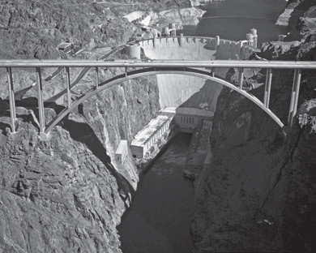{width="4.5093777340332455in"
> height="3.6075in"}
>
> It was also necessary to design a way to move the water from Lake Mead
> through the Hoover Dam. Engineers designed a series of intake tow- ers
> and penstocks that would pull water from the reservoir through 41 feet
> tunnels lined with 2 feet of concrete and massive thick plate steel
> pipes. The intake towers sat on ledges that were cut out of the canyon
> approximately 260 feet above the river bed in order to provide a basin
> for silt settling. The towers would be connected to tunnels that would
> drop 200 feet straight down and connect to a series of underground
> tunnels that flowed into the dam.
>
> On February 1, 1935, engineers began filling the Hoover Dam, and
> within two months the crest was reached. In less than five years, two
> years ahead of schedule, the Hoover Dam stood completed. The
> completion of the Hoover Dam was an engineering success the likes of
> which the world had never seen and it served as a symbol of hope for
> the people of the Great Depression. The Hoover Dam towers 726.4 feet
> above the bedrock, spans 1224 feet between the canyon walls, holds
> back 22.5 tons of pressure at the base of the dam, and weighs a
> staggering 6,600,000 tons (Fig. 13--10). Lake Mead became the largest
> man-made reservoir in the U.S., holding a massive
>
> 25.9 million ac-ft of water, stretching 110 miles upstream and
> covering 157,900 acres (USBR, 2006).
>
> The Hoover Dam has become an integral part of the Southwestern United
> States. The water stored behind its walls in Lake Mead is used daily
> to service 20 million people through domestic, industrial, and
> municipal purposes.
>
> **Figure 13--10** An aerial view of the completed
>
> Hoover Dam and Lake Mead.
>
> The water that surges through its 17 commercial generating units, with
> a 2078 MW capacity, supplies enough clean electricity to serve 1.3
> million people (USBR, 2006). As a flood control device, the Hoover Dam
> has been successful. While it cannot prevent every major flood event,
> it has helped to regulate the flow by alleviating flooding between
> February and June and drought between June and February.
>
> However, Hoover dam has also contributed to environmental degrada-
> tion. For example, flow regulation has disrupted wildlife habitats and
> fish migration patterns in the region. The dam has also trapped much
> of the sediment that used to flow downstream. This has increased
> erosion down- stream. Within nine years of operating, the thickness of
> the downstream riverbed decreased by more than four meters, lowering
> groundwater tables and threatening local wells and vegetation.
>
> **Glen Canyon Dam**
>
> After the construction of the Hoover Dam, the government needed to
> pro- vide a means with which water could be regulated to ensure that
> the Lower Basin and Upper Basin states would receive their rightful
> allotments of water. After negotiating with the Sierra Club regarding
> multiple dam sites, Congress authorized the Colorado River Storage Act
> on April 1956, which ensured the delivery of allotted water
> downstream. The construction of the Glen Canyon Dam in northern
> Arizona began on June 1960, and the final concrete was poured on
> September 1963. The Glen Canyon Dam towered over the landscape at 710
> feet tall, and created a reservoir, Lake Powell, with 26 million ac-ft
> of storage stretching over 186 miles of the Colorado River that took
> 17 years to fill. The Glen Canyon Dam is infamous for the serious
> environmental damage it has caused (www.usbr.org).
>
> David Brower, the executive director of the Sierra Club at the time of
> completion, called the Glen Canyon Dam "America's most regretted
> environmental mistake." In fact, Glen Canyon was one of the most beau-
> tiful canyons along the Colorado River before it was inundated with
> water (Fig. 13--11). Post-construction, numerous environmental
> concerns have arisen. For instance, under natural conditions the flow
> through the Grand Canyon would range between 3000 and 90,000 cubic
> feet per second and carry massive amounts of silt. Now that the Glen
> Canyon Dam is regulat- ing water flow, the annual flows range between
> 8000 and 20,000 cubic feet per second and are virtually sediment free
> (livingrivers.net). The natural high and fluctuating flows served as a
> conveyor of sediment to build beaches, rejuvenate and replenish the
> shorelines, as well as create sand- bars that supported calm,
> backwater areas for fish to utilize, while the low flows were
> essential in juvenile fish survival. Instead, the fluctuating, often
> lower, sediment-free flows seen erode the sand bars and allow
> vegetation to encroach upon areas that are not naturally vegetated.
> The disruption of this natural system has significantly impacted Grand
> Canyon National
>
> {width="4.497795275590551in"
> height="3.3733333333333335in"}
>
> Park where some species have become extinct and canyon flows have been
> reduced to a trickle.
>
> Sediment and flow issues are not the only environmental problems cre-
> ated by the Glen Canyon Dam. Because the reservoir is so deep, the
> water released from the lower portions of the reservoir exits the dam
> at fairly con- stant 47°F. The natural water temperature of the river
> flowing through the Grand Canyon should have a wide range, from nearly
> freezing in the winter to nearly 80°F in the summer. The natural
> temperature fluctuation is impor- tant in various biological processes
> which now must deal with extra stress.
>
> Glen Canyon Dam is wasteful of significant volumes of water each year.
> Lake Powell alone loses 2600 gallons of water per minute to
> infiltration in the canyon walls (www.usbr.gov), nearly 0.86 million
> ac-ft of water annually. While this is a small number when compared to
> Lake Powell's total capacity (around 3%), it constitutes nearly 6% of
> the river's annual flow, and together with Lake Mead the two
> reservoirs account for a 10% loss of flow (glencan- yon.org). In a
> region that relies heavily upon the Colorado River for multiple
> purposes, water lost to evaporation is simply unsustainable.
>
> In 1983, a greater than average snowmelt caused significant flooding
> upstream of Glen Canyon Dam. As upstream dams began releasing their
> flows, the Glen Canyon Dam became overwhelmed. Engineers opened the
> spillways on either side of the dam, but rumbling and shaking caused
> immense concern. Concrete, rebar, and sandstone flew out of the
> spillway tunnels at the base of the dam, but to avoid failure, the
> spillways had to
>
> **Figure 13--11** An aerial view of Glen Canyon
>
> inundated by Lake Powell behind Glen Canyon Dam.
>
> be kept open (Hannon, 2003). If Glen Canyon Dam were to have failed, a
> 580 ft wave would have overtopped Hoover Dam (Living Rivers, 2005).
> Some discussion has arisen about the removal of Glen Canyon Dam.
>
> Proponents argue that in the wake of the 1983 flood, dam failure is
> inevita- ble. Additionally, Hoover Dam has the capacity to provide the
> equivalent storage of Glen Canyon Dam. Removing the dam would
> alleviate multiple environment concerns and return a significant
> portion of the river back to its natural state. For the case of Glen
> Canyon Dam, the negative impacts may far outweigh the benefits
> provided by the dam.
>
> The Colorado River runs deep into the United States, both geologi-
> cally and historically. Initially the wild river impeded exploration
> and devel- opment of the Southwest, and without a reliable and
> controlled source of freshwater, the U.S. Southwest would likely
> remain a desolate and vast desert. Great engineering feats, such as
> the Hoover Dam, have allowed humans to tame the Colorado River and
> provide sources of freshwater to its inhabitants and to agricultural
> interests. However, the river must be carefully managed so that it is
> not overused to the point that floods, droughts, salinity, and other
> environmental impacts drive people away.

**13.4**

> **ACROSS THE POND---THE RIVER THAMES**
>
> The Thames River, one of the most famous in all of Europe, flows 205
> miles from the Thames Head, in the Cotswold Hills, through Southern
> England before emptying into the North Sea near London. It is the
> longest river in England and drains approximately 5500 square miles.
> The last 65 miles of the river are an estuary where the salt water
> fresh water barrier fluctuates daily. In London, the incoming tide can
> raise the river up to 7 meters during the spring, reversing its flow
> through the estuary (Encyclo- pedia Britannica, 2011).
>
> Historically, this river suffers from overuse and neglect. Runoff from
> waste and sewage has severely contaminated the river for decades, a
> prob- lem that has only recently been addressed by authorities. In
> addition, severe storms in the North Sea can inundate London with
> storm surge. Storm surge is the phenomena brought on by high winds and
> shallow bathymetry when a wall of water is pushed ahead of a storm and
> onto land. To combat these issues, engineers have constructed a series
> of water resource projects that mitigate the effects of contamination
> and flooding.
>
> Much of the early Victorian sewer network is still in use today for
> the movement of water and contaminants, but as London continues to
> grow, the system becomes ever more taxed. During heavy rains, the
> sewer system overflows, affecting plant and animal life and presenting
> a serious human health risk. The Thames Tideway Scheme is a project
> currently in progress that introduces two new storage-and-transfer
> tunnels as well as capacitance improvements to three wastewater
> treatment plants. The tunnels will reduce overflow into the River
> Thames and Lee, moving it to the treatment facilities instead. The
> Thames Tunnel is to be constructed between 2013 and 2020. It
>
> will be more than 20 miles long and 25 feet in diameter, flowing
> parallel to the River Thames. The tunnel is designed to remove 96% of
> the sewage entering the Thames annually (NRI, 2011).
>
> **Flooding and the Barrier**
>
> Floods on the River Thames often occur because of large storms,
> upstream flooding, extreme tidal movement, or severe storm surge. The
> combined effect of any of these can be catastrophic. In 1928, 14
> people died when all four causes occurred simultaneously (Encyclopedia
> Britannica, 2011). Snow- melt and unusually heavy rainfall coupled
> with spring tides and storm surge filled London's streets with four
> feet of water. Thousands of people lost their homes and the city's
> infrastructure was significantly damaged.
>
> In 1953, another major storm in the North Sea damaged the English
> coastline and sea walls. Floods carried entire structures out to sea,
> leaving 24,000 properties seriously damaged. In the United Kingdom,
> 300 people died because of the storm. These significant events, along
> with smaller ones, prompted the construction of the Thames Barrier,
> the world's second largest movable flood barrier (completed in 1982).
> Built downstream of London, it spans 1700 feet across, and protects
> over 33,000 acres from flooding (Envi- ronment Agency, 2011a).
>
> The Thames Barrier is made up of 10 steel gates, 65 feet high. There
> are two types of gates: falling radial gates and rising sector gates.
> The falling radial gates are situated above the non-navigable portions
> of the river while the rising sector gates rest on the river bed,
> allowing ship traffic to pass. The gates can be maneuvered into four
> positions: open, closed, under spill, and maintenance. The entire
> structure can be readied for flooding within 90 minutes (Environment
> Agency, 2011a).
>
> The flood barrier protects significant infrastructure, including his-
> torical landmarks, government buildings, businesses, schools,
> hospitals, etc. However, it leaves the entire downstream Thames
> estuary vulnerable to severe storms. Estuaries have significant
> capacity to store storm surge and help mitigate the effects of severe
> storms. In 2002, England established the Thames Estuary 2100 Plan, a
> flood risk management plan that takes into consideration climate
> change and socioeconomic change. The Plan would allow the river to
> reclaim its floodplain near the estuary to reduce the impacts of
> flooding in London (Environment Agency, 2011b). This non- structural
> alternative reflects opinions of water managers worldwide and is one
> effort to consider the true future impacts of climate change in
> Europe.
>
> Over the past one hundred years, global average surface temperatures
> have increased. The rate has accelerated since 1970 and 11 of the 12
> years between 1995 and 2006 were the warmest on record (Solomon et
> al., 2007). Despite ever-continuing arguments about whether climate
> change exists and whether this is a natural climatic shift, it is
> generally well-accepted that temperatures
>
> **13.5**
>
> **GLOBAL CLIMATE CHANGE**
>
> **AND WATER RESOURCES**
>
> **Figure 13--12** Variations in global mean temperatures over land and
> ocean between 1880
>
> and 2010.
>
> {width="4.508584864391951in"
> height="2.44in"}
>
> and weather patterns around the world are changing (Fig. 13--12).
> Glaciers are melting at extreme rates, storms are more intense, and
> dry spells in some parts of the world are unprecedented according to
> the IPCC (Solomon et al., 2007). The Intergovernmental Panel on
> Climate Change (IPCC) was estab- lished by the United Nations
> Environmental Programme and the World Meteorological Organization to
> provide the world with a scientific view of climate change and its
> potential socio-economic and environmental impacts. The IPCC reviews
> the work of thousands of scientists from the international pool of the
> best engineers, atmospheric scientists, chemists, physicists, etc. who
> voluntarily conduct research on climate change. The combined efforts
> of their research show that temperature increase and other weather
> patterns seem to
>
> correlate with increased atmospheric carbon, mostly from human
> sources.
>
> Conclusions drawn by the IPCC indicate that increases in land and sea
> surface temperature are already beginning to alter the hydrologic
> cycle. Higher temperatures lend to increased evaporation and higher
> water vapor content over oceans. Subsequently, weather systems are
> becoming larger and precipitation events more severe, even though
> annual precipitation is reduced. Such change presents a challenge to
> hydrologists when determining how to develop sustainable communities
> through water resource projects.
>
> **Interactions of Human and Natural Water Systems**
>
> Across the world, drought, exacerbated by increased populations, is
> taxing available freshwater resources. Rivers and aquifers that were
> once plentiful are no longer being fully recharged in the face of
> decreased annual precipita- tion. Countries, states, cities, and
> communities will argue or even go to war over the remaining resource.
> In response, authorities are continuously looking for ways to create
> long-term water storage. However, structural solutions, such as dams
> and their reservoirs, may do more harm than good in certain regions.
>
> Like the Glen Canyon Dam, many dams across the United States have
> severely impacted river systems and are being heavily protested. On
> the Elwha River, near Olympia in the state of Washington, the largest
> dam removal project in American history has begun in 2011 (Yardley,
> 2011). A 210-ft tall hydroelectric dam, built in 1912, has so greatly
> impacted the salmon population in the river that environmental groups
> have successfully litigated to condemn the dam. Its removal will
> hopefully bring back the salmon population in the river. Similarly,
> many of dams on the Columbia River system in the Pacific Northwest
> have potentially decimated salmon populations, but the 14
> hydroelectric dams on the river produce more hydro- electric power
> than on any other North American river (American Rivers, 2011). Water
> can yield incredible power, but often the negative environmen- tal
> impacts outweigh the economic benefits. Part of future water resources
> planning will be weighing the true costs and benefits of proposed
> projects. Thus, instead of the old traditional economic benefit/cost
> analysis used to analyze major dam and reservoir projects in the past,
> true environmental costs need to be more accurately measured.
>
> Internationally, dams are becoming ever larger and more impactful.
> Climate change and the eventual depletion of petroleum resources are
> con- tributing to a massive hunt for alternative sources of power for
> countries in Asia. China as a vast country has relatively abundant
> water resources and is ranked sixth in the world after Brazil, the
> Russian Federation, Canada, the United States, and Indonesia in terms
> of absolute amount of annual runoff. Figure 13--13 shows three major
> Chinese rivers: the Yellow River, the Yang- tze River, and the Mekong
> River. Due to the dominance of the monsoon climate, the temporal and
> spatial distribution of water resources is highly variable. Flooding
> as one of the major water problems in China has brought great
> attention from the government and public over the years.
>
> The Yangtze River flows for 3988 miles from the glacier on the Tibetan
> Plateau eastward across southwest, central, and eastern China before
> empty- ing into the East China Sea at Shanghai. It is the third
> longest river in the world behind the Nile and the Amazon. The Yangtze
> River's notorious floods in southern China have been recorded for
> millennia and have claimed more than 1 million lives in the past
> century. In order to control flooding and develop a future source of
> energy, China began constructing the Three Gorges Dam in 1994.
> Completed in 2006, at a cost of \$28 billion, the dam is 1 mile wide
> and more than 600 feet high and creates a reservoir hundreds of feet
> deep and nearly 400 miles long. Chinese authorities claim that the
> dam's hydropower turbines are able to create as much electricity as 18
> nuclear power plants. The project has been a source of pride for the
> government, but has aroused intense debate among scientists.
>
> While the gigantic dam has benefitted the region, there have also been
> a variety of issues since construction began in 1992. More than 1.4
> million people were forced to relocate and resettle. More than 1000
> towns and vil- lages were inundated by the reservoir, and landslides
> and pollution have
>
> 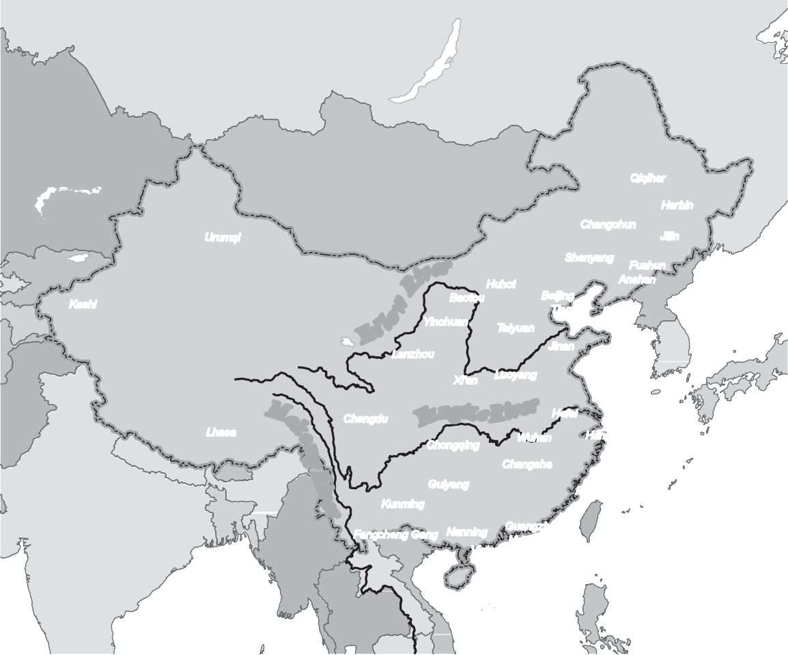**Figure 13--13**
>
> Major rivers of China: the Yellow, Yangtze, and Mekong Rivers.
>
> plagued areas near the dam since it was built. Additionally, the dam
> can cause rapid silt build-up in the reservoir, affecting both
> upstream and down- stream ecosystems of essential nutrients. In a rare
> admission, in 2011, the Chinese government stated that the Three
> Gorges Dam, the world's largest hydropower plant, is having "urgent
> problems" and warned of environmen- tal, construction, and migration
> "disasters" amid the worst drought to hit southern China in 50 years.
> The Chinese government also admitted the Three Gorges Dam has
> negatively impacted downstream river water, trans- port, and migration
> (Kent, 2011).
>
> In southern China, eight hydroelectric dams have been proposed on the
> Mekong River, which will be capable of storing half of the river's
> flow.
>
> Despite the incredible electric capacity of these dams, they have been
> heav- ily protested. After leaving China, the Mekong River flows for
> 2800 miles through Southeast Asia and into Cambodia and Vietnam,
> providing food to over 60 million people (Pearce, 2009). The potential
> political and environ- mental impacts of damming the Mekong River are
> huge. Not only will China have complete control over the flow of the
> river to its downstream neigh- bors, but the dam will greatly reduce
> the productivity of the fishing industry, the lifeline of these south
> Asian countries. The Tonle Sap, a tributary to the Mekong, is the
> world's second largest inland fishery. In summer, the Mekong's annual
> flood reverses the flow in the Tonle Sap contributing to its
> productivity. The Chinese dams have the capacity to forever destroy
> this ecosystem and its productivity.
>
> Often structures can exacerbate the impacts of natural disasters. For
> example, the Mekong River is located near a significant fault in
> central China. Engineers believe that the extreme weight of the water
> stored behind some of the dams can accelerate, if not cause,
> earthquakes along this fault. Whether this phenomenon, called induced
> seismicity, may have played a role in the 2008 earthquake in Sichuan
> China is highly disputed. Similarly, if a dam were to fail during an
> earthquake, the ensuing floods would be disastrous.
>
> The interaction between human and natural systems is significant when
> planning water resource projects. Not only can an ill-advised or
> insufficiently planned project negatively influence a resource, but
> may also encourage unsustainable development. In any given location,
> natural disasters can occur infrequently, but when they do, the impact
> is felt for years afterwards. As populations and communities continue
> to grow and expand, the number of people living and moving into
> vulnerable areas increases.
>
> **Sustainable Development and Coastal Areas**
>
> In coastal areas of the United States, 87 million people, or 29% of
> the U.S. population, live in coastal counties, a 40 million person
> increase since 1960 (Wilson and Fischetti, 2010). In any given year, a
> hurricane could destroy much of the infrastructure along the coast.
> Scientists now have the ability to predict extreme events and often
> give communities the lead-time they need to evacuate or find shelter
> (Chapter 12). However, coastal community resil- iency still baffles
> engineers especially in the face of climate change, sea level rise,
> and increased storm severity. The IPCC has openly published that since
> the 1970s the potential destructiveness of hurricanes has increased,
> trending toward longer and more intense storms. Water resource
> planners must find innovative new ways to protect coastal communities
> that are often a combi- nation of structural and non-structural
> solutions.
>
> As we continually encroach on the natural system, man-made environ-
> mental disasters become more prevalent. The residual effects of such
> disas- ters can impact water resource systems for years afterward.
> Large oil spills, such as Exxon Valdez, 1989, and the BP Oil Spill,
> 2010, had huge short-term
>
> environmental and economic impacts, but the long-term impacts of these
> events are often overlooked. The numbers of fish, birds, and other
> wildlife, as well as the marshes and beaches, effected by oil spills
> are enormous and the costs of the permanent cleanup astronomical. Such
> major events receive more attention than the smaller spills of heavy
> metals, organic chemicals, and fertilizers, but these spills can have
> lasting impacts on water supply sys- tems, both surface and
> groundwater. Economic activities to support popula- tion growth can
> potentially play a huge role in the future quality of our water
> resources and our ability to provide for future generations.
>
> Dams that destroy entire ecosystems, major spills and leaks, and
> global warming that puts the world as we know it at risk, if nothing
> else, have shown that there is a limit to how much the natural system
> can be abused before the impacts are irreversible. Until recently that
> limit seemed unattainable, but as populations keep growing, the
> carrying capacity of the earth will even- tually be reached. Future
> water resource projects must be developed in a way that is sustainable
> so as not to permanently destroy our access to water. Sustainable
> development, "development that meets the needs of current generations
> without compromising the ability of future generations to meet their
> own needs" (United Nations, 2009), is a concept that has recently
> emerged as a necessary component of water resources planning.
> Sustainability is often referred to as a three-legged stool on which
> our continued and future existence sits. Each leg represents one area
> of sustainability: economic, social, and envi- ronmental. The
> interactions of these three areas and the balance act required
>
> to sit levelly on the stool determine how sustainable a project or a
> lifestyle is.
>
> As discussed in previous sections, some projects are completed without
> due consideration of all associated impacts. The over-allocation of
> water resources to bourgeoning populations in developing countries
> will only fur- ther damage the environment and lead to political
> upheaval. According to the critically acclaimed book *Collapse*
> (Diamond, 2005), peaking popula- tions, coupled with climate change
> and a decrease in available water sup- plies, led to the Mayans demise
> hundreds of years ago. Similarly, unsustainable and uncontained growth
> may trigger the collapse of modern societies, as in many of the
> drought-ridden areas of Africa and the flood- prone and contaminated
> regions of India. In the future, it will be extremely important for
> engineers and water planners to conscientiously evaluate the impact of
> a project from an overall sustainability point of view.
>
> **REFERENCES** American Rivers, 2011, "Dam Removal: Frequently Asked
> Questions (FAQs)." Ac- cessed August 10, 2011,
> \<<http://www.americanrivers.org/our-work/restoring-rivers/>
> dams/background/faqs.html\>.
>
> A[r]{.smallcaps}d[i]{.smallcaps}s, A. F., and L.
> F[ahlqui]{.smallcaps}s[t]{.smallcaps}, 2004, "Quality of Water in the
> Trinity and Edwards Aquifers, South-Central Texas 1996--98," *U.S.
> Geological Survey Scientific Inves- tigations Report*, pp. 1--17.
>
> As[hley]{.smallcaps}, S. T., and W. S. As[hley]{.smallcaps}, 2008,
> "Flood Fatalities in the United States," *J. Appl. Meteor. Climatol.,
> 47*(3), pp. 805--818.
>
> C[arriquiry]{.smallcaps}, J. D., and A. S[anchez]{.smallcaps}, 1999,
> "Sedimentation in the Colorado River Delta and Upper Gulf of
> California after Nearly a Century of Discharge Loss*,*" *Mar. Geol.*,
> 158(1), pp. 125--145.
>
> *Construction of Hoover Dam.* Las Vegas: KC Publications, 1976. Print.
>
> D[iam]{.smallcaps}o[n]{.smallcaps}d, J, 2005, *Collapse: How Societies
> Choose to Fail or Succeed,* Penguin, New York.
>
> Do[nahue]{.smallcaps}, J., and I, K[laver]{.smallcaps}, 2005, "Who's
> Water Is It Anyway? Boundary Nego- tiations on the Edwards Aquifer in
> Texas," *Globalization, Water, and Health*, L. Whiteford and S.
> Whiteford (Eds.), School of American Research Press, Sante Fe, pp.
> 107--126.
>
> E[arl]{.smallcaps}, R. A., and T. H. Vo[tteler]{.smallcaps}, 2005,
> "Major Water Issues Facing South-Central Texas," *Water for Texas*,
> Giardino, John R., Krishnamurthy, Sushma, and Nor- wine, Jim (Eds.),
> Texas A&M University Press, College Station, pp. 75--88.
>
> Ec[khar]{.smallcaps}d[t]{.smallcaps}, G., 2011, *The Edwards Aquifer
> Website*. Accessed August 10, 2011,
>
> \<<http://www.edwardsaquifer.net/>\>.
>
> Edwards Aquifer Authority (EAA), 2011, Accessed August 10, 2011,
> \<http:// edwardsaquifer.org/\>.
>
> Encyclopædia Britannica, 2011, "River Thames," *Encyclopædia
> Britannica. Ency- clopædia Britannica Online Academic Edition*.
> Accessed August 9, 2011. \<http://
> [www.britannica.com.ezproxy.rice.edu/EBchecked/topic/589890/River-Thames](http://www.britannica.com.ezproxy.rice.edu/EBchecked/topic/589890/River-Thames)\>.
>
> Environment Agency, 2011a, "The Thames Barrier." Accessed August 15,
> 2011.
>
> \<<http://www.environment-agency.gov.uk/>\>.
>
> Environment Agency, 2011b, "Thames Estuary 2100." Accessed August 15,
> 2011.
>
> \<<http://www.environment-agency.gov.uk/>\>.
>
> F[ra]{.smallcaps}d[kin]{.smallcaps}, P. L., 1996, *A River No More:
> The Colorado River and the West,* University of California Press,
> Berkeley, CA.
>
> H[ann]{.smallcaps}o[n]{.smallcaps}, S., 2003, "The 1983 Flood at Glen
> Canyon," Glen Canyon Institute. Ac- cessed August 11, 2011.
> \<<http://www.glencanyon.org/publications/hiddenpassage/>
> hp2stev.php\>.
>
> K[ent]{.smallcaps}, Jo L[ing]{.smallcaps}, 2011, "China Admits Three
> Gorges Dam Has 'urgent Problems' as Drought Persists," CNN, 25 May
> 2011. Accessed August 11, 2011. \<[http://articles.](http://articles/)
> cnn.com/2011-05-25/world/china.three.gorges.dam_1\_three-gorges-dam-worst-
> drought-yangtze?\_s=PM:WORLD\>.
>
> Lower Colorado River Authority (LCRA), 2011, "Texas Drought: Drought
> Shows No Sign of Breaking." Accessed August 10, 2011.
> \<<http://www.lcra.org/water/> drought/index.html\>.
>
> Lo[ring]{.smallcaps}, K[yle]{.smallcaps} A., 2004, "National
> Reclamation Act of 1902," *Major Acts of Congress*.
> *Encyclopedia.com.* Accessed August 9, 2011
> \<[http://www.encyclopedia.com](http://www.encyclopedia.com/)\>.
>
> Living Rivers, July 2005, "The One-Dam Solution." Print. Preliminary
> report to the Bureau of Reclamation on proposed reoperation strategies
> for Glen Canyon and Hoover Dam under low water conditions.
>
> National Climatic Data Center (NCDC), 2003, "North American Drought: A
> Paleo Perspective," NOAA Paleoclimatology Program, 12 Nov. 2003.
> Accessed August 10, 2011.
> \<<http://www.ncdc.noaa.gov/paleo/drought/drght_home.html>\>.
>
> P[earce]{.smallcaps}, F., 2009, "The Damming of the Mekong: Major Blow
> to an Epic River," *Yale Environment 360*. Accessed August 10, 2011.
> \<<http://e360.yale.edu/content/> feature.msp?id=2162\>.
>
> P[urpura]{.smallcaps}, J. et al., 2011, "Disastrous River Flooding:
> June 30--July 17, 2002," Na- tional Oceanic and Atmospheric
> Association (NOAA). Accessed August 10, 2011.
>
> \<<http://www.srh.noaa.gov/crp/?n=flood-july02>\>.
>
> San Antonio River Authority (SARA), 2011. Accessed August 10, 2011.
> \<http:// [www.sara-tx.org/](http://www.sara-tx.org/)\>.
>
> San Antonio Water System (SAWS), 2011, Accessed August 10, 2011.
> \<[http://saws.](http://saws/) org/\>.
>
> So[l]{.smallcaps}o[m]{.smallcaps}o[n]{.smallcaps}, S., D.
> Q[in]{.smallcaps}, M. M[anning]{.smallcaps}, Z. [chen]{.smallcaps}, M.
> M[arqui]{.smallcaps}s, K. B. A[veryt]{.smallcaps}, M.
> T[ign]{.smallcaps}o[r]{.smallcaps}, and H. L. M[iller]{.smallcaps}
> (Eds.), 2007, *Contribution of Working Group I to the Fourth
> Assessment Report of the Intergovernmental Panel on Climate Change,
> 2007*, [c]{.smallcaps}am- bridge University Press,
> [c]{.smallcaps}ambridge.
>
> Net Resources International (NRI), 2011, "Thames Tideway Project,
> London," *Water-technology.net*. Accessed August 15, 2011.
> \<http://www.water-technology. net/projects/thameswater/\>.
>
> United Nations*,* World [c]{.smallcaps}ommission on Environment and
> Development (W[c]{.smallcaps}ED), 2009, *Our Common Future*. Oxford
> University Press, Oxford.
>
> U.S. Bureau of Reclamation, 2006, *Reclamation: Managing Water in the
> West: Hoover Dam.* \[Boulder [c]{.smallcaps}ity, Nev.\]: U.S. Dept. of
> the Interior, Bureau of Reclamation, Lower [c]{.smallcaps}olorado
> Region.
>
> U.S. Department of [c]{.smallcaps}ommerce, NOAA, and NWS, 1999,
> *Service Assessment South Texas Floods October 17--22, 1998*. By
> William Daley. Print.
>
> W[il]{.smallcaps}so[n]{.smallcaps}, G. S[teven]{.smallcaps}, and
> T[h]{.smallcaps}o[ma]{.smallcaps}s R.
> F[i]{.smallcaps}s[chetti]{.smallcaps}, 2010, "[c]{.smallcaps}oastline
> Population Trends in the United States: 1960 to 2008." U.S.
> [c]{.smallcaps}ensus Bureau, May 2010.
>
> Y[ar]{.smallcaps}d[ley]{.smallcaps}, W, 2011, "Removing Barriers to
> Salmon Migration," *The New York Times*. 29 June 2011. Accessed August
> 10, 2011. \<<http://www.ipcc.ch/organization/orga->
> nization_history.shtml\>.
>
> Appendix A

# Symbols and Notation

+-------+--------------------------+-------+--------------------------+
| >     | > **Definition**         | >     | > **Definition**         |
| **Sym |                          | **Sym |                          |
| bol** |                          | bol** |                          |
+=======+==========================+=======+==========================+
| > *A  | > cross-sectional area   | > *   | > median raindrop        |
| > A   | > of channel drainage    | D*~0~ | > diameter depression    |
| > A*  | > area                   | >     | > storage                |
| > ADI | >                        | > *   | >                        |
| > API | > loss rate              | d~p~* | > direct runoff          |
| >     | >                        | > DRH | > hydrograph direct      |
| >     | > alternating direction  | > DRO | > runoff evaporation     |
|  A*~r | > implicit method        | > *E* | >                        |
| ~*(H) | > antecedent             | >     | > specific energy vapor  |
| >     | > precipitation index    | > *E* | > pressure               |
| >     | > surface area of        | >     | >                        |
| A*~T~ | > detention basin as a   | > *e  | > expectation, mean,     |
| > B   | >                        | >     | > first moment vapor     |
| > B*  | > function of head total | E(x)* | > pressure of air        |
| >     | > area                   | >     | >                        |
| > *b  | >                        | >     | > saturation vapor       |
| > b   | > channel top width      | *e~a~ | > pressure               |
| > b*' | >                        | >     | > evapotranspiration     |
| > *BF | > time of fall (SCS unit | e~s~* | >                        |
| > C   | > hydrograph) aquifer    | > ET  | > field capacity         |
| > C*  | > thickness              | > *F  | > infiltration volume    |
| >     | >                        | > F*  | >                        |
| > *c  | > bottom width of        | >     | > infiltration capacity  |
| > C*  | > channel thickness of   | > *f* | > or rate cumulative     |
| >     | > aquitard baseflow      | >     | > density function       |
| >     | >                        | > *   | > probability density    |
| *C*~0 | > Chezy coefficient      | F(x)* | > function normal CDF    |
| ~,*C* | > runoff coefficient     | >     | >                        |
| ~1~,* | > wave celerity          | > *f  | > ultimate infiltration  |
| C*~2~ | >                        | >     | > capacity frictional    |
| >     | > radar design constant  |  (x)* | > force gravitational    |
| > CDF | > Muskingum constants    | >     | > force hydrostatic      |
| > CN  | > cumulative density     | > *   | > force                  |
| >     | > function SCS runoff    | F(z)* | >                        |
| >     | > curve number Snyder's  | >     | > initial infiltration   |
| *C~p~ | > storage coefficient    | >     | > capacity Froude number |
| >     | > skew coefficient       | *f~c~ | >                        |
|  Cs*1 | >                        | >     | > mean field bias        |
| >     | > Snyder's timing        |  F~f~ | > correction ground      |
| *C~t~ | > coefficient            | >     | > water flow             |
| > CV* | > coefficient of         |  F~G~ | >                        |
| >     | > variation weir         | >     | > skew                   |
| >     | > coefficient            | F~H~* | >                        |
| *C~w~ | >                        | >     | > gage rainfall          |
| > D D | > duration of unit       | > *   | > accumulations          |
| > D*  | > hydrograph Muskingum   | f*~0~ | > subsurface seepage to  |
| >     | > constant rainfall      | > *Fr | > ground water           |
| > *d  | > duration               | > FRM | >                        |
| > D   | >                        | > G*  | > flow                   |
| > D*  | > distance to water      | >     | >                        |
| >     | > divide diameter of     | > *g* | > heat storage relative  |
| >     | > raindrops              | >     | > humidity total head    |
|  *dBZ | >                        | >     | >                        |
| >     | > average difference     |  G~i~ | > head                   |
| D*~c~ | > between gage and radar | >     | >                        |
| > DHM | > rainfall accumulation  | >     | > flow depth             |
| >     | >                        |  *GW* | >                        |
| >     | > decibels of radar      | >     | > change in water        |
| *D~i~ | > reflectance circular   | > *H  | > surface elevation      |
| >     | > channel diameter melt  | > H   | > through bridge         |
| Dmax* | > coefficient            | > H*  | >                        |
|       | >                        | >     | > head loss              |
|       | > diameter of size of    | > *h  | >                        |
|       | > category *i*           | > h   | > weir crest elevation   |
|       | >                        | >     |                          |
|       | > maximum raindrop       | H*~3~ |                          |
|       | > diameter               | >     |                          |
|       |                          | >     |                          |
|       |                          | *h~l~ |                          |
|       |                          | >     |                          |
|       |                          | h*~0~ |                          |
+-------+--------------------------+-------+--------------------------+

> **765**
>
> **766** Appendix A

+-----+-------------------------+--------+---------------------------+
| > * | > **Definition**        | > **Sy | > **Definition**          |
| *Sy |                         | mbol** |                           |
| mbo |                         |        |                           |
| l** |                         |        |                           |
+=====+=========================+========+===========================+
| >   | > heat index            | >      | > number of raindrops in  |
| *I* |                         | *N~i~* | > size category *i*       |
+-----+-------------------------+--------+---------------------------+
| >   | > inflow                |        | > per unit volume         |
| *I* |                         |        |                           |
+-----+-------------------------+--------+---------------------------+
| >   | > percent               | >      | > monthly daylight        |
| *I* | > imperviousness        | *N~m~* | > adjustment factor       |
+-----+-------------------------+--------+---------------------------+
| >   | > natural piezometric   | >      | > number of drops at      |
| *i* | > slope                 | *N*~0~ | > diameter zero           |
+-----+-------------------------+--------+---------------------------+
| >   | > rainfall intensity    | > *O*  | > outflow                 |
| *i* |                         |        |                           |
+-----+-------------------------+--------+---------------------------+
| >   | > instantaneous inflow  | > *P*  | > pressure                |
| *i( |                         |        |                           |
| t)* |                         |        |                           |
+-----+-------------------------+--------+---------------------------+
| >   | > initial abstraction   | > *P*  | > precipitation           |
| *I~ |                         |        |                           |
| a~* |                         |        |                           |
+-----+-------------------------+--------+---------------------------+
| >   | > inten                 | > *P*  | > wetted perimeter        |
| IDF | sity-duration-frequency |        |                           |
+-----+-------------------------+--------+---------------------------+
| >   | > rainfall excess       | > *p*  | > probability             |
| *i~ |                         |        |                           |
| e~* |                         |        |                           |
+-----+-------------------------+--------+---------------------------+
| >   | > instantaneous unit    | > *P(  | > probability of *X~i~*   |
| IUH | > hydrograph            | X~i~)* |                           |
+-----+-------------------------+--------+---------------------------+
| >   | > solar constant        | > PDF  | > probability density     |
| *J* |                         |        | > function                |
| ~0~ |                         |        |                           |
+-----+-------------------------+--------+---------------------------+
| >   | > conveyance factor     | >      | > effective runoff        |
| *K* |                         | *P~e~* |                           |
+-----+-------------------------+--------+---------------------------+
| >   | > hydraulic             | > PE   | > potential evaporation   |
| *K* | > conductivity          |        | > over a                  |
+-----+-------------------------+--------+---------------------------+
| >   | > routing parameter     |        | > 10-day period           |
| *K* |                         |        |                           |
+-----+-------------------------+--------+---------------------------+
| >   | > intrinsic             | > PET  | > potential               |
| *k* | > permeability          |        | > evapotranspiration      |
+-----+-------------------------+--------+---------------------------+
| >   | > kinematic flow number | > PMF  | > probability mass        |
| *k* |                         |        | > function                |
+-----+-------------------------+--------+---------------------------+
| >   | > vertical hydraulic    | >      | > radar-measured power    |
|  *K | > conductivity          | *P~r~* |                           |
| *\' |                         |        |                           |
+-----+-------------------------+--------+---------------------------+
|     | > of aquitard           | > *Q*  | > outflow                 |
+-----+-------------------------+--------+---------------------------+
| >   | > capillary             | > *q*  | > flow per unit thickness |
| *K* | > conductivity          |        |                           |
| (Ө) |                         |        |                           |
+-----+-------------------------+--------+---------------------------+
| >   | > diffusion equation    | > *q*  | > infiltration rate       |
| *K* | > constant              |        |                           |
| ~1~ |                         |        |                           |
+-----+-------------------------+--------+---------------------------+
| >   | > hydraulic             | >      | > recharge or pumping at  |
| *K~ | > conductivity at       | *Q*(*i | > node (*i, j*)           |
| s~* |                         | *,*j*) |                           |
+-----+-------------------------+--------+---------------------------+
|     | > saturation            | >      | > inflow                  |
|     |                         | *Q*~1~ |                           |
+-----+-------------------------+--------+---------------------------+
| >   | > Kolmogorov-Smirnov    | >      | > outflow                 |
|  KS | > statistic at          | *Q*~2~ |                           |
+-----+-------------------------+--------+---------------------------+
|     | > confidence level      | >      | > channel flow            |
|     | > alpha                 | *Q~c~* |                           |
+-----+-------------------------+--------+---------------------------+
| >   | > horizontal hydraulic  | >      | > direct solar radiation  |
| *K~ | > conductivity          | *Q~d~* |                           |
| x~* |                         |        |                           |
+-----+-------------------------+--------+---------------------------+
| >   | > vertical hydraulic    | >      | > energy of evaporation   |
| *K~ | > conductivity          | *Q~e~* |                           |
| z~* |                         |        |                           |
+-----+-------------------------+--------+---------------------------+
| >   | > channel length        | >      | > sensible heat transfer  |
| *L* |                         | *Q~h~* |                           |
+-----+-------------------------+--------+---------------------------+
| >   | > distance to wetting   | >      | > inflow                  |
| *L* | > front                 | *Q~i~* |                           |
+-----+-------------------------+--------+---------------------------+
| >   | > evaporation capacity  | >      | > net radiation           |
| *L* |                         | *Q~N~* |                           |
+-----+-------------------------+--------+---------------------------+
| >   | > lag time              | >      | > daily radiation at top  |
| *L* |                         | *Q~O~* | > of atmosphere           |
+-----+-------------------------+--------+---------------------------+
| >   | > loss rate             | >      | > overland flow           |
| *L* |                         | *q*~0~ |                           |
+-----+-------------------------+--------+---------------------------+
| >   | > attenuation loss      | > QOBS | > observed hydrograph     |
| *L* |                         |        | > ordinate                |
+-----+-------------------------+--------+---------------------------+
| >   | > latent heat of        |        | > at time *i*             |
| *L~ | > condensation          |        |                           |
| c~* |                         |        |                           |
+-----+-------------------------+--------+---------------------------+
| >   | > length along channel  | >      | > peak flow               |
| *L~ | > to point              | *Q~P~* |                           |
| c~* |                         |        |                           |
+-----+-------------------------+--------+---------------------------+
|     | > nearest centroid of   | >      | > peak flow rate for      |
|     | > area                  | *Q~T~* | > *T*-yr flood            |
+-----+-------------------------+--------+---------------------------+
| >   | > length to centroid of | >      | > discharge at time *t*   |
|  *L | > drainage area         | *q~t~* |                           |
| ca* |                         |        |                           |
+-----+-------------------------+--------+---------------------------+
| >   | > latent heat of        | >      | > advected energy of      |
| *L~ | > vaporization          | *Q~v~* | > inflow and              |
| e~* |                         |        |                           |
+-----+-------------------------+--------+---------------------------+
| >   | > latent heat of        |        | > outflow                 |
| *L~ | > freezing              |        |                           |
| f~* |                         |        |                           |
+-----+-------------------------+--------+---------------------------+
| >   | > latent heat of        | > *R*  | > Bowen ratio             |
| *L~ | > melting               |        |                           |
| m~* |                         |        |                           |
+-----+-------------------------+--------+---------------------------+
| >   | > infiltration storage  | > *R*  | > hydraulic radius        |
| *L~ |                         |        |                           |
| s~* |                         |        |                           |
+-----+-------------------------+--------+---------------------------+
| >   | > daily snowmelt        | > *R*  | > recharge                |
| *M* |                         |        |                           |
+-----+-------------------------+--------+---------------------------+
| >   | > rate of heat storage  | > *R*  | > surface runoff          |
| *M* |                         |        |                           |
+-----+-------------------------+--------+---------------------------+
| >   | > mass                  | > *r*  | > radius                  |
| *m* |                         |        |                           |
+-----+-------------------------+--------+---------------------------+
| >   | > minimum interevent    | > *r*  | > range to radar target   |
| MIT | > time                  |        |                           |
+-----+-------------------------+--------+---------------------------+
| >   | > effective roughness   | > *R*  | > rainfall rate           |
| *N* |                         |        |                           |
+-----+-------------------------+--------+---------------------------+
| >   | > Manning's roughness   | >      | > radius of core sample   |
| *n* | > coefficient           | *r~c~* |                           |
+-----+-------------------------+--------+---------------------------+
| >   | > porosity              | > *RD* | > relative dispersion     |
| *n* |                         |        |                           |
+-----+-------------------------+--------+---------------------------+

> Symbols and Notation **767**

+------+-----------------------+----------+---------------------------+
| > ** | > **Definition**      | > **     | > **Definition**          |
| Symb |                       | Symbol** |                           |
| ol** |                       |          |                           |
+======+=======================+==========+===========================+
| > RF | > rainfall            | > *w*    | > channel width           |
+------+-----------------------+----------+---------------------------+
| > *R | > radar rainfall      | > *W(u)* | > well function           |
| ~i~* | > accumulations       |          |                           |
+------+-----------------------+----------+---------------------------+
| >    | > root mean square    | > *WS*   | > water surface elevation |
|  RMS |                       |          |                           |
+------+-----------------------+----------+---------------------------+
| > RO | > runoff              | > *X*    | > event                   |
+------+-----------------------+----------+---------------------------+
| > *R | > average albedo      | > *x*    | > horizontal distance     |
| ~s~* |                       |          |                           |
+------+-----------------------+----------+---------------------------+
| >    | > channel slope       | > *x*    | > Muskingum weighting     |
|  *S* |                       |          | > factor                  |
+------+-----------------------+----------+---------------------------+
| >    | > energy gradient     | > *X~i~* | > *i*th possible outcome  |
|  *S* |                       |          |                           |
+------+-----------------------+----------+---------------------------+
| >    | > potential           | > *x~m~* | > median                  |
|  *S* | > abstraction         |          |                           |
+------+-----------------------+----------+---------------------------+
| >    | > storage             | > *y*    | > average watershed slope |
|  *S* |                       |          |                           |
+------+-----------------------+----------+---------------------------+
| >    | > storativity         | > *y*    | > depth                   |
|  *S* |                       |          |                           |
+------+-----------------------+----------+---------------------------+
| >    | > slope               | > *y~c~* | > critical depth          |
|  *S* |                       |          |                           |
+------+-----------------------+----------+---------------------------+
| > *  | > drawdown            | > *y~n~* | > normal depth            |
| s*\' |                       |          |                           |
+------+-----------------------+----------+---------------------------+
| > *  | > average capillary   | > *y*~0~ | > average depth of        |
| Sav* | > suction             |          | > overland flow           |
+------+-----------------------+----------+---------------------------+
| > *S | > critical slope      | > *z*    | > elevation               |
| ~c~* |                       |          |                           |
+------+-----------------------+----------+---------------------------+
| > *S | > soil moisture       | > *z*    | > horizontal dimension    |
| ~D~* | > storage             |          | > for side slope of       |
+------+-----------------------+----------+---------------------------+
| > *S | > friction slope      |          | > a channel               |
| ~f~* |                       |          |                           |
+------+-----------------------+----------+---------------------------+
| > S  | > melt rate           | > *z*    | > standard normal variate |
| MELT |                       |          |                           |
+------+-----------------------+----------+---------------------------+
| > *S | > channel slope       | > *Z*    | > radar reflectivity      |
| *~0~ |                       |          |                           |
+------+-----------------------+----------+---------------------------+
| > *S | > overland slope      | > z*i*   | > thickness of layer *i*  |
| *~0~ |                       |          |                           |
+------+-----------------------+----------+---------------------------+
| > *S | > specific storage    | > l      | > wavelength              |
| ~s~* |                       |          |                           |
+------+-----------------------+----------+---------------------------+
| > *S | > standard deviation  | > l      | > exponential             |
| ~x~* | > of *x*              |          | > distribution parameter  |
+------+-----------------------+----------+---------------------------+
| >    | > return period       | > Г      | > gamma function          |
|  *T* |                       |          |                           |
+------+-----------------------+----------+---------------------------+
| >    | > temperature         | > ∂      | > related to median       |
|  *T* |                       |          | > raindrop size and       |
+------+-----------------------+----------+---------------------------+
| >    | > transmissivity      |          | > rainfall rate           |
|  *T* |                       |          |                           |
+------+-----------------------+----------+---------------------------+
| >    | > transpiration       | > a      | > kinematic wave          |
|  *T* |                       |          | > coefficient             |
+------+-----------------------+----------+---------------------------+
| >    | > time                | > a      | > attenuation factor      |
|  *t* |                       |          |                           |
+------+-----------------------+----------+---------------------------+
| > *T | > temperature of      | > a      | > compressibility of      |
| ~a~* | > saturated air       |          | > aquifer material        |
+------+-----------------------+----------+---------------------------+
| > *T | > duration of flood   | > a      | > conveyance factor       |
| ~B~* | > wave                |          |                           |
+------+-----------------------+----------+---------------------------+
| > *T | > time base of        | > a      | > Gumbel distribution     |
| ~b~* | > hydrograph          |          | > parameter               |
+------+-----------------------+----------+---------------------------+
| > *t | > time of             | > b      | > compressibility of      |
| ~c~* | > concentration       |          | > fluid                   |
+------+-----------------------+----------+---------------------------+
| > *T | > dewpoint            | > g      | > psychometric constant   |
| ~d~* | > temperature         |          |                           |
+------+-----------------------+----------+---------------------------+
| > *t | > time to peak        | > g      | > Gumbel distribution     |
| ~p~* |                       |          | > constant (Euler's       |
+------+-----------------------+----------+---------------------------+
| > *T | > time of rise        |          | > constant)               |
| ~R~* |                       |          |                           |
+------+-----------------------+----------+---------------------------+
| >    | > wave velocity       | > g      | > specific weight of      |
|  *u* |                       |          | > water                   |
+------+-----------------------+----------+---------------------------+
| > (* | > weighting function  | > m      | > dynamic viscosity       |
| t* - |                       |          |                           |
| > t) |                       |          |                           |
+------+-----------------------+----------+---------------------------+
| > UH | > unit hydrograph     | > m      | > mean value              |
+------+-----------------------+----------+---------------------------+
| >    | > average velocity    | > u      | > volumetric moisture     |
|  *V* |                       |          | > content                 |
+------+-----------------------+----------+---------------------------+
| >    | > total volume        | > r      | > fluid density           |
|  *V* |                       |          |                           |
+------+-----------------------+----------+---------------------------+
| >    | > velocity            | > r~b~   | > bulk density            |
|  *v* |                       |          |                           |
+------+-----------------------+----------+---------------------------+
| >    | > variance, second    | > r~m~   | > density of moist air    |
| Var( | > moment              |          |                           |
| *x*) |                       |          |                           |
+------+-----------------------+----------+---------------------------+
| > *V | > rainfall velocity   | > r~w~   | > vapor density           |
| ~D~* |                       |          |                           |
+------+-----------------------+----------+---------------------------+
| > *V | > seepage velocity    | > s      | > standard deviation      |
| ~s~* |                       |          |                           |
+------+-----------------------+----------+---------------------------+
| >    | > recharge intensity  | > s2     | > variance                |
|  *W* |                       |          |                           |
+------+-----------------------+----------+---------------------------+
| >    | > weight              | > t      | > incremental time unit   |
|  *W* |                       |          |                           |
+------+-----------------------+----------+---------------------------+
| >    | > width of overland   | > T      | > stream function         |
|  *W* | > flow                |          |                           |
+------+-----------------------+----------+---------------------------+

> Appendix B

# Conversion Factors

+-----------------------+--------+-----------+------+-----------------+
| > **Multiply the SI   |        | > **by**  | >    |                 |
| > Unit**              |        |           | **To |                 |
|                       |        |           | > Ob |                 |
|                       |        |           | tain |                 |
|                       |        |           | >    |                 |
|                       |        |           |  the |                 |
|                       |        |           | >    |                 |
|                       |        |           | U.S. |                 |
|                       |        |           | > C  |                 |
|                       |        |           | usto |                 |
|                       |        |           | mary |                 |
|                       |        |           | > Un |                 |
|                       |        |           | it** |                 |
+=======================+========+===========+======+=================+
| > **Name**            | > **Sy |           | > ** | > **Name**      |
|                       | mbol** |           | Symb |                 |
|                       |        |           | ol** |                 |
+-----------------------+--------+-----------+------+-----------------+
| > Energy              | > kJ J | > 0.9478  | >    | > British       |
| >                     | > J J  | >         |  Btu | > thermal unit  |
| > Kilojoule Joule     | > J    | > 2.7778  | >    | > kilowatt-hour |
| > Joule Joule Joule   | >      | > \*      | kW-h | >               |
| >                     | >      | > 10^-7^  | > ft | > foot-pound    |
| > Flow                | m^3^/s | >         | -lb* | > (force)       |
| >                     | >      | > 0.7376  | ~f~* | > watt-second   |
| > Cubic meter/second  | m^3^/s | >         | >    | > calorie       |
| > Cubic meter/second  | >      | > 1.0000  |  W-s | >               |
| >                     | > N    | >         | >    | > cubic         |
| > Force               | >      | > 0.2388  |  cal | > feet/second   |
| >                     | > g g  | >         | >    | > million       |
| > Newton Mass         | > kg   | > 35.315  | >    | > gallons/day   |
| >                     | >      | >         |  cfs | >               |
| > Gram Gram Kilogram  | > kW   | > 22.824  | >    | > pound force   |
| >                     | >      | >         |  MGD | >               |
| > Power               | > kW W | > 0.2248  | >    | > ounce pound   |
| >                     | >      | >         | > lb | > pound         |
| > Kilowatt            | > Pa   | > 0.0353  | >    | >               |
| >                     | > (N   | >         | > oz | > British       |
| > Kilowatt Watt       | /m^2^) | > 0.0022  | > lb | > thermal units |
| >                     | > Pa   | >         | > lb | > per second    |
| > Pressure            | > (N   | > 2.2046  | >    | >               |
| > (force/area)        | /m^2^) | >         | > B  | > horsepower    |
| >                     | >      | > 0.9478  | tu/s | >               |
| > pascal (newtons per | > Pa   | >         | > hp | > foot-pounds   |
| > square meter)       | > (N   | > 1.3410  | >    | > (force) per   |
| > pascal              | /m^2^) | >         | >    | > second        |
| >                     | > Pa   | > 0.7376  | ft-l | >               |
| > pascal pascal       | > (N   | >         | b*~f | > pounds        |
| > pascal              | /m^2^) | > 1.4504  | ~*/s | > (force) per   |
| >                     | > Pa   | > \*      | >    | > square inch   |
| > kilopascal          | > (N   | > 10^-4^  | > l  | >               |
| > (kilonewtons per    | /m^2^) | >         | b*~f | > pounds        |
| > square meter)       | > kPa  | > 2.0885  | ~*/i | > (force) per   |
| >                     | > (kN  | > \*      | n^2^ | > square foot   |
| > Velocity            | /m^2^) | > 10^-2^  | > l  | >               |
| >                     | >      | >         | b*~f | > inches of     |
| > kilometers per      | > km/s | > 2.9613  | ~*/f | > mercury       |
| > second              |        | > \*      | t^2^ | > (60°F) inches |
|                       |        | > 10^-4^  | >    | > of water      |
|                       |        | >         | > i  | > (60°F)        |
|                       |        | > 4.0187  | n.Hg | > millibar      |
|                       |        | > \*      | >    | >               |
|                       |        | > 10^-3^  | in.H | > atmosphere    |
|                       |        | >         | ~2~O | > (standard)    |
|                       |        | > 1 \*    | > mb | >               |
|                       |        | > 10^-2^  | >    | > miles per     |
|                       |        | >         |  atm | > hour          |
|                       |        | > 0.0099  | >    |                 |
|                       |        | >         | > m  |                 |
|                       |        | > 2236.9  | i/hr |                 |
+-----------------------+--------+-----------+------+-----------------+

> **768**
>
> Conversion Factors **769**

+------------------+----------+---------------+----+-----------------+
| > **Multiply the |          |               | >  |                 |
| > SI Unit**      |          |               | ** |                 |
|                  |          |               | To |                 |
|                  |          |               | >  |                 |
|                  |          |               | Ob |                 |
|                  |          |               | ta |                 |
|                  |          |               | in |                 |
|                  |          |               | >  |                 |
|                  |          |               |  t |                 |
|                  |          |               | he |                 |
|                  |          |               | >  |                 |
|                  |          |               | U. |                 |
|                  |          |               | S. |                 |
|                  |          |               | ** |                 |
|                  |          |               | >  |                 |
|                  |          |               | >  |                 |
|                  |          |               |  * |                 |
|                  |          |               | *C |                 |
|                  |          |               | us |                 |
|                  |          |               | to |                 |
|                  |          |               | ma |                 |
|                  |          |               | ry |                 |
|                  |          |               | >  |                 |
|                  |          |               | Un |                 |
|                  |          |               | it |                 |
|                  |          |               | ** |                 |
+==================+==========+===============+====+=================+
| > **Name**       | **       | > **by**      | ** | > **Name**      |
|                  | Symbol** |               | Sy |                 |
|                  |          |               | mb |                 |
|                  |          |               | ol |                 |
|                  |          |               | ** |                 |
+------------------+----------+---------------+----+-----------------+
| > meters per     | m/s      | > 3.2808      | ft | > feet per      |
| > second         |          |               | /s | > second        |
+------------------+----------+---------------+----+-----------------+
| > foot per       | ft/s     | > 0.3048      | m  | > meters per    |
| > second         |          |               | /s | > second        |
+------------------+----------+---------------+----+-----------------+
| > mile per hour  | mph      | > 0.4470      | m  | > meters per    |
|                  |          |               | /s | > second        |
+------------------+----------+---------------+----+-----------------+
| > mile per hour  | mph      | > 1.609       | km | > kilometers    |
|                  |          |               | /s | > per second    |
+------------------+----------+---------------+----+-----------------+
| > Temperature    |          |               |    |                 |
| > Equations      |          |               |    |                 |
+------------------+----------+---------------+----+-----------------+

> °C = 5\>9\[T(°F) - 32\]
>
> °F = 9\>5\[T(°C) + 32\] Kelvin = T(°C) + 273.15
>
> \*Tchobanoglous, George, Schroeder, Edward D., *Water Quality
> Characteristics: Modeling and Modifications*, 1st ed., © 1985.
> Reprinted and Electronically reproduced by permission of Pearson
> Education, Inc., Upper Saddle River, New Jersey.

# Properties of Water

> The principal physical properties of water are summarized in Table
> C--1. They are described briefly below.
>
> **SPECIFIC WEIGHT**
>
> The specific weight of a fluid, g, is the gravitational attractive
> force acting on a unit volume of a fluid. In SI units, the specific
> weight is expressed as kilo- newtons per cubic meter (kN/m^3^). At
> normal temperatures, g is 9.81 kN/m^3^ (62.4 lb/ft^3^).
>
> **DENSITY**
>
> The density of a fluid, r, is its mass per volume. For water, r is
> 1000 kg/m^3^ (1.94 slug/ft^3^) at 4°C. There is a slight decrease in
> density with increasing temperature. The relationship between g, r,
> and the acceleration due to gravity *g* is g = r*g*.
>
> **Table C--1.** Physical Properties of Water\*

+---------+---------+--------+---------+--------+---------+---------+
| >       | > **De  | > **D  | > **Ki  | > **S  | > **S   | >       |
|  **Temp | nsity** | ynamic | nematic | urface | pecific | **Vapor |
| erature | >       | >      | > Visc  | > T    | > W     | > P     |
| >       | > R     |  Visco | osity** | ension | eight** | ressure |
|  (°C)** | >       | sity** | > N :   | s^†^** | >       | > *     |
|         |  **(kg/ | > M :  | > **    | > S    | > G     | p***~N~ |
|         | m^3^)** | > **1  | 10^6^** | > **(  | >       | >       |
|         |         | 0^3^** | >       | N/m)** |  **(kN/ |  **(kN/ |
|         |         | >      | > **(m^ |        | m^3^)** | m^2^)** |
|         |         | > **   | 2^/s)** |        |         |         |
|         |         | (N-s/m |         |        |         |         |
|         |         | ^3^)** |         |        |         |         |
+=========+=========+========+=========+========+=========+=========+
| 0       | 999.8   | >      | > 1.785 | >      | > 9.805 | 0.61    |
|         |         |  1.781 |         | 0.0765 |         |         |
+---------+---------+--------+---------+--------+---------+---------+
| 5       | 1000.0  | >      | > 1.519 | >      | > 9.807 | 0.87    |
|         |         |  1.518 |         | 0.0749 |         |         |
+---------+---------+--------+---------+--------+---------+---------+
| 10      | 999.7   | >      | > 1.306 | >      | > 9.804 | 1.23    |
|         |         |  1.307 |         | 0.0742 |         |         |
+---------+---------+--------+---------+--------+---------+---------+
| 15      | 999.1   | >      | > 1.139 | >      | > 9.798 | 1.70    |
|         |         |  1.139 |         | 0.0735 |         |         |
+---------+---------+--------+---------+--------+---------+---------+
| 20      | 998.2   | >      | > 1.003 | >      | > 9.789 | 2.34    |
|         |         |  1.002 |         | 0.0728 |         |         |
+---------+---------+--------+---------+--------+---------+---------+
| 25      | 997.0   | >      | > 0.893 | >      | > 9.777 | 3.17    |
|         |         |  0.890 |         | 0.0720 |         |         |
+---------+---------+--------+---------+--------+---------+---------+
| 30      | 995.7   | >      | > 0.800 | >      | > 9.764 | 4.24    |
|         |         |  0.798 |         | 0.0712 |         |         |
+---------+---------+--------+---------+--------+---------+---------+
| 40      | 992.2   | >      | > 0.658 | >      | > 9.730 | 7.38    |
|         |         |  0.653 |         | 0.0696 |         |         |
+---------+---------+--------+---------+--------+---------+---------+
| 50      | 988.0   | >      | > 0.553 | >      | > 9.698 | 12.33   |
|         |         |  0.547 |         | 0.0679 |         |         |
+---------+---------+--------+---------+--------+---------+---------+
| 60      | 983.2   | >      | > 0.474 | >      | > 9.642 | 19.92   |
|         |         |  0.466 |         | 0.0662 |         |         |
+---------+---------+--------+---------+--------+---------+---------+
| 70      | 977.8   | >      | > 0.413 | >      | > 9.589 | 31.16   |
|         |         |  0.404 |         | 0.0644 |         |         |
+---------+---------+--------+---------+--------+---------+---------+
| 80      | 971.8   | >      | > 0.364 | >      | > 9.530 | 47.34   |
|         |         |  0.354 |         | 0.0626 |         |         |
+---------+---------+--------+---------+--------+---------+---------+
| 90      | 965.3   | >      | > 0.326 | >      | > 9.466 | 70.10   |
|         |         |  0.315 |         | 0.0608 |         |         |
+---------+---------+--------+---------+--------+---------+---------+
| 100     | 958.4   | >      | > 0.294 | >      | > 9.399 | 101.33  |
|         |         |  0.282 |         | 0.0589 |         |         |
+---------+---------+--------+---------+--------+---------+---------+

> \*At atmospheric pressure.
>
> †In contact with air.
>
> **770**
>
> Properties of Water **771**
>
> For most practical purposes, liquids may be regarded as
> incompressible. The bulk modulus of elasticity *E* is given by
>
> [Δ*p *]{.underline}
>
> Δ*V*\>*V*\'
>
> where Δ*p* is the increase in pressure that, when applied to a volume
> *V*, results in a decrease in volume Δ*V*. In SI units the modulus of
> elasticity is expressed as kilonewtons per square meter (kN/m^2^). For
> water, *E* is ap- proximately 2.150 kN/m^2^ (44.9 lb/ft^2^) at normal
> temperatures and pressures.
>
> **MODULUS OF ELASTICITY**
>
> The viscosity of a fluid, m, is a measure of its resistance to
> tangential or shear stress. In SI units the viscosity is expressed as
> newton-seconds per square meter (N-s/m^2^).
>
> **DYNAMIC VISCOSITY**
>
> In many problems concerning fluid motion, the viscosity appears with
> the density in the form m r, and it is convenient to use a single term
> n, known as the kinematic viscosity. The kinematic viscosity of a
> liquid, expressed as square meters per second (m^2^/s) in SI units,
> diminishes with increasing temperature.
>
> **KINEMATIC VISCOSITY**
>
> Surface tension of a fluid, s, is the physical property that enables a
> drop of water to be held in suspension at a tap, a glass to be filled
> with liquid slightly above the brim and yet not spill, and a needle to
> float on the surface of a liquid. The surfacetension force across any
> imaginary line at a free surface is proportional to the length of the
> line and acts in a direction perpendicular to it. In SI units, surface
> tension is expressed as newtons per meter (N/m). There is a slight
> decrease in surface tension with increasing temperature.
>
> **SURFACE TENSION**
>
> Vapor pressure is the partial pressure exerted by gas phase molecules
> that are in dynamic equilibrium with a liquid or solid. This means
> that the rate of evaporation of the gas is equal to its rate of
> condensation. The pressure ex- erted by this gas, or vapor, is known
> as the vapor pressure r~n~. In SI units the vapor pressure is
> expressed as kilopascals (kPa) or kilonewtons per square meter
> (kN/m^2^). Vapor pressure increases with decreasing intermolecular
> forces and increasing temperature.
>
> **VAPOR PRESSURE**
>
> V[ennard]{.smallcaps}, J. K., and R. L. S[treet]{.smallcaps}, 1975,
> *Elementary Fluid Mechanics*, 5th ed., John Wiley and Sons, New York.
>
> **REFERENCE**

# Normal Distribution Tables

> **Table D--1.** Cumulative Normal Distribution\*

*F*(*z*) =

*z*

> L- ∞
>
> 0 *z*
>
> [1]{.underline} *e*-*z*^2^\>2 *dz*
>
> 12p

<table>
<colgroup>
<col style="width: 6%" />
<col style="width: 9%" />
<col style="width: 9%" />
<col style="width: 9%" />
<col style="width: 9%" />
<col style="width: 9%" />
<col style="width: 9%" />
<col style="width: 9%" />
<col style="width: 9%" />
<col style="width: 9%" />
<col style="width: 8%" />
</colgroup>
<thead>
<tr class="header">
<th><strong>z</strong></th>
<th><blockquote>
<p><strong>.00</strong></p>
</blockquote></th>
<th><blockquote>
<p><strong>.01</strong></p>
</blockquote></th>
<th><blockquote>
<p><strong>.02</strong></p>
</blockquote></th>
<th><blockquote>
<p><strong>.03</strong></p>
</blockquote></th>
<th><blockquote>
<p><strong>.04</strong></p>
</blockquote></th>
<th><blockquote>
<p><strong>.05</strong></p>
</blockquote></th>
<th><blockquote>
<p><strong>.06</strong></p>
</blockquote></th>
<th><blockquote>
<p><strong>.07</strong></p>
</blockquote></th>
<th><blockquote>
<p><strong>.08</strong></p>
</blockquote></th>
<th><blockquote>
<p><strong>.09</strong></p>
</blockquote></th>
</tr>
</thead>
<tbody>
<tr class="odd">
<td><blockquote>
<p>.0</p>
</blockquote></td>
<td><blockquote>
<p>.5000</p>
</blockquote></td>
<td><blockquote>
<p>.5040</p>
</blockquote></td>
<td><blockquote>
<p>.5080</p>
</blockquote></td>
<td><blockquote>
<p>.5120</p>
</blockquote></td>
<td><blockquote>
<p>.5160</p>
</blockquote></td>
<td><blockquote>
<p>.5199</p>
</blockquote></td>
<td><blockquote>
<p>.5239</p>
</blockquote></td>
<td><blockquote>
<p>.5279</p>
</blockquote></td>
<td><blockquote>
<p>.5319</p>
</blockquote></td>
<td><blockquote>
<p>.5359</p>
</blockquote></td>
</tr>
<tr class="even">
<td><blockquote>
<p>.1</p>
</blockquote></td>
<td><blockquote>
<p>.5398</p>
</blockquote></td>
<td><blockquote>
<p>.5438</p>
</blockquote></td>
<td><blockquote>
<p>.5478</p>
</blockquote></td>
<td><blockquote>
<p>.5517</p>
</blockquote></td>
<td><blockquote>
<p>.5557</p>
</blockquote></td>
<td><blockquote>
<p>.5596</p>
</blockquote></td>
<td><blockquote>
<p>.5636</p>
</blockquote></td>
<td><blockquote>
<p>.5675</p>
</blockquote></td>
<td><blockquote>
<p>.5714</p>
</blockquote></td>
<td><blockquote>
<p>.5753</p>
</blockquote></td>
</tr>
<tr class="odd">
<td><blockquote>
<p>.2</p>
</blockquote></td>
<td><blockquote>
<p>.5793</p>
</blockquote></td>
<td><blockquote>
<p>.5832</p>
</blockquote></td>
<td><blockquote>
<p>.5871</p>
</blockquote></td>
<td><blockquote>
<p>.5910</p>
</blockquote></td>
<td><blockquote>
<p>.5948</p>
</blockquote></td>
<td><blockquote>
<p>.5987</p>
</blockquote></td>
<td><blockquote>
<p>.6026</p>
</blockquote></td>
<td><blockquote>
<p>.6064</p>
</blockquote></td>
<td><blockquote>
<p>.6103</p>
</blockquote></td>
<td><blockquote>
<p>.6141</p>
</blockquote></td>
</tr>
<tr class="even">
<td><blockquote>
<p>.3</p>
</blockquote></td>
<td><blockquote>
<p>.6179</p>
</blockquote></td>
<td><blockquote>
<p>.6217</p>
</blockquote></td>
<td><blockquote>
<p>.6255</p>
</blockquote></td>
<td><blockquote>
<p>.6293</p>
</blockquote></td>
<td><blockquote>
<p>.6331</p>
</blockquote></td>
<td><blockquote>
<p>.6368</p>
</blockquote></td>
<td><blockquote>
<p>.6406</p>
</blockquote></td>
<td><blockquote>
<p>.6443</p>
</blockquote></td>
<td><blockquote>
<p>.6480</p>
</blockquote></td>
<td><blockquote>
<p>.6517</p>
</blockquote></td>
</tr>
<tr class="odd">
<td><blockquote>
<p>.4</p>
</blockquote></td>
<td><blockquote>
<p>.6554</p>
</blockquote></td>
<td><blockquote>
<p>.6591</p>
</blockquote></td>
<td><blockquote>
<p>.6628</p>
</blockquote></td>
<td><blockquote>
<p>.6664</p>
</blockquote></td>
<td><blockquote>
<p>.6700</p>
</blockquote></td>
<td><blockquote>
<p>.6736</p>
</blockquote></td>
<td><blockquote>
<p>.6772</p>
</blockquote></td>
<td><blockquote>
<p>.6808</p>
</blockquote></td>
<td><blockquote>
<p>.6844</p>
</blockquote></td>
<td><blockquote>
<p>.6879</p>
</blockquote></td>
</tr>
<tr class="even">
<td><blockquote>
<p>.5</p>
</blockquote></td>
<td><blockquote>
<p>.6915</p>
</blockquote></td>
<td><blockquote>
<p>.6950</p>
</blockquote></td>
<td><blockquote>
<p>.6985</p>
</blockquote></td>
<td><blockquote>
<p>.7019</p>
</blockquote></td>
<td><blockquote>
<p>.7054</p>
</blockquote></td>
<td><blockquote>
<p>.7088</p>
</blockquote></td>
<td><blockquote>
<p>.7123</p>
</blockquote></td>
<td><blockquote>
<p>.7157</p>
</blockquote></td>
<td><blockquote>
<p>.7190</p>
</blockquote></td>
<td><blockquote>
<p>.7224</p>
</blockquote></td>
</tr>
<tr class="odd">
<td><blockquote>
<p>.6</p>
</blockquote></td>
<td><blockquote>
<p>.7257</p>
</blockquote></td>
<td><blockquote>
<p>.7291</p>
</blockquote></td>
<td><blockquote>
<p>.7324</p>
</blockquote></td>
<td><blockquote>
<p>.7357</p>
</blockquote></td>
<td><blockquote>
<p>.7389</p>
</blockquote></td>
<td><blockquote>
<p>.7422</p>
</blockquote></td>
<td><blockquote>
<p>.7454</p>
</blockquote></td>
<td><blockquote>
<p>.7486</p>
</blockquote></td>
<td><blockquote>
<p>.7517</p>
</blockquote></td>
<td><blockquote>
<p>.7549</p>
</blockquote></td>
</tr>
<tr class="even">
<td><blockquote>
<p>.7</p>
</blockquote></td>
<td><blockquote>
<p>.7580</p>
</blockquote></td>
<td><blockquote>
<p>.7611</p>
</blockquote></td>
<td><blockquote>
<p>.7642</p>
</blockquote></td>
<td><blockquote>
<p>.7673</p>
</blockquote></td>
<td><blockquote>
<p>.7704</p>
</blockquote></td>
<td><blockquote>
<p>.7734</p>
</blockquote></td>
<td><blockquote>
<p>.7764</p>
</blockquote></td>
<td><blockquote>
<p>.7794</p>
</blockquote></td>
<td><blockquote>
<p>.7823</p>
</blockquote></td>
<td><blockquote>
<p>.7852</p>
</blockquote></td>
</tr>
<tr class="odd">
<td><blockquote>
<p>.8</p>
</blockquote></td>
<td><blockquote>
<p>.7881</p>
</blockquote></td>
<td><blockquote>
<p>.7910</p>
</blockquote></td>
<td><blockquote>
<p>.7939</p>
</blockquote></td>
<td><blockquote>
<p>.7967</p>
</blockquote></td>
<td><blockquote>
<p>.7995</p>
</blockquote></td>
<td><blockquote>
<p>.8023</p>
</blockquote></td>
<td><blockquote>
<p>.8051</p>
</blockquote></td>
<td><blockquote>
<p>.8078</p>
</blockquote></td>
<td><blockquote>
<p>.8106</p>
</blockquote></td>
<td><blockquote>
<p>.8133</p>
</blockquote></td>
</tr>
<tr class="even">
<td><blockquote>
<p>.9</p>
</blockquote></td>
<td><blockquote>
<p>.8159</p>
</blockquote></td>
<td><blockquote>
<p>.8186</p>
</blockquote></td>
<td><blockquote>
<p>.8212</p>
</blockquote></td>
<td><blockquote>
<p>.8238</p>
</blockquote></td>
<td><blockquote>
<p>.8264</p>
</blockquote></td>
<td><blockquote>
<p>.8289</p>
</blockquote></td>
<td><blockquote>
<p>.8315</p>
</blockquote></td>
<td><blockquote>
<p>.8340</p>
</blockquote></td>
<td><blockquote>
<p>.8365</p>
</blockquote></td>
<td><blockquote>
<p>.8389</p>
</blockquote></td>
</tr>
<tr class="odd">
<td><blockquote>
<p>1.0</p>
</blockquote></td>
<td><blockquote>
<p>.8413</p>
</blockquote></td>
<td><blockquote>
<p>.8438</p>
</blockquote></td>
<td><blockquote>
<p>.8461</p>
</blockquote></td>
<td><blockquote>
<p>.8485</p>
</blockquote></td>
<td><blockquote>
<p>.8508</p>
</blockquote></td>
<td><blockquote>
<p>.8531</p>
</blockquote></td>
<td><blockquote>
<p>.8554</p>
</blockquote></td>
<td><blockquote>
<p>.8577</p>
</blockquote></td>
<td><blockquote>
<p>.8599</p>
</blockquote></td>
<td><blockquote>
<p>.8621</p>
</blockquote></td>
</tr>
<tr class="even">
<td><blockquote>
<p>1.1</p>
</blockquote></td>
<td><blockquote>
<p>.8643</p>
</blockquote></td>
<td><blockquote>
<p>.8665</p>
</blockquote></td>
<td><blockquote>
<p>.8686</p>
</blockquote></td>
<td><blockquote>
<p>.8708</p>
</blockquote></td>
<td><blockquote>
<p>.8729</p>
</blockquote></td>
<td><blockquote>
<p>.8749</p>
</blockquote></td>
<td><blockquote>
<p>.8770</p>
</blockquote></td>
<td><blockquote>
<p>.8790</p>
</blockquote></td>
<td><blockquote>
<p>.8810</p>
</blockquote></td>
<td><blockquote>
<p>.8830</p>
</blockquote></td>
</tr>
<tr class="odd">
<td><blockquote>
<p>1.2</p>
</blockquote></td>
<td><blockquote>
<p>.8849</p>
</blockquote></td>
<td><blockquote>
<p>.8869</p>
</blockquote></td>
<td><blockquote>
<p>.8888</p>
</blockquote></td>
<td><blockquote>
<p>.8907</p>
</blockquote></td>
<td><blockquote>
<p>.8925</p>
</blockquote></td>
<td><blockquote>
<p>.8944</p>
</blockquote></td>
<td><blockquote>
<p>.8962</p>
</blockquote></td>
<td><blockquote>
<p>.8980</p>
</blockquote></td>
<td><blockquote>
<p>.8997</p>
</blockquote></td>
<td><blockquote>
<p>.9015</p>
</blockquote></td>
</tr>
<tr class="even">
<td><blockquote>
<p>1.3</p>
</blockquote></td>
<td><blockquote>
<p>.9032</p>
</blockquote></td>
<td><blockquote>
<p>.9049</p>
</blockquote></td>
<td><blockquote>
<p>.9066</p>
</blockquote></td>
<td><blockquote>
<p>.9082</p>
</blockquote></td>
<td><blockquote>
<p>.9099</p>
</blockquote></td>
<td><blockquote>
<p>.9115</p>
</blockquote></td>
<td><blockquote>
<p>.9131</p>
</blockquote></td>
<td><blockquote>
<p>.9147</p>
</blockquote></td>
<td><blockquote>
<p>.9162</p>
</blockquote></td>
<td><blockquote>
<p>.9177</p>
</blockquote></td>
</tr>
<tr class="odd">
<td><blockquote>
<p>1.4</p>
</blockquote></td>
<td><blockquote>
<p>.9192</p>
</blockquote></td>
<td><blockquote>
<p>.9207</p>
</blockquote></td>
<td><blockquote>
<p>.9222</p>
</blockquote></td>
<td><blockquote>
<p>.9236</p>
</blockquote></td>
<td><blockquote>
<p>.9251</p>
</blockquote></td>
<td><blockquote>
<p>.9265</p>
</blockquote></td>
<td><blockquote>
<p>.9279</p>
</blockquote></td>
<td><blockquote>
<p>.9292</p>
</blockquote></td>
<td><blockquote>
<p>.9306</p>
</blockquote></td>
<td><blockquote>
<p>.9319</p>
</blockquote></td>
</tr>
<tr class="even">
<td><blockquote>
<p>1.5</p>
</blockquote></td>
<td><blockquote>
<p>.9332</p>
</blockquote></td>
<td><blockquote>
<p>.9345</p>
</blockquote></td>
<td><blockquote>
<p>.9357</p>
</blockquote></td>
<td><blockquote>
<p>.9370</p>
</blockquote></td>
<td><blockquote>
<p>.9382</p>
</blockquote></td>
<td><blockquote>
<p>.9394</p>
</blockquote></td>
<td><blockquote>
<p>.9406</p>
</blockquote></td>
<td><blockquote>
<p>.9418</p>
</blockquote></td>
<td><blockquote>
<p>.9429</p>
</blockquote></td>
<td><blockquote>
<p>.9441</p>
</blockquote></td>
</tr>
<tr class="odd">
<td><blockquote>
<p>1.6</p>
</blockquote></td>
<td><blockquote>
<p>.9452</p>
</blockquote></td>
<td><blockquote>
<p>.9463</p>
</blockquote></td>
<td><blockquote>
<p>.9474</p>
</blockquote></td>
<td><blockquote>
<p>.9484</p>
</blockquote></td>
<td><blockquote>
<p>.9495</p>
</blockquote></td>
<td><blockquote>
<p>.9505</p>
</blockquote></td>
<td><blockquote>
<p>.9515</p>
</blockquote></td>
<td><blockquote>
<p>.9525</p>
</blockquote></td>
<td><blockquote>
<p>.9535</p>
</blockquote></td>
<td><blockquote>
<p>.9545</p>
</blockquote></td>
</tr>
<tr class="even">
<td><blockquote>
<p>1.7</p>
</blockquote></td>
<td><blockquote>
<p>.9554</p>
</blockquote></td>
<td><blockquote>
<p>.9564</p>
</blockquote></td>
<td><blockquote>
<p>.9573</p>
</blockquote></td>
<td><blockquote>
<p>.9582</p>
</blockquote></td>
<td><blockquote>
<p>.9591</p>
</blockquote></td>
<td><blockquote>
<p>.9599</p>
</blockquote></td>
<td><blockquote>
<p>.9608</p>
</blockquote></td>
<td><blockquote>
<p>.9616</p>
</blockquote></td>
<td><blockquote>
<p>.9625</p>
</blockquote></td>
<td><blockquote>
<p>.9633</p>
</blockquote></td>
</tr>
<tr class="odd">
<td><blockquote>
<p>1.8</p>
</blockquote></td>
<td><blockquote>
<p>.9641</p>
</blockquote></td>
<td><blockquote>
<p>.9649</p>
</blockquote></td>
<td><blockquote>
<p>.9656</p>
</blockquote></td>
<td><blockquote>
<p>.9664</p>
</blockquote></td>
<td><blockquote>
<p>.9671</p>
</blockquote></td>
<td><blockquote>
<p>.9678</p>
</blockquote></td>
<td><blockquote>
<p>.9686</p>
</blockquote></td>
<td><blockquote>
<p>.9693</p>
</blockquote></td>
<td><blockquote>
<p>.9699</p>
</blockquote></td>
<td><blockquote>
<p>.9706</p>
</blockquote></td>
</tr>
<tr class="even">
<td><blockquote>
<p>1.9</p>
</blockquote></td>
<td><blockquote>
<p>.9713</p>
</blockquote></td>
<td><blockquote>
<p>.9719</p>
</blockquote></td>
<td><blockquote>
<p>.9726</p>
</blockquote></td>
<td><blockquote>
<p>.9732</p>
</blockquote></td>
<td><blockquote>
<p>.9738</p>
</blockquote></td>
<td><blockquote>
<p>.9744</p>
</blockquote></td>
<td><blockquote>
<p>.9750</p>
</blockquote></td>
<td><blockquote>
<p>.9756</p>
</blockquote></td>
<td><blockquote>
<p>.9761</p>
</blockquote></td>
<td><blockquote>
<p>.9767</p>
</blockquote></td>
</tr>
<tr class="odd">
<td><blockquote>
<p>2.0</p>
</blockquote></td>
<td><blockquote>
<p>.9772</p>
</blockquote></td>
<td><blockquote>
<p>.9778</p>
</blockquote></td>
<td><blockquote>
<p>.9783</p>
</blockquote></td>
<td><blockquote>
<p>.9788</p>
</blockquote></td>
<td><blockquote>
<p>.9793</p>
</blockquote></td>
<td><blockquote>
<p>.9798</p>
</blockquote></td>
<td><blockquote>
<p>.9803</p>
</blockquote></td>
<td><blockquote>
<p>.9808</p>
</blockquote></td>
<td><blockquote>
<p>.9812</p>
</blockquote></td>
<td><blockquote>
<p>.9817</p>
</blockquote></td>
</tr>
<tr class="even">
<td><blockquote>
<p>2.1</p>
</blockquote></td>
<td><blockquote>
<p>.9821</p>
</blockquote></td>
<td><blockquote>
<p>.9826</p>
</blockquote></td>
<td><blockquote>
<p>.9830</p>
</blockquote></td>
<td><blockquote>
<p>.9834</p>
</blockquote></td>
<td><blockquote>
<p>.9838</p>
</blockquote></td>
<td><blockquote>
<p>.9842</p>
</blockquote></td>
<td><blockquote>
<p>.9846</p>
</blockquote></td>
<td><blockquote>
<p>.9850</p>
</blockquote></td>
<td><blockquote>
<p>.9854</p>
</blockquote></td>
<td><blockquote>
<p>.9857</p>
</blockquote></td>
</tr>
<tr class="odd">
<td><blockquote>
<p>2.2</p>
</blockquote></td>
<td><blockquote>
<p>.9861</p>
</blockquote></td>
<td><blockquote>
<p>.9864</p>
</blockquote></td>
<td><blockquote>
<p>.9868</p>
</blockquote></td>
<td><blockquote>
<p>.9871</p>
</blockquote></td>
<td><blockquote>
<p>.9875</p>
</blockquote></td>
<td><blockquote>
<p>.9878</p>
</blockquote></td>
<td><blockquote>
<p>.9881</p>
</blockquote></td>
<td><blockquote>
<p>.9884</p>
</blockquote></td>
<td><blockquote>
<p>.9887</p>
</blockquote></td>
<td><blockquote>
<p>.9890</p>
</blockquote></td>
</tr>
<tr class="even">
<td><blockquote>
<p>2.3</p>
</blockquote></td>
<td><blockquote>
<p>.9893</p>
</blockquote></td>
<td><blockquote>
<p>.9896</p>
</blockquote></td>
<td><blockquote>
<p>.9898</p>
</blockquote></td>
<td><blockquote>
<p>.9901</p>
</blockquote></td>
<td><blockquote>
<p>.9904</p>
</blockquote></td>
<td><blockquote>
<p>.9906</p>
</blockquote></td>
<td><blockquote>
<p>.9909</p>
</blockquote></td>
<td><blockquote>
<p>.9911</p>
</blockquote></td>
<td><blockquote>
<p>.9913</p>
</blockquote></td>
<td><blockquote>
<p>.9916</p>
</blockquote></td>
</tr>
<tr class="odd">
<td><blockquote>
<p>2.4</p>
</blockquote></td>
<td><blockquote>
<p>.9918</p>
</blockquote></td>
<td><blockquote>
<p>.9920</p>
</blockquote></td>
<td><blockquote>
<p>.9922</p>
</blockquote></td>
<td><blockquote>
<p>.9925</p>
</blockquote></td>
<td><blockquote>
<p>.9927</p>
</blockquote></td>
<td><blockquote>
<p>.9929</p>
</blockquote></td>
<td><blockquote>
<p>.9931</p>
</blockquote></td>
<td><blockquote>
<p>.9932</p>
</blockquote></td>
<td><blockquote>
<p>.9934</p>
</blockquote></td>
<td><blockquote>
<p>.9936</p>
</blockquote></td>
</tr>
<tr class="even">
<td><blockquote>
<p>2.5</p>
</blockquote></td>
<td><blockquote>
<p>.9938</p>
</blockquote></td>
<td><blockquote>
<p>.9940</p>
</blockquote></td>
<td><blockquote>
<p>.9941</p>
</blockquote></td>
<td><blockquote>
<p>.9943</p>
</blockquote></td>
<td><blockquote>
<p>.9945</p>
</blockquote></td>
<td><blockquote>
<p>.9946</p>
</blockquote></td>
<td><blockquote>
<p>.9948</p>
</blockquote></td>
<td><blockquote>
<p>.9949</p>
</blockquote></td>
<td><blockquote>
<p>.9951</p>
</blockquote></td>
<td><blockquote>
<p>.9952</p>
</blockquote></td>
</tr>
<tr class="odd">
<td><blockquote>
<p>2.6</p>
</blockquote></td>
<td><blockquote>
<p>.9953</p>
</blockquote></td>
<td><blockquote>
<p>.9955</p>
</blockquote></td>
<td><blockquote>
<p>.9956</p>
</blockquote></td>
<td><blockquote>
<p>.9957</p>
</blockquote></td>
<td><blockquote>
<p>.9959</p>
</blockquote></td>
<td><blockquote>
<p>.9960</p>
</blockquote></td>
<td><blockquote>
<p>.9961</p>
</blockquote></td>
<td><blockquote>
<p>.9962</p>
</blockquote></td>
<td><blockquote>
<p>.9963</p>
</blockquote></td>
<td><blockquote>
<p>.9964</p>
</blockquote></td>
</tr>
<tr class="even">
<td><blockquote>
<p>2.7</p>
</blockquote></td>
<td><blockquote>
<p>.9965</p>
</blockquote></td>
<td><blockquote>
<p>.9966</p>
</blockquote></td>
<td><blockquote>
<p>.9967</p>
</blockquote></td>
<td><blockquote>
<p>.9968</p>
</blockquote></td>
<td><blockquote>
<p>.9969</p>
</blockquote></td>
<td><blockquote>
<p>.9970</p>
</blockquote></td>
<td><blockquote>
<p>.9971</p>
</blockquote></td>
<td><blockquote>
<p>.9972</p>
</blockquote></td>
<td><blockquote>
<p>.9973</p>
</blockquote></td>
<td><blockquote>
<p>.9974</p>
</blockquote></td>
</tr>
</tbody>
</table>

(*continued* )

> **772**
>
> Normal Distribution Tables **773**

<table>
<colgroup>
<col style="width: 6%" />
<col style="width: 9%" />
<col style="width: 9%" />
<col style="width: 9%" />
<col style="width: 9%" />
<col style="width: 9%" />
<col style="width: 9%" />
<col style="width: 9%" />
<col style="width: 9%" />
<col style="width: 9%" />
<col style="width: 8%" />
</colgroup>
<thead>
<tr class="header">
<th><strong>z</strong></th>
<th><blockquote>
<p><strong>.00</strong></p>
</blockquote></th>
<th><blockquote>
<p><strong>.01</strong></p>
</blockquote></th>
<th><blockquote>
<p><strong>.02</strong></p>
</blockquote></th>
<th><blockquote>
<p><strong>.03</strong></p>
</blockquote></th>
<th><blockquote>
<p><strong>.04</strong></p>
</blockquote></th>
<th><blockquote>
<p><strong>.05</strong></p>
</blockquote></th>
<th><blockquote>
<p><strong>.06</strong></p>
</blockquote></th>
<th><blockquote>
<p><strong>.07</strong></p>
</blockquote></th>
<th><blockquote>
<p><strong>.08</strong></p>
</blockquote></th>
<th><blockquote>
<p><strong>.09</strong></p>
</blockquote></th>
</tr>
</thead>
<tbody>
<tr class="odd">
<td><blockquote>
<p>2.8</p>
</blockquote></td>
<td><blockquote>
<p>.9974</p>
</blockquote></td>
<td><blockquote>
<p>.9975</p>
</blockquote></td>
<td><blockquote>
<p>.9976</p>
</blockquote></td>
<td><blockquote>
<p>.9977</p>
</blockquote></td>
<td><blockquote>
<p>.9977</p>
</blockquote></td>
<td><blockquote>
<p>.9978</p>
</blockquote></td>
<td><blockquote>
<p>.9979</p>
</blockquote></td>
<td><blockquote>
<p>.9979</p>
</blockquote></td>
<td><blockquote>
<p>.9980</p>
</blockquote></td>
<td><blockquote>
<p>.9981</p>
</blockquote></td>
</tr>
<tr class="even">
<td><blockquote>
<p>2.9</p>
</blockquote></td>
<td><blockquote>
<p>.9981</p>
</blockquote></td>
<td><blockquote>
<p>.9982</p>
</blockquote></td>
<td><blockquote>
<p>.9982</p>
</blockquote></td>
<td><blockquote>
<p>.9983</p>
</blockquote></td>
<td><blockquote>
<p>.9984</p>
</blockquote></td>
<td><blockquote>
<p>.9984</p>
</blockquote></td>
<td><blockquote>
<p>.9985</p>
</blockquote></td>
<td><blockquote>
<p>.9985</p>
</blockquote></td>
<td><blockquote>
<p>.9986</p>
</blockquote></td>
<td><blockquote>
<p>.9986</p>
</blockquote></td>
</tr>
<tr class="odd">
<td><blockquote>
<p>3.0</p>
</blockquote></td>
<td><blockquote>
<p>.9987</p>
</blockquote></td>
<td><blockquote>
<p>.9987</p>
</blockquote></td>
<td><blockquote>
<p>.9987</p>
</blockquote></td>
<td><blockquote>
<p>.9988</p>
</blockquote></td>
<td><blockquote>
<p>.9988</p>
</blockquote></td>
<td><blockquote>
<p>.9989</p>
</blockquote></td>
<td><blockquote>
<p>.9989</p>
</blockquote></td>
<td><blockquote>
<p>.9989</p>
</blockquote></td>
<td><blockquote>
<p>.9990</p>
</blockquote></td>
<td><blockquote>
<p>.9990</p>
</blockquote></td>
</tr>
<tr class="even">
<td><blockquote>
<p>3.1</p>
</blockquote></td>
<td><blockquote>
<p>.9990</p>
</blockquote></td>
<td><blockquote>
<p>.9991</p>
</blockquote></td>
<td><blockquote>
<p>.9991</p>
</blockquote></td>
<td><blockquote>
<p>.9991</p>
</blockquote></td>
<td><blockquote>
<p>.9992</p>
</blockquote></td>
<td><blockquote>
<p>.9992</p>
</blockquote></td>
<td><blockquote>
<p>.9992</p>
</blockquote></td>
<td><blockquote>
<p>.9992</p>
</blockquote></td>
<td><blockquote>
<p>.9993</p>
</blockquote></td>
<td><blockquote>
<p>.9993</p>
</blockquote></td>
</tr>
<tr class="odd">
<td><blockquote>
<p>3.2</p>
</blockquote></td>
<td><blockquote>
<p>.9993</p>
</blockquote></td>
<td><blockquote>
<p>.9993</p>
</blockquote></td>
<td><blockquote>
<p>.9994</p>
</blockquote></td>
<td><blockquote>
<p>.9994</p>
</blockquote></td>
<td><blockquote>
<p>.9994</p>
</blockquote></td>
<td><blockquote>
<p>.9994</p>
</blockquote></td>
<td><blockquote>
<p>.9994</p>
</blockquote></td>
<td><blockquote>
<p>.9995</p>
</blockquote></td>
<td><blockquote>
<p>.9995</p>
</blockquote></td>
<td><blockquote>
<p>.9995</p>
</blockquote></td>
</tr>
<tr class="even">
<td><blockquote>
<p>3.3</p>
</blockquote></td>
<td><blockquote>
<p>.9995</p>
</blockquote></td>
<td><blockquote>
<p>.9995</p>
</blockquote></td>
<td><blockquote>
<p>.9995</p>
</blockquote></td>
<td><blockquote>
<p>.9996</p>
</blockquote></td>
<td><blockquote>
<p>.9996</p>
</blockquote></td>
<td><blockquote>
<p>.9996</p>
</blockquote></td>
<td><blockquote>
<p>.9996</p>
</blockquote></td>
<td><blockquote>
<p>.9996</p>
</blockquote></td>
<td><blockquote>
<p>.9996</p>
</blockquote></td>
<td><blockquote>
<p>.9997</p>
</blockquote></td>
</tr>
<tr class="odd">
<td><blockquote>
<p>3.4</p>
</blockquote></td>
<td><blockquote>
<p>.9997</p>
</blockquote></td>
<td><blockquote>
<p>.9997</p>
</blockquote></td>
<td><blockquote>
<p>.9997</p>
</blockquote></td>
<td><blockquote>
<p>.9997</p>
</blockquote></td>
<td><blockquote>
<p>.9997</p>
</blockquote></td>
<td><blockquote>
<p>.9997</p>
</blockquote></td>
<td><blockquote>
<p>.9997</p>
</blockquote></td>
<td><blockquote>
<p>.9997</p>
</blockquote></td>
<td><blockquote>
<p>.9997</p>
</blockquote></td>
<td><blockquote>
<p>.9998</p>
</blockquote></td>
</tr>
</tbody>
</table>

> \*For more extensive tables, see National Bureau of Standards, *Tables
> of Normal Probability Functions,* Washington, D.C., U.S. Government
> Printing Office, 1953 (Applied Mathematics Series 23). Note that they
> show

*z*

L-*z*

*f* (*z*) *dZ*, not

> *z*
>
> L- ∞

*f* (*z*) *dz*.

> *Source:* E. L. Crow, F. A. Davis, and M. W. Maxfield, 1960,
> *Statistics Manual,* Dover Publications, New York, Table 1, p. 229.
>
> **Table D--2.** Percentiles of the Normal Distribution\*
>
> *F* (*z*)
>
> *z* 0
>
> *z*

*F*(*z*) =

> [1]{.underline} *e*-*z*^2^\>2 *dz*
>
> L~-~ ~∞~ 12p

+-------------+--------------------+-------------------+-------------+
| > *         | > ***z***          | > ***F*(*z*)**    | ***z***     |
| **F*(*z*)** |                    |                   |             |
+=============+====================+===================+=============+
| > .0001     | -3.719             | .500              | .000        |
+-------------+--------------------+-------------------+-------------+
| > .0005     | -3.291             | .550              | .126        |
+-------------+--------------------+-------------------+-------------+
| > .001      | -3.090             | .600              | .253        |
+-------------+--------------------+-------------------+-------------+
| > .002      | -2.878             | .650              | .385        |
+-------------+--------------------+-------------------+-------------+
| > .005      | -2.576             | .700              | .524        |
+-------------+--------------------+-------------------+-------------+
| > .010      | -2.326             | .750              | .674        |
+-------------+--------------------+-------------------+-------------+
| > .020      | -2.054             | .800              | .842        |
+-------------+--------------------+-------------------+-------------+
| > .025      | -1.960             | .850              | 1.036       |
+-------------+--------------------+-------------------+-------------+
| > .040      | -1.751             | .900              | 1.282       |
+-------------+--------------------+-------------------+-------------+
| > .050      | -1.645             | .950              | 1.645       |
+-------------+--------------------+-------------------+-------------+
| > .100      | -1.282             | .960              | 1.751       |
+-------------+--------------------+-------------------+-------------+
| > .150      | -1.036             | .975              | 1.960       |
+-------------+--------------------+-------------------+-------------+
| > .200      | -.842              | .980              | 2.054       |
+-------------+--------------------+-------------------+-------------+
| > .250      | -.674              | .990              | 2.326       |
+-------------+--------------------+-------------------+-------------+
| > .300      | -.524              | .995              | 2.576       |
+-------------+--------------------+-------------------+-------------+
| > .350      | -.385              | .998              | 2.878       |
+-------------+--------------------+-------------------+-------------+
| > .400      | -.253              | .999              | 3.090       |
+-------------+--------------------+-------------------+-------------+
| > .450      | -.126              | .9995             | 3.291       |
+-------------+--------------------+-------------------+-------------+
| > .500      | .000               | .9999             | 3.719       |
+-------------+--------------------+-------------------+-------------+

> \*For a normally distributed variable x, we have x = m + zs, where m =
> mean of x *and* s = standard deviation of x. For more extensive
> tables, see R. A. Fisher, and F. Yates, *Statistical Tables,* 4th rev.
> ed., Edinburgh, Oliver & Boyd, Ltd., 1953, pp. 39, 60--62.
>
> *Source:* E. L. Crow, F. A. Davis, and M. W. Maxfield, 1960,
> *Statistics Manual,* Dover Publica- tions, New York, Table 2, p. 230.
>
> Appendix E

# Useful Hydrology-Related Internet Links

> This list of Web sites was prepared in January 2012, and Web addresses
> sometimes change. **For a current and updated list of these sites and
> active links, please visit the textbook website hydrology.rice.edu or
> www.pearson- highered/bedient.com/bedient**.
>
> The reader should also note the availability of proprietary software
> for hy- drologic analysis, which may be obtained from numerous
> commercial vendors.
>
> <http://www.vieuxinc.com/vflo.htm>
>
> V*flo*™ is a physics-based distributed model that preserves the
> spatial variation of slope, hydraulic roughness, infiltration, and
> rainfall input within a gridded representation of the watershed. The
> model uses a numerical solu- tion of the kinematic wave equations to
> simulate overland and channel flow from rainfall runoff. Gridded
> parameters are derived from geospatial data and physical
> characteristics defining soil infiltration/moisture, channel and
> overland hydraulics, and rating curves. High-resolution rainfall rates
> from radar or rain gage sensors allow detailed predictions within the
> drainage network compris- ing the watershed. The desktop edition of
> V*flo*™ is used to setup and calibrate the model for continuous or
> event-based simulation. In continuous simulation using long-term radar
> rainfall input covering days, months, or years, V*flo*™ generates a
> time series of discharge, runoff volume, and soil moisture for watch
> points. The continuous model may be configured to output distributed
> maps of discharge and stage, or infiltration depths for recharge
> studies. Optional mod- ules for V*flo*™ provide functionality such as
> Inundation mapping, Automatic Calibration, Parameter Sensitivity, and
> spatially and temporally dynamic design storms. V*flo*™ can be run in
> real-time for hydrologic prediction of discharge or stage/inundation
> depths. Real-time applications include flood warning and emergency
> notification.
>
> **WEATHER AND METEOROLOGY**
>
> **774**
>
> [http://www.noaa.gov](http://www.noaa.gov/)
>
> The National Oceanic and Atmospheric Association's Web site, which
> contains useful weather and climate information.
>
> [http://www.nws.noaa.gov](http://www.nws.noaa.gov/)
>
> The National Weather Service provides up-to-date and in-depth fore-
> casts for across the country.
>
> [http://www.intellicast.com](http://www.intellicast.com/)
>
> Intellicast is a commercial weather site that best features a Java-
> enabled NEXRAD radar loop of the nation.
>
> <http://www.hpc.ncep.noaa.gov/tropical/rain/katrina2005.html>
>
> The National Oceanic and Atmospheric Association's brief summary of
> Hurricane Katrina can be found here.
>
> <http://ww2010.atmos.uiuc.edu/(Gh)/home.rxml>
>
> The weather world 2010 project, developed by the University of
> Illinois Urbana-Champaign, integrates current and archived weather
> data with multimedia instructional resources
>
> <http://cirrus.sprl.umich.edu/wxnet/>
>
> This University of Michigan site provides extensive weather informa-
> tion and contains links to about 300 other weather-related sites.
>
> <http://www.ncdc.noaa.gov/oa/ncdc.html>
>
> The National Climatic Data Center has a huge weather data archive
> available to the public through this site.
>
> <http://www.weatheroffice.ec.gc.ca/canada_e.html>
>
> This Canadian Meteorological Centre site provides access to
> statistical summaries, current conditions, and data archives across
> Canada.
>
> [http://weather.unisys.com](http://weather.unisys.com/)
>
> Unisys's site provides forecast data that is designed for the weather
> professional.
>
> [http://www.weatherbug.com](http://www.weatherbug.com/)
>
> WeatherBug is a free program that gives the user real-time weather
> information and alerts while online.
>
> <http://www.usbr.gov/pn/agrimet/>
>
> AgriMet is a satellite-based network of automated agricultural weather
> stations operated by the U.S. Bureau of Reclamation that focuses
> mainly on the Pacific Northwest and Nevada.
>
> [http://data.geocomm.com](http://data.geocomm.com/)
>
> The GIS Data Depot has large amounts of GIS data available for free
> download.
>
> <http://water.usgs.gov/maps.html>
>
> The USGS provides GIS data for watersheds. Perhaps most useful is its
> index of HUCs (Hydrologic Unit Codes), which are the numeric addresses
> for watersheds used by the USGS.
>
> **GIS DATA**
>
> <http://www.fws.gov/nwi>
>
> The U.S. Fish and Wildlife Service provides GIS data specific to
> wetlands. [http://www.vieuxinc.com](http://www.vieuxinc.com/)
>
> Vieux Inc. performs mathematical analysis on NEXRAD radar, deter-
>
> mines actual amounts of rainfall over a watershed, and places the data
> in a format to be used in GIS.
>
> [http://www.gis.com](http://www.gis.com/)
>
> General site explaining what GIS is and some of its capabilities.
> [http://www.esri.com](http://www.esri.com/)
>
> ESRI is the developer of ArcView, one of the most popular GIS view-
>
> ers available. <http://www.census.gov/ftp/pub/geo/www/tiger>
>
> The TIGER/Line files are a digital database of geographic features
>
> throughout the U.S. and pertinent information, such as their latitude
> and longitude.
>
> <http://www.colorado.edu/geography/gcraft/notes/notes.html>
>
> Notes and study materials for GIS and the geographer's craft.
> [http://www.lsrp.com](http://www.lsrp.com/)
>
> This site makes Remote Sensing algorithms, code, and technology
>
> available to all interested parties.
> <http://www.pierssen.com/arcgis/arcgis.htm>
>
> Avenue scripts, extensions, and other goodies.
>
> <http://www.nwrc.usgs.gov/data.htm>
>
> National Wetlands Research Center spatial data and metadata server.
> <http://nhd.usgs.gov/index.html>
>
> The National Hydrography Dataset (NHD) is a comprehensive set
>
> of digital spatial data that contains information about surface water
> features such as lakes, ponds, streams, rivers, springs, and wells.
>
> <http://www.epa.gov/waterscience/BASINS>
>
> Better Assessment Science Integrating Point and Nonpoint Sources
> (BASINS) integrates GIS, national watershed data, and state-of-the-
> art environmental assessment and modeling tools into one convenient
> package.
>
> **GENERAL HYDROLOGY**
>
> <http://www.epa.gov/surf>
>
> This U.S. Environmental Protection Agency site allows the user to find
> watershed maps, water quality information, and water use data.
>
> [http://water.usgs.gov](http://water.usgs.gov/)
>
> This portion of the USGS Web site provides real-time and historic
> stream flows, gage heights and GIS data.
>
> <http://water.usgs.gov/nwis>
>
> This is the primary location within the USGS Web site for retrieval of
> national water data.
>
> [http://www.hec.usace.army.mil](http://www.hec.usace.army.mil/)
>
> The U.S. Army Corps of Engineers' Hydrologic Engineering Center
> contains numerous modeling programs available for download, includ-
> ing HEC-HMS and HEC-RAS.
>
> [http://www.usbr.gov](http://www.usbr.gov/)
>
> The U.S. Bureau of Reclamation provides information on hundreds of
> dams and water-related facilities throughout the American West.
>
> <http://www.weather.gov/oh>
>
> The National Weather Service's Office of Hydrologic Development
> contains current stream information as well as information on past
> flood events.
>
> [http://www.nrcs.usda.gov](http://www.nrcs.usda.gov/)
>
> The Natural Resource Conservation Service, a branch of the U.S. De-
> partment of Agriculture, offers information on soils, wetlands,
> drought conditions, etc.
>
> <http://www.ems-i.com/GMS/GMS_Overview/gms_overview.html>
>
> This site explains the Groundwater Modeling System and consolidates a
> number of free groundwater models.
>
> [http://www.dodson-hydro.com](http://www.dodson-hydro.com/)
>
> This site is maintained by consultants who provide support for a
> variety of hydrologic tools, including GIS, HEC-HMS, and HEC-RAS.
>
> <http://www.wmo.int/pages/prog/hwrp/index_en.html>
>
> The World Metrological Organization contains many international links
> to water-related activities.
>
> <http://chl.erdc.usace.army.mil/>
>
> The U.S. Army Corps of Engineers Waterways Experiment Station (WES) at
> Vicksburg, Mississippi, performs research and provides hy- draulic
> models on many aspects of riverine, coastal, and environmental
> systems.
>
> [http://glovis.usgs.gov](http://glovis.usgs.gov/)
>
> Most recent Landsat 7 images from all over the world.
>
> <http://www.computationalhydraulics.com/>
>
> The Web site of Computational Hydraulics International provides links,
> publications, software, and other products related to stormwa- ter and
> urban hydrology. CHI maintains very valuable list-serves for EPANET (a
> water distribution model), HEC models, HSPF, SWMM, and WASP (a
> receiving water quality model).
>
> **URBAN HYDROLOGY LINKS**
>
> [http://www.bmpdatabase.org](http://www.bmpdatabase.org/)
>
> This database provides access to best management practice (BMP)
> performance data in a standardized format for approximately 100 BMP
> studies conducted since the mid-1980s. The database was developed by
> the Urban Water Resources Research Council (UWRRC) under a co-
> operative agreement with the U.S. Environmental Protection Agency.
>
> [http://www.stormwatercenter.net](http://www.stormwatercenter.net/)
>
> The Stormwater Manager's Resource Center provides technical as-
> sistance on stormwater management issues.
>
> [http://www.stormwaterauthority.org](http://www.stormwaterauthority.org/)
>
> Although this Web site has a Florida focus, the Stormwater News site
> provides many links to related Web sites, publications, conferences,
> and ongoing stormwater-related activities.

**WATERSHEDS**

> **AND THE ENVIRONMENT**
>
> <http://www.epa.gov/waters>
>
> Watershed Assessment, Tracking and Environmental Results (WATERS) is a
> tool that links several databases to provide watershed information in
> a mapp02ased format.
>
> [http://www.ewrinstitute.org](http://www.ewrinstitute.org/)
>
> The Environmental and Water Resources Institute (EWRI) of the American
> Society of Civil Engineers (ASCE) is an organization devoted to
> helping professionals in their water and environmental-related
> careers.
>
> **LOCAL AND REGIONAL HYDROLOGY**

**LINKS**

> Many Web sites exist that address the weather or hydrology of a
> specific region as opposed to nationwide. A few representative sites
> have been listed here. While they may not be pertinent to the area the
> reader is in, they often contain links to other geographical regions
> and are interesting sites in and of themselves.
>
> <http://www.hcoem.org/>
>
> The Harris County Office of Emergency Management serves Houston,
> Texas. Rainfall data can be plotted from various rain gages, and
> stream flow and gage height data can be accessed as well.
>
> [http://atlas.lsu.edu](http://atlas.lsu.edu/)
>
> Louisiana State University's Atlas project provides GIS data for all
> of the state of Louisiana.
>
> <http://www.sfwmd.gov/site/index.php?id=1>
>
> The South Florida Water Management District includes a massive amount
> of information about the water and environment of South Florida and
> the Everglades.
>
> [http://www.tnris.state.tx.us](http://www.tnris.state.tx.us/)
>
> The Texas Natural Resources Information System (TNRIS), a division of
> the Texas Water Development Board, is the state's clearinghouse for
> natural resources data.
>
> <http://www.srh.noaa.gov/abrfc>
>
> Arkansas-Red Basin River Forecast Center, provided by NOAA and NWS.
>
> [http://www.nwrfc.noaa.gov](http://www.nwrfc.noaa.gov/)
>
> This Web site of the Northwest River Forecast Center of the National
> Oceanic and Atmospheric Administration provides current surface water
> conditions, including river stages and flows, in the Pacific
> Northwest.
>
> <http://www.bpa.gov/corporate>
>
> The Bonneville Power Administration provides extensive information on
> the Columbia River and its tributaries.
>
> <http://www.nwd.usace.army.mil/home.asp>
>
> The Northwest Division of the U.S. Army Corps of Engineers provides
> watershed data for the Columbia and Missouri River Basins.
>
> [http://www.hec.usace.army.mil](http://www.hec.usace.army.mil/)
>
> HEC-HMS, HEC-RAS, UNET, and other models developed at the Hydrologic
> Engineering Center of the U.S. Army Corps of Engineers can be
> downloaded or referenced from this primary Web site.
>
> <http://water.usgs.gov/software/surface_water.html>
>
> This USGS site offers state-of-the-art statistical software, links to
> groundwater models, and software for flood frequency analysis, the
> HSPF model, and FEQ (Full Equations Model for river hydraulics).
>
> <http://www.fhwa.dot.gov/engineering/hydraulics/software.cfm>
>
> Software for backwater analysis (WSPRO), culvert design, and other
> highway-related hydrology and hydraulics can be downloaded from this
> Web site of the Federal Highway Administration.
>
> <http://www.epa.gov/ceampubl/>
>
> The U.S. Environmental Protection Agency Center for Exposure
> Assessment Modeling (CEAM) distributes several models, includ- ing
> HSPF, SWMM (1994 version), and WASP, and provides software packages
> for analysis of environmental data.
>
> <http://www.ccee.orst.edu/swmm>
>
> The most current version of EPA SWMM is available at this Oregon State
> University Web site, though it is not an "official" EPA release.
>
> <http://www.fema.gov/plan/prevent/fhm/index.shtm>
>
> Software related to floodplain definition is provided or linked as
> part of the Flood Hazard Mapping activity of the Federal Emergency
> Man- agement Agency's National Flood Insurance Program.
>
> **DIRECT LINKS TO FEDERAL MODELS AND SOFTWARE**

# Glossary

> **activities** GIS data set that geographically describes human
> activities
>
> **adiabatic lapse rate** rate of temperature change with elevation in
> the atmosphere
>
> **adverse slope** channel slope that slopes upward in the downstream
> direction
>
> **albedo** reflection coefficient
>
> **alluvium** sediment deposited by flowing rivers and consisting of
> sands and gravel
>
> **alto** middle level clouds, altocumulus or altostratus
>
> **annual exceedances** series of *n* largest independent events in an
> *n*-yr period
>
> **antecedent precipitation index** measure of the soil moisture
>
> **aquiclude** relatively impermeable layer that does not allow water
> to flow through
>
> **aquifer** geologic formation that is saturated and that transmits
> large quan- tities of water
>
> **aquitard** low permeability layer that allows leakage to occur
>
> **area-elevation curve** curve relating surface area to a particular
> elevation
>
> **arithmetic mean** simple method for averaging rainfall
>
> **artesian aquifer** confined aquifer that is under pressure greater
> than atmo- spheric pressure
>
> **artesian well** well that penetrates a confined aquifer where the
> water level rises above the upper surface of the confined aquifer
>
> **atmospheric pressure** force per unit area that air exerts on a
> surface
>
> **auger hole test** field test for determining hydraulic conductivity
> by measur- ing a change in water level in a bore hole after a rapid
> addition or removal of a volume of water
>
> **backward difference** finite difference evaluated by looking
> backward in space or time from a given point
>
> **backwater curve** plot of water depth along the channel length
>
> **780**
>
> **barometer** instrument that measures atmospheric pressure
>
> **base flow** flow in a channel due to soil moisture or ground water
>
> **best management practices (BMP)** database of the effectiveness of
> storm- water management practices maintained by ASCE
>
> **Bias** a systematic as opposed to a random distortion of a statistic
> as a result of sampling procedure
>
> **binomial coefficient** the number of combinations of choosing *x*
> events out of *n* possible events
>
> **bored well** well constructed by means of a hand-operated or
> power-driven auger
>
> **bulk density** ratio of the oven-dried mass of a sample to its
> original volume
>
> **capillary rise** height to which water will rise under capillary
> forces
>
> **capillary suction** negative head in soil above the water table that
> holds water due to surface tension
>
> **capillary water** water held above the water table due to capillary
> forces, caused by attraction of soil and water
>
> **Catchment** sometimes used synonymously for just the surface portion
> of the watershed
>
> **central difference** finite difference that is centered in space or
> time around a point of interest
>
> **central moments** statistical moments with respect to the mean
>
> **Channel slope** reflects the rate of change of elevation with
> distance along the main channel or within an overland flow area
>
> **characteristic curves** a set of curves of *x* or *y* versus *t*,
> produced by the method of characteristics
>
> **characteristic method** method of solving a set of equations by
> converting partial differential equations into ordinary differential
> equations
>
> **cirrus** feathery or fibrous clouds
>
> **class interval** a range into which data may be grouped
>
> **class mark** midpoint of the class interval
>
> **coalescence process** process by which droplets of rain increase in
> size through collision with other droplets
>
> **collectively exhaustive** term describing events that account for
> all possible outcomes
>
> **collector channels** small channels that collect overland flow and
> carry it to larger channels
>
> **combined sewer** system of conduits that carries storm runoff and
> domestic sewage together
>
> **Complete Series** when all of the data in a historic time series is
> used
>
> **computational block** a set of several lines of data that describe
> one type of computation
>
> **condensation** phase change of water vapor into liquid droplets
>
> **cone of depression** plot of a surface of decline of the water table
> or piezo- metric level near a pumping well
>
> **confidence limits** control curves between which a known percentage
> of data points is expected to fall
>
> **confined aquifer** aquifer that is overlain by a confining unit
> consisting of a lower hydraulic conductivity, with potential water
> level above the confin- ing unit
>
> **conformal projection** coordinate projection that maintains local
> angles and shapes
>
> **constant head permeameter** laboratory device that determines
> hydrau- lic conductivity by supplying a continuous source of water at
> a constant head
>
> **continuous simulation model** model based on long-term water balance
> equations
>
> **continuous variable** a variable that can assume any value on the
> real axis
>
> **contour (elevation)** line connecting points on a surface having the
> same elevation
>
> **control section** cross section of a channel that has a controlling
> structure (bridge, free outfall, or weir)
>
> **convective** motion of air due to intense heating at ground level
>
> **conveyance** measure of amount of flow carried in a channel, defined
> from Manning's equation, related to *n*, *A*, and *P*
>
> **convolution equation** equation used to derive a storm hydrograph
> from a unit hydrograph (add and lag method)
>
> **Courant condition** limiting condition for a numerical time step
> used to avoid stability problems
>
> **crest segment** portion of the hydrograph that contains the peak
> flow
>
> **critical depth** depth of water for which specific energy is minimum
>
> **critical flow** flow of water through a channel for which the
> specific energy is minimum
>
> **critical slope** channel slope for which uniform flow is critical,
> or *y* = *y~c~*
>
> **cumulative density function (CDF)** probability of nonexceedance as
> a function of a continuous random variable
>
> **cumulative distribution** same as cumulative density function, but
> for either continuous or discrete variables
>
> **cumulative mass curve** graph of total accumulated rainfall or other
> vari- able versus time
>
> **cumulus** cloud with individual domes or towers, usually dense and
> well defined
>
> **cyclonic** counterclockwise motion of air due to movement of large
> air mass systems (in Northern Hemisphere)
>
> **datum** geographical reference frame, usually based on a vertical
> bench- mark (mean sea level)
>
> **deep well** water well dug to a large depth from the surface
> **degree-day** type of equation used to determine snowmelt **density**
> mass per unit volume of a substance
>
> **depression storage** area of relatively lower elevation that stores
> precipita- tion or water
>
> **derived distribution** statistical approach that derives the
> frequency distri- bution of runoff from the frequency distribution of
> rainfall
>
> **detention storage** reservoir that detains water for a given time
> and then discharges entirely downstream
>
> **deterministic** model in which parameters are based on physical
> relations for dynamic processes of hydrologic cycle
>
> **dew point temperature** temperature at which the air just becomes
> satu- rated when cooled
>
> **diffusion model** flood routing model based on solving a diffusion
> equation
>
> **digital elevation model (DEM)** an array of numbers representing
> spatial distribution of elevations for a specific area, in digital
> form
>
> **digital terrain model (DTM)** digital representation of terrain,
> including point data, contours, triangular facets, or a DEM
>
> **dimensionless hydrograph** a general hydrograph developed from many
> unit hydrographs, used in the Soil Conservation Service method
>
> **Direct Runoff** The remaining portion of precipitation that becomes
> over- land flow; flows generally in a down-gradient direction to
> accumulate in local streams that then flow to rivers
>
> **direct runoff hydrograph** graph of direct runoff
> (rainfall---losses) versus time
>
> **directly connected impervious area (DCIA)** area that drains
> directly into a drainage system
>
> **discrete probability** probability of a discrete event, such as
> rainfall occurrence
>
> **discrete variable** variable that can assume only discrete values
>
> **distributed parameter** model that attempts to describe physical
> processes and mechanisms in space and time
>
> **diversion** structure that moves flood runoff to another area or
> watershed
>
> **drainage divides** boundary that separates subbasin areas according
> to di- rection of runoff
>
> **drawdown curve** plot of a curve of decline of the water table or
> piezometric level near a pumping well
>
> **driven well** well constructed by driving a series of pipe lengths
> into the ground
>
> **dug well** well excavated by hand
>
> **Dupuit parabola** parabolic shape of the water table determined by
> the Dupuit equation
>
> **duration** length of time during which rain falls
>
> **Dynamic Wave** a model that uses the full unsteady non-uniform
> version of the momentum equation, is only used when both pressure and
> inertial forces are important
>
> **easterlies** trade winds, located between 30° north latitude and the
> equator
>
> **effective flow area** portion of the total cross-sectional area
> where flow velocity is normal to the cross section
>
> **effluent stream** flow out of an aquifer into a stream during flood
> conditions
>
> **El Niño-Southern Oscillation (ENSO)** a phenomenon, characterized by
> a warm phase associated with high sea surface temperatures off the
> coast of Peru, and strong winds aloft over the tropical Atlantic
> (creating high vertical wind shear and unfavorable conditions for
> hurricane development)
>
> **equal area projection** coordinate projection that maintains area
>
> **equidistant projection** coordinate projection that maintains
> distance
>
> **equilibrium discharge constant** maximum outflow reached for a
> constant rainfall intensity that falls continuously
>
> **equipotential lines** lines of equal piezometric or water table
> level used in the analysis of ground water flow
>
> **evaporation** phase change of liquid water to water vapor
>
> **evapotranspiration** the combined process of evaporation and
> transpiration through vegetation
>
> **event** type of model that simulates a single storm response
>
> **explicit method** method of solving a set of equations based on
> previously known data
>
> **extreme value** family of distributions for hydrologic variables
>
> **falling head permeameter** laboratory device that determines
> hydraulic conductivity by measuring the rate of fall of water in a
> column
>
> **features** items that are placed on a map, part of GIS data
> structure
>
> **field capacity** amount of water held in soil after gravitational
> water is drained
>
> **finite difference** method used to solve differential equations by
> approxi- mating them as algebraic terms over a grid
>
> **fixed format** structured arrangement of data on a line with fixed
> column fields
>
> **flood hazard zone** area that will flood with a given probability,
> located on a FEMA map
>
> **flood plain** low lands adjoining a channel, river, stream,
> watercourse, or lake that have been or may be inundated by flood water
>
> **flood plain management** an overall decision-making process whose
> goal is to achieve the best and most appropriate use of the floodplain
>
> **flood routing** analyzing the movement of a flood wave through a
> river system
>
> **flood zoning** nonstructural flood control alternative involving
> zoning laws in a floodplain
>
> **flood-proofing** nonstructural flood control alternative involving
> protecting individual buildings from rising water
>
> **floodway** area in the floodplain that contains the fastest moving
> water, found by modeling encroachment on either side of the channel
> such that the banks increase by 1 ft
>
> **floodway encroachment** area that separates the floodway from the
> limits of the floodplain
>
> **flow duration curve** plot of magnitude versus percent of time the
> magni- tude is equaled or exceeded
>
> **flow line** common path of a fluid particle, also called a
> streamline, in ground water
>
> **flow net** set of orthogonal streamlines and equipotential lines
> used in hy- drogeologic site investigations
>
> **flowing artesian well** well that penetrates a confined aquifer
> where the water level rises above the ground surface
>
> **force main** a pressurized conduit
>
> **forward difference** finite difference evaluated by looking forward
> in space or time from a given point
>
> **free format** a line of data that is not in a structured arrangement
> but is separated by commas or spaces
>
> **frequency** the number of observations of a random variable
>
> **friction slope** equal to the total energy slope in open channels
> and calcu- lated with Manning's equation for gradually varied flow
>
> **front** boundary between one air mass and another, usually
> associated with cold air
>
> **Froude number** dimensionless parameter to characterize open channel
> flow
>
> **geographic information system** (GIS) computer application that
> displays numerous types of spatial data (such as land use, soil type,
> or topography) and links that data with a map
>
> **geomorphology** study of parameters that describe the physical
> nature of a watershed
>
> **goal seek** Microsoft Excel function that allows one to vary the
> value in one specific cell until a formula that is dependent on that
> cell returns the desired results
>
> **gradually varied flow** open channel flow that changes gradually so
> that one dimensional analysis applies in each reach
>
> **grate inlet** structure used to cover an inlet to a sewer system to
> keep out debris
>
> **gravel pack** material used near a well screen to stabilize the
> aquifer and provide an annular zone of high permeability
>
> **gravitational water** water that will drain through the soil under
> the force of gravity
>
> **Groundwater** water that flows in porous media in the subsurface in
> either shallow or deeper aquifer systems that can be pumped for water
> supply to agricultural and municipal water systems
>
> **Grouped Data** Data which have been arranged in groups or classes
> rather than showing all the original figures, can be used in a
> histogram
>
> **grout seals** material used to seal a well so that water is pumped
> only from a predetermined layer
>
> **histogram** bar graph of data
>
> **horizontal slope** channel slope that is horizontal
>
> **humidity** measure of the relative amount of water vapor in the
> atmosphere
>
> **hurricane** intense cyclonic storm that usually forms over tropical
> oceans
>
> **hydraulic conductivity** ratio of velocity to hydraulic gradient,
> indicating permeability of porous media
>
> **hydraulic jump** sudden transition from supercritical flow to
> subcritical flow
>
> **hydraulic routing** flood routing method using both the continuity
> equation and the momentum equation
>
> **hydraulically connected impervious area** impervious area that
> drains di- rectly into the drainage system
>
> **hydrograph** graph of discharge versus time
>
> **hydrologic cycle** the continuous process of water movement near the
> earth's surface
>
> **hydrologic routing** flood routing method that uses the continuity
> equation and a storage equation
>
> **hyetograph** graph of rainfall intensity versus time
>
> **hygroscopic water** moisture that remains adsorbed to the surface of
> soil grains in the unsaturated zone
>
> **ice crystal process** process by which water vapor condenses onto
> frozen nuclei to form ice crystals
>
> **implicit method** method of solving simultaneous equations over a
> finite difference grid system at each time step
>
> **independent** term describing an event that does not influence the
> occur- rence of another event
>
> **ineffective flow area** portion of the total cross-sectional area
> where flow velocity is not in a downstream direction
>
> **infiltration** movement of water from the surface into the soil
>
> **infiltration capacity** rate at which water can enter soil with
> excess water on surface
>
> **influent stream** flow into an aquifer from a stream during drought
> conditions
>
> **instantaneous unit hydrograph** hydrograph produced by a unit
> rainfall falling for a duration *D*, when *D* approaches zero
>
> **intensity-duration-frequency curve** statistical plot relating
> intensity, duration, and frequency of design rainfalls
>
> **interceptor** conduit at downstream end of combined sewer that
> carries sewage to a treatment plant
>
> **interflow** flow of water through the upper soil zones to a stream
>
> **intersection** the occurrence of both of two events
>
> **intrinsic permeability** property that indicates the ability of a
> geological unit to transmit water; a property of the porous media only
>
> **invert** bottom elevation of a channel or pipe
>
> **isohyetal method** method for areally weighting rainfall using
> contours of equal rainfall (isohyets)
>
> **isotropic** condition in which hydraulic properties of an aquifer
> are equal in all directions
>
> **jet stream** narrow band of high-speed winds at upper elevations
>
> **jetted well** well constructed by directing a high-velocity stream
> of water downward
>
> **kinematic wave** wave that has a unique function relating *Q* and
> *y*
>
> **L-moments** (L for "linear") are linear combinations of the ordered
> (ranked) samples of a variable
>
> **La Niña** A cold phase that has low sea surface temperatures in the
> eastern Pacific and the opposite pressure and wind anomalies
>
> **lag time** time from the center of mass of rainfall to the peak of
> the hydrograph
>
> **lapse rate** rate of change of temperature with elevation in the
> atmosphere
>
> **latent heat** amount of heat that must be removed or added for a
> phase change to take place
>
> **leaky aquifer** an aquifer confined by a low permeability unit able
> to trans- mit water as recharge to an adjacent aquifer
>
> **left overbank** floodplain area above the channel on the left-hand
> side of a cross section, looking downstream, in HEC-2 or HEC-RAS model
>
> **linear reservoir** reservoir that has a linear relationship between
> storage and outflow
>
> **lognormal** distribution for which the log of the random variable is
> distrib- uted normally
>
> **loss rates** loss of precipitation due to evaporation or
> infiltration in a hy- drologic system
>
> **low flow** flow at a depth below the crown of a culvert or lowest
> point of the low chord of a bridge
>
> **lumped parameter model** model that aggregates spatially distributed
> parameters
>
> **main channels** large channels that carry flow from collector
> channels to some outlet such as a lake or bay
>
> **major drainage system** a group of major streams that carry runoff
> from large storms when the minor drainage system is full
>
> **median** the middle value in a set of values arranged in ascending
> or descending order
>
> **method of characteristics** see *characteristic method*
>
> **method of maximum likelihood** statistical method for fitting
> distributions to data
>
> **method of moments** method to fit a distribution using estimates of
> the mean, variance, and skewness
>
> **mild slope** channel slope for which uniform flow is subcritical
>
> **minor drainage system** system that carries runoff from small storms
>
> **mixed population** two or more causation mechanisms for time series
> data
>
> **mode** value at which the probability density function is a maximum;
> also the value that has the highest frequency within a range of values
>
> **model calibration** process of parameter estimation using known data
>
> **model verification** process of comparing parameter estimates
> against a new set of data once model has been calibrated
>
> **moisture content** ratio of volume of water to total volume of a
> unit of porous media
>
> **monoclinal flood wave** simple flood wave consisting of a step
> increase in discharge that moves downstream
>
> **Muskingum method** method of river routing that uses the continuity
> equa- tion and a linear storage relationship
>
> **mutually exclusive** term describing events where the occurrence of
> one event "excludes" the possibility of the other event; two events
> are mutually exclusive if it is not possible for both of them to occur
>
> **native scale** the scale or resolution at which data are actually
> collected
>
> **NEXRAD** Acronym for Next Generation Radar. NEXRAD (WSR 88D) is an
> advanced system that employs the Doppler effect to analyze atmo-
> spheric and rainfall conditions.
>
> **nimbus** dense, dark rain-bearing cloud
>
> **nonstationary** varying with time
>
> **nonuniform flow** flow of water through a channel that gradually
> changes with distance
>
> **normal bridge method** bridge modeling in HEC-2 for low flow through
> culverts, bridges without piers, etc.
>
> **normal depth** depth at which water will flow under uniform
> conditions
>
> **open channel flow** flow of water through an open channel with a
> free water surface
>
> **optimum channel cross section** cross section that requires a
> minimum flow area
>
> **orographic** rainfall due to mechanical lifting of air over
> mountains
>
> **orthophoto** photograph that has been rectified to a georeferenced
> coor- dinate system
>
> **outliers** data points that fall an "unusually large" distance from
> the cumu- lative density function
>
> **overland flow** flow of water across the land surface in a
> downgradient direction
>
> **overland flow planes** area over which runoff flows in thin sheets
>
> **pan coefficient** coefficient relating evaporation from a standard
> pan to evaporation from a lake
>
> **parameter optimization** selection of the best value for a parameter
>
> **perched water table** an unconfined aquifer situated on top of a
> confining unit separated from a main aquifer
>
> **permeability** the rate a fluid passes through a porous medium
>
> **piezometers** small-diameter well that measures water table or
> confined aquifer pressure
>
> **piezometric surface** indicator of pressure or head level of water
> in an aquifer
>
> **plotting position** empirical estimate of frequency or return period
> used for graphing data
>
> **population** complete series of random events that belong to a given
> prob- ability density function or probability mass function
>
> **porosity** ratio of volume of voids to total volume of sample
>
> **porous medium** geologic material that will allow water to flow
> through it
>
> **potential (initial) abstraction** initial loss of water prior to
> infiltration in the SCS method of runoff analysis
>
> **potential evapotranspiration** amount of water that could be lost to
> evapo- transpiration if water supply was unlimited
>
> **potentiometric surface** same as *piezometric surface*
>
> **precipitation** water that falls to the earth in the form of rain,
> snow, hail, or sleet
>
> **pressure flow** flow in a conduit with no free surface
>
> **prism storage** prism-shaped volume of storage in a river reach
>
> **probability** relative number of occurrences of an event after a
> large num- ber of trials
>
> **probability density function (PDF)** distribution of probability for
> a con- tinuous random variable; integral is probability
>
> **Probability mass function (PMF)** distribution of probability for a
> discrete random variable; sum is probability
>
> **probable maximum flood** flood that results from PMP event
>
> **probable maximum precipitation (PMP)** highest precipitation likely
> to occur under known meteorological conditions
>
> **projection** transformation from a curved geographic coordinate
> system to a Cartesian coordinate system
>
> **psychrometer** instrument that measures the relative humidity by
> measur- ing the difference in a thermometer with a wet bulb and a
> thermometer with a dry bulb
>
> **Modified Puls method** a method of flood routing
>
> **pump** device used to raise water to a higher level or to discharge
> water under pressure
>
> **pump test** field test for determining hydraulic characteristics by
> pump- ing water from one well and observing the decline in water level
> in other wells
>
> **quantized-continuous** continuous data presented in a discrete form
> due to the measurement process
>
> **radar** device used to measure distances to objects by measuring the
> reflec- tion of electromagnetic radiation emitted by a transmitter
>
> **random variable** parameter that cannot be predicted with certainty
>
> **rapidly varied flow** flow of water through a channel whose
> characteristics are rapidly changing
>
> **raster data** spatially continuous information that is usually
> collected on a regularly spaced grid
>
> **rating curve** relationship between depth and amount of flow in a
> channel
>
> **rational method** simple linear rainfall-runoff relationship that
> predicts peak outflow
>
> **recession curve** portion of the hydrograph where runoff is from
> base flow
>
> **recharge** water that infiltrates to an aquifer, usually from
> rainfall
>
> **recurrence interval** time interval in which an event will occur
> once on the average
>
> **reflectivity** measure of the reflected radar signal, usually
> measured in deci- bels (dBZ)
>
> **regional skew coefficient** skew parameter based on several
> different gage analyses in a region
>
> **regulator** hydraulic control structure that diverts combined sewage
> into an interceptor
>
> **relative frequency** ratio of number of observations in a class
> interval to total number
>
> **relative humidity** ratio of water vapor pressure to the saturated
> vapor pres- sure at the same temperature
>
> **Reliability-1** risk
>
> **reservoir** man-made storage area for flood control of water supply
>
> **retention** storage reservoir or pond that retains some flood water
> without allowing it to discharge downstream
>
> **return period** time interval for which an event will occur once on
> the average
>
> **right overbank** floodplain area above the channel on the right-hand
> side of a cross section, looking downstream
>
> **rising limb** portion of the hydrograph where runoff is increasing
>
> **risk** probability that an event may occur
>
> **river routing** flood routing where outflow depends on both river
> and flood- plain storage
>
> **root zone** depth to which the major vegetation draws water through
> a root system in soil
>
> **routing parameter** coefficient that accounts for attenuation of the
> peak flow through a channel segment
>
> **Runge-Kutta methods** numerical scheme for solving ordinary
> differential equations
>
> **runoff coefficient** ratio of runoff to precipitation
>
> **runoff curve number** parameter used in the SCS method that accounts
> for soil type and land use
>
> **Saint Venant equations** pair of continuity and momentum equations
> that govern hydraulic flood routing
>
> **saturated thickness** thickness of an aquifer measured from the
> water table or the confining layer to the bottom
>
> **saturated vapor pressure** partial pressure of water vapor when air
> is satu- rated (no more evaporation can occur)
>
> **saturated zone** zone of an aquifer in which the porous media is
> under pres- sure greater than atmospheric pressure
>
> **S-curve method** method for converting a unit hydrograph of one
> duration to a new duration
>
> **separated sewer** system of conduits that carry storm runoff and
> domestic sewage separately
>
> **shallow well** well dug less than a few meters deep
>
> **side-flow weir** weir discharging to side of flow direction
>
> **simulation model** model describing the reaction of a watershed to a
> storm using numerical equations
>
> **skew coefficient** skewness divided by cube of standard deviation
>
> **skewness** third central moment about the mean, a measure of
> asymmetry
>
> **slug test** field test for determining hydraulic conductivity by
> injecting or removing a volume of water in a single well and observing
> the decline or recovery of water level
>
> **snow water equivalent (SWE)** depth of water that would result if
> all the snow melted
>
> **soil moisture storage** volume of water held in the soil
>
> **soil water zone** portion of soil from the ground surface through
> the root zone
>
> **special bridge method** modeling in HEC-2 or HEC-RAS for bridges
> with pier structures or where pressure or weir flow occurs
>
> **specific energy** the sum of elevation head and velocity head at a
> cross sec- tion referenced to the channel bed
>
> **specific yield** volume of water released from unconfined aquifer
> per unit area per unit drop in head
>
> **spheroid** geometric solid produced by rotating an ellipse about its
> short axis
>
> **squalls** strong line of storms, often preceding a front
>
> **standard deviation** measure of spread about the mean for a data set
>
> **standard step method** numerical backwater computation that
> determines water surface elevations for an open channel
>
> **station estimate** skewness estimate using data from a single
> station
>
> **steep slope** channel slope for which uniform flow is supercritical
>
> **stereographic projection** projection of the earth onto a plane
> tangent to the North Pole
>
> **stochastic** model that contains a random component
>
> **storage coefficient** volume of water that an aquifer releases from
> or takes into storage per unit surface area per unit change in
> piezometric head
>
> **storage delay constant** parameter that accounts for lagging of the
> peak flow through a channel segment
>
> **storage indication curve** relationship among storage, outflow, and
> Δ*t*
>
> **storage routing** flood routing in which outflow is uniquely
> determined by the amount of storage
>
> **storage-discharge relation** values that relate storage in the
> system to out- flow from the system
>
> **storage-indication method** reservoir routing that uses the
> continuity equa- tion and a storage-indication curve
>
> **storm sewer** system of conduits that carries storm runoff
>
> **stratus** low, gray cloud layer where precipitation is mostly
> drizzle
>
> **stream function** mathematical description of the flow lines for a
> given set of equipotential lines, associated with a flow net
>
> **streamlines** flow lines that indicate the direction of water
> movement in a flow net
>
> **subbasins** hydrologic divisions of a watershed that are relatively-
> homogeneous
>
> **subcritical** flow of water at a velocity less than critical, or
> tranquil flow
>
> **subsurface stormflow** flow of water through the upper soil zones to
> a stream
>
> **supercritical** flow of water at a velocity greater than critical,
> or rapid flow
>
> **surcharge** condition in which the water level in a storm sewer
> rises above the crown of the conduit, or pressure flow
>
> **synthetic design storm** rainfall hyetograph obtained through
> statistical means
>
> **synthetic unit hydrograph** unit hydrograph for ungaged basins based
> on theoretical or empirical methods
>
> **Thiessen method** method for areally weighting rainfall through
> graphical means
>
> **tide gate** structure installed at the outlet of a sewer system or
> channel to prevent backflow
>
> **time base** total duration of direct runoff under the hydrograph
>
> **time of concentration** time at which outflow from a basin is equal
> to inflow or time of equilibrium
>
> **time of rise** time from the start of rainfall excess to the peak of
> the hydro- graph
>
> **time series analysis** statistical method to evaluate time variable
> data
>
> **time to peak** time from the center of mass of rainfall to the peak
> of the hydrograph
>
> **time-area histogram** bar graph of translation time versus
> incremental area
>
> **time-area method** simple rainfall-runoff relationship based on the
> concept of pure translation of runoff
>
> **total energy** the sum of the pressure head, elevation head, and
> velocity head at a cross section
>
> **tracer test** injection and observation of a chemical into an
> aquifer to mea- sure rate and direction of ground water flow
>
> **transform method** hydrologic method to convert rainfall to runoff
>
> **transient flow** flow characterized by time-variable flow
>
> **transmissivity** measure of how easily water in a confined aquifer
> can flow through the porous media, *T* = *kb*, where *k* = hydraulic
> conductivity, *b* = thickness
>
> **transpiration** conversion of water to water vapor through plant
> tissue
>
> **trapezoidal rule** standard method of numerical integration
>
> **Tropical Cyclones** see hurricanes
>
> **type curve** used in Theis analysis of a pumping well in a confined
> aquifer
>
> **unconfined aquifer** aquifer that does not have a confining unit and
> is de- fined by a water table
>
> **uniform flow** open channel prismatic flow for which slope of total
> energy equals bottom slope
>
> **uniformity coefficient** measure of the uniformity of grain sizes in
> a soil sample
>
> **union** set of all events that are members of event A or of event B,
> or both
>
> **unit hydrograph** graph of runoff versus time produced by a unit
> rainfall for a given duration over a watershed
>
> **vadose zone** zone of aeration that extends from the surface to the
> water table including the capillary fringe
>
> **vapor pressure** partial pressure exerted by water vapor
>
> **variance** second central moment about the mean, a measure of scale
> or width
>
> **vector data** data that maps geographic features using lines drawn
> between points or coordinates
>
> **velocity head** energy due to the velocity of water
>
> **velocity potential** product of total head and hydraulic
> conductivity, the gradient of which defines velocity from Darcy's law
>
> **water divide** point where the water table is at a maximum and flow
> does not cross
>
> **water surface profile** plot of the depth of water in a channel
> along the length of the channel
>
> **water table** the surface where fluid pressure is exactly
> atmospheric or the depth to which water will rise in a well screened
> in an unconfined aquifer
>
> **water well** vertical hole with casing and screen designed to pump
> water
>
> **watershed** area of land that drains to a single outlet and is
> separated from other watersheds by a divide
>
> **watershed divide** line or border that defines a watershed
> topographically
>
> **Watershed relief** the elevation difference between two reference
> points within a watershed
>
> **Watershed slope** see channel slope.
>
> **wave celerity** speed at which a wave moves downstream in a channel
>
> **wave cyclone** low level circulation developing along a front
>
> **wedge storage** wedge-shaped volume of storage in a river reach that
> ac- counts for rising and falling stages
>
> **weir flow** flow at a depth greater than the top of a roadway of a
> bridge; flow over the top of a channel structure
>
> **well** vertical hole dug into the soil that penetrates an aquifer
> and is usually cased and screened
>
> **well casing** lining that prevents entry of unwanted water into a
> well
>
> **well screen** slotted casing that allows water to enter a well from
> the aquifer that it penetrates
>
> **westerlies** westerly winds in the middle latitudes
>
> **wilting point** moisture content below which plants cannot extract
> further water
>
>  **index** simple infiltration method that assumes that loss is
> uniform across the rainfall pattern

# Index

#### A

> Acoustic Doppler flow meters (ADFM), 73 Adiabatic lapse rate, 34
>
> Adverse slope, 462
>
> Agricultural technique, 736
>
> AgriMet, 135, 136
>
> Air masses, 25--27
>
> Alamo River, 737, 749
>
> Albedo, 154
>
> ALERT. *See* Automated local evaluation in real time (ALERT)
>
> Alluvium, 500
>
> Alto, 24
>
> Anisotropic aquifers, 507--508
>
> Annual exceedances, 194--195
>
> Aquifer management, 742
>
> Aquifer's capacity, 739
>
> Aquifer Storage and Recovery facility, 740
>
> Aquifer systems, 495, 500--503. *See also* Ground water;
>
> Water table anisotropic, 507--508
>
> aquiclude, 500
>
> aquitard, 500
>
> artesian well, 502
>
> bulk density, 500
>
> confined, 501, 521--523
>
> density, 500
>
> equipotential lines, 502--503, 508, 509, 518--519
>
> hydraulic conductivity, 504, 505--507
>
> intrinsic permeability, 506
>
> layered, 543--552
>
> leaky, 501, 524--525, 536--539
>
> perched water table, 501 piezometric surface, 502
>
> porosity, 499
>
> specific yield, 499
>
> storage coefficient, 503
>
> streamlines, 508, 518--519
>
> transmissivity, 505
>
> unconfined, 501, 523--524
>
> uniformity coefficient, 500
>
> vadose zone, 498
>
> well, 499
>
> ArcView, 684
>
> Areal precipitation, 47--50
>
> Army Corps of Engineers (ACOE), 19, 363 Artesian well, 502
>
> ASR facility. *See* Aquifer Storage and Recovery facility Atmospheric
> pressure, 22
>
> Atmospheric stability, 34
>
> Auto-BOP. *See* Automated Basin Overland Properties Automated Basin
> Overland Properties, 647
>
> Automated local evaluation in real time (ALERT), 658, 727

#### B {#b-1}

> Backward-difference approximation, 282
>
> Backwater curve, 459
>
> Bar charts. *See* Histograms Barometer, 71
>
> Base flow, 59
>
> defined, 63--64, 324
>
> HEC-1, 319--320
>
> separation, 66--67
>
> urban drainage system, 355
>
> Basin model, 323--326. *See also* HEC-HMS baseflow, 324
>
> defined, 323
>
> diversions, 325
>
> elements, 323--324
>
> flood routing, 324--325
>
> loss rates, 324
>
> reservoir, 325
>
> sinks, 325
>
> sources, 325
>
> subbasins, 324
>
> transform methods, 324
>
> as watershed representation, 323 Bernoulli's theorem, 18
>
> Best management practices (BMPs), 353, 400 Bias correction factor, 670
>
> Big Creek case study, 486--489 Binomial coefficient, 197
>
> Binomial distribution, 197--199
>
> BMPs. *See* Best management practices (BMPs)
>
> Brays Bayou map, 727
>
> watershed, 728
>
> **798**
>
> Bridge modeling, 472--478
>
> cross-section layout, 475--476 ineffective area option, 476--478
> routines, 472--475
>
> "Bulletin 17B method," 189, 191
>
> Bypass channels, 712

#### C {#c-1}

> Canyon Dam, 745 Capillary
>
> rise, 498
>
> suction, 143
>
> water, 498
>
> Case studies, 734--762
>
> Big Creek, 486--489 City of San Antonio
>
> edwards aquifer, 738--743 flash flood alley, 743--745 San Antonio
> River, 745--747
>
> water, alternative sources of, 740--741 water use, history of,
> 736--738
>
> Colorado River, 735
>
> Glen Canyon Dam, 754--756 Hoover Dam, 751--754
>
> regional history, 747--750
>
> withdrawal regulation, 750--751 global climate change, 757--762
>
> global mean temperatures, variations, 758 ground water, 543--552
>
> Miami, 401--414
>
> San Antonio River, 734, 735
>
> Thames River, 735, 756 flooding and barrier, 757
>
> Victorian sewer network, 756 water resources, 757--762
>
> coastal areas, 761--762
>
> human and natural water systems interactions, 758--761
>
> sustainable development, 761--762
>
> watershed analysis, 333--342 Catchment
>
> defined, 51
>
> description, 356--357
>
> HDR, 401--402, 403
>
> SWMM case study, 401--402
>
> CDFs. *See* Cumulative distribution functions (CDFs)
> Central-difference approximations, 281
>
> Central moments, 186
>
> Channelization, 707
>
> Channel modifications. *See* Channelization Channels
>
> bypass, 712
>
> diversion, 711
>
> kinematic wave routing, 278--281
>
> modification, 485
>
> rectangular, 444--445
>
> slope, 89
>
> trapezoidal, 446--447
>
> velocity, 477
>
> Characteristic methods, 268, 284--285
>
> China, rivers of, 760, 761
>
> Cirrus, 24
>
> City of San Antonio, case study edwards aquifer, 738--740
>
> management and protection, 741--743 flash flood alley, 743--745
>
> San Antonio River, 745--747
>
> water, alternative sources of, 740--741 water use, history of,
> 736--738
>
> Clark's method, 318, 319
>
> Clark unit hydrograph, 104, 115--117
>
> Class intervals, 178
>
> Climate changes, 759
>
> Clouds, 23--24
>
> Coalescence process, 37
>
> Cofferdam design, 201--202 Collectively exhaustive outcomes, 180
>
> Colorado River, 735, 747, 748, 750, 752, 756
>
> Glen Canyon Dam, 754--756 Hoover Dam, 751--754
>
> regional history, 747--750
>
> withdrawal regulation, 750--751
>
> Combined sewer, 351--352
>
> defined, 351
>
> Combined sewer overflow (CSO), 352 Complete series, 195
>
> Computer models. *See* Hydrologic simulation models Computer programs,
> 225
>
> Condensation, 23, 36--37 Conduits
>
> design, 565--573
>
> sizing, 566
>
> Confidence limits, 217--218
>
> Confined aquifer systems, 501, 521--523
>
> Conformal projection, 633
>
> Continuous data, 175
>
> Control options (urban runoff). *See also* Urban hydrology detention
> storage, 392--396
>
> floodplain zoning, 396--397
>
> floodproofing, 396--397
>
> infiltration, 396
>
> retention storage, 392 Control specifications
>
> HEC-HMS, 327--328
>
> Convective precipitation mechanism, 35 Conveyance
>
> conduit design, 565--573
>
> defined, 466
>
> Convolution equation, 99
>
> hydrograph, 119--121
>
> unit hydrograph, 98--102
>
> Cooper-Jacob method, 532--534
>
> defined, 532
>
> example, 533--534
>
> illustrated, 533
>
> Courant condition, 283
>
> Crest segment, 64 Critical depth
>
> defined, 449
>
> occurrence, 452--453
>
> Critical flood design, 200--201 Critical flow
>
> computation, 451--452
>
> condition, 450
>
> defined, 450
>
> Critical slope, 450
>
> CSO. *See* Combined sewer overflow (CSO)
>
> Culverts, 576--591
>
> behavior of, 586
>
> corrugated metal pipe, 621
>
> cross-sectional channel, 586--591
>
> design of, 560, 579
>
> downstream velocity, 578
>
> entrance loss coefficients (*K*e), 579 features and characteristics,
> 576 fundamentals, 576--584
>
> headwater (HW)/tailwater (TW), 576 HEC-RAS modeling, 584--591
>
> benefit of, 586
>
> output, 585
>
> profile plot, 585
>
> users manual, 586
>
> inlet controlled/outlet controlled, 577, 578
>
> storm sewers, 576
>
> Cumulative distribution functions (CDFs), 193
>
> binomial, 199
>
> comparison, 222
>
> confidence interval, 217
>
> continuous, 184
>
> defined, 183
>
> exponential, 203
>
> normal distribution, 204--205 Cumulative mass curve, 42 Cumulative
> precipitation
>
> hyetograph and, 43--45
>
> Cumulonimbus, 24
>
> Cumulus, 24
>
> Cunnane formula, 217
>
> Cyclone, wave, 27. *See also* Hurricanes Cyclonic precipitation
> mechanism, 36
>
> **D**
>
> DALR. *See* Dry adiabatic lapse rate (DALR) Dalton's law, 32
>
> Darcy's law, 18, 142, 143, 146
>
> in ground water movement, 503--505 in leaky aquifer system, 525
>
> Darcy-Weisbach equation, 18 Data
>
> discrete, 175
>
> fitting distribution to, 192--193 handling, HEC-HMS and, 328
> independent, 176
>
> moments estimates, 187--192
>
> presentation, 176--180
>
> quantized continuous, 175--176, 178
>
> Datum, 632--633
>
> DCIA. *See* Directly connected impervious areas (DCIA) Degree-day melt
> equation, 156--158
>
> DEM. *See* Digital elevation model (DEM) Depression storage, 58, 59
>
> Derived distribution approach, 372 Design applications, hydrology, 560
>
> culverts, 576--591
>
> detention basins, 591--603
>
> drainage collection systems, 561--576 floodplain management, 603--624
>
> Detention basins, 591--603
>
> concepts and applications, 591--593 design process, 594
>
> examples, 595--603
>
> flood waters, 606
>
> in-line, 594, 606
>
> mitigation, 592
>
> measurement, 593
>
> off-line, 606
>
> open-channel, 606
>
> retention, 606
>
> river system, 605 Detention pond input, 339
>
> Detention storage, 353, 392--396
>
> basin routing, 265--267
>
> basin sizing, 392
>
> defined, 392
>
> examples, 395
>
> flow routing, 259--267
>
> hypothetical, 393--394
>
> in-system, 395
>
> surface, 395--396
>
> Dew point temperature, 23, 33
>
> Diffusion model, 270, 286
>
> applicable conditions, 286
>
> momentum equation, 286
>
> Digital elevation model (DEM), 312, 561, 631, 640
>
> raster, 641
>
> Digital terrain models, 640
>
> Dimensionless hydrograph, 109, 110, 111
>
> Directly connected impervious areas (DCIA), 356 Direct runoff
>
> defined, 16
>
> Direct-runoff hydrograph (DRO), 59, 64, 65, 66--67
>
> Discrete probability, 181
>
> Discrete random variables, 175, 185
>
> Distributed hydrologic modeling, 685, 687, 691
>
> Distributed parameter models, 306, 307 Distributions
>
> binomial, 197--199
>
> continuous, 185
>
> exponential, 202--203
>
> extreme value, 212--213
>
> gamma, 208--211
>
> graphical comparisons, 223--224
>
> lognormal, 206--207
>
> LP3, 211--212
>
> mixed frequency, 184
>
> mode, 187
>
> moments, 185--187
>
> normal, 204--205
>
> Diversion channel, 711 Diversions
>
> of flood, 341
>
> HEC-HMS, 325
>
> Drainage area development of, 561
>
> map, for urban project, 562 Drainage network, 646 Drainage outlet,
> with gage, 703
>
> Drainage systems, 561--576. *See also* Urban hydrology conveyance
> conduits design, 565--573
>
> designing steps, 561
>
> development of, 561
>
> major, 352
>
> minor, 352
>
> open channels, 566
>
> outfall channels, 561
>
> rational method, 563--565
>
> retrofitted, 352
>
> separated, 352 storm sewer
>
> collection system design, 568--571 inlets used, 573--576
>
> losses, 573
>
> synthetic design storms, 562--563 urban, 351--352
>
> urban stormwater system, 561 Drawdown curve, 521
>
> DRO. *See* Direct-runoff hydrograph (DRO) Dry adiabatic lapse rate
> (DALR), 34 DTMs. *See* Digital terrain models
>
> Dupuit equation, 513--517
>
> derivation of, 514--515
>
> parabola, 515, 516
>
> with recharge, 516--517
>
> water divide, 515
>
> Dupuit--Thiem well flow formula, 18 Duration, 94
>
> DWOPER. *See* Dynamic Wave Operational Model (DWOPER)
>
> Dynamic wave models, 293
>
> Dynamic Wave Operational Model (DWOPER), 293 Dynamic waves
>
> defined, 272
>
> model, 270
>
> visualization, 274

#### E {#e-1}

> Easterlies, 24
>
> Economic difficulties, 715
>
> Ecosystems, 762
>
> Edwards Aquifer, 738, 739 Edwards Aquifer Authority, 740 Edwards
> Aquifer levels, 742 Effective flow areas, 476
>
> EGL. *See* Energy grade line
>
> Eight-direction pour-point method schematic representation of, 645
>
> El Niño-Southern Oscillation (ENSO), 30, 176 Empirical degree-day
> equations, 157
>
> Employ channel improvements, 604 Energy budget method, 128--129 Energy
> grade line, 566, 567
>
> ENSO. *See* El Niño-Southern Oscillation (ENSO) EPA BASINS, 398
>
> EPANET, 306, 312
>
> EPA's Storm Water Management Model (SWMM), 593 EPA SWMM, 311
>
> Equal-area projection, 633
>
> Equidistant projection, 633
>
> Equilibrium discharge, 63
>
> Equipotential lines, 502--503, 508, 509, 518--519
>
> defined, 502
>
> streamlines and, 502, 518--519 Error sources
>
> HEC-HMS, 338
>
> Estimates, 187--192
>
> bias, 188
>
> skewness, 189
>
> station, 189
>
> ET. *See* Evapotranspiration (ET) Euler's method, 265, 266 Evaporation
>
> combined methods, 130--131
>
> defined, 16, 126
>
> Evaporation *(continued)*
>
> energy budget method, 128--129 losses, 71--72
>
> mass transfer method, 127--128 pan, 129--130
>
> with Penman equation, 132--133 using graphical regression, 132 in
> water balance, 127
>
> water budget method, 127 Evapotranspiration (ET), 71
>
> defined, 16, 126, 133
>
> low impact development (LID) and, 354 pan coefficients, 134
>
> potential, 133
>
> tabulated estimates, 134--136
>
> eXPert Stormwater and Wastewater Management Model (XP-SWMM), 306, 311
>
> Explicit methods, 285
>
> defined, 267--268
>
> kinematic waves, 282--284
>
> Exponential distribution, 202--203 Extended detention basins, 392--393
>
> Extended detention storage. *See* Detention storage Extreme value
> distributions, 212--213, 216

#### F {#f-1}

> Federal Emergency Management Agency (FEMA), 20, 311, 704
>
> Federal Highway Administration (FHWA), 574, 577 Federal Highway
> Administration models, 398
>
> Field capacity, 134
>
> defined, 65
>
> Finite-difference approximations, 281--282
>
> backward-difference, 282
>
> central-difference, 281
>
> forward-difference, 281
>
> grid illustration, 282 Fits
>
> comparison, 222--225
>
> goodness, 406
>
> lognormal distribution, 219--222
>
> Flap gates, 391, 607
>
> Flood alert systems, 76--77, 726, 730
>
> radar rainfall, 691
>
> Flood control, 706, 707 beneficial aspects of, 707 buyout programs,
> 715
>
> by-pass channels, 711--712
>
> channel modifications, 709--711
>
> diversion channels, 711--712
>
> environmental impacts, 709--711
>
> levees, 711--712
>
> nonstructural approaches, 707--708
>
> nonstructural methods, 712--713
>
> paradox, 715--717
>
> problems, 749
>
> reservoirs, 708--709
>
> strategies, 724--731
>
> flood alert/warning systems, 726--728 low impact development, 724--726
>
> Rice/Texas Medical Center Flood Alert System, 728--729
>
> second-generation flood alert system, 729--730 third-generation flood
> alert system, 730--731
>
> structural approaches, 707--708 Flood Control Act, 707
>
> Flood control alternatives, 339--342 Flood control paradox, 721
>
> Flood damage reduction, 604, 607. *See also* Flood control
>
> flood-prone property, voluntary buyouts of, 714--715 mitigation,
> examples, 608--624
>
> National flood insurance program, 713--714 nonstructural methods,
> 712--713
>
> structural methods for, 707--708 techniques, 604
>
> using HEC-HMS and HEC-RAS, 607--608
>
> Flood management, 704, 713
>
> Floodplain delineations, 714
>
> Floodplain hydraulics, 439--494
>
> critical flow, 450--452
>
> gradually varied flow, 453--458 HEC-RAS model, 464--489
>
> hydraulic jump, 462--464
>
> occurrence of critical depth, 452--453 rapidly varied flow, 453
>
> specific energy, 448--449
>
> uniform flow, 439--448
>
> water surface profiles, 458--462 Floodplain land acquisition, 707
>
> Floodplain management, 560, 603--624, 703, 706, 713
>
> channel improvements, 605
>
> design, 591
>
> flood damage reduction, 607--608 management applications, 603--607
>
> Floodplain Map Library, 730 Floodplain Preservation Areas, 725
> Floodplains
>
> defined, 704
>
> definition of, 704
>
> management (*See* Flood control) schematic, 706
>
> zoning, 396--397
>
> Flood-prone property, 714--715
>
> Floodproofing, 396--397
>
> Flood routing, 243--293
>
> detention basin, 259--267
>
> flood, 243--293
>
> HEC-1, 320--322
>
> in HEC-HMS, 324--325
>
> hydraulic, 250
>
> hydrologic, 249--267
>
> kinematic wave, 250, 268
>
> river/reservoir concepts, 247--249
>
> storage, 243--249
>
> storage-indication, 259--265 Floods, severe storm, 704 Flood wave
>
> monoclinal rising, 271
>
> movement, 271--274
>
> natural, 273 Floodway
>
> defined, 704
>
> encroachments, 464
>
> schematic, 706
>
> Flow-duration curves, 195--196
>
> Flow equations, 511--513
>
> steady-state saturated flow, 511--512 transient saturated flow,
> 512--513
>
> Flow lines, 518

Flow nets, 508--511

computation, 511

> for dams, 509
>
> defined, 508
>
> Flow routing, 363
>
> in sewer system hydraulics, 387--388 SWMM, 400
>
> Flow sequence, 228
>
> Fog, 24
>
> Force main, 391 Fortran input files, 648
>
> Forward-difference approximations, 281
>
> Fourth-order Runge-Kutta methods, 265, 267 FPML. *See* Floodplain Map
> Library Frequency analysis, 174--228
>
> data presentation, 176--180, 213--225
>
> probabilistic models, 197--213
>
> probability concepts, 180--182
>
> random variables, 175--176, 182--193
>
> regional analysis, 225--227
>
> return period, 193--196
>
> 100-yr flood estimates, comparison of, 212--213 Fronts, weather,
> 26--27
>
> Froude number (Fr), 450
>
> Full dynamic wave equations, 270, 286

#### G {#g-1}

> Gaged watersheds, 93--97
>
> Galveston Hurricane, 722 Gamma distribution
>
> application to flood flows, 211 defined, 208
>
> frequency factors, 209--210
>
> skewness, 208
>
> two-parameter, 210
>
> General circulation, 24--25
>
> Geodesy, 632
>
> Geographical information system hydrology/hydraulics
>
> watershed delineation using digital terrain models, 644--648
>
> topography, digital representation of triangulated irregular network,
> 642--643
>
> Geographical information systems (GISs), 22, 561, 628--654, 730
>
> advances, 91
>
> application of, 629
>
> cartesian coordinate systems, 633--636 concepts, 630--636
>
> data analysis, 632
>
> datum, 632--633
>
> definitions of, 628
>
> digital representation hydrologic parameters land use/cover, 637--640
>
> soil type, 636--637
>
> digital terrain processing, examples, 650--651
>
> geographic coordinate system, 633--636 hydrology/hydraulics
>
> tools for, 648--649
>
> land use and land cover (LULC), 637 map scale, 632
>
> observations/measurements, 629
>
> online resources, 654--655
>
> software programs, 651--653
>
> spatial detail, 632
>
> spheroid, 632--633
>
> technology adoption, 628, 629 topography, digital representation of
>
> contours, 640--641
>
> digital elevation, 641--642
>
> urban planning and development applications, 653
>
> used for, 629
>
> watershed delineation, 630
>
> vector features, 631
>
> vector/raster data, 631--632 Geographic coordinate system, 633 Gila
> River, 748
>
> GISs. *See* Geographical information systems (GISs)
>
> Glen Canyon Dam, 754, 755, 756 sediment and flow issues, 755 Global
> climate change, 757--762
>
> Global mean temperatures, variations, 758 Google Maps, 730
>
> Gradually varied flow defined, 453
>
> equations, 453--458
>
> surface profile, 456--458 Graphical user interfaces (GUIs)
>
> hydrologic simulation models and, 307 Grate inlet, 391
>
> Gravitational water, 498
>
> Green and Ampt infiltration method, 142--152 advantage, 148--150
>
> application, 148--150
>
> equation, 147, 148
>
> example, 150--151
>
> parameters, 147, 149
>
> principal assumptions, 145--146
>
> rainfall-infiltration scenarios, 147
>
> surface saturation, 151--152 Ground water
>
> aquifer systems, 495, 500--503
>
> capillary zone, 498
>
> Dupuit equation, 513--517
>
> flow, 16--17
>
> gravitational, 498
>
> hydraulic conductivity, 504, 505--507
>
> hydrology, 495--552
>
> hygroscopic, 498
>
> modeling techniques, 542--543
>
> movement, 503--508
>
> overpumping, 543--552 soil water zone, 498 unsaturated zone, 498
>
> USGS responsibility, 497
>
> vertical distribution, 498--499 Groundwater Modeling System (GMS),
>
> 548--549
>
> Grout seals, 541
>
> Guadalupe River Basin, flooding, 744
>
> GUIs. *See* Graphical user interfaces (GUIs) Gulf Intracoastal
> Waterway, 721
>
> Gutter depression, 575

#### H {#h-1}

> Hagen--Poiseuille capillary flow equation, 18 Halley, 18
>
> Harris County Office of Emergency Management (HCOEM), 76
>
> HCOEM. *See* Harris County Office of Emergency Management (HCOEM)
>
> HDR. *See* High-density residential (HDR) catchment
>
> Heat, latent, 23, 34 HEC-2
>
> HEC-RAS improvement over, 483 HEC-DDS, 328, 471
>
> HEC-1 Flood Hydrograph Package, 306 baseflow calculation, 319--320
>
> capabilities, 314
>
> defined, 313
>
> flood routing, 320--322
>
> loss rate analysis, 316--317 model configuration, 314
>
> precipitation, 315
>
> routing component, 314 snowmelt and snowfall, 315
>
> subbasin runoff calculation, 317--319 unit hydrographs, 317--318
>
> watershed delineation, 315
>
> HEC-GeoHMS, 329, 649, 650
>
> HEC-GeoRAS, 649
>
> HEC-HMS, 104, 274, 282--283, 306, 309, 313--322, 398
>
> application of, 322--342
>
> baseflow, 324
>
> basin model, 323--326
>
> concept, 275--276
>
> control specifications, 327--328
>
> data handling, 328
>
> defined, 21
>
> delineation, watershed, 315
>
> diversions, 325--326
>
> error in the calibration of, 338 flood routing, 324--325
>
> loss rates, 324
>
> meteorologic model, 326--327
>
> organization, watershed, 315
>
> parameter estimation, 329--330
>
> reservoirs, 325
>
> results, viewing, 328--329
>
> running, 328--329
>
> small-watershed example, 330--332
>
> subbasins, 324
>
> transform methods, 324
>
> watershed analysis case study, 333--342 WSR-88D data import, 691
>
> HEC-RAS, 293, 439--489
>
> Big Creek case study, 486--489 bridge modeling, 472--478
>
> Channel Modification, 485 cross-section output table, 483 data
> requirements, 467--471
>
> features, 478--489
>
> flow data, 482
>
> geometric data, 478--482
>
> optional capabilities, 471--472
>
> output customization, 485
>
> output options, 486
>
> profile computation, 471
>
> project creation, 478
>
> results, running/viewing, 482--485
>
> theoretical basis, 465--467
>
> unsteady flow simulation, 485--486 HEC-RAS hydraulic model, 649
> HEC-RAS Users Manual, 584
>
> HEC-SSP (Statistical Software Package), 225
>
> HFA program. *See* Hydrological Frequency Analysis (HFA) program
>
> HGL. *See* Hydraulic grade line (HGL) High-density residential (HDR)
> catchment,
>
> 401--402, 403
>
> "Higher Ground" study, 21 Histograms
>
> defined, 178
>
> frequency, 178--180
>
> Historical design storms, 407, 408
>
> Hoover Dam, 735, 750, 751, 753, 754, 756
>
> Hoover Dam Bypass Bridge, 734 Horizontal slope, 462
>
> Horton infiltration capacity, 137 Horton infiltration method, 67 HSPF.
> *See* Hydrological Simulation
>
> Program---Fortran (HSPF)
>
> Humidity defined, 23
>
> relative, 23, 32
>
> specific, 32
>
> Hurricane Ike, 30, 31, 703, 717, 722--724
>
> Bolivar Peninsula, 723
>
> Galveston Island, 723
>
> National Hurricane Center track, 722 Hurricane Katrina, 703, 708, 712,
> 717--720
>
> advisory from national hurricane center, 719
>
> central pressures for, 719
>
> flood damage reduction strategy, 720--721 impacts and the
> effectiveness of,
>
> 707--722
>
> levees, failure of, 708
>
> New Orleans flooding, 721 Hurricane Protection System, 720 Hurricane
> Rita, 717
>
> Hurricanes. *See also* Weather systems categories, 29--30
>
> defined, 29
>
> major (since 1990), 30--31 United States, affecting, 718
>
> Hurricane Wilma, 717
>
> Hydraulically improved, catchment, 356 Hydraulic conductivity,
> 505--507
>
> defined, 143, 504
>
> determination of, 506--507
>
> intrinsic permeability, 506
>
> representative values, 505
>
> transmissivity, 505
>
> Hydraulic grade line (HGL), 389, 566
>
> development of, 573
>
> relationship of, 567
>
> surface flooding, relationship of, 568 Hydraulic jump, 452, 462--464
>
> defined, 462
>
> depth calculation, 463--464 on horizontal bed, 462--463
>
> Hydraulic roughness, 640
>
> Hydraulic routing, 250, 267--293
>
> characteristic methods, 268, 284--285
>
> defined, 250
>
> diffusion model, 286 dynamic wave models, 293
>
> explicit methods, 267--268, 285
>
> implicit methods, 268, 285--286
>
> kinematic wave, 250, 268, 274--284
>
> Muskingum-Cunge method, 286--290
>
> rating curves, 290--293
>
> Hydrocarbon spill, 497
>
> Hydrograph analysis, 61--70, 88--160
>
> base flow, 63--64
>
> crest segment, 63
>
> infiltration and hydrograph response, 65--66 recession and base flow
> separation, 66--67 recession curve, 63
>
> rising limb, 63
>
> surface runoff phenomena, 61--65 time area method, 62--63
>
> unit, 63, 92--103
>
> Hydrographic features, 635 Hydrographs
>
> characteristics, 64--65
>
> convolution, 119--121
>
> defined, 58, 88
>
> dimensionless, 109, 110, 111
>
> direct-runoff (DRO), 59, 64, 65, 66--67
>
> factors affecting, 305
>
> net storm rainfall and, 67--70 response, infiltration and, 65--66
> storm, 99--100, 117--118
>
> streamflow, 58--61
>
> total, 59
>
> Hydrographs, existing conditions, 593 Hydrograph theory, 92
>
> Hydrological Frequency Analysis (HFA) program, 225
>
> Hydrological Simulation Program---Fortran (HSPF), 305, 310--311, 398
>
> BASINS, 398
>
> defined, 21--22
>
> Hydrologic cycle, 51--57
>
> components, 17
>
> defined, 16
>
> Hydrologic cycle *(continued)*
>
> illustrated, 16
>
> water balance, 52--55
>
> watershed in, 55--57
>
> Hydrologic engineering, 734--762
>
> Hydrologic/hydraulic model, 648
>
> Hydrologic loss, 126--142
>
> Hydrologic measurement, 70--77
>
> atmospheric parameters and precipitation, 71 evaporation/infiltration
> losses, 71--72
>
> flood alert systems, 76--77 instruments, 71
>
> steps in, 70
>
> streamflow, 73--75
>
> Hydrologic modeling applications, 644 Hydrologic routing, 249--250
>
> defined, 249
>
> detention basin, 265--267
>
> Muskingum method, 252--256
>
> reservoir, 259--267
>
> river, 250--259
>
> storage-indication, 259--265
>
> Hydrologic simulation models, 304--342, 397--401
>
> advantage of, 307
>
> advantages, 21--22
>
> classification, 306--307
>
> defined, 397
>
> distributed parameter, 306, 307
>
> EPA SWMM, 311
>
> Federal Highway Administration, 398
>
> HEC-HMS, 21, 104, 274, 282--283, 306, 309, 398
>
> HEC-RAS, 293
>
> HSPF, 21--22, 305, 310--311, 398
>
> introduction, 304--308
>
> limitation of, 307--308
>
> lumped parameter, 306--307
>
> MIKE FLOOD, 306, 312
>
> MIKE URBAN, 306, 312
>
> NRCS, 398--399
>
> selection, 400--401
>
> sinks, 325
>
> sources, 325
>
> SWMM, 21--22, 306, 399--400
>
> tools, 306, 312
>
> urban hydrology, 397--401
>
> USGS, 400
>
> Vflo, 311--312
>
> XP-SWMM, 306, 311
>
> Hydrologists
>
> user-friendly interfaces, 648 Hydrology
>
> ancient history, 17--19
>
> computer advances, 21--22
>
> defined, 15
>
> early history (1930s--1950), 19--20 modern history, 20--21
>
> study of, 15
>
> urban hydrology, 349--414 (*See also* Urban hydrology)
>
> Hyetograph
>
> cumulative precipitation and, 43--45 defined, 43
>
> Hygroscopic water, 498

#### I {#i-1}

> Ice-crystal process, 37 Ideal gas law, 32
>
> IDF curves. *See* Intensity-duration-frequency (IDF) curves
>
> IDRISI, 652
>
> IHNC. *See* Industrial Canal or Inner Harbor Navigation Canal
>
> ILLUDAS model, 383 Impacts
>
> severe storm, 703--731
>
> Implicit methods, 285--286
>
> defined, 268
>
> Independent data, 176
>
> Independent events, 181
>
> Industrial Canal or Inner Harbor Navigation Canal, 720
>
> Ineffective flow areas, 476--478 Infiltration, 16, 396
>
> cumulative volume, 139
>
> Green and Ampt method, 142--152 Horton capacity, 137
>
> and hydrograph response, 65--66 losses, 71--72
>
> phi index method, 65--66, 67--68, 140, 141--142
>
> rate equations, 137--142 Inlet
>
> gate, 391
>
> storm sewer, 573--576
>
> times, 376--377
>
> Inlet controlled culverts, 577
>
> In-line detention basins, 606--607
>
> Instantaneous unit hydrograph (IUH), 116, 122--123
>
> defined, 122
>
> use of, 122--123
>
> Intensity-duration-frequency (IDF) curves, 45, 46,
>
> 364--366, 564
>
> Houston, 46, 364--366
>
> misuse, 366
>
> Tallahassee, 364--366
>
> use, 364--366
>
> Interagency Advisory Committee on Water Data, 189 Interception, 136
>
> Interceptor, 351
>
> Interflow, 58, 66
>
> Intergovernmental Panel on Climate Change, 758 Intersection,
> probability, 181
>
> Intrinsic permeability, 506
>
> Inverts, 357
>
> IPCC. *See* Intergovernmental Panel on Climate Change
>
> Isochrones, defined, 62
>
> Isohyetal method, 47, 48
>
> Isotropic aquifer, 508
>
> IUH. *See* Instantaneous unit hydrograph (IUH)

#### J {#j-1}

> Jet streams, 25

#### K {#k-1}

> Kimberly--Penman equation, 134 Kinematic channel parameters, 280--281
> Kinematic wave method, 337--338 Kinematic wave routing, 250, 268,
> 274--284
>
> channels, 278--280
>
> explicit solution, 282--284
>
> finite-difference approximations, 281--282
>
> overland flow, 276--278 Kinematic waves
>
> assumption, 274
>
> defined, 271, 273
>
> explicit solution for, 282--284
>
> finite-difference approximations, 281--282
>
> model, 270
>
> number, 277
>
> for overland flow, 123--126 in quantity analysis, 384
>
> rational method design, 377--379 visualization, 274
>
> Kolmogorov-Smirnov (KS) statistics, 217, 218

#### L

> Lag times, 94, 362--363
>
> Lake Mead, 753
>
> Land use and land cover (LULC), 89 geographical information system,
> 637 USGS, 637
>
> La Niña, 30
>
> Latent heat, 23, 34 Layered aquifer
>
> case study results, 549--551
>
> data collection/model input, 547--548 future conditions, 551--552
>
> GMS, 548--549
>
> modeling, 543--552
>
> MODFLOW, 549
>
> overpumping and, 545--547
>
> LCL. *See* Lifting condensation level (LCL) LCRA. *See* Lower Colorado
> River Authority
>
> Leaky aquifer, 501
>
> Darcy's law application, 525 radial flow in, 536--539
>
> well pumping from, 524--525 Levees, 711
>
> LID. *See* Low impact development (LID) LIDAR. *See* Light detection
> and ranging Lifting condensation level (LCL), 34
>
> Light detection and ranging, 561, 641
>
> Linear reservoir, 387 Linear UH model, 123 Little report, 710--711
>
> L-moments, 192--193
>
> Location parameters, 185 Lognormal distributions
>
> application to flood flows, 207--208 defined, 206
>
> graphical fit, 219--222
>
> PDF, 206
>
> skewness, 206
>
> three-parameter, 207 Lognormal probability paper, 215
>
> Log Pearson type 3 (LP3) distribution, 211--212 application to flood
> flows, 211--212
>
> defined, 211
>
> frequency factors, 209--210 Loss rates
>
> HEC-HMS, 324
>
> Lower Colorado River Authority, 740
>
> Low impact development (LID), 353--354, 724
>
> evapotranspiration and, 354
>
> LP3 distribution. *See* Log Pearson type 3 (LP3) distribution
>
> LULC. *See* Land use and land cover (LULC) Lumped parameter model,
> 306--307 Lysimeters, 158

#### M

> Main channel, 91--92
>
> Major drainage systems, 352
>
> Manhole junction loss coefficients, 574 Manning equation, 566, 579
>
> average velocity in open channel, 271
>
> *n,* 277
>
> *n,* tables, 278
>
> overland flow, 277
>
> Manning's roughness coefficient, 566 Mapfiles, 322
>
> Marine fog, 24
>
> Markov model, 228
>
> Marshall--Palmer DSD, 665 Mass curve analysis, 307
>
> Mass transfer method, 127--128 Mean absolute error (MAE), 550
>
> Mean field bias (MFB), 677 Median, 187
>
> Mekong River, 761
>
> Melting, 23 Meteorologic model
>
> HEC-HMS, 326--327
>
> Method of maximum likelihood, 192 Method of moments, 192
>
> MIKE FLOOD, 306, 312
>
> MIKE URBAN, 306, 312
>
> Mild slope, 459--461
>
> Minimum interevent time (MIT), 267--268 Minor drainage systems, 352
>
> Mission San Antonio de Valero, 737 Mississippi River Commission, 19
>
> Mississippi River-Gulf Outlet (MRGO), 720 MIT. *See* Minimum
> interevent time (MIT) Mixed populations, 177
>
> MODFLOW, 543
>
> block-centered finite-difference grid approach, 549 defined, 549
>
> GMS interface, 549
>
> NTB, 544, 546, 547
>
> SWFWMD, 544, 545, 546--547
>
> Modified Clark unit hydrograph, 691 Modified Puls method, 259, 337
> Moisture
>
> content, 143
>
> deficit, 147
>
> infiltration relationships, 145
>
> relationships, 31--33 Moments
>
> of annual maximum series, 191--192, 192--193
>
> central, 186
>
> distributions, 185--187
>
> estimates, 187--192
>
> L-moments, 192--193
>
> method of, 192
>
> MRGO. *See* Mississippi River-Gulf Outlet (MRGO)
>
> Multiple well systems, 525--528 discharging, 526, 527, 528
>
> as overlapping drawdowns, 525 Muskingum-Cunge method, 286--290
>
> defined, 286
>
> diffusion coefficient, 287
>
> example, 287--290
>
> Muskingum routing, 252--256
>
> coefficient selection, 256, 257--259
>
> defined, 252
>
> example, 254--255
>
> flow/storage and depth relationship, 253 river reach equation, 253
>
> storage constants determination, 256--257 Mutually exclusive outcomes,
> 180
>
> **N**
>
> Nash linear model, 123, 124
>
> National Climatic Data Center (NCDC), 42, 355 National Flood Insurance
> Program (NFIP), 311, 704 National Geodetic Vertical Datum of 1929
>
> (NGVD29), 633
>
> National Land Cover Database, 637 remotely sensed data, watershed, 639
>
> National Oceanic and Atmospheric Administration (NOAA), 19, 355
>
> National Water Well Association, 497
>
> National Weather Service (NWS), 19, 156, 363, 658, 718
>
> FLDWAV model, 293 National Wildlife Federation, 21
>
> Natural Resources Conservation Service (NRCS), 19, 89, 109, 148, 153,
> 312, 363, 398--399, 630
>
> methods/models, 398--399
>
> Soil Survey Interpretation Sheets, 399 TR-20, 312--313, 399
>
> TR-55, 312, 399
>
> NCDC. *See* National Climatic Data Center (NCDC)
>
> Net storm rainfall
>
> and hydrographs, 67--70 Newton's second law, 269
>
> NEXRAD, 50--51, 77, 659--660, 671--676, 726. *See also*
>
> Radar components of, 674
>
> defined, 50, 671
>
> precipitation processing system characteristics, 671--676
>
> Radar Data Acquisition (RDA), 674 radar data illustration, 51
>
> radar data processing, 674--675
>
> Radar Product Generator (RPG), 674 rainfall, 636
>
> volume scanning pattern (VCP), 671
>
> NFIP. *See* National Flood Insurance Program (NFIP) Nimbus, 24
>
> NLCD. *See* National Land Cover Database
>
> NOAA. *See* National Oceanic and Atmospheric Ad- ministration (NOAA)
>
> Nondirectly connected impervious areas, 356 Nonlinear reservoirs,
> 386--387
>
> model for overland flow, 386--387 Nonstationarity time series, 177
> Normal distribution
>
> CDF, 204--205
>
> defined, 204
>
> flood flows application, 205 PDF, 204
>
> tables, 772--773
>
> Normal probability paper, 214
>
> North American Datum of 1927 (NAD27), 632 North American Datum of 1983
> (NAD83), 633
>
> North American Vertical Datum of 1988 (NAVD88), 633
>
> North Pole, projection, 635
>
> NRCS. *See* Natural Resources Conservation Service (NRCS)
>
> NWS. *See* National Weather Service (NWS)

#### O {#o-1}

> Off-line detention basins, 606, 607
>
> defined, 607
>
> mitigated proposed conditions, 618--624 Olmos Dam, 746
>
> flooding, 744
>
> One-Dimensional Flow, 520--521
>
> Open-channel flow, 439
>
> Optimum channel cross section, 447
>
> Ordered physics-based parameter adjustment (OPPA), 688, 689
>
> Orographic precipitation mechanism, 36 Orthophoto, 634
>
> Outliers, 218--219
>
> Overland flow, 59
>
> kinematic wave methods for, 123--126 kinematic wave routing, 276--278
> Manning's roughness coefficients, 278 nonlinear reservoir model for,
> 386--387
>
> Overpumping, 545--547

#### P {#p-1}

> Pan coefficient method, 134 Pan evaporation, 129--130
>
> PDAs. *See* Personal digital assistants
>
> PDF. *See* Probability density function (PDF) Peak flows, 373--381
>
> PEAKFQ, 225
>
> Penman equation, 131, 132--133
>
> Penman--Monteith equation, 134 Perched water table, 501
>
> Period of Rationalization, 19 Perrault, 18
>
> Personal digital assistants, 729 PGL. *See* Profile grade line Phase
> changes, 34
>
> Phi index method, 65--66, 67--68, 140, 141--142
>
> Piezometers, 504
>
> Piezometric surface, 502
>
> Pipe soffit, 578
>
> Plotting position, 213, 216--217
>
> computations, 217
>
> Cunnane formula, 217
>
> generalized form, 217
>
> Weibull formula, 216
>
> PMF. *See* Probability mass function (PMF)
>
> PMP. *See* Probable maximum precipitation (PMP)
>
> Population, 188
>
> Porosity, 143, 499
>
> Porous media, 495--496
>
> Potential abstraction, 111
>
> Precipitation, 37--51
>
> areal, 47--50
>
> average annual distribution, 36, 37
>
> averaging methods, 48--50
>
> coalescence process, 37
>
> convective mechanism, 35
>
> cumulative, 43--45
>
> cyclonic, 36
>
> defined, 16
>
> formation mechanisms, 34--37
>
> in HEC-1, 315
>
> in hydrologic cycle, 16, 17
>
> ice-crystal process, 37
>
> interception, 136
>
> measurement, 37--46, 71
>
> monthly distribution, 38, 39
>
> orographic mechanism, 36 probable maximum (PMP), 200 radar-based,
> 50--51
>
> statistics, 39
>
> time variation, 37, 39--40
>
> Precipitation processing system (PPS), 671--676 Pressure, defined, 22
>
> Pressure flow, 472, 473, 474 Probability
>
> concepts, 180--182
>
> conditional, 181, 182
>
> defined, 180--181
>
> discrete, 181
>
> distributions, 182--193
>
> of intersection, 181
>
> of union, 181
>
> Venn diagram illustration, 181
>
> Probability density function (PDF), 182, 183
>
> continuous, 183, 197
>
> exponential, 202--203
>
> lognormal, 206
>
> normal distribution, 204
>
> representative, 185
>
> skewness effect, 187
>
> Probability mass function (PMF), 182, 186
>
> binomial, 199
>
> discrete, 197
>
> Probability paper, 213--216 extreme value distributions, 216
> lognormal, 215
>
> normal, 214
>
> Probable maximum flood, 200
>
> Probable maximum precipitation (PMP), 200 Probert--Jones equation,
> 664, 665
>
> Profile grade line, 572
>
> Profile grade line (PGL), 572 Projections
>
> conformal, 633
>
> defined, 633
>
> equal-area, 633
>
> equidistant, 633
>
> stereographic, 633
>
> Psychrometer, 71
>
> Pumps, 391
>
> Pump tests, 506, 507

#### Q {#q-1}

> Quantity analysis, 373--387. *See also* Urban hydrology kinematic wave
> methods, 384
>
> linear and nonlinear reservoirs, 384--387 peak flows, 373--381
>
> rational method, 373--381 (*See also* Rational method) regression
> methods, 381--383 (*See also* Regression
>
> methods) time--area methods, 383
>
> unit hydrographs, 383
>
> Quantized continuous data, 175--176, 178

#### R {#r-1}

> Radar, 71
>
> bias correction factor, 670 defined, 659
>
> equation, 664--665
>
> NEXRAD, 50--51, 77, 659--660, 671--676
>
> Radar-based precipitation, 50--51 Radar Data Acquisition (RDA), 674
>
> Radar Product Central Collection Dissemination Service (RPCCDS), 674
>
> Radar Product Generator (RPG), 674 Radar rainfall, 657--698
>
> distributed hydrologic modeling, 685, 687, 691
>
> estimation, 663--671
>
> flash flood forecasting, 685 gage adjustment, 676--681
>
> hydrologic applications, 681--698 mean field bias (MFB), 677
> precipitation detection, 663--664
>
> reflectivity-rainfall relationship, 665--671
>
> V*flo,* 688--690, 692--698
>
> Radial flow
>
> cone of depression, 521 confined, 521--523
>
> in leaky aquifer, 536--539 unconfined, 523--524
>
> Rainfall, 636, 718
>
> Rainfall analysis. *See also* Urban hydrology data sources, 334,
> 363--364
>
> definition of a storm event, 366--368
>
> design rainfall, 369
>
> IDF curves, 364--366
>
> measurement, 364
>
> synthetic design storms, 369--371
>
> synthetic design storms alternatives, 372--373 Rainfall excess,
> 358--360
>
> Rainfall hydrograph, 564
>
> Rainfall intensity, 563
>
> Rainfall runoff, 355
>
> Rain gages, 657--658
>
> accumulation scatter plot, 683--684 adjustment, 676--681
>
> Rain shadows, 36
>
> Random variables, 175--176
>
> continuous, 175, 183
>
> discrete, 175, 185
>
> population, 188
>
> probability distributions and, 182--193 Rapidly varied flow, 453
>
> Raster, 630
>
> Rating curves, 261, 290--293
>
> defined, 290
>
> features, 292--293
>
> USGS computation, 292--293
>
> Rational method, 58, 89, 373--381 design with inlet times, 376--377
>
> design with kinematic wave, 377--379 design with subarea checks,
> 379--380 iterative calculations for, 376
>
> Miami catchment example, 410 peak flows by, 373--381
>
> Rational method intensity formula coefficients for, 565
>
> Recession
>
> and base flow separation, 66--67 Recurrence interval, 193 Reflectivity
>
> rainfall rate relationship, 668--670 rainfall relationship, 665--671
>
> Regional analysis, 225--227 Regression---flood frequency methods, 383
> Regression methods, 381--383
>
> flood frequency, 226, 383
>
> incorporation, 381
>
> regional analysis, 226
>
> runoff *versus* rainfall, 381--382 Relative frequencies, 178
>
> Relative humidity, 23, 32
>
> Reliability, 199
>
> Repetitive loss properties, 714
>
> Reservoir routing, 259--267. *See also* Flood routing concepts, 244,
> 247--249
>
> detention basin, 265--267
>
> storage-indication method, 259--265
>
> Reservoirs, 325
>
> conceptual models, 384
>
> flood control, 708--709
>
> linear, 387
>
> nonlinear, 386--387
>
> Retarding basins, 392--393
>
> Retention storage, 392
>
> Retrofitted, drainage systems, 352 Return periods
>
> annual exceedances, 194--195 annual maxima and, 194--195 defined, 193
>
> magnitude, 205
>
> Rice/Texas Medical Center Flood Alert System, 729
>
> Richard's equation, 142 Right overbank (ROB), 465 Ripe snow, 153
>
> Rising limb, 64
>
> Risk, 199
>
> Riverine flooding, reasons, 604
>
> River routing. *See also* Flood routing concepts, 247--249
>
> hydraulic, 267--293
>
> hydrologic, 250--259
>
> Muskingum method, 252--256
>
> R-K methods. *See* Runge-Kutta (R-K) methods RLPs. *See* Repetitive
> loss properties
>
> Road Research Laboratory (RRL) model, 383
>
> Routing parameter, 104
>
> RRL. *See* Road Research Laboratory (RRL) model
>
> Runge-Kutta (R-K) methods, 265 first-order, 265, 266
>
> fourth-order, 265, 267
>
> second-order, 266, 267 Runoff
>
> areal distribution, 97
>
> coefficient, 53
>
> curve numbers, 111
>
> direct, 16
>
> distributed, 690
>
> from impermeable plane surface, 278 infiltration excess, 689
>
> peaks, 406
>
> routing, 690
>
> saturation excess, 689
>
> snowmelt, 159
>
> surface phenomena, 61--65
>
> volume, 406
>
> Runoff determination methods, 565
>
> *Runoff from Snowmelt,* 315 Runoff hydrograph, 564
>
> **S**
>
> Saint Venant equations, 270, 284, 293, 388--389
>
> San Antonio River, 734, 735, 737, 738, 745
>
> San Antonio River Improvements Project, 747 San Antonio Riverwalk, 740
>
> San Antonio Water System, 725, 740
>
> Saturation vapor pressure, 23, 32 SAWS. *See* San Antonio Water System
>
> SCS methods. *See* Soil Conservation Service (SCS) methods
>
> S-curve method, 97--98
>
> defined, 97
>
> illustrated, 97, 98
>
> Second-generation flood alert system system data processing, schematic
> representation
>
> of, 728
>
> Separated drainage systems, 352 Severe storm impacts, 703--731
>
> Severe Storm Prediction, Education, and Evacuation from Disasters
> (SSPEED), 724
>
> Sewers
>
> combined, 351--352
>
> storm, 351--352
>
> surcharge, 352
>
> Sewer system hydraulics, 387--391 flow routing, 387--388
>
> routing at internal hydraulic structures, 390--391
>
> Saint Venant equations, 388--389 surcharging, 389--390
>
> Side-flow weirs, 390--391 Sierra Misco, Inc., 76
>
> Simple rainfall--runoff, 57--58
>
> Sinks, 325
>
> Skew, 180
>
> Skew coefficients, 190 Skewness
>
> binomial distribution, 198
>
> defined, 187
>
> effect, 187
>
> estimate, 189
>
> lognormal distributions, 206
>
> negative, 208
>
> Slug tests, 506, 507, 534--536
>
> defined, 534
>
> illustration, 537
>
> procedure, 534
>
> "SNOTEL" sites, 153
>
> Snowfall, 152--153 Snowmelt
>
> comparison of model accuracy, 158--159 degree-day equation, 156--158
>
> energy sources, 154
>
> physics of, 153--155
>
> Snowmelt (*continued*)
>
> runoff computation, 159--160
>
> temperature-index equation, 156--158 as thermodynamic process, 154
>
> Snowpack
>
> energy budget, 155--156
>
> heat exchange, 154
>
> Snow water equivalent (SWE) defined, 153
>
> as water equivalent depth, 156 Snyder's method, 107--109
>
> Soil
>
> classification based on particle size, 501
>
> field capacity, 134
>
> hydraulic conductivity, 148
>
> moisture content, 538
>
> moisture relationship, 499
>
> types in watershed, 89, 90
>
> wilting point, 134
>
> Soil Conservation Service (SCS) methods, 109--115, 312, 399, 710, 715
>
> curve-number, 112--113
>
> dimensionless hydrograph, 109, 110, 111
>
> runoff estimates, 110
>
> triangular unit hydrograph, 110, 113--115
>
> weaknesses, 399
>
> Soil-mapping unit, 637 Soil moisture storage
>
> defined, 65
>
> Soil water zone, 498 Sources, 325
>
> Specific energy, 448--449
>
> defined, 448
>
> diagram, 449
>
> Specific humidity, 32
>
> Specific yield, 499
>
> Spheroid, 632--633
>
> Squalls, 27
>
> SSARR. *See* Streamflow Synthesis and Reservoir Regulation (SSARR)
>
> Stage-area-volume relationships, 262
>
> Standard deviation, 186
>
> Stanford Watershed Model, 305, 398
>
> Station estimate, 189
>
> Steady-state saturated flow, 511--512, 520--528 in leaky aquifer
> system, 524--525
>
> multiple-well systems, 525--528
>
> one-dimensional, 520--521
>
> radial (confined), 521--523
>
> radial (unconfined), 523--524
>
> Steep slope, 461--462
>
> Stefan-Boltzmann law, 154
>
> Stereographic projection, 633, 635
>
> Storage coefficient, 503
>
> computations, 245--247
>
> delay time, 104
>
> depression, 58, 59
>
> detention, 353, 392--396
>
> flood routing, 243--249
>
> reservoir, 248--249
>
> retention, 392
>
> Storage-indication routing curve illustration, 263
>
> defined, 259
>
> example, 259--265
>
> rating curves, 261
>
> trapezoidal rule, 262 Storage routing, defined, 243 Storm event,
> 366--368
>
> Storm hydrograph, 99--100
>
> design, 117, 118
>
> typical, 562
>
> Storm interarrival times, 203 Storms
>
> impacts, severe, 703--731
>
> particular synthetic, 563
>
> Storms, historical design, 407, 408 Storm sewer systems, 351--352
>
> collection design system, 568--571 defined, 351
>
> designing, 572
>
> design spreadsheet, 569
>
> inlets, 573--576
>
> open-channel water surface, 592 urban, 566, 572
>
> Stormwater flows, 574, 575
>
> within street, 567
>
> Stormwater management, development of, 592
>
> Stormwater management basins, 392--393
>
> Storm Water Management Model (SWMM), 306, 399--400. *See also* SWMM5
>
> application, 399
>
> case study, 401--402
>
> defined, 21--22
>
> EPA SWMM, 311
>
> flow routing, 400
>
> SWMM4, 399--400
>
> XP-SWMM, 306, 311
>
> Stormwater system, urban, 561 Stratus, 24
>
> Streamflow
>
> hydrographs and, 58--61
>
> interflow, 58
>
> measurement, 73--75
>
> overland flow, 59
>
> Streamflow measurement techniques background, 18
>
> Streamflow Synthesis and Reservoir Regulation (SSARR), 159
>
> Streamlines, 508, 518--519 Subbasin runoff calculation
>
> HEC-1, 317--319
>
> Subbasins, 324
>
> Subcritical velocity, 450
>
> Sublimation, 154
>
> Supercritical velocity, 450
>
> Surcharge, 352, 389--390
>
> SWE. *See* Snow water equivalent (SWE)
>
> SWMM. *See* Storm Water Management Model (SWMM)
>
> SWMM5, 306. *See also* Storm Water Management Model (SWMM)
>
> calibration, 405--406
>
> case study, 401--402
>
> continuous simulation output, 412 dynamic routing option, 389
>
> GUI comparison, 407
>
> output graphics, 406, 407
>
> rainfall-to-runoff conversion, 402
>
> simulation results, 405
>
> Statistical Tool, 406
>
> tools, 400
>
> SWSTAT, 225
>
> Synthetic design storms, 369--371, 562
>
> actual *vs.,* 371
>
> alternatives to, 372--373
>
> construction, 370--371
>
> defined, 369
>
> drainage systems, 562--563
>
> Synthetic rain, 228
>
> Synthetic unit hydrographs, 103--117 assumptions, 105--107
>
> Clark method, 115--117
>
> defined, 103
>
> modifying factors, 105--107
>
> SCS methods, 109--115
>
> Snyder's method, 107--109

#### T {#t-1}

> Temperature-index melt equation, 156--158 Texas Hill Country,
> rainfall, 743
>
> Texas Medical Center, 728 map, 727
>
> Thames River, 735, 756, 757 flooding and barrier, 757 Victorian sewer
> network, 756
>
> Theis method, 528--532
>
> assumptions, 529
>
> example, 530--532
>
> ground water flow equation, 528 type curve, 529
>
> Thiessen polygon method, 47, 48
>
> Third-generation flood alert system server rainfall estimates, 731
>
> Thunderstorms. *See also* Weather systems characteristics, 27
>
> pattern illustration, 28, 29

stages, 28--29

Tide gates, 391

> Time area histogram, 62
>
> Time-area methods, 62--63, 383
>
> Time base, 94
>
> Time of concentration, 94, 360--362
>
> defined, 58 Time of rise, 94
>
> Time-series analysis, 227 Time to peak, 94
>
> TIN. *See* Triangular irregular networks (TIN) TMC. *See* Texas
> Medical Center
>
> Topography. *See also* Geographical information systems (GISs)
>
> contours, 640--641
>
> digital elevation, 641--642
>
> role, 640
>
> TIN, 642--643
>
> Total energy, 448
>
> TR-20, 112, 312--313, 399
>
> TR-55, 112, 113, 312, 399
>
> Transform methods, 324
>
> Transmissivity, 505
>
> Transpiration, 16, 133
>
> Trapezoidal rule, 262
>
> Triangular irregular networks (TIN), 641, 642--643
>
> elevation model, 643
>
> Triangular unit hydrograph, 110, 113--115
>
> Tributary characteristics, 91--92 Tropical cyclones. *See* Hurricanes

#### U {#u-1}

> Unconfined aquifer, 501, 523--524
>
> UNET model, 293
>
> Uniform flow, 439--448
>
> channel roughness coefficient, 441--443 computations, 443--448
>
> defined, 439
>
> equations, 440
>
> normal depth, 443
>
> optimum channel cross section, 447 rectangular channel, 444--445
>
> trapezoidal channel, 446--447 in urban stream, 448
>
> Uniformity coefficient, 500
>
> Union, probability, 181
>
> Unit hydrograph (UH). *See also* Hydrographs applications, 117--121
>
> convolution, 98--102
>
> defined, 92
>
> derivation of, 93--97
>
> determination, 95--96
>
> development steps, 94--95
>
> example, 102--103
>
> HEC-1, 317--318
>
> instantaneous (IUH), 116, 122--123 kinematic wave method, 123--126
> linear UH model, 123, 124
>
> nonlinear models, 123
>
> parameters, 93--94
>
> S-curve, 97--98
>
> storm hydrograph from, 99--100 synthetic, 103--117
>
> triangular, 110, 113--115
>
> urban hydrology, 383
>
> watershed analysis case study, 335 Universal transverse mercator, 633,
> 634
>
> earth's surface, 634
>
> north-south coordinate, 634
>
> Unsaturated zone, 519--520
>
> moisture content, 519
>
> properties, 520
>
> Unsteady well hydraulics. *See also* Well hydraulics Cooper-Jacob
> method, 532--534
>
> radial flow in leaky aquifer, 536--539 slug tests, 534--536
>
> Theis method, 528--532
>
> Urban hydrology, 349--414 calculation of losses, 357--360 case study,
> 401--414
>
> catchment description, 356--357
>
> characteristics, 349--355
>
> combined sewer, 351
>
> computer models, 397--401
>
> control alternatives, 392--397
>
> design objectives, 354--355
>
> detention storage, 353, 392--396 engineering problem in, 352--354
> floodplain zoning, 396--397
>
> floodproofing, 396--397
>
> flow routing, 363, 387--388
>
> infiltration, 396
>
> intensity-duration-frequency (IDF) curves, 364--366
>
> introduction to, 350--352
>
> lag times, 362--363
>
> quantity analysis, 373--387 (*See also* Quantity analysis) rainfall
> analysis, 363--373 (*See also* Rainfall analysis) rainfall--runoff,
> 355
>
> retention storage, 392
>
> sewer system, 387--391
>
> surcharge, 352, 389--390
>
> time of concentration, 360--362
>
> *Urban Hydrology for Small Watersheds,* 111 Urbanization, 350--351
>
> Urban project
>
> typical drainage area map for, 562 Urban runoff, 352--354
>
> computer models for predicting, 354 rainfall and, 355
>
> U.S. Department of Agriculture (USDA), 19, 725
>
> U.S. Executive Office of the President (USEOP), 704
>
> U.S. Flood Damages, 716
>
> U.S. Geological Survey (USGS), 19, 497, 630
>
> U.S. Geological Survey (USGS) models, 400
>
> USDA. *See* U.S. Department of Agriculture (USDA) USGS. *See* U.S.
> Geological Survey (USGS);
>
> U.S. Geological Survey (USGS) models USGS-EPA National Urban Studies
> Program, 91 USGS Seamless Data Distribution System, 639 UTM. *See*
> Universal transverse mercator

#### V {#v-1}

> Vadose zone, 498
>
> Vaporization, 126 Vapor pressure
>
> defined, 32
>
> saturation, 23, 32
>
> Variance, 186
>
> Vector boundary, 647
>
> *Vflo,* 311--312, 688--690, 692--698. *See also* Hydrologic simulation
> models
>
> advantages, 312
>
> example, 692--698
>
> Vieux & Associates, Inc., 311
>
> Volume scanning pattern (VCP), 671

#### W {#w-1}

> Warm fronts, 27
>
> Water, drinking, 735
>
> Water balance, 52--55
>
> evaporation in, 127
>
> lake example, 54
>
> runoff coefficient, 53 swimming pool example, 55
>
> Water budget, 52
>
> method, 127
>
> Water divide, 515
>
> Water managers, 736
>
> Waterproofing, 604
>
> Water resources, 757--762
>
> coastal areas, 761--762
>
> human and natural water systems interactions, 758--761
>
> sustainable development, 761--762
