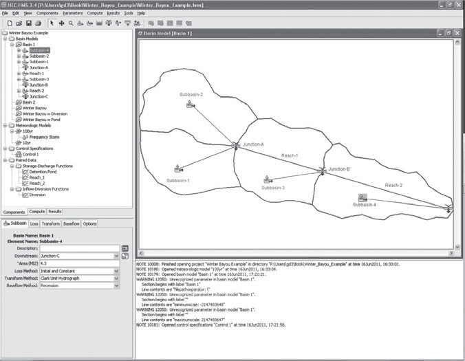
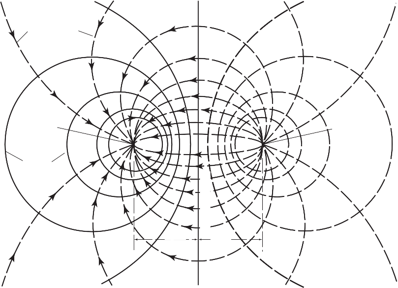

{width="3.5in"
height="4.669998906386701in"}

> [FIFTH EDITION]{.underline}

Hydrology and Floodplain Analysis

> **PHILIP B. BEDIENT**
>
> *Rice University*
>
> **WAYNE C. HUBER**
>
> *Oregon State University*
>
> **BAXTER E. VIEUX**
>
> *University of Oklahoma*
>
> **International Edition contributions by**
>
> **MURALIDHAR MALLIDU**
>
> K.L.E Institute of Technology, Hubli
>
> Upper Saddle River Boston Columbus San Francisco New York Indianapolis
> London Toronto Sydney Singapore Tokyo Montreal
>
> Dubai Madrid Hong Kong Mexico City Munich Paris Amsterdam Cape Town
>
> **Vice President and Editorial Director, ECS:**
>
> Marcia J. Horton
>
> **Executive Editor:** Holly Stark
>
> **Editorial Assistant:** Carlin Heinle
>
> **Vice-President, Production:** Vince O'Brien **Marketing Manager:**
> Tim Galligan **Marketing Assistant:** Jon Bryant
>
> **Permissions Project Manager:** Karen Sanatar **Senior Managing
> Editor:** Scott Disanno **Production Liaison:** Clare Romeo
> **Production Manager:** Pat Brown
>
> **Publisher, International Edition:**
>
> Angshuman Chakraborty
>
> **Acquisitions Editor, International Edition:**
>
> Somnath Basu
>
> **Publishing Assistant, International Edition:**
>
> Shokhi Shah
>
> **Print and Media Editor, International Edition:**
>
> Ashwitha Jayakumar
>
> **Project Editor, International Edition:**
>
> Jayashree Arunachalam
>
> **Publishing Administrator, International Edition:**
>
> Hema Mehta
>
> **Senior Manufacturing Controller, Production, International
> Edition:** Trudy Kimber
>
> **Creative Director:** Jayne Conte **Cover Design:** Suzanne Behnke
> **Cover Photo:** Dan Wallach
>
> **Full-Service Project Management:** Sandeep Rawat/Aptara^®^, Inc.
> **Printer/Binder:** Courier/Westford
>
> **Typeface:** Times Ten Roman
>
> Pearson Education Limited Edinburgh Gate
>
> Harlow
>
> Essex CM20 2JE England
>
> and Associated Companies throughout the world
>
> Visit us on the World Wide Web at:
> [www.pearsoninternationaleditions.com](http://www.pearsoninternationaleditions.com/)
>
> © Pearson Education Limited 2013
>
> The right of Philip B. Bedient, Wayne C. Huber and Baxter E. Vieux to
> be identified as authors of this work has been asserted by them in
> accordance with the Copyright, Designs and Patents Act 1988.
>
> *Authorized adaptation from the United States edition, entitled
> Hydrology and Floodplain Analysis, 5th edition, ISBN 978-0-13-256796-1
> by Philip B. Bedient, Wayne C. Huber and Baxter E. Vieux published by
> Pearson Education © 2013.*
>
> All rights reserved. No part of this publication may be reproduced,
> stored in a retrieval system, or transmitted in any form or by any
> means, electronic, mechanical, photocopying, recording or otherwise,
> without either the prior written permission of the publisher or a
> licence permitting restricted copying in the United Kingdom issued by
> the Copyright Licensing Agency Ltd, Saffron House, 6--10 Kirby Street,
> London EC1N 8TS.
>
> All trademarks used herein are the property of their respective
> owners. The use of any trademark in this text does not vest in the
> author or publisher any trademark ownership rights in such trademarks,
> nor does the use of such trademarks imply any affiliation with or
> endorsement of this book by such owners.
>
> Microsoft and/or its respective suppliers make no representations
> about the suitability of the information contained in the documents
> and related graphics published as part of the services for any
> purpose. All such documents and related graphics are provided "as is"
> without warranty of any kind. Microsoft and/or its respective
> suppliers hereby disclaim all warranties and conditions with regard to
> this information, including all warranties and conditions of
> merchantability, whether express, implied or statutory, fitness for a
> particular purpose, title and non-infringement. In no event shall
> Microsoft and/or its respective suppliers be liable for any special,
> indirect or consequential damages or any damages whatsoever resulting
> from loss of use, data or profits, whether in an action of contract,
> negligence or other tortious action, arising out of or in connection
> with the use or performance of information available from the
> services.
>
> The documents and related graphics contained herein could include
> technical inaccuracies or typographical errors. Changes are
> periodically added to the information herein. Microsoft and/or its
> respective suppliers may make improvements and/or changes in the
> product(s) and/or the program(s) described herein at any time. Partial
> screen shots may be viewed in full within the software version
> specified.
>
> Microsoft^®^ and Windows^®^ are registered trademarks of the Microsoft
> Corporation in the U.S.A. and other countries. This book is not
> sponsored or endorsed by or affiliated with the Microsoft Corporation.
>
> ISBN 10: 0-273-77427-1
>
> ISBN 13: 978-0-273-77427-3
>
> British Library Cataloguing-in-Publication Data
>
> A catalogue record for this book is available from the British Library
>
> 10 9 8 7 6 5 4 3 2 1
>
> 14 13 12 11 10
>
> Typeset in Times Ten Roman by Sandeep Rawat/Aptara^®^, Inc
>
> Printed and bound by Courier Westford in The United States of America
> The publisher's policy is to use paper manufactured from sustainable
> forests.
>
> **Dedication**
>
> *To Cindy, Eric, and Courtney,*
>
> *to my parents for their guidance, and to my teachers, and to all my
> students over the past 35 years.*
>
> *To My Family*
>
> *To my wife, Jean, and to our children William, Ellen, Laura, Anne,
> and Kimberly, and to my parents*
>
> P.B.B.
>
> W.C.H.
>
> B.E.V.
>
> CONTENTS
>
> PREFACE 9

1.  HYDROLOGIC PRINCIPLES 15

    1.  Introduction to Hydrology 15

    2.  Weather Systems 22

    3.  Precipitation 37

    4.  The Hydrologic Cycle 51

    5.  Simple Rainfall-Runoff 57

    6.  Streamflow and the Hydrograph 58

    7.  Hydrograph Analysis 61

    8.  Hydrologic Measurement 70 Summary 77

> Problems 78
>
> References 85

2.  HYDROLOGIC ANALYSIS 88

    1.  Watershed Concepts 88

    2.  Unit Hydrograph Theory 92

    3.  Synthetic Unit Hydrograph Development 103

    4.  Applications of Unit Hydrographs 117

    5.  Linear and Kinematic Wave Models 122

    6.  Hydrologic Loss---Evaporation and ET 126

    7.  Hydrologic Loss---Infiltration 136

    8.  Green and Ampt Infiltration Method 142

    9.  Snowfall and Snowmelt 152 Summary 160

> Problems 161
>
> References 169

3.  FREQUENCY ANALYSIS 174

    1.  Introduction 174

    2.  Probability Concepts 180

> **4**

3.  Random Variables and Probability Distributions 182

4.  Return Period or Recurrence Interval 193

5.  Common Probabilistic Models 197

6.  Graphical Presentation of Data 213

7.  Regional Analysis 225

8.  Related Topics 227 Summary 228 Problems 229 References 239

```{=html}
<!-- -->
```
4.  FLOOD ROUTING 243

    1.  Hydrologic and Hydraulic Routing 243

    2.  Hydrologic River Routing 250

    3.  Hydrologic Reservoir Routing 259

    4.  Governing Equations for Hydraulic River Routing 267

    5.  Movement of a Flood Wave 271

    6.  Kinematic Wave Routing 274

    7.  Hydraulic River Routing 284 Summary 294

> Problems 294
>
> References 302

5.  HYDROLOGIC SIMULATION MODELS 304

    1.  Introduction to Hydrologic Models 304

    2.  Steps in Watershed Modeling 308

    3.  Description of Major Hydrologic Models 309

    4.  HEC-HMS Flood Hydrograph Theory 313

    5.  Application of HEC-HMS to Watersheds 322

    6.  HEC-HMS Watershed Analysis: Case Study 333 Summary 342

> Problems 342
>
> References 346

6.  URBAN HYDROLOGY 349

    1.  Characteristics of Urban Hydrology 349

    2.  Review of Physical Processes 355

    3.  Rainfall Analysis in Urban Basins 363

    4.  Methods for Quantity Analysis 373

    5.  Sewer System Hydraulics 387

    6.  Control Options 391

    7.  Operational Computer Models 397

    8.  Case Study 401 Summary 414 Problems 414 References 428

7.  FLOODPLAIN HYDRAULICS 439

    1.  Uniform Flow 439

    2.  Uniform Flow Computations 443

    3.  Specific Energy and Critical Flow 448

    4.  Occurrence of Critical Depth 452

    5.  Nonuniform Flow or Gradually Varied Flow 453

    6.  Gradually Varied Flow Equations 453

    7.  Classification of Water Surface Profiles 458

    8.  Hydraulic Jump 462

    9.  Introduction to the HEC-RAS Model 464

    10. Theoretical Basis for HEC-RAS 465

    11. Basic Data Requirements (Steady State) 467

    12. Optional HEC-RAS Capabilities 471

    13. Bridge Modeling in HEC-RAS 472

    14. HEC-RAS Features 478 Summary 489 Problems 490 References 494

8.  GROUND WATER HYDROLOGY 495

    1.  Introduction 495

    2.  Properties of Ground Water 498

    3.  Ground Water Movement 503

    4.  Flow Nets 508

    5.  General Flow Equations 511

    6.  Dupuit Equation 513

    7.  Streamlines and Equipotential Lines 518

    8.  Unsaturated Flow 519

    9.  Steady-State Well Hydraulics 520

    10. Unsteady Well Hydraulics 528

    11. Water Wells 539

    12. Ground Water Modeling Techniques 542 Summary 552

> Problems 552
>
> References 557

9.  DESIGN APPLICATIONS IN HYDROLOGY 560

    1.  Introduction 560

    2.  Drainage Collection Systems 561

    3.  Design of Culverts 576

    4.  Detention Basins Used to Mitigate Project Impacts 591

    5.  Floodplain Management Design Issues 603 Summary 624

> Problems 625
>
> References 627

10. GIS APPLICATIONS IN HYDROLOGY 628

    1.  Introduction to GIS 628

    2.  General GIS Concepts 630

    3.  Digital Representation Hydrologic Parameters 636

    4.  Digital Representation of Topography 640

    5.  GIS-Based Hydrology and Hydraulics 643

    6.  Common GIS Software Programs 651 Summary 653

> Online Resources 654
>
> References 655

11. RADAR RAINFALL APPLICATIONS IN HYDROLOGY 657

    1.  Introduction 657

    2.  Radar Estimation of Rainfall 663

    3.  NEXRAD (WSR-88D) Radar System 671

    4.  Gage Adjustment of Radar 676

    5.  Hydrologic Applications 681 Summary 699

> References 699

12. SEVERE STORM IMPACTS AND FLOOD MANAGEMENT 703

    1.  Introduction 703

    2.  Flood Management Issues and Basic Terminology 704

    3.  Structural and Nonstructural Methods of Flood Control 707

    4.  The Flood Control Paradox 715

    5.  Major Gulf Hurricanes: Katrina and Ike 717

    6.  Improved Strategies Toward Flood Management 724

> Summary 731
>
> References 731

13. CASE STUDIES IN HYDROLOGIC ENGINEERING: WATER RESOURCE PROJECTS 734

    1.  Introduction 734

    2.  The City of San Antonio---Deep in the Heart of Texas 736

    3.  The Colorado River---Taming the Wild West 747

    4.  Across the Pond---The River Thames 756

    5.  Global Climate Change and Water Resources 757

> References 762
>
> APPENDIX A SYMBOLS AND NOTATION 765 APPENDIX B CONVERSION FACTORS 768
> APPENDIX C PROPERTIES OF WATER 770 APPENDIX D NORMAL DISTRIBUTION
> TABLES 772 APPENDIX E USEFUL HYDROLOGY-RELATED
>
> INTERNET LINKS 774
>
> GLOSSARY 780
>
> INDEX 798

PREFACE

> The field of hydrology is of fundamental importance to civil and
> environ- mental engineers, hydrogeologists, and other earth scientists
> because of the environmental significance of water supply, major
> floods and droughts and their management, drainage and urban
> stormwater issues, floodplain man- agement, and water quality impacts.
> In recent years, hurricanes and storm surge have caused significant
> urban disasters, especially along coastal areas where urban
> development has expanded rapidly. This text was written to address the
> computational emphasis of modern hydrology at an undergrad- uate or
> graduate level, and to provide a balanced approach to important
> applications in hydrologic engineering and science.
>
> Increasing use and sophistication of personal computers has
> revolutionized the daily practice of hydrology. The Internet has
> revolutionized the accessibil- ity of hydrologic data and computer
> models. The impact of transferring online data from governmental and
> scientific sources to the practicing hydrologist or student has been
> phenomenal. Hydrologic data, digital terrain models, and mapping
> software linked with hydrologic modeling have allowed complex problems
> to be solved. Geographical information systems (GIS) and radar
> rainfall have greatly improved our ability to predict hydrologic
> response using distributed information. A number of major improvements
> have been made to existing hydrologic models, such as HEC and SWMM,
> and advances in distributed hydrologic modeling such as Vflo. A list
> of important websites and links currently used routinely in hydrology
> is contained in Appendix E and can be found at the textbook website:
> *hydrology.rice.edu*.
>
> **THE EVOLUTION OF HYDROLOGY**

-   **Chapter 1:** Extensive updates and changes, and completely rewrit-
    ten with a more introductory coverage of topics, including simple
    rainfall runoff and hydrograph analysis with new examples and
    completely revised homework problems.

-   **Chapter 2:** Coverage of the unit hydrograph and includes hydro-
    logic losses such as evaporation and infiltration. New examples have
    been added on Green and Ampt infiltration, as well as many
    additional homework problems.

-   **Chapter 4:** Expanded coverage and new examples on flood routing.
    Many of the older numerical schemes have been simplified or removed,
    and new homework problems have been added to stream- line the
    chapter.

-   **Chapter 5:** Presents updated methods for simulating rainfall and
    runoff, flood hydrograph prediction, and flood control options in a

> **NEW TO THIS EDITION**

**9**

> watershed. New models are highlighted with new examples and a new
> detailed case study, including flood control alternatives. All new
> homework problems have been written as well.

-   **Chapter 10:** Describes the application of GIS and geospatial
    > infor- mation in hydrologic analysis and formulation of hydrologic
    > models. An updated list of available GIS and related software is
    > provided.

-   **Chapter 11:** Major advances in detecting accurate and representa-
    > tive rainfall with radar and rain gages are presented. The
    > applica- tion of radar rainfall as distributed model input is
    > described. Details on distributed hydrologic modeling are
    > presented for a case study, for which sample datasets are
    > available in Appendix E.

-   **Chapter 12:** Reviews the new emerging trends in flood control
    > methods and floodplain management, a vital topic given the recent
    > storm events in the United States, such as Hurricane Irene in the
    > northeast. A detailed discussion of massive hurricane impacts
    > along the Gulf Coast, including Hurricane Katrina and Ike, two of
    > the most damaging hurricanes in history.

-   **Chapter 13:** Brand new and includes emphasis on the San Antonio
    > River and Edwards Aquifer System in Central Texas, the Colorado
    > River Basin system, and the Thames River in England. The chapter
    > also briefly highlights international water issues in China and
    > South- east Asia. The chapter ends with a discussion of the
    > changing global condition and the need for sustainable interaction
    > between human and natural systems.

> **ORGANIZATION OF THE 5TH EDITION**
>
> The 5th edition of the text is divided into three main sections. The
> first sec- tion, consisting of the first four chapters, covers
> traditional topics in hydrol- ogy related to the water balance such
> as: (1) hydrologic principles, hydrologic cycle, and measurement
> techniques, (2) hydrologic analysis using hydrographs for
> rainfall-runoff, (3) statistical and flood frequency analysis, and (4)
> hydrologic and hydraulic flood routing methods. The sec- ond major
> section, Chapters 5 through 9, is designed to apply hydrologic theory
> and available hydrologic modeling techniques to several areas of
> engineering hydrology and design: watershed analysis, floodplain
> delinea- tion, ground water, and urban stormwater. The latest methods
> and com- puter models are emphasized in enough detail for practical
> use, and updated examples and new case studies are provided.
>
> Chapter 5 on Hydrologic Simulation Models has been completely redone
> and updated to include the latest model versions as highlighted below
> in the next section. Chapter 6, Urban Hydrology, presents methods and
> reviews available computer models for pipe and open channel storm
> drainage systems. The Storm Water Management Model (SWMM5) is
> highlighted as the most comprehensive urban runoff model available
> today. Chapter 7, Floodplain Hydraulics, first reviews concepts from
> open channel flow and includes uni- form flow and critical flow
> coverage, as required to understand water surface
>
> profile computations. The HEC-RAS model is described in detail with a
> case study demonstrating the power of the model to evaluate natural
> floodplains. Chapter 8 presents ground water hydrology as a
> stand-alone chapter, including flow in porous media, aquifer
> properties, well mechanics, and computer appli- cations. Governing
> equations of flow are derived and applied to a number of ground water
> problems, including both steady-state and transient analyses. Chapter
> 9, written by James Thompson, is a comprehensive chapter on design
> applications in hydrology. It addresses design rainfall, small
> watershed design, hydraulic design, detention pond design, detailed
> culvert design, and flood- plain mitigation design issues. It is one
> of the most comprehensive design chap- ters ever written and presents
> both the theory and method behind modern hydrologic and hydraulic
> design techniques.
>
> In the final section of the 5th edition, three chapters (10, 11, 12)
> guide the user to the next generation of hydrologic computation,
> watershed eval- uation, and discussion of important severe storm
> impacts and flood man- agement. No other textbook presents this type
> of material all in one place. Chapter 13, a new chapter for the 5th
> edition, presents details of major water resource projects around the
> world.
>
> Chapter 10 presents the use of geographic information systems (GIS)
> and digital elevation models (DEMs) as important tools for watershed
> analysis, hydrologic modeling, and modern floodplain delineation. Many
> useful hydrologic datasets and software are now widely available in
> high- resolution digital form on the web (see Appendix E). Chapter 11
> depicts some of the latest technology on the use of NEXRAD radar data
> to esti- mate rainfall intensities over watershed areas. Radar
> rainfall has greatly improved our ability to predict rainfall patterns
> over a watershed and offers real advantages for hydrologic flood alert
> systems. Distributed hydrologic modeling is introduced that
> capitalizes on advances in radar rainfall detection.

The 5th edition of the text should provide the engineering or science
stu- dent with all the necessary theory to understand principles of
hydrology, hydrologic modeling, floodplain hydraulics and analysis, and
water resources in the modern digital world. The student or practicing
engineer should find the book a useful reference for hydrologic methods,
current models, design examples, and extensively documented case
studies. In addition, simple calculations and spreadsheet examples are
utilized and highlighted in numerous places in the 5th edition, which
contains over 80 worked examples, over 220 homework problems, and 6
major case studies.

> The World Wide Web offers many opportunities for access to regional
> data with minimal cost and effort (see Appendix E), but the U.S.
> Geological Survey, National Weather Service, National Resources
> Conservation Service,
>
> U.S. Army Corps of Engineers, and other state and local agencies
> should be emphasized for students as likely sources of regional
> hydrologic data.
>
> The text includes a Companion website *hydrology.rice.edu* where
> updates and information can be found regarding the 5th edition. Dr.
> Bedi- ent maintains the site that contains selected problems, example
> datasets,
>
> **AUDIENCE AND AVAILABLE RESOURCES**
>
> simple Excel programs, and dozens of PowerPoint presentations that are
> available to any instructors and students in the course at no charge.
> These resources are designed to improve the teaching of a hydrology
> course at either the undergraduate or graduate level. A detailed
> solutions manual with updated problems is available for the 5th
> edition. The solutions man- ual for the International Edition can be
> accessed at www.pearsoninterna- tionaleditions.com/bedient.
>
> **ACKNOWL- EDGMENTS**
>
> The textbook was developed over a period of 25 years, beginning in
> 1982, from original course notes in a class in Hydrology and Watershed
> Analysis. During the many years of interaction with colleagues and
> students, the book evolved into its present form with emphasis on
> simple examples, clear explanations, and modern computational methods.
> The 5th edition includes a new Chapter 13 written by Antonia Sebastian
> and several existing chap- ters with significant updates such as
> Chapter 5 (Zheng Fang and George Doubleday) and Chapter 12 (Jude
> Benavides and Heather Winter).
>
> We are particularly indebted to the following individuals for their
> care- ful review of the draft manuscript and for numerous suggestions
> and com- ments: Michael Boufadel, Temple University; Stephanie Moret,
> Louisiana State University; Rao S. Govindaraju, Purdue University;
> William R. Wise, the University of Florida; and Francisco Olivera,
> Texas A&M University.
>
> Holly Stark, Executive Editor at Prentice Hall, was instrumental in
> guiding the significant changes for this 5th edition; the authors
> thank all the professionals at Prentice Hall for their efforts on our
> behalf.
>
> A successful textbook always represents a team effort, and the team at
> Rice University has been excellent in their continuing support and
> attention to detail. Antonia Sebastian contributed by organizing and
> writing Chapter 13. Dr. Zheng Fang and George Doubleday contributed to
> Chapter 5, and Heather Winter added sections and review for Chapter
> 12. Special thanks are due to students Tatyana Luttenschlager and Roni
> Deitz at Rice University for their technical skills in reviewing text
> and figures, and for providing valuable input to examples and homework
> problems. We would like to thank Erin Baker for helping to organize
> text, figures, pictures, and permissions for the 5th edition, as well
> as Mr. Rik Hovinga at Rice University for excellent graphics design,
> picture selection, and the design of the image that appears on the
> front cover. We would also like to thank Rice University students
> Johan Loveless, Alexandra Rasch, and Mike Burcham who assisted greatly
> in solving examples and developing and checking new homework problems
> for the 5th edition. Maria Corcuera was also instrumental in helping
> to organize text and figures for the 5th edition.
>
> Philip B. Bedient, *Rice University* Wayne C. Huber, *Oregon State
> University* Baxter E. Vieux, *University of Oklahoma*
>
> The publishers wish to thank S. Saravanan of the National Institute of
> Tech- nology, Tiruchirappalli, for reviewing the content of the
> International Edition.
>
> **Philip B. Bedient** is the Herman Brown Professor of Engineering,
> with the Department of Civil and Environmental Engineering, Rice
> University, Houston, TX. He received the PhD degree in environmental
> engineering sciences from the University of Florida. He is a
> registered professional engi- neer and teaches and performs research
> in surface hydrology, modeling, and flood prediction systems, and
> ground water hydrology. He has directed over 55 research projects over
> the past 36 years, and has written over 180 journal articles and
> conference proceedings over that time. He has also written four
> textbooks in the area of surface and groundwater hydrology. He
> received the Shell Distinguished Chair in environmental science
> (1988--92), the C.V. Theis Award in 2007, and he was elected Fellow of
> ASCE in 2006.
>
> Dr. Bedient has worked on a variety of hydrologic problems, includ-
> ing river basin analyses, major floodplain studies, groundwater
> contamina- tion models, and hydrologic/GIS models in water resources.
> He has been actively involved in developing computer systems for flood
> prediction and warning, and recently directed the development of a
> real-time flood alert system (FAS2 and FAS3) for the Texas Medical
> Center (TMC) in Houston. He has built real-time flood alert systems
> for several communities across Texas. He currently directs the Severe
> Storm Prediction Education and Evacuation from Disasters (SSPEED)
> Center at Rice University, an eight- university research organization
> with private and public entities that pre- dicts and assesses the
> impacts of severe storms on the Gulf Coast. This center is devoted to
> developing real-time flood alert and surge alert systems for the
> coastal areas around Houston such as the Houston Ship Channel, and
> also evaluates structural and non-structural methods for mitigation of
> severe storms.
>
> Dr. Bedient has overseen the monitoring, modeling, and remediation at
> numerous hazardous waste sites, and has extensive experience in con-
> taminant transport at sites impacted with chlorinated solvents and
> fuels. He has served on two National Academy of Science committees
> relating to environmental remediation and technology, and has received
> research funding from NSF, the U.S. EPA, the U.S. Department of
> Defense, the State of Texas, the U.S. Army Corps of Engineers, the
> City of Houston, and the Houston Endowment.
>
> **Wayne C. Huber** is Emeritus of Civil and, Construction, and
> Environ- mental Engineering at Oregon State University, Corvallis and
> Senior Con- sultant with Geosyntec Consultants, Portland, Oregon. His
> doctoral work at the Massachusetts Institute of Technology dealt with
> thermal stratifica- tion in reservoirs, for which he received the
> Lorenz G. Straub Award from the University of Minnesota and the
> Hilgard Hydraulic Prize from the American Society of Civil Engineers
> (ASCE). He is a member of several technical societies and has served
> several administrative functions within the ASCE. He is the author of
> over 120 reports and technical papers, is a registered professional
> engineer, and has served as a consultant on numer- ous studies done by
> public agencies and private engineering firms.
>
> **ABOUT THE AUTHORS**
>
> Beginning at the University of Florida and continuing at Oregon State
> University, Dr. Huber's research has included studies of urban
> hydrology, stormwater management, nonpoint source runoff, river basin
> hydrology, lake eutrophication, rainfall statistics, and hydrologic
> and water quality modeling. He is one of the original authors of the
> EPA Storm Water Man- agement Model and helped to maintain and improve
> the model following its 1971 introduction. Dr. Huber is an
> internationally recognized authority on runoff quantity and quality
> processes in urban areas.
>
> **Baxter E. Vieux** Baxter E. Vieux is a Joseph A. Brandt Professor in
> the School of Civil Engineering and Environmental Science, University
> of Oklahoma, Norman. He teaches courses in hydrology, Environmental
> Modeling, GIS applications, water quality management, and engineering
> graphics and design. Before joining OU in 1990, he held a
> professorship at Michigan State University teaching watershed
> management after earning his PhD there. Prior to his academic career,
> he spent ten years with the USDA Natural Resources Conservation
> Service (formerly SCS) serving as Acting State Engineer, and was
> responsible for statewide engineering design and construction programs
> in Michigan. He is a registered profes- sional engineer in several
> states and is co-principal and founder of Vieux & Associates, Inc., an
> engineering technology company with clients in the US and
> internationally in radar rainfall, GIS, and hydrology. Dr. Vieux is
> the innovator and architect of the first commercially available
> physics-based distributed hydrologic model, Vflo™, which uses
> real-time radar inputs for hydrologic analysis and prediction. This
> model is designed for both urban and rural hydrology, and is the
> subject of a US Patent, 7,136,756 B1, A Method for Determining Runoff.
> Externally sponsored academic research has been funded by NSF, USGS,
> NASA, EPA, NWS, NOAA, Army Corps of Engineers, NSF, and state/local
> agencies. He has authored over 110 pub- lications in hydrology
> including a recent book in its second edition, Distrib- uted
> Hydrologic Modeling Using GIS, Kluwer Academic Press, Vol. 48. As a
> hydrologist, Dr. Vieux has developed radar rainfall monitoring and
> run- off modeling technology, deployed operational hydrologic
> forecasting ser- vices, and consulted in surface water modeling for a
> variety of projects and clients in the US. Internationally, he has
> conducted research and worked on projects dealing with distributed
> hydrology for a number of agencies.
>
> Chapter 1

# Hydrologic Principles

{width="2.0625in" height="2.75in"}

> Upper Yosemite Fall, Yosemite National Park. (Photo courtesy National
> Park Service, U.S. Dept. Interior.)
>
> Hydrology is a multidisciplinary subject that deals with the
> occurrence, cir- culation, storage, and distribution of surface and
> ground water on the earth. The domain of hydrology includes the
> physical, chemical, and biological reactions of water in natural and
> man-made environments. Because of the complex nature of the hydrologic
> cycle and its relation to weather inputs and climatic patterns, soil
> types, topography, geomorphology, and other related factors, the
> boundary between hydrology and other earth sciences (i.e.,
> meteorology, geology, oceanography, and ecology) is not distinct.
>
> The study of hydrology also includes topics from traditional fluid
> mechanics, hydrodynamics, and water resources engineering (Maidment,
> 1993; Mays, 2001). In addition, many modern hydrologic problems
> include considerations of water quality and contaminant transport.
> Water quality topics, though important, are not included in this text
> due to space limita- tions; they have been covered in a number of
> modern sources on surface water quality (Huber, 1993; Chapra, 1997;
> Martin and McCutcheon, 1999) and ground water hydrology and
> contamination (Bedient et al., 1999; Fetter, 1999; Charbeneau, 2000).
>
> **1.1**
>
> **INTRODUCTION TO HYDROLOGY**

**15**

> The **hydrologic cycle** is a continuous process in which water is
> evapo- rated from water surfaces and the oceans, moves inland as moist
> air masses, and produces precipitation if the correct vertical lifting
> conditions exist. The precipitation that falls from clouds onto the
> land surface of the earth is dis- persed to the hydrologic cycle via
> several pathways (Fig. 1--1). A portion of the **precipitation** *P*,
> or rainfall, is retained on the soil near where it falls and returns
> to the atmosphere via **evaporation** *E*, the conversion of water to
> water vapor from a water surface, and **transpiration** *T*, the loss
> of water vapor through plant tissue and leaves. The combined loss,
> called **evapotrans- piration** *ET*, is a maximum value if the water
> supply in the soil is adequate at all times. These parameters are
> further discussed in subsequent sections of this chapter and Section
> 2.6.
>
> Some water enters the soil system as **infiltration** *F*, which is a
> function of soil moisture conditions and soil type, and may reenter
> channels later as interflow or may percolate to recharge the shallow
> ground water. **Ground water** *G* flows in porous media in the
> subsurface in either shallow or deeper aquifer systems that can be
> pumped for water supply to agricultural and municipal water systems
> (see Chapter 8).
>
> The remaining portion of precipitation becomes overland flow or
> **direct runoff** *R*, which flows generally in a down-gradient
> direction to accu- mulate in local streams that then flow to rivers.
> Hydrologic analysis to deter- mine runoff response from a watershed
> area is covered in Chapter 2. Evaporation and infiltration are both
> complex losses from input rainfall and are difficult to measure or
> compute from theoretical methods, covered in detail in Sections 2.6,
> 2.7, and 2.8.
>
> **Figure 1--1a**
>
> The hydrologic cycle discharges surface water and groundwater from the
> higher elevation to the lower elevation.


> **Figure 1--1b**
>
> Flow chart of the components of the hydrologic cycle.
>
> Surface and ground waters flow from higher elevations toward lower
> elevations and may eventually discharge into the ocean, especially
> after large rainfall events (Fig. 1--1a). However, large quantities of
> surface water and portions of ground water return to the atmosphere by
> evaporation or *ET*, thus completing the natural hydrologic cycle
> (Fig. 1--1b). Precipitation from the atmosphere is a major force that
> drives the hydrologic cycle, and under- standing major weather
> parameters and systems is important for the predic- tion of
> precipitation events (see Section 1.3).
>
> **Ancient History**
>
> Biswas (1972), in a concise treatment of the history of hydrology,
> describes the early water management practices of the Sumerians and
> Egyptians in the Middle East and the Chinese along the banks of the
> Huang He (Yellow River). Archeological evidence exists for hydraulic
> structures that were built for irrigation and other water control
> activities. A dam was built across the Nile about 4000
> [b]{.smallcaps}.c., and later a canal for fresh water was constructed
> between Cairo and Suez.
>
> The Greek philosophers were the first serious students of hydrology,
> with Aristotle proposing the conversion of moist air into water deep
> inside mountains as the source of springs and streams. Homer suggested
> the idea
>
> {width="2.3552077865266843in"
> height="1.5655205599300088in"}
>
> **Figure 1--2**
>
> Roman aqueducts, known as Pond du Gard located in Southern France,
> crosses the River Gardon (Gard).
>
> of an underground sea as the source of all surface waters. The Romans
> con- structed numerous aqueducts to serve large cities as well as
> small towns and industrial sites. The Romans had the largest
> collection with water being sup- plied by 11 aqueducts constructed
> over a period of about 500 years. Figure 1--2 shows one of the famous
> aqueducts built in France during that early period. They served
> potable water and supplied the numerous baths and fountains in the
> city, as well as finally being emptied into the sewers, where the
> once-used gray water performed their last function in removing wastes.
> The construction of the Roman aqueducts is considered one of the most
> important engineering feats in history.
>
> Streamflow measurement techniques were first attempted in the water
> systems of Rome (a.d. 97) based on the cross-sectional area of flow.
> It remained for Leonardo da Vinci to discover the proper relationship
> between area, velocity, and flow rate during the Italian Renaissance.
> The first recorded measurement of rainfall and surface flow was made
> in the seven- teenth century by Perrault. He compared measured
> rainfall to the estimated flow of the Seine River to show the two were
> related. Perrault's findings were published in 1694. Halley, the
> English astronomer (1656--1742), used a small pan to estimate
> evaporation from the Mediterranean Sea and con- cluded that it was
> enough to account for tributary flows. Mariotte gaged the velocity of
> flow in the Seine River in Paris. These early beginnings of the
> science of hydrology provided the foundation for numerous advances in
> the eighteenth century, including Bernoulli's theorem, the Pitot tube
> for measur- ing velocity, and the Chezy (1769) formula, which form the
> basis for modern hydraulics and fluid measurement.
>
> During the nineteenth century, significant advances in ground water
> hydrology and hydraulics occurred. Darcy's law for flow in porous
> media was a major advance, as well as the Dupuit--Thiem well flow
> formula (Chapter 8). In addition, the Hagen--Poiseuille capillary flow
> equation was developed to describe flow in small channels. The
> Darcy-Weisbach equa- tion for pipe flow was also developed during this
> same period in the 1850s. In surface water hydrology, many flow
> formulas and measuring instruments
>
> were developed that allowed for the beginning of systematic stream
> gaging. In 1867, discharge measurements were organized on the Rhine
> River at Basel and quickly expanded throughout Europe.
>
> The U.S. Geological Survey set up the first systematic program of flow
> measurement in the United States on the Mississippi in 1888. During
> this same period, the United States founded a number of hydrologic
> agencies, including the U.S. Army Corps of Engineers (1802), the U.S.
> Geological Survey (USGS, 1879), the Weather Bureau (1891), and the
> Mississippi River Commission (1893). The Price current meter was
> invented in 1885, and Man- ning's formula was introduced in 1889
> (Manning, 1889). The Weather Bureau is now called the National Weather
> Service (NWS) and is one of six organizations underneath the National
> Oceanic and Atmospheric Adminis- tration (NOAA). NOAA is the agency
> responsible for weather data collec- tion and severe-storm, river, and
> hurricane forecasting for the United States, and many of its websites
> are listed throughout the textbook. The USGS gag- ing network for
> rainfall, streamflow, and water quality is one of the most extensive
> in the world.
>
> **Early History (1930s--1950s)**
>
> The period from 1930 to 1950, which Chow (1964) called the Period of
> Ratio- nalization, produced a significant step forward for the field
> of hydrology, as government agencies began to develop their own
> programs of hydrologic research. Sherman's unit hydrograph (1932) (see
> Chapter 2), Horton's infil- tration theory (1933), and Theis's
> nonequilibrium equation (1935) in well hydraulics (Chapter 8) advanced
> the state of hydrology in very significant ways. Gumbel (1958)
> proposed the use of extreme-value distributions for frequency analysis
> of hydrologic data, thus forming the basis for modern statistical
> hydrology (Chapter 3). In this period, the U.S. Army Corps of
> Engineers (ACOE), the NWS within NOAA, the U.S. Department of Agri-
> culture (USDA), and the USGS made significant contributions in
> hydrologic theory and the development of a national network of gages
> for precipitation, evaporation, and streamflow measurements. The NWS
> is still largely respon- sible for rainfall measurements, reporting
> and forecasting of severe storms, and other related hydrologic
> investigations.
>
> The U.S. ACOE and the USDA Soil Conservation Service (now called the
> Natural Resources Conservation Service \[NRCS\]) made significant con-
> tributions to the field of hydrology in relation to flood control,
> reservoir development, irrigation, and soil conservation during this
> period. More recently, the USGS has taken significant strides to set
> up a national network of stream gages and rainfall gages for both
> quantity and quality data. Their water supply publications and special
> investigations have done much to advance the field of hydrology by
> presenting the analysis of complex hydro- logic data to develop
> relationships and explain hydrologic processes. The NWS and USGS both
> support numerous websites for the dissemination of watershed
> information and precipitation and streamflow data from thousands
>
> of gages around the country. Many of these sites are listed in
> Appendix E and on the textbook website
> ([http://hydrology.rice.edu/bedient).](http://hydrology.rice.edu/bedient))
>
> The government agencies in the United States have long performed vital
> research themselves, providing funding for private and university
> research in the hydrologic area. Many of the water resources studies
> and large dam, reservoir, and flood control projects in the 1930s and
> 1940s were a direct result of advances in the fields of fluid
> mechanics, hydrologic sys- tems, statistical hydrology, evaporation
> analysis, flood routing, and opera- tions research. Many of the
> advances from that era continue to this day as the methods to predict
> runoff, infiltration, and evaporation have not changed much in over 50
> years. Major contributions from Horton (1933, 1940, 1941) and from
> Penman (1948) in understanding hydrologic losses were related to the
> water and irrigation needs of the agricultural sector in the United
> States following the devastation of the dust bowl era of the 1930s.
>
> Major water resources projects built during the 1930s were a direct
> result of major floods on the Mississippi River and the economic
> depression across the nation. The building of the massive Hoover Dam
> on the Colorado River for flood and sediment control and water supply
> in the early 1930s provided employment for over 40,000 and was the
> largest construction proj- ect ever conceived to that point (see
> Chapters 12 and 13).
>
> **Modern History**
>
> In the 1950s and 1960s, the tremendous increase of urbanization
> following World War II in the United States and Europe led to better
> methods for predicting peak flows from floods, for understanding
> impacts from urban expansion, and for addressing variations in storage
> in water supply reservoirs. Major expansion of cities and water
> systems within the United States during the 1950s led to a need for
> better understanding of floods and droughts, especially in urban
> areas. Water resource studies became an everyday occur- rence in many
> rapidly developing areas of the United States, tied to the expansion
> of population centers in the southern, southwestern, and western
> states. Hydrologic analyses presented in detail in Chapters 2 through
> 9 in the text were a major component of many of these studies.
>
> During the 1970s and early 1980s, the evaluation and delineation of
> floodplain boundaries became a major function of hydrologists, as
> required by the Federal Emergency Management Agency (FEMA) and local
> flood control or drainage districts. In order for communities to be
> eligible for flood insurance administered by FEMA, they are required
> to delineate floodplain boundaries using hydrologic analysis and
> models. Floodplain analysis is cov- ered in detail in Chapters 5, 7,
> 9, and 12. This function has taken on a vital role in many urban
> areas, as damages from severe floods and hurricanes continue to plague
> the United States, especially in coastal and low-lying areas. The
> period from 2004 to 2010 accounted for numerous hurricanes that caused
> massive damages and deaths in several areas, especially along the
>
> coastlines of Texas, Louisiana, Mississippi, Alabama, and Florida. The
> mas- sive Mississippi flood of 1993 wreaked havoc within the central
> United States, and was repeated in 2011 with major devastation to
> states from Illi- nois south to Louisiana (Chapter 12).
>
> In recent years, the traditional approaches to flood control have been
> reassessed. A study titled "Higher Ground" from the National Wildlife
> Fed- eration (1998) found a number of communities with large numbers
> of repet- itive flood losses, such as New Orleans and Houston. Since
> the great midwestern flood of 1993, there has been a significant shift
> in national flood policy away from using only structural solutions,
> such as levee and channel construction. Flood damage from Tropical
> Storm Allison in Houston in 2001 was a major wake-up call for better
> protection and warning systems in criti- cal urban areas. The massive
> devastation from Hurricane Katrina in New Orleans in August 2005 and
> Hurricane Ike in 2008 in Houston-Galveston will provide long-lasting
> incentive to improve our ability to warn for and recover from such
> severe storms. Modern methods for structural flood con- trol, as well
> as nonstructural approaches, better management of flood-prone areas,
> and voluntary property buyouts, must be considered in any overall
> flood management plan (Chapter 12). Chapter 13 explores several major
> water resources projects across the United States and Asia in terms of
> engi- neering significance as well as associated environmental and
> policy impacts on the nation.
>
> **Computer Advances**
>
> The introduction of the digital computer into hydrology during the
> 1960s and 1970s allowed complex water problems to be simulated as
> complete systems for the first time. Large computer models can now be
> used to match historical data and help answer difficult hydrologic
> questions (Singh and Frevert, 2006). The development of these tools
> over the past few decades has helped direct the collection of the
> hydrologic data to calibrate, or "match," the models against
> observation. In the process, the understanding of the hydrologic
> system has been greatly advanced. Hydrologic computer models developed
> in the 1970s have been applied to areas previously unstud- ied or only
> empirically defined. For example, urban stormwater, floodplain and
> watershed hydrology, drainage design, reservoir design and operation,
> flood frequency analysis, and large-river basin management have all
> bene- fited from the application of computer models.
>
> Hydrologic simulation models applied to watershed analysis are
> described in detail in Chapter 5. Single-event models such as HEC-HMS
> are used to simulate or calculate the resulting storm hydrograph
> (discharge vs. time) from a well-defined watershed area for a given
> pattern of rainfall intensity. Continuous models such as the
> Hydrological Simulation Pro- gram---Fortran (HSPF) and the Storm Water
> Management Model (SWMM) can account for soil moisture storage,
> evapotranspiration, and antecedent
>
> rainfall over long time periods. Statistical models can be used to
> generate a time series of rainfall or streamflow data, which can then
> be analyzed with flood frequency methods.
>
> Newer distributed hydrologic models (i.e., VFLO and the MIKE series of
> models) can handle input, output, and data manipulation at the
> watershed level (see Chapters 5, 10, 11, and 12). Unquestionably new
> digital approaches combined with distributed terrain modeling have
> revolutionized hydrology in recent years, just as the original wave of
> models did in the decade of the 1970s. Also faster computers and
> available datasets have been instrumental in advancing the field.
>
> The data revolution in hydrology and geographical information sys-
> tems (GIS) have made available newer and more accurate datasets on
> topog- raphy, slope, rainfall, soils, land use, and channel
> characteristics for many areas. Moreover, most hydrological and
> meteorological data may be retrieved online from agencies such as the
> USGS and NWS, and various county and municipal sources. These
> datasets, combined with existing simu- lation models in hydrology, if
> applied correctly, provide the most accurate approach to understanding
> complex water resources systems, and a new era in the science of
> hydrology has begun this decade. New design and operating policies are
> being advanced and implemented that could not have been real- ized or
> tested before without the aid of sophisticated computer models linked
> with digital data.

**1.2**

> **WEATHER SYSTEMS**
>
> The atmosphere is the major hydrologic link between oceans and
> continents on the planet, facilitating the cycle of water movement on
> earth. The hydro- logic cycle is shaped by the conditions of the
> atmosphere, with precipitation as the main input to the cycle. Water
> vapor content is both a major catalyst and a balancing factor of
> atmospheric processes that create the weather in the lower atmosphere.
> The following section reviews major elements of atmospheric processes
> that directly impact the hydrologic cycle. More details on atmospheric
> processes can be found in modern meteorology and hydrol- ogy textbooks
> (Anthes, 1997; Ahrens, 2000; Dingman, 2002).
>
> **Atmospheric Parameters**
>
> Pressure is defined as the force per unit area exerted on a surface,
> and **atmo- spheric pressure** measures the weight of the air per unit
> area. Average air pressure at sea level is approximately 1 atmosphere,
> or 1013 millibars (mb) or 14.7 lb/in.^2^ or 760 mm-Hg or 29.97 in.-Hg.
> Note that 1 mb = 10^2^ pascals (Pa), where 1 Pa = 1 N/m^2^. As
> elevation increases and the density of air molecules decreases,
> atmospheric pressure also decreases. The horizontal and vertical
> pressure variations that occur due to low- and high-pressure systems
> are responsible for wind, and help drive much of our weather. Abso-
> lute temperature (*T*), pressure (*P*), and density 1r2 are related
> through the
>
> ideal gas law, *P* = r*RT*, where *R* is the gas constant for the gas
> in question (see Eq. 1--1). At constant density, temperature is
> directly proportional to pressure; thus, with an increase in
> temperature comes an increase in pres- sure. Air pressure is
> proportional to density, so that in the atmosphere a decrease in
> temperature causes an increase in the density of the air mole- cules.
> Cold air masses are generally associated with the higher atmospheric
> pressure.
>
> **Humidity** is a measure of the amount of water vapor in the
> atmosphere and can be expressed in several ways. Specific humidity is
> the mass of water vapor in a unit mass of moist air. The **relative
> humidity** is a ratio of the air's actual water vapor content compared
> to the amount of water vapor at satu- ration for that temperature. The
> partial pressure of water vapor is the con- tribution made by water to
> the total atmospheric pressure. When a volume reaches its maximum
> capacity for water vapor, the volume is said to be satu- rated and can
> accept no more vapor. This vapor pressure is known as **satura- tion
> vapor pressure**. Vapor pressure is dependent on temperature; and as
> air is lifted and cools, its relative humidity increases until
> saturation, and then condensation of water vapor to liquid water can
> occur. The temperature to which a sample of air must be cooled to
> reach saturation is defined as the **dew point temperature**. These
> concepts are described in more detail later in this section.
>
> Water vapor has the ability, unique among gases, to change from one
> state of matter to another (solid, liquid, or gas) at the temperatures
> and pressures that typically exist on earth. A change in phase (e.g.,
> from liquid to vapor) requires that heat be released or absorbed. The
> processes of con- verting solid ice to liquid water, called melting,
> and water to vapor, called evaporation, both require significant heat
> exchange. It takes approximately 600 cal to convert 1 g of water to
> water vapor. When such changes take place, the heat is absorbed and no
> temperature change takes place. The heat used in this process is
> latent heat. Condensation is the process in which water vapor changes
> into a liquid state. For this to occur, energy must be released in an
> amount equivalent to what was absorbed during evaporation. This latent
> heat often becomes the source of energy for severe thunderstorms,
> tornadoes, and hurricanes.
>
> **The Atmosphere and Clouds**
>
> Atmospheric weather systems are fueled by solar input and
> characterized by air masses in motion, circulating winds, cloud
> generation, and changes in tem- perature and pressure. Lifting
> mechanisms are required for moist air masses to cool and approach
> saturation conditions. As a result of the interaction of rising air
> masses with atmospheric moisture, the presence of small atmospheric
> nuclei, and droplet growth, precipitation in the form of rain, snow,
> or hail can result. The exact mechanisms that lead to precipitation
> are sometimes quite complex and difficult to predict for specific
> areas. But precipitation remains
>
> as the main input to the hydrologic cycle, and the hydrologist needs a
> general understanding of the mechanisms that cause its formation.
>
> Horizontal variations in atmospheric pressure cause air to move from
> higher pressure toward lower pressure, resulting in the generation of
> wind. Vertical displacement causes air to move as well, but at a far
> slower rate than horizontal winds. The vertical movement and lifting
> of air results in the formation of clouds. Clouds are familiar to all
> of us, and represent collec- tions of small droplets of water or tiny
> crystals of ice. The names of the basic clouds have the following
> roots:
>
> **cirrus**, feathery or fibrous clouds
>
> **stratus**, layered clouds
>
> **cumulus**, towering, puffy clouds **alto**, middle-level clouds
> **nimbus**, rain clouds
>
> The second aspect of cloud classification is by height. Anthes (1997)
> presents a detailed coverage of cloud types for the interested
> student. One type of high cloud of importance in hydrology is the
> **cumulonimbus**, one often found in heavy thunderstorms that produce
> massive rainfall. Cirrus clouds are very high collections of ice
> crystals and often indicate the approach of a cold front and that
> weather is about to change. While clouds result when air rises and
> cools, surface fog results from cooling near the surface or from the
> addition of enough water vapor to cause saturation. Fog is essentially
> a low cloud with a base that is very near the ground, often reducing
> the visibil- ity in the area within or around it. Marine fog is common
> along the Califor- nia and upper Atlantic coasts in the United States.
>
> **General Circulation**
>
> The general circulation of wind across the earth is caused by the
> uneven heating of earth's surface through solar input, and by the
> earth's rotation. At the equator, solar radiation input and
> temperature are greatest because of the shape and tilt of the globe
> relative to the sun. Three latitudinal circu- lation cells transport
> heat from the equator to the poles (Fig. 1--3). As warm air travels
> northward in the middle latitudinal cell on a spinning earth, it tends
> to shift to the right (toward the east) in the northern hemisphere due
> to the Coriolis force, thus causing the occurrence of winds called
> **westerlies**. These winds tend to drive the direction of major
> weather systems from west to east across major portions of the
> continental United States.
>
> Between 30 degrees north latitude and the equator, the flow is
> generally toward the south and is altered to create the trade winds
> (**easterlies**) by the Coriolis force in the northern hemisphere. The
> trade winds allowed explorers from Europe to sail across the ocean to
> the New World. The Coriolis force causes the flow along latitude
> circles (east/west) to be 10 times greater than
>
> Mean position of polar jet
>
> Easterlies Polar front
>
> Mean positions of subtropical jets
>
> Westerlies Horse latitudes
>
> NE trade winds ITCZ
>
> SE trade winds
>
> Horse latitudes Westerlies
>
> Mean positions of subtropical jets
>
> Polar front
>
> Easterlies
>
> **Figure 1--3**
>
> Mean position of polar jet
>
> General circulation of currents and wind patterns across the earth.
>
> the flow along the meridians (north/south). Around the 30 degrees
> north and south latitudes, descending air creates a region of minimal
> winds and little cloudiness that is known as the horse latitudes. Near
> the equator is another region of light and variable winds called the
> doldrums, or the intertropical convergence zone. This is the area of
> maximum solar heating, where surface air rises and flows toward both
> poles.
>
> **Jet streams**, first observed in 1946, are narrow bands of
> high-speed winds that circle each hemisphere like great rivers, at
> elevations extending from 2.5 or 3 miles to above the tropopause. The
> polar and subtropical jets are associated with the polar front near 45
> degrees latitude and 30 degrees latitude, respectively. The jet
> streams are highly variable and can flow at speeds as high as 100 mph
> faster than the air on either side of them. Jet streams have a major
> impact as the driving force for weather systems across the United
> States, especially in the winter season.
>
> **Air Masses and Fronts**
>
> Air masses are large bodies of air with fairly consistent temperature
> and humidity gradients in the horizontal direction at a given
> altitude. Air masses dominate our weather and are classified in two
> ways: the source from which
>
> they were generated, land (continental) or water (maritime), and the
> latitude of generation (polar or tropical). The four combinations are
> designated cP, cT, mP, and mT.
>
> Each of these types of air masses is present in the United States. The
> continental polar air mass emanates from Canada and passes over the
> north- ern United States, often dropping significant amounts of rain
> and snow on areas downwind of the Great Lakes. The maritime polar air
> mass also comes southward from the Atlantic coast of Canada and
> affects the New England states. Another maritime polar air mass comes
> from the Pacific and hits the extreme northwestern states. The
> maritime tropical air masses come from the Pacific, the Gulf of
> Mexico, and the Atlantic. The entire southern United States is
> affected by these air masses. The only time continental tropical air
> masses form is during the summer, and they originate in Texas and
> affect the states bordering to the north.
>
> The boundary between one air mass and another is called a frontal
> zone, or **front**. When two air masses meet, the front will slope
> diagonally, as the colder, denser air mass pushes under the warmer air
> mass. Between the two fronts, a transition zone occurs, usually 30 to
> 60 miles wide. Whether the masses are traveling against each other or
> in the same direction, the warmer air mass will be forced upward and
> cooled by expansion. Since cooling a parcel of air lowers its
> saturation vapor pressure, this may cause condensa- tion and the
> development of precipitation often associated with frontal sys- tems
> (Fig. 1--4). The NWS website provides an amazing amount of weather
> information and satellite data all on one place
> ([http://www.nws.noaa.gov/).](http://www.nws.noaa.gov/))
>
> Cold front Warm front
>
> **Figure 1--4**
>
> Direction of the cold and warm fronts in the eastern United States.
> The cold fronts come from the North toward the Gulf and the warm
> fronts start from the Gulf to push inland.
>
> Development of surface cyclones along fronts occurs when an upper-
> level disturbance approaches a front. The upper-level patterns of
> conver- gence and divergence produce pressure changes at the surface,
> which then produce low-level circulation (**wave cyclone**). As a wave
> cyclone develops, low pressure forms at its apex and both the warm and
> cold currents move in a cyclonic pattern (counterclockwise in the
> northern hemisphere) around it. To the left of the apex, the cold
> front is advancing towards the warm air, and the warm front is
> receding to the right. The warm air between the fronts is known as the
> warm sector. The entire system generally moves toward the right
> (eastward), and ahead of the warm front the first sign of the
> approach- ing system is high cirrus clouds. As the center of low
> pressure approaches, the pressure falls and the wind increases and
> changes its direction to coun- terclockwise. The temperature begins to
> decrease as the frontal zone approaches. Within several hundred miles
> of the surface position of the front, precipitation begins, either
> rain or snow. Fronts can be fast moving in the winter or can be slowed
> or stalled due to the presence of other air masses or high-pressure
> systems in the fall or spring (Anthes, 1997). Warm fronts can also
> generate rainfalls as they move across an area.
>
> Fronts are a major factor in U.S. weather patterns, especially from
> September through April in most years. The type of weather
> accompanying the passage of the cold front depends on the front's
> sharpness, its speed, and the stability of the air being forced aloft.
> Often there are towering cumulus clouds and showers along the forward
> edge of the front. Sometimes, espe- cially in the Midwest during the
> spring, several **squalls**, or a strong line of storms, precede the
> front. Tornadoes can form in these storm cells, especially in areas of
> north Texas, Oklahoma, and Arkansas. But in other cases, nim-
> bostratus clouds and rain extend over a zone of 50 to 60 miles. After
> the frontal passage, the wind changes sharply and the pressure begins
> to rise. Within a short distance behind the cold front, the weather
> clears, the tem- perature begins to fall, and the visibility greatly
> improves.
>
> **Thunderstorms**
>
> Thunderstorm activity is characterized by cumulonimbus clouds that can
> produce heavy rainfall, thunder, lightning, and occasionally hail.
> Thunder- storms are the result of strong vertical movements in the
> atmosphere and usually occur in the spring or summer in the United
> States. They require warm, moist air, which when lifted will release
> enough latent heat to provide the buoyancy needed to maintain its
> upward motion. Accordingly, they gen- erally occur in warm air masses
> that have become unstable either through extreme low-pressure systems,
> surface heating, or forced ascent over moun- tains. The geographic
> pattern of thunderstorm occurrence in the United States is a result of
> both an area's distance from source air masses and its topography.
> Florida and the Gulf Coast are affected most frequently, some- times
> as often as 100 times in a year.
>
> {width="4.022112860892388in"
> height="2.0366655730533685in"}
>
> **Figure 1--5**
>
> The Cumulonimbus cloud that signals that a storm is approaching.
>
> Thunderstorms develop in three characteristic stages. The first is the
> cumulus stage, when moist air rises and cools and condenses into a
> cumulus cloud. The cumulus cloud then continues to grow taller as the
> rising air condenses at successively higher levels (Fig. 1--5). The
> diameter of the storm cell grows in width from about 1 mile to 6 to 9
> miles and vertically to 5 or 6 miles. The rising air is no longer able
> to retain water droplets and rain begins to fall.
>
> The rain marks the beginning of the second stage of the thunder-
> storm, the mature stage. During the mature stage, the large water
> particles or hail in the clouds begin to fall because they have become
> too large to be supported by the updraft. As this happens, drier air
> around the cloud is being drawn into it, in a process known as
> entrainment. This drying of the air results in the evaporation of some
> rain drops, which cools the air. The air is now colder and heavier
> than the air around it and, while the upper part of the cloud still
> has a strong updraft, a lower part of the storm cloud begins to
> descend as a downdraft. This downdraft eventually reaches the ground
> and spreads away from the thunderstorm, causing the cool gusts of wind
> that usually foreshadow the arrival of a thunderstorm. Meanwhile, the
> upper part of the cloud reaches a stable part of the atmosphere, and
> high-altitude winds may create a typical anvil shape (Fig. 1--6). The
> cloud reaches its greatest vertical development in this stage,
> extending upward over 7.5 mi (40,000 ft, 12 km). Lightning,
> turbulence, heavy rains, and, if present, hail are all found at this
> time. The second stage is the most intense period of the thunderstorm.
>
> When the downdraft has spread over the entire storm cell and the
> updraft has been cut off, the storm begins its final stage, the
> dissipating stage. The rate of precipitation diminishes and so the
> downdrafts are also gradually subdued. The final flashes of lightning
> fade away and the cloud begins to
>
> 15
>
> 10 Storm motion
>
> 5
>
> 0 Wake of cool air
>
> 25 km
>
> **Figure 1--6**
>
> Typical thunderstorm cloud evolution. The typical anvil-shaped clouds
> that are present during a thunderstorm are caused by the movement of
> cold air and warm air. As the cold air moves downward and the warm air
> moves upward, the warm air above spreads out in order to cool,
> resulting in the following shape, very much like an anvil.
>
> dissolve or perhaps persist a while longer in a stratified form (see
> Fig. 1--6). Intense thunderstorms are of great interest, since they
> can produce signifi- cant amounts of rainfall in a short time period.
> Chapter 11 discusses new radar methods for the detection of severe
> storms and for the measurement of rainfall intensities associated with
> severe storms.
>
> **Hurricanes**
>
> **Tropical cyclones** or **hurricanes** are intense cyclonic storms
> that form over the tropical oceans, between 5 and 20 degrees latitude.
> With extreme amounts of rainfall and winds that can exceed 186 mph
> (300 km/hr), trop- ical cyclones are the most destructive storms on
> earth. The local name for this storm varies throughout the world:
> typhoon in Eastern Asia, cyclone in India, and baguio in the China
> Sea. The North American term, used in this discussion, is hurricane.
> By international agreement, a storm is a hur- ricane if it has wind
> speeds of at least 74 mph (119 km/hr) and a rotary circulation. When
> its wind speeds are between 39 mph (63 km/hr) and 73 mph (119 km/hr),
> it is a tropical storm. Tropical disturbances with winds that do not
> exceed 39 mph (61 km/hr) are tropical depressions. All tropical storms
> and hurricanes are given proper names in alphabetical order, start-
> ing at the beginning of the alphabet when the storm season begins on
> June 1 and starting over during the next season. Hurricanes are
> classified accord- ing to a scale based on central pressure, storm
> surge height, and wind speed. The scale has five categories, ranging
> from category 1, a hurricane of minimal damage, to category 5, a
> hurricane of catastrophic proportions (see Table 1--1).
>
> **Table 1--1.** The Saffir-Simpson Hurricane Wind Scale

+-------------+-----------+------------+------------------------------+
| > *         | > **Wind  | > **Extent | > **Damage Description**     |
| *Category** | > Speed   | > of       |                              |
|             | > (mph)** | > Damage** |                              |
+=============+===========+============+==============================+
| > Tropical  | > 39--73  | > Minor    | > Some flooding              |
| > Storm     |           |            | >                            |
|             |           |            | > Damage limited to          |
|             |           |            | > unanchored mobile homes,   |
|             |           |            | > shrubbery, and trees       |
|             |           |            | >                            |
|             |           |            | > Some roof, door and window |
|             |           |            | > damage to buildings, some  |
|             |           |            | > trees blown down           |
|             |           |            | >                            |
|             |           |            | > Some structural damage to  |
|             |           |            | > residences and utility     |
|             |           |            | > buildings, trees           |
|             |           |            | > defoliated and many blown  |
|             |           |            | > down                       |
|             |           |            | >                            |
|             |           |            | > Extensive curtainwall      |
|             |           |            | > failures and some complete |
|             |           |            | > roof failures, shrubs,     |
|             |           |            | > trees, and all signs blown |
|             |           |            | > down                       |
|             |           |            | >                            |
|             |           |            | > Complete roof failure and  |
|             |           |            | > some complete building     |
|             |           |            | > failures                   |
+-------------+-----------+------------+------------------------------+
| 1           | > 74--95  | > Minimal  |                              |
+-------------+-----------+------------+------------------------------+
| 2           | > 96--110 | > Moderate |                              |
+-------------+-----------+------------+------------------------------+
| 3           | >         | >          |                              |
|             |  111--130 |  Extensive |                              |
+-------------+-----------+------------+------------------------------+
| 4           | >         | > Extreme  |                              |
|             |  131--155 |            |                              |
+-------------+-----------+------------+------------------------------+
| 5           | > 156+    | > Ca       |                              |
|             |           | tastrophic |                              |
+-------------+-----------+------------+------------------------------+

> The warm, moisture-laden air of the tropical oceans possesses an enor-
> mous capacity for heat energy, and most of the energy required to
> create and sustain a hurricane comes from what is released through
> condensation from vapor to water. Hurricanes develop most often during
> the late summer when the oceans are warm (26°C or higher) and are thus
> able to provide the necessary heat and moisture to the air. The
> hurricane season in the West Indies extends from June 1 to November 1,
> but 84% of the hurricanes and tropical cyclones below hurricane
> intensity reported from 1887 to 1958 in the North Atlantic occurred
> during August, September, and October. There is considerable
> variability in the number of hurricanes in the Atlantic annu- ally. In
> the 40-year period from 1950 to 1990, the number of hurricanes in the
> Atlantic varied from 3 to 12 per year.
>
> The decades of the 1990s and 2000s have seen especially high hurricane
> activity in the North Atlantic basin, including both hurricane
> frequency and intensity. As indicated below, 2004 and 2005 were very
> active hurricane years for the coastal United States. Figure 1--7
> shows the devastating track of Hurricane Ike that damaged the
> Houston-Galveston coastline in Septem- ber, 2008. Statistics have
> shown that the number of tropical storms correlates with several
> climatological anomalies on a global scale, including rainfall in West
> Africa in the prior year, the direction of the winds in the
> stratosphere, and the **El Niño-Southern Oscillation (ENSO)**
> phenomenon, characterized by a warm phase associated with high sea
> surface temperatures off the coast of Peru, low atmospheric pressure
> over the eastern Pacific, high pressure in the western Pacific, and
> strong winds aloft over the tropical Atlantic (creat- ing high
> vertical wind shear and unfavorable conditions for hurricane devel-
> opment). A cold phase (**La Niña**) has low sea surface temperatures
> in the
>
> **Figure 1--7**
>
> Hurricane Ike's track. The hurricane started in the Atlantic and made
> its way into the Gulf. What started out as a Category 4 storm in the
> Atlantic became a Category 3 as it hit Cuba and finally weakened to a
> Category 2 storm as it made landfall in Texas.
>
> eastern Pacific and the opposite pressure and wind anomalies.
> Meteorology textbooks and websites usually provide more details on the
> occurrence and characteristics of hurricanes (Anthes, 1997; Ahrens,
> 2000; Dingman, 2002). More details can be found in Chapter 12.
>
> **Moisture Relationships**
>
> Atmospheric moisture is a necessary source for precipitation and is
> generally provided from evaporation and transpiration. Precipitation
> across the United States is largely due to proximity of evaporation
> from oceans and the Gulf of Mexico and to subsequent transport over
> the continent by the atmo- spheric circulation system. Common measures
> of atmospheric moisture, or humidity, include vapor pressure, specific
> humidity, mixing ratio, relative humidity, and dew point temperature.
> (Most of these terms were defined earlier in the chapter.) Under moist
> conditions, water vapor can be assumed to obey the ideal gas law,
> which allows derivation of simple relations between pressure, density,
> and temperature.
>
> The partial pressure is the pressure that would be exerted on the sur-
> face of a container by a particular gas in a mixture. The partial
> pressure exerted by water vapor is called **vapor pressure** and can
> be derived from Dalton's law and the ideal gas law as
>
> *e* [r*w RT*]{.underline}, (1--1)
>
> 0.622
>
> where
>
> *e* = vapor pressure (mb),
>
> r*~w~* = vapor density or absolute humidity (g/cm^3^),
>
> *R* = dry air gas constant = 2.87 \* 10^3^ mb cm^3^/g°K,
>
> *T* = absolute temperature (°K).
>
> The factor 0.622 arises from the ratio of the molecular weight of
> water (18) to that of air (29). Near the earth's surface, the water
> vapor pressure is 1% to 2% of the total atmospheric pressure, where
> average atmospheric pres- sure is 1013.2 mb (1 mb = 10^2^ pascals
> (Pa)). **Saturation vapor pressure** is the partial pressure of water
> vapor when the air is completely saturated (no further evaporation
> occurs) and is a function of temperature.
>
> **Relative humidity** (*RH*) is approximately the ratio of water vapor
> pressure to that which would prevail under saturated conditions at the
> same temperature. It can also be stated as *RH* = 100 *e*\>*e~s~*.
> Thus, 50% relative humidity means that the atmosphere contains 50% of
> the maximum moisture it could hold under saturated conditions at that
> temperature. Typical relative humidity averages (high and low
> percentages) for eight major American cities are as follows: Houston
> (89, 67), Seattle (84, 62), Chicago (80, 64), New York
>
> City (72, 56), Miami (83, 61), Denver (67, 40), Albuquerque (58, 29),
> and Las
>
> Vegas (40, 21).
>
> Specific humidity is the mass of water vapor contained in a unit mass
> of moist air (g/g) and is equal to r*~w~*\>r*~m~*, where r*~w~* is the
> vapor density and r*~m~* is the density of moist air. Using Dalton's
> law and assuming that the atmosphere is composed of only air and water
> vapor, we have
>
> [1*P* - *e*2 + 0.622*e*]{.underline} *P*

r*~m~* =

> *RT* = *RT* 11 - 0.378*e*\>*P*2. (1--2)
>
> Equation (1--2) shows that moist air is actually lighter than dry air
> for the same pressure and temperature. Thus,

where

*q* = [r*w*]{.underline}

r*~m~*

> = [0.622*e *]{.underline}, (1--3)
>
> *P* - 0.378*e*
>
> *q* = specific humidity (g/g),
>
> *e* = vapor pressure (mb),
>
> *P* = total atmospheric pressure (mb),
>
> r*~m~* = density of mixture of dry air and moist air (g/cm^3^).
>
> Finally, the **dew point temperature** *T~d~* is the value at which an
> air mass just becomes saturated 1*e* = *e~s~*2 when cooled at constant
> pressure and moisture content. An approximate relationship for
> saturation vapor pressure over water *e~s~* as a function of
> temperature *T* is

*e~s~* = 2.7489 × 10^8^ expa - [4278.6]{.underline} b, (1--4)

> *T* + 242.79
>
> where *e~s~* is in mb and *T* is in °C. The relationship is accurate
> to within 0.5% of tabulated values (List, 1966) over a range of
> temperatures from 05C to 40°C. Homework problems for Chapter 1 and the
> following Example 1.1 explore the use of Eq. (1--4) in more detail.
> More details on their applica- tion and use can be found in standard
> textbooks (Wallace and Hobbs, 1977; Ahrens, 2000; Dingman, 2002).
>
> At the airport, weather specialist measured the air pressure to be
> 124.3 kPa, the air temperature was 28^◦^C, and the dew point
> temperature was 20^◦^C. Calculate the corresponding vapor pressure,
> relative humidity, and specific
>
> humidity. First compute *e* and *e~s~*.
>
> **EXAMPLE 1--1**
>
> Air temp = 28^◦^C
>
> *T~d~* = 20^◦^C
>
> \*Hint: 100 Pa = 1 mb

## Vapor Pressure

> Air pressure = 124.3 kPa = 1243 mb
>
> **SOLUTION**
>
> *e* = 2.749 × 10^8^ expa [- 4278.6]{.underline} b, plug in 20^◦^C for
> T to get 23.34 mb
>
> *T~d~* + 242.79
>
> *e~s~* = 2.7489 × 10^8^ expa - [4278.6]{.underline} b, plug in 28^◦^C
> for T to get 37.56 mb
>
> *T* + 242.79

## Relative Humidity

> H = 100 *^e^*/*~e~*
>
> = 100 . 23.34/~37.56~ = 100 . 0.62 = 62%

## Specific Humidity

> *q* = [r*w*]{.underline}

r*~m~*

> = [0.622*e *]{.underline}, plug in 23.34 mb for *e* and 1243 mb for P
> to get 0.0117 kg
>
> *P* - 0.378*e*
>
> water/kg moist air
>
> **Atmospheric Stability and Phase Changes**
>
> In order for vapor to condense to water to begin the formation of
> precipita- tion, a quantity of heat known as latent heat must be
> removed from the moist air. The **latent heat** of condensation *L~c~*
> is equal to the latent heat of evapora- tion *L~e~*, the amount of
> heat required to convert water to vapor at the same temperature. With
> *T* measured in °C,

*L~e~* = - *L~c~* = 597.3 - 0.57(*T* - 0°C), (1--5)

where *L~e~* is in cal/g. The latent heat of melting and freezing are
also related:

> *L~m~* = - *L~f~* = 79.7,
>
> where *L~m~* is also in cal/g. Thus, it takes about 7.5 times the
> energy to evapo- rate a gram of water compared to melting a gram of
> ice.
>
> As moist, unsaturated air rises, the relative humidity increases, and
> at some elevation saturation is reached and relative humidity becomes
> 100%. Fur- ther cooling of the air results in condensation of the
> moisture at a defined lifting condensation level (LCL). Latent heat of
> condensation is released, warming the air and lowering the atmospheric
> lapse rate, or the rate of temperature change with elevation. As
> discussed earlier, latent heat exchange is the major energy source
> that fuels tropical cyclones and hurricanes. It has also been observed
> that a relation does not necessarily exist between the amount of water
> vapor and the resulting precipitation over a region. Thus,
> condensation can occur in cloud formations without the production of
> precipitation at the ground surface.
>
> Meteorologists use the moisture relationships and the latent-heat con-
> cepts to obtain pressure--temperature relationships for cooling of
> rising moist air in the atmosphere. The rate of temperature change
> with elevation in the atmosphere is called the **adiabatic lapse
> rate**. The dry adiabatic lapse rate (DALR) is 9.8°C per km and
> assumes no phase changes of water. The average ambient lapse rate is
> about 6.5°C per km, but varies with moisture conditions. An unstable
> atmosphere is one in which the ambient lapse rate is greater than the
> DALR. A stable atmosphere is one in which the ambient lapse rate is
> less than the DALR, and an air parcel tends to cool faster than the
> environment as it rises vertically. Figure 1--8 shows the variation of
> lapse rates and different types of atmospheric conditions, with an
> unstable atmo- sphere being very conducive to lifting of moist air and
> to formation of severe weather and/or rainfall conditions.
>
> **Mechanisms of Precipitation Formation**
>
> Precipitation is the primary input to the hydrologic cycle, whether in
> the form of rainfall, snow, or hail, and is generally derived from
> atmospheric moisture. In order for precipitation to occur at the
> earth's surface,

1.  a moisture source must be available,

2.  moist air must undergo lifting and resultant cooling,

> Temperature of environment (°C)
>
> Temperature of environment (°C)
>
> 3000
>
> 2000
>
> Environmental 0° lapse rate
>
> 7°C/1000 m

16°

> 0°
>
> 10°
>
> 3000
>
> 2000
>
> Moist adiabatic rate
>
> 6°C/1000 m
>
> 9°
>
> 16°
>
> 12°
>
> 18°
>
> 1000
>
> 0
>
> 0
>
> Dry adiabatic rate
>
> 10°C/1000 m
>
> 10 20 30°C
>
> 23°
>
> 30°
>
> 20°
>
> 30°

1000

0

> Environmental lapse rate
>
> 7°C/1000 m

0 10 20 30°C

> 23°
>
> 30°
>
> 24°
>
> 30°
>
> 32 50 68 86°F
>
> Temperature of lifted unsaturated air (°C) (dry rate)
>
> 32 50 68 86°F
>
> Temperature of lifted saturated air (°C) (moist rate)

(a) The unsaturated parcel of air at each elevation is colder than its
    surroundings. The atmosphere is stable with respect to unsaturated,
    rising air.

> **Figure 1--8**

(b) The lifted, saturated air parcel is warmer at each elevation than
    its surroundings. The atmosphere is unstable with respect to
    saturated, rising air.

> Variation of lapse rates and different types of atmospheric
> conditions. When air is colder than its sur- roundings and rises, it
> results in what is called a stable atmosphere. On the other hand, when
> warmer air rises, it results in an unstable atmosphere (greater
> movement of air).

3.  a phase change must occur with resulting condensation onto small
    nuclei in the air,

4.  droplets must grow large enough to overcome drag and evaporation to
    reach the ground.

> Precipitation is often classified according to conditions that
> generate vertical air motion. Figure 1--9 shows the three main
> mechanisms:

1.  **convective,** due to intense heating of air at the ground, which
    leads to expansion and vertical rise of air;

> **Figure 1--9**
>
> The three different precipitation lift-

30 ing mechanisms

that result when

> 20 air at different

temperatures meet

10 in different topog-

> raphies.

2.  **cyclonic,** associated with the movement of large air-mass
    > systems, as in the case of warm or cold fronts; and

3.  **orographic,** due to mechanical lifting of moist air masses over
    > the windward side of mountain ranges.

> Orographic precipitation is caused by mechanical lifting of moist air
> over mountain ranges. Notable examples include the western side of the
> Cascade Mountains, the western side of the Andes in Chile, and the
> western coast of Norway. On the lee side of mountain barriers are dry
> areas, called rain shadows, since most of the moisture is dropped as
> rain or snow over the mountain ranges. Good examples of rain shadows
> can be found east of the Cascades in Washington and Oregon and east of
> the Sierra Nevada range in California (see Fig. 1--10).
>
> **Condensation** of water vapor into cloud droplets occurs due to
> cooling of moist air to a temperature below the saturation point for
> water vapor. This is most commonly achieved through vertical lifting
> to levels where pressure and temperature are lower. A large portion of
> the atmospheric mass lies within 18,000 ft of the surface and contains
> most of the clouds and moisture. Condensation can be caused by (1)
> adiabatic cooling (no heat loss to sur- roundings), (2) mixing of air
> masses having different temperatures, (3) cool- ing by advection of
> cold air masses, and (4) cooling by radiation. Adiabatic cooling is by
> far the most important producer of appreciable precipitation.


> **Figure 1--10**
>
> Distribution of average annual precipitation across the United States.
>
> Dew, frost, and fog are minor producers of precipitation caused
> primarily by advective and radiative cooling.
>
> Small condensation nuclei must be present for the formation of cloud
> droplets. Such nuclei come from many sources, such as ocean salt, dust
> from clay soils, industrial combustion products, and volcanoes, and
> they range in size from 0.1 m to 10 m. Cloud droplets originally
> average 0.01 mm in diam- eter, and it is only when they exceed 0.5 mm
> that significant precipitation occurs. It may take hours for a small
> raindrop (1 mm) to grow on a conden- sation nucleus. As vapor-laden
> air rises, it cools as it expands; and as satura- tion occurs, water
> vapor begins to condense on the most active nuclei. The principal
> mechanism for the supply of water to the growing droplet in early
> stages is diffusion of water-vapor molecules down the vapor-pressure
> gradi- ent toward the droplet surface. As the droplets increase in
> mass, they begin to move relative to the overall cloud. However, other
> processes must support the growth of droplets of sufficient size
> (0.5--3.0 mm) to overcome air resis- tance and to fall as
> precipitation. These include the coalescence process and the
> ice-crystal process.
>
> The **coalescence process** is considered dominant in summer shower
> precipitation. As water droplets fall, the smaller ones are overtaken
> by larger ones, and droplet size is increased through collision. This
> can produce significant precipitation, especially in warm cumulus
> clouds in tropical regions. The **ice-crystal process** attracts
> condensation on freezing nuclei because of lower vapor pressures. The
> ice crystals grow in size through contact with other particles, and
> collisions cause snowflakes to form. Snow- flakes may change into rain
> droplets after entering air in which the tem- perature is above
> freezing. Snowfall and snowmelt processes are presented in detail in
> Chapter 2.
>
> **Point Measurement**
>
> The main source of moisture for annual rainfall totals is evaporation
> from the oceans; thus, precipitation tends to be heavier near the
> coastlines, with distor- tion due to orographic effects---that is,
> effects of changes in elevation over mountain ranges. In general,
> amount and frequency of precipitation is greater on the windward side
> of mountain barriers (the western side for the United States) and less
> on the lee side (eastern side), also shown in Figure 1--10.
> Considerable amounts of precipitation data are available from the NWS,
> the USGS, and various local governmental agencies. A number of useful
> websites for precipitation data are listed in Appendix E and on the
> textbook website
> [http://hydrology.rice.edu.](http://hydrology.rice.edu/)
> Interpretation of national networks of rainfall data shows extreme
> variability in space and time, as can be seen in annual and monthly
> variations in Figures 1--10 and 1--11, respectively.
>
> Time variation of precipitation occurs seasonally or within a single
> storm, and distributions vary with storm type, intensity, duration,
> and time
>
> **1.3**
>
> **PRECIPITATION**
>
> {width="7.2533344269466316in"
> height="4.48in"}5
>
> 4
>
> 3
>
> 2
>
> 1
>
> 0 J J D
>
> Seattle, WA
>
> 2
>
> 1
>
> 0 J J D
>
> Boise, ID
>
> 3
>
> 2
>
> 1
>
> 0 J J D
>
> Havre, MT

4

3

2

1

0 J J D

> 3
>
> 2
>
> 1
>
> 0 J J D
>
> Fargo, ND
>
> Normal monthly distribution in CONUS
>
> 4
>
> 3
>
> 2 5
>
> 1 4
>
> 0 J J D 3
>
> Buffalo, NY 2

Rapid City, SD

3

2

1

4

3

2

1

> 0 J J D
>
> Chicago, IL
>
> 5
>
> 1
>
> 0 J J D
>
> Boston, MA
>
> 6
>
> 5
>
> 4
>
> 5
>
> 4
>
> 3
>
> 2
>
> 1
>
> 0 J J D
>
> 1
>
> 0
>
> J J D
>
> Las Vegas, NV
>
> 0 J J D
>
> Denver, CO
>
> 4
>
> 3
>
> 2
>
> 1
>
> 0 J J D
>
> Kansas City, MO 5

4

> 3
>
> 2
>
> 1
>
> 0 J J D
>
> Norfork, VA
>
> San Francisco, CA
>
> 2
>
> 1
>
> 0 J J D
>
> El Paso, TX
>
> 5
>
> 4
>
> 3
>
> 2
>
> 1
>
> 0 J J D
>
> Houston, TX
>
> 3
>
> 2
>
> 1
>
> 0 J J D
>
> Atlanta, GA
>
> 10
>
> 9
>
> 8
>
> 7
>
> 6
>
> 5
>
> 4
>
> 3
>
> 2
>
> 1
>
> 0 J J D
>
> Miami, Fla.
>
> **Figure 1--11**
>
> Normal monthly distribution of precipitation in different U.S. cities
> (in.) (1 in. = 25.4 mm). (U.S. Environmental Data Services.)
>
> **Table 1--2** Maximum Recorded Rainfall across the United States
> (in.)

+-------------------------------+---------+----------------+-----------+
|                               | > **Dur |                |           |
|                               | ation** |                |           |
+===============================+=========+================+===========+
|                               | > **1   | **6 hr**       | **24 hr** |
|                               | > hr**  |                |           |
+-------------------------------+---------+----------------+-----------+
| > San Francisco, CA           | > 1.07  | 2.34           | 4.67      |
+-------------------------------+---------+----------------+-----------+
| > Portland, OR                | > 1.31  | ---            | 7.66      |
+-------------------------------+---------+----------------+-----------+
| > Denver, CO                  | > 2.20  | 2.91           | 6.53      |
+-------------------------------+---------+----------------+-----------+
| > St. Louis, MO               | > 3.47  | 5.82           | 8.78      |
+-------------------------------+---------+----------------+-----------+
| > New Orleans, LA             | > 4.71  | 8.62           | 14.01     |
+-------------------------------+---------+----------------+-----------+
| > Alvin, TX (near Houston)    | > 4.00  | 15.67          | 43.00     |
+-------------------------------+---------+----------------+-----------+
| > New York, NY                | > 2.97  | 4.44           | 9.55      |
+-------------------------------+---------+----------------+-----------+
| > Miami, FL                   | > 4.53  | 10.64          | 15.10     |
+-------------------------------+---------+----------------+-----------+

> of year. Prevailing winds and relative temperature of land and
> proximity of bordering ocean have an effect. One interesting statistic
> is the maximum recorded rainfall that can occur at a single gage.
> These data are shown for eight major U.S. cities in Table 1--2. The
> highest value for 24-hr rainfall in the United States was 43 in. (1092
> mm) in Alvin near Houston, TX, indicat- ing the impact of severe
> storms and hurricanes near coastal areas. World precipitation records,
> shown in Table 1--3, clearly indicate the effect of prox- imity to
> major oceans, as in the case of India.
>
> Seasonal or monthly distributions for the United States are shown in
> Figure 1--11, where it is clear that areas such as Florida,
> California, and the Pacific Northwest have significant seasonal
> rainfall patterns compared to most areas in the country and along the
> eastern seaboard. Also, the west and southwest are significantly drier
> than the east or northwest. But the values shown are deceptive in that
> high-intensity thunderstorms or hurricanes can produce 15 to 30 in. of
> rainfall in a matter of days along the Gulf and Atlantic coasts. For
> example, Oregon and Washington receive most of their rainfall in the
> winter from fronts that move across the area, whereas in Florida
> thunderstorms and hurricanes produce large summer totals. Southern
> California, where most of the population resides,
>
> **Table 1--3** World Record Rainfalls

+------------+----------------+---------------+------------------------+
| > **       | > **in.**      | > **mm**      | > **Location**         |
| Duration** |                |               |                        |
+============+================+===============+========================+
| > 1 min    | 1.50           | 38            | > Barot, Guadeloupe    |
+------------+----------------+---------------+------------------------+
| > 15 min   | 7.80           | 198           | > Plumb Point, Jamaica |
+------------+----------------+---------------+------------------------+
| > 1 hr     | 15.80          | 401           | > Shangdi, China       |
+------------+----------------+---------------+------------------------+
| > 12 hr    | 52.76          | 1,340         | > Belouve, Reunion     |
+------------+----------------+---------------+------------------------+
| > 24 hr    | 72.40          | 1,840         | > Cherrapunji, India   |
+------------+----------------+---------------+------------------------+
| > 2 days   | 98.42          | 2,500         | > Ciliaos, Reunion     |
+------------+----------------+---------------+------------------------+
| > 15 days  | 253.60         | 6,443         | > Commerson, La        |
|            |                |               | > Reunion              |
+------------+----------------+---------------+------------------------+
| > 1 mo     | 366.14         | 9,300         | > Cherrapunji, India   |
+------------+----------------+---------------+------------------------+
| > 1 yr     | 1041.78        | 26,461        | > Cherrapunji, India   |
+------------+----------------+---------------+------------------------+

> gets significantly less rainfall than the northern part. This
> difference in available water led to the building of the California
> Water Project, which transports water hundreds of miles from the
> reservoirs in the north to the Los Angeles area.
>
> Hourly or even more detailed variations of rainfall are often impor-
> tant for planning water resource projects, especially urban drainage
> sys- tems. Figure 1--12 shows the cumulative rainfall for a major
> flood in the Houston area from 1979. Areal rainfalls such as shown in
> Figure 1--13 form
>
> T.S. Allison, which are useful in urban hydrologic studies. The
> intensity and duration of rainfall events and spatial variations are
> important in determin- ing the hydrologic response for a watershed.
> Such data are available only
>
> **Figure 1--12**

44

42

40

38

36

34

32

30

28

26

24

22

20

18

16

14

12

10

8

6

4

2

> 0
>
> Noon 24
>
> Mid
>
> Noon 25
>
> Mid Time
>
> Noon 26
>
> Mid
>
> Accumulated rainfall for the July 1979 storm event near Houston, TX.
>
> 
>
> **Figure 1--13**
>
> T.S. Allison 9-hr rainfall gage contours from Brays Bayou watershed in
> Houston, TX.
>
> from sophisticated rainfall recording networks, usually located in
> larger urban areas and along major river basins. Rainfall gage
> networks are main- tained by the NWS, the USGS, and local county flood
> control districts and utilities. An excellent source of rainfall data
> is now available on specific websites, such as National Climatic Data
> Center (NCDC) and NWS (see Appendix E).
>
> Rainfall gages may be of the recording (Fig. 1--14a) or non-record-
> ing type, but recording gages are required if the time distribution of
> rain- fall is desired, as is often the case for urban drainage or
> flood control works. The recording gage operates from a small tipping
> bucket that records on a data logger, every 0.1 or 0.01 in. of
> rainfall (or 0.1 or 1 mm in Canada). The data are displayed in a form
> shown in Figure 1--12 as a **cumulative mass curve** and can be
> readily interpreted for total volume and intensity variations.
> Observers usually report daily or 12-hr amounts
>
> Precipitation
>
> Receiver
>
> Funnel
>
> Tipping bucket Strip recorder
>
> Electric line
>
> Measuring tube
>
> \(a\)
>
> Digital accumulator
>
> Trace analysis
>
> **Figure 1--14a**
>
> Time (hr) (b)
>
> Recording tipping bucket gage. Trace returns to zero after each inch
> of rainfall. The slope of the trace registers intensity (in./hr).
>
> {width="4.3325in" height="3.25in"}
>
> **Figure 1--14b**
>
> Typical recording gage.
>
> of rainfall (in. or mm) for non-recording gages, providing little
> informa- tion on intensity. A typical rainfall and stream gage with
> telemetry is shown in Figure 1--14b.
>
> Point rainfall can be plotted as accumulated total rainfall or as
> rainfall intensity vs. time at a particular gage. The first plot is
> referred to as a cumu- lative mass curve (Fig. 1--12), which can be
> analyzed for a variety of storms to determine the frequency and
> character of rainfall at a given site. A **hyeto- graph** is a plot of
> rainfall intensity (in./hr) vs. time, and one is depicted in Example
> 1--2 along with cumulative mass curves for total rainfall. Hyeto-
> graphs are often used as input to hydrologic computer models for
> predicting watershed response to input rainfall.
>
> **Table E1--2** Rainfall Data from a Recording Gage

+--------+-----------+------------+---------+------------+-----------+
| >      | > **Gage  | > **Gage   | >       | > **Gage   | > **Gage  |
| **Time | >         | >          |  **Time | > Rainfall | >         |
| >      |  Rainfall |  Intensity | >       | > (in.)**  | Intensity |
| (hr)** | > (in.)** | >          |  (hr)** |            | > (       |
|        |           | (in./hr)** |         |            | in./hr)** |
+========+===========+============+=========+============+===========+
| > 0    | > 0       | > 0        | > 5.75  | > 3.78     | > 0.24    |
+--------+-----------+------------+---------+------------+-----------+
| > 0.25 | > 0.02    | > 0.08     | > 6     | > 3.84     | > 0.24    |
+--------+-----------+------------+---------+------------+-----------+
| > 0.5  | > 0.07    | > 0.2      | > 6.25  | > 3.9      | > 0.24    |
+--------+-----------+------------+---------+------------+-----------+
| > 0.75 | > 0.4     | > 1.32     | > 6.5   | > 3.95     | > 0.2     |
+--------+-----------+------------+---------+------------+-----------+
| > 1.0  | > 0.55    | > 0.6      | > 6.75  | > 4.1      | > 0.6     |
+--------+-----------+------------+---------+------------+-----------+
| > 1.25 | > 0.6     | > 0.2      | > 7.0   | > 4.3      | > 0.8     |
+--------+-----------+------------+---------+------------+-----------+
| > 1.5  | > 0.62    | > 0.08     | > 7.25  | > 4.93     | > 2.52    |
+--------+-----------+------------+---------+------------+-----------+
| > 1.75 | > 0.62    | > 0        | > 7.5   | > 5.4      | > 1.88    |
+--------+-----------+------------+---------+------------+-----------+
| > 2.0  | > 0.82    | > 0.8      | > 7.75  | > 5.61     | > 0.84    |
+--------+-----------+------------+---------+------------+-----------+
| > 2.25 | > 0.88    | > 0.24     | > 8.0   | > 5.77     | > 0.64    |
+--------+-----------+------------+---------+------------+-----------+
| > 2.5  | > 0.92    | > 0.16     | > 8.25  | > 6.17     | > 1.6     |
+--------+-----------+------------+---------+------------+-----------+
| > 2.75 | > 1.06    | > 0.56     | > 8.5   | > 6.22     | > 0.2     |
+--------+-----------+------------+---------+------------+-----------+
| > 3.0  | > 1.1     | > 0.16     | > 8.75  | > 6.27     | > 0.2     |
+--------+-----------+------------+---------+------------+-----------+
| > 3.25 | > 1.47    | > 1.48     | > 9.0   | > 6.29     | > 0.08    |
+--------+-----------+------------+---------+------------+-----------+
| > 3.5  | > 1.87    | > 1.6      | > 9.25  | > 6.3      | > 0.04    |
+--------+-----------+------------+---------+------------+-----------+
| > 3.75 | > 2.32    | > 1.8      | > 9.5   | > 6.31     | > 0.04    |
+--------+-----------+------------+---------+------------+-----------+
| > 4.0  | > 3.1     | > 3.12     | > 9.75  | > 6.32     | > 0.04    |
+--------+-----------+------------+---------+------------+-----------+
| > 4.25 | > 3.4     | > 1.2      | > 10.0  | > 6.33     | > 0.04    |
+--------+-----------+------------+---------+------------+-----------+
| > 4.5  | > 3.48    | > 0.32     | > 10.25 | > 6.34     | > 0.04    |
+--------+-----------+------------+---------+------------+-----------+
| > 4.75 | > 3.54    | > 0.24     | > 10.5  | > 6.35     | > 0.04    |
+--------+-----------+------------+---------+------------+-----------+
| > 5.0  | > 3.62    | > 0.32     | > 10.75 | > 6.36     | > 0.04    |
+--------+-----------+------------+---------+------------+-----------+
| > 5.25 | > 3.68    | > 0.24     | > 11.0  | > 6.37     | > 0.04    |
+--------+-----------+------------+---------+------------+-----------+
| > 5.5  | > 3.72    | > 0.16     | > 11.25 | > 6.38     | > 0.04    |
+--------+-----------+------------+---------+------------+-----------+

> **SOLUTION**
>
> To plot the hyetograph for a gage, we subtract the measurement for
> each time period from that of the previous time period, and divide by
> the time step to compute intensity as shown in the table. Because the
> data are given as a cumulative reading, the mass curves are simply a
> plot of the data as given (see Fig. E1--2).
>
> **Figure E1--2**
>
> Total gage rainfall and gage rainfall intensity.
>
> **Total Gage Rainfall**
>
> 7
>
> 6
>
> 5
>
> 4
>
> 3
>
> 2
>
> 1
>
> 0
>
> 0 1 2 3 4 5 6 7 8 9 10 11
>
> **Time (hours)**
>
> \(a\)
>
> Statistical methods (Chapter 3) can be applied to a long time series
> of rainfall data. For example, rainfalls of various duration ranging
> from 5 min to 24 hr can be analyzed to develop an estimate of, for
> example, the 100-yr frequency event. These data are fitted with a
> contour line to form one of the curves on the
> **intensity--duration--frequency** (IDF) curves in Figure 1--15. Other
> IDF probability lines are derived in a similar fashion for the 2-yr,
> 5-yr, 10-yr, 25-yr, and 50-yr design rainfalls. It should be noted
> that IDF curves do not represent the time history of actual storms.
> Data points on an IDF curve are usually derived from many segments of
> longer storms, and the values extrapolated by frequency analysis. It
> can be seen that the intensity of rainfall tends to decrease with
> increasing duration of rainfall for each of the IDF curves. Instead of
> analyzing historical rainfall time series, the IDF curves can be used
> to derive design rainfall events, such as the 10-yr, 2-hr storm, which
> equals 2.0 in./hr, or the 10-yr, 24-hr storm, which equals 0.3 in./hr
> or 7.2 in. in 24 hr. One of the homework problems indicates how this
> procedure is carried out. Such design storms are often used as input
> to a hydrologic model for drainage design or flood analysis (see
> Chapters 5 and 6).
>
> **Figure 1--15** Intensity-duration frequency curves for Houston, TX.
>
> 20.0
>
> 15.0
>
> 10.0
>
> 8.0
>
> 6.0
>
> 4.0
>
> Houston, Texas, 1910 --1951
>
> 2.0
>
> 1.0
>
> 0.8
>
> 0.6
>
> 0.4
>
> 0.2
>
> 0.1
>
> 0.08
>
> 0.06
>
> 0.04
>
> 0.025 10 15 20 30 40 60 2 3 4 5 6 8 10 12 18 24
>
> (min) (hr)
>
> Duration
>
> It is sometimes necessary to estimate point rainfall at a given
> location from recorded values at surrounding sites. The NWS (1972) has
> developed a method for this based on a weighted average of surrounding
> values. The weights are reciprocals of the sum of squares of distances
> *D,* measured from the point of interest. Thus, for four rain gages
> where one of them did not record (P1), one would estimate D2, D3, and
> D4, distances from the non- functional gage. Then the estimate for P1,
> based on measured values of P2, P3, and P4, would be given by Equation
> 1--8 below with the weights deter- mined by the inverse square of the
> distance away from P1.
>
> *D*^2^ = *x*^2^ + *y*^2^, (1--6)
>
> *W* = 1\>*D*^2^ = weight, (1--7)
>
> rainfall estimate = a *P~i~W*\> a *W~i~*. (1--8)
>
> *i i*
>
> **Areal Precipitation**
>
> Predicting watershed response to a given precipitation event often
> requires knowledge of the average rainfall that occurs over a
> watershed area in a specified duration. The average depth of
> precipitation over a specific water- shed area is more accurately
> estimated for an area that is well monitored. Three basic methods
> exist to derive areally averaged values from point rain- fall data:
> the arithmetic mean, the Thiessen polygon method, and the isohy- etal
> method. Radar-based estimates of rainfall provide an interesting
> alternative for areas where rainfall gages may be lacking, and these
> methods are described in Chapter 11.
>
> The simplest method is an **arithmetic mean** of point rainfalls from
> available gages \[Fig. 1--16a\]. This method is satisfactory if the
> gages are uni- formly distributed and individual variations are not
> far from the mean rain- fall. The method is not particularly accurate
> for larger areas where rainfall distribution is variable.

2.0 "

> [1.8 + 1.2 + 1.0]{.underline} = 1.33 in.
>
> 3
>
> **Figure 1--16**
>
> The different rainfall averaging methods can produce different results
> for the same watershed.
>
> 1 in. = 5.5 mi

(a) Arithmetic mean

*~r~*)

> 2.0 " 2.0 "

(b) Thiessen polygon method

> Isohyet *A*
>
> *P*av *V*

1.8 "

> 1.8 "
>
> 1.2"
>
> 1.2" 1.0 "
>
> 1.0"
>
> (in.) 2.0

1.8

1.2

1.0

> (mi^2^) 5.1
>
> 9.8
>
> 3.1
>
> 5.6
>
> 23.6
>
> (in.) 1.9
>
> 1.5
>
> 1.1
>
> 0.5^\*^
>
> (in.---mi^2^) 9.69
>
> 14.7
>
> 3.41
>
> 2.8
>
> 30.6
>
> Average rainfall = 30.6 / 23.6 = 1.30 in.
>
> \* Estimated

(c) Isohyetal method

> The **Thiessen polygon method** \[Fig. 1--16(b)\] allows for areal
> weighting of rainfall from each gage. Such a polygon is the locus of
> points closer to the given gage than to any other. Connecting lines
> are drawn between stations located on a map. Perpendicular bisectors
> are drawn to form polygons around each gage, and the ratio of the area
> of each polygon *A~i~* within the watershed boundary to the total area
> *A~T~* is used to weigh each station's rainfall. The method is unique
> for each gage network and does not allow for orographic effects (those
> due to elevation changes), but it is probably the most widely used of
> the three available methods.
>
> The **isohyetal method** \[Fig. 1--16(c)\] involves drawing contours
> of equal precipitation (isohyets) and is the most accurate method.
> However, an extensive gage network is required to draw isohyets
> accurately. The rainfall calculation is based on finding the average
> rainfall between each pair of contours, multiplying by the area
> between them, totaling these products, and dividing by the total area.
> The isohyetal method can include orographic effects and storm
> morphology and can represent an accurate map of the rainfall pattern,
> as shown for T. S. Allison for a watershed in Houston, TX (see Fig.
> 1--13).

+--------------------------+-------------------------------------------+
| > **Gage**               | > **Rainfall (in.)**                      |
+==========================+===========================================+
| A                        | > 5.13                                    |
+--------------------------+-------------------------------------------+
| B                        | > 6.74                                    |
+--------------------------+-------------------------------------------+
| C                        | > 9.00                                    |
+--------------------------+-------------------------------------------+
| D                        | > 6.01                                    |
+--------------------------+-------------------------------------------+
| E                        | > 5.56                                    |
+--------------------------+-------------------------------------------+
| F                        | > 4.98                                    |
+--------------------------+-------------------------------------------+
| G                        | > 4.55                                    |
+--------------------------+-------------------------------------------+

(a) For the arithmetic averaging method, only the gages within the
    watershed are used---in this example the gages B and D. Thus, the
    arithmetic average is

> (6.74 + 6.01)\>2 = 6.38 in.

(b) The first step in the Thiessen polygon method is to connect all
    nearby rain gages by straight lines. The result is a system of tri-
    angles, as shown by the dashed lines in Figure E1--3b. Next, we
    construct perpendicular bisectors of the dashed lines in Figure
    E1--3c. The bisectors meet at a common point inside or outside the
    triangle. The resulting polygons around each rainfall gage are known
    as the Thiessen polygons.

> **SOLUTION**

*A*

*d*

> *d*
>
> *B*

*D*

> **Figure E1--3b**
>
> Resulting bisectors of rainfall gages to find rain- fall in the
> watershed.
>
> **Figure E1--3c**
>
> Bisectors for the Thiessen polygons.
>
> The area of each polygon within the watershed boundary is measured
> using a map tool or GIS, or by counting squares on graph paper, and
> each individual area is divided by the total watershed area and
> multiplied by the depth of rainfall, measured at its corresponding
> gage. The sum of fraction area times rainfall for all the gages gives
> the average rainfall over the watershed. These computations, easily
> carried out in Microsoft Excel, are shown in the following table. A
> perpendicular bisector sepa- rates the triangle legs into two equal
> length segments. It intersects the leg at a 90-degree angle. The
> Thiessen polygons that weigh each rain gage are created by the solid
> perpendicular bisector lines and the boundary of the watershed.

+-------------+-------+----------+-----------+------------+-----------+
| > Thus, the |       |          |           |            |           |
| > Thiessen  |       |          |           |            |           |
| > polygon   |       |          |           |            |           |
| > method    |       |          |           |            |           |
| > (see      |       |          |           |            |           |
| > Table     |       |          |           |            |           |
| > E1--3)    |       |          |           |            |           |
| > gives an  |       |          |           |            |           |
| > average   |       |          |           |            |           |
| > rainfall  |       |          |           |            |           |
| > over the  |       |          |           |            |           |
| > basin of  |       |          |           |            |           |
| >           |       |          |           |            |           |
| > 6.13 in., |       |          |           |            |           |
| > compared  |       |          |           |            |           |
| > to 6.38   |       |          |           |            |           |
| > in. above |       |          |           |            |           |
| >           |       |          |           |            |           |
| > **Table   |       |          |           |            |           |
| > E1--3**   |       |          |           |            |           |
+=============+=======+==========+===========+============+===========+
|             |       | > **     | > *       |            | >         |
|             |       | *P~i~*** | **A~i~*** |            | **(*P~i~* |
|             |       |          |           |            | )(*A~i~/A |
|             |       |          |           |            | ***I**)** |
+-------------+-------+----------+-----------+------------+-----------+
|             | > **G | > *      | > **      | > ***      | >         |
|             | age** | *(in.)** | (mi^2^)** | A~i~/A***I | **(in.)** |
+-------------+-------+----------+-----------+------------+-----------+
|             | A     | > 5.13   | > 1.74    | > 0.062    | > 0.32    |
+-------------+-------+----------+-----------+------------+-----------+
|             | B     | > 6.74   | > 6.70    | > 0.238    | > 1.60    |
+-------------+-------+----------+-----------+------------+-----------+
|             | C     | > 9.00   | > 1.77    | > 0.063    | > 0.57    |
+-------------+-------+----------+-----------+------------+-----------+
|             | D     | > 6.01   | > 13.02   | > 0.463    | > 2.78    |
+-------------+-------+----------+-----------+------------+-----------+
|             | E     | > 5.56   | > 0.83    | > 0.029    | > 0.16    |
+-------------+-------+----------+-----------+------------+-----------+
|             | F     | > 4.98   | > 2.68    | > 0.095    | > 0.47    |
+-------------+-------+----------+-----------+------------+-----------+
|             | G     | > 4.55   | > 1.42    | > 0.050    | > 0.23    |
+-------------+-------+----------+-----------+------------+-----------+
|             |       |          | > 28.16   | > 1.000    | > 6.13    |
+-------------+-------+----------+-----------+------------+-----------+
|             |       |          |           |            |           |
+-------------+-------+----------+-----------+------------+-----------+

> **Radar-Based Precipitation**
>
> Advances in weather radar (called **NEXRAD** for next-generation
> radar) in the early 1990s greatly improved our ability to determine
> rainfall rates over watershed areas. NEXRAD reflects off raindrops in
> the atmosphere to estimate rainfall rates in time and space. NEXRAD is
> a 10-cm-wave- length radar that records reflectivity, radial velocity,
> and spectrum width of reflected signals. A more complete description
> of radar data products and processing may be found in Chapter 11 and
> in Crum and Alberty (1993), Klazura and Imy (1993), Smith et al.
> (1996), Fulton et al. (1998),
>
> and Vieux (2004).
>
> Until the advent of the NEXRAD system nationwide, gaging stations were
> the only source of rainfall data for hydrologic modeling and flood
> pre- diction. Radar data can be translated from their original radial
> coordinates from the source radar into a gridded coordinate system
> with 1.0-km^2^ resolu- tion grids. Recent efforts have been successful
> in measuring rainfall rates and cumulative totals using radar
> technology developed and implemented in the 1990s (Vieux and Bedient,
> 1998; Bedient et al., 2000, 2003; Vieux, 2004). Figure 1--17 depicts
> the type of radar rainfall information available from NEXRAD radar
> systems every 5--6 minutes for a storm event in Lou- isiana. Chapters
> 10 and 11 present the background and details for using radar data to
> support hydrologic prediction from models and for associated flood
> alert systems.
>
> 
>
> **Figure 1--17**
>
> Typical NEXRAD rainfall data for a watershed located in central
> Louisiana.
>
> The hydrologic cycle is a very complex series of processes (Fig.
> 1--1b), but under certain well-defined conditions the response of a
> watershed to rainfall, infiltration, and evaporation can be calculated
> if simple assumptions can be made. A **watershed** is a contiguous
> area that drains to an outlet, such that precipitation that falls
> within the watershed runs off through that single out- let (the term
> **catchment** is sometimes used synonymously for just the surface
> portion of the watershed). For example, if the rainfall rate over a
> watershed area is less than the rate of infiltration into soil and if
> there is ample storage in soil moisture, then direct runoff from the
> surface and resulting streamflow will be zero. If, on the other hand,
> antecedent or previous rainfall has filled soil storage and if the
> rainfall rate is so large that infiltration and evaporation can be
> neglected, then the volume of surface runoff will be equal to the
> volume of rainfall. In most cases, however, the conditions fall
> somewhere
>
> **1.4**
>
> **THE HYDROLOGIC CYCLE**
>
> between these limitations, and we must carefully measure or calculate
> more than one component of the cycle to predict watershed response.
> The water- shed is the basic hydrologic unit within which all
> measurements, calculations, and predictions are made in hydrology (see
> Fig. 1--13).
>
> **The Water Balance**
>
> The basic components of the hydrologic cycle include precipitation,
> evap- oration, evapotranspiration, infiltration, overland flow,
> streamflow, and ground water flow (Fig. 1--1a). The movement of water
> (rainfall and run- off) through various phases of the hydrologic cycle
> varies greatly in time and space, giving rise to extremes of floods or
> droughts. The magnitude and the frequency of occurrence of these
> extremes are of great interest to the engineering hydrologist from a
> design and operations standpoint. In some cases, it is possible to
> perform a water budget calculation in order to predict changes in
> storage to be expected based on inputs and outputs from the system.
>
> For any hydrologic system, a water budget can be developed to account
> for various flow pathways and storage components. The hydrologic
> continu- ity equation for any system is

where

> *I* = inflow in L^3^/*t*,
>
> *Q* = outflow in L^3^/*t*,
>
> *I Q [dS]{.underline}*, (1--9)
>
> *dt*
>
> *dS*\>*dt* = change in storage per time in L^3^/*t*.
>
> The simplest system is an impervious inclined plane, confined on all
> four sides with a single outlet. A small urban parking lot follows
> such a model, and as rainfall accumulates on the surface, the surface
> detention, or stor- age, slowly increases and eventually becomes
> outflow from the system. Neglecting evaporation for the period of
> input, and assuming a long rainfall time period, all input rainfall
> eventually becomes outflow from the area, but delayed somewhat in
> time. The difference between inflow to the park- ing lot and outflow
> at any time represents the change in storage \[Eq. (1--9)\]. Thus, the
> total storage volume that is eventually released from the area is
> equal to the accumulated difference in inflow volume and outflow
> volume, or 1(*I* - *Q*)Δ*t*.
>
> The same concept can be applied to small basins or large watersheds.
> Note that urban watersheds include both natural and man-made elements.
> For a given time period, a conceptual mathematical model for the
> budget for the urban hydrologic cycle shown in Figure 1--18 would
> become, in units of depth (in. or mm) over the basin,
>
> *P* - *R* - *G* - *E* - *T* = Δ*S*, (1--10)
>
> **Figure 1--18**
>
> Urban hydrologic cycle. A combination of runoff from natural
> surroundings and man-made drainage systems, these runoffs come
> together at a single outlet.
>
> where
>
> *P* = precipitation,
>
> *R* = surface runoff,
>
> *G* = ground water flow,
>
> *E* = evaporation,
>
> *T* = transpiration,
>
> Δ *S* = change in storage in a specified time period.
>
> A **runoff coefficient** can be defined as the ratio *R*\>*P* for any
> watershed. Note that infiltration *I* is a loss from the surface
> system and a gain to ground water, and thus cancels out of the overall
> budget above. Also, the units of inches (or mm) represent a volume of
> water when multiplied by the surface area of the watershed. If a water
> body receives inflow for a period of time, the change in water depth
> due to the inflow can be easily calculated. There are two ways of
> denoting the volume of water that is added, either as a flow
>
> rate for a specified time or as a water depth across an area. The
> following equation results:
>
> volume = (flow rate)(time) = (depth)(watershed area). (1--11) Typical
> units may be English or metric, as indicated below:
>
> To convert from a flow to a change in water depth, rearrange the
> equation above and multiply by necessary conversion factors:
>
> (flow rate)(time)(conversion factor)

depth =

> watershed area . (1--12)
>
> Conversion factors = (30 days/month) (24 hr/day) (3600 s/hr) (1
> acre/43,560 ft)
>
> (12 in./ft). Note that **1.0 ac-inch** 5 **1.008 cfs-hr.**
>
> **EXAMPLE 1--4**
>
> **WATER BALANCE IN A LAKE**
>
> For a given month, a 300-acre lake has 15 cfs of inflow, 13 cfs of
> outflow, and a total storage increase of 16 ac-ft. A USGS gage next to
> the lake recorded a total of 1.3 in. precipitation for the lake for
> the month. Assum- ing that infiltration loss is insignificant for the
> lake, determine the evapo- ration loss, in inches, over the lake for
> the month.
>
> **SOLUTION** Solving the water balance for inflow *I* and outflow *O*
> in a lake gives, for evaporation,
>
> *E* = *I* - *O* + *P* - Δ*S*,
>
> evaporation inflow outflow precipitation change in storage
>
> (15 ft^3^/s)(ac/43,560 ft^2^)(12 in./ft)(3600 s/hr)(24 hr/day)(30
> day/month)(1 month)
>
> *I* =
>
> = 35.70 in.,
>
> 300 ac
>
> (13 ft^3^/s)(ac/43,560ft^2^)(12 in./ft)(3600 s/hr)(24 hr/day)(30
> day/month)(1 month)
>
> *O* = 300 ac
>
> = 30.94 in.,
>
> *P* = 1.3 in.,
>
> [(16 ac - ft)(12 in./ft)]{.underline}
>
> Δ*S* =
>
> 300 ac = 0.64 in.,
>
> *E* = (35.70) - (30.94) + (1.3) - (0.64) in.,
>
> *E* = 5.42 in.
>
> **WATER BALANCE IN A SWIMMING POOL**
>
> A swimming pool (20 ft × 20 ft × 5 ft) has a small leak at the bottom.
> You are given measurements of rainfall, evaporation, and water level
> on a daily basis for 10 days. As an engineer, use the water balance to
> determine the average daily leakage out of the swimming pool in
> ft^3^/day. Assume the pool is exactly 5 ft (60 inches) deep at the end
> of day 1.

+--------+--------------------+----------------+---------------+------+
| > Day  | > Evaporation      | > Rainfall     | Measured      | > L  |
|        | > (in.)            | > (in.)        |               | evel |
|        |                    |                | (in.)         |      |
+========+====================+================+===============+======+
| 1      | > 0.5              |                | > 60          |      |
+--------+--------------------+----------------+---------------+------+
| 2      | > 0                | > 1.0          |               |      |
+--------+--------------------+----------------+---------------+------+
| 3      | > 0.5              |                |               |      |
+--------+--------------------+----------------+---------------+------+
| 4      | > 0                | > 2.0          |               |      |
+--------+--------------------+----------------+---------------+------+
| 5      | > 0.5              |                |               |      |
+--------+--------------------+----------------+---------------+------+
| 6      | > 0.5              |                |               |      |
+--------+--------------------+----------------+---------------+------+
| 7      | > 0                | > 4.0          |               |      |
+--------+--------------------+----------------+---------------+------+
| 8      | > 0.5              |                |               |      |
+--------+--------------------+----------------+---------------+------+
| 9      | > 0.5              |                |               |      |
+--------+--------------------+----------------+---------------+------+
| > 10   | > 0.5              |                | > 52          |      |
+--------+--------------------+----------------+---------------+------+

> The water-balance equation becomes:
>
> outflow = precipitation - evaporation - Δstorage
>
> All values must be in the same units. Thus, the total change in
> storage is 52 - 60 = - 8 in. The precipitation is 1.0 + 2.0 + 4.0 = 7
> in. The
>
> evaporation is (7)(0.5) = 3.5 in.
>
> Thus,
>
> **EXAMPLE 1--5**
>
> **SOLUTION**
>
> outflow = 7 - 3.5 - (- 8), outflow = 11.5 in.
>
> Outflow should be in ft^3^\>day. The height change is distributed over
> the pool area.
>
> outflow =
>
> (11.5 in.)(1 ft\>12 in.)(20 ft)(20 ft)
>
> 10 days ,
>
> outflow = 38.3 ft^3^/day.
>
> **The Watershed**
>
> The watershed or basin area is an important physiographic property
> that determines the volume of runoff to be expected from a given
> rainfall event that falls over the area. Watershed areas vary in size
> from a few acres in an urban area to thousands of square miles for a
> major river basin. The **watershed divide** is the loci of points (the
> ridge line) that separates two
>
> **Figure
> 1--19a** Typical watershed area shapes. The difference in shape
> affects timing and
>
> peak flow of runoff to the outlet.
>
> Outlet

1.  Elongated shape 2. Concentrated shape

> adjacent watersheds, which then drain into two different outlets.
> Figure 1--19a depicts several watershed areas that have been defined
> based on topographic or elevation data.
>
> The topographic divide for a basin is usually drawn on a USGS map or
> quadrangle sheet (1:24,000 scale) or other topographic map by
> identifying high points and contours of constant elevation to
> determine directions of surface runoff. The area encompassed by the
> divide is the watershed area. Runoff originates at higher elevations
> and moves toward lower elevations in a direction perpendicular to the
> contour lines, as shown in Figure 1--19b. Note that the


> **Figure 1--19b**
>
> Subwatershed delineation with overland flow direction and elevation
> contours.
>
> arrows indicate the directions of flow in each subarea (A through G),
> and that flows generally move toward the nearest stream in a
> down-gradient direction.
>
> In general, the larger the watershed area, the greater the surface
> runoff rate, the greater the overland flow rate, and the greater the
> streamflow rate. Formulas developed to relate peak flow to watershed
> area take the form *Q~p~* = *cA^n^*, where *Q~p~* = peakflow, *A* =
> watershed area, and *c* and *n* are regression constants to be
> determined (Chapter 3). Peak flow is the product of a channel
> cross-sectional area and its average velocity at peak conditions.
> Watershed area is an important parameter that governs peak flow in
> most of the hydrologic prediction methods described later in this
> chapter and throughout the text.
>
> **Watershed relief** is the elevation difference between two reference
> points within a watersehed. Maximum relief is the difference between
> the highest point on the watershed divide and the watershed outlet.
> The longi- tudinal profile of the main channel is a plot of elevation
> vs. horizontal dis- tance and is an indicator of channel gradient.
> Most streams, and especially rivers, show a decrease in channel
> gradient as one proceeds in a downstream direction (see Fig. 1--19b).
> This is due to the interaction of bottom friction and water depth.
> Channel gradients vary from about 0.1 (10%) for a moun- tain stream
> and as low as 0.0001 (.01%) for coastal areas.
>
> Hydrologists are concerned with the amount of surface runoff generated
> in a watershed for a given rainfall pattern, and attempts have been
> made to analyze historical rainfall, infiltration, evaporation, and
> streamflow data to develop predictive relationships. When rainfall
> exceeds the infiltration rate at the surface, excess water begins to
> accumulate as surface storage in small depressions governed by surface
> topography. Eventually, the entire area is contributing to runoff at
> the outlet of a watershed.
>
> The USGS as well as local flood control agencies are responsible for
> extensive hydrologic gaging networks within the United States, and
> data gathered on an hourly or daily basis can be plotted for a given
> watershed to relate rainfall to direct runoff for various time
> periods. Annual rainfall--run- off relationships remove seasonal
> effects and other storage effects, so that the relationship of
> rainfall minus losses vs. runoff can often be approximated by a linear
> regression line. The USGS developed a series of reports and
> relationships for predicting flood-peak discharges for urban and rural
> areas in the United States. Some of these are reviewed in Chapter 3.
>
> Simple rainfall--runoff relationships should be used in water
> resources planning studies only where approximate water balances are
> required. A detailed knowledge of the magnitude and time distribution
> of both rainfall and runoff or streamflow is required for most flood
> control or floodplain studies, especially in urban watersheds. Many
> websites listed in Appendix E support USGS streamflow data from most
> of the stations in the United States.
>
> **1.5**
>
> **SIMPLE RAINFALL-- RUNOFF**
>
> One of the simplest rainfall--runoff formulas, which is often used for
> drainage design purposes in small watersheds and/or basins, is the
> **Rational Method** (Chapters 6 and 9), which allows for the
> prediction of peak flow *Q~p~* (cfs) from the formula

where

> *Q~p~* = *CiA* (1--13)
>
> *C* = runoff coefficient, variable with land use,
>
> *i* = intensity of rainfall of chosen frequency for a duration equal
> to time of concentration *t~c~* (in./hr),
>
> *t~c~* = equilibrium time for rainfall occurring at the most remote
> portion of the basin to contribute flow at the outlet (min or hr),
>
> *A* = area of watershed (acres).
>
> The Rational Method is usually attributed to Kuichling (1889) and
> Lloyd- Davies (1906), but Mulvaney (1851) clearly outlined the
> procedure in a paper in Ireland. The underlying assumption is that a
> steady, uniform rainfall rate will produce maximum runoff when all
> parts of a watershed are contributing to out- flow, a condition that
> is met after the time of concentration *t~c~* has elapsed. Time of
> concentration *t~c~* is defined as the time for a wave of water to
> propagate from the most distant point in the basin to the outlet (see
> Section 2.1). Runoff is as- sumed to reach a maximum when the rainfall
> intensity lasts as long as the *t~c~*. The runoff coefficient is
> assumed constant during a storm event. More details can be found in
> later chapters and in McCuen (2005). The rational method is often used
> in small urban areas to design drainage systems, including pipe
> systems, culverts, and open channels. Chapters 6 and 9 present
> detailed discussion and examples of the rational method applied to
> small watershed areas. Larger wa- tersheds (greater than a few square
> miles) usually require a consideration of the entire hydrograph
> because timing and storage issues become important, and the rational
> method is usually limited to basins less than a few hundred acres in
> size.

**1.6**

**STREAMFLOW**

> **AND THE HYDROGRAPH**
>
> The hydrologic cycle is shown as a schematic in Figure 1--1, where
> precipita- tion *P* initially falls on the land surface, and it may
> distribute to fill **depres- sion storage**, infiltrate to become soil
> moisture and shallow ground water, or travel as interflow to a
> receiving stream. Evaporation *E* is often a small component of a
> specific storm event, since it is minimal as rain is actually falling,
> and is usually only a factor in longer-term water balances. Depression
> storage capacity is usually satisfied early in storm passage, followed
> by infil- tration capacity into the soil (see Fig. 1--20). Eventually,
> overland flow and surface runoff commence after soil storage and
> depression storage are satis- fied. Overland flow then quickly moves
> down-gradient toward the nearest small rivulet or channel, which then
> flows into the next larger stream, and eventually reaches the main
> stream channel as open-channel flow.
>
> The **hydrograph**, a plot of flow rate vs. time that is measured at a
> stream cross section, is made up primarily of various contributing
> flows. Base flow
>
> **Figure 1--20** Distribution of uni-
> form rainfall pre- sented with a runoff hydrograph. Note the
> parameters of in- filtration, depression storage, and deten- tion
> storage.
>
> Time (hr)
>
> can also contribute and is produced from soil moisture and ground
> water contributions. The actual shape and timing of the hydrograph is
> determined largely by the size, shape, slope, and storage in the basin
> and by the intensity and duration of input rainfall. Chapter 2
> presents these concepts in more detailed examples for ultimate
> hydrograph analysis. Evaporation and infiltra- tion losses are covered
> briefly in Section 1.8, and in more detail in Chapter 2.
>
> The classic concept of streamflow generation by **overland flow** is
> due to Horton (1933), who proposed that overland flow is common and
> areally widespread. Later investigators incorporated concepts of
> heterogeneity, which exists across natural watersheds, and developed
> the partial area con- tribution concept (Betson, 1964). This model
> recognized that only certain portions of a watershed regularly
> contribute overland flow to streams and that no more than about 10% of
> a watershed contributes overland flow. In urban environments with
> large areas of impervious cover, the overland flow percentage may be
> larger. Significant surface runoff occurs only after rainfall
> intensity exceeds infiltration capacity, or (*i* 7 *f*) and soil
> moisture storage has been filled. Infiltration *f* is the loss rate
> into the soil system.
>
> The channel may contain a certain amount of **baseflow** coming from
> ground water and soil contributions even in the absence of rainfall.
> Discharge from rainfall excess, after infiltration losses have been
> subtracted, makes up the **direct-runoff hydrograph (DRO)**. The total
> storm hydrograph consists of direct runoff plus baseflow. The duration
> of rainfall determines the portion of watershed area contributing to
> the peak, and the intensity of rainfall deter- mines the resulting
> peak flow rate. If rainfall maintains a constant intensity for a very
> long time, maximum storage is achieved and a state of equilibrium dis-
> charge is reached, where the hydrograph tends to level off to a
> constant value for a period of time. The condition of equilibrium
> discharge is seldom attained over a large basin in nature because of
> the variability of actual rainfall.
>
> Figure 1--21 depicts several hydrographs for a given rainfall from
> water- sheds of similar size, but with differing shape and land use
> characteristics. As
>
> 
>
> **Figure 1--21**
>
> Land use effects on the hydrograph for both types of watershed shape.
> For a natu- ral watershed, it can be seen that the elongated shape's
> hydrograph is longer and has a smaller peak flow than the concentrated
> shape's. In both cases, however, the effect of development shows a
> decrease in timing and an increase in peak flow.
>
> Development has a greater effect on the concentrated shape.
>
> a watershed develops with urbanization through time, the response
> normally increases in peak flow and decreases in terms of the time of
> peak. This is due to increased impervious areas and greater channel
> density that speeds runoff toward the outlet of the basin (see
> Chapters 6 and 9). As can be seen, the shape and timing of the
> hydrograph are largely related to watershed shape characteristics, and
> it is a central problem of hydrology to understand and provide tools
> to predict these relationships. As watersheds become more complex as
> they develop or urbanize through time, it becomes necessary to use
> hydrologic computer models to simulate watershed response to a given
> input rainfall and land use pattern (see Chapters 5, 6, and 7). Unit
> hydrograph analysis and computational methods are discussed in more
> detail in Chapter 2 along with the effects of land use changes and
> urbanization, as well as advanced methods for addressing overland
> flow.
>
> **Surface Runoff Phenomena**
>
> Figure 1--22 shows a typical watershed area that receives rainfall
> input. Rain- fall that falls on the watershed makes its way from west
> to east across the area and finally flows out at the outlet.
> Meteorological factors, physiographic or watershed factors, and human
> factors (i.e., land use cover) all contribute to the response at the
> outlet. Note that subareas G and F flow out through area D, then
> through B (areas E and C then flow into the confluence where B and C
> flow together), and finally flow through A and contribute to the
>
> **1.7**
>
> **HYDROGRAPH ANALYSIS**
>
> **Figure 1--22**
>
> Typical subwatershed delineation in an elongated watershed.
>
> outlet. Hydrographs are flood routed through the stream reaches that
> are numbered 1 to 4 (Chapter 4).
>
> Figure 1--23 illustrates how the **time area histogram** is used to
> com- pute the hydrograph response from a watershed. The concept
> assumes that the hydrograph is built up by various contributions from
> areas of equal travel time from the outlet. Isochrones define the
> subareas and travel times and thus a complex rainfall event can be
> analyzed by comput- ing products of rainfall P~i~ and area A~i~.
> Surface runoff from A1 arrives at the outlet first, followed by A2,
> A3, and so on. Note that rainfall from period P1 falling on A2 arrives
> at the outlet at the same time as rainfall from period P2 falling on
> A1, and produces outflow Q2. The hydrograph peak occurs when all areas
> of the watershed are contributing to the outlet.
>
> **Figure 1--23**
>
> Time Area Method for a hypothetical watershed with four rainfalls
> recorded and four areas delin- eated by isochrone lines. This method
>
> is used to create a hydrograph at the
>
> Isochrone of
>
> equal time to outlet

*A*3

*A*4 *A*2

*A*1

> 15 5

10

> Outlet
>
> outlet.

(a) Watershed

Time *t*

> 0 5 10 15 20
>
> Time *t*

(b) Rainfall hyetograph (c) Time--area histogram

> *t*
>
> \(d\) Hydrograph at outlet
>
> The Clark unit hydrograph in HEC-HMS is based on using a time area
> histogram (Chapter 5).
>
> Often the time duration of rainfall is usually much shorter than the
> time base of the hydrograph. An actual rainfall (in.) and associated
> hydro- graph (cfs) is depicted vs. time in Figure 1--24 for Little
> Cypress Creek in Houston for several periods of intense rainfall. It
> can be seen that the hydro- graph rises to a peak flow and then
> recedes to a zero flow after about 40 hr. The early part of the 3.3
> in. rainfall infiltrated into the soil surface, and resulted in about
> 50% as direct runoff contributing to the hydrograph. The student
> should verify this by estimating the volume under the hydrograph (3.5
> sq mi basin) using a triangle to approximate the area, and compare to
> the recorded rainfall.
>
> An interesting concept is that of uniform rainfall occurring for an
> extended time over a small watershed. If rainfall continues at a
> constant intensity for a very long period, storage is filled at some
> point, and then an **equilibrium discharge** can be reached such that
> inflow and outflow are equal (Fig. 1--25). The point *P* indicates the
> time at which the entire discharge area contributes to the flow, the
> time of concentration. The condition of equilib- rium discharge is
> seldom observed in nature, except for very small basins or parking
> lots, because of natural variations in rainfall intensity and
> duration. This concept is used later when the S-curve is discussed for
> unit hydrographs in Chapter 2.
>
> Some precipitation may percolate to the water table, usually located
> 10 to 100 feet below the ground surface in porous media, and may
> slowly contribute flow to a stream if the water table intersects the
> stream channel. **Base flow** in a natural channel is due to these
> contributions from shallow ground water and contributes some flow to a
> hydrograph. A simple constant

400

350

300

250

200

150

100

50

> Outflow resulting from 3.3 in. of rain over a 3.5 mi2 watershed in
> Northwest Houston
>
> 0
>
> 0.2
>
> 0.4
>
> 0.6
>
> 0.8
>
> 1
>
> 1.2
>
> 1.4
>
> **Figure 1--24** Actual rainfall and hydrograph result- ing from 3.3
> in. of
>
> rain for little Cypress Creek.
>
> 0 0 5 10 15 20 25 30 35 40
>
> Time (hr)
>
> 1.6
>
> **Figure 1--25** Equilibrium Hy- drograph. A result of uniform
> rainfall over a small watershed
>
> in which equilibrium discharge is reached when inflow and out- flow
> are equal.
>
> Time (hr)
>
> base flow is shown in Figure 1--26. In large natural watersheds or
> river basins, base flow may be a significant fraction of streamflow,
> while it can often be neglected in small, urbanized streams where
> overland flow predominates. Base flow can be separated from the total
> storm hydrograph by a number of methods (Fig 1--27), described later,
> in order to derive the **direct runoff (DRO) hydrograph**.
>
> A typical **hydrograph** is characterized by (1) a **rising limb**,
> (2) a **crest segment**, and (3) a **recession curve**, as shown in
> Figure 1--26. The inflection
>
> *Pn*
>
> *Q*
>
> **Figure 1--26**
>
> Time
>
> Time
>
> Components of an outflow hydrograph. When baseflow is removed, the
> result is the direct runoff outflow (DRO).
>
> **Figure 1--27**
>
> Two methods for base flow separation (Straight line and Concave).
>
> point on the falling limb is often assumed to be the point where
> direct runoff ends. Rainfall excess *P~n~* is obtained by subtracting
> infiltration losses from total storm rainfall (Fig. 1--26), while
> evaporation can usually be neglected for an individual storm event on
> a small basin. The DRO represents the hydrograph response of the
> watershed to rainfall excess *P~n~*, defined as gross precipitation
> minus infiltration. The shape and timing of the DRO hydro- graph are
> related to the duration and intensity of rainfall as well as the
> various factors governing the watershed area.
>
> **Infiltration and the Hydrograph Response**
>
> The relative contribution of each component to the hydrograph is
> dependent on rainfall rate *i* relative to the infiltration rate *f*
> of the soil. Infiltration loss concepts are presented in detail in
> Sections 2.7 and 2.8, where several meth- ods are presented that can
> handle most cases of variable infiltration and variable rainfall
> intensity. The contributions also depend on the level of **soil
> moisture storage** *S~D~* vs. **field capacity** *F* of the soil,
> which is defined as the amount of water held in place after excess
> gravitational water has drained. No overland runoff occurs for the
> case *i* 6 *f*, since all rainfall infil- trates, and interflow and
> ground water flow are zero if *F* 6 *S~D~*, since soil moisture
> storage exists and can handle additional inflows. In this first case,
> no measurable hydrograph is produced, and all rainfall infiltrates as
> in the
>
> case of a small rainfall under very dry soil conditions.
>
> However, the extreme case where both *i* 7 *f* and *F* 7 *S~D~* is
> typical of a large storm event in which direct surface runoff,
> interflow, and base flow all contribute to the hydrograph. In this
> case, the intensity of rainfall domi- nates the system, and large
> quantities of overland flow and channel flow are produced. Channel
> precipitation is usually a very small fraction of total flow rate and
> is usually neglected in practice. In urban areas, the infiltration
> com- ponent may be minor where concrete surfaces and channels dominate
> the response. In more forested and natural watersheds, infiltration
> and surface roughness may be major factors and significantly alter the
> hydrograph.
>
> Infiltration is one of the most complex of hydrologic phenomena. Hor-
> ton (1933) showed that when the rainfall rate *i* exceeds the
> infiltration rate *f*, water infiltrates the surface soils at a rate
> that generally decreases with time (Fig. 1--28). These rates are
> usually reported in inches per hour. For any given soil, a limiting
> curve defines the maximum possible rates of infiltration vs. time. The
> rate of infiltration depends in a complex way on rainfall inten- sity,
> soil type, surface condition, and vegetal cover. Sand will generally
> infil- trate at much greater rates than silt or clay. Infiltration
> from a large basin can represent as much as 25% to 30% of rainfall,
> but usually is in the 5% to 15% range.
>
> The F **index** is the simplest infiltration method and is calculated
> by finding the loss difference between gross precipitation and
> observed surface runoff measured as a hydrograph. The f index method
> assumes that the loss
>
> **Figure 1--28**
>
> Time
>
> Infiltration loss curves used to find rainfall excess. Horton's
> infiltration curve and the phi index with initial loss for depression
> storage.
>
> is uniformly distributed across the rainfall pattern (Fig. 1--28).
> Sometimes the method is modified to include a greater initial loss or
> abstraction fol- lowed by a constant loss for the event. The use of f
> index methods for infil- tration is illustrated in Example 2--11.
>
> **Recession and Base Flow Separation**
>
> It is generally customary to consider the hydrograph to be divided
> into only two parts: direct runoff (DRO) and base flow (BF), as shown
> in Figures 1--26 and 1--27. DRO may include some interflow, whereas
> base flow is considered to be mostly from contributing ground water.
> In most urban streams, base flow will be a relatively small component,
> usually less than a few percent, while it can be a significant
> component in a large river basin.
>
> Several techniques exist to separate DRO from base flow based on the
> analysis of ground water recession curves. In many cases, the
> recession curve can be described by an exponential depletion equation
> of the general form
>
> *q~t~* = *q*~0~*e* ^-*kt*^, (1--14)
>
> where
>
> *q*~0~ = specified initial discharge, *q~t~* = discharge at a later
> time *t*, *k* = recession constant.
>
> Equations of this form are used often in engineering to describe
> first-order decay or depletion. Equation (1--14) will plot as a
> straight-line depletion curve on semilogarithmic paper, and the
> difference between this curve and
>
> the total hydrograph plotted on the same paper represents the DRO.
> Several storms should be used in order to develop a master depletion
> curve (Mc- Cuen, 2005). In practice, there are three simpler methods
> for handling base flow separation. The base flow recession can be
> extended forward under the peak of the hydrograph, starting with the
> point of lowest discharge and then extending at constant discharge to
> a point on the recession limb (*AD* in Fig. 1--27). The inflection
> point on the recession is assumed to be the point where the DRO ends.
> A second method is the concave method, where base flow is extended
> under the peak of the hydrograph and then is connected to the
> inflection point on the recession curve (*ABC*). Figure 1--27 shows
> two of the above methods. Computerized methods for base flow
> separation are also available (Sloto and Crouse, 1996).
>
> The separation methods all suffer the disadvantage of being arbitrary
> and somewhat inaccurate. At present, base flow separation is more an
> art than a science. In many cases of practical interest such as urban
> drainage, base flow is often neglected because it represents such a
> small component. Base flow is usually more important in natural
> streams and large rivers because of the contribution along the banks
> from a water table.
>
> **Net Storm Rainfall and the Hydrograph**
>
> Surface runoff phenomena have been discussed above, and the
> distribution of gross rainfall can be divided into components of
> infiltration, depression storage, detention storage, and direct
> runoff. We can write the continuity equation for this process as
>
> gross rainfall = depression storage + evaporation + infiltration
>
> \+ surface runoff,
>
> where detention storage is included as eventual surface runoff. In
> cases where depression storage is small and evaporation can be
> neglected, one can compute rainfall excess, which equals direct
> runoff, DRO, by
>
> rainfall excess (*P~n~*) = DRO
>
> = gross rainfall - (infiltration + depression storage).
>
> It is often important to determine the time distribution for rainfall
> excess, *P~n~*. Generally, the simpler methods employed to determine
> rainfall excess include the Horton infiltration method and the f index
> method, with initial loss included for depression storage, as shown in
> Figure 1--28. Loss volumes can be determined by comparing total
> rainfall and hydrograph vol- umes using various infiltration equations
> (i.e., compute in./hr over the water- shed area), as described in
> detail in Example 1.6. The Horton method estimates infiltration with
> an exponential-type equation that slowly declines in time as rainfall
> continues; the f index infiltration methods is based on a constant
> rate in in./hr through the rainfall period. In practice, the loss-rate
> coefficients are difficult to estimate, and the simpler f index method
> is often
>
> used, probably because of the lack of data on infiltration
> distribution in time. Note that the f index tends to underestimate
> losses at the beginning of the storm and overestimate losses at the
> end. More advanced infiltration meth- ods (Green and Ampt, 1911; Mein
> and Larson, 1973) can also be employed where detailed soils data and
> hydraulic conditions are available, as described in Chapter 2.
>
> **EXAMPLE 1--6**
>
> **NET STORM RAINFALL**
>
> Rain falls as shown in the rainfall hyetograph (intensity vs. time) in
> Figure E1--6a. The f index for the storm is 0.5 in./hr and is constant
> over 5 hr. Plot the net rainfall on the hydrograph (flow vs. time)
> given in Figure E1--6a. Determine the total volume of runoff and the
> watershed area.

2.0

1.5

1.0

0.5

0 1 2 3 4 5

> Time (hr)

700

600

500

400

300

200

100

0

4 8 12 16 20 24

Time (hr)

> **Figure E1--6a**
>
> Rainfall hyetograph and hydrograph.
>
> **SOLUTION** First we develop the net rainfall hyetograph shown in
> Figure E1--6b. Then, we add this to the hydrograph plot in the upper
> left corner of Figure E1--6c. Note that the rainfall excess becomes
> 3.5 inches total with a duration of 4 hr, since rainfall equals
> infiltration during the final hour of rainfall.
>
> *iN* (in./ hr)

2.0

1.5

1.0

0.5

0 1 2 3 4 5

> Time (hr)

0

1.0

700

600

500

400

300

200

100

0

4 8 12 16 20 24

Time (hr)

> **Figure E1--6b**
>
> Net rainfall hyetograph.
>
> **Figure E1--6c**
>
> Final hydrograph plotted with net rainfall.
>
> The volume of runoff is equal to the area under the hydrograph. To
> determine the volume of runoff, we can use π*Qdt*. This estimates the
> volume as the bar graph shown in Figure E1--6d. Calculations are tabu-
> lated in the accompanying table.

+-------------------+----------------------+--------------------------+
| > **Time (hr)**   | > ***Q* (cfs)**      | > **Volume (cfs-hr)**    |
+===================+======================+==========================+
| > 0--2            | > 100                | > 200                    |
+-------------------+----------------------+--------------------------+
| > 2--4            | > 300                | > 600                    |
+-------------------+----------------------+--------------------------+
| > 4--6            | > 500                | > 1000                   |
+-------------------+----------------------+--------------------------+
| > 6--8            | > 700                | > 1400                   |
+-------------------+----------------------+--------------------------+
| > 8--10           | > 650                | > 1300                   |
+-------------------+----------------------+--------------------------+
| > 10--12          | > 600                | > 1200                   |
+-------------------+----------------------+--------------------------+
| > 12--14          | > 500                | > 1000                   |
+-------------------+----------------------+--------------------------+
| > 14--16          | > 400                | > 800                    |
+-------------------+----------------------+--------------------------+
| > 16--18          | > 300                | > 600                    |
+-------------------+----------------------+--------------------------+
| > 18--20          | > 200                | > 400                    |
+-------------------+----------------------+--------------------------+
| > 20--22          | > 150                | > 300                    |
+-------------------+----------------------+--------------------------+
| > 22--24          | > 100                | > 200                    |
+-------------------+----------------------+--------------------------+
| > 24--26          | > 50                 | > 100                    |
+-------------------+----------------------+--------------------------+

> Σ*Q dt* = 9100 cfs-hr
>
> = 9028 ac-in of direct runoff (1 ac-in/hr = 1.008 cfs-hr)
>
> = 3.47 inches over the watershed area of 2600 acres.
>
> 700
>
> 600
>
> 500
>
> 400
>
> 300
>
> 200
>
> 100
>
> 0 4 8 12 16 20 24
>
> **Figure E1--6d**
>
> Time (hr)
>
> Estimation of runoff volume ©*Qdt* resulting bar graph.
>
> Other methods that could be used with Figure E1--6d include mathe-
> matical methods of integration, such as the trapezoidal rule and
> Simpson's rule. Both methods approximate the area under the graph
> hydrograph between two values of time. If base flow were included in
> the hydrograph, we would have to subtract it first from the flow
> values at each time step before computing volumes of direct runoff.
>
> Once rainfall excess has been determined for a watershed, it then
> becomes a central problem of engineering hydrology to convert it into
> direct runoff, DRO. The resulting hydrograph is basically built up
> from contribu- tions of overland flow and channel flow arriving at
> different times from all points in the watershed. The relative times
> of travel of overland and channel flow are related to the size of the
> watershed; overland flow time is more significant in a small
> watershed, whereas time of travel in the channel pre- dominates in a
> large watershed.
>
> A number of investigators have attempted to develop rainfall--runoff
> relationships that could apply to any region or watershed under any
> set of conditions. The Soil Conservation Service (SCS, 1964, 1986)
> presented a useful set of rainfall--runoff curves that also include
> land cover, soil type, and initial losses (abstraction) in determining
> direct runoff (Section 2.3). A number of unit hydrograph methods are
> presented in Chapter 2, and Snyder's method, the TC & R method, and
> the SCS methods are most often used based on their simplic- ity and
> relative accuracy under a variety of watershed conditions.

**1.8**

> **HYDROLOGIC MEASUREMENT**
>
> Hydrologic processes vary in space and time, and accurate measurement
> requires the use of sophisticated instruments, which are usually at a
> fixed location in space. The resulting data from rainfall,
> evaporation, or stream- flow levels measured over time create a time
> series, which may be further analyzed statistically. The overall
> sequence of steps for hydrologic measure- ment includes

1.  Sensing, which transforms the intensity of the process into a
    measur- able signal;

2.  Recording, usually in electronic form;

3.  Transmitting to a central processing site via telemetry;

4.  Translating, which converts the record into a data sequence;

5.  Editing, or checking for any errors in the data;

6.  Storing, in a computer database for viewing;

7.  Retrieving the data for further use.

> The advent of advanced telemetry, radar systems, use of the Internet,
> and use of large database storage devices has revolutionized
> hydrologic informa- tion storage, retrieval, and distribution. A
> number of useful websites often used in hydrology for rainfall and
> streamflow data are listed in Appendix E.
>
> **Atmospheric Parameters and Precipitation**
>
> The measurement of atmospheric moisture near the ground often utilizes
> a climate station, which usually consists of a psychrometer (or
> hygrometer) to measure humidity, a rainfall gage, an evaporation pan,
> and an anemometer for wind speed and direction. Total incoming or
> outgoing radiation can be measured with a radiometer. Weather balloons
> are used to measure tem- perature, humidity, air pressure, and wind
> speed at various elevations above the earth.
>
> The fundamental instrument for measuring atmospheric pressure is the
> mercurial **barometer**, which is constructed by filling a long glass
> tube with mercury. The barometer acts as a weighing balance, and
> changes in atmo- spheric pressure are detected from changes in the
> height of the column of mercury. The **psychrometer** is an instrument
> based on temperature differ- ences between two thermometers, one of
> which is covered in a wet cloth, called the wet bulb. The difference
> in temperature of the dry and wet bulbs, when ventilated, is a measure
> of degree of saturation of the air, which is a measure of relative
> humidity.
>
> Precipitation or rainfall is measured at a point with either
> non-recording or recording gages. The non-recording gage consists of a
> simple open tube with readings along the side for visually determining
> rainfall amounts. Recording gages are required in urban settings for
> flood control studies if the time distribution of rainfall is desired.
> The tipping bucket recording gage operates off a pair of small buckets
> (Fig. 1--14a), which move in a flip-flop motion and make electrical
> contact for every increment of rainfall. The buck- ets direct water
> into a reservoir, which can be checked for cumulative totals at the
> end of a storm event. The gage usually records every 0.01 in. or 0.1
> in. of rain and telemeters this to a central computer for storage and
> analysis.
>
> **Radar** (radio detection and ranging) has been used to measure
> rainfall rates on the ground since 1994, and GIS methods have greatly
> improved our ability to determine rainfall rates for specific
> watershed areas. Chapter 11 presents more details.
>
> **Evaporation and Infiltration Losses**
>
> **Evaporation** is the process by which water in its liquid or solid
> state is trans- formed into water vapor, which mixes with the
> atmosphere. **Evapotranspi- ration** (*ET*) is considered separately
> as the combined loss of water vapor from the surface of plants
> (transpiration) and the evaporation of moisture from soil. Knowledge
> of evaporation processes is important in predicting water losses to
> evaporation from a lake or reservoir. On average, approxi- mately 70%
> of the mean annual rainfall in the United States is returned to the
> atmosphere as evaporation or transpiration. However, variations in
> evaporation across the continent can be very large due to effects of
> solar input, location of mountains, and proximity to oceans. On an
> annual basis, evaporation rates can exceed mean annual rainfall,
> especially in arid regions
>
> of the southwest. For example, arid areas in Texas, Arizona, New
> Mexico, Nevada, and southern California can exceed 70 inches per year,
> compared to about 30 to 40 inches per year for much of the rest of the
> country. For the case of evaporation from a lake surface, water loss
> is a function of solar radiation, temperature of the water and air,
> difference in vapor pressure between water and the overlying air, and
> wind speed across the lake.
>
> Evaporation is important in the long-term water balance and is usually
> of concern for large-scale water resources planning and water supply
> studies, especially in the Western states where evaporation rates can
> exceed rainfall rates. During typical storm periods, with intensities
> of 0.5 in./hr, evaporation is on the order of 0.01 in./hr and is
> normally neglected for flood flow studies and urban drainage design
> applications.
>
> Measurement of evaporation is usually from a standard class A pan
> (Fig. 1--29), which is filled to 8 in. and then observed on a daily
> basis. Adjust- ments are made for rainfall input using a rainfall gage
> nearby. Methods to compute and measure evaporation and
> evapotranspiration are covered in detail in Section 2.6. Evaporation
> and ET are very difficult to measure accu- rately for large
> watersheds.
>
> **Infiltration**, or movement of water from the surface into the soil
> zone, can be measured with a ring infiltrometer, which is a ring about
> 2 ft in diam- eter driven into the soil. Water is placed in the ring,
> and the rate of infiltra- tion, *f*, is measured by the drop in water
> level over time. Carefully controlled experiments require the use of
> tensiometers to measure capillary suction with depth, electrical
> resistance to record moisture content, and wells to record the
> response at the water table below. Infiltration is one of the most
> difficult hydrologic parameters to measure because of the extreme
> variations in soil and water conditions, which can greatly affect the
> measured rate. In actual watersheds, infiltration is often determined
> by the difference between gross rainfall and direct runoff measured
> from a hydrograph. Both simple and advanced infiltration methods are
> presented in Sections 2.7 and 2.8.
>
> Galvanized iron evaporation pan
>
> Stilling well and hook gage for water level
>
> Anemometer

10 in.

> *D* = 4 ft
>
> Slatted platform
>
> **Figure 1--29**
>
> Standard class A evaporation pan with cup anemometer and rain gage.
>
> **Streamflow Measurement**
>
> Streamflow is generally measured by observing stage, or elevation
> above a specified elevation datum (i.e., mean sea level), in a channel
> and then relat- ing stage to discharge via a rating curve. A staff
> gage is a fixed scale set so that a portion is immersed in water and
> can be read manually during storm passage. A wire-weight gage is
> lowered from a bridge structure to the water surface, and readings are
> taken as a function of time through a storm event. A crest stage gage
> uses a small amount of cork inside an enclosed staff gage. The cork
> floats as the water rises and adheres to the scale recording at the
> highest water level.
>
> Most automatic recording gages, such as those used by the USGS for
> routine streamflow monitoring, use a float-type device to measure
> stage or a gas bubbler to measure pressure (Fig. 1--30a). The bubble
> gage senses water level by maintaining a continuous stream of gas in a
> small pipe under the water. Another approach is to use a pressure
> transducer near the bottom of a stream that senses the pressure or
> height of water that sits above the monitor. In some urban basins,
> hydrologic data are often transmitted over telephone lines or through
> telemetry directly into computers. Acoustic Doppler flow meters (ADFM)
> have recently emerged as a new method to accurately measure flow rate
> by measuring the actual velocity profile in a pipe or open channel.
>
> (b) Gas bubbler Gas cylinder
>
> **Figure 1--30a**
>
> *D* Gas kept at constant flow
>
> Typical USGS streamflow gages with a float-type device to measure
> stage (a) or a gas bubbler to measure pressure (b).
>
> Station
>
> A B C D E F G

H

> 0.2*D*
>
> I J K L M

0.6*D*

0.8*D*

0.6*D*

> *n*
>
> Σ *vi Di* Δ*Wi*
>
> *i*=1
>
> **Figure 1--30b**
>
> Stream section divided to find total discharge. Each section area is
> multiplied by the average velocity within that section and then summed
> up to yield total discharge.
>
> Selection of a site for stream gaging must include consideration of
> access, channel controls where flow rate and depth are related, and
> seasonal changes in vegetation. Most USGS sites have been carefully
> selected to incorporate access factors.
>
> Once a stream station has been established, usually at a bridge
> crossing, a rating curve can be developed between stage and discharge
> by actually measuring velocity in the channel at a number of different
> stages with a current meter. The current meter is suspended from a
> bridge or held by a rod in shallow water and records velocity
> according to the rotational speed of the propeller. The recommended
> procedure for deter- mining mean velocity is to take measures at
> 0.2*D* and 0.8*D* (down from the surface), where *D* is stream depth,
> and average the two values (see Fig. 1--30b).
>
> The total discharge is found by dividing the channel into several
> sections, as shown in Figure 1--30b. The average velocity of each
> section is multiplied by its associated area (width times depth of
> section), and these are summed across the channel to yield total
> discharge *Q* corre- sponding to a particular stage *z*, obtaining one
> point on the graph in Fig- ure 1--31. Other points are obtained by
> measuring velocity at different stages in the stream. Rating curves
> can change through time, as water- sheds change in terms of land use
> and channel type, and should be rechecked periodically.
>
> It will be shown in Chapter 4 that actual rating curves can be looped
> because of storage and hydraulic effects in the channel, and the
> single- valued rating curve is at best an approximation to the actual
> relationship (see Fig. 4--14). A more detailed discussion of
> streamflow prediction and measurement is contained in Chapter 4.
>
> **Figure 1--31**
>
> Rating curve. A rating curve is obtained for a particular cross
> section by finding the total Q at a particular stage z. The other
> points are obtained by finding different velocities to obtain Q at
> different stages. These can change as water- sheds change due to land
> use and channel types.
>
> *Z*
>
> *Zi*
>
> *Qi Q*
>
> Conventional stream gaging depends on a collection of stage mea-
> surements and occasional current-meter discharge measurements upstream
> of an open-channel control in a stream or river. The USGS has more
> than 10,000 conventional gaging systems in operation, and its website
> is listed in Appendix E. However, for urban gaging situations, where
> the range in stage is not excessive, specialized gaging systems have
> been developed. Figure 1--32 shows a typical urban hydrology gaging
> system being used in a concrete-lined urban stream in Texas. This type
> of stream is often com- posed of a stage recording mechanism (bubbler
> type), a recording rain gage, a crest stage gage indicator, and two
> independent staff gages. The gaging system is equipped with two
> automatic digital recorders, one for stage and one for rainfall, with
> data recorded and stored at approximately 5-min intervals. The station
> is equipped with telemetry for radio signals back to a base station or
> computer.

{width="4.343074146981627in"
height="2.0866666666666664in"}

> **Figure 1--32**
>
> U.S. Geological Survey stream gage station with telemetry.
>
> **Flood Alert Systems**
>
> In recent years, with the advent of software for personal computers
> and advanced electronic transmitters, hydrologists have designed flood
> alert sys- tems to collect, transmit, and analyze data from remote
> gages in a large watershed. The Harris County Office of Emergency
> Management (HCOEM) near Houston, Texas, has implemented such a system
> from Sierra Misco, Inc. (1986), and many others are in existence
> around the United States. The remote stations can provide radio
> signals for both rainfall and streamflow gaged data on a real-time
> basis during the passage of a large storm event. The data are sent
> directly to a base station, where the analog signals are converted to
> digital for computer storage and analysis. If the incoming data are
> from a remote location, repeater antennae are used to intercept the
> remote signal and send it to the base station.
>
> Figure 1--33 shows data flow through a typical flood alert system on a
> real-time basis. The Texas Medical Center in Houston has implemented


> **Figure 1--33**
>
> Typical RADAR-based flood alert system.
>
> a unique flood alert system (FAS3) to provide flood information to the
> over 22 hospitals located in the Brays Bayou watershed (Bedient et
> al., 2003, 2007). This system allows emergency vehicles and personnel
> to better plan for the unexpected during a large storm event over the
> watershed. The FAS2 relies on NEXRAD data to estimate rainfall
> intensities and cumulative amounts over a 100-sq-mi watershed in
> southwest Houston. More details on FAS3 are provided in Chapters 11
> and 12, where NEXRAD radar-rainfall and hydrologic models are
> presented in more detail in Fang et al., 2011.
>
> Chapter 1 has covered the basic principles of hydrology, including the
> water bal- ance, weather systems, precipitation, streamflow, simple
> hydrograph analysis, hydrologic losses, and hydrologic measurement.
> Solar radiation and atmospheric water phase changes provide the main
> energy inputs, and result in the generation of precipitation. Once
> rain falls to the earth, it can infiltrate into the soil system,
> percolate to deeper ground water, evaporate back to the atmosphere, or
> gener- ate runoff to the nearest stream or river. Overall water
> balance is maintained through the various storage mechanisms within
> the hydrologic cycle, and detailed examples are provided. The ocean is
> the ultimate receptor of surface flow from rivers and channels, and
> provides the main source of water for evaporation back to the
> atmosphere.
>
> The atmosphere is the major hydrologic link between oceans and
> continents on the planet, facilitating the cycle of movement of water
> on earth. The hydrologic cycle is largely shaped by the conditions of
> the atmosphere, with precipitation as the main input when the
> atmospheric conditions are unstable. Solar radiation, general
> circulation, wind systems, moisture source, water vapor content, and
> lifting mecha- nisms are all covered in the chapter. As moist air
> rises, phase change from vapor to liquid with release of latent heat
> is an important driver supplying atmospheric energy. Major
> thunderstorms and hurricanes are the result of unstable atmospheres
> and strong vertical movements, and produce major rainfall and damaging
> winds and tornadoes.
>
> The concept of the watershed, a basin area that drains to a single
> outlet, as the basic hydrologic unit is defined with examples.
> Watershed response from a given rainfall depends on size, shape,
> slope, soils, storage, and land use within the area. The actual
> response is often plotted as a hydrograph of flow rate *Q* vs. time
> *t*. Precipitation input is the main driver of the hydrologic cycle,
> as it relates to river flow, water supply, flooding, agricultural and
> urban drainage, and recharge to ground water.
>
> Simple hydrograph analysis, the conversion of rainfall into runoff
> overland or in a stream, is covered in Chapter 1, and expanded with
> the unit hydrograph in Chapter 2. Point, areal, design, and
> radar-based rainfalls are described in some de- tail as input to the
> creation of the hydrograph from a watershed area. Precipitation, from
> gages or radar, and streamflow can be directly measured by methods
> detailed in Section 1.8.
>
> **SUMMARY**
>
> **CONCEPT CHECK**

1.  What is the hydrologic cycle? What are the pathways that
    precipitation falling onto the land surface of the earth is
    dispersed to the hydrologic cycle?

2.  Who is responsible for the first recorded rainfall measurements?
    Describe the technique used to obtain these measurements.

3.  Explain the difference between humidity and relative humidity.

4.  Explain how air masses are classified. Where are these types of air
    masses located?

5.  List seven major factors that determine a watershed's response to a
    given rainfall.

> **PROBLEMS**

6.  A lake with a surface area of 750 acres was monitored over a period
    of time. During a one-month period, the inflow was 35 cfs, the
    outflow was 28 cfs, and a 1.5-in. seepage loss was measured. During
    the same month, the total precipita- tion was 4.8 in. Evaporation
    loss was estimated as 6.0 in. Estimate the storage change for this
    lake during the month.

7.  Clear Lake has a surface area of 610,000 m^2^ (61.0 ha). For a given
    month, the lake has an inflow of 1.5 m^3^/s and an outflow of 1.25
    m^3^/s. A + 1.0-m storage change or increase in lake level was
    recorded. If a precipitation gage recorded a total of 20 cm for this
    month, determine the evaporation loss (in cm) for the lake. Assume
    that seepage loss is negligible.

8.  In a given month, a watershed with an area of 1500 m^2^ received 100
    cm of precipitation. During the same month, the loss due to
    evaporation was 15 cm. Ignore losses due to transpiration and
    infiltration due to ground water. What would be the average rate of
    flow measured in a gage at the outlet of the wa- tershed in
    *m*^3^\>day?

9.  In a given year, a watershed with an area of 2000 km^2^ received 120
    cm of precipitation. The average rate of flow measured in a gage at
    the outlet of the watershed was 30 m^3^/sec. Estimate the water
    losses due to the combined effects of evaporation, transpiration,
    and infiltration due to ground water. How much runoff reached the
    river for the year (in cm)?

10. Using the data from problem 1.9, what is the runoff coefficient?

11. Plot Equation (1--4) as a graph (*e~s~* vs. *T*) for a range of
    temperatures from

> \- 305C to 405C and a range of pressures from 0 to 70 mb. The area
> below the curve represents the unsaturated air condition. Using this
> graph, answer the following:

a.  Select two saturated and two unsaturated samples of air from the
    dataset of pressure and temperature given below:

> Pressure (mb): {10, 20, 30}
>
> Temperature (5C): {10, 20, 30}

b.  Let A and B be two air samples, where A: (*T* = 30°C, *P* = 20 mb)
    and B: (*T* = 30°C, *P* = 40 mb). For each sample, determine the
    following:

    i.  Saturation vapor pressure

    ii. Dew point

    iii. Relative humidity

c.  Suppose both samples A and B were cooled to 20°C. What would be
    their relative humidity? What would be their dew point temperature?

```{=html}
<!-- -->
```
12. The gas constant *R* has the value 2.87 × 10^6^ cm^2^/s^2^ °K for
    dry air, when pres- sure is in mb. Using the ideal gas law (*P* =
    r*RT*), find the density of dry air at 255C with a pressure of 1150
    mb. Find the density of moist air at the same pressure and
    temperature if the relative humidity is 65%.

13. At a weather station, the air pressure was measured to be 95.1 kPa,
    the air temperature was 225C, and the dew point temperature was
    185C. Calculate the corresponding vapor pressure, relative humidity,
    specific humidity, and air density. First compute *e* and *e~s~*.

14. What are the three main mechanisms for generation of vertical air
    motion?

15. Describe the naming system for describing basic clouds.

16. Below are three different atmospheric systems. The dashed line
    represents the dry adiabatic lapse rate where as the solid line
    represents the dry ambient lapse rate. Label whether the atmosphere
    is stable, unstable, or neutral:

> \(a\) (b) (c) (d)
>
> 1000
>
> 1000
>
> 1000
>
> 1000

0

> 50 60
>
> Temp
>
> 0
>
> 50 60
>
> Temp
>
> 0
>
> 50 60
>
> Temp
>
> 0
>
> 50 60
>
> Temp

17. Hurricane Katrina was the most devastating hurricane in U.S.
    history. Refer to
    [http://www.hpc.ncep.noaa.gov/.](http://www.hpc.ncep.noaa.gov/) Find
    the information concerning total rainfall during Hurricane Katrina,
    and answer the following questions:

    a.  What category event was Hurricane Katrina when it made landfall?

    b.  Which state experienced the most cumulative rainfall during
        Hurricane Katrina?

    c.  What was the lowest central pressure recorded during the
        hurricane?

    d.  What finally halted the path of the hurricane?

18. A watershed of 465 ac with six rainfall gages can be divided into
    Thiessen polygons with the listed data in the accompanying table.
    Using the total storm rainfall depths listed, find the average
    rainfall over the watershed in ac-ft.

+-----------------+-----------------------------+----------------------+
| > Gage          | > Rainfall (in.)            | > Area (ac)          |
+=================+=============================+======================+
| > A             | > 2.20                      | > 90                 |
+-----------------+-----------------------------+----------------------+
| > B             | > 3.22                      | > 77                 |
+-----------------+-----------------------------+----------------------+
| > C             | > 0.71                      | > 17                 |
+-----------------+-----------------------------+----------------------+
| > D             | > 2.49                      | > 89                 |
+-----------------+-----------------------------+----------------------+
| > E             | > 0.88                      | > 162                |
+-----------------+-----------------------------+----------------------+
| > F             | > 6.72                      | > 30                 |
+-----------------+-----------------------------+----------------------+

19. A small urban watershed has four rainfall gages as located in Figure
    > P1--19. Total rainfall recorded at each gage during a storm event
    > is listed in the table below. Compute the mean areal rainfall for
    > this storm using (a) arithmetic averaging and (b) the Thiessen
    > method.

> **Figure P1--19**
>
> Four rainfall gages with watershed boundary.

+-------------------------------+--------------------------------------+
| > Gage                        | > Rainfall (in.)                     |
+===============================+======================================+
| A                             | 3.26                                 |
+-------------------------------+--------------------------------------+
| B                             | 2.92                                 |
+-------------------------------+--------------------------------------+
| C                             | 3.01                                 |
+-------------------------------+--------------------------------------+
| D                             | 3.05                                 |
+-------------------------------+--------------------------------------+

20. Mud Creek has the watershed boundaries shown in Figure P1--20. There
    > are six rain gages in and near the watershed, and the amount of
    > rainfall at each one during a storm is given in the accompanying
    > table. Using the Thiessen method and a scale of 1 in. = 10 mi,
    > determine the mean rainfall of the given storm.

> 6 **Figure P1--20**
>
> Six rainfall gages with watershed boundary.

1

> 2
>
> 3
>
> 4

5

> 10 mi

+-----------------------------------+----------------------------------+
| > Gage Number                     | > Rainfall (cm)                  |
+===================================+==================================+
| > 1                               | 5.5                              |
+-----------------------------------+----------------------------------+
| > 2                               | 4.5                              |
+-----------------------------------+----------------------------------+
| > 3                               | 4.0                              |
+-----------------------------------+----------------------------------+
| > 4                               | 6.2                              |
+-----------------------------------+----------------------------------+
| > 5                               | 7.0                              |
+-----------------------------------+----------------------------------+
| > 6                               | 2.1                              |
+-----------------------------------+----------------------------------+

21. Table P1--21 lists rainfall data recorded at a USGS gage for the
    storm of Sep- tember 1, 1999. The basin area is 2050 acres. Using
    these data, develop a rain- fall hyetograph (in./hr vs. *t*) in
    15-min intervals and determine the time period with the highest
    intensity rainfall.

> *Problems 1.22 and 1.23 refer to the hydrologic data used in Problem
> 1.21.*

22. \(a\) Plot the cumulative mass curve for rainfall and the hydrograph
    (flow rate vs. time) on the same graph using two scales.

> \(b\) Compute the volume of infiltration loss for the storm,
> neglecting ET by sub- tracting the volume of gross rainfall from the
> volume under the hydrograph.
>
> **Table P1--21**

+-----------------+------------------------------+---------------------+
| > **Time (hr)** | > **Accumulated Rainfall     | > **Discharge       |
|                 | > (in.)**                    | > (cfs)**           |
+=================+==============================+=====================+
| > 16:05         | > 0                          | 0                   |
+-----------------+------------------------------+---------------------+
| > 16:20         | > 0.4                        | 5                   |
+-----------------+------------------------------+---------------------+
| > 16:35         | > 1.4                        | 600                 |
+-----------------+------------------------------+---------------------+
| > 16:50         | > 1.9                        | 1110                |
+-----------------+------------------------------+---------------------+
| > 17:05         | > 2.3                        | 1300                |
+-----------------+------------------------------+---------------------+
| > 17:20         | > 2.5                        | 1380                |
+-----------------+------------------------------+---------------------+
| > 17:35         | > 2.6                        | 1350                |
+-----------------+------------------------------+---------------------+
| > 17:50         |                              | 1280                |
+-----------------+------------------------------+---------------------+
| > 18:05         |                              | 1110                |
+-----------------+------------------------------+---------------------+
| > 18:20         |                              | 790                 |
+-----------------+------------------------------+---------------------+
| > 18:35         |                              | 460                 |
+-----------------+------------------------------+---------------------+
| > 18:50         |                              | 240                 |
+-----------------+------------------------------+---------------------+
| > 19:05         |                              | 110                 |
+-----------------+------------------------------+---------------------+
| > 19:20         |                              | 59                  |
+-----------------+------------------------------+---------------------+
| > 19:35         |                              | 35                  |
+-----------------+------------------------------+---------------------+
| > 19:50         |                              | 20                  |
+-----------------+------------------------------+---------------------+
| > 20:05         |                              | 12                  |
+-----------------+------------------------------+---------------------+
| > 20:20         |                              | 7                   |
+-----------------+------------------------------+---------------------+
| > 20:35         |                              | 4                   |
+-----------------+------------------------------+---------------------+
| > 20:50         |                              | 2                   |
+-----------------+------------------------------+---------------------+

23. What is the runoff coefficient for the September 1, 1999, storm,
    > where Coeff.

> = *R*\>*P*?

24. The following questions refer to Figure 1--15, the IDF curve for
    > Houston, Texas.

    a.  What is the return period of a storm that recorded 3.1 in./hr
        > for 2 hr in Houston?

    b.  What amount of rain (in.) would have to fall in a 6-hr period to
        > be consid- ered a 100-yr storm in Houston?

    c.  What is the return period of a storm that lasts 1 hr and records
        > 3.5 in. of rainfall?

    d.  Develop and plot a 6-hr, 100-yr storm design rainfall using 1-hr
        > time steps (see Fig. 1--8). Assume the maximum hourly value
        > occurs between hours 3 and 4.

        i.  Find the rainfall intensity for a 1-hr duration and plot the
            > rainfall intensity in in./hr between the hours of 3 and 4
            > on a bar graph.

        ii. Then, find the rainfall intensity for a 2-hr duration;
            > multiply the in- tensity by the duration of rain to get
            > the volume. Plot the difference between the 2-hr duration
            > volume and the 1-hr duration volume for hour 2 to 3 on a
            > bar graph.

        iii. Continue in the same way for the 3-hr duration, plotting
             > the new intensity to the right of the maximum (hour
             > between 4--5). (Find the 3-hr volume and subtract the
             > 2-hr volume.)

        iv. Then, find the rainfall intensity for a 6-hr duration and
            the respective volume. Plot the remaining volume (6-hr minus
            3-hr) over the 3 hr, assuming equal distribution between
            them, with two bars to the left and one to the right of the
            maximum (time intervals 0--1, 1--2, and 5--6).

25. Given the stream section shown in Figure P1--25 and the following
    measure- ments, calculate the total discharge throughout the section
    (Table P1--25).

> **Table P1--25**

+---------------+--------------------+--------------+----------------+
| >             | > **Distance       | > **Depth D  | > **Mean       |
| **Measurement | > Across Stream    | > (ft)**     | > Velocity v   |
| > Station**   | > (ft)**           |              | > (ft/sec)**   |
+===============+====================+==============+================+
| > A           | 0                  | > 0          | > 0            |
+---------------+--------------------+--------------+----------------+
| > B           | 14                 | > 1.1        | > 0.43         |
+---------------+--------------------+--------------+----------------+
| > C           | 26                 | > 2.6        | > 0.61         |
+---------------+--------------------+--------------+----------------+
| > D           | 38                 | > 3.5        | > 1.54         |
+---------------+--------------------+--------------+----------------+
| > E           | 49                 | > 3.2        | > 1.21         |
+---------------+--------------------+--------------+----------------+
| > F           | 61                 | > 3.1        | > 1.13         |
+---------------+--------------------+--------------+----------------+
| > G           | 78                 | > 3.9        | > 1.52         |
+---------------+--------------------+--------------+----------------+
| > H           | 95                 | > 4.2        | > 2.34         |
+---------------+--------------------+--------------+----------------+
| > I           | 114                | > 3.3        | > 1.42         |
+---------------+--------------------+--------------+----------------+
| > J           | 133                | > 2.9        | > 1.34         |
+---------------+--------------------+--------------+----------------+
| > K           | 152                | > 2.1        | > 1.23         |
+---------------+--------------------+--------------+----------------+
| > L           | 171                | > 1.4        | > 0.53         |
+---------------+--------------------+--------------+----------------+
| > M           | 190                | > 0          | > 0            |
+---------------+--------------------+--------------+----------------+

> Station
>
> A B C D E F G
>
> H I J K L M 0.2*D*
>
> **Figure P1--25** Divided stream section.
>
> 0.6*D*
>
> 0.8*D*
>
> 0.6*D*
>
> *n*
>
> Σ *vi Di* Δ*Wi*
>
> *i*=1

26. Assume that stations B through L in Problem 1--25 have all become
    0.2 ft deeper. In addition, a tributary has joined the stream and
    added approximately 600 cfs to the flow in the channel. Calculate
    the new discharge amounts for each station by altering the depths
    and adding the tributary's contribution across the channel in
    proportion to the modified discharge distribution. As- sume velocity
    distribution remains unchanged.

27. The incremental rainfall data in the table were recorded at a
    > rainfall gage on a small urban parking lot of 1 acre. Be careful
    > to use a 0.5-hr time step and record intensity in cm/hr.

    a.  Plot the rainfall hyetograph.

    b.  Determine the total storm rainfall depth (inches).

    c.  If 100% of the rainfall occurs as runoff and the time base of a
        > triangular hydrograph (flow rate vs. time) is 3 hr, find the
        > peak flow of the hydro- graph in cfs. Be careful with units.

> *Hint:* First find the volume of rainfall, then equate it to the area
> under the hydrograph.

+-------------------------------+--------------------------------------+
| > Time                        | > Rainfall                           |
+===============================+======================================+
| > (hr)                        | > \(cm\)                             |
+-------------------------------+--------------------------------------+
| > 0                           | > 0                                  |
+-------------------------------+--------------------------------------+
| > 0.5                         | > 5.0                                |
+-------------------------------+--------------------------------------+
| > 1.0                         | > 5.5                                |
+-------------------------------+--------------------------------------+
| > 1.5                         | > 10.0                               |
+-------------------------------+--------------------------------------+
| > 2.0                         | > 12.0                               |
+-------------------------------+--------------------------------------+
| > 2.5                         | > 10.0                               |
+-------------------------------+--------------------------------------+
| > 3.0                         | > 4.5                                |
+-------------------------------+--------------------------------------+
| > 3.5                         | > 3.0                                |
+-------------------------------+--------------------------------------+
| > 4.0                         | > 2.5                                |
+-------------------------------+--------------------------------------+
| > 4.5                         | > 0                                  |
+-------------------------------+--------------------------------------+

28. For the rainfall record provided below, plot cumulative rainfall
    > (*P*) and gross rainfall hyetograph (in./hr) using Δ*t* = 30 min =
    > 0.5 hr.

<table>
<colgroup>
<col style="width: 13%" />
<col style="width: 8%" />
<col style="width: 7%" />
<col style="width: 7%" />
<col style="width: 7%" />
<col style="width: 7%" />
<col style="width: 7%" />
<col style="width: 7%" />
<col style="width: 7%" />
<col style="width: 7%" />
<col style="width: 7%" />
<col style="width: 5%" />
<col style="width: 5%" />
</colgroup>
<thead>
<tr class="header">
<th><blockquote>
<p><strong>Time (min)</strong></p>
</blockquote></th>
<th><blockquote>
<p>0</p>
</blockquote></th>
<th>15</th>
<th><blockquote>
<p>30</p>
</blockquote></th>
<th>45</th>
<th><blockquote>
<p>60</p>
</blockquote></th>
<th><blockquote>
<p>75</p>
</blockquote></th>
<th>90</th>
<th><blockquote>
<p>105</p>
</blockquote></th>
<th><blockquote>
<p>120</p>
</blockquote></th>
<th><blockquote>
<p>135</p>
</blockquote></th>
<th></th>
<th></th>
</tr>
</thead>
<tbody>
<tr class="odd">
<td><strong><em>P</em> (in.)</strong></td>
<td><blockquote>
<p>0</p>
</blockquote></td>
<td>0.2</td>
<td><blockquote>
<p>0.6</p>
</blockquote></td>
<td>1.1</td>
<td><blockquote>
<p>1.5</p>
</blockquote></td>
<td><blockquote>
<p>1.8</p>
</blockquote></td>
<td>2.0</td>
<td><blockquote>
<p>2.2</p>
</blockquote></td>
<td><blockquote>
<p>2.3</p>
</blockquote></td>
<td><blockquote>
<p>2.5</p>
</blockquote></td>
<td></td>
<td></td>
</tr>
<tr class="even">
<td><blockquote>
<p><strong>Time (hr)</strong></p>
</blockquote></td>
<td><blockquote>
<p>1</p>
</blockquote></td>
<td><blockquote>
<p>2</p>
</blockquote></td>
<td><blockquote>
<p>3</p>
</blockquote></td>
<td>4</td>
<td><blockquote>
<p>5</p>
</blockquote></td>
<td><blockquote>
<p>6</p>
</blockquote></td>
<td>7</td>
<td><blockquote>
<p>8</p>
</blockquote></td>
<td><blockquote>
<p>9</p>
</blockquote></td>
<td><blockquote>
<p>10</p>
</blockquote></td>
<td><blockquote>
<p>11</p>
</blockquote></td>
<td><blockquote>
<p>12</p>
</blockquote></td>
</tr>
<tr class="odd">
<td><strong>(cfs)</strong></td>
<td><blockquote>
<p>100</p>
</blockquote></td>
<td>200</td>
<td><blockquote>
<p>500</p>
</blockquote></td>
<td>800</td>
<td><blockquote>
<p>700</p>
</blockquote></td>
<td><blockquote>
<p>550</p>
</blockquote></td>
<td>450</td>
<td><blockquote>
<p>250</p>
</blockquote></td>
<td><blockquote>
<p>150</p>
</blockquote></td>
<td><blockquote>
<p>100</p>
</blockquote></td>
<td><blockquote>
<p>75</p>
</blockquote></td>
<td>0</td>
</tr>
</tbody>
</table>

> {width="0.10312445319335083in"
> height="8.593722659667541e-2in"}*Problem 1.29 utilizes the rainfall
> from Problem 1.28.*

29. If the gross rainfall of Problem 1.28 falls over a watershed with
    > area of 3200 acres, find the volume that was left to infiltration
    > (assume evaporation can be neglected) based on the volume under
    > the hydrograph.

30. Rework Example 1 from the case study on Jones Creek for Subbasin C
    > (see PowerPoint on textbook website). The baseflow for Subbasin C
    > is 200 cfs. In addition, the initial infiltration for the first
    > hour is 1 in and a constant infiltra- tion of 0.5 in thereafter.
    > The storm hydrograph and rainfall hyetograph for Subbasin C are
    > given in Figures P1--30a and P1--30b.

> **Figure P1--30a**
>
> **Figure P1--30b**
>
> A[h]{.smallcaps}rens, C. D., 2000, *Meteorology Today: An Introduction
> to Weather, Climate, and the Environment,* 6th ed., Brooks/Cole,
> Pacific Grove, CA.
>
> Ant[h]{.smallcaps}es, R. A., 1997, *Meteorology,* 7th ed., Prentice
> Hall, Upper Saddle River, NJ.
>
> Bed[i]{.smallcaps}ent, P. B., H. R[i]{.smallcaps}fa[i]{.smallcaps},
> and C. Newell, 1999, *Ground Water Contamination: Trans- port and
> Remediation,* 2nd ed., Prentice Hall PTR, Upper Saddle River, NJ.
>
> Bed[i]{.smallcaps}ent, P. B., B. C.
> Ho[b]{.smallcaps}l[i]{.smallcaps}t, D. C. Gladwell, and B. E.
> V[i]{.smallcaps}e[u]{.smallcaps}x, 2000, "NEXRAD Ra- dar for Flood
> Prediction in Houston," *ASCE J. Hydrologic Eng., 5*(3), pp. 269--277.
>
> Bed[i]{.smallcaps}ent, P. B., A. Holder, J. A.
> Benav[i]{.smallcaps}des, and B. E. V[i]{.smallcaps}e[u]{.smallcaps}x,
> 2003, "Radar-Based Flood Warning System Applied to Tropical Storm
> Allison," *ASCE J. Hydrologic Eng.*, *8*(6), pp. 308--318.
>
> Bed[i]{.smallcaps}ent, P. B., A. Holder, J. F.
> T[h]{.smallcaps}om[p]{.smallcaps}son, and Z. Fan[g]{.smallcaps} ,
> 2007, "Modeling of Storm- Water Response under Large Tailwater
> Conditions: Case Study for the Texas Medical Center," *ASCE J.
> Hydrologic Eng.*, *12*(3), pp. 256--266.
>
> Betson, R. P., 1964, "What Is Watershed Runoff?" *J. Geophys. Res.,
> 69*, pp. 1541--1551. B[i]{.smallcaps}swas, A. K., 1972, *History of
> Hydrology,* North Holland Publishing Co., Amsterdam.
>
> **REFERENCES**
>
> C[h]{.smallcaps}a[p]{.smallcaps}ra, S. C., 1997, *Surface
> Water-Quality Modeling,* McGraw-Hill, New York.
> C[h]{.smallcaps}ar[b]{.smallcaps}enea[u]{.smallcaps}, R. J., 2000,
> *Groundwater Hydraulics and Pollutant Transport,* Prentice
>
> Hall, Upper Saddle River, NJ.
>
> C[h]{.smallcaps}ez[y]{.smallcaps}, 1769, referred to in
> Ro[u]{.smallcaps}se, H., and S. Ince, 1957, *History of Hydraulics,*
> Iowa Institute of Hydraulic Research, State University of Iowa.
>
> C[h]{.smallcaps}ow, V. T. (Ed.), 1964, *Handbook of Applied
> Hydrology,* McGraw-Hill, New York. Cr[u]{.smallcaps}m, T. D., and R.
> L. Al[b]{.smallcaps}ert[y]{.smallcaps}, 1993, "The WSR-88D and the
> WSR-88D Opera-
>
> tional Support Facility," *Bull. Am. Meteorological Soc., 27*(9), pp.
> 1669--1687.
>
> D[i]{.smallcaps}n[g]{.smallcaps}man, S. L., 2002, *Physical
> Hydrology*, 2nd ed., Prentice Hall, Upper Saddle River, NJ.
>
> Fan[g]{.smallcaps}, Z., Bed[i]{.smallcaps}ent, P. B., and
> B[u]{.smallcaps}zc[u]{.smallcaps}-G[u]{.smallcaps}ven, B. 2011.
> "Long-Term Performance of a Flood Alert System and Upgrade to FAS3: A
> Houston Texas Case Study". ASCE *J. Hydrologic Engi., 16*(10), pp.
> 818--828. .
>
> Fetter, C. W., 1999, *Contaminant Hydrogeology,* 2nd ed., Prentice
> Hall, Upper Saddle River, NJ.
>
> F[u]{.smallcaps}lton, R. A., J. P.
> Bre[i]{.smallcaps}den[b]{.smallcaps}ac[h]{.smallcaps}, D. Seo, and D.
> A. M[i]{.smallcaps}ller, 1998, "The WSR-88D Rainfall Algorithm," *Wea.
> Forecasting, 13*, pp. 377--395.
>
> Green, W. H., and G. A. Am[p]{.smallcaps}t, 1911, "Studies of Soil
> Physics, 1: The Flow of Air and Water Through Soils," *J. Agric. Sci.,
> 4*(1), pp. 1--24.
>
> G[u]{.smallcaps}m[b]{.smallcaps}el, E. J., 1958, *Statistics of
> Extremes,* Columbia University Press, New York. Horton, R. E., 1933,
> "The Role of Infiltration in the Hydrologic Cycle," *Trans. Am.*
>
> *Geophys. Union, 14*, pp. 446--460.
>
> Horton, R. E., 1940, "An Approach Towards a Physical Interpretation of
> Infiltration Capacity," *Proc. Soil Sci. Soc. Am., 5*, pp. 399--417.
>
> Horton, R. E., 1941, "Sheet Erosion, Present and Past," *Trans. Am.
> Geophys. Union, 22*, pp. 299--305.
>
> H[ub]{.smallcaps}er, W. C., 1993, "Contaminant Transport in Surface
> Water," Chapter 14 in
>
> *Handbook of Hydrology,* Maidment, D. R. (Ed.), McGraw-Hill, New York.
> Klaz[u]{.smallcaps}ra, G. E., and D. A. Im[y]{.smallcaps}, 1993, "A
> Description of the Initial Set of Analysis
>
> Products Available from the NEXRAD WSR-88D System," *Bull. Am.
> Meteoro-*
>
> *logical Soc., 74*(7), pp. 1293--1311.
>
> K[ui]{.smallcaps}c[h]{.smallcaps}l[i]{.smallcaps}n[g]{.smallcaps}, E.,
> 1889, "The Relation Between the Rainfall and the Discharge of Sewers
> in Populous Districts," *ASCE Trans*.*, 20*, pp. 1--56.
>
> L[i]{.smallcaps}st, R. J., 1966, *Smithsonian Meteorological Tables,*
> 6th ed., Smithsonian Institution, Washington, D.C.
>
> Llo[y]{.smallcaps}d-Dav[i]{.smallcaps}es, D. E., 1906, "The
> Elimination of Storm Water from Sewerage Sys- tems," *Inst. Civ. Eng.
> Proc., 164*, pp. 41--67.
>
> Ma[i]{.smallcaps}dment, D. R., 1993, *Handbook of Hydrology,*
> McGraw-Hill, New York. Mann[i]{.smallcaps}n[g]{.smallcaps}, R., 1889,
> "On the Flow of Water in Open Channels and Pipes," *Trans.*
>
> *Inst. Civil Engrs., Ireland*, *20*, pp. 161--207, 1891, Dublin,
> Ireland; *Supplement*, *24*,
>
> pp. 179--207, 1895. (The formula was first presented on Dec. 4, 1889,
> at a meeting of the Institution.)
>
> Mart[i]{.smallcaps}n, J. L., and S. C.
> McC[u]{.smallcaps}tc[h]{.smallcaps}eon, 1999, *Hydrodynamics and
> Transport for Water Quality Modeling*, Lewis Publishers, Boca Raton,
> FL.
>
> Ma[y]{.smallcaps}s, L. M., 2001, *Water Resources Engineering,* John
> Wiley & Sons, New York. McC[u]{.smallcaps}en, R. H., 2005, *Hydrologic
> Analysis and Design,* 2nd ed., Prentice Hall, Up-
>
> per Saddle River, NJ.
>
> Me[i]{.smallcaps}n, R. G., and C. L. Larson, 1973, "Modeling
> Infiltration During a Steady Rain,"
>
> *Water Resour. Res.*, *9*(2), pp. 384--394.
>
> M[u]{.smallcaps}lvane[y]{.smallcaps}, T. J., 1851, "On the Use of
> Self-Registering Rain and Flood Gauges,"
>
> *Inst. Civ. Eng. (Ireland) Trans., 4*, pp. 1--8.
>
> National Weather Service, 1972, *National Weather Service River
> Forecast System Forecast Procedures*, NOAA Tech. Memo. NWS HYDRO 14,
> Silver Spring, MD.
>
> National Wildlife Federation, 1998, *Higher Ground,* Washington, D.C.
>
> Penman, H. L., 1948, "Natural Evaporation from Open Water, Bare Soil,
> and Grass,"
>
> *Proc. R. Soc. London*, ser. A, *27*, pp. 779--787.
>
> S[h]{.smallcaps}erman, L. K., 1932, "Streamflow from Rainfall by the
> Unit-Graph Method," *Eng. News-Rec., 108*, pp. 501--505.
>
> Sierra/Misco, Inc., 1986, "Flood Early Warning System for Harris
> County, Texas," Berkeley, CA.
>
> S[i]{.smallcaps}n[gh]{.smallcaps}, V. P., and D. K. Frevert (Eds.),
> 2006, *Watershed Models*, CRC Press, Boca Raton, FL.
>
> Sloto, R. A., and M. Y. Cro[u]{.smallcaps}se, 1996, "HYSEP: A Computer
> Program for Stream- flow Hydrograph Separation and Analysis," USGS
> Water Resources Investigations Report 96-4040, Denver, CO.
> (<http://water.usgs.gov/software/code/surface_water/>
> hysep/doc/hysep.pdf)
>
> Sm[i]{.smallcaps}t[h]{.smallcaps}, J. A., D. J. Seo, M. L.
> Baec[k]{.smallcaps}, and M. D. H[u]{.smallcaps}dlow, 1996, "An
> Intercom- parison Study of NEXRAD Precipitation Estimates," *Water
> Resour. Res., 32*(7), pp. 2035--2045.
>
> Soil Conservation Service, 1964, *SCS National Engineering Handbook,
> Section 4: Hydrology,* updated 1972, U.S. Department of Agriculture,
> Washington, D.C.
>
> Soil Conservation Service, 1986, *Urban Hydrology for Small
> Watersheds,* 2nd ed., Tech. Release No. 55 (NTIS PB87-101580), U.S.
> Department of Agriculture, Washington, D.C.
>
> T[h]{.smallcaps}e[i]{.smallcaps}s, C. V., 1935, "The Relation Between
> the Lowering of the Piezometric Surface and the Rate and Duration of a
> Well Using Ground-Water Recharge," *Trans. Am. Geophys. Union, 16*,
> pp. 519--524.
>
> V[i]{.smallcaps}e[u]{.smallcaps}x, B. E., and P. B.
> Bed[i]{.smallcaps}ent, 1998, "Estimation of Rainfall for Flood
> Prediction from WSR-88D Reflectivity: A Case Study, 17--18 October
> 1994." *Wea. Forecast- ing, 13*(2), pp. 401--415.
>
> V[i]{.smallcaps}e[u]{.smallcaps}x, B. E., 2004, *Distributed
> Hydrologic Modeling Using GIS*, 2nd ed., Springer Verlag.
>
> Wallace, J. M., and P. V. Ho[bb]{.smallcaps}s, 1977, *Atmosphere
> Science: An Introductory Survey*, Academic Press, New York.
>
> Chapter 2

# Hydrologic Analysis

{width="4.172551399825021in"
height="2.7533333333333334in"}

> Typical flood scene of T.S. Allison in Houston, Texas. (Photo courtesy
> of Dan Wallach.)

**2.1**

> **WATERSHED CONCEPTS**
>
> **88**
>
> The **watershed** is the basic unit used in most hydrologic
> calculations relating to the water balance or computation of
> rainfall--runoff and other losses. The **watershed boundary** defines
> a contiguous area, such that the net rainfall or runoff over that area
> will contribute water to the outlet (Fig. 1--19(b)). Rain that falls
> outside the watershed boundary will generate runoff to some other
> outlet. A watershed boundary can be drawn from a topographic map by
> defining the ridgeline to the outlet, and runoff will generally travel
> from higher to lower elevation in a direction perpendicular to the
> elevation con- tours (see Fig. 1--19(b)).
>
> Hydrologists are most often concerned with the amount of surface
> runoff generated within a watershed that becomes streamflow for a
> given input rainfall pattern. The main watershed characteristics that
> affect hydro- logic response include the size, shape, slope, soil
> type, and storage within a watershed area. These issues are described
> in some detail in this chapter and form the basis for more detailed
> analyses in later chapters. The **hydrograph**, as presented earlier,
> is a plot of flow rate vs. time for a given location within a stream
> and represents the main hydrologic response function. Several
>
> example watersheds were depicted in Figure 1--19(a), and a typical
> water- shed with subareas depicted is shown in Figure 1--22.
>
> Watersheds are often characterized by one main channel and by tribu-
> taries that drain into a main channel at one or more confluence
> points. The subarea of a tributary can be delineated by starting at
> the confluence and drawing a boundary along the subarea ridgeline.
> Larger watersheds can have many subareas that contribute runoff to a
> single outlet. An important water- shed parameter is drainage area
> *A*, since it reflects the volume of water that can be generated from
> rainfall. Watershed length measures are depicted for subarea E in
> Figure 1--22. Channel length *L* is usually measured along the main
> channel from the outlet to the basin divide. Length to centroid *L~c~*
> is measured along the main channel to a point nearest the centroid
> (center of mass) of the watershed. These two length parameters help
> determine water- shed shape and are used extensively in unit
> hydrograph calculations dis- cussed later (Section 2.3).
>
> Another important physiographic parameter is **channel slope *S ***or
> **watershed slope *S*~0~**, which reflects the rate of change of
> elevation with dis- tance along the main channel or within an overland
> flow area. Both slope measures are used in performing unit hydrograph,
> flood routing, and time- of-travel calculations. Slope estimates are
> used in several of the unit hydro- graph methods described later in
> this chapter. Field surveys or topographic maps, either paper or
> electronic, can be used to measure elevation changes so that watershed
> or channel slopes can be determined.
>
> **Soil types** in a watershed are critical, as they determine
> infiltration rates that can occur for the area. Soil properties can
> vary significantly across a watershed area, and the USDA Natural
> Resources Conservation Service (NRCS) is responsible for developing
> soils maps to provide information on soil type, soil texture, and
> hydrologic soil groups. The three main soil classes are characterized
> by particle diameter *d* in mm, for sand, silt, and clay. Typical
> values are listed in Table 8--2 in Chapter 8. Soil texture is
> important in determining water-holding capacity and infiltration
> capacity of a soil layer. Thus, sands generally infiltrate water at a
> greater rate than do silts or clays. Of course, there can be mixtures
> of sizes, which can complicate the overall soil structure. The NRCS
> classified thousands of soils on the basis of runoff potential and
> grouped them into four hydrologic soil groups, A, B, C, and D. Type A
> infiltrates at the highest rate, D at the lowest. The relationship of
> soil type to infiltration capacity is presented in detail in Sec-
> tions 2.8 and 2.9.
>
> **Land use and land cover**, in the form of parking lots and urban
> develop- ment, can have profound effects on watershed response. In
> fact, many of the methods described later were developed to address
> urban development impacts in a watershed. For example, the **Rational
> Method** \[see Eq. (1--13)\] uses a coefficient *C* to reflect the
> runoff potential of a watershed. The value of *C* for commercial
> (0.75) is greater than residential (0.3), which is greater than
> forested (0.15), indicating that more intense development generates
>
> greater rates of runoff for the same rainfall (see Sections 6.4 and
> 9.3). Urban development is also characterized by the percent
> imperviousness, or paved area, which can range from 50% to 90% for
> commercial compared to 20% to 40% for residential areas (see Table
> 2--1). Several of the unit hydrograph methods (Section 2.3) contain
> parameters that relate to urban land use effects.
>
> **Table 2--1** Runoff Curve Numbers for Selected Agricultural,
> Suburban, and Urban Land Use (Antecedent Moisture Condition II; *I~a~*
> = 0.2*S*)

+-------------------------------------------------------+---+---+---+---+
| > **Land Use Description**                            | > |   |   |   |
|                                                       |   |   |   |   |
|                                                       | * |   |   |   |
|                                                       | * |   |   |   |
|                                                       | H |   |   |   |
|                                                       | y |   |   |   |
|                                                       | d |   |   |   |
|                                                       | r |   |   |   |
|                                                       | o |   |   |   |
|                                                       | l |   |   |   |
|                                                       | o |   |   |   |
|                                                       | g |   |   |   |
|                                                       | i |   |   |   |
|                                                       | c |   |   |   |
|                                                       | > |   |   |   |
|                                                       |   |   |   |   |
|                                                       | S |   |   |   |
|                                                       | o |   |   |   |
|                                                       | i |   |   |   |
|                                                       | l |   |   |   |
|                                                       | > |   |   |   |
|                                                       |   |   |   |   |
|                                                       | G |   |   |   |
|                                                       | r |   |   |   |
|                                                       | o |   |   |   |
|                                                       | u |   |   |   |
|                                                       | p |   |   |   |
|                                                       | * |   |   |   |
|                                                       | * |   |   |   |
+=======================================================+===+===+===+===+
|                                                       | > | > | > | > |
|                                                       |   |   |   |   |
|                                                       | * | * | * | * |
|                                                       | * | * | * | * |
|                                                       | A | B | C | D |
|                                                       | * | * | * | * |
|                                                       | * | * | * | * |
+-------------------------------------------------------+---+---+---+---+
| > Cultivated land^1^                                  |   |   |   |   |
+-------------------------------------------------------+---+---+---+---+
| > Without conservation treatment                      | > | > | > | > |
|                                                       |   |   |   |   |
|                                                       | 7 | 8 | 8 | 9 |
|                                                       | 2 | 1 | 8 | 1 |
+-------------------------------------------------------+---+---+---+---+
| > With conservation treatment                         | > | > | > | > |
|                                                       |   |   |   |   |
|                                                       | 6 | 7 | 7 | 8 |
|                                                       | 2 | 1 | 8 | 1 |
+-------------------------------------------------------+---+---+---+---+
| > Pasture or range land                               |   |   |   |   |
+-------------------------------------------------------+---+---+---+---+
| > Poor condition                                      | > | > | > | > |
|                                                       |   |   |   |   |
|                                                       | 6 | 7 | 8 | 8 |
|                                                       | 8 | 9 | 6 | 9 |
+-------------------------------------------------------+---+---+---+---+
| > Good condition                                      | > | > | > | > |
|                                                       |   |   |   |   |
|                                                       | 3 | 6 | 7 | 8 |
|                                                       | 9 | 1 | 4 | 0 |
+-------------------------------------------------------+---+---+---+---+
| > Meadow                                              |   |   |   |   |
+-------------------------------------------------------+---+---+---+---+
| > Good condition                                      | > | > | > | > |
|                                                       |   |   |   |   |
|                                                       | 3 | 5 | 7 | 7 |
|                                                       | 0 | 8 | 1 | 8 |
+-------------------------------------------------------+---+---+---+---+
| > Wood or forest land                                 |   |   |   |   |
+-------------------------------------------------------+---+---+---+---+
| > Thin stand, poor cover, no mulch                    | > | > | > | > |
|                                                       |   |   |   |   |
|                                                       | 4 | 6 | 7 | 8 |
|                                                       | 5 | 6 | 7 | 3 |
+-------------------------------------------------------+---+---+---+---+
| > Good cover^2^                                       | > | > | > | > |
|                                                       |   |   |   |   |
|                                                       | 2 | 5 | 7 | 7 |
|                                                       | 5 | 5 | 0 | 7 |
+-------------------------------------------------------+---+---+---+---+
| > Open spaces, lawns, parks, golf courses,            |   |   |   |   |
| > cemeteries, etc.                                    |   |   |   |   |
+-------------------------------------------------------+---+---+---+---+
| > Good condition: grass cover on 75% or more of the   | > | > | > | > |
| > area                                                |   |   |   |   |
|                                                       | 3 | 6 | 7 | 8 |
|                                                       | 9 | 1 | 4 | 0 |
+-------------------------------------------------------+---+---+---+---+
| > Fair condition: grass cover on 50%--75% of the area | > | > | > | > |
|                                                       |   |   |   |   |
|                                                       | 4 | 6 | 7 | 8 |
|                                                       | 9 | 9 | 9 | 4 |
+-------------------------------------------------------+---+---+---+---+
| > Commercial and business areas (85% impervious)      | > | > | > | > |
|                                                       |   |   |   |   |
|                                                       | 8 | 9 | 9 | 9 |
|                                                       | 9 | 2 | 4 | 5 |
+-------------------------------------------------------+---+---+---+---+
| > Industrial districts (72% impervious)               | > | > | > | > |
|                                                       |   |   |   |   |
|                                                       | 8 | 8 | 9 | 9 |
|                                                       | 1 | 8 | 1 | 3 |
+-------------------------------------------------------+---+---+---+---+
| > Residential^3^                                      |   |   |   |   |
+-------------------------------------------------------+---+---+---+---+
| > Average lot size Average % impervious^4^            |   |   |   |   |
+-------------------------------------------------------+---+---+---+---+
| > 1/8 ac or less 65                                   | > | > | > | > |
|                                                       |   |   |   |   |
|                                                       | 7 | 8 | 9 | 9 |
|                                                       | 7 | 5 | 0 | 2 |
+-------------------------------------------------------+---+---+---+---+
| > 1/4 ac 38                                           | > | > | > | > |
|                                                       |   |   |   |   |
|                                                       | 6 | 7 | 8 | 8 |
|                                                       | 1 | 5 | 3 | 7 |
+-------------------------------------------------------+---+---+---+---+
| > 1/3 ac 30                                           | > | > | > | > |
|                                                       |   |   |   |   |
|                                                       | 5 | 7 | 8 | 8 |
|                                                       | 7 | 2 | 1 | 6 |
+-------------------------------------------------------+---+---+---+---+
| > 1/2 ac 25                                           | > | > | > | > |
|                                                       |   |   |   |   |
|                                                       | 5 | 7 | 8 | 8 |
|                                                       | 4 | 0 | 0 | 5 |
+-------------------------------------------------------+---+---+---+---+
| > 1 ac 20                                             | > | > | > | > |
|                                                       |   |   |   |   |
|                                                       | 5 | 6 | 7 | 8 |
|                                                       | 1 | 8 | 9 | 4 |
+-------------------------------------------------------+---+---+---+---+
| > Paved parking lots, roofs, driveways, etc.^5^       | > | > | > | > |
|                                                       |   |   |   |   |
|                                                       | 9 | 9 | 9 | 9 |
|                                                       | 8 | 8 | 8 | 8 |
+-------------------------------------------------------+---+---+---+---+
| > Streets and roads                                   |   |   |   |   |
+-------------------------------------------------------+---+---+---+---+
| > Paved with curbs and storm sewers^5^                | > | > | > | > |
|                                                       |   |   |   |   |
|                                                       | 9 | 9 | 9 | 9 |
|                                                       | 8 | 8 | 8 | 8 |
+-------------------------------------------------------+---+---+---+---+
| > Gravel                                              | > | > | > | > |
|                                                       |   |   |   |   |
|                                                       | 7 | 8 | 8 | 9 |
|                                                       | 6 | 5 | 9 | 1 |
+-------------------------------------------------------+---+---+---+---+
| > Dirt                                                | > | > | > | > |
|                                                       |   |   |   |   |
|                                                       | 7 | 8 | 8 | 8 |
|                                                       | 2 | 2 | 7 | 9 |
+-------------------------------------------------------+---+---+---+---+

> 1For a more detailed description of agricultural land use curve
> numbers, refer to *National Engineering Handbook,* Section 4,
> "Hydrology," Chapter 9, Aug. 1972.
>
> 2Good cover is protected from grazing, and litter and brush cover
> soil.
>
> 3Curve numbers are computed assuming that the runoff from the house
> and driveway is directed toward the street with a minimum of roof
> water directed to lawns where additional infiltration could occur.
>
> 4The remaining pervious areas (lawn) are considered to be in good
> pasture condition for these curve numbers.
>
> 5In some warmer climates of the country, a curve number of 95 may be
> used.
>
> **Main channel** and **tributary characteristics** can affect
> streamflow response in a variety of ways. As presented in Chapters 4
> and 7, open-channel flow factors such as slope, cross-sectional area,
> Manning's roughness coef- ficient *n*, presence of obstructions,
> meander pattern, and channel condition can all contribute. Effects of
> channel geomorphology on flow patterns are covered in more detail in
> textbooks on geology and fluid mechanics. Flood- plain analysis and
> floodplain mapping, presented in Chapters 7, 10, and 12, are based
> largely on an understanding of the nature of channel geomorphology as
> it relates to overland flow processes, which produces runoff that must
> be moved downstream by the channel. The shape, slope, and character of
> a floodplain will determine the volume and flow rate of water that can
> be safely handled during excessive events. The picture on the textbook
> cover shows the effects of a major out of bank flooding in Houston,
> TX, during Tropical Storm Allison in 2001. Flood problems occur in a
> watershed when either too much water is generated from a rainfall
> event or the channel is inadequate or not properly maintained to
> handle excessive overland flows.
>
> Physiographic characteristics frequently used in hydrologic studies
> have been compiled for the USGS-EPA National Urban Studies Program
> (USGS, 1980) and are summarized below. Land use characteristics should
> be updated during the course of a hydrologic study to account for
> changes occurring in a watershed. Such physiographic information can
> be developed from maps describing land use, soils, topography, and
> storm drainage as well as from aerial photography. Fortunately, many
> advances in recent years in the area of geographic information systems
> (GIS), with the linkage of elec- tronic maps and databases, have
> allowed this process to be greatly improved in time requirements and
> overall accuracy, as described in Chapter 10. A selected list of
> parameters follows below:

1.  Total drainage area, in square miles

2.  Impervious area in percentage of drainage area

3.  Average basin slope determined and main conveyance slope at points
    10% and 85% along the stream from the outlet to the divide

4.  Hydraulic conductivity of the A horizon of the soil profile, in
    inches per hour

5.  Hydrologic soil group and water capacity for soils (A, B, C, or D)
    according to NRCS methodology

6.  Land use of the basins as a percentage of drainage area, including

    a.  Rural and pasture

    b.  Agricultural

    c.  Low-density residential (0.5 to 2 acres per dwelling)

    d.  Medium-density residential (3 to 8 dwellings per acre)

    e.  High-density residential (9 or more dwellings per acre)

    f.  Commercial

    g.  Industrial

    h.  Under construction (bare surface)

    i.  Idle or vacant land

    j.  Wetland

    k.  Parkland

7.  Detention storage, in ac-ft of storage, and detention storage in
    > ac-ft/ acre of basin

8.  Percent of watershed upstream from detention storage

9.  Percent of area drained by a storm sewer system

**2.2**

> **UNIT HYDROGRAPH**

**THEORY**

> Sherman (1932) originally advanced the theory of the unit hydrograph
> (UH), defined as "basin outflow resulting from 1.0 inch (1.0 mm) of
> direct runoff generated uniformly over the drainage area at a uniform
> rainfall rate during a specified period of rainfall duration." An
> important point here is that UH is composed of 1.0 inch of direct
> runoff, which is equivalent to 1.0 inch of net rainfall for a given
> duration, *D*, and therefore all losses to infiltration must be
> subtracted before computations. Several assumptions inherent in the
> unit hydrograph approach tend to limit its application for any given
> watershed (Johnstone and Cross, 1949):

1.  Rainfall excesses of equal duration are assumed to produce
    hydrographs with equivalent time bases regardless of the intensity
    of the rain.

2.  Direct runoff ordinates for a storm of given duration are assumed
    directly proportional to rainfall excess volumes. Thus, twice the
    rain- fall produces a doubling of hydrograph ordinates.

3.  The time distribution of direct runoff is assumed independent of
    antecedent precipitation.

4.  Rainfall distribution is assumed to be the same for all storms of
    equal duration, both spatially and temporally.

> The classic statement of unit hydrograph theory can be summarized
> briefly: The hydrologic system is linear and time invariant (Dooge,
> 1973). The linear assumption implies that complex storm hydrographs
> can be pro- duced by adding up individual unit hydrographs, adjusted
> for rainfall vol- umes and added and lagged in time. For example, a
> 2-inch rainfall in X hours will produce double the response of 1 inch
> falling in X hours over a given watershed. While the assumptions of
> linearity and time invariance are not strictly correct for every
> watershed, we adopt them as long as they are useful. Nonlinear
> examples exist in open-channel flow, laboratory runoff models, and
> actual watersheds.
>
> **Derivation of Unit Hydrographs: Gaged Watersheds**
>
> A typical storm hydrograph and rainfall hyetograph for a drainage
> basin are shown in Figure 2--1(a). The total storm hydrograph is a
> simple plot of flow or discharge (cfs or cms) vs. time. The hydrograph
> is characterized by

0

1.5

> 160
>
> 140
>
> 120
>
> 100
>
> 80
>
> 60
>
> 40
>
> 20
>
> 00 1 2 3 4 5 6 7 8 9 10 11 12 13
>
> Time (hr) (a)
>
> **Figure 2--1**
>
> Unit hydrograph de- termination. (a)
> Total storm hydrograph.

(b) Hydrograph minus baseflow, rainfall minus losses.

(c) Hydrograph adjusted to be a 2-hr unit hydrograph.

> 0.0
>
> 1.0
>
> 120
>
> 80
>
> 40
>
> 0 0 2 4 6 8 10 12
>
> *Tb*
>
> Time (hr) (b)

0

> 0.5
>
> 80
>
> 40
>
> 0 0 2 4

*Tb*

> 6 8 10 12
>
> Time (hr) (c)
>
> a rising limb, a crest segment, and a recession curve (see Fig.
> 1--26). Timing parameters such as **duration** *D* of rainfall excess
> and **time to peak**, *t~p~*, are also illustrated. The main timing
> aspects of the hydrograph can be charac- terized by the following
> parameters:

1.  **Duration** of rainfall excess (*D*): the time from start to finish
    > of rain- fall excess.

2.  **Lag time** (*t~p~*): the time from the center of mass of rainfall
    > excess to the peak of the hydrograph.

3.  **Time of rise** (*T~R~*): the time from the start of rainfall
    > excess to the peak of the hydrograph.

4.  **Time of concentration** (*t~c~*): the time for a wave (of water)
    > to propa- gate from the most distant point in the watershed to the
    > outlet. One estimate is the time from the end of net rainfall to
    > the inflection point of the hydrograph.

5.  **Time base** (*T~b~*): the total duration of the DRO hydrograph.

> If rainfall--runoff data exist, it is useful to develop unit
> hydrographs from measured rainfall events and streamflow from gages in
> a defined water- shed. The following general rules should be observed
> in developing unit hydrographs from gauged watersheds:

1.  Storms should be selected with a simple structure with relatively
    > uniform spatial and temporal distributions.

2.  Watershed sizes should generally fall between 1.0 and 100 mi^2^ in
    > modern watershed analysis.

3.  Direct runoff should range from 0.5 to 2.0 in.

4.  Duration of rainfall excess *D* should be approximately 25% to 30%
    > of lag time *t~p~*.

5.  A number of storms of similar duration should be analyzed to obtain
    > an average unit hydrograph for that duration.

6.  Step 5 should be repeated for several rainfalls of different
    > duration.

> The following are the essential steps for developing a unit hydrograph
> from a single storm hydrograph (see Fig. 2--1 and Example 2--1):

1.  Analyze the hydrograph and separate base flow.

2.  Measure the total volume of DRO under the hydrograph and con- vert
    > this to inches (mm) over the watershed.

3.  Convert total rainfall to rainfall excess through infiltration
    > methods, such that rainfall excess = DRO, and evaluate duration
    > *D* of the rainfall excess that produced the DRO hydrograph.

4.  Divide the ordinates of the DRO hydrograph (Fig. 2--1(b)) by the
    > volume in inches (mm) and plot these results as the unit
    > hydrograph

> for the basin (Fig. 2--1(c)). The time base *T~b~* is assumed constant
> for storms of equal duration and thus it will not change.

5.  Check the volume of the unit hydrograph to make sure that it is 1.0
    in. (1.0 mm), and graphically adjust ordinates as required.

> **DETERMINATION OF UNIT HYDROGRAPH**
>
> Convert the direct runoff hydrograph shown in Figure E2--1a into a
> 2-hr UH. (The UH is labeled with its duration.) Note that the duration
> of net rainfall is 2 hr. The total rainfall hyetograph is given in the
> figure, and the infiltration loss for the storm was 0.5 in./hr as a
> constant value. The base flow in the channel was 100 cfs (constant).
> What are *t~p~* and *T~b~* for the storm?
>
> **EXAMPLE 2--1**

1.5

1.0

0.5

> 1 2 3 4
>
> **Figure E2--1a** Runoff hydrograph with baseflow and rainfall.
>
> Time (hr)
>
> 1000
>
> 500
>
> 0 Base flow
>
> 0 1 2 3 4 5 6 7 8 9 10 11
>
> Time (hr)
>
> First we find the net rainfall. After subtracting the infiltration, we
> plot the rainfall excess hyetograph shown in Figure E2--1b. This
> represents

0.  in. of rainfall, or 1 in./hr for 2 hr. Then we subtract base flow
    from all the flow values. Finally, the hydrograph must be converted
    to 1 in. of direct runoff over the watershed, or 0.5 in./hr of rain
    for 2 hr. To do so,

> **SOLUTION**

1.0

0.5

> 1 2 3 4
>
> **Figure E2--1b** Resulting hyetograph.
>
> Time (hr)
>
> we take each ordinate minus its base flow and divide it by 2. This
> entire procedure is tabulated as follows.

+--------------+---------------+-------------------+-------------+---+
| > **Time     | ***Q* (cfs)** | > ***Q*-BF        | > **2-hr    | > |
| > (hr)**     |               | > (cfs)**         | > UH,**     |   |
|              |               |                   |             | * |
|              |               |                   |             | * |
|              |               |                   |             | * |
|              |               |                   |             | Q |
|              |               |                   |             | * |
|              |               |                   |             | * |
|              |               |                   |             | * |
+==============+===============+===================+=============+===+
| 0            | 100           | > 0               | > 0         |   |
+--------------+---------------+-------------------+-------------+---+
| 1            | 100           | > 0               | > 0         |   |
+--------------+---------------+-------------------+-------------+---+
| 2            | 300           | > 200             | > 100       |   |
+--------------+---------------+-------------------+-------------+---+
| 3            | 700           | > 600             | > 300       |   |
+--------------+---------------+-------------------+-------------+---+
| 4            | 1000          | > 900             | > 450       |   |
+--------------+---------------+-------------------+-------------+---+
| 5            | 800           | > 700             | > 350       |   |
+--------------+---------------+-------------------+-------------+---+
| 6            | 600           | > 500             | > 250       |   |
+--------------+---------------+-------------------+-------------+---+
| 7            | 400           | > 300             | > 150       |   |
+--------------+---------------+-------------------+-------------+---+
| 8            | 300           | > 200             | > 100       |   |
+--------------+---------------+-------------------+-------------+---+
| 9            | 200           | > 100             | > 50        |   |
+--------------+---------------+-------------------+-------------+---+
| > 10         | 100           | > 0               | > 0         |   |
+--------------+---------------+-------------------+-------------+---+
| > 11         | 100           | > 0               | > 0         |   |
+--------------+---------------+-------------------+-------------+---+

> The 2-hr UH graphs as shown in Figure E2--1c. *T~b~*, the time base of
> the storm, is 9 hr, and the time to peak *t~p~* measured from the
> center of mass of rainfall is 2 hr.
>
> **Figure E2--1c**

2.  hr UH.

0

0.5

> 500
>
> 400
>
> 300
>
> 200
>
> 100
>
> 2-hr unit hydrograph
>
> *tp*
>
> 0 1 2 3 4 5 6

*TB*

> 7 8 9 10
>
> Time (hr)
>
> Because of assumptions of linearity inherent in the UH development,
> care must be used in applying UHs under conditions that tend to
> violate linearity. If intensity variations are large over the
> long-duration storm, assumptions of linearity may be violated. Also,
> if storage effects in the water- shed are important, assumptions may
> be violated. For large watersheds (above 100--500 mi^2^), it is
> usually advisable to divide the watershed into a number of subareas so
> that individual UHs can be developed for each. Typ- ically, UH should
> not exceed areas of 5 to 10 sq mi.
>
> Amount of runoff and areal distribution of runoff can cause variations
> in the shape of the hydrograph. For large basins, it is usually best
> to develop UHs for subareas and then add and lag, or convolute, them
> together to gen- erate an overall hydrograph. Peaks of UHs derived
> from very small events are often lower than those derived from larger
> storms because of differences in interflow and channel flow times.
> Assumptions of linearity can usually be verified by comparing
> hydrographs from storms of various magnitudes. If nonlinearity does
> exist, then derived UHs should be used only for generating events of
> similar magnitude, and caution should be exercised in using unit
> hydrographs to extrapolate to extreme events. Despite these
> limitations, when unit hydrographs have been used in conjunction with
> modern flood routing methods, resulting flood prediction for small and
> large basins is quite accurate. Detailed applications of the unit
> hydrograph are presented later in this chapter and in Chapters 5 and
> 9.
>
> **S-Curve Method**
>
> A UH for a particular watershed is defined for a specific duration *D*
> of rainfall excess (RF~net~). The linear property of the UH can be
> used to gen- erate a UH of larger or smaller duration. For example,
> given a 1-hr UH for a particular watershed, a UH resulting from a 2-hr
> unit storm can be developed by adding two 1-hr UHs, the second one
> lagged by 1 hr, adding together the ordinates, and dividing the result
> by 2. In this way, the 1 in. of rainfall in 1 hr has been distributed
> uniformly over 2 hr in deriving the 2-hr UH (Fig. 2--2). This lagging
> procedure is restricted to integer multi- ples of the original
> duration. In the same way, the 3-hr UH results from adding and lagging
> three together and dividing the ordinates by 3 (see Example 2--3).
>
> The **S-curve method** allows construction of a UH of any duration.
> Assume that a UH of duration *D* is known and that we wish to generate
> a UH for the same watershed with duration *D*\'. The first step is to
> generate the S-curve hydrograph by adding a series of UHs of duration
> *D,* each lagged by time period *D*. This corresponds to the runoff
> hydrograph result- ing from a continuous rainfall excess intensity of
> 1 *D* in./hr, where *D* is measured in hours. Note that an equilibrium
> hydrograph (S-curve) results
>
> **Figure 2--2** Graphical repre-
> sentation of unit hydrograph lagging (from a 1-hr UH to a 2-hr UH).
>
> 1
>
> **Figure 2--3**
>
> Graphical representation of the S-curve hydrograph method.
>
> from this addition of many UHs, each lagged by *D* hr (see Fig. 2--3),
> and is equivalent to a continuous rainfall intensity falling until
> inflow and outflow are equal.
>
> By shifting the S-curve in time by *D*\' hr and subtracting ordinates
> between the two S-curves, the resulting hydrograph (Fig. 2--3, curve
> b) must be due to rainfall of 1 *D* in./hr that occurs for *D*\' hr.
> Thus, to con- vert curve b to a UH, we must multiply all the
> hydrograph ordinates by *D D*\' resulting in the UH of duration *D*\'.
> A homework problem explores these calculations in detail. The
> procedure is ideally suited for an Excel spread sheet.
>
> **Unit Hydrograph Convolution**
>
> The real importance of the UH approach is demonstrated in the develop-
> ment of storm hydrographs due to an actual rainfall event over a
> watershed. UH ordinates *U~j~* are multiplied by rainfall excess
> *P~n~* and added and lagged in a sequence to produce a resulting storm
> hydrograph, which ideally can be done using available Excel
> spreadsheets. Hydrograph convolution, the procedure of deriving a
> storm hydrograph from a multiperiod rainfall excess, is illustrated in
> Example 2--2. For actual watersheds, these calcula- tions are almost
> always done in a hydrologic model such as HEC-HMS (see Chapter 5).
>
> Each unit hydrograph is added at the time corresponding to the rain-
> fall spike that produced a response. Base flow can be added to produce
> a
>
> realistic storm hydrograph if base flow values are available for the
> water- shed under study. Care should be taken in this calculation to
> ensure that the time increments of rainfall excess correspond exactly
> to the duration of the UH. For example, 1-hr time increments should be
> used with the 1-hr UH. The governing equation for the storm hydrograph
> in discrete form is called the **convolution equation**:

*n*

> *Q~n~* = a *P~i~U~n~*~-*i*+1~, (2--1)
>
> *i* = 1
>
> or
>
> *Q~n~* = *P~n~U*~1~ + *P~n~*~-1~*U*~2~ + *P~n~*~-2~*U*~3~ + g +
> *P*~1~*U~j~*,
>
> where *Q~n~* is the storm hydrograph ordinate, *P~i~* is rainfall
> excess, and *U~j~* (*j* = *n* - *i* + 1) is the unit hydrograph
> ordinate. Periods of no rainfall can also be included, as shown in
> Example 2--2.
>
> **STORM HYDROGRAPH FROM THE UNIT HYDROGRAPH**
>
> Given the rainfall excess hyetograph and the 1-hr UH below, derive the
> storm hydrograph for the watershed using hydrograph convolution (add
> and lag). Compute the resulting storm hydrograph and assume no losses
> to infiltration or evapotranspiration.
>
> **EXAMPLE 2--2**
>
> Equation (2--1) states
>
> *Q~n~* = *P~n~U*~1~ + *P~n~*~-1~*U*~2~ + *P~n~*~-2~*U*~3~ + g +
> *P*~1~*U~j~*.
>
> Here net rainfall is provided,
>
> *P~n~* = \[0.5, 1.0, 1.5, 0.0, 0.5\] in.,
>
> from the rainfall hyetograph. Using intervals of 1 hr, we have unit
> hydro- graph ordinates
>
> *U~n~* = \[0, 100, 320, 450, 370, 250, 160, 90, 40, 0\] cfs
>
> from the unit hydrograph. By Eq. (2--1),
>
> *Q*~0~ = (0.5)(0) = 0,
>
> *Q*~1~ = (1.0)(0) + (0.5)(100) = 50 cfs,
>
> *Q*~2~ = (1.5)(0) + (1.0)(100) + (0.5)(320) = 260 cfs, . . .
>
> The value derived from these calculations can be tabulated as in Table
> E2--2. *Q~n~* is equal to the sum across the row for time *n.* The
> resulting storm hydrograph, *Q~n~*, is shown in Table E2--2.
> Spreadsheets are available on the textbook website and Appendix E and
> should be used to solve many
>
> of the homework problems in Chapter 2.
>
> **SOLUTION**

+-----------+--------+--------+--------+--------+--------+--------+
| > **Time  | ***P   | ***P   | ***P   | > ***P | ***P   | > ***Q |
| > (hr)**  | *~1~*U | *~2~*U | *~3~*U | *~4~*U | *~5~*U | ~n~*** |
|           | ~n~*** | ~n~*** | ~n~*** | ~n~*** | ~n~*** |        |
+===========+========+========+========+========+========+========+
| > 0       | 0      |        |        |        |        | **0**  |
+-----------+--------+--------+--------+--------+--------+--------+
| > 1       | 50     | 0      |        |        |        | **50** |
+-----------+--------+--------+--------+--------+--------+--------+
| > 2       | 160    | 100    | 0      |        |        | *      |
|           |        |        |        |        |        | *260** |
+-----------+--------+--------+--------+--------+--------+--------+
| > 3       | 225    | 320    | 150    | > 0    |        | *      |
|           |        |        |        |        |        | *695** |
+-----------+--------+--------+--------+--------+--------+--------+
| > 4       | 185    | 450    | 480    | > 0    | 0      | **     |
|           |        |        |        |        |        | 1115** |
+-----------+--------+--------+--------+--------+--------+--------+
| > 5       | 125    | 370    | 675    | > 0    | 50     | **     |
|           |        |        |        |        |        | 1220** |
+-----------+--------+--------+--------+--------+--------+--------+
| > 6       | 80     | 250    | 555    | > 0    | 160    | **     |
|           |        |        |        |        |        | 1045** |
+-----------+--------+--------+--------+--------+--------+--------+
| > 7       | 45     | 160    | 375    | > 0    | 225    | *      |
|           |        |        |        |        |        | *805** |
+-----------+--------+--------+--------+--------+--------+--------+
| > 8       | 20     | 90     | 240    | > 0    | 185    | *      |
|           |        |        |        |        |        | *535** |
+-----------+--------+--------+--------+--------+--------+--------+
| > 9       | 0      | 40     | 135    | > 0    | 125    | *      |
|           |        |        |        |        |        | *300** |
+-----------+--------+--------+--------+--------+--------+--------+
| > 10      |        | 0      | 60     | > 0    | 80     | *      |
|           |        |        |        |        |        | *140** |
+-----------+--------+--------+--------+--------+--------+--------+
| > 11      |        |        | 0      | > 0    | 45     | **45** |
+-----------+--------+--------+--------+--------+--------+--------+
| > 12      |        |        |        | > 0    | 20     | **20** |
+-----------+--------+--------+--------+--------+--------+--------+
| > 13      |        |        |        |        | 0      | **0**  |
+-----------+--------+--------+--------+--------+--------+--------+

> The reverse procedure using matrix methods allows us to determine a UH
> from a direct storm hydrograph produced by a multiperiod rainfall
> excess. For a four-period rainfall (Fig. 2--4), the following
> equations result:
>
> *Q*~1~ = *P*~1~*U*~1~,
>
> *Q*~2~ = *P*~2~*U*~1~ + *P*~1~*U*~2~,
>
> *Q*~3~ = *P*~3~*U*~1~ + *P*~2~*U*~2~ + *P*~1~*U*~3~,
>
> *Q*~4~ = *P*~4~*U*~1~ + *P*~3~*U*~2~ + *P*~2~*U*~3~ + *P*~1~*U*~4~,
>
> *Q*~5~ = *P*~4~*U*~2~ + *P*~3~*U*~3~ + *P*~2~*U*~4~ + *P*~1~*U*~5~,
> (2--2)
>
> *Q*~6~ = *P*~4~*U*~3~ + *P*~3~*U*~4~ + *P*~2~*U*~5~ + *P*~1~*U*~6~,
>
> *Q*~7~ = *P*~4~*U*~4~ + *P*~3~*U*~5~ + *P*~2~*U*~6~ + *P*~1~*U*~7~,
> *Q*~8~ = *P*~4~*U*~5~ + *P*~3~*U*~6~ + *P*~2~*U*~7~,
>
> *Q*~9~ = *P*~4~*U*~6~ + *P*~3~*U*~7~, *Q*~10~ = *P*~4~*U*~7~.
>
> The relationship between the number of storm hydrograph periods *n*,
> the UH ordinates *j,* and the rainfall excess periods *i* is
>
> *n* = *j* + *i* - 1.
>
> The general equation \[Eq. (2--2)\] can be expressed in a more
> compressed form as
>
> \[*Q*\] = \[*P*\]\[*U*\], (2--3)
>
> where \[*P*\] is a matrix that can be solved for \[*U*\]. Such a
> solution requires the inverse matrix \[*P*\]^-1^, which must be a
> square matrix with a nonzero

*t*

\(a\)

> **Figure 2--4** Graphical repre- sentation of a unit hydrograph for a
> multiperiod storm

0 1 2

> 3 4 5 6 7 8

*t*

> \(b\)

0 1 2

> 3 4 5 6 7 8 9 10
>
> *t*
>
> \(c\)
>
> determinant. The matrix \[*P*\] does not meet this condition, but by
> using the transpose matrix \[*P^T^*\], a square symmetrical matrix
> \[*P^T^P*\] can be gener- ated. The matrix \[*P^T^P*\] can then be
> used to obtain
>
> \[*P^T^P*\]\[*U*\] = \[*P^T^*\]\[*Q*\]. (2--4)
>
> This equation generates simultaneous normal equations for a
> least-squares solution. Equation (2--4) can be solved explicitly for
> \[*U*\] using
>
> \[*U*\] = \[*P^T^P*\]^-1^\[*P^T^*\]\[*Q*\]. (2--5)
>
> Equation (2--3) can be solved using the Gauss elimination method of
> solv- ing simultaneous equations or Excel's matrix solver tools. As
> with any nu- merical procedure, under certain conditions the error in
> the values of \[*U*\]
>
> can grow rapidly, and unrealistic or oscillating values can result,
> especially for later ordinates of the UH. Note that the decomposition
> procedure is rarely used, and it is usually better to develop UHs from
> simple storms, if possible.
>
> **EXAMPLE 2--3**
>
> **UNIT HYDROGRAPH EXAMPLE**
>
> Convert the 1-hr unit hydrograph (UH) given below to a 3-hr UH and
> find the area of the watershed.

+-------------------------------+--------------------------------------+
| > **Time (hr)**               | > **UH (1 hr)**                      |
+===============================+======================================+
| 0                             | > 0                                  |
+-------------------------------+--------------------------------------+
| 1                             | > 25                                 |
+-------------------------------+--------------------------------------+
| 2                             | > 50                                 |
+-------------------------------+--------------------------------------+
| 3                             | > 100                                |
+-------------------------------+--------------------------------------+
| 4                             | > 80                                 |
+-------------------------------+--------------------------------------+
| 5                             | > 60                                 |
+-------------------------------+--------------------------------------+
| 6                             | > 40                                 |
+-------------------------------+--------------------------------------+
| 7                             | > 20                                 |
+-------------------------------+--------------------------------------+
| 8                             | > 0                                  |
+-------------------------------+--------------------------------------+

> **SOLUTION** First, we graph the 1-hr unit hydrograph.
>
> To transform a 1-hr UH to a 3-hr UH, we must first lag the 1-hr UH
> twice, thus producing three 1-hr unit hydrographs over 3 hr.

+--------------+----------------+-------------------+-----------------+
| > **Time     | > **UH         | > **Lagged 1-hr   | > **Lagged 1-hr |
| > (hr)**     | > (1-hr)**     | > UH**            | > UH**          |
+==============+================+===================+=================+
| 0            | > 0            | 0                 | 0               |
+--------------+----------------+-------------------+-----------------+
| 1            | > 25           | 0                 | 0               |
+--------------+----------------+-------------------+-----------------+
| 2            | > 50           | 25                | 0               |
+--------------+----------------+-------------------+-----------------+
| 3            | > 100          | 50                | 25              |
+--------------+----------------+-------------------+-----------------+
| 4            | > 80           | 100               | 50              |
+--------------+----------------+-------------------+-----------------+
| 5            | > 60           | 80                | 100             |
+--------------+----------------+-------------------+-----------------+
| 6            | > 40           | 60                | 80              |
+--------------+----------------+-------------------+-----------------+
| 7            | > 20           | 40                | 60              |
+--------------+----------------+-------------------+-----------------+
| 8            | > 0            | 20                | 40              |
+--------------+----------------+-------------------+-----------------+
| 9            | > 0            | 0                 | 20              |
+--------------+----------------+-------------------+-----------------+
| > 10         | > 0            | 0                 | 0               |
+--------------+----------------+-------------------+-----------------+

> After we have lagged the UH, we must add the three unit hydro- graphs
> together and divide by 3 in our case to adjust to 1.0 in. of direct
> runoff.

+-------------------------+--------------------------------------------+
| > **Sum of all 1-hr     | > **3-hr UH \[(added 3 1-hr UH)/3\]**      |
| > UH**                  |                                            |
+=========================+============================================+
| 0                       | 0                                          |
+-------------------------+--------------------------------------------+
| 25                      | 8.3                                        |
+-------------------------+--------------------------------------------+
| 75                      | 25.0                                       |
+-------------------------+--------------------------------------------+
| 175                     | 58.3                                       |
+-------------------------+--------------------------------------------+
| 230                     | 76.7                                       |
+-------------------------+--------------------------------------------+
| 240                     | 80.0                                       |
+-------------------------+--------------------------------------------+
| 180                     | 60.0                                       |
+-------------------------+--------------------------------------------+
| 120                     | 40.0                                       |
+-------------------------+--------------------------------------------+
| 60                      | 20.0                                       |
+-------------------------+--------------------------------------------+
| 20                      | 6.7                                        |
+-------------------------+--------------------------------------------+
| 0                       | 0                                          |
+-------------------------+--------------------------------------------+

> A number of equations have been developed over the years to predict
> many of the above unit hydrograph parameters as a function of
> measurable water- shed characteristics, and several of the more
> popular approaches are pre- sented in this section. With the
> increasing use of computer models in hydrology and GIS methods, the
> synthetic methods have generally replaced the gauged-based method for
> most watersheds, especially since many water- sheds are not gaged.
>
> Methods for deriving UH for ungaged watersheds have evolved based on
> theoretical or empirical formulas relating hydrograph peak flow and
> tim- ing to watershed characteristics. These are usually referred to
> as **synthetic unit hydrographs** (UH) and offer the hydrologist or
> engineer a multitude of methods for developing a UH for a particular
> basin. Most UH methods were developed in the period from 1932 to 1970,
> and they still provide one of the most useful and accurate approaches
> for hydrologic prediction for a given rainfall event.
>
> Synthetic UHs, once developed for a watershed area, can be used with
> historical or design rainfalls (see Example 2--2) to produce storm
> hydro- graphs at the outlet of the watershed. As the watershed changes
> over time, the UH can be updated to better represent land use and
> channel alterations. Synthetic UHs developed along two main lines of
> thought; one assumed that each watershed had a unique UH related to
> specific watershed characteris- tics, and the second assumed that all
> UHs could be represented by a single
>
> **2.3**
>
> **SYNTHETIC UNIT HYDROGRAPH DEVELOPMENT**
>
> family of curves or a single equation. However, the formulas all have
> certain limiting assumptions and should be applied to new areas with
> extreme cau- tion. Some calibration to adjacent watersheds where
> streamflow gages exist should be attempted, if possible.
>
> The first line of development was based on the rational method modi-
> fied to include the travel time to the outlet for a particular
> watershed. Clark (1945) assumed that watershed response would be given
> by routing the time-- area relationship through an element of linear
> storage (see Eq. 2--23), which tends to attenuate and time-lag the
> hydrograph. The Clark unit hydrograph is contained in HEC-HMS and is
> presented in detail later in this section and in Table 5--10. The
> second approach to UH development assumed mathe- matical
> representations for the shape of the UH. A useful approach was
> advanced by the Soil Conservation Service (SCS, 1964, 1986), based on
> mea- surements from thousands of small watershed areas, which
> represented a dimensionless UH of discharge vs. time by a gamma
> function (discussed later). Since volume is fixed, only one parameter
> is required to determine the entire UH, either the *t~p~* or the peak
> flow rate, *Q~p~*.
>
> In the late 1950s, both approaches began to converge after the impor-
> tant contributions of O'Kelly (1955) and Nash (1958, 1959). O'Kelly's
> work was based on replacing the time--area curve by a UH in the shape
> of an isosceles triangle. Empirical expressions were necessary to
> transform the methods of Clark (1945) into usable UH techniques for
> actual basins. John- stone and Cross (1949) proposed one of the first
> relationships for *t~c~*, the time of concentration in hours, defined
> earlier in the chapter.
>
> *t~c~* = 5.0(*L*\> 1*S*)^0.5^, (2--6)
>
> and for **storage delay time**, *K*, in hours,
>
> *K* = 1.5 + 90(*A*\>*LR*), (2--7)
>
> where *L* is the length of the main stream in mi, *A* is the area in
> mi^2^, *S* is the slope in ft/mi, and *R* is an overland slope factor.
>
> Hydrologists have realized that a number of parameters are important
> in determining the shape and timing of the UH for a watershed. The lag
> or time to peak *t~p~* and the time of concentration *t~c~* are often
> used (Fig. 2--1(a)). The time of rise *T~R~* measured from time zero
> to the hydrograph peak is sometimes used. The time base *T~b~* of the
> hydrograph is included to define the duration of direct runoff. These
> timing parameters must be statistically or theoretically related to
> watershed characteristics in developing a syn- thetic UH.
>
> The discharge parameter most often used is the peak discharge *Q~p~*.
> A **routing parameter** *K* is sometimes included when the hydrograph
> has been routed through a linear reservoir with storage delay time
> *K*. This tends to delay and attenuate the input hydrograph. Watershed
> parameters of most concern include area *A*, main channel length *L*,
> length to watershed centroid *L~c~*, and slope of main channel *S*
> (see Section 2.1 and Fig. 1--22).
>
> **Assumptions and Modifying Factors**
>
> Most synthetic UH methods assume that the UH of a basin represents the
> integrated effect of size, slope, shape, and storage characteristics.
> As long as these factors are constant between two basins and do not
> vary with time, the unit response will be identical for the two
> basins. For two basins of the same size, if the slope of one is
> greater or if the basin shape of one is more con- centrated (if the
> length/width ratio is lower), the shape of the hydrograph will shift,
> as shown by the shift from *a* to *b* in Figure 2--5. Storage
> character- istics of the basin relate to slope, soil type, topography,
> channel resistance, and shape. If upstream reservoir storage is
> combined with downstream chan- nelization, the UH may shift to curve
> *b* due to a more rapid rise time from concrete channels and less
> infiltration loss from urban development. Finally, if an elongated
> basin were fully developed, one might expect a shift to curve *c*,
> where time of rise is much shorter and peak flow is much greater than
> in the original UH, *a*. Such a case is shown in Figure 2--6 for a
> fully developed watershed, Brays Bayou in Houston, Texas. Original
> synthetic hydrograph methods generally do not consider urbanization
> effects, but more modern empirical formulas usually account for urban
> channels, percent impervious (paved) area, or percent storm-sewered
> area.
>
> *tc tb ta t*
>
> Natural Partially developed Fully
> developed
>
> **Figure 2--5**
>
> \(a\) (b) (c)
>
> Modifying factors on unit hydrographs. (a) Natural watershed
> development, repre- sented by curve *a* in the bottom part of the
> figure. (b) Partial development, repre- sented by curve *b.* (c) Fully
> developed watershed, represented by curve *c.*
>
> **Figure 2--6**
>
> Changes in land use cause changes in the shape of the Brays Bayou UH.
>
> 10,000
>
> 5000
>
> 0 5 10 15 20
>
> Time (hr)
>
> Most of the methods for synthetic UHs relate lag time *t~p~* or time
> of rise *T~R~* of the hydrograph to measures of the length of the main
> channel and shape of the basin. Some methods also relate timing to the
> inverse of the slope of the main channel or land. Thus, the longer the
> basin and the smaller the slope, the greater the time of rise of the
> hydrograph, as expected. Fig- ure 1--19(a) (Chapter 1) shows the
> general effect of watershed shape and land use (i.e., elongated vs.
> concentrated) on UH response.
>
> A second relation is usually presented between peak flow *Q~p~* and
> area of basin, and between *Q~p~* and the inverse of the *t~p~* or
> *T~R~* of the hydrograph, thus indicating that larger areas produce
> higher *Q~p~*. From continuity, the higher the peak flow, the smaller
> *t~p~* must be to keep the volume of the unit
>
> hydrograph constant with 1.0 in. of direct runoff. This is easily seen
> by refer- ring to Figure 2--5, where curves *a*, *b*, and *c* are all
> unit hydrographs. The following sections describe a few of the more
> popular synthetic unit hydro- graph methods. Specific areas of the
> United States have developed their own empirical methods that are
> similar to the standard methods, but based on local watershed data.
>
> **Snyder's Method**
>
> Snyder (1938) was the first to develop a synthetic UH based on a study
> of watersheds in the Appalachian Highlands. In basins ranging from 10
> to 10,000 mi^2^, Snyder's relations are
>
> *t~p~* = *C~t~*(*LL~c~*)^0.3^, (2--8)
>
> where
>
> *t~p~* = basin lag (hr),
>
> *L* = length of the main stream from the outlet to the divide (mi),
>
> *L~c~* = length along the main stream to a point nearest the watershed
> centroid (mi),
>
> *C~t~* = coefficient usually ranging from 1.8 to 2.2 (*C~t~* has been
> found to vary from 0.4 in mountainous areas to 8.0 along the Gulf of
> Mexico),
>
> where
>
> *Q~p~* = 640 *C~p~A*\>*t~p~*, (2--9)
>
> *Q~p~* = peak discharge of the unit hydrograph (cfs),
>
> *A* = drainage area (mi^2^),
>
> *C~p~* = storage coefficient ranging from 0.4 to 0.8, where larger
> values of
>
> *C~p~* are associated with smaller values of *C~t~*,
>
> *T~b~* = 3 + *t~p~*\>8, (2--10)
>
> where *T~b~* is the time base of the hydrograph, in days. For small
> watersheds, Equation (2--10) should be replaced by multiplying *t~p~*
> by a value that varies from 3 to 5 as a better estimate of *T~b~*.
> Equations (2--8), (2--9), and (2--10) define points for a unit
> hydrograph produced by an excess rainfall of dura- tion *D* = *t~p~*
> 5.5. For other rainfall excess durations *D*\', an adjusted formula
> for *t~p~* becomes
>
> *t~p~*\' = *t~p~* + 0.25(*D*\' - *D*), (2--11)
>
> where *t~p~*\' is the adjusted lag time (hr) for duration *D*\' (hr).
> Once the three quantities *t~p~*, *Q~p~*, and *T~b~* are known, the UH
> can be sketched so that the area under the curve represents 1.0 in. of
> direct runoff from the watershed. Snyder's method is a popular method
> because of its simplicity. Caution should be used in applying Snyder's
> method to a new area without first deriving
>
> coefficients for gaged streams in the general vicinity of the problem
> basin. The coefficients *C~t~* and *C~p~* have been found to vary
> considerably from one region to another. Example 2--4 illustrates
> Snyder's method. Width equations at 50% and 75% of *Q~p~* are
> presented in Example 2--4 to help sketch the Snyder UH.
>
> **EXAMPLE 2--4**
>
> **SNYDER'S METHOD**
>
> Use Snyder's method to develop a UH for the area of 100 mi^2^
> described below. Sketch the approximate shape. What duration rainfall
> does this correspond to?
>
> *C~t~* = 1.8, *L* = 18 mi,
>
> *C~p~* = 0.6, *L~c~* = 10 mi
>
> **SOLUTION** The UH is sketched in Figure E2--4. Note that width
> equations for W50 and W75 are given there to help shape the UH.
>
> By Equation (2--8),
>
> **Figure E2--4** Typical Snyder unit hydrograph with
>
> By Equation (2--9),

*tp*

> *t~p~* = *C~t~*(*LL~c~*)^0.3^,
>
> *t~p~* = 1.8(18 . 10)^0.3^ hr,
>
> *t~p~* = 8.6 hr.
>
> *Q~p~* = 640(*C~p~*)(*A*)\>*t~p~*,
>
> = 640(0.6)(100)\>8.6,
>
> *Q~p~* = 4465 cfs.
>
> *W*75 = 440 (*Qp* /*A*)^---1.08^
>
> *W*50 = 770 (*Qp* /*A*)^---1.08^
>
> (Widths are distributed
>
> special relationships indicated.
>
> 4465
>
> 4000
>
> *Qp*
>
> *W*75
>
> 1/3 before *Qp* and 2/3 after.)

2000

> *W*50
>
> 0 3 6 9 12 15
>
> Area drawn to represent 1 in. of runoff over the watershed
>
> 18 21 24
>
> Time (hr)
>
> 27 30 33 36
>
> 34.4 hr
>
> **SCS Methods**
>
> The methods developed by the Soil Conservation Service (SCS, 1957,
> 1964) are based on a **dimensionless hydrograph**, developed from a
> large number of UHs from gaged watersheds ranging in size and
> geographic location (Fig. 2--7). The SCS is now called the Natural
> Resources Conservation Service (NRCS). More details and examples on
> SCS methods can be found in McCuen (2005). The earliest method assumed
> a hydrograph represented as a simple triangle (Fig. 2--7), with
> rainfall duration *D* (hr), time of rise *T~R~* (hr), time of fall *B*
> (hr), and peak flow *Q~p~* (cfs). The volume of direct runoff is
>
> Vol =
>
> or
>
> *Q~p~T~R~*
>
> 2 +
>
> *Q~p~B*
>
> 2 (2--12)

[2 Vol]{.underline}

> *TR* + *B*. (2--13)
>
> From a review of a large number of hydrographs, it was found that
>
> *B* = 1.67*T~R~*. (2--14)
>
> Therefore, Equation (2--12) becomes, for 1.0 in. of rainfall excess,
>
> *Qp* = [0.75 Vol]{.underline}
>
> *T~R~*
>
> (0.75)(640) *A*(1.008)
>
> = *TR* (2--15)
>
> where
>
> = [484 *A*]{.underline}, (2--16)
>
> *T~R~*

*A* = area of basin (sq mi),

> *T~R~* = time of rise (hr).
>
> **Figure 2--7** *D*

(a) SCS triangular unit hydrograph.

(b) SCS dimension- less unit hydrograph (SCS 1964).

> \(a\)
>
> 1.0
>
> 0.9
>
> 0.8
>
> 0.7
>
> 0.6
>
> 0.5
>
> 0.4
>
> 0.3
>
> 0.2
>
> 0.1
>
> 0 1 2 3 4 5
>
> *t* /*TR* (b)
>
> Capece et al. (1984) found that a factor as low as 10--50 holds for
> flat, high- water-table watersheds rather than the value 484 presented
> here. Mc Cuen indicates a possible range from 300 to 600.
>
> From Figure 2--7 it can be shown that
>
> *T~R~* = *[D]{.underline}* + *t~p~*, (2--17)
>
> where
>
> *D* = rainfall duration (hr),
>
> *t~p~* = lag time from centroid of rainfall to *Q~p~* (hr).
>
> Lag time *t~p~* is estimated from any one of several empirical
> equations used by the SCS, and the one that is often reported is (note
> that units must be carefully followed in the SCS method)
>
> *L*0.8(*S* + 1)0.7
>
> *t~p~* = 1900 1*y* (2--18)
>
> where
>
> *t~p~* = lag time (hr),
>
> *L* = length to divide (ft),
>
> *y* = average watershed slope (in percent),
>
> *S* = 1000\>CN - 10 (in.), (2--19)
>
> CN = curve number for various soil/land use (see Table 2--1).
>
> The SCS dimensionless UH can be used to develop a curved hydrograph,
> using the same *t~p~* and *Q~p~* as the triangular hydrograph in
> Figure 2--7 (see Example 2--6). The SCS also found that time of
> concentration *t~c~* was equal to 1.67 times the lag time above.
>
> SCS (1964) runoff estimates assume a relationship between accumu-
> lated total storm rainfall *P*, runoff *Q*, and infiltration plus
> initial abstraction (*F* + *I~a~*). Based on SCS watershed studies
>
> *I~a~* = 0.2*S*, (2--20)
>
> It is also assumed that
>
> *F*\>*S* = *Q*\>*P~e~*, (2--21)
>
> where *F* is infiltration occurring after runoff begins, *S* is
> **potential abstraction**, *Q* is direct runoff (inches), and *P~e~*
> is effective storm runoff (*P* - *I~a~*). Given *F* = (*P~e~* - *Q*)
> and *P~e~* = (*P* - *I~a~*) = (*P* - 0.2*S*) based on data from small
> watersheds, one can show
>
> (*P* - 0.2*S*)^2^
>
> *Q* = *P* + 0.8*S* . (2--22)
>
> The SCS method uses the runoff curve number CN, related to potential
> abstraction *S* by CN = 1000 (*S* + 10), or *S* (in.) = (1000) CN -
> 10. Fig- ure 2--8 presents SCS Equation (2--22) in a graphical form
> for a range of CN values and rainfalls.
>
> Runoff curve numbers for selected land uses are presented in Table
> 2--1, where hydrologic soil group A is sandy and well drained, group B
> is sandy loam, group C is clay loam or shallow sandy loam, and group D
> has a poorly drained, heavy plastic clay that swells when wet. Group A
> has the highest infiltration capacity and Group D the lowest. The CN
> values in Figure 2--8 assume normal antecedent moisture condition II,
> and other antecedent moisture conditions and effects of urbanization
> can be developed using the SCS report, *Urban Hydrology for Small
> Watersheds* (SCS, 1986). For a
>
> **Figure 2--8**
>
> Graphical solution of rainfall-runoff equation.
>
> watershed made up of several soil types and land uses, a composite CN
> can be calculated (Example 2--5). The TR-20 and TR-55 computer
> programs are the adaptations of the SCS methods for nonurban and urban
> areas, respectively. McCuen (2005) provides more detailed coverage
> with exam- ples on SCS methods.

+----------------+------------------+--------------+---------+--------+
| > **Land Use** | > **Soil Group** | > **Fraction |         | **CN** |
|                |                  | > of Area**  |         |        |
+================+==================+==============+=========+========+
| > Wooded       | > B              | 0.4(0.5)     | > = 0.2 | 55     |
+----------------+------------------+--------------+---------+--------+
|                | > C              | 0.4(0.5)     | > = 0.2 | 70     |
+----------------+------------------+--------------+---------+--------+
| > Residential  | > B              | 0.6(0.5)     | > = 0.3 | 75     |
+----------------+------------------+--------------+---------+--------+
|                | > C              | 0.6(0.5)     | > = 0.3 | 83     |
+----------------+------------------+--------------+---------+--------+

> While SCS methods are used extensively in engineering practice, and a
> PC version for urban watersheds (TR-55) is available (SCS, 1986), the
> methods have some weaknesses, as pointed out by Capece et al. (1984).
> It is difficult to match measured hydrographs in areas with high water
> tables, and the various antecedent conditions (I, II, and III) cannot
> handle the problem accurately. The strength of the SCS method is the
> enormous database of soils information, soils maps, and site-specific
> rainfall--runoff studies. McCuen (2005) provides more details on SCS
> assumptions and design criteria, as compared to other operational
> computer models in hy- drology. Example 2--6 illustrates the SCS unit
> hydrograph method, based on using Equation (2--18) for lag time.
>
> **SCS TRIANGULAR UNIT HYDROGRAPH**
>
> Use the SCS method to develop a UH for the area of 10 mi^2^ described
> below. Use rainfall duration of *D* = 2.0 hr. Sketch the approximate
> shape of the triangular UH.
>
> **EXAMPLE 2--6**
>
> *L* = 5 miles
>
> *L~c~* = 2 miles
>
> The watershed consists of meadows in good condition with soil group
> *D*. The average slope in the watershed is 100 ft/mi. Sketch the
> resulting SCS triangular hydrograph.
>
> Equation (2--18) gives the following relationship for *t~p~* :
>
> *L*0.8(*S* + 1)0.7
>
> **SOLUTION**

*t~p~* =

> 1900 1*y*
>
> From Table 2--1, the SCS curve number is found to be 78. Therefore,
>
> *S* = 1000\>CN - 10
>
> = 1000\>78 - 10,
>
> *S* = 2.82 in.
>
> Converting *L* = 5 mi, or
>
> *L* = (5 mi)(5280 ft/mi) = 26,400 ft
>
> The slope is 100 ft/mi, so convert to percent for the equation
>
> *y* = (100 ft/mi)(1 mi/5280 ft)(100)
>
> = 1.9

and

*t~p~* = c

(26,400)^0.8^(2.82 + 1)^0.7^ d

1900 21.9

> = 3.36 hr.
>
> From Equation (2--17) and with rainfall duration *D* = 2.0 hr,
>
> *T~R~* = *D*\>2 + *t~p~*
>
> = 12\>22 + 3.36 hr,
>
> *T~R~* = 4.36 hr, the rise time of the hydrograph, and Equation
> (2--16) gives for A = 10 mi^2^
>
> *Qp* = [484 *A*]{.underline}
>
> *T~R~*
>
> 484(10)
>
> = 4.36 cfs,
>
> \[*Q~p~* = 1,110 cfs.\]
>
> To complete the graph, it is also necessary to know the time of fall
> *B*. The volume is known to be 1 in. of direct runoff over the
> watershed, so

Vol

> = (10 mi^2^) a

[5280 ft]{.underline} b 2

> mi

a [ac]{.underline} b (1 in.) = 6400 ac@in. 43,560 ft^2^

> From Equation (2--12),
>
> *Q~p~T~R~ Q~p~B*
>
> Vol = 2 + 2 = 6400 ac@in = 6400 cfs@hr,
>
> 6400 cfs@hr [(1110 cfs \* 4.36 hr)]{.underline}
>
> 2
>
> so

*B* = 7.17 hr.

> [(1110 cfs)(*B* hr)]{.underline}
>
> \+ 2 ,
>
> The triangular unit hydrograph is shown in Figure E2--6; note the time
> base of 11.5 hr. The next example demonstrates the use of the dimen-
> sionless SCS UH; for this example. Table E2--6 lists the resulting
> shaped SCS hydrograph.
>
> **Table E2--6** *T~R~* = 4.36 hrs and *Q~p~* = 1110 cfs

+---------+---------------+---------------+---------------+-----------+
| >       | > ***Q        | > *           | > ***t*       | ***Q~i~*  |
| ***t*/* | ~i~*/*Q~p~*** | **V~a~*/*V*** | > (hr)**      | (cfs)**   |
| T~R~*** |               |               |               |           |
+=========+===============+===============+===============+===========+
| > 0     | > 0           | > 0           | 0             | 0         |
+---------+---------------+---------------+---------------+-----------+
| > 0.2   | > 0.1         | > 0.006       | 0.87          | 111       |
+---------+---------------+---------------+---------------+-----------+
| > 0.3   | > 0.19        | > 0.012       | > 1.3         | 211       |
+---------+---------------+---------------+---------------+-----------+
| > 0.4   | > 0.31        | > 0.035       | 1.74          | 344       |
+---------+---------------+---------------+---------------+-----------+
| > 0.5   | > 0.47        | > 0.065       | 2.18          | 522       |
+---------+---------------+---------------+---------------+-----------+
| > 0.6   | > 0.66        | > 0.107       | 2.62          | 733       |
+---------+---------------+---------------+---------------+-----------+
| > 0.7   | > 0.82        | > 0.163       | 3.05          | 910       |
+---------+---------------+---------------+---------------+-----------+
| > 0.8   | > 0.93        | > 0.228       | 3.49          | 1032      |
+---------+---------------+---------------+---------------+-----------+
| > 0.9   | > 0.99        | > 0.3         | 3.92          | 1099      |
+---------+---------------+---------------+---------------+-----------+
| > 1.0   | > 1.0         | > 0.375       | 4.36          | 1110      |
+---------+---------------+---------------+---------------+-----------+
| > 1.2   | > 0.93        | > 0.522       | 5.23          | 1032      |
+---------+---------------+---------------+---------------+-----------+
| > 1.4   | > 0.78        | > 0.65        | 6.10          | 866       |
+---------+---------------+---------------+---------------+-----------+
| > 1.6   | > 0.56        | > 0.75        | 6.98          | 622       |
+---------+---------------+---------------+---------------+-----------+
| > 1.8   | > 0.39        | > 0.822       | 7.85          | 433       |
+---------+---------------+---------------+---------------+-----------+
| > 2.0   | > 0.28        | > 0.871       | 8.72          | 311       |
+---------+---------------+---------------+---------------+-----------+
| > 2.2   | > 0.207       | > 0.908       | 9.59          | 230       |
+---------+---------------+---------------+---------------+-----------+
| > 2.4   | > 0.147       | > 0.934       | > 10.46       | 163       |
+---------+---------------+---------------+---------------+-----------+
| > 2.6   | > 0.107       | > 0.953       | > 11.36       | 119       |
+---------+---------------+---------------+---------------+-----------+
| > 2.8   | > 0.077       | > 0.967       | > 12.21       | 85        |
+---------+---------------+---------------+---------------+-----------+
| > 3.0   | > 0.055       | > 0.977       | > 13.1        | 61        |
+---------+---------------+---------------+---------------+-----------+
| > 3.4   | > 0.029       | > 0.989       | > 14.82       | 32        |
+---------+---------------+---------------+---------------+-----------+
| > 4.0   | > 0.011       | > 0.997       | > 17.44       | 12        |
+---------+---------------+---------------+---------------+-----------+
| > 5.0   | > 0           | > 1.0         | > 21.8        | 0         |
+---------+---------------+---------------+---------------+-----------+

1000

> Center of mass of rainfall (1.0 hr)
>
> *D* = 2.0 hr
>
> **Figure E2--6** Triangular unit hydrograph for Example E2--6.
>
> 500
>
> 0 2 4 6 8
>
> Time (hr)
>
> 10 12
>
> **Clark UH Method**
>
> The Clark (1945) UH is based on the use of a watershed and is modeled
> as a linear channel in series with a linear reservoir to account for
> translation and attenuation, respectively. This conceptual model
> defines the outflow from the linear channel as inflow (*I~i~*) to the
> linear reservoir, and the outflow
>
> (*O~i~*) from the linear reservoir as the instantaneous unit
> hydrograph (IUH). The linear channel uses an area--time relationship
> (i.e., isochrones of travel time to the outlet of watershed), and it
> is used to estimate the time distribu- tion of runoff from the basin.
> Time of concentration is represented by the time of runoff from the
> most remote part of the basin to the outlet. The linear reservoir
> signifies the combining effects of storage and resistance from the
> basin. Hoggan (1997) described the Clark method in details using the
> concept of the instantaneous unit hydrograph. Derivation starts with
> the relationship between the reservoir outflow and the storage is
> expressed as
>
> *S~i~* = *RO~i~*, (2--23)
>
> where
>
> *S~i~* = storage at end of period *i*, *O~i~* = outflow during period
> *i*, *R* = storage coefficient.
>
> The continuity equation can be modified as

where

> [*Oi* - 1 + *Oi*]{.underline}
>
> *i* 2
>
> [*Si* - *Si* - 1]{.underline}, (2--24)
>
> Δ*t*
>
> *I~i~* = average inflow in period *i*, determined from the area--time
> method,
>
> *O~i~* = outflow during period *i*,
>
> *S~i~* = storage at the end of period *i*.
>
> Substituting Equation (2--23) into Equation (2--24) yields
>
> [*Oi* - 1 + *Oi*]{.underline}
>
> *i* 2
>
> [*RO~i~* - *RO~i~*~-1~]{.underline}
>
> Δ*t*
>
> (2--25)
>
> A term *C* is defined as in Equation (2--26):

*C* = [2 Δ*t *]{.underline}

2*R* + Δ*t*

(2--26)

> The outflow (*O~i~*) from the linear reservoir can be obtained with
> the flow rates and duration (Δ*t*) by combining Equations (2--25) and
> (2--26) as follows:
>
> *O~i~* = *CI~i~* + (1 - *C*)*O~i~*~-1~ (2--27)
>
> Numerical solutions of Equation (2--27) can be used to plot the
> instanta- neous unit hydrograph (IUH).
>
> Two major parameters of the Clark unit hydrograph are the time of con-
> centration *T~c~* and the storage coefficient *R*, which is the slope
> of the storage-- outflow curve for the linear reservoir. *T~c~* and
> *R* values can usually be obtained
>
> from observed hydrographs for gaged basins: *T~c~* is estimated as the
> time from the end of a burst rainfall excess to the inflection point
> on the receding limb; *R* is estimated by dividing the direct-runoff
> discharge at the inflection point by the slope of the curve at that
> point. The inflection point means where inflow to the linear reservoir
> is zero. At the inflection point, the continuity equation can be
> expressed as
>
> [*Oi* - 1 + *Oi*]{.underline}
>
> 2
>
> [*Si* - *Si* - 1]{.underline}. (2--28)
>
> Δ*t*
>
> By substituting Equation (2--23), a new equation for *R* is derived:
>
> [(*O~i~*~-1~ + *O~i~*)\>2]{.underline}
>
> *R* = -(*Oi* - *Oi* - 1)\>Δ*t*. (2--29)
>
> Equation (2--29) theoretically produces the value of *R* as the ratio
> between the average discharge at the inflection point and the negative
> slope of the hydrograph at this point (which is negative).
>
> For ungaged basins, *T~c~* is usually determined from an analysis of
> travel time in the basin or from regression relationships that have
> been developed for the region. Even though the storage coefficient
> (*R*) cannot be obtained from measurable watershed characteristics
> directly, many regression equa- tions have been developed from some
> regions. Because *T~c~* and *R* are inter- dependent, the combining
> variables, *T~c~* + *R* and *R* (*T~c~* + *R*) are always used in unit
> hydrograph computations. Thus, the Clark method is now called the TC
> and R method, and is routinely used in HEC-HMS models, as shown in
> Table 5--10.
>
> Once a UH of given duration based on known storms or synthetic methods
> has been developed for a particular basin under a given set of physio-
> graphic conditions, it can then be utilized for a number of hydrologic
> cal- culations (Fig. 2--9). Such hydrographs can be developed for
> almost any area where UH methods have been developed or by applying
> general methods such as SCS's or Snyder's. In particular, for a single
> basin area, the UH can be used with a given storm event to determine
> the storm hydrograph through the add-and-lag procedure. For complex
> watersheds of several subbasins:

1.  Design storm hydrographs for selected recurrence-interval storms
    (10-yr, 25-yr, 100-yr) can be developed through convolution (adding
    and lagging) procedures for a given watershed area (Fig. 2--9(a)).

2.  Effects of land use changes, channel modifications, storage
    additions, and other variables can be tested to determine changes in
    the UH (Fig. 2--9).

> **2.4**
>
> **APPLICATIONS OF UNIT HYDROGRAPHS**
>
> **Figure 2--9**
>
> Unit hydrograph applications.

(a) Development of a design storm hydrograph.

(b) Development of a watershed hydrograph.

> Time
>
> Unit hydrograph
>
> Time
>
> Unit hydrograph convolution
>
> \(a\)

Time

\(b\)

> Time
>
> 
>
> \(b\)

3.  Storm hydrographs for each subbasin can be simulated by adding,
    > lagging, and routing the flows produced by unit hydrographs
    > through channel reaches (Chapter 4). Effects of various rainfall
    > pat- terns and land use distributions can be tested on overall
    > hydrologic response of the large watershed (Fig. 2--9(b)), as
    > demonstrated in Example 2--7.

4.  Storage routing methods (Chapter 4) can be used to translate inflow
    > UHs through a reservoir or detention basin of particular size to
    > attenuate peak flow or lag time to the peak of the hydrograph.
    > This is used for analysis of flood control options.

> **HYDROGRAPH CONVOLUTION**
>
> Given UH~1~ and UH~2~ for two subareas of a watershed that meet at
> conflu- ence point *A*; use the 10-yr 6-hr design rainfall for Houston
> (Fig. 1--15) to find the resulting storm hydrograph at the point of
> confluence. Use hydrograph convolution (add and lag). Assume
> infiltration losses are
>
> 0.15 in. for the first hour and 0.1 in./hr thereafter. Estimate the
> area of subarea 1. Figure E2--7 shows the watershed.
>
> **EXAMPLE 2--7**

<table>
<colgroup>
<col style="width: 9%" />
<col style="width: 6%" />
<col style="width: 9%" />
<col style="width: 9%" />
<col style="width: 9%" />
<col style="width: 9%" />
<col style="width: 9%" />
<col style="width: 9%" />
<col style="width: 9%" />
<col style="width: 8%" />
<col style="width: 6%" />
</colgroup>
<thead>
<tr class="header">
<th><blockquote>
<p><strong>Time</strong></p>
</blockquote></th>
<th><blockquote>
<p><strong>0</strong></p>
</blockquote></th>
<th><blockquote>
<p><strong>1</strong></p>
</blockquote></th>
<th><blockquote>
<p><strong>2</strong></p>
</blockquote></th>
<th><blockquote>
<p><strong>3</strong></p>
</blockquote></th>
<th><blockquote>
<p><strong>4</strong></p>
</blockquote></th>
<th><blockquote>
<p><strong>5</strong></p>
</blockquote></th>
<th><blockquote>
<p><strong>6</strong></p>
</blockquote></th>
<th><blockquote>
<p><strong>7</strong></p>
</blockquote></th>
<th><strong>8</strong></th>
<th><blockquote>
<p><strong>9</strong></p>
</blockquote></th>
</tr>
</thead>
<tbody>
<tr class="odd">
<td><blockquote>
<p>UH<sub>1</sub></p>
</blockquote></td>
<td><blockquote>
<p>0</p>
</blockquote></td>
<td><blockquote>
<p>100</p>
</blockquote></td>
<td><blockquote>
<p>300</p>
</blockquote></td>
<td><blockquote>
<p>450</p>
</blockquote></td>
<td><blockquote>
<p>350</p>
</blockquote></td>
<td><blockquote>
<p>250</p>
</blockquote></td>
<td><blockquote>
<p>150</p>
</blockquote></td>
<td><blockquote>
<p>100</p>
</blockquote></td>
<td><blockquote>
<p>50</p>
</blockquote></td>
<td><blockquote>
<p>0</p>
</blockquote></td>
</tr>
<tr class="even">
<td><blockquote>
<p>UH<sub>2</sub></p>
</blockquote></td>
<td><blockquote>
<p>0</p>
</blockquote></td>
<td><blockquote>
<p>160</p>
</blockquote></td>
<td><blockquote>
<p>480</p>
</blockquote></td>
<td><blockquote>
<p>720</p>
</blockquote></td>
<td><blockquote>
<p>560</p>
</blockquote></td>
<td><blockquote>
<p>400</p>
</blockquote></td>
<td><blockquote>
<p>240</p>
</blockquote></td>
<td><blockquote>
<p>160</p>
</blockquote></td>
<td><blockquote>
<p>80</p>
</blockquote></td>
<td><blockquote>
<p>0</p>
</blockquote></td>
</tr>
</tbody>
</table>

> Subarea 1 (undeveloped)
>
> Subarea 2 (developed)
>
> **Figure E2--7** Subareas 1 and 2. Subarea 1 is devel- oped, while
> subarea 2 is undeveloped.

A

> Note: 1 ac-in/hr ≈ 1 cfs
>
> By definition, the area under the UH curve (volume of direct runoff)
> divided by the area of the watershed equals one inch of net rainfall.
>
> Sum of UH~1~ ordinates = 1750 cfs-hr = 1750 ac-in. Since this results
> in one inch of net rainfall, the subarea 1 is 1750 ac. (Note: 1 acre =
> 0.0015 sq mi)
>
> 1750 ac = 2.73 sq mi.
>
> Find the 10-yr design storm volumes for the 6-hr duration and other
> use- ful durations going down to 1-hr from Figure 1--15. For a 6-yr
> storm, hav- ing the storm volumes for 1, 2, and 3 hr will give a clear
> definition of the 3 hr of highest rainfall. After that, the 6-yr storm
> volume will do, as there is no need to be more specific than to divide
> up the remaining low rainfall.
>
> **SOLUTION**

+---------------+------+-----------------+----------------------------+
| > ***t*       | ***  | > **(in./hr)**  | > **Rainfall (in.)**       |
| > (hr)**      | i*** |                 |                            |
+===============+======+=================+============================+
| > 6           | >    |                 | > 5.4                      |
|               |  0.9 |                 |                            |
+---------------+------+-----------------+----------------------------+
| > 3           | >    |                 | > 4.5                      |
|               |  1.5 |                 |                            |
+---------------+------+-----------------+----------------------------+
| > 2           | 2    |                 | 4                          |
+---------------+------+-----------------+----------------------------+
| > 1           | >    |                 | > 3.1                      |
|               |  3.1 |                 |                            |
+---------------+------+-----------------+----------------------------+

> Convert design rainfall to a design net hyetograph (in./hr) by placing
> the highest rainfall (the 1-hr value) at the center of the storm
> (interval 2--3 or 3--4). In this case, we will use the interval 3--4.
> The 2-hr value is 4.0, so 0.9 in. (4.0 in. - 3.1 in.) fell between the
> peak 1 hr and the next highest hour (the earlier interval of 2--3).
> The 3-hr value is 4.8, so 0.8 in. (4.8 in. - 3.1 in. - 0.9 in.) fell
> from *t* = 4--5 hr. This is the interval directly after the peak, so
> now the peak of the hyetograph is defined. Divide the remaining 0.6
> in. of rain over the remaining 3 hr, assum- ing equal intensity, and
> then subtract the infiltration losses each hour, which yields.

+---------+--------------------------+--------------+-----------------+
| >       | ***i***                  | ***f***      | > ***i~N~***    |
| ***t*** |                          |              | >               |
| >       | > **(in./hr)**           | >            | > **(in./hr)**  |
| > *     |                          | **(in./hr)** |                 |
| *(hr)** |                          |              |                 |
+=========+==========================+==============+=================+
| > 0--1  | > 0.2                    | > 0.15       | > 0.05          |
+---------+--------------------------+--------------+-----------------+
| > 1--2  | > 0.2                    | > 0.1        | > 0.1           |
+---------+--------------------------+--------------+-----------------+
| > 2--3  | > 0.9                    | > 0.1        | > 0.8           |
+---------+--------------------------+--------------+-----------------+
| > 3--4  | > 3.1                    | > 0.1        | > 3.0           |
+---------+--------------------------+--------------+-----------------+
| > 4--5  | > 0.8                    | > 0.1        | > 0.7           |
+---------+--------------------------+--------------+-----------------+
| > 5--6  | > 0.2                    | > 0.1        | > 0.1           |
+---------+--------------------------+--------------+-----------------+
|         | > Total = 5.4 inches     |              |                 |
+---------+--------------------------+--------------+-----------------+

> Use hydrograph convolution (Excel spreadsheet) for each subarea, and
> then combine the two storm hydrographs to obtain the final storm hy-
> drograph. Subarea 1 is shown on the following page.

+------+--------+--------+--------+--------+-------+--------+-------+
| > ** | > ***P | > ***P | ***P   | > ***P | > *   | > ***P | > **  |
| Time | *~1~*U | *~2~*U | *~3~*U | *~4~*U | **P*~ | *~6~*U | *Q*** |
| > (h | ~n~*** | ~n~*** | ~n~*** | ~n~*** | 5~*U~ | ~n~*** | >     |
| r)** |        |        |        |        | n~*** |        | >     |
|      |        |        |        |        |       |        |  **(c |
|      |        |        |        |        |       |        | fs)** |
+======+========+========+========+========+=======+========+=======+
| > 0  | > 0    |        |        |        |       |        | 0     |
+------+--------+--------+--------+--------+-------+--------+-------+
| > 1  | > 5    | > 0    |        |        |       |        | 5     |
+------+--------+--------+--------+--------+-------+--------+-------+
| > 2  | > 15   | > 10   | 0      |        |       |        | 25    |
+------+--------+--------+--------+--------+-------+--------+-------+
| > 3  | > 23   | > 30   | 80     | 0      |       |        | 133   |
+------+--------+--------+--------+--------+-------+--------+-------+
| > 4  | > 18   | > 45   | 240    | 300    | > 0   |        | 603   |
+------+--------+--------+--------+--------+-------+--------+-------+
| > 5  | > 13   | > 35   | 360    | 900    | > 70  | > 0    | 1378  |
+------+--------+--------+--------+--------+-------+--------+-------+
| > 6  | > 8    | > 25   | 280    | > 1350 | > 210 | > 10   | 1883  |
+------+--------+--------+--------+--------+-------+--------+-------+
| > 7  | > 5    | > 15   | 200    | > 1050 | > 315 | > 30   | 1615  |
+------+--------+--------+--------+--------+-------+--------+-------+
| > 8  | > 3    | > 10   | 120    | 750    | > 245 | > 45   | 1173  |
+------+--------+--------+--------+--------+-------+--------+-------+
| > 9  | > 0    | > 5    | 80     | 450    | > 175 | > 35   | 745   |
+------+--------+--------+--------+--------+-------+--------+-------+
|      | > 0    | > 0    | 40     | 300    | > 105 | > 25   | 470   |
+------+--------+--------+--------+--------+-------+--------+-------+
|      |        | > 0    | 0      | 150    | > 70  | > 15   | 235   |
+------+--------+--------+--------+--------+-------+--------+-------+
|      |        |        |        | 0      | > 35  | > 10   | 45    |
+------+--------+--------+--------+--------+-------+--------+-------+
|      |        |        |        |        | > 0   | > 5    | 5     |
+------+--------+--------+--------+--------+-------+--------+-------+
|      |        |        |        |        |       | > 0    | 0     |
+------+--------+--------+--------+--------+-------+--------+-------+

> Subarea 2 is shown below.

+------+--------+--------+--------+--------+-------+--------+-------+
| > ** | ***P   | > ***P | ***P   | ***P   | > *   | > ***P | > **  |
| Time | *~1~*U | *~2~*U | *~3~*U | *~4~*U | **P*~ | *~6~*U | *Q*** |
| > (h | ~n~*** | ~n~*** | ~n~*** | ~n~*** | 5~*U~ | ~n~*** | >     |
| r)** |        |        |        |        | n~*** |        | >     |
|      |        |        |        |        |       |        |  **(c |
|      |        |        |        |        |       |        | fs)** |
+======+========+========+========+========+=======+========+=======+
| > 0  | 0      |        |        |        |       |        | 0     |
+------+--------+--------+--------+--------+-------+--------+-------+
| > 1  | 8      | > 0    |        |        |       |        | 8     |
+------+--------+--------+--------+--------+-------+--------+-------+
| > 2  | 24     | > 16   | 0      |        |       |        | 40    |
+------+--------+--------+--------+--------+-------+--------+-------+
| > 3  | 36     | > 48   | 128    | 0      |       |        | 212   |
+------+--------+--------+--------+--------+-------+--------+-------+
| > 4  | 28     | > 72   | 384    | 480    | > 0   |        | 964   |
+------+--------+--------+--------+--------+-------+--------+-------+
| > 5  | 20     | > 56   | 576    | 1440   | > 112 | > 0    | 2204  |
+------+--------+--------+--------+--------+-------+--------+-------+
| > 6  | 12     | > 40   | 448    | 2160   | > 336 | > 16   | 3012  |
+------+--------+--------+--------+--------+-------+--------+-------+
| > 7  | 8      | > 24   | 320    | 1680   | > 504 | > 48   | 2584  |
+------+--------+--------+--------+--------+-------+--------+-------+
| > 8  | 4      | > 16   | 192    | 1200   | > 392 | > 72   | 1876  |
+------+--------+--------+--------+--------+-------+--------+-------+
| > 9  | 0      | > 8    | 128    | 720    | > 280 | > 56   | 1192  |
+------+--------+--------+--------+--------+-------+--------+-------+
|      |        | > 0    | 64     | 480    | > 168 | > 40   | 752   |
+------+--------+--------+--------+--------+-------+--------+-------+
|      |        |        | 0      | 240    | > 112 | > 24   | 376   |
+------+--------+--------+--------+--------+-------+--------+-------+
|      |        |        |        | 0      | > 56  | > 16   | 72    |
+------+--------+--------+--------+--------+-------+--------+-------+
|      |        |        |        |        | > 0   | > 8    | 8     |
+------+--------+--------+--------+--------+-------+--------+-------+
|      |        |        |        |        |       | > 0    | 0     |
+------+--------+--------+--------+--------+-------+--------+-------+

> The resulting storm flow is calculated by adding the flows together
> from subareas 1 and 2. Final peak flow is 4895 cfs at hour 6, as shown
> below in the shaded column.

+--------------+------------------+-----------------+-----------------+
| > **Time     | > ***Q*~1~**     | > ***Q*~2~**    | > **Total *Q*** |
| > (hr)**     | >                | >               | >               |
|              | > **(cfs)**      | > **(cfs)**     | > **(cfs)**     |
+==============+==================+=================+=================+
| 0            | 0                | 0               | 0               |
+--------------+------------------+-----------------+-----------------+
| 1            | 5                | 8               | 13              |
+--------------+------------------+-----------------+-----------------+
| 2            | 25               | 40              | 65              |
+--------------+------------------+-----------------+-----------------+
| 3            | 133              | 212             | 345             |
+--------------+------------------+-----------------+-----------------+
| 4            | 603              | 964             | 1567            |
+--------------+------------------+-----------------+-----------------+
| 5            | 1378             | 2204            | 3582            |
+--------------+------------------+-----------------+-----------------+
| 6            | 1883             | 3012            | 4895            |
+--------------+------------------+-----------------+-----------------+
| 7            | 1615             | 2584            | 4199            |
+--------------+------------------+-----------------+-----------------+
| 8            | 1173             | 1876            | 3049            |
+--------------+------------------+-----------------+-----------------+
| 9            | 745              | 1192            | 1937            |
+--------------+------------------+-----------------+-----------------+
| 10           | 470              | 752             | 1222            |
+--------------+------------------+-----------------+-----------------+
| 11           | 235              | 376             | 611             |
+--------------+------------------+-----------------+-----------------+
| 12           | 45               | 72              | 117             |
+--------------+------------------+-----------------+-----------------+
| 13           | 5                | 8               | 13              |
+--------------+------------------+-----------------+-----------------+
| 14           | 0                | 0               | 0               |
+--------------+------------------+-----------------+-----------------+

> The above computations show the final peak of 4895 cfs at hour 6. They
> can be easily done in Excel spreadsheets, but for more complex water-
> sheds and more complex rainfalls, where flood routing in streams might
> be needed, it is usually necessary to use computer models such as
> those presented in Chapters 5 and 6.
>
> **2.5**
>
> **LINEAR AND KINEMATIC WAVE MODELS**
>
> **Instantaneous Unit Hydrographs**
>
> Nash suggested that the two-parameter gamma distribution gave the
> general shape of an **instantaneous unit hydrograph** (IUH), produced
> from a unit rainfall falling for time *D* as *D* approaches zero. The
> IUH was shown to be equivalent to the output from a cascade of linear
> reservoirs. (A linear reser- voir is a reservoir with outflow that is
> linearly proportional to the storage volume.) Gray (1962) later based
> a popular UH method on the same gamma distribution (see Chapter 3).
>
> A useful mathematical extension of UHs of finite duration can be
> developed if the duration of rainfall excess *D* approaches zero while
> the quantity (unit depth) remains constant. The runoff produced by
> this "instan- taneous rainfall" is called the **instantaneous unit
> hydrograph**. The IUH is a response function for a particular
> watershed to a unit impulse of rainfall excess. By summing up the
> outputs due to all instantaneous inputs through time, one arrives at
> *Q*(*t*), the output hydrograph.
>
> The IUH is assumed to be a unique function for a watershed, indepen-
> dent of time or antecedent conditions. The output function *Q*(*t*),
> or total storm discharge, is produced by summing the outputs due to
> all instanta- neous inputs *i*(*t*). If the input is a succession of
> inputs of volume *i*(t)*d*t, then each adds its contribution
> *i*(t)*u*(*t* - t)*d*t to the rate of output *Q* at time *t.*
>
> Stated mathematically, the runoff rate at any fixed time *t* is

*t*

> *Q*(*t*) = *i*(t)*u*(*t* - t) *d*t, (2--30)
>
> L0
>
> where *i*(t) is the rainfall excess at time t (Fig. 2--10) and
> *u*(*t* - t) can be viewed as a weighting function given to rainfall
> intensities that occurred at time (*t* - t) before. The integral,
> known as the convolution integral, gives the output runoff as a
> continuous function of time *t.* Equation (2--1) from Section 2.2 is
> the discrete form of Equation (2--30).
>
> The real usefulness of the IUH as a mathematical concept can be seen
> in relation to the S-curve presented in Section 2.2. Consider an
> S-curve formed by a continuous rainfall of unit intensity, which can
> be an infinite series of very small time units, each separated by t.
> Summing all the indi- vidual UHs of duration t, the S-curve ordinates
> become
>
> *S*(*t*) = t\[*u*(*t*) + *u*(*t* - t) + *u*(*t* - 2t) + g\] (2--31)
>
> since t also equals the depth for a unit intensity. Then, as t S 0 in
> the limit for the IUH,
>
> *t*
>
> *S*(*t*) = L0 *u*(*t*)*dt*. (2--32)
>
> Therefore, the S-curve is the integral of the IUH, and the IUH is the
> first derivative of the S-curve. The slope of the S-curve, *dS dt*, is
> proportional to the ordinate of the IUH.
>
> **Figure 2--10** Graphical represen- tation of how to use an IUH to
> generate a hydrograph.
>
> The IUH has been widely used, although it suffers the same disadvan-
> tage as the UH in that rainfall--runoff responses may be nonlinear and
> dependent on antecedent conditions. Nonlinear models for the unit
> hydro- graph have been developed in the general literature and are
> reviewed by Chow (1964) and Raudkivi (1979).
>
> Nash (1959) presented a linear UH model based on *n* reservoirs in
> series to represent a watershed, each with a linear storage relation
> *S* = *KQ*, that resulted in a gamma distribution for shape. Figure
> 2--11 shows various shapes that result for selecting two parameters
> *n* and *K* in the model.
>
> **Kinematic Wave Methods for Overland Flow**
>
> Henderson and Wooding (1964) and Wooding (1965) developed a unique
> theory for overland flow and the stream hydrograph based on the
> concept of the **kinematic wave**, which assumes that the weight or
> gravity force of flowing
>
> Various UH's for Nash linear model for n reservoirs
>
> 16
>
> 14
>
> 12
>
> 10
>
> 8
>
> 6
>
> 4
>
> 2
>
> 0 0
>
> **Figure 2--11**
>
> 2 4 6 8 10 12
>
> Time (hr)
>
> 14 16
>
> 18 20
>
> Various UHs based on the Nash linear model.
>
> water is simply balanced by the resistive forces of bed friction. All
> flows are assumed to obey the equations of continuity and momentum
> (e.g., Manning's equation) as shown in Section 4.6. A complete
> derivation of the concept of the kinematic wave is presented there,
> and it is mentioned here because the kinematic wave method is a
> physics-based approach similar to the unit hydro- graph for watershed
> areas. Modern distributed models solve these equations numerically
> over a finite grid that is used to represent the variation of eleva-
> tion and channel configuration for a basin area (Chapter 11).
>
> Solution methods to above equations for the kinematic wave using the
> method of characteristics are described in detail by Lighthill and
> Whitham (1955), Eagleson (1970), Overton and Meadows (1976), Raudkivi
> (1979), Stephenson and Meadows (1986), and Singh (1996). Most
> practical applica- tions of kinematic wave methods require the use of
> numerical methods because of nonuniform rainfall and variable basin
> characteristics and are presented in Chapter 4 along with other
> numerical flood routing procedures. Modern distributed models are
> based on these equations, and an example model and application are
> presented in Chapter 11.
>
> Kinematic (KW) wave routing can be used to derive overland flow
> hydrographs, which can be added to produce collector or channel hydro-
> graphs and, eventually, can be flood routed as channel or stream
> hydrographs. In the early 1980s, the kinematic wave method was
> formally added to several available computer models, such as the
> HEC-HMS from the U.S. Army Corps of Engineers (Hydrologic Engineering
> Center, 2010). Figure 2--12
>
> {width="3.3578608923884516in"
> height="5.715680227471566in"}Overland flow elements (overland flow
> strips)
>
> *q*
>
> *L* 1
>
> **Figure 2--12** Conceptual model of the kinematic wave.
>
> 01 *L*~0~
>
> *q* 2

2

> Flows from overland flow elements
>
> Collector channel
>
> *Q*in

Subbasin inflow

> *Lm* Main

channel

> Inflows from collector channel
>
> *Q*out
>
> Subbasin outflow
>
> shows the kinematic wave concept, which uses a number of
> interconnected elements, including overland flow elements, collector
> channels or pipes, and main channels, to describe an overall
> watershed. Explicit numerical methods (Section 4.6) are employed to
> solve equations for each element, and over- land flow becomes input to
> the collector system, which eventually forms the lateral input
> hydrograph to a main channel. Chapter 4 presents kinematic
>
> wave flood routing in detail, and Chapter 5 presents some applications
> for the HEC-HMS models. The KW method also is a main driver of the
> Storm Water Management Model, described in Chapter 6, and the
> distributed model VFlo, presented in Chapter 11. Stephenson and
> Meadows (1986), Singh (1996), and Vieux (2002) provide excellent
> reviews of kinematic wave modeling methods.

**2.6**

**HYDROLOGIC**

> **LOSS--- EVAPORATION**

**AND ET**

> **Introduction to Evaporation**
>
> Evaporation is the process by which water in its liquid or solid state
> is trans- formed into water vapor, which as a gas mixes with the
> atmosphere. Evapo- transpiration (*ET*) is considered separately as
> the combined loss of water vapor from the surface of plants
> (transpiration) and the evaporation of mois- ture from soil. Knowledge
> of evaporation processes is important in predict- ing water losses to
> evaporation from a lake or reservoir. On average, approximately 70% of
> the mean annual rainfall in the United States is returned to the
> atmosphere as evaporation or transpiration. However, vari- ations in
> evaporation across the continent can be very large due to effects of
> solar input, location of mountains, and proximity to oceans. On an
> annual basis, evaporation rates can exceed mean annual rainfall,
> especially in arid regions of the southwest. For example, arid areas
> in Texas, Arizona, New Mexico, Nevada, and southern California can
> exceed 70 in. per year, com- pared to about 30 to 40 in. per year for
> much of the rest of the country.
>
> For the case of evaporation from a lake surface, water loss is a
> function of solar radiation, temperature of the water and air,
> difference in vapor pres- sure between water and the overlying air,
> and wind speed across the lake. As evaporation proceeds in a
> closed-container system at a constant tem- perature, pressure in the
> air space increases because of an increase in partial pressure of
> water vapor. Evaporation continues until vapor pressure of the
> overlying air equals the surface vapor pressure; at this point, the
> air space is said to be saturated at that temperature, and further
> evaporation ceases. This state of equilibrium would not be reached if
> the container were open to the atmosphere, in which case all water
> would eventually evaporate. Ther- mal energy is required to increase
> the free energy of water molecules to allow escape across the
> liquid--gas interface. The amount of heat required to convert water to
> vapor at constant temperature (597 cal/g at 0°C) is called the latent
> heat of evaporation, as given in Equation (1--5).
>
> As vaporization continues over a flat free-water surface, an accumula-
> tion of vapor molecules causes an increase in the vapor pressure *e*
> in the air just above the water surface, until eventually condensation
> begins. The air is saturated when the rate of condensation equals the
> rate of vaporization and *e* equals the saturation vapor pressure.
> However, various convective transport processes operate to transport
> the vapor (by wind-driven currents) and prevent equilibrium from
> occurring.
>
> Evaporation is important in the long-term water balance and is usually
> of concern for large-scale water resources planning and water supply
> studies. Dur- ing typical storm periods, with intensities of 0.5
> in./hr, evaporation is on the order of 0.01 in./hr and is normally
> neglected for flood flow studies and urban drainage design
> applications. Evaporation has been extensively studied in the United
> States since the 1950s, beginning with the comprehensive Lake Hefner
> evaporation research project by Marciano and Harbeck (1954). Three
> primary methods are used to estimate evaporation from a lake surface:
> the water budget method, the mass transfer method, and the energy
> budget method. These are discussed in more detail in the sections that
> follow, and Brutsaert (1982) and Dingman (2002) present a more
> detailed review of evaporation mechanisms.
>
> **Water Budget Method for Determining Evaporation**
>
> The water budget method for lake evaporation is based on the
> continuity equation. Assuming that change in storage Δ*S*, surface
> inflow *I*, surface out- flow *O*, subsurface seepage to ground water
> flow *GW*, and precipitation *P* can be measured, evaporation *E* can
> be computed as
>
> *E* = - Δ*S* + *I* + *P* - *O* - *GW*. (2--33)
>
> The approach is simple in theory, but evaluating seepage terms can
> make the method quite difficult to implement. The obvious problems
> result from errors in measuring precipitation, inflow, outflow, change
> in storage, and subsurface seepage. Good estimates using the method
> were obtained for Lake Hefner, near Oklahoma City, with 5% to 10%
> error. It should be emphasized that Lake Hefner was selected from more
> than one hundred lakes and reservoirs as one of three or four that
> best met water budget requirements and had minimal seepage losses to
> the subsurface.
>
> **Mass Transfer Method**
>
> Mass transfer techniques are based primarily on the concept of
> turbulent transfer of water vapor from a water surface to the
> atmosphere. Numerous empirical formulas have been derived to express
> evaporation rate as a function of vapor-pressure differences and wind
> speed above a lake or reservoir. Many such equations can be written in
> the form of a diffusive flux of water vapor, whose concept dates back
> to Dalton's original theories (Brutsaert, 1982):
>
> *E* = (*e~s~* - *e~a~*)(*a* + *bu*), (2--34)
>
> where
>
> *e~s~* = saturation vapor pressure at the *T~s~* of the water surface,
>
> *e~a~* = vapor pressure at some fixed level above the water surface,
> the product of relative humidity times saturation vapor pressure at
> *T~a~* of the air,
>
> = wind speed,
>
> *a*, *b* = empirical constants.
>
> An obstacle to comparing different evaporation formulas is the vari-
> ability in measurement heights for *u* and *e~a~*. Reducing all
> formulas to the same measurement level of 2 m (6.5 ft) for wind speed
> and vapor pressure and taking into account the 30% difference between
> reservoir and pan evap- oration, the scatter between the common
> formulas is considerably reduced. The formula with the best database
> is the Lake Hefner formula given by Marciano and Harbeck (1954), which
> also performed well at Lake Mead (Harbeck, 1958). Some formulas use a
> zero value of the constant *a* in Equa- tion (2--34), due probably to
> small local air movements with velocities insuf- ficient to remove
> excess vapor from above a pan surface. Harbeck and Meyers (1970)
> present the formula
>
> *E* = *bu*~2~(*e~s~* - *e*~2~), (2--35)
>
> where
>
> *E* = evaporation (cm/day),
>
> *b* = 0.012 for Lake Hefner, 0.0118 for Lake Mead
> (cm-day^-1^-m^-1^-s-mb^-1^),
>
> *e~s~* = vapor pressure at water surface (mb),
>
> *e*~2~ = vapor pressure 2 m above water surface (mb),
>
> *u*~2~ = wind speed 2 m above the water surface (m/s).
>
> **Energy Budget Method**
>
> The most accurate and complex method for determining evaporation uses
> the energy budget of a lake (Fig. 2--13). The overall energy budget
> for a lake can be written in langleys/day, where 1 langleys (Ly) = 1
> cal/cm^2^:
>
> *Q~N~* - *Q~h~* - *Q~e~* = *Q*~u~ - *Q~v~*, (2--36)
>
> **Figure 2--13**
>
> A lake's energy budget.
>
> *QN* = (*Qs* --- *Qr* --- *Qb*)
>
> where *Qs* = shortwave solar radiation
>
> *Qr* = reflected shortwave radiation
>
> *Qb* = longwave radiation back to atmosphere
>
> where
>
> *Q~N~* = net radiation absorbed by the water body,
>
> *Q~h~* = sensible heat transfer (conduction and convection to the
> atmosphere),
>
> *Q~e~* = energy used for evaporation,
>
> *Q*~u~ = increase in energy stored in the water body,
>
> *Q~v~* = advected energy of inflow and outflow.
>
> Letting *L~e~* represent the latent heat of vaporization (cal/g) and
> *R* the ratio of heat loss by conduction to heat loss by evaporation,
> Equation (2--36) becomes

*E* = [*QN* + *Qv* - *Q*u]{.underline}, (2--37)

> r*L~e~*(1 + *R*)
>
> where *E* is the evaporation (cm/day) and r is the density of water
> (g/cm^3^). The Bowen ratio (*R*) is used as a measure of sensible heat
> transfer and can be computed by

*R* = 0.66 a [*Ts* - *Ta*]{.underline} ba *[P]{.underline}* b = g
[*Ts* - *Ta*]{.underline}, (2--38)

> where
>
> *e~s~* - *e~a~*
>
> 1000
>
> *e~s~* - *e~a~*
>
> *P* = atmospheric pressure (mb),
>
> *T~a~* = air temperature (°C),
>
> *T~s~* = water surface temperature (°C),
>
> *e~a~* = vapor pressure of the air (mb),
>
> *e~s~* = saturation vapor pressure at surface water temperature (mb),
>
> g = the psychometric constant 0.66*P* 1000 (mb/°C).
>
> Application of the energy budget method requires measurements of total
> incoming or net radiation. The Bowen ratio was conceived because sen-
> sible heat transfer cannot be readily computed. The method was applied
> to Lake Hefner and Lake Mead and was used to evaluate empirical
> coefficients for the mass transfer method and to interpret pan
> evaporation data at Lake Hefner. The energy budget method is
> theoretically the most accurate, but it requires the collection of
> large amounts of detailed atmospheric data, which are sometimes not
> available. To get around this problem, other methods such as pan
> evaporation methods have been developed to estimate shallow-lake
> evaporation, which is used at many stations across the United States.
>
> **Pan Evaporation**
>
> Evaporation can be measured from a standard Weather Bureau class A
> pan, an open galvanized iron tank 4 ft in diameter and 10 in. deep
> mounted 12 in. above the ground (see Fig. 1--29). To estimate
> evaporation, the pan is filled to a depth of 8 in. and must be
> refilled when the depth has fallen to 7 in. The water surface level is
> measured daily, and evaporation is computed as the
>
> difference between observed levels, adjusted for any precipitation
> measured in a standard rain gage. Alternatively, water is added each
> day to bring the level up to a fixed point. Pan evaporation rates are
> higher than actual lake evapora- tion and must be adjusted to account
> for radiation and heat-exchange effects. The adjustment factor is
> called the pan coefficient, which ranges from 0.64 to
>
> 0.81 and averages 0.70 for the United States. However, the pan
> coefficient var- ies with season, exposure, and climatic conditions
> and should be used only for rough estimates of lake evaporation. Pan
> evaporation data are archived by the National Climatic Data Center and
> are available at a number of stations in the United States (Farnsworth
> and Thompson, 1982; Dingman, 2002).
>
> **Combined Methods**
>
> Penman (1948) first used the best features of the mass transfer and
> energy budget methods to derive a water surface evaporation relation
> that is fairly easy to compute. The Penman equation is

where

Δ

> *E~h~* = Δ + g *Q~N~*
>
> g
>
> \+ Δ + g

*E~a~*, (2--39)

> *E~h~* = flux of latent heat due to evaporation (energy/area-time)
>
> = r*L~e~E* with *E* in units of *L T*,
>
> *L~e~* = latent heat of vaporization \[Eq. (1--5)\], customarily
> evaluated at the temperature of the air (energy/mass),
>
> Δ = slope of *e~s~*-vs.-*T* curve, which is shown as Δ g vs. *T* in
> Van Bavel (1966).
>
> It is customary to evaluate Δ\>g or just Δ at the temperature of the
> air, not the temperature of the water surface. Alternatively, since Δ
> represents the slope of saturated vapor pressure vs. temperature, it
> can be obtained by dif- ferentiating Equation (1--4), thus

*[de~s~]{.underline}*

> 2.7489 \* 10^8^ \* 4278.6
>
> 4278.6
>
> Δ = *dT* = (*T* + 242.79)2 exp a - *T* + 242.79 b (2--40)
>
> with units for Δ of mb\>°C, and *T* in °C.
>
> *Q~N~* = net radiation absorbed in Equation (2--36) (energy/area-time)
>
> g = psychometric constant from Equation (2--38) (mb/°C)
>
> *E~a~* represents the "drying power" of the air (Brutsaert, 1982) and
> is given by
>
> *E~a~* = r*L*~e~(*a* + *bu*)(*e~sa~* - *e~a~*), (2--41)
>
> where
>
> *E~a~* has units of energy flux (energy/area-time),
>
> *a* + *bu* = empirical transfer constants from Equation (2--34) or
> (2--35) (L/T) per unit of pressure,
>
> *e~sa~* = saturation vapor pressure at temperature of the air,
>
> *e~a~* = actual vapor pressure in air RH ≈ *e~sa~*, RH = relative
> humidity (fraction).
>
> The Penman equation has the advantage that the water or soil surface
> temperature need not be known. It has thus been found very useful for
> evapotranspiration studies, in which it is difficult to determine the
> surface temperature of vegetation (Jensen et al., 1990). When the
> surface tempera- ture of the water can be readily measured, the energy
> budget--Bowen ratio approach discussed previously is probably better
> because it avoids the need to use an empirical transfer coefficient
> (*a* + *bu*).
>
> The Penman equation is the basis for the graphical regression proce-
> dure shown in Figure 2--14 (Kohler et al., 1955); this regression is
> illustrated in Example 2--8. The use of the Penman equation itself
> \[Eq. (2--39)\] is shown in Example 2--9.
>
> 100
>
> 90
>
> 80
>
> 70
>
> 60
>
> 50
>
> 40
>
> 30
>
> 20
>
> 10
>
> **Figure 2--14**
>
> Shallow lake evaporation as a function of solar radiation, air
> temperature, dew point, and wind move- ment (Adapted from Kohler et
> al., 1995).
>
> **EXAMPLE 2--9**
>
> **EVAPORATION USING THE PENMAN EQUATION**
>
> An example of Equation (2--34) is given by Meyer (1944) for Minnesota
> lakes:
>
> *E* = 0.0106(1 + 0.1*u*)(*e~s~* - *e~a~*)
>
> with *E* in in./day, *u* in mph, and vapor pressures in mb. For an air
> tem- perature of 90°F (32.2°C), wind speed of 20 mph, relative
> humidity of 30%, and net radiation flux of 400 ly/day, estimate the
> evaporation rate using the Penman equation. Assume atmospheric
> pressure ≈ 1000 mb,
>
> so the psychometric constant g = 0.66 mb/°C.
>
> **SOLUTION** We evaluate Δ from Equation (2--40) at the air
> temperature of 32.2°C:

*[de~s~]{.underline}*

> 2.7489 \* 10^8^ \* 4278.6
>
> 4278.6

Δ = *dT* =

> exp a b
>
> (32.2 + 242.79)^2^ 32.2 + 242.79
>
> = 2.72 mb/°C.
>
> For Equation (2--39), we need the saturation vapor pressure at 32.2°C.
>
> From Equation (1--6), we then have
>
> *e~sa~* = 2.7489 \* 10^8^ exp\[ - 4278.6\>(32.2 + 242.79)\] = 48.1 mb.
>
> Thus, *e~a~* = *e~sa~* = 0.3(48.1) = 14.4 mb. The latent heat of
> vaporization at the air temperature of 32.2°C is
>
> *L~e~* = 597.3 - 0.57(32.2) = 579 cal/g.
>
> **Evapotranspiration**

For a water budget over the whole watershed, one is usually concerned
with the total evaporation from all free-water surfaces, plus
**transpiration**, the loss of vapor through small openings (stomata) in
plant tissue (e.g., leaves). For most plants, transpiration occurs only
during daylight hours during photo- synthesis, which can lead to diurnal
variations in the shallow ground water table in heavily vegetated areas.
The combined evaporation and transpira- tion loss is called
**evapotranspiration (ET)** and is a maximum if the water supply to both
the plant and soil surface is unlimited. The maximum possible loss is
limited by meteorological conditions and is called **potential ET**
(Thornthwaite, 1948); potential ET is approximately equal to the
evapora- tion from a large, free-water surface such as a lake. Thus,
methods discussed in the previous section for evaporation can be used to
predict potential ET. Large surface area and high temperature of leaves
can easily create transpiration rates that equal or even exceed
potential ET. Exceedance is possible in instances of an "oasis" of
well-watered vegetation, such as a crop or golf course, located in a
larger area in which actual ET is less than the potential. Actual
transpiration and, hence, actual ET are usually lim- ited by moisture
supply to the plants. Obviously the effect of limited mois- ture will
depend on plant characteristics such as root depth and the ability of
the soil to transport water to the roots. These effects have led to
various empirical factors that may be applied to potential ET, computed
using one of the evaporation methods discussed previously. For example,
Penman (1950) determined that ET from a vegetated land surface in Great
Britain was 60% to 80% of potential ET computed using his method; Shih
et al. (1983) used a value of 70% for crops in southern Florida. On the
other hand, Priestly and Taylor (1972) multiplied Penman equation
evaporation by 1.26 for well-watered crops to compute ET. Other
empirical formulas

> **Table 2--2** Pan Coefficients for Evapotranspiration Estimates

+------------------------------+-------------+-------------------------+
| > **Type of Cover**          | > **Pan     | > **Reference**         |
|                              | > Co        |                         |
|                              | efficient** |                         |
+==============================+=============+=========================+
| > St. Augustine grass Bell   | > 0.77      | > Weaver and Stephens   |
| > peppers                    | >           | > (1963)                |
| >                            | >           | >                       |
| > Grass and clover           |  0.85--1.04 | > Brutsaert (1982, p.   |
| >                            | >           | > 253)                  |
| > Oak--pine flatwoods (east  | > 0.80      | >                       |
| > Texas) Well-watered grass  | >           | > Englund (1977) Shih   |
| > turf                       | > 1.20      | > et al. (1983)         |
| >                            | >           | >                       |
| > Light wind, high relative  | > 0.85      | > Hargreaves and Samani |
| > humidity Strong wind, low  | >           | > (1982)                |
| > relative humidity          | > 0.35      |                         |
| >                            | >           |                         |
| > Everglades agricultural    | > 0.65      |                         |
| > areas Irrigated grass      | >           |                         |
| > pasture                    | > 0.76      |                         |
| >                            |             |                         |
| > (central California)       |             |                         |
+------------------------------+-------------+-------------------------+

> that incorporate radiation, air temperature, and precipitation are
> given by Thornthwaite (1948), Turc (1954), and Hamon (1961), and in
> agricultural practice the Blaney--Criddle method is widely used
> (Blaney and Criddle, 1950; Criddle, 1958).
>
> Once again, pan evaporation can be used to estimate ET if coefficients
> are known for the specific vegetation. There is a wide range of pan
> coeffi- cient values, as indicated in Table 2--2. Caution should be
> used with any pan coefficient method for prediction of ET, since the
> method is weak to begin with (Brutsaert, 1982) and coefficients will
> experience a strong seasonal variation that follows vegetative growth
> patterns.
>
> The complex annual relationship among potential ET, rainfall, and soil
> moisture is illustrated in Figure 2--15 for plants with three
> different root depths. The **field capacity** of the soil is the
> moisture content above which water will be drained by gravity. The
> **wilting point** of the soil is the moisture content below which
> plants cannot extract further water. As the soil mois- ture content is
> reduced below field capacity, actual ET becomes less than potential
> ET. If the soil water content is reduced below the wilting point, the
> plant may die. This complicated process depends on the plant, soil
> type, meteorology, and season. A full discussion is beyond the scope
> of this text; further details may be found in Brutsaert (1982), Hillel
> (1982), Salisbury and Ross (1969), ASCE (2005), and Dingman (2002).
>
> **Tabulated Evapotranspiration Estimates**
>
> Most ET estimates today are based on a modification of the Penman
> equation for specific assumptions about transfer coefficients \[Eq.
> (2--41)\] and vegeta- tive surface. The Penman--Monteith equation
> (ASCE, 2005) is one example, in which the Penman equation is applied
> to different crops on the basis of their roughness, height, and
> stomatal resistance to transpiration. The Kim- berly--Penman equation,
> developed by the U.S. Department of Agriculture at Kimberly, Idaho,
> was developed using data to refine transfer coefficients
>
> **Figure 2--15** Idealized annual soil
> moisture cycle for three vegetation types.
>
> Field capacity
>
> Soil moisture deficit
>
> *PET* = Potential evapotranspiration
>
> *R* = Rainfall
>
> for reference crops of alfalfa and well-clipped fescue grass (ASCE,
> 2005). ASCE (2005) recommends a standardized form of such an equation
> as the basis for ET estimates from many different vegetative surfaces.
> The methods work by computing a reference ET estimate based on local
> meteorology, and then multiplying by crop coefficients that
> incorporate crop-specific stomatal resistance and surface roughness to
> convert the reference estimates to ET estimates for each crop. The
> crop coefficients vary by location, season, and growth stage of the
> crop. Reference ET is updated daily on the basis of local meteorology.
>
> An example of dissemination of these very useful data (e.g., for
> irriga- tion estimates) is the AgriMet service of the Bureau of
> Reclamation in the
>
> U.S. Pacific Northwest and northern California and Nevada
> ([http://www.](http://www/) usbr.gov/pn/agrimet/general.html). Daily
> reference ET estimates are com- puted using the Kimberly--Penman
> equation for a reference crop of alfalfa for more than 70 weather
> stations in the region. Crop coefficients are site specific and
> available for almost all crops grown in a locality. Real-time and
>
> historic weather data may also be extracted from the weather stations,
> mak- ing AgriMet a valuable data resource for more than just ET
> estimates. Application of reference ET toward ET estimates for natural
> vegetation (e.g., forests, grasslands) depends not only on obvious
> location and vegeta- tion-specific parameters but also on available
> moisture content. However, such estimates can be attempted with
> additional information, as explained by ASCE (1996). The advantage of
> applying reference ET estimates to nat- ural watersheds is the use of
> real-time, site-specific weather data for the reference ET
> computation, which are much more available than are pan measurements.
>
> **Interception**
>
> Some rainfall on vegetation is trapped on leaves and other vegetative
> sur- faces and subsequently lost to the atmosphere through
> evaporation. The trapped water, or interception, does not reach the
> ground surface and is a loss of water that might otherwise potentially
> run off from the catchment. Rainfall that drops through the vegetation
> is known as through-fall. Intercep- tion is an example of depression
> storage or initial abstraction that is sub- tracted from rainfall
> during the initial stage of a storm (Chapters 2 and 6). Because the
> ultimate fate of such water is evaporation, interception is some-
> times lumped with overall basin ET. However, estimates are available
> as a function of plant type, location, and season. Clearly, leafy
> deciduous trees may intercept considerable water in the summer and
> almost none in the winter. On an annual basis, Dingman (2002) reports
> annual interception as a percent of annual precipitation on the order
> of 24%--35% for Pacific Northwest conifers and on the order of 10% for
> North Carolina hardwoods. On a storm event basis, Shuttleworth (1993)
> reports canopy interception on the order of 1.2 mm for coniferous
> forests and 0.8 mm for broadleaf canopies in full leaf. Interception
> capacity is recovered during interevent dry periods as a function of
> evaporation rates.

**2.7**

**HYDROLOGIC**

> **LOSS--- INFILTRATION**
>
> The process of infiltration has been widely studied and represents an
> impor- tant mechanism for the movement of water into the soil under
> gravity and capillarity forces. Infiltration volume is subtracted from
> a precipitation event in order to determine the net volume of
> rainfall, or rainfall excess, which is equivalent to the direct runoff
> from a watershed area. Horton (1933) showed that when the rainfall
> rate *i* exceeds the infiltration rate *f*, water infiltrates the
> surface soils at a rate that generally decreases with time. These
> rates are usually reported in inches per hour. For any given soil, a
> limiting curve defines the maximum possible rates of infiltration vs.
> time. The rate of infil- tration depends in a complex way on rainfall
> intensity, soil type, surface condition, and vegetal cover.
>
> **Figure 2--16** Horton's infiltration concept.
>
> *fo*
>
> *fc*

*t*

> For excess rates of rainfall, the actual infiltration rate will follow
> the limiting curve shown in Figure 2--16, called the **Horton
> infiltration capacity** curve of the soil. The capacity decreases with
> time and ultimately reaches a constant rate, caused by filling of soil
> pores with water, which reduces capil- lary suction. For example, it
> has been shown through controlled tests that the decline is more rapid
> and the final constant rate is much lower for clay soils than for
> sandy soils. Thus, sand will generally infiltrate more volume at a
> higher rate than clay soils.
>
> **Simple Equations for Infiltration Rate**
>
> The hydrologic concept of infiltration capacity is empirically based
> on observations at the ground surface. Horton (1940) suggested the
> follow- ing form of the infiltration equation, where rainfall
> intensity *i* 7 *f* at all times:
>
> *f* = *f~c~* + (*f*~0~ - *f~c~*)*e*^-*kt*^, (2--42)
>
> where
>
> *f* = infiltration capacity (in./hr),
>
> *f*~0~ = initial infiltration capacity (in./hr),
>
> *f~c~* = final capacity (in./hr),
>
> *k* = empirical constant (hr^--1^).
>
> Rubin and coworkers (1963, 1964) showed that Horton's observed curves
> can be theoretically predicted, given the rainfall intensity, the
> initial soil moisture conditions, and a set of unsaturated
> characteristic curves for the soil. They showed that the final
> infiltration rate is numerically equivalent to the saturated hydraulic
> conductivity of the soil. Furthermore, Rubin showed that ponding at
> the surface will occur if rainfall duration is greater than the time
> required for soil to become saturated at the surface. Hor- ton's
> equation is depicted graphically in Figure 2--16, and Example 2--10
> illustrates its use.
>
> **EXAMPLE 2--10**
>
> **HORTON'S INFILTRATION EQUATION**
>
> The initial infiltration capacity *f*~0~ of a watershed is estimated
> as 1.5 in./hr, and the time constant is taken to be 0.35 hr^--1^. The
> equilibrium capacity *f~c~* is 0.2 in./hr. Use Horton's equation to
> find (a) the values of *f* at *t* = 10 min, 30 min, 1 hr, 2 hr, and 6
> hr, and (b) the total volume of infiltration over the 6-hr period.
>
> **SOLUTION** Horton's Equation \[Eq. (2--42)\] is
>
> *f* = *f~c~* + ( *f*~0~ - *f~c~*)*e*^-*kt*^.
>
> Substituting the values for *f*~0~, *f~c~*, and *k* gives
>
> *f* = 0.2 in./hr + 1.3(*e*^-0.35*t*^) in./hr. Solving for each value
> of *t* gives the following table:

+-----------------------------+---------------+-----------------------+
| > ***t* (hr)**              | ***f***       | > **(in./hr)**        |
+=============================+===============+=======================+
| > 1/6                       | > 1.43        |                       |
+-----------------------------+---------------+-----------------------+
| > 1/2                       | > 1.29        |                       |
+-----------------------------+---------------+-----------------------+
| > 1                         | > 1.12        |                       |
+-----------------------------+---------------+-----------------------+
| > 2                         | > 0.85        |                       |
+-----------------------------+---------------+-----------------------+
| > 6                         | > 0.36        |                       |
+-----------------------------+---------------+-----------------------+

> The volume (in inches over the watershed) can be found by plotting the
> curve given by the table of values and then finding the area under the
> curve bounded by *t* = 0 and *t* = 6 hr. The plot is shown in Figure
> E2--10. The curve is given by the equation below, and to find *F* ,
> the volume of infiltra- tion and the area under the *F* curve, we must
> integrate Horton's equation.
>
> ( *f*~0~ - *f~c~*)*e*^-*kt*^

*F*\' = *f~c~t* +

> \- *k* .
>
> **Figure E2--10** Horton infiltration curve. The area shaded under the
> curve represents the total volume of infiltration over a
>
> 6-hr period.
>
> 2.0
>
> 1.5
>
> 1.0
>
> 0.5
>
> *f* = 0.2 in./hr + 1.3(*e* ^-0.35*t*^) in./hr.
>
> Volume of 6-hr period
>
> 00 1 2 3 4 5
>
> 6 7 8 9 10 11 12

Time (hr)

> Horton's equation in the form of Equation (2--42) suffers from the
> fact that infiltration capacity decreases as a function of time
> regardless of the actual amount of water available for infiltration.
> That is, the equa- tion assumes ponding on the surface and a reduction
> of infiltration capac- ity, regardless of whether or not the rainfall
> intensity *i* exceeds the computed value of infiltration capacity
> *f*~0~. For example, it is common that the infiltration capacity of
> sandy soils greatly exceeds most rainfall inten- sities, with values
> of *f*~0~ up to 23 in./hr (Table 2--3). Even intense rainfall pulses
> are seldom this high, with the consequence that all rainfall may
> infiltrate; that is, *f* = *i*. The infiltration capacity should be
> reduced in proportion to the cumulative infiltration volume, not in
> proportion to time.
>
> The cumulative infiltration volume is given by the integral of Equa-
> tion (2--42),
>
> *F*(*t*) = *f t* + c [*f*0 - *fc*]{.underline} d (1 - *e* ^-*kt*^).
> (2--43)
>
> *c k*
>
> To find the infiltration capacity at any time, Equation (2--42) may be
> solved iteratively for a time *t~p~* as a function of *F*. The time
> *t~p~* is used to establish the appropriate infiltration capacity for
> the next time in- terval. This procedure is used, for example, in the
> SWMM (Huber and Dickinson, 1988), and details can be found there and
> in Viessman and Lewis (1996).
>
> **Table 2--3** Typical Values of the Parameters of *f*~0~, *fc*, and
> *k* of the Horton Model

+--------------------------+-----+---------+---------------+----------+
| > **Soil Type**          | *   | > **(in | > ***f*~0~    | ***k*    |
|                          | **f | ./hr)** | > (in./hr)**  | (hr      |
|                          | ~c~ |         |               | ^--1^)** |
|                          | *** |         |               |          |
+==========================+=====+=========+===============+==========+
| > Alphalpha loamy sand   | > 1 |         | > 19.00       | 38.29    |
|                          | .40 |         |               |          |
+--------------------------+-----+---------+---------------+----------+
| > Carnegie sandy loam    | > 1 |         | > 14.77       | 19.64    |
|                          | .77 |         |               |          |
+--------------------------+-----+---------+---------------+----------+
| > Dothan loamy sand      | > 2 |         | > 3.47        | 1.40     |
|                          | .63 |         |               |          |
+--------------------------+-----+---------+---------------+----------+
| > Fuquay pebbly loamy    | > 2 |         | > 6.24        | 4.70     |
| > sand                   | .42 |         |               |          |
+--------------------------+-----+---------+---------------+----------+
| > Leefield loamy sand    | > 1 |         | > 11.34       | 7.70     |
|                          | .73 |         |               |          |
+--------------------------+-----+---------+---------------+----------+
| > Tooup sand             | > 1 |         | > 23.01       | 32.71    |
|                          | .80 |         |               |          |
+--------------------------+-----+---------+---------------+----------+

> After Rawls et al., 1983.
>
> Horton parameters for natural soils (e.g., Table 2--3) are generally
> not applicable to disturbed soils found everywhere in and near
> constructed (developed) areas. Pitt et al. (1999, 2001) provide some
> data and guidance on infiltration parameters as a function of commonly
> measured soil compac- tion parameters. This also illustrates the
> importance of local infiltrometer measurements wherever possible.
>
> Other equations have been developed utilizing analytical solutions to
> the unsaturated flow equation from soil physics (see Section 2.8).
> Philip (1957), in a classic set of papers, developed two equations of
> the form
>
> *f* = (0.5)*St*^-1\>2^ + *K*, (2--44)
>
> *F* = *St*^1\>2^ + *Kt*, (2--45)
>
> where
>
> *f* = infiltration capacity (in./hr),
>
> *F* = cumulative infiltration volume (in.),
>
> *S* =

1\>2

> sorptivity, a constant related to soil suction potential (in./hr ),
>
> *K* = soil hydraulic conductivity (in./hr).
>
> Without detailed measurements of actual loss rates and because urban
> wa- tersheds have high imperviousness, empirical approaches usually
> give quite satisfactory results. Many urban drainage and flood control
> studies rely on either the Horton equation or simpler methods to
> predict average losses during storm passage.
>
> The F **index** is the simplest infiltration method and is calculated
> by finding the loss difference between gross precipitation and
> observed surface runoff measured as a hydrograph. The f index method
> assumes that the loss is uniformly distributed across the rainfall
> pattern (Fig. 2--17). The shaded area sums to the volume of
> infiltration, and the area above the f index sums to the volume of
> direct runoff. Sometimes the method is modified to include a greater
> initial loss or abstraction followed by a constant loss for the event.
> The use of f index methods for infiltration is illustrated in Example
> 2--11.
>
> **Figure 2--17** Graphical repre- sentation of the phi index method.
>
> *t*
>
> **PHI INDEX METHOD FOR INFILTRATION**
>
> Use the rainfall data below to determine the f index for a watershed
> that is 0.875 square miles, where the runoff volume is 228.7 ac-ft.

+---------------------------------+------------------------------------+
| > **Time (hr)**                 | > **Rainfall (in./hr)**            |
+=================================+====================================+
| > 0--2                          | 1.4                                |
+---------------------------------+------------------------------------+
| > 2--5                          | 2.3                                |
+---------------------------------+------------------------------------+
| > 5--7                          | 1.1                                |
+---------------------------------+------------------------------------+
| > 7--10                         | 0.7                                |
+---------------------------------+------------------------------------+
| > 10--12                        | 0.3                                |
+---------------------------------+------------------------------------+

> The first step involves graphing the given data, as in Figure E2--10.
> To approach the problem, we must first change the area of the
> watershed into acres:
>
> **EXAMPLE 2--11**
>
> **SOLUTION**
>
> area(ac) = 0.875 sq mi (640 acres/sq mi), area = 560 acres,
>
> We develop an equation for rainfall minus infiltration for each of the
> time intervals as given:
>
> 2(1.4 - f) + 3(2.3 - f) + 2(1.1 - f) + 3(0.7 - f) + 2(0.3 - f) = 4.9
>
> Note that if f is greater than the net rainfall for a specific time
> period, no negative rainfall is added into the runoff calculation.
>
> The rate of infiltration can be found only by trial and error:
>
> Assume f = 1.5 in./hr. The runoff is the volume of water above the
> line at which *y* = 1.5 on the graph in Figure E2--11. This f index
> would then account for 3(2.3 - 1.5) = 2.4 in. of runoff (neglecting
> negative components), which is less than 4.9 in. Try again.
>
> 3
>
> 2
>
> 1.4

2.3

> 1.1
>
> **Figure E2--11** Graph of rainfall intensity vs. time.
>
> 1
>
> 00 2 4 6

Time (hour)

> 0.7
>
> 8

0.3

10 12

> More advanced infiltration methods based on actual soil types and
> solving the governing equations of flow in porous media (i.e.,
> Richard's equation) are presented with examples in the next section.
> Green and Ampt (1911) assumed a sharp wetting front, separating
> initial moisture content from saturated moisture content, which has
> penetrated to a depth *L* in time *t* since infiltration began. Water
> is ponded to a small depth on the surface, and the Green and Ampt
> model can be used to predict cumulative infiltra- tion as a function
> of time and soil type. The method requires estimates of hydraulic
> conductivity, porosity, and wetting front soil suction head. This
> method has received much attention, since it is based on readily
> measured parameters for various soil classes.

**2.8**

> **GREEN AND AMPT INFILTRATION**

**METHOD**

> The abstraction term in the water-balance equation usually includes
> the loss of water through the interception of precipitation on
> aboveground vegetation, depression storage on the ground surface, and
> infiltration into underlying soils. As previously discussed,
> infiltration can be determined using simple empirical methods or
> theoretically. The infiltration methods that rely on physical rather
> than empirical parameters provide solutions to the governing equations
> of flow in porous media (i.e., Darcy's equation presented in Chapter
> 8) for specific soil types and grain size distributions. This section
> is a more advanced treatment of infiltration, and it can be skipped
> without a loss of continuity in the text.
>
> Infiltration is modeled as unsaturated flow and differs from saturated
> (aquifer) flow because both a liquid (water) and a gas (air) phase are
> present in the unsaturated system. Gravity and friction are the only
> forces at work for saturated flow; however, a suction force as
> discussed in the next para- graph must be included for unsaturated
> flow. Richard's equation for unsat- urated flow in porous media
> applies the equation of continuity to Darcy's law in order to account
> for the presence of a gas phase in the subsurface. Richard's equation
> takes the form:
>
> [0u]{.underline} = - [0]{.underline} c *k*(u)[0c(u)]{.underline} d -
> [0*K*(u)]{.underline}, (2--46)
>
> 0*t* 0*z* 0*z* 0*z*
>
> where
>
> u = volumetric moisture content (cm^3^/cm^3^),
>
> *z* = distance below the surface (cm),
>
> c(u) = capillary suction (pressure) (cm of water),
>
> *K*(u) = unsaturated hydraulic conductivity (cm/s).
>
> **Moisture content** u is defined as the ratio of the volume of water
> to the total volume of a unit of porous media. For saturated ground
> water flow, u equals the **porosity** of the sample, *n*, defined as
> the ratio of interconnected void volume to total sample volume. For
> unsaturated flow above the water table, u \< *n*, and remaining void
> space is filled with air.
>
> The **hydraulic conductivity** *K* as defined by Darcy's law relates
> ground water velocity to the hydraulic gradient and is described as
> the volume of water that will flow through a unit soil column in a
> given time. Hydraulic conductivity is thus directly proportional to
> the moisture content of the soil and is usually written as *K*(u) for
> unsaturated flow.
>
> The **capillary suction** c is a measure of the combined adhesive
> forces that bind the water molecules to solid walls and the cohesive
> forces that attract water molecules to each other. The capillary
> suction head draws water to a point at which the tensile suction
> forces acting on an element of water are in equilibrium with the
> downward force of gravity acting on the fluid ele- ment. The sign of
> the variable c can be thought of in terms of energy or work; c is
> greater than zero in the saturated zone (because positive work is
> required to push an element of water against hydrostatic pressure) and
> equals zero at the boundary between the unsaturated and saturated
> zones. It follows that c is less than zero in the unsaturated zone,
> reflecting the fact that water is held in soil pores under
> surface-tension forces. During infiltration, the suction acts in the
> same direction as the water flow and pulls water downward.
>
> Soil physicists refer to c \< 0 as the tension head or **capillary
> suction**,
>
> which can be measured by an instrument called a tensiometer. The
> capillary
>
> term can be added to the elevation head to produce the tota.l
> hydraulic head
>
> acting on an element of water, *h* = c + *z*, where *c* = *P*\>r*g* c
> is given as the
>
> liquid pressure at a certain point divided by the liquid specific
> weight; this unit equates to a length term and reiterates that suction
> head is the relative eleva- tion of a liquid element at a given point
> with respect to the saturated zone. As opposed to the hydraulic
> conductivity, the tension head increases with decreas- ing moisture
> content and can be written c(u) for unsaturated flow.
>
> The u and c relationships differ significantly for different types of
> soil and different saturations; a soil with smaller pores has larger
> soil surface area acting on an element of water than a large-pored
> soil. More tension can be applied per unit of water in the smaller
> pore spaces, allowing water to travel further in the capillary to the
> point where suction reaches equilibrium with gravity. Greater moisture
> content permits water molecules to cohere inward to each other rather
> than adhere to the soil grains, and capillary length decreases. Figure
> 2--18 summarizes the various unsaturated zone parameters and
> relationships.
>
> Moisture contentθ (%) Hydraulic conductivity *k*(cm/s)
>
> Plainfield sand Columbia sandy loam Guelph loam

140

120

> Ida silt loam
>
> Yolo light clay
>
> {width="1.4431386701662292in"
> height="2.029388670166229in"}140
>
> 120
>
> {width="1.3284722222222223in"
> height="2.039471784776903in"}100
>
> 80
>
> 60
>
> 40
>
> 20
>
> 0 0.1 0.2 0.3 0.4 0.5
>
> Moisture content (vol/vol)
>
> 100
>
> 80
>
> 60
>
> 40
>
> 20
>
> 0 0 0.2 0.4 0.6 0.8 1.0
>
> Relative conductivity
>
> Moisture content θ
>
> (% by vol)
>
> 0
>
> Pressure head † (cm of water) Negative 0 Positive
>
> †1
>
> **Figure 2--18**
>
> Water table

†3

> Saturated moisture
>
> content equals porosity of soil
>
> Water table
>
> Typical relationships in the unsaturated zone.
>
> θ*i* θ*s*
>
> θ*i* θ*s*
>
> **Figure 2--19** Moisture and infiltra- tion relationships.

a.  Moisture profile at moment of surface saturation. (b) Mois- ture
    profile at a later time. (c) Infiltration behavior under different
    rainfall. (Adapted from Main and Larson, 1973).

    a.  \(b\)

> Time *t*
>
> \(c\)
>
> Green and Ampt represents the typical relationship between moisture
> content and soil depth (Fig. 2--19(a)) as a sharp wetting front
> separating saturated moisture content at the top of the soil column
> from the initial moisture content at the column base. The Green and
> Ampt model is now widely accepted, since it can be used to predict
> cumulative infiltration as a function of time and readily available
> soil parameters. For example, it was used as the basis for the
> analysis of Houston area watersheds after T. S. Allison in 2001
> (TSARP, 2001).
>
> The Green and Ampt model operates under five principal assumptions
> (Ferguson, 1994):

1.  The soil under consideration is homogeneous and stable, implying
    that macropores and preferential migration pathways should not be
    considered.

2.  The supply of ponded water at the surface is not limited (an assump-
    tion subject to modification below).

3.  A distinct and precisely definable wetting front exists, and as
    > water continues to infiltrate, the wetting front advances at the
    > same rate with depth.

4.  The capillary suction just below the wetting front is uniform
    > through- out the profile and constant in time during the
    > infiltration event.

5.  The soil is uniformly saturated above the wetting front, and the
    > vol- umetric water contents remain constant above and below the
    > advanc- ing wetting front.

> At the wetting front, the average capillary suction head c is used to
> represent the characteristic moisture curve. The moisture-content
> profile at the moment of surface saturation is shown in Figure 2--19a.
> The area above the moisture profile is the amount of infiltration up
> to surface saturation *F* and is represented by the shaded area of
> depth *L* in Figure 2--19a. Thus, *F* = (u*~s~* - u*~i~*)*L* =
> *M~d~L*, where u*~i~* is the initial moisture content, u*~s~* is the
> sat- urated moisture content, and *M~d~* = u*~s~* - u*~i~* is the
> initial moisture deficit.
>
> The unsaturated hydraulic conductivity of the soil *K*(u) can be
> substi- tuted into Darcy's law (Chapter 8) to yield:
>
> *q* = - *K*(u) [0*h*]{.underline}, (2--47)
>
> 0*z*
>
> where
>
> *q* = Darcy velocity (cm/s),
>
> *z* = depth below surface (cm),
>
> *h* = potential or head = *z* + c (cm),
>
> c = suction (negative cm),
>
> *K*(u) = unsaturated hydraulic conductivity (cm/s),
>
> u = volumetric moisture content.
>
> Equation (2--47) is then applied as an approximation to the saturated
> condi- tions between the soil surface (subscript "surf") and the
> wetting front (sub- script "wf"), as indicated in Figure 2--19b:
>
> *q* = - *f* ≅ - *K~s~*(*h*~surf~ - *h*~wf~)\>(*z*~surf~ - *z*~wf~),
> (2--48)
>
> in which it is assumed that the Darcy velocity at the soil surface
> equals the downward infiltration rate - *f*, and the saturated
> hydraulic conductivity *K~s~* is used to represent conditions between
> the surface and the wetting front. The depth to the wetting front is
> *L*. Thus, with the coordinate *z* positive upward, *z*~wf~ = - *L*.
> Using the average capillary suction at the wetting front c, we have
>
> *h*~wf~ = *z* + c ≅ - *L* + c. (2--49) Noting that *h* = 0 at the
> surface, Equation (2--48) becomes
>
> \- *f* = - *K~S~*\[0 - (- *L* + c)\]\>\[0 - (- *L*)\] (2--50)
>
> *f* = *K~s~*(1 - c\>*L*).
>
> The volume of infiltration down to the depth *L* is given by
>
> *F* = *L*(u*~s~* - u*~i~*) = *LM~d~*. (2--51)
>
> Substituting for *L* in Equation (2--50) gives the original form of
> the **Green-- Ampt equation**:
>
> *f* = *K~s~*(1 - *M~d~*c\>*F*). (2--52)
>
> Equation (2--52) depicts the relationship between the infiltration
> rate

(f) and the cumulative depth of water infiltrated into the soil (*F*).
    Remem- bering that the hydraulic conductivity that transmits water
    downward based on the hydrostatic pressure is accompanied by the
    suction head, c, which pulls water downward into unsaturated soil,
    Equation (2--52) indicates that the infiltration rate is a value
    greater than the saturated hydraulic conductiv- ity as long as there
    is sufficient water at the surface for infiltration, as sketched in
    curves B--C and D of Figure 2--19c. The infiltration rate decreases
    as the cumulative infiltration increases.

> Solution of the Green and Ampt equation requires the estimation of
> three parameters: the vertical saturated hydraulic conductivity
> (*K~s~*), the moisture deficit (*M~d~*), and the wetting front suction
> head (c). *K~s~* is the most commonly available of the three and is
> the limiting downward rate of water transmission; for a given fluid,
> *K~s~* depends on the pore size and grain size properties (Chapter 8).
> The moisture deficit is a function of the effective porosity and the
> initial saturation; effective porosity is the space available for
> water flow (the porosity minus the thin film of water surrounding all
> soil grains that comprise the residual water content). The suction
> head is the difference between the atmospheric and hydrostatic
> pressures.
>
> Three rainfall-infiltration scenarios are possible:
>
> **Case 1: *i ***\* ***K~s~*.** The rainfall intensity is less than the
> maximum down- ward hydraulic conductivity, meaning that runoff will
> never occur and all rainfall will infiltrate regardless of the
> duration.
>
> **Case 2: *K~s~ ***\* ***i*** \* ***f*.** The rainfall intensity is
> greater than the saturated hydraulic conductivity but less than the
> infiltration rate. The time to ponding varies for different rainfall
> intensities.
>
> **Case 3: *i ***+ ***f*.** The rainfall intensity is greater than the
> infiltration rate and runoff can occur.
>
> As mentioned in the discussion of the Horton equation, the rainfall
> intensity *i* can be less than the potential infiltration rate given
> by Equation (2--52), in which case *f* = *i*. Mein and Larson (1973)
> showed how the equa- tion can be used to develop the cumulative
> infiltration *F* as a function of *f*. The infiltration is governed by
> either the rainfall rate or the Green and Ampt function. At the moment
> of surface saturation, *f* = *i*, let the corre- sponding volume of
> infiltration be *F~s~*. With *f* = *i*, Equation (2--52) can then be
> solved for *F~s~*, the volume of infiltration occurring at the time of
> surface
>
> saturation *t~s~*, when Equation (2--52) becomes valid. Thus, setting
> *i* = *f* and solving for *F~s~* results in the following Green and
> Ampt equation,
>
> *F~s~* = *M~d~*c\>(1 - *i*\>*K~s~*). (2--53)
>
> We require *i* 7 *K~s~* in Equation (2--53) and remember that
> capillary suction c is negative. The Green--Ampt infiltration method
> will predict the following results for various intensities of rainfall
> *i*:

1.  If *i* ... *K~s~*, then *f* = *i* (curve A in Fig. 2--19(c)),

2.  If *i* 7 *K~s~*, then *f* = *i* until *F* = *it~s~* = *F~s~*,

3.  Following surface saturation,

> *f* = *K* a1 - [*Md*c]{.underline}b from Equation 2--52 for *i* 7 *K*
> and *f* = *i* for *i* ... *K* .
>
> *S F s s*
>
> The combined process is sketched in curve B--C of Figure 2--19c. As
> long as the rainfall intensity is greater than the saturated hydraulic
> conduc- tivity, the infiltration rate asymptotically approaches *K~s~*
> as a limiting lower value. Mein and Larson (1973) found excellent
> agreement between this Green--Ampt method, numerical solutions of
> Richards' equation, and exper- imental soils data.
>
> Ponded water descends into the soil due partially to the capillary
> suction of underlying soil that is drier than the soil near the
> surface and due to the hydrostatic pressure of the water accumulating
> on the ground surface. Downward movement stops when all the water that
> has soaked into the soil and is in equilibrium with the capillary
> suction of the sur- rounding soil.
>
> If the rainfall rate starts above, drops below, and then again rises
> above *K~s~* during the infiltration computations, the use of
> Green--Ampt becomes more complicated. It is necessary to redistribute
> the moisture in the soil column, rather than maintaining the
> assumption of saturation from the sur- face down to the wetting front
> shown in Figure 2--19b. The use of the Green-- Ampt procedures for
> unsteady rainfall sequences is illustrated by Skaggs and Khaleel
> (1982).
>
> Equation (2--52) predicts infiltration rate, *f*, as a function of
> cumulative infiltration *F*, not time. Because *f* = *dF dt*, the
> equation can be converted into a differential equation, the solution
> of which can then be solved itera- tively for *F*(*t*).
>
> **Application of Green--Ampt Method for Infiltration**
>
> A major advantage of the Green--Ampt model is that, in principle, the
> necessary parameters *K~s~*, c, and *M~d~* can be determined from
> physical mea- surements in the soil. For example, saturated hydraulic
> conductivity is tabulated by the U.S. Natural Resources Conservation
> Service (NRCS, formerly SCS) for a large number of soils as part of
> that agency's Soil
>
> Properties and Interpretation sheets (available from local NRCS
> offices and from the web---see Appendix E). An increasing quantity of
> tension vs. moisture content data (as shown in Fig. 2--18) are also
> available, from which a value of c can be obtained by integration over
> the moisture con- tent of interest. For example, several volumes of
> such information have been assembled for Florida soils (e.g., Carlisle
> et al., 1981). In practice, the Green--Ampt parameters are often
> calibrated, especially when used in con- tinuous simulation models.
>
> A very useful source of information on Green--Ampt parameters is
> provided by Rawls et al. (1983), who present data for a large
> selection of soils from across the United States. These parameters are
> shown in Table 2--4. Two porosity (u*~s~*) values are given: total and
> effective. Effective porosity accounts for trapped air and residual
> water and is the more rea- sonable value to use in computations,
> because it denotes the intercon- nected pore space available for water
> flow. It can be seen in Table 2--4 that as the soil particles get
> finer, from sands to clays, the saturated hydraulic conductivity
> *K~s~* decreases, the average wetting front suction c increases
> (negatively), and porosity u*~s~* is variable. Note that *K~s~* also
> serves as an
>
> **Table 2--4** Green--Ampt Infiltration Parameters for Various Soil
> Texture Classes

+-----------+----------+-------------+---------------+---------------+
| > **Soil  | > **Po   | >           | > **Wetting   | > **Hydraulic |
| > Class** | rosity** | **Effective | > Front       | > C           |
|           | > H      | >           | > Suction     | onductivity** |
|           |          |  Porosity** | > Head** C    | >             |
|           |          | >           | > **(-cm)**   | > ***K*       |
|           |          | >           |               | > (cm/hr)**   |
|           |          |  U***~e~*** |               |               |
+===========+==========+=============+===============+===============+
| > Sand    | > 0.437  | > 0.417     | > 4.95        | 11.78         |
+-----------+----------+-------------+---------------+---------------+
|           | > 0.37   | > 0         | > 0.97--25.36 |               |
|           | 4--0.500 | .354--0.480 |               |               |
+-----------+----------+-------------+---------------+---------------+
| > Loamy   | > 0.437  | > 0.401     | > 6.13        | 2.99          |
| > sand    |          |             |               |               |
+-----------+----------+-------------+---------------+---------------+
|           | > 0.36   | > 0         | > 1.35--27.94 |               |
|           | 3--0.506 | .329--0.473 |               |               |
+-----------+----------+-------------+---------------+---------------+
| > Sandy   | > 0.453  | > 0.412     | > 11.01       | 1.09          |
| > loam    |          |             |               |               |
+-----------+----------+-------------+---------------+---------------+
|           | > 0.35   | > 0         | > 2.67--45.47 |               |
|           | 1--0.555 | .283--0.541 |               |               |
+-----------+----------+-------------+---------------+---------------+
| > Loam    | > 0.463  | > 0.434     | > 8.89        | 0.34          |
+-----------+----------+-------------+---------------+---------------+
|           | > 0.37   | > 0         | > 1.33--59.38 |               |
|           | 5--0.551 | .334--0.534 |               |               |
+-----------+----------+-------------+---------------+---------------+
| > Silt    | > 0.501  | > 0.486     | > 16.68       | 0.65          |
| > loam    |          |             |               |               |
+-----------+----------+-------------+---------------+---------------+
|           | > 0.42   | > 0         | > 2.92--95.39 |               |
|           | 0--0.582 | .394--0.578 |               |               |
+-----------+----------+-------------+---------------+---------------+
| > Sandy   | > 0.398  | > 0.330     | > 21.85       | 0.15          |
| > clay    |          |             |               |               |
| > loam    |          |             |               |               |
+-----------+----------+-------------+---------------+---------------+
|           | > 0.33   | > 0         | > 4.42--108.0 |               |
|           | 2--0.464 | .235--0.425 |               |               |
+-----------+----------+-------------+---------------+---------------+
| > Clay    | > 0.464  | > 0.309     | > 20.88       | 0.10          |
| > loam    |          |             |               |               |
+-----------+----------+-------------+---------------+---------------+
|           | > 0.40   | > 0         | > 4.79--91.10 |               |
|           | 9--0.519 | .279--0.501 |               |               |
+-----------+----------+-------------+---------------+---------------+
| > Silty   | > 0.471  | > 0.432     | > 27.30       | 0.10          |
| > clay    |          |             |               |               |
| > loam    |          |             |               |               |
+-----------+----------+-------------+---------------+---------------+
|           | > 0.41   | > 0         | >             |               |
|           | 8--0.524 | .347--0.517 |  5.67--131.50 |               |
+-----------+----------+-------------+---------------+---------------+
| > Sandy   | > 0.430  | > 0.321     | > 23.90       | 0.06          |
| > clay    |          |             |               |               |
+-----------+----------+-------------+---------------+---------------+
|           | > 0.37   | > 0         | > 4.08--140.2 |               |
|           | 0--0.490 | .207--0.435 |               |               |
+-----------+----------+-------------+---------------+---------------+
| > Silty   | > 0.479  | > 0.423     | > 29.22       | 0.05          |
| > clay    |          |             |               |               |
+-----------+----------+-------------+---------------+---------------+
|           | > 0.42   | > 0         | > 6.13--139.4 |               |
|           | 5--0.533 | .334--0.512 |               |               |
+-----------+----------+-------------+---------------+---------------+
| > Clay    | > 0.475  | > 0.385     | > 31.63       | 0.03          |
+-----------+----------+-------------+---------------+---------------+
|           | > 0.42   | > 0         | > 6.39--156.5 |               |
|           | 7--0.523 | .269--0.501 |               |               |
+-----------+----------+-------------+---------------+---------------+

> *Source:* Rawls et al., 1983.
>
> estimate for Horton's final infiltration capacity, *f~c~* \[Eq.
> (2--42)\]. Table 2--4 provides valuable estimates for Green--Ampt
> parameters, but local data (e.g., Carlisle et al., 1981) are
> preferable if available. Missing is the initial moisture content,
> since it depends on antecedent rainfall and moisture conditions.
> Ideally, *M~d~* = *n* - u*~i~* should be measured, but this is rarely
> accomplished. A lower bound for maximum *M~d~* may be inferred from
> the "available water capacity, in./in." found on NRCS Soil Properties
> and Interpretation sheets. Available water capacity on these sheets is
> the dif- ference between field capacity and wilting point, with
> typical values usu- ally range from 0.05 to 0.30 in./in. These are
> lower bounds on the maximum *M~d~*, since they do not include water
> stored above field capacity. The value of *M~d~* to use for a
> particular soil in question is best determined from a soil test.
> Otherwise, a conservative (low) *M~d~* value could be used for design
> purposes (e.g., 0.10). *M~d~* values must be updated in continuous
> simulation hydrologic models that account for soil moisture content.
>
> In areas of high water tables, there is a limit to the soil storage
> capac- ity, and infiltration cannot continue indefinitely without
> complete satura- tion of the soil. In such cases, infiltration ceases,
> losses (rainfall abstractions) become zero, and rainfall excess
> intensity equals rainfall intensity. If site-specific information is
> available, this capacity, *S*, can be estimated from soil moisture
> data and depth to water table, *L*, as implied in Figure 2--19b,
>
> *S* = *L*(u*~s~* - u*~i~*), (2--54)
>
> where *L* is now the depth to the water table. In some localities,
> regional information on available soil storage has been prepared
> (e.g., South Florida Water Management District, 1987). The above value
> of *S* is essentially the same as the storage value in the SCS methods
> described earlier.
>
> The examples below demonstrate the use of Green and Ampt equa- tions
> with actual soils data. An Excel spreadsheet is available on the text-
> book website for use in solving for infiltration *f* as a function of
> time.
>
> Noting that *M~d~* = u*~s~* - u*~i~*, we can solve Equation (2--53) to
> obtain the volume of water that will infiltrate before surface
> saturation is reached:
>
> **SOLUTION**

*F~s~* =

> c*M~d~*
>
> 11 - *i*\>*K~s~*2
>
> [- (9.37 in.)(0.518 - 0.318)]{.underline}
>
> 1 - \[(7.88 in./hr)\>(1.97 in./hr)\]
>
> *F~s~* = 0.625 in.
>
> Until 0.625 in. has infiltrated, the rate of infiltration is equal to
> the rain- fall rate. After that point (surface saturation), the rate
> of infiltration is given by the equation \[Eq. (2--52)\]
>
> *f* = *K~s~*(1 - *M~d~*c\>*F*).
>
> Solving this equation for various values of *F* gives the graph shown
> in Figure E2--12, where *f* decreases as *F* increases.
>
> 10
>
> 9
>
> 8
>
> 7
>
> 6
>
> 5
>
> 4
>
> 3
>
> 2
>
> 1
>
> 0
>
> **Figure E2--12** Infiltration rate vs. infiltration volume.
>
> 0 1 2 3 4 5
>
> *F* (in.)
>
> 6 7 8
>
> **SOLUTION**
>
> The initial moisture deficit *M~d~* = 0.523 - 0.300 = 0.223. In order
> to obtain the ponding time, we compute the ponding depth required to
> produce saturation from Equation (2--53):
>
> *F~s~* = (- 17.0 cm)(0.223)\>(1 - 6*K~s~*\>*K~s~*) = 0.76 cm.
>
> The ponding time 1*t~s~*2 is
>
> *t~s~* = *F~s~*\>*i* = (0.76 cm)\>\[(6 × 1.81 × 10^-4^ cm/s)(60
> s/min)\] = 11.7 min
>
> It shows that it takes rainfall 11.7 minutes to saturate the soil.
> However, after this point (11.7 min \< 20 min), the infiltration depth
> is not going to be equal to the product of the rainfall intensity
> (*i*) and time but increase exponentially according to the equation as
> follows (Chow et al., 1988):
>
> *K* (*t* - *t* ) = *F* - *F*
>
> \+ c*M*
>
> ln c [*M~d~*c - *F *]{.underline} d
>
> *s p p*
>
> *^d^ M~d~*c - *F~p~*
>
> Apparently, infiltration depth (*F*) varies with time (*t*) in this
> equation. There is only one unknown variable (*F*) in the equation at
> any time after ponding. Wehaveknown *t~s~* = 11.7 min, *M~d~* = 0.223,
> c = -17.0 cm, *F~s~* = 0.76 cm, and *t* = 20 min. By Goal Seek and
> rearranging the above equation in Excel spreadsheet to make it equal
> to zero, the infiltration depth for 20-minute rainfall can be
> calculated as 1.20 cm. It indicates that 0.44 cm (1.2 cm - 0.76 cm) of
> rainfall has been infiltrated in 8.3 minutes (20 min - 11.7 min) after
> the ponding.

**2.9**

> **SNOWFALL AND SNOWMELT**
>
> A small percentage (about 13%) of precipitation over the entire U.S.
> falls as snow, but it can be a dominant source of streamflow,
> especially in mountain- ous areas during spring melt. This is
> certainly true of the western United States, but significant
> percentages of runoff in the northeast and midwest also originate as
> snow. Because the storage and melting of snow play an important role
> in the hydrologic cycle of some areas, hydrologists must be able to
> reliably predict the contribution of snowmelt to overall runoff.
> Because snowmelt begins in the spring and the derived runoff is out of
> phase with periods of greatest water demand, control schemes such as
> storage res- ervoirs have been implemented in many areas for water
> supply. Under cer- tain conditions, snowmelt can also contribute to
> flooding problems, especially in larger river basins with mountainous
> areas. In addition to forecasting flood situations, snowmelt
> predictions are also valuable to power companies that generate
> hydroelectricity and to irrigation districts.
>
> Because of the range of uses for estimating the contribution of snow-
> melt to streamflow and the variation of conditions applicable to each
> case, many methods have been developed for computing snowmelt as it
> affects streamflow. These methods have consistently found that the
> timing and
>
> amount of runoff depend mainly on three factors: the energy of a
> snowpack available for melt, the areal extent of the melting
> snowcover, and the effects of storage on the movement of the meltwater
> (Male and Gray, 1981).
>
> Snow measurements are obtained using standard and recording rain
> gages, snow stakes, and snow boards, which measure accumulation over a
> period of time. Snow surveys at a number of spaced points along a snow
> course are necessary to account for drifting and blowing snow. The
> Natural Resources Conservation Service (NRCS) uses devices called snow
> pillows, which continuously record and transmit the pressure from snow
> at the bottom of a snowpack. The NRCS has about 500 telemetry sites
> ("SNOTEL" sites) throughout the western United States transmitting
> data from snow pillows.
>
> The distribution of mean annual snowfall in the United States is quite
> variable, and errors may be large in mountainous regions because of
> the lack of measurements in remote areas. There is a gradual increase
> in snowfall with latitude and elevation, and from 400 to 500 in./yr
> (\~1000 cm/yr) can occur in the Sierra Nevada and Cascade Range of the
> western United States. Large snows
>
> can also occur near the Great Lakes, with average values over 100 in.
> (254 cm).
>
> **Physics of Snowmelt**
>
> The energy exchanged between the snowpack, the atmosphere, and the
> earth's surface is the controlling factor in rates of snowmelt. Other
> geo- graphic, topographic, and surface cover factors are also
> important. Density of snow is a major aspect of predicting runoff and
> is determined by several factors. Snow that is formed under dry, cold
> conditions will be less dense than snow formed under wet and warmer
> conditions. As snow accumulates on the ground over a period of time,
> its density increases with the settling and compaction due to factors
> such as wind. Wind increases the density of snow in two ways: First,
> the turbulence breaks ice crystals into smaller ones, making them
> settle more compactly, and second, drag forces are exerted on the
> surface of snow due to the moving air and particles. Newly fallen snow
> has a density about 10% that of liquid water, but the density can
> increase to 50% with aging. The depth of water that would result if
> all the snow melted is called the **snow water equivalent, SWE**, and
> is given by the equation
>
> SWE = 0.01 *d~s~*r*~s~*, (2--55)
>
> where SWE is in mm, snowdepth *d~s~* is in cm, and r*~s~* is in
> kg/m^3^. The density of snow is often assumed to be 100 kg/m^3^. Hence
> a rule of thumb for new snow is that the depth of water equivalent is
> approximately 1/10 the depth of the snowpack. *Ripe snow* holds all
> the liquid water it can against the action of gravity. If a snowpack
> is ripe, additional rain can not only result in runoff itself but also
> warm the snow due to the release of the latent heat when the rain
> fuses with the pack (Male and Gray, 1981). Hence, any heat added to
> ripe snow will produce runoff. Heat added to a snowpack at a
> temperature below freezing will act to warm it.
>
> Snowmelt and evaporation are both thermodynamic processes and can be
> studied with an energy-balance approach. The energy for snowmelt is
> derived from the following: (1) net solar radiation, (2) net longwave
> radia- tion exchange (from atmosphere and clouds), (3) conduction
> (diffusion) and convection transfer of sensible heat to or from the
> overlying air, (4) conden- sation of water vapor from the overlying
> air, (5) conduction from the under- lying soil, and (6) heat supply by
> incident rainfall. The heat exchange at the snow--air interface
> dominates the snowmelt process, and heat exchange with the soil is
> secondarily important.
>
> For each gram of water melted in a snowpack at 0°C (32°F), 80 cal/g of
> latent heat must be supplied. Thus, if the density of water is 1 g/cm,
> 80 cal will melt 80 cm^3^ (water equivalent) of snow. Hence, 80 ly
> (cal/cm^2^) are required to melt 1 cm depth of snow. Meltwater may
> refreeze with cooling, or it may drain from the snowpack, contributing
> to soil moisture, streamflow, or ground water recharge. Snowmelt
> computations are made difficult by the variations in solar radiation
> received by the surface and variations in the **albedo**, the
> reflection coefficient equal to the ratio of reflected to incident
> shortwave radiation.
>
> Although only 5% to 10% of incoming shortwave radiation is reflected
> by a water surface, up to 83% is reflected by a clean, dry snow
> surface. As the snow ages, its albedo can drop to less than 50%
> because of structural changes, and shortwave radiation penetrates to
> varying depths, depending on snow density. New precipitation affects
> the albedo of a snowpack: A snowfall increases the albedo to 0.8 and
> rain reduces it to 0.4 (Male and Gray, 1981).
>
> Snow radiates essentially as a black body (emissivity = 0.97)
> according to the Stefan-Boltzmann law, and outgoing longwave radiation
> at 0°C is equivalent to 8.4 cm (3.3 in.) of melt over a one-day
> period. Because of re- radiation from the atmosphere back to the
> earth, longwave radiation loss is equivalent to only about 2 cm (0.8
> in.) of melt per day under clear skies and near-freezing temperatures.
>
> Heat exchange between a snowpack and the atmosphere is affected by
> conduction, convection, condensation, and evaporation (Anderson, 1976;
> U.S. Army Corps of Engineers, 1956). However, very little evaporation
> from snow occurs. Direct transformation of snow (ice) to vapor, known
> as *sublimation,* is an important part of the water balance in the
> Arctic. Wind velocity and air temperature are primary factors
> affecting the density of new snow. The rate of transfer of sensible
> heat (convection) is proportional to the temperature difference
> between the air *T~a~* and the snow *T~s~* and to the wind velocity
> *v.* Condensation melt is proportional to the vapor-pressure
> difference between the snow surface and the atmosphere and to the wind
> velocity. The transfer of heat from the underlying soil to the
> snowpack is small on a daily basis but may accumulate to several
> centimeters of melt during an entire season. This may be enough to
> keep the soil saturated and to produce a rapid response of runoff when
> melting occurs. Raindrop temperature is reduced as it enters a
> snowpack, and an equivalent amount of heat is imparted to the snow
> based on the surface wet-bulb temperature. For example, the heat
> available in 10 mm of rain at 10°C will melt about 1.2 mm of water
> from the snowpack.
>
> In many basins of very high relief, the lower limit of snowcover (the
> snow line) is dynamic and moves up and down the slope. As melting pro-
> ceeds, snowcover recedes more rapidly on southerly and barren slopes,
> with the rate of snowmelt decreasing with elevation. Given the
> temperature at an index station, an area--elevation curve for the
> basin, and the average snow- line elevation, one can compute the area
> subject to melting based on the rate of change of temperature with
> elevation, typically about 1°C per 100 m (5°F per 1000 ft) increase in
> elevation.
>
> **The Snowpack Energy Budget**
>
> The snowpack energy budget is written in terms of the energy flux to
> and from the snowpack, with units of energy per unit area per unit
> time. The most convenient units for *Q* are cal/cm^2^-day (ly/day). In
> terms of the energy budget components mentioned earlier,

Δ*H*\>Δ*t* = *Q~N~* + *Q~g~* + *Q~c~* + *Q~e~* + *Q~p~*, (2--56)

> where
>
> Δ*H* = change in heat storage in snowpack,
>
> *Q~N~* = net (incoming minus reflected minus outgoing) shortwave and
> longwave radiation,
>
> *Q~g~* = conduction of heat to snowpack from underlying ground,
>
> *Q~c~* = convective transport of sensible heat from air to snowpack
> (negative if from snowpack to air),
>
> *Q~e~* = release of latent heat of vaporization by condensation of
> water vapor onto snowpack,
>
> *Q~p~* = advection of heat to snowpack by rain.
>
> If the change in storage is positive, it will act either to warm the
> snow, or to ripen the snow, or to produce melt. These are the three
> phases of snow melt, though they do not always occur in clear, steady
> sequence (Dingman, 2002). Detailed computation of net shortwave and
> longwave radiation is discussed in detail in Gray and Prowse, (1993).
> Convective heat transport and con- densation melt are both diffusive
> processes; the heat flux is proportional to the gradient of
> temperature for the former and to the gradient of vapor pressure for
> the latter. Diffusivities or transfer coefficients are functions of
> wind velocity and surface roughness. Heat transfer to or from the
> ground *Q~g~* is usually neglected unless the snowpack and ground
> surface tempera- tures are both known. Heat advected by rain into the
> snowpack is simply proportional to the difference between the rain
> temperature (usually as- sumed equal to the wet-bulb temperature) and
> the temperature of the snow.
>
> Using a given time duration and the sum of energy budget components in
> ly/day (*Q*~1~ + *Q*~2~ + *Q*~3~ + g), missing variables such as water
> output can be found from equations for heat storage change (Δ*H*) (see
> Dingman, 2002, for examples). The equations for each phase of snowpack
> development (warming, ripening, and melting) are similar to those of
> simple melting ice.
>
> First the snow warms from below freezing to 0°C before it can begin
> melting, according to the equation
>
> *H*~1~ = - *c~i~*\*r*~w~*\*SWE\*(*T*~s~ - T~m~) (2--57)
>
> where *c~i~* is the heat capacity of ice (502.1 cal/kg-K), r*~w~* is
> the density of water, SWE is the water equivalent depth of the snow,
> *T~s~* is the temperature of the snow, and *T~m~* is the melting-point
> temperature (0°C). This brings the snow- pack to the point where it
> can begin phase change; snow turns to retained water within while
> maintaining a temperature of 0°C. The pore spaces fill until
> saturation, and the energy input required is
>
> *H*~2~ = u~ret~\**h~s~*\*r*~w~*\**L* (2--58) where u~ret~ is the
> maximum volumetric water content that the snow can retain,
>
> *h~s~* is the depth of the snow, and *L* is the latent heat of fusion
> (79.8 KJ/kg).
>
> Finally, water begins exiting the snowpack as the phase change contin-
> ues. The heat required for the snow to melt is
>
> *H*~3~ = (SWE - *h*~wret~)\*r*~w~*\**L* (2--59)
>
> where *h*~wret~ is the depth of the retained water that is already
> melted (Ding- man, 2002).
>
> Adding *H*~1~, *H*~2~, and *H*~3~ results in the change in heat
> storage necessary to achieve melting. The approximation of 80 ly
> (cal/cm^2^) to melt 1 cm depth of snow (from above) takes into account
> such equations. Assuming the snow is already ripe, the amount of melt
> from a positive value of Δ*H* can be found with a shortcut
>
> *M* = Δ*H*\>80 cm/day (2--60)
>
> or
>
> *M* = Δ*H*\>203.2 in./day.
>
> Energy budget methods represent the best techniques for predicting
> snow- melt when all components can be estimated.
>
> The National Weather Service (Anderson, 1973, 1976) has developed an
> energy budget model for runoff forecasting. Unfortunately, some energy
> budget components are usually missing, leading to the use of simpler
> but less accurate "degree-day methods" based solely on temperature
> data.
>
> **Degree-Day or Temperature-Index Melt Equations**
>
> Degree-day or temperature-index equations are empirical or can result
> from a linearization of the energy budget equation (Huber and
> Dickinson, 1988). The simplest equation used is
>
> *M* = *D~f~* (*T~i~* - *T~B~*), (2--61)
>
> where
>
> *M* = daily melt as a depth of water equivalent (in./day; mm/day),
>
> *T~i~* = index air temperature (°F; °C),
>
> *T~B~* = base melt temperature (°F; °C),
>
> *D~f~* = degree-day melt factor, (in./day-°F; mm/day-°C).
>
> Empirical degree-day factors range from 0.05 to 0.15 in./day-°F and
> can be determined by several equations, one of the simplest being
>
> *D~f~* = 0.011r*~s~*, (2--62)
>
> where *D~f~* is in units of mm/day-°C above 0°C and r*~s~* is the snow
> density in kg/ m^3^. This factor is affected by location, time of
> year, and meteorological condi- tions, and more complex equations may
> take into account vegetation transmis- sion for radiation, solar
> radiation, and snow albedo (Male and Gray, 1981).
>
> Equation (2--61) is basically a regression equation; ACOE (1956)
> results are shown in Figure 2--20. Either the maximum or average daily
> tem- perature for the portion over 0°C is usually used for the index
> air tempera- ture *T~i~*, and 0°C is most commonly used for *T~B~*
> (Gray and Prowse, 1993). However, base melt temperatures can be below
> freezing, since Equation (2--62) represents a linearization about
> reference conditions well above freezing. Thus, the equations shown in
> Figure 2--20 should not be used for *T~i~* \< 34°F. The
> temperature-index approach is most useful and accurate under normal
> conditions and less so for extreme conditions. The ACOE developed a
> number of equations for generalized areas.
>
> The general equation used by the ACOE to calculate the amount of
> snowmelt accounts for the total amount of energy available for melting
> the snowpack at a point. The equation is given as:
>
> *M* = Qm334.9rwB (2--63)

2.8

2.4

2.0

> **Figure 2--20** Empirical degree-day equations. (From U.S. Army Corps
> of Engineers, 1956.)
>
> 1.6
>
> 1.2
>
> 0.8
>
> 0.4
>
> 0 42 46
>
> 50 54 58 62 66
>
> Mean daily temperature *T* ( F)
>
> *Note:* Equations are applicable only to range of temperatures shown
> on the diagram.

where

> *M* = snowmelt, mm per day of water equivalent
>
> *Q~m~* = algebraic sum of all heat components, kJ/m^2^/day
>
> *B* = thermal quality of the snow (e.g., ratio of heat required to
> heat a unit weight of the snow to that of ice at 0°C)
>
> 334.9 = latent heat of fusion of ice, kJ/kg
>
> *P~w~* = density of water, kg/m^3^
>
> The general equation for snowmelt (2--63) can be combined with long-
> wave radiation snow melt equations described by ACOE, resulting in a
> non- linear relationship between temperature and long-wave radiation.
> These relationships were simplified by fitting linear approximations
> and shifted to the Fahrenheit temperature scale to derive the
> following long-wave radia- tion melt equations.

a.  For melt under clear skies:

*M~l~* = 0.0212(*T~a~* - 32) - 0.84 (2--64)

b.  For melt under a forest canopy or low cloud cover:

*M~l~* = 0.029(*T~a~* - 32) (2--65)

> where
>
> *M~l~* = long-wave radiation melt (inches/day)
>
> *T~a~* = air temperature, *F*
>
> These are generalized equations used by the ACOE, but other factors
> such as rain, wind, and percent of forest cover also affect the rate
> of snow- melt. For further information regarding factors affecting
> snowmelt and calculating snowmelt rate, please refer to the U.S. Army
> Corps of Engineers Engineering and Design Manual for Runoff from
> Snowmelt (1998).
>
> United States Army Corps of Engineers, 1998, Engineering and Design
> Manual, *Runoff From Snowmelt*, Washington, DC.
>
> **Comparison of Model Accuracy**
>
> To help compare the energy-balance and temperature-index models,
> lysime- ters are useful for providing actual data in point locations
> to ensure accuracy, since they collect water from overlying snow and
> measure outflow over time. In 1976, Anderson set up lysimeters in a
> clearing in Vermont and observed through six winters the necessary
> variables of the energy-balance and temper- ature-index models
> (Dingman, 2002). The final results show good accuracy for both models,
> although some years favored one over the other. During the melting
> phase, Anderson closely matched both snow--water equivalent (SWE) over
> time and daily water output with lysimeter and visual observation
> data. Although both models worked well, each requires detailed
> knowledge of the local environment and changes in conditions. The
> temperature-index model requires a careful choice of coefficients, and
> the energy-balance model works
>
> {width="3.6153412073490814in"
> height="2.7133333333333334in"}
>
> **Figure 2--21**
>
> Comparison of snow estimation models. (From Anderson, 1976.)
>
> better with the inclusion of more variables. Dingman recommends data
> on at least air temperature, humidity, wind speed, cloud cover,
> precipitation, and snow surface. Figure 2.21 shows a typical blizzard
> in the Northeast, U.S.
>
> **Computation of Runoff from Snowmelt**
>
> Synthesis of runoff hydrographs associated with snowmelt can be short
> term, for a few days, or long term, for a complete melt season.
> Short-term forecast- ing is used in preparing operational plans for
> reservoirs or other flood con- trol works and for calculating design
> floods. To forecast a few days in advance, only the present condition
> of a snowpack and stream flow are required. Programs used to predict
> runoff from snowmelt include the ACOE Streamflow Synthesis and
> Reservoir Regulation (SSARR) and the U.S. NWS River Forecasting
> System, Snow Accumulation and Ablation Model. For long-term
> forecasting over a whole season, initial conditions are required as
> well as reliable predictions of meteorologic parameters.
>
> Snowmelt occurs only from those portions of a watershed covered by
> snow, and elevation is significant, since rates of snowmelt generally
> decrease with higher elevation due to a general reduction in
> temperature. Elevation effects can be considered by dividing a basin
> into a series of elevation zones, where the snow depth, losses, and
> snowmelt are assumed uniform in each. In most practical cases,
> snowmelt is estimated by the index methods presented in the previous
> section. The budget method itself is used in design flood studies.
> Once inflow water has been calculated, storage routing techniques are
> used to accommodate surface and ground water components, each with a
> different storage time and number of routing units. Storage routing
> methods are treated in detail in Chapter 4.
>
> **SUMMARY**
>
> Chapter 2 presents the concept of rainfall--runoff analysis, or the
> conversion of pre- cipitation to runoff or streamflow, a central
> problem of engineering hydrology. Gross rainfall must be adjusted for
> losses to infiltration, evaporation, and depression stor- age to
> obtain rainfall excess, which equals direct runoff (DRO).
>
> The UH is defined as 1 in. (1 mm) of direct runoff generated uniformly
> over a basin for a specified period of rainfall and is a powerful
> method still used for many watershed studies. The concept of the UH
> allows for the conversion of rainfall ex- cess into a basin
> hydrograph, through a linear adding and lagging procedure called
> hydrograph convolution.
>
> UHs can be derived from actual storm data for gauged basins. Synthetic
> UHs represent theoretical or empirical approaches that can be applied
> to ungaged basins. These are most often used for the analysis of
> watersheds where limited gauging might exist. Most synthetic UH
> formulas relate parameters such as time to peak or lag time to
> measures of channel length, slope, watershed size, and watershed
> shape. A second rela- tion usually correlates peak flow to basin area
> and lag time. UHs are greatly affected by urban development and
> channelization, and UH techniques have been customized for local or
> regional conditions using statistical methods (Chapter 3). Several of
> the more popular UH methods are presented with examples, including
> Snyder, SCS, and Clark (TC & R), all contained within the HEC-HMS
> computer model (Chapter 5).
>
> Kinematic wave methods developed in the 1970s for overland flow hydro-
> graphs and channel hydrographs were based on solutions of the
> continuity and Man- ning's equation for a given geometry. Kinematic
> wave methods are now more useful with the current popularity of
> numerical methods and advanced hydrologic models, which include
> HEC-HMS from the U.S. ACOE Hydrologic Engineering Center (2006, 2010)
> and distributed hydrologic models (Vieux, 2002).
>
> Hydrologic losses are covered in detail in Chapter 2, including
> evaporation and ET for water bodies and vegetated surfaces. The Penman
> equation is presented along with a detailed example of its use.
> Infiltration loss is presented using both simple empiri- cal methods
> such as Horton and more physics-based methods such as Green and Ampt.
> Several examples and homework problems are included to cover these
> methods in detail. Chapter 2 also presents snowfall and snowmelt
> theory as it relates to the rain- fall--runoff process. The physics of
> snowmelt is briefly covered, and energy budget and empirical
> degree-day equations are shown that can be used to estimate melt rates
> in in./day or cm/day as a function of air temperature, snow
> temperature, and other fac- tors. Snowmelt can be a significant factor
> in flood flows and water supply estimates,
>
> especially out west in the Rockies and in the Sierra Nevada range in
> California.
>
> **CONCEPT CHECK**

1.  What characterizes a watershed?

2.  Describe the four assumptions made that are inherent to the unit
    hydrograph.

3.  What physical factors affect the shape and timing of the unit
    hydrograph?

4.  Discuss the parameters that describe the main timing aspects of the
    hydrograph.

5.  What two characteristics of the hydrograph do most methods for the
    synthetic unit hydrographs relate?

6.  In order to determine which of the three excavation sites could have
    potentially contributed to the sedimentation of the three lakes, it
    is necessary to determine the watershed boundaries and the
    contributing drainage areas of the system of lakes. Catchment basins
    (watersheds) can be determined by connecting ridge lines and
    dividing lines. Ridge lines will follow the elevation isocontours,
    and dividing lines are perpendicular to the elevation isocontours at
    the end and start at the confluences of streams. Using the map on
    the textbook website displaying the elevation data, determine the
    following:

    a.  How many confluences are displayed on the map?

    b.  Delineate the watersheds using the elevation isocontours. The
        total drainage area of the study area is approximately 238
        acres.

    c.  Determine which of the three lakes may be affected by
        accelerated sedimentation.

    d.  Determine which of the three excavation sites may be responsible
        for the accelerated sedimentation of the lakes.

7.  A watershed has the following characteristics:

> *A* = 2600 ac
>
> *L* = 5 mi.
>
> *S* = 53 ft/mi.
>
> *y* = 40%
>
> The channel is lined with concrete.
>
> The watershed is a residential area with 1/4-ac lots. The soil is
> categorized as soil group B. Assume that the average watershed slope
> is the same as the chan- nel slope. Determine the UH for this area for
> a storm duration of 1 hr using the SCS triangular UH method.

8.  Determine the storm hydrograph resulting from the rainfall pattern
    in Figure P2--8a using the triangular 1-hr UH given in Figure
    P2--8b.

> **PROBLEMS**
>
> 3 1.0
>
> 2
>
> 1
>
> 00 1 2 3 4
>
> 0.5

0 0

> 1 2 3 4 5 6
>
> **Figure P2--8a**
>
> Time (hr)
>
> **Figure P2--8b**
>
> Time (hr)
>
> Storm hyetograph. Triangular 1-hr UH.

9.  \(a\) Given a triangular 1-hr UH with

> *T~B~* = 12 hr,
>
> *T~R~* = 4 hr,
>
> *Q~p~* = 200 cfs, where
>
> *T~B~* = time base of the UH,
>
> *T~R~* = time of rise,
>
> *Q~P~* = peak flow,
>
> develop a storm hydrograph for hourly rainfall (in.) of *P* = \[0.1,
> 0.5, 1.2\].

(b) Repeat the above problem for hourly rainfall (in.) of *P* = \[0.2,
    > 1.0, 0.4\].

    9.  A sketch of the Buffalo Creek Watershed is shown in Figure
        > P2--10. Areas A and B are identical in size, shape, slope, and
        > channel length. UHs (1 hr) are provided for natural and fully
        > developed conditions for both areas.

> **Figure P2--10** Sketch of Buffalo Creek watershed.
>
> 1

<table>
<colgroup>
<col style="width: 11%" />
<col style="width: 3%" />
<col style="width: 5%" />
<col style="width: 6%" />
<col style="width: 6%" />
<col style="width: 6%" />
<col style="width: 6%" />
<col style="width: 6%" />
<col style="width: 6%" />
<col style="width: 5%" />
<col style="width: 5%" />
<col style="width: 6%" />
<col style="width: 6%" />
<col style="width: 6%" />
<col style="width: 6%" />
<col style="width: 6%" />
</colgroup>
<thead>
<tr class="header">
<th><blockquote>
<p><strong>Time (hr)</strong></p>
</blockquote></th>
<th><blockquote>
<p><strong>0</strong></p>
</blockquote></th>
<th><strong>1</strong></th>
<th><strong>2</strong></th>
<th><strong>3</strong></th>
<th><strong>4</strong></th>
<th><blockquote>
<p><strong>5</strong></p>
</blockquote></th>
<th><strong>6</strong></th>
<th><strong>7</strong></th>
<th><strong>8</strong></th>
<th colspan="6" rowspan="2"></th>
</tr>
<tr class="odd">
<th><blockquote>
<p>UH<sub>dev</sub> (cfs)</p>
</blockquote></th>
<th><blockquote>
<p>0</p>
</blockquote></th>
<th>40</th>
<th>196</th>
<th>300</th>
<th>268</th>
<th><blockquote>
<p>185</p>
</blockquote></th>
<th>90</th>
<th>30</th>
<th>0</th>
</tr>
</thead>
<tbody>
<tr class="odd">
<td><blockquote>
<p><strong>Time (hr)</strong></p>
</blockquote></td>
<td><blockquote>
<p><strong>0</strong></p>
</blockquote></td>
<td><strong>1</strong></td>
<td><strong>2</strong></td>
<td><strong>3</strong></td>
<td><strong>4</strong></td>
<td><blockquote>
<p><strong>5</strong></p>
</blockquote></td>
<td><strong>6</strong></td>
<td><strong>7</strong></td>
<td><strong>8</strong></td>
<td><strong>9</strong></td>
<td><blockquote>
<p><strong>10</strong></p>
</blockquote></td>
<td><blockquote>
<p><strong>11</strong></p>
</blockquote></td>
<td><blockquote>
<p><strong>12</strong></p>
</blockquote></td>
<td><blockquote>
<p><strong>13</strong></p>
</blockquote></td>
<td><blockquote>
<p><strong>14</strong></p>
</blockquote></td>
</tr>
<tr class="even">
<td><blockquote>
<p>UH (nat)</p>
</blockquote></td>
<td><blockquote>
<p>0</p>
</blockquote></td>
<td>12</td>
<td>32</td>
<td>62</td>
<td>108</td>
<td><blockquote>
<p>180</p>
</blockquote></td>
<td>230</td>
<td>182</td>
<td>126</td>
<td>80</td>
<td><blockquote>
<p>53</p>
</blockquote></td>
<td><blockquote>
<p>32</p>
</blockquote></td>
<td><blockquote>
<p>18</p>
</blockquote></td>
<td>6</td>
<td>0</td>
</tr>
</tbody>
</table>

a.  Assuming natural conditions for both areas, evaluate the peak
    > outflow at point 1 if 2.5 in./hr of rain falls for 2 hr. Assume a
    > total infiltration loss of 1 in.

b.  Assume that area B has reached full development and area A has re-
    > mained in natural conditions. Determine the outflow hydrograph at
    > point 1 if a net rainfall of 2 in./hr falls for 1 hr.

c.  Sketch the outflow hydrograph for the Buffalo Creek Watershed under
    > com- plete development (A and B both urbanized) for the rainfall
    > given in part (b).

```{=html}
<!-- -->
```
10. The 1-hr UH in the accompanying table was recorded for a particular
    > water- shed. Determine the size of the watershed in acres and then
    > convert the 1-hr UH into a 3-hr UH for the watershed.

<table style="width:100%;">
<colgroup>
<col style="width: 16%" />
<col style="width: 6%" />
<col style="width: 6%" />
<col style="width: 7%" />
<col style="width: 8%" />
<col style="width: 8%" />
<col style="width: 8%" />
<col style="width: 8%" />
<col style="width: 8%" />
<col style="width: 8%" />
<col style="width: 6%" />
<col style="width: 8%" />
</colgroup>
<thead>
<tr class="header">
<th><blockquote>
<p><strong>Time (hr)</strong></p>
</blockquote></th>
<th><blockquote>
<p><strong>0</strong></p>
</blockquote></th>
<th><blockquote>
<p><strong>1</strong></p>
</blockquote></th>
<th><blockquote>
<p><strong>2</strong></p>
</blockquote></th>
<th><blockquote>
<p><strong>3</strong></p>
</blockquote></th>
<th><blockquote>
<p><strong>4</strong></p>
</blockquote></th>
<th><blockquote>
<p><strong>5</strong></p>
</blockquote></th>
<th><blockquote>
<p><strong>6</strong></p>
</blockquote></th>
<th><blockquote>
<p><strong>7</strong></p>
</blockquote></th>
<th><blockquote>
<p><strong>8</strong></p>
</blockquote></th>
<th><blockquote>
<p><strong>9</strong></p>
</blockquote></th>
<th><blockquote>
<p><strong>10</strong></p>
</blockquote></th>
</tr>
</thead>
<tbody>
<tr class="odd">
<td><blockquote>
<p>U (cfs)</p>
</blockquote></td>
<td>0</td>
<td><blockquote>
<p>6</p>
</blockquote></td>
<td><blockquote>
<p>20</p>
</blockquote></td>
<td><blockquote>
<p>50</p>
</blockquote></td>
<td><blockquote>
<p>80</p>
</blockquote></td>
<td><blockquote>
<p>60</p>
</blockquote></td>
<td><blockquote>
<p>50</p>
</blockquote></td>
<td><blockquote>
<p>20</p>
</blockquote></td>
<td><blockquote>
<p>15</p>
</blockquote></td>
<td>5</td>
<td>0</td>
</tr>
</tbody>
</table>

11. A major storm event was recorded for Little Bear Creek. The
    incremental rain- fall and measured hydrograph data for this storm
    are provided in Table P2--12 in 1-hr increments. The drainage area
    for the basin is 4.5 mi^2^. Assume that the base flow for Little
    Bear is zero. (See Fig. 1--26.)

> **Table P2--12** Little Bear Creek Data

+--------+--------------+---------+----------+---------------+------+
| > **   | > **P        | > **Q** | >        | > **          | > *  |
| TIME** | recipitation | >       | **TIME** | Precipitation | *Q** |
| >      | > (in)**     | > **    | >        | > (in)**      | >    |
| > **   |              | (cfs)** | >        |               | > *  |
| (hr)** |              |         | **(hr)** |               | *(cf |
|        |              |         |          |               | s)** |
+========+==============+=========+==========+===============+======+
| 15:30  | > 0          | > 0     | 7:00     | > 0           | 320  |
+--------+--------------+---------+----------+---------------+------+
| 16:00  | > 0          | 0.4     | 7:30     | > 0           | 293  |
+--------+--------------+---------+----------+---------------+------+
| 16:30  | > 0.01       | 0.4     | 8:00     | > 0           | 269  |
+--------+--------------+---------+----------+---------------+------+
| 17:00  | > 0.05       | 0.4     | 8:30     | > 0           | 246  |
+--------+--------------+---------+----------+---------------+------+
| 17:30  | > 0.05       | 0.5     | 9:00     | > 0           | 225  |
+--------+--------------+---------+----------+---------------+------+
| 18:00  | > 0.04       | 0.5     | 9:30     | > 0           | 207  |
+--------+--------------+---------+----------+---------------+------+
| 18:30  | > 0          | 0.5     | 10:00    | > 0           | 189  |
+--------+--------------+---------+----------+---------------+------+
| 19:00  | > 0          | 0.6     | 10:30    | > 0           | 173  |
+--------+--------------+---------+----------+---------------+------+
| 19:30  | > 0.37       | 4.2     | 11:00    | > 0           | 159  |
+--------+--------------+---------+----------+---------------+------+
| 20:00  | > 0.08       | > 14    | 11:30    | > 0           | 146  |
+--------+--------------+---------+----------+---------------+------+
| 20:30  | > 0.01       | > 27    | 12:00    | > 0           | 133  |
+--------+--------------+---------+----------+---------------+------+
| 21:00  | > 0          | > 43    | 12:30    | > 0           | 122  |
+--------+--------------+---------+----------+---------------+------+
| 21:30  | > 0.05       | > 58    | 13:00    | > 0           | 112  |
+--------+--------------+---------+----------+---------------+------+
| 22:00  | > 0.42       | > 74    | 13:30    | > 0           | 103  |
+--------+--------------+---------+----------+---------------+------+
| 22:30  | > 0.18       | > 93    | 14:00    | > 0           | 94   |
+--------+--------------+---------+----------+---------------+------+
| 23:00  | > 0.1        | > 112   | 14:30    | > 0           | 86   |
+--------+--------------+---------+----------+---------------+------+
| 23:30  | > 0.28       | > 134   | 15:00    | > 0           | 79   |
+--------+--------------+---------+----------+---------------+------+
| 0:00   | > 0.3        | > 163   | 15:30    | > 0           | 72   |
+--------+--------------+---------+----------+---------------+------+
| 0:30   | > 0.15       | > 196   | 16:00    | > 0           | 66   |
+--------+--------------+---------+----------+---------------+------+
| 1:00   | > 0.06       | > 229   | 16:30    | > 0           | 61   |
+--------+--------------+---------+----------+---------------+------+
| 1:30   | > 0.14       | > 255   | 17:00    | > 0           | 56   |
+--------+--------------+---------+----------+---------------+------+
| 2:00   | > 0.19       | > 273   | 17:30    | > 0           | 51   |
+--------+--------------+---------+----------+---------------+------+
| 2:30   | > 0.23       | > 288   | 18:00    | > 0           | 47   |
+--------+--------------+---------+----------+---------------+------+
| 3:00   | > 0.50       | > 303   | 18:30    | > 0           | 43   |
+--------+--------------+---------+----------+---------------+------+
| 3:30   | > 0.11       | > 321   | 19:00    | > 0           | 39   |
+--------+--------------+---------+----------+---------------+------+
| 4:00   | > 0.01       | > 340   | 19:30    | > 0           | 36   |
+--------+--------------+---------+----------+---------------+------+
| 4:30   | > 0.01       | > 358   | 20:00    | > 0           | 33   |
+--------+--------------+---------+----------+---------------+------+
| 5:00   | > 0.01       | > 372   |          |               |      |
+--------+--------------+---------+----------+---------------+------+
| 5:30   | > 0          | > 422   |          |               |      |
+--------+--------------+---------+----------+---------------+------+
| 6:00   | > 0          | > 367   |          |               |      |
+--------+--------------+---------+----------+---------------+------+
| 6:30   | > 0          | > 344   |          |               |      |
+--------+--------------+---------+----------+---------------+------+

a.  Using storm hydrograph, estimate the vol of runoff in inches over
    the watershed.

b.  Estimate the vol of infiltration (in.).

c.  Estimate tp for the entire event.

```{=html}
<!-- -->
```
12. Plot the hydrograph for the storm data given in Problem 1.22 (flow
    > rate vs. time). Label the following:

    a.  peak flow *Q~p~*,

    b.  time to peak *t~p~* (distance from the center of mass of
        > rainfall to the peak flow),

    c.  time of rise *T~R~* (distance from the start of discharge to the
        > peak flow),

    d.  time base *T~B~* (distance from the start of discharge to the
        > end of discharge).

13. Using the convolution equation, develop a storm hydrograph for the
    > rainfall intensity *i* and infiltration *f* given in the table (at
    > the end of each time step) using the 30-min unit hydrograph U
    > given below.

<table style="width:100%;">
<colgroup>
<col style="width: 14%" />
<col style="width: 5%" />
<col style="width: 9%" />
<col style="width: 9%" />
<col style="width: 7%" />
<col style="width: 7%" />
<col style="width: 7%" />
<col style="width: 7%" />
<col style="width: 7%" />
<col style="width: 7%" />
<col style="width: 7%" />
<col style="width: 7%" />
</colgroup>
<thead>
<tr class="header">
<th><blockquote>
<p><strong>Time (hr)</strong></p>
</blockquote></th>
<th><strong>0</strong></th>
<th><blockquote>
<p><strong>0.5</strong></p>
</blockquote></th>
<th><strong>1.0</strong></th>
<th><blockquote>
<p><strong>1.5</strong></p>
</blockquote></th>
<th><blockquote>
<p><strong>2.0</strong></p>
</blockquote></th>
<th><blockquote>
<p><strong>2.5</strong></p>
</blockquote></th>
<th><blockquote>
<p><strong>3.0</strong></p>
</blockquote></th>
<th><blockquote>
<p><strong>3.5</strong></p>
</blockquote></th>
<th><blockquote>
<p><strong>4.0</strong></p>
</blockquote></th>
<th><blockquote>
<p><strong>4.5</strong></p>
</blockquote></th>
<th><blockquote>
<p><strong>5.0</strong></p>
</blockquote></th>
</tr>
</thead>
<tbody>
<tr class="odd">
<td><blockquote>
<p><em>i</em> (cm/hr<em><strong>)</strong></em></p>
</blockquote></td>
<td>0</td>
<td><blockquote>
<p>1.0</p>
</blockquote></td>
<td>1.25</td>
<td><blockquote>
<p>2.5</p>
</blockquote></td>
<td><blockquote>
<p>1.0</p>
</blockquote></td>
<td></td>
<td></td>
<td></td>
<td></td>
<td></td>
<td></td>
</tr>
<tr class="even">
<td><blockquote>
<p><em>f</em> (cm/hr<em><strong>)</strong></em></p>
</blockquote></td>
<td>0</td>
<td><blockquote>
<p>0.75</p>
</blockquote></td>
<td>0.5</td>
<td><blockquote>
<p>0.4</p>
</blockquote></td>
<td><blockquote>
<p>0.3</p>
</blockquote></td>
<td></td>
<td></td>
<td></td>
<td></td>
<td></td>
<td></td>
</tr>
<tr class="odd">
<td><blockquote>
<p>U (m<sup>3</sup>/s)</p>
</blockquote></td>
<td>0</td>
<td><blockquote>
<p>33</p>
</blockquote></td>
<td><blockquote>
<p>66</p>
</blockquote></td>
<td><blockquote>
<p>90</p>
</blockquote></td>
<td><blockquote>
<p>75</p>
</blockquote></td>
<td><blockquote>
<p>55</p>
</blockquote></td>
<td><blockquote>
<p>35</p>
</blockquote></td>
<td><blockquote>
<p>20</p>
</blockquote></td>
<td><blockquote>
<p>10</p>
</blockquote></td>
<td><blockquote>
<p>4</p>
</blockquote></td>
<td><blockquote>
<p>0</p>
</blockquote></td>
</tr>
</tbody>
</table>

14. Using a program such as Excel, develop the S-curve for the given
    > 30-min UH, and then develop the 15-min UH from the 30-min UH.

+----------+------+-------+-------+--------+--------+-------+------+
| > **Time | > *  | > **0 | > **  | **     | > *    | > **1 | >    |
| > (hr)** | *0** | .25** | 0.5** | 0.75** | *1.0** | .25** |  **1 |
|          |      |       |       |        |        |       | .5** |
+==========+======+=======+=======+========+========+=======+======+
| > U      | > 0  | > 15  | >     | 118.6  | >      | > 110 | >    |
| > (cfs)  |      |       |  70.9 |        |  120.0 |       | 60.9 |
+----------+------+-------+-------+--------+--------+-------+------+

+----------+------+-------+-------+-------+-----------+------+------+
| > **Time | **1. | > **  | **2   | **    | >         | >    | >    |
| > (hr)** | 75** | 2.0** | .25** | 2.5** |  **2.75** |  **3 | **3. |
|          |      |       |       |       |           | .0** | 25** |
+==========+======+=======+=======+=======+===========+======+======+
| > U      | 45.4 | >     | 25.3  | 18.9  | > 14.1    | >    | >    |
| > (cfs)  |      |  33.9 |       |       |           | 10.5 |  7.8 |
+----------+------+-------+-------+-------+-----------+------+------+

+----------+------+-------+-------+-------+---+--------+------+------+
| > **Time | **3  | > **3 | > **  | > **4 | > | **     | **5  | >    |
| > (hr)** | .5** | .75** | 4.0** | .25** |   | 4.75** | .0** | **5. |
|          |      |       |       |       | * |        |      | 25** |
|          |      |       |       |       | * |        |      |      |
|          |      |       |       |       | 4 |        |      |      |
|          |      |       |       |       | . |        |      |      |
|          |      |       |       |       | 5 |        |      |      |
|          |      |       |       |       | * |        |      |      |
|          |      |       |       |       | * |        |      |      |
+==========+======+=======+=======+=======+===+========+======+======+
| > U      | 5.8  | > 4.4 | > 3.3 | > 2.4 | > | 1.6    | 0.8  | > 0  |
| > (cfs)  |      |       |       |       |   |        |      |      |
|          |      |       |       |       | 1 |        |      |      |
|          |      |       |       |       | . |        |      |      |
|          |      |       |       |       | 8 |        |      |      |
+----------+------+-------+-------+-------+---+--------+------+------+

15. Using Excel spreadsheet programs, develop the S-curve for the given
    > 3-hr UH, and then develop the 2-hr UH from the 3-hr UH.

+---------+--------+---------+----------+---------+---------+-------+
| >       | **0**  | > **1** | > **2**  | > **3** | > **4** | >     |
|  **Time |        | >       | >        | >       | >       | **5** |
| >       | 0      | > 75    | > 180    | > 280   | > 220   | >     |
|  (hr)** |        |         |          |         |         | > 220 |
| >       |        |         |          |         |         |       |
| > U     |        |         |          |         |         |       |
| > (cfs) |        |         |          |         |         |       |
+=========+========+=========+==========+=========+=========+=======+
| >       | **6**  | > **7** | > **8**  | > **9** | **10**  | *     |
|  **Time |        |         |          |         |         | *11** |
| >       |        |         |          |         |         |       |
|  (hr)** |        |         |          |         |         |       |
+---------+--------+---------+----------+---------+---------+-------+
| > U     | > 140  | > 60    | > 30     | > 15    | 5       | 0     |
| > (cfs) |        |         |          |         |         |       |
+---------+--------+---------+----------+---------+---------+-------+

16. Given the following 2-hr unit hydrograph, calculate the 1-hr unit
    > hydrograph. Then back calculate and find the 2-hr unit hydrograph
    > to prove that the method of cal- culation is accurate. Graph both
    > unit hydrographs against time on the same plot.

+----------+-------+--------+--------+--------+--------+-------+------+
| > **Time | **0** | **1**  | **2**  | >      | **4**  | **5** | *    |
| > (hr)** |       |        |        |  **3** |        |       | *6** |
+==========+=======+========+========+========+========+=======+======+
| > Flow   | 0     | 25     | > 120  | > 200  | 400    | 500   | 450  |
| > (cfs)  |       |        |        |        |        |       |      |
+----------+-------+--------+--------+--------+--------+-------+------+
|          |       |        |        |        |        |       |      |
+----------+-------+--------+--------+--------+--------+-------+------+
| > **Time | **7** | **8**  | >      | >      | **11** | *     | **   |
| > (hr)** |       |        |  **9** | **10** |        | *12** | 13** |
+----------+-------+--------+--------+--------+--------+-------+------+
| > Flow   | > 360 | 300    | > 230  | > 160  | 100    | 30    | 0    |
| > (cfs)  |       |        |        |        |        |       |      |
+----------+-------+--------+--------+--------+--------+-------+------+

17. Develop storm hydrographs from UHs of subareas 1 and 2 shown in
    Figure P2--18 for the given rainfall and infiltration.

+----------------+----------------------------+-----------------------+
| > ***t***      | ***i***                    | > ***f***             |
| >              |                            | >                     |
| > **(hr)**     | > **(in./hr)**             | > **(in./hr)**        |
+================+============================+=======================+
| > 1            | > 0.5                      | 0.4                   |
+----------------+----------------------------+-----------------------+
| > 2            | > 1.1                      | 0.2                   |
+----------------+----------------------------+-----------------------+
| > 3            | 3                          | 0.2                   |
+----------------+----------------------------+-----------------------+
| > 4            | > 0.9                      | 0.2                   |
+----------------+----------------------------+-----------------------+

<table style="width:100%;">
<colgroup>
<col style="width: 16%" />
<col style="width: 8%" />
<col style="width: 9%" />
<col style="width: 8%" />
<col style="width: 8%" />
<col style="width: 8%" />
<col style="width: 8%" />
<col style="width: 8%" />
<col style="width: 9%" />
<col style="width: 7%" />
<col style="width: 5%" />
</colgroup>
<thead>
<tr class="header">
<th><blockquote>
<p><strong>Time (hr)</strong></p>
</blockquote></th>
<th><strong>0</strong></th>
<th><blockquote>
<p><strong>1</strong></p>
</blockquote></th>
<th><blockquote>
<p><strong>2</strong></p>
</blockquote></th>
<th><blockquote>
<p><strong>3</strong></p>
</blockquote></th>
<th><blockquote>
<p><strong>4</strong></p>
</blockquote></th>
<th><blockquote>
<p><strong>5</strong></p>
</blockquote></th>
<th><blockquote>
<p><strong>6</strong></p>
</blockquote></th>
<th><strong>7</strong></th>
<th><blockquote>
<p><strong>8</strong></p>
</blockquote></th>
<th><blockquote>
<p><strong>9</strong></p>
</blockquote></th>
</tr>
</thead>
<tbody>
<tr class="odd">
<td><blockquote>
<p>UH<sub>1</sub> (cfs)</p>
</blockquote></td>
<td>0</td>
<td><blockquote>
<p>200</p>
</blockquote></td>
<td><blockquote>
<p>450</p>
</blockquote></td>
<td><blockquote>
<p>650</p>
</blockquote></td>
<td><blockquote>
<p>450</p>
</blockquote></td>
<td><blockquote>
<p>300</p>
</blockquote></td>
<td><blockquote>
<p>150</p>
</blockquote></td>
<td>0</td>
<td></td>
<td></td>
</tr>
<tr class="even">
<td><blockquote>
<p>UH<sub>2</sub> (cfs)</p>
</blockquote></td>
<td>0</td>
<td><blockquote>
<p>100</p>
</blockquote></td>
<td><blockquote>
<p>300</p>
</blockquote></td>
<td><blockquote>
<p>450</p>
</blockquote></td>
<td><blockquote>
<p>350</p>
</blockquote></td>
<td><blockquote>
<p>250</p>
</blockquote></td>
<td><blockquote>
<p>130</p>
</blockquote></td>
<td><blockquote>
<p>100</p>
</blockquote></td>
<td><blockquote>
<p>50</p>
</blockquote></td>
<td><blockquote>
<p>0</p>
</blockquote></td>
</tr>
</tbody>
</table>

> Wooded **Figure P2--18**
>
> Watershed with three subareas and their respective land use
>
> Meadows
>
> Meadows
>
> types.

18. Develop a combined storm hydrograph at point *A* in the watershed
    (Fig. P2--18) and lag route (shift in time only) assuming that
    travel time from point *A* to *B* is exactly 2 hr.

19. Develop a storm hydrograph for subarea 3 from the given UH, add to
    the com- bined hydrograph from Problem 2.19, and produce a final
    storm hydrograph at the outlet of the watershed, *B*.

+----------+-------------+------------+----------------+-------------+
| > **Time | > **UH~3~** | ***t***    | > ***i***      | > ***F***   |
| > (hr)** | >           |            | >              | >           |
|          | > **(cfs)** | > **(hr)** | > **(in./hr)** | > *         |
|          |             |            |                | *(in./hr)** |
+==========+=============+============+================+=============+
| > 0      | 0           | > 1        | > 0.5          | 0.4         |
+----------+-------------+------------+----------------+-------------+
| > 1      | 140         | > 2        | > 1.1          | 0.2         |
+----------+-------------+------------+----------------+-------------+
| > 2      | 420         | > 3        | > 3            | 0.2         |
+----------+-------------+------------+----------------+-------------+
| > 3      | 700         | > 4        | > 0.9          | 0.2         |
+----------+-------------+------------+----------------+-------------+
| > 4      | 490         |            |                |             |
+----------+-------------+------------+----------------+-------------+
| > 5      | 350         |            |                |             |
+----------+-------------+------------+----------------+-------------+
| > 6      | 210         |            |                |             |
+----------+-------------+------------+----------------+-------------+
| > 7      | 130         |            |                |             |
+----------+-------------+------------+----------------+-------------+
| > 8      | 70          |            |                |             |
+----------+-------------+------------+----------------+-------------+
| > 9      | 0           |            |                |             |
+----------+-------------+------------+----------------+-------------+

> **Figure P2--27**
>
> Unit hydrograph for Subbasin C.

20. Redo Example 2--6 if the watershed is soil type B in good cover
    forest land. How does the forested area compare to the meadow UH?

21. Sketch the SCS triangular and curvilinear UHs and the mass curve for
    a 100-mi^2^ watershed which is 60% good condition meadow and 40%
    good cover forest land. The watershed consists of 70% soil group C
    and 30% soil group A. The average slope is 100 ft/mi, the rainfall
    duration is 3 hr, and the length to divide is 18 mi.

22. A small watershed has the characteristics given below. Find the peak
    discharge *Q~p~*, the basin lag time *t~p~*, and the time base of
    the unit hydrograph *T~b~*~,~ using Snyder's method.

> A = 200 mi.^2^; *C~t~* = 1.70; L = 27 mi.; L*~c~* = 15 mi.; C*~p~* =
> 0.7

23. For a 55 mi^2^ watershed with *C~t~* = 2.2, L = 15 mi., *L~c~* = 7
    mi., and *C~p~* = 0.5, find

> *t~p~*, *Q~p~*, *T~b~*, and D. Plot the resulting Snyder UH.

24. Watershed data are provided on Figure 1--22 for a small forested
    watershed that contains seven subareas as shown. Compute an SCS UH
    (dimensionless) for subarea B, based on lengths and areas from the
    watershed. Assume a wa- tershed slope of 0.5% and a CN = 70.

25. Assume the watershed in Example 2--5 has gone through extensive
    commercial and industrial growth on the wooded area. Now 50% of the
    formerly wooded areas have become urbanized, so of that portion, 40%
    is commercial and busi- ness and 60% is fair condition lawn space.
    Assume the soil is 50% group B and 50% group C for all areas. Using
    Figure 2--8, determine the runoff volume for a rainfall of 6 in.

26. Make sure that the unit hydrograph for subbasin C is a unit
    hydrograph (sub- basin C area = 770 ac). The unit hydrograph for
    subbasin C is graphed in Figure P2--27.

> Subbasin C (Unit Hydrograph)
>
> 300.0
>
> 250.0
>
> 200.0
>
> 150.0
>
> 100.0
>
> 50.0
>
> 0.0
>
> 0
>
> 2 4 6 8 10 12
>
> Time (0.5 hr)

28. Using Figure 2--14, find the daily evaporation from a shallow lake
    > with the following characteristics:

> Mean daily temperature = 25.6°C, Daily solar radiation = 550
> cal/cm^2^,
>
> Mean daily dew point = 4.4°C,
>
> Wind movement (6 in. above pan) = 5.5 ft/s.

29. A class A pan is maintained near a small lake to determine daily
    evaporation (see table). The level in the pan is observed at the end
    of everyday. Water is added if the level falls *near* 7 in. For each
    day the difference in height level is calculated between the current
    and previous day, and the precipitation value is from the current
    day. Determine the daily lake evaporation if the pan coefficient is
    0.70.

+-------------+---------------------------+----------------------------+
| **Day**     | > **Rainfall (in.)**      | > **Water Level (in.)**    |
+=============+===========================+============================+
| 1           | 0                         | > 8.00                     |
+-------------+---------------------------+----------------------------+
| 2           | > 0.23                    | > 7.92                     |
+-------------+---------------------------+----------------------------+
| 3           | > 0.56                    | > 7.87                     |
+-------------+---------------------------+----------------------------+
| 4           | > 0.05                    | > 7.85                     |
+-------------+---------------------------+----------------------------+
| 5           | > 0.01                    | > 7.76                     |
+-------------+---------------------------+----------------------------+
| 6           | 0                         | > 7.58                     |
+-------------+---------------------------+----------------------------+
| 7           | > 0.02                    | > 7.43                     |
+-------------+---------------------------+----------------------------+
| 8           | > 0.01                    | > 7.32                     |
+-------------+---------------------------+----------------------------+
| 9           | 0                         | > 7.25                     |
+-------------+---------------------------+----------------------------+
| 10          | 0                         | > 7.19                     |
+-------------+---------------------------+----------------------------+
| 11          | 0                         | > 7.08\*                   |
+-------------+---------------------------+----------------------------+
| 12          | > 0.01                    | > 7.91                     |
+-------------+---------------------------+----------------------------+
| 13          | 0                         | > 7.86                     |
+-------------+---------------------------+----------------------------+
| 14          | > 0.02                    | > 7.8                      |
+-------------+---------------------------+----------------------------+

> \*Refilled at this point to 8 inches

30. Given an initial rate of infiltration equal to 1.5 in./hr and a
    final capacity of 0.5 in./hr, use Horton's equation \[Eq. (2--42)\]
    to find the infiltration capacity at the following times: *t* = 10
    min, 15 min, 30 min, 1 hr, 2 hr, 4 hr, and 6 hr. You may assume a
    time constant *k* = 0.25/hr.

31. Determine a Horton equation to fit the following times and
    infiltration capacities.

+-------------------------------+--------------------------------------+
| > **Time (hr)**               | > ***f***                            |
|                               | >                                    |
|                               | > **(in./hr)**                       |
+===============================+======================================+
| > 1                           | 6.34                                 |
+-------------------------------+--------------------------------------+
| > 2                           | 5.20                                 |
+-------------------------------+--------------------------------------+
| > 6.5                         | 2.50                                 |
+-------------------------------+--------------------------------------+
| > ∞                           | 1.20                                 |
+-------------------------------+--------------------------------------+

32. A 5-hr storm over a 15-ac basin produces a 5-in. rainfall: 1.2
    in./hr for the first hour, 2.1 in./hr for the second hour, 0.9
    in./hr for the third hour, and 0.4 in./hr for the last 2 hr.
    Determine the infiltration that would result from the Horton model
    with k = 1.1/hr, *f~c~* = 0.2 in./hr, and *f~o~* = 0.9 in./hr. Plot
    the overland flow for this condition in in./hr vs. *t*.

33. A plot of the infiltration curve obtained using Horton's equation is
    shown in

> Figure P2--33. Prove that *k* = [( *fo* - *fc*)]{.underline} if *F*¿
> is the area between the curve and

\'

> the *f~c~* line. Find the area by integration over time, as time
> approaches infinity.
>
> **Figure P2--33**
>
> Horton's infiltration *fo*
>
> curve.
>
> Time (hr)
>
> **Figure P2--34**
>
> Rainfall distribution.

34. Determine the index of Figure P2--34 if the runoff depth was (a) 5.6
    in. of rainfall over the watershed area and (b) 6.5 in.

> Rainfall distribution
>
> 1.0
>
> 0.8
>
> 0.6
>
> 0.4
>
> 0.2

0.0 0 2

> 4 6 8 10 12 14 16 18 20 22 24
>
> Time (hr)

35. A sandy loam has an initial moisture content of 0.18, hydraulic
    > conductivity of 7.8 mm/hr, and average capillary suction of
    > 100 mm. Rain falls at 2.9 cm/ hr, and the final moisture content
    > is measured to be 0.45. When does surface saturation occur? Plot
    > the infiltration rate vs. the inflitation volume in 2-35.

36. Use the parameters given to graph the infiltration rate vs. the
    > infiltration volume for the same storm for both types of soil.
    > Prepare a graph using the Green--Ampt method, comparing all the
    > curves calculated with both the lower-bound and upper- bound
    > porosity parameters. The rainfall intensity of the storm was 1.5
    > cm/hr for several hours, and the initial moisture content of all
    > the soils was 0.15.

+------------+--------------+------------------+----------------------+
| > **Soil** | **Porosity** | > **Capillary    | > **Hydraulic        |
|            |              | > Suction (cm)** | > Conductivity       |
|            |              |                  | > (cm/hr)**          |
+============+==============+==================+======================+
| > Silt     | 0.42--0.58   | > 16.75          | 0.65                 |
| > loam     |              |                  |                      |
+------------+--------------+------------------+----------------------+
| > Sandy    | 0.3--0.49    | > 23.95          | 0.10                 |
| > clay     |              |                  |                      |
+------------+--------------+------------------+----------------------+

37. The Green and Ampt infiltration equation is a loss function used to
    compute

> the cumulative infiltration, *F* (cm) for a given infiltration rate,
> *f* (cm/hr). Recall that, *f* = *K~s~* . (1 - (*M* . *w~f~*)\>*F*).
> For the given soil properties and infiltration
>
> rate, answer the following.

+----------------+---------------------------+------------------------+
| > *K*          | 1                         | > cm/hr                |
+================+===========================+========================+
| > *w~f~*       | -11                       | > cm                   |
+----------------+---------------------------+------------------------+
| > *M*          | 0.2                       |                        |
+----------------+---------------------------+------------------------+

+-------------------+------------------------------+-------------------+
| > ***t* (hr)**    | > ***f* (cm/hr)**            | > ***F* (cm)**    |
+===================+==============================+===================+
| > 0               | > 0                          | > 0               |
+-------------------+------------------------------+-------------------+
| > 0.01            | > 15.34                      | > 0.15            |
+-------------------+------------------------------+-------------------+
| > 0.25            | > 3.32                       | > 0.95            |
+-------------------+------------------------------+-------------------+
| > 0.50            | > 2.42                       | > 1.55            |
+-------------------+------------------------------+-------------------+
| > 0.75            |                              | > 2.07            |
+-------------------+------------------------------+-------------------+

a.  Compute the infiltration rate, *f* (cm/hr) for F = 2.07 cm, and show
    your computations.

b.  Compute the cumulative infiltration resulting from a constant rain
    rate of

> 0.5 cm/hr for 1 hr.

c.  At saturation, what is the infiltration rate in cm/hr? Justify.

```{=html}
<!-- -->
```
38. Please refer to the Green and Ampt Infiltration and Runoff Example
    posted on the textbook website along with the associated Excel
    spreadsheet. Complete the problem in the example, and then repeat
    the procedure with a constant rainfall rate of 50 mm/hr for 1.8 hrs.
    Determine the new cumulative runoff and runoff coefficient.

> A[merican]{.smallcaps} s[ociety]{.smallcaps} [o]{.smallcaps}f
> [civil]{.smallcaps} [engineer]{.smallcaps}s (ASCE), 2005, *The ASCE
> Standardized Refer- ence Evaporation Equation*, R. G. Allen, I. A.
> Walter, R. L. Elliott, T. A. Howell,
>
> D. Itenfisu, M. E. Jensen, and R. L. Snyder (Eds.), Task Committee on
> Standard- ization of Reference Evapotranspiration, Environmental and
> Water Resources Institute, ASCE, Reston, VA.
>
> A[n]{.smallcaps}d[er]{.smallcaps}s[on]{.smallcaps}, E. A., 1973,
> "National Weather Service River Forecast System: Snow Accumulation and
> Ablation Model," *NOAA Tech. Memo. NWS HYDRO-17,* U.S. Dept. of
> Commerce, Washington, D.C.
>
> A[n]{.smallcaps}d[er]{.smallcaps}s[on]{.smallcaps}, E. A., 1976, *A
> Point Energy and Mass Balance of a Snow Cover,* NOAA Tech. Rept. NWS
> 19, U.S. Dept of Commerce, Washington, D.C.
>
> B[laney]{.smallcaps}, H. F., and W. D.
> C[ri]{.smallcaps}dd[le]{.smallcaps}, 1950, "Determining Water
> Requirements in Irri- gated Areas from Climatological and Irrigation
> Data," U.S. Dept. Agriculture, Soil Conservation Service, Tech. Pap.
> 96, Washington, D.C.
>
> B[rut]{.smallcaps}s[aert]{.smallcaps}, W. H., 1982, *Evaporation into
> the Atmosphere,* D. Reidel Publishing Co., Boston.
>
> **REFERENCES**
>
> C[apece]{.smallcaps}, J. C., K. L. C[ampbell]{.smallcaps}, and L. B.
> B[al]{.smallcaps}d[win]{.smallcaps}, 1984, "Estimating Runoff Peak
> Rates and Volumes from Flat, High-Water-Table Watersheds," Paper no.
> 84--2020, ASAE, St. Joseph, MO.
>
> C[arli]{.smallcaps}s[le]{.smallcaps}, V. W., C. T.
> H[allmark]{.smallcaps}, F. S[o]{.smallcaps}d[ek]{.smallcaps}, III, R.
> E. C[al]{.smallcaps}d[well]{.smallcaps}, L. C. H[ammon]{.smallcaps}d,
> and V. E. B[erkhei]{.smallcaps}s[er]{.smallcaps}, 1981 (June),
> "Characterization Data for Selected Florida Soils," Soil
> Characterization Laboratory, Soil Science Department, University of
> Florida, Gainesville.
>
> C[how]{.smallcaps}, V. T. (Ed.), 1964, *Handbook of Applied
> Hydrology,* McGraw-Hill, New York. C[how]{.smallcaps}, V. T., D. R.
> M[ai]{.smallcaps}d[ment]{.smallcaps}, and L. W. M[ay]{.smallcaps}s,
> 1988, *Applied Hydrology,* McGraw-
>
> Hill, New York.
>
> C[lark]{.smallcaps}, C. O., 1945, "Storage and the Unit Hydrograph,"
> *ASCE Trans., 110*, pp. 1419--1446.
>
> C[ri]{.smallcaps}dd[le]{.smallcaps}, W. D., 1958, "Methods of
> Computing Consumptive Use of Water," *J. Irrig. Drain. Div., Proc.
> ASCE*, *84*(IR 1, January), p. 27.
>
> D[ingman]{.smallcaps}, S. L., 2002, *Physical Hydrology*, 2nd ed.,
> Prentice Hall, Upper Saddle River, NJ.
>
> D[ooge]{.smallcaps}, J. C. I., 1973, *Linear Theory of Hydrologic
> Systems,* Agr. Res. Ser. Tech. Bull. No. 1468, United States
> Department of Agriculture, Washington, D.C.
>
> E[agle]{.smallcaps}s[on]{.smallcaps}, P. S., 1970, *Dynamic
> Hydrology,* McGraw-Hill, New York.
>
> E[nglun]{.smallcaps}d, C. B., 1977, "Modeling Soil Water Hydrology
> Under a Post Oak-Shortleaf Pine Stand in East Texas," *Water Resour.
> Res., 13*(3, June), pp. 683--686.
>
> F[arn]{.smallcaps}s[worth]{.smallcaps}, R. K., and E. S.
> T[homp]{.smallcaps}s[on]{.smallcaps}, 1982, "Mean Monthly, Seasonal,
> and Annual Pan Evaporation for the United States," NOAA Tech. Rept.
> NWS34, Washington, D.C.
>
> F[ergu]{.smallcaps}s[on]{.smallcaps}, B. K., 1994, *Stormwater
> Infiltration*, CRC Press, Boca Raton, FL.
>
> G[ray]{.smallcaps}, D. M., 1962, *Derivation of Hydrographs for Small
> Watersheds from Measur- able Physical Characteristics,* Iowa State
> University, Agr. and Home Econ. Expt. Sta. Res. Bull. 506, pp.
> 514--570.
>
> G[ray]{.smallcaps}, D. M., and T. D.
> P[row]{.smallcaps}s[e]{.smallcaps}, 1993, "Chapter 7, Snow and
> Floating Ice," *Hand- book of Hydrology,* D. R. Maidment (Ed.),
> McGraw-Hill, New York.
>
> G[reen]{.smallcaps}, W. H., and G. A. A[mpt]{.smallcaps}, 1911,
> "Studies of Soil Physics, 1: The Flow of Air and Water Through Soils,"
> *J. Agric. Science, 4*(1), pp. 1--24.
>
> H[amon]{.smallcaps}, W. R., 1961, "Estimating Potential
> Evapotranspiration," *J. Hydraulics Divi- sion, Proc. ASCE, 87*(HY3,
> May), pp. 107--120.
>
> H[arbeck]{.smallcaps}, G. E., 1958, *Water-Loss Investigations: Lake
> Mead Studies*, U.S. Geol. Surv. Prof. Pap. 298, pp. 29--37.
>
> H[arbeck]{.smallcaps}, G. E., and J. S. M[eyer]{.smallcaps}s, 1970,
> "Present Day Evaporation Measurement Techniques," *Proc. ASCE, J. Hyd.
> Div.*, *96*(HY7), pp. 1381--1389.
>
> H[argreave]{.smallcaps}s, G. H., and Z. A. S[amani]{.smallcaps}, 1982,
> "Estimating Potential Evapotranspira- tion," *J. Irrig. Drain. Div.,
> Proc. ASCE*, *108* (IR3, September), pp. 225--230.
>
> H[en]{.smallcaps}d[er]{.smallcaps}s[on]{.smallcaps}, F. M., and F. A.
> W[oo]{.smallcaps}d[ing]{.smallcaps}, 1964, "Overland Flow and
> Groundwater Flow from Steady Rainfall of Finite Duration," *J.
> Geophys. Res., 69*(8), pp. 1531--1539.
>
> H[illel]{.smallcaps}, D., 1982, *Introduction to Soil Physics,*
> Academic Press, New York.
>
> H[oggan]{.smallcaps}, D. H., 1997, *Computer-Assisted Floodplain
> Hydrology and Hydraulics,* 2nd ed., McGraw-Hill, New York.
>
> H[orton]{.smallcaps}, R. E., 1933, "The Role of Infiltration in the
> Hydrologic Cycle," *Trans. Am. Geophys. Union, 14*, pp. 446--460.
>
> H[orton]{.smallcaps}, R. E., 1940, "An Approach Towards a Physical
> Interpretation of Infiltration Capacity," *Proc. Soil Sci. Soc. Am.,
> 5*, pp. 399--417.
>
> H[uber]{.smallcaps}, W. C., and R. E.
> D[ickin]{.smallcaps}s[on]{.smallcaps}, 1988, *Storm Water Management
> Model, Version 4, User's Manual,* EPA-600/3-88/001a (NTIS
> PB88-236641/AS), EPA, Athens, GA.
>
> Hydrologic Engineering Center, 2006*, HEC-HMS: Hydrologic Modeling
> System User's Manual,* U.S. Army Corps of Engineers, Davis, CA.
>
> Hydrologic Engineering Center, 2010*, HEC-HMS: Hydrologic Modeling
> System User's Manual,* U.S. Army Corps of Engineers, Davis, CA.
>
> J[en]{.smallcaps}s[en]{.smallcaps}, M. E., R. D. B[urman]{.smallcaps},
> and R. G. A[llen]{.smallcaps}, 1990, "Evapotranspiration and Ir-
> rigation Water Requirements," ASCE Manuals and Reports on Eng Practice
> No. 70, *ASCE,* New York.
>
> J[ohn]{.smallcaps}s[tone]{.smallcaps}, D., and W. P.
> C[ro]{.smallcaps}ss, 1949, *Elements of Applied Hydrology,* Ronald
> Press Company, New York.
>
> K[ohler]{.smallcaps}, M. A., T. J.
> N[or]{.smallcaps}d[en]{.smallcaps}s[on]{.smallcaps}, and W. E.
> F[o]{.smallcaps}x, 1955, "Evaporation from Pans and Lakes," U.S.
> Weather Bureau Res. Paper 38, Washington, D.C.
>
> L[ighthill]{.smallcaps}, M. J., and G. B. W[hitham]{.smallcaps}, 1955,
> "On Kinematic Waves, Part I: Flood Move- ment in Long Rivers," *Roy.
> Soc. (London) Proc.,* ser. A, *229* (1178), pp. 281--316.
> M[ale]{.smallcaps}, D. H., and D. M. G[ray]{.smallcaps}, 1981,
> "Snowcover Ablation and Runoff," in D. M.
>
> Gray and D. H. Male (Eds.), *Handbook of Snow: Principles, Process,
> Management*
>
> *& Use,* Pergamon Press, Toronto, pp. 360--436.
>
> M[arciano]{.smallcaps}, J. J., and G. E. H[arbeck]{.smallcaps}, 1954,
> "Mass Transfer Studies," *Water Loss Investigations: Lake Hefner,*
> USGS Prof. Paper 269, Washington, D.C.
>
> M[c]{.smallcaps}C[uen]{.smallcaps}, R. H., 2005, *Hydrologic Analysis
> and Design,* 2nd ed., Prentice Hall, Upper Saddle River, NJ.
>
> M[ein]{.smallcaps}, R. G., and C. L.
> L[ar]{.smallcaps}s[on]{.smallcaps}, 1973, "Modeling Infiltration
> During a Steady Rain,"
>
> *Water Resour. Res., 9*(2), pp. 384--394.
>
> M[eyer]{.smallcaps}, A. F., 1944 (June), *Evaporation from Lakes and
> Reservoirs*, Minnesota Re- sources Commission, St. Paul.
>
> N[a]{.smallcaps}s[h]{.smallcaps}, J. E., 1958, "The Form of the
> Instantaneous Unit Hydrograph," *General As- sembly of Toronto,
> Internatl. Assoc. Sci. Hydrol. (Gentbrugge) Pub. 42,* Compt. Rend. 3,
> pp. 114--118.
>
> N[a]{.smallcaps}s[h]{.smallcaps}, J. E., 1959, "Systematic
> Determination of Unit Hydrograph Parameters," *J. Geophys. Res.,
> 64*(1), pp. 111--115.

O'K[elly]{.smallcaps}, J. J., 1955, "The Employment of Unit-Hydrographs
to Determine the Flows of Irish Arterial Drainage Channels," *Inst. Civ.
Eng. (Ireland) Proc., 4*(3), pp. 364--412. O[verton]{.smallcaps}, D. E.,
and M. E. M[ea]{.smallcaps}d[ow]{.smallcaps}s, 1976, *Stormwater
Modeling,* Academic Press,

> New York.
>
> P[enman]{.smallcaps}, H. L., 1948, "Natural Evaporation from Open
> Water, Bare Soil, and Grass,"
>
> *Proc. R. Soc. London*, ser. A, *27*, pp. 779--787.
>
> P[enman]{.smallcaps}, H. L., 1950, "Evaporation over the British
> Isles," *Quart J. Roy. Met. Soc., 76*(330), pp. 372--383.
>
> P[itt]{.smallcaps}, R. E., S-E. C[hen]{.smallcaps}, C-K.
> O[ng]{.smallcaps}, and S. C[lark]{.smallcaps}, 2001. "Measurements of
> Infiltration Rates in Compacted Urban Soils," *Linking Stormwater BMP
> Designs and Perfor- mance to Receiving Water Impact Mitigation*, in B.
> R. Urbonas (Ed.), Proceedings Engineering Foundation Conference, ASCE,
> Reston, VA, pp. 534--538.
>
> P[itt]{.smallcaps}, R. E., J. L[antrip]{.smallcaps}, R.
> H[arri]{.smallcaps}s[on]{.smallcaps}, C. L. H[enry]{.smallcaps}, and
> D. X[ue]{.smallcaps}, 1999, *Infiltration through Disturbed Urban
> Soils and Compost-Amended Soil Effects on Runoff Quality and
> Quantity*. EPA/600/R-00/016, U.S. Environmental Protection Agency,
> Cincinnati, OH.
>
> P[hilip]{.smallcaps}, J. R., 1957, "The Theory of Infiltration: I. The
> Infiltration Equation and Its Solution," *Soil Sci., 83*, pp.
> 345--357.
>
> P[rie]{.smallcaps}s[tly]{.smallcaps}, C. H. B., and R. J.
> T[aylor]{.smallcaps}, 1972, "On the Assessment of Surface Heat Flux
> and Evaporation Using Large Scale Parameters," *Mon. Weather Rev.,
> 100*, pp. 81--92.
>
> R[au]{.smallcaps}d[kivi]{.smallcaps}, A. J., 1979, *Hydrology,*
> Pergamon Press, Elmsford, NY.
>
> R[awl]{.smallcaps}s, W. J., D. L.
> B[raken]{.smallcaps}s[iek]{.smallcaps}, and N. M[iller]{.smallcaps},
> 1983, "Green-Ampt Infiltration Parameters from Soils Data," *J.
> Hydraulic Eng.,* ASCE, *109*(1), pp. 62--70.
>
> R[ubin]{.smallcaps}, J., and R.
> S[teinhar]{.smallcaps}d[t]{.smallcaps}, 1963, "Soil Water Relations
> During Rain Infiltration, I: Theory," *Soil Sci. Soc. Amer. Proc*.,
> *27*, pp. 246--251.
>
> R[ubin]{.smallcaps}, J., R. S[teinhar]{.smallcaps}d[t]{.smallcaps},
> and P. R[einiger]{.smallcaps}, 1964, "Soil Water Relations During Rain
> Infiltration, II: Moisture Content Profiles During Rains of Low
> Intensities," *Soil Sci. Soc. Amer. Proc*., *28*, pp. 1--5.
>
> S[ali]{.smallcaps}s[bury]{.smallcaps}, F. B., and C.
> R[o]{.smallcaps}ss, 1969, *Plant Physiology,* Wadsworth Publishing,
> Belmont, CA.
>
> S[herman]{.smallcaps}, L. K., 1932, "Streamflow from Rainfall by the
> Unit-Graph Method," *Eng. News-Rec., 108*, pp. 501--505.
>
> S[hih]{.smallcaps}, S. F., L. H. A[llen]{.smallcaps},
> J[r]{.smallcaps}., L. C. H[ammon]{.smallcaps}d, J. W.
> J[one]{.smallcaps}s, J. S. R[oger]{.smallcaps}s, and A. G.
> S[ma]{.smallcaps}js[trla]{.smallcaps}, 1983, "Basinwide Water
> Requirement Estimation in Southern Flor- ida," *Trans. Am. Soc. Agri.
> Engr*, *26*(3), pp. 760--766.
>
> S[huttleworth]{.smallcaps}, W. J., 1993, "Evaporation," Chapter 4 in
> *Handbook of Hydrology*,
>
> D. A. Maidment (Ed.), McGraw Hill, New York, 1993.
>
> S[ingh]{.smallcaps}, V. P., 1996, *Kinematic Wave Modeling in Water
> Resources,* John Wiley & Sons, Inc., New York.
>
> S[kagg]{.smallcaps}s, R. W., and R. K[haleel]{.smallcaps}, 1982,
> "Chapter 4, Infiltration," in *Hydrologic Mod- eling of Small
> Watersheds,* C. T. Hann, J. P. Johnson, and D. L. Brakensiek (Eds.),
> American Society of Agricultural Engineers, Monograph No. 5, St.
> Joseph, MO.
>
> S[ny]{.smallcaps}d[er]{.smallcaps}, F. F., 1938, "Synthetic Unit
> Graphs," *Trans. Am. Geophys. Union, 19*, pp. 447--454.
>
> S[oil]{.smallcaps} C[on]{.smallcaps}s[ervation]{.smallcaps}
> S[ervice]{.smallcaps}, 1957, *Use of Storm and Watershed
> Characteristics in Synthetic Hydrograph Analysis and Application,*
> U.S. Department of Agriculture, Washington, D.C.
>
> S[oil]{.smallcaps} C[on]{.smallcaps}s[ervation]{.smallcaps}
> S[ervice]{.smallcaps}, 1964, *SCS National Engineering Handbook,
> Section 4: Hydrology,* updated 1972, U.S. Department of Agriculture,
> Washington, D.C.
>
> S[oil]{.smallcaps} C[on]{.smallcaps}s[ervation]{.smallcaps}
> S[ervice]{.smallcaps}, 1986, *Urban Hydrology for Small Watersheds,*
> 2nd ed., Tech. Release No. 55 (NTIS PB87-101580), U.S. Department of
> Agriculture, Washington, D.C.
>
> S[outh]{.smallcaps} F[lori]{.smallcaps}d[a]{.smallcaps}
> W[ater]{.smallcaps} M[anagement]{.smallcaps}
> D[i]{.smallcaps}s[trict]{.smallcaps}, 1987*, Management and Storage of
> Surface Waters, Permit Information Manual,* Vol. IV, West Palm Beach,
> FL.
>
> S[tephen]{.smallcaps}s[on]{.smallcaps}, D., and M.
> M[ea]{.smallcaps}d[ow]{.smallcaps}s, 1986, *Kinematic Hydrology and
> Modeling,* Else- vier Science Publishing Company, New York.
>
> T[hornthwaite]{.smallcaps}, C. W., 1948, "An Approach Toward a
> Rational Classification of Climate," *Geograph. Rev.*, *38*, pp.
> 55--94.
>
> Tropical Storm Allison Recovery Project (TSARP), 2001,
> <http://www.tsarp.org/> T[urc]{.smallcaps}, L., 1954, "Calcul du Bilan
> de L'eau Evaluation en Fonction des Précipitations
>
> et des Températures," IASH Rome Symp. 111 Pub. No. 38, pp. 188--202.
>
> U[nite]{.smallcaps}d S[tate]{.smallcaps}s A[rmy]{.smallcaps}
> C[orp]{.smallcaps}s [o]{.smallcaps}f E[ngineer]{.smallcaps}s,
> N[orth]{.smallcaps} P[aci]{.smallcaps}f[ic]{.smallcaps}
> D[ivi]{.smallcaps}s[ion]{.smallcaps}, 1956, *Snow Hydrology,*
> Portland, OR.
>
> U.S. G[eological]{.smallcaps} S[urvey]{.smallcaps}, 1980 (February),
> *USGS-EPA Urban Hydrology Studies Program Technical Coordination
> Plan,* draft, 30 pp., Reston, VA.
>
> V[an]{.smallcaps} B[avel]{.smallcaps}, C. H. M., 1966, "Potential
> Evaporation: The Combination Concept and Its Experimental
> Verification," *Water Resour. Res., 2*(3), pp. 455--467.
>
> V[ie]{.smallcaps}ss[man]{.smallcaps}, W., J[r]{.smallcaps}., and G. L.
> L[ewi]{.smallcaps}s, 1996, *Introduction to Hydrology*, 4th ed.,
> Harper- Collins, New York.
>
> V[ieu]{.smallcaps}x, B. E., 2002, *Distributed Hydrologic Modeling in
> GIS,* 2nd ed., Kluwer, Holland.
>
> W[eaver]{.smallcaps}, H. A., and J. C. S[tephen]{.smallcaps}s, 1963,
> "Relation of Evaporation of Potential Evapotranspiration," *Trans. Am.
> Soc. Agr. Engs*, *6*, pp. 55--56.
>
> W[oo]{.smallcaps}d[ing]{.smallcaps}, R. A., 1965, "A Hydraulic Model
> for the Catchment-Stream Problem, Part I: Kinematic Wave Theory," *J.
> Hydrol., 3*, pp. 254--267.
>
> Chapter 3

# Frequency Analysis

> {width="1.9052941819772529in"
> height="2.6266666666666665in"}
> {width="3.594740813648294in"
> height="2.6333333333333333in"}
>
> Flooding of the Willamette River at Corvallis, Oregon, February 1996.
> (Photo by Tony Overman. Courtesy Corvallis Gazette-Times, with
> permission.)
>
> Flooding Occurs Throughout New Orleans as Levees Break Fol- lowing
> Hurricane Katrina. (Photo Courtesy Jocelyn Augustino/FEMA.)

**3.1**

> **INTRODUCTION**
>
> **Scope of the Chapter**
>
> Many processes in hydrology must be analyzed and explained in a
> probabi- listic sense because of their inherent randomness. For
> instance, it is not pos- sible to predict streamflow and rainfall on a
> purely deterministic basis in either the past (hindcasting) or the
> future (forecasting), since it is impossible to know all their causal
> mechanisms quantitatively. Fortunately, statistical methods are
> available to organize, present, and reduce observed data to a form
> that facilitates their interpretation and evaluation. This chapter
> pres- ents methods by which the uncertainty in hydrologic data may be
> quantified and presented in a standard probabilistic framework. The
> primary objective is to relate the magnitude of a hydrologic event,
> such as a flood, to its prob- ability and vice versa. Within this
> chapter, the word "flood" is used generi- cally to mean the magnitude
> of a hydrologic event. Although actual flood data are used in
> examples, the same techniques may be applied to precipita- tion and
> many other hydrologic variables.
>
> **174**
>
> **Random Variables**
>
> A random variable is a parameter (e.g., streamflow, rainfall, stage)
> that can- not be predicted with certainty; that is, a random variable
> is the outcome of a random or uncertain process. Such variables may be
> treated statistically as either **discrete** or **continuous**. Most
> hydrologic data are continuous and are analyzed probabilistically
> using continuous frequency distributions. For example, values of flow
> in the hydrograph sketched in Figure 3--1(a) can equal any positive
> real number to the accuracy of the flow meter; that is, the data are
> continuous. However, the data themselves are often presented in a
> discrete form because of the measurement process. For example, daily
> streamflows might be estimated to the nearest cfs. This form of data
> presen- tation is called **quantized continuous**; that is, the
> continuous observations are assigned to discrete ranges. This is also
> illustrated in Figure 3--1(a), in which flows are assigned to the
> nearest cfs.
>
> Discrete random variables can take on values only from a specified
> domain of discrete values. For example, flipping a coin will produce
> either a head or a tail; rolling a die produces an integer from 1 to
> 6. The output from a tipping-bucket rain gage is a hydrologic example
> (Fig. 3--1(b)): There either is
>
> 5 **Figure 3--1**
>
> Continuous and discrete data.
>
> 4 (a) Continuous and
>
> quantized data.
>
> 3 (b) Discrete data.
>
> Strip chart output from a tipping-bucket
>
> 2 rain gage. Each
>
> vertical increment is
>
> 1 0.01 in. of rain.

0 0 10 20 30 40

> Time (hr) (a)
>
> 15 16 17 18 19 20 21 22 23 M 1 2
>
> \(b\)
>
> or is not a tip during any time interval. Quantized-continuous data
> could be treated as discrete; indeed, they are discretized whenever
> tabulated data are processed, since numerical values must be truncated
> (e.g., to the gage accuracy for flow or to the nearest 0.01 in. for
> rainfall). However, for frequency analysis this is usually very
> inconvenient because of the enormous range of values that would have
> to be considered. For example, if streamflows are measured to the
> nearest cfs and there is a range of flows from 0 to 5000 cfs, then
> 5000 discrete intervals would have to be considered. Approximating the
> record as continuous is much easier. Although discrete frequency
> distributions are sometimes applied to continuous variables (e.g.,
> storm rainfall depths), most applications of discrete distributions in
> hydrology are to a random variable that represents the *number* of
> events satisfying a certain criterion---for example, the number of
> floods expected to exceed a certain magnitude during a period of
> years.
>
> **Presentation of Data**
>
> A key assumption of frequency analysis is that the data are
> **independent**; that is, the magnitude of a future event does not
> depend upon the magnitude of past events. While underlying
> climatological mechanisms in hydrology, such as the El Niño--Southern
> Oscillation (ENSO), may affect long-term flow records, climatological
> cause-and-effect mechanisms are difficult to quantify (Tootle et al.,
> 2005). A qualitative judgment regarding the presence of a nonrandom
> pattern in the time series of hydrologic data can often be made on the
> basis of a plot of the time series (a time series is a record of
> magnitude vs. the time at which it occurs). For instance, a 75-yr
> record of the Siletz River near the western Oregon coast is shown in
> Figure 3--2. A 5-yr running average (the average of the given year and
> the four preceding years) is also shown, as

**Figure 3--2**

50,000

40,000

30,000

20,000

10,000

0

> Siletz River near Siletz, Oregon, 1925--99 With 5-yr Running Mean


1920 1940 1960 1980 2000

> Water year
>
> Time series of annual maximum peak flows for the Siletz River, near
> Siletz, Oregon. Also shown is the 5-yr running mean, from which
> longer-term trends can sometimes be discerned. Only quantitative
> methods of time-series analysis can determine for sure whether or not
> there are periodicities or nonstationary components in the data, but
> none are obvious visually.
>
> a way to dampen out short-term oscillations. There are no obvious
> visual indicators of flow changes that might indicate changes in the
> watershed or climatology of the region. Indeed, the Siletz River was
> chosen for this exam- ple largely because its watershed is relatively
> unaltered. Examples of other possible outcomes leading to
> **nonstationarity** in the time series are illustrated in Figure 3--3.
> The statistical descriptors of the data (e.g., mean, variance) change
> in Figure 3--3(a) due to a linear trend---for example, due to
> urbaniza- tion or other development that increases runoff. Long-term
> cyclic trends are shown in Figure 3--3(b), perhaps due to
> climatological changes. The variance of the flows is reduced around
> 1970 in Figure 3--3(c), perhaps due to construc- tion of a dam
> upstream of the gage. Finally, the average flow decreases around 1970
> in Figure 3--3(d), perhaps due to upstream diversions. Formal methods
> for evaluating such changes or trends in time series are discussed by
> Priestly (1981), Helsel and Hirsch (1992), Salas (1993), and Chatfield
> (2003).
>
> Another possible concern is **mixed populations**---that is, the
> presence of two or more causative mechanisms for the time series data.
> For example, floods may be caused by rainfall events, snowmelt events,
> or a combination of both. The frequency characteristics of events with
> different causative mechanisms

50,000

40,000

30,000

20,000

10,000

0

> Linear trend

50,000

40,000

30,000

20,000

10,000

0

> Periodic trend
>
> 1920 1940 1960 1980 2000 1920
>
> Water year
>
> 1940 1960 1980 2000
>
> Water year
>
> \(a\) (b)

50,000

40,000

30,000

20,000

10,000

0

> Change in variance

1920 1940 1960 1980 2000

> Water year

50,000

40,000

30,000

20,000

10,000

0

1920

> Change in average
>
> 1940 1960 1980 2000
>
> Water year
>
> **Figure 3--3**

(c) \(d\)

> Hypothetical examples of nonstationary time series. (a) Linear trend.
> (b) Periodic trend. (c) Change in variance. (d) Change in average.
>
> can be quite different, although one or the other will usually
> represent the highest extremes. In such cases, it is common to perform
> separate frequency analyses on the two types of data, as illustrated
> by Cudworth (1989).
>
> To aid in the selection of a fitted frequency distribution, quantized-
> continuous data are often presented in the form of a *bar chart,* or
> **histogram**. The height and general shape of the histogram are
> useful for characterizing the data and lend insight into the selection
> of a frequency distribution to be applied---for example, whether or
> not the distribution should be symmetric or skewed. Using streamflows
> as an example, the range of flows is first divided into **class
> intervals**, and the number of observations (**frequency**)
> corresponding to each class interval is tabulated. The width of the
> class inter- vals should be small enough so that the underlying
> pattern of the data may be seen but large enough so that such a
> pattern does not become confusing. The value used for the class
> interval can alter the viewer's impression of the data (Benjamin and
> Cornell, 1970); this value may conveniently be altered in many
> computer plotting programs so that the engineer can compare many
> different options. As an aid, Panofsky and Brier (1968) suggest
>
> *k* = 5 log~10~ *n*, (3--1)
>
> where *k* is the number of class intervals and *n* is the number of
> data values. Class intervals do not have to be of constant width if it
> is more convenient to group some data into a larger, aggregated
> interval.
>
> If the ordinates of the histogram are divided by the total number of
> observations, **relative frequencies** (probabilities) of each class
> interval result, such that the ordinates sum to 1.0, providing an
> alternative method of plot- ting the data. Still a third way is in the
> form of a **cumulative frequency dis- tribution**, which represents a
> summation of the histogram relative frequencies up to a given interval
> and is the probability that a value along the abscissa is less than or
> equal to the magnitude at that point. Both relative frequencies and
> cumulative frequencies are extensively used in hydrology and are best
> illustrated by an example.
>
> **Table 3--1** Data and Frequency Analysis Computations for the Siletz
> River, at Siletz, Oregon

+-------+-------------+---------+-------------+---------+-----------+
| > **  | > **Peak    | >       | > **Peak    | >       | > **Peak  |
| Water | > Flow      | **Water | > Flow      | **Water | > Flow    |
| > Y   | > (cfs)**   | >       | > (cfs)**   | >       | > (cfs)** |
| ear** |             |  Year** |             |  Year** |           |
+=======+=============+=========+=============+=========+===========+
| >     | > 18,800    | > 1950  | > 16,400    | 1975    | 21,500    |
|  1925 |             |         |             |         |           |
+-------+-------------+---------+-------------+---------+-----------+
| >     | > 16,800    | > 1951  | > 16,600    | 1976    | 23,600    |
|  1926 |             |         |             |         |           |
+-------+-------------+---------+-------------+---------+-----------+
| >     | > 19,500    | > 1952  | > 19,400    | 1977    | 8630      |
|  1927 |             |         |             |         |           |
+-------+-------------+---------+-------------+---------+-----------+
| >     | > 30,700    | > 1953  | > 24,600    | 1978    | 23,100    |
|  1928 |             |         |             |         |           |
+-------+-------------+---------+-------------+---------+-----------+
| >     | > 11,200    | > 1954  | > 21,900    | 1979    | 16,600    |
|  1929 |             |         |             |         |           |
+-------+-------------+---------+-------------+---------+-----------+
| >     | > 11,500    | > 1955  | > 21,200    | 1980    | 14,500    |
|  1930 |             |         |             |         |           |
+-------+-------------+---------+-------------+---------+-----------+
| >     | > 34,100    | > 1956  | > 22,700    | 1981    | 26,500    |
|  1931 |             |         |             |         |           |
+-------+-------------+---------+-------------+---------+-----------+
| >     | > 21,800    | > 1957  | > 20,900    | 1982    | 21,400    |
|  1932 |             |         |             |         |           |
+-------+-------------+---------+-------------+---------+-----------+
| >     | > 19,800    | > 1958  | > 22,200    | 1983    | 18,300    |
|  1933 |             |         |             |         |           |
+-------+-------------+---------+-------------+---------+-----------+
| >     | > 28,700    | > 1959  | > 14,200    | 1984    | 11,300    |
|  1934 |             |         |             |         |           |
+-------+-------------+---------+-------------+---------+-----------+
| >     | > 15,000    | > 1960  | > 14,200    | 1985    | 13,600    |
|  1935 |             |         |             |         |           |
+-------+-------------+---------+-------------+---------+-----------+
| >     | > 19,600    | > 1961  | > 24,400    | 1986    | 17,100    |
|  1936 |             |         |             |         |           |
+-------+-------------+---------+-------------+---------+-----------+
| >     | > 16,100    | > 1962  | > 20,900    | 1987    | 20,000    |
|  1937 |             |         |             |         |           |
+-------+-------------+---------+-------------+---------+-----------+
| >     | > 30,100    | > 1963  | > 26,300    | 1988    | 19,200    |
|  1938 |             |         |             |         |           |
+-------+-------------+---------+-------------+---------+-----------+
| >     | > 17,800    | > 1964  | > 19,700    | 1989    | 15,400    |
|  1939 |             |         |             |         |           |
+-------+-------------+---------+-------------+---------+-----------+
| >     | > 21,400    | > 1965  | > 32,200    | 1990    | 17,200    |
|  1940 |             |         |             |         |           |
+-------+-------------+---------+-------------+---------+-----------+
| >     | > 13,200    | > 1966  | > 19,500    | 1991    | 20,500    |
|  1941 |             |         |             |         |           |
+-------+-------------+---------+-------------+---------+-----------+
| >     | > 25,400    | > 1967  | > 19,100    | 1992    | 10,800    |
|  1942 |             |         |             |         |           |
+-------+-------------+---------+-------------+---------+-----------+
| >     | > 26,500    | > 1968  | > 18,600    | 1993    | 12,000    |
|  1943 |             |         |             |         |           |
+-------+-------------+---------+-------------+---------+-----------+
| >     | > 12,800    | > 1969  | > 14,500    | 1994    | 18,300    |
|  1944 |             |         |             |         |           |
+-------+-------------+---------+-------------+---------+-----------+
| >     | > 22,400    | > 1970  | > 17,200    | 1995    | 18,800    |
|  1945 |             |         |             |         |           |
+-------+-------------+---------+-------------+---------+-----------+
| >     | > 21,600    | > 1971  | > 18,100    | 1996    | 34,700    |
|  1946 |             |         |             |         |           |
+-------+-------------+---------+-------------+---------+-----------+
| >     | > 28,000    | > 1972  | > 31,800    | 1997    | 22,700    |
|  1947 |             |         |             |         |           |
+-------+-------------+---------+-------------+---------+-----------+
| >     | > 21,900    | > 1973  | > 19,700    | 1998    | 16,800    |
|  1948 |             |         |             |         |           |
+-------+-------------+---------+-------------+---------+-----------+
| >     | > 29,000    | > 1974  | > 20,900    | 1999    | 40,500    |
|  1949 |             |         |             |         |           |
+-------+-------------+---------+-------------+---------+-----------+

> Data were downloaded for USGS Gage Number 14305500 from the USGS
> website, [http://water.](http://water/) usgs.gov/nwis/. The continuous
> record from 1925 has been used.
>
> 0.40
>
> 0.35
>
> 0.30
>
> 0.25
>
> 0.20
>
> 0.15
>
> 0.10
>
> 0.05
>
> 0.00
>
> 2,500 7,500 12,500 17,500 22,500 27,500 32,500 37,500 42,500
>
> Class mark, cfs
>
> **Figure 3--4** Relative frequen- cies (probabilities) for the Siletz
> River, plotted vs. their class mark.
>
> **Figure 3--5** Cumulative fre- quency histogram for the Siletz River,
> plotted vs. class intervals.
>
> 100
>
> 80
>
> 60
>
> 40
>
> 20
>
> 0
>
> 0-- 5--10
>
> 10--15
>
> 15--20
>
> 20--25
>
> 25--30
>
> 30--35
>
> 35--40
>
> 40--45
>
> Class interval, 1000 cfs
>
> example, in Figure 3--4, relative frequencies are plotted vs. the
> midpoint of the interval or **class mark**. The probability that a
> flow lies between 10,000 and 15,000 cfs is 0.17. From the
> cumulative-frequency histogram (Fig. 3--5), the probability that a
> flow is less than or equal to 20,000 cfs is 55%. Note that the
> relative frequencies sum to 1.0 (or 100%), as indicated in Table 3--1
> and by the final ordinate shown in Figure 3--5.
>
> Excel Tools/Data Analysis/Histogram Output (First Three Columns)

+--------+---------+------------+---------------+----------+---------+
| > *    | >       | **         | > **Class     | >        | > **R   |
| *Bin** |  **Freq | Cumulative | > Interval    |  **Class | elative |
|        | uency** | %**        | > (cfs)**     | > Mark   | > Freq  |
|        |         |            |               | >        | uency** |
|        |         |            |               |  (cfs)** |         |
+========+=========+============+===============+==========+=========+
| > 5000 | > 0     | > 0.00%    | > 0--5000     | 2500     | > 0.000 |
+--------+---------+------------+---------------+----------+---------+
| >      | > 1     | > 1.33%    | 5000--10,000  | 7500     | > 0.013 |
| 10,000 |         |            |               |          |         |
+--------+---------+------------+---------------+----------+---------+
| >      | > 13    | > 18.67%   | 1             | 12,500   | > 0.173 |
| 15,000 |         |            | 0,000--15,000 |          |         |
+--------+---------+------------+---------------+----------+---------+
| >      | > 27    | > 54.67%   | 1             | 17,500   | > 0.360 |
| 20,000 |         |            | 5,000--20,000 |          |         |
+--------+---------+------------+---------------+----------+---------+
| >      | > 20    | > 81.33%   | 2             | 22,500   | > 0.267 |
| 25,000 |         |            | 0,000--25,000 |          |         |
+--------+---------+------------+---------------+----------+---------+
| >      | > 7     | > 90.67%   | 2             | 27,500   | > 0.093 |
| 30,000 |         |            | 5,000--30,000 |          |         |
+--------+---------+------------+---------------+----------+---------+
| >      | > 6     | > 98.67%   | 3             | 32,500   | > 0.080 |
| 35,000 |         |            | 0,000--35,000 |          |         |
+--------+---------+------------+---------------+----------+---------+
| >      | > 0     | > 98.67%   | 3             | 37,500   | > 0.000 |
| 40,000 |         |            | 5,000--40,000 |          |         |
+--------+---------+------------+---------------+----------+---------+
| >      | > 1     | > 100.00%  | 4             | 42,500   | > 0.013 |
| 45,000 |         |            | 0,000--45,000 |          |         |
+--------+---------+------------+---------------+----------+---------+
| >      | > [     | [          |               |          |         |
| [More] | 0]{.und | 100.00%]{. |               |          |         |
| {.unde | erline} | underline} |               |          |         |
| rline} |         |            |               |          |         |
+--------+---------+------------+---------------+----------+---------+
| > g =  | > 75    |            |               | > g =    | > 1.000 |
+--------+---------+------------+---------------+----------+---------+

> The positive **skew** of the Siletz River flows is apparent (Fig.
> 3--4); that is, there is a decided "tail" to the right. This will be
> quantified and related to various distributions in further examples.

**3.2**

> **PROBABILITY CONCEPTS**
>
> Consider an experiment with *N* possible outcomes, *X*~1~, *X*~2~, . .
> . , *X~i~*, . . . , *X~N~*. The outcomes are **mutually exclusive** if
> no two of them can occur simultane- ously. They are **collectively
> exhaustive** if they account for all possible out- comes of the
> experiment. The **probability** of an event *X~i~* may be defined as
>
> the relative number of occurrences of the event after a very large
> number of trials. This probability may be estimated as *P*(*X~i~*) =
> *n~i~ n*, where *n~i~* is the number of occurrences (frequency) of
> event *X~i~* in *n* trials. Thus, *n~i~ n* is the relative frequency
> or probability of occurrence of *X~i~*. (See Fig. 3--4.)
>
> A **discrete probability** is simply the probability of a discrete
> event. If one defines *P*(*X~i~*) as the probability of the random
> event *X~i~*, the following conditions hold on the discrete
> probabilities of these events when considered over the sample space of
> *N* possible outcomes:
>
> 0 ≤ *P*(*X~i~*) ≤ 1, (3--2)

*N*

> a *P*(*X~i~*) = 1. (3--3)
>
> *i* = 1
>
> The probability of the **union** (occurrence of either, symbolized by
> U) of two mutually exclusive events is the sum of the probabilities of
> each:

*P*(*X*~1~ U *X*~2~) = *P*(*X*~1~) + *P*(*X*~2~). (3--4)

> Two events *X*~1~ and *Y*~1~ are **independent** if the occurrence of
> one does not influence the occurrence of the other. The probability of
> the **intersection** (occurrence of both, symbolized by ∩) of two
> independent events is the product of their individual probabilities:
>
> *P*(*X*~1~ U *Y*~1~) = *P*(*X*~1~) . *P*(*Y*~1~). (3--5)
>
> For events that are neither independent nor mutually exclusive,

*P*(*X*~1~ U *X*~2~) = *P*(*X*~1~) + *P*(*Y*~1~) - *P*(*X*~1~ ∩ *Y*~1~).
(3--6)

> The conditional probability of event *X*~1~ given that event *Y*~1~
> has occurred is
>
> *P*(*X*~1~ \| *Y*~1~) = *P*(*X*~1~ ∩ *Y*~1~)\>*P*(*Y*~1~). (3--7)
>
> If events *X*~1~ and *Y*~1~ are independent, then Equations (3--5) and
> (3--7) com- bine to give

*P*(*X*~1~ \| *Y*~1~) = *P*(*X*~1~) . *P*(*Y*~1~)\>*P*(*Y*~1~) =
*P*(*X*~1~). (3--8)

> These concepts are often illustrated on Venn diagrams (Fig. 3--6), on
> which areas are proportional to probabilities, with the total area
> correspond- ing to a probability of 1.0, or 100%.
>
> *P* (*X*1) = *A*1+*A*4 *P* (*Y*1) =
> *A*1+*A*2 *P* (*X*1 ∩ *Y*1) = *A*1
>
> *P* (*X*1 U *Y*1) = *A*1+*A*2+*A*4
>
> *P* (*X*1 \| *Y*2) = *A*4 /(*A*3+*A*4)
>
> Total area = 1.0
>
> **Figure 3--6**
>
> Venn diagram for illustration of prob- abilities.
>
> **EXAMPLE 3--2**

**3.3**

> **RANDOM VARIABLES AND PROBABILITY DISTRIBUTIONS**
>
> **CONDITIONAL PROBABILITIES**
>
> Let event *Y*~1~ be the condition that a rainstorm occurs on a given
> day and event *X*~1~ be the condition that lightning is observed on a
> given day.
>
> Let probabilities of these events be
>
> *P*(*X*~1~) = 0.3 (Probability of lightning = 30%)
>
> *P*(*Y*~1~) = 0.1 (Probability of rain = 10%)
>
> *P*(*Y*~1~ \| *X*~1~) = 0.5 (If there is lightning, the conditional
> probability
>
> of rain is 50%)
>
> What is the probability that *both* rain and lightning occur (i.e.,
> the prob- ability of the intersection of *X*~1~ and *Y*~1~)? From
> Equation (3--7),
>
> *P*(*X*~1~ ∩ *Y*~1~) = *P*(*Y*~1~ \| *X*~1~) . *P*(*X*~1~) = 0.15.
>
> But what if both events were independent, such that *P*(*Y*~1~ \|
> *X*~1~) =
>
> *P*(*Y*~1~) = 0.1? Then
>
> *P*(*X*~1~ ∩ *Y*~1~) = *P*(*X*~1~) . *P*(*Y*~1~) = 0.03.
>
> The probability of the joint occurrence of independent events will
> always be less than or equal to the probability of their joint
> occurrence if they are dependent.
>
> **Discrete and Continuous Random Variables**
>
> The behavior of a random variable may be described by its probability
> dis- tribution. Every possible outcome of an experiment is assigned a
> numerical value according to a discrete **probability mass function**
> (PMF) or a continuous **probability density function (PDF)**. In
> hydrology, discrete random variables are most commonly used to
> describe the *number* of occurrences that satisfy a certain criterion,
> such as the number of floods that exceed a specified value or the
> number of storms that occur at a given location. Examples later in
> this chapter will be of this type. As a rule, discrete random
> variables are associ- ated with parameters that can assume only
> integer values. However, it is possible to round continuous variables
> to the nearest integer or to rescale to integers. For example, 2.18
> in. of rain is 218 hundredths of an inch of rain.
>
> Occasionally, it is convenient to treat a continuous variable in a
> dis- crete sense, as for the flows described in Figure 3--4. Let the
> notation *P*(*x*~1~)
>
> mean the probability that the random variable *X* takes on the value
> *x*~1~ { Δ*x*.
>
> From Figure 3--4, Δ*x* = 2500 cfs, or half of the class interval. Thus
> letting *X*
>
> represent "discrete" streamflows, we can assign relative frequencies
> from Figure 3--4:

*P*(7500) = 0.013, *P*(27,500) = 0.093,

*P*(12,500) = 0.173, *P*(32,500) = 0.080,

> *P*(17,500) = 0.360, *P*(37,500) = 0.000,
>
> *P*(22,500) = 0.267, *P*(42,500) = 0.013.
>
> Note that these values satisfy the probability axioms of Equations
> (3--2) and (3--3). Furthermore, for discrete probabilities,
>
> *P*(*a* ≤ *x* ≤ *b*) = a *P*(*x~i~*). (3--9)
>
> *a* ≤ *x~i~* ≤ *b*
>
> The **cumulative distribution function** (CDF) is defined as
>
> *F*(*x*) = *P*(*X* ≤ *x*) = a *P*(*x~i~*). (3--10)
>
> *x~i~* ≤ *x*
>
> From the values tabulated above, *F*(22,500) = 0.013 + 0.173 + 0.360 +
> 0.267
>
> = 0.813 or 81.3%.
>
> Continuous random variables are usually used to represent hydrologic
> phenomena, such as flow, rainfall, volume, depth, and time. Values are
> not restricted to integers, although continuous variables might be
> commonly rounded to integers. For a continuous random variable, the
> *area* under the PDF *f* (*x*) represents probability. Thus (see Fig.
> 3--7),
>
> *x*~2~

*P*(*x*~1~ ≤ *x* ≤ *x*~2~) = *f* (*x*) *dx*, (3--11)

> L*x*~1~
>
> and the area under the PDF equals 1.0:

∞

*f* (*x*) *dx* = 1.0. (3--12)

> L- ∞
>
> The PDF itself is *not* a probability and has units the inverse of the
> units of *X*---for example, cfs^-1^. However, unlike other engineering
> calcula- tions, it is not customary to list the units of the PDF. In
> fact, the numerical value of the PDF is rarely needed. Rather, it is
> the CDF that is of interest,
>
> 0.10
>
> 0.09
>
> 0.08
>
> 0.07
>
> 0.06
>
> 0.05
>
> 0.04
>
> 0.03
>
> 0.02
>
> 0.01
>
> 0 *a b x*
>
> **Figure 3--7** Continuous probabil- ity density function.
>
> since it *is* a probability. The continuous CDF is defined similarly
> to its dis- crete counterpart:
>
> *x*~1~
>
> *F*(*x*~1~) = *P*(- ∞ ≤ *x* ≤ *x*~1~) = *f* (*x*) *dx*. (3--13)
>
> L- ∞
>
> Other properties include

and

0 ≤ *F*(*x*) ≤ 1.0 (3--14)

*P*(*x*~1~ 6 *x* ≤ *x*~2~) = *F*(*x*~2~) - *F*(*x*~1~). (3--15)

> The PDF and CDF are related by Equation (3--13), whose inverse is
>
> *dF*(*x*)
>
> *dx* = *f* (*x*). (3--16)
>
> The histogram of Figure 3--4 may be represented by a continuous PDF if
> the relative frequencies are divided by the class interval Δ*x*. The
> area under the histogram is then 1.0. For example, if the ordinates of
> the relative- frequency histogram of Figure 3--4 were divided by 5000
> cfs, the figure would correspond to a PDF. This illustrates that PDFs
> may have any nonnegative and single-valued shape; they need not look
> like smooth curves.
>
> It is possible to have mixed distributions in which a discrete
> probability mass represents the probability that a variable takes on a
> specific (discrete) value, while a continuous PDF represents the rest
> of the range, with an area equal to 1.0 minus the discrete probability
> mass. For example, a mixed distribu- tion is shown in Figure 3--8, in
> which the probability is 0.15 that the flow is zero.
>
> **Figure 3--8**
>
> Mixed frequency dis- tribution. Use discrete PMF for probability of
> zero value and continuous PDF (scaled to area = 0.85) for probabili-
> ties for values
>
> greater than zero.
>
> 0.040
>
> 0.035
>
> 0.030
>
> 0.025
>
> 0.020
>
> 0.015
>
> 0.010
>
> 0.005
>
> 0 5 5 15 25 35
>
> Hypothetical scale for *x*
>
> The choice of which continuous PDF to use to represent the data is
> difficult, since several candidates often are able to mimic the shape
> of the frequency histogram (Fig. 3--4). Representative PDFs commonly
> used for hydrologic variables will be described subsequently.
>
> **Moments of a Distribution**
>
> The concept of moments is common from engineering mechanics. A PMF or
> PDF is a functional form whose moments are related to its parameters.
> Thus, if moments can be found, then generally so can the parameters of
> the distribution. The moments themselves are also indicative of the
> shape of the distribution.
>
> For a discrete distribution, the *N*th moment about the origin can be
> defined as

m*~N~*\'

> ∞
>
> = a
>
> *i* =- ∞

*x^N^P*(*x* ) (3--17)

> and for a continuous distribution as

∞

m*~N~*\'

> = *x^N^f* (*x*) *dx*. (3--18)
>
> L- ∞
>
> The first moment about the origin is the mean or average or expected
> value, denoted by *E*(*x*) for "expectation." Thus,
>
> ∞

*E*(*x*) K m = a *x~i~P*(*x~i~*) (for a discrete PMF) (3--19)

> \- ∞
>
> and
>
> ∞
>
> *E*(*x*) K m = *xf* (*x*) *dx* (for a continuous PDF). (3--20)
>
> L- ∞
>
> The mean is a measure of central tendency and is also called a
> *location pa- rameter*, because it indicates where along the *x*-axis
> the bulk of the distribu- tion is located.
>
> Often the distribution of one variable will be known, and information
> will be desired about a related variable. For example, the
> distribution of flows may be known and information desired about
> stage, which is a function of flow. The expected value of a function
> *g*(*x*) of a random variable *x* may be defined in a similar manner
> as for the original variable *x*:

∞

> *E*\[*g*(*x*)\] = a *g*(*x~i~*)*P*(*x~i~*) (3--21)
>
> \- ∞
>
> when *x* is a discrete random variable, and

∞

> *E*\[*g*(*x*)\] = L- ∞ *g*(*x*)*f* (*x*) *dx* (3--22)
>
> when *x* is a continuous random variable. The expectation is a linear
> operator, such that if *a* and *b* are constants,
>
> *E*(*a*) = *a*, (3--23)
>
> *E*(*bx*) = *bE*(*x*), (3--24)

and

*E*(*a* + *bx*) = *a* + *bE*(*x*). (3--25)

Higher-order moments about the origin of distributions are usually not

> needed. Instead, **central moments** about the mean may be defined for
> a discrete PMF as
>
> ∞
>
> m*~N~* = a (*x~i~* - m)*^N^P*(*x~i~*) (3--26)
>
> \- ∞
>
> and for a continuous PDF as
>
> ∞
>
> m*~N~* = (*x* - m)*^N^f* (*x*) *dx*. (3--27)
>
> L- ∞
>
> These moments are simply the expected value of the difference between
> *x* and the mean, raised to the *N*th power. Clearly, the first
> central moment is zero. The second central moment is called the
> **variance** and is very important:
>
> ∞
>
> Var(*x*) K s^2^ = m~2~ = *E*(*x* - *u*)^2^ = a (*x~i~* -
> m)^2^*P*(*x~i~*) (3--28)
>
> \- ∞
>
> for discrete random variables, and

∞

> Var(*x*) K s^2^ = m~2~ = *E*\[(*x* - m)^2^\] = L- ∞ (*x~i~* - m)^2^*f*
> (*x*) *dx* (3--29)
>
> for continuous random variables. The variance is the expected value of
> the squared deviations about the mean and represents the *scale*, or
> spread, of the distribution. An equivalent measure is the **standard
> deviation**, s, which is simply the square root of the variance. From
> the properties of the expectation,
>
> Var(*x*) = *E*\[(*x* - m)^2^\] = *E*(*x*^2^ - 2*x*m + m^2^)
>
> = *E*(*x*^2^) - *E*(2m*x*) + *E*(m^2^)
>
> = *E*(*x*^2^) - 2m*E*(*x*) + m^2^ = *E*(*x*^2^) - 2m^2^ + m^2^ (3--30)
>
> = *E*(*x*^2^) - m^2^
>
> = *E*(*x*^2^) - \[*E*(*x*)\]^2^.
>
> The variance is *not* a linear operator. Useful relationships include
>
> Var(*a*) = 0, (3--31)
>
> Var(*bx*) = *b*^2^ Var(*x*), (3--32)

Mean = Mode = Median

Symmetrical

> Positive skew
>
> Negative skew
>
> **Figure 3--9**
>
> Effect of skewness on PDF and relative locations of mean, median, and
> mode.
>
> Var(*a* + *bx*) = *b*^2^ Var(*x*), (3--33) where *a* and *b* are
> constants.
>
> Higher moments can be defined if needed, but the only one commonly
> used in hydrology is the **skewness**, which is the third central
> moment normal- ized by dividing by the cube of the standard deviation:
>
> *g* K m~3~\>s^3^. (3--34)
>
> The skewness is a *shape* parameter and is illustrated in Figure 3--9.
> If the distribution is symmetric, the skewness is *zero*.
>
> It is sometimes useful to have a normalized measure of the scale of
> the distribution. The coefficient of variation, defined as the ratio
> of the standard deviation to the mean, may be used for this purpose:
>
> *CV* = s\>m. (3--35)
>
> An additional measure of central tendency is the **median**, *x~m~*,
> which is not a moment but rather the value of *x* for which the CDF
> equals 0.5:
>
> *F*(*x~m~*) = 0.5. (3--36)
>
> Although not a moment, another parameter of occasional interest is the
> **mode** of the distribution. This is the value of *x* at which the
> PDF (or PMF) is a maximum. The relationship between the mean, median,
> and mode is also illustrated in Figure 3--8. Most distributions of
> interest are unimodal. (The mixed distribution of Fig. 3--8 is
> bimodal.)
>
> The moments and parameters discussed in this subsection refer to the
> underlying probability distributions and may be derived analytically.
> Func- tional forms for PMFs or PDFs can be substituted into the
> summations or integrals and the moments evaluated in terms of the
> parameters of the distribution (Benjamin and Cornell, 1970). This task
> is not illustrated here, since the relationships between moments and
> distribution parameters will be given for each distribution discussed.
> The relationships provide a simple method of obtaining estimates of
> distribution parameters if the moments are known. For this purpose,
> estimates of the moments must be made from the data.
>
> **Estimates of Moments from the Data**
>
> Given numerical values for the parameters of a distribution, it is
> possible to generate a series *x*~1~, *x*~2~, . . . , *x~n~* of random
> variables that belong to a
>
> given PMF or PDF. Such a series of infinite length would constitute
> the **population** of all random variables belonging to a given PMF or
> PDF with a given set of parameters. Similarly, the parameters define
> the moments, since they are related, as discussed above (and
> demonstrated subse- quently). Observed hydrologic data often result
> from a mixture of physi- cal processes (e.g., runoff may result from a
> mixture of rainfall and snowmelt) and hence may incorporate a mixture
> of underlying probability distributions. In addition, observed data
> are ordinarily subject to errors of observation and will not fit any
> distribution perfectly. Hence, the underlying population values of the
> moments calculated from such data will remain unknown. However,
> *estimates* of their values may readily be obtained from the data, as
> shown below for the three moments of most importance in hydrology. If
> the number of independent samples of a ran- dom variable is *n*, an
> estimate of the mean (function AVERAGE in Excel) is
>
> 1 *n*
>
> m = *x* = a *x~i~*. (3--37)
>
> *i* = 1
>
> Higher moments are subject to **bias** in their estimates. An unbiased
> es- timate is one for which the expected value of the estimate equals
> the population value. It can be shown (Benjamin and Cornell, 1970)
> that *E*(*x*) = m, as desired. For the variance, an unbiased estimate
> (the "sample estimate") is
>
> s ^2^ K *S*^2^ = [1]{.underline} Σ(*x~i~* - *x*)^2^ *n* - 1
>
> Σ*x*^2^ - *nx*^2^

= *n* - 1

> , (3--38)
>
> where the divisor *n* - 1 (instead of the intuitive value *n*)
> eliminates the bias. This is function VAR in Excel. (Unless stated
> otherwise, all sum- mations are from 1 to *n*.) Clearly, for large
> samples, a divisor of *n* (the "population estimate") would yield
> almost the same answer, and both di- visors may be found in practice,
> although the unbiased estimate is usually preferred. Computationally,
> the second form of Equation (3--38) is often preferable.
>
> Since the moment estimates are functions of random variables, they
> themselves are random variables. The variance of the estimate of the
> mean may be computed to be

2

> Var(*x*) K *S*^2^ = *^[x]{.underline}^*. (3--39)
>
> *x n*
>
> Thus, if the variance of the mean is interpreted as a measure of the
> error in the estimate of the mean, it is reduced as the sample size
> increases. This is generally true for all moment estimates.
>
> The skewness presents special problems, since it involves a summation
> of the cubes of deviations from the mean and is therefore subject to
> larger errors in its computation. An approximately unbiased estimate
> is

*[n]{.underline}* . Σ(*x~i~* - *x*)^3^

> *Cs* K *g* = (*n* - 1)(*n* - 2) 3
>
> (3--40)
>
> with *S*^3^ given by Equation (3--38). (This is function SKEW in
> Excel.) Un- fortunately, the appropriate bias correction depends on
> the underlying dis- tribution; various corrections derived from
> hydrologic data are available (Bobee and Robitaille, 1975; Tasker and
> Stedinger, 1986). The skewness estimate computed using Equation
> (3--40) is called the **station estimate**, meaning that the estimate
> incorporates data values only from the gaging station of interest.
>
> Error and bias in the skewness estimate increase as the number of
> observations *n* decreases. The "Bulletin 17B method" (Interagency
> Advi- sory Committee on Water Data, or IACWD, 1982) uses a generalized
> esti- mate of the coefficient of skewness, *C~w~*, based on the
> equation
>
> *C~w~* = *WC~s~* + (1 - *W*)*C~m~*, (3--41)
>
> where *W* is a weighting factor, *C~s~* is the coefficient of skewness
> computed using the sample data \[Eq. (3--40)\], and *C~m~* is a
> regional skewness, which is determined from a map such as in Figure
> 3--10. The weighting factor *W* is calculated to minimize the variance
> of *C~w~*, where
>
> *W* = [*V*(*Cm*)]{.underline} . (3--42)
>
> *V*(*C~s~*) + *V*(*C~m~*)
>
> Determination of *W* requires knowledge of variance of
> *C~m~*\[*V*(*C~m~*)\] and variance of *C~s~*\[*V*(*C~s~*)\].
> *V*(*C~m~*) has been estimated from the map of skew coef- ficients for
> the United States as 0.302 (IACWD, 1982). By substituting *W* into
> Equation (3--41), the weighted skew *C~w~* can be written
>
> [*V*(*C~m~*)*C~s~* + *V*(*C~s~*)*C~m~*]{.underline} *^w^ V*(*C~m~*) +
> *V*(*C~s~*)
>
> The variance of the station skew *C~s~* for log Pearson type 3 random
> variables can be obtained from the results of Monte Carlo experiments
> by Wallis et al. (1974). They showed that
>
> *V*(*Cs*) = 10*A* - *B* log~10~(*n*\>10),
>
> where

+-------------------------------------+-------+---------+-------------+
| > *A* = - 0.33 + 0.08 \| *C~s~* \|  | > if  | \|      | > ≤ 0.90 or |
|                                     |       | *C~s~*  |             |
|                                     |       | \|      |             |
+=====================================+=======+=========+=============+
| > *A* = - 0.52 + 0.30 \| *C~s~* \|  | > if  | \|      | > 7 0.90,   |
|                                     |       | *C~s~*  |             |
|                                     |       | \|      |             |
+-------------------------------------+-------+---------+-------------+
| > *B* = 0.94 - 0.26 \| *C~s~* \|    | > if  | \|      | > ≤ 1.50 or |
|                                     |       | *C~s~*  |             |
|                                     |       | \|      |             |
+-------------------------------------+-------+---------+-------------+
| > *B* = 0.55                        | > if  | \|      | > 7 1.50,   |
|                                     |       | *C~s~*  |             |
|                                     |       | \|      |             |
+-------------------------------------+-------+---------+-------------+

> 0

.1

> .3 0

---.1

> ---.4 ---.1
>
> 0
>
> .3
>
> .6
>
> ---.1
>
> ---.4
>
> ---.4 ---.3

0

> ---.2
>
> .5
>
> .7
>
> .7
>
> .5

.3

.3 0

0

> .2 0 ---.1 .1
>
> ---.2

.70

> 0 200
>
> ---.05

---.2

> ---.1

---.1

0

> ---.2
>
> ---.3
>
> ---.3
>
> ---.2

0

> .2
>
> ---.2
>
> **Figure 3--10**
>
> 0 100
>
> 0 50
>
> .1
>
> 0 100 200
>
> miles
>
> Generalized skew coefficients of logarithms of annual maximum
> streamflow. (From IACWD, 1982.)
>
> in which \| *C~s~* \| is the absolute value of the station skew (used
> as an estimate of population skew) and *n* is the record length in
> years. Stedinger and Griffis (2008) describe issues with the Bulletin
> 17B method that may be addressed
>
> in the future. One of the more important such issue is an eventual
> updating of the regional skewness map and map variance (0.302); the
> latter is likely too high in light of available longer station records
> since the publication of Bulletin 17B. Griffis and Stedinger (2009)
> present methods for improved estimates of weighted skew that are able
> to incorporate updated regional skew values.
>
> Urbanizing watersheds pose difficult problems in the estimation of
> moments, since the runoff tends to increase with time. Hence, the
> frequency distributions and moments may be nonstationary (time
> varying). Simulation models, described in Chapters 5 and 6, may be
> used to develop frequency dis- tributions for flows in rapidly
> urbanizing basins at a given stage of development.
>
> **MOMENTS OF AN ANNUAL MAXIMUM SERIES**
>
> The series of 75 annual maximum flows for the Siletz River is shown in
> Table 3--1. Evaluate the mean and standard deviation of the original
> data and of the logs (base 10) of the data using Equations (3--37) and
> (3--38). Compare the various skewness estimates.
>
> **EXAMPLE 3--3**
>
> This exercise is easily performed in a spreadsheet. For example, Excel
> functions to perform the moment calculations for the column of data in
> Table 3--1 are shown below. Moments for log~10~ DATA are performed on
> the log~10~ transformation of the column of flows. Note, for instance,
> that the log of the mean flow is not equal to the mean of the logs;
> that is, log (20452) = 4.3107 4.2921. (Ample significant figures
> should be car- ried when working with logarithms.) The results are
> presented in Table 3--2. A coefficient of variation of the flow data
> of 30% indicates wide vari- ability of the flows, as is evident in
> Figure 3--2. Considering the log~10~ values, using the regional data
> from Figure 3--10 gives *C~m~* = 0.0 for the
>
> **Table 3--2** Computed Moments for Annual Maximum Floods for the
> Siletz River, Near Siletz, Oregon, Water Years 1925--1999.
>
> **SOLUTION**

+----------------------------+-----------+-----------------+----------+
| > **Excel Function**       |           | > **Original    | > *      |
|                            |           | > Data (cfs)**  | *log~10~ |
|                            |           |                 | > Data   |
|                            |           |                 | > (log   |
|                            |           |                 | > cfs)** |
+============================+===========+=================+==========+
| > Number of data points    | > COUNT   | > 75            | > 75     |
+----------------------------+-----------+-----------------+----------+
| > Mean \[Eq. (3--37)\]     | > AVERAGE | > 20,452 cfs    | > 4.2921 |
+----------------------------+-----------+-----------------+----------+
| > Variance \[Eq. (3--38)\] | > VAR     | > 37,079,690    | >        |
|                            |           | > cfs^2^        |  0.01665 |
+----------------------------+-----------+-----------------+----------+
| > Standard deviation       | > STDEV   | > 6089 cfs      | >        |
|                            |           |                 |  0.12905 |
+----------------------------+-----------+-----------------+----------+
| > Coefficient of variation |           | > 0.298         | > 0.030  |
+----------------------------+-----------+-----------------+----------+
| > Skewness \[Eq. (3--40)\] | > SKEW    | > 0.7889        | >        |
|                            |           |                 |  -0.1565 |
+----------------------------+-----------+-----------------+----------+
| > Weighted skewness \[Eq.  |           |                 | >        |
| > (3--41)\]                |           |                 |  -0.1242 |
+----------------------------+-----------+-----------------+----------+

> north-central coastline of Oregon. A weighted average using Equa- tion
> (3--41) gives an alternative estimate for the skewness of the logs of
>
> \- 0.1242, somewhat less in magnitude than the station value given by
> Equation (3--40). Which value is more nearly correct could be deter-
> mined from a study of other stations in the region; the practical
> effect of the small difference in this case is minor. For purposes of
> examples in this chapter, the weighted value of - 0.1242 will be used
> \[Eq. (3--41)\]. The weighted average skewness is computed as follows:
>
> For the Siletz River data for Oregon, using Equation (3--41), *C~m~* =
> 0.0 and \| *C~s~* \| = 0.1565. Therefore,
>
> *A* = - 0.33 + 0.08(0.1565) = - 0.31748
>
> *B* = 0.94 - 0.26(0.1565) = 0.899315
>
> *V*(*C* ) = 10^*A*-*B*^ ^log^10(*n*\>10) = 0.0786 and *V*(*C* ) =
> 0.302 for the map.

*m*

> Finally,

and

*W* = [0.302]{.underline} = 0.793 and 1 - *W* = 0.207

> 0.0786 + 0.302

*C~w~* = 0.793( - 0.1565) + (0.207)(0.0) = - 0.1242.

> **Fitting a Distribution to Data**
>
> An intuitive use for moment estimates is to fit probability
> distributions to data by equating the moment estimates obtained from
> the data to the func- tional form for the distribution. For example,
> the normal distribution has parameters mean m and variance s^2^. The
> **method of moments** fit for the normal distribution is simply to use
> the estimates from the data for the mean and variance. As another
> example, the parameter l of the exponential dis- tribution is equal to
> the reciprocal of the mean of the distribution. Hence,
>
> the method of moments fit is l = 1 m .
>
> Graphical methods and the **method of maximum likelihood** are two
> alternative procedures to the method of moments for fitting
> distributions to data. Graphical methods will be discussed in Section
> 3.6. Although the method of maximum likelihood is superior to the
> method of moments by some statistical measures, it is generally much
> more computationally com- plex and is beyond the scope of this text.
> Maximum likelihood methods for several distributions used in hydrology
> are presented by Kite (1977). Graph- ical methods will be illustrated
> later.
>
> Finally, alternatives exist to use of the product-moment estimates
> given in this section for variance \[Eq. (3--38)\] and skewness \[Eq.
> (3--40)\]. So-called **L-moments** (L for "linear") are linear
> combinations of the ordered
>
> (ranked) samples of a variable (Hosking and Wallis, 1997). Among other
> advantages, because no powers ("products") of samples are used in the
> com- putation, L-moments are less subject to bias in estimation.
> However, they are not a part of the Bulletin 17-B (IACWD, 1982)
> procedure and will not be described herein. Applications to parameter
> estimation are shown by Stedinger et al. (1993) and Hosking and Wallis
> (1997).
>
> The main objective of determining a distribution's parameters is usu-
> ally to evaluate its CDF. In some cases, however, the same purpose may
> be accomplished without calculating the actual distribution
> parameters. Instead, the distribution is evaluated using a frequency
> factor *K*, defined as
>
> *K* = [*x* - *x*]{.underline}. (3--43)

*S~x~*

> The value of *K* is a function of the desired value for the CDF and
> may also be a function of the skewness. Hence, if *K*(*F*, *C~s~*) is
> known for the calculated skewness and desired CDF value, the
> corresponding magnitude of *x* can be calculated. Frequency factors
> will be illustrated subsequently for several of the distributions to
> be discussed.
>
> The most common means used in hydrology to indicate the probability of
> an event is to assign a **return period**, or **recurrence interval**,
> to the event. The return period is defined as follows:
>
> An annual maximum event has a return period (or recurrence interval)
> of *T* years if its magnitude is equaled or exceeded once, *on the
> average*, every *T* years. The reciprocal of *T* is the exceed- ance
> probability, 1 - *F*, of the event---that is, the probability that the
> event is equaled or exceeded in any one year.
>
> Thus, the 50-yr flood has a probability of 0.02, or 2%, of being
> equaled or exceeded in any single year. It is imperative to realize
> that the return period implies nothing about the actual time sequence
> of an event. The 50-yr flood does not occur like clockwork once every
> 50 yr. Rather, one expects that on the average, about twenty 50-yr
> floods will be experienced during a 1000-yr period. There could in
> fact be two 50-yr floods in a row (with probability

2.  \* 0.02 = 0.0004 for independent events). For this reason, labeling
    a 50-yr flood as a "2% flood" is often a clearer indication to the
    public as to its true likelihood of occurrence in any one year.

> The concept of a return period implies independent events and is usu-
> ally found by analyzing the series of maximum annual floods (or
> rainfalls, etc.). The largest event in one year is assumed to be
> independent of the larg- est event in any other year. But it is also
> possible to apply such an analysis to the *n* largest independent
> events from an *n*-yr period, regardless of the year in which they
> occur. In this case, if the second largest event in one year was
> greater than the largest event in another year, it could be included
> in the
>
> **3.4**
>
> **RETURN PERIOD OR RECURRENCE INTERVAL**
>
> **Figure 3--11**
>
> Relationship between 20
>
> return period for an-
>
> nual exceedances *T~e~* 10
>
> and return period for
>
> annual maxima *T~m~* 5
>
> \[Eq. (3--44)\].
>
> 2
>
> 1
>
> 0.5
>
> 0.2
>
> 1 2
>
> 5 10 20
>
> *Tm*
>
> frequency analysis. This series of *n* largest (independent) values is
> called the series of **annual exceedances**, as opposed to an annual
> maximum series. Both series are used in hydrology, with little
> difference at high return periods (rare events). There are likely to
> be more problems of ensuring independence when using annual
> exceedances, but for low return periods annual exceed- ances give a
> more realistic lower return period for the same magnitude than do
> annual maxima. The relationship between return period based on annual
> exceedances *T~e~* and annual maxima *T~m~* is (Chow, 1964)
>
> *T~e~* = [1]{.underline} . (3--44)
>
> ln *T~m~* - ln(*T~m~* - 1)

This relationship is shown in Figure 3--11.

+--------------+-----------+--------------------------+---------------+
| > **Year**   |           | > **Three Highest        |               |
|              |           | > Independent Flows      |               |
|              |           | > (cfs)**                |               |
+==============+===========+==========================+===============+
| 1            | 700       | 300                      | 150           |
+--------------+-----------+--------------------------+---------------+
| 2            | 900       | 600                      | 100           |
+--------------+-----------+--------------------------+---------------+
| 3            | 550       | 400                      | 200           |
+--------------+-----------+--------------------------+---------------+
| 4            | 850       | 650                      | 350           |
+--------------+-----------+--------------------------+---------------+
| 5            | 500       | 350                      | 100           |
+--------------+-----------+--------------------------+---------------+

+----------------+-------------------------+---------------------------+
| > **Rank**     | > **Annual Maxima**     | > **Annual Exceedances**  |
+================+=========================+===========================+
| 1              | > 900                   | 900                       |
+----------------+-------------------------+---------------------------+
| 2              | > 850                   | 850                       |
+----------------+-------------------------+---------------------------+
| 3              | > 700                   | 700                       |
+----------------+-------------------------+---------------------------+
| 4              | > 550                   | 650                       |
+----------------+-------------------------+---------------------------+
| 5              | > 500                   | 600                       |
+----------------+-------------------------+---------------------------+

> Return periods may be assigned to minimum events (e.g., droughts) in
> an entirely analogous manner, with the interpretation that "equaled or
> exceeded" means "equal to or more severe than." Thus, a 20-yr low flow
> is one for which the probability, *F*, is 5% that the flow will be
> less than or equal to the given value in any one year.
>
> Return periods need not be limited to units of years. As long as the
> events are independent, months or even weeks can be used. The 6-month
> rainfall thus has a probability of 1 6 of being equaled or exceeded in
> any one month.
>
> A further option is to use all the data in the historic time series,
> whether or not they are independent. This is called the **complete
> series**; an example is the series of 365 daily average streamflows.
> Note that the maximum daily average streamflow is not necessarily the
> maximum flow for the day, since the U.S. Geological Survey records
> hourly or 15-min values and determines the maximum flow as the highest
> recorded value and the daily average as the average of the 24 or 96
> recorded values. Frequency information derived from such a complete
> series is usually shown in a **flow-duration curve** (Searcy, 1959),
> which is a plot of magnitude vs. percentage of time the mag- nitude is
> equaled or exceeded (Fig. 3--12). The information from such an
> analysis cannot be directly related to return period, since the values
> in the complete series are not necessarily independent; for example,
> day-to-day average streamflow values are highly correlated.
> Flow-duration curves are especially useful for hydropower development
> or any water use that depends upon a reliable minimum flow (Warnick,
> 1984; Mays, 2001).
>
> **Figure 3--12**
>
> Flow-duration curve for the Siletz River.

(a) Arithmetic scale, used for analysis of yield for water supply.

(b) Logarithmic scale, useful when maxi- mum and minimum flows have
    large separation.

10,000

9,000

8,000

7,000

6,000

5,000

4,000

3,000

2,000

1,000

0

> 

0 20 40 60 80 100

> Percent time flow value equaled or exceeded (a)
>
> 100,000
>
> 10,000
>
> 1,000

100

> 10
>
> 0 20 40 60 80 100
>
> Percent time flow value equaled or exceeded (b)
>
> **References and Objectives**
>
> Many discrete PMFs and continuous PDFs are used in hydrology, but this
> text can focus on only a few of the most common. Others are covered in
> references on statistical hydrology, such as Gumbel (1958), Chow
> (1964), Benjamin and Cornell (1970), Kite (1977), Stedinger et al.
> (1993), and Haan (2002). It is especially difficult to pare down the
> number of con- tinuous distributions for inclusion, since at least 10
> could be selected that have been applied to flood flows. However, the
> most common are the normal, lognormal, gamma (Pearson type 3), and
> log-gamma (log Pearson type 3); only these four are included here. In
> addition, the exponential distribution is discussed because of its
> simplicity and its application to interevent times.
>
> The objective of a discrete analysis is most often to assign
> probabilities to the number of occurrences of an event, whereas the
> objective of a con- tinuous analysis is most often to determine the
> probability of the magnitude of an event, and vice versa. For the
> discrete analysis, there may be interest in both the PMF and the CDF,
> but for continuous analysis the value of the PDF itself is rarely of
> interest. Rather, only the CDF for the continuous random variable need
> be evaluated. These distinctions will be seen as the various
> distributions are presented.
>
> **The Binomial Distribution**
>
> It is common to examine a sequence of independent events for which the
> outcome of each can be either a success or a failure; for example,
> either the *T*-yr flood occurs or it does not. Such a sequence
> consists of Bernoulli trials, independent trials for which the
> probability of success at each trial is a con- stant *p*. The binomial
> distribution answers the question: What is the prob- ability of
> exactly *x* successes in *n* Bernoulli trials? This will be the only
> discrete distribution considered in this text; it is very commonly
> used in hydrology.
>
> The probability that there will be *x* successes followed by *n* - *x*
> fail- ures is just the product of the probabilities of the *n*
> independent events: *p^x^*(1 - *p*)^*n*-*x*^. But this represents just
> one possible sequence for *x* successes and *n* - *x* failures; all
> possible sequences must be considered, including those in which the
> successes do not occur consecutively. The number of pos- sible ways
> (combinations) of choosing *x* events out of *n* possible events is
> given by the **binomial coefficient** (Parzen, 1960):
>
> a *n* b = [*n*!]{.underline} . (3--45)
>
> **3.5**
>
> **COMMON PROBABILISTIC MODELS**
>
> *x x*!(*n* - *x*)!
>
> Thus, the desired probability is the product of the probability of any
> one sequence and the number of ways in which such a sequence can
> occur:

*p*(*x*) = a *n* b *p^x^*(1 - *p*)^*n*-*x*^, *x* = 0, 1, 2, 3, . . . ,
*n*. (3--46)

> The notation *B*(*n*, *p*) indicates the binomial distribution with
> parameters *n* and *p*; example PMFs are shown in Figure 3--13. From
> Equations (3--19) and (3--28), the mean and variance of *x* are

*E*(*x*) = *np*, (3--47)

Var(*x*) = *np*(1 - *p*). (3--48)

> The skewness is
>
> [1 - 2*p *]{.underline}
>
> *g* = \[*np*(1 - *p*)\]0.5. (3--49)
>
> **Figure 3--13** Binomial probability mass function (PMF).
>
> 0.6
>
> 0.4
>
> 0.6
>
> 0.4

0.2 0.2

> 0
>
> 0 2 4

*x*

> 0
>
> 0 2 4

*x*

> 0.4
>
> 0.2
>
> 0
>
> 0 2 4 6 8 10

*x*

> 0.4
>
> 0.2
>
> 0
>
> 0 2 4 6 8 10

*x*

> Clearly, the skewness is zero and the distribution is symmetric if *p*
> = 0.5.
>
> The cumulative distribution function is

*x*

*i n* - *i*

> *F*(*x*) = a a b *p* (1 - *p*)
>
> *i* = 0
>
> . (3--50)
>
> Evaluation of the CDF can get very cumbersome for large values of *n*
> and intermediate values of *x*. It is tabulated by the Chemical Rubber
> Company (n.d.) and by the National Bureau of Standards (1950). For
> large values of *n*, the relationship between the binomial and beta
> distribution may be used (Abramowitz and Stegun, 1964; Benjamin and
> Cornell, 1970), or it may be
>
> approximated by the normal when *p* ≈ 0.5. However, the easiest option
>
> is to use available functions in spreadsheets. For example, the
> function BI-
>
> NOMDIST in Excel will evaluate both the PMF and CDF for any desired
>
> *x*, *n*, and *p*.
>
> This concept of risk and reliability is very important for hydrologic
> design. Equation (3--51) can be used to determine the return period
> required for a given design life and level of risk. Values are shown
> in Table 3--3 that illustrate the very high return periods required
> for low risk for a long de- sign life.
>
> **Table 3--3** Return Periods for Various Degrees of Risk and Expected
> Design Life \[Eq. (3--51)\]

<table>
<colgroup>
<col style="width: 7%" />
<col style="width: 11%" />
<col style="width: 9%" />
<col style="width: 9%" />
<col style="width: 10%" />
<col style="width: 10%" />
<col style="width: 9%" />
<col style="width: 1%" />
<col style="width: 9%" />
<col style="width: 10%" />
<col style="width: 11%" />
</colgroup>
<thead>
<tr class="header">
<th><blockquote>
<p><strong>Risk (%)</strong></p>
</blockquote></th>
<th><blockquote>
<p><strong>Reliability (%)</strong></p>
</blockquote></th>
<th><strong>2</strong></th>
<th><strong>5</strong></th>
<th><blockquote>
<p><strong>10</strong></p>
</blockquote></th>
<th colspan="2"><blockquote>
<p><strong>Expected Design Life, 15 20</strong></p>
</blockquote></th>
<th><blockquote>
<p><em><strong>n</strong></em></p>
</blockquote></th>
<th><blockquote>
<p><strong>(yr)</strong></p>
<p><strong>25</strong></p>
</blockquote></th>
<th><blockquote>
<p><strong>50</strong></p>
</blockquote></th>
<th><blockquote>
<p><strong>100</strong></p>
</blockquote></th>
</tr>
</thead>
<tbody>
<tr class="odd">
<td><blockquote>
<p>75</p>
</blockquote></td>
<td><blockquote>
<p>25</p>
</blockquote></td>
<td>2.0</td>
<td>4.1</td>
<td>7.7</td>
<td>11.3</td>
<td>14.9</td>
<td colspan="2"><blockquote>
<p>18.5</p>
</blockquote></td>
<td>36.6</td>
<td>72.6</td>
</tr>
<tr class="even">
<td><blockquote>
<p>63</p>
</blockquote></td>
<td><blockquote>
<p>37</p>
</blockquote></td>
<td>2.6</td>
<td>5.5</td>
<td>10.6</td>
<td>15.6</td>
<td>20.6</td>
<td colspan="2"><blockquote>
<p>25.6</p>
</blockquote></td>
<td>50.8</td>
<td>101.1</td>
</tr>
<tr class="odd">
<td><blockquote>
<p>50</p>
</blockquote></td>
<td><blockquote>
<p>50</p>
</blockquote></td>
<td>3.4</td>
<td>7.7</td>
<td>14.9</td>
<td>22.1</td>
<td>29.4</td>
<td colspan="2"><blockquote>
<p>36.6</p>
</blockquote></td>
<td>72.6</td>
<td>144.8</td>
</tr>
<tr class="even">
<td><blockquote>
<p>40</p>
</blockquote></td>
<td><blockquote>
<p>60</p>
</blockquote></td>
<td>4.4</td>
<td>10.3</td>
<td>20.1</td>
<td>29.9</td>
<td>39.7</td>
<td colspan="2"><blockquote>
<p>49.4</p>
</blockquote></td>
<td>98.4</td>
<td>196.3</td>
</tr>
<tr class="odd">
<td><blockquote>
<p>30</p>
</blockquote></td>
<td><blockquote>
<p>70</p>
</blockquote></td>
<td>6.1</td>
<td>14.5</td>
<td>28.5</td>
<td>42.6</td>
<td>56.6</td>
<td colspan="2"><blockquote>
<p>70.6</p>
</blockquote></td>
<td>140.7</td>
<td>280.9</td>
</tr>
<tr class="even">
<td><blockquote>
<p>25</p>
</blockquote></td>
<td><blockquote>
<p>75</p>
</blockquote></td>
<td>7.5</td>
<td>17.9</td>
<td>35.3</td>
<td>52.6</td>
<td>70.0</td>
<td colspan="2"><blockquote>
<p>87.4</p>
</blockquote></td>
<td>174.3</td>
<td>348.1</td>
</tr>
<tr class="odd">
<td><blockquote>
<p>20</p>
</blockquote></td>
<td><blockquote>
<p>80</p>
</blockquote></td>
<td>9.5</td>
<td>22.9</td>
<td>45.3</td>
<td>67.7</td>
<td>90.1</td>
<td colspan="2"><blockquote>
<p>112.5</p>
</blockquote></td>
<td>224.6</td>
<td>448.6</td>
</tr>
<tr class="even">
<td><blockquote>
<p>15</p>
</blockquote></td>
<td><blockquote>
<p>85</p>
</blockquote></td>
<td>12.8</td>
<td>31.3</td>
<td>62.0</td>
<td>92.8</td>
<td>123.6</td>
<td colspan="2"><blockquote>
<p>154.3</p>
</blockquote></td>
<td>308.2</td>
<td>615.8</td>
</tr>
<tr class="odd">
<td><blockquote>
<p>10</p>
</blockquote></td>
<td><blockquote>
<p>90</p>
</blockquote></td>
<td>19.5</td>
<td>48.0</td>
<td>95.4</td>
<td>142.9</td>
<td>190.3</td>
<td colspan="2"><blockquote>
<p>237.8</p>
</blockquote></td>
<td>475.1</td>
<td>949.6</td>
</tr>
<tr class="even">
<td>5</td>
<td><blockquote>
<p>95</p>
</blockquote></td>
<td>39.5</td>
<td>98.0</td>
<td>195.5</td>
<td>292.9</td>
<td>390.4</td>
<td colspan="2"><blockquote>
<p>487.9</p>
</blockquote></td>
<td>975.3</td>
<td>1950.1</td>
</tr>
<tr class="odd">
<td>2</td>
<td><blockquote>
<p>98</p>
</blockquote></td>
<td>99.5</td>
<td>248.0</td>
<td>495.5</td>
<td>743.0</td>
<td>990.5</td>
<td colspan="2"><blockquote>
<p>1238.0</p>
</blockquote></td>
<td>2475.4</td>
<td>4950.3</td>
</tr>
<tr class="even">
<td>1</td>
<td><blockquote>
<p>99</p>
</blockquote></td>
<td>199.5</td>
<td>498.0</td>
<td>995.5</td>
<td>1493.0</td>
<td>1990.5</td>
<td colspan="2"><blockquote>
<p>2488.0</p>
</blockquote></td>
<td>4975.5</td>
<td>9950.4</td>
</tr>
<tr class="odd">
<td><blockquote>
<p>0.5</p>
</blockquote></td>
<td><blockquote>
<p>99.5</p>
</blockquote></td>
<td>399.5</td>
<td>998.0</td>
<td>1995.5</td>
<td>2993.0</td>
<td>3990.5</td>
<td colspan="2"><blockquote>
<p>4988.0</p>
</blockquote></td>
<td>9975.5</td>
<td>19950.5</td>
</tr>
</tbody>
</table>

> **EXAMPLE 3--7**
>
> **CRITICAL FLOOD DESIGN**
>
> Consider the 50-yr flood 1*p* = 0.022.

a.  What is the probability that at least one 50-yr flood will occur
    during the 30-yr lifetime of a flood control project? This is just
    the risk of failure discussed above, and the distribution of the
    number of failures is *B*(30, 0.02). Thus, from Equation (3--51),

> Risk = 1 - (1.0 - 0.02)^30^
>
> = 1 - 0.98^30^
>
> = 1 - 0.545
>
> = 0.455.
>
> If this risk is too great, the engineer might design for the 100-yr
> event for which the risk is
>
> Risk = 1 - 0.99^30^ = 0.26
>
> and the reliability is 0.74. For this latter circumstance, there is a
> 26% chance of occurrence of the 100-yr event over the 30-yr life- time
> of the project.
>
> When it is not possible to reduce the risk to a desired level by
> designing for a high (but hypothetical) return period event, an
> alternative is to design for the **probable maximum flood**, which is
> the flood that results from the **probable maximum precipitation
> (PMP)** event. The PMP is the highest precipitation likely to occur
> under known meteorological conditions (Smith, 1993; Mays, 2001)
>
> and has been computed for most areas of the United States by the
> National Weather Service Hydrometeorological Design Studies Center
> ([http://www.nws.noaa.gov/oh/hdsc/studies/pmp.html).](http://www.nws.noaa.gov/oh/hdsc/studies/pmp.html))

b.  What is the probability that the 100-yr flood will not occur in 10
    yr? In 100 yr?

For *n* = 10, *P*(*x* = 0) = (1 - *P*)^10^ = 0.99^10^ = 0.904,

For *n* = 100, *P*(*x* = 0) = (1 - *p*)^100^ = 0.99^100^ = 0.37.

> Thus, there is a 37% chance (37% reliability) that the 100-yr flood
> will not occur during a sequence of 100 yr.

c.  In general, what is the probability of having no floods greater than
    the *T*-yr flood during a sequence of *T* yr?

> *P*(*x* = 0) = (1 - 1\>*T*)*^T^*.

As *T* gets large, this approaches 1\>*e* (Benjamin and Cornell, 1970,

> p\. 234). Thus for large *T*,
>
> *P*(*x* = 0) ≈ *e*^-1^ = 0.368 (the reliability)

and

> *P*(*x* ≥ 0) ≈ 1 - *e*^-1^ = 0.632 (the risk).
>
> As an approximation, the *T*-yr flood will occur within a *T*-yr
> period with approximately a 2 3 probability.
>
> **The Exponential Distribution**
>
> Consider a process of random arrivals such that the arrivals (events)
> are independent, the process is stationary (the parameters of the
> process do not change with time), and it is not possible to have more
> than one arrival at an instant in time. These conditions describe a
> Poisson process (Benjamin and Cornell, 1970), which is often
> representative of the arrival of storm events. If the random variable
> *t* represents the interarrival time (the time between events), it is
> found to be exponentially distributed with PDF
>
> *f* (*t*) = l*e*^-l*t*^, *t* ≥ 0. (3--53) This PDF is sketched in
> Figure 3--14.
>
> The mean of the distribution is
>
> *E*(*t*) = 1\>l. (3--54)
>
> and the variance is
>
> Var(*t*) = 1\>l^2^. (3--55)
>
> **Figure 3--14** Exponential PDF parameters for Example 3--9.
>
> 0.014
>
> 0.013
>
> 0.012
>
> 0.011
>
> 0.010
>
> 0.009
>
> 0.008
>
> 0.007
>
> 0.006
>
> 0.005
>
> 0.004
>
> 0.003
>
> 0.002
>
> 0.001
>
> 0 0 40 80 120 160 200 240 280
>
> Time (hr)
>
> Thus, this distribution has the interesting property that its mean
> equals its standard deviation, or *CV* = 1.0, where *CV* is the
> coefficient of variation. The distribution is obviously skewed to the
> right, with a constant skew- ness, *g* = 2.
>
> The CDF may easily be evaluated analytically:

*t*

> *F*(*t*) = l*e*^-lt^ *d*t = 1 - *e*^-l*t*^. (3--56)
>
> L0
>
> Clearly, when *t* = ∞, *F*( ∞) = 1, as it should (the area under the
> PDF must equal 1).
>
> The exponential distribution may be easily manipulated analytically
> and as a result is sometimes used to approximate more complex skewed
> distributions, such as the gamma or extreme value. It is occasionally
> used to fit rainfall totals or river flows but is most often applied
> to interevent times. Closely related distributions are the Poisson,
> which is the PMF for the num- ber of arrivals in time *t,* and the
> gamma, which is the PDF for the time between *k* events (Benjamin and
> Cornell, 1970).
>
> **STORM INTERARRIVAL TIMES**
>
> During the course of a year, about 110 independent storm events occur
> at Gainesville, Florida, and their average duration is 5.3 hr.
> Ignoring sea- sonal variations, in a year of 8760 hr, the average
> interevent time is
>
> [8760 - 110 . 5.3]{.underline}
>
> **EXAMPLE 3--9**
>
> *t* = 110 = 74.3 hr.
>
> The exponential distribution may thus be fit by the method of moments
> with l = 1\> *t* = 0.0135 hr^-1^.

a.  What is the probability that at least 4 days = 96 hr elapse between
    storms?

> Prob(*t* ≥ 96) = 1 - *F*(96) = *e*^-0.0135^.96 = 0.27.

b.  What is the probability that the separation between two storms will
    be exactly 12 hr?

Prob(*t* = 12) = 0,

> since the probability that a continuous variable exactly equals a
> specific value is zero.

c.  What is the probability that the separation between two storms will
    be less than or equal to 12 hr?

Prob(*t* ≤ 12) = *F*(12) = 1 - *e*^-0.0135^.12 = 1 - 0.85 = 0.15.

> **The Normal Distribution**
>
> The normal distribution is also known as the Gaussian distribution, or
> nor- mal error curve, and is fundamental to the entire realm of
> probability and statistics. One reason is that the central limit
> theorem states that under very general conditions, as the number of
> variables in the sum becomes large, the distribution of the sum of a
> large number of random variables will approach the normal
> distribution, regardless of the underlying distribution (Benjamin and
> Cornell, 1970). Many physical processes can be conceptualized as the
> sum of individual processes. Hence, the normal distribution finds many
> applications in hydrology as well as in the statistical areas of
> hypothesis test- ing, confidence intervals, and quality control.
>
> The PDF for the normal (the bell-shaped curve) is included with three
> other PDFs in Figure 3--15 and is given by
>
> *f* (*x*) = [1]{.underline} *e*^-(1\>2)\[(*x*-m)\>s\]^2, - ∞ ≤ *x* ≤
> ∞. (3--57)

22ps

> The parameters of the distribution are the mean m and variance s^2^
> them- selves, and the skewness is zero. The method-of-moments fit is
> therefore simply to use the estimates *x* and *S*^2^ in the
> distribution. Random variables having the distribution of Equation
> (3--57) are denoted by *N*(m, s^2^). Al- though the symmetric nature
> of the normal distribution usually makes it unsuitable for flood flows
> (or other extremes), it often describes annual totals (e.g., annual
> runoff in ac-ft) quite well.
>
> The CDF is evaluated after a change of variable to
>
> *z* K (*x* - m)\>s, (3--58)
>
> **Figure 3--15**
>
> Four PDFs fit to data for the Siletz River. Fit is by the method of
> moments, as shown in the text, with moments given in Example 3--3.

0.00008

0.00007

0.00006

0.00005

0.00004

0.00003

0.00002

0.00001

0

> Siletz River, Comparison of PDFs

0 10,000 20,000 30,000 40,000 50,000

Flow, cfs

> where *z* is known as the standard normal variate and is *N*(0, 1).
> The CDF is then

*z*

*F*(*z*) =

> [1]{.underline} *e*^-*u*^2\>2*du*. (3--59)
>
> L-∞ 22p
>
> Unfortunately, the integration cannot be performed analytically, but
> tables of *F*(*z*) vs. *z* are found in virtually every statistics
> text and in this book in Appendix D. However, the process may be
> greatly simplified through the use of spreadsheets. For example, the
> Excel functions NORMDIST and NORMINV may be used to obtain the
> cumulative, *F*\[(*x* - *x*) *S~x~*\], and the inverse, *x* = *F*
> ^-1^(*x*, *S~x~*, *F* ), respectively.
>
> The similarity of Equation (3--58) to Equation (3--43) for the
> frequency factor is not accidental. In fact, *z* corresponds exactly
> to the frequency factor *K*, discussed in Section 3.3. The magnitude
> of *x* for a given return period can be found easily by the following
> procedure:
>
> 1\. *F*(*z*) = 1 - 1\>*T*.

2.  Obtain *z* from Appendix D.

3.  Then *x* = *x* + *z* . *S~x~*.

> **The Lognormal Distribution**
>
> Consider a hypothetical runoff calculation, in which runoff is equal
> to the *product* of functions of several random factors, such as
> rainfall, contributing area, loss coefficient, and evaporation. In
> general, if a random variable *x* results from the product of a large
> number of other random variables (i.e., a "multiplicative mechanism"),
> then the distribution of the logarithm of *x* will approach normality,
> since the logarithm of *x* will consist of the sum of the logs of the
> contributing factors. In hydrology, it is easy to conceive of many
> contributing factors to runoff that are inherently random and about
> which there is very little deterministic information. Hence, a
> multiplicative mechanism for runoff may be a very reasonable
> assumption. In general, a random variable has a **lognormal**
> distribution if the log of the random vari- able is distributed
> normally. For example, if *y* = log *x* and if *y* is distributed
> normally, then *x* is distributed lognormally.
>
> The lognormal PDF is sketched in Figure 3--15. Because it is bounded
> on the left by zero, has a positive skewness, and is easily used
> through its relationship to the normal, it is widely applied in
> hydrology. The skewness is a function of the coefficient of variation:
>
> *g* = 3*CV* + *CV*^3^. (3--60)
>
> The skewness of the transformed variable *y* is, of course, zero,
> since *y* is distributed normally.
>
> Although the PDF of *x* (the untransformed variable) can easily be
> derived (Benjamin and Cornell, 1970), it is seldom needed. Instead,
> the moments of *y* = log *x* (either base 10 or natural logs may be
> used) are found, and the normal distribution is used for *y*. This may
> be done in two ways. The method of moments requires that the moments
> of the untransformed data be calculated and related to the moments of
> the logs. When the natural log is used (i.e., *y* = ln *x*), these
> relationships are

2

*CV*^2^ K *^[x]{.underline}^*

> = *e*^s^2 - 1, (3--61)

and

> *x* 2

*x*

> m = *e*^m^*y* +s2\>2, (3--62)
>
> which can be solved for m*~y~* and s^2^. (If base 10 logarithms are
> used, the mean and standard deviation must be converted to those for
> natural logs by multiplying by ln 10 = 2.3026 prior to the use of
> Equations (3--61) and (3--62); see Example 3--11, part (c)). The
> method of moments using Equa- tions (3--61) and (3--62) will preserve
> the moments of *x*, should it be neces- sary (e.g., for simulation of
> river flows; see Fiering and Jackson, 1971, and Section 3.7).
>
> Note that the log of the mean is *not* the mean of the logs. Rather,
>
> m*~y~* = log *x~m~*, (3--63)
>
> where *x~m~* is the median of *x*. Another useful relationship of the
> lognormal distribution is
>
> m*~x~* = *x~m~*11 + *CV*^2^2, (3--64)
>
> which demonstrates again that the mean value of *x* is greater than
> the me- dian (see Fig. 3--9).
>
> Estimation of the parameters directly from the log-transformed data is
> more common and amounts to the maximum likelihood estimates for the
> parameters of *y*. In this case, logarithms of all the flows are
> calculated first. Then the mean and variance of the log-transformed
> data are used. If moments of the transformed data are calculated by
> both methods, their cor- respondence will increase as the sample size
> increases.
>
> The three-parameter lognormal distribution has an additional param-
> eter that is a nonzero lower bound on the value of *x*. Three moments
> are required to estimate the three parameters; applications to
> hydrology are given by Sangal and Biswas (1970).
>
> **APPLICATION OF LOGNORMAL DISTRIBUTION TO FLOOD FLOWS**
>
> Repeat Example 3--10 using the lognormal distribution. Parameters of
> the logs (base 10) were calculated in Example 3--3.

(a) What is the 100-yr flood?

> The *z* value was found in Example 3--10 to be 2.326. Thus,
>
> *y*~100~ = 4.29209 + 2.326 . 0.12905 = 4.5923
>
> **EXAMPLE 3--11**

and

> *Q*~100~ = 10*^y^*100 = 39,100 cfs.
>
> This value is much higher than the estimate (34,620 cfs) from the
> normal distribution. But it is a better estimate because the lognor-
> mal distribution more accurately reflects the skewness of the actual
> flow data. (Note that it is a good practice to carry several
> significant figures when working with logarithms, and round only for
> the final answer.)

(b) What is the probability that a flow will be less than or equal to
    30,000 cfs?

> The value of *y* = log~10~ 30,000 = 4.4771.
>
> *z* [4.4771 - 4.2921]{.underline} 1.4337.
>
> 0.12905
>
> Interpolating linearly in Table D--1, *F* 11.43372 = 0.9242. The
> return period of a 30,000-cfs flood is thus 1\> 11 - 0.92422 = 13.1
> yr.

(c) How do the moment estimates from the log-transformed data com- pare
    > with those found using Equations (3--61) and (3--62)? These two
    > equations must be solved for the moments of the logs. With data
    > from Table 3--2, using symbols for the estimated mean and
    > variance, and rearranging the equations gives values for natural
    > logs:

> *S*^2^ = ln 1*CV*^2^ + 12 = ln 10.298^2^ + 12 = 0.0849 (3--65)

*y x*

> and
>
> *y* = ln *x* - *S*^2^\>2 = ln 20452 - 0.08492 = 9.8834. (3--66)
>
> Converting to base 10 logs by dividing the mean by 2.3026 and the
> variance by 2.3026^2^ gives the following results.

*y*

> The values are unusually close for this example, but that is not
> always the case, especially for shorter records. However, use of
> moments obtained directly from the transformed data is most common,
> easiest, and preferable.
>
> **The Gamma (Pearson Type 3) Distribution**
>
> This distribution receives extensive use in hydrology simply because
> of its shape and its well-known mathematical properties. The
> three-parameter gamma distribution is sketched in Figure 3--15 and has
> the pleasing proper- ties of being bounded on the left (the lower
> limit is 5015 cfs) and of positive skewness. (The distribution can
> also be used with negative skewness.) Although the three parameters of
> the PDF are simple functions of the mean, variance, and skewness
> (Kite, 1977; Bobée and Ashkar, 1991), it is more common in hydrologic
> applications to evaluate the CDF with frequency fac- tors (Section
> 3.3), for which the PDF parameters are unnecessary. (How- ever, note
> that spreadsheet functions such as Excel's GAMMADIST and GAMMAINV make
> it possible to avoid the tedious process of using any tabular values;
> see Problem 3.12.) The frequency factors *K* are a function of the
> skewness and return period (or CDF) and are given in Table 3--4. Thus,
> to evaluate the *T*-yr flood, the moments of the data are computed and
>
> *Q~T~* = *Q* + *K*(*C~s~*, *T*) . *S~Q~*. (3--67)
>
> This procedure is satisfactory for return periods listed in Table
> 3--4, but interpolation between return periods is not appropriate.
> Instead, the
>
> **Table 3--4** Frequency Factors *K* for Gamma and Log Pearson Type 3
> Distributions

+--------+-------+-------+----+--------+--------+-----+------+-----+
| >      | >     | >     | >  | >      |        | >   | >    | > * |
| **Skew | **1.0 | **2** |  * | **Recu |        | **5 |  **1 | *20 |
| >      | 101** | >     | *5 | rrence |        | 0** | 00** | 0** |
|  Coeff | >     | > *   | ** | > In   |        | >   |      | >   |
| icient | > *   | *50** | >  | terval |        | >   | *    | > * |
| > *C   | *99** |       | >  | > in   |        |  ** | *1** | *0. |
| ~s~*** |       |       | ** | >      |        | 2** |      | 5** |
|        |       |       | 20 |  Years |        |     |      |     |
|        |       |       | ** | > 10   |        |     |      |     |
|        |       |       |    | > 25** |        |     |      |     |
|        |       |       |    |        |        |     |      |     |
|        |       |       |    | **P    |        |     |      |     |
|        |       |       |    | ercent |        |     |      |     |
|        |       |       |    | Chance |        |     |      |     |
|        |       |       |    | (** \# |        |     |      |     |
|        |       |       |    | **)**  |        |     |      |     |
|        |       |       |    | =      |        |     |      |     |
|        |       |       |    | **1**  |        |     |      |     |
|        |       |       |    | ---    |        |     |      |     |
|        |       |       |    | *      |        |     |      |     |
|        |       |       |    | **F*** |        |     |      |     |
|        |       |       |    |        |        |     |      |     |
|        |       |       |    | > **10 |        |     |      |     |
|        |       |       |    | > 4**  |        |     |      |     |
+========+=======+=======+====+========+========+=====+======+=====+
| 3.0    | > -   | -     | 0  | 1.180  | >      | >   | > 4  | 4.  |
|        | 0.667 | 0.396 | .4 |        |  2.278 |  3. | .051 | 970 |
|        |       |       | 20 |        |        | 152 |      |     |
+--------+-------+-------+----+--------+--------+-----+------+-----+
| 2.9    | > -   | -     | 0  | 1.195  | >      | >   | > 4  | 4.  |
|        | 0.690 | 0.390 | .4 |        |  2.277 |  3. | .013 | 904 |
|        |       |       | 40 |        |        | 134 |      |     |
+--------+-------+-------+----+--------+--------+-----+------+-----+
| 2.8    | > -   | -     | 0  | 1.210  | >      | >   | > 3  | 4.  |
|        | 0.714 | 0.384 | .4 |        |  2.275 |  3. | .973 | 847 |
|        |       |       | 60 |        |        | 114 |      |     |
+--------+-------+-------+----+--------+--------+-----+------+-----+
| 2.7    | > -   | -     | 0  | 1.224  | >      | >   | > 3  | 4.  |
|        | 0.740 | 0.376 | .4 |        |  2.272 |  3. | .932 | 783 |
|        |       |       | 79 |        |        | 093 |      |     |
+--------+-------+-------+----+--------+--------+-----+------+-----+
| 2.6    | > -   | -     | 0  | 1.238  | >      | >   | > 3  | 4.  |
|        | 0.769 | 0.368 | .4 |        |  2.267 |  3. | .889 | 718 |
|        |       |       | 99 |        |        | 071 |      |     |
+--------+-------+-------+----+--------+--------+-----+------+-----+
| 2.5    | > -   | -     | 0  | 1.250  | >      | >   | > 3  | 4.  |
|        | 0.799 | 0.360 | .5 |        |  2.262 |  3. | .845 | 652 |
|        |       |       | 18 |        |        | 048 |      |     |
+--------+-------+-------+----+--------+--------+-----+------+-----+
| 2.4    | > -   | -     | 0  | 1.262  | >      | >   | > 3  | 4.  |
|        | 0.832 | 0.351 | .5 |        |  2.256 |  3. | .800 | 584 |
|        |       |       | 37 |        |        | 023 |      |     |
+--------+-------+-------+----+--------+--------+-----+------+-----+
| 2.3    | > -   | -     | 0  | 1.274  | >      | >   | > 3  | 4.  |
|        | 0.867 | 0.341 | .5 |        |  2.248 |  2. | .753 | 515 |
|        |       |       | 55 |        |        | 997 |      |     |
+--------+-------+-------+----+--------+--------+-----+------+-----+
| 2.2    | > -   | -     | 0  | 1.284  | >      | >   | > 3  | 4.  |
|        | 0.905 | 0.330 | .5 |        |  2.240 |  2. | .705 | 444 |
|        |       |       | 74 |        |        | 970 |      |     |
+--------+-------+-------+----+--------+--------+-----+------+-----+
| 2.1    | > -   | -     | 0  | 1.294  | >      | >   | > 3  | 4.  |
|        | 0.946 | 0.319 | .5 |        |  2.230 |  2. | .656 | 372 |
|        |       |       | 92 |        |        | 942 |      |     |
+--------+-------+-------+----+--------+--------+-----+------+-----+
| 2.0    | > -   | -     | 0  | 1.302  | >      | >   | > 3  | 4.  |
|        | 0.990 | 0.307 | .6 |        |  2.219 |  2. | .605 | 298 |
|        |       |       | 09 |        |        | 912 |      |     |
+--------+-------+-------+----+--------+--------+-----+------+-----+
| 1.9    | > -   | -     | 0  | 1.310  | >      | >   | > 3  | 4.  |
|        | 1.037 | 0.294 | .6 |        |  2.207 |  2. | .553 | 223 |
|        |       |       | 27 |        |        | 881 |      |     |
+--------+-------+-------+----+--------+--------+-----+------+-----+
| 1.8    | > -   | -     | 0  | 1.318  | >      | >   | > 3  | 4.  |
|        | 1.087 | 0.282 | .6 |        |  2.193 |  2. | .499 | 147 |
|        |       |       | 43 |        |        | 848 |      |     |
+--------+-------+-------+----+--------+--------+-----+------+-----+
| 1.7    | > -   | -     | 0  | 1.324  | >      | >   | > 3  | 4.  |
|        | 1.140 | 0.268 | .6 |        |  2.179 |  2. | .444 | 069 |
|        |       |       | 60 |        |        | 815 |      |     |
+--------+-------+-------+----+--------+--------+-----+------+-----+
| 1.6    | > -   | -     | 0  | 1.329  | >      | >   | > 3  | 3.  |
|        | 1.197 | 0.254 | .6 |        |  2.163 |  2. | .388 | 990 |
|        |       |       | 75 |        |        | 780 |      |     |
+--------+-------+-------+----+--------+--------+-----+------+-----+
| 1.5    | > -   | -     | 0  | 1.333  | >      | >   | > 3  | 3.  |
|        | 1.256 | 0.240 | .6 |        |  2.146 |  2. | .330 | 910 |
|        |       |       | 90 |        |        | 743 |      |     |
+--------+-------+-------+----+--------+--------+-----+------+-----+
| 1.4    | > -   | -     | 0  | 1.337  | >      | >   | > 3  | 3.  |
|        | 1.318 | 0.225 | .7 |        |  2.128 |  2. | .271 | 828 |
|        |       |       | 05 |        |        | 706 |      |     |
+--------+-------+-------+----+--------+--------+-----+------+-----+
| 1.3    | > -   | -     | 0  | 1.339  | >      | >   | > 3  | 3.  |
|        | 1.383 | 0.210 | .7 |        |  2.108 |  2. | .211 | 745 |
|        |       |       | 19 |        |        | 666 |      |     |
+--------+-------+-------+----+--------+--------+-----+------+-----+
| 1.2    | > -   | -     | 0  | 1.340  | >      | >   | > 3  | 3.  |
|        | 1.449 | 0.195 | .7 |        |  2.087 |  2. | .149 | 661 |
|        |       |       | 32 |        |        | 626 |      |     |
+--------+-------+-------+----+--------+--------+-----+------+-----+
| 1.1    | > -   | -     | 0  | 1.341  | >      | >   | > 3  | 3.  |
|        | 1.518 | 0.180 | .7 |        |  2.066 |  2. | .087 | 575 |
|        |       |       | 45 |        |        | 585 |      |     |
+--------+-------+-------+----+--------+--------+-----+------+-----+
| 1.0    | > -   | -     | 0  | 1.340  | >      | >   | > 3  | 3.  |
|        | 1.588 | 0.164 | .7 |        |  2.043 |  2. | .022 | 489 |
|        |       |       | 58 |        |        | 542 |      |     |
+--------+-------+-------+----+--------+--------+-----+------+-----+
| .9     | > -   | -     | 0  | 1.339  | >      | >   | > 2  | 3.  |
|        | 1.660 | 0.148 | .7 |        |  2.018 |  2. | .957 | 401 |
|        |       |       | 69 |        |        | 498 |      |     |
+--------+-------+-------+----+--------+--------+-----+------+-----+
| .8     | > -   | -     | 0  | 1.336  | >      | >   | > 2  | 3.  |
|        | 1.733 | 0.132 | .7 |        |  1.993 |  2. | .891 | 312 |
|        |       |       | 80 |        |        | 453 |      |     |
+--------+-------+-------+----+--------+--------+-----+------+-----+
| .7     | > -   | -     | 0  | 1.333  | >      | >   | > 2  | 3.  |
|        | 1.806 | 0.116 | .7 |        |  1.967 |  2. | .824 | 223 |
|        |       |       | 90 |        |        | 407 |      |     |
+--------+-------+-------+----+--------+--------+-----+------+-----+
| .6     | > -   | -     | 0  | 1.328  | >      | >   | > 2  | 3.  |
|        | 1.880 | 0.099 | .8 |        |  1.939 |  2. | .755 | 132 |
|        |       |       | 00 |        |        | 359 |      |     |
+--------+-------+-------+----+--------+--------+-----+------+-----+
| .5     | > -   | -     | 0  | 1.323  | >      | >   | > 2  | 3.  |
|        | 1.955 | 0.083 | .8 |        |  1.910 |  2. | .686 | 041 |
|        |       |       | 08 |        |        | 311 |      |     |
+--------+-------+-------+----+--------+--------+-----+------+-----+
| .4     | > -   | -     | 0  | 1.317  | >      | >   | > 2  | 2.  |
|        | 2.029 | 0.066 | .8 |        |  1.880 |  2. | .615 | 949 |
|        |       |       | 16 |        |        | 261 |      |     |
+--------+-------+-------+----+--------+--------+-----+------+-----+
| .3     | > -   | -     | 0  | 1.309  | >      | >   | > 2  | 2.  |
|        | 2.104 | 0.050 | .8 |        |  1.849 |  2. | .544 | 856 |
|        |       |       | 24 |        |        | 211 |      |     |
+--------+-------+-------+----+--------+--------+-----+------+-----+
| .2     | > -   | -     | 0  | 1.301  | >      | >   | > 2  | 2.  |
|        | 2.178 | 0.033 | .8 |        |  1.818 |  2. | .472 | 763 |
|        |       |       | 30 |        |        | 159 |      |     |
+--------+-------+-------+----+--------+--------+-----+------+-----+
| .1     | > -   | -     | 0  | 1.292  | >      | >   | > 2  | 2.  |
|        | 2.252 | 0.017 | .8 |        |  1.785 |  2. | .400 | 670 |
|        |       |       | 36 |        |        | 107 |      |     |
+--------+-------+-------+----+--------+--------+-----+------+-----+
| > 0    | > -   | 0     | 0  | 1.282  | >      | >   | > 2  | 2.  |
|        | 2.326 |       | .8 |        |  1.751 |  2. | .326 | 576 |
|        |       |       | 42 |        |        | 054 |      |     |
+--------+-------+-------+----+--------+--------+-----+------+-----+
| > -0.1 | > -   | 0.017 | 0  | 1.270  | >      | >   | > 2  | 2.  |
|        | 2.400 |       | .8 |        |  1.716 |  2. | .252 | 482 |
|        |       |       | 46 |        |        | 000 |      |     |
+--------+-------+-------+----+--------+--------+-----+------+-----+
| > -0.2 | > -   | 0.033 | 0  | 1.258  | >      | >   | > 2  | 2.  |
|        | 2.472 |       | .8 |        |  1.680 |  1. | .178 | 388 |
|        |       |       | 50 |        |        | 945 |      |     |
+--------+-------+-------+----+--------+--------+-----+------+-----+
| > -0.3 | > -   | 0.050 | 0  | 1.245  | >      | >   | > 2  | 2.  |
|        | 2.544 |       | .8 |        |  1.643 |  1. | .104 | 294 |
|        |       |       | 53 |        |        | 890 |      |     |
+--------+-------+-------+----+--------+--------+-----+------+-----+
| > -0.4 | > -   | 0.066 | 0  | 1.231  | >      | >   | > 2  | 2.  |
|        | 2.615 |       | .8 |        |  1.606 |  1. | .029 | 201 |
|        |       |       | 55 |        |        | 834 |      |     |
+--------+-------+-------+----+--------+--------+-----+------+-----+
| > -0.5 | > -   | 0.083 | 0  | 1.216  | >      | >   | > 1  | 2.  |
|        | 2.686 |       | .8 |        |  1.567 |  1. | .955 | 108 |
|        |       |       | 56 |        |        | 777 |      |     |
+--------+-------+-------+----+--------+--------+-----+------+-----+
| > -0.6 | > -   | 0.099 | 0  | 1.200  | >      | >   | > 1  | 2.  |
|        | 2.755 |       | .8 |        |  1.528 |  1. | .880 | 016 |
|        |       |       | 57 |        |        | 720 |      |     |
+--------+-------+-------+----+--------+--------+-----+------+-----+
| > -0.7 | > -   | 0.116 | 0  | 1.183  | >      | >   | > 1  | 1.  |
|        | 2.824 |       | .8 |        |  1.488 |  1. | .806 | 926 |
|        |       |       | 57 |        |        | 663 |      |     |
+--------+-------+-------+----+--------+--------+-----+------+-----+
| > -0.8 | > -   | 0.132 | 0  | 1.166  | >      | >   | > 1  | 1.  |
|        | 2.891 |       | .8 |        |  1.448 |  1. | .733 | 837 |
|        |       |       | 56 |        |        | 606 |      |     |
+--------+-------+-------+----+--------+--------+-----+------+-----+
| > -0.9 | > -   | 0.148 | 0  | 1.147  | >      | >   | > 1  | 1.  |
|        | 2.957 |       | .8 |        |  1.407 |  1. | .660 | 749 |
|        |       |       | 54 |        |        | 549 |      |     |
+--------+-------+-------+----+--------+--------+-----+------+-----+
| > -1.0 | > -   | 0.164 | 0  | 1.128  | >      | >   | > 1  | 1.  |
|        | 3.022 |       | .8 |        |  1.366 |  1. | .588 | 664 |
|        |       |       | 52 |        |        | 492 |      |     |
+--------+-------+-------+----+--------+--------+-----+------+-----+

+--------+-------+-------+----+--------+--------+-----+------+-----+
| >      | >     | **2** | >  | >      |        | >   | >    | > * |
| **Skew | **1.0 |       |  * | **Recu |        | **5 |  **1 | *20 |
| >      | 101** | > *   | *5 | rrence |        | 0** | 00** | 0** |
|  Coeff | >     | *50** | ** | > In   |        | >   | >    | >   |
| icient | > *   |       | >  | terval |        | >   | > *  | > * |
| > *C   | *99** |       | >  | > in   |        |  ** | *1** | *0. |
| ~s~*** |       |       | ** | >      |        | 2** |      | 5** |
|        |       |       | 20 |  Years |        |     |      |     |
|        |       |       | ** | > 10   |        |     |      |     |
|        |       |       |    | > 25** |        |     |      |     |
|        |       |       |    |        |        |     |      |     |
|        |       |       |    | **P    |        |     |      |     |
|        |       |       |    | ercent |        |     |      |     |
|        |       |       |    | Chance |        |     |      |     |
|        |       |       |    | (** \# |        |     |      |     |
|        |       |       |    | **)**  |        |     |      |     |
|        |       |       |    | =      |        |     |      |     |
|        |       |       |    | **1**  |        |     |      |     |
|        |       |       |    | ---    |        |     |      |     |
|        |       |       |    | *      |        |     |      |     |
|        |       |       |    | **F*** |        |     |      |     |
|        |       |       |    |        |        |     |      |     |
|        |       |       |    | > **10 |        |     |      |     |
|        |       |       |    | > 4**  |        |     |      |     |
+========+=======+=======+====+========+========+=====+======+=====+
| > -1.1 | > -   | 0.180 | 0  | 1.107  | >      | >   | > 1  | 1.  |
|        | 3.087 |       | .8 |        |  1.324 |  1. | .518 | 581 |
|        |       |       | 48 |        |        | 435 |      |     |
+--------+-------+-------+----+--------+--------+-----+------+-----+
| > -1.2 | > -   | 0.195 | 0  | 1.086  | >      | >   | > 1  | 1.  |
|        | 3.149 |       | .8 |        |  1.282 |  1. | .449 | 501 |
|        |       |       | 44 |        |        | 379 |      |     |
+--------+-------+-------+----+--------+--------+-----+------+-----+
| > -1.3 | > -   | 0.210 | 0  | 1.064  | >      | >   | > 1  | 1.  |
|        | 3.211 |       | .8 |        |  1.240 |  1. | .383 | 424 |
|        |       |       | 38 |        |        | 324 |      |     |
+--------+-------+-------+----+--------+--------+-----+------+-----+
| > -1.4 | > -   | 0.225 | 0  | 1.041  | >      | >   | > 1  | 1.  |
|        | 3.271 |       | .8 |        |  1.198 |  1. | .318 | 351 |
|        |       |       | 32 |        |        | 270 |      |     |
+--------+-------+-------+----+--------+--------+-----+------+-----+
| > -1.5 | > -   | 0.240 | 0  | 1.018  | >      | >   | > 1  | 1.  |
|        | 3.330 |       | .8 |        |  1.157 |  1. | .256 | 282 |
|        |       |       | 25 |        |        | 217 |      |     |
+--------+-------+-------+----+--------+--------+-----+------+-----+
| > -1.6 | > -   | 0.254 | 0  | 0.994  | >      | >   | > 1  | 1.  |
|        | 3.388 |       | .8 |        |  1.116 |  1. | .197 | 216 |
|        |       |       | 17 |        |        | 166 |      |     |
+--------+-------+-------+----+--------+--------+-----+------+-----+
| > -1.7 | > -   | 0.268 | 0  | 0.970  | >      | >   | > 1  | 1.  |
|        | 3.444 |       | .8 |        |  1.075 |  1. | .140 | 155 |
|        |       |       | 08 |        |        | 116 |      |     |
+--------+-------+-------+----+--------+--------+-----+------+-----+
| > -1.8 | > -   | 0.282 | 0  | 0.945  | >      | >   | > 1  | 1.  |
|        | 3.499 |       | .7 |        |  1.035 |  1. | .087 | 097 |
|        |       |       | 99 |        |        | 069 |      |     |
+--------+-------+-------+----+--------+--------+-----+------+-----+
| > -1.9 | > -   | 0.294 | 0  | 0.920  | >      | >   | > 1  | 1.  |
|        | 3.553 |       | .7 |        |  0.996 |  1. | .037 | 044 |
|        |       |       | 88 |        |        | 023 |      |     |
+--------+-------+-------+----+--------+--------+-----+------+-----+
| > -2.0 | > -   | 0.307 | 0  | 0.895  | >      | >   | > 0  | 0.  |
|        | 3.605 |       | .7 |        |  0.959 |  0. | .990 | 995 |
|        |       |       | 77 |        |        | 980 |      |     |
+--------+-------+-------+----+--------+--------+-----+------+-----+
| > -2.1 | > -   | 0.319 | 0  | 0.869  | >      | >   | > 0  | 0.  |
|        | 3.656 |       | .7 |        |  0.923 |  0. | .946 | 949 |
|        |       |       | 65 |        |        | 939 |      |     |
+--------+-------+-------+----+--------+--------+-----+------+-----+
| > -2.2 | > -   | 0.330 | 0  | 0.844  | >      | >   | > 0  | 0.  |
|        | 3.705 |       | .7 |        |  0.888 |  0. | .905 | 907 |
|        |       |       | 52 |        |        | 900 |      |     |
+--------+-------+-------+----+--------+--------+-----+------+-----+
| > -2.3 | > -   | 0.341 | 0  | 0.819  | >      | >   | > 0  | 0.  |
|        | 3.753 |       | .7 |        |  0.855 |  0. | .867 | 869 |
|        |       |       | 39 |        |        | 864 |      |     |
+--------+-------+-------+----+--------+--------+-----+------+-----+
| > -2.4 | > -   | 0.351 | 0  | 0.795  | >      | >   | > 0  | 0.  |
|        | 3.800 |       | .7 |        |  0.823 |  0. | .832 | 833 |
|        |       |       | 25 |        |        | 830 |      |     |
+--------+-------+-------+----+--------+--------+-----+------+-----+
| > -2.5 | > -   | 0.360 | 0  | 0.771  | >      | >   | > 0  | 0.  |
|        | 3.845 |       | .7 |        |  0.793 |  0. | .799 | 800 |
|        |       |       | 11 |        |        | 798 |      |     |
+--------+-------+-------+----+--------+--------+-----+------+-----+
| > -2.6 | > -   | 0.368 | 0  | 0.747  | >      | >   | > 0  | 0.  |
|        | 3.889 |       | .6 |        |  0.764 |  0. | .769 | 769 |
|        |       |       | 96 |        |        | 768 |      |     |
+--------+-------+-------+----+--------+--------+-----+------+-----+
| > -2.7 | > -   | 0.376 | 0  | 0.724  | >      | >   | > 0  | 0.  |
|        | 3.932 |       | .6 |        |  0.738 |  0. | .740 | 741 |
|        |       |       | 81 |        |        | 740 |      |     |
+--------+-------+-------+----+--------+--------+-----+------+-----+
| > -2.8 | > -   | 0.384 | 0  | 0.702  | >      | >   | > 0  | 0.  |
|        | 3.973 |       | .6 |        |  0.712 |  0. | .714 | 714 |
|        |       |       | 66 |        |        | 714 |      |     |
+--------+-------+-------+----+--------+--------+-----+------+-----+
| > -2.9 | > -   | 0.390 | 0  | 0.681  | >      | >   | > 0  | 0.  |
|        | 4.013 |       | .6 |        |  0.683 |  0. | .690 | 690 |
|        |       |       | 51 |        |        | 689 |      |     |
+--------+-------+-------+----+--------+--------+-----+------+-----+
| > -3.0 | > -   | 0.396 | 0  | 0.660  | >      | >   | > 0  | 0.  |
|        | 4.051 |       | .6 |        |  0.666 |  0. | .667 | 667 |
|        |       |       | 36 |        |        | 666 |      |     |
+--------+-------+-------+----+--------+--------+-----+------+-----+

> *Source:* IACWD (1982).
>
> magnitudes should be plotted vs. return period or vs. the CDF, and
> graph- ical interpolation performed. (Graphical procedures will be
> discussed in Section 3.6.) This is also the procedure to use for the
> inverse problem of finding the probability (or return period)
> corresponding to a given flood magnitude. Alternatively, the three
> parameters of the distribution may be found and tables of the CDF (or
> spreadsheet functions) used to determine either the magnitude or the
> probability; see Problem 3.12. The gamma dis- tribution is directly
> related to the chi-square distribution, for which many tables are
> available (Abramowitz and Stegun, 1964; Benjamin and Cornell, 1970;
> Haan, 2002).
>
> The two-parameter gamma distribution corresponds to setting the left
> boundary (Fig. 3--15) to zero. In this case, the sample skewness need
> not be calculated. Instead, the skewness of the two-parameter gamma
> should be used:
>
> *g* = 2*CV* or *C~s~* = 2*S~x~*\>*x* = 2*CV*. (3--68)
>
> This skewness can then be used in Table 3--4.
>
> **The Log Pearson Type 3 Distribution**
>
> Analogous to the normal--lognormal distributions, when the
> three-parame- ter gamma distribution is applied to the logs of the
> random variables, it is customarily called the log Pearson type 3
> (LP3) distribution. It plays an important role in hydrology because it
> has been recommended for applica- tion to flood flows by the U.S.
> IACWD (1982) in the committee's Bulletin 17B method. (Potential
> improvements to this method are discussed by Ste- dinger and Griffis
> \[2008\].) The shape of the LP3 is quite flexible due to its three
> parameters; an example for the Siletz River is shown in Figure 3--15.
>
> Its use is entirely analogous to the lognormal discussed earlier;
> however, the moments of the transformed and untransformed variables
> will not be related here. Instead, the data are transformed by taking
> logarithms (either base 10 or natural), and the gamma-3 distribution
> is applied exactly as in the preceding section. This means that the
> magnitudes can readily be computed for return periods shown in Table
> 3--4, but the inverse problem of determining the return period (or
> CDF) corresponding to a given magnitude should be done graphically or
> with the tables mentioned in the preceding section or through the use
> of spreadsheet functions for the gamma distribution.
>
> **Extreme Value Distributions**
>
> Several additional distributions for hydrologic variables could be
> considered, and the most important of which, perhaps, are the
> **extreme value** (EV) fam- ily of distributions (Gumbel, 1958). These
> include the EV I, or Gumbel distribution, the EV II, the EV III (also
> known as the Weibull distribution when used for minima, such as
> droughts), and the generalized extreme-value distribution (GEV), which
> incorporates the three types just listed as special cases (Jenkinson,
> 1955; Stedinger et al., 1993). Although these distributions are often
> used in hydrology, space does not permit further examination in this
> text; see the references just cited as well as Benjamin and Cornell
> (1970) and Kite (1977).
>
> One relationship sometimes encountered in hydrology, however, is the
> concept of the return period of the mean annual flood. The return
> period of the mean could be evaluated using any of the distributions
> discussed in this chapter, by *T*(m) = 1 \[1 - *F*(m)\]. Using the
> Gumbel (EV I) distribution, it is found that

and

> *F*(m) = 0.57 (3--69)
>
> *T*(m) = [1]{.underline} = 2.33 yr, (3--70)
>
> 1 - *F*
>
> a value often encountered in the hydrologic literature. If only a plot
> of flow vs. return period is available, this relationship is sometimes
> used as a crude estimate of the mean of the flows, assuming that they
> obey a Gumbel distribution.
>
> **Table 3--5** Comparison of Estimated 100-yr Floods and Measured and
> Predicted Skewness Values

+--------------------+--------------+---------------------+------------+
| > **Distribution** | >            | > **Predicted       | >          |
|                    |  **Predicted | > Skewness**        | **Measured |
|                    | > 100-yr     |                     | >          |
|                    | > Flood      |                     | Skewness** |
|                    | > (cfs)**    |                     |            |
+====================+==============+=====================+============+
| > Normal           | 34,620       | > 0                 | > 0.789    |
+--------------------+--------------+---------------------+------------+
| > Lognormal        | 39,110       | > 2.86 \[Eq.        | > 0.789    |
|                    |              | > (3--60)\]         |            |
+--------------------+--------------+---------------------+------------+
|                    |              | > 0\*               | > -0.156\* |
+--------------------+--------------+---------------------+------------+
| > Gamma (Pearson   | 38,010       | > 0.789             | > 0.789    |
| > 3)               |              |                     |            |
+--------------------+--------------+---------------------+------------+
| > Log Pearson 3    | 38,060       | > -0.124\*\*        | >          |
|                    |              |                     | -0.124\*\* |
+--------------------+--------------+---------------------+------------+

> \*Skewness of logarithms of the data.
>
> \*\*Weighted skewness of the logs.
>
> can be performed on the basis of skewness. The untransformed data and
> their logarithms (Example 3--3) both exhibit nonzero skewness, so the
> normal distribution is suspect. All the other distributions have
> nonzero skewness, but only the gamma and log-gamma (LP3) theoretically
> match the data exactly (since they are three-parameter distributions).
> Finally, the LP3 is recommended by the IACWD. The best fit may also be
> evalu- ated on the basis of a comparison of the fitted (theoretical)
> CDF to the empirical CDF. This is done graphically, as explained in
> the next section.
>
> **Introduction**
>
> As in much of statistics, a visual inspection of the fit of the
> frequency distri- bution is probably the best aid in determining how
> well an individual distri- bution fits a set of data or which
> distribution fits "best." Two questions must be addressed to plot the
> data: (1) What kind of graph paper (i.e., type of scaling) should be
> used? and (2) How should the data points be plotted (the question of
> **plotting position**)?
>
> **Probability Paper**
>
> Although ordinary graph paper could be used to plot the CDF vs. the
> mag- nitude of the random variable, it is customary to try to use
> paper scaled such that the theoretical fit is a straight line. That
> is, it is desirable to plot magni- tude *x* vs. some function of the
> CDF *h*\[*F*(*x*)\] such that *x* vs. *h* is linear. If this can be
> done, one ordinate of the paper will be the magnitude and the other
> the function *h*, but this axis will be labeled with values of *F*,
> not *h*. Among other advantages, this permits a graphical fit of the
> distribution to the data simply by drawing a straight line through the
> plotted data points.

The frequency factor *K* \[Eq. (3--43)\] serves as the required function

*h*(*F*) as long as it is not also a function of skewness. For example,
for the

> **3.6**
>
> **GRAPHICAL PRESENTATION OF DATA**
>
> **Figure 3--16** Normal probability paper.
>
> 1---*F*
>
> 99.99 99.9 99 98 95 90 80 70 60 50 40 30 20 10 5 2 1 0.5 0.1 0.01
>
> 0.01 0.1 0.5 1 2 5 10 20 30 40 50 60 70 80 90 95 98 99 99.9 99.99
>
> *F*
>
> normal distribution, *K* = *z*, the standard normal variate. Clearly,
> a plot of *x* vs. *z* is linear \[Eq. (3--58)\], and equal increments
> of *z* on one axis of probabil- ity paper can be labeled with the
> corresponding value of *F* for convenience. This is exactly how normal
> probability paper is constructed (Fig. 3--16). Log- normal paper is
> easily constructed also, either by plotting the logs on an arithmetic
> scale or, more commonly, by providing a log scale instead of an
> arithmetic scale for the magnitude of the variable (Fig. 3--17). A
> good source for normal, lognormal, and many other kinds of graph paper
> is Craver (1996). Excel does not provide probability scales of the
> type shown in Figures 3--16 and 3--17. One option for use with this
> spreadsheet is simply to plot magni- tude (or log-magnitude) vs. *z*
> (found using the NORMINV function), to test the linearity of a fit.
> With more effort, normal probability paper may be con- structed by the
> user by "drawing" the vertical lines shown in Figure 3--16 after
> determining their location from a computation of the corresponding
> *z*-value. The vertical lines are then labeled with their *F*-value.
> Finally, data are plotted on the graph against the hidden *z*-scale.
> This method was used to construct Figures 3--18 and 3--19 in this
> chapter. Finally, magnitude is sometimes plotted against log(T) or
> log(1--*F*) as an expedient, in the absence of probability paper. Of
> course, there will be no straight-line fit in this case (but see com-
> ment about the exponential distribution, below).
>
> For the normal distribution, the straight fitted line passes through
> the estimate of the mean of the data at the 50% probability (*z* = 0)
> and through

99.9

99.8

99.5

99

98

> 95
>
> 90
>
> 80
>
> 70
>
> 60
>
> 50
>
> 40
>
> *F* 30
>
> 20
>
> 10
>
> 5

2

1

0.5

0.2

> 0.11 2 3 4 5 1 2 3 4 5 1
>
> 2 3 4 5
>
> **Figure 3--17** Lognormal probability paper.
>
> 1
>
> the location *x* { *S~x~* at the 84.1% or 15.9% frequencies \[values
> of *F*(*x*)\], respectively, from which *x* and *S~x~* can be found
> graphically.
>
> The problem is not quite as simple for the lognormal, since it is the
> logs, not the untransformed variables, which are distributed linearly
> vs. *z.* Thus, the 50% CDF value corresponds to the median of *x*, not
> the mean. To estimate the mean and standard deviation of the
> untransformed data from a graphical lognormal fit, the following
> procedure must be used.

1.  Estimate the mean of the logs and the standard deviation of the logs
    using the procedure just described for the normal distribution. That
    is, the logarithm of the value plotted at 50% is the mean of the
    logs:

> *y* = ln *x~m~* = ln *x*~50~ (3--71)
>
> and
>
> where
>
> *S~y~* = ln *x*~84.1~ - ln *x*~50~ = ln(*x*~84.1~\>*x*~50~), (3--72)
>
> *y* = ln *x*.

2.  Knowing these moments of *y*, the moments of the untransformed
    variable *x* must be calculated from the relationships given in
    Equa- tions (3--61) and (3--62).

> This procedure will be illustrated later in Example 3--16.
>
> Probability paper also exists for the extreme value distributions
> (Prob- lem 3.20) but is not discussed herein. Unfortunately, no
> general probability paper can be constructed for the gamma or
> log-gamma distributions, since the frequency factor is a function of
> the skewness. Thus, a probability scale must be constructed for every
> value of *C~s~*, which is feasible using computer programs for that
> purpose (Bobée and Ashkar, 1991). However, it is com- mon to plot
> gamma or LP3 distributions on lognormal paper, on which they appear as
> smooth curves, with higher curvature for higher skewness. This will be
> illustrated in Example 3--16.
>
> Finally, it may be mentioned that the exponential distribution has a
> very simple probability paper. If the exceedance frequency is *G*(*x*)
> = 1 - *F*(*x*), then

and

> *G*(*x*) = *e*^-l*x*^ (3--73)
>
> ln *G* = - l*x*. (3--74)
>
> Thus, ordinary semilog paper serves as probability paper for the
> exponential distribution with *G* plotted on the log scale.
>
> **Plotting Position**
>
> To plot the flood (or other hydrologic) data, the data values must
> first be ranked from 1 to *n* (the number of years of record) in order
> of decreasing magnitude. Thus, magnitude *m* = 1 is the largest value
> and *m* = *n* the smallest. The rank *m* and number of years of record
> *n* are then used to com- pute a plotting position, or empirical
> estimate of frequency *F*, or return period *T*.
>
> In hydrology, the most common plotting position is the Weibull
> formula:

and

> *T [n ]{.underline}*[+ 1]{.underline}

*m*

(3--75)

> *F* = 1 - *[m]{.underline}* , (3--76) (*n* + 1)
>
> which is analyzed in detail by Gumbel (1958). For example, the largest
> value from a 25-yr record would plot at a return period of 26 yr or a
> CDF of 25 26 = 0.962.
>
> However, the venerable Weibull formula has been criticized because it
> does not provide an estimate of the CDF *F* such that *E*(*F*) equals
> the theoretical value for the *m*th largest out of *n* total samples
> for any underlying distribution other than the uniform, thus excluding
> all of the distributions commonly employed for flood frequency and
> other hydrologic analysis
>
> (Cunnane, 1978). Instead, a generalized form first proposed by
> Gringorten (1963) may be used:
>
> and
>
> *T* = [*n* + 1 - 2*a*]{.underline}
>
> *m* - *a*
>
> (3--77)
>
> *F* = 1 - [*m* - *a *]{.underline}. (3--78)

*n* + 1 - 2*a*

> The parameter *a* depends on the distribution and equals 0.375 for the
> normal (or lognormal) and 0.44 for the Gumbel, with a value of 0.40
> suggested as a good compromise for the customary situation in which
> the exact distribution is unknown. Although the Weibull formula still
> finds much acceptance in hydrology, Equations (3--77) and (3--78) are
> better from a theoretical stand- point and will be used in the
> examples that follow, with parameter *a* = 0.4. For example, the
> largest value in a 25-yr record would plot with a return period of 42
> yr and CDF = 0.976. Hirsch and Stedinger (1987) offer alterna- tive
> plotting-position formulas for instances in which a continuous
> historical flood record is augmented by estimates of historical flood
> peaks prior to the period of continuous stream gaging.
> (Plotting-position computations are illustrated in Example 3--16.)
>
> **Confidence Limits, Outliers, and Zeros**
>
> **Confidence limits** are control curves plotted on either side of the
> fitted CDF, with the property that, if the data belong to the fitted
> distribution, a known percentage of the data points should fall
> between the two curves. Unfortu- nately, the computation of these
> limits differs for the different distributions; Kite (1977) and
> Stedinger et al. (1993) summarize the procedures to be used for each.
> Stedinger et al. also summarize and provide references for alterna-
> tive procedures such as the probability plot correlation coefficient.
>
> However, to illustrate the large uncertainty in frequency estimates,
> an approximate procedure used by Benjamin and Cornell (1970) will be
> dem- onstrated. They use the Kolmogorov--Smirnov (KS) goodness of fit
> statistic to plot confidence limits for the Gumbel and lognormal
> distributions, with the implication that it will serve as an
> approximate procedure for other dis- tributions as well. Let
> *F~p~*(*x*) be the *predicted* value of the CDF. Then a con- fidence
> interval on the CDF can be constructed such that
>
> Prob(*F* ≤ *F~u~*) = Prob(*F* ≤ *F~p~* + *KS*) = 1 - a (3--79)
>
> and
>
> Prob(*F~l~* ≤ *F*) = Prob(*F~p~* - *KS* ≤ *F* ) = 1 - a, (3--80)
>
> where *KS* is the Kolmogorov--Smirnov statistic at confidence level a,
> and subscripts *u* and *l* mean upper and lower, respectively. Values
> of *KS* are
>
> **Table 3--6** Kolmogorov-Smirnov Statistics

+----------+-----+------------------+-----------------+---------------+
| >        |     |                  |                 |               |
|  **[*KS* |     |                  |                 |               |
| > Value  |     |                  |                 |               |
| > (f     |     |                  |                 |               |
| raction) |     |                  |                 |               |
| > for    |     |                  |                 |               |
| > Co     |     |                  |                 |               |
| nfidence |     |                  |                 |               |
| > Le     |     |                  |                 |               |
| vel]{.un |     |                  |                 |               |
| derline} |     |                  |                 |               |
| > Sample |     |                  |                 |               |
| > Size** |     |                  |                 |               |
| > A =    |     |                  |                 |               |
| > **1%** |     |                  |                 |               |
| > A =    |     |                  |                 |               |
| > **5%** |     |                  |                 |               |
| > A =    |     |                  |                 |               |
| >        |     |                  |                 |               |
|  **10%** |     |                  |                 |               |
+==========+=====+==================+=================+===============+
| 5        |     | > 0.67           | > 0.56          | > 0.51        |
+----------+-----+------------------+-----------------+---------------+
| 10       |     | > 0.49           | > 0.41          | > 0.37        |
+----------+-----+------------------+-----------------+---------------+
| 15       |     | > 0.40           | > 0.34          | > 0.30        |
+----------+-----+------------------+-----------------+---------------+
| 20       |     | > 0.35           | > 0.29          | > 0.26        |
+----------+-----+------------------+-----------------+---------------+
| 25       |     | > 0.32           | > 0.26          | > 0.24        |
+----------+-----+------------------+-----------------+---------------+
| 30       |     | > 0.29           | > 0.24          | > 0.22        |
+----------+-----+------------------+-----------------+---------------+
| 40       |     | > 0.25           | > 0.21          | > 0.19        |
+----------+-----+------------------+-----------------+---------------+
| Large    | >   | > 1.63\> 1*n*    | > 1.36\> 1*n*   | > 1.22\> 1*n* |
|          | *n* |                  |                 |               |
+----------+-----+------------------+-----------------+---------------+

> listed in Table 3--6 as a function of a and the sample size *n*. The
> (1 - 2a) percent confidence limits may be formed on *F*(*x*) by
>
> Prob(*F~p~* - *KS* ≤ *F* ≤ *F~p~* + *KS*) = 1 - 2a. (3--81)
>
> For example, for a sample size of 40, 90% confidence limits may be
> placed on the predicted CDF by
>
> Prob(*F~p~* - 0.21 ≤ *F* ≤ *F~p~* + 0.21) = 90.
>
> These limits may be plotted on the graph of magnitude vs. CDF and
> control curves smoothed in for intermediate values; the curves can
> then be used to estimate confidence limits on magnitudes as well as
> CDF values. The procedure will be illustrated in Example 3--15.
>
> The *KS* statistic is weak inasmuch as it is independent of the actual
> distribution being plotted. It is also a constant and does not reflect
> the addi- tional uncertainty in predicted values of *F* at the
> extremes of the plotted points (i.e., *m* = 1). Finally, it cannot be
> used to compute *F~u~* when *F~p~* + *KS* 7 1.0 or to compute *F~l~*
> when *F~p~* - *KS* 6 0. The best procedure is to use the method
> appropriate to each distribution. The details are beyond the scope of
> this text; see Kite (1977) and Stedinger et al. (1993).
>
> **Outliers** are data points that "depart significantly from the trend
> of the remaining data" (Interagency Advisory Committee on Water Data,
> 1982) and pose another problem in frequency analysis. Should they be
> included in the analysis or are they anomalies? Statistical tests are
> available (e.g., Inter- agency Advisory Committee on Water Data, 1982;
> see Problem 3.23), but in the end the decision about whether or not to
> retain an outlier is usually made subjectively on the basis of
> confidence in the individual data value.
>
> The presence of zeros among the data is usually treated by means of a
> mixed distribution (Fig. 3--8). If there are *n*~0~ zeros among *n*
> samples, the discrete probability *P*(0) = Prob(*Q* = 0) is estimated
> as *n*~0~ *n*. A continuous PDF is then fit to the remainder of the
> data using the moments of the non- zero data, but scaled such that its
> total mass is 1 - *P*(0) instead of 1.0. This
>
> is done by simply multiplying values of the CDF by 1 - *P*(0). The
> base value of the CDF on a plot is thus *P*(0). An example of this
> procedure is given by Haan (2002).
>
> **GRAPHICAL FIT OF LOGNORMAL DISTRIBUTION**
>
> The Siletz River data from Example 3--3 are to be used to fit the log-
> normal distribution and to plot the results. The fit has already been
> performed in Example 3--11 using the method of moments. Hence, the
> fitted distribution will be plotted using those results. Both Table
> 3--7 and Figure 3--18 were prepared using the Excel spreadsheet.
>
> To plot the data points, the data of Table 3--2 are first ranked, as
> shown in Table 3--7. (Only every fifth point is tabulated in the
> middle of the ranked series, to save space.)
>
> Return periods and CDF values are then assigned using Equations
> (3--77) and (3--78), also indicated in Table 3--7. To plot 90%
> confidence intervals, the theoretical (fitted) CDF is computed for
> each flow, and approxi- mate values for *F~u~* and *F~l~* are computed
> using *KS* = 1.36 1*n* = 0.157 for a = 5% and *n* = 75 yr (Table
> 3--6). Clearly, *F~u~* cannot be computed for
>
> **EXAMPLE 3--15**
>
> 100,000
>
> 10,000

1,000

99.5

> 99.9
>
> 0.01 0.05 0.1 0.2 0.5 1 2 5 10 15 20 30 40 50 60 70 80 85 90 95 98 99
>
> Probability flow ≤ value
>
> 99.8 99.95 99.99
>
> **Figure 3--18**
>
> Lognormal plot of Siletz River flows, with 90% confidence intervals.
> Only every fifth value is plotted in the middle of the ranked series,
> for additional clarity.
>
> **Table 3--7** Tabulated Siletz River Data for Lognormal Plot

+-----+--------+--------+--------+-------+-------+---------+--------+
| > * | >      | >      | >      | > *   | > **F | >       | > *    |
| *Wa | **Rank |  **Emp |  **Emp | *Peak | itted | **Upper | *Lower |
| ter | > (    | irical | irical | >     | >     | > Con   | > Conf |
| >   | *m*)** | >      | >      |  Flow | CDF** | fidence | idence |
| Yea |        | Return |  CDF** | > (c  |       | > Li    | >      |
| r** |        | > Pe   |        | fs)** |       | mit\*** |  Limit |
|     |        | riod** |        |       |       |         | \*\*** |
+=====+========+========+========+=======+=======+=========+========+
| > 1 | > 1    | >      | >      | 4     | > 0   |         | >      |
| 999 |        |  125.3 | 0.9920 | 0,500 | .9927 |         |  0.836 |
+-----+--------+--------+--------+-------+-------+---------+--------+
| > 1 | > 2    | > 47.0 | >      | 3     | > 0   |         | >      |
| 996 |        |        | 0.9787 | 4,700 | .9728 |         |  0.816 |
+-----+--------+--------+--------+-------+-------+---------+--------+
| > 1 | > 3    | > 28.9 | >      | 3     | > 0   |         | >      |
| 931 |        |        | 0.9654 | 4,100 | .9689 |         |  0.812 |
+-----+--------+--------+--------+-------+-------+---------+--------+
| > 1 | > 4    | > 20.9 | >      | 3     | > 0   |         | >      |
| 965 |        |        | 0.9521 | 2,200 | .9527 |         |  0.796 |
+-----+--------+--------+--------+-------+-------+---------+--------+
| > 1 | > 5    | > 16.3 | >      | 3     | > 0   |         | >      |
| 972 |        |        | 0.9388 | 1,800 | .9484 |         |  0.791 |
+-----+--------+--------+--------+-------+-------+---------+--------+
| > 1 | > 6    | > 13.4 | >      | 3     | > 0   |         | >      |
| 928 |        |        | 0.9255 | 0,700 | .9347 |         |  0.778 |
+-----+--------+--------+--------+-------+-------+---------+--------+
| > 1 | > 7    | > 11.4 | >      | 3     | > 0   |         | >      |
| 938 |        |        | 0.9122 | 0,100 | .9258 |         |  0.769 |
+-----+--------+--------+--------+-------+-------+---------+--------+
| > 1 | > 8    | > 9.9  | >      | 2     | >     |         | >      |
| 949 |        |        | 0.8989 | 9,000 | 0.907 |         |  0.749 |
+-----+--------+--------+--------+-------+-------+---------+--------+
| > 1 | > 9    | > 8.7  | >      | 2     | >     |         | >      |
| 934 |        |        | 0.8856 | 8,700 | 0.901 |         |  0.744 |
+-----+--------+--------+--------+-------+-------+---------+--------+
| > 1 | > 10   | > 7.8  | >      | 2     | >     |         | >      |
| 947 |        |        | 0.8723 | 8,000 | 0.885 |         |  0.728 |
+-----+--------+--------+--------+-------+-------+---------+--------+
| > 1 | > 11   | > 7.1  | >      | 2     | >     |         | >      |
| 943 |        |        | 0.8590 | 6,500 | 0.845 |         |  0.688 |
+-----+--------+--------+--------+-------+-------+---------+--------+
| > 1 | > 12   | > 6.5  | >      | 2     | >     |         | >      |
| 981 |        |        | 0.8457 | 6,500 | 0.845 |         |  0.688 |
+-----+--------+--------+--------+-------+-------+---------+--------+
| > 1 | > 13   | > 6.0  | >      | 2     | >     | > 0.996 | >      |
| 963 |        |        | 0.8324 | 6,300 | 0.839 |         |  0.682 |
+-----+--------+--------+--------+-------+-------+---------+--------+
| > 1 | > 14   | > 5.5  | >      | 2     | >     | > 0.966 | >      |
| 942 |        |        | 0.8191 | 5,400 | 0.809 |         |  0.652 |
+-----+--------+--------+--------+-------+-------+---------+--------+
| > 1 | > 15   | > 5.2  | >      | 2     | >     | > 0.935 | >      |
| 953 |        |        | 0.8059 | 4,600 | 0.778 |         |  0.621 |
+-----+--------+--------+--------+-------+-------+---------+--------+
| > 1 | > 20   | > 3.8  | >      | 2     | >     | > 0.847 | >      |
| 997 |        |        | 0.7394 | 2,700 | 0.690 |         |  0.533 |
+-----+--------+--------+--------+-------+-------+---------+--------+
| > 1 | > 25   | > 3.1  | >      | 2     | >     | > 0.797 | >      |
| 932 |        |        | 0.6729 | 1,800 | 0.640 |         |  0.483 |
+-----+--------+--------+--------+-------+-------+---------+--------+
| > 1 | > 30   | > 2.5  | >      | 2     | >     | > 0.762 | >      |
| 955 |        |        | 0.6064 | 1,200 | 0.605 |         |  0.448 |
+-----+--------+--------+--------+-------+-------+---------+--------+
| > 1 | > 35   | > 2.2  | >      | 2     | >     | > 0.685 | >      |
| 987 |        |        | 0.5399 | 0,000 | 0.528 |         |  0.371 |
+-----+--------+--------+--------+-------+-------+---------+--------+
| > 1 | > 40   | > 1.9  | >      | 1     | >     | > 0.651 | >      |
| 927 |        |        | 0.4734 | 9,500 | 0.494 |         |  0.337 |
+-----+--------+--------+--------+-------+-------+---------+--------+
| > 1 | > 45   | > 1.7  | >      | 1     | >     | > 0.602 | >      |
| 925 |        |        | 0.4069 | 8,800 | 0.445 |         |  0.288 |
+-----+--------+--------+--------+-------+-------+---------+--------+
| > 1 | > 50   | > 1.5  | >      | 1     | >     | > 0.552 | >      |
| 971 |        |        | 0.3404 | 8,100 | 0.395 |         |  0.238 |
+-----+--------+--------+--------+-------+-------+---------+--------+
| > 1 | > 55   | > 1.4  | >      | 1     | >     | > 0.459 | >      |
| 926 |        |        | 0.2739 | 6,800 | 0.302 |         |  0.145 |
+-----+--------+--------+--------+-------+-------+---------+--------+
| > 1 | > 60   | > 1.3  | >      | 1     | >     | > 0.411 | >      |
| 937 |        |        | 0.2074 | 6,100 | 0.254 |         | 0.0974 |
+-----+--------+--------+--------+-------+-------+---------+--------+
| > 1 | > 61   | > 1.2  | >      | 1     | >     | > 0.366 | >      |
| 989 |        |        | 0.1941 | 5,400 | 0.209 |         | 0.0518 |
+-----+--------+--------+--------+-------+-------+---------+--------+
| > 1 | > 62   | > 1.2  | >      | 1     | >     | > 0.341 | >      |
| 935 |        |        | 0.1809 | 5,000 | 0.184 |         | 0.0273 |
+-----+--------+--------+--------+-------+-------+---------+--------+
| > 1 | > 63   | > 1.2  | >      | 1     | >     | > 0.313 |        |
| 969 |        |        | 0.1676 | 4,500 | 0.156 |         |        |
+-----+--------+--------+--------+-------+-------+---------+--------+
| > 1 | > 64   | > 1.2  | >      | 1     | >     | > 0.313 |        |
| 980 |        |        | 0.1543 | 4,500 | 0.156 |         |        |
+-----+--------+--------+--------+-------+-------+---------+--------+
| > 1 | > 65   | > 1.2  | >      | 1     | >     | > 0.296 |        |
| 959 |        |        | 0.1410 | 4,200 | 0.139 |         |        |
+-----+--------+--------+--------+-------+-------+---------+--------+
| > 1 | > 66   | 1.15   | >      | 1     | >     | > 0.296 |        |
| 960 |        |        | 0.1277 | 4,200 | 0.139 |         |        |
+-----+--------+--------+--------+-------+-------+---------+--------+
| > 1 | > 67   | 1.13   | >      | 1     | >     | > 0.267 |        |
| 985 |        |        | 0.1144 | 3,600 | 0.110 |         |        |
+-----+--------+--------+--------+-------+-------+---------+--------+
| > 1 | > 68   | 1.11   | >      | 1     | > 0   | > 0.249 |        |
| 941 |        |        | 0.1011 | 3,200 | .0919 |         |        |
+-----+--------+--------+--------+-------+-------+---------+--------+
| > 1 | > 69   | 1.10   | >      | 1     | > 0   | > 0.233 |        |
| 944 |        |        | 0.0878 | 2,800 | .0760 |         |        |
+-----+--------+--------+--------+-------+-------+---------+--------+
| > 1 | > 70   | 1.08   | >      | 1     | > 0   | > 0.207 |        |
| 993 |        |        | 0.0745 | 2,000 | .0495 |         |        |
+-----+--------+--------+--------+-------+-------+---------+--------+
| > 1 | > 71   | 1.07   | >      | 1     | > 0   | > 0.194 |        |
| 930 |        |        | 0.0612 | 1,500 | .0365 |         |        |
+-----+--------+--------+--------+-------+-------+---------+--------+
| > 1 | > 72   | 1.05   | >      | 1     | > 0   | > 0.189 |        |
| 984 |        |        | 0.0479 | 1,300 | .0320 |         |        |
+-----+--------+--------+--------+-------+-------+---------+--------+
| > 1 | > 73   | 1.04   | >      | 1     | > 0   | > 0.187 |        |
| 929 |        |        | 0.0346 | 1,200 | .0299 |         |        |
+-----+--------+--------+--------+-------+-------+---------+--------+
| > 1 | > 74   | 1.02   | >      | 1     | > 0   | > 0.180 |        |
| 992 |        |        | 0.0213 | 0,800 | .0225 |         |        |
+-----+--------+--------+--------+-------+-------+---------+--------+
| > 1 | > 75   | 1.01   | >      | 8630  | > 0   | > 0.160 |        |
| 977 |        |        | 0.0080 |       | .0029 |         |        |
+-----+--------+--------+--------+-------+-------+---------+--------+

> \*Fitted CDF + KS value of 0.157.
>
> \*\*Fitted CDF - KS value of 0.157.
>
> *F* ≥ 0.84 (i.e., for *F* ≥ 1 - *KS*) and *F~l~* cannot be computed
> for *F* ≤ 0.16. Finally, the data, fitted distribution, and confidence
> limits are plotted in Figure 3--18.
>
> The lognormal is an excellent fit and could be fit by eye by drawing a
> straight line through the data points. However, here the fit of
> Example 3--11 is shown, for which only two points need be computed to
> draw the straight line: The 50% magnitude (the median) is
>
> *Q~m~* = *Q*~50~ = 10*^y^* = 10^4.2921^ = 19,590 cfs (*y* = log~10~
> *Q*).
>
> A second point for the straight line is found by adding the standard
> devi- ation of the logs to the mean of the logs:
>
> *y*~84.1~ = *y* + *S~y~* = 4.2921 + 0.12905 = 4.4216.
>
> Thus,
>
> *Q*~84.1~ = 10^4.4216^ = 26,400 cfs.
>
> Two points are now available with which to draw the straight fitted
> CDF. The slightly poorer fit of the distribution at the low end is not
> of concern when the analysis is for flood conditions. In fact, one
> improvement to standard flood frequency protocols that has been
> suggested by the National Research Council (1988) is to focus only on
> the extremes (upper tail), as opposed to, or even to the exclusion of,
> central characteristics, in the common situation in which the overall
> fit of a distribution is not as good as shown in Figure 3--18.
>
> What are the mean and standard deviation of the untransformed flows
> using the graphical fit? This question may make more sense when the
> fit has been performed by eye instead of analytically as in Example
> 3--11. Nonetheless, assume that the mean and standard deviations of
> the base 10 logs of the flows are found to be 4.292 and 0.129,
> respectively, by an inverse of the procedure explained in the previous
> paragraph. Then *Q* and *S~Q~* must be found using the relationships
> of Equations (3--61) and (3--62). The log statistics are first
> converted to natural logs (if necessary, as it is in this example):
>
> ln *Q* = 2.3026 . 4.292 = 9.878
>
> and
>
> *S*~ln*Q*~ = 2.3026 . 0.129 = 0.297.
>
> Equations (3--61) and (3--62) then give
>
> *Q* = *e*9.878 + 0.297^2^\>2 = 20,380 cfs
>
> and
>
> *S* = 20,380(*e*^0.297^2 - 1)^0.5^ = 6190 cfs
>
> **Comparison of Fits**
>
> The question of which distribution gives the best fit may be addressed
> quan- titatively using measures such as the chi-square statistic and
> Kolmogorov-- Smirnov test (Benjamin and Cornell, 1970; Haan, 2002),
> but these tests are seldom helpful in discriminating among different
> distributions, because their confidence limits are so large that both
> tend to lead to acceptance of the hypothesis that the distribution
> fits the data. See, for example, the very wide 90% confidence
> intervals plotted in Figure 3--18 using the *KS* statistic. An
> alternative is to use heuristic measures of goodness of fit, such as
> the average of absolute values of deviations between the fitted and
> plotted CDF (Benson, 1968). Another possibility is to include the
> third and fourth moments of the data in the analysis, since these may
> be used to categorize different distribu- tions (Harr, 1977). But the
> problems of estimation of higher moments have already been discussed.
> Better alternatives (in the sense of greater discrimina- tion among
> alternative distributions) are the probability plot correlation coef-
> ficient method and L-moment tests, summarized by Stedinger et al.
> (1993). In the end, the decision is often subjective and based on a
> preference for the underlying mechanism of one distribution vs.
> another. That is, the engineer may prefer the multiplicative mechanism
> of the lognormal distribution or the empiricism of the gamma or log
> Pearson type 3 distributions.
>
> Graphical comparison of the fitted and plotted CDFs is of considerable
> use in the decision. King (1971) has shown the form that several CDFs
> exhibit when plotted on the probability paper of another distribution,
> and Reich and Renard (1981) apply these shapes to hydrology. For
> example, if the data are plotted on lognormal paper and a Gumbel
> distribution fits the data, the data should appear with curvature.
> Unfortunately, the gamma and log Pearson 3 distributions cannot be
> assessed in this manner, since they have no probability paper.
>
> Instead of trying several distributions and attempting to select the
> best fit, one could simply accept the recommendations of the U.S.
> IACWD (1982) (formerly the U.S. Water Resources Council; Benson,
>
> 1968\) that the LP3 distribution is best suited for flood frequency
> analysis. On the other hand, the log-Gumbel (extreme-value type II)
> was deter- mined by the Natural Environment Research Council (1975) to
> be pref- erable for flood frequency analysis in Great Britain.
> Individual rivers are likely to vary in their optimal distribution,
> and the question of which distribution to use for floods and myriad
> other hydrologic variables will always remain open.
>
> **GRAPHICAL COMPARISON OF FOUR DISTRIBUTIONS**
>
> Which distribution is best for the data for the Siletz River? One very
> qualitative assessment can be made from the four PDFs shown in Fig-
> ure 3--15. From the figure, we see little difference among them. How-
> ever, common practice is to compare the CDFs on probability paper; and
> for this purpose, all the distributions may be plotted together on
> lognormal paper for another qualitative assessment. Several predicted
> magnitudes are needed, since all but the lognormal will plot as smooth
> curves. These calculations are shown in Table 3--8 (including more
> than just the required two points for the lognormal). The resulting
> plots are shown in Figure 3--19 along with selected data points (only
> every fifth data point is plotted in the middle of the distribution,
> in order to have a better view of the four fitted distributions).
>
> **EXAMPLE 3--16**
>
> **Table 3--8** Computation of Estimated Flood Magnitudes, Siletz
> River, Near Siletz, Oregon, Water Years 1925--1999

<table>
<colgroup>
<col style="width: 11%" />
<col style="width: 11%" />
<col style="width: 9%" />
<col style="width: 9%" />
<col style="width: 9%" />
<col style="width: 9%" />
<col style="width: 9%" />
<col style="width: 9%" />
<col style="width: 9%" />
<col style="width: 9%" />
</colgroup>
<thead>
<tr class="header">
<th colspan="10"><blockquote>
<p><strong>Return <u>Normal</u> <u>Lognormal</u> <u>Gamma-3</u> <u>Log
Pearson 3</u> Period CDF <em>K </em></strong>5 <strong><em>z Q</em>
(cfs) <em>K </em></strong>5 <strong><em>z Q</em> (cfs) <em>K Q</em>
(cfs) <em>K Q</em> (cfs)</strong></p>
</blockquote></th>
</tr>
</thead>
<tbody>
<tr class="odd">
<td><blockquote>
<p>500</p>
</blockquote></td>
<td><blockquote>
<p>0.998</p>
</blockquote></td>
<td>2.878</td>
<td>37,980</td>
<td>2.878</td>
<td>46,080</td>
<td><blockquote>
<p>3.837</p>
</blockquote></td>
<td>43,810</td>
<td>2.728</td>
<td><blockquote>
<p>44,070</p>
</blockquote></td>
</tr>
<tr class="even">
<td><blockquote>
<p>200</p>
</blockquote></td>
<td><blockquote>
<p>0.995</p>
</blockquote></td>
<td>2.576</td>
<td>36,140</td>
<td>2.576</td>
<td>42,120</td>
<td><blockquote>
<p>3.303</p>
</blockquote></td>
<td>40,560</td>
<td>2.459</td>
<td><blockquote>
<p>40,690</p>
</blockquote></td>
</tr>
<tr class="odd">
<td><blockquote>
<p>100</p>
</blockquote></td>
<td><blockquote>
<p>0.99</p>
</blockquote></td>
<td>2.326</td>
<td>34,620</td>
<td>2.326</td>
<td>39,110</td>
<td><blockquote>
<p>2.884</p>
</blockquote></td>
<td>38,010</td>
<td>2.235</td>
<td><blockquote>
<p>38,060</p>
</blockquote></td>
</tr>
<tr class="even">
<td><blockquote>
<p>50</p>
</blockquote></td>
<td><blockquote>
<p>0.98</p>
</blockquote></td>
<td>2.054</td>
<td>32,960</td>
<td>2.054</td>
<td>36,070</td>
<td><blockquote>
<p>2.448</p>
</blockquote></td>
<td>35,360</td>
<td>1.987</td>
<td><blockquote>
<p>35,360</p>
</blockquote></td>
</tr>
<tr class="odd">
<td><blockquote>
<p>25</p>
</blockquote></td>
<td><blockquote>
<p>0.96</p>
</blockquote></td>
<td>1.751</td>
<td>31,110</td>
<td>1.751</td>
<td>32,960</td>
<td><blockquote>
<p>1.990</p>
</blockquote></td>
<td>32,570</td>
<td>1.707</td>
<td><blockquote>
<p>32,540</p>
</blockquote></td>
</tr>
<tr class="even">
<td><blockquote>
<p>10</p>
</blockquote></td>
<td><blockquote>
<p>0.9</p>
</blockquote></td>
<td>1.282</td>
<td>28,260</td>
<td>1.282</td>
<td>28,670</td>
<td><blockquote>
<p>1.336</p>
</blockquote></td>
<td>28,590</td>
<td>1.268</td>
<td><blockquote>
<p>28,550</p>
</blockquote></td>
</tr>
<tr class="odd">
<td><blockquote>
<p>5</p>
</blockquote></td>
<td><blockquote>
<p>0.8</p>
</blockquote></td>
<td>0.842</td>
<td>25,580</td>
<td>0.842</td>
<td>25,160</td>
<td><blockquote>
<p>0.781</p>
</blockquote></td>
<td>25,210</td>
<td>0.847</td>
<td><blockquote>
<p>25,200</p>
</blockquote></td>
</tr>
<tr class="even">
<td><blockquote>
<p>2</p>
</blockquote></td>
<td><blockquote>
<p>0.5</p>
</blockquote></td>
<td><blockquote>
<p>0</p>
</blockquote></td>
<td>20,450</td>
<td><blockquote>
<p>0</p>
</blockquote></td>
<td>19,590</td>
<td><blockquote>
<p>-0.130</p>
</blockquote></td>
<td>19,660</td>
<td>0.021</td>
<td><blockquote>
<p>19,710</p>
</blockquote></td>
</tr>
<tr class="odd">
<td><blockquote>
<p>1.0101</p>
</blockquote></td>
<td><blockquote>
<p>0.009999</p>
</blockquote></td>
<td><blockquote>
<p>-2.326</p>
</blockquote></td>
<td>6290</td>
<td><blockquote>
<p>-2.326</p>
</blockquote></td>
<td>9810</td>
<td><blockquote>
<p>-1.741</p>
</blockquote></td>
<td>9850</td>
<td>-2.417</td>
<td><blockquote>
<p>9550</p>
</blockquote></td>
</tr>
</tbody>
</table>

> This table was prepared using Excel. Frequency factors (*K*) for the
> normal distribution were obtained using Excel function NORMSINV and so
> might differ slightly from linear interpolation in Table D--1.
> Frequency factors for the gamma and LP3 distributions were obtained
> using Excel function GAMMAINV and so might differ slightly from linear
> interpolation in Table 3--4. All estimated flows are rounded to the
> nearest 10 cfs.
>
> Mean of flows = 20,452 cfs
>
> Standard deviation of flows = 6089 cfs Skewness of flows = 0.789
>
> Mean of log~10~ (flows) = 4.2921
>
> Standard deviation of log~10~ (flows) = 0.12905
>
> Weighted skewness \[Eq. (3--41)\] of log~10~ (flows) = -0.1242.
>
> It is important to realize that, were
> confidence limits shown (as on Fig. 3--18), they would be very wide at
> the upper limit of the CDF, reflect- ing the uncertainty of predicting
> the magnitude of, say, the 100-yr flood from only 75 yr of data. The
> uncertainty can be quantified by computing the standard deviation of
> the estimates at the extremes, using a different procedure for each
> distribution (Kite, 1977; Stedinger et al., 1993). One way to reduce
> the uncertainty is to use a longer period of record (not pos- sible)
> or a regional analysis, in which regional streamflow data are
>
> aggregated and used in a regression-type analysis (Section 3.7). The
> National Research Council (1988) study describes several options for
> improvements of frequency estimates, including regional analysis,
> better structure in models, and focusing on the upper extremes (for
> floods).
>
> Finally, plots such as Figure 3--19 can be used to interpolate for
> flood frequencies for the gamma and LP3 distributions, as suggested in
> Examples 3--12 and 3--13, in lieu of the use of tables or spreadsheet
> functions. Given the uncertainty inherent in flood frequency
> estimates, two-significant- figure accuracy from a plot is generally
> accurate enough. For instance, the nonexceedance probability of a flow
> of 30,000 cfs is approximately 93% by any of the four distributions,
> with a corresponding return period of about 14 years.
>
> **Computer Programs**
>
> All the computations, tables, and figures in this chapter were
> prepared eas- ily in Excel. Functions for obtaining the cumulative
> normal distribution and its inverse and the cumulative gamma
> distribution and its inverse are par- ticularly helpful. On the other
> hand, preparation of probability paper plots of the type of Figures
> 3--18 and 3--19 takes more effort, since the vertical lines of the
> probability scale must be inserted ("drawn") and labeled by the user.
> Nonetheless, the task is straightforward.
>
> Flood frequency software is available from various sources. The Hydro-
> logical Frequency Analysis (HFA) program may be purchased as an
> adjunct to the text by Bobée and Ashkar (1991) for analysis and
> probability plots of various formulations of the gamma and LP3
> distributions. The Bulletin 17B procedure of the IACWD (1982) has been
> programmed by the Army Corps of Engineers, Hydrologic Engineering
> Center (HEC), and is available as the program HEC-SSP (HEC Statistical
> Software Package). See the HEC web- site
> (<http://www.hec.usace.army.mil/)> for information about how to obtain
> the software. A similar program for Bulletin 17B analysis, PEAKFQ, has
> been prepared by the U.S. Geological Survey and may be downloaded from
> its website,
> [http://water.usgs.gov/software/lists/surface_water.](http://water.usgs.gov/software/lists/surface_water)
> At the same location, the program SWSTAT may be downloaded, which
> performs many different kinds of statistical and related analyses on
> time-series data, includ- ing preparation of flow-duration curves,
> trend analysis, and a simplified form of the Bulletin 17B analysis.
>
> Flood frequency estimates illustrated in this chapter rely upon a
> record of flows measured at one station. The shorter the record, the
> more uncer- tainty in the frequency estimates. See, for example, how
> the *KS* values of Table 3--6 increase with decreasing *n.* **Regional
> analysis** is one way in which problems of short records are
> addressed. A summary of literature is pro- vided by Stedinger et al.
> (1993), and advanced techniques are provided by
>
> **3.7**
>
> **REGIONAL ANALYSIS**
>
> Hosking and Wallis (1997). One alternative is to perform regional
> esti- mates of key statistics, such as skewness, illustrated with the
> discussion of Figure 3--10. Another alternative is a regional
> regression: *T*-year floods are computed for as many streams as
> possible using the LP3 distribution, sometimes with the aid of
> simulation models, and their magnitudes regressed against catchment
> characteristics. The relationship often takes the form of a multiple
> regression analysis (power-function form), in which catchment area is
> usually the most important independent variable. In this way,
> uncertainty in a short-record-length estimate at one station is bal-
> anced against a longer-record estimate at other stations. Such
> relationships are also good ways in which to estimate flood peaks at
> ungaged locations. The U.S. Geological Survey has prepared these
> relationships for many locations in the United States. Examples
> include Harris et al. (1979) and Cooper (2005) for western Oregon,
> Sauer et al. (1983) for urban areas in the United States, Laenen
> (1983) for urban areas in western Oregon, and Franklin and Losey
> (1984) for Tallahassee, Florida. An automated pro- gram, NFF (for
> National Flood Frequency), which incorporates all pub- lished results
> for the United States, has been published by the USGS (Ries and
> Crouse, 2002). Local offices of the USGS should be contacted for
> access to studies for specific regions.
>
> The nationwide urban equations of Sauer et al. (1983) depend on local
> estimates of rural peaks and cannot be demonstrated here. However, as
> an example, the USGS (Franklin and Losey, 1984) has performed a flood
> fre- quency analysis on 15 basins in the Tallahassee, Florida, area
> using a com- bination of continuous simulation and regression. The
> resulting regression equation for most of the Tallahassee area is
>
> *Q~p~*(*T*) = *C~p~A^a^IA^b^*, (3--82)
>
> where
>
> *Q~p~* = predicted flood peak for return period *T* (cfs),
>
> *A* = drainage area (mi^2^),
>
> *IA* = impervious area as percentage of total area *A*,
>
> and *C~p~*, *a*, and *b* are coefficients that are functions of return
> period, as given in Table 3--9. The 15 basins ranged from 0.2 to 16
> mi^2^ and imperviousness ranged from 5.8% to 54%. Coefficients of
> determination (*R*^2^) for the multiple regression ranged from 0.97 to
> 0.99 for the indicated equations, but standard errors of estimate were
> 18% to 30%. That is, there is a 68% chance (one standard deviation on
> either side of the mean, for the normal distribution) that the unknown
> "true" flood estimate will fall within 18% to 30% of the true mean.
> The regression predictions are mainly for use in ungaged catch- ments.
> For example, for the 3.44 mi^2^ McGinnis Arm Catchment in Tallahas-
> see, the imperviousness percentage is 28.3, for which Equation (3--82)
> yields a 10-yr peak flow of 1850 cfs.
>
> **Table 3--9** Coefficients for Flood Peak Prediction in Tallahassee,
> for Equation (3--82)

+-----------------------+---------------+---------------+------------+
| > **Return Period     | > **C*~p~***  | > ***a***     | > ***b***  |
| > (yr)**              |               |               |            |
+=======================+===============+===============+============+
| 2                     | > 10.7        | > 0.766       | > 1.07     |
+-----------------------+---------------+---------------+------------+
| 5                     | > 24.5        | > 0.770       | > 0.943    |
+-----------------------+---------------+---------------+------------+
| > 10                  | > 39.1        | > 0.776       | > 0.867    |
+-----------------------+---------------+---------------+------------+
| > 25                  | > 63.2        | > 0.787       | > 0.791    |
+-----------------------+---------------+---------------+------------+
| > 50                  | > 88.0        | > 0.797       | > 0.736    |
+-----------------------+---------------+---------------+------------+
| > 100                 | > 118.0       | > 0.808       | > 0.687    |
+-----------------------+---------------+---------------+------------+
| > 500                 | > 218.0       | > 0.834       | > 0.589    |
+-----------------------+---------------+---------------+------------+

> Hydrologic analysis often wanders further into statistics and
> time-series analysis. It is assumed that the reader is familiar with
> common tools of sta- tistics such as regression and correlation
> analysis, which are described in almost any statistics text.
> **Time-series analysis** deals with the treatment of data while
> retaining their temporal sequence, with possible serial correlation
> and other underlying relationships (e.g., periodic cycles) among the
> indi- vidual data points. Priestly (1981) and Chatfield (2003)
> describe techniques, and hydrologic applications may be found in texts
> such as Salas et al. (1980), Bras and Rodriguez-Iturbe (1985), and
> Salas (1993). An excellent reference for application of a broad range
> of statistical techniques to water resources problems is provided by
> Helsel and Hirsch (1992).
>
> Modern techniques for analysis of water resources systems often rely
> upon long-term (continuous) simulations for optimization of management
> options. For example, many different operating policies may be
> feasible for a reservoir or for a series of hydraulic structures in a
> watershed. What poli- cies are optimal for various goals? Simulation
> models are often used to test different design and management options
> and are driven either by historic time series of rainfall and/or flows
> or by **synthetic rain** and/or **flow sequences**. A synthetic time
> series is one generated statistically that maintains key sta- tistics
> of a measured time series, typically the mean, variance, and serial
> correlation, although additional constraints can also be met. An
> unlimited number of data points may be generated synthetically,
> compared to the lim- ited historical record, thus, the usefulness of
> the synthetic sequences for simulations. For example, a **Markov
> model** for generation of a series of *normally* distributed synthetic
> flows is:
>
> *Q~n~*~+1~ = *Q* + *r*~1~(*Q~n~* - *Q*) + (1 - *r*^2^)^0.5^*S~Q~z*,
> (3--83)
>
> **3.8**
>
> **RELATED TOPICS**
>
> where
>
> *Q~n~*~+1~ = flow in time period *n* + 1,
>
> *Q~n~* = flow in time period *n*,
>
> *Q* = mean of the flows,
>
> *r*~1~ = lag-1 serial correlation coefficient between flows in time
> pe- riod *n* + 1 vs. flows in time period *n* (obtained simply by lin-
> ear regression or through programs for time-series analysis and
> typically a small, positive fraction, e.g., 0.05--0.25),
>
> *r*^2^ = coefficient of determination of the serial
> correlation---i.e., the
>
> fraction of variance in *Q~n~*~+*l*~ accounted for by the correlation
> with *Q~n~*,
>
> *S~Q~* = unbiased standard deviation of the flows, and
>
> *z* = normally distributed random variable with zero mean and unit
> variance---i.e., an *N*(0,1) distribution.
>
> Flow sequences generated by Equation (3--82) will preserve the mean,
> standard deviation, and lag-1 serial correlation coefficient of the
> flows. Random numbers may be generated for almost any distribution
> (Abramowitz and Stegun, 1964), and most spreadsheets provide functions
> to generate normally distributed random numbers. Note that logarithms
> of flow sequences could be generated similarly, thus simulating a
> lognor- mally distributed time series. In this case, however,
> statistics of the logs should be based on the moment relationships of
> Equations (3--61) and (3--62) (Fiering and Jackson, 1971), as in
> Example 3--11(c), not on the basis of the transformed data. Options
> for other frequency distributions are given in the cited references.
>
> The first significant application of synthetic flow sequences was pro-
> vided by Maass et al. (1962); more complicated time-series models are
> provided by Box and Jenkins (1976). Classical Markovian procedures are
> presented by Fiering and Jackson (1971) and Haan (2002). A summary of
> methods for use in hydrology is provided by Salas (1993).
>
> **SUMMARY**
>
> This chapter contains only a sampling of possible topics in frequency
> analysis. Other topics of particular importance are improved
> estimation procedures by the method of maximum likelihood and
> L-moments (see Section 3.3), and confidence limits and uncertainty
> (see Section 3.6). The reader may refer to the cited references for
> ad- ditional information.
>
> In this chapter, introductory definitions related to description of
> data and probability theory are followed by methods for fitting
> theoretical frequency distri- butions to measured data. One discrete
> and five continuous distributions are de- scribed and applied. The
> emphasis is on flood frequency analysis, but the procedures can be
> applied to any set of independent hydrologic data, such as rainfall,
> stage, annual flow volumes, temperatures, and water quality
> parameters. Apart from the recommended use of the log-Pearson 3
> distribution for flood frequency analysis in
>
> the United States (IACWD, 1982), there is no consensus regarding
> distributions most suited to any particular variable; however, for
> storm runoff quality, studies have shown that storm runoff event mean
> concentrations (i.e., flow-weighted av- erage storm event
> concentrations) are almost universally distributed lognormally
> (Driscoll, 1986).
>
> Although most of the distributions discussed can also be applied to
> minima (e.g., droughts), the parameter estimates may vary from those
> given for the maxima to accommodate the possible negative skewness of
> the droughts. For use of any dis- tribution other than the normal for
> minima, reference should be made to Gumbel (1958), Benjamin and
> Cornell (1970), Stedinger et al. (1993), or Haan (2002) for parameter
> estimation.

1.  This chapter employs Siletz River data for the continuous period
    1925--1999. As of this writing, peak flow data through water year
    2010 are available on the USGS Oregon surface water data webpage
    [http://waterdata.usgs.gov/or/nwis/sw,](http://waterdata.usgs.gov/or/nwis/sw)
    including for Gage Number 14305500, which is the Siletz River. You
    will be asked in different problems in this chapter to update the
    Chapter 3 examples by using the 86-yr record, 1925--2010.

    a.  Download the peak flow data for the Siletz River, and enter the
        data into a spreadsheet.

    b.  Plot the 86 years of peak flows (1925--2010) and a 5-yr running
        mean vs. their water year, to update Figure 3--2. Comment in
        general about the appearance of this time series, in the manner
        of the discussion of Figure 3--2.

    c.  Using the updated data, develop new relative frequency and
        cumulative frequency histograms; that is, update Figures 3--4
        and 3--5.

2.  \(a\) Use the data found in Problem 3.1 to calculate the mean,
    standard devia- tion, and skew coefficient (Eqs. 3--37, 3--38, and
    3--40) of the updated Siletz River data (1925--2010).

```{=html}
<!-- -->
```
(b) Repeat part (a) using the logs (base 10) of the Siletz River data.

(c) Develop the weighted skewness of the logs according to the Bulletin
    17B protocol. That is, redo Example 3--3. At the conclusion of this
    problem, you should have an updated version of Table 3--2.

    1.  A temporary cofferdam is being designed to protect a 5-yr
        construction project from the 30-yr flood. What is the
        probability that the cofferdam will be overtopped:

        a.  at least once during the 5-yr project,

        b.  not at all during the project,

        c.  in the first year only,

        d.  in the fourth year and fifth year exactly?

> **PROBLEMS**

2.  A recreational park is built near Buffalo Creek. The stream channel
    > can carry 200 m^3^/s, which is the peak flow of the 5-yr storm of
    > the watershed. Find the following.

    a.  The probability that the park will flood next year

    b.  The probability that the park will flood at least once in the
        > next 20 yr

    c.  The probability that the park will flood three times in the next
        > 20 yr

    d.  The probability that the park will flood 10 times in the next 20
        > yr

> *Problems 3.5 through 3.8 refer to the updated 1925--2010 Siletz River
> data developed in Problems 3.1 and 3.2. For consistency, assume that
> the following moments are valid for the period water years
> 1925--2010:*

+------------------------+---------------------+----------------------+
| > **Original Data      |                     | > **Log~10~ Data     |
| > (cfs)**              |                     | > (log cfs)**        |
+========================+=====================+======================+
| > Mean                 | 20,796              | > 4.29217            |
+------------------------+---------------------+----------------------+
| > Standard Deviation   | 7386                | > 0.1527             |
+------------------------+---------------------+----------------------+
| > Station Skewness     | 1.341               | > -0.3510            |
+------------------------+---------------------+----------------------+
| > Weighted Skewness    |                     | > -0.2773            |
+------------------------+---------------------+----------------------+

3.  Assume that the Siltez River data are normally distributed. Find the
    > following.

    a.  Peak flow of the 100-yr flood

    b.  Peak flow of the 50-yr flood

    c.  Probability that a flood will be less than or equal to 30,000
        > cfs

    d.  Return period of the 30,000-cfs flood

4.  Assume that the Siletz River data are lognormally distributed. Find
    > the following.

    a.  Peak flow of the 100-yr flood

    b.  Peak flow of the 50-yr flood

    c.  Probability that a flood will be less than or equal to 30,000
        > cfs

    d.  Return period of the 30,000-cfs flood

5.  Assume that the Siletz River data may be fit by a three-parameter
    > Gamma (Pearson 3) distribution. Find the following.

    a.  Peak flow of the 100-yr flood

    b.  Peak flow of the 50-year flood

6.  Assume that the Siletz River data may be fit by a log-Pearson 3
    > (LP3) distribu- tion. Find the following.

    a.  Peak flow of the 100-yr flood

    b.  Peak flow of the 50-yr flood

7.  Generate a new flood frequency plot for the updated Siletz River
    > data, 1925--2010. That is, generate an updated version of Figure
    > 3--19, but only plot the Gamma-3 and LP3 fits. You may omit some
    > data points in the middle of the ordered series to ease crowding.
    > If you are unable to obtain lognormal

> probability paper, a plot of magnitude vs. log(T) or magnitude vs.
> log(1-F) can serve as a substitute. That is, plot magnitude on the
> arithmetic scale vs. T or 1-F on the log scale on semilog paper or in
> Excel.

8.  Using graphs from Problem 3.9 and additional computations as
    appropriate, estimate the return period and nonexceedance
    probability, *F*(*Q*), of a flood of magnitude 30,000 cfs for the
    Siletz River, 1925--2010.

9.  Match the letters on the right with the numbers on the left to
    complete the mathematical statements about PDF properties. Assume
    that *x* is a normally distributed annual occurrence.

> m

+-----------------------------------+-----------+----------------------+
| > 1\. *f* (*x*) *dx* = ☐          | \(a\)     | > Standard deviation |
| >                                 |           |                      |
| > Lm                              |           |                      |
+===================================+===========+======================+
| > ∞                               |           |                      |
+-----------------------------------+-----------+----------------------+
| > 2\. *f* (*x*) *dx* = 0.02       | \(b\)     | > Median             |
| >                                 |           |                      |
| > L☐                              |           |                      |
+-----------------------------------+-----------+----------------------+
| > m + ☐                           |           |                      |
+-----------------------------------+-----------+----------------------+
| > 3\. *f* (*x*) *dx* = 0.34       | \(c\)     | > 0                  |
| >                                 |           |                      |
| > Lm                              |           |                      |
+-----------------------------------+-----------+----------------------+
| > ☐                               |           |                      |
+-----------------------------------+-----------+----------------------+
| > 4\. *f* (*x*) *dx* = 0.5        | \(d\)     | > *P*(*m*~1~ ≤ *x* ≤ |
| >                                 |           | > *m*~2~)            |
| > L-∞                             |           |                      |
| >                                 |           |                      |
| > *m*~2~                          |           |                      |
+-----------------------------------+-----------+----------------------+
| > 5\. *f* (*x*) *dx* = ☐          | \(e\)     | > 50-yr magnitude    |
| >                                 |           |                      |
| > L*m*~1~                         |           |                      |
+-----------------------------------+-----------+----------------------+

f.  Variance

g.  *F*(*x*)

```{=html}
<!-- -->
```
10. The gamma distribution may be written in many different (but
    mathemati- cally equivalent) forms. Excel uses the following form
    for the two-param- eter gamma distribution in its functions
    GAMMADIST(*x*~1~) K *F*(*x*~1~) and GAMMAINV(*F*) K *x*~1~:

> *F*(*x*~1~, a, b) =
>
> *x*~1~ 1
>
> L0 b^a^Г(a)
>
> *x*^a-1^*e*^-*x*\>b^ *dx*, *x* ≥ 0.
>
> The three-parameter gamma distribution with lower bound *x*~0~ is
> easily evalu- ated by replacing the lower and upper limits by *x*~0~
> and *x*~1~ - *x*~0~, respectively.
>
> Method-of-moments estimates for the three parameters are
>
> a = 4\>*C*^2^
>
> b = *S~x~* . *C~s~*\>2 = *S~x~*\> 1a
>
> *x* = *x* - ab = *x* - [2*Sx*]{.underline}.
>
> *s*
>
> If *C~s~* \< 0, b will be negative (not allowed in Excel). In this
> case, \| b \| is used in the Excel functions, and GAMMADIST returns
> 1 - *F*, and the argument of
>
> GAMMAINV is 1 - *F*. Method-of-moments estimates for the two-parameter
> gamma distribution are:
>
> a = *x*^2^\>*S*^2^ = 1\>*CV*^2^
>
> b = *S*^2^\>*x*
>
> The skewness of the two-parameter gamma distribution is
>
> *C~s~* = 2\> 1a = 2*CV*,
>
> which provides a way of computing frequency factors, as described
> below.
>
> Of course, moments are computed using logarithms of the data for the
> LP3 distribution. For given values of a and b, Excel function
> GAMMADIST returns
>
> *F*(*x*~1~) given *x*~1~, and GAMMAINV returns *x*~1~ given *F.*
> Letting *x*~1~ = *x* + *K* . *S~x~*,
>
> where *K*(*F*, *C~s~*) is the frequency factor, and using the
> parameter estimates given above, the upper limit of the integral can
> be manipulated to give
>
> *K*(*F*, *C~s~*) = *G~inv~* . *C~s~*\>2 - 2\>*C~s~*,
>
> where *G~inv~* = GAMMAINV(*F*, a, b). To evaluate *K*, set b = 1 and a
> = 4\>*C*^2^. Hence, frequency factors can be computed only as a
> function of the CDF and skewness for any values of either parameter,
> and Table 3--4 can be avoided. For negative skewness, the symmetry of
> the distribution is exploited, and the same relationship holds for
> *K*, but with 1 - *F* as the argument of GAMMAINV, in- stead of *F*.
> (The negative sign of *C~s~* is retained in the equation.) For the
> special case of *C~s~* = 0, *K* = *z* = standard normal variate.

a.  Compute frequency factors for *T* = 2 yr and 100 yr and for *C~s~*
    > = + 0.5 and - 0.5. Compare the four values with the values given
    > in Table 3--4.

b.  Repeat Problems 3.7, 3.8, and 3.10 using Excel functions GAMMADIST
    > and GAMMAINV.

```{=html}
<!-- -->
```
11. The total annual runoff for a small watershed was determined to be
    > approxi- mately normal with a mean of 360 mm and a variance of
    > 3000 mm^2^. Determine the probability that the total runoff from
    > the basin will exceed 250 mm in all four of the next consecutive
    > four years.

12. Data for Cypress Creek for the period 1951--2010 are listed on the
    > USGS web- site. Following the link below, create a table of yearly
    > peak streamflows, and then rank the data. Using these data,
    > develop a relative frequency histogram and a cumulative frequency
    > histogram for Cypress Creek, 1951--2010. Use a class interval of
    > 2000 cfs.

> *USGS National Water Information System for Gage \# 0806900:*
> [http://waterdata.usgs.](http://waterdata.usgs/) gov/tx/nwis/dv

13. \(a\) Use the data found in Problem 3.14 to calculate the mean,
    > standard devia- tion, and skew coefficient (Equations 3--37,
    > 3--38, and 3--40) of the Cypress Creek data (1951--2010).

> \(b\) Repeat part (a) using the log (base 10) of the Cypress Creek
> data.
>
> *Problems 3.16 and 3.17 refer to the Cypress Creek data found in
> Problem 3.14*

14. Assume that the Cypress Creek data for the period 1951--2010 are
    normally distributed. Find the following.

    a.  Peak flow of the 25-yr flood

    b.  Peak flow of the 5-yr flood

    c.  Probability that a flood will be less than or equal to 2000 cfs

    d.  Return period of the 2000 cfs flood

15. Assume that the Cypress Creek data for 1981--2010 fit a log Pearson
    3 distribu- tion (statistics of base 10 logs are *C~s~* = - 0.788,
    mean = 3.8262, Var = 0.05104, and st. dev. = 0.2259). Find the peak
    flow of the 100-yr flood, and compare it with the peak flow using
    the entire dataset (14,757 cfs peak 100-yr flood using entire
    dataset). Explain the difference, knowing that 95% of residential
    development along Cypress Creek occurred after 1965.

16. The following parameters were computed for a stream near Dallas,
    Texas, for 1940--1959, inclusive. The data were transformed to
    log~10~ *Q* = *y*.

> *y* = 3.52 (mean),
>
> *S~y~* = 0.50 (standard deviation),
>
> *C~s~* = 0.50 **(weighted skewness).**
>
> Find the magnitude of the 50-yr flood, assuming that the annual peak
> flow follows (a) log Pearson 3 distribution and (b) lognormal
> distribution.

17. A probability plot of 66 yr of peak discharges for the Kentucky
    River near Salvisa, Kentucky, is shown in Figure P3-19.

    a.  What probability distribution is being used?

    b.  What are the mean and standard deviation of the peak discharges?

    c.  If the distribution has other parameters, what are their values?

    d.  What is the 50-yr flow?

    e.  What is the 75-yr flow?

    f.  What is the probability that the annual peak flow will be
        greater than or equal to 50,000 cfs for all of the next
        consecutive three years?

    g.  What is the probability that at least one 100-yr event will
        occur in the next 40 years? In the next 100 years?

    h.  Which plotting position has been used to plot the data points?

    i.  Do the Kentucky River data appear to be skewed?

18. A probability plot of 19 yr of peak discharges for the West Branch
    of the Mahoning River near Newton Falls, Ohio, is shown in Figure
    P3--20. This is an example of Gumbel, or extreme-value I,
    probability paper. Simply use the straight, fitted line to obtain
    the answers.

    a.  What is the 30-yr flow?

    b.  What is the 120-yr flow?

> **Figure P3-19**
>
> Normal probability
>
> 1.01
>
> 1.11
>
> Return period (yr)
>
> 2 5
>
> 10 20
>
> 50 100200
>
> plot for Kentucky River data. (From Haan, 1977, p. 137.)
>
> 99.9 99 98 95 90

130

120

110

100

90

80

70

60

50

40

30

20

10

0

> Percent greater than 80 70 60 50 40 30 20
>
> 10 5
>
> 2 1 0.5 0.2 0.1
>
> 0.10.2 0.5 1 2 5 10 20 30 40 50 60 70 80 90 95 98 99 99.9
>
> Percent less than

(c) What is the return period of a flow of 5200 cfs?

(d) What is the probability that the annual peak discharge will fall
    > between 5000 and 7000 cfs?

    1.  The following annual total rainfall data for Houston
        > Intercontinental Airport were collected over a 21-yr period.

+-------+---------------+---------+--------------+-------+-----------+
| > **Y | > **Rainfall  | > *     | > **Rainfall | **Y   | > *       |
| ear** | > (in.)**     | *Year** | > (in.)**    | ear** | *Rainfall |
|       |               |         |              |       | > (in.)** |
+=======+===============+=========+==============+=======+===========+
| >     | > 48.19       | > 1977  | > 34.94      | 1984  | > 48.19   |
|  1970 |               |         |              |       |           |
+-------+---------------+---------+--------------+-------+-----------+
| >     | > 37.83       | > 1978  | > 44.93      | 1985  | > 49.14   |
|  1971 |               |         |              |       |           |
+-------+---------------+---------+--------------+-------+-----------+
| >     | > 50.80       | > 1979  | > 58.97      | 1986  | > 44.93   |
|  1972 |               |         |              |       |           |
+-------+---------------+---------+--------------+-------+-----------+
| >     | > 70.16       | > 1980  | > 38.99      | 1987  | > 40.60   |
|  1973 |               |         |              |       |           |
+-------+---------------+---------+--------------+-------+-----------+
| >     | > 49.29       | > 1981  | > 55.98      | 1988  | > 22.93   |
|  1974 |               |         |              |       |           |
+-------+---------------+---------+--------------+-------+-----------+
| >     | > 50.97       | > 1982  | > 42.87      | 1989  | > 52.73   |
|  1975 |               |         |              |       |           |
+-------+---------------+---------+--------------+-------+-----------+
| >     | > 54.62       | > 1983  | > 53.21      | 1990  | > 40.37   |
|  1976 |               |         |              |       |           |
+-------+---------------+---------+--------------+-------+-----------+

a.  Compute the mean, variance, and the skewness coefficient (*C*~s~).

b.  Plot a histogram using 5-in. intervals.

Return period *T* (yr)

1.001 1.01 1.10 1.40 2.0 3.0 5.0 10 20 30 50 100 200 500 1000

> 90
>
> 80
>
> 70
>
> 60
>
> 50
>
> 40
>
> 30
>
> 20
>
> 10

---2.0 ---1.0 0.0 1.0 2.0 3.0 4.0 5.0 6.0 7.0

Reduced variate *y*

> **Figure P3--20**
>
> Annual floods of the West Branch Mahoning River near Newton Falls,
> Ohio, 1927--1945, on Gumbel probability paper. Vertical lines on the
> plot correspond to the lower probability scale, *F*(*x*). (From
> National Bureau of Standards, 1953, *Probabil- ity Tables for the
> Analysis of Extreme Value Data,* Applied Mathematics Series 22, U.S.
> Government Printing Office, Washington, D.C.)

c.  Fit the data with the normal distribution. Sketch the normal PDF on
    the histogram of part (b), scaling such that the areas under the
    histogram and under the PDF are the same (e.g., see Fig. 3--15).

d.  Find the value of the 10-yr annual rainfall total.

e.  Which years most closely represent the mean annual and 10-yr
    rainfalls for Houston?

```{=html}
<!-- -->
```
2.  Explain how IDF curves (see Fig. 1--8) are statistically developed
    for any ur- ban rainfall gage. Assume that data are available for
    5-, 15-, 30-, and 60-min intervals up to 24 hr.

3.  Annual rainfall data for the Alvin, Texas, gage are given below. The
    data should be fitted using a log Pearson type 3 distribution.
    Decide if 1979 is an outlier by performing the analysis with and
    without the data point included.

+-------+--------------+--------+--------------+--------+------------+
| > **Y | > **Rainfall | > **   | > **Rainfall | **     | >          |
| ear** | > (in.)**    | Year** | > (in.)**    | Year** | **Rainfall |
|       |              |        |              |        | > (in.)**  |
+=======+==============+========+==============+========+============+
| >     | > 48.82      | > 1977 | > 34.53      | 1984   | > 45.99    |
|  1970 |              |        |              |        |            |
+-------+--------------+--------+--------------+--------+------------+
| >     | > 38.27      | > 1978 | > 41.43      | 1985   | > 59.12    |
|  1971 |              |        |              |        |            |
+-------+--------------+--------+--------------+--------+------------+
| >     | > 53.34      | > 1979 | > 102.58     | 1986   | > 51.75    |
|  1972 |              |        |              |        |            |
+-------+--------------+--------+--------------+--------+------------+
| >     | > 71.93      | > 1980 | > 41.15      | 1987   | > 67.70    |
|  1973 |              |        |              |        |            |
+-------+--------------+--------+--------------+--------+------------+
| >     | > 51.85      | > 1981 | > 52.79      | 1988   | > 34.19    |
|  1974 |              |        |              |        |            |
+-------+--------------+--------+--------------+--------+------------+
| >     | > 43.73      | > 1982 | > 42.89      | 1989   | > 48.02    |
|  1975 |              |        |              |        |            |
+-------+--------------+--------+--------------+--------+------------+
| >     | > 54.52      | > 1983 | > 60.48      | 1990   | > 41.45    |
|  1976 |              |        |              |        |            |
+-------+--------------+--------+--------------+--------+------------+

> To determine if a value is an outlier, perform the following analysis,
> as pre- sented by the Interagency Advisory Committee on Water Data
> (1982): De- termine the high and low outlier thresholds of the
> distribution. If an outlier occurs, then discard it from the dataset
> and repeat the analysis. These values can be calculated from the
> following equations:
>
> *y~H~* = m + *K~n~*s, *y~L~* = m - *K~n~*s,
>
> where *K~n~* is the one-sided 10% significance level for the normal
> distribution, a function of *n.* (For *n* = 21, *K~n~* = 2.408. For
> *n* = 20, *K~n~* = 2.385.) The value *y~H~* is the high outlier
> threshold (in log units for the lognormal or LP3 distribu- tions),
> *y~L~* is the low outlier threshold (in log units for the lognormal or
> LP3 distributions), m is the mean (of the log-transformed data for the
> lognormal or LP3 distributions), and s is the standard deviation.

4.  The random variable *x* represents the depth of rainfall in June,
    > July, and Au- gust in Houston. The whole PDF is *symmetric* and is
    > shaped as an isosceles triangle, with base 0--60 in. Between
    > values of *x* = 0 and *x* = 30, the prob- ability density function
    > has the equation

> *f* (*x*) *[x]{.underline}* , 0 *x* 30.
>
> 900

a.  Sketch the complete PDF. Demonstrate that 1*f* 1*x*2 *dx* = 3.0.

b.  Find the probability that next summer's rainfall will not exceed 20
    > in.

c.  Find the probability that summer rainfall will equal or exceed 30
    > in. for the next three consecutive summers.

d.  For the above PDF, what is the mean value of summer rainfall?

```{=html}
<!-- -->
```
5.  This problem asks you to perform a descriptive analysis using real
    > data of inter- est to you. The problem should be done using
    > spreadsheet or similar software.

    a.  Download a series of annual maximum flows for a river of
        > interest to you. USGS data may be obtained starting at the
        > website <http://water.usgs.gov/> nwis/. Import the data into
        > your spreadsheet or similar software. Convert the lines of
        > text data into columnar data.

    b.  Note the characteristics of the basin from its description in
        > the USGS files. What are the basin area and latitude and
        > longitude of the gage? Are there diversions, controls, or
        > storage (e.g., reservoirs) upstream?

    c.  Plot the time series of peak flows and log~10~ (flows) vs. water
        year. The series of log~10~ (flows) should have a lower
        coefficient of variation. Does the shape of the time-series plot
        of flows suggest that the time-series of river peak flows is
        nonstationary? If so, discuss possible reasons.

    d.  Compute and plot relative-frequency histograms for the flows and
        log (flows). Discuss any difference in skewness evident from the
        two plots.

    e.  Compute the following statistics for the series of flows and for
        the series of log~10~ (flows): number, average, unbiased
        variance, unbiased standard deviation, coefficient of variation,
        unbiased skewness, maximum, and minimum.

6.  For the data of Problem 3.25, compute a weighted skew coefficient
    according to the Bulletin 17B method.

7.  For the data of Problem 3.25, fit a log Pearson 3 distribution to
    the peak flows, using the method of moments described in this text.
    Use the weighted skew coefficient computed in Problem 3.26.

    a.  Compute estimated flows for return periods listed in Table 3--4.

    b.  Plot the fitted CDF on lognormal probability paper.

    c.  Using the Cunnane plotting-position formula (with parameter *a*
        = 0.4), plot enough of the measured flows to provide a
        comparison similar to Figure 3--19. Discuss the fit.

8.  Repeat Problem 3.27 using the lognormal and three-parameter gamma
    distributions.

9.  For a station of interest to you, download 10 yr of daily average
    streamflow data from the USGS website
    [http://water.usgs.gov/nwis/.](http://water.usgs.gov/nwis/) Paste
    the data into a spreadsheet and convert the text data to columns.
    Construct and plot a flow- duration curve for these data. From the
    table and chart, what are the flows equaled or exceeded 20%, 50%,
    and 90% of the time?

10. Interevent times for winter storms arriving at Corvallis, Oregon,
    for the months November through April for the winters of 1996--97,
    1997--98, and 1998--99 were determined, and a frequency histogram
    prepared as shown in the table below. The average interevent time
    was 2.59 days.

    a.  Fit an exponential distribution to these data by finding the
        parameter l.

    b.  Plot the relative-frequency histogram and the fitted exponential
        PDF on the same chart. Care may need to be taken to be sure that
        the histogram and PDF are properly aligned. Each day (0--1,
        1--2, and so on) is a class interval.

    c.  From the relative-frequency histogram, compute the
        cumulative-frequency histogram and plot on arithmetic graph
        paper.

    d.  On two-cycle semilog paper (or using spreadsheet options for
        log-scales), plot the empirical CDF from part (c) and the fitted
        CDF. On this "prob- ability paper," values should be plotted at
        the class mark, centering on

> half-days. The empirical values from part (c) should be plotted as
> individual points, and one fitted CDF (exceedance probability) should
> be plotted as a straight line.

e.  What is the probability that the time between winter storms is ≤ 3
    > days? Compute using both the empirical CDF and the fitted CDF.

+--------------------------------------+-------------------------------+
| > **Interevent Time (days)**         | > **Frequency**               |
+======================================+===============================+
| > 0--1                               | > 35                          |
+--------------------------------------+-------------------------------+
| > 1--2                               | > 12                          |
+--------------------------------------+-------------------------------+
| > 2--3                               | > 6                           |
+--------------------------------------+-------------------------------+
| > 3--4                               | > 6                           |
+--------------------------------------+-------------------------------+
| > 4--5                               | > 7                           |
+--------------------------------------+-------------------------------+
| > 5--6                               | > 3                           |
+--------------------------------------+-------------------------------+
| > 6--7                               | > 1                           |
+--------------------------------------+-------------------------------+
| > 7--8                               | > 1                           |
+--------------------------------------+-------------------------------+
| > 8--9                               | > 3                           |
+--------------------------------------+-------------------------------+
| > 9--10                              | > 2                           |
+--------------------------------------+-------------------------------+
| > 10--11                             | > 1                           |
+--------------------------------------+-------------------------------+
| > 11--12                             | > 0                           |
+--------------------------------------+-------------------------------+
| > 12--13                             | > 0                           |
+--------------------------------------+-------------------------------+
| > 13--14                             | > 1                           |
+--------------------------------------+-------------------------------+
| > 714                                | > 0                           |
+--------------------------------------+-------------------------------+

11. The data presented in the table for Problem 3.30 are known as
    > **grouped data**, of the type that are developed in order to plot
    > a frequency histogram. The mean of such data can be determined as
    > a weighted average of the class marks, as follows:

> *k*
>
> a *f~i~t~i~ t* = [*i* = 1]{.underline}
>
> a *f~i~*
>
> *i* = 1
>
> where *f~i~* and *t~i~* are the frequency and class mark,
> respectively, for *k* class intervals.

a.  Demonstrate that the mean of the interevent times of Problem 3.30 is
    > as stated.

b.  How many interevent time values were used in the analysis?

```{=html}
<!-- -->
```
12. Using statistics for Siletz River peak flows, 1979--1999 (Table
    > 3--1), generate a se- ries of normally distributed synthetic
    > streamflows by following these guidelines.

    a.  By performing a regression of flows for the period 1980--1999
        > vs. flows during 1979--1998, verify that the serial
        > correlation coefficient for this time period is 0.1411.

    b.  Verify that the mean and unbiased standard deviation for the
        > full 21-year period are 19,343 cfs and 7217 cfs, respectively.
        > Use these values for part (c).

    c.  The list of 21 *N*(0, 1) random numbers below was generated in
        Excel using the Tools/Data Analysis/Random Number Generation
        option with a seed of 12345. (The option for a seed allows one
        to generate identical sequences of random numbers.) Assuming
        that the initial flow = mean (at "step 0"), generate a sequence
        of 21 random flows using Equation (3--83). Com- pute the mean,
        standard deviation, and serial correlation coefficient of the
        synthetic flow sequence to see how well these statistics are
        preserved. *Optional:* Create a new series of *N*(0, 1) random
        numbers and repeat the generation. Notice that as the mean and
        standard deviation of the random numbers differ from 0 and 1,
        respectively, so do the mean and standard deviation of the
        synthetic sequence differ from their historic values.

+-----+--------------+---------+--------------+---------+------------+
| > * | > ***z***    | ***n*** | > ***z***    | >       | > ***z***  |
| **n | >            |         |              | ***n*** |            |
| *** | > **n/a**    |         |              |         |            |
| >   |              |         |              |         |            |
| >   |              |         |              |         |            |
|  ** |              |         |              |         |            |
| 0** |              |         |              |         |            |
+=====+==============+=========+==============+=========+============+
| > 1 | -0.7341      | > 8     | -0.9733      | > 15    | -0.5506    |
+-----+--------------+---------+--------------+---------+------------+
| > 2 | 0.2143       | > 9     | 1.2119       | > 16    | -0.1774    |
+-----+--------------+---------+--------------+---------+------------+
| > 3 | 0.7968       | > 10    | 0.5659       | > 17    | 0.4409     |
+-----+--------------+---------+--------------+---------+------------+
| > 4 | 0.4544       | > 11    | -0.1092      | > 18    | -0.4908    |
+-----+--------------+---------+--------------+---------+------------+
| > 5 | -0.9235      | > 12    | -0.1214      | > 19    | 0.8266     |
+-----+--------------+---------+--------------+---------+------------+
| > 6 | 0.5659       | > 13    | 0.3157       | > 20    | -1.1724    |
+-----+--------------+---------+--------------+---------+------------+
| > 7 | 0.9885       | > 14    | 0.4213       | > 21    | -0.4906    |
+-----+--------------+---------+--------------+---------+------------+

> A[bramowitz]{.smallcaps}, M., and I. A. S[tegun]{.smallcaps}, 1964,
> *Handbook of Mathematical Functions,* National Bureau of Standards,
> U.S. Govt. Printing Office, Washington, D.C. (also published by Dover
> Publications).
>
> B[en]{.smallcaps}j[amin]{.smallcaps}, J. R., and C. A.
> C[ornell]{.smallcaps}, 1970, *Probability Statistics and Decision for
> Civil Engineers,* McGraw-Hill, New York.
>
> B[en]{.smallcaps}s[on]{.smallcaps}, M. A., 1968, "Uniform
> Flood-Frequency Estimating Methods for Federal Agencies," *Water
> Resour. Res., 4*(5, October), pp. 891--908.
>
> B[obée]{.smallcaps}, B. B., and F. As[hkar]{.smallcaps}, 1991, *The
> Gamma Family and Derived Distributions Applied in Hydrology,* Water
> Resources Publications, Littleton, CO.
>
> B[obée]{.smallcaps}, B. B., and R. R[obitaille]{.smallcaps}, 1975,
> "Correction of Bias in Estimation of the Coef- ficient of Skewness,"
> *Water Resour. Res., 11*(6, December), pp. 851--854.
>
> B[o]{.smallcaps}x, G. E. P., and G. M. J[enkin]{.smallcaps}s, 1976,
> *Time Series Analysis: Forecasting and Con- trol,* Holden-Day, San
> Francisco.
>
> B[ra]{.smallcaps}s, R. L., and I.
> R[odriguez]{.smallcaps}-I[turbe]{.smallcaps}, 1985, *Random Functions
> and Hydrology,*
>
> Addison-Wesley Publishing Company, Reading, MA.
>
> C[hat]{.smallcaps}f[ield]{.smallcaps}, C., 2003, *The Analysis of Time
> Series: An Introduction,* 6th ed., Chapman and Hall, New York.
>
> Chemical Rubber Company, n.d., *Standard Mathematical Tables,*
> Cleveland, OH, updated periodically.
>
> **REFERENCES**
>
> C[how]{.smallcaps}, V. T. (Ed.), 1964, *Handbook of Applied
> Hydrology,* Chapter 8, "Statistical and Probability Analysis of
> Hydrologic Data," McGraw-Hill, New York.
>
> C[ooper]{.smallcaps}, R. M., 2005, *Estimation of Peak Discharges for
> Rural, Unregulated Streams in Western Oregon,* USGS Scientific
> Investigations Report 2005-5116, Denver, CO. Online at:
> [http://www.wrd.state.or.us/OWRD/SW/peak_flow.shtml.](http://www.wrd.state.or.us/OWRD/SW/peak_flow.shtml)
>
> C[raver]{.smallcaps}, J. S., 1996, *Graph Paper from Your Computer or
> Copier,* 3rd ed., Fisher Books, Tucson, AZ.
>
> C[udworth]{.smallcaps}, A. G., J[r]{.smallcaps}., 1989, *Flood
> Hydrology Manual,* U.S. Department of the Interior, U.S. Government
> Printing Office, Denver, CO.
>
> C[unnane]{.smallcaps}, C., 1978, "Unbiased Plotting Positions: A
> Review," *J. Hydrology, 37*, pp. 205--222.
>
> D[ri]{.smallcaps}sc[oll]{.smallcaps}, E. D., 1986, "Lognormality of
> Point and Non-Point Source Pollutant Con- centrations," *Proc. of
> Stormwater and Water Quality Model Users Group Meeting,* Orlando, FL,
> EPA/600/986/023 (NTIS PB87-117438/AS), Environmental Protec- tion
> Agency, Athens, Georgia, March, pp. 157--176.
>
> F[iering]{.smallcaps}, M. B., and B. B.
> J[a]{.smallcaps}c[k]{.smallcaps}s[on]{.smallcaps}, 1971, *Synthetic
> Streamflows*, Water Resources Monograph 1, American Geophysical Union,
> Washington, D.C.
>
> F[ranklin]{.smallcaps}, M. A., and G. T.
> L[o]{.smallcaps}s[ey]{.smallcaps}, 1984, *Magnitude and Frequency of
> Floods from Urban Streams in Leon County, Florida,* USGS Water
> Resources Investigations Report 84-4004, Tallahassee, FL.
>
> G[ri]{.smallcaps}ff[i]{.smallcaps}s, V. W., and J.R.
> S[tedinger]{.smallcaps}, 2009, "Log-Pearson Type 3 Distribution and
> Its Application in Flood Frequency Analysis. III: Sample Skew and
> Weighted Skew Estimators," *J. Hydrologic Eng., ASCE, 14*(2,
> February), pp. 121--130.
>
> G[ringorten]{.smallcaps}, I. I., 1963, "A Plotting Rule for Extreme
> Probability Paper," *J. Geophysical Res., 68*(3), pp. 813--814.
>
> G[umbel]{.smallcaps}, E. J., 1958, *Statistics of Extremes,* Columbia
> University Press, New York. H[aan]{.smallcaps}, C. T., 1977,
> *Statistical Methods in Hydrology,* 1st ed., Iowa State University
>
> Press, Ames, IA.
>
> H[aan]{.smallcaps}, C. T., 2002, *Statistical Methods in Hydrology,*
> 2nd ed., Blackwell Publishing, Ames, IA.
>
> H[arr]{.smallcaps}, M. E., 1977, *Mechanics of Particulate Media: A
> Probabilistic Approach,*

McGraw-Hill, New York.

> H[arri]{.smallcaps}s, D. D., L. L. H[ubbard]{.smallcaps}, and L. E.
> H[ubbard]{.smallcaps}, 1979, *Magnitude and Frequency of Floods in
> Western Oregon,* USGS Open-File Report 79-553, Portland, OR.
>
> H[el]{.smallcaps}s[el]{.smallcaps}, D. R., and R. M.
> H[ir]{.smallcaps}sc[h]{.smallcaps}, 1992, *Statistical Methods in
> Water Resources,* Studies in Environmental Sciences 49, Elsevier, New
> York.
>
> H[ir]{.smallcaps}sc[h]{.smallcaps}, R. M., and J. R.
> S[tedinger]{.smallcaps}, 1987, "Plotting Positions for Historical
> Floods and Their Precision," *Water Resour. Res., 23* (4, April), pp.
> 715--727.
>
> H[o]{.smallcaps}s[king]{.smallcaps}, J. R. M., and J. R.
> W[alli]{.smallcaps}s, 1997, *Regional Frequency Analysis, An Approach
> Based on L-Moments,* Cambridge University Press, New York.
>
> Interagency Advisory Committee on Water Data, IACWD, 1982, "Guidelines
> for Determining Flood Flow Frequency," *Bulletin #17B of the Hydrology
> Subcom- mittee,* Office of Water Data Coordination, U.S. Geological
> Survey, Reston, VA.
>
> J[enkin]{.smallcaps}s[on]{.smallcaps}, A. F., 1955, "The Frequency
> Distribution of the Annual Maximum (or Minimum) Values of
> Meteorological Elements," *Quart. J. Roy. Meteor. Soc., 81*, pp.
> 158--171.
>
> K[ing]{.smallcaps}, J. R., 1971, *Probability Charts for Decision
> Making,* Industrial Press, New York.
>
> K[ite]{.smallcaps}, G. W., 1977, *Frequency and Risk Analyses in
> Hydrology,* Water Resources Publications, Littleton, CO.
>
> L[aenen]{.smallcaps}, A., 1983, *Storm Runoff as Related to
> Urbanization Based on Data Collected in Salem and Portland, and
> Generalized for the Willamette Valley, Oregon,* USGS Water-Resources
> Investigations Report 83-4143, Portland, OR.
>
> M[aa]{.smallcaps}ss, A., M. M. H[u]{.smallcaps}fsc[hmidt]{.smallcaps},
> R. D[or]{.smallcaps}f[man]{.smallcaps}, H. A. T[homa]{.smallcaps}s,
> J[r]{.smallcaps}., S. A. M[arglin]{.smallcaps}, and
>
> G. M. F[air]{.smallcaps}, 1962, *Design of Water-Resource Systems,*
> Harvard University Press, Cambridge, MA.
>
> M[ay]{.smallcaps}s, L. W., 2001, *Water Resources Engineering,* John
> Wiley & Sons, New York. National Bureau of Standards, 1950, *Tables of
> the Binomial Probability Distribution,*
>
> Applied Mathematics Series 6, U.S. Government Printing Office,
> Washington, D.C.
>
> Natural Environment Research Council, 1975, *Flood Studies Report,* 5
> vols., Institute of Hydrology, Wallingford, U.K.
>
> National Research Council, Committee on Techniques for Estimating
> Probabilities of Extreme Floods, 1988, *Estimating Probabilities of
> Extreme Floods, Methods and Recommended Research,* National Academy
> Press, Washington, D.C.
>
> P[ano]{.smallcaps}fs[ky]{.smallcaps}, H. A., and G. W.
> B[rier]{.smallcaps}, 1968, *Some Applications of Statistics to
> Meteorol- ogy,* Pennsylvania State University Press, University Park.
>
> P[arzen]{.smallcaps}, E., 1960, *Modern Probability Theory and Its
> Applications,* John Wiley & Sons, New York.
>
> P[rie]{.smallcaps}s[tly]{.smallcaps}, M. B., 1981, *Spectral Analysis
> and Time Series,* Academic Press, New York.
> R[ei]{.smallcaps}c[h]{.smallcaps}, B. M., and K. G.
> R[enard]{.smallcaps}, 1981, "Applications of Advances in Flood Fre-
>
> quency Analysis," *Water Resour. Bull., 17*(1, February), pp. 67--74.
>
> R[ie]{.smallcaps}s, K. G., III, and M. Y.
> C[rou]{.smallcaps}s[e]{.smallcaps} (Eds.), 2002, *The National Flood
> Frequency Pro- gram, Version 3: A Computer Program for Estimating
> Magnitude and Frequency of Floods for Ungaged Sites,* USGS
> Water-Resources Investigations Report 02-4168, Reston, VA. Online at:
> [http://water.usgs.gov/software/nff.html.](http://water.usgs.gov/software/nff.html)
>
> S[ala]{.smallcaps}s, J. D., J. W. D[elleur]{.smallcaps}, V.
> Y[ev]{.smallcaps}j[evi]{.smallcaps}c[h]{.smallcaps}, and W. L.
> L[ane]{.smallcaps}, 1980, *Applied Modeling of Hydrologic Time
> Series,* Water Resources Publications, Littleton, CO.

S[ala]{.smallcaps}s, J. D., 1993, "Analysis and Modeling of Hydrologic
Time Series," Chapter 19 in *Handbook of Hydrology,* D. R. Maidment
(Ed.), McGraw-Hill, New York.

> S[angal]{.smallcaps}, B. P., and A. K.
> B[i]{.smallcaps}s[wa]{.smallcaps}s, 1970, "The 3-Parameter Lognormal
> Distribution and Its Applications in Hydrology," *Water Resour. Res.,
> 6*(2, April), pp. 505--515. S[auer]{.smallcaps}, V. B., W. O.
> T[homa]{.smallcaps}s, J[r]{.smallcaps}., V. A.
> S[tri]{.smallcaps}c[ker]{.smallcaps}, and K. V.
> W[il]{.smallcaps}s[on]{.smallcaps}, 1983, *Flood*
>
> *Characteristics of Urban Watersheds in the United States,* USGS
> Water-Supply Paper
>
> 2207, Reston, VA.
>
> S[ear]{.smallcaps}c[y]{.smallcaps}, J. K., 1959, *Flow Duration
> Curves,* USGS Water Supply Paper 1542-A, Washington, D.C.
>
> S[mith]{.smallcaps}, J. A., 1993, "Precipitation," Chapter 3 in
> *Handbook of Hydrology,* D. R. Maidment (Ed.), McGraw-Hill, New York.
>
> S[tedinger]{.smallcaps}, J. R., and V. W.
> G[ri]{.smallcaps}ff[i]{.smallcaps}s, 2008, "Flood Frequency Analysis
> in the United States: Time to Update," *J. Hydrologic Eng., ASCE,
> 13*(4, April), pp. 199--204. S[tedinger]{.smallcaps}, J. R., R. M.
> V[ogel]{.smallcaps}, and E.
> F[ou]{.smallcaps}f[oula]{.smallcaps}-G[eorgiou]{.smallcaps}, 1993,
> "Frequency Anal-
>
> ysis of Extreme Events," Chapter 18 in *Handbook of Hydrology,* D. R.
> Maidment
>
> (Ed.), McGraw-Hill, New York.
>
> T[a]{.smallcaps}s[ker]{.smallcaps}, G. D., and J. R.
> S[tedinger]{.smallcaps}, 1986, "Regional Skew with Weighted LS Regres-
> sion," *J. Water Resour. Plann. Manage., ASCE, 112*(2, April), pp.
> 225--237.
>
> T[ootle]{.smallcaps}, G. A., T. C.
> P[ie]{.smallcaps}c[hota]{.smallcaps}, and A. S[ingh]{.smallcaps},
> 2005, "Coupled Oceanic-Atmospheric Variability and U.S. Streamflow,"
> *Water Resour. Res., 41*(12, December), Paper W12408.
>
> W[alli]{.smallcaps}s, J. R., N. C. M[atala]{.smallcaps}s, and J. R.
> S[la]{.smallcaps}c[k]{.smallcaps}, 1974, "Just a Moment," *Water
> Resour. Res., 10*(2), pp. 211--219.
>
> W[arni]{.smallcaps}c[k]{.smallcaps}, C. C., 1984, *Hydropower
> Engineering,* Prentice Hall, Englewood Cliffs, NJ.
>
> Chapter 4

# Flood Routing

{width="4.141679790026247in"
height="2.7533333333333334in"}

> Mansfield Dam, Hill Country of Texas.
>
> The movement of a flood wave down a channel or through a reservoir and
> the associated change in timing or attenuation of the wave constitute
> an important topic in floodplain hydrology. It is essential to
> understand the theoretical and practical aspects of flood routing to
> predict the temporal and spatial variations of a flood wave through a
> river reach or reservoir. Flood routing methods can also be used to
> predict the outflow hydrograph from a watershed subjected to a known
> amount of precipitation.
>
> The **storage routing** concept is most easily understood by referring
> to Figure 4--1. Inflow and outflow hydrographs for a small
> level-surface reser- voir have been plotted on the same graph. Area
> *A* represents the volume of water that fills available storage up to
> time *t*~1~. Inflow exceeds outflow and the reservoir is filling. At
> time *t*~1~, inflow and outflow are equal and the maximum storage is
> reached. For times exceeding *t*~1~, outflow exceeds inflow and the
> reservoir empties. Area *C* represents the volume of water that flows
> out of the reservoir and must equal area *A* if the reservoir begins
> and ends at the same level. The peak of the outflow from a reservoir
> should intersect the inflow hydrograph as shown in Figure 4--1, since,
> in general, the outflow is uniquely determined by reservoir storage or
> level.
>
> **4.1**
>
> **HYDROLOGIC AND HYDRAULIC ROUTING**

**243**

> **Figure 4--1**
>
> Reservoir concepts.

(a) Reservoir storage.

(b) Inflow to and outflow from the res- ervoir. (c) Storage in the
    reservoir.

> Inflow
>
> (a)
>
> Dam
>
> Time (hr) (b)
>
> *t*~1~ Time (hr) (c)
>
> We will see that storage routing through a reservoir will generally
> atten- uate the peak outflow and lag the time to peak for the outflow
> hydrograph. The rate of change of storage can be written as the
> continuity equation
>
> *I* - *Q* = [Δ*S*]{.underline}, (4--1)
>
> Δ
>
> where
>
> *I* = inflow,
>
> *Q* = outflow,
>
> Δ*S* = change in storage,
>
> Δ*t* = change in time.
>
> Example 4--1 is a detailed illustration of reservoir storage concepts.
>
> **STORAGE COMPUTATIONS**
>
> Inflow and outflow hydrographs for a reservoir are depicted in Fig-
> ure E4--1(a).

a.  Determine the average storage for each one-day period (Δ*t* = 1
    day). Graph storage vs. time for the reservoir for the event. Assume
    that *S*~0~ = 0 (the reservoir is initially empty).

b.  What is the (approximate) maximum storage reached during this storm
    event?

> **EXAMPLE 4--1**
>
> 10, 000
>
> 5, 000
>
> Inflow
>
> Storage change for day 3
>
> Outflow
>
> 0 1 2
>
> 3 4 5 6 7
>
> 8 9 10 11
>
> 12 13 14
>
> **Figure E4--1(a)**
>
> Time (days)
>
> \(a\) The rate of change in storage is equal to inflow minus outflow.
> First, we tabulate values of *I* and *Q* and take their difference.
> Storage is equal to the area between the inflow and outflow curves, or
>
> **SOLUTION**
>
> *S* = 1(*I* - *Q*) *dt*.
>
> This integral can be simply approximated by
>
> *S* = a (*I* - *Q*) Δ*t*,

*i*

> where *I* and *Q* are averages for each day. Using a simple approach,
> *I* and *Q* values are averaged at noon each day. Other more accu-
> rate methods could be used for the numerical integration and include
> the trapezoidal rule, or Simpson's rule (Chapra and Canale, 2006). Any
> of these methods can be used as in Example 2--1 to determine volumes
> under hydrographs.

+------------------+--------------+---------------+-------------------+
| > **Time         | > *          | ***Q-*(cfs)** | >                 |
| > (days)**       | **I-*(cfs)** |               |  Δ***S***\>Δ***t* |
|                  |              |               | > (cfs)**         |
+==================+==============+===============+===================+
| > 0.5            | 500          | 250           | > 250             |
+------------------+--------------+---------------+-------------------+
| > 1.5            | > 3500       | 1000          | > 2500            |
+------------------+--------------+---------------+-------------------+
| > 2.5            | > 9000       | 3000          | > 6000            |
+------------------+--------------+---------------+-------------------+
| > 3.5            | > 9750       | 4500          | > 5250            |
+------------------+--------------+---------------+-------------------+
| > 4.5            | > 8000       | 5750          | > 2250            |
+------------------+--------------+---------------+-------------------+
| > 5.5            | > 4500       | 6000          | > -1500           |
+------------------+--------------+---------------+-------------------+
| > 6.5            | > 2250       | 5250          | > -3000           |
+------------------+--------------+---------------+-------------------+
| > 7.5            | > 1250       | 4250          | > -3000           |
+------------------+--------------+---------------+-------------------+
| > 8.5            | 250          | 3250          | > -3000           |
+------------------+--------------+---------------+-------------------+
| > 9.5            | 0            | 2500          | > -2500           |
+------------------+--------------+---------------+-------------------+
| > 10.5           | 0            | 1500          | > -1500           |
+------------------+--------------+---------------+-------------------+
| > 11.5           | 0            | 1000          | > -1000           |
+------------------+--------------+---------------+-------------------+
| > 12.5           | 0            | 750           | > -750            |
+------------------+--------------+---------------+-------------------+
| > 13.5           | 0            | 0             | 0                 |
+------------------+--------------+---------------+-------------------+

> Using Δ*t* = 1 day, storage at the end of the first day, *S*~1~, is
>
> *S*~1~ = *S*~0~ + (*I*~1~ - *Q*~1~) Δ*t*
>
> = 0 + (250 cfs)(1 day) a [24 hr]{.underline} ba [3600 s]{.underline}
> ba [ac]{.underline} b

= 496 ac - ft.

day

> hr 43,560 ft^2^
>
> For day 2, cumulative storage becomes
>
> *S*~2~ = *S*~1~ + (*I*~2~ - *Q*~2~) Δ*t*,
>
> *S* 496 (2500)(24)(3600) a [1]{.underline} b ac-ft

43,560

> **Figure E4--1(b)**
>
> = 5455 ac-ft.
>
> The procedure is shown completed in the following table and the
> storage curve in Figure E4--1(b).
>
> 50,000

25,000

> 0 1 2 3 4 5 6 7 8 9 10 11 12 13 14
>
> Time (days)

+-------------------------------+--------------------------------------+
| > **Time (day)**              | > **Storage (ac-ft)**                |
+===============================+======================================+
| 1                             | > 496                                |
+-------------------------------+--------------------------------------+
| 2                             | > 5455                               |
+-------------------------------+--------------------------------------+
| 3                             | > 17,356                             |
+-------------------------------+--------------------------------------+
| 4                             | > 27,769                             |
+-------------------------------+--------------------------------------+
| 5                             | > 32,232                             |
+-------------------------------+--------------------------------------+
| 6                             | > 29,256                             |
+-------------------------------+--------------------------------------+
| 7                             | > 23,306                             |
+-------------------------------+--------------------------------------+
| 8                             | > 17,356                             |
+-------------------------------+--------------------------------------+
| 9                             | > 11,405                             |
+-------------------------------+--------------------------------------+
| > 10                          | > 6446                               |
+-------------------------------+--------------------------------------+
| > 11                          | > 3471                               |
+-------------------------------+--------------------------------------+
| > 12                          | > 1488                               |
+-------------------------------+--------------------------------------+
| > 13                          | 0                                    |
+-------------------------------+--------------------------------------+
| > 14                          | 0                                    |
+-------------------------------+--------------------------------------+

> River routing differs from reservoir routing in that storage in a
> river reach of length *L* depends on more than just outflow. The peak
> of the out- flow hydrograph from a reach is usually attenuated and
> delayed compared with that of the inflow hydrograph. Because storage
> in a river reach is a function of whether stages are rising or
> falling, storage in this case is a func- tion of both outflow and
> inflow for the routing reach (see Section 4.3). Also, as river stages
> rise high enough to inundate a floodplain beyond the banks of the
> channel, significant velocity reductions are observed in the
> floodplain compared with the main channel. Example 4--2 presents
> differences between river and reservoir routing.
>
> **Figure E4--2(a)**
>
> *l*---*Q* = *[ds]{.underline}*
>
> Level pool reservoir
>
> *l Q* (weir flow)
>
> River reach
>
> *l*

*Q*

> *S H Q* (orifice flow)
>
> *S* = *f* (*Q*)
>
> *Q* = *f* (*H*)
>
> *l*
>
> Orifice flow: *Q* = *CA* 2*gH*
>
> *l Q*
>
> Riverbed

*l*

> Riverbed

*l*

> Riverbed
>
> *Q S* = *f* (*l, Q*)
>
> Inflow

Rising

*Q*

> *l* =*Q Q*

Falling

*Q*

Inflow

> Weir flow: *Q*= *CLH*^3/2^
>
> *Q*
>
> Outflow

*t*

> *l* = *Q*

*l* =*Q*

> Outflow

*t*

> **SOLUTION**
>
> Storage in a reservoir may be determined from the height of water in
> the reservoir \[see Fig. E4--2(b)\]. For instance, in a level-pool
> reservoir, *A* is a function of depth such that
>
> *S* = *f* (*H*) = 1*A~r~*(*H*) *dH*,


> **Figure E4--2(b)** *Ar* (*H* )
>
> *H*
>
> **Hydrologic Routing Methods**
>
> Routing techniques may be classified in two major categories: simple
> **hydro- logic routing** and more complex **hydraulic routing**.
> Hydrologic routing involves the balancing of inflow, outflow, and
> volume of storage through the use of the continuity equation. A second
> relationship, the storage--discharge relation, is also required
> between outflow rate and storage in the system. Applications of
> hydrologic routing techniques to problems of flood predic- tion, flood
> control measures, reservoir design and operation, watershed
> simulation, and urban design are numerous. Many computer models are
>
> available that take input rainfall, convert it to outflow hydrographs,
> and then route the hydrographs through complex river or reservoir
> networks using hydrologic routing methods. These applications are
> presented in detail in Chapters 5 and 6.
>
> **Hydraulic Routing Methods**
>
> Hydraulic routing is more complex and accurate than hydrologic
> routing. It is based on the solution of the continuity equation and
> the momentum equa- tion for unsteady flow in open channels. Usually
> solved by explicit or implicit numerical methods on a computer, these
> differential equations are known as the Saint Venant equations, first
> derived in 1871, for which no closed-form solutions exist.
>
> Unsteady flow in rivers, reservoirs, and estuaries is caused by motion
> of long waves due to tides, flood waves, storm surges, and dynamic
> reservoir releases. These types of wave forms can be adequately
> described only by the one-dimensional Saint Venant equations, which
> are presented in detail in Section 4.4. In many cases, the governing
> equations can be simplified to a one-dimensional continuity equation
> and a uniform flow relationship, referred to as **kinematic wave
> routing**, which implies that discharge can be computed as a simple
> function of depth alone. In 1981, kinematic wave rout- ing was added
> to the HEC-HMS flood hydrograph package with a numerical solver, as
> described in Section 4.6.
>
> Uniform flow implies a balance between gravitational and frictional
> forces in the channel. This assumption cannot always be justified,
> especially on very flat slopes where effects of water surface slope
> cannot be ignored. Cases where other terms in the momentum equation
> for hydraulic routing must be retained include (1) upstream movement
> of tides and storm surges,

(2) backwater effects from downstream reservoirs and tributary inflows,

(3) flood waves in channels of very flat slope (2--3 ft/mi), and (4)
    > abrupt waves caused by sudden releases from reservoirs or dam
    > failures. For these cases, the complete solution of the Saint
    > Venant equations should be used. Several computer models exist to
    > solve these equations.

**4.2**

> **HYDROLOGIC RIVER ROUTING**
>
> As a flood wave passes through a river reach, the peak of the outflow
> hydrograph is usually attenuated and delayed due to channel resistance
> and storage capacity. Considering a lumped storage approach for the
> reach, the difference between the ordinates of the inflow and outflow
> hydrographs, represented by shaded areas in Figure 4--2, is equal to
> the rate of change of storage in the reach, as shown in Equation
> (4--1). The value of Δ*S* Δ*t* in the continuity equation is positive
> when storage is increasing and negative when storage is decreasing,
> and *S* can be plotted as a function of time. Equation (4--1) can be
> written in finite-difference
>
> **Figure 4--2** Storage in a river
> reach.

*t*1 *t*2

*t*

*t*1

*t*

> *Sn*

*Q*falling *Q*rising

> Discharge *Q*
>
> form as Equation (4--2), where Δ*t* is referred to as the routing time
> period and subscripts 1 and 2 denote the beginning and end of the time
> period, respectively:

[1]{.underline}(*I* + *I* ) - [1]{.underline}(*Q* + *Q* ) = [*S*2 -
*S*1]{.underline}. (4--2)

> 2 1 2 2 1 2 Δ*t*
>
> If storage is plotted against outflow for a river reach, the resulting
> curve will generally take the form of a loop, as shown in Figure 4--2.
> This loop effect implies greater storage for a given outflow during
> falling stages than during rising stages. If one considers water
> surface profiles at various times during the passage of the flood
> wave, the concept of prism and wedge storage is use- ful. This is
> shown in Figure 4--3. A large volume of wedge storage may exist during
> rising stages before outflows have increased. During falling stages,
>
> **Figure 4--3**
>
> Prism and wedge storage concepts.
>
> Direction of flow
>
> *A B*

Riverbed

> *I* \> *Q*
>
> Shown as if river cut down the center lengthwise
>
> *A B*

*I* = *Q*

> Riverbed
>
> *A B*
>
> Wedge storage

*I* \< *Q*

> Riverbed
>
> Observer on bank
>
> inflow drops more rapidly than outflow, and the wedge storage becomes
> negative. Hydrologic routing in rivers and channels thus requires a
> storage relationship that allows for wedge storage. This is
> accomplished by allowing storage to be a function of both inflow and
> outflow, as in the Muskingum method of flood routing (McCarthy, 1938).
> The method suffers the disad- vantage of assuming the uniform flow
> rating curve in place of the loop curve shown in Figure 4--2.
>
> **Muskingum Method**
>
> The Muskingum method was developed by McCarthy (1938) and utilizes the
> continuity equation \[Eq. (4--2)\] and a storage relationship that
> depends on both inflow and outflow. The storage within the reach at a
> given time can be related to inflow and outflow by (Chow, 1959)
>
> *b*\[*xI^m^*^/*n*^ + (1 - *x*)*Q^m^*^/*n*^\]
>
> *S* = *am*/*n* , (4--3)
>
> where inflow *I* and outflow *Q* are related to *ay^n^* from Manning's
> equation, where *a* and *n* are constants. Storage in the reach is
> related to *by^m^*, where *b* and *m* are constants that depend on the
> cross section of the channel. The parameter *x* defines the relative
> weighting of inflow and outflow in deter- mining storage volume in the
> reach.
>
> The Muskingum method assumes that flow and storage are both related to
> depth such that *m n* = 1 and *b a* = *K*, the travel time, resulting
> in a linear relationship of the form
>
> *S* = *K*\[*xI* + (1 - *x*)*Q*\], (4--4)
>
> where
>
> *K* = travel time constant for the reach,
>
> *x* = weighting factor, which varies from 0 to 0.5 for a given reach.
>
> For the case of linear reservoir routing where *S* depends only on
> outflow, *x* = 0 in Equation (4--4). In smooth uniform channels, *x* =
> 0.5 yields equal weight to inflow and outflow, which theoretically
> results in pure translation of the wave. A typical range for most
> natural streams is *x* = 0.2 to 0.3, which results in some attenuation
> of the flood wave.
>
> The routing procedure uses the finite-difference form of continuity
> Equation (4--2) combined with Equation (4--4) in the form

*S*~2~ - *S*~1~ = *K*\[*x*(*I*~2~ - *I*~1~) + (1 - *x*)(*Q*~2~ -
*Q*~1~)\] (4--5)

> to produce the Muskingum routing equation for a river reach:
>
> *Q*~2~ = *C*~0~*I*~2~ + *C*~1~*I*~1~ + *C*~2~*Q*~1~, (4--6)
>
> where
>
> *C*0 = [- *Kx* + 0.5 Δ*t*]{.underline}, (4--7)
>
> *C*1 = [*Kx* + 0.5 Δ*t*]{.underline}, (4--8)
>
> *C*2 = [*K* - *Kx* - 0.5 Δ*t*]{.underline}, (4--9)
>
> *D* = *K* - *Kx* + 0.5Δ*t*. (4--10)
>
> This procedure is ideally set up for a calculator or a personal
> computer. Note that *K* and Δ*t* must have the same units, and 2*Kx* 6
> Δ*t* ... *K* for numerical accuracy, and that the coefficients *C*~0~,
> *C*~1~, and *C*~2~ sum to 1.0. The routing operation is accomplished
> by solving Equation (4--6) for successive time increments, with *Q*~2~
> of one routing period becoming *Q*~1~ of the succeeding period.
> Example 4--3 illustrates the row-by-row computation, and a spread-
> sheet program can be easily written in Excel.
>
> **EXAMPLE 4--3**
>
> **MUSKINGUM ROUTING**
>
> Route the inflow hydrograph tabulated in the following table through a
> river reach for which *x* = 0.2 and *K* = 2 days. Use a routing period
> Δ*t* = 1 day and assume that inflow equals outflow for the first day.

+----------------------------------+-----------------------------------+
| > **Time (day)**                 | **Inflow (cfs)**                  |
+==================================+===================================+
| 1                                | 4000                              |
+----------------------------------+-----------------------------------+
| 2                                | 7000                              |
+----------------------------------+-----------------------------------+
| 3                                | > 11,000                          |
+----------------------------------+-----------------------------------+
| 4                                | > 17,000                          |
+----------------------------------+-----------------------------------+
| 5                                | > 22,000                          |
+----------------------------------+-----------------------------------+
| 6                                | > 27,000                          |
+----------------------------------+-----------------------------------+
| 7                                | > 30,000                          |
+----------------------------------+-----------------------------------+
| 8                                | > 28,000                          |
+----------------------------------+-----------------------------------+
| 9                                | > 25,000                          |
+----------------------------------+-----------------------------------+
| > 10                             | > 23,000                          |
+----------------------------------+-----------------------------------+
| > 11                             | > 20,000                          |
+----------------------------------+-----------------------------------+
| > 12                             | > 17,000                          |
+----------------------------------+-----------------------------------+
| > 13                             | > 14,000                          |
+----------------------------------+-----------------------------------+
| > 14                             | > 11,000                          |
+----------------------------------+-----------------------------------+
| > 15                             | 8000                              |
+----------------------------------+-----------------------------------+
| > 16                             | 5000                              |
+----------------------------------+-----------------------------------+
| > 17                             | 4000                              |
+----------------------------------+-----------------------------------+
| > 18                             | 4000                              |
+----------------------------------+-----------------------------------+
| > 19                             | 4000                              |
+----------------------------------+-----------------------------------+
| > 20                             | 4000                              |
+----------------------------------+-----------------------------------+

> **SOLUTION** First, we determine the coefficients *C*~0~, *C*~1~, and
> *C*~2~ for the reach:
>
> *C*0 = [- *Kx* + 0.5 Δ*t*]{.underline},
>
> *C*1 = [*Kx* + 0.5 Δ*t*]{.underline},
>
> *C*2 = [*K* - *Kx* - 0.5 Δ*t*]{.underline},
>
> *D* = *K* - *Kx* + 0.5 Δ*t*.

For *K* = 2 days, Δ*t* = 1 day, and *x* = 0.2,

> *D* = 2 - 2(0.2) + 0.5(1)
>
> = 2.1,
>
> *C* [-(2)(0.2) + (0.5)(1)]{.underline},
>
> (2.1)
>
> *C*~0~ = 0.0476,
>
> *C*~1~ = 0.4286,
>
> *C*~2~ = 0.5238.
>
> We may check our computations by seeing if the coefficients sum to 1:
> (0.0476) + (0.4286) + (0.5238) = 1.0000.
>
> We substitute these values into Equation (4--6) to obtain
>
> *Q*~2~ = (0.0476)*I*~2~ + (0.4286)*I*~1~ + (0.5238)*Q*~1~.
>
> For *t* = 1 day,
>
> *Q*~1~ = *I*~1~ = 4000 cfs.
>
> For *t* = 2 days,
>
> *Q*~2~ = (0.0476)(7000) + (0.4286)(4000) + (0.5238)(4000)
>
> = 4143 cfs.
>
> For *t* = 3 days,
>
> *Q*~3~ = (0.0476)(11,000) + (0.4286)(7000) + (0.5238)(4143)
>
> = 5694 cfs.
>
> This procedure is shown completed for *t* = 1 to *t* = 20 days in the
> fol- lowing table.

+-------------+----------------------------+--------------------------+
| > **Time**  | > **Inflow (cfs)**         | > **Outflow (cfs)**      |
+=============+============================+==========================+
| 1           | 4000                       | > 4000                   |
+-------------+----------------------------+--------------------------+
| 2           | 7000                       | > 4143                   |
+-------------+----------------------------+--------------------------+
| 3           | 11,000                     | > 5694                   |
+-------------+----------------------------+--------------------------+
| 4           | 17,000                     | > 8506                   |
+-------------+----------------------------+--------------------------+
| 5           | 22,000                     | > 12,789                 |
+-------------+----------------------------+--------------------------+
| 6           | 27,000                     | > 17,413                 |
+-------------+----------------------------+--------------------------+
| 7           | *I~p~* S 30,000            | > 22,121                 |
+-------------+----------------------------+--------------------------+
| 8           | 28,000                     | > 25,778                 |
+-------------+----------------------------+--------------------------+
| 9           | 25,000                     | > 26,693 d *Q~p~*        |
+-------------+----------------------------+--------------------------+
| > 10        | 23,000                     | > 25,792                 |
+-------------+----------------------------+--------------------------+
| > 11        | 20,000                     | > 24,319                 |
+-------------+----------------------------+--------------------------+
| > 12        | 17,000                     | > 22,120                 |
+-------------+----------------------------+--------------------------+
| > 13        | 14,000                     | > 19,539                 |
+-------------+----------------------------+--------------------------+
| > 14        | 11,000                     | > 16,758                 |
+-------------+----------------------------+--------------------------+
| > 15        | 8000                       | > 13,873                 |
+-------------+----------------------------+--------------------------+
| > 16        | 5000                       | > 10,934                 |
+-------------+----------------------------+--------------------------+
| > 17        | 4000                       | > 8061                   |
+-------------+----------------------------+--------------------------+
| > 18        | 4000                       | > 6127                   |
+-------------+----------------------------+--------------------------+
| > 19        | 4000                       | > 5114                   |
+-------------+----------------------------+--------------------------+
| > 20        | 4000                       | > 4583                   |
+-------------+----------------------------+--------------------------+

> *Note: Q~p~* lags *I~p~* by two days, i.e., approximately by *K*.
>
> It is possible to compute outflow at any time if the following inflows
> are known: *I*~1~, *I*~2~, *I*~3~, p , *I~n~*. Equation (4--6) can be
> rewritten as
>
> *Q~n~* = *C*~0~*I~n~* + *C*~1~*I~n~*~-1~ + *C*~2~*Q~n~*~-1~ (4--11)

and

> *Qn* - 1 = *C*0*In* - 1 + *C*1*In* - 2 + *C*2*Qn* - 2.
>
> Repeated calculations for *Q~n~*~-2~, *Q~n~*~-3~, p can be performed
> so that the fol- lowing equation for *Q~n~* can be derived:
>
> *Q~n~* = *K*~1~*I~n~* + *K*~2~*I~n~*~-1~ + *K*~3~*I~n~*~-2~ + g +
> *K~n~I*~1~, (4--12)
>
> where
>
> *K*~1~ = *C*~0~; *K*~2~ = *C*~0~*C*~2~ + *C*~1~; *K*~3~ =
> *K*~2~*C*~2~,
>
> *K~i~* = *K~i~*~-1~*C*~2~ for *i* 7 2.
>
> **Determination of Storage Constants**
>
> The Muskingum *K* is usually estimated from the travel time for a
> flood wave through the reach, and *x* averages 0.2 to 0.3 for a
> natural stream. However, if both inflow and outflow hydrograph records
> are available, better estimates for *K* and *x* can be made through
> graphical methods. Storage *S* is plotted vs. weighted discharge,
> *xI* + (1 - *x*)*Q*, for several selected values of *x*, and the plot
> that yields the most linear single-valued curve provides the best
> value for *x*. The Muskingum method assumes that this curve is a
> straight line with reciprocal slope *K*. Figure 4--4 and Example 4--4
> illustrate the concept of selecting *x* and *K*. Thus, the Muskingum
> method assumes that storage is a single-valued function of weighted
> inflow and outflow. Normally, a river must be divided into several
> reaches for application of the Muskingum rout- ing method in order to
> maintain numerical stability. This requires that the flow changes
> slowly with time. This method has been shown to work quite
>
> **Figure 4--4** Selection of Muskin- gum coefficients.
>
> *S*
>
> well for ordinary streams with small slopes where the
> storage--discharge curve is approximately linear. However, in cases
> involving very steep or mild slopes, backwater effects, or abrupt
> waves, dynamic effects of flow may be pronounced and hydraulic routing
> methods should be used rather than hydrologic methods. Alternatively,
> the Muskingum--Cunge method may be used as a more accurate version of
> the Muskingum method. Hydraulic rout- ing methods are described in
> Section 4.7.
>
> **DETERMINATION OF THE MUSKINGUM ROUTING COEFFICIENTS**
>
> The values listed in Table E4--4 for inflow, outflow, and storage were
> measured for a particular reach of a river. Determine the coefficients
> *K* and *x* for use in the Muskingum routing equations for this reach.
>
> **Table E4--4**

+-----------+-------------------+---------------------+---------------+
| > **Time  | > **Avg.**        | > **Avg.**          | > **Storage   |
| >         | >                 | >                   | >             |
|  (days)** | > **Inflow        | > **Outflow (cfs)** |  (cfs-days)** |
|           | > (cfs)**         |                     |               |
+===========+===================+=====================+===============+
| 1         | 59                | 42                  | 17            |
+-----------+-------------------+---------------------+---------------+
| 2         | 93                | 70                  | 40            |
+-----------+-------------------+---------------------+---------------+
| 3         | 129               | 76                  | 94            |
+-----------+-------------------+---------------------+---------------+
| 4         | 205               | 142                 | 157           |
+-----------+-------------------+---------------------+---------------+
| 5         | 210               | 183                 | 184           |
+-----------+-------------------+---------------------+---------------+
| 6         | 234               | 185                 | 233           |
+-----------+-------------------+---------------------+---------------+
| 7         | 325               | 213                 | 345           |
+-----------+-------------------+---------------------+---------------+
| 8         | 554               | 293                 | 606           |
+-----------+-------------------+---------------------+---------------+
| 9         | 627               | 397                 | 836           |
+-----------+-------------------+---------------------+---------------+
| 10        | 526               | 487                 | 875           |
+-----------+-------------------+---------------------+---------------+
| 11        | 432               | 533                 | 774           |
+-----------+-------------------+---------------------+---------------+
| 12        | 400               | 487                 | 687           |
+-----------+-------------------+---------------------+---------------+
| 13        | 388               | 446                 | 629           |
+-----------+-------------------+---------------------+---------------+
| 14        | 270               | 400                 | 499           |
+-----------+-------------------+---------------------+---------------+
| 15        | 162               | 360                 | 301           |
+-----------+-------------------+---------------------+---------------+
| 16        | 124               | 230                 | 195           |
+-----------+-------------------+---------------------+---------------+
| 17        | 102               | 140                 | 157           |
+-----------+-------------------+---------------------+---------------+
| 18        | 81                | 115                 | 123           |
+-----------+-------------------+---------------------+---------------+
| 19        | 60                | 93                  | 90            |
+-----------+-------------------+---------------------+---------------+
| 20        | 51                | 71                  | 70            |
+-----------+-------------------+---------------------+---------------+

> To determine Muskingum coefficients, we guess a value of *x* and then
> plot \[*xI* + (1 - *x*)*Q*\] vs. *S*. The one plot that comes closest
> to being a straight line is chosen to determine the coefficient
> values. The average value is *x* = 0.2 for a natural stream.
> Therefore, we assume that *x* must lie between
>
> 0.1 and 0.3. Plots of \[*xI* + (1 - *x*)*Q*\] vs. *S* are made for *x*
> = 0.1, *x* = 0.2, and *x* = 0.3 using the values listed in Table E4--4
> (see Fig. E4--4).
>
> **EXAMPLE 4--4**
>
> **SOLUTION**

+-----------------+-----+-------+---+---+-------------------+---------+
| > **Storage     | *   | > 5   | > | > | > **(1** ---      | > 5     |
| > (cfs-days)**  | **x | > **  |   |   | > ***x*)*Q*\]     | >       |
|                 | *** | 0.1** | * | \ | > (cfs)**         | **0.3** |
|                 |     |       | * | + | >                 |         |
|                 |     |       | \ |   | > ***x*** 5 **0.2 |         |
|                 |     |       | [ |   | > *x***           |         |
|                 |     |       | * |   |                   |         |
|                 |     |       | x |   |                   |         |
|                 |     |       | I |   |                   |         |
|                 |     |       | * |   |                   |         |
|                 |     |       | * |   |                   |         |
|                 |     |       | * |   |                   |         |
+=================+=====+=======+===+===+===================+=========+
| 17              | >   |       | > |   |                   | > 47    |
|                 |  43 |       |   |   |                   |         |
|                 |     |       | 4 |   |                   |         |
|                 |     |       | 5 |   |                   |         |
+-----------------+-----+-------+---+---+-------------------+---------+
| 40              | >   |       | > |   |                   | > 77    |
|                 |  72 |       |   |   |                   |         |
|                 |     |       | 7 |   |                   |         |
|                 |     |       | 4 |   |                   |         |
+-----------------+-----+-------+---+---+-------------------+---------+
| 94              | >   |       | > |   |                   | > 92    |
|                 |  81 |       |   |   |                   |         |
|                 |     |       | 8 |   |                   |         |
|                 |     |       | 6 |   |                   |         |
+-----------------+-----+-------+---+---+-------------------+---------+
| 157             | >   |       | > |   |                   | > 161   |
|                 | 148 |       |   |   |                   |         |
|                 |     |       | 1 |   |                   |         |
|                 |     |       | 5 |   |                   |         |
|                 |     |       | 5 |   |                   |         |
+-----------------+-----+-------+---+---+-------------------+---------+
| 184             | >   |       | > |   |                   | > 191   |
|                 | 186 |       |   |   |                   |         |
|                 |     |       | 1 |   |                   |         |
|                 |     |       | 8 |   |                   |         |
|                 |     |       | 8 |   |                   |         |
+-----------------+-----+-------+---+---+-------------------+---------+
| 233             | >   |       | > |   |                   | > 200   |
|                 | 190 |       |   |   |                   |         |
|                 |     |       | 1 |   |                   |         |
|                 |     |       | 9 |   |                   |         |
|                 |     |       | 5 |   |                   |         |
+-----------------+-----+-------+---+---+-------------------+---------+
| 345             | >   |       | > |   |                   | > 247   |
|                 | 224 |       |   |   |                   |         |
|                 |     |       | 2 |   |                   |         |
|                 |     |       | 3 |   |                   |         |
|                 |     |       | 5 |   |                   |         |
+-----------------+-----+-------+---+---+-------------------+---------+
| 606             | >   |       | > |   |                   | > 371   |
|                 | 319 |       |   |   |                   |         |
|                 |     |       | 3 |   |                   |         |
|                 |     |       | 4 |   |                   |         |
|                 |     |       | 5 |   |                   |         |
+-----------------+-----+-------+---+---+-------------------+---------+
| 836             | >   |       | > |   |                   | > 466   |
|                 | 420 |       |   |   |                   |         |
|                 |     |       | 4 |   |                   |         |
|                 |     |       | 4 |   |                   |         |
|                 |     |       | 3 |   |                   |         |
+-----------------+-----+-------+---+---+-------------------+---------+
| 875             | >   |       | > |   |                   | > 499   |
|                 | 491 |       |   |   |                   |         |
|                 |     |       | 4 |   |                   |         |
|                 |     |       | 9 |   |                   |         |
|                 |     |       | 5 |   |                   |         |
+-----------------+-----+-------+---+---+-------------------+---------+
| 774             | >   |       | > |   |                   | > 503   |
|                 | 523 |       |   |   |                   |         |
|                 |     |       | 5 |   |                   |         |
|                 |     |       | 1 |   |                   |         |
|                 |     |       | 3 |   |                   |         |
+-----------------+-----+-------+---+---+-------------------+---------+
| 687             | >   |       | > |   |                   | > 461   |
|                 | 478 |       |   |   |                   |         |
|                 |     |       | 4 |   |                   |         |
|                 |     |       | 7 |   |                   |         |
|                 |     |       | 0 |   |                   |         |
+-----------------+-----+-------+---+---+-------------------+---------+
| 629             | >   |       | > |   |                   | > 429   |
|                 | 440 |       |   |   |                   |         |
|                 |     |       | 4 |   |                   |         |
|                 |     |       | 3 |   |                   |         |
|                 |     |       | 4 |   |                   |         |
+-----------------+-----+-------+---+---+-------------------+---------+
| 499             | >   |       | > |   |                   | > 361   |
|                 | 387 |       |   |   |                   |         |
|                 |     |       | 3 |   |                   |         |
|                 |     |       | 7 |   |                   |         |
|                 |     |       | 4 |   |                   |         |
+-----------------+-----+-------+---+---+-------------------+---------+
| 301             | >   |       | > |   |                   | > 301   |
|                 | 340 |       |   |   |                   |         |
|                 |     |       | 3 |   |                   |         |
|                 |     |       | 2 |   |                   |         |
|                 |     |       | 0 |   |                   |         |
+-----------------+-----+-------+---+---+-------------------+---------+
| 195             | >   |       | > |   |                   | > 198   |
|                 | 219 |       |   |   |                   |         |
|                 |     |       | 2 |   |                   |         |
|                 |     |       | 0 |   |                   |         |
|                 |     |       | 9 |   |                   |         |
+-----------------+-----+-------+---+---+-------------------+---------+
| 157             | >   |       | > |   |                   | > 129   |
|                 | 136 |       |   |   |                   |         |
|                 |     |       | 1 |   |                   |         |
|                 |     |       | 3 |   |                   |         |
|                 |     |       | 2 |   |                   |         |
+-----------------+-----+-------+---+---+-------------------+---------+
| 123             | >   |       | > |   |                   | > 105   |
|                 | 112 |       |   |   |                   |         |
|                 |     |       | 1 |   |                   |         |
|                 |     |       | 0 |   |                   |         |
|                 |     |       | 8 |   |                   |         |
+-----------------+-----+-------+---+---+-------------------+---------+
| 90              | >   |       | > |   |                   | > 83    |
|                 |  89 |       |   |   |                   |         |
|                 |     |       | 8 |   |                   |         |
|                 |     |       | 6 |   |                   |         |
+-----------------+-----+-------+---+---+-------------------+---------+
| 70              | >   |       | > |   |                   | > 65    |
|                 |  69 |       |   |   |                   |         |
|                 |     |       | 6 |   |                   |         |
|                 |     |       | 7 |   |                   |         |
+-----------------+-----+-------+---+---+-------------------+---------+

> **Figure E4--4**
>
> 600 *X* = 0.1
>
> 500
>
> 400
>
> 300
>
> 200
>
> 100
>
> 600
>
> 500
>
> 400
>
> 300
>
> 200
>
> 100
>
> *X* = 0.2
>
> 600
>
> 500
>
> 400
>
> 300
>
> 200
>
> 100
>
> *X* = 0.3
>
> 190
>
> 350
>
> 0
>
> 0 500
>
> 1000
>
> 0
>
> 0 500
>
> 1000
>
> 0
>
> 0 500
>
> 1000
>
> Storage *S* (cfs---days)
>
> Storage *S* (cfs---days)
>
> Storage *S* (cfs---days)
>
> **Storage-Indication Method**
>
> Reservoir or detention basin routing is generally easier to perform
> than river routing because storage--discharge relations for pipes,
> weirs, and spillways are single-valued functions independent of
> inflow. Thus, a simple **storage- indication method** or **modified
> Puls method** uses the finite-difference form of the continuity
> equation combined with a storage-indication curve (2*S* Δ*t* + *Q* vs.
> *Q*). Equation (4--2) can be generalized to the following
> finite-difference equation for two points in time:
>
> **4.3**
>
> **HYDROLOGIC RESERVOIR ROUTING**
>
> (*I~n~* + *I~n~*~+1~

) + a [2*Sn*]{.underline} - *Q*

Δ

b a [2*Sn* + 1]{.underline}

> Δ*t n* + 1

b, (4--13)

> in which the only unknowns are *S~n~*~+1~ and *Q~n~*~+1~ on the
> right-hand side. *I* is known for all *n*, and *S~n~* and *Q~n~* are
> known for the initial time step; therefore, the right-hand side of
> Equation (4--13) can be calculated. Values of *S~n~*~+1~ and
> *Q~n~*~+1~ are then used as input on the left-hand side, and the
> calculation is repeated for the second time interval, and so on. The
> storage-indication curve is a plot of 2*S* Δ*t* + *Q* vs. *Q*, as
> shown in Example 4--5. Thus, once the right-hand side of Equation
> (4--13) has been determined, one can read values of *Q* directly from
> the curve. Values for 2*S* Δ*t* - *Q* for the left-hand side of
> Equation (4--13) are calculated by subtracting 2(*Q*) from the
> right-hand side values. The detailed computations are shown in Example
> 4--5. Other storage reservoir routing examples are included in
> Chapters 5, 6, and 9.
>
> **Figure E4--5(a)** 60
>
> Inflow and outflow
>
> hydrographs. 50

40

> Inflow (cfs) Outflow (cfs)
>
> 30
>
> 20

10

0

> 0 20 40 60 80 100 120 140 160
>
> Time (min)
>
> **Figure E4--5(b)**
>
> Pond details.
>
> 50 ft
>
> *h* = 7 ft

*h* = 5 ft

> 0
>
> *h* = 0 ft
>
> Outlet structure
>
> 50 ft

0 50

100

> 150 ft
>
> Inflow 5 ft

Spillover

weir

> *h*
>
> 0 Orifice

The lower outflow is an 18-in. reinforced concrete pipe (RCP) that will
be assumed to behave as an orifice with an entrance loss coefficient,
*C~d~*, of 0.9:

*Q*orifice = *CdAo* 22*gh*,

> where
>
> *Q*~orifice~ = orifice outflow (cfs or cms),
>
> *C~d~* = orifice entrance loss coefficient,
>
> *A~o~* = orifice area = p*D*^2^ 4 for a circular pipe of diameter *D*,
> *g* = gravitational acceleration (32.2 ft/s^2^ or 9.8 m/s^2^), and
>
> *h* = depth above the orifice centerline (ft or m).
>
> The ogee spillway is assumed to behave like a weir (Davis, 1952;
> French, 1985) with equation
>
> *Q*~weir~ = *C~e~* 12\>32 22*g L*1*h* - *h*~0~21.5,
>
> where
>
> *Q*~weir~ = spillway discharge (cfs or cms),
>
> *C~e~* = weir discharge coefficient,
>
> *L* = weir length (perpendicular to discharge) (ft or m), and
>
> *h*~0~ = elevation of weir crest (ft or m).
>
> For this example, *D* = 1.5 ft, *C~d~* = 0.9, *C~e~* ≈ 0.7 (Davis,
> 1952), *L* = 15 ft, and *h*~0~ = 5 ft. The orifice and weir outflows
> are assumed to obey the indicated equations even for low heads. The
> stage--discharge analysis
>
> could be refined in the event that this assumption must be modified.
> The sum of the orifice and weir outflows constitutes a **rating
> curve** for the small reservoir. The rating curve could be tabular or
> derived from exper- iments in lieu of equations such as those for the
> orifice and weir.
>
> Using the depth, storage, and outflow relationships developed in the
> table, route the hydrograph through the reservoir. What is the maximum
> height reached in the reservoir for this inflow? Use Δ*t* = 10 min.

<table style="width:100%;">
<colgroup>
<col style="width: 6%" />
<col style="width: 9%" />
<col style="width: 7%" />
<col style="width: 8%" />
<col style="width: 9%" />
<col style="width: 9%" />
<col style="width: 9%" />
<col style="width: 8%" />
<col style="width: 8%" />
<col style="width: 7%" />
<col style="width: 3%" />
<col style="width: 6%" />
<col style="width: 3%" />
</colgroup>
<thead>
<tr class="header">
<th><blockquote>
<p><em><strong>h</strong></em></p>
<p><strong>(ft)</strong></p>
</blockquote></th>
<th><blockquote>
<p><strong>Trap Bottom (ft)</strong></p>
</blockquote></th>
<th><blockquote>
<p><strong>Trap Top (ft)</strong></p>
</blockquote></th>
<th><blockquote>
<p><strong>Trap Height (ft)</strong></p>
</blockquote></th>
<th><blockquote>
<p><strong>Trap Area (ft<sup>2</sup>)</strong></p>
</blockquote></th>
<th><blockquote>
<p><strong>Increm. Vol. (ft<sup>3</sup>)</strong></p>
</blockquote></th>
<th><blockquote>
<p><strong>Cum. Vol. (ft<sup>3</sup>)</strong></p>
</blockquote></th>
<th><blockquote>
<p><strong><em>Q</em>orifice</strong></p>
<p><strong>(cfs)</strong></p>
</blockquote></th>
<th><blockquote>
<p><strong><em>Q</em>weir</strong></p>
<p><strong>(cfs)</strong></p>
</blockquote></th>
<th><blockquote>
<p><strong><em>Q</em> total</strong></p>
<p><strong>(cfs)</strong></p>
</blockquote></th>
<th><blockquote>
<p><strong>2<em>S</em></strong></p>
</blockquote></th>
<th><blockquote>
<p>/ Δ<em><strong>t</strong></em> +</p>
<p><strong>(cfs)</strong></p>
</blockquote></th>
<th><blockquote>
<p><em><strong>Q</strong></em></p>
</blockquote></th>
</tr>
</thead>
<tbody>
<tr class="odd">
<td>0</td>
<td><blockquote>
<p>80.0</p>
</blockquote></td>
<td><blockquote>
<p>20.0</p>
</blockquote></td>
<td><blockquote>
<p>120</p>
</blockquote></td>
<td>6000</td>
<td>0</td>
<td>0</td>
<td>0</td>
<td><blockquote>
<p>0</p>
</blockquote></td>
<td>0</td>
<td colspan="3"><blockquote>
<p>0</p>
</blockquote></td>
</tr>
<tr class="even">
<td>1</td>
<td><blockquote>
<p>88.9</p>
</blockquote></td>
<td><blockquote>
<p>28.9</p>
</blockquote></td>
<td><blockquote>
<p>128</p>
</blockquote></td>
<td>7545</td>
<td>6772</td>
<td>6772</td>
<td><blockquote>
<p>12.8</p>
</blockquote></td>
<td><blockquote>
<p>0</p>
</blockquote></td>
<td>13</td>
<td colspan="3"><blockquote>
<p>35</p>
</blockquote></td>
</tr>
<tr class="odd">
<td>2</td>
<td><blockquote>
<p>97.9</p>
</blockquote></td>
<td><blockquote>
<p>37.9</p>
</blockquote></td>
<td><blockquote>
<p>136</p>
</blockquote></td>
<td>9233</td>
<td>8389</td>
<td>15,161</td>
<td><blockquote>
<p>18.0</p>
</blockquote></td>
<td><blockquote>
<p>0</p>
</blockquote></td>
<td>18</td>
<td colspan="3"><blockquote>
<p>69</p>
</blockquote></td>
</tr>
<tr class="even">
<td>3</td>
<td><blockquote>
<p>106.8</p>
</blockquote></td>
<td><blockquote>
<p>46.8</p>
</blockquote></td>
<td><blockquote>
<p>144</p>
</blockquote></td>
<td>11,064</td>
<td>10,148</td>
<td>25,310</td>
<td><blockquote>
<p>22.1</p>
</blockquote></td>
<td><blockquote>
<p>0</p>
</blockquote></td>
<td>22</td>
<td colspan="3"><blockquote>
<p>106</p>
</blockquote></td>
</tr>
<tr class="odd">
<td>4</td>
<td><blockquote>
<p>115.8</p>
</blockquote></td>
<td><blockquote>
<p>55.8</p>
</blockquote></td>
<td><blockquote>
<p>152</p>
</blockquote></td>
<td>13,038</td>
<td>12,051</td>
<td>37,361</td>
<td><blockquote>
<p>25.5</p>
</blockquote></td>
<td><blockquote>
<p>0</p>
</blockquote></td>
<td>26</td>
<td colspan="3"><blockquote>
<p>150</p>
</blockquote></td>
</tr>
<tr class="even">
<td>5</td>
<td><blockquote>
<p>124.7</p>
</blockquote></td>
<td><blockquote>
<p>64.7</p>
</blockquote></td>
<td><blockquote>
<p>160</p>
</blockquote></td>
<td>15,155</td>
<td>14,097</td>
<td>51,457</td>
<td><blockquote>
<p>28.5</p>
</blockquote></td>
<td><blockquote>
<p>0</p>
</blockquote></td>
<td>29</td>
<td colspan="3"><blockquote>
<p>200</p>
</blockquote></td>
</tr>
<tr class="odd">
<td><blockquote>
<p>5.5</p>
</blockquote></td>
<td><blockquote>
<p>127.0</p>
</blockquote></td>
<td><blockquote>
<p>67.0</p>
</blockquote></td>
<td><blockquote>
<p>162</p>
</blockquote></td>
<td>15,707</td>
<td>7716</td>
<td>59,173</td>
<td><blockquote>
<p>29.9</p>
</blockquote></td>
<td>19.9</td>
<td>50</td>
<td colspan="3"><blockquote>
<p>247</p>
</blockquote></td>
</tr>
<tr class="even">
<td>6</td>
<td><blockquote>
<p>129.2</p>
</blockquote></td>
<td><blockquote>
<p>69.2</p>
</blockquote></td>
<td><blockquote>
<p>164</p>
</blockquote></td>
<td>16,268</td>
<td>7994</td>
<td>67,167</td>
<td><blockquote>
<p>31.3</p>
</blockquote></td>
<td>56.2</td>
<td>87</td>
<td colspan="3"><blockquote>
<p>311</p>
</blockquote></td>
</tr>
<tr class="odd">
<td><blockquote>
<p>6.5</p>
</blockquote></td>
<td><blockquote>
<p>131.4</p>
</blockquote></td>
<td><blockquote>
<p>71.4</p>
</blockquote></td>
<td><blockquote>
<p>166</p>
</blockquote></td>
<td>16,837</td>
<td>8276</td>
<td>75,443</td>
<td><blockquote>
<p>32.5</p>
</blockquote></td>
<td>103.2</td>
<td>136</td>
<td colspan="3"><blockquote>
<p>387</p>
</blockquote></td>
</tr>
<tr class="even">
<td>7</td>
<td><blockquote>
<p>133.7</p>
</blockquote></td>
<td><blockquote>
<p>73.7</p>
</blockquote></td>
<td><blockquote>
<p>168</p>
</blockquote></td>
<td>17,416</td>
<td>8563</td>
<td>84,006</td>
<td><blockquote>
<p>33.8</p>
</blockquote></td>
<td>158.9</td>
<td>193</td>
<td colspan="3"><blockquote>
<p>473</p>
</blockquote></td>
</tr>
</tbody>
</table>

> **SOLUTION**
>
> There are two steps to the solution: In step 1, we develop a storage-
> indication curve from the indicated geometry and outflow
> relationships. This will involve additional computations to determine
> storage vs. depth. Step 2 is the routing procedure using the
> continuity equation and the storage-indication curve.
>
> The geometry of the trapezoids results in the surface areas shown in
> the table. Storage (volume) *S* is the integral of surface area *A*:
>
> *S* = 1*A dh*.
>
> The integration is performed numerically in the table, using the
> **trapezoi- dal rule**. In this case, incremental volumes are computed
> by assuming the function *A h* can be approximated as a series of
> trapezoids with sides *A~i~* and *A~i~*~+1~ and width Δ*h*. Then the
> incremental volume is
>
> Δ*S [Ai ]{.underline}*[+ *Ai* + 1]{.underline} Δ*h*.
>
> 2
>
> Thus, the incremental volume between depth 2 ft and 3 ft is

Δ*S* =

> 9233 ft^2^ + 11,064 ft^2^
>
> 2
>
> . 1 ft = 10,148 ft^3^.
>
> Cumulative volume is simply the sum of the incremental volumes. Note
> that the elevation increment Δ*h* need not remain constant and can be
> reduced if greater definition of outflows is needed---above the weir
> crest, for instance. Also, note that the depth *h* is an intermedi-
> ate variable in the computations and is not used in the remainder of
> the procedure. Finally, observe the importance of accurate contours,
> normally derived from a survey, in developing the stage-vs.-volume
> relationship.
>
> Next, we develop a storage-indication curve for the pond. This is a
> plot of 2*S* Δ*t* + *Q* vs. *Q* (where *Q* is total outflow). For
> instance, at *Q* = 50 cfs, *S* = 59,173 ft^3^ and

2*S* 2(59,173 ft^3^)

> Δ*t* + *Q* = (10 min)(60 s/min) + 50 cfs = 247 cfs.
>
> These values are tabulated in the preceding table, and the storage-
> indication curve is plotted in Figure E4--5(c). The curve is simply
> another way of presenting the hydraulic relationship between storage
> and outflow. The meaning is that if by another mechanism the quantity
> 2*S* Δ*t* + *Q* can be determined, then the outflow *Q* can be
> determined from this relation- ship. Note that the storage-indication
> curve has nothing to do with the inflow hydrograph; the only link is
> that the value of Δ*t* used to develop the storage-indication curve
> must correspond to the time increment of the inflow hydrograph.
>
> 200
>
> 150
>
> **Figure E4--5(c)** Storage-indication curve.
>
> 100
>
> 50
>
> 0 0 100 200 300 400 500

2*S*/Δ*t* + *Q* (cfs)

> Step 2 of the procedure is the actual flow routing. Equation (4--13)
> states:
>
> (*I~n~* + *I~n~*~+1~

) + a [2*Sn*]{.underline} - *Q*

Δ

b a [2*Sn* + 1]{.underline} b

> Δ*t n* + 1
>
> For *t~n~* = 0, *I~n~* = 0, *S~n~* = 0, and *Q~n~* = 0 (from the known
> initial condi- tions). At *t~n~*~+1~ = 10 min, *I~n~*~+1~ = 20 cfs, as
> seen in Figure E4--5(a) and in the flow routing table that follows.
> Hence,
>
> *I~n~* + *I~n~*~+1~ = 20 cfs.
>
> At *t~n~*~+1~ = 10 min, *S~n~* and *Q~n~* = 0 and the left-hand side
> of Equation (4--13) is 20 + 0 = 20. Thus, Equation (4--13) becomes
>
> 20 + (0) = a [2*Sn* + 1]{.underline}

Δ

> \+ *Q~n~*~+1~b,

a [2*Sn* + 1]{.underline}

Δ*t*

> \+ *Qn* + 1

b = 20.

> By linear interpolation within the storage-indication curve, for

a [2*S*]{.underline}

Δ*t*

> \+ *Q* b = 20,
>
> *Q* = 7.2 cfs.
>
> For *t~n~* = 10 min and *t~n~*~+1~ = 20 min, *I~n~* = 20 cfs and
> *I~n~*~+1~ = 40 cfs, hence their sum is 60 cfs. It is not necessary to
> compute the storage, *S~n~*, to com- pute the quantity 2*S* Δ*t* - *Q*
> at step *n*. Instead, we subtract twice the flow from the known value
> of 2*S* Δ*t* + *Q* at time step *n* (previous row)*.* Thus,

[2*S~n~*]{.underline} - *Q*

> = a [2*Sn*]{.underline} + *Q*
>
> b - 2*Q*
>
> Δ*t ^n^* Δ*t ^n^ ^n^*
>
> = 20 cfs - 2(7.2 cfs)
>
> = 5.6 cfs.

and

> a [2*S~n~*]{.underline} b a [2*S~n~*~+1~]{.underline} b
>
> *n n* + 1 Δ*t n Dt n* + 1
>
> 20 + 40 + 5.6 = 65.6.
>
> From the storage-indication curve, for

a [2*S*]{.underline}

Δ*t*

> \+ *Q* b = 65.6,
>
> *Q* = 17.6 cfs.
>
> The procedure is shown completed in the accompanying table.

<table>
<colgroup>
<col style="width: 10%" />
<col style="width: 10%" />
<col style="width: 6%" />
<col style="width: 12%" />
<col style="width: 4%" />
<col style="width: 11%" />
<col style="width: 4%" />
<col style="width: 4%" />
<col style="width: 11%" />
<col style="width: 3%" />
<col style="width: 1%" />
<col style="width: 5%" />
<col style="width: 11%" />
</colgroup>
<thead>
<tr class="header">
<th><blockquote>
<p><strong>Time (min)</strong></p>
</blockquote></th>
<th><blockquote>
<p><em><strong>In</strong></em>+<strong>1</strong></p>
<p><strong>(cfs)</strong></p>
</blockquote></th>
<th><blockquote>
<p>(<em><strong>I<sub>n</sub></strong></em></p>
</blockquote></th>
<th><blockquote>
<p>+
<em><strong>I<sub>n</sub></strong></em><sub>+<strong>1</strong></sub>)</p>
<p><strong>(cfs)</strong></p>
</blockquote></th>
<th>a</th>
<th><blockquote>
<p><strong><u>2<em>S<sub>n</sub></em></u></strong></p>
<p>Δ<em><strong>t</strong></em> —
<em><strong>Q<sub>n</sub></strong></em></p>
<p><strong>(cfs)</strong></p>
</blockquote></th>
<th><blockquote>
<p>b</p>
</blockquote></th>
<th>a</th>
<th><p><u><strong>2<em>Sn</em></strong>+<strong>1</strong></u></p>
<blockquote>
<p>+</p>
</blockquote>
<p>Δ<em><strong>t</strong></em></p>
<blockquote>
<p><strong>(cfs)</strong></p>
</blockquote></th>
<th><blockquote>
<p><em><strong>Q<sub>n</sub></strong></em></p>
</blockquote></th>
<th><blockquote>
<p>+</p>
</blockquote></th>
<th><blockquote>
<p><strong><sub>1</sub></strong>b</p>
</blockquote></th>
<th><blockquote>
<p><em><strong>Qn</strong></em>+<strong>1</strong></p>
<p><strong>(cfs)</strong></p>
</blockquote></th>
</tr>
</thead>
<tbody>
<tr class="odd">
<td><blockquote>
<p>0</p>
</blockquote></td>
<td><blockquote>
<p>0</p>
</blockquote></td>
<td colspan="2"><blockquote>
<p>0</p>
</blockquote></td>
<td colspan="2"><blockquote>
<p>0</p>
</blockquote></td>
<td colspan="3">0</td>
<td colspan="4">0</td>
</tr>
<tr class="even">
<td><blockquote>
<p>10</p>
</blockquote></td>
<td><blockquote>
<p>20</p>
</blockquote></td>
<td colspan="2"><blockquote>
<p>20</p>
</blockquote></td>
<td colspan="2"><blockquote>
<p>0</p>
</blockquote></td>
<td colspan="3">20</td>
<td colspan="4">7.2</td>
</tr>
<tr class="odd">
<td><blockquote>
<p>20</p>
</blockquote></td>
<td><blockquote>
<p>40</p>
</blockquote></td>
<td colspan="2"><blockquote>
<p>60</p>
</blockquote></td>
<td colspan="2"><blockquote>
<p>5.6</p>
</blockquote></td>
<td colspan="3">65.6</td>
<td colspan="4">17.6</td>
</tr>
<tr class="even">
<td><blockquote>
<p>30</p>
</blockquote></td>
<td><blockquote>
<p>60</p>
</blockquote></td>
<td colspan="2"><blockquote>
<p>100</p>
</blockquote></td>
<td colspan="2"><blockquote>
<p>30.4</p>
</blockquote></td>
<td colspan="3"><blockquote>
<p>130.4</p>
</blockquote></td>
<td colspan="4">24.0</td>
</tr>
<tr class="odd">
<td><blockquote>
<p>40</p>
</blockquote></td>
<td><blockquote>
<p>50</p>
</blockquote></td>
<td colspan="2"><blockquote>
<p>110</p>
</blockquote></td>
<td colspan="2"><blockquote>
<p>82.4</p>
</blockquote></td>
<td colspan="3"><blockquote>
<p>192.4</p>
</blockquote></td>
<td colspan="4">28.1</td>
</tr>
<tr class="even">
<td><blockquote>
<p>50</p>
</blockquote></td>
<td><blockquote>
<p>40</p>
</blockquote></td>
<td colspan="2"><blockquote>
<p>90</p>
</blockquote></td>
<td colspan="2"><blockquote>
<p>136.3</p>
</blockquote></td>
<td colspan="3"><blockquote>
<p>226.3</p>
</blockquote></td>
<td colspan="4">40.4</td>
</tr>
<tr class="odd">
<td><blockquote>
<p>60</p>
</blockquote></td>
<td><blockquote>
<p>30</p>
</blockquote></td>
<td colspan="2"><blockquote>
<p>70</p>
</blockquote></td>
<td colspan="2"><blockquote>
<p>145.5</p>
</blockquote></td>
<td colspan="3"><blockquote>
<p>215.5</p>
</blockquote></td>
<td colspan="4">35.5</td>
</tr>
<tr class="even">
<td><blockquote>
<p>70</p>
</blockquote></td>
<td><blockquote>
<p>20</p>
</blockquote></td>
<td colspan="2"><blockquote>
<p>50</p>
</blockquote></td>
<td colspan="2"><blockquote>
<p>144.5</p>
</blockquote></td>
<td colspan="3"><blockquote>
<p>194.5</p>
</blockquote></td>
<td colspan="4">28.2</td>
</tr>
<tr class="odd">
<td><blockquote>
<p>80</p>
</blockquote></td>
<td><blockquote>
<p>10</p>
</blockquote></td>
<td colspan="2"><blockquote>
<p>30</p>
</blockquote></td>
<td colspan="2"><blockquote>
<p>138.0</p>
</blockquote></td>
<td colspan="3"><blockquote>
<p>168.0</p>
</blockquote></td>
<td colspan="4">26.6</td>
</tr>
<tr class="even">
<td><blockquote>
<p>90</p>
</blockquote></td>
<td><blockquote>
<p>0</p>
</blockquote></td>
<td colspan="2"><blockquote>
<p>10</p>
</blockquote></td>
<td colspan="2"><blockquote>
<p>114.8</p>
</blockquote></td>
<td colspan="3"><blockquote>
<p>124.8</p>
</blockquote></td>
<td colspan="4">23.5</td>
</tr>
<tr class="odd">
<td><blockquote>
<p>100</p>
</blockquote></td>
<td><blockquote>
<p>0</p>
</blockquote></td>
<td colspan="2"><blockquote>
<p>0</p>
</blockquote></td>
<td colspan="2"><blockquote>
<p>77.7</p>
</blockquote></td>
<td colspan="3">77.7</td>
<td colspan="4">19.0</td>
</tr>
<tr class="even">
<td><blockquote>
<p>110</p>
</blockquote></td>
<td><blockquote>
<p>0</p>
</blockquote></td>
<td colspan="2"><blockquote>
<p>0</p>
</blockquote></td>
<td colspan="2"><blockquote>
<p>39.7</p>
</blockquote></td>
<td colspan="3">39.7</td>
<td colspan="4">13.5</td>
</tr>
<tr class="odd">
<td><blockquote>
<p>120</p>
</blockquote></td>
<td><blockquote>
<p>0</p>
</blockquote></td>
<td colspan="2"><blockquote>
<p>0</p>
</blockquote></td>
<td colspan="2"><blockquote>
<p>12.8</p>
</blockquote></td>
<td colspan="3">12.8</td>
<td colspan="4">4.6</td>
</tr>
<tr class="even">
<td><blockquote>
<p>130</p>
</blockquote></td>
<td><blockquote>
<p>0</p>
</blockquote></td>
<td colspan="2"><blockquote>
<p>0</p>
</blockquote></td>
<td colspan="2"><blockquote>
<p>3.5</p>
</blockquote></td>
<td colspan="3">3.5</td>
<td colspan="4">1.3</td>
</tr>
<tr class="odd">
<td><blockquote>
<p>140</p>
</blockquote></td>
<td><blockquote>
<p>0</p>
</blockquote></td>
<td colspan="2"><blockquote>
<p>0</p>
</blockquote></td>
<td colspan="2"><blockquote>
<p>1.0</p>
</blockquote></td>
<td colspan="3">1.0</td>
<td colspan="4">0.4</td>
</tr>
<tr class="even">
<td><blockquote>
<p>150</p>
</blockquote></td>
<td><blockquote>
<p>0</p>
</blockquote></td>
<td colspan="2"><blockquote>
<p>0</p>
</blockquote></td>
<td colspan="2"><blockquote>
<p>0.3</p>
</blockquote></td>
<td colspan="3">0.3</td>
<td colspan="4">0.1</td>
</tr>
<tr class="odd">
<td><blockquote>
<p>160</p>
</blockquote></td>
<td><blockquote>
<p>0</p>
</blockquote></td>
<td colspan="2"><blockquote>
<p>0</p>
</blockquote></td>
<td colspan="2"><blockquote>
<p>0.1</p>
</blockquote></td>
<td colspan="3">0.1</td>
<td colspan="4">0.0</td>
</tr>
</tbody>
</table>

> In the flood routing table, the row for which we are solving for *Q*
> is considered to be at step *n* + 1, and the previous row is step *n*.
> Note that computations can continue beyond the end of the input
> hydrograph. If more precise computations are needed, the time step
> Δ*t* may be short- ened and/or the vertical depth increment made
> smaller that is used to develop the storage indication curve.
>
> The outflow hydrograph is also plotted in Figure E4--5(a). The "bump"
> at the maximum flow occurs because the water level rises above the
> weir crest, and the outflow relation changes. To determine the maximum
> height of the reservoir during this inflow, a depth-vs.-discharge
> curve may be developed using the data for the storage-indication curve
> (first table), or the value simply interpolated from the table. The
> maximum
>
> **Detention Basin Routing**
>
> The purpose of flood routing for detention basin design is to
> determine how the outflow from a detention basin and the storage in
> the basin vary with time for a known inflow hydrograph. More accurate
> numerical routing schemes for solving the continuity and storage
> equation include the Runge-- Kutta methods. Chapra and Canale (2006)
> discuss **Runge--Kutta** (R-K) methods in detail for solving ordinary
> differential equations. They can be developed to solve the following
> equations with various orders of accuracy, where the first-order
> method is called Euler's method, the second-order method is called
> Heun's method, and the fourth-order method is referred to as
> Runge--Kutta.
>
> The continuity equation is expressed
>
> *dV*
>
> *dt* = *Q*~in~(*t*) - *Q*~out~(*H*), (4--14)
>
> where
>
> *V* = volume of water in storage in the basin,
>
> *Q*~in~(*t*) = inflow into the detention basin as a function of time,
>
> *Q*~out~(*H*) = outflow from a detention basin as a function of head
> (*H*) in the basin.

The change in volume *dV* due to a change in depth *dH* can be expressed
as

*dV* = *A~r~*(*H*) *dH*, (4--15)

> where *A~r~*(*H*) is the surface area related to *H*. The continuity
> equation is then expressed as
>
> *[dH]{.underline}* = [*Q*~in~(*t*) - *Q*~out~(*H*)]{.underline}.
> (4--16)
>
> *dt A~r~*(*H*)
>
> Figure 4--5(a) illustrates the first-order method. Equation (4--16)
> can be rep- resented by
>
> *dH*
>
> *dt* = *f* (*H~n~*, *t~n~*),
>
> where
>
> *H* = the dependent variable,
>
> *t* = the independent variable.
>
> **Figure 4--5a**
>
> First-order Runge--Kutta (Euler) technique.

*HN* + 1

*HN*

> *tN* Time (a)
>
> *tN*+1
>
> In the first-order solution, a finite time increment Δ*t* is chosen.
> Then
>
> Δ*H* = *f* (*H~n~*, *t~n~*) Δ*t*,
>
> *H~n~*~+1~ = *H~n~* + Δ*H*, (4--17)
>
> assuming that the initial head *H~n~* is known. However, since Δ*H* is
> not con- stant but is continually changing with time, error is
> introduced. The second- order R-K technique (Huen method) alleviates
> some of this error, as shown in Figure 4--5(b), where Δ*H* is
> calculated at the beginning and end of the chosen time increment Δ*t*,
> and the two values of Δ*H* are averaged.
>
> Note that the line for step 1 is tangent to *f*(*H~n~*, *t~n~*) at
> *t~n~*. The line for step 2 is tangent to *f* (*H~n~*, *t~n~*) at
> *t~n~*~+1~. First, Δ*H~t~* is found from
>
> Δ*H*~1~ = *f* (*H~n~*, *t~n~*) Δ*t*.
>
> **Figure 4--5b** Second-order Runge--Kutta (Huen) technique.
>
> Δ*H*1
>
> *HN* + 1

*HN*

> *tN tN* + 1
>
> Time (b)
>
> Since *H~n~*~+1~ has not yet been calculated, Δ*H*~2~ cannot be found
> at that point. But Δ*H*~2~ is estimated by evaluating Equation (4--17)
> at *H~n~* + Δ*H*~1~ and *t~n~* + Δ*t*:
>
> Then
>
> Δ*H*~2~ = *f*(*H~n~* + Δ*H*~1~, *t~n~* + Δ*t*)Δ*t*.
>
> [Δ*H*~1~ + Δ*H*~2~]{.underline}
>
> Δ*H* = 2 ,
>
> *H~n~*~+1~ = *H~n~* + Δ*H*. (4--18)
>
> Applying this technique to Equation (4--16), we have
>
> [*Q*~in~(*t~n~*) - *Q*~out~(*H~n~*)]{.underline}
>
> Δ*H*~1~ =
>
> Δ*H*~2~ =
>
> *A~r~*(*H~n~*) Δ*t*,
>
> [*Q*~in~(*t~n~* + Δ*t*) - *Q*~out~(*H~n~* + Δ*H*~1~)]{.underline}
>
> *A~r~*(*H~n~* + Δ*H*~1~) Δ*t*.
>
> (4--19)
>
> The second-order Huen solution of Equation (4--19) is more accurate
> than the first-order method.
>
> By reasoning similar to that used in the above solution, the fourth-
> order R-K solutions attempt to improve the accuracy of the estimate of
> Δ*H*. In the classical fourth-order R-K technique,

*H~n~*~+1~ = *H~n~* + [1]{.underline} \[*k*~1~ + 2*k*~2~ + 2*k*~3~ +
*k*~4~\] Δ*t*, (4--20)

> where
>
> *k*~1~ = *f* (*t~n~*, *H~n~*),
>
> *k*~2~ = *f* a *t~n~* + [Δ*t*]{.underline}, *H~n~* + [1]{.underline}
> *k*~1~Δ*t* b,
>
> 2 2 (4--21)
>
> *k*~3~ = *f* a *t~n~* + [Δ*t*]{.underline}, *H~n~* + [1]{.underline}
> *k*~2~Δ*t* b,

2 2

> *k*~4~ = *f* (*t~n~* + Δ*t*, *H~n~* + *k*~3~Δ*t*).
>
> The fourth-order R-K scheme is considered to be the most accurate of
> the various orders. Homework problems illustrate the use of the R-K
> solution, and an Excel program can be easily written (see Liengme,
> 2000).
>
> Hydraulic routing differs from hydrologic routing in that both the
> equation of continuity and the momentum equation are solved
> simultaneously rather than through the use of an empirical
> storage--discharge relation. Since closed-form solutions do not exist
> for the Saint Venant equations, various numerical methods have been
> developed for the computer. **Explicit methods** calculate values of
> velocity and depth over a grid system based on previously
>
> **4.4**
>
> **GOVERNING EQUATIONS FOR HYDRAULIC RIVER ROUTING**
>
> known data for the river reach. **Implicit methods** set up a series
> of simultane- ous numerical equations over a grid system for the
> entire river, and the equations are solved at each time step.
> **Characteristic methods** employ the concept of characteristic curves
> in the *xt*-plane, produced by converting par- tial differential
> equations into ordinary differential equations. The equations can be
> simplified under certain conditions to allow for the use of a uniform
> flow equation in place of the full momentum equation. This method is
> referred to as the **kinematic wave model**.
>
> The general equation of continuity states that inflow minus outflow
> equals rate of change of storage. For the river element shown in
> Figure 4--6,
>
> inflow = a *Q* - [0*Q* Δ*x*]{.underline} b Δ*t* + *q*Δ*x*Δ*t*,
>
> 0*x* 2
>
> outflow = a *Q* + [0*Q* Δ*x*]{.underline} b Δ*t*, (4--22)

where

> 0*x* 2
>
> storage change = [0*A*]{.underline}Δ*x*Δ*t*,
>
> 0*t*
>
> *q* = rate of lateral inflow per unit length of channel,
>
> *A* = cross-sectional area.
>
> The equation of continuity becomes, after dividing by Δ*x* and Δ*t*,
>
> [0*A*]{.underline} + [0*Q*]{.underline} = *q*. (4--23)
>
> **Figure 4--6** Continuity and momentum elements for a river reach.
>
> *[Q]{.underline} Q* --- *x* ∙

[Δ*x*]{.underline}

> 2
>
> 0*t* 0*x*
>
> *Q* + *[Q]{.underline}* ∙
> [Δ*x*]{.underline}

*x* 2

> Continuity
>
> *FH*

*FH*

> Force balance
>
> For a unit width *b* of channel with *v* = average velocity, the
> continuity equa- tion can be written
>
> *y*[0*v*]{.underline} + *v*[0*y*]{.underline} + [0*y*]{.underline} =
> *[q]{.underline}*. (4--24)
>
> 0*x* 0*x* 0*t b*
>
> The momentum equation in the *x*-direction is produced from a force
> balance on the river element, according to Newton's second law of
> motion.
>
> The following three main external forces are acting on area *A* as
> shown in Figure 4--6:
>
> hydrostatic: *F~H~*
>
> = - g [0(*yA*)]{.underline} Δ*x*,
>
> 0*x*
>
> where
>
> gravity: *F~G~* = g*AS*~0~Δ*x*, friction: *F~f~* = - g*AS~f~* Δ*x*,

g = specific weight of water (r*g*),

> *y* = distance from the water surface to the centroid of the pressure
> prism,
>
> *S~f~* = friction slope, obtained by solving for the slope in a
> uniform flow equation, such as Manning's equation,
>
> *S*~0~ = bed slope.
>
> The hydrostatic force is the net pressure force acting on each end of
> the reach. The gravity force is along the channel and due to the
> weight of water in the control volume. The friction force acts along
> the bottom and sides of the control volume. Other forces that could be
> included are wind shear and expansion/contraction. The rate of change
> of momentum is expressed from Newton's second law as

*F [d]{.underline}* (*mv*),

*dt*

> *d*(*mv*) *dv dm dv*
>
> *dt* = *m dt* + *v dt* = r*A*Δ*x dt* + r*vq*Δ*x*, (4--25) where the
> total derivative of with respect to *t* can be expressed
>
> *[dv]{.underline}* = [0*v*]{.underline} + *v* [0*v*]{.underline}.
>
> *dt* 0*t* 0*x*
>
> Equating Equation (4--25) to the sum of the three external forces
> above results in
>
> [0*v*]{.underline} + *v* [0*v*]{.underline} + *g* 0(*yA*) + *vq*
>
> = *g*(*S*
>
> \- *S* ). (4--26)

0*t* 0*x*

> *A* 0*x A* ^0^ *^f^*
>
> For negligible lateral inflow and a wide channel, the equation can be
> rear- ranged to yield (Henderson, 1966)
>
> *S* = *S* - [0*y*]{.underline} - [*v* 0*v*]{.underline} - [1
> 0*v*]{.underline}. (4--27)

*f* 0 0*x*

> *g* 0*x*
>
> *g* 0*t*
>
> The full dynamic wave equations (Saint Venant equations), presented as
> Equations (4--23) and (4--27), require numerical techniques for
> solution and large quantities of measured hydraulic data, including
> detailed stream cross-section descriptions. These drawbacks can be
> overcome by simplifying the equations under certain conditions. For
> overland flow and many channel flow situations, some of the terms in
> Equation (4--27) can be neglected (Eagleson, 1970). In a typical
> shallow stream, if the bed slope is 0.01, the rate of change of water
> depth (*dy dx*) will probably not exceed 0.001; the longi- tudinal
> velocity gradient term (*v g*)(0*v* 0*x*) and the time-rate of
> change-of- velocity term (1 *g*)(0*v* 0*t*) will typically be less
> than 0.001. Thus, the last three terms on the right-hand side of
> Equation (4--27) can often be neglected. In overland flow conditions,
> the three terms will be two orders of magnitude less than those for
> the bed slope. Various flow routing methods will result, depending on
> the terms neglected (Table 4--1).
>
> The two approaches that have found the widest application in engineer-
> ing practice are the **kinematic wave** model and the **diffusion
> model** (Table 4--1).
>
> The kinematic wave model further assumes that the pressure term is
> negligible, resulting in
>
> *S*~0~ = *S~f~*,
>
> which means that a simple uniform flow formula such as Manning's
> equation can be used. The diffusion analogy results in the continuity
> equation \[Eq. (4--23)\] and the simplified form of the momentum
> equation \[Eq. (4--27)\] as
>
> *dy*
>
> *dx* = *S*~0~ - *S~f~*.
>
> The diffusion model is described in more detail in Section 4.7. The
> effect of the diffusion term, compared with the kinematic wave, is to
> make depth *y* decrease in the view of an observer moving at velocity
> *c*. Thus, attenuation of the flood wave is included in the diffusion
> model, but not for the kinematic wave. The **dynamic wave** model,
> which uses the full unsteady nonuniform version of the momentum
> equation, is only used when both pressure and inertial forces are
> important.
>
> **Table 4--1** Forms of the Momentum Equation

+------------------------------+-----+---+------------------------------+
| > **Type of Flow Momentum    |     |   |                              |
| > Equation**                 |     |   |                              |
+==============================+=====+===+==============================+
| > Kinematic wave (steady     | *S~ | > | > *S*~0~                     |
| > uniform)                   | f~* |   |                              |
|                              |     | = |                              |
+------------------------------+-----+---+------------------------------+
| > Diffusion (noninertia)     | *S~ | > | > *S*~0~ - 0*y*\>0*x*        |
| > model                      | f~* |   |                              |
|                              |     | = |                              |
+------------------------------+-----+---+------------------------------+
| > Steady nonuniform          | *S~ | > | > *S*~0~ - 0*y*\>0*x* -      |
|                              | f~* |   | > (*v*\>*g*)0*v*\>0*x*       |
|                              |     | = |                              |
+------------------------------+-----+---+------------------------------+
| > Unsteady nonuniform        | *S~ | > | > *S*~0~ - 0*y*\>0*x* -      |
|                              | f~* |   | > (*v*\>*g*)0*v*\>0*x* -     |
|                              |     | = | > (1\>*g*)0*v*\>0*t*         |
+------------------------------+-----+---+------------------------------+

> One of the simplest of all waveforms is the monoclinal flood wave
> shown in Figure 4--7(a). It is simply a step increase in discharge
> that moves down- stream at wave celerity *u* = *c* and with no change
> in shape. The **kinematic wave** is a stable version of the monoclinal
> wave and usually occurs over several kilometers so that, to the
> observer on the bank, flow appears uniform (Ghosh, 1997). Applying the
> continuity equation (inflow minus outflow equals change in storage)
> within the reach and neglecting changes in wave- shape results in
>
> **4.5**
>
> **MOVEMENT OF A FLOOD WAVE**
>
> *u*(*A*~2~ - *A*~1~) = *A*~2~*v*~2~ - *A*~1~*v*~1~, (4--28)
>
> where *u* and are velocities of the wave and water, respectively, and
> *A* is cross-sectional area of the channel. Thus,
>
> *u* = [*A*~1~*v*~1~ - *A*~2~*v*~2~]{.underline}

*A*~1~ - *A*~2~

> = [*Q*~1~ - *Q*~2~]{.underline},
>
> *A*~1~ - *A*~2~
>
> where *Q* is measured relative to the bank. For the wave of small
> height in a wide rectangular channel, velocity is called the **wave
> celerity** *c* and is equal to
>
> *c* = *dQ* = 1 *dQ*, (4--29)

*dA B dy*

> where *B* is channel top width. Seddon (1900) first developed Equation
> (4--29) for the Mississippi River.
>
> The argument leading to Equation (4--29) implies that the wave profile
> is permanent without any change in shape and that *Q* is a
> single-valued func- tion of depth or area. The Manning formula
> describes average velocity in an open channel:
>
> where
>
> *v* = *[km]{.underline}R*^2\>3^2*S*, (4--30)

*R* = *A*\>*P*, the hydraulic radius (ft),

> *P* = wetted perimeter (ft),
>
> **Figure 4--7a** Monoclinal rising flood wave.

\(a\)

> *A* = cross-sectional area (ft^2^),
>
> *S* = energy slope (ft/ft),
>
> *n* = roughness coefficient (Manning's),
>
> *k~m~* = 1.49 for units of ft and s, and 1.0 for units of m and s.
>
> Then, for a wide rectangular channel where *R* ≈ *y* and *A* = *By*,
> multiplying by area gives the flow rate
>
> Differentiating, we have
>
> *Q* = *[km]{.underline} By*^5\>3^2*S*. (4--31)
>
> *dQ* = a 5 b *km By*^2\>3^2*S* = 5 *Bv*, (4--32)
>
> *dy* 3 *n* 3
>
> and substituting into Equation (4--29) gives
>
> *c* [5]{.underline} *v*. (4--33)
>
> 3
>
> The ratio of *c* to is always greater than unity; that is, wave
> celerity exceeds velocity for the monoclinal flood wave \[Fig.
> 4--7(b)\].
>
> It can be shown (Chow, 1959) that **dynamic waves** (i.e., a gradually
> varied flood wave that attenuates as it moves downstream) in open
> channels or tidal bores have wave velocities of
>
> *c* = *v* { 2*gA*\>*B*, (4--34)
>
> measured relative to the bank. Thus, an observer on the bank moving at
> velocity *c* will see a steady profile (i.e., the wave will appear to
> not change in time). In Equation 4--34, the cross-sectional area, *A*,
> divided by the top width, *B*, is equal to the hydraulic depth, *D*.
> In wide, rectangular channels, the hydraulic depth is equal to the
> flow depth. This type of dynamic wave has a different velocity than
> the one presented in Equation (4--28), and it can propagate in either
> direction. A single-valued relation between *Q* and
>
> **Figure 4--7b** Area--discharge relation for streams.
>
> *Q*
>
> *O A*1 *A*2
>
> Area (b)
>
> *A* is not assumed, and the momentum equation must also be solved for
> the dynamic wave.
>
> Waves of the form presented in Equation (4--29) are termed **kinematic
> waves** because they are based on the continuity equation and imply a
> unique function between *Q* and *y* (Lighthill and Whitham, 1955)
> based on a uniform flow equation. Kinematic waves imply that *S~f~* =
> *S*~0~ and that all other terms in the governing momentum equation
> \[Eq. (4--27)\] are negligible.
>
> An alternative derivation of Equation (4--29) comes directly from the
> continuity equation for a prismatic channel:
>
> [0*Q*]{.underline} + [*B*0*y*]{.underline} = 0, (4--35)
>
> 0*x* 0*t*
>
> or
>
> [1 *dQ* 0*y*]{.underline} + [0*y*]{.underline} = 0, (4--36)
>
> *B dy* 0*x* 0*t*
>
> but when moving with the wave speed *c*,
>
> *dy* = *dx* 0*y* + 0*y* = 0. (4--37)
>
> Thus,
>
> *dt dt* 0*x* 0*t*
>
> *[dx]{.underline}* = *c* = [1 *dQ*]{.underline}
>
> (4--38)
>
> *dt B dy*
>
> since Equations (4--36) and (4--37) are both equal to zero. It follows
> from Equation (4--37) that to an observer moving with velocity *c*
> relative to the river bank given by Equation (4--38), *y* and *Q* will
> appear to be constant. Figure 4--8 shows what a stationary observer on
> the bank sees in the case of dynamic and kinematic waves. Kinematic
> waves appear as uniform, unsteady flow with water surfaces parallel to
> the bed and energy grade line.
>
> In a natural flood wave, both kinematic and dynamic waves may be
> present. The speed of the main flood wave is approximately that of a
> kinematic wave, with dynamic waves moving ahead of and behind at
> speeds *v* { 1*gA B*. The speed of the kinematic wave is the same as
> that of the monoclinal wave, Equation (4--29). If the kinematic wave
> moves according to Equation (4--33), *c* will be less than the leading
> dynamic wave speed, provided that the Froude number is less than 2,
> where Fr = *v* 1*gA B*. This condition occurs in most natural rivers
> except extremely steep mountain torrents. Given a wave celerity of 10
> ft/s and a rate of rise of 5 ft/hr, 0*y* 0*x* = 1 7200 from Equation
> (4--37). This implies that only for extremely flat slopes or extremely
> large rates of rise (as for a dam break) are the kinematic assumptions
> violated and the water surface slope (0*y* 0*x* = 1 7200) becomes
> important (Ghosh, 1997) (i.e., dynamic waves are present). However, it
> turns out that, for normal floods in natu- ral rivers, the dynamic
> wave fronts attenuate very rapidly as long as
>
> 
>
> A *dynamic wave* appears as gradually varied, unsteady flow;
> streamlines and water surface profiles are not parallel.
>
> A *kinematic wave* appears as uniform, unsteady flow; water surfaces
> and bed are parallel to each other and to the energy grade line.
>
> *t* = 4Δ*t A t* = 3Δ*t*
>
> *t* = 2Δ*t t* = Δ*t*
>
> *t* = 0
>
> *t* = 3Δ*t A B*
>
> *t* = 2Δ*t t* = Δ*t*
>
> *t* = 0

Observer

> **Figure 4--8**
>
> Visualization of dynamic and kinematic waves.
>
> Fr 6 2, and kinematic waves dominate the flood response (Henderson,
> 1966). More details on kinematic and dynamic flood waves can be found
> in Chow et al. (1988) and Singh (1996).

**4.6**

**KINEMATIC WAVE**

**ROUTING**

> The kinematic wave assumption is that inertial and pressure effects
> are unimportant and that the weight or gravity force of fluid is
> approximately balanced by the resistive forces of bed friction \[Eq.
> (4--30) and Table 4--1\]. Kinematic waves will not accelerate
> appreciably and can flow only in a downstream direction without any
> crest subsidence. Hence, kinematic wave methods cannot account for
> backwater. The flood wave will be observed as a uniform rise and fall
> in water surface over a relatively long period of time. Thus,
> kinematic waves represent the characteristic changes in discharge,
> velocity, and water surface elevation with time at any one location on
> an overland flow plane or along a stream channel. Kinematic waves are
> often classified as uniform, unsteady flows.
>
> The kinematic wave method of routing overland and river flows is
> included in the HEC-HMS program, as described in detail in Chapter 5.
> The following discussion and numerical solutions are based on the HMS
> program because of the wide acceptance and availability (Hydrologic
> Engineering
>
> Center, 2006). Kinematic wave routing is also an important aspect of
> the Storm Water Management Model (Huber and Dickinson, 1988), as
> described in Chapter 6, and the Vflo model described in Chapter 11.
>
> The concept incorporated into HEC-HMS uses various elements such as
> overland flow planes, collector channels, and main channels to route
> kine- matic waves (Fig. 4--9). These various elements are combined to
> describe basin and subbasin responses to storm events. Overland flow
> is handled
>
> {width="3.350150918635171in"
> height="5.706013779527559in"}Overland flow elements (overland flow
> strips)
>
> *q*
>
> *L L*
>
> 1 2
>
> *q*
>
> 2
>
> **Figure 4--9** Relationships be- tween flow elements.
>
> Collector channel
>
> Flows from overland flow elements
>
> *qc*

*Lc*

*Q*in

Subbasin inflow

> *qc*
>
> *Lm* Main

channel

> Inflows from collector channel
>
> *Q*out
>
> Subbasin outflow
>
> separately from open-channel flow because of the assumptions inherent
> in developing the kinematic flow equation for overland flow planes.
>
> Overland flow in the model is distributed over a wide area and at very
> shallow average depths until it reaches a well-defined collector
> channel. Pervi- ous and impervious flow surfaces are allowed in
> HEC-HMS with unique slopes, flow lengths, roughnesses, and loss rates.
> After overland runoff is routed down the length of the overland flow
> strip, it is then routed along the collector system and eventually
> into a main channel. Runoff moves through the collector sys- tem,
> picking up additional lateral inflow from adjacent strips uniformly
> distrib- uted along the system. Collector and main channel kinematic
> wave routing are similar in theory and differ only in the shape of the
> collector.
>
> **Governing Equation for Kinematic Overland Flow Routing**
>
> For the conditions of kinematic flow, and with no appreciable
> backwater effect, the discharge can be described as a function of area
> only, for all *x* and *t*:
>
> *Q* = a*A^m^*, (4--39)
>
> where
>
> *Q* = discharge in cfs,
>
> *A* = cross-sectional area

a,*m* = kinematic wave routing parameters.

> Henderson (1966) presents the normalized momentum equation \[Eq.
> (4--27)\] in the form

[1]{.underline} [0*y*]{.underline}

> [*v* 0*v*]{.underline}
>
> [1 0*v*]{.underline}
>
> *qv* 1\>2

*Q* = *Q*~0~a 1 -

> a 0*x* + *g* 0*x* + *g* 0*t* + *gy* bb
>
> , (4--40)
>
> where *Q*~0~ is the flow under uniform conditions. This equation
> describes the condition of kinematic flow if the sum of terms to the
> right of the minus sign is much less than 1. Then
>
> *Q* ≈ *Q*~0~. (4--41)
>
> It has been shown previously that the kinematic wave form dominates
> only if Fr 6 2. Woolhiser and Liggett (1967) analyzed characteristics
> of the rising overland flow hydrograph and found that the dynamic
> terms can generally be neglected if
>
> *k* = [*S*0*L *]{.underline} 7 10 or [*S*0*Lg*]{.underline} 7 10,
> (4--42)

where

> *y* Fr^2^ *v*^2^
>
> *L* = the length of the plane,
>
> Fr = *v* 1*gy* with *v* = overland velocity,
>
> *y* = the depth at the end of the plane,
>
> *S*~0~ = the slope,
>
> *k* = the dimensionless kinematic flow number.

1.0

0.9

0.8

0.7

0.6

0.5

0.4

0.3

0.2

0.1

0 0

> 0.2

0.4 0.6 0.8 1.0

*t* \*

> 1.2 1.4 1.6 1.8 2.0
>
> **Figure 4--10**
>
> Effect of kinematic wave number *k* on the rising hydrograph. (From
> Woolhiser and Liggett, 1967.)
>
> These results are best summarized in Figure 4--10, where *Q*~\*~
> (dimensionless flow) is plotted vs. *t*~\*~ (dimensionless time) for
> various values of *k* in Equation (4--42). It can be seen that for *k*
> ... 10, large errors in calculated *Q*~\*~ result by deleting dynamic
> terms from the momentum equation for overland flow.
>
> The kinematic wave equation for an overland flow segment on a wide
> plane with shallow flows can be derived from Equation (4--39) and Man-
> ning's equation for overland flow:

*q* = *[km]{.underline}* 1*S*

*y*^5\>3^. (4--43)

> Values of Manning's *n* for overland flow are typically greater than
> Man- ning's *n* for channels and are presented in Table 4--2, based on
> field and laboratory investigations.
>
> Rewriting equations in terms of flow per unit width for overland flow
>
> *q*~0~, we have
>
> *q*~0~ = a *y^m^*0, (4--44)

0 0

> where
>
> *[k~m~]{.underline}*
>
> a~0~ = *n* 2*S*~0~ = conveyance factor,
>
> *m*~0~ = 5\>3 from Manning's equation, *S*~0~ = average overland flow
> slope, *y*~0~ = mean depth of overland flow.
>
> The continuity equation is
>
> where
>
> [0*y*~0~]{.underline} 0*t*
>
> \+ [0*q*~0~]{.underline}
>
> 0*x*
>
> = *i* - *f*, (4--45)
>
> *i* = rate of gross rainfall (ft/s),
>
> *f* = infiltration rate (ft/s)
>
> *q*~0~ = flow rate per unit width (cfs/ft),
>
> *y*~0~ = mean depth of overland flow (ft).
>
> **Table 4--2** Estimates of Manning's Roughness Coefficients for
> Overland Flow

+----------------+----------------------------+--------+-------------+
| > **Source**   | > **Ground Cover**         | > *    | > **Range** |
|                |                            | **n*** |             |
+================+============================+========+=============+
| > Crawford and | > Smooth asphalt           | >      |             |
|                |                            |  0.012 |             |
+----------------+----------------------------+--------+-------------+
| > Linsley      | > Asphalt of concrete      | >      |             |
| > (1966)\*     | > paving                   |  0.014 |             |
+----------------+----------------------------+--------+-------------+
|                | > Packed clay              | > 0.03 |             |
+----------------+----------------------------+--------+-------------+
|                | > Light turf               | > 0.20 |             |
+----------------+----------------------------+--------+-------------+
|                | > Dense turf               | > 0.35 |             |
+----------------+----------------------------+--------+-------------+
|                | > Dense shrubbery and      | > 0.4  |             |
|                | > forest litter            |        |             |
+----------------+----------------------------+--------+-------------+
| > Engman       | > Concrete or asphalt      | >      | 0.01--0.013 |
| > (1986)^†^    |                            |  0.011 |             |
+----------------+----------------------------+--------+-------------+
|                | > Bare sand                | > 0.01 | 0.01--0.016 |
+----------------+----------------------------+--------+-------------+
|                | > Graveled surface         | > 0.02 | >           |
|                |                            |        | 0.012--0.03 |
+----------------+----------------------------+--------+-------------+
|                | > Bare clay-loam (eroded)  | > 0.02 | 0           |
|                |                            |        | .012--0.033 |
+----------------+----------------------------+--------+-------------+
|                | > Range (natural)          | > 0.13 | >           |
|                |                            |        |  0.01--0.32 |
+----------------+----------------------------+--------+-------------+
|                | > Bluegrass sod            | > 0.45 | >           |
|                |                            |        |  0.39--0.63 |
+----------------+----------------------------+--------+-------------+
|                | > Short-grass prairie      | > 0.15 | >           |
|                |                            |        |  0.10--0.20 |
+----------------+----------------------------+--------+-------------+
|                | > Bermuda grass            | > 0.41 | >           |
|                |                            |        |  0.30--0.48 |
+----------------+----------------------------+--------+-------------+

> \*Obtained by calibration of Stanford Watershed Model.
>
> †Computed by Engman (1986) by kinematic wave and storage analysis of
> measured rainfall--runoff data.
>
> Finally, by substitution of Equation (4--45) in Equation (4--44), we
> have

[0*y*~0~]{.underline} + a *m ym*0-1 [0*y*~0~]{.underline}

> = *i* - *f*, (4--46)
>
> 0*t* ^0^ ^0^ ^0^ 0*x*
>
> which can be solved numerically for *y*~0~ = *f* (*x*, *t*, *i* -
> *f*). Once *y*~0~ is found, it is substituted into Equation (4--44) to
> give a value for *q*~0~. Equations (4--44) and (4--46) form the
> complete kinematic wave equations for overland flow. Analytical
> solutions for runoff from an impermeable plane surface are pre- sented
> in more advanced texts (Singh, 1996), and will not be presented here.
> Numerical techniques for solving these equations are described in more
> detail in the section on finite differences.
>
> **Kinematic Channel Routing**
>
> Simple cross-sectional shapes such as triangles, trapezoids, and
> circles are used as representative collectors or stream channels.
> These are com- pletely characterized by slope, length, cross-sectional
> dimensions, shape, and Manning's *n* value. The basic forms of the
> equations are similar to the overland flow Equations (4--44) and
> (4--45). For stream channels or collectors,
>
> [0*Ac*]{.underline} + [0*Qc*]{.underline} = *q* , (4--47)
>
> 0*t* 0*x* ^0^
>
> *Q~c~* = a *A^m^c*, (4--48)
>
> where
>
> *A~c~* = cross-sectional flow area (ft^2^),
>
> *Q~c~* = discharge (cfs),
>
> *q*~0~ = overland inflow per unit length (cfs/ft),
>
> a*~c~*, *m~c~* = kinematic wave parameters for the particular channel.
>
> The values of a*~c~* and *m~c~* are derived for a simple triangular
> section in Example 4--6, and results are then presented only for
> rectangular, trapezoidal, and circular shapes in Table 4--3. Figure
> 4--11 presents shape parameters for typical channels.
>
> *yc* Circular
>
> \(a\)
>
> With *z* = 0
>
> *yc* Rectangular

*yc* Trapezoidal

> With *W* = 0
>
> *y~c~* Triangular
>
> **Figure 4--11**
>
> \(b\)
>
> Basic channel shapes and their variations used by the HEC-HMS flood
> hydrograph package for kinematic wave stream routing.
>
> **Table 4--3** Kinematic Channel Parameters\*

+-------------------+----------------------------------------+---------+
| > **Shape**       | > **U.S. Customary Units**             | > ***   |
|                   | >                                      | m~c~*** |
|                   | > A***~c~***                           |         |
+===================+========================================+=========+
| > Square          | > [0.72 2*S*]{.underline}              | > 4/3   |
|                   | >                                      |         |
|                   | > *n*                                  |         |
|                   | >                                      |         |
|                   | > [1.49 2*S*]{.underline} (*W* -2\>3)  |         |
|                   | >                                      |         |
|                   | > *n*                                  |         |
|                   | >                                      |         |
|                   | > Variable, function of *A* and *W*    |         |
|                   | >                                      |         |
|                   | > [0.804 2*S*]{.underline} (*D*1\>6)   |         |
|                   | >                                      |         |
|                   | > *n c*                                |         |
+-------------------+----------------------------------------+---------+
| > Rectangle       |                                        | > 5/3   |
+-------------------+----------------------------------------+---------+
| > Trapezoidal     |                                        |         |
+-------------------+----------------------------------------+---------+
| > Circular        |                                        | > 5/4   |
+-------------------+----------------------------------------+---------+

> \*From Hydrologic Engineering Center, 1981.
>
> **Finite-Difference Approximations**
>
> Finite-difference approximations must be used to solve the kinematic
> wave equations for actual watersheds and variable rainfalls and can be
> derived by considering a continuous function *y*(*x*) and its
> derivatives (Chapra and Canale, 2006). A Taylor series expansion of
> *y*(*x*) at *x* + *h*, where *h* = Δ*x*, is
>
> *y*(*x* + *h*) = *y*(*x*) + *hy*\'(*x*) + *h*2 *y*"(*x*) + *h*3 *y*
> (*x*) + g, (4--49)

2! 3!

> and the Taylor series expansion at *x* - *h* is
>
> *y*(*x* - *h*) = *y*(*x*) - *hy*\'(*x*) + *h*2 *y*"(*x*) - *h*3 *y*
> (*x*) + g, (4--50)

2! 3!

> where *y*\'(*x*), *y*"(*x*), and *y* (*x*) are the first, second, and
> third derivatives of
>
> *y*(*x*), respectively.
>
> A central-difference approximation is defined by subtracting the
> expansion Equations (4--49) and (4--50),
>
> *y*(*x* + *h*) - *y*(*x* - *h*) = 2*hy*\'(*x*) - 2*h*3 *y* (*x*) + g,
> (4--51)
>
> and then solving for *y*\'(*x*), assuming the third- and higher-order
> forms are negligible (\|*y* (*x*) \| V1), so that
>
> *y*\'(*x*) [*y*(*x* + *h*) - *y*(*x* - *h*)]{.underline}, (4--52)

2*h*

> which has an error of approximation (truncation error) of order
> *h*^2^.
>
> A forward difference is defined by considering the expansion, Equa-
> tion (4--49), as
>
> *y*(*x* + *h*) = *y*(*x*) + *hy*\'(*x*) + g. (4--53)
>
> Solving for *y*\'(*x*) and assuming the second- and higher-order terms
> are neg- ligible, we have
>
> *y*\'(*x*) [*y*(*x* + *h*) - *y*(*x*)]{.underline}, (4--54)

*h*

> which has an error of approximation of order *h*.
>
> **Figure 4--12** Illustration of finite- difference grid and method.

*j* + 1

*j*

*j* --- 1

*y* (*x* --- *h*)

> *x*
>
> Continuous function *y y* (*x*)

*y* (*x* + *h*)

> *h h*
>
> Δ*x* Δ *x*
>
> The backward-difference approximation can be determined consider- ing
> the expansion, Equation (4--50), and solving for *y*\'(*x*):
>
> *y*\'(*x*) [*y*(*x*) - *y*(*x* - *h*)]{.underline}. (4--55)
>
> *h*
>
> An *xt*-plane (Fig. 4--12) consisting of a rectangular net of discrete
> points is used to represent the continuous solution domain defined by
> the independent variables (*x* and *t*) in the governing flow
> equations \[Eqs. (4--44) and (4--46)\]. The lines parallel to the
> *x*-axis are spaced by the time increment. The discrete points in the
> solution domain are defined by the subscript *i* for the *x*-position
> and the subscript *j* for the time line. More details on finite-
> difference approximations can be found in Chapra and Canale (2006).
>
> **Explicit Solution for Kinematic Wave**
>
> The governing kinematic wave equation to be solved is of the form
>
> [0*Ac*]{.underline} + a *m A^m^c*-1 [0*Ac*]{.underline} = *q* ,
> (4--56)
>
> 0*t c c c* 0*x* 0
>
> where Equation (4--48) has been substituted into Equation (4--47).
> These methods are included into the HEC-HMS Flood Hydrograph package
>
> (Hydrologic Engineering Center, 1981, 1990), and coding information
> and boundary conditions are presented there. Further details on
> numerical meth- ods for kinematic wave routing are contained in
> Overton and Meadows (1976), Stephenson and Meadows (1986), Bras
> (1990), and Singh (1996).
>
> The governing equations are similar in form for overland flow, collec-
> tor elements, and main channels; therefore, solution details are
> presented only for the collector elements, since the others are
> basically the same. Finite-difference approximations are made for the
> various derivatives in Equation (4--56) over a grid space in *x* and
> *t*. Explicit computations advance along the *x*-dimension downstream
> for each time step Δ*t* until all the flows and stages are calculated
> along the entire distance *L*. The time increment is advanced by Δ*t*,
> and the procedure is repeated once again. Figure 4--12 shows the grid
> space in *x* and *t* over which the solution is found.
>
> The standard form of the equation solves for the values of *A~c~* and
> *Q* at point *A* in Figure 4--12 as a function of known values at
> previous points in *x* and *t*. Thus, using backward differences and
> an explicit solution results in
>
> [*Ai*,*j* - *Ai*,*j* - 1]{.underline}
>
> Δ*t*
>
> \+ a*~c~m~c~* a

[*Ai*,*j* - 1 + *Ai* - 1,*j* - 1]{.underline}

2

b *m~c~* - 1

> a [*Ai*,*j* - 1 + *Ai* - 1,*j* - 1]{.underline} b
>
> Δ*x*
>
> [*qi*,*j* + *qi*,*j* - 1]{.underline}, (4--57)
>
> 2
>
> where two of the terms are averaged over two points in space or time.
> We solve for *A~i~*~,*j*~ (directly as a function of other known
> values) and then compute *Q~i~*~,*j*~ from
>
> *Q~i~*~,*j*~ = a*~c~*(*A~i~*~,*j*~)*^m^c*. (4--58) We can also compute
> *y* for a given flow, time, and location, knowing *Q*
>
> and *A*.
>
> This method requires the Courant condition to be met, that is, *c*
> Δ*t* Δ*x* ... 1 to maintain numerical stability (Hydrologic
> Engineering Cen- ter, 1981), where *c* is the kinematic wave celerity
> defined earlier in Equation (4--29). However, if the Courant condition
> is violated, or *c* 7 Δ*x* Δ*t*, the numerical scheme must be modified
> to maintain numerical stability. The conservative form of Equation
> (4--47) solves first for *Q~i~*~,*j*~ as
>
> *Q~i~*~,*j*~ = *Q~i~*~-1,*j*~ + *q* Δ*x* -
> \[Δ*x*\>Δ*t*\]\[*A~i~*~-1,*j*~ - *A~i~*~-1,*j*-1~\],
>
> where

[*qi*,*j* + *qi*,*j* - 1]{.underline}

> *q* 2 . (4--59)
>
> Knowing *Q~i~*~,*j*~, we find *A~i~*~,*j*~ by solving

*A~i~*~,*j*~ = a

*Qi*,*j*

> a*~c~*
>
> 1\>*m~c~*
>
> . (4--60)
>
> Some numerical instability can occur under certain conditions using
> the above explicit method, since *c* may vary in space and time. Chow
> et al. (1988) present an alternative scheme that solves for *Q* as the
> only dependent variable by combining the continuity and momentum
> equations together. They solve the following governing equation using
> a finite-difference scheme similar to the one above,

where

> [0*Q*]{.underline} + c
>
> 0*x*
>
> [1]{.underline} d 1\>*m* [1]{.underline}

a *m*

*Q*1\>*m* - 1 [0*Q*]{.underline}

0*t*

> = *q*, (4--61)
>
> for the momentum equation.
>
> *A* c *Q* d *a*

1\>*m*

**4.7**

**HYDRAULIC RIVER**

**ROUTING**

> The application of the Saint Venant equations \[Eqs. (4--23) and
> (4--27)\] in flood routing involves solving them simultaneously down
> the length of a stream channel. An excellent review of methods is
> given by Price (1974), who compares four of the more important
> numerical methods for hydraulic flood routing with exact analytical
> solutions for the monoclinal wave (Sec- tion 4.5). Price found that
> the four-point implicit numerical scheme of Amein and Fang (1970) was
> the most efficient of the methods and is most accurate when Δ*x* Δ*t*
> is approximately equal to the speed of the monoclinal wave, the
> kinematic wave speed. In the numerical schemes, the stage was defined
> at the upstream boundary, and rating curve conditions were specified
> at the downstream boundary.
>
> The objective of the numerical flood routing method is to simulate the
> propagation of a flood downstream in a river, given a stage or
> discharge hydrograph at an upstream section. The preceding methods
> provide the most accurate solution available for predicting floods
> downstream in a large river or for considering effects of channel
> alteration or reservoir storage. Because the computational effort is
> relatively large for any numerical solu- tion, careful consideration
> should be given to selecting one of the available hydraulic methods
> vs. one of the simpler, approximate methods such as kine- matic wave
> or the Muskingum method.
>
> **Characteristic Methods**
>
> The early approaches to numerical flood routing were based on the
> charac- teristic form of the governing equations. This form basically
> replaces the par- tial differential equations with four ordinary
> differential equations, which are then solved numerically along the
> characteristic curves. Henderson (1966) and Overton and Meadows (1976)
> present details of the conversion. However, the characteristic method
> is cumbersome because of required interpolation over
>
> the variable grid mesh in space and time. The method involves
> integration along two sets of characteristic curves, and a network of
> variable points is located in the *xt*-plane by the intersection of
> the forward and backward char- acteristic curves. With the advent of
> the more efficient implicit methods described in the sections that
> follow, the characteristic method offers no addi- tional accuracy with
> relatively complex interpolation problems.
>
> **Explicit Methods**
>
> Explicit methods are primarily the outcome of the pioneering work of
> Stoker (1957) and Issacson et al. (1956). A network of nodes, as shown
> in Figure 4--13, is defined for solving the governing equations in *x*
> and *t*. The variables are known at points *L*, *M*, and *R.* The
> centered difference solution is used to solve Equations (4--23) and
> (4--27) for velocity *v*(*P*) and depth*y*(*P*) at point *P*. The
> initial condition and boundary conditions (upstream and downstream)
> must be known from inflow hydrographs and stage--outflow relations.
> The major disadvantage of the explicit approach is the requirement of
> using small time steps, known as the Courant condition, to avoid
> stability problems \[Δ*t* ... Δ*x c*, where *c* is defined in Eq.
> (4--34)\].
>
> **Implicit Methods**
>
> Implicit methods have received the most interest in recent years
> because they overcome the stability problems of explicit methods and
> allow fewer time steps for flood routing. The four-point implicit
> method of Amein and Fang (1970) has the feature of solving the
> nonlinear simultaneous finite- difference equations using the Newton
> iteration technique. In this method, a set of *N* equations with *N*
> unknowns results from writing the equations in space and time and
> incorporating upstream and downstream boundary con- ditions. The
> details of the iteration process are given in Amein and Fang (1970)
> with relevant boundary conditions. The method was applied to sev- eral
> actual flood predictions in North Carolina and was found to be
> accurate and more efficient than the explicit or characteristic
> methods. Computer
>
> **Figure 4--13**
>
> Grid used for explicit solution.

*t t*

> Δ *t*

Δ *x x*

> time can be further reduced using the Gaussian elimination procedure
> sug- gested by Fread (1971). Comparisons by Price (1974) with exact
> analytical solutions for the monoclinal wave also found the four-point
> implicit method to be most efficient of the ones tested. More details
> can be found in Ponce (1989) and Chow et al. (1988). Numerical methods
> are presented in detail in Chapra and Canale (2006).
>
> Hydraulic variables at three nodes are known from initial and bound-
> ary conditions, and all unknowns are evaluated at a fourth point at
> the next time step. The resulting set of algebraic finite-difference
> equations is non- linear and must be solved using an iterative scheme.
> The solution procedure solves for all unknowns at one advanced time
> level simultaneously, and larger Δ*x* and Δ*t* values can be used than
> in the explicit method.
>
> **Diffusion Model**
>
> The diffusion wave model (also called the noninertia model) is
> intermediate in complexity between the kinematic wave model and the
> full dynamic wave model and assumes that the inertia terms in Equation
> (4--27) are negligible compared with the pressure, friction, and
> gravity terms. The momentum equation becomes
>
> [0*y*]{.underline}
>
> 0*x* ^0^
>
> \- *S~f~*, (4--62)
>
> and when combined with the continuity Equation (4--23), the resulting
> equa- tion resembles a form of the classic diffusion equation in
> mathematics:

[0*Q*]{.underline} [0*Q*]{.underline}

> 0^2^*Q*
>
> 0*t* + *c* 0*x* = *D*~1~ 0*x*2 , (4--63)
>
> where *c* is wave celerity and *D*~1~ is a diffusion coefficient
> (defined in the next section). The effect of the diffusion term,
> compared with the kinematic wave, is to make *y* decrease in the view
> of an observer moving at velocity *c*. Thus, attenuation of the flood
> wave is included in the diffusion model, but not for the kinematic
> wave. Attenuation may be important in long rivers or for rivers with
> large floodplains.
>
> The kinematic model applies to shallow flow on steep slopes or to
> long- duration flood waves. The diffusion model applies to a wider
> range of condi- tions, and the full dynamic model applies to any
> condition.
>
> **Muskingum--Cunge Method**
>
> The Muskingum method presented in Section 4.2 is based on the
> continuity equation and the storage--discharge relation. Cunge (1969)
> extended the method into a finite-difference scheme called the
> Muskingum--Cunge method that takes the form

*dS d*

> *dt* = *K dt* \[*xQ~j~* + (1 - *x*)*Q~j~*~+1~\] = *Q~j~* - *Q~j~*~+1~,
> (4--64)
>
> where
>
> *Q~j~* = inflow to reach,

*Q~j~* + 1 = outflow from reach,

*S* = storage in the reach,

> *K* = travel-time parameter,
>
> *x* = weighting factor (0 ... *x* ... 0.5).
>
> In finite-difference form,
>
> *[K]{.underline}* \[*xQ^n^*^+1^ + (1 - *x*)*Q^n^*^+1^ - *xQ^n^* - (1 -
> *x*)*Q^n^* \]
>
> Δ*t ^j^*
>
> *j*+1 *j*

*j*+1

> (4--65)
>
> = [1]{.underline} (*Q^n^*^+1^ - *Q^n^*^+1^ + *Q^n^* - *Q^n^* ).
>
> 2 *j j*+1
>
> *j j*+1
>
> Cunge then showed that if *K* = Δ*x*\>*c*, then Equation (4--65) is
> the finite- difference form of the original kinematic wave equation
>
> [0*Q*]{.underline} + *c* [0*Q*]{.underline} = 0. (4--66)
>
> 0*t* 0*x*
>
> Cunge then showed that if *D*~1~ = (1\>2 - *x*)*c* Δ*x*, then the
> diffusion equation results and has the advantage of including
> attenuation in the flood wave based on stream characteristics. The
> diffusion equation is

[0*Q*]{.underline} [0*Q*]{.underline}

> 0^2^*Q*
>
> 0*t* + *c* 0*x* = *D*~1~ 0*x*2 . (4--67)
>
> If the diffusion coefficient is defined as
>
> *Q~p~ D*~1~ = 2 *BS*0,
>
> then
>
> *x* = [1]{.underline} - [*D*1]{.underline} , (4--68)
>
> 2 *c Dx*
>
> where *B* is the top width, Δ*x* is the subreach length, *Q~p~* is the
> peak flow, and
>
> *S*~0~ is the channel slope.
>
> According to the Cunge method, the outflow hydrograph at the down-
> stream end is calculated similarly to Equation (4--6) for the
> Muskingum method, using
>
> *Q^n^*^+1^ = *C Q^n^* + *C Q^n^*^+1^ + *C Q^n^*
>
> \+ *C* , (4--69)
>
> where
>
> *j* + 1
>
> 1 *j* 2 *j*
>
> 3 *j* + 1 4

*C*~1~ =

*C*~2~ =

> [*Kx* + Δ*t*\>2]{.underline}
>
> *D* , (4--70)
>
> [Δ*t*\>2 - *Kx*]{.underline} *D*

*C*~3~ =

> [*K*(1 - *x*) - Δ*t*\>2]{.underline}
>
> *D* , (4--71)
>
> [*q*Δ*t*Δ*x*]{.underline}
>
> *C*~4~ = *D* ,
>
> *D* = *K*(1 - *x*) + [Δ*t*]{.underline}.
>
> Thus, computationally, the Muskingum and Muskingum--Cunge methods are
> identical. The advantage of the latter is as an aid in parameter
> selec- tion (*K*, *x*, Δ*t*, Δ*x*) based on stream characteristics.
> Cunge (1969) showed for numerical stability it is required that 0 ,
> *x* , 1 2. A complete example of the Muskingum--Cunge routing
> procedure is presented in Example 4--7, as adapted from Raudkivi
> (1979).

+-----------------------------+----------------------------------------+
| > **Time (hr)**             | > **Flow (m^3^/s)**                    |
+=============================+========================================+
| 0                           | > 10                                   |
+-----------------------------+----------------------------------------+
| 1                           | > 12                                   |
+-----------------------------+----------------------------------------+
| 2                           | > 18                                   |
+-----------------------------+----------------------------------------+
| 3                           | > 28.5                                 |
+-----------------------------+----------------------------------------+
| 4                           | > 50                                   |
+-----------------------------+----------------------------------------+
| 5                           | > 78                                   |
+-----------------------------+----------------------------------------+
| 6                           | > 107                                  |
+-----------------------------+----------------------------------------+
| 7                           | > 134.5                                |
+-----------------------------+----------------------------------------+
| 8                           | > 147                                  |
+-----------------------------+----------------------------------------+
| 9                           | > 150                                  |
+-----------------------------+----------------------------------------+
| > 10                        | > 146                                  |
+-----------------------------+----------------------------------------+
| > 11                        | > 129                                  |
+-----------------------------+----------------------------------------+
| > 12                        | > 105                                  |
+-----------------------------+----------------------------------------+
| > 13                        | > 78                                   |
+-----------------------------+----------------------------------------+
| > 14                        | > 59                                   |
+-----------------------------+----------------------------------------+
| > 15                        | > 45                                   |
+-----------------------------+----------------------------------------+
| > 16                        | > 33                                   |
+-----------------------------+----------------------------------------+
| > 17                        | > 24                                   |
+-----------------------------+----------------------------------------+
| > 18                        | > 17                                   |
+-----------------------------+----------------------------------------+
| > 19                        | > 12                                   |
+-----------------------------+----------------------------------------+
| > 20                        | > 10                                   |
+-----------------------------+----------------------------------------+

> Set
>
> *K* = Δ*x*\>*c*
>
> 6 km . 1000 m/km
>
> **SOLUTION**
>
> = 2 m/s
>
> *K* = 3000 sec.
>
> Then Equation (4--68) gives
>
> *x* = [1]{.underline} - *[Qp]{.underline}* , where *Q*
>
> = 150 m^3^/s
>
> 2 2 *BS*~0~*c* Δ*x ^p^*
>
> 1 150 m^3^/s
>
> = 2 - 2(2)(25.3)(.001)(6000) m^3^/s
>
> *x* = 0.253.
>
> No lateral inflow means *q* = 0. Δ*t* is found from Figure 4--14 for
>
> *x* = 0.253:
>
> Δ*x*\>(*c* Δ*t*) ≤ 0.82,
>
> Δ*t* \> Δ*x*\>(*c*)(0.82),
>
> [6 km . 1000 m/km]{.underline}
>
> Δ*t* \> 2 m/s . 0.82
>
> Use
>
> Δ*t* \> 3658 s.
>
> Δ*t* = 7200 sec (120 min).
>
> Then Equations (4--70) and (4--71) give

*D* = *K*(1 - *x*) + [1]{.underline} Δ*t*

> = 50(1 - 0.253) + 0.5(120)
>
> *D* = 97.33 min,

[*Kx* + Δ*t*\>2]{.underline}

> *C*~1~ = *D*
>
> = \[50(0.253) + 0.5(120)\]\>97.33
>
> *C*~1~ = 0.7466,
>
> *C*~2~ = 0.4863,
>
> *C*~3~ = - 0.2329,
>
> Check

*q* Δ*t* Δ*x*

*C*~4~ = *D* = 0.

> Σ*C~i~* = 0.7466 + 0.4863 - 0.2329 = 1.0.

Then

> *Q^n^*^+1^ = *C Q^n^* + *C Q^n^*^+1^ + *C Q^n^*
>
> \+ *C* . (4--69)

*j* + 1

> 1 *j* 2 *j*
>
> 3 *j* + 1 4
>
> For *j* = 0, Δ*x* = 0, and Δ*t* = 2 hr. Thus, the hydrograph for *j* =
> 0 is given in column 3 of the following table. For any *j* and *n* = 0
> (time 0), the flow is assumed to be 10 m^3^/s. For *j* = 0, *n* = 0:

*Q*^1^ = *C Q*^0^ + *C Q*^1^ + *C Q*^0^,

> = (0.7466)(10) + (0.4863)(18) + (- 0.2329)(10)
>
> *Q*^1^ = 13.89 m^3^/s.
>
> For *j* = 0, *n* = 1,
>
> *Q*^2^ = *C Q*^1^ + *C Q*^2^ + *C Q*^1^
>
> = (0.7466)(18) + (0.4863)(50) + (0.2329)(13.89),
>
> *Q*^2^ = 34.51 m^3^/s.
>
> The process is continued through *j* = 3, *n* = 14, to obtain the
> following values, where Δ*t* = 2 hr and Δ*x* = 6 km.

+---------+-----------+-------------+----+------------+-------------+
| >       | >         |             | >  | > **12**   | > **18**    |
| ***n*** |  [***j*** |             | ** |            |             |
| > Δ     | > Δ***x   |             | [( |            |             |
| ***t*** | > ***]{.u |             | km |            |             |
| >       | nderline} |             | )] |            |             |
| > *     | >         |             | {. |            |             |
| *(hr)** | > **0 6** |             | un |            |             |
|         |           |             | de |            |             |
|         |           |             | rl |            |             |
|         |           |             | in |            |             |
|         |           |             | e} |            |             |
|         |           |             | ** |            |             |
+=========+===========+=============+====+============+=============+
| 0       | > 10      | > 10        | >  |            | > 10        |
|         |           |             | 10 |            |             |
+---------+-----------+-------------+----+------------+-------------+
| 2       | > 18      | 13.89       | >  |            | 10.92       |
|         |           |             |  1 |            |             |
|         |           |             | 1. |            |             |
|         |           |             | 89 |            |             |
+---------+-----------+-------------+----+------------+-------------+
| 4       | > 50      | 34.51       | >  |            | 18.19       |
|         |           |             |  2 |            |             |
|         |           |             | 4. |            |             |
|         |           |             | 38 |            |             |
+---------+-----------+-------------+----+------------+-------------+
| 6       | > 107     | 81.32       | >  |            | 42.96       |
|         |           |             |  5 |            |             |
|         |           |             | 9. |            |             |
|         |           |             | 63 |            |             |
+---------+-----------+-------------+----+------------+-------------+
| 8       | > 147     | 132.44      | >  |            | 88.60       |
|         |           |             | 11 |            |             |
|         |           |             | 1. |            |             |
|         |           |             | 23 |            |             |
+---------+-----------+-------------+----+------------+-------------+
| 10      | > 146     | 149.91      | >  |            | 133.35      |
|         |           |             | 14 |            |             |
|         |           |             | 5. |            |             |
|         |           |             | 88 |            |             |
+---------+-----------+-------------+----+------------+-------------+
| 12      | > 105     | 125.16      | >  |            | 145.37      |
|         |           |             | 13 |            |             |
|         |           |             | 8. |            |             |
|         |           |             | 82 |            |             |
+---------+-----------+-------------+----+------------+-------------+
| 14      | > 59      | 77.93       | >  |            | 117.94      |
|         |           |             |  9 |            |             |
|         |           |             | 9. |            |             |
|         |           |             | 01 |            |             |
+---------+-----------+-------------+----+------------+-------------+
| 16      | > 33      | 41.94       | >  |            | 73.45       |
|         |           |             |  5 |            |             |
|         |           |             | 5. |            |             |
|         |           |             | 52 |            |             |
+---------+-----------+-------------+----+------------+-------------+
| 18      | > 17      | 23.14       | >  |            | 38.75       |
|         |           |             |  2 |            |             |
|         |           |             | 9. |            |             |
|         |           |             | 63 |            |             |
+---------+-----------+-------------+----+------------+-------------+
| 20      | > 10      | 12.17       | >  |            | 21.02       |
|         |           |             |  1 |            |             |
|         |           |             | 6. |            |             |
|         |           |             | 29 |            |             |
+---------+-----------+-------------+----+------------+-------------+
| 22      | > 10      | 9.49        | >  |            | 12.09       |
|         |           |             | 9. |            |             |
|         |           |             | 91 |            |             |
+---------+-----------+-------------+----+------------+-------------+
| 24      | > 10      | 10.12       | >  |            | 9.30        |
|         |           |             | 9. |            |             |
|         |           |             | 70 |            |             |
+---------+-----------+-------------+----+------------+-------------+
| 26      | > 10      | 9.97        | >  |            | 10.01       |
|         |           |             |  1 |            |             |
|         |           |             | 0. |            |             |
|         |           |             | 15 |            |             |
+---------+-----------+-------------+----+------------+-------------+
| 28      | > 10      | 10.01       | >  |            | 10.08       |
|         |           |             | 9. |            |             |
|         |           |             | 95 |            |             |
+---------+-----------+-------------+----+------------+-------------+

> **Rating Curves**
>
> Rating curves are plots of water level (stage) vs. discharge. These
> are devel- oped from continuous records of water level coupled with
> discrete discharge measurements made at times of various river stages
> to produce a unique relationship between the two for a particular
> location and cross section. However, unless flow can be approximated
> as uniform (*S~f~* = *S*~0~), discharge
>
> will be greater during the rising stage of a flood hydrograph than
> during the falling stage, leading to a loop rating curve, as shown in
> Figure 4--14. If the hydrograph has multiple peaks, the curve can be
> very complex, as shown in Figure 4--14(a). A theoretical shape for a
> smooth, single-peak hydrograph is shown in Figure 4--14(b).
>
> The physical explanation for the hysteresis present in the rating
> curve lies primarily with the water surface slope. It is the next most
> significant term in the momentum equation \[Eq. (4--27)\]; if it is
> retained, it leads to diffusion or noninertial routing \[Eq.
> (4--62)\]. When the momentum equa- tion is rearranged into the form of
> Equation (4--40), it is seen that the flow
>
> 80 **Figure 4--14a**

Loop rating curves.

75 Stage--discharge re-

lation for Red River,

70 Alexandria, Loui-

siana. (From Fread,

> 65 1978.)
>
> 60
>
> 55
>
> 50
>
> 45
>
> 40 10 20 30 40 50 60
>
> 70 80
>
> 90 100 110
>
> Discharge *Q* (1000 cfs) (a)
>
> Discharge (b)
>
> **Figure 4--14b**
>
> Loop rating curves. Theoretical rating curve.
>
> (Henderson, F. M., Open Channel Flow, 1st ed., © 1966.
>
> Reprinted and Electroni- cally reproduced by permission of Pearson
> Education, Inc., Upper Saddle River, New Jersey.)
>
> equals uniform flow multiplied by a factor that depends on the water
> sur- face slope, a lateral inflow term (the last term), and two
> inertial terms of lesser significance. During the rising portion of
> the flood wave, the water surface slope is in the same direction as
> the slope of the bed *S*~0~ and acts to accelerate the flow \[the
> slope appears as wedge storage in Fig. 4--3(a)\]. During this time,
> the slope 0*y* 0*x* is negative and adds to the flow in Equa- tion
> (4--40). After the flood crest has passed, the water surface slope is
> positive \[Fig. 4--3(c)\] and acts to decrease the flow in Equation
> (4--40). Physically, the positive water surface slope acts to move
> water in the reverse direction, thus decelerating the positive flow.
>
> The water surface slope effect can be approximated using depth vs.
> time data in the following manner. Retaining only the slope term in
> Equa- tion (4--40) gives
>
> *Q* = 1 - 1 0*y*. (4--72)
>
> *Q*~0~ A *S*~0~ 0*x*
>
> The kinematic wave equation (Eq. 4--37) can be used to approximate the
> slope as
>
> [0*y*]{.underline} = - [1 0*y*]{.underline}, (4--73)
>
> 0*x c* 0*t*
>
> where *c* = kinematic wave celerity. Substituting Equation (4--73)
> into Equa- tion (4--72) leads to the Jones formula (Henderson, 1966):
>
> *Q* = 1 + 1 0*y*. (4--74)
>
> *Q*~0~ A *S*~0~*c* 0*t*
>
> Here it can be seen that flow is greater than uniform during periods
> of rising stage (0*y* 0*t* \> 0) and less than uniform during periods
> of falling stage, leading to hysteresis and the loop rating curve. The
> advantage of the Jones formula is that it involves only terms that can
> be measured at a single gaging location, whereas computation of 0*y*
> 0*x* must involve at least two locations. Additional corrections to
> Equation (4--74) can be made to account for subsidence of the flood
> wave (Henderson, 1966; Stephenson and Meadows, 1986).
>
> Interesting features of the loop rating curve are described by Hender-
> son (1966). Point *C* in Figure 4--14(b) is the point of maximum flow,
> and point *A* is the point of maximum stage. Thus, an observer on the
> bank watching a flood will experience the maximum flow rate before
> experienc- ing the maximum stage. The kinematic wave method uses the
> uniform flow relationship shown in Figure 4--14(b) and thus cannot
> simulate the loop rating curve.
>
> The USGS computes rating curves for all of its gaging stations; these
> are usually plotted on logarithmic scales, which tend to "straighten"
> the fit (Kennedy, 1983). Fortunately, most gaging data tend to produce
> rating curves that can be represented as single valued, thus avoiding
> the complex
>
> problems of hysteresis just discussed. The USGS website listed in
> Appendix E contains data on rating curves at selected sites.
>
> **Unsteady or Dynamic Models**
>
> Hydrologic routing techniques are not adequate for modeling unsteady
> flows subject to backwater or tidal effects and channels with very
> mild bottom slopes. Chapter 7 discusses the unsteady state version of
> HEC-RAS which uses UNET as the internal program for computations. The
> St. Venant equa- tions, as described earlier, are typically used to
> solve unsteady flow prob- lems. As a result of the development of
> computer hardware and software technology, simulation software became
> widely available to solve the full St. Venant equations in the 1980s
> and 1990s. In the United States, there are two widely used dynamic
> models using the St. Venant equations, FLDWAV and UNET. The FLDWAV
> model that evolved from its earlier versions DAM- BRK (1984) and
> DWOPER (1978) was developed by D. Fread and has been mainly applied to
> the national river forecast; while the UNET model was developed by
> Barkau and has been incorporated into the USACE Hydro- logic
> Engineering Center's River Analysis Systems (HEC-RAS) in order to
> simulate one-dimensional unsteady flow through a full network of open
> channels (Barkau, 1992; HEC, 2010).
>
> Discrete solution over a grid and iteration are the two major
> processes in the computational process in solving the St. Venant
> Equations. HEC-RAS uses an implicit finite-difference scheme in the
> stage of discretization to determine the new values of water level and
> discharge at a discrete point based on all discrete points and with at
> least two time steps solved simultane- ously. This implicit scheme is
> found more stable than other explicit schemes. Both HEC-RAS and DWOPER
> use the four-point numerical scheme. Solv- ing the implicit equations
> requires an iteration approach, which means that at a given time step,
> successive solutions of water level and discharge are obtained until
> the difference of the latest values and the values from the previous
> iteration is small enough. Thus, it is regarded to have converged on
> the correct value. For instance, HEC-RAS uses 0.02 ft and 20 as the
> default water-level convergence and the maximum number of iterations.
>
> The unsteady flow component in HEC-RAS was developed primarily for
> subcritical flow regime calculations. But with version (4.1) of
> HEC-RAS, the model is able to perform mixed flow regime (subcritical,
> super-critical, hydrau- lic jumps, and draw downs) calculations in the
> unsteady flow computation mod- ule. The hydraulic calculations for
> cross sections, bridges, culverts, and other hydraulic structures that
> were developed for the steady flow component were incorporated into
> the unsteady flow module. Additionally, the unsteady flow component is
> capable of handling dam break analysis, levee breaching and
> overtopping, pumping stations, navigation dam operations, and
> pressurized pipe systems. Further details of the unsteady flow
> component can be found in the manual provided with HEC-RAS (HEC,
> 2010).
>
> **SUMMARY**
>
> Chapter 4 covers hydrologic (storage) and hydraulic routing methods to
> predict flood movement for rivers and reservoirs. Hydrologic routing
> requires solution of the lumped continuity equation and a
> storage--outflow relation. The relation may be a function of both
> inflow and outflow for a river, but for a reservoir, storage is
> related only to outflow. Simple numerical methods are presented for
> solving the flood rout- ing equations through time.
>
> Hydraulic river routing is more complex than hydrologic routing in
> that both the one-dimensional continuity and the momentum equations
> must be solved. In many cases, the momentum equation may be simplified
> to Manning's equation; the procedure is called kinematic wave routing.
> Most practical kinematic wave solutions require numerical methods to
> compute actual hydrographs, such as those that are currently included
> in the HEC-HMS (HMS) Flood Hydrograph package or the Vflo model
> (Vieux, 2004).
>
> Full hydraulic (dynamic) routing requires solution of the Saint Venant
> equations, for which advanced numerical schemes must be employed to
> maintain mathematical stability and provide accurate solutions.
> Implicit finite-difference methods are the most commonly used
> techniques. One of the most accurate com- puter models for dynamic
> routing is DWOPER, which uses the four-point implicit method. DWOPER
> (as well as the newer NWS FLDWAV) has been extensively tested for
> floods on the Mississippi, Ohio, and Columbia Rivers with excellent
> results.
>
> The UNET model was developed by Barkau (1992) and has been incorpo-
> rated into the USACE HEC-RAS model in order to simulate
> one-dimensional unsteady flow through a full network of open channels
> (HEC, 2010). This model is currently widely used for applications to
> flood evaluation and analysis at all scale levels.
>
> **CONCEPT CHECK**

1.  How does river routing differ from reservoir routing?

2.  Compare and contrast hydrologic and hydraulic routing methods.

3.  What are the assumptions made for Kinematic Wave Routing? As a
    result of these assumptions, what are the shortcomings of the
    method?

4.  How does the method in Problem 4.20 compare with the kinematic wave
    rout- ing method described in this chapter? What hydraulic
    conditions are neces- sary for kinematic wave assumptions to be
    valid for overland flow? What are advantages and disadvantages of
    using kinematic channel routing compared with solving the Saint
    Venant equations?

5.  What is a rating curve? How does a loop rating curve occur?

> **PROBLEMS**

6.  An inflow hydrograph is measured for a cross section of a stream.
    Compute the outflow hydrograph at a point 5 miles downstream using
    the Muskingum method. Assume *K* = 12 hr, *x* = 0.1, and that
    outflow equals inflow initially. Plot the inflow and outflow
    hydrographs.

+--------------------------------+-------------------------------------+
| > **Time (hr)**                | > **Inflow (cfs)**                  |
+================================+=====================================+
| 6                              | > 50                                |
+--------------------------------+-------------------------------------+
| > 12                           | > 75                                |
+--------------------------------+-------------------------------------+
| > 18                           | > 150                               |
+--------------------------------+-------------------------------------+
| > 24                           | > 450                               |
+--------------------------------+-------------------------------------+
| > 30                           | > 1000                              |
+--------------------------------+-------------------------------------+
| > 36                           | > 840                               |
+--------------------------------+-------------------------------------+
| > 42                           | > 750                               |
+--------------------------------+-------------------------------------+
| > 48                           | > 600                               |
+--------------------------------+-------------------------------------+
| > 54                           | > 300                               |
+--------------------------------+-------------------------------------+
| > 60                           | > 100                               |
+--------------------------------+-------------------------------------+
| > 66                           | > 50                                |
+--------------------------------+-------------------------------------+

7.  Using the Muskingum method, route the following inflow hydrograph
    assum- ing (a) *K* = 4 hr, *x* = 0.2, and (b) *K* = 2 hr, *x* = 0.4.
    Plot the inflow and out- flow hydrographs for each case assuming
    initial outflow equals initial inflow.

+-----------------------------+----------------------------------------+
| > **Time (hr)**             | > **Inflow (m^3^/s)**                  |
+=============================+========================================+
| 0                           | > 0                                    |
+-----------------------------+----------------------------------------+
| 2                           | > 5                                    |
+-----------------------------+----------------------------------------+
| 4                           | > 25                                   |
+-----------------------------+----------------------------------------+
| 6                           | > 50                                   |
+-----------------------------+----------------------------------------+
| 8                           | > 35                                   |
+-----------------------------+----------------------------------------+
| > 10                        | > 21                                   |
+-----------------------------+----------------------------------------+
| > 12                        | > 13                                   |
+-----------------------------+----------------------------------------+
| > 14                        | > 7.5                                  |
+-----------------------------+----------------------------------------+
| > 16                        | > 2.5                                  |
+-----------------------------+----------------------------------------+
| > 18                        | > 0                                    |
+-----------------------------+----------------------------------------+

8.  Develop a Muskingum routing program in Excel, and repeat Problem
    4.7. Compare the results.

9.  Flood route the given input hydrograph through a linear reservoir
    (*S* = *KQ*), given *K* = 2.5 hr and Δ*t* = 1 hr. Solve one step
    beyond the peak outflow by developing a simple relation for
    computing outflow *Q*~2~, as a function of *Q*~1~, and inflows
    *I*~1~ and *I*~2~. Assume that storage and outflow are initially
    zero. Use the fact that *S* = *K*(*xI* + (1 - *x*)*Q*) and *I* - *Q*
    = Δ*S*\>Δ*t*. (*Hint:* Use the fact that the reservoir is linear to
    determine *x*).

+--------------------------------+-------------------------------------+
| > **Time (hr)**                | > **Inflow (cfs)**                  |
+================================+=====================================+
| 0                              | > 0                                 |
+--------------------------------+-------------------------------------+
| 1                              | > 100                               |
+--------------------------------+-------------------------------------+
| 2                              | > 250                               |
+--------------------------------+-------------------------------------+
| 3                              | > 400                               |
+--------------------------------+-------------------------------------+
| 4                              | > 350                               |
+--------------------------------+-------------------------------------+
| 5                              | > 300                               |
+--------------------------------+-------------------------------------+
| 6                              | > 200                               |
+--------------------------------+-------------------------------------+
| 7                              | > 100                               |
+--------------------------------+-------------------------------------+
| 8                              | > 50                                |
+--------------------------------+-------------------------------------+
| 9                              | > 0                                 |
+--------------------------------+-------------------------------------+

> **Figure P4--10**

10. A detention pond needs to be designed with a total capacity of 30
    ac-in. of stor- age. The inflow hydrograph for the pond is given in
    Figure P4--10. Assume that that pond is initially 50% full and
    outflow will cease when the pond is again 50% full. Graphically
    determine the peak outflow from the pond assuming a linear rise and
    fall in the outflow hydrograph. Draw the outflow hydrograph. At what
    time does outflow cease? (*Hint:* The outflow hydrograph will peak
    at the intersection of the inflow and the outflow hydrographs. Also,
    make use of the fact that the available volume for storage is equal
    to the area between the two triangular hydrographs and must be equal
    to 50% of the storage.)

> 8

6

4

> 2
>
> 0 0 2
>
> 4 6 8 10 12
>
> Time (hr)

11. An inflow hydrograph is given for a reservoir that has a
    > weir-spillway outflow structure. The flow through the spillway is
    > governed by the equation

> *Q* = 3.75*Ly*^3\>2^ (cfs),
>
> where *L* is the length of the weir and *y* is the height of the water
> above the spillway crest. The storage in the reservoir is governed by
>
> *S* = 300*y* (ac-ft).
>
> Using Δ*t* = 10 hr, *L* = 15 ft, and *S*~0~ = *Q*~0~ = *O*, route the
> inflow hydrograph through the reservoir using the storage indication
> method.

+--------------------------------+-------------------------------------+
| > **Time (hr)**                | > **Inflow (cfs)**                  |
+================================+=====================================+
| > 12                           | > 40                                |
+--------------------------------+-------------------------------------+
| > 24                           | > 35                                |
+--------------------------------+-------------------------------------+
| > 36                           | > 37                                |
+--------------------------------+-------------------------------------+
| > 48                           | > 125                               |
+--------------------------------+-------------------------------------+
| > 60                           | > 340                               |
+--------------------------------+-------------------------------------+
| > 72                           | > 575                               |
+--------------------------------+-------------------------------------+
| > 84                           | > 722                               |
+--------------------------------+-------------------------------------+
| > 96                           | > 740                               |
+--------------------------------+-------------------------------------+
| > 108                          | > 673                               |
+--------------------------------+-------------------------------------+
| > 120                          | > 456                               |
+--------------------------------+-------------------------------------+
| > 132                          | > 250                               |
+--------------------------------+-------------------------------------+
| > 144                          | > 140                               |
+--------------------------------+-------------------------------------+
| > 156                          | > 10                                |
+--------------------------------+-------------------------------------+

12. A reservoir has a linear *S-Q* relationship of

*S* = *KQ*,

> where *K* = 1.3 hr. The inflow hydrograph for a storm event is given
> in the table.

a.  Develop a simple recursive relation using the continuity equation
    and *S-Q* relationship for the linear reservoir \[i.e., *aQ*~2~ =
    *bQ*~1~ + *cI*, where *a, b*, and *c* are constants and *I* =
    (*I*~1~ + *I*~2~)\>2\].

b.  Storage route the hydrograph through the reservoir using Δ*t* = 1
    hr.

c.  Explain why the shape of storage-discharge relations is usually not
    linear for actual reservoirs.

+------------------------------+---------------------------------------+
| > **Time (hr)**              | > **Inflow (m^3^/s)**                 |
+==============================+=======================================+
| 0                            | > 0                                   |
+------------------------------+---------------------------------------+
| 1                            | > 100                                 |
+------------------------------+---------------------------------------+
| 2                            | > 200                                 |
+------------------------------+---------------------------------------+
| 3                            | > 400                                 |
+------------------------------+---------------------------------------+
| 4                            | > 300                                 |
+------------------------------+---------------------------------------+
| 5                            | > 200                                 |
+------------------------------+---------------------------------------+
| 6                            | > 100                                 |
+------------------------------+---------------------------------------+
| 7                            | > 50                                  |
+------------------------------+---------------------------------------+
| 8                            | > 0                                   |
+------------------------------+---------------------------------------+

13. Given the reservoir with a storage-discharge relationship governed
    by the equation

*S* = *KQ*^3\>2^,

> route the inflow hydrograph for Problem 4.5 using storage routing
> techniques and a value of *K* = 1.31 for *Q* in m^3^/s and *S* in
> m^3^/s-hr. Discuss the differences in the outflow hydrograph for this
> reservoir and for the reservoir of Problem 4.12. Use Δ*t* = 1 hr.

14. A storm event occurred on Falls Creek Watershed that produced a
    rainfall pat- tern of 5 cm/hr for the first 10 min, 10 cm/hr in the
    second 10 min, and 5 cm/hr in the next 10 min. The watershed is
    divided into three subbasins (see Fig. P4--14), with the unit
    hydrographs given in the following table. Subbasins *A* and *B* had
    a loss rate of 2.5 cm/hr for the first 10 min and 1.0 cm/hr
    thereafter. Subbasin *C* had a loss rate of 1.0 cm/hr for the first
    10 min and 0 cm/hr thereafter. Using a simple lag routing method
    (time shift the hydrograph by *K*), determine the storm hydrograph
    at point 2. Assume a lag time *K* of 40 min.

**Figure P4--14**

> 2
>
> **10-Minute Unit Hydrographs**

+-------------+---+------+--------------+---+------+----------+----------+
| > *         | > | >    | >            | > | >    | > **     |          |
| *Subbasin** |   | **(m | **Subbasin** |   | **(m | Subbasin |          |
| >           | * | ^3^/ | >            | * | ^3^/ | > *C***  |          |
| > **Time    | * | s)** | > **Time     | * | s)** | >        |          |
| > (min)**   | * |      | > (min)**    | * |      | > **Time |          |
|             | A |      |              | B |      | > (min)  |          |
|             | * |      |              | * |      | > *Q*    |          |
|             | * |      |              | * |      | > (m     |          |
|             | * |      |              | * |      | ^3^/s)** |          |
|             | > |      |              | > |      |          |          |
|             | > |      |              | > |      |          |          |
|             |   |      |              |   |      |          |          |
|             | * |      |              | * |      |          |          |
|             | * |      |              | * |      |          |          |
|             | * |      |              | * |      |          |          |
|             | Q |      |              | Q |      |          |          |
|             | * |      |              | * |      |          |          |
|             | * |      |              | * |      |          |          |
|             | * |      |              | * |      |          |          |
+=============+===+======+==============+===+======+==========+==========+
| 0           | 0 |      | 0            | 0 |      | 0        | > 0      |
+-------------+---+------+--------------+---+------+----------+----------+
| 10          | 5 |      | 10           | 5 |      | 10       | > 16.7   |
+-------------+---+------+--------------+---+------+----------+----------+
| 20          | > |      | 20           | > |      | 20       | > 33.4   |
|             |   |      |              |   |      |          |          |
|             | 1 |      |              | 1 |      |          |          |
|             | 0 |      |              | 0 |      |          |          |
+-------------+---+------+--------------+---+------+----------+----------+
| 30          | > |      | 30           | > |      | 30       | > 50.0   |
|             |   |      |              |   |      |          |          |
|             | 1 |      |              | 1 |      |          |          |
|             | 5 |      |              | 5 |      |          |          |
+-------------+---+------+--------------+---+------+----------+----------+
| 40          | > |      | 40           | > |      | 40       | > 33.4   |
|             |   |      |              |   |      |          |          |
|             | 2 |      |              | 2 |      |          |          |
|             | 0 |      |              | 0 |      |          |          |
+-------------+---+------+--------------+---+------+----------+----------+
| 50          | > |      | 50           | > |      | 50       | > 16.7   |
|             |   |      |              |   |      |          |          |
|             | 2 |      |              | 2 |      |          |          |
|             | 5 |      |              | 5 |      |          |          |
+-------------+---+------+--------------+---+------+----------+----------+
| 60          | > |      | 60           | > |      | 60       | > 0      |
|             |   |      |              |   |      |          |          |
|             | 2 |      |              | 2 |      |          |          |
|             | 0 |      |              | 0 |      |          |          |
+-------------+---+------+--------------+---+------+----------+----------+
| 70          | > |      | 70           | > |      |          |          |
|             |   |      |              |   |      |          |          |
|             | 1 |      |              | 1 |      |          |          |
|             | 5 |      |              | 5 |      |          |          |
+-------------+---+------+--------------+---+------+----------+----------+
| 80          | > |      | 80           | > |      |          |          |
|             |   |      |              |   |      |          |          |
|             | 1 |      |              | 1 |      |          |          |
|             | 0 |      |              | 0 |      |          |          |
+-------------+---+------+--------------+---+------+----------+----------+
| 90          | 5 |      | 90           | 5 |      |          |          |
+-------------+---+------+--------------+---+------+----------+----------+
| 100         | 0 |      | 100          | 0 |      |          |          |
+-------------+---+------+--------------+---+------+----------+----------+

15. Repeat Problem 4.14 using Muskingum routing methods instead of
    > simple lag routing. Discuss the differences between the two storm
    > hydrographs. Use *x* = 0.2, *K* = 40 min, and Δ*t* = 10 min. The
    > hydrographs in each subarea are found in Problem 4.14.

16. Develop a spreadsheet for Muskingum routing using the given inflow
    > hydro- graph through the river reach, where *K* = 3 hr, *x* =
    > 0.15, and Δ*t* = 2 hr.

+------------------------------+---------------------------------------+
| > **Time (hr)**              | > **Inflow (m^3^/s)**                 |
+==============================+=======================================+
| 0                            | > 60                                  |
+------------------------------+---------------------------------------+
| 2                            | > 100                                 |
+------------------------------+---------------------------------------+
| 4                            | > 200                                 |
+------------------------------+---------------------------------------+
| 6                            | > 360                                 |
+------------------------------+---------------------------------------+
| 8                            | > 600                                 |
+------------------------------+---------------------------------------+
| > 10                         | > 1310                                |
+------------------------------+---------------------------------------+
| > 12                         | > 1930                                |
+------------------------------+---------------------------------------+
| > 14                         | > 1460                                |
+------------------------------+---------------------------------------+
| > 16                         | > 930                                 |
+------------------------------+---------------------------------------+
| > 18                         | > 650                                 |
+------------------------------+---------------------------------------+
| > 20                         | > 440                                 |
+------------------------------+---------------------------------------+
| > 22                         | > 300                                 |
+------------------------------+---------------------------------------+
| > 24                         | > 180                                 |
+------------------------------+---------------------------------------+
| > 26                         | > 120                                 |
+------------------------------+---------------------------------------+
| > 28                         | > 80                                  |
+------------------------------+---------------------------------------+
| > 30                         | > 60                                  |
+------------------------------+---------------------------------------+

17. A reservoir has the storage-discharge relationship below. Route the
    > inflow hydrograph in Problem 4.16 through the reservoir, assuming
    > an initial storage of 52 \* 10^6^ m^3^ of water.

+----------------------------------+-----------------------------------+
| > **Storage (10^6^ m^3^)**       | > **Discharge (m^3^/s)**          |
+==================================+===================================+
| > 52                             | > 20                              |
+----------------------------------+-----------------------------------+
| > 56                             | > 120                             |
+----------------------------------+-----------------------------------+
| > 67.5                           | > 440                             |
+----------------------------------+-----------------------------------+
| > 88                             | > 1100                            |
+----------------------------------+-----------------------------------+
| > 113                            | > 2000                            |
+----------------------------------+-----------------------------------+
