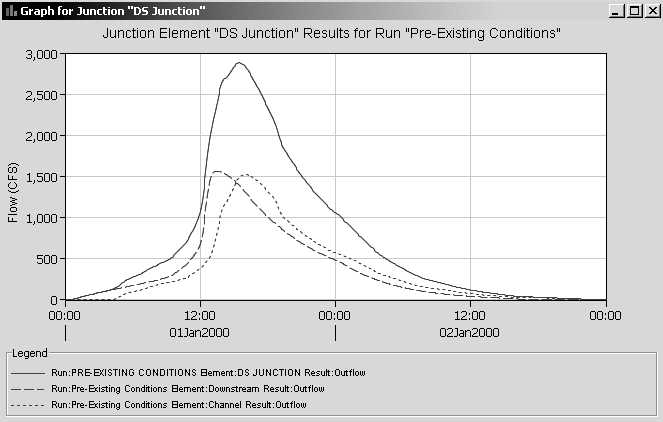
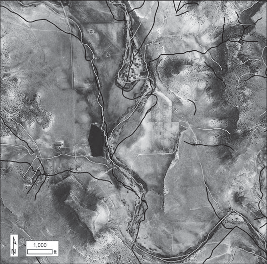
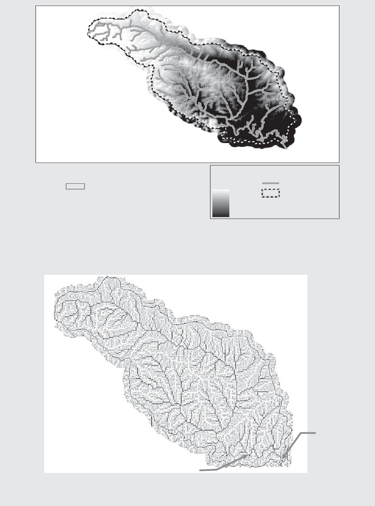
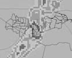
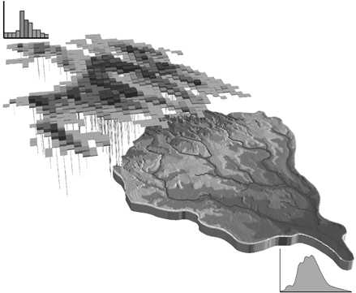
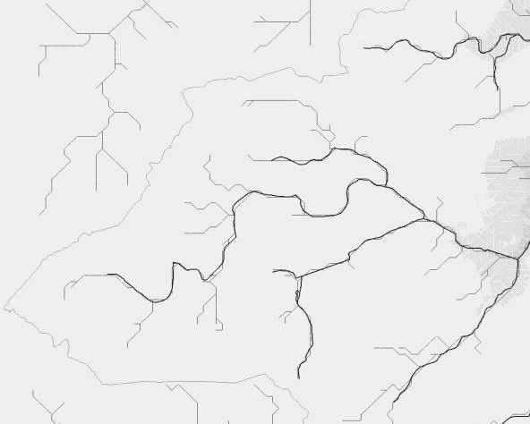

> aspects of hydrology, from rainfall analysis to flood routing, but its
> best- known component uses information on soil storage, as
> characterized by curve numbers, to predict the runoff volume resulting
> from rainfall. A vari- ety of unit hydrograph procedures are then
> available to distribute the runoff in time. The computerized version
> of the NRCS procedures is called TR-20. SCS techniques are
> incorporated into many programs for watershed analy- sis, including
> HEC-HMS (Chapter 5).
>
> An adaptation of the original method to urban areas is called TR-55
> (Soil Conservation Service, 1986). Additional curve numbers are
> provided in TR-55 as a function of urban land use, and information is
> presented on travel times and times of concentration for application
> of the unit hydro- graph procedures. The SCS procedures are widely
> used in engineering prac- tice, and additional source material is
> available (McCuen, 1982; Viessman and Lewis, 1996). The newest
> computerized versions of TR-20 and TR-55 are called WinTR-20 and
> WinTR-55, which, along with other useful hydro- logic software, may be
> downloaded from the NRCS; search for "NRCS WinTR-55." The strength of
> the NRCS method is the experience of four decades of model development
> and use and the enormous database of soils information; highly
> site-specific data can be obtained from county soils maps and NRCS
> Soil Survey Interpretation Sheets. (These data are also very use- ful
> in applications using methods other than the SCS method.) The weakness
> of the NRCS method is its synthetic design storm philosophy, which was
> critiqued in Section 6.3. With this method, it is also difficult to
> duplicate measured hydrographs in areas with high water tables. This
> difficulty arises from the SCS method's sensitivity to the depth of
> the water table and its inability to represent this factor using the
> three available antecedent condi- tions (Capece et al., 1984).
>
> **SWMM**
>
> The Storm Water Management Model (SWMM) was developed for the
> Environmental Protection Agency in 1969--1971 as a single-event model
> for simulation of quantity and quality processes in combined sewer
> systems (Metcalf and Eddy et al., 1971; Huber et al., 2005). It has
> since been applied to virtually every aspect of urban drainage, from
> routine drainage design to sophisticated hydraulic analysis to
> nonpoint-source runoff quality studies, using both single-event and
> continuous simulation. By subdividing large catchments and routing
> flows down the drainage system, SWMM can be applied to catchments of
> almost any size, from parking lots to subdivisions to cities. An
> extensive literature exists for SWMM, exemplified in proceed- ings of
> the type edited by James et al. (2006).
>
> Although Version 4 of SWMM (Huber and Dickinson, 1988; Roesner et al.,
> 1988) is still useful for some purposes, most SWMM users will be best
> served by Version 5: SWMM5, released in 2004. This version has been
> care- fully recoded in the C language to eliminate errors and add
> features, and it
>
> includes a GUI. The model, code, and documentation (Rossman, 2005) may
> be freely downloaded at <http://www.epa.gov/nrmrl/wswrd/wq/models/>
> swmm/. Notable in the documentation is an applications manual (Gironás
> et al., 2009).
>
> Runoff is generated from rainfall in SWMM using a nonlinear reservoir
> method (Example 6--9). Subsurface flow routing of water infiltrated
> through the soil surface is optional. Flow routing may be performed by
> the kinematic wave method or by using the complete Saint Venant
> equations. This dynamic wave routing remains one of the most powerful
> features of SWMM. Simula- tion of storage and hydraulic controls may
> be performed throughout the catch- ment and drainage systems. Water
> quality generation and transport may also be simulated throughout the
> catchment and drainage systems, as well as treat- ment in storage
> devices and elsewhere for modeling of most best management practices
> (BMPs). SWMM5 includes many graphical and other reporting tools. For
> instance, the statistics tool may be used to separate continuous
> simulation hydrographs and pollutographs (concentration vs. time) into
> independent storm events (as in Example 6--3), calculate statistical
> moments, and perform elementary frequency analyses. Metric units are
> optional. A detailed case study of the use of SWMM5 is given later in
> this chapter.
>
> **U.S. Geological Survey Models**
>
> The USGS is the leading federal agency for research in hydrology and
> has produced several rainfall--runoff models and flow routing software
> (e.g., the FEQ model described earlier), all of which are freely
> available from the USGS website:
> [http://water.usgs.gov/software/surface_water.html.](http://water.usgs.gov/software/surface_water.html)
> However, support for USGS surface water simulation tools is not as
> readily available as for the models previously described. In addition
> to simulation models, a large number of software packages for
> statistical analysis, sediment trans- port, scour analysis, and other
> hydrologic and hydraulic computations are also available from their
> generous website.
>
> **Model Selection**
>
> Although there may be theoretical reasons for preference of one model
> over another, the choice is often made on much more pragmatic grounds.
> Con- siderations include designation of a required model by a
> permitting agency, model support and documentation, familiarity with
> techniques used in a model, type of computer required, and
> availability of data. The last factor is probably the most important.
> For example, complex flow routing in a sewer cannot be performed
> without detailed information on invert elevations, ground surface
> elevations, and hydraulic structures in the sewer system. If such
> information is not available, a lumped parameter approach using a much
> simpler method (such as a UH) might be appropriate.
>
> When both rainfall and runoff data are available for calibration, most
> of the models discussed in this section can be calibrated for the
> catchment
>
> under consideration. In general, the simplest model that is applicable
> to the problems under study and that can be properly calibrated is
> probably the best choice. However, simple models are generally able to
> address fewer hypothetical "what-if" questions dealing with
> alternative design formula- tions, because the required physically
> based procedures may not be incor- porated into the models. Hence
> model choice is an important function of model capability as well as
> model simplicity.
>
> A sensitivity analysis of a model will reveal information on the
> relative importance of the many input parameters as well as
> uncertainty in model output (James and Kuch, 1998). This is an
> important introductory step for the use of any model.
>
> Finally, model reviews and comparative studies referenced earlier in
> this section may be consulted for guidance. Since model capabilities
> continu- ally change and improve, caution should be exercised when
> reading about models in older references and in this text. World Wide
> Web sites for all models are the best way to survey current model
> capabilities and availability.
>
> **Introduction**
>
> How may an urban rainfall--runoff model be applied to a real
> catchment? What kind of information results, and for what purpose? To
> illustrate the use of such a model, the calibration and verification
> of the SWMM5 model on a high-density residential (apartment)
> catchment, abbreviated HDR, in Miami, Florida, will be shown. Results
> of continuous simulations will be illustrated for purposes of
> frequency analysis and selection of design storms from the historic
> record. This particular catchment is one of four south Flor- ida
> catchments monitored by the USGS (Mattraw et al., 1978; Hardee et al.,
> 1978; Miller et al., 1979; Hardee et al., 1979), which collectively
> form one of the best model-testing opportunities of any extant
> dataset. The usefulness of the measured rainfall, runoff, and quality
> data is tremendously enhanced by the foresight of Miller (1979) in
> providing data needed for modeling for each of the four catchments.
>
> **The Catchment**
>
> The 14.7-ac HDR Catchment (Fig. 6--12) discharges to Snapper Creek
> (South Florida Water Management District Canal C-2) in south Miami,
> just southwest of the interchange of state highways 826 and 878. A
> watershed map used in SWMM5 is shown in Figure 6--12. Hardee et al.
> (1979) moni- tored 16 storms for rainfall, runoff, and water quality
> between May 1977 and June 1978. The apartment complex in 2011 is
> essentially the same as it was during the monitoring period, although
> cultural changes over 30 years would be expected to change runoff
> quality characteristics. The HDR catchment
>
> **6.8**
>
> **CASE STUDY**
>
> **Figure 6--12** SWMM5 water- shed area with inlets and pipes shown,
> Miami High Density Residential catchment.
>
> {width="4.180027340332458in"
> height="3.2666666666666666in"}
>
> has been studied and modeled by several investigators, including
> Cunning- ham and Huber (1987), Huber et al. (1991), Hamid (1995), and
> Lee and Heaney (2005). Catchment characteristics compiled by Miller
> (1979) are listed in Table 6--6, along with SWMM5 roughness,
> depression storage, and infiltration parameters and their basis.
>
> **Data Input and SWMM Calibration**
>
> Rainfall is converted into runoff in SWMM5 by the nonlinear reservoir
> method illustrated in Example 6--9; corresponding subcatchment input
> parameters are listed in Table 6--7, in addition to the global
> roughness, depression storage, and infiltration parameters listed in
> Table 6--6. The aver- age subcatchment slope could be found by
> selecting several points at the edge of the subcatchment, calculating
> the path length of each point to the subcatchment outlet, dividing the
> path lengths by the change in elevation, and taking an area-weighted
> average of the eight slopes. In this case, average slope was computed
> using an Arc/Info utility TIN (triangular irregular net- work) applied
> to a digitized map of the basin (Huber et al., 1991; see also Chapter
> 10). Percent imperviousness is DCIA (pavement, sidewalks) from
> Miller's (1979) data. An additional SWMM5 option would be to enter
> total imperviousness and then route the non-directly connected
> impervious runoff ("runon") over the adjacent pervious area (the
> remaining DCIA would drain directly to the subcatchment outlet). This
> refinement was not used for this example but would be especially
> useful in situations for which saturation of the pervious area is
> likely due to runon.
>
> **Table 6--6** Hydrologic Characteristics of Miami High-Density
> Residential (HDR) Catchment (Miller, 1979).
>
> **Latitude, Longitude**
>
> **Parameter Value**
>
> **25**8**40**9**31**0 **N,**
>
> **80**8**19**9**11**0 **W**
>
> Area 14.7 ac (5.95 ha)
>
> Percent total imperviousness 71
>
> Percent directly connected imperviousness 44
>
> (DCIA)---excludes apartment roofs; downspouts are connected to lawn
>
> Mean annual rainfall 56 in. (1420 mm)
>
> Soil description Perrine marl: friable marl of silt-loam texture;
> contains few shell fragments; underlain by limestone; NRCS hydrologic
> soil group D.
>
> Streets Asphalt streets have no curb and gutter and drain to depressed
> centerline of street.
>
> Storm sewers Circular, corrugated metal except for lowest
>
> two pipes, connecting links 5-1 and 1-A in Fig. 6--12.
>
> Manning's roughness
>
> Impervious sidewalks and asphalt pavement (Table 4--2)
>
> 0.014
>
> Pervious lawn (Table 4--2) 0.2
>
> Corrugated metal pipe (CMP) (Table 7--1) 0.024
>
> Reinforced concrete pipe (RCP) (Table 7--1) 0.013
>
> Depression storage (Table 6--3)
>
> Impervious 0.05 in. (1.3 mm)
>
> Pervious 0.15 in. (3.8 mm)
>
> Green--Ampt parameters (Table 2--4)
>
> Suction 6.6 in. (168 mm)
>
> Hydraulic conductivity 0.25 in./hr (6.4 mm/hr)
>
> Initial moisture deficit 0.1
>
> **Table 6--7** Subcatchment Characteristics for HDR Catchment

+-------------+--------+---------------+---------+--------+---------+
| > **Sub     | >      | > **Percent   | > **    | > *    | >       |
| catchment** | **Area | > Total       | Percent | *Width | **Slope |
|             | >      | > Imp         | >       | >      | > (per  |
|             | (ac)** | erviousness** |  DCIA** | (ft)** | cent)** |
+=============+========+===============+=========+========+=========+
| > 201       | 1.157  | 60            | 36      | 254    | 3.1     |
+-------------+--------+---------------+---------+--------+---------+
| > 202       | 0.352  | 88            | 31      | 87     | 3.5     |
+-------------+--------+---------------+---------+--------+---------+
| > 203       | 1.412  | 56            | 40      | 148    | 2.9     |
+-------------+--------+---------------+---------+--------+---------+
| > 204       | 1.236  | 69            | 37      | 150    | 2.0     |
+-------------+--------+---------------+---------+--------+---------+
| > 205       | 0.842  | 78            | 47      | 241    | 2.7     |
+-------------+--------+---------------+---------+--------+---------+
| > 206       | 0.395  | 77            | 32      | 88     | 3.0     |
+-------------+--------+---------------+---------+--------+---------+
| > 207       | 1.204  | 74            | 49      | 81     | 1.8     |
+-------------+--------+---------------+---------+--------+---------+
| > 208       | 1.006  | 69            | 51      | 65     | 2.0     |
+-------------+--------+---------------+---------+--------+---------+
| > 209       | 0.761  | 76            | 32      | 126    | 3.1     |
+-------------+--------+---------------+---------+--------+---------+
| > 210       | 2.798  | 79            | 49      | 175    | 2.1     |
+-------------+--------+---------------+---------+--------+---------+
| > 211       | 1.049  | 50            | 36      | 89     | 1.4     |
+-------------+--------+---------------+---------+--------+---------+
| > 212       | 1.452  | 80            | 60      | 112    | 1.3     |
+-------------+--------+---------------+---------+--------+---------+
| > 213       | 1.079  | 73            | 41      | 145    | 2.8     |
+-------------+--------+---------------+---------+--------+---------+

> Subcatchment width is a shape parameter, often used for calibration of
> peak flows. It can be estimated by determining the "average maximum"
> flow path length to the outlet, and dividing the area by this path
> length. The "average maximum" is the average of several flow path
> lengths from the outlet to the subcatchment boundary. This is the
> method used by Huber et al. (1991) to estimate widths for the HDR
> subcatchments. However, as per- haps more of an ambiguous input
> parameter than slope or roughness (nei- ther of which is necessarily
> straightforward to estimate), width is often used as the calibration
> parameter of choice for peak flows, since from Equation (6--20) it can
> be seen than any two of the three (width, slope, roughness) may be
> fixed and the third varied for calibration. Higher width usually means
> higher hydrograph peaks, because water runs off the subcatchment
> faster. However, in this modeling example, a priori input parameter
> estimates were sufficient to produce good calibration and verification
> simulations, and parameters were not varied beyond what is shown in
> Tables 6--6 and 6--7.
>
> Average monthly evaporation was not included in simulations for indi-
> vidual storm events, since it has minimal effect over a period of only
> a few hours. For continuous simulation runs, average monthly pan
> evaporation data were obtained from NWS values published by Farnsworth
> and Thomp- son (1982) for the nearest station to the HDR catchment:
> Hialeah (NWS station 08309), about 14 mi north, from which actual
> evapotranspiration (ET) estimates were calculated by multiplying by a
> pan coefficient of 0.8 (Table 1--5) to reflect total ET. These ET
> estimates are shown in Table 6--8.
>
> Five-minute interval rainfall--runoff data for calibration and
> verification were monitored and reported by Hardee et al. (1979) for
> 16 events. Ten of the storms were selected from the two-year study and
> randomly divided into two sets of five storms each, one for
> calibration and the other for verification
>
> **Table 6--8** Evaporation Data Used for ET Estimates (Farnsworth and
> Thompson, 1982)

+-----------------+--------------------+---------+---+---------+------+
| > **Month**     | > **PAN**          | **ET**  | > | >       | >    |
|                 | >                  |         |   | **PAN** |  **0 |
|                 | > **(in.)**        |         | 5 | > 3     | .8** |
|                 |                    |         |   | >       |      |
|                 |                    |         |   | > **    |      |
|                 |                    |         |   | (in.)** |      |
+=================+====================+=========+===+=========+======+
| > Jan           | > 3.81             | > 3.05  |   |         |      |
+-----------------+--------------------+---------+---+---------+------+
| > Feb           | > 4.42             | > 3.54  |   |         |      |
+-----------------+--------------------+---------+---+---------+------+
| > Mar           | > 6.12             | > 4.90  |   |         |      |
+-----------------+--------------------+---------+---+---------+------+
| > Apr           | > 7.26             | > 5.81  |   |         |      |
+-----------------+--------------------+---------+---+---------+------+
| > May           | > 7.80             | > 6.24  |   |         |      |
+-----------------+--------------------+---------+---+---------+------+
| > Jun           | > 7.12             | > 5.70  |   |         |      |
+-----------------+--------------------+---------+---+---------+------+
| > Jul           | > 7.36             | > 5.89  |   |         |      |
+-----------------+--------------------+---------+---+---------+------+
| > Aug           | > 7.22             | > 5.78  |   |         |      |
+-----------------+--------------------+---------+---+---------+------+
| > Sep           | > 5.91             | > 4.73  |   |         |      |
+-----------------+--------------------+---------+---+---------+------+
| > Oct           | > 5.81             | > 4.65  |   |         |      |
+-----------------+--------------------+---------+---+---------+------+
| > Nov           | > 4.79             | > 3.83  |   |         |      |
+-----------------+--------------------+---------+---+---------+------+
| > Dec           | > 3.80             | > 3.04  |   |         |      |
+-----------------+--------------------+---------+---+---------+------+

> **Table 6--9** HDR Catchment Monitored Storms and 10 SWMM5 Simulation
> Results

+----+--------+-----+-----+-------+-------+-------+--------+--------+
| >  | > **   | >   | >   | > **  | >     | >     | > **S  | > **S  |
| ** | Date** | **R | **R | Monit | **Mea | **Mea | imulat | imulat |
| US |        | ain | ain | oring | sured | sured | ed\*\* | ed\*\* |
| GS |        | > G | > G | >     | > R   | > R   | >      | >      |
| >  |        | age | age | Durat | unoff | unoff | Runoff | Runoff |
| ID |        | > 1 | > 2 | ion\* | > V   | >     | >      | > Peak |
| ** |        | > ( | > ( | > (   | olume |  Peak | Volume | > (    |
|    |        | in. | in. | hr)** | > (i  | > (c  | > (    | cfs)** |
|    |        | )** | )** |       | n.)** | fs)** | in.)** |        |
+====+========+=====+=====+=======+=======+=======+========+========+
| >  | 5/     | > 2 | >   | >     | >     | 20.68 | >      | 20.58  |
|  1 | 4/1977 | .85 | --- |  5.67 | 1.983 |       |  1.588 |        |
+----+--------+-----+-----+-------+-------+-------+--------+--------+
| >  | 5/1    | > 1 | >   | >     | >     | 31.57 | >      | 30.58  |
|  3 | 1/1977 | .17 | --- |  0.83 | 0.657 |       |  0.669 |        |
+----+--------+-----+-----+-------+-------+-------+--------+--------+
| >  | 5/1    | > 2 | >   | >     | >     | 26.47 | >      | 20.07  |
|  4 | 1/1977 | .08 | --- | 2.083 | 1.426 |       |  1.228 |        |
+----+--------+-----+-----+-------+-------+-------+--------+--------+
| >  | 6/     | > 1 | > 1 | >     | >     | 15.64 |        |        |
|  5 | 1/1977 | .86 | .66 |  4.25 | 1.176 |       |        |        |
+----+--------+-----+-----+-------+-------+-------+--------+--------+
| >  | 7/1    | > 1 | > 1 | >     | >     | 15.28 | >      | 15.01  |
|  9 | 5/1977 | .67 | .45 |  3.17 | 0.668 |       |  0.854 |        |
+----+--------+-----+-----+-------+-------+-------+--------+--------+
| >  | 8/     | >   | > 0 | >     | >     | 11.91 | >      | 10.41  |
| 16 | 8/1977 | --- | .53 |  1.33 | 0.217 |       |  0.215 |        |
+----+--------+-----+-----+-------+-------+-------+--------+--------+
| >  | 8/     | > 0 | > 1 | >     | >     | 12.98 | >      | 11.51  |
| 17 | 8/1977 | .84 |     |  4.33 | 0.541 |       |  0.365 |        |
+----+--------+-----+-----+-------+-------+-------+--------+--------+
| >  | 8/1    | > 1 | > 1 | >     | > 0.9 | 16.26 |        |        |
| 18 | 2/1977 | .50 | .49 | 6.083 |       |       |        |        |
+----+--------+-----+-----+-------+-------+-------+--------+--------+
| >  | 12/    | > 0 | >   | > 2.5 | >     | 15.57 | >      | 10.94  |
| 33 | 6/1977 | .70 | 0.8 |       | 0.308 |       |  0.335 |        |
+----+--------+-----+-----+-------+-------+-------+--------+--------+
| >  | 1/1    | > 0 | > 0 | > 5.5 | >     | 9.99  |        |        |
| 38 | 9/1978 | .73 | .79 |       | 0.277 |       |        |        |
+----+--------+-----+-----+-------+-------+-------+--------+--------+
| >  | 2/1    | > 2 | >   | >     | >     | 10.98 |        |        |
| 39 | 8/1978 | .02 | 2.1 | 7.917 | 0.712 |       |        |        |
+----+--------+-----+-----+-------+-------+-------+--------+--------+
| >  | 3/     | > 1 | > 1 | >     | >     | 14.04 |        |        |
| 40 | 3/1978 | .56 | .51 |  4.67 | 0.423 |       |        |        |
+----+--------+-----+-----+-------+-------+-------+--------+--------+
| >  | 4/2    | > 0 | > 0 | >     | >     | 14.33 | >      | 12.72  |
| 44 | 3/1978 | .74 | .73 |  2.17 |  0.33 |       |  0.321 |        |
+----+--------+-----+-----+-------+-------+-------+--------+--------+
| >  | 5/1    | > 0 | > 0 | >     | >     | 7.96  | >      | 6.53   |
| 48 | 8/1978 | .75 | .74 |  3.83 | 0.238 |       |  0.303 |        |
+----+--------+-----+-----+-------+-------+-------+--------+--------+
| >  | 5/2    | > 0 | > 0 | >     | >     | 10.53 |        |        |
| 50 | 6/1978 | .61 | .58 |  2.17 | 0.266 |       |        |        |
+----+--------+-----+-----+-------+-------+-------+--------+--------+
| >  | 6/1    | > 1 | > 1 | >     | >     | 24.03 | >      | 25.75  |
| 52 | 2/1978 | .01 | .01 | 1.083 | 0.444 |       |  0.548 |        |
+----+--------+-----+-----+-------+-------+-------+--------+--------+

> \*Monitoring was at 5-min intervals and duration reflects the 1/12-hr
> intervals. The duration corresponds to the end of flow sampling. The
> rainfall duration was usually less by many minutes.
>
> \*\*Gray shading corresponds to storms used for verification while
> unshaded means calibration storms.
>
> (Table 6--9). (Except for the additional effort, all 16 storms could
> be used.) Rainfall was monitored at one or two gages for all storms,
> as indicated in Table 6--9. For SWMM simulations, gage 1 (near outlet,
> at bottom of Fig. 6--12) was assigned to subcatchments 201--206 and
> gage 2 to the remainder. Runoff was measured in the outfall pipe
> (connecting nodes 1-A in Fig. 6--12). A 5-min time step was used for
> both the single-event and continuous simulation runs.
>
> The model was first run for the five calibration storms
> simultaneously--- that is, while maintaining the same parameter values
> for each (Maalel and Huber, 1984). This results in a calibration that
> is less than what might be achievable for an individual storm but
> robust for a group of storms. The idea of verification events is to
> test the calibration on a set of events not used to calibrate the
> model, and five such verification storms were then run. A com- mon way
> of demonstrating multiple-storm calibration is shown in Figures 6--13
> for volumes and 6--14 for peak flows. Perfect agreement would have
> data points fall on a 45-degree line. Although modelers are seldom so
> fortunate, the agreement of measured and simulated runoff volumes (as
> a depth) and peak flows was deemed sufficient without further
> parameter adjustments; that is, the model was not calibrated using the
> rainfall--runoff data. Calibrations are generally easier in urban
> catchments with high imperviousness. A listing of the storms simulated
> and the data used in Figures 6--13 and 6--14 is given in
>
> **Figure 6--13** Goodness of fit of runoff volumes.

2

1.8

1.6

1.4

1.2

1

0.8

0.6

0.4

0.2

> 0 0 0.2 0.4 0.6
>
> 0.8 1
>
> 1.2
>
> 1.4
>
> 1.6
>
> 1.8 2
>
> Measured volume, in.
>
> Table 6--9. Two examples of SWMM5 output graphics comparing simulated
> and measured hydrographs are shown in Figure 6--15. Multiobjective
> calibra- tion of SWMM is discussed by Herrera et al. (2006).
>
> **Analysis of Continuous Results**
>
> When the verification was completed, a continuous run of 31 yrs (376
> months: April 1972 to August 2003) was made using 15-min rainfall data
> from the nearest available gage with 15-min rainfall: Pennsuco, NWS
> 086988, approximately 18.8 miles west of the catchment. Statistical
> analysis of the predicted flows was performed using the Statistics
> Tool of SWMM5. The time series of 5-min runoff values was separated
> into 2199 independent storm events using an MIT value of 6 hr (see
> Section 6.3) and an outfall flow threshold of 0.1 cfs. The objective
> is to identify historic events with return periods of about 5 years
> (arbitrary, for this example) for possible use as design events for
> stormwater management.
>
> **Figure 6--14** Goodness of fit of runoff peaks.
>
> 35
>
> 30
>
> 25
>
> 20
>
> 15
>
> 10
>
> 5
>
> 0 0 5 10
>
> 15 20
>
> 25 30 35
>
> Measured peak (cfs)

25.0

20.0

> Link 101 Flow, storm 1
>
> **Figure 6--15**
>
> SWMM5 GUI com-
>
> parison of simulated and measured flows for two storms.
>
> 15.0
>
> 10.0
>
> 5.0
>
> 0.0
>
> 0 1
>
> 2 3 4
>
> Elapsed Time (hr)
>
> 5 6 7

Link 101 Flow, storm 9

> 16.0
>
> 14.0
>
> 12.0
>
> 10.0
>
> 8.0
>
> 6.0
>
> 4.0
>
> 2.0
>
> 0.0

0 0.5 1 1.5 2 2.5 3 3.5

Elapsed Time (hr)

> The SWMM5 Statistics Tool performs a frequency analysis on any or all
> of the following parameters: runoff volume, average flow, peak flow,
> event duration, and interevent duration. (If pollutants were being
> simulated, fre- quency analyses could also be performed on total load,
> average load, peak load, event mean concentration, and peak
> concentration.) Storm events are sorted and ranked by magnitude for
> each parameter of interest and are assigned an empirical return period
> in years according to the Weibull formula \[Eq. (3--75)\]. The
> largest-magnitude event for this 31.3-yr simulation was thus assigned
> a return period of 32 years. For this simulation, the sixth and
> seventh largest events bracket a 5-yr event with return periods of 5.3
> and 4.6 years, respectively, both of which are compared as "candidate
> design events."
>
> On this basis, four storms from the historical record were selected
> for the 5-yr storm: two based on peak flow and two based on total flow
> (runoff volume). The hyetographs of these storms are shown in Figures
> 6--16 and 6--17, and their characteristics are listed in Table 6--10.
> An unfortunate
>
> **Table 6--10** Characteristics of Historical Design Storms

+-------+-------+-------+------+-----+-------+------+--------+------+
| > **  | > **D | > **R | >    | >   | >     | > ** | >      | > ** |
| Storm | ate** | unoff | **Ru | **P | **Rai | Rain | **Time | Rain |
| >     |       | > Dur | noff | eak | nfall | fall | >      | fall |
| Numbe |       | ation | > Vo | > F | > Dur | > Vo |  Since | >    |
| r\*** |       | > (   | lume | low | ation | lume | > Last | Last |
|       |       | hr)** | >    | > ( | > (   | >    | >      | > E  |
|       |       |       |  (in | cfs | hr)** |  (in |  Event | vent |
|       |       |       | .)** | )** |       | .)** | >      | >    |
|       |       |       |      |     |       |      | (hr)** |  (in |
|       |       |       |      |     |       |      |        | .)** |
+=======+=======+=======+======+=====+=======+======+========+======+
| >     | > 5/  | >     | >    | > 2 | 13.75 | >    | > 66.5 | >    |
| V-5.3 | 31/99 | 14.67 | 2.39 | 3.5 |       |  5.6 |        |  0.7 |
+-------+-------+-------+------+-----+-------+------+--------+------+
| >     | > 6/  | >     | >    | > 5 | 2.25  | >    | > 23.5 | >    |
| V-4.6 | 29/79 |  2.83 | 2.33 | 7.5 |       |  3.2 |        |  0.3 |
+-------+-------+-------+------+-----+-------+------+--------+------+
| >     | > 8/  | >     | >    | > 4 | > 1.0 | >    | > 47.5 | >    |
| P-5.3 | 20/72 |  2.08 | 1.34 | 9.4 |       |  2.1 |        |  0.1 |
+-------+-------+-------+------+-----+-------+------+--------+------+
| >     | > 7/  | >     | >    | > 4 | > 1.5 | >    | > 31   | >    |
| P-4.6 | 15/85 |  2.08 | 2.10 | 8.3 |       |  3.0 |        |  0.7 |
+-------+-------+-------+------+-----+-------+------+--------+------+

> \*V means ranked by runoff volume, P means ranked by runoff peak, and
> numbers following are return periods in years.
>
> **Figure 6--16**
>
> Five-year historic de- sign events based on frequency analysis of
> storm event volumes.
>
> (a)
>
> \(b\)
>
> **Figure 6--17**
>
> Five-year historic de- sign events based on frequency analysis of
> storm event peaks.

\(a\)

\(b\)

> characteristic of many of the 15-min datasets from the NCDC is
> apparent from the hyetographs: the minimum depth resolution is 0.1
> in., instead of

1.  in. for daily measurements and for many hourly datasets. This means
    that the minimum 15-min intensities will be 0.1 in. 0.25 hr = 0.4
    in./hr. Small catchments such as the Miami HDR catchment can easily
    respond to inten- sities less than 0.4 in./hr, as may be seen from
    the calibration and verification runs (Fig. 6--15); however, shorter
    time resolution (15-min rainfall) data were selected over better
    depth resolution (hourly rainfall) data.

> The modeling results emphasize the fact that the return periods of the
> individual storms are different when ranked by another parameter, as
> shown
>
> **Table 6--11** Return Periods (Years) of Storms by Volume, Peak Flow,
> and Rainfall

+---------+------------+--------------+----------------+---------------+
| >       | > **Date** | > **Rank,    | > **Rank,      | > **Rank,     |
| **Storm |            | > Return     | > Return       | > Return      |
| > N     |            | > Period by  | > Period by    | > Period by   |
| umber** |            | > Volume**   | > Peak Flow**  | > Rainfall    |
|         |            |              |                | > Volume**    |
+=========+============+==============+================+===============+
| > V-5.3 | > 5/31/99  | > 6, 5.3     | > 75, 0.43     | > 4, 8.0      |
+---------+------------+--------------+----------------+---------------+
| > V-4.6 | > 6/29/79  | > 7, 4.6     | > 5, 6.4       | > 29, 1.1     |
+---------+------------+--------------+----------------+---------------+
| > P-5.3 | > 8/20/72  | > 36, 0.89   | > 6, 5.4       | 100, 0.32     |
+---------+------------+--------------+----------------+---------------+
| > P-4.6 | > 7/15/85  | > 10, 3.2    | > 7, 4.6       | 35, 0.91      |
+---------+------------+--------------+----------------+---------------+

> in Table 6--11. For example, storm V-5.3 is the 6th largest by volume,
> 4th largest by rainfall volume, but 75th largest by peak flow! On the
> other hand, storm V-4.6 is the 7th largest by volume, 29th largest by
> rainfall volume, but 5th largest by peak flow. Table 6--11 illustrates
> that return periods of the same event ranked by different parameters
> are rarely the same. Chin (2004) reports that 5-yr, 1-hr storms are
> used for assessing the capacity of onsite drainage structures, such as
> BMPs. Three of the design events shown in Figures 6--16 and 6--17 are
> coincidentally on the order of 1 hr duration, but could be longer or
> shorter, since the peaks are a result of bursts of high- intensity
> rain within the storm event. This points out the inconsistency of
> assigning an arbitrary duration to design storms, especially for a
> catchment this small. Continuous simulation allows the engineer to use
> actual durations of actual storms, avoiding the vexing problem of
> having to choose a duration at the start of the analysis for
> application of a synthetic hyetograph.
>
> **Other Design Techniques**
>
> Unfortunately, USGS regional flood frequency techniques (Chapter 3)
> cannot be applied to this small urban catchment in Miami because, as
> of 2011, no generalized equations are available for either the rural
> or urban areas of South Florida
> ([http://water.usgs.gov/software/nff.html).](http://water.usgs.gov/software/nff.html))
> However, the 5-yr rational method peak can be compared to the historic
> storms, and this section also serves to provide an additional rational
> method example. Chin (2004) provides a functional form of the IDF
> curves used in the Miami-Dade area:

where

> *i* = [308.5]{.underline} , (6--25) 48.6*T* ^-0.11^ + *t*(0.5895 + *T*
> ^-0.67^)

*i* = intensity (in./hr),

> *T* = return period (year), and
>
> *t* = rainfall duration (min).
>
> Interestingly, for a fixed *T*, Equation (6--25) is of the same form
> as Equation (6--10). The kinematic wave overland flow travel time
> \[Eq. (4--60)\] will be
>
> used in conjunction with assumed dynamic wave \[Eq. (6--7)\] travel
> times down the circular pipes shown in Figure 6--12. The longest
> travel time probably oc- curs from the combination of overland flow
> down subcatchments 207 and 208 toward inlets 7 and 8, plus the travel
> time down the four pipes from junction 8 to junction 1, neglecting the
> travel time down the outfall pipe, since that pipe typically has some
> standing water in it. From the SWMM5 input data, the four pipes
> connecting junctions 1 and 8 total 410 ft and all but one are 3 ft in
> diameter. The upper three pipes are corrugated metal pipe (CMP), with
> a Manning roughness of about 0.022 (Table 7--1), while the pipe
> connecting junctions 5 and 1 is reinforced concrete pipe (RCP), with a
> Manning roughness of about 0.013. Because the computations that follow
> are insensitive to most of the numbers used for the wave speed
> calculation, a simple average of 0.017 will be used for *n* instead of
> computation of a length-weighted harmonic mean or computation of wave
> speeds down the individual pipe segments. Invert elevations at
> junctions 8 and 1 are 2.262 and - 0.889 ft NGVD, respectively, giving
> an average slope of 0.00769. Assuming a 3-ft diameter pipe half full,
> Equation (6--7) gives a wave velocity of 6.16 ft/s and a corresponding
> dynamic wave travel time down the four pipes of 54 s ≈ 1 min.
>
> The dynamic wave travel time through the sewers will be added to the
> kinematic wave overland flow travel time. The latter is computed using
> an overland flow length of 500 ft (estimate for subcatchments 207 and
> 208 from Fig. 6--12), Manning roughness of 0.014 for the pavement
> (Table 6--6), and slope = 0.019 (SWMM input parameters for
> subcatchments 207 and 208). Iterations proceed as in Example 6--6,
> with the difference that total time of
>
> concentration = overland flow *t~c~* + wave travel time in sewers (\~1
> min).
>
> Computations are summarized in Table 6--12.
>
> **Table 6--12** Kinematic Wave Iterations for 5-yr Peak Flow

<table>
<colgroup>
<col style="width: 10%" />
<col style="width: 14%" />
<col style="width: 15%" />
<col style="width: 13%" />
<col style="width: 5%" />
<col style="width: 10%" />
<col style="width: 5%" />
<col style="width: 10%" />
<col style="width: 5%" />
<col style="width: 8%" />
</colgroup>
<thead>
<tr class="header">
<th><blockquote>
<p><em><strong>t<sub>r</sub></strong></em></p>
<p><strong>(min)</strong></p>
</blockquote></th>
<th><blockquote>
<p><em><strong>i</strong></em></p>
<p><strong>Eq. (6–28)</strong></p>
<p><strong>(in./hr)</strong></p>
</blockquote></th>
<th><blockquote>
<p><strong>Kin. Wave <em>t<sub>c</sub></em> Eq. (4–60)</strong></p>
<p><strong>(min)</strong></p>
</blockquote></th>
<th><blockquote>
<p><strong><em>t<sub>c</sub></em> Total (min)</strong></p>
</blockquote></th>
<th><em><strong>C</strong></em></th>
<th><blockquote>
<p>5 <strong>0.7</strong></p>
<p><strong>(cfs)</strong></p>
</blockquote></th>
<th><blockquote>
<p><em><strong>Q C</strong></em></p>
</blockquote></th>
<th><blockquote>
<p>5 <em><strong>CiA</strong></em></p>
<p>5 <strong>0.6</strong></p>
<p><strong>(cfs)</strong></p>
</blockquote></th>
<th><em><strong>C</strong></em></th>
<th><blockquote>
<p>5 <strong>0.5</strong></p>
<p><strong>(cfs)</strong></p>
</blockquote></th>
</tr>
</thead>
<tbody>
<tr class="odd">
<td><blockquote>
<p>5</p>
</blockquote></td>
<td><blockquote>
<p>6.801</p>
</blockquote></td>
<td><blockquote>
<p>4.559</p>
</blockquote></td>
<td><blockquote>
<p>5.559</p>
</blockquote></td>
<td colspan="2"></td>
<td colspan="2"></td>
<td colspan="2"></td>
</tr>
<tr class="even">
<td><blockquote>
<p>5.6</p>
</blockquote></td>
<td><blockquote>
<p>6.718</p>
</blockquote></td>
<td><blockquote>
<p>4.582</p>
</blockquote></td>
<td><blockquote>
<p>5.582</p>
</blockquote></td>
<td colspan="2"><blockquote>
<p>69.1</p>
</blockquote></td>
<td colspan="2"><blockquote>
<p>59.3</p>
</blockquote></td>
<td colspan="2"><blockquote>
<p>49.4</p>
</blockquote></td>
</tr>
<tr class="odd">
<td><blockquote>
<p>6</p>
</blockquote></td>
<td><blockquote>
<p>6.664</p>
</blockquote></td>
<td><blockquote>
<p>4.596</p>
</blockquote></td>
<td><blockquote>
<p>5.596</p>
</blockquote></td>
<td colspan="2"></td>
<td colspan="2"></td>
<td colspan="2"></td>
</tr>
<tr class="even">
<td><blockquote>
<p>7</p>
</blockquote></td>
<td><blockquote>
<p>6.533</p>
</blockquote></td>
<td><blockquote>
<p>4.633</p>
</blockquote></td>
<td><blockquote>
<p>5.633</p>
</blockquote></td>
<td colspan="2"></td>
<td colspan="2"></td>
<td colspan="2"></td>
</tr>
<tr class="odd">
<td><blockquote>
<p>8</p>
</blockquote></td>
<td><blockquote>
<p>6.407</p>
</blockquote></td>
<td><blockquote>
<p>4.669</p>
</blockquote></td>
<td><blockquote>
<p>5.669</p>
</blockquote></td>
<td colspan="2"></td>
<td colspan="2"></td>
<td colspan="2"></td>
</tr>
<tr class="even">
<td><blockquote>
<p>9</p>
</blockquote></td>
<td><blockquote>
<p>6.285</p>
</blockquote></td>
<td><blockquote>
<p>4.705</p>
</blockquote></td>
<td><blockquote>
<p>5.705</p>
</blockquote></td>
<td colspan="2"></td>
<td colspan="2"></td>
<td colspan="2"></td>
</tr>
<tr class="odd">
<td><blockquote>
<p>10</p>
</blockquote></td>
<td><blockquote>
<p>6.169</p>
</blockquote></td>
<td><blockquote>
<p>4.741</p>
</blockquote></td>
<td><blockquote>
<p>5.741</p>
</blockquote></td>
<td colspan="2"></td>
<td colspan="2"></td>
<td colspan="2"></td>
</tr>
<tr class="even">
<td><blockquote>
<p>15</p>
</blockquote></td>
<td><blockquote>
<p>5.644</p>
</blockquote></td>
<td></td>
<td></td>
<td colspan="2"></td>
<td colspan="2"></td>
<td colspan="2"></td>
</tr>
<tr class="odd">
<td><blockquote>
<p>30</p>
</blockquote></td>
<td><blockquote>
<p>4.497</p>
</blockquote></td>
<td></td>
<td></td>
<td colspan="2"></td>
<td colspan="2"></td>
<td colspan="2"></td>
</tr>
<tr class="even">
<td><blockquote>
<p>45</p>
</blockquote></td>
<td><blockquote>
<p>3.737</p>
</blockquote></td>
<td></td>
<td></td>
<td colspan="2"></td>
<td colspan="2"></td>
<td colspan="2"></td>
</tr>
<tr class="odd">
<td><blockquote>
<p>60</p>
</blockquote></td>
<td><blockquote>
<p>3.197</p>
</blockquote></td>
<td></td>
<td></td>
<td colspan="2"></td>
<td colspan="2"></td>
<td colspan="2"></td>
</tr>
</tbody>
</table>

> With access to a functional equation for the IDF curve, quick conver-
> gence is reached for an overall *t~c~* = *t~r~* of about 5.6 min.
> Other numbers are left in the table to illustrate the relative
> insensitivity of both the intensity and *t~c~* value to the assumed
> duration, *t~r~*. If the reader performs his/her own com- putations
> using these data, the final rainfall intensity is generally
> insensitive to almost all the assumptions listed in the preceding
> paragraphs. However, the rational method *Q* = *CiA* is highly
> sensitive to *C*, probably the least well-defined parameter among all
> that are being used! The runoff coefficient for "residential,
> multi-units" ranges from 0.4 to 0.75 from Table 6--5. The units for
> this apartment complex are detached but "large." Picking a mid- range
> value for detached units gives *C* = 0.5, but a higher value might
> pre- vail (and be more conservative). However, a *C* value of 0.5
> gives *Q* = 49 cfs and remarkably (and unusually) good agreement with
> the SWMM continu- ous simulation results, shown in Table 6--10, for
> which 5-yr peaks are in the range 48--50 cfs. The 4-ft CMP outfall
> sewer has a slope of 0.00505 (SWMM input) and roughness of 0.013
> (Table 7--1). The full-flow computation using Manning's equation \[Eq.
> (4--30)\] gives *Q* = *vA* = 34 cfs. Coupled with likely high
> tailwater in the Snapper Creek receiving water, the outfall is likely
> underdesigned for the 5-yr peak flow, based on both continuous
> simulation and rational method results. The result will be additional
> overland flow toward the canal during such events and/or temporary
> ponding of water on the land surface.
>
> Finally, SWMM (and other model) continuous simulation output may be
> used for direct evaluation of the relationship between magnitude of
> run- off volume or peak flow and frequency of occurrence. SWMM5 output
> for a simple ranked evaluation (i.e., a duration curve of the type
> discussed in Section 3.5) of runoff peaks is shown in Figure 6--18.
> The resulting fre- quency curve can be interpreted as the percentage
> of annual runoff volume
>
> **Figure 6--18** Percentage of annual runoff volume pass- ing through
> a control device that accepts up to indicated unit peak flow.
>
> that would be captured---i.e., passed through a BMP---for a given
> maximum inflow for the BMP. For instance, for the HDR catchment, if it
> were desired to capture (and treat) 90% of the annual runoff by a
> flow-limited BMP (i.e., one with little or no storage volume), the
> device would need to be able to accept about 0.4 in./hr, unit runoff
> rate, or 0.4 in. hr \* 14.7 ac ≈ 5.9 cfs. Regional frequency diagrams
> of this type have been constructed by Geo- syntec Consultants et al.
> (2006). The shape of the curve in Figure 6--18 is very typical of an
> analysis of this type: Most of the control is managed through capture
> of "small" storm events, whether the control is based on peak flows or
> runoff volumes, as demonstrated by several authors, such as Heaney et
> al. (1977), Urbonas and Stahre (1993), and Water Environment
> Federation and American Society of Civil Engineers (1998). Similar
> analy- sis of volume controls must be done by simulating the storage
> device as well as the hydrology, to account for the draw-down between
> storms and the interaction between water remaining in storage and
> storm interevent times. Regional curves for this purpose are also
> provided by Geosyntec Consul- tants et al. (2006).
>
> **Case Study Summary**
>
> The SWMM5 model was calibrated and verified for a high-density
> residen- tial apartment complex in Miami. Based on a continuous
> simulation, his- torical storm events were selected for prediction of
> peak flows and runoff volumes at desired return periods. A comparison
> was made with the 5-yr rational method peak, for which the results are
> highly sensitive to the choice of the runoff coefficient, *C*, but for
> which the rational method *Q*~peak~ was within the range of continuous
> simulation results using *C* = 0.5. The pri- mary advantage of the
> rational method and synthetic design storms is sim- plicity and ease
> of standardization by an agency. Advantages of continuous simulation
> using historical storms (Linsley and Crawford, 1974) include the
> following:

1.  Simulation using historical storms implies a frequency analysis of
    peak flows (or runoff volumes), not a conditional frequency analysis
    of rainfall depths. That is, the frequency analysis is on the
    parameter of interest.

2.  The frequency analysis of the continuous time series of flows
    includes all effects of antecedent conditions, whereas analysis of
    the synthetic design storms does not.

3.  The historical storms avoid the vexing questions of storm duration,
    shape, and hyetograph discretization. The duration is especially
    critical, since peak flows may arise out of a storm that lasts a few
    or several hours. There is simply no basis for establishing a
    standard duration, such as 24 hr, for all design work, as seems to
    be the unfor- tunate tendency in many urban areas.

4.  Historical storms can also be used for analysis of volumes for
    > design of basins for detention or retention. The volume of
    > synthetic storms is arbitrarily linked to the assumed rainfall
    > duration. A given volume can result from infinitely many
    > combinations of intensity and dura- tion, with a corresponding
    > range of return periods.

5.  If historical storms, rather than "unreal" synthetic storms, are
    > used for design, local citizens can be confident that the design
    > will withstand a real storm that they may remember for its
    > flooding. Thus, the engineers or agency can make a statement such
    > as, "Our design will avoid the flooding that resulted from the
    > storm of August 20, 1972."

6.  BMP design may be performed with more accurate knowledge of the
    > relationship between the magnitude of inflow rate or device volume
    > and the percentage of annual runoff volume controlled by the BMP.

> **SUMMARY**
>
> A wealth of analytical options exists for application to quantity
> problems in urban hydrology. These range from the simple calculations
> of the rational method (properly applied) to sophisticated computer
> models. However, only the latter option permits the use of continuous
> simulation, which avoids knotty problems of antecedent con- ditions
> and assignment of frequency to hydrographs that are inherent in the
> use of IDF curves and synthetic design storms. Regardless of whether
> an operational model is used for analysis of urban runoff, the same
> hydrologic tasks as in nonurban areas must be performed. These tasks
> include collection and analysis of rainfall data, com- putation of
> losses, conversion of rainfall excess to runoff by any of several
> methods, and flow routing down the drainage system. Although many of
> the analytical meth- ods that are applied to nonurban areas may also
> be applied to computation of urban runoff, urban areas present special
> problems associated with high imperviousness, fast response times, and
> complex hydraulic phenomena in the sewer system. New methods and
> models are continually revealed; the readers should maintain contact
> with the hydrologic literature to stay abreast of new developments in
> a field subject to rapid change.
>
> **PROBLEMS**

1.  Land use and population density data are given for several cities in
    the accompanying table. Estimate the percent imperviousness for each
    city us- ing two methods: (1) imperviousness as a function of
    population density and (2) weighted imperviousness as a function of
    land use. Assume that undeveloped land is the same as "open" in
    Table 6--2, and "other" is 50% institutional and 50% open. (Data
    sources: Heaney et al., 1977; Sullivan et al., 1978.)

+---------+------+-------+-------+------+------+-----+---------+---+
| > *     | >    | > **  | >     | > ** | > ** |     | > **Und | * |
| *City** |  **U | Popul | **Res | Comm | Land |     | evelope | * |
|         | rban | ation | ident | erci | >    |     | d\*\*** | T |
|         | ized | > De  | ial** | al** |  Use |     |         | o |
|         | >    | nsity |       |      | > (  |     |         | t |
|         | Area | >     |       |      | perc |     |         | a |
|         | > (  |  (per |       |      | ent) |     |         | l |
|         | 1000 | sons/ |       |      | > In |     |         | * |
|         | > a  | ac)** |       |      | dust |     |         | * |
|         | c)** |       |       |      | rial |     |         |   |
|         |      |       |       |      | > O  |     |         |   |
|         |      |       |       |      | ther |     |         |   |
|         |      |       |       |      | \*** |     |         |   |
+=========+======+=======+=======+======+======+=====+=========+===+
| >       | 425  | >     | >     | >    | 9.7  | 1   | > 34.6  | 1 |
| Boston, |      |  6.24 |  38.2 |  5.6 |      | 1.9 |         | 0 |
| > MA    |      |       |       |      |      |     |         | 0 |
+---------+------+-------+-------+------+------+-----+---------+---+
| > T     | 42   | >     | >     | >    | 10.0 | 1   | > 32.6  | 1 |
| renton, |      |  6.59 |  39.3 |  5.8 |      | 2.3 |         | 0 |
| > NJ    |      |       |       |      |      |     |         | 0 |
+---------+------+-------+-------+------+------+-----+---------+---+
| > Talla | 19   | >     | >     | >    | 7.4  | 9.1 | > 50.1  | 1 |
| hassee, |      |  4.06 |  29.1 |  4.3 |      |     |         | 0 |
| > FL    |      |       |       |      |      |     |         | 0 |
+---------+------+-------+-------+------+------+-----+---------+---+
| > H     | 345  | >     | >     | >    | 8.3  | 1   | > 43.7  | 1 |
| ouston, |      |  4.86 |  33.0 |  4.8 |      | 0.2 |         | 0 |
| > TX    |      |       |       |      |      |     |         | 0 |
+---------+------+-------+-------+------+------+-----+---------+---+
| > C     | 626  | >     | >     | >    | 11.7 | 1   | > 21.2  | 1 |
| hicago, |      |  9.13 |  46.0 |  6.8 |      | 4.3 |         | 0 |
| > IL    |      |       |       |      |      |     |         | 0 |
+---------+------+-------+-------+------+------+-----+---------+---+
| >       | 188  | >     | >     | >    | 9.1  | 1   | > 38.6  | 1 |
| Denver, |      |  5.58 |  35.8 |  5.3 |      | 1.2 |         | 0 |
| > CO    |      |       |       |      |      |     |         | 0 |
+---------+------+-------+-------+------+------+-----+---------+---+
| > San   | 436  | >     | >     | >    | 10.2 | 1   | > 31.2  | 1 |
| > Fra   |      |  6.86 |  40.2 |  5.9 |      | 2.5 |         | 0 |
| ncisco, |      |       |       |      |      |     |         | 0 |
| > CA    |      |       |       |      |      |     |         |   |
+---------+------+-------+-------+------+------+-----+---------+---+
| > W     | 26   | >     | >     | >    | 10.0 | 1   | > 27.3  | 1 |
| indsor, |      |  7.63 |  38.0 |  6.0 |      | 8.7 |         | 0 |
| > Ont.  |      |       |       |      |      |     |         | 0 |
+---------+------+-------+-------+------+------+-----+---------+---+

> \*"Other" = recreational, schools and colleges, cemeteries.
>
> \*\*High "undeveloped" results from the definition of urbanized area,
> which includes population densities as low as one person/ac.
>
> **Figure P6--2**

2.  A small, 2-ha, mostly impervious urban catchment has an average
    slope of 1.5% and the following average Horton infiltration
    parameters: *f*~0~ = 4 mm/hr, *f~c~* = 1 mm/hr, *k* = 2.2 hr^-1^
    (infiltration occurs through cracks in the paving). Consider the
    rainfall hyetograph in Figure P6--2.

    a.  Determine the depression storage using Figure 6--3.

    b.  Determine the time of beginning of runoff.

    c.  Calculate and sketch the hyetograph of rainfall excess. Use the
        same time intervals as for the rainfall hyetograph, and average
        the first nonzero rain- fall excess over the whole time
        interval.

    d.  Determine the runoff coefficient.

    e.  Compute the volume of runoff, in m^3^.

> 20
>
> 18
>
> 16
>
> 14
>
> 12
>
> 10
>
> 8
>
> 6
>
> 4
>
> 2
>
> 0 0 20 40
>
> Time (min)
>
> **Figure P6--4**

3.  Using the runoff volume found in Problem 6.2, determine the depth of
    storage in a retention basin that has vertical walls and a base area
    of 600 m^2^.

4.  For the hyetograph of hourly rainfall values shown in Figure P6--4,
    determine the number of events corresponding to minimum interevent
    times (MITs) of

> 12
>
> 11
>
> 10
>
> 9
>
> 8
>
> 7
>
> 6
>
> 5
>
> 4
>
> 3
>
> 2
>
> 1
>
> 0 0 5 10 15 20 25 30 35 40
>
> Time (hr)
>
> 0, 1, 2, 3, 4, and 5 hr. What MIT is needed to have the entire 40-hr
> sequence treated as one event?

5.  The EPA SYNOP program (Environmental Protection Agency, 1976; Hydro-
    science, 1979; SWMM4 Rain block---Huber and Dickinson, 1988) has
    been run for hourly rainfall data for Houston for the period
    1948--1979. A minimum interevent time of 16 hr was used to separate
    independent storm events, giving the following results:

+-----------+---------------------+-------------------+--------------+
| >         | > **Date**          | > **Rainfall      | > **Duration |
|  **Rank** |                     | > Depth (in.)**   | > (hr)**     |
+===========+=====================+===================+==============+
| > 1       | > 06/11/73          | 11.55             | 52           |
+-----------+---------------------+-------------------+--------------+
| > 2       | > 06/24/60          | 11.33             | 63           |
+-----------+---------------------+-------------------+--------------+
| > 3       | > 10/11/70          | 7.15              | 17           |
+-----------+---------------------+-------------------+--------------+
| > 4       | > 10/14/57          | 6.78              | 40           |
+-----------+---------------------+-------------------+--------------+
| > 5       | > 11/12/61          | 6.59              | 22           |
+-----------+---------------------+-------------------+--------------+
| > 6       | > 07/14/49          | 6.33              | 53           |
+-----------+---------------------+-------------------+--------------+
| > 7       | > 06/20/63          | 5.69              | 11           |
+-----------+---------------------+-------------------+--------------+
| > 8       | > 04/14/66          | 5.49              | 17           |
+-----------+---------------------+-------------------+--------------+
| > 9       | > 09/09/71          | 5.45              | 29           |
+-----------+---------------------+-------------------+--------------+
| > 10      | > 09/04/73          | 5.28              | 41           |
+-----------+---------------------+-------------------+--------------+
| > 11      | > 07/09/61          | 5.22              | 77           |
+-----------+---------------------+-------------------+--------------+
| > 12      | > 04/14/73          | 4.81              | 47           |
+-----------+---------------------+-------------------+--------------+
| > 13      | > 10/22/70          | 4.80              | 21           |
+-----------+---------------------+-------------------+--------------+
| > 14      | > 10/06/49          | 4.60              | 46           |
+-----------+---------------------+-------------------+--------------+
| > 15      | > 07/29/54          | 4.55              | 24           |
+-----------+---------------------+-------------------+--------------+
| > 16      | > 09/19/67          | 4.43              | 47           |
+-----------+---------------------+-------------------+--------------+
| > 17      | > 08/24/67          | 4.38              | 27           |
+-----------+---------------------+-------------------+--------------+
| > 18      | > 03/20/72          | 4.22              | 7            |
+-----------+---------------------+-------------------+--------------+
| > 19      | > 10/31/74          | 4.10              | 34           |
+-----------+---------------------+-------------------+--------------+
| > 20      | > 05/12/72          | 3.98              | 4            |
+-----------+---------------------+-------------------+--------------+
| > 21      | > 05/21/70          | 3.90              | 10           |
+-----------+---------------------+-------------------+--------------+
| > 22      | > 06/17/68          | 3.86              | 8            |
+-----------+---------------------+-------------------+--------------+
| > 23      | > 08/02/71          | 3.84              | 46           |
+-----------+---------------------+-------------------+--------------+
| > 24      | > 05/15/70          | 3.74              | 28           |
+-----------+---------------------+-------------------+--------------+
| > 25      | > 07/07/73          | 3.70              | 11           |
+-----------+---------------------+-------------------+--------------+
| > 26      | > 12/10/63          | 3.60              | 94           |
+-----------+---------------------+-------------------+--------------+
|           | > Check Sums        | 139.37            | 876          |
+-----------+---------------------+-------------------+--------------+

+------------------------+--------------+----------------+-------------+
| > **Depth (in.)**      |              | > **Duration   | > **Log~10~ |
|                        |              | > (hr)**       | > Depth**   |
+========================+==============+================+=============+
| > Mean                 | > 5.37       | > 33.4         | > 0.7082    |
+------------------------+--------------+----------------+-------------+
| > Unbiased standard    | > 2.01       | > 22.2         | > 0.1325    |
+------------------------+--------------+----------------+-------------+
| > Deviation            |              |                |             |
+------------------------+--------------+----------------+-------------+
| > Unbiased skew        | > 2.150      | > 0.938        | > 1.355     |
+------------------------+--------------+----------------+-------------+

a.  Perform a log Pearson type 3 frequency analysis (Chapter 3) to
    > determine the storm volume magnitudes corresponding to return
    > periods of 2, 5, 10, 25, 50, and 100 yr. Use the method-of-moments
    > fit.

b.  Compare the volumes of part (a) with the 24-hr volumes indicated on
    > the Houston IDF curve shown in Figure 1--15. The fair agreement
    > between the LP3-fitted storm event depths and the 24-hr IDF depths
    > indicates that the IDF curves were probably derived from these
    > very same data, extracting the largest 24-hr depth out of a much
    > longer storm event (see the durations listed in the preceding
    > table).

c.  Plot storm event depths vs. storm event durations. Compute the
    > coefficient of determination (*R*^2^). The linear relationship
    > between event depths and event durations is very poor and is not
    > significant at the 95% level.

```{=html}
<!-- -->
```
6.  Using the IDF curves for Houston shown in Figure 1--8 and the SCS
    > hyeto- graph distribution given in Table E6--4, prepare a 25-yr
    > SCS type II design storm for Houston. Plot the hyetograph of
    > hourly values.

7.  Consider a circular pipe of diameter l m and a trapezoidal channel
    > of maximum depth l m. The trapezoidal channel has a bottom width
    > of l m and side slopes (vertical/horizontal) of 0.25.

    a.  For a Manning roughness of 0.020 and slope of 0.008 for each
        > channel, calcu- late the water velocity under uniform flow at
        > depths of 0.25, 0.50, and 0.75 m.

    b.  Calculate the dynamic wave speeds (in downstream direction) in
        > each channel for depths of 0.25, 0.50, and 0.75 m.

    c.  For each wave speed and each channel, calculate the travel time
        > over a length of 300 m.

8.  A planned 5.68-ac subdivision is sketched in Figure P6--8. The soils
    > are gener- ally sandy, and the only runoff will occur from the
    > directly connected (i.e., hydraulically effective) impervious
    > street and driveway surfaces shown in the figure. (Only the 20 \*
    > 30 ft portion of each driveway that drains to the street is
    > shown.) The street is 30 ft wide and the cul-de-sac has a radius
    > of 30 ft. For storm drainage, the plan is to let the stormwater
    > run along the street gutters in lieu of installing a pipe. For
    > purposes of this problem, the entire drainage system can be
    > treated as overland flow. The street slopes from an elevation of
    > 165 ft at the center of the cul-de-sac to 160 ft at the entrance
    > to the subdivision and has a Manning roughness of 0.016.

> Drainage regulations specify a 5-yr return period design. Local IDF
> curves can be approximated functionally as
>
> *i* = *[a]{.underline}* ,
>
> *b* + *t~r~*
>
> where
>
> *i* = rainfall intensity (in./hr),
>
> *t~r~* = duration (min),
>
> *a*, *b* = constants for different return periods.
>
> For this hypothetical location, *a* = 160 and *b* = 18 for a return
> period of 5 yr.

a.  Estimate the directly connected impervious area (ac).

b.  Estimate the maximum drainage length along the DCIA (ft).

**Figure P6--8**

0 100

Scale (ft)

> 200

c.  Determine the kinematic wave parameters a and *m.*

d.  Estimate the 5-yr peak flow at the outlet. Assume that the
    > impervious surface experiences no losses and ignore the geometry
    > of street gutters (treat the street as a flat surface).

```{=html}
<!-- -->
```
9.  The subdivision of Problem 6.8 drains to the upstream end of a
    circular pipe that has an *n* value of 0.013 and a slope of 0.006
    ft/ft. Determine the size of pipe needed to carry the flow from the
    5-yr storm. (*Note:* Standard diameters in the United States start
    at 12 in. and increase in 6-in. increments to 60 in., then continue
    to increase in 12-in. increments.)

10. A 14.7-ac multifamily residential catchment in Miami has a total
    impervious area of 10.4 ac, but it has a hydraulically effective
    impervious area of only 6.48 ac. The pervious portions of the basin
    consist of lawns over a Perrine marl, with a very slow infiltration
    rate. Rainfall and runoff data monitored by the USGS (Hardee et
    al., 1979) are reported in Table 6--9 for 16 storm events.

    a.  Determine a linear relationship between runoff and rainfall
        > using linear regression analysis (least squares). Test the
        > significance of the regression, and plot the data points and
        > the fitted line.

    b.  What is the value of depression storage for this basin?

11. Using the data of Problem 6.10, determine the average runoff
    coefficient by

    a.  computing the runoff coefficient for each storm and finding the
        average;

    b.  dividing the total runoff for all storms by the total rainfall
        for all storms;

    c.  finding the slope of a runoff-vs.-rainfall regression line that
        > is "forced" through the origin.

> Discuss the computed runoff coefficients in relation to the values of
> impervi- ousness and hydraulically effective imperviousness.

12. A detention pond has the shape of an inverted truncated pyramid,
    > shown in Figure P6--12(a). It has a rectangular bottom of
    > dimension 120 \* 80 ft, a maxi- mum depth of 5 ft, and uniform
    > side slopes of 3:1 (horizontal:vertical). Hence the dimensions at
    > 5-ft depth are also rectangular, with length 150 ft and width 110
    > ft. The outlet from the basin behaves as an orifice, with a
    > diameter of 1 ft and a discharge coefficient of 0.9. The opening
    > of the orifice (a pipe draining from the center of the basin) is
    > effectively at a depth of zero (i.e., at the bottom of the pond).
    > (The pond floor would typically slope toward the outlet, but this
    > slope will be ignored in this problem. In addition, the orifice
    > will be assumed to follow its theoretical behavior even at very
    > small depths.)

    a.  What is the total volume of the pond, in ft^3^ and ac-ft?

    b.  Develop the depth-vs.-surface-area and depth-vs.-volume curves
        > for the pond. Use 1-ft intervals. Tabulate and plot.

> **Figure P6--12**

5\'

\(a\)

> 18
>
> 17
>
> 16
>
> 15
>
> 14
>
> 13
>
> 12
>
> 11
>
> 10
>
> 9
>
> 8
>
> 7
>
> 6
>
> 5
>
> 4
>
> 3
>
> 2
>
> 1
>
> 0 0 40 80 120
>
> 160 200
>
> 240 280
>
> Time (min) (b)

c.  A triangular inflow hydrograph is shown in Figure P6--12(b). Route
    > it through the detention pond. The storage indication method (Puls
    > method) of Section 4.3 is recommended, with a time step of 10 min.
    > Plot the outflow hydrograph on the same graph as the inflow
    > hydrograph.

```{=html}
<!-- -->
```
13. Use the USGS regression equation \[Eq. (3--82)\] to compute the 5-yr
    peak flow for a 4-ac Tallahassee catchment that is 95% impervious.
    Compare your answer with the value computed in Example 6--6. The
    reason for the large discrepancy is that the regression equations
    were developed for much larger catchments (the smallest being 0.21
    mi^2^) and probably do not apply to a 4-ac catchment.

14. The time--area--concentration curve for an urban basin is given
    below. Also provided is a table giving the rainfall hyetograph and
    losses.

+-------------------------+--------------------------------------------+
| > **Time (min)**        | > **Incremental Area (ac)**                |
+=========================+============================================+
| 0--10                   | 4                                          |
+-------------------------+--------------------------------------------+
| 10--20                  | 20                                         |
+-------------------------+--------------------------------------------+
| 20--30                  | 15                                         |
+-------------------------+--------------------------------------------+
| 30--40                  | 8                                          |
+-------------------------+--------------------------------------------+
| 40--50                  | 5                                          |
+-------------------------+--------------------------------------------+

+---------------------+--------------------------+---------------------+
| > **Time (min)**    | > **Intensity (in./hr)** | > **Losses          |
|                     |                          | > (in./hr)**        |
+=====================+==========================+=====================+
| 0--10               | > 0.10                   | 0.08                |
+---------------------+--------------------------+---------------------+
| 10--20              | > 0.30                   | 0.06                |
+---------------------+--------------------------+---------------------+
| 20--30              | > 0.25                   | 0.04                |
+---------------------+--------------------------+---------------------+
| 30--40              | > 0.15                   | 0.04                |
+---------------------+--------------------------+---------------------+

a.  What is the total area of the catchment?

b.  What is the time of concentration of the overall catchment?

c.  Compute and plot the hyetograph of rainfall excess as a bar chart.

d.  Plot the time--area--concentration curve as a bar chart.

e.  Use the time--area method to compute the runoff hydrograph, without
    > any additional attenuation.

f.  Provide additional attenuation by routing the runoff hydrograph
    > through a linear reservoir with time constant *K* = 20 min. Use
    > the Muskingum method (Chapter 4) to perform the routing, with
    > routing parameter *x* = 0. When a time--area hydrograph is routed
    > through a linear reservoir, this is known as a Clark model (1945).

g.  Repeat part (f) for a time constant *K* = 7.5 min. Plot the inflow
    > hydro- graph from part (e) and the attenuated hydrographs from
    > parts (f) and (g) on the same chart. Note the difference in
    > attenuation for the two linear reservoirs.

```{=html}
<!-- -->
```
15. A catchment is to be simulated using the Clark model---that is, by
    > routing using a time--area method (to produce hydrograph time
    > delays), followed by routing through a linear reservoir (to
    > produce hydrograph attenuation). The time--area and
    > rainfall--excess data are given below:

+----------------+-------------+-----------------+---------------------+
| > **Time       | > **Area    | > **Time        | > **Rainfall Excess |
| > (min)**      | > (ac)**    | > (min)**       | > (in./hr)**        |
+================+=============+=================+=====================+
| > 0--30        | 8           | > 0--30         | 0.35                |
+----------------+-------------+-----------------+---------------------+
| > 30--60       | 42          | > 30--60        | 0.25                |
+----------------+-------------+-----------------+---------------------+
| > 60--90       | 40          | > 60--90        | 0.30                |
+----------------+-------------+-----------------+---------------------+
| 90--120        | 11          | > 90--120       | 0.10                |
+----------------+-------------+-----------------+---------------------+
| 120--150       | 19          |                 |                     |
+----------------+-------------+-----------------+---------------------+

a.  What is the total area of the catchment?

b.  What is the time of concentration of the overall catchment?

c.  Perform the indicated time--area routing.

```{=html}
<!-- -->
```
16. Compare and contrast the features of SWMM model and HEC-HMS (see
    > Chapter 5).

17. Monitoring data for an Oregon catchment produce the following record
    > of annual precipitation and runoff:

+-----------+--------+----------------+-------------------------------+
| > **Preci |        |                |                               |
| pitation, |        |                |                               |
| > in./yr  |        |                |                               |
| > Runoff, |        |                |                               |
| > 100     |        |                |                               |
| 0-ac-ft** |        |                |                               |
+===========+========+================+===============================+
|           |        | > 33           | 650                           |
+-----------+--------+----------------+-------------------------------+
|           |        | > 42           | 940                           |
+-----------+--------+----------------+-------------------------------+
|           |        | > 50           | 1010                          |
+-----------+--------+----------------+-------------------------------+
|           |        | > 35           | 740                           |
+-----------+--------+----------------+-------------------------------+
|           |        | > 36           | 620                           |
+-----------+--------+----------------+-------------------------------+
|           |        | > 44           | 850                           |
+-----------+--------+----------------+-------------------------------+
|           |        | > 43           | 980                           |
+-----------+--------+----------------+-------------------------------+
|           |        | > 48           | 910                           |
+-----------+--------+----------------+-------------------------------+
|           |        | > 37           | 800                           |
+-----------+--------+----------------+-------------------------------+
|           |        | > 42           | 990                           |
+-----------+--------+----------------+-------------------------------+
|           |        | > 49           | 1280                          |
+-----------+--------+----------------+-------------------------------+
|           |        | > 40           | 880                           |
+-----------+--------+----------------+-------------------------------+
|           |        | > 41           | 1070                          |
+-----------+--------+----------------+-------------------------------+
|           |        | > 55           | 1330                          |
+-----------+--------+----------------+-------------------------------+
|           |        | > 45           | 970                           |
+-----------+--------+----------------+-------------------------------+
|           |        | > 39           | 800                           |
+-----------+--------+----------------+-------------------------------+
|           |        | > 46           | 1040                          |
+-----------+--------+----------------+-------------------------------+
| > Check   | >      | > 725          | 15,860                        |
|           |  Sums: |                |                               |
+-----------+--------+----------------+-------------------------------+

(a) Determine a linear relationship between runoff and precipitation
    > using linear regression analysis (least squares). Test the
    > significance of the re- gression, and plot the data points and the
    > fitted line.

(b) Does this catchment exhibit the characteristics of depression
    > storage or of baseflow?

(c) Do you think this is a large catchment or a smaller one? Assume
    > "large" is an area greater than 100 square miles. Base your
    > assessment on an evalu- ation of the slope of the fitted line and
    > its units.

    1.  A 9.6-acre low-density residential site in Anchorage, Alaska,
        was monitored by the USGS during a study of the hydrology and
        water quality characteristics of the area (Brabets, 1987). Data
        for rainfall depth, runoff depth, and suspended solids, SS (in
        units of lb and lb/ac-in.) are given in the table. These data
        are for discrete rainfall events. Note that pounds per acre-inch
        has units of mass/ volume and is a concentration, whereas pounds
        of SS are a load (mass) and calculated by multiplying
        concentration *x* volume of runoff. (Appropriate con- version
        factors are included, of course.)

+-------+-----+--------+--------------+--------------+--------------+
| > *   |     |        | > **Runoff   | > **SS**     | > **SS**     |
| *Rain |     |        | > (in.)**    | >            | >            |
| > (i  |     |        |              | > **(lb)**   | > **(        |
| n.)** |     |        |              |              | lb/ac-in.)** |
+=======+=====+========+==============+==============+==============+
|       |     | > 0.08 | 0.024        | > 12.4       | 53.8         |
+-------+-----+--------+--------------+--------------+--------------+
|       |     | > 0.08 | 0.010        | > 6.4        | 66.7         |
+-------+-----+--------+--------------+--------------+--------------+
|       |     | > 0.31 | 0.060        | > 6.0        | 10.4         |
+-------+-----+--------+--------------+--------------+--------------+
|       |     | > 0.50 | 0.133        | > 9.6        | 7.5          |
+-------+-----+--------+--------------+--------------+--------------+
|       |     | > 0.19 | 0.030        | > 3.9        | 13.5         |
+-------+-----+--------+--------------+--------------+--------------+
|       |     | > 0.23 | 0.110        | > 5.1        | 4.8          |
+-------+-----+--------+--------------+--------------+--------------+
|       |     | > 0.30 | 0.090        | > 8.3        | 9.6          |
+-------+-----+--------+--------------+--------------+--------------+
|       |     | > 0.22 | 0.060        | > 5.7        | 9.9          |
+-------+-----+--------+--------------+--------------+--------------+
|       |     | > 0.11 | 0.025        | > 21.1       | 87.9         |
+-------+-----+--------+--------------+--------------+--------------+
|       |     | > 0.13 | 0.029        | > 19.0       | 68.2         |
+-------+-----+--------+--------------+--------------+--------------+
|       |     | > 0.16 | 0.026        | > 9.7        | 38.9         |
+-------+-----+--------+--------------+--------------+--------------+
|       |     | > 0.18 | 0.046        | > 17.8       | 40.3         |
+-------+-----+--------+--------------+--------------+--------------+
|       |     | > 0.17 | 0.041        | > 4.3        | 10.9         |
+-------+-----+--------+--------------+--------------+--------------+
|       |     | > 0.48 | 0.129        | > 57.4       | 46.4         |
+-------+-----+--------+--------------+--------------+--------------+
|       |     | > 0.10 | 0.039        | > 22.5       | 60.1         |
+-------+-----+--------+--------------+--------------+--------------+
|       |     | > 0.06 | 0.010        | > 1.2        | 12.5         |
+-------+-----+--------+--------------+--------------+--------------+
|       |     | > 0.14 | 0.022        | > 5.0        | 23.7         |
+-------+-----+--------+--------------+--------------+--------------+
|       |     | > 0.54 | 0.133        | > 55.4       | 43.4         |
+-------+-----+--------+--------------+--------------+--------------+
|       |     | > 0.08 | 0.037        | > 9.5        | 26.7         |
+-------+-----+--------+--------------+--------------+--------------+
|       |     | > 0.55 | 0.090        | > 17.1       | 19.8         |
+-------+-----+--------+--------------+--------------+--------------+
|       |     | > 0.23 | 0.059        | > 22.9       | 40.4         |
+-------+-----+--------+--------------+--------------+--------------+
|       |     | > 0.23 | 0.042        | > 16.9       | 41.9         |
+-------+-----+--------+--------------+--------------+--------------+
|       |     | > 0.16 | 0.040        | > 6.5        | 16.9         |
+-------+-----+--------+--------------+--------------+--------------+
|       |     | > 0.35 | 0.110        | > 25.6       | 24.2         |
+-------+-----+--------+--------------+--------------+--------------+
| >     | >   | > 5.58 | 1.395        | > 369.3      | 778.4        |
| Check |  Su |        |              |              |              |
|       | ms: |        |              |              |              |
+-------+-----+--------+--------------+--------------+--------------+

a.  Demonstrate the units conversion computation for the first row in
    > the table (i.e., that 53.8 lb/ac-in. with a runoff of 0.024 in.
    > results in 12.4 lb of SS).

b.  Rainfall is to be considered as an explanatory variable (independent
    > vari- able) for the prediction of runoff, SS (lb), and SS
    > (lb/ac-in.). Perform the three indicated linear regressions. Test
    > the significance of the regressions at the 95% level (alpha = 5%).
    > Plot the data points for runoff vs. rainfall on one graph and for
    > both SS values vs. rainfall on one or two other graphs. If the
    > regression is significant, include the predicted straight line.

> Although your software may test the significance automatically, list
> the "table" *T*-value that must be exceeded for the regression to be
> significant. Obtain this value from a statistics book.

c.  What other causative factors (that would vary with each storm) might
    > be included in a multiple linear regression of runoff vs. rainfall
    > (depths)?

> *Note:* This problem illustrates an example of "spurious correlation"
> for the
>
> SS-vs.-rainfall data. Load is the product of a constant \* runoff
> depth \* concentra- tion. Since runoff is correlated with rainfall,
> the dependent variable (load) "includes" rainfall as part of its
> value. Hence, load will always correlate better with rainfall than
> will concentration.

2.  A 6-ac basin is to be developed into 2 ac of commercial development

> (*C* = 0.95) and 4 ac of park (*C* = 0.2), as sketched in Figure
> P6--19. Using the tabulated IDF information, what should be the design
> flow at the inlet?
>
> **Figure P6--19** Sketch of catchment for Problem 6.19.

+-----------------------------------+----------------------------------+
| > **Duration (min)**              | > **Intensity (in./hr)**         |
+===================================+==================================+
| 5                                 | 11.1                             |
+-----------------------------------+----------------------------------+
| 10                                | 8.2                              |
+-----------------------------------+----------------------------------+
| 15                                | 7.5                              |
+-----------------------------------+----------------------------------+
| 20                                | 8.6                              |
+-----------------------------------+----------------------------------+
| 25                                | 6.5                              |
+-----------------------------------+----------------------------------+
| 30                                | 5.8                              |
+-----------------------------------+----------------------------------+

3.  A planned subdivision near Tallahassee can be represented
    > conceptually as shown in Figure P6--20.

> The inner rectangle represents DCIA, consisting of rooftops, streets,
> side- walks, driveways, and so on. The dimensions of the inner
> rectangle are 1000 ft wide by 2500 ft tall. The pervious area behaves
> like "lawns, sandy soil, average
>
> **Figure P6--20** Conceptual sketch of catchment, with DCIA "lumped"
> at outlet.
>
> slope." The DCIA has characteristics of streets and roofs. "High-end"
> values of runoff coefficients should be used.
>
> The inlet time for flow from the far upper end of the catchment (e.g.,
> an upper corner of the pervious area) is 2 hr. The inlet time just for
> the DCIA is 20 min.

(a) What is the 25-yr outflow, by the rational method? Remember to
    > compute runoff both for the total area and for just the DCIA.

(b) Use the USGS regression equations for Tallahassee \[Eq. (3--82)\]
    > and com- pute the 25-yr peak flow. Observe that this value is
    > close to the rational method estimate for DCIA, from part (a).

(c) A corrugated metal pipe (CMP) culvert (*n* = 0.024) will receive the
    > 25-yr flow from the catchment, using the rational method of part
    > (a). If the pipe slope is 1%, what standard U.S. diameter (see
    > Problem 6.9) should be used?

    1.  A subdivision in Corvallis, Oregon, is shown in Figure P6--21.
        Rational method design is performed using the 10-yr return
        period IDF curve of the Oregon Department of
        Transportation (2005) for Zone 8, which may be approximated as
        follows:

> *i* = 0.2081 + [29.8438]{.underline} - [184.51]{.underline} +
> [432.8875]{.underline},

2 3

*r r r*

> with *i* in in./hr and *t~r~* in minutes. The standard error of
> estimate is 0.0079 in./hr.

a.  Estimate the peak flow at the outlet from the "curved end portion"
    > of Sitka Place, roughly where a line on the asphalt pavement would
    > connect houses 3 and 8, as shown by the arrow on the figure.
    > Follow these steps and guidelines:

    -   You must construct an estimate of the tributary area.

    -   The impervious areas of houses 4, 5, 6, and 7 contribute runoff
        > to flow at the upper end of the street, but none of the other
        > houses do. Thus,

> **Figure P6--21**
>
> Subdivision for Problem 6.21, with 10-ft contours. All impervious area
> is directly connected to the drainage system. To set a scale, the
> distance between the upper left corner of house 4 and lower right
> corner of house 10 is 381 ft. The outside dimensions of the whole
> figure are approximately 708 ft by 1104 ft.
>
> you can assume that the downhill edges of houses 4 and 7 and the
> downstream edge of their driveways define the lower boundary of the
> basin (apart from the pavement of the cul-de-sac).

-   Work uphill from these lower boundaries toward the high point on the
    > hill to define the tributary area, keeping in mind that the
    > boundary

> should be perpendicular to the contours. This will define a
> "teardrop"- shaped catchment.

-   Estimate the area using a planimeter or by counting squares.
    > Estimate an average slope by dividing the difference in upper and
    > lower eleva- tions by an estimated path length.

-   The undeveloped area above the end of the street behaves like a lawn
    > on "heavy soil." Overland flow roughness for this surface could be
    > char- acterized as for "dense shrubbery and forest litter."

-   Use the kinematic wave method to estimate *t~c~* and hence the peak
    > flow. Assume that the travel time over the impervious area is much
    > less than the travel time over the pervious area. Thus, base
    > kinematic wave pa- rameter a only on the pervious area
    > characteristics. Do not compute a weighted Manning's roughness.

-   The limit for the intensity-vs.-duration equation is 3 ... *t~r~*
    > ... 400 min- utes. Stop computation at 3 minutes if indicated.

b.  All the impervious area (rooftops, driveways, streets) is directly
    > con- nected. Hence, compute a second estimate of peak flow based
    > only on the DCIA. Which estimate governs?

c.  The AutoCAD map of Figure P6--21 was prepared in 1991. But in the
    > year 2007, the hill above Sitka Place was completely developed
    > with new houses! What does this imply about hydrologic design for
    > areas such as this?

```{=html}
<!-- -->
```
2.  The Santa Barbara Urban Hydrograph Method (SBUHM) consists of two
    basic computational steps:

```{=html}
<!-- -->
```
(1) Compute rainfall excesses for each rainfall time step. Rainfall
    > excesses (depth/time) from the pervious and impervious areas are
    > multiplied by their respective areas and summed to obtain one flow
    > value per time step for the entire catchment (the "instantaneous
    > hydrograph"). Any conven- ient means may be used to compute
    > rainfall excess, ranging from very simple runoff coefficients with
    > depression storage \[Eq. (6--11)\], to SCS curve numbers (Chapter
    > 2), to the infiltration equations of Chapter 2. In this method,
    > DCIA is often assumed to have no losses.

(2) The resulting instantaneous hydrograph is then routed through an
    > imagi- nary linear reservoir to provide delay and attenuation. The
    > linear reservoir has a time constant *K* = *t~c~* for the
    > catchment. Routing is performed using

> the Muskingum method equations (Section 4.2), with Muskingum param-
> eter *x* = 0 (for a linear reservoir) and Δ*t* = time step of
> instantaneous hydrograph.
>
> Use the data from Problem 6.15 to perform SBUHM routing. Assume that
> the rainfall excess applies to the entire catchment area (so for this
> problem, there is no merging of runoff from pervious area and DCIA).

a.  Compute the instantaneous hydrograph at 30-min intervals, in units
    > of cfs ≈ ac@in./hr.

b.  Inferring a value for the time of concentration for the overall
    > catchment from the given time--area data, compute Muskingum
    > coefficients *C*~0~, *C*~1~, and *C*~2~, with Muskingum *K* =
    > *t~c~* and *x* = 0 for the linear reservoir.

c.  Perform the indicated flow routing through the hypothetical
    > reservoir. Plot the inflow "instantaneous hydrograph" and outflow
    > hydrograph on the same graph. Remember that the hydrographs begin
    > with zero flow.

d.  If you have worked Problem 6.15, compare the hydrographs by the two
    > methods.

> **REFERENCES** Ac[ker]{.smallcaps}s, P., 1957, "A Theoretical
> Consideration of Side Weirs as Stormwater Over- flows," *Proc. Inst.
> Civ. Engrs.,* London, vol. 120, p. 255, February.
>
> Ad[am]{.smallcaps}s, B. J., and C. D. D. How[ar]{.smallcaps}d, 1985,
> *The Pathology of Design Storms,* Publica- tion 85-03, University of
> Toronto, Dept. of Civil Engineering, Toronto, Ontario, January.
>
> Ad[am]{.smallcaps}s, B. J., and F. P[apa]{.smallcaps}, 2000, *Urban
> Stormwater Management Planning with Ana- lytical Probabilistic
> Models,* John Wiley & Sons, New York.
>
> American Society of Civil Engineers and Water Pollution Control
> Federation, 1969, *Design and Construction of Sanitary and Storm
> Sewers,* WPCF Manual of Practice No. 9, Water Pollution Control
> Federation, Washington, D.C.
>
> A[rnell]{.smallcaps}, V., 1982, *Rainfall Data for the Design of Sewer
> Pipe Systems,* Report Series A:8, Chalmers University of Technology,
> Dept. of Hydraulics, Gšteborg, Sweden.
> B[en]{.smallcaps}s[en]{.smallcaps}, M. A., 1962, *Factors Influencing
> the Occurrence of Floods in a Humid Re-*
>
> *gion of Diverse Terrain,* USGS Water Supply Paper 1580-B, Washington,
> D.C.
>
> B[i]{.smallcaps}c[knell]{.smallcaps}, B. R., J. C.
> I[mho]{.smallcaps}ff, J. L. K[ittle]{.smallcaps}, J[r]{.smallcaps}.,
> A. S. D[onigian]{.smallcaps}, J[r]{.smallcaps}., and R. C.
> J[ohan]{.smallcaps}s[on]{.smallcaps}, 1997, *Hydrologic Simulation
> Program---Fortran: User's Manual for Release 11*, USEPA, Office of
> Research and Development, Athens, GA. (Available from
> <http://www.epa.gov/ceampubl/softwdos.htm.)>
>
> B[rabet]{.smallcaps}s, T. P., 1987, *Quantity and Quality of Urban
> Runoff from the Chester Creek Basin,* Anchorage, Alaska, USGS
> Water-Resources Investigations 86-4312, Anchorage, AK.
>
> B[rater]{.smallcaps}, E. F., and J. D. S[herrill]{.smallcaps}, 1975,
> *Rainfall-Runoff Relations on Urban and Rural Areas,* EPA-670/2-75-046
> (NTIS PB-242830), Environmental Protection Agency, Cincinnati, OH,
> May.
>
> C[ape]{.smallcaps}c[e]{.smallcaps}, J. C., K. L.
> C[ampbell]{.smallcaps}, and L. B. B[al]{.smallcaps}dw[in]{.smallcaps},
> 1984, "Estimating Runoff Peak Rates and Volumes from Flat,
> High-Water-Table Watersheds," Paper No. 84-2020, American Society of
> Agricultural Engineers, St. Joseph, MI, June.
>
> C[hapra]{.smallcaps}, S. C., and R. P. C[anale]{.smallcaps}, 2002,
> *Numerical Methods for Engineers, with Soft- ware and Programming
> Applications,* 4th ed., McGraw-Hill, New York.
>
> C[hin]{.smallcaps}, D. A., 2004, *An Overview of Urban
> Stormwater-Management Practices in Miami-Dade County, Florida*, USGS
> Open-File Report 2004-1346, Denver, CO
> ([http://pubs.er.usgs.gov/usgspubs/ofr/ofr20041346).](http://pubs.er.usgs.gov/usgspubs/ofr/ofr20041346))
>
> C[how]{.smallcaps}, V. T., 1959, *Open Channel Hydraulics,*
> McGraw-Hill, New York.
>
> C[lark]{.smallcaps}, C. O., 1945, "Storage and the Unit Hydrograph,"
> *Trans. ASCE, 110*, pp. 1416--1446.
>
> C[raw]{.smallcaps}f[or]{.smallcaps}d, N. H., and R. K.
> L[in]{.smallcaps}s[ely]{.smallcaps}, 1966, *Digital Simulation in
> Hydrology: Stanford Watershed Model IV,* Technical Report No. 39,
> Civil Engineering Dept., Stanford University, Palo Alto, CA, July.
>
> C[unningham]{.smallcaps}, B. A., and W. C. H[uber]{.smallcaps}, 1987,
> *Economic and Predictive Reliability Implications of Stormwater Design
> Methodologies,* Publication No. 98, Florida Water Resources Research
> Center, University of Florida, Gainesville.
>
> C[unge]{.smallcaps}, J. A., F. M. H[olly]{.smallcaps},
> J[r]{.smallcaps}., and A. V[erwey]{.smallcaps}, 1980, *Practical
> Aspects of Compu- tational River Hydraulics,* Pitman Publishing,
> Boston.
>
> D[augherty]{.smallcaps}, R. L., J. G. F[ranzini]{.smallcaps}, and E.
> J. F[innemore]{.smallcaps}, 1985, *Fluid Mechanics with Engineering
> Applications,* McGraw-Hill, New York.
>
> D[a]{.smallcaps}v[i]{.smallcaps}s, C. V., 1952, *Handbook of Applied
> Hydraulics,* 2nd ed., McGraw-Hill, New York.
>
> D[ebo]{.smallcaps}, T. N., and A. J.
> R[ee]{.smallcaps}s[e]{.smallcaps}, 2003, *Municipal Storm Water
> Management,* 2nd ed., Lewis Publishers, Boca Raton, FL.
>
> D[i]{.smallcaps}s[kin]{.smallcaps}, M. H., 1970, "Definition and Uses
> of the Linear Regression Model," *Water Resour. Res., 6*(6), pp.
> 1668--1673.
>
> D[onigian]{.smallcaps}, A. S., J[r]{.smallcaps}., W. C.
> H[uber]{.smallcaps}, and T. O. B[arnwell]{.smallcaps},
> J[r]{.smallcaps}., 1995, "Modeling of Nonpoint Source Water Quality in
> Urban and Nonurban Areas," Chapter 7 in *Nonpoint Pollution and Urban
> Stormwater Management,* V. Novotny (Ed.), Tech- nomic Publishing Co.,
> Inc., Lancaster, PA, pp. 293--345.

D[ooge]{.smallcaps}, J. C. I., 1973, *Linear Theory of Hydrologic
Systems,* Technical Bulletin No. 1468, Agricultural Research Service,
U.S. Dept. of Agriculture, Washington, D.C.
D[ri]{.smallcaps}sc[oll]{.smallcaps}, E. D., E. W.
S[tre]{.smallcaps}c[ker]{.smallcaps}, G. E. P[alhegyi]{.smallcaps}, and
P. E. S[helley]{.smallcaps}, 1989, *Synoptic*

*Analysis of Selected Rainfall Gages Throughout the United States,*
Report to the

> U.S. Environmental Protection Agency, Woodward-Clyde Consultants,
> Oakland, CA, October.
>
> E[agle]{.smallcaps}s[on]{.smallcaps}, P. S., 1962, "Unit Hydrograph
> Characteristics for Sewered Areas,"
>
> *J. Hydraulics Div., Proc. ASCE, 88*(HY2), pp. 1--25.
>
> E[agle]{.smallcaps}s[on]{.smallcaps}, P. S., 1970, *Dynamic
> Hydrology,* McGraw-Hill, New York.
>
> E[mmett]{.smallcaps}, W. W., 1978, "Overland Flow," Chapter 5 of
> *Hillslope Hydrology,* M. J. Kirkby (Ed.), John Wiley & Sons, New
> York.
>
> E[ngel]{.smallcaps}s, H., 1921, *Handbuch des Wasserbaues*, vol. 1, W.
> Engelmann, Leipzig, Ger- many.
>
> Environmental Protection Agency, 1976, *Areawide Assessment Procedures
> Manual,* Three Volumes, EPA-600/9-76-014, Environmental Protection
> Agency, Cincin- nati, OH, July.
>
> Environmental Protection Agency, 1977, *Sewer System Evaluation,
> Rehabilitation, and New Construction: A Manual of Practice,*
> EPA-600/2-77-017d (NTIS PB-279248), Environmental Protection Agency,
> Cincinnati, OH.
>
> Environmental Protection Agency, 1983, *Results of the Nationwide
> Urban Runoff Program, Volume I---Final Report,* NTIS PB84-185552,
> Environmental Protection Agency, Washington, D.C.
>
> Environmental Protection Agency, 1993, *Combined Sewer Overflow
> Control Manual,* EPA/625/R-93/007, Environmental Protection Agency,
> Cincinnati, OH, September. Es[pey]{.smallcaps}, W. H.,
> J[r]{.smallcaps}., D. G. A[ltman]{.smallcaps}, and C. B.
> G[ra]{.smallcaps}v[e]{.smallcaps}s, J[r]{.smallcaps}., 1977,
> *Nomographs for*

*Ten-Minute Unit Hydrographs for Small Urban Watersheds,* Technical
Memo-

> randum No. 32 (NTIS PB-282158), ASCE Urban Water Resources Research
> Program, ASCE, New York (also, Addendum 3 in *Urban Runoff Control
> Plan- ning,* EPA-600/9-78-035, EPA, Washington, D.C.), December.
>
> F[arn]{.smallcaps}s[worth]{.smallcaps}, R. K., and E. S.
> T[homp]{.smallcaps}s[on]{.smallcaps}, 1982, *Mean Monthly, Seasonal,
> and Annual Pan Evaporation for the United States,* NOAA Technical
> Report NWS 34, Office of Hydrology, National Weather Service,
> Washington, D.C., December.
>
> F[iel]{.smallcaps}d, R., M. P. B[rown]{.smallcaps}, and W. V.
> V[ilkeli]{.smallcaps}s, 1994, *Stormwater Pollution Abatement
> Technologies,* EPA/600/R-94/129, Environmental Protection Agency,
> Cincinnati, OH, September.
>
> F[iel]{.smallcaps}d, R., J. P. H[eaney]{.smallcaps}, and R.
> P[itt]{.smallcaps} (Eds.), 2000, *Innovative Urban Wet-Weather Flow
> Management Systems,* Technomic Publishing Co., Lancaster, PA.
>
> F[iel]{.smallcaps}d, R., and D. S[ulli]{.smallcaps}v[an]{.smallcaps}
> (Eds.), 2003, *Wet-Weather Flow in the Urban Watershed,*
>
> Lewis Publishers, Boca Raton, FL.
>
> F[iel]{.smallcaps}d, R., D. S[ulli]{.smallcaps}v[an]{.smallcaps}, and
> A. N. T[a]{.smallcaps}f[uri]{.smallcaps} (Eds.), 2004, *Management of
> Combined Sewer Overflows*, Lewis Publishers, Boca Raton, FL.
>
> F[iel]{.smallcaps}d, R., A. N. T[a]{.smallcaps}f[uri]{.smallcaps}, S.
> M[uthukri]{.smallcaps}s[hnan]{.smallcaps}, B. A.
> Ac[qui]{.smallcaps}s[to]{.smallcaps}, and A.
> S[el]{.smallcaps}v[akumar]{.smallcaps}, 2006, *The Use of Best
> Management Practices (BMPs) in Urban Watersheds,* DEStech
> Publications, Inc., Lancaster, PA.
>
> F[ranklin]{.smallcaps}, M. A., 1984, *Magnitude and Frequency of Flood
> Volumes for Urban Wa- tersheds in Leon County, Florida,* USGS Water
> Resources Investigations Report 84-4233, Tallahassee, FL.
>
> F[ranklin]{.smallcaps}, M. A., and G. T.
> L[o]{.smallcaps}s[ey]{.smallcaps}, 1984, *Magnitude and Frequency of
> Floods from Urban Streams in Leon County, Florida,* USGS Water
> Resources Investigations Report 84-4004, Tallahassee, FL.
>
> F[ren]{.smallcaps}c[h]{.smallcaps}, R. H., 1985, *Open-Channel
> Hydraulics*, McGraw-Hill, New York. Geosyntec Consultants, Oregon
> State University, University of Florida, Low Im-
>
> pact Development Center, Inc., 2006, *Evaluation of Best Management
> Practices*
>
> *and Low Impact Development for Highway Runoff Control: User's Guide
> for BMP/LID Selection,* Final Report, NCHRP Report 565, National
> Cooperative Highway Research Program, Project 25-20(01),
> Transportation Research Board, Washington, D.C.
>
> Gironás, J., L. A. Roesner, and J. Davis, 2009, *Storm Water
> Management Model Ap- plications Manual*, EPA/600/R-09/000, U.S.
> Environmental Protection Agency, National Risk Management Research
> Laboratory, Cincinnati, OH.
>
> H[aan]{.smallcaps}, C. T., 2002, *Statistical Methods in Hydrology,*
> 2nd ed., Blackwell Publishing, Ames, IA.
>
> H[ager]{.smallcaps}, W. H., 1987, "Lateral Outflow over Side Weirs,"
> *J. Hydraulic Eng., ASCE, 113*(4), pp. 491--504.
>
> H[ami]{.smallcaps}d, R., 1995, *Modeling of Nonpoint Source Pollution
> from Urban Stormwater Runoff---Applications to South Florida*. M.S.
> Thesis, Florida International Uni- versity, Miami, FL.
>
> H[ar]{.smallcaps}d[ee]{.smallcaps}, J., R. A. M[iller]{.smallcaps},
> and H. C. M[attraw]{.smallcaps}, J[r]{.smallcaps}., 1978, *Stormwater
> Runoff Data for a Highway Area, Broward County, Florida,* USGS
> Open-File Report 78-612, Tallahassee, FL.
>
> H[ar]{.smallcaps}d[ee]{.smallcaps}, J., R. A. M[iller]{.smallcaps},
> and H. C. M[attraw]{.smallcaps}, J[r]{.smallcaps}., 1979, *Stormwater
> Runoff Data for a Multifamily Residential Area, Dade County, Florida,*
> USGS Open-File Report 79-1295, Tallahassee, FL.
>
> H[arrem]{.smallcaps}ö[e]{.smallcaps}s, P. (Ed.), 1983, *Rainfall as
> the Basis for Urban Runoff Design and Analy- sis,* Proceedings of the
> Seminar, Pergamon Press, New York, August.
>
> H[eaney]{.smallcaps}, J. P., W. C. H[uber]{.smallcaps}, M. A.
> M[e]{.smallcaps}d[ina]{.smallcaps}, J[r]{.smallcaps}., M. P.
> M[urphy]{.smallcaps}, S. J. N[i]{.smallcaps}x, and S. M.
> H[a]{.smallcaps}s[an]{.smallcaps}, 1977, *Nationwide Evaluation of
> Combined Sewer Overflows and Urban Stormwater Discharges, Vol. II:
> Cost Assessment and Impacts,* EPA-600/2-77-064b (NTIS PB-242290),
> Environmental Protection Agency, Cincinnati, OH, March.
>
> H[eaney]{.smallcaps}, J. P., and S. J. N[i]{.smallcaps}x, 1977, *Storm
> Water Management Model: Level I--- Comparative Evaluation of
> Storage-Treatment and Other Management Practices,* EPA-600/2-77-083
> (NTIS PB-265671), Environmental Protection Agency, Cin- cinnati, OH,
> April.
>
> H[en]{.smallcaps}d[er]{.smallcaps}s[on]{.smallcaps}, F. M., 1966,
> *Open Channel Flow,* Macmillan, New York.
>
> H[errera]{.smallcaps}, M., I. H[eath]{.smallcaps}c[ote]{.smallcaps},
> W. J[ame]{.smallcaps}s, and A. B[ra]{.smallcaps}df[or]{.smallcaps}d,
> 2006, "Multi-objective Calibration of SWMM for Improved Simulation of
> the Hydrologic Regime," Chapter 15 in *Intelligent Modeling of Urban
> Water Systems,* Monograph 14, Com- putational Hydraulics
> International, Guelph, Ontario, pp. 343--378.
>
> H[er]{.smallcaps}s[h]{.smallcaps}f[iel]{.smallcaps}d, D. M., 1961,
> *Rainfall Frequency Atlas of the United States for Durations from 30
> Minutes to 24 Hours and Return Periods from 1 to 100 Years,* Technical
> Paper No. 40, Weather Bureau, U.S. Dept. of Commerce, Washington,
> D.C., May.
>
> H[i]{.smallcaps}c[k]{.smallcaps}s, W. I., 1944, "A Method of Computing
> Urban Runoff," *Trans. ASCE, 109*, pp. 1217--1253.
>
> H[o]{.smallcaps}ff-C[lau]{.smallcaps}s[en]{.smallcaps}, N. E., K.
> H[a]{.smallcaps}v[n]{.smallcaps}ø, and A. K[ey]{.smallcaps}, 1981,
> "System 11 Sewer: A Storm Sewer Model," *Urban Stormwater Hydraulics
> and Hydrology,* Proceedings of the Second International Conference on
> Urban Storm Drainage, B. C. Yen (Ed.), Water Resources Publications,
> Littleton, Colorado, pp. 137--145, June.
>
> H[orner]{.smallcaps}, R. R., J. J. S[kupien]{.smallcaps}, E. H.
> L[i]{.smallcaps}v[ing]{.smallcaps}s[ton]{.smallcaps}, and H. E.
> S[ha]{.smallcaps}v[er]{.smallcaps}, 1994, *Funda- mentals of Urban
> Runoff Management: Technical and Institutional Issues*, Terrene
> Institute, Alexandria, VA.
>
> H[uber]{.smallcaps}, W. C., 1985, "Deterministic Modeling of Urban
> Runoff Quality," in *Urban Runoff Pollution,* Proceedings of the NATO
> Advanced Research Workshop on Urban Runoff Pollution, H. C.
> T[orno]{.smallcaps}, J. M[ar]{.smallcaps}s[alek]{.smallcaps}, and M.
> D[e]{.smallcaps}s[bor]{.smallcaps}d[e]{.smallcaps}s (Eds.),
> Springer-Verlag, New York, Series G: Ecological Sciences, vol. 10.,
> pp. 167--242.
>
> H[uber]{.smallcaps}, W. C., 1987, Discussion of "Estimating Urban Time
> of Concentration," by
>
> R. H. McCuen et al., *J. Hydraulic Eng., ASCE, 113*(1), pp. 122--124.
>
> H[uber]{.smallcaps}, W. C., 1993, "Contaminant Transport in Surface
> Water," Chapter 14 in
>
> *Handbook of Hydrology,* D. R. Maidment (Ed.), McGraw-Hill, New York.
> H[uber]{.smallcaps}, W. C., B. A. C[unningham]{.smallcaps}, and K. A.
> C[a]{.smallcaps}v[en]{.smallcaps}d[er]{.smallcaps}, 1986, "Use of
> Continu-
>
> ous SWMM for Selection of Historic Design Events in Tallahassee,"
> *Proceed-*
>
> *ings of Stormwater and Water Quality Model Users Group Meeting,*
> Orlando, FL, EPA/600/9-86/023 (NTIS PB87-117438/AS), Environmental
> Protection Agency, Athens, Georgia, pp. 295--321, March.
>
> H[uber]{.smallcaps}, W. C., and R. E.
> D[i]{.smallcaps}c[kin]{.smallcaps}s[on]{.smallcaps}, 1988, *Storm
> Water Management Model, Version 4, User's Manual,* EPA/600/3-88/001a
> (NTIS PB88-236641/AS), U.S. Environmen- tal Protection Agency, Athens,
> GA.
>
> H[uber]{.smallcaps}, W. C., L. A. R[o]{.smallcaps}ss[man]{.smallcaps},
> and R. E. D[i]{.smallcaps}c[kin]{.smallcaps}s[on]{.smallcaps}, 2005,
> "EPA Storm Water Man- agement Model, SWMM5," Chapter 14 in *Watershed
> Models,* V. P. Singh and D.
>
> K. Frevert (Eds.), CRC Press, Boca Raton, FL.
>
> H[uber]{.smallcaps}, W. C., A. F. Z[ollo]{.smallcaps}, T. W.
> T[arbo]{.smallcaps}x, and J. P. H[eaney]{.smallcaps}, 1991,
> "Integration of the SWMM Runoff Block with Arc/Info and AutoCAD: A
> Case Study," Final Report to Foster-Wheeler Enviresponse, US
> Environmental Protection Agency, Risk Reduction Engineering
> Laboratory, Edison, NJ.
>
> Hydroscience, Inc., 1979, *A Statistical Method for Assessment of
> Urban Stormwater Loads-Impacts-Controls,* EPA-440/3-79-023,
> Environmental Protection Agency, Washington, D.C., January.
>
> J[ame]{.smallcaps}s, L. D., and R. R. L[ee]{.smallcaps}, 1971,
> *Economics of Water Resources Planning,* McGraw- Hill, New York.
>
> J[ame]{.smallcaps}s, W., K. N. I[r]{.smallcaps}v[ine]{.smallcaps}, E.
> A. Mc[bean]{.smallcaps}, and R. E. P[itt]{.smallcaps}, eds., 2006,
> *Intelligent Mod- eling of Urban Water Systems,* Monograph 14,
> Proceedings of Conference on Stormwater and Urban Water Systems
> Modeling, Toronto, 2005, Computational Hydraulics International,
> Guelph, Ontario.
>
> J[ame]{.smallcaps}s, W., and A. W. K[u]{.smallcaps}c[h]{.smallcaps},
> 1998, "Sensitivity-Calibration Decision-Support Tools for Continuous
> SWMM Modeling: A Fuzzy-Logic Approach," Chapter 9 in *Mod- eling the
> Management of Stormwater Impacts,* W. James (Ed.), Monograph 6,
> Proceedings of Conference on the Stormwater and Water Quality
> Management Modeling Conference, Toronto, 1997, Computational
> Hydraulics International, Guelph, Ontario.
>
> J[ame]{.smallcaps}s, W., and R.
> Sc[he]{.smallcaps}c[kenberger]{.smallcaps}, 1984, "RAINPAK: A Program
> Package for Analysis of Storm Dynamics in Computing Rainfall
> Dynamics," *Proceedings of Stormwater and Water Quality Model Users
> Group Meeting,* Detroit, MI, EPA- 600/9-85-003 (NTIS PB85-168003/AS),
> Environmental Protection Agency, Athens, GA, April.
>
> J[ame]{.smallcaps}s, W., and Z. S[hti]{.smallcaps}f[ter]{.smallcaps},
> 1981, "Implications of Storm Dynamics on Design Storm Inputs,"
> *Proceedings of Stormwater and Water Quality Management Modeling and
> SWMM Users Group Meeting,* Niagara Falls, Ontario, McMaster
> University, Dept. of Civil Engineering, Hamilton, Ontario, pp. 55--78,
> September.
>
> K[i]{.smallcaps}dd, C. H. R., 1978, *Rainfall-Runoff Processes over
> Urban Surfaces,* Proceedings of the International Workshop held at the
> Institute of Hydrology, Wallingford, Oxon, United Kingdom, April.
>
> K[ing]{.smallcaps}, H. W., and E. F. B[rater]{.smallcaps}, 1963,
> *Handbook of Hydraulics, for the Solution of Hydrostatic and
> Fluid-flow Problems,* 5th ed., McGraw-Hill, New York.
>
> King County, Washington, 1995, *Surface Water Design Manual,* Surface
> Water Division, Department of Public Works, Seattle, WA.
>
> K[ui]{.smallcaps}c[hling]{.smallcaps}, E., 1889, "The Relation Between
> Rainfall and the Discharge of Sewers in Populous Districts," *Trans.
> ASCE, 20*, pp. 1--56.
>
> L[aenen]{.smallcaps}, A., 1983, *Storm Runoff as Related to
> Urbanization Based on Data Col- lected in Salem and Portland, and
> Generalized for the Willamette Valley, Or- egon,* U.S. Geological
> Survey Water-Resources Investigations Report 83-4143, Portland, OR.
>
> L[ahlou]{.smallcaps}, M., L. S[hoemaker]{.smallcaps}, S.
> C[hou]{.smallcaps}d[hury]{.smallcaps}, R. E[lmer]{.smallcaps}, A.
> H[u]{.smallcaps}, H. M[anguerra]{.smallcaps}, and
>
> A. P[arker]{.smallcaps}, 1998, *BASINS Version 2.0 User's Manual,*
> Environmental Protection Agency, Office of Water, Washington, D.C.
> (See the website: <http://www.epa.gov/> ostwater/BASINS/)
>
> L[ee]{.smallcaps}, J. G., and J. P. H[eaney]{.smallcaps}, 2003,
> "Estimation of Urban Imperviousness and Its Impacts on Storm Water
> Systems," *J. Water Resour. Plan. Manage., 129*(5), pp. 419--426.
>
> L[ee]{.smallcaps}, J. G., and J. P. H[eaney]{.smallcaps}, 2005,
> "Directly Connected Impervious Areas as Major Sources of Urban
> Stormwater Quality Problems---Evidence from South Florida," in *Proc.
> 7th Biennial Conference on Stormwater Research and Water Quality Man-
> agement,* Tampa, Florida, Southwest Florida Water Management District,
> Brooks- ville,
> ([http://www.stormwater.ucf.edu/).](http://www.stormwater.ucf.edu/))
>
> L[eopol]{.smallcaps}d, L. B., 1968, *Hydrology for Urban Land
> Planning: A Guidebook on the Hydrologic Effects of Urban Land Use,*
> USGS Circular 554, Washington, D.C.
>
> L[in]{.smallcaps}s[ley]{.smallcaps}, R. K., and N. H.
> C[raw]{.smallcaps}f[or]{.smallcaps}d, 1974, "Continuous Simulation
> Models in Urban Hydrology," *Geophys. Res. Letters, 1*(1), pp. 59--62.
>
> Low Impact Development Center, Inc., Geosyntec Consultants, Oregon
> State University, and University of Florida, 2006, *Evaluation of Best
> Management Practices and Low Impact Development for Highway Runoff
> Control: Low Im- pact Development Design Manual,* NCHRP Report 565,
> National Cooperative Highway Research Program, Project 25-20(01),
> Transportation Research Board, Washington, D.C.
>
> M[aalel]{.smallcaps}, K., and W. C. H[uber]{.smallcaps}, 1984, "SWMM
> Calibration Using Continuous and Multiple Event Simulation," *Proc.
> Third International Conference on Urban Storm Drainage,* Chalmers
> University, Gšteborg, Sweden, vol. 2, pp. 595--604, June.
>
> M[attraw]{.smallcaps}, H. C., J[r]{.smallcaps}., J.
> H[ar]{.smallcaps}d[ee]{.smallcaps}, and R. A. M[iller]{.smallcaps},
> 1978, *Urban Stormwater Runoff Data for a Residential Area, Pompano
> Beach, Florida,* USGS Open-File Report 78-324, Tallahassee, FL.
>
> M[ay]{.smallcaps}s, L. W., 2001a, *Water Resources Engineering,* John
> Wiley & Sons, New York.
>
> M[ay]{.smallcaps}s, L. W., 2001b, *Stormwater Collection Systems
> Design Handbook,* McGraw Hill, New York.
>
> Mcc[orquo]{.smallcaps}d[ale]{.smallcaps}, J. A., and M. A.
> H[amam]{.smallcaps}, 1983, "Modeling Surcharged Flow in Sewers,"
> *Proc. 1983 International Symposium on Urban Hydrology, Hydraulics and
> Sediment Control,* Report UKY BU131, University of Kentucky,
> Lexington, pp. 331--338, July.
>
> Mcc[uen]{.smallcaps}, R. H., 1982, *A Guide to Hydrologic Analysis
> Using SCS Methods,* Prentice Hall, Englewood Cliffs, NJ.
>
> Mcc[uen]{.smallcaps}, R. H., S. L. W[ong]{.smallcaps}, and W. J.
> R[awl]{.smallcaps}s, 1984, "Estimating Urban Time of Concentration,"
> *J. Hydraulic Eng., ASCE, 110*(7), pp. 887--904.
>
> Mc[pher]{.smallcaps}s[on]{.smallcaps}, M. B., 1978, *Urban Runoff
> Control Planning,* EPA-600/9-78-035, Envi- ronmental Protection
> Agency, Washington, D.C., October.
>
> M[e]{.smallcaps}d[ina]{.smallcaps}, M. A., W. C. H[uber]{.smallcaps},
> and J. P. H[eaney]{.smallcaps}, 1981, "Modeling Stormwater Stor-
> age/Treatment Transients: Theory," *J. Environmental Eng. Div., Proc.
> ASCE, 107*(EE4), pp. 781--797.
>
> Metcalf and Eddy, Inc., 1914, *American Sewerage Practice, Design of
> Sewers,* vol. 1, 1st ed., McGraw-Hill, New York.
>
> Metcalf and Eddy, Inc., 1972, *Wastewater Engineering: Collection,
> Treatment, Disposal*, 1st ed., McGraw-Hill, New York.
>
> Metcalf and Eddy, Inc., University of Florida, and Water Resources
> Engineers, Inc., 1971, *Storm Water Management Model, Volume I: Final
> Report,* EPA Report 11024DOC07/71 (NTIS PB-203289), Environmental
> Protection Agency, Wash- ington, D.C., July.
>
> M[eyer]{.smallcaps}, A. F., 1928, *Elements of Hydrology,* 2nd ed.,
> John Wiley, New York. M[iller]{.smallcaps}, R. A., 1979,
> *Characteristics of Four Urbanized Basins in South Florida*.
>
> USGS Open-File Report 79-694, Tallahassee, FL.
>
> M[iller]{.smallcaps}, R. A., H. C. M[attraw]{.smallcaps},
> J[r]{.smallcaps}., and J. H[ar]{.smallcaps}d[ee]{.smallcaps}, 1979,
> Stormwater-Runoff Data for a Commercial Area, Broward County, Florida,
> USGS Open-File Report, Tallahassee, FL.
>
> M[inton]{.smallcaps}, G. R., 2005, *Stormwater Treatment: Biological,
> Chemical, and Engineering Principles*, Resource Planning Associates,
> Seattle, WA. (http://www.stormwater- book.com/)
>
> M[o]{.smallcaps}ff[a]{.smallcaps}, P. E. (Ed.), 1990, *Control and
> Treatment of Combined Sewer Overflows,* Van Nostrand Reinhold, New
> York.
>
> National Research Council, 2000, *Clean Coastal Waters, Understanding
> and Reduc- ing the Effects of Nutrient Pollution,* National Academy
> Press, Washington, D.C. N[i]{.smallcaps}x, S. J., 1994, *Urban
> Stormwater Management Modeling and Simulation*, Lewis
>
> Publishers, Boca Raton, FL.
>
> N[o]{.smallcaps}v[otny]{.smallcaps}, V. (Ed.), 1995, *Nonpoint
> Pollution and Urban Stormwater Management,*
>
> Technomic Publishing Co., Lancaster, PA.
>
> O'K[elly]{.smallcaps}, J. J., 1955, "The Employment of
> Unit-Hydrographs to Determine the Flows of Irish Arterial Drainage
> Channels," *Proc. Institution of Civil Engineers (Ireland)*, *4*(3),
> pp. 365--412.
>
> Oregon Department of Transportation, 2005, *Hydraulics Manual,*
> Highway Division, Salem, OR,
> <http://egov.oregon.gov/ODOT/HWY/GEOENVIRONMENTAL/>
> docs/HydraulicManual/HydraulicManual_Nav_1.pdf.
>
> Oregon State University, Geosyntec Consultants, University of Florida,
> and Low Impact Development Center, Inc., 2006, *Evaluation of Best
> Management Practices for Highway Runoff Control,* NCHRP Report 565,
> National Cooperative Highway Research Program, Transportation Research
> Board, Washington, D.C.
>
> Ov[erton]{.smallcaps}, D. E., and M. E.
> M[ea]{.smallcaps}d[ow]{.smallcaps}s, 1976, *Stormwater Modeling,*
> Academic Press, New York.
>
> P[atry]{.smallcaps}, G., and M. B.
> Mc[pher]{.smallcaps}s[on]{.smallcaps} (Eds.), 1979, *The Design Storm
> Concept,* Report EP80-R-8, GREMU-79/02, Civil Engineering Dept., Ecole
> Polytechnique de Mon- trZal, Montreal, Quebec, December.
>
> P[itt]{.smallcaps}, R. E., S-E. C[hen]{.smallcaps}, C-K.
> O[ng]{.smallcaps}, and S. C[lark]{.smallcaps}, 2001, "Measurements of
> Infiltration Rates in Compacted Urban Soils," in *Linking Stormwater
> BMP Designs and Per- formance to Receiving Water Impact Mitigation,*
> B. R. Urbonas (Ed.), Proceedings Engineering Foundation Conference,
> ASCE, Reston, VA, pp. 534--538.
>
> P[itt]{.smallcaps}, R., M. L[alor]{.smallcaps}, R. I.
> F[iel]{.smallcaps}d, D. D. Ad[rian]{.smallcaps}, and D.
> B[arbéz]{.smallcaps}, 1993, *Investigation of Inappropriate Pollutant
> Entries into Storm Drainage Systems,* EPA/600/R-92/238, Environmental
> Protection Agency, Cincinnati, OH, January.
>
> P[itt]{.smallcaps}, R., J. L[antrip]{.smallcaps}, R.
> H[arri]{.smallcaps}s[on]{.smallcaps}, C. L. H[enry]{.smallcaps}, and
> D. X[ue]{.smallcaps}, 1999, *Infiltration Through Disturbed Urban
> Soils and Compost-Amended Soil Effects on Runoff Quality and
> Quantity,* EPA/600/R-00/016, Environmental Protection Agency, Cin-
> cinnati, OH, December.
>
> Prince George's County, 2000, *Low-Impact Development: An Integrated
> Design Approach,* Department of Environmental Resources, Prince
> George's County, Largo, MD, January.
>
> R[e]{.smallcaps}s[trepo]{.smallcaps}-P[o]{.smallcaps}s[a]{.smallcaps}d[a]{.smallcaps},
> P. J., and P. S. E[agle]{.smallcaps}s[on]{.smallcaps}, 1982,
> "Identification of Independent Rainstorms," *J. Hydrol., 55*, pp.
> 303--319.
>
> R[ing]{.smallcaps}, S. L., 1983, "Analyzing Storm Water Flow on Urban
> Streets: The Weakest Link," *Proc. 1983 International Symposium on
> Urban Hydrology, Hydraulics and Sediment Control,* Report UKY BU131,
> University of Kentucky, Lexington, pp. 351--358, July.
>
> R[oe]{.smallcaps}s[ner]{.smallcaps}, L. A., J. A.
> A[l]{.smallcaps}d[ri]{.smallcaps}c[h]{.smallcaps}, and R. E.
> D[i]{.smallcaps}c[kin]{.smallcaps}s[on]{.smallcaps}, 1988, *Storm
> Water Management Model, Version 4, User's Manual: Extran Addendum,*
> EPA/600/3-88/001b (NTIS PB88-236658/AS), U.S. Environmental Protection
> Agency, Athens, GA.
>
> R[o]{.smallcaps}ss[man]{.smallcaps}, L. A., 2005 (Revised 2010),
> *Storm Water Management Model User's Man- ual Version 5.0*,
> EPA/600/R-05/040, U.S. Environmental Protection Agency, Na- tional
> Risk Management Research Laboratory, Cincinnati, OH. (http://www.epa.
> gov/ednnrmrl/models/swmm/index.htm#Downloads)
>
> R[o]{.smallcaps}ss[man]{.smallcaps}, L. A., 2006, *Storm Water
> Management Model Quality Assurance Re- port: Dynamic Wave Flow
> Routing*, EPA/600/R-06/097, Environmental Protec- tion Agency,
> National Risk Management Research Laboratory, Cincinnati, OH.
> (<http://www.epa.gov/ednnrmrl/models/swmm/index.htm#Downloads)>
>
> S[auer]{.smallcaps}, V. B., W. O. T[homa]{.smallcaps}s,
> J[r]{.smallcaps}., V. A. S[tri]{.smallcaps}c[ker]{.smallcaps}, and K.
> B. W[il]{.smallcaps}s[on]{.smallcaps}, 1983, *Flood Characteristics of
> Urban Watersheds in the United States,* USGS Water Supply Paper 2207,
> U.S. Government Printing Office, Washington, D.C.
>
> Sc[hueler]{.smallcaps}, T. R., 1987, *Controlling Urban Runoff: A
> Practical Manual for Planning and Designing Urban BMPs,* Dept. of
> Environmental Programs, Metropolitan Washington Council of
> Governments, Washington, D.C., July. (Available from Water Resources
> Publications, Highlands Ranch, CO.)
>
> Sc[hueler]{.smallcaps}, T. R., P. A. K[umble]{.smallcaps}, and M. A.
> H[eraty]{.smallcaps}, 1992, *A Current Assessment of Urban Best
> Management Practices, Techniques for Reducing Non-Point Source
> Pollution in the Coastal Zone,* Metropolitan Washington Council of
> Governments, Washington, D.C.
>
> Sc[hwab]{.smallcaps}, G. O., K. K. B[arne]{.smallcaps}s, R. K.
> F[re]{.smallcaps}v[ert]{.smallcaps}, and T. W.
> Ed[min]{.smallcaps}s[ter]{.smallcaps}, 1971, *Elementary Soil and
> Water Engineering,* 2nd ed., John Wiley & Sons, New York.
>
> S[e]{.smallcaps}v[uk]{.smallcaps}, A. S., B. C. Y[en]{.smallcaps}, and
> G. E. P[eter]{.smallcaps}s[on]{.smallcaps}, 1973, *Illinois Storm
> Sewer System Simulation Model: User's Manual,* Research Report No. 73,
> UILU-WRC-73-0073, Water Resources Research Center, University of
> Illinois, Urbana, IL, October.
>
> S[ingh]{.smallcaps}, V. P. (Ed.), 1995, *Computer Models of Watershed
> Hydrology,* Water Re- sources Publications, Highlands Ranch, CO.
>
> S[ingh]{.smallcaps}, V. P., and D. K.
> F[re]{.smallcaps}v[ert]{.smallcaps} (Eds.), 2005, *Watershed Models*,
> C[r]{.smallcaps}c Press, Boca Raton, FL.
>
> S[ogreah]{.smallcaps}, 1977, *Mathematical Model of Flow in an Urban
> Drainage Programme,*
>
> SOGREAH Brochure 06-77-33-05-A, SOGREAH, Grenoble, France.
>
> Soil Conservation Service, 1964, *SCS National Engineering Handbook,
> Section 4, Hydrology* (updated 1972), Soil Conservation Service, U.S.
> Dept. Agriculture,
>
> U.S. Government Printing Office, Washington, D.C.
>
> Soil Conservation Service, 1986, *Urban Hydrology for Small
> Watersheds,* Technical Release 55, 2nd ed., U.S. Dept. Agriculture,
> NTIS PB87-101580, Springfield, VA (microcomputer version 2.1 and
> documentation available at
> [http://www.ftw.nrcs.](http://www.ftw.nrcs/)
> usda.gov/tech_tools.html).
>
> S[ong]{.smallcaps}, C. C. S., J. A.
> C[ar]{.smallcaps}d[le]{.smallcaps}, and K. S. L[eung]{.smallcaps},
> 1983, "Transient Mixed-Flow Models for Storm Sewers," *J. Hydraulic
> Eng., ASCE, 109*(11), pp. 1487--1504.
>
> S[tall]{.smallcaps}, J. B., and M. L.
> T[er]{.smallcaps}s[triep]{.smallcaps}, 1972, *Storm Sewer Design: An
> Evaluation of the RRL Method,* EPA-R2-72-068, Environmental Protection
> Agency, Washington, D.C., October.
>
> S[tankow]{.smallcaps}s[ki]{.smallcaps}, S. J., 1974, *Magnitude and
> Frequency of Floods in New Jersey with Effects of Urbanization,*
> Special Report 38, USGS, Water Resources Division, Trenton, NJ.
>
> S[tub]{.smallcaps}c[haer]{.smallcaps}, J. M., 1975, "The Santa Barbara
> Urban Hydrograph Method," *Proc. National Symposium on Urban Hydrology
> and Sediment Control,* Report UKY BU109, University of Kentucky,
> Lexington, pp. 131--141, July.
>
> S[ulli]{.smallcaps}v[an]{.smallcaps}, R. H., W. D.
> H[ur]{.smallcaps}s[t]{.smallcaps}, T. M. K[ipp]{.smallcaps}, J. P.
> H[eaney]{.smallcaps}, W. C. H[uber]{.smallcaps}, and S. J.
> N[i]{.smallcaps}x, 1978, *Evaluation of the Magnitude and Significance
> of Pollution from Urban*
>
> *Stormwater Runoff in Ontario,* Research Report No. 81, Canada-Ontario
> Agree- ment, Environment Canada, Ottawa, Ontario.
>
> S[urkan]{.smallcaps}, A. J., 1974, "Simulation of Storm Velocity
> Effects on Flow from Distributed Channel Networks," *Water Resour.
> Res., 10*(6), pp. 1149--1160.
>
> T[a]{.smallcaps}v[are]{.smallcaps}s, L. V., 1975, "Continuous
> Hydrological Time Series Discretization," *J. Hy- draulics Div. Proc.
> ASCE, 101*(HY1), pp. 49--63.
>
> T[er]{.smallcaps}s[triep]{.smallcaps}, M. L., and J. B.
> S[tall]{.smallcaps}, 1974, *The Illinois Urban Drainage Area
> Simulator, ILLUDAS,* Bulletin 58, Illinois State Water Survey, Urbana,
> IL.
>
> T[holin]{.smallcaps}, A. L., and C. J.
> K[ei]{.smallcaps}f[er]{.smallcaps}, 1960, "Hydrology of Urban Runoff,"
> *Trans. ASCE, 125*, pp. 1308--1379.
>
> Urban Drainage and Flood Control District, 1999, *Urban Storm Drainage
> Criteria Manual*, Denver, CO.
> (<http://www.udfcd.org/downloads/down_critmanual.htm.)>
>
> U[rbona]{.smallcaps}s, B., and L. A.
> R[oe]{.smallcaps}s[ner]{.smallcaps}, 1993, "Hydrologic Design for
> Urban Drainage and Flood Control," Chap. 28 in *Handbook of
> Hydrology,* D. R. Maidment (Ed.), McGraw-Hill, New York.
>
> U[rbona]{.smallcaps}s, B., and P. S[tahre]{.smallcaps}, 1993,
> *Stormwater: Best Management Practices and Detention for Water
> Quality, Drainage, and CSO Management,* Prentice Hall, Englewood
> Cliffs, NJ.
>
> U.S. Department of Transportation, 1984, *Drainage of Highway
> Pavements*, Federal Highway Administration, Hydraulic Engineering
> Circular No. 12, Washington, D.C.
>
> USEPA, 2004, *Stormwater Best Management Practice Design Guide,*
> \[online\] [www.](http://www/)
> epa.gov/ORD/NRMRL/pubs/600r04121/600r04121.htm.
>
> V[ie]{.smallcaps}ss[man]{.smallcaps}, W., J[r]{.smallcaps}., and G. L.
> L[ewi]{.smallcaps}s, 1996, *Introduction to Hydrology,* 4th ed.,
> Harper- Collins, New York.
>
> W[anieli]{.smallcaps}s[ta]{.smallcaps}, M. P., 1990, *Hydrology and
> Water Quantity Control,* John Wiley & Sons, New York.
>
> Washington State Department of Ecology (WADoE), 2001, *Stormwater
> Management Manual for Western Washington,* Olympia, WA.
>
> Water Environment Federation and American Society of Civil Engineers,
> 1992, *De- sign and Construction of Urban Stormwater Management
> Systems,* WEF Manual of Practice No. FD-20, ASCE Manuals and Reports
> of Engineering Practice No. 77, Water Environment Federation,
> Alexandria, VA.
>
> Water Environment Federation and American Society of Civil Engineers,
> 1998, *Urban Runoff Quality Management,* WEF Manual of Practice No.
> 23, ASCE Manuals and Reports of Engineering Practice No. 87, Water
> Environment Fed- eration, Alexandria, VA.
>
> Water Pollution Control Federation, 1989, *Combined Sewer Overflow
> Pollution Abatement,* Manual of Practice No. FD-17, Alexandria, VA.
>
> W[atkin]{.smallcaps}s, L. H., 1962, *The Design of Urban Sewer
> Systems,* Road Research Technical Paper No. 55, Dept. of Scientific
> and Industrial Research, Her Majesty's Stationery Office, London.
>
> W[el]{.smallcaps}d[on]{.smallcaps}, K. E., 1985, "FDOT Rainfall
> Intensity-Duration-Frequency Curve Genera- tion," in *Stormwater
> Management, An Update,* M. P. Wanielista and Y. A. Yousef (Eds.),
> Environmental Systems Engineering Institute, University of Central
> Flor- ida, Orlando, FL, July, pp. 11--31.
>
> W[oo]{.smallcaps}d, D. J., and G. C. H[eitzman]{.smallcaps}, 1983,
> *Hydraulic Analysis of Surcharged Storm Sewer Systems,* Research
> Report No. 137, Water Resources Research Institute, University of
> Kentucky, Lexington.
>
> W[right]{.smallcaps}, L. T., J. P. H[eaney]{.smallcaps}, and N.
> W[ein]{.smallcaps}s[tein]{.smallcaps}, 2000, "Modeling of Low Impact
> Development Stormwater Practices," *Proc. ASCE Conf. on Water
> Resources Engi- neering and Water Resources Planning and Management*
> (CD-ROM), Minneapolis, MN, ASCE, Reston, VA, 10 pp.
>
> W[right]{.smallcaps}-Mc[laughlin]{.smallcaps} E[ngineer]{.smallcaps}s,
> 1984, *Urban Storm Drainage Criteria Manual, Vol. I and II (Revised),*
> Prepared for the Denver Regional Council of Governments, Denver, CO.
>
> W[ylie]{.smallcaps}, E. B., and V. L. S[treeter]{.smallcaps}, 1978,
> *Fluid Transients,* McGraw-Hill, New York. Y[en]{.smallcaps}, B. C.,
> 1986, "Hydraulics of Sewers," in *Advances in Hydroscience,* vol. 14,
> B.
>
> C. Yen (Ed.), Academic Press, New York, pp. 1--122.
>
> Z[o]{.smallcaps}c[h]{.smallcaps}, R. T., 1934, "On the Relation
> between Rainfall and Stream-flow, Part I," *Mon. Wea. Rev., 62*, pp.
> 315--322.
>
> Chapter 7

## Floodplain Hydraulics

{width="2.950332458442695in"
height="2.0in"}{width="2.542166447944007in"
height="2.0in"}

White Water Rafting in Browns Canyon, Colorado. Hood River near junction
with Columbia River,

> Oregon.
>
> This chapter on **open-channel flow** is limited to coverage of
> steady-flow problems, such as **uniform flow** and **nonuniform
> flow**. Unsteady channel flow hydraulics is beyond the scope of this
> text but is available in more advanced fluid mechanics references.
> Channel and floodplain computations of **water surface profiles** are
> critical to defining levels of flood inundation and are normally
> treated as steady-flow problems.
>
> Uniform open-channel flow is the hydraulic condition in which the
> water depth and the channel cross section do not change over some
> reach of the channel. These criteria require that the energy grade
> line, water surface, and channel bottom are all parallel. In other
> words, the total energy change over the channel reach is exactly equal
> to the energy losses of boundary fric- tion and turbulence.
>
> Uniform flow is eventually established over any long channel reach
> that has constant flow and an unchanging channel cross section. Strict
> uni- form flow is rare in natural streams because of the constantly
> changing chan- nel conditions. But it is often assumed in natural
> streams for engineering calculations, with the understanding that the
> results are general approxima- tions of the actual hydraulic
> conditions. Uniform flow assumptions should not be made in cases where
> a well-defined and consistent channel does not exist and where rapidly
> varying flow is caused by changes in the channel. Man-made channels
> are usually very consistent, and uniform flow calcula- tions are much
> more exact for them.
>
> **7.1**
>
> **UNIFORM FLOW**

**439**

> Two uniform flow equations are frequently used for open-channel flow
> problems: the Chezy formula and Manning's equation, which relate the
> fol- lowing variables:
>
> *A* = cross-sectional area of channel,
>
> *V* = channel velocity,
>
> *P* = the wetted perimeter of the channel,
>
> *R* = hydraulic radius, or cross-sectional area *A* divided by the
> wetted perimeter *P*,
>
> *S* = energy slope, which is equal to the slope of the channel bed
> under the uniform flow assumptions,
>
> *C* or *n* = roughness coefficient, related to the friction loss
> associated with water flowing over the bottom and sides of the
> channel.
>
> The Chezy formula was developed in 1775; it relates channel velocity
> to roughness, hydraulic radius, and channel slope:
>
> *V* = *C* 1*RS*. (7--1)
>
> The *C* factor can be related to Darcy's friction factor *f*, used in
> pipe flow, with the relationship
>
> *C* = 18*g*\>*f*, (7--2)
>
> where *g* is the gravitational constant.
>
> The Chezy equation is based on two main assumptions: the frictional
> force is proportional to the square of the velocity, and the uniform
> flow assumption that the gravity force is balanced by the frictional
> resistance of the stream. The Chezy equation has been used for
> pressure pipe flow as well as open channel flow. The Chezy *C*
> coefficient for open channel conditions can be calculated using
> relationships from Chow (1959).
>
> For most present applications, however, Manning's equation is used
> instead of the Chezy formula for open-channel computations. Manning's
> equa- tion was presented in 1890; it describes roughness with the
> Manning's rough- ness coefficient *n*:
>
> *V* = [1]{.underline} *R*^2\>3^1*S*. (7--3)
>
> The roughness coefficients were originally developed in the metric
> system (m and s), and a conversion coefficient must be used to apply
> Manning's equation with U.S. customary units:
>
> *V* = [1.49]{.underline} *R*^2\>3^1*S*. (7--4)
>
> The conversion coefficient 1.49 is the cube root of 3.28, which
> converts m to ft. A dimensional analysis of *n* shows units of
> *TL*^-1\>3^ and illustrates a theoretical problem with Manning's
> equation. The empirical nature of the relationship does not restrict
> its usefulness, however, and it is widely used to solve numerous types
> of open-channel flow problems.
>
> The selection of the roughness coefficient *n* is usually based on
> "best
>
> engineering judgment" or on values prescribed by municipal design
> ordinances. Several tables are available in the general literature for
> the selec- tion of Manning's roughness coefficient for a particular
> open channel (see Table 7--1 or Chow, 1959).
>
> **Table 7--1.** Values of the Channel Roughness Coefficient *n*

+-----------------------------------------+--------+---------+--------+
| > **Type of Channel and Description**   | >      | > **N   | >      |
|                                         |  **Min | ormal** |  **Max |
|                                         | imum** |         | imum** |
+=========================================+========+=========+========+
| > A. Closed conduits flowing partly     | >      | > 0.016 | >      |
| > full A-1. Metal                       |  0.013 |         |  0.017 |
|                                         |        |         |        |
| a.  Steel                               |        |         |        |
|                                         |        |         |        |
|     1.  Riveted and Spiral              |        |         |        |
|                                         |        |         |        |
| b.  Cast iron                           |        |         |        |
|                                         |        |         |        |
|     1.  Coated                          |        |         |        |
|                                         |        |         |        |
|     2.  Uncoated                        |        |         |        |
|                                         |        |         |        |
| c.  Corrugated metal                    |        |         |        |
|                                         |        |         |        |
|     1.  Subdrain                        |        |         |        |
|                                         |        |         |        |
|     2.  Storm drain A-2. Nonmetal       |        |         |        |
|                                         |        |         |        |
| ```{=html}                              |        |         |        |
| <!-- -->                                |        |         |        |
| ```                                     |        |         |        |
| a.  Cement                              |        |         |        |
|                                         |        |         |        |
|     1.  Mortar                          |        |         |        |
|                                         |        |         |        |
| b.  Concrete                            |        |         |        |
|                                         |        |         |        |
|     1.  Culvert, straight, and free of  |        |         |        |
|         > debris                        |        |         |        |
|                                         |        |         |        |
|     2.  Culvert, with bends,            |        |         |        |
|         > connections, and some debris  |        |         |        |
|                                         |        |         |        |
|     3.  Finished                        |        |         |        |
|                                         |        |         |        |
|     4.  Sewer with manholes, inlets,    |        |         |        |
|         > and so on, straight           |        |         |        |
|                                         |        |         |        |
|     5.  Unfinished, steel form          |        |         |        |
|                                         |        |         |        |
|     6.  Unfinished, smooth wood form    |        |         |        |
|                                         |        |         |        |
|     7.  Unfinished, rough wood form     |        |         |        |
|                                         |        |         |        |
| c.  Wood                                |        |         |        |
|                                         |        |         |        |
|     1.  Stave                           |        |         |        |
|                                         |        |         |        |
|     2.  Laminated, treated              |        |         |        |
|                                         |        |         |        |
| d.  Clay                                |        |         |        |
|                                         |        |         |        |
|     1.  Common drainage title           |        |         |        |
|                                         |        |         |        |
|     2.  Vitrified sewer                 |        |         |        |
|                                         |        |         |        |
|     3.  Vitrified sewer with manholes,  |        |         |        |
|         > inlet, and so on              |        |         |        |
|                                         |        |         |        |
|     4.  Vitrified subdrain with open    |        |         |        |
|         > joint                         |        |         |        |
|                                         |        |         |        |
| e.  Brick work                          |        |         |        |
|                                         |        |         |        |
|     1.  Glazed                          |        |         |        |
|                                         |        |         |        |
| f.  Sanitary sewers coated with sewer   |        |         |        |
|     > slimes, with bends and            |        |         |        |
|     > connections                       |        |         |        |
|                                         |        |         |        |
| g.  Paved invert, sewer, smooth bottom  |        |         |        |
|                                         |        |         |        |
| h.  Rubble masonry, cemented            |        |         |        |
+-----------------------------------------+--------+---------+--------+
|                                         | >      | > 0.013 | >      |
|                                         |  0.010 |         |  0.014 |
+-----------------------------------------+--------+---------+--------+
|                                         | >      | > 0.014 | >      |
|                                         |  0.011 |         |  0.016 |
+-----------------------------------------+--------+---------+--------+
|                                         | >      | > 0.019 | >      |
|                                         |  0.017 |         |  0.021 |
+-----------------------------------------+--------+---------+--------+
|                                         | >      | > 0.024 | >      |
|                                         |  0.021 |         |  0.030 |
+-----------------------------------------+--------+---------+--------+
|                                         | >      | > 0.013 | >      |
|                                         |  0.011 |         |  0.015 |
+-----------------------------------------+--------+---------+--------+
|                                         | >      | > 0.011 | >      |
|                                         |  0.010 |         |  0.013 |
+-----------------------------------------+--------+---------+--------+
|                                         | >      | > 0.013 | >      |
|                                         |  0.011 |         |  0.014 |
+-----------------------------------------+--------+---------+--------+
|                                         | >      | > 0.012 | >      |
|                                         |  0.011 |         |  0.014 |
+-----------------------------------------+--------+---------+--------+
|                                         | >      | > 0.015 | >      |
|                                         |  0.013 |         |  0.017 |
+-----------------------------------------+--------+---------+--------+
|                                         | >      | > 0.013 | >      |
|                                         |  0.012 |         |  0.014 |
+-----------------------------------------+--------+---------+--------+
|                                         | >      | > 0.014 | >      |
|                                         |  0.012 |         |  0.016 |
+-----------------------------------------+--------+---------+--------+
|                                         | >      | > 0.017 | >      |
|                                         |  0.015 |         |  0.020 |
+-----------------------------------------+--------+---------+--------+
|                                         | >      | > 0.012 | >      |
|                                         |  0.010 |         |  0.014 |
+-----------------------------------------+--------+---------+--------+
|                                         | >      | > 0.017 | >      |
|                                         |  0.015 |         |  0.020 |
+-----------------------------------------+--------+---------+--------+
|                                         | >      | > 0.013 | >      |
|                                         |  0.011 |         |  0.017 |
+-----------------------------------------+--------+---------+--------+
|                                         | >      | > 0.014 | >      |
|                                         |  0.011 |         |  0.017 |
+-----------------------------------------+--------+---------+--------+
|                                         | >      | > 0.015 | >      |
|                                         |  0.013 |         |  0.017 |
+-----------------------------------------+--------+---------+--------+
|                                         | >      | > 0.016 | >      |
|                                         |  0.014 |         |  0.018 |
+-----------------------------------------+--------+---------+--------+
|                                         | >      | > 0.013 | >      |
|                                         |  0.011 |         |  0.015 |
+-----------------------------------------+--------+---------+--------+
|                                         | >      | > 0.013 | >      |
|                                         |  0.012 |         |  0.016 |
+-----------------------------------------+--------+---------+--------+
|                                         | >      | > 0.019 | >      |
|                                         |  0.016 |         |  0.020 |
+-----------------------------------------+--------+---------+--------+
|                                         | >      | > 0.025 | >      |
|                                         |  0.018 |         |  0.030 |
+-----------------------------------------+--------+---------+--------+

> **Table 7--1.** (*Continued* )

+----------------------------------------+---------+---------+--------+
| > **Type of Channel and Description**  | > **Mi  | > **N   | >      |
|                                        | nimum** | ormal** |  **Max |
|                                        |         |         | imum** |
+========================================+=========+=========+========+
| > B. Lined or built-up channels B-1.   | > 0.011 | > 0.012 | >      |
| > Metal                                |         |         |  0.014 |
|                                        |         |         |        |
| a.  Smooth steel surface               |         |         |        |
|                                        |         |         |        |
|     1.  Unpainted                      |         |         |        |
|                                        |         |         |        |
| b.  Corrugated B-2. Nonmetal           |         |         |        |
|                                        |         |         |        |
| ```{=html}                             |         |         |        |
| <!-- -->                               |         |         |        |
| ```                                    |         |         |        |
| a.  Wood                               |         |         |        |
|                                        |         |         |        |
|     1.  Planed, untreated              |         |         |        |
|                                        |         |         |        |
| b.  Concrete                           |         |         |        |
|                                        |         |         |        |
|     1.  Trowel finish                  |         |         |        |
|                                        |         |         |        |
|     2.  Float finish                   |         |         |        |
|                                        |         |         |        |
|     3.  Gunite, wavy section           |         |         |        |
|                                        |         |         |        |
| c.  Concrete bottom float finish with  |         |         |        |
|     > sides of                         |         |         |        |
|                                        |         |         |        |
|     1.  Random stone in mortar         |         |         |        |
|                                        |         |         |        |
|     2.  Cement rubble masonry          |         |         |        |
|                                        |         |         |        |
|     3.  Dry rubble or riprap           |         |         |        |
|                                        |         |         |        |
| d.  Gravel bottom with sides of        |         |         |        |
|                                        |         |         |        |
|     1.  Formed concrete                |         |         |        |
|                                        |         |         |        |
| > C. Excavated or dredged              |         |         |        |
|                                        |         |         |        |
| a.  Earth, straight and uniform        |         |         |        |
|                                        |         |         |        |
|     1.  Clean, recently completed      |         |         |        |
|                                        |         |         |        |
|     2.  Clean, after weathering        |         |         |        |
|                                        |         |         |        |
|     3.  Gravel, uniform section, clean |         |         |        |
|                                        |         |         |        |
|     4.  With short grass, few weeds    |         |         |        |
|                                        |         |         |        |
| b.  Earth, winding and sluggish        |         |         |        |
|                                        |         |         |        |
|     1.  No vegetation                  |         |         |        |
|                                        |         |         |        |
|     2.  Grass, some weeds              |         |         |        |
|                                        |         |         |        |
|     3.  Dense weeds or aquatic plants  |         |         |        |
|         > in deep channels             |         |         |        |
|                                        |         |         |        |
|     4.  Earth bottom and rubble sides  |         |         |        |
|                                        |         |         |        |
|     5.  Stony bottom and weedy banks   |         |         |        |
|                                        |         |         |        |
|     6.  Cobble bottom and clean sides  |         |         |        |
|                                        |         |         |        |
| c.  Rock cuts                          |         |         |        |
|                                        |         |         |        |
|     1.  Smooth and uniform             |         |         |        |
|                                        |         |         |        |
|     2.  Jagged and irregular           |         |         |        |
|                                        |         |         |        |
| d.  Channels not maintained, weeds and |         |         |        |
|     > brush uncut                      |         |         |        |
|                                        |         |         |        |
|     1.  Dense weeds, high as flow      |         |         |        |
|         > depth                        |         |         |        |
|                                        |         |         |        |
|     2.  Clean bottom, brush on sides   |         |         |        |
|                                        |         |         |        |
|     3.  Dense brush, high stage        |         |         |        |
|                                        |         |         |        |
| > D. Natural streams                   |         |         |        |
| >                                      |         |         |        |
| > D-1. Minor streams (top width at     |         |         |        |
| > flood stage \< 100 ft)               |         |         |        |
| >                                      |         |         |        |
| > a\. Streams on plain                 |         |         |        |
|                                        |         |         |        |
| 1.  Clean, straight, full stage, no    |         |         |        |
|     > rifts or deep pools              |         |         |        |
|                                        |         |         |        |
| 2.  Same as above, but more stones and |         |         |        |
|     > weeds                            |         |         |        |
|                                        |         |         |        |
| 3.  Clean, winding, some pools and     |         |         |        |
|     > shoals                           |         |         |        |
|                                        |         |         |        |
| 4.  Same as above, but some weeds and  |         |         |        |
|     > stones                           |         |         |        |
|                                        |         |         |        |
| 5.  Same as above, lower stages, more  |         |         |        |
|     > effective slopes and sections    |         |         |        |
|                                        |         |         |        |
| 6.  Same as 4, but more stones         |         |         |        |
+----------------------------------------+---------+---------+--------+
|                                        | > 0.021 | > 0.025 | >      |
|                                        |         |         |  0.030 |
+----------------------------------------+---------+---------+--------+
|                                        | > 0.010 | > 0.012 | >      |
|                                        |         |         |  0.014 |
+----------------------------------------+---------+---------+--------+
|                                        | > 0.011 | > 0.013 | >      |
|                                        |         |         |  0.015 |
+----------------------------------------+---------+---------+--------+
|                                        | > 0.013 | > 0.015 | >      |
|                                        |         |         |  0.016 |
+----------------------------------------+---------+---------+--------+
|                                        | > 0.018 | > 0.022 | >      |
|                                        |         |         |  0.025 |
+----------------------------------------+---------+---------+--------+
|                                        | > 0.017 | > 0.020 | >      |
|                                        |         |         |  0.024 |
+----------------------------------------+---------+---------+--------+
|                                        | > 0.020 | > 0.025 | >      |
|                                        |         |         |  0.030 |
+----------------------------------------+---------+---------+--------+
|                                        | > 0.020 | > 0.030 | >      |
|                                        |         |         |  0.035 |
+----------------------------------------+---------+---------+--------+
|                                        | > 0.017 | > 0.020 | >      |
|                                        |         |         |  0.025 |
+----------------------------------------+---------+---------+--------+
|                                        | > 0.016 | > 0.018 | >      |
|                                        |         |         |  0.020 |
+----------------------------------------+---------+---------+--------+
|                                        | > 0.018 | > 0.022 | >      |
|                                        |         |         |  0.025 |
+----------------------------------------+---------+---------+--------+
|                                        | > 0.022 | > 0.025 | >      |
|                                        |         |         |  0.030 |
+----------------------------------------+---------+---------+--------+
|                                        | > 0.022 | > 0.027 | >      |
|                                        |         |         |  0.033 |
+----------------------------------------+---------+---------+--------+
|                                        | > 0.023 | > 0.025 | >      |
|                                        |         |         |  0.030 |
+----------------------------------------+---------+---------+--------+
|                                        | > 0.025 | > 0.030 | >      |
|                                        |         |         |  0.033 |
+----------------------------------------+---------+---------+--------+
|                                        | > 0.030 | > 0.035 | >      |
|                                        |         |         |  0.040 |
+----------------------------------------+---------+---------+--------+
|                                        | > 0.028 | > 0.030 | >      |
|                                        |         |         |  0.035 |
+----------------------------------------+---------+---------+--------+
|                                        | > 0.025 | > 0.035 | >      |
|                                        |         |         |  0.040 |
+----------------------------------------+---------+---------+--------+
|                                        | > 0.030 | > 0.040 | >      |
|                                        |         |         |  0.050 |
+----------------------------------------+---------+---------+--------+
|                                        | > 0.025 | > 0.035 | >      |
|                                        |         |         |  0.040 |
+----------------------------------------+---------+---------+--------+
|                                        | > 0.035 | > 0.040 | >      |
|                                        |         |         |  0.050 |
+----------------------------------------+---------+---------+--------+
|                                        | > 0.050 | > 0.080 | >      |
|                                        |         |         |  0.120 |
+----------------------------------------+---------+---------+--------+
|                                        | > 0.040 | > 0.050 | >      |
|                                        |         |         |  0.080 |
+----------------------------------------+---------+---------+--------+
|                                        | > 0.080 | > 0.100 | >      |
|                                        |         |         |  0.140 |
+----------------------------------------+---------+---------+--------+
|                                        | > 0.025 | > 0.030 | >      |
|                                        |         |         |  0.033 |
+----------------------------------------+---------+---------+--------+
|                                        | > 0.030 | > 0.035 | >      |
|                                        |         |         |  0.040 |
+----------------------------------------+---------+---------+--------+
|                                        | > 0.033 | > 0.040 | >      |
|                                        |         |         |  0.045 |
+----------------------------------------+---------+---------+--------+
|                                        | > 0.035 | > 0.045 | >      |
|                                        |         |         |  0.050 |
+----------------------------------------+---------+---------+--------+
|                                        | > 0.040 | > 0.048 | >      |
|                                        |         |         |  0.055 |
+----------------------------------------+---------+---------+--------+
|                                        | > 0.045 | > 0.050 | >      |
|                                        |         |         |  0.060 |
+----------------------------------------+---------+---------+--------+

(*Continued* )

> **Table 7--1.** Values of the Channel Roughness Coefficient *n*

+-----------------------------------------+--------+---------+--------+
| > **Type of Channel and Description**   | >      | > **N   | >      |
|                                         |  **Min | ormal** |  **Max |
|                                         | imum** |         | imum** |
+=========================================+========+=========+========+
| 7.  Sluggish reaches, weedy, deep pools | >      | > 0.070 | >      |
|                                         |  0.050 |         |  0.080 |
| 8.  Very weedy reaches, deep pools or   |        |         |        |
|     > floodways with heavy loads of     |        |         |        |
|     > timber and underbrush             |        |         |        |
|                                         |        |         |        |
| > b\. Mountain streams, no vegetation   |        |         |        |
| > in channel, banks                     |        |         |        |
| >                                       |        |         |        |
| > usually steep, trees and brush along  |        |         |        |
| > banks submerged in high stages        |        |         |        |
|                                         |        |         |        |
| 1.  Bottom: gravels, cobbles, and few   |        |         |        |
|     > boulders                          |        |         |        |
|                                         |        |         |        |
| 2.  Bottom: cobbles with large boulders |        |         |        |
|     > D-2. Flood plains                 |        |         |        |
|                                         |        |         |        |
| ```{=html}                              |        |         |        |
| <!-- -->                                |        |         |        |
| ```                                     |        |         |        |
| a.  Pasture, no brush                   |        |         |        |
|                                         |        |         |        |
|     1.  Short grass                     |        |         |        |
|                                         |        |         |        |
|     2.  High grass                      |        |         |        |
|                                         |        |         |        |
| b.  Cultivated areas                    |        |         |        |
|                                         |        |         |        |
|     1.  No crop                         |        |         |        |
|                                         |        |         |        |
|     2.  Mature row crops                |        |         |        |
|                                         |        |         |        |
|     3.  Mature field crops              |        |         |        |
|                                         |        |         |        |
| c.  Brush                               |        |         |        |
|                                         |        |         |        |
|     1.  Scattered brush, heavy weeds    |        |         |        |
|                                         |        |         |        |
|     2.  Light brush and trees, in       |        |         |        |
|         > winter                        |        |         |        |
|                                         |        |         |        |
|     3.  Light brush and trees, in       |        |         |        |
|         > summer                        |        |         |        |
|                                         |        |         |        |
|     4.  Medium to dense brush, in       |        |         |        |
|         > winter                        |        |         |        |
|                                         |        |         |        |
|     5.  Medium to dense brush, in       |        |         |        |
|         > summer                        |        |         |        |
|                                         |        |         |        |
| d.  Trees                               |        |         |        |
|                                         |        |         |        |
|     1.  Dense willows, summer, straight |        |         |        |
|                                         |        |         |        |
|     2.  Cleared land with tree stumps,  |        |         |        |
|         > no sprouts                    |        |         |        |
|                                         |        |         |        |
|     3.  Same as above, but with heavy   |        |         |        |
|         > growth of sprouts             |        |         |        |
|                                         |        |         |        |
|     4.  Heavy stand of timber, a few    |        |         |        |
|         > down trees, little            |        |         |        |
|         > undergrowth, flood stage      |        |         |        |
|         > below branches                |        |         |        |
|                                         |        |         |        |
|     5.  Same as above, but with flood   |        |         |        |
|         > stage reaching                |        |         |        |
|                                         |        |         |        |
| > branches                              |        |         |        |
| >                                       |        |         |        |
| > D-3. Major streams (top width at      |        |         |        |
| > flood stage \> 100 ft. The n-value is |        |         |        |
| > less than that for minor streams of   |        |         |        |
| > similar                               |        |         |        |
| >                                       |        |         |        |
| > description, because banks offer less |        |         |        |
| > effective resistance.                 |        |         |        |
|                                         |        |         |        |
| a.  Regular section with no boulders or |        |         |        |
|     > brush                             |        |         |        |
|                                         |        |         |        |
| b.  Irregular and rough section         |        |         |        |
+-----------------------------------------+--------+---------+--------+
|                                         | >      | > 0.100 | >      |
|                                         |  0.075 |         |  0.150 |
+-----------------------------------------+--------+---------+--------+
|                                         | >      | > 0.040 | >      |
|                                         |  0.030 |         |  0.050 |
+-----------------------------------------+--------+---------+--------+
|                                         | >      | > 0.050 | >      |
|                                         |  0.040 |         |  0.070 |
+-----------------------------------------+--------+---------+--------+
|                                         | >      | > 0.030 | >      |
|                                         |  0.025 |         |  0.035 |
+-----------------------------------------+--------+---------+--------+
|                                         | >      | > 0.035 | >      |
|                                         |  0.030 |         |  0.050 |
+-----------------------------------------+--------+---------+--------+
|                                         | >      | > 0.030 | >      |
|                                         |  0.020 |         |  0.040 |
+-----------------------------------------+--------+---------+--------+
|                                         | >      | > 0.035 | >      |
|                                         |  0.025 |         |  0.045 |
+-----------------------------------------+--------+---------+--------+
|                                         | >      | > 0.040 | >      |
|                                         |  0.030 |         |  0.050 |
+-----------------------------------------+--------+---------+--------+
|                                         | >      | > 0.050 | >      |
|                                         |  0.035 |         |  0.070 |
+-----------------------------------------+--------+---------+--------+
|                                         | >      | > 0.050 | >      |
|                                         |  0.035 |         |  0.060 |
+-----------------------------------------+--------+---------+--------+
|                                         | >      | > 0.060 | >      |
|                                         |  0.040 |         |  0.080 |
+-----------------------------------------+--------+---------+--------+
|                                         | >      | > 0.070 | >      |
|                                         |  0.045 |         |  0.110 |
+-----------------------------------------+--------+---------+--------+
|                                         | >      | > 0.100 | >      |
|                                         |  0.070 |         |  0.160 |
+-----------------------------------------+--------+---------+--------+
|                                         | >      | > 0.150 | >      |
|                                         |  0.110 |         |  0.200 |
+-----------------------------------------+--------+---------+--------+
|                                         | >      | > 0.040 | >      |
|                                         |  0.030 |         |  0.050 |
+-----------------------------------------+--------+---------+--------+
|                                         | >      | > 0.060 | >      |
|                                         |  0.050 |         |  0.080 |
+-----------------------------------------+--------+---------+--------+
|                                         | >      | > 0.100 | >      |
|                                         |  0.080 |         |  0.120 |
+-----------------------------------------+--------+---------+--------+
|                                         | >      | > 0.120 | >      |
|                                         |  0.100 |         |  0.100 |
+-----------------------------------------+--------+---------+--------+
|                                         | >      | ---     | >      |
|                                         |  0.025 |         |  0.060 |
+-----------------------------------------+--------+---------+--------+
|                                         | >      | ---     | >      |
|                                         |  0.035 |         |  0.100 |
+-----------------------------------------+--------+---------+--------+

> Uniform flow problems usually involve the application of Manning's
> equa- tion to compute the **normal depth** *y~n~*, the only water
> depth at which flow is uniform. The selection of Manning's *n*
> requires more judgment and experi- ence on the part of the engineer or
> hydrologist than any other parameters in the equation. One usually
> solves for normal depth as a function of given bed slope *S*~0~, flow
> rate, and channel geometry. Likewise, one can solve for the design
> width of a channel when the normal depth is specified. Various types
> of nomographs, tables, and computer programs are available for the
> solution of open-channel flow problems for channels of varying shape
> and dimension.
>
> **7.2**
>
> **UNIFORM FLOW COMPUTATIONS**
>
> Shape
>
> Section
>
> Flow Area *A*
>
> Wetted Perimeter *P*
>
> Hydraulic Radius *R*
>
> Trapezoidal
>
> *y*(*b* + *zy*)
>
> *b* + 2*y* 1 + *z*^2^

(*b* + *zy*)*y*

*b* 2

\+ 2*y* 1 + *z*

> Triangular
>
> Rectangular

*zy*^2^

*by*

> 2*y* 1 + *z*^2^
>
> *b* + 2*y*

*zy*

2*y* 1 ^2^

*by*

*b* + 2*y*

> Wide flat
>
> *y*
>
> *by b y*
>
> *b* \>\> *y*
>
> Circular
>
> (θ --- sinθ) *D*

8

> [θ*D*]{.underline} *[D]{.underline}* 1 ---
>
> 2 4
>
> [sinθ]{.underline} θ
>
> **Figure 7--1**
>
> Geometric properties of common open-channel shapes.
>
> A cross section can be characterized by its shape, normal depth,
> cross- sectional area, and hydraulic radius, defined as the ratio of
> area to wetted perimeter. Figure 7--1 indicates the properties of
> various geometries of open channel flow sections. Depending on the
> shape of the sections, Manning's equation can be used to solve for
> normal depth or width, given the other parameters. Examples 7--1 and
> 7--2 indicate the solution of uniform flow problems for a rectangular
> and trapezoidal open channel, respectively.

**Figure E7--1**

> *yn*

*b*

> Given
>
> Equation (7--3) gives
>
> *Q* = 2.28 m^3^\>s,
>
> *n* = 0.014,
>
> *S*~0~ = 0.006 m\>m,
>
> *b* = 2 m,
>
> *V* = [1]{.underline} *R*^2\>3^1*S*~0~
>
> **SOLUTION**
>
> for metric units. It is known that *Q* = *VA*, so
>
> *Q* = [1]{.underline} *AR*^2\>3^1*S*~0~.
>
> Knowing that
>
> *R* = *A*\>*P*
>
> and referring to the figure, we have
>
> *A* = *y~n~b* = 2.0*y~n~*,
>
> *P* = 2*y~n~* + 2.0.
>
> Therefore,
>
> *Q* = [1]{.underline} *AR*^2\>3^1*S*~0~,
>
> [1]{.underline}

[2*y~n~ *]{.underline}

> 2\>3

2.28 =

> 0.014
>
> 12*y~n~*2a

b

2*y~n~* + 2

> 10.006,
>
> 0.413 = a

[1]{.underline} b 2*y~n~* + 2

2\>3

12*y~n~*2

5\>3

> *y~n~* = 0.45 m.
>
> **EXAMPLE 7--2**
>
> **Figure E7--2**
>
> **UNIFORM FLOW IN A TRAPEZOIDAL CHANNEL**
>
> A trapezoidal channel with side slopes of 2 to 1 is designed to carry
> a normal flow of 200 cfs. The channel is grass-lined with a Manning's
> *n* of
>
> 0.025 and has a bottom slope of 0.0006 ft/ft. Determine the normal
> depth, bottom width, and top width (see Fig. E7--2) assuming normal
> flow and the bottom width (*BW*) as 1.5 times the normal depth.
>
> *TW*
>
> 1 1 *yn*
>
> 2 2
>
> *BW*
>
> **SOLUTION**
>
> Given
>
> Equation (7--4) gives
>
> *Q* = 200 cfs,
>
> *n* = 0.025,
>
> *S*~0~ = 0.0006 ft\>ft,
>
> *BW* = 1.5*y~n~*,
>
> *V* = [1.49]{.underline} *R*^2\>3^1*S*~0~.
>
> Referring to the figure, we have
>
> *P* = *BW* + 21*y*^2^ + 4*y*^2^21\>2

and

> *n n*
>
> = 1.5*y~n~* + 21 15*y~n~*2
>
> = *y~n~*11.5 + 2152
>
> *A* = *BWy~n~* + 211\>22 12*y~n~*2 1*y~n~*2
>
> = 1.5*y*^2^ + 2*y*^2^

Then

*n*

> = 3.5*y*^2^.
>
> *R* = *A*\>*P*
>
> *n*
>
> 13.5*y*^2^2
>
> = 1 2 1 2
>
> *y~n~* 1.5 + 215
>
> = 0.586*y~n~*,
>
> For a given slope, flow rate, and roughness, an **optimum channel
> cross section** can be found that requires a minimum flow area. The
> optimum cross section is the one for which the hydraulic radius *R* is
> a maximum and the wetted perimeter is a minimum, since *R* = *A P*.
> Figure 7--2 indicates the properties of optimum open-channel sections
> based on minimizing the wet- ted perimeter for each shape.
>
> Shape
>
> Section
>
> Optimum Geometry
>
> θ = 60
>
> Normal
>
> Depth *yn*

3/8

> Cross-Sectional Area *A*
>
> 3/4
>
> Trapezoidal (half hexagon)
>
> *b* = [2]{.underline} *yn*

3

> 0.968
>
> 1.622
>
> Rectangular (half square)
>
> *b* = 2*yn*
>
> 0.917

3/8

> 1.682
>
> 3/4
>
> Triangular (half square)
>
> θ = 45
>
> 1.297

3/8

> 1.682
>
> 3/4
>
> Circular (half full)
>
> *D* = 2*yn*

1.00

3/8

> 1.583
>
> 3/4
>
> **Figure 7--2**
>
> Properties of optimum open-channel sections.

**7.3**

> **SPECIFIC ENERGY AND CRITICAL**

**FLOW**

> **Specific energy** is a case of **total energy** that can be defined
> for any location along an open channel. The total energy can be
> defined as the sum of the pressure head, the elevation head, and the
> velocity head for any cross sec- tion. In its simplest form, the
> energy equation becomes

*p*

*H* = g + *z* +

> *V*2 , (7--5)
>
> 2*g*
>
> where g = r*g* and *y* = *p*\>g = depth. Specific energy *E* at a
> single section is referenced to the channel bed and therefore is a sum
> of depth *y* and **velocity head** *V*^2^ 2*g*:

*E* = *y* +

> *V*2 , (7--6)
>
> 2*g*
>
> 5 **Figure 7--3**
>
> Specific energy diagram.
>
> 4
>
> 3
>
> 2
>
> 1
>
> 0 1 2 3 4 5
>
> Specific energy *E* (m)
>
> where the depth *y* is measured normal to the channel bed. For uniform
> flow at a section, specific energy can be written in terms of flow
> rate *Q* by substi- tuting *V* = *Q A* in Equation (7--6):
>
> *Q*2
>
> *E* = *y* + 2*gA*2 . (7--7)
>
> For simplicity, the following discussion is limited to a wide
> rectangular channel where *V* = *Q A* = *q y*, where *q* is flow per
> unit width in the open channel *Q b.* Thus *E* can be written as a
> function of *y* only:
>
> *Q*2
>
> *E* = *y* + 2*gb*2*y*2 , (7--8)
>
> where *b* is channel width.
>
> Figure 7--3 shows the variation of depth as a function of *E* for a
> given flow rate. It can be seen that for a given flow rate and
> specific energy, there are two possible values of depth *y*, called
> alternate depths. The curve for constant *q* gives a curve of depth
> values and the corresponding values of
>
> *E.* As *q* increases, the curves are shifted to the right. For each
> curve in Fig- ure 7--3, there is a value of depth *y~c~* that gives a
> minimum *E*, which may be determined by differentiating Equation
> (7--8) and setting the result to 0:
>
> *dE q*^2^
>
> *dy* = 1 - a *gy*3 b. (7--9) Solving for *y*, we obtain the **critical
> depth** *y~c~*, defined as

*y~c~* = a *g* b

1\>3

. (7--10)

> Summarizing the results for a rectangular channel, **critical flow**
> can be char- acterized by the following relationships:

*E*~min~ = a

3 b a *V*2 b

2 2*g*

Thus,

2 *yc*

2*g* 2

> Fr = *[Vc]{.underline}* = 1, (7--11)
>
> 1*gy~c~*

*y~c~* = a *g* b

1\>3

.

> The critical condition occurs when **Froude number** (Fr) is equal to
> 1, where *Fr* = *V* 1*gy*. The two arms of the curve in Figure 7--3
> provide addi- tional information for classifying open-channel flows.
> On the upper limb of the curve, the flow is said to be tranquil, while
> on the lower limb it is called rapid flow. The velocity and flow rate
> occurring at the critical depth are termed *V~c~* and *q~c~*, the
> critical velocity and critical flow, respectively. The velocity of the
> upper limb flow is slower than critical and is called **subcritical**
> velocity, and the velocity of the lower limb flow is faster than
> critical and is called **supercritical** velocity.
>
> The Froude number is used to characterize open-channel flow, and Fr 6
> 1 occurs for subcritical flow and Fr 7 1 for supercritical flow. From
> Equation (7--11) a condition of subcritical or supercritical flow may
> be easily tested by comparing the velocity head *V*^2^ 2*g* to the
> value of *y* 2. For any value of *E* there exists a critical depth for
> which the flow is a maximum. For any value of *q* there exists a
> critical depth for which specific energy is a minimum. For any flow
> condition other than critical, there exists an alternate depth at
> which the same rate of discharge is carried by the same specific
> energy. Alternate depth can be found by solving Equation (7--8).
>
> The condition of critical flow just defined is used to define channel
> slope. If, for a given roughness and shape, the channel slope is such
> that the uniform flow is subcritical, slope is said to be **mild** and
> *y* 7 *y~c~*. If the uniform flow is supercritical, the slope is
> termed **steep** and *y* 6 *y~c~*. A **critical slope** *S~c~* is the
> slope that will just sustain a given rate of discharge in a uniform
> flow at critical depth. When flow is near critical, a small change in
> *E* results in a large change in depth, and an undulating stream
> surface will result. Because of this phenomenon, shown in Figure 7--3,
> it is undesirable to design channels with slopes near the critical
> condition.
>
> For nonrectangular channels, the specific energy equation becomes
>
> *Q*2
>
> *E* = *y* + 2*gA*2 , (7--12)
>
> where area *A* = *f* (*y*). Differentiating with respect to *y* and
> realizing that
>
> *dA* = *B dy*, where *B* is the top width of the water surface, we
> obtain
>
> *dE Q*^2^
>
> 2 *dA*

*dy* = 1 -

> or

*Q*2

> a b
>
> 2*g A*3 *dy*
>
> *A*3

*g* = a *B* b

> . (7--13)

*y* = *y~c~*

> The Froude number for a nonrectangular channel is defined as *Fr* =
> *V*\>1*gD*, where *D* is the hydraulic depth, or *A*\>*B*. If the
> channel is rectangular, *A* = *By*, and the above reduces to Equation
> (7--10). Example 7--4 indicates the computa- tion of critical flow
> conditions for an open channel based on the above equations.

**7.4**

> **OCCURRENCE OF CRITICAL DEPTH**
>
> **Figure 7--4** Occurrence of critical depth.

(a) Change in flow from subcritical to supercritical at a break in
    slope.

(b) Free outfall. Mild slope.

> When flow changes from subcritical to supercritical or vice versa, the
> depth must pass through critical depth. The condition of critical
> depth implies a unique relationship between *y* and *V* or *Q.* This
> condition can occur only at a **control section**. In the transition
> from supercritical to subcritical flow, a **hydraulic jump** will
> occur, as described in Section 7.8. By measuring the depth at a
> control sec- tion, we can compute a value of *Q* for a channel based
> on critical flow equations. Critical depth occurs when flow passes
> over a weir or a free outfall with subcritical flow in the channel
> prior to the control section. Critical depth may also occur in a
> channel if the bottom is suddenly elevated or if the sidewalls are
> moved in by contraction. In fact, flumes are designed so as to force
> flow to pass through critical depth by adjusting the bottom and sides
> of a channel.
>
> In this way, one simply measures the depth in the flume to estimate
> *Q.*
>
> In mountainous streams, a sudden change in slope from mild to steep
> will force the flow condition to pass through critical and will set up
> the possibility for standing waves or whitewater. One should never
> design a channel on a slope that is near critical because of the
> unpredictable water surface. Figure 7--4
>
> \(a\)

*y*0 *yc*

*S*0 \< *Sc*

\(b\)

> 3*yc* to 10*yc*
>
> *yb* ≈ 0.7*yc*
>
> indicates two possible conditions under which critical depth can occur
> in an open channel.
>
> The previous discussion of uniform flow indicates that a channel of
> constant shape and slope is a requirement for the condition of uniform
> flow. How- ever, with a natural stream, the shape, size, and slope of
> the cross section typically varies along the stream length. Such
> variations produce the condi- tion of nonuniform flow in most
> floodplain problems of interest to the engi- neering hydrologist.
> Equations from uniform flow can be applied to the nonuniform case by
> dividing the stream into lengths or reaches within which uniform
> conditions apply.
>
> In an open channel or natural stream the effect of a grade or slope
> tends to produce a flow with a continually increasing velocity along
> the flow path. Gravity is opposed by frictional resistance, which
> increases with veloc- ity, and eventually the two will be in balance,
> for the case of uniform flow. When the two forces are not in balance,
> the flow is nonuniform, and is called **gradually varied flow** if
> changing conditions occur over a long distance. **Rapidly varied
> flow** occurs when there is an abrupt change or transition confined to
> a short distance. Rapid flow is covered in more advanced texts that
> address fluid mechanics and open channel flow (Chow, 1959; Wylie and
> Streeter, 1978).
>
> Gradually varied flow can occur along the profile of a channel or
> natural stream, at changes in cross-sectional shape or size, at bends
> in the stream, and at structures such as dams, bridges, or weirs. Of
> particular interest in watershed analysis and floodplain hydraulics is
> the case of the natural stream and the impact associated with bridge
> or culvert crossings, especially in urban areas. This represents one
> of the most complex applica- tions of nonuniform flow theory, and
> computer models have been written to handle all of the necessary
> computations. An example of a very popular flood profile model is the
> U.S. Army Corps of Engineers HEC-2 model (Hydrologic Engineering
> Center, 1982, 1990), which is described in detail later in this
> chapter (Sections 7.9 to 7.14). HEC-2 is described in more detail in
> Hoggan (1997) and in the user's manual (HEC, 1990). The new version of
> HEC-2, called HEC-RAS (HEC, 1995), has been greatly improved with
> graphical user interface and is described with a detailed example in
> Section 7.16.
>
> **7.5**
>
> **NONUNIFORM FLOW OR GRADUALLY VARIED FLOW**
>
> When flow in an open channel or stream encounters a change in bed
> slope or a change in cross-sectional shape, the flow depth may change
> gradually. Such a flow condition where depth and velocity may change
> along the chan- nel must be analyzed numerically. The energy equation
> is applied to a dif- ferential control volume, and the resulting
> equation relates change in depth to distance along the flow path. A
> solution is possible if one assumes that head loss at each section is
> the same as that for normal flow with the same
>
> **7.6**
>
> **GRADUALLY VARIED FLOW EQUATIONS**
>
> **Figure 7--5** Typical velocity distribution in an open channel.
>
> velocity and depth of the section. Thus a nonuniform flow problem is
> approximated by a series of uniform-flow stream segments.
>
> The total energy of a given channel section can be written

*H* = *z* + *y* +

> a*V*2 , (7--14)
>
> 2*g*
>
> where *z* + *y* is the potential energy head above a datum and the
> kinetic energy head is represented by the velocity head term. The
> value of a ranges from 1.05 to 1.36 for most channels and is an
> indication of the velocity dis- tribution across the cross section. It
> is defined as the energy coefficient, or
>
> [*v~i~* Δ*A*]{.underline}

a = a

*i*

> *V*^3^*A*
>
> where *v~i~* is the individual velocity at section Δ*A* and *V* is the
> average veloc- ity over the entire cross section. In many cases, the
> value of a is assumed to
>
> be 1.0 (see Fig. 7--5), but it must be computed for actual streams or
> rivers where velocity variation can be large.
>
> The energy equation for steady flow between two sections, 1 and 2, a
> distance *L* apart becomes (Fig. 7--6)
>
> a *V*^2^
>
> *z y*
>
> 2*g*
>
> a *V*^2^
>
> *z y*
>
> 2*g*
>
> \+ *h~L~*, (7--15)
>
> 2 1 1
>
> 2*g*
>
> *y*1 *hL*

2

2 2

> *z*1 2*g*
>
> *y*2 *z*2
>
> **Figure 7--6**
>
> Nonuniform flow energy equation. For steady flow between two stations,
> 1 and 2, a distance L apart.
>
> a *V*^2^ a *V*^2^
>
> *z*~1~ + *y*~1~ + [^1^ ^1^]{.underline} = *z*~2~ + *y*~2~ + [^2^
> ^2^]{.underline} + *h~L~.*
>
> 2*g* 2*g*
>
> where *h~L~* is the head loss from section 1 to section 2. If we
> assume that
>
> a = 1, *z*~1~ - *z*~2~ = *S*~0~*L*, and *h~L~* = *SL*, the energy
> equation becomes
>
> *V*2 *V*2
>
> *y y*
>
> 2*g* 2*g*
>
> \+ 1*S* - *S*~0~2 *L*. (7--16)
>
> The energy slope is determined by assuming that the rate of head loss
> at a section is the same as that for flow at normal depth with the
> mean velocity and mean hydraulic radius of the section. Thus, using
> Manning's equation (ft-s units) and solving for *S*, we have

*S* = a

*[nV~m~]{.underline}* ^2^

1.49*R*^2\>3^

, (7--17)

> where the subscript *m* refers to a mean value for the reach. If we
> differenti- ate Equation (7--14) with respect to *x*, the distance
> along the channel, the rate of energy change is found to be
>
> *dH dz dy* a *d*(*V*^2^)
>
> *dx* = *dx* + *dx* + 2*g*
>
> *dx* . (7--18)
>
> Equation (7--18) describes the variation of water surface profile for
> gradually varying flows. *S*~0~ and *S* terms can be substituted. The
> sign of the slope of the water surface profile depends on whether flow
> is subcritical or supercritical and on the relative magnitudes of *S*
> and *S*~0~. We observe *V* = *q y* for Equation (7--18), and the last
> term can be written as (a = 1)
>
> [1 *d *]{.underline} 2
>
> [1 *d *]{.underline} *q*^2^
>
> *q*^2^ 1 *dy*
>
> Thus,
>
> 2*g dx* (*V* ) = 2*g dx* a *y*2 b = - a *g* ba 3 b *dx* . (7--19)

*dy q*^2^

> \- *S* = - *S*~0~ + *dx* a 1 - *gy*3 b. (7--20)
>
> If we include the definition of the Froude number (Fr), then the water
> sur- face profile for a rectangular section can be written as
>
> *dy* = *S*~0~ - *S*
>
> = *S*0 - *S* . (7--21)
>
> *dx* 1 - (*V*^2^\>*gy*)
>
> 1 - Fr^2^
>
> With *S*~0~ and *n* known and the depths and velocities at both ends
> of the reach given, the length *L* of the reach can be computed as
> follows:
>
> \[ *y*~1~ + (*V*^2^\>2*g*)\] - \[*y*~2~ + (*V*^2^\>2*g*)\]
>
> *L* = ^1^
>
> *S* - *S*~0~
>
> ^2^ . (7--22)
>
> Example 7--5 explores the backwater analysis for a trapezoidal channel
> and illustrates the water surface profile computation using Equation
> (7--22). This is referred to as the standard step method, which forms
> the basis for most floodplain analyses.
>
> **EXAMPLE 7--5 WATER SURFACE PROFILE DETERMINATION**
>
> A trapezoidal channel with the dimensions shown in Figure E7--5(a) is
> laid on a slope of 0.001 ft/ft. The Manning's *n* value for this
> channel is 0.025, and the rate of flow through the channel is 1000
> cfs. Calculate and plot the water surface profile from the point where
> the channel ends (as- sume a free outfall) to the point where *y* ...
> 0.9*y~n~*.
>
> **Figure E7--5(a)** *B*
>
> 1
>
> 1.5

*y*

20\'

> 1
>
> 1.5
>
> **SOLUTION** At the point of free outfall, flow will pass through
> critical depth. Equa- tion (7--13) is used for a nonrectangular
> channel shape to find the value of critical depth:
>
> *Q*2
>
> *g* =
>
> Referring to the figure, we have
>
> *A*3. *B*

Then

> *A* = 20*y~c~* + 2(1\>2)(*y~c~*)(1.5*y~c~*)
>
> = *y~c~*(20 + 1.5*y~c~*),
>
> *B* = 20 + 2(1.5*y~c~*)
>
> = 20 + 3*y~c~*.
>
> (1000 cfs)^2^
>
> (32.2 ft\>s^2^)
>
> or
>
> *y*^3^(20 + 1.5*y* )^3^
>
> = ,
>
> (20 + 3*y~c~*)
>
> *y*^3^(20 + 1.5*y* )^3^ 5
>
> *c c*
>
> (20 + 3*y~c~*)
>
> = 31,056 ft .
>
> Solving by trial and error or using **Goal Seek** in Excel yields
>
> *y~c~* = 3.853 ft.
>
> The value of normal depth is found using Manning's equation for flow
> \[Eq. (7--3)\]:
>
> *Q* = a [1.49]{.underline} b *AR*^2\>3^1*S*~0~.
>
> Referring again to the figure, we have
>
> *P* = 20 + 213.25*y~n~*
>
> *R* = [*y~n~*(20 + 1.5*y~n~*)]{.underline} .
>
> 20 + 3.61*y~n~*
>
> So
>
> 1000 cfs =
>
> or
>
> [1.49]{.underline}
>
> 0.025
>
> \[*y~n~*(20 + 1.5*y~n~*)\] c

[*y~n~*(20 + 1.5*y~n~*)]{.underline}

> (20 + 3.61*y~n~*)
>
> 2\>3

d 1.001,

> \[*y~n~*(20 + 1.5*y~n~*)\]^5\>3^
>
> (20 + 3.61*y* )^2\>3^ = 530.58.
>
> Solving by trial and error or using Goal Seek in Excel yields,
>
> *y~n~* = 6.55 ft
>
> and
>
> 0.9*y~n~* = 5.90 ft.
>
> Thus the range of depth for which the profile is desired is 3.85 ft to
> 5.90 ft. For chosen values of *y*~1~ and *y*~2~, *V*~1~ and *V*~2~ can
> be found by *V* = *Q A*, and *S* can be calculated using Equation
> (7--17). *P* and *R* can also be computed from the channel geometry
> for sections 1 and 2. Thus for each pair of
>
> chosen *y*~1~ and *y*~2~, a reach length *L* = Δ*x* can be determined
> from Equa- tion (7--22). Values of *y*, *A*, *P*, *R*, *V*, *V~m~*,
> *R~m~*, *S*, *y* + *V*^2^ 2*g*, Δ*x*, and *x* are given in Table
> E7--5, which can be easily solved by an Excel spreadsheet.
>
> The negative sign for *x* values indicates that the profile is a
> backwater profile that extends upstream from the boundary condition of
> *y* = *y~c~*. As
>
> **Table E7--5.** Backwater Computation

<table>
<colgroup>
<col style="width: 8%" />
<col style="width: 10%" />
<col style="width: 8%" />
<col style="width: 7%" />
<col style="width: 8%" />
<col style="width: 9%" />
<col style="width: 7%" />
<col style="width: 8%" />
<col style="width: 2%" />
<col style="width: 6%" />
<col style="width: 11%" />
<col style="width: 11%" />
</colgroup>
<thead>
<tr class="header">
<th><blockquote>
<p><em><strong>Y</strong></em></p>
<p><strong>(ft)</strong></p>
</blockquote></th>
<th><blockquote>
<p><em><strong>A</strong></em></p>
<p><strong>(ft<sup>2</sup>)</strong></p>
</blockquote></th>
<th><blockquote>
<p><em><strong>P</strong></em></p>
<p><strong>(ft)</strong></p>
</blockquote></th>
<th><blockquote>
<p><em><strong>R</strong></em></p>
<p><strong>(ft)</strong></p>
</blockquote></th>
<th><blockquote>
<p><strong><em>V</em> (ft/s)</strong></p>
</blockquote></th>
<th><blockquote>
<p><strong><em>V<sub>m</sub></em> (ft/s)</strong></p>
</blockquote></th>
<th><blockquote>
<p><strong><em>R<sub>m</sub></em> (ft)</strong></p>
</blockquote></th>
<th><blockquote>
<p><em><strong>S</strong></em></p>
</blockquote></th>
<th><blockquote>
<p><em><strong>y</strong></em></p>
</blockquote></th>
<th><blockquote>
<p><strong><em>V</em> 2</strong></p>
<p>+ <strong>2<em>g</em></strong></p>
<p><strong>(ft)</strong></p>
</blockquote></th>
<th><blockquote>
<p>Δ<em><strong>x</strong></em></p>
<p><strong>(ft)</strong></p>
</blockquote></th>
<th><blockquote>
<p><em><strong>x</strong></em> = ΣΔ<em><strong>x</strong></em></p>
<p><strong>(ft)</strong></p>
</blockquote></th>
</tr>
</thead>
<tbody>
<tr class="odd">
<td>3.85</td>
<td><blockquote>
<p>99.23</p>
</blockquote></td>
<td><blockquote>
<p>33.88</p>
</blockquote></td>
<td><blockquote>
<p>2.93</p>
</blockquote></td>
<td><blockquote>
<p>10.08</p>
</blockquote></td>
<td rowspan="10"><blockquote>
<p>9.71</p>
<p>8.94</p>
<p>8.21</p>
<p>7.57</p>
<p>7.01</p>
<p>6.52</p>
<p>6.08</p>
<p>5.69</p>
<p>5.34</p>
</blockquote></td>
<td rowspan="10"><blockquote>
<p>3.01</p>
<p>3.17</p>
<p>3.35</p>
<p>3.53</p>
<p>3.70</p>
<p>3.87</p>
<p>4.04</p>
<p>4.21</p>
<p>4.37</p>
</blockquote></td>
<td rowspan="10"><blockquote>
<p>0.0061</p>
<p>0.0048</p>
<p>0.0038</p>
<p>0.0030</p>
<p>0.0024</p>
<p>0.0020</p>
<p>0.0016</p>
<p>0.0013</p>
<p>0.0011</p>
</blockquote></td>
<td colspan="2"><blockquote>
<p>5.43</p>
</blockquote></td>
<td rowspan="10"><p>−3.92</p>
<p>−21.05</p>
<p>−46.43</p>
<p>−80.00</p>
<p>−135.70</p>
<p>−200.00</p>
<p>−383.30</p>
<p>−766.70</p>
<p>−2500.00</p></td>
<td><blockquote>
<p>0</p>
</blockquote></td>
</tr>
<tr class="even">
<td>4.10</td>
<td><blockquote>
<p>107.22</p>
</blockquote></td>
<td><blockquote>
<p>34.78</p>
</blockquote></td>
<td><blockquote>
<p>3.08</p>
</blockquote></td>
<td><blockquote>
<p>9.33</p>
</blockquote></td>
<td colspan="2"><blockquote>
<p>5.45</p>
</blockquote></td>
<td>−3.9</td>
</tr>
<tr class="odd">
<td>4.40</td>
<td><blockquote>
<p>117.04</p>
</blockquote></td>
<td><blockquote>
<p>35.86</p>
</blockquote></td>
<td><blockquote>
<p>3.26</p>
</blockquote></td>
<td><blockquote>
<p>8.54</p>
</blockquote></td>
<td colspan="2"><blockquote>
<p>5.53</p>
</blockquote></td>
<td>−25.0</td>
</tr>
<tr class="even">
<td>4.70</td>
<td><blockquote>
<p>127.14</p>
</blockquote></td>
<td><blockquote>
<p>36.95</p>
</blockquote></td>
<td><blockquote>
<p>3.44</p>
</blockquote></td>
<td><blockquote>
<p>7.87</p>
</blockquote></td>
<td colspan="2"><blockquote>
<p>5.66</p>
</blockquote></td>
<td>−71.4</td>
</tr>
<tr class="odd">
<td>5.00</td>
<td><blockquote>
<p>137.50</p>
</blockquote></td>
<td><blockquote>
<p>38.03</p>
</blockquote></td>
<td><blockquote>
<p>3.61</p>
</blockquote></td>
<td><blockquote>
<p>7.27</p>
</blockquote></td>
<td colspan="2"><blockquote>
<p>5.82</p>
</blockquote></td>
<td>−151.4</td>
</tr>
<tr class="even">
<td>5.30</td>
<td><blockquote>
<p>148.14</p>
</blockquote></td>
<td><blockquote>
<p>39.11</p>
</blockquote></td>
<td><blockquote>
<p>3.79</p>
</blockquote></td>
<td><blockquote>
<p>6.75</p>
</blockquote></td>
<td colspan="2"><blockquote>
<p>6.01</p>
</blockquote></td>
<td>−287.1</td>
</tr>
<tr class="odd">
<td>5.60</td>
<td><blockquote>
<p>159.04</p>
</blockquote></td>
<td><blockquote>
<p>40.19</p>
</blockquote></td>
<td><blockquote>
<p>3.95</p>
</blockquote></td>
<td><blockquote>
<p>6.29</p>
</blockquote></td>
<td colspan="2"><blockquote>
<p>6.21</p>
</blockquote></td>
<td>−487.1</td>
</tr>
<tr class="even">
<td>5.90</td>
<td><blockquote>
<p>170.22</p>
</blockquote></td>
<td><blockquote>
<p>41.27</p>
</blockquote></td>
<td><blockquote>
<p>4.12</p>
</blockquote></td>
<td><blockquote>
<p>5.87</p>
</blockquote></td>
<td colspan="2"><blockquote>
<p>6.44</p>
</blockquote></td>
<td>−870.4</td>
</tr>
<tr class="odd">
<td>6.20</td>
<td><blockquote>
<p>181.70</p>
</blockquote></td>
<td><blockquote>
<p>42.35</p>
</blockquote></td>
<td><blockquote>
<p>4.29</p>
</blockquote></td>
<td><blockquote>
<p>5.50</p>
</blockquote></td>
<td colspan="2"><blockquote>
<p>6.67</p>
</blockquote></td>
<td>−1637.1</td>
</tr>
<tr class="even">
<td>6.50</td>
<td><blockquote>
<p>193.40</p>
</blockquote></td>
<td><blockquote>
<p>43.44</p>
</blockquote></td>
<td><blockquote>
<p>4.45</p>
</blockquote></td>
<td><blockquote>
<p>5.17</p>
</blockquote></td>
<td colspan="2"><blockquote>
<p>6.92</p>
</blockquote></td>
<td>−4137.1</td>
</tr>
</tbody>
</table>

> **Figure E7--5(b)**
>
> 19
>
> 17
>
> 15
>
> 13
>
> 11
>
> 9
>
> 7
>
> 5 *y* ≈ *yn*
>
> 3
>
> 1
>
> ---1
>
> Water surface Channel bottom
>
> *m*1 *y*0 = 8.0 ft
>
> *m*2
>
> *yc*
>
> ---1800 ---1600 ---1400 ---1200 ---1000 ---800 ---600 ---400 ---200 0
>
> Distance from outfall (ft)
>
> seen in column 1, *y*-values are chosen at a regular interval and
> extend up to but not beyond the normal depth. It is possible to use
> smaller intervals for *y* near the free outfall, since this is the
> steepest part of the profile and *y* is changing quickly over small
> distances of *x*. The water surface profile for the example is plotted
> in Figure E7--5(b) with respect to the channel bottom, using the free
> outfall as the datum.
>
> Problem 7.23 explores the effect of altering the downstream boundary
> con- dition to be *y* = 8.0 ft, and the result is also plotted in
> Figure E7--5(b). Note that the standard step method can be used to
> evaluate any mild slope profile, given a downstream starting
> condition, channel geometry, and flow rate.

**7.7**

**CLASSIFICATION**

**OF WATER**

> The classification of water surface profiles for nonuniform flow can
> be stud- ied most easily for rectangular channels. Then Equation
> (7--21) becomes

*dy S*~0~ - *S S*~0~(1 - *S*\>*S*~0~)

> **SURFACE PROFILES**
>
> where
>
> *dx* = 1 - Fr^2^ = 1 - Fr^2^ ,
>
> *n*2*V*2 *n*2*Q*2
>
> *S* = *y*4\>3 = *b*2*y*10\>3
>
> in metric units. From Manning's equation for a wide rectangular
> channel of width *b*, *Q* is related to normal depth:
>
> *R*^2/3^1*S A y*^2/3^1*S by*
>
> *Q* = [^0^]{.underline} = [*^n^* ^0^ *^n^*]{.underline} . (7--23)
>
> Solving for *S*~0~, we have
>
> *n n*
>
> *n*2*Q*2

*S*0 = *b*2*y*10\>3

(7--24)

> and
>
> *S*\>*S*~0~ = (*y~n~*\>*y*)^10\>3^ . (7--25)
>
> With the Froude number expressed in terms of critical depth,
>
> Fr = (*y~c~*\>*y*)^3\>2^ , (7--26)
>
> the slope of the water surface for this case becomes
>
> *dy* 1 - (*y~n~*\>*y*)^10\>3^ d
>
> *dx S* 1 - (*y* \>*y*)3 . (7--27)
>
> The sign of *dy*\>*dx*, the water slope, depends on the relations
> among depths
>
> *y*, *y~n~*, and *y~c~* in Equation (7--27) (see Table 7--2).
>
> From earlier consideration of critical flow, in Section 7.3, the
> following definitions are presented:
>
> If *y~n~* 7 *y~c~*, then *S*~0~ 6 *S~c~* and the slope is mild
> (subcritical). If *y~n~* = *y~c~*, then *S*~0~ = *S~c~* and the slope
> is critical.
>
> If *y~n~* 6 *y~c~*, then *S*~0~ 7 *S~c~* and the slope is steep
> (supercritical).
>
> The three conditions are referred to as mild (*M*), critical (*C*),
> and steep (*S*) slopes. Other slopes may be **horizontal** (*H*) or
> **adverse** (*A*). The derivation presented here can also be shown to
> apply to a general cross-sectional channel.
>
> For a given bed slope, the shape of the water surface profile depends
> on actual depth *y* relative to *y~n~* and *y~c~*. If the water
> surface lies above both normal and critical depth lines, it is type 1;
> if it lies between these lines, it is type 2; and if it is below both
> lines, it is type 3. There are a total of twelve possibilities, as
> shown in Table 7--2. For most cases of interest in the analysis of
> floodplains or floodways, the *M*1 profile is the most important and
> most observed case.
>
> **Mild Slope Cases**
>
> For the *M*1 profile, called the **backwater curve**, *y* 7 *y~n~* and
> *y~n~* 7 *y~c~*, and both the numerator and denominator are positive
> in Equation (7--27). The water surface slope *dy dx* is positive, and
> as *y* increases, the water slope approaches *S*~0~ and the free
> surface approaches the horizontal. As depth increases, velocity must
> decrease gradually to maintain constant *Q*. The *M*1 profile
> typically occurs where dams, bridges, or other control structures tend
> to create a backwater effect along a stream \[see Fig. 7--7(a)\]. For
> a uniform, prismatic channel, Equation (7--21) can be solved using the
> **standard step method** depicted in Example 7--5. Lengths upstream of
> the dam are calcu- lated incrementally as depths are gradually
> decreased toward *y~n~*, since the depth *y* will asymptotically
> approach normal depth at some point upstream. Accuracy of the
> resulting calculation depends on the number of increments selected
> between the starting water surface at the dam and the value of *y~n~*.
>
> **Table
> 7--2.** Surface Profiles for Gradually Varied Flow

+--------------------+---------+-------------+------------+------------+
| > **Surface        | > **    | > **Depth** | > **Flow** | >          |
| > Profiles**       | Curve** |             |            |  **Surface |
|                    |         |             |            | > Slope**  |
+====================+=========+=============+============+============+
| > Mild slope,      | > *M1*  | > *y* \>    | > S        | > Positive |
| > *S*~0~ \< *Sc*   |         | > *y~n~* \> | ubcritical |            |
|                    |         | > *y~c~*    |            |            |
| *M* 1              |         |             |            |            |
|                    |         |             |            |            |
| > *yn M* 2         |         |             |            |            |
| >                  |         |             |            |            |
| > *yc*             |         |             |            |            |
|                    |         |             |            |            |
| *M* 3              |         |             |            |            |
|                    |         |             |            |            |
| > Steep slope,     |         |             |            |            |
| > *S*~0~ \> *Sc*   |         |             |            |            |
| >                  |         |             |            |            |
| > *S* 1            |         |             |            |            |
| >                  |         |             |            |            |
| > *yc*             |         |             |            |            |
| >                  |         |             |            |            |
| > *yn S* 2         |         |             |            |            |
| >                  |         |             |            |            |
| > *S* 3            |         |             |            |            |
| >                  |         |             |            |            |
| > Critical slope,  |         |             |            |            |
| > *S*~0~ = *Sc*    |         |             |            |            |
|                    |         |             |            |            |
| *C* 1              |         |             |            |            |
|                    |         |             |            |            |
| > *yn* = *yc C* 3  |         |             |            |            |
| >                  |         |             |            |            |
| > Horizontal       |         |             |            |            |
| > slope, *S*~0~ =  |         |             |            |            |
| > 0                |         |             |            |            |
|                    |         |             |            |            |
| *H* 2              |         |             |            |            |
|                    |         |             |            |            |
| > *yc H* 3         |         |             |            |            |
| >                  |         |             |            |            |
| > Adverse slope,   |         |             |            |            |
| > *S*~0~ \< 0      |         |             |            |            |
|                    |         |             |            |            |
| *A*2               |         |             |            |            |
|                    |         |             |            |            |
| > *A*3             |         |             |            |            |
| >                  |         |             |            |            |
| > *yc*             |         |             |            |            |
+--------------------+---------+-------------+------------+------------+
|                    | > *M2*  | > *y~n~* \> | > S        | > Negative |
|                    |         | > *y* \>    | ubcritical |            |
|                    |         | > *y~c~*    |            |            |
+--------------------+---------+-------------+------------+------------+
|                    | > *M3*  | > *y~n~* \> | > Sup      | > Positive |
|                    |         | > *y~c~* \> | ercritical |            |
|                    |         | > *y*       |            |            |
+--------------------+---------+-------------+------------+------------+
|                    | > *S1*  | > *y* \>    | > S        | > Positive |
|                    |         | > *y~c~* \> | ubcritical |            |
|                    |         | > *y~n~*    |            |            |
+--------------------+---------+-------------+------------+------------+
|                    | > *S2*  | > *y~c~* \> | > Sup      | > Negative |
|                    |         | > *y* \>    | ercritical |            |
|                    |         | > *y~n~*    |            |            |
+--------------------+---------+-------------+------------+------------+
|                    | > *S3*  | > *y~c~* \> | > Sup      | > Positive |
|                    |         | > *y~n~* \> | ercritical |            |
|                    |         | > *y*       |            |            |
+--------------------+---------+-------------+------------+------------+
|                    | > *C1*  | > *y* \>    | > S        | > Positive |
|                    |         | > *y~c~* =  | ubcritical |            |
|                    |         | > *y~n~*    |            |            |
+--------------------+---------+-------------+------------+------------+
|                    | > *C3*  | > *y* \<    | > Sup      | > Positive |
|                    |         | > *y~c~* =  | ercritical |            |
|                    |         | > *y~n~*    |            |            |
+--------------------+---------+-------------+------------+------------+
|                    | > *H2*  | > *y* \>    | > S        | > Negative |
|                    |         | > *y~c~*    | ubcritical |            |
+--------------------+---------+-------------+------------+------------+
|                    | > *H3*  | > *y* \<    | > Sup      | > Positive |
|                    |         | > *y~c~*    | ercritical |            |
+--------------------+---------+-------------+------------+------------+
|                    | > *A2*  | > *y* \>    | > S        | > Negative |
|                    |         | > *y~c~*    | ubcritical |            |
+--------------------+---------+-------------+------------+------------+
|                    | > *A3*  | > *y* \<    | > Sup      | > Positive |
|                    |         | > *y~c~*    | ercritical |            |
+--------------------+---------+-------------+------------+------------+

> For a
> natural stream, cross-sectional areas and slopes may change at various
> points along the stream. Since Manning's *n* values may vary both with
> location in the cross section and with location along the stream, more
> sophis- ticated computer programs must be used for calculation of the
> *M*1 profile. Sections 7.9 through 7.15 describe in detail the HEC-2
> model, one of the most widely used water surface profile models. The
> model, updated to HEC-RAS

(a)

\(b\)

> Weir
>
> **Figure 7--7**

(a) Example of an M1 profile.

(b) Example of an M2 profile.

> by the Hydrologic Engineering Center in 1995, is primarily used to
> define floodplains and floodways for natural streams (HEC, 1990,
> 1995).
>
> For the *M*2 profile, *y~n~* 7 *y* 7 *y~c~* and flow is subcritical,
> with a negative
>
> numerator and positive denominator in Equation (7--27). Thus, *dy dx*
> is negative, and depth decreases in the direction of flow, with a
> strong curva- ture when *y* S *y~c~*, where the equation predicts *dy
> dx* S ∞. Thus the equa-
>
> tion does not strictly hold at *y* = *y~c~* and Equation (7--11)
> applies. The *M*2
>
> curve, called the drawdown curve, can occur upstream from a section
> where the channel slope changes from mild to critical or
> supercritical, as in flow over a spillway crest or weir \[see Fig.
> 7--7(b)\]. The *M*2 profile is created due to a control condition
> *downstream,* since flow is subcritical.
>
> The *M*3 profile is for supercritical flow where *y~n~* 7 *y~c~* 7
> *y*; both numerator and denominator are negative, so *dy dx* is
> positive, and depth increases in the direction of flow. The *M*3 curve
> occurs downstream of a spillway or sluice gate, and as critical depth
> is approached from below, a sudden transition called the hydraulic
> jump occurs from supercritical to sub- critical conditions (see Figs.
> 7--8 and 7--9).
>
> **Steep Slope Cases**
>
> The steep curves that occur on steep slopes (*S*~0~ 7 *S~c~*), where
> *y~c~* 7 *y~n~*, can be analyzed in the same way as the *M* curves,
> with the change that down- stream control occurs for subcritical flow
> (*S*1) and upstream control occurs for supercritical flow (*S*2 and
> *S*3). For example, a dam on a steep slope will
>
> Sluice gate
>
> **Figure 7--8** Example of an M3 profile.
>
> **Figure 7--9** Hydraulic jump on
> horizontal bed fol- lowing spillway.

**7.8**

> **HYDRAULIC JUMP**
>
> produce an *S*1 curve, which is preceded by a hydraulic jump. A sluice
> gate on a steep channel will produce an *S*3 curve, which will
> smoothly approach the uniform-depth line (*y* = *y~n~*). Table 7--2
> illustrates the steep slope cases.
>
> **Horizontal and Adverse Slope Cases**
>
> The *H*2 and *H*3 profiles correspond to the *M*2 and *M*3 curves for
> *S*~0~ = 0. *H*1 cannot exist, since for *S*~0~ = 0, normal depth is
> infinite. The profile slope can be determined from Equation (7--21),
> but this profile can exist only for a short section contained in more
> complex channel reaches, since flow cannot continue indefinitely on a
> horizontal bed.
>
> The adverse slope, *S*~0~ 6 0, occurs where flows sometimes move
> against gravity; as in the case of horizontal slopes, the adverse
> slope can occur only for a short section in a more complex channel
> system. In some natural channel systems, there are occasional reaches
> where these conditions can and do occur.
>
> The hydraulic jump is covered in detail in most fluid mechanics
> textbooks (Daugherty et al., 1985; Fox and McDonald, 1985). The
> transition from supercritical to subcritical flow produces a marked
> discontinuity in the sur- face, characterized by a steep upward slope
> of the profile and a significant loss of energy through turbulence.
> The hydraulic jump can best be explained by reference to the *M*3
> curve of Table 7--2 and Figure 7--8, downstream of a sluice gate. The
> flow decelerates because the mild slope is not great enough to
> maintain constant supercritical flow, and the specific energy *E*
> decreases as the depth increases. When downstream conditions require a
> change to subcritical flow, the need for the change cannot be
> telegraphed upstream. Theory calls for a vertical slope of the water
> surface. Therefore, a hydraulic jump occurs and flow changes from
> supercritical to subcritical conditions.
>
> When flow at a section is supercritical and downstream conditions
> require a change to subcritical flow, the abrupt change in depth
> involves a significant energy loss through turbulent mixing. A jump
> will form when slope changes from steep to mild, as on the apron at
> the base of a spillway. In fact, stilling basins below spillways are
> designed to dissipate the damaging energy of supercritical velocities,
> and downstream erosion is held in check. An equation can be derived
> for horizontal or very mild slopes to relate depth before and after
> the jump has occurred. Assuming hydrostatic pressure
>
> and neglecting gravity and friction forces in this case, Newton's
> equation for momentum change becomes (Fig. 7--9)

a *F~x~* = g*h*~1~*A*~1~ - g*h*~2~*A*~2~ = (g*Q*\>*g*) (*V*~2~ -
*V*~1~), (7--28)

> For a rectangular channel of unit width,
>
> 2 2
>
> [1 1]{.underline}
>
> *g* 2
>
> *V*^2^*y y*^2^
>
> *g* 2 .
>
> The continuity equation implies, for Sections 1 and 2, that
>
> *V*~1~*y*~1~ = *V*~2~*y*~2~. (7--29)
>
> Solving Eqs. (7--28) and (7--29) simultaneously after eliminating
> *V*~2~ and rearranging,
>
> 2 2 2*V*^2^*y* (*y*~2~ - *y*~1~)
>
> *y*~2~ - *y*~1~ = a [^1^ ^1^]{.underline} b a

2

> b\. (7--30)
>
> Dividing by *y*~2~ - *y*~1~, multiplying by *y*~2~\>*y*^2^ and solving
> for *y*~2~\>*y*~1~, using the
>
> quadratic formula, we obtain

*y*~2~\>*y*~1~ =

> 21 + 8 Fr^2^ - 1
>
> 2

, (7--31)

> where Fr~1~ is the upstream Froude number. Thus the ratio
> *y*~2~\>*y*~1~ is dependent only on upstream Froude number Fr~1~, and
> *y*~1~ and *y*~2~ are called conjugate depths. An increase in depth
> requires Fr~1~ 7 1, or supercritical conditions upstream. The head
> loss and location of a hydraulic jump can also be calcu- lated, but
> this is beyond the scope of the present coverage. Example 7--6 illus-
> trates the use of Equation (7--31) to evaluate depths for the
> hydraulic jump.


**7.9**

> **INTRODUCTION TO THE HEC-RAS**

**MODEL**

> The HEC-2 model was originally developed in the 1970s by the
> Hydrologic Engineering Center (1982) of the U.S. ACOE. The program was
> updated to HEC-RAS in 1995 with an easy-to-use graphical user
> interface (GUI). The program is designed to calculate water surface
> profiles for steady, gradually varied flow in natural or man-made
> channels. The computational procedure is based on solution of the
> one-dimensional energy equation \[Eq. (7--16)\] using the standard
> step method. The program can be applied to floodplain manage- ment and
> flood insurance studies to evaluate **floodway encroachments** and to
> delineate **flood hazard** zones. The model can also be used to
> evaluate effects on water surface profiles of channel improvements and
> levees, altered flow values, as well as the presence of bridges or
> other structures in the floodplain. The main objective of the HEC-RAS
> program is to compute water surface elevations at cross-section
> locations of interest along a river or stream, for given flow values.
> Data requirements include flow regime, starting elevation, flow rate,
> loss coefficients, roughness, cross-sectional geometry, and reach
> lengths. Profile computations begin at a cross section with known or
> assumed starting conditions and proceed upstream for subcritical flow
> or downstream for super- critical flow. Subcritical profiles are
> constrained to critical depth or above, and supercritical profiles are
> constrained to critical depth or below. The program will not allow
> profile computations to cross critical depth in most cases because
>
> the governing equations do not apply for *y* = *y~c~*, as discussed in
> Section 7.4. The HEC-RAS program is often used in association with the
> HEC-
>
> HMS program (Chapter 5) for determination of flood flows and flood
> eleva- tions in a particular watershed. Peak flows at various
> locations along the main stream or channel are computed by HEC-HMS for
> a given rainfall.
>
> These peak flows are then used in HEC-RAS to calculate the
> steady-state, nonuniform water surface profile along the stream. For
> example, the 100-yr rainfall could be used in HEC-HMS to calculate
> 100-yr flows, which then could be used in HEC-RAS to predict the
> 100-yr floodplain. RAS can be used to compute storage--outflow
> relationships to be used in HEC-HMS by computing a series of water
> surface profiles and corresponding discharges. HEC-RAS is a very
> sophisticated computer program designed to han-
>
> dle a number of hydraulic computations in a single run in a GUI. The
> main focus in the design of the interface was to make it easy to use
> the software, while still maintaining a high level of efficiency for
> the user. The basic pro- gram and the basic input data requirements
> are relatively easy to learn and are covered in detail in the sections
> that follow. Special features and other options are described in the
> user's manual (Hydrologic Engineering Center, 1995, 2000, 2001, 2002),
> the book of floodplain modeling using HEC-RAS (Haestad et al., 2003),
> and an earlier text describing HEC-2 (Hoggan, 1997).
>
> Equations presented in Section 7.6 are solved using the standard step
> method to compute an unknown water surface elevation at a particular
> cross section. The next several sections (7.10 to 7.14) present the
> theory behind the HEC- RAS model for natural or man-made streams. The
> new release of HEC-RAS is presented in detail with an example in
> Section 7.14. HEC-RAS is capable of performing one-dimensional water
> surface profile calculations for steady, gradually varied flow in
> natural or constructed channels. The following two equations are
> solved for basic water surface profiles by an iterative proce- dure
> for upstream (subscript 2) and downstream (subscript 1) sections:
>
> **7.10**
>
> **THEORETICAL BASIS FOR HEC-RAS**
>
> a *V*^2^
>
> *WS*
>
> 2*g*
>
> a *V*^2^
>
> *WS*
>
> 2*g*
>
> \+ *h~e~*, (7--32)
>
> where
>
> a *V*^2^
>
> *h LS C*
>
> 2*g*
>
> a *V*^2^
>
> , (7--33)
>
> 2*g*
>
> *WS*~1~, *WS*~2~ = water surface elevations at ends of reach,
>
> *V*~1~, *V*~2~ = mean velocities (total discharge/total flow area) at
> ends of reach,
>
> a~1~, a~2~ = velocity or energy coefficients for flow at ends of
> reach,
>
> *g* = gravitational constant,
>
> *h~e~* = energy head loss,
>
> *L* = discharge-weighted reach length,
>
> *S~f~* = representative friction slope for reach,
>
> *C* = expansion or contraction loss coefficient.
>
> Cross-section data are traditionally defined looking in the downstream
> direc- tion. The discharge-weighted reach length *L* is computed by
> weighting lengths in the **left overbank** (LOB), channel (CH), and
> **right overbank** (ROB) with their respective flows at the end of the
> reach. A representative
>
> friction slope is usually expressed as follows, although alternative
> equations can be used:

*S~f~* = a

[*Q*~1~ + *Q*~2~]{.underline}

> *K*~1~ + *K*~2~

b 2, (7--34)

> where *K*~1~ and *K*~2~ represent the conveyance at the beginning and
> end of a reach.
>
> **Conveyance** is defined from Manning's equation (U.S. customary
> units) as
>
> *K* [1.49]{.underline} *AR*^2\>3^ . (7--35)
>
> *n*
>
> The total conveyance for a cross section is obtained by summing the
> convey- ance from the left and right overbanks and the channel. The
> energy or veloc- ity coefficient a is obtained with the equation
>
> *A*2 *K*3 *K* 3 *K* 3
>
> a = a *[T]{.underline}* b a [LOB]{.underline} + [CH]{.underline}
>
> \+ ^[ROB]{.underline}^ b, (7--36)
>
> 3 2 2
>
> *T* LOB CH
>
> 2
>
> ROB
>
> where the subscript *T* is for cross-sectional total, LOB is for left
> overbank, CH is for channel, and ROB is for right overbank.
>
> The computational procedure for the iterative solution of Eqs. (7--32)
> and (7--33) is as follows:

1.  Assume a water surface elevation at the upstream cross section
    > (i.e., a first trial is Δ*WS* = (*Q*\>*K*)^2^*L*).

2.  Based on assumed elevation, determine the corresponding total con-
    > veyance and velocity head for the upstream section (2).

3.  With values from step 2, compute friction slope *S~f~* and solve
    > Equation (7--33) for head loss *h~e~*.

4.  With values from steps 2 and 3, solve Equation (7--32) for *WS*~2~.

5.  Compare the computed value of *WS*~2~ with the values assumed in
    > step 1, and repeat steps 1--5 until values agree to within 0.01 ft
    > (0.01 m).

> The first iterative trial is based on the friction slope from the
> previous two cross sections. The second trial is an average of the
> computed and assumed elevations from the first trial. Once a balanced
> water surface elevation has been obtained for a cross section, checks
> are made to be sure that the eleva- tion is on the correct side of the
> critical water surface elevation. If otherwise, critical depth is
> assumed and a message to that effect is provided. The occur- rence of
> critical depth in the program is usually the result of a problem with
> reach lengths or flow areas unless a critical flow condition actually
> occurs.
>
> The following assumptions are implicit in the equations and procedures
> used in the program: (1) flow is steady, (2) flow is gradually varied,
> (3) flow is one dimensional, and (4) river channels have small slopes
> (less than 1:10). If any of these assumptions are violated, the
> results from the HEC-RAS program may be in error.
>
> Flow is assumed to be steady because time-dependent variables are not
> included in the energy equation, Equation (7--32). When flow
> conditions do
>
> vary with time at a discrete location, the flow is classified as
> **unsteady**. Since the equations used to model unsteady-state flow
> are quite complex, civil engi- neers usually prefer to assume steady
> flow conditions when computing peak water surface elevations. However,
> engineers sometimes encounter situations for which the assumption of
> gradually varied, steady-state flow is not appropri- ate and they must
> turn to unsteady-state flow modeling. Generally, the St. Venant
> equations, a combination of both the continuity and momentum equa-
> tions, are used to handle unsteady-state flow problems (Chapter 4).
> Since it is not possible to solve the full St. Venant equations
> analytically, this difficulty leads to a number of simplifications
> such as neglecting the local acceleration term, convective
> acceleration term, and pressure term when using backwater methods,
> Muskingum/Muskingum Cunge methods, and kinematic wave rout- ing,
> respectively. By doing so, simplified representation of St. Venant
> equation can be obtained to solve for stage and flow approximately.
> The Unsteady NET work simulator (UNET) was modified for HEC-RAS as a
> solver to simulate one-dimensional unsteady flow through a network of
> open channels (Barkau, 1992). Detailed features and other information
> about unsteady-state modeling are described in the user's manual
> (Hydrologic Engineering Center, 2002) and in the book of floodplain
> modeling using HEC-RAS (Haestad et al., 2003).
>
> An overview of the cross-sectional data required of the HEC-RAS model
> is shown in Figure 7--10a along with a typical plan view of a
> floodplain (Fig. 7--10b). The model begins its computation with a
> water surface elevation and a begin- ning discharge at the most
> downstream cross section for a mild slope case; near the mouth of a
> stream or river steep slopes are computed from upstream to downstream.
> The orientation for left or right overbank is for the user to be
> standing in the stream looking downstream in the direction of flow.
> Discharges are specified at every cross section from upstream to
> downstream for each reach, as HEC-RAS performs calculations in an
> upstream direction for sub- critical flows. Once one flow value is
> entered at a specific cross section, it is assumed that the flow
> remains constant until another flow value is encoun- tered at
> downstream location. Input lateral inflows can be accommodated.
> Cross-sectional geometry is specified in terms of ground surface
> profiles ori- ented perpendicular to the stream and the measured
> distances between them in an upstream direction. Spacing of cross
> sections is dependent on a number of variables, described below.
> Within each cross section, the left overbank, the right overbank, and
> the channel locations must be specified (Fig. 7--11).
>
> Loss coefficients are of great importance to the hydraulic
> computations performed by HEC-RAS; in particular, Manning's roughness
> factor *n* must be specified for the channel and overbank areas of the
> stream, and may vary both horizontally and/or vertically. Contraction
> or expansion coefficients due to changes in channel cross section must
> also be specified, especially around bridges and other structures.
> Figure 7--11 indicates how a typical cross section is specified. Once
> the basic data requirements and flow values have been met for HEC-RAS,
> execution of the program will provide water surface elevations,
>
> **7.11**
>
> **BASIC DATA REQUIREMENTS (STEADY STATE)**
>
> **Figure 7--10a** HEC-RAS cross-
> section parameters.

NO2

> Centerline of channel Cross section Channel bank Direction of flow
>
> XNL = Manning\'s *n* value for left overbank XNR = Manning\'s *n*
> value for right overbank XNCH = Manning\'s *n* value for channel
>
> XLOBL = Distance along flow path of left overbank between sections
> XLOBR = Distance along flow path of right overbank between sections
> XLCH = Distance along channel centerline between sections
>
> SECNO1 = First downstream cross section SECNO2 = Cross section just
> upstream of SECNO1
>
> velocities, areas, volumes, top widths, and other pertinent geometric
> data for each cross section. Output can be organized into tables for
> easy reference or can be plotted as cross sections or longitudinal
> profiles along the stream. Thus HEC-RAS uses hydraulic and geometric
> data for a stream and peak flow values to arrive at estimates of the
> resulting water surface at each sec- tion under steady-state flow
> condition.
>
> Steady flow data are required in order to perform a steady water sur-
> face profile calculation. Input data consist of: flow regime, boundary
> condi- tions, and peak discharge information. The flow regime
> (subcritical, supercritical, or mixed flow regime) is specified on the
> Steady Flow Analysis window of the user interface. Boundary conditions
> are necessary to establish the starting water surface at the ends of
> the river system (upstream or down- stream) in order for the program
> to begin the calculations. In a subcritical flow regime, boundary
> conditions are necessary only at the downstream ends of the river
> system; if a supercritical flow regime is to be calculated, bound- ary
> conditions are necessary only at the upstream ends. If a mixed flow
>
> **Figure 7--10b** Typical cross-
> section layout for floodplain analysis.
>
> Floodplain boundary
>
> 96 + 70
>
> Lockwood Rd.

Landfill

> Levee
>
> 70 + 63
>
> 69 + 63
>
> 69 + 22
>
> 68 + 25
>
> 2000 feet N
>
> *n* = 0.15
>
> EL*a* EL STN*a*
>
> STN*b*
>
> 100-yr CWSEL
>
> {width="3.2126246719160103in"
> height="1.4926465441819772in"}STCHL STCHR
>
> *n* = 0.045
>
> *n* = 0.1
>
> (Flow into page)
>
> Datum
>
> **Figure 7--11** Typical cross section.
>
> Reference point
>
> EL*a* , EL*b* = Ground elevation above datum for points *a* and *b*,
> respectively STN*a* , STN*b* = Distance from reference point for
> points *a* and *b*, respectively
>
> STCHL = Left channel bank station (when looking downstream) STCHR =
> Right channel bank station (when looking downstream)
>
> *Note:* Up to 100 points (EL, STN) may be defined for each section.
>
> regime calculation is to be performed, then boundary conditions must
> be entered at both ends of the river system.
>
> Four types of boundary conditions are available to the user to define
> starting water surface elevations: (1) known water surface elevation,
> (2) critical depth, (3) normal depth, or (4) rating curves. The user
> must enter a known water surface elevation for each profile to be
> computed. The critical depth condition should be used at locations
> where critical conditions are known to exist, such as at a waterfall,
> weir, or rapids. The normal depth will be calculated for each profile
> based on a user-entered energy slope. For each profile to be computed,
> the elevation is interpolated from the rating curve given the flow,
> using linear interpolation between the user-entered points. The user
> is allowed to choose only one boundary condition from above four
> options in the HEC-RAS program for each profile. (See Section 7.14.)
>
> Several types of loss coefficients are utilized by the program, such
> as Manning's *n* for friction loss, contraction and expansion loss,
> and bridge loss coefficients for weir or pressure flow. These values
> are typically indicated on Cross Section Data Editor window interface
> in the HEC-RAS program. Selection of an appropriate value for
> Manning's *n* is very significant to the accuracy of the computed
> water surface profiles. Typical values of Man- ning's *n* for various
> channels were given in Table 7--1.
>
> Contraction or expansion of flow due to changes in the channel cross
> sec- tion is a common cause of energy losses within a reach. These
> losses can be computed by specifying contraction and expansion
> coefficients. For small changes in river cross section, coefficients
> are typically 0.1 and 0.3 for contrac- tion and expansion,
> respectively, up to 0.3 and 0.5 at bridges. For abrupt changes, the
> coefficients may be as high as 0.6 and 1.0. The coefficients can be
> changed at any cross section shown in the Cross Section Data Editor
> (see Section 7.14). Cross-sectional geometry for natural streams is
> specified in terms of ground surface profiles (cross sections) and the
> measured distances between them (reach lengths). Generally, cross
> sections should cover the entire flood- plain and should be
> perpendicular to the main flow line (Fig. 7--10b). Cross sections are
> required at representative locations along a stream length, and where
> abrupt changes occur, several cross sections should be used, as in the
> case of a bridge. Cross-section spacing is a function of stream size,
> slope, and
>
> the number of abrupt changes.
>
> Each cross section is identified and described as a unique river
> station number. Each data point is given a station number
> corresponding to the hor- izontal distance from a zero point on the
> left. The elevation and corresponding station number of each data
> point are input into the Cross Section Data Editor window, with a
> maximum of 500 points allowed. It is important that the cross section
> be **oriented looking downstream** so that the lowest station numbers
> are on the left. The left- and right-bank station numbers separating
> the main channel from the overbank areas must be specified on the
> Cross Section Data Editor window. Endpoints that are too low will
> automatically be extended vertically and noted in the output. A number
> of program options are available
>
> to easily add or modify cross-sectional data. For example, a cross
> section can be easily duplicated or adjusted vertically or
> horizontally by changing variables in the Cross Section Data Editor.
> Channel improvement or encroachment options are slightly more
> difficult to implement and are described later.
>
> The last basic data requirement involves the definition of reach
> lengths for the left overbank, right overbank, and the channel.
> Channel reach lengths are typically measured along the curvature of
> the stream profile (thalweg), and overbank reach lengths are measured
> along the center of mass of overbank flow (see Fig. 7--10b).
>
> The HEC-RAS model has been designed with maximum flexibility so that
> the user has a number of optional capabilities. All special options
> are described in the user's manual, but only those most commonly used
> will be discussed here (Hydrologic Engineering Center, 2000; Haestad
> et al., 2003). In this section the main options described are multiple
> profile analysis, bridge losses, encroachment, channel improvement,
> and storage outflow data generation. Options not described here
> include critical depth, effective flow area, friction loss equations,
> interpolated cross sections, tributary stream profiles, Manning's *n*
> calculation, split-flow option, and ice-covered streams (see the
> HEC-RAS user's manual).
>
> HEC-RAS can compute up to 500 profiles in a single run for the same
> geometric data within a single execution of the steady flow
> computations. Typically, this option allows the user to evaluate flows
> of different magni- tudes (2, 5, 10, 25, 100, 500 yr return periods)
> in a single run. The multiple- profile option also allows for the
> generation of stream routing data for the modified Puls method in
> HEC-HMS. For this purpose, storage--outflow data in a tabular form are
> automatically created and stored in a Data Storage System (DSS), which
> is able to be accessed by the HEC-RAS program. Data storage is
> accomplished through the use of ASCII and binary files as well as the
> HEC-DSS. Input data are stored in ASCII and binary files under sepa-
> rate categories of project, plan, geometry, steady flow, unsteady
> flow, and sediment data. Output data are predominantly stored in
> separate binary files. Data can be transferred between HEC-RAS and
> other programs by utilizing HEC-DSS (Hydrologic Engineering Center,
> 2002).
>
> Energy losses through culverts and bridges are computed in two steps.
> First, losses due to expansion and contraction upstream and downstream
> of the structure are computed. Second, the HEC-RAS bridge method is
> usually used to compute the loss through the structure itself. The
> bridge method should be used for bridges with piers with low-flow
> controls, for pressure flow, and when flow passes through critical
> depth within the structure. The bridge method allows for both pressure
> flow and weir flow or any combination of the two. HEC-RAS bridge
> methods are described in detail in Section 7.13. Chap- ter 9 presents
> a detailed culvert example from HEC-RAS.
>
> **7.12**
>
> **OPTIONAL HEC- RAS CAPABILITIES**
>
> A number of methods are available in HEC-RAS for specifying encroach-
> ments for floodway studies. The floodway is defined as the area that
> passes the 100-yr flow where encroachments (i.e. levees) increase the
> water surface by 1 ft. Stations and elevations of the left or right
> encroachment can be specified for individual cross sections using
> method 1. Method 4 requires an equal loss of conveyance on each side
> of the channel, and each modified cross section will have the same
> discharge as the natural cross section. Figure 12--2 in Chapter 12
> shows the floodway compared to the floodplain.
>
> Cross-sectional data may be modified automatically by the channel
> modification option in HEC-RAS to analyze improvements made to natural
> stream sections. Trapezoidal excavation is assumed, and geometric data
> are provided to specify the location, elevation, roughness, side
> slopes, and bottom width. Numerous program options are available for
> the user to add or modify cross-section data. One useful feature of
> the model is the insertion of addi- tional cross sections between
> those specified by input. For example, when the user wants to
> duplicate a surveyed cross section, an option from the Cross Section
> Data Editor window enables him/her to make a copy of any cross-
> section data. Once a cross section is copied, other options are
> available to allow the user to modify the horizontal and vertical
> dimensions of the dupli- cated cross-section data. Note that the
> graphical user interface (GUI) for HEC-RAS has revolutionized our
> ability to handle large-watershed models and to link the analysis to
> other models within a GIS framework.

**7.13**

> **BRIDGE MODELING IN**
>
> **HEC-RAS**
>
> HEC-RAS program computes energy losses caused by structures such as
> bridges and culverts in three parts: loss from contraction in the
> steam imme- diately upstream from the structure, loss at the structure
> itself, and loss from the expansion in the stream immediately
> downstream from the structure. The bridge routines in the HEC-RAS
> allow users to analyze a bridge with several different methods without
> changing the bridge geometry. The bridge routines have the
> capabilities to model low flow (Class A, B, and C), low flow and weir
> flow (with adjustments for submergence on the weir), pressure flow
> (orifice and sluice gate equations), pressure and weir flow, and
> highly submerged flows. The advantage of the HEC-RAS program is that
> it will automatically switch to the energy equation when the flow over
> the road is highly submerged. The general bridge layout for cross
> sections is shown in Figure 7--12.
>
> **Bridge Modeling Routines**
>
> The bridge modeling routines in HEC-RAS use specific hydraulic
> equations for a number of possible flow conditions, including **low
> flow**, **pressure flow**, **weir flow**, or any possible combination
> (Fig. 7--13). In this method, the open- ing under the bridge is
> approximated by a trapezoid with given bottom elevation, bottom width,
> and side slopes. The presence of piers is accounted for by specifying
> a total width of flow obstruction due to the piers.
>
> Determined


> For low flow under bridges with piers, HEC-RAS considers three con-
> ditions, labeled class A, class B, and class C. Class A low flow
> assumes that the flow is subcritical, and the Yarnell equation is used
> to compute the change in water surface elevation due to the bridge:
>
> *H*~3~ = 2*K*(*K* + 10*w* - 0.6) (*a* + 15*a*^4^) (*V*^2^\>2*g*),
> (7--37)
>
> **Figure 7--12** Cross section layout for bridge modeling.
>
> where
>
> *H*~3~ = change in water surface elevation through bridge (from
> Section 3 to Section 2),
>
> *K* = pier shape coefficient,
>
> = ratio of velocity head to depth downstream of bridge at Section 2,
>
> *a* [obstructed area]{.underline} total unobstructed area
>
> (at Section 2)
>
> *V*~2~ = velocity downstream from the bridge at Section 2.
>
> **Figure 7--13** Pressure flow and weir flow through bridges.
>
> \(a\)
>
> **Figure 7--13b**
>
> (Continued)

2

[3 3]{.underline}

  ------- ---------- ------------------------------------ ---------- -------
                                                                     

                                                                     
  ------- ---------- ------------------------------------ ---------- -------

> \(b\)
>
> The value of *H*~3~ is added to the downstream water surface elevation
> after the computation to account for the bridge.
>
> Class B low flow occurs when the water surface profile passes through
> critical depth underneath the bridge. HEC-RAS uses a momentum balance
> for cross sections adjacent to and under the bridge, as described in
> more detail in the HEC-RAS user's manual (Hydrologic Engineering
> Center, 1995, 2002) and the book of floodplain modeling using HEC-RAS
> (Haestad et al., 2003). Class C low flow occurs when the flow
> condition is supercritical, and the same procedure used for class B is
> applied in this case.
>
> Pressure flow occurs when the bridge deck becomes submerged such that
> the low chord is in contact with water and a head buildup occurs on
> the upstream side of the bridge. The energy-based method is applied to
> handle the pressure flow scenario. Occasionally, the water surface
> inside of the bridge represents the hydraulic gradeline elevation, not
> necessarily the actual water surface elevation. When both the upstream
> and downstream side of a bridge are submerged, we can regard this kind
> of pressure flow through the bridge as orifice flow in fluid mechanics
> and can describe it by the equation
>
> *Q* = *C~d~A*(2*gH*)^0.5^, (7--38)
>
> where
>
> *H* = total energy difference upstream and downstream,
>
> *C~d~* = discharge coefficient (0.7 to 0.8),
>
> *A* = cross-sectional area of the bridge opening,
>
> *Q* = total orifice flow.
>
> HEC-RAS defines *H* as the distance from the energy grade line to the
> cen- troid of the orifice area.
>
> Weir flow occurs when water begins to flow over the bridge and ele-
> vated roadway approaches, and HEC-RAS uses the standard weir equation
> for this flow condition:
>
> where
>
> *Q* = *CLH*^3\>2^ , (7--39)
>
> *C* = weir discharge coefficient,
>
> *L* = effective length of weir,
>
> *H* = total energy difference upstream of the bridge and top of the
> roadway,
>
> *Q* = flow over the weir.

The coefficient of discharge *C* varies according to the configuration
of the bridge and the roadway and is reduced in HEC-RAS model whenever
the weir or bridge is submerged by high tailwater. Typically, discharge
coeffi- cient value *C* ranges from 2.5 to 3.1 for broad-crested weirs
when no tailwa- ter effect occurs. For high tailwater elevation, HEC-RAS
is able to automatically reduce the amount of weir flow to account for
the submer- gence on the weir. Submergence is defined as a ratio of the
water depth above the minimum weir elevation on the downstream side
divided by the height of the energy gradeline above the minimum weir
elevation on the upstream side. When the weir is highly submerged,
HEC-RAS program automatically switches to calculating the upstream water
surface by the energy equation instead of using the pressure and weir
flow equation. The user can set up the criteria for when to switch to
energy-based computations.

> Sometimes combination of low flows or pressure flow occurs with weir
> flow. Such flows are handled by HEC-RAS using an iterative procedure
> to balance energy elevations and computed flow rate.
>
> **Cross-Section Layout for Bridge Modeling**
>
> Figure 7--12 illustrates the cross-section requirements for bridge
> modeling. In order to perform computation properly, HEC-RAS program
> requires four key cross sections: (1) one cross section downstream of
> the bridge where flow is not affected by the bridge, (2) one just
> downstream of the bridge, (3) one just upstream of the bridge, and (4)
> one cross section located far enough upstream to be out of the
> backwater influence. Based on these four chosen cross sections,
> HEC-RAS program automatically adds two more cross sections immediately
> inside the upstream and downstream bridge faces. Thus, in HEC-RAS,
> bridge modeling is usually performed with a total of six cross
> sections, with four sec- tions provided by the user and two more
> developed by the program.
>
> The spacing of cross sections downstream of the bridge should be based
> on a 4:1 expansion of flow, which corresponds to 1 ft laterally for
> every 4 ft traveled in the flow direction. This phenomenon is shown in
> Figure 7--14.
>
> **Figure 7--14** Expansion and contraction of flow at bridges.
>
> Water\'s edge
>
> Unrestricted top width (Locate final cross section in bridge
>
> [1]{.underline} model here) [1]{.underline} 1 1
>
> Restricted top width Bridge
>
> 4 4
>
> 1 1
>
> Water\'s edge
>
> Unrestricted top width (Locate first cross section in bridge
>
> model here)
>
> The location of the final bridge cross section in the bridge method
> should be based on a 1:1 contraction of flow. To avoid complications
> where reach lengths become too long upstream or downstream of bridges,
> the expansion and contraction criteria should be used to limit the
> lateral extent of any intermediate (inserted) cross sections.
>
> **Ineffective Area Option**
>
> **Effective flow area** is that portion of the total cross-sectional
> area where flow velocity is normal to the cross section in the
> downstream direction. Any other areas that do not convey flow in the
> downstream direction are called **ineffective flow areas**. Figure
> 7--15 illustrates some examples of ineffective flow areas created by
> the presence of bridges.
>
> The ineffective flow area may be eliminated from consideration by
> defining the top of road and low chord profiles of a bridge. The
> ineffective area option in HEC-RAS may be used to "block out" portions
> of the chan- nel cross section that are not effective in conveying
> flow downstream. For example, all flow can be restricted to a channel
> cross section until the com- puted water surface elevation exceeds the
> elevation of one or both channel banks. Encroachment stations for a
> cross section can be considered using
>
> Approach embankments
>
> Bridge deck
>
> **Figure 7--15** Examples of inef- fective areas at bridges.
>
> this same method. All parameters necessary for implementing the
> ineffective area option are contained in the Cross Section Data Editor
> window.
>
> Detailed discussion of applications of the ineffective area option,
> together with coefficients for bridge and culvert modeling, are
> contained in the HEC-RAS user's manual (Hydrologic Engineering Center,
> 2000) and in books on floodplain modeling using HEC-RAS (Haestad et
> al., 2003) and in Hoggan (1997).
>
> After the HEC-RAS program is executed for a stream reach, a detailed
> output for each profile appears. Summary tables provide the basic
> informa- tion to define water surface elevation (WSEL), channel
> velocity (VCH), area, flow rate (*Q*), top width, and a host of other
> variables that could be requested. HEC-RAS could also be used to
> evaluate

1.  effects of altered (increased or decreased) peak flows from urban
    development or reservoir storage,

2.  effects of additional bridge crossings or altered bridge openings,

3.  effects of altering roughness coefficients or channel sizes, and

4.  effects of changing the starting water surface elevation downstream
    (i.e., at the confluence with a larger stream).

> Finally, HEC-RAS can be used to generate a series of water surface
> eleva- tions and the corresponding flows to generate a
> storage--discharge relation for HEC-HMS flood routing. Thus, HEC-HMS
> and HEC-RAS together provide powerful computer tools for hydrologic
> analysis and design. More details can be found in Hoggan (1997) and
> the HEC user manuals, and a detailed example is provided at the end of
> this chapter.

**7.14**

> **HEC-RAS FEATURES**
>
> The impetus behind the creation of HEC-RAS was the desire to use the
> com- putational power of HEC-2 but present it in a very easy-to-use
> format. Several other improvements have been made. HEC-RAS is able to
> operate with mixed regime conditions, provided the proper boundary
> conditions are input into the program. HEC-RAS also includes the
> ability to model inline weirs and gates and multiple culvert openings,
> and has a new method for handling piers on bridges. The discussion of
> HEC-RAS that follows is designed to give the student a basic overview
> of the program and an appreciation for its strength as a hydraulic
> modeling tool. Its flexibility has been enhanced as its data are used
> in conjunction with other programs, as seen later in the chapter. For
> a more complete presentation of the program details, please refer to
> the HEC- RAS user's manual, which is downloadable, along with HEC-RAS
> itself, from the U.S. ACOE website at
> [www.hec.usace.army.mil.](http://www.hec.usace.army.mil/) In order to
> better intro- duce HEC-RAS, a model set up will be shown from a
> project on Big Creek, Texas, a creek that flows about 25 miles
> southwest of Houston.
>
> **Creating a Project**
>
> HEC-RAS divides the necessary input into two categories: geometric
> data and flow data. Both can be accessed through the Edit menu in the
> main program window or by clicking on one of the shortcut buttons in
> the same window. Doing so takes the user into either the Geometric
> Data Editor or the Steady Flow Editor. Each project has a main project
> file, which contains a list of all supporting files associated with
> that project, including geometry, flow, plan, and output files. A
> project can hold many different geometry and flow files and each
> combination of geometry and flow files that creates a plan file.
> Finally, the result of each run is then stored as an output file.
>
> **Geometric Data**
>
> The Geometric Data Editor window is where all physical and
> topographical data are input. The first step in creating a model is to
> click on a button on the left side of the window labeled **River
> Reach**. The user is then able to click the mouse in the viewing area
> and draw the river reach. The drawing in the window has no effect on
> the program computationally, so it does not need to be an accurate
> visual representation of what the reach looks like.
>
> Once the reach is drawn, the cross sections can be entered. As cross
> sec- tions are created, they are automatically placed on the drawing
> of the river reach. Clicking on the **Cross Section** button on the
> left of the Geometric Data Editor brings up the Cross Section Data
> window. To create a new cross section,
>
> click on **Add a new Cross Section** in the Options menu. The program
> will prompt the user for the river station number. After the number is
> entered, one can input data for the cross section into the program.
> HEC-RAS requires a variety of data types. This window is where points
> along the cross section and their elevations are assigned. Distances
> to the next downstream cross section are needed along the left
> overbank (LOB), the channel, and the right overbank (ROB). Channel
> bank stations as well as contraction and expansion coefficients are
> also necessary. Note that the cross sections are shown from the
> perspective of the user looking downstream standing in the middle of
> the cross section.
>
> {width="4.499749562554681in"
> height="4.525249343832021in"}The Manning *n* values can be entered in
> one of two different ways (see Table 7--1 for values). If there is no
> variation in the *n* value within a portion of the cross section, such
> as the ROB, then the *n* values can be directly entered into the
> existing fields. If there is variation in *n* values within a part of
> the cross section, choosing **Horizontal Variation in *n* Values**
> from the Options menu creates a new column next to the cross-sectional
> elevation field. Values in this column must be entered only when there
> is a change in *n*-values going from left to right across the cross
> section. Figure 7--16 shows an example of a completed Cross Section
> data input window.
>
> **Figure 7--16** Input window for cross section.
>
> **Figure 7--17** Cross section with water surface profiles.
>
> {width="4.502395013123359in"
> height="3.8098950131233598in"}
>
> Other important options are accessed from the Cross Section Data win-
> dow. Areas of ineffective flow as well as levees and blocked
> obstructions are defined from the Options menu. Areas of ineffective
> flow are areas in which flow is hampered. Examples of ineffective flow
> are often seen on the sides of the channel just next to bridges, where
> the water is rapidly contracting or expanding (see Fig. 7--15).
> Clicking on **Plot Cross Section** in the Plot menu brings up a plot
> of the cross section (Fig. 7--17). This is a good way to check if all
> the points are entered correctly and is another advantage of HEC-RAS
> compared to the original HEC-2. HEC-RAS cross-section data can be
> checked by simply clicking through the cross-section plots on the
> screen, using up and down arrows. The zoom feature is particularly
> useful to study specific details.
>
> Bridges in HEC-RAS require four cross sections: two just a few feet
> away from each face of the bridge, one far enough upstream that flow
> has not yet begun to contract, and one far enough downstream that flow
> has completely expanded (Fig. 7--14). These cross sections are created
> just as any others, and clicking on the **Brdg/Culv** button in the
> Geometric Data Editor opens the Bridge Culvert Data window. From this
> window both bridges and culverts can be cre- ated. Click on Options
> and select **Add a Bridge and/or Culvert** to begin the process of
> creating the bridge. Defining a bridge's deck or roadway is very simi-
> lar to defining the elevations and points along a cross section and
> can be done in the **Deck/Roadway** editor. The only difference is
> that two elevations must be
>
> defined: the top chord and the low chord, which must be entered for
> both the upstream and downstream faces of the bridge (Fig. 7--13).
> These values are often the same for the two faces, so HEC-RAS provides
> a copy up-to-down button that simply copies the chord elevation data
> from one face to the other. A detailed analysis of the culvert program
> within HEC-RAS is contained in Section 9.3.
>
> HEC-RAS allows the user to input individual bridge piers and to define
> the height and width of each pier, which in turn allows for pier
> widths that vary with elevation. Piers are defined in their own
> window, labeled **Pier** in the **Bridge Culvert Data** window. The
> **Pier** window is used for defining the size and location of the
> piers. A third window can be used to input sloping abutments. Finally,
> a fourth window allows the user to determine the method that HEC- RAS
> uses in calculating losses through the bridge. An option is even
> included for HEC-RAS to use the calculation method that results in the
> highest energy loss, which is a useful option that results in a more
> conservative model than if a single approach were used. Figure 7--18
> shows a typical bridge section in HEC-RAS, and the zoom feature can be
> used to see more details.
>
> {width="4.333110236220472in"
> height="4.777777777777778in"}**Figure 7--18** Bridge cross section.
>
> **Flow Data**
>
> The second major category of input data in HEC-RAS is flow data. HEC-
> RAS requires the user to select the reach and all the cross sections
> where a change in flow occurs. Once a flow is selected for a cross
> section, that flow is used on all cross sections upstream of the first
> until the program encoun- ters a different flow. HEC-RAS also
> maintains the ability to model multiple profiles simultaneously. This
> allows the user to easily compare, for example, the 10-yr, 25-yr,
> 50-yr, and 100-yr floods on one graph. As mentioned before, the Steady
> Flow Data Editor is accessed by clicking **Edit** in the main pro-
> gram window, and then clicking **Steady Flow Data**. The flow data
> that are used are often generated by HEC-HMS and can be imported into
> HEC- RAS. This iteration between RAS and HMS can be used to compute
> and refine storage--outflow relationships that normally are used for
> flood routing in HMS (see Fig. 5--5).
>
> The Steady Flow Data Editor has one other job of major importance, and
> that is setting the boundary conditions for the reach. A boundary
> condi- tion must be selected for each profile, and one must keep in
> mind whether the flow is subcritical, supercritical, or mixed regime
> flow, as this determines whether to use downstream, upstream, or both
> boundary conditions. It should be noted that for floodplain analysis,
> downstream boundary condi- tions are generally used most often. Four
> types of boundary conditions can be used: known water surfaces,
> critical depth, normal depth, and given rating curves. Only one
> condition needs to be defined.
>
> **Running and Viewing Results**
>
> Once all geometric data, flow data, and boundary conditions have been
> entered, HEC-RAS can run the simulation. Click on **Run** and then
> **Steady Flow Analysis** in the main program window. This brings up a
> new win- dow. If the user has several flow or geometry files, he/she
> can then choose which set of files to run. Each combination of
> geometry and flow files is stored as a separate plan, which can be
> given a unique name. Each time a new plan is computed, an output file
> is generated and saved with the results.
>
> Results of HEC-RAS are useful in their ability to create various plots
> and tables of the output results. The displayed data are easily chosen
> from a menu so that the user is able to customize the data that are of
> interest. The cross-section output table lists a number of variables
> and associated values computed for each particular cross section. A
> typical cross-section output table is shown in Figure 7--19. All of
> the plots and tables that will be dis- cussed in this section can be
> found by clicking on the **View** menu in the main program window.
>
> A cross-section plot is one of the plots that are available (see Fig.
> 7--17 or 7--18). It plots any cross section in the reach and displays
> the water surfaces from as many or as few of the flow profiles as the
> user chooses.
>
> {width="4.624633639545057in"
> height="3.225in"}
>
> **Figure 7--19**
>
> Cross-section output table.
>
> It can also display the energy grade lines and the critical depth,
> along with numerous other options. Other cross sections can be easily
> viewed by click- ing on the arrow keys above the window. The water
> surface profile plot is another plot that displays the water surface
> and energy grade lines as a profile that runs lengthwise down the
> center of the channel (Fig. 7--20a). This plot can also graph the bank
> as well as the bridge stations on either side of the channel. This is
> a useful feature in that it shows not only where the water is
> overtopping the banks and bridges, but also by how much.
>
> Another useful tool is the X-Y-Z perspective plot. Figure 7--20b shows
> the reach in three dimensions; the user may rotate the image about two
> axes. There is also a zoom-in command to allow the user to study a
> particular segment in more detail. This gives the user an easy way to
> see the relative extent that the floodwaters have traveled outside the
> bank and the relative slope change as one moves downstream along the
> profile. This plot can also display multiple profiles at once, making
> it easy to com- pare floods of different magnitude. This capability is
> a great improvement over HEC-2, allowing the user to visualize the
> floodplain in three-dimen- sional perspective.
>
> Other options that exist in the View menu include the ability to
> create rating curves for any cross section, and tables that provide a
> vast array of calculated properties for each cross section and
> profile. A powerful feature
>
> {width="4.5in"
> height="3.7121937882764655in"}**Figure 7--20a** Profile plot of reach.
>
> {width="4.5in"
> height="3.794082458442695in"}**Figure 7--20b**

D.  XYZ perspec- tive plot of reach.

> of all graphs and tables in HEC-RAS is the ability to customize the
> output. The user has great freedom in choosing which variables to
> display in a given form of output. Also, HEC-RAS, in the File menu of
> the main program window, can generate a report. Here as well, the user
> specifies what sort of information goes in the report. This is an
> important feature because other programs can use generated reports as
> input files, as described in a later section.
>
> **Channel Modification**
>
> Thus far, all the tools necessary to create and examine a stream or
> channel have been introduced. However, the job of the engineer is not
> always just to model the flooding, but to find ways to alleviate it.
> In a typical hydraulic analysis, this may involve making improvements
> to the channel in the form of deepening or widening a section. HEC-RAS
> has a window called **Channel Modification** that makes improving the
> channel a very simple process. The Channel Modification window can be
> found in the Tools menu in the Geo- metric Data Editor. The improved
> channel is referred to as the cut. Channel modification entails
> telling the model what range of cross sections will be widened and
> what the bottom width, side slope, and *n* values of the cut will
> become, along with a few other specifications.
>
> The user begins by entering data into a part of the window entitled
> **Set Range of Values**. The range of cross sections to be modified is
> entered first, then the other properties of the cut. The Channel
> Modification window allows the invert elevations to be set in a number
> of ways. The elevations can remain the same, they can be set to a
> constant elevation, or a slope can be extended upstream from the
> downstream endpoint or downstream from the upstream endpoint. When the
> **Set Range of Values** portion of the win- dow is completed, the
> **Apply Cuts to Selected Range** button is clicked. A table containing
> data from all the cross sections in the reach, not just the ones being
> modified, can be found at the bottom of the Channel Modifica- tion
> window. Once the cuts have been applied, the updated data appear in
> this table of cross sections. From here the user can make
> modifications to individual cross sections. Also, if the new channel
> does not run along the centerline of the existing channel, the center
> station must be entered in this table. Finally, the **Compute Cuts**
> button is pressed to update all the changes. A useful feature is the
> **Cut and Fill Areas** button. Pressing this button pro- duces a
> report in tabular form that shows all of the calculated volumes of
> soil that must be excavated for the proposed channel, which is a good
> way to estimate the cost of the project. The modified channel can then
> be saved as a new geometry file and processed in the simulation.
>
> **Unsteady Flow Simulation**
>
> Version 3.0 of HEC-RAS allows, for the first time, for the unsteady
> flow analysis within a floodplain, and the user can actually view the
> change of
>
> depth as a function of both space and time. The Unsteady NETwork
> simula- tor (UNET) was modified for HEC-RAS in order to simulate
> one-dimen- sional unsteady flow through a full network of open
> channels. In addition to solving the network system, UNET provides the
> user with the ability to apply several external and internal boundary
> conditions, including flow and stage hydrographs, rating curves, gated
> and uncontrolled spillways, pump stations, bridges, culverts, and
> levee systems. The UNET program was originally developed by Barkau
> (1992).
>
> The program uses an unsteady flow solver at each node for each time
> step, and data are organized for each cross section. All HEC-RAS
> output options as well as complete animation of cross section,
> profile, and 3-D plots are available. This feature allows the user to
> view the dynamics of a flood wave as it moves downstream. As modern
> floodplain problems become more complex and the demand grows for more
> accurate solutions, the use of UNET within HEC-RAS will continue to
> increase. Other programs are also available to solve the dynamic
> equations presented in Chapter 4 and provide output as a flood wave
> moves downstream. A detailed unsteady- state example is provided in
> the textbook website hydrology.rice.edu.
>
> **EXAMPLE 7--7**
>
> **APPLICATION OF HEC-RAS FOR BIG CREEK**
>
> Big Creek is a small creek located about 25 miles southwest of Hous-
> ton, Texas. It is typical of many of the waterways in the Houston area
> in that it is characterized by a mild slope in the channel bed and a
> flat topography in the area surrounding. A portion of the creek has
> been modeled in HEC-RAS and will be used as the basis for the example.
> The project file is accessible to students in the textbook website
> listing in Appendix E. It contains a flow file and a geometry file of
> the existing conditions. The interested student should implement the
> channelization and bridge modifications for Big Creek by following
> along with direc- tions in the book.
>
> The problem is that a builder would like to develop a very large tract
> of land near the upstream portion of Big Creek, to consist of new
> houses and shopping centers. A hydrologic study is commissioned, and
> it is determined that the development would add 2200 cfs of additional
> flow to the 100-year storm, which has an existing flow rate of 4825
> cfs at the mouth of the reach. This consequently raises the water
> surface elevation at the cross section farthest upstream to 57.54 ft,
> an increase of 1.7 ft above the existing elevation of 55.84 ft.
> Regulations require that a development cannot raise the water surface
> elevation downstream of the development by more than 0.01 ft. The
> developer has two options. The first is to build a detention pond in
> order to alleviate the impact of increased flow. However, this would
> tie up some of his land, which is at
>
> a premium in this part of Houston. Therefore, the builder is
> interested in the feasibility of channelizing the portion of Big Creek
> downstream of the point of impact that has been modeled.
>
> In addition to the increased flow rates, the HEC-RAS model shows that
> an existing bridge is causing a backwater effect in the reach of
> interest. The bridge is an old one and was poorly designed, such that
> it increases the water surface elevation by 0.37 ft just upstream of
> the bridge. In addition to the effect of channelization, the effect of
> raising the bridge should also be considered.
>
> The model of Big Creek consists of 25 cross sections and two bridges
> over a reach length of 25,025 ft (4.74 mi). The current floodplain
> ranges in width from about 300 to about 3000 ft. The greatest changes
> in width due to increased flow in the creek occur in the upstream
> portion of the watershed due to geometry of the main channel. The
> depth of floodwaters outside the creek banks generally ranges from 1.0
> to 5.0 ft.
>
> In examining the geometry of the existing creek, one sees that the
> creek bed has a width of 60 ft. We enter the **Channel Modification**
> win- dow. We begin by setting the range of cross sections to be
> channelized. We choose to begin at Section 109047 and end at Section
> 84629, a distance of 24,418 ft. Continuing in the **Select Range of
> Values** section of the win- dow, we select center cuts and a width of
> 80 ft. The invert elevation is left blank, meaning that the existing
> depth of the channel will remain the same. A left and right side slope
> of 3 is chosen, meaning that the side slope is equal to 3 ft
> horizontally to every 1 ft vertically. The *n*-value for the cut is
> entered to be .03, which is a typical value used for channelized
> reaches. Once these values are entered, the **Apply Cuts to Selected
> Range** button is pushed. If there are no other modifications that
> need to be made to the cut, then the **Compute Cuts** button can be
> pushed. As mentioned before, a useful feature of the Channel
> Modification program is the **Cut and Fill Areas** button. This
> calculates and reports the total volume of soil that must be
> excavated. We see that it is necessary to remove 360,988 yd^3^ for
> this project. Given a base estimate of \$4.00/yd^3^, it is estimated
> that this project will cost \$1.44 million.
>
> Finally, the **Create Modified Geometry** button is pushed, and a new
> window is opened. The new geometry is saved as a new geometry file
> with a name such as "80ft channel." Finally, we return to the HEC- RAS
> main window and select **Run**, then **Steady Flow Analysis**. From
> the dropdown menu, we choose "80ft channel" as our geometry file, 100
> yr dev as our flow file, and then run the program. We can view the
> profile output table and see that the upstream water surface elevation
> has been lowered to 55.61 ft, which is almost exactly what it was
> before the proposed development. Therefore, this channelization
> project was successful in reaching its goal of properly lowering the
> water surface elevation.
>
> It is now the responsibility of the developer to weigh the advantages
> of the channelization against the economic and environmental costs of
> the project. Channelization often leads to destruction of the riparian
> habitat, and this must be seriously considered. The developer may also
> look into the option of using an off-line detention pond as a means of
> flood attenuation, which may not create the environmental damage that
> channelization may incur. The option of using a detention pond is
> explored using HEC-HMS, which is discussed in Chapter 5.
>
> The issue of raising the bridge needs to be examined. The bridge in
> question is located at Section 97030. The area underneath the bridge
> that is open to flow is too small for the flow at the rate that it
> must pass through, and the physical mass of the bridge structure is
> creating a dam- ming effect on the water. To examine this backwater
> effect, open a water surface profile plot from the **View** menu in
> the main project win- dow. The sudden increase seen in the water
> surface elevation upstream of bridge Section 97030 indicates that the
> bridge is holding water back. One solution to this problem is to
> create a greater area for flow by rais- ing the old bridge. In
> HEC-RAS, the user enters the Deck/Roadway window from the Bridge
> Culvert Data Editor. The high and low chords can be altered so that
> over the channel section, the high and low chords are raised to 57 and
> 55 ft, respectively, and pier heights should also be mod- ified, using
> Pier Editor. The changes are saved and the results are run in HEC-RAS.
>
> The final results are easily compared using the water surface profile
> plot. The newest geometry, with the improved channel and raised
> bridge, can be compared against the original conditions. It is seen
> that down- stream of bridge Section 97030, the two water surface
> profiles match up almost exactly. Upstream of bridge Section 97030,
> the original conditions actually have a slightly higher water surface
> elevation due to the back- water effect at the bridge. It is seen then
> that the channelization has maintained the water surface elevation,
> and the raised bridge actually improves the water surface elevation.
>
> Table 7--3 depicts a flowchart of steps to be implemented in running
> the HEC-RAS model for a new project, such as Big Creek described in
> this example. In fact, all of the figures referred to in the table are
> from the Big Creek application and show a typical series of data and
> plots that one would generate as part of a floodplain analysis with
> the model. The RAS figures are described in more detail throughout
> this section. The interested student is encouraged to download HEC-RAS
> from the HEC ACOE website and to utilize the Big Creek data set, which
> is available at the textbook site for this textbook (see Appendix E).
> A few of the homework problems (7.26 to 7.30) help guide the
> first-time user through the application of the model.
>
> **Table 7--3.** Basic Guide to Creating a HEC-RAS Model
>
> **Step**
>
> **Number Description of HEC-RAS Operation**

1.  Open HEC-RAS, start a '**New Project**' under the '**File**' menu,
    > name the project.

2.  Enter Geometric Data Editor and push '**River Reach**'. Draw the
    > reach,

> name it, and save the geometry file.

3.  Enter Cross Section Editor. Create cross sections by providing all
    > necessary data on X-Y coordinates, downstream reach lengths,
    > Manning's *n*-values, bank stations, and contraction/expansion
    > coefficients. See Figure 7--16. The cross section can be examined
    > as a plot, as seen in Figure 7--17.

4.  Enter Bridge/Culvert Data Editor. Enter data for Deck/Roadway, Pier,
    > and

> Bridge Modeling Approach. If it is a culvert, enter the data specific
> to the culvert in the Culvert Data Editor. A plot of the bridge or
> culvert can be created, as seen in Figure 7--18.

5.  Save geometry file (*projectname.g*01).

6.  Return to main project window and enter Steady Flow Editor.

7.  Enter number of flow profiles and enter reach boundary conditions by
    > selecting either upstream or downstream boundary conditions and
    > then choosing to define a known water surface, critical depth,
    > normal depth, or a rating curve.

8.  Add flow change locations and enter the flowrate at each.

9.  Save the flow data (*projectname.f*01).

10. From main project window, select '**Run**' and then '**Steady Flow
    Analysis ...**'

11. Check to make sure proper geometry and flow files are selected
    before

> pressing '**Compute**'.

12. View results by choosing one of the output options in the '**View**'
    menu in the main project window. Some of the more popular forms of
    output are:

    -   Cross-section plot (Fig. 7--17)

    -   Detailed output table (Fig. 7--19)

    -   Water surface profile plot (Fig. 7--20a)

    -   X-Y-Z perspective plot (Fig. 7--20b)

> This chapter presents a review of uniform and nonuniform open-channel
> flow. Uni- form flow computations with Manning's equation are derived
> and examples are pre- sented for various channel shapes. Critical flow
> conditions are defined in which the Froude number is used to
> characterize channel conditions as subcritical or supercriti- cal. The
> gradually varied flow equations are derived based on energy loss
> through a channel. These equations are used to classify water surface
> profiles for backwater computations, which are presented in the
> examples.
>
> The HEC_RAS model is an extremely flexible tool that can be used to
> calculate water surface profiles for natural or man-made streams. It
> contains all of the necessary hydraulic coefficients and equations for
> most flow conditions that would be encoun- tered and can handle a
> number of options for bridges, multiple profiles, ineffective
>
> **SUMMARY**
>
> areas, encroachments, and split flow. The detailed example presented
> in the chapter is designed to represent typical input and output, and
> more detailed applications re- quire familiarity with the HEC-RAS
> user's manual. HEC-RAS represents a marked improvement over the
> original HEC-2 due to its expanded user interface and its im- proved
> output capabilities. See Haestad et al. (2003) and the HEC-RAS user's
> manual (Hydrologic Engineering Center, 1995, 2002).
>
> **PROBLEMS**

1.  The Colorado River System Aqueduct has the cross section shown in
    Fig- ure P7--1. When the water in the aqueduct is 11 ft deep, flow
    is measured as 1600 cfs. If *n* = 0.014, what is *S*~0~ in (a) ft/ft
    and (b) ft/mi?

> **Figure P7--1**

2.  A rectangular open channel that is 2 m wide has water flowing at a
    > depth of

> 0.50 m. Using *n* = 0.014, find the rate of flow in the channel if
> *S*~0~ is (a) 0.002 m/m, (b) 0.006 m/m, and (c) 0.012 m/m.

3.  A channel has the irregular shape shown in Figure P7--3, with a
    > bottom slope of 0.0016 ft/ft. The indicated Manning's *n*-values
    > apply to the corresponding areas only. Assuming that *Q* =
    > *Q*~1~ + *Q*~2~ + *Q*~3~, find the rate of flow in the channel if
    > *y*~1~ = 2.5 ft, *y*~2~ = 10 ft, and *y*~3~ = 3 ft.

> **Figure P7--3**
>
> *n*~1~ = *n* ~3~ = 0.04
>
> *n* ~2~ = 0.025

4.  Water is flowing 2.5 m deep in a rectangular channel that is 2.5 m
    > wide. The average velocity is 5.8 m/s and C = 100 What is the
    > slope of the channel? (Use Chezy's formula.)

5.  A triangular channel with side slopes at 45 degrees to the
    > horizontal has water flowing through it at a velocity of 10 ft/s.
    > Find Chezy's roughness coefficient *C* if the bed slope is 0.05
    > ft/ft and the depth is 4 ft.

6.  Water is flowing at a rate of 900 cfs in a trapezoidal open channel.
    > Given that *S*~0~ = 0.001, *n* = 0.015, bottom width *b* = 25 ft,
    > and the side slopes are 1:1.5, what is the normal depth *y~n~*?

7.  Find the normal depth *y~n~* for the triangular channel shown in
    Figure P7--7 if

> *S*~0~ = 0.0003 m/m, *Q* = 50 m^3^/s, and *n* = 0.030.

**Figure P7--7**

8.  Determine the critical depth and the critical velocity for the
    Colorado River System Aqueduct (Problem 7.1) if *Q* = 1500 cfs.

9.  Find the critical depth and critical velocity for the triangular
    channel of Prob- lem 7.7 if *Q* is (a) 20 m^3^/s and (b) 50 cfs.

10. Determine the local change in water surface elevation caused by a
    0.2-ft-high obstruction in the bottom of a 10-ft-wide rectangular
    channel on a slope of 0.0005 ft/ft. The rate of flow is 25 cfs and
    the unobstructed flow depth is 0.9 ft. (See Fig. P7--10). Assume no
    head loss.

*dy* = ?

> **Figure P7--10**
>
> 0.9\'

0.2\'

> 1 0.0005

11. A rectangular channel with *n* = 0.012 is 5 ft wide and is built on
    a slope of 0.0006 ft/ft. At point *a,* the flow rate is 60 cfs and
    *y~a~* = 3 ft. Using one reach, find the distance to point *b* where
    *y~b~* = 2.5 ft and determine whether this point is upstream or
    downstream of point *a.*

12. If a channel with the same cross-sectional and flow properties as
    the chan- nel of Problem 7.11 is laid on a slope of 0.01 ft/ft,
    determine whether the flow is supercritical or subcritical. Find the
    depth of flow at a point 1000 ft downstream from the point where *y*
    = 1.5 ft. (A trial-and-error solution may be necessary.)

13. Classify the water surface profiles according to Table 7--2 of (a)
    Problem 7.11 and (b) Problem 7.12.

14. Classify the bed slopes (mild, critical, steep) of the channels of
    the following problems: (a) Problem 7.1, (b) Problem 7.6, and (c)
    Problem 7.7.

15. A stream bed has a rectangular cross Section 5 m wide and a slope of
    0.0002 m/m. The rate of flow in the stream is 8.75 m^3^/s. A dam is
    built across the stream, causing the water surface to rise to 2.5 m
    just upstream of the dam. (See Fig. P7--15.) Using the step method
    illustrated in Example 7--5, determine the

> water surface profile upstream of the dam to a point where *y* =
> *y~n~* { 0.1 m.
>
> Assume *n* = 0.015. How far upstream does this point occur?
>
> **Figure P7--15**
>
> *n* = 0.015 Dam

16. A rectangular concrete channel (*n* = 0.020) changes from a mild
    > slope to a steep slope. The channel is 20 m wide throughout, and
    > the rate of flow is 180 m^3^/s. If the slope of the mild portion
    > of the channel is 0.0006 m/m, determine the distance upstream from
    > the slope change to the point where *y* = 3.0 m. (*Hint:* Use the
    > same step method as in Example 7--5, with *y* intervals of 0.1 m.)

17. A rectangular channel 1.4 m wide on a slope of 0.0026 m/m has water
    > flow- ing through it at a rate of 1 m^3^/s and a depth of 0.6 m. A
    > cross section of the channel is constricted to a width of 0.9 m.
    > What is the change in water surface elevation at this point?

> **Problems 7.18 through 7.20 refer to the watershed shown in Figs.
> P7--18(a) and (b).** Cypress Creek has a rectangular cross section
> with a bottom width of 200 ft, *n* = 0.03, and *S*~0~ = 0.001 ft/ft.
> East Creek has the same characteristics except that the bottom width
> is 100 ft. The 100-yr storm hydrographs are shown for both creeks. The
> assumption is made that the flow in the creeks remains con- stant
> above point *C* and that the 100-yr hydrograph for Cypress Creek
> includes the inflow from East Creek at point *C.*

18. Determine the normal and critical depths for both creeks for the
    > 100-yr peak flow.

> 14
>
> 12
>
> 10
>
> 8
>
> 6
>
> 4
>
> 2

0 10

> *t* (hr)
>
> 20 26

Outlet

> **Figure P7--18(a)**
>
> 100-yr storm hydrographs
>
> **Figure P7--18(b)**

19. Assume that East Creek meets Cypress Creek as shown. Using a
    starting eleva- tion at point *C* consistent with the 100-yr flow in
    Cypress Creek, develop the 100-yr water surface profile for East
    Creek. Use six points between the starting elevation and the
    elevation *y* = 1.1*y~n~*.

20. A developer proposes improvements to the East Creek subwatershed
    that will increase the peak flow of the 100-yr storm by 1000 cfs.
    The developer contends that there will be no change in the 100-yr
    elevations on the East Creek above

> point *C.* Determine the 100-yr water surface profile for East Creek.
> Use an interval of Δ*y* = 0.15 ft. up to *y* = 1.1*y~n~*. Discuss.

21. Lost Creek has a rectangular channel 2 mi in length (10,560 ft) with
    a wooden bridge in the middle of this reach (*x* = 5280 ft). (See
    Fig. P7--21.) The channel is dredged earth (*n* = 0.025) with a
    bottom width of 200 ft and a bed slope of

> 0.001. The computed 100-yr peak flow is 12,000 cfs for the entire 2-mi
> reach.

a.  Compute the normal depth.

b.  Compute the critical depth.

> Highway House

Slab

> Wooden
>
> bridge Starting
>
> water elevation
>
> **Figure P7--21**
>
> 10.56 10 8 6 4 2 0

(1000 ft) *x*

22. For Lost Creek in Problem 7.21, the initial downstream water
    elevation is 10 ft. A house is to be built at a distance of *x* =
    2640 ft upstream of the bridge.

    a.  At what elevation should the house foundation be built to ensure
        > 100-yr flood protection (neglect effects of the bridge)? Note
        > the water velocity just downstream of the bridge.

    b.  Compute the head loss through the bridge according to the
        > Yarnell equa- tion \[Eq. (7--37)\] using *K* = 0.95, *a* =
        > 1\>10, and the velocity just down- stream of the bridge as
        > computed in part (a).

    c.  Determine slab elevation of the house for flood safety, taking
        > into account the effects of the bridge. Compare the slab
        > elevation in part (a) to that computed in part (b). What
        > effect (if any) does the bridge have on the slab elevation?

23. Derive the backwater curve for Example 7--5 with a starting
    downstream elevation of 8.0 ft. Repeat the calculation for 9.0 ft.
    All other parameters remain the same.

24. Set up the input data structure to run Example 7--5 using HEC-RAS,
    with a starting downstream elevation of (a) 8.0 and (b) 9.0 ft.

25. Refer to the HEC-RAS user's manual as needed. Run the sample river
    dataset provided in the tutorial.

> **For Problems 7.26--7.30, set up the Big Creek data for Example 7--7,
> available from the textbook website (see Appendix E).**

26. Run the existing condition 100-year floodplain and plot the profile
    > output with HEC-RAS. Rerun the model with a 25% increase in flow
    > rate and compare.

27. Evaluate the effect of removing the upstream bridge at Section
    > 106365 on the backwater profile in HEC-RAS.

28. Evaluate the effect of increasing the downstream boundary condition
    > water elevation by 2.0 ft in HEC-RAS.

29. Run the existing condition 100-year floodplain and plot three cross
    > sections as well as the X-Y-Z perspective plot with HEC-RAS.

30. Set up the Big Creek data for Example 7--7, available from the
    > Prentice Hall website (see Appendix E). Investigate the effects of
    > changing Manning's *n*- values for the channel from 0.04 to 0.06
    > and from 0.08 to 0.10 for ROB and LOB areas in HEC-RAS.

> **REFERENCES** B[arkau]{.smallcaps}, R. L., 1992, UNET,
> One-Dimensional Unsteady Flow Through a Full Net- work of Open
> Channels, *Computer Program,* St. Louis, MO.
>
> C[how]{.smallcaps}, V. T., 1959, *Open Channel Hydraulics,*
> McGraw-Hill, New York. D[augherty]{.smallcaps}, R. L., J. B.
> F[ranzini]{.smallcaps}, and E. J. F[innemore]{.smallcaps}, 1985,
> *Fluid Mechanics with*
>
> *Engineering Applications,* 8th ed., McGraw-Hill, New York.
>
> F[o]{.smallcaps}x, R. W., and A. T. Mcd[onald]{.smallcaps}, 1985,
> *Introduction to Fluid Mechanics,* John Wiley & Sons, New York.
>
> Haestead Methods, 2003, *Floodplain Modeling Using HEC-RAS*, Haestead
> Press, Westbury, CT.
>
> H[oggan]{.smallcaps}, D. H., 1997, *Computer-Assisted Floodplain
> Hydrology and Hydraulics,* 2nd ed., McGraw-Hill, New York.
>
> Hydrologic Engineering Center, 1982, *HEC-2 Water Surface Profiles,
> User's Manual,*
>
> U.S. Army Corps of Engineers, Davis, CA.
>
> Hydrologic Engineering Center, 1990, *HEC-2 Water Surface Profiles,
> User's Manual,*
>
> U.S. Army Corps of Engineers, Davis, CA.
>
> Hydrologic Engineering Center, 1995, *HEC-RAS River Analysis System,
> User's Manual,* U.S. Army Corps of Engineers, Davis, CA.
>
> Hydrologic Engineering Center, 2002, *HEC-RAS River Analysis System,
> Vesion 3.0, User's Manual,* U.S. Army Corps of Engineers, Davis, CA.
>
> K[ing]{.smallcaps}, H. W., and E. F. B[rater]{.smallcaps}, 1976,
> *Handbook of Hydraulics,* 6th ed., McGraw- Hill, New York.
>
> W[ylie]{.smallcaps}, E. B., and V. L. S[treeter]{.smallcaps}, 1978,
> *Fluid Transients,* McGraw-Hill, New York.
>
> Chapter 8

## Ground Water Hydrology

{width="2.0374660979877515in"
height="2.7533333333333334in"}

> Groundwater well drilling.
>
> Our study of hydrology up to this point has concentrated on various
> aspects of surface water processes, but an engineering hydrologist
> also must be able to address issues in ground water hydrology and well
> mechanics. This chapter presents a concise treatment of ground water
> topics, including properties of ground water aquifers, ground water
> flow, governing equa- tions, well hydraulics, and ground water
> modeling techniques. This repre- sents a minimum coverage for the
> practicing hydrologist or engineering student. Several excellent
> textbooks in the ground water area offer more detailed treatment,
> including discussion of important contamination issues (Bear, 1979;
> Todd and Mays, 2005; Fetter, 1994; Bedient et al., 1999;
>
> Charbeneau, 2000).
>
> Ground water hydrology is of great importance because of the use of
> **aquifer systems** for water supply and because of the threat of
> contamination from waste sites at or below the ground surface. Recent
> attention has focused on ground water contamination problems
> associated with industrial or chemical spills and leaks. Properties of
> the **porous media** and subsurface geology govern both the rate and
> direction of ground water flow in any
>
> **8.1**
>
> **INTRODUCTION**

**495**

> 500
>
> 450
>
> 400
>
> 350
>
> 300
>
> 250
>
> 200
>
> 150
>
> 100
>
> 50
>
> 0 1960
>
> 1965
>
> 1970
>
> 1975
>
> 1980
>
> 1985
>
> 1990
>
> 1995
>
> **Figure
> 8--1**
>
> Trends in ground water use in the United States, 1960--1995.
> (*Source:* Based on data provided by Solley, 1998, U.S. Geological
> Survey Circular 1.)
>
> aquifer system. The injection or accidental spill of waste into an
> aquifer or the pumping of the aquifer for water supply may alter the
> natural hydraulic flow patterns. The hydrologist must have a working
> knowledge of methods that have been developed to predict rates of flow
> and directions of move- ment in ground water systems. Only then can
> one possibly address problems of ground water contamination.
>
> Ground water is an important source of water supply for municipali-
> ties, agriculture, and industry. Figure 8--1 indicates the
> distribution (1965 to 1995) of various types of ground water use in
> the United States, and it can be seen that irrigation and
> thermoelectric account for the greatest percent- age. Western and
> midwestern areas of the United States are generally much more
> dependent on ground water than the eastern areas, except for Florida
> and Mississippi, which depend on ground water to a large extent.
> Techniques for the design of water supply systems that rely in part on
> ground water aquifers are an important part of engineering hydrology.
>
> The study of ground water became a very big issue in the late 1970s
> and early 1980s with the discovery of numerous hazardous and leaking
>
> **Figure 8--2** Typical hydrocar- bon
> spill.
>
> waste sites across the United States. Ground water became a common
> household term when over 1500 sites were placed on the National
> Priority List from the U.S. EPA. But thousands of other sites were
> also evaluated, monitored, sampled, and remediated over the past two
> decades. One of the most widely known contamination problems was
> associated with leak- ing underground storage tanks. The fuels that
> leaked caused enormous problems in shallow aquifer systems across the
> country and continue to leak in a number of communities despite
> massive cleanup costs. The engi- neering hydrologist today must be
> able to deal with mechanisms of ground water flow and contamination,
> as shown in Figure 8--2. More details on ground water transport can be
> found in Charbeneau (2000) and Bedient et al. (1999).
>
> The U.S. Geological Survey (USGS) has primary responsibility for the
> collection of ground water data and evaluation of these data in terms
> of impacts on water supply, water quality, water depletion, and
> potential contamination. Results published by the USGS provide
> information on ground water levels and water quality data throughout
> the United States. Other primary sources of information are state
> water resources agencies, the American Geophysical Union, and the
> National Water Well Associa- tion. Journals such as *Ground Water,
> Water Resources Research,* and *ASCE* journals are some of the major
> mechanisms for exchange of techni- cal information.

**8.2**

> **PROPERTIES OF GROUND WATER**
>
> **Vertical Distribution of Ground Water**
>
> Ground water can be characterized according to vertical distribution,
> as shown in Figure 8--3, which indicates the main divisions of
> subsurface water. The unsaturated zone or **vadose zone** extends
> above the water table and includes the soil water zone down to the
> water table, which divides the unsat- urated zone from the saturated
> zone. The **water table** is defined as the level to which water will
> rise in a well drilled into the saturated zone. Thickness may vary
> from a few feet for high water table conditions to several hundred
> feet in arid regions of the country, such as Arizona or New Mexico.
>
> The **soil water zone,** which extends from the ground surface down
> through the major root zone, varies with soil type and vegetation. The
> amount of water present in the soil water zone depends primarily on
> recent exposure to rainfall and infiltration. Following rainfall, the
> water content in this zone will decrease due to downward drainage as
> well as losses to evaporation and root uptake. **Hygroscopic water**
> remains adsorbed to the surface of soil grains, while **gravitational
> water** drains through the soil under the influence of gravity.
> **Capillary water** is held in the zone just above the water table and
> exists because water can be pulled upward from the water table by
> surface tension. The capillary zone, or fringe, extends from the water
> table up to the limit of **capillary rise,** which varies inversely
> with the pore size of the soil and directly with the surface tension.
> Capillary rise can range from a few cm for fine gravel to more than
> 200 cm for silt (Todd and Mays, 2005). Just above the water table
> almost all pores contain capillary water, but then the water content
>
> Soil-water
> zone
>
> Vadose zone
>
> Capillary zone
>
> {width="2.648526902887139in"
> height="0.11770778652668416in"}Impermeable rock
>
> **Figure 8--3**
>
> Vertical zones of subsurface water.
>
> **Figure 8--4** Typical soil mois- ture
> relationship.
>
> Moisture content by volume %
>
> decreases quickly with height, depending on the type of soil. A
> typical soil moisture curve is shown in Figure 8--4.
>
> In the saturated zone, which occurs beneath the water table, the
> **porosity** is a direct measure of the water contained per unit
> volume, expressed as the ratio of the volume of voids to the total
> volume. Porosity ranges from 25% to 35% for most aquifer systems. Only
> a portion of the water can be removed from the saturated zone by
> drainage or by pumping from a well. **Specific yield** is defined as
> the volume of water released from an unconfined aquifer per unit
> surface area per unit head decline in the water table. Fine-grained
> materials yield little water, whereas coarse-grained materials provide
> sig- nificant water and thus serve as aquifers. In general, specific
> yields for unconsolidated formations fall in the range of 7% to 25%.
>
> For water supply or to study the characteristics of aquifer systems,
> wells are often installed. A **well** is a vertical hole dug into the
> earth, usually cased with metal or PVC plastic up to the land surface.
> Often, the portion of the well hole that is open to the aquifer is
> **screened** to prevent aquifer material from entering the well. A
> vertical penetration used to collect soil or water samples that is not
> cased is called a borehole. Wells are generally placed into the
> saturated zone and are pumped for water supply for municipal, agricul-
> tural, and industrial customers. Wells can also be used for recharge,
> disposal of contaminated water or saltwater, and for water level
> observation. For more detail on well construction methods, see Section
> 8.11.
>
> **Aquifer Systems**
>
> An **aquifer** can be defined as a formation that contains sufficient
> permeable material to yield significant quantities of water to wells
> and springs. Aquifers are generally areally extensive and may be
> overlain or underlain by confining beds. Many aquifers in the United
> States have been extensively evaluated for water supply and for
> contamination problems. Several aquifers of note include the Edwards
> limestone near Austin, Texas, Ogallala in West Texas, and the Floridan
> Aquifer, the subject of a detailed modeling case study in Section
> 8.12.
>
> An **aquiclude** is saturated and is a relatively impermeable
> confining unit, such as clay, that might act as a confining layer
> above or below an aquifer system. An **aquitard** is a saturated, low
> permeability stratum, such as a silty clay, that may leak water from
> one aquifer to another.
>
> Aquifers can be characterized by the porosity of the rock or soil,
> expressed as the ratio of the volume of voids *V~v~* to the total
> volume *V.* Poros- ity may also be expressed by
>
> *n [V~v~]{.underline} V*
>
> = 1 - [r*b*]{.underline} , (8--1)
>
> r*~m~*
>
> where r*~m~* is the **density** of the grains and r*~b~* is the **bulk
> density**, defined as the oven-dried mass of the sample divided by its
> original volume. Table 8--1 shows a range of porosities for a number
> of aquifer materials, but usually 25% to 30% is assumed for most
> aquifers. Fractured rock or limestone can have lower porosities in the
> range of 1% to 10%.
>
> Unconsolidated geologic materials are normally classified according to
> their size and distribution. Soil classification based on particle
> size is shown in Table 8--2. Particle sizes are measured by
> mechanically sieving grain sizes larger than 0.05 mm and measuring
> rates of settlement for smaller particles in suspension. A typical
> particle-size distribution graph is shown in Figure 8--5. The
> **uniformity coefficient**, defined as *D*~60~ *D*~10~, indicates the
> relative uniformity of the material. A uniform material such as fine
> beach sand has a low uniformity coefficient, while a well-graded
> material such as **alluvium** has a high coefficient (Fig. 8--5).
>
> The texture of a soil is defined by the relative proportions of sand,
> silt, and clay present in the particle-size analysis and can be
> expressed most eas- ily on a triangle diagram of soil textures. These
> are presented in any standard
>
> **Table 8--1.** Representative Ranges of Porosity

+--------------------------------------+-------------+---+--------------+
| > **Material Porosity (%)**          |             |   |              |
+======================================+=============+===+==============+
| > Sand or gravel, well sorted        | 25          | > | > 50         |
|                                      |             |   |              |
|                                      |             | t |              |
|                                      |             | o |              |
+--------------------------------------+-------------+---+--------------+
| > Sand and gravel, mixed             | 20          | > | > 35         |
|                                      |             |   |              |
|                                      |             | t |              |
|                                      |             | o |              |
+--------------------------------------+-------------+---+--------------+
| > Glacial till                       | 10          | > | > 20         |
|                                      |             |   |              |
|                                      |             | t |              |
|                                      |             | o |              |
+--------------------------------------+-------------+---+--------------+
| > Silt                               | 35          | > | > 50         |
|                                      |             |   |              |
|                                      |             | t |              |
|                                      |             | o |              |
+--------------------------------------+-------------+---+--------------+
| > Clay                               | 33          | > | > 60         |
|                                      |             |   |              |
|                                      |             | t |              |
|                                      |             | o |              |
+--------------------------------------+-------------+---+--------------+

> **Table 8--2.** Soil Classification Based on Particle Size^\*^

+---------------------------------+------------------------------------+
| > **Material**                  | **Particle Size (mm)**             |
+=================================+====================================+
| > Clay                          | > \<0.004                          |
+---------------------------------+------------------------------------+
| > Silt                          | 0.004--0.062                       |
+---------------------------------+------------------------------------+
| > Very fine sand                | 0.062--0.125                       |
+---------------------------------+------------------------------------+
| > Fine sand                     | > 0.125--0.25                      |
+---------------------------------+------------------------------------+
| > Medium sand                   | > 0.25--0.5                        |
+---------------------------------+------------------------------------+
| > Coarse sand                   | > 0.5--1.0                         |
+---------------------------------+------------------------------------+
| > Very coarse sand              | > 1.0--2.0                         |
+---------------------------------+------------------------------------+
| > Very fine gravel              | > 2.0--4.0                         |
+---------------------------------+------------------------------------+
| > Fine gravel                   | > 4.0--8.0                         |
+---------------------------------+------------------------------------+
| > Medium gravel                 | > 8.0--16.0                        |
+---------------------------------+------------------------------------+
| > Coarse gravel                 | > 16.0--32.0                       |
+---------------------------------+------------------------------------+
| > Very coarse gravel            | > 32.0--64.0                       |
+---------------------------------+------------------------------------+

> \*After Morris and Johnson, 1967.
>
> soils textbook. For example, a soil with 30% clay, 60% silt, and 10%
> sand is referred to as a silty clay loam.
>
> Most aquifers can be considered underground storage reservoirs that
> receive recharge from rainfall or from an artificial source. Water
> flows out of an aquifer due to gravity or to pumping from wells.
> Aquifers may be clas- sified as **unconfined**, depending on the
> existence of a water table, defined by levels in shallow wells. A
> **confined** aquifer is one that is overlain by a confin- ing unit and
> is under pressure. A **leaky** confined aquifer represents a stratum
> that allows water to flow from above through the confining zone. A
> **perched water table** is an example where an unconfined water body
> sits on top of a clay lens, separated from the main aquifer below.
>
> 100 **Figure 8--5**
>
> Particle-size distribution graph
>
> 80 for two geologic
>
> samples.
>
> 60
>
> 40
>
> 20
>
> 0
>
> Particle size (mm)
>
> 
>
> **Figure 8--6**
>
> Schematic cross section illustrating unconfined and confined aquifers.
>
> Figure 8--6 shows a vertical cross section illustrating unconfined and
> con- fined aquifers. An unconfined aquifer is one in which a water
> table exists, which often rises and falls with changes in rainfall and
> recharge. Shallow wells are usu- ally placed to help define the level
> of water and the general direction of flow, based on the slope of the
> water table. Confined aquifers occur where ground water is confined by
> a relatively impermeable stratum, or confining unit, and water is
> under pressure greater than atmospheric. If a well penetrates such an
> aquifer, the water level will rise above the bottom of the confining
> unit. If the water level rises above the land surface, a flowing well
> or spring results and is referred to as an **artesian well**. Details
> on wells are provided in Section 8.11.
>
> A recharge area supplies water to a confined aquifer, and such an
> aqui- fer can convey water from the recharge area to locations of
> natural or arti- ficial discharge. The **piezometric surface**
> (potentiometric surface) of a confined aquifer is the hydrostatic
> pressure level of water in the aquifer, defined by the water level
> that occurs in a lined penetrating well. It should be noted that a
> confined aquifer can become unconfined when the surface falls below
> the bottom of the upper confining bed. Contour maps and pro- files can
> be prepared of the water table for an unconfined aquifer or the
> piezometric surface for a confined aquifer. These **equipotential
> lines** are lines of constant head and will be described in more
> detail in Section 8.7. Figure 8--7 depicts a simple flow net, which is
> a set of constant head and orthogonal streamlines to indicate the
> direction of flow (from higher head to lower head) in a ground water
> system.

No flow

> **Figure 8--7**
>
> Simple flow net.
>
> *h* 0 *h* 1
>
> Equipotential lines No flow
>
> A parameter of some importance is the **storage coefficient** *S*,
> which relates to the water-yielding capacity of an aquifer. *S* is
> defined as the vol- ume of water that an aquifer releases from or
> takes into storage per unit surface area per unit change in
> piezometric head. For a confined aquifer, values of *S* fall in the
> range of 0.00005 to 0.005, indicating that large pressure changes
> produce small changes in the storage volume. For unconfined aqui-
> fers, a change in storage volume is expressed simply by the product of
> the volume of aquifer lying below the water table at the beginning and
> end of a period of time and the average specific yield of the
> formation. Thus, the storage coefficient for an unconfined aquifer is
> approximately equal to the specific yield, or percentage of aquifer
> made up of water (typically 7% to 25%). Storage coefficient is
> described in more detail in Section 8.5.
>
> **Darcy's Law**
>
> The movement of ground water is well established by hydraulic
> principles reported in 1856 by Henri Darcy, who investigated the flow
> of water through beds of permeable sand. Darcy discovered one of the
> most important laws in hydrology---that the flow rate through porous
> media is proportional to the head loss and inversely proportional to
> the length of the flow path. Darcy's law serves as the basis for
> present-day knowledge of ground water flow and well hydraulics and
> forms the basis for the governing ground water flow equations (Section
> 8.5).
>
> **8.3**
>
> **GROUND WATER MOVEMENT**
>
> **Figure 8--8**
>
> Head loss through a sand column.
>
> Figure 8--8 depicts the experimental setup for determining head loss
> through a sand column, with **piezometers** located a distance *L*
> apart. Total energy for this system can be expressed by the Bernoulli
> equation

where

[*p*~1~]{.underline}

g

*p* = pressure,

> *v*^2^ *p*~2~
>
> 2*g* + *z*~1~ = g
>
> *v*2
>
> 2*g* + *z*~2~ + *h*~1~, (8--2)
>
> g = specific weight of water.
>
> *v* = velocity,
>
> *z* = elevation,
>
> *h*~1~ = head loss.
>
> Because velocities are very small in porous media, velocity heads may
> be neglected, allowing head loss from 1 to 2 to be expressed as
>
> *h* = a[*p*1]{.underline} + *z* b - a[*p*2]{.underline} + *z* b.
> (8--3)
>
> 1 g 1 g 2
>
> It follows that the head loss is independent of the inclination of the
> col- umn. Darcy related flow rate to head loss and length of column
> through a proportionality constant referred to as *K*, the **hydraulic
> conductivity**, a measure of the ability of the porous media to
> transmit water. Darcy's law can be stated
>
> *V* = *Q* = - *K dh* . (8--4)
>
> *A dL*
>
> The negative sign indicates that flow of water is in the direction of
> decreas- ing head. The Darcy velocity that results from Equation
> (8--4) is an average discharge velocity through the entire cross
> section of the column. The actual flow is limited to the pore channels
> only, so that the seepage velocity *V~s~* is equal to the Darcy
> velocity divided by porosity:

*Q*

> *V~s~* = *nA* . (8--5)
>
> Thus, actual seepage velocities are usually much higher (by a factor
> of 3) than the Darcy velocities. Seepage velocity should be used for
> all contami- nant transport calculations in ground water.
>
> It should be pointed out that Darcy's law applies to laminar flow in
> porous media, and experiments indicate that Darcy's law is valid for
> Reyn- olds numbers less than 1 and perhaps as high as 10. This
> represents an upper limit to the validity of Darcy's law, which turns
> out to be applicable in most ground water systems. Deviations can
> occur near pumped wells and in frac- tured aquifer systems with large
> openings.
>
> **Hydraulic Conductivity**
>
> The hydraulic conductivity of a soil or rock depends on a variety of
> physical factors and is an indication of an aquifer's ability to
> transmit water. Thus, sand aquifers have *K* values many orders of
> magnitude larger than clay units. Table 8--3 indicates representative
> values of hydraulic conductivity for a variety of materials. As can be
> seen, *K* can vary over many orders of magni- tude in an aquifer that
> may contain different types of material. Typical val- ues would be 10
> ^-2^ cm/sec for sand, 10 ^-4^ cm/sec for silt, and 10 ^-7^ cm/sec for
> clay aquifers. Thus, velocities and flow rates can also vary over the
> same range, as expressed by Darcy's law.
>
> **Transmissivity** is a term often used in ground water hydraulics as
> applied to confined aquifers. It is defined as the product of *K* and
> the aver- age saturated thickness of the aquifer, *b*. Hydraulic
> conductivity *K* is usually expressed in m/day (ft/day), and
> transmissivity *T* in m^2^/day (ft^2^/day). An older unit for *T* that
> is still reported in some texts is gal/day/ft. Common conversion
> factors are contained in Table 8--3.
>
> **Table 8--3.** Representative Values of Hydraulic Conductivity

+--------------------------------------------+-----------+---+-----------+
| > **Hydraulic Conductivity**               |           |   |           |
| >                                          |           |   |           |
| > **Unconsolidated Sediments *K*(cm/sec)** |           |   |           |
+============================================+===========+===+===========+
| > Well-sorted gravel                       | 1         | > | > 10--2   |
|                                            |           |   |           |
|                                            |           | t |           |
|                                            |           | o |           |
+--------------------------------------------+-----------+---+-----------+
| > Well-sorted sands and glacial outwash    | 10--1     | > | > 10--3   |
|                                            |           |   |           |
|                                            |           | t |           |
|                                            |           | o |           |
+--------------------------------------------+-----------+---+-----------+
| > Silty sands, fine sands                  | 10--3     | > | > 10--5   |
|                                            |           |   |           |
|                                            |           | t |           |
|                                            |           | o |           |
+--------------------------------------------+-----------+---+-----------+
| > Silt, sandy silt, clayey sands, till     | 10--4     | > | > 10--6   |
|                                            |           |   |           |
|                                            |           | t |           |
|                                            |           | o |           |
+--------------------------------------------+-----------+---+-----------+
| > Clay                                     | 10--6     | > | > 10--9   |
|                                            |           |   |           |
|                                            |           | t |           |
|                                            |           | o |           |
+--------------------------------------------+-----------+---+-----------+

> *Note on units:* 1 m/sec = 1 \* 102 cm/sec = 3.28 ft/sec = 2.12 \* 106
> gal/day/ft2.
>
> The **intrinsic permeability** of a rock or soil is a property of the
> medium only, independent of fluid properties. Intrinsic permeability
> *k* can be related to hydraulic conductivity by
>
> *k [K]{.underline}*[m]{.underline}, (8--6)
>
> r*g*
>
> where
>
> m = dynamic viscosity,
>
> p = fluid density,
>
> *g* = gravitational constant.
>
> Intrinsic permeability *k* has units of m^2^ or darcy, equal to 0.987
> (mm)^2^; *k* is often used in the petroleum industry, whereas *K* is
> used in ground water hydrology for evaluating aquifer systems.
>
> **Determination of Hydraulic Conductivity**
>
> Hydraulic conductivity in saturated zones can be determined by a
> number of techniques in the laboratory as well as in the field.
> Constant-head and falling-head *permeameters* are used in the
> laboratory for measuring *K* and are described in more detail below.
> In the field, **pump tests**, **slug tests**, and **tracer tests** are
> available for determination of *K.* These tests are described in more
> detail in Sections 8.9 and 8.10 under the general heading of well
> hydraulics.
>
> A permeameter is used in the laboratory to measure *K* by maintaining
> flow through a small column of material and measuring flow rate and
> head loss. For a constant-head permeameter, Darcy's law can be
> directly applied to find *K*, where *V* is volume flowing in time *t*
> through a sample of area *A*, length *L*, and with constant head *h*:
>
> *K [VL]{.underline}* . (8--7)
>
> *Ath*
>
> The falling-head permeameter test consists of measuring the rate of
> fall of the water level in an attached tube or column and noting that
>
> *Q* p *r*^2^ *[dh]{.underline}* . (8--8)
>
> *dt*

Darcy's law can be written for the sample as

> *Q* = p *r*^2^*K [dh]{.underline}* . (8--9)
>
> After equating and integrating,

*K*

> *^c^ dl*
>
> *r*^2^*L [h]{.underline}*~[1]{.underline}~

ln a

*r*^2^*t h*2

b, (8--10)

> where *L*, *r*, and *r~c~* are the radii of the tube and sample,
> respectively, and *t* is the time interval for water to fall from
> *h*~1~ to *h*~2~.
>
> In the field, slug tests, pump tests, and tracer tests are preferable
> for determination of *K*, since they provide a better estimate of
> actual field con- ditions. The slug test for shallow wells operates
> based on a measurement of decline or recovery of the water level in
> the well through time. Either the well can be pumped to lower the
> water level, and allowed to recover in time, or the water level can be
> increased and allowed to drain out in time (Section 8.10). Hydraulic
> *K* is then determined by evaluating the rate of change in the water
> level with time.
>
> The pump test involves the constant removal of water from a single
> well and observations of water-level declines at several adjacent
> wells. In this way, an integrated *K* value for a portion of the
> aquifer is obtained. Field methods generally yield different values of
> *K* than corresponding laboratory tests performed on cores removed
> from the aquifer. Thus, field tests are preferable for the accurate
> determination of aquifer parameters.
>
> Tracer tests involve the injection of inorganic (chloride or bromide
> tracers) or organic chemicals into a well and the temporal measurement
> of concentration changes in wells positioned in the direction of
> ground water flow. Average seepage velocities can be determined by
> analyzing the break- through curves of tracer from the downgradient
> wells. *K* can then be deter- mined from Darcy's law.
>
> **Anisotropic Aquifers**
>
> Most real geologic systems tend to have variations in one or more
> directions due to the processes of deposition and layering that can
> occur. In the typical field situation in alluvial deposits, we find
> the hydraulic conductivity in the vertical direction *K~z~* to be less
> than the value in the horizontal direction *K~x~*. For the case of a
> two-layered aquifer of different *K* in each layer and differ- ent
> thicknesses, we can apply Darcy's law to horizontal flow to show
>
> or, in general,
>
> [*K*~1~*z*~1~ + *K*~2~*z*~2~]{.underline}
>
> *^x^ z*~1~ + *z*~2~
>
> (8--11)

*K~x~*

> where
>
> *K~i~* = *K* in layer *i*,
>
> *z~i~* = thickness of layer *i.*
>
> = [Σ *Kizi*]{.underline}, (8--12)
>
> Σ *z~i~*
>
> For the case of vertical flow through two layers, *q~z~* is the same
> flow per unit horizontal area in each layer:
>
> *dh* + *dh* = a [*z*1]{.underline} + [*z*2]{.underline} b *q* ,
> (8--13)
>
> 1 2 *K*1 *K*2 *z*

but

> *dh* + *dh* = a [*z*1 + *z*2]{.underline} b *q* , (8--14)
>
> 1 2 *Kz z*
>
> where *K~z~* is the hydraulic conductivity for the entire system.
> Equating Equa- tions (8--13) and (8--14), we have
>
> or, in general,
>
> *[z]{.underline}* [+ *z*]{.underline}
>
> *Kz* (*z*~1~\>*K*~1~) + (*z*~2~\>*K*~2~)

(8--15)

> *K* = [Σ *zi *]{.underline} . (8--16)
>
> Σ *i i*
>
> Ratios of *K~x~*\>*K~z~* usually fall in the range of 2 to 10 for
> alluvium, with values up to 100 where clay layers exist. In actual
> application to layered systems, it is usually necessary to apply
> ground water flow models that can properly handle complex geologic
> strata through numerical simu- lation. A selected modeling case study
> for a layered aquifer system is described in Section 8.12.

**8.4**

> **FLOW NETS**
>
> Darcy's law was originally derived in one dimension, but because many
> ground water problems are really two-dimensional or three-dimensional,
> methods are available for the determination of flow rate and
> direction. A specified set of **streamlines** c and **equipotential
> lines** f can be constructed for a given set of boundary conditions to
> form a **flow net** (Fig. 8--9) in two dimensions. The theory behind c
> and f is presented in more detail in Char- beneau (2000).
>
> For an **isotropic** aquifer, equipotential lines are prepared based
> on observed water levels in wells penetrating the aquifer. Flow lines
> are then drawn orthogonally to indicate the direction of flow. For the
> flow net of Figure 8--9, the hydraulic gradient *i* is given by

*i [dh]{.underline}*, (8--17)

> *ds*

and constant flow *q* per unit thickness between two adjacent flow lines
is

*q K [dh]{.underline} dm*. (8--18)

> *ds*
>
> If we assume *ds* = *dm* for a square net, then for *n* squares
> between two flow lines over which total head is divided (*h* = *H n*)
> and for *m* divided flow channels,
>
> *Q*\' = *mq* = *[KmH]{.underline}*, (8--19)
>
> **Figure 8--9** Typical flow net for a
> dam.
>
> 8
>
> \(a\)
>
> 17 ft
>
> 2 ft
>
> 5 ft
>
> 17 0

30 ft 16

15

> 14 13 12
>
> 1
>
> 11 10 9 8 7 6 5 4 3 2
>
> 100 ft (b)
>
> where
>
> *Q*\' = flow per unit width
>
> *K* = hydraulic conductivity of the aquifer,
>
> *m* = number of flow channels,
>
> *n* = number of squares over the direction of flow,
>
> *H* = total head loss in direction of flow.
>
> Flow nets are useful graphical methods to display streamlines and
> equipo- tential lines. Since no flow can cross an impermeable
> boundary, streamlines must parallel it. Also, streamlines are usually
> horizontal through high-*K* material and vertical through low-*K*
> material, because of refraction of lines across a boundary between
> different-*K* media. It can be shown that
>
> [*K*1]{.underline} = [tan u1]{.underline} . (8--20)
>
> *K*~2~ tan u~2~
>
> **Figure 8--10**
>
> Potentiometric surface of lower aquifer in the Atlantic Coastal Plain.
>
> Flow nets can be used to evaluate the effects of pumping on ground
> water levels and directions of flow. Figure 8--10 depicts the contour
> map result- ing from heavy pumping along the Atlantic coastal plain,
> over a period of years. Note the cones of depression from several
> pumping centers. Direc- tions of flow are perpendicular to the
> equipotential lines, which are lines of constant head.
>
> The governing flow equations for ground water are derived in most of
> the standard texts in the field (Bear, 1979; Freeze and Cherry, 1979;
> Todd and Mays, 2005; Fetter, 1994; Bedient et al., 1999). The equation
> of continuity from fluid mechanics is combined with Darcy's law in
> three dimensions to yield a partial differential equation of flow in
> porous media, as shown in the next sec- tion. Both steady-state and
> transient flow equations can be derived. Mathemat- ical solutions for
> specific boundary conditions are well known for the governing ground
> water flow equation. For complex boundaries and heterogeneous sys-
> tems, numerical computer solutions must be used (see Bedient et al.,
> 1999).
>
> **Steady-State Saturated Flow**
>
> Consider a unit volume of porous media (Fig. 8--11) called an
> elemental control volume. The law of conservation of mass requires
> that
>
> mass in - mass out = change in storage per time.
>
> For steady-state conditions, the right-hand side is zero, and the
> equation of continuity becomes (Fig. 8--11)
>
> \- [0]{.underline} (r*V~x~*) - [0]{.underline} (r*V~y~*) -
> [0]{.underline} (r*V~z~*) = 0. (8--21)
>
> **8.5**
>
> **GENERAL FLOW EQUATIONS**
>
> 0*x* 0*y* 0*z*
>
> The units of p*V* are mass/area/time, as required. For an
> incompressible fluid, r(*x*, *y*, *z*) = constant, and p can be
> divided out of Equation (8--21). Substitu- tion of Darcy's law for
> *V~x~*, *V~y~*, and *V~z~* yields

[0]{.underline} a *K~x~* [0*h*]{.underline} b + [0]{.underline} a *K~y~*
[0*h*]{.underline} b + [0]{.underline} a *K~z~* [0*h*]{.underline} b =
0. (8--22)

> 0*x* 0*x* 0*y* 0*y* 0*z* 0*z*
>
> For an isotropic, homogeneous medium, *K~x~* = *K~y~* = *K~z~* = *K*
> and can be divided out of the equation to yield
>
> 0^2^*h* 0*x*^2^
>
> \+ 0^2^*h*
>
> 0*y*^2^
>
> 0^2^*h* 0*z*^2^ =
>
> 0\. (8--23)
>
> **Figure 8--11** Elemental control
> volume.
>
> p*Vx*
>
> p*Vz*
>
> Equation (8--23) is called Laplace's equation and is one of the
> best-under- stood partial differential equations. The solution is *h*
> = *h*(*x*, *y*, *z*), the hy- draulic head at any point in the flow
> domain. In two dimensions, the solution is equivalent to the graphical
> flow nets described in Section 8.4. If there were no variation of *h*
> with *z*, then the equation would reduce to two terms on the left-hand
> side of Equation (8--23).
>
> **Transient Saturated Flow**
>
> The transient equation of continuity for a confined aquifer becomes
>
> \- [0]{.underline} (r*V* ) - [0]{.underline} (r*V* ) - [0]{.underline}
> (r*V* ) = [0]{.underline} (r*n*) = *n* [0r]{.underline} + r
> [0*n*]{.underline} . (8--24)

0*x ^x^*

> 0*y ^y^*
>
> 0*z ^z^* 0*t*
>
> 0*t* 0*t*
>
> The first term on the right-hand side of Equation (8--24) is the mass
> rate of water produced by an expansion of water under a change in r.
> The second term is the mass rate of water produced by compaction of
> the porous media (change in *n*). The first term relates to the
> compressibility of the fluid β and the second term to the aquifer
> compressibility a.
>
> Compressibility and effective stress are discussed in detail in Freeze
> and Cherry (1979), Domenico and Schwartz (1998), and Charbeneau
> (2000), and will only be briefly reviewed here. The total stress
> acting on a plane in a saturated porous media is due to the sum of the
> weight of overlying rock and fluid pressure. The portion of the total
> stress not borne by the fluid is the effective stress s*~e~*. Since
> total stress can be considered constant in most problems, the change
> in effective stress is equal to the negative of the pres- sure change
> in the media, which is related to head change by *dp* = r*g dh*. Thus,
> a decrease in hydraulic head or pressure results in an increase in
> effec- tive stress, since *d*s*~e~* = - *dp*.
>
> The compressibility of water β implies that a change in volume occurs
> for a given change in stress or pressure, defined as (- *dV V*) *dp*,
> where *dV*
>
> is volume change of a given mass of water under a pressure change of
> *dp*. The compressibility is approximately constant at 4.4 \* 10 ^-10^
> m^2^/N for water at usual ground water temperatures.
>
> The compressibility of the porous media or aquifer, a, is related to
> vertical consolidation for a given change in effective stress, or a =
> (*db b*) *d*s*~e~*, where *b* is the vertical dimension. From
> laboratory studies, a is a function of the applied stress and is
> dependent on previous loading history. Clays respond differently than
> sands in this regard, and compaction of clays is largely irre-
> versible for a reduced pressure in the aquifer compared to the
> response in sands. Land surface subsidence is a good example of
> aquifer compressibility on a regional scale where clays have been
> depressured over time.
>
> Freeze and Cherry (1979) indicate that a change in *h* will produce a
> change in r and *n*, and the volume of water produced for a unit head
> decline is *S~s~*, the specific storage. Theoretically, we can show
> that
>
> *S~s~* = r*g*(a + *n*b), (8--25)
>
> and the mass rate of water produced is *S~s~*(0 *h* \> 0 *t*).
> Equation (8--24) becomes, after substituting Equation (8--25) and
> Darcy's law,

[0]{.underline} a*K~x~* [0*h*]{.underline} b + [0]{.underline} a*K~y~*
[0*h*]{.underline} b + [0]{.underline} a*K~z~* [0*h*]{.underline} b =
*S~s~* [0*h*]{.underline} . (8--26)

> 0*x* 0*x* 0*y* 0*y* 0*z* 0*z* 0*t*
>
> For homogeneous and isotropic media,
>
> 0^2^*h* 0*x*^2^
>
> \+ 0^2^*h*
>
> 0*y*^2^
>
> 0^2^*h [S~s~]{.underline}*
>
> 0*z*^2^ = *K*
>
> [0*h*]{.underline} . (8--27)
>
> 0*t*
>
> For the special case of a horizontal confined aquifer of thickness
> *b*,
>
> *S* = *S~s~b*, where *S* is the storativity or storage coefficient
>
> *T* = *Kb*,
>
> ∇ 2*h [S]{.underline}* [0*h*]{.underline} *T* 0*t*
>
> in two dimensions (8--28)
>
> Solution of Equation (8--28) requires knowledge of *S* and *T* to
> produce *h*(*x*, *y*) over the flow domain. The classical development
> of Equation (8--28) was first advanced by Jacob (1940) along with
> considerations of storage concepts.
>
> For the case of unconfined ground water flow, Dupuit developed a
> theory that allows for a simple solution based on several important
> assumptions:

1.  The water table or free surface is only slightly inclined.

2.  Streamlines may be considered horizontal and equipotential lines
    vertical.

3.  Slopes of the free surface and hydraulic gradient are equal.

> **8.6**
>
> **DUPUIT EQUATION**
>
> **Figure 8--12**
>
> *x* = 0

*X*

> Impermeable
>
> *x* = *L*

Steady flow in an unconfined aquifer between two water bodies.

> Figure 8--12 shows the graphical example of Dupuit's assumptions for
> es- sentially one-dimensional flow. The free surface from *x* = 0 to
> *x* = *L* can be derived by considering Darcy's law and the governing
> one-dimensional equation. Example 8--2 shows the derivation of the
> Dupuit equations.
>
> or the governing flow equation becomes
>
> *d*2*h*2
>
> *dx*2 = 0.
>
> Integration yields
>
> *h*^2^ = *ax* + *b*,
>
> where *a* and *b* are constants. Setting the boundary condition *h* =
> *h*~0~ at
>
> *x* = 0,
>
> *b* = *h*^2^.
>
> Differentiation of *h*^2^ = *ax* + *b* gives

*a* 2*h [dh]{.underline}* .

> *dx*
>
> From Darcy's law,
>
> *h [dh]{.underline}* = - *[q]{.underline}* ,

*dx K*

> so, by substitution into the governing flow equation,
>
> *h*^2^ = *h*^2^ - 2*qx* .
>
> 0 *K*
>
> Setting *h* = *h~L~* at *x* = *L* and neglecting flow across the
> seepage face yields
>
> *h*^2^ = *h*^2^ - 2*qL* .
>
> Rearrangement gives
>
> *L* 0 *K*
>
> *q* = *[K]{.underline}* (*h*^2^ - *h*^2^ ) Dupuit equation
>
> 2*L* 0 *L*
>
> Then, the general equation for the shape of the parabola is
>
> *h*^2^ = *h*^2^ - *[x]{.underline}* (*h*^2^ - *h*^2^ ) Dupuit parabola
>
> 0 *L* 0 *L*
>
> The derivation of the Dupuit equations in Example 8--2 does not
> consider re- charge to the aquifer. For the case of a system with
> recharge, the **Dupuit pa- rabola** will take the mounded shape shown
> in Figure 8--13. The point where *h* = *h*~max~ is known as the
> **water divide.** At the water divide, *q* = 0, since the gradient is
> zero. Example 8--3 applies the Dupuit equation for recharge and
> illustrates the use of the water-divide concept.
>
> *w w w w*
>
> **Figure 8--13**
>
> Dupuit parabola with recharge.
>
> **EXAMPLE 8--3**
>
> **DUPUIT EQUATION WITH RECHARGE W**

(a) Two rivers located 1000 m apart fully penetrate an aquifer (see Fig.
    8--13). The aquifer has a *K* value of 0.5 m/day. The region
    receives an average rainfall of 15 cm/yr and evaporation is about 10
    cm/yr. Assume that the water elevation in River 1 is 20 m and the
    water elevation in River 2 is 18 m. Use the Dupuit equation with
    recharge, and determine the location and height of the water divide.

(b) What is the daily discharge per m width into River 1 and River 2?

> **SOLUTION** The Dupuit equations with recharge become
>
> *q* = *[K]{.underline}* (*h*^2^ - *h*^2^ ) + *W*a *x* -
> *[L]{.underline}* b for the flow rate per

2*L* 0 *L*

> 2 unit width.
>
> *h*^2^ = *h*^2^ - *[x]{.underline}* (*h*^2^ - *h*^2^ ) +
> *[Wx]{.underline}*
>
> (*L* - *x*) for the parabola.

0 *L* 0

(a) Given

> *L K*
>
> *L* = 1000 m,
>
> *K* = 0.5 m/day,
>
> *h*~0~ = 20 m,
>
> *h~L~* = 18 m,
>
> *W* = 5 cm/yr = 1.369 \* 10 ^-4^ m/day.
>
> At *x* = *d*, *q* = 0 (see Fig. 8 - 13), and *d* can be found by
>
> 0 = *[K]{.underline}* (*h*^2^ - *h*^2^ ) + *W*a*d* - *[L]{.underline}*
> b,
>
> 2*L* ^0^ *^L^* 2
>
> *d* = *[L]{.underline}* - *[L]{.underline}* (*h*^2^ - *h*^2^ )
>
> 2 2*WL* ^0^ *^L^*
>
> 1000 m (0.5 m/day) (20^2^ m^2^ - 18^2^ m^2^)
>
> = 2 - (2) (1.369 \* 10 ^-4^ m/day) (1000 m)
>
> = 500 m - 138.8 m,
>
> *d* = 361.2 m.
>
> At *x* = 361.2 m from the edge of River 1, *h* = *h*~max~.
>
> Substituting into the parabola equation, *h*~max~ = 20.9 m.

(b) For discharge into River 1, set *x* = 0 m:

> *q* = *[K]{.underline}* + (*h*^2^ - *h*^2^ ) + *W*a0 -
> *[L]{.underline}* b
>
> 2*L* ^0^ *^L^* 2
>
> (0.5 m/day)
>
> = (2) (1000 m)
>
> (20^2^ m^2^ - 18^2^ m^2^)
>
> \+ (1.369 \* 10 ^-4^ m/day) (- 1000 m\>2),
>
> *q* = - 0.05 m^2^/day into River 1.
>
> The negative sign indicates that flow is in the opposite direction
> from the *x*-direction. Therefore, flow is toward River 1 to the left.
> For discharge into River 2, set *x* = *L* = 1000 m:
>
> *q* = *[K]{.underline}* + (*h*^2^ - *h*^2^ ) + *W*a 1000 m -
> *[L]{.underline}* b
>
> 2*L* ^0^ *^L^* 2
>
> (0.5 m/day)
>
> = (2) (1000 m)
>
> (20^2^ m^2^ - 18^2^ m^2^)
>
> \+ (1.369 \* 10 ^-4^ m/day) (1000 m - 1000 m\>2),
>
> *q* = 0.087 m^2^/day into River 2.

**8.7**

**STREAMLINES**

> **AND EQUIPOTENTIAL**

**LINES**

> The equation of continuity for steady, incompressible, isotropic flow
> in two dimensions is
>
> [0*u*]{.underline} + [0*v*]{.underline} = 0.
>
> 0*x* 0*y*
>
> The governing steady-state ground water flow equation is

∇ ^2^*h* =

> 0^2^*h* +
>
> 0*x*^2^
>
> 0^2^*h*
>
> 0*y*2 = 0. (8--29)
>
> Potential theory applies to flow fields where the flux may be derived
> from the gradient of a scalar field called a potential field. The
> common path of a fluid particle is called a **flow line** or a
> **streamline.** Charbeneau (2000) pres- ents an excellent discussion
> of potential theory and stream functions for a variety of common
> ground water conditions.
>
> The **potential function** f is a scalar function and can be written
>
> f(*x*, *y*) = - *K*(*z* + r\>g) + *c*, (8--30)
>
> where *K* and *c* are assumed constant. From Darcy's law in two
> dimensions,
>
> *u* = [0f]{.underline} , *v* = [0f]{.underline} . (8--31)
>
> 0*x* 0*y*

Using Equation (8--29) in two dimensions, we have

∇^2^f =

> 0^2^f 0*x*^2^ +
>
> 0^2^f
>
> 0*y*2 = 0. (8--32)
>
> where f(*x*, *y*) = constant represents a family of equipotential
> curves on a two-dimensional surface. It can be shown that the **stream
> function** c(*x*, *y*) is a constant along a flow line and is
> orthogonal to f(*x*, *y*) = constant. Both functions satisfy the
> equation of continuity and Laplace's equation. The stream function
> c(*x*, *y*) is defined by
>
> *u* = [0c]{.underline} , *v* = - [0c]{.underline} . (8--33)
>
> 0*y* 0*x*
>
> Combining Equations (8--31) and (8--33), the Cauchy--Riemann equations
> become
>
> [0c]{.underline} = [0c]{.underline} , [0c]{.underline} = -
> [0c]{.underline} . (8--34)
>
> 0*x* 0*y* 0*y* 0*x*
>
> If c is constant along a flow line, then for any displacement along
> the flow line,
>
> *d*c = [0c]{.underline} *dx* + [0c]{.underline} *dy* = 0,
>
> 0*x* 0*y*
>
> and it can be shown that c must also satisfy Laplace's equation

∇^2^c =

> 0^2^c 0*x*^2^ +
>
> 0^2^c
>
> 0*y*2 = 0. (8--35)
>
> It can be easily shown that c(*x*, *y*) and f(*x*, *y*) are orthogonal
> (at right an- gles) for homogeneous, isotropic flow and essentially
> result in the flow nets described earlier (see Fig. 8--7). Also, the
> flow between two streamlines is given by the difference in their
> stream function values, and the spacing be- tween streamlines reveals
> the relative magnitude of the flow between them (Bear, 1979;
> Charbeneau, 2000).
>
> The nonlinear nature of soil moisture relationships greatly
> complicates anal- yses in the unsaturated zone (see Section 2.9 on
> infiltration theory). Hydrau- lic conductivity *K*(u) in the
> unsaturated zone above the water table relates velocity and hydraulic
> gradient in Darcy's law. **Moisture content** u is defined as the
> ratio of the volume of water to the total volume of a unit of porous
> media. To complicate the analysis of unsaturated flow, the moisture
> content u and the hydraulic conductivity *K* are functions of the
> capillary suction c. Also, it has been observed experimentally that
> the u - c relationships differ significantly for different types of
> soil. Figure 8--4 shows the characteristic drying and wetting curves
> that occur in soils that are draining water or receiving infiltration
> of water (see Fig. 2--19).
>
> The water table defines the boundary between the unsaturated and
> saturated zones and is defined by the surface on which the fluid
> pressure *P* is exactly atmospheric, or *P* = 0. Hence, the total
> hydraulic head w = c + *z*, where c = *P* r*g*, the pressure head. For
> saturated ground water flow, u equals the porosity of the sample *n*,
> defined as the ratio of volume of voids to total volume of sample; for
> unsaturated flow above a water table, u 6 *n*.
>
> Darcy's law is used with the unsaturated value for *K* and can be
> written \[Eq. (8--4)\]
>
> **8.8**
>
> **UNSATURATED FLOW**
>
> where
>
> *v* = Darcy velocity,

*v* = - *K*(u) [0*h*]{.underline},

> 0*z*
>
> *z* = depth below surface,
>
> *h* = potential or head = *z* + c, c = tension or suction,
>
> *K*(u) = unsaturated hydraulic conductivity,
>
> u = volumetric moisture content.
>
> Near the water table a capillary fringe can occur where c is a small
> negative pressure corresponding to the air entry pressure. This
> capillary zone is small for sandy soils but can be up to two meters
> deep for fine-grained soils. By definition, pressure head is negative
> (under tension) at all points above the water table and is positive
> for points below the water table. The value of c is greater than zero
> in the saturated zone below the water table and equals zero at the
> water table. Soil physicists refer to c 6 0 as the tension head or
>
> capillary suction head, and it can be measured in the laboratory or
> field by an instrument called a tensiometer.
>
> To summarize the properties of the unsaturated zone as compared to the
> saturated zone, Freeze and Cherry (1979) state for the unsaturated
> zone (vadose zone)

1.  It occurs above the water table and above the capillary fringe.

2.  The soil pores are only partially filled with water; the moisture
    > con- tent u is less than the porosity *n*.

3.  The fluid pressure *p* is less than atmospheric; the pressure head c
    > is less than zero.

4.  The hydraulic head *h* must be measured with a tensiometer.

5.  The hydraulic conductivity *K* and the moisture content u are both
    > functions of the pressure head c.

> More details on the unsaturated zone can be found in other textbooks,
> where both flow and transport in the unsaturated zone are described
> along with applications of analytical and numerical methods. However,
> the unsat- urated zone still remains a very complex environment in
> which detailed results are difficult to measure and predict. The
> interested student should consult such books as Guymon (1994), Bedient
> et al. (1999), and Charbe- neau (2000) for more details.

**8.9**

**STEADY-STATE**

> **WELL HYDRAULICS**
>
> The case of steady flow to a well implies that the variation of head
> occurs only in space and not in time. The governing equations
> presented in Section
>
> 8.5 can be solved for pumping wells in unconfined or confined aquifers
> under steady or unsteady conditions. Boundary conditions must be kept
> relatively simple, and aquifers must be assumed to be homogeneous and
> isotropic in each layer. More complex geometries can be handled by
> numerical simula- tion models in two or three dimensions (Section
> 8.12).
>
> **Steady One-Dimensional Flow**
>
> For the case of ground water flow in the *x*-direction in a confined
> aquifer, the governing equation becomes
>
> and has the solution
>
> *d*^2^*h*
>
> *dx*2 = 0 (8--36)
>
> *h* [- *vx*]{.underline}, (8--37)
>
> *K*
>
> where *h* = 0 and *x* = 0 and *dh*\>*dx* = - *v*\>*K* according to
> Darcy's law. This states that head varies linearly with flow in the
> *x*-direction. If plotted, the solution would appear as the simple
> flow net in Figure 8--7 with parallel streamlines in only one
> direction, from higher head toward lower head.
>
> The simplest case of steady one-dimensional flow in an unconfined
> aquifer was presented in Section 8.6, using Dupuit's assumptions. The
> result- ing variation of head with *x* is called the Dupuit parabola
> and represents the approximate shape of the water table for relatively
> flat slopes. In the pres- ence of steep slopes near wells, the Dupuit
> approximation may be in error, and more sophisticated computer methods
> should be used.
>
> **Steady Radial Flow to a Well---Confined**
>
> The **drawdown** curve, or **cone of depression,** varies with
> distance from a pumping well in a confined aquifer (Fig. 8--14). The
> flow is assumed two- dimensional for a completely penetrating well in
> a homogeneous, isotropic aquifer of unlimited extent. For horizontal
> flow, the above assumptions apply and *Q* at any *r* equals, from
> Darcy's law,
>
> *Q* 2 p *r bK [dh]{.underline} dr*
>
> (8--38)
>
> for steady radial flow to a well. Integrating after separation of
> variables, with
>
> *h* = *h~w~* at *r* = *r~w~* at the well, yields
>
> *Q* = 2p *K b [h ]{.underline}*[- *hw *]{.underline} . (8--39)

*w*

> Equation (8--39) shows that *h* increases indefinitely with increasing
> *r*, yet the maximum head is *h*~0~ for Figure 8--14. Near the well
> the relationship holds and can be rearranged to yield an estimate for
> transmissivity *T*,
>
> *T* = *Kb* = *Q*

2p(*h*~2~ - *h*~1~)

> ln *r*2, (8--40)
>
> *r*~1~
>
> **Figure 8--14** Radial flow to a well
> penetrating an extensive con- fined aquifer.
>
> by observing heads *h*~1~ and *h*~2~ at two adjacent observation wells
> located at *r*~1~ and *r*~2~, respectively, from the pumping well. In
> practice, it is often necessary to use unsteady-state analyses because
> of the long times required to reach steady state.

+------------+---------------------------------------------------+----+
| >          | > **DETERMINATION OF *K* AND *T* IN A CONFINED    | ob |
|  **EXAMPLE | > AQUIFER**                                       | se |
| > 8--4**   | >                                                 | r- |
|            | > A well is constructed to pump water from a      | m  |
|            | > confined aquifer. Two vation wells, MW1 and     | a  |
|            | > MW2, are constructed at distances of 100 1000   | nd |
|            | > m, respectively. Water is pumped from the       | ra |
|            | > pumping well at a                               | te |
|            | >                                                 | of |
|            | > 0.2 m^3^/min. At steady state, drawdown *s*\'   | 2  |
|            | > is observed as 2 m in MW 8 m in MW1. Note that  | a  |
|            | > drawdown is greater (8 m) for well MW1 lo       | nd |
|            | >                                                 | c  |
|            | > closest to the pumping well. Determine the      | at |
|            | > hydraulic conductivity transmissivity *T* if    | ed |
|            | > the aquifer is 20 m thick.                      | *  |
|            |                                                   | K* |
|            |                                                   | a  |
|            |                                                   | nd |
+============+===================================================+====+
| > **       | > Given                                           |    |
| SOLUTION** | >                                                 |    |
|            | > *Q* = 0.2 m^3^/min,                             |    |
|            | >                                                 |    |
|            | > *r*~2~ = 1000 m, *r*~1~ = 100 m, *s*~2~\' = 2   |    |
|            | > m,                                              |    |
|            | >                                                 |    |
|            | > *s*~1~\' = 8 m,                                 |    |
|            | >                                                 |    |
|            | > *b* = 20 m.                                     |    |
|            | >                                                 |    |
|            | > Equation (8--40) gives                          |    |
|            |                                                   |    |
|            | *T* = *Kb* = *Q* ln a*r*2 b.                      |    |
|            |                                                   |    |
|            | > 2p(*h*~2~ - *h*~1~) *r*~1~                      |    |
|            | >                                                 |    |
|            | > Knowing that *s*\'~1~ = *h*~0~ - *h*~1~ and     |    |
|            | > *s*\'~2~ = *h*~0~ - *h*~2~, we have             |    |
|            |                                                   |    |
|            | *T* = *Kb* = *Q* c ln a *r*2 b d                  |    |
|            |                                                   |    |
|            | > 2p(*s*~1~\' - *s*\'~2~) *r*~1~                  |    |
|            | >                                                 |    |
|            | > 0.2 m^3^/ min 1000 m                            |    |
|            | >                                                 |    |
|            | > = ln a b,                                       |    |
|            | >                                                 |    |
|            | > (2p) (8 m - 2 m) 100 m                          |    |
|            | >                                                 |    |
|            | > *T* = 0.0122 m^2^/ min = 2.04 cm^2^/ sec.       |    |
|            | >                                                 |    |
|            | > Then,                                           |    |
|            | >                                                 |    |
|            | > *K* = *T*\>*b*                                  |    |
|            | >                                                 |    |
|            | > = (2.04 cm^2^/s)\>(20 m) (100 cm\>1 m),         |    |
|            | >                                                 |    |
|            | > *K* = 1.02 \* 10 ^-3^ cm/sec.                   |    |
+------------+---------------------------------------------------+----+

> 
>
> **Figure 8--15**
>
> Radial flow to a well penetrating an unconfined aquifer.
>
> **Steady Radial Flow to a Well---Unconfined**
>
> Applying Darcy's law for radial flow in an unconfined, homogeneous,
> iso- tropic, and horizontal aquifer and using Dupuit's assumptions
> (Fig. 8--15),
>
> *Q* 2p *rKh [dh]{.underline}* . (8--41)
>
> *dr*
>
> Integrating, as before,
>
> *h*^2^ - *h*^2^
>
> *Q* = p *K* ^2^ ^1^ . (8--42)
>
> Solving for *K*,
>
> ln(*r*~2~\>*r*~1~)
>
> *K* = *Q*

p (*h*^2^ - *h*^2^)

> ln *r*2, (8--43)
>
> *r*~1~
>
> where heads *h*~1~ and *h*~2~ are observed at adjacent wells located
> distances *r*~1~
>
> and *r*~2~ from the pumping well, respectively.
>
> **Well Pumping from a Leaky Aquifer System**
>
> A typical problem involves the case of a well pumping at steady state
> from a deeper aquifer, which has a shallow water-table aquifer (*k* =
> 10 ft/day) lying above (Fig. 8--16). An aquitard (*K* = 0.3 ft/day)
> separates the overlying unconfined from the deeper leaky confined
> aquifer. The level of the water table is above the level of the
> piezometric surface, and so water moves verti- cally downward through
> the aquitard, as shown. We write Darcy's law from point *A* to *B*,
> over a distance of 29 ft, and use *C* as the location of the datum.
> With the dimensions and parameter values shown in Figure 8--16, we
> obtain
>
> *v* = *K [dh]{.underline}* = 10 [34 - *hb*]{.underline} . (8--44)
>
> *dl* 29
>
> By writing Darcy's law from point *B* to *C*, over a distance of 5 ft,
> we obtain
>
> *v* = *K [dh]{.underline}* = 0.3 [*hb* - 30]{.underline} . (8--45)
>
> *dl* 5
>
> By setting the two velocities equal at steady state, we can solve for
> *h~b~*
>
> *h~b~* = 33.4 ft measured above point *C*, (8--46) where it can be
> seen that the head at point *B* is slightly less than the head at
>
> *A*, the unconfined aquifer level. Thus, there is a head loss
> associated with vertical downward movement through the shallow aquifer
> of 0.6 ft.
>
> {width="0.3634251968503937in"
> height="0.4895833333333333in"}4\'
>
> 25\'
>
> 5\'
>
> **Figure 8--16**
>
> Application of Darcy's law for leaky aquifer system.
>
> *K* = 10 ft/d
>
> *K* = 0.3 ft/d
>
> If the above aquifer were to be pumped from the lower aquifer, then
> additional leakage would occur from the upper to the lower due to the
> increase in head difference. If the upper aquifer were to be pumped,
> then one could reverse the flow of water from lower toward upper. The
> case study in Section 8.12 illustrates the concept of recharge and its
> relationship to water levels due to overpumping in a layered limestone
> aquifer system in Florida.
>
> **Multiple-Well Systems**
>
> For multiple wells with drawdowns that overlap, the principle of
> linear superposition can be used. This principle implies that the
> drawdown level at any point in the area of influence of several
> pumping wells is equal to the sum of drawdowns from each contributing
> well in confined or unconfined aquifers (Fig. 8--17). Note that the
> drawdown in between two pumping wells with the same pumping rate is
> greater than that from a single well.
>
> The same principle applies for well flow near a boundary. Figure 8--18
> shows the cases for a well pumping near a fixed-head stream and near
> an impermeable boundary. Image wells placed on the other side of the
> bound- ary at a distance *x~w~* can be used to represent the
> equivalent hydraulic condi- tion. In case *A*, the image well is
> recharging at the same rate *Q*, and in case *B* it is pumping at rate
> *Q.* The summation of drawdowns from the original pumping well and the
> image well provides a correct boundary condition at
>
> **Figure 8--17** Individual and
> composite draw- down curves for two wells in a line.
>
> **Figure 8--18a**
>
> Sectional views.

(1) Discharging well near a peren- nial stream.

(2) Equivalent hy- draulic system in an aquifer of infi- nite areal
    extent.

> (1)
>
> \(2\)

(1)

> Drawdown component of image well
>
> Drawdown component of real well
>
> **Figure 8--18b**
>
> \(2\)
>
> \(1\) Discharging well near an impermeable boundary. (2) Equivalent
> hydraulic sys- tem in an aquifer of infinite areal extent. (After
> Ferris et al., 1962.)
>
> any distance *r* from the well. Thus, the use of image wells allows an
> aquifer of finite extent to be transformed into an infinite aquifer so
> that closed-form solution methods can be applied.
>
> Figure 8--19 shows a flow net for a pumping well and a recharging
> image well and indicates a line of constant head between the two
> wells. The steady-state drawdown *s*\' at any point (*x*, *y*), where
> *y* is the axis of symmetry,
>
> is given by
>
> *Q* (*x* + *x~w~*)^2^ + (*y* - *y~w~*)^2^
>
> *s*\' = 4p *T* ln (*x* - *x*
>
> )^2^ + (*y* - *y*
>
> )2, (8--47)
>
> where {*x~w~* and *y~w~* = 0 are the locations of the recharge and
> discharge wells for the case shown in Figure 8--19.
>
> **Figure 8--19**
>
> Flow net for a discharging real well and a recharging image well.
> (After Ferris et al., 1962.)

**8.10**

> **UNSTEADY WELL HYDRAULICS**
>
> **The Theis Method of Solution**
>
> As a well penetrating a confined aquifer of infinite extent is pumped
> at a constant rate, a drawdown occurs radially, extending from the
> well. The rate of decline of head times the storage coefficient summed
> over the area of influence equals the discharge. The rate of decline
> decreases continuously as the area of influence expands.
>
> The governing ground water flow equation \[Eq. (8--27)\] in plane
> polar coordinates is
>
> 0^2^*h* + [1]{.underline} [0*h*]{.underline} *[S]{.underline}*
> [0*h*]{.underline}
>
> where
>
> *h* = head,
>
> *r* = radial distance,

0*r*^2^

> *r* 0*r* = *T*
>
> 0*t* , (8--48)
>
> *S* = storage coefficient,
>
> *T* = transmissivity.
>
> Theis (1935) obtained a solution for Equation (8--48) by assuming that
> the well is a mathematical sink of constant strength and by using
> boundary conditions *h* = *h*~0~ for *t* = 0 and *h* S *h*~0~ as *r* S
> ∞ for *t* Ú 0:
>
> *Q* ^∞^ *e* ^-*u*^ *du Q*
>
> *s*\' = 4p*T* L *u* = 4p*T W*(*u*), (8--49)
>
> where *s*\' is drawdown, *Q* is discharge at the well, and
>
> *r*^2^*S*
>
> *u* = 4*Tt* . (8--50)
>
> Equation (8--49) is known as the nonequilibrium, or Theis, equation.
> The integral is written as *W*(*u*) and is known as the exponential
> integral, or well function, which can be expanded as a series:
>
> *W*(*u*) = - 0.5772 - ln(*u*) + *u* - *u*2

!

> *u*3
>
> 3 . 3!
>
> *u*4
>
> 4 . 4!
>
> \+ g . (8--51)

The equation can be used to obtain aquifer constants *S* and *T* by
means of pump- ing tests at fully penetrating wells. It is widely used
because a value of *S* can be determined, only one observation well and
a relatively short pumping period are required, and large portions of
the flow field can be sampled with one test. The assumptions inherent in
the Theis equation should be included,

> since they are often overlooked:

1.  The aquifer is homogeneous, isotropic, uniformly thick, and of infi-
    nite areal extent.

2.  Prior to pumping, the piezometric surface is horizontal.

3.  The fully penetrating well is pumped at a constant rate.

4.  Flow is horizontal within the aquifer.

5.  Storage within the well can be neglected.

6.  Water removed from storage responds instantaneously with a declin-
    ing head.

> These assumptions are seldom completely satisfied for a field problem,
> but the method still provides one of the most useful and accurate
> techniques for aquifer characterization. The complete Theis solution
> requires the graph- ical solution of two equations with four unknowns:

*s*\' *Q*

4p*T*

> *W*(*u*), (8--52)
>
> *r* a 4*T*
>
> *t S*

b *u*. (8--53)

> The relation between *W*(*u*) and *u* must be the same as that between
> *s*\' and
>
> *r*^2^ *t*, because all other terms are constants in the equations.
> Theis suggested
>
> a solution based on graphical superposition. Example 8--6 indicates
> how a plot of *W*(*u*) vs. *u*, called a type curve, is superimposed
> over observed time-- drawdown data while keeping the coordinate axes
> parallel. The two plots are adjusted until a position is found by
> trial, such that most of the observed data fall on a segment of the
> type curve. Any convenient point is selected,
>
> and values of *W*(*u*), *u*, *s*\', and *r*^2^ *t* are used in
> Equations (8--52) and (8--53) to determine *S* and *T* (see Fig.
> 8--20).
>
> **Figure 8--20** Theis method of
> superposition for
>
> solution of the 10
>
> nonequilibrium equation.
>
> 1.0
>
> 0.1
>
> 0.01
>
> 0.0001 0.001
>
> 0.01 0.1 1.0 10
>
> *u*
>
> It is also possible to use Theis's solution for the case where several
> wells are sampled for drawdown simultaneously near a pumped well.
>
> Distance--drawdown data are then fitted to the type curve similar to
> the method just outlined.

+-------------+---------------------+-----------------+--------------+
| > **Time    | > ***s***\'         | > **Time        | > ***s***\'  |
| > (min)**   | >                   | > (min)**       | >            |
|             | > **(m)**           |                 | > **(m)**    |
+=============+=====================+=================+==============+
| 1           | > 0.11              | 60              | 1.02         |
+-------------+---------------------+-----------------+--------------+
| 2           | > 0.20              | 70              | 1.05         |
+-------------+---------------------+-----------------+--------------+
| 3           | > 0.28              | 80              | 1.08         |
+-------------+---------------------+-----------------+--------------+
| 4           | > 0.34              | 90              | 1.11         |
+-------------+---------------------+-----------------+--------------+
| 6           | > 0.44              | 100             | 1.15         |
+-------------+---------------------+-----------------+--------------+
| 8           | > 0.50              | 200             | 1.35         |
+-------------+---------------------+-----------------+--------------+
| 10          | > 0.54              | 400             | 1.55         |
+-------------+---------------------+-----------------+--------------+
| 20          | > 0.71              | 600             | 1.61         |
+-------------+---------------------+-----------------+--------------+
| 30          | > 0.82              | 800             | 1.75         |
+-------------+---------------------+-----------------+--------------+
| 40          | > 0.85              | 1000            | 1.80         |
+-------------+---------------------+-----------------+--------------+
| 50          | > 0.92              |                 |              |
+-------------+---------------------+-----------------+--------------+

> A plot of *s*\' vs. *r*^2^\>*t* is made on log-log paper. This is
> superimposed on a plot of *W*(*u*) vs. *u*, which is also on log-log
> paper. A point is cho- sen at some convenient point on the matched
> curve, and values for *s*\', *r*^2^ *t*, *W*(*u*), and *u* are read
> (see Fig. 8--20 and the accompanying table of
>
> values for the well function).
>
> By overlaying the data with the well function curve, one obtains the
> best fit plot of the data, and then determines four values from the
> plot,
>
> *r*^2^\>*t* = 180 m^2^/min,
>
> *s*\' = 1.0 m,
>
> *u* = 0.01,
>
> *W*(*u*) = 4.0.
>
> Solving Equation (8--52) gives an estimate for *T* based on the pump
> test data:
>
> **SOLUTION**

*s*\' *Q*

4p*T*

> *W*(*u*),
>
> *T* = *QW*(*u*)\>4p*s*\', (0.2 m^3^/s)\>(4.0)
>
> *T* = (4p) (1.0 m) ,
>
> *T* = 6.37 × 10 ^-2^ m^2^/ sec
>
> Equation (8--53) gives
>
> *r*^2^\>*t* [4*Tu*]{.underline},

*S*

> [4*Tu*]{.underline} *r*^2^\>*t*
>
> = (4) (6.37 × 10 ^-2^ m^2^/s) (0.01)\>(180 m^2^/ min ) (1 min/60 s),
>
> *S* = 8.49 × 10 ^-4^ .
>
> Values of the Function *W(u)* for Various Values of *u*

+---------+-------+--------+-------+--------+-------+-------+------+
| >       | > **  | > *    | > **  | > *    | > **  | > **  | >    |
| ***u*** | *W*(* | **u*** | *W*(* | **u*** | *W*(* | *u*** | ***W |
|         | u*)** |        | u*)** |        | u*)** |       | *(*u |
|         |       |        |       |        |       |       | *)** |
+=========+=======+========+=======+========+=======+=======+======+
| > ~1~ . | >     | > 7 .  | >     | > 4 .  | >     | > 1 . | >    |
| >       | 22.45 | > 1    | 15.90 | > 1    |  9.55 | > 10  | 4.04 |
|  10--10 |       | 0^--8^ |       | 0^--5^ |       | ^--2^ |      |
+---------+-------+--------+-------+--------+-------+-------+------+
| > 2     | >     | > 8    | >     | > 5    | >     | > 2   | >    |
|         | 21.76 |        | 15.76 |        |  9.33 |       | 3.35 |
+---------+-------+--------+-------+--------+-------+-------+------+
| > 3     | >     | > 9    | >     | > 6    | >     | > 3   | >    |
| >       | 21.35 | >      | 15.65 | >      |  9.14 | >     | 2.96 |
| > 4     | >     | > 1 .  | >     | > 7    | >     | > 4   | >    |
|         | >     | > 1    | >     |        | >     |       | >    |
|         | 21.06 | 0^--7^ | 15.54 |        |  8.99 |       | 2.68 |
+---------+-------+--------+-------+--------+-------+-------+------+
| > 5     | >     | > 2    | >     | > 8    | >     | > 5   | >    |
|         | 20.84 |        | 14.85 |        |  8.86 |       | 2.47 |
+---------+-------+--------+-------+--------+-------+-------+------+
| > 6     | >     | > 3    | >     | > 9    | >     | > 6   | >    |
| >       | 20.66 | >      | 14.44 | >      |  8.74 | >     | 2.30 |
| > 7     | >     | > 4    | >     | > 1 .  | >     | > 7   | >    |
|         | >     |        | >     | > 1    | >     |       | >    |
|         | 20.50 |        | 14.15 | 0^--4^ |  8.63 |       | 2.15 |
+---------+-------+--------+-------+--------+-------+-------+------+
| > 8     | >     | > 5    | >     | > 2    | >     | > 8   | >    |
|         | 20.37 |        | 13.93 |        |  7.94 |       | 2.03 |
+---------+-------+--------+-------+--------+-------+-------+------+

(*Continued* )

+---------+-------+--------+-------+--------+-------+-------+------+
| >       | **    | > *    | > **  | > *    | > **  | > **  | >    |
| ***u*** | *W*(* | **u*** | *W*(* | **u*** | *W*(* | *u*** | ***W |
|         | u*)** |        | u*)** |        | u*)** |       | *(*u |
|         |       |        |       |        |       |       | *)** |
+=========+=======+========+=======+========+=======+=======+======+
| > 9     | >     | > 6    | >     | > 3    | >     | > 9   | >    |
| >       | 20.25 | >      | 13.75 | >      |  7.53 | >     | 1.92 |
| > 1 .   | >     | > 7    | >     | > 4    | >     | > 1 . | >    |
| >       | >     | >      | >     |        | >     | > 1   | > 1  |
|  10^-9^ | 20.15 | > 8    | 13.60 |        |  7.25 | 0^-1^ | .823 |
|         |       | >      | >     |        |       | >     | >    |
|         |       | > 9    | >     |        |       | > 2   | > 1  |
|         |       | >      | 13.46 |        |       | >     | .223 |
|         |       | > 1 .  | >     |        |       | > 3   | >    |
|         |       | >      | >     |        |       | >     | > 0  |
|         |       | 10^-6^ | 13.34 |        |       | > 4   | .906 |
|         |       | >      | >     |        |       | >     | >    |
|         |       | > 2    | >     |        |       | > 5   | > 0  |
|         |       | >      | 13.24 |        |       | >     | .702 |
|         |       | > 3    | >     |        |       | > 6   | >    |
|         |       | >      | >     |        |       | >     | > 0  |
|         |       | > 4    | 12.55 |        |       | > 7   | .560 |
|         |       | >      | >     |        |       | >     | >    |
|         |       | > 5    | >     |        |       | > 8   | > 0  |
|         |       | >      | 12.14 |        |       | >     | .454 |
|         |       | > 6    | >     |        |       | > 9   | >    |
|         |       | >      | >     |        |       | >     | > 0  |
|         |       | > 7    | 11.85 |        |       | > 1 . | .374 |
|         |       | >      | >     |        |       | >     | >    |
|         |       | > 8    | >     |        |       | 10^0^ | > 0  |
|         |       | >      | 11.63 |        |       | >     | .311 |
|         |       | > 9    | >     |        |       | > 2   | >    |
|         |       | >      | >     |        |       | >     | > 0  |
|         |       | > 1 .  | 11.45 |        |       | > 3   | .260 |
|         |       | >      | >     |        |       | >     | >    |
|         |       | 10^-5^ | >     |        |       | > 4   | > 0  |
|         |       | >      | 11.29 |        |       | >     | .219 |
|         |       | > 2    | >     |        |       | > 5   | >    |
|         |       | >      | >     |        |       |       | > 0  |
|         |       | > 3    | 11.16 |        |       |       | .049 |
|         |       |        | >     |        |       |       | >    |
|         |       |        | >     |        |       |       | > 0  |
|         |       |        | 11.04 |        |       |       | .013 |
|         |       |        | >     |        |       |       | >    |
|         |       |        | >     |        |       |       | > 0  |
|         |       |        | 10.94 |        |       |       | .004 |
|         |       |        | >     |        |       |       | >    |
|         |       |        | >     |        |       |       | > 0  |
|         |       |        | 10.24 |        |       |       | .001 |
|         |       |        | >     |        |       |       |      |
|         |       |        | >     |        |       |       |      |
|         |       |        |  9.84 |        |       |       |      |
+---------+-------+--------+-------+--------+-------+-------+------+
| > 2     | 19.45 |        |       | > 5    | >     |       |      |
|         |       |        |       |        |  7.02 |       |      |
+---------+-------+--------+-------+--------+-------+-------+------+
| > 3     | 19.05 |        |       | > 6    | >     |       |      |
|         |       |        |       |        |  6.84 |       |      |
+---------+-------+--------+-------+--------+-------+-------+------+
| > 4     | 18.76 |        |       | > 7    | >     |       |      |
|         |       |        |       |        |  6.69 |       |      |
+---------+-------+--------+-------+--------+-------+-------+------+
| > 5     | 18.54 |        |       | > 8    | >     |       |      |
|         |       |        |       |        |  6.55 |       |      |
+---------+-------+--------+-------+--------+-------+-------+------+
| > 6     | >     |        |       | > 9    | >     |       |      |
| >       | 18.35 |        |       | >      |  6.44 |       |      |
| > 7     | >     |        |       | > 1 .  | >     |       |      |
|         | >     |        |       | >      | >     |       |      |
|         | 18.20 |        |       | 10^-3^ |  6.33 |       |      |
+---------+-------+--------+-------+--------+-------+-------+------+
| > 8     | 18.07 |        |       | > 2    | >     |       |      |
|         |       |        |       |        |  5.64 |       |      |
+---------+-------+--------+-------+--------+-------+-------+------+
| > 9     | >     |        |       | > 3    | >     |       |      |
| >       | 17.95 |        |       | >      |  5.23 |       |      |
| > 1 .   | >     |        |       | > 4    | >     |       |      |
| >       | >     |        |       |        | >     |       |      |
|  10^-8^ | 17.84 |        |       |        |  4.95 |       |      |
+---------+-------+--------+-------+--------+-------+-------+------+
| > 2     | 17.15 |        |       | > 5    | >     |       |      |
|         |       |        |       |        |  4.73 |       |      |
+---------+-------+--------+-------+--------+-------+-------+------+
| > 3     | 16.74 |        |       | > 6    | >     |       |      |
|         |       |        |       |        |  4.54 |       |      |
+---------+-------+--------+-------+--------+-------+-------+------+
| > 4     | 16.46 |        |       | > 7    | >     |       |      |
|         |       |        |       |        |  4.39 |       |      |
+---------+-------+--------+-------+--------+-------+-------+------+
| > 5     | 16.23 |        |       | > 8    | >     |       |      |
|         |       |        |       |        |  4.26 |       |      |
+---------+-------+--------+-------+--------+-------+-------+------+
| > 6     | 16.05 |        |       | > 9    | >     |       |      |
|         |       |        |       |        |  4.14 |       |      |
+---------+-------+--------+-------+--------+-------+-------+------+

> **Cooper--Jacob Method of Solution**
>
> Cooper and Jacob (1946) noted that for small values of *r* and large
> values of *t*, the parameter *u* in Equation (8--49) becomes very
> small, so that the well function can be approximated by

*s*\' =

> *Q*
>
> 4p*T*
>
> c - 0.5772 - ln a

*r*^2^*S*

4*Tt*

bd . (8--54)

> Further arrangement and conversion to decimal logs yields
>
> *s*\' = [2.30*Q*]{.underline} log a[2.25*Tt*]{.underline} b. (8--55)

4p*T*

> *r*^2^*S*
>
> Thus, a plot of drawdown *s*\' vs. log *t* forms a straight line, as
> shown in Fig- ure 8--21, and a projection of the line to *s*\' = 0,
> where *t* = *t*~0~, yields
>
> 0 = [2.30*Q*]{.underline} log a [2.25*Tt*0]{.underline} b, (8--56)

4p*T*

> *r*^2^*S*
>
> and it follows that since log (1) = 0, one can solve for *S* from the
> argument of the log to get
>
> *S* a [2.25*Tt*0]{.underline} b. (8--57)
>
> *r*2
>
> Finally, by replacing *s*\' by Δ*s*\', where Δ*s*\' is the drawdown
> difference of data per log cycle of *t*, Equation (8--55) becomes
>
> *T* a [2.3*Q *]{.underline}b . (8--58)
>
> 4p Δ*s*\'
>
> 2.0
>
> 1.8
>
> 1.6
>
> 1.4
>
> 1.2
>
> 1.0
>
> 0.8
>
> 0.6
>
> 0.4
>
> 0.2
>
> 0
>
> 0.1 1.0 10 100 1000
>
> *t* (min)
>
> **Figure 8--21**
>
> Cooper--Jacob method of analysis.
>
> The Cooper--Jacob method solves first for *T* with Equation (8--58)
> and then for *S* with Equation (8--57) and is applicable for small
> values of *u* (less than 0.01). Calculations with the Theis method
> were presented earlier, and Example 8--7 demonstrates the use of the
> Cooper--Jacob method.
>
> **DETERMINATION OF T AND S BY THE COOPER--JACOB METHOD**
>
> Using the data given in Example 8--6, determine the transmissivity and
> stor- ativity of the 25-m-thick confined aquifer, using the
> Cooper--Jacob method.
>
> Values of *s*\' and *t* are plotted on semilog paper with the *t*-axis
> logarith- mic (see Fig. 8--21). A line is fitted through the later
> time periods and is projected back to a point where *s*\' = 0. This
> point determines *t*~0~. Δ*s*\' is measured over one log cycle of *t*.
>
> From the plot,
>
> **EXAMPLE 8--7**
>
> **SOLUTION**

*t*~0~ = 1.6 min,

Δ*s*\' = 0.65 m.

> Equation (8--58) can be used to provide an estimate for *T*, the
> transmis- sivity,
>
> *T* [2.3*Q *]{.underline}
>
> 4 p Δ*s*\'
>
> (2.3) (0.2 m^3^/s)
>
> = (4p) (0.65 m) ,
>
> *T* = 5.63 × 10 ^-2^ m^2^/sec.
>
> **Slug Tests**
>
> Slug tests involve the use of a single well for the determination of
> aquifer formation constants. Rather than pumping the well for a period
> of time, as described in the previous section, a volume of water is
> suddenly removed or added to the well casing and observations of
> recovery or drawdown are noted through time. By careful evaluation of
> the drawdown curve and knowledge of the well screen geometry, it is
> possible to derive *K* or *T* for an aquifer.
>
> Typical procedure for a slug test requires use of a rod of slightly
> smaller diameter than the well casing or a pump to evacuate the well
> casing. The simplest slug-test method in a piezometer was published by
> Hvorslev (1951), who used the recovery of water level over time to
> calculate hydraulic con- ductivity of the porous media. Hvorslev's
> method relates the flow *q*(*t*) at the piezometer at any time to the
> hydraulic conductivity and the unrecovered head distance, *H*~0~ -
> *h*, in Figure 8--22, by
>
> *q*(*t*) = p *r*^2^ *[dh]{.underline}* = *FK*(*H*~0~ - *h*), (8--59)
>
> where *F* is a factor that depends on the shape and dimensions of the
> piezom- eter intake. If *q* = *q*~0~ at *t* = 0, then *q*(*t*) will
> decrease toward zero as time increases. Hvorslev defined the basic
> time lag

*T*~0~ =

> p *r*^2^ *FK*
>
> and solved Equation (8--59) with initial conditions *h* = *H*~0~ at
> *t* = 0. Thus,
>
> [*H* - *h *]{.underline} = *e* ^-*t*\>*T*^0 . (8--60)
>
> *H* - *H*~0~
>
> By plotting recovery (*H* - *h*)\>(*H* - *H*~0~) vs. time on semilog
> graph paper, we find that *t* = *T*~0~, where recovery equals 0.37
> (Fig. 8--22). For piezometer intake length divided by radius (*L R*)
> greater than 8, Hvorslev has evaluated the shape factor *F* and
> obtained an equation for *K*:
>
> *r*^2^ ln(*L*\>*R*)
>
> *K* = 2*LT*0 . (8--61)
>
> *r*
>
> 1.0
>
> *t* = *x* (and *t* \< 0)
>
> *t* + *dt t*
>
> *dh*
>
> *t* = 0
>
> 0.5
>
> 0.37
>
> 0.2
>
> *H h H*~0~ *L*
>
> *q*

*R*

> 0.1
>
> 0 2
>
> 4 6 8 10
>
> *t* (hr)
>
> **Figure 8--22**
>
> Datum (a)
>
> \(b\)
>
> Hvorslev piezometer test. (a) Geometry. (b) Method of analysis.
>
> Several other slug-test methods have been developed by Papadopoulos et
> al. (1973) for confined aquifers. These methods are similar to Theis's
> in that a curve-matching procedure is used to obtain *S* and *T* for a
> given aqui- fer. The solution method is graphical and requires a
> semilogarithmic plot of measured *H*(*t*) *H*~0~ vs. *t*, where *H*~0~
> is the assumed initial excess head. The data are then curve matched to
> the plotted type curves by horizontal transla- tion until the best
> match is achieved.
>
> The most commonly used method for determining hydraulic conduc- tivity
> in ground water investigations is the Bouwer and Rice (1976) slug
> test. While it was originally designed for unconfined aquifers, it can
> be used for confined or stratified aquifers if the top of the screen
> is some distance below the upper confining layer. The method is based
> on the following equation:
>
> *r*^2^ ln(*R* \>*R*) 1
>
> *K* = *[c e]{.underline}*
>
> ln *y*[0]{.underline}, (8--62)
>
> where
>
> *r~c~* = radius of casing,
>
> 2*L~e~*
>
> *t y~t~*
>
> *y*~0~ = vertical difference between water level inside well and water
> level outside at *t* = 0,
>
> *y~t~* = vertical difference between water level inside well and water
> table outside (drawdown) at time *t,*
>
> *R~e~* = effective radial distance over which head is dissipated, and
> vary- ing with well geometry,
>
> *R* = radial distance of undisturbed portion of aquifer from
> centerline (usually thickness of gravel pack),
>
> *L~e~* = length of screened, perforated, or otherwise open section of
> well,
>
> *t* = time.
>
> If *L~w~* is less than *H* in Figure 8--23(a), the saturated thickness
> of the aquifer, then

ln(*R~e~*\>*R*) = c

> If *L~w~* is equal to *H*, then

[1.1]{.underline}

ln(*L~w~*\>*R*) +

> [*A* + *B* ln(*H* - *L~w~*)\>*R*]{.underline} d - 1
>
> *L~e~*\>*R~e~*
>
> ln(*R* \>*R*) = c [1.1]{.underline} + *[C]{.underline}* d - 1
>
> *e* ln(*L~w~*\>*R*) *L~e~*\>*R~e~*
>
> where *A*, *B*, and *C* are constants that can be found in Figure
> 8--23(c), plotted as a function of *L~e~ R*.
>
> In Equation (8--62) *y~t~* and *t* are the only variables. Thus, if a
> number of *y~t~* and *t* measurements are taken, they can be plotted
> on semilogarithmic paper to give a straight line. The slope of the
> best-fitting straight line will provide a value for \[ln(*y*~0~
> *y~t~*)\] *t*. All the other parameters in the above equa- tion are
> known from well geometry, and *K* can be calculated. A point to note
> is that drawdown on the ground water table becomes increasingly
> significant as the test progresses, and the points will begin to
> deviate from the straight line for large *t* and small *y*. Hence,
> only the straight-line portion of the data must be used in the
> calculation for *K*, as shown in Figure 8--23.
>
> **Radial Flow in a Leaky Aquifer**
>
> Leaky aquifers represent a unique and complex problem in well
> mechanics. When a leaky aquifer is pumped, as shown in Figure 8--24,
> water is withdrawn both from the lower aquifer and from the saturated
> portion of the overlying aquitard. By creating a lowered piezometric
> surface below the water table, ground water can migrate vertically
> downward and then move horizontally to the well. While steady-state
> conditions in a leaky system are possible, a more general
> nonequilibrium analysis for unsteady flow is more applicable and more
> often occurs in the field. When pumping starts from a well in a leaky
> aquifer, drawdown of the piezometric surface can be given by

*s*\' *Q*

4p*T*

> where the quantity *r*\>*B* is given by

*r*

> *W* a *u*, *r* b, (8--63)
>
> *B*
>
> *r*
>
> *B* = 2*T*\>(*K*\'\>*b*\')
>
> 0.5
>
> 0.1
>
> 0.01
>
> Impermeable (a)
>
> 0.0010 10 20 30 40
>
> *t* in sec (b)
>
> 14
>
> *A* 12
>
> and
>
> *C* 10
>
> 8 4

*B*

> 6 3
>
> 4 2
>
> 2
>
> 0
>
> 1
>
> **Figure 8--23**
>
> 1
>
> 0
>
> 5 10 50 100 500 1000 5000
>
> *Le* /*rw* (c)
>
> Illustration of the Bouwer and Rice slug test.
>
> **Figure 8--24** Well pumping from a
> leaky aquifer.
>
> where *T* is transmissivity of the aquifer, *K*\' is vertical
> hydraulic conductivity of the aquitard, and *b*\' is thickness of the
> aquitard. Values of the function *W*(*u*, *r B*) have been tabulated
> by Hantush (1956) and have been used by
>
> Walton (1960) to prepare a family of type curves, shown in Figure
> 8--25. Equation (8--61) reduces to the Theis equation for *K*\' = 0
> and *r B* = 0.
>
> 100
>
> 10
>
> 1.0
>
> 0.1
>
> **Figure 8--25**

0.01

> 10^---1^ 1.0

10 10^2^ 10^3^

[1]{.underline}

*u*

> 10^4^
>
> 10^5^ 10^6^
>
> 10^7^
>
> Type curves for analysis of pumping test data to evaluate storage
> coefficient and transmissivity of leaky aquifers. (After Walton, 1960,
> Illinois State Water Survey.)
>
> The method of solution for the leaky aquifer works in the same way as
> the Theis solution with a superposition of drawdown data on top of the
> leaky type curves. A curve of best fit is selected, and values of *W*,
> 1 *u*, *s*\', and *t* are
>
> found, which allows *T* and *S* to be determined. Finally, based on
> the value
>
> of *r B*, it is possible to calculate *K*\' and *b*\'.
>
> In general, leaky aquifers are much more difficult to deal with than
> con-
>
> fined or unconfined systems. But the method just described does
> provide a useful tool for evaluating leaky systems analytically. For
> more complex geolo- gies and systems with lenses, a three-dimensional
> computer simulation must be employed to properly represent ground
> water flow. These types of numer- ical models and their applications
> are described in detail in Section 8.12.
>
> **Shallow Well Construction**
>
> A **water well** is a vertical hole dug into the earth, usually
> designed for bringing ground water to the surface. Wells can be used
> for pumping, artificial recharge, waste disposal, water level
> observation, and water quality monitoring. A vari- ety of methods
> exist for constructing wells, depending on the flow rate, depth to
> ground water, geologic condition, casing material, and economic
> factors.
>
> Prior to drilling a well in a new area, a test hole is normally
> drilled and a record, or log, is kept of various geologic formations
> and the depths at which they are encountered. Cable tool, rotary, and
> jetting methods are commonly employed for making test holes. Sample
> cuttings are often col- lected at selected depths and later studied
> and analyzed for grain size distri- bution. Borings can be removed
> using a Shelby tube or a split-spoon sampler, and these cores can be
> analyzed for a variety of parameters, such as hydrau- lic
> conductivity, porosity, grain size, texture, and soil classification.
>
> Shallow wells are usually less than 15 m deep and are constructed by
> digging, boring, driving, or jetting methods. Dug wells are generally
> exca- vated by hand and are vertical holes in the ground that
> intersect the water table. A modern domestic dug well should have a
> rock curb, a concrete seal, and a pump to lift water to the surface.
> Bored wells are constructed with hand-operated or power-driven augers,
> available in several shapes and sizes, with cutting blades that bore
> into the ground with a rotary motion. When the blades fill with loose
> earth, the auger is removed from the hole and emptied. Depths up to 30
> m can be achieved under favorable conditions. Hand-bored wells seldom
> exceed 20 cm in diameter.
>
> A continuous-flight power auger has a spiral extending from the bottom
> of the hole to the surface, and sections of the auger may be added as
> depth increases. Cuttings are carried to the surface in the drilling
> process, and depths up to 50 m can be achieved with truck-mounted
> equipment. Hollow- stem augers are often used to construct
> small-diameter wells, which are asso- ciated with waste sites for
> monitoring or pumping. Augers work best in formations that do not
> cave, such as where some clay or silt is present in the aquifer.
> Figure 8--26 shows a typical example well drilled with a hollow-stem
>
> **8.11**
>
> **WATER WELLS**
>
> **Figure 8--26** Typical well de-
> signs for unconsol- idated formations.
>
> auger, where bentonite is used to seal the casing and sand is used
> near the screen interval.
>
> Driven wells consist of a series of pipe lengths driven vertically
> down- ward by repeated impacts into the ground. Water enters the wells
> through a drive point at the lower end, which consists of a screened,
> cylindrical section, protected by a steel cone. Driven wells usually
> have diameters of less than 10 cm, with depths generally below 15 m.
> Yields from driven wells are usu- ally fairly small, but a battery of
> such wells connected to a single pipe and pump are effective for
> lowering water-table elevations. Such a system is known as a
> well-point system and is used for de-watering excavations for
> subsurface construction. Jetted wells are constructed with a
> high-velocity
>
> stream of water directed vertically downward, while the casing that is
> low- ered into the hole conducts the water and cuttings to the
> surface. Small- diameter holes, up to 10 cm, with depths up to 15 m,
> can be installed in unconsolidated formations. Because of the speed of
> installation, jetted wells are useful for observation wells and
> well-point systems.
>
> **Deep Well Construction**
>
> Most deep wells of high capacity are constructed by drilling with a
> cable tool or with one of several rotary methods. Construction
> techniques vary depend- ing on the type of geologic formation, depth
> of the well, and required flow rate. Cable tool drilling is
> accomplished by regular lifting and dropping of a string of tools,
> with a sharp bit on the lower end to break rock by impact. The method
> is most useful for consolidated rock materials to depths of 600 m.
>
> A rapid method for drilling in unconsolidated formations (sands or
> silts) is the rotary method, which consists of drilling with a hollow,
> rotating bit, with drilling mud, or water used to increase efficiency.
> No casing is required with drilling mud, because the mud forms a clay
> lining on the wall of the well.
>
> Drilling mud consists of a suspension of water, bentonite clay, and
> various organic additives. Proper mixture is essential for
> trouble-free drill- ing. This method is used extensively for oil
> wells. Advantages are the rapid drilling rate and the convenience for
> electric logging. Air rotary methods use compressed air in place of
> drilling mud and are convenient for consolidated formations. Drilling
> depths can exceed 150 m under favorable conditions.
>
> **Well Completion and Pumping**
>
> Once a well has been drilled, it must be completed in such a way that
> it remains an efficient producer of water. This may involve
> installation of cas- ing, cementing, placement of well screens, and
> gravel packs. Well casings serve as a lining to maintain an open hole
> up to the ground surface. They provide structural support against
> caving materials and seal out surface water. Casing materials include
> wrought iron, steel, and PVC pipe.
>
> Wells are cemented in the annular space around the casing to prevent
> entrance of water of unsatisfactory quality. Cement grout, which may
> con- tain additives, is usually introduced at the bottom of the space
> to ensure proper sealing. **Grout seals** are common for layered
> aquifers, where it is desirable to pump from one layer while not
> disturbing another. **Well screens**, typically used for
> unconsolidated formations, are perforated sections of pipe of variable
> length that allow ground water to flow into the well. Their main
> purpose is to prevent aquifer material, such as sand or gravel, from
> entering the well and to minimize hydraulic resistance to flow.
> Screens are made of a variety of metals and metal alloys, PVC, and
> wood. Where a well screen is to be surrounded by an artificial
> **gravel pack**, the size of the screen openings is governed by the
> size of the gravel (see Fig. 8--26).
>
> A gravel pack that envelops a well screen is designed to stabilize the
> aquifer and provide an annular zone of high-permeability material. In
> lay- ered systems, gravel packs can provide conduits of flow from one
> layer to another and should be separated by grout plugs. Details on
> gravel-pack material and well-screen sizes are available from Campbell
> and Lehr (1973). Well development follows completion and is designed
> to increase the hydraulic efficiency by removing the finer material
> from the formation sur- rounding the screen. The importance of well
> development is often over- looked but is required to produce
> full-potential yields. Development procedures include pumping,
> surging, use of compressed air, hydraulic jet- ting, chemical
> addition, and use of explosives. The methods are discussed in
>
> Campbell and Lehr (1973) and will not be described in detail here.
>
> For shallow wells, low-capacity and low-head pumps can be used. For
> deeper wells used to supply water for municipal or agricultural needs,
> deep- well turbine and submersible pumps are needed. Pump impellers
> are con- tained in bowls and can be connected in series to deliver
> high heads. They are suspended vertically on a long drive shaft driven
> by a surface-mounted motor. Whenever ground water is pumped and is to
> be used for human consumption, proper sanitary precautions must be
> taken to protect water quality. Surface pollution can enter wells
> through the annular space or through the top of the well itself.
> Cement grout outside the casing and a watertight cover of concrete
> should be installed for protection. Samples of well water should be
> evaluated for quality after development and after periods of excessive
> flooding, if con- tamination is suspected. Wells are often associated
> with septic tank systems in rural areas, and most communities have
> requirements on the distance neces- sary to separate a water well from
> the nearest septic tank as a measure of sanitary protection. Ground
> water contamination in wells is discussed in detail in Freeze and
> Cherry (1979), Bedient et al. (1999), and Charbeneau (2000).

**8.12**

**GROUND WATER**

> **MODELING TECHNIQUES**
>
> **Use of Ground Water Models**
>
> Ground water models have become significant tools of analysis in the
> past two decades, with increasing use of digital computers and greater
> access to data from federal and state agencies. Mathematical models in
> ground water have been greatly expanded and improved in recent years,
> especially with the advent of graphical user interfaces (GUI). One
> great advantage of a com- puter model is its flexibility---it can be
> used to model a large number of dif- ferent problems with the same
> program by simply varying input data such as pumping rates or boundary
> conditions. Some computer codes are extremely versatile, treating both
> saturated and unsaturated flow in two or three dimen- sions. It is
> beyond the scope of this text to address ground water modeling in
> detail, but heterogeneous and layered aquifer systems can be modeled
> easily today, using finite-difference and finite-element numerical
> techniques. More details and examples are described in Anderson and
> Woessner (1992), Zheng and Bennett (1995), Bedient et al. (1999), and
> Charbeneau (2000).
>
> A completely revised and updated version of the original Trescott et
> al. (1976) flow model from the USGS was released in 1984 as MODFLOW,
> with a second update in 1988 by the USGS, authored by McDonald and
> Harbaugh (1988). A recent version of the model was released by
> Harbaugh et al. (2000) with many additional features. This standard
> flow code is a modular, three-dimensional finite-difference ground
> water flow model. The model is designed so that it can be readily
> modified, can be executed on a variety of platforms, and is relatively
> efficient with respect to computer memory and execution time. The
> model's structure consists of a main pro- gram and a series of highly
> independent subroutines called modules. Each module deals with a
> specific feature of the hydrologic system, such as flow from rivers,
> flow from wells, or flow into drains. The numerical procedures are
> included in separate modules and can be selected by the user. The
> model documentation is extremely complete and easy to use and
> represents the state of the art in ground water flow models. A number
> of GUIs have been created to make running the model and dealing with
> large data sets much easier. MODFLOW is highlighted in the next
> section for a case study involving aquifer response to overpumping one
> of the main aquifers in Florida. More details can be found in Bedient
> et al. (1999) and Todd and Mays (2005).
>
> Particle-tracking computer programs such as MODPATH from Pol- lock
> (1988) have become very popular in recent years to predict directions
> and rates of flow within groundwater systems. Particles are placed at
> known source areas and move according to the ground water velocity in
> particular layers of an aquifer. The particles are used to visualize
> the flow field and track contaminant movement from source to receptor.
> MOD- PATH is very useful in evaluating different model parameters and
> bound- ary-condition effects. MODPATH is sometimes used in place of a
> contaminant transport model to predict where contaminants might
> migrate through time.
>
> **Introduction**
>
> Ground water overpumping and aquifer depletion are now a serious prob-
> lem in many parts of the United States and around the world. Aquifers
> in New York, Texas, Idaho, Arizona, Washington, and California have
> all felt the impacts of overpumping and overuse (USGS, 1999).
> Worldwide, the consumption of fresh water is doubling every 20 years,
> which is more than twice the rate of the increase in human population
> (Barlow, 1999). This mas- sive consumption of water is placing
> enormous pressures on areas where aquatic ecosystems dominate,
> especially lakes and wetlands, as in Florida.
>
> The following is an overview of a case study that concerns ground
> water pumping in the layered, Karst aquifer system near Tampa,
> Florida. Impacts of overpumping are discussed, with a brief
> description of the study area. The
>
> **MODELING LAYERED AQUIFER SYSTEMS: A**
>
> **CASE STUDY OF THE EFFECTS OF GROUND WATER OVERPUMPING**
>
> Southwest Florida Water Management District (SWFWMD) had an existing
> MODFLOW model based on data from 1993, and the original model was
> updated using new information incorporated through 1998. The results
> of present and projected pumping of ground water were evaluated using
> existing and improved numerical ground water flow models, based on the
> original model. The case study provides the student with a unique view
> of how such models are applied for a large and complex aquifer system,
> in order to better manage the water resources in the five-county
> region of southwest Florida.
>
> In Florida, water resources are an integral part of the state's
> welfare, affecting the state's economy, natural environment, and
> future growth pos- sibilities. Florida currently relies on ground
> water for over 90% of its water supply. Florida's increase in
> population in the last few decades has led to additional development
> and an intensified water need for agriculture, industry, and public
> supplies. In order to provide for this additional water use and to
> plan for future growth and demand, the state has worked on developing
> long-range plans for protecting its water resources, at both the state
> and local levels.
>
> One of the state's most stressed areas in terms of water resources is
> located in the Northern Tampa Bay (NTB) region (Fig. 8--27). Ground
> water pumping for water supply in the NTB area, which encompasses part
> or all of Hillsborough, Hernando, Pasco, Pinellas, and Polk counties,
> has doubled in the past 30 years (Fig. 8--28). In 1966, 44.2 million
> gallons per day (mgd) of ground water was pumped from the regional
> wellfields, but by 1996, the
>
> **Figure 8--27** Counties encom-
> passed in NTB wrap area model. (SWFWMD, 1996.)
>
> {width="4.8566666666666665in"
> height="2.736665573053368in"}**Figure 8--28**
>
> Ground water pumping in NTB area well fields. (SWFWMD, 1999.)
>
> pumping rate was estimated to be 122 mgd (SWFWMD, 1993). Withdrawals
> have put a large strain on the hydrologic system and have caused
> serious problems to the region. The need for additional ground water
> is expected to increase in the future. The greatest increase in ground
> water use is projected to be in the southern part of the district,
> which is the same area that already shows tremendous stress on the
> Floridan Aquifer, the main drinking-water supply aquifer (SWFWMD,
> 1999). District studies have projected that if current trends
> continue, ground water pumping in NTB counties will have increased
> significantly by 2035.
>
> **Aquifer Systems and Overpumping**
>
> In order to quantify the ground water effects of pumping in a complex
> sys- tem, it is important to first identify the interactions between
> the ground water and the surface water. Ground water and surface water
> are intricately interconnected in the NTB area because of the Karst
> limestone features that underlie the area. Figure 8--29 shows many of
> the hydraulic links that often exist in Karst systems, such as
> fractures and layering of units. Water enters the ground water system
> through pathways such as rainfall and recharge, and it leaves the
> system through pathways such as runoff, ground water outflow, and
> evapotranspiration. Many interactions are also occurring between the
> different layers of the system. For example, the NTB area has two area
> aquifers, the surficial aquifer and the Floridan Aquifer, which are
> separated by leaky confining beds. Vertical transfer of water occurs
> across these leaky layers and is related to rates of pumping from the
> lower aquifer (Figs. 8--24 and 8--29).
>
> **Figure 8--29** Surface and ground water interactions. (Modified from
> Hutchinson, 1984.)
>
> Layer 1
>
> Layer 2

Layer 3

> Vertical Scale Greatly Exaggerated
>
> The NTB MODFLOW model area covers approximately 1500 square miles and
> includes two principal aquifers, the surficial aquifer and the Upper
> Floridan Aquifer. The NTB model represents these aquifers as three
> layers, with layer 1 simulating the surficial aquifer, layer 2
> simulating the Tampa/ Suwanee portion of the Floridan Aquifer, and
> layer 3 simulating the Avon Park Formation portion of the Floridan
> Aquifer. The surficial aquifer is defined to be approximately 35 ft
> thick, while the Upper Floridan is a total of 900 ft thick and is
> divided into 500 ft in layer 2 and 400 ft in layer 3. The aquifer
> layers are separated by semiconfining zones, which allow for vertical
> interchange between the layers (USGS, 1989).
>
> Due to the Karst geology present in this area, the area's ground water
> and surface water are closely interconnected, which leads to major
> concerns over the present and projected increases in pumping
> throughout the area. Over- pumping of water from aquifer systems can
> cause both direct and indirect prob- lems. Direct effects include
> lowering of the potentiometric surface of the aquifer, lowering the
> water table of the shallow aquifer, lowering of the amount of water
> available for surface runoff, deterioration of water quality, and
> increased pump- ing costs (Drew and Hotzl, 1999). An example of water
> quality deterioration is the potential for seawater intrusion.
> Overpumping of coastal aquifers produces a lowering of water-table
> levels, which are protected by the recharge in the coastal strip of
> the sea level. When extracted volumes are greater than the recharge,
> saltwater begins to intrude into the aquifer (Freeze and Cherry,
> 1979). In the Pinellas County coastal subregion, a study done by the
> SWFWMD detailed that water quality trends indicate localized seawater
> intrusion may be occurring. Chloride data from wells in this area show
> the number of significant
>
> increasing chloride trends (SWFWMD, 1999). For the interested student,
> a more detailed discussion of saltwater intrusion can be found in
> Fetter (1994).
>
> One of the most serious effects observed in the NTB area has been the
> decline of ground water levels, which have dropped in some areas as
> much as 20 ft between the 1940s and 1990s (SWFWMD, 1993). The decline
> in aquifer water levels can also cause many problems with surface
> water bodies. In the NTB area there is currently concern over the
> effect of lowered water levels on lakes, wetlands, springs, and
> reduced stream flow in river systems caused by overpumping in the
> area. The effect of pumping on the surface water bodies is dependent
> on a variety of factors. These include

-   the distance between the pumping well and the lake,

-   the rate and duration of pumping,

-   geologic and hydrologic characteristics of the aquifer,

-   vertical permeability and thickness of the confining beds,

-   difference in head established between the deeper aquifer and the
    > shallow water-table aquifer, and

-   the degree of interconnection between the lake bottoms and the
    > under- lying unconsolidated sediments and the limestone (Stewart,
    > 1968).

> Since there are hundreds of lakes and wetlands dispersed throughout
> the NTB area, many of which are near the major pumping centers, the
> area's surface water bodies have been greatly affected (SWFWMD, 1993).
>
> **Data Collection and Model Input**
>
> The NTB model is an example of a regional model that includes 11 well
> fields in a five-county region that covers a total of 1500 square
> miles (SWF- WMD, 1993). The NTB model takes advantage of the
> flexibility allowed by MODFLOW in having variable spacing with
> grid-cell areas ranging from
>
> 0.25 to 1 square mile. This variable spacing was selected to allow for
> smaller grid cells around areas of high ground water use and areas
> with well-defined hydrogeological information. The grid area includes
> 62 rows and 69 columns that are bounded by constant-head boundaries,
> no-flow boundaries, and general head boundaries.
>
> Observation data were used to assess both spatial and temporal agree-
> ment of the models. For temporal comparisons, all available data
> points were compared; but for spatial comparisons, 17 locations were
> selected as representative samples across the region (Fig. 8--30).
> These locations were selected to be representative of both aquifer
> levels as well as to be widely distributed across the grid. The three
> clusters of wells near Eldridge Wilde and Morris Bridge well fields
> were selected to study the model's ability to simulate the local
> impacts around large-volume pumping centers.
>
> Ground water models require input information to define the hydrogeo-
> logic and hydrogeochemical conditions of the area. The input
> information is categorized into three areas: geologic, physical and
> chemical parameters, and
>
> **Figure 8--30** Spatial com-
> parisons of ob- servation station locations. Sev- enteen locations
> were selected to be representative of both aquifer levels as well as
> to be widely dis- tributed across the grid.
>
> external stress parameters. The geologic inputs outline the location
> of the boundaries and thickness of geologic units in the model. The
> external stresses include inputs on pumping, injection, and recharge.
> The physical and chemical parameter inputs define the hydraulic
> conductivity, porosity, transmissivity, and evapotranspiration of each
> grid cell. The recharge value is based on land use, average rainfall
> in subbasins, and a recharge coefficient predetermined by the water
> district. Changes in growth and development require temporal updating
> of parameters such as pumping, recharge, and evapotranspiration. It is
> impor- tant to note that model input parameters are never completely
> defined; there is always associated uncertainty of sampling and
> interpolation error (Zheng and Bennett, 1995). The calibrated SWFWMD
> 1993 model was used as the starting point for this study. The
> calibrated model provided all initial estimates of trans- missivity,
> hydraulic conductivity, storage, leakage, recharge, and evapotranspi-
> ration. These values are based on model data sets collected from the
> tricounty well-field model and the Pasco County water resources model
> (Fretwell, 1988) and on field data collected by the NTB project and
> other investigators.
>
> **GMS and Modflow**
>
> The Groundwater Modeling System (GMS) model is a robust and compre-
> hensive ground water modeling package that provides tools for every
> phase of a ground water simulation, including site description, model
> development, postprocessing, calibration, and visualization. Modeling
> with GMS allows
>
> the user variation and flexibility in graphical output. GMS includes a
> sophis- ticated multilayer MODFLOW interface that allows models to be
> defined and edited at the conceptual model level or on a cell-by-cell
> basis at the grid level. MODFLOW is one of the most widely used flow
> models and consists of a main program and a series of independent
> subroutines grouped into modules, or packages. Each package deals with
> a specific feature of the hydrologic system, such as flow from rivers,
> recharge, or transmissivity. The division of the program into packages
> allows the user to analyze the specific hydrologic features of the
> model independently.
>
> MODFLOW is a three-dimensional finite-difference ground water flow
> model, developed for the USGS by McDonald and Harbaugh (1988). MODFLOW
> is based on solving the following partial differential equation for
> head in three-dimensional movement of ground water of constant density
> through porous media:
>
> [0]{.underline} a*K~xx~* [0*h*]{.underline} b + [0]{.underline}
> a*K~yy~* [0*h*]{.underline} b + [0]{.underline} a*K~zz~*
> [0*h*]{.underline} b - *W* = *S~s~* [0*h*]{.underline}, (8--64)
>
> 0*x* 0*x* 0*y* 0*y* 0*z* 0*z* 0*t*
>
> where *K~xx~*, *K~yy~*, and *K~zz~* are defined as the hydraulic
> conductivity along the coordinate axis, *h* represents the
> potentiometric head, *W* is the volumetric flux per unit volume being
> pumped, *S~s~* is the specific storage of the aquifer, and *t* is the
> time.
>
> MODFLOW uses a block-centered finite-difference grid approach in which
> flux boundaries are always located at the edge of the block (Anderson
> and Woessner, 1992). The model can handle unconfined or confined
> systems, external stresses such as wells, areal recharge,
> evapotranspiration, flow to drains, and flow through rivers. It is
> considered the standard flow model in the field and is often linked
> with other contaminant transport models to sim- ulate movement of
> chemicals in the subsurface. The model is designed so that it can be
> modified easily and executed on a variety of computers, and it is
> efficient to use with graphical programs such as GMS (Bedient et al.,
> 1999).
>
> **Case Study Results**
>
> In order to update the SWFWMD's model, which was based upon data from
> 1993, the MODFLOW model needed to be restructured using data through
> 1998. Simulations were performed using various combinations of
> pumping, recharge, transmissivity, and evapotranspiration input files.
> Results were analyzed for both temporal and spatial agreement.
> Recharge was a main parameter not known with significant accuracy due
> to lack of necessary hydrogeologic data, changes in land use, rainfall
> pattern variation, and the fact that some overprediction was observed
> in the original 1993 model runs. In addition, recharge was evaluated
> by the SWFWMD on an annual basis, which masked fluctuations that
> occurred on a monthly basis. Thus, recharge was altered to account for
> the variability in data; several recharge data sets were considered,
> which utilized the current annual average recharge from
>
> 
>
> **Figure 8--31**
>
> Contour of simulated heads (ft) for December 1998, using 70% recharge
> simulation.
>
> the district as well as reduced values of 90% recharge, 80% recharge,
> 75% recharge, and 70% recharge. For example, the 70% recharge implies
> that the original district recharge values have been multiplied by
> 70%.
>
> Qualitative analysis was done using graphical features within GMS for
> MODFLOW, including comparing contour plots of heads and drawdowns and
> plots of observed versus simulated values. Figure 8--31 shows typical
> results of the analysis from GMS, displaying the contours of simulated
> heads for December 1998, using the 70% recharge simulation. This
> analysis with GMS was useful in initial model evaluation and
> development; however, in order to identify the simulation that best
> represented the observed condi- tions, quantitative statistical
> analyses were needed.
>
> Model accuracy was improved for the existing NTB model by using
> monthly variations and improved inputs for 1989--1998. These
> improvements were evaluated using comparative statistical analysis. In
> order to have con- fidence in the results of this study, it was first
> necessary to demonstrate that the model was simulating the area within
> reasonable error and that the error was improved over previous
> studies. Both temporal and spatial statistical comparisons, using 104
> observation stations and 40 representative time steps, were performed
> for the period from 1989--1998. The 70% recharge simulation, as shown
> in Figure 8--31, proved to be the most accurate simula- tion tested,
> with a mean absolute error (MAE) of 4.34 ft, a mean error (ME) of 0.24
> ft, and an *r*^2^ correlation of 0.935.
>
> ME is computed as the difference between the measured head and
> simulated heads; values closer to zero indicate the best overall
> agreement. MAE is the absolute value of the difference between the
> measured head and simulated head. The *r*^2^ correlation indicates the
> scatter between the simu- lated and observed data. These errors are
> all smaller than the district's pre- vious model, which had an MAE of
> 6.48 ft and consistently overpredicted with an average ME of - 5.06
> ft.
>
> **Future Conditions**
>
> Future conditions were projected with the model with current pumping
> rates from the Upper Floridan Aquifer (2010 Current Pumpage) along
> with the 70% recharge condition. The 2010 Current Pumpage simulation
> results indi- cated water levels in the aquifer would remain on
> average within 0.1 ft of the 1999 water levels that were estimated by
> the district (SWFMWD, 1993). However, both the 1999 and the 2010 water
> levels averaged 6.8 ft lower than historic levels. Since the predicted
> levels were generally much lower than historic levels, continued
> damage to lakes, wetlands, and the aquifers is expected. Thus, some
> reduction in pumpage is clearly needed.
>
> Future conditions were also projected with reduced pumping rates in
> the aquifer. When testing the effect of reduced pumping using the 2010
> Reduced Pumpage simulation, the model results indicated water levels
> increasing at the stations located near pumping fields. These 2010
> water levels had an average increase of 3.25 ft from estimated 1999
> water levels, were much closer to historic levels than the current
> projections, and were on an average 3.4 ft lower than historic levels.
> Although some locations did not meet the historic levels, they did
> improve on the current conditions, which should decrease the magnitude
> of impacts.
>
> Figure 8--32 presents results from the SR 52 Deep Recovery Station and
> shows the original district prediction, the district 70% recharge,
> 2010 Current Pumpage, and 2010 Reduced Pumpage results. All four
> computer runs were compared against the Required Recovery Level, the
> level where further withdrawal would be significantly harmful to the
> water resources of
>
> SR 52 DEEP EAST
>
> 78
>
> 76
>
> 74
>
> 72
>
> 70
>
> 68
>
> 66
>
> 0 2000 4000 6000 8000
>
> Time (Days)
>
> **Figure 8--32** Simulation results for SR 52 Deep East Recovery
> Station.
>
> the area. Continued work with the model is needed to better calibrate
> the past and the future conditions, as more data become available
> through time. The use of GMS and MODFLOW enabled predictions using
> many different variations of the governing ground water parameters.
> Input and output data sets were efficiently managed with the GMS
> software and allowed a complex modeling exercise in MODFLOW to be
> handled with relative ease. Several other excellent case studies on
> ground water modeling can be found in the literature and in Anderson
> and Woessner (1992), Bedi-
>
> ent et al. (1999), Charbeneau (2000), and Todd and Mays (2000).
>
> **SUMMARY**
>
> Ground water hydrology is introduced and reviewed in this chapter.
> Ground water flow according to Darcy's law is described, and the
> general flow equations are de- rived for confined and unconfined
> aquifers. The theory of streamlines and equipo- tential lines is
> presented to explain flow-net concepts. Dupuit flow and seepage are
> shown for unconfined aquifers along with equations for steady radial
> flow to a well for single-well and multiple-well systems. The concept
> of superposition is presented and can be used for handling complex
> flow fields.
>
> Theis's method for unsteady well hydraulics is derived in theory and
> several applications are included; it forms the modern basis for
> aquifer pump tests. The simpler Cooper--Jacob method can be used to
> solve the unsteady-flow equation un- der certain conditions. Finally,
> radial flow in a leaky aquifer is presented in theory and example.
> Slug tests are used to determine aquifer properties using a single
> well, whereas pump tests require more than one well.
>
> Ground water modeling techniques include both analytical and numerical
> solu- tions to the governing flow equations. Usually,
> finite-difference methods for steady- state or transient flow are
> used, especially where heterogeneous properties exist. One of the most
> popular computer models for ground water flow is MODFLOW. It has
> become the model of choice for any ground water study of regional
> hydrogeology or contaminant transport. When used along with MODPATH to
> predict flow direc- tions and streamlines, it can represent any
> layered aquifer system along with complex boundary and initial
> conditions for a site. A case study using MODFLOW applied to an
> aquifer in Florida is described in detail to provide a useful level of
> coverage for the beginning student or professional. Ground water
> modeling case studies can be found in the literature and in Anderson
> and Woessner (1992), Bedient et al. (1999), Charbeneau (2000), and
> Todd and Mays (2000).
>
> **PROBLEMS**

1.  Compute the Darcy velocity and seepage velocity for water flowing
    through a sand column with the following characteristics:

> *K* = 10 ^-4^ cm/s,
>
> *dh*\>*dl* = 0.01, area = 75 cm^2^,
>
> *n* = 0.30.

2.  The average water-table elevation has dropped 4 ft due to the
    removal of 100,000 ac-ft from an unconfined aquifer over an area of
    75 mi^2^. Determine the storage coefficient for the aquifer.

3.  A confined aquifer is 50 m thick and 0.5 km wide. Two observation
    wells are located 1.5 km apart in the direction of flow. Head in
    well 1 is 50.0 m and in well 2 is 42 m. Hydraulic conductivity *K*
    is 0.7 m/day.

    a.  What is the total daily flow of water through the aquifer?

    b.  What is the height *z* of the piezometric surface 0.5 km from
        > well 1 and 0.9 km from well 2?

4.  A well with a diameter of 18 in. penetrates an unconfined aquifer
    that is 100 ft thick. Two observation wells are located at 100 ft
    and 235 ft from the well, and the measured drawdowns are 22.2 ft and
    21 ft, respectively. Flow is steady and the hydraulic conductivity
    is 1400 gpd/ft^2^. What is the steady-state rate of discharge from
    the well?

5.  Two piezometers are located 1200 ft apart with the bottom located at
    depths of 50 ft and 350 ft, respectively, in a 400-ft-thick
    unconfined aquifer. The depth to the water table is 50 ft in the
    deeper piezometer and 40 ft in the shallow one. Assume that
    hydraulic conductivity is 0.0002 ft/s.

    a.  Use the Dupuit equation to calculate the height of the water
        > table midway between the piezometers.

    b.  Find the flow rate per unit thickness for a section midway
        > between the wells.

6.  In a fully penetrating well, the equilibrium drawdown is 30 ft
    measured at *r* = 100 ft from the well, which pumps at a rate of 20
    gpm. The aquifer is un- confined with *K* = 30 ft/day, and the
    saturated thickness is 100 ft. What is the steady-state drawdown at
    the well (*r* = 0.5 ft) for this aquifer?

7.  A soil sample 6 in. in diameter and 1 ft long is placed in a
    falling-head per- meameter. The falling-head tube diameter is 1 in.
    and the initial head is 8 in. The head falls 1 in. over a 2-hr
    period. Calculate the hydraulic conductivity.

8.  A constant-head permeameter containing very fine-grained sand has a
    length of 12 cm and a cross-sectional area of 30 cm^2^. With a head
    of 10 cm, a total of 100 ml of water is collected in 30 min. Find
    the hydraulic conductivity.

9.  Bull Creek flows through and completely penetrates a confined
    aquifer 10 ft thick, as shown in Figure P8--9. The flow is reduced
    in the stream by 16 cfs between two gaging stations located 4 miles
    apart along the creek. On the west side of the creek, the
    piezometric contours parallel the bank and slope toward Bull Creek
    at *S* = 0.0004 ft/ft. The piezometric contours on the east side of
    the creek slope away from the channel at a slope of 0.0006 ft/ft.
    Using Darcy's law and the continuity equation, compute the
    transmissivity of the aquifer along this section of Bull Creek. Note
    that the flow area to the creek is 15 ft thick and 4 miles wide.

> **Figure P8--9**

10. Three geologic formations overlie one another with the
    > characteristics listed below. A constant-velocity vertical flow
    > field exists across the three forma- tions. The hydraulic head is
    > 75 ft at the top of the formations and 59 ft at the bottom, with a
    > datum located at the bottom of the three units. Calculate the
    > hydraulic head at the two internal boundaries.

> *b*~1~ = 20 ft, *K*~1~ = 20 ft/day,
>
> *b*~2~ = 10 ft, *K*~2~ = 0.20 ft/day,
>
> *b*~3~ = 25 ft, *K*~3~ = 0.030 ft/day.

11. Two wells are located 100 m apart in a confined aquifer with a
    > transmissivity

> *T* = 2 . 10 ^-4^ m^2^/s and storativity *S* = 7 . 10 ^-5^. One well
> to the west is pumped
>
> at a rate of 6.6 m^3^/hr and the other to the east at a rate of 10.0
> m^3^/hr. Plot draw- down as a function of distance along the line
> joining the wells at 1 hr after the pumping starts.

12. At a waste site, a Hvorslev slug test was performed in a confined
    > aquifer with a piezometer intake length of 20 ft and a radius of 1
    > in. The radius of the rod was 0.68 in. The following recovery data
    > for the well were observed. Given that the static water level is
    > 7.58 ft and *H*~0~ = 6.88 ft, calculate the hydraulic
    > conductivity.

+----+---+-------+--------+--------+--------+--------+--------+--------+
| Ti | > | > 20  | > 45   | > 75   | > 101  | > 138  | 164    | > 199  |
| me |   |       |        |        |        |        |        |        |
|    | ( |       |        |        |        |        |        |        |
|    | * |       |        |        |        |        |        |        |
|    | s |       |        |        |        |        |        |        |
|    | * |       |        |        |        |        |        |        |
|    | ) |       |        |        |        |        |        |        |
+====+===+=======+========+========+========+========+========+========+
| *  | > |       | > 7.00 | > 7.21 | > 7.27 | > 7.34 | 7.38   | > 7.40 |
| h* |   |       |        |        |        |        |        |        |
| (f | 6 |       |        |        |        |        |        |        |
| t) | . |       |        |        |        |        |        |        |
|    | 9 |       |        |        |        |        |        |        |
|    | 4 |       |        |        |        |        |        |        |
+----+---+-------+--------+--------+--------+--------+--------+--------+

13. A well casing with a radius of 2 in. is installed through a
    > confining layer into a formation with a thickness of 10 ft. A
    > screen with a radius of 2 in. is installed in the casing. A slug
    > of water is injected, raising the water level by 0.5 ft initially.
    > Given the following recorded data for head decline, find the
    > values of *T* and *K* for this aquifer, using Hvorslev analysis.
    > Assume *H*~0~ = 0.0 and *H* = 0.5 ft after injection. Assume *L* =
    > 15 ft.

+----+---+-------+--------+--------+--------+--------+--------+--------+
| Ti | > | 5     | > 10   | 30     | > 50   | > 80   | > 100  | > 120  |
| me |   |       |        |        |        |        |        |        |
|    | ( |       |        |        |        |        |        |        |
|    | * |       |        |        |        |        |        |        |
|    | s |       |        |        |        |        |        |        |
|    | * |       |        |        |        |        |        |        |
|    | ) |       |        |        |        |        |        |        |
+====+===+=======+========+========+========+========+========+========+
| *  | > |       | > 0.42 | 0.32   | > 0.26 | > 0.15 | > 0.12 | > 0.10 |
| h* |   |       |        |        |        |        |        |        |
| (f | 0 |       |        |        |        |        |        |        |
| t) | . |       |        |        |        |        |        |        |
|    | 4 |       |        |        |        |        |        |        |
|    | 7 |       |        |        |        |        |        |        |
+----+---+-------+--------+--------+--------+--------+--------+--------+

14. A small municipal well was pumped for 2 hr at a rate of 15.75
    liters/s (0.556 cfs). An observation well was located 50 ft from the
    pumping well and the following data were recorded. Using the Theis
    method outlined in Example 8--6, compute *T* and *S*.

+-------+--------+--------+--------+--------+--------+--------+--------+
| > *t* | > 0    | > 1    | > 2    | > 3    | 5      | 7      | 9      |
| (min) | >      | >      | >      | >      |        |        |        |
| >     | > 0    | > 1.5  | > 4.0  | > 6.2  | > 8.5  | > 10.0 | > 12.0 |
| >     |        |        |        |        |        |        |        |
| *s*\' |        |        |        |        |        |        |        |
| >     |        |        |        |        |        |        |        |
|  (ft) |        |        |        |        |        |        |        |
+=======+========+========+========+========+========+========+========+
| > *t* | > 12   | > 15   | > 20   | > 40   | > 60   | > 90   | > 120  |
| (min) |        |        |        |        |        |        |        |
+-------+--------+--------+--------+--------+--------+--------+--------+
| >     | > 13.7 | > 14.9 | > 17.0 | > 21.7 | > 23.1 | > 26.0 | > 28.0 |
| *s*\' |        |        |        |        |        |        |        |
| >     |        |        |        |        |        |        |        |
|  (ft) |        |        |        |        |        |        |        |
+-------+--------+--------+--------+--------+--------+--------+--------+

15. A well in a confined aquifer is pumped at a rate of 833 liters/min
    (1199.5 m^3^/day) for a period of over 8 hr. Time--drawdown data for
    an observation well located 250 m away are given below. The aquifer
    is 5 m thick. Use the Cooper--Jacob method to find values of *T*,
    *K*, and *S* for this aquifer.

+------------------------------+---------------------------------------+
| > **Time (hr)**              | > **Drawdown (m)**                    |
+==============================+=======================================+
| > 0.050                      | 0.091                                 |
+------------------------------+---------------------------------------+
| > 0.083                      | 0.214                                 |
+------------------------------+---------------------------------------+
| > 0.133                      | 0.397                                 |
+------------------------------+---------------------------------------+
| > 0.200                      | 0.640                                 |
+------------------------------+---------------------------------------+
| > 0.333                      | 0.976                                 |
+------------------------------+---------------------------------------+
| > 0.400                      | 1.100                                 |
+------------------------------+---------------------------------------+
| > 0.500                      | 1.250                                 |
+------------------------------+---------------------------------------+
| > 0.630                      | 1.430                                 |
+------------------------------+---------------------------------------+
| > 0.780                      | 1.560                                 |
+------------------------------+---------------------------------------+
| > 0.830                      | 1.620                                 |
+------------------------------+---------------------------------------+
| > 1.000                      | 1.740                                 |
+------------------------------+---------------------------------------+
| > 1.170                      | 1.860                                 |
+------------------------------+---------------------------------------+
| > 1.333                      | 1.920                                 |
+------------------------------+---------------------------------------+
| > 1.500                      | 2.040                                 |
+------------------------------+---------------------------------------+
| > 1.670                      | 2.130                                 |
+------------------------------+---------------------------------------+
| > 2.170                      | 2.290                                 |
+------------------------------+---------------------------------------+
| > 2.670                      | 2.530                                 |
+------------------------------+---------------------------------------+
| > 3.333                      | 2.590                                 |
+------------------------------+---------------------------------------+
| > 4.333                      | 2.810                                 |
+------------------------------+---------------------------------------+
| > 5.333                      | 2.960                                 |
+------------------------------+---------------------------------------+
| > 6.333                      | 3.110                                 |
+------------------------------+---------------------------------------+
| > 8.333                      | 3.320                                 |
+------------------------------+---------------------------------------+

16. Drawdown was observed in a well located 100 ft from a pumping well
    that was pumped at a rate of 1.11 cfs (498 gpm) for a 30-hr period.
    Use the Cooper--Jacob method to compute *T* and *S* for this
    aquifer.

17. Repeat Problem 8.16 using the Theis method.

18. Refer to Figure 8--9(b), which shows a flow net under a dam section.
    > Note the values of head for the two sides of the dam, and compute
    > the seepage or flow rate through the dam if the dam is 120 ft long
    > with *K* = 20 ft/day.

19. A landfill liner is laid at elevation 50 ft msl (mean sea level) on
    > top of a good clay unit. A clean sand unit extends from elevation
    > 50 ft to elevation 75 ft, and another clay unit extends up to the
    > surface, located at elevation 100 ft. The landfill can be
    > represented by a square with length of 500 ft on a side and a
    > vertical depth of 50 ft from the surface. The landfill has a
    > 3-ft-thick clay liner with *K* = 10 ^-7^ cm/s around the sides and
    > bottom, as shown in Figure P8--19. The regional ground water level
    > for the confined sand (*K* = 10 ^-2^ cm/s) is located at a depth
    > of 10 ft below the surface, or elevation = 90 ft.

> How
> much water will have to be continuously pumped from the landfill to
> keep the potentiometric surface at 60 ft elevation (msl) within the
> landfill? Assume mostly horizontal flow through the clay liner.
>
> **Figure P8--19**
>
> 100\' msl surface
>
> 3\' Thick liner

---75\'

Sand *K* =

> ---60\' 10^---2^ cm/sec
>
> ---50\'
>
> Clay liner (3\') (Note: 1.0 ft = 30.5 cm)

20. Repeat Problem 8.19 if the clean sand unit extends below the
    > landfill to an elevation of 25 ft msl. The clay liner exists
    > around and on the bottom of the landfill. Consider Darcy's law
    > across both the sides and bottom of the clay liner.

21. A well located at *x* = 0, *y* = 0 injects water into an aquifer at
    > *Q* = 1.0 cfs, and observation wells are located along the
    > *x*-axis at *x* = 10, 50, 150, and 300 ft away from the injection
    > well. The confined aquifer with thickness of 10 ft has *T* = 3200
    > sq ft/day and *S* = 0.005. The injection is affected by the
    > presence of a linear river located at *x* = 300 ft east of the
    > injection well. Compute the head buildup along the *x*-axis at the
    > observation-well locations after 6 hr of injection.

22. Repeat Dupuit Example 8--3 for the case where net recharge *W* = 10
    > cm/yr. Repeat the example for the case where *W* = 0.

23. Use the Theis-method equations to characterize the behavior of a
    con- fined aquifer that is homogeneous and isotropic with *T* = 500
    m^2^/day and *S* = 1 × 10 ^-5^. A single well is pumped at 2500
    m^3^/day.

    a.  Compute the drawdown 75 m away from the well at *t* = 1, 10,
        > 100, 1000, and 10,000 minutes after pumping began.

    b.  Compute the drawdown after 1.0 day of pumping at locations

> *r* = 2, 5, 10, 50, 200, and 1000 m from the pumping well.

24. A well at a distance *d* from an impermeable boundary pumps at a
    flow rate *Q*. The head and any point (*x, y*) is given by the
    following equation:

> *h*(*x*, *y*) *Q*

2p*T*

> \[ln(*r*~1~

*r*~2~)\] + *C*,

> where *C* is a constant, *r*~1~ is the straight-line distance from the
> well to the point (*x, y*), and *r*~2~ is the distance from the image
> well to the point (*x*, *y*). The *y*-axis lies along the impermeable
> boundary. Use Darcy's law to show that the flow across the boundary
> (*y*-axis) is indeed zero.

25. A fully penetrating well pumps from a confined aquifer of thickness
    20 m and *K* = 10 m/day. The radius of the well is 0.25 m and the
    recorded pump rate in the well is 100 m^3^/day at steady state.
    Assume that the radius of influence of the well is 1250 m. Compute
    the drawdown at the well if it is located 100 m from an impermeable
    boundary (see Problem 8.24).

> American Water Works Association, 1967, *AWWA Standard for Deep
> Wells,*
>
> AWWA-A 100--66, Denver, CO.
>
> A[n]{.smallcaps}d[er]{.smallcaps}so[n]{.smallcaps}, M. P., and W.
> Wo[e]{.smallcaps}ss[ner]{.smallcaps}, 1992, *Applied Groundwater
> Modeling*, Aca- demic Press, San Diego, CA.
>
> B[arl]{.smallcaps}ow, M., 1999, "Will There Be A Private Drain From
> Public Water?" *Environ- mental Science and Engineering,* vol. 12, no
> 3.
>
> B[ear]{.smallcaps}, J., 1979, *Hydraulics of Groundwater,*
> McGraw-Hill, New York.
>
> B[e]{.smallcaps}d[ient]{.smallcaps}, P. B., H. S.
> R[i]{.smallcaps}f[ai]{.smallcaps}, and C. J.
> N[e]{.smallcaps}w[ell]{.smallcaps}, 1999, *Ground Water
> Contamination,*
>
> 2nd ed., Prentice Hall PTR, Upper Saddle River, NJ.
>
> Bo[u]{.smallcaps}w[er]{.smallcaps}, H., and R. C. R[ice]{.smallcaps},
> 1976, "A Slug Test for Determining Hydraulic Con- ductivity of
> Unconfined Aquifers with Completely or Partially Penetrating Wells,"
> *Water Resources Res*.*,* vol. 12, pp. 423--428.
>
> C[ampbell]{.smallcaps}, M. D., and J. H. L[ehr]{.smallcaps}, 1973,
> *Water Well Technology,* McGraw-Hill, New York.
>
> C[harbeneau]{.smallcaps}, R. J., 2000, *Groundwater Hydraulics and
> Pollutant Transport,* Prentice Hall, Upper Saddle River, NJ.
>
> Coo[per]{.smallcaps}, H. H., JR., and C. E.
> J[ac]{.smallcaps}o[b]{.smallcaps}, 1946, "A Generalized Graphical
> Method for Evaluating Formation Constants and Summarizing Well Field
> History," *Trans. Am. Geophys. Union,* vol. 27, pp. 526--534.
>
> Do[menic]{.smallcaps}o, P. A., and F. W.
> S[ch]{.smallcaps}w[art]{.smallcaps}z, 1998, *Physical and Chemical
> Hydrogeology,*
>
> 2nd ed., John Wiley & Sons, New York.
>
> **REFERENCES**
>
> D[re]{.smallcaps}w, D., and Ho[t]{.smallcaps}z[l]{.smallcaps}, H. ed.,
> 1999, *Karst Hydrogeology and Human Activities,* A.
>
> A. Balkema, Brookfield, VT.
>
> F[erri]{.smallcaps}s, J. G., D. B.
> K[n]{.smallcaps}ow[le]{.smallcaps}s, R. H.
> B[r]{.smallcaps}ow[ne]{.smallcaps}, and R. W. S[tallman]{.smallcaps},
> 1962, *Theory of Aquifer Tests,* USGS Water Supply Paper 1536-E.
>
> F[etter]{.smallcaps}, C. W., 1994, *Applied Hydrogeology,* 3rd ed.,
> Macmillan College Publishing Company, Inc., New York.
>
> F[ree]{.smallcaps}z[e]{.smallcaps}, R. A., and J. A.
> C[herry]{.smallcaps}, 1979, *Groundwater,* Prentice-Hall, Englewood
> Cliffs, NJ.
>
> F[ret]{.smallcaps}w[ell]{.smallcaps}, J. D., 1988, "Water Resources
> and Effects of Ground-Water Develop- ment in Pasco County, FL," *USGS
> Water-Resources Investigations Report* 87-4188, Tallahassee, FL: USGS.
>
> G[uyman]{.smallcaps}, G. L., 1994, *Unsaturated Zone Hydrology,*
> Prentice Hall PTR, Englewood Cliffs, NJ.
>
> H[antu]{.smallcaps}s[h]{.smallcaps}, M. S., 1956, "Analysis of Data
> from Pumping Tests in Leaky Aquifers,"
>
> *J. Geophys. Res*.*,* vol. 69, pp. 4221--4235.
>
> H[arbaugh]{.smallcaps}, A. W., E. R. B[anta]{.smallcaps}, M.
> [c]{.smallcaps}. H[ill]{.smallcaps}, and M. G.
> M[c]{.smallcaps}do[nal]{.smallcaps}d, 2000, *M[o]{.smallcaps}D-
> FL[o]{.smallcaps}W-2000, the USGS Modular Ground-Water Model,* USGS
> Open File Report 00-92, Reston, VA.
>
> Hvo[r]{.smallcaps}s[le]{.smallcaps}v, M. J., 1951, *Time Lag and Soil
> Permeability in Groundwater [o]{.smallcaps}bservations,*
>
> U.S. Army Corps of Engineers Waterways Exp. Sta. Bull. 36, Vicksburg,
> MS. J[ac]{.smallcaps}o[b]{.smallcaps}, C. E., 1940, "On the Flow of
> Water in an Elastic Artesian Aquifer," *Trans.*
>
> *Am. Geophys. Union,* vol. 2, pp. 574--586.
>
> M[c]{.smallcaps}Do[nal]{.smallcaps}d, M., and A.
> H[arbaugh]{.smallcaps}, 1988, *A Modular Three-Dimensional Finite-
> Difference Ground-Water Flow Model Book 6 Modeling Techniques,*
> Scientific Software Group, Washington, D.C.
>
> Mo[rri]{.smallcaps}s, D. A., and A. J.
> Jo[hn]{.smallcaps}so[n]{.smallcaps}, 1967, Summary of Hydrology and
> Physical Proper- ties of Rock and Soil Materials, as Analyzed by the
> Hydro Lab of USGS, USGS Water Supply Paper 1839-D.
>
> P[apa]{.smallcaps}do[p]{.smallcaps}o[ul]{.smallcaps}os, I. S., J. D.
> B[re]{.smallcaps}d[ch]{.smallcaps}o[e]{.smallcaps}f[t]{.smallcaps},
> and H. H. Coo[per]{.smallcaps}, Jr., 1973, "On the Analysis of Slug
> Test Data," *Water Resour. Res*.*,* vol. 9, no. 4, pp. 1087--1089.
>
> Po[ll]{.smallcaps}o[ck]{.smallcaps}, D. W., 1988, "Semi-analytical
> Computation of Path Lines for Finite Difference Models," *Ground
> Water,* vol. 26, no. 6, pp. 743--750.
>
> So[lley]{.smallcaps} W. B, R. R. P[ierce]{.smallcaps}, and H. A.
> P[erlman]{.smallcaps}, 1998, "Estimated Use of Water in the United
> States in 1995," USGS *Circular 1,* 200.
>
> Southwest Florida Water Management District, 1993, *Computer Model in
> the NTB*
>
> (DRAFT), SWFWMD, Brooksville, FL.
>
> Southwest Florida Water Management District, 1999, *Water Management:
> Realizing the Vision: District Water Mgmt Plan, Volumes I and II,*
> DRAFT*,* SWFWMD, Brooksville, FL.
>
> S[te]{.smallcaps}w[art]{.smallcaps}, J. W., 1968, "Hydrologic Effect
> of Pumping from the Floridan Aquifer in Northwest Hillsborough,
> Northwest Pinellas, and Southwest Pasco Counties, Florida," *USGS
> Report*, Tallahassee, FL.
>
> T[hei]{.smallcaps}s, C. V., 1935, "The Relation Between the Lowering
> of the Piezometric Surface and the Rate and Duration of Discharge of a
> Well Using Ground-Water Storage," *Trans. Am. Geophys. Union,* vol.
> 16, pp. 519--524.
>
> Todd, D. K., and L. W. M[ay]{.smallcaps}s, 2005, *Groundwater
> Hydrology*, 3rd ed., John Wiley & Sons, New York.
>
> T[re]{.smallcaps}s[c]{.smallcaps}o[tt]{.smallcaps}, P. E., G. F.
> P[in]{.smallcaps}d[er]{.smallcaps}, and S. P.
> L[ar]{.smallcaps}so[n]{.smallcaps}, 1976, "Finite-Difference Model for
> Aquifer Simulation in Two Dimensions with Results of Numerical
> Experiments," in *Techniques of Water-Resources Investigations,* Book
> 7, Chap. C1, U.S. Geologi- cal Survey, Washington, D.C.
>
> U.S. Geological Survey, 1989, "Simulation of Steady-State Ground Water
> and Spring Flow in the Upper Floridan Aquifer of Coastal Citrus and
> Hernando Counties, Florida," *USGS Water-Resources Investigations
> Report* 88-4036, D. K. Yobbi, Tal- lahassee, FL.
>
> W[alt]{.smallcaps}o[n]{.smallcaps}, W. C., 1960, *Leaky Artesian
> Aquifer Conditions in Illinois,* Illinois State Water Surv. Rept.
> Invest. 39, Urbana, IL.
>
> Z[heng]{.smallcaps}, C., and G. B[ennett]{.smallcaps}, 1995, *Applied
> Contaminant Transport Modeling,* Van Nostrand Reinhold, New York.
>
> Chapter 9

## Design Applications in Hydrology

### ---By James F. Thompson


> Open channel improvements in Houston, Texas.

**9.1**

> **INTRODUCTION**
>
> **560**
>
> This chapter addresses many fundamental design applications in
> hydrology that are routinely used in engineering and related analyses.
> The basic design ele- ments of drainage collection systems for
> urbanized areas are presented along with the applications of synthetic
> design storms used in common design and analysis situations. Culvert
> design is presented at a fundamental level, and ap- plications of
> detention basins for peak runoff control are also discussed as ap-
> plied to typical urban developments and improvement projects. Design
> issues applied in floodplain management for the purposes of flood
> damage reduction are discussed, along with an example of various
> stages of applications.
>
> Detailed examples of design applications are presented in this
> chapter, and much of the discussion builds upon other topics in
> hydrology presented in other chapters. Design approaches commonly used
> in engineering applications are described, employing conventional
> hand-calculation methods as well as com- puter modeling using HEC-HMS,
> HEC-RAS, and other software programs.
>
> Typically, a drainage design is initiated based upon a need either for
> facilitat- ing drainage of a particular project area or for improved
> drainage as would be required to address the flood reduction of a
> particular area. Five steps are normally taken in the design of
> drainage collection systems:

1.  Define the drainage areas serving the project area.

2.  Determine the hydrologic response and runoff from these drainage
    areas, given a particular design or actual storm event.

3.  Design the stormwater conveyance conduits.

4.  Analyze the effects of increased stormwater quantity, if any.

5.  Mitigate any project negative effects.

> Another component commonly included in design relates to stormwa- ter
> quality. Many references address the issue of the management of runoff
> quality. Local or regional jurisdictions usually control the design
> parameters and criteria to be employed for a particular collection
> system.
>
> A typical urban stormwater system consists of streets constructed with
> curbs, gutters, inlets, and roadside ditches; underground storm
> sewers; and open outfall channels such as streams, bayous, and rivers
> receiving runoff. In designing a system, the first basic step is to
> determine the contributing drainage areas to the system, so that the
> runoff may be estimated. This en- tails the development of a drainage
> area map based upon the topography of the project area. Figure 9--1
> illustrates a typical urban setting, upon which a drainage area map
> has been developed to define the contributing drainage areas to storm
> sewer system junctions.
>
> More explicit maps are often prepared delineating the individual
> drain- age areas based upon inlet placement. The drainage area map
> illustrates a simplified layout to be used for design of the storm
> sewer system. Inlet design and placement are critical and are
> discussed later in this chapter. In Figure 9--1, each individual
> drainage area drains to the associated manhole junction (drainage area
> A9 to manhole junction MH-A9, and so on).
>
> The development of a proper drainage area map is a fundamental build-
> ing block of any urban stormwater system. Existing topographic maps
> and other map sources illustrating relative topographic contours may
> be used to develop the map. More advanced methods may be employed,
> such as aerial photography, which is in turn used to develop a digital
> elevation model (DEM). Further developments in remote sensing
> techniques are being applied today, such as light detection and
> ranging (LIDAR), which is used to produce very accurate
> three-dimensional digital maps for use in the development of drainage
> area boundaries. Regardless of the source, it is imperative that the
> drainage area map reflect the true pattern of the surface flow of
> rainfall runoff. Once these patterns and contributing drainage areas
> are known, the quantity of storm water runoff may be determined.
> Chapter 10 presents more details on topographic analysis using
> geographical information systems (GIS).
>
> **9.2**
>
> **DRAINAGE COLLECTION SYSTEMS**
>
> **Figure 9--1**
>
> Typical drainage area map for an urban project.
>
> **Synthetic Design Storms**
>
> Synthetic design storms, as explained in Chapter 6, are commonly used
> in design applications to size particular collection elements such as
> inlets, con- duits such as storm sewers and open ditches or channels,
> and storage ele- ments in the form of detention basins. The basic
> principles of establishing synthetic storms entails the creation of a
> particular storm event hyetograph, as shown in Figure 9--2, relating
> the intensity (inches per hour) to storm
>
> **Figure 9--2** Typical storm hyetograph.
>
> 1.40
>
> 1.20
>
> 1.00
>
> 0.80
>
> 0.60
>
> 0.40
>
> 0.20
>
> 0.00
>
> 2-yr, 24-hr Hyetograph
>
> 1 3 5 7 9 11 13 15 17 19 21 23
>
> Time (hr)
>
> **Table 9--1.** Design Event Frequencies and Probability of Occurrence

+-----------+--------------------------+-------------------------------+
| >         | > **Percent Probability  | > **Common Applications in    |
|  **Design | > of Occurrence in Any   | > Design**                    |
| > Event   | > Given Year**           |                               |
| > Fr      |                          |                               |
| equency** |                          |                               |
+===========+==========================+===============================+
| 2         | > 50%                    | > Local roads and minor       |
|           |                          | > channels                    |
+-----------+--------------------------+-------------------------------+
| 5         | > 20%                    | > Local roads and minor       |
|           |                          | > channels                    |
+-----------+--------------------------+-------------------------------+
| 10        | > 10%                    | > Principal roads and         |
|           |                          | > channels                    |
+-----------+--------------------------+-------------------------------+
| 25        | > 4%                     | > Principal roads and         |
|           |                          | > channels                    |
+-----------+--------------------------+-------------------------------+
| 50        | > 2%                     | > Major highways and channels |
+-----------+--------------------------+-------------------------------+
| 100       | > 1%                     | > Critical infrastructure and |
|           |                          | > channels                    |
+-----------+--------------------------+-------------------------------+
| 500       | > 0.2%                   | > Critical infrastructure and |
|           |                          | > channels                    |
+-----------+--------------------------+-------------------------------+

> duration (hours). Particular synthetic storm events are typically
> associated with a particular return frequency, as shown in Table 9--1.
> This table also lists common applications for the various synthetic
> design storms.
>
> Collection systems are designed to convey a particular design storm
> for a given return period as typically specified by a local governing
> agency. Some entities (i.e., city, county, and state agencies) require
> more stringent standard design capacities for local collection systems
> than do others. The variety of design events utilized for various
> applications is extensive. In some locations, a 2-yr design storm is
> suitable for local collector systems, whereas in others, established
> criteria may require that a larger design storm event be managed by
> the collection system, such as a 10-yr design storm. For spe- cial
> stormwater management features such as pump stations, even greater
> design storm events may be required. The particular requirements in
> terms of collection and conveyance are commonly a function of
> occurrence, cost, and the associated benefit derived from lower
> stormwater levels in channels, ditches, streets, and other related
> infrastructure features.
>
> **Rational Method as Applied to Design**
>
> The most commonly used method for determining peak flow rates from a
> given project drainage area is the rational method using the formula
>
> *Q* = (*CA*) . *i* (9--1)
>
> where *Q* is the peak runoff flow in cfs, *C* is the dimensionless
> runoff coeffi- cient, *A* is the drainage area in acres, and *i* is
> the rainfall intensity in inches per hour. The rational method is
> simplistic in that it relies on the basic phys- ical characteristic of
> a drainage area (i.e., size and runoff coefficient) multi- plied by a
> rainfall intensity as based upon the design event being considered.
> The runoff coefficient, *C*, varies dramatically based upon the
> developed state of the drainage area. Table 6--6 lists commonly
> utilized runoff coefficients. Section 6.2 presents more details on the
> rational method.
>
> The rainfall intensity is a function of the return frequency or design
> event and the time of concentration (*Tc*). *Tc* is normally thought
> of as the equilibrium time for rainfall at the most remote part of the
> drainage area to contribute flow at the outlet or design point---in
> other words, how many minutes it takes for a water particle to travel
> the longest distance within a contributing drainage area
>
> **Figure 9--3** Rational formula hyetograph and runoff hydrograph.
>
> *Tc*
>
> Time (min)
>
> being considered. The basic fundamental assumption of *Tc* in the
> rational method is that the time to peak, *Tp*, is equal to *Tc* and
> that the runoff hydro- graph for a project area has a simplified
> relationship, as shown in Figure 9--3.
>
> A critical function in the rational formula is the rainfall intensity,
> *i.* While specific rainfall intensities can be used for a given
> project area, it is common to use established
> intensity--duration--frequency (IDF) curves. Using sources relating
> total rainfall depth to a rainfall duration period (i.e., 5- to
> 60-minute; and 6-, 12-, and 24-hour, and so on), such as Technical
> Paper No. 40 and Technical Memorandum Hydro 35 from the National
> Weather Service, we may develop IDF curves which relate *Tc*, the
> design event or frequency, and the runoff intensity measured in inches
> per hour. Most major municipalities and state entities have IDF
> curves, or formulas used to create specific IDF curves, readily
> available for use. Furthermore, these same entities typically specify
> the design event to be utilized on a given project. Typical IDF curves
> are illustrated in Figure 9--4.
>
> **Figure 9--4** Typical IDF curves.
>
> 100
>
> 10
>
> IDF Curves

1

> 1 10
>
> Time of Concentration, *Tc* (min)

100

> **Table 9--2.** Coefficients for Rational Method Intensity Formula

+----+-----------+---------+---------+---------+----------+---------+
| >  |           | > **3   | > *     |         | > **25   | > **100 |
|  * |           | > yr**  | *Design |         | > yr**   | > yr**  |
| *2 |           |         | >       |         |          |         |
| >  |           |         | Storm** |         |          |         |
| yr |           |         | >       |         |          |         |
| ** |           |         | > **5   |         |          |         |
|    |           |         | > yr 10 |         |          |         |
|    |           |         | > yr**  |         |          |         |
+====+===========+=========+=========+=========+==========+=========+
| >  | > 0.8315  | >       | >       | >       | > 0.7808 | >       |
|  * |           |  0.8075 |  0.7881 |  0.7742 |          |  0.7500 |
| e* |           |         |         |         |          |         |
+----+-----------+---------+---------+---------+----------+---------+
| >  | > 75.01   | > 77.27 | > 84.14 | > 93.53 | > 115.90 | >       |
|  * |           |         |         |         |          |  125.40 |
| b* |           |         |         |         |          |         |
+----+-----------+---------+---------+---------+----------+---------+
| >  | > 16.2    | > 17.1  | > 17.8  | > 18.9  | > 21.2   | > 21.8  |
|  * |           |         |         |         |          |         |
| d* |           |         |         |         |          |         |
+----+-----------+---------+---------+---------+----------+---------+

> By fitting the various data points along a curve for an extended
> series of times of concentration, the curves can be used to create an
> intensity for- mula which represents the IDF curves. For Figure 9--4,
> the formula is:
>
> *[b]{.underline}*
>
> (*Tc* + *d*)*^e^*
>
> (9--2)
>
> where *i* = intensity (in./hr), and the *e*, *b*, and *d* coefficients
> are given in Table 9--2.
>
> Numerous reference materials deal with the above application of the
> rational method. There are also several other methods for determining
> run- off rates for given drainage areas. Some of these other methods
> are listed in Table 9--3.
>
> The rational method is generally considered applicable to drainage
> areas smaller than 200 acres. When dealing with contributing drainage
> areas larger than 200 acres, other methods listed in Table 9--3 may
> prove more applicable.
>
> **Design of Conveyance Conduits**
>
> Once a design storm is created in compliance with the maximum storm
> fre- quency, the peak flow of that storm can be used to design an
> adequate conduit. Two types of conveyance conduits are routinely used
> with drainage collection systems: closed conduits and open channels.
> Closed conduits include all types of sewer systems, including round
> pipes, square culverts, and other shapes of
>
> **Table 9--3.** Common Runoff Determination Methods
>
> conduits. Drainage-system open channels come in all sizes, from small
> drain- age swales that are only barely noticeable to major open
> channels. Major open channels commonly encountered in floodplain
> management are discussed, from a design standpoint, later in this
> chapter. For drainage collection systems, the most common form of open
> channel encountered is the ordinary roadside ditch. Roadside ditches,
> like closed conduits, come in all sizes.
>
> The actual design of urban storm sewers and open channels, or con-
> duits, is a process of sizing the conveyance conduit to facilitate the
> estimated peak flow rate at that point in the system, considering the
> upstream drainage area(s). In using the rational method, as the
> drainage areas are summed moving downstream along the new or proposed
> storm drainage conduit, *Tc* is naturally increased. This reflects the
> dampening or attenuation of the storm flood wave as it propagates
> downstream through the conduits. To size the conduits themselves, it
> is common to use Manning's equation,

*Q* [1.49]{.underline} *AR*

*n*

2\>3

*S*1\>2

, (9--3)

> where *Q* = flow (cfs), *n* = Manning's roughness coefficient = 0.011
> to
>
> 0.013 for concrete and 0.022 to 0.035 for turf-lined ditches (see
> Table 7--1 for an expanded list of *n*-values), *A* = cross-sectional
> area (ft^2^), *R* = *A P* = the hydraulic radius (ft), and *P* =
> wetted perimeter (ft).
>
> In parallel with the sizing of the conduits, the relative position of
> the resultant water surface profile should be examined. This is
> achieved by cal- culating the hydraulic grade line (HGL), starting at
> the most downstream point in the system, typically the storm drainage
> system outlet. Sometimes called a backwater calculation, the HGL
> represents the locus of elevations to which the stormwater would rise
> if open to atmospheric pressure, such as within piezometer tubes; it
> can be used to evaluate the adequacy of the de- sign and identify
> areas of potential surface flooding. The difference in eleva- tion of
> the water surface in successive conduit reaches reflects the friction
> and other minor losses in the conduits due to drops and bends,
> assuming gradually varied flow conditions. If the conduit has a slope
> equal to the fric- tion slope, then the HGL will be parallel to the
> conduit. Considering Equa- tion (9--3), the conduit slope, *S*, is
> equal to the friction loss, *h~f~*, divided by the length of conduit,
> *L*, in full-flow conditions, ignoring minor losses. Solving for
> *h~f~*, Equation (9--4) represents Manning's equation as utilized for
> deter- mining the friction head loss of a conduit reach:

*h~f~* = *L* a

> *Qn* ^2^

1.49*AR*^2\>3^

(9--4)

> where *h~f~* = head loss in conduit reach due to friction (ft), *L* =
> length of conduit reach (ft), and other terms are as previously
> stated.
>
> It is also important for a designer to understand the relationship of
> the HGL to the energy grade line (EGL). The EGL represents the total
>
> **Figure 9--5** Relationship of the hydraulic grade line (HGL) and the
> energy grade line (EGL) in closed conduit systems under pressure.
>
> energy head, or the HGL plus the velocity head at any given point
> along a conduit computed by
>
> *EGL HGL V*2

2*g*

> (9--5)
>
> where *V* = velocity of flow (ft/sec), and *g* = gravitational
> constant (32.2 ft/sec^2^).
>
> In a physical sense, the EGL would be represented by a series of pitot
> tubes (small tubes with their end openings pointed upstream)
> intercepting the kinetic energy of the flow, whereas the HGL is
> represented by piezom- eters that register only pressure head. Figure
> 9--5 illustrates the relationship between the HGL, the EGL, and a
> conduit (in this case a storm sewer pipe). Notice that if the starting
> water surface elevation of the downstream outlet of a conduit is below
> the soffit of the conduit itself, then the conduit may be flowing
> partially full. Conversely, if the outlet is fully submerged, then the
> conduit will be under pressure, at least at the outlet, assuming that
> the con- duit is a pipe. Open channels behave similarly as closed
> conduits except that there are no bounding physical conditions that
> would cause an open channel to become pressurized, as typically occurs
> in a closed conduit such as a pipe. Consulting further references on
> the behavior of open and closed conduit systems is encouraged for full
> understanding of the behavior of such systems.
>
> The relationship of the HGL to the surrounding environment is critical
> in the design of a storm drainage system. In a common urban
> environment, storm drainage systems usually exist as roadside ditches,
> roadside ditches in combination with an underground storm sewer, or a
> depressed curb-and- gutter street with an underground storm sewer.
> When two physical drainage facilities exist in conjunction with each
> other, such as with a depressed curb- and-gutter street and an
> underground storm sewer system, the storm sewer system acts as the
> primary drainage mechanism and the street as a secondary one (i.e.,
> stormwater flows within the street as an open channel). This rela-
> tionship demonstrates the importance of the relative position of the
> primary
>
> Water surface
>
> elevation in street Street
>
> Channel
>
> Inlet
>
> Inlet lead Manhole

Flow

> HGL
>
> *ht*
>
> Water surface elevation
>
> in channel
>
> **Figure 9--6**
>
> Relationship of HGL to surface flooding.
>
> drainage system HGL. For example, if a calculated HGL elevation is
> shown to be above the natural ground elevation along a project route,
> then surface flooding, even beyond the street, is indicated. Figure
> 9--6 is a simplified il- lustration that demonstrates the critical
> relationship between the HGL and the surface features of a project
> area, such as streets and structures (homes, buildings, etc.). If
> there is too much friction loss in a given sewer, surface flooding can
> occur whereby the streets are impassable to traffic and struc- tures
> are in danger of flooding. What is ignored in the illustration is the
> other contributing losses due to the manhole, inlets, and inlet leads.
> These are very important factors in urban stormwater management
> design, and their design to provide connectivity between the primary
> and secondary drainage mech- anisms is extremely important and is
> discussed later within this chapter.
>
> **EXAMPLE 9--1**
>
> **STORM SEWER COLLECTION SYSTEM DESIGN**
>
> Figure 9--1 shows an actual drainage area map of a project area and
> urban storm sewer layout. Figure 9--4 shows the applicable IDF curves
> for this region, and Equation (9--2) provides a useful method for
> calculating the intensity values. The sizing of conduits for this
> storm sewer can be com- pleted with a typical storm sewer design
> spreadsheet, as shown in Table E9--1(a). Complete the unfinished lines
> (shaded cells) of this spreadsheet (Manhole A6 to A3) using the data
> provided in the table and finish cal- culating the HGL elevations up
> to Manhole A9 in column 24 of the table. This will determine the
> correct size of each conduit needed to accom- modate a given design
> storm and will calculate the HGL or water surface profile of the
> system. Given that this is a new storm sewer system in an existing
> urban area, many of the conduit characteristics are set in order to
> avoid conflicts with existing utilities. In the completion of this
> example, only the conduit size is to be determined as a design
> variable based on the other fixed characteristics (U/S and D/S
> elevations, lengths, and slopes). A minimum of 3 ft/sec shall be used
> in the storm sewer, assuming full-flow conditions in order to maintain
> a minimum self-cleaning velocity in the sewers. Use standard
> reinforced concrete pipe sizes in the design (0.5-ft diameter
> increments in size). Ignore minor losses of manholes.
>
> **Table E9--1(a).** Storm Sewer Design Spreadsheet

<table>
<colgroup>
<col style="width: 4%" />
<col style="width: 4%" />
<col style="width: 2%" />
<col style="width: 4%" />
<col style="width: 2%" />
<col style="width: 3%" />
<col style="width: 4%" />
<col style="width: 4%" />
<col style="width: 2%" />
<col style="width: 4%" />
<col style="width: 4%" />
<col style="width: 3%" />
<col style="width: 3%" />
<col style="width: 3%" />
<col style="width: 3%" />
<col style="width: 3%" />
<col style="width: 4%" />
<col style="width: 4%" />
<col style="width: 3%" />
<col style="width: 4%" />
<col style="width: 3%" />
<col style="width: 5%" />
<col style="width: 4%" />
<col style="width: 5%" />
<col style="width: 5%" />
</colgroup>
<thead>
<tr class="header">
<th colspan="25"><blockquote>
<p><strong>Storm Sewer Design Spreadsheet</strong></p>
</blockquote></th>
</tr>
</thead>
<tbody>
<tr class="odd">
<td colspan="25"><blockquote>
<p><strong>Project Name: Garden Villas Storm Sewer 1.5 ft (18 in.) Span,
Rise, or Dia</strong></p>
<p><strong>Designer: JFT HGL Starting WSEL: 31.00 ft Minimum Conduit
Size: 10 min</strong></p>
<p><strong>Date: 12/12/2006 24-hr Storm Event: 2 yr Minimum Tc to be
Used:</strong></p>
</blockquote></td>
</tr>
<tr class="even">
<td><blockquote>
<p>1</p>
</blockquote></td>
<td><blockquote>
<p>2</p>
</blockquote></td>
<td><blockquote>
<p>3</p>
</blockquote></td>
<td><blockquote>
<p>4</p>
</blockquote></td>
<td><blockquote>
<p>5</p>
</blockquote></td>
<td><blockquote>
<p>6</p>
</blockquote></td>
<td><blockquote>
<p>7</p>
</blockquote></td>
<td><blockquote>
<p>8</p>
</blockquote></td>
<td><blockquote>
<p>9</p>
</blockquote></td>
<td><blockquote>
<p>10</p>
</blockquote></td>
<td><blockquote>
<p>11</p>
</blockquote></td>
<td><blockquote>
<p>12</p>
</blockquote></td>
<td><blockquote>
<p>13</p>
</blockquote></td>
<td><blockquote>
<p>14</p>
</blockquote></td>
<td><blockquote>
<p>15</p>
</blockquote></td>
<td><blockquote>
<p>16</p>
</blockquote></td>
<td><blockquote>
<p>17</p>
</blockquote></td>
<td><blockquote>
<p>18</p>
</blockquote></td>
<td><blockquote>
<p>19</p>
</blockquote></td>
<td><blockquote>
<p>20</p>
</blockquote></td>
<td><blockquote>
<p>21</p>
</blockquote></td>
<td><blockquote>
<p>22</p>
</blockquote></td>
<td><blockquote>
<p>23</p>
</blockquote></td>
<td><blockquote>
<p>24</p>
</blockquote></td>
<td><blockquote>
<p>25</p>
</blockquote></td>
</tr>
<tr class="odd">
<td rowspan="3"><blockquote>
<p>U/S Manhole</p>
</blockquote></td>
<td rowspan="3"><blockquote>
<p>D/S Manhole</p>
</blockquote></td>
<td colspan="2" rowspan="2"><blockquote>
<p>Drainage Area</p>
</blockquote></td>
<td rowspan="3"><blockquote>
<p><em>C</em></p>
</blockquote></td>
<td rowspan="3"><blockquote>
<p><em>C</em> * <em>A</em></p>
</blockquote></td>
<td rowspan="3"><blockquote>
<p>Sum</p>
<p><em>C</em> * <em>A</em></p>
</blockquote></td>
<td rowspan="3"><blockquote>
<p>Total DA</p>
<p>(ac)</p>
</blockquote></td>
<td rowspan="3"><blockquote>
<p><em>Tc</em></p>
<p>(min)</p>
</blockquote></td>
<td rowspan="3"><blockquote>
<p>I</p>
<p>(in./hr)</p>
</blockquote></td>
<td rowspan="3"><blockquote>
<p>Flow Q (cfs)</p>
</blockquote></td>
<td colspan="11"><blockquote>
<p>Conduit Characteristics</p>
</blockquote></td>
<td rowspan="3"><blockquote>
<p>Actual Velocity (fps)</p>
</blockquote></td>
<td rowspan="3"><blockquote>
<p>Friction Headlose (ft)</p>
</blockquote></td>
<td rowspan="3"><blockquote>
<p>U/S Manhole HGL EI (ft)</p>
</blockquote></td>
</tr>
<tr class="even">
<td colspan="2"><blockquote>
<p>Elevation (ft)</p>
</blockquote></td>
<td colspan="2"><blockquote>
<p>Dimensions (ft)</p>
</blockquote></td>
<td rowspan="2"><blockquote>
<p>Shape</p>
</blockquote></td>
<td rowspan="2"><blockquote>
<p>Area (sq ft)</p>
</blockquote></td>
<td rowspan="2"><blockquote>
<p><em>R</em></p>
<p>(ft)</p>
</blockquote></td>
<td rowspan="2"><blockquote>
<p>Length (ft)</p>
</blockquote></td>
<td rowspan="2"><blockquote>
<p>Slope (ft/ft)</p>
</blockquote></td>
<td rowspan="2"><blockquote>
<p><em>n</em></p>
</blockquote></td>
<td rowspan="2"><blockquote>
<p>Capacity (cfs)</p>
</blockquote></td>
</tr>
<tr class="odd">
<td><blockquote>
<p>No.</p>
</blockquote></td>
<td><blockquote>
<p>Area (ac)</p>
</blockquote></td>
<td><blockquote>
<p>U/S</p>
</blockquote></td>
<td>D/S</td>
<td><blockquote>
<p>Span</p>
</blockquote></td>
<td><blockquote>
<p>Rise</p>
</blockquote></td>
</tr>
<tr class="even">
<td colspan="2"><blockquote>
<p>Line A</p>
</blockquote></td>
<td></td>
<td></td>
<td></td>
<td></td>
<td></td>
<td></td>
<td></td>
<td></td>
<td></td>
<td></td>
<td></td>
<td></td>
<td></td>
<td></td>
<td></td>
<td></td>
<td></td>
<td></td>
<td></td>
<td></td>
<td></td>
<td></td>
<td></td>
</tr>
<tr class="odd">
<td rowspan="3"><blockquote>
<p>A9 A8 A7 A6 A5 A4 A3</p>
<p>A2</p>
</blockquote></td>
<td rowspan="3"><blockquote>
<p>A8 A7 A6 A5 A4 A3 A2</p>
<p>A1</p>
</blockquote></td>
<td rowspan="3"><blockquote>
<p>A9 A8 A7 A6 A5 A4 A3</p>
<p>A2</p>
</blockquote></td>
<td rowspan="3"><blockquote>
<p>7.44</p>
<p>4.77</p>
<p>11.36</p>
<p>8.48</p>
<p>10.42</p>
<p>3.48</p>
<p>1.09</p>
<p>4.31</p>
</blockquote></td>
<td rowspan="3"><blockquote>
<p>0.45</p>
<p>0.45</p>
<p>0.45</p>
<p>0.45</p>
<p>0.45</p>
<p>0.45</p>
<p>0.45</p>
<p>0.45</p>
</blockquote></td>
<td rowspan="3"><blockquote>
<p>3.35</p>
<p>2.15</p>
<p>5.11</p>
<p>3.82</p>
<p>4.69</p>
<p>1.57</p>
<p>0.49</p>
<p>1.94</p>
</blockquote></td>
<td rowspan="3"><blockquote>
<p>3.35</p>
<p>5.49</p>
<p>10.61</p>
<p>14.42</p>
<p>19.11</p>
<p>20.68</p>
<p>21.17</p>
<p>23.11</p>
</blockquote></td>
<td rowspan="3"><blockquote>
<p>7.44</p>
<p>12.21</p>
<p>23.57</p>
<p>32.05</p>
<p>42.47</p>
<p>45.95</p>
<p>47.04</p>
<p>51.35</p>
</blockquote></td>
<td rowspan="3"><blockquote>
<p>19</p>
<p>21</p>
<p>23</p>
<p>26</p>
<p>29</p>
<p>31</p>
<p>32</p>
<p>35</p>
</blockquote></td>
<td rowspan="3"><blockquote>
<p>3.88</p>
<p>3.71</p>
<p>3.55</p>
<p>3.34</p>
<p>3.15</p>
<p>3.04</p>
<p>2.99</p>
<p>2.84</p>
</blockquote></td>
<td rowspan="3"><blockquote>
<p>13.00</p>
<p>20.38</p>
<p>37.66</p>
<p>48.16</p>
<p>60.28</p>
<p>62.91</p>
<p>63.29</p>
<p>65.71</p>
</blockquote></td>
<td rowspan="3"><blockquote>
<p>34.00</p>
<p>32.10</p>
<p>29.65</p>
<p>28.71</p>
<p>27.24</p>
<p>26.75</p>
<p>26.10</p>
<p>25.39</p>
</blockquote></td>
<td rowspan="3"><blockquote>
<p>32.60</p>
<p>31.15</p>
<p>29.00</p>
<p>28.00</p>
<p>26.75</p>
<p>26.40</p>
<p>25.39</p>
<p>24.50</p>
</blockquote></td>
<td><blockquote>
<p>2</p>
<p>2.5</p>
<p>4</p>
</blockquote></td>
<td><blockquote>
<p>2</p>
<p>2.5</p>
<p>4</p>
</blockquote></td>
<td rowspan="3"><blockquote>
<p>Rnd Rnd Rnd Rnd Rnd Rnd Rnd</p>
<p>Rnd</p>
</blockquote></td>
<td><blockquote>
<p>3.14</p>
<p>4.91</p>
<p>12.56</p>
</blockquote></td>
<td><blockquote>
<p>0.500</p>
<p>0.625</p>
<p>1.000</p>
</blockquote></td>
<td rowspan="3"><blockquote>
<p>425</p>
<p>355</p>
<p>587</p>
<p>595</p>
<p>485</p>
<p>270</p>
<p>580</p>
<p>530</p>
</blockquote></td>
<td rowspan="3"><blockquote>
<p>0.0033</p>
<p>0.0027</p>
<p>0.0011</p>
<p>0.0012</p>
<p>0.0010</p>
<p>0.0013</p>
<p>0.0012</p>
<p>0.0017</p>
</blockquote></td>
<td rowspan="3"><blockquote>
<p>0.013</p>
<p>0.013</p>
<p>0.013</p>
<p>0.013</p>
<p>0.013</p>
<p>0.013</p>
<p>0.013</p>
<p>0.013</p>
</blockquote></td>
<td><blockquote>
<p>13.01</p>
<p>21.26</p>
<p>47.90</p>
</blockquote></td>
<td><blockquote>
<p>4.14</p>
<p>4.15</p>
<p>3.00</p>
</blockquote></td>
<td><blockquote>
<p>1.40</p>
<p>0.87</p>
<p>0.40</p>
</blockquote></td>
<td></td>
</tr>
<tr class="even">
<td></td>
<td></td>
<td></td>
<td></td>
<td></td>
<td></td>
<td></td>
<td></td>
</tr>
<tr class="odd">
<td><blockquote>
<p>4.5</p>
<p>4.5</p>
</blockquote></td>
<td><blockquote>
<p>4.5</p>
<p>4.5</p>
</blockquote></td>
<td><blockquote>
<p>15.90</p>
<p>15.90</p>
</blockquote></td>
<td><blockquote>
<p>1.125</p>
<p>1.125</p>
</blockquote></td>
<td><blockquote>
<p>68.95</p>
<p>80.76</p>
</blockquote></td>
<td><blockquote>
<p>3.98</p>
<p>4.13</p>
</blockquote></td>
<td><blockquote>
<p>0.60</p>
<p>0.59</p>
</blockquote></td>
<td><blockquote>
<p>32.42</p>
<p>31.83</p>
</blockquote></td>
</tr>
<tr class="even">
<td colspan="2"><blockquote>
<p>Line B</p>
</blockquote></td>
<td></td>
<td></td>
<td></td>
<td></td>
<td></td>
<td></td>
<td></td>
<td></td>
<td></td>
<td></td>
<td></td>
<td></td>
<td></td>
<td></td>
<td></td>
<td></td>
<td></td>
<td></td>
<td></td>
<td></td>
<td></td>
<td></td>
<td></td>
</tr>
<tr class="odd">
<td><blockquote>
<p>B3</p>
<p>B2 B1</p>
</blockquote></td>
<td><blockquote>
<p>B2</p>
<p>B1 A1</p>
</blockquote></td>
<td><blockquote>
<p>B3</p>
<p>B2 B1</p>
</blockquote></td>
<td><blockquote>
<p>2.5</p>
<p>0.87</p>
<p>1.35</p>
</blockquote></td>
<td><blockquote>
<p>0.65</p>
<p>0.45</p>
<p>0.70</p>
</blockquote></td>
<td><blockquote>
<p>1.63</p>
<p>0.39</p>
<p>0.95</p>
</blockquote></td>
<td><blockquote>
<p>1.63</p>
<p>2.02</p>
<p>2.96</p>
</blockquote></td>
<td><blockquote>
<p>2.5</p>
<p>3.37</p>
<p>4.72</p>
</blockquote></td>
<td><blockquote>
<p>11</p>
<p>12</p>
<p>13</p>
</blockquote></td>
<td><blockquote>
<p>4.81</p>
<p>4.67</p>
<p>4.54</p>
</blockquote></td>
<td><blockquote>
<p>7.82</p>
<p>9.42</p>
<p>13.43</p>
</blockquote></td>
<td><blockquote>
<p>27.60</p>
<p>26.60</p>
<p>25.28</p>
</blockquote></td>
<td><blockquote>
<p>26.60</p>
<p>25.75</p>
<p>24.25</p>
</blockquote></td>
<td><blockquote>
<p>1.5</p>
<p>2</p>
<p>2</p>
</blockquote></td>
<td><blockquote>
<p>1.5</p>
<p>2</p>
<p>2</p>
</blockquote></td>
<td><blockquote>
<p>Rnd</p>
<p>Rnd Rnd</p>
</blockquote></td>
<td><blockquote>
<p>1.77</p>
<p>3.14</p>
<p>3.14</p>
</blockquote></td>
<td><blockquote>
<p>0.375</p>
<p>0.500</p>
<p>0.500</p>
</blockquote></td>
<td><blockquote>
<p>166</p>
<p>193</p>
<p>215</p>
</blockquote></td>
<td><blockquote>
<p>0.0060</p>
<p>0.0044</p>
<p>0.0048</p>
</blockquote></td>
<td><blockquote>
<p>0.013</p>
<p>0.013</p>
<p>0.013</p>
</blockquote></td>
<td><blockquote>
<p>8.17</p>
<p>15.05</p>
<p>15.69</p>
</blockquote></td>
<td><blockquote>
<p>4.43</p>
<p>3.00</p>
<p>4.28</p>
</blockquote></td>
<td><blockquote>
<p>0.92</p>
<p>0.33</p>
<p>0.75</p>
</blockquote></td>
<td><blockquote>
<p>33.24</p>
<p>32.32</p>
<p>31.99</p>
</blockquote></td>
</tr>
<tr class="even">
<td colspan="2"><blockquote>
<p>Line A</p>
</blockquote></td>
<td></td>
<td></td>
<td></td>
<td></td>
<td></td>
<td></td>
<td></td>
<td></td>
<td></td>
<td></td>
<td></td>
<td></td>
<td></td>
<td></td>
<td></td>
<td></td>
<td></td>
<td></td>
<td></td>
<td></td>
<td></td>
<td></td>
<td></td>
</tr>
<tr class="odd">
<td><blockquote>
<p>A1</p>
</blockquote></td>
<td><blockquote>
<p>Outlet</p>
</blockquote></td>
<td><blockquote>
<p>A1</p>
</blockquote></td>
<td><blockquote>
<p>5.42</p>
</blockquote></td>
<td><blockquote>
<p>0.45</p>
</blockquote></td>
<td><blockquote>
<p>2.44</p>
</blockquote></td>
<td><blockquote>
<p>28.51</p>
</blockquote></td>
<td><blockquote>
<p>61.49</p>
</blockquote></td>
<td><blockquote>
<p>38</p>
</blockquote></td>
<td><blockquote>
<p>2.71</p>
</blockquote></td>
<td><blockquote>
<p>77.32</p>
</blockquote></td>
<td><blockquote>
<p>22.18</p>
</blockquote></td>
<td>21.92</td>
<td><blockquote>
<p>5</p>
</blockquote></td>
<td><blockquote>
<p>5</p>
</blockquote></td>
<td><blockquote>
<p>Rnd</p>
</blockquote></td>
<td><blockquote>
<p>19.63</p>
</blockquote></td>
<td><blockquote>
<p>1.250</p>
</blockquote></td>
<td><blockquote>
<p>270</p>
</blockquote></td>
<td><blockquote>
<p>0.0010</p>
</blockquote></td>
<td><blockquote>
<p>0.013</p>
</blockquote></td>
<td><blockquote>
<p>81.00</p>
</blockquote></td>
<td><blockquote>
<p>3.94</p>
</blockquote></td>
<td><blockquote>
<p>0.24</p>
</blockquote></td>
<td><blockquote>
<p>31.24</p>
</blockquote></td>
</tr>
</tbody>
</table>

> *Notes:* The Dimensions (span and rise) called for in the Conduit
> Characteristics will be the same in cases of round pipe. Other shapes
> can normally apply (i.e., box or oval sewers).
>
> The Elevation data input in the Conduit Characteristics is for the
> flow lines of the conduits. U/S and D/S denote Upstream and
> Downstream, respectively. The Actual Velocity is calculated based upon
> full-flow conditions for the design flow in Column 11.
>
> **SOLUTION**
>
> Once the fundamentals of the above equations are understood, the
> actual de- sign development is rather straightforward. Referencing
> back to Figure 9--1 as a fundamental basis for the design, proceed
> from upstream to downstream in the calculations of the storm sewer
> sizing. Visualize the connectivity of the system. Line A goes from the
> Outlet to Manhole A9. Line B connects to Line A at Manhole A1 and
> continues up to Manhole B3. The following steps are worked for every
> conduit reach (a conduit reach being from one manhole junc- tion to a
> connecting manhole junction) and apply to all lines in the
> spreadsheet.

1.  Multiply the given *C* coefficient and contributing drainage area
    > for the receiving upstream manhole location. Tabulate the result
    > in column 6.

2.  Sum the combined *C* \* *A* values from the rational method in col-
    > umn 7, thus providing a weighted *C* \* *A* value to account for
    > dif- ferent *C* values along the project route.

> *Note:* For the last row (reach A1 to Outlet), add the upstream
> reaches in Line A and B together for the Total Drainage Area and Sum
> *C* \* *A* (include its own drainage area, 5.42).

3.  Determine the various intensity values from IDF curves or the re-
    > lated intensity formula using the determined *Tc* (in this
    > example, the established *Tc*) and tabulate in column 10.

> *Note:* The Design Storm is a 2-yr, 24-hr event, as stated at the top
> of the spreadsheet.

4.  Calculate the flow rates, *Q*, for each design reach in column 11
    > us- ing Equation (9--1).

5.  At this point the conduit can be sized accordingly. A roughness of

> 0.013 is used, as the conduit shall be reinforced concrete pipe (see
> column 21). In this example, all conduits shall be round pipe and the
> conduit span and rise dimensions (columns 14 and 15) are the same.
> Since the geometry of the storm sewer system is fixed, as described
> above, the design entails finding a suitable pipe size that will meet
> flow and velocity criteria. Two means can be used at this stage to
> design the storm sewer size. The first method can entail the rear-
> rangement of Equation (9--3) to explicitly find the pipe diameter in
> feet, since all other variables are known. Once this is done, the
> nearest larger standard pipe size can be used. The second method is
> simply by trial and error in the spreadsheet (try a size, see if it
> works, and adjust if needed). Both methods, using the explicit cal-
> culation of the conduit size or trial and error, work suitably well.
>
> Remember, there are two basic checks to make when designing every
> conduit size:

(a) Is the capacity of the sewer reach greater than or equal to the
    actual flow (column 22 compared to 11)?

(b) Does the actual velocity of the sewer reach meet or exceed the mini-
    mum 3 ft/sec requirement?

> The design intent is to use the smallest standard-sized reinforced
> concrete pipe that will meet these criteria, because this will provide
> the most cost benefit. In addition, if a conduit is too large for a
> given flow, the actual velocity of the flow in the sewer will be too
> low.

1.  Once the pipeline diameter is determined, use the usual form of
    > Manning's equation \[Eq. (9--3)\] to calculate flow capacity for
    > the designed conduit (column 22). Dividing the actual flow
    > (column 11) by the designed conduit area (column 17) gives the
    > actual velocity in the conduit, assuming full-flow conditions.

2.  After the conduits are sized, it is common then to calculate the HGL
    > or water surface profile of the system. We do so by calcu- lating
    > the friction loss in each storm sewer reach and then add- ing
    > those together, on a reach-by-reach basis, starting at the most
    > downstream known water surface location---in this case, the
    > outlet. Unlike the storm sewer system itself, which is designed
    > from up- stream to downstream, the HGL is determined from
    > downstream to upstream. Minor losses, including manhole junction
    > losses, can be employed for a more accurate HGL computation, but
    > in many instances, and in this example, the minor losses are
    > ignored.

> In closed conduit systems, the friction loss in each reach can be
> found with Equation (9--4). The HGL is formed by adding those losses,
> on a reach- by-reach basis, to the starting water surface elevation at
> the outlet---hence the importance of defining a proper starting water
> surface elevation at the outlet (31.00 ft in this example---see the
> top of the spreadsheet). Given the starting tailwater elevation
> relative to the storm sewers, the sewers are flowing full in this
> example, and the friction loss is computed in a straightforward
> manner, as described above.
>
> In completing the design as stipulated above (using the smallest
> standard- sized reinforced concrete pipe, in half-foot increments,
> that has sufficient ca- pacity and yields at least the minimum
> full-flow velocity required), the design solution for the reaches'
> left bank is tabulated in Table E9--1(b). A profile plot of the storm
> sewer design for Line A is included in Figure 9--7, and im- portant
> considerations of overland flow are discussed following this example.
>
> **Table E9--1(b).** Design Solutions for Storm Sewer Reaches

+---------------+---------------+----------------+--------------------+
| > **Reach**   |               | > **Span and   | > **U/S Manhole    |
|               |               | > Rise (ft)**  | > HGL El (ft)**    |
+===============+===============+================+====================+
| > **U/S       | > **D/S       |                |                    |
| > Manhole**   | > Manhole**   |                |                    |
+---------------+---------------+----------------+--------------------+
| > A9          | A8            | > 2            | > 36.49            |
+---------------+---------------+----------------+--------------------+
| > A8          | A7            | > 2.5          | > 35.09            |
+---------------+---------------+----------------+--------------------+
| > A7          | A6            | > 4            | > 34.22            |
+---------------+---------------+----------------+--------------------+
| > A6          | A5            | > 4            | > 33.82            |
+---------------+---------------+----------------+--------------------+
| > A5          | A4            | > 4.5          | > 33.15            |
+---------------+---------------+----------------+--------------------+
| > A4          | A3            | > 4.5          | > 32.70            |
+---------------+---------------+----------------+--------------------+

> Design tailwater

Natural ground

> Depressed curb and gutter street
>
> Street profile grade line (PGL)
>
> HGL
>
> Cascading overland flow in flood event
>
> Normal water surface elevation
>
> Storm sewer
>
> Manhole junctions
>
> **Figure 9--7**
>
> Sims Bayou
>
> Typical profile plot of urban storm sewer system.
>
> The overall way a storm sewer design works hand-in-hand with surface
> drainage features is critical to the performance of the combined
> subsurface and surface drainage components (i.e., the underground
> conduits and the above- ground drainage mechanisms like the surface
> streets). Figure 9--7 is a profile plot of the design results of Line
> A in Example 9--1. Notice that the HGL is suitably below the natural
> ground and street gutter lines, thus indicating that surface flooding
> is not anticipated for that particular design event, assuming the
> inlets are designed adequately, as discussed later in this chapter.
> Also notice that the surface streets are graded to allow for an
> overland flow path of stormwater, in an extreme storm event that would
> exceed the designed capacity of the storm sewer system, to flow to the
> receiving outfall, in this case a bayou, in a cascading fashion over
> the street profile grade line (PGL) high points. Referring both to
> Figures 9--6 and 9--7 gives a visual representation of the
> relationships between the storm sewer design, the position of the HGL
> of the sewer system, and the design of the overland flow mechanisms
> such as the surface streets.
>
> In designing storm sewer systems, it is important to consider the
> effect of the downstream starting water surface elevation at the
> outlet or outfall. The water surface elevation chosen for the outlet
> dictates the regional storm's effect on HGL height in the local
> system. This elevation must have some rela- tion and may be used as
> provided by other studies and analyses or as deter- mined from
> approximations, if acceptable, using normal depth calculations within
> the outlet receiving channel. In many instances, the design criterion
> allows for simplified assumptions pertaining to starting water surface
> eleva- tions at the outlet for the purposes of computing the HGL along
> a designed storm sewer system. This may be the soffit (top or crown)
> of the last reach of pipe at the outlet or even perhaps some arbitrary
> elevation as prescribed by a governing flood control agency. In any
> case, the HGL is computed upstream
>
> throughout the storm sewer system to detect instances where
> significant head loss may exist. Increasing the size of the conduit
> increases the hydraulic radius of the conduit, thereby reducing the
> friction loss and the slope of the HGL. In cases where certain HGL
> criteria must be met, a trial-and-error type of approach is often
> exercised to finalize a design that satisfies the design intent.
>
> **Minor Losses in Storm Sewers**
>
> Manhole and junction losses as well as bend losses may be considered
> in the development of the HGL profile. In some cases, these losses are
> considered minor and insignificant; in other cases, especially where
> relative velocities are rather high, the losses may be considered
> significant and therefore added to the conduit friction losses at the
> junctions. Equation (9--6) represents the equation for the calculation
> of manhole/junction losses. Notice the primary influencing parameter
> in these equations is the velocity term. When the velocity is rather
> low, these losses are indeed very minor (thousandths of a foot);
> however, they do add up and can exacerbate a potential flooding
> problem due to high-HGL problems, such as illustrated in Figure 9--6.
> In general, it is desirable to keep the minimum velocities within
> conduits above 3 feet per second. Maximum veloci- ties should not
> exceed 8 feet per second without due consideration of the use of
> energy-dissipation features to control the effects of high velocities
> such as ero- sion. Again, local design guidelines generally dictate
> this controlling criterion.
>
> In some design circumstances, the friction coefficient, *n*, is used
> to consider the minor losses anticipated. In Example 9--1, had the
> friction coef- ficient been 0.011, a reasonable *n*-value found in
> laboratory case studies, in lieu of the used 0.013 value, the total
> friction loss would have been reduced over 1.5 ft throughout the
> entire Line A system. Hence the *n*-value can be used to aid the
> overall design in terms of trying to more accurately estimate the
> total loss through the system when minor losses (bends, manhole junc-
> tions, and inlet losses) are ignored.
>
> When manhole junction losses are desired to be considered, we may use
> the equation

*h~j~* = *K~j~* a *V*

b (9--6)

> where *h~j~* is the manhole/junction loss without a curved deflector
> (ft), *V* is the velocity through the manhole in ft/sec, *g* =
> gravitational constant (32.2 ft/sec^2^), and *K~j~* is as shown in
> Figure 9--8.
>
> **Inlets Used with Storm Sewers**
>
> Equally important as the design of the conduits is the design of
> inlets and other stormwater capture facilities. An inlet is simply a
> stormwater capture feature that physically receives flow from overland
> sheet flow or more channelized flow such as within a gutter, and the
> importance of properly sized inlets cannot be overstated. After all,
> the conduit system may be sized adequately for a certain design event,
> but if the stormwater cannot enter the conduits at the
>
> **Figure 9--8** Manhole junction loss coefficients.
>
> [θ *Kj *]{.underline}
>
> 0 0.05

+----------------------------+-----------------------------------------+
| > 15                       | > 0.08                                  |
+============================+=========================================+
| > 30                       | > 0.20                                  |
+----------------------------+-----------------------------------------+
| > 45                       | > 0.38                                  |
+----------------------------+-----------------------------------------+
| > 60                       | > 0.65                                  |
+----------------------------+-----------------------------------------+
| > 75                       | > 0.94                                  |
+----------------------------+-----------------------------------------+
| > 90                       | > 1.33                                  |
+----------------------------+-----------------------------------------+

> Manhole with no special shaping or deflector
>
> rate designed for, then the hydraulic connectivity of the system is
> compro- mised. This is especially true of depressed curb-and-gutter
> street sections using conventional on-grade and sag inlets. Inlets
> work hand-in-hand with the sur- face streets in urbanized storm sewer
> systems. As previously mentioned, the storm sewers act as the primary
> drainage system while the surface streets act as the secondary system.
> Those stormwater flows not facilitated by the storm sewers are
> conveyed overland by the street system. Inlets provide the vital
> function of hydraulic connectivity between the primary and secondary
> sys- tems. Much study has been done on the subject of inlet behavior,
> and studies are still ongoing. The inlet capacity is designed based
> upon allowable street ponding widths, street gutter flow rates, street
> physical features such as slope and friction value, and the inlet
> physical features. It is highly recommended that inlet computations be
> precisely considered using established guidelines such as those
> developed by the Hydraulic Engineering Circular No. 22 (HEC 22) as
> published by the Federal Highway Administration (FHWA).
>
> There are all types and shapes of inlets. In general, inlets act as
> weirs until submerged, and then they transition to act as orifices. In
> curb opening inlets at a roadway depression, as illustrated in Figure
> 9--9, the weir and orifice behavior transitions at depths between 1.0
> and 1.4 times the inlet opening height. In these cases, the inlet
> behavior should be analyzed using both the weir and orifice equations,
> and the lesser of these two capacities computed should be used in the
> design (a conservative approach). Test studies have shown that inlet
> phys- ical features such as inlet throat depressions and grate types
> greatly affect the actual performance of an inlet. For these reasons,
> it is recommended to refer to detailed guidelines as previously
> mentioned or to check with local governing agencies, which likely will
> have published allowable inlet capacities for those types of inlets
> commonly utilized in the project area. Absent of these detailed
> procedures, inlet behavior may be approximated using weir and orifice
> equa- tions, as depicted in Eqs. (9--7) and (9--8); yet, due
> consideration must be given to the other parameters that may limit
> inlet capacities, such as inlets on steep grades, which induce the
> likelihood of substantial inlet bypass flow:
>
> *Q* = *C~w~*(*L* + 1.8*W*)*d*^1.5^ (9--7)
>
> where *Q* = weir condition inlet flow (cfs), *C~w~* = weir coefficient
> = 2.3 (if no gutter depression, *C~w~* = 3.0), *L* = length of curb
> inlet opening (ft), *d* = depth
>
> **Figure 9--9** Standard curb inlet
> with gutter depression at a sag in a roadway.
>
> of water at the inlet curb measured from the normal cross slope of the
> pave- ment (i.e., depth at curb just upstream of the inlet out of the
> gutter depres- sion) (ft), and *W* = lateral width of inlet throat
> depression (ft).
>
> *Q* = *C~o~hL*(2*gd~o~*)^0.5^ (9--8)
>
> where *Q* = orifice condition inlet flow (cfs), *C~o~* = orifice
> coefficient = 0.67, *L* = length of curb opening (ft), *d~o~* =
> effective head on the center of the inlet throat (i.e., the depth of
> water measured to the center of the inlet throat considering the
> gutter depression depth) (ft), *g* = acceleration due to gravity (32.2
> ft/sec^2^), and *h* = height of inlet throat curb opening (ft).
>
> The importance of the behavior of the primary and secondary drainage
> systems, working collectively, cannot be overemphasized. When surface
> flooding does occur, ponded sections within roadways and other areas
> act as storage junctions. These junctions detain stormwater flows
> until the primary drainage system can facilitate that stored volume.
> In cases where there is in- sufficient storage volume on the surface
> for a particular storm event, then the water surface elevation (WSEL)
> of the flooded secondary system, commonly a street, increases to a
> point in which structural flooding of adjacent homes and buildings may
> occur. Furthermore, stormwater typically flows overland between the
> surface storage junctions. This is a very common occurrence in urban
> drainage systems where overland flow is conveyed between surface
> storage junctions, which may exist as street intersections, for
> example. In these cases, the relative position of the overland flow
> routes in a project area
>
> must be fully understood, so as to limit the potential for build up of
> flooded WSEL to the point at which the structural flooding of homes
> and businesses occurs. Such surface conduits (i.e., the streets) may
> be considered using weir equations or even calculated as conventional
> open channels. Mother Nature developed flow patterns along our surface
> topography long before we in- duced urbanized development upon our
> lands. These natural flow patterns must be recognized and respected,
> as there is always another natural storm that may or eventually will
> occur above and beyond that which was planned for in the design
> development of our urban drainage systems.

**9.3**

> **DESIGN OF CULVERTS**
>
> **Fundamentals of Culverts**
>
> Culverts are commonly referred to as those conveyance conduits
> constructed within embankments for the purposes of supporting a
> roadway, a railroad, or for the particular functionality of the
> embankment itself, such as would be the case in a levee. Culverts are
> different than storm sewers in that they are typically much shorter
> (although there are cases of long-span culverts) and are exposed at
> both ends to accommodate unobstructed inflow and outflow of storm
> water. The simple culvert crossing of a street connecting two road-
> side ditches is one of the most common culvert applications readily
> identified. Culvert crossings, as they are commonly known, come in all
> shapes and sizes. A variety of materials are often used in culvert
> construction, in a variety of shapes, such as circular, box, and
> elliptical. As needed to convey a given amount of stormwater flow,
> given particular depth requirements, multiple barrels of culverts may
> be used at a single location. While appearing simple, culvert behavior
> and culvert design are deceptively complex.
>
> Referring to Figure 9--10, the factors that affect culvert design
> include the headwater (*HW*), the tailwater (*TW*), the length (*L*),
> the size or diameter (*D*), the slope (*S*), and the friction factor
> (*n*). Many other factors also affect the performance of culverts,
> such as the inlet and outlet geometry, which would include the use of
> headwalls and even the shape of the culvert edges. The basic driving
> culvert design parameter is considered to be the allowable headwater
> depth. After all, the intent of a culvert is to allow stormwater to
> pass through an embankment at a planned rate, which relates to an
> allowable headwater depth on the upstream side of the culvert, given
> an established
>
> **Figure 9--10** Relationship of
> culvert features and
>
> characteristics.
>
> tailwater condition downstream of the culvert. Looking at Figure
> 9--10, the simple balanced equation for comparing the water surface
> elevations on both sides of the culvert is
>
> *HW* + *LS* = *TW* + *H* (9--9)
>
> where *HW* is the upstream headwater at the inlet of the culvert, *LS*
> is the product of the length multiplied by the slope of the culvert,
> *TW* is the down- stream tailwater at the outlet of the culvert, and
> *H* is the total head loss through the culvert, as described in
> further detail below.
>
> Culverts are generally divided into two classifications: **inlet
> controlled** or **outlet controlled**. Inlet-controlled culverts are
> governed by the inlet of the culvert, and the discharge through the
> culvert is predominately affected by the culvert entrance. In a
> simplistic sense, inlet control exists when the discharge through the
> culvert itself can be at a greater rate than what is capable of
> entering into the culvert at the inlet. Inlet-controlled culverts are
> not affected so much by the internal culvert characteristics, such as
> rough- ness and length, as by the headwater depth, entrance geometry
> and configu- ration, and type of inlet edge. Culverts do not flow full
> throughout their entire length under inlet control conditions, and
> generally flows are super- critical in the culverts. If the culvert
> application is in an environment of relatively steep slope, inlet
> control is more likely. Figure 9--11 illustrates an example of
> inlet-control conditions for a culvert; other inlet-control flow
> conditions exist as well (see reference material for a more detailed
> description of other flow conditions).
>
> Inlet control can be somewhat involved in terms of the calculations
> employed due to the partially full-flow conditions of the culvert.
> Many publications document the behavior of culvert conditions in a
> variety of applications. As would be typical, inlet-control conditions
> require the use of tables, charts, nomographs, or other available
> reference materials from the Federal Highway Administration (FHWA) or
> other sources that will aid the designer in defining the behavior of
> the culvert in terms of hydraulic perfor- mance based upon extensive
> research. The design of inlet-controlled culverts can be complex for
> the reasons stated above, and in lieu of using the described published
> culvert behavior tables, charts, and so on, it is common to apply
> readily available software programs, such as HEC-RAS, as described
> later in this chapter.
>
> Roadway pavement

Slope

> HW
>
> Road base material
>
> Embankment
>
> **Figure 9--11** Example of inlet control conditions for a culvert
> crossing.
>
> Culvert
>
> Inlet Control---Square End Projecting From Fill
>
> **Figure 9--12** Example of outlet control condition for a culvert
> crossing.
>
> Roadway pavement

Slope

> HW
>
> Road base material
>
> Embankment

*H*

> Culvert
>
> Outlet Control---Square End Projecting From Fill
>
> Outlet control for culverts exists if the rate of flow that can enter
> the culvert is greater than that possible through the culvert. In
> outlet-controlled culverts, the physical characteristics of the
> culvert play a significant role, as do the tailwater conditions for a
> particular storm event being applied. If the culvert application is in
> an environment of relatively mild slope, outlet con- trol is more
> likely to govern. Generally, culverts flow full throughout all or most
> of their length in outlet-control conditions, and the flow is either
> sub- critical or under pressure throughout the culverts. Figure 9--12
> illustrates an example of outlet-control conditions for a culvert;
> however, outlet-control circumstances can exist whereby the culvert
> outlet is not submerged (see reference material for a more detailed
> description of other flow conditions). Looking at Figure 9--12, the
> tailwater is above the outlet crown of the culvert pipe (the crown of
> a pipe is the inner top of the pipe, often called the pipe soffit). If
> the tailwater is below the crown of the pipe, then outlet- control
> conditions can still exist, but the calculation of the tailwater depth
>
> will be more involved. For the condition shown in Figure 9--12,
>
> *H* = *H*~ent~ + *H*~exit~ + *H~f~* (9--10)
>
> where *H*~ent~ equals the entrance head loss in feet, *H*~exit~ equals
> the exit head loss in feet, and *H~f~* equals the friction head loss
> in feet.
>
> The entrance loss is computed by,

*H*~ent~ = *K~e~V*^2^\>2*g* (9--11)

> where *K~e~* is an entrance loss coefficient and the other terms are
> as applied pre- viously. Table 9--4 provides several commonly applied
> entrance loss coefficients. The exit head loss computation can be
> simplified by assuming the downstream culvert end empties into a
> nonflowing body of water, in which
>
> case the exit head loss is computed by taking the full velocity head
> at the exit of the culvert (*V*^2^\>2*g*, using *V* as the velocity in
> the culvert). A more accurate means is to recognize the downstream
> velocity in the channel, downstream of the culvert. Therefore, the
> exit head loss is computed by

*H*~exit~ = (*V*^2^\>2*g*)~culvert~ - (*V*^2^\>2*g*)~channel~, (9--12)

> where *V* equals the velocity of flow in the culvert or downstream
> channel as ap- propriate in feet per second, and *g* equals the
> gravitational constant of 32.2 ft/sec^2^. *H~f~* is the friction loss
> within the culvert and is calculated by Equation (9--4).
>
> **Table 9--4.** Culvert Entrance Loss Coefficients, *K~e~*

+-----------------------------------------------------+-----------+---+
| > **Type of Structure and Design of Entrance**      | > **Coeff | > |
|                                                     | icient,** |   |
|                                                     |           | * |
|                                                     |           | * |
|                                                     |           | * |
|                                                     |           | K |
|                                                     |           | ~ |
|                                                     |           | e |
|                                                     |           | ~ |
|                                                     |           | * |
|                                                     |           | * |
|                                                     |           | * |
+=====================================================+===========+===+
| > **Concrete Pipe**                                 |           |   |
+-----------------------------------------------------+-----------+---+
| > Projecting from fill, socket end (groove end)     | > 0.2     |   |
+-----------------------------------------------------+-----------+---+
| > Projecting from fill, square cut end              | > 0.5     |   |
+-----------------------------------------------------+-----------+---+
| > Headwall or headwall with wingwalls               |           |   |
+-----------------------------------------------------+-----------+---+
| > Socket end (groove end)                           | > 0.2     |   |
+-----------------------------------------------------+-----------+---+
| > Square end                                        | > 0.5     |   |
+-----------------------------------------------------+-----------+---+
| > Rounded end                                       | > 0.2     |   |
+-----------------------------------------------------+-----------+---+
| > Mitered to conform to fill slope                  | > 0.7     |   |
+-----------------------------------------------------+-----------+---+
| > **Corrugated Metal Pipe or Pipe Arch**            |           |   |
+-----------------------------------------------------+-----------+---+
| > Projecting from fill (no headwall)                | > 0.9     |   |
+-----------------------------------------------------+-----------+---+
| Headwall or headwall and wingwalls, square edge     | > 0.5     |   |
+-----------------------------------------------------+-----------+---+
| > Mitered to conform to fill slope                  | > 0.7     |   |
+-----------------------------------------------------+-----------+---+
| > **Concrete Box**                                  |           |   |
+-----------------------------------------------------+-----------+---+
| Headwall parallel to embankment (no wingwalls)      |           |   |
+-----------------------------------------------------+-----------+---+
| > Square edged on 3 edges                           | > 0.5     |   |
+-----------------------------------------------------+-----------+---+
| > Rounded on 3 edges                                | > 0.2     |   |
+-----------------------------------------------------+-----------+---+
| > Wingwalls at 30 to 75 degrees to box              |           |   |
+-----------------------------------------------------+-----------+---+
| > Square edged at crown                             | > 0.4     |   |
+-----------------------------------------------------+-----------+---+
| > Crown edge rounded                                | > 0.2     |   |
+-----------------------------------------------------+-----------+---+
| > Wingwalls at 10 to 30 degrees to box              |           |   |
+-----------------------------------------------------+-----------+---+
| > Square edged at crown                             | > 0.5     |   |
+-----------------------------------------------------+-----------+---+
| > Wingwalls parallel (extension of sides)           |           |   |
+-----------------------------------------------------+-----------+---+
| > Square edged at crown                             | > 0.7     |   |
+-----------------------------------------------------+-----------+---+

> Equation (9--9) in conjunction with Equation (9--10) provides a simple
> approach to solving outlet-control culvert conditions when the
> tailwater has been computed by means of downstream normal depth
> computations or has been provided by other means. The sizing of the
> culvert or culverts is based upon a simple iterative process whereby
> various culvert sizes for a given length are used, losses are
> computed, and the resultant headwater is deter- mined. If
> unsatisfactory in terms of headwater height, enlarging the culvert or
> culverts or adding more culvert barrels may be employed.
>
> In looking at the design of a culvert system at a given location sus-
> pected of being under outlet-control conditions (i.e., a very mild or
> flat sloped environment), a basic starting point is determining the
> actual tailwater ele- vation at the given location. This can be
> achieved by many means. If a known nearby studied stream is associated
> with the local drainage network, perhaps a backwater analysis using
> HEC-RAS would be warranted. But in many cases where few or no data
> exist to readily establish a given tailwater eleva- tion at a given
> location, it is common to compute the runoff at the location of
> interest using the rational method or some unit hydrograph method as
> described in Chapter 6 and then use a normal depth calculation using
> Man- ning's equation \[Eq. (9--3)\] to determine the depth of flow for
> that particu- lar location.
>
> **EXAMPLE 9--2**
>
> **DESIGN OF CULVERT CROSSING**
>
> A new culvert is to be designed and constructed replacing an existing
> culvert in a small channel at a location which receives drainage from
> 160 acres of park land near Houston, Texas. The design criteria
> require that the culvert be sized such that a 10-yr synthetic design
> storm for the project area will not cause stormwater to overtop (i.e.,
> go over) the roadway, as shown in Figure E9--2(a). Due to the two-lane
> roadway pavement and pavement base material, the maximum rise or
> height of a culvert to be used is 3 ft. Note that a box culvert must
> be utilized, since a 3-ft-diameter
>
> round pipe culvert exists in this location now and has proven
> inadequate.

(a) Use the rational method with *Tc* = 18 min., *C* = 0.18 (for park
    > land), and the IDF curves shown in Figure 9--4 along with Equa-
    > tion (9--2) for a 10-yr storm.

(b) Establish the tailwater (*TW*) depth in the channel by calculating
    > the normal depth at the downstream end of the culvert using the
    > Manning's equation applied to the channel cross section shown in
    > Figure E9--2(a).

(c) Establish the allowable total head loss, *H*.

(d) Size the culvert using a 3-ft maximum rise or height. Use a square-
    > cut end entrance projecting from the fill of the embankment.

> **Figure E9--2(a)** Culvert crossing characteristics.
>
> el. = 80.0 ft
>
> Roadway crown el. = 86.0 ft
>
> Pavement Base material
>
> Concrete box max rise = 3 ft *n* = 0.012
>
> Slope = 0.20%
>
> or 0.002 ft/ft
>
> Culvert and roadway cross section (not to scale)


> 36 ft

6 ft

> Grass lined
>
> *n* = 0.030
>
> Channel cross section at project location (not to scale)

1.  Compute the runoff to the culvert crossing location.

> *T~c~* = 16 min,
>
> *Q* = (*CA*) . *i*,
>
> *I* = 6.0 in./hr 3from IDF curve, Fig 9--4; or Eq. (9--2)4,
>
> *A* = 160 acres,
>
> *C* = 0.18 (see Chapter 6),
>
> *Q*~peak~ = (0.18)(160)(6.0),
>
> = 172.8 cfs.

2.  Calculate the normal depth in channel to determine *TW*.

> **SOLUTION STEPS**
>
> where
>
> *Q* [1.49]{.underline} *AR*

*n*

2\>3

*S*1\>2,

> *Q* = *Q*~peak~ = 172.8 cfs,
>
> *n* = 0.030 (friction coefficient in the channel),
>
> *S* = 0.002.
>
> Solve for *AR*^2\>3^.
>
> *AR*2\>3 = [172.8]{.underline} ,
>
> a [1.43]{.underline} b (0.002)^1\>2^ 0.030
>
> where
>
> *AR*^2\>3^ = 77.797,
>
> *A* = area of flow,
>
> *P* = wetted perimeter,
>
> *R* = *A*\>*P*.
>
> Considering the triangular roadside channel with 3:1 side slopes as
> shown in Figure E9--2(b), and using the calculated *AR*^2^ ^3^ above,
> calculate the uniform depth of flow, *d*, through iteration.
>
> *d* = 4.09 ft.
>
> **Figure E9--2(b)** Channel depth geometry.
>
> 1 *d*
>
> 3

3.  Establish the maximum allowable total head loss, *H*, using the
    > known maximum upstream water surface elevation allowed.

> The culvert is an outlet-control scenario because, given the lim-
> itation of a maximum 3-ft rise or height of our box culvert, the
> outlet is submerged (3 6 4.09), and we have an extremely flat slope
> along the channel (0.002 ft/ft), which will result in a higher *HW*
> relative to the conduit, due to the total head loss through the
> system; therefore, the conduit barrel is under pressure its entire
> length. Additionally, given the slope and flow for the channel, the
> critical depth can be calculated as 2.91 ft (see Chapter 7 for
> description of critical depth), which is below the actual depth of
> flow calculated above, which indicates the flow is subcritical in the
> channel.
>
> The upstream invert or flow-line elevation of the culvert is
>
> 80.0 ft. Therefore, the downstream culvert flowline is 80 - 42(0.002)
> = 79.92 ft,
>
> where 0.002 is the slope of the culvert and 42 is the length of the
> culvert in feet. The *TW* elevation (the downstream water surface
> elevation) is then simply the elevation of the downstream culvert flow
> line plus the normal depth, *d*, of flow in the channel.
>
> *TW* = 79.92 + 4.09 = 84.01 ft.
>
> The maximum *HW* elevation (the upstream water surface eleva- tion) is
> 86.00 ft, since a project criterion is to not have roadway
> overtopping. Therefore,
>
> allowable *H* = 86.00 - 84.01 = 1.99 ft.

4.  Size the culvert.

> Using a 3-ft maximum rise in box size, try different box spans
> (widths) of standard size (box culverts are usually width \* rise---
> i.e., a 6 \* 3 would be a 6-ft span or width by a 3-ft rise or
> height). Standard box spans are in 1-ft increments. Try a 6ft \* 3ft
> box.
>
> *Q* = *VA* (continuity equation ignoring storage), 172.8 = *V*(6 \*
> 3),
>
> *V* = 9.60 ft/sec through the culvert,
>
> and for the channel with area *A* = 50.18 ft^2^ calculated using the
> flow depth of 4.09 ft,
>
> *V* = 172.8\>50.18,
>
> *V* = 3.44 ft/sec in the channel downstream of the culvert.
>
> Calculate the entrance head loss using the culvert velocity.
>
> *K~e~* = 0.5 (Table 9--4, square-cut end projecting from fill),
>
> *H*~ent~ = *K~e~* a *V* b
>
> = 0.5(1.43)
>
> = 0.72 ft.
>
> Calculate the exit head loss using both the culvert velocity and the
> downstream channel velocity.
>
> *H*exit = (*V*2 \>2*g*)culvert - (*V*2 \>2*g*)channel
>
> = 39.60^2^\>2(32.2 ft/sec^2^)4 - 33.44^2^\>2(32.2 ft/sec^2^)4
>
> = 1.25 ft.
>
> Calculate the friction loss through the culvert.
>
> *H~f~* = *L* a
>
> *Qn* ^2^

1.49*AR*^2\>3^

> = 42 ± [172.8 \* 0.012]{.underline} ≤
>
> 1.49(6 \* 3) a

[6 \* 3]{.underline} b 2(6) + 2(3)

2\>3

> a*R [A]{.underline}*, culvert is flowing fullb
>
> *P*
>
> = 0.25 ft,
>
> *H* = *H*ent + *H*exit + *Hf*
>
> = 0.72 + 1.25 + 0.25
>
> = 2.22 ft 7 1.99 ft allowable.
>
> Increase span of culvert to reduce the total head loss, *H*.
>
> Try 7 \* 3 culvert and use the same calculations as before to solve:
>
> *H*~ent~ = 0.53 ft, *H*~exit~ = 0.87 ft, *H~f~* = 0.17 ft,
>
> *H* = 0.53 + 0.87 + 0.17,
>
> = 1.57 ft 6 2 ft allowable, OK.
>
> 
>
> This same culvert configuration can be modeled in HEC-RAS with very
> much the same results. As can be seen from the culvert output window
> in Fig- ure 9--13, the entrance, exit, and friction losses are exactly
> the same as calculated above. The minor difference in upstream water
> surface elevation is due to the modeling methodology used in HEC-RAS
> for culvert routines. RAS calculates the water surface elevation at
> the first cross section upstream of the culvert by computing the water
> surface that corresponds to the energy for the given flow rate. The
> input is rather straightforward, and, following the standard culvert
> modeling procedures outlined in the HEC-RAS User's Manual available
> on- line, the same input data as described in the above example will
> yield the same results illustrated in Figs. 9--13 and 9--14. (*Note:*
> The exact cross-section loca- tions in HEC-RAS will vary the water
> surface elevation results slightly.)
>
> **Complex Culvert Design and Analysis Using HEC-RAS**
>
> As previously stated, culvert design can be deceivingly complex. For
> simple applications, as illustrated above in Example 9--2, hand
> calculations will work very well and suitably for a given scenario.
> There are numerous good reference manuals for culvert design with
> nomographs for various culvert
>
> {width="4.066679790026247in"
> height="4.07in"}**Figure 9--13** HEC-RAS culvert output table of
> Example 9--2.
>
> {width="4.0in"
> height="3.1166666666666667in"}**Figure 9--14**
>
> HEC-RAS
>
> profile plot of Example 9--2.
>
> configurations and characteristics. The FHWA is an excellent resource
> for such information, as are the various State Departments of
> Transportation throughout the United States. The procedures within
> these published refer- ence manuals are intended to aid a designer and
> avoid the use of more ardu- ous computational procedures by hand. Many
> culvert flow scenarios can exist---partially full with inlet control,
> partially full for some culvert length with outlet control, and so on.
> For this reason, the discussion and examples herein are intended only
> to serve as an introduction to the meticulous issues facing a designer
> when facing a culvert problem, and it is strongly recom- mended that
> the cited reference material be examined for a much expanded
> discussion on the theory behind culvert behavior and design.
>
> Considering the complex behavior of culverts and culvert systems, an
> ex- cellent tool that is readily available, relatively simple to
> apply, and is commonly used is the HEC-RAS computer program discussed
> in Chapter 7. HEC-RAS is free and, once the user is familiar with the
> culvert routines included within the software, it is relatively easy
> to use. The main benefit of using HEC-RAS, or some other sort of
> culvert analysis software, is that the various flow regimes that exist
> at any given design location can be readily analyzed, and the complex
> calculations that are required for various flow scenarios are easily
> accommo- dated by the program. In addition, the output of the software
> provides a great deal of beneficial information that is useful in
> refining a given design.
>
> Not all culvert applications are simple ones, 90 degrees to the
> embank- ment. Culvert skews are common, as are various other design
> elements, such as complex stream flows, that necessitate a more
> complex analysis. The HEC- RAS User's Manual is a good reference
> source for some of these applications. In keeping with the basic
> design and analysis approach presented thus far, Example 9--3 involves
> the analysis of the same culvert crossing as described in Example 9--2
> but with a steeper slope (1%) of the man-made drainage channel.
>
> 20 ft
>
> *n* = 0.035
>
> 36 ft
>
> *n* = 0.030
>
> 20 ft
>
> *n* = 0.035
>
> 2 ft
>
> 6 ft
>
> HEC-RAS
>
> Channel cross section at project location (not to scale)
>
> HEC-RAS
>
> cross section locations
>
> Roadway crown el. = 86.0 ft el. = 80.0 ft
>
> 4 ft
>
> Pavement Base material
>
> cross section locations
>
> Concrete box max rise = 3 ft *n* = 0.012
>
> Slope = 1.0%
>
> or 0.01 ft/ft


> RAS Sta 140 RAS Sta 100 RAS Sta 50 RAS Sta 10
>
> Culvert and roadway cross section (not to scale)
>
> **Figure E9--3(a)**
>
> Culvert crossing information for use in HEC-RAS model.
>
> and culvert system as well as the previously known behavior of the 7
> \* 3 box culvert, it is suspected that the culvert is under inlet
> control.

1.  Create a project in HEC-RAS titled *culvert example* and with a file
    name of *culvert.prj* (*File* S *New Project* S *type
    culvert*.*prj*)

2.  Create a new geometric data file with 4 cross sections and the cul-
    > vert. In the geometry file, create a River called *Ditch* and a
    > Reach called *Roadway*. Enter 4 cross sections (2 upstream and 2
    > down- stream of the culvert), with river stations 10, 50, 100, and
    > 140.

> For these cross sections, calculate the flow-line and top bank eleva-
> tions based on maintaining the upstream invert section 4 feet upstream
> and downstream of the culvert (stations 100 and 50, respectively).
> Refer to Figs. E9--3(a) and E9--3(b) for cross-section placement, and
> base all elevations on the upstream culvert invert elevation of 80.00
> ft. The upstream end of the culvert is technically at river station 96
> (100 - 4). Remember that in RAS, stationing is upstream to down, and
> cross sections are viewed looking downstream. The channel slope and
> all resultant cross-section elevation changes are based upon a 1%
> slope or gradient. The centerline station for the cross sections and
> cul- vert is set at station 18. Other data are as presented in Figure
> E9--3(c).


> **Figure E9--3(b)**
>
> Geometric data plan view.
>
> **Figure E9--3(c)**
>
> Cross-section data for station 140.


> **Figure E9--3(d)** Culvert data for input.
>
> A culvert is added at river station 75 using the options tab of the
> Bridge Culvert Data window within the Geometry Editor. Station 75
> represents the center station between the upstream and downstream
> bounding stations of 100 and 50, respectively. The culvert is 42 ft
> long, and with the 4 ft upstream and downstream of the culvert ends to
> the nearest stations, the total distances add correctly (station 50 +
> 4 + 42 + 4 = station 100).
>
> For the roadway deck, input the upstream and downstream high chord
> elevation of 86 for 50 ft left and right of the culvert (a length
> greater than what is needed to fully span the ditch). The elevation of
> 86 ft is the centerline elevation of the roadway for overtopping
> considerations. Leaving the low chord fields blank confirms to RAS
> that there are no openings in the embankment other than the culvert.
>
> Save the geometry file once complete.

3.  Create a new steady-flow data file by selecting the Enter/ Edit
    Steady Flow Data shortcut button and then selecting: *File* S *New
    Flow Data*. Enter/Edit Number of Profiles is 1. River is *Ditch,*
    Reach is *Roadway,* and River Station is 140 (the up- stream project
    cross section for this example). Enter in 172.8 cfs for Profile 1.

> Next select Reach Boundary Conditions, the Normal Depth button, and
> enter a slope of 0.01 in the pop-up for the slope as the downstream
> slope for the normal depth calculation.


> Save the steady-flow file as *inlet.f01* or another desired file name.

4.  Select the Run shortcut button ("Running Man") for a steady- flow
    > simulation. Open a new plan by selecting the new geometry data
    > file and new steady-flow file created in steps 2 and 3 above.
    > Press Compute and view results such as the Cross Section plot,
    > Detailed Output Table, Profile Plot, X-Y-Z Perspective Plot, and
    > the Culvert Output under the detailed output shortcut. From the
    > Culvert Output window, note that the culvert is under inlet con-
    > trol. A view of the Profile plot illustrates the satisfactory
    > behavior of the culvert system \[Fig. E9--3(e)\].

5.  Now that the analysis has been performed on the 7 \* 3 culvert and
    > the results examined satisfactorily, change the culvert size to 6
    > \* 3 in the Culvert Data Editor window and examine the results as
    > you did above. Notice that from the Culvert Output table and as
    > viewed in the profile plot \[Fig. E9--3(f)\], weir flow over the
    > roadway (i.e., roadway overtopping) is occurring. Refine- ment of
    > the runs will be needed to accurately assess the true weir flow;
    > however, since roadway overtopping was not permitted in the
    > initial project parameters, a 6 \* 3 box culvert will not work
    > satisfactorily at this location.

> **Figure E9--3(e)** Profile plot of 7 × 3 culvert
>
> illustrating inlet- control behavior.
>
> 
>
> **Detention Concepts and Applications**
>
> The basic premise for the use for detention basins within drainage
> collection systems is to reduce the peak discharges to predeveloped or
> preproject con- ditions. In floodplain management design, detention
> basins can have other uses, as will be discussed later within this
> chapter. Detention basins are com- monly used in conjunction with
> other infrastructure improvements, such as with the design of new land
> developments and storm sewer and roadside ditch collection system
> improvements.
>
> The development of an improvement project within an existing water-
> shed can consist of not only the construction of new facilities on raw
> land, but also the alteration of existing impervious levels and
> drainage character- istics in previously developed areas. As such, new
> developments, channel modifications, roadway reconstructions, and
> other common civil works proj- ects may lead to the creation of
> undesirable hydraulic impacts in the form of increased peak runoffs
> from various storm events. The identification, quantification, and
> mitigation of such impacts to receiving outlet channels or conduits
> and adjoining properties have become a primary focus in a typ- ical
> project development life cycle. This is a main activity for design
> engi- neers and engineering hydrologists.
>
> The term "impact" is used extensively in design as related to a
> particu- lar project's development. By strict definition, all changes
> to the behavior of
>
> **9.4**
>
> **DETENTION BASINS USED TO MITIGATE**
>
> **PROJECT IMPACTS**
>
> existing stormwater flows as routed from or through a project area
> could be deemed impacts. These impacts may be negative or positive.
> The alteration of an existing watershed's drainage characteristics, as
> caused by an urban development project, for example, often leads to
> increased flow rates to the receiving outlet or downstream collection
> system. In many cases, these in- creased flow rates equate to rises in
> open-channel water surface elevations or the surcharging of existing
> storm sewer systems, which in turn often di- rectly relate to
> increased levels of surface flooding.
>
> While the elimination or significant reduction of the increase of
> surface flooding is desired, not all increases in flow rates from a
> given project area negatively impact receiving outlet channels or
> closed conduit systems. This would be the case if an outlet system had
> sufficient capacity to facilitate these increased flows without any
> effect or alteration to levels of surface flooding. Considering this
> discussion on various baseline parameters for the identification of
> negative impacts, the term *impact* actually implies *adverse impact*.
> An adverse impact would exist from a project development stand- point
> if the resultant increase in existing runoff flow rates caused by the
> al- teration to the watershed characteristics directly resulted in
> increased surface flooding, erosion, or other such physically damaging
> phenomena. After an improvement project is designed, using either
> advanced or conventional means, the system should be analyzed to
> ascertain if any adverse impacts do indeed exist as a result of the
> new or proposed improvements. If these im- pacts do exist, then
> mitigation measures should be undertaken. Typically, the determination
> and mitigation of hydrologic and hydraulic impacts can entail a rather
> complex analysis utilizing complex tools. Simplified ap- proaches are
> available in urbanized areas where storage coefficients or other such
> watershed parameters have been established to facilitate the develop-
> ment of stormwater management improvements. This may be the case, for
> example, if detention-basin requirements are simplified to a
> per-acre-of- detention-needed vs. the size of a given project area. As
> always, designers are encouraged to check local governing entities for
> such established criteria. A common form of mitigation is the use of a
> detention basin within the project design. There are numerous detailed
> references on detention design, but the basic fundamental sizing of a
> detention basin for the purposes of mitigating increased runoff due to
> a particular project is based on the com- parison of the existing to
> proposed discharge hydrograph at the outlet of the drainage collection
> system. The needed storage volume is determined from the area
> difference under the proposed vs. under the existing hydrograph, as
> illustrated in Figure 9--15. By providing this storage in the
> detention basin and properly sizing the outlet of the basin to govern
> the discharge to the desired predevelopment or preproject conditions,
> the negative effects or impacts of the given improvement project can
> be mitigated to mimic the existing-conditions peak flow rate, as can
> be seen in Figure 9--15. In other words, a properly designed detention
> basin can reduce the peak flow for the project proposed conditions to
> approximate the project existing conditions.

450 **Figure 9--15**

Existing and

> 400 proposed condi-
>
> tions hydrographs

350 illustrating an

estimation of

> 300 required storage.
>
> 250
>
> 200
>
> 150
>
> 100
>
> 50

0

0 10 20 30 40 50

> Time (min)
>
> In this discussion and throughout this chapter, "existing conditions"
> are syn- onymous with "predevelopment conditions" and "preproject
> conditions." Similarly, "proposed conditions" are synonymous with
> "postdevelopment conditions" and "postproject conditions."
>
> It should be noted that the volume of runoff, at times, is indeed
> greater in the postproject improvement conditions (i.e., the proposed
> conditions). This is a common phenomenon when the impervious cover of
> a project area is increased. By the use of a properly sized detention
> basin, as described above, the peak discharge of the proposed
> conditions is reduced to that of the existing conditions, and the
> additional runoff volume (stored in the basin and in the drainage
> collection system) is released over time.
>
> Mitigation measures using detention basins are not easily employed in
> densely developed urban areas. In many cases, available land for
> detention basins either does not exist or is too costly. As is often
> the case, a complex balance of manipulating available storage within
> storm sewers, ditches, and even depressed curb-and-gutter streets in
> conjunction with adjusting the routing of flows within the storm
> drainage system is required to successfully mitigate adverse impacts
> resulting from the proposed improvements. For these reasons, complex
> modeling techniques using sophisticated computer software such as the
> EPA's Storm Water Management Model (SWMM) are often required to
> properly analyze the project conditions, make an accurate
> determination of adverse impacts, and adequately design the needed
> mitiga- tion measures, which may or may not employ a detention basin
> or basins (see Chapter 6).
>
> **Detention Basin Design**
>
> The actual design process of a detention basin is rather
> straightforward. As mentioned above, some communities already have
> predetermined param- eters for detention basin sizing that are based
> upon percentages of change in imperviousness or other such criteria.
> Given the absence of such prede- termined criteria for design
> purposes, the basic steps in the design of a deten- tion basin are:

1.  Develop the existing-conditions (preproject) runoff hydrograph for
    > the project area.

2.  After designing the drainage collection system or system improve-
    > ments for the project area, develop the proposed-conditions (post-
    > project) runoff hydrograph for the project area.

3.  Comparing the existing- to proposed-conditions hydrographs, deter-
    > mine the detention volume needed to reduce the proposed peak
    > discharge.

4.  Size the detention outlet and basin to use the storage provided and
    > to govern the discharge as desired.

> The above steps are for commonly applied detention basins used in
> conjunction with drainage collection systems. This is known as
> "in-line" detention, whereby the detention basin is actually in line
> with the drainage collection system, typically at the utmost
> downstream end, as connected to the outfall or receiving channel or
> other drainage system. "Off-line" deten- tion systems are commonly
> applied in floodplain management and typically involve side-flow weirs
> for connectivity to the drainage system. Detention basins used with
> drainage collection systems may indeed be off line, whereby the
> project area discharge conduit is restricted to govern the flow of
> discharge and a detention basin is connected to the collection system
> in a lateral sense; hence, it is an off-line basin. Off-line detention
> basins are discussed later in this chapter in conjunction with
> floodplain management design techniques.
>
> Many features and appurtenances are commonly employed in deten- tion
> basins. One such feature is the utilization of a flap gate or pinch
> valve at the outlet to the receiving outfall channel. Such a flap gate
> or similar de- vice prevents backflow into the detention basin as the
> outfall channel rises during a storm event, thereby utilizing the
> storage available in the basin. In some cases, the provision of
> detention storage within the watershed is viewed as a positive feature
> regardless of whether the inflow comes from a project site or from
> backflow from the receiving outfall channel. The use of flap gates or
> pinch valves with detention basins is just one of many design deci-
> sions in project planning. Should such a gate or valve be used, the
> head loss through it is sometimes ignored, as modern gates and valves
> can be specially fitted or even custom made for each application,
> resulting in rather minor losses in their use.
>
> **DETENTION-BASIN DESIGN**
>
> A 150-acre new land development is planned for a given area that is
> currently undeveloped, open grassland in good condition. Next to the
> development site is a natural open channel that will serve as the
> project outfall. A detention basin is to be constructed adjacent to
> the open-channel outfall, as shown in Figure E9--4(a), to reduce
> (i.e., miti- gate) the 100-yr proposed (postproject or developed)
> condition peak discharge rate from the project area to approximate the
> 100-yr existing (preproject or undeveloped) condition peak discharge
> rate as required by the local governing authority. A flap-gate or
> pinch-valve outlet structure will be constructed in the basin outlet
> conduit to prevent backflow from the outfall channel back up into the
> detention basin (i.e., no reverse flow in the outlet conduit). Ignore
> the minor loss of the flap gate or pinch valve. SCS TR-20 methodology
> is to be used with the following data to develop the existing
> (preproject) and proposed (postproject) conditions hydrographs, and
> these hydrographs are to be used in the sizing of the basin and outlet
> to the receiving project outfall channel.
>
> **EXAMPLE 9--4**
>
> Existing (preproject) *Tc* = 1.0 hr Proposed (postproject) *Tc* = 0.45
> hr
>
> Existing Condition SCS Curve No. = 61 Proposed Condition SCS Curve No.
> = 75
>
> 24@hr, 100@yr Rainfall Depth = 8.0 in.
>
> Rainfall Distribution = SCS Type II, 24@hr
>
> Design tailwater
>
> = 223.00 ft
>
> Emergency spillway
>
> Emergency spillway and basin design elevation = 231.00 ft
>
> 1 15.5 ft
>
> 3
>
> Existing project outfall channel
>
> Existing channel Normal depth =
>
> 213.96 ft
>
> **Figure E9--4a**
>
> FL = 214.96 ft
>
> Flap gate or pinch valve and outlet structure
>
> FL = 215.50 ft
>
> Basin outlet conduit (length = 200.00 ft)
>
> Detention basin
>
> Incoming storm sewer from development
>
> Detention basin characteristics and
> design parameters.
>
> **SOLUTION**
>
> **Figure E9--4(b)** Main window of WinTR-55 for existing- and
> proposed- conditions hydrograph generation.

1.  Develop the existing- and proposed-conditions runoff hydro- graphs
    using SCS TR-20 methodology. There are many means of achieving this.
    Chapter 2 includes a brief description of this meth- odology. As
    commonly applied, computer programs are readily available that
    quickly compute runoff hydrographs based on TR- 20 methodology. One
    such program is the WinTR-55 Small Wa- tershed Hydrology program,
    available from the Natural Resource and Conservation Service (NRCS;
    formerly the SCS), a branch of the USDA. WinTR-55 is a single-event
    rainfall--runoff watershed model that uses the TR-20 methodology for
    developing runoff hydrographs \[see Fig. E9--4(b)\]. The program can
    be downloaded directly from the USDA and NRCS website (see Appendix
    E). WinTR-55 computes peak discharges and provides a graphic plot of
    runoff hydrographs. Furthermore, WinTR-55 produces a TR- 20
    hydrograph text output file that can be exported to any spread-
    sheet for use in calculating required storage volumes or for other
    reasons in support of a given design.

> After input of the above data for the existing and proposed
> conditions, WinTR-55 can be run to generate the hydrographs for export
> to a spreadsheet (but the tabular TR-20 hydrograph text
>
> data can be obtained from WinTR-55 and the data can be plotted and
> utilized by hand methods equally as well!).

2.  Within an electronic spreadsheet (or by hand methods), overlay the
    > existing and proposed hydrographs and visualize the impacts of the
    > proposed (postproject) conditions. Measure the area under the
    > proposed-condition curve compared to the existing-condition curve
    > to estimate the storage volume required, as illustrated in Figure
    > E9--4(c). Also, note the maximum existing-condition discharge or
    > runoff from this figure (or taken directly from the WinTR-55
    > output).

3.  Size the outfall pipe for a maximum discharge equal to the existing
    peak flow at the maximum allowable head differential between the
    tailwater elevation at the outfall and the maximum allowable water
    surface elevation in the detention basin. A commonly used equation
    for the head loss through a culvert flowing full is

> *H~t~* = (1 + *Ke* + 29*n*^2^*L*\>*R*^1.33^)*V*^2^\>2*g*.
>
> However, this requires solving iteratively and calculating *R* and *v*
> repeatedly. For round pipe conduit (the type of conduit that will be
> used for the basin outlet conduit), this equation can be simplified to
>
> *H~t~* = (1 + *Ke* + 183*n*^2^*L*\>*d*^1.33^)0.81*Q*^2^\>(*gd*^4^),
>
> where
>
> *H~t~* = allowable head differential = 8.0 ft (231.00 - 223.00),
>
> *Ke* = entrance loss coefficient = 0.5,
>
> Existing and Proposed Hydrographs
>
> **Figure E9--4(c)**
>
> Hydrographs for

800

700

600

500

400

300

200

> Proposed peak *Q*
>
> = 710 cfs
>
> Storage Volume
>
> = 24.3 ac-ft
>
> Existing peak *Q*
>
> = 279 cfs

Proposed (Postproject)

Existing (Preproject)

> existing and proposed conditions developed from TR-55 output data.
>
> 100
>
> 0 6 7 8 9 10 11 12 13 14 15 16 17 18 19
>
> Time (hr)
>
> *n* = Manning's roughness coefficient = 0.024,
>
> *L* = discharge conduit length = 200 ft,
>
> *R* = hydraulic radius,
>
> = velocity in conduit,
>
> *d* = diameter of discharge conduit,
>
> *Q* = design discharge rate = existing peak flow = 279 cfs,
>
> *g* = acceleration due to gravity = 32.2 ft/s^2^.
>
> In the latter equation, the only unknown is *d*, and only this one
> equation need be solved iteratively, which reduces the calculation
> effort. By iterative trial and error, the discharge diameter is 5.48
> ft. Round up to the next normal standard conduit size (in 0.5-ft
> incre- ments); use standard conduit size of 5.5-ft (66-in.) diameter.

4.  Determine the approximate dimensions of the detention basin,
    > assuming the basin to be square with side slopes of 3:1, as shown
    > in Figure E9--4(a). From the figure, the depth of the basin is
    > based on the flow line of the discharge pipe and the design water
    > sur- face elevation of the basin at the top of the emergency
    > spillway, which results in a depth of 15.5 ft (231.00 - 215.50).
    > The required volume was previously determined in step 2. With the
    > depth and volume known, the equation for a pyramidal frustum can
    > be used to determine the dimensions:

> *V* = 1*h* 3*A*top + *A*bottom + Sqrt(*A*top \* *A*bottom) 4
>
> where
>
> *V* = volume,
>
> *h* = depth of basin,
>
> *A* = area.
>
> Area top

*h*

Area bottom

> The resulting dimensions are top side lengths of 306.44 ft and bot-
> tom side lengths of 213.44 ft. However, since the basin would be
> constructed holding depth, side slopes, and top side lengths con-
> stant, and we are starting with an estimate of the required volume, we
> will use top side lengths of 310 ft (slightly larger than the cal-
> culated 306.44 ft) with all other depth (15.5 ft) and slope (3:1)
> information the same. Should this prove inadequate in size in terms of
> the storage provided, we can increase the top side lengths.

5.  With the discharge conduit sized and the dimensions of the basin
    > established, develop a stage--storage--discharge relationship.

> This can also be done in conjunction with developing data for a
> storage-indication curve that will be used in the routing. Each stage
> in the table will have a specified amount of storage, *S* (based on
> the geometry of the basin determined in step 5), a specified discharge
> from the basin, *Q* (based on the differential head between the
> tailwater and stage level in the basin for the
>
> conduit sized in step 3), and a value for 2*S* Δ*t* + *Q* based on the
>
> *Q* and *S* for that stage \[see Table E9--4(a)\]. This table will
> then
>
> be used in the routing procedure.
>
> *A note of caution at this point about terms:* Chapter 4 gives
> detailed descriptions of the routing procedures used herein, and the
> terms used in the design can become confusing if not man- aged. We
> have an inflow rate into the basin and an outflow rate out of the
> basin, all working integrally with the change in storage in the basin
> itself. The term "discharge" is used to refer to the outflow leaving
> the basin to the outfall channel, and the term "*Q*" is used in the
> tables and figure that follow to refer to this discharge rate. The
> inflow is referred to by "*I*" as utilized in Chapter 4.
>
> In the creation of the table in step 5 above, the elevation data are
> simply tabulated from the flow line of the basin to the emer- gency
> spillway elevation, using an increment of tabulation that will provide
> sufficient detail to determine the behavior of the ba- sin. Experience
> plays a role in making the determination of the increments used. In
> this case, 35 incremental steps in terms of basin elevation were
> chosen to analyze the basin performance. Once the elevations are
> tabulated, then the stage, storage, and basin pool top area are
> calculated for each elevation increment. The discharge is then
> calculated based upon the equations in step 3 above. But note that
> discharge from the basin does not occur until after the basin
> elevation of 223.00 ft is exceeded, since the pool level in the basin
> must exceed the water surface elevation in the outfall channel in
> order for discharge to occur out of the basin. In addition, it should
> be noted that the flap-gate or pinch-valve feature at the end of the
> outlet conduit is keeping inflow from oc- curring back into the basin
> from the outfall channel, which would consume valuable storage in the
> basin. Should such a flap gate or pinch valve not be included in the
> design, the storage needed would have to be above elevation 223.00 ft
> (the design water sur- face elevation in the outfall channel), unless
> governing local cri- teria dictate otherwise.
>
> Finally, Table E9--4(a) includes a column at the far right that will
> be used for the routing computations included in the next step. In
> order to complete this calculation, the time step to be used in the
> routing needs to be determined (see Chapter 4 for a detailed
>
> explanation of this procedure and the equations utilized). A very
> small time step, of the order of, say, 1 minute, would pro- duce a
> very detailed routing tabulation that might not produce any additional
> benefit. On the other hand, too great a time step, say, 1 hour, would
> not produce enough accuracy in the routing
>
> **Table E9--4(a).** Table Relating Storage and Discharge for Basin

+---------+------+---------+-------+--------+----------+-----------+
| > **El  | >    | > **    | >     | >      | > **Disc | > *       |
| evation |  **S | Storage |  **St | **Area | harge,** | *2*S*/**Δ |
| >       | tage | > (cu   | orage | > Top  | >        | ***t*** + |
|  (ft)** | > (f | > ft)** | >     | > (sq  | > ***Q*  | > **Q**   |
|         | t)** |         |  (ac- | >      | >        | >         |
|         |      |         | ft)** |  ft)** |  (cfs)** | >         |
|         |      |         |       |        |          | **(cfs)** |
+=========+======+=========+=======+========+==========+===========+
| >       | >    | 0       | 0.0   | 47089  | 0.00     | 0.00      |
|  215.50 | 0.00 |         |       |        |          |           |
+---------+------+---------+-------+--------+----------+-----------+
| >       | >    | 21739   | 0.5   | 48284  | 0.00     | 48.31     |
|  215.96 | 0.46 |         |       |        |          |           |
+---------+------+---------+-------+--------+----------+-----------+
| >       | >    | 44026   | 1.0   | 49493  | 0.00     | 97.83     |
|  216.41 | 0.91 |         |       |        |          |           |
+---------+------+---------+-------+--------+----------+-----------+
| >       | >    | 66867   | 1.5   | 50718  | 0.00     | 148.59    |
|  216.87 | 1.37 |         |       |        |          |           |
+---------+------+---------+-------+--------+----------+-----------+
| >       | >    | 90270   | 2.1   | 51957  | 0.00     | 200.60    |
|  217.32 | 1.82 |         |       |        |          |           |
+---------+------+---------+-------+--------+----------+-----------+
| >       | >    | 114242  | 2.6   | 53212  | 0.00     | 253.87    |
|  217.78 | 2.28 |         |       |        |          |           |
+---------+------+---------+-------+--------+----------+-----------+
| >       | >    | 138789  | 3.2   | 54481  | 0.00     | 308.42    |
|  218.24 | 2.74 |         |       |        |          |           |
+---------+------+---------+-------+--------+----------+-----------+
| >       | >    | 163918  | 3.8   | 55765  | 0.00     | 364.26    |
|  218.69 | 3.19 |         |       |        |          |           |
+---------+------+---------+-------+--------+----------+-----------+
| >       | >    | 189636  | 4.4   | 57065  | 0.00     | 421.41    |
|  219.15 | 3.65 |         |       |        |          |           |
+---------+------+---------+-------+--------+----------+-----------+
| >       | >    | 215950  | 5.0   | 58379  | 0.00     | 479.89    |
|  219.60 | 4.10 |         |       |        |          |           |
+---------+------+---------+-------+--------+----------+-----------+
| >       | >    | 242867  | 5.6   | 59708  | 0.00     | 539.70    |
|  220.06 | 4.56 |         |       |        |          |           |
+---------+------+---------+-------+--------+----------+-----------+
| >       | >    | 270393  | 6.2   | 61053  | 0.00     | 600.87    |
|  220.51 | 5.01 |         |       |        |          |           |
+---------+------+---------+-------+--------+----------+-----------+
| >       | >    | 298535  | 6.9   | 62412  | 0.00     | 663.41    |
|  220.97 | 5.47 |         |       |        |          |           |
+---------+------+---------+-------+--------+----------+-----------+
| >       | >    | 327300  | 7.5   | 63786  | 0.00     | 727.33    |
|  221.43 | 5.93 |         |       |        |          |           |
+---------+------+---------+-------+--------+----------+-----------+
| >       | >    | 356695  | 8.2   | 65175  | 0.00     | 792.65    |
|  221.88 | 6.38 |         |       |        |          |           |
+---------+------+---------+-------+--------+----------+-----------+
| >       | >    | 386726  | 8.9   | 66579  | 0.00     | 859.39    |
|  222.34 | 6.84 |         |       |        |          |           |
+---------+------+---------+-------+--------+----------+-----------+
| >       | >    | 417401  | 9.6   | 67998  | 0.00     | 927.56    |
|  222.79 | 7.29 |         |       |        |          |           |
+---------+------+---------+-------+--------+----------+-----------+
| >       | >    | 448727  | 10.3  | 69432  | 49.69    | 1046.86   |
|  223.25 | 7.75 |         |       |        |          |           |
+---------+------+---------+-------+--------+----------+-----------+
| >       | >    | 480710  | 11.0  | 70881  | 83.49    | 1151.73   |
|  223.71 | 8.21 |         |       |        |          |           |
+---------+------+---------+-------+--------+----------+-----------+
| >       | >    | 513356  | 11.8  | 72345  | 107.11   | 1247.90   |
|  224.16 | 8.66 |         |       |        |          |           |
+---------+------+---------+-------+--------+----------+-----------+
| >       | >    | 546674  | 12.5  | 73824  | 126.39   | 1341.22   |
|  224.62 | 9.12 |         |       |        |          |           |
+---------+------+---------+-------+--------+----------+-----------+
| >       | >    | 580669  | 13.3  | 75318  | 143.09   | 1433.47   |
|  225.07 | 9.57 |         |       |        |          |           |
+---------+------+---------+-------+--------+----------+-----------+
| >       | > 1  | 615348  | 14.1  | 76827  | 158.04   | 1525.48   |
|  225.53 | 0.03 |         |       |        |          |           |
+---------+------+---------+-------+--------+----------+-----------+
| >       | > 1  | 650719  | 14.9  | 78351  | 171.69   | 1617.74   |
|  225.99 | 0.49 |         |       |        |          |           |
+---------+------+---------+-------+--------+----------+-----------+
| >       | > 1  | 686788  | 15.8  | 79889  | 184.34   | 1710.53   |
|  226.44 | 0.94 |         |       |        |          |           |
+---------+------+---------+-------+--------+----------+-----------+
| >       | > 1  | 723561  | 16.6  | 81443  | 196.17   | 1804.08   |
|  226.90 | 1.40 |         |       |        |          |           |
+---------+------+---------+-------+--------+----------+-----------+
| >       | > 1  | 761047  | 17.5  | 83012  | 207.33   | 1898.54   |
|  227.35 | 1.85 |         |       |        |          |           |
+---------+------+---------+-------+--------+----------+-----------+
| >       | > 1  | 799251  | 18.3  | 84595  | 217.91   | 1994.02   |
|  227.81 | 2.31 |         |       |        |          |           |
+---------+------+---------+-------+--------+----------+-----------+
| >       | > 1  | 838180  | 19.2  | 86194  | 228.01   | 2090.63   |
|  228.26 | 2.76 |         |       |        |          |           |
+---------+------+---------+-------+--------+----------+-----------+
| >       | > 1  | 877842  | 20.2  | 87808  | 237.67   | 2188.43   |
|  228.72 | 3.22 |         |       |        |          |           |
+---------+------+---------+-------+--------+----------+-----------+
| >       | > 1  | 918243  | 21.1  | 89436  | 246.96   | 2287.50   |
|  229.18 | 3.68 |         |       |        |          |           |
+---------+------+---------+-------+--------+----------+-----------+
| >       | > 1  | 959389  | 22.0  | 91080  | 255.91   | 2387.89   |
|  229.63 | 4.13 |         |       |        |          |           |
+---------+------+---------+-------+--------+----------+-----------+
| >       | > 1  | 1001288 | 23.0  | 92738  | 264.56   | 2489.65   |
|  230.09 | 4.59 |         |       |        |          |           |
+---------+------+---------+-------+--------+----------+-----------+
| >       | > 1  | 1043947 | 24.0  | 94412  | 272.94   | 2592.82   |
|  230.54 | 5.04 |         |       |        |          |           |
+---------+------+---------+-------+--------+----------+-----------+
| >       | > 1  | 1087372 | 25.0  | 96100  | 281.06   | 2697.45   |
|  231.00 | 5.50 |         |       |        |          |           |
+---------+------+---------+-------+--------+----------+-----------+

> computation. Again, experience comes into play, and for this example
> 15 minutes is determined to be a suitable time step. Therefore, Δ*t* =
> 15 minutes (900 sec), and the calculations re-
>
> lating storage, Δ*t*, and discharge are made to complete Table
>
> 9--4(a).
>
> The storage-indication curve as shown in Figure E9--4(d) is then
> produced and will be used in step 6 to complete the basin flood
> routing. This curve is a simple graphic relating the 2*S* Δ*t* + *Q*
>
> value to the discharge, *Q* (see Chapter 4).

6.  Route the proposed hydrograph thru the detention basin and outfall
    conduit to determine if the peak outflow and the size of the basin
    are adequate, using the data developed in the previous steps and the
    routing procedure described earlier. In this example, there is no
    reverse flow into the basin from the outfall channel due to the
    flap-gate or pinch-valve structure, and outflow from the basin into
    the outfall channel does not occur until the eleva- tion of the
    water in the basin is greater than the tailwater eleva- tion in the
    outfall channel. Use the table developed in step 5 to determine the
    outflow and stage at the end of each routing step. Check the
    resulting routing to determine if the maximum stage or discharge
    exceeds design parameters, or if the basin was oversized and can be
    reduced in size. If either of the design parameters was exceeded,
    the basin needs to be resized to avoid this.

> The following steps can be taken to follow Table 9--4(b):

(a) Tabulate the time steps in hours and minutes based upon the de-
    termined time step, Δ*t*, in step 5.

> Storage-indication curve
>
> 300
>
> 250
>
> 200
>
> 150
>
> 100
>
> 50
>
> 0
>
> 0 500 1000 1500 2000 2500 3000
>
> 2*S*/Δ*t* + *Q* (cfs)
>
> **Figure E9--4(d)**
>
> Storage-indication curve used for basin routing.

b.  Determine the inflow, *I~n~*~+~ ~1~, from the proposed-conditions
    > hydro- graph or from the output table of the WinTr-55 run above.

c.  Calculate (*I~n~* + *I~n~*~+~ ~1~) by simply summing the inflow at a
    > given time step with the inflow from the previous time step.

d.  Refer to the detailed routing description in Chapter 4, utilizing
    > Equation (4--13) as restated below.

> (*I~n~* + *I~n~*~+~ ~1~) + (2*S~n~*\> Δ*t* - *Q~n~*) = (2*S~n~*~+~
> ~1~\> Δ*t* + *Q~n~*~+~ ~1~).
>
> Note that at the first tabulated time step of 6.20 hr, all inflow,
> discharge, stage, and storage variables are equal to zero. At time
> 6.45 hr, (2*S~n~* Δ*t* - *Q~n~*) = 0 because *S~n~* and *Q~n~* = 0
> (the stor-
>
> age and discharge at the previous time step, 6.20 hr). Therefore,
>
> solving the above equation yields (2*S~n~*~+~ ~1~ Δ*t* + *Q~n~*~+~
> ~1~) = 0.06 cfs.
>
> *Q~n~*~+~ ~1~ is then determined directly from the storage-indication
>
> curve, interpolating between the data points as prepared in step 5.
> Subsequent time steps are calculated in the same fashion.

e.  Next, the storage is computed for each time step by solving
    > *S~n~*~+~ ~1~. Continuing with the step at 6.45 hr,

> (2*S~n~*~+~ ~1~\> Δ*t* + *Q~n~*~+~ ~1~) = 0.06 cfs.
>
> *Q~n~*~+~ ~1~ = 0,
>
> Δ*t* = 15 min = 900 sec.

Therefore,

> *S~n~*~+~ ~1~ = storage = 27 ft^3^.
>
> The calculation is repeated for every time step.

f.  For every known storage value, the stage is determined via inter-
    > polation from Table E9--4(a) created in step 5.

> The results tabulated in Table E9--4(b) demonstrate that the basin
> acts efficiently. The maximum stage elevation of 15.5 ft is not
> exceeded; however, the basin is almost fully utilized (maximum stage
> elevation of 15.02 ft). Notice that no outflow occurs until the
> minimum stage of 7.50 ft is achieved (223.00 ft - 215.50 ft), and in
> actuality the basin would drain out as the outfall channel flood water
> surface elevation recedes to its normal base flow depth. The inflow
> and outflow for the basin plot similarly to that shown in Figure
> E9--4(c). Notice the maximum discharge from the basin is 272.65 cfs,
> which is less than the existing-con- ditions peak discharge of 279
> cfs, thereby indicating a mitigated proposed condition.
>
> **Table E9--4(b).** Detention Basin Routing

+-----+----+-----+-------+----------+------------+-----+------+----+
| >   | >  | > * | > **( | > **(2*  | > **(2*S~  | > * | > *  | >  |
| **T | ** | **I | *I~n~ | S~n~*/** | n~*~+1~/** | **Q | *Sto |  * |
| ime | Ti | n*+ | >     | Δ***t*** | Δ***t*** + | n*+ | rage | *S |
| >   | me | 1** |  ***+ | > ---    | > ***Q~    | 1** | >    | ta |
| (hr | >  | >   | >     | > *      | n~*~+1~)** | >   |  (cu | ge |
| )** |  ( | >   | ***I~ | **Q~n~*) | >          | >   | > f  | >  |
|     | mi | **( | n~*~+ | >        | >          | **( | t)** | (f |
|     | n) | cfs | 1~)** |  (cfs)** |  **(cfs)** | cfs |      | t) |
|     | ** | )** | >     |          |            | )** |      | ** |
|     |    |     | >     |          |            |     |      |    |
|     |    |     |  **(c |          |            |     |      |    |
|     |    |     | fs)** |          |            |     |      |    |
+=====+====+=====+=======+==========+============+=====+======+====+
| 6   | >  | 0   | 0.00  | 0.00     | 0.00       | 0   | 0    | 0. |
| .20 |  3 | .00 |       |          |            | .00 |      | 00 |
|     | 72 |     |       |          |            |     |      |    |
+-----+----+-----+-------+----------+------------+-----+------+----+
| 6   | >  | 0   | 0.06  | 0.00     | 0.06       | 0   | 27   | 0. |
| .45 |  3 | .06 |       |          |            | .00 |      | 00 |
|     | 87 |     |       |          |            |     |      |    |
+-----+----+-----+-------+----------+------------+-----+------+----+
| 6   | >  | 0   | 0.45  | 0.06     | 0.51       | 0   | 230  | 0. |
| .70 |  4 | .39 |       |          |            | .00 |      | 00 |
|     | 02 |     |       |          |            |     |      |    |
+-----+----+-----+-------+----------+------------+-----+------+----+
| 6   | >  | 0   | 1.25  | 0.51     | 1.76       | 0   | 792  | 0. |
| .95 |  4 | .86 |       |          |            | .00 |      | 00 |
|     | 17 |     |       |          |            |     |      |    |
+-----+----+-----+-------+----------+------------+-----+------+----+
| 7   | >  | 1   | 2.25  | 1.76     | 4.01       | 0   | 1805 | 0. |
| .20 |  4 | .39 |       |          |            | .00 |      | 00 |
|     | 32 |     |       |          |            |     |      |    |
+-----+----+-----+-------+----------+------------+-----+------+----+
| 7   | >  | 1   | 3.34  | 4.01     | 7.35       | 0   | 3308 | 0. |
| .45 |  4 | .95 |       |          |            | .00 |      | 00 |
|     | 47 |     |       |          |            |     |      |    |
+-----+----+-----+-------+----------+------------+-----+------+----+
| 7   | >  | 2   | 4.48  | 7.35     | 11.83      | 0   | 5324 | 0. |
| .70 |  4 | .53 |       |          |            | .00 |      | 00 |
|     | 62 |     |       |          |            |     |      |    |
+-----+----+-----+-------+----------+------------+-----+------+----+
| 7   | >  | 3   | 5.67  | 11.83    | 17.50      | 0   | 7875 | 0. |
| .95 |  4 | .14 |       |          |            | .00 |      | 00 |
|     | 77 |     |       |          |            |     |      |    |
+-----+----+-----+-------+----------+------------+-----+------+----+
| 8   | >  | 3   | 6.91  | 17.50    | 24.41      | 0   | 1    | 0. |
| .20 |  4 | .77 |       |          |            | .00 | 0985 | 00 |
|     | 92 |     |       |          |            |     |      |    |
+-----+----+-----+-------+----------+------------+-----+------+----+
| 8   | >  | 4   | 8.40  | 24.41    | 32.81      | 0   | 1    | 0. |
| .45 |  5 | .63 |       |          |            | .00 | 4765 | 00 |
|     | 07 |     |       |          |            |     |      |    |
+-----+----+-----+-------+----------+------------+-----+------+----+
| 8   | >  | 5   | 10.41 | 32.81    | 43.22      | 0   | 1    | 0. |
| .70 |  5 | .78 |       |          |            | .00 | 9449 | 00 |
|     | 22 |     |       |          |            |     |      |    |
+-----+----+-----+-------+----------+------------+-----+------+----+
| 8   | >  | 7   | 12.89 | 43.22    | 56.11      | 0   | 2    | 0. |
| .95 |  5 | .11 |       |          |            | .00 | 5250 | 00 |
|     | 37 |     |       |          |            |     |      |    |
+-----+----+-----+-------+----------+------------+-----+------+----+
| 9   | >  | 8   | 15.70 | 56.11    | 71.81      | 0   | 3    | 0. |
| .20 |  5 | .59 |       |          |            | .00 | 2315 | 00 |
|     | 52 |     |       |          |            |     |      |    |
+-----+----+-----+-------+----------+------------+-----+------+----+
| 9   | >  | 9   | 18.44 | 71.81    | 90.25      | 0   | 4    | 0. |
| .45 |  5 | .85 |       |          |            | .00 | 0613 | 00 |
|     | 67 |     |       |          |            |     |      |    |
+-----+----+-----+-------+----------+------------+-----+------+----+
| 9   | >  | 10  | 20.79 | 90.25    | 111.04     | 0   | 4    | 0. |
| .70 |  5 | .94 |       |          |            | .00 | 9968 | 00 |
|     | 82 |     |       |          |            |     |      |    |
+-----+----+-----+-------+----------+------------+-----+------+----+
| 9   | >  | 12  | 23.59 | 111.04   | 134.63     | 0   | 6    | 0. |
| .95 |  5 | .65 |       |          |            | .00 | 0584 | 00 |
|     | 97 |     |       |          |            |     |      |    |
+-----+----+-----+-------+----------+------------+-----+------+----+
| 10  | >  | 15  | 27.77 | 134.63   | 162.40     | 0   | 7    | 0. |
| .20 |  6 | .12 |       |          |            | .00 | 3080 | 00 |
|     | 12 |     |       |          |            |     |      |    |
+-----+----+-----+-------+----------+------------+-----+------+----+
| 10  | >  | 18  | 33.52 | 162.40   | 195.92     | 0   | 8    | 0. |
| .45 |  6 | .40 |       |          |            | .00 | 8164 | 00 |
|     | 27 |     |       |          |            |     |      |    |
+-----+----+-----+-------+----------+------------+-----+------+----+
| 10  | >  | 22  | 41.00 | 195.92   | 236.92     | 0   | 10   | 0. |
| .70 |  6 | .60 |       |          |            | .00 | 6614 | 00 |
|     | 42 |     |       |          |            |     |      |    |
+-----+----+-----+-------+----------+------------+-----+------+----+
| 10  | >  | 28  | 50.95 | 236.92   | 287.87     | 0   | 12   | 0. |
| .95 |  6 | .35 |       |          |            | .00 | 9542 | 00 |
|     | 57 |     |       |          |            |     |      |    |
+-----+----+-----+-------+----------+------------+-----+------+----+
| 11  | >  | 36  | 64.41 | 287.87   | 352.28     | 0   | 15   | 0. |
| .20 |  6 | .06 |       |          |            | .00 | 8526 | 00 |
|     | 72 |     |       |          |            |     |      |    |
+-----+----+-----+-------+----------+------------+-----+------+----+
| 11  | >  | 48  | 84.90 | 352.28   | 437.18     | 0   | 19   | 0. |
| .45 |  6 | .84 |       |          |            | .00 | 6731 | 00 |
|     | 87 |     |       |          |            |     |      |    |
+-----+----+-----+-------+----------+------------+-----+------+----+
| 11  | >  | 88  | 1     | 437.18   | 574.98     | 0   | 25   | 0. |
| .70 |  7 | .96 | 37.80 |          |            | .00 | 8741 | 00 |
|     | 02 |     |       |          |            |     |      |    |
+-----+----+-----+-------+----------+------------+-----+------+----+
| 11  | >  | 392 | 4     | 574.98   | 1056.81    | 52  | 45   | 7. |
| .95 |  7 | .87 | 81.83 |          |            | .82 | 1796 | 79 |
|     | 17 |     |       |          |            |     |      |    |
+-----+----+-----+-------+----------+------------+-----+------+----+
| 12  | >  | 683 | 10    | 951.17   | 2027.62    | 221 | 81   | 1  |
| .20 |  7 | .58 | 76.45 |          |            | .42 | 2790 | 2. |
|     | 32 |     |       |          |            |     |      | 47 |
+-----+----+-----+-------+----------+------------+-----+------+----+
| 12  | >  | 320 | 10    | 1584.78  | 2589.29    | 272 | 104  | 1  |
| .45 |  7 | .93 | 04.51 |          |            | .65 | 2488 | 5. |
|     | 47 |     |       |          |            |     |      | 02 |
+-----+----+-----+-------+----------+------------+-----+------+----+
| 12  | >  | 159 | 4     | 2043.99  | 2524.79    | 267 | 101  | 1  |
| .70 |  7 | .87 | 80.80 |          |            | .41 | 5821 | 4. |
|     | 62 |     |       |          |            |     |      | 74 |
+-----+----+-----+-------+----------+------------+-----+------+----+
| 12  | >  | 99  | 2     | 1989.97  | 2249.40    | 243 | 90   | 1  |
| .95 |  7 | .56 | 59.43 |          |            | .39 | 2705 | 3. |
|     | 77 |     |       |          |            |     |      | 50 |
+-----+----+-----+-------+----------+------------+-----+------+----+
| 13  | >  | 74  | 1     | 1762.62  | 1936.97    | 211 | 77   | 1  |
| .20 |  7 | .79 | 74.35 |          |            | .59 | 6421 | 2. |
|     | 92 |     |       |          |            |     |      | 04 |
+-----+----+-----+-------+----------+------------+-----+------+----+
| 13  | >  | 61  | 1     | 1513.79  | 1650.43    | 176 | 66   | 1  |
| .45 |  8 | .85 | 36.64 |          |            | .15 | 3426 | 0. |
|     | 07 |     |       |          |            |     |      | 65 |
+-----+----+-----+-------+----------+------------+-----+------+----+
| 13  | >  | 53  | 1     | 1298.13  | 1413.81    | 139 | 57   | 9. |
| .70 |  8 | .83 | 15.68 |          |            | .53 | 3426 | 47 |
|     | 22 |     |       |          |            |     |      |    |
+-----+----+-----+-------+----------+------------+-----+------+----+
| 13  | >  | 47  | 1     | 1134.75  | 1236.09    | 104 | 50   | 8. |
| .95 |  8 | .51 | 01.34 |          |            | .21 | 9346 | 60 |
|     | 37 |     |       |          |            |     |      |    |
+-----+----+-----+-------+----------+------------+-----+------+----+
| 14  | >  | 42  | 89.84 | 1027.67  | 1117.51    | 72  | 47   | 8. |
| .20 |  8 | .33 |       |          |            | .46 | 0273 | 06 |
|     | 52 |     |       |          |            |     |      |    |
+-----+----+-----+-------+----------+------------+-----+------+----+
| 14  | >  | 38  | 81.14 | 972.59   | 1053.73    | 51  | 45   | 7. |
| .45 |  8 | .81 |       |          |            | .90 | 0824 | 78 |
|     | 67 |     |       |          |            |     |      |    |
+-----+----+-----+-------+----------+------------+-----+------+----+

> *Note:* Once the storage is clearly declining, the routing may be
> stopped, as the maximum stage will have been reached (in this case,
> 15.02 ft).
>
> **Management Applications**
>
> There are countless scenarios for design applications in modern
> floodplain management. Typically, a main objective of such
> applications is flood dam- age reduction. In a simple sense, this
> involves the reduction of flood levels
>
> **9.5**
>
> **FLOODPLAIN MANAGEMENT DESIGN ISSUES**
>
> for a given storm event, such that properties and structures are not
> nega- tively affected by high flood waters. In many cases, the
> reduction of flood waters involves the protection of human life as
> well. In other applications of floodplain management, designs are
> often employed to provide prevention of erosion at bridge structures
> and the protection of stream banks and other such physical features.
>
> Flood damage reduction is a whole area of risk and predictability
> analyses. In all civilizations throughout history, in all locations
> around the world, flood damage reduction in the form of prevention has
> been a key factor in the development of human communities. It is
> common for com- munities to be developed next to or near existing
> natural channels (i.e., rivers, streams, and so on) for reasons of
> quality of life, transportation, and trade. Riverine flooding of
> properties and structures occurs for three fun- damental reasons:

1.  The properties and structures are in the floodplain of a given storm
    > event. In other words, they are simply too close to the channel or
    > within the channel's associated natural flood-prone areas;

2.  The channel's flood level for a given storm event has risen due to
    > increased development of the surrounding community, such that more
    > peak runoff discharges result in higher water surface elevations
    > in the channel; or,

3.  A combination of the above two.

> Other flooding scenarios can arise from poor or inadequate stormwater
> in- frastructure. Regardless of the reasons, flood damage reduction is
> sought to reduce repetitive flooding losses and the associated trauma.
>
> There are many ways to employ flood damage reduction techniques.
> Waterproofing is a simple means of protecting properties and
> structures, as with the use of waterproof flood doors, for example.
> Yet, it is commonly deemed necessary to reduce the floodwaters of a
> given channel, either a natural or man-made channel, via designed
> improvement schemes. Two fun- damental schemes commonly employed
> are 1) channel improvements, and
>
> 2\) detention. Channel improvement is simply increasing the conveyance
> characteristics of a given channel reach. Obviously, increasing the
> cross- sectional area of a given channel reach, while keeping the same
> flow, will reduce the water surface elevation in the channel and
> increase the storage capacity of the channel reach. Figure 9--16 gives
> a simple relationship of channel improvements as discussed herein.
>
> At first glance, it appears ideal to simply increase a given channel
> cross section (i.e., employ channel improvements) in order to reduce
> the water surface elevation for a given storm event; however, related
> issues can have negative effects on the surrounding environs if not
> addressed correctly. When the water surface elevation is reduced due
> to channel improvements, then the effect of storage change must be
> considered. Looking at Figure 9--16, the reduction in water surface
> elevation, given the same flow rate from a
>
> Looking downstream
>
> **Figure 9--16** Channel improve- ments made to a natural channel.
>
> Sloped channel bottom
>
> particular storm event, might appear a very desirable outcome.
> However, consider the changes in storage. Prior to the channel
> improvements, there was a given volume of water in the left and right
> overbanks. With the water surface elevation reduced after channel
> improvements, this storage is no longer utilized, and the volume of
> water previously stored in the overbank regions is now routed
> downstream within the channel. In areas of large floodplains where the
> storage within the said overbank regions is significant, the volume of
> flood water routed downstream after channel improvements have been
> made can be equally significant, resulting in downstream increases in
> water surface elevation. In effect, the improvement (i.e.,
> enlargement) of a given channel cross section for the lowering of
> water surface elevations along a river or channel reach can directly
> result in the routing of increased flows downstream, which in turn can
> result in increased water surface eleva- tions downstream. This whole
> concept of channel improvements in relation to conveyance, storage,
> and routing is fundamental to the desired outcome of flood damage
> reduction without inducing negative affects along the river or channel
> system.
>
> Another commonly employed means of lowering water surface eleva- tions
> for a given storm event in a river system is detention. The behavior
> and characteristics are similar to those discussed above dealing with
> reduction
>
> Channel or river
>
> Side weir
>
> Basin
>
> Basin
>
> Outflow conduit
>
> Bank Bank
>
> **Figure 9--17**
>
> In-Line Off-Line
>
> Open-channel detention basin types.
>
> of peak discharges. In essence, additional storage volume is added to
> the channel system, and this storage, if properly planned and
> designed, can aid in the reduction of water surface elevations for a
> given storm event (i.e., provide some flood damage reduction
> potential). If not properly planned and designed, a detention basin
> may add little to no positive effect in flood damage reduction.
>
> Detention basin types---in-line and off-line---were described earlier.
> Figure 9--17 illustrates commonly applied in-line and off-line
> detention basin designs. Example 9--4 describes a relatively small
> in-line basin at the end of a drainage collection system. In-line
> basins can be effectively constructed by simply widening a channel to
> provide more storage at a planned location; however, in large-scale
> open-channel or river projects, in-line basins often need to be
> substantial in size to provide the desired effects. A large dam and
> reservoir in a river system is an example of a very large in-line
> basin, al- though technically it is a *retention* basin, as the basin
> itself---in this case the reservoir---actually is intended to *retain*
> water at all times. In-line detention basins for common larger flood
> control projects usually involve a large levee- and-dam system
> integrated in-line with a natural channel system. As a flood event
> occurs, the flood waters are detained behind the levee-and-dam sys-
> tem, and an outlet structure or structures control the release of
> flood waters downstream. This is similar to the applied concepts used
> in Example 9--4,
>
> dealing with an in-line detention basin for a development
> project---just on a much larger scale.
>
> The second fundamental type of detention basin commonly utilized, an
> off-line basin, is adjacent to the channel or river and is
> hydraulically connected to the channel by means of a side weir or
> conduit or both. An outflow conduit is typically provided from the
> bottom of the off-line basin back to the channel to provide stored
> flow in the basin to reenter the channel as the flood waters recede. A
> flap gate is commonly provided in the outflow conduit to prevent flows
> from entering the conduit from the channel. The intent is to provide a
> storage facility of an adequate size to help reduce the peak of the
> flood hydro- graph in the channel or river by setting the side weir
> (typically a broad-crest weir) at the right elevation, such that flows
> enter the basin at the correct time and flood-wave height in the
> channel. If the weir is not set at the correct height (e.g., is set
> too low), then the basin can fill up prior to the peak of the flood
> wave propagating down the channel, resulting in all of the volume of
> the basin being utilized before the storage is needed to reduce the
> peak of the channel flood wave. It is common to use terms like
> "cutting off the top of the hydro- graph" when discussing the
> propagation of flood waves down a given channel in relation to the use
> of off-line detention basins. What this means is that the side weir is
> set at an appropriate elevation and sized correctly with the basin,
> such that as the hydrograph at the river station adjacent to the basin
> rises in terms of flow relative to time, the hydrograph is "cut off"
> at a planned level, as the flow enters the basin via the established
> side weir. The end result is an off- line basin that provides storage
> at the desired time so as to reduce the peak discharge in the channel,
> thus reducing the peak water surface elevation.
>
> **Flood Damage Reduction Design Using HEC-HMS and HEC-RAS**
>
> A fundamental hydrologic and hydraulic analysis and design process in-
> tended to address the impacts of urbanization on a watershed is the
> develop- ment of flood damage reduction (FDR) projects. FDR can take
> many forms, ranging from structural solutions, such as channelization
> and detention to reduce water surface elevations, to nonstructural
> solutions, such as buyouts of homes to reduce damages caused by the
> high water surface elevations. Combinations of structural and
> nonstructural activities are often the most cost-effective solutions.
> Simply employing channel improvements to reduce water surface
> elevations and thereby alleviate flooding in one particular location
> or area can exacerbate flooding in other areas. This is generally due
> to the routing of previously stored flood waters downstream, as
> described previously within this chapter and in Chapter 12. An
> important process in an overall FDR analysis and design is to fully
> understand the behavior and response of the watershed, given the
> existing conditions and any planned improvements to reduce flood
> damage.
>
> There are many tools for developing reductions in water surface eleva-
> tions that yield flood damage reduction benefits. Some of the most
> readily
>
> available and commonly used are the HEC-HMS and HEC-RAS computer
> programs introduced in previous chapters. HEC-HMS can be readily used
> to evaluate the hydrology of a given watershed to examine the affects
> of development and urbanization. HEC-RAS can be used to efficiently
> model the behavior of a given channel or river system and then
> evaluate several design scenarios to provide reductions in water
> surface elevations. For de- tention basin design, HEC-RAS along with
> HEC-HMS can be utilized for full routing and the development of
> storage--discharge relationships, or HEC-RAS can be used in the
> unsteady simulation mode, whereby a known hydrograph is routed along a
> channel system in conjunction with a deten- tion basin.
>
> As the best way to illustrate the process described above, the
> following example is presented in stages that build upon one another
> in the develop- ment of an actual FDR design scenario.
>
> **EXAMPLE 9--5**
>
> **FLOOD DAMAGE REDUCTION DESIGN AND MITIGATION**
>
> In this example, we will observe the impact of urbanization on a
> simple watershed and develop a structural flood damage reduction (FDR)
> proj- ect to mitigate the impact of the urbanization. The site will be
> modeled at several stages of development, ranging from Preexisting to
> Proposed conditions, with a structural FDR project in place.
>
> There are four main stages of this example, as outlined below. The
> user of this example may perform any or all stages. At the conclusion
> of each stage, sufficient information is provided to initiate the next
> stage.
>
> Stage 1: Preexisting-conditions HEC-HMS and HEC-RAS analysis to give a
> baseline of how the watershed responded prior to any human
> development.
>
> Stage 2: Existing-conditions HEC-HMS and HEC-RAS analysis to
> understand how the watershed is performing after urban- ization has
> taken the watershed to existing development conditions.
>
> Stage 3: Proposed-conditions HEC-HMS and HEC-RAS analysis and design
> to develop channel improvements to reduce flooding in the overbank
> regions of the channel for flood damage reduction (FDR) purposes.
>
> Stage 4: Mitigated Proposed conditions with an off-line detention
> basin HEC-RAS unsteady analysis to develop a design of a detention
> basin to mitigate downstream impacts caused by the channel
> improvements implemented in stage 3 above.
>
> This example is completely developed using HEC-HMS 3.1.0 and HEC-RAS
> 3.1.3 and assumes some working familiarity with the software.
>
> Upstream
>
> US Junction
>
> Downstream


> Channel
>
> DS Junction
>
> **Figure E9--5(a)**
>
> Schematic of the watershed and its connectivity.
>
> Both programs have very good built-in help functions that should be of
> assistance in case anything below is not completely clear. (HEC-HMS
> and HEC-RAS are available from http://www.hec.usace.army.mil.)
>
> All of the examples use the same watershed with the same basic con-
> nectivity. The physical layout, connectivity, and parameters of a
> water- shed are entered into a Basin Model in HEC-HMS. The Upstream
> subbasin flows to an upstream junction (US Junction) and then through
> a reach called Channel to a downstream junction (DS Junction), where
> its flow combines with flow from the Downstream subbasin, as shown in
> Figure E9--5(a). The elements of HEC-HMS were covered in detail in
> Chapter 5. Each item can be selected and its parameters can then be
> assigned to it or modified.
>
> For the purpose of this example, the same synthetic storm with a 1%
> exceedance probability (i.e., a 100-yr synthetic design storm) will be
> used for all four stages. The rainfall pattern is input into the
> Meteorologic Model of HEC-HMS using the Frequency Storm precipitation
> method with the data shown in Table E9--5(a). The storm duration is 24
> hr (1 day), the Intensity Position is at 50% (the peak rainfall
> occurring halfway
>
> **Table E9--5(a).** Frequency Storm Precipitation Method Depths for
> HEC-HMS Meteorologic Model

+---------------+-----------------+------------------------------------+
| >             |                 | > **Depth (in.)**                  |
|  **Duration** |                 |                                    |
+===============+=================+====================================+
| 5             | > min           | > 1.2                              |
+---------------+-----------------+------------------------------------+
| 15            | > min           | > 2.1                              |
+---------------+-----------------+------------------------------------+
| 1             | > hr            | > 4.3                              |
+---------------+-----------------+------------------------------------+
| 2             | > hr            | > 5.7                              |
+---------------+-----------------+------------------------------------+
| 3             | > hr            | > 6.7                              |
+---------------+-----------------+------------------------------------+
| 6             | > hr            | > 8.9                              |
+---------------+-----------------+------------------------------------+
| 12            | > hr            | > 10.8                             |
+---------------+-----------------+------------------------------------+
| 24            | > hr            | > 13.2                             |
+---------------+-----------------+------------------------------------+

> through the duration of the storm), and the maximum Intensity Duration
> is 5 minutes.
>
> **Stage 1: Preexisting Conditions**
>
> Preexisting conditions describe the watershed before urban
> development. In this case, there are two subbasins, each 2.0 mi^2^ in
> area, and with the same hydrologic characteristics represented by the
> following Clark Unit Hydrograph parameters: Time of Concentration,
> *Tc* = 1.0 hr; and Stor- age Coefficient, *R* = 5.0 hrs.
>
> In HEC-HMS, the rainfall data is entered in a Meteorologic Model, with
> a Frequency Storm precipitation method. Once the Meteorologic Model
> has been created, it will need to be specifically authorized to work
> with a given Basin Model. Otherwise, an error message in HEC-HMS will
> remind you to address the issue. This example uses a 5-minute time
> step for the HEC-HMS models. The time-step size and the simulation
> start/ end dates for the model are set using the Control
> Specifications.
>
> The Channel will be modeled using the Modified-Puls method, which
> determines the outflow from a channel segment based on the inflow and
> a relationship between channel storage and outflow. The storage--
> discharge relationship (sometimes called "S vs Q" or "SvsQ" or "SVSQ")
> is typically determined from a hydraulic model (i.e., HEC-RAS) as a
> table of volume in the system for a series of different flow profiles.
> Chapter 4 in this text and Chapter 8 of the HEC-HMS Technical
> Reference Manual (included with the software download) have brief
> descriptions of the Modified-Puls method and how to develop SvsQ
> relationships. Only a brief outline of the detailed procedures is
> given within this example.
>
> In this case, the Preexisting-conditions channel is a natural channel
> with steep banks and a fairly flat floodplain in the overbanks. The
> overall topography of the project area can be classified as very flat.
> The channel is 2.4 miles (12,672 ft) long, has a uniform channel slope
> of 0.00075 ft/ft, and has the station/elevation data presented in
> Table E9--5(b). Figure E9--5(b) shows the downstream end of the
> channel (River Station 0, RS 0, or RS = 0), along with the roughness
> values of the channel and the two overbanks. The upstream end is an
> exact copy at RS 2.4 that has had the
>
> **Table E9--5(b).** Example Cross-Section Station/Elevation Data for
> Channel at Furthest Downstream End (RS = 0); All Station and Elevation
> Data in Feet

+----------+-----------+----------+-----------+----------+-----------+
| > **S    | > **El    | > **S    | > **El    | > **S    | > **El    |
| tation** | evation** | tation** | evation** | tation** | evation** |
+==========+===========+==========+===========+==========+===========+
| > --200  | > 22      | > --15   | 5         | > 29     | > 14.8    |
+----------+-----------+----------+-----------+----------+-----------+
| > --100  | > 17      | > --5    | > 0.5     | > 32     | > 15      |
+----------+-----------+----------+-----------+----------+-----------+
| > --34   | > 15.1    | > 0      | 0         | > 34     | > 15.1    |
+----------+-----------+----------+-----------+----------+-----------+
| > --32   | > 15      | > 5      | > 0.5     | > 100    | > 17      |
+----------+-----------+----------+-----------+----------+-----------+
| > --29   | > 14.8    | > 15     | 5         | > 200    | > 22      |
+----------+-----------+----------+-----------+----------+-----------+

> FDR Example Plan: Preexisting Conditions RS = 0
>
> .12
>
> 25
>
> 20
>
> 15

.08

.12

> Legend Ground Bank Sta
>
> 10
>
> 5
>
> 0
>
> ---200
>
> **Figure E9--5(b)**
>
> ---100
>
> 0
>
> Station (ft)
>
> 100
>
> 200
>
> Channel cross section at furthest downstream end (RS = 0).
>
> elevation adjusted up 9.51 ft for all cross-section points and has
> left over- bank (LOB), channel, and right overbank (ROB) downstream
> reach lengths equal to the channel length (i.e., there are no bends in
> the chan- nel). The left and right bank stations are at - 29 ft and 29
> ft, respectively. SvsQ relationships can be determined several ways.
> One method is to take the flow profiles from various hypothetical
> storms (e.g., 2-yr, 5-yr, 10-yr). This method produces good SvsQ
> curves, and as a side benefit, when the SvsQ iteration process is
> complete, all of the various storms have also been analyzed and the
> SvsQ for each will be internally consistent. A second method, used in
> this example, uses the peak flows from the 100-yr storm and several
> multipliers of the peak flow. These flows are entered into the HEC-RAS
> steady-flow file, which is then run, calculating the stor- age
> volumes. The multipliers used herein are 0.01, 0.05, 0.1, 0.2, 0.4,
> 0.6,
>
> 0.8, 0.9, 1.0, 1.1, and 1.25. This method with the multipliers does
> not always correctly model storage for other storms, as the SvsQ
> relationship can be impacted by when, in the curve, the low chord of a
> bridge is submerged. For this example, since we are using only one
> design storm in our analysis and we are modeling a straight uniform
> channel, this method is sufficient. At this point, initial SvsQ values
> are determined using the HEC-RAS model output with an estimated 100-yr
> peak flow (3000 cfs is a good first estimate), and SvsQ iterations
> using the multipliers of the peak flow should be performed. In the
> SvsQ iterations, the SvsQ values from HEC- RAS are pasted into
> HEC-HMS, a new peak flow is found, and that new peak flow and its
> multipliers are used in HEC-RAS to get a new SvsQ relationship. This
> procedure continues until the peak flow stops changing within a
> suitable tolerance (usually within a few percent of the peak). At


> **Table E9--5(c).** Storage--Discharge Relationship for Channel in
> Preexisting-Conditions HEC-HMS Model

+----------------------+----------------------+------------------------+
| > **HEC-RAS          | > **Storage          | > **Discharge (cfs)**  |
| > Profile**          | > (ac-ft)**          |                        |
+======================+======================+========================+
| > N/A                | > 0.000              | > 0.000                |
+----------------------+----------------------+------------------------+
| > 0.01 \* 100-yr     | > 11.190             | > 28.807               |
+----------------------+----------------------+------------------------+
| > 0.05 \* 100-yr     | > 35.850             | > 144.030              |
+----------------------+----------------------+------------------------+
| > 0.1 \* 100-yr      | > 58.770             | > 288.070              |
+----------------------+----------------------+------------------------+
| > 0.2 \* 100-yr      | > 97.270             | > 576.130              |
+----------------------+----------------------+------------------------+
| > 0.4 \* 100-yr      | > 161.450            | > 1152.300             |
+----------------------+----------------------+------------------------+
| > 0.6 \* 100-yr      | > 262.270            | > 1728.400             |
+----------------------+----------------------+------------------------+
| > 0.8 \* 100-yr      | > 372.110            | > 2304.500             |
+----------------------+----------------------+------------------------+
| > 0.9 \* 100-yr      | > 425.550            | > 2592.600             |
+----------------------+----------------------+------------------------+
| > 1.0 \* 100-yr      | > 478.290            | > 2880.700             |
+----------------------+----------------------+------------------------+
| > 1.1 \* 100-yr      | > 529.920            | > 3168.700             |
+----------------------+----------------------+------------------------+
| > 1.25 \* 100-yr     | > 605.980            | > 3600.800             |
+----------------------+----------------------+------------------------+

> the conclusion of this analysis, the results in Table E9--5(c) have
> been determined for the watershed and channel described above.
>
> Figure E9--5(c) illustrates the outflow hydrograph at the DS Junction
> including the two component hydrographs resulting from the Channel
>
> **Figure E9--5(c)**
>
> Outflow hydrograph at DS Junction, with component hydrographs for
> preexisting conditions HEC-HMS model. Peak outflow used in HEC-RAS =
> 2880.7 cfs.
>
> FDR Example Plan: Preexisting Conditions RS = 0
>
> .12
>
> 25
>
> 20
>
> 15

.08

.12

> Legend WS 1%
>
> Ground Bank Sta
>
> 10
>
> 5

0

---200 ---100 0 100 200

> Station (ft)
>
> **Figure E9--5(d)**
>
> 100-year water surface elevation for preexisting conditions (RS = 0).
>
> flow and the Downstream subbasin runoff. Since the Upstream and
> Downstream subbasins have the same runoff characteristics, the impact
> of the channel can be seen by comparing the Downstream subbasin run-
> off with the Channel outflow. The channel causes a shift of about 2.5
> hr and a reduction in peak flow of about 43 cfs due to the timing lag
> and attenuation of the flood wave as it propagates down the channel.
> Figure E9--5(d) is a cross-section plot of RS 0 showing the 100-yr
> WSEL.
>
> **Stage 2: Existing Conditions Demonstrating Effects of Urbanization**
>
> For Stage 2, demonstrating the effects of urbanization, the only
> changes to the watershed are that development has caused a reduction
> in the time of concentration (*Tc*) and storage coefficient (*R*)
> associated with the two HEC- HMS subbasins. Each of these values is
> cut in half for the example, to 0.5 hr and 2.5 hr, respectively.
> Reducing *Tc* and *R* causes the peak flows to rise and to respond
> more quickly. The new HEC-HMS peak flows cause the water surface
> elevation in HEC-RAS to rise, changing the values (but not the general
> shape) of the storage--discharge relationship. After running the SvsQ
> relationship iterations again as described in Stage 1 above, but now
> with the reduced *Tc* and *R* values, the HEC-HMS and HEC-RAS model
> outputs are shown in Figs. E9--5(e) through E9--5(g) and Table
> 9--5(d).
>
> A note about the nomenclature used in several of these figures: HEC-
> HMS and HEC-RAS have several built-in graphs that are used below, and
> each can show an "Observed Flow" on the graph---a very convenient fea-
> ture as utilized herein. In each of the graphs, "Observed Flow" refers
> to the flow from a previous model run. In this example, each figure
> caption indicates which previous model run is being shown as an
> "Observed Flow."
>
> **Figure E9--5(e)**
>
> Increase in subbasin peak flow due to urbanization. Preexisting
> conditions shown as "Observed Flow." Increase in subbasin flow
> approximately 1000 cfs.
>
> Graph for Junction "DS Junction"

4,000

3,500

3,000

2,500

2,000

1,500

1,000

500

0

> Junction Element "DS Junction" Results for Run "Existing Conditions"
>
> 00:00 12:00
>
> 01 Jan 2000

00:00

> 12:00
>
> 02 Jan 2000
>
> 00:00
>
>  Legend
>
> Run: EXISTING CONDITIONS Element: DS JUNCTION Result: Observed Flow
> Run: EXISTING CONDITIONS Element: DS JUNCTION Result: Outflow Run:
> Existing Conditions Element: Downstream Result: Outflow Run: Existing
> Conditions Element: Channel Result: Outflow
>
> **Figure E9--5(f)**
>
> Increase in total peak flow at DS Junction due to urbanization.
> Preexisting conditions shown as "Observed Flow." Note that the total
> increase in peak flow is about 1000 cfs, which is the same as the
> increase for the subbasin flow. This is due to the timing and
> attenuation of the flows in the channel. The peak flow under Existing
> (urbanized) Conditions is 3801 cfs.
>
> 25 .12
>
> 20
>
> 15
>
> 10
>
> 5

FDR Example Plan Preexisting and Existing 1%

> RS = 0

.08 .12

> Legend WS Existing
>
> 1%
>
> WS Preexisting 1%
>
> Ground Bank Sta
>
> 0
>
> −200
>
> **Figure E9--5(g)**
>
> −100
>
> 0
>
> Station (ft)
>
> 100
>
> 200
>
> Increase in WSEL due to urbanization.
>
> **Table E9--5(d).** Storage--Discharge Relationship for Channel in
> Existing-Conditions HEC-HMS Model

+-----------------------+---------------------+-----------------------+
| > **HEC-RAS Profile** | > **Storage         | > **Discharge (cfs)** |
|                       | > (ac-ft)**         |                       |
+=======================+=====================+=======================+
| > N/A                 | > 0.000             | > 0.000               |
+-----------------------+---------------------+-----------------------+
| > 0.01 \* 100-yr      | > 13.680            | > 38.010              |
+-----------------------+---------------------+-----------------------+
| > 0.05 \* 100-yr      | > 43.620            | > 190.050             |
+-----------------------+---------------------+-----------------------+
| > 0.1 \* 100-yr       | > 71.790            | > 380.100             |
+-----------------------+---------------------+-----------------------+
| > 0.2 \* 100-yr       | > 119.300           | > 760.200             |
+-----------------------+---------------------+-----------------------+
| > 0.4 \* 100-yr       | > 221.610           | > 1520.400            |
+-----------------------+---------------------+-----------------------+
| > 0.6 \* 100-yr       | > 367.620           | > 2280.600            |
+-----------------------+---------------------+-----------------------+
| > 0.8 \* 100-yr       | > 507.050           | > 3040.800            |
+-----------------------+---------------------+-----------------------+
| > 0.9 \* 100-yr       | > 574.630           | > 3420.900            |
+-----------------------+---------------------+-----------------------+
| > 1.0 \* 100-yr       | > 640.370           | > 3801.000            |
+-----------------------+---------------------+-----------------------+
| > 1.1 \* 100-yr       | > 700.500           | > 4181.100            |
+-----------------------+---------------------+-----------------------+
| > 1.25 \* 100-yr      | > 781.050           | > 4751.250            |
+-----------------------+---------------------+-----------------------+

> **Stage 3: Proposed Conditions with Channel Improvements**
>
> Next, channel modifications are performed to develop a channel geom-
> etry that can carry all of the flow from the existing system within
> banks. The intention to perform channel improvements to invoke flood
> damage reduction (FDR) in the overbank regions, as shown in Figure
> 9--16. Chan- nel improvements (modifications) can be computed by
> HEC-RAS using the Channel Modification tool to calculate the new bank
> stations and eleva- tions, which is a very convenient feature. In
> essence, we are leaving the

16

14

12

10

8

6

4

2

0

> **Figure E9--5(h)**
>
> FDR Example Plan: 1) Prop 1% 2) Pre-Ex and Ex RS = 0

−80 −60 −40 −20 0 20 40 60 80

Station (ft)

> Channel modifications for Proposed conditions. Note that the bottom
> three points of the Proposed section match the Existing section.
>
> bottom three points of the existing cross section the same in terms of
> sta- tion and elevation and then we are cutting back the side slopes
> at 4:1 to meet the existing overbank regions. Using the HEC-RAS
> Channel Mod- ification tool in the geometry editor, the following
> modification param- eters to the Existing-conditions channel cross
> sections \[see Fig. E9--5h\] can be invoked: Bottom width = 10 ft;
> left and right slopes = 4:1; Man- ning's roughness = 0.040; the new
> cut channel invert elevation (not to be confused with the channel
> flow-line invert elevation itself---in other words, the points where
> the 4:1 cut side slope begins) = 0.5 ft up from the channel flow-line
> elevation. The channel cut should be projected from the lower RS at
> the same slope as the existing conditions (slope = 0.00075 ft/ft).
> Note that the proposed channel's bottom section is the same as the
> existing channel, as shown in Figure E9--5(h), but the channel banks
> have moved out due to the 4:1 side slope channel cuts. The HEC-RAS
> User's Manual gives a good description of the Channel Modification
> tool and its use. The roughness along the bottom of the channel in the
> new geom- etry file should be changed to the new roughness value of
> 0.040. The overbank roughness remains unchanged. Once the channel
> improve- ments are made in HEC-RAS, SvsQ iterations are again
> performed on the new channel improvement geometry, resulting in a peak
> flow of 4267.5 cfs.
>
> FDR Example Plan: 1) Prop 1% 2) Pre-Ex and Ex RS = 0
>
> 25
>
> 20
>
> 15
>
> 10
>
> 5
>
> 0
>
> Legend
>
> WS Existing 1% - Pre-Ex and Ex WS Pre-Existing 1% - Pre-Ex and Ex
>
> WS Prop 1% - Prop 1%
>
> WS Prop 1% - Prop 1% Ground - Pre-Ex and Ex
>
> Bank Sta - Pre-Ex and Ex Ground - Prop 1% Bank Sta - Prop 1%

−200 −100 0 100 200

> Station (ft)
>
> **Figure E9--5(i)**
>
> Channel modifications and WSELs for Preexisting, Existing, and
> Proposed conditions.
>
> Figure E9--5(i) shows the existing and proposed channel banks, as well
> as the preexisting, existing and proposed WSELs for the analysis.
> Notice the proposed WSEL (Prop 1%) is now below the banks of the
> channel. Table E9--5(e) lists the storage--discharge relationship
> produced after the SvsQ iterations are performed again, and Table
> E9--5(f) is a summary table of the flow and WSEL results for the
> Preexisting-, Existing-, and Proposed-conditions models.
>
> Looking at RS 0, once the channel improvement modifications are in
> place, the water surface elevation is reduced to 15.54 ft, from an
> Existing- conditions level of 21.76 ft. The new channel banks at this
> RS are at an eleva- tion of 16.06 ft, so the new project has 0.52 ft
> of freeboard above the 100-yr
>
> **Table E9--5(e).** Storage--Discharge Relationship for Channel in
> Proposed-Conditions HEC-HMS Model.

+-------------------------+----------------------+--------------------+
| **HEC-RAS Profile**     | **Storage (ac-ft)**  | > **Discharge      |
|                         |                      | > (cfs)**          |
+=========================+======================+====================+
| > N/A                   | 0.000                | > 0.000            |
+-------------------------+----------------------+--------------------+
| 0.01 \* 100-yr          | 9.940                | > 42.675           |
+-------------------------+----------------------+--------------------+
| 0.05 \* 100-yr          | > 32.730             | > 213.380          |
+-------------------------+----------------------+--------------------+
| 0.1 \* 100-yr           | > 54.900             | > 426.750          |
+-------------------------+----------------------+--------------------+
| 0.2 \* 100-yr           | > 92.200             | > 853.510          |
+-------------------------+----------------------+--------------------+
| 0.4 \* 100-yr           | > 154.920            | > 1707.000         |
+-------------------------+----------------------+--------------------+
| 0.6 \* 100-yr           | > 209.930            | > 2560.500         |
+-------------------------+----------------------+--------------------+
| 0.8 \* 100-yr           | > 260.460            | > 3414.000         |
+-------------------------+----------------------+--------------------+
| 0.9 \* 100-yr           | > 284.490            | > 3840.800         |
+-------------------------+----------------------+--------------------+
| 1.0 \* 100-yr           | > 307.790            | > 4267.500         |
+-------------------------+----------------------+--------------------+
| 1.1 \* 100-yr           | > 330.130            | > 4694.300         |
+-------------------------+----------------------+--------------------+
| 1.25 \* 100-yr          | > 361.640            | > 5334.400         |
+-------------------------+----------------------+--------------------+

> **Table E9--5(f)** Summary Flow and WSEL Data for Preexisting-,
>
> Existing-, and Proposed-Conditions Models

+--------------------------------------+-----------------+------------+
| > **River Station Profile**          | > **Q Total     | > **WSEL   |
|                                      | > (cfs)**       | > (ft)**   |
+======================================+=================+============+
| 2.4 Preexisting 1%                   | > 2881          | > 29.72    |
+--------------------------------------+-----------------+------------+
| > 2.4 Existing 1%                    | > 3801          | > 31.27    |
+--------------------------------------+-----------------+------------+
| > 2.4 Proposed 1%                    | > 4267          | > 25.05    |
+--------------------------------------+-----------------+------------+
| 0 Preexisting 1%                     | > 2881          | > 20.21    |
+--------------------------------------+-----------------+------------+
| > 0 Existing 1%                      | > 3801          | > 21.76    |
+--------------------------------------+-----------------+------------+
| > 0 Proposed 1%                      | > 4267          | > 15.54    |
+--------------------------------------+-----------------+------------+

> peak WSEL. These channel modifications, however, cause the peak
> outflow from this reach of channel to increase from 3801 cfs to 4267
> cfs, about 12%. At the same time, the storage in the overbanks is
> reduced from about 440 ac-ft to 0 ac-ft, as there is no flow or
> storage in the proposed overbank regions, while the volume below the
> new channel banks is increased from about 200 ac-ft to about 307
> ac-ft. This increase in flow rate and the corresponding total
> reduction in storage of about 333 ac-ft will cause a significant
> impact down- stream of this section of channel, as previously
> described in this chapter. In an actual detailed project situation,
> the downstream channel (or receiving stream) would be modeled as part
> of this study to determine whether there is no adverse impact. For
> this example, we will assume that if the peak flow rate can be reduced
> back to the Existing-conditions rate of 3801 cfs from 4267 cfs, the
> impacts of the channel modifications will have been fully miti- gated.
> The above steady-state analysis can be expanded to include unsteady
> state as shown below, but this presents a more complex solution.
>
> **Stage 4: Mitigated Proposed Conditions with an Off-Line Detention
> Basin**
>
> The final stage of the example is the introduction of an off-line
> detention basin, similar to the one illustrated in Figure 9--17, to
> mitigate the impacts of the channel improvement modifications
> introduced in Stage 3. Detention basins can be modeled by several
> methods, including steady-state diversion and detention in HEC-HMS. In
> this analysis, we use a more sophisticated unsteady modeling
> application in HEC-RAS to provide a view of advanced design
> techniques. A main benefit of using unsteady HEC-RAS at this point is
> that once the unsteady flow data is entered into the model, a large
> number of trials can be easily run to examine the behavior of a
> detention basin in various configurations and sizes. All of the
> channel and detention basin routing is performed in HEC-RAS. To ensure
> the best comparison between conditions with and without the detention
> basin, Existing condi- tions are also modeled in HEC-RAS
> unsteady-state mode.
>
> The detention basin is to be a peak "cut-off" or "shaving" basin, as
> previously described in this section, designed to reduce the peak
> outflow
>
> in a channel by removing water from the top of the hydrograph. An off-
> line detention basin, like that shown in Figure 9--17, with a
> side-flow weir will perform this task most efficiently, as the basin
> will not begin to fill until the hydrograph is already rising, and
> will, if designed properly, reduce the peak flow rate downstream of
> the basin.
>
> For the unsteady HEC-RAS model, several changes to the Existing-
> conditions geometry are necessary. None of them change the results
> when run with the steady-flow profiles. First, some cross sections
> need to be inter- polated, with a maximum spacing of 500 ft, to
> improve model stability, allow for assignments of flows along the
> channel, and allow for the placement of the detention basin. HEC-RAS
> cross-section interpolation assumes that there are linear changes
> between the end cross sections and allows the user to determine which
> points along the channel are 'equivalent.' For this exam- ple, since
> the original cross sections are the same, all of the interpolated
> cross sections will have exactly the same shape, but will be shifted
> vertically, and the distances between the cross sections will be
> adjusted. When interpolating cross sections, the user enters a maximum
> spacing, and HEC-RAS calculates the largest spacing for an equally
> spaced set of interpolated cross sections just closer together than
> that maximum. Reach stations for the new cross sections are calculated
> from the upstream and downstream reach stations, and interpolated
> cross sections are marked with an asterisk (\*) at the end of their
> names. There must be two cross sections between most boundary con-
> ditions, such as bridges, weirs, lateral structures, and the upstream
> and downstream ends of river reaches, so more cross sections than
> actually nec- essary were used to allow the detention basin to be
> placed closer to the end of the channel. The results of the
> cross-section interpolation and the addition of the off-line detention
> basin are illustrated in Figure E9--5(j).
>
> All of the routing in the unsteady model will be performed by unsteady
> HEC-RAS, thus eliminating the SvsQ iterations necessary with the
> steady- flow models. The outflows from the Upstream and Downstream
> subbasins will be applied at the appropriate locations along the
> channel. Since the outflow from the subbasins for Existing and
> Proposed is the same for developed conditions, flows from either one
> can be used for the unsteady analyses. The Upstream subbasin's flow
> should be applied at the upstream end as a flow hydrograph, and the
> Downstream subbasin's flow should be applied as a uniform lateral
> inflow hydrograph between RS 2.21538\* and RS 0.184616\*. The
> downstream boundary condition will be normal depth at a slope of
> 0.00075 ft/ft. When these changes are made, the unsteady
> Existing-conditions model can be run. The resulting model has a down-
> stream WSEL of 21.60 ft, which is 0.16 ft lower than the downstream
> WSEL in the steady-state model. The unsteady model's peak flow rate is
> 3704 cfs, which is about 100 cfs lower than the flow rate from the
> steady-state model. It is typical for unsteady models to differ
> slightly from their steady counterparts due to changes in routing and
> timing of the hydrographs. These
>
> **Figure E9--5(j)**
>
> HEC-RAS
>
> schematic showing the detention basin and the weir connecting it to
> the channel.
>
> HEC-RAS requires
>
> 2.4
>
> 2.30769\*
>
> 2.21538\*
>
> 2.12307\*
>
> 2.03076\*
>
> 1.93846\*
>
> 1.84615\*
>
> 1.75384\*
>
> two cross sections between a structure and the model boundary (RS 0).
>
> FDF
>
> 1.66153\*
>
> 1.56923\*
>
> 1.47692\*
>
> 1.38461\*
>
> 1.29230\*
>
> 1.2\*
>
> 1.10769\*
>
> 1.01538\*
>
> .923077\*
>
> .830769\*
>
> .738462\*
>
> .646154\*
>
> .553846\*
>
> .461538\*
>
> .369231\*
>
> .276923\*
>
> .184616\* 0.15 .092308\*
>
> Detention Basin 0
>
> slight differences are deemed suitable for the utilization of HEC-RAS
> unsteady in development of the detention basin for this project
> example. Figure E9--5(k) shows the downstream hydrographs from the two
> Existing- conditions models (steady vs. unsteady). The change in
> timing is clearly shown, with the unsteady model having a slower rise
> and lower peak, but the same time to peak as the steady model. These
> differences are why the Existing-conditions model was converted to
> unsteady mode such that we can make appropriate comparisons, using the
> unsteady model data, between the Existing- and Mitigated
> Proposed-conditions models.
>
> Next, the same cross-section interpolations are made to the Proposed-
> conditions geometry file with the channel modifications, and the same
>
> 4000
>
> 3000
>
> 2000
>
> Plan: UnsExist River: FDR River Reach: FDR Reach RS: 0
>
> [Legend]{.underline} Flow
>
> Obs Flow
>
> 1000
>
> 0
>
> 2400 0600 1200
>
> 01 Jan 2000
>
> 1800
>
> 2400
>
> Time
>
> 0600
>
> 1200
>
> 02 Jan 2000
>
> 1800
>
> 2400
>
> **Figure E9--5(k)**
>
> Downstream hydrograph from steady and unsteady models. Steady model is
> shown as "Obs Flow."
>
> boundary conditions are applied. At this stage, a model run of the
> Pro- posed conditions without any mitigation can be run. The results
> of this run are shown later along with the results of the run that
> includes the detention basin (the Mitigated Proposed conditions).
>
> Finally, a storage area and lateral structure can be added in HEC-RAS.
> After several model runs varying the detention volume, the weir eleva-
> tion, and the weir width, a 120 ac-ft basin with a 130-ft weir was
> designed. This result can be determined by many means, but a
> trial-error process is easy to apply and very suitable. The detention
> basin storage area's eleva- tion vs. volume data are shown in Table
> E9--5(g), and the lateral struc- ture's weir is defined in Table
> E9--5(h). The lateral structure will be at RS
>
> 0.15 and will flow into the storage area. The weir should be 182 ft
> from the upstream cross section, with a weir coefficient of 2. To
> allow the detention basin to drain at the end of the storm, a 36-in.
> corrugated metal pipe (CMP) culvert will be installed at the
> downstream end of the weir (120 ft from the upstream end). The 100-ft
> length of CMP has a roughness
>
> **Table E9--5(g).** Detention Basin Storage Area Elevation vs. Volume
> Data for Proposed-Conditions Unsteady HEC-RAS Model

+---------------------------------+------------------------------------+
| > **Elevation (ft)**            | > **Volume (ac-ft)**               |
+=================================+====================================+
| > 0.61                          | > 0                                |
+---------------------------------+------------------------------------+
| > 1                             | > 1                                |
+---------------------------------+------------------------------------+
| > 5                             | > 50                               |
+---------------------------------+------------------------------------+
| > 15                            | > 120                              |
+---------------------------------+------------------------------------+
| > 17                            | > 122                              |
+---------------------------------+------------------------------------+

> **Table E9--5(h).** Detention Basin Lateral Structure (Weir) Station
> vs. Elevation Data for Proposed-Conditions Unsteady HEC-RAS Model

+--------------------------------+-------------------------------------+
| > **Station (ft)**             | > **Elevation (ft)**                |
+================================+=====================================+
| > 0                            | > 17                                |
+--------------------------------+-------------------------------------+
| > 16                           | > 13                                |
+--------------------------------+-------------------------------------+
| > 146                          | > 13                                |
+--------------------------------+-------------------------------------+
| > 162                          | > 17                                |
+--------------------------------+-------------------------------------+

> of 0.024, an entrance loss coefficient of 0.5, an upstream invert of
> 0.61 ft, which is also the bottom or wet basin elevation of the
> detention basin, and a downstream invert of 0.51 ft, which is
> approximately the channel invert at the outfall location. Finally, the
> culvert should have 'No Positive Flow Flaps' applied, which will keep
> water from entering the reservoir through the culvert. Without the
> flap gate, the basin will begin to fill during the rising limb of the
> storm, thus decreasing its effectiveness.
>
> Figure E9--5(l) shows the resulting hydrographs at the downstream end
> of the channel. The "UnsNoDet" model results show the impact of chan-
> nelization without including detention (i.e., the Proposed conditions
> with the FDR channel improvements in place). The "UnsDet" model
> results show the Mitigated Proposed conditions with the detention
> basin in place. The time to peak of the hydrograph shortens by 75
> minutes, and the peak flow increases by about 700 cfs when comparing
> the Proposed-conditions ("UnsNoDet") hydrograph with the
> Existing-conditions ("UnsExist") hydrograph. Introducing the detention
> basin reduces the peak flow rate
>
> River: FDR River Reach: FDR Reach RS: 0
>
> 5000
>
> 4000
>
> 3000
>
> 2000
>
> 1000
>
> 0
>
> 2400

0600

> 1200
>
> 01 Jan 2000

Time

> 1800

2400

02 Jan 2000

0600

> **Figure E9--5(l)**
>
> Downstream hydrographs comparing Existing ("UnsExist"), Proposed with
> no detention ("UnsNoDet"), and Mitigated Proposed with detention
> ("UnsDet").
>
> of the Proposed- to the Existing-conditions level, though the time to
> peak is still much earlier. By reducing the peak flow rate \[i.e., the
> Mitigated Proposed peak flow rate---"UnsDet" in Fig. E9--5(l)\] to
> that of the Exist- ing conditions, the project example is deemed fully
> mitigated of adverse impacts downstream.
>
> Changing any of the three primary weir/basin parameters (length of the
> weir, elevation of the weir, and volume of the detention basin) will
> change the general behavior of the basin as a whole. Increasing the
> length of the weir will cause it to fill faster, lowering the weir
> will cause it to start filling sooner, and changing the volume of the
> basin will change the time when the basin is full.
>
> In this example, the basin fills up before the flow falls back to the
> Existing-conditions peak flow, allowing a second 'peak' in the final
> hydro- graph \[see Fig. E9--5(l)\]. Reducing the weir length will
> increase the height of the first peak, and the water surface will
> recede before filling the basin completely. Increasing it will reduce
> the first peak, but the basin will fill before the upstream hydrograph
> falls below the Existing flow rate, caus- ing that higher flow rate to
> be passed downstream. Experimentation with variations in weir/basin
> geometry, as well as the elimination of the outlet conduit flap gate,
> is encouraged at this point to develop insights into how these items
> affect the operation and effectiveness of the basin.
>
> Figure E9--5(m) shows the maximum water surface profiles along the
> channel for the same three models. Introducing the detention basin
>
> FDR Example Plan: 1) UnsExist 2) UnsDet 3) UnsNoDet
>
> 30
>
> 25
>
> 20
>
> 15
>
> 10
>
> 5
>
> 0
>
> 0 2000 4000 6000 8000 10000 12000 14000
>
> Main Channel Distance (ft)
>
> **Figure E9--5(m)**
>
> Channel profiles of unsteady Existing ("UnsExist"), Proposed without
> detention ("UnsNoDet"), and Mitigated Proposed with detention
> ("UnsDet") models. The "Ground" profile illustrates the channel slope.
>
> **Table E9--5(i).** Summary Flow and WSEL Data for Unsteady
> Preexisting,
>
> Existing, Proposed, and Mitigated Proposed Conditions Models

+--------------------------------------+-----------------+-------------+
| > **River**                          | > **Q Total     | > **WSEL**  |
| >                                    | > (cfs)**       | >           |
| > **Station Profile**                |                 | > **(ft)**  |
+======================================+=================+=============+
| 2.4 Preexisting                      | 1471            | 27.21       |
+--------------------------------------+-----------------+-------------+
| > 2.4 Existing                       | 2186            | 29.07       |
+--------------------------------------+-----------------+-------------+
| > 2.4 Proposed                       | 2322            | 23.00       |
+--------------------------------------+-----------------+-------------+
| > 2.4 Mitigated                      | 2339            | 22.98       |
+--------------------------------------+-----------------+-------------+
| > .184616\* Preexisting              | 2728            | 20.64       |
+--------------------------------------+-----------------+-------------+
| > .184616\* Existing                 | 3705            | 22.33       |
+--------------------------------------+-----------------+-------------+
| > .184616\* Proposed                 | 4465            | 16.54       |
+--------------------------------------+-----------------+-------------+
| > .184616\* Mitigated                | 3645            | 15.33       |
+--------------------------------------+-----------------+-------------+
| 0 Preexisting                        | 2728            | 19.91       |
+--------------------------------------+-----------------+-------------+
| > 0 Existing                         | 3704            | 21.60       |
+--------------------------------------+-----------------+-------------+
| > 0 Proposed                         | 4465            | 15.82       |
+--------------------------------------+-----------------+-------------+
| > 0 Mitigated                        | 3697            | 14.68       |
+--------------------------------------+-----------------+-------------+

> reduces the flow rate at the downstream end, which reduces the WSEL at
> that stage as well. This example, however, does not account for the
> channel conditions downstream of the project. Understanding the full
> impact of a given channel modification project would require modeling
> of the full downstream reach as well unless the outfall is into a
> large res- ervoir or bay for which the downstream boundary condition
> is essentially an infinitely large hydraulic sink. Table E9--5(i)
> lists the final summary results of all four stages of this example as
> run with unsteady HEC-RAS (Preexisting, Existing, Proposed, and
> Mitigated Proposed) for review. Note that the "Mitigated" flow at RS 0
> is slightly less than the "Existing" flow, indicating the mitigated
> conditions.
>
> **SUMMARY**
>
> Chapter 9 presents design applications in hydrology with detailed
> explanations, giv- ing examples of the design procedures commonly used
> in urban, rural, and floodplain hydrology applications. The design
> development of drainage collection systems using the rational method
> is presented along with the application of synthetic design storms.
> The design explanation continues with the presentation of the concepts
> of overland flows combined with underground conveyance systems. This
> is a very com- plex subject, as it involves the dynamic nature of
> urban storm water management. Example 9--1 provides a detailed example
> of the design of an urban storm sewer reconstruction project, and the
> HGL is developed and plotted in Figure 9--7 to il- lustrate the
> completed design; however, a more detailed design including the design
> of street inlets would usually be performed. Minor losses for storm
> sewers as well as the behavior of inlets are discussed at the
> conclusion of Section 9.2.
>
> In Section 9.3 the theory of culvert behavior is presented, and
> Example 9--2 is a detailed example using hand calculation methods for
> a culvert under outlet control.
>
> There is much more information on culvert analysis and design, and
> other reference sources are identified to develop a better
> understanding of culverts. More complex culvert design and analysis is
> presented, and an example of a culvert under inlet control modeled
> using HEC-RAS is included. Considering the impacts of urbaniza- tion,
> detention basin design is included in Section 9.4 along with a
> detailed example. The procedures in this example can be input into a
> spreadsheet as a convenient tool for detention basin sizing. In
> Section 9.5 floodplain management design issues are presented with a
> complete flood damage reduction project example. It is required that
> the user of this final example be rather familiar with HEC-HMS and
> RAS, as the various steps use this software extensively. The unsteady
> HEC-RAS modeling techniques presented in Example 9--5 are very much
> real applications, and they pro- vide an excellent opportunity for the
> user to understand the relationships of storage and routing in
> floodplain management design and analysis.

1.  Confirm the data for a 10-yr storm from Equation (9--2) and Table
    9--2 for 10-min, 15-min, 30-min, and 60-min durations. Compare to
    Figure 9--4.

2.  Construct the 100-yr, 24-hr synthetic design hyetograph using
    Equation (9--2) and 1-hr time intervals. Center the maximum
    intensity (the 1-hr intensity) at hr 12; the next highest intensity
    (determined by the depth from 2 hr - 1 hr over the 1-hr
    interval---hence, intensity) at hr 11; the next-highest intensity
    (depth from 3 hr - 2 hr) at hr 13; the next-highest intensity (depth
    from 4 hr - 3 hr) at hr 10; and back and forth similarly. Check the
    total volume under the hyeto- graph and see that it matches the
    total rainfall depth.

3.  Determine the runoff *Q* using Equation (9--1) for a project with
    *A* = 30 ac, *C* = 0.65, *Tc* = 12 min, and an *i*-value developed
    from Equation (9--2) for a 5-yr design storm.

4.  Determine the smallest required concrete round pipe and rectangular
    box sewers for *Q* = 125, 175, 225, and 275 cfs, *S* = 0.005 ft/ft,
    and *n* = 0.013 using Equation (9--3). Tabulate results and compare
    capacities and areas of the round to box sew- ers. Use standard
    increment sizes of 0.5 ft for round pipe and 1.0 ft for box sewers.

5.  Derive Equation (9--4) from Equation (9--3).

6.  For a *Q* = 100 cfs, calculate the *h~f~* = for a 3.5-ft-diameter,
    500-ft-long, round pipe sewer with *n* = 0.012 flowing full.

7.  Using the same flow and the same 500-ft-long round pipe sewer as in
    Problem 9.6, determine and plot the HGL and EGL for the sewer reach,
    given the fol- lowing additional information: U/S pipe invert
    elevation = 100.00 ft; D\>S pipe invert elevation = 96.00 ft; and
    the tailwater elevation for the sewer (i.e., the outlet water
    surface elevation) = 106.00 ft.

8.  Referring to Table E9--1(a), double the flows in Column 11 for each
    sewer reach and determine the minimum commercially available
    concrete box sizes required (available in 1.0-ft increments) for
    each sewer reach using a minimum box span and rise of 2.0 ft. Keep
    all elevation, length, slope, and roughness data the same as
    presented in the table. After sizing the box sewers, recompute the

> **PROBLEMS**
>
> HGL for the entire system. Evaluate any problems with maintaining a
> mini- mum actual velocity of 3 fps.

9.  Calculate the manhole losses, *h~j~*, of 90-, 60-, 45-, 30-, and
    > 15-degree manhole junctions with no special deflector for a
    > 4.5-ft-diameter round pipe sewer flow- ing full with *Q* = 150
    > cfs. Tabulate and compare the results.

10. Given the inlet in Figure 9--9 with *h* = 0.5 ft and *W* = 1.5 ft,
    > determine what minimum length, *L*, of inlet (in whole-foot
    > increments) is required for *Q* = 8 cfs, such that the depth of
    > flow at the curb does not exceed 0.5 ft.

11. Given the inlet in Figure 9--9 with *h* = 0.5 ft, *W* = 1.5 ft, *L*
    > = 4.0 ft, and a gutter depression depth = 0.33 ft, determine what
    > is the *Q* into the inlet if the depth of storm water at the curb
    > is 1.0 ft (i.e., there is 6 inches of water depth above the
    > standard curb height of 6 inches for a total depth at curb of 1.0
    > ft).

12. Repeat Example 9--2 using 3-ft-diameter round corrugated metal pipe
    > culverts with an *n* = 0.024. Determine the minimum number of
    > culvert barrels needed to convey the flow without overtopping the
    > roadway.

13. Repeat Example 9--3 using HEC-RAS but use a 100-yr storm at this
    > location. Recalculate *Q* for a 100-yr storm using the same *C*,
    > *A*, and *Tc* information provided in Example 9--2. Evaluate the
    > behavior of the 7 \* 3 box culvert and then examine the behavior
    > of a 6 \* 3 box culvert at this location. Document the differences
    > in culvert performance, including weir flow depths for com-
    > parative purposes. Determine the minimum span (width) of box
    > culvert needed to prevent overtopping of the roadway if the box
    > culvert rise (height) allowed is increased to 4 ft.

14. Repeat Example 9--4 but with the following changes to the data:

    a.  SCS TR-20 methodology data

        i.  Existing (preproject) *Tc* = 1.3 hr; changed from 1.0 hr

        ii. Proposed (postproject) *Tc* = 0.4 hr; changed from 0.45 hr

    b.  Figure E9--4(a) data

        i.  Emergency spillway and basin design elevation = 229.50 ft;
            > changed from 231.00 ft

        ii. Maximum basin depth = 14.0 ft (229.50 - 215.50); changed
            > from

> 15.5 ft
>
> All other data and information remain unchanged.

15. Repeat Example 9--5 using the same data except that the two
    > subbasins (Up- stream and Downstream) are 2.85 mi^2^ each now
    > (changed from 2.0 mi^2^ each). All other data remain unchanged.
    > This will necessitate extending the existing overbank regions of
    > the Preexisting- and Existing-conditions cross sections along the
    > same slopes to properly analyze the behavior of the channel in
    > steps 1 and 2. In step 3, increase the bottom width of the
    > Proposed cross section beyond 10 ft, keeping the same 4:1 side
    > cross slopes, until the flow is contained within the channel
    > banks. Adjust the weir and detention basin geometry as needed in
    > step 4 to fully mitigate the impacts, as described in the example.

> American Concrete Pipe Association, 2000, *Concrete Pipe Design
> Manual,* American Concrete Pipe Association, Irving, TX.
>
> American Iron and Steel Institute, 1999, *Modern Sewer Design,* 4th
> ed., American Iron and Steel Institute, Washington, D.C.
>
> B[rater]{.smallcaps}, E. F., H. W. K[ing]{.smallcaps}, J. E.
> L[indell]{.smallcaps}, and C. Y. W[ei]{.smallcaps}, 1996, *Handbook of
> Hy- draulics,* 7th ed., McGraw-Hill Book Company, New York.
>
> C[how]{.smallcaps}, V. T., 1959, *Open-Channel Hydraulics,*
> McGraw-Hill, Inc., New York. National Weather Service, 1977a, *Five to
> 60-minute Precipitation Frequency for the*
>
> *Eastern and Central United States,* NOAA Technical Memo NWS HYDRO-35,
>
> Silver Spring, Maryland, June.
>
> National Weather Service, National Oceanic and Atmospheric
> Administration. *Technical Paper No. 40, Rainfall Frequency Atlas of
> the United States,* [http://www.](http://www/)
> srh.noaa.gov/lub/wx/precip_freq/precip_index.htm.
>
> Texas Department of Transportation DES, 2004, *Hydraulic Design
> Manual,* March.
>
> U.S. Army Corp of Engineers HEC, 2002, *HEC-RAS, River Analysis System
> Hy- draulic Reference Manual,* Version 3.1, November.
>
> U.S. Army Corps of Engineers HEC, 2002, *HEC-RAS, River Analysis
> System User's Manual,* Version 3.1, November.
>
> U.S. Army Corp of Engineers HEC, 2000, *Hydrologic Modeling System
> HEC-HMS Technical Reference Manual,* March.
>
> U.S. Army Corps of Engineers HEC, 2001, *Hydrologic Modeling System
> HEC-HMS User's Manual,* Version 2.1, January.
>
> U.S. Department of Transportation, Federal Highway Administration,
> National Highway Institute, 2001. *Hydraulic Design of Highway
> Culverts,* Publication No. FHWA-NHI-01-020, Hydraulic Design Series
> Number 5, 2nd ed., September.
>
> U.S. Department of Transportation, Federal Highway Administration,
> National Highway Institute, 2001, *Urban Drainage Design Manual,*
> Publication No. FHWA- NHI-01-021, Hydraulic Engineering Circular No.
> 22, 2nd ed., August.
>
> USDA, Natural Resources Conservation Service, Conservation Engineering
> Divi- sion, 1986, *Urban Hydrology for Small Watersheds, TR-55,*
> Technical Release 55, June.
>
> **REFERENCES**
>
> Chapter 10

## GIS Applications in Hydrology

{width="2.9334831583552057in"
height="2.406665573053368in"}{width="2.650264654418198in"
height="2.406665573053368in"}

> GIS map of NEXRAD rainfall over a watershed LiDAR digital elevation
> data shown here with
>
> hillshading reveals topographic information used for hydrologic
> modeling (Photo courtesy Vieux and Associates)

**10.1**

**INTRODUCTION**

**TO GIS**

> **628**
>
> A geographical information system (GIS) includes: (1) attribute or
> feature information in a database format, (2) locational information
> for these attri- butes or features, and (3) analysis functions for
> deriving new information on spatial relationships. GIS has a wide
> application in a variety of civil and environmental applications,
> including demography, meteorology, transpor- tation, urban planning,
> and hydrology. In the past three decades, hydrologic applications have
> been revolutionized by GIS, making it an indispensable technology for
> digital terrain and hydrologic analysis of watersheds. The role and
> usage of GIS technology, software, data formats, and sources of
> geospa- tial data are essential to hydrologic analysis as covered in
> this chapter.
>
> Common to all definitions of a GIS is the concept of linking data with
> a geographical location, which is the definition of **spatial data**.
> Attributes within the context of GIS refer to the characteristic(s)
> mapped at a specific location. For example, attributes could be the
> population and demographics in a city block, or the slope of the land
> surface, or the land use for a given area. Successful use and adoption
> of GIS technology for any purpose depends on factors that extend
> beyond the data and the computer on which
>
> they reside. Effective use of a GIS system requires resources devoted
> to the computer hardware, GIS software, and user training in data
> characteristics and spatial analysis techniques. This chapter
> describes the background and use of GIS in hydrologic analysis and
> relates common GIS terminology and functions to specific hydrologic
> applications.
>
> A GIS can record observations or measurements, which can be thought of
> as **features**, **activities**, or **events**. A **feature** is a
> term used in digital cartography to refer to an item or piece of
> information placed on a map. Point features such as rain gages or a
> benchmark have location with no dimension (0-D), while line features
> such as a watershed boundary or river have several locations strung
> together to form an ordered sequence of points that are
> one-dimensional in space (1-D). Area features, such as the area
> representing a watershed or floodplain boundary, consist of lines that
> form a closed polygon, i.e., a two-dimensional feature (2-D). Besides
> phys- ical features, human **activities** are often described with
> geographical pat- terns and spatial distributions. Population maps,
> census maps, and urban infrastructure maps, e.g., sewers and water
> distribution networks, are exam- ples of human activities that can be
> mapped within a GIS. The temporal dimension of GIS data requires a
> definition of *when* something occurred, termed an event. Mitchell
> (1999) defines an **event** as something that occurs at a point in
> time and can be mapped over time. For example, a GIS data- base
> containing a time series of rainfall values at a point or over a
> watershed can be used to identify the accumulation of rainfall depth,
> duration and intensity in the selected time interval, summation during
> storm event, or long-term amounts such as annual precipitation. A GIS
> database containing spatial location, attributes, and temporal records
> supports queries and anal- ysis of the spatial and temporal dimension
> of hydrologic quantities such as rainfall.
>
> Ian McHarg (McHarg, 1995) popularized the use of GIS in landscape
> design in the 1970s. Its employment in census and population
> demographics and geography or urban planning disciplines gained
> recognition before its application to hydrology evolved. Like the
> adoption of electronic spread- sheet technology, first developed for
> accountants, and later used extensively in other scientific and
> engineering analysis, the application of GIS began in geography and
> has rapidly been adopted by other scientific disciplines. GIS is
> widespread and established in hydrologic applications, for which its
> accep- tance and growth were accelerated by the availability of:

-   Worldwide geospatial data, such as soils, topography, and land use/
    > cover

-   Inexpensive computer hardware capable of performing complex and
    > detailed computations

-   Training and education targeted to the engineering community

-   Generally available GIS software with extensions tailored for hydro-
    > logic analysis

> Active involvement in hydrology by the GIS community is represented
> today by user groups devoted to GIS technology applications to
> hydrology, natural resources management, or urban planning. National
> hydrographic and elevation datasets are available from the U.S.
> Geological Survey (USGS), digital soils data from the Natural
> Resources Conservation Service (NRCS), and abundant other spatial data
> formatted for GIS use are avail- able from other federal and state
> agencies. Universities introduced GIS training into their engineering
> curricula to bridge the gap between technol- ogy and education, and
> technology centers offer training for technicians that can perform
> routine GIS functions.
>
> In hydrology, GIS is used for watershed delineation, runoff estima-
> tion, hydrologic and hydraulic modeling, and floodplain mapping.
> Digital representation of topography, soils, land use/cover, and
> precipitation may be accomplished using GIS data and methodology.
> These applications are enhanced through the use of GIS, because
> hydrology is inherently spatial in nature.
>
> Data types can differ, depending on the scale at which survey data and
> public GIS data are collected and compiled. The resolution and spatial
> detail found in generally available geospatial data may be appropriate
> for hydro- logic applications when dealing with large basins. However,
> in smaller water- sheds, the scale, spatial detail, and resolution may
> not be sufficient. Considerations of map scale and resolution are
> presented in Vieux and Thompson (2004) along with the standards for
> scale and resolution of GIS, remotely sensed imagery, and surveyed
> data collected for a variety of appli- cations including hydrology.
>
> The sections that follow provide an introduction to GIS concepts, data
> structures, geographic projections, and spatial analysis techniques
> applicable to hydrology. Further details may be found in the excellent
> textbooks and references mentioned and through online sources (see
> Appendix E).

**10.2**

> **GENERAL GIS CONCEPTS**
>
> Data used in GIS generally have a structure and coordinate system that
> is formed from **vector segments**, e.g., lines, points, or polygons;
> or is composed of a regular array of rectangular grid cells referred
> to as a **raster**. For exam- ple, digital representation of land
> surface elevations may be in the form of contour lines (vectors) or of
> a grid of elevations at regularly spaced intervals (raster format).
> The coordinate system used to locate vector or raster data is
> referenced to the earth surface so that the distance between features
> and spatial relationships between them can be derived. Data
> structures, map scale and spatial detail, datum issues, and coordinate
> systems are general concepts needed for understanding GIS usage and
> application to hydrology. A basic understanding of these issues is
> necessary to effectively utilize GIS systems for analysis of
> hydrologic information. Each of these topics is dis- cussed below in
> further detail.
>
> **Raster and Vector Data**
>
> GIS data are usually formatted in a **vector** or **raster**
> structure. A vector dataset maps a geographic feature using lines
> drawn between points or coor- dinate pairs. An advantage of vector
> formats is that a database containing multiple attributes may be
> associated with any given point, line, or polygon, whereas in the
> raster format only a single attribute is usually associated with a
> grid cell. Vector data are used to show rain gages as points, streams
> as lines, and the watershed boundary as a polygon in Figure 10--1
> (left). On the right, a raster of grid cells represents rainfall in
> relation to the watershed and other features in the map. Vector format
> supports the ability to store topology of the data, which defines the
> order and relationship among vector data. For example, a vector data
> structure containing topologic information could be used to represent
> a stream network within a watershed. A GIS system con- taining the
> data could be used to query and search for all downstream seg- ments
> affected by a spill or discharge of pollutants within the stream
> network. Raster data are used to describe spatially continuous
> information and are usually sampled on a regularly spaced grid, as
> seen in Figure 10--1 (right). Examples of raster datasets are digital
> elevation models (DEMs), gridded radar rainfall data, or land uses
> from satellite imagery. The vertical resolu- tion of the data and the
> reliability of the resulting delineated stream network for watersheds
> are described by Gyasi-Agyei et al. (2006).
>
> {width="2.3996205161854767in"
> height="1.203124453193351in"}In many hydrologic applications of GIS, a
> combination of both vector and raster data is needed, depending on the
> specific application or data source. For example, mathematical and/or
> feature manipulation of two datasets to create a new dataset could be
> used to derive rainfall estimates over a watershed. The intersection
> of NEXRAD radar data (raster) and subwatershed delineations (vector)
> can be performed to calculate rainfall depth over each subwatershed.
> This concept is illustrated in Figure 10--1 (right), where gridded
> radar rainfall is overlaid on the watershed area of


> **Figure 10--1**
>
> {width="0.29857830271216096in"
> height="0.13812445319335084in"}Vector GIS features can be points,
> lines, or polygons (left panel), while raster GIS data represent a
> gridded array of continuous data (right panel).
>
> Brays Bayou in Houston, Texas. Analysis of GIS data can involve
> raster-- raster, vector--vector, or raster--vector manipulations.
> Spatial analysis tech- niques such as intersection, union,
> mathematical computation, buffer generation, dissolving boundaries,
> tabular data analyses, network analyses, and digital terrain modeling
> make GIS indispensable in hydrology as in many other disciplines. Such
> spatial operations create new knowledge about relationships between
> data layers.
>
> **Map Scale and Spatial Detail**
>
> The scale and resolution at which the data are collected or measured
> on a map is termed the **native scale** or resolution. Unlike paper
> maps, map scale is easily altered within a GIS system. Therefore, a
> distinction should be drawn between the inherent or native scale of
> the data and the displayed or printed scale. If the spot or point
> elevations are surveyed in the field on a grid of 100 m, then this is
> its native resolution. Once contours are interpo- lated between the
> points and plotted on a paper map, a native scale of the data is
> introduced. For example, if a paper USGS quad sheet is digitized, the
> native scale will be 1:24,000. As a result, performing an analysis of
> this data at a 1:1000 scale could adversely influence the accuracy of
> the analysis.
>
> A small-scale map is one in which features appear small. For instance,
> maps at 1:1,000,000 have the advantage of covering large areas, but
> show few details. Conversely, large-scale maps have features that
> appear large and show significantly more detail. A topographic map can
> be shown at any scale within a GIS, depending on the needs of the
> application, provided one does not exceed the accuracy supported by
> the data.
>
> **Datum and Spheroid**
>
> Geodesy is the branch of applied mathematics concerned with
> determining the size and shape of the earth and the exact positions of
> points on its sur- face. The earth is often treated as a sphere to
> make mathematical calcula- tions easier, but it is actually a
> **spheroid**. The earth must be treated as a spheroid to maintain
> accuracy in maps of large spatial extent, and a number of standard
> spheroids are commonly used to describe its shape. In North America,
> these include the Clarke 1866 Spheroid and the GRS80 (Geodetic
> Reference System of 1980).
>
> A horizontal datum is a reference frame used to measure locations on
> the surface of the earth. It defines the origin and orientation of the
> lines of latitude and longitude. A horizontal datum is always related
> to a specific spheroid. There are two types of datums: earth centered
> (geocentric) and local. A local datum is aligned so that it closely
> corresponds to the earth's surface for a particular area, such as the
> 1927 North American Datum (NAD27). This datum uses the Clarke 1866
> Spheroid, which passes through Meades Ranch, Kansas. Each point on the
> earth's surface can be defined with a latitude--longitude coordinate
> pair. Latitude and longitude represent
>
> the angles (N-S and E-W) to that point from the center of the earth.
> Stan- dard latitudes and longitudes used over the globe are then
> measured from the center of this spheroid, which does not necessarily
> correspond with the center of mass of the earth. The Clarke 1866
> Spheroid and NAD27 fit North America fairly well, but are not accurate
> for other continents. An earth- centered datum, such as the 1983 North
> American Datum (NAD83), is based on the GRS80 spheroid centered at the
> mass center of the earth, and is therefore more accurate for maps of
> larger extent than North America. The national geodetic survey is
> responsible for establishing geodetic datums (see www.ngs.noaa.gov).
>
> From a vertical standpoint, land elevation is measured from a theo-
> retical surface called mean sea level, which is the elevation that the
> ocean would adopt if it uniformly covered the earth. Because mean sea
> level can- not be defined inland, a geoid is used as a vertical
> reference. The geoid is a surface of constant gravitational
> acceleration (g) over the earth. However, there are problems
> delineating the geoid due to gravitational anomalies, of which maps
> have been prepared and are constantly being improved. For North
> America, the standard vertical datums are the National Geodetic
> Vertical Datum of 1929 (NGVD29) and the North American Vertical Datum
> of 1988 (NAVD88). Care should be exercised when using geospatial data
> compiled in different datums. Geospatial data in one datum must be
> adjusted through reprojection to be consistent with features mapped in
> another datum. The datum used to compile data and maps in a GIS should
> be documented to avoid problems associated with inconsistent vertical
> and horizontal datums.
>
> **Geographic and Cartesian Coordinate Systems**
>
> A geographic coordinate system is based on latitude and longitude, as
> defined above. A transformation or **projection** from a curved
> geographic coordinate system to a Cartesian coordinate system is
> necessary to view all or part of the earth as a flat map. Because it
> is impossible to represent a three-dimensional figure such as the
> earth as a two-dimensional map with minimal distortion, various
> projections have been developed to pre- serve one or more of the
> following properties: shape, area, distance, and direction.
>
> In choosing a projection, we seek to minimize the distortion in one or
> more of the above properties, depending on which aspect is more
> important. **Conformal** projections maintain local angles and shapes,
> **equal-area** projections maintain area, **equidistant projections**
> maintain distance, and **true-direction** maps maintain directions
> with respect to a fixed central point.
>
> No projection maintains all of the above characteristics, but some
> projections maintain more than one. For example, the Universal
> Transverse Mercator (UTM) projection, commonly used in the United
> States, is
>
> {width="4.54377624671916in"
> height="2.84in"}
>
> **Figure 10--2**
>
> The UTM projection of the earth's surface, with a central meridian
> through Dodge City, Kansas (100°W).
>
> designed to be both conformal and equal area. Note in Figure 10--2 how
> the projection has the least distortion along the centerline (central
> meridian). In order to minimize distortion and maintain equal area and
> conformity, UTM projections are not used more than 3 degrees longitude
> away from the central meridian. Because of this, the earth is divided
> into 60 UTM zones. The continental United States spans UTM Zones 10
> through 19. The coordinate in the east-west direction is 500,000 at
> the center of each zone. The north-south UTM coordinate is zero at the
> equator and is measured northward. Because the coordinate system is
> referenced to the center of each zone, i.e., the *x*-coordinate starts
> over in each zone, features may not be mapped across UTM zones without
> reprojection into a common coordi- nate system or projection.
>
> Even though maps may be in the same coordinate system, each can have a
> different datum, depending on when the data were compiled. How- ever,
> if data are in the same coordinate system (geographic or Cartesian)
> and on the same datum, they should overlie. Some discrepancy may still
> exist with data from different sources because the scale and spatial
> detail in one dataset are different from those in another. Figure
> 10--3 shows two streams overlaid on top of a digital orthophoto, where
> an overlay problem clearly exists. An **orthophoto** is a photograph
> that has been rectified to a georefer- enced coordinate system and can
> be correctly positioned on a map. The illustrated orthophoto was
> registered to a coordinate system based on the
>
> {width="3.5316666666666667in"
> height="3.5in"}
>
> **Figure 10--3**
>
> Two streams shown on an digital orthophoto showing hydrographic
> features with mismatched datum (Black stream, NAD27; white stream,
> NAD83).
>
> NAD83 datum. The second stream, displaced to the south and east, was
> registered to the same coordinate system, but on an older datum,
> NAD27. Hydrography compiled in the same coordinate system based on
> NAD83 (shown with black dashed lines) matches well with stream channel
> features in the photograph. The NAD27 stream (shown in white) is
> inconsistent with the photograph. This type of error is referred to as
> misregistration. Misreg- istration may be particularly important when
> map features are used in hydraulic computations such as floodplain
> delineation. Conversion routines exist to transform spatial data from
> one datum to another within most GIS software systems. Significant
> care should be taken to correctly enter projec- tion data when using
> these transformation routines.
>
> Figure 10--4 shows the earth projected onto a plane tangent to the
> North Pole. This projection, called the **stereographic** projection,
> has long been used for navigational purposes and has been used more
> recently for hydrologic purposes. Vieux and Thompson (2004), Vieux
> (2004), and Snyder (1987) give information on the datum, projection,
> and coordinate systems used in GIS and geospatial data.
>
> {width="3.8397758092738408in"
> height="2.98in"}
>
> **Figure 10--4**
>
> Stereographic polar projection showing countries together with lines
> of longitude and latitude.

**10.3**

> **DIGITAL REPRESENTATION HYDROLOGIC PARAMETERS**
>
> Parameters of importance to hydrologists that can be derived from
> digital data sources include rainfall, infiltration,
> evapotranspiration, and hydraulic roughness. Rainfall may be
> represented as a time series at a point measured at a gage, as a
> radial-polar array or a gridded array of rainfall rates derived from
> radar or isohyetal contours. Infiltration rates, derived from soil
> maps, are generalized over the polygon describing the soil-mapping
> unit. Land use/ cover may be used to develop evapotranspiration rates
> or estimates of hydraulic roughness from polygonal areas or from a
> raster array of remotely sensed surrogate measures.
>
> A dataset may be based on either a direct measure of the physical
> characteristics or an indirect (surrogate) measure requiring
> conversion or interpretation. An example of an indirect measurement is
> NEXRAD's esti- mation of rainfall from radar reflectivity. Chapter 11
> has a more detailed discussion of using NEXRAD rainfall for hydrologic
> applications.
>
> **Soil Type**
>
> Computation of direct runoff requires an estimate of infiltration
> character- istics for the different soil types in a drainage area.
> Soil-type data are widely available for the United States and can be
> downloaded from the Natural
>
> Resources Conservation Service at
> [www.nrcs.usda.gov.](http://www.nrcs.usda.gov/) A **soil-mapping
> unit** is the smallest unit on a soil map that can be assigned a set
> of representative properties. Soil maps and the associated soil
> properties form a major source of data for estimating infiltration.
> Some adjustment is inevitable when esti- mating infiltration
> parameters from generalized soils databases for hydro- logic modeling.
> Obtaining infiltration parameters from soil properties requires
> reclassification of the soil-mapping unit into a parameter meaning-
> ful to the hydrologic model.
>
> **Land Use/Cover**
>
> The land surface condition can affect hydrologic processes such as
> runoff and evapotranspiration. A GIS map of the land use and
> associated cover is an important descriptor of the hydrology, whether
> it is vegetative, such as pasture or forest, or the surface is
> modified with asphalt or concrete pave- ment. Land use and land cover
> (LULC) GIS data are compiled for many applications and may be useful
> for hydrologic modeling. Digital LULC maps, derived from direct
> observation or remotely sensed data or digitized from paper LULC
> classification maps, can be used to develop hydrologic parameters such
> as hydraulic roughness, albedo, or aerodynamic roughness height, which
> influences evapotranspiration.
>
> General-purpose LULC maps may or may not contain sufficient detail or
> classification to be useful for deriving hydrologic model parameters.
> LULC maps and the classification scheme are generally not developed
> for hydrologic purposes. For example, in Figure 10--5 there is
> discrimination between pasture and cropland; however, the Anderson
> classification scheme used in USGS LULC maps makes no distinction
> between these two catego- ries (Table 10--1). In terms of runoff rate
> or evapotranspiration, these two categories may behave differently. In
> any case, the hydrologist must exercise judgment when interpreting
> generalized land use categories for purposes of hydrologic modeling.
>
> Hydraulic roughness is a parameter that controls the rate of runoff
> over the land surface. Classification codes from the Anderson
> classification scheme are listed in Table 10--1 with second-level
> categories indented below the major categories. Maps of hydraulic
> roughness can be derived using a lookup table that relates hydraulic
> roughness (see for example, Table 4-2) to the LULC classification
> scheme (Vieux, 2004). Simple reclassification of a LULC map into
> hydraulic roughness represents the deterministic varia- tion. Other
> sources of LULC may include remotely sensed data. In either case, a
> lookup table transforms the LULC into a map of hydraulic rough- ness
> parameters. On-site experience and published values are helpful in
> establishing at least an initial map for calibration of distributed or
> lumped parameter models.
>
> Reclassifying the National Land Cover Database (NLCD) dominant land
> use/cover into hydraulic roughness assumes a lookup table that is
>
> **Table 10--1.** Anderson Land Use Land Cover Classification Codes:
> First- and Second-Level Categories
>
> based on roughness that is characteristic of a particular land
> use/cover classification, but should be guided by local hydrologic
> knowledge of the area. Assignment of hydraulic roughness to land
> use/cover classified from remotely sensed data has been compiled by
> Engman (1986). From the NLCD geospatial data, impervious cover can
> also be estimated from Landsat imagery. A map of fractional impervious
> area is seen in Figure 10--5(a) that was derived from the NLCD
> landcover data. In this dataset, no distinction is made with regard to
> directly connected impervious area (DCIA) that may affect stormwater
> runoff; however, the NLCD maps of impervious cover can provide a
> starting point for assigning infiltration parameters to an urbanized
> or partially urbanized watershed. An example of a hydraulic roughness
> map based on reclassification of the NLCD land use/cover is shown in
> Figure 10--5(b). This map is used in Example 11--4 in Chapter 11 for
> demonstration of distributed hydrologic modeling. The NLCD land
> use/cover classifications are presented in Table 10--1 and can be used
> to assign roughness based on lookup values established from local
> knowledge of the watershed. Overland roughness derived from remotely
>
> 1 1

mi

> **Figure 10--5(a)**
>
> **Legend**
>
> **Impervious Fraction**
>
> {width="0.2163746719160105in"
> height="0.40358267716535434in"}High : 1.00
>
> Low : 0.00
>
> Watershed Boundary Stream channels
>
> Impervious cover derived for the watershed from the NLCD remotely
> sensed data.
>
> sensed data may not be representative of channel areas particularly if
> channels are left in natural conditions, e.g., rough surfaces, while
> overland areas comprise smoother man-made surfaces. If urbanization,
> wildfires, or other modification of the vegetative cover have taken
> place since the compilation of the NLCD (e.g. 2001), then adjustment
> should be made to the roughness values.
>
> The USGS provides these datasets and associated maps as a part of its
> National Mapping Program (see the Online Internet Resources link for
> the USGS Seamless Data Distribution System at the end of this
> chapter). In Chapter 4, Table 4-2 presents typical Manning hydraulic
> roughness val- ues for various cover types that can be assigned to the
> Anderson LULC classifications, but with hydrologic judgment. Example
> 10--2, "Deriving Hydrologic Parameters from GIS Maps of Land Use and
> Soils," at the end of this chapter describes the process of
> reclassification of land use from generalized categories to hydraulic
> parameters controlling overland flow and infiltration.
>
> 
>
> **Figure 10--5(b)**
>
> Hydraulic roughness interpreted from land use/cover.

**10.4**

> **DIGITAL REPRESENTATION OF TOPOGRAPHY**
>
> Topography plays an important role in the distribution and flux of
> water in natural and man-made systems. The automated extraction of
> topographic parameters from **digital terrain models (DTMs)** using
> GIS is currently rec- ognized as a viable alternative to traditional
> surveys and manual evaluation of topographic maps (Moore et al., 1991;
> Martz and Garbrecht, 1992). A DTM is any digital representation of the
> terrain, such as a series of point elevations, contour lines, and
> triangular facets, composing a **triangulated irregular network
> (TIN)**, also known as a **digital elevation model (DEM)**.
>
> **Contours**
>
> Many existing paper maps (USGS 7^1^-minute quadrangle series) use
> contours to describe the topography. An **elevation contour** is a
> line connecting the points on the earth's surface having the same
> elevation. Representation of
>
> a surface using contours shows gradients and relative minima and
> maxima. Many of the original DEMs produced by the USGS were generated
> by linear interpolation of digitized contour maps. The USGS elevation
> contours have intervals and errors that may be larger than those
> associated with surveyed contours used in civil engineering site
> development. However, even though the elevations may be uncertain,
> fail to show topographic detail, and contain vertical/horizontal
> errors, the contour data can be useful for preliminary delineation of
> watershed areas and computation of channel slope for hydro- logic
> analysis.
>
> **Digital Elevation**
>
> One of the most useful types of geospatial data is digital terrain.
> Useful hydrologic quantities can be derived from a DEM. Other terrain
> attri- butes such as slope and drainage direction are derived from a
> DEM. A model of terrain traditionally relies on contours of equal
> elevation that define watershed boundaries, channel slope, and other
> features. Within a GIS, representation of terrain can be accomplished
> with contours, gridded elevations (also known as a raster DEM), and
> triangular irregular net- works (TIN). Watershed characteristics such
> as slope and drainage length can be derived from a digital model of
> the terrain. A **raster DEM** consists of an array of numbers
> representing the spatial distribution of elevations. It may consist of
> elevations sampled at discrete points or the average elevation over a
> specified segment of the landscape---usually the former. Raster DEMs
> are one of the most widely used elevation data structures because of
> the ease with which computer algorithms are implemented using
> grid-based data.
>
> Digital elevation data are acquired through a technique that relies on
> aerial photography to produce a stereographic image. With survey
> controls to establish horizontal and vertical position (elevation),
> contours are produced from the stereographic images. Interpolation of
> elevation from the contours results in a regularly sampled grid of
> elevations, which are then used to define watershed drainage areas and
> other derivative quantities. Recent advances in laser altimetry called
> light detection and ranging (LiDAR) can achieve submeter resolution.
> Due to expense, acquisition of LiDAR data is usually reserved for
> special projects of lim- ited extent, such as floodplain mapping,
> where high impact or economic value demands high resolution. Due to
> high sampling frequency of the reflected laser light, many nonterrain
> features are recorded that must be removed by postprocessing of the
> data. LiDAR elevation data are col- lected and processed as a regular
> array of elevations in raster format. Digital data describing terrain
> are available for the United States and much of the world from the
> Internet at 1-km or better resolution, and rounded to the nearest one
> meter in elevation. The USGS has produced these DEMs at 90-meter
> resolution for most areas in the United States,
>
> with 30-meter data commonly available and even 10-meter resolution in
> some U.S. locations (see Internet Resources at the end of this
> chapter). While generally available DEM data are useful for analysis
> of larger watersheds, they may be too coarse for small drainage areas,
> urbanized areas, or flat terrains that lack sufficient vertical
> resolution, i.e., elevation difference for reliable delineation.
>
> A raster DEM can be used to delineate efficiently watershed boundar-
> ies, stream networks, and hydrologic characteristics of a watershed.
> Many of the methods used for watershed delineation stem from Peuker
> and Doug- las (1975), O'Callaghan and Mark (1984), and Jenson and
> Domingue (1988). Many of the innovations since these pioneering
> methods deal with difficul- ties posed by pits, anomalies, and flat
> areas within the digital representation of terrain. While a raster DEM
> can produce accurate boundaries, additional processing is usually
> required to force the boundary to agree with accepted or known
> boundaries. Errors in automatically generated boundaries can stem from
> the precision of the elevation model among other factors (Fisher and
> Tate, 2006), which may not be sufficient to pick up boundaries in flat
> areas. Various methods have been developed for overcoming the
> difficulty with flat areas when delineating a watershed from digital
> terrain data that may contain pits or anomalies. Zhu et al. (2005)
> developed a hybrid method for depression filling and scanning
> neighboring cells for assigning flow direc- tion over flat areas. The
> relationship between the drainage network and hydrologic response is
> termed geomorphic. Moussa (2003) compared and classified the basin
> shape and delineated stream network in an effort to identify scale
> effects present in the relationship between morphometric properties
> and the basin hydrological response. Selecting a threshold that
> defines a stream channel will result in a more or less detailed stream
> channel network that should correspond to actual watershed geomorphic
> character- istics. Methods for automatic delineation of watershed
> boundaries from DEMs are discussed in Section 10.5.
>
> **Triangulated Irregular Network**
>
> A **triangulated irregular network (TIN)** represents a surface as a
> set of nonoverlapping contiguous triangular facets of varying size and
> shape. Generally, a TIN is produced from a DEM through GIS software
> and has several distinct advantages over contour and raster
> representations of sur- faces. The primary advantage is that the size
> of each triangle may be var- ied such that broad flat areas are
> covered with a few large triangles, while highly variable or steeply
> sloping areas are covered with many smaller triangles. This provides
> some storage and detail efficiency over raster data structures, since
> the element may vary in size according to the variability of the
> surface. TINs have become increasingly popular because of their
> efficiency in storing data and their simple data structure for
> accommodat- ing irregularly spaced elevation data. Most TIN models
> assume planar
>
> {width="4.130472440944882in"
> height="3.54in"}
>
> **Figure 10--6**
>
> TIN elevation model derived from a contours.
>
> triangular facets for the purpose of simpler interpolation or
> contouring. Vertices in TINs describe nodal terrain features (e.g.,
> peaks, pits, or passes), while edges depict linear terrain features
> (e.g., break, ridge, or channel lines).
>
> Depending on the usage or software requirements, it may be necessary
> to convert a DTM from one type (e.g., DEM) to a different type (e.g.,
> TIN). Building a TIN from a DEM requires some automated method for
> selecting which DEM points will become TIN vertices. Figure 10--6 is a
> TIN created from a grid DEM. Notice the larger triangles representing
> flat areas and the smaller, more numerous, triangles in areas where
> there is more topographic relief. Because DEMs are widely available at
> a relatively low cost, they are often the basis for creating TINs
> (Lee, 1991).
>
> GIS processing of digital data is useful for both lumped parameter and
> dis- tributed models. A lumped parameter model, such as HEC-HMS,
> assumes that hydrologic parameters, such as percent imperviousness or
> land use, can be approximated by a single lumped subwatershed value. A
> distributed
>
> **10.5**
>
> **GIS-BASED HYDROLOGY AND HYDRAULICS**
>
> model uses a gridded representation of all hydrologic parameters
> (e.g., ele- vation, soil type, imperviousness) to perform model
> calculations, usually over a grid system. In either case, delineated
> watersheds are often required for hydrologic analysis.
>
> **Watershed Delineation Using Digital Terrain Models**
>
> Stream and watershed delineation from DEMs are presented by Olivera
> (2001). Algorithms for the calculation of stream segment and watershed
> hydrologic parameters are also discussed. These parameters are curve
> num- ber, area, and lag time for the watersheds, and routing model and
> travel time for the stream segments. A watershed, with its
> subwatersheds and streams, is the basic structure for hydrologic
> computation for both lumped parameter and distributed hydrologic
> models. Moore et al. (1991) discuss the major data structures for
> watershed delineation, including the grid, TIN, and con- tour methods.
> Methods for delineation of watersheds using digital terrain data for
> hydrologic applications are presented in Tarboton (1997) and Tur-
> cotte et al. (2001).
>
> Watershed boundaries are primarily delineated in a GIS using a DEM.
> Within the GIS algorithm used for delineation, the steepest slope
> determines the direction of flow from each cell. GIS algorithms can
> use this information to determine how many cells flow into each grid
> cell, resulting in a delineated watershed and stream network (Figs.
> 10--7 and 10--8). The basic technique for delineation of a watershed
> is to consider a 3 \* 3 kernel of cells. The direc- tion of flow from
> a given cell to its neighbor is found by comparing the eleva- tion
> difference between the central cell and its surrounding cells. Figure
> 10--7 shows a simplified example of how the eight possible directions
> of flow are found. In Figure 10--7(a), the elevation of each cell is
> compared to the neighboring cells in the eight possible directions:
> E-W, N-S, and diagonal directions. In Figure 10--7(b), the drainage
> direction in each cell is assigned. In the final step, the stream
> network is defined as seen in Figure 10--7(c), starting with the cell
> designated by the value 4, which indicates the flow accumulation. From
> this delineation process, flow direction, flow accumula- tion, and
> stream network are derived from a DEM. Applying this process to the
> entire watershed, i.e., considering all kernels, the drainage network
> is determined as shown in Figure 10--8.
>
> As required for most hydrologic modeling applications, automated
> watershed and stream network delineation seeks to produce a fully con-
> nected drainage network of single cell widths. Drainage networks pro-
> duced by automated methods may not be very accurate in flat areas.
> Because elevations in many DEMs are rounded off, drainage directions
> and the watershed boundary may be in error. If a high-quality map of
> the stream network and watershed boundary is available in vector
> format, they may be used to constrain the automated watershed
> delineation. A water- shed and stream vector map may be used to *burn
> in* the elevations, forcing
>
> 
>
> {width="1.6555544619422573in"
> height="2.1599989063867016in"}

(b)

> {width="1.4235793963254593in"
> height="1.8733333333333333in"}
>
> **Figure 10--7**
>
> \(c\)
>
> **Figure 10--8**
>
> \(c\)
>
> Schematic representation of the eight-direction pour-point method. (a)
> Flow direction grid.

(b) Flow accumulation grid. (c) Stream network.

> Results of applying the eight-direction pour-point method to the
> Whisky-Chitto watershed in Louisi- ana. (a) Flow direction grid. (b)
> Flow accumula- tion grid. (c) Stream network. **645**
>
> the drainage network to coincide with the vector map depicting the
> desired drainage network. By burning in the stream (i.e., artificially
> lowering the DEM at the location of mapped streams), the correct
> location of the auto- matically delineated watershed and corresponding
> stream network is pre- served. Watersheds and stream networks
> delineated from a DEM become a structure for organizing lumped and
> distributed hydrologic model com- putations. Once the watershed and
> stream network have been delineated using automatic methods, the
> resulting map should be verified in the field and compared with other
> maps compiled from other sources. Figure 10--9(a) shows the effect of
> not burning in a stream in a watershed that was auto- matically
> delineated from 1-m resolution LiDAR. The vector representa- tion of
> the main channels is indicated by the continuous black line, whereas
> the gray elemental flow paths within a 75-m resolution model grid in
> V*flo*™ deviate as indicated within the dotted ellipse. Once the
> stream channel is burned in, i.e., delineation is constrained to
> follow the channel, the delineated flow paths conform closely to the
> stream channel. No longer does the stream channel *jump* over into an
> adjacent catchment as seen in Figure 10--9(b), and the delineated flow
> paths follow the stream channel defined by the vector map.


> **Figure 10--9(a)**
>
> Watershed delineation without stream channel enforcement.
>
> 
>
> **Figure 10--9(b)**
>
> Watershed delineation with stream channel enforcement.
>
> A watershed boundary can be established using a vector boundary to
> form a wall to constrain the automated delineation. A wall confines
> the auto- mated process so that the delineation conforms to the
> accepted boundary of the watershed. Without constraint, the elevation
> in each grid may allow the delineated watershed to deviate from the
> boundary due to elevation errors or flatness of the terrain.
> Constraining the automated watershed delineation is demonstrated by
> the results from the input processor in V*flo*™ called Auto- BOP
> (Automated Basin Overland Properties) shown in Figures 10--10(a) and
> 10--10(b). In Figure 10--10(a), delineating the watershed without the
> use of a vector boundary allows flow paths to extend across the vector
> boundary and into an adjacent watershed (see ellipse and arrow). The
> watershed delineation in Figure 10--10(b) is consistent with the
> vector boundary because it is used as a *wall* in the process. The
> dotted ellipses in Figures 10--10(a) and (b) indicate the region where
> flat slopes along the divide or urbanized infrastructure resulted in
> drainage area capture. While digital terrain data can be invaluable
> for delineating watersheds based on natural elevations, urbanization
> can alter the pathways especially where constructed drainage
> infrastructure conveys runoff in directions other than that dictated
> by the steepest decent. The sup- plemental website contains the
> presentation that describes the procedure.
>
> 
>
> **Figure 10--10(a)**
>
> Watershed delineation without enforcement of the watershed boundary.
>
> **GIS Tools for Hydrologic and Hydraulic Modeling**
>
> One of the main tasks in creating and applying a hydrologic or
> hydraulic model is the preparation of the appropriate datasets for
> modeling a water- shed or basin. Early models were data-intensive, and
> most of the param- eters required for a model have to be estimated
> manually and typed into computer files (i.e., FORTRAN input files),
> using very specific formats. As a result, hydrologists have to be
> specially trained in the application of these models. Modern
> computer-based technologies such as spreadsheets, data- bases, and
> graphical capabilities greatly facilitate some of the time-intensive
> data entry procedures. User-friendly interfaces allow hydrologists to
> enter
>
> 
>
> **Figure 10--10(b)**
>
> Watershed delineation with enforcement of the watershed boundary.
>
> model data in free formats and provide online help screens to assist
> the user in understanding the specific parameters required. There are
> two main GIS modules for use with the lumped hydrologic model: the
> HEC- HMS and HEC-RAS hydraulic model (see Chapters 5 and 7). HEC-
> GeoHMS and HEC-GeoRAS are modules that run with the ESRI software,
> ArcView and ArcGIS. Besides the user manuals for this software men-
> tioned in Chapters 5 and 7, additional information on extracting
> hydraulic information from digital terrain is provided by Ackerman et
> al. (2000) and by Tate et al. (2002), who describe the formation of a
> digital terrain model for floodplain mapping.
>
> **EXAMPLE 10--1**
>
> **GIS PROCESSING OF DIGITAL TERRAIN**
>
> A basic application of GIS in hydrology is the delineation of
> watershed boundaries and corresponding stream network. Several modules
> are available for automatic delineation from a DEM. Because a vector
> map of the watershed boundary or stream channel location may have more
> ac- curacy than the DEM, the automated delineation can be improved
> using the vector maps to constrain the delineated boundary and stream
> channel location. Constrained watershed delineation helps ensure that
> the result- ing maps are consistent with the watershed boundary and
> stream channel mapped in vector format. This example provides an
> overview of how to *burn in* a DEM with a stream network and use the
> watershed boundary to constrain the watershed delineation. The
> watershed delineation relies on the Arc Hydro Tools extension in
> ArcMap. The watershed delineation is performed using LiDAR data at
> 4.7-meter resolution that is resampled to coarser resolution. Detailed
> instructions and presentation material called *GIS Processing of
> Digital Terrain* may be found on the textbook website along with
> sample data (see Appendix E).
>
> The steps followed in the presentation are:

-   Reproject original DEM to the desired projection with horizontal and
    > vertical units of meters.

-   Resample original DEM to a selected resolution.

-   Merge stream network and basin/subbasin outline into a DEM to ensure
    > proper flow direction.

-   Use Arc Hydro Tools extension to produce flow direction, flow
    > accumulation, and a stream grid.

> The resulting watershed maps demonstrate the burn-in procedure using a
> combination of raster and vector map information. The flow direction
> map is for use in the distributed hydrologic model, V*flo*™. An
> alternative approach is to use the HEC-GeoHMS processing module to
> process the DEM and to produce subbasin boundaries and stream channel
> map infor- mation for input to HEC-HMS.
>
> Interpretation of the dominant land use category is needed to express
> the category in terms of an appropriate value of the corresponding
> hydrau- lic roughness parameter. Because a particular land use
> category may be heavily or lightly vegetated, the assigned hydraulic
> roughness should be adjusted to represent this in the model.
> Similarly, soil maps can be re- classified based on soil texture into
> infiltration parameters for use in the Green--Ampt equation. Detailed
> instructions and presentation material called *Deriving Hydrologic
> Parameters from GIS Maps of Land Use and Soils* may be found on the
> textbook website along with sample data.
>
> The steps followed in the presentation are:

-   Reclassify land use/soils datasets to hydrologic parameters defin-
    > ing hydraulic roughness and infiltration.

-   Use multiplicative factor when reclassifying integer-based land
    > use/soils classes, then divide out multiplicative factor with
    > Raster Calculator (RC).

-   Resample roughness/infiltration values to desired V*flo*™ model grid
    > resolution.

-   Clip the resampled grid to a specific model domain.

-   Export roughness/infiltration grids and load in V*flo*™ as ArcGIS
    > Grids or ASCII files.

> The resulting watershed maps demonstrate the reclassification of GIS
> maps of land use/cover and soils into hydraulic and hydrologic model
> parameters. The resulting maps are for use in the distributed
> hydrologic model, V*flo*™. Alternatively, the same approach to
> reclassification can be applied to obtain parameters for input to
> HEC-HMS by averaging the distributed values over each subbasin area
> within the watershed.
>
> Numerous GIS programs are available that may be adapted for use in
> hydro- logic applications. Table 10--2 summarizes some of the more
> common ones and is not intended as a comprehensive list. Note that
> programs tend to change through time as new ones are developed.
>
> These GIS programs and others can be used by hydrologists to develop
> hydrologic data and perform analyses in the preparation of model
> input, and for the interpretation and visualization of
> hydrologic/hydraulic model results.
>
> **Additional Resources**
>
> Principles of GIS, its background, and application may be found in
> books by Burrough and McDonnell (1998). Other references that provide
> the funda- mentals of GIS, spatial analysis, and principles include
> Clarke 2001 and
>
> **10.6**
>
> **COMMON GIS SOFTWARE PROGRAMS**
>
> **Table 10--2.** Common GIS Software Programs

+---------+------------------------------+-----------------------------+
| > **Sof | > **Description**            | > **Modules**               |
| tware** |                              |                             |
+=========+==============================+=============================+
| > *     | > ArcGIS Desktop is a        | > ArcGIS Desktop includes   |
| *ArcGIS | > collection of software     | > ArcView and other         |
| > De    | > products used to create,   | > products that provide     |
| sktop** | > import, edit, query, map,  | > extensive mapping, data   |
| >       | > analyze, and publish       | > use, and analysis along   |
| > **    | > geographic information.    | > with simple editing and   |
| ERDAS** | > There are four products in | > geoprocessing             |
|         | > the ArcGIS Desktop         | >                           |
|         | > collection; each adds a    | > capabilities. The ArcView |
|         | > higher level of            | > Extension called Spatial  |
|         | > functionality. This        | > Analyst provides          |
|         | > software                   | > important terrain-        |
|         | >                            | > processing functions      |
|         | > is distributed by ESRI,    | > useful for hydrologic     |
|         | > Redlands, California.      | > applications.             |
|         | > (www.esri.com)             | >                           |
|         | >                            | > Extensive support for     |
|         | > This software is           | > remotely sensed data      |
|         | > distributed by Earth       | > includes unsupervised     |
|         | > Resource Data Analysis     | > classification, geometric |
|         | > System (ERDAS) established | > correction, and           |
|         | > in 1978. ERDAS is located  | > cartographic map          |
|         | > in Atlanta, Georgia.       | > production tools. ERDAS   |
|         | > (www.erdas.com)            | > IMAGINE^®^ suite supports |
|         |                              | > spatial analysis of       |
|         |                              | > imagery from aerial       |
|         |                              | > photography and satellite |
|         |                              | > remote sensing. Besides   |
|         |                              | > ortho-rectification and   |
|         |                              | > reclassification of       |
|         |                              | > images, support for       |
|         |                              | > raster and vector formats |
|         |                              | > and interfaces with other |
|         |                              | > GIS software packages is  |
|         |                              | > provided.                 |
|         |                              | >                           |
|         |                              | > IDRISI Andes is an        |
|         |                              | > integrated GIS and image- |
|         |                              | > processing software       |
|         |                              | > solution for the analysis |
|         |                              | > and display of digital    |
|         |                              | > spatial information. The  |
|         |                              | > IDRISI software offers    |
|         |                              | > GIS and image- processing |
|         |                              | > tools for land planning,  |
|         |                              | > decision support, and     |
|         |                              | > risk analysis, which are  |
|         |                              | > included with tools for   |
|         |                              | > spatial statistics,       |
|         |                              | > surface analysis, and     |
|         |                              | > spatial modeling.         |
|         |                              | >                           |
|         |                              | > Bentley Map consists of   |
|         |                              | > the Bentley geospatial    |
|         |                              | > desktop and server        |
|         |                              | > products. It is a full-   |
|         |                              | > featured 2-D and 3-D GIS  |
|         |                              | > designed for              |
|         |                              | > organizations that map,   |
|         |                              | > plan, design, build, and  |
|         |                              | > operate the world's       |
|         |                              | > infrastructure. In        |
|         |                              | > addition to GIS software, |
|         |                              | > Bentley distributes       |
|         |                              | >                           |
|         |                              | > the CAD software          |
|         |                              | > MicroStation.             |
+---------+------------------------------+-----------------------------+
| > **I   | > A popular software package |                             |
| DRISI** | > for teaching and research. |                             |
|         | > Distributed by Clark Labs, |                             |
|         | >                            |                             |
|         | > Clark University,          |                             |
|         | > Worcester, Massachusetts.  |                             |
|         | > (www.clarklabs.org)        |                             |
+---------+------------------------------+-----------------------------+
| > **Be  | > Bentley provides software  |                             |
| ntley** | > dedicated to architects,   |                             |
|         | > engineers, constructors,   |                             |
|         | > and owner-operators with   |                             |
|         | > comprehensive software     |                             |
|         | > solutions for sustaining   |                             |
|         | > infrastructure. Company    |                             |
|         | > headquarters: 685 Stockton |                             |
|         | > Drive, Exton, PA 19341,    |                             |
|         | > United States.             |                             |
|         | > ([www.bentley.com/         |                             |
|         | )](http://www.bentley.com/)) |                             |
+---------+------------------------------+-----------------------------+

> DeMers (2004). Terrain analysis and the use of raster data formats are
> described in Wilson and Gallant (2000) and DeMers (2001).
>
> The proliferation of worldwide geospatial data has made it possible to
> perform GIS analysis for almost any location using generally available
> data. Such geospatial data have limitations and may not contain
> sufficient detail for some hydrologic applications. Methods of
> obtaining publicly available geospatial data, the software used for
> processing, and examples of use are discussed in Ralston (2004). The
> science and technology for measuring the earth are described in
> textbooks such as Wilson and Gallant (2000) or *Geo- matics* by
> Kavanagh (2009). These textbooks provide a clear description of
>
> terrain data and processing techniques, survey data, GPS, GIS,
> geospatial data, and remote sensing data, emphasizing the measurement
> accuracy, database management, geospatial data formats, and coordinate
> systems employed with such data.
>
> Use of GIS for urban planning and development applications is pre-
> sented by Easa and Chan (2000). Shamsi (2002) describes the use of GIS
> in urban/engineering application areas of water, wastewater, and
> stormwater. These authors address urban planning and development
> applications of GIS, giving information on practical planning and
> development. Topics address a wide variety of topics that include
> regional planning, transportation, pub- lic utilities, stormwater and
> waste management, cultural and resources man- agement, environmental
> assessment, program evaluation and policy analysis, and education.
>
> The modeling technology available for hydrology has advanced along
> with the advent of geospatial data useful for watershed modeling.
> Distrib- uted modeling uses geospatial data directly to model the
> spatially variable watershed characteristics. The report by ASCE
> (1999) guides the profes- sional in the selection of GIS modules and
> distributed models for watershed runoff analysis. GIS hydrology
> analysis software and techniques are pre- sented in addition to
> geospatial data types and map projections. Important topics covered
> include the limitations of available data and the integration of
> watershed hydrological analysis software with GIS software. An
> appendix is provided in ASCE (1999), which highlights nine different
> watershed- modeling systems that operate in conjunction with GIS
> software and geo- spatial data. The research monograph by Vieux (2004)
> presents a unified approach to GIS usage in distributed hydrology. It
> addresses the technology and theoretical background required for
> distributed modeling, including GIS processing, radar rainfall, and
> calibration and case studies. The book's second edition includes
> software and sample data as well as the background, theory, and
> practical applications of GIS and geospatial data in distributed
> hydro- logic modeling.
>
> Considering the spatial character of various parameters in hydrologic
> processes, it is not surprising that GIS has become an integral part
> of modern hydrologic studies. Global digital databases of topography,
> LULC, and other data types offer unparalleled capabilities for
> hydrologic modeling throughout the world. Rapid expansion of spatial
> data in the United States provides the hydrologist with a rich array
> of data. GIS maps are now readily available that describe topography,
> LULC, soils, and rainfall. Additionally, meteorological variables such
> as rainfall can be estimated with radar and entered directly into
> GIS-based studies. Care must be taken to ensure that the derived
> hydrologic parameters, delineated basins, projections, and datums are
> accurate and have sufficient precision to be useful in hydrologic
> analyses.
>
> **SUMMARY**
>
> **ONLINE RESOURCES**
>
> *Hydrologic Engineering Center, U.S. Army Corps of Engineers*
>
> The Geospatial Hydrologic Modeling Extension (HEC-GeoHMS) is an
> extension for use with ESRI ArcView. The modules can produce watershed
> delineations using digital elevation models. The results can be used
> independently or for input in the HEC-HMS hydrologic model available
> from the same site.
> <http://www.hec.usace.army.mil/software/hec-geohms/>
>
> HEC-GeoRAS is a set of procedures, tools, and utilities for processing
> geospatial data in ArcGIS using a graphical user interface (GUI). The
> interface allows the preparation of geometric data for import into
> HEC-RAS and processes simulation results exported from HEC-RAS.
>
> <http://www.hec.usace.army.mil/software/hec-ras/hec-georas.html>
>
> *Minnesota Department of Natural Resources*
>
> This site provides online information for using the ESRI ArcView 3.x
> GIS software and data. The ArcView Utility Tools extension contains a
> number of extended GIS functions that are commonly used by resource
> managers but not available on the standard ArcView interface. The
> ArcView Utility Tools contains a form that contains a number of
> buttons that perform a variety of GIS processing functions. Some of
> these are directly related to geographic analysis (clip, buffer,
> intersect, etc.), and some are general utility commands that have been
> commonly requested.
> <http://www.dnr.state.mn.us/mis/gis/tools/arcview/extensions/tools/tools.html>
>
> *FEMA Digital Flood Maps Online*
>
> FEMA's Map Service Center (MSC) is the official government source for
> flood hazard mapping information, products, and services.
>
> <http://msc.fema.gov/>
>
> *EPA GIS Information*
>
> EPA's National Geospatial Program coordinates the Agency's geospatial
> data, appli- cations, policies, and programs. This website provides
> access to data and applications besides related links and is found at:
>
> <http://www.epa.gov/geospatial/>
>
> *USGS Seamless Data Viewer and Downloads*
>
> The United States Geologic Survey (USGS) maintains the Seamless Data
> Distribu- tion System (SDDS), which enables the user to view and
> download many geospatial data layers, such as National Elevation
> Dataset, National Land Cover Dataset, and High Resolution
> Orthoimagery.
>
> [http://seamless.usgs.gov](http://seamless.usgs.gov/)
>
> *Geospatial Data Clearinghouse Links*
>
> The FGDC provides a one-stop portal and helps coordinate the sharing
> of geo- graphic data, maps, and online services through an online
> portal, geodata.gov, which searches metadata held within the NSDI
> Clearinghouse Network. The portal pro- vides "one-stop" access to all
> registered geographic information and related online access services
> within the United States. Geographic data, imagery, applications,
>
> documents, websites, and other resources have been catalogued for
> discovery in this portal. The portal and related information, data,
> and services may be found at: <http://www.fgdc.gov/dataandservices>
>
> A[ckerman]{.smallcaps}, C. T., T. A. E[van]{.smallcaps}s, and G. W.
> B[runner]{.smallcaps}, 2000, *HEC-GeoRAS: Link- ing GIS to Hydraulic
> Analysis Using ARC/INFO and HEC-RAS, Hydrologic and Hydraulic Modeling
> Support with Geographic Information Systems,* ESRI Press, Redlands,
> CA.
>
> ASCE, 1999, *GIS Modules and Distributed Modules of the Watershed,*
> Edited vol- ume, Task Committee on GIS Modules and Distributed Modules
> of the Water- shed, American Society of Civil Engineers (ASCE Press),
> Reston, VA, ISBN: 0784404437, p. 136.
>
> B[urrough]{.smallcaps}, P. A., and R. A.,
> M[c]{.smallcaps}D[onnell]{.smallcaps}, 1998, *Principles of
> Geographical Informa- tion Systems.* Oxford University Press, New
> York.
>
> C[larke]{.smallcaps}, K. C., 2001, *Getting Started with Geographic
> Information Systems,* 3rd ed., Prentice Hall, Upper Saddle River, NJ.
>
> D[e]{.smallcaps}M[er]{.smallcaps}s, M. N., 2001, *GIS Modeling in
> Raster,* John Wiley & Sons, New York, ISBN: 0-471-31965-1, p. 208.
>
> D[e]{.smallcaps}M[er]{.smallcaps}s, M. N., 2004, *Fundamentals of
> Geographic Information Systems,* 3rd ed., John Wiley & Sons, New York,
> ISBN: 0-471-20491-9, p. 480.
>
> E[a]{.smallcaps}s[a]{.smallcaps}, S., and Y. C[han]{.smallcaps}, 2000,
> *Urban Planning and Development Applications of GIS,*
>
> S. Easa and Y. Chan (Eds.), American Society of Civil Engineers (ASCE
> Press), Reston, VA, ISBN: 0784404615, p. 304.
>
> E[ngman]{.smallcaps}, E. T., 1986, "Roughness Coefficients for Routing
> Surface Runoff," *ASCE,*
>
> *J. Irrig. and Drain. Eng.*, *112*(1), pp. 39--52.
>
> F[i]{.smallcaps}s[her]{.smallcaps}, P. F., and N. J.
> T[ate]{.smallcaps}, 2006, "Causes and Consequences of Error in Digital
> Elevation Models," *Prog. Phys. Geog. 30*(4), pp. 467--489.
>
> G[ya]{.smallcaps}s[i]{.smallcaps}-A[gyei]{.smallcaps}, Y., G.
> W[illgoo]{.smallcaps}s[e]{.smallcaps}, and F. P.
> d[e]{.smallcaps}T[roch]{.smallcaps}, 2006, "Effects of Vertical Reso-
> lution and Map Scale of Digital Elevation Models on Geomorphological
> Param- eters Used in Hydrology," *Hydrol. Process., 9*(3--4), pp.
> 363--382.
>
> J[en]{.smallcaps}s[on]{.smallcaps}, S. K., and J. O.
> D[omingue]{.smallcaps}, 1988, "Extracting Topographic Structure from
> Digital Elevation Data for Geographic Information System Analysis,"
> *Photo- gramm. Eng. Rem. Sens.*, *54*(11), pp. 1593--1600.
>
> L[ee]{.smallcaps}, J., 1991, "Comparison of Existing Methods for
> Building Triangular Irregular Network Models from Grid Digital
> Elevation Models," *Int. J. Geographical Infor- mation Systems, 5*(3),
> pp. 267--285.
>
> M[artz]{.smallcaps}, L. W., and J. G[arbrecht]{.smallcaps}, 1992,
> "Numerical Definition of Drainage Network and Subcatchment Areas from
> Digital Elevation Models," *Comput. Geosci., 14*(5), pp. 627--640.
>
> M[c]{.smallcaps}H[arg]{.smallcaps}, I. L., 1995, Design with Nature,
> John Wiley Series in Sustainable Design, Hoboken, NJ 07030-5774, ISBN:
> 978-0-471-11460-4.
>
> **REFERENCES**
>
> M[itchell]{.smallcaps}, A., 1999, *The ESRI Guide to GIS Analysis,
> Volume 1: Geographic Patterns and Relationships,* ESRI, Redlands, CA.
>
> M[oore]{.smallcaps}, I. D., R. B. G[ray]{.smallcaps}s[on]{.smallcaps},
> and A. R. L[a]{.smallcaps}ds[on]{.smallcaps}, 1991, "Digital Terrian
> Modeling: A Review of Hydrological, Geomorphological and Biological
> Applications," *Hydrol. Process., 5,* pp. 3--30.
>
> M[ou]{.smallcaps}ss[a]{.smallcaps}, R., 2003, "On Morphometric
> Properties of Basins, Scale Effects and Hy- drological Response,"
> *Hydrol. Process., 17*(1), pp. 33--58.
>
> O'C[allaghan]{.smallcaps}, J. F., and D. M. M[ark]{.smallcaps}, 1984,
> "The Extraction of Drainage Networks from Digital Elevation Data,"
> *Comput. Vision, Graph. Image Processing, 28,* pp. 323--344.
> O[livera]{.smallcaps}, F., 2001, "Extracting Hydrologic Information
> from Spatial Data for HMS
>
> Modeling," *ASCE J. Hydrol. Eng. 6*(6): pp. 524--530.
>
> P[euker]{.smallcaps}, T. K., and D. H. D[ougla]{.smallcaps}s, 1975,
> "Detection of Surface-Specific Points by Local Parallel Processing of
> Discrete Terrain Elevation Data," *Comput. Graphics Image Process.,
> 4*, pp. 375--387.
>
> R[al]{.smallcaps}s[ton]{.smallcaps}, B., 2004, *GIS and Public Data,*
> Thomson/Delmar Learning, Clifton Park, NY., ISBN: 1401877818.
>
> S[ham]{.smallcaps}s[i]{.smallcaps}, U., 2002, *GIS Tools for Water,
> Wastewater, and Stormwater Systems,* American Society of Civil
> Engineers (ASCE Press), Reston, VA, ISBN: 0784405735, p. 392.
> S[ny]{.smallcaps}d[er]{.smallcaps}, J. P., 1987, *Map Projections---A
> Working Manual,* U.S. Geological Survey
>
> Professional Paper 1395, p. 383.
>
> T[arboton]{.smallcaps}, D. G., 1997, "A New Method for the
> Determination of Flow Directions and Upslope Areas in Grid Digital
> Elevation Models," *Water Resour. Res. 33*(2), pp. 309--319.
>
> T[urcotte]{.smallcaps}, R., J.-P. F[ortin]{.smallcaps}, A. N.
> R[ou]{.smallcaps}ss[eau]{.smallcaps}, S.
> M[a]{.smallcaps}ss[icotte]{.smallcaps}, and J.-P.
> V[illeneuve]{.smallcaps}, 2001, "Determination of the Drainage
> Structure of a Watershed Using a Digital Elevation Model and a Digital
> River and Lake Network," *J. Hydrol.*, *240*(3--4), pp. 225 --242.
>
> T[ate]{.smallcaps}, E., D. M[ai]{.smallcaps}d[ment]{.smallcaps}, F.
> O[livera]{.smallcaps}, and D.
> A[n]{.smallcaps}d[er]{.smallcaps}s[on]{.smallcaps}, 2002, "Creating a
> Terrain Model for Floodplain Mapping," *ASCE J. Hydrol. Eng., 7*(2),
> pp. 100--108.
>
> V[ieu]{.smallcaps}x, B. E., 2004, *Distributed Hydrologic Modeling
> Using GIS,* 2nd ed., Kluwer Ac- ademic Publishers, Norwell, MA, Water
> Science Technology Series, vol. 48, ISBN: 1-4020-2459-2, p. 289.
> CD-ROM includes model software and documentation.
>
> V[ieu]{.smallcaps}x, B. E., and J. F.
> T[homp]{.smallcaps}s[on]{.smallcaps}, 2004, "Surveying Applications
> for Geographic Infor- mation Systems," Chap. 168 in *The Engineering
> Handbook,* 2nd ed., ISBN: \_0-8493- 1586-7; Richard C. Dorf (Ed.), CRC
> Press, Boca Raton, FL 33431, \_ pp. 168-1--168-12.
>
> W[il]{.smallcaps}s[on]{.smallcaps}, J. P., and J. C. Gallant, 2000,
> *Terrain Analysis: Principles and Applications,*
>
> J. P. Wilson and J. C. Gallant (Eds.), John Wiley & Sons, ISBN:
> 0-471-32188-5, p. 512.
>
> Z[hu]{.smallcaps}, Q., Y. T[ian]{.smallcaps}, and J.
> Z[hao]{.smallcaps}, 2005, "An Efficient Depression Processing
> Algorithm for Hydrologic Analysism," *Comput. Geosci., 32*(5), pp.
> 615--623.
>
> Chapter 11

## Radar Rainfall Applications in Hydrology

{width="3.137322834645669in"
height="2.6733333333333333in"}

> Hurricane Ike on September 13, 2008 approaches the Gulf Coast near
> Houston, Texas. Radar measures reflec- tivity at high spatial and
> temporal resolution over water- sheds. (Photo courtesy Vieux &
> Associates, Inc.)
>
> Advances in radar technology have enabled accurate characterization of
> the distribution of precipitation over a watershed. When properly
> adjusted with rain gage measurements, radar can provide the spatial
> and temporal varia- tion of rainfall necessary for hydrologic
> prediction and analysis. Rain gages provide effective high-resolution
> temporal information but are limited by sampling at a single point in
> space. The combination of radar and rain gages can produce
> representative precipitation measurements over a watershed that is
> more accurate than can be achieved from either rain gages or radar
> used alone (Wilson and Brandes, 1979).
>
> When rain gages are the only means of measuring or characterizing
> rainfall over a watershed, rainfall amounts from several gage
> measurements must be distributed over the area or assumed uniform over
> the area. Thiessen polygons or inverse distance weighting are the
> primary methods for spatially
>
> **11.1**
>
> **INTRODUCTION**

**657**

> distributing rainfall from point measurements. Such spatial
> distribution meth- ods do not account for the variability of rainfall
> that occurs between the rain gages. In modeling actual storm events or
> in continuous simulation, uniform rainfall assumptions can lead to
> overprediction or inaccurate hydrograph response, which makes radar
> rainfall attractive. When assumed rainfall dis- tribution patterns are
> inaccurate or depart from the actual variation of rain- fall occurring
> over a watershed area, model results and hydrologic assumptions can be
> grossly in error.
>
> Rain gages operated by the National Weather Service (NWS) can pro-
> vide high-quality data with long record lengths for climatological
> purposes. Primary gages are located at airports and other permanent
> installations and record hourly precipitation. Cooperative observers
> supplement the primary network with observations taken on a daily
> basis. Even though these data are often the best available, the
> primary network and cooperative observer networks are generally too
> sparse to capture the entire spatial variability of precipitation
> affecting a watershed or river basin. Another source of rain gage
> information is automated local evaluation in real time (ALERT) sen-
> sors, which are installed by local governments and other agencies to
> monitor rainfall and other variables at higher spatial resolutions
> than gages operated by the NWS. However, even ALERT and other private
> gage networks may not be sufficient to capture the spatial variation
> of rainfall, especially in convective situations where rain-producing
> storm cells may pass through the gage network without detection of the
> most intense rainfall rates. Rain gage networks are important sources
> of rain gage data by themselves and as a means for enhancing the
> accuracy of precipitation estimates derived from weather radar.
>
> This chapter deals with the use of weather radar in hydrology, with
> the primary emphasis on distributed modeling of watershed-scale
> processes. Many studies have shown that accurate measurements of rain
> intensity, with good spatial and temporal resolution, are essential to
> hydrologic analysis and prediction. There are three principal methods
> to measure rainfall: (1) rain gage, (2) radar, and (3) satellite
> imagery. Besides rainfall, radar estimation of frozen precipitation
> such as snowfall is not treated here. Radar rainfall, if properly
> adjusted with rain gage data, accurately characterizes rainfall dis-
> tribution over a watershed, and temporally as hyetographs. The use of
> radar for hydrologic purposes is becoming more commonplace for
> applications where model predictions are used to simulate continuous
> streamflow or indi- vidual events, make flood predictions, or
> characterize inflow to stormwater, combined, or separate sanitary
> sewers. Development and application of radar for hydrological purposes
> is described in a review by Einfalt et al. (2004). Adjustment of radar
> using rain gages and the factors affecting the accuracy of the
> rainfall product are described in many references, including Morin et
> al. (1995), Rosenfeld et al. (1993, 1994), Smith et al. (1996),
> Sanchez-Diezma et al. (2001), Vieux and Bedient (1998), and Vieux and
> Vieux (2005).
>
> Rainfall derived from radar fills in the gaps between gage measure-
> ments, since radar data far exceed spatial densities of most rain gage
> net- works. While radar provides the spatial and temporal patterns of
> rainfall, it requires correction or adjustment to remove systematic
> over- or underesti- mation of rainfall rates. To understand how radar
> is used to measure rainfall, one must understand the measurement
> process, conversion of reflectivity to rain rate, system
> characteristics affecting resolution and precision of the rainfall
> data, and bias adjustment for systematic errors. First, we examine the
> origin and characteristics of radar estimation of rainfall.
>
> The word *radar* is an acronym for radio detection and ranging. Radar
> was originally developed in the 1930s as a simple device for detecting
> air- craft. It has evolved to a complex system involving transmitter
> and receiver components coupled with a computer processing system for
> detection of a variety of targets. Some of these targets are
> meteorological in nature and therefore of interest in hydrology. A
> radar system transmits pulses of elec- tromagnetic energy in the
> microwave frequency spectrum and then "listens" for the strength of
> the reflected signal. The timing of the returned signal compared to
> the transmitted pulse gives the range or distance to an object. The
> strength of the returned signal, i.e., reflectivity, depends on the
> cross section of the object and an electrical property called the
> dielectric constant. The returned signal strength is also termed
> reflectivity. The Doppler effect measures whether the object is moving
> away from or toward a radar instal- lation. Relative velocities
> provide the weather forecaster with valuable infor- mation related to
> the formation of tornadic activity, strong winds, and the motion of
> storms.
>
> One of the benefits of war-related research and development was the
> birth of radar meteorology. During World War II, it became obvious
> that precipitation targets prevented full use of the radar for
> detection of aircraft. At first, precipitation was an obstacle to the
> radar's intended military pur- pose, but later was modified to improve
> its ability to detect weather phenom- ena. Many of the scientific
> achievements in this area resulted from the availability of military
> hardware. The NWS and commercial meteorological services have been
> using radar for more than 30 years to monitor and track a variety of
> weather conditions, including strong winds, hurricanes, tornados, and
> precipitation.
>
> Early NWS and Air Force weather radars were converted from air- borne
> systems designed for detecting military objects. Since the
> introduction of radar technology, several nationwide radar systems
> have been developed and deployed by the U.S. government, notably the
> WSR-57 and later the WSR-88D radar network. Successive improvements
> have been made in microwave technology, sensitivity, spatial and
> temporal resolution, and the computer systems necessary to process the
> data into quantities relevant to weather surveillance.
>
> NEXRAD (next-generation radar) was prototyped by the National Severe
> Storms Laboratory (NSSL) in Norman, Oklahoma. Operation and
>
> **Figure 11--1**
>
> NEXRAD (WSR-88D)
>
> radar installation Norman, Oklahoma.
>
> {width="2.805332458442695in"
> height="3.506666666666667in"}

support are provided by the NEXRAD agencies, which are the NWS, the
Federal Aviation Administration (FAA), and the Air Force. NEXRAD is
technically known as the WSR-88D (weather surveillance radar prototyped
in 1988; the D is for Doppler). WSR-88D is a Doppler radar with a 10-cm-
wavelength (S-band) transmitter/receiver that records reflectivity,
radial Doppler velocity, and the spectrum width of reflected signals. A
typical WSR-88D installation is shown in Figure 11--1. Located near
Norman, Okla- homa, the radar installation designated by the call sign
KTLX was the first operational WSR-88D radar installed in the United
States.

Approximately 160 WSR-88D radars have been installed in the conti-
nental United States (CONUS) and abroad at U.S. military installations.
Figure 11--2 shows the distribution of WSR-88D radars nationwide along
with 230-km range circles centered over each radar installation.
Coverage of the United States is generally good except in western areas,
where few radars exist or terrain causes blockage. Within the
continental United States, there is usually at least one WSR-88D radar
within 230-km range of a given location. From the strength of the
returned signal, and after adjusting for distance and other effects,
certain characteristics can be deduced about the target. Water in the
form of raindrops, hail, or snowflakes reflects energy transmitted by
the radar. In the case of raindrops, the strength of the returned signal
is related to the rainfall rate. The primary use of radar in hydrology
is the estimation of precipitation based on reflectivity.

> {width="5.714523184601925in"
> height="4.193333333333333in"}
>
> **Figure 11--2**
>
> CONUS distribution of NEXRAD (WSR-88D) radars nationwide along with
> 230-km range circles centered over each radar installation.
>
> Enhancement to radar technology through polarization of the radar
> signal improves discrimination of precipitation phase, i.e., frozen or
> liquid hydrometeors. Dual polarization, in the vertical and horizontal
> planes, pro- duces additional measures, called polarization diversity
> measurements, which are related to rainfall rate and outperform
> precipitation estimation based solely on single-polarized reflectivity
> (Doviak and Zrnic, 1993). Ryzhkov et al. (2005a, b) have documented
> significant improvements in rainfall estimation that can be achieved
> through the implementation of dual-polarization technology. These and
> other recently published compar- isons compare precipitation estimates
> between horizontal-polarization Z-R estimates and multiparameter
> dual-polarization estimates of rainfall. Because of the improved
> rainfall estimation obtained with dual polariza- tion, the CONUS
> WSR-88D radars will be upgraded during 2009--2012, depending on
> federal funding.
>
> **Figure 11--3(a)** Cumulus clouds during a summer storm near Okla-
> homa City, June 16, 2000, at 9:00 P.M.
>
> (Vieux, 2004.)
>
> {width="4.005534776902887in"
> height="2.6733333333333333in"}
>
> Cumulus clouds rising over Oklahoma in Figure 11--3(a) were photo-
> graphed at approximately 9:00 [p]{.smallcaps}.[m]{.smallcaps}., June
> 16, 2000. The corresponding radar reflectivity at 8:57
> [p]{.smallcaps}.[m]{.smallcaps}. is shown in Figure 11--3(b).
> Reflectivity measured by the radar depends on the distribution of
> raindrop sizes in the clouds, shown in Figure 11--3(a); higher
> reflectivity ( 735 dBZ), shown in black, represents more intense
> rainfall. Radar is an important source of spatially and tempo- rally
> distributed rainfall data for hydrologic modeling. Radar is capable of
>
> {width="4.671441382327209in"
> height="2.8666666666666667in"}
>
> **Figure 11--3(b)**
>
> Composite reflectivity corresponding to the same time period. The
> arrow indicates the direction from which the photograph in Figure
> 11--3(a) was taken. (Vieux, 2004.)
>
> measuring patterns of rainfall not only in space, but also over time.
> At each revolution of the radar, an updated pattern of rainfall
> results. Taken as a series in time, the evolution of the storm is
> mapped as it intensifies or decays, and approaches, passes over, and
> leaves the watershed of interest. Archival radar data can be used to
> reconstruct continuous periods or storm events for analysis and
> hydrologic model calibration. Because the rainfall derived from radar
> is more representative of actual rainfall patterns, hydrologic model
> calibration can be more efficient and produces results that are more
> consis- tent than those obtained with only a few rain gages in or near
> the catchment. Using a calibrated model for design carries more
> confidence, because the model can match an individual event or series
> of events characterized by radar. Vieux and Bedient (2004) describe
> the reconstruction of major flood events using archival radar data
> adjusted to ALERT rain gages to represent the distribution of rainfall
> over an urban catchment. While flood prediction depends on both
> terrestrial parameters and rainfall inputs, a key determi- nant of
> success is the accuracy of the rainfall and its representativeness
> over the watershed (Looper et al., 2009; Looper and Vieux, 2011). The
> accuracy of gage-adjusted radar rainfall estimates for urban sanitary
> and storm sewer modeling is reviewed in Vieux and Vieux (2005). For
> radar rainfall usage and processing protocols for hydrologic and
> hydraulic model calibration applications, refer to Burgess et al.
> (2003) and Vieux and Bedient (2004).
>
> Radar estimation of rainfall offers unique advantages over rain gages,
> the most evident of which are (1) coverage over large areas, (2)
> temporal updates as short as 5 minutes, (3) long-range coverage, and
> (4) a high resolu- tion in space of 1 degree by 1 km. The frequency
> band of the radar and its transmitter and receiver and antenna
> characteristics affect the range and resolution achievable by weather
> radar. The WSR-88D radar is an S-band radar with a wavelength of 10
> cm, which is resistant to severe attenuation by intense precipitation.
> Other radars include shorter wavelength radars used for broadcast
> meteorology or tailored systems for specific applications. Within the
> NWS weather and river forecast offices and for users outside of the
> federal government, the WSR-88D system serves a wide range of hydro-
> meteorological applications. Hydrologists are interested in how much
> rain fell, is falling, or is projected to fall over a particular
> watershed, which is the primary application of WSR-88D radar
> precipitation estimates in hydrology. Understanding how radar
> estimates precipitation is important for effective application of this
> observational system to hydrology as described below.
>
> **Precipitation Detection**
>
> Radar transmits pulses of microwave energy and then "listens" for the
> returned pulse. The power of the received pulse reflected by the
> target is known as reflectivity. The detection of precipitation
> targets is dependent on a variety of factors, the most important being
> (1) atmospheric conditions
>
> **11.2**
>
> **RADAR ESTIMATION OF RAINFALL**
>
> between the radar and target, (2) distance from the radar to the
> target,
>
> \(3\) target characteristics, and (4) radar characteristics.
>
> Atmospheric conditions between the radar and target affect the effi-
> ciency with which microwave energy is reflected back to the radar
> receiver. Backscattering and absorption of the radar signal by the
> raindrops in the intervening atmosphere reduce, or attenuate, the
> signal strength. With dis- tance, signal strength is further
> attenuated, making accurate rainfall-rate estimation difficult. The
> radar operator does not generally know the size of the raindrops or
> the number of drops of each size. The probability distribu- tion of
> drop sizes is known as the drop-size distribution (DSD)---which
> affects the strength of the returned signal. It is important to
> realize that radar measures reflectivity at heights extending to 15 km
> in the atmosphere, below which liquid and frozen hydrometeors may
> coexist. In tropical latitudes, the frozen state is almost never
> encountered. The proportion between liquid and frozen hydrometeors
> also affects the power returned, causing difficulties in accurate
> estimation of precipitation rates.
>
> **Radar Equation**
>
> Reflectivity values are obtained from radar measurements of the
> backscat- tered power for a particular DSD. If the object is small in
> relation to the wavelength of the impinging radiation, the Rayleigh
> approximation is used. Under this assumption, Rayleigh backscattering
> of radiation of wavelength l from raindrops of diameter *D* is valid
> when *D* 6 l 16 . The WSR-88D radar operates at a frequency equivalent
> to a wavelength of 10 cm (also referred to as S-band). Raindrops
> rarely exceed 4 or 5 mm before they break up into smaller drops.
> Backscattered radiation by raindrops measured with a 10-cm-wavelength
> radar appropriately uses Rayleigh scattering to estimate the rainfall
> rate, since the permissible diameter l 16 = 100 16 = 6.25 mm. Objects
> in the atmosphere larger than 4 or 5 mm differ in scattering proper-
> ties and would be described by the Mie rather than the Rayleigh
> backscat- tering property (AMS, 2000).
>
> In radar meteorology, the Probert--Jones equation is also known as the
> radar equation (Doviak and Zrnic, 1993). The Probert--Jones equation
> for meteorological radar relates received radar-measured power, *P~r~*
> , to charac- teristics of the radar and to characteristics of the
> precipitation targets:
>
> *P~r~* = *[CLZ]{.underline}* , (11--1)
>
> *r*
>
> where *P~r~* denotes radar-measured power; *C* is a constant that
> depends on radar design parameters such as power transmission, beam
> width, wave- length, and antenna size; *L* represents attenuation
> losses; *Z* is the radar reflectivity of the target; and *r* is the
> range to the target. Reflectivity, *Z*, is expressed in units of
> mm^6^/m^3^, or the sixth power of the diameter of rain- drops in mm
> per cubic meter.
>
> Because the returned power decreases according to the square of the
> distance, the WSR-88D radar-signal processing must compensate for this
> variation over a range of 2 to 230 km. The range-correction algorithm
> is also designed to compensate for variations associated with
> incomplete beam fill- ing and the height of the beam in the
> atmosphere. The assumption underly- ing range correction is that
> precipitation is detected, but underestimated, because of the large
> sample volume and the elevation in the atmosphere. The Probert--Jones
> equation combined with the range-correction algorithm is used to
> calculate the reflectivity of the rainfall droplets from the radar-
> measured power of the return signal.
>
> **Reflectivity--Rainfall Relationship**
>
> What is rain? While we all have ideas about rain from experience, to
> under- stand how radar is used to estimate rainfall we must examine
> rainfall from the radar point of view. To determine the rainfall rate
> from the reflectivity, we establish a relationship between DSD and
> rainfall rate. The resulting relationship of reflectivity to rainfall
> rate is known as a *Z-R* relationship and is the primary means for
> estimating rainfall with radar.
>
> The radar return power from a raindrop is proportional to the sixth
> power of the diameter of the raindrop. If you separate the raindrops
> from one cubic meter of air into *n* size categories, the sum of
> *D*^6^ over all the particles and size categories is equal to the
> radar reflectivity factor *Z*, defined as
>
> 1 *n* 6
>
> *Z* = a *N~i~ D~i~* , (11--2)
>
> *i* = 1
>
> where *n* is the number of drop-size categories in the sample volume;
> *N~i~* is the number of drops in each size category, *i*, per unit
> volume, *v*; and *D~i~* is the diameter (mm) of size category *i*.
> While units of *Z* in Equation (11--2) are mm^6^/m^3^, they are
> usually transformed using logarithms and stated in terms of decibels
> or dBZ.
>
> In order to complete the summation in Equation (11--2), one must know
> the number of drops in each drop-size category per unit volume. Prob-
> abilistic approaches are employed. Marshall and Palmer (1948) proposed
> a DSD based on measurements using an exponential probability
> distribution, which is one form of the gamma distribution known as the
> Marshall--Palmer DSD. The number of raindrops, *N*, of size *D* (mm)
> has units of drops per cubic meter per mm (mm^-1^ m^-3^). When
> integrated over the range of drop sizes (mm), the units of *N* become
> drops per cubic meter (m^-3^). The number of drops, *N*, per cubic
> meter is
>
> *N* = *N*~0~*e*^-▲*D*^, (11--3)
>
> where *N*~0~ = 8000 (mm^−1^ m^−3^) is the number of drops at diameter
> zero (the number of drops does not vanish as the diameter approaches
> zero,
>
> but converges to *N*~0~), and ▲ = 3.67\>*D*~0~ is related to the
> median drop size with units of mm^−1^. The parameter ▲ is also related
> to the rainfall rate *R*, so that the rainfall changes with DSD. The
> DSD is thus the com-
>
> mon linkage between the reflectivity *Z* and the rainfall rate *R*.
> The Mar- shall--Palmer DSD parameters are taken as *N*~0~ = 8000
> (mm^−1^ m^−3^) and
>
> ▲ = 3.67\>*D*~0~ = 4.1*R*^-0.21^. Figure 11--4 shows the distribution
> of drop sizes for three different rainfall rates: 1, 10, and 100
> mm/hr, illustrating the de-
>
> pendence of rain rate on the DSD.
>
> Substituting Equation (11--3) into Equation (11--2) and integrating
> over all drop sizes in the DSD yields

∞

> *Z* = *N e*^-▲*D*^*D*^6^*dD* = *N*
>
> Г(7)
>
> , (11--4)
>
> L 0 0 ▲7
>
> 0
>
> where Г(7) is the gamma function, which in this case is factorial 6,
> or 6!, and other terms are as defined previously. Equation (11--4)
> tends to over- estimate the reflectivity if it is integrated over the
> range 0 S ∞. More realistically, the upper integration limit should be
> taken as *D*~max~, the maxi-
>
> mum drop size (generally less than 3--4 mm diameter), rather than
> infin- ity. Substituting the Marshall--Palmer DSD parameters (▲ = 3.67
> *D*~0~) into Equation (11--4) results in a more computationally
> convenient form for the
>
> reflectivity *Z*:
>
> *Z* = 0.080*N D*^7^, (11--5)
>
> 0 0
>
> where *D*~0~ is the median drop size. Thus, reflectivity is related to
> the two parameters of the drop-size distribution.

9000

8000

7000

6000

5000

4000

3000

2000

1000

0

> **Figure 11--4**
>
> 1 3 5
>
> Diameter (*D*)
>
> Marshall--Palmer DSD for rainfall rates 1, 10, and 100 mm/hr.
>
> **ESTIMATING REFLECTIVITY BASED ON DSD PARAMETERS**
>
> Rearranging Equation (11--4) in terms of the media drop size, the
> follow- ing computational form results:
>
> *Z* = *N*~0~ [6!]{.underline} = 0.080*N D*^7^.
>
> **EXAMPLE 11--1**
>
> (3.67\>*D*~0~)^7^ ^0^ ^0^
>
> For example, given the number of drops, *N*~0~ = 8000 raindrops
> (mm^−1^ m^−3^), and the median drop size, *D*~0~ = 2.42 mm, the
> corresponding reflectivity factor would be
>
> *Z* = (0.080)(8000)(2.42)^7^ = 311,091 (mm^6^ m^-3^).
>
> Because the reflectivity factor may cross several orders of magnitude,
> it is more convenient to work with decibels of reflectivity. By
> convention, a decibel is 10\*log~10~ of some number. A decibel of
> reflectivity is termed a dBZ; thus,
>
> 10\*log(*Z*) = 10\*log(311 ,091) = 54.9 , or \~ 55 dBZ.
>
> When working with radar data, the reflectivity is almost always
> reported in dBZ. As will be seen, reflectivity of 55 dBZ corresponds
> to very intense precipitation. Because the reflectivity factor is
> reported in deci- bels, small changes in this logarithmic quantity
> represent large changes in the rainfall rate.
>
> The distribution parameters of the DSD are used to compute not only
> reflectivity but also rainfall rate, *R*. The rainfall associated with
> *R* is not actually measured directly by the radar, but rather is
> inferred from the fall velocity of the raindrops based on the diameter
> estimated from reflectivity. Atlas and Ulbrich (1977) reported an
> empirical formula for the fall velocity, *V~D~* = 386.6*D*^0.67^
> (m/s), for rainfall drop sizes, *D*, in meters. A median drop size,
> *D*~0~ = 2.42 mm or 0.00242 m, will fall at approximately 6.8 m/s in
> calm air. Downdrafts (updrafts) during a thunderstorm cause a
> localized increase (decrease) in the rainfall rate because *V~D~* is
> increased (decreased) from the fall velocity. The localized effects of
> updrafts and downdrafts, among others, cause rainfall rates estimated
> aloft by radar to differ from those measured on the ground at point
> locations using gages. Variations in fall speed and departures from
> the assumed DSD increase the systematic and random errors associated
> with radar rainfall.
>
> Using techniques similar to those used to calculate the reflectivity
> from the DSD, the rainfall rate may be calculated from the DSD.
> Rainfall rate, *R*, expressed as depth per unit time, is related to
> the DSD and the fall velocity by
>
> ∞ *N D*14\>3
>
> *R* (*number velocity volume*) *dD* [^0^ ^0^]{.underline} (mm/hr) ,
> (11--6)
>
> L 4026
>
> 0
>
> where *N*~0~ and *D*~0~ are as defined previously. As with Equation
> 11--5, the rain- fall rate is also related to the two parameter
> drop-size distribution. Deriva- tion of Equation (11--6) is left to
> the reader as an exercise.
>
> Now that we have *Z*-DSD (Eq. 11--4) and *R*-DSD (Eq. 11--6) relation-
> ships, we can combine the two equations to form a single *Z-R*
> relationship. Example 11--2 illustrates two ways to arrive at a *Z-R*
> relationship, algebraically and empirically. Battan (1973) lists as
> many as 69 different *Z-R* relationships. Efforts to classify the type
> of precipitation mechanism (e.g., thunderstorms, stratiform, or
> tropical) and then use an appropriate *Z-R* relationship may reduce
> the number of such relationships applicable to a particular storm.
> How- ever, due to uncertainty in the DSD and resulting reflectivity,
> adjustment with rain gages is still necessary. Other factors that
> cause uncertainty in this relation- ship are differences in
> transmitted and received radar power, which also may give rise to the
> large number of *Z-R* relationships (Doviak and Zrnic, 1993).
>
> Marshall and Palmer (1948) measured *Z*-DSD and *R*-DSD relation-
> ships for drop sizes between 1.0 and 3.5 mm diameter. The combination
> of those measured relationships resulted in the empirically derived
> Marshall-- Palmer *Z-R* relationship,
>
> *Z* = 200*R*^1.6^. (11--7)
>
> Several other *Z-R* relationships have been derived and will be
> discussed in subsequent sections. Because the diameter is raised to
> the sixth power, changes in drop size and numbers of these raindrops
> can have dramatic effects on the estimated rainfall rate. In practical
> applications, the *Z-R* relationship most appropriate for the type of
> storm (tropical, convective, or stratiform) is applied to reflectivity
> and rainfall rates derived. Example 11--2 demonstrates the basis of
> the *Z-R* relationship on assumed DSD parameters.
>
> Substituting *D*^7^ into the *Z* equation and using *N*
>
> = 8000 (mm^−1^m^−3^),

0

> we get
>
> 0
>
> *Z* = 228*R*^1.5^(mm^6^ m^-3^).
>
> We will assume that we have measured *Z* and *R* for a range of *D*~0~
> values, and we did not have an algebraic relationship. First, we will
> estimate *Z* and *R* for the same *D*~0~ values from our measured
> *Z*-DSD and *R*-DSD relationships (actually, these numbers are
> calculated from the previous equations for a range of drop sizes,
> assuming *N*~0~ = 8000).

+-------------------+---------------------------+------+--------------+
| > ***D*~0~ (mm)   | > ***Z* (mm^6^m^−3^) 2**  | ***  | > **(mm/hr)  |
| > 1**             |                           | R*** | > 3**        |
+===================+===========================+======+==============+
| > 1.00            | 640                       | > 2  |              |
+-------------------+---------------------------+------+--------------+
| > 1.25            | 3052                      | > 6  |              |
+-------------------+---------------------------+------+--------------+
| > 1.50            | 10,935                    | > 13 |              |
+-------------------+---------------------------+------+--------------+
| > 1.75            | 32,170                    | > 27 |              |
+-------------------+---------------------------+------+--------------+
| > 2.00            | 81,920                    | > 50 |              |
+-------------------+---------------------------+------+--------------+
| > 2.25            | 186,835                   | > 87 |              |
+-------------------+---------------------------+------+--------------+
| > 2.50            | 390,625                   | >    |              |
|                   |                           |  143 |              |
+-------------------+---------------------------+------+--------------+

> Plotting column 2 vs. column 3 in the table results in a *Z-R* graph
> that can be used to fit an equation of the form *Z* = *aR^b^*, where
> *a* and *b* are deter- mined by least-squares analysis or with Excel's
> trendline function.
>
> In Figure 11--5, we can compare the two relationships and see the
> differ- ence in the *Z-R* relationship caused by variations in the DSD
> and in the *R*-DSD and *Z*-DSD relationships. The empirically derived
> Marshall-- Palmer relationship of *Z* = 200*R*^1.6^ uses a drop-size
> range of 1.0 to 3.5 mm,
>
> 600,000
>
> 500,000
>
> 400,000
>
> 300,000
>
> 200,000
>
> *Z* = 200*R*^1.6^
>
> *Z* = 228*R*^1.5^
>
> *Z* Marshall
>
> *Z* Example
>
> 100,000
>
> 0
>
> 0 20 40 60 80 100 120 140
>
> Rainfall rate (mm/hr)
>
> **Figure 11--5**
>
> Comparison of analytic and empirically derived *Z-R* relationships.
>
> Because the assumed DSD usually differs from the actual storm, the
> resulting radar rainfall estimates are biased upward or downward,
> which is a systematic error. Atlas and Chmela (1957) report a number
> of radar- estimated rainfall rates for the same type of precipitation
> event varying by as much as 300%. Doviak and Zrnic (1993) suggest that
> part of the wide variation in *Z*-*R* relationships may in fact be due
> to calibration of the radar that affects the transmitted power. It is
> difficult to calibrate
>
> radars to within { 1 dB of power. Because two radars may have
> different
>
> power characteristics, they are often referred to as being
> comparatively
>
> *hot* or *cold*. Rainfall estimates, made at the same location but
> measured from two radars, may differ due to the power differences
> transmitted and received and the elevation of the target in the
> atmosphere as viewed by the radars.
>
> To overcome systematic errors (bias) inherent in the *Z-R*
> relationship, radar correction through adjustment with rain gages can
> be performed in real time, or in postanalysis using archival radar and
> gage data. This proce- dure usually consists of comparing
> accumulations between radar and gage. The ratio of the radar to gage
> measurement is termed a **bias correction fac- tor**. When the bias
> correction is computed as a mean field bias, the correc- tion
> procedure consists of comparing many radar/gage pairs of accumulations
> and then averaging to obtain a mean correction over some geographic
> area or window. If the radar is underestimating by 20%, the rainfall
> fields are increased by 20% to compensate for the bias. Adjustment of
> the radar to agree with rain gage accumulations, using the method of
> Wilson and Brandes (1979), is the most common technique for correcting
> radar rainfall estimates. In effect, such calibration is an adjustment
> of the multiplicative constant in the *Z-R* relationship. For example,
> during a major rainfall event in southeast Texas in October 1994, the
> WSR-88D radar at Houston- Galveston (KHGX) underestimated the rainfall
> by as much as 50%. In a reanalysis of the radar reflectivity, Vieux
> and Bedient (1998) found that the tropical *Z-R Z* = 250*R*^1.2^
> relationship better characterized the October 1994 storm event than
> the *Z-R* relationship used by the NWS at the time of the event. Using
> the tropical *Z-R* to compute daily accumulations, the mean field bias
> for this event ranged from 6% underestimation on October 17 to 15%
> overestimation on October 18. From this study, the WSR-88D radar was
> found to be a viable source of rainfall information for flood warning
> and hydrologic prediction, provided that an appropriate *Z-R*
> relationship
>
> is used. While the use of an appropriate *Z-R* relationship will
> reduce the difference between rain gage and radar rainfall
> accumulations, adjustment of the *Z-R* relationship through comparison
> with rain gage accumulations is usually required before the
> radar-derived rainfall can be used for hydro- logic purposes.
>
> When gage-adjusted radar is used as rainfall input to lumped or dis-
> tributed hydrologic models, the hydrograph rising limb and peak flow
> are typically more accurate than the hydrographs produced from rain
> gage data alone. The fundamental advantage of radar over rain gage
> networks for rainfall estimation is the density of measurement
> provided by the radar. Measurement strategies are dictated by the
> radar system characteristics and intended use, whether for severe
> storm and tornado detection or precipitation estimates. The following
> section describes the high-resolution precipita- tion products
> available from the WSR-88D system.
>
> The WSR-88D radar is called a volume-scanning radar, because as the
> antenna rotates, it covers the surrounding atmosphere with successive
> tilts, beginning at 0.5-degree angles and incrementing approximately
> by 1 degree with each revolution. These measurements extend over the
> entire volume of the atmosphere, out to 460 km in range for
> reflectivity and 230 km for precipitation. Depending on the
> volume-scanning pattern (VCP), the rate at which each volume scan is
> completed varies from 5 or 6 minutes during precipitation to longer
> durations during *clear air* mode. Rates of data acquisition are 12,
> 10, and 6 volume scans per hour for VCP 11, VCP 21, and VCP 32,
> respectively. These variable rates have important conse- quences on
> the reflectivity and derived precipitation products. From a hydrologic
> viewpoint, the VCP determines the time resolution of rainfall
> intensities and depth estimates. During a storm event, a NEXRAD radar
> operator may switch from VCP 11 to VCP 21 and back several times,
> caus- ing variable time-step precipitation estimates or hyetographs.
> New volume scanning strategies have been put into practice by the NWS
> to measure quickly evolving severe storms more rapidly in less than
> 2--3 minutes. To use derived estimates of rainfall, interpolation to
> constant-time interval is often necessary for use with hydrologic
> models such as SWMM or HEC- HMS (HEC-1). Radar system characteristics
> of the WSR-88D radar are described next.
>
> **Precipitation Processing System Characteristics**
>
> The WSR-88D precipitation processing system (PPS) generates products
> use- ful for weather forecasting. There are several precipitation
> products with varying degrees of spatiotemporal resolution and data
> precision. These prod- ucts, as well as components comprising the NWS
> Precipitation Processing System, are described in Fulton et al. (1998)
> and in the sections that follow.
>
> **11.3**
>
> **NEXRAD (WSR-88D)**
>
> **RADAR SYSTEM**
>
> The Level II base data generated by the NEXRAD system are composed of
> reflectivity, Doppler velocity, and spectrum width. Reflectivity is of
> interest to hydrologists because the reflectivity data, reported in
> decibels of reflec- tance, dBZ, may be transformed into rainfall
> rates. *Z-R* relationships, as dem- onstrated, depend on a number of
> factors, including the DSD, making it necessary to calibrate the
> resulting rainfall rates with rain gages. During the stages of
> precipitation processing by the system, NWS algorithms are designed to
> remove spurious reflectivity caused by sidelobe contamination, ground
> clutter, and anomalous propagation of the beam; reflectivity is
> converted to rainfall rate using a *Z-R* relationship; and rain rates
> are accumulated over time and adjusted based on rain gage reports.
> Provisions have been made for calibrating to rain gages located under
> the radar umbrella, although this has not been fully realized
> operationally by the NWS. Processing rainfall infor- mation from Level
> II data independently from the PPS has the advantage of yielding the
> finest space/time resolution data available, though still in polar
> coordinates of 1 km in range by 1 degree in azimuth. Dissemination of
> "super resolution" Level II data is planned for the NEXRAD system,
> which will be at 0.25-km range resolution and one-half degree azimuth.
>
> Rainfall rates are estimated from radar using a selected *Z-R*
> relation- ship. In postanalysis of storm events, if the reflectivity
> data are available, the analyst should apply an appropriate *Z-R*
> relationship. Operationally, the radar operator selects the most
> appropriate *Z-R* relationship according to the season or type of
> event producing the precipitation. The standard *Z-R* relationship
> used with the initial installation of all WSR-88D radars in the United
> States was *Z* = 300*R*^1.4^. Since deployment, the NWS has adopted
> several *Z*-*R* relationships that are applicable to convective,
> tropical, winter- time stratiform storms, among others. The tropical
> *Z-R* relationship, *Z* = 250*R*^1.2^, is more representative of warm
> rain processes that occur in areas near the tropics, e.g., coastal
> areas of Texas to Florida. The tropical *Z-R* is more appropriate for
> tropical storms or for storms from clouds that
>
> have temperatures 732°F producing rain from coalescence of droplets
> (AMS, 2000). Precipitation products currently generated by the NEXRAD
>
> radar product generator and single radar images obtained from the NWS
> via the web may not be gage adjusted.
>
> In a computationally convenient form, the conversion from reflectivity
> (dBZ) to rainfall rate (*R* in mm/hr) can be made using the following
> equa- tions for the tropical *Z-R* and standard *Z-R* relationships:
>
> Tropical *Z-R* relationship *Z* = 250*R*^1.2^ can be rearranged to

*R* = a

10dBZ\>10

> 250
>
> (1\>1.2)

=

> 10dBZ\>12
>
> 99.6

. (11--8)

> Standard *Z-R* relationship *Z* = 300*R*^1.4^ can be rearranged to

*R* = a

10dBZ\>10

> 300
>
> (1\>1.4)

=

> 10dBZ\>14
>
> 58.8

. (11--9)

> Rainfall rates produced from the two *Z-R* relationships \[Eqs.
> (11--8) and (11--9)\] are compared in Table 11--1 for a typical range
> of reflectivity. The reflectivity recorded for each sector of the
> volume scan is in dBZ of reflec- tance, or 10\*log~10~(*Z*). The
> logarithmic scale is important to keep in mind when comparing
> reflectivity. Seemingly small increases in detected reflec- tivity on
> a logarithmic scale represent large increases in rainfall rate. An in-
> crease of just 5 dBZ (e.g., from 35 to 40 dBZ) results in more than a
> threefold increase in *Z*, which translates into 21.63 mm/hr compared
> with 8.29 mm/ hr in the tropical *Z-R* relation. For this reason, the
> precision of the radar reflectivity data recorded by the precipitation
> processing system becomes important. More levels of precision,
> referred to as quantizing, correspond to more precise rainfall
> estimates.
>
> The large differences between a tropical and standard *Z-R* relation-
> ship are evident in the last two columns of Table 11--1. If a
> reflectivity of 45 dBZ were detected, the tropical relation would
> estimate the rainfall rate to be 56.46 mm/hr, compared with 27.86
> mm/hr for the standard. In practice, the appropriate *Z-R*
> relationship should be selected based on the physical meteorological
> character of the storm producing the precipitation. The underlying
> physics of the rainfall-producing process governs the DSD and can only
> be guessed at by the radar operator. A high reflectivity cap is also
> applied to reduce the influence of water-coated hydrometeors such as
> hail. This cap is an adaptable parameter at the radar installation but
> is usually set to 53 dBZ, which corresponds to 103.8 mm/hr, using the
> standard con- vective *Z-R* relation.
>
> A brief description of the WSR-88D radar data acquisition and pro-
> cessing stream is useful for understanding the data source, quality,
> and type of precipitation data available for use in hydrologic
> modeling. Depending on where you receive data from the system, data of
> varying precision, resolution, and format will result. Reflectivity
> and precipitation products displayed on the web by the NWS are in an
> image format and have lower data precision, typically with only 16
> data levels depicted by the color scale. Furthermore, web-based
> products are likely not gage adjusted or in a georeferenced coordinate
> system. Crum and Alberty
>
> **Table 11--1** Comparison of *Z-R* Relationships for a Range of
> Reflectivity

+----------------+---------------+-------------------+----------------+
| > ***Z***      | > **dBZ**     | > **Tropical      | > **Standard   |
|                |               | > (in./hr)**      | > (in./hr)**   |
+================+===============+===================+================+
| 100            | > 20          | > 0.02            | 0.02           |
+----------------+---------------+-------------------+----------------+
| 316            | > 25          | > 0.05            | 0.04           |
+----------------+---------------+-------------------+----------------+
| 1000           | > 30          | > 0.12            | 0.09           |
+----------------+---------------+-------------------+----------------+
| 3162           | > 35          | > 0.32            | 0.21           |
+----------------+---------------+-------------------+----------------+
| 10,000         | > 40          | > 0.84            | 0.47           |
+----------------+---------------+-------------------+----------------+
| 31,623         | > 45          | > 2.19            | 1.08           |
+----------------+---------------+-------------------+----------------+
| 100,000        | > 50          | > 5.71            | 2.46           |
+----------------+---------------+-------------------+----------------+

> \(1993\) describe the initial WSR-88D system, which is an evolving
> system. More recent description of the radar system, theory,
> operation, and mete- orological data products and processing may be
> found in FCM-H11A (2006), FCM-H11B (2005), FCM-H11C (2006), and
> FCM-H11D (2006).
>
> Radar data and derivative products can be accessed by users outside of
> the WSR-88D agencies. Real-time access to products and Level II data
> is provided through two networks managed by the NWS: (1) Radar Product
> Central Collection Dissemination Service (RPCCDS) and (2) Level II
> data obtained through the NWS Level II Data Collection and
> Distribution Network. Archival Level II data produced by the system
> are also available from the National Climatic Data Center. Value-added
> precipitation prod- ucts that have been quality controlled and
> enhanced for accuracy through gage correction are available from
> private-sector vendors in hydrologic model and GIS formats.
>
> The major components of a WSR-88D radar unit are: (1) Radar Data
> Acquisition (RDA), (2) Radar Product Generator (RPG), (3) Asso- ciated
> Principal User Display Systems, and (4) Communications. The RDA
> provides the detection and measurement of meteorological and
> hydrological phenomena. The RDA functional area consists of the hard-
> ware, firmware, and software required to control the antenna; transmit
> and receive radio-frequency pulses; perform signal processing, ground
> clutter suppression, and range unfolding; and distribute base data in
> the form of three base moments (reflectivity, mean radial velocity,
> and veloc- ity spectrum width) to the RPG. The RDA is composed of the
> antenna, pedestal, radome, facilities, transmitter, receiver, signal
> processor, user interfaces, and communications.
>
> The base data is collected at various tilt elevation angles of the
> radar. The beam height and range are plotted in Figure 11--6 for the
> tilt elevations measured by the radar during the volume scanning of
> the atmosphere. Data from the RDA are referred to as Level II and
> consist of unprocessed (raw) reflectivity, Doppler wind velocity, and
> spectrum width. For hydrologic pur- poses, reflectivity data are in
> general the only data collected that are of interest. The next phase
> in the processing stream is the RPG, which applies computer algorithms
> to produce the four precipitation processing system (PPS) products:
> 1-hr accumulation, 3-hr accumulation, storm total accumu- lation, and
> hourly digital precipitation. Data from the RPG are referred to as
> Level III. During the RPG processing, the data are aggregated in time
> and space, depending on the product generated. The precipitation
> products generally available to the public are aggregated at various
> resolutions and time intervals. The Stage 1 product is generated at
> individual radar installa- tions and generally has not been adjusted
> to rain gage data. After the data stream leaves the individual radar
> installation, gage bias corrections are made at Stage 2, and multiple
> radars are mosaiced together to form what is called a Stage 3 product
> over river forecast areas, such as the Arkansas--Red River Basin,
> among others. At Stage 4, a national mosaic is formed as in
>
> Range (n mi)

25 50 75 100 125

60

> 16
>
> 50
>
> 14
>
> 12 40
>
> 10
>
> 30
>
> 8
>
> 6 20
>
> 4
>
> 10
>
> 2
>
> 0
>
> 0 40 80 120 160 200 240
>
> Range (km)
>
> **Figure 11--6**
>
> Radar beam altitude and range for tilt angles above horizontal.
>
> Figure 11--7. The national radar mosaic in Figure 11--7 is produced
> from Stage 3 mosaics and shows radar reflectivity for the entire
> United States during a widespread winter storm event occurring in the
> central states of Kansas, Oklahoma, and Texas at 20:08 UTC (universal
> coordinated time) on January 20, 2007. The reflectivity data are
> produced by combining many radars in different local time zones to
> form the mosaic.
>
> {width="5.666666666666667in"
> height="2.6666666666666665in"}
>
> **Figure 11--7**
>
> National radar mosaic showing the latest reflectivity for the entire
> United States valid at 20:08 UTC on January 20, 2007.

**11.4**

> **GAGE ADJUSTMENT OF RADAR**
>
> With adequate maintenance, calibration, and data archiving, rain gage
> net- works provide important point measurements of rainfall, which are
> useful for rainfall estimation. Any measurement is subject to
> measurement errors. Rain gage measurement accuracy and precision
> depend on the type of gage, periodic maintenance, rain shadowing by
> adjacent obstructions, clog- ging, malfunctioning telemetry, and wind-
> and evaporation-induced losses. After rain gage data have been checked
> for missing data and systematic and random errors, they are used in
> conjunction with radar to estimate rainfall.
>
> The process for combining radar and gage estimates relies on comput-
> ing a systematic error, or bias correction factor, and applying the
> correction to the unadjusted radar rainfall accumulations. Computing a
> single bias cor- rection factor that is spatially constant is called a
> mean field bias correction. Allowing the correction factor to vary in
> space is termed a local bias correc- tion. Seo et al. (1999) and Seo
> and Breidenbach (2002) describe the mean field and local bias approach
> to gage correction of radar. After bias correc- tion, random errors
> related to scale differences between gage orifice and radar sample
> volume and updraft/downdraft effects will remain. After adjusting for
> systematic error, the radar estimate is consistent, though not
> necessarily in precise agreement with rainfall measured at a point
> location represented by the gage.
>
> **Mean Field Bias**
>
> Wilson and Brandes (1979) described removal of systematic errors in
> radar estimates using rain gage accumulations. Bias in radar terms
> means that the radar is overestimating or underestimating, compared
> with gage accumula- tions. At any one gage, the radar may be
> overestimating or underestimating. However, the mean over many gages
> provides a statistical basis for removing systematic bias. Pairs
> composed of gage (*G~i~*) and radar (*R~i~*) rainfall accumu- lations
> may be compared on an hourly, daily, or storm-total basis. Two meth-
> ods are commonly used for correcting radar estimates: (1) ratio of the
> means (RM) of the gage--radar pairs and (2) mean of the ratios.
> Correction of the radar bias is accomplished by applying the
> multiplicative factor *F~RM~*, which removes the mean field bias
> (MFB), defined as
>
> *n*
>
> a *G~i~*

*F~RM~* =

> [^*i*=1^]{.underline} , (11--10)
>
> a *R~i~*
>
> *i* = 1
>
> where *G~i~* and *R~i~* are the *i*th gage--radar pairs of
> accumulations and *n* is the num- ber of pairs. When computed for a
> storm event total, *G* and *R* represent total accumulations for the
> event. This factor is recognized as the ratio of the means of *G* and
> *R*, respectively, or *F~RM~* = *G R*, whereas the factor *F~MR~* is
> the mean ratio or *G R*. Relative dispersion gives an estimate of the
> cluster about the mean. It is computed as the standard deviation s of
> the *G R* pairs, normalized by the multiplicative factor *F~RM~*. The
> relative dispersion, *RD,* is the standard deviation of the
> gage--radar pairs after bias correction and is defined as
>
> *RD* = sa *[Gi]{.underline}* b, (11--11)
>
> *R~i~*
>
> The normalizing factor *F~RM~* or *F~MR~* will have a value of 1 when
> there is perfect agreement between gage and radar, i.e., no bias.
>
> Bias is removed from the radar by multiplying each cell value by the
> multiplicative factor, *F*, computed by either formula, using *G R* or
> *G R*. Once the systematic bias is removed, random errors remain. The
> accurate determination of random errors is accomplished by computing
> the average difference between the gage and radar accumulations after
> the bias removal. The average difference *D* is defined as
>
> [100%]{.underline} *^n^*
>
> *D* = a

*i* = 1

> 2 [*Gi* - *FRM*\**Ri*]{.underline} 2 , (11--12)
>
> *G~i~*
>
> where *F~RM~* is the multiplicative factor defined above. The average
> difference, *D*, is a measure of the uncertainty of the radar
> estimates compared to rain gage accumulations. This statistic can be
> considered as a measure of random error after the systematic bias is
> removed, using the multiplicative factor *F~RM~*.
>
> **EXAMPLE 11--3**
>
> **RADAR ADJUSTMENT USING RAIN GAGES**
>
> The radar rainfall event analysis period was from 7/12/01 1:00 CDT to
> 7/12/01 10:00 CDT (7/12/01 6:00 UTC to 7/12/01 15:00 UTC). Level
>
> II NEXRAD data from the primary radar, KEAX, were used to pro- cess
> the event. No gage outliers were detected during this event. The
> convective *Z*-*R* relationship, *Z* = 300*R*^1.4^, was used to
> convert radar reflectivity to rainfall rates. Table E11--3--1
> summarizes the results for each gage--radar pair used for radar
> adjustment, where *G~i~* is the gage estimate, *R~i~* is the
> nonadjusted radar estimate, *R*^\*^ is the adjusted radar estimate,
> Diff\* (in.) is the difference in inches between the gage and adjusted
> radar estimate, and Diff\* (%) is the percent difference be- tween the
> gage and adjusted radar estimate. The Bias column is the ratio of
> gage/radar. The distribution of this ratio by spatial interpolation is
> multiplied times the raw radar accumulation, *R~i~* , to obtain the
> cor- rected radar accumulation, *R*^\*^. Note that the gage-adjusted
> radar at any given location is the result of distance-weighted
> correction. For this reason, the individual radar accumulations are
> not a simple product of the local bias and the unadjusted radar
> accumulation, but rather a combination produced from surrounding
> gages. After gage adjustment, the percent difference, Diff\*(%),
> ranges from - 11.8 to 10%, whereas, in the last column, the Diff\*
> (in.) ranges from -0.09 to .0.14 in. The Bias ranges from 1.60 to
> 0.82, indicating a range of correction factors that increase or
> decrease the radar, depending on location. The vari- ability of the
> Bias may be due to a variety of factors already discussed, including
> difference in DSD and updrafts/downdrafts. The mean field bias
> correction factor is computed by the mean gage and mean radar
> accumulation as
>
> *F~RM~* = *[G]{.underline}* = [1.01]{.underline} = 1.14 ,
>
> *R* 0.88
>
> which represents a mean field bias correction factor because it is
> com- puted as a mean of the radar and gage accumulations.
>
> **Table E11--3--1** Summary of Individual Radar--Gage Storm Total
> Accumulations

+---------+-------+---------+---------+---------+-----------+---------+
| > *     | >     | > ***   | > **    | > *     | **Diff\*  | *       |
| *Gage** | ***G~ | R~i~*** | *R\**** | *Bias** | (in.)**   | *Diff\* |
|         | i~*** |         | >       |         |           | (%)**   |
|         |       |         | >       |         |           |         |
|         |       |         | ***i*** |         |           |         |
+=========+=======+=========+=========+=========+===========+=========+
| > RG 02 | >     | > 0.89  | > 0.82  | > 1.60  | > -0.09   | > -11.8 |
|         |  0.73 |         |         |         |           |         |
+---------+-------+---------+---------+---------+-----------+---------+
| > RG 04 | >     | > 0.93  | > 1.20  | > 0.82  | > -0.09   | > -8.0  |
|         |  1.11 |         |         |         |           |         |
+---------+-------+---------+---------+---------+-----------+---------+
| > RG 06 | >     | > 0.72  | > 0.78  | > 1.02  | > 0.01    | 1.1     |
|         |  0.79 |         |         |         |           |         |
+---------+-------+---------+---------+---------+-----------+---------+
| > RG 03 | >     | > 1.01  | > 1.01  | > 1.19  | > 0.02    | 2.4     |
|         |  1.03 |         |         |         |           |         |
+---------+-------+---------+---------+---------+-----------+---------+
| > RG 01 | >     | > 0.87  | > 1.25  | > 1.09  | > 0.14    | > 10.0  |
|         |  1.39 |         |         |         |           |         |
+---------+-------+---------+---------+---------+-----------+---------+
| > Mean  | >     | > 0.884 | > 1.012 | > 1.144 | -0.002    | -1.26   |
| > =     |  1.01 |         |         |         |           |         |
+---------+-------+---------+---------+---------+-----------+---------+

> When the correction factor, *F~RM~*, defined in Equation 11--10, is
> applied to the radar accumulations, the radar will be increased by
> 14%, and thus removing the bias. Applying the spatial constant
> correction factor is termed a mean field bias correction. If the
> correction variable is allowed to vary in space, then a local bias
> correction is achieved. In this example, the correction factor is
> applied based on a storm total. Alternatively, the mean field or local
> bias correction may be updated during the storm evo- lution in time.
> In real-time applications, the correction must be computed as a
> running average in time to account for the variability of correction
> factors in time. Note that the mean bias factor is *F~RM~* = 1.14, but
> varies in space (across the gage network) from a low of 0.82 to a high
> of 1.60.
>
> Figure E11--3--1(a) is the unadjusted gage--radar scatter plot, and
> Fig- ure E11--3--1(b) presents the scatter plot of the adjusted radar
> and gage totals. The slope of the trend line in the unadjusted radar
> of 0.84 indicates that the radar is underestimating by about 16%. If
> greater than 1.0, the bias correction factor indicates underestimation
> by the radar, which in this case is about 14%. After gage adjustment,
> the bias is nearly gone, as shown by the slope of the best-fit line of
> 0.988, or about one to one.
>
> 2.00
>
> *y* = 0.8353*x*
>
> 1.50
>
> 1.00
>
> 0.50
>
> 0.00
>
> 0.00
>
> **Figure E11--3--1(a)**
>
> 0.50 1.00 1.50 2.00
>
> Gage (in.)
>
> Unadjusted scatter plot of calibrated
> radar and gage storm totals.

2.00

1.00

> *y* = 0.9881*x R*^2^ = 0.8116


> 0.00
>
> 0.00 1.00 2.00
>
> Gage (in.)
>
> **Figure E11--3--1(b)**
>
> Gage-adjusted scatter plot of calibrated radar and gage storm totals.
>
> After producing gage-adjusted rainfall maps, the data may be aggre-
> gated to watershed areas in the form basin averages. The time history
> can be reconstructed from the radar accumulations, which are generally
> col- lected every 5 or 6 minutes depending on the scanning strategy of
> the radar during operations. The time distribution of gage rainfall
> and adjusted/unadjusted radar may be plotted along with gage
> accumulations, as shown in Figure E11--3--2. The adjusted radar
> rainfall cumulative hye- tograph will not agree precisely with the
> gage because the plot shown is for a local bias adjustment, where the
> correction is the result of the local and surrounding gages. The
> adjusted radar accumulation agrees more closely with the gage than
> does the unadjusted radar. Other differences may be due to the scale
> difference between the radar sample volume on the order of one or more
> square kilometers and the rain gage on the order of 8 inches for a
> standard NWS gage.
>
> The comparison of temporal evolution of the radar and gage hyeto-
> graphs provides useful information for quality control and evaluation
> of gage performance during the event. Even after the radar is bias
> corrected, perfect agreement between the gage and radar accumulations
> is not
>
> From radar, hyetographs aggregated for each subbasin or grid may be
> used for input to a hydrologic model. Besides file format
> manipulation, the link between radar data and hydrologic models
> requires spatial aggregation from one grid to another or to subbasin
> areas. Aggregation from polar coordi- nates to basins or rectangular
> grids is usually accomplished with GIS or special-purpose tools that
> can handle spatial data in geographic projections. When rainfall data
> are aggregated from polar grids to subbasin definitions, they may be
> used as input to hydrologic models such as HEC-HMS for sur- face
> runoff, or such models as InfoWorks, Mouse, or SWMM for sewer model
> applications. Radar rainfall that is gage adjusted is used for
> hydraulic modeling in the design and rehabilitation in both combined
> and separate sanitary sewers. Quantifying the rainfall distribution in
> space and time for
>
> **11.5**
>
> **HYDROLOGIC APPLICATIONS**
>
> each catchment in the model simplifies the model calibration process,
> because more representative rainfall makes the modeled results more
> reli- able (Burgess et al., 2003; Wride et al., 2003).
>
> Gage-adjusted rainfall on August 28, 2006, over Hamilton County and
> Greater Cincinnati, Ohio, is shown as a storm total map in Figure
> 11--8. The rainfall is shown in polar coordinates along with an
> outline of sewer catch- ments and rain gage locations. The rainfall
> totals in Figure 11--8 as polar sample volumes are aggregated to
> subbasin definitions in Figure 11--9. The subbasin aggregation
> produces hyetographs that are representative of rain- fall over each
> model subbasin or catchment for input to a hydraulic model, SWMM.
> Radar precipitation measurement captures more variability than would
> be achieved from using adjacent rain gages. The rain gage network
> density over Hamilton County is variable but averages one gage per 33
> km^2^ based on a bounding box. The rainfall variability, indicated by
> the gray shades in Figures 11--8 and 11--9, is considerably greater
> than could be cap- tured by the rain gage network. Rain gages inside
> and outside of the modeled


> **Figure 11--8**
>
> Gage-adjusted radar rainfall storm total for August 28, 2006, over
> Hamilton County and Greater Cincinnati, Ohio. Rainfall distribution is
> shown in the radar sample volumes in polar coordinates. Rain gage
> locations are indicated by the triangles.
>
> 
>
> **Figure 11--9**
>
> Rainfall storm total aggregated by subbasin of the sewer network.
>
> basins are used to correct and adjust the radar rainfall. In some
> instances, where no rain gages exist directly in the target basin,
> radar corrected with surrounding gages is the only means of providing
> accurate and representa- tive rainfall over the target basin.
>
> To produce the rainfall map shown, radar reflectivity is converted to
> rainfall rate, using a *Z-R* relationship, and sampled at the same
> location, as several rain gages, producing radar hyetographs at each
> gage location, as illus- trated by the hyetograph presented in Example
> 11--3. Adjustment of the radar storm total may be performed using mean
> field bias adjustment, local bias adjustment, or both. Gages that fall
> outside established outlier criteria, such as upper and lower
> confidence intervals of + - one or two standard deviations, should be
> excluded in forming the radar product. Techniques for bias adjust-
> ment apply a correction factor to enhance the accuracy of the radar
> rainfall estimates. Here the ratios of gage to radar accumulations (*G
> R*) are spatially distributed over the spatial domain to account for
> variations in DSD and updrafts/downdrafts during the storm event. The
> method used here is the local bias correction technique. Figure 11--10
> shows the scatter plot of the radar vs. gage accumulations after the
> radar is corrected using a local bias correction. In
>
> 4.00
>
> 3.00
>
> 2.00
>
> 1.00
>
> 0.00
>
> 0.00 1.00 2.00 3.00 4.00
>
> Gage (in.)
>
> **Figure 11--10**
>
> Scatter plot of radar and gage rainfall accumulations after local bias
> correction for the August 28, 2006, event. Confidence intervals are
> shown here for the 80% level.
>
> this particular event, 28 of 35 gages are used. Of the seven gages
> rejected, two had missing data and five fell outside the quality
> control limits established at
>
> \+ - one standard deviation. The resulting bias-corrected gage--radar
> rainfall pairs fall within the 80% control limits, as indicated in
> Figure 11--10.
>
> Data manipulation is usually required before radar input may be uti-
> lized with hydrologic models unless specifically designed for in the
> model. Other than general meteorological applications, unadjusted
> radar rainfall is usually not sufficiently accurate to be used
> directly for hydrologic purposes. Processing of the rainfall data
> produced from radar, besides being necessary for enhancing the
> accuracy, is needed for transforming the rainfall into a suitable grid
> or into subbasin aggregations and into file formats that can be read
> by the model. GIS supports the use and management of radar rainfall
> data along with the other geospatial data such as digital elevation
> data, soil maps, and vegetative cover (see Chapter 10).
> General-purpose GIS software tools, such as ArcView, or
> special-purpose processing software may be employed for creating the
> required model inputs. Software systems used operationally
> automatically transform and "feed" the rainfall data to a hydrologic
> model or make comparisons to threshold values.
>
> **Flash Flood Forecasting**
>
> Integration of rainfall monitoring technology produced an efficient
> and valu- able tool for recognizing the threat of flooding with a
> detailed, site-specific display system. Emergency managers require
> accurate information on the spe- cific locations and severity of
> potential flooding. Near-real-time operation of flood warning systems
> supported by radar rainfall serves emergency managers, helps reduce
> public exposure to flooding, and increases public safety. Flash flood
> systems operated in real time help to identify the development of
> flood hazard conditions that warrant public safety response for
> roadway closings and building evacuations. Observational sensors using
> various telemetry meth- ods, e.g., radio or telephone, transmit stream
> water level and rainfall data to a central site for use in
> decision-making and for accuracy enhancement of the radar. Operational
> use of flood warning information systems can improve stormwater
> management, especially where structural solutions may not be feasible.
> Implementation and operation of flood warning information systems can
> complement drainage infrastructure design to provide warnings when
> run- off exceeds the drainage infrastructure capacity. Such systems
> rely on radar and rain gage networks for input to hydrologic models to
> update the evolution of rainfall and runoff and to forecast future
> rainfall. Distributed models such as V*flo*™ are useful for
> operational flood forecasting (Bedient et al., 2003; Vieux et al.,
> 2003), because having accurate rainfall input over the target basins
> is critical for accurate flood forecasting (Vieux and Bedient, 2004;
> Vieux and Vieux, 2005; Looper et al., 2009; Looper and Vieux, 2011).
>
> Radar data obtained in real time along with rainfall data measured by
> rain gage networks provide rainfall input for comparison to rainfall
> thresholds and for hydrologic modeling (Janek et al., 2006; Looper and
> Vieux, 2011). The rainfall produced by the remnants of Tropical Storm
> Hermine September 7--9, 2010, is shown in Figure 11--11 is used to
> forecast stream locations that are expected to flood, and to predict
> when and how much flooding will occur for a range of watershed sizes
> and time of concentration. In Figure 11--12, a zoom-in to Lake and
> Rattan basin is shown with rainfall averaging 10 inches over Lake
> Creek and 9 inches over Rattan Creek. The gridded display (see Fig.
> 11--11) is transformed to subbasin averages (Fig. 11--12) through
> aggrega- tion. Real-time operation of hydrologic models is supported
> by the combina- tion of rain gage and radar as input to the
> distributed model V*flo*™. The next section describes distributed
> models in more detail.
>
> **Distributed Hydrologic Modeling**
>
> Advances in physics-based distributed hydrologic modeling have made it
> pos- sible to support real-time decision making for reservoir
> operations; hydro- logic analysis of storm events; long-term
> water-balance runoff--recharge studies, and prediction of
> site-specific flooding for stormwater and emergency management.
> Gridded rainfall and the spatial variation captured by radar can be
> used in a distributed model directly without lumping to large
> watershed
>
> **Figure 11--11** Storm total from
> Tropical Storm Hermine over watersheds in and around Austin, Texas.
>
> **Figure 11--12** Gridded rainfall
> over Lake and Rattan Creek during Tropical Storm Hermine.
>
> areas. Evaluation of the hydrologic effects of land use/cover changes
> can be accomplished with a distributed model. In the application
> described below, an ungaged watershed is modeled with radar data to
> identify whether specific land use/cover changes were responsible for
> flooding, or if it was due to intense rainfall. The linkage between
> radar and a distributed model occurs where the temporal evolution of
> the rainfall hyetographs in each model grid cell is supplied by
> gage-adjusted radar rainfall accumulations for a specified interval,
> e.g., 5 or 15 minutes. The grid-cell-based distributed hydrologic mod-
> eling scheme is shown in Figure 11--13, which shows the grid-cell
> connectivity based on terrain and the principal direction of slope.
> Figure 11--14 shows a shaded relief map and hydrograph inset with
> simulated (solid line) and observed streamflow (dotted line) for Lake
> and Rattan Creeks in Austin, Texas, during the remnants of Tropical
> Storm Hermine. The information known for the watershed consisted of
> LiDAR 1-m terrain, soils from the USDA-NRCS, and land use/cover from
> NLCD. The radar rainfall used as model input was produced in real time
> by the radar rainfall system during Tropical Storm Hermine (see Figs.
> 11--11 and 11--12 above). Remarkably good agreement, without
> calibration, was obtained with little knowledge about the watershed
> except parameters derived from available geospatial data and the
> physics-based equations used to compute runoff. The 2.25 mi^2^
>
> basin has an average hydraulic roughness of *n* = 0.029, average slope
> of 2.9%, estimated 15% impervious cover, and clay soils with a depth
> of 28.2 inches,
>
> Green and Ampt parameters that are estimated from texture to have a
> wet- ting front suction of 28.2 in, and saturated hydraulic
> conductivity of 0.06 in/hr (Saxton and Rawls, 2006). The channels are
> represented by cross-sections cut from the LiDAR terrain and used in
> each 75-m model grid. A feature of physics-based distributed models is
> that they can be set up using physically realistic model parameters
> and radar rainfall input, and can produce mean- ingful results without
> model calibration as demonstrated here.
>
> {width="4.3805413385826775in"
> height="2.566666666666667in"}**Figure 11--13** Distributed model
> runoff scheme and associated grid connectivity.
>
> **Figure 11--14**
>
> Shaded relief map and hydrograph inset (lower right) with simulated
> (solid line) and observed stage (dotted line) for Lake and Rattan
> Creeks in Austin, Texas, during the remnants of Tropical Storm
> Hermine.
>
> **V*flo*™ Model Background**
>
> The physics-based distributed hydrologic model, V*flo*™, employs a
> finite-ele- ment solution of the kinematic wave equations for runoff
> routing and Green-- Ampt infiltration equations and saturation excess
> for runoff generation. Physically realistic model parameters are
> derived from geospatial data repre- sentative of the terrain, soils,
> and land use/cover and input as gridded files from the GIS. Vieux
> (2004) describes the model background, governing equations,
> parameterization using geospatial data, distributed model calibration,
> and sample model applications. Application of the model to predict
> reservoir inflow and its sensitivity to rainfall input and soil
> moisture is presented by Vieux et al. (2009). Vieux and Moreda (2003)
> describe the ordered physics-based param- eter adjustment (OPPA)
> approach used to calibrate a distributed model. The identification of
> optimal parameters obtained by scaling the magnitude of dis- tributed
> parameter maps is described in White et al. (2002 and 2003).
>
> The model is designed to use distributed rainfall rates derived from
> radar and rain gages in real time and in retrospective studies using
> archival rainfall. Soil moisture is tracked continuously for real-time
> flood forecasting and streamflow prediction. The model is
> parameterized with generally avail- able geospatial data that
> represent the watershed terrain, soils, and land cover/use conditions
> and impervious areas. The runoff is generated using both saturation
> and infiltration rate excess. Runoff is routed from overland grids
> that connect to channels within a drainage network. The kinematic wave
> equations are solved numerically for the drainage network based on
> conservation equations. The flow depth, *h*, depends on runon from
> upslope, infiltration, rainfall intensity, slope, and hydraulic
> roughness. The kinematic wave equation in terms of flow depth is
>
> [0*h*]{.underline} *S*0.5 *h*5\>3

0*t* + *n*

> *x* = *i* - *f*, (11--13)
>
> where *S* is slope, *n* is the Manning roughness coefficient, *i* is
> rainfall rate, and *f* is infiltration rate. The type of runoff
> represented by this equation is known as Hortonian runoff or
> **infiltration excess runoff**. Additionally, when the soil profile
> becomes saturated, rainfall becomes runoff known as **satura- tion
> excess runoff**. Both overland and channel flow may be represented
> using this equation with appropriate modifications. In general,
> numerical solutions of Equation 11--13 are required since analytic
> solutions do not exist except with simplifying assumptions. There is
> numerical dispersion associated with the numerical solution that
> produces hydrographs that attenuate and ap- proximate diffusive wave
> solutions. The kinematic wave equations solved in this manner yield
> useful approximations with diffusive characteristics, but without
> reverting to the full St. Venant Equations that are often difficult to
> solve when applied to the wide variety of conditions found in a
> watershed.
>
> Channel characteristics are represented using a trapezoidal cross
> section, surveyed cross sections, or stage--discharge rating curves.
> The model is appli- cable both in rural watersheds that range in scale
> from headwaters to rivers and in urban settings by explicit
> representation of hydraulic characteristics and watershed conditions.
> The model setup and data required are as follows.

1.  **Geospatial data.** Geospatial data are used to set up V*flo*™
    starting with a digital elevation model (DEM) for the derivation of
    slope and flow direction; remotely sensed land use/cover for
    overland hydrau- lic roughness; impervious area and soil
    characteristics for the deriva- tion of Green and Ampt infiltration
    parameters and soil depth; channel geometry and hydraulic
    characteristics.

2.  **Precipitation inputs.** Rainfall and snowmelt may be input on a
    grid- ded basis as maps, or input as uniformly distributed rainfall
    rates/ accumulations. Distributed precipitation formats supported
    include radar formats, e.g., NEXRAD Level II reflectivity, and ESRI
    ASCII grids. Automated filtering of the radar grid into the model
    grid is

> available when geographic projection information is provided. Point
> hyetographs may be input for subareas such as basins or uniformly over
> the entire domain with user-defined or SCS-type hyetographs. Snowmelt
> is modeled on a distributed basis using the temperature index method.
> Synthetic dynamic (moving) design storms are simu- lated for defined
> hyetographs, movement, and direction.

3.  **Runoff routing.** The kinematic wave equations are solved on a
    > grid- cell basis within a drainage network composed of finite
    > elements. The formulas are adapted to represent overland and
    > channel hydrau- lics. Floodplain storage effects can be simulated
    > using the Modified Puls method to account for attenuation due to
    > temporary storage. Complex channel hydraulics can be represented
    > by (1) rating curves for stage area/discharge, (2) surveyed
    > channel cross sections with slope and Manning's roughness, or (3)
    > trapezoidal cross sections with slope and Manning's roughness.

4.  **Soil moisture and infiltration.** The infiltration module is the
    > Green and Ampt equation, which relies on the soil properties to
    > model runoff. Infiltration rate excess runoff is computed in each
    > grid cell as a func- tion of soil properties and antecedent
    > conditions. Once the soil storage capacity is filled, saturation
    > excess runoff is then computed. When the soil moisture is modeled
    > over time, the infiltration rate is adjusted to account for a
    > range of soil moisture. The rate of soil moisture deple- tion is
    > limited by the climatologic evapotranspiration (ET) rate and
    > available soil moisture. Impervious area and initial abstraction
    > may be set to account for urbanization effects or ponding on the
    > land surface.

5.  **Distributed output.** A feature unique to distributed models is
    > the capability to output distributed runoff and other hydrologic
    > quanti- ties at any location. This capability supports generation
    > of hydro- graphs at locations selected in the drainage network
    > regardless of current watershed delineations. Distributed runoff
    > can be used for water quality modeling and transport such as
    > debris flow forecasting where heavy rainfall, soil conditions, and
    > slope play a role in the initiation of landslides and subsequent
    > transport of mud and debris. Because the model outputs stage at
    > distributed locations along the channel, inundation mapping can be
    > accomplished that is more detailed than routing in channel
    > reaches.

> The V*flo*™ model is designed for ingest of radar or gridded
> precipita- tion on an event scale, or over a longer-term continuous
> basis. In the latter case, a series of distributed rainfall grids are
> provided and used along with potential evapotranspiration to model
> runoff. Cumulative runoff volume, infiltration volume, and discharge
> are tabulated during the continuous sim- ulation period. Thus, with
> continuous simulation, the history of storm event depth, hyetographs,
> duration, interarrival time, and the effects of evapora- tion on
> runoff can be modeled.
>
> **Hydrologic Model Summary**
>
> **HEC-HMS.** Two options exist for importing WSR-88D data into HEC-
> HMS. One method is to take the average rainfall from the radar grid
> cells within a basin or subbasin and create a pseudo-precipitation
> gage. The time step can vary from about 5 minutes up to a user-defined
> increment. HEC-HMS is then run with radar rainfall as input, and
> output hydrographs are compared to observed stream gage informa- tion.
> The number of subbasins in the HEC-HMS model affects the resulting
> hydrograph accuracy, because averaging high- and low-inten- sity
> rainfall over larger areas can cause discrepancies in the modeled
> watershed response. Another option in HEC-HMS is to use gridded data
> in the Modified Clark (or ModClark) unit hydrograph method. In either
> case, it is important to use the radar data that have been adjusted to
> gage accumulations, or at least compared for consistency. Import
> options exist for bringing both of these data types into the HEC-HMS
> model. Basin hyetographs derived from radar can be input in a manner
> similar to a rain gage hyetograph.
>
> **Flood warning systems.** Radar rainfall can provide timely
> information for estimating river or stream levels related to flooding.
> The advantage of radar is that rainfall can be extracted directly over
> basins of interest in near real time. Based on a selected threshold
> base of rainfall accu- mulations, a flood threat can be recognized and
> actions taken to miti- gate impacts or reduce public exposure to
> flooded conditions. Besides computing thresholds, running a hydrologic
> model in real time using the radar rainfall as input can provide
> additional flood threat informa- tion (Bedient et al., 2003; Vieux and
> Bedient, 2004; Janek et al., 2006). Lead time and the hydrologic
> response time of a basin can limit the area that can be feasibly
> forecast. Soil moisture tracking by the hydro- logic model run in real
> time is an important consideration in most watersheds, such that the
> model will be properly initialized by anteced- ent soil moisture
> conditions. Chapter 12 presents more details on flood alert systems.
>
> **Distributed hydrologic models.** Distributed models preserve the
> spatial variation of slope, hydraulic roughness, infiltration, and
> rainfall input without lumping to the watershed-level of aggregation.
> Such models use physics-based conservation equations to represent
> overland and channel flow. Full dynamic, kinematic, and diffusive wave
> analogies are used to derive systems of equations that are then solved
> by finite- difference or finite-element methods. V*flo*™ is a
> distributed model that runs as a real-time operational application or
> as a desktop model (Vieux et al., 2003; Vieux and Vieux, 2002; Vieux,
> 2004). Parameters are derived from geospatial data and published
> physical characteristics according to the method described in Vieux
> (2004) and Vieux and Moreda (2003).
>
> **Additional Resources**
>
> Understanding the usage and variability of precipitation can be
> investigated using the tutorials provided online for V*flo*™. See the
> website for supplemental resources that include access to model
> software, tutorials, and required data.
>
> **EXAMPLE 11--4**
>
> **V*flo*™ MODEL EXAMPLE**
>
> As this example demonstrates, the physics-based distributed approach
> produces hydrograph response that matches observed flow without model
> parameter calibration. The V*flo*™ model uses the conservation of mass
> and momentum equations to route rainfall excess through a network com-
> posed of overland and channel cells. Runoff from both infiltration
> rate excess (i.e., when rainfall rate exceeds infiltration rate) and
> saturation ex- cess (when the fillable porosity within the soil
> profile becomes saturated) is modeled simultaneously in the watershed.
>
> The hydrograph response to rainfall input is determined from the
> hydraulic characteristics of the drainage network. The rainfall rates
> in each grid cell determine how much runs off, while the slope and
> hydrau- lic roughness determine the flow depth and velocity of flow in
> overland and channel cells. The configuration of the drainage network
> that defines the watershed shape and the diversity of hydraulic travel
> time also deter- mine the hydrograph shape as expected from discussion
> in previous chap- ters on watershed response. The distribution in time
> and space of rainfall intensity coupled with terrain characteristics
> become an important deter- minant of the response in terms of runoff
> volume, peak discharge, timing of the peak, and the entire hydrograph
> shape.
>
> Accurate portrayal of the distributed drainage network, vegetative
> cover, and soil characteristics can result in hydrograph predictions
> that agree well with observed streamflow without model parameter
> calibration. An example of this agreement is offered for the 9.58
> mi^2^ Fishpot Creek located in eastern Missouri for three events, two
> in May and July of 2008, and one in February of 2009. The model
> parameters and radar rainfall used in this case study are presented
> below and are made available via the website that contains detailed
> datasets for V*flo*™ and radar rainfall.
>
> **Watershed Description**
>
> To begin the watershed analysis, digital terrain is obtained from
> LiDAR presented in Figure E11--4--1, and is used to extract the
> drainage network and slope. Channels are delineated for 10% of the
> area. The drainage network extracted by the V*flo*™ module called
> AutoBop is seen in Fig- ure E11--4--2. The cells are assigned as
> channels such that channel cells comprise 10% of the watershed. See
> Chapter 10 for a description of GIS watershed delineation. The
> watershed is long and narrow implying that runoff from the upper part
> of the watershed will take longer to arrive at the outlet than runoff
> following flow paths nearer to the outlet.
>
> 1 0.5 mi
>
> **Figure E11--4--1**
>
> Digital terrain data showing topographic relief and stream channels.
>
> Basin Outlet
>
> **Figure E11--4--2**
>
> Stream Gauge
>
> {width="5.666999125109362in"
> height="7.642193788276465in"}Fishpot Creek outlet and drainage
> network, overland and channel cells, extracted by V*flo*.
>
> **Parameters**
>
> Once the network has been extracted, parameters are assigned to
> overland and channels based on land use/cover, or more specific
> information known for the watershed (see Chapter 10). Maps of
> hydraulic roughness are derived from standard lookup tables of land
> use/cover (see for example, Vieux, 2004,
>
> p\. 124) and used to populate the model grid. Table E11--4--1 presents
> the range of distributed parameters used to obtain the three event
> hydrographs. The soils in the Fishpot Creek are classified as a silt
> loam in the top layer, 0−7 inches, (A-horizon) with urban built-up
> areas for over 60% of the soils in the watershed. The clay
> accumulation in the B-horizon of the soil transi- tions to silty clay
> loam at deeper depths. From sand, silt, clay, and gravel fractions,
> the Green and Ampt parameters of hydraulic conductivity, wet- ting
> front suction, and porosity are estimated for the A-horizon of the
> soil profile. Urban development is evident from the patterns observed
> in the impervious map seen in Chapter 10, Figure 10--5(a). For this
> watershed, imperviousness is estimated from the NLCD land use/cover
> and averages

0.31 (31%). Converted the NLCD to roughness, the watershed ranges from

> 0.024 to 0.2, with an average of n=0.040 in the watershed. Both the
> Green-- Ampt and hydraulic roughness parameters in Table E11--4--1 are
> sampled from the original maps into the 75-m model grid for the basin.
>
> **Radar Rainfall Input**
>
> Inputs to the model consist of gauge-adjusted radar rainfall (GARR);
> that is, rain rates have been adjusted by the local bias correction
> described herein Chapter 11. Three events are tested using GARR and
> the output simulated at the USGS 07019120 stream gauge and compared to
> observed flow during this events. In Figure E11--4--3, the rainfall
> total (upper image) and the basin- averaged hyetograph (lower) are
> shown for the July 28, 2008, event. The total rainfall for this event
> averages 1.37 in. with the main runoff producing rain rate over 1.5
> in./hr falling between 3:30 and 4:30 across the basin.
>
> **Table E11--4--1** Range and Mean value of Distributed Parameters

+-------------------+-----------------+-----------------+--------------+
| > **Parameter**   | > **Min.**      | > **Mean**      | > **Max.**   |
+===================+=================+=================+==============+
| > Roughness       | > 0.024         | > 0.040         | > 0.200      |
+-------------------+-----------------+-----------------+--------------+
| > Slope           | > 0.07%         | > 6.626%        | > 37.46%     |
+-------------------+-----------------+-----------------+--------------+
| > Hyd.            | > 0.05 in/h     | > 0.09 in/h     | > 0.13 in/h  |
| > conductivity    |                 |                 |              |
+-------------------+-----------------+-----------------+--------------+
| > Wetting front   | > 12.36 in      | > 15.7 in       | > 19.94 in   |
+-------------------+-----------------+-----------------+--------------+
| > Effective       | > 0.423         | > 0.447         | > 0.455      |
| > porosity        |                 |                 |              |
+-------------------+-----------------+-----------------+--------------+
| > Soil depth      | > 2.0 in        | > 4.0 in        | > 5.0 in     |
+-------------------+-----------------+-----------------+--------------+
| > Initial         | > 0.95          | > 0.95          | > 0.95       |
| > saturation      |                 |                 |              |
+-------------------+-----------------+-----------------+--------------+
| > Impervious      | > 0.0           | > 0.316         | > 1.0        |
+-------------------+-----------------+-----------------+--------------+
| > Abstraction     | > 0.0 in        | > 0.0 in        | > 0.0 in     |
+-------------------+-----------------+-----------------+--------------+
| > Channel width   | > 50.0 ft       | > 50.0 ft       | > 50.0 ft    |
+-------------------+-----------------+-----------------+--------------+
| > Side slope      | > 1.0           | > 1.0           | > 1.0        |
+-------------------+-----------------+-----------------+--------------+

1.6

1.5

1.4

1.3

1.2

1.1

1.0

0.9

0.8

0.7

0.6

0.5

0.4

0.3

0.2

0.1

0.0

> 03:00
>
> Jul-28
>
> 04:00
>
> Jul-28
>
> 05:00
>
> Jul-28
>
> 06:00
>
> Jul-28
>
> 07:00
>
> Jul-28

Time

> 08:00
>
> Jul-28
>
> 09:00
>
> Jul-28
>
> 10:00
>
> Jul-28
>
> 11:00
>
> Jul-28
>
> 12:00
>
> Jul-28
>
> **Figure E11--4--3**
>
> Rainfall storm total (upper) and basin hyetograph (lower) for the
> event on July 28, 2008.
>
> Initial degree of saturation is taken from NOAA soil moisture. The
> ini- tial degree of saturation (IS) is varied ±5% and then simulated
> and com- pared to observed discharge. No adjustment is made to the *a
> priori* model parameters for the three events shown. The model
> parameters are assigned based on standard lookup values for hydraulic
> roughness from land use/ cover and soils geospatial data (See Chapter
> 10). Figures E11--4--4, 4--5,

4,000

3,500

3,000

2,500

2,000

1,500

1,000

500

0

> End of Rain

02:00

> 03:00
>
> 04:00
>
> 05:00
>
> 06:00
>
> 07:00
>
> 08:00
>
> 09:00
>
> 10:00
>
> 11:00
>
> 12:00

4,000

3,500

3,000

2,500

2,000

1,500

1,000

500

0

> May-31 May-31 May-31 May-31 May-31 May-31 May-31 May-31 May-31 May-31
> May-31
>
> Time
>
> End of Rain

02:00

> 03:00
>
> 04:00
>
> 05:00
>
> 06:00
>
> 07:00
>
> 08:00
>
> 09:00
>
> 10:00
>
> 11:00
>
> 12:00
>
> May-31 May-31 May-31 May-31 May-31 May-31 May-31 May-31 May-31 May-31
> May-31
>
> Time

4,000

3,500

3,000

2,500

2,000

1,500

1,000

500

0

> End of Rain

02:00

> 03:00
>
> 04:00
>
> 05:00
>
> 06:00
>
> 07:00
>
> 08:00
>
> 09:00
>
> 10:00
>
> 11:00
>
> 12:00
>
> May-31 May-31 May-31 May-31 May-31 May-31 May-31 May-31 May-31 May-31
> May-31
>
> Time
>
> **Figure E11--4--4**
>
> Hydrograph response for event on May 31, 2008, showing sensitivity to
> initial degree of saturation.

3,250

3,000

2,750

2,500

2,250

2,000

1,750

1,500

1,250

1,000

750

500

250

0

> End of Rain

03:00

> 04:00
>
> 05:00
>
> 06:00
>
> 07:00
>
> 08:00
>
> 09:00
>
> 10:00
>
> 11:00
>
> 12:00
>
> 13:00
>
> 14:00
>
> 15:00
>
> 16:00
>
> 17:00
>
> 18:00
>
> Jul-28 Jul-28 Jul-28 Jul-28 Jul-28 Jul-28 Jul-28 Jul-28 Jul-28 Jul-28
> Jul-28 Jul-28 Jul-28 Jul-28 Jul-28 Jul-28
>
> Time

3,250

3,000

2,750

2,500

2,250

2,000

1,750

1,500

1,250

1,000

750

500

250

0

> End of Rain

03:00

> 04:00
>
> 05:00
>
> 06:00
>
> 07:00
>
> 08:00
>
> 09:00
>
> 10:00
>
> 11:00
>
> 12:00
>
> 13:00
>
> 14:00
>
> 15:00
>
> 16:00
>
> 17:00
>
> 18:00
>
> Jul-28 Jul-28 Jul-28 Jul-28 Jul-28 Jul-28 Jul-28 Jul-28 Jul-28 Jul-28
> Jul-28 Jul-28 Jul-28 Jul-28 Jul-28 Jul-28
>
> Time

3,500

3,250

3,000

2,750

2,500

2,250

2,000

1,750

1,500

1,250

1,000

750

500

250

0

> End of Rain

03:00

> 04:00
>
> 05:00
>
> 06:00
>
> 07:00
>
> 08:00
>
> 09:00
>
> 10:00
>
> 11:00
>
> 12:00
>
> 13:00
>
> 14:00
>
> 15:00
>
> 16:00
>
> 17:00
>
> 18:00
>
> {width="5.666999125109362in"
> height="7.642193788276465in"}Jul-28 Jul-28 Jul-28 Jul-28 Jul-28 Jul-28
> Jul-28 Jul-28 Jul-28 Jul-28 Jul-28 Jul-28 Jul-28 Jul-28 Jul-28 Jul-28
>
> Time
>
> **Figure E11--4--5**
>
> As in Figure E11--4--4, but for event on July 28, 2008.
>
> and 4--6 show the event hydrographs for each initial saturation on May
> 31, 2008, July 28, 2008, and February 11, 2009, respectively.
>
> In summary, this example demonstrates that good agreement can be
> obtained for a set of storm events using a single model parameter set,
> and without calibration. In the model V*flo*™, parameters are derived
> from geospatial data with typical values of roughness and infiltration
> assigned. The GARR input plays a role in these results, because
> accurate portrayal

1,750

> End of Rain
>
> 1,500
>
> 1,250
>
> 1,000
>
> 750
>
> 500
>
> 250
>
> 0
>
> 02:00 03:00 04:00 05:00 06:00 07:00 08:00 09:00 10:00 11:00 12:00
> 13:00 14:00 15:00 16:00 17:00

Feb-11

> Feb-11
>
> Feb-11
>
> Feb-11

Time

> Feb-11
>
> Feb-11
>
> Feb-11
>
> Feb-11

2,000

1,750

1,500

1,250

1,000

750

500

250

0

> End of Rain
>
> 02:00 03:00 04:00 05:00 06:00 07:00 08:00 09:00 10:00 11:00 12:00
> 13:00 14:00 15:00 16:00 17:00

Feb-11

> Feb-11
>
> Feb-11
>
> Feb-11

Time

> Feb-11
>
> Feb-11
>
> Feb-11
>
> Feb-11

2,000

1,750

1,500

1,250

1,000

750

500

250

0

> End of Rain
>
> 02:00 03:00 04:00 05:00 06:00 07:00 08:00 09:00 10:00 11:00 12:00
> 13:00 14:00 15:00 16:00 17:00

Feb-11

> **Figure E11--4--6**
>
> Feb-11
>
> Feb-11
>
> Feb-11

Time

> Feb-11
>
> Feb-11
>
> Feb-11
>
> Feb-11
>
> As in Figure E11--4--5, but for Event on February 11, 2009.
>
> of rainfall variability in space and time is critical to obtaining an
> accurate hydrograph response for actual storms. Varying the initial
> degree of satu- ration affects the infiltration rate defined by the
> Green and Ampt soil parameters, and results in increased/decreased
> change in peak discharge and runoff volume. The hydraulics of the
> channel and overland elements define the hydrograph response that is
> very close to observed flow.
>
> A primary advantage of weather radar is the density of measurement
> that is not obtainable by rain gage alone. Combining these two sensor
> systems produces bet- ter rainfall estimates that are more accurate
> and characteristic of rainfall over a watershed. Radar adapted from
> historical military uses has provided a valuable tool of detecting
> severe weather and can be adapted for hydrologic purposes. Us- ing
> radar, the hydrologist benefits from having more information about
> rainfall rates at high resolution in space and time over large areas.
> The way in which radar measures rainfall rates depends on assumptions
> about the number and sizes of raindrops in a representative volume of
> the atmosphere. The number of drops and distribution of sizes are
> described by the probability distribution of drop sizes. It was shown
> that both radar reflectivity and rainfall rate depend on the
> parameters of this distribution. The relationship that embodies this
> dependence is known as the *Z-R* relationship. Various *Z-R*
> relationships have been derived from a theoretical or empirical basis.
> Depending on storm type and the power of the radar, a range of *Z-R*
> relationships is possible. Once an appropriate *Z-R* relationship is
> selected, comparison with rain gage accumulations is used to remove
> any systematic error, known as bias. After bias removal, differences
> between radar and gage estimates remain as random error.
>
> Dramatic progress has been made in the recent decade toward a
> hydrodynamic approach to hydrologic prediction and the necessary
> precipitation imputs. Hydro- logic models, both distributed and
> lumped, benefit from having accurate and repre- sentative rainfall
> inputs. Distributed models are particularly well suited to utilizing
> radar rainfall such as V*flo*™ that is demonstrated to produce stage
> and discharge hydrographs with no model calibration. Distributed
> models designed from the outset to utilize high-resolution rainfall
> rates from multiple sensors (radar, satellite, and rain gage) allow
> detailed predictions at almost any location in a watershed
> characterized with geospatial data relating to topography, soils, and
> land cover. Besides hydrologic design, radar rainfall can also provide
> timely inputs to flood warning systems, so that individuals,
> hospitals, businesses, and emergency management personnel can take
> proactive steps to protect property from flooding. Considering the
> need for precipi- tation measurements for hydrologic analysis and
> prediction, radar rainfall is clearly one of the most significant
> advances in hydrology. With the advent of distributed precipitation
> measurements, distributed hydrologic modeling can be exploited to its
> full potential in analysis and prediction.
>
> **SUMMARY**
>
> American Meteorological Society (AMS), 2000, *Glossary of
> Meteorology,* 2nd ed.,
>
> T. S. Glickman (Ed.), American Meteorological Society, p. 827.
>
> A[tla]{.smallcaps}s, D., and A. C. C[hmela]{.smallcaps}, 1957,
> "Physical-Synoptic Variations of Drop Size Parameters," *Proc. 65th
> Weather Radar Conf.,* pp. 21--30.
>
> A[tla]{.smallcaps}s, D., and C. W. U[lbrich]{.smallcaps}, 1977, "Path-
> and Area-Integrated Rainfall Mea- surement by Microwave Attenuation in
> the 1--3 Cm Band," *J. Appl. Meteor., 16,* pp. 1322--1331.
>
> **REFERENCES**
>
> B[attan]{.smallcaps}, L. J., 1973, *Radar Observation of the
> Atmosphere,* The University of Chicago Press, Chicago, IL, p. 324.
>
> B[edient]{.smallcaps}, P. B., A. Ho[lder]{.smallcaps}, J.
> B[ena]{.smallcaps}v[ide]{.smallcaps}s, and B. E. V[ieu]{.smallcaps}x,
> 2003, "Radar Based Flood Warning System---T. S. Allison," American
> Society of Civil Engineers, *J. of Hydrologic Eng., 8*(6), pp.
> 308--318.
>
> B[urge]{.smallcaps}ss, E. H., B. E. V[ieu]{.smallcaps}x, S.
> Mo[i]{.smallcaps}s[io]{.smallcaps}, and R. C.
> Jo[hn]{.smallcaps}s[tone]{.smallcaps}, 2003, "Design Storm Analysis of
> Sewer System Capacity," *Proc. of the 76th Annual Conference of the
> Water Environment Federation,* October 11--15, Los Angeles, CA.
>
> C[rum]{.smallcaps}, T. D., and R. L. A[lberty]{.smallcaps}, 1993, "The
> WSR-88D and the WSR-88D Opera- tional Support Facility*,*" *Bull.
> Amer. Meteor. Soc., 27*(9), pp. 1669--1687.
>
> Dov[iak]{.smallcaps}, R. J., and D. S. Z[rnic]{.smallcaps}, 1993,
> *Doppler Radar and Weather Observations,*
>
> Academic Press, San Diego, ISBN: 0-12-221422-6.
>
> E[in]{.smallcaps}f[alt]{.smallcaps}, T., K.
> A[rnb]{.smallcaps}j[erg]{.smallcaps}-N[iel]{.smallcaps}s[en]{.smallcaps},
> D. F[aure]{.smallcaps}, N.-E. J[en]{.smallcaps}s[en]{.smallcaps}, M.
> Q[uirmbach]{.smallcaps}, G. V[ae]{.smallcaps}s, B. E.
> V[ieu]{.smallcaps}x, and C. Go[lz]{.smallcaps}, 2004, "Towards a
> Roadmap for Use of Radar Rainfall Data in Urban Drainage," *J.
> Hydrol., 299*(3--4), pp. 186--202. Special Is- sue on Urban Hydrology.
>
> FCM-H11A, 2006, *Federal Meteorological Handbook No. 11, Doppler Radar
> Meteo- rological Observations; Part A; System Concepts,
> Responsibilities, and Procedures,* FCM-H11A-2006. Department of
> Commerce, Office of the Federal Coordinator for Meteorological
> Services and Supporting Research, available on the Internet at
> [www.roc.noaa.gov/FMH11,](http://www.roc.noaa.gov/FMH11) last accessed
> January 20, 2007.
>
> FCM-H11B, 2005, *Federal Meteorological Handbook No. 11, Doppler Radar
> Meteorological Observations; Part B, Doppler Radar Theory and
> Meteorology,* FCM-H11B-2005. Department of Commerce, Office of the
> Federal Coordinator for Meteorological Services and Supporting
> Research, available on the Internet at
> [www.roc.noaa.gov/,](http://www.roc.noaa.gov/) last accessed November
> 2, 2011.
>
> FCM-H11C, 2006, Federal Meteorological Handbook No. 11, WSR-88D
> Products and Algorithms, FCM-H11C-2006. Department of Commerce, Office
> of the Fed- eral Coordinator for Meteorological Services and
> Supporting Research, available on the Internet at
> [www.roc.noaa.gov/,](http://www.roc.noaa.gov/) last accessed November
> 2, 2011.
>
> FCM-H11D, 2006, Federal Meteorological Handbook No. 11, WSR-88D Unit
> Description and Operational Applications, FCM-H11D-2006. Department of
> Commerce, Office of the Federal Coordinator for Meteorological
> Services and Supporting Research, available on the Internet at
> [www.roc.noaa.gov/,](http://www.roc.noaa.gov/) last accessed November
> 2, 2011.
>
> F[ulton]{.smallcaps}, R. A., J. P. B[reidenbach]{.smallcaps}, D.-J.
> S[eo]{.smallcaps}, D. A. M[iller]{.smallcaps}, and T.
> O'[bannon]{.smallcaps}, 1998, "The WSR-88D Rainfall Algorithm." *J.
> Wea. and Forecasting, 13*(2), pp. 377--395.
>
> L[ooper]{.smallcaps}, J. P., B. E. V[ieu]{.smallcaps}x, and M. A.
> M[oreno]{.smallcaps}, 2009, "Assessing the Impacts of Precipitation
> Bias on Distributed Hydrologic Model Calibration and Prediction
> Accuracy," *J. Hydrol.*
>
> L[ooper]{.smallcaps}, J. P., and B. E. V[ieu]{.smallcaps}x, 2011. An
> assessment of distributed flash flood forecast- ing accuracy using
> radar and rain gauge input for a physics-based model. *Journal of
> Hydrology*. Hydrology Conference 2010, Vols. 412--413, pp. 114--132.
>
> M[ar]{.smallcaps}s[hall]{.smallcaps}, J. S., and W. M[c]{.smallcaps}.
> P[almer]{.smallcaps}, 1948, "The Distribution of Raindrops with Size,"
> *J. Meteoro*.*, 5,* pp. 165--166.
>
> M[orin]{.smallcaps}, J., D.
> R[o]{.smallcaps}s[en]{.smallcaps}f[ield]{.smallcaps}, and E.
> A[mitai]{.smallcaps}, 1995, "Radar Rain Field Evaluation and Possible
> Use of Its High Temporal and Spatial Resolution for Hydrological Pur-
> poses*,*" *J. Hydrol., 172,* pp. 275--292.
>
> R[o]{.smallcaps}s[en]{.smallcaps}f[eld]{.smallcaps}, D., D. B.
> W[ol]{.smallcaps}ff, and D. A[tla]{.smallcaps}s, 1993, "General
> Probability-Matched Relations between Radar Reflectivity and Rain
> Rate," *J. Appl. Meteor., 32,* pp. 50--72.

R[o]{.smallcaps}s[en]{.smallcaps}f[eld]{.smallcaps} D., D. B.
W[ol]{.smallcaps}ff, and E. A[mitai]{.smallcaps}, 1994, "The Window
Probability Match- ing Method for Rainfall Measurements with Radar," *J.
Appl. Met*.*, 33,* pp. 682--693.

> R[yzhko]{.smallcaps}v, A. V., S. E. G[iangrande]{.smallcaps}, and T.
> J. S[chuur]{.smallcaps}, 2005a, "Rainfall Estima- tion with a
> Polarimetric Prototype of the WSR-88D Radar," *J. Appl. Met*., *44,*
> pp. 502--515.
>
> R[yzhko]{.smallcaps}v, A. V., T. J. S[chuur]{.smallcaps}, D. W.
> B[urge]{.smallcaps}ss, P. L. H[ein]{.smallcaps}s[elman]{.smallcaps},
> S. G[iangrande]{.smallcaps}, and D. S. Z[rnic]{.smallcaps}, 2005b,
> "The Joint Polarization Experiment: Polarimetric Rainfall Measurements
> and Hydrometeor Classification," *Bull. Amer. Meteor. Soc., 86,* pp.
> 809--824.
>
> S[anchez]{.smallcaps}-D[iezma]{.smallcaps}, R., D.
> S[empere]{.smallcaps}-T[orre]{.smallcaps}s, J. D.
> C[reutin]{.smallcaps}, I. Z[awadzki]{.smallcaps}, and G.
> D[el]{.smallcaps}- [rieu]{.smallcaps}, 2001, "Factors Affecting the
> Precision of Radar Measurement of Rain. An Assessment from an
> Hydrological Perspective," Preprints, *30th Intl. Conf. on Ra- dar
> Meteor.,* Amer. Meteor. Soc., Munich, Germany, pp. 573--575.
>
> S[a]{.smallcaps}x[ton]{.smallcaps}, K. E., and W. J.
> R[awl]{.smallcaps}s, 2006, "Soil Water Characteristic Estimates by
> Texture and Organic Matter for Hydrologic Solutions," *Soil Sci. Soc.
> Am. J*. 70, pp. 1569--1578.
>
> S[eo]{.smallcaps}, D.-J., J. P. B[reidenbach]{.smallcaps}, and E. R.
> J[ohn]{.smallcaps}s[on]{.smallcaps}, 1999, "Real-Time Estimation of
> Mean Field Bias in Radar Rainfall Data," *J. Hydrol., 23,* pp.
> 131--147.
>
> S[eo]{.smallcaps}, D.-J., and P. B[reidenbach]{.smallcaps}, 2002,
> "Real-Time Correction of Spatially Nonuni- form Bias in Radar Rainfall
> Data Using Rain Gages Measurements," *J. Hydro- meteor., 3,* pp.
> 93--111.
>
> S[mith]{.smallcaps}, J. A., D. J. S[eo]{.smallcaps}, M. L.
> B[aeck]{.smallcaps}, and M. D. H[udlow]{.smallcaps}, 1996, "An
> Intercompari- son Study of WSR-88D Precipitation Estimates," *Water
> Resour. Res., 32*(7), pp. 2035--2045.
>
> V[ieu]{.smallcaps}x, B. E., and P. B. B[edient]{.smallcaps}, 1998,
> "Estimation of Rainfall for Flood Prediction from WSR-88D
> Reflectivity: A Case Study, 17--18 October 1994," *J. Weather and
> Forecasting, 13*(2), pp. 407--415.
>
> V[ieu]{.smallcaps}x, B. E., and J. E. V[ieu]{.smallcaps}x, 2002.
> V*flo*™: "A Real-Time Distributed Hydrologic Model," *Proc. of the 2nd
> Federal Intragency Hydrologic Modeling Conference,* July 28--August 1,
> 2002, Las Vegas, Nevada. Abstract and paper on CD-ROM.
>
> V[ieu]{.smallcaps}x, B. E., and F. G. M[oreda]{.smallcaps}, 2003,
> "Ordered Physics-Based Parameter Adjust- ment of a Distributed Model,"
> Chap. 20 in *Advances in Calibration of Watershed Models,* Q. Duan, S.
> Sorooshian, H. V. Gupta, A. N. Rousseau, and R. Turcotte (Eds.),
> *Water Science and Application Series, 6,* American, Geophysical
> Union, ISBN: 0-87590-335-X, pp. 267--281.
>
> V[ieu]{.smallcaps}x, B. E., J. E. C. C[hen]{.smallcaps}, and K. W.
> H[oward]{.smallcaps}, 2003, "Operational Deployment of a Physics-Based
> Distributed Rainfall-Runoff Model for Flood Forecasting in Tai- wan,"
> *Proc. of the Int. Symp. on Information from Weather Radar and
> Distributed Hydrological Modeling,* IAHS General Assembly at Sapporo,
> Japan, July 3--11.
>
> V[ieu]{.smallcaps}x, B. E., 2004, *Distributed Hydrologic Modeling
> Using GIS,* 2nd ed., Kluwer Ac- ademic Publishers, Norwell,
> Massachusetts, Water Science Technology Series, vol. 48, ISBN:
> 1-4020-2459-2, CD-ROM including model software and documentation.
>
> V[ieu]{.smallcaps}x, B. E., and P. B. B[edient]{.smallcaps}, 2004,
> "Assessing Urban Hydrologic Prediction Ac- curacy through Event
> Reconstruction," *J. Hydrol., 299*(3--4), pp. 217--236. Special Issue
> on Urban Hydrology.
>
> V[ieu]{.smallcaps}x, B. E., and J. E. V[ieu]{.smallcaps}x, 2005,
> "Statistical Evaluation of a Radar Rainfall Sys- tem for Sewer System
> Management," *J. Atmos. Res., 77*, pp. 322--336.
>
> V[ieu]{.smallcaps}x, B. E., J. P[ark]{.smallcaps}, and B.
> K[ang]{.smallcaps}, 2009, "On Distributed Hydrologic Prediction:
> Sensitivity to Accuracy of Initial Soil Moisture Conditions and Radar
> Rainfall Input," *J. Hydrol. Eng., 14*(7), pp. 671--689.
>
> W[hite]{.smallcaps}, L. W., B. E. V[ieu]{.smallcaps}x, and D.
> A[rmand]{.smallcaps}, 2002, "Surface Flow Model: Inverse Problems and
> Predictions," *J. Advances in Water Resources, 25*(3), pp. 317--324.
>
> W[hite]{.smallcaps}, L. W., B. E. V[ieu]{.smallcaps}x, and D.
> A[rmand]{.smallcaps}, 2003, "Estimation of Optimal Parameters for a
> Surface Hydrology Model," *J. Advances in Water Resources, 26*, pp.
> 337--348. W[il]{.smallcaps}s[on]{.smallcaps}, J., and E.
> B[rande]{.smallcaps}s, 1979, "Radar Measurement of Rainfall: A
> Summary,"
>
> *Bull. Amer. Meteor. Soc., 60,* pp. 1048--1058.
>
> W[ride]{.smallcaps}, D., S. V[allabhaneni]{.smallcaps}, M.
> C[hen]{.smallcaps}, R. J[ohn]{.smallcaps}s[tone]{.smallcaps}, and S.
> M[oi]{.smallcaps}s[io]{.smallcaps}, 2003, "Using Radar-Rainfall to
> Improve the Characterization of the Inflow/Infiltration (I/I) Re-
> sponse," *Water Environment Federation---Collection Systems,
> Collection Systems Conference,* Austin, Texas, June 1--4.
>
> Chapter 12

## Severe Storm Impacts

> and Flood Management

### ---By Jude A. Benavides, Ph.D., and Heather M. Winter

{width="1.9707239720034995in"
height="2.546666666666667in"}{width="3.3930511811023623in"
height="2.546666666666667in"}

> Hurricane Katrina on its devastating approach towards New Orleans and
> the Mississippi Gulf Coast. (Photo courtesy NASA.)
>
> Drainage outlet with gage that monitors water flow.
>
> The overarching theme of this chapter is the importance of a sound
> flood- plain management strategy in mitigating severe storm impacts.
> In particular, the chapter focuses on the increasing impact of severe
> storms on major coastal urban centers in the United States. The basic
> fundamentals and ter- minology associated with floodplain management
> and flood damage reduc- tion strategies are introduced and illustrated
> through a variety of case studies and historical storm events.
>
> Sections 12.2 and 12.3 provide essential information about floodplain
> management issues and flood damage reduction alternatives, including
> both structural and nonstructural options. Sections 12.4 and 12.5
> discuss the flood control paradox and the growing susceptibility to
> flood damage caused by severe storms, particularly in areas with
> rapid, unchecked growth and devel- opment. These sections also discuss
> recent severe storms (Hurricanes Katrina and Ike) and their impact on
> coastal communities. Section 12.6 discusses the continual need for
> revamping outdated flood management strategies,
>
> **12.1**
>
> **INTRODUCTION**

**703**

> as well as the need for better planning and enhanced emergency
> response to severe storm events in both the short and long term. The
> chapter concludes with a brief case study highlighting the use of
> flood warning systems to reduce flood-related damages in Houston,
> Texas.
>
> Severe storms and the resulting major floods have taken their toll in
> the United States, especially over the last 25 years. Figure 12--1,
> created by the National Climatic Data Center, shows the distribution
> of 67 various types of natural disasters with damages in excess of 1
> billion dollars that occurred between 1980 and 2005. The image is
> dominated by hurricane- and flood- related occurrences, particularly
> in the southeastern and south central regions of the country. The vast
> majority of these disasters occur in or near highly urbanized cities
> and coastal areas. Notable among them are Hurri- canes Katrina (2005),
> Ike (2008), Andrew (1992), the midwest floods along the Mississippi
> (1993), Hurricanes Rita (2005), Charley (2004), and Ivan (2004). The
> damages for these events alone totaled over \$350 billion. Other, less
> costly, but still significant flood-related damages can be seen in
> other portions of the United States. The figure clearly demonstrates
> the severity of the flood problem at the national level, even after
> years of investment in "flood control" and the improvement of severe
> weather forecasts.

**12.2**

> **FLOOD MANAGEMENT**
>
> **ISSUES AND BASIC TERMINOLOGY**
>
> Flooding and its associated damages have been with us throughout
> history. While there are innumerable definitions for the words *flood*
> or *flooding,* after the major midwest flood of 1993 a fairly complete
> definition was pro- vided by the U.S. Executive Office of the
> President (USEOP). The USEOP defined a flood as "a general and
> temporary condition of partial or complete inundation of normally dry
> land areas from the overflow of river and/or tidal waters and/or the
> unusual accumulation of waters from any source that may be associated
> with undesirable effects to life and property" (USEOP, 1994). The
> definition emphasizes certain critical aspects of flooding such as
> inunda- tion and damage, aspects which will be defined and highlighted
> throughout this chapter.
>
> A **floodplain** can be defined as low lands adjoining a channel or a
> river, stream, watercourse, or lake that have been or may be inundated
> by flood- water. Figure 12--2 shows a typical floodplain as the area
> of inundation to be expected, on average, once every 100 years. Most
> major channel and river systems have floodplains defined by the
> Federal Emergency Management Agency (FEMA) through the National Flood
> Insurance Program (NFIP), as well as by the U.S. Army Corps of
> Engineers (COE). The **floodway** is an area within the floodplain
> that contains the fastest-moving water. It is com- puted by modeling
> encroachment on either side of the channel such that the floodplain
> elevation increases by one foot. This is normally computed with a
> model such as HEC-2 or HEC-RAS (see Chapter 7). The area between the
> floodplain and the floodway is called the flood fringe.
>
> {width="7.09242125984252in"
> height="5.04in"}
>
> **Figure 12--1**
>
> Billion-dollar weather disasters in the United States from 1980 to
> 2010. (*Source:* National Climatic Data Center, 2005,
> http://www.ncdc.noaa.gov.)
>
> 
>
> **Figure 12--2**
>
> A 100-year floodplain and floodway schematic. (*Source:* National
> Wildlife Federation, 1998.)
>
> A schematic of a 100-year floodplain and its associated floodway is
> pre- sented in Figure 12--2. Significant development within a
> floodplain results in significant losses in water resources,
> ecological resources, and human resources that may easily outweigh the
> property value of the floodplain. The floodplain includes a natural
> means of flood and erosion control that reduces sedimenta- tion,
> provides large amounts of storage, and naturally reduces flood peaks
> and valleys. With respect to water quality, the floodplain can filter
> nutrients and impurities from runoff prior to deposition in the river
> and serves as a natural temperature and organic waste moderator. From
> the ecological perspective, floodplains increase biological
> productivity and provide important fish and wildlife habitats. The
> integrity of the existing ecosystem is maintained by a sustained
> biodiversity and an atmosphere conducive to plant and animal growth.
> Often, these areas serve as natural habitats or wildlife corridors for
> endangered species. Floodplains represent a wealth of human resources
> by providing prime locations for aquaculture, enhanced agricultural
> lands, and open space that can be used for public recreation or nature
> appreciation.
>
> **Floodplain management**, a term often incorrectly used
> interchangeably with *flood control,* is an overall decision-making
> process whose goal is to achieve the appropriate use of the
> floodplain. *Appropriate use* is any activity compatible with the risk
> to natural and human resources located in the floodplain. It is the
> operation of an overall program of corrective and pre- ventive
> measures for reducing flood damage, including watershed manage- ment
> practices, emergency preparedness plans, floodplain management
> regulations, and flood control works. Floodplain management
> incorporates many of the political, social, and economic factors that
> directly affect the severity of floods with respect to the damage and
> choices involving what methods to employ in limiting this damage
> (USEOP, 1994).
>
> Deciding which flood control alternative to use in any specific water-
> shed is a very important decision within the larger framework of
> floodplain management. Any general flood control approach might
> include structural methods, nonstructural methods, or a combination of
> both. Examples of structural methods include channel modifications
> (channelization), reser- voirs, diversions, and levees or dikes. Those
> methods that seek to modify the damage susceptibility of developed
> regions within a floodplain are classified as nonstructural.
> Nonstructural measures include floodplain land acquisition (also
> commonly referred to as voluntary relocation or property buyouts),
> land use restrictions (zoning), flood proofing, flood warning systems,
> drain- age maintenance programs, and public awareness or information
> programs. One of the most beneficial aspects of a nonstructural
> approach to flood control is its greater utilization of the benefits
> provided by the natural flood- plain discussed earlier in this
> section. However, economically quantifying the total value of these
> benefits has proven to be a very difficult task. Accu- rately valuing
> environmental amenities continues to be the subject of much debate
> (NRC, 1999a). It is generally agreed that an established standard for
> assigning a dollar cost to specific amenities, such as wetlands,
> bottomland hardwoods, riparian forest, and green space, would provide
> a much-needed quantification of the indirect benefits provided by
> nonstructural measures. However, there are often too many widely
> differing variables from location to location to make the
> establishment of a general, and thus easily imple- mented, standard
> (or metric) very likely. Nevertheless, a variety of methods to measure
> environmental costs and benefits have been established, such as
> contingent valuation, the benefit-transfer method, and hedonic pricing
>
> (NRC, 1999b).
>
> Nonstructural approaches are not new, and there are several outstand-
> ing success stories where flooding has been controlled without major
> chan- nelization or other major structural controls. The Woodlands
> near Houston (Bedient et al., 1985) and Indian Bend Wash in Scottsdale
> (City of Scotts- dale, 1985) are two excellent examples where
> recreational areas and deten- tion ponds were used to better manage
> the floodplain, as urban development continued. However, some of the
> difficulties previously mentioned have lim- ited the widespread
> implementation of these methods.
>
> **Structural Methods for Flood Damage Reduction**
>
> The United States has pursued, throughout much of its history, the
> mostly singular course of attempting to control floods through the use
> of structures (Reisner, 1993; Smith and Ward, 1998). The structural
> approach's rise to dominance began in the 1930s with the passage of
> the 1936 Flood Control Act and the creation of the Federal Crop
> Insurance Corporation. This action placed the federal government in
> the lead with respect to the nation's efforts to control flooding as
> well as the compensation of its victims. By 1940, the
>
> **12.3**
>
> **STRUCTURAL AND NONSTRUCTURAL METHODS OF FLOOD CONTROL**
>
> government had assumed the full cost of building and maintaining dams,
> channel modifications, and rectification projects for all navigable
> waters of the United States (USEOP, 1994). Advances in the fields of
> fluid mechanics, hydrologic systems, statistical hydrology,
> infiltration, evaporation analysis, and flood routing throughout the
> 1940s made the goal of designing and con- structing large-scale
> control structures well within the reach and extremely effective
> (Chapter 1).
>
> Structural alternatives include channel modifications in a variety of
> forms: the use of reservoirs or detention/retention ponds to retard or
> contain flood flows; the construction of levees or floodwalls to
> contain flows within a designated floodway; and diversions to redirect
> flood flows to an alternate, off-channel floodway or detention pond.
> Each of these methods is viable under certain conditions and has
> associated advantages and disadvantages (Mays, 2001). The failure of
> levees in New Orleans during Hurricane Katrina exemplifies the
> importance of choosing appropriate structural methods to protect from
> all reasonable conditions. A brief description of these types of
> structural alternatives follows.
>
> **Flood Control Reservoirs**
>
> Flood control reservoirs provide an effective means of managing and
> con- trolling flood flows. These basins can range from as simple a
> structure as a small pond planned alongside a highway or road culvert
> to a large reservoir with control structures designed to hold extreme
> volumes of water. Regard- less of their size, all reservoirs serve the
> same function of providing addi- tional storage to attenuate the peak
> flow experienced during a storm event (Chapter 9).
>
> Flood control reservoirs can be divided into two basic types,
> detention and retention. Detention reservoirs or ponds are designed to
> hold runoff for a short period before releasing it to the natural
> watercourse. Retention ponds are designed to hold runoff for extended
> periods, usually for aesthetic, agricultural, consumptive, or other
> uses (Chow et al., 1988). Chapter 9 includes an example of a standard
> detention pond design used in small urban watersheds. Extremely large
> retention structures are also referred to as stor- age reservoirs.
> These storage facilities are associated with large dams and are often
> not created solely for flood protection but also for water supply.
>
> The beneficial reduction of peak runoffs and resulting flood
> protection afforded at a particular point on a stream by a reservoir
> depends primarily on the fraction of the watershed area above the
> protected point, which is governed by the location of the reservoir
> structure. This reduction is progres- sively reduced as runoff from
> the watershed area below the reservoir becomes appreciable and the
> distance downstream of the reservoir increases. This distance varies
> and is dependent upon watershed characteristics such as the number and
> size of tributaries and the shape of the watershed. To be effective, a
> reservoir site must be available not too far upstream. This may
>
> serve as a significant advantage over other types of flood control,
> since a smaller reservoir may be constructed just upstream of a
> flood-prone loca- tion, providing adequate flood protection while
> limiting excavation costs and environmental impact.
>
> However, reservoir location may serve as a disadvantage when large-
> scale protection is desired and location sites are limited, since
> extremely large reservoirs are required to provide significant
> downstream protection. The reservoir option provides particularly
> limited protection against large storm events in areas where both the
> overland slope and natural channel are small (USACE, 1996). Other
> significant drawbacks include finding locations to dispose of
> excavated material and aesthetic concerns when the con- structed pond
> is not being used for flood control (see also Chapter 9).
>
> **Channel Modifications and Environmental Impacts**
>
> Channel modifications are performed to improve the conveyance
> character- istics and carrying capacity of a natural stream. A natural
> channel's convey- ance and capacity can be improved by altering one or
> more of the dependent hydraulic variables of channel slope, depth,
> width, and roughness (Brookes, 1989). The resulting increased
> hydraulic efficiency of the "improved" chan- nel results in increased
> flow velocities, which in turn result in reduced flood stages or water
> surface elevations for a given storm event.
>
> These modifications, often referred to as "channelization," have been
> extensively used throughout the United States for decades with
> effective results (Smith and Ward, 1998). This technique is especially
> common as a flood control measure for meandering streams of the south
> and southeastern coastal plains (Brookes, 1988). However, the
> channelization approach has always been clouded in controversy, since
> in certain cases the associated harmful effects on the environment may
> exceed benefits. Channelization permits the control of flooding in
> natural, existing waterways to protect already established urban,
> agricultural, and industrial developments. In addition, channel
> projects allow and often promote economic development within the
> floodplain. Specific channelization projects may be undertaken for one
> or more reasons: for flood control, to drain wetlands, to improve
> navigation, and to prevent bank erosion and channel migration, thereby
> protecting neighboring property (USACE, 1996).
>
> Channelization has brought major benefits, both direct and indirect,
> to urban, agriculture, transportation, and other sectors of the
> economy by providing effective flood control throughout the stretches
> of river reach where it has been applied. Its effectiveness is
> highlighted by the fact that from 1820 to 1970, more than 200,000
> miles of the nation's waterways was modified (Schoof, 1980).
>
> A history of proven results seemed to make channelization the alterna-
> tive of choice for many flood control agencies until the mid-1970s.
> However, growing concerns over the long-term effectiveness of
> channelization and the
>
> environmental impacts generated by this approach brought the
> widespread construction of these types of projects to a near
> standstill. The channeliza- tion work of the Soil Conservation Service
> (SCS) and the COE became so controversial during the late 1960s that
> the U.S. Congress commissioned Arthur D. Little, Inc., to make a
> comprehensive nationwide survey of the environmental effects of these
> projects and report their findings to the Coun- cil on Environmental
> Quality. This landmark report would serve as the basis for extensive
> debate over the best course of action for flood control through- out
> the next few decades; however, there can be no denying the near-imme-
> diate and broad-reaching impact this report would have on
> channelization projects (A. D. Little, 1973).
>
> The Little report in 1973 stated that the direct benefits of the chan-
> nelization projects it studied were, in fact, conservatively
> estimated. It con- cluded that the vast majority of flood channel
> modifications were performing as designed and that the approximate
> \$15 billion invested, to date, nation- wide in channel modifications
> for flood protection was reducing annual dam- ages by \$1 billion.
> Some projects, however, were underdesigned and failed to provide
> adequate flood control effectiveness for their original design storm.
> Channel projects near Houston, such as the Brays and White Oak bayous,
> were originally designed to handle large storm events, but capacities
> were greatly reduced as the development of the floodplain was
> encouraged (Hoblit et al., 1999). Another serious issue, seen recently
> in Houston but also in other large cities, is the net effect of
> channelization on downstream com- munities. As flows are channeled
> more quickly with development, they often increase the peak flows from
> upstream tributaries and exacerbate the condi- tions downstream. Other
> channel modifications were severely overdesigned, ill conceived, or
> otherwise not properly planned and engineered so that the significant
> environmental impacts far outweighed the flood control benefits they
> provided.
>
> The Little report indicated that many environmental effects of channel
> work must be carefully considered before implementing any
> channelization scheme. These include:

-   Drainage of neighboring wetlands;

-   Cutting off of oxbows and stream meanders;

-   Lowering of ground water levels, resulting in reduced stream
    > recharge;

-   Clearing of floodplain bottom-land hardwoods and destruction of
    > wildlife habitat;

-   Increased erosion of stream banks, leading to stability problems;

-   Increased downstream deposition of silt and sedimentation;

-   Increased downstream flooding as a result of increased upstream
    > velocities;

-   Impacts on the stream's and receiving body's aquatic life;

-   Reduced aesthetics and loss of visual amenity.

> The Little report's findings shifted the focus of future research in
> the 1970s toward the development of improved science and technology to
> quan- tify the extent of the environmental impacts of channelization.
> Through the next two decades, scientific research concerning the
> impacts of channeliza- tion ranging from hydraulic to environmental
> appeared in a wide variety of publications.
>
> **Diversion Channels, Levees, and By-Pass Channels**
>
> Diversions are used to reroute or bypass a portion of the flood flow
> away from a flood-prone area. This results in reduced peak flows at
> the area of interest. The method only provides downstream protection,
> and the amount of protection diminishes downstream in a similar
> fashion to reservoirs. Diversions are often used in conjunction with
> off-line (away from the main channel) reservoirs, as the diverted
> flows must still be contained and/or passed around the area of
> concern. Their significant drawback is that suffi- cient right-of-way
> must be available to contain or direct the diverted flows into
> neighboring basins.
>
> Levees are linear structures, often consisting of earthen embankments
> or reinforced concrete walls, built parallel to the main stream with
> the pur- pose of containing a specified design overbank flow. These
> structures are often located very near the natural floodway and on
> both sides of the river, providing protection to the entire natural
> floodplain. This alternative is con- sidered the oldest and most
> widespread type of localized flood defense worldwide, including the
> United States, and plays a fundamental role in flood control. Levees
> increase the local carrying capacity of the channel and are intended
> to prevent all flood damage to the adjacent river corridor until the
> water level exceeds the top of the structure. Their most significant
> draw- back is that if overtopped, flood damage is incurred as if the
> structure did not exist. Given the historical trend of development
> within the floodplain (especially with the additional sense of
> security provided by the floodwalls), damages often exceed what would
> have occurred without the levee. Addi- tional drawbacks include
> increased downstream flow rates and resulting increased downstream
> flood damages, significant right-of-way requirements, notable
> environmental impacts similar to channelization, and others (NWF,
> 1998). A rare combination of weather events led to the midwestern
> flood of 1993 that breached many levees along the Mississippi River.
>
> The floods of 2011 were the newest in the series of floods that has
> caused to the Mississippi basins. Early estimates were that damage
> costs could reach around \$4 billion dollars. Much of the damages were
> caused to crop lands that were inundated from the opening of spillways
> in order to save cities such as Memphis, Tennessee, and New Orleans,
> Louisiana. In contrast to the 1993 floods, the 2011 event had the
> added component of the melting of heavy winter snows in addition to
> the excessive rainfall (Drye, 2011). The U.S. Army Corps of Engineers
> decided to open the three post
>
> 1927 flood spillways: the Morganza Spillway located 186 miles upriver
> from New Orleans, the Bonnet Carre Spillway located about 33 miles
> above New Orleans, and the Bird Point Spillway located in Missouri.
> This is the first time in history that all three of these spillways
> have been open at the same time and was done in order to save New
> Orleans from possible floods that could have been worse than those
> caused by Hurricane Katrina in 2005 (Rioux, 2011).
>
> More recently, the discussion of levees returned to the forefront of
> public discussion after Hurricane Katrina impacted the coastal city of
> New Orleans, Louisiana, in 2005. The unprecedented damage, in both
> lives and dollars, experienced during this natural disaster was partly
> due to the failure of the levee system designed to protect large
> portions of the city. As a result, questions as to the methodology,
> implementation, and adequacy of this flood damage reduction
> alternative quickly arose. More information about Hur- ricane Katrina
> and its impact on New Orleans is provided in Section 12.5.
>
> Bypass channels are used to contain and transport a portion of storm
> flows away from or around a significantly flood-prone or ecologically
> sensi- tive area. These channels are subject to the same limitations
> as channel improvements to the main stream or floodway. Significant
> right-of-way and property acquisitions hinder this method's broad
> applicability. Additionally, there are usually significant excavation
> costs associated with creating chan- nels where there are no currently
> existing streambeds.
>
> **Nonstructural Methods for Flood Damage Reduction**
>
> Nonstructural measures are used to reduce the damage potential of a
> struc- ture or facility within the floodplain by adjusting the use of
> flood-prone lands to the flood hazard. This approach contrasts starkly
> with its structural coun- terpart, which instead attempts to minimize
> the flood hazard by actually altering flood flows (Mays, 2001). The
> amounts of reduction in damage potential achieved by nonstructural
> measures vary significantly, depending on the mechanism implemented.
>
> There exist a wide variety of nonstructural flood controls, including
> (USEOP, 1994):

-   Flood proofing;

-   Flood warning mechanisms;

-   Land-use controls such as zoning and development ordinances;

-   Flood insurance programs;

-   Flood preparedness activities;

-   Public awareness and education programs;

-   Existing primary and secondary drainage system maintenance;

-   Acquisition of floodplain land or voluntary flood-prone property
    > buyouts.

> Nonstructural methods have only recently been given serious
> consideration as a primary means of reducing flood damages, although
> their potential usefulness has been researched for over 50 years.
> Alternative options to structural methods were perhaps first
> articulated by White in 1945. In the 1950s, the Tennessee Valley
> Authority, with its broad mandate for water- management
> experimentation, proved an effective pilot program for many
> nonstructural measures with promising results. Additionally, the
> nonstruc- tural movement was somewhat popularized by Leopold and
> Maddock in 1954 as well as by Hoyt and Langbein in 1955, resulting in
> professional inter- est and the involvement of the American Society of
> Civil Engineers in the development of a Guide for the Development of
> Flood Plain Regulations. However, it was in 1966 that a concerted
> effort to integrate nonstructural measures into federal flood control
> policy would take place.
>
> A 1966 Presidential Task Force on Floodplain Regulations, charged with
> making recommendations for improving the existing federal flood con-
> trol policy, highlighted five basic objectives for developing a
> unified national program for managing flood losses. These were:

-   Improve the basic knowledge about flood hazards at both the local
    > and regional level;

-   Improve planning and coordinating of all new developments in the
    > floodplain;

-   Improve technical services available to floodplain managers;

-   Create a national program for flood insurance;

-   Allow for the future adjustment of federal flood control policy to
    > changing needs.

> The Task Force report spurred action to develop uniformity in
> floodplain management strategies across a myriad of federal agencies,
> including the Soil Conservation Service and the COE. Additionally, an
> important result of the report was the creation of the NFIP through
> the Flood Control Act of 1968.
>
> In 1998, the NWF completed a report, *Higher Ground,* which addressed
> two of the most important nonstructural issues affecting
> floodplains---repetitive flood losses under the NFIP and voluntary
> property buyouts. These issues are addressed in the next two sections.
>
> **The National Flood Insurance Program**
>
> In response to the failure of the private sector to provide
> reasonable, cost- effective flood insurance to the average buyer, the
> NFIP was created by the Flood Insurance Act of 1968 (NWF, 1998). This
> program was designed to provide cost-effective insurance to property
> owners who live within the 100- year floodplain in communities that
> have established a minimum standard of hazard mitigation provisions.
> The goal, in principle, was simple: Allow the insurance premiums and
> not the general taxpayer to cover the cost of flood
>
> damages. The required mitigation provisions would enforce floodplain
> development regulations, guidelines, and limitations. The NFIP was
> placed under the cognizance of the newly formed FEMA in 1979.
>
> The program has enjoyed some success. Flood insurance premiums covered
> \$10.4 billion in losses and program expenses between the years 1977
> and 1997 (NWF, 1998). As an additional benefit, the program has
> stimulated additional floodplain management concepts and programs
> throughout the country.
>
> However, the program has experienced major shortcomings in the form of
> policy and financial distortions, repetitive loss properties, poor
> enforcement of regulations pivotal to the success of the program, and
> sig- nificant inaccuracies in floodplain delineations (NWF, 1998).
> Many oppo- nents of the plan argue that it has actually encouraged
> development and rebuilding in high-risk areas with the promise of a
> "limitless guarantee" of governmentally sponsored bailouts.
>
> The existence of repetitive loss properties (RLPs) is a drain upon the
> efficiency and effectiveness of the program (NWF, 1998). Although com-
> prising only 2% of the properties insured, these properties are
> responsible for nearly 40% of the program's payments. The City of
> Houston is ranked number three on the Top 200 Repetitive Loss
> Communities Rankings by payments. The city has an estimated 2030 RLPs
> with total payments in excess of \$114 million (NWF, 1998). The shear
> enormity of flood damages in 2004 and 2005 strained the NFIP to an
> unprecedented level, causing multiple insurance companies to declare
> bankruptcy and general insurance costs to increase.
>
> Despite this evidence that the NFIP is not the singular flood control
> answer, its advantages and effectiveness are far reaching. The program
> has spurred an ever-increasing awareness of the benefits of a sound
> flood mitiga- tion strategy and even highlighted the environmental
> benefits of the flood- plain when put to its natural use.
>
> **Voluntary Buyouts of Flood-Prone Property**
>
> The buyout of high-risk floodplain properties from willing sellers and
> the relocation of at-risk buildings and structures out of the
> floodplain are non- structural alternatives that have received
> increased attention in recent years (NWF, 1998). The catastrophic
> midwest flood of 1993 along the Mississippi and Missouri rivers, as
> well as several resulting postflood studies and recom- mendations,
> spurred national interest in this particular alternative. The
> essentials of the voluntary buyout program are clearly stated in
> *Higher Ground* (NWF, 1998).
>
> The overall goal of this alternative is simple to achieve in theory
> but very difficult to achieve in practice. Theoretically, a one-time
> expenditure of public funds would result in the evacuation of a
> specified floodplain area. This cost, although significant, would
> result in the complete elimination of
>
> flood risk for those areas. Ideally, the long-term financial benefits
> (in the form of reduced flood losses and an increase in environmental
> benefits) would more than compensate for the initial cost.
>
> *Higher Ground* lists the ideal goals of a well-planned voluntary
> buyout program. These include:

-   Seek and secure a combination of federal, state, and local funds for
    > one-time buyouts of high-risk properties from willing sellers;

-   Ensure the return of the purchased property to its natural
    > floodplain state;

-   Pass legislation that would prohibit the expenditure of any future
    > disaster assistance to that location;

-   Provide assistance to former property owners and tenants to move to
    > higher ground and out of harm's way, and, as appropriate, relocate
    > homes and businesses outside the floodplain.

> This type of program has specific advantages over structural flood
> con- trol options as well as many other nonstructural methods. Perhaps
> its great- est benefit is that it provides permanent disaster relief
> and help to at-risk people and property. Other strong points include
> the fact that proper imple- mentation of this plan would end an
> unlimited disaster relief obligation on public funds by putting tax
> dollars to the most cost-effective use possible. Lastly, the program
> would truly realize the environmental benefits of the floodplains by
> restoring them to their natural ecological functions and thereby
> provide many of the benefits listed earlier.
>
> Buyouts are not without limitations and drawbacks. Buyout programs can
> reduce the local tax base by forcing businesses and significant
> investors to "look elsewhere"---namely, to other communities. Improper
> regulatory enforcement or the lack of a sound land management plan
> after the buyouts may result in renewed development pressure, forcing
> a change in local regu- latory laws that would once again allow
> floodplain development. Many buy- out plans have been criticized as a
> method of driving low-income residents out of a central, often
> desirable, part of a community, paving the way for future upscale
> developments. Lastly, significant costs, time, and careful plan- ning
> are required to successfully implement a buyout plan, regardless of
> its scope. The fact that buyouts involve significant changes in
> land-use patterns, often within well-established areas of a community,
> may present insur- mountable legal, social, and economic difficulties
> that force the decision- making process toward a more conventional
> structural method (NWF, 1998).
>
> Despite the expenditure of billions of dollars in structural controls,
> flood damages throughout the United States have continued to rise. In
> 1969, near the height of the COE's and Soil Conservation Service's
> construction of flood control mechanisms, the U.S. Water Resources
> Council reported
>
> **12.4**
>
> **THE FLOOD CONTROL PARADOX**
>
> **Figure 12--3** Yearly U.S. flood damages in bil- lions from U.S.
> Bureau of Eco- nomic Analysis, The Why Files & National Weather
> Service.
>
> 250
>
> 200
>
> 150
>
> 100
>
> 50
>
> 25

20

15

10

5

0

> U.S. Flood Damages (Billions \$)
>
> Year
>
> nationwide flood damage reduction benefits at about \$1.0 billion
> annually in response to \$6.1 billion of expenditures toward that
> effort (A. D. Little, 1973). However, the Council also reported that,
> based on current trends of land use and development, the total annual
> flood damage potential for the nation was anticipated to increase from
> \$1.7 billion in 1966 to \$5.0 billion in 2020 (A. D. Little, 1973).
> Clearly the 2004 and 2005 hurricane seasons sur- passed all flood
> damage projections as damages skyrocketed into the tens of billions,
> based on mostly hurricanes in Florida and Hurricane Katrina. Fig- ure
> 12--3 illustrates the increase in flood loss damages in the United
> States through the twentieth century into the twenty-first century
> (NWF, 1998), clearly indicating the seriousness of the problem.
>
> In designing protective works, there are several names for the
> expected flood a structure should protect against, such as the "design
> flood or storm," the "regional flood," the "standard project flood,"
> and the "maximum prob- able flood." It must be emphasized that one of
> the most undesirable aspects of structural devices is that they are
> expected to fail, if an occurrence exceeds their design
> specifications. The very existence of these protective structures has
> given rise to an astonishing paradox of increasing flood damages
> despite the enormous expenditures to reduce them. John Wilkinson, in a
> report written to the Federal Reserve Bank of Boston in 1967,
> attempted to sum- marize factors creating this circumstance.
>
> Memories are short; upstream detention storage and flood walls foster
> a false sense of security; flood-prone urban land has high locational
> value; development near the river channel constricts
>
> flood passage, creating backwater over a flood plain on which
> development also encroaches; developers don't pay for flood relief,
> rehabilitation or prevention and therefore encounter no financial
> disincentives to not develop in the expanding floodplain; the next
> flood produces even greater damage; this in turn justifies more
> protection; after a brief period, confidence is regained and more
> development is encouraged. (A. D. Little, 1973).
>
> Fortunately, ways to break this cycle have been understood since
> before the 1960s. Unfortunately, several technological, political, and
> economic barriers have hindered their promulgation and acceptance.
>
> Table 12--1 lists some of the deadliest, costliest, and most powerful
> hurri- canes to impact the United States between 1992 and 2008. A
> quick review reveals that damages quickly escalated during the 2004
> and 2005 hurricane seasons, eclipsing the previous damage record of
> \$26 billion by Hurricane Andrew in 1992. The year 2004 brought the
> deadly and costly pair of Char- ley and Ivan in August and September.
> Their combined damage total of nearly \$30 billion was soon exceeded
> by Hurricanes Katrina and Rita in 2005. Then in 2008, Hurricane Ike
> made history as the third costliest storm, causing \$24.9 billion in
> damage as it made landfall on the Texas coastline and trekked across
> the central and midwest regions of the country.
>
> The 2005 Atlantic hurricane season was the most active in recorded
> history, repeatedly breaking many meteorological records. From a
> period of early June to late December, a record 28 cyclones formed
> over the Atlantic basin. The 2005 hurricane season produced four
> category 5 storms and three of the six most intense storms on record.
> In fact, the year 2005 brought a hurricane with the lowest central
> pressure in recorded history, Hurricane Wilma, with a minimum central
> pressure of 882 mb. Explanation of why this particular season was so
> intense, while important, is best left to textbooks focusing on
> climatology and larger-scale meteorological factors; however, the
> interplay between a few of these storms and the rapidly developing
> coastal United States is of primary concern to hydrologists and a
> focus of this chapter. This section will briefly highlight two of the
> most damaging storms to ever hit the Gulf coastline: Hurricanes
> Katrina and Ike.
>
> **Hurricane Katrina**
>
> The most damaging storm to ever hit the United States was Hurricane
> Katrina, which set records as the most costly U.S. natural disaster
> and the third deadliest hurricane to strike this country. Lashing the
> southeast Loui- siana coast with up to 140-mph winds and a 27-foot
> storm surge, the storm devastated coastal Mississippi towns, breached
> the Lake Pontchartrain levees, and flooded 80% of New Orleans. Katrina
> has proven to be by far
>
> **12.5**
>
> **MAJOR GULF HURRICANES: KATRINA AND IKE**
>
> **Table 12--1.** Selected Major Hurricanes Affecting the United
> States, 1992--2008

+------+-------+------+--------------+---------+-----+---------------+
| >    | > **D | >    | >            | > **Da  | *   | > **Records** |
| **Na | ate** | **Ca | **Landfall** | mages** | *De |               |
| me** |       | tego |              |         | ath |               |
|      |       | ry** |              |         | s** |               |
+======+=======+======+==============+=========+=====+===============+
| > An | > Aug | > 4  | > Dade       | > \$26  | 23  | > Second      |
| drew | >     |      | > County,    | >       |     | > costliest;  |
|      |  1992 |      | > FL;        | billion |     |               |
+------+-------+------+--------------+---------+-----+---------------+
|      |       | > 3  | > Central    |         |     | > Fourth most |
|      |       |      | > Louisiana  |         |     | > intense     |
+------+-------+------+--------------+---------+-----+---------------+
|      |       |      |              |         |     | > at landfall |
+------+-------+------+--------------+---------+-----+---------------+
| >    | >     | >    | > Florida    | > \$.75 | 30  |               |
|  Alb |  July | Trop | > Panhandle  | >       |     |               |
| erto | >     | ical |              | billion |     |               |
|      |  1994 |      |              |         |     |               |
+------+-------+------+--------------+---------+-----+---------------+
|      |       | > S  |              |         |     |               |
|      |       | torm |              |         |     |               |
+------+-------+------+--------------+---------+-----+---------------+
| >    | >     | > 3  | > Pensacola, | > \$3   | 9   |               |
| Opal |  Sept |      | > FL         | >       |     |               |
|      | >     |      |              | billion |     |               |
|      |  1995 |      |              |         |     |               |
+------+-------+------+--------------+---------+-----+---------------+
| > F  | >     | > 2  | > Cape Fear, | > \$6   | 56  |               |
| loyd |  Sept |      | > NC         | >       |     |               |
|      | >     |      |              | billion |     |               |
|      |  1999 |      |              |         |     |               |
+------+-------+------+--------------+---------+-----+---------------+
| >    | >     | >    | > Freeport,  | > \$5   | 41  | > Most costly |
|  All |  June | Trop | > TX         | >       |     | > and deadly  |
| ison | >     | ical |              | billion |     |               |
|      |  2001 |      |              |         |     |               |
+------+-------+------+--------------+---------+-----+---------------+
|      |       | > S  |              |         |     | > tropical    |
|      |       | torm |              |         |     | > storm       |
+------+-------+------+--------------+---------+-----+---------------+
| > Is | >     | > 2  | > Outer      | > \$3   | 17  |               |
| abel |  Sept |      | > Banks, NC  | >       |     |               |
|      | >     |      |              | billion |     |               |
|      |  2003 |      |              |         |     |               |
+------+-------+------+--------------+---------+-----+---------------+
| >    | > Aug | > 4  | > Fort       | > \$15  | 15  |               |
|  Cha | >     |      | > Myers, FL; | >       |     |               |
| rley |  2004 |      |              | billion |     |               |
+------+-------+------+--------------+---------+-----+---------------+
|      |       | > 1  | > McC        |         |     |               |
|      |       |      | lellanville, |         |     |               |
|      |       |      | > SC         |         |     |               |
+------+-------+------+--------------+---------+-----+---------------+
| >    | >     | > 2  | > Stuart, FL | > \$9   | 23  |               |
|  Fra |  Sept |      |              | >       |     |               |
| nces | >     |      |              | billion |     |               |
|      |  2004 |      |              |         |     |               |
+------+-------+------+--------------+---------+-----+---------------+
| >    | >     | > 3  | > Gulf       | > \$14  | 43  |               |
| Ivan |  Sept |      | > Shores, AL | >       |     |               |
|      | >     |      |              | billion |     |               |
|      |  2004 |      |              |         |     |               |
+------+-------+------+--------------+---------+-----+---------------+
| > Je | >     | > 3  | > Stuart, FL | > \$7   | 10  |               |
| anne |  Sept |      |              | >       |     |               |
|      | >     |      |              | billion |     |               |
|      |  2004 |      |              |         |     |               |
+------+-------+------+--------------+---------+-----+---------------+
| > De | >     | > 3  | > Pensacola, | > \$2   | 9   |               |
| nnis |  July |      | > FL         | >       |     |               |
|      | >     |      |              | billion |     |               |
|      |  2005 |      |              |         |     |               |
+------+-------+------+--------------+---------+-----+---------------+
| >    | > Aug | > 1  | > North      | > \$75  | 1   | > Costliest   |
|  Kat | >     |      | > Miami      | >       | 336 | > U.S.        |
| rina |  2005 |      |              | billion |     |               |
+------+-------+------+--------------+---------+-----+---------------+
|      |       | > 3  | > Beach, FL; |         |     | > hurricane;  |
|      |       |      |              |         |     | > Third       |
+------+-------+------+--------------+---------+-----+---------------+
|      |       |      | > Buras, LA  |         |     | > deadliest;  |
|      |       |      |              |         |     | > Third most  |
+------+-------+------+--------------+---------+-----+---------------+
|      |       |      |              |         |     | > intense at  |
|      |       |      |              |         |     | > landfall    |
+------+-------+------+--------------+---------+-----+---------------+
| >    | >     | > 3  | > Tex        | > \$10  | 7   | > Fourth      |
| Rita |  Sept |      | as/Louisiana | >       |     | > lowest      |
|      | >     |      |              | billion |     |               |
|      |  2005 |      |              |         |     |               |
+------+-------+------+--------------+---------+-----+---------------+
|      |       |      | > border     |         |     | > minimum     |
|      |       |      |              |         |     | > pressure    |
+------+-------+------+--------------+---------+-----+---------------+
| > W  | > Oct | > 3  | > Naples, FL | > \$1   | 6   | > Lowest      |
| ilma | >     |      |              | >       |     | > minimum     |
|      |  2005 |      |              | billion |     |               |
+------+-------+------+--------------+---------+-----+---------------+
|      |       |      |              |         |     | > pressure    |
+------+-------+------+--------------+---------+-----+---------------+
| >    | >     | > 2  | > Houston,   | >       | 20  | > Third       |
|  Ike |  Sept |      | > TX         |  \$24.9 |     | > costliest   |
|      | >     |      |              | >       |     |               |
|      |  2008 |      |              | billion |     |               |
+------+-------+------+--------------+---------+-----+---------------+

> the most costly natural disaster on record in the United States, with
> about
>
> \$38.1 billion in insured property losses and \$75 billion total
> damages.
>
> Katrina began as a tropical depression on August 23, 2005, located 175
> miles northeast of Nassau, Bahamas, and by August 25 at 6:30
> [p]{.smallcaps}.[m]{.smallcaps}, Katrina hit the Florida coast near
> Miami as a category 1 hurricane (Fig. 12--4a). At 10
> [p]{.smallcaps}.[m]{.smallcaps}. on the 27^th^, the National Weather
> Service (NWS) issued a hurricane warning indicating the possibility of
> massive storm surges of 15 to 20 ft from Morgan City to the
> Alabama/Florida border (Fig. 12--4b). At around 10
> [a]{.smallcaps}.[m]{.smallcaps}. Central Time on August 28, Katrina
> attained estimated maximum wind speeds of 175 mph. Furthermore, that
> afternoon Katrina reached its mini- mum central pressure of 902 mb,
> the fourth-lowest pressure on record for all Atlantic cyclones at that
> time. When Katrina finally made landfall near Buras, Louisiana, at
> 6:10 [a]{.smallcaps}.[m]{.smallcaps}. Central Time, the maximum wind
> speeds had reduced to 125 mph and a central pressure of 920 mb,
> officially making it a category 3 hurricane.
>
> Precipitation associated with Katrina during landfall was greatest
> just west of the track center. Rainfall total amounts of 8--10 in.
> were recorded by both rain gage and radar across southeastern
> Louisiana and southwestern
>
> **Figure 12--4a** Best track esti-
> mates and im- portant minimum central pressures for Hurricane Kat-
> rina from August 23 to August 30,
>
> 2005\. (*Source:* Na- tional Climatic Data Center)
>
> {width="4.083443788276465in"
> height="3.267749343832021in"}**Figure 12--4b** Hurricane Katrina
> Advisory from National Hurricane Center,10 P.M., August 27, 2005.
>
> Mississippi. Isolated totals slightly greater than this amount were
> recorded over eastern Louisiana several miles inland.
>
> While precipitation amounts associated with Hurricane Katrina were not
> insignificant, the majority of flood-related damages have been
> attributed to Katrina's formidable storm surge. Katrina's massive size
> and strength while over the shallow waters of the Gulf enabled its
> associated storm surge to reach 24--28 ft along a 20-mile-wide swath
> centered roughly on St. Louis Bay in Mississippi. The complete
> devastation of buildings and other infra- structure in the immediate
> vicinity of the storm-surge impact, along with widespread failures of
> tide gages, makes exact estimates of the storm surge very complicated.
> It is known, however, that elevated water levels associated with the
> storm surge reached 6 miles inland in many areas and up to 12 miles
> inland along bays and rivers.
>
> While the storm surge was highest east of the path of the eye of
> Katrina, a significant storm surge was also experienced west of the
> point of land-fall. This resulted in a 14- to 17-foot surge up the
> Mississippi River as well as the man-made Mississippi River--Gulf
> Outlet (MRGO). These two waterways converge at a particularly narrow
> part of the Industrial Canal or Inner Har- bor Navigation Canal
> (IHNC). This "funnel" effect likely intensified the surge, resulting
> in levee overtopping. At the same time, surge entered Lake
> Pontchartrain from the east through various passes and, aided by
> easterly winds, raised the water level of the lake by 10 to 12 ft. The
> rising waters due to this surge and the failure of levees were the
> primary causes behind the widespread flooding experienced by New
> Orleans.
>
> **Flood Damage Reduction Strategy for New Orleans:**
>
> **A Pump and Levee System**
>
> The city of New Orleans is surrounded by over 14 miles of levees and
> flood- walls called the Hurricane Protection System, which buffers the
> city from water-level changes in both Lake Pontchartrain and the
> Mississippi River. This system protects a low-elevation "bowl" between
> these two water bod- ies, reaching as low as 9 ft below the sea level
> in the residential areas near the lake.
>
> When the surge hit New Orleans, several problems with the levees were
> revealed. Although the levees were engineered to withstand a category
> 3 hurricane such as Katrina, the surges that hit the city were more
> consistent with a category 5 hurricane, as the funneling effect of the
> MRGO and other existing hydraulic connections drastically increased
> water velocities and, to a lesser extent, increased the storm-surge
> heights. More specifically, the Hur- ricane Protection System was
> breached in approximately 50 different places. The first 4, and the
> most devastating, of these 50 breaches were from founda- tion
> failures, as the fast-moving storm surge eroded structural support for
> the levee floodwalls. The remaining 46 breaches were from a direct
> overtop- ping of earthen levees and embankments (Fig. 12--4c).
>
> {width="4.5in"
> height="2.933333333333333in"}
>
> **Impacts and the Effectiveness of Flood Damage Reduction Strategies**
>
> Katrina was the third deadliest hurricane on record, surpassed only by
> the Galveston Hurricane of 1900 and the Lake Okeechobee Hurricane of
> 1928. The official death toll had reached 1836 by May of 2006, with
> 1296 of those in Louisiana and 238 in Mississippi. More than 250,000
> people were dis- placed by the storm, with evacuees seeking shelter in
> all 50 states, but pri- marily in Texas.
>
> The indirect damage estimates from Katrina consist of long-term eco-
> nomic effects that will continue to impact the region for years. The
> oil indus- try was most severely impacted, with crippled pipelines,
> flooded refineries, and damaged, adrift, or capsized oil rigs and
> platforms reducing the daily oil production by 95% immediately after
> the storm. The mass population exo- dus along with millions of lost
> jobs has severely hurt the local economy and caused a major loss of
> tax revenue.
>
> The flood control paradox discussed earlier is very relevant in this
> case study. At the time of publication of this text, the question
> "Should we rebuild?" will has been answered, and the rebuilding of New
> Orleans will likely continue into the future. Changes are in place
> that many hope will reduce the damage susceptibility of this great
> city, including improvements to the pump and levee system,
> improvements in the skill of predicting hur- ricane storm track and
> intensity, and improved storm-surge modeling. One example of these
> upgrades (completed in 2010) is the IHNC Lake Borgne Surge Barrier, a
> 1.5-mile-long blockade that crosses the confluence of the Gulf
> Intracoastal Waterway and MRGO. However, though such precautions are
> being taken, only time will tell if the decision to develop in the
> Mississippi
>
> **Figure 12--4c** Severe New Orleans flooding due to levee breaks from
> Hurricane Katrina.
>
> floodplain along the Gulf Coast will again prove to be very costly in
> terms of life and property. For more information, consult the National
> Hurricane Cen- ter Tropical Cyclone Report on Hurricane Katrina (Berg,
> 2009).
>
> **Hurricane Ike**
>
> The year 2008 shocked the Texas coastline with the most destructive
> storm to hit the state since the Galveston Hurricane of 1900. The
> third costliest storm in the U.S. history, Hurricane Ike brought \$24
> billion in damages and over 20 deaths, thereby reemphasizing our
> nation's vulnerability to natural disasters.
>
> On August 28, 2008, a tropical wave formation, and what would become
> Hurricane Ike, moved off the coast of West Africa. The wave developed
> into a hurricane over the Atlantic Ocean (Fig. 12--5), and after
> reaching its peak intensity as a category 4 storm of 145 mph and 935
> mb on September 4, Hur- ricane Ike made landfall at the Bahamas on
> September 7. On September 8 and 9 the storm made landfall twice in
> Cuba, and by September 11 Hurricane Ike was in the Gulf of Mexico as
> an unusually large category 2 hurricane with a wind field 450 miles in
> diameter (Fig. 12--5). Hurricane Ike made landfall at Galveston,
> Texas, as a category 2 storm on September 13 at 2:10
> [a]{.smallcaps}.[m]{.smallcaps}. CDT with winds of 110 mph and a
> central pressure of 950 mb (Bedient et al., 2011). The damaging storm
> surge during Ike, which may have been worse than expected due to the
> storm's abnormally large wind field, motivated the NWS to enhance its
> analysis and prediction of storm surge and to develop effective ways
> of communicating the associated risks to the public. The National Hur-
> ricane Center's probabilistic storm surge product, which became
> operational in 2009, is one example of this effort (NHC, 2010).
>
> {width="4.5in"
> height="2.7775in"}**Figure 12--5** National Hurricane Center track for
> Hurricane Ike.
>
> Although the storm did bring rainfall to the Texas coastline,
> Hurricane Ike was first and foremost a major storm surge event.
> Bolivar Peninsula near Galveston Island received a storm surge of 17.8
> ft, and the highest water- mark collected by FEMA was 17.5 ft in
> Chambers County, which is located approximately 10 n mi inland. Early
> waves from the storm were already impacting the coast 24 hrs ahead of
> landfall, and by the evening of Septem- ber 12 the surge was close to
> 10 ft on Galveston Island and 15--20 ft on Bolivar Peninsula. Since
> the Gulf side of Galveston Island is protected by a 17-ft seawall,
> flooding from the storm surge on the island began on the bay side
> (Bedient et al., 2012). Bolivar Peninsula, however, which is not pro-
> tected, was victim to devastating storm surge that cleared entire
> beaches and left only piles of debris across much of the peninsula
> (Fig. 12--6).
>
> The damage and destruction that Hurricane Ike left in its wake has
> highlighted the importance to prepare for and to predict the potential
> impact
>
> {width="4.5in"
> height="4.719152449693788in"}**Figure 12--6**
>
> A single home left standing on a
>
> beach in Gilchrist, Texas, on Bolivar Peninsula after Hurricane Ike.
> (Photo courtesy Bryan Carlile.)
>
> from future storms for the Texas coastline and for the entire nation.
> Accord- ing to Bedient et al.'s *Lessons from Hurricane Ike* (2012),
> special attentions are being given to coastal flood insurance,
> structural and nonstructural approaches to flood mitigation, and
> future development. The Houston Ship Channel, for example, is of
> particular concern because of its high risk to storm surge and the
> national disaster that would ensue should it be compro- mised. In an
> effort to evaluate similar vulnerabilities along the Gulf Coast,
> research is being conducted at the University of Texas as part of the
> Severe Storm Prediction, Education, and Evacuation from Disasters
> (SSPEED) Center to simulate storm surge and its consequent impacts
> from various storm scenarios. These methods have already been used to
> accurately model the Hurricane Ike surge prior to and after the storm
> (Dawson, 2011). For more information, interested readers may visit the
> SSPEED website at [http://sspeed.rice.edu.](http://sspeed.rice.edu/)

**12.6**

> **IMPROVED STRATEGIES TOWARD FLOOD MANAGEMENT**
>
> The continual increase in flood-related damages, whether resulting
> from tropical storm activity or severe thunderstorms associated with
> more fre- quent frontal activity, illustrates the need to improve our
> flood management strategies at all geographic scales, from local to
> national. Improvements in weather forecasting skill and local efforts
> that rely on structural methods of flood protection will continue to
> play a vital role in reducing flood damages; however, the increasing
> population along coastal areas and in larger, urban centers demands a
> greater reliance on nonstructural methods in both short- and long-term
> flood management strategies. Many cities across the nation are
> participating in Low Impact Development (LID) practices to control
> runoff volume and pollutant loading. More information on the many
> differ- ent approaches to LID is summarized in the next section. A
> different, but equally impactful nonstructural approach that has
> worked successfully in Houston, Texas, is the Rice University/Texas
> Medical Center Flood Alert System (Rice/TMC FAS). The Flood
> Alert/Warnings Systems sections will discuss the role that flood alert
> systems can play in improving flood manage- ment strategies,
> particularly in quickly responding urbanized watersheds. Many other
> radar-based systems are in operation around the United States and
> abroad.
>
> **Low Impact Development (LID)**
>
> The utilization of LID designs is meant to decrease the adverse
> hydrologic effects of construction and urbanization on a given
> watershed and to allow the given area to best mimic predevelopment
> hydrology. LID has recently become very popular for managing urban
> runoff, and there are many differ- ent categories of practices,
> including but not limited to conservation designs, structural and
> landscape designs to increase infiltration, filtration practices to
> treat runoff, and runoff conveyance practices.
>
> Two common LID methods that contribute not only to decreasing rainfall
> runoff but also to filtering rainfall are known as pervious pavement
> and vegetative swales. Both work off of the same principle: replacing
> imper- vious cover, such as concrete, with pervious surfaces that
> allow for rain to percolate through a soil medium acting as a filter
> and flow out of the area at a slower rate. Pervious pavement replaces
> traditional impervious concrete or asphalt with a pervious concrete
> paver that is placed on top of layers of other materials, which
> facilitate the movement of rainfall to a series of drains placed under
> the pavement that transport the percolating water to a desired
> location (ICPI, 2010). Vegetative swales work in a similar manner,
> with the main difference that the swales are self-contained planters
> that typically receive runoff directly from roofs or an impervious
> surface such as the road. The runoff that is collected then percolates
> through the soil medium found in the vegetative swale and is
> discharged at a desired location (PBES, 2011). Another LID practice
> that can be implemented is a rainwater catch- ment system. These
> systems collect water from a catchment surface, such as a roof,
> through a series of gutters, and the water is piped into a large
> cistern for storage. This technique aids not only in decreasing the
> effects of urban- ization on runoff, but also in arid and
> drought-stricken areas; it can be used
>
> to harvest rain water that can be used for drinking water (Mays,
> 2011).
>
> In addition to on-site green infrastructure, conservation designs are
> built on the scale of a neighborhood to preserve open space in order
> to increase either infiltration or evapotranspiration. Higher-density
> development is one method that attempts to accomplish this goal by
> grouping populations in a smaller space, such as a high-rise apartment
> building, in order to vacate other areas that may be used for parks
> and other types of open space. For instance, 4 single-family homes in
> suburbia may occupy one acre of land, whereas apart- ments may take up
> the same amount of space and house 10 or more families. Additionally,
> because the soil on a single-family plot of land is compacted by heavy
> machinery, lawns often behave like impervious surfaces (USEPA, 2006).
> In fact, the U.S. Department of Agriculture (USDA) has shown that
> larger lawns do not compensate for the increased runoff that is
> created when a watershed is developed (USDA, 2001). Instead, utilizing
> open space for pocket wetlands, forestry, and parks can help attenuate
> flow and reduce the volume of runoff in a watershed. The San Antonio
> Water System is a good example of how legislation can be used to
> control stormwater runoff and increase the water resources in a
> community. The organization has designated Floodplain Preservation
> Areas, which are located within the Edwards Aquifer Recharge Zone, to
> limit the amount of activity that is allowed. Furthermore, Floodplain
> Buffer Zones run parallel to the Floodplain Preservation Areas and
> only contain pervious cover (SAWS, 1995). More information on water
> resources in San Antonio can be found in Chapter 13.
>
> LID can have a powerful effect when a number of different techniques
> are combined together in a designated area such as a planned
> community. The Woodlands is a 37-yr-old totally planned community
> north of Houston,
>
> Texas, that, when originally designed in the 1974, used many
> techniques that were precursors to the LID designs we see today. The
> master drainage plan of the development was planned from the beginning
> to minimize any adverse impacts on the 100-yr floodplain. The
> development criterion was to mini- mize any change in the existing,
> undeveloped floodplain at two central points. More than one-third of
> The Woodlands was designated as open space, and is either found in its
> natural state or maintained for recreational use, parklands, or other
> community facilities. Also, to minimize the impact of urbanization on
> the peak runoff response, the drainage system was main- tained in its
> natural state as much as possible to provide higher storage capacity
> and resistance to flow within the channels. Drainage into the major
> water courses is provided by numerous broad, shallow swales with
> slopes generally less than 1%, and they are covered in native
> vegetation to impede stormwater flow (Bedient and Huber, 2002).
>
> **Flood Alert/Warning Systems**
>
> Flood alert/warning systems are becoming more prevalent as tools to
> reduce the flood damage susceptibility of critical areas in watersheds
> throughout the United States. These systems are designed to collect,
> handle, analyze, and disseminate hydrologic information, ideally in
> real time, for the purpose of providing accurate advance warnings of
> an impending flood condition. Their incorporation in existing and
> newly developed flood management strategies should be encouraged. An
> increase in the use of these types of systems is likely, given the
> following factors: the continued growth of com- puter-mediated voice
> and data communication systems, including the Inter- net and
> data-capable wireless devices; the increased availability of
> high-quality hydrologic data, including radar rainfall, LIDAR
> elevation datasets, and GIS-formatted hydrography; and the overall
> resurgence of the nonstructural flood control method as a tool to
> complement flood damage reduction strategies.
>
> Recent technological advances in hydrology and in a number of other
> fields, such as meteorology and computer science, have made available
> a variety of tools capable of increasing the performance of a flood
> alert system. This is particularly true for alert systems designed for
> quickly responding urban watersheds. Some of these advances include
> the continued research in the application of Next Generation Radar
> (NEXRAD), the development of more accurate short-term Quantitative
> Precipitation Forecast algorithms, the development of powerful yet
> efficient distributed parameter and lumped parameter hydrologic models
> that run in real time, and the linkage of all of these advances within
> the ever-improving GIS field (Bedient et al., 2003; Fang et al.,
> 2008).
>
> The above-listed factors have permitted these types of systems to
> successfully issue flood warnings at specific locations with
> increasing lead time at even the small, urban watershed scale. Once
> installed in these
>
> watersheds, and accepted as part of a flood management system, time-
> critical actions that may result in significant costs to both public
> and private organizations can be taken only when necessary and with
> ample time to minimize flood damages.
>
> Traditionally, warnings provided by the NWS for watersheds on the
> order of 100 square miles or less are issued as blanket statements for
> broad areas such as a county or quadrant of a county. These warnings
> are issued quite liberally with the aim of "failing safe"; however,
> the downside to this approach is the frequent false-alarm ratio that
> results, making the public skeptical and hesitant to take action in
> response to future warnings. Further- more, where small-scale warning
> systems do exist as part of an ALERT (Automated Local Evaluation in
> Real Time) System, these systems are typically rain gage based. While
> these gage-based flood alert systems have fulfilled the role of
> providing flood notification to many people and have undoubtedly saved
> millions in both lives and property, they fail to take advantage of
> many of the above-listed technologies to improve lead times and system
> accuracy.
>
> The next section provides a general overview of the development and
> operation of both the original RICE/TMC FAS and the second-generation
> system known as FAS-2. FAS-3 was released in 2010 with marked improve-
> ment and incorporation of Google Earth mapping features (Fang et al.,
> 2011). Figure 12--7 shows the location of Brays Bayou and the Texas
> Med- ical Center. FAS-3 represents a fully operational system that is
> currently in use for flood warning. While this system was created for
> an urban watershed,
>
> **Figure 12--7** Map of Brays Bayou &
> Texas Medical Center.


> 
>
> **Figure 12--8**
>
> Schematic representation of data processing steps and information flow
> in the FAS2 system. (*Source:* http://fas2.rice.edu.)
>
> the methodology and technology should be applicable across a broad
> spec- trum of watershed types, provided that the need for more timely
> and accu- rate flood forecasts exists---a condition that almost always
> prevails. Figure 12--8 presents a flowchart representation of data
> processing steps and infor- mation flow in the FAS-3.
>
> **The Rice/Texas Medical Center Flood Alert System**
>
> The original FAS was an integrated system that gathered NEXRAD data
> from the NWS and extracted rainfall totals over the Brays Bayou
> watershed in southwest Houston, Texas (Bedient et al., 2000; Vieux and
> Bedient, 1998). It used this information to provide flood forecasts
> for a single location in the bayou near the Texas Medical Center---the
> world's largest medical complex, consisting of numerous hospitals,
> hotels, restaurants, public transportation systems, and medical
> schools. The area is prone to flooding, owing to its location in the
> downstream portion of a nearly completely urbanized water- shed called
> Brays Bayou. This bayou and the TMC have been impacted by two major
> floods and several minor floods over the past 25 years.
>
> Most urban alert systems operated by local emergency management
> agencies still rely solely on an often limited number of rain gages
> and stream
>
> gages to provide notifications. For example, the Harris County Office
> of Emergency Management ALERT system still maintains a strict reliance
> on rain gage/stream gage for dissemination of warnings. While its
> network is perhaps one of the densest in the world, with approximately
> 1 rain gage per 10 square miles, the system remains a classic reactive
> vs. proactive alert system---waiting until at least 2 in. of rainfall
> is detected by a rain gage and a corresponding stream flow gage nearby
> has verified increasing flow in the appropriate watershed prior to
> issuing an alert. This type of reactive approach, while almost never
> issuing a false alarm, is capable of providing only about 30 minutes
> or less of lead time (Bedient et al., 2003).
>
> **The Second-Generation Flood Alert System (FAS2)**
>
> The second generation of the Rice/Texas Medical Center Flood Alert
> Sys- tem, known as FAS2, has been developed with the aim of addressing
> many of the shortfalls of the original system. This process has
> focused on utilizing many advances in the fields of radar sensing,
> real-time hydrologic modeling, and improved information transfer via
> digital systems such as the Internet, PDAs (personal digital
> assistants), and cell phones. Four general areas were identified where
> the existing system could be improved: lead time, accuracy,
> effectiveness, and reliability.
>
> Color-coded flood alert action levels were created for various flow
> levels predicted by the FAS for Brays Bayou at Main Street. The alert
> status was based on nomograph-predicted flows. A flood caution
> (yellow) would be issued for predicted flows between 20,000 ft^3^/s
> and 24,000 ft^3^/s. A height- ened alert status (orange) would be
> issued for predicted flows between 24,000 ft^3^/s and 28,000 ft^3^/s,
> when flooding would be considered possible, given additional rainfall
> over the watershed. A final alert status (red) would be issued for
> predicted flows greater than 28,000 ft^3^/s, signifying that severe
> flooding at the TMC would be probable, given the combination of
> existing flow in the Bayou and current rainfall estimates.
>
> The animated radar rainfall images were available at various time
> peri- ods and scales. For example, end users could request the last 24
> hrs of radar rainfall over the entire southeast Texas area and then
> select the last 3 hrs of detailed data specifically over Brays Bayou.
> These images were routinely used to analyze historical storm movement
> as well as to obtain a qualitative feel for the growth and decay
> trends for individual storm cells.
>
> The FAS's two cameras, called BayouCams, enabled constant visual
> monitoring and verification of flow levels at vital confluences. Prior
> to their installation, TMC security personnel were dispatched to
> physically observe these levels. The images from the BayouCams were
> archived during signifi- cant storm events, providing valuable data
> for post event analysis and system performance evaluation.
>
> Improving the accuracy of the system was accomplished by a variety of
> means, including improved radar data input and resolution, real-time
>
> calibration of the radar with rain gages when available, and the
> development of real-time hydrologic models---both distributed and
> lumped parameter. A real-time interface for the industry-standard
> HEC-1 hydrologic model was developed, permitting the hydrologic
> predictions developed by these models to take greater advantage of the
> spatial and temporal distribution of real- time radar data. This
> real-time hydrologic model also provides significant lead-time
> improvements by providing estimates of when peak flows would actually
> occur.
>
> Information dissemination tools besides the Internet were added to the
> new system, including automated notification via cellular phones,
> pagers, and e-mail. New alert action levels were developed to
> incorporate the increased lead time and accuracy from the new system.
> This had the desired effect of reducing the number of false alarms to
> the TMC. Lastly, the system was tested from start to finish over a
> number of actual storm events. The system has worked very well for 10
> major storms since 2001 with an observed vs. predicted r^2^ value of
> 0.90 FAS2 has generally predicted floods with aver- age differences of
> 0.88 hr for time of peak and 3.6% in peak flows for the overall
> performance. System reliability was also improved by establishing
> multiple server sites at various locations, including Rice University,
> TMC, and Norman, Oklahoma (Fang et al., 2008).
>
> **The Third-Generation Flood Alert System (FAS3)**
>
> The advanced radar-based flood alert system (FAS) has evolved through
> two generations using available technologies and enhancements and has
> played an important role in flood warning and flood control aspects
> for the Texas Medical Center since it debuted. After years of
> urbanization in the watershed, the hydrologic model as a core engine
> in the system has been updated with recent routing information and
> loss rate factors to provide more reliable prediction information.
>
> The system has been recently upgraded into its third generation (fas3.
> flood-alert.org) by incorporating a hydraulic prediction
> tool---Floodplain Map Library (FPML) so that mapped warning
> information in Geographic Information Systems (GIS) and Google Maps
> can be provided to emer- gency personnel in real time. The FAS3 system
> employs Asynchronous Javascript and XML (AJAX) technology to reduce
> web traffic while allow- ing for more timely display of updates. The
> web browser can periodically check with the server to see if an update
> has occurred. In this way, more frequent checks can be performed for
> shorter durations, which is very important for end users under severe
> weather conditions. In addition, with the popularity of Google
> Maps---a web mapping service application and technology provided by
> Google---the FAS3 system displays the FPML within the Google Maps
> frame (FAS3.rice.edu). When rainfall occurs in the watershed, the FAS3
> algorithm determines a floodplain according to a rain- fall intensity
> estimate that is computed over the last 3 hrs of radar rainfall
>
> data. Rainfall estimates are updated whenever the FAS3 server receives
> new data. Showing colored floodplain mapping information in Google
> Maps enables emergency personnel to better understand weather condi-
> tions during any event (Fang et al., 2011).
>
> Chapter 12 introduced essential information concerning floodplain
> management is- sues, flood control alternatives, and flood control
> policy. The U.S. Army Corps of Engineers (COE), the primary agency in
> charge of these issues at the national level, was introduced, and
> several aspects of the agency were discussed. Specifically, the
> chapter focused on recent changes in flood control practice, which are
> now being adopted by the COE. These changes, often in the form of
> encompassing more non- structural flood control measures, have enabled
> a broader and more environmentally conscious approach to floodplain
> management.
>
> Specific examples of both structural and nonstructural flood control
> measures have been presented for the reader to more fully appreciate
> the advantages and disadvantages of each when used in any floodplain
> management scheme. A heavy emphasis was placed on the environmental
> impacts associated with channelization. Additionally, floodplain
> property buyouts and the NFIP were presented as two vi- able
> nonstructural flood control alternatives to traditional, structural
> approaches. The role of the FEMA in flood disasters was briefly
> discussed.
>
> The chapter presents a detailed treatment of Hurricanes Katrina and
> Ike and their enormous impact along the Gulf coast. In particular,
> Katrina created the great- est flood damage (over \$75 billion at time
> of printing) ever seen in a major metro- politan area (surpassing T.
> S. Allison in Houston in June, 2001). Hurricane Ike, the first major
> direct hit on Houston since 1983, damaged more than 2500 homes and
> displaced large numbers of people, while generating the third highest
> damage in his- tory (\$24.9 billion) (Bedient et al., 2012). These
> storms demonstrate the power and fury of Mother Nature in spite of the
> millions that have been spent over the years on floodplain management
> and levee construction, especially in New Orleans.
>
> The chapter concludes with a section on improved strategies for flood
> manage- ment, including low impact development methods and flood
> warning systems. These methods hold great promise for the future to
> help promote sustainable watersheds.
>
> **SUMMARY**
>
> A. D. Little, Inc., 1973, *Report on Channel Modifications,* Submitted
> to the Council on Environmental Quality, U.S. Government Printing
> Office, Washington, D.C.
>
> B[edient]{.smallcaps}, P. B., B. C. H[oblit]{.smallcaps}, D. E.
> G[ladwell]{.smallcaps}, and B. E. V[ieu]{.smallcaps}x, 2000, "NEXRAD
> Radar for Flood Prediction in Houston," *J. Hydrologic Eng. 5*(3), pp.
> 269--277.
>
> B[edient]{.smallcaps}, P. B., A. f[lore]{.smallcaps}s, S.
> J[ohn]{.smallcaps}s[on]{.smallcaps}, and P. P[appa]{.smallcaps}s,
> 1985, "Floodplain Storage and Land Use Analysis at the Woodlands, TX,"
> *J. Amer. Water Res. Assn. 21*(4), pp. 543--552.
>
> B[edient]{.smallcaps}, P. B., and W. C., H[uber]{.smallcaps}, 2002,
> *Hydrology and Floodplain Analysis,* 3rd ed.*,* Prentice Hall
> Publishers, Upper Saddle River, NJ.
>
> **REFERENCES**
>
> B[edient]{.smallcaps}, P. B., A. H[older]{.smallcaps}, J. A.
> B[ena]{.smallcaps}v[ide]{.smallcaps}s, and B. E. V[ieu]{.smallcaps}x,
> 2003, "Radar-Based Flood Warning System---T. S. Allison," *J.
> Hydrologic Eng. 8*(6), pp. 308--318.
>
> B[edient]{.smallcaps} et al., 2012, *Lessons from Hurricane Ike*.
> Texas A&M University Press, College Station, TX.
>
> B[erg]{.smallcaps}, R., 2009, *Hurricane Ike Tropical Cyclone Report*.
> National Hurricane Center.
> [http://www.nhc.noaa.gov/pdf/TCR-AL092008_Ike_3May10.pdf.](http://www.nhc.noaa.gov/pdf/TCR-AL092008_Ike_3May10.pdf)
>
> B[rooke]{.smallcaps}s, A., 1988, *Channelized Rivers: Perspectives for
> Environmental Management,*
>
> John Wiley & Sons, New York.
>
> B[rooke]{.smallcaps}s, A., 1989, "Alternative Channelization
> Procedures," *Alternatives in Regu- lated River Management,* J. A.
> Gore and G. E. Petts, (Eds.), CRC Press, Boca Raton, FL, pp. 139--162.
>
> C[how]{.smallcaps}, V. T., D. R. M[aidment]{.smallcaps}, and L. W.
> M[ay]{.smallcaps}s, 1988, *Applied Hydrology,* McGraw- Hill, New York.
>
> City of Scotsdale, 1985, *Indian Bend Wash,* Scotsdale, Arizona.
>
> D[aw]{.smallcaps}s[on]{.smallcaps}, C., and J.
> P[ro]{.smallcaps}f[t]{.smallcaps}, 2011, *Hurricane Ike ADCIRC and
> SWAN Modeling*. Uni- veristy of Texas at Austin. Personal
> Communication.
>
> D[rye]{.smallcaps}, W., 2011, "Mississippi Flooding" *Flood Pictures:
> Mississippi River at Its Worst. National Geographic*.
> <http://news.nationalgeographic.com/news/2011/05/>
> pictures/110510-mississippi-river-memphis-tennessee-flood-record-crests-nation/#/
> mississippi-river-historic-floods-2011_35440_600x450.jpg
>
> F[ang]{.smallcaps}, Z., B[edient]{.smallcaps}, P. B.,
> B[ena]{.smallcaps}v[ide]{.smallcaps}s J. A., and Z[immer]{.smallcaps}
> A. L., 2008, "Enhanced Radar-based Flood Alert System and Floodplain
> Map Library." *J. Hydrol. Eng.*, *ASCE*, *13*(10), ISSN
> 1084-0699/2008/10-926-938.
>
> F[ang]{.smallcaps}, Z., B[edient]{.smallcaps}, P. B., and
> B[uzcu]{.smallcaps}-G[u]{.smallcaps}v[en]{.smallcaps}, B., 2011,
> "Long-Term Performance of a Flood Alert System and Upgrade to FAS3: A
> Houston Texas Case Study." *J. Hydrol. Eng.*, *ASCE*, *16*(10).
>
> H[oblit]{.smallcaps}, B. C., B. E. V[ieu]{.smallcaps}x, A. W.
> H[older]{.smallcaps}, and P. B. B[edient]{.smallcaps}, 1999,
> "Predicting with Precision," *Civil Eng. Mag., 69*(11), pp. 40--43.
>
> H[oyt]{.smallcaps}, W. G., and W. L[angbein]{.smallcaps}, 1955,
> *Floods,* Princeton University Press, Princeton, NJ.
>
> ICPI, Interlocking Concrete Pavement Institute, 2010. "Permeable
> Pavers." http://
> [www.icpi.org/node/553.](http://www.icpi.org/node/553)
>
> L[eopold]{.smallcaps}, L., and T. M[addock]{.smallcaps}, 1954, *The
> Flood Control Controversy,* Ronald Press Company, New York, 1954.
>
> M[ay]{.smallcaps}s, L. W., 2001, *Water Resources Engineering,* John
> Wiley & Sons, New York. M[ay]{.smallcaps}s, L. W., 2011. *Water
> Resources Engineering,* 2nd ed., John Wiley & Sons, New York. NHC,
> National Hurricane Center, 2010, "Storm Surge Scales and Storm Surge
> Fore-
>
> casting."
> [http://www.nhc.noaa.gov/sshws_statement.shtml.](http://www.nhc.noaa.gov/sshws_statement.shtml)
>
> NRC, National Research Council, 1999a, *New Directions in Water
> Resources for the*
>
> *U.S. Army Corps of Engineers.* Water Science and Technology Board,
> National Academy Press, Washington, D.C.
>
> NWF, National Wildlife Federation, 1998, *Higher Ground: A Report on
> Voluntary Property Buyouts in the Nation's Floodplains, A Common
> Ground Solution Serving*
>
> *People at Risk, Taxpayers and the Environment,* National Wildlife
> Federation, Washington, D.C.
>
> PBES, Portland Bureau of Environmental Services, 2011, Sustainable
> Stormwater Management Solutions.
> [http://www.portlandonline.com/bes/index.cfm?c=31870.](http://www.portlandonline.com/bes/index.cfm?c=31870)
>
> R[ei]{.smallcaps}s[ner]{.smallcaps}, M., 1993, *Cadillac Desert: The
> American West and its Disappearing Water,*
>
> Penguin Books, New York.
>
> R[iou]{.smallcaps}x, R, 2011, "Flow of Mississippi River Floodwaters
> through the Morganza Spill- way to Open Gradually." *The
> Times-Picayune*. <http://www.nola.com/environment/>
> index.ssf/2011/05/flow_of_mississippi_river_flood.html.
>
> SAWS, San Antonio Water System, 1995, *Aquifer Protection Ordinance
> No. 81491*. Homepage located at
> [http://www.saws.org.](http://www.saws.org/)
>
> S[choo]{.smallcaps}f, R., 1980, "Environmental Impact of Channel
> Modification," *Wat. Res. Bull., 16*(4), pp. 697--701.
>
> S[mith]{.smallcaps}, K., and R. W[ard]{.smallcaps}, 1998,
> *Floods---Physical Processes and Human Impacts,* John Wiley & Sons,
> New York.
>
> U.S. Army Corps of Engineers, 1982, *Main Report and Final
> Environmental Impact Statement---Clear Creek, Texas, Flood Control
> Preconstruction Authorization Plan- ning Report,* Galveston District,
> U.S. Army Corps of Engineers, Galveston, Texas.
>
> USACE, U.S. Army Corps of Engineers, 1996, "Federal Perspective for
> Flood-Dam- age-Reduction Studies," Hydrologic Engineering Center,
> Davis, CA.
>
> U.S. Department of Agriculture, Natural Resources Conservation
> Service. 2001. *Im- pact of Soil Disturbance During Construction on
> Bulk Density and Infiltration in Ocean County, New Jersey*. Ocean
> County Soil Conservation District.
>
> USEPA, U.S. Environmental Protection Agency, 2006. *Protecting
> Resources with Higher-Density Development.* Washington, D.C.,
> Publication available at http://
> [www.epa.gov/smartgrowth/.](http://www.epa.gov/smartgrowth/)
>
> USEOP, U.S. Executive Office of the President, Interagency Floodplain
> Management Review Committee, 1994, *Sharing the Challenge: Floodplain
> Management into the 21st Century,* prepared for the Administration
> Floodplain Management Task Force by Gerald E. Galloway, U.S.
> Government Printing Office, Washington, D.C.
>
> V[ieu]{.smallcaps}x, B. E., and P. B. B[edient]{.smallcaps}, 1998,
> "Estimation of Rainfall for Flood Prediction from WSR-88D
> Reflectivity: A Case Study, 17--18 October 1994," *Wea. Forecast- ing,
> 13*(2), pp. 407--415.
>
> W[hite]{.smallcaps}, G. F., 1945, "Human Adjustments to Floods,"
> Department of Geography Research Paper No. 29, University of Chicago,
> Chicago, IL.
>
> Chapter 13

## Case Studies in Hydrologic Engineering: Water Resources Projects

### ---Antonia Sebastian

{width="2.6675in"
height="2.0in"}{width="2.6675in"
height="2.0in"}

> The Hoover Dam Bypass Bridge, completed in 2010, spans the canyon
> nearly 900 feet above the Colorado River.
>
> A view of the massive Hoover Dam Structure was constructed between
> 1931 and 1936 across Black Canyon.

**13.1**

> **INTRODUCTION**
>
> **734**
>
> The next generation of modern hydrologists will face unprecedented
> chal- lenges in dealing with the evaluation and investment in existing
> water resource projects as well as the development of new and
> innovative ones. This chapter explores some world-renowned water
> resources projects that demonstrate hydrologic applications at the
> highest level of achievement. These include projects for the water
> systems in central Texas, the Colorado River basin, and international
> projects on the Thames River near London and in China and Southeast
> Asia.
>
> Central Texas is a prime example of a region facing issues at both
> ends of the spectrum. The complex ground water aquifer system has very
> little long-term storage capacity. Drought, coupled with
> ever-increasing popula- tion growth in the region, has forced water
> managers to address conservation and look toward alternative water
> supply sources to maintain a sustainable system. This region is also a
> part of flash flood alley, an area where the high- est rainfall and
> runoff rates in the country contribute to dangerous flooding. Major
> water projects have been developed to respond to these challenges.
>
> The City of San Antonio, home to 1.3 million people, lies in the midst
> of central Texas. The San Antonio River, running directly through the
> city's
>
> downtown, is one of the premier examples of structural flood control
> used to expand economic opportunity. Levees, dams, tunnels, and sluice
> gates have all been built to control the river and to protect
> downtown. The San Antonio Riverwalk and expanded river reach are
> examples of sustainable water development projects that have become
> the center of a robust tourist economy and the livelihood of the city.
>
> Water issues in the western United States far exceed those of central
> Texas and are some of the most complex in the world. Over 20 million
> people rely on the Colorado River for drinking water and irrigation,
> and much of the
>
> U.S. food supply is produced from farms that use this water. However,
> this unruly source has only recently been tamed. The seven western
> states that rely on the Colorado River came to an agreement in the
> 1920s over the divi- sion of the Colorado River's water, but today the
> annual flow of the river is over allocated. The Colorado River is one
> of the most heavily dammed, reg- ulated, and litigated rivers in the
> United States and serves as a prime example of how important water
> resources are to the fabric of life and culture.
>
> The greatest and most successful dam project on the river was the
> Hoover Dam built in the 1930s. Not long after, Glen Canyon Dam was
> built to guarantee water to the Upper Basin States. Hoover Dam has
> been a great success for many reasons, but Glen Canyon Dam has proven
> to be more of an environmental disaster. Not only has it greatly
> affected flows and wildlife in the Grand Canyon National Park, but its
> reservoir has inundated one of the most awe-inspiring canyons on the
> Colorado River. Internationally, dams have led to heated discussions
> and often their negative effects can outweigh the benefits of
> construction.
>
> The Thames River in England is an example of a coastal river system
> that faces both water quality issues and flooding problems.
> Historically, the Thames River has been contaminated with sewage
> effluent from London for hundreds of years. More recently, a modern
> sanitary sewer system has been designed that carries sewage away from
> the river. Additionally, the Thames River is vulner- able to severe
> flooding from upstream snowmelt and rainfall, as well as tidal
> movements and storm surge. Engineers have installed and designed a
> storm surge barrier to protect London's infrastructure and population.
>
> China is a major developing economy that has enormous water supply,
> flooding, and water quality problems. Many of its rivers have been or
> are being dammed for flood control in many regions, and already there
> have been serious environmental and sediment issues. The recent
> opening of Three Gorges Dam in 1994, the largest in the world, is not
> without a host of problems. The Chinese government also admitted the
> dam has negatively impacted downstream river water, sediment
> transport, and migration of citizens (Kent, 2011).
>
> The above water resources projects provoke a series of important
> questions that puzzle modern engineers: To what extent are we able to
> tame and reroute rivers to serve our needs? How high and how big must
> we build before we become a danger to ourselves? At what point have we
> consumed all the renewable resources in our aquifers? How far must we

**13.2**

> **THE CITY OF SAN ANTONIO---DEEP IN THE HEART OF**

**TEXAS**

> regulate and litigate to protect our communities and provide water for
> future generations? And finally, what role will climate change play in
> future water resource projects?
>
> The City of San Antonio is the seventh largest city in the United
> States. It is home to 1.3 million people and is the largest city to
> rely solely on ground- water to sustain its population. The unique
> early history of the city sets the stage for the development of an
> economic metropolis located directly on the San Antonio River.
> Although the city receives approximately 29 inches of rain annually,
> rainfall can vary anywhere from 10 to 52 inches in a given year. In
> some years, riverbeds run practically dry causing citizens to worry
> about the state of the aquifer and triggering usage restrictions.
> However, in other years the river flows out of banks wreaking havoc
> and destruction.
>
> Water managers and policy makers in the City of San Antonio have been
> forced to address conservation, flood abatement, and sustainable urban
> planning in a region that relies heavily on a fractured limestone
> aquifer for its major water supply and a river prone to flooding for
> its economic vitality. San Antonio's proven success in conserving and
> managing water has made it a national leader in water supply
> management. For example, the River- walk and expanded river reach is
> one of the most successful water resources projects in the United
> States and has motivated similar development inter- nationally.
>
> **A Brief History of Water Use**
>
> Not long after the Spanish Conquistadores began arriving in Texas in
> 1691, they discovered that the area around what is today San Antonio
> could be a potential colonial frontier north of Mexico and a permanent
> stronghold against French expansion from Louisiana. By the early
> 1700s, the Spanish had built five missions along the banks of the San
> Antonio River, which became the largest concentration of Catholic
> missions in North America (Fig. 13--1).
>
> The missions acted as centers for military, religious, and cultural
> instruction of the native Indians, and the ranching practices
> developed by the Spaniards at the missions later became the basis for
> the U.S. agriculture and cattle industries. One agricultural technique
> used by the Spaniards was to transport water using a series of
> irrigation ditches, dams, and aqueducts known as acequias (Fig 13--2).
> Seven acequia systems linked the five missions creating a 15-mile
> network that was capable of irrigating 3500 acres. This was the first
> municipal water distribution system in the lower 48 states and
> continued to serve as the city's sole water system for almost two
> hundred years (Eckhardt, 2011). Even today, parts of the system are
> still in use.
>
> San Antonio is best known for the historic Battle of the Alamo, where
> a few dozen defenders held their ground while Mexican soldiers laid
> siege to the mission. In the end, Texas gained its independence from
> Mexico at San Jacinto near Houston in 1836, and was annexed into the
> United States in
>
> {width="4.499992344706912in"
> height="3.0in"}
>
> 1845\. After the Civil War in 1865, Texas longhorn cattle became
> prized for their hardy nature, and over the two decades immediately
> following the War, cattle drives were a common site throughout the
> state. Cowboys were able to lead the cattle north through Texas,
> Oklahoma, and Kansas for over 20 years, due to ample water supplies
> along the trails. The last big drive was in 1885 when a severe winter
> followed by drought forced many to sell their animals.
>
> **Figure 13--1** Mission San Antonio de Valero, built in 1718 along
> the San Antonio River, is known today as the Alamo.
>
> {width="1.8325in"
> height="2.75in"}**Figure 13--2** The Espada acequia over Piedras Creek
>
> was built by early Spanish settlers to carry water from the San
> Antonio River to the mis- sions for irriga- tion and drinking water.
>
> In early 1901, oil was discovered in Texas, and the East Texas Oil
> Field turned out to be massive and oil wells sprang up overnight.
> Further investigation revealed that much of the state sat on oil
> reserves, and the race for the black gold began, an industry very
> dependent on a rich source of water.
>
> In the 1890s, a prominent figure in San Antonio, George Brackenridge,
> observed that spring flows were fluctuating wildly corresponding to
> the amount of rainfall. He was concerned that the springs were not a
> sustainable source of water for the growing population. In response,
> he drilled major artesian wells on his property near the headwaters of
> the San Antonio River, and other citizens began drilling wells due to
> a drought that greatly reduced spring flows. The abundant underground
> resource and the improvement in well drilling methods at the turn of
> the century allowed the expansion of drilling to take place and
> created the platform for substantial urban growth near San Antonio.
>
> **The Edwards Aquifer**
>
> The Edwards Aquifer is the major aquifer serving central Texas and San
> Antonio. About 200 million years ago, central Texas was covered by a
> shallow sea. As this sea oscillated back and forth, the Edwards
> limestone formation was exposed to the elements. During the late
> Cretaceous Period, sediments were deposited on top of the exposed
> rock, trapping the water in the crevices between the old and new
> limestone and forming the Edwards Aquifer. About 70 million years ago,
> wind deposited even more sediments on top of the Edwards formation,
> and the weight of the sed- iments caused faults to form between the
> Edwards Plateau and the Gulf of Mexico. The most visible expression of
> these faults is the Balcones Escarpment which marks the transition of
> the Gulf Coast Prairie to the Texas Hill Country.
>
> Some of the most extreme rainfall-runoff rates in the country occur
> along the Balcones Escarpment. As streams flow across the permeable,
> frac- tured carbonate rocks, their base flow seeps through the rocky,
> clay layer and into the conduits of the recharge zone, an area of
> approximately 1250 square miles (EAA, 2011). Beneath the surface of
> the recharge zone, water flows into the artesian zone of the aquifer.
> Here, the water is under so much pressure between limestone confining
> units that it can reach the surface without pumping, in the form of
> artesian wells or springs. In parts of the aquifer these springs
> seldom go dry, while in others their flow varies greatly from year to
> year. Average groundwater velocities can range from 27 feet/ day to
> 6000 feet/day depending on the region of the aquifer (Ardis and
> Fahlquist, 2004).
>
> Today, the Edwards Aquifer lies beneath eight counties, including the
> more heavily populated Bexar, Comal, Hays, Uvalde, and Medina Counties
> (Fig. 13--3). It covers an area of approximately 3600 square miles and
> is 180 miles long and anywhere from 5 to 40 miles wide (SAWS, 2011).


> **Figure 13--3**
>
> The Edwards Aquifer serves approximately 2 million people in Central
> Texas.
>
> The demographics of the region above the aquifer include farm and
> ranch- land, urban metropolises, and industrial sectors, as well as
> tourist and recreational areas along the rivers and springs. The
> aquifer also supplies water to major Texas cities, including San
> Antonio, serving an estimated 2 million people in 2010 (EAA, 2011).
> Annually the aquifer is expected to yield approximately 0.45 million
> ac-ft of water (Donahue and Klaver, 2005). Aquifer water quality is
> generally good, but there are some issues of concern.
>
> The aquifer's capacity has been estimated to be about 173 million
> ac-ft of water. It is considered one of the most productive
> groundwater
>
> systems in the United States (EAA, 2011). However, because the aquifer
> is artesian, water levels are highly dependent on the amount of annual
> rainfall. In years with heavy rainfall, the water flows freely from
> springs, but during long droughts, the activity in the aquifer
> decreases and the economic and environmental costs of pumping water
> from the aquifer increase significantly.
>
> **Alternative Sources of Water**
>
> The Edwards Aquifer Authority (EAA) projects that the population
> served by the aquifer will grow from 1.9 million in 2010 to 3 million
> by 2050 and that annual demand will reach 0.5 million ac-ft. Such
> projections have led to seri- ous discussions over the future
> availability of the water resource and the need for long-term resource
> planning, including the diversification of water resources. The San
> Antonio Water System (SAWS) has led the charge, developing a 50-year
> water plan that identifies ways to create long-term water storage,
> employ recycling and conservation goals, and develop alterna- tive
> water sources.
>
> One of the most groundbreaking water resource developments was the
> creation of the Twin Oaks Aquifer Storage and Recovery (ASR) facility
> by SAWS. Completed in 2004, at a total cost of \$255 million, the
> facility is located in the Carrizo Aquifer. Water can be injected into
> the sand aquifer, creating a bubble or dome that can be accessed later
> when there is a shortage of water in the Edwards Aquifer. During wet
> years, water is pumped from the Edwards Aquifer into the Carrizo
> Aquifer and stored at the ASR facil- ity. Then, during drought
> periods, the water is returned to the distribution system to meet
> demand. Unlike a surface water reservoir, no water evapo- rates.
> Estimates are that more than 0.1 million ac-ft of water can be stored
> at the facility (SAWS, 2011).
>
> The city has been using recycled water to cool electrical generating
> plants since 1963, and by the year 2000 San Antonio had the nation's
> largest recycled water distribution system (Eckhardt, 2011). More than
> 80 miles of pipeline can provide about 20% of the city's total water
> capacity. Recycled water is supplied to commercial and industrial
> customers for non-potable uses, such as irrigation and cooling, and
> used to supplement base-flow in creeks and streams as well as the San
> Antonio Riverwalk. SAWS has taken the initiative to educate the public
> about the uses of recycled water, encour- aging them to conserve and
> heightening awareness about water shortage issues in the area. This
> effort has been complimented by the development of more efficient home
> appliances and landscaping. Since 1987, despite a 50% increase in
> water users, there has been no increase in water consump- tion (SAWS,
> 2011).
>
> Despite conservation initiatives, the Edwards Aquifer does not have
> the capacity to solely supply the city's water in the future. SAWS has
> looked to the Lower Colorado River Authority (LCRA) in Texas to
> supplement
>
> water supply by piping water from the Lower Colorado River to San
> Anto- nio. The equivalent of 50% of annual withdrawals from the
> Edwards Aqui- fer could be drawn across the pipeline (Earl and
> Votteler, 2005). In 2001, SAWS and LCRA reached an agreement, allowing
> San Antonio to purchase 150,000 ac-ft of water from LCRA for up to 80
> years. The project was esti- mated to cost about \$1 billion, but by
> 2008 the estimated cost of the project had increased by another \$1
> billion and the maximum projected yield decreased to 90,000 ac-ft.
> Then in 2009, the LCRA predicted that regional population growth made
> supplying additional water to San Antonio unfea- sible. By May, SAWS
> declared that the LCRA was in breach of contract and ended all
> discussions.
>
> SAWS has also proposed that by 2060 one alternative may be to desal-
> inate ocean water and pipe it back to San Antonio. However, the
> economic and environmental costs are enormous and the feasibility of
> such a project would need to be further explored. Many other aquifer
> and piping projects and proposals exist, but will not be covered here.
> For more information, please refer to the website edwardsaquifer.net.
>
> **Edwards Aquifer Management and Protection**
>
> A major drought encompassed much of the United States from 1950--1956,
> beginning in the Southwest and covering 10 states by 1954 (NCDC,
> 2003). In Texas, drought conditions were so severe that the aquifer
> fell to the low- est levels ever recorded. Some farmers reported that
> rain had not fallen on their property for more than seven years and
> the San Marcos Springs, the largest artesian springs in Texas, ran
> completely dry, leading to intense con- cern over the future
> availability and management of the Edwards Aquifer as a water
> resource.
>
> Water managers rely on monitoring wells to measure pressure within the
> aquifer. One of the well records, the J-17 Index Well in San Antonio,
> has been used since 1956 as an indicator of the health of the aquifer.
> The J-17 well is located on a major flowpath of the aquifer and thus
> responds quickly to pressure changes from pumping or recharge.
> Similarly, the levels in the J-17 well can be related to major
> artesian spring flows such as the Comal Springs and San Marcos Springs
> (Fig. 13--4). The absence of spring flow causes rivers to run dry and
> lake levels to decrease dramatically, and aquifer depletion can also
> cause severe environmental damage to the underground ecosystem. The
> Edwards Aquifer is home to many freshwater species of salamander,
> catfish, shrimp, and other organisms, eight of which have been placed
> on the endangered species list.
>
> Historically, the Aquifer was subject to "right of capture" laws,
> allow- ing anyone with wells drilled into the aquifer to use unlimited
> water supplies. This has led to significant depletion of the resource,
> especially as the vol- umes drawn from the aquifer continually
> increase. In 1993, Senate Bill 1477 established the EAA to manage,
> conserve, preserve, and protect the aquifer,
>
> **Figure 13--4** Variations in Edwards Aquifer levels measured at the
> J-17 monitor- ing well in Bexar County.
>
> 700
>
> 690
>
> 680
>
> 670
>
> 660
>
> 650
>
> 640
>
> 630
>
> 620
>
> 610
>
> **Edwards Aquifer Levels (Average Annual)**
>
> 1930 1940 1950 1960 1970 1980 1990 2000
>
> **Year**
>
> 2010
>
> and in 2001 the EAA began limiting pumping by issuing permits.
> Intending to protect spring flows by 2012, the Authority established
> junior and senior pumping rights. Thirty percent of the reductions
> were expected to be seen as permanent in 2001, and another 60% of
> reductions as permanent by 2008, depending on population increase. The
> permits are transferrable, allowing farmers and municipal water
> purveyors to buy, sell, and invest in withdrawal permits (Donahue and
> Klaver, 2005).
>
> Aquifer management is one of the most pressing political discussions
> in central Texas today. Historically, water resource planning has been
> based on the drought of the 1950s, the worst drought on record.
> However, there is some discussion that with climate change more severe
> droughts could occur and managers would be unprepared to address the
> extreme water shortages that would transpire.
>
> In 1998, the EAA mandated water-use cutbacks to address reduced spring
> flows and alarmingly low aquifer levels for the first time. By 2007,
> the EAA had developed a multiphase plan to reduce aquifer withdrawal
> during drought periods that met state mandates. The plan has four
> critical period stages determined by aquifer levels at the J-17 Index
> Well and the Comal and San Marcos Springs flows. Each critical period
> stage is triggered when the 10-day average aquifer level or spring
> flow is below the minimum value of the
>
> next stage. The critical stages from I to IV range from water levels
> \< 660 ft msl,
>
> \< 650 ft, \< 640 ft, and \< 630 ft msl and provide withdrawal
> reductions of 20%, 30%, 35%, and 40%.
>
> Although the EAA mandates the percent withdrawal reduction, it does
> not determine how the cutbacks are met by the individual users. Cities
> relying on the Edwards Aquifer have created their own restrictions to
> meet
>
> each critical stage reduction. For example, to reduce water
> consumption in San Antonio, Stage II restrictions prohibit the use of
> fountains, waterfalls, or other aesthetic water features both outdoors
> and indoors. More informa- tion about San Antonio's critical
> stage-based water restrictions can be found at
> [www.saws.org/conservation/.](http://www.saws.org/conservation/)
>
> During 2011, La Nina conditions encompassed central Texas bringing
> hot, dry air to central Texas and virtually eliminating the hope for
> any rain early in the year. In July 2011, the EAA had declared Stage
> II drought restrictions (SAWS, 2011). The severity of this drought
> concerns water man- agers because, while it is not the longest drought
> on record, nor is the aqui- fer at its lowest historical level, it is
> the driest and hottest eight-month period on record since 1895 (LCRA,
> 2011). The Texas State climatologist declared this drought as the most
> severe one-year drought in Texas history. Usually severe droughts end
> in Texas after a severe storm or hurricane drops sig- nificant
> rainfall over the region causing aquifer levels to rise and often
> result- ing in significant overland flooding.
>
> **Flash Flood Alley**
>
> Texas is accustomed to month- or year-long droughts, leading to
> intense water shortages throughout the state, as discussed in the
> previous sections. However, in some years, intense rainfall exceeding
> 10 inches per day leads to significant flooding. In fact, central
> Texas often receives most of its annual rainfall in a few large events
> rather than steady precipitation throughout the year. Thin soils,
> exposed bedrock and sparse vegetation, as well as steep slopes,
> produce some of the highest runoff rates in the country, making the
> Texas Hill Country the most flash flood-prone area in the United
> States.
>
> The IH-35 corridor, spanning from Dallas to San Antonio, has been
> appropriately named Flash Flood Alley. Streams and rivers receiving
> runoff from the Texas Hill Country compounded with heavy rainfall
> cause massive flooding in the flat, gulf coast plains. Between 1959
> and 2005, 760 flood- related deaths occurred in Texas, ranking it the
> number one for flood-related fatalities, injuries, and casualties
> (Ashley and Ashley, 2008).
>
> In central Texas, peak discharges occur much more quickly than in
> other watersheds due to the slope and intensity of rainfall, catching
> residents off guard and putting them in the way of the flood.
> Floodplain maps are often subject to political pressures and may be
> inaccurate by the time they are finally made public. In Texas,
> floodplains are heavily disputed territory and become residential
> because of waterfront views. Many casualties occur when drivers
> attempt to traverse low water crossings while evacuating (Fig. 13--5).
> Since flooding is infrequent and often unexpected, central Texans
> assume that in their lifetime no significant flood will occur.
> However, in 1998 and again in 2002, flash flood alley lived up to its
> name.
>
> Historically, unprecedented flooding occurred in south-central Texas
> in October 1998. Near perfect conditions caused torrential rains
> between
>
> **Figure 13--5** Flooding at a low water crossing be- hind Olmos Dam
> during October 2002 forced city managers to close US-281.
>
> {width="4.509998906386702in"
> height="3.006666666666667in"}
>
> Austin and San Antonio, dumping up to 22 inches of rain at some
> locations (U.S. Department of Commerce, 1999). Flash flooding between
> Austin and San Antonio began on October 17, and by the evening of the
> 18th, seven river basins, draining approximately 10,000 square miles,
> were affected by flooding. Record peaks occurred at 15 river
> locations, and ground-water levels in monitoring wells remained 100
> feet above the normal for two weeks after the storm.
>
> The most notable flooding occurred in Cuero, Texas, about 80 miles
> southwest of San Antonio. Peak flows were three times those previously
> recorded, and the floodplain was 3 miles wide (U.S. Department of Com-
> merce, 1999). Approximately 43% of homes were destroyed by the
> flooding, and property damage amounted to \$750 million. In addition,
> more than 10,000 people were displaced. It is important to note that
> this flood event was not out of the ordinary. On average, major
> flooding occurs on the Gua- dalupe River every five years.
>
> In 2002, a stationary area of low pressure developed over central
> Texas. In early July, parts of the Hill Country received in excess of
> 30 inches of rain (Purpura et al., 2009). Significant flooding
> occurred on the Guadal- upe, San Antonio, Atascosa, Frio, and Nueces
> Rivers. However, unlike the 1998 storm, the 2002 event dropped most of
> its rain above Canyon Lake. Canyon Dam was constructed in 1958 at the
> edge of the Balcones Escarp- ment to conserve water and to protect the
> lower Guadalupe River Basin from flooding. The reservoir can hold up
> to 728,400 ac-ft during flood condi- tions, but during 2002 water
> crested the dam spillway, and emergency man- agers feared the
> possibility of dam failure.
>
> Canyon Dam provided some protection to downstream communities;
> however, the intensity of the rainfall and amount of water flowing
> from the Upper Guadalupe River was more than doubled the capacity of
> the reser- voir. South of the dam, 800 homes were washed downstream
> (Eckhardt, 2011), many of which had been rebuilt after the 1998 flood
> event. This type of event could occur in a number of Texas cities, as
> so many are built along major rivers and streams. San Antonio was
> founded on the San Antonio River, and much of the city's downtown is
> prone to flooding. Consequently, significant engineering projects have
> been undertaken to protect downtown over the past decades.
>
> **San Antonio River**
>
> The San Antonio River has always been a unique resource for the city
> of San Antonio. Initially, it provided the water needed to sustain the
> San Anto- nio missions and the region's agricultural vitality. Today,
> the San Antonio Riverwalk is a tourist attraction and an economic
> resource. Over the years, citizens have debated the existence of the
> river and tried to develop the best management practices to address
> the many issues surrounding the river, such as drought, flood control,
> and water quality (Fig. 13--6).
>
> The vitality of the San Antonio River is tied closely to the health of
> the aquifer and the amount of rainfall in a given year. The headwaters
> of the river originate at the Blue Hole, a famous spring north of
> downtown San Antonio. From there, the river passes through downtown
> before traversing gulf coast prairie for 240 miles, converging with
> the Guadalupe River and emptying into the Gulf of Mexico (SARA, 2011).
> It drains more than 4194 square miles.
>
> {width="4.500027340332458in"
> height="2.99625in"}**Figure 13--6** Restaurants and tour boats on the
> famous Riverwalk in San Antonio.
>
> In the 1890s, when the citizens of San Antonio began relying on arte-
> sian and shallow wells for their water supply rather than surface
> water, the river level was significantly depleted. In response, the
> mayor of the City of San Antonio created the City Planning Committee
> in 1910 and began re- beautification efforts along the river banks.
> There were three primary pro- posals for beautifying the river, and
> the combination has created the basis for the Riverwalk today:

1.  Thirteen miles of stone bridges and park along the river,

2.  Channelize the river near downtown to control for flooding,

3.  Build the shops along the river near downtown San Antonio designed
    > to create a Venetian-like atmosphere to stimulate economic growth
    > in the heart of San Antonio.

> Re-beautification efforts met serious opposition when, between 1914
> and 1921, six major floods occurred in downtown San Antonio. The worst
> of these occurred in 1921, when parts of downtown were inundated by as
> much as 10 feet of water. Significant loss of life and property
> prompted city officials to propose cementing over the river and
> turning it into a piped sewer system to prevent downtown from future
> floods. Luckily, the citizens of San Antonio protested and took other
> measures to protect downtown from flooding.
>
> Olmos Dam was completed in 1926 at the cost of \$1.5 million and was
> built to contain water accumulating in the Olmos Creek watershed north
> of downtown. The area behind the dam has been turned into park and
> recre- ational facilities that flood during heavy rainfall. With a
> spillway length of 1152 feet, the dam was designed to hold vast
> quantities of water. There are six floodgates to release water into
> Olmos Creek at the downstream side of the dam, which provide
> significant protection for areas of northern San Antonio. In 1929, the
> city completed a second flood control measure: the cutoff channel. The
> cutoff channel was designed to allow floodwaters to bypass the "Great
> Bend" portion of downtown and is controlled by a series of flood-
> gates located at the entrance and exit to the great bend. When the
> river reaches a certain stage, the gates are closed and the water is
> diverted away from downtown. This portion of the river is home to
> shops and restaurants that act as the city's main downtown attraction.
> Much like in Venice, resi-
>
> dents and tourists can dine and shop along the waters edge.
>
> The most impressive engineering accomplishment in the City of San
> Antonio was a tunnel 140 feet beneath the city that diverts
> floodwaters before they reach downtown and the Riverwalk, controlling
> the river stage in the downtown area. The project was completed in
> 1997 at the cost of \$111 million. The tunnel runs for 3 miles beneath
> the city and carries water down- stream where wider channels can
> handle the excess floodwaters. The tunnel functioned perfectly during
> both the 1998 and 2002 storms when 30 inches of rainfall fell on the
> city in 48 hours. Had the tunnel not been in place at the time of the
> storm, the damage to the city could have been catastrophic.
>
> In 1996, the San Antonio River Improvements Project was initiated.
> Approximately 13 miles of river, from Brackenridge park to the last
> mission in South San Antonio, is being restored at the cost of \$358
> million. Engineers and urban planners re-evaluated floodplain extents
> and designed a green space consisting of pocket parks, paddling and
> bike trails, and wildlife habi- tat to provide flood storage and a
> recreational outlet for citizens. The unique culture of the city of
> San Antonio and its amazing Riverwalk is one of the premier urban
> water resources redevelopment projects in the United States and has
> drawn tourists from around the world for pleasure and conferences.
>
> The Colorado River was once one of the wildest rivers in America, and
> it serves as the lifeblood of the American Southwest. For most parts
> of the year, the river gently meanders below the tall canyon walls,
> but between April and July three-fourths of the annual flow torrents
> downstream as snow in the mountains begins to melt. The river is often
> regarded as wild and uncontrollable because of violent and sometimes
> spontaneous floods caused by snowmelt. Powerful flows scour enormous
> amounts of reddish-brown sediment from the mountains and high
> plateaus, giving the river its original name, Río Colorado, or "red
> river" (USBR, 2006).
>
> The river begins in the mountains of Colorado, flowing through the
> high plateaus of northern Arizona, down through the Black Mountains
> near Boul- der City, and through northern Mexico into the Gulf of
> California (Fig. 13--7). Generally, the river flows south-southwest,
> curving through 1400 miles of high mountains, deep canyons, and
> scorching deserts. The river is fed by the Green, San Juan, Little
> Colorado, and Gila Rivers. The drainage basin includes 242,000 square
> miles of U.S. land and 2000 square miles in Mexico, encompassing 1/13
> of the United States' area, including seven states: Arizona,
> California, Colorado, Nevada, New Mexico, Utah, and Wyoming (Construc-
> tion of Hoover Dam, 1976). Much of the land in the Colorado River
> basin was once considered desolate and useless, with the lower reaches
> passing through the driest and hottest regions of the United States.
> Today, the taming of the west through dams and irrigation channels has
> allowed enormous cities to flourish. However, environmental impacts
> have also resulted from these major projects.
>
> **Regional History**
>
> The first inhabitants to settle the Colorado River were Native
> American Indians, including the Hohokam people. The Hohokam people
> were a very sophisticated tribe living in what is now the state of
> Arizona. They were able to successfully divert water for irrigation
> from the Salt and Gila Rivers through 200 to 250 miles of canals, and
> they utilized the fertile red soil car- ried by the river and the
> constant source of water to irrigate their crops. In the late 1700s,
> Spanish explorers discovered the Colorado River and peri- odically
> began expeditions from the river's mouth in the Gulf of California,
>
> **13.3**
>
> **THE COLORADO RIVER---TAMING THE WILD WEST**
>
> **Figure 13--7** The Colorado River Basin in
>
> the southwestern United States.
>
> {width="4.4875in" height="6.05in"}
>
> but exploration upstream on the wild river was difficult and many
> explorers died in the extreme temperatures and rocky landscapes (USBR,
> 2006). In fact, the river basin was the last area in the contiguous
> United States to be explored, having unmapped and unnamed features as
> late as 1872 (Fradkin, 1996). When the American gold rush began in
> 1848, many travelers heading west traversed the basin and crossed the
> Colorado River where it meets the Gila River in southwest Arizona
> (USBR, 2006).
>
> In 1896, the privately owned California Development Company began to
> construct irrigation canals to the Imperial Valley in Southern
> California. A canal was built along the old Alamo River, an overflow
> channel of the main river, and was routed up to the Salton Sea in
> California. The Salton Sea exists as a result of periodic flooding and
> retreating of Colorado River waters. After construction began on the
> Imperial Canal, Colorado River water finally reached the Valley in
> 1901 (The Bureau of Reclamation, 2006).
>
> President Theodore Roosevelt began federal reclamation of the Amer-
> ican Southwest by enacting the Reclamation Act of 1902 (USBR, 2006).
> The theory was to "reclaim" the arid lands for human use through
> irrigation (www.usbr.gov). The Act created the means for federally
> funded irriga- tion projects by setting aside money from the sale of
> public land, which would be used to build and maintain irrigation
> works in the western 13 states. The newly irrigated lands encouraged
> people to move west where they could grow crops on fertile soils,
> relying on a steady source of water. The irrigated land, now more
> valuable, was sold and the money put back into the revolv- ing
> irrigation fund (Loring, 2004).
>
> Reclamation was not an easy fix to conquering the west, as the unruly
> river and erratic flows provided many irrigation challenges in the
> early 1900s, especially in the lower stretches of the river. Flow in
> the Colorado is highly variable, fluctuating between 6 and 20 million
> ac-ft annually (Carriquiry and Sanchez, 1999). Peak flows coincide
> with the spring snow melt, but during other times of the year its flow
> can be much lower, limiting its ability to irrigate all the dependant
> farmland. Also, the violent spring floods require sufficient and
> expensive levees to contain and direct the water, while at the same
> time the highly turbid water deposits enormous amounts of sediment. It
> was estimated that the river in its natural, red-colored state carried
> 160 mil- lion tons of sediment each year (Carriquiry and Sanchez,
> 1999). This massive load of sediment clogged man-made canals after a
> large flood, and required expensive repairs each time.
>
> Aside from flood control problems, water salinity is the biggest water
> quality issue in the Colorado, and can result in completely useless
> water. Salinity concentrations in the headwaters of the Colorado are
> less than 50 mg/L, but concentrations increase downstream
> dramatically, reaching about 900 mg/L near the Mexico border
> (pubs.usgs.gov). Many of the miner- als come from the saline soils in
> the high plains of Colorado and Arizona, but agricultural irrigation
> also is a significant contributor. In fact, water flow- ing in the
> lowest reaches of the river has been re-used, on average, three times
> for irrigation purposes, allowing it to leach more minerals from the
> soil and become more saline (Fradkin, 1996). Urbanization, population
> growth, mining, agricultural practices, and recreation all affect
> salinity concentra- tions and other chemical constituent
> concentrations in the Colorado River (pubs.usgs.gov).
>
> For the people of the Southwestern United States, the Colorado River
> in the late 1800s needed to be tamed. Its wild, seasonal flooding and
> receding
>
> impacted farming, and this unpredictability prompted the people of the
> Southwest to search for a solution. In the spring of 1905, a series of
> floods caused the Colorado River to overflow into the Imperial Canal,
> and eventu- ally changed the course of the entire river into the
> Salton Sea. Several weak dams failed, allowing the floodwaters into
> the Imperial Canal, eroding the soft channel deeper and deeper until
> it carried the entire river. For 18 months the Colorado River changed
> its course, and the Southern Pacific Railroad Company paid 3 million
> dollars to direct the river back into its main channel (USBR, 2006).
>
> The Southwest saw how vulnerable they were to the power of the river,
> and pleaded to the federal government for help. The Department of the
> Interior's Bureau of Reclamation (USBR) was given the responsibility
> of this task. After examining the problem, it proposed that
> constructing a dam to control the flow of the river would not only
> alleviate the seasonal flooding and drought problems the people faced,
> but it would also provide the vital freshwater that the area needed to
> grow. Before the construction on the dam could commence, the USBR
> needed to solve a major legislative issue that was blocking its path:
> water rights on the Colorado River.
>
> **Withdrawal Regulation**
>
> A commission was created in August 1921 and was headed by the
> Secretary of Commerce Herbert Hoover to address the issue of water
> rights. It com- prised representatives from the seven basin states
> affected by the construc- tion of the Hoover Dam: Colorado, Wyoming,
> Utah, New Mexico, California, Nevada, and Arizona. The seven basin
> states debated extensively over water allocations, but could not
> settle on an agreement. By Hoover's suggestion, an agreement was
> finally reached that apportioned the water between two groups, the
> Upper and the Lower Basin States. This put forth the movement to
> establish the first water rights on the river, and water rights for
> the individual states would be allocated in future agreements. The
> Colo- rado River Compact, also referred to as the Hoover Compromise,
> was signed in 1922 officially dividing the basin into two parts near
> the Arizona/Utah border (USBR, 2006).
>
> The compact allotted to each basin 7.5 million ac-ft of water to be
> used for beneficial consumptive purposes each year. This volume of
> water was then to be divided among the states in each basin. On
> October 11, 1948, the states in the Upper Basin signed the Upper
> Colorado River Basin Compact. Colorado was given the largest sum of
> water with 51.75%, Utah with 23%, Wyoming with 14%, and New Mexico
> with 11.25% (USBR, 2006). The Lower Basin States, however, were unable
> to willfully reach a compromise, and a suite was filed in the U.S.
> Supreme Court in 1952 by Arizona. Arizona asked for the Supreme Court
> to determine how the river's water should be divided among the three
> lower states. Finally, in 1964 a decree was established by the Court
> stating that California was
>
> entitled to 4.4 million ac-ft, Arizona to 2.8 million ac-ft, and
> Nevada to
>
> 0.3 million ac-ft (The Bureau of Reclamation, 2006). Mexico was
> entitled to 1.5 million ac-ft annually through a separate treaty. This
> made the Colorado River the most highly litigated and politicized
> river in the coun- try (Fradkin, 1996).
>
> **Hoover Dam**
>
> Having established the water rights among the basin states, the USBR
> could now choose a location to build the dam. After exploring 70
> potential sites with the help of the U.S. Geological Survey, the
> Bureau identified two can- yons, Boulder Canyon and Black Canyon,
> which were feasible locations for the dam. In 1928, after further data
> collection, Black Canyon was chosen for three reasons: the shallow
> depth to the bedrock eased excavation, the dam at Black Canyon would
> store the same amount of water at a lesser height, and the geological
> structure of the area was deemed more favorable for construction (Fig.
> 13--8). With the site chosen, President Calvin Coolidge signed and
> enacted the Boulder Canyon Project Act on December 21, 1928.
>
> The Hoover Dam and the resultant reservoir, Lake Mead, would serve
> four main purposes once completed: flood control, water storage to
> allow for irrigation and domestic use, downstream silt control, and
> electricity gen- eration. The construction of the Hoover Dam was
> awarded to Six Companies,
>
> {width="4.50001312335958in"
> height="3.5764720034995627in"}**Figure 13--8** Black Canyon be- fore
> the construc- tion of Hoover Dam on the Colo- rado River.
>
> **Figure 13--9**
>
> A diversion tunnel built for Hoover Dam.
>
> {width="4.479166666666667in"
> height="3.2429166666666664in"}
>
> Inc., an amalgam of six major contracting firms located out west,
> which pro- posed the job could be done for \$48.9 million. To put the
> enormity of the bid in perspective, the amount was roughly a quarter
> of the nation's annual public works project budget at that time and
> created the largest construction project ever undertaken.
>
> In June 1931, workers began diverting the Colorado River. Four diver-
> sion tunnels 56 feet in diameter and nearly 3 miles in total length
> were blasted through the walls of the canyon (USBR, 2006) (Fig.
> 13--9). When the tunnels were completed in November 1933, engineers
> redirected the flow of the river using two temporary cofferdams made
> of rock and earth to lift the water into diversion channels. The upper
> cofferdam was built just below the opening of the four tunnels to
> divert the flow of the Colorado River down the tunnels. On November
> 14, 1932, the flow of the Colorado River successfully wound its way
> around the work site, and the task of excavating the construction site
> began.
>
> Engineers were tasked with designing spillways, intake towers, pen-
> stock and outlet systems, and powerhouse and switching stations as
> well to hydroelectric generation. These components were no less
> important and very often no less difficult to construct than the dam
> face. The spillways located on each side of the dam were responsible
> for handling excess water flow in the event that flooding conditions
> were present in Lake Mead, the reservoir created behind Hoover Dam. At
> capacity, the concrete lined chan- nels running 650 feet long and 125
> feet wide could handle 400,000 cubic feet per second of overflow
> rushing at 120 miles per hour (Construction of Hoover Dam, 1976).
>
> {width="4.5093777340332455in"
> height="3.6075in"}
>
> It was also necessary to design a way to move the water from Lake Mead
> through the Hoover Dam. Engineers designed a series of intake tow- ers
> and penstocks that would pull water from the reservoir through 41 feet
> tunnels lined with 2 feet of concrete and massive thick plate steel
> pipes. The intake towers sat on ledges that were cut out of the canyon
> approximately 260 feet above the river bed in order to provide a basin
> for silt settling. The towers would be connected to tunnels that would
> drop 200 feet straight down and connect to a series of underground
> tunnels that flowed into the dam.
>
> On February 1, 1935, engineers began filling the Hoover Dam, and
> within two months the crest was reached. In less than five years, two
> years ahead of schedule, the Hoover Dam stood completed. The
> completion of the Hoover Dam was an engineering success the likes of
> which the world had never seen and it served as a symbol of hope for
> the people of the Great Depression. The Hoover Dam towers 726.4 feet
> above the bedrock, spans 1224 feet between the canyon walls, holds
> back 22.5 tons of pressure at the base of the dam, and weighs a
> staggering 6,600,000 tons (Fig. 13--10). Lake Mead became the largest
> man-made reservoir in the U.S., holding a massive
>
> 25.9 million ac-ft of water, stretching 110 miles upstream and
> covering 157,900 acres (USBR, 2006).
>
> The Hoover Dam has become an integral part of the Southwestern United
> States. The water stored behind its walls in Lake Mead is used daily
> to service 20 million people through domestic, industrial, and
> municipal purposes.
>
> **Figure 13--10** An aerial view of the completed
>
> Hoover Dam and Lake Mead.
>
> The water that surges through its 17 commercial generating units, with
> a 2078 MW capacity, supplies enough clean electricity to serve 1.3
> million people (USBR, 2006). As a flood control device, the Hoover Dam
> has been successful. While it cannot prevent every major flood event,
> it has helped to regulate the flow by alleviating flooding between
> February and June and drought between June and February.
>
> However, Hoover dam has also contributed to environmental degrada-
> tion. For example, flow regulation has disrupted wildlife habitats and
> fish migration patterns in the region. The dam has also trapped much
> of the sediment that used to flow downstream. This has increased
> erosion down- stream. Within nine years of operating, the thickness of
> the downstream riverbed decreased by more than four meters, lowering
> groundwater tables and threatening local wells and vegetation.
>
> **Glen Canyon Dam**
>
> After the construction of the Hoover Dam, the government needed to
> pro- vide a means with which water could be regulated to ensure that
> the Lower Basin and Upper Basin states would receive their rightful
> allotments of water. After negotiating with the Sierra Club regarding
> multiple dam sites, Congress authorized the Colorado River Storage Act
> on April 1956, which ensured the delivery of allotted water
> downstream. The construction of the Glen Canyon Dam in northern
> Arizona began on June 1960, and the final concrete was poured on
> September 1963. The Glen Canyon Dam towered over the landscape at 710
> feet tall, and created a reservoir, Lake Powell, with 26 million ac-ft
> of storage stretching over 186 miles of the Colorado River that took
> 17 years to fill. The Glen Canyon Dam is infamous for the serious
> environmental damage it has caused (www.usbr.org).
>
> David Brower, the executive director of the Sierra Club at the time of
> completion, called the Glen Canyon Dam "America's most regretted
> environmental mistake." In fact, Glen Canyon was one of the most beau-
> tiful canyons along the Colorado River before it was inundated with
> water (Fig. 13--11). Post-construction, numerous environmental
> concerns have arisen. For instance, under natural conditions the flow
> through the Grand Canyon would range between 3000 and 90,000 cubic
> feet per second and carry massive amounts of silt. Now that the Glen
> Canyon Dam is regulat- ing water flow, the annual flows range between
> 8000 and 20,000 cubic feet per second and are virtually sediment free
> (livingrivers.net). The natural high and fluctuating flows served as a
> conveyor of sediment to build beaches, rejuvenate and replenish the
> shorelines, as well as create sand- bars that supported calm,
> backwater areas for fish to utilize, while the low flows were
> essential in juvenile fish survival. Instead, the fluctuating, often
> lower, sediment-free flows seen erode the sand bars and allow
> vegetation to encroach upon areas that are not naturally vegetated.
> The disruption of this natural system has significantly impacted Grand
> Canyon National
>
> {width="4.497795275590551in"
> height="3.3733333333333335in"}
>
> Park where some species have become extinct and canyon flows have been
> reduced to a trickle.
>
> Sediment and flow issues are not the only environmental problems cre-
> ated by the Glen Canyon Dam. Because the reservoir is so deep, the
> water released from the lower portions of the reservoir exits the dam
> at fairly con- stant 47°F. The natural water temperature of the river
> flowing through the Grand Canyon should have a wide range, from nearly
> freezing in the winter to nearly 80°F in the summer. The natural
> temperature fluctuation is impor- tant in various biological processes
> which now must deal with extra stress.
>
> Glen Canyon Dam is wasteful of significant volumes of water each year.
> Lake Powell alone loses 2600 gallons of water per minute to
> infiltration in the canyon walls (www.usbr.gov), nearly 0.86 million
> ac-ft of water annually. While this is a small number when compared to
> Lake Powell's total capacity (around 3%), it constitutes nearly 6% of
> the river's annual flow, and together with Lake Mead the two
> reservoirs account for a 10% loss of flow (glencan- yon.org). In a
> region that relies heavily upon the Colorado River for multiple
> purposes, water lost to evaporation is simply unsustainable.
>
> In 1983, a greater than average snowmelt caused significant flooding
> upstream of Glen Canyon Dam. As upstream dams began releasing their
> flows, the Glen Canyon Dam became overwhelmed. Engineers opened the
> spillways on either side of the dam, but rumbling and shaking caused
> immense concern. Concrete, rebar, and sandstone flew out of the
> spillway tunnels at the base of the dam, but to avoid failure, the
> spillways had to
>
> **Figure 13--11** An aerial view of Glen Canyon
>
> inundated by Lake Powell behind Glen Canyon Dam.
>
> be kept open (Hannon, 2003). If Glen Canyon Dam were to have failed, a
> 580 ft wave would have overtopped Hoover Dam (Living Rivers, 2005).
> Some discussion has arisen about the removal of Glen Canyon Dam.
>
> Proponents argue that in the wake of the 1983 flood, dam failure is
> inevita- ble. Additionally, Hoover Dam has the capacity to provide the
> equivalent storage of Glen Canyon Dam. Removing the dam would
> alleviate multiple environment concerns and return a significant
> portion of the river back to its natural state. For the case of Glen
> Canyon Dam, the negative impacts may far outweigh the benefits
> provided by the dam.
>
> The Colorado River runs deep into the United States, both geologi-
> cally and historically. Initially the wild river impeded exploration
> and devel- opment of the Southwest, and without a reliable and
> controlled source of freshwater, the U.S. Southwest would likely
> remain a desolate and vast desert. Great engineering feats, such as
> the Hoover Dam, have allowed humans to tame the Colorado River and
> provide sources of freshwater to its inhabitants and to agricultural
> interests. However, the river must be carefully managed so that it is
> not overused to the point that floods, droughts, salinity, and other
> environmental impacts drive people away.

**13.4**

> **ACROSS THE POND---THE RIVER THAMES**
>
> The Thames River, one of the most famous in all of Europe, flows 205
> miles from the Thames Head, in the Cotswold Hills, through Southern
> England before emptying into the North Sea near London. It is the
> longest river in England and drains approximately 5500 square miles.
> The last 65 miles of the river are an estuary where the salt water
> fresh water barrier fluctuates daily. In London, the incoming tide can
> raise the river up to 7 meters during the spring, reversing its flow
> through the estuary (Encyclo- pedia Britannica, 2011).
>
> Historically, this river suffers from overuse and neglect. Runoff from
> waste and sewage has severely contaminated the river for decades, a
> prob- lem that has only recently been addressed by authorities. In
> addition, severe storms in the North Sea can inundate London with
> storm surge. Storm surge is the phenomena brought on by high winds and
> shallow bathymetry when a wall of water is pushed ahead of a storm and
> onto land. To combat these issues, engineers have constructed a series
> of water resource projects that mitigate the effects of contamination
> and flooding.
>
> Much of the early Victorian sewer network is still in use today for
> the movement of water and contaminants, but as London continues to
> grow, the system becomes ever more taxed. During heavy rains, the
> sewer system overflows, affecting plant and animal life and presenting
> a serious human health risk. The Thames Tideway Scheme is a project
> currently in progress that introduces two new storage-and-transfer
> tunnels as well as capacitance improvements to three wastewater
> treatment plants. The tunnels will reduce overflow into the River
> Thames and Lee, moving it to the treatment facilities instead. The
> Thames Tunnel is to be constructed between 2013 and 2020. It
>
> will be more than 20 miles long and 25 feet in diameter, flowing
> parallel to the River Thames. The tunnel is designed to remove 96% of
> the sewage entering the Thames annually (NRI, 2011).
>
> **Flooding and the Barrier**
>
> Floods on the River Thames often occur because of large storms,
> upstream flooding, extreme tidal movement, or severe storm surge. The
> combined effect of any of these can be catastrophic. In 1928, 14
> people died when all four causes occurred simultaneously (Encyclopedia
> Britannica, 2011). Snow- melt and unusually heavy rainfall coupled
> with spring tides and storm surge filled London's streets with four
> feet of water. Thousands of people lost their homes and the city's
> infrastructure was significantly damaged.
>
> In 1953, another major storm in the North Sea damaged the English
> coastline and sea walls. Floods carried entire structures out to sea,
> leaving 24,000 properties seriously damaged. In the United Kingdom,
> 300 people died because of the storm. These significant events, along
> with smaller ones, prompted the construction of the Thames Barrier,
> the world's second largest movable flood barrier (completed in 1982).
> Built downstream of London, it spans 1700 feet across, and protects
> over 33,000 acres from flooding (Envi- ronment Agency, 2011a).
>
> The Thames Barrier is made up of 10 steel gates, 65 feet high. There
> are two types of gates: falling radial gates and rising sector gates.
> The falling radial gates are situated above the non-navigable portions
> of the river while the rising sector gates rest on the river bed,
> allowing ship traffic to pass. The gates can be maneuvered into four
> positions: open, closed, under spill, and maintenance. The entire
> structure can be readied for flooding within 90 minutes (Environment
> Agency, 2011a).
>
> The flood barrier protects significant infrastructure, including his-
> torical landmarks, government buildings, businesses, schools,
> hospitals, etc. However, it leaves the entire downstream Thames
> estuary vulnerable to severe storms. Estuaries have significant
> capacity to store storm surge and help mitigate the effects of severe
> storms. In 2002, England established the Thames Estuary 2100 Plan, a
> flood risk management plan that takes into consideration climate
> change and socioeconomic change. The Plan would allow the river to
> reclaim its floodplain near the estuary to reduce the impacts of
> flooding in London (Environment Agency, 2011b). This non- structural
> alternative reflects opinions of water managers worldwide and is one
> effort to consider the true future impacts of climate change in
> Europe.
>
> Over the past one hundred years, global average surface temperatures
> have increased. The rate has accelerated since 1970 and 11 of the 12
> years between 1995 and 2006 were the warmest on record (Solomon et
> al., 2007). Despite ever-continuing arguments about whether climate
> change exists and whether this is a natural climatic shift, it is
> generally well-accepted that temperatures
>
> **13.5**
>
> **GLOBAL CLIMATE CHANGE**
>
> **AND WATER RESOURCES**
>
> **Figure 13--12** Variations in global mean temperatures over land and
> ocean between 1880
>
> and 2010.
>
> {width="4.508584864391951in"
> height="2.44in"}
>
> and weather patterns around the world are changing (Fig. 13--12).
> Glaciers are melting at extreme rates, storms are more intense, and
> dry spells in some parts of the world are unprecedented according to
> the IPCC (Solomon et al., 2007). The Intergovernmental Panel on
> Climate Change (IPCC) was estab- lished by the United Nations
> Environmental Programme and the World Meteorological Organization to
> provide the world with a scientific view of climate change and its
> potential socio-economic and environmental impacts. The IPCC reviews
> the work of thousands of scientists from the international pool of the
> best engineers, atmospheric scientists, chemists, physicists, etc. who
> voluntarily conduct research on climate change. The combined efforts
> of their research show that temperature increase and other weather
> patterns seem to
>
> correlate with increased atmospheric carbon, mostly from human
> sources.
>
> Conclusions drawn by the IPCC indicate that increases in land and sea
> surface temperature are already beginning to alter the hydrologic
> cycle. Higher temperatures lend to increased evaporation and higher
> water vapor content over oceans. Subsequently, weather systems are
> becoming larger and precipitation events more severe, even though
> annual precipitation is reduced. Such change presents a challenge to
> hydrologists when determining how to develop sustainable communities
> through water resource projects.
>
> **Interactions of Human and Natural Water Systems**
>
> Across the world, drought, exacerbated by increased populations, is
> taxing available freshwater resources. Rivers and aquifers that were
> once plentiful are no longer being fully recharged in the face of
> decreased annual precipita- tion. Countries, states, cities, and
> communities will argue or even go to war over the remaining resource.
> In response, authorities are continuously looking for ways to create
> long-term water storage. However, structural solutions, such as dams
> and their reservoirs, may do more harm than good in certain regions.
>
> Like the Glen Canyon Dam, many dams across the United States have
> severely impacted river systems and are being heavily protested. On
> the Elwha River, near Olympia in the state of Washington, the largest
> dam removal project in American history has begun in 2011 (Yardley,
> 2011). A 210-ft tall hydroelectric dam, built in 1912, has so greatly
> impacted the salmon population in the river that environmental groups
> have successfully litigated to condemn the dam. Its removal will
> hopefully bring back the salmon population in the river. Similarly,
> many of dams on the Columbia River system in the Pacific Northwest
> have potentially decimated salmon populations, but the 14
> hydroelectric dams on the river produce more hydro- electric power
> than on any other North American river (American Rivers, 2011). Water
> can yield incredible power, but often the negative environmen- tal
> impacts outweigh the economic benefits. Part of future water resources
> planning will be weighing the true costs and benefits of proposed
> projects. Thus, instead of the old traditional economic benefit/cost
> analysis used to analyze major dam and reservoir projects in the past,
> true environmental costs need to be more accurately measured.
>
> Internationally, dams are becoming ever larger and more impactful.
> Climate change and the eventual depletion of petroleum resources are
> con- tributing to a massive hunt for alternative sources of power for
> countries in Asia. China as a vast country has relatively abundant
> water resources and is ranked sixth in the world after Brazil, the
> Russian Federation, Canada, the United States, and Indonesia in terms
> of absolute amount of annual runoff. Figure 13--13 shows three major
> Chinese rivers: the Yellow River, the Yang- tze River, and the Mekong
> River. Due to the dominance of the monsoon climate, the temporal and
> spatial distribution of water resources is highly variable. Flooding
> as one of the major water problems in China has brought great
> attention from the government and public over the years.
>
> The Yangtze River flows for 3988 miles from the glacier on the Tibetan
> Plateau eastward across southwest, central, and eastern China before
> empty- ing into the East China Sea at Shanghai. It is the third
> longest river in the world behind the Nile and the Amazon. The Yangtze
> River's notorious floods in southern China have been recorded for
> millennia and have claimed more than 1 million lives in the past
> century. In order to control flooding and develop a future source of
> energy, China began constructing the Three Gorges Dam in 1994.
> Completed in 2006, at a cost of \$28 billion, the dam is 1 mile wide
> and more than 600 feet high and creates a reservoir hundreds of feet
> deep and nearly 400 miles long. Chinese authorities claim that the
> dam's hydropower turbines are able to create as much electricity as 18
> nuclear power plants. The project has been a source of pride for the
> government, but has aroused intense debate among scientists.
>
> While the gigantic dam has benefitted the region, there have also been
> a variety of issues since construction began in 1992. More than 1.4
> million people were forced to relocate and resettle. More than 1000
> towns and vil- lages were inundated by the reservoir, and landslides
> and pollution have
>
> **Figure 13--13**
>
> Major rivers of China: the Yellow, Yangtze, and Mekong Rivers.
>
> plagued areas near the dam since it was built. Additionally, the dam
> can cause rapid silt build-up in the reservoir, affecting both
> upstream and down- stream ecosystems of essential nutrients. In a rare
> admission, in 2011, the Chinese government stated that the Three
> Gorges Dam, the world's largest hydropower plant, is having "urgent
> problems" and warned of environmen- tal, construction, and migration
> "disasters" amid the worst drought to hit southern China in 50 years.
> The Chinese government also admitted the Three Gorges Dam has
> negatively impacted downstream river water, trans- port, and migration
> (Kent, 2011).
>
> In southern China, eight hydroelectric dams have been proposed on the
> Mekong River, which will be capable of storing half of the river's
> flow.
>
> Despite the incredible electric capacity of these dams, they have been
> heav- ily protested. After leaving China, the Mekong River flows for
> 2800 miles through Southeast Asia and into Cambodia and Vietnam,
> providing food to over 60 million people (Pearce, 2009). The potential
> political and environ- mental impacts of damming the Mekong River are
> huge. Not only will China have complete control over the flow of the
> river to its downstream neigh- bors, but the dam will greatly reduce
> the productivity of the fishing industry, the lifeline of these south
> Asian countries. The Tonle Sap, a tributary to the Mekong, is the
> world's second largest inland fishery. In summer, the Mekong's annual
> flood reverses the flow in the Tonle Sap contributing to its
> productivity. The Chinese dams have the capacity to forever destroy
> this ecosystem and its productivity.
>
> Often structures can exacerbate the impacts of natural disasters. For
> example, the Mekong River is located near a significant fault in
> central China. Engineers believe that the extreme weight of the water
> stored behind some of the dams can accelerate, if not cause,
> earthquakes along this fault. Whether this phenomenon, called induced
> seismicity, may have played a role in the 2008 earthquake in Sichuan
> China is highly disputed. Similarly, if a dam were to fail during an
> earthquake, the ensuing floods would be disastrous.
>
> The interaction between human and natural systems is significant when
> planning water resource projects. Not only can an ill-advised or
> insufficiently planned project negatively influence a resource, but
> may also encourage unsustainable development. In any given location,
> natural disasters can occur infrequently, but when they do, the impact
> is felt for years afterwards. As populations and communities continue
> to grow and expand, the number of people living and moving into
> vulnerable areas increases.
>
> **Sustainable Development and Coastal Areas**
>
> In coastal areas of the United States, 87 million people, or 29% of
> the U.S. population, live in coastal counties, a 40 million person
> increase since 1960 (Wilson and Fischetti, 2010). In any given year, a
> hurricane could destroy much of the infrastructure along the coast.
> Scientists now have the ability to predict extreme events and often
> give communities the lead-time they need to evacuate or find shelter
> (Chapter 12). However, coastal community resil- iency still baffles
> engineers especially in the face of climate change, sea level rise,
> and increased storm severity. The IPCC has openly published that since
> the 1970s the potential destructiveness of hurricanes has increased,
> trending toward longer and more intense storms. Water resource
> planners must find innovative new ways to protect coastal communities
> that are often a combi- nation of structural and non-structural
> solutions.
>
> As we continually encroach on the natural system, man-made environ-
> mental disasters become more prevalent. The residual effects of such
> disas- ters can impact water resource systems for years afterward.
> Large oil spills, such as Exxon Valdez, 1989, and the BP Oil Spill,
> 2010, had huge short-term
>
> environmental and economic impacts, but the long-term impacts of these
> events are often overlooked. The numbers of fish, birds, and other
> wildlife, as well as the marshes and beaches, effected by oil spills
> are enormous and the costs of the permanent cleanup astronomical. Such
> major events receive more attention than the smaller spills of heavy
> metals, organic chemicals, and fertilizers, but these spills can have
> lasting impacts on water supply sys- tems, both surface and
> groundwater. Economic activities to support popula- tion growth can
> potentially play a huge role in the future quality of our water
> resources and our ability to provide for future generations.
>
> Dams that destroy entire ecosystems, major spills and leaks, and
> global warming that puts the world as we know it at risk, if nothing
> else, have shown that there is a limit to how much the natural system
> can be abused before the impacts are irreversible. Until recently that
> limit seemed unattainable, but as populations keep growing, the
> carrying capacity of the earth will even- tually be reached. Future
> water resource projects must be developed in a way that is sustainable
> so as not to permanently destroy our access to water. Sustainable
> development, "development that meets the needs of current generations
> without compromising the ability of future generations to meet their
> own needs" (United Nations, 2009), is a concept that has recently
> emerged as a necessary component of water resources planning.
> Sustainability is often referred to as a three-legged stool on which
> our continued and future existence sits. Each leg represents one area
> of sustainability: economic, social, and envi- ronmental. The
> interactions of these three areas and the balance act required
>
> to sit levelly on the stool determine how sustainable a project or a
> lifestyle is.
>
> As discussed in previous sections, some projects are completed without
> due consideration of all associated impacts. The over-allocation of
> water resources to bourgeoning populations in developing countries
> will only fur- ther damage the environment and lead to political
> upheaval. According to the critically acclaimed book *Collapse*
> (Diamond, 2005), peaking popula- tions, coupled with climate change
> and a decrease in available water sup- plies, led to the Mayans demise
> hundreds of years ago. Similarly, unsustainable and uncontained growth
> may trigger the collapse of modern societies, as in many of the
> drought-ridden areas of Africa and the flood- prone and contaminated
> regions of India. In the future, it will be extremely important for
> engineers and water planners to conscientiously evaluate the impact of
> a project from an overall sustainability point of view.
>
> **REFERENCES** American Rivers, 2011, "Dam Removal: Frequently Asked
> Questions (FAQs)." Ac- cessed August 10, 2011,
> \<<http://www.americanrivers.org/our-work/restoring-rivers/>
> dams/background/faqs.html\>.
>
> A[r]{.smallcaps}d[i]{.smallcaps}s, A. F., and L.
> F[ahlqui]{.smallcaps}s[t]{.smallcaps}, 2004, "Quality of Water in the
> Trinity and Edwards Aquifers, South-Central Texas 1996--98," *U.S.
> Geological Survey Scientific Inves- tigations Report*, pp. 1--17.
>
> As[hley]{.smallcaps}, S. T., and W. S. As[hley]{.smallcaps}, 2008,
> "Flood Fatalities in the United States," *J. Appl. Meteor. Climatol.,
> 47*(3), pp. 805--818.
>
> C[arriquiry]{.smallcaps}, J. D., and A. S[anchez]{.smallcaps}, 1999,
> "Sedimentation in the Colorado River Delta and Upper Gulf of
> California after Nearly a Century of Discharge Loss*,*" *Mar. Geol.*,
> 158(1), pp. 125--145.
>
> *Construction of Hoover Dam.* Las Vegas: KC Publications, 1976. Print.
>
> D[iam]{.smallcaps}o[n]{.smallcaps}d, J, 2005, *Collapse: How Societies
> Choose to Fail or Succeed,* Penguin, New York.
>
> Do[nahue]{.smallcaps}, J., and I, K[laver]{.smallcaps}, 2005, "Who's
> Water Is It Anyway? Boundary Nego- tiations on the Edwards Aquifer in
> Texas," *Globalization, Water, and Health*, L. Whiteford and S.
> Whiteford (Eds.), School of American Research Press, Sante Fe, pp.
> 107--126.
>
> E[arl]{.smallcaps}, R. A., and T. H. Vo[tteler]{.smallcaps}, 2005,
> "Major Water Issues Facing South-Central Texas," *Water for Texas*,
> Giardino, John R., Krishnamurthy, Sushma, and Nor- wine, Jim (Eds.),
> Texas A&M University Press, College Station, pp. 75--88.
>
> Ec[khar]{.smallcaps}d[t]{.smallcaps}, G., 2011, *The Edwards Aquifer
> Website*. Accessed August 10, 2011,
>
> \<<http://www.edwardsaquifer.net/>\>.
>
> Edwards Aquifer Authority (EAA), 2011, Accessed August 10, 2011,
> \<http:// edwardsaquifer.org/\>.
>
> Encyclopædia Britannica, 2011, "River Thames," *Encyclopædia
> Britannica. Ency- clopædia Britannica Online Academic Edition*.
> Accessed August 9, 2011. \<http://
> [www.britannica.com.ezproxy.rice.edu/EBchecked/topic/589890/River-Thames](http://www.britannica.com.ezproxy.rice.edu/EBchecked/topic/589890/River-Thames)\>.
>
> Environment Agency, 2011a, "The Thames Barrier." Accessed August 15,
> 2011.
>
> \<<http://www.environment-agency.gov.uk/>\>.
>
> Environment Agency, 2011b, "Thames Estuary 2100." Accessed August 15,
> 2011.
>
> \<<http://www.environment-agency.gov.uk/>\>.
>
> F[ra]{.smallcaps}d[kin]{.smallcaps}, P. L., 1996, *A River No More:
> The Colorado River and the West,* University of California Press,
> Berkeley, CA.
>
> H[ann]{.smallcaps}o[n]{.smallcaps}, S., 2003, "The 1983 Flood at Glen
> Canyon," Glen Canyon Institute. Ac- cessed August 11, 2011.
> \<<http://www.glencanyon.org/publications/hiddenpassage/>
> hp2stev.php\>.
>
> K[ent]{.smallcaps}, Jo L[ing]{.smallcaps}, 2011, "China Admits Three
> Gorges Dam Has 'urgent Problems' as Drought Persists," CNN, 25 May
> 2011. Accessed August 11, 2011. \<[http://articles.](http://articles/)
> cnn.com/2011-05-25/world/china.three.gorges.dam_1\_three-gorges-dam-worst-
> drought-yangtze?\_s=PM:WORLD\>.
>
> Lower Colorado River Authority (LCRA), 2011, "Texas Drought: Drought
> Shows No Sign of Breaking." Accessed August 10, 2011.
> \<<http://www.lcra.org/water/> drought/index.html\>.
>
> Lo[ring]{.smallcaps}, K[yle]{.smallcaps} A., 2004, "National
> Reclamation Act of 1902," *Major Acts of Congress*.
> *Encyclopedia.com.* Accessed August 9, 2011
> \<[http://www.encyclopedia.com](http://www.encyclopedia.com/)\>.
>
> Living Rivers, July 2005, "The One-Dam Solution." Print. Preliminary
> report to the Bureau of Reclamation on proposed reoperation strategies
> for Glen Canyon and Hoover Dam under low water conditions.
>
> National Climatic Data Center (NCDC), 2003, "North American Drought: A
> Paleo Perspective," NOAA Paleoclimatology Program, 12 Nov. 2003.
> Accessed August 10, 2011.
> \<<http://www.ncdc.noaa.gov/paleo/drought/drght_home.html>\>.
>
> P[earce]{.smallcaps}, F., 2009, "The Damming of the Mekong: Major Blow
> to an Epic River," *Yale Environment 360*. Accessed August 10, 2011.
> \<<http://e360.yale.edu/content/> feature.msp?id=2162\>.
>
> P[urpura]{.smallcaps}, J. et al., 2011, "Disastrous River Flooding:
> June 30--July 17, 2002," Na- tional Oceanic and Atmospheric
> Association (NOAA). Accessed August 10, 2011.
>
> \<<http://www.srh.noaa.gov/crp/?n=flood-july02>\>.
>
> San Antonio River Authority (SARA), 2011. Accessed August 10, 2011.
> \<http:// [www.sara-tx.org/](http://www.sara-tx.org/)\>.
>
> San Antonio Water System (SAWS), 2011, Accessed August 10, 2011.
> \<[http://saws.](http://saws/) org/\>.
>
> So[l]{.smallcaps}o[m]{.smallcaps}o[n]{.smallcaps}, S., D.
> Q[in]{.smallcaps}, M. M[anning]{.smallcaps}, Z. [chen]{.smallcaps}, M.
> M[arqui]{.smallcaps}s, K. B. A[veryt]{.smallcaps}, M.
> T[ign]{.smallcaps}o[r]{.smallcaps}, and H. L. M[iller]{.smallcaps}
> (Eds.), 2007, *Contribution of Working Group I to the Fourth
> Assessment Report of the Intergovernmental Panel on Climate Change,
> 2007*, [c]{.smallcaps}am- bridge University Press,
> [c]{.smallcaps}ambridge.
>
> Net Resources International (NRI), 2011, "Thames Tideway Project,
> London," *Water-technology.net*. Accessed August 15, 2011.
> \<http://www.water-technology. net/projects/thameswater/\>.
>
> United Nations*,* World [c]{.smallcaps}ommission on Environment and
> Development (W[c]{.smallcaps}ED), 2009, *Our Common Future*. Oxford
> University Press, Oxford.
>
> U.S. Bureau of Reclamation, 2006, *Reclamation: Managing Water in the
> West: Hoover Dam.* \[Boulder [c]{.smallcaps}ity, Nev.\]: U.S. Dept. of
> the Interior, Bureau of Reclamation, Lower [c]{.smallcaps}olorado
> Region.
>
> U.S. Department of [c]{.smallcaps}ommerce, NOAA, and NWS, 1999,
> *Service Assessment South Texas Floods October 17--22, 1998*. By
> William Daley. Print.
>
> W[il]{.smallcaps}so[n]{.smallcaps}, G. S[teven]{.smallcaps}, and
> T[h]{.smallcaps}o[ma]{.smallcaps}s R.
> F[i]{.smallcaps}s[chetti]{.smallcaps}, 2010, "[c]{.smallcaps}oastline
> Population Trends in the United States: 1960 to 2008." U.S.
> [c]{.smallcaps}ensus Bureau, May 2010.
>
> Y[ar]{.smallcaps}d[ley]{.smallcaps}, W, 2011, "Removing Barriers to
> Salmon Migration," *The New York Times*. 29 June 2011. Accessed August
> 10, 2011. \<<http://www.ipcc.ch/organization/orga->
> nization_history.shtml\>.
>
> Appendix A

# Symbols and Notation

+-------+--------------------------+-------+--------------------------+
| >     | > **Definition**         | >     | > **Definition**         |
| **Sym |                          | **Sym |                          |
| bol** |                          | bol** |                          |
+=======+==========================+=======+==========================+
| > *A  | > cross-sectional area   | > *   | > median raindrop        |
| > A   | > of channel drainage    | D*~0~ | > diameter depression    |
| > A*  | > area                   | >     | > storage                |
| > ADI | >                        | > *   | >                        |
| > API | > loss rate              | d~p~* | > direct runoff          |
| >     | >                        | > DRH | > hydrograph direct      |
| >     | > alternating direction  | > DRO | > runoff evaporation     |
|  A*~r | > implicit method        | > *E* | >                        |
| ~*(H) | > antecedent             | >     | > specific energy vapor  |
| >     | > precipitation index    | > *E* | > pressure               |
| >     | > surface area of        | >     | >                        |
| A*~T~ | > detention basin as a   | > *e  | > expectation, mean,     |
| > B   | >                        | >     | > first moment vapor     |
| > B*  | > function of head total | E(x)* | > pressure of air        |
| >     | > area                   | >     | >                        |
| > *b  | >                        | >     | > saturation vapor       |
| > b   | > channel top width      | *e~a~ | > pressure               |
| > b*' | >                        | >     | > evapotranspiration     |
| > *BF | > time of fall (SCS unit | e~s~* | >                        |
| > C   | > hydrograph) aquifer    | > ET  | > field capacity         |
| > C*  | > thickness              | > *F  | > infiltration volume    |
| >     | >                        | > F*  | >                        |
| > *c  | > bottom width of        | >     | > infiltration capacity  |
| > C*  | > channel thickness of   | > *f* | > or rate cumulative     |
| >     | > aquitard baseflow      | >     | > density function       |
| >     | >                        | > *   | > probability density    |
| *C*~0 | > Chezy coefficient      | F(x)* | > function normal CDF    |
| ~,*C* | > runoff coefficient     | >     | >                        |
| ~1~,* | > wave celerity          | > *f  | > ultimate infiltration  |
| C*~2~ | >                        | >     | > capacity frictional    |
| >     | > radar design constant  |  (x)* | > force gravitational    |
| > CDF | > Muskingum constants    | >     | > force hydrostatic      |
| > CN  | > cumulative density     | > *   | > force                  |
| >     | > function SCS runoff    | F(z)* | >                        |
| > *   | > curve number Snyder's  | >     | > initial infiltration   |
| C~p~* | > storage coefficient    | >     | > capacity Froude number |
| >     | > skew coefficient       | *f~c~ | >                        |
| >     | >                        | >     | > mean field bias        |
| *Cs*1 | > Snyder's timing        |  F~f~ | > correction ground      |
| >     | > coefficient            | >     | > water flow             |
| *C~t~ | > coefficient of         |  F~G~ | >                        |
| > CV* | > variation weir         | >     | > skew                   |
| >     | > coefficient            | F~H~* | >                        |
| >     | >                        | >     | > gage rainfall          |
| *C~w~ | > duration of unit       | > *   | > accumulations          |
| > D D | > hydrograph Muskingum   | f*~0~ | > subsurface seepage to  |
| > D*  | > constant rainfall      | > *Fr | > ground water           |
| >     | > duration               | > FRM | >                        |
| > *d  | >                        | > G*  | > flow                   |
| > D   | > distance to water      | >     | >                        |
| > D*  | > divide diameter of     | > *g* | > heat storage relative  |
| >     | > raindrops              | >     | > humidity total head    |
| >     | >                        | >     | >                        |
|  *dBZ | > average difference     |  G~i~ | > head                   |
| >     | > between gage and radar | >     | >                        |
| D*~c~ | > rainfall accumulation  | >     | > flow depth             |
| > DHM | >                        |  *GW* | >                        |
| >     | > decibels of radar      | >     | > change in water        |
| >     | > reflectance circular   | > *H  | > surface elevation      |
| *D~i~ | > channel diameter melt  | > H   | > through bridge         |
| >     | > coefficient            | > H*  | >                        |
| Dmax* | >                        | >     | > head loss              |
|       | > diameter of size of    | > *h  | >                        |
|       | > category *i*           | > h   | > weir crest elevation   |
|       | >                        | >     |                          |
|       | > maximum raindrop       | H*~3~ |                          |
|       | > diameter               | >     |                          |
|       |                          | >     |                          |
|       |                          | *h~l~ |                          |
|       |                          | >     |                          |
|       |                          | h*~0~ |                          |
+-------+--------------------------+-------+--------------------------+

> **765**
>
> **766** Appendix A

+-----+-------------------------+--------+---------------------------+
| > * | > **Definition**        | > **Sy | > **Definition**          |
| *Sy |                         | mbol** |                           |
| mbo |                         |        |                           |
| l** |                         |        |                           |
+=====+=========================+========+===========================+
| >   | > heat index            | >      | > number of raindrops in  |
| *I* |                         | *N~i~* | > size category *i*       |
+-----+-------------------------+--------+---------------------------+
| >   | > inflow                |        | > per unit volume         |
| *I* |                         |        |                           |
+-----+-------------------------+--------+---------------------------+
| >   | > percent               | >      | > monthly daylight        |
| *I* | > imperviousness        | *N~m~* | > adjustment factor       |
+-----+-------------------------+--------+---------------------------+
| >   | > natural piezometric   | >      | > number of drops at      |
| *i* | > slope                 | *N*~0~ | > diameter zero           |
+-----+-------------------------+--------+---------------------------+
| >   | > rainfall intensity    | > *O*  | > outflow                 |
| *i* |                         |        |                           |
+-----+-------------------------+--------+---------------------------+
| >   | > instantaneous inflow  | > *P*  | > pressure                |
| *i( |                         |        |                           |
| t)* |                         |        |                           |
+-----+-------------------------+--------+---------------------------+
| >   | > initial abstraction   | > *P*  | > precipitation           |
| *I~ |                         |        |                           |
| a~* |                         |        |                           |
+-----+-------------------------+--------+---------------------------+
| >   | > inten                 | > *P*  | > wetted perimeter        |
| IDF | sity-duration-frequency |        |                           |
+-----+-------------------------+--------+---------------------------+
| >   | > rainfall excess       | > *p*  | > probability             |
| *i~ |                         |        |                           |
| e~* |                         |        |                           |
+-----+-------------------------+--------+---------------------------+
| >   | > instantaneous unit    | > *P(  | > probability of *X~i~*   |
| IUH | > hydrograph            | X~i~)* |                           |
+-----+-------------------------+--------+---------------------------+
| >   | > solar constant        | > PDF  | > probability density     |
| *J* |                         |        | > function                |
| ~0~ |                         |        |                           |
+-----+-------------------------+--------+---------------------------+
| >   | > conveyance factor     | >      | > effective runoff        |
| *K* |                         | *P~e~* |                           |
+-----+-------------------------+--------+---------------------------+
| >   | > hydraulic             | > PE   | > potential evaporation   |
| *K* | > conductivity          |        | > over a                  |
+-----+-------------------------+--------+---------------------------+
| >   | > routing parameter     |        | > 10-day period           |
| *K* |                         |        |                           |
+-----+-------------------------+--------+---------------------------+
| >   | > intrinsic             | > PET  | > potential               |
| *k* | > permeability          |        | > evapotranspiration      |
+-----+-------------------------+--------+---------------------------+
| >   | > kinematic flow number | > PMF  | > probability mass        |
| *k* |                         |        | > function                |
+-----+-------------------------+--------+---------------------------+
| >   | > vertical hydraulic    | >      | > radar-measured power    |
|  *K | > conductivity          | *P~r~* |                           |
| *\' |                         |        |                           |
+-----+-------------------------+--------+---------------------------+
|     | > of aquitard           | > *Q*  | > outflow                 |
+-----+-------------------------+--------+---------------------------+
| >   | > capillary             | > *q*  | > flow per unit thickness |
| *K* | > conductivity          |        |                           |
| (Ө) |                         |        |                           |
+-----+-------------------------+--------+---------------------------+
| >   | > diffusion equation    | > *q*  | > infiltration rate       |
| *K* | > constant              |        |                           |
| ~1~ |                         |        |                           |
+-----+-------------------------+--------+---------------------------+
| >   | > hydraulic             | >      | > recharge or pumping at  |
| *K~ | > conductivity at       | *Q*(*i | > node (*i, j*)           |
| s~* |                         | *,*j*) |                           |
+-----+-------------------------+--------+---------------------------+
|     | > saturation            | >      | > inflow                  |
|     |                         | *Q*~1~ |                           |
+-----+-------------------------+--------+---------------------------+
| >   | > Kolmogorov-Smirnov    | >      | > outflow                 |
|  KS | > statistic at          | *Q*~2~ |                           |
+-----+-------------------------+--------+---------------------------+
|     | > confidence level      | >      | > channel flow            |
|     | > alpha                 | *Q~c~* |                           |
+-----+-------------------------+--------+---------------------------+
| >   | > horizontal hydraulic  | >      | > direct solar radiation  |
| *K~ | > conductivity          | *Q~d~* |                           |
| x~* |                         |        |                           |
+-----+-------------------------+--------+---------------------------+
| >   | > vertical hydraulic    | >      | > energy of evaporation   |
| *K~ | > conductivity          | *Q~e~* |                           |
| z~* |                         |        |                           |
+-----+-------------------------+--------+---------------------------+
| >   | > channel length        | >      | > sensible heat transfer  |
| *L* |                         | *Q~h~* |                           |
+-----+-------------------------+--------+---------------------------+
| >   | > distance to wetting   | >      | > inflow                  |
| *L* | > front                 | *Q~i~* |                           |
+-----+-------------------------+--------+---------------------------+
| >   | > evaporation capacity  | >      | > net radiation           |
| *L* |                         | *Q~N~* |                           |
+-----+-------------------------+--------+---------------------------+
| >   | > lag time              | >      | > daily radiation at top  |
| *L* |                         | *Q~O~* | > of atmosphere           |
+-----+-------------------------+--------+---------------------------+
| >   | > loss rate             | >      | > overland flow           |
| *L* |                         | *q*~0~ |                           |
+-----+-------------------------+--------+---------------------------+
| >   | > attenuation loss      | > QOBS | > observed hydrograph     |
| *L* |                         |        | > ordinate                |
+-----+-------------------------+--------+---------------------------+
| >   | > latent heat of        |        | > at time *i*             |
| *L~ | > condensation          |        |                           |
| c~* |                         |        |                           |
+-----+-------------------------+--------+---------------------------+
| >   | > length along channel  | >      | > peak flow               |
| *L~ | > to point              | *Q~P~* |                           |
| c~* |                         |        |                           |
+-----+-------------------------+--------+---------------------------+
|     | > nearest centroid of   | >      | > peak flow rate for      |
|     | > area                  | *Q~T~* | > *T*-yr flood            |
+-----+-------------------------+--------+---------------------------+
| >   | > length to centroid of | >      | > discharge at time *t*   |
|  *L | > drainage area         | *q~t~* |                           |
| ca* |                         |        |                           |
+-----+-------------------------+--------+---------------------------+
| >   | > latent heat of        | >      | > advected energy of      |
| *L~ | > vaporization          | *Q~v~* | > inflow and              |
| e~* |                         |        |                           |
+-----+-------------------------+--------+---------------------------+
| >   | > latent heat of        |        | > outflow                 |
| *L~ | > freezing              |        |                           |
| f~* |                         |        |                           |
+-----+-------------------------+--------+---------------------------+
| >   | > latent heat of        | > *R*  | > Bowen ratio             |
| *L~ | > melting               |        |                           |
| m~* |                         |        |                           |
+-----+-------------------------+--------+---------------------------+
| >   | > infiltration storage  | > *R*  | > hydraulic radius        |
| *L~ |                         |        |                           |
| s~* |                         |        |                           |
+-----+-------------------------+--------+---------------------------+
| >   | > daily snowmelt        | > *R*  | > recharge                |
| *M* |                         |        |                           |
+-----+-------------------------+--------+---------------------------+
| >   | > rate of heat storage  | > *R*  | > surface runoff          |
| *M* |                         |        |                           |
+-----+-------------------------+--------+---------------------------+
| >   | > mass                  | > *r*  | > radius                  |
| *m* |                         |        |                           |
+-----+-------------------------+--------+---------------------------+
| >   | > minimum interevent    | > *r*  | > range to radar target   |
| MIT | > time                  |        |                           |
+-----+-------------------------+--------+---------------------------+
| >   | > effective roughness   | > *R*  | > rainfall rate           |
| *N* |                         |        |                           |
+-----+-------------------------+--------+---------------------------+
| >   | > Manning's roughness   | >      | > radius of core sample   |
| *n* | > coefficient           | *r~c~* |                           |
+-----+-------------------------+--------+---------------------------+
| >   | > porosity              | > *RD* | > relative dispersion     |
| *n* |                         |        |                           |
+-----+-------------------------+--------+---------------------------+

> Symbols and Notation **767**

+------+-----------------------+----------+---------------------------+
| > ** | > **Definition**      | > **     | > **Definition**          |
| Symb |                       | Symbol** |                           |
| ol** |                       |          |                           |
+======+=======================+==========+===========================+
| > RF | > rainfall            | > *w*    | > channel width           |
+------+-----------------------+----------+---------------------------+
| > *R | > radar rainfall      | > *W(u)* | > well function           |
| ~i~* | > accumulations       |          |                           |
+------+-----------------------+----------+---------------------------+
| >    | > root mean square    | > *WS*   | > water surface elevation |
|  RMS |                       |          |                           |
+------+-----------------------+----------+---------------------------+
| > RO | > runoff              | > *X*    | > event                   |
+------+-----------------------+----------+---------------------------+
| > *R | > average albedo      | > *x*    | > horizontal distance     |
| ~s~* |                       |          |                           |
+------+-----------------------+----------+---------------------------+
| >    | > channel slope       | > *x*    | > Muskingum weighting     |
|  *S* |                       |          | > factor                  |
+------+-----------------------+----------+---------------------------+
| >    | > energy gradient     | > *X~i~* | > *i*th possible outcome  |
|  *S* |                       |          |                           |
+------+-----------------------+----------+---------------------------+
| >    | > potential           | > *x~m~* | > median                  |
|  *S* | > abstraction         |          |                           |
+------+-----------------------+----------+---------------------------+
| >    | > storage             | > *y*    | > average watershed slope |
|  *S* |                       |          |                           |
+------+-----------------------+----------+---------------------------+
| >    | > storativity         | > *y*    | > depth                   |
|  *S* |                       |          |                           |
+------+-----------------------+----------+---------------------------+
| >    | > slope               | > *y~c~* | > critical depth          |
|  *S* |                       |          |                           |
+------+-----------------------+----------+---------------------------+
| > *  | > drawdown            | > *y~n~* | > normal depth            |
| s*\' |                       |          |                           |
+------+-----------------------+----------+---------------------------+
| > *  | > average capillary   | > *y*~0~ | > average depth of        |
| Sav* | > suction             |          | > overland flow           |
+------+-----------------------+----------+---------------------------+
| > *S | > critical slope      | > *z*    | > elevation               |
| ~c~* |                       |          |                           |
+------+-----------------------+----------+---------------------------+
| > *S | > soil moisture       | > *z*    | > horizontal dimension    |
| ~D~* | > storage             |          | > for side slope of       |
+------+-----------------------+----------+---------------------------+
| > *S | > friction slope      |          | > a channel               |
| ~f~* |                       |          |                           |
+------+-----------------------+----------+---------------------------+
| > S  | > melt rate           | > *z*    | > standard normal variate |
| MELT |                       |          |                           |
+------+-----------------------+----------+---------------------------+
| > *S | > channel slope       | > *Z*    | > radar reflectivity      |
| *~0~ |                       |          |                           |
+------+-----------------------+----------+---------------------------+
| > *S | > overland slope      | > z*i*   | > thickness of layer *i*  |
| *~0~ |                       |          |                           |
+------+-----------------------+----------+---------------------------+
| > *S | > specific storage    | > l      | > wavelength              |
| ~s~* |                       |          |                           |
+------+-----------------------+----------+---------------------------+
| > *S | > standard deviation  | > l      | > exponential             |
| ~x~* | > of *x*              |          | > distribution parameter  |
+------+-----------------------+----------+---------------------------+
| >    | > return period       | > Г      | > gamma function          |
|  *T* |                       |          |                           |
+------+-----------------------+----------+---------------------------+
| >    | > temperature         | > ∂      | > related to median       |
|  *T* |                       |          | > raindrop size and       |
+------+-----------------------+----------+---------------------------+
| >    | > transmissivity      |          | > rainfall rate           |
|  *T* |                       |          |                           |
+------+-----------------------+----------+---------------------------+
| >    | > transpiration       | > a      | > kinematic wave          |
|  *T* |                       |          | > coefficient             |
+------+-----------------------+----------+---------------------------+
| >    | > time                | > a      | > attenuation factor      |
|  *t* |                       |          |                           |
+------+-----------------------+----------+---------------------------+
| > *T | > temperature of      | > a      | > compressibility of      |
| ~a~* | > saturated air       |          | > aquifer material        |
+------+-----------------------+----------+---------------------------+
| > *T | > duration of flood   | > a      | > conveyance factor       |
| ~B~* | > wave                |          |                           |
+------+-----------------------+----------+---------------------------+
| > *T | > time base of        | > a      | > Gumbel distribution     |
| ~b~* | > hydrograph          |          | > parameter               |
+------+-----------------------+----------+---------------------------+
| > *t | > time of             | > b      | > compressibility of      |
| ~c~* | > concentration       |          | > fluid                   |
+------+-----------------------+----------+---------------------------+
| > *T | > dewpoint            | > g      | > psychometric constant   |
| ~d~* | > temperature         |          |                           |
+------+-----------------------+----------+---------------------------+
| > *t | > time to peak        | > g      | > Gumbel distribution     |
| ~p~* |                       |          | > constant (Euler's       |
+------+-----------------------+----------+---------------------------+
| > *T | > time of rise        |          | > constant)               |
| ~R~* |                       |          |                           |
+------+-----------------------+----------+---------------------------+
| >    | > wave velocity       | > g      | > specific weight of      |
|  *u* |                       |          | > water                   |
+------+-----------------------+----------+---------------------------+
| > (* | > weighting function  | > m      | > dynamic viscosity       |
| t* - |                       |          |                           |
| > t) |                       |          |                           |
+------+-----------------------+----------+---------------------------+
| > UH | > unit hydrograph     | > m      | > mean value              |
+------+-----------------------+----------+---------------------------+
| >    | > average velocity    | > u      | > volumetric moisture     |
|  *V* |                       |          | > content                 |
+------+-----------------------+----------+---------------------------+
| >    | > total volume        | > r      | > fluid density           |
|  *V* |                       |          |                           |
+------+-----------------------+----------+---------------------------+
| >    | > velocity            | > r~b~   | > bulk density            |
|  *v* |                       |          |                           |
+------+-----------------------+----------+---------------------------+
| >    | > variance, second    | > r~m~   | > density of moist air    |
| Var( | > moment              |          |                           |
| *x*) |                       |          |                           |
+------+-----------------------+----------+---------------------------+
| > *V | > rainfall velocity   | > r~w~   | > vapor density           |
| ~D~* |                       |          |                           |
+------+-----------------------+----------+---------------------------+
| > *V | > seepage velocity    | > s      | > standard deviation      |
| ~s~* |                       |          |                           |
+------+-----------------------+----------+---------------------------+
| >    | > recharge intensity  | > s2     | > variance                |
|  *W* |                       |          |                           |
+------+-----------------------+----------+---------------------------+
| >    | > weight              | > t      | > incremental time unit   |
|  *W* |                       |          |                           |
+------+-----------------------+----------+---------------------------+
| >    | > width of overland   | > T      | > stream function         |
|  *W* | > flow                |          |                           |
+------+-----------------------+----------+---------------------------+

> Appendix B

# Conversion Factors

+-----------------------+--------+-----------+------+-----------------+
| > **Multiply the SI   |        | > **by**  | >    |                 |
| > Unit**              |        |           | **To |                 |
|                       |        |           | > Ob |                 |
|                       |        |           | tain |                 |
|                       |        |           | >    |                 |
|                       |        |           |  the |                 |
|                       |        |           | >    |                 |
|                       |        |           | U.S. |                 |
|                       |        |           | > C  |                 |
|                       |        |           | usto |                 |
|                       |        |           | mary |                 |
|                       |        |           | > Un |                 |
|                       |        |           | it** |                 |
+=======================+========+===========+======+=================+
| > **Name**            | > **Sy |           | > ** | > **Name**      |
|                       | mbol** |           | Symb |                 |
|                       |        |           | ol** |                 |
+-----------------------+--------+-----------+------+-----------------+
| > Energy              | > kJ J | > 0.9478  | >    | > British       |
| >                     | > J J  | >         |  Btu | > thermal unit  |
| > Kilojoule Joule     | > J    | > 2.7778  | >    | > kilowatt-hour |
| > Joule Joule Joule   | >      | > \*      | kW-h | >               |
| >                     | >      | > 10^-7^  | > ft | > foot-pound    |
| > Flow                | m^3^/s | >         | -lb* | > (force)       |
| >                     | >      | > 0.7376  | ~f~* | > watt-second   |
| > Cubic meter/second  | m^3^/s | >         | >    | > calorie       |
| > Cubic meter/second  | >      | > 1.0000  |  W-s | >               |
| >                     | > N    | >         | >    | > cubic         |
| > Force               | >      | > 0.2388  |  cal | > feet/second   |
| >                     | > g g  | >         | >    | > million       |
| > Newton Mass         | > kg   | > 35.315  | >    | > gallons/day   |
| >                     | >      | >         |  cfs | >               |
| > Gram Gram Kilogram  | > kW   | > 22.824  | >    | > pound force   |
| >                     | >      | >         |  MGD | >               |
| > Power               | > kW W | > 0.2248  | >    | > ounce pound   |
| >                     | >      | >         | > lb | > pound         |
| > Kilowatt            | > Pa   | > 0.0353  | >    | >               |
| >                     | > (N   | >         | > oz | > British       |
| > Kilowatt Watt       | /m^2^) | > 0.0022  | > lb | > thermal units |
| >                     | > Pa   | >         | > lb | > per second    |
| > Pressure            | > (N   | > 2.2046  | >    | >               |
| > (force/area)        | /m^2^) | >         | > B  | > horsepower    |
| >                     | >      | > 0.9478  | tu/s | >               |
| > pascal (newtons per | > Pa   | >         | > hp | > foot-pounds   |
| > square meter)       | > (N   | > 1.3410  | >    | > (force) per   |
| > pascal              | /m^2^) | >         | >    | > second        |
| >                     | > Pa   | > 0.7376  | ft-l | >               |
| > pascal pascal       | > (N   | >         | b*~f | > pounds        |
| > pascal              | /m^2^) | > 1.4504  | ~*/s | > (force) per   |
| >                     | > Pa   | > \*      | >    | > square inch   |
| > kilopascal          | > (N   | > 10^-4^  | > l  | >               |
| > (kilonewtons per    | /m^2^) | >         | b*~f | > pounds        |
| > square meter)       | > kPa  | > 2.0885  | ~*/i | > (force) per   |
| >                     | > (kN  | > \*      | n^2^ | > square foot   |
| > Velocity            | /m^2^) | > 10^-2^  | > l  | >               |
| >                     | >      | >         | b*~f | > inches of     |
| > kilometers per      | > km/s | > 2.9613  | ~*/f | > mercury       |
| > second              |        | > \*      | t^2^ | > (60°F) inches |
|                       |        | > 10^-4^  | >    | > of water      |
|                       |        | >         | > i  | > (60°F)        |
|                       |        | > 4.0187  | n.Hg | > millibar      |
|                       |        | > \*      | >    | >               |
|                       |        | > 10^-3^  | in.H | > atmosphere    |
|                       |        | >         | ~2~O | > (standard)    |
|                       |        | > 1 \*    | > mb | >               |
|                       |        | > 10^-2^  | >    | > miles per     |
|                       |        | >         |  atm | > hour          |
|                       |        | > 0.0099  | >    |                 |
|                       |        | >         | > m  |                 |
|                       |        | > 2236.9  | i/hr |                 |
+-----------------------+--------+-----------+------+-----------------+

> **768**
>
> Conversion Factors **769**

+------------------+----------+---------------+----+-----------------+
| > **Multiply the |          |               | >  |                 |
| > SI Unit**      |          |               | ** |                 |
|                  |          |               | To |                 |
|                  |          |               | >  |                 |
|                  |          |               | Ob |                 |
|                  |          |               | ta |                 |
|                  |          |               | in |                 |
|                  |          |               | >  |                 |
|                  |          |               |  t |                 |
|                  |          |               | he |                 |
|                  |          |               | >  |                 |
|                  |          |               | U. |                 |
|                  |          |               | S. |                 |
|                  |          |               | ** |                 |
|                  |          |               | >  |                 |
|                  |          |               | >  |                 |
|                  |          |               |  * |                 |
|                  |          |               | *C |                 |
|                  |          |               | us |                 |
|                  |          |               | to |                 |
|                  |          |               | ma |                 |
|                  |          |               | ry |                 |
|                  |          |               | >  |                 |
|                  |          |               | Un |                 |
|                  |          |               | it |                 |
|                  |          |               | ** |                 |
+==================+==========+===============+====+=================+
| > **Name**       | **       | > **by**      | ** | > **Name**      |
|                  | Symbol** |               | Sy |                 |
|                  |          |               | mb |                 |
|                  |          |               | ol |                 |
|                  |          |               | ** |                 |
+------------------+----------+---------------+----+-----------------+
| > meters per     | m/s      | > 3.2808      | ft | > feet per      |
| > second         |          |               | /s | > second        |
+------------------+----------+---------------+----+-----------------+
| > foot per       | ft/s     | > 0.3048      | m  | > meters per    |
| > second         |          |               | /s | > second        |
+------------------+----------+---------------+----+-----------------+
| > mile per hour  | mph      | > 0.4470      | m  | > meters per    |
|                  |          |               | /s | > second        |
+------------------+----------+---------------+----+-----------------+
| > mile per hour  | mph      | > 1.609       | km | > kilometers    |
|                  |          |               | /s | > per second    |
+------------------+----------+---------------+----+-----------------+
| > Temperature    |          |               |    |                 |
| > Equations      |          |               |    |                 |
+------------------+----------+---------------+----+-----------------+

> °C = 5\>9\[T(°F) - 32\]
>
> °F = 9\>5\[T(°C) + 32\] Kelvin = T(°C) + 273.15
>
> \*Tchobanoglous, George, Schroeder, Edward D., *Water Quality
> Characteristics: Modeling and Modifications*, 1st ed., © 1985.
> Reprinted and Electronically reproduced by permission of Pearson
> Education, Inc., Upper Saddle River, New Jersey.

# Properties of Water

> The principal physical properties of water are summarized in Table
> C--1. They are described briefly below.
>
> **SPECIFIC WEIGHT**
>
> The specific weight of a fluid, g, is the gravitational attractive
> force acting on a unit volume of a fluid. In SI units, the specific
> weight is expressed as kilo- newtons per cubic meter (kN/m^3^). At
> normal temperatures, g is 9.81 kN/m^3^ (62.4 lb/ft^3^).
>
> **DENSITY**
>
> The density of a fluid, r, is its mass per volume. For water, r is
> 1000 kg/m^3^ (1.94 slug/ft^3^) at 4°C. There is a slight decrease in
> density with increasing temperature. The relationship between g, r,
> and the acceleration due to gravity *g* is g = r*g*.
>
> **Table C--1.** Physical Properties of Water\*

+---------+---------+--------+---------+--------+---------+---------+
| >       | > **De  | > **D  | > **Ki  | > **S  | > **S   | >       |
|  **Temp | nsity** | ynamic | nematic | urface | pecific | **Vapor |
| erature | >       | >      | > Visc  | > T    | > W     | > P     |
| >       | > R     |  Visco | osity** | ension | eight** | ressure |
|  (°C)** | >       | sity** | > N :   | s^†^** | >       | > *     |
|         |  **(kg/ | > M :  | > **    | > S    | > G     | p***~N~ |
|         | m^3^)** | > **1  | 10^6^** | > **(  | >       | >       |
|         |         | 0^3^** | >       | N/m)** |  **(kN/ |  **(kN/ |
|         |         | >      | > **(m^ |        | m^3^)** | m^2^)** |
|         |         | > **   | 2^/s)** |        |         |         |
|         |         | (N-s/m |         |        |         |         |
|         |         | ^3^)** |         |        |         |         |
+=========+=========+========+=========+========+=========+=========+
| 0       | 999.8   | >      | > 1.785 | >      | > 9.805 | 0.61    |
|         |         |  1.781 |         | 0.0765 |         |         |
+---------+---------+--------+---------+--------+---------+---------+
| 5       | 1000.0  | >      | > 1.519 | >      | > 9.807 | 0.87    |
|         |         |  1.518 |         | 0.0749 |         |         |
+---------+---------+--------+---------+--------+---------+---------+
| 10      | 999.7   | >      | > 1.306 | >      | > 9.804 | 1.23    |
|         |         |  1.307 |         | 0.0742 |         |         |
+---------+---------+--------+---------+--------+---------+---------+
| 15      | 999.1   | >      | > 1.139 | >      | > 9.798 | 1.70    |
|         |         |  1.139 |         | 0.0735 |         |         |
+---------+---------+--------+---------+--------+---------+---------+
| 20      | 998.2   | >      | > 1.003 | >      | > 9.789 | 2.34    |
|         |         |  1.002 |         | 0.0728 |         |         |
+---------+---------+--------+---------+--------+---------+---------+
| 25      | 997.0   | >      | > 0.893 | >      | > 9.777 | 3.17    |
|         |         |  0.890 |         | 0.0720 |         |         |
+---------+---------+--------+---------+--------+---------+---------+
| 30      | 995.7   | >      | > 0.800 | >      | > 9.764 | 4.24    |
|         |         |  0.798 |         | 0.0712 |         |         |
+---------+---------+--------+---------+--------+---------+---------+
| 40      | 992.2   | >      | > 0.658 | >      | > 9.730 | 7.38    |
|         |         |  0.653 |         | 0.0696 |         |         |
+---------+---------+--------+---------+--------+---------+---------+
| 50      | 988.0   | >      | > 0.553 | >      | > 9.698 | 12.33   |
|         |         |  0.547 |         | 0.0679 |         |         |
+---------+---------+--------+---------+--------+---------+---------+
| 60      | 983.2   | >      | > 0.474 | >      | > 9.642 | 19.92   |
|         |         |  0.466 |         | 0.0662 |         |         |
+---------+---------+--------+---------+--------+---------+---------+
| 70      | 977.8   | >      | > 0.413 | >      | > 9.589 | 31.16   |
|         |         |  0.404 |         | 0.0644 |         |         |
+---------+---------+--------+---------+--------+---------+---------+
| 80      | 971.8   | >      | > 0.364 | >      | > 9.530 | 47.34   |
|         |         |  0.354 |         | 0.0626 |         |         |
+---------+---------+--------+---------+--------+---------+---------+
| 90      | 965.3   | >      | > 0.326 | >      | > 9.466 | 70.10   |
|         |         |  0.315 |         | 0.0608 |         |         |
+---------+---------+--------+---------+--------+---------+---------+
| 100     | 958.4   | >      | > 0.294 | >      | > 9.399 | 101.33  |
|         |         |  0.282 |         | 0.0589 |         |         |
+---------+---------+--------+---------+--------+---------+---------+

> \*At atmospheric pressure.
>
> †In contact with air.
>
> **770**
>
> Properties of Water **771**
>
> For most practical purposes, liquids may be regarded as
> incompressible. The bulk modulus of elasticity *E* is given by
>
> [Δ*p *]{.underline}
>
> Δ*V*\>*V*\'
>
> where Δ*p* is the increase in pressure that, when applied to a volume
> *V*, results in a decrease in volume Δ*V*. In SI units the modulus of
> elasticity is expressed as kilonewtons per square meter (kN/m^2^). For
> water, *E* is ap-
>
> proximately 2.150 kN/m^2^ (44.9 lb/ft^2^) at normal temperatures and
> pressures.
>
> **MODULUS OF ELASTICITY**
>
> The viscosity of a fluid, m, is a measure of its resistance to
> tangential or shear stress. In SI units the viscosity is expressed as
> newton-seconds per square meter (N-s/m^2^).
>
> **DYNAMIC VISCOSITY**
>
> In many problems concerning fluid motion, the viscosity appears with
> the density in the form m r, and it is convenient to use a single term
> n, known as the kinematic viscosity. The kinematic viscosity of a
> liquid, expressed as square meters per second (m^2^/s) in SI units,
> diminishes with increasing temperature.
>
> **KINEMATIC VISCOSITY**
>
> Surface tension of a fluid, s, is the physical property that enables a
> drop of water to be held in suspension at a tap, a glass to be filled
> with liquid slightly above the brim and yet not spill, and a needle to
> float on the surface of a liquid. The surfacetension force across any
> imaginary line at a free surface is proportional to the length of the
> line and acts in a direction perpendicular to it. In SI units, surface
> tension is expressed as newtons per meter (N/m). There is a slight
> decrease in surface tension with increasing temperature.
>
> **SURFACE TENSION**
>
> Vapor pressure is the partial pressure exerted by gas phase molecules
> that are in dynamic equilibrium with a liquid or solid. This means
> that the rate of evaporation of the gas is equal to its rate of
> condensation. The pressure ex- erted by this gas, or vapor, is known
> as the vapor pressure r~n~. In SI units the vapor pressure is
> expressed as kilopascals (kPa) or kilonewtons per square meter
> (kN/m^2^). Vapor pressure increases with decreasing intermolecular
> forces and increasing temperature.
>
> **VAPOR PRESSURE**
>
> V[ennard]{.smallcaps}, J. K., and R. L. S[treet]{.smallcaps}, 1975,
> *Elementary Fluid Mechanics*, 5th ed., John Wiley and Sons, New York.
>
> **REFERENCE**

# Normal Distribution Tables

> **Table D--1.** Cumulative Normal Distribution\*

*F*(*z*) =

*z*

> L- ∞
>
> 0 *z*
>
> [1]{.underline} *e*-*z* ^2^\>2 *dz*
>
> 12p

<table>
<colgroup>
<col style="width: 6%" />
<col style="width: 9%" />
<col style="width: 9%" />
<col style="width: 9%" />
<col style="width: 9%" />
<col style="width: 9%" />
<col style="width: 9%" />
<col style="width: 9%" />
<col style="width: 9%" />
<col style="width: 9%" />
<col style="width: 8%" />
</colgroup>
<thead>
<tr class="header">
<th><strong>z</strong></th>
<th><blockquote>
<p><strong>.00</strong></p>
</blockquote></th>
<th><blockquote>
<p><strong>.01</strong></p>
</blockquote></th>
<th><blockquote>
<p><strong>.02</strong></p>
</blockquote></th>
<th><blockquote>
<p><strong>.03</strong></p>
</blockquote></th>
<th><blockquote>
<p><strong>.04</strong></p>
</blockquote></th>
<th><blockquote>
<p><strong>.05</strong></p>
</blockquote></th>
<th><blockquote>
<p><strong>.06</strong></p>
</blockquote></th>
<th><blockquote>
<p><strong>.07</strong></p>
</blockquote></th>
<th><blockquote>
<p><strong>.08</strong></p>
</blockquote></th>
<th><blockquote>
<p><strong>.09</strong></p>
</blockquote></th>
</tr>
</thead>
<tbody>
<tr class="odd">
<td><blockquote>
<p>.0</p>
</blockquote></td>
<td><blockquote>
<p>.5000</p>
</blockquote></td>
<td><blockquote>
<p>.5040</p>
</blockquote></td>
<td><blockquote>
<p>.5080</p>
</blockquote></td>
<td><blockquote>
<p>.5120</p>
</blockquote></td>
<td><blockquote>
<p>.5160</p>
</blockquote></td>
<td><blockquote>
<p>.5199</p>
</blockquote></td>
<td><blockquote>
<p>.5239</p>
</blockquote></td>
<td><blockquote>
<p>.5279</p>
</blockquote></td>
<td><blockquote>
<p>.5319</p>
</blockquote></td>
<td><blockquote>
<p>.5359</p>
</blockquote></td>
</tr>
<tr class="even">
<td><blockquote>
<p>.1</p>
</blockquote></td>
<td><blockquote>
<p>.5398</p>
</blockquote></td>
<td><blockquote>
<p>.5438</p>
</blockquote></td>
<td><blockquote>
<p>.5478</p>
</blockquote></td>
<td><blockquote>
<p>.5517</p>
</blockquote></td>
<td><blockquote>
<p>.5557</p>
</blockquote></td>
<td><blockquote>
<p>.5596</p>
</blockquote></td>
<td><blockquote>
<p>.5636</p>
</blockquote></td>
<td><blockquote>
<p>.5675</p>
</blockquote></td>
<td><blockquote>
<p>.5714</p>
</blockquote></td>
<td><blockquote>
<p>.5753</p>
</blockquote></td>
</tr>
<tr class="odd">
<td><blockquote>
<p>.2</p>
</blockquote></td>
<td><blockquote>
<p>.5793</p>
</blockquote></td>
<td><blockquote>
<p>.5832</p>
</blockquote></td>
<td><blockquote>
<p>.5871</p>
</blockquote></td>
<td><blockquote>
<p>.5910</p>
</blockquote></td>
<td><blockquote>
<p>.5948</p>
</blockquote></td>
<td><blockquote>
<p>.5987</p>
</blockquote></td>
<td><blockquote>
<p>.6026</p>
</blockquote></td>
<td><blockquote>
<p>.6064</p>
</blockquote></td>
<td><blockquote>
<p>.6103</p>
</blockquote></td>
<td><blockquote>
<p>.6141</p>
</blockquote></td>
</tr>
<tr class="even">
<td><blockquote>
<p>.3</p>
</blockquote></td>
<td><blockquote>
<p>.6179</p>
</blockquote></td>
<td><blockquote>
<p>.6217</p>
</blockquote></td>
<td><blockquote>
<p>.6255</p>
</blockquote></td>
<td><blockquote>
<p>.6293</p>
</blockquote></td>
<td><blockquote>
<p>.6331</p>
</blockquote></td>
<td><blockquote>
<p>.6368</p>
</blockquote></td>
<td><blockquote>
<p>.6406</p>
</blockquote></td>
<td><blockquote>
<p>.6443</p>
</blockquote></td>
<td><blockquote>
<p>.6480</p>
</blockquote></td>
<td><blockquote>
<p>.6517</p>
</blockquote></td>
</tr>
<tr class="odd">
<td><blockquote>
<p>.4</p>
</blockquote></td>
<td><blockquote>
<p>.6554</p>
</blockquote></td>
<td><blockquote>
<p>.6591</p>
</blockquote></td>
<td><blockquote>
<p>.6628</p>
</blockquote></td>
<td><blockquote>
<p>.6664</p>
</blockquote></td>
<td><blockquote>
<p>.6700</p>
</blockquote></td>
<td><blockquote>
<p>.6736</p>
</blockquote></td>
<td><blockquote>
<p>.6772</p>
</blockquote></td>
<td><blockquote>
<p>.6808</p>
</blockquote></td>
<td><blockquote>
<p>.6844</p>
</blockquote></td>
<td><blockquote>
<p>.6879</p>
</blockquote></td>
</tr>
<tr class="even">
<td><blockquote>
<p>.5</p>
</blockquote></td>
<td><blockquote>
<p>.6915</p>
</blockquote></td>
<td><blockquote>
<p>.6950</p>
</blockquote></td>
<td><blockquote>
<p>.6985</p>
</blockquote></td>
<td><blockquote>
<p>.7019</p>
</blockquote></td>
<td><blockquote>
<p>.7054</p>
</blockquote></td>
<td><blockquote>
<p>.7088</p>
</blockquote></td>
<td><blockquote>
<p>.7123</p>
</blockquote></td>
<td><blockquote>
<p>.7157</p>
</blockquote></td>
<td><blockquote>
<p>.7190</p>
</blockquote></td>
<td><blockquote>
<p>.7224</p>
</blockquote></td>
</tr>
<tr class="odd">
<td><blockquote>
<p>.6</p>
</blockquote></td>
<td><blockquote>
<p>.7257</p>
</blockquote></td>
<td><blockquote>
<p>.7291</p>
</blockquote></td>
<td><blockquote>
<p>.7324</p>
</blockquote></td>
<td><blockquote>
<p>.7357</p>
</blockquote></td>
<td><blockquote>
<p>.7389</p>
</blockquote></td>
<td><blockquote>
<p>.7422</p>
</blockquote></td>
<td><blockquote>
<p>.7454</p>
</blockquote></td>
<td><blockquote>
<p>.7486</p>
</blockquote></td>
<td><blockquote>
<p>.7517</p>
</blockquote></td>
<td><blockquote>
<p>.7549</p>
</blockquote></td>
</tr>
<tr class="even">
<td><blockquote>
<p>.7</p>
</blockquote></td>
<td><blockquote>
<p>.7580</p>
</blockquote></td>
<td><blockquote>
<p>.7611</p>
</blockquote></td>
<td><blockquote>
<p>.7642</p>
</blockquote></td>
<td><blockquote>
<p>.7673</p>
</blockquote></td>
<td><blockquote>
<p>.7704</p>
</blockquote></td>
<td><blockquote>
<p>.7734</p>
</blockquote></td>
<td><blockquote>
<p>.7764</p>
</blockquote></td>
<td><blockquote>
<p>.7794</p>
</blockquote></td>
<td><blockquote>
<p>.7823</p>
</blockquote></td>
<td><blockquote>
<p>.7852</p>
</blockquote></td>
</tr>
<tr class="odd">
<td><blockquote>
<p>.8</p>
</blockquote></td>
<td><blockquote>
<p>.7881</p>
</blockquote></td>
<td><blockquote>
<p>.7910</p>
</blockquote></td>
<td><blockquote>
<p>.7939</p>
</blockquote></td>
<td><blockquote>
<p>.7967</p>
</blockquote></td>
<td><blockquote>
<p>.7995</p>
</blockquote></td>
<td><blockquote>
<p>.8023</p>
</blockquote></td>
<td><blockquote>
<p>.8051</p>
</blockquote></td>
<td><blockquote>
<p>.8078</p>
</blockquote></td>
<td><blockquote>
<p>.8106</p>
</blockquote></td>
<td><blockquote>
<p>.8133</p>
</blockquote></td>
</tr>
<tr class="even">
<td><blockquote>
<p>.9</p>
</blockquote></td>
<td><blockquote>
<p>.8159</p>
</blockquote></td>
<td><blockquote>
<p>.8186</p>
</blockquote></td>
<td><blockquote>
<p>.8212</p>
</blockquote></td>
<td><blockquote>
<p>.8238</p>
</blockquote></td>
<td><blockquote>
<p>.8264</p>
</blockquote></td>
<td><blockquote>
<p>.8289</p>
</blockquote></td>
<td><blockquote>
<p>.8315</p>
</blockquote></td>
<td><blockquote>
<p>.8340</p>
</blockquote></td>
<td><blockquote>
<p>.8365</p>
</blockquote></td>
<td><blockquote>
<p>.8389</p>
</blockquote></td>
</tr>
<tr class="odd">
<td><blockquote>
<p>1.0</p>
</blockquote></td>
<td><blockquote>
<p>.8413</p>
</blockquote></td>
<td><blockquote>
<p>.8438</p>
</blockquote></td>
<td><blockquote>
<p>.8461</p>
</blockquote></td>
<td><blockquote>
<p>.8485</p>
</blockquote></td>
<td><blockquote>
<p>.8508</p>
</blockquote></td>
<td><blockquote>
<p>.8531</p>
</blockquote></td>
<td><blockquote>
<p>.8554</p>
</blockquote></td>
<td><blockquote>
<p>.8577</p>
</blockquote></td>
<td><blockquote>
<p>.8599</p>
</blockquote></td>
<td><blockquote>
<p>.8621</p>
</blockquote></td>
</tr>
<tr class="even">
<td><blockquote>
<p>1.1</p>
</blockquote></td>
<td><blockquote>
<p>.8643</p>
</blockquote></td>
<td><blockquote>
<p>.8665</p>
</blockquote></td>
<td><blockquote>
<p>.8686</p>
</blockquote></td>
<td><blockquote>
<p>.8708</p>
</blockquote></td>
<td><blockquote>
<p>.8729</p>
</blockquote></td>
<td><blockquote>
<p>.8749</p>
</blockquote></td>
<td><blockquote>
<p>.8770</p>
</blockquote></td>
<td><blockquote>
<p>.8790</p>
</blockquote></td>
<td><blockquote>
<p>.8810</p>
</blockquote></td>
<td><blockquote>
<p>.8830</p>
</blockquote></td>
</tr>
<tr class="odd">
<td><blockquote>
<p>1.2</p>
</blockquote></td>
<td><blockquote>
<p>.8849</p>
</blockquote></td>
<td><blockquote>
<p>.8869</p>
</blockquote></td>
<td><blockquote>
<p>.8888</p>
</blockquote></td>
<td><blockquote>
<p>.8907</p>
</blockquote></td>
<td><blockquote>
<p>.8925</p>
</blockquote></td>
<td><blockquote>
<p>.8944</p>
</blockquote></td>
<td><blockquote>
<p>.8962</p>
</blockquote></td>
<td><blockquote>
<p>.8980</p>
</blockquote></td>
<td><blockquote>
<p>.8997</p>
</blockquote></td>
<td><blockquote>
<p>.9015</p>
</blockquote></td>
</tr>
<tr class="even">
<td><blockquote>
<p>1.3</p>
</blockquote></td>
<td><blockquote>
<p>.9032</p>
</blockquote></td>
<td><blockquote>
<p>.9049</p>
</blockquote></td>
<td><blockquote>
<p>.9066</p>
</blockquote></td>
<td><blockquote>
<p>.9082</p>
</blockquote></td>
<td><blockquote>
<p>.9099</p>
</blockquote></td>
<td><blockquote>
<p>.9115</p>
</blockquote></td>
<td><blockquote>
<p>.9131</p>
</blockquote></td>
<td><blockquote>
<p>.9147</p>
</blockquote></td>
<td><blockquote>
<p>.9162</p>
</blockquote></td>
<td><blockquote>
<p>.9177</p>
</blockquote></td>
</tr>
<tr class="odd">
<td><blockquote>
<p>1.4</p>
</blockquote></td>
<td><blockquote>
<p>.9192</p>
</blockquote></td>
<td><blockquote>
<p>.9207</p>
</blockquote></td>
<td><blockquote>
<p>.9222</p>
</blockquote></td>
<td><blockquote>
<p>.9236</p>
</blockquote></td>
<td><blockquote>
<p>.9251</p>
</blockquote></td>
<td><blockquote>
<p>.9265</p>
</blockquote></td>
<td><blockquote>
<p>.9279</p>
</blockquote></td>
<td><blockquote>
<p>.9292</p>
</blockquote></td>
<td><blockquote>
<p>.9306</p>
</blockquote></td>
<td><blockquote>
<p>.9319</p>
</blockquote></td>
</tr>
<tr class="even">
<td><blockquote>
<p>1.5</p>
</blockquote></td>
<td><blockquote>
<p>.9332</p>
</blockquote></td>
<td><blockquote>
<p>.9345</p>
</blockquote></td>
<td><blockquote>
<p>.9357</p>
</blockquote></td>
<td><blockquote>
<p>.9370</p>
</blockquote></td>
<td><blockquote>
<p>.9382</p>
</blockquote></td>
<td><blockquote>
<p>.9394</p>
</blockquote></td>
<td><blockquote>
<p>.9406</p>
</blockquote></td>
<td><blockquote>
<p>.9418</p>
</blockquote></td>
<td><blockquote>
<p>.9429</p>
</blockquote></td>
<td><blockquote>
<p>.9441</p>
</blockquote></td>
</tr>
<tr class="odd">
<td><blockquote>
<p>1.6</p>
</blockquote></td>
<td><blockquote>
<p>.9452</p>
</blockquote></td>
<td><blockquote>
<p>.9463</p>
</blockquote></td>
<td><blockquote>
<p>.9474</p>
</blockquote></td>
<td><blockquote>
<p>.9484</p>
</blockquote></td>
<td><blockquote>
<p>.9495</p>
</blockquote></td>
<td><blockquote>
<p>.9505</p>
</blockquote></td>
<td><blockquote>
<p>.9515</p>
</blockquote></td>
<td><blockquote>
<p>.9525</p>
</blockquote></td>
<td><blockquote>
<p>.9535</p>
</blockquote></td>
<td><blockquote>
<p>.9545</p>
</blockquote></td>
</tr>
<tr class="even">
<td><blockquote>
<p>1.7</p>
</blockquote></td>
<td><blockquote>
<p>.9554</p>
</blockquote></td>
<td><blockquote>
<p>.9564</p>
</blockquote></td>
<td><blockquote>
<p>.9573</p>
</blockquote></td>
<td><blockquote>
<p>.9582</p>
</blockquote></td>
<td><blockquote>
<p>.9591</p>
</blockquote></td>
<td><blockquote>
<p>.9599</p>
</blockquote></td>
<td><blockquote>
<p>.9608</p>
</blockquote></td>
<td><blockquote>
<p>.9616</p>
</blockquote></td>
<td><blockquote>
<p>.9625</p>
</blockquote></td>
<td><blockquote>
<p>.9633</p>
</blockquote></td>
</tr>
<tr class="odd">
<td><blockquote>
<p>1.8</p>
</blockquote></td>
<td><blockquote>
<p>.9641</p>
</blockquote></td>
<td><blockquote>
<p>.9649</p>
</blockquote></td>
<td><blockquote>
<p>.9656</p>
</blockquote></td>
<td><blockquote>
<p>.9664</p>
</blockquote></td>
<td><blockquote>
<p>.9671</p>
</blockquote></td>
<td><blockquote>
<p>.9678</p>
</blockquote></td>
<td><blockquote>
<p>.9686</p>
</blockquote></td>
<td><blockquote>
<p>.9693</p>
</blockquote></td>
<td><blockquote>
<p>.9699</p>
</blockquote></td>
<td><blockquote>
<p>.9706</p>
</blockquote></td>
</tr>
<tr class="even">
<td><blockquote>
<p>1.9</p>
</blockquote></td>
<td><blockquote>
<p>.9713</p>
</blockquote></td>
<td><blockquote>
<p>.9719</p>
</blockquote></td>
<td><blockquote>
<p>.9726</p>
</blockquote></td>
<td><blockquote>
<p>.9732</p>
</blockquote></td>
<td><blockquote>
<p>.9738</p>
</blockquote></td>
<td><blockquote>
<p>.9744</p>
</blockquote></td>
<td><blockquote>
<p>.9750</p>
</blockquote></td>
<td><blockquote>
<p>.9756</p>
</blockquote></td>
<td><blockquote>
<p>.9761</p>
</blockquote></td>
<td><blockquote>
<p>.9767</p>
</blockquote></td>
</tr>
<tr class="odd">
<td><blockquote>
<p>2.0</p>
</blockquote></td>
<td><blockquote>
<p>.9772</p>
</blockquote></td>
<td><blockquote>
<p>.9778</p>
</blockquote></td>
<td><blockquote>
<p>.9783</p>
</blockquote></td>
<td><blockquote>
<p>.9788</p>
</blockquote></td>
<td><blockquote>
<p>.9793</p>
</blockquote></td>
<td><blockquote>
<p>.9798</p>
</blockquote></td>
<td><blockquote>
<p>.9803</p>
</blockquote></td>
<td><blockquote>
<p>.9808</p>
</blockquote></td>
<td><blockquote>
<p>.9812</p>
</blockquote></td>
<td><blockquote>
<p>.9817</p>
</blockquote></td>
</tr>
<tr class="even">
<td><blockquote>
<p>2.1</p>
</blockquote></td>
<td><blockquote>
<p>.9821</p>
</blockquote></td>
<td><blockquote>
<p>.9826</p>
</blockquote></td>
<td><blockquote>
<p>.9830</p>
</blockquote></td>
<td><blockquote>
<p>.9834</p>
</blockquote></td>
<td><blockquote>
<p>.9838</p>
</blockquote></td>
<td><blockquote>
<p>.9842</p>
</blockquote></td>
<td><blockquote>
<p>.9846</p>
</blockquote></td>
<td><blockquote>
<p>.9850</p>
</blockquote></td>
<td><blockquote>
<p>.9854</p>
</blockquote></td>
<td><blockquote>
<p>.9857</p>
</blockquote></td>
</tr>
<tr class="odd">
<td><blockquote>
<p>2.2</p>
</blockquote></td>
<td><blockquote>
<p>.9861</p>
</blockquote></td>
<td><blockquote>
<p>.9864</p>
</blockquote></td>
<td><blockquote>
<p>.9868</p>
</blockquote></td>
<td><blockquote>
<p>.9871</p>
</blockquote></td>
<td><blockquote>
<p>.9875</p>
</blockquote></td>
<td><blockquote>
<p>.9878</p>
</blockquote></td>
<td><blockquote>
<p>.9881</p>
</blockquote></td>
<td><blockquote>
<p>.9884</p>
</blockquote></td>
<td><blockquote>
<p>.9887</p>
</blockquote></td>
<td><blockquote>
<p>.9890</p>
</blockquote></td>
</tr>
<tr class="even">
<td><blockquote>
<p>2.3</p>
</blockquote></td>
<td><blockquote>
<p>.9893</p>
</blockquote></td>
<td><blockquote>
<p>.9896</p>
</blockquote></td>
<td><blockquote>
<p>.9898</p>
</blockquote></td>
<td><blockquote>
<p>.9901</p>
</blockquote></td>
<td><blockquote>
<p>.9904</p>
</blockquote></td>
<td><blockquote>
<p>.9906</p>
</blockquote></td>
<td><blockquote>
<p>.9909</p>
</blockquote></td>
<td><blockquote>
<p>.9911</p>
</blockquote></td>
<td><blockquote>
<p>.9913</p>
</blockquote></td>
<td><blockquote>
<p>.9916</p>
</blockquote></td>
</tr>
<tr class="odd">
<td><blockquote>
<p>2.4</p>
</blockquote></td>
<td><blockquote>
<p>.9918</p>
</blockquote></td>
<td><blockquote>
<p>.9920</p>
</blockquote></td>
<td><blockquote>
<p>.9922</p>
</blockquote></td>
<td><blockquote>
<p>.9925</p>
</blockquote></td>
<td><blockquote>
<p>.9927</p>
</blockquote></td>
<td><blockquote>
<p>.9929</p>
</blockquote></td>
<td><blockquote>
<p>.9931</p>
</blockquote></td>
<td><blockquote>
<p>.9932</p>
</blockquote></td>
<td><blockquote>
<p>.9934</p>
</blockquote></td>
<td><blockquote>
<p>.9936</p>
</blockquote></td>
</tr>
<tr class="even">
<td><blockquote>
<p>2.5</p>
</blockquote></td>
<td><blockquote>
<p>.9938</p>
</blockquote></td>
<td><blockquote>
<p>.9940</p>
</blockquote></td>
<td><blockquote>
<p>.9941</p>
</blockquote></td>
<td><blockquote>
<p>.9943</p>
</blockquote></td>
<td><blockquote>
<p>.9945</p>
</blockquote></td>
<td><blockquote>
<p>.9946</p>
</blockquote></td>
<td><blockquote>
<p>.9948</p>
</blockquote></td>
<td><blockquote>
<p>.9949</p>
</blockquote></td>
<td><blockquote>
<p>.9951</p>
</blockquote></td>
<td><blockquote>
<p>.9952</p>
</blockquote></td>
</tr>
<tr class="odd">
<td><blockquote>
<p>2.6</p>
</blockquote></td>
<td><blockquote>
<p>.9953</p>
</blockquote></td>
<td><blockquote>
<p>.9955</p>
</blockquote></td>
<td><blockquote>
<p>.9956</p>
</blockquote></td>
<td><blockquote>
<p>.9957</p>
</blockquote></td>
<td><blockquote>
<p>.9959</p>
</blockquote></td>
<td><blockquote>
<p>.9960</p>
</blockquote></td>
<td><blockquote>
<p>.9961</p>
</blockquote></td>
<td><blockquote>
<p>.9962</p>
</blockquote></td>
<td><blockquote>
<p>.9963</p>
</blockquote></td>
<td><blockquote>
<p>.9964</p>
</blockquote></td>
</tr>
<tr class="even">
<td><blockquote>
<p>2.7</p>
</blockquote></td>
<td><blockquote>
<p>.9965</p>
</blockquote></td>
<td><blockquote>
<p>.9966</p>
</blockquote></td>
<td><blockquote>
<p>.9967</p>
</blockquote></td>
<td><blockquote>
<p>.9968</p>
</blockquote></td>
<td><blockquote>
<p>.9969</p>
</blockquote></td>
<td><blockquote>
<p>.9970</p>
</blockquote></td>
<td><blockquote>
<p>.9971</p>
</blockquote></td>
<td><blockquote>
<p>.9972</p>
</blockquote></td>
<td><blockquote>
<p>.9973</p>
</blockquote></td>
<td><blockquote>
<p>.9974</p>
</blockquote></td>
</tr>
</tbody>
</table>

(*continued* )

> **772**
>
> Normal Distribution Tables **773**

<table>
<colgroup>
<col style="width: 6%" />
<col style="width: 9%" />
<col style="width: 9%" />
<col style="width: 9%" />
<col style="width: 9%" />
<col style="width: 9%" />
<col style="width: 9%" />
<col style="width: 9%" />
<col style="width: 9%" />
<col style="width: 9%" />
<col style="width: 8%" />
</colgroup>
<thead>
<tr class="header">
<th><strong>z</strong></th>
<th><blockquote>
<p><strong>.00</strong></p>
</blockquote></th>
<th><blockquote>
<p><strong>.01</strong></p>
</blockquote></th>
<th><blockquote>
<p><strong>.02</strong></p>
</blockquote></th>
<th><blockquote>
<p><strong>.03</strong></p>
</blockquote></th>
<th><blockquote>
<p><strong>.04</strong></p>
</blockquote></th>
<th><blockquote>
<p><strong>.05</strong></p>
</blockquote></th>
<th><blockquote>
<p><strong>.06</strong></p>
</blockquote></th>
<th><blockquote>
<p><strong>.07</strong></p>
</blockquote></th>
<th><blockquote>
<p><strong>.08</strong></p>
</blockquote></th>
<th><blockquote>
<p><strong>.09</strong></p>
</blockquote></th>
</tr>
</thead>
<tbody>
<tr class="odd">
<td><blockquote>
<p>2.8</p>
</blockquote></td>
<td><blockquote>
<p>.9974</p>
</blockquote></td>
<td><blockquote>
<p>.9975</p>
</blockquote></td>
<td><blockquote>
<p>.9976</p>
</blockquote></td>
<td><blockquote>
<p>.9977</p>
</blockquote></td>
<td><blockquote>
<p>.9977</p>
</blockquote></td>
<td><blockquote>
<p>.9978</p>
</blockquote></td>
<td><blockquote>
<p>.9979</p>
</blockquote></td>
<td><blockquote>
<p>.9979</p>
</blockquote></td>
<td><blockquote>
<p>.9980</p>
</blockquote></td>
<td><blockquote>
<p>.9981</p>
</blockquote></td>
</tr>
<tr class="even">
<td><blockquote>
<p>2.9</p>
</blockquote></td>
<td><blockquote>
<p>.9981</p>
</blockquote></td>
<td><blockquote>
<p>.9982</p>
</blockquote></td>
<td><blockquote>
<p>.9982</p>
</blockquote></td>
<td><blockquote>
<p>.9983</p>
</blockquote></td>
<td><blockquote>
<p>.9984</p>
</blockquote></td>
<td><blockquote>
<p>.9984</p>
</blockquote></td>
<td><blockquote>
<p>.9985</p>
</blockquote></td>
<td><blockquote>
<p>.9985</p>
</blockquote></td>
<td><blockquote>
<p>.9986</p>
</blockquote></td>
<td><blockquote>
<p>.9986</p>
</blockquote></td>
</tr>
<tr class="odd">
<td><blockquote>
<p>3.0</p>
</blockquote></td>
<td><blockquote>
<p>.9987</p>
</blockquote></td>
<td><blockquote>
<p>.9987</p>
</blockquote></td>
<td><blockquote>
<p>.9987</p>
</blockquote></td>
<td><blockquote>
<p>.9988</p>
</blockquote></td>
<td><blockquote>
<p>.9988</p>
</blockquote></td>
<td><blockquote>
<p>.9989</p>
</blockquote></td>
<td><blockquote>
<p>.9989</p>
</blockquote></td>
<td><blockquote>
<p>.9989</p>
</blockquote></td>
<td><blockquote>
<p>.9990</p>
</blockquote></td>
<td><blockquote>
<p>.9990</p>
</blockquote></td>
</tr>
<tr class="even">
<td><blockquote>
<p>3.1</p>
</blockquote></td>
<td><blockquote>
<p>.9990</p>
</blockquote></td>
<td><blockquote>
<p>.9991</p>
</blockquote></td>
<td><blockquote>
<p>.9991</p>
</blockquote></td>
<td><blockquote>
<p>.9991</p>
</blockquote></td>
<td><blockquote>
<p>.9992</p>
</blockquote></td>
<td><blockquote>
<p>.9992</p>
</blockquote></td>
<td><blockquote>
<p>.9992</p>
</blockquote></td>
<td><blockquote>
<p>.9992</p>
</blockquote></td>
<td><blockquote>
<p>.9993</p>
</blockquote></td>
<td><blockquote>
<p>.9993</p>
</blockquote></td>
</tr>
<tr class="odd">
<td><blockquote>
<p>3.2</p>
</blockquote></td>
<td><blockquote>
<p>.9993</p>
</blockquote></td>
<td><blockquote>
<p>.9993</p>
</blockquote></td>
<td><blockquote>
<p>.9994</p>
</blockquote></td>
<td><blockquote>
<p>.9994</p>
</blockquote></td>
<td><blockquote>
<p>.9994</p>
</blockquote></td>
<td><blockquote>
<p>.9994</p>
</blockquote></td>
<td><blockquote>
<p>.9994</p>
</blockquote></td>
<td><blockquote>
<p>.9995</p>
</blockquote></td>
<td><blockquote>
<p>.9995</p>
</blockquote></td>
<td><blockquote>
<p>.9995</p>
</blockquote></td>
</tr>
<tr class="even">
<td><blockquote>
<p>3.3</p>
</blockquote></td>
<td><blockquote>
<p>.9995</p>
</blockquote></td>
<td><blockquote>
<p>.9995</p>
</blockquote></td>
<td><blockquote>
<p>.9995</p>
</blockquote></td>
<td><blockquote>
<p>.9996</p>
</blockquote></td>
<td><blockquote>
<p>.9996</p>
</blockquote></td>
<td><blockquote>
<p>.9996</p>
</blockquote></td>
<td><blockquote>
<p>.9996</p>
</blockquote></td>
<td><blockquote>
<p>.9996</p>
</blockquote></td>
<td><blockquote>
<p>.9996</p>
</blockquote></td>
<td><blockquote>
<p>.9997</p>
</blockquote></td>
</tr>
<tr class="odd">
<td><blockquote>
<p>3.4</p>
</blockquote></td>
<td><blockquote>
<p>.9997</p>
</blockquote></td>
<td><blockquote>
<p>.9997</p>
</blockquote></td>
<td><blockquote>
<p>.9997</p>
</blockquote></td>
<td><blockquote>
<p>.9997</p>
</blockquote></td>
<td><blockquote>
<p>.9997</p>
</blockquote></td>
<td><blockquote>
<p>.9997</p>
</blockquote></td>
<td><blockquote>
<p>.9997</p>
</blockquote></td>
<td><blockquote>
<p>.9997</p>
</blockquote></td>
<td><blockquote>
<p>.9997</p>
</blockquote></td>
<td><blockquote>
<p>.9998</p>
</blockquote></td>
</tr>
</tbody>
</table>

> \*For more extensive tables, see National Bureau of Standards, *Tables
> of Normal Probability Functions,* Washington, D.C., U.S. Government
> Printing Office, 1953 (Applied Mathematics Series 23). Note that they
> show

*z*

L-*z*

*f* (*z*) *dZ*, not

> *z*
>
> L- ∞

*f* (*z*) *dz*.

> *Source:* E. L. Crow, F. A. Davis, and M. W. Maxfield, 1960,
> *Statistics Manual,* Dover Publications, New York, Table 1, p. 229.
>
> **Table D--2.** Percentiles of the Normal Distribution\*
>
> *F* (*z*)
>
> *z* 0
>
> *z*

*F*(*z*) =

> [1]{.underline} *e*-*z*^2^\>2 *dz*
>
> L~-~ ~∞~ 12p

+-------------+--------------------+-------------------+-------------+
| > *         | > ***z***          | > ***F*(*z*)**    | ***z***     |
| **F*(*z*)** |                    |                   |             |
+=============+====================+===================+=============+
| > .0001     | -3.719             | .500              | .000        |
+-------------+--------------------+-------------------+-------------+
| > .0005     | -3.291             | .550              | .126        |
+-------------+--------------------+-------------------+-------------+
| > .001      | -3.090             | .600              | .253        |
+-------------+--------------------+-------------------+-------------+
| > .002      | -2.878             | .650              | .385        |
+-------------+--------------------+-------------------+-------------+
| > .005      | -2.576             | .700              | .524        |
+-------------+--------------------+-------------------+-------------+
| > .010      | -2.326             | .750              | .674        |
+-------------+--------------------+-------------------+-------------+
| > .020      | -2.054             | .800              | .842        |
+-------------+--------------------+-------------------+-------------+
| > .025      | -1.960             | .850              | 1.036       |
+-------------+--------------------+-------------------+-------------+
| > .040      | -1.751             | .900              | 1.282       |
+-------------+--------------------+-------------------+-------------+
| > .050      | -1.645             | .950              | 1.645       |
+-------------+--------------------+-------------------+-------------+
| > .100      | -1.282             | .960              | 1.751       |
+-------------+--------------------+-------------------+-------------+
| > .150      | -1.036             | .975              | 1.960       |
+-------------+--------------------+-------------------+-------------+
| > .200      | -.842              | .980              | 2.054       |
+-------------+--------------------+-------------------+-------------+
| > .250      | -.674              | .990              | 2.326       |
+-------------+--------------------+-------------------+-------------+
| > .300      | -.524              | .995              | 2.576       |
+-------------+--------------------+-------------------+-------------+
| > .350      | -.385              | .998              | 2.878       |
+-------------+--------------------+-------------------+-------------+
| > .400      | -.253              | .999              | 3.090       |
+-------------+--------------------+-------------------+-------------+
| > .450      | -.126              | .9995             | 3.291       |
+-------------+--------------------+-------------------+-------------+
| > .500      | .000               | .9999             | 3.719       |
+-------------+--------------------+-------------------+-------------+

> \*For a normally distributed variable x, we have x = m + zs, where m =
> mean of x *and* s = standard deviation of x. For more extensive
> tables, see R. A. Fisher, and F. Yates, *Statistical Tables,* 4th rev.
> ed., Edinburgh, Oliver & Boyd, Ltd., 1953, pp. 39, 60--62.
>
> *Source:* E. L. Crow, F. A. Davis, and M. W. Maxfield, 1960,
> *Statistics Manual,* Dover Publica- tions, New York, Table 2, p. 230.
>
> Appendix E

# Useful Hydrology-Related Internet Links

> This list of Web sites was prepared in January 2012, and Web addresses
> sometimes change. **For a current and updated list of these sites and
> active links, please visit the textbook website hydrology.rice.edu or
> www.pearson- highered/bedient.com/bedient**.
>
> The reader should also note the availability of proprietary software
> for hy- drologic analysis, which may be obtained from numerous
> commercial vendors.
>
> <http://www.vieuxinc.com/vflo.htm>
>
> V*flo*™ is a physics-based distributed model that preserves the
> spatial variation of slope, hydraulic roughness, infiltration, and
> rainfall input within a gridded representation of the watershed. The
> model uses a numerical solu- tion of the kinematic wave equations to
> simulate overland and channel flow from rainfall runoff. Gridded
> parameters are derived from geospatial data and physical
> characteristics defining soil infiltration/moisture, channel and
> overland hydraulics, and rating curves. High-resolution rainfall rates
> from radar or rain gage sensors allow detailed predictions within the
> drainage network compris- ing the watershed. The desktop edition of
> V*flo*™ is used to setup and calibrate the model for continuous or
> event-based simulation. In continuous simulation using long-term radar
> rainfall input covering days, months, or years, V*flo*™ generates a
> time series of discharge, runoff volume, and soil moisture for watch
> points. The continuous model may be configured to output distributed
> maps of discharge and stage, or infiltration depths for recharge
> studies. Optional mod- ules for V*flo*™ provide functionality such as
> Inundation mapping, Automatic Calibration, Parameter Sensitivity, and
> spatially and temporally dynamic design storms. V*flo*™ can be run in
> real-time for hydrologic prediction of discharge or stage/inundation
> depths. Real-time applications include flood warning and emergency
> notification.
>
> **WEATHER AND METEOROLOGY**
>
> **774**
>
> [http://www.noaa.gov](http://www.noaa.gov/)
>
> The National Oceanic and Atmospheric Association's Web site, which
> contains useful weather and climate information.
>
> [http://www.nws.noaa.gov](http://www.nws.noaa.gov/)
>
> The National Weather Service provides up-to-date and in-depth fore-
> casts for across the country.
>
> [http://www.intellicast.com](http://www.intellicast.com/)
>
> Intellicast is a commercial weather site that best features a Java-
> enabled NEXRAD radar loop of the nation.
>
> <http://www.hpc.ncep.noaa.gov/tropical/rain/katrina2005.html>
>
> The National Oceanic and Atmospheric Association's brief summary of
> Hurricane Katrina can be found here.
>
> <http://ww2010.atmos.uiuc.edu/(Gh)/home.rxml>
>
> The weather world 2010 project, developed by the University of
> Illinois Urbana-Champaign, integrates current and archived weather
> data with multimedia instructional resources
>
> <http://cirrus.sprl.umich.edu/wxnet/>
>
> This University of Michigan site provides extensive weather informa-
> tion and contains links to about 300 other weather-related sites.
>
> <http://www.ncdc.noaa.gov/oa/ncdc.html>
>
> The National Climatic Data Center has a huge weather data archive
> available to the public through this site.
>
> <http://www.weatheroffice.ec.gc.ca/canada_e.html>
>
> This Canadian Meteorological Centre site provides access to
> statistical summaries, current conditions, and data archives across
> Canada.
>
> [http://weather.unisys.com](http://weather.unisys.com/)
>
> Unisys's site provides forecast data that is designed for the weather
> professional.
>
> [http://www.weatherbug.com](http://www.weatherbug.com/)
>
> WeatherBug is a free program that gives the user real-time weather
> information and alerts while online.
>
> <http://www.usbr.gov/pn/agrimet/>
>
> AgriMet is a satellite-based network of automated agricultural weather
> stations operated by the U.S. Bureau of Reclamation that focuses
> mainly on the Pacific Northwest and Nevada.
>
> [http://data.geocomm.com](http://data.geocomm.com/)
>
> The GIS Data Depot has large amounts of GIS data available for free
> download.
>
> <http://water.usgs.gov/maps.html>
>
> The USGS provides GIS data for watersheds. Perhaps most useful is its
> index of HUCs (Hydrologic Unit Codes), which are the numeric addresses
> for watersheds used by the USGS.
>
> **GIS DATA**
>
> <http://www.fws.gov/nwi>
>
> The U.S. Fish and Wildlife Service provides GIS data specific to
> wetlands. [http://www.vieuxinc.com](http://www.vieuxinc.com/)
>
> Vieux Inc. performs mathematical analysis on NEXRAD radar, deter-
>
> mines actual amounts of rainfall over a watershed, and places the data
> in a format to be used in GIS.
>
> [http://www.gis.com](http://www.gis.com/)
>
> General site explaining what GIS is and some of its capabilities.
> [http://www.esri.com](http://www.esri.com/)
>
> ESRI is the developer of ArcView, one of the most popular GIS view-
>
> ers available. <http://www.census.gov/ftp/pub/geo/www/tiger>
>
> The TIGER/Line files are a digital database of geographic features
>
> throughout the U.S. and pertinent information, such as their latitude
> and longitude.
>
> <http://www.colorado.edu/geography/gcraft/notes/notes.html>
>
> Notes and study materials for GIS and the geographer's craft.
> [http://www.lsrp.com](http://www.lsrp.com/)
>
> This site makes Remote Sensing algorithms, code, and technology
>
> available to all interested parties.
> <http://www.pierssen.com/arcgis/arcgis.htm>
>
> Avenue scripts, extensions, and other goodies.
>
> <http://www.nwrc.usgs.gov/data.htm>
>
> National Wetlands Research Center spatial data and metadata server.
> <http://nhd.usgs.gov/index.html>
>
> The National Hydrography Dataset (NHD) is a comprehensive set
>
> of digital spatial data that contains information about surface water
> features such as lakes, ponds, streams, rivers, springs, and wells.
>
> <http://www.epa.gov/waterscience/BASINS>
>
> Better Assessment Science Integrating Point and Nonpoint Sources
> (BASINS) integrates GIS, national watershed data, and state-of-the-
> art environmental assessment and modeling tools into one convenient
> package.
>
> **GENERAL HYDROLOGY**
>
> <http://www.epa.gov/surf>
>
> This U.S. Environmental Protection Agency site allows the user to find
> watershed maps, water quality information, and water use data.
>
> [http://water.usgs.gov](http://water.usgs.gov/)
>
> This portion of the USGS Web site provides real-time and historic
> stream flows, gage heights and GIS data.
>
> <http://water.usgs.gov/nwis>
>
> This is the primary location within the USGS Web site for retrieval of
> national water data.
>
> [http://www.hec.usace.army.mil](http://www.hec.usace.army.mil/)
>
> The U.S. Army Corps of Engineers' Hydrologic Engineering Center
> contains numerous modeling programs available for download, includ-
> ing HEC-HMS and HEC-RAS.
>
> [http://www.usbr.gov](http://www.usbr.gov/)
>
> The U.S. Bureau of Reclamation provides information on hundreds of
> dams and water-related facilities throughout the American West.
>
> <http://www.weather.gov/oh>
>
> The National Weather Service's Office of Hydrologic Development
> contains current stream information as well as information on past
> flood events.
>
> [http://www.nrcs.usda.gov](http://www.nrcs.usda.gov/)
>
> The Natural Resource Conservation Service, a branch of the U.S. De-
> partment of Agriculture, offers information on soils, wetlands,
> drought conditions, etc.
>
> <http://www.ems-i.com/GMS/GMS_Overview/gms_overview.html>
>
> This site explains the Groundwater Modeling System and consolidates a
> number of free groundwater models.
>
> [http://www.dodson-hydro.com](http://www.dodson-hydro.com/)
>
> This site is maintained by consultants who provide support for a
> variety of hydrologic tools, including GIS, HEC-HMS, and HEC-RAS.
>
> <http://www.wmo.int/pages/prog/hwrp/index_en.html>
>
> The World Metrological Organization contains many international links
> to water-related activities.
>
> <http://chl.erdc.usace.army.mil/>
>
> The U.S. Army Corps of Engineers Waterways Experiment Station (WES) at
> Vicksburg, Mississippi, performs research and provides hy- draulic
> models on many aspects of riverine, coastal, and environmental
> systems.
>
> [http://glovis.usgs.gov](http://glovis.usgs.gov/)
>
> Most recent Landsat 7 images from all over the world.
>
> <http://www.computationalhydraulics.com/>
>
> The Web site of Computational Hydraulics International provides links,
> publications, software, and other products related to stormwa- ter and
> urban hydrology. CHI maintains very valuable list-serves for EPANET (a
> water distribution model), HEC models, HSPF, SWMM, and WASP (a
> receiving water quality model).
>
> **URBAN HYDROLOGY LINKS**
>
> [http://www.bmpdatabase.org](http://www.bmpdatabase.org/)
>
> This database provides access to best management practice (BMP)
> performance data in a standardized format for approximately 100 BMP
> studies conducted since the mid-1980s. The database was developed by
> the Urban Water Resources Research Council (UWRRC) under a co-
> operative agreement with the U.S. Environmental Protection Agency.
>
> [http://www.stormwatercenter.net](http://www.stormwatercenter.net/)
>
> The Stormwater Manager's Resource Center provides technical as-
> sistance on stormwater management issues.
>
> [http://www.stormwaterauthority.org](http://www.stormwaterauthority.org/)
>
> Although this Web site has a Florida focus, the Stormwater News site
> provides many links to related Web sites, publications, conferences,
> and ongoing stormwater-related activities.

**WATERSHEDS**

> **AND THE ENVIRONMENT**
>
> <http://www.epa.gov/waters>
>
> Watershed Assessment, Tracking and Environmental Results (WATERS) is a
> tool that links several databases to provide watershed information in
> a mapp02ased format.
>
> [http://www.ewrinstitute.org](http://www.ewrinstitute.org/)
>
> The Environmental and Water Resources Institute (EWRI) of the American
> Society of Civil Engineers (ASCE) is an organization devoted to
> helping professionals in their water and environmental-related
> careers.
>
> **LOCAL AND REGIONAL HYDROLOGY**

**LINKS**

> Many Web sites exist that address the weather or hydrology of a
> specific region as opposed to nationwide. A few representative sites
> have been listed here. While they may not be pertinent to the area the
> reader is in, they often contain links to other geographical regions
> and are interesting sites in and of themselves.
>
> <http://www.hcoem.org/>
>
> The Harris County Office of Emergency Management serves Houston,
> Texas. Rainfall data can be plotted from various rain gages, and
> stream flow and gage height data can be accessed as well.
>
> [http://atlas.lsu.edu](http://atlas.lsu.edu/)
>
> Louisiana State University's Atlas project provides GIS data for all
> of the state of Louisiana.
>
> <http://www.sfwmd.gov/site/index.php?id=1>
>
> The South Florida Water Management District includes a massive amount
> of information about the water and environment of South Florida and
> the Everglades.
>
> [http://www.tnris.state.tx.us](http://www.tnris.state.tx.us/)
>
> The Texas Natural Resources Information System (TNRIS), a division of
> the Texas Water Development Board, is the state's clearinghouse for
> natural resources data.
>
> <http://www.srh.noaa.gov/abrfc>
>
> Arkansas-Red Basin River Forecast Center, provided by NOAA and NWS.
>
> [http://www.nwrfc.noaa.gov](http://www.nwrfc.noaa.gov/)
>
> This Web site of the Northwest River Forecast Center of the National
> Oceanic and Atmospheric Administration provides current surface water
> conditions, including river stages and flows, in the Pacific
> Northwest.
>
> <http://www.bpa.gov/corporate>
>
> The Bonneville Power Administration provides extensive information on
> the Columbia River and its tributaries.
>
> <http://www.nwd.usace.army.mil/home.asp>
>
> The Northwest Division of the U.S. Army Corps of Engineers provides
> watershed data for the Columbia and Missouri River Basins.
>
> [http://www.hec.usace.army.mil](http://www.hec.usace.army.mil/)
>
> HEC-HMS, HEC-RAS, UNET, and other models developed at the Hydrologic
> Engineering Center of the U.S. Army Corps of Engineers can be
> downloaded or referenced from this primary Web site.
>
> <http://water.usgs.gov/software/surface_water.html>
>
> This USGS site offers state-of-the-art statistical software, links to
> groundwater models, and software for flood frequency analysis, the
> HSPF model, and FEQ (Full Equations Model for river hydraulics).
>
> <http://www.fhwa.dot.gov/engineering/hydraulics/software.cfm>
>
> Software for backwater analysis (WSPRO), culvert design, and other
> highway-related hydrology and hydraulics can be downloaded from this
> Web site of the Federal Highway Administration.
>
> <http://www.epa.gov/ceampubl/>
>
> The U.S. Environmental Protection Agency Center for Exposure
> Assessment Modeling (CEAM) distributes several models, includ- ing
> HSPF, SWMM (1994 version), and WASP, and provides software packages
> for analysis of environmental data.
>
> <http://www.ccee.orst.edu/swmm>
>
> The most current version of EPA SWMM is available at this Oregon State
> University Web site, though it is not an "official" EPA release.
>
> <http://www.fema.gov/plan/prevent/fhm/index.shtm>
>
> Software related to floodplain definition is provided or linked as
> part of the Flood Hazard Mapping activity of the Federal Emergency
> Man- agement Agency's National Flood Insurance Program.
>
> **DIRECT LINKS TO FEDERAL MODELS AND SOFTWARE**

# Glossary

> **activities** GIS data set that geographically describes human
> activities
>
> **adiabatic lapse rate** rate of temperature change with elevation in
> the atmosphere
>
> **adverse slope** channel slope that slopes upward in the downstream
> direction
>
> **albedo** reflection coefficient
>
> **alluvium** sediment deposited by flowing rivers and consisting of
> sands and gravel
>
> **alto** middle level clouds, altocumulus or altostratus
>
> **annual exceedances** series of *n* largest independent events in an
> *n*-yr period
>
> **antecedent precipitation index** measure of the soil moisture
>
> **aquiclude** relatively impermeable layer that does not allow water
> to flow through
>
> **aquifer** geologic formation that is saturated and that transmits
> large quan- tities of water
>
> **aquitard** low permeability layer that allows leakage to occur
>
> **area-elevation curve** curve relating surface area to a particular
> elevation
>
> **arithmetic mean** simple method for averaging rainfall
>
> **artesian aquifer** confined aquifer that is under pressure greater
> than atmo- spheric pressure
>
> **artesian well** well that penetrates a confined aquifer where the
> water level rises above the upper surface of the confined aquifer
>
> **atmospheric pressure** force per unit area that air exerts on a
> surface
>
> **auger hole test** field test for determining hydraulic conductivity
> by measur- ing a change in water level in a bore hole after a rapid
> addition or removal of a volume of water
>
> **backward difference** finite difference evaluated by looking
> backward in space or time from a given point
>
> **backwater curve** plot of water depth along the channel length
>
> **780**
>
> **barometer** instrument that measures atmospheric pressure
>
> **base flow** flow in a channel due to soil moisture or ground water
>
> **best management practices (BMP)** database of the effectiveness of
> storm- water management practices maintained by ASCE
>
> **Bias** a systematic as opposed to a random distortion of a statistic
> as a result of sampling procedure
>
> **binomial coefficient** the number of combinations of choosing *x*
> events out of *n* possible events
>
> **bored well** well constructed by means of a hand-operated or
> power-driven auger
>
> **bulk density** ratio of the oven-dried mass of a sample to its
> original volume
>
> **capillary rise** height to which water will rise under capillary
> forces
>
> **capillary suction** negative head in soil above the water table that
> holds water due to surface tension
>
> **capillary water** water held above the water table due to capillary
> forces, caused by attraction of soil and water
>
> **Catchment** sometimes used synonymously for just the surface portion
> of the watershed
>
> **central difference** finite difference that is centered in space or
> time around a point of interest
>
> **central moments** statistical moments with respect to the mean
>
> **Channel slope** reflects the rate of change of elevation with
> distance along the main channel or within an overland flow area
>
> **characteristic curves** a set of curves of *x* or *y* versus *t*,
> produced by the method of characteristics
>
> **characteristic method** method of solving a set of equations by
> converting partial differential equations into ordinary differential
> equations
>
> **cirrus** feathery or fibrous clouds
>
> **class interval** a range into which data may be grouped
>
> **class mark** midpoint of the class interval
>
> **coalescence process** process by which droplets of rain increase in
> size through collision with other droplets
>
> **collectively exhaustive** term describing events that account for
> all possible outcomes
>
> **collector channels** small channels that collect overland flow and
> carry it to larger channels
>
> **combined sewer** system of conduits that carries storm runoff and
> domestic sewage together
>
> **Complete Series** when all of the data in a historic time series is
> used
>
> **computational block** a set of several lines of data that describe
> one type of computation
>
> **condensation** phase change of water vapor into liquid droplets
>
> **cone of depression** plot of a surface of decline of the water table
> or piezo- metric level near a pumping well
>
> **confidence limits** control curves between which a known percentage
> of data points is expected to fall
>
> **confined aquifer** aquifer that is overlain by a confining unit
> consisting of a lower hydraulic conductivity, with potential water
> level above the confin- ing unit
>
> **conformal projection** coordinate projection that maintains local
> angles and shapes
>
> **constant head permeameter** laboratory device that determines
> hydrau- lic conductivity by supplying a continuous source of water at
> a constant head
>
> **continuous simulation model** model based on long-term water balance
> equations
>
> **continuous variable** a variable that can assume any value on the
> real axis
>
> **contour (elevation)** line connecting points on a surface having the
> same elevation
>
> **control section** cross section of a channel that has a controlling
> structure (bridge, free outfall, or weir)
>
> **convective** motion of air due to intense heating at ground level
>
> **conveyance** measure of amount of flow carried in a channel, defined
> from Manning's equation, related to *n*, *A*, and *P*
>
> **convolution equation** equation used to derive a storm hydrograph
> from a unit hydrograph (add and lag method)
>
> **Courant condition** limiting condition for a numerical time step
> used to avoid stability problems
>
> **crest segment** portion of the hydrograph that contains the peak
> flow
>
> **critical depth** depth of water for which specific energy is minimum
>
> **critical flow** flow of water through a channel for which the
> specific energy is minimum
>
> **critical slope** channel slope for which uniform flow is critical,
> or *y* = *y~c~*
>
> **cumulative density function (CDF)** probability of nonexceedance as
> a function of a continuous random variable
>
> **cumulative distribution** same as cumulative density function, but
> for either continuous or discrete variables
>
> **cumulative mass curve** graph of total accumulated rainfall or other
> vari- able versus time
>
> **cumulus** cloud with individual domes or towers, usually dense and
> well defined
>
> **cyclonic** counterclockwise motion of air due to movement of large
> air mass systems (in Northern Hemisphere)
>
> **datum** geographical reference frame, usually based on a vertical
> bench- mark (mean sea level)
>
> **deep well** water well dug to a large depth from the surface
> **degree-day** type of equation used to determine snowmelt **density**
> mass per unit volume of a substance
>
> **depression storage** area of relatively lower elevation that stores
> precipita- tion or water
>
> **derived distribution** statistical approach that derives the
> frequency distri- bution of runoff from the frequency distribution of
> rainfall
>
> **detention storage** reservoir that detains water for a given time
> and then discharges entirely downstream
>
> **deterministic** model in which parameters are based on physical
> relations for dynamic processes of hydrologic cycle
>
> **dew point temperature** temperature at which the air just becomes
> satu- rated when cooled
>
> **diffusion model** flood routing model based on solving a diffusion
> equation
>
> **digital elevation model (DEM)** an array of numbers representing
> spatial distribution of elevations for a specific area, in digital
> form
>
> **digital terrain model (DTM)** digital representation of terrain,
> including point data, contours, triangular facets, or a DEM
>
> **dimensionless hydrograph** a general hydrograph developed from many
> unit hydrographs, used in the Soil Conservation Service method
>
> **Direct Runoff** The remaining portion of precipitation that becomes
> over- land flow; flows generally in a down-gradient direction to
> accumulate in local streams that then flow to rivers
>
> **direct runoff hydrograph** graph of direct runoff
> (rainfall---losses) versus time
>
> **directly connected impervious area (DCIA)** area that drains
> directly into a drainage system
>
> **discrete probability** probability of a discrete event, such as
> rainfall occurrence
>
> **discrete variable** variable that can assume only discrete values
>
> **distributed parameter** model that attempts to describe physical
> processes and mechanisms in space and time
>
> **diversion** structure that moves flood runoff to another area or
> watershed
>
> **drainage divides** boundary that separates subbasin areas according
> to di- rection of runoff
>
> **drawdown curve** plot of a curve of decline of the water table or
> piezometric level near a pumping well
>
> **driven well** well constructed by driving a series of pipe lengths
> into the ground
>
> **dug well** well excavated by hand
>
> **Dupuit parabola** parabolic shape of the water table determined by
> the Dupuit equation
>
> **duration** length of time during which rain falls
>
> **Dynamic Wave** a model that uses the full unsteady non-uniform
> version of the momentum equation, is only used when both pressure and
> inertial forces are important
>
> **easterlies** trade winds, located between 30° north latitude and the
> equator **effective flow area** portion of the total cross-sectional
> area where flow velocity is normal to the cross section
>
> **effluent stream** flow out of an aquifer into a stream during flood
> conditions
>
> **El Niño-Southern Oscillation (ENSO)** a phenomenon, characterized by
> a warm phase associated with high sea surface temperatures off the
> coast of Peru, and strong winds aloft over the tropical Atlantic
> (creating high vertical wind shear and unfavorable conditions for
> hurricane development)
>
> **equal area projection** coordinate projection that maintains area
>
> **equidistant projection** coordinate projection that maintains
> distance
>
> **equilibrium discharge constant** maximum outflow reached for a
> constant rainfall intensity that falls continuously
>
> **equipotential lines** lines of equal piezometric or water table
> level used in the analysis of ground water flow
>
> **evaporation** phase change of liquid water to water vapor
>
> **evapotranspiration** the combined process of evaporation and
> transpiration through vegetation
>
> **event** type of model that simulates a single storm response
>
> **explicit method** method of solving a set of equations based on
> previously known data
>
> **extreme value** family of distributions for hydrologic variables
>
> **falling head permeameter** laboratory device that determines
> hydraulic conductivity by measuring the rate of fall of water in a
> column
>
> **features** items that are placed on a map, part of GIS data
> structure
>
> **field capacity** amount of water held in soil after gravitational
> water is drained
>
> **finite difference** method used to solve differential equations by
> approxi- mating them as algebraic terms over a grid
>
> **fixed format** structured arrangement of data on a line with fixed
> column fields
>
> **flood hazard zone** area that will flood with a given probability,
> located on a FEMA map
>
> **flood plain** low lands adjoining a channel, river, stream,
> watercourse, or lake that have been or may be inundated by flood water
>
> **flood plain management** an overall decision-making process whose
> goal is to achieve the best and most appropriate use of the floodplain
>
> **flood routing** analyzing the movement of a flood wave through a
> river system
>
> **flood zoning** nonstructural flood control alternative involving
> zoning laws in a floodplain
>
> **flood-proofing** nonstructural flood control alternative involving
> protecting individual buildings from rising water
>
> **floodway** area in the floodplain that contains the fastest moving
> water, found by modeling encroachment on either side of the channel
> such that the banks increase by 1 ft
>
> **floodway encroachment** area that separates the floodway from the
> limits of the floodplain
>
> **flow duration curve** plot of magnitude versus percent of time the
> magni- tude is equaled or exceeded
>
> **flow line** common path of a fluid particle, also called a
> streamline, in ground water
>
> **flow net** set of orthogonal streamlines and equipotential lines
> used in hy- drogeologic site investigations
>
> **flowing artesian well** well that penetrates a confined aquifer
> where the water level rises above the ground surface
>
> **force main** a pressurized conduit
>
> **forward difference** finite difference evaluated by looking forward
> in space or time from a given point
>
> **free format** a line of data that is not in a structured arrangement
> but is separated by commas or spaces
>
> **frequency** the number of observations of a random variable
>
> **friction slope** equal to the total energy slope in open channels
> and calcu- lated with Manning's equation for gradually varied flow
>
> **front** boundary between one air mass and another, usually
> associated with cold air
>
> **Froude number** dimensionless parameter to characterize open channel
> flow
>
> **geographic information system** (GIS) computer application that
> displays numerous types of spatial data (such as land use, soil type,
> or topography) and links that data with a map
>
> **geomorphology** study of parameters that describe the physical
> nature of a watershed
>
> **goal seek** Microsoft Excel function that allows one to vary the
> value in one specific cell until a formula that is dependent on that
> cell returns the desired results
>
> **gradually varied flow** open channel flow that changes gradually so
> that one dimensional analysis applies in each reach
>
> **grate inlet** structure used to cover an inlet to a sewer system to
> keep out debris
>
> **gravel pack** material used near a well screen to stabilize the
> aquifer and provide an annular zone of high permeability
>
> **gravitational water** water that will drain through the soil under
> the force of gravity
>
> **Groundwater** water that flows in porous media in the subsurface in
> either shallow or deeper aquifer systems that can be pumped for water
> supply to agricultural and municipal water systems
>
> **Grouped Data** Data which have been arranged in groups or classes
> rather than showing all the original figures, can be used in a
> histogram
>
> **grout seals** material used to seal a well so that water is pumped
> only from a predetermined layer
>
> **histogram** bar graph of data
>
> **horizontal slope** channel slope that is horizontal
>
> **humidity** measure of the relative amount of water vapor in the
> atmosphere
>
> **hurricane** intense cyclonic storm that usually forms over tropical
> oceans
>
> **hydraulic conductivity** ratio of velocity to hydraulic gradient,
> indicating permeability of porous media
>
> **hydraulic jump** sudden transition from supercritical flow to
> subcritical flow
>
> **hydraulic routing** flood routing method using both the continuity
> equation and the momentum equation
>
> **hydraulically connected impervious area** impervious area that
> drains di- rectly into the drainage system
>
> **hydrograph** graph of discharge versus time
>
> **hydrologic cycle** the continuous process of water movement near the
> earth's surface
>
> **hydrologic routing** flood routing method that uses the continuity
> equation and a storage equation
>
> **hyetograph** graph of rainfall intensity versus time
>
> **hygroscopic water** moisture that remains adsorbed to the surface of
> soil grains in the unsaturated zone
>
> **ice crystal process** process by which water vapor condenses onto
> frozen nuclei to form ice crystals
>
> **implicit method** method of solving simultaneous equations over a
> finite difference grid system at each time step
>
> **independent** term describing an event that does not influence the
> occur- rence of another event
>
> **ineffective flow area** portion of the total cross-sectional area
> where flow velocity is not in a downstream direction
>
> **infiltration** movement of water from the surface into the soil
>
> **infiltration capacity** rate at which water can enter soil with
> excess water on surface
>
> **influent stream** flow into an aquifer from a stream during drought
> conditions
>
> **instantaneous unit hydrograph** hydrograph produced by a unit
> rainfall falling for a duration *D*, when *D* approaches zero
>
> **intensity-duration-frequency curve** statistical plot relating
> intensity, duration, and frequency of design rainfalls
>
> **interceptor** conduit at downstream end of combined sewer that
> carries sewage to a treatment plant
>
> **interflow** flow of water through the upper soil zones to a stream
>
> **intersection** the occurrence of both of two events
>
> **intrinsic permeability** property that indicates the ability of a
> geological unit to transmit water; a property of the porous media only
>
> **invert** bottom elevation of a channel or pipe
>
> **isohyetal method** method for areally weighting rainfall using
> contours of equal rainfall (isohyets)
>
> **isotropic** condition in which hydraulic properties of an aquifer
> are equal in all directions
>
> **jet stream** narrow band of high-speed winds at upper elevations
>
> **jetted well** well constructed by directing a high-velocity stream
> of water downward
>
> **kinematic wave** wave that has a unique function relating *Q* and
> *y*
>
> **L-moments** (L for "linear") are linear combinations of the ordered
> (ranked) samples of a variable
>
> **La Niña** A cold phase that has low sea surface temperatures in the
> eastern Pacific and the opposite pressure and wind anomalies
>
> **lag time** time from the center of mass of rainfall to the peak of
> the hydrograph
>
> **lapse rate** rate of change of temperature with elevation in the
> atmosphere
>
> **latent heat** amount of heat that must be removed or added for a
> phase change to take place
>
> **leaky aquifer** an aquifer confined by a low permeability unit able
> to trans- mit water as recharge to an adjacent aquifer
>
> **left overbank** floodplain area above the channel on the left-hand
> side of a cross section, looking downstream, in HEC-2 or HEC-RAS model
>
> **linear reservoir** reservoir that has a linear relationship between
> storage and outflow
>
> **lognormal** distribution for which the log of the random variable is
> distrib- uted normally
>
> **loss rates** loss of precipitation due to evaporation or
> infiltration in a hy- drologic system
>
> **low flow** flow at a depth below the crown of a culvert or lowest
> point of the low chord of a bridge
>
> **lumped parameter model** model that aggregates spatially distributed
> parameters
>
> **main channels** large channels that carry flow from collector
> channels to some outlet such as a lake or bay
>
> **major drainage system** a group of major streams that carry runoff
> from large storms when the minor drainage system is full
>
> **median** the middle value in a set of values arranged in ascending
> or descending order
>
> **method of characteristics** see *characteristic method*
>
> **method of maximum likelihood** statistical method for fitting
> distributions to data
>
> **method of moments** method to fit a distribution using estimates of
> the mean, variance, and skewness
>
> **mild slope** channel slope for which uniform flow is subcritical
>
> **minor drainage system** system that carries runoff from small storms
>
> **mixed population** two or more causation mechanisms for time series
> data
>
> **mode** value at which the probability density function is a maximum;
> also the value that has the highest frequency within a range of values
>
> **model calibration** process of parameter estimation using known data
>
> **model verification** process of comparing parameter estimates
> against a new set of data once model has been calibrated
>
> **moisture content** ratio of volume of water to total volume of a
> unit of porous media
>
> **monoclinal flood wave** simple flood wave consisting of a step
> increase in discharge that moves downstream
>
> **Muskingum method** method of river routing that uses the continuity
> equa- tion and a linear storage relationship
>
> **mutually exclusive** term describing events where the occurrence of
> one event "excludes" the possibility of the other event; two events
> are mutually exclusive if it is not possible for both of them to occur
>
> **native scale** the scale or resolution at which data are actually
> collected
>
> **NEXRAD** Acronym for Next Generation Radar. NEXRAD (WSR 88D) is an
> advanced system that employs the Doppler effect to analyze atmo-
> spheric and rainfall conditions.
>
> **nimbus** dense, dark rain-bearing cloud
>
> **nonstationary** varying with time
>
> **nonuniform flow** flow of water through a channel that gradually
> changes with distance
>
> **normal bridge method** bridge modeling in HEC-2 for low flow through
> culverts, bridges without piers, etc.
>
> **normal depth** depth at which water will flow under uniform
> conditions
>
> **open channel flow** flow of water through an open channel with a
> free water surface
>
> **optimum channel cross section** cross section that requires a
> minimum flow area
>
> **orographic** rainfall due to mechanical lifting of air over
> mountains
>
> **orthophoto** photograph that has been rectified to a georeferenced
> coor- dinate system
>
> **outliers** data points that fall an "unusually large" distance from
> the cumu- lative density function
>
> **overland flow** flow of water across the land surface in a
> downgradient direction
>
> **overland flow planes** area over which runoff flows in thin sheets
>
> **pan coefficient** coefficient relating evaporation from a standard
> pan to evaporation from a lake
>
> **parameter optimization** selection of the best value for a parameter
>
> **perched water table** an unconfined aquifer situated on top of a
> confining unit separated from a main aquifer
>
> **permeability** the rate a fluid passes through a porous medium
>
> **piezometers** small-diameter well that measures water table or
> confined aquifer pressure
>
> **piezometric surface** indicator of pressure or head level of water
> in an aquifer
>
> **plotting position** empirical estimate of frequency or return period
> used for graphing data
>
> **population** complete series of random events that belong to a given
> prob- ability density function or probability mass function
>
> **porosity** ratio of volume of voids to total volume of sample
>
> **porous medium** geologic material that will allow water to flow
> through it
>
> **potential (initial) abstraction** initial loss of water prior to
> infiltration in the SCS method of runoff analysis
>
> **potential evapotranspiration** amount of water that could be lost to
> evapo- transpiration if water supply was unlimited
>
> **potentiometric surface** same as *piezometric surface*
>
> **precipitation** water that falls to the earth in the form of rain,
> snow, hail, or sleet
>
> **pressure flow** flow in a conduit with no free surface
>
> **prism storage** prism-shaped volume of storage in a river reach
>
> **probability** relative number of occurrences of an event after a
> large num- ber of trials
>
> **probability density function (PDF)** distribution of probability for
> a con- tinuous random variable; integral is probability
>
> **Probability mass function (PMF)** distribution of probability for a
> discrete random variable; sum is probability
>
> **probable maximum flood** flood that results from PMP event
>
> **probable maximum precipitation (PMP)** highest precipitation likely
> to occur under known meteorological conditions
>
> **projection** transformation from a curved geographic coordinate
> system to a Cartesian coordinate system
>
> **psychrometer** instrument that measures the relative humidity by
> measur- ing the difference in a thermometer with a wet bulb and a
> thermometer with a dry bulb
>
> **Modified Puls method** a method of flood routing
>
> **pump** device used to raise water to a higher level or to discharge
> water under pressure
>
> **pump test** field test for determining hydraulic characteristics by
> pump- ing water from one well and observing the decline in water level
> in other wells
>
> **quantized-continuous** continuous data presented in a discrete form
> due to the measurement process
>
> **radar** device used to measure distances to objects by measuring the
> reflec- tion of electromagnetic radiation emitted by a transmitter
>
> **random variable** parameter that cannot be predicted with certainty
>
> **rapidly varied flow** flow of water through a channel whose
> characteristics are rapidly changing
>
> **raster data** spatially continuous information that is usually
> collected on a regularly spaced grid
>
> **rating curve** relationship between depth and amount of flow in a
> channel
>
> **rational method** simple linear rainfall-runoff relationship that
> predicts peak outflow
>
> **recession curve** portion of the hydrograph where runoff is from
> base flow
>
> **recharge** water that infiltrates to an aquifer, usually from
> rainfall
>
> **recurrence interval** time interval in which an event will occur
> once on the average
>
> **reflectivity** measure of the reflected radar signal, usually
> measured in deci- bels (dBZ)
>
> **regional skew coefficient** skew parameter based on several
> different gage analyses in a region
>
> **regulator** hydraulic control structure that diverts combined sewage
> into an interceptor
>
> **relative frequency** ratio of number of observations in a class
> interval to total number
>
> **relative humidity** ratio of water vapor pressure to the saturated
> vapor pres- sure at the same temperature
>
> **Reliability-1** risk
>
> **reservoir** man-made storage area for flood control of water supply
>
> **retention** storage reservoir or pond that retains some flood water
> without allowing it to discharge downstream
>
> **return period** time interval for which an event will occur once on
> the average
>
> **right overbank** floodplain area above the channel on the right-hand
> side of a cross section, looking downstream
>
> **rising limb** portion of the hydrograph where runoff is increasing
>
> **risk** probability that an event may occur
>
> **river routing** flood routing where outflow depends on both river
> and flood- plain storage
>
> **root zone** depth to which the major vegetation draws water through
> a root system in soil
>
> **routing parameter** coefficient that accounts for attenuation of the
> peak flow through a channel segment
>
> **Runge-Kutta methods** numerical scheme for solving ordinary
> differential equations
>
> **runoff coefficient** ratio of runoff to precipitation
>
> **runoff curve number** parameter used in the SCS method that accounts
> for soil type and land use
>
> **Saint Venant equations** pair of continuity and momentum equations
> that govern hydraulic flood routing
>
> **saturated thickness** thickness of an aquifer measured from the
> water table or the confining layer to the bottom
>
> **saturated vapor pressure** partial pressure of water vapor when air
> is satu- rated (no more evaporation can occur)
>
> **saturated zone** zone of an aquifer in which the porous media is
> under pres- sure greater than atmospheric pressure
>
> **S-curve method** method for converting a unit hydrograph of one
> duration to a new duration
>
> **separated sewer** system of conduits that carry storm runoff and
> domestic sewage separately
>
> **shallow well** well dug less than a few meters deep
>
> **side-flow weir** weir discharging to side of flow direction
>
> **simulation model** model describing the reaction of a watershed to a
> storm using numerical equations
>
> **skew coefficient** skewness divided by cube of standard deviation
>
> **skewness** third central moment about the mean, a measure of
> asymmetry
>
> **slug test** field test for determining hydraulic conductivity by
> injecting or removing a volume of water in a single well and observing
> the decline or recovery of water level
>
> **snow water equivalent (SWE)** depth of water that would result if
> all the snow melted
>
> **soil moisture storage** volume of water held in the soil
>
> **soil water zone** portion of soil from the ground surface through
> the root zone
>
> **special bridge method** modeling in HEC-2 or HEC-RAS for bridges
> with pier structures or where pressure or weir flow occurs
>
> **specific energy** the sum of elevation head and velocity head at a
> cross sec- tion referenced to the channel bed
>
> **specific yield** volume of water released from unconfined aquifer
> per unit area per unit drop in head
>
> **spheroid** geometric solid produced by rotating an ellipse about its
> short axis
>
> **squalls** strong line of storms, often preceding a front
>
> **standard deviation** measure of spread about the mean for a data set
>
> **standard step method** numerical backwater computation that
> determines water surface elevations for an open channel
>
> **station estimate** skewness estimate using data from a single
> station
>
> **steep slope** channel slope for which uniform flow is supercritical
>
> **stereographic projection** projection of the earth onto a plane
> tangent to the North Pole
>
> **stochastic** model that contains a random component
>
> **storage coefficient** volume of water that an aquifer releases from
> or takes into storage per unit surface area per unit change in
> piezometric head
>
> **storage delay constant** parameter that accounts for lagging of the
> peak flow through a channel segment
>
> **storage indication curve** relationship among storage, outflow, and
> Δ*t* **storage routing** flood routing in which outflow is uniquely
> determined by the amount of storage
>
> **storage-discharge relation** values that relate storage in the
> system to out- flow from the system
>
> **storage-indication method** reservoir routing that uses the
> continuity equa- tion and a storage-indication curve
>
> **storm sewer** system of conduits that carries storm runoff
>
> **stratus** low, gray cloud layer where precipitation is mostly
> drizzle
>
> **stream function** mathematical description of the flow lines for a
> given set of equipotential lines, associated with a flow net
>
> **streamlines** flow lines that indicate the direction of water
> movement in a flow net
>
> **subbasins** hydrologic divisions of a watershed that are relatively-
> homogeneous
>
> **subcritical** flow of water at a velocity less than critical, or
> tranquil flow
>
> **subsurface stormflow** flow of water through the upper soil zones to
> a stream
>
> **supercritical** flow of water at a velocity greater than critical,
> or rapid flow
>
> **surcharge** condition in which the water level in a storm sewer
> rises above the crown of the conduit, or pressure flow
>
> **synthetic design storm** rainfall hyetograph obtained through
> statistical means
>
> **synthetic unit hydrograph** unit hydrograph for ungaged basins based
> on theoretical or empirical methods
>
> **Thiessen method** method for areally weighting rainfall through
> graphical means
>
> **tide gate** structure installed at the outlet of a sewer system or
> channel to prevent backflow
>
> **time base** total duration of direct runoff under the hydrograph
>
> **time of concentration** time at which outflow from a basin is equal
> to inflow or time of equilibrium
>
> **time of rise** time from the start of rainfall excess to the peak of
> the hydro- graph
>
> **time series analysis** statistical method to evaluate time variable
> data
>
> **time to peak** time from the center of mass of rainfall to the peak
> of the hydrograph
>
> **time-area histogram** bar graph of translation time versus
> incremental area
>
> **time-area method** simple rainfall-runoff relationship based on the
> concept of pure translation of runoff
>
> **total energy** the sum of the pressure head, elevation head, and
> velocity head at a cross section
>
> **tracer test** injection and observation of a chemical into an
> aquifer to mea- sure rate and direction of ground water flow
>
> **transform method** hydrologic method to convert rainfall to runoff
>
> **transient flow** flow characterized by time-variable flow
>
> **transmissivity** measure of how easily water in a confined aquifer
> can flow through the porous media, *T* = *kb*, where *k* = hydraulic
> conductivity, *b* = thickness
>
> **transpiration** conversion of water to water vapor through plant
> tissue
>
> **trapezoidal rule** standard method of numerical integration
>
> **Tropical Cyclones** see hurricanes
>
> **type curve** used in Theis analysis of a pumping well in a confined
> aquifer
>
> **unconfined aquifer** aquifer that does not have a confining unit and
> is de- fined by a water table
>
> **uniform flow** open channel prismatic flow for which slope of total
> energy equals bottom slope
>
> **uniformity coefficient** measure of the uniformity of grain sizes in
> a soil sample
>
> **union** set of all events that are members of event A or of event B,
> or both
>
> **unit hydrograph** graph of runoff versus time produced by a unit
> rainfall for a given duration over a watershed
>
> **vadose zone** zone of aeration that extends from the surface to the
> water table including the capillary fringe
>
> **vapor pressure** partial pressure exerted by water vapor
>
> **variance** second central moment about the mean, a measure of scale
> or width
>
> **vector data** data that maps geographic features using lines drawn
> between points or coordinates
>
> **velocity head** energy due to the velocity of water
>
> **velocity potential** product of total head and hydraulic
> conductivity, the gradient of which defines velocity from Darcy's law
>
> **water divide** point where the water table is at a maximum and flow
> does not cross
>
> **water surface profile** plot of the depth of water in a channel
> along the length of the channel
>
> **water table** the surface where fluid pressure is exactly
> atmospheric or the depth to which water will rise in a well screened
> in an unconfined aquifer
>
> **water well** vertical hole with casing and screen designed to pump
> water
>
> **watershed** area of land that drains to a single outlet and is
> separated from other watersheds by a divide
>
> **watershed divide** line or border that defines a watershed
> topographically
>
> **Watershed relief** the elevation difference between two reference
> points within a watershed
>
> **Watershed slope** see channel slope.
>
> **wave celerity** speed at which a wave moves downstream in a channel
>
> **wave cyclone** low level circulation developing along a front
>
> **wedge storage** wedge-shaped volume of storage in a river reach that
> ac- counts for rising and falling stages
>
> **weir flow** flow at a depth greater than the top of a roadway of a
> bridge; flow over the top of a channel structure
>
> **well** vertical hole dug into the soil that penetrates an aquifer
> and is usually cased and screened
>
> **well casing** lining that prevents entry of unwanted water into a
> well
>
> **well screen** slotted casing that allows water to enter a well from
> the aquifer that it penetrates
>
> **westerlies** westerly winds in the middle latitudes
>
> **wilting point** moisture content below which plants cannot extract
> further water
>
>  **index** simple infiltration method that assumes that loss is
> uniform across the rainfall pattern

# Index

#### A

> Acoustic Doppler flow meters (ADFM), 73 Adiabatic lapse rate, 34
>
> Adverse slope, 462
>
> Agricultural technique, 736
>
> AgriMet, 135, 136
>
> Air masses, 25--27
>
> Alamo River, 737, 749
>
> Albedo, 154
>
> ALERT. *See* Automated local evaluation in real time (ALERT)
>
> Alluvium, 500
>
> Alto, 24
>
> Anisotropic aquifers, 507--508
>
> Annual exceedances, 194--195
>
> Aquifer management, 742
>
> Aquifer's capacity, 739
>
> Aquifer Storage and Recovery facility, 740
>
> Aquifer systems, 495, 500--503. *See also* Ground water;
>
> Water table anisotropic, 507--508
>
> aquiclude, 500
>
> aquitard, 500
>
> artesian well, 502
>
> bulk density, 500
>
> confined, 501, 521--523
>
> density, 500
>
> equipotential lines, 502--503, 508, 509, 518--519
>
> hydraulic conductivity, 504, 505--507
>
> intrinsic permeability, 506
>
> layered, 543--552
>
> leaky, 501, 524--525, 536--539
>
> perched water table, 501 piezometric surface, 502
>
> porosity, 499
>
> specific yield, 499
>
> storage coefficient, 503
>
> streamlines, 508, 518--519
>
> transmissivity, 505
>
> unconfined, 501, 523--524
>
> uniformity coefficient, 500
>
> vadose zone, 498
>
> well, 499
>
> ArcView, 684
>
> Areal precipitation, 47--50
>
> Army Corps of Engineers (ACOE), 19, 363 Artesian well, 502
>
> ASR facility. *See* Aquifer Storage and Recovery facility Atmospheric
> pressure, 22
>
> Atmospheric stability, 34
>
> Auto-BOP. *See* Automated Basin Overland Properties Automated Basin
> Overland Properties, 647
>
> Automated local evaluation in real time (ALERT), 658, 727

#### B {#b-1}

> Backward-difference approximation, 282
>
> Backwater curve, 459
>
> Bar charts. *See* Histograms Barometer, 71
>
> Base flow, 59
>
> defined, 63--64, 324
>
> HEC-1, 319--320
>
> separation, 66--67
>
> urban drainage system, 355
>
> Basin model, 323--326. *See also* HEC-HMS baseflow, 324
>
> defined, 323
>
> diversions, 325
>
> elements, 323--324
>
> flood routing, 324--325
>
> loss rates, 324
>
> reservoir, 325
>
> sinks, 325
>
> sources, 325
>
> subbasins, 324
>
> transform methods, 324
>
> as watershed representation, 323 Bernoulli's theorem, 18
>
> Best management practices (BMPs), 353, 400 Bias correction factor, 670
>
> Big Creek case study, 486--489 Binomial coefficient, 197
>
> Binomial distribution, 197--199
>
> BMPs. *See* Best management practices (BMPs)
>
> Brays Bayou map, 727
>
> watershed, 728
>
> **798**
>
> Bridge modeling, 472--478
>
> cross-section layout, 475--476 ineffective area option, 476--478
> routines, 472--475
>
> "Bulletin 17B method," 189, 191
>
> Bypass channels, 712

#### C {#c-1}

> Canyon Dam, 745 Capillary
>
> rise, 498
>
> suction, 143
>
> water, 498
>
> Case studies, 734--762
>
> Big Creek, 486--489 City of San Antonio
>
> edwards aquifer, 738--743 flash flood alley, 743--745 San Antonio
> River, 745--747
>
> water, alternative sources of, 740--741 water use, history of,
> 736--738
>
> Colorado River, 735
>
> Glen Canyon Dam, 754--756 Hoover Dam, 751--754
>
> regional history, 747--750
>
> withdrawal regulation, 750--751 global climate change, 757--762
>
> global mean temperatures, variations, 758 ground water, 543--552
>
> Miami, 401--414
>
> San Antonio River, 734, 735
>
> Thames River, 735, 756 flooding and barrier, 757
>
> Victorian sewer network, 756 water resources, 757--762
>
> coastal areas, 761--762
>
> human and natural water systems interactions, 758--761
>
> sustainable development, 761--762
>
> watershed analysis, 333--342 Catchment
>
> defined, 51
>
> description, 356--357
>
> HDR, 401--402, 403
>
> SWMM case study, 401--402
>
> CDFs. *See* Cumulative distribution functions (CDFs)
> Central-difference approximations, 281
>
> Central moments, 186
>
> Channelization, 707
>
> Channel modifications. *See* Channelization Channels
>
> bypass, 712
>
> diversion, 711
>
> kinematic wave routing, 278--281
>
> modification, 485
>
> rectangular, 444--445
>
> slope, 89
>
> trapezoidal, 446--447
>
> velocity, 477
>
> Characteristic methods, 268, 284--285
>
> China, rivers of, 760, 761
>
> Cirrus, 24
>
> City of San Antonio, case study edwards aquifer, 738--740
>
> management and protection, 741--743 flash flood alley, 743--745
>
> San Antonio River, 745--747
>
> water, alternative sources of, 740--741 water use, history of,
> 736--738
>
> Clark's method, 318, 319
>
> Clark unit hydrograph, 104, 115--117
>
> Class intervals, 178
>
> Climate changes, 759
>
> Clouds, 23--24
>
> Coalescence process, 37
>
> Cofferdam design, 201--202 Collectively exhaustive outcomes, 180
>
> Colorado River, 735, 747, 748, 750, 752, 756
>
> Glen Canyon Dam, 754--756 Hoover Dam, 751--754
>
> regional history, 747--750
>
> withdrawal regulation, 750--751
>
> Combined sewer, 351--352
>
> defined, 351
>
> Combined sewer overflow (CSO), 352 Complete series, 195
>
> Computer models. *See* Hydrologic simulation models Computer programs,
> 225
>
> Condensation, 23, 36--37 Conduits
>
> design, 565--573
>
> sizing, 566
>
> Confidence limits, 217--218
>
> Confined aquifer systems, 501, 521--523
>
> Conformal projection, 633
>
> Continuous data, 175
>
> Control options (urban runoff). *See also* Urban hydrology detention
> storage, 392--396
>
> floodplain zoning, 396--397
>
> floodproofing, 396--397
>
> infiltration, 396
>
> retention storage, 392 Control specifications
>
> HEC-HMS, 327--328
>
> Convective precipitation mechanism, 35 Conveyance
>
> conduit design, 565--573
>
> defined, 466
>
> Convolution equation, 99
>
> hydrograph, 119--121
>
> unit hydrograph, 98--102
>
> Cooper-Jacob method, 532--534
>
> defined, 532
>
> example, 533--534
>
> illustrated, 533
>
> Courant condition, 283
>
> Crest segment, 64 Critical depth
>
> defined, 449
>
> occurrence, 452--453
>
> Critical flood design, 200--201 Critical flow
>
> computation, 451--452
>
> condition, 450
>
> defined, 450
>
> Critical slope, 450
>
> CSO. *See* Combined sewer overflow (CSO)
>
> Culverts, 576--591
>
> behavior of, 586
>
> corrugated metal pipe, 621
>
> cross-sectional channel, 586--591
>
> design of, 560, 579
>
> downstream velocity, 578
>
> entrance loss coefficients (*K*e), 579 features and characteristics,
> 576 fundamentals, 576--584
>
> headwater (HW)/tailwater (TW), 576 HEC-RAS modeling, 584--591
>
> benefit of, 586
>
> output, 585
>
> profile plot, 585
>
> users manual, 586
>
> inlet controlled/outlet controlled, 577, 578
>
> storm sewers, 576
>
> Cumulative distribution functions (CDFs), 193
>
> binomial, 199
>
> comparison, 222
>
> confidence interval, 217
>
> continuous, 184
>
> defined, 183
>
> exponential, 203
>
> normal distribution, 204--205 Cumulative mass curve, 42 Cumulative
> precipitation
>
> hyetograph and, 43--45
>
> Cumulonimbus, 24
>
> Cumulus, 24
>
> Cunnane formula, 217
>
> Cyclone, wave, 27. *See also* Hurricanes Cyclonic precipitation
> mechanism, 36
>
> **D**
>
> DALR. *See* Dry adiabatic lapse rate (DALR) Dalton's law, 32
>
> Darcy's law, 18, 142, 143, 146
>
> in ground water movement, 503--505 in leaky aquifer system, 525
>
> Darcy-Weisbach equation, 18 Data
>
> discrete, 175
>
> fitting distribution to, 192--193 handling, HEC-HMS and, 328
> independent, 176
>
> moments estimates, 187--192
>
> presentation, 176--180
>
> quantized continuous, 175--176, 178
>
> Datum, 632--633
>
> DCIA. *See* Directly connected impervious areas (DCIA) Degree-day melt
> equation, 156--158
>
> DEM. *See* Digital elevation model (DEM) Depression storage, 58, 59
>
> Derived distribution approach, 372 Design applications, hydrology, 560
>
> culverts, 576--591
>
> detention basins, 591--603
>
> drainage collection systems, 561--576 floodplain management, 603--624
>
> Detention basins, 591--603
>
> concepts and applications, 591--593 design process, 594
>
> examples, 595--603
>
> flood waters, 606
>
> in-line, 594, 606
>
> mitigation, 592
>
> measurement, 593
>
> off-line, 606
>
> open-channel, 606
>
> retention, 606
>
> river system, 605 Detention pond input, 339
>
> Detention storage, 353, 392--396
>
> basin routing, 265--267
>
> basin sizing, 392
>
> defined, 392
>
> examples, 395
>
> flow routing, 259--267
>
> hypothetical, 393--394
>
> in-system, 395
>
> surface, 395--396
>
> Dew point temperature, 23, 33
>
> Diffusion model, 270, 286
>
> applicable conditions, 286
>
> momentum equation, 286
>
> Digital elevation model (DEM), 312, 561, 631, 640
>
> raster, 641
>
> Digital terrain models, 640
>
> Dimensionless hydrograph, 109, 110, 111
>
> Directly connected impervious areas (DCIA), 356 Direct runoff
>
> defined, 16
>
> Direct-runoff hydrograph (DRO), 59, 64, 65, 66--67
>
> Discrete probability, 181
>
> Discrete random variables, 175, 185
>
> Distributed hydrologic modeling, 685, 687, 691
>
> Distributed parameter models, 306, 307 Distributions
>
> binomial, 197--199
>
> continuous, 185
>
> exponential, 202--203
>
> extreme value, 212--213
>
> gamma, 208--211
>
> graphical comparisons, 223--224
>
> lognormal, 206--207
>
> LP3, 211--212
>
> mixed frequency, 184
>
> mode, 187
>
> moments, 185--187
>
> normal, 204--205
>
> Diversion channel, 711 Diversions
>
> of flood, 341
>
> HEC-HMS, 325
>
> Drainage area development of, 561
>
> map, for urban project, 562 Drainage network, 646 Drainage outlet,
> with gage, 703
>
> Drainage systems, 561--576. *See also* Urban hydrology conveyance
> conduits design, 565--573
>
> designing steps, 561
>
> development of, 561
>
> major, 352
>
> minor, 352
>
> open channels, 566
>
> outfall channels, 561
>
> rational method, 563--565
>
> retrofitted, 352
>
> separated, 352 storm sewer
>
> collection system design, 568--571 inlets used, 573--576
>
> losses, 573
>
> synthetic design storms, 562--563 urban, 351--352
>
> urban stormwater system, 561 Drawdown curve, 521
>
> DRO. *See* Direct-runoff hydrograph (DRO) Dry adiabatic lapse rate
> (DALR), 34 DTMs. *See* Digital terrain models
>
> Dupuit equation, 513--517
>
> derivation of, 514--515
>
> parabola, 515, 516
>
> with recharge, 516--517
>
> water divide, 515
>
> Dupuit--Thiem well flow formula, 18 Duration, 94
>
> DWOPER. *See* Dynamic Wave Operational Model (DWOPER)
>
> Dynamic wave models, 293
>
> Dynamic Wave Operational Model (DWOPER), 293 Dynamic waves
>
> defined, 272
>
> model, 270
>
> visualization, 274

#### E {#e-1}

> Easterlies, 24
>
> Economic difficulties, 715
>
> Ecosystems, 762
>
> Edwards Aquifer, 738, 739 Edwards Aquifer Authority, 740 Edwards
> Aquifer levels, 742 Effective flow areas, 476
>
> EGL. *See* Energy grade line
>
> Eight-direction pour-point method schematic representation of, 645
>
> El Niño-Southern Oscillation (ENSO), 30, 176 Empirical degree-day
> equations, 157
>
> Employ channel improvements, 604 Energy budget method, 128--129 Energy
> grade line, 566, 567
>
> ENSO. *See* El Niño-Southern Oscillation (ENSO) EPA BASINS, 398
>
> EPANET, 306, 312
>
> EPA's Storm Water Management Model (SWMM), 593 EPA SWMM, 311
>
> Equal-area projection, 633
>
> Equidistant projection, 633
>
> Equilibrium discharge, 63
>
> Equipotential lines, 502--503, 508, 509, 518--519
>
> defined, 502
>
> streamlines and, 502, 518--519 Error sources
>
> HEC-HMS, 338
>
> Estimates, 187--192
>
> bias, 188
>
> skewness, 189
>
> station, 189
>
> ET. *See* Evapotranspiration (ET) Euler's method, 265, 266 Evaporation
>
> combined methods, 130--131
>
> defined, 16, 126
>
> Evaporation *(continued)*
>
> energy budget method, 128--129 losses, 71--72
>
> mass transfer method, 127--128 pan, 129--130
>
> with Penman equation, 132--133 using graphical regression, 132 in
> water balance, 127
>
> water budget method, 127 Evapotranspiration (ET), 71
>
> defined, 16, 126, 133
>
> low impact development (LID) and, 354 pan coefficients, 134
>
> potential, 133
>
> tabulated estimates, 134--136
>
> eXPert Stormwater and Wastewater Management Model (XP-SWMM), 306, 311
>
> Explicit methods, 285
>
> defined, 267--268
>
> kinematic waves, 282--284
>
> Exponential distribution, 202--203 Extended detention basins, 392--393
>
> Extended detention storage. *See* Detention storage Extreme value
> distributions, 212--213, 216

#### F {#f-1}

> Federal Emergency Management Agency (FEMA), 20, 311, 704
>
> Federal Highway Administration (FHWA), 574, 577 Federal Highway
> Administration models, 398
>
> Field capacity, 134
>
> defined, 65
>
> Finite-difference approximations, 281--282
>
> backward-difference, 282
>
> central-difference, 281
>
> forward-difference, 281
>
> grid illustration, 282 Fits
>
> comparison, 222--225
>
> goodness, 406
>
> lognormal distribution, 219--222
>
> Flap gates, 391, 607
>
> Flood alert systems, 76--77, 726, 730
>
> radar rainfall, 691
>
> Flood control, 706, 707 beneficial aspects of, 707 buyout programs,
> 715
>
> by-pass channels, 711--712
>
> channel modifications, 709--711
>
> diversion channels, 711--712
>
> environmental impacts, 709--711
>
> levees, 711--712
>
> nonstructural approaches, 707--708
>
> nonstructural methods, 712--713
>
> paradox, 715--717
>
> problems, 749
>
> reservoirs, 708--709
>
> strategies, 724--731
>
> flood alert/warning systems, 726--728 low impact development, 724--726
>
> Rice/Texas Medical Center Flood Alert System, 728--729
>
> second-generation flood alert system, 729--730 third-generation flood
> alert system, 730--731
>
> structural approaches, 707--708 Flood Control Act, 707
>
> Flood control alternatives, 339--342 Flood control paradox, 721
>
> Flood damage reduction, 604, 607. *See also* Flood control
>
> flood-prone property, voluntary buyouts of, 714--715 mitigation,
> examples, 608--624
>
> National flood insurance program, 713--714 nonstructural methods,
> 712--713
>
> structural methods for, 707--708 techniques, 604
>
> using HEC-HMS and HEC-RAS, 607--608
>
> Flood management, 704, 713
>
> Floodplain delineations, 714
>
> Floodplain hydraulics, 439--494
>
> critical flow, 450--452
>
> gradually varied flow, 453--458 HEC-RAS model, 464--489
>
> hydraulic jump, 462--464
>
> occurrence of critical depth, 452--453 rapidly varied flow, 453
>
> specific energy, 448--449
>
> uniform flow, 439--448
>
> water surface profiles, 458--462 Floodplain land acquisition, 707
>
> Floodplain management, 560, 603--624, 703, 706, 713
>
> channel improvements, 605
>
> design, 591
>
> flood damage reduction, 607--608 management applications, 603--607
>
> Floodplain Map Library, 730 Floodplain Preservation Areas, 725
> Floodplains
>
> defined, 704
>
> definition of, 704
>
> management (*See* Flood control) schematic, 706
>
> zoning, 396--397
>
> Flood-prone property, 714--715
>
> Floodproofing, 396--397
>
> Flood routing, 243--293
>
> detention basin, 259--267
>
> flood, 243--293
>
> HEC-1, 320--322
>
> in HEC-HMS, 324--325
>
> hydraulic, 250
>
> hydrologic, 249--267
>
> kinematic wave, 250, 268
>
> river/reservoir concepts, 247--249
>
> storage, 243--249
>
> storage-indication, 259--265 Floods, severe storm, 704 Flood wave
>
> monoclinal rising, 271
>
> movement, 271--274
>
> natural, 273 Floodway
>
> defined, 704
>
> encroachments, 464
>
> schematic, 706
>
> Flow-duration curves, 195--196
>
> Flow equations, 511--513
>
> steady-state saturated flow, 511--512 transient saturated flow,
> 512--513
>
> Flow lines, 518

Flow nets, 508--511

computation, 511

> for dams, 509
>
> defined, 508
>
> Flow routing, 363
>
> in sewer system hydraulics, 387--388 SWMM, 400
>
> Flow sequence, 228
>
> Fog, 24
>
> Force main, 391 Fortran input files, 648
>
> Forward-difference approximations, 281
>
> Fourth-order Runge-Kutta methods, 265, 267 FPML. *See* Floodplain Map
> Library Frequency analysis, 174--228
>
> data presentation, 176--180, 213--225
>
> probabilistic models, 197--213
>
> probability concepts, 180--182
>
> random variables, 175--176, 182--193
>
> regional analysis, 225--227
>
> return period, 193--196
>
> 100-yr flood estimates, comparison of, 212--213 Fronts, weather,
> 26--27
>
> Froude number (Fr), 450
>
> Full dynamic wave equations, 270, 286

#### G {#g-1}

> Gaged watersheds, 93--97
>
> Galveston Hurricane, 722 Gamma distribution
>
> application to flood flows, 211 defined, 208
>
> frequency factors, 209--210
>
> skewness, 208
>
> two-parameter, 210
>
> General circulation, 24--25
>
> Geodesy, 632
>
> Geographical information system hydrology/hydraulics
>
> watershed delineation using digital terrain models, 644--648
>
> topography, digital representation of triangulated irregular network,
> 642--643
>
> Geographical information systems (GISs), 22, 561, 628--654, 730
>
> advances, 91
>
> application of, 629
>
> cartesian coordinate systems, 633--636 concepts, 630--636
>
> data analysis, 632
>
> datum, 632--633
>
> definitions of, 628
>
> digital representation hydrologic parameters land use/cover, 637--640
>
> soil type, 636--637
>
> digital terrain processing, examples, 650--651
>
> geographic coordinate system, 633--636 hydrology/hydraulics
>
> tools for, 648--649
>
> land use and land cover (LULC), 637 map scale, 632
>
> observations/measurements, 629
>
> online resources, 654--655
>
> software programs, 651--653
>
> spatial detail, 632
>
> spheroid, 632--633
>
> technology adoption, 628, 629 topography, digital representation of
>
> contours, 640--641
>
> digital elevation, 641--642
>
> urban planning and development applications, 653
>
> used for, 629
>
> watershed delineation, 630
>
> vector features, 631
>
> vector/raster data, 631--632 Geographic coordinate system, 633 Gila
> River, 748
>
> GISs. *See* Geographical information systems (GISs)
>
> Glen Canyon Dam, 754, 755, 756 sediment and flow issues, 755 Global
> climate change, 757--762
>
> Global mean temperatures, variations, 758 Google Maps, 730
>
> Gradually varied flow defined, 453
>
> equations, 453--458
>
> surface profile, 456--458 Graphical user interfaces (GUIs)
>
> hydrologic simulation models and, 307 Grate inlet, 391
>
> Gravitational water, 498
>
> Green and Ampt infiltration method, 142--152 advantage, 148--150
>
> application, 148--150
>
> equation, 147, 148
>
> example, 150--151
>
> parameters, 147, 149
>
> principal assumptions, 145--146
>
> rainfall-infiltration scenarios, 147
>
> surface saturation, 151--152 Ground water
>
> aquifer systems, 495, 500--503
>
> capillary zone, 498
>
> Dupuit equation, 513--517
>
> flow, 16--17
>
> gravitational, 498
>
> hydraulic conductivity, 504, 505--507
>
> hydrology, 495--552
>
> hygroscopic, 498
>
> modeling techniques, 542--543
>
> movement, 503--508
>
> overpumping, 543--552 soil water zone, 498 unsaturated zone, 498
>
> USGS responsibility, 497
>
> vertical distribution, 498--499 Groundwater Modeling System (GMS),
>
> 548--549
>
> Grout seals, 541
>
> Guadalupe River Basin, flooding, 744
>
> GUIs. *See* Graphical user interfaces (GUIs) Gulf Intracoastal
> Waterway, 721
>
> Gutter depression, 575

#### H {#h-1}

> Hagen--Poiseuille capillary flow equation, 18 Halley, 18
>
> Harris County Office of Emergency Management (HCOEM), 76
>
> HCOEM. *See* Harris County Office of Emergency Management (HCOEM)
>
> HDR. *See* High-density residential (HDR) catchment
>
> Heat, latent, 23, 34 HEC-2
>
> HEC-RAS improvement over, 483 HEC-DDS, 328, 471
>
> HEC-1 Flood Hydrograph Package, 306 baseflow calculation, 319--320
>
> capabilities, 314
>
> defined, 313
>
> flood routing, 320--322
>
> loss rate analysis, 316--317 model configuration, 314
>
> precipitation, 315
>
> routing component, 314 snowmelt and snowfall, 315
>
> subbasin runoff calculation, 317--319 unit hydrographs, 317--318
>
> watershed delineation, 315
>
> HEC-GeoHMS, 329, 649, 650
>
> HEC-GeoRAS, 649
>
> HEC-HMS, 104, 274, 282--283, 306, 309, 313--322, 398
>
> application of, 322--342
>
> baseflow, 324
>
> basin model, 323--326
>
> concept, 275--276
>
> control specifications, 327--328
>
> data handling, 328
>
> defined, 21
>
> delineation, watershed, 315
>
> diversions, 325--326
>
> error in the calibration of, 338 flood routing, 324--325
>
> loss rates, 324
>
> meteorologic model, 326--327
>
> organization, watershed, 315
>
> parameter estimation, 329--330
>
> reservoirs, 325
>
> results, viewing, 328--329
>
> running, 328--329
>
> small-watershed example, 330--332
>
> subbasins, 324
>
> transform methods, 324
>
> watershed analysis case study, 333--342 WSR-88D data import, 691
>
> HEC-RAS, 293, 439--489
>
> Big Creek case study, 486--489 bridge modeling, 472--478
>
> Channel Modification, 485 cross-section output table, 483 data
> requirements, 467--471
>
> features, 478--489
>
> flow data, 482
>
> geometric data, 478--482
>
> optional capabilities, 471--472
>
> output customization, 485
>
> output options, 486
>
> profile computation, 471
>
> project creation, 478
>
> results, running/viewing, 482--485
>
> theoretical basis, 465--467
>
> unsteady flow simulation, 485--486 HEC-RAS hydraulic model, 649
> HEC-RAS Users Manual, 584
>
> HEC-SSP (Statistical Software Package), 225
>
> HFA program. *See* Hydrological Frequency Analysis (HFA) program
>
> HGL. *See* Hydraulic grade line (HGL) High-density residential (HDR)
> catchment,
>
> 401--402, 403
>
> "Higher Ground" study, 21 Histograms
>
> defined, 178
>
> frequency, 178--180
>
> Historical design storms, 407, 408
>
> Hoover Dam, 735, 750, 751, 753, 754, 756
>
> Hoover Dam Bypass Bridge, 734 Horizontal slope, 462
>
> Horton infiltration capacity, 137 Horton infiltration method, 67 HSPF.
> *See* Hydrological Simulation
>
> Program---Fortran (HSPF)
>
> Humidity defined, 23
>
> relative, 23, 32
>
> specific, 32
>
> Hurricane Ike, 30, 31, 703, 717, 722--724
>
> Bolivar Peninsula, 723
>
> Galveston Island, 723
>
> National Hurricane Center track, 722 Hurricane Katrina, 703, 708, 712,
> 717--720
>
> advisory from national hurricane center, 719
>
> central pressures for, 719
>
> flood damage reduction strategy, 720--721 impacts and the
> effectiveness of,
>
> 707--722
>
> levees, failure of, 708
>
> New Orleans flooding, 721 Hurricane Protection System, 720 Hurricane
> Rita, 717
>
> Hurricanes. *See also* Weather systems categories, 29--30
>
> defined, 29
>
> major (since 1990), 30--31 United States, affecting, 718
>
> Hurricane Wilma, 717
>
> Hydraulically improved, catchment, 356 Hydraulic conductivity,
> 505--507
>
> defined, 143, 504
>
> determination of, 506--507
>
> intrinsic permeability, 506
>
> representative values, 505
>
> transmissivity, 505
>
> Hydraulic grade line (HGL), 389, 566
>
> development of, 573
>
> relationship of, 567
>
> surface flooding, relationship of, 568 Hydraulic jump, 452, 462--464
>
> defined, 462
>
> depth calculation, 463--464 on horizontal bed, 462--463
>
> Hydraulic roughness, 640
>
> Hydraulic routing, 250, 267--293
>
> characteristic methods, 268, 284--285
>
> defined, 250
>
> diffusion model, 286 dynamic wave models, 293
>
> explicit methods, 267--268, 285
>
> implicit methods, 268, 285--286
>
> kinematic wave, 250, 268, 274--284
>
> Muskingum-Cunge method, 286--290
>
> rating curves, 290--293
>
> Hydrocarbon spill, 497
>
> Hydrograph analysis, 61--70, 88--160
>
> base flow, 63--64
>
> crest segment, 63
>
> infiltration and hydrograph response, 65--66 recession and base flow
> separation, 66--67 recession curve, 63
>
> rising limb, 63
>
> surface runoff phenomena, 61--65 time area method, 62--63
>
> unit, 63, 92--103
>
> Hydrographic features, 635 Hydrographs
>
> characteristics, 64--65
>
> convolution, 119--121
>
> defined, 58, 88
>
> dimensionless, 109, 110, 111
>
> direct-runoff (DRO), 59, 64, 65, 66--67
>
> factors affecting, 305
>
> net storm rainfall and, 67--70 response, infiltration and, 65--66
> storm, 99--100, 117--118
>
> streamflow, 58--61
>
> total, 59
>
> Hydrographs, existing conditions, 593 Hydrograph theory, 92
>
> Hydrological Frequency Analysis (HFA) program, 225
>
> Hydrological Simulation Program---Fortran (HSPF), 305, 310--311, 398
>
> BASINS, 398
>
> defined, 21--22
>
> Hydrologic cycle, 51--57
>
> components, 17
>
> defined, 16
>
> Hydrologic cycle *(continued)*
>
> illustrated, 16
>
> water balance, 52--55
>
> watershed in, 55--57
>
> Hydrologic engineering, 734--762
>
> Hydrologic/hydraulic model, 648
>
> Hydrologic loss, 126--142
>
> Hydrologic measurement, 70--77
>
> atmospheric parameters and precipitation, 71 evaporation/infiltration
> losses, 71--72
>
> flood alert systems, 76--77 instruments, 71
>
> steps in, 70
>
> streamflow, 73--75
>
> Hydrologic modeling applications, 644 Hydrologic routing, 249--250
>
> defined, 249
>
> detention basin, 265--267
>
> Muskingum method, 252--256
>
> reservoir, 259--267
>
> river, 250--259
>
> storage-indication, 259--265
>
> Hydrologic simulation models, 304--342, 397--401
>
> advantage of, 307
>
> advantages, 21--22
>
> classification, 306--307
>
> defined, 397
>
> distributed parameter, 306, 307
>
> EPA SWMM, 311
>
> Federal Highway Administration, 398
>
> HEC-HMS, 21, 104, 274, 282--283, 306, 309, 398
>
> HEC-RAS, 293
>
> HSPF, 21--22, 305, 310--311, 398
>
> introduction, 304--308
>
> limitation of, 307--308
>
> lumped parameter, 306--307
>
> MIKE FLOOD, 306, 312
>
> MIKE URBAN, 306, 312
>
> NRCS, 398--399
>
> selection, 400--401
>
> sinks, 325
>
> sources, 325
>
> SWMM, 21--22, 306, 399--400
>
> tools, 306, 312
>
> urban hydrology, 397--401
>
> USGS, 400
>
> Vflo, 311--312
>
> XP-SWMM, 306, 311
>
> Hydrologists
>
> user-friendly interfaces, 648 Hydrology
>
> ancient history, 17--19
>
> computer advances, 21--22
>
> defined, 15
>
> early history (1930s--1950), 19--20 modern history, 20--21
>
> study of, 15
>
> urban hydrology, 349--414 (*See also* Urban hydrology)
>
> Hyetograph
>
> cumulative precipitation and, 43--45 defined, 43
>
> Hygroscopic water, 498

#### I {#i-1}

> Ice-crystal process, 37 Ideal gas law, 32
>
> IDF curves. *See* Intensity-duration-frequency (IDF) curves
>
> IDRISI, 652
>
> IHNC. *See* Industrial Canal or Inner Harbor Navigation Canal
>
> ILLUDAS model, 383 Impacts
>
> severe storm, 703--731
>
> Implicit methods, 285--286
>
> defined, 268
>
> Independent data, 176
>
> Independent events, 181
>
> Industrial Canal or Inner Harbor Navigation Canal, 720
>
> Ineffective flow areas, 476--478 Infiltration, 16, 396
>
> cumulative volume, 139
>
> Green and Ampt method, 142--152 Horton capacity, 137
>
> and hydrograph response, 65--66 losses, 71--72
>
> phi index method, 65--66, 67--68, 140, 141--142
>
> rate equations, 137--142 Inlet
>
> gate, 391
>
> storm sewer, 573--576
>
> times, 376--377
>
> Inlet controlled culverts, 577
>
> In-line detention basins, 606--607
>
> Instantaneous unit hydrograph (IUH), 116, 122--123
>
> defined, 122
>
> use of, 122--123
>
> Intensity-duration-frequency (IDF) curves, 45, 46,
>
> 364--366, 564
>
> Houston, 46, 364--366
>
> misuse, 366
>
> Tallahassee, 364--366
>
> use, 364--366
>
> Interagency Advisory Committee on Water Data, 189 Interception, 136
>
> Interceptor, 351
>
> Interflow, 58, 66
>
> Intergovernmental Panel on Climate Change, 758 Intersection,
> probability, 181
>
> Intrinsic permeability, 506
>
> Inverts, 357
>
> IPCC. *See* Intergovernmental Panel on Climate Change
>
> Isochrones, defined, 62
>
> Isohyetal method, 47, 48
>
> Isotropic aquifer, 508
>
> IUH. *See* Instantaneous unit hydrograph (IUH)

#### J {#j-1}

> Jet streams, 25

#### K {#k-1}

> Kimberly--Penman equation, 134 Kinematic channel parameters, 280--281
> Kinematic wave method, 337--338 Kinematic wave routing, 250, 268,
> 274--284
>
> channels, 278--280
>
> explicit solution, 282--284
>
> finite-difference approximations, 281--282
>
> overland flow, 276--278 Kinematic waves
>
> assumption, 274
>
> defined, 271, 273
>
> explicit solution for, 282--284
>
> finite-difference approximations, 281--282
>
> model, 270
>
> number, 277
>
> for overland flow, 123--126 in quantity analysis, 384
>
> rational method design, 377--379 visualization, 274
>
> Kolmogorov-Smirnov (KS) statistics, 217, 218

#### L

> Lag times, 94, 362--363
>
> Lake Mead, 753
>
> Land use and land cover (LULC), 89 geographical information system,
> 637 USGS, 637
>
> La Niña, 30
>
> Latent heat, 23, 34 Layered aquifer
>
> case study results, 549--551
>
> data collection/model input, 547--548 future conditions, 551--552
>
> GMS, 548--549
>
> modeling, 543--552
>
> MODFLOW, 549
>
> overpumping and, 545--547
>
> LCL. *See* Lifting condensation level (LCL) LCRA. *See* Lower Colorado
> River Authority
>
> Leaky aquifer, 501
>
> Darcy's law application, 525 radial flow in, 536--539
>
> well pumping from, 524--525 Levees, 711
>
> LID. *See* Low impact development (LID) LIDAR. *See* Light detection
> and ranging Lifting condensation level (LCL), 34
>
> Light detection and ranging, 561, 641
>
> Linear reservoir, 387 Linear UH model, 123 Little report, 710--711
>
> L-moments, 192--193
>
> Location parameters, 185 Lognormal distributions
>
> application to flood flows, 207--208 defined, 206
>
> graphical fit, 219--222
>
> PDF, 206
>
> skewness, 206
>
> three-parameter, 207 Lognormal probability paper, 215
>
> Log Pearson type 3 (LP3) distribution, 211--212 application to flood
> flows, 211--212
>
> defined, 211
>
> frequency factors, 209--210 Loss rates
>
> HEC-HMS, 324
>
> Lower Colorado River Authority, 740
>
> Low impact development (LID), 353--354, 724
>
> evapotranspiration and, 354
>
> LP3 distribution. *See* Log Pearson type 3 (LP3) distribution
>
> LULC. *See* Land use and land cover (LULC) Lumped parameter model,
> 306--307 Lysimeters, 158

#### M

> Main channel, 91--92
>
> Major drainage systems, 352
>
> Manhole junction loss coefficients, 574 Manning equation, 566, 579
>
> average velocity in open channel, 271
>
> *n,* 277
>
> *n,* tables, 278
>
> overland flow, 277
>
> Manning's roughness coefficient, 566 Mapfiles, 322
>
> Marine fog, 24
>
> Markov model, 228
>
> Marshall--Palmer DSD, 665 Mass curve analysis, 307
>
> Mass transfer method, 127--128 Mean absolute error (MAE), 550
>
> Mean field bias (MFB), 677 Median, 187
>
> Mekong River, 761
>
> Melting, 23 Meteorologic model
>
> HEC-HMS, 326--327
>
> Method of maximum likelihood, 192 Method of moments, 192
>
> MIKE FLOOD, 306, 312
>
> MIKE URBAN, 306, 312
>
> Mild slope, 459--461
>
> Minimum interevent time (MIT), 267--268 Minor drainage systems, 352
>
> Mission San Antonio de Valero, 737 Mississippi River Commission, 19
>
> Mississippi River-Gulf Outlet (MRGO), 720 MIT. *See* Minimum
> interevent time (MIT) Mixed populations, 177
>
> MODFLOW, 543
>
> block-centered finite-difference grid approach, 549 defined, 549
>
> GMS interface, 549
>
> NTB, 544, 546, 547
>
> SWFWMD, 544, 545, 546--547
>
> Modified Clark unit hydrograph, 691 Modified Puls method, 259, 337
> Moisture
>
> content, 143
>
> deficit, 147
>
> infiltration relationships, 145
>
> relationships, 31--33 Moments
>
> of annual maximum series, 191--192, 192--193
>
> central, 186
>
> distributions, 185--187
>
> estimates, 187--192
>
> L-moments, 192--193
>
> method of, 192
>
> MRGO. *See* Mississippi River-Gulf Outlet (MRGO)
>
> Multiple well systems, 525--528 discharging, 526, 527, 528
>
> as overlapping drawdowns, 525 Muskingum-Cunge method, 286--290
>
> defined, 286
>
> diffusion coefficient, 287
>
> example, 287--290
>
> Muskingum routing, 252--256
>
> coefficient selection, 256, 257--259
>
> defined, 252
>
> example, 254--255
>
> flow/storage and depth relationship, 253 river reach equation, 253
>
> storage constants determination, 256--257 Mutually exclusive outcomes,
> 180
>
> **N**
>
> Nash linear model, 123, 124
>
> National Climatic Data Center (NCDC), 42, 355 National Flood Insurance
> Program (NFIP), 311, 704 National Geodetic Vertical Datum of 1929
>
> (NGVD29), 633
>
> National Land Cover Database, 637 remotely sensed data, watershed, 639
>
> National Oceanic and Atmospheric Administration (NOAA), 19, 355
>
> National Water Well Association, 497
>
> National Weather Service (NWS), 19, 156, 363, 658, 718
>
> FLDWAV model, 293 National Wildlife Federation, 21
>
> Natural Resources Conservation Service (NRCS), 19, 89, 109, 148, 153,
> 312, 363, 398--399, 630
>
> methods/models, 398--399
>
> Soil Survey Interpretation Sheets, 399 TR-20, 312--313, 399
>
> TR-55, 312, 399
>
> NCDC. *See* National Climatic Data Center (NCDC)
>
> Net storm rainfall
>
> and hydrographs, 67--70 Newton's second law, 269
>
> NEXRAD, 50--51, 77, 659--660, 671--676, 726. *See also*
>
> Radar components of, 674
>
> defined, 50, 671
>
> precipitation processing system characteristics, 671--676
>
> Radar Data Acquisition (RDA), 674 radar data illustration, 51
>
> radar data processing, 674--675
>
> Radar Product Generator (RPG), 674 rainfall, 636
>
> volume scanning pattern (VCP), 671
>
> NFIP. *See* National Flood Insurance Program (NFIP) Nimbus, 24
>
> NLCD. *See* National Land Cover Database
>
> NOAA. *See* National Oceanic and Atmospheric Ad- ministration (NOAA)
>
> Nondirectly connected impervious areas, 356 Nonlinear reservoirs,
> 386--387
>
> model for overland flow, 386--387 Nonstationarity time series, 177
> Normal distribution
>
> CDF, 204--205
>
> defined, 204
>
> flood flows application, 205 PDF, 204
>
> tables, 772--773
>
> Normal probability paper, 214
>
> North American Datum of 1927 (NAD27), 632 North American Datum of 1983
> (NAD83), 633
>
> North American Vertical Datum of 1988 (NAVD88), 633
>
> North Pole, projection, 635
>
> NRCS. *See* Natural Resources Conservation Service (NRCS)
>
> NWS. *See* National Weather Service (NWS)

#### O {#o-1}

> Off-line detention basins, 606, 607
>
> defined, 607
>
> mitigated proposed conditions, 618--624 Olmos Dam, 746
>
> flooding, 744
>
> One-Dimensional Flow, 520--521
>
> Open-channel flow, 439
>
> Optimum channel cross section, 447
>
> Ordered physics-based parameter adjustment (OPPA), 688, 689
>
> Orographic precipitation mechanism, 36 Orthophoto, 634
>
> Outliers, 218--219
>
> Overland flow, 59
>
> kinematic wave methods for, 123--126 kinematic wave routing, 276--278
> Manning's roughness coefficients, 278 nonlinear reservoir model for,
> 386--387
>
> Overpumping, 545--547

#### P {#p-1}

> Pan coefficient method, 134 Pan evaporation, 129--130
>
> PDAs. *See* Personal digital assistants
>
> PDF. *See* Probability density function (PDF) Peak flows, 373--381
>
> PEAKFQ, 225
>
> Penman equation, 131, 132--133
>
> Penman--Monteith equation, 134 Perched water table, 501
>
> Period of Rationalization, 19 Perrault, 18
>
> Personal digital assistants, 729 PGL. *See* Profile grade line Phase
> changes, 34
>
> Phi index method, 65--66, 67--68, 140, 141--142
>
> Piezometers, 504
>
> Piezometric surface, 502
>
> Pipe soffit, 578
>
> Plotting position, 213, 216--217
>
> computations, 217
>
> Cunnane formula, 217
>
> generalized form, 217
>
> Weibull formula, 216
>
> PMF. *See* Probability mass function (PMF)
>
> PMP. *See* Probable maximum precipitation (PMP)
>
> Population, 188
>
> Porosity, 143, 499
>
> Porous media, 495--496
>
> Potential abstraction, 111
>
> Precipitation, 37--51
>
> areal, 47--50
>
> average annual distribution, 36, 37
>
> averaging methods, 48--50
>
> coalescence process, 37
>
> convective mechanism, 35
>
> cumulative, 43--45
>
> cyclonic, 36
>
> defined, 16
>
> formation mechanisms, 34--37
>
> in HEC-1, 315
>
> in hydrologic cycle, 16, 17
>
> ice-crystal process, 37
>
> interception, 136
>
> measurement, 37--46, 71
>
> monthly distribution, 38, 39
>
> orographic mechanism, 36 probable maximum (PMP), 200 radar-based,
> 50--51
>
> statistics, 39
>
> time variation, 37, 39--40
>
> Precipitation processing system (PPS), 671--676 Pressure, defined, 22
>
> Pressure flow, 472, 473, 474 Probability
>
> concepts, 180--182
>
> conditional, 181, 182
>
> defined, 180--181
>
> discrete, 181
>
> distributions, 182--193
>
> of intersection, 181
>
> of union, 181
>
> Venn diagram illustration, 181
>
> Probability density function (PDF), 182, 183
>
> continuous, 183, 197
>
> exponential, 202--203
>
> lognormal, 206
>
> normal distribution, 204
>
> representative, 185
>
> skewness effect, 187
>
> Probability mass function (PMF), 182, 186
>
> binomial, 199
>
> discrete, 197
>
> Probability paper, 213--216 extreme value distributions, 216
> lognormal, 215
>
> normal, 214
>
> Probable maximum flood, 200
>
> Probable maximum precipitation (PMP), 200 Probert--Jones equation,
> 664, 665
>
> Profile grade line, 572
>
> Profile grade line (PGL), 572 Projections
>
> conformal, 633
>
> defined, 633
>
> equal-area, 633
>
> equidistant, 633
>
> stereographic, 633
>
> Psychrometer, 71
>
> Pumps, 391
>
> Pump tests, 506, 507

#### Q {#q-1}

> Quantity analysis, 373--387. *See also* Urban hydrology kinematic wave
> methods, 384
>
> linear and nonlinear reservoirs, 384--387 peak flows, 373--381
>
> rational method, 373--381 (*See also* Rational method) regression
> methods, 381--383 (*See also* Regression
>
> methods) time--area methods, 383
>
> unit hydrographs, 383
>
> Quantized continuous data, 175--176, 178

#### R {#r-1}

> Radar, 71
>
> bias correction factor, 670 defined, 659
>
> equation, 664--665
>
> NEXRAD, 50--51, 77, 659--660, 671--676
>
> Radar-based precipitation, 50--51 Radar Data Acquisition (RDA), 674
>
> Radar Product Central Collection Dissemination Service (RPCCDS), 674
>
> Radar Product Generator (RPG), 674 Radar rainfall, 657--698
>
> distributed hydrologic modeling, 685, 687, 691
>
> estimation, 663--671
>
> flash flood forecasting, 685 gage adjustment, 676--681
>
> hydrologic applications, 681--698 mean field bias (MFB), 677
> precipitation detection, 663--664
>
> reflectivity-rainfall relationship, 665--671
>
> V*flo,* 688--690, 692--698
>
> Radial flow
>
> cone of depression, 521 confined, 521--523
>
> in leaky aquifer, 536--539 unconfined, 523--524
>
> Rainfall, 636, 718
>
> Rainfall analysis. *See also* Urban hydrology data sources, 334,
> 363--364
>
> definition of a storm event, 366--368
>
> design rainfall, 369
>
> IDF curves, 364--366
>
> measurement, 364
>
> synthetic design storms, 369--371
>
> synthetic design storms alternatives, 372--373 Rainfall excess,
> 358--360
>
> Rainfall hydrograph, 564
>
> Rainfall intensity, 563
>
> Rainfall runoff, 355
>
> Rain gages, 657--658
>
> accumulation scatter plot, 683--684 adjustment, 676--681
>
> Rain shadows, 36
>
> Random variables, 175--176
>
> continuous, 175, 183
>
> discrete, 175, 185
>
> population, 188
>
> probability distributions and, 182--193 Rapidly varied flow, 453
>
> Raster, 630
>
> Rating curves, 261, 290--293
>
> defined, 290
>
> features, 292--293
>
> USGS computation, 292--293
>
> Rational method, 58, 89, 373--381 design with inlet times, 376--377
>
> design with kinematic wave, 377--379 design with subarea checks,
> 379--380 iterative calculations for, 376
>
> Miami catchment example, 410 peak flows by, 373--381
>
> Rational method intensity formula coefficients for, 565
>
> Recession
>
> and base flow separation, 66--67 Recurrence interval, 193 Reflectivity
>
> rainfall rate relationship, 668--670 rainfall relationship, 665--671
>
> Regional analysis, 225--227 Regression---flood frequency methods, 383
> Regression methods, 381--383
>
> flood frequency, 226, 383
>
> incorporation, 381
>
> regional analysis, 226
>
> runoff *versus* rainfall, 381--382 Relative frequencies, 178
>
> Relative humidity, 23, 32
>
> Reliability, 199
>
> Repetitive loss properties, 714
>
> Reservoir routing, 259--267. *See also* Flood routing concepts, 244,
> 247--249
>
> detention basin, 265--267
>
> storage-indication method, 259--265
>
> Reservoirs, 325
>
> conceptual models, 384
>
> flood control, 708--709
>
> linear, 387
>
> nonlinear, 386--387
>
> Retarding basins, 392--393
>
> Retention storage, 392
>
> Retrofitted, drainage systems, 352 Return periods
>
> annual exceedances, 194--195 annual maxima and, 194--195 defined, 193
>
> magnitude, 205
>
> Rice/Texas Medical Center Flood Alert System, 729
>
> Richard's equation, 142 Right overbank (ROB), 465 Ripe snow, 153
>
> Rising limb, 64
>
> Risk, 199
>
> Riverine flooding, reasons, 604
>
> River routing. *See also* Flood routing concepts, 247--249
>
> hydraulic, 267--293
>
> hydrologic, 250--259
>
> Muskingum method, 252--256
>
> R-K methods. *See* Runge-Kutta (R-K) methods RLPs. *See* Repetitive
> loss properties
>
> Road Research Laboratory (RRL) model, 383
>
> Routing parameter, 104
>
> RRL. *See* Road Research Laboratory (RRL) model
>
> Runge-Kutta (R-K) methods, 265 first-order, 265, 266
>
> fourth-order, 265, 267
>
> second-order, 266, 267 Runoff
>
> areal distribution, 97
>
> coefficient, 53
>
> curve numbers, 111
>
> direct, 16
>
> distributed, 690
>
> from impermeable plane surface, 278 infiltration excess, 689
>
> peaks, 406
>
> routing, 690
>
> saturation excess, 689
>
> snowmelt, 159
>
> surface phenomena, 61--65
>
> volume, 406
>
> Runoff determination methods, 565
>
> *Runoff from Snowmelt,* 315 Runoff hydrograph, 564
>
> **S**
>
> Saint Venant equations, 270, 284, 293, 388--389
>
> San Antonio River, 734, 735, 737, 738, 745
>
> San Antonio River Improvements Project, 747 San Antonio Riverwalk, 740
>
> San Antonio Water System, 725, 740
>
> Saturation vapor pressure, 23, 32 SAWS. *See* San Antonio Water System
>
> SCS methods. *See* Soil Conservation Service (SCS) methods
>
> S-curve method, 97--98
>
> defined, 97
>
> illustrated, 97, 98
>
> Second-generation flood alert system system data processing, schematic
> representation
>
> of, 728
>
> Separated drainage systems, 352 Severe storm impacts, 703--731
>
> Severe Storm Prediction, Education, and Evacuation from Disasters
> (SSPEED), 724
>
> Sewers
>
> combined, 351--352
>
> storm, 351--352
>
> surcharge, 352
>
> Sewer system hydraulics, 387--391 flow routing, 387--388
>
> routing at internal hydraulic structures, 390--391
>
> Saint Venant equations, 388--389 surcharging, 389--390
>
> Side-flow weirs, 390--391 Sierra Misco, Inc., 76
>
> Simple rainfall--runoff, 57--58
>
> Sinks, 325
>
> Skew, 180
>
> Skew coefficients, 190 Skewness
>
> binomial distribution, 198
>
> defined, 187
>
> effect, 187
>
> estimate, 189
>
> lognormal distributions, 206
>
> negative, 208
>
> Slug tests, 506, 507, 534--536
>
> defined, 534
>
> illustration, 537
>
> procedure, 534
>
> "SNOTEL" sites, 153
>
> Snowfall, 152--153 Snowmelt
>
> comparison of model accuracy, 158--159 degree-day equation, 156--158
>
> energy sources, 154
>
> physics of, 153--155
>
> Snowmelt (*continued*)
>
> runoff computation, 159--160
>
> temperature-index equation, 156--158 as thermodynamic process, 154
>
> Snowpack
>
> energy budget, 155--156
>
> heat exchange, 154
>
> Snow water equivalent (SWE) defined, 153
>
> as water equivalent depth, 156 Snyder's method, 107--109
>
> Soil
>
> classification based on particle size, 501
>
> field capacity, 134
>
> hydraulic conductivity, 148
>
> moisture content, 538
>
> moisture relationship, 499
>
> types in watershed, 89, 90
>
> wilting point, 134
>
> Soil Conservation Service (SCS) methods, 109--115, 312, 399, 710, 715
>
> curve-number, 112--113
>
> dimensionless hydrograph, 109, 110, 111
>
> runoff estimates, 110
>
> triangular unit hydrograph, 110, 113--115
>
> weaknesses, 399
>
> Soil-mapping unit, 637 Soil moisture storage
>
> defined, 65
>
> Soil water zone, 498 Sources, 325
>
> Specific energy, 448--449
>
> defined, 448
>
> diagram, 449
>
> Specific humidity, 32
>
> Specific yield, 499
>
> Spheroid, 632--633
>
> Squalls, 27
>
> SSARR. *See* Streamflow Synthesis and Reservoir Regulation (SSARR)
>
> Stage-area-volume relationships, 262
>
> Standard deviation, 186
>
> Stanford Watershed Model, 305, 398
>
> Station estimate, 189
>
> Steady-state saturated flow, 511--512, 520--528 in leaky aquifer
> system, 524--525
>
> multiple-well systems, 525--528
>
> one-dimensional, 520--521
>
> radial (confined), 521--523
>
> radial (unconfined), 523--524
>
> Steep slope, 461--462
>
> Stefan-Boltzmann law, 154
>
> Stereographic projection, 633, 635
>
> Storage coefficient, 503
>
> computations, 245--247
>
> delay time, 104
>
> depression, 58, 59
>
> detention, 353, 392--396
>
> flood routing, 243--249
>
> reservoir, 248--249
>
> retention, 392
>
> Storage-indication routing curve illustration, 263
>
> defined, 259
>
> example, 259--265
>
> rating curves, 261
>
> trapezoidal rule, 262 Storage routing, defined, 243 Storm event,
> 366--368
>
> Storm hydrograph, 99--100
>
> design, 117, 118
>
> typical, 562
>
> Storm interarrival times, 203 Storms
>
> impacts, severe, 703--731
>
> particular synthetic, 563
>
> Storms, historical design, 407, 408 Storm sewer systems, 351--352
>
> collection design system, 568--571 defined, 351
>
> designing, 572
>
> design spreadsheet, 569
>
> inlets, 573--576
>
> open-channel water surface, 592 urban, 566, 572
>
> Stormwater flows, 574, 575
>
> within street, 567
>
> Stormwater management, development of, 592
>
> Stormwater management basins, 392--393
>
> Storm Water Management Model (SWMM), 306, 399--400. *See also* SWMM5
>
> application, 399
>
> case study, 401--402
>
> defined, 21--22
>
> EPA SWMM, 311
>
> flow routing, 400
>
> SWMM4, 399--400
>
> XP-SWMM, 306, 311
>
> Stormwater system, urban, 561 Stratus, 24
>
> Streamflow
>
> hydrographs and, 58--61
>
> interflow, 58
>
> measurement, 73--75
>
> overland flow, 59
>
> Streamflow measurement techniques background, 18
>
> Streamflow Synthesis and Reservoir Regulation (SSARR), 159
>
> Streamlines, 508, 518--519 Subbasin runoff calculation
>
> HEC-1, 317--319
>
> Subbasins, 324
>
> Subcritical velocity, 450
>
> Sublimation, 154
>
> Supercritical velocity, 450
>
> Surcharge, 352, 389--390
>
> SWE. *See* Snow water equivalent (SWE)
>
> SWMM. *See* Storm Water Management Model (SWMM)
>
> SWMM5, 306. *See also* Storm Water Management Model (SWMM)
>
> calibration, 405--406
>
> case study, 401--402
>
> continuous simulation output, 412 dynamic routing option, 389
>
> GUI comparison, 407
>
> output graphics, 406, 407
>
> rainfall-to-runoff conversion, 402
>
> simulation results, 405
>
> Statistical Tool, 406
>
> tools, 400
>
> SWSTAT, 225
>
> Synthetic design storms, 369--371, 562
>
> actual *vs.,* 371
>
> alternatives to, 372--373
>
> construction, 370--371
>
> defined, 369
>
> drainage systems, 562--563
>
> Synthetic rain, 228
>
> Synthetic unit hydrographs, 103--117 assumptions, 105--107
>
> Clark method, 115--117
>
> defined, 103
>
> modifying factors, 105--107
>
> SCS methods, 109--115
>
> Snyder's method, 107--109

#### T {#t-1}

> Temperature-index melt equation, 156--158 Texas Hill Country,
> rainfall, 743
>
> Texas Medical Center, 728 map, 727
>
> Thames River, 735, 756, 757 flooding and barrier, 757 Victorian sewer
> network, 756
>
> Theis method, 528--532
>
> assumptions, 529
>
> example, 530--532
>
> ground water flow equation, 528 type curve, 529
>
> Thiessen polygon method, 47, 48
>
> Third-generation flood alert system server rainfall estimates, 731
>
> Thunderstorms. *See also* Weather systems characteristics, 27
>
> pattern illustration, 28, 29

stages, 28--29

Tide gates, 391

> Time area histogram, 62
>
> Time-area methods, 62--63, 383
>
> Time base, 94
>
> Time of concentration, 94, 360--362
>
> defined, 58 Time of rise, 94
>
> Time-series analysis, 227 Time to peak, 94
>
> TIN. *See* Triangular irregular networks (TIN) TMC. *See* Texas
> Medical Center
>
> Topography. *See also* Geographical information systems (GISs)
>
> contours, 640--641
>
> digital elevation, 641--642
>
> role, 640
>
> TIN, 642--643
>
> Total energy, 448
>
> TR-20, 112, 312--313, 399
>
> TR-55, 112, 113, 312, 399
>
> Transform methods, 324
>
> Transmissivity, 505
>
> Transpiration, 16, 133
>
> Trapezoidal rule, 262
>
> Triangular irregular networks (TIN), 641, 642--643
>
> elevation model, 643
>
> Triangular unit hydrograph, 110, 113--115
>
> Tributary characteristics, 91--92 Tropical cyclones. *See* Hurricanes

#### U {#u-1}

> Unconfined aquifer, 501, 523--524
>
> UNET model, 293
>
> Uniform flow, 439--448
>
> channel roughness coefficient, 441--443 computations, 443--448
>
> defined, 439
>
> equations, 440
>
> normal depth, 443
>
> optimum channel cross section, 447 rectangular channel, 444--445
>
> trapezoidal channel, 446--447 in urban stream, 448
>
> Uniformity coefficient, 500
>
> Union, probability, 181
>
> Unit hydrograph (UH). *See also* Hydrographs applications, 117--121
>
> convolution, 98--102
>
> defined, 92
>
> derivation of, 93--97
>
> determination, 95--96
>
> development steps, 94--95
>
> example, 102--103
>
> HEC-1, 317--318
>
> instantaneous (IUH), 116, 122--123 kinematic wave method, 123--126
> linear UH model, 123, 124
>
> nonlinear models, 123
>
> parameters, 93--94
>
> S-curve, 97--98
>
> storm hydrograph from, 99--100 synthetic, 103--117
>
> triangular, 110, 113--115
>
> urban hydrology, 383
>
> watershed analysis case study, 335 Universal transverse mercator, 633,
> 634
>
> earth's surface, 634
>
> north-south coordinate, 634
>
> Unsaturated zone, 519--520
>
> moisture content, 519
>
> properties, 520
>
> Unsteady well hydraulics. *See also* Well hydraulics Cooper-Jacob
> method, 532--534
>
> radial flow in leaky aquifer, 536--539 slug tests, 534--536
>
> Theis method, 528--532
>
> Urban hydrology, 349--414 calculation of losses, 357--360 case study,
> 401--414
>
> catchment description, 356--357
>
> characteristics, 349--355
>
> combined sewer, 351
>
> computer models, 397--401
>
> control alternatives, 392--397
>
> design objectives, 354--355
>
> detention storage, 353, 392--396 engineering problem in, 352--354
> floodplain zoning, 396--397
>
> floodproofing, 396--397
>
> flow routing, 363, 387--388
>
> infiltration, 396
>
> intensity-duration-frequency (IDF) curves, 364--366
>
> introduction to, 350--352
>
> lag times, 362--363
>
> quantity analysis, 373--387 (*See also* Quantity analysis) rainfall
> analysis, 363--373 (*See also* Rainfall analysis) rainfall--runoff,
> 355
>
> retention storage, 392
>
> sewer system, 387--391
>
> surcharge, 352, 389--390
>
> time of concentration, 360--362
>
> *Urban Hydrology for Small Watersheds,* 111 Urbanization, 350--351
>
> Urban project
>
> typical drainage area map for, 562 Urban runoff, 352--354
>
> computer models for predicting, 354 rainfall and, 355
>
> U.S. Department of Agriculture (USDA), 19, 725
>
> U.S. Executive Office of the President (USEOP), 704
>
> U.S. Flood Damages, 716
>
> U.S. Geological Survey (USGS), 19, 497, 630
>
> U.S. Geological Survey (USGS) models, 400
>
> USDA. *See* U.S. Department of Agriculture (USDA) USGS. *See* U.S.
> Geological Survey (USGS);
>
> U.S. Geological Survey (USGS) models USGS-EPA National Urban Studies
> Program, 91 USGS Seamless Data Distribution System, 639 UTM. *See*
> Universal transverse mercator

#### V {#v-1}

> Vadose zone, 498
>
> Vaporization, 126 Vapor pressure
>
> defined, 32
>
> saturation, 23, 32
>
> Variance, 186
>
> Vector boundary, 647
>
> *Vflo,* 311--312, 688--690, 692--698. *See also* Hydrologic simulation
> models
>
> advantages, 312
>
> example, 692--698
>
> Vieux & Associates, Inc., 311
>
> Volume scanning pattern (VCP), 671

#### W {#w-1}

> Warm fronts, 27
>
> Water, drinking, 735
>
> Water balance, 52--55
>
> evaporation in, 127
>
> lake example, 54
>
> runoff coefficient, 53 swimming pool example, 55
>
> Water budget, 52
>
> method, 127
>
> Water divide, 515
>
> Water managers, 736
>
> Waterproofing, 604
>
> Water resources, 757--762
>
> coastal areas, 761--762
>
> human and natural water systems interactions, 758--761
>
> sustainable development, 761--762
