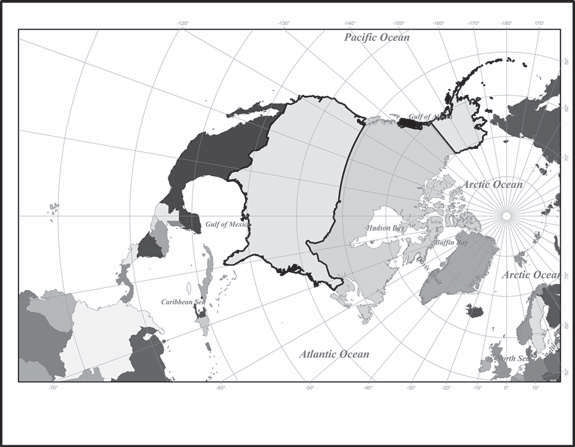
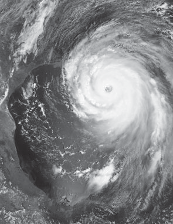
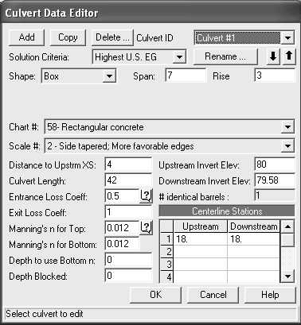
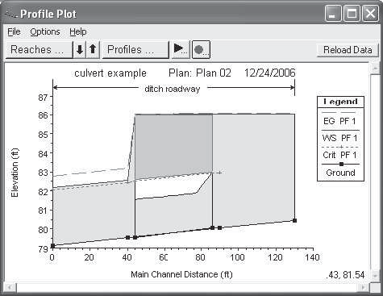

18. The storage equation has been given as

> *S~i~* = *K*\[*xI~i~* + (1 - *x*)*O~i~*\]
>
> and the continuity equation as
>
> *I* = *O* + Δ*S*\>Δ*t*.
>
> Given that *I* and *O* are the average inflow and outflow within the
> time period and
>
> Δ*S* is the change in the storage, derive the Muskingum river routing
> equation:
>
> *O*~2~ = *C*~0~*I*~2~ + *C*~1~*I*~1~ + *C*~2~*O*~1~,
>
> where *I*~2~ and *O*~2~ refer to the inflow and outflow at the end of
> the time period, and *I*~1~ and *O*~1~ refer to those values at the
> beginning of the time period. Verify the equations for *C*~0~, *C*~1~,
> and *C*~2~ given in Section 4.2.

19. Determine the outflow hydrograph given the inflow hydrograph below.
    Use Muskingum routing, taking *K* = 2 hr, *x* = 0.1, and Δ*t* = 1
    hour.

+------------------------------+---------------------------------------+
| > **Time (hr)**              | > **Inflow (m^3^/s)**                 |
+==============================+=======================================+
| 1                            | > 100                                 |
+------------------------------+---------------------------------------+
| 2                            | > 140                                 |
+------------------------------+---------------------------------------+
| 3                            | > 200                                 |
+------------------------------+---------------------------------------+
| 4                            | > 320                                 |
+------------------------------+---------------------------------------+
| 5                            | > 440                                 |
+------------------------------+---------------------------------------+
| 6                            | > 560                                 |
+------------------------------+---------------------------------------+
| 7                            | > 750                                 |
+------------------------------+---------------------------------------+
| 8                            | > 700                                 |
+------------------------------+---------------------------------------+
| 9                            | > 600                                 |
+------------------------------+---------------------------------------+
| > 10                         | > 500                                 |
+------------------------------+---------------------------------------+
| > 11                         | > 400                                 |
+------------------------------+---------------------------------------+
| > 12                         | > 300                                 |
+------------------------------+---------------------------------------+
| > 13                         | > 200                                 |
+------------------------------+---------------------------------------+
| > 14                         | > 100                                 |
+------------------------------+---------------------------------------+
| > 15                         | > 100                                 |
+------------------------------+---------------------------------------+
| > 16                         | > 100                                 |
+------------------------------+---------------------------------------+
| > 17                         | > 100                                 |
+------------------------------+---------------------------------------+
| > 18                         | > 100                                 |
+------------------------------+---------------------------------------+
| > 19                         | > 100                                 |
+------------------------------+---------------------------------------+
| > 20                         | > 100                                 |
+------------------------------+---------------------------------------+

20. Develop a new flood routing method for rectangular cross sections
    based on the Muskingum and storage indication techniques. Instead of
    using the Musk- ingum storage equation *S* = *f* (*K*, *x*, *I*,
    *Q*), use Manning's equation in the form where *a* and *m* are
    constants. Assume prismatic channel conditions at each time step,
    and derive the necessary equation for flood routing in a given rect-
    angular channel with length *L*, inflows *I*~1~ and *I*~2~, channel
    width *B*, and outflows *Q*~1~ and *Q*~2~. Manning's equation takes
    the form

> *Q* = *ay^m^*.

21. Equation (4--47) and Manning's equation (Eq. 4--48) can be combined
    to develop a second form of the kinematic wave equation \[Eq.
    (4--56)\], but in terms of *Q*.

    a.  Prove that the equation

> [0*Q*]{.underline} + *a*b*Q*^b-1^ [0*Q*]{.underline} = *q*
>
> 0*x* 0*t*
>
> is another form of the kinematic wave equation.

b.  What are the values of *a* and b from Manning's equation?

```{=html}
<!-- -->
```
22. Repeat Problem 4.11 for the case that the reservoir is partially
    > full of water with initial height above the weir of *y* = 3 ft.
    > Assume vertical walls (i.e., con- stant surface area for all
    > depths).

23. The hydrograph at the upstream end of a river is given in the
    > following table. Develop the hydrograph for the downstream end of
    > this river reach according to the Muskingum--Cunge method. The
    > reach of interest is 4 km long. The channel is trapezoidal (2:1
    > side slope) with bottom width of 10 m. Assume *S*~0~ = 0.001, Δ*x*
    > = 2 km, Δ*t* = 30 min, *c* = 1.47 m/s, and no lateral inflow.

+---------------------------------+------------------------------------+
| > **Time (min)**                | > **Flow (m^3^/s)**                |
+=================================+====================================+
| 0                               | > 0                                |
+---------------------------------+------------------------------------+
| > 30                            | > 4                                |
+---------------------------------+------------------------------------+
| > 60                            | > 14                               |
+---------------------------------+------------------------------------+
| > 90                            | > 27                               |
+---------------------------------+------------------------------------+
| > 120                           | > 30                               |
+---------------------------------+------------------------------------+
| > 150                           | > 29                               |
+---------------------------------+------------------------------------+
| > 180                           | > 27                               |
+---------------------------------+------------------------------------+
| > 210                           | > 24                               |
+---------------------------------+------------------------------------+
| > 240                           | > 18                               |
+---------------------------------+------------------------------------+
| > 270                           | > 12                               |
+---------------------------------+------------------------------------+
| > 300                           | > 8                                |
+---------------------------------+------------------------------------+
| > 330                           | > 5                                |
+---------------------------------+------------------------------------+
| > 360                           | > 3                                |
+---------------------------------+------------------------------------+
| > 390                           | > 1                                |
+---------------------------------+------------------------------------+
| > 420                           | > 0                                |
+---------------------------------+------------------------------------+

24. The inflow hydrograph to a rectangular channel is tabulated below.
    > The chan- nel has a width of 100 ft, a bottom slope of 0.001, and
    > Manning *n* of 0.035. The length of the channel is *L* = 30,000
    > ft. Using the Kinematic Wave, obtain the outflow hydrograph.

+----------------------------------+-----------------------------------+
| > **Time (min)**                 | > **Inflow (cfs)**                |
+==================================+===================================+
| > 0                              | > 2500                            |
+----------------------------------+-----------------------------------+
| > 20                             | > 2500                            |
+----------------------------------+-----------------------------------+
| > 40                             | > 3500                            |
+----------------------------------+-----------------------------------+
| > 60                             | > 4500                            |
+----------------------------------+-----------------------------------+
| > 80                             | > 5500                            |
+----------------------------------+-----------------------------------+
| > 100                            | > 6500                            |
+----------------------------------+-----------------------------------+
| > 120                            | > 5000                            |
+----------------------------------+-----------------------------------+
| > 140                            | > 4000                            |
+----------------------------------+-----------------------------------+
| > 160                            | > 3000                            |
+----------------------------------+-----------------------------------+
| > 180                            | > 2000                            |
+----------------------------------+-----------------------------------+
| > 200                            | > 2000                            |
+----------------------------------+-----------------------------------+
| > 220                            | > 2000                            |
+----------------------------------+-----------------------------------+

25. Using only the inflow hydrograph from Example 4.7 (i.e., no
    precipitation), use HEC- HMS\*
    ([http://www.hec.usace.army.mil/software/hec-hms/download.](http://www.hec.usace.army.mil/software/hec-hms/download)
    html) to route the hydrograph through a channel using the
    Muskingum--Cunge routing method. The channel has a trapezoidal cross
    section with a 3:1 side slope (horizontal:vertical), a Manning's
    roughness (n) of 0.039, and a bottom width of 8 meters. Assume there
    is no loss in the channel. What is the value of peak flow and when
    does it occur? (*\*Refer to Chapter 5 for detailed information on
    HEC-HMS.*)

26. Repeat Problem 4.25 for reach lengths of 6, 12, and 32 km. What
    happens to the timing and value of the peak flow? Explain.

27. Bull Creek Watershed has a reservoir with storage relationship

> *S* = *AH*,
>
> where *A* is the area (300 ac) and *H* is the depth or head of the
> reservoir in feet.
>
> For simplicity, the area is assumed to be constant with depth. The
> outflow is governed by the equation
>
> *Q* = 56.25*H*^3\>2^,
>
> where Q is in cfs. Route the storm hydrograph represented in the
> following table through the reservoir, using the fourth-order
> Runge--Kutta method.
>
> The governing equation is
>
> [Δ*H*]{.underline} = *f* (*t*, *H*) = [*Q*~in~(*t*) -
> *Q*~out~(*H*)]{.underline}.
>
> Δ*t A~r~*(*H*)
>
> The fourth-order R-K equation will be used as shown in Equations
> (4--20) and (4--21). The assumption is made that *H*~0~ = 0 ft and
> *Q*~out~(*H*~0~) = 0 cfs. Values of *Q*~in~ are interpolated as
> necessary, and values of *Q*~out~ are found from the equation *Q* =
> 56.25*H*^3/2^.

+--------------------------------+-------------------------------------+
| > **Time (hr)**                | > **Inflow (cfs)**                  |
+================================+=====================================+
| > 12                           | > 40                                |
+--------------------------------+-------------------------------------+
| > 24                           | > 35                                |
+--------------------------------+-------------------------------------+
| > 36                           | > 37                                |
+--------------------------------+-------------------------------------+
| > 48                           | > 125                               |
+--------------------------------+-------------------------------------+
| > 60                           | > 340                               |
+--------------------------------+-------------------------------------+
| > 72                           | > 575                               |
+--------------------------------+-------------------------------------+
| > 84                           | > 722                               |
+--------------------------------+-------------------------------------+
| > 96                           | > 740                               |
+--------------------------------+-------------------------------------+
| > 108                          | > 673                               |
+--------------------------------+-------------------------------------+
| > 120                          | > 456                               |
+--------------------------------+-------------------------------------+
| > 132                          | > 250                               |
+--------------------------------+-------------------------------------+
| > 144                          | > 140                               |
+--------------------------------+-------------------------------------+
| > 156                          | > 10                                |
+--------------------------------+-------------------------------------+

> **REFERENCES** A[mein]{.smallcaps}, M., and C. S. F[ang]{.smallcaps},
> 1970, "Implicit Flood Routing in Natural Channels,"
>
> *ASCE, J. Hyd. Div*.*, 96*(HY12), pp. 2481--2500.
>
> B[arkau]{.smallcaps}, R. L., 1992, UNET, One-Dimensional Unsteady Flow
> Through a Full Net- work of Open Channels, *Computer Program,* St.
> Louis, MO.
>
> B[ra]{.smallcaps}s, R. L., 1990, *Hydrology: An Introduction to
> Hydrologic Science,* Addison-Wesley Publishing Company, Reading, MA.
>
> C[hapra]{.smallcaps}, S. C., and R. P. C[anale]{.smallcaps}, 2006,
> *Numerical Methods for Engineers,* 6th ed., McGraw-Hill, New York.
>
> C[how]{.smallcaps}, V. T., 1959, *Open Channel Hydraulics,*
> McGraw-Hill, New York.
>
> C[how]{.smallcaps}, V. T., D. R. M[aidment]{.smallcaps}, and L. W.
> M[ay]{.smallcaps}s, 1988, *Applied Hydrology,* McGraw- Hill, New York.
>
> C[unge]{.smallcaps}, K. A., 1969, "On the Subject of a Flood
> Propagation Method (Muskingum Method)," *J. Hyd. Res*., 7(2), pp.
> 205--230.
>
> C[raw]{.smallcaps}fo[rd]{.smallcaps}, N. H., and R. K.
> L[in]{.smallcaps}s[ley]{.smallcaps}, 1966, *Digital Simulation in
> Hydrology, Stanford Watershed Model IV,* Tech. Rep. 39, Civil
> Engineering Dept., Stanford University, Stanford, CA.
>
> D[a]{.smallcaps}v[i]{.smallcaps}s, C. V. (Ed.), 1952, *Handbook of
> Applied Hydraulics,* 2nd ed., McGraw-Hill, New York.
>
> E[agle]{.smallcaps}so[n]{.smallcaps}, P. S., 1970, *Dynamic
> Hydrology,* McGraw-Hill, New York.
>
> E[ngman]{.smallcaps}, E. T., 1986, "Roughness Coefficients for Routing
> Surface Runoff," *J. Irrig. and Drain. Engrg., 112*(1), pp. 39--53.
>
> F[read]{.smallcaps}, D. L., 1971, "Flood Routing in Meandering Rivers
> with Flood Plains," *Rivers '76,* vol. 1, Symp. Inland Waterways for
> Navigation, Flood Control, and Water Diversions, ASCE, pp. 16--35.
>
> F[read]{.smallcaps}, D. L., 1978, "National Weather Service
> Operational Dynamic Wave Model," *Verification of Math. and Physical
> Models in Hydraulic Engr*.*,* Proc. 26th Annual Hydr. Div., Special
> Conf., ASCE, College Park, MD.
>
> F[rench]{.smallcaps}, R. H., 1985, *Open-Channel Hydraulics,*
> McGraw-Hill, New York.
>
> G[ho]{.smallcaps}s[h]{.smallcaps}, S. N., 1997, *Flood Control and
> Drainage Engineering*, A.A. Balkema Pub- lishers, Brookfield, VT.
>
> H[ender]{.smallcaps}so[n]{.smallcaps}, F. M., 1966, *Open Channel
> Flow,* Macmillan, New York.
>
> H[uber]{.smallcaps}, W. C., and R. E.
> D[ickin]{.smallcaps}so[n]{.smallcaps}, 1988, *Storm Water Management
> Model, Version 4, User's Manual,* EPA-600/3-88/001a (NTIS
> PB88-236641/AS), EPA, Athens, GA.
>
> Hydrologic Engineering Center, 1981, *HEC-HMS Flood Hydrograph
> Package: User's Manual and Programmer's Manual,* updated 1987, U.S.
> Army Corps of Engineers, Davis, CA.
>
> Hydrologic Engineering Center, 1990, *HEC-HMS Flood Hydrograph
> Package: User's Manual and Programmer's Manual,* U.S. Army Corps of
> Engineers, Davis, CA. Hydrologic Engineering Center, 2006, *HEC-HMS
> Hydrologic Modeling System:*
>
> *User's Manual,* U.S. Army Corps of Engineers, Davis, CA.
>
> Hydrologic Engineering Center, 2010, *HEC-RAS River Analysis System
> Hydraulic Reference Manual,* U.S. Army Corps of Engineers, Davis, CA.
>
> Iss[ac]{.smallcaps}s[on]{.smallcaps}, E., J. J. S[toker]{.smallcaps},
> and B. A. T[roe]{.smallcaps}s[ch]{.smallcaps}, 1956, "Numerical
> Solution of Flood Prediction and River Regulation Problems," *Inst.
> Math. Sci*., Report no. IMM-235, New York University, New York.
>
> K[ennedy]{.smallcaps}, E. J., 1983, *Computation of Continuous Records
> of Streamflow,* Book 3, Chapter A13, Techniques of Water Resources
> Investigations of the United States Geological Survey, Distribution
> Branch, USGS, Alexandria, VA.
>
> L[iengme]{.smallcaps}, B. V., 2000, *A Guide to Microsoft Excel for
> Scientists and Engineers,* 2nd ed., Butterworth-Heinemann, Woburn, MA.
>
> L[ighthill]{.smallcaps}, M. J., and G. B. W[hitham]{.smallcaps}, 1955,
> "I: Flood Movement in Long Rivers,"
>
> *Proc. R. Sci*.*,* ser. A., vol. 229, pp. 281--316.
>
> M[c]{.smallcaps}C[arthy]{.smallcaps}, G. T., 1938, "The Unit
> Hydrograph and Flood Routing," unpublished paper presented at a
> conference of the North Atlantic Div., U.S. Army Corps of Engineers.
>
> Ov[erton]{.smallcaps}, D. E., and M. E. M[eadow]{.smallcaps}s, 1976,
> *Stormwater Modeling,* Academic Press, New York.
>
> P[once]{.smallcaps}, V. M., 1989, *Engineering Hydrology,* Prentice
> Hall, Upper Saddle River, NJ. P[rice]{.smallcaps}, R. K., 1974,
> "Comparison of Four Numerical Methods for Flood Routing,"
>
> *ASCE Proc., J Hyd. Div*.*, 100* ( HY7), pp. 879--899.
>
> R[audki]{.smallcaps}v[i]{.smallcaps}, A. J., 1979, *Hydrology,*
> Pergamon Press, Elmsford, NY. S[eddon]{.smallcaps}, J., 1900, "River
> Hydraulics," *Trans. ASCE, 43*, pp. 217--229.
>
> S[ingh]{.smallcaps}, V. P., 1996, *Kinematic Wave Modeling in Water
> Resources,* John Wiley & Sons, New York.
>
> S[tephen]{.smallcaps}s[on]{.smallcaps}, D., and M. E.
> M[eadow]{.smallcaps}s, 1986, *Kinematic Hydrology and Modeling,*
>
> Elsevier Science Publishing Company, New York.
>
> S[toker]{.smallcaps}, J. J., 1957, *Water Waves,* Interscience Press,
> New York.
>
> V[ieu]{.smallcaps}x, B. E., 2004, *Distributed Hydrologic Modeling
> Using GIS,* 2nd ed., Kluwer Academic Publishers, Norwell, MA, Water
> Science Technology Series, vol. 48, ISBN: 1-4020-2459-2.
>
> W[oolhi]{.smallcaps}s[er]{.smallcaps}, D. A., and J. A.
> L[iggett]{.smallcaps}, 1967, "Unsteady One Dimensional Flow over a
> Plane: The Rising Hydrograph," *Water Resour. Res., 3*(3), pp.
> 753--771.
>
> Chapter 5

# Hydrologic Simulation Models

## ---Zheng Fang and George M. Doubleday

{width="4.1687434383202095in"
height="2.7933333333333334in"}

> GIS & hydrologic laboratory. (Photo courtesy Donald Soward.)

**5.1**

> **INTRODUCTION TO HYDROLOGIC**

**MODELS**

> **304**
>
> Advances in computer hardware and software since the 1970s combined
> with larger and more extensive hydrologic data-monitoring efforts
> allowed for the development and application of a number of models in
> hydrology. These computer models can be used for a variety of purposes
> in simulating hydro- logic response under a number of assumptions
> within a watershed area. Such models incorporate various equations to
> describe hydrologic transport pro- cesses and storages and to account
> for water balances in space and time. Complex rainfall patterns and
> heterogeneous basins can be simulated with relative ease if watershed
> and hydrologic data are sufficient, and various design and control
> schemes can be tested with hydrologic models. HEC models will be
> highlighted in this chapter with detailed examples, and others are
> presented in Chapters 6, 9, and 11.
>
> Earlier chapters have presented a number of computational methods
> routinely used to convert rainfall into a storm hydrograph at the
> basin outlet. The rainfall--runoff process was presented in detail in
> Chapters 1 and 2, where we showed how input rainfall is distributed
> into various components of evap- oration, infiltration, detention or
> depression storage, overland flow, and
>
> **Table 5--1** Factors Affecting the Hydrograph
>
> eventually streamflow. The concept of the unit hydrograph was
> demonstrated converting rainfall over a watershed into associated
> runoff. Chapter 3 pre- sented various statistical methods for treating
> return frequency events such as rainfall or streamflow hydrologic
> series. Chapter 4 presented various flood routing methods within
> channels and rivers to move hydrographs from one point to another.
> Hydrologic models allow for hydrologic prediction in space and time
> through the use of well-known numerical methods.
>
> The actual shape and timing of the response hydrograph for a given
> watershed have been shown to be a function of many physiographic, land
> use, and meteorological variables, which are listed in Table 5--1.
> Rainfall intensity and duration are the major driving forces of the
> rainfall--runoff process, followed by watershed characteristics that
> translate the rainfall input into an output hydrograph at the outlet
> of the basin. Size, slope, shape, soils, and storage capacity are all
> important parameters in watershed geo- morphology. Land use and land
> cover parameters can significantly alter the natural hydrologic
> response through increases in impervious cover, altered slopes, and
> improved drainage channel networks.
>
> Major research programs by Harvard University, Stanford University,
> and the U.S. Army Corps of Engineers during the 1960s were pioneering
> efforts to use early versions of digital computers to simulate
> watershed behavior on a continuous basis. The Stanford Watershed Model
> (Crawford and Linsley, 1966), which later evolved into HSPF
> (Hydrologic Simulation Program---FORTRAN) (Johanson et al., 1980; US
> EPA, 2007), was the first available major watershed model. Continuous
> models such as HSPF are based on long-term water-balance equations and
> thus account directly for effects of antecedent conditions.
>
> From these early efforts, a range of modeling approaches including
> event models was developed and applied during the 1970s for urban
> storm- water, floodplain hydrology, agricultural drainage, reservoir
> design, and river basin management. Much of the model development was
> driven by the interest in stream and lake water quality in urban
> runoff that surged during the 1970s.
>
> Single event models are designed to simulate rainfall--runoff from
> single storm events. Models such as the original HEC-1 Flood
> Hydrograph Package (HEC, 1981), the revised HEC-HMS (HEC, 1998, 2006,
> 2010) are widely used for floodplain analysis. The more sophisticated
> model was the Storm Water Management Model (SWMM), developed in 1971
> for EPA to address in detail the quantity and quality variations in
> urban runoff (Metcalf et al., 1971). The SWMM model can be used for
> storm event or continuous simulation and has been through a number of
> updates and improvements over the years (Huber and Dickinson, 1988;
> SWMM5, 2005; Rossman, 2010). This model is considered one of the most
> comprehensive for simulating urban runoff dynamics, drainage design,
> hydraulic analysis, and nonpoint source water quality. With more
> demands from end users, the SWMM model was enhanced into a commercial
> modeling package---XP-SWMM (eXPert Stormwater and Wastewater
> Management Model) by XP Software (2010). Besides all the capabilities
> of SWMM, the XP-SWMM model has a better graphical user interface and
> the ability of linking the 1-D flow simulation to a 2-D overland flow
> model to generate floodplain maps.
>
> As an important addition to the water resources modeling field, the
> Danish Hydraulic Institute (DHI) Water and Environment, Inc., provides
> a whole suite of hydrologic and hydraulic modeling tools (MIKE URBAN,
> MIKE FLOOD, etc.) to address engineering problems of rainfall-runoff,
> pipe flows, overland flows, water quality, and sediment transport. For
> instance, the MIKE URBAN model enables users to simulate water,
> wastewater, and storm water in one integrated GIS-based framework that
> is powered by ESRI's ArcObjects components (DHI, 2011). The basic
> module of MIKE URBAN - Model Manager incorporates the U.S. EPA's fully
> dynamic storm water and waste water network modeling package (SWMM 5)
> and the stan- dard distribution network model (EPANET) to simulate
> hydraulics and water quality. In addition, the 2-D flow simulation
> module provides an easy and flexible tool for computing and
> visualizing the flows above and below ground in one fully integrated
> dynamic simulation.
>
> Hydrologic simulation models can be classified according to a wide
> range of characteristics, as shown in Table 5--2. For watershed
> analysis, the major categories of interest include lumped parameter
> vs. distributed parameter, event vs. continuous, and stochastic vs.
> deterministic. Lumped
>
> **Table 5--2** Hydrologic Models

+--------------------------+-------------------------------------------+
| > **Model Type**         | > **Example of Mode**                     |
+==========================+===========================================+
| > Lumped parameter       | > HEC-HMS, Snyder or Clark UH             |
+--------------------------+-------------------------------------------+
| > Distributed            | > Vflo, MIKE URBAN, MIKE FLOOD            |
+--------------------------+-------------------------------------------+
| > Event                  | > HEC-HMS, SWMM, SCS TR-20                |
+--------------------------+-------------------------------------------+
| > Continuous             | > SWMM, HSPF, Vflo                        |
+--------------------------+-------------------------------------------+
| > Physically based       | > HEC-HMS, SWMM, HSPF, Vflo               |
+--------------------------+-------------------------------------------+
| > Stochastic             | > Synthetic streamflows                   |
+--------------------------+-------------------------------------------+

> parameter models transform actual rainfall input into runoff output by
> con- ceptualizing that the subwatershed processes occur at one spatial
> subarea (as in a "black box"). Model parameters may or may not have a
> direct physical definition in the system. Synthetic unit hydrographs
> (UHs) pre- sented in Chapter 2 are a widely used method to convert
> rainfall into runoff within a watershed or basin.
>
> Distributed parameter models attempt to describe physical processes
> and mechanisms in space, as evidenced by certain classes of hydrologic
> sim- ulation models. Kinematic wave methods have become very popular
> to com- pute both overland flow and channel routing. This is due to
> heightened interest in distributed hydrologic modeling with the advent
> of GIS and dig- ital elevation data for watersheds that has become
> available since the mid- 1990s. These issues are described in more
> detail in Chapters 10 and 11 (i.e., Vflo) along with radar rainfall
> input and digital elevation methods for setting up grids to compute
> overland flow and channel flow.
>
> Both HEC and SWMM rely on the kinematic wave methods described in
> Chapter 4. Major new graphical user interfaces (GUIs) have been devel-
> oped for these two models and have revolutionized the way in which we
> deal with hydrologic data and parameter inputs. The HEC-HMS and its
> 2010 version 3.5 are presented in this chapter, the HEC-RAS model is
> presented in detail in Chapter 7, and the SWMM model is described with
> a detailed example (SWMM5) in Chapter 6. A useful guide to the EPA
> SWMM5 model has been compiled and updated by Rossman (2010).
>
> Some models include a random or stochastic component to represent
> input rainfall, which is then used to generate time series of
> streamflow. The time series can then be statistically evaluated using
> flood frequency analysis. Hydrologic synthesis allows hydrologists to
> extend short historical records, such as streamflow, to longer
> sequences based on statistical methods. Syn- thetic sequences either
> preserve the statistical character of the historical record or follow
> a prescribed probability distribution, such as a lognormal or log
> Pearson type 3 (Section 3.5). Mass curve analysis assumes that his-
> torical records will repeat exactly. Random generations assume that
> succes- sive flows are independent and distributed according to a
> known probability distribution. Details on stochastic models can be
> found in Bras and Rodri- guez--Iturbe (1984), Stedinger et al. (1993),
> and Hirsch et al. (1993).
>
> A major advantage of simulation models is the insight gained by
> gather- ing and organizing data required as input to the mathematical
> algorithms that comprise the overall model system. This exercise can
> often guide the collection of additional data or direct the
> improvement of mathematical formulations to better represent watershed
> behavior. Another advantage is that many alterna- tive schemes for
> water supply systems, for urban development, or flood con- trol
> options can be quickly tested and compared with simulation models.
>
> The major limitation of simulation models is the inability to properly
> calibrate and verify applications in which input data are lacking.
> Current practice assumes that the simplest model that will
> satisfactorily describe the
>
> system for the given input data should be used. Model accuracy is
> largely determined by available input data and observed input and
> output time series at various locations in a watershed. Modern radar
> rainfall, hydrologic, and topographic datasets are now available for
> many areas, and model accu- racy has increased accordingly.
>
> Despite their limitations, simulation models still provide the most
> logical and scientifically advanced approach to understanding the
> hydrologic behavior of complex watershed and water resources systems.
> The availabil- ity of digital elevation datasets and radar rainfall
> data has opened a new era in the science of hydrology and has led to
> many new design and operating policies never realized or tested before
> (see Chapters 6, 9, 10, and 11). Sev- eral excellent reviews of models
> in hydrology have been published, including Maidment (1993), DeVries
> and Hromadka (1993), Hoggan (1997), James and James (1998a), and
> McCuen (2005). The reader is referred to these references for details
> beyond the scope of this chapter.

**5.2**

> **STEPS IN WATERSHED MODELING**
>
> With so many hydrologic models available to the hydrologist or civil
> engi- neer, very little new model development is currently being
> supported. Rather, one must select one of the available simulation
> models based on characteristics of the system to be studied, the
> objectives to be met, and the available budget for data collection and
> analysis. Once the model is selected, the steps involved in watershed
> simulation analysis generally follow the sequence of Table 5--3.
>
> **Table 5--3** Steps in Watershed Modeling
>
> The selection of a model is a very difficult and important decision,
> since the success of the analysis hinges on accuracy of the results.
> Table 5--2 should be considered along with characteristics of the
> watershed, study objectives, and so on to develop a modeling plan. In
> general, unless digital watershed data are extensive in space and
> time, the usual approach to water- shed analysis is to use a
> deterministic event model with lumped parameter concepts for
> developing hydrographs and flood routing. The HEC-HMS (2006, 2010) is
> one of the most widely used models for typical watershed analysis to
> convert rainfall to runoff and streamflow. An Applications Guide was
> written in 2008 by Ford et al. to illustrate applications of HEC-HMS
> to studies on urban floods, flood frequency, flood loss reduction,
> flood warning, reservoir design, and environmental issues.
>
> If a watershed has extensive data available on rainfall, infiltration,
> baseflow, streamflow, and soils and land use, then HSPF from U.S. EPA
> BASINS (2007) can be applied for calculating continuous long-term
> water balances and outflow hydrographs. For the case of a well-defined
> urban drainage network, a distributed event model such as SWMM (Huber
> and Dickinson, 1988; James and 1998b; SWMM5, 2005; Rossman, 2010) can
> be applied to define hydrologic response for components throughout the
> sys- tem. Urban stormwater models are discussed in more detail in
> Section 5.3 and Chapter 6. Another GIS-based distributed model, Vflo,
> is presented in Chapter 11.
>
> Step 5 in Table 5--3, model calibration and verification, is important
> in fitting the model parameters and producing accurate and reliable
> results in steps 6 and 7. Model calibration involves selecting a
> measured set of input data (rainfall, channel routing, land use, and
> so on) and measured output hydrographs for model application. The
> controlling parameters in the model are adjusted until a "best fit" is
> obtained for this set of data. The model should then be "verified" by
> simulating a second or third event (i.e., different rainfall) and
> keeping all other parameters unchanged to produce a com- parison of
> predicted and measured hydrographs. A detailed example of the HEC-HMS
> model is described in Section 5.6, where an actual case study is
> highlighted to indicate difficulties and complexities that are often
> encoun- tered in watershed analyses.
>
> A selected number of the most popular event, continuous, and urban
> runoff models for hydrologic simulation are listed in Table 5--4.
> Universities or federal agencies supported the development of most of
> these models. Some of the models are very well documented and, as a
> result, have seen wide application to watersheds, especially in the
> United States. Others have been applied only to specific areas in the
> country. Extreme care and judgment must be exercised in applying any
> one of these models to areas where data exist to define UH and routing
> parameters.
>
> **5.3**
>
> **DESCRIPTION OF MAJOR HYDROLOGIC MODELS**
>
> Several of the surface water models in Table 5--4 will be briefly
> reviewed below.
>
> The **HSPF** was the commercial successor to SWM-IV and was modi- fied
> to include water quality considerations, kinematic wave routing, and
> variable time steps. The current version is HSPF, which is a
> redesigned modular version that performs simulations of a variety of
> hydrologic and water quality processes on or under the land surface,
> in channels, and in reservoirs (Johanson et al., 1980). The HSPF model
> simulates both water- shed hydrology and water quality. It allows an
> integrated simulation of land and soil contaminant runoff processes
> with in-stream hydraulic and sediment-chemical interactions. The
> program provides a time history of runoff rate, sediment load, and
> nutrient and pesticide concentration, along with a time history of
> water quality and quantity at specific points in a watershed. HSPF
> computes a continuous hydrograph of streamflow at the basin outlet.
> Input is a continuous record of rainfall and evaporation data.
> Infiltration is divided into surface runoff and interflow, and deeper
> perco- lation to the ground water. Three soil moisture zones are
> included in the model. Total streamflow is a combination of overland
> flow, interflow, and ground water flow.
>
> One of the most useful modules in HSPF is the nonpoint-source model
> (NPS), which provides for continuous simulation of nonpoint pol-
> lutants from urban and undeveloped land surfaces. It is available as a
> separate model from EPA and has been extensively tested with HSP by
> the Northern Virginia Planning Commission. HSPF is the model of choice
> for evaluation of continuous runoff and nonpoint-source loads (EPA-
> BASINS, 2007). Originally introduced in 1996 with subsequent releases
> in 2001 and 2007, BASINS is a multipurpose environmental analysis
> system designed for use by regional, state, and local agencies in
> performing water- shed and water-quality-based studies. This system
> makes it possible to quickly assess large amounts of point-source and
> nonpoint-source data in
>
> **Table 5--4** Selected Simulation Models in Hydrology

+---------+---------------+-------------+-----------------------------+
| > **    | > **Author**  | > **Date**  | > **Description**           |
| Model** |               |             |                             |
+=========+===============+=============+=============================+
| >       | > HEC         | > 2006,     | > Hydrologic modeling       |
| HEC-HMS |               | > 2010      | > system (replacing HEC-1)  |
+---------+---------------+-------------+-----------------------------+
| >       | > HEC         | > 2006,     | > River analysis system     |
| HEC-RAS |               | > 2010      | > (replacing HEC-2)         |
+---------+---------------+-------------+-----------------------------+
| > S     | > USDA SCS    | > 1984      | > Hydrologic simulation     |
| CS-TR20 |               |             | > model                     |
+---------+---------------+-------------+-----------------------------+
| > HSPF  | > EPA Basins  | > 2007      | > Hydrological simulation   |
|         | > Version 4.0 |             | > program---Fortran         |
+---------+---------------+-------------+-----------------------------+
| > SWMM  | > Huber and   | > 1971,     | > Storm water management    |
|         | > Dickinson   | > 1988,     | > model                     |
|         |               | > 2005      |                             |
+---------+---------------+-------------+-----------------------------+
| > MIKE  | > DHI         | > 2011      | > Modeling and GIS for      |
| > URBAN |               |             | > wastewater and storm      |
+---------+---------------+-------------+-----------------------------+
|         |               |             | > water collection systems  |
+---------+---------------+-------------+-----------------------------+
| > MIKE  | > DHI         | > 2011      | > Combined river, sewer,    |
| > FLOOD |               |             | > and floodplain            |
+---------+---------------+-------------+-----------------------------+
|         |               |             | > modeling                  |
+---------+---------------+-------------+-----------------------------+
| >       | > NWS, Fread  | > 1978      | > NWS operational dynamic   |
|  DWOPER |               |             | > wave model                |
+---------+---------------+-------------+-----------------------------+
| > UNET  | > Barkau      | > 1992      | > One-dimensional dynamic   |
|         |               |             | > wave                      |
+---------+---------------+-------------+-----------------------------+

> a format that is easy to use and understand. Installed on a personal
> com- puter, BASINS allows the user to assess water quality at selected
> stream sites or throughout an entire watershed. This invaluable tool
> integrates environmental data, analytical tools, and modeling programs
> to support development of cost-effective approaches to watershed
> management and environmental protection.
>
> The **EPA SWMM** development dates back in the 1970s. SWMM is the most
> comprehensive urban runoff model and provides for continuous and/ or
> event simulation for a variety of catchments, conveyance, storage,
> treat- ment, and receiving streams. Both water quantity and quality
> can be simu- lated for a stormwater network, and flow routing can be
> performed by nonlinear reservoir methods, kinematic wave methods, or
> with the full Saint Venant equations in the SWMM EXTRAN Block. The
> SWMM hydraulic engine is able to handle gradually varied,
> one-dimensional unsteady flow throughout the drainage network taking
> account of backwater effects, reversed flow, surcharged flow,
> pressurized flow, and interconnected ponds. The model has gone through
> a number of revisions; version 5 (Huber and Dickinson, 1988; James and
> James, 1998b; SWMM5, 2005; Rossman, 2010) is currently available.
>
> The new **XP-SWMM** was released in 1997 and contains a 2-D model for
> simulating flows on the surface combined with the full pipe network
> analysis from the original model. Scientists and engineers often use
> XP- SWMM to develop link-node and spatially distributed models to
> assess, design, and simulate flows in storm water and wastewater
> systems and in natural systems such as river, lakes, and floodplains
> with groundwater inter- action. Hydraulically, flows are simulated in
> 1-D channels and pipes, and can be coupled to a powerful 2-D engine
> for comprehensive flood modeling and mapping. Like other hydrologic
> models, XP-SWMM simulates the complete hydrologic cycle for rural and
> urban watersheds starting from rainfall events through collection,
> conveyance, and treatment systems to the final outfalls. The model
> takes into account snowmelt, evaporation, infiltration, surface
> ponding, and ground-surface water exchanges in the process of
> hydrologic/ hydraulic simulations. With the water quality module,
> XP-SWMM is able to route pollutants and treatment through the urban
> and natural systems. Cur- rently, XP-SWMM has been approved by the
> U.S. Federal Emergency Man- agement Agency (FEMA) as a computer model
> in floodplain mapping for the National Flood Insurance Program (NFIP)
> and has been popularly used in the fields of storm water management,
> sanitary sewers, floodplain man- agement, hydrology, hydraulics, and
> water quality. SWMM is described in full detail with examples in
> Chapter 6.
>
> As one of the many hydrologic models that provide distributed simula-
> tion and hydrologic prediction, Vflo, a physics-based model developed
> by Vieux & Associates, Inc., allows for spatial variability to be
> considered within a watershed when calculating runoff. It uses input
> from the GIS that provides gridded watershed data for a variety of
> parameters, such as elevation, land
>
> use, and soils. Within Vflo, each grid cell can be assigned different
> properties that allow a watershed with highly diverse characteristics
> to be modeled pre- cisely (Vieux, 2004). The kinematic wave analogy is
> used to route runoff from overland flow to channel flow, according to
> a flow direction grid derived from a digital elevation model (DEM).
> Vflo has been proven performance based on extensive applications in
> low-slope urbanized watersheds (Fang et al., 2010). The model takes
> into account overland flow, infiltration, and channel flow in a
> connected grid system built within a governing GIS environment. Vflo
> shows many advantages, including its flexibility for data setup, its
> accu- racy in hydrograph comparison, its ability to handle NEXRAD
> rainfall directly, and the fact that one can observe hydrographs at
> any location within the watershed. Readers can find more information
> and examples of Vflo in Chapters 10 and 11.
>
> The demands for better tools for hydrologic and hydraulic modeling
> have inherently increased, and there is an irreversible trend toward a
> com- bined 1-D and 2-D approach in floodplain and urban flooding
> studies. DHI Water & Environment, a research and consulting
> organization, developed MIKE series of numerical modeling software and
> applied advanced tech- nologies in hydraulic and water resources
> engineering since 1964. For better understanding of flow dynamics in
> urban settings, people often use MIKE URBAN and MIKE FLOOD. **MIKE
> URBAN** is a GIS-based modeling tool for water distribution and
> wastewater collection systems based on three major modules: MIKE URBAN
> Model Manager, Collection System (CS), and Water Distribution (WD).
> Because the MIKE URBAN Model Manager provides a complete modeling
> environment with the latest versions of public domain modeling
> tools---SWMM 5 and EPANET to simulate dynamics of flows in storm water
> and wastewater systems, it can handle simulations of flows in sewers,
> storm water drainage systems interacting with 2-D overland flows, and
> flows in water distribution systems as well.
>
> **MIKE FLOOD** is another computer program developed by DHI that
> simulates river inundation, floodplains, and urban drainage systems.
> It dynamically couples 1-D (MIKE 11 and MOUSE) and 2-D (MIKE 21) fea-
> tures into one integrated numerical modeling tool, which enables
> people to simulate different flood problems related to rivers,
> floodplains, floods in streets, drainage networks, coastal areas, dam
> operations, and levee breaches. Thus, MIKE FLOOD is suitable to handle
> flood assessments, flood hazard mapping, flood risk analysis, and
> integrated urban drainage design. For more detailed information,
> readers should consult with the DHI Water & Environment (DHI, 2011).
>
> The **SCS** or Natural Resources Conservation Service (**NRCS**) has
> devel- oped a number of methods and models that are based on its
> extensive small- watershed database. Graphical, tabular, and chart
> methods are available for the SCS TR-55 (SCS, 1986), entitled "Urban
> Hydrology for Small Water- sheds." These methods are based primarily
> on the runoff-curve-number method described in Chapter 2. The SCS
> TR-20 (SCS, 1984) is a computerized
>
> method for solving hydrologic problems using SCS procedures. The
> program develops runoff hydrographs, flood routes these through
> channel reaches and reservoirs, and combines or separates hydrographs
> at confluences. For each subbasin, the area, runoff curve number, and
> time of concentration are required. Routing procedures are somewhat
> simpler than those used in HEC- HMS and include the convex routing
> method or a simple routing coefficient. NRCS methods are often used
> for agricultural and undeveloped areas or for- ested sites. The
> interested reader should consult McCuen (2005) for discussion and
> application of NRCS methods.
>
> The preceding discussion has provided a review of many of the popular
> hydrologic simulation models used for watershed analysis. The reader
> should consult user documentation directly from authors before
> attempting to apply the models to an actual watershed. Many new models
> have been released in response to availability of radar rainfall,
> digital elevation data, and faster computer technology.
>
> The next two sections are devoted to introduction to HEC-HMS the- ory
> (Section 5.4) and application (Section 5.5), along with examples. It
> is considered by many to be the most versatile model and is the most
> often used of the available computer models described. The current
> HEC-HMS was released in 2010 (HEC, Version 3.5) and is presented along
> with detailed case studies in Sections 5.5 and 5.6. HEC-HMS offers
> significant advantages to the first-time user over other models
> described above, since the GUI has been very well designed. The model
> is a very useful educa- tional tool for any first-time student to the
> field of hydrologic models, and continues to be improved and updated.
> New students should spend time learning about HEC-HMS, since it is
> available free over the Internet, and details on its availability and
> related hydrologic training courses are pro- vided in Appendix E.
>
> HEC-1 was originally designed in 1967, with the official release in
> 1973, to simulate surface runoff processes from precipitation over a
> watershed. The flood hydrograph package was developed over a number of
> years by the Hydrologic Engineering Center. The student should consult
> the latest HEC- HMS user's manual for more details (HEC-HMS, version
> 3.5, 2010).
>
> The process of converting precipitation to direct runoff can be simu-
> lated for either small subbasins or large complex watersheds. An
> original HEC model for any river basin has basic components for
> subbasin runoff, channel and reservoir routing, and hydrograph
> combining (see Fig. 5--1). Subarea boundaries are delineated so that
> lumped precipitation loss and watershed parameters can be used. The
> computations proceed from upstream to downstream in the watershed, and
> hydrograph data or plots can be provided at any convenient point.
> Historical rainfall events or design rainfall is transformed to runoff
> via UH methods covered in Chap- ter 2. A discharge hydrograph is
> computed at the outlet of each subarea
>
> **5.4**
>
> **HEC-HMS FLOOD HYDROGRAPH THEORY**
>
> **Figure 5--1** HEC model configuration.

Outflow point

> (see Fig. 5--1). For example, a storm hyrdrograph for a given rainfall
> would be computed for subareas 10, 20, 30, 40, and 50 in Figure 5--1.
>
> The routing component in HEC-HMS requires input parameters to define
> the specific routing characteristics of a river reach or reservoir.
> Out- put consists of an outflow hydrograph at the downstream station.
> Hydro- graph combining at key locations is essential for the overall
> system logic in HEC and allows for an optimal use of computer storage
> in the model. Com- bine steps occur at the triangle indicators in
> Figure 5--1, where two or more hydrographs are joined. Finally, simple
> river routing as presented in Chap- ter 4 is accomplished for both
> reach A and reach B, as shown by the square indicators. The final
> output hydrograph is computed at the outlet or outflow point.
>
> HEC-HMS is a general flood hydrograph package with the following
> capabilities:

1.  Simulation of watershed runoff and streamflow from historical or
    > design rainfall

2.  Determination of flood flows at various locations for use in flood-
    > plain studies

3.  Evaluation of land use or topographic changes in a watershed area

4.  Simulation of flood control measures, such as reservoir storage and
    > channel options

5.  Computation of damage frequency curves and expected annual dam- ages
    > for various locations and multiple flood control plans

> **Watershed Delineation and Organization**
>
> HEC-HMS uses parameters averaged in space and time to simulate the
> runoff process. The size of subbasins, routing reaches, or computation
> interval is selected based on the basin physiography, available
> rainfall data, available streamflow data, and required accuracy. A
> watershed is subdi- vided into small and relatively homogeneous
> subbasins according to drain- age divides based on mapped or digital
> topography, as shown in Figure 5--1. The size of a subbasin should
> generally be in the range of 1--10 mi^2^ because of limitations of UH
> theory, especially in urban areas. Routing reaches are identified, and
> the overall order of the runoff computation is defined (from upstream
> to downstream) for input to HEC. Routing reaches should be long enough
> so that a flood wave will not travel faster than the computation time
> step. Otherwise, numerical errors in flood calculations will occur.
> Simple routing methods described in Sections 4.1 to 4.3 are contained
> in HEC-HMS.
>
> **Precipitation**
>
> Precipitation *P* is computed for each subbasin in Figure 5--1 using
> his- torical data or synthetic design storms. The model allows for (1)
> incre- mental *P* (depth of *P* for each time interval) for each
> subbasin, (2) total cumulative *P* and a time distribution, or (3)
> historical gage data together with areal weighting (Thiessen)
> coefficients for each subbasin. Standard design storms can be used in
> the form of (1) depth vs. duration data,
>
> \(2\) probable maximum precipitation, or (3) standard project
> precipita- tion. The precipitation data must be input at a constant
> time interval, but this interval may be different from the
> computational time interval in the model. Precipitation inputs are
> described for HEC-HMS in Section 5.5, and a detailed example is
> contained in Section 5.6 for a complex water- shed. Figure 5--2 shows
> a typical basin model for the HEC-HMS model indicating various
> subareas and river reaches that connect the subareas together.
>
> HEC-HMS is capable of simulating snowfall and snowmelt. Up to 10
> elevation zones of equal increments may be specified in each subbasin.
> Usually, an elevation increment of 1000 ft is used, but any increment
> may be specified as long as the air-temperature lapse rate corresponds
> to the change in elevation within the zone. Snowmelt occurs when the
> tem- perature is equal to or greater than the melt temperature and is
> calcu- lated by either the degree-day method or an energy budget
> method (see Section 2.9). For more detail on snowfall and snowmelt
> calculations, see the HEC user's manual (HEC, 2010) and *Runoff from
> Snowmelt* (U.S. ACOE, 1960). Dingman (2002) covers snowmelt in more
> detail with examples.
>
> **Figure 5--2** Example of a watershed
> in HEC-HMS.
>
> **Loss Rate Analysis**
>
> HEC contains several methods for computing the loss of precipitation
> to interception and infiltration, as shown in Table 5--5. The simplest
> is the initial and constant loss rate function, in which the initial
> loss volume is satisfied before the constant loss rate begins. The
> remaining constant loss is identical to the f index method for
> infiltration (see Section 2.7) and is often used in design storm
> analysis or where data are insufficient to allow calculation with more
> sophisticated methods.
>
> **Table 5--5** HEC-HMS Loss Methods
>
> The SCS method employs the SCS curve number, CN, which is directly
> related to land use and hydrologic soil properties of a watershed. The
> SCS approach relates accumulated rainfall excess or runoff to accu-
> mulated rainfall with CN (see Section 2.5). It is popular because of
> its application to ungaged areas and its large empirical database. The
> method requires input of CN, initial abstraction, and percent
> imperviousness (McCuen, 2005).
>
> The Green and Ampt method was added to HEC in 1990 and prob- ably is
> one of the best estimates for infiltration, since the parameters are
> all measurable and directly related to soil types in a watershed.
> Version 3.5 of HMS uses four different parameters to apply the method;
> it is necessary to measure or estimate hydraulic conductivity,
> capillary suction at the wetting front, initial moisture content, and
> saturated moisture content (see Section

8.  for Green and Ampt and Table 2--4 for data). These parameters can be
    estimated effectively using physical soil characteristics, such as
    soil texture class and major soil horizon classification.
    Calculation of these parameters assumes that the soil is a
    homogeneous medium with uniform initial mois- ture content. The
    Green and Ampt method has received significant atten- tion in recent
    years with the release of HEC-HMS. For example, the TSARP program
    instituted in Houston, TX, after T.S. Allison flooding uti- lized
    the Green and Ampt methods in modeling 22 different watersheds (see
    Appendix E).

> **Subbasin Runoff Calculation**
>
> Several methods for surface runoff or transform computations in HEC
> are available in the model and can be selected by the user. These are
> presented in Table 5--6 and include the UH methods of Clark *TC & R*
> (1945), Snyder (1938), and the Soil Conservation Service (SCS, 1984,
> 1986). Known UHs

**Table 5--6** Surface Runoff Methods in HEC-HMS

> can also be directly input. The kinematic wave overland flow
> computation was added to HEC in 1981 and allows more accurate
> representation of urbanized areas for UH calculations (HEC, 1981).
> Kinematic wave methods are described in more detail in Section 4.6. A
> similar setup for conversion of rainfall to runoff exists for HEC-HMS
> (Section 5.5).
>
> Clark's method is based on the time--area curve method described in
> Chapter 2. The time--area histogram, determined from isochrones of the
> watershed, or contours from points at which water arrives at the same
> time, is convoluted with a unit design storm hyetograph to yield the
> hydro- graph, which is then routed through linear reservoir storage to
> allow for peak attenuation. The Clark-method parameters are the time
> of concen- tration and the storage coefficient *R*, defined in Section
> 2.5. Hoggan (1997) provides more details on the Clark method, and
> Table 5--10 presents empirical *TC* and *R* equations derived for
> Houston, TX (within Harris County).
>
> The HEC model uses a synthetic time--area curve derived from a gen-
> eralized basin shape, and the equations are applicable to most basins:

*AI* = 1.414*T*^1.5^, 0 ... *T* 6 0.5, (5--1)

1 - *AI* = 1.414(1 - *T*)^1.5^, 0.5 6 *T* 6 1. (5--2)

> where *AI* is the cumulative area as a fraction of subbasin area and
> *T* is fraction of time of concentration, *T~c~*. Specific time--area
> curves can also be input to HEC model if they can be computed from
> some other GIS-type method.
>
> The computed hydrograph based on a time--area method is routed through
> a linear reservoir (Section 4.3) to produce the final UH. A family of
> 2-hr UHs generated by HEC is shown in Figure 5--3 for a 4.3-mi^2^
> basin with *TC* = 0.45 hr. Note the wide range of hydrograph shapes
> that can be produced by the two-parameter UH. An SCS UH is shown for
> comparison. The larger the value of *R* (*TC* + *R*), the flatter the
> UH response, more typical of natural watersheds with flat slopes.
> Thus, the smaller ratios cor- respond to more urbanized watersheds.
> The steepest hydrograph could also represent a basin with steep slopes
> and a small amount of storage (Hoggan, 1997).
>
> 1-Hr Unit Hydrographs
>
> *[R]{.underline}*
>
> **Figure 5--3**
>
> Family of 1-hr UHs

2500

2000

1500

> *TC*+*R* = 0.1
>
> SCS UH
>
> *[R]{.underline}* = 0.3
>
> *TC*+*R*
>
> TC = 0.45 hr
>
> Area = 4.3 mi2
>
> \% Development = 80 SCS Curve Number= 94
>
> for a 4.3-square- mile basin with 80% development and an SCS Curve
> Number of 94.
>
> 1000
>
> 500

0

> *[R]{.underline}* = 0.5
>
> *TC*+*R*
>
> *[R]{.underline}* = 0.7
>
> *TC*+*R*

0:00 1:00 2:00 3:00 4:00 5:00 6:00 7:00

> Time (hr)
>
> Snyder's method (Section 2.3) provides time to peak *t~p~* and peaking
> coefficient *C~p~*, which are insufficient to produce the curved shape
> of the hydrograph. Clark's method is therefore used to help smooth and
> define the shape of the hydrograph corresponding to Snyder's
> coefficients within the HEC model. The direct runoff ordinates are
> then calculated by convo- lution of the UH with the net precipitation
> for the subbasin.
>
> The kinematic wave process, described in more detail in Section 4.6,
> represents a nonlinear runoff response compared with linear UH
> methods. The kinematic wave method relies on parameters that are
> generally measur- able from a basin, such as slope, land use, lengths,
> channel shape, roughness, and area. Overland flow, collector, and main
> channel elements are used to represent the characteristics of a
> drainage basin (Fig. 4--9). In the method, the main equations are
> Manning's equation of flow and continuity \[Eqs. (4--47) and
> (4--48)\]. These are solved numerically to produce overland flow as a
> function of time and space. The same equations are solved for channel
> elements (Fig. 4--9). The kinematic wave (KW) method is more
> applicable to the analysis of urban basins, since KW theory does not
> provide for the attenuation of flood waves. The area of the subbasin
> is required along with *L*, *S*, *n*, shape, and size, and any
> upstream hydrograph to be routed in the reach. KW routing is also
> available in the main channel. Chapter 11 presents a section on
> distributed modeling with VFLO using kinematic wave methods (Vieux,
> 2004).
>
> **Baseflow Calculation**
>
> HEC-HMS simulates baseflow of a flood hydrograph with three
> parameters:
>
> \(1\) *Q*~0~, flow in channel prior to start of rising limb; (2) ratio
> of recession flows at t=1 (RTIOR), exponential decay rate; and (3)
> *Q~R~*, point on falling
>
> **Figure 5--4** Components of streamflow hydrograph.
>
> *Q*0
>
> *T* (hr)
>
> limb called the recession threshold (Fig. 5--4). The above parameters
> can be obtained through a semilog plot of observed *Q* vs. time. The
> decay rate RTIOR is equal to the slope of the line, and *Q~R~ Q*~peak~
> is usually in the range of 0.05 to 0.15.
>
> Equation (5--3) defines the parameters that are used in the model, in
> which the recession flow threshold *Q~R~* and the decay constant RTIOR
> must be specified by the user. Figure 5--4 defines the relation
> between the stream- flow hydrograph and user-defined parameters.
> Equation (5--3) computes recession flow *Q* as

where

> *Q* = *Q*~0~(RTIOR)^-*n*Δ*t*^, (5--3)
>
> *Q*~0~ = starting baseflow prior to the rising limb,
>
> *Q* = baseflow rate at end of *n*Δ*t*,
>
> RTIOR = ratio of recession flows at *t* = 1 hr increment apart.
>
> Many applications of HEC are for major urban flood events, where base-
> flow is a relatively small percentage of the total hydrograph flow. Of
> course, baseflow can be entered as a constant value or as zero.
> Several possibilities exist for computing baseflow in HEC-HMS (Section
> 5.5).
>
> **Flood Routing**
>
> Flood routing involves analyzing the movement of a flood wave as it
> travels from reach to reach through a stream or river. Table 5--7
> lists the major methods of flood routing that are available in HEC-HMS
> (see Chapter 4), where both storage-indication reservoir and river
> routing methods were cov- ered. The Muskingum method requires a *K*
> and *x*, where *K* can be obtained from analyses shown in Section 4.2
> or using the reach length divided by the wave velocity determined from
> Equation (4--38). *dQ dy* can be obtained
>
> **Table 5--7** Flood Routing in HEC-HMS
>
> from the slope of the rating curve at a typical discharge value to be
> routed. To avoid numerical instability, note that for the Muskingum
> method, 2*Kx* 6 Δ*t* ... *K* and number of subreaches = *K* Δ*t*,
> where *K* = travel time and Δ*t* = time interval.
>
> The Modified Puls method was briefly presented in Section 4.3 for a
> reservoir but can also be applied for rivers by developing a
> storage--dis- charge *S-Q* relation. One of several methods can be
> used: (1) steady-flow profile computation, (2) observed profiles, (3)
> normal depth profiles,

(4) storage from inflow and outflow hydrographs, and (5) optimization
    tech- niques. These are described in more detail in Hoggan (1997)
    and will not be repeated here. For method 1, several water surface
    profiles are generated: *WS*~1~ to *WS*~5~, corresponding to
    discharges, and *Q*~1~ to *Q*~5~, using the HEC-RAS program (Chapter
    7). The storage volumes are computed from cross-sectional areas of
    the channel and their lengths for each *WS~i~*. An *S-Q* curve
    (rating curve) is determined (Fig. 5--5). The number of routing
    steps to be used for a river reach is NSTEPs, equal to *K* Δ*t*.
    This is a numerical parameter related to flood wave speed vs. the
    computational time step so that numeri- cal stability is maintained.
    The greater the storage in a reach per unit of flow, the greater the
    attenuation of the flood wave as it is routed through (see Section
    5.6 for detailed example).

> The kinematic wave channel routing method does not allow flood peak
> attenuation, which is a problem where the floodplain is extensive.
> Thus, KW can overestimate flows compared to other methods. But it has
> the advantage of allowing for laterally distributed inflow along the
> main channel (HEC, 1990). Manning's equation forms the basis for the
> kinematic wave method, as described in detail in Section 4.6. All of
> the above flood routing methods exist for HEC-HMS and any one of them
> can be selected in the flood routing setup options. Vflo in Chapter 11
> is a good example where KW overland flow combined with storage routing
> in channels can provide accurate results for most watersheds.
>
> **Figure 5--5**

a.  Steady-flow water surface profiles. (b) Storage-

> outflow curve. (This is generic info, created from into in text.)
>
> *Q*4 *Q*3 *Q*2 *Q*1

152

115

> 53
>
> Station
>
> 20 10 0
>
> *S*2
>
> *Q*2
>
> Outflow

**5.5**

> **APPLICATION OF HEC-HMS TO WATERSHEDS**
>
> The HEC Hydrologic Modeling System (version 3.0, 2006; version 3.5,
> 2010) is a Windows-based hydrologic model that continues to be
> improved and upgraded over the years. This section contains a brief
> description of the back- ground, capabilities, and usage of the
> program; specific information is given on the selection and
> application of the various methods offered. A detailed applications
> manual is available from HEC (Ford et al., 2008). Example 5--1 gives
> the user a hands-on introduction to HEC-HMS, and Section 5.6 con-
> tains a case study of a typical watershed area that demonstrates the
> applica- tion of the model in detail. The beginning student is advised
> to refer to the most recent user manuals for the actual model setup,
> tutorials, and applica- tions. Several datasets and examples are
> provided in Appendix E in the text and on the textbook website.
>
> In HEC-HMS, a project consists of three separate parts: the basin
> model, the meteorologic model, and the control specifications. A back-
> ground map containing subwatershed boundaries and streams can be
> entered from a GIS mapfile as a visual reference, but it is not used
> for any calcula- tions. Mapfiles can be used as a background by
> selecting "background maps" under the View file menu and entering the
> name of the existing mapfile. The
>
> {width="4.512049431321085in"
> height="3.5in"}
>
> **Figure 5--6(a)**
>
> Screenshot of a basin model in HEC-HMS version 3.5.
>
> three model sections are accessed by the main screen, within the
> Watershed Explorer (WE) screen, which is the top window on the left
> side panel shown in Figure 5--6(a). This screen links to all the data
> and tools through the menus for the various main components. The user
> can select the models in the Watershed Explorer, and edit their
> components in the bottom window on the left side panel.
>
> **The Basin Model**
>
> The basin model contains the basin and routing parameters of the model
> as well as connectivity data for the basin. The GUI uses a simple
> click-and-drag method to place subbasins, reaches, reservoirs,
> junctions, diversions, sources, and sinks together to form the
> watershed. Each element can be given a name and description, and the
> user may select the method of calculation to be used by the model. The
> basin model is merely a representation of the actual watershed, and
> the visual location and sizes of each element do not matter as long as
> the numerical data and connectivity are correct. HEC-HMS then connects
> some objects placed at either end of routing reaches. Multiple ele-
> ments can connect downstream to one element, but one element cannot
> have multiple downstream connections. The user must be careful to
> connect
>
> objects in the correct direction of flow, which can be checked by
> selecting the option to show flow directions from the toolbar. A
> series of icons are used to represent the various elements within the
> model such as subbasin, routing reach, junction, reservoir, or outlet
> and are arranged in a horizontal line beneath the main menu. The icon
> representations for subbasins and junctions can be identified in basin
> model in Figure 5--6(a).
>
> **Subbasins** represent the physical areas within the basin and
> produce a discharge hydrograph at the outlet of their respective
> areas. The hydrograph produced is calculated from precipitation data
> minus the losses. The result- ing precipitation excess is transformed
> using a UH methodology to compute runoff at the outlet, which is then
> added to baseflow. Each component can be calculated using several
> methods. The area, loss rate, runoff, and baseflow inputs for each
> subbasin are entered into the basin model for each one using the
> Watershed Explorer.
>
> **Loss rates** can be simulated by one of several methods. For event
> mod- eling, techniques include initial and constant, SCS curve number,
> gridded SCS curve number, and Green and Ampt methods. The one-layer
> deficit and constant model can be used for simple continuous modeling.
> For modeling of complex infiltration and evapotranspiration
> environments, the five-layer soil moisture accounting model can be
> used. The method is changed in a simple menu-driven window, and the
> input data are entered on the "Loss" tab in the editor (Fig. 5--6(a)).
>
> **Transform methods**, which convert rainfall excess into surface
> runoff, can also be simulated using a variety of tools. HEC-HMS
> includes the pop- ular Clark TC & R and SCS UH techniques, as well as
> the Snyder Method or user specified UH. Spatially distributed runoff
> can be computed with the quasi-distributed linear transform of
> cell-based precipitation and infiltration. The Modified Clark method
> (ModClark) is a linear quasi-distributed UH method that can be used
> with gridded precipitation data. If the ModClark transform with
> gridded rainfall is used, a file that contains characteristics of
> subbasin grid cells is required. HEC-HMS can handle grid cell
> depiction of the watershed for distributed runoff computations. The
> kinematic wave method with multiple planes and channels is also
> included (see Chapter 4 for detail). Input data are entered in a
> simple menu-driven window.
>
> **Baseflow** takes into account normal flow through a channel or the
> effects of ground water. HEC-HMS offers two methods for baseflow
> calcu- lation: recession and constant monthly. The recession method is
> an expo- nential decay function of a defined starting baseflow. For
> the constant monthly method, the user simply enters a constant
> baseflow value for each month. No baseflow is also an option, and in
> simple hydrologic models over short time periods or highly urbanized
> basins with channels, baseflow can usually be neglected.
>
> **Flood routing** in HEC-HMS offers a number of options for the
> reaches and routing of flood hydrographs. The Muskingum method can be
> used for general routing; routing with no attenuation can be modeled
> with the lag
>
> method. The most popular and accurate is the Modified Puls method,
> which can be used to model a reach with a user-specified
> storage--outflow relation- ship. The S-Q relationship is derived from
> a hydraulics model such as HEC- RAS (Chapter 7).
>
> Channels with trapezoidal, rectangular, triangular, or circular cross
> sections can be modeled with Modified Puls, the kinematic wave or
> Musk- ingum--Cunge method (see Chapter 4). Channels with overbank
> areas can be modeled with the Muskingum--Cunge eight-point method,
> which takes coordinates at eight points in a cross section of the
> channel. The addition of options for subbasins and reaches allows
> different users to run HMS using the methods most appropriate to their
> watersheds. Input data are entered in a simple menu-driven window
> within Watershed Explorer. Homework problems in this chapter expand
> upon this further.
>
> **Reservoirs** store the inflow from upstream elements and produces an
> outflow hydrograph based on a monotonically increasing
> storage--outflow relationship. A reservoir can be entered with one of
> three possible types of relationships: storage vs. outflow, elevation
> vs. storage vs. outflow, or eleva- tion vs. area vs. outflow. The
> outflow structure must be well understood in order to develop an
> accurate storage--discharge relation. The inflow entering the
> reservoir must be contained with the minimum and maximum values of the
> data entered. The user must also select an initial condition of
> storage, elevation, outflow, or select inflow equal to outflow. The
> model assumes that elements have a level pool, such as ponds, lakes,
> or reservoirs. The effect of adding a detention pond to a basin can be
> modeled by using a reservoir. The input window for a reservoir is used
> to relate storage to outflow. A reservoir icon is used to represent
> storage at any point in the watershed and is then connected downstream
> to a junction.
>
> **Sources** are elements that represent a discharge into the basin as
> an observed hydrograph or a hydrograph generated by a previous
> simulation. They often are used to represent inflow from reservoirs,
> unmodeled head- water regions, or a watershed outside the region. This
> may be entered as gage data or a constant discharge. **Sinks** are
> elements that have an inflow and no outflow. The only inputs are the
> name and description of the sink. It may represent the lowest point of
> the drainage area or the outlet.
>
> **Diversions** for hydrologic models use a simple table relating
> inflow to diverted flow and routed flow. These relationships can be
> determined using geometric calculations and hydraulic models.
> Diversions will have two "downstream" connections, one being the
> routed path and the other the diverted path. The user specifies the
> diverted flow through the use of a table (inflow-diversion), and
> whatever flow is not diverted will travel the main path. If the
> "connected" option is selected, then the diverted flow will return to
> the watershed at the downstream location.
>
> Figure 5--6(a) shows a typical basin model with a mapfile in the back-
> ground. In very complicated watersheds where icons are often too
> crowded to display all labels, the user can identify objects by
> clicking on the buttons
>
> in the toolbar of the basin model. The selected item will be
> highlighted gray in the basin model. The toolbar also contains a
> magnifying button to zoom into a selected area, and the user can zoom
> out of an area by going to "Zoom Out" under View in menu the main
> menu. Objects can only be selected using the arrow tool.
>
> **The Meteorologic Model**
>
> The meteorologic model contains the precipitation data, either
> historical or hypothetical, for the HEC-HMS model. The model contains
> a number of options for modeling precipitation and can also account
> for evapotranspira- tion. Examples of historical precipitation inputs
> include hyetographs, gage weighting, and inverse-distance gage
> weighting (Fig. 5--6(b)). The program can handle an unlimited number
> of recording and nonrecording gages, and gage data can be entered
> manually, imported from an existing DSS file, or based on an Excel
> file, as described later. In addition, HEC-HMS has the capability to
> model gridded rainfall, such as NEXRAD-estimated radar rainfall
> (Chapters 11 and 12). Hypothetical precipitation data can be used for
> design storms based on frequency storm analysis and standard project
> storm (SPS) models. Figure 5--6(c) presents an example of how the
> 100-year frequency storm for Houston, TX, would be inputed into the
> model. Note that by clicking on the meteorological model the user can
> select the type of storm (Fig. 5--6(b)), and by clicking on the type
> of storm directly beneath the meteorological model the user can edit
> the specifications for that storm (Fig. 5--6(c)).
>
> {width="2.064277121609799in"
> height="3.063041338582677in"}{width="2.220068897637795in"
> height="3.063041338582677in"}**Figure 5--6(b)** Meteorologic model
> options.
>
> {width="2.0908333333333333in"
> height="3.040444006999125in"}{width="2.192276902887139in"
> height="3.040444006999125in"}**Figure 5--6(c)** Inputting frequency
> storm information into the meteoro- logic model.
>
> **Control Specifications**
>
> The control specifications contains all the timing information for the
> model, including the start time and date, stop time and date, and
> computational time step of the simulation (Fig. 5--6(d)). This allows
> for easy organization of modeling data, which requires a separate
> dataset describing all aspects of
>
> {width="2.092707786526684in"
> height="3.0352635608048995in"}{width="2.1936942257217846in"
> height="3.0352635608048995in"}**Figure 5--6(d)** HEC-HMS Control
> Specifications.
>
> each independent modeling run. A series of runs can be easily
> organized using this option with several different scenarios. HEC-HMS
> can also handle continuous hydrograph simulation over long periods. It
> is standard to run the model several days past the end of the storm to
> ensure that the falling limb of the computed hydrograph is completely
> captured.
>
> **Data Handling**
>
> A major improvement for HEC-HMS is the use of the Data Storage System,
> or HEC-DSS, used to manage time-series and tabular data. The system
> was the result of a need in hydrologic engineering to store a variety
> of types of data in a standardized format. Previously, data formatted
> for one program would need to be entered into another format for a
> different program by hand by each user. Each program would then use
> separate functions to ana- lyze and graph the data. The HEC-DSS
> software is the result of an effort to make hydrologic data management
> more efficient and allow for the HEC family of programs to use the
> same database.
>
> HEC-HMS stores all its output in a DSS file and can store much of its
> tabular or time-series input data in one or more DSS files. For
> example, reservoir storage--outflow relationships as well as
> precipitation and observed flow time-series data are stored in a DSS
> file. The user either can input the data manually into HEC-HMS using
> the appropriate dialog boxes or can tell HMS to access the data from a
> DSS file where they are stored. HEC-HMS can use more than one DSS file
> for a project. There is always one DSS file associated with the
> project, which stores output. A second DSS file (or more) can hold
> precipitation and observed flow data as well as other user- entered
> data (see user's manual for more detail).
>
> While the HEC-DSS software package is an improved means of man- aging
> hydrologic data, there is no easy way to transfer the data from a
> spreadsheet to a HEC-DSS file. HEC-DSS utility software available for
> download from the USACE website given in Appendix E will allow import
> and export of data from text files for input to HEC-HMS.
>
> **Running HEC-HMS and Viewing Results**
>
> The user may specify different data sets for each component within a
> project and then run the hydrologic simulation using different
> combinations of mod- els. For example, one can run a 10-year or a
> 100-year frequency storm model using the same basin model and control
> specifications to compare the result- ing flows. Or, one can model the
> effects of adding diversions and reservoirs to a basin by saving it
> under a different name, altering the new basin model, and running the
> simulation under the same precipitation and control speci- fications.
> With several basin models saved in the same project, running
> simulations with various models is a simple task. In order to create
> the sce- nario for a particular run, go to "Simulation run" under
> Compute in the main
>
> file menu. Select one basin model, one meteorologic model, and one
> control specification. Then run the scenario by selecting "Select
> run," and subse- quently "Compute run," both of which are under
> Compute in the main file menu. If changes are made to one of the
> models after a run with the same configuration has been calculated,
> select the correct run to recalculate. Note that the "Compute" tab
> beneath the Watershed Explorer allows the user to easily select
> different runs.
>
> Results can be viewed by going to the "Results" tab beneath the
> Watershed Explorer, clicking on any object (e.g., subbasin or
> junction) in the basin model, and selecting from the menu. The program
> gives the result- ing times and flows for each basin element and its
> immediate upstream ele- ments in the form of a graph, summary table,
> or time-series table. The graph shows time vs. flow, the summary table
> shows peak flows and corresponding times, and the time-series table
> gives the inflow and outflow for each time step. For subbasins, HMS
> also shows the precipitation, loss, excess, and base- flow in each
> form of viewing results. Junction plots show tributary hydro- graphs
> and their combined result. Examples of resulting hydrographs are
> presented at the end of Section 5.6. Subbasin output hydrographs
> plotted with rainfall can be obtained by clicking on the appropriate
> icon. Summary table information is also available for each junction or
> subarea.
>
> **Other Features**
>
> HEC-HMS includes advanced features such as parameter estimation with
> optimization, soil moisture accounting, GIS and grid-cell hydrology,
> snow- melt simulation, and improved hydraulics. HEC-GeoHMS is a
> companion program that allows for the creation of HEC-HMS projects
> from GIS sources, including digital elevation models, land use data,
> and other elec- tronic sources (see Chapter 10).
>
> The parameter estimation and optimization function is used to com-
> pare resulting hydrographs to observed hydrographs, so at least one
> element in the basin must have observed data. The program
> automatically estimates the parameters in order to find the best fit
> of the generated hydrograph to the observed one for one element. It
> allows the user to set initial values for the parameters of each
> element along with maximum and minimum values so that the parameter
> values estimated by the program must fall in a reason- able range. The
> optimization function measures the degree of variation between the two
> hydrographs based on four possible choices: peak-weighted RMS error,
> sum of squared residuals, sum of absolute values, or percent error in
> peak flow. The program is run iteratively until the user is satisfied
> with the objective function value, which is zero if the hydrographs
> match identically.
>
> The development of HEC-HMS is a project that continues to evolve with
> time; users should periodically check the HEC U.S. Army Corp of
> Engineer's (ACOE) website for updates. For further information and
> help
>
> with HEC-HMS, the user's manual can be downloaded from the HEC web-
> site: [http://www.hec.usace.army.mil.](http://www.hec.usace.army.mil/)
> The latest updates and other informa- tion can be found on the ACOE's
> web page (see Appendix E for more details). Version 3.5 is a
> significant improvement over earlier versions and is available to
> anyone for free (see Appendix E).
>
> **EXAMPLE 5--1**
>
> **SMALL-WATERSHED EXAMPLE (HEC-HMS)**
>
> A small undeveloped watershed has the parameters listed in the accom-
> panying tables. A unit hydrograph and Muskingum routing coefficients
> are known for subbasin 3, shown in Figure E5--1(a). *TC* and *R*
> values (Clark UH from Table 5.10) for subbasins 1 and 2 and associated
> SCS curve numbers (CN) are provided as shown. A 5-hr rainfall
> hyetograph in in./hr is shown in Figure E5--1(b) for a storm event
> that occurred on May 5, 2011. Assume that the rain fell uniformly over
> the watershed. Use the information given to develop a HEC-HMS input
> data set to model this storm. Run the model to determine the predicted
> outflow at point *B*.

+-----------+--------+--------+-------------+----------------+-------+
| > *       | > **   | > *    | > **SCS     | > **%          | > *   |
| *Subbasin | *TC*** | **R*** | > Curve     | > Impervious   | *Area |
| >         | >      | >      | > Number**  | > (%)**        | >     |
|  Number** | > **   | > **   |             |                |  (mi^ |
|           | (hr)** | (hr)** |             |                | 2^)** |
+===========+========+========+=============+================+=======+
| > 1       | > 2.5  | 5.5    | > 66        | > 0            | 2.5   |
+-----------+--------+--------+-------------+----------------+-------+
| > 2       | > 2.8  | 7.5    | > 58        | > 0            | 2.7   |
+-----------+--------+--------+-------------+----------------+-------+
| > 3       | > ---  | ---    | > 58        | > 0            | 3.3   |
+-----------+--------+--------+-------------+----------------+-------+

<table>
<colgroup>
<col style="width: 17%" />
<col style="width: 14%" />
<col style="width: 6%" />
<col style="width: 9%" />
<col style="width: 9%" />
<col style="width: 9%" />
<col style="width: 9%" />
<col style="width: 9%" />
<col style="width: 9%" />
<col style="width: 5%" />
</colgroup>
<thead>
<tr class="header">
<th><blockquote>
<p>Input UH for</p>
</blockquote></th>
<th><blockquote>
<p>Time (hr)</p>
</blockquote></th>
<th><blockquote>
<p>0</p>
</blockquote></th>
<th><blockquote>
<p>1</p>
</blockquote></th>
<th><blockquote>
<p>2</p>
</blockquote></th>
<th><blockquote>
<p>3</p>
</blockquote></th>
<th><blockquote>
<p>4</p>
</blockquote></th>
<th><blockquote>
<p>5</p>
</blockquote></th>
<th><blockquote>
<p>6</p>
</blockquote></th>
<th>7</th>
</tr>
</thead>
<tbody>
<tr class="odd">
<td><blockquote>
<p>Subbasin 3:</p>
</blockquote></td>
<td><blockquote>
<p><em>U</em> (cfs)</p>
</blockquote></td>
<td><blockquote>
<p>0</p>
</blockquote></td>
<td><blockquote>
<p>200</p>
</blockquote></td>
<td><blockquote>
<p>400</p>
</blockquote></td>
<td><blockquote>
<p>600</p>
</blockquote></td>
<td><blockquote>
<p>450</p>
</blockquote></td>
<td><blockquote>
<p>300</p>
</blockquote></td>
<td><blockquote>
<p>150</p>
</blockquote></td>
<td>0</td>
</tr>
</tbody>
</table>

> Muskingum coefficients: *x* = 0.15, *K* = 3 hr, area = 3.3 sq mi.
>
> Wooded

1 2

*A*

3

*B*

> **Figure E5--1(a)**
>
> Meadows Meadows
>
> 2.0
>
> 1.0
>
> 0
>
> 000 100 200 300 400 500
>
> May 5, 2011
>
> Time (hr)
>
> **Figure E5--1(b)**

900

800

700

600

500

400

300

200

100

0

> --100
>
> 00:00 06:00 12:00
>
> 05May2011
>
> Legend (Compute Time: 15Jun2011, 09:16:29)

18:00 00:00 06:00 12:00

06May2011

> **Figure E5--1(c)**
>
> Outflow hydrograph at outlet with reach and subbasin inputs.
>
> Run: Ex5.1 Element:JUCTION-2 Result:Outflow Run: Ex5.1
> Element:SUBBASIN-3 Result:Outflow Run: Ex5.1 Element:REACH-1
> Result:Outflow
>
> Table E5--1 lists the general steps for creating a project in HEC-HMS
> and the corresponding steps for running the watershed from Example
> 5--1. Run the project in HEC-HMS, and evaluate the final outflow hy-
> drograph (Fig. E5--1(c)).
>
> **SOLUTION**
>
> **Table E5--1** Steps for Example 5--1

(*continued* )

> **Table E5--1** (Continued)

9.  Click on any of the subbasins in your model and look at the
    > **Subbasin** tab in the data window. Define the **Area** for each
    > subbasin as defined in the first table. Under the **Loss Method**,
    > select **SCS Curve Number** for each subbasin. The **Transform
    > Method** will be **Clark Unit Hydrograph** for Subbasins 1 and 2,
    > but will be **User-Specified Unit Hydrograph** for Subbasin 3.
    > Select *None* as the **Baseflow Method** for each of the
    > subbasins.

10. On the **Loss** and **Transform** tabs in the Component Editor
    > window, input the appropriate values given in the first table for
    > each subbasin.

11. Select **Components** from the main menu and pick **Paired Data
    > Manager**. Select **Unit Hydrograph Curves** from the **Data
    > Type** pull-down and click the **New...** button to initiate a new
    > paired data set. Name this set *Subbasin3UH*, click the **Create**
    > button, and close the Paired Data Manager window.

12. In the Watershed Explorer window, expand the **Paired Data** and
    > **Unit Hydrograph Curves** and select the **Subbasin3UH** data
    > set. Change the time interval value to *1 hour*. The **Data
    > Source** will be *Manual Entry*, so click the **Table** tab to
    > manually enter the unit hydrograph for Subbasin 3. Enter the data
    > from the second table.

13. Now that the paired dataset is created, click on the **Subbasin 3**
    > element and under the **Transform**

> tab, select *Subbasin3UH*.

14. Click on the **Main** reach and set its **Routing Method** to
    > **Muskingum**. In the Component Editor window, select the
    > **Routing** tab and enter given **x** and **K** coefficients (use
    > a subreaches value of 6).

15. To add precipitation data, select **Components** from the main menu
    > and click **Meteorologic Model Manager**. Select the **New...**
    > button and name the storm event *5May11*. Click the **Create**
    > button and close the Meteorologic Model Manager.

16. In the Watershed Explorer window, expand **Meteorologic Models** and
    > select the **5May11** event. In the Component Editor window,
    > select *Specified Hyetograph* for **Precipitation** on the
    > Meteorology Model tab. Next, select the **Basins** tab and select
    > YES under the **Include Subbasins** question.

17. Next we define a gage location where this storm event was observed.
    > Under **Components** in the main menu, select **Time-Series Data
    > Manager** and confirm that **Data Type** is set to *Precipitation
    > Gages*. Click the **New...** button, name this *Gage 1*, click the
    > **Create** button and close the Time-Series Data Manager.

18. Expand the **Time-Series Data**, **Precipitation Gages**, and the
    > **Gage 1** items in the Watershed Explorer window. In the
    > Component Editor window, change the Time Interval to *1 hour*.
    > Clicking on the Time Window tab will allow you to modify the time
    > domain for this event. Change storm date and time to 00:00 to 5:00
    > on 5May2011. Click the **Table** tab to manually input the
    > incremental rainfall values for this storm (Fig. E5--1(b)).

19. Next, attach this gage data to the defined hyetograph by selecting
    > *Specified Hyetograph* under 19Jun10 in the Watershed Explorer
    > window. Select *Gage 1* for each of the subbasins shown in the
    > Component Editor window.

20. Select **Components** in the main menu and click on **Control
    > Specifications Manager**. Click on the **New...** button, add a
    > control specification named *Test01*. Click the **Create** button
    > and close the Control Specifications Manager. Expand the new
    > Control Specifications item in the Watershed Explorer window and
    > select the Test01 item. Define the Start Date/Time and End
    > Date/Time as 5May2011 at 00:00 and 6May2011 at 12:00. Select *10
    > minutes* for the time interval.

21. Now we can finally define a project simulation. Select **Compute**
    > from the main menu and click on **Create Simulation Run**. Name
    > the run *5May11* and click the "Next" button. In the next dialogs,
    > select **Basin 1** for the basin model, **5May11** for the
    > meteorologic model, and **Test01** for the control specifications.

22. To run your model, select **Compute** in the main menu, and choose
    > **Select Run** and **5May11**. Next, select **Compute** (main
    > menu) and *Compute Run \[5May2011\]*.

23. Click the **Results** tab in the Watershed Explorer window, expand
    > the Simulation Runs item and click on any of the elements to view
    > the simulation results.

> **Watershed Description**
>
> This section analyzes streamflow in a hypothetical watershed,
> Winterday Creek (Fig. 5--7(a)), and the separate effects of adding a
> detention pond and a diversion. The watershed, with a total area of
> about 10.99 mi^2^, is made up of four subbasins with varying sets of
> hydrologic parameters. In their existing condition, the subbasins in
> this watershed range from 18% imperviousness (subbasin 2) to 60%
> imperviousness (subbasin 4). The subbasins are relatively flat (10 to
> 20 ft/mi) and range in size from 2.0 to 4.3 mi^2^ (see Table 5.8(a)).
>
> **Physical Parameters**
>
> The physical parameters for each of the subbasins in the hypothetical
> watershed are shown in Tables 5--8(a,b), Theoretically, parameters of
> main interest such as channel slopes, channel lengths, percent
> develop- ment, and percent conveyance (the ratio of flow in the
> channel to total flow) could be determined for any watershed, given
> the existence of top- ographic maps and land use data. Chapter 10
> presents alternative elec-
>
> **5.6**
>
> **HEC-HMS WATERSHED ANALYSIS: CASE STUDY**
>
> **Figure 5--7(a)** Watershed map
> showing subarea delineation of Winterday Creek.
>
> n-C
>
> **Figure 5--7(b)** Watershed map
> showing the loca- tion of an added detention pond.

Reservoir

> n-C
>
> **Table 5--8(a)** Physical Parameters for the Hypothetical Watershed

+---------+------+--------+-------+-------+-------------+-----------+
| > **Sub | > ** | **L**  | >     | >     | > **        | > **C     |
| basin** | Area |        | **Lca | **S** | Development | onveyance |
|         | > (  | > **   | > (   | >     | > (%)**     | > (%)**   |
|         | mi^2 | (ft)** | ft)** | > *   |             |           |
|         | ^)** |        |       | *(ft/ |             |           |
|         |      |        |       | mi)** |             |           |
+=========+======+========+=======+=======+=============+===========+
| 1       | >    | 7000   | >     | > 20  | > 30        | > 80      |
|         |  2.0 |        |  4000 |       |             |           |
+---------+------+--------+-------+-------+-------------+-----------+
| 2       | >    | 9000   | >     | > 10  | > 28        | > 80      |
|         | 2.32 |        |  5050 |       |             |           |
+---------+------+--------+-------+-------+-------------+-----------+
| 3       | >    | 8750   | >     | > 10  | > 75        | > 100     |
|         | 2.37 |        |  4975 |       |             |           |
+---------+------+--------+-------+-------+-------------+-----------+
| 4       | >    | 10,000 | >     | > 10  | > 80        | > 100     |
|         |  4.3 |        |  6340 |       |             |           |
+---------+------+--------+-------+-------+-------------+-----------+

> **Table 5--8(b)** Infiltration Loss Data for Each Subbasin

+----------------+------------------------+----------------------------+
| > **Subbasin** | > **Impervious (%)**   | > **SCS Curve Number**     |
+================+========================+============================+
| 1              | > 20                   | > 78                       |
+----------------+------------------------+----------------------------+
| 2              | > 18                   | > 80                       |
+----------------+------------------------+----------------------------+
| 3              | > 52                   | > 85                       |
+----------------+------------------------+----------------------------+
| 4              | > 60                   | > 90                       |
+----------------+------------------------+----------------------------+

> tronic data available in GIS formats and DEMs (digital elevation
> models) for use in hydrologic watershed analysis. Detailed examples
> are provided in Chapters 10 and 11.
>
> **Rainfall Data**
>
> The HEC-HMS model can accept rainfall data in a number of ways: his-
> torical data from recording or non-recording gages or design storm
> data. When using data from gages spaced unevenly across a given
> watershed, the gage values should be weighted accordingly. The
> Thiessen method is the usual approach. Although not discussed in this
> example (see Chapter 1), problems 5.10--5.11 address the Thiessen
> method for subbasin data when only gage values are known.
>
> The 10-yr and 100-yr synthetic 24-hr design storms for the Houston
> area are depicted in Table 5--9 and Figure 5--8 (TSARP, 2002). For
> example, the HEC-HMS model accepts input data for the 15-min, 2-hr,
> 3-hr, 6-hr, 12-hr, and 24-hr total design rainfalls, and then
> distributes the data as a bar graph by centering the maximum at a
> user-specified point in time (i.e., 33%, 50%, 67%, or 75% of storm
> duration), according to agency standards. Thus, one can input any
> design rainfall into HEC-HMS, calculate the outflow hydrograph, and
> compare the result with a given historical rainfall. In this way, one
> can deter- mine the approximate frequency of occurrence of the
> historical storm. In prac- tice, a range of design storms including
> the 2-yr, 5-yr, 10-yr, 25-yr, 50-yr, 100-yr, and 500-yr rainfalls are
> evaluated in most flood studies.

**Table 5--9** Houston Frequency Rainfall, Updated 2002 (TSARP)

+-----------+----------+-------+--------------+-----------+---------+
| > **D     | > **5    | **10  | > **Houston  |           | **100   |
| uration** | > yr**   | yr**  | > Frequency  |           | yr**    |
|           |          |       | > Rainfall** |           |         |
|           |          |       | >            |           |         |
|           |          |       | > **25 yr 50 |           |         |
|           |          |       | > yr**       |           |         |
+===========+==========+=======+==============+===========+=========+
| > 15 min  | > 0.59   | 0.69  | > 0.83       | 0.95      | 1.08    |
+-----------+----------+-------+--------------+-----------+---------+
| > 1 hr    | > 2.37   | 2.76  | > 3.33       | > 3.8     | 4.32    |
+-----------+----------+-------+--------------+-----------+---------+
| > 2 hr    | > 2.96   | 3.51  | > 4.32       | 5.02      | 5.83    |
+-----------+----------+-------+--------------+-----------+---------+
| > 3 hr    | > 3.55   | 4.25  | > 5.3        | 6.24      | 7.33    |
+-----------+----------+-------+--------------+-----------+---------+
| > 6 hr    | > 4.31   | 5.27  | > 6.76       | 8.14      | 9.82    |
+-----------+----------+-------+--------------+-----------+---------+
| > 12 hr   | > 5.14   | 6.37  | > 8.31       | 10.12     | 12.31   |
+-----------+----------+-------+--------------+-----------+---------+
| > 24 hr   | > 5.95   | 7.35  | > 9.51       | 11.50     | 13.89   |
+-----------+----------+-------+--------------+-----------+---------+

10. and 100-Year Design Hyetographs for Houston, TX

> 5
>
> 4
>
> 3
>
> 2
>
> 1
>
> 0
>
> **Figure 5--8**
>
> Design hyetograph for Houston, Texas.
>
> **Unit Hydrograph Data**
>
> In the case study of Winterday Creek, the Clark (*TC* & *R*) method
> will be used to illustrate its applications to an urban watershed. The
> *TC* & *R* method is summarized in Table 5--10 with empirical
> equations that have been devel- oped for the Harris County (Houston)
> area in Texas. The equations used here are based on the analysis of a
> number of watersheds along the Texas Gulf Coast (Harris County Flood
> Control District, 1983; TSARP, 2002). Many similar equations have been
> generated for other urban areas and regions across the country, and
> the user of HEC-HMS is strongly urged to evaluate the *TC* & *R*
> method carefully before applying it to any ungaged watersheds.
>
> The physical parameters presented in Table 5--8 were used to develop
> the values for *TC* & *R* shown in Table 5--11. Generally, the lower
> the percent development and percent conveyance in a subbasin, the
> higher the value of *TC* & *R*. Thus, subbasin 2 has the highest value
> of *TC* & *R* and has the flat- test UH response. Individual values
> for each subbasin are input into HEC- HMS using the transform tab in
> the subbasin editor. Note also that SCS Curve Number method was
> selected for infiltration losses and the corre- sponding parameters
> were inserted in the subbasin editor under the loss rate tab (Table
> 5--8(b)).
>
> **Hydrograph and Channel Routing**
>
> The HEC-HMS model calculates outflow hydrographs for each subbasin
> based on unit hydrographs. For this watershed, the flood hydrographs
> from subbasins 1 and 2 are computed for the outlet of those subbasins
> (point *A* in Fig. 5--7(a)). The storm hydrograph from subbasin 3 is
> assumed to occur at point *B*, and the hydrograph from subbasin 4 is
> assumed to occur at point *C*. It is therefore required that the
> combined hydrograph from subbasins 1 and 2 at point *A* be flood
> routed through reach *AB* and then combined with the
>
> **Table 5--10** Equations for *TC* & *R* Method for Houston, Texas
>
> The method requires that (*TC* + *R*) and *TC* are computed from the
> following formulas, then
>
> *R* is found by subtraction of the two, where *R* = (*TC* + *R*) -
> *TC*.
>
> *TC* + *R* = *C* a *[L]{.underline}* b 0.706
>
> 2*S*
>
> where
>
> *TC* = time of concentration (hr),
>
> *R* = routing constant (hr),
>
> *L* = length of channel (outflow to basin boundary) (mi),
>
> *S* = channel slope (ft/mi),
>
> *C* = 4295\[% Dev\]^-0.678^\[% Conv\]^-0.967^,
>
> *C* = 7.25 if % Dev ... 18,
>
> *TC* = *C* a *[Lca]{.underline}* b 1.06
>
> \' ,
>
> 1*S*
>
> where *C*\' is taken from the following for overland slope and % Dev:

+-------+---+---------+-----------+-------------------+----------------+
| > *** |   |         |           |                   |                |
| S*~0~ |   |         |           |                   |                |
| > (f  |   |         |           |                   |                |
| t/mi) |   |         |           |                   |                |
| > %   |   |         |           |                   |                |
| > Dev |   |         |           |                   |                |
| > *C  |   |         |           |                   |                |
| ***\' |   |         |           |                   |                |
+=======+===+=========+===========+===================+================+
|       |   | > 740   |           | 0                 | 5.12           |
+-------+---+---------+-----------+-------------------+----------------+
| > 20  | > | >       | > 40      | 0                 | 3.79           |
|       |   |  *S*~0~ |           |                   |                |
|       | 6 | > ...   |           |                   |                |
+-------+---+---------+-----------+-------------------+----------------+
|       |   | > ...   |           | 0                 | 2.46           |
|       |   | > 20    |           |                   |                |
+-------+---+---------+-----------+-------------------+----------------+
|       |   | > 740   |           | 100               | 1.95           |
+-------+---+---------+-----------+-------------------+----------------+
|       |   | > ...   |           | 100               | 0.94           |
|       |   | > 20    |           |                   |                |
+-------+---+---------+-----------+-------------------+----------------+

> (If the percent development is between 0 and 100, *C*\' is found by
> linear interpolation.)
>
> *L~ca~* = length along channel to centroid of area (mi),
>
> *S*~0~ = representative overland slope (ft/mi),
>
> \% Dev = percent of area that is developed (%),
>
> \% Conv = % conveyance, the ratio of flow in channel to total flow
> (%),
>
> *TC* = time of concentration (hr),
>
> *R* = routing constant (hr).
>
> **Table 5--11** Computed *TC & R* Coefficients for Each Subbasin

+----------------+-------------+-----------+---------------------------+
| > **Subbasin   | > ***TC***  | > ***TC & | > **Coefficients**        |
| > Number**     |             | > R***    | >                         |
|                |             | >         | > **Impervious (%)**      |
|                |             | > ***R*** |                           |
+================+=============+===========+===========================+
| > 1            | > 0.3       | 2.31      | 20                        |
+----------------+-------------+-----------+---------------------------+
| > 2            | > 0.57      | 3.61      | 18                        |
+----------------+-------------+-----------+---------------------------+
| > 3            | > 0.36      | 1.33      | 52                        |
+----------------+-------------+-----------+---------------------------+
| > 4            | > 0.44      | 1.34      | 60                        |
+----------------+-------------+-----------+---------------------------+

> hydrograph from subbasin 3 at point *B*. Likewise, the combined
> hydrograph at point *B* is routed to point *C* and then combined with
> the hydrograph from subbasin 4 to produce the outlet hydrograph.
> Larger watersheds with more complicated channel networks can be
> represented in the HEC-HMS model in a similar fashion.
>
> Storage routing data are sometimes difficult to obtain, especially if
> hydraulic calculations have not been completed for the main channel.
> Often in well-studied basins, the HEC-RAS model has been applied to
> develop water surface profiles and hydraulic information for the main
> channel (refer to Chapter 7). Computations with HEC-RAS or a similar
> model allow the development of storage--discharge relations for the
> reaches in the channels, which is then used in HEC-HMS to route the
> hydrographs from one point to another in the main channel.
>
> Routing information can be entered into HEC-HMS by clicking on each
> reach in the Watershed Explorer and changing the "Routing Method" in
> the drop-down menu located in the bottom window on the left side
> panel. Parameters for the selected routing method are then entered on
> the "Rout- ing" tab. If the **Modified Puls** method is selected, a
> storage-discharge rela- tionship must be added by going to the Paired
> Data Manager under Components in the main menu. The user then
> specifies the specific storage-- discharge relationship for the reach
> in the "Stor-Dis Function" drop-down menu under the "Routing" tab of
> the reach. Initial stage or flow can also be specified, but is usually
> set to zero. The Modified Puls routing method is used when modeling
> flow in Winterday Creek. Table 5--12 presents storage in ac-ft vs.
> discharge in cfs for the two reaches in the watershed.
>
> A second method of flood routing that is sometimes used is the **kine-
> matic wave method**. This method works well in areas with a
> significant over- land slope in which the flood wave is essentially
> translated. The Houston area is exceptionally flat with very little
> slope, which results in much more attenuation of the flood wave than
> the kinematic wave method allows for. For this reason, the Modified
> Puls method is usually a better choice. More
>
> **Table 5--12** Channel Storage Routing Data

+----------------+------------------+-------------------+-------------+
| > **Reach A-B  |                  |                   |             |
| > Reach B-C**  |                  |                   |             |
| >              |                  |                   |             |
| > **S ac-ft Q  |                  |                   |             |
| > cfs S ac-ft  |                  |                   |             |
| > Q cfs**      |                  |                   |             |
+================+==================+===================+=============+
| 0.0            | > 0.0            | > 0               | 0           |
+----------------+------------------+-------------------+-------------+
| > 120          | > 120            | 72.3              | 465         |
+----------------+------------------+-------------------+-------------+
| > 189          | > 256            | > 114             | 930         |
+----------------+------------------+-------------------+-------------+
| > 245          | > 315            | 180.8             | 1860        |
+----------------+------------------+-------------------+-------------+
| 276.1          | > 412            | 325.7             | 2790        |
+----------------+------------------+-------------------+-------------+
| > 1042.7       | > 1564           | > 842             | 3720        |
+----------------+------------------+-------------------+-------------+
| > 1800         | > 1901           | 1664.9            | 4650        |
+----------------+------------------+-------------------+-------------+
| > 3077         | > 2099           | 2653.7            | 5580        |
+----------------+------------------+-------------------+-------------+
| > 4555.8       | > 2200           | 4379.9            | 6975        |
+----------------+------------------+-------------------+-------------+

> discussion is presented in Chapter 11 for distributed models using
> kinematic wave routing. The various methods of calculation that
> HEC-HMS uses are established and have been proven to work well in the
> field. In reality, how- ever, certain methods are designed to work
> better with watersheds of certain physical characteristics than with
> others. It is always important to check that one is using the best
> method for a given watershed to ensure that the most accurate results
> are obtained. Figure 5--5 shows a graph to demonstrate the Modified
> Puls method.
>
> **Resulting Hydrographs**
>
> The HEC-HMS model was run using data presented in the tables above and
> using the Clark (*TC* & *R*) method. Two different rainfalls were
> tested: the 10-yr frequency design storm and the 100-yr frequency
> design storm. The rainfall input datasets used for the 10-yr and
> 100-yr design storms are shown in Table 5--9 and Figure 5--8.
> Resulting peak outflows for both storms are listed in Table 5--13. In
> general, it is always useful to check three parameters against the
> measured gage data in calibrating HEC-HMS input: peak flow, volume
> under the hydrograph, and time to peak. Some adjustment of water- shed
> parameters is usually necessary to calibrate the model fully.
>
> Once the HEC-HMS input data are calibrated for several measured storm
> events, predictions for the 10-yr, 100-yr, or any other design storm
> can be made by changing rainfall input in the model (see Problems
> 5.6--5.9). The resulting 10-yr and 100-yr design storm hydrographs
> then provide an esti- mate of peak flows at various points along the
> main channel. These flows can be used with cross-section data and
> hydraulic computations to derive elevations for the 10-yr and 100-yr
> floodplain using HEC-RAS as described in Chapter 7.
>
> As with any modeling exercise, sources of error in the calibration of
> HEC-HMS to a watershed include the following:

1.  Spatially variable input rainfall with too few rain gages across the
    > watershed

2.  Infiltration or loss inaccuracies due to variable rainfall or
    > changing land use

3.  Inaccurate estimates of routing coefficients for channels

4.  Nonlinear hydrographs that cannot be properly represented by lin-
    > ear unit hydrograph theory

> **Table 5--13** Comparison of Peak Flows for the Hypothetical
> Watershed

+-----------------------------+-------------+--------------------------+
| > **Frequency Design        | > **J       | > **Peak Flow (cfs)**    |
| > Storm**                   | unction-B** | >                        |
|                             |             | > **Junction-C Outlet**  |
+=============================+=============+==========================+
| > 10-yr                     | > 3052      | 6830                     |
+-----------------------------+-------------+--------------------------+
| > 100-yr                    | > 4197      | 9024                     |
+-----------------------------+-------------+--------------------------+

> **Flood Control Alternatives**
>
> Once a watershed has been evaluated under existing conditions of land
> use and channel morphology, the HEC-HMS model can be used to test
> flood control plans that might include a reservoir or detention pond
> to increase storage in the watershed. Some diversion of part of the
> flow to another watershed where storage is available might also be
> possible. These possi- bilities are investigated with HEC-HMS in this
> section.
>
> A powerful feature of the HEC-HMS model is its ability to represent
> changes in watershed physiography or land use that may occur as a
> water- shed develops. For Winterday Creek, we will consider two
> examples: (1) a large detention pond at point *B* for the storage of
> flood waters from sub- basins 1, 2, and 3, and (2) the diversion of a
> portion of the flow at point *B* into a diversion channel that leads
> to another watershed. In both cases, the watershed will be assumed to
> have existing land use (Fig. 5--7(b)).
>
> To input a detention pond into HEC-HMS, the storage routing data must
> be changed to represent the storage--discharge relation for the
> particu- lar detention pond. The pond data are located in the input
> through logical placement so that all contributing hydrographs route
> through the pond. The starting water elevation in the pond depends on
> the operation of the system. The discharge characteristics can be
> considered in detail through options available in the model, but
> generally pipe flow is assumed for low flows and weir flow for flood
> levels. Details on equations that govern such flows are provided in
> Chapters 4 and 7.
>
> The input data of the detention pond in HEC-HMS are depicted in Table
> 5--14. The storage--discharge data are based on pond geometry, which
> is a func- tion of available land area and available outfall depth.
> The existing 100-yr peak flow in the water is 4197 cfs at point *B*
> and 9024 cfs at the outlet (*C*). To control the peak flows at the
> point B and at the outlet of the watershed, a pond was located just
> upstream of point *B* along the stream (Fig. 5--7(b)). Table 5--15
> shows the relative effects of this pond compared with existing
> conditions. Add- ing a pond yields a 50% reduction in peak flow at the
> 100-yr level through the pond and a 24% reduction in peak flow through
> point *C* (Fig. 5--9).
>
> **Table 5--14** Storage-Discharge Relation for the Detention Pond

+---------+----+------+------+------+------+------+-------+-------+
| > **S   | >  | >    | >    | >    | 798  | >    | >     | >     |
| > (a    |  0 |  200 |  450 |  689 |      |  950 |  1200 |  1800 |
| c-ft)** |    |      |      |      |      |      |       |       |
+=========+====+======+======+======+======+======+=======+=======+
| > **Q   | >  | >    | >    | >    | 501  | >    | >     | >     |
| >       |  0 |  146 |  300 |  420 |      |  778 |  1500 |  6000 |
| (cfs)** |    |      |      |      |      |      |       |       |
+---------+----+------+------+------+------+------+-------+-------+

> **Table 5--15** Comparison of Peak Flows with and without a Detention
> Pond in the Hypothetical Watershed for the 100-yr Storm

+-------------------+---------------+--------------------+------------+
| > **Conditions**  | > *           | > **Peak Outflow   | > **Ju     |
|                   | *Junction-B** | > (cfs)**          | nction-C** |
|                   |               | >                  |            |
|                   |               | > **Pond**         |            |
+===================+===============+====================+============+
| > Without pond    | > 4197        | > \-\--            | > 9024     |
+-------------------+---------------+--------------------+------------+
| > With pond       | > 2099        | > 2099             | > 6856     |
+-------------------+---------------+--------------------+------------+

> {width="4.223333333333334in"
> height="3.6066666666666665in"}**Figure 5--9(a)**
>
> Outlet hydrograph for Winterday Creek modeled under

100. yr storm fre- quency conditions.

> {width="4.346666666666667in"
> height="3.723333333333333in"}**Figure 5--9(b)** Effect of the pond at
> point B.
>
> **Table 5--16(a)** Inflow-Diversion Relation for the Added Diversion
>
> **Table 5--16(b)** Comparison of Peak Flows with and without a
> Diversion in the Hypothetical Watershed for the 100-yr Storm
>
> A second alternative for flood control is **diversion** of flood
> runoff to another watershed. This is accomplished in HEC-HMS via the
> diversion icon in the basin model, which allows the user to define a
> flow level above which a certain percentage will be diverted from the
> main channel (Table 5--16(a)). While this option implies that there
> must be an adjacent watershed or stor- age area that can receive the
> excess flood water, it can be a viable alternative in some cases. For
> this example, water will be diverted at point *B* and the effect on
> the resulting hydrograph will be observed just downstream and at the
> watershed outlet (Table 5--16(b) and Fig. 5--10).
>
> {width="4.413333333333333in"
> height="3.7533333333333334in"}**Figure 5--10**
>
> Effect of the diversion at point B.
>
> One final exercise with the HEC-HMS model application to this
> watershed is a consideration of full development conditions in the
> water- shed, which is consistent with the future conditions in
> Houston. As the watershed proceeds to full urbanization, significant
> changes in UH and loss rate parameters will be needed in the model.
> There would also be associ- ated channelization of laterals and the
> main stream, which may require changes in the routing parameters in
> the model. From the previous discus- sion of effects of urbanization,
> it should be clear that full development will worsen the flood
> problem, especially downstream. Homework problem 5.5 explores this
> issue in more detail. Once developed, the HEC-HMS model for a
> watershed can be used to evaluate a number of scenarios for flood
> management and control.
>
> **SUMMARY** Simulation models in hydrology have been developed and
> applied over the last four decades with remarkable success. These
> models incorporate various equa- tions to describe hydrologic
> processes in space and time. Complex rainfall pat- terns affecting
> large watersheds can be simulated, and computer models can be used to
> test various design and control schemes. A selected number of the most
> popular rainfall--runoff models for hydrologic simulation are
> contained in Table 5--4. Models of some note include HEC-HMS, HEC-RAS,
> HSPF, SWMM, and Vflo and are some of the most popular and
> comprehensive models for detailed water- shed analysis**.**
>
> The second half of the chapter is devoted to a detailed presentation
> of HEC- HMS developed by the U.S. Army Corps of Engineers, considered
> by many to be the most versatile and most often used hydrologic model.
> It is the model of choice for most floodplain computations performed
> in the United States by various agencies such as FEMA and local
> drainage districts (HEC, 2006, 2010). Homework problems 5.1--5.12
> concern a detailed case study and application of HEC-HMS to an urban
> watershed in Houston, Texas. Input data for the model are developed,
> using the Clark UH methods (*TC* & *R*), Muskingum Routing method,
> rain gage data, and several design storms, and the results from each
> are compared. The problems also introduce the effects of development
> within a watershed and explore the Green and Ampt method to account
> for infiltration losses. Several flood control alternatives are
> modeled, including flow diversion and detention ponds at critical
> locations, to demonstrate the overall capabili- ties of the HEC-HMS
> program.
>
> **PROBLEMS** *Problems 5.1 through 5.12 deal with a hypothetical
> watershed with the following pa- rameters. Problems 5.1 through 5.5
> involve input data setup only, while Problems 5.6 through 5.12 require
> actual HEC-HMS program computations.*

+---------+-------+--------+-------+-------+------------+-----------+
| > **S   | > *   | > *    | >     | > **  | > **D      | > **C     |
| ubbasin | *Area | **L*** |  ***L | *S*** | evelopment | onveyance |
| > N     | > (   | >      | ca*** | >     | > (%)**    | > (%)**   |
| umber** | ac)** | > **   | >     | > *   |            |           |
|         |       | (ft)** | > **( | *(ft/ |            |           |
|         |       |        | ft)** | mi)** |            |           |
+=========+=======+========+=======+=======+============+===========+
| > 1     | >     | 7000   | >     | 20    | > 30       | > 80      |
|         |  1280 |        |  4000 |       |            |           |
+---------+-------+--------+-------+-------+------------+-----------+
| > 2     | >     | 9000   | >     | 20    | > 28       | > 80      |
|         |  1485 |        |  5050 |       |            |           |
+---------+-------+--------+-------+-------+------------+-----------+
| > 3     | >     | 8750   | >     | 10    | > 70       | > 100     |
|         |  2045 |        |  4975 |       |            |           |
+---------+-------+--------+-------+-------+------------+-----------+
| > 4     | >     | 8230   | >     | 10    | > 70       | > 100     |
|         |  1517 |        |  4115 |       |            |           |
+---------+-------+--------+-------+-------+------------+-----------+
| > 5     | >     | 10,000 | >     | 10    | > 75       | > 100     |
|         |  2752 |        |  6340 |       |            |           |
+---------+-------+--------+-------+-------+------------+-----------+

> Assume *S* = *S*~0~ in each subbasin. The infiltration data are as
> follows:

+----------------+-------------------------+--------------------------+
| > **Subbasin** | > **Impervious (%)**    | > **SCS Curve Number**   |
+================+=========================+==========================+
| 1              | > 20                    | > 78                     |
+----------------+-------------------------+--------------------------+
| 2              | > 18                    | > 80                     |
+----------------+-------------------------+--------------------------+
| 3              | > 52                    | > 85                     |
+----------------+-------------------------+--------------------------+
| 4              | > 55                    | > 85                     |
+----------------+-------------------------+--------------------------+
| 5              | > 60                    | > 90                     |
+----------------+-------------------------+--------------------------+

1.  Calculate the *TC* & *R* coefficients for each subbasin in the given
    > watershed shown in Figure P5--1. Assume that the equations listed
    > in Table 5--10 are ap- plicable and that *S* = *S*~0~.

**Figure P5--1**

2.  Create the basin model of the watershed in HEC-HMS using the data
    > provided. Set up input data for the watershed using Clark's UH
    > method (*TC* & *R*). Use Muskingum routing methods and assume that
    > *K* = 0.60 hr and *x* = 0.5 in reaches 1, 2, and 3. Assume two
    > subreaches in each reach and assume baseflow is zero.

3.  Using the data shown in Table 5--9, create two meteorologic models
    > in HEC- HMS using the 24-hr hypothetical design storms for the
    > 100-yr frequency and the 10-yr frequency events. Place the peak
    > center at 50% for both storms and use 20-min maximum intensity
    > duration.

4.  Create a new basin model for HEC-HMS Problem 5.2 to reflect a
    > detention pond near Junction 2. Assume that the pond can be
    > modeled in such a way

> that only the runoff from subbasin 3 should be routed through it. The
> storage-- discharge relation is given as follows:

+----------+----+------+------+------+------+-------+-------+-------+
| > **S    | >  | >    | >    | >    | >    | >     | >     | >     |
| > (      |  0 |  200 |  375 |  508 |  860 |  1123 |  1500 |  2120 |
| ac-ft)** |    |      |      |      |      |       |       |       |
+==========+====+======+======+======+======+=======+=======+=======+
| > **Q    | >  | >    | >    | >    | >    | > 600 | > 710 | >     |
| >        |  0 |  146 |  222 |  352 |  480 |       |       |  1733 |
|  (cfs)** |    |      |      |      |      |       |       |       |
+----------+----+------+------+------+------+-------+-------+-------+

5.  The watershed is predicted to grow in the next 20 years and approach
    > 100% development over most of the watershed. If this occurs,
    > certain parameters will change, as shown in the following table.
    > Compute the new *TC* & *R* coefficients, and change the basin
    > model of Problem 5.3 to reflect these fully developed condi-
    > tions. Assume that the Muskingum values used in Problem 5.2 will
    > still be correct.

+-----------+---------------+--------------+-------------+-----------+
| > **S     | >             | >            | > *         | > **SCS   |
| ubbasin** | **Development | **Conveyance | *Impervious | > Curve   |
|           | > (%)**       | > (%)**      | > (%)**     | >         |
|           |               |              |             |  Number** |
+===========+===============+==============+=============+===========+
| 1         | > 50          | > 100        | > 38        | 83        |
+-----------+---------------+--------------+-------------+-----------+
| 2         | > 75          | > 100        | > 30        | 81        |
+-----------+---------------+--------------+-------------+-----------+
| 3         | > 100         | > 100        | > 80        | 94        |
+-----------+---------------+--------------+-------------+-----------+
| 4         | > 100         | > 100        | > 85        | 94        |
+-----------+---------------+--------------+-------------+-----------+
| 5         | > 100         | > 100        | > 85        | 94        |
+-----------+---------------+--------------+-------------+-----------+

6.  Run the HEC-HMS model with Δ*t* = 20 min to reflect the existing
    > conditions, the effect of the pond with existing conditions, fully
    > developed conditions, and the effect of the pond with fully
    > developed conditions for both the 100-yr and the 10-yr design
    > storms. Compare the peak flows at Junction 3 for the various run
    > combinations.

7.  Set up a diversion at Junction 2 of the existing condition basin so
    > that Reach 1 and subbasin 3 flow into it. Use the
    > inflow--diversion relationship from Table 5--16, and compare the
    > peak outflows at Junction 3 of the new basin model for the 10-yr
    > and 100-yr storm events.

8.  Use the Existing Basin conditions from Problem 5.2, and add a
    > detention pond in the two largest subbasins, using the
    > storage--discharge relationship from Problem 5--4 for each. Run
    > the 10-yr and 100-yr storm events, and compare the hydrograph and
    > peak outflow at the outlet to that of the existing basin model.
    > Discuss the differences.

9.  Use the Existing Basin conditions to make a new model, setting the
    > loss method to Green and Ampt for each subbasin. Enter the Green
    > and Ampt parameters shown in the following table (values come from
    > Table 2--4) and run the 10-yr and 100-yr storm event. Compare the
    > resulting hydrographs and peak flows at Junctions 1 and 4.

+----------+---------------+------------------+---------+------------+
| > **Su   | > **Initial   | > **Saturated    | > **    | > **Co     |
| bbasin** | > Content     | > Content (%)**  | Suction | nductivity |
|          | > (%)**       |                  | >       | >          |
|          |               |                  |  (in)** |  (in/hr)** |
+==========+===============+==================+=========+============+
| 1        | > 0.232       | > 0.464          | 8.22    | 0.039      |
+----------+---------------+------------------+---------+------------+
| 2        | > 0.232       | > 0.464          | 8.22    | 0.039      |
+----------+---------------+------------------+---------+------------+
| 3        | > 0.232       | > 0.464          | 8.22    | 0.039      |
+----------+---------------+------------------+---------+------------+
| 4        | > 0.232       | > 0.464          | 8.22    | 0.039      |
+----------+---------------+------------------+---------+------------+
| 5        | > 0.232       | > 0.464          | 8.22    | 0.039      |
+----------+---------------+------------------+---------+------------+

10. Rain gage data are given in Table P5--10(a) for three rain gages
    > within the wa- tershed. Weight the gage data over the five
    > subareas according to the weighting values given in Table
    > P5--10(b) (see Example 1--3 in Chapter 1). Set up the me-
    > teorological model for subareas 1 through 5 in the watershed to
    > reference this storm's rainfall data. For example, subbasin 2
    > receives 1/3 of gage 100R rainfall and 2/3 of gage 200R rainfall.
    > Enter the actual rain gage data and weights into HEC-HMS.

> **Table P5--10(a)** Cumulative Rainfall Data

+------------------+--------------+------------------------+-----------+
| > **Time (hr)**  | > **100R**   | > **Gage Numbers**     | >         |
|                  |              | >                      |  **300R** |
|                  |              | > **200R**             |           |
+==================+==============+========================+===========+
| 0                | > 0.0        | > 0.0                  | > 0.0     |
+------------------+--------------+------------------------+-----------+
| 1                | > 0.60       | > 0.50                 | > 0.30    |
+------------------+--------------+------------------------+-----------+
| 2                | > 1.03       | > 1.10                 | > 0.93    |
+------------------+--------------+------------------------+-----------+
| 3                | > 1.06       | > 1.10                 | > 0.95    |
+------------------+--------------+------------------------+-----------+
| 4                | > 1.29       | > 1.20                 | > 1.05    |
+------------------+--------------+------------------------+-----------+
| 5                | > 1.94       | > 1.40                 | > 1.13    |
+------------------+--------------+------------------------+-----------+
| 6                | > 4.18       | > 2.50                 | > 1.38    |
+------------------+--------------+------------------------+-----------+
| 7                | > 4.32       | > 2.90                 | > 1.88    |
+------------------+--------------+------------------------+-----------+
| 8                | > 4.38       | > 3.00                 | > 1.96    |
+------------------+--------------+------------------------+-----------+
| 9                | > 4.54       | > 3.10                 | > 2.25    |
+------------------+--------------+------------------------+-----------+
| > 10             | > 4.70       | > 3.20                 | > 2.36    |
+------------------+--------------+------------------------+-----------+
| > 11             | > 4.76       | > 3.40                 | > 2.58    |
+------------------+--------------+------------------------+-----------+
| > 12             | > 4.84       | > 3.50                 | > 2.65    |
+------------------+--------------+------------------------+-----------+
| > 13             | > 4.88       | > 3.50                 | > 2.69    |
+------------------+--------------+------------------------+-----------+
| > 14             | > 4.90       | > 3.50                 | > 2.71    |
+------------------+--------------+------------------------+-----------+

> **Table P5--10(b)** Precipitation Gage Weights

+-------------------+--------------+-----------------------+----------+
| > **Subbasin**    | **100R**     | > **Gage Numbers**    | >        |
|                   |              | >                     | **300R** |
|                   |              | > **200R**            |          |
+===================+==============+=======================+==========+
| 1                 | 1.00         | > 0.00                | > 0.00   |
+-------------------+--------------+-----------------------+----------+
| 2                 | 0.33         | > 0.67                | > 0.00   |
+-------------------+--------------+-----------------------+----------+
| 3                 | 0.00         | > 0.61                | > 0.39   |
+-------------------+--------------+-----------------------+----------+
| 4                 | 0.00         | > 0.00                | > 1.00   |
+-------------------+--------------+-----------------------+----------+
| 5                 | 0.00         | > 0.00                | > 1.00   |
+-------------------+--------------+-----------------------+----------+

11. Run the given storm through the watershed using the Existing Basin
    > condi- tions. Find the peak flows for this storm at Junction 2 and
    > at the outlet.

12. For the Muskingum coefficients given in Problem 5.2, determine the
    > dimen- sions of a wide rectangular channel needed to carry the
    > 100-yr flow under existing development conditions. Use a Manning's
    > *n* value of 0.04, and assume a channel L = 10,000 ft and S =
    > 0.001. (*Hint:* Use Muskingum's K equation and Manning's
    > equation.)

> *Problems 5.13 -- 5.15 refer back to Example 5--1 in the Chapter.*

13. Rework Example 5--1, assuming the same type of soil and that the
    > woods in subbasin 1 have grown much denser and provide good cover.
    > Run the re- vised HEC-HMS and then graph the original and the
    > updated discharge hy- drographs from subbasin 1. How does the
    > curve number affect the amount of runoff?

14. Rework Example 5--1 as described in Problem 5.13 and also assume
    > that subba- sin 2 has been developed into 1/4-ac residences. Let
    > the values for *TC* = 1.14 and *R* = 3.5. Plot the final
    > hydrograph for the whole basin vs. the original one in Example
    > 5--1. Discuss the differences.

15. Alter the rainfall in Example 5--1 by using the following hourly
    > cumulative rainfall measurements:

+-----------+---+-----------------------------------------------------+
| > Time    | 0 | > 1 2 3 4 5 6 7 8 9 10                              |
| > (hr)    |   |                                                     |
+===========+===+=====================================================+
| >         | 0 | > 0.47 0.74 1.34 2.64 2.87 3.08 3.95 5.16 5.44 5.44 |
|  Rainfall |   |                                                     |
| > (in.)   |   |                                                     |
+-----------+---+-----------------------------------------------------+

> Assume that there is a detention pond at point *B* of the basin that
> is used for flood control. Assume a storage--discharge relationship
> *S* = *k* \* *Q*, where *k* is equivalent to 0.75 ac-ft/cfs. Prepare a
> graph of the outflow from the basin, with and without detention, and
> compare results.
>
> **REFERENCES** B[arkau]{.smallcaps}, R. L., 1992, UNET,
> One-Dimensional Unsteady Flow Through a Full Net- work of Open
> Channels, *Computer Program,* St. Louis, MO.
>
> B[ra]{.smallcaps}s, R. L., and I.
> R[odriguez]{.smallcaps}-I[turbe]{.smallcaps}, 1984, *Random Functions
> and Hydrology,*
>
> Addison-Wesley, Reading, MA.
>
> C[lark]{.smallcaps}, C. O., 1945, "Storage and the Unit Hydrograph,"
> *Trans. ASCE,* 110, pp. 1419--1446.
>
> C[ra]{.smallcaps}wf[ord]{.smallcaps}, N. H., and R. K.
> L[in]{.smallcaps}s[ley]{.smallcaps}, 1966, *Digital Simulation in
> Hydrology, Stanford Watershed Model IV,* Tech. Rep. 39, Civil
> Engineering Dept., Stanford University, Stanford, CA.
>
> Danish Hydraulic Institute (DHI) Water & Environment, 2011,
> \<[http://www.](http://www/) dhigroup.com/\>.
>
> D[e]{.smallcaps}V[rie]{.smallcaps}s, J. J., and T. V.
> H[romadka]{.smallcaps}, 1993, "Computer Models for Surface Water," in
> *Handbook of Hydrology,* D. R. Maidment (Ed.), McGraw-Hill, New York.
>
> D[ingman]{.smallcaps}, S. L., 2002, *Physical Hydrology,* 2nd ed.*,*
> Prentice Hall.
>
> F[ang]{.smallcaps}, Z., A. Z[immer]{.smallcaps}, P. B.
> B[edient]{.smallcaps}, H. R[obin]{.smallcaps}s[on]{.smallcaps}, J.
> C[hri]{.smallcaps}s[tian]{.smallcaps}, and B. E, V[ieu]{.smallcaps}x,
> 2010, "Using a Distributed Hydrologic Model to Evaluate the Location
> of Urban Development and Flood Control Storage," *ASCE, J. Water
> Resour. Plng. and Mgmt*, *136*(5).
>
> F[ord]{.smallcaps}, D., N. P[ingel]{.smallcaps}, and J. J.
> D[e]{.smallcaps}V[rie]{.smallcaps}s, 2008, *HEC-HMS: Hydrologic
> Modeling System Applications Guide*, U.S. Army Corps of Engineers,
> Davis, CA.
>
> F[read]{.smallcaps}, D. L., 1978, "National Weather Service
> Operational Dynamic Wave Model," *Verification of Math and Physical
> Models in Hydraulic Engr.,* Proc. 26th Annual Hydr. Div., Special
> Conf., ASCE, College Park, MD.
>
> Harris County Flood Control District, 1983, *Flood Hazard Study of
> Harris County Hydrologic Methodology,* Houston, TX.
>
> H[ir]{.smallcaps}sc[h]{.smallcaps}, R. M., D. R.
> H[el]{.smallcaps}s[el]{.smallcaps}, T. A. C[ohn]{.smallcaps}, and E.
> J. G[ilroy]{.smallcaps}, 1993, "Statistical Analysis of Hydrologic
> Data," in *Handbook of Hydrology,* D. R. Maidment (Ed.), McGraw- Hill,
> New York.
>
> H[oggan]{.smallcaps}, D. H., 1997, *Computer-Assisted Floodplain
> Hydrology and Hydraulics,* 2nd ed., McGraw-Hill, New York.
>
> H[uber]{.smallcaps}, W. C., and R. E.
> D[i]{.smallcaps}c[kin]{.smallcaps}s[on]{.smallcaps}, 1988, *Storm
> Water Management Model, Version 4, User's Manual*, EPA/600/3-88/001a
> (NTIS PB88-236641/AS), Environmental Protection Agency, Athens, GA.

Hydrologic Engineering Center, 1981, *HEC Flood Hydrograph Package:
User's Manual* and *Programmer's Manual,* U.S. Army Corps of Engineers,
Davis, CA. Hydrologic Engineering Center, 1990, *HEC Flood Hydrograph
Package, Users Man-*

*ual,* U.S. Army Corps of Engineers, Davis, CA.

Hydrologic Engineering Center, 1998, *HEC-HMS: Hydrologic Modeling
System,*

> U.S. Army Corps of Engineers, Davis, CA.
>
> Hydrologic Engineering Center, 2006, *HEC-HMS: Hydrologic Modeling
> System Ver- sion 3.0,* U.S. Army Corps of Engineers, Davis, CA.
>
> Hydrologic Engineering Center, 2010, *HEC-HMS: Hydrologic Modeling
> System Ver- sion 3.5,* U.S. Army Corps of Engineers, Davis, CA.
>
> J[ame]{.smallcaps}s, W., and R. C. J[ame]{.smallcaps}s, 1998a, *Water
> Systems Models 1: Hydrology, Users Guide to SWMM4,* Computational
> Hydrologic Int., Ontario, Canada.
>
> J[ame]{.smallcaps}s, W., and R. C. J[ame]{.smallcaps}s, 1998b, *Water
> Systems Models 2: Hydraulics, Users Guide to SWMM4,* Computational
> Hydrologic Int., Ontario, Canada.
>
> J[ohan]{.smallcaps}s[on]{.smallcaps}, R. C., J. C.
> I[mho]{.smallcaps}ff, and H. H. D[a]{.smallcaps}v[i]{.smallcaps}s,
> 1980, *User's Manual for Hydro- logical Simulation Program---FORTRAN
> (HSPF),* EPA-600/9-80-015, U.S. EPA, Athens, GA.
>
> M[aidment]{.smallcaps}, D. R., 1993, *Handbook of Hydrology,*
> McGraw-Hill, New York. McC[uen]{.smallcaps}, R. H., 2005, *Hydrologic
> Analysis and Design,* 3rd ed., Prentice Hall, Upper
>
> Saddle River, NJ.
>
> Metcalf & Eddy, Inc., University of Florida, Gainesville, and Water
> Resources Engineers, Inc., 1971, *Storm Water Management Model, for
> Environmental Pro- tection Agency,* 4 Volumes, EPA Rep. Nos.
> 11024DOC07/71, 11024DOC08/71, 11024DOC09/71, and 11024DOC10/71.
>
> R[o]{.smallcaps}ss[man]{.smallcaps}, L. A., 2010, *Storm Water
> Management Model EPA SWMM5 Version*
>
> *5.0 User's Manual*, EPA/600/R-05/040, Environmental Protection
> Agency, Cin- cinnati, OH.
>
> S[nyder]{.smallcaps}, F. F., 1938, "Synthetic Unit Hydrographs,"
> *Trans. Am. Geophys. Union, 19*
>
> (part 1), pp. 447--454.
>
> Soil Conservation Service (SCS), 1984, *Computer Program for Project
> Formulation, Hydrology,* Tech. Release No. 20, U.S. Department of
> Agriculture, Washington, D.C.
>
> Soil Conservation Service (SCS), 1986, *Urban Hydrology for Small
> Watersheds,* Tech. Release No. 55, U.S. Department of Agriculture,
> Washington, D.C.
>
> S[tedinger]{.smallcaps}, J. R., R. M. V[ogel]{.smallcaps}, and E.
> F[ou]{.smallcaps}f[oula]{.smallcaps}-G[eorgiou]{.smallcaps}, 1993,
> "Frequency Analysis of Extreme Events," in *Handbook of Hydrology,* D.
> R. Maidment (Ed.), McGraw-Hill, New York.
>
> SWMM5, U.S. Environmental Protection Agency, September 2005.
>
> Tropical Storm Allison Recovery Project (TSARP), 2002, *Determination
> of Updated Precipitation Depth Duration Frequency-Values after
> Tropical Storm Allison,* LJA Engineering & Surveying, Inc.
>
> U.S. Army Corps of Engineers, 1960, *Runoff from Snowmelt,* Eng. Man.
> 1110-2-1406,
>
> U.S. Army, Washington, D.C.
>
> U.S. Environmental Protection Agency, 2007, BASINS, EPA-823-C-07-001;
> version 4.0, 2007.
>
> V[ieu]{.smallcaps}x, B. E., 2004, *Distributed Hydrologic Modeling
> Using GIS*, Ed. 2, 2004, Kluwer Academic Publishers, Dordrecht, the
> Netherlands.
>
> XP Software, 2010, XPSWMM Technical Description. Oshman Engineering
> Design Kitchen
>
> Chapter 6

# Urban Hydrology

{width="2.065in"
height="2.7533333333333334in"}

> The Chicago River which serves as a link between the Great Lakes and
> Mississippi River Valley. (Photo courtesy Courtney Ray.)
>
> **Scope of This Chapter**
>
> This chapter describes techniques commonly applied in urban hydrology,
> emphasizing techniques not already discussed earlier in the text and
> modify- ing conventional techniques specifically for the urban
> situation. Modifica- tions include unique loss estimates for
> calculation of rainfall excess, decreased lag times in unit hydrograph
> (UH) procedures, and emphasis on kinematic wave techniques for
> overland flow routing. The choice of input rainfall for construction
> of a design hyetograph is of special importance in urban hydrology
> because impervious urban surfaces rapidly convert the rain- fall to
> runoff, such that short-time increment variations in the rainfall
> hyeto- graph usually create similar variations in the runoff
> hydrograph. Sewer hydraulics and options for control of urban flooding
> are discussed.
>
> Several comprehensive computer models also are available for applica-
> tion in urban situations; the chapter culminates in a review of such
> models plus a case study involving the EPA Storm Water Management
> Model, SWMM5. A considerable volume of literature is available on
> urban hydrology, including
>
> **6.1**
>
> **CHARACTERISTICS OF URBAN HYDROLOGY**

**349**

> texts by Moffa (1990), Urbonas and Stahre (1993), Nix (1994), Field et
> al. (2000), Mays (2001b), Debo and Reese (2003), and Field and
> Sullivan (2003) and design guidance that includes Urbonas and Roesner
> (1993) and Water Environment Federation and American Society of Civil
> Engineers (1992, 1998). In addition, numerous design manuals are
> available from state depart- ments of transportation and other public
> agencies, such as King County (1995) and Denver Urban Drainage and
> Flood Control District (see Appendix E). Many agencies make these
> manuals freely available on their websites.
>
> **Introduction**
>
> Although the same physical principles hold as elsewhere in the
> hydrologic cycle, the hydrology of urban areas is dominated by two
> distinct character- istics: (1) the preponderance of impervious
> surfaces (e.g., pavement, roofs) and (2) the presence of man-made or
> hydraulically "improved" drainage systems (e.g., a sewer system).
> Thus, the response of an urban catchment to rainfall is much faster
> than that of a rural catchment of equivalent area, slope, and soils.
> In addition, the runoff volume from an urban catchment is larger
> because there is less pervious area available for infiltration. These
> well-documented characteristics are illustrated in Figure 6--1. While
> the
>
> [Discharge after urbanization]{.underline} Discharge before
> urbanization

Time (hr)

100

80

60

40

20

> 2
>
> 1.5
>
> 6

5

4

> 3
>
> 2.5
>
> 0
>
> 0 20 40 60 80 100
>
> Area impervious (%)
>
> **Figure 6--1**
>
> Time (hr) (a)

a.  

> Effect of urbanization on urban runoff hydrograph. (a) Shape. (b) Peak
> flows. (From Leopold, 1968.)
>
> faster response and greater runoff volumes may aggravate the
> management problem, these same characteristics of urbanization also
> tend to make the engineering analysis problem somewhat easier, because
> estimation of losses is simplified and channel characteristics such as
> shape, slope, and roughness are much better known.
>
> Drainage systems in urban areas may rely on natural channels, but most
> cities have a sewer network for removal of stormwater. If the system
> is exclu- sively for stormwater removal, it is called a **storm
> sewer**. If the same conduit also carries domestic sewage, it is
> called a **combined sewer**. A combined sewer usually has a regulator
> (hydraulic control structure such as a weir or orifice) at its
> downstream end that diverts the dry-weather flow (domestic and
> industrial sewage) into an **interceptor**, which carries it to a
> treatment plant (Fig. 6--2). During wet weather, when the hydraulic
> capacities of the
>
> **Figure 6--2** Urban drainage system.
> (From
>
> Metcalf and Eddy et al., 1971.)
>
> interceptor and the regulator are exceeded, the combined sewer
> overflow (CSO, a mixture of stormwater and sewage) is released
> directly to the receiv- ing water body, with the potential for
> pollution problems. When the storm- water and domestic sewage are
> carried in separate conduits, the drainage system is said to be
> **separated**, as opposed to combined. Most newer cities have separate
> systems, but many older cities (e.g., Boston, Philadelphia, Atlanta,
> Chicago, San Francisco) retain their combined systems, especially in
> the northeastern and midwestern United States.
>
> Storm and combined sewers are installed to remove stormwater from the
> land surface, thus preventing flooding and permitting normal transpor-
> tation on highways and the like. As such, they are usually designed to
> han- dle a peak flow corresponding to a given return period (Chapter
> 3) according to local regulations (2--10 yr for suburban drainage and
> 10--50 yr for major highways are typical). It should always be
> remembered that a storm (or combined) sewer system is a **minor
> drainage system** for stormwa- ter. That is, if the capacity is
> exceeded, the runoff will then find an alterna- tive pathway along the
> surface, or **major drainage system**. If the surface system (streets,
> for instance) is not designed to accommodate it, then the surface flow
> may flow through structures, with disastrous consequences. In other
> words, the major drainage system should always be designed with
> consideration of the possibility of failure or exceedance of the minor
> system (see Chapter 9).
>
> **The Engineering Problem in Urban Hydrology**
>
> The engineering problem in urban hydrology usually consists of the
> need to control peak flows and maximum depths throughout the drainage
> system. If the hydraulic grade line is too high, sewers may
> **surcharge**; that is, the water level may rise above the crown (top)
> of the sewer conduit, leading occasion- ally to basement flooding or
> discharge to streets. New facilities must be designed to minimize such
> occurrences, and existing drainage systems must often be modified
> ("**retrofitted**") to correct for them. Exceeding the capac- ity of
> an existing system is a problem that often occurs in newly developed
> areas that are served by an old sewer system.
>
> The water quality of urban runoff may also be poor (Environmental
> Protection Agency, 1983; Huber, 1993; Novotny, 1995), and special
> measures may be required simply to improve the quality of the runoff
> prior to dis- charge into receiving waters. This is especially true
> for the discharge of com- bined sewer overflows (Water Pollution
> Control Federation, 1989; Water Environment Federation and American
> Society of Civil Engineers, 1998).
>
> Alternatives for control of urban runoff quantity are many; a
> represen- tative list is given in Table 6--1 and discussed later. In
> new developments, it may be possible to provide retention (e.g., by
> infiltration) and detention to reduce downstream effects, but this is
> seldom an economical alternative for remediation of older systems in
> dense urban settings. Attenuation of flood
>
> **Table 6--1** Some Alternatives for Control of Urban Runoff Quantity

+-----------------------+----------------------------------------------+
| > **Measure**         | > **Description**                            |
+=======================+==============================================+
| > *Storage*           |                                              |
+-----------------------+----------------------------------------------+
| > Detention           | > Water detained and released after          |
|                       | > attenuation by reservoir effect            |
+-----------------------+----------------------------------------------+
| > Retention           | > Water retained in facility, not released   |
|                       | > downstream; removed only by                |
+-----------------------+----------------------------------------------+
|                       | > infiltration and evaporation               |
+-----------------------+----------------------------------------------+
| > Examples            | > Basins, concrete tanks, available storage  |
|                       | > within sewer system, swales,               |
+-----------------------+----------------------------------------------+
|                       | > parks, roofs, parking lots                 |
+-----------------------+----------------------------------------------+
| > Advantages          | > Inexpensive if land is available; can      |
|                       | > promote water conservation and             |
+-----------------------+----------------------------------------------+
|                       | > flow equalization                          |
+-----------------------+----------------------------------------------+
| > Disadvantages       | > Costly if land unavailable; storage on     |
|                       | > private property (e.g., roofs,             |
+-----------------------+----------------------------------------------+
|                       | > parking lots) subject to maintenance       |
|                       | > problems                                   |
+-----------------------+----------------------------------------------+
| > *Increased          | > Reduction of impervious area               |
| > Infiltration*       |                                              |
+-----------------------+----------------------------------------------+
| > Examples            | > Porous pavement and parking lots           |
+-----------------------+----------------------------------------------+
| > Advantages          | > Promotes water conservation                |
+-----------------------+----------------------------------------------+
| > Disadvantages       | > Unsuitable for old cities; unable to       |
|                       | > reduce volumes of large storms;            |
+-----------------------+----------------------------------------------+
|                       | > occasional structural problems             |
+-----------------------+----------------------------------------------+
| > *Traditional Flood  | > Measures used in urban and nonurban        |
| > Control Measures*   | > settings                                   |
+-----------------------+----------------------------------------------+
| > Examples            | > Channelization, floodplain zoning,         |
|                       | > floodproofing                              |
+-----------------------+----------------------------------------------+
| > Advantages          | > Well studied; effective in new areas       |
+-----------------------+----------------------------------------------+
| > Disadvantages       | > Zoning, floodproofing may be unsuitable    |
|                       | > for old cities                             |
+-----------------------+----------------------------------------------+
| > *Other*             |                                              |
+-----------------------+----------------------------------------------+
| > Examples            | > Inlet restrictions, improved maintenance   |
+-----------------------+----------------------------------------------+
| > Comment             | > Options for older systems                  |
+-----------------------+----------------------------------------------+

> peaks using storage, whether on the surface or within the drainage
> system, is the most common control alternative. Storage also has the
> secondary ben- efit of encouraging infiltration (if the storage basin
> is on pervious soil) and evaporation, thus reducing the runoff volume
> as well as the peak. In addi- tion, storage facilities act as
> sedimentation basins for water quality control. Many additional
> options are available for quality control (Schueler, 1987; Water
> Pollution Control Federation, 1989; Schueler et al., 1992; Environ-
> mental Protection Agency, 1993; Urbonas and Roesner, 1993; Urbonas and
> Stahre, 1993; Field et al., 1994; Horner et al., 1994; Water
> Environment Federation and American Society of Civil Engineers, 1998;
> Field et al., 2000; Debo and Reese, 2003; Field and Sullivan, 2003;
> USEPA, 2004; Minton, 2005; Field et al., 2006; Oregon State University
> et al., 2006).
>
> The American Society of Civil Engineers and other groups maintain a
> database on the effectiveness of **best management practices** (BMPs).
> It is available through the World Wide Web at
> [http://www.bmpdatabase.org/.](http://www.bmpdatabase.org/) **Low
> impact development**, or LID, is a contemporary site design technique
> that attempts to mimic predevelopment site hydrology (Wright et al.,
> 2000; Prince George's County, 2000). This emphasis at the parcel
> (urban lot) level
>
> often means that hydrologic processes must be evaluated on a very
> small scale. An important concept of LID is emphasis on
> evapotranspiration for stormwater removal, from such as vegetated
> ("green" or "eco") roofs and rain gardens (vegetated swales or
> depressions receiving runoff from imper- vious areas) (Oregon State
> University et al., 2006).
>
> Control options may often be actively traded off against each other
> during the design phase; when a mixture of controls is used, the cost
> for one will usually decrease as the use of the other is increased
> (Heaney and Nix, 1977). Economic optimization is a necessary part of
> any design. Life-cycle cost analysis of urban drainage systems is
> discussed by Geosyntec Consul- tants et al. (2006).
>
> Data and information needed for analysis of problems in urban
> hydrology are similar to those needed in other areas of
> hydrology---for example, information on rainfall, surface catchment
> characteristics, and characteristics of the drainage system, natural
> or man made. When ana- lytical methods are used to calculate
> hydrographs, it is highly desirable to have measurements available
> with which to calibrate and verify predictions (Chapters 2 and 9).
>
> Modern analytical tools range from simple methods for predicting peak
> flows and runoff volumes to sophisticated computer models for predict-
> ing the complete hydrograph at any point in the drainage system. Such
> meth- ods usually include a means for converting rainfall to runoff
> from the land surface, followed by a method for routing flows through
> the drainage system. All standard computer models are available for
> microcomputers, and most techniques can easily be programmed in a
> spreadsheet or in a formal lan- guage (e.g., FORTRAN, C, BASIC, Java).
>
> **Design Objectives**
>
> The engineering objective when dealing with urban hydrology is to
> provide for control of peak flows and maximum depths at all locations
> within the drainage system while simultaneously protecting the
> environment. In essence it is the same flood control problem dealt
> with in Chapter 4, but with the added considerations associated with
> urbanization. Secondary issues include minimization of increased
> runoff volumes as well as basement flood- ing, surcharging, and water
> quality control.
>
> The analytical problems that must be solved to address these objec-
> tives are the predictions of runoff peaks, volumes, and complete
> hydro- graphs anywhere in the drainage system. These problems are
> often separated into those involving the surface drainage system, for
> which rain- fall must be converted into an overland flow hydrograph
> (or inlet hydro- graph, for flow into the inlet to the sewer system),
> and those involving the channel or sewer system, which often may be
> handled through conventional flow routing techniques (Chapter 4).
> However, there is a tendency in urban hydrology to lump the two
> systems together and produce one aggregate
>
> hydrograph (or peak flow or runoff volume) at the system outlet, such
> as by a unit hydrograph.
>
> The distinction between the needs to predict peak flows, runoff vol-
> umes, and complete hydrographs is important, since the three
> objectives may require very different analytical methods. In general,
> predictions of peaks and volumes lend themselves to simplified
> techniques, while hydrographs require a more comprehensive analysis.
>
> Estimation of base flow in urban drainage systems also requires
> special consideration, since water may enter the channels both as
> infiltration (seep- age into a conduit or open channel from ground
> water) and as domestic sewage. The total of the two is often evaluated
> from monitoring at down- stream treatment plants or from special
> infiltration/inflow (I/I) studies (Environmental Protection Agency,
> 1977; Pitt et al., 1993).
>
> A further distinction will be made regarding the application of ana-
> lytical techniques---namely, the design of new systems vs. the
> alleviation of drainage problems in old ones. More options are usually
> available for the former, whereas existing systems may impose severe
> constraints on control options for the latter.
>
> **Rainfall--Runoff**
>
> Conversion of rainfall into runoff in urban areas is usually somewhat
> simpli- fied because of the relatively high imperviousness of such
> areas, although in residential and open-land districts the calculation
> of infiltration into pervious surfaces may still represent a critical
> factor in the analysis. Infiltration esti- mates are complicated by
> the fact that urban soils are inevitably disturbed, and estimates
> based on data for natural soils may be in error (Pitt et al., 1999,
> 2001). Once computed, however, rainfall excess may be converted into a
> runoff hydrograph using almost any of the methods used for natural
> catch- ments (Chapter 2).
>
> When hydrographs are to be computed, special effort is required to
> obtain adequate rainfall data. This is because urban areas respond
> quickly to rainfall transients, in contrast to natural catchments,
> which dampen out short- term fluctuations. Thus, rainfall data should
> be available at 5-min or shorter increments to predict the runoff
> hydrograph adequately. Since 5-min data are seldom available, 15-min
> data from the National Climatic Data Center (NCDC) of the U.S.
> National Oceanographic and Atmospheric Administra- tion (NOAA) are
> often the next best resource (Appendix E). A further con- sideration
> is the storm direction; as for natural catchments, the hydrograph can
> have a considerably higher peak if the storm moves down the catchment
> toward the outlet. This means that one rain gage is seldom sufficient;
> at least three, plus a wind measurement, may be necessary to describe
> the dynamics of moving storms (James and Scheckenberger, 1984). Radar
> provides an excellent means of tracking moving storms (Chapter 11).
>
> **6.2**
>
> **REVIEW OF PHYSICAL PROCESSES**
>
> **Catchment Description**
>
> The urban catchment is characterized by its area, shape, slope, soils,
> land use, imperviousness, roughness, and storage. The area and
> imperviousness are the two most important parameters for a good
> prediction of hydro- graph volumes. Although it is a seemingly
> straightforward parameter, esti- mation of the percent imperviousness
> can be subtle. In particular, it is usually necessary to distinguish
> between **directly connected impervious areas** (DCIA) and those that
> are not. Directly connected, or hydraulically effective, impervious
> areas are those that drain directly into the drainage system, such as
> a street surface with curbs and gutters that directs the run- off into
> a storm sewer inlet. **Nondirectly connected impervious areas**
> include rooftops or driveways that drain onto pervious areas. Runoff
> from such areas does not enter the storm drainage system unless the
> pervious areas become saturated.
>
> Estimates of imperviousness can be made by measuring such areas on
> aerial photographs or by considering land use; typical values are
> shown in Table 6--2. More recent data compiled using a geographical
> information sys- tem (GIS) are presented by Field et al. (2000) and
> Lee and Heaney (2003). For large urban areas, imperviousness can be
> estimated on the basis of pop- ulation density (e.g., Stankowski,
> 1974):
>
> *I* = 9.6 *PD*(0.573-0.017 ln *PD*), (6--1)
>
> where
>
> *I* = percent imperviousness,
>
> *PD* = population density (persons/ac).
>
> Equation (6--1) is based on a regression analysis of 567 communities
> in New Jersey, so it should be used with caution elsewhere!
> Imperviousness is often used as a calibration parameter in models.
>
> Superimposed on the catchment is the drainage system, either nat- ural
> or (more likely) **improved**---that is to say, *hydraulically*
> improved--- aesthetics may be another matter! Improved drainage
> usually consists of
>
> **Table 6--2** Imperviousness by Type of Land Use for Nine Ontario
> Cities

+---------------------+-----------------------+------------------------+
| > **Land Use**      | **Percent             |                        |
|                     | Imperviousness**      |                        |
|                     |                       |                        |
|                     | **Average Range**     |                        |
+=====================+=======================+========================+
| > Residential       | 30                    | 22--44                 |
+---------------------+-----------------------+------------------------+
| > Commercial        | 81                    | 52--90                 |
+---------------------+-----------------------+------------------------+
| > Industrial        | 40                    | 11--57                 |
+---------------------+-----------------------+------------------------+
| > Institutional     | 30                    | 17--38                 |
+---------------------+-----------------------+------------------------+
| > Open              | 5                     | 1--14                  |
+---------------------+-----------------------+------------------------+

> (Evaluation of the Magnitude and Significance of Pollution from Urban
> Stormwater Runoff in Ontario, Research Report No. 81, Canada_Ontario
> Agreement, Environ- ment Canada, 1978. Reproduced with the permission
> of the Minister of Public Works and Government Services Canada, 2012.)
>
> a network of channels and conduits forming a sewer system that
> normally flows with a free-surface or open-channel flow, as opposed to
> pressure flow in a pipeline. The drainage system thus has its own set
> of parameters to describe its geometry and hydraulic characteristics.
> For a new system, all of these parameters are design parameters and
> may be varied accord- ing to the engineer's needs. For instance, the
> design of new systems often emphasizes retention of natural stream
> functions as much as possible, for ecological and aesthetic reasons.
> For an existing system, a major effort at collecting data may be
> required to describe the as-built system con- figuration accurately.
> This is especially difficult in old systems in which ad hoc repairs
> and alterations may have been made over many decades and for which a
> field survey may be required if accurate data, such as elevations of
> conduit **inverts** (bottoms), are to be obtained. Accurate surveying
> is usually a necessary preliminary activity prior to analysis or
> modeling.
>
> **Calculation of Losses**
>
> Rainfall excess is computed as rainfall minus losses. Losses result
> from depression storage (or "initial abstraction") on vegetation and
> other sur- faces, infiltration into pervious surfaces, and evaporation
> (Chapters 1 and 2). For an individual storm, evaporation is relatively
> unimportant, but for a long-term analysis of the urban water budget
> (or for long-term simulation), evaporation is just as important as it
> is in natural catchments. Infiltration calculations can also proceed
> in the same manner as for natural areas (Chap- ter 2), with allowance
> for the impact of compacted soils on infiltration rates (Pitt et al.,
> 1999, 2001).
>
> Depression storage is difficult to separate from infiltration over
> per- vious areas; rough estimates for large urban areas include those
> shown in Table 6--3. For highly impervious areas, measurements have
> been made to relate depression storage to the slope of the catchment
> (Fig. 6--3). Depression storage is often used as a calibration
> parameter in models, since, although representative of a real loss,
> its estimation is very difficult a priori.
>
> **Table 6--3** Depression Storage Estimates in Urban Areas

+-------------+----------------+-------------+------------------------+
| > **City**  | **Depression   |             | > **Reference**        |
|             | Storage**      |             |                        |
|             |                |             |                        |
|             | **Cover        |             |                        |
|             | (in.)**        |             |                        |
+=============+================+=============+========================+
| > Chicago   | > Pervious     | > 0.25      | > Tholin and Keifer    |
|             |                |             | > (1960)               |
+-------------+----------------+-------------+------------------------+
|             | > Impervious   | > 0.0625    |                        |
+-------------+----------------+-------------+------------------------+
| > Los       | > Sand         | > 0.20      | > Hicks (1944)         |
| > Angeles   |                |             |                        |
+-------------+----------------+-------------+------------------------+
|             | > Loam         | > 0.15      |                        |
+-------------+----------------+-------------+------------------------+
|             | > Clay         | > 0.10      |                        |
+-------------+----------------+-------------+------------------------+

> **Figure 6--3** Depression stor- age vs. catchment slope. (After Kidd,
> 1978; Viessman
>
> and Lewis, 1996.)
>
> 0.07
>
> 0.06
>
> 0.05
>
> 0.04
>
> 0.03
>
> 0.02
>
> 0.01

0

> 0 1 2 3 4 5
>
> Average slope (%)
>
> **Table E6--1** Computation of Rainfall Excess

+------------+--------+----------------+---------------+-------------+
| > **Time   | > **Ra | >              | > **Average   | > **Average |
| > Interval | infall | **Infiltration | >             | > Rainfall  |
| > (min)**  | > (in. | > Capacity at  |  Infiltration | > Excess    |
|            | /hr)** | > Start of     | > Capacity    | >           |
|            |        | > Interval     | > (in./hr)**  |  (in./hr)** |
|            |        | > (in./hr)**   |               |             |
+============+========+================+===============+=============+
| > 0--10    | > 0.30 |                |               |             |
+------------+--------+----------------+---------------+-------------+
| > 10--17.5 | > 0.80 |                |               |             |
+------------+--------+----------------+---------------+-------------+
| > 17.5--20 | > 0.80 | > 0.450        | > 0.442       | > 0.358     |
+------------+--------+----------------+---------------+-------------+
| > 20--30   | > 0.45 | > 0.434        | > 0.404       | > 0.046     |
+------------+--------+----------------+---------------+-------------+
| > 30--40   | > 0.55 | > 0.375        | > 0.350       | > 0.200     |
+------------+--------+----------------+---------------+-------------+
| > 40--50   | > 0.25 | > 0.325        | > 0.304       | > 0\*       |
+------------+--------+----------------+---------------+-------------+
| > 50--60   | > 0.40 | > 0.283        | > 0.265       | > 0.135     |
+------------+--------+----------------+---------------+-------------+
| > 60--70   | > 0.45 | > 0.247        | > 0.232       | > 0.218     |
+------------+--------+----------------+---------------+-------------+
| > 70--80   | > 0.30 | > 0.217        | > 0.204       | > 0.096     |
+------------+--------+----------------+---------------+-------------+
| > 80--90   | > 0.00 | > 0.191        |               | > 0.000     |
+------------+--------+----------------+---------------+-------------+

> \*Negative value set to zero.
>
> Depression storage is customarily removed "off the top," prior to the
> deduc- tion of any infiltration losses. The volume of the first 10-min
> rainfall incre- ment is 0.3 in./hr \* 1 6 hr = 0.05 in. This leaves
> 0.15 - 0.05 = 0.10 in. of depression storage to be filled during the
> next rainfall increment(s). This occurs at a time
>
> *t* = 1\>6 hr + (0.10 in.\>0.8 in./hr) = 1\>6 hr + 1\>8 hr = 17.5 min.
>
> Thus infiltration begins at 17.5 min, as sketched in Figure E6--1. The
> infil- tration calculations are summarized in Table E6--1, and the
> rainfall excess is sketched in Figure E6--1. Note that a negative
> rainfall excess is not possible. Note also that for this example,
> infiltration capacity is assumed to continue to diminish at the same
> rate between times 40 and 50 min even though the rainfall rate is less
> than the infiltration capacity. The integrated form of Horton's
> equation may be used to avoid this situation, as discussed in Chapter
> 2.
>
> The volumes of rainfall and rainfall excess are found by summing the
> ordi- nates and multiplying by the time interval (1 6 hr). Thus, the
> rainfall volume is 3.5 \* 1 6 = 0.583 in. The volume of rainfall
> excess is computed similarly, except that the first time increment is
> only 2.5 min instead of 10 min. Thus, the volume of rainfall excess is
> 0.695 \* 1 6 + 0.358 \* 2.5 60 = 0.131 in. Since the depression
> storage volume was 0.15 in., the actual infiltration vol- ume is
> 0.583 - 0.15 - 0.131 = 0.302 in. Note that this is *not* equal to the
> area under the infiltration curve, since not all of the infiltration
> capacity was used during the interval between 40 and 50 min. A
> volumetric runoff coefficient can be defined simply as the ratio of
> runoff (rainfall excess) to rainfall. Here the ratio is 0.131 0.583 =
> 0.22.
>
> When rainfall excess is computed, it is customary to leave it
> tabulated in the original hyetograph time increments (10 min for this
> example). In
>
> **SOLUTION**
>
> **Time of Concentration**
>
> The time of concentration *t~c~* was introduced in Chapter 4 as part
> of the development of kinematic wave theory. The definitions of *t~c~*
> are worth a brief review, since it is fundamental to much of the
> analysis in urban hydrol- ogy. There are two related definitions:

1.  The time of concentration is the travel time of a *wave* to move
    > from the hydraulically most distant point in the catchment to the
    > outlet.

2.  The time of concentration is the time to equilibrium of the
    > catchment under a steady rainfall excess (i.e., when the outflow
    > from the catch- ment equals the rainfall excess onto the
    > catchment).

> Note especially that *t~c~* is *not* the travel time taken by a parcel
> of water to move down the catchment, as is so often cited in texts.
> The catchment is in equilibrium when the time *t~c~* is reached
> because the outlet then "feels" the inflow from every portion of the
> catchment. Since a wave moves faster than does a parcel of water, the
> time of concentration (and equilibrium) occurs sooner than if based on
> overland flow (or channel) water velocities (Overton and Meadows,
> 1976). For overland flow, the wave speed (celerity) is usually given
> by the kinematic wave equation
>
> *c* = *mV* = a*my^m^*^-1^, (6--2)
>
> where
>
> *c* = wave speed,
>
> *V* = average velocity of water,
>
> *y* = water depth,
>
> a, *m* = kinematic wave parameters in the uniform flow momentum
> equation, and

where

> *q* = *yV* = a*y^m^*, (6--3)
>
> *q* = flow per unit width of the catchment.
>
> Using Manning's equation, the parameter *m* is 5\>3 for turbulent flow
> and 3 for laminar flow. Thus, the wave can travel from 1.7 to 3 times
> as fast as does
>
> a parcel of water. Corresponding values of the parameter a for
> turbulent and laminar flow, respectively, are
>
> [*k~m~*1*S*]{.underline}

a = *n* (*m* = 5\>3) turbulent flow, (6--4)

> where
>
> a = *gS*\>3n (*m* = 3) laminar flow, (6--5)
>
> *S* = slope (small, such that sin *S* ≈ tan *S* ≈ *S*), *n* =
> Manning's roughness,
>
> *g* = acceleration of gravity,
>
> n = kinematic viscosity, and
>
> *k~m~* = 1.49 for units of ft and *s* in Equation (6--4),
>
> = 1.0 for units of *m* and *s.*
>
> The time of concentration for overland flow by kinematic wave theory
> is
>
> where
>
> *t~c~* = a

*[L]{.underline}* b

a*im* - 1

1\>*m*

> , (6--6)
>
> *L* = length of overland flow plane,
>
> *i~e~* = rainfall excess.
>
> Care should be taken to use consistent units in Equation (6--6)! It
> can be seen that *t~c~* depends inversely on the rainfall excess;
> thus, higher-intensity rain- fall excess will reduce *t~c~*.
> Alternative equations for *t~c~* based on water parcel travel times
> seldom include this inherent physical property of the catchment
> (Huber, 1987; McCuen et al., 1984).
>
> In free-surface flow, waves in channels and conduits (e.g., street
> gutters, sewers) move with the *dynamic wave* speed
>
> *c* = *V* { 2*gA*\>*B*, (6--7)
>
> where
>
> *A* = cross-sectional area in the channel,
>
> *B* = surface width.
>
> Downstream wave speeds (positive sign) given by Equation (6--7) are
> obvi- ously greater than the water velocity *V*. Wave speeds
> calculated using the negative sign are downstream for supercritical
> flow and upstream for subcrit- ical flow. Thus, dynamic waves can
> account for backwater effects, whereas kinematic waves move only
> downstream. If flow through closed conduits (pressure flow) occurs in
> the catchment, waves move with the speed of sound (Wylie and Streeter,
> 1978)---very fast indeed.
>
> To summarize, any catchment, urban or otherwise, responds to an input
> of rainfall through the passage of *waves* downstream along all water
> pathways--- overland flow, open channels and conduits, and closed
> conduits. The net effect is that the time of concentration (or time to
> equilibrium) is reached well in advance of the travel time required by
> a parcel of water to move the complete distance downstream. An
> accurate value of *t~c~* is essential in the use of the ratio- nal
> method, presented in Section 6.4, for estimation of peak flows as well
> as for evaluation of the catchment response to changes in the rainfall
> regime.
>
> **Lag Times**
>
> Other timing parameters of the urban hydrograph include the various
> pos- sible lag times discussed in Chapter 2 (Fig. E2--7). These lag
> parameters, such as time to peak *t~p~*, have the distinct advantage
> of being possible to measure,
>
> whereas the time of concentration is very difficult to measure
> (Overton and Meadows, 1976) and is more of a conceptual parameter. Lag
> times are often incorporated into UH theory and conceptual models.
>
> **Flow Routing**
>
> Flow routing through the urban drainage system may be accomplished
> using almost any of the methods discussed in Chapter 4. The task is
> made some- what easier because of the presence of uniform channel
> sections (e.g., circu- lar pipes) in the sewer system. But at the same
> time, difficulties may arise at the many junctions and hydraulic
> structures encountered in a sewer system. Most of these difficulties
> may be overcome through the use of more sophis- ticated hydraulic
> methods discussed in Section 6.5 (such as the Saint Venant equations)
> if desired (Yen, 1986); the level of the analysis should be tailored
> to the desired accuracy of the predictions, and all predictions should
> be verified against measured flows wherever possible.
>
> **Data Sources**
>
> Rainfall is the driving force in most hydrologic analysis. Generally,
> for urban hydrology, shorter time increment data (15-min or less) are
> better because of the shorter response times of urban basins. Two
> types of rainfall data are commonly required in urban hydrology: (1)
> "raw" point precipitation data (i.e., actual hyetographs) and (2)
> processed data, usually in the form of fre- quency information.
> Computerized point precipitation data are available from the NCDC
> (Asheville, North Carolina 28801-2696, http://www.ncdc. noaa.gov/) in
> the form of hourly or 15-min values from recording rain gages.
> Recently, 5-min data are available for a number of stations, with the
> period of record beginning at about the year 2000
> (ftp://ftp.ncdc.noaa.gov/pub/data/ asos-fivemin/). The hourly data
> were historically given in the monthly "Cli- matological Data,"
> published for each state by the National Weather Service (NWS).
> Photocopies of some older rain gage charts are available for desired
> dates from the NCDC if more detailed time resolution is needed. The
> NWS network of weather stations is the prime source for all
> meteorological data, but its data may often be supplemented by other
> sources that collect data continuously or as part of special projects.
> These sources include the U.S. Geological Survey (USGS), the Natural
> Resources Conservation Service (NRCS), and the Army Corps of Engineers
> (ACOE) as well as state agen- cies, the state climatologist, local
> utilities, and universities. Finally, radar rainfall data may be used,
> as described in Chapter 11. It is often necessary to contact several
> agencies to obtain all available data for a catchment.
>
> It is useful to note that the rainfall data published in the NWS's
> printed publications are often slightly different from the
> computerized data obtained from the NCDC because the values come from
> different rain gages. These
>
> **6.3**
>
> **RAINFALL ANALYSIS IN URBAN BASINS**
>
> gages may be within a few feet of each other, but still the recording
> rain gage data (which are computerized) almost always differ from the
> nonrecording gage data (which are printed as daily totals in official
> publications). The nonrecording (printed) data are traditionally
> regarded as "official."
>
> Processed data include many varieties of statistical summaries, but
> the most common type of processed data used in urban hydrology is in
> the form of intensity--duration--frequency (IDF) curves, shown in
> Figure 1--15 and later in this chapter. IDF curves are available from
> the NWS (Hershfield, 1961 and updated at:
> [http://hdsc.nws.noaa.gov/hdsc/pfds/index.html),](http://hdsc.nws.noaa.gov/hdsc/pfds/index.html))
> the NRCS, and local sources such as state departments of
> transportation (e.g., Weldon, 1985; Oregon Department of
> Transportation, 2005). The best infor- mation usually comes from local
> sources, an increasing amount of which may be found on the web, e.g.,
> by a simple search or using the following NOAA site as a starting
> point:
> [http://www.nws.noaa.gov/ohd/hdsc/index.html.](http://www.nws.noaa.gov/ohd/hdsc/index.html)
>
> **Rainfall Measurement**
>
> As mentioned earlier, a unique aspect of urban hydrology is the fast
> response of an urban catchment to the rainfall input. This means that
> high-frequency information in the rainfall signal is transformed into
> high-frequency pulses in the runoff hydrograph, since the highly
> impervious urban catchment does not significantly dampen such
> fluctuations. In most cases, a tipping-bucket rain gage will provide
> an adequate resolution of high frequencies, in contrast to weighing
> bucket gages, which are also commonly employed. Tipping- bucket gages
> (Chapter 1) are much easier to install in a network because the
> electrical pulses can be transmitted over a telephone or other
> communica- tion device or recorded on a data logger at the site. In
> most urban modeling work, it is necessary to have hyetographs with
> 5-min or better resolution, although this may be relaxed somewhat for
> larger basins.
>
> Unless the catchment is very small (such that a storm completely
> "covers" the basin spatially), the outfall hydrograph will also be
> sensitive to the storm direction (James and Shtifter, 1981). To
> simulate the effects of a moving (or kinematic) storm, it is necessary
> to have more than one rain gage so that the longitudinal movement (up
> or down the basin) can be defined. Movement of the storm *across* the
> flow direction does not affect the hydrograph as much as longitudinal
> movement. These effects can be seen in Figure 6--4.
>
> **Intensity--Duration--Frequency Curves: Use and Misuse**
>
> IDF curves summarize *conditional* probabilities (frequencies) of
> rainfall depths or average intensities. Specifically, IDF curves are
> graphical repre- sentations of the probability that a certain average
> rainfall intensity will occur, given a duration; their derivation is
> discussed by McPherson (1978). For example, IDF curves for Houston,
> TX, are shown in Figure 1--15 and for Tallahassee, Florida, are shown
> in Figure 6--5 (Weldon, 1985). The return
>
> 240
>
> 160
>
> 80

0

480

400

320

240

> 160
>
> 80

0

320

240

160

80

0

> 0 160 320 480 640 800 960 1120
>
> Time (min)
>
> **Figure 6--4**
>
> Effect of storm moving upstream, downstream, and broadside to an urban
> catchment. (From Surkan, 1974.)

15

10

9

8

7

6

5

4

3

2

1.0

0.9

0.8

0.7

0.6

0.5

0.4

0.3

0.2

8 10 15 20 30 40 50 60 2 3 4 5 10 15 20 24

> 15
>
> 10
>
> 9
>
> 8
>
> 7
>
> 6
>
> 5
>
> 4
>
> 3
>
> 2
>
> 1.0
>
> 0.9
>
> 0.8
>
> 0.7
>
> 0.6
>
> 0.5
>
> 0.4
>
> 0.3
>
> 0.2
>
> **Figure 6--5**
>
> IDF curves for the Tallahassee, Florida, region. (Author: K. E.
> Weldon, in "FDOT Rainfall Intensity_Duration\_ Frequency Curve
> Generation,"
>
> in *Stormwater Management, An Update*, M. P.
>
> Wanielista and Y.
>
> A. Yousef, eds., Environmental Systems Engineer- ing Institute, Uni-
> versity of Central Florida, Orlando, FL, July, pp.11--31,
>
> © 1985)

(min)

> Duration
>
> (hr)
>
> period of an average intensity of 3.6 in./hr for a duration of 40 min
> in Tallahassee is 5 yr. (As described in Chapter 3, the return period
> is the reciprocal of the probability that an event will be equaled or
> exceeded in any one year or other time unit.) Conversely, if one
> wanted to know what aver- age intensity could be expected for a
> duration of 20 min once, on the aver- age, every 10 yr, Figure 6--5
> gives a value of 5.6 in./hr. These values are conditional on the
> duration---the duration must always be specified by some means to use
> IDF curves---and the duration is *not* the duration of an actual
> rainstorm.
>
> A critical characteristic of IDF curves is that the intensities are
> indeed averages over the specified duration and *do not represent
> actual time histories of rainfall*. The contour for a given return
> period could rep- resent the smoothed results of several different
> storms. Moreover, the duration is not the actual length of a storm;
> rather, it is merely a 20-min period, say, within a longer storm of
> any duration, during which the aver- age intensity happened to be the
> specified value. In fact, given that the IDF curves are really
> smoothed contours, unless a data point falls on a contour, they are
> completely hypothetical! A detailed analysis of the method of
> constructing IDF curves and the perils of improper interpreta- tion is
> given by McPherson (1978).
>
> To reiterate, (1) IDF curves do *not* represent time histories of real
> storms---the intensities are *averages* over the indicated duration,
> (2) a single curve represents data from several different storms, (3)
> the duration is *not* the duration of an actual storm and most likely
> represents a shorter period within a longer storm, and (4) it is
> incorrect to use IDF curves to obtain a storm event volume because the
> duration must be arbitrarily assigned. The preponderance of IDF
> information in the hydrologic litera- ture is primarily a result of
> the need for IDF curves for use in the rational method (described in
> Section 6.4). As will be seen, the IDF data are prop- erly applied in
> this case.
>
> **Definition of a Storm Event**
>
> Return periods (or frequencies) can be assigned to rainfall events on
> the basis of several different parameters, but most commonly on the
> basis of total volume, average intensity, peak intensity, duration, or
> interevent time. To work with any of these parameters, the rainfall
> time series must first be separated into a series of discrete,
> independent events. When this is done, they may be ranked by volume or
> any desired parameter and a conventional frequency analysis performed
> (Chapter 3).
>
> For ease of computation, a statistical measure is usually employed to
> separate independent storm events. A minimum interevent time (MIT) is
> defined such that rainfall pulses separated by a time less than this
> value are considered part of the same event. The process can be
> illustrated by an example.
>
> **SEPARATION OF RAINFALL INTO EVENTS**
>
> Given the hypothetical rainfall sequence shown in Figure E6--3, deter-
> mine the number of events corresponding to various values of the MIT.
>
> 0.18
>
> 0.16
>
> 0.14
>
> 0.12
>
> **EXAMPLE 6--3**
>
> **Figure E6--3** Hypothetical hourly rainfall hyetograph for
> illustration of event separation.
>
> 0.10
>
> 0.08
>
> 0.06
>
> 0.04
>
> 0.02

0 0

> 5 10 15
>
> 20 25
>
> 30 35
>
> Elapsed time (hr)
>
> The results are summarized in the following table: **SOLUTION**

+--------------------+-------------------------------------------------+
| **MIT**            | > **Number of Events**                          |
+====================+=================================================+
| 0                  | > 20                                            |
+--------------------+-------------------------------------------------+
| 1                  | > 7                                             |
+--------------------+-------------------------------------------------+
| 2                  | > 5                                             |
+--------------------+-------------------------------------------------+
| 3                  | > 4                                             |
+--------------------+-------------------------------------------------+
| 4                  | > 3                                             |
+--------------------+-------------------------------------------------+
| 5                  | > 2                                             |
+--------------------+-------------------------------------------------+
| 6                  | > 2                                             |
+--------------------+-------------------------------------------------+
| Ú 7                | > 1                                             |
+--------------------+-------------------------------------------------+

> When an MIT value of zero is used, all rainfall hours are considered
> to be separate events; hence the number of events is equal to the
> number of rainfall hours. For an MIT value of 1 hr, at least 1 dry
> hour is required to separate events, leading to the seven events
> (clusters of contiguous wet hours) given in the table. Since there are
> no rainfall hours separated by more than 6 hr, all rainfall is
> considered to be a single event for an MIT value greater than or equal
> to 7 hr. Note that the magnitudes of the hourly rainfall values play
> no role in this analysis unless a threshold depth is used, such as
> 0.10 in., below which it is assumed no runoff will occur.
>
> Several possibilities exist for a statistical measure with which to
> define independence between rainfall values, including examination of
> the correla- tion between rainfall values at different lags (Heaney et
> al., 1977; Tavares, 1975). However, the easiest definition
> (Hydroscience, 1979; Restrepo-Posada and Eagleson, 1982) is based on
> the observation that interevent times are usually well described by an
> exponential probability density function (Section 3.5), for which the
> standard deviation equals the mean (or their ratio, the coefficient of
> variation *CV*, equals 1.0). The procedure is to use trial values of
> MIT until the *CV* of the interevent times is closest to 1.0. Typical
> values of the resulting MIT may range from 5 to 50 hr for a time
> series of hourly rain- fall values, depending on location and season.
> The analysis is facilitated by the use of a computer program such as
> SYNOP (Driscoll et al., 1989; Envi- ronmental Protection Agency, 1976;
> Hydroscience, 1979), also integrated into the Statistics Tool of the
> SWMM5 model (<http://www.epa.gov/nrmrl/wswrd/> wq/models/swmm/), which
> performs the event separation and frequency analysis for a given MIT
> value, in the manner of Example 6--3.
>
> Having completed the event separation, the events may be ranked by the
> parameter of interest for any desired frequency analysis. For example,
> the seven highest total storm volumes for a 25-yr record of hourly
> rainfalls in Tallahassee, Florida, are shown in Table 6--4, for which
> the MIT is 5 hr. It is clear that these volumes can arise from actual
> storms of greatly differing durations, certainly not fixed as on an
> IDF curve. For comparison, 24-hr depths are also shown, taken from IDF
> data for the Tallahassee region (Wel- don, 1985). Notice that the
> 24-hr depths are in the correct range of return periods for total
> storm depths, but this would not be true if other durations were used.
>
> **Table 6--4** Comparison of 24-hr IDF Storm Depths with SYNOP
> Frequency Analysis of Historical Storms for Tallahassee, Florida,
> 1949--1975

+-----------+-----------------+------------+-----------+--------------+
| > **Storm | > **Return      | >          | > **Depth | >            |
| > Date**  | > Period\*      | **Duration | > (in.)** |  **Intensity |
|           | > (yr)**        | > (hr)**   |           | > (in./hr)** |
+===========+=================+============+===========+==============+
| > 9/20/69 | > 26.0          | > 54       | > 13.41   | > 0.25       |
+-----------+-----------------+------------+-----------+--------------+
| > IDF     | > 25            | > 24       | > 10.08   | > 0.42       |
+-----------+-----------------+------------+-----------+--------------+
| > 7/17/64 | > 13.0          | > 33       | > 9.76    | > 0.30       |
+-----------+-----------------+------------+-----------+--------------+
| > IDF     | > 10            | > 24       | > 8.64    | > 0.36       |
+-----------+-----------------+------------+-----------+--------------+
| >         | > 8.7           | > 36       | > 9.73    | > 0.27       |
|  12/13/64 |                 |            |           |              |
+-----------+-----------------+------------+-----------+--------------+
| > 7/28/75 | > 6.5           | > 53       | > 8.84    | > 0.17       |
+-----------+-----------------+------------+-----------+--------------+
| > 7/21/70 | > 5.2           | > 20       | > 8.18    | > 0.41       |
+-----------+-----------------+------------+-----------+--------------+
| > IDF     | 5               | > 24       | > 7.32    | > 0.31       |
+-----------+-----------------+------------+-----------+--------------+
| > 8/30/50 | > 4.3           | > 36       | > 7.34    | > 0.20       |
+-----------+-----------------+------------+-----------+--------------+
| > 6/18/72 | > 3.7           | > 46       | > 7.17    | > 0.16       |
+-----------+-----------------+------------+-----------+--------------+

> \*By Weibul formula \[Eq. (3--75)\], actual return period will be
> different if based on a fitted distribution (Chapter 3).
>
> **Choice of Design Rainfall**
>
> Often in an urban analysis it is necessary to provide a design storm
> for a model with which to evaluate the effectiveness of a drainage
> system. Ideally these rainfall inputs consist of measured hyetographs
> obtained during a monitoring program of the catchment and are used for
> calibration and veri- fication of a model. In this case, there is
> little question about the choice of rainfall input, but more often
> than not an agency will require a design storm corresponding to a
> specified return period, such as a 25-yr storm. There are several ways
> to define such an event, and the method of constructing and applying a
> design storm can be very controversial (Adams and Howard, 1985;
> Harremšeös, 1983; McPherson, 1978; Patry and McPherson, 1979; Debo and
> Reese, 2003).
>
> The first question is, to what storm parameter does the return period
> apply? That is, is it a 25-yr storm based on runoff volume, peak flow,
> aver- age flow, or rainfall volume, rainfall average intensity, and so
> on? Equally important, given that antecedent conditions in the
> catchment can be highly variable and that the catchment will alter the
> nature of the rainfall input in any case, the return period of a storm
> based on rainfall characteristics will *not,* in general, be the same
> as the return period of the same storm based on runoff
> characteristics. For example, the 25-yr storm based on rainfall volume
> may be only the 5-yr storm based on runoff volume if the catchment is
> dry before the storm occurs. (This characteristic is illustrated in
> the SWMM5 example at the end of this chapter.) Thus, it is an error to
> assign a return period to a runoff characteristic based on a frequency
> anal- ysis of rainfall.
>
> **Synthetic Design Storms**
>
> The use of IDF curves (e.g., Fig. 6--5) is intimately linked to most
> of the methods for constructing **synthetic** (hypothetical) **design
> storms**. A typical synthetic design storm is constructed in the
> following manner (e.g., King County, 1995; Debo and Reese, 2003).
> First, a duration is specified, often arbitrarily by an agency, say 24
> hr. Second, the 24-hr depth is obtained from an IDF curve for the
> desired return period. Third, the rainfall must be dis- tributed in
> time to construct the synthetic hyetograph. There are major
> differences in the literature in this last step (Arnell, 1982). The
> shape varies, mainly depending on the type of storm to be simulated: A
> cyclonic storm usually has the highest intensities near the middle,
> and a convective storm usually has the highest intensities near the
> beginning. However, in the United States, temporal distributions
> published by the Natural Resources Conservation Service (formerly the
> SCS) are often used, such as the type II distribution in the Southeast
> and type 1A distribution in the Pacific Northwest.
>
> **EXAMPLE 6--4**
>
> **CONSTRUCTION OF SCS TYPE II, 24-HR DESIGN STORM**
>
> Construct a 5-yr, 24-hr design storm for Tallahassee, using the SCS
> type II distribution.
>
> **SOLUTION**
>
> The distribution (percentage mass curve) is tabulated in Table E6--4.
> The duration of the design storm must be 24 hr to use the SCS type II
> distribution, which is specifically given for a 24-hr duration. From
> the Tallahassee IDF curve shown in Figure 6--5, the average intensity
> for 24 hr and a 5-yr return period is 0.305 in./hr. This leads to a
> total depth for 24 hr of 7.32 in., as indicated in Table 6--4. The
> total depth is allocated over the hourly increments in Table E6--4,
> and the average intensities for each hour are plotted in Figure E6--4.
> Because the time interval used is 1 hr, average intensities are the
> same numerically as incremental depths, which are not shown. Notice
> the very high intensity during hour 12, re- flecting the fact that
> 42.5% (i.e., 66% --23.5%, from Table E6--4) of the total rainfall is
> assumed to occur during this interval.
>
> **Table E6--4** 24-hr Design Storm from SCS Type II Distribution
> (Total Depth = 7.32 in.)

+------+----------------+---------------------+-----------------------+
| >    | > **Total      | > **Cumulative      | > **Average Intensity |
| **Ho | > Depth (%)**  | > Depth (in.)**     | > (in./hr)**          |
| ur** |                |                     |                       |
+======+================+=====================+=======================+
| > 0  | > 0.00         | > 0.00              |                       |
+------+----------------+---------------------+-----------------------+
| > 1  | > 1.00         | > 0.07              | > 0.07                |
+------+----------------+---------------------+-----------------------+
| > 2  | > 2.20         | > 0.16              | > 0.09                |
+------+----------------+---------------------+-----------------------+
| > 3  | > 3.55         | > 0.26              | > 0.10                |
+------+----------------+---------------------+-----------------------+
| > 4  | > 4.91         | > 0.36              | > 0.10                |
+------+----------------+---------------------+-----------------------+
| > 5  | > 6.20         | > 0.45              | > 0.09                |
+------+----------------+---------------------+-----------------------+
| > 6  | > 8.10         | > 0.59              | > 0.14                |
+------+----------------+---------------------+-----------------------+
| > 7  | > 10.00        | > 0.73              | > 0.14                |
+------+----------------+---------------------+-----------------------+
| > 8  | > 12.10        | > 0.89              | > 0.15                |
+------+----------------+---------------------+-----------------------+
| > 9  | > 14.70        | > 1.08              | > 0.19                |
+------+----------------+---------------------+-----------------------+
| > 10 | > 18.60        | > 1.36              | > 0.29                |
+------+----------------+---------------------+-----------------------+
| > 11 | > 23.50        | > 1.72              | > 0.36                |
+------+----------------+---------------------+-----------------------+
| > 12 | > 66.00        | > 4.83              | > 3.11                |
+------+----------------+---------------------+-----------------------+
| > 13 | > 77.40        | > 5.67              | > 0.83                |
+------+----------------+---------------------+-----------------------+
| > 14 | > 82.10        | > 6.01              | > 0.34                |
+------+----------------+---------------------+-----------------------+
| > 15 | > 85.30        | > 6.24              | > 0.23                |
+------+----------------+---------------------+-----------------------+
| > 16 | > 88.10        | > 6.45              | > 0.20                |
+------+----------------+---------------------+-----------------------+
| > 17 | > 90.10        | > 6.60              | > 0.15                |
+------+----------------+---------------------+-----------------------+
| > 18 | > 92.20        | > 6.75              | > 0.15                |
+------+----------------+---------------------+-----------------------+
| > 19 | > 93.50        | > 6.84              | > 0.10                |
+------+----------------+---------------------+-----------------------+
| > 20 | > 94.80        | > 6.94              | > 0.10                |
+------+----------------+---------------------+-----------------------+
| > 21 | > 96.10        | > 7.03              | > 0.10                |
+------+----------------+---------------------+-----------------------+
| > 22 | > 97.40        | > 7.13              | > 0.10                |
+------+----------------+---------------------+-----------------------+
| > 23 | > 98.70        | > 7.22              | > 0.10                |
+------+----------------+---------------------+-----------------------+
| > 24 | > 100.00       | > 7.32              | > 0.10                |
+------+----------------+---------------------+-----------------------+

> McPherson (1978) compares a 5-yr, 3-hr synthetic storm for Chicago
> with historic storms based on total storm event depth. As shown in
> Figure 6--6, not only is the depth of the synthetic storm different
> from the two historic storms that bracket a 5-yr return period, but
> also the hyetograph shapes bear no rela- tion to the assumed shape for
> the synthetic storm. Thus, although the synthetic storm may certainly
> be applied in a study, the shape of the storm is so unusual and its
> duration so arbitrary that the true return period of the storm, based
> on any criterion, is totally unknown.
>
> 8
>
> Storm of July 16, 1914,
>
> 7 *T*~ϵ~ = 4.6 yr
>
> (1913 -- 1935)
>
> 4 on basis of total depth (1.61 in.)
>
> 3
>
> Storm of June 13, 1926,
>
> *Te* = 5.8 yr (1913 -- 1935)
>
> on basis of total
>
> depth (1.85 in.)
>
> **Figure 6--6**
>
> Actual vs. synthetic storm patterns, Chicago. (From McPherson, 1978.)
>
> 2
>
> 5-yr synthetic storm
>
> 1 (total depth = 2.28 in.)

0

> 0 20 40
>
> 60 80
>
> 100 120 140 160 180
>
> Time (min)
>
> **Alternatives to Synthetic Design Storms**
>
> Synthetic design storms are very popular because they are relatively
> easy to construct and use. They require only IDF curves and an assumed
> shape for the hyetograph, not extensive historic rainfall data, and
> they may be consis- tently applied by oversight agencies. What are the
> alternatives? The best method is to analyze historical runoff data for
> the catchment to identify storms of interest based on a frequency
> analysis of peak flows, flood depths, runoff volumes, and so on. The
> storms that caused, say, the 5-yr peak flow could then be used for
> design purposes (given adequate information on ante- cedent
> conditions). This would involve several storms, with very different
> temporal distributions, each with a return period close to 5 yr, based
> on some criterion. The case study at the conclusion of this chapter
> illustrates a collec- tion of such storms, based on simulation
> results, not monitoring results.
>
> Selection of storms from a monitoring program is seldom possible in
> urban areas because flow-monitoring programs are typically short, and
> there may be extensive development underway in the catchment that
> alters the rainfall--runoff mechanisms, thus destroying the
> homogeneity of the runoff record. Probably the best alternative is to
> apply a continuous simulation model to simulate runoff hydrographs for
> a period of, say, 25 yr based on historic rainfall records available
> from the NCDC. When available, 15-min data are preferable to the more
> common 1-hr data. The model must first be calibrated using measured
> rainfall and runoff data. A frequency analysis can then be performed
> on the simulated hydrographs---on the parameters of interest---from
> which historical design storms can be identified for more detailed
> analysis (Huber et al., 1986). (The detailed analysis must also have a
> means for establishing the correct antecedent conditions, a problem
> auto- matically handled during the continuous simulation.) Both of
> these options (frequency analysis of measured or simulated
> hydrographs) have the advan- tage of an analysis of runoff, not of
> rainfall. This continuous simulation approach is routinely used by the
> USGS to develop its regional flood fre- quency data and is
> demonstrated in the case study at the end of this chapter.
>
> A third alternative is a frequency analysis on rainfall *events,*
> similar to that shown in Table 6--4. If historical events from such an
> analysis are sub- sequently used for design storms, the disadvantage
> remains of basing return periods on rainfall characteristics instead
> of on runoff characteristics, but at least there would not be an
> assumption of a duration. A frequency analysis of rainfall statistics
> can also be used in a **derived distribution** approach, in which the
> frequency distribution of runoff is derived from the frequency
> distribution of rainfall (Adams and Papa, 2000).
>
> To summarize, the use of historical storms for design purposes is pre-
> ferred because the frequency analysis can be directed to the specific
> param- eter of interest without an assumed duration and because there
> is no need to make an arbitrary assumption about the shape of the
> hyetograph. The use of historical storms also has an advantage when
> dealing with the public, because a design can be presented to prevent
> the flooding that occurred
>
> from a specific real event in the public's memory. The main
> disadvantage is simply the extra effort involved in a continuous
> simulation or a frequency analysis based on storm events rather than
> on conditional frequencies read- ily available from published IDF
> data. As a result, synthetic design storms are most often used in
> practice.
>
> A final word of caution is warranted regarding continuous simulation.
> Because there are seldom enough long-term rain gages to cover the
> urban area adequately, a single gage is often used to drive a
> continuous model, assuming that the entire catchment receives the
> point rainfall measured by the gage. This is an acceptable assumption
> for small catchments and/or spatially uniform (e.g., cyclonic)
> rainfall. However, for spatially variable (e.g., convective) rainfall,
> peaks may be overestimated by the model because the rainfall may not
> cover the entire basin. Long-term volumes are probably adequately
> reproduced, but peak flows identified from a fre- quency analysis
> using a modeling scheme of this sort should be reexamined on an event
> basis using a realistic spatial distribution of rainfall before being
> used for design purposes.
>
> **Peak Flow, Volume, or Hydrograph?**
>
> Recall that there are several possible parameters to be determined in
> an urban hydrologic analysis, but most often they include peak flow,
> runoff volume, or the complete runoff hydrograph. Related parameters
> might be the hydraulic grade line or flooding depths. If hydrographs
> are predicted, then peaks and volumes are an implicit part of the
> analysis, but some of the simpler methods, e.g., the rational method,
> will not necessarily provide all parameters of possible interest.
>
> **Peak Flows by the Rational Method**
>
> The rational method dates from the 1850s in Ireland (Dooge, 1973) and
> is called the Lloyd-Davies method in Great Britain. Published in the
> United States by Kuichling (1889), it is one of the simplest and
> best-known meth- ods routinely applied in urban hydrology; although it
> contains subtleties that are not always appreciated. Peak flows are
> predicted by the simple product
>
> **6.4**
>
> **METHODS FOR QUANTITY ANALYSIS**
>
> where
>
> *Q~p~* = *k~c~CiA*, (6--8)
>
> *Q~p~* = peak flow (cfs or m^3^/s),
>
> *C* = runoff coefficient,
>
> *i* = rainfall intensity (in./hr or mm/hr),
>
> *A* = catchment area (ac or ha),
>
> *k~c~* = conversion factor.
>
> When U.S. customary units are used, the conversion factor *k~c~* =
> 1.008 to convert ac-in./hr to cfs and is routinely ignored; this
> simple conversion is the basis for the term *rational* in the rational
> method. (The approximate equivalence of ac-in./hr to cfs is worth
> remembering for convenient rough calculations.) For the alternative
> metric units given with Equation (6--8), the conversion factor *k~c~*
> = 0.00278 to convert ha-mm/hr to m^3^/s.
>
> Because of the assumptions regarding the homogeneity of rainfall and
> equilibrium conditions at the time of peak flow, the rational method
> should not be used on areas larger than several hundred acres (a few
> hundred hect- ares) without subdividing the overall catchment into
> subcatchments and including the effect of routing through drainage
> channels (Water Environment Federation and American Society of Civil
> Engineers, 1992). Since actual rain- fall is not homogeneous in space
> and time, the rational method becomes more conservative (i.e., it
> overpredicts peak flows) as the area becomes larger.
>
> All catchment losses are incorporated into the runoff coefficient *C*,
> which is usually given as a function of land use (Table 6--5). The
> runoff coef- ficient is higher for higher return period (more severe)
> storms because infil- tration and depression storage are relatively
> less important; values in Table 6--5 are typical for return periods of
> 2 to 10 yrs. A study for the Denver Urban Drainage and Flood Control
> District (Wright-McLaughlin Engineers, 1984) documented the effect
> qualitatively but not quantitatively. That is, runoff coefficients may
> be increased beyond the upper bounds in Table 6--5 for *T* 7 10 yr,
> but by what factor is not known. Runoff coefficients for a variety of
> nonurban lands may be found in Schwab et al. (1971).
>
> When multiple land uses are found within the catchment, it is custom-
> ary to use an area-weighted runoff coefficient in Equation (6--8). A
> better *C*-estimate would be obtained from measurements, but peak flow
> measure- ments are seldom available to correlate with rainfall
> intensity. It is often assumed (but is seldom true) that *C* is
> approximately the same as the volu- metric runoff coefficient,
> *C*~vol~,
>
> *C* [runoff volume]{.underline} . (6--9) rainfall volume
>
> When tabulated for actual storm data, there is usually considerable
> varia- tion in *C*~vol~ values, but the calculation is useful since it
> gives a rough idea of catchment losses. One of the principal fallacies
> of the rational method is the assumption that a real catchment will
> experience a constant fractional loss, regardless of the total
> rainfall volume or antecedent conditions. The approximation is better
> as the imperviousness of the catchment increases; Equation (6--8) is
> probably most nearly exact for a rooftop.
>
> The intensity *i* is obtained from an IDF curve (e.g., Fig. 6--5) for
> a specified return period under the assumption that the duration
> *t~r~* equals the time of concentration *t~c~*. This is physically
> realistic because the time of con- centration also is the time to
> equilibrium, at which time the whole catchment contributes to flow at
> the outfall. Thus, if *t~r~* 6 *t~c~*, then equilibrium would not
>
> **Table 6--5** Typical Runoff Coefficients for 2-yr to 10-yr Frequency
> Design

+----------------------------------------+-----------------------------+
| > **Description of Area**              | > **Runoff Coefficients**   |
+========================================+=============================+
| > *Business*                           |                             |
+----------------------------------------+-----------------------------+
| > Downtown areas                       | > 0.70--0.95                |
+----------------------------------------+-----------------------------+
| > Neighborhood areas                   | > 0.50--0.70                |
+----------------------------------------+-----------------------------+
| > *Residential*                        |                             |
+----------------------------------------+-----------------------------+
| > Single-family areas                  | > 0.30--0.50                |
+----------------------------------------+-----------------------------+
| > Multi-units, detached                | > 0.40--0.60                |
+----------------------------------------+-----------------------------+
| > Multi-units, attached                | > 0.60--0.75                |
+----------------------------------------+-----------------------------+
| > Residential (suburban)               | > 0.25--0.40                |
+----------------------------------------+-----------------------------+
| > Apartment dwelling areas             | > 0.50--0.70                |
+----------------------------------------+-----------------------------+
| > *Industrial*                         |                             |
+----------------------------------------+-----------------------------+
| > Light areas                          | > 0.50--0.80                |
+----------------------------------------+-----------------------------+
| > Heavy areas                          | > 0.60--0.90                |
+----------------------------------------+-----------------------------+
| > Parks, cemeteries                    | > 0.10--0.25                |
+----------------------------------------+-----------------------------+
| > Playgrounds                          | > 0.20--0.35                |
+----------------------------------------+-----------------------------+
| > Railroad yard areas                  | > 0.20--0.40                |
+----------------------------------------+-----------------------------+
| > Unimproved areas                     | > 0.10--0.30                |
+----------------------------------------+-----------------------------+
| > *Streets*                            |                             |
+----------------------------------------+-----------------------------+
| > Asphalt                              | > 0.70--0.95                |
+----------------------------------------+-----------------------------+
| > Concrete                             | > 0.80--0.95                |
+----------------------------------------+-----------------------------+
| > Brick                                | > 0.70--0.85                |
+----------------------------------------+-----------------------------+
| > Drives and walks                     | > 0.75--0.85                |
+----------------------------------------+-----------------------------+
| > Roofs                                | > 0.75--0.95                |
+----------------------------------------+-----------------------------+
| > *Lawns, sandy soil*                  |                             |
+----------------------------------------+-----------------------------+
| > Flat, 2%                             | > 0.05--0.10                |
+----------------------------------------+-----------------------------+
| > Average, 2%--7%                      | > 0.10--0.15                |
+----------------------------------------+-----------------------------+
| > Steep, 7%                            | > 0.15--0.20                |
+----------------------------------------+-----------------------------+
| > *Lawns, heavy soil*                  |                             |
+----------------------------------------+-----------------------------+
| > Flat, 2%                             | > 0.13--0.17                |
+----------------------------------------+-----------------------------+
| > Average, 2%--7%                      | > 0.18--0.22                |
+----------------------------------------+-----------------------------+
| > Steep, 7%                            | > 0.25--0.35                |
+----------------------------------------+-----------------------------+

> These runoff coefficients are typical values for return periods of
> 2--10 yr. Higher values are appropriate for higher return periods.
>
> *Source:* ASCE and WPCF (1969).
>
> be reached and it would be wrong to use the total area *A*. If *t~r~*
> 7 *t~c~*, then equilibrium would have been reached earlier and a
> higher intensity should be used. The key is a proper evaluation of
> *t~c~*. Since it is inversely related to the rainfall intensity, the
> kinematic wave equation should be used for over- land flow. Since
> *t~c~* by Equation (6--6) is proportional to the (unknown) rain- fall
> intensity, an iterative solution is necessary, combining Equation
> (6--6) with the IDF curves. Such an iterative solution is easily
> accomplished, as will be illustrated in Example 6--6.
>
> IDF curves may sometimes be approximated by the following func- tional
> form (Meyer, 1928):
>
> *i* = *[a]{.underline}* , (6--10)
>
> *b* + *t~r~*
>
> where *a* and *b* are regression coefficients obtained graphically or
> by least squares. When substituted into Equation (6--6), the equation
> can rapidly be solved for *t~r~* = *t~c~* by Newton--Raphson iteration
> (Chapra and Canale, 2002) or through Excel's Solver function.
>
> To avoid the complications of an iterative process, constant overland
> flow inlet times are often used to approximate the time of
> concentration. These vary from 5 to 30 min, with 5 to 15 min being
> most commonly used (American Society of Civil Engineers and Water
> Pollution Control Federa- tion, 1969). A value of 5 min is appropriate
> for highly developed, impervious urban areas with closely spaced
> stormwater inlets, increasing from 10 to 15 min for flat developed
> urban areas of somewhat lesser density. Values of 20 to 30 min are
> appropriate for residential districts with widely spaced inlets, with
> longer values for flatter slopes and larger areas. Inlet times are
> illustrated in Problems 6.19 and 6.20. Due to the ease with which
> iterative computations can be performed on the computer (Example
> 6--6), there should be little need for simplifications such as inlet
> times. A detailed ratio- nal method example for drainage design is
> illustrated in Chapter 9. Param- eter estimation for wave travel times
> is illustrated as part of the SWMM5 case study at the end of this
> chapter.
>
> Another option for avoiding an iterative solution of the coupled kine-
> matic wave equation (6--6) and IDF curve is to use Equation (6--6)
> with an assumed, representative rainfall intensity, held constant
> (e.g., Oregon Department of Transportation, 2005). This provides a
> more realistic esti- mate of a constant *t*~c~ than does the use of
> inlet times but is less accurate than the full iterative solution.

+---------------------------+-----------------+-----------------------+
| > **Land Use**            | > **Area (ha)** | > **Runoff            |
|                           |                 | > Coefficient\***     |
+===========================+=================+=======================+
| > Single-family           | > 30            | > 0.40                |
| > residential             |                 |                       |
+---------------------------+-----------------+-----------------------+
| > Commercial              | > 3             | > 0.60                |
+---------------------------+-----------------+-----------------------+
| > Park                    | > 7             | > 0.15                |
+---------------------------+-----------------+-----------------------+

> **RATIONAL METHOD DESIGN WITH KINEMATIC WAVE**
>
> Drainage design is to be accomplished for a 4-ac asphalt parking lot
> in Tallahassee for a 5-yr return period. The dimensions are such that
> the overland flow length is 1000 ft down a 1% slope.

a.  What will be the peak runoff rate?

> A runoff coefficient of 0.95 will be assumed (see Table 6--5), as will
> a Manning roughness coefficient of 0.013 for asphalt (Chow, 1959, and
> Table 4--2). From Example 6--2, the kinematic wave parameters for this
> problem are a = 11.46 ft^1^ ^3^/s and *m* = 5 3
>
> **EXAMPLE 6--6**
>
> for turbulent flow. The IDF curves of Figure 6--5 may be used to
> obtain intensity *i* as a function of duration *t~r~*. However, an
> itera- tive procedure must be used, since the time of concentration
> *t~c~* is also a function of *i*.
>
> Two options for the iterative procedure have been explained in the
> text. Use of the Meyer equation to approximate an IDF curve is a good
> alternative if extrapolation of the IDF curve is required, as could
> occur if the necessary time were less than the minimum value of 8 min
> given in Figure 6--5. Alternatively, values can simply be read from
> the graph and inserted into Equation (6--6) on a trial basis until
> *t~r~* = *t~c~*. This second method is used here and is easily
> facilitated using a spreadsheet program, as indicated in Table E6--6.
>
> **Table E6--6** Iterative Calculations for Rational Method

+------------+--------------------+-----------+-----------------------+
| > **Trial  | > **Intensity**    | > *       | > **Calculation of**  |
| > *t~r~*   | >                  | **t~c~*** | >                     |
| > (min)**  | > *i*              | >         | > ***Q~p~*** 5        |
|            | >                  | >         | > ***CiA***           |
|            | > ***i* (in./hr)** | **(min)** | >                     |
|            |                    |           | > **(cfs)**           |
+============+====================+===========+=======================+
| > 10       | > 6.4              | 8.45      | 24.3                  |
+------------+--------------------+-----------+-----------------------+
| > 8        | > 6.6              | 8.35      | 25.1                  |
+------------+--------------------+-----------+-----------------------+
| > 8.4      | > 6.5              | 8.40      | 24.7                  |
+------------+--------------------+-----------+-----------------------+

> For the calculations, a value of *t~r~* is assumed and a value of *i*
> is read from Figure 6--5. Rainfall excess is computed by multiplying
> intensity from the IDF curve by the runoff coefficient, followed by
> computa- tion of *t~c~* and *Q~p~*. (These last three steps are done
> automatically by the spreadsheet program.) Although only the final
> value of *Q~p~* is of use, the last column shows the relative
> insensitivity of the peak flow to the changes in *t~r~* due to the
> "flatness" of the IDF curve in this region. Caution must be taken to
> use consistent units in Equation (6--6)! Thus, when evaluating the
> equation, rainfall intensity must be converted to ft/s and the
> resulting value of *t~c~* converted from seconds to minutes. For
> example, the first trial for *t~r~* 5 10 min gives
>
> c [1000]{.underline} d 0.6
>
> 11.46 ˙ 16.4 ˙0.95\>43,20022\>3

*t~c~* =

> 60 = 8.45 min,
>
> where the factor of 43,200 converts in./hr to ft/s. Because of the
> "flat" response of *t~c~*, convergence is easily obtained in this
> example, to the accuracy of the IDF curves. (Remember that the last
> two columns are automatically recalculated by the spreadsheet
> software.)

b.  What size concrete pipe (*n* = 0.015) is required for drainage at
    > the downstream end of the parking lot, for an available slope of
    > 2%? Standard pipe sizes (in the United States) come in 6-in.
    > incre- ments to a 60-in. diameter, followed by 12-in. increments.
    > Trial computations using Manning's equation show that a
    > 2-ft-diameter pipe is adequate. The full-flow capacity (about 8%
    > less than max-

> imum capacity) is

*Qf* = a [1.49]{.underline} b

*A~f~R*

2\>3

*S*1\>2

> a [1.49]{.underline} b 3.14 0.5^2\>3^ 0.02^1\>2^ 27.8 cfs.
>
> 0.015

c.  For the calculation of the time of concentration, should a correc-
    > tion be made for the wave travel time in the drainage pipe?

> The length of the pipe is equal to half the width of the 4-ac parking
> lot. The width is
>
> *W* = 4 ac \* 43,560 ft^2^/ac/1000 ft = 174 ft,
>
> so the half-width is 87 ft. During the approach to equilibrium, let
> average conditions in the pipe be represented by a half-full state.
> Using Manning's equation, we find the velocity
>
> *V* a [1.49]{.underline} b 0.5^2\>3^ 0.02^1\>2^ 8.85 ft/s.
>
> 0.015
>
> In large catchments, the drainage channels may also need to be con-
> sidered in the estimate of *t~c~*. For this purpose, the wave travel
> times along the flow pathways may be added to yield an overall time of
> concentration (see the SWMM5 example at the end of this chapter).
> Travel times in chan- nels and conduits should be based on the wave
> speed given by Equation (6--7), using an estimate of the channel size,
> depth, and velocity. Since one objective may be the design of this
> channel, it may again be necessary to iterate to find the matching
> values of *t~c~* and *t~r~*. This possibility is examined in Example
> 6--6. However, in most cases, the overland flow wave travel time
> dominates the *t~c~* computation.
>
> Directly connected impervious area (DCIA) or other land uses with a
> high runoff coefficient that are part of a larger catchment may
> contribute a higher peak flow by themselves than will the whole
> catchment. This is because the combination of shorter time of
> concentration and higher *C*-value may overcome the smaller tributary
> area (Water Environment Federation and American Society of Civil
> Engineers, 1992). Thus, two calculations are often necessary to see
> which yields the higher peak flow, as illustrated in Example 6--7.
>
> Conceptual
> directly-connected-impervious area of homes

Inlets

Lawns

Street

80\'

> 40\'

40\'

> 200\'
>
> 1000\'
>
> **Figure E6--7**
>
> Conceptual sketch of subdivision illustrating DCIA.
>
> The area of the street is 1000 \* 40 = 40,000 ft^2^. The area of the
> five homes is 5 \* 40 \* 80 = 16,000 ft^2^. Hence, the total DCIA =
> 56,000 ft^2^
>
> = 1.29 ac. The area of the total subdivision is 200 \* 1000 ft =
> 200,000 ft^2^
>
> = 4.59 ac. Hence, the area of the lawns is 4.59 - 1.29 = 3.30 ac.
>
> From Table 6--5, the runoff coefficient for the DCIA subarea is 0.95.
> The runoff coefficient for the lawns is 0.15. An average runoff
> coefficient for the entire area is
>
> *C* [1.29 \* 0.95 + 3.30 \* 0.15]{.underline} 0.37.
>
> 4.59
>
> From Figure 6--5, the 10-yr, 8-min rainfall intensity for Tallahassee
> is
>
> 7.5 in./hr, and the 10-yr, 20-min intensity is 5.7 in./hr. Hence, for
> the DCIA only,
>
> *Q* = *C*~DCIA~*iA*~DCIA~ = 0.95 \* 7.5 \* 1.29 = 9.2 cfs.
>
> For the total area,
>
> *Q* = *CiA*~total~ = 0.37 \* 5.7 \* 4.59 = 9.7 cfs.
>
> The total area governs in this case, and the sewer downstream of the
> inlet should be sized for 9.7 cfs. But there are frequent occasions
> when the DCIA will govern. Both areas should be routinely checked
> during appli- cation of the rational method. At this point, the pipe
> again could be sized, as in Example 6--6, part (b).
>
> In summary, the rational method is based on the false assumption that
> losses may be treated as a constant fraction of rainfall regardless of
> the amount of rainfall or of the antecedent conditions. Fortunately,
> this assumption gets better as the degree of urbanization increases
> (i.e., as imperviousness
>
> increases), and intelligent use of the rational method (i.e., in
> conjunction with the kinematic wave equation for time of
> concentration) should yield a reason- able approximation to the
> desired peak flow. A more detailed rational method design example is
> shown in Chapter 9.
>
> **Coefficient and Regression Methods**
>
> Regression techniques are often incorporated into other methods such
> as synthetic unit hydrographs (Chapter 2), in which parameters of the
> hydro- graph are related to physical parameters of the urban
> catchment. Peak flows may also be found by regression analysis (e.g.,
> Bensen, 1962), but this appli- cation is usually performed only for
> large nonurban catchments. The USGS also uses regional regression
> techniques to relate frequency-analysis results to catchment
> characteristics (Sections 3.7). However, the most straightfor- ward
> application is to determine a relationship between measured values of
> desired independent and dependent variables, such as rainfall and
> runoff.
>
> When measured rainfall and runoff data are available, it is common to
> regress the runoff against the rainfall. If a linear equation is fit
> to the data, it will have the form
>
> *R* = *CR*(*P* - *DS*), (6--11)
>
> where
>
> *R* = runoff depth,
>
> *P* = rainfall depth,
>
> *CR* = slope of the fitted line (approximate runoff coefficient),
>
> *DS* = depression storage (depth).
>
> Here depths, not flows, are predicted. Since the depths are equivalent
> to volumes (when multiplied by the catchment area), depth and volume
> are often used interchangeably. The form of Equation (6--11) assumes
> that there will be no runoff until the depression storage is filled by
> rainfall. (If *DS* is negative, the equation can be rewritten to
> indicate a positive intercept on the runoff axis. This situation
> implies a base flow---that is, a contribution to runoff even with zero
> rainfall.) The slope *CR* is almost equivalent to a runoff coefficient
> \[Eq. (6--9)\], except that part of the losses is incorporated into
> the depression storage. Equation (6--11) works best for monthly or
> annual totals rather than for individual storm events and is not
> suited for situations in which there is appreciable carryover in the
> catchment storage (Diskin, 1970).
>
> **Table E6--8** Rainfall-Runoff Data for Megginnis Arm Catchment,
> Tallahassee, Florida

+-----+-----------------------+--------+---------------+--------------+
| >   | > **Date of Storm     | >      | > **Rain      | > **Runoff   |
| **M | > Event Day**         | **Yr** | > (in.)**     | > (in.)**    |
| o** |                       |        |               |              |
+=====+=======================+========+===============+==============+
| > 6 | 6                     | > 79   | 1.48          | 0.316        |
+-----+-----------------------+--------+---------------+--------------+
| > 9 | 21                    | > 79   | 1.13          | 0.201        |
+-----+-----------------------+--------+---------------+--------------+
| > 9 | 25                    | > 79   | 0.54          | 0.070        |
+-----+-----------------------+--------+---------------+--------------+
| > 9 | 26                    | > 79   | 2.40          | 0.586        |
+-----+-----------------------+--------+---------------+--------------+
| > 9 | 27                    | > 79   | 0.73          | 0.148        |
+-----+-----------------------+--------+---------------+--------------+
| > 3 | 9                     | > 80   | 0.92          | 0.296        |
+-----+-----------------------+--------+---------------+--------------+
| > 4 | 10                    | > 80   | 1.35          | 0.721        |
+-----+-----------------------+--------+---------------+--------------+
| > 5 | 22                    | > 80   | 0.86          | 0.285        |
+-----+-----------------------+--------+---------------+--------------+
| > 5 | 23                    | > 80   | 1.43          | 0.537        |
+-----+-----------------------+--------+---------------+--------------+
| > 2 | 10                    | > 81   | 4.55          | 1.400        |
+-----+-----------------------+--------+---------------+--------------+

> **Figure E6--8** Runoff depth vs. rainfall depth for 10 storm events
> in Tallahassee, Florida.
>
> 1.4
>
> 1.3
>
> 1.2
>
> 1.1
>
> 1.0
>
> 0.9
>
> 0.8
>
> 0.7
>
> 0.6
>
> 0.5
>
> 0.4
>
> 0.3
>
> 0.2
>
> 0.1
>
> *r* 2 = 0.869
>
> *n* = 10
>
> d\. f. = 8
>
> *t* = 7.276 (calculated)
>
> *t* = 2.306 (tables, 95%)
>
> 0.0 0 1 2 3 4 5
>
> Rainfall (in.)
>
> is significant at the 95% level (Haan, 2002), although in this
> instance the regression is heavily influenced by the single "large"
> data point at 4.55 in. of rain and 1.4 in. of runoff. The fitted line
> has the equation
>
> runoff = 0.308(rainfall - 0.059),
>
> with both parameters measured in inches. Although the depression
> storage value of about 0.06 in. indicates that at least that much rain
> must fall before runoff is expected, the parameter is not
> significantly different from zero in this instance. This is typical of
> urban areas in which impervious land cover tends to generate some
> runoff even for small rainfall totals.
>
> **Regression---Flood Frequency Methods**
>
> The USGS extrapolates urban flood frequencies by regression analysis.
> Peak flow prediction by this method has been performed for urban areas
> for the United States as a whole (Sauer et al., 1983) and for many
> individual cities. For example, flood volumes and flood peaks have
> been analyzed for Talla- hassee by Franklin (1984) and Franklin and
> Losey (1984), respectively, and by Laenen (1983) for Oregon's
> Willamette Valley. The procedure is one way of performing a *regional
> analysis* and is described in Section 3.7, and exam- ple regression
> equations for Tallahassee are given in Table 3--9.
>
> **Unit Hydrographs**
>
> Unit hydrographs, introduced in Chapter 2, have also been applied in
> urban areas, with the parameters of the UH related to catchment
> parameters by regression analysis. This was first performed by
> Eagleson (1962) and later by several researchers, including Brater and
> Sherrill (1975) and Espey et al. (1977). Applications of UHs were
> presented in Chapter 2 and are an option in the HEC-HMS model (Chapter
> 5).
>
> **Time--Area Methods**
>
> Time--area methods have also been applied with success in urban areas
> because of the relative ease of estimation of losses. The origin of
> the time-- area curve was discussed in Chapter 1, but it should be
> emphasized that, strictly speaking, the isochrones of equal travel
> time shown in Figure 1--23 should be travel times of *waves,* not
> parcels of water, to reach the outlet, since the principle involved is
> one of time to equilibrium from each contrib- uting area---i.e., the
> same principle discussed earlier in the context of the kinematic wave.
> This concept is often ignored in applications of time--area methods,
> but a relatively easy correction to water parcel travel times can be
> made using Equation (6--2), in which water velocities are multiplied
> by the appropriate kinematic wave exponent to approximate wave
> velocities. Two urban models that employ time--area methods are the
> Road Research Lab- oratory (RRL) model (Stall and Terstriep, 1972;
> Watkins, 1962) and the ILLUDAS model (Terstriep and Stall, 1974). The
> time--area method is dem- onstrated in Problems 6.14 and 6.15.
>
> If the time--area diagram is approximated by an isosceles triangle,
> with base *t~c~*, and outflows are then routed through a linear
> reservoir; the tech- nique is sometimes called the O'Kelly model
> (O'Kelly, 1955; Dooge, 1973). The linear reservoir is intended to
> provide attenuation not represented by the translation effect of the
> time--area diagram. The Santa Barbara method (Stubchaer, 1975;
> Wanielista, 1990) consists of routing rainfall excess, weighted from
> impervious and pervious areas, through a linear reservoir with time
> constant equal to the time of concentration. The Santa Barbara method
> is illustrated in Problem 6.22.
>
> **Kinematic Wave Methods**
>
> The kinematic wave equations have been discussed earlier in this
> chapter as well as in Chapter 4. The numerical techniques shown in
> Chapter 4 are usu- ally necessary for urban areas with unsteady and
> nonuniform rainfall excess. However, the analytical solution for the
> case of steady, uniform rainfall excess (Eagleson, 1970) highlights
> the concept of wave travel times \[Eqs. (6--2) and (6--7)\] and the
> time of concentration \[Eq. (6--6)\], both immensely useful in urban
> hydrology. An example of a watershed model that uses kine- matic waves
> (HEC-HMS) was discussed in Chapter 5. The SWMM model (Huber and
> Dickinson, 1988; Rossman, 2005) optionally uses the kinematic wave for
> the channel routing component (see Section 4.6). A distributed model
> for overland flow based on the kinematic wave applied to a grid sys-
> tem is presented in Chapter 11.
>
> **Linear and Nonlinear Reservoirs**
>
> A catchment surface may be conceptualized as a "reservoir" with
> inflows due to rainfall (and possible upstream contributions) and
> outflows due to evaporation, infiltration, and surface runoff (Fig.
> 6--7(a)). This has led to sev- eral methods for conversion of rainfall
> into runoff, based on solutions to the reservoir routing equations
> (Dooge, 1973). For use of reservoir methods, surface storage is
> spatially lumped; that is, there is no variation with hori- zontal
> distance, and the storage is conceptualized as a "tank" with inflows
> and outflows. Spatial variations may be incorporated by distributing
> these lumped storages over the catchment to reflect parameter
> variations and so on (Fig. 6--7(b)). The distributed storages are then
> linked by channel routing routines. The equations for reservoir
> routing can be solved both for conver- sion of rainfall into runoff
> and for application to "real" reservoirs, such as detention basins.
> The latter will be described in Section 6.6.
>
> **Figure 6--7** Conceptual reser- voir models.

(a) Individual catchment.

(b) River network. (*Note:* "Reser- voirs" are "shape- less." A circular
    shape is used only for convenience.)

> Rain Evapotranspiration
>
> Runoff
>
> Infiltration

a.  \(b\)

> As shown in Chapter 4, several routing techniques are based on a
> lumped form of the continuity equation:
>
> *Q~i~* - *Q* = *dV*\>*dt*, (6--12)
>
> where
>
> *Q~i~* = inflow (cfs),
>
> *Q* = outflow (cfs),
>
> *V* = storage (ft^3^),
>
> *t* = time (s).
>
> The inflow *Q~i~*(*t*) may consist of upstream flows or rainfall or
> both and is assumed to be known. A second equation is thus needed to
> solve for the two unknowns, *Q*(*t*) and *V*(*t*), such as a weir,
> orifice, or rating curve. The two equations are then solved for the
> two unknowns: *Q* and *V.* Storage- indication and numerical (e.g.,
> Runge--Kutta) methods are two solution alternatives shown for this
> purpose in Chapter 4. The former is especially adaptable to complex
> rating curves formed by the combination of multiple outlets.
>
> An additional alternative for the "second equation" is to use the
> relationship
>
> *Q* = *aV^b^*, (6--13)
>
> where *a* and *b* are power-function parameters that may be fit by
> regression techniques or through physical relationships. For example,
> outflow by a weir or orifice or by Manning's equation lends itself
> naturally to a power function, especially if depth *h*(*t*) is used as
> the dependent variable instead of *V*(*t*), by the relationship
>
> *dV dh*
>
> where
>
> *dt* = *A*(*h*) *dt* , (6--14)
>
> *A* = surface area and is a function of depth *h*.
>
> Then a weir outflow can be represented as
>
> *Q* = *C~w~L~w~*(*h* - *h*~0~)^1.5^, (6--15)
>
> where
>
> *L~w~* = weir length (perpendicular to flow),
>
> *h* = water surface elevation upstream of weir crest,
>
> *h*~0~ = weir crest elevation,
>
> *C~w~* = weir coefficient = *C~e~*(2 3) 12*g*, illustrating its
> dimensionality (length^1^ ^2^ time),
>
> *C~e~* = effective discharge coefficient, and
>
> *g* = gravitational acceleration.
>
> The weir coefficient *C~w~* is obviously dimensional and depends on
> several factors, especially the weir geometry (Davis, 1952; King and
> Brater, 1963; Daugherty et al., 1985; French, 1985). Approximate
> values for sharp- crested, rectangular horizontal weirs perpendicular
> to the flow direc- tion are *C~w~* = 3.3 ft^0.5^ s for U.S. customary
> units and *C~w~* = 1.8 m^0.5^ s for metric units.
>
> An orifice would be included as
>
> *Q* = *C~d~A*~0~22*g* (*h* - *h*~0~), (6--16)
>
> where
>
> *C~d~* = discharge coefficient,
>
> *A*~0~ = area of orifice,
>
> *h* = water surface elevation,
>
> *h*~0~ = elevation of orifice centerline.
>
> Submerged culverts often behave as orifices with discharge
> coefficients rang- ing from 0.62 for a sharp-edged entrance to nearly
> 1.0 for a well-rounded entrance (Daugherty et al., 1985). Apart from
> their universal presence along highways, culverts are widely used as
> outlets from detention ponds in urban areas.
>
> Finally, Manning's equation can be used as the second relationship
> between storage and outflow. For a wide rectangular channel (as for
> over- land flow), the hydraulic radius is equal to the depth, and
> Manning's equa- tion has the form

where

> *Q* = *W [km]{.underline}* (*h* - *DS*)^5\>3^*S*^1\>2^, (6--17)

*W* = width of (overland) flow,

> *n* = Manning's roughness,
>
> *DS* = depression storage (depth),
>
> *S* = slope.
>
> \[The constant *k~m~* was discussed in conjunction with Eq. (6--4).\]
> The relation- ship \[Eq. (6--17)\] can be coupled with the continuity
> equation for generation of overland flow, as shown in Example 6--9.
>
> Let inflow to the "reservoir" equal the product of rainfall excess
> *i~e~* and catchment area *A*. Using U.S. customary units, Manning's
> equation can be substituted into the continuity equation, yielding
>
> *i~e~A* - *W*(1.49\>*n*)(*h* - *DS*)^5\>3^*S*^1\>2^ = *A
> [dh]{.underline}*, (6--18)
>
> in which the surface area *A* is assumed to be constant. Dividing by
> the area gives
>
> **SOLUTION**
>
> where
>
> *i~e~* + *WCON*(*h* - *DS*)^5\>3^ = *[dh]{.underline}*, (6--19)

*WCON* K

> 1.49*WS*^1\>2^
>
> *An* (6--20)
>
> and lumps all Manning's equation parameters into one comprehensive
> constant.
>
> For use in a simulation model, Equation (6--19) must be solved nu-
> merically, since *i~e~* can be an arbitrary function of time and since
> the equa- tion is nonlinear in the dependent variable *h*. This is
> readily done using any "equation solver" for ordinary differential
> equations, such as the Runge--Kutta methods discussed in Chapter 4. In
> the SWMM5 model, a fifth-order Runge--Kutta (RK5) method is used
> (Rossman, 2005).
>
> The special case of *b* = 1 in Equation (6--13) corresponds to a
> **linear reservoir**, which is often used as a conceptual catchment
> model (Zoch, 1934; Dooge, 1973) and sometimes as a reservoir or stream
> routing model (Chap- ters 2 and 4). Routing using a linear reservoir
> is easily accomplished using the Muskingum method shown in Chapter 4
> with Muskingum parameter *x* = 0. Analytical solutions are also
> available that may be evaluated with more or less ease depending on
> the functional form of the inflow *Q~i~*(*t*) (Hen- derson, 1966;
> Medina et al., 1981). The general case of a nonlinear reservoir *b* 1
> in Equation (6--13) has received analytical attention (see Dooge,
> 1973, for a summary) and is readily solved by numerical integration of
> Equa- tions (6--12) and (6--13).
>
> **Flow Routing**
>
> A sewer system is similar to any other network of channels except that
> the geometry is well known and regular (e.g., a system of circular
> pipes). It is often necessary, however, to conduct a field survey to
> obtain invert and ground surface elevations, since the system may have
> been altered or plans
>
> **6.5**
>
> **SEWER SYSTEM HYDRAULICS**
>
> may have been lost since construction. In principle, open-channel flow
> through such a system should be readily described by flow routing
> methods that properly account for the geometry of the sewer cross
> section. Many shapes are found in various cities (e.g., circular,
> horseshoe, egg); the geom- etries of several are described by Chow
> (1959), Davis (1952), and Metcalf and Eddy (1914). (Descriptions of
> some shapes can be found only in very old references!) Flow routing is
> often made more complicated, however, by energy losses at various
> structures and inflow points, possible surcharging and pressure flow
> regimes, supercritical flow and transitions in steep areas, and
> complex behavior at diversions such as pump stations and combined
> sewer overflow regulators (Fig. 6--2). Mays (2001b) provides a good
> sum- mary. The energy grade line along a hypothetical sewer with
> surcharge con- ditions is shown in Figure 6--8 (see also Section 9.2).
>
> For a network of pipes with no complex structures, flow routing can be
> accomplished by almost any of the methods discussed in Chapter 4. For
> example, kinematic wave, Muskingum, nonlinear reservoir, and diffusion
> methods have all been applied to urban drainage systems, but mostly in
> the context of urban runoff models, since numerical solutions are
> almost always required. A unit hydrograph is an example of a
> "combination method," which combines the runoff generation and
> routing.
>
> **Saint Venant Equations**
>
> The "simpler" methods previously discussed in Chapter 4 (those that
> use fewer than all the terms in the momentum equation) have the
> advantage of computational simplicity but are limited to (1)
> situations in which backwater in the sewer network is unimportant and
> (2) dendritic networks, in which any branching of the network in the
> downstream direction does not depend on flow conditions downstream.
> Weirs and combined sewer regulators satisfy
>
> HGL
>
> (water surface)
>
> Surface inflow
>
> Manhole or inlet
>
> HGL
>
> Basement drain

Basement flooding

Discharge

Sewer invert

HGL

HGL

> to street

**Figure 6--8**

> Begin surcharged and pressure flow conditions
>
> Hydraulic grade line (HGL) along a surcharged sewer segment. High HGL
> at downstream end could be caused by high tail-water elevation or
> excessive inflows to sewer system.
>
> the latter condition as long as they are not submerged due to
> downstream backwater effects, and for many urban drainage networks
> backwater may be neglected through most of the system. In areas in
> which backwater must be considered, it is sometimes due to a
> "reservoir effect," in which a horizontal water surface extends
> upstream in the network due to the ponding action of a weir, for
> instance. This situation may be treated as an in-line reservoir. But
> the most general case of a drainage system with low slopes and
> possible downstream boundary condition of a fixed water level (as at
> the entrance to a large river, lake, or estuary) requires the complete
> Saint Venant equations \[Eqs. (4--23) and (4--26)\] to simulate the
> resulting backwater effects. Solution of the complete equations is
> also necessary in the case of looped networks, in which the flow along
> each pathway of a loop is a function of downstream conditions. Note
> that this transient analysis differs from the classical steady- state
> backwater analysis (illustrated in Chapter 7).
>
> The numerical methods discussed in Chapter 4 for application to the
> Saint Venant equations can be applied equally well in urban drainage
> systems; a survey of several different approaches is given by Yen
> (1986) and Mays (2001b). Successful models have been built on the
> method of characteristics (Sevuk et al., 1973), explicit methods
> (Roesner et al., 1988), and the four-point implicit method (Cunge et
> al., 1980). However, the method of characteristics seems to have the
> most limitations regarding the special structures and flow conditions
> encountered in sewer systems; in particular, both the explicit and
> implicit methods are more easily adapted to surcharge conditions.
> Simulation models that solve the full Saint Venant equations in an
> urban setting include the dynamic routing option of SWMM5 (see Section
> 6.7; Roesner et al., 1988; Rossman, 2006), the UNET model of the Corps
> of Engineers, Hydrologic Engineering Center (included with
> HEC-RAS---see Chapter 7), the FEQ ("full equations") model of the
> USGS, as well as several American and Euro- pean proprietary models.
> All models just discussed are also capable of simulat- ing the fully
> dynamic regime in natural channels, in the manner of FLDWAV (Chapter
> 4), and URLs for each are given in Appendix E.
>
> **Surcharging**
>
> Surcharging occurs when the hydraulic grade line (HGL) of the flow is
> above the sewer crown, as in the downstream segment sketched in Figure
> 6--8. If the HGL rises above the level of basement drains connected to
> the sewer system, water will be backed into basements and will cause
> basement flood- ing. Health problems may also result if combined
> sewage enters basements, as sometimes occurs in older cities. The most
> spectacular effects of surcharg- ing are blown manhole covers and
> geysers out of the sewer system when the HGL rises well above the
> ground surface. If the HGL remains below the ground surface and below
> the level of basement drains, usually no special problem is associated
> with surcharging, and the flow may even be acceler- ated by
> pressurizing the conduit.
>
> Since surcharged conduits are really just a network flowing under
> pres- surized conditions, one way of simulating the surcharge
> conditions is to treat the network like a water distribution network,
> in which an iterative solution is used for heads (HGL) at nodes while
> maintaining continuity and friction losses. This method has been
> applied on a steady-state basis by Wood and Heitzman (1983) and as
> part of the more general SWMM5 Dynamic Routing procedure (Roesner et
> al., 1988; Rossman, 2006). Another option is to use the Preissmann
> slot method, in which a small "imaginary" slot above the sewer allows
> free-surface flow to be maintained at all times and permits the use of
> only the Saint Venant equations. Models that use this scheme include
> Carredas (SOGREAH, 1977) and S11S (Hoff-Clausen et al., 1981).
>
> The transition from free-surface flow to a surcharged condition is not
> necessarily smooth and may be accompanied by the release of trapped
> air, hydraulic jumps, and pressure waves (McCorquodale and Hamam,
> 1983; Song et al., 1983). No general sewer routing model deals with
> this problem; special hydraulic model studies or numerical techniques
> are needed and must be used if it is important.
>
> **Routing at Internal Hydraulic Structures**
>
> Structures that may be found in a storm or combined sewer include
> weirs, orifices, pump stations, tide gates, storage tanks, and
> diversion structures or regulators of various kinds that may or may
> not behave as a conven- tional weir or orifice. To the extent that
> they do, Equation (6--16) may be used to represent an orifice and
> Equation (6--15) a weir. Special allowance must be made for submerged
> weirs and weirs of other geometries (see Fig. 9--17 or Davis, 1952;
> Chow, 1959; King and Brater, 1963; French, 1985; Mays, 2001b).
>
> **Side-flow weirs** are often encountered in sewer systems. An exact
> analysis requires analysis of the gradually varied flow past the weir
> (Chow, 1959; Henderson, 1966; Metcalf and Eddy, 1972; Hager, 1987;
> Debo and Reese, 2003). Early experimental work by Engels (1921)
> resulted in the following equation for total discharge over a
> side-flow weir in a rectangu- lar channel, for which the water surface
> profile rises along the length of the weir:

where

> *Q* = 3.32*L*^0.83^*h*^1.67^, (6--21)
>
> *Q* = side-flow weir discharge, cfs,
>
> *L* = weir length (in direction of main channel flow), ft,
>
> *h* = head on lower (downstream) end of weir, ft.
>
> For a more rigorous solution, the flow per unit length along the
> side-flow weir is
>
> *q* = *C~s~h*^3\>2^, (6--22)
>
> where
>
> *q* = discharge per unit length over the side weir (cfs/ft or m^2^/s),
>
> *h* = *h*(*x*) = head along the weir crest (ft or m),
>
> *C~s~* = weir coefficient (ft^1/2^/s or m^1/2^/s).
>
> The head will vary along the length of the weir, and a numerical
> solution for the head and discharge is required (Henderson, 1966;
> Metcalf and Eddy, 1972; Debo and Reese, 2003). The coefficient *C~s~*
> is a function of the geom- etry of the weir installation and of the
> upstream Froude number. As an approximation, a constant value of 4.1
> for U.S. customary units and 2.26 for metric units may be used
> (Ackers, 1957). The full functional relationship for *C~s~* is
> presented by Hager (1987).
>
> Similarly, a gradually varied flow analysis may be used for the exact
> analysis of flow over an open **grate inlet** on the street surface.
> Resource material for the hydraulics of flow over grate inlets on the
> surface of the ground is provided by Ring (1983), U.S. Department of
> Transportation (1984), Water Environment Federation and American
> Society of Civil Engi- neers (1992), Mays (2001b), and Debo and Reese
> (2003).
>
> **Tide gates**, usually in the form of **flap gates**, are often
> installed at the outlet of a sewer system to prevent backflow of the
> receiving water into the sewer conduits; they open only when the head
> inside the conduits is higher than the head in the receiving water. As
> such, they are often treated as an orifice, with discharge
> coefficients available from the manufacturer.
>
> **Pumps** are usually operated in at least two stages. The first stage
> is turned on when the water in the wet well rises to a certain level,
> and the second stage and any additional stages are started when and if
> the water rises to higher specified levels. The pumps may simply raise
> the water to a higher level for continued free-surface flow, or they
> may discharge through a **force main** (a pressurized conduit).
> Outflow for either situation will consist of pulses as the pumps
> alternately turn on and off. Records of pumping cycles sometimes serve
> as a means for approximate flow measurements, but the actual discharge
> depends on the head-vs.-discharge rating curve for the pumps.
>
> Weirs and other structures often create storage in the system. Routing
> through such storage can be accomplished by conventional means
> (Chapter 4), as described next.
>
> Several options for control of urban runoff quantity were listed in
> Table 6--1, of which storage in one form or another is dominant.
> Regulations in many states and localities now require storage for
> quantity or water quality control in developing urban areas, and most
> new highways are designed with road- side swales (low depressions,
> usually vegetated) for mitigation of runoff peaks and volumes. Storage
> and other measures identified in Table 6--1 will be examined briefly
> here.
>
> **6.6**
>
> **CONTROL OPTIONS**
>
> **Detention/Retention**
>
> **Detention storage**, also known as **extended detention storage**,
> involves detaining or slowing runoff, as in a reservoir, and then
> releasing it, typically over a period of from 24 to 72 hours. In
> **retention storage**, runoff is not released downstream and is
> usually removed from storage only by infiltra- tion through a porous
> bottom or by evaporation. Both types of storage are very common,
> although designed retention becomes less practical as the size of the
> drainage area increases. The required retention basin volume should be
> based on an analysis of storm event volumes, as discussed in Section
> 6.3.
>
> **EXAMPLE 6--10**
>
> **DETENTION BASIN SIZING**
>
> Obtain an estimate for the size of a detention basin required to hold
> the runoff from a 5-yr (volume) storm for the 2230-ac Megginnis Arm
> catch- ment in Tallahassee, Florida.
>
> **SOLUTION**
>
> The regression relationship developed in Example 6--8 can be used as a
> very rough method for converting rainfall into runoff. The 5-yr storm
> event rainfall depth is approximately 8.18 in., from Table 6--4. Thus,
>
> runoff = 0.308(8.18 - 0.059) = 2.50 in. = 0.21 ft.
>
> The required volume is the depth times the catchment area: volume =
> 0.21 ft \* 2230 ac \* 43560 ft^3^/ac = 2.04 \* 10^7^ ft^3^.
>
> If the 5-yr, 24-hr depths of 7.32 in. from the Tallahassee IDF curves
> were used, a similar calculation would yield a runoff depth of 2.24
> in. (0.186 ft) and a volume of 1.81 \* 10^7^ ft^3^. This value is
> slightly less than that obtained from the frequency analysis of storm
> event depths.
>
> Note that this crude regression analysis ignores important factors of
> antecedent conditions, variable loss coefficients, and spatial and
> tem- poral rainfall variations that can be included in the analysis
> when using continuous simulation in rainfall--runoff models. The use
> of such output for detention basin sizing is demonstrated in the SWMM5
> case study at the end of this chapter. Methods based on design storms
> are discussed by Urbonas and Stahre (1993).
>
> Extended detention basins (also called retarding basins, or storm-
> water management basins) usually serve the multiple purposes of flood
> control and water quality control. The outlets are designed to hold a
> small volume of water (the "water quality volume" or "BMP volume") for
> as
>
> 
>
> **Figure 6--9**
>
> Outlet configuration for multiple-objective stormwater control.
>
> long as possible to promote sedimentation, while providing larger
> outlets at higher depths to release larger inflows more rapidly (Fig.
> 6--9). The concept of draining within, say, 72 hours, is to have the
> basin be ready to receive inflow from the next storm. Continuous
> simulation of extended detention basins permits a design that
> considers the possible hold-over of water from the previous storm. A
> hypothetical design with a low flow out- let and emergency weir or
> spillway for high flows is shown in Figure 6--10. Flow routing may be
> performed by the methods of Chapter 4, as shown in Example 4--5. The
> following example illustrates how the detention pond can alternatively
> be treated as a nonlinear reservoir and the equations solved
> numerically.
>
> Rain Evaporation
>
> **Figure 6--10**
>
> Hypothetical detention basin.
>
> **EXAMPLE 6--11**
>
> **FLOW ROUTING THROUGH A DETENTION POND**
>
> The hypothetical design of Figure 6--10 receives as inflow the
> triangular hydrograph shown in Figure E6--11. Determine the outflow
> and stage hydrographs for the conditions given below.
>
> Outflow is only by a culvert of 0.225 m (225 mm) diameter that behaves
> as an orifice \[Eq. (6--16)\], with discharge coefficient *C~d~* =
> 0.9. The surface area of the basin is given by the power relationship
>
> *A* = 400*h*^0.7^,
>
> with *A* in m^2^ and *h* in m above the culvert centerline (i.e., *h*
> = 0 at the culvert/orifice centerline). The basin has an initial depth
> of 0.5 m (above the culvert centerline).
>
> Combining Equations (6--12), (6--14), and (6--16) yields the governing
> differential equation for the depth *h*(*t*):
>
> *Q~i~*(*t*) - *C~d~A*~0~12*gh* = 400*h*^0.7^ *[dh]{.underline}*.
> (6--23)
>
> Placing the derivative on the left-hand side, dividing by the
> expression for surface area, and substituting for *C~d~* and *A*~0~
> put the equation in a form suitable for numerical solution:
>
> *[dh]{.underline}* = *Q~i~*(*t*) - 0.0358 ˙ 119.6*h*, (6--24)
>
> *dt* 400*h*^0.7^
>
> in which the substitution *g* = 9.8 m/s^2^ has also been made.
> Equation (6--24) may be solved by the methods already presented and
> demonstrated in Chap- ter 4, such as Euler or Runge--Kutta techniques,
> and its solution is not pursued further here. Results for an Euler
> method solution are shown in Figure E6--11.
>
> **Figure E6--11** Inflow and out-flow hydrographs for a detention
> pond.
>
> 1.2
>
> 1.1
>
> 1.0
>
> 0.9
>
> 0.8
>
> 0.7
>
> 0.6
>
> 0.5
>
> 0.4
>
> 0.3
>
> 0.2
>
> 0.1

0 0

> 2 4 6
>
> Time (hr)
>
> Inflow Outflow
>
> 8 10
>
> {width="2.671707130358705in"
> height="1.7666655730533682in"}
>
> {width="2.6760826771653545in"
> height="1.8030129046369203in"}**Figure 6--11**
>
> \(a\)
>
> \(b\)
>
> Typical detention basin installations. (a) Storage in wet pond in
> Houston, with pumped outflow.

b.  Large, multipurpose dry detention area in Harvard Gulch, Denver,
    Colorado.

> Examples of detention ponds are shown in Figure 6--11. There are many
> practical considerations in the design of both kinds of basins, espe-
> cially siting, land costs, maintenance, and the like. In some areas,
> the exca- vation may extend below the water table, resulting in a "wet
> pond." A wet pond may also result if the bottom is sealed through
> sedimentation. Some kinds of vegetation can become nuisances in wet
> ponds, but wet ponds are often aesthetically pleasing as well as
> offering good sedimentation and pol- lutant removal. On the other
> hand, some "dry ponds" are hardly noticed by the public, since they
> may be implemented as multiple-use facilities, such as parks and
> recreation areas, and filled only during exceptional storms (Fig.
> 6--11b). Many details and considerations in the design and operation
> of detention/retention facilities and many other kinds of BMPs are
> given by Schueler (1987), Water Pollution Control Federation (1989),
> Water Environment Federation and American Society of Civil Engineers
> (1992, 1998), Urbonas and Stahre (1993), Horner et al. (1994), Urban
> Drainage and Flood Control District (1999), Mays (2001b), Washington
> State Depart- ment of Ecology (2001), Debo and Reese (2003), Field and
> Sullivan (2003), USEPA (2004), and Field et al. (2006).
>
> In-system storage can be installed in areas where cheaper surface
> stor- age is unavailable. Such storage can consist of concrete tanks
> or oversized conduits, or it can simply use the sewer system volume
> itself, sometimes by means of adjustable weirs that are used to detain
> water in the system.
>
> Surface storage may also be available on rooftops, in parking lots,
> and on other private lands. For example, if a roof is structurally
> suited, water may be ponded up to a few inches by using special drain
> fixtures. Rooftop vegetation for this purpose may also be
> employed---an example of "green engineering" (Field et al., 2000;
> Prince George's County, 2000; Field and Sullivan, 2003; Field et al.,
> 2006). Green roofs may also reduce energy costs
>
> because of the additional insulation they provide. Unfortunately,
> there is little incentive for a private owner to endure problems with
> leaks and main- tenance, and storage on private lands often is
> unsuccessful for this reason. (In general, maintenance of BMPs is a
> huge practical issue.) When storage does exist on private lands or
> adjacent to highways, an allowance for this "loss" must be made in the
> depression storage value used for the catchment.
>
> **Increased Infiltration**
>
> Since urbanization creates increased imperviousness, one likely
> control is to increase the amount of pervious area wherever possible.
> This has been accomplished with porous parking lots through the use of
> concrete block or similar shapes laid such that water can infiltrate
> through the soil-filled center. The blocks lend strength to the soil,
> and grass may grow on the soil so that the blocks are not visible.
> Monolithic permeable pavement is con- structed by leaving out most of
> the fine fraction of aggregate of the pave- ment mix, and placed like
> regular pavement (Urbonas and Stahre, 1993), and most difficulties of
> possible clogging have been overcome. Interlocking porous pavement
> does not generally have the clogging issue, depending on the paver
> hole size (Field et al., 2000). Although increased infiltration is
> very useful for small storms and for water quality control (of small
> storms), it is not of much use for larger storms, for which the soil
> may become saturated. On the other hand, vegetated areas that
> facilitate infiltration also facilitate evapotranspiration (ET).
> Increased ET is a good way to reduce stormwater runoff volumes from
> more frequent small storm events, especially when BMPs for this
> purpose are distributed around the catch- ment, in the manner of
> low-impact development (LID). Design guidelines for several types of
> LID facilities are provided by Low Impact Develop- ment Center et al.
> (2006).
>
> **Other Methods**
>
> Inlet restrictions are sometimes used in older cities that suffer from
> sur- charged sewer lines and for which storage is not an option. Such
> devices (Water Pollution Control Federation, 1989; Field et al., 2004)
> limit the rate at which surface runoff can enter the sewer system,
> thus trading off a reduc- tion in the hydraulic grade line in the
> sewer for increased street surface flooding. However, the latter is
> usually only temporary, and this measure does reduce basement
> flooding. Hence inlet restrictions may be the least expensive
> alternative in older combined sewer systems.
>
> Nonstructural alternatives include **floodplain zoning** and
> **floodproofing** of individual structures, as for general floodplain
> management (James and Lee, 1971; Mays, 2001a). Floodplain zoning
> restricts land use in flood-prone areas (often designated as the 10-yr
> or 100-yr floodplain) to compatible uses, such as parks, agriculture,
> and so on. Although some damages may still occur during flooding,
> major damage to the urban infrastructure is usually avoided.
>
> Floodproofing involves raising the foundation of structures above a
> designated flood elevation, using either fill or pilings, or "stilts."
> The methods may be used in combination, with zoning near the channel
> and floodproofing farther away (James and Lee, 1971). These two
> nonstructural alternatives are often not feasible in older cities
> because of the impossibility of relocating existing structures. Many
> additional nonstructural alternatives exist for management of
> stormwater quality (Field et al., 2006). These topics are covered in
> more detail in Chapter 12.
>
> **Definition**
>
> The evolution of hydrologic models, as discussed in Chapter 1, is a
> natural consequence of computer evolution and availability,
> theoretical develop- ments, and data collection efforts during the
> past four decades. Comput- ers and models in fact have revolutionized
> the manner in which hydrologic computations are now routinely
> performed. However, many more models have been developed than can be
> summarized briefly in a text, and a screening method must be employed,
> leading to the concept of opera- tional models.
>
> In this text, the term *operational* implies three conditions: (1)
> docu- mentation, especially a user's manual for operation of the
> program, if any;
>
> \(2\) use and testing by someone other than the model developer; and
> (3) maintenance and user support. Maintenance most often means support
> by a government agency; notable examples are the ACOE, Hydrologic
> Engi- neering Center in Davis, California, and the various programs
> within the Environmental Protection Agency. Operational models are
> generally avail- able and can be acquired and successfully implemented
> by new users, who would have much more trouble attempting to follow a
> procedure docu- mented only in a technical paper.
>
> Examples of several operational models are given in Table 5--4. This
> section discusses a few of the most widely used operational models in
> urban hydrology that are in the public domain. Reviews and comparisons
> are avail- able from Donigian et al. (1995), Singh (1995), National
> Research Council (2000), Mays (2001b), and Singh and Frevert (2005).
> Because model capa- bilities change rapidly, readers are encouraged to
> find current information from World Wide Web sites of the various
> model developers. Water quality processes are not reviewed in this
> text; a summary of methods is given by Huber (1985). Additionally, the
> degree of "user friendliness" varies widely from model to model.
> Finally, it should be noted that various American and European
> proprietary models offer sophistication and a good graphical user
> interface and might logically be investigated as alternatives to the
> public- domain models listed in this section. Some proprietary models
> also offer two-dimensional simulation of land-surface runoff with the
> aid of contem- porary GIS and LiDAR resources.
>
> **6.7**
>
> **OPERATIONAL COMPUTER MODELS**
>
> **Federal Highway Administration Models**
>
> Numerous programs are available from the Federal Highway Administra-
> tion for various hydrologic and hydraulic analyses related to
> highways. The programs may be downloaded from the website
> <http://www.fhwa.dot.gov/> engineering/hydraulics/software.cfm. They
> include programs for water sur- face profiles (WSPRO, similar to
> HEC-RAS), culvert analysis (HY8), and general surface drainage (HY22
> and HYDRAIN).
>
> **HEC-HMS**
>
> The Hydrologic Modeling System (HEC-HMS) from the U.S. Army COE
> Hydrologic Engineering Center has already been discussed extensively
> in Chapter 5. The model is designed to simulate the
> precipitation--runoff pro- cesses of dendritic watershed systems and
> includes several user options for this purpose, such as NRCS methods,
> unit hydrographs, and kinematic wave as well as options for continuous
> simulation and parameter estimation. HEC-HMS is freely available from
> the HEC website
> [http://www.hec.usace.army.mil/.](http://www.hec.usace.army.mil/)
>
> **HSPF**
>
> The first widely used continuous simulation model in hydrology was the
> Stan- ford Watershed Model (Crawford and Linsley, 1966), which was
> first applied in watersheds in northern California. Input
> precipitation data for continuous simulation included long-term hourly
> values from the NCDC. These hydro- logic roots are incorporated into
> the Hydrological Simulation Program--- FORTRAN (HSPF), a continuous or
> single-event hydrologic model that can also be used to simulate
> nonpoint source water quality processes (Bicknell et al., 1997).
> Simulation output includes time histories of the quantity and qual-
> ity of water transported over the land surface and through various
> soil zones, down to the ground water aquifer. Although most often
> applied in rural situ- ations, HSPF is readily applicable to urban
> applications through its impervi- ous land module. HSPF is also a part
> of the EPA BASINS (Better Assessment Science Integrating Point and
> Nonpoint Sources) methodology for nonpoint source evaluation (Lahlou
> et al., 1998), in which HSPF is incorporated with a GIS for
> integration of spatial data with modeling capabilities. The newest
> version of HSPF includes a graphical user interface (GUI) and is
> supported by the USGS
> (<http://water.usgs.gov/software/surface_water.html)> and by the EPA
> Center for Exposure Assessment Modeling at Athens, Georgia (http://
> [www.epa.gov/ceampubl/swater/).](http://www.epa.gov/ceampubl/swater/))
> The model and documentation may be downloaded from the USGS or CEAM
> websites (Bicknell et al., 1997).
>
> **Natural Resources Conservation Service**
>
> The basics of the Natural Resources Conservation Service (NRCS,
> formerly the Soil Conservation Service or SCS) method (1964) have been
> presented in Chapter 2. The "method" is actually a thick handbook
> dealing with many
>
> aspects of hydrology, from rainfall analysis to flood routing, but its
> best- known component uses information on soil storage, as
> characterized by curve numbers, to predict the runoff volume resulting
> from rainfall. A vari- ety of unit hydrograph procedures are then
> available to distribute the runoff in time. The computerized version
> of the NRCS procedures is called TR-20. SCS techniques are
> incorporated into many programs for watershed analy- sis, including
> HEC-HMS (Chapter 5).
>
> An adaptation of the original method to urban areas is called TR-55
> (Soil Conservation Service, 1986). Additional curve numbers are
> provided in TR-55 as a function of urban land use, and information is
> presented on travel times and times of concentration for application
> of the unit hydro- graph procedures. The SCS procedures are widely
> used in engineering prac- tice, and additional source material is
> available (McCuen, 1982; Viessman and Lewis, 1996). The newest
> computerized versions of TR-20 and TR-55 are called WinTR-20 and
> WinTR-55, which, along with other useful hydro- logic software, may be
> downloaded from the NRCS; search for "NRCS WinTR-55." The strength of
> the NRCS method is the experience of four decades of model development
> and use and the enormous database of soils information; highly
> site-specific data can be obtained from county soils maps and NRCS
> Soil Survey Interpretation Sheets. (These data are also very use- ful
> in applications using methods other than the SCS method.) The weakness
> of the NRCS method is its synthetic design storm philosophy, which was
> critiqued in Section 6.3. With this method, it is also difficult to
> duplicate measured hydrographs in areas with high water tables. This
> difficulty arises from the SCS method's sensitivity to the depth of
> the water table and its inability to represent this factor using the
> three available antecedent condi- tions (Capece et al., 1984).
>
> **SWMM**
>
> The Storm Water Management Model (SWMM) was developed for the
> Environmental Protection Agency in 1969--1971 as a single-event model
> for simulation of quantity and quality processes in combined sewer
> systems (Metcalf and Eddy et al., 1971; Huber et al., 2005). It has
> since been applied to virtually every aspect of urban drainage, from
> routine drainage design to sophisticated hydraulic analysis to
> nonpoint-source runoff quality studies, using both single-event and
> continuous simulation. By subdividing large catchments and routing
> flows down the drainage system, SWMM can be applied to catchments of
> almost any size, from parking lots to subdivisions to cities. An
> extensive literature exists for SWMM, exemplified in proceed- ings of
> the type edited by James et al. (2006).
>
> Although Version 4 of SWMM (Huber and Dickinson, 1988; Roesner et al.,
> 1988) is still useful for some purposes, most SWMM users will be best
> served by Version 5: SWMM5, released in 2004. This version has been
> care- fully recoded in the C language to eliminate errors and add
> features, and it
>
> includes a GUI. The model, code, and documentation (Rossman, 2005) may
> be freely downloaded at <http://www.epa.gov/nrmrl/wswrd/wq/models/>
> swmm/. Notable in the documentation is an applications manual (Gironás
> et al., 2009).
>
> Runoff is generated from rainfall in SWMM using a nonlinear reservoir
> method (Example 6--9). Subsurface flow routing of water infiltrated
> through the soil surface is optional. Flow routing may be performed by
> the kinematic wave method or by using the complete Saint Venant
> equations. This dynamic wave routing remains one of the most powerful
> features of SWMM. Simula- tion of storage and hydraulic controls may
> be performed throughout the catch- ment and drainage systems. Water
> quality generation and transport may also be simulated throughout the
> catchment and drainage systems, as well as treat- ment in storage
> devices and elsewhere for modeling of most best management practices
> (BMPs). SWMM5 includes many graphical and other reporting tools. For
> instance, the statistics tool may be used to separate continuous
> simulation hydrographs and pollutographs (concentration vs. time) into
> independent storm events (as in Example 6--3), calculate statistical
> moments, and perform elementary frequency analyses. Metric units are
> optional. A detailed case study of the use of SWMM5 is given later in
> this chapter.
>
> **U.S. Geological Survey Models**
>
> The USGS is the leading federal agency for research in hydrology and
> has produced several rainfall--runoff models and flow routing software
> (e.g., the FEQ model described earlier), all of which are freely
> available from the USGS website:
> [http://water.usgs.gov/software/surface_water.html.](http://water.usgs.gov/software/surface_water.html)
> However, support for USGS surface water simulation tools is not as
> readily available as for the models previously described. In addition
> to simulation models, a large number of software packages for
> statistical analysis, sediment trans- port, scour analysis, and other
> hydrologic and hydraulic computations are also available from their
> generous website.
>
> **Model Selection**
>
> Although there may be theoretical reasons for preference of one model
> over another, the choice is often made on much more pragmatic grounds.
> Con- siderations include designation of a required model by a
> permitting agency, model support and documentation, familiarity with
> techniques used in a model, type of computer required, and
> availability of data. The last factor is probably the most important.
> For example, complex flow routing in a sewer cannot be performed
> without detailed information on invert elevations, ground surface
> elevations, and hydraulic structures in the sewer system. If such
> information is not available, a lumped parameter approach using a much
> simpler method (such as a UH) might be appropriate.
>
> When both rainfall and runoff data are available for calibration, most
> of the models discussed in this section can be calibrated for the
> catchment
>
> under consideration. In general, the simplest model that is applicable
> to the problems under study and that can be properly calibrated is
> probably the best choice. However, simple models are generally able to
> address fewer hypothetical "what-if" questions dealing with
> alternative design formula- tions, because the required physically
> based procedures may not be incor- porated into the models. Hence
> model choice is an important function of model capability as well as
> model simplicity.
>
> A sensitivity analysis of a model will reveal information on the
> relative importance of the many input parameters as well as
> uncertainty in model output (James and Kuch, 1998). This is an
> important introductory step for the use of any model.
>
> Finally, model reviews and comparative studies referenced earlier in
> this section may be consulted for guidance. Since model capabilities
> continu- ally change and improve, caution should be exercised when
> reading about models in older references and in this text. World Wide
> Web sites for all models are the best way to survey current model
> capabilities and availability.
>
> **Introduction**
>
> How may an urban rainfall--runoff model be applied to a real
> catchment? What kind of information results, and for what purpose? To
> illustrate the use of such a model, the calibration and verification
> of the SWMM5 model on a high-density residential (apartment)
> catchment, abbreviated HDR, in Miami, Florida, will be shown. Results
> of continuous simulations will be illustrated for purposes of
> frequency analysis and selection of design storms from the historic
> record. This particular catchment is one of four south Flor- ida
> catchments monitored by the USGS (Mattraw et al., 1978; Hardee et al.,
> 1978; Miller et al., 1979; Hardee et al., 1979), which collectively
> form one of the best model-testing opportunities of any extant
> dataset. The usefulness of the measured rainfall, runoff, and quality
> data is tremendously enhanced by the foresight of Miller (1979) in
> providing data needed for modeling for each of the four catchments.
>
> **The Catchment**
>
> The 14.7-ac HDR Catchment (Fig. 6--12) discharges to Snapper Creek
> (South Florida Water Management District Canal C-2) in south Miami,
> just southwest of the interchange of state highways 826 and 878. A
> watershed map used in SWMM5 is shown in Figure 6--12. Hardee et al.
> (1979) moni- tored 16 storms for rainfall, runoff, and water quality
> between May 1977 and June 1978. The apartment complex in 2011 is
> essentially the same as it was during the monitoring period, although
> cultural changes over 30 years would be expected to change runoff
> quality characteristics. The HDR catchment
>
> **6.8**
>
> **CASE STUDY**
>
> **Figure 6--12** SWMM5 water- shed area with inlets and pipes shown,
> Miami High Density Residential catchment.
>
> {width="4.180027340332458in"
> height="3.2666666666666666in"}
>
> has been studied and modeled by several investigators, including
> Cunning- ham and Huber (1987), Huber et al. (1991), Hamid (1995), and
> Lee and Heaney (2005). Catchment characteristics compiled by Miller
> (1979) are listed in Table 6--6, along with SWMM5 roughness,
> depression storage, and infiltration parameters and their basis.
>
> **Data Input and SWMM Calibration**
>
> Rainfall is converted into runoff in SWMM5 by the nonlinear reservoir
> method illustrated in Example 6--9; corresponding subcatchment input
> parameters are listed in Table 6--7, in addition to the global
> roughness, depression storage, and infiltration parameters listed in
> Table 6--6. The aver- age subcatchment slope could be found by
> selecting several points at the edge of the subcatchment, calculating
> the path length of each point to the subcatchment outlet, dividing the
> path lengths by the change in elevation, and taking an area-weighted
> average of the eight slopes. In this case, average slope was computed
> using an Arc/Info utility TIN (triangular irregular net- work) applied
> to a digitized map of the basin (Huber et al., 1991; see also Chapter
> 10). Percent imperviousness is DCIA (pavement, sidewalks) from
> Miller's (1979) data. An additional SWMM5 option would be to enter
> total imperviousness and then route the non-directly connected
> impervious runoff ("runon") over the adjacent pervious area (the
> remaining DCIA would drain directly to the subcatchment outlet). This
> refinement was not used for this example but would be especially
> useful in situations for which saturation of the pervious area is
> likely due to runon.
>
> **Table 6--6** Hydrologic Characteristics of Miami High-Density
> Residential (HDR) Catchment (Miller, 1979).
>
> **Latitude, Longitude**
>
> **Parameter Value**
>
> **25**8**40**9**31**0 **N,**
>
> **80**8**19**9**11**0 **W**
>
> Area 14.7 ac (5.95 ha)
>
> Percent total imperviousness 71
>
> Percent directly connected imperviousness 44
>
> (DCIA)---excludes apartment roofs; downspouts are connected to lawn
>
> Mean annual rainfall 56 in. (1420 mm)
>
> Soil description Perrine marl: friable marl of silt-loam texture;
> contains few shell fragments; underlain by limestone; NRCS hydrologic
> soil group D.
>
> Streets Asphalt streets have no curb and gutter and drain to depressed
> centerline of street.
>
> Storm sewers Circular, corrugated metal except for lowest
>
> two pipes, connecting links 5-1 and 1-A in Fig. 6--12.
>
> Manning's roughness
>
> Impervious sidewalks and asphalt pavement (Table 4--2)
>
> 0.014
>
> Pervious lawn (Table 4--2) 0.2
>
> Corrugated metal pipe (CMP) (Table 7--1) 0.024
>
> Reinforced concrete pipe (RCP) (Table 7--1) 0.013
>
> Depression storage (Table 6--3)
>
> Impervious 0.05 in. (1.3 mm)
>
> Pervious 0.15 in. (3.8 mm)
>
> Green--Ampt parameters (Table 2--4)
>
> Suction 6.6 in. (168 mm)
>
> Hydraulic conductivity 0.25 in./hr (6.4 mm/hr)
>
> Initial moisture deficit 0.1
>
> **Table 6--7** Subcatchment Characteristics for HDR Catchment

+-------------+--------+---------------+---------+--------+---------+
| > **Sub     | >      | > **Percent   | > **    | > *    | >       |
| catchment** | **Area | > Total       | Percent | *Width | **Slope |
|             | >      | > Imp         | >       | >      | > (per  |
|             | (ac)** | erviousness** |  DCIA** | (ft)** | cent)** |
+=============+========+===============+=========+========+=========+
| > 201       | 1.157  | 60            | 36      | 254    | 3.1     |
+-------------+--------+---------------+---------+--------+---------+
| > 202       | 0.352  | 88            | 31      | 87     | 3.5     |
+-------------+--------+---------------+---------+--------+---------+
| > 203       | 1.412  | 56            | 40      | 148    | 2.9     |
+-------------+--------+---------------+---------+--------+---------+
| > 204       | 1.236  | 69            | 37      | 150    | 2.0     |
+-------------+--------+---------------+---------+--------+---------+
| > 205       | 0.842  | 78            | 47      | 241    | 2.7     |
+-------------+--------+---------------+---------+--------+---------+
| > 206       | 0.395  | 77            | 32      | 88     | 3.0     |
+-------------+--------+---------------+---------+--------+---------+
| > 207       | 1.204  | 74            | 49      | 81     | 1.8     |
+-------------+--------+---------------+---------+--------+---------+
| > 208       | 1.006  | 69            | 51      | 65     | 2.0     |
+-------------+--------+---------------+---------+--------+---------+
| > 209       | 0.761  | 76            | 32      | 126    | 3.1     |
+-------------+--------+---------------+---------+--------+---------+
| > 210       | 2.798  | 79            | 49      | 175    | 2.1     |
+-------------+--------+---------------+---------+--------+---------+
| > 211       | 1.049  | 50            | 36      | 89     | 1.4     |
+-------------+--------+---------------+---------+--------+---------+
| > 212       | 1.452  | 80            | 60      | 112    | 1.3     |
+-------------+--------+---------------+---------+--------+---------+
| > 213       | 1.079  | 73            | 41      | 145    | 2.8     |
+-------------+--------+---------------+---------+--------+---------+

> Subcatchment width is a shape parameter, often used for calibration of
> peak flows. It can be estimated by determining the "average maximum"
> flow path length to the outlet, and dividing the area by this path
> length. The "average maximum" is the average of several flow path
> lengths from the outlet to the subcatchment boundary. This is the
> method used by Huber et al. (1991) to estimate widths for the HDR
> subcatchments. However, as per- haps more of an ambiguous input
> parameter than slope or roughness (nei- ther of which is necessarily
> straightforward to estimate), width is often used as the calibration
> parameter of choice for peak flows, since from Equation (6--20) it can
> be seen than any two of the three (width, slope, roughness) may be
> fixed and the third varied for calibration. Higher width usually means
> higher hydrograph peaks, because water runs off the subcatchment
> faster. However, in this modeling example, a priori input parameter
> estimates were sufficient to produce good calibration and verification
> simulations, and parameters were not varied beyond what is shown in
> Tables 6--6 and 6--7.
>
> Average monthly evaporation was not included in simulations for indi-
> vidual storm events, since it has minimal effect over a period of only
> a few hours. For continuous simulation runs, average monthly pan
> evaporation data were obtained from NWS values published by Farnsworth
> and Thomp- son (1982) for the nearest station to the HDR catchment:
> Hialeah (NWS station 08309), about 14 mi north, from which actual
> evapotranspiration (ET) estimates were calculated by multiplying by a
> pan coefficient of 0.8 (Table 1--5) to reflect total ET. These ET
> estimates are shown in Table 6--8.
>
> Five-minute interval rainfall--runoff data for calibration and
> verification were monitored and reported by Hardee et al. (1979) for
> 16 events. Ten of the storms were selected from the two-year study and
> randomly divided into two sets of five storms each, one for
> calibration and the other for verification
>
> **Table 6--8** Evaporation Data Used for ET Estimates (Farnsworth and
> Thompson, 1982)

+-----------------+--------------------+---------+---+---------+------+
| > **Month**     | > **PAN**          | **ET**  | > | >       | >    |
|                 | >                  |         |   | **PAN** |  **0 |
|                 | > **(in.)**        |         | 5 | > 3     | .8** |
|                 |                    |         |   | >       |      |
|                 |                    |         |   | > **    |      |
|                 |                    |         |   | (in.)** |      |
+=================+====================+=========+===+=========+======+
| > Jan           | > 3.81             | > 3.05  |   |         |      |
+-----------------+--------------------+---------+---+---------+------+
| > Feb           | > 4.42             | > 3.54  |   |         |      |
+-----------------+--------------------+---------+---+---------+------+
| > Mar           | > 6.12             | > 4.90  |   |         |      |
+-----------------+--------------------+---------+---+---------+------+
| > Apr           | > 7.26             | > 5.81  |   |         |      |
+-----------------+--------------------+---------+---+---------+------+
| > May           | > 7.80             | > 6.24  |   |         |      |
+-----------------+--------------------+---------+---+---------+------+
| > Jun           | > 7.12             | > 5.70  |   |         |      |
+-----------------+--------------------+---------+---+---------+------+
| > Jul           | > 7.36             | > 5.89  |   |         |      |
+-----------------+--------------------+---------+---+---------+------+
| > Aug           | > 7.22             | > 5.78  |   |         |      |
+-----------------+--------------------+---------+---+---------+------+
| > Sep           | > 5.91             | > 4.73  |   |         |      |
+-----------------+--------------------+---------+---+---------+------+
| > Oct           | > 5.81             | > 4.65  |   |         |      |
+-----------------+--------------------+---------+---+---------+------+
| > Nov           | > 4.79             | > 3.83  |   |         |      |
+-----------------+--------------------+---------+---+---------+------+
| > Dec           | > 3.80             | > 3.04  |   |         |      |
+-----------------+--------------------+---------+---+---------+------+

> **Table 6--9** HDR Catchment Monitored Storms and 10 SWMM5 Simulation
> Results

+----+--------+-----+-----+-------+-------+-------+--------+--------+
| >  | > **   | >   | >   | > **  | >     | >     | > **S  | > **S  |
| ** | Date** | **R | **R | Monit | **Mea | **Mea | imulat | imulat |
| US |        | ain | ain | oring | sured | sured | ed\*\* | ed\*\* |
| GS |        | > G | > G | >     | > R   | > R   | >      | >      |
| >  |        | age | age | Durat | unoff | unoff | Runoff | Runoff |
| ID |        | > 1 | > 2 | ion\* | > V   | >     | >      | > Peak |
| ** |        | > ( | > ( | > (   | olume |  Peak | Volume | > (    |
|    |        | in. | in. | hr)** | > (i  | > (c  | > (    | cfs)** |
|    |        | )** | )** |       | n.)** | fs)** | in.)** |        |
+====+========+=====+=====+=======+=======+=======+========+========+
| >  | 5/     | > 2 | >   | >     | >     | 20.68 | >      | 20.58  |
|  1 | 4/1977 | .85 | --- |  5.67 | 1.983 |       |  1.588 |        |
+----+--------+-----+-----+-------+-------+-------+--------+--------+
| >  | 5/1    | > 1 | >   | >     | >     | 31.57 | >      | 30.58  |
|  3 | 1/1977 | .17 | --- |  0.83 | 0.657 |       |  0.669 |        |
+----+--------+-----+-----+-------+-------+-------+--------+--------+
| >  | 5/1    | > 2 | >   | >     | >     | 26.47 | >      | 20.07  |
|  4 | 1/1977 | .08 | --- | 2.083 | 1.426 |       |  1.228 |        |
+----+--------+-----+-----+-------+-------+-------+--------+--------+
| >  | 6/     | > 1 | > 1 | >     | >     | 15.64 |        |        |
|  5 | 1/1977 | .86 | .66 |  4.25 | 1.176 |       |        |        |
+----+--------+-----+-----+-------+-------+-------+--------+--------+
| >  | 7/1    | > 1 | > 1 | >     | >     | 15.28 | >      | 15.01  |
|  9 | 5/1977 | .67 | .45 |  3.17 | 0.668 |       |  0.854 |        |
+----+--------+-----+-----+-------+-------+-------+--------+--------+
| >  | 8/     | >   | > 0 | >     | >     | 11.91 | >      | 10.41  |
| 16 | 8/1977 | --- | .53 |  1.33 | 0.217 |       |  0.215 |        |
+----+--------+-----+-----+-------+-------+-------+--------+--------+
| >  | 8/     | > 0 | > 1 | >     | >     | 12.98 | >      | 11.51  |
| 17 | 8/1977 | .84 |     |  4.33 | 0.541 |       |  0.365 |        |
+----+--------+-----+-----+-------+-------+-------+--------+--------+
| >  | 8/1    | > 1 | > 1 | >     | > 0.9 | 16.26 |        |        |
| 18 | 2/1977 | .50 | .49 | 6.083 |       |       |        |        |
+----+--------+-----+-----+-------+-------+-------+--------+--------+
| >  | 12/    | > 0 | >   | > 2.5 | >     | 15.57 | >      | 10.94  |
| 33 | 6/1977 | .70 | 0.8 |       | 0.308 |       |  0.335 |        |
+----+--------+-----+-----+-------+-------+-------+--------+--------+
| >  | 1/1    | > 0 | > 0 | > 5.5 | >     | 9.99  |        |        |
| 38 | 9/1978 | .73 | .79 |       | 0.277 |       |        |        |
+----+--------+-----+-----+-------+-------+-------+--------+--------+
| >  | 2/1    | > 2 | >   | >     | >     | 10.98 |        |        |
| 39 | 8/1978 | .02 | 2.1 | 7.917 | 0.712 |       |        |        |
+----+--------+-----+-----+-------+-------+-------+--------+--------+
| >  | 3/     | > 1 | > 1 | >     | >     | 14.04 |        |        |
| 40 | 3/1978 | .56 | .51 |  4.67 | 0.423 |       |        |        |
+----+--------+-----+-----+-------+-------+-------+--------+--------+
| >  | 4/2    | > 0 | > 0 | >     | >     | 14.33 | >      | 12.72  |
| 44 | 3/1978 | .74 | .73 |  2.17 |  0.33 |       |  0.321 |        |
+----+--------+-----+-----+-------+-------+-------+--------+--------+
| >  | 5/1    | > 0 | > 0 | >     | >     | 7.96  | >      | 6.53   |
| 48 | 8/1978 | .75 | .74 |  3.83 | 0.238 |       |  0.303 |        |
+----+--------+-----+-----+-------+-------+-------+--------+--------+
| >  | 5/2    | > 0 | > 0 | >     | >     | 10.53 |        |        |
| 50 | 6/1978 | .61 | .58 |  2.17 | 0.266 |       |        |        |
+----+--------+-----+-----+-------+-------+-------+--------+--------+
| >  | 6/1    | > 1 | > 1 | >     | >     | 24.03 | >      | 25.75  |
| 52 | 2/1978 | .01 | .01 | 1.083 | 0.444 |       |  0.548 |        |
+----+--------+-----+-----+-------+-------+-------+--------+--------+

> \*Monitoring was at 5-min intervals and duration reflects the 1/12-hr
> intervals. The duration corresponds to the end of flow sampling. The
> rainfall duration was usually less by many minutes.
>
> \*\*Gray shading corresponds to storms used for verification while
> unshaded means calibration storms.
>
> (Table 6--9). (Except for the additional effort, all 16 storms could
> be used.) Rainfall was monitored at one or two gages for all storms,
> as indicated in Table 6--9. For SWMM simulations, gage 1 (near outlet,
> at bottom of Fig. 6--12) was assigned to subcatchments 201--206 and
> gage 2 to the remainder. Runoff was measured in the outfall pipe
> (connecting nodes 1-A in Fig. 6--12). A 5-min time step was used for
> both the single-event and continuous simulation runs.
>
> The model was first run for the five calibration storms
> simultaneously--- that is, while maintaining the same parameter values
> for each (Maalel and Huber, 1984). This results in a calibration that
> is less than what might be achievable for an individual storm but
> robust for a group of storms. The idea of verification events is to
> test the calibration on a set of events not used to calibrate the
> model, and five such verification storms were then run. A com- mon way
> of demonstrating multiple-storm calibration is shown in Figures 6--13
> for volumes and 6--14 for peak flows. Perfect agreement would have
> data points fall on a 45-degree line. Although modelers are seldom so
> fortunate, the agreement of measured and simulated runoff volumes (as
> a depth) and peak flows was deemed sufficient without further
> parameter adjustments; that is, the model was not calibrated using the
> rainfall--runoff data. Calibrations are generally easier in urban
> catchments with high imperviousness. A listing of the storms simulated
> and the data used in Figures 6--13 and 6--14 is given in
>
> **Figure 6--13** Goodness of fit of runoff volumes.

2

1.8

1.6

1.4

1.2

1

0.8

0.6

0.4

0.2

> 0 0 0.2 0.4 0.6
>
> 0.8 1
>
> 1.2
>
> 1.4
>
> 1.6
>
> 1.8 2
>
> Measured volume, in.
>
> Table 6--9. Two examples of SWMM5 output graphics comparing simulated
> and measured hydrographs are shown in Figure 6--15. Multiobjective
> calibra- tion of SWMM is discussed by Herrera et al. (2006).
>
> **Analysis of Continuous Results**
>
> When the verification was completed, a continuous run of 31 yrs (376
> months: April 1972 to August 2003) was made using 15-min rainfall data
> from the nearest available gage with 15-min rainfall: Pennsuco, NWS
> 086988, approximately 18.8 miles west of the catchment. Statistical
> analysis of the predicted flows was performed using the Statistics
> Tool of SWMM5. The time series of 5-min runoff values was separated
> into 2199 independent storm events using an MIT value of 6 hr (see
> Section 6.3) and an outfall flow threshold of 0.1 cfs. The objective
> is to identify historic events with return periods of about 5 years
> (arbitrary, for this example) for possible use as design events for
> stormwater management.
>
> **Figure 6--14** Goodness of fit of runoff peaks.
>
> 35
>
> 30
>
> 25
>
> 20
>
> 15
>
> 10
>
> 5
>
> 0 0 5 10
>
> 15 20
>
> 25 30 35
>
> Measured peak (cfs)

25.0

20.0

> Link 101 Flow, storm 1
>
> **Figure 6--15**
>
> SWMM5 GUI com-
>
> parison of simulated and measured flows for two storms.
>
> 15.0
>
> 10.0
>
> 5.0
>
> 0.0
>
> 0 1
>
> 2 3 4
>
> Elapsed Time (hr)
>
> 5 6 7
>
> Link 101 Flow, storm 9
>
> 16.0
>
> 14.0
>
> 12.0
>
> 10.0
>
> 8.0
>
> 6.0
>
> 4.0
>
> 2.0
>
> 0.0

0 0.5 1 1.5 2 2.5 3 3.5

> Elapsed Time (hr)
>
> The SWMM5 Statistics Tool performs a frequency analysis on any or all
> of the following parameters: runoff volume, average flow, peak flow,
> event duration, and interevent duration. (If pollutants were being
> simulated, fre- quency analyses could also be performed on total load,
> average load, peak load, event mean concentration, and peak
> concentration.) Storm events are sorted and ranked by magnitude for
> each parameter of interest and are assigned an empirical return period
> in years according to the Weibull formula \[Eq. (3--75)\]. The
> largest-magnitude event for this 31.3-yr simulation was thus assigned
> a return period of 32 years. For this simulation, the sixth and
> seventh largest events bracket a 5-yr event with return periods of 5.3
> and 4.6 years, respectively, both of which are compared as "candidate
> design events."
>
> On this basis, four storms from the historical record were selected
> for the 5-yr storm: two based on peak flow and two based on total flow
> (runoff volume). The hyetographs of these storms are shown in Figures
> 6--16 and 6--17, and their characteristics are listed in Table 6--10.
> An unfortunate
>
> **Table 6--10** Characteristics of Historical Design Storms

+-------+-------+-------+------+-----+-------+------+--------+------+
| > **  | > **D | > **R | >    | >   | >     | > ** | >      | > ** |
| Storm | ate** | unoff | **Ru | **P | **Rai | Rain | **Time | Rain |
| >     |       | > Dur | noff | eak | nfall | fall | >      | fall |
| Numbe |       | ation | > Vo | > F | > Dur | > Vo |  Since | >    |
| r\*** |       | > (   | lume | low | ation | lume | > Last | Last |
|       |       | hr)** | >    | > ( | > (   | >    | >      | > E  |
|       |       |       |  (in | cfs | hr)** |  (in |  Event | vent |
|       |       |       | .)** | )** |       | .)** | >      | >    |
|       |       |       |      |     |       |      | (hr)** |  (in |
|       |       |       |      |     |       |      |        | .)** |
+=======+=======+=======+======+=====+=======+======+========+======+
| >     | > 5/  | >     | >    | > 2 | 13.75 | >    | > 66.5 | >    |
| V-5.3 | 31/99 | 14.67 | 2.39 | 3.5 |       |  5.6 |        |  0.7 |
+-------+-------+-------+------+-----+-------+------+--------+------+
| >     | > 6/  | >     | >    | > 5 | 2.25  | >    | > 23.5 | >    |
| V-4.6 | 29/79 |  2.83 | 2.33 | 7.5 |       |  3.2 |        |  0.3 |
+-------+-------+-------+------+-----+-------+------+--------+------+
| >     | > 8/  | >     | >    | > 4 | > 1.0 | >    | > 47.5 | >    |
| P-5.3 | 20/72 |  2.08 | 1.34 | 9.4 |       |  2.1 |        |  0.1 |
+-------+-------+-------+------+-----+-------+------+--------+------+
| >     | > 7/  | >     | >    | > 4 | > 1.5 | >    | > 31   | >    |
| P-4.6 | 15/85 |  2.08 | 2.10 | 8.3 |       |  3.0 |        |  0.7 |
+-------+-------+-------+------+-----+-------+------+--------+------+

> \*V means ranked by runoff volume, P means ranked by runoff peak, and
> numbers following are return periods in years.
>
> **Figure 6--16**
>
> Five-year historic de- sign events based on frequency analysis of
> storm event volumes.
>
> (a)
>
> \(b\)
>
> **Figure 6--17**
>
> Five-year historic de- sign events based on frequency analysis of
> storm event peaks.
>
> \(a\)
>
> \(b\)
>
> characteristic of many of the 15-min datasets from the NCDC is
> apparent from the hyetographs: the minimum depth resolution is 0.1
> in., instead of

1.  in. for daily measurements and for many hourly datasets. This means
    that the minimum 15-min intensities will be 0.1 in. 0.25 hr = 0.4
    in./hr. Small catchments such as the Miami HDR catchment can easily
    respond to inten- sities less than 0.4 in./hr, as may be seen from
    the calibration and verification runs (Fig. 6--15); however, shorter
    time resolution (15-min rainfall) data were selected over better
    depth resolution (hourly rainfall) data.

> The modeling results emphasize the fact that the return periods of the
> individual storms are different when ranked by another parameter, as
> shown
>
> **Table 6--11** Return Periods (Years) of Storms by Volume, Peak Flow,
> and Rainfall

+---------+------------+--------------+----------------+---------------+
| >       | > **Date** | > **Rank,    | > **Rank,      | > **Rank,     |
| **Storm |            | > Return     | > Return       | > Return      |
| > N     |            | > Period by  | > Period by    | > Period by   |
| umber** |            | > Volume**   | > Peak Flow**  | > Rainfall    |
|         |            |              |                | > Volume**    |
+=========+============+==============+================+===============+
| > V-5.3 | > 5/31/99  | > 6, 5.3     | > 75, 0.43     | > 4, 8.0      |
+---------+------------+--------------+----------------+---------------+
| > V-4.6 | > 6/29/79  | > 7, 4.6     | > 5, 6.4       | > 29, 1.1     |
+---------+------------+--------------+----------------+---------------+
| > P-5.3 | > 8/20/72  | > 36, 0.89   | > 6, 5.4       | 100, 0.32     |
+---------+------------+--------------+----------------+---------------+
| > P-4.6 | > 7/15/85  | > 10, 3.2    | > 7, 4.6       | 35, 0.91      |
+---------+------------+--------------+----------------+---------------+

> in Table 6--11. For example, storm V-5.3 is the 6th largest by volume,
> 4th largest by rainfall volume, but 75th largest by peak flow! On the
> other hand, storm V-4.6 is the 7th largest by volume, 29th largest by
> rainfall volume, but 5th largest by peak flow. Table 6--11 illustrates
> that return periods of the same event ranked by different parameters
> are rarely the same. Chin (2004) reports that 5-yr, 1-hr storms are
> used for assessing the capacity of onsite drainage structures, such as
> BMPs. Three of the design events shown in Figures 6--16 and 6--17 are
> coincidentally on the order of 1 hr duration, but could be longer or
> shorter, since the peaks are a result of bursts of high- intensity
> rain within the storm event. This points out the inconsistency of
> assigning an arbitrary duration to design storms, especially for a
> catchment this small. Continuous simulation allows the engineer to use
> actual durations of actual storms, avoiding the vexing problem of
> having to choose a duration at the start of the analysis for
> application of a synthetic hyetograph.
>
> **Other Design Techniques**
>
> Unfortunately, USGS regional flood frequency techniques (Chapter 3)
> cannot be applied to this small urban catchment in Miami because, as
> of 2011, no generalized equations are available for either the rural
> or urban areas of South Florida
> ([http://water.usgs.gov/software/nff.html).](http://water.usgs.gov/software/nff.html))
> However, the 5-yr rational method peak can be compared to the historic
> storms, and this section also serves to provide an additional rational
> method example. Chin (2004) provides a functional form of the IDF
> curves used in the Miami-Dade area:

where

> *i* = [308.5]{.underline} , (6--25) 48.6*T* ^-0.11^ + *t*(0.5895 + *T*
> ^-0.67^)

*i* = intensity (in./hr),

> *T* = return period (year), and
>
> *t* = rainfall duration (min).
>
> Interestingly, for a fixed *T*, Equation (6--25) is of the same form
> as Equation (6--10). The kinematic wave overland flow travel time
> \[Eq. (4--60)\] will be
>
> used in conjunction with assumed dynamic wave \[Eq. (6--7)\] travel
> times down the circular pipes shown in Figure 6--12. The longest
> travel time probably oc- curs from the combination of overland flow
> down subcatchments 207 and 208 toward inlets 7 and 8, plus the travel
> time down the four pipes from junction 8 to junction 1, neglecting the
> travel time down the outfall pipe, since that pipe typically has some
> standing water in it. From the SWMM5 input data, the four pipes
> connecting junctions 1 and 8 total 410 ft and all but one are 3 ft in
> diameter. The upper three pipes are corrugated metal pipe (CMP), with
> a Manning roughness of about 0.022 (Table 7--1), while the pipe
> connecting junctions 5 and 1 is reinforced concrete pipe (RCP), with a
> Manning roughness of about 0.013. Because the computations that follow
> are insensitive to most of the numbers used for the wave speed
> calculation, a simple average of 0.017 will be used for *n* instead of
> computation of a length-weighted harmonic mean or computation of wave
> speeds down the individual pipe segments. Invert elevations at
> junctions 8 and 1 are 2.262 and - 0.889 ft NGVD, respectively, giving
> an average slope of 0.00769. Assuming a 3-ft diameter pipe half full,
> Equation (6--7) gives a wave velocity of 6.16 ft/s and a corresponding
> dynamic wave travel time down the four pipes of 54 s ≈ 1 min.
>
> The dynamic wave travel time through the sewers will be added to the
> kinematic wave overland flow travel time. The latter is computed using
> an overland flow length of 500 ft (estimate for subcatchments 207 and
> 208 from Fig. 6--12), Manning roughness of 0.014 for the pavement
> (Table 6--6), and slope = 0.019 (SWMM input parameters for
> subcatchments 207 and 208). Iterations proceed as in Example 6--6,
> with the difference that total time of concentration = overland flow
> *t~c~* + wave travel time in sewers (\~1 min). Computations are
> summarized in Table 6--12.
>
> **Table 6--12** Kinematic Wave Iterations for 5-yr Peak Flow

<table>
<colgroup>
<col style="width: 10%" />
<col style="width: 14%" />
<col style="width: 15%" />
<col style="width: 13%" />
<col style="width: 5%" />
<col style="width: 10%" />
<col style="width: 5%" />
<col style="width: 10%" />
<col style="width: 5%" />
<col style="width: 8%" />
</colgroup>
<thead>
<tr class="header">
<th><blockquote>
<p><em><strong>t<sub>r</sub></strong></em></p>
<p><strong>(min)</strong></p>
</blockquote></th>
<th><blockquote>
<p><em><strong>i</strong></em></p>
<p><strong>Eq. (6–28)</strong></p>
<p><strong>(in./hr)</strong></p>
</blockquote></th>
<th><blockquote>
<p><strong>Kin. Wave <em>t<sub>c</sub></em> Eq. (4–60)</strong></p>
<p><strong>(min)</strong></p>
</blockquote></th>
<th><blockquote>
<p><strong><em>t<sub>c</sub></em> Total (min)</strong></p>
</blockquote></th>
<th><em><strong>C</strong></em></th>
<th><blockquote>
<p>5 <strong>0.7</strong></p>
<p><strong>(cfs)</strong></p>
</blockquote></th>
<th><blockquote>
<p><em><strong>Q C</strong></em></p>
</blockquote></th>
<th><blockquote>
<p>5 <em><strong>CiA</strong></em></p>
<p>5 <strong>0.6</strong></p>
<p><strong>(cfs)</strong></p>
</blockquote></th>
<th><em><strong>C</strong></em></th>
<th><blockquote>
<p>5 <strong>0.5</strong></p>
<p><strong>(cfs)</strong></p>
</blockquote></th>
</tr>
</thead>
<tbody>
<tr class="odd">
<td><blockquote>
<p>5</p>
</blockquote></td>
<td><blockquote>
<p>6.801</p>
</blockquote></td>
<td><blockquote>
<p>4.559</p>
</blockquote></td>
<td><blockquote>
<p>5.559</p>
</blockquote></td>
<td colspan="2"></td>
<td colspan="2"></td>
<td colspan="2"></td>
</tr>
<tr class="even">
<td><blockquote>
<p>5.6</p>
</blockquote></td>
<td><blockquote>
<p>6.718</p>
</blockquote></td>
<td><blockquote>
<p>4.582</p>
</blockquote></td>
<td><blockquote>
<p>5.582</p>
</blockquote></td>
<td colspan="2"><blockquote>
<p>69.1</p>
</blockquote></td>
<td colspan="2"><blockquote>
<p>59.3</p>
</blockquote></td>
<td colspan="2"><blockquote>
<p>49.4</p>
</blockquote></td>
</tr>
<tr class="odd">
<td><blockquote>
<p>6</p>
</blockquote></td>
<td><blockquote>
<p>6.664</p>
</blockquote></td>
<td><blockquote>
<p>4.596</p>
</blockquote></td>
<td><blockquote>
<p>5.596</p>
</blockquote></td>
<td colspan="2"></td>
<td colspan="2"></td>
<td colspan="2"></td>
</tr>
<tr class="even">
<td><blockquote>
<p>7</p>
</blockquote></td>
<td><blockquote>
<p>6.533</p>
</blockquote></td>
<td><blockquote>
<p>4.633</p>
</blockquote></td>
<td><blockquote>
<p>5.633</p>
</blockquote></td>
<td colspan="2"></td>
<td colspan="2"></td>
<td colspan="2"></td>
</tr>
<tr class="odd">
<td><blockquote>
<p>8</p>
</blockquote></td>
<td><blockquote>
<p>6.407</p>
</blockquote></td>
<td><blockquote>
<p>4.669</p>
</blockquote></td>
<td><blockquote>
<p>5.669</p>
</blockquote></td>
<td colspan="2"></td>
<td colspan="2"></td>
<td colspan="2"></td>
</tr>
<tr class="even">
<td><blockquote>
<p>9</p>
</blockquote></td>
<td><blockquote>
<p>6.285</p>
</blockquote></td>
<td><blockquote>
<p>4.705</p>
</blockquote></td>
<td><blockquote>
<p>5.705</p>
</blockquote></td>
<td colspan="2"></td>
<td colspan="2"></td>
<td colspan="2"></td>
</tr>
<tr class="odd">
<td><blockquote>
<p>10</p>
</blockquote></td>
<td><blockquote>
<p>6.169</p>
</blockquote></td>
<td><blockquote>
<p>4.741</p>
</blockquote></td>
<td><blockquote>
<p>5.741</p>
</blockquote></td>
<td colspan="2"></td>
<td colspan="2"></td>
<td colspan="2"></td>
</tr>
<tr class="even">
<td><blockquote>
<p>15</p>
</blockquote></td>
<td><blockquote>
<p>5.644</p>
</blockquote></td>
<td></td>
<td></td>
<td colspan="2"></td>
<td colspan="2"></td>
<td colspan="2"></td>
</tr>
<tr class="odd">
<td><blockquote>
<p>30</p>
</blockquote></td>
<td><blockquote>
<p>4.497</p>
</blockquote></td>
<td></td>
<td></td>
<td colspan="2"></td>
<td colspan="2"></td>
<td colspan="2"></td>
</tr>
<tr class="even">
<td><blockquote>
<p>45</p>
</blockquote></td>
<td><blockquote>
<p>3.737</p>
</blockquote></td>
<td></td>
<td></td>
<td colspan="2"></td>
<td colspan="2"></td>
<td colspan="2"></td>
</tr>
<tr class="odd">
<td><blockquote>
<p>60</p>
</blockquote></td>
<td><blockquote>
<p>3.197</p>
</blockquote></td>
<td></td>
<td></td>
<td colspan="2"></td>
<td colspan="2"></td>
<td colspan="2"></td>
</tr>
</tbody>
</table>

> With access to a functional equation for the IDF curve, quick conver-
> gence is reached for an overall *t~c~* = *t~r~* of about 5.6 min.
> Other numbers are left in the table to illustrate the relative
> insensitivity of both the intensity and *t~c~* value to the assumed
> duration, *t~r~*. If the reader performs his/her own com- putations
> using these data, the final rainfall intensity is generally
> insensitive to almost all the assumptions listed in the preceding
> paragraphs. However, the rational method *Q* = *CiA* is highly
> sensitive to *C*, probably the least well-defined parameter among all
> that are being used! The runoff coefficient for "residential,
> multi-units" ranges from 0.4 to 0.75 from Table 6--5. The units for
> this apartment complex are detached but "large." Picking a mid- range
> value for detached units gives *C* = 0.5, but a higher value might
> pre- vail (and be more conservative). However, a *C* value of 0.5
> gives *Q* = 49 cfs and remarkably (and unusually) good agreement with
> the SWMM continu- ous simulation results, shown in Table 6--10, for
> which 5-yr peaks are in the range 48--50 cfs. The 4-ft CMP outfall
> sewer has a slope of 0.00505 (SWMM input) and roughness of 0.013
> (Table 7--1). The full-flow computation using Manning's equation \[Eq.
> (4--30)\] gives *Q* = *vA* = 34 cfs. Coupled with likely high
> tailwater in the Snapper Creek receiving water, the outfall is likely
> underdesigned for the 5-yr peak flow, based on both continuous
> simulation and rational method results. The result will be additional
> overland flow toward the canal during such events and/or temporary
> ponding of water on the land surface.
>
> Finally, SWMM (and other model) continuous simulation output may be
> used for direct evaluation of the relationship between magnitude of
> run- off volume or peak flow and frequency of occurrence. SWMM5 output
> for a simple ranked evaluation (i.e., a duration curve of the type
> discussed in Section 3.5) of runoff peaks is shown in Figure 6--18.
> The resulting fre- quency curve can be interpreted as the percentage
> of annual runoff volume
>
> **Figure 6--18** Percentage of annual runoff volume pass- ing through
> a control device that accepts up to indicated unit peak flow.
>
> that would be captured---i.e., passed through a BMP---for a given
> maximum inflow for the BMP. For instance, for the HDR catchment, if it
> were desired to capture (and treat) 90% of the annual runoff by a
> flow-limited BMP (i.e., one with little or no storage volume), the
> device would need to be able to accept about 0.4 in./hr, unit runoff
> rate, or 0.4 in. hr \* 14.7 ac ≈ 5.9 cfs. Regional frequency diagrams
> of this type have been constructed by Geo- syntec Consultants et al.
> (2006). The shape of the curve in Figure 6--18 is very typical of an
> analysis of this type: Most of the control is managed through capture
> of "small" storm events, whether the control is based on peak flows or
> runoff volumes, as demonstrated by several authors, such as Heaney et
> al. (1977), Urbonas and Stahre (1993), and Water Environment
> Federation and American Society of Civil Engineers (1998). Similar
> analy- sis of volume controls must be done by simulating the storage
> device as well as the hydrology, to account for the draw-down between
> storms and the interaction between water remaining in storage and
> storm interevent times. Regional curves for this purpose are also
> provided by Geosyntec Consul- tants et al. (2006).
>
> **Case Study Summary**
>
> The SWMM5 model was calibrated and verified for a high-density
> residen- tial apartment complex in Miami. Based on a continuous
> simulation, his- torical storm events were selected for prediction of
> peak flows and runoff volumes at desired return periods. A comparison
> was made with the 5-yr rational method peak, for which the results are
> highly sensitive to the choice of the runoff coefficient, *C*, but for
> which the rational method *Q*~peak~ was within the range of continuous
> simulation results using *C* = 0.5. The pri- mary advantage of the
> rational method and synthetic design storms is sim- plicity and ease
> of standardization by an agency. Advantages of continuous simulation
> using historical storms (Linsley and Crawford, 1974) include the
> following:

1.  Simulation using historical storms implies a frequency analysis of
    > peak flows (or runoff volumes), not a conditional frequency
    > analysis of rainfall depths. That is, the frequency analysis is on
    > the parameter of interest.

2.  The frequency analysis of the continuous time series of flows
    > includes all effects of antecedent conditions, whereas analysis of
    > the synthetic design storms does not.

3.  The historical storms avoid the vexing questions of storm duration,
    > shape, and hyetograph discretization. The duration is especially
    > critical, since peak flows may arise out of a storm that lasts a
    > few or several hours. There is simply no basis for establishing a
    > standard duration, such as 24 hr, for all design work, as seems to
    > be the unfor- tunate tendency in many urban areas.

4.  Historical storms can also be used for analysis of volumes for
    > design of basins for detention or retention. The volume of
    > synthetic storms is arbitrarily linked to the assumed rainfall
    > duration. A given volume can result from infinitely many
    > combinations of intensity and dura- tion, with a corresponding
    > range of return periods.

5.  If historical storms, rather than "unreal" synthetic storms, are
    > used for design, local citizens can be confident that the design
    > will withstand a real storm that they may remember for its
    > flooding. Thus, the engineers or agency can make a statement such
    > as, "Our design will avoid the flooding that resulted from the
    > storm of August 20, 1972."

6.  BMP design may be performed with more accurate knowledge of the
    > relationship between the magnitude of inflow rate or device volume
    > and the percentage of annual runoff volume controlled by the BMP.

> **SUMMARY**
>
> A wealth of analytical options exists for application to quantity
> problems in urban hydrology. These range from the simple calculations
> of the rational method (properly applied) to sophisticated computer
> models. However, only the latter option permits the use of continuous
> simulation, which avoids knotty problems of antecedent con- ditions
> and assignment of frequency to hydrographs that are inherent in the
> use of IDF curves and synthetic design storms. Regardless of whether
> an operational model is used for analysis of urban runoff, the same
> hydrologic tasks as in nonurban areas must be performed. These tasks
> include collection and analysis of rainfall data, com- putation of
> losses, conversion of rainfall excess to runoff by any of several
> methods, and flow routing down the drainage system. Although many of
> the analytical meth- ods that are applied to nonurban areas may also
> be applied to computation of urban runoff, urban areas present special
> problems associated with high imperviousness, fast response times, and
> complex hydraulic phenomena in the sewer system. New methods and
> models are continually revealed; the readers should maintain contact
> with the hydrologic literature to stay abreast of new developments in
> a field subject to rapid change.
>
> **PROBLEMS**

1.  Land use and population density data are given for several cities in
    > the accompanying table. Estimate the percent imperviousness for
    > each city us- ing two methods: (1) imperviousness as a function of
    > population density and (2) weighted imperviousness as a function
    > of land use. Assume that undeveloped land is the same as "open" in
    > Table 6--2, and "other" is 50% institutional and 50% open. (Data
    > sources: Heaney et al., 1977; Sullivan et al., 1978.)

+---------+------+-------+-------+------+------+-----+---------+---+
| > *     | >    | > **  | >     | > ** | > ** |     | > **Und | * |
| *City** |  **U | Popul | **Res | Comm | Land |     | evelope | * |
|         | rban | ation | ident | erci | >    |     | d\*\*** | T |
|         | ized | > De  | ial** | al** |  Use |     |         | o |
|         | >    | nsity |       |      | > (  |     |         | t |
|         | Area | >     |       |      | perc |     |         | a |
|         | > (  |  (per |       |      | ent) |     |         | l |
|         | 1000 | sons/ |       |      | > In |     |         | * |
|         | > a  | ac)** |       |      | dust |     |         | * |
|         | c)** |       |       |      | rial |     |         |   |
|         |      |       |       |      | > O  |     |         |   |
|         |      |       |       |      | ther |     |         |   |
|         |      |       |       |      | \*** |     |         |   |
+=========+======+=======+=======+======+======+=====+=========+===+
| >       | 425  | >     | >     | >    | 9.7  | 1   | > 34.6  | 1 |
| Boston, |      |  6.24 |  38.2 |  5.6 |      | 1.9 |         | 0 |
| > MA    |      |       |       |      |      |     |         | 0 |
+---------+------+-------+-------+------+------+-----+---------+---+
| > T     | 42   | >     | >     | >    | 10.0 | 1   | > 32.6  | 1 |
| renton, |      |  6.59 |  39.3 |  5.8 |      | 2.3 |         | 0 |
| > NJ    |      |       |       |      |      |     |         | 0 |
+---------+------+-------+-------+------+------+-----+---------+---+
| > Talla | 19   | >     | >     | >    | 7.4  | 9.1 | > 50.1  | 1 |
| hassee, |      |  4.06 |  29.1 |  4.3 |      |     |         | 0 |
| > FL    |      |       |       |      |      |     |         | 0 |
+---------+------+-------+-------+------+------+-----+---------+---+
| > H     | 345  | >     | >     | >    | 8.3  | 1   | > 43.7  | 1 |
| ouston, |      |  4.86 |  33.0 |  4.8 |      | 0.2 |         | 0 |
| > TX    |      |       |       |      |      |     |         | 0 |
+---------+------+-------+-------+------+------+-----+---------+---+
| > C     | 626  | >     | >     | >    | 11.7 | 1   | > 21.2  | 1 |
| hicago, |      |  9.13 |  46.0 |  6.8 |      | 4.3 |         | 0 |
| > IL    |      |       |       |      |      |     |         | 0 |
+---------+------+-------+-------+------+------+-----+---------+---+
| >       | 188  | >     | >     | >    | 9.1  | 1   | > 38.6  | 1 |
| Denver, |      |  5.58 |  35.8 |  5.3 |      | 1.2 |         | 0 |
| > CO    |      |       |       |      |      |     |         | 0 |
+---------+------+-------+-------+------+------+-----+---------+---+
| > San   | 436  | >     | >     | >    | 10.2 | 1   | > 31.2  | 1 |
| > Fra   |      |  6.86 |  40.2 |  5.9 |      | 2.5 |         | 0 |
| ncisco, |      |       |       |      |      |     |         | 0 |
| > CA    |      |       |       |      |      |     |         |   |
+---------+------+-------+-------+------+------+-----+---------+---+
| > W     | 26   | >     | >     | >    | 10.0 | 1   | > 27.3  | 1 |
| indsor, |      |  7.63 |  38.0 |  6.0 |      | 8.7 |         | 0 |
| > Ont.  |      |       |       |      |      |     |         | 0 |
+---------+------+-------+-------+------+------+-----+---------+---+

> \*"Other" = recreational, schools and colleges, cemeteries.
>
> \*\*High "undeveloped" results from the definition of urbanized area,
> which includes population densities as low as one person/ac.
>
> **Figure P6--2**

2.  A small, 2-ha, mostly impervious urban catchment has an average
    slope of 1.5% and the following average Horton infiltration
    parameters: *f*~0~ = 4 mm/hr, *f~c~* = 1 mm/hr, *k* = 2.2 hr^-1^
    (infiltration occurs through cracks in the paving). Consider the
    rainfall hyetograph in Figure P6--2.

    a.  Determine the depression storage using Figure 6--3.

    b.  Determine the time of beginning of runoff.

    c.  Calculate and sketch the hyetograph of rainfall excess. Use the
        > same time intervals as for the rainfall hyetograph, and
        > average the first nonzero rain- fall excess over the whole
        > time interval.

    d.  Determine the runoff coefficient.

    e.  Compute the volume of runoff, in m^3^.

> 20
>
> 18
>
> 16
>
> 14
>
> 12
>
> 10
>
> 8
>
> 6
>
> 4
>
> 2
>
> 0 0 20 40
>
> Time (min)
>
> **Figure P6--4**

3.  Using the runoff volume found in Problem 6.2, determine the depth of
    storage in a retention basin that has vertical walls and a base area
    of 600 m^2^.

4.  For the hyetograph of hourly rainfall values shown in Figure P6--4,
    determine the number of events corresponding to minimum interevent
    times (MITs) of

> 12
>
> 11
>
> 10
>
> 9
>
> 8
>
> 7
>
> 6
>
> 5
>
> 4
>
> 3
>
> 2
>
> 1
>
> 0 0 5 10 15 20 25 30 35 40
>
> Time (hr)
>
> 0, 1, 2, 3, 4, and 5 hr. What MIT is needed to have the entire 40-hr
> sequence treated as one event?

5.  The EPA SYNOP program (Environmental Protection Agency, 1976; Hydro-
    > science, 1979; SWMM4 Rain block---Huber and Dickinson, 1988) has
    > been run for hourly rainfall data for Houston for the period
    > 1948--1979. A minimum interevent time of 16 hr was used to
    > separate independent storm events, giving the following results:

+-----------+---------------------+-------------------+--------------+
| >         | > **Date**          | > **Rainfall      | > **Duration |
|  **Rank** |                     | > Depth (in.)**   | > (hr)**     |
+===========+=====================+===================+==============+
| > 1       | > 06/11/73          | 11.55             | 52           |
+-----------+---------------------+-------------------+--------------+
| > 2       | > 06/24/60          | 11.33             | 63           |
+-----------+---------------------+-------------------+--------------+
| > 3       | > 10/11/70          | 7.15              | 17           |
+-----------+---------------------+-------------------+--------------+
| > 4       | > 10/14/57          | 6.78              | 40           |
+-----------+---------------------+-------------------+--------------+
| > 5       | > 11/12/61          | 6.59              | 22           |
+-----------+---------------------+-------------------+--------------+
| > 6       | > 07/14/49          | 6.33              | 53           |
+-----------+---------------------+-------------------+--------------+
| > 7       | > 06/20/63          | 5.69              | 11           |
+-----------+---------------------+-------------------+--------------+
| > 8       | > 04/14/66          | 5.49              | 17           |
+-----------+---------------------+-------------------+--------------+
| > 9       | > 09/09/71          | 5.45              | 29           |
+-----------+---------------------+-------------------+--------------+
| > 10      | > 09/04/73          | 5.28              | 41           |
+-----------+---------------------+-------------------+--------------+
| > 11      | > 07/09/61          | 5.22              | 77           |
+-----------+---------------------+-------------------+--------------+
| > 12      | > 04/14/73          | 4.81              | 47           |
+-----------+---------------------+-------------------+--------------+
| > 13      | > 10/22/70          | 4.80              | 21           |
+-----------+---------------------+-------------------+--------------+
| > 14      | > 10/06/49          | 4.60              | 46           |
+-----------+---------------------+-------------------+--------------+
| > 15      | > 07/29/54          | 4.55              | 24           |
+-----------+---------------------+-------------------+--------------+
| > 16      | > 09/19/67          | 4.43              | 47           |
+-----------+---------------------+-------------------+--------------+
| > 17      | > 08/24/67          | 4.38              | 27           |
+-----------+---------------------+-------------------+--------------+
| > 18      | > 03/20/72          | 4.22              | 7            |
+-----------+---------------------+-------------------+--------------+
| > 19      | > 10/31/74          | 4.10              | 34           |
+-----------+---------------------+-------------------+--------------+
| > 20      | > 05/12/72          | 3.98              | 4            |
+-----------+---------------------+-------------------+--------------+
| > 21      | > 05/21/70          | 3.90              | 10           |
+-----------+---------------------+-------------------+--------------+
| > 22      | > 06/17/68          | 3.86              | 8            |
+-----------+---------------------+-------------------+--------------+
| > 23      | > 08/02/71          | 3.84              | 46           |
+-----------+---------------------+-------------------+--------------+
| > 24      | > 05/15/70          | 3.74              | 28           |
+-----------+---------------------+-------------------+--------------+
| > 25      | > 07/07/73          | 3.70              | 11           |
+-----------+---------------------+-------------------+--------------+
| > 26      | > 12/10/63          | 3.60              | 94           |
+-----------+---------------------+-------------------+--------------+
|           | > Check Sums        | 139.37            | 876          |
+-----------+---------------------+-------------------+--------------+

+------------------------+--------------+----------------+-------------+
| > **Depth (in.)**      |              | > **Duration   | > **Log~10~ |
|                        |              | > (hr)**       | > Depth**   |
+========================+==============+================+=============+
| > Mean                 | > 5.37       | > 33.4         | > 0.7082    |
+------------------------+--------------+----------------+-------------+
| > Unbiased standard    | > 2.01       | > 22.2         | > 0.1325    |
+------------------------+--------------+----------------+-------------+
| > Deviation            |              |                |             |
+------------------------+--------------+----------------+-------------+
| > Unbiased skew        | > 2.150      | > 0.938        | > 1.355     |
+------------------------+--------------+----------------+-------------+

a.  Perform a log Pearson type 3 frequency analysis (Chapter 3) to
    > determine the storm volume magnitudes corresponding to return
    > periods of 2, 5, 10, 25, 50, and 100 yr. Use the method-of-moments
    > fit.

b.  Compare the volumes of part (a) with the 24-hr volumes indicated on
    > the Houston IDF curve shown in Figure 1--15. The fair agreement
    > between the LP3-fitted storm event depths and the 24-hr IDF depths
    > indicates that the IDF curves were probably derived from these
    > very same data, extracting the largest 24-hr depth out of a much
    > longer storm event (see the durations listed in the preceding
    > table).

c.  Plot storm event depths vs. storm event durations. Compute the
    > coefficient of determination (*R*^2^). The linear relationship
    > between event depths and event durations is very poor and is not
    > significant at the 95% level.

```{=html}
<!-- -->
```
6.  Using the IDF curves for Houston shown in Figure 1--8 and the SCS
    > hyeto- graph distribution given in Table E6--4, prepare a 25-yr
    > SCS type II design storm for Houston. Plot the hyetograph of
    > hourly values.

7.  Consider a circular pipe of diameter l m and a trapezoidal channel
    > of maximum depth l m. The trapezoidal channel has a bottom width
    > of l m and side slopes (vertical/horizontal) of 0.25.

    a.  For a Manning roughness of 0.020 and slope of 0.008 for each
        > channel, calcu- late the water velocity under uniform flow at
        > depths of 0.25, 0.50, and 0.75 m.

    b.  Calculate the dynamic wave speeds (in downstream direction) in
        > each channel for depths of 0.25, 0.50, and 0.75 m.

    c.  For each wave speed and each channel, calculate the travel time
        > over a length of 300 m.

8.  A planned 5.68-ac subdivision is sketched in Figure P6--8. The soils
    > are gener- ally sandy, and the only runoff will occur from the
    > directly connected (i.e., hydraulically effective) impervious
    > street and driveway surfaces shown in the figure. (Only the 20 \*
    > 30 ft portion of each driveway that drains to the street is
    > shown.) The street is 30 ft wide and the cul-de-sac has a radius
    > of 30 ft. For storm drainage, the plan is to let the stormwater
    > run along the street gutters in lieu of installing a pipe. For
    > purposes of this problem, the entire drainage system can be
    > treated as overland flow. The street slopes from an elevation of
    > 165 ft at the center of the cul-de-sac to 160 ft at the entrance
    > to the subdivision and has a Manning roughness of 0.016.

> Drainage regulations specify a 5-yr return period design. Local IDF
> curves can be approximated functionally as
>
> *i* = *[a]{.underline}* ,
>
> *b* + *t~r~*
>
> where
>
> *i* = rainfall intensity (in./hr),
>
> *t~r~* = duration (min),
>
> *a*, *b* = constants for different return periods.
>
> For this hypothetical location, *a* = 160 and *b* = 18 for a return
> period of 5 yr.

a.  Estimate the directly connected impervious area (ac).

b.  Estimate the maximum drainage length along the DCIA (ft).

**Figure P6--8**

0 100

Scale (ft)

> 200

a.  Determine the kinematic wave parameters a and *m.*

b.  Estimate the 5-yr peak flow at the outlet. Assume that the
    > impervious surface experiences no losses and ignore the geometry
    > of street gutters (treat the street as a flat surface).

```{=html}
<!-- -->
```
9.  The subdivision of Problem 6.8 drains to the upstream end of a
    > circular pipe that has an *n* value of 0.013 and a slope of 0.006
    > ft/ft. Determine the size of pipe needed to carry the flow from
    > the 5-yr storm. (*Note:* Standard diameters in the United States
    > start at 12 in. and increase in 6-in. increments to 60 in., then
    > continue to increase in 12-in. increments.)

10. A 14.7-ac multifamily residential catchment in Miami has a total
    impervious area of 10.4 ac, but it has a hydraulically effective
    impervious area of only 6.48 ac. The pervious portions of the basin
    consist of lawns over a Perrine marl, with a very slow infiltration
    rate. Rainfall and runoff data monitored by the USGS (Hardee et
    al., 1979) are reported in Table 6--9 for 16 storm events.

    a.  Determine a linear relationship between runoff and rainfall
        > using linear regression analysis (least squares). Test the
        > significance of the regression, and plot the data points and
        > the fitted line.

    b.  What is the value of depression storage for this basin?

11. Using the data of Problem 6.10, determine the average runoff
    coefficient by

    a.  computing the runoff coefficient for each storm and finding the
        average;

    b.  dividing the total runoff for all storms by the total rainfall
        for all storms;

    c.  finding the slope of a runoff-vs.-rainfall regression line that
        > is "forced" through the origin.

> Discuss the computed runoff coefficients in relation to the values of
> impervi- ousness and hydraulically effective imperviousness.

12. A detention pond has the shape of an inverted truncated pyramid,
    > shown in Figure P6--12(a). It has a rectangular bottom of
    > dimension 120 \* 80 ft, a maxi- mum depth of 5 ft, and uniform
    > side slopes of 3:1 (horizontal:vertical). Hence the dimensions at
    > 5-ft depth are also rectangular, with length 150 ft and width 110
    > ft. The outlet from the basin behaves as an orifice, with a
    > diameter of 1 ft and a discharge coefficient of 0.9. The opening
    > of the orifice (a pipe draining from the center of the basin) is
    > effectively at a depth of zero (i.e., at the bottom of the pond).
    > (The pond floor would typically slope toward the outlet, but this
    > slope will be ignored in this problem. In addition, the orifice
    > will be assumed to follow its theoretical behavior even at very
    > small depths.)

    a.  What is the total volume of the pond, in ft^3^ and ac-ft?

    b.  Develop the depth-vs.-surface-area and depth-vs.-volume curves
        > for the pond. Use 1-ft intervals. Tabulate and plot.

> **Figure P6--12**

5\'

\(a\)

> 18
>
> 17
>
> 16
>
> 15
>
> 14
>
> 13
>
> 12
>
> 11
>
> 10
>
> 9
>
> 8
>
> 7
>
> 6
>
> 5
>
> 4
>
> 3
>
> 2
>
> 1
>
> 0 0 40 80 120
>
> 160 200
>
> 240 280
>
> Time (min) (b)

c.  A triangular inflow hydrograph is shown in Figure P6--12(b). Route
    > it through the detention pond. The storage indication method (Puls
    > method) of Section 4.3 is recommended, with a time step of 10 min.
    > Plot the outflow hydrograph on the same graph as the inflow
    > hydrograph.

```{=html}
<!-- -->
```
13. Use the USGS regression equation \[Eq. (3--82)\] to compute the 5-yr
    peak flow for a 4-ac Tallahassee catchment that is 95% impervious.
    Compare your answer with the value computed in Example 6--6. The
    reason for the large discrepancy is that the regression equations
    were developed for much larger catchments (the smallest being 0.21
    mi^2^) and probably do not apply to a 4-ac catchment.

14. The time--area--concentration curve for an urban basin is given
    below. Also provided is a table giving the rainfall hyetograph and
    losses.

+-------------------------+--------------------------------------------+
| > **Time (min)**        | > **Incremental Area (ac)**                |
+=========================+============================================+
| 0--10                   | 4                                          |
+-------------------------+--------------------------------------------+
| 10--20                  | 20                                         |
+-------------------------+--------------------------------------------+
| 20--30                  | 15                                         |
+-------------------------+--------------------------------------------+
| 30--40                  | 8                                          |
+-------------------------+--------------------------------------------+
| 40--50                  | 5                                          |
+-------------------------+--------------------------------------------+

+---------------------+--------------------------+---------------------+
| > **Time (min)**    | > **Intensity (in./hr)** | > **Losses          |
|                     |                          | > (in./hr)**        |
+=====================+==========================+=====================+
| 0--10               | > 0.10                   | 0.08                |
+---------------------+--------------------------+---------------------+
| 10--20              | > 0.30                   | 0.06                |
+---------------------+--------------------------+---------------------+
| 20--30              | > 0.25                   | 0.04                |
+---------------------+--------------------------+---------------------+
| 30--40              | > 0.15                   | 0.04                |
+---------------------+--------------------------+---------------------+

a.  What is the total area of the catchment?

b.  What is the time of concentration of the overall catchment?

c.  Compute and plot the hyetograph of rainfall excess as a bar chart.

d.  Plot the time--area--concentration curve as a bar chart.

e.  Use the time--area method to compute the runoff hydrograph, without
    > any additional attenuation.

f.  Provide additional attenuation by routing the runoff hydrograph
    > through a linear reservoir with time constant *K* = 20 min. Use
    > the Muskingum method (Chapter 4) to perform the routing, with
    > routing parameter *x* = 0. When a time--area hydrograph is routed
    > through a linear reservoir, this is known as a Clark model (1945).

g.  Repeat part (f) for a time constant *K* = 7.5 min. Plot the inflow
    > hydro- graph from part (e) and the attenuated hydrographs from
    > parts (f) and (g) on the same chart. Note the difference in
    > attenuation for the two linear reservoirs.

```{=html}
<!-- -->
```
15. A catchment is to be simulated using the Clark model---that is, by
    > routing using a time--area method (to produce hydrograph time
    > delays), followed by routing through a linear reservoir (to
    > produce hydrograph attenuation). The time--area and
    > rainfall--excess data are given below:

+----------------+-------------+-----------------+---------------------+
| > **Time       | > **Area    | > **Time        | > **Rainfall Excess |
| > (min)**      | > (ac)**    | > (min)**       | > (in./hr)**        |
+================+=============+=================+=====================+
| > 0--30        | 8           | > 0--30         | 0.35                |
+----------------+-------------+-----------------+---------------------+
| > 30--60       | 42          | > 30--60        | 0.25                |
+----------------+-------------+-----------------+---------------------+
| > 60--90       | 40          | > 60--90        | 0.30                |
+----------------+-------------+-----------------+---------------------+
| 90--120        | 11          | > 90--120       | 0.10                |
+----------------+-------------+-----------------+---------------------+
| 120--150       | 19          |                 |                     |
+----------------+-------------+-----------------+---------------------+

a.  What is the total area of the catchment?

b.  What is the time of concentration of the overall catchment?

c.  Perform the indicated time--area routing.

```{=html}
<!-- -->
```
16. Compare and contrast the features of SWMM model and HEC-HMS (see
    > Chapter 5).

17. Monitoring data for an Oregon catchment produce the following record
    > of annual precipitation and runoff:

+-----------+--------+----------------+-------------------------------+
| > **Preci |        |                |                               |
| pitation, |        |                |                               |
| > in./yr  |        |                |                               |
| > Runoff, |        |                |                               |
| > 100     |        |                |                               |
| 0-ac-ft** |        |                |                               |
+===========+========+================+===============================+
|           |        | > 33           | 650                           |
+-----------+--------+----------------+-------------------------------+
|           |        | > 42           | 940                           |
+-----------+--------+----------------+-------------------------------+
|           |        | > 50           | 1010                          |
+-----------+--------+----------------+-------------------------------+
|           |        | > 35           | 740                           |
+-----------+--------+----------------+-------------------------------+
|           |        | > 36           | 620                           |
+-----------+--------+----------------+-------------------------------+
|           |        | > 44           | 850                           |
+-----------+--------+----------------+-------------------------------+
|           |        | > 43           | 980                           |
+-----------+--------+----------------+-------------------------------+
|           |        | > 48           | 910                           |
+-----------+--------+----------------+-------------------------------+
|           |        | > 37           | 800                           |
+-----------+--------+----------------+-------------------------------+
|           |        | > 42           | 990                           |
+-----------+--------+----------------+-------------------------------+
|           |        | > 49           | 1280                          |
+-----------+--------+----------------+-------------------------------+
|           |        | > 40           | 880                           |
+-----------+--------+----------------+-------------------------------+
|           |        | > 41           | 1070                          |
+-----------+--------+----------------+-------------------------------+
|           |        | > 55           | 1330                          |
+-----------+--------+----------------+-------------------------------+
|           |        | > 45           | 970                           |
+-----------+--------+----------------+-------------------------------+
|           |        | > 39           | 800                           |
+-----------+--------+----------------+-------------------------------+
|           |        | > 46           | 1040                          |
+-----------+--------+----------------+-------------------------------+
| > Check   | >      | > 725          | 15,860                        |
|           |  Sums: |                |                               |
+-----------+--------+----------------+-------------------------------+

(a) Determine a linear relationship between runoff and precipitation
    > using linear regression analysis (least squares). Test the
    > significance of the re- gression, and plot the data points and the
    > fitted line.

(b) Does this catchment exhibit the characteristics of depression
    > storage or of baseflow?

(c) Do you think this is a large catchment or a smaller one? Assume
    > "large" is an area greater than 100 square miles. Base your
    > assessment on an evalu- ation of the slope of the fitted line and
    > its units.

    1.  A 9.6-acre low-density residential site in Anchorage, Alaska,
        was monitored by the USGS during a study of the hydrology and
        water quality characteristics of the area (Brabets, 1987). Data
        for rainfall depth, runoff depth, and suspended solids, SS (in
        units of lb and lb/ac-in.) are given in the table. These data
        are for discrete rainfall events. Note that pounds per acre-inch
        has units of mass/ volume and is a concentration, whereas pounds
        of SS are a load (mass) and calculated by multiplying
        concentration *x* volume of runoff. (Appropriate con- version
        factors are included, of course.)

+-------+-----+--------+--------------+--------------+--------------+
| > *   |     |        | > **Runoff   | > **SS**     | > **SS**     |
| *Rain |     |        | > (in.)**    | >            | >            |
| > (i  |     |        |              | > **(lb)**   | > **(        |
| n.)** |     |        |              |              | lb/ac-in.)** |
+=======+=====+========+==============+==============+==============+
|       |     | > 0.08 | 0.024        | > 12.4       | 53.8         |
+-------+-----+--------+--------------+--------------+--------------+
|       |     | > 0.08 | 0.010        | > 6.4        | 66.7         |
+-------+-----+--------+--------------+--------------+--------------+
|       |     | > 0.31 | 0.060        | > 6.0        | 10.4         |
+-------+-----+--------+--------------+--------------+--------------+
|       |     | > 0.50 | 0.133        | > 9.6        | 7.5          |
+-------+-----+--------+--------------+--------------+--------------+
|       |     | > 0.19 | 0.030        | > 3.9        | 13.5         |
+-------+-----+--------+--------------+--------------+--------------+
|       |     | > 0.23 | 0.110        | > 5.1        | 4.8          |
+-------+-----+--------+--------------+--------------+--------------+
|       |     | > 0.30 | 0.090        | > 8.3        | 9.6          |
+-------+-----+--------+--------------+--------------+--------------+
|       |     | > 0.22 | 0.060        | > 5.7        | 9.9          |
+-------+-----+--------+--------------+--------------+--------------+
|       |     | > 0.11 | 0.025        | > 21.1       | 87.9         |
+-------+-----+--------+--------------+--------------+--------------+
|       |     | > 0.13 | 0.029        | > 19.0       | 68.2         |
+-------+-----+--------+--------------+--------------+--------------+
|       |     | > 0.16 | 0.026        | > 9.7        | 38.9         |
+-------+-----+--------+--------------+--------------+--------------+
|       |     | > 0.18 | 0.046        | > 17.8       | 40.3         |
+-------+-----+--------+--------------+--------------+--------------+
|       |     | > 0.17 | 0.041        | > 4.3        | 10.9         |
+-------+-----+--------+--------------+--------------+--------------+
|       |     | > 0.48 | 0.129        | > 57.4       | 46.4         |
+-------+-----+--------+--------------+--------------+--------------+
|       |     | > 0.10 | 0.039        | > 22.5       | 60.1         |
+-------+-----+--------+--------------+--------------+--------------+
|       |     | > 0.06 | 0.010        | > 1.2        | 12.5         |
+-------+-----+--------+--------------+--------------+--------------+
|       |     | > 0.14 | 0.022        | > 5.0        | 23.7         |
+-------+-----+--------+--------------+--------------+--------------+
|       |     | > 0.54 | 0.133        | > 55.4       | 43.4         |
+-------+-----+--------+--------------+--------------+--------------+
|       |     | > 0.08 | 0.037        | > 9.5        | 26.7         |
+-------+-----+--------+--------------+--------------+--------------+
|       |     | > 0.55 | 0.090        | > 17.1       | 19.8         |
+-------+-----+--------+--------------+--------------+--------------+
|       |     | > 0.23 | 0.059        | > 22.9       | 40.4         |
+-------+-----+--------+--------------+--------------+--------------+
|       |     | > 0.23 | 0.042        | > 16.9       | 41.9         |
+-------+-----+--------+--------------+--------------+--------------+
|       |     | > 0.16 | 0.040        | > 6.5        | 16.9         |
+-------+-----+--------+--------------+--------------+--------------+
|       |     | > 0.35 | 0.110        | > 25.6       | 24.2         |
+-------+-----+--------+--------------+--------------+--------------+
| >     | >   | > 5.58 | 1.395        | > 369.3      | 778.4        |
| Check |  Su |        |              |              |              |
|       | ms: |        |              |              |              |
+-------+-----+--------+--------------+--------------+--------------+

a.  Demonstrate the units conversion computation for the first row in
    > the table (i.e., that 53.8 lb/ac-in. with a runoff of 0.024 in.
    > results in 12.4 lb of SS).

b.  Rainfall is to be considered as an explanatory variable (independent
    > vari- able) for the prediction of runoff, SS (lb), and SS
    > (lb/ac-in.). Perform the three indicated linear regressions. Test
    > the significance of the regressions at the 95% level (alpha = 5%).
    > Plot the data points for runoff vs. rainfall on one graph and for
    > both SS values vs. rainfall on one or two other graphs. If the
    > regression is significant, include the predicted straight line.

> Although your software may test the significance automatically, list
> the "table" *T*-value that must be exceeded for the regression to be
> significant. Obtain this value from a statistics book.

c.  What other causative factors (that would vary with each storm) might
    > be included in a multiple linear regression of runoff vs. rainfall
    > (depths)?

> *Note:* This problem illustrates an example of "spurious correlation"
> for the
>
> SS-vs.-rainfall data. Load is the product of a constant \* runoff
> depth \* concentra- tion. Since runoff is correlated with rainfall,
> the dependent variable (load) "includes" rainfall as part of its
> value. Hence, load will always correlate better with rainfall than
> will concentration.

2.  A 6-ac basin is to be developed into 2 ac of commercial development

> (*C* = 0.95) and 4 ac of park (*C* = 0.2), as sketched in Figure
> P6--19. Using the tabulated IDF information, what should be the design
> flow at the inlet?
>
> **Figure P6--19** Sketch of catchment for Problem 6.19.

+-----------------------------------+----------------------------------+
| > **Duration (min)**              | > **Intensity (in./hr)**         |
+===================================+==================================+
| 5                                 | 11.1                             |
+-----------------------------------+----------------------------------+
| 10                                | 8.2                              |
+-----------------------------------+----------------------------------+
| 15                                | 7.5                              |
+-----------------------------------+----------------------------------+
| 20                                | 8.6                              |
+-----------------------------------+----------------------------------+
| 25                                | 6.5                              |
+-----------------------------------+----------------------------------+
| 30                                | 5.8                              |
+-----------------------------------+----------------------------------+

3.  A planned subdivision near Tallahassee can be represented
    > conceptually as shown in Figure P6--20.

> The inner rectangle represents DCIA, consisting of rooftops, streets,
> side- walks, driveways, and so on. The dimensions of the inner
> rectangle are 1000 ft wide by 2500 ft tall. The pervious area behaves
> like "lawns, sandy soil, average
>
> **Figure P6--20** Conceptual sketch of catchment, with DCIA "lumped"
> at outlet.
>
> slope." The DCIA has characteristics of streets and roofs. "High-end"
> values of runoff coefficients should be used.
>
> The inlet time for flow from the far upper end of the catchment (e.g.,
> an upper corner of the pervious area) is 2 hr. The inlet time just for
> the DCIA is 20 min.

(a) What is the 25-yr outflow, by the rational method? Remember to
    > compute runoff both for the total area and for just the DCIA.

(b) Use the USGS regression equations for Tallahassee \[Eq. (3--82)\]
    > and com- pute the 25-yr peak flow. Observe that this value is
    > close to the rational method estimate for DCIA, from part (a).

(c) A corrugated metal pipe (CMP) culvert (*n* = 0.024) will receive the
    > 25-yr flow from the catchment, using the rational method of part
    > (a). If the pipe slope is 1%, what standard U.S. diameter (see
    > Problem 6.9) should be used?

    1.  A subdivision in Corvallis, Oregon, is shown in Figure P6--21.
        Rational method design is performed using the 10-yr return
        period IDF curve of the Oregon Department of
        Transportation (2005) for Zone 8, which may be approximated as
        follows:

> *i* = 0.2081 + [29.8438]{.underline} - [184.51]{.underline} +
> [432.8875]{.underline},

2 3

*r r r*

> with *i* in in./hr and *t~r~* in minutes. The standard error of
> estimate is 0.0079 in./hr.

a.  Estimate the peak flow at the outlet from the "curved end portion"
    > of Sitka Place, roughly where a line on the asphalt pavement would
    > connect houses 3 and 8, as shown by the arrow on the figure.
    > Follow these steps and guidelines:

    -   You must construct an estimate of the tributary area.

    -   The impervious areas of houses 4, 5, 6, and 7 contribute runoff
        > to flow at the upper end of the street, but none of the other
        > houses do. Thus,

> **Figure P6--21**
>
> Subdivision for Problem 6.21, with 10-ft contours. All impervious area
> is directly connected to the drainage system. To set a scale, the
> distance between the upper left corner of house 4 and lower right
> corner of house 10 is 381 ft. The outside dimensions of the whole
> figure are approximately 708 ft by 1104 ft.
>
> you can assume that the downhill edges of houses 4 and 7 and the
> downstream edge of their driveways define the lower boundary of the
> basin (apart from the pavement of the cul-de-sac).

-   Work uphill from these lower boundaries toward the high point on the
    > hill to define the tributary area, keeping in mind that the
    > boundary

> should be perpendicular to the contours. This will define a
> "teardrop"- shaped catchment.

-   Estimate the area using a planimeter or by counting squares.
    > Estimate an average slope by dividing the difference in upper and
    > lower eleva- tions by an estimated path length.

-   The undeveloped area above the end of the street behaves like a lawn
    > on "heavy soil." Overland flow roughness for this surface could be
    > char- acterized as for "dense shrubbery and forest litter."

-   Use the kinematic wave method to estimate *t~c~* and hence the peak
    > flow. Assume that the travel time over the impervious area is much
    > less than the travel time over the pervious area. Thus, base
    > kinematic wave pa- rameter a only on the pervious area
    > characteristics. Do not compute a weighted Manning's roughness.

-   The limit for the intensity-vs.-duration equation is 3 ... *t~r~*
    > ... 400 min- utes. Stop computation at 3 minutes if indicated.

b.  All the impervious area (rooftops, driveways, streets) is directly
    > con- nected. Hence, compute a second estimate of peak flow based
    > only on the DCIA. Which estimate governs?

c.  The AutoCAD map of Figure P6--21 was prepared in 1991. But in the
    > year 2007, the hill above Sitka Place was completely developed
    > with new houses! What does this imply about hydrologic design for
    > areas such as this?

```{=html}
<!-- -->
```
2.  The Santa Barbara Urban Hydrograph Method (SBUHM) consists of two
    basic computational steps:

```{=html}
<!-- -->
```
(1) Compute rainfall excesses for each rainfall time step. Rainfall
    > excesses (depth/time) from the pervious and impervious areas are
    > multiplied by their respective areas and summed to obtain one flow
    > value per time step for the entire catchment (the "instantaneous
    > hydrograph"). Any conven- ient means may be used to compute
    > rainfall excess, ranging from very simple runoff coefficients with
    > depression storage \[Eq. (6--11)\], to SCS curve numbers (Chapter
    > 2), to the infiltration equations of Chapter 2. In this method,
    > DCIA is often assumed to have no losses.

(2) The resulting instantaneous hydrograph is then routed through an
    > imagi- nary linear reservoir to provide delay and attenuation. The
    > linear reservoir has a time constant *K* = *t~c~* for the
    > catchment. Routing is performed using the Muskingum method
    > equations (Section 4.2), with Muskingum param- eter *x* = 0 (for a
    > linear reservoir) and Δ*t* = time step of instantaneous
    > hydrograph.

> Use the data from Problem 6.15 to perform SBUHM routing. Assume that
> the rainfall excess applies to the entire catchment area (so for this
> problem, there is no merging of runoff from pervious area and DCIA).

a.  Compute the instantaneous hydrograph at 30-min intervals, in units
    > of cfs ≈ ac@in./hr.

b.  Inferring a value for the time of concentration for the overall
    > catchment from the given time--area data, compute Muskingum
    > coefficients *C*~0~, *C*~1~, and *C*~2~, with Muskingum *K* =
    > *t~c~* and *x* = 0 for the linear reservoir.

c.  Perform the indicated flow routing through the hypothetical
    > reservoir. Plot the inflow "instantaneous hydrograph" and outflow
    > hydrograph on the same graph. Remember that the hydrographs begin
    > with zero flow.

d.  If you have worked Problem 6.15, compare the hydrographs by the two
    > methods.

> **REFERENCES** Ac[ker]{.smallcaps}s, P., 1957, "A Theoretical
> Consideration of Side Weirs as Stormwater Over- flows," *Proc. Inst.
> Civ. Engrs.,* London, vol. 120, p. 255, February.
>
> Ad[am]{.smallcaps}s, B. J., and C. D. D. How[ar]{.smallcaps}d, 1985,
> *The Pathology of Design Storms,* Publica- tion 85-03, University of
> Toronto, Dept. of Civil Engineering, Toronto, Ontario, January.
>
> Ad[am]{.smallcaps}s, B. J., and F. P[apa]{.smallcaps}, 2000, *Urban
> Stormwater Management Planning with Ana- lytical Probabilistic
> Models,* John Wiley & Sons, New York.
>
> American Society of Civil Engineers and Water Pollution Control
> Federation, 1969, *Design and Construction of Sanitary and Storm
> Sewers,* WPCF Manual of Practice No. 9, Water Pollution Control
> Federation, Washington, D.C.
>
> A[rnell]{.smallcaps}, V., 1982, *Rainfall Data for the Design of Sewer
> Pipe Systems,* Report Series A:8, Chalmers University of Technology,
> Dept. of Hydraulics, Gšteborg, Sweden.
> B[en]{.smallcaps}s[en]{.smallcaps}, M. A., 1962, *Factors Influencing
> the Occurrence of Floods in a Humid Re-*
>
> *gion of Diverse Terrain,* USGS Water Supply Paper 1580-B, Washington,
> D.C.
>
> B[i]{.smallcaps}c[knell]{.smallcaps}, B. R., J. C.
> I[mho]{.smallcaps}ff, J. L. K[ittle]{.smallcaps}, J[r]{.smallcaps}.,
> A. S. D[onigian]{.smallcaps}, J[r]{.smallcaps}., and R. C.
> J[ohan]{.smallcaps}s[on]{.smallcaps}, 1997, *Hydrologic Simulation
> Program---Fortran: User's Manual for Release 11*, USEPA, Office of
> Research and Development, Athens, GA. (Available from
> <http://www.epa.gov/ceampubl/softwdos.htm.)>
>
> B[rabet]{.smallcaps}s, T. P., 1987, *Quantity and Quality of Urban
> Runoff from the Chester Creek Basin,* Anchorage, Alaska, USGS
> Water-Resources Investigations 86-4312, Anchorage, AK.
>
> B[rater]{.smallcaps}, E. F., and J. D. S[herrill]{.smallcaps}, 1975,
> *Rainfall-Runoff Relations on Urban and Rural Areas,* EPA-670/2-75-046
> (NTIS PB-242830), Environmental Protection Agency, Cincinnati, OH,
> May.
>
> C[ape]{.smallcaps}c[e]{.smallcaps}, J. C., K. L.
> C[ampbell]{.smallcaps}, and L. B. B[al]{.smallcaps}dw[in]{.smallcaps},
> 1984, "Estimating Runoff Peak Rates and Volumes from Flat,
> High-Water-Table Watersheds," Paper No. 84-2020, American Society of
> Agricultural Engineers, St. Joseph, MI, June.
>
> C[hapra]{.smallcaps}, S. C., and R. P. C[anale]{.smallcaps}, 2002,
> *Numerical Methods for Engineers, with Soft- ware and Programming
> Applications,* 4th ed., McGraw-Hill, New York.
>
> C[hin]{.smallcaps}, D. A., 2004, *An Overview of Urban
> Stormwater-Management Practices in Miami-Dade County, Florida*, USGS
> Open-File Report 2004-1346, Denver, CO
> ([http://pubs.er.usgs.gov/usgspubs/ofr/ofr20041346).](http://pubs.er.usgs.gov/usgspubs/ofr/ofr20041346))
>
> C[how]{.smallcaps}, V. T., 1959, *Open Channel Hydraulics,*
> McGraw-Hill, New York.
>
> C[lark]{.smallcaps}, C. O., 1945, "Storage and the Unit Hydrograph,"
> *Trans. ASCE, 110*, pp. 1416--1446.
>
> C[raw]{.smallcaps}f[or]{.smallcaps}d, N. H., and R. K.
> L[in]{.smallcaps}s[ely]{.smallcaps}, 1966, *Digital Simulation in
> Hydrology: Stanford Watershed Model IV,* Technical Report No. 39,
> Civil Engineering Dept., Stanford University, Palo Alto, CA, July.
>
> C[unningham]{.smallcaps}, B. A., and W. C. H[uber]{.smallcaps}, 1987,
> *Economic and Predictive Reliability Implications of Stormwater Design
> Methodologies,* Publication No. 98, Florida Water Resources Research
> Center, University of Florida, Gainesville.
>
> C[unge]{.smallcaps}, J. A., F. M. H[olly]{.smallcaps},
> J[r]{.smallcaps}., and A. V[erwey]{.smallcaps}, 1980, *Practical
> Aspects of Compu- tational River Hydraulics,* Pitman Publishing,
> Boston.
>
> D[augherty]{.smallcaps}, R. L., J. G. F[ranzini]{.smallcaps}, and E.
> J. F[innemore]{.smallcaps}, 1985, *Fluid Mechanics with Engineering
> Applications,* McGraw-Hill, New York.
>
> D[a]{.smallcaps}v[i]{.smallcaps}s, C. V., 1952, *Handbook of Applied
> Hydraulics,* 2nd ed., McGraw-Hill, New York.
>
> D[ebo]{.smallcaps}, T. N., and A. J.
> R[ee]{.smallcaps}s[e]{.smallcaps}, 2003, *Municipal Storm Water
> Management,* 2nd ed., Lewis Publishers, Boca Raton, FL.
>
> D[i]{.smallcaps}s[kin]{.smallcaps}, M. H., 1970, "Definition and Uses
> of the Linear Regression Model," *Water Resour. Res., 6*(6), pp.
> 1668--1673.
>
> D[onigian]{.smallcaps}, A. S., J[r]{.smallcaps}., W. C.
> H[uber]{.smallcaps}, and T. O. B[arnwell]{.smallcaps},
> J[r]{.smallcaps}., 1995, "Modeling of Nonpoint Source Water Quality in
> Urban and Nonurban Areas," Chapter 7 in *Nonpoint Pollution and Urban
> Stormwater Management,* V. Novotny (Ed.), Tech- nomic Publishing Co.,
> Inc., Lancaster, PA, pp. 293--345.

D[ooge]{.smallcaps}, J. C. I., 1973, *Linear Theory of Hydrologic
Systems,* Technical Bulletin No. 1468, Agricultural Research Service,
U.S. Dept. of Agriculture, Washington, D.C.
D[ri]{.smallcaps}sc[oll]{.smallcaps}, E. D., E. W.
S[tre]{.smallcaps}c[ker]{.smallcaps}, G. E. P[alhegyi]{.smallcaps}, and
P. E. S[helley]{.smallcaps}, 1989, *Synoptic*

*Analysis of Selected Rainfall Gages Throughout the United States,*
Report to the

> U.S. Environmental Protection Agency, Woodward-Clyde Consultants,
> Oakland, CA, October.
>
> E[agle]{.smallcaps}s[on]{.smallcaps}, P. S., 1962, "Unit Hydrograph
> Characteristics for Sewered Areas,"
>
> *J. Hydraulics Div., Proc. ASCE, 88*(HY2), pp. 1--25.
>
> E[agle]{.smallcaps}s[on]{.smallcaps}, P. S., 1970, *Dynamic
> Hydrology,* McGraw-Hill, New York.
>
> E[mmett]{.smallcaps}, W. W., 1978, "Overland Flow," Chapter 5 of
> *Hillslope Hydrology,* M. J. Kirkby (Ed.), John Wiley & Sons, New
> York.
>
> E[ngel]{.smallcaps}s, H., 1921, *Handbuch des Wasserbaues*, vol. 1, W.
> Engelmann, Leipzig, Ger- many.
>
> Environmental Protection Agency, 1976, *Areawide Assessment Procedures
> Manual,* Three Volumes, EPA-600/9-76-014, Environmental Protection
> Agency, Cincin- nati, OH, July.
>
> Environmental Protection Agency, 1977, *Sewer System Evaluation,
> Rehabilitation, and New Construction: A Manual of Practice,*
> EPA-600/2-77-017d (NTIS PB-279248), Environmental Protection Agency,
> Cincinnati, OH.
>
> Environmental Protection Agency, 1983, *Results of the Nationwide
> Urban Runoff Program, Volume I---Final Report,* NTIS PB84-185552,
> Environmental Protection Agency, Washington, D.C.
>
> Environmental Protection Agency, 1993, *Combined Sewer Overflow
> Control Manual,* EPA/625/R-93/007, Environmental Protection Agency,
> Cincinnati, OH, September. Es[pey]{.smallcaps}, W. H.,
> J[r]{.smallcaps}., D. G. A[ltman]{.smallcaps}, and C. B.
> G[ra]{.smallcaps}v[e]{.smallcaps}s, J[r]{.smallcaps}., 1977,
> *Nomographs for*

*Ten-Minute Unit Hydrographs for Small Urban Watersheds,* Technical
Memo-

> randum No. 32 (NTIS PB-282158), ASCE Urban Water Resources Research
> Program, ASCE, New York (also, Addendum 3 in *Urban Runoff Control
> Plan- ning,* EPA-600/9-78-035, EPA, Washington, D.C.), December.
>
> F[arn]{.smallcaps}s[worth]{.smallcaps}, R. K., and E. S.
> T[homp]{.smallcaps}s[on]{.smallcaps}, 1982, *Mean Monthly, Seasonal,
> and Annual Pan Evaporation for the United States,* NOAA Technical
> Report NWS 34, Office of Hydrology, National Weather Service,
> Washington, D.C., December.
>
> F[iel]{.smallcaps}d, R., M. P. B[rown]{.smallcaps}, and W. V.
> V[ilkeli]{.smallcaps}s, 1994, *Stormwater Pollution Abatement
> Technologies,* EPA/600/R-94/129, Environmental Protection Agency,
> Cincinnati, OH, September.
>
> F[iel]{.smallcaps}d, R., J. P. H[eaney]{.smallcaps}, and R.
> P[itt]{.smallcaps} (Eds.), 2000, *Innovative Urban Wet-Weather Flow
> Management Systems,* Technomic Publishing Co., Lancaster, PA.
>
> F[iel]{.smallcaps}d, R., and D. S[ulli]{.smallcaps}v[an]{.smallcaps}
> (Eds.), 2003, *Wet-Weather Flow in the Urban Watershed,*
>
> Lewis Publishers, Boca Raton, FL.
>
> F[iel]{.smallcaps}d, R., D. S[ulli]{.smallcaps}v[an]{.smallcaps}, and
> A. N. T[a]{.smallcaps}f[uri]{.smallcaps} (Eds.), 2004, *Management of
> Combined Sewer Overflows*, Lewis Publishers, Boca Raton, FL.
>
> F[iel]{.smallcaps}d, R., A. N. T[a]{.smallcaps}f[uri]{.smallcaps}, S.
> M[uthukri]{.smallcaps}s[hnan]{.smallcaps}, B. A.
> Ac[qui]{.smallcaps}s[to]{.smallcaps}, and A.
> S[el]{.smallcaps}v[akumar]{.smallcaps}, 2006, *The Use of Best
> Management Practices (BMPs) in Urban Watersheds,* DEStech
> Publications, Inc., Lancaster, PA.
>
> F[ranklin]{.smallcaps}, M. A., 1984, *Magnitude and Frequency of Flood
> Volumes for Urban Wa- tersheds in Leon County, Florida,* USGS Water
> Resources Investigations Report 84-4233, Tallahassee, FL.
>
> F[ranklin]{.smallcaps}, M. A., and G. T.
> L[o]{.smallcaps}s[ey]{.smallcaps}, 1984, *Magnitude and Frequency of
> Floods from Urban Streams in Leon County, Florida,* USGS Water
> Resources Investigations Report 84-4004, Tallahassee, FL.
>
> F[ren]{.smallcaps}c[h]{.smallcaps}, R. H., 1985, *Open-Channel
> Hydraulics*, McGraw-Hill, New York. Geosyntec Consultants, Oregon
> State University, University of Florida, Low Im-
>
> pact Development Center, Inc., 2006, *Evaluation of Best Management
> Practices*
>
> *and Low Impact Development for Highway Runoff Control: User's Guide
> for BMP/LID Selection,* Final Report, NCHRP Report 565, National
> Cooperative Highway Research Program, Project 25-20(01),
> Transportation Research Board, Washington, D.C.
>
> Gironás, J., L. A. Roesner, and J. Davis, 2009, *Storm Water
> Management Model Ap- plications Manual*, EPA/600/R-09/000, U.S.
> Environmental Protection Agency, National Risk Management Research
> Laboratory, Cincinnati, OH.
>
> H[aan]{.smallcaps}, C. T., 2002, *Statistical Methods in Hydrology,*
> 2nd ed., Blackwell Publishing, Ames, IA.
>
> H[ager]{.smallcaps}, W. H., 1987, "Lateral Outflow over Side Weirs,"
> *J. Hydraulic Eng., ASCE, 113*(4), pp. 491--504.
>
> H[ami]{.smallcaps}d, R., 1995, *Modeling of Nonpoint Source Pollution
> from Urban Stormwater Runoff---Applications to South Florida*. M.S.
> Thesis, Florida International Uni- versity, Miami, FL.
>
> H[ar]{.smallcaps}d[ee]{.smallcaps}, J., R. A. M[iller]{.smallcaps},
> and H. C. M[attraw]{.smallcaps}, J[r]{.smallcaps}., 1978, *Stormwater
> Runoff Data for a Highway Area, Broward County, Florida,* USGS
> Open-File Report 78-612, Tallahassee, FL.
>
> H[ar]{.smallcaps}d[ee]{.smallcaps}, J., R. A. M[iller]{.smallcaps},
> and H. C. M[attraw]{.smallcaps}, J[r]{.smallcaps}., 1979, *Stormwater
> Runoff Data for a Multifamily Residential Area, Dade County, Florida,*
> USGS Open-File Report 79-1295, Tallahassee, FL.
>
> H[arrem]{.smallcaps}ö[e]{.smallcaps}s, P. (Ed.), 1983, *Rainfall as
> the Basis for Urban Runoff Design and Analy- sis,* Proceedings of the
> Seminar, Pergamon Press, New York, August.
>
> H[eaney]{.smallcaps}, J. P., W. C. H[uber]{.smallcaps}, M. A.
> M[e]{.smallcaps}d[ina]{.smallcaps}, J[r]{.smallcaps}., M. P.
> M[urphy]{.smallcaps}, S. J. N[i]{.smallcaps}x, and S. M.
> H[a]{.smallcaps}s[an]{.smallcaps}, 1977, *Nationwide Evaluation of
> Combined Sewer Overflows and Urban Stormwater Discharges, Vol. II:
> Cost Assessment and Impacts,* EPA-600/2-77-064b (NTIS PB-242290),
> Environmental Protection Agency, Cincinnati, OH, March.
>
> H[eaney]{.smallcaps}, J. P., and S. J. N[i]{.smallcaps}x, 1977, *Storm
> Water Management Model: Level I--- Comparative Evaluation of
> Storage-Treatment and Other Management Practices,* EPA-600/2-77-083
> (NTIS PB-265671), Environmental Protection Agency, Cin- cinnati, OH,
> April.
>
> H[en]{.smallcaps}d[er]{.smallcaps}s[on]{.smallcaps}, F. M., 1966,
> *Open Channel Flow,* Macmillan, New York.
>
> H[errera]{.smallcaps}, M., I. H[eath]{.smallcaps}c[ote]{.smallcaps},
> W. J[ame]{.smallcaps}s, and A. B[ra]{.smallcaps}df[or]{.smallcaps}d,
> 2006, "Multi-objective Calibration of SWMM for Improved Simulation of
> the Hydrologic Regime," Chapter 15 in *Intelligent Modeling of Urban
> Water Systems,* Monograph 14, Com- putational Hydraulics
> International, Guelph, Ontario, pp. 343--378.
>
> H[er]{.smallcaps}s[h]{.smallcaps}f[iel]{.smallcaps}d, D. M., 1961,
> *Rainfall Frequency Atlas of the United States for Durations from 30
> Minutes to 24 Hours and Return Periods from 1 to 100 Years,* Technical
> Paper No. 40, Weather Bureau, U.S. Dept. of Commerce, Washington,
> D.C., May.
>
> H[i]{.smallcaps}c[k]{.smallcaps}s, W. I., 1944, "A Method of Computing
> Urban Runoff," *Trans. ASCE, 109*, pp. 1217--1253.
>
> H[o]{.smallcaps}ff-C[lau]{.smallcaps}s[en]{.smallcaps}, N. E., K.
> H[a]{.smallcaps}v[n]{.smallcaps}ø, and A. K[ey]{.smallcaps}, 1981,
> "System 11 Sewer: A Storm Sewer Model," *Urban Stormwater Hydraulics
> and Hydrology,* Proceedings of the Second International Conference on
> Urban Storm Drainage, B. C. Yen (Ed.), Water Resources Publications,
> Littleton, Colorado, pp. 137--145, June.
>
> H[orner]{.smallcaps}, R. R., J. J. S[kupien]{.smallcaps}, E. H.
> L[i]{.smallcaps}v[ing]{.smallcaps}s[ton]{.smallcaps}, and H. E.
> S[ha]{.smallcaps}v[er]{.smallcaps}, 1994, *Funda- mentals of Urban
> Runoff Management: Technical and Institutional Issues*, Terrene
> Institute, Alexandria, VA.
>
> H[uber]{.smallcaps}, W. C., 1985, "Deterministic Modeling of Urban
> Runoff Quality," in *Urban Runoff Pollution,* Proceedings of the NATO
> Advanced Research Workshop on Urban Runoff Pollution, H. C.
> T[orno]{.smallcaps}, J. M[ar]{.smallcaps}s[alek]{.smallcaps}, and M.
> D[e]{.smallcaps}s[bor]{.smallcaps}d[e]{.smallcaps}s (Eds.),
> Springer-Verlag, New York, Series G: Ecological Sciences, vol. 10.,
> pp. 167--242.
>
> H[uber]{.smallcaps}, W. C., 1987, Discussion of "Estimating Urban Time
> of Concentration," by
>
> R. H. McCuen et al., *J. Hydraulic Eng., ASCE, 113*(1), pp. 122--124.
>
> H[uber]{.smallcaps}, W. C., 1993, "Contaminant Transport in Surface
> Water," Chapter 14 in
>
> *Handbook of Hydrology,* D. R. Maidment (Ed.), McGraw-Hill, New York.
> H[uber]{.smallcaps}, W. C., B. A. C[unningham]{.smallcaps}, and K. A.
> C[a]{.smallcaps}v[en]{.smallcaps}d[er]{.smallcaps}, 1986, "Use of
> Continu-
>
> ous SWMM for Selection of Historic Design Events in Tallahassee,"
> *Proceed-*
>
> *ings of Stormwater and Water Quality Model Users Group Meeting,*
> Orlando, FL, EPA/600/9-86/023 (NTIS PB87-117438/AS), Environmental
> Protection Agency, Athens, Georgia, pp. 295--321, March.
>
> H[uber]{.smallcaps}, W. C., and R. E.
> D[i]{.smallcaps}c[kin]{.smallcaps}s[on]{.smallcaps}, 1988, *Storm
> Water Management Model, Version 4, User's Manual,* EPA/600/3-88/001a
> (NTIS PB88-236641/AS), U.S. Environmen- tal Protection Agency, Athens,
> GA.
>
> H[uber]{.smallcaps}, W. C., L. A. R[o]{.smallcaps}ss[man]{.smallcaps},
> and R. E. D[i]{.smallcaps}c[kin]{.smallcaps}s[on]{.smallcaps}, 2005,
> "EPA Storm Water Man- agement Model, SWMM5," Chapter 14 in *Watershed
> Models,* V. P. Singh and D.
>
> K. Frevert (Eds.), CRC Press, Boca Raton, FL.
>
> H[uber]{.smallcaps}, W. C., A. F. Z[ollo]{.smallcaps}, T. W.
> T[arbo]{.smallcaps}x, and J. P. H[eaney]{.smallcaps}, 1991,
> "Integration of the SWMM Runoff Block with Arc/Info and AutoCAD: A
> Case Study," Final Report to Foster-Wheeler Enviresponse, US
> Environmental Protection Agency, Risk Reduction Engineering
> Laboratory, Edison, NJ.
>
> Hydroscience, Inc., 1979, *A Statistical Method for Assessment of
> Urban Stormwater Loads-Impacts-Controls,* EPA-440/3-79-023,
> Environmental Protection Agency, Washington, D.C., January.
>
> J[ame]{.smallcaps}s, L. D., and R. R. L[ee]{.smallcaps}, 1971,
> *Economics of Water Resources Planning,* McGraw- Hill, New York.
>
> J[ame]{.smallcaps}s, W., K. N. I[r]{.smallcaps}v[ine]{.smallcaps}, E.
> A. Mc[bean]{.smallcaps}, and R. E. P[itt]{.smallcaps}, eds., 2006,
> *Intelligent Mod- eling of Urban Water Systems,* Monograph 14,
> Proceedings of Conference on Stormwater and Urban Water Systems
> Modeling, Toronto, 2005, Computational Hydraulics International,
> Guelph, Ontario.
>
> J[ame]{.smallcaps}s, W., and A. W. K[u]{.smallcaps}c[h]{.smallcaps},
> 1998, "Sensitivity-Calibration Decision-Support Tools for Continuous
> SWMM Modeling: A Fuzzy-Logic Approach," Chapter 9 in *Mod- eling the
> Management of Stormwater Impacts,* W. James (Ed.), Monograph 6,
> Proceedings of Conference on the Stormwater and Water Quality
> Management Modeling Conference, Toronto, 1997, Computational
> Hydraulics International, Guelph, Ontario.
>
> J[ame]{.smallcaps}s, W., and R.
> Sc[he]{.smallcaps}c[kenberger]{.smallcaps}, 1984, "RAINPAK: A Program
> Package for Analysis of Storm Dynamics in Computing Rainfall
> Dynamics," *Proceedings of Stormwater and Water Quality Model Users
> Group Meeting,* Detroit, MI, EPA- 600/9-85-003 (NTIS PB85-168003/AS),
> Environmental Protection Agency, Athens, GA, April.
>
> J[ame]{.smallcaps}s, W., and Z. S[hti]{.smallcaps}f[ter]{.smallcaps},
> 1981, "Implications of Storm Dynamics on Design Storm Inputs,"
> *Proceedings of Stormwater and Water Quality Management Modeling and
> SWMM Users Group Meeting,* Niagara Falls, Ontario, McMaster
> University, Dept. of Civil Engineering, Hamilton, Ontario, pp. 55--78,
> September.
>
> K[i]{.smallcaps}dd, C. H. R., 1978, *Rainfall-Runoff Processes over
> Urban Surfaces,* Proceedings of the International Workshop held at the
> Institute of Hydrology, Wallingford, Oxon, United Kingdom, April.
>
> K[ing]{.smallcaps}, H. W., and E. F. B[rater]{.smallcaps}, 1963,
> *Handbook of Hydraulics, for the Solution of Hydrostatic and
> Fluid-flow Problems,* 5th ed., McGraw-Hill, New York.
>
> King County, Washington, 1995, *Surface Water Design Manual,* Surface
> Water Division, Department of Public Works, Seattle, WA.
>
> K[ui]{.smallcaps}c[hling]{.smallcaps}, E., 1889, "The Relation Between
> Rainfall and the Discharge of Sewers in Populous Districts," *Trans.
> ASCE, 20*, pp. 1--56.
>
> L[aenen]{.smallcaps}, A., 1983, *Storm Runoff as Related to
> Urbanization Based on Data Col- lected in Salem and Portland, and
> Generalized for the Willamette Valley, Or- egon,* U.S. Geological
> Survey Water-Resources Investigations Report 83-4143, Portland, OR.
>
> L[ahlou]{.smallcaps}, M., L. S[hoemaker]{.smallcaps}, S.
> C[hou]{.smallcaps}d[hury]{.smallcaps}, R. E[lmer]{.smallcaps}, A.
> H[u]{.smallcaps}, H. M[anguerra]{.smallcaps}, and
>
> A. P[arker]{.smallcaps}, 1998, *BASINS Version 2.0 User's Manual,*
> Environmental Protection Agency, Office of Water, Washington, D.C.
> (See the website: <http://www.epa.gov/> ostwater/BASINS/)
>
> L[ee]{.smallcaps}, J. G., and J. P. H[eaney]{.smallcaps}, 2003,
> "Estimation of Urban Imperviousness and Its Impacts on Storm Water
> Systems," *J. Water Resour. Plan. Manage., 129*(5), pp. 419--426.
>
> L[ee]{.smallcaps}, J. G., and J. P. H[eaney]{.smallcaps}, 2005,
> "Directly Connected Impervious Areas as Major Sources of Urban
> Stormwater Quality Problems---Evidence from South Florida," in *Proc.
> 7th Biennial Conference on Stormwater Research and Water Quality Man-
> agement,* Tampa, Florida, Southwest Florida Water Management District,
> Brooks- ville,
> ([http://www.stormwater.ucf.edu/).](http://www.stormwater.ucf.edu/))
>
> L[eopol]{.smallcaps}d, L. B., 1968, *Hydrology for Urban Land
> Planning: A Guidebook on the Hydrologic Effects of Urban Land Use,*
> USGS Circular 554, Washington, D.C.
>
> L[in]{.smallcaps}s[ley]{.smallcaps}, R. K., and N. H.
> C[raw]{.smallcaps}f[or]{.smallcaps}d, 1974, "Continuous Simulation
> Models in Urban Hydrology," *Geophys. Res. Letters, 1*(1), pp. 59--62.
>
> Low Impact Development Center, Inc., Geosyntec Consultants, Oregon
> State University, and University of Florida, 2006, *Evaluation of Best
> Management Practices and Low Impact Development for Highway Runoff
> Control: Low Im- pact Development Design Manual,* NCHRP Report 565,
> National Cooperative Highway Research Program, Project 25-20(01),
> Transportation Research Board, Washington, D.C.
>
> M[aalel]{.smallcaps}, K., and W. C. H[uber]{.smallcaps}, 1984, "SWMM
> Calibration Using Continuous and Multiple Event Simulation," *Proc.
> Third International Conference on Urban Storm Drainage,* Chalmers
> University, Gšteborg, Sweden, vol. 2, pp. 595--604, June.
>
> M[attraw]{.smallcaps}, H. C., J[r]{.smallcaps}., J.
> H[ar]{.smallcaps}d[ee]{.smallcaps}, and R. A. M[iller]{.smallcaps},
> 1978, *Urban Stormwater Runoff Data for a Residential Area, Pompano
> Beach, Florida,* USGS Open-File Report 78-324, Tallahassee, FL.
>
> M[ay]{.smallcaps}s, L. W., 2001a, *Water Resources Engineering,* John
> Wiley & Sons, New York.
>
> M[ay]{.smallcaps}s, L. W., 2001b, *Stormwater Collection Systems
> Design Handbook,* McGraw Hill, New York.
>
> Mcc[orquo]{.smallcaps}d[ale]{.smallcaps}, J. A., and M. A.
> H[amam]{.smallcaps}, 1983, "Modeling Surcharged Flow in Sewers,"
> *Proc. 1983 International Symposium on Urban Hydrology, Hydraulics and
> Sediment Control,* Report UKY BU131, University of Kentucky,
> Lexington, pp. 331--338, July.
>
> Mcc[uen]{.smallcaps}, R. H., 1982, *A Guide to Hydrologic Analysis
> Using SCS Methods,* Prentice Hall, Englewood Cliffs, NJ.
>
> Mcc[uen]{.smallcaps}, R. H., S. L. W[ong]{.smallcaps}, and W. J.
> R[awl]{.smallcaps}s, 1984, "Estimating Urban Time of Concentration,"
> *J. Hydraulic Eng., ASCE, 110*(7), pp. 887--904.
>
> Mc[pher]{.smallcaps}s[on]{.smallcaps}, M. B., 1978, *Urban Runoff
> Control Planning,* EPA-600/9-78-035, Envi- ronmental Protection
> Agency, Washington, D.C., October.
>
> M[e]{.smallcaps}d[ina]{.smallcaps}, M. A., W. C. H[uber]{.smallcaps},
> and J. P. H[eaney]{.smallcaps}, 1981, "Modeling Stormwater Stor-
> age/Treatment Transients: Theory," *J. Environmental Eng. Div., Proc.
> ASCE, 107*(EE4), pp. 781--797.
>
> Metcalf and Eddy, Inc., 1914, *American Sewerage Practice, Design of
> Sewers,* vol. 1, 1st ed., McGraw-Hill, New York.
>
> Metcalf and Eddy, Inc., 1972, *Wastewater Engineering: Collection,
> Treatment, Disposal*, 1st ed., McGraw-Hill, New York.
>
> Metcalf and Eddy, Inc., University of Florida, and Water Resources
> Engineers, Inc., 1971, *Storm Water Management Model, Volume I: Final
> Report,* EPA Report 11024DOC07/71 (NTIS PB-203289), Environmental
> Protection Agency, Wash- ington, D.C., July.
>
> M[eyer]{.smallcaps}, A. F., 1928, *Elements of Hydrology,* 2nd ed.,
> John Wiley, New York. M[iller]{.smallcaps}, R. A., 1979,
> *Characteristics of Four Urbanized Basins in South Florida*.
>
> USGS Open-File Report 79-694, Tallahassee, FL.
>
> M[iller]{.smallcaps}, R. A., H. C. M[attraw]{.smallcaps},
> J[r]{.smallcaps}., and J. H[ar]{.smallcaps}d[ee]{.smallcaps}, 1979,
> Stormwater-Runoff Data for a Commercial Area, Broward County, Florida,
> USGS Open-File Report, Tallahassee, FL.
>
> M[inton]{.smallcaps}, G. R., 2005, *Stormwater Treatment: Biological,
> Chemical, and Engineering Principles*, Resource Planning Associates,
> Seattle, WA. (http://www.stormwater- book.com/)
>
> M[o]{.smallcaps}ff[a]{.smallcaps}, P. E. (Ed.), 1990, *Control and
> Treatment of Combined Sewer Overflows,* Van Nostrand Reinhold, New
> York.
>
> National Research Council, 2000, *Clean Coastal Waters, Understanding
> and Reduc- ing the Effects of Nutrient Pollution,* National Academy
> Press, Washington, D.C. N[i]{.smallcaps}x, S. J., 1994, *Urban
> Stormwater Management Modeling and Simulation*, Lewis
>
> Publishers, Boca Raton, FL.
>
> N[o]{.smallcaps}v[otny]{.smallcaps}, V. (Ed.), 1995, *Nonpoint
> Pollution and Urban Stormwater Management,*
>
> Technomic Publishing Co., Lancaster, PA.
>
> O'K[elly]{.smallcaps}, J. J., 1955, "The Employment of
> Unit-Hydrographs to Determine the Flows of Irish Arterial Drainage
> Channels," *Proc. Institution of Civil Engineers (Ireland)*, *4*(3),
> pp. 365--412.
>
> Oregon Department of Transportation, 2005, *Hydraulics Manual,*
> Highway Division, Salem, OR,
> <http://egov.oregon.gov/ODOT/HWY/GEOENVIRONMENTAL/>
> docs/HydraulicManual/HydraulicManual_Nav_1.pdf.
>
> Oregon State University, Geosyntec Consultants, University of Florida,
> and Low Impact Development Center, Inc., 2006, *Evaluation of Best
> Management Practices for Highway Runoff Control,* NCHRP Report 565,
> National Cooperative Highway Research Program, Transportation Research
> Board, Washington, D.C.
>
> Ov[erton]{.smallcaps}, D. E., and M. E.
> M[ea]{.smallcaps}d[ow]{.smallcaps}s, 1976, *Stormwater Modeling,*
> Academic Press, New York.
>
> P[atry]{.smallcaps}, G., and M. B.
> Mc[pher]{.smallcaps}s[on]{.smallcaps} (Eds.), 1979, *The Design Storm
> Concept,* Report EP80-R-8, GREMU-79/02, Civil Engineering Dept., Ecole
> Polytechnique de Mon- trZal, Montreal, Quebec, December.
>
> P[itt]{.smallcaps}, R. E., S-E. C[hen]{.smallcaps}, C-K.
> O[ng]{.smallcaps}, and S. C[lark]{.smallcaps}, 2001, "Measurements of
> Infiltration Rates in Compacted Urban Soils," in *Linking Stormwater
> BMP Designs and Per- formance to Receiving Water Impact Mitigation,*
> B. R. Urbonas (Ed.), Proceedings Engineering Foundation Conference,
> ASCE, Reston, VA, pp. 534--538.
>
> P[itt]{.smallcaps}, R., M. L[alor]{.smallcaps}, R. I.
> F[iel]{.smallcaps}d, D. D. Ad[rian]{.smallcaps}, and D.
> B[arbéz]{.smallcaps}, 1993, *Investigation of Inappropriate Pollutant
> Entries into Storm Drainage Systems,* EPA/600/R-92/238, Environmental
> Protection Agency, Cincinnati, OH, January.
>
> P[itt]{.smallcaps}, R., J. L[antrip]{.smallcaps}, R.
> H[arri]{.smallcaps}s[on]{.smallcaps}, C. L. H[enry]{.smallcaps}, and
> D. X[ue]{.smallcaps}, 1999, *Infiltration Through Disturbed Urban
> Soils and Compost-Amended Soil Effects on Runoff Quality and
> Quantity,* EPA/600/R-00/016, Environmental Protection Agency, Cin-
> cinnati, OH, December.
>
> Prince George's County, 2000, *Low-Impact Development: An Integrated
> Design Approach,* Department of Environmental Resources, Prince
> George's County, Largo, MD, January.
>
> R[e]{.smallcaps}s[trepo]{.smallcaps}-P[o]{.smallcaps}s[a]{.smallcaps}d[a]{.smallcaps},
> P. J., and P. S. E[agle]{.smallcaps}s[on]{.smallcaps}, 1982,
> "Identification of Independent Rainstorms," *J. Hydrol., 55*, pp.
> 303--319.
>
> R[ing]{.smallcaps}, S. L., 1983, "Analyzing Storm Water Flow on Urban
> Streets: The Weakest Link," *Proc. 1983 International Symposium on
> Urban Hydrology, Hydraulics and Sediment Control,* Report UKY BU131,
> University of Kentucky, Lexington, pp. 351--358, July.
>
> R[oe]{.smallcaps}s[ner]{.smallcaps}, L. A., J. A.
> A[l]{.smallcaps}d[ri]{.smallcaps}c[h]{.smallcaps}, and R. E.
> D[i]{.smallcaps}c[kin]{.smallcaps}s[on]{.smallcaps}, 1988, *Storm
> Water Management Model, Version 4, User's Manual: Extran Addendum,*
> EPA/600/3-88/001b (NTIS PB88-236658/AS), U.S. Environmental Protection
> Agency, Athens, GA.
>
> R[o]{.smallcaps}ss[man]{.smallcaps}, L. A., 2005 (Revised 2010),
> *Storm Water Management Model User's Man- ual Version 5.0*,
> EPA/600/R-05/040, U.S. Environmental Protection Agency, Na- tional
> Risk Management Research Laboratory, Cincinnati, OH. (http://www.epa.
> gov/ednnrmrl/models/swmm/index.htm#Downloads)
>
> R[o]{.smallcaps}ss[man]{.smallcaps}, L. A., 2006, *Storm Water
> Management Model Quality Assurance Re- port: Dynamic Wave Flow
> Routing*, EPA/600/R-06/097, Environmental Protec- tion Agency,
> National Risk Management Research Laboratory, Cincinnati, OH.
> (<http://www.epa.gov/ednnrmrl/models/swmm/index.htm#Downloads)>
>
> S[auer]{.smallcaps}, V. B., W. O. T[homa]{.smallcaps}s,
> J[r]{.smallcaps}., V. A. S[tri]{.smallcaps}c[ker]{.smallcaps}, and K.
> B. W[il]{.smallcaps}s[on]{.smallcaps}, 1983, *Flood Characteristics of
> Urban Watersheds in the United States,* USGS Water Supply Paper 2207,
> U.S. Government Printing Office, Washington, D.C.
>
> Sc[hueler]{.smallcaps}, T. R., 1987, *Controlling Urban Runoff: A
> Practical Manual for Planning and Designing Urban BMPs,* Dept. of
> Environmental Programs, Metropolitan Washington Council of
> Governments, Washington, D.C., July. (Available from Water Resources
> Publications, Highlands Ranch, CO.)
>
> Sc[hueler]{.smallcaps}, T. R., P. A. K[umble]{.smallcaps}, and M. A.
> H[eraty]{.smallcaps}, 1992, *A Current Assessment of Urban Best
> Management Practices, Techniques for Reducing Non-Point Source
> Pollution in the Coastal Zone,* Metropolitan Washington Council of
> Governments, Washington, D.C.
>
> Sc[hwab]{.smallcaps}, G. O., K. K. B[arne]{.smallcaps}s, R. K.
> F[re]{.smallcaps}v[ert]{.smallcaps}, and T. W.
> Ed[min]{.smallcaps}s[ter]{.smallcaps}, 1971, *Elementary Soil and
> Water Engineering,* 2nd ed., John Wiley & Sons, New York.
>
> S[e]{.smallcaps}v[uk]{.smallcaps}, A. S., B. C. Y[en]{.smallcaps}, and
> G. E. P[eter]{.smallcaps}s[on]{.smallcaps}, 1973, *Illinois Storm
> Sewer System Simulation Model: User's Manual,* Research Report No. 73,
> UILU-WRC-73-0073, Water Resources Research Center, University of
> Illinois, Urbana, IL, October.
>
> S[ingh]{.smallcaps}, V. P. (Ed.), 1995, *Computer Models of Watershed
> Hydrology,* Water Re- sources Publications, Highlands Ranch, CO.
>
> S[ingh]{.smallcaps}, V. P., and D. K.
> F[re]{.smallcaps}v[ert]{.smallcaps} (Eds.), 2005, *Watershed Models*,
> C[r]{.smallcaps}c Press, Boca Raton, FL.
>
> S[ogreah]{.smallcaps}, 1977, *Mathematical Model of Flow in an Urban
> Drainage Programme,*
>
> SOGREAH Brochure 06-77-33-05-A, SOGREAH, Grenoble, France.
>
> Soil Conservation Service, 1964, *SCS National Engineering Handbook,
> Section 4, Hydrology* (updated 1972), Soil Conservation Service, U.S.
> Dept. Agriculture,
>
> U.S. Government Printing Office, Washington, D.C.
>
> Soil Conservation Service, 1986, *Urban Hydrology for Small
> Watersheds,* Technical Release 55, 2nd ed., U.S. Dept. Agriculture,
> NTIS PB87-101580, Springfield, VA (microcomputer version 2.1 and
> documentation available at
> [http://www.ftw.nrcs.](http://www.ftw.nrcs/)
> usda.gov/tech_tools.html).
>
> S[ong]{.smallcaps}, C. C. S., J. A.
> C[ar]{.smallcaps}d[le]{.smallcaps}, and K. S. L[eung]{.smallcaps},
> 1983, "Transient Mixed-Flow Models for Storm Sewers," *J. Hydraulic
> Eng., ASCE, 109*(11), pp. 1487--1504.
>
> S[tall]{.smallcaps}, J. B., and M. L.
> T[er]{.smallcaps}s[triep]{.smallcaps}, 1972, *Storm Sewer Design: An
> Evaluation of the RRL Method,* EPA-R2-72-068, Environmental Protection
> Agency, Washington, D.C., October.
>
> S[tankow]{.smallcaps}s[ki]{.smallcaps}, S. J., 1974, *Magnitude and
> Frequency of Floods in New Jersey with Effects of Urbanization,*
> Special Report 38, USGS, Water Resources Division, Trenton, NJ.
>
> S[tub]{.smallcaps}c[haer]{.smallcaps}, J. M., 1975, "The Santa Barbara
> Urban Hydrograph Method," *Proc. National Symposium on Urban Hydrology
> and Sediment Control,* Report UKY BU109, University of Kentucky,
> Lexington, pp. 131--141, July.
>
> S[ulli]{.smallcaps}v[an]{.smallcaps}, R. H., W. D.
> H[ur]{.smallcaps}s[t]{.smallcaps}, T. M. K[ipp]{.smallcaps}, J. P.
> H[eaney]{.smallcaps}, W. C. H[uber]{.smallcaps}, and S. J.
> N[i]{.smallcaps}x, 1978, *Evaluation of the Magnitude and Significance
> of Pollution from Urban*
>
> *Stormwater Runoff in Ontario,* Research Report No. 81, Canada-Ontario
> Agree- ment, Environment Canada, Ottawa, Ontario.
>
> S[urkan]{.smallcaps}, A. J., 1974, "Simulation of Storm Velocity
> Effects on Flow from Distributed Channel Networks," *Water Resour.
> Res., 10*(6), pp. 1149--1160.
>
> T[a]{.smallcaps}v[are]{.smallcaps}s, L. V., 1975, "Continuous
> Hydrological Time Series Discretization," *J. Hy- draulics Div. Proc.
> ASCE, 101*(HY1), pp. 49--63.
>
> T[er]{.smallcaps}s[triep]{.smallcaps}, M. L., and J. B.
> S[tall]{.smallcaps}, 1974, *The Illinois Urban Drainage Area
> Simulator, ILLUDAS,* Bulletin 58, Illinois State Water Survey, Urbana,
> IL.
>
> T[holin]{.smallcaps}, A. L., and C. J.
> K[ei]{.smallcaps}f[er]{.smallcaps}, 1960, "Hydrology of Urban Runoff,"
> *Trans. ASCE, 125*, pp. 1308--1379.
>
> Urban Drainage and Flood Control District, 1999, *Urban Storm Drainage
> Criteria Manual*, Denver, CO.
> (<http://www.udfcd.org/downloads/down_critmanual.htm.)>
>
> U[rbona]{.smallcaps}s, B., and L. A.
> R[oe]{.smallcaps}s[ner]{.smallcaps}, 1993, "Hydrologic Design for
> Urban Drainage and Flood Control," Chap. 28 in *Handbook of
> Hydrology,* D. R. Maidment (Ed.), McGraw-Hill, New York.
>
> U[rbona]{.smallcaps}s, B., and P. S[tahre]{.smallcaps}, 1993,
> *Stormwater: Best Management Practices and Detention for Water
> Quality, Drainage, and CSO Management,* Prentice Hall, Englewood
> Cliffs, NJ.
>
> U.S. Department of Transportation, 1984, *Drainage of Highway
> Pavements*, Federal Highway Administration, Hydraulic Engineering
> Circular No. 12, Washington, D.C.
>
> USEPA, 2004, *Stormwater Best Management Practice Design Guide,*
> \[online\] [www.](http://www/)
> epa.gov/ORD/NRMRL/pubs/600r04121/600r04121.htm.
>
> V[ie]{.smallcaps}ss[man]{.smallcaps}, W., J[r]{.smallcaps}., and G. L.
> L[ewi]{.smallcaps}s, 1996, *Introduction to Hydrology,* 4th ed.,
> Harper- Collins, New York.
>
> W[anieli]{.smallcaps}s[ta]{.smallcaps}, M. P., 1990, *Hydrology and
> Water Quantity Control,* John Wiley & Sons, New York.
>
> Washington State Department of Ecology (WADoE), 2001, *Stormwater
> Management Manual for Western Washington,* Olympia, WA.
>
> Water Environment Federation and American Society of Civil Engineers,
> 1992, *De- sign and Construction of Urban Stormwater Management
> Systems,* WEF Manual of Practice No. FD-20, ASCE Manuals and Reports
> of Engineering Practice No. 77, Water Environment Federation,
> Alexandria, VA.
>
> Water Environment Federation and American Society of Civil Engineers,
> 1998, *Urban Runoff Quality Management,* WEF Manual of Practice No.
> 23, ASCE Manuals and Reports of Engineering Practice No. 87, Water
> Environment Fed- eration, Alexandria, VA.
>
> Water Pollution Control Federation, 1989, *Combined Sewer Overflow
> Pollution Abatement,* Manual of Practice No. FD-17, Alexandria, VA.
>
> W[atkin]{.smallcaps}s, L. H., 1962, *The Design of Urban Sewer
> Systems,* Road Research Technical Paper No. 55, Dept. of Scientific
> and Industrial Research, Her Majesty's Stationery Office, London.
>
> W[el]{.smallcaps}d[on]{.smallcaps}, K. E., 1985, "FDOT Rainfall
> Intensity-Duration-Frequency Curve Genera- tion," in *Stormwater
> Management, An Update,* M. P. Wanielista and Y. A. Yousef (Eds.),
> Environmental Systems Engineering Institute, University of Central
> Flor- ida, Orlando, FL, July, pp. 11--31.
>
> W[oo]{.smallcaps}d, D. J., and G. C. H[eitzman]{.smallcaps}, 1983,
> *Hydraulic Analysis of Surcharged Storm Sewer Systems,* Research
> Report No. 137, Water Resources Research Institute, University of
> Kentucky, Lexington.
>
> W[right]{.smallcaps}, L. T., J. P. H[eaney]{.smallcaps}, and N.
> W[ein]{.smallcaps}s[tein]{.smallcaps}, 2000, "Modeling of Low Impact
> Development Stormwater Practices," *Proc. ASCE Conf. on Water
> Resources Engi- neering and Water Resources Planning and Management*
> (CD-ROM), Minneapolis, MN, ASCE, Reston, VA, 10 pp.
>
> W[right]{.smallcaps}-Mc[laughlin]{.smallcaps} E[ngineer]{.smallcaps}s,
> 1984, *Urban Storm Drainage Criteria Manual, Vol. I and II (Revised),*
> Prepared for the Denver Regional Council of Governments, Denver, CO.
>
> W[ylie]{.smallcaps}, E. B., and V. L. S[treeter]{.smallcaps}, 1978,
> *Fluid Transients,* McGraw-Hill, New York. Y[en]{.smallcaps}, B. C.,
> 1986, "Hydraulics of Sewers," in *Advances in Hydroscience,* vol. 14,
> B.
>
> C. Yen (Ed.), Academic Press, New York, pp. 1--122.
>
> Z[o]{.smallcaps}c[h]{.smallcaps}, R. T., 1934, "On the Relation
> between Rainfall and Stream-flow, Part I," *Mon. Wea. Rev., 62*, pp.
> 315--322.
>
> Chapter 7

# Floodplain Hydraulics

{width="2.950332458442695in"
height="2.0in"}{width="2.542166447944007in"
height="2.0in"}

White Water Rafting in Browns Canyon, Colorado. Hood River near junction
with Columbia River,

> Oregon.
>
> This chapter on **open-channel flow** is limited to coverage of
> steady-flow problems, such as **uniform flow** and **nonuniform
> flow**. Unsteady channel flow hydraulics is beyond the scope of this
> text but is available in more advanced fluid mechanics references.
> Channel and floodplain computations of **water surface profiles** are
> critical to defining levels of flood inundation and are normally
> treated as steady-flow problems.
>
> Uniform open-channel flow is the hydraulic condition in which the
> water depth and the channel cross section do not change over some
> reach of the channel. These criteria require that the energy grade
> line, water surface, and channel bottom are all parallel. In other
> words, the total energy change over the channel reach is exactly equal
> to the energy losses of boundary fric- tion and turbulence.
>
> Uniform flow is eventually established over any long channel reach
> that has constant flow and an unchanging channel cross section. Strict
> uni- form flow is rare in natural streams because of the constantly
> changing chan- nel conditions. But it is often assumed in natural
> streams for engineering calculations, with the understanding that the
> results are general approxima- tions of the actual hydraulic
> conditions. Uniform flow assumptions should not be made in cases where
> a well-defined and consistent channel does not exist and where rapidly
> varying flow is caused by changes in the channel. Man-made channels
> are usually very consistent, and uniform flow calcula- tions are much
> more exact for them.
>
> **7.1**
>
> **UNIFORM FLOW**

**439**

> Two uniform flow equations are frequently used for open-channel flow
> problems: the Chezy formula and Manning's equation, which relate the
> fol- lowing variables:
>
> *A* = cross-sectional area of channel,
>
> *V* = channel velocity,
>
> *P* = the wetted perimeter of the channel,
>
> *R* = hydraulic radius, or cross-sectional area *A* divided by the
> wetted perimeter *P*,
>
> *S* = energy slope, which is equal to the slope of the channel bed
> under the uniform flow assumptions,
>
> *C* or *n* = roughness coefficient, related to the friction loss
> associated with water flowing over the bottom and sides of the
> channel.
>
> The Chezy formula was developed in 1775; it relates channel velocity
> to roughness, hydraulic radius, and channel slope:
>
> *V* = *C* 1*RS*. (7--1)
>
> The *C* factor can be related to Darcy's friction factor *f*, used in
> pipe flow, with the relationship
>
> *C* = 18*g*\>*f*, (7--2)
>
> where *g* is the gravitational constant.
>
> The Chezy equation is based on two main assumptions: the frictional
> force is proportional to the square of the velocity, and the uniform
> flow assumption that the gravity force is balanced by the frictional
> resistance of the stream. The Chezy equation has been used for
> pressure pipe flow as well as open channel flow. The Chezy *C*
> coefficient for open channel conditions can be calculated using
> relationships from Chow (1959).
>
> For most present applications, however, Manning's equation is used
> instead of the Chezy formula for open-channel computations. Manning's
> equa- tion was presented in 1890; it describes roughness with the
> Manning's rough- ness coefficient *n*:
>
> *V* = [1]{.underline} *R*^2\>3^1*S*. (7--3)
>
> The roughness coefficients were originally developed in the metric
> system (m and s), and a conversion coefficient must be used to apply
> Manning's equation with U.S. customary units:
>
> *V* = [1.49]{.underline} *R*^2\>3^1*S*. (7--4)
>
> The conversion coefficient 1.49 is the cube root of 3.28, which
> converts m to ft. A dimensional analysis of *n* shows units of
> *TL*^-1\>3^ and illustrates a theoretical problem with Manning's
> equation. The empirical nature of the relationship does not restrict
> its usefulness, however, and it is widely used to solve numerous types
> of open-channel flow problems.
>
> The selection of the roughness coefficient *n* is usually based on
> "best
>
> engineering judgment" or on values prescribed by municipal design
> ordinances. Several tables are available in the general literature for
> the selec- tion of Manning's roughness coefficient for a particular
> open channel (see Table 7--1 or Chow, 1959).
>
> **Table 7--1.** Values of the Channel Roughness Coefficient *n*

+-----------------------------------------+--------+---------+--------+
| > **Type of Channel and Description**   | >      | > **N   | >      |
|                                         |  **Min | ormal** |  **Max |
|                                         | imum** |         | imum** |
+=========================================+========+=========+========+
| > A. Closed conduits flowing partly     | >      | > 0.016 | >      |
| > full A-1. Metal                       |  0.013 |         |  0.017 |
|                                         |        |         |        |
| a.  Steel                               |        |         |        |
|                                         |        |         |        |
|     1.  Riveted and Spiral              |        |         |        |
|                                         |        |         |        |
| b.  Cast iron                           |        |         |        |
|                                         |        |         |        |
|     1.  Coated                          |        |         |        |
|                                         |        |         |        |
|     2.  Uncoated                        |        |         |        |
|                                         |        |         |        |
| c.  Corrugated metal                    |        |         |        |
|                                         |        |         |        |
|     1.  Subdrain                        |        |         |        |
|                                         |        |         |        |
|     2.  Storm drain A-2. Nonmetal       |        |         |        |
|                                         |        |         |        |
| ```{=html}                              |        |         |        |
| <!-- -->                                |        |         |        |
| ```                                     |        |         |        |
| a.  Cement                              |        |         |        |
|                                         |        |         |        |
|     1.  Mortar                          |        |         |        |
|                                         |        |         |        |
| b.  Concrete                            |        |         |        |
|                                         |        |         |        |
|     1.  Culvert, straight, and free of  |        |         |        |
|         > debris                        |        |         |        |
|                                         |        |         |        |
|     2.  Culvert, with bends,            |        |         |        |
|         > connections, and some debris  |        |         |        |
|                                         |        |         |        |
|     3.  Finished                        |        |         |        |
|                                         |        |         |        |
|     4.  Sewer with manholes, inlets,    |        |         |        |
|         > and so on, straight           |        |         |        |
|                                         |        |         |        |
|     5.  Unfinished, steel form          |        |         |        |
|                                         |        |         |        |
|     6.  Unfinished, smooth wood form    |        |         |        |
|                                         |        |         |        |
|     7.  Unfinished, rough wood form     |        |         |        |
|                                         |        |         |        |
| c.  Wood                                |        |         |        |
|                                         |        |         |        |
|     1.  Stave                           |        |         |        |
|                                         |        |         |        |
|     2.  Laminated, treated              |        |         |        |
|                                         |        |         |        |
| d.  Clay                                |        |         |        |
|                                         |        |         |        |
|     1.  Common drainage title           |        |         |        |
|                                         |        |         |        |
|     2.  Vitrified sewer                 |        |         |        |
|                                         |        |         |        |
|     3.  Vitrified sewer with manholes,  |        |         |        |
|         > inlet, and so on              |        |         |        |
|                                         |        |         |        |
|     4.  Vitrified subdrain with open    |        |         |        |
|         > joint                         |        |         |        |
|                                         |        |         |        |
| e.  Brick work                          |        |         |        |
|                                         |        |         |        |
|     1.  Glazed                          |        |         |        |
|                                         |        |         |        |
| f.  Sanitary sewers coated with sewer   |        |         |        |
|     > slimes, with bends and            |        |         |        |
|     > connections                       |        |         |        |
|                                         |        |         |        |
| g.  Paved invert, sewer, smooth bottom  |        |         |        |
|                                         |        |         |        |
| h.  Rubble masonry, cemented            |        |         |        |
+-----------------------------------------+--------+---------+--------+
|                                         | >      | > 0.013 | >      |
|                                         |  0.010 |         |  0.014 |
+-----------------------------------------+--------+---------+--------+
|                                         | >      | > 0.014 | >      |
|                                         |  0.011 |         |  0.016 |
+-----------------------------------------+--------+---------+--------+
|                                         | >      | > 0.019 | >      |
|                                         |  0.017 |         |  0.021 |
+-----------------------------------------+--------+---------+--------+
|                                         | >      | > 0.024 | >      |
|                                         |  0.021 |         |  0.030 |
+-----------------------------------------+--------+---------+--------+
|                                         | >      | > 0.013 | >      |
|                                         |  0.011 |         |  0.015 |
+-----------------------------------------+--------+---------+--------+
|                                         | >      | > 0.011 | >      |
|                                         |  0.010 |         |  0.013 |
+-----------------------------------------+--------+---------+--------+
|                                         | >      | > 0.013 | >      |
|                                         |  0.011 |         |  0.014 |
+-----------------------------------------+--------+---------+--------+
|                                         | >      | > 0.012 | >      |
|                                         |  0.011 |         |  0.014 |
+-----------------------------------------+--------+---------+--------+
|                                         | >      | > 0.015 | >      |
|                                         |  0.013 |         |  0.017 |
+-----------------------------------------+--------+---------+--------+
|                                         | >      | > 0.013 | >      |
|                                         |  0.012 |         |  0.014 |
+-----------------------------------------+--------+---------+--------+
|                                         | >      | > 0.014 | >      |
|                                         |  0.012 |         |  0.016 |
+-----------------------------------------+--------+---------+--------+
|                                         | >      | > 0.017 | >      |
|                                         |  0.015 |         |  0.020 |
+-----------------------------------------+--------+---------+--------+
|                                         | >      | > 0.012 | >      |
|                                         |  0.010 |         |  0.014 |
+-----------------------------------------+--------+---------+--------+
|                                         | >      | > 0.017 | >      |
|                                         |  0.015 |         |  0.020 |
+-----------------------------------------+--------+---------+--------+
|                                         | >      | > 0.013 | >      |
|                                         |  0.011 |         |  0.017 |
+-----------------------------------------+--------+---------+--------+
|                                         | >      | > 0.014 | >      |
|                                         |  0.011 |         |  0.017 |
+-----------------------------------------+--------+---------+--------+
|                                         | >      | > 0.015 | >      |
|                                         |  0.013 |         |  0.017 |
+-----------------------------------------+--------+---------+--------+
|                                         | >      | > 0.016 | >      |
|                                         |  0.014 |         |  0.018 |
+-----------------------------------------+--------+---------+--------+
|                                         | >      | > 0.013 | >      |
|                                         |  0.011 |         |  0.015 |
+-----------------------------------------+--------+---------+--------+
|                                         | >      | > 0.013 | >      |
|                                         |  0.012 |         |  0.016 |
+-----------------------------------------+--------+---------+--------+
|                                         | >      | > 0.019 | >      |
|                                         |  0.016 |         |  0.020 |
+-----------------------------------------+--------+---------+--------+
|                                         | >      | > 0.025 | >      |
|                                         |  0.018 |         |  0.030 |
+-----------------------------------------+--------+---------+--------+

> **Table 7--1.** (*Continued* )

+----------------------------------------+---------+---------+--------+
| > **Type of Channel and Description**  | > **Mi  | > **N   | >      |
|                                        | nimum** | ormal** |  **Max |
|                                        |         |         | imum** |
+========================================+=========+=========+========+
| > B. Lined or built-up channels B-1.   | > 0.011 | > 0.012 | >      |
| > Metal                                |         |         |  0.014 |
|                                        |         |         |        |
| a.  Smooth steel surface               |         |         |        |
|                                        |         |         |        |
|     1.  Unpainted                      |         |         |        |
|                                        |         |         |        |
| b.  Corrugated B-2. Nonmetal           |         |         |        |
|                                        |         |         |        |
| ```{=html}                             |         |         |        |
| <!-- -->                               |         |         |        |
| ```                                    |         |         |        |
| a.  Wood                               |         |         |        |
|                                        |         |         |        |
|     1.  Planed, untreated              |         |         |        |
|                                        |         |         |        |
| b.  Concrete                           |         |         |        |
|                                        |         |         |        |
|     1.  Trowel finish                  |         |         |        |
|                                        |         |         |        |
|     2.  Float finish                   |         |         |        |
|                                        |         |         |        |
|     3.  Gunite, wavy section           |         |         |        |
|                                        |         |         |        |
| c.  Concrete bottom float finish with  |         |         |        |
|     > sides of                         |         |         |        |
|                                        |         |         |        |
|     1.  Random stone in mortar         |         |         |        |
|                                        |         |         |        |
|     2.  Cement rubble masonry          |         |         |        |
|                                        |         |         |        |
|     3.  Dry rubble or riprap           |         |         |        |
|                                        |         |         |        |
| d.  Gravel bottom with sides of        |         |         |        |
|                                        |         |         |        |
|     1.  Formed concrete                |         |         |        |
|                                        |         |         |        |
| > C. Excavated or dredged              |         |         |        |
|                                        |         |         |        |
| a.  Earth, straight and uniform        |         |         |        |
|                                        |         |         |        |
|     1.  Clean, recently completed      |         |         |        |
|                                        |         |         |        |
|     2.  Clean, after weathering        |         |         |        |
|                                        |         |         |        |
|     3.  Gravel, uniform section, clean |         |         |        |
|                                        |         |         |        |
|     4.  With short grass, few weeds    |         |         |        |
|                                        |         |         |        |
| b.  Earth, winding and sluggish        |         |         |        |
|                                        |         |         |        |
|     1.  No vegetation                  |         |         |        |
|                                        |         |         |        |
|     2.  Grass, some weeds              |         |         |        |
|                                        |         |         |        |
|     3.  Dense weeds or aquatic plants  |         |         |        |
|         > in deep channels             |         |         |        |
|                                        |         |         |        |
|     4.  Earth bottom and rubble sides  |         |         |        |
|                                        |         |         |        |
|     5.  Stony bottom and weedy banks   |         |         |        |
|                                        |         |         |        |
|     6.  Cobble bottom and clean sides  |         |         |        |
|                                        |         |         |        |
| c.  Rock cuts                          |         |         |        |
|                                        |         |         |        |
|     1.  Smooth and uniform             |         |         |        |
|                                        |         |         |        |
|     2.  Jagged and irregular           |         |         |        |
|                                        |         |         |        |
| d.  Channels not maintained, weeds and |         |         |        |
|     > brush uncut                      |         |         |        |
|                                        |         |         |        |
|     1.  Dense weeds, high as flow      |         |         |        |
|         > depth                        |         |         |        |
|                                        |         |         |        |
|     2.  Clean bottom, brush on sides   |         |         |        |
|                                        |         |         |        |
|     3.  Dense brush, high stage        |         |         |        |
|                                        |         |         |        |
| > D. Natural streams                   |         |         |        |
| >                                      |         |         |        |
| > D-1. Minor streams (top width at     |         |         |        |
| > flood stage \< 100 ft)               |         |         |        |
| >                                      |         |         |        |
| > a\. Streams on plain                 |         |         |        |
|                                        |         |         |        |
| 1.  Clean, straight, full stage, no    |         |         |        |
|     > rifts or deep pools              |         |         |        |
|                                        |         |         |        |
| 2.  Same as above, but more stones and |         |         |        |
|     > weeds                            |         |         |        |
|                                        |         |         |        |
| 3.  Clean, winding, some pools and     |         |         |        |
|     > shoals                           |         |         |        |
|                                        |         |         |        |
| 4.  Same as above, but some weeds and  |         |         |        |
|     > stones                           |         |         |        |
|                                        |         |         |        |
| 5.  Same as above, lower stages, more  |         |         |        |
|     > effective slopes and sections    |         |         |        |
|                                        |         |         |        |
| 6.  Same as 4, but more stones         |         |         |        |
+----------------------------------------+---------+---------+--------+
|                                        | > 0.021 | > 0.025 | >      |
|                                        |         |         |  0.030 |
+----------------------------------------+---------+---------+--------+
|                                        | > 0.010 | > 0.012 | >      |
|                                        |         |         |  0.014 |
+----------------------------------------+---------+---------+--------+
|                                        | > 0.011 | > 0.013 | >      |
|                                        |         |         |  0.015 |
+----------------------------------------+---------+---------+--------+
|                                        | > 0.013 | > 0.015 | >      |
|                                        |         |         |  0.016 |
+----------------------------------------+---------+---------+--------+
|                                        | > 0.018 | > 0.022 | >      |
|                                        |         |         |  0.025 |
+----------------------------------------+---------+---------+--------+
|                                        | > 0.017 | > 0.020 | >      |
|                                        |         |         |  0.024 |
+----------------------------------------+---------+---------+--------+
|                                        | > 0.020 | > 0.025 | >      |
|                                        |         |         |  0.030 |
+----------------------------------------+---------+---------+--------+
|                                        | > 0.020 | > 0.030 | >      |
|                                        |         |         |  0.035 |
+----------------------------------------+---------+---------+--------+
|                                        | > 0.017 | > 0.020 | >      |
|                                        |         |         |  0.025 |
+----------------------------------------+---------+---------+--------+
|                                        | > 0.016 | > 0.018 | >      |
|                                        |         |         |  0.020 |
+----------------------------------------+---------+---------+--------+
|                                        | > 0.018 | > 0.022 | >      |
|                                        |         |         |  0.025 |
+----------------------------------------+---------+---------+--------+
|                                        | > 0.022 | > 0.025 | >      |
|                                        |         |         |  0.030 |
+----------------------------------------+---------+---------+--------+
|                                        | > 0.022 | > 0.027 | >      |
|                                        |         |         |  0.033 |
+----------------------------------------+---------+---------+--------+
|                                        | > 0.023 | > 0.025 | >      |
|                                        |         |         |  0.030 |
+----------------------------------------+---------+---------+--------+
|                                        | > 0.025 | > 0.030 | >      |
|                                        |         |         |  0.033 |
+----------------------------------------+---------+---------+--------+
|                                        | > 0.030 | > 0.035 | >      |
|                                        |         |         |  0.040 |
+----------------------------------------+---------+---------+--------+
|                                        | > 0.028 | > 0.030 | >      |
|                                        |         |         |  0.035 |
+----------------------------------------+---------+---------+--------+
|                                        | > 0.025 | > 0.035 | >      |
|                                        |         |         |  0.040 |
+----------------------------------------+---------+---------+--------+
|                                        | > 0.030 | > 0.040 | >      |
|                                        |         |         |  0.050 |
+----------------------------------------+---------+---------+--------+
|                                        | > 0.025 | > 0.035 | >      |
|                                        |         |         |  0.040 |
+----------------------------------------+---------+---------+--------+
|                                        | > 0.035 | > 0.040 | >      |
|                                        |         |         |  0.050 |
+----------------------------------------+---------+---------+--------+
|                                        | > 0.050 | > 0.080 | >      |
|                                        |         |         |  0.120 |
+----------------------------------------+---------+---------+--------+
|                                        | > 0.040 | > 0.050 | >      |
|                                        |         |         |  0.080 |
+----------------------------------------+---------+---------+--------+
|                                        | > 0.080 | > 0.100 | >      |
|                                        |         |         |  0.140 |
+----------------------------------------+---------+---------+--------+
|                                        | > 0.025 | > 0.030 | >      |
|                                        |         |         |  0.033 |
+----------------------------------------+---------+---------+--------+
|                                        | > 0.030 | > 0.035 | >      |
|                                        |         |         |  0.040 |
+----------------------------------------+---------+---------+--------+
|                                        | > 0.033 | > 0.040 | >      |
|                                        |         |         |  0.045 |
+----------------------------------------+---------+---------+--------+
|                                        | > 0.035 | > 0.045 | >      |
|                                        |         |         |  0.050 |
+----------------------------------------+---------+---------+--------+
|                                        | > 0.040 | > 0.048 | >      |
|                                        |         |         |  0.055 |
+----------------------------------------+---------+---------+--------+
|                                        | > 0.045 | > 0.050 | >      |
|                                        |         |         |  0.060 |
+----------------------------------------+---------+---------+--------+

(*Continued* )

> **Table 7--1.** Values of the Channel Roughness Coefficient *n*

+-----------------------------------------+--------+---------+--------+
| > **Type of Channel and Description**   | >      | > **N   | >      |
|                                         |  **Min | ormal** |  **Max |
|                                         | imum** |         | imum** |
+=========================================+========+=========+========+
| 7.  Sluggish reaches, weedy, deep pools | >      | > 0.070 | >      |
|                                         |  0.050 |         |  0.080 |
| 8.  Very weedy reaches, deep pools or   |        |         |        |
|     > floodways with heavy loads of     |        |         |        |
|     > timber and underbrush             |        |         |        |
|                                         |        |         |        |
| > b\. Mountain streams, no vegetation   |        |         |        |
| > in channel, banks                     |        |         |        |
| >                                       |        |         |        |
| > usually steep, trees and brush along  |        |         |        |
| > banks submerged in high stages        |        |         |        |
|                                         |        |         |        |
| 1.  Bottom: gravels, cobbles, and few   |        |         |        |
|     > boulders                          |        |         |        |
|                                         |        |         |        |
| 2.  Bottom: cobbles with large boulders |        |         |        |
|     > D-2. Flood plains                 |        |         |        |
|                                         |        |         |        |
| ```{=html}                              |        |         |        |
| <!-- -->                                |        |         |        |
| ```                                     |        |         |        |
| a.  Pasture, no brush                   |        |         |        |
|                                         |        |         |        |
|     1.  Short grass                     |        |         |        |
|                                         |        |         |        |
|     2.  High grass                      |        |         |        |
|                                         |        |         |        |
| b.  Cultivated areas                    |        |         |        |
|                                         |        |         |        |
|     1.  No crop                         |        |         |        |
|                                         |        |         |        |
|     2.  Mature row crops                |        |         |        |
|                                         |        |         |        |
|     3.  Mature field crops              |        |         |        |
|                                         |        |         |        |
| c.  Brush                               |        |         |        |
|                                         |        |         |        |
|     1.  Scattered brush, heavy weeds    |        |         |        |
|                                         |        |         |        |
|     2.  Light brush and trees, in       |        |         |        |
|         > winter                        |        |         |        |
|                                         |        |         |        |
|     3.  Light brush and trees, in       |        |         |        |
|         > summer                        |        |         |        |
|                                         |        |         |        |
|     4.  Medium to dense brush, in       |        |         |        |
|         > winter                        |        |         |        |
|                                         |        |         |        |
|     5.  Medium to dense brush, in       |        |         |        |
|         > summer                        |        |         |        |
|                                         |        |         |        |
| d.  Trees                               |        |         |        |
|                                         |        |         |        |
|     1.  Dense willows, summer, straight |        |         |        |
|                                         |        |         |        |
|     2.  Cleared land with tree stumps,  |        |         |        |
|         > no sprouts                    |        |         |        |
|                                         |        |         |        |
|     3.  Same as above, but with heavy   |        |         |        |
|         > growth of sprouts             |        |         |        |
|                                         |        |         |        |
|     4.  Heavy stand of timber, a few    |        |         |        |
|         > down trees, little            |        |         |        |
|         > undergrowth, flood stage      |        |         |        |
|         > below branches                |        |         |        |
|                                         |        |         |        |
|     5.  Same as above, but with flood   |        |         |        |
|         > stage reaching                |        |         |        |
|                                         |        |         |        |
| > branches                              |        |         |        |
| >                                       |        |         |        |
| > D-3. Major streams (top width at      |        |         |        |
| > flood stage \> 100 ft. The n-value is |        |         |        |
| > less than that for minor streams of   |        |         |        |
| > similar                               |        |         |        |
| >                                       |        |         |        |
| > description, because banks offer less |        |         |        |
| > effective resistance.                 |        |         |        |
|                                         |        |         |        |
| a.  Regular section with no boulders or |        |         |        |
|     > brush                             |        |         |        |
|                                         |        |         |        |
| b.  Irregular and rough section         |        |         |        |
+-----------------------------------------+--------+---------+--------+
|                                         | >      | > 0.100 | >      |
|                                         |  0.075 |         |  0.150 |
+-----------------------------------------+--------+---------+--------+
|                                         | >      | > 0.040 | >      |
|                                         |  0.030 |         |  0.050 |
+-----------------------------------------+--------+---------+--------+
|                                         | >      | > 0.050 | >      |
|                                         |  0.040 |         |  0.070 |
+-----------------------------------------+--------+---------+--------+
|                                         | >      | > 0.030 | >      |
|                                         |  0.025 |         |  0.035 |
+-----------------------------------------+--------+---------+--------+
|                                         | >      | > 0.035 | >      |
|                                         |  0.030 |         |  0.050 |
+-----------------------------------------+--------+---------+--------+
|                                         | >      | > 0.030 | >      |
|                                         |  0.020 |         |  0.040 |
+-----------------------------------------+--------+---------+--------+
|                                         | >      | > 0.035 | >      |
|                                         |  0.025 |         |  0.045 |
+-----------------------------------------+--------+---------+--------+
|                                         | >      | > 0.040 | >      |
|                                         |  0.030 |         |  0.050 |
+-----------------------------------------+--------+---------+--------+
|                                         | >      | > 0.050 | >      |
|                                         |  0.035 |         |  0.070 |
+-----------------------------------------+--------+---------+--------+
|                                         | >      | > 0.050 | >      |
|                                         |  0.035 |         |  0.060 |
+-----------------------------------------+--------+---------+--------+
|                                         | >      | > 0.060 | >      |
|                                         |  0.040 |         |  0.080 |
+-----------------------------------------+--------+---------+--------+
|                                         | >      | > 0.070 | >      |
|                                         |  0.045 |         |  0.110 |
+-----------------------------------------+--------+---------+--------+
|                                         | >      | > 0.100 | >      |
|                                         |  0.070 |         |  0.160 |
+-----------------------------------------+--------+---------+--------+
|                                         | >      | > 0.150 | >      |
|                                         |  0.110 |         |  0.200 |
+-----------------------------------------+--------+---------+--------+
|                                         | >      | > 0.040 | >      |
|                                         |  0.030 |         |  0.050 |
+-----------------------------------------+--------+---------+--------+
|                                         | >      | > 0.060 | >      |
|                                         |  0.050 |         |  0.080 |
+-----------------------------------------+--------+---------+--------+
|                                         | >      | > 0.100 | >      |
|                                         |  0.080 |         |  0.120 |
+-----------------------------------------+--------+---------+--------+
|                                         | >      | > 0.120 | >      |
|                                         |  0.100 |         |  0.100 |
+-----------------------------------------+--------+---------+--------+
|                                         | >      | ---     | >      |
|                                         |  0.025 |         |  0.060 |
+-----------------------------------------+--------+---------+--------+
|                                         | >      | ---     | >      |
|                                         |  0.035 |         |  0.100 |
+-----------------------------------------+--------+---------+--------+

> Uniform flow problems usually involve the application of Manning's
> equa- tion to compute the **normal depth** *y~n~*, the only water
> depth at which flow is uniform. The selection of Manning's *n*
> requires more judgment and experi- ence on the part of the engineer or
> hydrologist than any other parameters in the equation. One usually
> solves for normal depth as a function of given bed slope *S*~0~, flow
> rate, and channel geometry. Likewise, one can solve for the design
> width of a channel when the normal depth is specified. Various types
> of nomographs, tables, and computer programs are available for the
> solution of open-channel flow problems for channels of varying shape
> and dimension.
>
> **7.2**
>
> **UNIFORM FLOW COMPUTATIONS**
>
> Shape
>
> Section
>
> Flow Area *A*
>
> Wetted Perimeter *P*
>
> Hydraulic Radius *R*
>
> Trapezoidal
>
> *y*(*b* + *zy*)
>
> *b* + 2*y* 1 + *z*^2^

(*b* + *zy*)*y*

*b* 2

\+ 2*y* 1 + *z*

> Triangular
>
> Rectangular

*zy*^2^

*by*

> 2*y* 1 + *z*^2^
>
> *b* + 2*y*

*zy*

2*y* 1 ^2^

*by*

*b* + 2*y*

> Wide flat
>
> *y*
>
> *by b y*
>
> *b* \>\> *y*
>
> Circular
>
> (θ --- sinθ) *D*

8

> [θ*D*]{.underline} *[D]{.underline}* 1 ---
>
> 2 4
>
> [sinθ]{.underline} θ
>
> **Figure 7--1**
>
> Geometric properties of common open-channel shapes.
>
> A cross section can be characterized by its shape, normal depth,
> cross- sectional area, and hydraulic radius, defined as the ratio of
> area to wetted perimeter. Figure 7--1 indicates the properties of
> various geometries of open channel flow sections. Depending on the
> shape of the sections, Manning's equation can be used to solve for
> normal depth or width, given the other parameters. Examples 7--1 and
> 7--2 indicate the solution of uniform flow problems for a rectangular
> and trapezoidal open channel, respectively.

**Figure E7--1**

> *yn*

*b*

> Given
>
> Equation (7--3) gives
>
> *Q* = 2.28 m^3^\>s,
>
> *n* = 0.014,
>
> *S*~0~ = 0.006 m\>m,
>
> *b* = 2 m,
>
> *V* = [1]{.underline} *R*^2\>3^1*S*~0~
>
> **SOLUTION**
>
> for metric units. It is known that *Q* = *VA*, so
>
> *Q* = [1]{.underline} *AR*^2\>3^1*S*~0~.
>
> Knowing that
>
> *R* = *A*\>*P*
>
> and referring to the figure, we have
>
> *A* = *y~n~b* = 2.0*y~n~*,
>
> *P* = 2*y~n~* + 2.0.
>
> Therefore,
>
> *Q* = [1]{.underline} *AR*^2\>3^1*S*~0~,
>
> [1]{.underline}

[2*y~n~ *]{.underline}

> 2\>3

2.28 =

> 0.014
>
> 12*y~n~*2a

b

2*y~n~* + 2

> 10.006,
>
> 0.413 = a

[1]{.underline} b 2*y~n~* + 2

2\>3

12*y~n~*2

5\>3

> *y~n~* = 0.45 m.
>
> **EXAMPLE 7--2**
>
> **Figure E7--2**
>
> **UNIFORM FLOW IN A TRAPEZOIDAL CHANNEL**
>
> A trapezoidal channel with side slopes of 2 to 1 is designed to carry
> a normal flow of 200 cfs. The channel is grass-lined with a Manning's
> *n* of
>
> 0.025 and has a bottom slope of 0.0006 ft/ft. Determine the normal
> depth, bottom width, and top width (see Fig. E7--2) assuming normal
> flow and the bottom width (*BW*) as 1.5 times the normal depth.
>
> *TW*
>
> 1 1 *yn*
>
> 2 2
>
> *BW*
>
> **SOLUTION**
>
> Given
>
> Equation (7--4) gives
>
> *Q* = 200 cfs,
>
> *n* = 0.025,
>
> *S*~0~ = 0.0006 ft\>ft,
>
> *BW* = 1.5*y~n~*,
>
> *V* = [1.49]{.underline} *R*^2\>3^1*S*~0~.
>
> Referring to the figure, we have
>
> *P* = *BW* + 21*y*^2^ + 4*y*^2^21\>2

and

> *n n*
>
> = 1.5*y~n~* + 21 15*y~n~*2
>
> = *y~n~*11.5 + 2152
>
> *A* = *BWy~n~* + 211\>22 12*y~n~*2 1*y~n~*2
>
> = 1.5*y*^2^ + 2*y*^2^

Then

*n*

> = 3.5*y*^2^.
>
> *R* = *A*\>*P*
>
> *n*
>
> 13.5*y*^2^2
>
> = 1 2 1 2
>
> *y~n~* 1.5 + 215
>
> = 0.586*y~n~*,
>
> For a given slope, flow rate, and roughness, an **optimum channel
> cross section** can be found that requires a minimum flow area. The
> optimum cross section is the one for which the hydraulic radius *R* is
> a maximum and the wetted perimeter is a minimum, since *R* = *A P*.
> Figure 7--2 indicates the properties of optimum open-channel sections
> based on minimizing the wet- ted perimeter for each shape.
>
> Shape
>
> Section
>
> Optimum Geometry
>
> θ = 60
>
> Normal
>
> Depth *yn*

3/8

> Cross-Sectional Area *A*
>
> 3/4
>
> Trapezoidal (half hexagon)
>
> *b* = [2]{.underline} *yn*

3

> 0.968
>
> 1.622
>
> Rectangular (half square)
>
> *b* = 2*yn*
>
> 0.917

3/8

> 1.682
>
> 3/4
>
> Triangular (half square)
>
> θ = 45
>
> 1.297

3/8

> 1.682
>
> 3/4
>
> Circular (half full)
>
> *D* = 2*yn*

1.00

3/8

> 1.583
>
> 3/4
>
> **Figure 7--2**
>
> Properties of optimum open-channel sections.

**7.3**

> **SPECIFIC ENERGY AND CRITICAL**

**FLOW**

> **Specific energy** is a case of **total energy** that can be defined
> for any location along an open channel. The total energy can be
> defined as the sum of the pressure head, the elevation head, and the
> velocity head for any cross sec- tion. In its simplest form, the
> energy equation becomes

*p*

*H* = g + *z* +

> *V*2 , (7--5)
>
> 2*g*
>
> where g = r*g* and *y* = *p*\>g = depth. Specific energy *E* at a
> single section is referenced to the channel bed and therefore is a sum
> of depth *y* and **velocity head** *V*^2^ 2*g*:

*E* = *y* +

> *V*2 , (7--6)
>
> 2*g*
>
> 5 **Figure 7--3**
>
> Specific energy diagram.
>
> 4
>
> 3
>
> 2
>
> 1
>
> 0 1 2 3 4 5
>
> Specific energy *E* (m)
>
> where the depth *y* is measured normal to the channel bed. For uniform
> flow at a section, specific energy can be written in terms of flow
> rate *Q* by substi- tuting *V* = *Q A* in Equation (7--6):
>
> *Q*2
>
> *E* = *y* + 2*gA*2 . (7--7)
>
> For simplicity, the following discussion is limited to a wide
> rectangular channel where *V* = *Q A* = *q y*, where *q* is flow per
> unit width in the open channel *Q b.* Thus *E* can be written as a
> function of *y* only:
>
> *Q*2
>
> *E* = *y* + 2*gb*2*y*2 , (7--8)
>
> where *b* is channel width.
>
> Figure 7--3 shows the variation of depth as a function of *E* for a
> given flow rate. It can be seen that for a given flow rate and
> specific energy, there are two possible values of depth *y*, called
> alternate depths. The curve for constant *q* gives a curve of depth
> values and the corresponding values of
>
> *E.* As *q* increases, the curves are shifted to the right. For each
> curve in Fig- ure 7--3, there is a value of depth *y~c~* that gives a
> minimum *E*, which may be determined by differentiating Equation
> (7--8) and setting the result to 0:
>
> *dE q*^2^
>
> *dy* = 1 - a *gy*3 b. (7--9) Solving for *y*, we obtain the **critical
> depth** *y~c~*, defined as

*y~c~* = a *g* b

1\>3

. (7--10)

> Summarizing the results for a rectangular channel, **critical flow**
> can be char- acterized by the following relationships:

*E*~min~ = a

3 b a *V*2 b

2 2*g*

Thus,

2 *yc*

2*g* 2

> Fr = *[Vc]{.underline}* = 1, (7--11)
>
> 1*gy~c~*

*y~c~* = a *g* b

1\>3

.

> The critical condition occurs when **Froude number** (Fr) is equal to
> 1, where *Fr* = *V* 1*gy*. The two arms of the curve in Figure 7--3
> provide addi- tional information for classifying open-channel flows.
> On the upper limb of the curve, the flow is said to be tranquil, while
> on the lower limb it is called rapid flow. The velocity and flow rate
> occurring at the critical depth are termed *V~c~* and *q~c~*, the
> critical velocity and critical flow, respectively. The velocity of the
> upper limb flow is slower than critical and is called **subcritical**
> velocity, and the velocity of the lower limb flow is faster than
> critical and is called **supercritical** velocity.
>
> The Froude number is used to characterize open-channel flow, and Fr 6
> 1 occurs for subcritical flow and Fr 7 1 for supercritical flow. From
> Equation (7--11) a condition of subcritical or supercritical flow may
> be easily tested by comparing the velocity head *V*^2^ 2*g* to the
> value of *y* 2. For any value of *E* there exists a critical depth for
> which the flow is a maximum. For any value of *q* there exists a
> critical depth for which specific energy is a minimum. For any flow
> condition other than critical, there exists an alternate depth at
> which the same rate of discharge is carried by the same specific
> energy. Alternate depth can be found by solving Equation (7--8).
>
> The condition of critical flow just defined is used to define channel
> slope. If, for a given roughness and shape, the channel slope is such
> that the uniform flow is subcritical, slope is said to be **mild** and
> *y* 7 *y~c~*. If the uniform flow is supercritical, the slope is
> termed **steep** and *y* 6 *y~c~*. A **critical slope** *S~c~* is the
> slope that will just sustain a given rate of discharge in a uniform
> flow at critical depth. When flow is near critical, a small change in
> *E* results in a large change in depth, and an undulating stream
> surface will result. Because of this phenomenon, shown in Figure 7--3,
> it is undesirable to design channels with slopes near the critical
> condition.
>
> For nonrectangular channels, the specific energy equation becomes
>
> *Q*2
>
> *E* = *y* + 2*gA*2 , (7--12)
>
> where area *A* = *f* (*y*). Differentiating with respect to *y* and
> realizing that
>
> *dA* = *B dy*, where *B* is the top width of the water surface, we
> obtain
>
> *dE Q*^2^
>
> 2 *dA*

*dy* = 1 -

> or

*Q*2

> a b
>
> 2*g A*3 *dy*
>
> *A*3

*g* = a *B* b

> . (7--13)

*y* = *y~c~*

> The Froude number for a nonrectangular channel is defined as *Fr* =
> *V*\>1*gD*, where *D* is the hydraulic depth, or *A*\>*B*. If the
> channel is rectangular, *A* = *By*, and the above reduces to Equation
> (7--10). Example 7--4 indicates the computa- tion of critical flow
> conditions for an open channel based on the above equations.

**7.4**

> **OCCURRENCE OF CRITICAL DEPTH**
>
> **Figure 7--4** Occurrence of critical depth.

(a) Change in flow from subcritical to supercritical at a break in
    slope.

(b) Free outfall. Mild slope.

> When flow changes from subcritical to supercritical or vice versa, the
> depth must pass through critical depth. The condition of critical
> depth implies a unique relationship between *y* and *V* or *Q.* This
> condition can occur only at a **control section**. In the transition
> from supercritical to subcritical flow, a **hydraulic jump** will
> occur, as described in Section 7.8. By measuring the depth at a
> control sec- tion, we can compute a value of *Q* for a channel based
> on critical flow equations. Critical depth occurs when flow passes
> over a weir or a free outfall with subcritical flow in the channel
> prior to the control section. Critical depth may also occur in a
> channel if the bottom is suddenly elevated or if the sidewalls are
> moved in by contraction. In fact, flumes are designed so as to force
> flow to pass through critical depth by adjusting the bottom and sides
> of a channel.
>
> In this way, one simply measures the depth in the flume to estimate
> *Q.*
>
> In mountainous streams, a sudden change in slope from mild to steep
> will force the flow condition to pass through critical and will set up
> the possibility for standing waves or whitewater. One should never
> design a channel on a slope that is near critical because of the
> unpredictable water surface. Figure 7--4
>
> \(a\)

*y*0 *yc*

*S*0 \< *Sc*

\(b\)

> 3*yc* to 10*yc*
>
> *yb* ≈ 0.7*yc*
>
> indicates two possible conditions under which critical depth can occur
> in an open channel.
>
> The previous discussion of uniform flow indicates that a channel of
> constant shape and slope is a requirement for the condition of uniform
> flow. How- ever, with a natural stream, the shape, size, and slope of
> the cross section typically varies along the stream length. Such
> variations produce the condi- tion of nonuniform flow in most
> floodplain problems of interest to the engi- neering hydrologist.
> Equations from uniform flow can be applied to the nonuniform case by
> dividing the stream into lengths or reaches within which uniform
> conditions apply.
>
> In an open channel or natural stream the effect of a grade or slope
> tends to produce a flow with a continually increasing velocity along
> the flow path. Gravity is opposed by frictional resistance, which
> increases with veloc- ity, and eventually the two will be in balance,
> for the case of uniform flow. When the two forces are not in balance,
> the flow is nonuniform, and is called **gradually varied flow** if
> changing conditions occur over a long distance. **Rapidly varied
> flow** occurs when there is an abrupt change or transition confined to
> a short distance. Rapid flow is covered in more advanced texts that
> address fluid mechanics and open channel flow (Chow, 1959; Wylie and
> Streeter, 1978).
>
> Gradually varied flow can occur along the profile of a channel or
> natural stream, at changes in cross-sectional shape or size, at bends
> in the stream, and at structures such as dams, bridges, or weirs. Of
> particular interest in watershed analysis and floodplain hydraulics is
> the case of the natural stream and the impact associated with bridge
> or culvert crossings, especially in urban areas. This represents one
> of the most complex applica- tions of nonuniform flow theory, and
> computer models have been written to handle all of the necessary
> computations. An example of a very popular flood profile model is the
> U.S. Army Corps of Engineers HEC-2 model (Hydrologic Engineering
> Center, 1982, 1990), which is described in detail later in this
> chapter (Sections 7.9 to 7.14). HEC-2 is described in more detail in
> Hoggan (1997) and in the user's manual (HEC, 1990). The new version of
> HEC-2, called HEC-RAS (HEC, 1995), has been greatly improved with
> graphical user interface and is described with a detailed example in
> Section 7.16.
>
> **7.5**
>
> **NONUNIFORM FLOW OR GRADUALLY VARIED FLOW**
>
> When flow in an open channel or stream encounters a change in bed
> slope or a change in cross-sectional shape, the flow depth may change
> gradually. Such a flow condition where depth and velocity may change
> along the chan- nel must be analyzed numerically. The energy equation
> is applied to a dif- ferential control volume, and the resulting
> equation relates change in depth to distance along the flow path. A
> solution is possible if one assumes that head loss at each section is
> the same as that for normal flow with the same
>
> **7.6**
>
> **GRADUALLY VARIED FLOW EQUATIONS**
>
> **Figure 7--5** Typical velocity distribution in an open channel.
>
> velocity and depth of the section. Thus a nonuniform flow problem is
> approximated by a series of uniform-flow stream segments.
>
> The total energy of a given channel section can be written

*H* = *z* + *y* +

> a*V*2 , (7--14)
>
> 2*g*
>
> where *z* + *y* is the potential energy head above a datum and the
> kinetic energy head is represented by the velocity head term. The
> value of a ranges from 1.05 to 1.36 for most channels and is an
> indication of the velocity dis- tribution across the cross section. It
> is defined as the energy coefficient, or
>
> [*v~i~* Δ*A*]{.underline}

a = a

*i*

> *V*^3^*A*
>
> where *v~i~* is the individual velocity at section Δ*A* and *V* is the
> average veloc- ity over the entire cross section. In many cases, the
> value of a is assumed to be 1.0 (see Fig. 7--5), but it must be
> computed for actual streams or rivers where velocity variation can be
> large.
>
> The energy equation for steady flow between two sections, 1 and 2, a
> distance *L* apart becomes (Fig. 7--6)
>
> a *V*^2^
>
> *z y*
>
> 2*g*
>
> a *V*^2^
>
> *z y*
>
> 2*g*
>
> \+ *h~L~*, (7--15)
>
> 2 1 1
>
> 2*g*
>
> *y*1 *hL*

2

2 2

> *z*1 2*g*
>
> *y*2 *z*2
>
> **Figure 7--6**
>
> Nonuniform flow energy equation. For steady flow between two stations,
> 1 and 2, a distance L apart.
>
> a *V*^2^ a *V*^2^
>
> *z*~1~ + *y*~1~ + [^1^ ^1^]{.underline} = *z*~2~ + *y*~2~ + [^2^
> ^2^]{.underline} + *h~L~.*
>
> 2*g* 2*g*
>
> where *h~L~* is the head loss from section 1 to section 2. If we
> assume that
>
> a = 1, *z*~1~ - *z*~2~ = *S*~0~*L*, and *h~L~* = *SL*, the energy
> equation becomes
>
> *V*2 *V*2
>
> *y y*
>
> 2*g* 2*g*
>
> \+ 1*S* - *S*~0~2 *L*. (7--16)
>
> The energy slope is determined by assuming that the rate of head loss
> at a section is the same as that for flow at normal depth with the
> mean velocity and mean hydraulic radius of the section. Thus, using
> Manning's equation (ft-s units) and solving for *S*, we have

*S* = a

*[nV~m~]{.underline}* ^2^

1.49*R*^2\>3^

, (7--17)

> where the subscript *m* refers to a mean value for the reach. If we
> differenti- ate Equation (7--14) with respect to *x*, the distance
> along the channel, the rate of energy change is found to be
>
> *dH dz dy* a *d*(*V*^2^)
>
> *dx* = *dx* + *dx* + 2*g*
>
> *dx* . (7--18)
>
> Equation (7--18) describes the variation of water surface profile for
> gradually varying flows. *S*~0~ and *S* terms can be substituted. The
> sign of the slope of the water surface profile depends on whether flow
> is subcritical or supercritical and on the relative magnitudes of *S*
> and *S*~0~. We observe *V* = *q y* for Equation (7--18), and the last
> term can be written as (a = 1)
>
> [1 *d *]{.underline} 2
>
> [1 *d *]{.underline} *q*^2^
>
> *q*^2^ 1 *dy*
>
> Thus,
>
> 2*g dx* (*V* ) = 2*g dx* a *y*2 b = - a *g* ba 3 b *dx* . (7--19)

*dy q*^2^

> \- *S* = - *S*~0~ + *dx* a 1 - *gy*3 b. (7--20)
>
> If we include the definition of the Froude number (Fr), then the water
> sur- face profile for a rectangular section can be written as
>
> *dy* = *S*~0~ - *S*
>
> = *S*0 - *S* . (7--21)
>
> *dx* 1 - (*V*^2^\>*gy*)
>
> 1 - Fr^2^
>
> With *S*~0~ and *n* known and the depths and velocities at both ends
> of the reach given, the length *L* of the reach can be computed as
> follows:
>
> \[ *y*~1~ + (*V*^2^\>2*g*)\] - \[*y*~2~ + (*V*^2^\>2*g*)\]
>
> *L* = ^1^
>
> *S* - *S*~0~
>
> ^2^ . (7--22)
>
> Example 7--5 explores the backwater analysis for a trapezoidal channel
> and illustrates the water surface profile computation using Equation
> (7--22). This is referred to as the standard step method, which forms
> the basis for most floodplain analyses.
>
> **EXAMPLE 7--5 WATER SURFACE PROFILE DETERMINATION**
>
> A trapezoidal channel with the dimensions shown in Figure E7--5(a) is
> laid on a slope of 0.001 ft/ft. The Manning's *n* value for this
> channel is 0.025, and the rate of flow through the channel is 1000
> cfs. Calculate and plot the water surface profile from the point where
> the channel ends (as- sume a free outfall) to the point where *y* ...
> 0.9*y~n~*.
>
> **Figure E7--5(a)** *B*
>
> 1
>
> 1.5

*y*

20\'

> 1
>
> 1.5
>
> **SOLUTION** At the point of free outfall, flow will pass through
> critical depth. Equa- tion (7--13) is used for a nonrectangular
> channel shape to find the value of critical depth:
>
> *Q*2
>
> *g* =
>
> Referring to the figure, we have
>
> *A*3. *B*

Then

> *A* = 20*y~c~* + 2(1\>2)(*y~c~*)(1.5*y~c~*)
>
> = *y~c~*(20 + 1.5*y~c~*),
>
> *B* = 20 + 2(1.5*y~c~*)
>
> = 20 + 3*y~c~*.
>
> (1000 cfs)^2^
>
> (32.2 ft\>s^2^)
>
> or
>
> *y*^3^(20 + 1.5*y* )^3^
>
> = ,
>
> (20 + 3*y~c~*)
>
> *y*^3^(20 + 1.5*y* )^3^ 5
>
> *c c*
>
> (20 + 3*y~c~*)
>
> = 31,056 ft .
>
> Solving by trial and error or using **Goal Seek** in Excel yields
>
> *y~c~* = 3.853 ft.
>
> The value of normal depth is found using Manning's equation for flow
> \[Eq. (7--3)\]:
>
> *Q* = a [1.49]{.underline} b *AR*^2\>3^1*S*~0~.
>
> Referring again to the figure, we have
>
> *P* = 20 + 213.25*y~n~*
>
> *R* = [*y~n~*(20 + 1.5*y~n~*)]{.underline} .
>
> 20 + 3.61*y~n~*
>
> So
>
> 1000 cfs =
>
> or
>
> [1.49]{.underline}
>
> 0.025
>
> \[*y~n~*(20 + 1.5*y~n~*)\] c

[*y~n~*(20 + 1.5*y~n~*)]{.underline}

> (20 + 3.61*y~n~*)
>
> 2\>3

d 1.001,

> \[*y~n~*(20 + 1.5*y~n~*)\]^5\>3^
>
> (20 + 3.61*y* )^2\>3^ = 530.58.
>
> Solving by trial and error or using Goal Seek in Excel yields,
>
> *y~n~* = 6.55 ft
>
> and
>
> 0.9*y~n~* = 5.90 ft.
>
> Thus the range of depth for which the profile is desired is 3.85 ft to
> 5.90 ft. For chosen values of *y*~1~ and *y*~2~, *V*~1~ and *V*~2~ can
> be found by *V* = *Q A*, and *S* can be calculated using Equation
> (7--17). *P* and *R* can also be computed from the channel geometry
> for sections 1 and 2. Thus for each pair of chosen *y*~1~ and *y*~2~,
> a reach length *L* = Δ*x* can be determined from Equa- tion (7--22).
> Values of *y*, *A*, *P*, *R*, *V*, *V~m~*, *R~m~*, *S*, *y* + *V*^2^
> 2*g*, Δ*x*, and *x* are given in Table E7--5, which can be easily
> solved by an Excel spreadsheet. The negative sign for *x* values
> indicates that the profile is a backwater profile that extends
> upstream from the boundary condition of *y* = *y~c~*. As
>
> **Table E7--5.** Backwater Computation

<table>
<colgroup>
<col style="width: 8%" />
<col style="width: 10%" />
<col style="width: 8%" />
<col style="width: 7%" />
<col style="width: 8%" />
<col style="width: 9%" />
<col style="width: 7%" />
<col style="width: 8%" />
<col style="width: 2%" />
<col style="width: 6%" />
<col style="width: 11%" />
<col style="width: 11%" />
</colgroup>
<thead>
<tr class="header">
<th><blockquote>
<p><em><strong>Y</strong></em></p>
<p><strong>(ft)</strong></p>
</blockquote></th>
<th><blockquote>
<p><em><strong>A</strong></em></p>
<p><strong>(ft<sup>2</sup>)</strong></p>
</blockquote></th>
<th><blockquote>
<p><em><strong>P</strong></em></p>
<p><strong>(ft)</strong></p>
</blockquote></th>
<th><blockquote>
<p><em><strong>R</strong></em></p>
<p><strong>(ft)</strong></p>
</blockquote></th>
<th><blockquote>
<p><strong><em>V</em> (ft/s)</strong></p>
</blockquote></th>
<th><blockquote>
<p><strong><em>V<sub>m</sub></em> (ft/s)</strong></p>
</blockquote></th>
<th><blockquote>
<p><strong><em>R<sub>m</sub></em> (ft)</strong></p>
</blockquote></th>
<th><blockquote>
<p><em><strong>S</strong></em></p>
</blockquote></th>
<th><blockquote>
<p><em><strong>y</strong></em></p>
</blockquote></th>
<th><blockquote>
<p><strong><em>V</em> 2</strong></p>
<p>+ <strong>2<em>g</em></strong></p>
<p><strong>(ft)</strong></p>
</blockquote></th>
<th><blockquote>
<p>Δ<em><strong>x</strong></em></p>
<p><strong>(ft)</strong></p>
</blockquote></th>
<th><blockquote>
<p><em><strong>x</strong></em> = ΣΔ<em><strong>x</strong></em></p>
<p><strong>(ft)</strong></p>
</blockquote></th>
</tr>
</thead>
<tbody>
<tr class="odd">
<td>3.85</td>
<td><blockquote>
<p>99.23</p>
</blockquote></td>
<td><blockquote>
<p>33.88</p>
</blockquote></td>
<td><blockquote>
<p>2.93</p>
</blockquote></td>
<td><blockquote>
<p>10.08</p>
</blockquote></td>
<td rowspan="10"><blockquote>
<p>9.71</p>
<p>8.94</p>
<p>8.21</p>
<p>7.57</p>
<p>7.01</p>
<p>6.52</p>
<p>6.08</p>
<p>5.69</p>
<p>5.34</p>
</blockquote></td>
<td rowspan="10"><blockquote>
<p>3.01</p>
<p>3.17</p>
<p>3.35</p>
<p>3.53</p>
<p>3.70</p>
<p>3.87</p>
<p>4.04</p>
<p>4.21</p>
<p>4.37</p>
</blockquote></td>
<td rowspan="10"><blockquote>
<p>0.0061</p>
<p>0.0048</p>
<p>0.0038</p>
<p>0.0030</p>
<p>0.0024</p>
<p>0.0020</p>
<p>0.0016</p>
<p>0.0013</p>
<p>0.0011</p>
</blockquote></td>
<td colspan="2"><blockquote>
<p>5.43</p>
</blockquote></td>
<td rowspan="10"><p>−3.92</p>
<p>−21.05</p>
<p>−46.43</p>
<p>−80.00</p>
<p>−135.70</p>
<p>−200.00</p>
<p>−383.30</p>
<p>−766.70</p>
<p>−2500.00</p></td>
<td><blockquote>
<p>0</p>
</blockquote></td>
</tr>
<tr class="even">
<td>4.10</td>
<td><blockquote>
<p>107.22</p>
</blockquote></td>
<td><blockquote>
<p>34.78</p>
</blockquote></td>
<td><blockquote>
<p>3.08</p>
</blockquote></td>
<td><blockquote>
<p>9.33</p>
</blockquote></td>
<td colspan="2"><blockquote>
<p>5.45</p>
</blockquote></td>
<td>−3.9</td>
</tr>
<tr class="odd">
<td>4.40</td>
<td><blockquote>
<p>117.04</p>
</blockquote></td>
<td><blockquote>
<p>35.86</p>
</blockquote></td>
<td><blockquote>
<p>3.26</p>
</blockquote></td>
<td><blockquote>
<p>8.54</p>
</blockquote></td>
<td colspan="2"><blockquote>
<p>5.53</p>
</blockquote></td>
<td>−25.0</td>
</tr>
<tr class="even">
<td>4.70</td>
<td><blockquote>
<p>127.14</p>
</blockquote></td>
<td><blockquote>
<p>36.95</p>
</blockquote></td>
<td><blockquote>
<p>3.44</p>
</blockquote></td>
<td><blockquote>
<p>7.87</p>
</blockquote></td>
<td colspan="2"><blockquote>
<p>5.66</p>
</blockquote></td>
<td>−71.4</td>
</tr>
<tr class="odd">
<td>5.00</td>
<td><blockquote>
<p>137.50</p>
</blockquote></td>
<td><blockquote>
<p>38.03</p>
</blockquote></td>
<td><blockquote>
<p>3.61</p>
</blockquote></td>
<td><blockquote>
<p>7.27</p>
</blockquote></td>
<td colspan="2"><blockquote>
<p>5.82</p>
</blockquote></td>
<td>−151.4</td>
</tr>
<tr class="even">
<td>5.30</td>
<td><blockquote>
<p>148.14</p>
</blockquote></td>
<td><blockquote>
<p>39.11</p>
</blockquote></td>
<td><blockquote>
<p>3.79</p>
</blockquote></td>
<td><blockquote>
<p>6.75</p>
</blockquote></td>
<td colspan="2"><blockquote>
<p>6.01</p>
</blockquote></td>
<td>−287.1</td>
</tr>
<tr class="odd">
<td>5.60</td>
<td><blockquote>
<p>159.04</p>
</blockquote></td>
<td><blockquote>
<p>40.19</p>
</blockquote></td>
<td><blockquote>
<p>3.95</p>
</blockquote></td>
<td><blockquote>
<p>6.29</p>
</blockquote></td>
<td colspan="2"><blockquote>
<p>6.21</p>
</blockquote></td>
<td>−487.1</td>
</tr>
<tr class="even">
<td>5.90</td>
<td><blockquote>
<p>170.22</p>
</blockquote></td>
<td><blockquote>
<p>41.27</p>
</blockquote></td>
<td><blockquote>
<p>4.12</p>
</blockquote></td>
<td><blockquote>
<p>5.87</p>
</blockquote></td>
<td colspan="2"><blockquote>
<p>6.44</p>
</blockquote></td>
<td>−870.4</td>
</tr>
<tr class="odd">
<td>6.20</td>
<td><blockquote>
<p>181.70</p>
</blockquote></td>
<td><blockquote>
<p>42.35</p>
</blockquote></td>
<td><blockquote>
<p>4.29</p>
</blockquote></td>
<td><blockquote>
<p>5.50</p>
</blockquote></td>
<td colspan="2"><blockquote>
<p>6.67</p>
</blockquote></td>
<td>−1637.1</td>
</tr>
<tr class="even">
<td>6.50</td>
<td><blockquote>
<p>193.40</p>
</blockquote></td>
<td><blockquote>
<p>43.44</p>
</blockquote></td>
<td><blockquote>
<p>4.45</p>
</blockquote></td>
<td><blockquote>
<p>5.17</p>
</blockquote></td>
<td colspan="2"><blockquote>
<p>6.92</p>
</blockquote></td>
<td>−4137.1</td>
</tr>
</tbody>
</table>

> **Figure E7--5(b)**
>
> 19
>
> 17
>
> 15
>
> 13
>
> 11
>
> 9
>
> 7
>
> 5 *y* ≈ *yn*
>
> 3
>
> 1
>
> ---1
>
> Water surface Channel bottom
>
> *m*1 *y*0 = 8.0 ft
>
> *m*2
>
> *yc*
>
> ---1800 ---1600 ---1400 ---1200 ---1000 ---800 ---600 ---400 ---200 0
>
> Distance from outfall (ft)
>
> seen in column 1, *y*-values are chosen at a regular interval and
> extend up to but not beyond the normal depth. It is possible to use
> smaller intervals for *y* near the free outfall, since this is the
> steepest part of the profile and *y* is changing quickly over small
> distances of *x*. The water surface profile for the example is plotted
> in Figure E7--5(b) with respect to the channel bottom, using the free
> outfall as the datum.
>
> Problem 7.23 explores the effect of altering the downstream boundary
> con- dition to be *y* = 8.0 ft, and the result is also plotted in
> Figure E7--5(b). Note that the standard step method can be used to
> evaluate any mild slope profile, given a downstream starting
> condition, channel geometry, and flow rate.

**7.7**

**CLASSIFICATION**

**OF WATER**

> The classification of water surface profiles for nonuniform flow can
> be stud- ied most easily for rectangular channels. Then Equation
> (7--21) becomes

*dy S*~0~ - *S S*~0~(1 - *S*\>*S*~0~)

> **SURFACE PROFILES**
>
> where
>
> *dx* = 1 - Fr^2^ = 1 - Fr^2^ ,
>
> *n*2*V*2 *n*2*Q*2
>
> *S* = *y*4\>3 = *b*2*y*10\>3
>
> in metric units. From Manning's equation for a wide rectangular
> channel of width *b*, *Q* is related to normal depth:
>
> *R*^2/3^1*S A y*^2/3^1*S by*
>
> *Q* = [^0^]{.underline} = [*^n^* ^0^ *^n^*]{.underline} . (7--23)
>
> Solving for *S*~0~, we have
>
> *n n*
>
> *n*2*Q*2

*S*0 = *b*2*y*10\>3

(7--24)

> and
>
> *S*\>*S*~0~ = (*y~n~*\>*y*)^10\>3^ . (7--25)
>
> With the Froude number expressed in terms of critical depth,
>
> Fr = (*y~c~*\>*y*)^3\>2^ , (7--26)
>
> the slope of the water surface for this case becomes
>
> *dy* 1 - (*y~n~*\>*y*)^10\>3^ d
>
> *dx S* 1 - (*y* \>*y*)3 . (7--27)
>
> The sign of *dy*\>*dx*, the water slope, depends on the relations
> among depths
>
> *y*, *y~n~*, and *y~c~* in Equation (7--27) (see Table 7--2).
>
> From earlier consideration of critical flow, in Section 7.3, the
> following definitions are presented:
>
> If *y~n~* 7 *y~c~*, then *S*~0~ 6 *S~c~* and the slope is mild
> (subcritical). If *y~n~* = *y~c~*, then *S*~0~ = *S~c~* and the slope
> is critical.
>
> If *y~n~* 6 *y~c~*, then *S*~0~ 7 *S~c~* and the slope is steep
> (supercritical).
>
> The three conditions are referred to as mild (*M*), critical (*C*),
> and steep (*S*) slopes. Other slopes may be **horizontal** (*H*) or
> **adverse** (*A*). The derivation presented here can also be shown to
> apply to a general cross-sectional channel.
>
> For a given bed slope, the shape of the water surface profile depends
> on actual depth *y* relative to *y~n~* and *y~c~*. If the water
> surface lies above both normal and critical depth lines, it is type 1;
> if it lies between these lines, it is type 2; and if it is below both
> lines, it is type 3. There are a total of twelve possibilities, as
> shown in Table 7--2. For most cases of interest in the analysis of
> floodplains or floodways, the *M*1 profile is the most important and
> most observed case.
>
> **Mild Slope Cases**
>
> For the *M*1 profile, called the **backwater curve**, *y* 7 *y~n~* and
> *y~n~* 7 *y~c~*, and both the numerator and denominator are positive
> in Equation (7--27). The water surface slope *dy dx* is positive, and
> as *y* increases, the water slope approaches *S*~0~ and the free
> surface approaches the horizontal. As depth increases, velocity must
> decrease gradually to maintain constant *Q*. The *M*1 profile
> typically occurs where dams, bridges, or other control structures tend
> to create a backwater effect along a stream \[see Fig. 7--7(a)\]. For
> a uniform, prismatic channel, Equation (7--21) can be solved using the
> **standard step method** depicted in Example 7--5. Lengths upstream of
> the dam are calcu- lated incrementally as depths are gradually
> decreased toward *y~n~*, since the depth *y* will asymptotically
> approach normal depth at some point upstream. Accuracy of the
> resulting calculation depends on the number of increments selected
> between the starting water surface at the dam and the value of *y~n~*.
>
> **Table
> 7--2.** Surface Profiles for Gradually Varied Flow

+--------------------+---------+-------------+------------+------------+
| > **Surface        | > **    | > **Depth** | > **Flow** | >          |
| > Profiles**       | Curve** |             |            |  **Surface |
|                    |         |             |            | > Slope**  |
+====================+=========+=============+============+============+
| > Mild slope,      | > *M1*  | > *y* \>    | > S        | > Positive |
| > *S*~0~ \< *Sc*   |         | > *y~n~* \> | ubcritical |            |
|                    |         | > *y~c~*    |            |            |
| *M* 1              |         |             |            |            |
|                    |         |             |            |            |
| > *yn M* 2         |         |             |            |            |
| >                  |         |             |            |            |
| > *yc*             |         |             |            |            |
|                    |         |             |            |            |
| *M* 3              |         |             |            |            |
|                    |         |             |            |            |
| > Steep slope,     |         |             |            |            |
| > *S*~0~ \> *Sc*   |         |             |            |            |
| >                  |         |             |            |            |
| > *S* 1            |         |             |            |            |
| >                  |         |             |            |            |
| > *yc*             |         |             |            |            |
| >                  |         |             |            |            |
| > *yn S* 2         |         |             |            |            |
| >                  |         |             |            |            |
| > *S* 3            |         |             |            |            |
| >                  |         |             |            |            |
| > Critical slope,  |         |             |            |            |
| > *S*~0~ = *Sc*    |         |             |            |            |
|                    |         |             |            |            |
| *C* 1              |         |             |            |            |
|                    |         |             |            |            |
| > *yn* = *yc C* 3  |         |             |            |            |
| >                  |         |             |            |            |
| > Horizontal       |         |             |            |            |
| > slope, *S*~0~ =  |         |             |            |            |
| > 0                |         |             |            |            |
|                    |         |             |            |            |
| *H* 2              |         |             |            |            |
|                    |         |             |            |            |
| > *yc H* 3         |         |             |            |            |
| >                  |         |             |            |            |
| > Adverse slope,   |         |             |            |            |
| > *S*~0~ \< 0      |         |             |            |            |
|                    |         |             |            |            |
| *A*2               |         |             |            |            |
|                    |         |             |            |            |
| > *A*3             |         |             |            |            |
| >                  |         |             |            |            |
| > *yc*             |         |             |            |            |
+--------------------+---------+-------------+------------+------------+
|                    | > *M2*  | > *y~n~* \> | > S        | > Negative |
|                    |         | > *y* \>    | ubcritical |            |
|                    |         | > *y~c~*    |            |            |
+--------------------+---------+-------------+------------+------------+
|                    | > *M3*  | > *y~n~* \> | > Sup      | > Positive |
|                    |         | > *y~c~* \> | ercritical |            |
|                    |         | > *y*       |            |            |
+--------------------+---------+-------------+------------+------------+
|                    | > *S1*  | > *y* \>    | > S        | > Positive |
|                    |         | > *y~c~* \> | ubcritical |            |
|                    |         | > *y~n~*    |            |            |
+--------------------+---------+-------------+------------+------------+
|                    | > *S2*  | > *y~c~* \> | > Sup      | > Negative |
|                    |         | > *y* \>    | ercritical |            |
|                    |         | > *y~n~*    |            |            |
+--------------------+---------+-------------+------------+------------+
|                    | > *S3*  | > *y~c~* \> | > Sup      | > Positive |
|                    |         | > *y~n~* \> | ercritical |            |
|                    |         | > *y*       |            |            |
+--------------------+---------+-------------+------------+------------+
|                    | > *C1*  | > *y* \>    | > S        | > Positive |
|                    |         | > *y~c~* =  | ubcritical |            |
|                    |         | > *y~n~*    |            |            |
+--------------------+---------+-------------+------------+------------+
|                    | > *C3*  | > *y* \<    | > Sup      | > Positive |
|                    |         | > *y~c~* =  | ercritical |            |
|                    |         | > *y~n~*    |            |            |
+--------------------+---------+-------------+------------+------------+
|                    | > *H2*  | > *y* \>    | > S        | > Negative |
|                    |         | > *y~c~*    | ubcritical |            |
+--------------------+---------+-------------+------------+------------+
|                    | > *H3*  | > *y* \<    | > Sup      | > Positive |
|                    |         | > *y~c~*    | ercritical |            |
+--------------------+---------+-------------+------------+------------+
|                    | > *A2*  | > *y* \>    | > S        | > Negative |
|                    |         | > *y~c~*    | ubcritical |            |
+--------------------+---------+-------------+------------+------------+
|                    | > *A3*  | > *y* \<    | > Sup      | > Positive |
|                    |         | > *y~c~*    | ercritical |            |
+--------------------+---------+-------------+------------+------------+

> For a
> natural stream, cross-sectional areas and slopes may change at various
> points along the stream. Since Manning's *n* values may vary both with
> location in the cross section and with location along the stream, more
> sophis- ticated computer programs must be used for calculation of the
> *M*1 profile. Sections 7.9 through 7.15 describe in detail the HEC-2
> model, one of the most widely used water surface profile models. The
> model, updated to HEC-RAS

(a)

\(b\)

> Weir
>
> **Figure 7--7**

(a) Example of an M1 profile.

(b) Example of an M2 profile.

> by the Hydrologic Engineering Center in 1995, is primarily used to
> define floodplains and floodways for natural streams (HEC, 1990,
> 1995).
>
> For the *M*2 profile, *y~n~* 7 *y* 7 *y~c~* and flow is subcritical,
> with a negative
>
> numerator and positive denominator in Equation (7--27). Thus, *dy dx*
> is negative, and depth decreases in the direction of flow, with a
> strong curva- ture when *y* S *y~c~*, where the equation predicts *dy
> dx* S ∞. Thus the equa- tion does not strictly hold at *y* = *y~c~*
> and Equation (7--11) applies. The *M*2 curve, called the drawdown
> curve, can occur upstream from a section where the channel slope
> changes from mild to critical or supercritical, as in flow over a
> spillway crest or weir \[see Fig. 7--7(b)\]. The *M*2 profile is
> created due to a control condition *downstream,* since flow is
> subcritical.
>
> The *M*3 profile is for supercritical flow where *y~n~* 7 *y~c~* 7
> *y*; both
>
> numerator and denominator are negative, so *dy dx* is positive, and
> depth increases in the direction of flow. The *M*3 curve occurs
> downstream of a spillway or sluice gate, and as critical depth is
> approached from below, a sudden transition called the hydraulic jump
> occurs from supercritical to sub- critical conditions (see Figs. 7--8
> and 7--9).
>
> **Steep Slope Cases**
>
> The steep curves that occur on steep slopes (*S*~0~ 7 *S~c~*), where
> *y~c~* 7 *y~n~*, can be analyzed in the same way as the *M* curves,
> with the change that down- stream control occurs for subcritical flow
> (*S*1) and upstream control occurs for supercritical flow (*S*2 and
> *S*3). For example, a dam on a steep slope will
>
> Sluice gate
>
> **Figure 7--8** Example of an M3 profile.
>
> **Figure 7--9** Hydraulic jump on
> horizontal bed fol- lowing spillway.

**7.8**

> **HYDRAULIC JUMP**
>
> produce an *S*1 curve, which is preceded by a hydraulic jump. A sluice
> gate on a steep channel will produce an *S*3 curve, which will
> smoothly approach the uniform-depth line (*y* = *y~n~*). Table 7--2
> illustrates the steep slope cases.
>
> **Horizontal and Adverse Slope Cases**
>
> The *H*2 and *H*3 profiles correspond to the *M*2 and *M*3 curves for
> *S*~0~ = 0. *H*1 cannot exist, since for *S*~0~ = 0, normal depth is
> infinite. The profile slope can be determined from Equation (7--21),
> but this profile can exist only for a short section contained in more
> complex channel reaches, since flow cannot continue indefinitely on a
> horizontal bed.
>
> The adverse slope, *S*~0~ 6 0, occurs where flows sometimes move
> against gravity; as in the case of horizontal slopes, the adverse
> slope can occur only for a short section in a more complex channel
> system. In some natural channel systems, there are occasional reaches
> where these conditions can and do occur.
>
> The hydraulic jump is covered in detail in most fluid mechanics
> textbooks (Daugherty et al., 1985; Fox and McDonald, 1985). The
> transition from supercritical to subcritical flow produces a marked
> discontinuity in the sur- face, characterized by a steep upward slope
> of the profile and a significant loss of energy through turbulence.
> The hydraulic jump can best be explained by reference to the *M*3
> curve of Table 7--2 and Figure 7--8, downstream of a sluice gate. The
> flow decelerates because the mild slope is not great enough to
> maintain constant supercritical flow, and the specific energy *E*
> decreases as the depth increases. When downstream conditions require a
> change to subcritical flow, the need for the change cannot be
> telegraphed upstream. Theory calls for a vertical slope of the water
> surface. Therefore, a hydraulic jump occurs and flow changes from
> supercritical to subcritical conditions.
>
> When flow at a section is supercritical and downstream conditions
> require a change to subcritical flow, the abrupt change in depth
> involves a significant energy loss through turbulent mixing. A jump
> will form when slope changes from steep to mild, as on the apron at
> the base of a spillway. In fact, stilling basins below spillways are
> designed to dissipate the damaging energy of supercritical velocities,
> and downstream erosion is held in check. An equation can be derived
> for horizontal or very mild slopes to relate depth before and after
> the jump has occurred. Assuming hydrostatic pressure
>
> and neglecting gravity and friction forces in this case, Newton's
> equation for momentum change becomes (Fig. 7--9)

a *F~x~* = g*h*~1~*A*~1~ - g*h*~2~*A*~2~ = (g*Q*\>*g*) (*V*~2~ -
*V*~1~), (7--28)

> For a rectangular channel of unit width,
>
> 2 2
>
> [1 1]{.underline}
>
> *g* 2
>
> *V*^2^*y y*^2^
>
> *g* 2 .
>
> The continuity equation implies, for Sections 1 and 2, that
>
> *V*~1~*y*~1~ = *V*~2~*y*~2~. (7--29)
>
> Solving Eqs. (7--28) and (7--29) simultaneously after eliminating
> *V*~2~ and rearranging,
>
> 2 2 2*V*^2^*y* (*y*~2~ - *y*~1~)
>
> *y*~2~ - *y*~1~ = a [^1^ ^1^]{.underline} b a

2

> b\. (7--30)
>
> Dividing by *y*~2~ - *y*~1~, multiplying by *y*~2~\>*y*^2^ and solving
> for *y*~2~\>*y*~1~, using the
>
> quadratic formula, we obtain

*y*~2~\>*y*~1~ =

> 21 + 8 Fr^2^ - 1
>
> 2

, (7--31)

> where Fr~1~ is the upstream Froude number. Thus the ratio
> *y*~2~\>*y*~1~ is dependent only on upstream Froude number Fr~1~, and
> *y*~1~ and *y*~2~ are called conjugate depths. An increase in depth
> requires Fr~1~ 7 1, or supercritical conditions upstream. The head
> loss and location of a hydraulic jump can also be calcu- lated, but
> this is beyond the scope of the present coverage. Example 7--6 illus-
> trates the use of Equation (7--31) to evaluate depths for the
> hydraulic jump.


**7.9**

> **INTRODUCTION TO THE HEC-RAS**

**MODEL**

> The HEC-2 model was originally developed in the 1970s by the
> Hydrologic Engineering Center (1982) of the U.S. ACOE. The program was
> updated to HEC-RAS in 1995 with an easy-to-use graphical user
> interface (GUI). The program is designed to calculate water surface
> profiles for steady, gradually varied flow in natural or man-made
> channels. The computational procedure is based on solution of the
> one-dimensional energy equation \[Eq. (7--16)\] using the standard
> step method. The program can be applied to floodplain manage- ment and
> flood insurance studies to evaluate **floodway encroachments** and to
> delineate **flood hazard** zones. The model can also be used to
> evaluate effects on water surface profiles of channel improvements and
> levees, altered flow values, as well as the presence of bridges or
> other structures in the floodplain. The main objective of the HEC-RAS
> program is to compute water surface elevations at cross-section
> locations of interest along a river or stream, for given flow values.
> Data requirements include flow regime, starting elevation, flow rate,
> loss coefficients, roughness, cross-sectional geometry, and reach
> lengths. Profile computations begin at a cross section with known or
> assumed starting conditions and proceed upstream for subcritical flow
> or downstream for super- critical flow. Subcritical profiles are
> constrained to critical depth or above, and supercritical profiles are
> constrained to critical depth or below. The program will not allow
> profile computations to cross critical depth in most cases because
>
> the governing equations do not apply for *y* = *y~c~*, as discussed in
> Section 7.4. The HEC-RAS program is often used in association with the
> HEC-
>
> HMS program (Chapter 5) for determination of flood flows and flood
> eleva- tions in a particular watershed. Peak flows at various
> locations along the main stream or channel are computed by HEC-HMS for
> a given rainfall.
>
> These peak flows are then used in HEC-RAS to calculate the
> steady-state, nonuniform water surface profile along the stream. For
> example, the 100-yr rainfall could be used in HEC-HMS to calculate
> 100-yr flows, which then could be used in HEC-RAS to predict the
> 100-yr floodplain. RAS can be used to compute storage--outflow
> relationships to be used in HEC-HMS by computing a series of water
> surface profiles and corresponding discharges. HEC-RAS is a very
> sophisticated computer program designed to han-
>
> dle a number of hydraulic computations in a single run in a GUI. The
> main focus in the design of the interface was to make it easy to use
> the software, while still maintaining a high level of efficiency for
> the user. The basic pro- gram and the basic input data requirements
> are relatively easy to learn and are covered in detail in the sections
> that follow. Special features and other options are described in the
> user's manual (Hydrologic Engineering Center, 1995, 2000, 2001, 2002),
> the book of floodplain modeling using HEC-RAS (Haestad et al., 2003),
> and an earlier text describing HEC-2 (Hoggan, 1997).
>
> Equations presented in Section 7.6 are solved using the standard step
> method to compute an unknown water surface elevation at a particular
> cross section. The next several sections (7.10 to 7.14) present the
> theory behind the HEC- RAS model for natural or man-made streams. The
> new release of HEC-RAS is presented in detail with an example in
> Section 7.14. HEC-RAS is capable of performing one-dimensional water
> surface profile calculations for steady, gradually varied flow in
> natural or constructed channels. The following two equations are
> solved for basic water surface profiles by an iterative proce- dure
> for upstream (subscript 2) and downstream (subscript 1) sections:
>
> **7.10**
>
> **THEORETICAL BASIS FOR HEC-RAS**
>
> a *V*^2^
>
> *WS*
>
> 2*g*
>
> a *V*^2^
>
> *WS*
>
> 2*g*
>
> \+ *h~e~*, (7--32)
>
> where
>
> a *V*^2^
>
> *h LS C*
>
> 2*g*
>
> a *V*^2^
>
> , (7--33)
>
> 2*g*
>
> *WS*~1~, *WS*~2~ = water surface elevations at ends of reach,
>
> *V*~1~, *V*~2~ = mean velocities (total discharge/total flow area) at
> ends of reach,
>
> a~1~, a~2~ = velocity or energy coefficients for flow at ends of
> reach,
>
> *g* = gravitational constant,
>
> *h~e~* = energy head loss,
>
> *L* = discharge-weighted reach length,
>
> *S~f~* = representative friction slope for reach,
>
> *C* = expansion or contraction loss coefficient.
>
> Cross-section data are traditionally defined looking in the downstream
> direc- tion. The discharge-weighted reach length *L* is computed by
> weighting lengths in the **left overbank** (LOB), channel (CH), and
> **right overbank** (ROB) with their respective flows at the end of the
> reach. A representative
>
> friction slope is usually expressed as follows, although alternative
> equations can be used:

*S~f~* = a

[*Q*~1~ + *Q*~2~]{.underline}

> *K*~1~ + *K*~2~

b 2, (7--34)

> where *K*~1~ and *K*~2~ represent the conveyance at the beginning and
> end of a reach.
>
> **Conveyance** is defined from Manning's equation (U.S. customary
> units) as
>
> *K* [1.49]{.underline} *AR*^2\>3^ . (7--35)
>
> *n*
>
> The total conveyance for a cross section is obtained by summing the
> convey- ance from the left and right overbanks and the channel. The
> energy or veloc- ity coefficient a is obtained with the equation
>
> *A*2 *K*3 *K* 3 *K* 3
>
> a = a *[T]{.underline}* b a [LOB]{.underline} + [CH]{.underline}
>
> \+ ^[ROB]{.underline}^ b, (7--36)
>
> 3 2 2
>
> *T* LOB CH
>
> 2
>
> ROB
>
> where the subscript *T* is for cross-sectional total, LOB is for left
> overbank, CH is for channel, and ROB is for right overbank.
>
> The computational procedure for the iterative solution of Eqs. (7--32)
> and (7--33) is as follows:

1.  Assume a water surface elevation at the upstream cross section
    > (i.e., a first trial is Δ*WS* = (*Q*\>*K*)^2^*L*).

2.  Based on assumed elevation, determine the corresponding total con-
    > veyance and velocity head for the upstream section (2).

3.  With values from step 2, compute friction slope *S~f~* and solve
    > Equation (7--33) for head loss *h~e~*.

4.  With values from steps 2 and 3, solve Equation (7--32) for *WS*~2~.

5.  Compare the computed value of *WS*~2~ with the values assumed in
    > step 1, and repeat steps 1--5 until values agree to within 0.01 ft
    > (0.01 m).

> The first iterative trial is based on the friction slope from the
> previous two cross sections. The second trial is an average of the
> computed and assumed elevations from the first trial. Once a balanced
> water surface elevation has been obtained for a cross section, checks
> are made to be sure that the eleva- tion is on the correct side of the
> critical water surface elevation. If otherwise, critical depth is
> assumed and a message to that effect is provided. The occur- rence of
> critical depth in the program is usually the result of a problem with
> reach lengths or flow areas unless a critical flow condition actually
> occurs.
>
> The following assumptions are implicit in the equations and procedures
> used in the program: (1) flow is steady, (2) flow is gradually varied,
> (3) flow is one dimensional, and (4) river channels have small slopes
> (less than 1:10). If any of these assumptions are violated, the
> results from the HEC-RAS program may be in error.
>
> Flow is assumed to be steady because time-dependent variables are not
> included in the energy equation, Equation (7--32). When flow
> conditions do
>
> vary with time at a discrete location, the flow is classified as
> **unsteady**. Since the equations used to model unsteady-state flow
> are quite complex, civil engi- neers usually prefer to assume steady
> flow conditions when computing peak water surface elevations. However,
> engineers sometimes encounter situations for which the assumption of
> gradually varied, steady-state flow is not appropri- ate and they must
> turn to unsteady-state flow modeling. Generally, the St. Venant
> equations, a combination of both the continuity and momentum equa-
> tions, are used to handle unsteady-state flow problems (Chapter 4).
> Since it is not possible to solve the full St. Venant equations
> analytically, this difficulty leads to a number of simplifications
> such as neglecting the local acceleration term, convective
> acceleration term, and pressure term when using backwater methods,
> Muskingum/Muskingum Cunge methods, and kinematic wave rout- ing,
> respectively. By doing so, simplified representation of St. Venant
> equation can be obtained to solve for stage and flow approximately.
> The Unsteady NET work simulator (UNET) was modified for HEC-RAS as a
> solver to simulate one-dimensional unsteady flow through a network of
> open channels (Barkau, 1992). Detailed features and other information
> about unsteady-state modeling are described in the user's manual
> (Hydrologic Engineering Center, 2002) and in the book of floodplain
> modeling using HEC-RAS (Haestad et al., 2003).
>
> An overview of the cross-sectional data required of the HEC-RAS model
> is shown in Figure 7--10a along with a typical plan view of a
> floodplain (Fig. 7--10b). The model begins its computation with a
> water surface elevation and a begin- ning discharge at the most
> downstream cross section for a mild slope case; near the mouth of a
> stream or river steep slopes are computed from upstream to downstream.
> The orientation for left or right overbank is for the user to be
> standing in the stream looking downstream in the direction of flow.
> Discharges are specified at every cross section from upstream to
> downstream for each reach, as HEC-RAS performs calculations in an
> upstream direction for sub- critical flows. Once one flow value is
> entered at a specific cross section, it is assumed that the flow
> remains constant until another flow value is encoun- tered at
> downstream location. Input lateral inflows can be accommodated.
> Cross-sectional geometry is specified in terms of ground surface
> profiles ori- ented perpendicular to the stream and the measured
> distances between them in an upstream direction. Spacing of cross
> sections is dependent on a number of variables, described below.
> Within each cross section, the left overbank, the right overbank, and
> the channel locations must be specified (Fig. 7--11).
>
> Loss coefficients are of great importance to the hydraulic
> computations performed by HEC-RAS; in particular, Manning's roughness
> factor *n* must be specified for the channel and overbank areas of the
> stream, and may vary both horizontally and/or vertically. Contraction
> or expansion coefficients due to changes in channel cross section must
> also be specified, especially around bridges and other structures.
> Figure 7--11 indicates how a typical cross section is specified. Once
> the basic data requirements and flow values have been met for HEC-RAS,
> execution of the program will provide water surface elevations,
>
> **7.11**
>
> **BASIC DATA REQUIREMENTS (STEADY STATE)**
>
> **Figure 7--10a** HEC-RAS cross-
> section parameters.

NO2

> Centerline of channel Cross section Channel bank Direction of flow
>
> XNL = Manning\'s *n* value for left overbank XNR = Manning\'s *n*
> value for right overbank
>
> XNCH = Manning\'s *n* value for channel
>
> XLOBL = Distance along flow path of left overbank between sections
> XLOBR = Distance along flow path of right overbank between sections
>
> XLCH = Distance along channel centerline between sections
>
> SECNO1 = First downstream cross section SECNO2 = Cross section just
> upstream of SECNO1
>
> velocities, areas, volumes, top widths, and other pertinent geometric
> data for each cross section. Output can be organized into tables for
> easy reference or can be plotted as cross sections or longitudinal
> profiles along the stream. Thus HEC-RAS uses hydraulic and geometric
> data for a stream and peak flow values to arrive at estimates of the
> resulting water surface at each sec- tion under steady-state flow
> condition.
>
> Steady flow data are required in order to perform a steady water sur-
> face profile calculation. Input data consist of: flow regime, boundary
> condi- tions, and peak discharge information. The flow regime
> (subcritical, supercritical, or mixed flow regime) is specified on the
> Steady Flow Analysis window of the user interface. Boundary conditions
> are necessary to establish the starting water surface at the ends of
> the river system (upstream or down- stream) in order for the program
> to begin the calculations. In a subcritical flow regime, boundary
> conditions are necessary only at the downstream ends of the river
> system; if a supercritical flow regime is to be calculated, bound- ary
> conditions are necessary only at the upstream ends. If a mixed flow
>
> **Figure 7--10b** Typical cross-
> section layout for floodplain analysis.
>
> Floodplain boundary
>
> 96 + 70
>
> Lockwood Rd.

Landfill

> Levee
>
> 70 + 63
>
> 69 + 63
>
> 69 + 22
>
> 68 + 25
>
> 2000 feet N
>
> *n* = 0.15
>
> EL*a* EL STN*a*
>
> STN*b*
>
> 100-yr CWSEL
>
> {width="3.2126246719160103in"
> height="1.4926465441819772in"}STCHL STCHR
>
> *n* = 0.045
>
> *n* = 0.1
>
> (Flow into page)
>
> Datum
>
> **Figure 7--11** Typical cross section.
>
> Reference point
>
> EL*a* , EL*b* = Ground elevation above datum for points *a* and *b*,
> respectively STN*a* , STN*b* = Distance from reference point for
> points *a* and *b*, respectively
>
> STCHL = Left channel bank station (when looking downstream) STCHR =
> Right channel bank station (when looking downstream)
>
> *Note:* Up to 100 points (EL, STN) may be defined for each section.
>
> regime calculation is to be performed, then boundary conditions must
> be entered at both ends of the river system.
>
> Four types of boundary conditions are available to the user to define
> starting water surface elevations: (1) known water surface elevation,
> (2) critical depth, (3) normal depth, or (4) rating curves. The user
> must enter a known water surface elevation for each profile to be
> computed. The critical depth condition should be used at locations
> where critical conditions are known to exist, such as at a waterfall,
> weir, or rapids. The normal depth will be calculated for each profile
> based on a user-entered energy slope. For each profile to be computed,
> the elevation is interpolated from the rating curve given the flow,
> using linear interpolation between the user-entered points. The user
> is allowed to choose only one boundary condition from above four
> options in the HEC-RAS program for each profile. (See Section 7.14.)
>
> Several types of loss coefficients are utilized by the program, such
> as Manning's *n* for friction loss, contraction and expansion loss,
> and bridge loss coefficients for weir or pressure flow. These values
> are typically indicated on Cross Section Data Editor window interface
> in the HEC-RAS program. Selection of an appropriate value for
> Manning's *n* is very significant to the accuracy of the computed
> water surface profiles. Typical values of Man- ning's *n* for various
> channels were given in Table 7--1.
>
> Contraction or expansion of flow due to changes in the channel cross
> sec- tion is a common cause of energy losses within a reach. These
> losses can be computed by specifying contraction and expansion
> coefficients. For small changes in river cross section, coefficients
> are typically 0.1 and 0.3 for contrac- tion and expansion,
> respectively, up to 0.3 and 0.5 at bridges. For abrupt changes, the
> coefficients may be as high as 0.6 and 1.0. The coefficients can be
> changed at any cross section shown in the Cross Section Data Editor
> (see Section 7.14). Cross-sectional geometry for natural streams is
> specified in terms of ground surface profiles (cross sections) and the
> measured distances between them (reach lengths). Generally, cross
> sections should cover the entire flood- plain and should be
> perpendicular to the main flow line (Fig. 7--10b). Cross sections are
> required at representative locations along a stream length, and where
> abrupt changes occur, several cross sections should be used, as in the
> case of a bridge. Cross-section spacing is a function of stream size,
> slope, and
>
> the number of abrupt changes.
>
> Each cross section is identified and described as a unique river
> station number. Each data point is given a station number
> corresponding to the hor- izontal distance from a zero point on the
> left. The elevation and corresponding station number of each data
> point are input into the Cross Section Data Editor window, with a
> maximum of 500 points allowed. It is important that the cross section
> be **oriented looking downstream** so that the lowest station numbers
> are on the left. The left- and right-bank station numbers separating
> the main channel from the overbank areas must be specified on the
> Cross Section Data Editor window. Endpoints that are too low will
> automatically be extended vertically and noted in the output. A number
> of program options are available
>
> to easily add or modify cross-sectional data. For example, a cross
> section can be easily duplicated or adjusted vertically or
> horizontally by changing variables in the Cross Section Data Editor.
> Channel improvement or encroachment options are slightly more
> difficult to implement and are described later.
>
> The last basic data requirement involves the definition of reach
> lengths for the left overbank, right overbank, and the channel.
> Channel reach lengths are typically measured along the curvature of
> the stream profile (thalweg), and overbank reach lengths are measured
> along the center of mass of overbank flow (see Fig. 7--10b).
>
> The HEC-RAS model has been designed with maximum flexibility so that
> the user has a number of optional capabilities. All special options
> are described in the user's manual, but only those most commonly used
> will be discussed here (Hydrologic Engineering Center, 2000; Haestad
> et al., 2003). In this section the main options described are multiple
> profile analysis, bridge losses, encroachment, channel improvement,
> and storage outflow data generation. Options not described here
> include critical depth, effective flow area, friction loss equations,
> interpolated cross sections, tributary stream profiles, Manning's *n*
> calculation, split-flow option, and ice-covered streams (see the
> HEC-RAS user's manual).
>
> HEC-RAS can compute up to 500 profiles in a single run for the same
> geometric data within a single execution of the steady flow
> computations. Typically, this option allows the user to evaluate flows
> of different magni- tudes (2, 5, 10, 25, 100, 500 yr return periods)
> in a single run. The multiple- profile option also allows for the
> generation of stream routing data for the modified Puls method in
> HEC-HMS. For this purpose, storage--outflow data in a tabular form are
> automatically created and stored in a Data Storage System (DSS), which
> is able to be accessed by the HEC-RAS program. Data storage is
> accomplished through the use of ASCII and binary files as well as the
> HEC-DSS. Input data are stored in ASCII and binary files under sepa-
> rate categories of project, plan, geometry, steady flow, unsteady
> flow, and sediment data. Output data are predominantly stored in
> separate binary files. Data can be transferred between HEC-RAS and
> other programs by utilizing HEC-DSS (Hydrologic Engineering Center,
> 2002).
>
> Energy losses through culverts and bridges are computed in two steps.
> First, losses due to expansion and contraction upstream and downstream
> of the structure are computed. Second, the HEC-RAS bridge method is
> usually used to compute the loss through the structure itself. The
> bridge method should be used for bridges with piers with low-flow
> controls, for pressure flow, and when flow passes through critical
> depth within the structure. The bridge method allows for both pressure
> flow and weir flow or any combination of the two. HEC-RAS bridge
> methods are described in detail in Section 7.13. Chap- ter 9 presents
> a detailed culvert example from HEC-RAS.
>
> **7.12**
>
> **OPTIONAL HEC- RAS CAPABILITIES**
>
> A number of methods are available in HEC-RAS for specifying encroach-
> ments for floodway studies. The floodway is defined as the area that
> passes the 100-yr flow where encroachments (i.e. levees) increase the
> water surface by 1 ft. Stations and elevations of the left or right
> encroachment can be specified for individual cross sections using
> method 1. Method 4 requires an equal loss of conveyance on each side
> of the channel, and each modified cross section will have the same
> discharge as the natural cross section. Figure 12--2 in Chapter 12
> shows the floodway compared to the floodplain.
>
> Cross-sectional data may be modified automatically by the channel
> modification option in HEC-RAS to analyze improvements made to natural
> stream sections. Trapezoidal excavation is assumed, and geometric data
> are provided to specify the location, elevation, roughness, side
> slopes, and bottom width. Numerous program options are available for
> the user to add or modify cross-section data. One useful feature of
> the model is the insertion of addi- tional cross sections between
> those specified by input. For example, when the user wants to
> duplicate a surveyed cross section, an option from the Cross Section
> Data Editor window enables him/her to make a copy of any cross-
> section data. Once a cross section is copied, other options are
> available to allow the user to modify the horizontal and vertical
> dimensions of the dupli- cated cross-section data. Note that the
> graphical user interface (GUI) for HEC-RAS has revolutionized our
> ability to handle large-watershed models and to link the analysis to
> other models within a GIS framework.

**7.13**

> **BRIDGE MODELING IN**
>
> **HEC-RAS**
>
> HEC-RAS program computes energy losses caused by structures such as
> bridges and culverts in three parts: loss from contraction in the
> steam imme- diately upstream from the structure, loss at the structure
> itself, and loss from the expansion in the stream immediately
> downstream from the structure. The bridge routines in the HEC-RAS
> allow users to analyze a bridge with several different methods without
> changing the bridge geometry. The bridge routines have the
> capabilities to model low flow (Class A, B, and C), low flow and weir
> flow (with adjustments for submergence on the weir), pressure flow
> (orifice and sluice gate equations), pressure and weir flow, and
> highly submerged flows. The advantage of the HEC-RAS program is that
> it will automatically switch to the energy equation when the flow over
> the road is highly submerged. The general bridge layout for cross
> sections is shown in Figure 7--12.
>
> **Bridge Modeling Routines**
>
> The bridge modeling routines in HEC-RAS use specific hydraulic
> equations for a number of possible flow conditions, including **low
> flow**, **pressure flow**, **weir flow**, or any possible combination
> (Fig. 7--13). In this method, the open- ing under the bridge is
> approximated by a trapezoid with given bottom elevation, bottom width,
> and side slopes. The presence of piers is accounted for by specifying
> a total width of flow obstruction due to the piers.
>
> Determined



> For low flow under bridges with piers, HEC-RAS considers three con-
> ditions, labeled class A, class B, and class C. Class A low flow
> assumes that the flow is subcritical, and the Yarnell equation is used
> to compute the change in water surface elevation due to the bridge:
>
> *H*~3~ = 2*K*(*K* + 10*w* - 0.6) (*a* + 15*a*^4^) (*V*^2^\>2*g*),
> (7--37)
>
> **Figure 7--12** Cross section layout for bridge modeling.
>
> where
>
> *H*~3~ = change in water surface elevation through bridge (from
> Section 3 to Section 2),
>
> *K* = pier shape coefficient,
>
> = ratio of velocity head to depth downstream of bridge at Section 2,
>
> *a* [obstructed area]{.underline} total unobstructed area
>
> (at Section 2)
>
> *V*~2~ = velocity downstream from the bridge at Section 2.
>
> **Figure 7--13** Pressure flow and weir flow through bridges.
>
> \(a\)
>
> **Figure 7--13b**
>
> (Continued)

2

[3 3]{.underline}

  ------- ---------- ------------------------------------ ---------- -------
                                                                     

                                                                     
  ------- ---------- ------------------------------------ ---------- -------

> \(b\)
>
> The value of *H*~3~ is added to the downstream water surface elevation
> after the computation to account for the bridge.
>
> Class B low flow occurs when the water surface profile passes through
> critical depth underneath the bridge. HEC-RAS uses a momentum balance
> for cross sections adjacent to and under the bridge, as described in
> more detail in the HEC-RAS user's manual (Hydrologic Engineering
> Center, 1995, 2002) and the book of floodplain modeling using HEC-RAS
> (Haestad et al., 2003). Class C low flow occurs when the flow
> condition is supercritical, and the same procedure used for class B is
> applied in this case.
>
> Pressure flow occurs when the bridge deck becomes submerged such that
> the low chord is in contact with water and a head buildup occurs on
> the upstream side of the bridge. The energy-based method is applied to
> handle the pressure flow scenario. Occasionally, the water surface
> inside of the bridge represents the hydraulic gradeline elevation, not
> necessarily the actual water surface elevation. When both the upstream
> and downstream side of a bridge are submerged, we can regard this kind
> of pressure flow through the bridge as orifice flow in fluid mechanics
> and can describe it by the equation
>
> *Q* = *C~d~A*(2*gH*)^0.5^, (7--38)
>
> where
>
> *H* = total energy difference upstream and downstream,
>
> *C~d~* = discharge coefficient (0.7 to 0.8),
>
> *A* = cross-sectional area of the bridge opening,
>
> *Q* = total orifice flow.
>
> HEC-RAS defines *H* as the distance from the energy grade line to the
> cen- troid of the orifice area.
>
> Weir flow occurs when water begins to flow over the bridge and ele-
> vated roadway approaches, and HEC-RAS uses the standard weir equation
> for this flow condition:
>
> where
>
> *Q* = *CLH*^3\>2^ , (7--39)
>
> *C* = weir discharge coefficient,
>
> *L* = effective length of weir,
>
> *H* = total energy difference upstream of the bridge and top of the
> roadway,
>
> *Q* = flow over the weir.

The coefficient of discharge *C* varies according to the configuration
of the bridge and the roadway and is reduced in HEC-RAS model whenever
the weir or bridge is submerged by high tailwater. Typically, discharge
coeffi- cient value *C* ranges from 2.5 to 3.1 for broad-crested weirs
when no tailwa- ter effect occurs. For high tailwater elevation, HEC-RAS
is able to automatically reduce the amount of weir flow to account for
the submer- gence on the weir. Submergence is defined as a ratio of the
water depth above the minimum weir elevation on the downstream side
divided by the height of the energy gradeline above the minimum weir
elevation on the upstream side. When the weir is highly submerged,
HEC-RAS program automatically switches to calculating the upstream water
surface by the energy equation instead of using the pressure and weir
flow equation. The user can set up the criteria for when to switch to
energy-based computations.

> Sometimes combination of low flows or pressure flow occurs with weir
> flow. Such flows are handled by HEC-RAS using an iterative procedure
> to balance energy elevations and computed flow rate.
>
> **Cross-Section Layout for Bridge Modeling**
>
> Figure 7--12 illustrates the cross-section requirements for bridge
> modeling. In order to perform computation properly, HEC-RAS program
> requires four key cross sections: (1) one cross section downstream of
> the bridge where flow is not affected by the bridge, (2) one just
> downstream of the bridge, (3) one just upstream of the bridge, and (4)
> one cross section located far enough upstream to be out of the
> backwater influence. Based on these four chosen cross sections,
> HEC-RAS program automatically adds two more cross sections immediately
> inside the upstream and downstream bridge faces. Thus, in HEC-RAS,
> bridge modeling is usually performed with a total of six cross
> sections, with four sec- tions provided by the user and two more
> developed by the program.
>
> The spacing of cross sections downstream of the bridge should be based
> on a 4:1 expansion of flow, which corresponds to 1 ft laterally for
> every 4 ft traveled in the flow direction. This phenomenon is shown in
> Figure 7--14.
>
> **Figure 7--14** Expansion and contraction of flow at bridges.
>
> Water\'s edge
>
> Unrestricted top width (Locate final cross section in bridge
>
> [1]{.underline} model here) [1]{.underline} 1 1
>
> Restricted top width Bridge
>
> 4 4
>
> 1 1
>
> Water\'s edge
>
> Unrestricted top width (Locate first cross section in bridge
>
> model here)
>
> The location of the final bridge cross section in the bridge method
> should be based on a 1:1 contraction of flow. To avoid complications
> where reach lengths become too long upstream or downstream of bridges,
> the expansion and contraction criteria should be used to limit the
> lateral extent of any intermediate (inserted) cross sections.
>
> **Ineffective Area Option**
>
> **Effective flow area** is that portion of the total cross-sectional
> area where flow velocity is normal to the cross section in the
> downstream direction. Any other areas that do not convey flow in the
> downstream direction are called **ineffective flow areas**. Figure
> 7--15 illustrates some examples of ineffective flow areas created by
> the presence of bridges.
>
> The ineffective flow area may be eliminated from consideration by
> defining the top of road and low chord profiles of a bridge. The
> ineffective area option in HEC-RAS may be used to "block out" portions
> of the chan- nel cross section that are not effective in conveying
> flow downstream. For example, all flow can be restricted to a channel
> cross section until the com- puted water surface elevation exceeds the
> elevation of one or both channel banks. Encroachment stations for a
> cross section can be considered using
>
> Approach embankments
>
> Bridge deck
>
> **Figure 7--15** Examples of inef- fective areas at bridges.
>
> this same method. All parameters necessary for implementing the
> ineffective area option are contained in the Cross Section Data Editor
> window.
>
> Detailed discussion of applications of the ineffective area option,
> together with coefficients for bridge and culvert modeling, are
> contained in the HEC-RAS user's manual (Hydrologic Engineering Center,
> 2000) and in books on floodplain modeling using HEC-RAS (Haestad et
> al., 2003) and in Hoggan (1997).
>
> After the HEC-RAS program is executed for a stream reach, a detailed
> output for each profile appears. Summary tables provide the basic
> informa- tion to define water surface elevation (WSEL), channel
> velocity (VCH), area, flow rate (*Q*), top width, and a host of other
> variables that could be requested. HEC-RAS could also be used to
> evaluate

1.  effects of altered (increased or decreased) peak flows from urban
    > development or reservoir storage,

2.  effects of additional bridge crossings or altered bridge openings,

3.  effects of altering roughness coefficients or channel sizes, and

4.  effects of changing the starting water surface elevation downstream
    > (i.e., at the confluence with a larger stream).

> Finally, HEC-RAS can be used to generate a series of water surface
> eleva- tions and the corresponding flows to generate a
> storage--discharge relation for HEC-HMS flood routing. Thus, HEC-HMS
> and HEC-RAS together provide powerful computer tools for hydrologic
> analysis and design. More details can be found in Hoggan (1997) and
> the HEC user manuals, and a detailed example is provided at the end of
> this chapter.

**7.14**

> **HEC-RAS FEATURES**
>
> The impetus behind the creation of HEC-RAS was the desire to use the
> com- putational power of HEC-2 but present it in a very easy-to-use
> format. Several other improvements have been made. HEC-RAS is able to
> operate with mixed regime conditions, provided the proper boundary
> conditions are input into the program. HEC-RAS also includes the
> ability to model inline weirs and gates and multiple culvert openings,
> and has a new method for handling piers on bridges. The discussion of
> HEC-RAS that follows is designed to give the student a basic overview
> of the program and an appreciation for its strength as a hydraulic
> modeling tool. Its flexibility has been enhanced as its data are used
> in conjunction with other programs, as seen later in the chapter. For
> a more complete presentation of the program details, please refer to
> the HEC- RAS user's manual, which is downloadable, along with HEC-RAS
> itself, from the U.S. ACOE website at
> [www.hec.usace.army.mil.](http://www.hec.usace.army.mil/) In order to
> better intro- duce HEC-RAS, a model set up will be shown from a
> project on Big Creek, Texas, a creek that flows about 25 miles
> southwest of Houston.
>
> **Creating a Project**
>
> HEC-RAS divides the necessary input into two categories: geometric
> data and flow data. Both can be accessed through the Edit menu in the
> main program window or by clicking on one of the shortcut buttons in
> the same window. Doing so takes the user into either the Geometric
> Data Editor or the Steady Flow Editor. Each project has a main project
> file, which contains a list of all supporting files associated with
> that project, including geometry, flow, plan, and output files. A
> project can hold many different geometry and flow files and each
> combination of geometry and flow files that creates a plan file.
> Finally, the result of each run is then stored as an output file.
>
> **Geometric Data**
>
> The Geometric Data Editor window is where all physical and
> topographical data are input. The first step in creating a model is to
> click on a button on the left side of the window labeled **River
> Reach**. The user is then able to click the mouse in the viewing area
> and draw the river reach. The drawing in the window has no effect on
> the program computationally, so it does not need to be an accurate
> visual representation of what the reach looks like.
>
> Once the reach is drawn, the cross sections can be entered. As cross
> sec- tions are created, they are automatically placed on the drawing
> of the river reach. Clicking on the **Cross Section** button on the
> left of the Geometric Data Editor brings up the Cross Section Data
> window. To create a new cross section,
>
> click on **Add a new Cross Section** in the Options menu. The program
> will prompt the user for the river station number. After the number is
> entered, one can input data for the cross section into the program.
> HEC-RAS requires a variety of data types. This window is where points
> along the cross section and their elevations are assigned. Distances
> to the next downstream cross section are needed along the left
> overbank (LOB), the channel, and the right overbank (ROB). Channel
> bank stations as well as contraction and expansion coefficients are
> also necessary. Note that the cross sections are shown from the
> perspective of the user looking downstream standing in the middle of
> the cross section.
>
> {width="4.499749562554681in"
> height="4.525249343832021in"}The Manning *n* values can be entered in
> one of two different ways (see Table 7--1 for values). If there is no
> variation in the *n* value within a portion of the cross section, such
> as the ROB, then the *n* values can be directly entered into the
> existing fields. If there is variation in *n* values within a part of
> the cross section, choosing **Horizontal Variation in *n* Values**
> from the Options menu creates a new column next to the cross-sectional
> elevation field. Values in this column must be entered only when there
> is a change in *n*-values going from left to right across the cross
> section. Figure 7--16 shows an example of a completed Cross Section
> data input window.
>
> **Figure 7--16** Input window for cross section.
>
> **Figure 7--17** Cross section with water surface profiles.
>
> {width="4.502395013123359in"
> height="3.8098950131233598in"}
>
> Other important options are accessed from the Cross Section Data win-
> dow. Areas of ineffective flow as well as levees and blocked
> obstructions are defined from the Options menu. Areas of ineffective
> flow are areas in which flow is hampered. Examples of ineffective flow
> are often seen on the sides of the channel just next to bridges, where
> the water is rapidly contracting or expanding (see Fig. 7--15).
> Clicking on **Plot Cross Section** in the Plot menu brings up a plot
> of the cross section (Fig. 7--17). This is a good way to check if all
> the points are entered correctly and is another advantage of HEC-RAS
> compared to the original HEC-2. HEC-RAS cross-section data can be
> checked by simply clicking through the cross-section plots on the
> screen, using up and down arrows. The zoom feature is particularly
> useful to study specific details.
>
> Bridges in HEC-RAS require four cross sections: two just a few feet
> away from each face of the bridge, one far enough upstream that flow
> has not yet begun to contract, and one far enough downstream that flow
> has completely expanded (Fig. 7--14). These cross sections are created
> just as any others, and clicking on the **Brdg/Culv** button in the
> Geometric Data Editor opens the Bridge Culvert Data window. From this
> window both bridges and culverts can be cre- ated. Click on Options
> and select **Add a Bridge and/or Culvert** to begin the process of
> creating the bridge. Defining a bridge's deck or roadway is very simi-
> lar to defining the elevations and points along a cross section and
> can be done in the **Deck/Roadway** editor. The only difference is
> that two elevations must be
>
> defined: the top chord and the low chord, which must be entered for
> both the upstream and downstream faces of the bridge (Fig. 7--13).
> These values are often the same for the two faces, so HEC-RAS provides
> a copy up-to-down button that simply copies the chord elevation data
> from one face to the other. A detailed analysis of the culvert program
> within HEC-RAS is contained in Section 9.3.
>
> HEC-RAS allows the user to input individual bridge piers and to define
> the height and width of each pier, which in turn allows for pier
> widths that vary with elevation. Piers are defined in their own
> window, labeled **Pier** in the **Bridge Culvert Data** window. The
> **Pier** window is used for defining the size and location of the
> piers. A third window can be used to input sloping abutments. Finally,
> a fourth window allows the user to determine the method that HEC- RAS
> uses in calculating losses through the bridge. An option is even
> included for HEC-RAS to use the calculation method that results in the
> highest energy loss, which is a useful option that results in a more
> conservative model than if a single approach were used. Figure 7--18
> shows a typical bridge section in HEC-RAS, and the zoom feature can be
> used to see more details.
>
> {width="4.333110236220472in"
> height="4.777777777777778in"}**Figure 7--18** Bridge cross section.
>
> **Flow Data**
>
> The second major category of input data in HEC-RAS is flow data. HEC-
> RAS requires the user to select the reach and all the cross sections
> where a change in flow occurs. Once a flow is selected for a cross
> section, that flow is used on all cross sections upstream of the first
> until the program encoun- ters a different flow. HEC-RAS also
> maintains the ability to model multiple profiles simultaneously. This
> allows the user to easily compare, for example, the 10-yr, 25-yr,
> 50-yr, and 100-yr floods on one graph. As mentioned before, the Steady
> Flow Data Editor is accessed by clicking **Edit** in the main pro-
> gram window, and then clicking **Steady Flow Data**. The flow data
> that are used are often generated by HEC-HMS and can be imported into
> HEC- RAS. This iteration between RAS and HMS can be used to compute
> and refine storage--outflow relationships that normally are used for
> flood routing in HMS (see Fig. 5--5).
>
> The Steady Flow Data Editor has one other job of major importance, and
> that is setting the boundary conditions for the reach. A boundary
> condi- tion must be selected for each profile, and one must keep in
> mind whether the flow is subcritical, supercritical, or mixed regime
> flow, as this determines whether to use downstream, upstream, or both
> boundary conditions. It should be noted that for floodplain analysis,
> downstream boundary condi- tions are generally used most often. Four
> types of boundary conditions can be used: known water surfaces,
> critical depth, normal depth, and given rating curves. Only one
> condition needs to be defined.
>
> **Running and Viewing Results**
>
> Once all geometric data, flow data, and boundary conditions have been
> entered, HEC-RAS can run the simulation. Click on **Run** and then
> **Steady Flow Analysis** in the main program window. This brings up a
> new win- dow. If the user has several flow or geometry files, he/she
> can then choose which set of files to run. Each combination of
> geometry and flow files is stored as a separate plan, which can be
> given a unique name. Each time a new plan is computed, an output file
> is generated and saved with the results.
>
> Results of HEC-RAS are useful in their ability to create various plots
> and tables of the output results. The displayed data are easily chosen
> from a menu so that the user is able to customize the data that are of
> interest. The cross-section output table lists a number of variables
> and associated values computed for each particular cross section. A
> typical cross-section output table is shown in Figure 7--19. All of
> the plots and tables that will be dis- cussed in this section can be
> found by clicking on the **View** menu in the main program window.
>
> A cross-section plot is one of the plots that are available (see Fig.
> 7--17 or 7--18). It plots any cross section in the reach and displays
> the water surfaces from as many or as few of the flow profiles as the
> user chooses.
>
> {width="4.624633639545057in"
> height="3.225in"}
>
> **Figure 7--19**
>
> Cross-section output table.
>
> It can also display the energy grade lines and the critical depth,
> along with numerous other options. Other cross sections can be easily
> viewed by click- ing on the arrow keys above the window. The water
> surface profile plot is another plot that displays the water surface
> and energy grade lines as a profile that runs lengthwise down the
> center of the channel (Fig. 7--20a). This plot can also graph the bank
> as well as the bridge stations on either side of the channel. This is
> a useful feature in that it shows not only where the water is
> overtopping the banks and bridges, but also by how much.
>
> Another useful tool is the X-Y-Z perspective plot. Figure 7--20b shows
> the reach in three dimensions; the user may rotate the image about two
> axes. There is also a zoom-in command to allow the user to study a
> particular segment in more detail. This gives the user an easy way to
> see the relative extent that the floodwaters have traveled outside the
> bank and the relative slope change as one moves downstream along the
> profile. This plot can also display multiple profiles at once, making
> it easy to com- pare floods of different magnitude. This capability is
> a great improvement over HEC-2, allowing the user to visualize the
> floodplain in three-dimen- sional perspective.
>
> Other options that exist in the View menu include the ability to
> create rating curves for any cross section, and tables that provide a
> vast array of calculated properties for each cross section and
> profile. A powerful feature
>
> {width="4.5in"
> height="3.7121937882764655in"}**Figure 7--20a** Profile plot of reach.
>
> {width="4.5in"
> height="3.794082458442695in"}**Figure 7--20b**

D.  XYZ perspec- tive plot of reach.

> of all graphs and tables in HEC-RAS is the ability to customize the
> output. The user has great freedom in choosing which variables to
> display in a given form of output. Also, HEC-RAS, in the File menu of
> the main program window, can generate a report. Here as well, the user
> specifies what sort of information goes in the report. This is an
> important feature because other programs can use generated reports as
> input files, as described in a later section.
>
> **Channel Modification**
>
> Thus far, all the tools necessary to create and examine a stream or
> channel have been introduced. However, the job of the engineer is not
> always just to model the flooding, but to find ways to alleviate it.
> In a typical hydraulic analysis, this may involve making improvements
> to the channel in the form of deepening or widening a section. HEC-RAS
> has a window called **Channel Modification** that makes improving the
> channel a very simple process. The Channel Modification window can be
> found in the Tools menu in the Geo- metric Data Editor. The improved
> channel is referred to as the cut. Channel modification entails
> telling the model what range of cross sections will be widened and
> what the bottom width, side slope, and *n* values of the cut will
> become, along with a few other specifications.
>
> The user begins by entering data into a part of the window entitled
> **Set Range of Values**. The range of cross sections to be modified is
> entered first, then the other properties of the cut. The Channel
> Modification window allows the invert elevations to be set in a number
> of ways. The elevations can remain the same, they can be set to a
> constant elevation, or a slope can be extended upstream from the
> downstream endpoint or downstream from the upstream endpoint. When the
> **Set Range of Values** portion of the win- dow is completed, the
> **Apply Cuts to Selected Range** button is clicked. A table containing
> data from all the cross sections in the reach, not just the ones being
> modified, can be found at the bottom of the Channel Modifica- tion
> window. Once the cuts have been applied, the updated data appear in
> this table of cross sections. From here the user can make
> modifications to individual cross sections. Also, if the new channel
> does not run along the centerline of the existing channel, the center
> station must be entered in this table. Finally, the **Compute Cuts**
> button is pressed to update all the changes. A useful feature is the
> **Cut and Fill Areas** button. Pressing this button pro- duces a
> report in tabular form that shows all of the calculated volumes of
> soil that must be excavated for the proposed channel, which is a good
> way to estimate the cost of the project. The modified channel can then
> be saved as a new geometry file and processed in the simulation.
>
> **Unsteady Flow Simulation**
>
> Version 3.0 of HEC-RAS allows, for the first time, for the unsteady
> flow analysis within a floodplain, and the user can actually view the
> change of
>
> depth as a function of both space and time. The Unsteady NETwork
> simula- tor (UNET) was modified for HEC-RAS in order to simulate
> one-dimen- sional unsteady flow through a full network of open
> channels. In addition to solving the network system, UNET provides the
> user with the ability to apply several external and internal boundary
> conditions, including flow and stage hydrographs, rating curves, gated
> and uncontrolled spillways, pump stations, bridges, culverts, and
> levee systems. The UNET program was originally developed by Barkau
> (1992).
>
> The program uses an unsteady flow solver at each node for each time
> step, and data are organized for each cross section. All HEC-RAS
> output options as well as complete animation of cross section,
> profile, and 3-D plots are available. This feature allows the user to
> view the dynamics of a flood wave as it moves downstream. As modern
> floodplain problems become more complex and the demand grows for more
> accurate solutions, the use of UNET within HEC-RAS will continue to
> increase. Other programs are also available to solve the dynamic
> equations presented in Chapter 4 and provide output as a flood wave
> moves downstream. A detailed unsteady- state example is provided in
> the textbook website hydrology.rice.edu.
>
> **EXAMPLE 7--7**
>
> **APPLICATION OF HEC-RAS FOR BIG CREEK**
>
> Big Creek is a small creek located about 25 miles southwest of Hous-
> ton, Texas. It is typical of many of the waterways in the Houston area
> in that it is characterized by a mild slope in the channel bed and a
> flat topography in the area surrounding. A portion of the creek has
> been modeled in HEC-RAS and will be used as the basis for the example.
> The project file is accessible to students in the textbook website
> listing in Appendix E. It contains a flow file and a geometry file of
> the existing conditions. The interested student should implement the
> channelization and bridge modifications for Big Creek by following
> along with direc- tions in the book.
>
> The problem is that a builder would like to develop a very large tract
> of land near the upstream portion of Big Creek, to consist of new
> houses and shopping centers. A hydrologic study is commissioned, and
> it is determined that the development would add 2200 cfs of additional
> flow to the 100-year storm, which has an existing flow rate of 4825
> cfs at the mouth of the reach. This consequently raises the water
> surface elevation at the cross section farthest upstream to 57.54 ft,
> an increase of 1.7 ft above the existing elevation of 55.84 ft.
> Regulations require that a development cannot raise the water surface
> elevation downstream of the development by more than 0.01 ft. The
> developer has two options. The first is to build a detention pond in
> order to alleviate the impact of increased flow. However, this would
> tie up some of his land, which is at
>
> a premium in this part of Houston. Therefore, the builder is
> interested in the feasibility of channelizing the portion of Big Creek
> downstream of the point of impact that has been modeled.
>
> In addition to the increased flow rates, the HEC-RAS model shows that
> an existing bridge is causing a backwater effect in the reach of
> interest. The bridge is an old one and was poorly designed, such that
> it increases the water surface elevation by 0.37 ft just upstream of
> the bridge. In addition to the effect of channelization, the effect of
> raising the bridge should also be considered.
>
> The model of Big Creek consists of 25 cross sections and two bridges
> over a reach length of 25,025 ft (4.74 mi). The current floodplain
> ranges in width from about 300 to about 3000 ft. The greatest changes
> in width due to increased flow in the creek occur in the upstream
> portion of the watershed due to geometry of the main channel. The
> depth of floodwaters outside the creek banks generally ranges from 1.0
> to 5.0 ft.
>
> In examining the geometry of the existing creek, one sees that the
> creek bed has a width of 60 ft. We enter the **Channel Modification**
> win- dow. We begin by setting the range of cross sections to be
> channelized. We choose to begin at Section 109047 and end at Section
> 84629, a distance of 24,418 ft. Continuing in the **Select Range of
> Values** section of the win- dow, we select center cuts and a width of
> 80 ft. The invert elevation is left blank, meaning that the existing
> depth of the channel will remain the same. A left and right side slope
> of 3 is chosen, meaning that the side slope is equal to 3 ft
> horizontally to every 1 ft vertically. The *n*-value for the cut is
> entered to be .03, which is a typical value used for channelized
> reaches. Once these values are entered, the **Apply Cuts to Selected
> Range** button is pushed. If there are no other modifications that
> need to be made to the cut, then the **Compute Cuts** button can be
> pushed. As mentioned before, a useful feature of the Channel
> Modification program is the **Cut and Fill Areas** button. This
> calculates and reports the total volume of soil that must be
> excavated. We see that it is necessary to remove 360,988 yd^3^ for
> this project. Given a base estimate of \$4.00/yd^3^, it is estimated
> that this project will cost \$1.44 million.
>
> Finally, the **Create Modified Geometry** button is pushed, and a new
> window is opened. The new geometry is saved as a new geometry file
> with a name such as "80ft channel." Finally, we return to the HEC- RAS
> main window and select **Run**, then **Steady Flow Analysis**. From
> the dropdown menu, we choose "80ft channel" as our geometry file, 100
> yr dev as our flow file, and then run the program. We can view the
> profile output table and see that the upstream water surface elevation
> has been lowered to 55.61 ft, which is almost exactly what it was
> before the proposed development. Therefore, this channelization
> project was successful in reaching its goal of properly lowering the
> water surface elevation.
>
> It is now the responsibility of the developer to weigh the advantages
> of the channelization against the economic and environmental costs of
> the project. Channelization often leads to destruction of the riparian
> habitat, and this must be seriously considered. The developer may also
> look into the option of using an off-line detention pond as a means of
> flood attenuation, which may not create the environmental damage that
> channelization may incur. The option of using a detention pond is
> explored using HEC-HMS, which is discussed in Chapter 5.
>
> The issue of raising the bridge needs to be examined. The bridge in
> question is located at Section 97030. The area underneath the bridge
> that is open to flow is too small for the flow at the rate that it
> must pass through, and the physical mass of the bridge structure is
> creating a dam- ming effect on the water. To examine this backwater
> effect, open a water surface profile plot from the **View** menu in
> the main project win- dow. The sudden increase seen in the water
> surface elevation upstream of bridge Section 97030 indicates that the
> bridge is holding water back. One solution to this problem is to
> create a greater area for flow by rais- ing the old bridge. In
> HEC-RAS, the user enters the Deck/Roadway window from the Bridge
> Culvert Data Editor. The high and low chords can be altered so that
> over the channel section, the high and low chords are raised to 57 and
> 55 ft, respectively, and pier heights should also be mod- ified, using
> Pier Editor. The changes are saved and the results are run in HEC-RAS.
>
> The final results are easily compared using the water surface profile
> plot. The newest geometry, with the improved channel and raised
> bridge, can be compared against the original conditions. It is seen
> that down- stream of bridge Section 97030, the two water surface
> profiles match up almost exactly. Upstream of bridge Section 97030,
> the original conditions actually have a slightly higher water surface
> elevation due to the back- water effect at the bridge. It is seen then
> that the channelization has maintained the water surface elevation,
> and the raised bridge actually improves the water surface elevation.
>
> Table 7--3 depicts a flowchart of steps to be implemented in running
> the HEC-RAS model for a new project, such as Big Creek described in
> this example. In fact, all of the figures referred to in the table are
> from the Big Creek application and show a typical series of data and
> plots that one would generate as part of a floodplain analysis with
> the model. The RAS figures are described in more detail throughout
> this section. The interested student is encouraged to download HEC-RAS
> from the HEC ACOE website and to utilize the Big Creek data set, which
> is available at the textbook site for this textbook (see Appendix E).
> A few of the homework problems (7.26 to 7.30) help guide the
> first-time user through the application of the model.
>
> **Table 7--3.** Basic Guide to Creating a HEC-RAS Model
>
> **Step**
>
> **Number Description of HEC-RAS Operation**

1.  Open HEC-RAS, start a '**New Project**' under the '**File**' menu,
    > name the project.

2.  Enter Geometric Data Editor and push '**River Reach**'. Draw the
    > reach,

> name it, and save the geometry file.

3.  Enter Cross Section Editor. Create cross sections by providing all
    > necessary data on X-Y coordinates, downstream reach lengths,
    > Manning's *n*-values, bank stations, and contraction/expansion
    > coefficients. See Figure 7--16. The cross section can be examined
    > as a plot, as seen in Figure 7--17.

4.  Enter Bridge/Culvert Data Editor. Enter data for Deck/Roadway, Pier,
    > and

> Bridge Modeling Approach. If it is a culvert, enter the data specific
> to the culvert in the Culvert Data Editor. A plot of the bridge or
> culvert can be created, as seen in Figure 7--18.

5.  Save geometry file (*projectname.g*01).

6.  Return to main project window and enter Steady Flow Editor.

7.  Enter number of flow profiles and enter reach boundary conditions by
    > selecting either upstream or downstream boundary conditions and
    > then choosing to define a known water surface, critical depth,
    > normal depth, or a rating curve.

8.  Add flow change locations and enter the flowrate at each.

9.  Save the flow data (*projectname.f*01).

10. From main project window, select '**Run**' and then '**Steady Flow
    > Analysis ...**'

11. Check to make sure proper geometry and flow files are selected
    > before pressing '**Compute**'.

12. View results by choosing one of the output options in the '**View**'
    > menu in

> the main project window. Some of the more popular forms of output are:

-   Cross-section plot (Fig. 7--17)

-   Detailed output table (Fig. 7--19)

-   Water surface profile plot (Fig. 7--20a)

-   X-Y-Z perspective plot (Fig. 7--20b)

> This chapter presents a review of uniform and nonuniform open-channel
> flow. Uni- form flow computations with Manning's equation are derived
> and examples are pre- sented for various channel shapes. Critical flow
> conditions are defined in which the Froude number is used to
> characterize channel conditions as subcritical or supercriti- cal. The
> gradually varied flow equations are derived based on energy loss
> through a channel. These equations are used to classify water surface
> profiles for backwater computations, which are presented in the
> examples.
>
> The HEC_RAS model is an extremely flexible tool that can be used to
> calculate water surface profiles for natural or man-made streams. It
> contains all of the necessary hydraulic coefficients and equations for
> most flow conditions that would be encoun- tered and can handle a
> number of options for bridges, multiple profiles, ineffective
>
> **SUMMARY**
>
> areas, encroachments, and split flow. The detailed example presented
> in the chapter is designed to represent typical input and output, and
> more detailed applications re- quire familiarity with the HEC-RAS
> user's manual. HEC-RAS represents a marked improvement over the
> original HEC-2 due to its expanded user interface and its im- proved
> output capabilities. See Haestad et al. (2003) and the HEC-RAS user's
> manual (Hydrologic Engineering Center, 1995, 2002).
>
> **PROBLEMS**

1.  The Colorado River System Aqueduct has the cross section shown in
    > Fig- ure P7--1. When the water in the aqueduct is 11 ft deep, flow
    > is measured as 1600 cfs. If *n* = 0.014, what is *S*~0~ in (a)
    > ft/ft and (b) ft/mi?

> **Figure P7--1**

2.  A rectangular open channel that is 2 m wide has water flowing at a
    > depth of

> 0.50 m. Using *n* = 0.014, find the rate of flow in the channel if
> *S*~0~ is (a) 0.002 m/m, (b) 0.006 m/m, and (c) 0.012 m/m.

3.  A channel has the irregular shape shown in Figure P7--3, with a
    > bottom slope of 0.0016 ft/ft. The indicated Manning's *n*-values
    > apply to the corresponding areas only. Assuming that *Q* =
    > *Q*~1~ + *Q*~2~ + *Q*~3~, find the rate of flow in the channel if
    > *y*~1~ = 2.5 ft, *y*~2~ = 10 ft, and *y*~3~ = 3 ft.

> **Figure P7--3**
>
> *n*~1~ = *n* ~3~ = 0.04
>
> *n* ~2~ = 0.025

4.  Water is flowing 2.5 m deep in a rectangular channel that is 2.5 m
    > wide. The average velocity is 5.8 m/s and C = 100 What is the
    > slope of the channel? (Use Chezy's formula.)

5.  A triangular channel with side slopes at 45 degrees to the
    > horizontal has water flowing through it at a velocity of 10 ft/s.
    > Find Chezy's roughness coefficient *C* if the bed slope is 0.05
    > ft/ft and the depth is 4 ft.

6.  Water is flowing at a rate of 900 cfs in a trapezoidal open channel.
    > Given that *S*~0~ = 0.001, *n* = 0.015, bottom width *b* = 25 ft,
    > and the side slopes are 1:1.5, what is the normal depth *y~n~*?

7.  Find the normal depth *y~n~* for the triangular channel shown in
    > Figure P7--7 if

> *S*~0~ = 0.0003 m/m, *Q* = 50 m^3^/s, and *n* = 0.030.

**Figure P7--7**

8.  Determine the critical depth and the critical velocity for the
    > Colorado River System Aqueduct (Problem 7.1) if *Q* = 1500 cfs.

9.  Find the critical depth and critical velocity for the triangular
    > channel of Prob- lem 7.7 if *Q* is (a) 20 m^3^/s and (b) 50 cfs.

10. Determine the local change in water surface elevation caused by a
    0.2-ft-high obstruction in the bottom of a 10-ft-wide rectangular
    channel on a slope of 0.0005 ft/ft. The rate of flow is 25 cfs and
    the unobstructed flow depth is 0.9 ft. (See Fig. P7--10). Assume no
    head loss.

*dy* = ?

> **Figure P7--10**
>
> 0.9\'

0.2\'

> 1 0.0005

11. A rectangular channel with *n* = 0.012 is 5 ft wide and is built on
    a slope of 0.0006 ft/ft. At point *a,* the flow rate is 60 cfs and
    *y~a~* = 3 ft. Using one reach, find the distance to point *b* where
    *y~b~* = 2.5 ft and determine whether this point is upstream or
    downstream of point *a.*

12. If a channel with the same cross-sectional and flow properties as
    the chan- nel of Problem 7.11 is laid on a slope of 0.01 ft/ft,
    determine whether the flow is supercritical or subcritical. Find the
    depth of flow at a point 1000 ft downstream from the point where *y*
    = 1.5 ft. (A trial-and-error solution may be necessary.)

13. Classify the water surface profiles according to Table 7--2 of (a)
    Problem 7.11 and (b) Problem 7.12.

14. Classify the bed slopes (mild, critical, steep) of the channels of
    the following problems: (a) Problem 7.1, (b) Problem 7.6, and (c)
    Problem 7.7.

15. A stream bed has a rectangular cross Section 5 m wide and a slope of
    0.0002 m/m. The rate of flow in the stream is 8.75 m^3^/s. A dam is
    built across the stream, causing the water surface to rise to 2.5 m
    just upstream of the dam. (See Fig. P7--15.) Using the step method
    illustrated in Example 7--5, determine the

> water surface profile upstream of the dam to a point where *y* =
> *y~n~* { 0.1 m.
>
> Assume *n* = 0.015. How far upstream does this point occur?
>
> **Figure P7--15**
>
> *n* = 0.015 Dam

16. A rectangular concrete channel (*n* = 0.020) changes from a mild
    > slope to a steep slope. The channel is 20 m wide throughout, and
    > the rate of flow is 180 m^3^/s. If the slope of the mild portion
    > of the channel is 0.0006 m/m, determine the distance upstream from
    > the slope change to the point where *y* = 3.0 m. (*Hint:* Use the
    > same step method as in Example 7--5, with *y* intervals of 0.1 m.)

17. A rectangular channel 1.4 m wide on a slope of 0.0026 m/m has water
    > flow- ing through it at a rate of 1 m^3^/s and a depth of 0.6 m. A
    > cross section of the channel is constricted to a width of 0.9 m.
    > What is the change in water surface elevation at this point?

> **Problems 7.18 through 7.20 refer to the watershed shown in Figs.
> P7--18(a) and (b).** Cypress Creek has a rectangular cross section
> with a bottom width of 200 ft, *n* = 0.03, and *S*~0~ = 0.001 ft/ft.
> East Creek has the same characteristics except that the bottom width
> is 100 ft. The 100-yr storm hydrographs are shown for both creeks. The
> assumption is made that the flow in the creeks remains con- stant
> above point *C* and that the 100-yr hydrograph for Cypress Creek
> includes the inflow from East Creek at point *C.*

18. Determine the normal and critical depths for both creeks for the
    > 100-yr peak flow.

> 14
>
> 12
>
> 10
>
> 8
>
> 6
>
> 4
>
> 2

0 10

> *t* (hr)
>
> 20 26

Outlet

> **Figure P7--18(a)**
>
> 100-yr storm hydrographs
>
> **Figure P7--18(b)**

19. Assume that East Creek meets Cypress Creek as shown. Using a
    starting eleva- tion at point *C* consistent with the 100-yr flow in
    Cypress Creek, develop the 100-yr water surface profile for East
    Creek. Use six points between the starting elevation and the
    elevation *y* = 1.1*y~n~*.

20. A developer proposes improvements to the East Creek subwatershed
    that will increase the peak flow of the 100-yr storm by 1000 cfs.
    The developer contends that there will be no change in the 100-yr
    elevations on the East Creek above point *C.* Determine the 100-yr
    water surface profile for East Creek. Use an interval of Δ*y* = 0.15
    ft. up to *y* = 1.1*y~n~*. Discuss.

21. Lost Creek has a rectangular channel 2 mi in length (10,560 ft) with
    a wooden bridge in the middle of this reach (*x* = 5280 ft). (See
    Fig. P7--21.) The channel is dredged earth (*n* = 0.025) with a
    bottom width of 200 ft and a bed slope of

> 0.001. The computed 100-yr peak flow is 12,000 cfs for the entire 2-mi
> reach.

a.  Compute the normal depth.

b.  Compute the critical depth.

> Highway House

Slab

> Wooden
>
> bridge Starting
>
> water elevation
>
> **Figure P7--21**
>
> 10.56 10 8 6 4 2 0

(1000 ft) *x*

22. For Lost Creek in Problem 7.21, the initial downstream water
    elevation is 10 ft. A house is to be built at a distance of *x* =
    2640 ft upstream of the bridge.

    a.  At what elevation should the house foundation be built to ensure
        > 100-yr flood protection (neglect effects of the bridge)? Note
        > the water velocity just downstream of the bridge.

    b.  Compute the head loss through the bridge according to the
        > Yarnell equa- tion \[Eq. (7--37)\] using *K* = 0.95, *a* =
        > 1\>10, and the velocity just down- stream of the bridge as
        > computed in part (a).

    c.  Determine slab elevation of the house for flood safety, taking
        > into account the effects of the bridge. Compare the slab
        > elevation in part (a) to that computed in part (b). What
        > effect (if any) does the bridge have on the slab elevation?

23. Derive the backwater curve for Example 7--5 with a starting
    downstream elevation of 8.0 ft. Repeat the calculation for 9.0 ft.
    All other parameters remain the same.

24. Set up the input data structure to run Example 7--5 using HEC-RAS,
    with a starting downstream elevation of (a) 8.0 and (b) 9.0 ft.

25. Refer to the HEC-RAS user's manual as needed. Run the sample river
    dataset provided in the tutorial.

> **For Problems 7.26--7.30, set up the Big Creek data for Example 7--7,
> available from the textbook website (see Appendix E).**

26. Run the existing condition 100-year floodplain and plot the profile
    > output with HEC-RAS. Rerun the model with a 25% increase in flow
    > rate and compare.

27. Evaluate the effect of removing the upstream bridge at Section
    > 106365 on the backwater profile in HEC-RAS.

28. Evaluate the effect of increasing the downstream boundary condition
    > water elevation by 2.0 ft in HEC-RAS.

29. Run the existing condition 100-year floodplain and plot three cross
    > sections as well as the X-Y-Z perspective plot with HEC-RAS.

30. Set up the Big Creek data for Example 7--7, available from the
    > Prentice Hall website (see Appendix E). Investigate the effects of
    > changing Manning's *n*- values for the channel from 0.04 to 0.06
    > and from 0.08 to 0.10 for ROB and LOB areas in HEC-RAS.

> **REFERENCES** B[arkau]{.smallcaps}, R. L., 1992, UNET,
> One-Dimensional Unsteady Flow Through a Full Net- work of Open
> Channels, *Computer Program,* St. Louis, MO.
>
> C[how]{.smallcaps}, V. T., 1959, *Open Channel Hydraulics,*
> McGraw-Hill, New York. D[augherty]{.smallcaps}, R. L., J. B.
> F[ranzini]{.smallcaps}, and E. J. F[innemore]{.smallcaps}, 1985,
> *Fluid Mechanics with*
>
> *Engineering Applications,* 8th ed., McGraw-Hill, New York.
>
> F[o]{.smallcaps}x, R. W., and A. T. Mcd[onald]{.smallcaps}, 1985,
> *Introduction to Fluid Mechanics,* John Wiley & Sons, New York.
>
> Haestead Methods, 2003, *Floodplain Modeling Using HEC-RAS*, Haestead
> Press, Westbury, CT.
>
> H[oggan]{.smallcaps}, D. H., 1997, *Computer-Assisted Floodplain
> Hydrology and Hydraulics,* 2nd ed., McGraw-Hill, New York.
>
> Hydrologic Engineering Center, 1982, *HEC-2 Water Surface Profiles,
> User's Manual,*
>
> U.S. Army Corps of Engineers, Davis, CA.
>
> Hydrologic Engineering Center, 1990, *HEC-2 Water Surface Profiles,
> User's Manual,*
>
> U.S. Army Corps of Engineers, Davis, CA.
>
> Hydrologic Engineering Center, 1995, *HEC-RAS River Analysis System,
> User's Manual,* U.S. Army Corps of Engineers, Davis, CA.
>
> Hydrologic Engineering Center, 2002, *HEC-RAS River Analysis System,
> Vesion 3.0, User's Manual,* U.S. Army Corps of Engineers, Davis, CA.
>
> K[ing]{.smallcaps}, H. W., and E. F. B[rater]{.smallcaps}, 1976,
> *Handbook of Hydraulics,* 6th ed., McGraw- Hill, New York.
>
> W[ylie]{.smallcaps}, E. B., and V. L. S[treeter]{.smallcaps}, 1978,
> *Fluid Transients,* McGraw-Hill, New York.
>
> Chapter 8

# Ground Water Hydrology

{width="2.0374660979877515in"
height="2.7533333333333334in"}

> Groundwater well drilling.
>
> Our study of hydrology up to this point has concentrated on various
> aspects of surface water processes, but an engineering hydrologist
> also must be able to address issues in ground water hydrology and well
> mechanics. This chapter presents a concise treatment of ground water
> topics, including properties of ground water aquifers, ground water
> flow, governing equa- tions, well hydraulics, and ground water
> modeling techniques. This repre- sents a minimum coverage for the
> practicing hydrologist or engineering student. Several excellent
> textbooks in the ground water area offer more detailed treatment,
> including discussion of important contamination issues (Bear, 1979;
> Todd and Mays, 2005; Fetter, 1994; Bedient et al., 1999;
>
> Charbeneau, 2000).
>
> Ground water hydrology is of great importance because of the use of
> **aquifer systems** for water supply and because of the threat of
> contamination from waste sites at or below the ground surface. Recent
> attention has focused on ground water contamination problems
> associated with industrial or chemical spills and leaks. Properties of
> the **porous media** and subsurface geology govern both the rate and
> direction of ground water flow in any
>
> **8.1**
>
> **INTRODUCTION**

**495**

> 500
>
> 450
>
> 400
>
> 350
>
> 300
>
> 250
>
> 200
>
> 150
>
> 100
>
> 50
>
> 0 1960
>
> 1965
>
> 1970
>
> 1975
>
> 1980
>
> 1985
>
> 1990
>
> 1995
>
> **Figure
> 8--1**
>
> Trends in ground water use in the United States, 1960--1995.
> (*Source:* Based on data provided by Solley, 1998, U.S. Geological
> Survey Circular 1.)
>
> aquifer system. The injection or accidental spill of waste into an
> aquifer or the pumping of the aquifer for water supply may alter the
> natural hydraulic flow patterns. The hydrologist must have a working
> knowledge of methods that have been developed to predict rates of flow
> and directions of move- ment in ground water systems. Only then can
> one possibly address problems of ground water contamination.
>
> Ground water is an important source of water supply for municipali-
> ties, agriculture, and industry. Figure 8--1 indicates the
> distribution (1965 to 1995) of various types of ground water use in
> the United States, and it can be seen that irrigation and
> thermoelectric account for the greatest percent- age. Western and
> midwestern areas of the United States are generally much more
> dependent on ground water than the eastern areas, except for Florida
> and Mississippi, which depend on ground water to a large extent.
> Techniques for the design of water supply systems that rely in part on
> ground water aquifers are an important part of engineering hydrology.
>
> The study of ground water became a very big issue in the late 1970s
> and early 1980s with the discovery of numerous hazardous and leaking
>
> **Figure 8--2** Typical hydrocar- bon
> spill.
>
> waste sites across the United States. Ground water became a common
> household term when over 1500 sites were placed on the National
> Priority List from the U.S. EPA. But thousands of other sites were
> also evaluated, monitored, sampled, and remediated over the past two
> decades. One of the most widely known contamination problems was
> associated with leak- ing underground storage tanks. The fuels that
> leaked caused enormous problems in shallow aquifer systems across the
> country and continue to leak in a number of communities despite
> massive cleanup costs. The engi- neering hydrologist today must be
> able to deal with mechanisms of ground water flow and contamination,
> as shown in Figure 8--2. More details on ground water transport can be
> found in Charbeneau (2000) and Bedient et al. (1999).
>
> The U.S. Geological Survey (USGS) has primary responsibility for the
> collection of ground water data and evaluation of these data in terms
> of impacts on water supply, water quality, water depletion, and
> potential contamination. Results published by the USGS provide
> information on ground water levels and water quality data throughout
> the United States. Other primary sources of information are state
> water resources agencies, the American Geophysical Union, and the
> National Water Well Associa- tion. Journals such as *Ground Water,
> Water Resources Research,* and *ASCE* journals are some of the major
> mechanisms for exchange of techni- cal information.

**8.2**

> **PROPERTIES OF GROUND WATER**
>
> **Vertical Distribution of Ground Water**
>
> Ground water can be characterized according to vertical distribution,
> as shown in Figure 8--3, which indicates the main divisions of
> subsurface water. The unsaturated zone or **vadose zone** extends
> above the water table and includes the soil water zone down to the
> water table, which divides the unsat- urated zone from the saturated
> zone. The **water table** is defined as the level to which water will
> rise in a well drilled into the saturated zone. Thickness may vary
> from a few feet for high water table conditions to several hundred
> feet in arid regions of the country, such as Arizona or New Mexico.
>
> The **soil water zone,** which extends from the ground surface down
> through the major root zone, varies with soil type and vegetation. The
> amount of water present in the soil water zone depends primarily on
> recent exposure to rainfall and infiltration. Following rainfall, the
> water content in this zone will decrease due to downward drainage as
> well as losses to evaporation and root uptake. **Hygroscopic water**
> remains adsorbed to the surface of soil grains, while **gravitational
> water** drains through the soil under the influence of gravity.
> **Capillary water** is held in the zone just above the water table and
> exists because water can be pulled upward from the water table by
> surface tension. The capillary zone, or fringe, extends from the water
> table up to the limit of **capillary rise,** which varies inversely
> with the pore size of the soil and directly with the surface tension.
> Capillary rise can range from a few cm for fine gravel to more than
> 200 cm for silt (Todd and Mays, 2005). Just above the water table
> almost all pores contain capillary water, but then the water content
>
> Soil-water
> zone
>
> Vadose zone
>
> Capillary zone
>
> {width="2.648526902887139in"
> height="0.11770778652668416in"}Impermeable rock
>
> **Figure 8--3**
>
> Vertical zones of subsurface water.
>
> **Figure 8--4** Typical soil mois-
> ture relationship.
>
> Moisture content by volume %
>
> decreases quickly with height, depending on the type of soil. A
> typical soil moisture curve is shown in Figure 8--4.
>
> In the saturated zone, which occurs beneath the water table, the
> **porosity** is a direct measure of the water contained per unit
> volume, expressed as the ratio of the volume of voids to the total
> volume. Porosity ranges from 25% to 35% for most aquifer systems. Only
> a portion of the water can be removed from the saturated zone by
> drainage or by pumping from a well. **Specific yield** is defined as
> the volume of water released from an unconfined aquifer per unit
> surface area per unit head decline in the water table. Fine-grained
> materials yield little water, whereas coarse-grained materials provide
> sig- nificant water and thus serve as aquifers. In general, specific
> yields for unconsolidated formations fall in the range of 7% to 25%.
>
> For water supply or to study the characteristics of aquifer systems,
> wells are often installed. A **well** is a vertical hole dug into the
> earth, usually cased with metal or PVC plastic up to the land surface.
> Often, the portion of the well hole that is open to the aquifer is
> **screened** to prevent aquifer material from entering the well. A
> vertical penetration used to collect soil or water samples that is not
> cased is called a borehole. Wells are generally placed into the
> saturated zone and are pumped for water supply for municipal, agricul-
> tural, and industrial customers. Wells can also be used for recharge,
> disposal of contaminated water or saltwater, and for water level
> observation. For more detail on well construction methods, see Section
> 8.11.
>
> **Aquifer Systems**
>
> An **aquifer** can be defined as a formation that contains sufficient
> permeable material to yield significant quantities of water to wells
> and springs. Aquifers are generally areally extensive and may be
> overlain or underlain by confining beds. Many aquifers in the United
> States have been extensively evaluated for water supply and for
> contamination problems. Several aquifers of note include the Edwards
> limestone near Austin, Texas, Ogallala in West Texas, and the Floridan
> Aquifer, the subject of a detailed modeling case study in Section
> 8.12.
>
> An **aquiclude** is saturated and is a relatively impermeable
> confining unit, such as clay, that might act as a confining layer
> above or below an aquifer system. An **aquitard** is a saturated, low
> permeability stratum, such as a silty clay, that may leak water from
> one aquifer to another.
>
> Aquifers can be characterized by the porosity of the rock or soil,
> expressed as the ratio of the volume of voids *V~v~* to the total
> volume *V.* Poros- ity may also be expressed by
>
> *n [V~v~]{.underline} V*
>
> = 1 - [r*b*]{.underline} , (8--1)
>
> r*~m~*
>
> where r*~m~* is the **density** of the grains and r*~b~* is the **bulk
> density**, defined as the oven-dried mass of the sample divided by its
> original volume. Table 8--1 shows a range of porosities for a number
> of aquifer materials, but usually 25% to 30% is assumed for most
> aquifers. Fractured rock or limestone can have lower porosities in the
> range of 1% to 10%.
>
> Unconsolidated geologic materials are normally classified according to
> their size and distribution. Soil classification based on particle
> size is shown in Table 8--2. Particle sizes are measured by
> mechanically sieving grain sizes larger than 0.05 mm and measuring
> rates of settlement for smaller particles in suspension. A typical
> particle-size distribution graph is shown in Figure 8--5. The
> **uniformity coefficient**, defined as *D*~60~ *D*~10~, indicates the
> relative uniformity of the material. A uniform material such as fine
> beach sand has a low uniformity coefficient, while a well-graded
> material such as **alluvium** has a high coefficient (Fig. 8--5).
>
> The texture of a soil is defined by the relative proportions of sand,
> silt, and clay present in the particle-size analysis and can be
> expressed most eas- ily on a triangle diagram of soil textures. These
> are presented in any standard
>
> **Table 8--1.** Representative Ranges of Porosity

+--------------------------------------+-------------+---+--------------+
| > **Material Porosity (%)**          |             |   |              |
+======================================+=============+===+==============+
| > Sand or gravel, well sorted        | 25          | > | > 50         |
|                                      |             |   |              |
|                                      |             | t |              |
|                                      |             | o |              |
+--------------------------------------+-------------+---+--------------+
| > Sand and gravel, mixed             | 20          | > | > 35         |
|                                      |             |   |              |
|                                      |             | t |              |
|                                      |             | o |              |
+--------------------------------------+-------------+---+--------------+
| > Glacial till                       | 10          | > | > 20         |
|                                      |             |   |              |
|                                      |             | t |              |
|                                      |             | o |              |
+--------------------------------------+-------------+---+--------------+
| > Silt                               | 35          | > | > 50         |
|                                      |             |   |              |
|                                      |             | t |              |
|                                      |             | o |              |
+--------------------------------------+-------------+---+--------------+
| > Clay                               | 33          | > | > 60         |
|                                      |             |   |              |
|                                      |             | t |              |
|                                      |             | o |              |
+--------------------------------------+-------------+---+--------------+

> **Table 8--2.** Soil Classification Based on Particle Size^\*^

+---------------------------------+------------------------------------+
| > **Material**                  | **Particle Size (mm)**             |
+=================================+====================================+
| > Clay                          | > \<0.004                          |
+---------------------------------+------------------------------------+
| > Silt                          | 0.004--0.062                       |
+---------------------------------+------------------------------------+
| > Very fine sand                | 0.062--0.125                       |
+---------------------------------+------------------------------------+
| > Fine sand                     | > 0.125--0.25                      |
+---------------------------------+------------------------------------+
| > Medium sand                   | > 0.25--0.5                        |
+---------------------------------+------------------------------------+
| > Coarse sand                   | > 0.5--1.0                         |
+---------------------------------+------------------------------------+
| > Very coarse sand              | > 1.0--2.0                         |
+---------------------------------+------------------------------------+
| > Very fine gravel              | > 2.0--4.0                         |
+---------------------------------+------------------------------------+
| > Fine gravel                   | > 4.0--8.0                         |
+---------------------------------+------------------------------------+
| > Medium gravel                 | > 8.0--16.0                        |
+---------------------------------+------------------------------------+
| > Coarse gravel                 | > 16.0--32.0                       |
+---------------------------------+------------------------------------+
| > Very coarse gravel            | > 32.0--64.0                       |
+---------------------------------+------------------------------------+

> \*After Morris and Johnson, 1967.
>
> soils textbook. For example, a soil with 30% clay, 60% silt, and 10%
> sand is referred to as a silty clay loam.
>
> Most aquifers can be considered underground storage reservoirs that
> receive recharge from rainfall or from an artificial source. Water
> flows out of an aquifer due to gravity or to pumping from wells.
> Aquifers may be clas- sified as **unconfined**, depending on the
> existence of a water table, defined by levels in shallow wells. A
> **confined** aquifer is one that is overlain by a confin- ing unit and
> is under pressure. A **leaky** confined aquifer represents a stratum
> that allows water to flow from above through the confining zone. A
> **perched water table** is an example where an unconfined water body
> sits on top of a clay lens, separated from the main aquifer below.
>
> 100 **Figure 8--5**
>
> Particle-size distribution graph
>
> 80 for two geologic
>
> samples.
>
> 60
>
> 40
>
> 20
>
> 0
>
> Particle size (mm)
>
> 
>
> **Figure 8--6**
>
> Schematic cross section illustrating unconfined and confined aquifers.
>
> Figure 8--6 shows a vertical cross section illustrating unconfined and
> con- fined aquifers. An unconfined aquifer is one in which a water
> table exists, which often rises and falls with changes in rainfall and
> recharge. Shallow wells are usu- ally placed to help define the level
> of water and the general direction of flow, based on the slope of the
> water table. Confined aquifers occur where ground water is confined by
> a relatively impermeable stratum, or confining unit, and water is
> under pressure greater than atmospheric. If a well penetrates such an
> aquifer, the water level will rise above the bottom of the confining
> unit. If the water level rises above the land surface, a flowing well
> or spring results and is referred to as an **artesian well**. Details
> on wells are provided in Section 8.11.
>
> A recharge area supplies water to a confined aquifer, and such an
> aqui- fer can convey water from the recharge area to locations of
> natural or arti- ficial discharge. The **piezometric surface**
> (potentiometric surface) of a confined aquifer is the hydrostatic
> pressure level of water in the aquifer, defined by the water level
> that occurs in a lined penetrating well. It should be noted that a
> confined aquifer can become unconfined when the surface falls below
> the bottom of the upper confining bed. Contour maps and pro- files can
> be prepared of the water table for an unconfined aquifer or the
> piezometric surface for a confined aquifer. These **equipotential
> lines** are lines of constant head and will be described in more
> detail in Section 8.7. Figure 8--7 depicts a simple flow net, which is
> a set of constant head and orthogonal streamlines to indicate the
> direction of flow (from higher head to lower head) in a ground water
> system.

No flow

> **Figure 8--7**
>
> Simple flow net.
>
> *h* 0 *h* 1
>
> Equipotential lines No flow
>
> A parameter of some importance is the **storage coefficient** *S*,
> which relates to the water-yielding capacity of an aquifer. *S* is
> defined as the vol- ume of water that an aquifer releases from or
> takes into storage per unit surface area per unit change in
> piezometric head. For a confined aquifer, values of *S* fall in the
> range of 0.00005 to 0.005, indicating that large pressure changes
> produce small changes in the storage volume. For unconfined aqui-
> fers, a change in storage volume is expressed simply by the product of
> the volume of aquifer lying below the water table at the beginning and
> end of a period of time and the average specific yield of the
> formation. Thus, the storage coefficient for an unconfined aquifer is
> approximately equal to the specific yield, or percentage of aquifer
> made up of water (typically 7% to 25%). Storage coefficient is
> described in more detail in Section 8.5.
>
> **Darcy's Law**
>
> The movement of ground water is well established by hydraulic
> principles reported in 1856 by Henri Darcy, who investigated the flow
> of water through beds of permeable sand. Darcy discovered one of the
> most important laws in hydrology---that the flow rate through porous
> media is proportional to the head loss and inversely proportional to
> the length of the flow path. Darcy's law serves as the basis for
> present-day knowledge of ground water flow and well hydraulics and
> forms the basis for the governing ground water flow equations (Section
> 8.5).
>
> **8.3**
>
> **GROUND WATER MOVEMENT**
>
> **Figure 8--8**
>
> Head loss through a sand column.
>
> Figure 8--8 depicts the experimental setup for determining head loss
> through a sand column, with **piezometers** located a distance *L*
> apart. Total energy for this system can be expressed by the Bernoulli
> equation

where

[*p*~1~]{.underline}

g

*p* = pressure,

> *v*^2^ *p*~2~
>
> 2*g* + *z*~1~ = g
>
> *v*2
>
> 2*g* + *z*~2~ + *h*~1~, (8--2)
>
> g = specific weight of water.
>
> *v* = velocity,
>
> *z* = elevation,
>
> *h*~1~ = head loss.
>
> Because velocities are very small in porous media, velocity heads may
> be neglected, allowing head loss from 1 to 2 to be expressed as
>
> *h* = a[*p*1]{.underline} + *z* b - a[*p*2]{.underline} + *z* b.
> (8--3)
>
> 1 g 1 g 2
>
> It follows that the head loss is independent of the inclination of the
> col- umn. Darcy related flow rate to head loss and length of column
> through a proportionality constant referred to as *K*, the **hydraulic
> conductivity**, a measure of the ability of the porous media to
> transmit water. Darcy's law can be stated
>
> *V* = *Q* = - *K dh* . (8--4)
>
> *A dL*
>
> The negative sign indicates that flow of water is in the direction of
> decreas- ing head. The Darcy velocity that results from Equation
> (8--4) is an average discharge velocity through the entire cross
> section of the column. The actual flow is limited to the pore channels
> only, so that the seepage velocity *V~s~* is equal to the Darcy
> velocity divided by porosity:

*Q*

> *V~s~* = *nA* . (8--5)
>
> Thus, actual seepage velocities are usually much higher (by a factor
> of 3) than the Darcy velocities. Seepage velocity should be used for
> all contami- nant transport calculations in ground water.
>
> It should be pointed out that Darcy's law applies to laminar flow in
> porous media, and experiments indicate that Darcy's law is valid for
> Reyn- olds numbers less than 1 and perhaps as high as 10. This
> represents an upper limit to the validity of Darcy's law, which turns
> out to be applicable in most ground water systems. Deviations can
> occur near pumped wells and in frac- tured aquifer systems with large
> openings.
>
> **Hydraulic Conductivity**
>
> The hydraulic conductivity of a soil or rock depends on a variety of
> physical factors and is an indication of an aquifer's ability to
> transmit water. Thus, sand aquifers have *K* values many orders of
> magnitude larger than clay units. Table 8--3 indicates representative
> values of hydraulic conductivity for a variety of materials. As can be
> seen, *K* can vary over many orders of magni- tude in an aquifer that
> may contain different types of material. Typical val- ues would be 10
> ^-2^ cm/sec for sand, 10 ^-4^ cm/sec for silt, and 10 ^-7^ cm/sec for
> clay aquifers. Thus, velocities and flow rates can also vary over the
> same range, as expressed by Darcy's law.
>
> **Transmissivity** is a term often used in ground water hydraulics as
> applied to confined aquifers. It is defined as the product of *K* and
> the aver- age saturated thickness of the aquifer, *b*. Hydraulic
> conductivity *K* is usually expressed in m/day (ft/day), and
> transmissivity *T* in m^2^/day (ft^2^/day). An older unit for *T* that
> is still reported in some texts is gal/day/ft. Common conversion
> factors are contained in Table 8--3.
>
> **Table 8--3.** Representative Values of Hydraulic Conductivity

+--------------------------------------------+-----------+---+-----------+
| > **Hydraulic Conductivity**               |           |   |           |
| >                                          |           |   |           |
| > **Unconsolidated Sediments *K*(cm/sec)** |           |   |           |
+============================================+===========+===+===========+
| > Well-sorted gravel                       | 1         | > | > 10--2   |
|                                            |           |   |           |
|                                            |           | t |           |
|                                            |           | o |           |
+--------------------------------------------+-----------+---+-----------+
| > Well-sorted sands and glacial outwash    | 10--1     | > | > 10--3   |
|                                            |           |   |           |
|                                            |           | t |           |
|                                            |           | o |           |
+--------------------------------------------+-----------+---+-----------+
| > Silty sands, fine sands                  | 10--3     | > | > 10--5   |
|                                            |           |   |           |
|                                            |           | t |           |
|                                            |           | o |           |
+--------------------------------------------+-----------+---+-----------+
| > Silt, sandy silt, clayey sands, till     | 10--4     | > | > 10--6   |
|                                            |           |   |           |
|                                            |           | t |           |
|                                            |           | o |           |
+--------------------------------------------+-----------+---+-----------+
| > Clay                                     | 10--6     | > | > 10--9   |
|                                            |           |   |           |
|                                            |           | t |           |
|                                            |           | o |           |
+--------------------------------------------+-----------+---+-----------+

> *Note on units:* 1 m/sec = 1 \* 102 cm/sec = 3.28 ft/sec = 2.12 \* 106
> gal/day/ft2.
>
> The **intrinsic permeability** of a rock or soil is a property of the
> medium only, independent of fluid properties. Intrinsic permeability
> *k* can be related to hydraulic conductivity by
>
> *k [K]{.underline}*[m]{.underline}, (8--6)
>
> r*g*
>
> where
>
> m = dynamic viscosity,
>
> p = fluid density,
>
> *g* = gravitational constant.
>
> Intrinsic permeability *k* has units of m^2^ or darcy, equal to 0.987
> (mm)^2^; *k* is often used in the petroleum industry, whereas *K* is
> used in ground water hydrology for evaluating aquifer systems.
>
> **Determination of Hydraulic Conductivity**
>
> Hydraulic conductivity in saturated zones can be determined by a
> number of techniques in the laboratory as well as in the field.
> Constant-head and falling-head *permeameters* are used in the
> laboratory for measuring *K* and are described in more detail below.
> In the field, **pump tests**, **slug tests**, and **tracer tests** are
> available for determination of *K.* These tests are described in more
> detail in Sections 8.9 and 8.10 under the general heading of well
> hydraulics.
>
> A permeameter is used in the laboratory to measure *K* by maintaining
> flow through a small column of material and measuring flow rate and
> head loss. For a constant-head permeameter, Darcy's law can be
> directly applied to find *K*, where *V* is volume flowing in time *t*
> through a sample of area *A*, length *L*, and with constant head *h*:
>
> *K [VL]{.underline}* . (8--7)
>
> *Ath*
>
> The falling-head permeameter test consists of measuring the rate of
> fall of the water level in an attached tube or column and noting that
>
> *Q* p *r*^2^ *[dh]{.underline}* . (8--8)
>
> *dt*

Darcy's law can be written for the sample as

> *Q* = p *r*^2^*K [dh]{.underline}* . (8--9)
>
> After equating and integrating,

*K*

> *^c^ dl*
>
> *r*^2^*L [h]{.underline}*~[1]{.underline}~

ln a

*r*^2^*t h*2

b, (8--10)

> where *L*, *r*, and *r~c~* are the radii of the tube and sample,
> respectively, and *t* is the time interval for water to fall from
> *h*~1~ to *h*~2~.
>
> In the field, slug tests, pump tests, and tracer tests are preferable
> for determination of *K*, since they provide a better estimate of
> actual field con- ditions. The slug test for shallow wells operates
> based on a measurement of decline or recovery of the water level in
> the well through time. Either the well can be pumped to lower the
> water level, and allowed to recover in time, or the water level can be
> increased and allowed to drain out in time (Section 8.10). Hydraulic
> *K* is then determined by evaluating the rate of change in the water
> level with time.
>
> The pump test involves the constant removal of water from a single
> well and observations of water-level declines at several adjacent
> wells. In this way, an integrated *K* value for a portion of the
> aquifer is obtained. Field methods generally yield different values of
> *K* than corresponding laboratory tests performed on cores removed
> from the aquifer. Thus, field tests are preferable for the accurate
> determination of aquifer parameters.
>
> Tracer tests involve the injection of inorganic (chloride or bromide
> tracers) or organic chemicals into a well and the temporal measurement
> of concentration changes in wells positioned in the direction of
> ground water flow. Average seepage velocities can be determined by
> analyzing the break- through curves of tracer from the downgradient
> wells. *K* can then be deter- mined from Darcy's law.
>
> **Anisotropic Aquifers**
>
> Most real geologic systems tend to have variations in one or more
> directions due to the processes of deposition and layering that can
> occur. In the typical field situation in alluvial deposits, we find
> the hydraulic conductivity in the vertical direction *K~z~* to be less
> than the value in the horizontal direction *K~x~*. For the case of a
> two-layered aquifer of different *K* in each layer and differ- ent
> thicknesses, we can apply Darcy's law to horizontal flow to show
>
> or, in general,
>
> [*K*~1~*z*~1~ + *K*~2~*z*~2~]{.underline}
>
> *^x^ z*~1~ + *z*~2~
>
> (8--11)

*K~x~*

> where
>
> *K~i~* = *K* in layer *i*,
>
> *z~i~* = thickness of layer *i.*
>
> = [Σ *Kizi*]{.underline}, (8--12)
>
> Σ *z~i~*
>
> For the case of vertical flow through two layers, *q~z~* is the same
> flow per unit horizontal area in each layer:
>
> *dh* + *dh* = a [*z*1]{.underline} + [*z*2]{.underline} b *q* ,
> (8--13)
>
> 1 2 *K*1 *K*2 *z*

but

> *dh* + *dh* = a [*z*1 + *z*2]{.underline} b *q* , (8--14)
>
> 1 2 *Kz z*
>
> where *K~z~* is the hydraulic conductivity for the entire system.
> Equating Equa- tions (8--13) and (8--14), we have
>
> or, in general,
>
> *[z]{.underline}* [+ *z*]{.underline}
>
> *Kz* (*z*~1~\>*K*~1~) + (*z*~2~\>*K*~2~)

(8--15)

> *K* = [Σ *zi *]{.underline} . (8--16)
>
> Σ *i i*
>
> Ratios of *K~x~*\>*K~z~* usually fall in the range of 2 to 10 for
> alluvium, with values up to 100 where clay layers exist. In actual
> application to layered systems, it is usually necessary to apply
> ground water flow models that can properly handle complex geologic
> strata through numerical simu- lation. A selected modeling case study
> for a layered aquifer system is described in Section 8.12.

**8.4**

> **FLOW NETS**
>
> Darcy's law was originally derived in one dimension, but because many
> ground water problems are really two-dimensional or three-dimensional,
> methods are available for the determination of flow rate and
> direction. A specified set of **streamlines** c and **equipotential
> lines** f can be constructed for a given set of boundary conditions to
> form a **flow net** (Fig. 8--9) in two dimensions. The theory behind c
> and f is presented in more detail in Char- beneau (2000).
>
> For an **isotropic** aquifer, equipotential lines are prepared based
> on observed water levels in wells penetrating the aquifer. Flow lines
> are then drawn orthogonally to indicate the direction of flow. For the
> flow net of Figure 8--9, the hydraulic gradient *i* is given by

*i [dh]{.underline}*, (8--17)

> *ds*

and constant flow *q* per unit thickness between two adjacent flow lines
is

*q K [dh]{.underline} dm*. (8--18)

> *ds*
>
> If we assume *ds* = *dm* for a square net, then for *n* squares
> between two flow lines over which total head is divided (*h* = *H n*)
> and for *m* divided flow channels,
>
> *Q*\' = *mq* = *[KmH]{.underline}*, (8--19)
>
> **Figure 8--9** Typical flow net for a
> dam.
>
> 8
>
> \(a\)
>
> 17 ft
>
> 2 ft
>
> 5 ft
>
> 17 0

30 ft 16

15

> 14 13 12
>
> 1
>
> 11 10 9 8 7 6 5 4 3 2
>
> 100 ft (b)
>
> where
>
> *Q*\' = flow per unit width
>
> *K* = hydraulic conductivity of the aquifer,
>
> *m* = number of flow channels,
>
> *n* = number of squares over the direction of flow,
>
> *H* = total head loss in direction of flow.
>
> Flow nets are useful graphical methods to display streamlines and
> equipo- tential lines. Since no flow can cross an impermeable
> boundary, streamlines must parallel it. Also, streamlines are usually
> horizontal through high-*K* material and vertical through low-*K*
> material, because of refraction of lines across a boundary between
> different-*K* media. It can be shown that
>
> [*K*1]{.underline} = [tan u1]{.underline} . (8--20)
>
> *K*~2~ tan u~2~
>
> **Figure 8--10**
>
> Potentiometric surface of lower aquifer in the Atlantic Coastal Plain.
>
> Flow nets can be used to evaluate the effects of pumping on ground
> water levels and directions of flow. Figure 8--10 depicts the contour
> map result- ing from heavy pumping along the Atlantic coastal plain,
> over a period of years. Note the cones of depression from several
> pumping centers. Direc- tions of flow are perpendicular to the
> equipotential lines, which are lines of constant head.
>
> The governing flow equations for ground water are derived in most of
> the standard texts in the field (Bear, 1979; Freeze and Cherry, 1979;
> Todd and Mays, 2005; Fetter, 1994; Bedient et al., 1999). The equation
> of continuity from fluid mechanics is combined with Darcy's law in
> three dimensions to yield a partial differential equation of flow in
> porous media, as shown in the next sec- tion. Both steady-state and
> transient flow equations can be derived. Mathemat- ical solutions for
> specific boundary conditions are well known for the governing ground
> water flow equation. For complex boundaries and heterogeneous sys-
> tems, numerical computer solutions must be used (see Bedient et al.,
> 1999).
>
> **Steady-State Saturated Flow**
>
> Consider a unit volume of porous media (Fig. 8--11) called an
> elemental control volume. The law of conservation of mass requires
> that
>
> mass in - mass out = change in storage per time.
>
> For steady-state conditions, the right-hand side is zero, and the
> equation of continuity becomes (Fig. 8--11)
>
> \- [0]{.underline} (r*V~x~*) - [0]{.underline} (r*V~y~*) -
> [0]{.underline} (r*V~z~*) = 0. (8--21)
>
> **8.5**
>
> **GENERAL FLOW EQUATIONS**
>
> 0*x* 0*y* 0*z*
>
> The units of p*V* are mass/area/time, as required. For an
> incompressible fluid, r(*x*, *y*, *z*) = constant, and p can be
> divided out of Equation (8--21). Substitu- tion of Darcy's law for
> *V~x~*, *V~y~*, and *V~z~* yields

[0]{.underline} a *K~x~* [0*h*]{.underline} b + [0]{.underline} a *K~y~*
[0*h*]{.underline} b + [0]{.underline} a *K~z~* [0*h*]{.underline} b =
0. (8--22)

> 0*x* 0*x* 0*y* 0*y* 0*z* 0*z*
>
> For an isotropic, homogeneous medium, *K~x~* = *K~y~* = *K~z~* = *K*
> and can be divided out of the equation to yield
>
> 0^2^*h* 0*x*^2^
>
> \+ 0^2^*h*
>
> 0*y*^2^
>
> 0^2^*h* 0*z*^2^ =
>
> 0\. (8--23)
>
> **Figure 8--11** Elemental control
> volume.
>
> p*Vx*
>
> p*Vz*
>
> Equation (8--23) is called Laplace's equation and is one of the
> best-under- stood partial differential equations. The solution is *h*
> = *h*(*x*, *y*, *z*), the hy- draulic head at any point in the flow
> domain. In two dimensions, the solution is equivalent to the graphical
> flow nets described in Section 8.4. If there were no variation of *h*
> with *z*, then the equation would reduce to two terms on the left-hand
> side of Equation (8--23).
>
> **Transient Saturated Flow**
>
> The transient equation of continuity for a confined aquifer becomes
>
> \- [0]{.underline} (r*V* ) - [0]{.underline} (r*V* ) - [0]{.underline}
> (r*V* ) = [0]{.underline} (r*n*) = *n* [0r]{.underline} + r
> [0*n*]{.underline} . (8--24)

0*x ^x^*

> 0*y ^y^*
>
> 0*z ^z^* 0*t*
>
> 0*t* 0*t*
>
> The first term on the right-hand side of Equation (8--24) is the mass
> rate of water produced by an expansion of water under a change in r.
> The second term is the mass rate of water produced by compaction of
> the porous media (change in *n*). The first term relates to the
> compressibility of the fluid β and the second term to the aquifer
> compressibility a.
>
> Compressibility and effective stress are discussed in detail in Freeze
> and Cherry (1979), Domenico and Schwartz (1998), and Charbeneau
> (2000), and will only be briefly reviewed here. The total stress
> acting on a plane in a saturated porous media is due to the sum of the
> weight of overlying rock and fluid pressure. The portion of the total
> stress not borne by the fluid is the effective stress s*~e~*. Since
> total stress can be considered constant in most problems, the change
> in effective stress is equal to the negative of the pres- sure change
> in the media, which is related to head change by *dp* = r*g dh*. Thus,
> a decrease in hydraulic head or pressure results in an increase in
> effec- tive stress, since *d*s*~e~* = - *dp*.
>
> The compressibility of water β implies that a change in volume occurs
> for a given change in stress or pressure, defined as (- *dV V*) *dp*,
> where *dV*
>
> is volume change of a given mass of water under a pressure change of
> *dp*. The compressibility is approximately constant at 4.4 \* 10 ^-10^
> m^2^/N for water at usual ground water temperatures.
>
> The compressibility of the porous media or aquifer, a, is related to
> vertical consolidation for a given change in effective stress, or a =
> (*db b*) *d*s*~e~*, where *b* is the vertical dimension. From
> laboratory studies, a is a function of the applied stress and is
> dependent on previous loading history. Clays respond differently than
> sands in this regard, and compaction of clays is largely irre-
> versible for a reduced pressure in the aquifer compared to the
> response in sands. Land surface subsidence is a good example of
> aquifer compressibility on a regional scale where clays have been
> depressured over time.
>
> Freeze and Cherry (1979) indicate that a change in *h* will produce a
> change in r and *n*, and the volume of water produced for a unit head
> decline is *S~s~*, the specific storage. Theoretically, we can show
> that
>
> *S~s~* = r*g*(a + *n*b), (8--25)
>
> and the mass rate of water produced is *S~s~*(0 *h* \> 0 *t*).
> Equation (8--24) becomes, after substituting Equation (8--25) and
> Darcy's law,

[0]{.underline} a*K~x~* [0*h*]{.underline} b + [0]{.underline} a*K~y~*
[0*h*]{.underline} b + [0]{.underline} a*K~z~* [0*h*]{.underline} b =
*S~s~* [0*h*]{.underline} . (8--26)

> 0*x* 0*x* 0*y* 0*y* 0*z* 0*z* 0*t*
>
> For homogeneous and isotropic media,
>
> 0^2^*h* 0*x*^2^
>
> \+ 0^2^*h*
>
> 0*y*^2^
>
> 0^2^*h [S~s~]{.underline}*
>
> 0*z*^2^ = *K*
>
> [0*h*]{.underline} . (8--27)
>
> 0*t*
>
> For the special case of a horizontal confined aquifer of thickness
> *b*,
>
> *S* = *S~s~b*, where *S* is the storativity or storage coefficient
>
> *T* = *Kb*,
>
> ∇ 2*h [S]{.underline}* [0*h*]{.underline} *T* 0*t*
>
> in two dimensions (8--28)
>
> Solution of Equation (8--28) requires knowledge of *S* and *T* to
> produce *h*(*x*, *y*) over the flow domain. The classical development
> of Equation (8--28) was first advanced by Jacob (1940) along with
> considerations of storage concepts.
>
> For the case of unconfined ground water flow, Dupuit developed a
> theory that allows for a simple solution based on several important
> assumptions:

1.  The water table or free surface is only slightly inclined.

2.  Streamlines may be considered horizontal and equipotential lines
    > vertical.

3.  Slopes of the free surface and hydraulic gradient are equal.

> **8.6**
>
> **DUPUIT EQUATION**
>
> **Figure 8--12**
>
> *x* = 0

*X*

> Impermeable
>
> *x* = *L*

Steady flow in an unconfined aquifer between two water bodies.

> Figure 8--12 shows the graphical example of Dupuit's assumptions for
> es- sentially one-dimensional flow. The free surface from *x* = 0 to
> *x* = *L* can be derived by considering Darcy's law and the governing
> one-dimensional equation. Example 8--2 shows the derivation of the
> Dupuit equations.
>
> or the governing flow equation becomes
>
> *d*2*h*2
>
> *dx*2 = 0.
>
> Integration yields
>
> *h*^2^ = *ax* + *b*,
>
> where *a* and *b* are constants. Setting the boundary condition *h* =
> *h*~0~ at
>
> *x* = 0,
>
> *b* = *h*^2^.
>
> Differentiation of *h*^2^ = *ax* + *b* gives

*a* 2*h [dh]{.underline}* .

> *dx*
>
> From Darcy's law,
>
> *h [dh]{.underline}* = - *[q]{.underline}* ,

*dx K*

> so, by substitution into the governing flow equation,
>
> *h*^2^ = *h*^2^ - 2*qx* .
>
> 0 *K*
>
> Setting *h* = *h~L~* at *x* = *L* and neglecting flow across the
> seepage face yields
>
> *h*^2^ = *h*^2^ - 2*qL* .
>
> Rearrangement gives
>
> *L* 0 *K*
>
> *q* = *[K]{.underline}* (*h*^2^ - *h*^2^ ) Dupuit equation
>
> 2*L* 0 *L*
>
> Then, the general equation for the shape of the parabola is
>
> *h*^2^ = *h*^2^ - *[x]{.underline}* (*h*^2^ - *h*^2^ ) Dupuit parabola
>
> 0 *L* 0 *L*
>
> The derivation of the Dupuit equations in Example 8--2 does not
> consider re- charge to the aquifer. For the case of a system with
> recharge, the **Dupuit pa- rabola** will take the mounded shape shown
> in Figure 8--13. The point where *h* = *h*~max~ is known as the
> **water divide.** At the water divide, *q* = 0, since the gradient is
> zero. Example 8--3 applies the Dupuit equation for recharge and
> illustrates the use of the water-divide concept.
>
> *w w w w*
>
> **Figure 8--13**
>
> Dupuit parabola with recharge.
>
> **EXAMPLE 8--3**
>
> **DUPUIT EQUATION WITH RECHARGE W**

(a) Two rivers located 1000 m apart fully penetrate an aquifer (see Fig.
    > 8--13). The aquifer has a *K* value of 0.5 m/day. The region
    > receives an average rainfall of 15 cm/yr and evaporation is about
    > 10 cm/yr. Assume that the water elevation in River 1 is 20 m and
    > the water elevation in River 2 is 18 m. Use the Dupuit equation
    > with recharge, and determine the location and height of the water
    > divide.

(b) What is the daily discharge per m width into River 1 and River 2?

> **SOLUTION** The Dupuit equations with recharge become
>
> *q* = *[K]{.underline}* (*h*^2^ - *h*^2^ ) + *W*a *x* -
> *[L]{.underline}* b for the flow rate per

2*L* 0 *L*

> 2 unit width.
>
> *h*^2^ = *h*^2^ - *[x]{.underline}* (*h*^2^ - *h*^2^ ) +
> *[Wx]{.underline}*
>
> (*L* - *x*) for the parabola.

0 *L* 0

(a) Given

> *L K*
>
> *L* = 1000 m,
>
> *K* = 0.5 m/day,
>
> *h*~0~ = 20 m,
>
> *h~L~* = 18 m,
>
> *W* = 5 cm/yr = 1.369 \* 10 ^-4^ m/day.
>
> At *x* = *d*, *q* = 0 (see Fig. 8 - 13), and *d* can be found by
>
> 0 = *[K]{.underline}* (*h*^2^ - *h*^2^ ) + *W*a*d* - *[L]{.underline}*
> b,
>
> 2*L* ^0^ *^L^* 2
>
> *d* = *[L]{.underline}* - *[L]{.underline}* (*h*^2^ - *h*^2^ )
>
> 2 2*WL* ^0^ *^L^*
>
> 1000 m (0.5 m/day) (20^2^ m^2^ - 18^2^ m^2^)
>
> = 2 - (2) (1.369 \* 10 ^-4^ m/day) (1000 m)
>
> = 500 m - 138.8 m,
>
> *d* = 361.2 m.
>
> At *x* = 361.2 m from the edge of River 1, *h* = *h*~max~.
>
> Substituting into the parabola equation, *h*~max~ = 20.9 m.

(b) For discharge into River 1, set *x* = 0 m:

> *q* = *[K]{.underline}* + (*h*^2^ - *h*^2^ ) + *W*a0 -
> *[L]{.underline}* b
>
> 2*L* ^0^ *^L^* 2
>
> (0.5 m/day)
>
> = (2) (1000 m)
>
> (20^2^ m^2^ - 18^2^ m^2^)
>
> \+ (1.369 \* 10 ^-4^ m/day) (- 1000 m\>2),
>
> *q* = - 0.05 m^2^/day into River 1.
>
> The negative sign indicates that flow is in the opposite direction
> from the *x*-direction. Therefore, flow is toward River 1 to the left.
> For discharge into River 2, set *x* = *L* = 1000 m:
>
> *q* = *[K]{.underline}* + (*h*^2^ - *h*^2^ ) + *W*a 1000 m -
> *[L]{.underline}* b
>
> 2*L* ^0^ *^L^* 2
>
> (0.5 m/day)
>
> = (2) (1000 m)
>
> (20^2^ m^2^ - 18^2^ m^2^)
>
> \+ (1.369 \* 10 ^-4^ m/day) (1000 m - 1000 m\>2),
>
> *q* = 0.087 m^2^/day into River 2.

**8.7**

**STREAMLINES**

> **AND EQUIPOTENTIAL**

**LINES**

> The equation of continuity for steady, incompressible, isotropic flow
> in two dimensions is
>
> [0*u*]{.underline} + [0*v*]{.underline} = 0.
>
> 0*x* 0*y*
>
> The governing steady-state ground water flow equation is

∇^2^*h* =

> 0^2^*h* +
>
> 0*x*^2^
>
> 0^2^*h*
>
> 0*y*2 = 0. (8--29)
>
> Potential theory applies to flow fields where the flux may be derived
> from the gradient of a scalar field called a potential field. The
> common path of a fluid particle is called a **flow line** or a
> **streamline.** Charbeneau (2000) pres- ents an excellent discussion
> of potential theory and stream functions for a variety of common
> ground water conditions.
>
> The **potential function** f is a scalar function and can be written
>
> f(*x*, *y*) = - *K*(*z* + r\>g) + *c*, (8--30)
>
> where *K* and *c* are assumed constant. From Darcy's law in two
> dimensions,
>
> *u* = [0f]{.underline} , *v* = [0f]{.underline} . (8--31)
>
> 0*x* 0*y*

Using Equation (8--29) in two dimensions, we have

∇^2^f =

> 0^2^f 0*x*^2^ +
>
> 0^2^f
>
> 0*y*2 = 0. (8--32)
>
> where f(*x*, *y*) = constant represents a family of equipotential
> curves on a two-dimensional surface. It can be shown that the **stream
> function** c(*x*, *y*) is a constant along a flow line and is
> orthogonal to f(*x*, *y*) = constant. Both functions satisfy the
> equation of continuity and Laplace's equation. The stream function
> c(*x*, *y*) is defined by
>
> *u* = [0c]{.underline} , *v* = - [0c]{.underline} . (8--33)
>
> 0*y* 0*x*
>
> Combining Equations (8--31) and (8--33), the Cauchy--Riemann equations
> become
>
> [0c]{.underline} = [0c]{.underline} , [0c]{.underline} = -
> [0c]{.underline} . (8--34)
>
> 0*x* 0*y* 0*y* 0*x*
>
> If c is constant along a flow line, then for any displacement along
> the flow line,
>
> *d*c = [0c]{.underline} *dx* + [0c]{.underline} *dy* = 0,
>
> 0*x* 0*y*
>
> and it can be shown that c must also satisfy Laplace's equation

∇^2^c =

> 0^2^c 0*x*^2^ +
>
> 0^2^c
>
> 0*y*2 = 0. (8--35)
>
> It can be easily shown that c(*x*, *y*) and f(*x*, *y*) are orthogonal
> (at right an- gles) for homogeneous, isotropic flow and essentially
> result in the flow nets described earlier (see Fig. 8--7). Also, the
> flow between two streamlines is given by the difference in their
> stream function values, and the spacing be- tween streamlines reveals
> the relative magnitude of the flow between them (Bear, 1979;
> Charbeneau, 2000).
>
> The nonlinear nature of soil moisture relationships greatly
> complicates anal- yses in the unsaturated zone (see Section 2.9 on
> infiltration theory). Hydrau- lic conductivity *K*(u) in the
> unsaturated zone above the water table relates velocity and hydraulic
> gradient in Darcy's law. **Moisture content** u is defined as the
> ratio of the volume of water to the total volume of a unit of porous
> media. To complicate the analysis of unsaturated flow, the moisture
> content u and the hydraulic conductivity *K* are functions of the
> capillary suction c. Also, it has been observed experimentally that
> the u - c relationships differ significantly for different types of
> soil. Figure 8--4 shows the characteristic drying and wetting curves
> that occur in soils that are draining water or receiving infiltration
> of water (see Fig. 2--19).
>
> The water table defines the boundary between the unsaturated and
> saturated zones and is defined by the surface on which the fluid
> pressure *P* is exactly atmospheric, or *P* = 0. Hence, the total
> hydraulic head w = c + *z*, where c = *P* r*g*, the pressure head. For
> saturated ground water flow, u equals the porosity of the sample *n*,
> defined as the ratio of volume of voids to total volume of sample; for
> unsaturated flow above a water table, u 6 *n*.
>
> Darcy's law is used with the unsaturated value for *K* and can be
> written \[Eq. (8--4)\]
>
> **8.8**
>
> **UNSATURATED FLOW**
>
> where
>
> *v* = Darcy velocity,

*v* = - *K*(u) [0*h*]{.underline},

> 0*z*
>
> *z* = depth below surface,
>
> *h* = potential or head = *z* + c, c = tension or suction,
>
> *K*(u) = unsaturated hydraulic conductivity,
>
> u = volumetric moisture content.
>
> Near the water table a capillary fringe can occur where c is a small
> negative pressure corresponding to the air entry pressure. This
> capillary zone is small for sandy soils but can be up to two meters
> deep for fine-grained soils. By definition, pressure head is negative
> (under tension) at all points above the water table and is positive
> for points below the water table. The value of c is greater than zero
> in the saturated zone below the water table and equals zero at the
> water table. Soil physicists refer to c 6 0 as the tension head or
>
> capillary suction head, and it can be measured in the laboratory or
> field by an instrument called a tensiometer.
>
> To summarize the properties of the unsaturated zone as compared to the
> saturated zone, Freeze and Cherry (1979) state for the unsaturated
> zone (vadose zone)

1.  It occurs above the water table and above the capillary fringe.

2.  The soil pores are only partially filled with water; the moisture
    > con- tent u is less than the porosity *n*.

3.  The fluid pressure *p* is less than atmospheric; the pressure head c
    > is less than zero.

4.  The hydraulic head *h* must be measured with a tensiometer.

5.  The hydraulic conductivity *K* and the moisture content u are both
    > functions of the pressure head c.

> More details on the unsaturated zone can be found in other textbooks,
> where both flow and transport in the unsaturated zone are described
> along with applications of analytical and numerical methods. However,
> the unsat- urated zone still remains a very complex environment in
> which detailed results are difficult to measure and predict. The
> interested student should consult such books as Guymon (1994), Bedient
> et al. (1999), and Charbe- neau (2000) for more details.

**8.9**

**STEADY-STATE**

> **WELL HYDRAULICS**
>
> The case of steady flow to a well implies that the variation of head
> occurs only in space and not in time. The governing equations
> presented in Section
>
> 8.5 can be solved for pumping wells in unconfined or confined aquifers
> under steady or unsteady conditions. Boundary conditions must be kept
> relatively simple, and aquifers must be assumed to be homogeneous and
> isotropic in each layer. More complex geometries can be handled by
> numerical simula- tion models in two or three dimensions (Section
> 8.12).
>
> **Steady One-Dimensional Flow**
>
> For the case of ground water flow in the *x*-direction in a confined
> aquifer, the governing equation becomes
>
> and has the solution
>
> *d*^2^*h*
>
> *dx*2 = 0 (8--36)
>
> *h* [- *vx*]{.underline}, (8--37)
>
> *K*
>
> where *h* = 0 and *x* = 0 and *dh*\>*dx* = - *v*\>*K* according to
> Darcy's law. This states that head varies linearly with flow in the
> *x*-direction. If plotted, the solution would appear as the simple
> flow net in Figure 8--7 with parallel streamlines in only one
> direction, from higher head toward lower head.
>
> The simplest case of steady one-dimensional flow in an unconfined
> aquifer was presented in Section 8.6, using Dupuit's assumptions. The
> result- ing variation of head with *x* is called the Dupuit parabola
> and represents the approximate shape of the water table for relatively
> flat slopes. In the pres- ence of steep slopes near wells, the Dupuit
> approximation may be in error, and more sophisticated computer methods
> should be used.
>
> **Steady Radial Flow to a Well---Confined**
>
> The **drawdown** curve, or **cone of depression,** varies with
> distance from a pumping well in a confined aquifer (Fig. 8--14). The
> flow is assumed two- dimensional for a completely penetrating well in
> a homogeneous, isotropic aquifer of unlimited extent. For horizontal
> flow, the above assumptions apply and *Q* at any *r* equals, from
> Darcy's law,
>
> *Q* 2 p *r bK [dh]{.underline} dr*
>
> (8--38)
>
> for steady radial flow to a well. Integrating after separation of
> variables, with
>
> *h* = *h~w~* at *r* = *r~w~* at the well, yields
>
> *Q* = 2p *K b [h ]{.underline}*[- *hw *]{.underline} . (8--39)

*w*

> Equation (8--39) shows that *h* increases indefinitely with increasing
> *r*, yet the maximum head is *h*~0~ for Figure 8--14. Near the well
> the relationship holds and can be rearranged to yield an estimate for
> transmissivity *T*,
>
> *T* = *Kb* = *Q*

2p(*h*~2~ - *h*~1~)

> ln *r*2, (8--40)
>
> *r*~1~
>
> **Figure 8--14** Radial flow to a well
> penetrating an extensive con- fined aquifer.
>
> by observing heads *h*~1~ and *h*~2~ at two adjacent observation wells
> located at *r*~1~ and *r*~2~, respectively, from the pumping well. In
> practice, it is often necessary to use unsteady-state analyses because
> of the long times required to reach steady state.

+------------+---------------------------------------------------+----+
| >          | > **DETERMINATION OF *K* AND *T* IN A CONFINED    | ob |
|  **EXAMPLE | > AQUIFER**                                       | se |
| > 8--4**   | >                                                 | r- |
|            | > A well is constructed to pump water from a      | m  |
|            | > confined aquifer. Two vation wells, MW1 and     | a  |
|            | > MW2, are constructed at distances of 100 1000   | nd |
|            | > m, respectively. Water is pumped from the       | ra |
|            | > pumping well at a                               | te |
|            | >                                                 | of |
|            | > 0.2 m^3^/min. At steady state, drawdown *s*\'   | 2  |
|            | > is observed as 2 m in MW 8 m in MW1. Note that  | a  |
|            | > drawdown is greater (8 m) for well MW1 lo       | nd |
|            | > closest to the pumping well. Determine the      | c  |
|            | > hydraulic conductivity transmissivity *T* if    | at |
|            | > the aquifer is 20 m thick.                      | ed |
|            |                                                   | *  |
|            |                                                   | K* |
|            |                                                   | a  |
|            |                                                   | nd |
+============+===================================================+====+
| > **       | > Given                                           |    |
| SOLUTION** | >                                                 |    |
|            | > *Q* = 0.2 m^3^/min,                             |    |
|            | >                                                 |    |
|            | > *r*~2~ = 1000 m, *r*~1~ = 100 m, *s*~2~\' = 2   |    |
|            | > m,                                              |    |
|            | >                                                 |    |
|            | > *s*~1~\' = 8 m,                                 |    |
|            | >                                                 |    |
|            | > *b* = 20 m.                                     |    |
|            | >                                                 |    |
|            | > Equation (8--40) gives                          |    |
|            |                                                   |    |
|            | *T* = *Kb* = *Q* ln a*r*2 b.                      |    |
|            |                                                   |    |
|            | 2p(*h*~2~ - *h*~1~) *r*~1~                        |    |
|            |                                                   |    |
|            | > Knowing that *s*\'~1~ = *h*~0~ - *h*~1~ and     |    |
|            | > *s*\'~2~ = *h*~0~ - *h*~2~, we have             |    |
|            |                                                   |    |
|            | *T* = *Kb* = *Q* c ln a *r*2 b d                  |    |
|            |                                                   |    |
|            | > 2p(*s*~1~\' - *s*\'~2~) *r*~1~                  |    |
|            | >                                                 |    |
|            | > 0.2 m^3^/ min 1000 m                            |    |
|            | >                                                 |    |
|            | > = ln a b,                                       |    |
|            |                                                   |    |
|            | (2p) (8 m - 2 m) 100 m                            |    |
|            |                                                   |    |
|            | > *T* = 0.0122 m^2^/ min = 2.04 cm^2^/ sec.       |    |
|            | >                                                 |    |
|            | > Then,                                           |    |
|            | >                                                 |    |
|            | > *K* = *T*\>*b*                                  |    |
|            | >                                                 |    |
|            | > = (2.04 cm^2^/s)\>(20 m) (100 cm\>1 m),         |    |
|            | >                                                 |    |
|            | > *K* = 1.02 \* 10 ^-3^ cm/sec.                   |    |
+------------+---------------------------------------------------+----+

> 
>
> **Figure 8--15**
>
> Radial flow to a well penetrating an unconfined aquifer.
>
> **Steady Radial Flow to a Well---Unconfined**
>
> Applying Darcy's law for radial flow in an unconfined, homogeneous,
> iso- tropic, and horizontal aquifer and using Dupuit's assumptions
> (Fig. 8--15),
>
> *Q* 2p *rKh [dh]{.underline}* . (8--41)
>
> *dr*
>
> Integrating, as before,
>
> *h*^2^ - *h*^2^
>
> *Q* = p *K* ^2^ ^1^ . (8--42)
>
> Solving for *K*,
>
> ln(*r*~2~\>*r*~1~)
>
> *K* = *Q*

p (*h*^2^ - *h*^2^)

> ln *r*2, (8--43)
>
> *r*~1~
>
> where heads *h*~1~ and *h*~2~ are observed at adjacent wells located
> distances *r*~1~
>
> and *r*~2~ from the pumping well, respectively.
>
> **Well Pumping from a Leaky Aquifer System**
>
> A typical problem involves the case of a well pumping at steady state
> from a deeper aquifer, which has a shallow water-table aquifer (*k* =
> 10 ft/day) lying above (Fig. 8--16). An aquitard (*K* = 0.3 ft/day)
> separates the overlying unconfined from the deeper leaky confined
> aquifer. The level of the water table is above the level of the
> piezometric surface, and so water moves verti- cally downward through
> the aquitard, as shown. We write Darcy's law from point *A* to *B*,
> over a distance of 29 ft, and use *C* as the location of the datum.
> With the dimensions and parameter values shown in Figure 8--16, we
> obtain
>
> *v* = *K [dh]{.underline}* = 10 [34 - *hb*]{.underline} . (8--44)
>
> *dl* 29
>
> By writing Darcy's law from point *B* to *C*, over a distance of 5 ft,
> we obtain
>
> *v* = *K [dh]{.underline}* = 0.3 [*hb* - 30]{.underline} . (8--45)
>
> *dl* 5
>
> By setting the two velocities equal at steady state, we can solve for
> *h~b~*
>
> *h~b~* = 33.4 ft measured above point *C*, (8--46) where it can be
> seen that the head at point *B* is slightly less than the head at
>
> *A*, the unconfined aquifer level. Thus, there is a head loss
> associated with vertical downward movement through the shallow aquifer
> of 0.6 ft.
>
> {width="0.3634251968503937in"
> height="0.4895833333333333in"}4\'
>
> 25\'
>
> 5\'
>
> **Figure 8--16**
>
> Application of Darcy's law for leaky aquifer system.
>
> *K* = 10 ft/d
>
> *K* = 0.3 ft/d
>
> If the above aquifer were to be pumped from the lower aquifer, then
> additional leakage would occur from the upper to the lower due to the
> increase in head difference. If the upper aquifer were to be pumped,
> then one could reverse the flow of water from lower toward upper. The
> case study in Section 8.12 illustrates the concept of recharge and its
> relationship to water levels due to overpumping in a layered limestone
> aquifer system in Florida.
>
> **Multiple-Well Systems**
>
> For multiple wells with drawdowns that overlap, the principle of
> linear superposition can be used. This principle implies that the
> drawdown level at any point in the area of influence of several
> pumping wells is equal to the sum of drawdowns from each contributing
> well in confined or unconfined aquifers (Fig. 8--17). Note that the
> drawdown in between two pumping wells with the same pumping rate is
> greater than that from a single well.
>
> The same principle applies for well flow near a boundary. Figure 8--18
> shows the cases for a well pumping near a fixed-head stream and near
> an impermeable boundary. Image wells placed on the other side of the
> bound- ary at a distance *x~w~* can be used to represent the
> equivalent hydraulic condi- tion. In case *A*, the image well is
> recharging at the same rate *Q*, and in case *B* it is pumping at rate
> *Q.* The summation of drawdowns from the original pumping well and the
> image well provides a correct boundary condition at
>
> **Figure 8--17** Individual and
> composite draw- down curves for two wells in a line.
>
> **Figure 8--18a**
>
> Sectional views.

(1) Discharging well near a peren- nial stream.

(2) Equivalent hy- draulic system in an aquifer of infi- nite areal
    extent.

> (1)
>
> \(2\)

(1)

> Drawdown component of image well
>
> Drawdown component of real well
>
> **Figure 8--18b**
>
> \(2\)
>
> \(1\) Discharging well near an impermeable boundary. (2) Equivalent
> hydraulic sys- tem in an aquifer of infinite areal extent. (After
> Ferris et al., 1962.)
>
> any distance *r* from the well. Thus, the use of image wells allows an
> aquifer of finite extent to be transformed into an infinite aquifer so
> that closed-form solution methods can be applied.
>
> Figure 8--19 shows a flow net for a pumping well and a recharging
> image well and indicates a line of constant head between the two
> wells. The steady-state drawdown *s*\' at any point (*x*, *y*), where
> *y* is the axis of symmetry, is given by
>
> *Q* (*x* + *x~w~*)^2^ + (*y* - *y~w~*)^2^
>
> *s*\' = 4p *T* ln (*x* - *x*
>
> )^2^ + (*y* - *y*
>
> )2, (8--47)
>
> where {*x~w~* and *y~w~* = 0 are the locations of the recharge and
> discharge wells for the case shown in Figure 8--19.
>
> **Figure 8--19**
>
> Flow net for a discharging real well and a recharging image well.
> (After Ferris et al., 1962.)

**8.10**

> **UNSTEADY WELL HYDRAULICS**
>
> **The Theis Method of Solution**
>
> As a well penetrating a confined aquifer of infinite extent is pumped
> at a constant rate, a drawdown occurs radially, extending from the
> well. The rate of decline of head times the storage coefficient summed
> over the area of influence equals the discharge. The rate of decline
> decreases continuously as the area of influence expands.
>
> The governing ground water flow equation \[Eq. (8--27)\] in plane
> polar coordinates is
>
> 0^2^*h* + [1]{.underline} [0*h*]{.underline} *[S]{.underline}*
> [0*h*]{.underline}
>
> where
>
> *h* = head,
>
> *r* = radial distance,

0*r*^2^

> *r* 0*r* = *T*
>
> 0*t* , (8--48)
>
> *S* = storage coefficient,
>
> *T* = transmissivity.
>
> Theis (1935) obtained a solution for Equation (8--48) by assuming that
> the well is a mathematical sink of constant strength and by using
> boundary conditions *h* = *h*~0~ for *t* = 0 and *h* S *h*~0~ as *r* S
> ∞ for *t* Ú 0:
>
> *Q* ^∞^ *e* ^-*u*^ *du Q*
>
> *s*\' = 4p*T* L *u* = 4p*T W*(*u*), (8--49)
>
> where *s*\' is drawdown, *Q* is discharge at the well, and
>
> *r*^2^*S*
>
> *u* = 4*Tt* . (8--50)
>
> Equation (8--49) is known as the nonequilibrium, or Theis, equation.
> The integral is written as *W*(*u*) and is known as the exponential
> integral, or well function, which can be expanded as a series:
>
> *W*(*u*) = - 0.5772 - ln(*u*) + *u* - *u*2

!

> *u*3
>
> 3 . 3!
>
> *u*4
>
> 4 . 4!
>
> \+ g . (8--51)

The equation can be used to obtain aquifer constants *S* and *T* by
means of pump- ing tests at fully penetrating wells. It is widely used
because a value of *S* can be determined, only one observation well and
a relatively short pumping period are required, and large portions of
the flow field can be sampled with one test. The assumptions inherent in
the Theis equation should be included,

> since they are often overlooked:

1.  The aquifer is homogeneous, isotropic, uniformly thick, and of infi-
    > nite areal extent.

2.  Prior to pumping, the piezometric surface is horizontal.

3.  The fully penetrating well is pumped at a constant rate.

4.  Flow is horizontal within the aquifer.

5.  Storage within the well can be neglected.

6.  Water removed from storage responds instantaneously with a declin-
    > ing head.

> These assumptions are seldom completely satisfied for a field problem,
> but the method still provides one of the most useful and accurate
> techniques for aquifer characterization. The complete Theis solution
> requires the graph- ical solution of two equations with four unknowns:

*s*\' *Q*

4p*T*

> *W*(*u*), (8--52)
>
> *r* a 4*T*
>
> *t S*

b *u*. (8--53)

> The relation between *W*(*u*) and *u* must be the same as that between
> *s*\' and *r*^2^ *t*, because all other terms are constants in the
> equations. Theis suggested a solution based on graphical
> superposition. Example 8--6 indicates how a plot of *W*(*u*) vs. *u*,
> called a type curve, is superimposed over observed time-- drawdown
> data while keeping the coordinate axes parallel. The two plots are
> adjusted until a position is found by trial, such that most of the
> observed data fall on a segment of the type curve. Any convenient
> point is selected, and values of *W*(*u*), *u*, *s*\', and *r*^2^ *t*
> are used in Equations (8--52) and (8--53) to determine *S* and *T*
> (see Fig. 8--20).
>
> **Figure 8--20** Theis method of
> superposition for
>
> solution of the 10
>
> nonequilibrium equation.
>
> 1.0
>
> 0.1
>
> 0.01
>
> 0.0001 0.001
>
> 0.01 0.1 1.0 10
>
> *u*
>
> It is also possible to use Theis's solution for the case where several
> wells are sampled for drawdown simultaneously near a pumped well.
>
> Distance--drawdown data are then fitted to the type curve similar to
> the method just outlined.

+-------------+---------------------+-----------------+--------------+
| > **Time    | > ***s***\'         | > **Time        | > ***s***\'  |
| > (min)**   | >                   | > (min)**       | >            |
|             | > **(m)**           |                 | > **(m)**    |
+=============+=====================+=================+==============+
| 1           | > 0.11              | 60              | 1.02         |
+-------------+---------------------+-----------------+--------------+
| 2           | > 0.20              | 70              | 1.05         |
+-------------+---------------------+-----------------+--------------+
| 3           | > 0.28              | 80              | 1.08         |
+-------------+---------------------+-----------------+--------------+
| 4           | > 0.34              | 90              | 1.11         |
+-------------+---------------------+-----------------+--------------+
| 6           | > 0.44              | 100             | 1.15         |
+-------------+---------------------+-----------------+--------------+
| 8           | > 0.50              | 200             | 1.35         |
+-------------+---------------------+-----------------+--------------+
| 10          | > 0.54              | 400             | 1.55         |
+-------------+---------------------+-----------------+--------------+
| 20          | > 0.71              | 600             | 1.61         |
+-------------+---------------------+-----------------+--------------+
| 30          | > 0.82              | 800             | 1.75         |
+-------------+---------------------+-----------------+--------------+
| 40          | > 0.85              | 1000            | 1.80         |
+-------------+---------------------+-----------------+--------------+
| 50          | > 0.92              |                 |              |
+-------------+---------------------+-----------------+--------------+

> A plot of *s*\' vs. *r*^2^\>*t* is made on log-log paper. This is
> superimposed on a plot of *W*(*u*) vs. *u*, which is also on log-log
> paper. A point is cho- sen at some convenient point on the matched
> curve, and values for *s*\', *r*^2^ *t*, *W*(*u*), and *u* are read
> (see Fig. 8--20 and the accompanying table of values for the well
> function).
>
> By overlaying the data with the well function curve, one obtains the
> best fit plot of the data, and then determines four values from the
> plot,
>
> *r*^2^\>*t* = 180 m^2^/min,
>
> *s*\' = 1.0 m,
>
> *u* = 0.01,
>
> *W*(*u*) = 4.0.
>
> Solving Equation (8--52) gives an estimate for *T* based on the pump
> test data:
>
> **SOLUTION**

*s*\' *Q*

4p*T*

> *W*(*u*),
>
> *T* = *QW*(*u*)\>4p*s*\', (0.2 m^3^/s)\>(4.0)
>
> *T* = (4p) (1.0 m) ,
>
> *T* = 6.37 × 10 ^-2^ m^2^/ sec
>
> Equation (8--53) gives
>
> *r*^2^\>*t* [4*Tu*]{.underline},

*S*

> [4*Tu*]{.underline} *r*^2^\>*t*
>
> = (4) (6.37 × 10 ^-2^ m^2^/s) (0.01)\>(180 m^2^/ min ) (1 min/60 s),
>
> *S* = 8.49 × 10 ^-4^ .
>
> Values of the Function *W(u)* for Various Values of *u*

+---------+-------+--------+-------+--------+-------+-------+------+
| >       | > **  | > *    | > **  | > *    | > **  | > **  | >    |
| ***u*** | *W*(* | **u*** | *W*(* | **u*** | *W*(* | *u*** | ***W |
|         | u*)** |        | u*)** |        | u*)** |       | *(*u |
|         |       |        |       |        |       |       | *)** |
+=========+=======+========+=======+========+=======+=======+======+
| > ~1~ . | >     | > 7 .  | >     | > 4 .  | >     | > 1 . | >    |
| >       | 22.45 | > 1    | 15.90 | > 1    |  9.55 | > 10  | 4.04 |
|  10--10 |       | 0^--8^ |       | 0^--5^ |       | ^--2^ |      |
+---------+-------+--------+-------+--------+-------+-------+------+
| > 2     | >     | > 8    | >     | > 5    | >     | > 2   | >    |
|         | 21.76 |        | 15.76 |        |  9.33 |       | 3.35 |
+---------+-------+--------+-------+--------+-------+-------+------+
| > 3     | >     | > 9    | >     | > 6    | >     | > 3   | >    |
| >       | 21.35 | >      | 15.65 | >      |  9.14 | >     | 2.96 |
| > 4     | >     | > 1 .  | >     | > 7    | >     | > 4   | >    |
|         | >     | > 1    | >     |        | >     |       | >    |
|         | 21.06 | 0^--7^ | 15.54 |        |  8.99 |       | 2.68 |
+---------+-------+--------+-------+--------+-------+-------+------+
| > 5     | >     | > 2    | >     | > 8    | >     | > 5   | >    |
|         | 20.84 |        | 14.85 |        |  8.86 |       | 2.47 |
+---------+-------+--------+-------+--------+-------+-------+------+
| > 6     | >     | > 3    | >     | > 9    | >     | > 6   | >    |
| >       | 20.66 | >      | 14.44 | >      |  8.74 | >     | 2.30 |
| > 7     | >     | > 4    | >     | > 1 .  | >     | > 7   | >    |
|         | >     |        | >     | > 1    | >     |       | >    |
|         | 20.50 |        | 14.15 | 0^--4^ |  8.63 |       | 2.15 |
+---------+-------+--------+-------+--------+-------+-------+------+
| > 8     | >     | > 5    | >     | > 2    | >     | > 8   | >    |
|         | 20.37 |        | 13.93 |        |  7.94 |       | 2.03 |
+---------+-------+--------+-------+--------+-------+-------+------+

(*Continued* )

+---------+-------+--------+-------+--------+-------+-------+------+
| >       | **    | > *    | > **  | > *    | > **  | > **  | >    |
| ***u*** | *W*(* | **u*** | *W*(* | **u*** | *W*(* | *u*** | ***W |
|         | u*)** |        | u*)** |        | u*)** |       | *(*u |
|         |       |        |       |        |       |       | *)** |
+=========+=======+========+=======+========+=======+=======+======+
| > 9     | >     | > 6    | >     | > 3    | >     | > 9   | >    |
| >       | 20.25 | >      | 13.75 | >      |  7.53 | >     | 1.92 |
| > 1 .   | >     | > 7    | >     | > 4    | >     | > 1 . | >    |
| >       | >     | >      | >     |        | >     | > 1   | > 1  |
|  10^-9^ | 20.15 | > 8    | 13.60 |        |  7.25 | 0^-1^ | .823 |
|         |       | >      | >     |        |       | >     | >    |
|         |       | > 9    | >     |        |       | > 2   | > 1  |
|         |       | >      | 13.46 |        |       | >     | .223 |
|         |       | > 1 .  | >     |        |       | > 3   | >    |
|         |       | >      | >     |        |       | >     | > 0  |
|         |       | 10^-6^ | 13.34 |        |       | > 4   | .906 |
|         |       | >      | >     |        |       | >     | >    |
|         |       | > 2    | >     |        |       | > 5   | > 0  |
|         |       | >      | 13.24 |        |       | >     | .702 |
|         |       | > 3    | >     |        |       | > 6   | >    |
|         |       | >      | >     |        |       | >     | > 0  |
|         |       | > 4    | 12.55 |        |       | > 7   | .560 |
|         |       | >      | >     |        |       | >     | >    |
|         |       | > 5    | >     |        |       | > 8   | > 0  |
|         |       | >      | 12.14 |        |       | >     | .454 |
|         |       | > 6    | >     |        |       | > 9   | >    |
|         |       | >      | >     |        |       | >     | > 0  |
|         |       | > 7    | 11.85 |        |       | > 1 . | .374 |
|         |       | >      | >     |        |       | >     | >    |
|         |       | > 8    | >     |        |       | 10^0^ | > 0  |
|         |       | >      | 11.63 |        |       | >     | .311 |
|         |       | > 9    | >     |        |       | > 2   | >    |
|         |       | >      | >     |        |       | >     | > 0  |
|         |       | > 1 .  | 11.45 |        |       | > 3   | .260 |
|         |       | >      | >     |        |       | >     | >    |
|         |       | 10^-5^ | >     |        |       | > 4   | > 0  |
|         |       | >      | 11.29 |        |       | >     | .219 |
|         |       | > 2    | >     |        |       | > 5   | >    |
|         |       | >      | >     |        |       |       | > 0  |
|         |       | > 3    | 11.16 |        |       |       | .049 |
|         |       |        | >     |        |       |       | >    |
|         |       |        | >     |        |       |       | > 0  |
|         |       |        | 11.04 |        |       |       | .013 |
|         |       |        | >     |        |       |       | >    |
|         |       |        | >     |        |       |       | > 0  |
|         |       |        | 10.94 |        |       |       | .004 |
|         |       |        | >     |        |       |       | >    |
|         |       |        | >     |        |       |       | > 0  |
|         |       |        | 10.24 |        |       |       | .001 |
|         |       |        | >     |        |       |       |      |
|         |       |        | >     |        |       |       |      |
|         |       |        |  9.84 |        |       |       |      |
+---------+-------+--------+-------+--------+-------+-------+------+
| > 2     | 19.45 |        |       | > 5    | >     |       |      |
|         |       |        |       |        |  7.02 |       |      |
+---------+-------+--------+-------+--------+-------+-------+------+
| > 3     | 19.05 |        |       | > 6    | >     |       |      |
|         |       |        |       |        |  6.84 |       |      |
+---------+-------+--------+-------+--------+-------+-------+------+
| > 4     | 18.76 |        |       | > 7    | >     |       |      |
|         |       |        |       |        |  6.69 |       |      |
+---------+-------+--------+-------+--------+-------+-------+------+
| > 5     | 18.54 |        |       | > 8    | >     |       |      |
|         |       |        |       |        |  6.55 |       |      |
+---------+-------+--------+-------+--------+-------+-------+------+
| > 6     | >     |        |       | > 9    | >     |       |      |
| >       | 18.35 |        |       | >      |  6.44 |       |      |
| > 7     | >     |        |       | > 1 .  | >     |       |      |
|         | >     |        |       | >      | >     |       |      |
|         | 18.20 |        |       | 10^-3^ |  6.33 |       |      |
+---------+-------+--------+-------+--------+-------+-------+------+
| > 8     | 18.07 |        |       | > 2    | >     |       |      |
|         |       |        |       |        |  5.64 |       |      |
+---------+-------+--------+-------+--------+-------+-------+------+
| > 9     | >     |        |       | > 3    | >     |       |      |
| >       | 17.95 |        |       | >      |  5.23 |       |      |
| > 1 .   | >     |        |       | > 4    | >     |       |      |
| >       | >     |        |       |        | >     |       |      |
|  10^-8^ | 17.84 |        |       |        |  4.95 |       |      |
+---------+-------+--------+-------+--------+-------+-------+------+
| > 2     | 17.15 |        |       | > 5    | >     |       |      |
|         |       |        |       |        |  4.73 |       |      |
+---------+-------+--------+-------+--------+-------+-------+------+
| > 3     | 16.74 |        |       | > 6    | >     |       |      |
|         |       |        |       |        |  4.54 |       |      |
+---------+-------+--------+-------+--------+-------+-------+------+
| > 4     | 16.46 |        |       | > 7    | >     |       |      |
|         |       |        |       |        |  4.39 |       |      |
+---------+-------+--------+-------+--------+-------+-------+------+
| > 5     | 16.23 |        |       | > 8    | >     |       |      |
|         |       |        |       |        |  4.26 |       |      |
+---------+-------+--------+-------+--------+-------+-------+------+
| > 6     | 16.05 |        |       | > 9    | >     |       |      |
|         |       |        |       |        |  4.14 |       |      |
+---------+-------+--------+-------+--------+-------+-------+------+

> **Cooper--Jacob Method of Solution**
>
> Cooper and Jacob (1946) noted that for small values of *r* and large
> values of *t*, the parameter *u* in Equation (8--49) becomes very
> small, so that the well function can be approximated by

*s*\' =

> *Q*
>
> 4p*T*
>
> c - 0.5772 - ln a

*r*^2^*S*

4*Tt*

bd . (8--54)

> Further arrangement and conversion to decimal logs yields
>
> *s*\' = [2.30*Q*]{.underline} log a[2.25*Tt*]{.underline} b. (8--55)

4p*T*

> *r*^2^*S*
>
> Thus, a plot of drawdown *s*\' vs. log *t* forms a straight line, as
> shown in Fig- ure 8--21, and a projection of the line to *s*\' = 0,
> where *t* = *t*~0~, yields
>
> 0 = [2.30*Q*]{.underline} log a [2.25*Tt*0]{.underline} b, (8--56)

4p*T*

> *r*^2^*S*
>
> and it follows that since log (1) = 0, one can solve for *S* from the
> argument of the log to get
>
> *S* a [2.25*Tt*0]{.underline} b. (8--57)
>
> *r*2
>
> Finally, by replacing *s*\' by Δ*s*\', where Δ*s*\' is the drawdown
> difference of data per log cycle of *t*, Equation (8--55) becomes
>
> *T* a [2.3*Q *]{.underline}b . (8--58)
>
> 4p Δ*s*\'
>
> 2.0
>
> 1.8
>
> 1.6
>
> 1.4
>
> 1.2
>
> 1.0
>
> 0.8
>
> 0.6
>
> 0.4
>
> 0.2
>
> 0
>
> 0.1 1.0 10 100 1000
>
> *t* (min)
>
> **Figure 8--21**
>
> Cooper--Jacob method of analysis.
>
> The Cooper--Jacob method solves first for *T* with Equation (8--58)
> and then for *S* with Equation (8--57) and is applicable for small
> values of *u* (less than 0.01). Calculations with the Theis method
> were presented earlier, and Example 8--7 demonstrates the use of the
> Cooper--Jacob method.
>
> **DETERMINATION OF T AND S BY THE COOPER--JACOB METHOD**
>
> Using the data given in Example 8--6, determine the transmissivity and
> stor- ativity of the 25-m-thick confined aquifer, using the
> Cooper--Jacob method.
>
> Values of *s*\' and *t* are plotted on semilog paper with the *t*-axis
> logarith- mic (see Fig. 8--21). A line is fitted through the later
> time periods and is projected back to a point where *s*\' = 0. This
> point determines *t*~0~. Δ*s*\' is measured over one log cycle of *t*.
>
> From the plot,
>
> **EXAMPLE 8--7**
>
> **SOLUTION**

*t*~0~ = 1.6 min,

Δ*s*\' = 0.65 m.

> Equation (8--58) can be used to provide an estimate for *T*, the
> transmis- sivity,
>
> *T* [2.3*Q *]{.underline}
>
> 4 p Δ*s*\'
>
> (2.3) (0.2 m^3^/s)
>
> = (4p) (0.65 m) ,
>
> *T* = 5.63 × 10 ^-2^ m^2^/sec.
>
> **Slug Tests**
>
> Slug tests involve the use of a single well for the determination of
> aquifer formation constants. Rather than pumping the well for a period
> of time, as described in the previous section, a volume of water is
> suddenly removed or added to the well casing and observations of
> recovery or drawdown are noted through time. By careful evaluation of
> the drawdown curve and knowledge of the well screen geometry, it is
> possible to derive *K* or *T* for an aquifer.
>
> Typical procedure for a slug test requires use of a rod of slightly
> smaller diameter than the well casing or a pump to evacuate the well
> casing. The simplest slug-test method in a piezometer was published by
> Hvorslev (1951), who used the recovery of water level over time to
> calculate hydraulic con- ductivity of the porous media. Hvorslev's
> method relates the flow *q*(*t*) at the piezometer at any time to the
> hydraulic conductivity and the unrecovered head distance, *H*~0~ -
> *h*, in Figure 8--22, by
>
> *q*(*t*) = p *r*^2^ *[dh]{.underline}* = *FK*(*H*~0~ - *h*), (8--59)
>
> where *F* is a factor that depends on the shape and dimensions of the
> piezom- eter intake. If *q* = *q*~0~ at *t* = 0, then *q*(*t*) will
> decrease toward zero as time increases. Hvorslev defined the basic
> time lag

*T*~0~ =

> p *r*^2^ *FK*
>
> and solved Equation (8--59) with initial conditions *h* = *H*~0~ at
> *t* = 0. Thus,
>
> [*H* - *h *]{.underline} = *e* ^-*t*\>*T*^0 . (8--60)
>
> *H* - *H*~0~
>
> By plotting recovery (*H* - *h*)\>(*H* - *H*~0~) vs. time on semilog
> graph paper, we find that *t* = *T*~0~, where recovery equals 0.37
> (Fig. 8--22). For piezometer intake length divided by radius (*L R*)
> greater than 8, Hvorslev has evaluated the shape factor *F* and
> obtained an equation for *K*:
>
> *r*^2^ ln(*L*\>*R*)
>
> *K* = 2*LT*0 . (8--61)
>
> *r*
>
> 1.0
>
> *t* = *x* (and *t* \< 0)
>
> *t* + *dt t*
>
> *dh*
>
> *t* = 0
>
> 0.5
>
> 0.37
>
> 0.2
>
> *H h H*~0~ *L*
>
> *q*

*R*

> 0.1
>
> 0 2
>
> 4 6 8 10
>
> *t* (hr)
>
> **Figure 8--22**
>
> Datum (a)
>
> \(b\)
>
> Hvorslev piezometer test. (a) Geometry. (b) Method of analysis.
>
> Several other slug-test methods have been developed by Papadopoulos et
> al. (1973) for confined aquifers. These methods are similar to Theis's
> in that a curve-matching procedure is used to obtain *S* and *T* for a
> given aqui- fer. The solution method is graphical and requires a
> semilogarithmic plot of measured *H*(*t*) *H*~0~ vs. *t*, where *H*~0~
> is the assumed initial excess head. The data are then curve matched to
> the plotted type curves by horizontal transla- tion until the best
> match is achieved.
>
> The most commonly used method for determining hydraulic conduc- tivity
> in ground water investigations is the Bouwer and Rice (1976) slug
> test. While it was originally designed for unconfined aquifers, it can
> be used for confined or stratified aquifers if the top of the screen
> is some distance below the upper confining layer. The method is based
> on the following equation:
>
> *r*^2^ ln(*R* \>*R*) 1
>
> *K* = *[c e]{.underline}*
>
> ln *y*[0]{.underline}, (8--62)
>
> where
>
> *r~c~* = radius of casing,
>
> 2*L~e~*
>
> *t y~t~*
>
> *y*~0~ = vertical difference between water level inside well and water
> level outside at *t* = 0,
>
> *y~t~* = vertical difference between water level inside well and water
> table outside (drawdown) at time *t,*
>
> *R~e~* = effective radial distance over which head is dissipated, and
> vary- ing with well geometry,
>
> *R* = radial distance of undisturbed portion of aquifer from
> centerline (usually thickness of gravel pack),
>
> *L~e~* = length of screened, perforated, or otherwise open section of
> well,
>
> *t* = time.
>
> If *L~w~* is less than *H* in Figure 8--23(a), the saturated thickness
> of the aquifer, then

ln(*R~e~*\>*R*) = c

> If *L~w~* is equal to *H*, then

[1.1]{.underline}

ln(*L~w~*\>*R*) +

> [*A* + *B* ln(*H* - *L~w~*)\>*R*]{.underline} d - 1
>
> *L~e~*\>*R~e~*
>
> ln(*R* \>*R*) = c [1.1]{.underline} + *[C]{.underline}* d - 1
>
> *e* ln(*L~w~*\>*R*) *L~e~*\>*R~e~*
>
> where *A*, *B*, and *C* are constants that can be found in Figure
> 8--23(c), plotted as a function of *L~e~ R*.
>
> In Equation (8--62) *y~t~* and *t* are the only variables. Thus, if a
> number of *y~t~* and *t* measurements are taken, they can be plotted
> on semilogarithmic paper to give a straight line. The slope of the
> best-fitting straight line will provide a value for \[ln(*y*~0~
> *y~t~*)\] *t*. All the other parameters in the above equa- tion are
> known from well geometry, and *K* can be calculated. A point to note
> is that drawdown on the ground water table becomes increasingly
> significant as the test progresses, and the points will begin to
> deviate from the straight line for large *t* and small *y*. Hence,
> only the straight-line portion of the data must be used in the
> calculation for *K*, as shown in Figure 8--23.
>
> **Radial Flow in a Leaky Aquifer**
>
> Leaky aquifers represent a unique and complex problem in well
> mechanics. When a leaky aquifer is pumped, as shown in Figure 8--24,
> water is withdrawn both from the lower aquifer and from the saturated
> portion of the overlying aquitard. By creating a lowered piezometric
> surface below the water table, ground water can migrate vertically
> downward and then move horizontally to the well. While steady-state
> conditions in a leaky system are possible, a more general
> nonequilibrium analysis for unsteady flow is more applicable and more
> often occurs in the field. When pumping starts from a well in a leaky
> aquifer, drawdown of the piezometric surface can be given by

*s*\' *Q*

4p*T*

> where the quantity *r*\>*B* is given by

*r*

> *W* a *u*, *r* b, (8--63)
>
> *B*
>
> *r*
>
> *B* = 2*T*\>(*K*\'\>*b*\')
>
> 0.5
>
> 0.1
>
> 0.01
>
> Impermeable (a)
>
> 0.0010 10 20 30 40
>
> *t* in sec (b)
>
> 14
>
> *A* 12
>
> and
>
> *C* 10
>
> 8 4

*B*

> 6 3
>
> 4 2
>
> 2
>
> 0
>
> 1
>
> **Figure 8--23**
>
> 1
>
> 0
>
> 5 10 50 100 500 1000 5000
>
> *Le* /*rw* (c)
>
> Illustration of the Bouwer and Rice slug test.
>
> **Figure 8--24** Well pumping from a
> leaky aquifer.
>
> where *T* is transmissivity of the aquifer, *K*\' is vertical
> hydraulic conductivity of the aquitard, and *b*\' is thickness of the
> aquitard. Values of the function *W*(*u*, *r B*) have been tabulated
> by Hantush (1956) and have been used by Walton (1960) to prepare a
> family of type curves, shown in Figure 8--25. Equation (8--61) reduces
> to the Theis equation for *K*\' = 0 and *r B* = 0.
>
> 100
>
> 10
>
> 1.0
>
> 0.1
>
> **Figure 8--25**

0.01

> 10^---1^ 1.0

10 10^2^ 10^3^

[1]{.underline}

*u*

> 10^4^
>
> 10^5^ 10^6^
>
> 10^7^
>
> Type curves for analysis of pumping test data to evaluate storage
> coefficient and transmissivity of leaky aquifers. (After Walton, 1960,
> Illinois State Water Survey.)
>
> The method of solution for the leaky aquifer works in the same way as
> the Theis solution with a superposition of drawdown data on top of the
> leaky type curves. A curve of best fit is selected, and values of *W*,
> 1 *u*, *s*\', and *t* are found, which allows *T* and *S* to be
> determined. Finally, based on the value of *r B*, it is possible to
> calculate *K*\' and *b*\'.
>
> In general, leaky aquifers are much more difficult to deal with than
> con- fined or unconfined systems. But the method just described does
> provide a useful tool for evaluating leaky systems analytically. For
> more complex geolo- gies and systems with lenses, a three-dimensional
> computer simulation must be employed to properly represent ground
> water flow. These types of numer- ical models and their applications
> are described in detail in Section 8.12.
>
> **Shallow Well Construction**
>
> A **water well** is a vertical hole dug into the earth, usually
> designed for bringing ground water to the surface. Wells can be used
> for pumping, artificial recharge, waste disposal, water level
> observation, and water quality monitoring. A vari- ety of methods
> exist for constructing wells, depending on the flow rate, depth to
> ground water, geologic condition, casing material, and economic
> factors.
>
> Prior to drilling a well in a new area, a test hole is normally
> drilled and a record, or log, is kept of various geologic formations
> and the depths at which they are encountered. Cable tool, rotary, and
> jetting methods are commonly employed for making test holes. Sample
> cuttings are often col- lected at selected depths and later studied
> and analyzed for grain size distri- bution. Borings can be removed
> using a Shelby tube or a split-spoon sampler, and these cores can be
> analyzed for a variety of parameters, such as hydrau- lic
> conductivity, porosity, grain size, texture, and soil classification.
>
> Shallow wells are usually less than 15 m deep and are constructed by
> digging, boring, driving, or jetting methods. Dug wells are generally
> exca- vated by hand and are vertical holes in the ground that
> intersect the water table. A modern domestic dug well should have a
> rock curb, a concrete seal, and a pump to lift water to the surface.
> Bored wells are constructed with hand-operated or power-driven augers,
> available in several shapes and sizes, with cutting blades that bore
> into the ground with a rotary motion. When the blades fill with loose
> earth, the auger is removed from the hole and emptied. Depths up to 30
> m can be achieved under favorable conditions. Hand-bored wells seldom
> exceed 20 cm in diameter.
>
> A continuous-flight power auger has a spiral extending from the bottom
> of the hole to the surface, and sections of the auger may be added as
> depth increases. Cuttings are carried to the surface in the drilling
> process, and depths up to 50 m can be achieved with truck-mounted
> equipment. Hollow- stem augers are often used to construct
> small-diameter wells, which are asso- ciated with waste sites for
> monitoring or pumping. Augers work best in formations that do not
> cave, such as where some clay or silt is present in the aquifer.
> Figure 8--26 shows a typical example well drilled with a hollow-stem
>
> **8.11**
>
> **WATER WELLS**
>
> **Figure 8--26** Typical well de-
> signs for unconsol- idated formations.
>
> auger, where bentonite is used to seal the casing and sand is used
> near the screen interval.
>
> Driven wells consist of a series of pipe lengths driven vertically
> down- ward by repeated impacts into the ground. Water enters the wells
> through a drive point at the lower end, which consists of a screened,
> cylindrical section, protected by a steel cone. Driven wells usually
> have diameters of less than 10 cm, with depths generally below 15 m.
> Yields from driven wells are usu- ally fairly small, but a battery of
> such wells connected to a single pipe and pump are effective for
> lowering water-table elevations. Such a system is known as a
> well-point system and is used for de-watering excavations for
> subsurface construction. Jetted wells are constructed with a
> high-velocity
>
> stream of water directed vertically downward, while the casing that is
> low- ered into the hole conducts the water and cuttings to the
> surface. Small- diameter holes, up to 10 cm, with depths up to 15 m,
> can be installed in unconsolidated formations. Because of the speed of
> installation, jetted wells are useful for observation wells and
> well-point systems.
>
> **Deep Well Construction**
>
> Most deep wells of high capacity are constructed by drilling with a
> cable tool or with one of several rotary methods. Construction
> techniques vary depend- ing on the type of geologic formation, depth
> of the well, and required flow rate. Cable tool drilling is
> accomplished by regular lifting and dropping of a string of tools,
> with a sharp bit on the lower end to break rock by impact. The method
> is most useful for consolidated rock materials to depths of 600 m.
>
> A rapid method for drilling in unconsolidated formations (sands or
> silts) is the rotary method, which consists of drilling with a hollow,
> rotating bit, with drilling mud, or water used to increase efficiency.
> No casing is required with drilling mud, because the mud forms a clay
> lining on the wall of the well.
>
> Drilling mud consists of a suspension of water, bentonite clay, and
> various organic additives. Proper mixture is essential for
> trouble-free drill- ing. This method is used extensively for oil
> wells. Advantages are the rapid drilling rate and the convenience for
> electric logging. Air rotary methods use compressed air in place of
> drilling mud and are convenient for consolidated formations. Drilling
> depths can exceed 150 m under favorable conditions.
>
> **Well Completion and Pumping**
>
> Once a well has been drilled, it must be completed in such a way that
> it remains an efficient producer of water. This may involve
> installation of cas- ing, cementing, placement of well screens, and
> gravel packs. Well casings serve as a lining to maintain an open hole
> up to the ground surface. They provide structural support against
> caving materials and seal out surface water. Casing materials include
> wrought iron, steel, and PVC pipe.
>
> Wells are cemented in the annular space around the casing to prevent
> entrance of water of unsatisfactory quality. Cement grout, which may
> con- tain additives, is usually introduced at the bottom of the space
> to ensure proper sealing. **Grout seals** are common for layered
> aquifers, where it is desirable to pump from one layer while not
> disturbing another. **Well screens**, typically used for
> unconsolidated formations, are perforated sections of pipe of variable
> length that allow ground water to flow into the well. Their main
> purpose is to prevent aquifer material, such as sand or gravel, from
> entering the well and to minimize hydraulic resistance to flow.
> Screens are made of a variety of metals and metal alloys, PVC, and
> wood. Where a well screen is to be surrounded by an artificial
> **gravel pack**, the size of the screen openings is governed by the
> size of the gravel (see Fig. 8--26).
>
> A gravel pack that envelops a well screen is designed to stabilize the
> aquifer and provide an annular zone of high-permeability material. In
> lay- ered systems, gravel packs can provide conduits of flow from one
> layer to another and should be separated by grout plugs. Details on
> gravel-pack material and well-screen sizes are available from Campbell
> and Lehr (1973). Well development follows completion and is designed
> to increase the hydraulic efficiency by removing the finer material
> from the formation sur- rounding the screen. The importance of well
> development is often over- looked but is required to produce
> full-potential yields. Development procedures include pumping,
> surging, use of compressed air, hydraulic jet- ting, chemical
> addition, and use of explosives. The methods are discussed in
>
> Campbell and Lehr (1973) and will not be described in detail here.
>
> For shallow wells, low-capacity and low-head pumps can be used. For
> deeper wells used to supply water for municipal or agricultural needs,
> deep- well turbine and submersible pumps are needed. Pump impellers
> are con- tained in bowls and can be connected in series to deliver
> high heads. They are suspended vertically on a long drive shaft driven
> by a surface-mounted motor. Whenever ground water is pumped and is to
> be used for human consumption, proper sanitary precautions must be
> taken to protect water quality. Surface pollution can enter wells
> through the annular space or through the top of the well itself.
> Cement grout outside the casing and a watertight cover of concrete
> should be installed for protection. Samples of well water should be
> evaluated for quality after development and after periods of excessive
> flooding, if con- tamination is suspected. Wells are often associated
> with septic tank systems in rural areas, and most communities have
> requirements on the distance neces- sary to separate a water well from
> the nearest septic tank as a measure of sanitary protection. Ground
> water contamination in wells is discussed in detail in Freeze and
> Cherry (1979), Bedient et al. (1999), and Charbeneau (2000).

**8.12**

**GROUND WATER**

> **MODELING TECHNIQUES**
>
> **Use of Ground Water Models**
>
> Ground water models have become significant tools of analysis in the
> past two decades, with increasing use of digital computers and greater
> access to data from federal and state agencies. Mathematical models in
> ground water have been greatly expanded and improved in recent years,
> especially with the advent of graphical user interfaces (GUI). One
> great advantage of a com- puter model is its flexibility---it can be
> used to model a large number of dif- ferent problems with the same
> program by simply varying input data such as pumping rates or boundary
> conditions. Some computer codes are extremely versatile, treating both
> saturated and unsaturated flow in two or three dimen- sions. It is
> beyond the scope of this text to address ground water modeling in
> detail, but heterogeneous and layered aquifer systems can be modeled
> easily today, using finite-difference and finite-element numerical
> techniques. More details and examples are described in Anderson and
> Woessner (1992), Zheng and Bennett (1995), Bedient et al. (1999), and
> Charbeneau (2000).
>
> A completely revised and updated version of the original Trescott et
> al. (1976) flow model from the USGS was released in 1984 as MODFLOW,
> with a second update in 1988 by the USGS, authored by McDonald and
> Harbaugh (1988). A recent version of the model was released by
> Harbaugh et al. (2000) with many additional features. This standard
> flow code is a modular, three-dimensional finite-difference ground
> water flow model. The model is designed so that it can be readily
> modified, can be executed on a variety of platforms, and is relatively
> efficient with respect to computer memory and execution time. The
> model's structure consists of a main pro- gram and a series of highly
> independent subroutines called modules. Each module deals with a
> specific feature of the hydrologic system, such as flow from rivers,
> flow from wells, or flow into drains. The numerical procedures are
> included in separate modules and can be selected by the user. The
> model documentation is extremely complete and easy to use and
> represents the state of the art in ground water flow models. A number
> of GUIs have been created to make running the model and dealing with
> large data sets much easier. MODFLOW is highlighted in the next
> section for a case study involving aquifer response to overpumping one
> of the main aquifers in Florida. More details can be found in Bedient
> et al. (1999) and Todd and Mays (2005).
>
> Particle-tracking computer programs such as MODPATH from Pol- lock
> (1988) have become very popular in recent years to predict directions
> and rates of flow within groundwater systems. Particles are placed at
> known source areas and move according to the ground water velocity in
> particular layers of an aquifer. The particles are used to visualize
> the flow field and track contaminant movement from source to receptor.
> MOD- PATH is very useful in evaluating different model parameters and
> bound- ary-condition effects. MODPATH is sometimes used in place of a
> contaminant transport model to predict where contaminants might
> migrate through time.
>
> **Introduction**
>
> Ground water overpumping and aquifer depletion are now a serious prob-
> lem in many parts of the United States and around the world. Aquifers
> in New York, Texas, Idaho, Arizona, Washington, and California have
> all felt the impacts of overpumping and overuse (USGS, 1999).
> Worldwide, the consumption of fresh water is doubling every 20 years,
> which is more than twice the rate of the increase in human population
> (Barlow, 1999). This mas- sive consumption of water is placing
> enormous pressures on areas where aquatic ecosystems dominate,
> especially lakes and wetlands, as in Florida.
>
> The following is an overview of a case study that concerns ground
> water pumping in the layered, Karst aquifer system near Tampa,
> Florida. Impacts of overpumping are discussed, with a brief
> description of the study area. The
>
> **MODELING LAYERED AQUIFER SYSTEMS: A**
>
> **CASE STUDY OF THE EFFECTS OF GROUND WATER OVERPUMPING**
>
> Southwest Florida Water Management District (SWFWMD) had an existing
> MODFLOW model based on data from 1993, and the original model was
> updated using new information incorporated through 1998. The results
> of present and projected pumping of ground water were evaluated using
> existing and improved numerical ground water flow models, based on the
> original model. The case study provides the student with a unique view
> of how such models are applied for a large and complex aquifer system,
> in order to better manage the water resources in the five-county
> region of southwest Florida.
>
> In Florida, water resources are an integral part of the state's
> welfare, affecting the state's economy, natural environment, and
> future growth pos- sibilities. Florida currently relies on ground
> water for over 90% of its water supply. Florida's increase in
> population in the last few decades has led to additional development
> and an intensified water need for agriculture, industry, and public
> supplies. In order to provide for this additional water use and to
> plan for future growth and demand, the state has worked on developing
> long-range plans for protecting its water resources, at both the state
> and local levels.
>
> One of the state's most stressed areas in terms of water resources is
> located in the Northern Tampa Bay (NTB) region (Fig. 8--27). Ground
> water pumping for water supply in the NTB area, which encompasses part
> or all of Hillsborough, Hernando, Pasco, Pinellas, and Polk counties,
> has doubled in the past 30 years (Fig. 8--28). In 1966, 44.2 million
> gallons per day (mgd) of ground water was pumped from the regional
> wellfields, but by 1996, the
>
> **Figure 8--27** Counties encom-
> passed in NTB wrap area model. (SWFWMD, 1996.)
>
> {width="4.8566666666666665in"
> height="2.736665573053368in"}**Figure 8--28**
>
> Ground water pumping in NTB area well fields. (SWFWMD, 1999.)
>
> pumping rate was estimated to be 122 mgd (SWFWMD, 1993). Withdrawals
> have put a large strain on the hydrologic system and have caused
> serious problems to the region. The need for additional ground water
> is expected to increase in the future. The greatest increase in ground
> water use is projected to be in the southern part of the district,
> which is the same area that already shows tremendous stress on the
> Floridan Aquifer, the main drinking-water supply aquifer (SWFWMD,
> 1999). District studies have projected that if current trends
> continue, ground water pumping in NTB counties will have increased
> significantly by 2035.
>
> **Aquifer Systems and Overpumping**
>
> In order to quantify the ground water effects of pumping in a complex
> sys- tem, it is important to first identify the interactions between
> the ground water and the surface water. Ground water and surface water
> are intricately interconnected in the NTB area because of the Karst
> limestone features that underlie the area. Figure 8--29 shows many of
> the hydraulic links that often exist in Karst systems, such as
> fractures and layering of units. Water enters the ground water system
> through pathways such as rainfall and recharge, and it leaves the
> system through pathways such as runoff, ground water outflow, and
> evapotranspiration. Many interactions are also occurring between the
> different layers of the system. For example, the NTB area has two area
> aquifers, the surficial aquifer and the Floridan Aquifer, which are
> separated by leaky confining beds. Vertical transfer of water occurs
> across these leaky layers and is related to rates of pumping from the
> lower aquifer (Figs. 8--24 and 8--29).
>
> **Figure 8--29** Surface and ground water interactions. (Modified from
> Hutchinson, 1984.)
>
> Layer 1
>
> Layer 2

Layer 3

> Vertical Scale Greatly Exaggerated
>
> The NTB MODFLOW model area covers approximately 1500 square miles and
> includes two principal aquifers, the surficial aquifer and the Upper
> Floridan Aquifer. The NTB model represents these aquifers as three
> layers, with layer 1 simulating the surficial aquifer, layer 2
> simulating the Tampa/ Suwanee portion of the Floridan Aquifer, and
> layer 3 simulating the Avon Park Formation portion of the Floridan
> Aquifer. The surficial aquifer is defined to be approximately 35 ft
> thick, while the Upper Floridan is a total of 900 ft thick and is
> divided into 500 ft in layer 2 and 400 ft in layer 3. The aquifer
> layers are separated by semiconfining zones, which allow for vertical
> interchange between the layers (USGS, 1989).
>
> Due to the Karst geology present in this area, the area's ground water
> and surface water are closely interconnected, which leads to major
> concerns over the present and projected increases in pumping
> throughout the area. Over- pumping of water from aquifer systems can
> cause both direct and indirect prob- lems. Direct effects include
> lowering of the potentiometric surface of the aquifer, lowering the
> water table of the shallow aquifer, lowering of the amount of water
> available for surface runoff, deterioration of water quality, and
> increased pump- ing costs (Drew and Hotzl, 1999). An example of water
> quality deterioration is the potential for seawater intrusion.
> Overpumping of coastal aquifers produces a lowering of water-table
> levels, which are protected by the recharge in the coastal strip of
> the sea level. When extracted volumes are greater than the recharge,
> saltwater begins to intrude into the aquifer (Freeze and Cherry,
> 1979). In the Pinellas County coastal subregion, a study done by the
> SWFWMD detailed that water quality trends indicate localized seawater
> intrusion may be occurring. Chloride data from wells in this area show
> the number of significant
>
> increasing chloride trends (SWFWMD, 1999). For the interested student,
> a more detailed discussion of saltwater intrusion can be found in
> Fetter (1994).
>
> One of the most serious effects observed in the NTB area has been the
> decline of ground water levels, which have dropped in some areas as
> much as 20 ft between the 1940s and 1990s (SWFWMD, 1993). The decline
> in aquifer water levels can also cause many problems with surface
> water bodies. In the NTB area there is currently concern over the
> effect of lowered water levels on lakes, wetlands, springs, and
> reduced stream flow in river systems caused by overpumping in the
> area. The effect of pumping on the surface water bodies is dependent
> on a variety of factors. These include

-   the distance between the pumping well and the lake,

-   the rate and duration of pumping,

-   geologic and hydrologic characteristics of the aquifer,

-   vertical permeability and thickness of the confining beds,

-   difference in head established between the deeper aquifer and the
    > shallow water-table aquifer, and

-   the degree of interconnection between the lake bottoms and the
    > under- lying unconsolidated sediments and the limestone (Stewart,
    > 1968).

> Since there are hundreds of lakes and wetlands dispersed throughout
> the NTB area, many of which are near the major pumping centers, the
> area's surface water bodies have been greatly affected (SWFWMD, 1993).
>
> **Data Collection and Model Input**
>
> The NTB model is an example of a regional model that includes 11 well
> fields in a five-county region that covers a total of 1500 square
> miles (SWF- WMD, 1993). The NTB model takes advantage of the
> flexibility allowed by MODFLOW in having variable spacing with
> grid-cell areas ranging from
>
> 0.25 to 1 square mile. This variable spacing was selected to allow for
> smaller grid cells around areas of high ground water use and areas
> with well-defined hydrogeological information. The grid area includes
> 62 rows and 69 columns that are bounded by constant-head boundaries,
> no-flow boundaries, and general head boundaries.
>
> Observation data were used to assess both spatial and temporal agree-
> ment of the models. For temporal comparisons, all available data
> points were compared; but for spatial comparisons, 17 locations were
> selected as representative samples across the region (Fig. 8--30).
> These locations were selected to be representative of both aquifer
> levels as well as to be widely distributed across the grid. The three
> clusters of wells near Eldridge Wilde and Morris Bridge well fields
> were selected to study the model's ability to simulate the local
> impacts around large-volume pumping centers.
>
> Ground water models require input information to define the hydrogeo-
> logic and hydrogeochemical conditions of the area. The input
> information is categorized into three areas: geologic, physical and
> chemical parameters, and
>
> **Figure 8--30** Spatial com-
> parisons of ob- servation station locations. Sev- enteen locations
> were selected to be representative of both aquifer levels as well as
> to be widely dis- tributed across the grid.
>
> external stress parameters. The geologic inputs outline the location
> of the boundaries and thickness of geologic units in the model. The
> external stresses include inputs on pumping, injection, and recharge.
> The physical and chemical parameter inputs define the hydraulic
> conductivity, porosity, transmissivity, and evapotranspiration of each
> grid cell. The recharge value is based on land use, average rainfall
> in subbasins, and a recharge coefficient predetermined by the water
> district. Changes in growth and development require temporal updating
> of parameters such as pumping, recharge, and evapotranspiration. It is
> impor- tant to note that model input parameters are never completely
> defined; there is always associated uncertainty of sampling and
> interpolation error (Zheng and Bennett, 1995). The calibrated SWFWMD
> 1993 model was used as the starting point for this study. The
> calibrated model provided all initial estimates of trans- missivity,
> hydraulic conductivity, storage, leakage, recharge, and evapotranspi-
> ration. These values are based on model data sets collected from the
> tricounty well-field model and the Pasco County water resources model
> (Fretwell, 1988) and on field data collected by the NTB project and
> other investigators.
>
> **GMS and Modflow**
>
> The Groundwater Modeling System (GMS) model is a robust and compre-
> hensive ground water modeling package that provides tools for every
> phase of a ground water simulation, including site description, model
> development, postprocessing, calibration, and visualization. Modeling
> with GMS allows
>
> the user variation and flexibility in graphical output. GMS includes a
> sophis- ticated multilayer MODFLOW interface that allows models to be
> defined and edited at the conceptual model level or on a cell-by-cell
> basis at the grid level. MODFLOW is one of the most widely used flow
> models and consists of a main program and a series of independent
> subroutines grouped into modules, or packages. Each package deals with
> a specific feature of the hydrologic system, such as flow from rivers,
> recharge, or transmissivity. The division of the program into packages
> allows the user to analyze the specific hydrologic features of the
> model independently.
>
> MODFLOW is a three-dimensional finite-difference ground water flow
> model, developed for the USGS by McDonald and Harbaugh (1988). MODFLOW
> is based on solving the following partial differential equation for
> head in three-dimensional movement of ground water of constant density
> through porous media:
>
> [0]{.underline} a*K~xx~* [0*h*]{.underline} b + [0]{.underline}
> a*K~yy~* [0*h*]{.underline} b + [0]{.underline} a*K~zz~*
> [0*h*]{.underline} b - *W* = *S~s~* [0*h*]{.underline}, (8--64)
>
> 0*x* 0*x* 0*y* 0*y* 0*z* 0*z* 0*t*
>
> where *K~xx~*, *K~yy~*, and *K~zz~* are defined as the hydraulic
> conductivity along the coordinate axis, *h* represents the
> potentiometric head, *W* is the volumetric flux per unit volume being
> pumped, *S~s~* is the specific storage of the aquifer, and *t* is the
> time.
>
> MODFLOW uses a block-centered finite-difference grid approach in which
> flux boundaries are always located at the edge of the block (Anderson
> and Woessner, 1992). The model can handle unconfined or confined
> systems, external stresses such as wells, areal recharge,
> evapotranspiration, flow to drains, and flow through rivers. It is
> considered the standard flow model in the field and is often linked
> with other contaminant transport models to sim- ulate movement of
> chemicals in the subsurface. The model is designed so that it can be
> modified easily and executed on a variety of computers, and it is
> efficient to use with graphical programs such as GMS (Bedient et al.,
> 1999).
>
> **Case Study Results**
>
> In order to update the SWFWMD's model, which was based upon data from
> 1993, the MODFLOW model needed to be restructured using data through
> 1998. Simulations were performed using various combinations of
> pumping, recharge, transmissivity, and evapotranspiration input files.
> Results were analyzed for both temporal and spatial agreement.
> Recharge was a main parameter not known with significant accuracy due
> to lack of necessary hydrogeologic data, changes in land use, rainfall
> pattern variation, and the fact that some overprediction was observed
> in the original 1993 model runs. In addition, recharge was evaluated
> by the SWFWMD on an annual basis, which masked fluctuations that
> occurred on a monthly basis. Thus, recharge was altered to account for
> the variability in data; several recharge data sets were considered,
> which utilized the current annual average recharge from
>
> 
>
> **Figure 8--31**
>
> Contour of simulated heads (ft) for December 1998, using 70% recharge
> simulation.
>
> the district as well as reduced values of 90% recharge, 80% recharge,
> 75% recharge, and 70% recharge. For example, the 70% recharge implies
> that the original district recharge values have been multiplied by
> 70%.
>
> Qualitative analysis was done using graphical features within GMS for
> MODFLOW, including comparing contour plots of heads and drawdowns and
> plots of observed versus simulated values. Figure 8--31 shows typical
> results of the analysis from GMS, displaying the contours of simulated
> heads for December 1998, using the 70% recharge simulation. This
> analysis with GMS was useful in initial model evaluation and
> development; however, in order to identify the simulation that best
> represented the observed condi- tions, quantitative statistical
> analyses were needed.
>
> Model accuracy was improved for the existing NTB model by using
> monthly variations and improved inputs for 1989--1998. These
> improvements were evaluated using comparative statistical analysis. In
> order to have con- fidence in the results of this study, it was first
> necessary to demonstrate that the model was simulating the area within
> reasonable error and that the error was improved over previous
> studies. Both temporal and spatial statistical comparisons, using 104
> observation stations and 40 representative time steps, were performed
> for the period from 1989--1998. The 70% recharge simulation, as shown
> in Figure 8--31, proved to be the most accurate simula- tion tested,
> with a mean absolute error (MAE) of 4.34 ft, a mean error (ME) of 0.24
> ft, and an *r*^2^ correlation of 0.935.
>
> ME is computed as the difference between the measured head and
> simulated heads; values closer to zero indicate the best overall
> agreement. MAE is the absolute value of the difference between the
> measured head and simulated head. The *r*^2^ correlation indicates the
> scatter between the simu- lated and observed data. These errors are
> all smaller than the district's pre- vious model, which had an MAE of
> 6.48 ft and consistently overpredicted with an average ME of - 5.06
> ft.
>
> **Future Conditions**
>
> Future conditions were projected with the model with current pumping
> rates from the Upper Floridan Aquifer (2010 Current Pumpage) along
> with the 70% recharge condition. The 2010 Current Pumpage simulation
> results indi- cated water levels in the aquifer would remain on
> average within 0.1 ft of the 1999 water levels that were estimated by
> the district (SWFMWD, 1993). However, both the 1999 and the 2010 water
> levels averaged 6.8 ft lower than historic levels. Since the predicted
> levels were generally much lower than historic levels, continued
> damage to lakes, wetlands, and the aquifers is expected. Thus, some
> reduction in pumpage is clearly needed.
>
> Future conditions were also projected with reduced pumping rates in
> the aquifer. When testing the effect of reduced pumping using the 2010
> Reduced Pumpage simulation, the model results indicated water levels
> increasing at the stations located near pumping fields. These 2010
> water levels had an average increase of 3.25 ft from estimated 1999
> water levels, were much closer to historic levels than the current
> projections, and were on an average 3.4 ft lower than historic levels.
> Although some locations did not meet the historic levels, they did
> improve on the current conditions, which should decrease the magnitude
> of impacts.
>
> Figure 8--32 presents results from the SR 52 Deep Recovery Station and
> shows the original district prediction, the district 70% recharge,
> 2010 Current Pumpage, and 2010 Reduced Pumpage results. All four
> computer runs were compared against the Required Recovery Level, the
> level where further withdrawal would be significantly harmful to the
> water resources of
>
> SR 52 DEEP EAST
>
> 78
>
> 76
>
> 74
>
> 72
>
> 70
>
> 68
>
> 66
>
> 0 2000 4000 6000 8000
>
> Time (Days)
>
> **Figure 8--32** Simulation results for SR 52 Deep East Recovery
> Station.
>
> the area. Continued work with the model is needed to better calibrate
> the past and the future conditions, as more data become available
> through time. The use of GMS and MODFLOW enabled predictions using
> many different variations of the governing ground water parameters.
> Input and output data sets were efficiently managed with the GMS
> software and allowed a complex modeling exercise in MODFLOW to be
> handled with relative ease. Several other excellent case studies on
> ground water modeling can be found in the literature and in Anderson
> and Woessner (1992), Bedi-
>
> ent et al. (1999), Charbeneau (2000), and Todd and Mays (2000).
>
> **SUMMARY**
>
> Ground water hydrology is introduced and reviewed in this chapter.
> Ground water flow according to Darcy's law is described, and the
> general flow equations are de- rived for confined and unconfined
> aquifers. The theory of streamlines and equipo- tential lines is
> presented to explain flow-net concepts. Dupuit flow and seepage are
> shown for unconfined aquifers along with equations for steady radial
> flow to a well for single-well and multiple-well systems. The concept
> of superposition is presented and can be used for handling complex
> flow fields.
>
> Theis's method for unsteady well hydraulics is derived in theory and
> several applications are included; it forms the modern basis for
> aquifer pump tests. The simpler Cooper--Jacob method can be used to
> solve the unsteady-flow equation un- der certain conditions. Finally,
> radial flow in a leaky aquifer is presented in theory and example.
> Slug tests are used to determine aquifer properties using a single
> well, whereas pump tests require more than one well.
>
> Ground water modeling techniques include both analytical and numerical
> solu- tions to the governing flow equations. Usually,
> finite-difference methods for steady- state or transient flow are
> used, especially where heterogeneous properties exist. One of the most
> popular computer models for ground water flow is MODFLOW. It has
> become the model of choice for any ground water study of regional
> hydrogeology or contaminant transport. When used along with MODPATH to
> predict flow direc- tions and streamlines, it can represent any
> layered aquifer system along with complex boundary and initial
> conditions for a site. A case study using MODFLOW applied to an
> aquifer in Florida is described in detail to provide a useful level of
> coverage for the beginning student or professional. Ground water
> modeling case studies can be found in the literature and in Anderson
> and Woessner (1992), Bedient et al. (1999), Charbeneau (2000), and
> Todd and Mays (2000).
>
> **PROBLEMS**

1.  Compute the Darcy velocity and seepage velocity for water flowing
    > through a sand column with the following characteristics:

> *K* = 10 ^-4^ cm/s,
>
> *dh*\>*dl* = 0.01, area = 75 cm^2^,
>
> *n* = 0.30.

2.  The average water-table elevation has dropped 4 ft due to the
    > removal of 100,000 ac-ft from an unconfined aquifer over an area
    > of 75 mi^2^. Determine the storage coefficient for the aquifer.

3.  A confined aquifer is 50 m thick and 0.5 km wide. Two observation
    > wells are located 1.5 km apart in the direction of flow. Head in
    > well 1 is 50.0 m and in well 2 is 42 m. Hydraulic conductivity *K*
    > is 0.7 m/day.

    a.  What is the total daily flow of water through the aquifer?

    b.  What is the height *z* of the piezometric surface 0.5 km from
        > well 1 and 0.9 km from well 2?

4.  A well with a diameter of 18 in. penetrates an unconfined aquifer
    > that is 100 ft thick. Two observation wells are located at 100 ft
    > and 235 ft from the well, and the measured drawdowns are 22.2 ft
    > and 21 ft, respectively. Flow is steady and the hydraulic
    > conductivity is 1400 gpd/ft^2^. What is the steady-state rate of
    > discharge from the well?

5.  Two piezometers are located 1200 ft apart with the bottom located at
    > depths of 50 ft and 350 ft, respectively, in a 400-ft-thick
    > unconfined aquifer. The depth to the water table is 50 ft in the
    > deeper piezometer and 40 ft in the shallow one. Assume that
    > hydraulic conductivity is 0.0002 ft/s.

    a.  Use the Dupuit equation to calculate the height of the water
        > table midway between the piezometers.

    b.  Find the flow rate per unit thickness for a section midway
        > between the wells.

6.  In a fully penetrating well, the equilibrium drawdown is 30 ft
    > measured at *r* = 100 ft from the well, which pumps at a rate of
    > 20 gpm. The aquifer is un- confined with *K* = 30 ft/day, and the
    > saturated thickness is 100 ft. What is the steady-state drawdown
    > at the well (*r* = 0.5 ft) for this aquifer?

7.  A soil sample 6 in. in diameter and 1 ft long is placed in a
    > falling-head per- meameter. The falling-head tube diameter is 1
    > in. and the initial head is 8 in. The head falls 1 in. over a 2-hr
    > period. Calculate the hydraulic conductivity.

8.  A constant-head permeameter containing very fine-grained sand has a
    > length of 12 cm and a cross-sectional area of 30 cm^2^. With a
    > head of 10 cm, a total of 100 ml of water is collected in 30 min.
    > Find the hydraulic conductivity.

9.  Bull Creek flows through and completely penetrates a confined
    > aquifer 10 ft thick, as shown in Figure P8--9. The flow is reduced
    > in the stream by 16 cfs between two gaging stations located 4
    > miles apart along the creek. On the west side of the creek, the
    > piezometric contours parallel the bank and slope toward Bull Creek
    > at *S* = 0.0004 ft/ft. The piezometric contours on the east side
    > of the creek slope away from the channel at a slope of 0.0006
    > ft/ft. Using Darcy's law and the continuity equation, compute the
    > transmissivity of the aquifer along this section of Bull Creek.
    > Note that the flow area to the creek is 15 ft thick and 4 miles
    > wide.

> **Figure P8--9**

10. Three geologic formations overlie one another with the
    > characteristics listed below. A constant-velocity vertical flow
    > field exists across the three forma- tions. The hydraulic head is
    > 75 ft at the top of the formations and 59 ft at the bottom, with a
    > datum located at the bottom of the three units. Calculate the
    > hydraulic head at the two internal boundaries.

> *b*~1~ = 20 ft, *K*~1~ = 20 ft/day,
>
> *b*~2~ = 10 ft, *K*~2~ = 0.20 ft/day,
>
> *b*~3~ = 25 ft, *K*~3~ = 0.030 ft/day.

11. Two wells are located 100 m apart in a confined aquifer with a
    > transmissivity

> *T* = 2 . 10 ^-4^ m^2^/s and storativity *S* = 7 . 10 ^-5^. One well
> to the west is pumped
>
> at a rate of 6.6 m^3^/hr and the other to the east at a rate of 10.0
> m^3^/hr. Plot draw- down as a function of distance along the line
> joining the wells at 1 hr after the pumping starts.

12. At a waste site, a Hvorslev slug test was performed in a confined
    > aquifer with a piezometer intake length of 20 ft and a radius of 1
    > in. The radius of the rod was 0.68 in. The following recovery data
    > for the well were observed. Given that the static water level is
    > 7.58 ft and *H*~0~ = 6.88 ft, calculate the hydraulic
    > conductivity.

+----+---+-------+--------+--------+--------+--------+--------+--------+
| Ti | > | > 20  | > 45   | > 75   | > 101  | > 138  | 164    | > 199  |
| me |   |       |        |        |        |        |        |        |
|    | ( |       |        |        |        |        |        |        |
|    | * |       |        |        |        |        |        |        |
|    | s |       |        |        |        |        |        |        |
|    | * |       |        |        |        |        |        |        |
|    | ) |       |        |        |        |        |        |        |
+====+===+=======+========+========+========+========+========+========+
| *  | > |       | > 7.00 | > 7.21 | > 7.27 | > 7.34 | 7.38   | > 7.40 |
| h* |   |       |        |        |        |        |        |        |
| (f | 6 |       |        |        |        |        |        |        |
| t) | . |       |        |        |        |        |        |        |
|    | 9 |       |        |        |        |        |        |        |
|    | 4 |       |        |        |        |        |        |        |
+----+---+-------+--------+--------+--------+--------+--------+--------+

13. A well casing with a radius of 2 in. is installed through a
    > confining layer into a formation with a thickness of 10 ft. A
    > screen with a radius of 2 in. is installed in the casing. A slug
    > of water is injected, raising the water level by 0.5 ft initially.
    > Given the following recorded data for head decline, find the
    > values of *T* and *K* for this aquifer, using Hvorslev analysis.
    > Assume *H*~0~ = 0.0 and *H* = 0.5 ft after injection. Assume *L* =
    > 15 ft.

+----+---+-------+--------+--------+--------+--------+--------+--------+
| Ti | > | 5     | > 10   | 30     | > 50   | > 80   | > 100  | > 120  |
| me |   |       |        |        |        |        |        |        |
|    | ( |       |        |        |        |        |        |        |
|    | * |       |        |        |        |        |        |        |
|    | s |       |        |        |        |        |        |        |
|    | * |       |        |        |        |        |        |        |
|    | ) |       |        |        |        |        |        |        |
+====+===+=======+========+========+========+========+========+========+
| *  | > |       | > 0.42 | 0.32   | > 0.26 | > 0.15 | > 0.12 | > 0.10 |
| h* |   |       |        |        |        |        |        |        |
| (f | 0 |       |        |        |        |        |        |        |
| t) | . |       |        |        |        |        |        |        |
|    | 4 |       |        |        |        |        |        |        |
|    | 7 |       |        |        |        |        |        |        |
+----+---+-------+--------+--------+--------+--------+--------+--------+

14. A small municipal well was pumped for 2 hr at a rate of 15.75
    liters/s (0.556 cfs). An observation well was located 50 ft from the
    pumping well and the following data were recorded. Using the Theis
    method outlined in Example 8--6, compute *T* and *S*.

+-------+--------+--------+--------+--------+--------+--------+--------+
| > *t* | > 0    | > 1    | > 2    | > 3    | 5      | 7      | 9      |
| (min) | >      | >      | >      | >      |        |        |        |
| >     | > 0    | > 1.5  | > 4.0  | > 6.2  | > 8.5  | > 10.0 | > 12.0 |
| >     |        |        |        |        |        |        |        |
| *s*\' |        |        |        |        |        |        |        |
| >     |        |        |        |        |        |        |        |
|  (ft) |        |        |        |        |        |        |        |
+=======+========+========+========+========+========+========+========+
| > *t* | > 12   | > 15   | > 20   | > 40   | > 60   | > 90   | > 120  |
| (min) |        |        |        |        |        |        |        |
+-------+--------+--------+--------+--------+--------+--------+--------+
| >     | > 13.7 | > 14.9 | > 17.0 | > 21.7 | > 23.1 | > 26.0 | > 28.0 |
| *s*\' |        |        |        |        |        |        |        |
| >     |        |        |        |        |        |        |        |
|  (ft) |        |        |        |        |        |        |        |
+-------+--------+--------+--------+--------+--------+--------+--------+

15. A well in a confined aquifer is pumped at a rate of 833 liters/min
    (1199.5 m^3^/day) for a period of over 8 hr. Time--drawdown data for
    an observation well located 250 m away are given below. The aquifer
    is 5 m thick. Use the Cooper--Jacob method to find values of *T*,
    *K*, and *S* for this aquifer.

+------------------------------+---------------------------------------+
| > **Time (hr)**              | > **Drawdown (m)**                    |
+==============================+=======================================+
| > 0.050                      | 0.091                                 |
+------------------------------+---------------------------------------+
| > 0.083                      | 0.214                                 |
+------------------------------+---------------------------------------+
| > 0.133                      | 0.397                                 |
+------------------------------+---------------------------------------+
| > 0.200                      | 0.640                                 |
+------------------------------+---------------------------------------+
| > 0.333                      | 0.976                                 |
+------------------------------+---------------------------------------+
| > 0.400                      | 1.100                                 |
+------------------------------+---------------------------------------+
| > 0.500                      | 1.250                                 |
+------------------------------+---------------------------------------+
| > 0.630                      | 1.430                                 |
+------------------------------+---------------------------------------+
| > 0.780                      | 1.560                                 |
+------------------------------+---------------------------------------+
| > 0.830                      | 1.620                                 |
+------------------------------+---------------------------------------+
| > 1.000                      | 1.740                                 |
+------------------------------+---------------------------------------+
| > 1.170                      | 1.860                                 |
+------------------------------+---------------------------------------+
| > 1.333                      | 1.920                                 |
+------------------------------+---------------------------------------+
| > 1.500                      | 2.040                                 |
+------------------------------+---------------------------------------+
| > 1.670                      | 2.130                                 |
+------------------------------+---------------------------------------+
| > 2.170                      | 2.290                                 |
+------------------------------+---------------------------------------+
| > 2.670                      | 2.530                                 |
+------------------------------+---------------------------------------+
| > 3.333                      | 2.590                                 |
+------------------------------+---------------------------------------+
| > 4.333                      | 2.810                                 |
+------------------------------+---------------------------------------+
| > 5.333                      | 2.960                                 |
+------------------------------+---------------------------------------+
| > 6.333                      | 3.110                                 |
+------------------------------+---------------------------------------+
| > 8.333                      | 3.320                                 |
+------------------------------+---------------------------------------+

16. Drawdown was observed in a well located 100 ft from a pumping well
    that was pumped at a rate of 1.11 cfs (498 gpm) for a 30-hr period.
    Use the Cooper--Jacob method to compute *T* and *S* for this
    aquifer.

17. Repeat Problem 8.16 using the Theis method.

18. Refer to Figure 8--9(b), which shows a flow net under a dam section.
    > Note the values of head for the two sides of the dam, and compute
    > the seepage or flow rate through the dam if the dam is 120 ft long
    > with *K* = 20 ft/day.

19. A landfill liner is laid at elevation 50 ft msl (mean sea level) on
    > top of a good clay unit. A clean sand unit extends from elevation
    > 50 ft to elevation 75 ft, and another clay unit extends up to the
    > surface, located at elevation 100 ft. The landfill can be
    > represented by a square with length of 500 ft on a side and a
    > vertical depth of 50 ft from the surface. The landfill has a
    > 3-ft-thick clay liner with *K* = 10 ^-7^ cm/s around the sides and
    > bottom, as shown in Figure P8--19. The regional ground water level
    > for the confined sand (*K* = 10 ^-2^ cm/s) is located at a depth
    > of 10 ft below the surface, or elevation = 90 ft.

> How
> much water will have to be continuously pumped from the landfill to
> keep the potentiometric surface at 60 ft elevation (msl) within the
> landfill? Assume mostly horizontal flow through the clay liner.
>
> **Figure P8--19**
>
> 100\' msl surface
>
> 3\' Thick liner

---75\'

Sand *K* =

> ---60\' 10^---2^ cm/sec
>
> ---50\'
>
> Clay liner (3\') (Note: 1.0 ft = 30.5 cm)

20. Repeat Problem 8.19 if the clean sand unit extends below the
    > landfill to an elevation of 25 ft msl. The clay liner exists
    > around and on the bottom of the landfill. Consider Darcy's law
    > across both the sides and bottom of the clay liner.

21. A well located at *x* = 0, *y* = 0 injects water into an aquifer at
    > *Q* = 1.0 cfs, and observation wells are located along the
    > *x*-axis at *x* = 10, 50, 150, and 300 ft away from the injection
    > well. The confined aquifer with thickness of 10 ft has *T* = 3200
    > sq ft/day and *S* = 0.005. The injection is affected by the
    > presence of a linear river located at *x* = 300 ft east of the
    > injection well. Compute the head buildup along the *x*-axis at the
    > observation-well locations after 6 hr of injection.

22. Repeat Dupuit Example 8--3 for the case where net recharge *W* = 10
    > cm/yr. Repeat the example for the case where *W* = 0.

23. Use the Theis-method equations to characterize the behavior of a
    con- fined aquifer that is homogeneous and isotropic with *T* = 500
    m^2^/day and *S* = 1 × 10 ^-5^. A single well is pumped at 2500
    m^3^/day.

    a.  Compute the drawdown 75 m away from the well at *t* = 1, 10,
        > 100, 1000, and 10,000 minutes after pumping began.

    b.  Compute the drawdown after 1.0 day of pumping at locations

> *r* = 2, 5, 10, 50, 200, and 1000 m from the pumping well.

24. A well at a distance *d* from an impermeable boundary pumps at a
    flow rate *Q*. The head and any point (*x, y*) is given by the
    following equation:

> *h*(*x*, *y*) *Q*

2p*T*

> \[ln(*r*~1~

*r*~2~)\] + *C*,

> where *C* is a constant, *r*~1~ is the straight-line distance from the
> well to the point (*x, y*), and *r*~2~ is the distance from the image
> well to the point (*x*, *y*). The *y*-axis lies along the impermeable
> boundary. Use Darcy's law to show that the flow across the boundary
> (*y*-axis) is indeed zero.

25. A fully penetrating well pumps from a confined aquifer of thickness
    20 m and *K* = 10 m/day. The radius of the well is 0.25 m and the
    recorded pump rate in the well is 100 m^3^/day at steady state.
    Assume that the radius of influence of the well is 1250 m. Compute
    the drawdown at the well if it is located 100 m from an impermeable
    boundary (see Problem 8.24).

> American Water Works Association, 1967, *AWWA Standard for Deep
> Wells,*
>
> AWWA-A 100--66, Denver, CO.
>
> A[n]{.smallcaps}d[er]{.smallcaps}so[n]{.smallcaps}, M. P., and W.
> Wo[e]{.smallcaps}ss[ner]{.smallcaps}, 1992, *Applied Groundwater
> Modeling*, Aca- demic Press, San Diego, CA.
>
> B[arl]{.smallcaps}ow, M., 1999, "Will There Be A Private Drain From
> Public Water?" *Environ- mental Science and Engineering,* vol. 12, no
> 3.
>
> B[ear]{.smallcaps}, J., 1979, *Hydraulics of Groundwater,*
> McGraw-Hill, New York.
>
> B[e]{.smallcaps}d[ient]{.smallcaps}, P. B., H. S.
> R[i]{.smallcaps}f[ai]{.smallcaps}, and C. J.
> N[e]{.smallcaps}w[ell]{.smallcaps}, 1999, *Ground Water
> Contamination,*
>
> 2nd ed., Prentice Hall PTR, Upper Saddle River, NJ.
>
> Bo[u]{.smallcaps}w[er]{.smallcaps}, H., and R. C. R[ice]{.smallcaps},
> 1976, "A Slug Test for Determining Hydraulic Con- ductivity of
> Unconfined Aquifers with Completely or Partially Penetrating Wells,"
> *Water Resources Res*.*,* vol. 12, pp. 423--428.
>
> C[ampbell]{.smallcaps}, M. D., and J. H. L[ehr]{.smallcaps}, 1973,
> *Water Well Technology,* McGraw-Hill, New York.
>
> C[harbeneau]{.smallcaps}, R. J., 2000, *Groundwater Hydraulics and
> Pollutant Transport,* Prentice Hall, Upper Saddle River, NJ.
>
> Coo[per]{.smallcaps}, H. H., JR., and C. E.
> J[ac]{.smallcaps}o[b]{.smallcaps}, 1946, "A Generalized Graphical
> Method for Evaluating Formation Constants and Summarizing Well Field
> History," *Trans. Am. Geophys. Union,* vol. 27, pp. 526--534.
>
> Do[menic]{.smallcaps}o, P. A., and F. W.
> S[ch]{.smallcaps}w[art]{.smallcaps}z, 1998, *Physical and Chemical
> Hydrogeology,*
>
> 2nd ed., John Wiley & Sons, New York.
>
> **REFERENCES**
>
> D[re]{.smallcaps}w, D., and Ho[t]{.smallcaps}z[l]{.smallcaps}, H. ed.,
> 1999, *Karst Hydrogeology and Human Activities,* A.
>
> A. Balkema, Brookfield, VT.
>
> F[erri]{.smallcaps}s, J. G., D. B.
> K[n]{.smallcaps}ow[le]{.smallcaps}s, R. H.
> B[r]{.smallcaps}ow[ne]{.smallcaps}, and R. W. S[tallman]{.smallcaps},
> 1962, *Theory of Aquifer Tests,* USGS Water Supply Paper 1536-E.
>
> F[etter]{.smallcaps}, C. W., 1994, *Applied Hydrogeology,* 3rd ed.,
> Macmillan College Publishing Company, Inc., New York.
>
> F[ree]{.smallcaps}z[e]{.smallcaps}, R. A., and J. A.
> C[herry]{.smallcaps}, 1979, *Groundwater,* Prentice-Hall, Englewood
> Cliffs, NJ.
>
> F[ret]{.smallcaps}w[ell]{.smallcaps}, J. D., 1988, "Water Resources
> and Effects of Ground-Water Develop- ment in Pasco County, FL," *USGS
> Water-Resources Investigations Report* 87-4188, Tallahassee, FL: USGS.
>
> G[uyman]{.smallcaps}, G. L., 1994, *Unsaturated Zone Hydrology,*
> Prentice Hall PTR, Englewood Cliffs, NJ.
>
> H[antu]{.smallcaps}s[h]{.smallcaps}, M. S., 1956, "Analysis of Data
> from Pumping Tests in Leaky Aquifers,"
>
> *J. Geophys. Res*.*,* vol. 69, pp. 4221--4235.
>
> H[arbaugh]{.smallcaps}, A. W., E. R. B[anta]{.smallcaps}, M.
> [c]{.smallcaps}. H[ill]{.smallcaps}, and M. G.
> M[c]{.smallcaps}do[nal]{.smallcaps}d, 2000, *M[o]{.smallcaps}D-
> FL[o]{.smallcaps}W-2000, the USGS Modular Ground-Water Model,* USGS
> Open File Report 00-92, Reston, VA.
>
> Hvo[r]{.smallcaps}s[le]{.smallcaps}v, M. J., 1951, *Time Lag and Soil
> Permeability in Groundwater [o]{.smallcaps}bservations,*
>
> U.S. Army Corps of Engineers Waterways Exp. Sta. Bull. 36, Vicksburg,
> MS. J[ac]{.smallcaps}o[b]{.smallcaps}, C. E., 1940, "On the Flow of
> Water in an Elastic Artesian Aquifer," *Trans.*
>
> *Am. Geophys. Union,* vol. 2, pp. 574--586.
>
> M[c]{.smallcaps}Do[nal]{.smallcaps}d, M., and A.
> H[arbaugh]{.smallcaps}, 1988, *A Modular Three-Dimensional Finite-
> Difference Ground-Water Flow Model Book 6 Modeling Techniques,*
> Scientific Software Group, Washington, D.C.
>
> Mo[rri]{.smallcaps}s, D. A., and A. J.
> Jo[hn]{.smallcaps}so[n]{.smallcaps}, 1967, Summary of Hydrology and
> Physical Proper- ties of Rock and Soil Materials, as Analyzed by the
> Hydro Lab of USGS, USGS Water Supply Paper 1839-D.
>
> P[apa]{.smallcaps}do[p]{.smallcaps}o[ul]{.smallcaps}os, I. S., J. D.
> B[re]{.smallcaps}d[ch]{.smallcaps}o[e]{.smallcaps}f[t]{.smallcaps},
> and H. H. Coo[per]{.smallcaps}, Jr., 1973, "On the Analysis of Slug
> Test Data," *Water Resour. Res*.*,* vol. 9, no. 4, pp. 1087--1089.
>
> Po[ll]{.smallcaps}o[ck]{.smallcaps}, D. W., 1988, "Semi-analytical
> Computation of Path Lines for Finite Difference Models," *Ground
> Water,* vol. 26, no. 6, pp. 743--750.
>
> So[lley]{.smallcaps} W. B, R. R. P[ierce]{.smallcaps}, and H. A.
> P[erlman]{.smallcaps}, 1998, "Estimated Use of Water in the United
> States in 1995," USGS *Circular 1,* 200.
>
> Southwest Florida Water Management District, 1993, *Computer Model in
> the NTB*
>
> (DRAFT), SWFWMD, Brooksville, FL.
>
> Southwest Florida Water Management District, 1999, *Water Management:
> Realizing the Vision: District Water Mgmt Plan, Volumes I and II,*
> DRAFT*,* SWFWMD, Brooksville, FL.
>
> S[te]{.smallcaps}w[art]{.smallcaps}, J. W., 1968, "Hydrologic Effect
> of Pumping from the Floridan Aquifer in Northwest Hillsborough,
> Northwest Pinellas, and Southwest Pasco Counties, Florida," *USGS
> Report*, Tallahassee, FL.
>
> T[hei]{.smallcaps}s, C. V., 1935, "The Relation Between the Lowering
> of the Piezometric Surface and the Rate and Duration of Discharge of a
> Well Using Ground-Water Storage," *Trans. Am. Geophys. Union,* vol.
> 16, pp. 519--524.
>
> Todd, D. K., and L. W. M[ay]{.smallcaps}s, 2005, *Groundwater
> Hydrology*, 3rd ed., John Wiley & Sons, New York.
>
> T[re]{.smallcaps}s[c]{.smallcaps}o[tt]{.smallcaps}, P. E., G. F.
> P[in]{.smallcaps}d[er]{.smallcaps}, and S. P.
> L[ar]{.smallcaps}so[n]{.smallcaps}, 1976, "Finite-Difference Model for
> Aquifer Simulation in Two Dimensions with Results of Numerical
> Experiments," in *Techniques of Water-Resources Investigations,* Book
> 7, Chap. C1, U.S. Geologi- cal Survey, Washington, D.C.
>
> U.S. Geological Survey, 1989, "Simulation of Steady-State Ground Water
> and Spring Flow in the Upper Floridan Aquifer of Coastal Citrus and
> Hernando Counties, Florida," *USGS Water-Resources Investigations
> Report* 88-4036, D. K. Yobbi, Tal- lahassee, FL.
>
> W[alt]{.smallcaps}o[n]{.smallcaps}, W. C., 1960, *Leaky Artesian
> Aquifer Conditions in Illinois,* Illinois State Water Surv. Rept.
> Invest. 39, Urbana, IL.
>
> Z[heng]{.smallcaps}, C., and G. B[ennett]{.smallcaps}, 1995, *Applied
> Contaminant Transport Modeling,* Van Nostrand Reinhold, New York.
>
> Chapter 9

# Design Applications in Hydrology

## ---By James F. Thompson


> Open channel improvements in Houston, Texas.

**9.1**

> **INTRODUCTION**
>
> **560**
>
> This chapter addresses many fundamental design applications in
> hydrology that are routinely used in engineering and related analyses.
> The basic design ele- ments of drainage collection systems for
> urbanized areas are presented along with the applications of synthetic
> design storms used in common design and analysis situations. Culvert
> design is presented at a fundamental level, and ap- plications of
> detention basins for peak runoff control are also discussed as ap-
> plied to typical urban developments and improvement projects. Design
> issues applied in floodplain management for the purposes of flood
> damage reduction are discussed, along with an example of various
> stages of applications.
>
> Detailed examples of design applications are presented in this
> chapter, and much of the discussion builds upon other topics in
> hydrology presented in other chapters. Design approaches commonly used
> in engineering applications are described, employing conventional
> hand-calculation methods as well as com- puter modeling using HEC-HMS,
> HEC-RAS, and other software programs.
>
> Typically, a drainage design is initiated based upon a need either for
> facilitat- ing drainage of a particular project area or for improved
> drainage as would be required to address the flood reduction of a
> particular area. Five steps are normally taken in the design of
> drainage collection systems:

1.  Define the drainage areas serving the project area.

2.  Determine the hydrologic response and runoff from these drainage
    > areas, given a particular design or actual storm event.

3.  Design the stormwater conveyance conduits.

4.  Analyze the effects of increased stormwater quantity, if any.

5.  Mitigate any project negative effects.

> Another component commonly included in design relates to stormwa- ter
> quality. Many references address the issue of the management of runoff
> quality. Local or regional jurisdictions usually control the design
> parameters and criteria to be employed for a particular collection
> system.
>
> A typical urban stormwater system consists of streets constructed with
> curbs, gutters, inlets, and roadside ditches; underground storm
> sewers; and open outfall channels such as streams, bayous, and rivers
> receiving runoff. In designing a system, the first basic step is to
> determine the contributing drainage areas to the system, so that the
> runoff may be estimated. This en- tails the development of a drainage
> area map based upon the topography of the project area. Figure 9--1
> illustrates a typical urban setting, upon which a drainage area map
> has been developed to define the contributing drainage areas to storm
> sewer system junctions.
>
> More explicit maps are often prepared delineating the individual
> drain- age areas based upon inlet placement. The drainage area map
> illustrates a simplified layout to be used for design of the storm
> sewer system. Inlet design and placement are critical and are
> discussed later in this chapter. In Figure 9--1, each individual
> drainage area drains to the associated manhole junction (drainage area
> A9 to manhole junction MH-A9, and so on).
>
> The development of a proper drainage area map is a fundamental build-
> ing block of any urban stormwater system. Existing topographic maps
> and other map sources illustrating relative topographic contours may
> be used to develop the map. More advanced methods may be employed,
> such as aerial photography, which is in turn used to develop a digital
> elevation model (DEM). Further developments in remote sensing
> techniques are being applied today, such as light detection and
> ranging (LIDAR), which is used to produce very accurate
> three-dimensional digital maps for use in the development of drainage
> area boundaries. Regardless of the source, it is imperative that the
> drainage area map reflect the true pattern of the surface flow of
> rainfall runoff. Once these patterns and contributing drainage areas
> are known, the quantity of storm water runoff may be determined.
> Chapter 10 presents more details on topographic analysis using
> geographical information systems (GIS).
>
> **9.2**
>
> **DRAINAGE COLLECTION SYSTEMS**
>
> **Figure 9--1**
>
> Typical drainage area map for an urban project.
>
> **Synthetic Design Storms**
>
> Synthetic design storms, as explained in Chapter 6, are commonly used
> in design applications to size particular collection elements such as
> inlets, con- duits such as storm sewers and open ditches or channels,
> and storage ele- ments in the form of detention basins. The basic
> principles of establishing synthetic storms entails the creation of a
> particular storm event hyetograph, as shown in Figure 9--2, relating
> the intensity (inches per hour) to storm
>
> **Figure 9--2** Typical storm hyetograph.
>
> 1.40
>
> 1.20
>
> 1.00
>
> 0.80
>
> 0.60
>
> 0.40
>
> 0.20
>
> 0.00
>
> 2-yr, 24-hr Hyetograph
>
> 1 3 5 7 9 11 13 15 17 19 21 23
>
> Time (hr)
>
> **Table 9--1.** Design Event Frequencies and Probability of Occurrence

+-----------+--------------------------+-------------------------------+
| >         | > **Percent Probability  | > **Common Applications in    |
|  **Design | > of Occurrence in Any   | > Design**                    |
| > Event   | > Given Year**           |                               |
| > Fr      |                          |                               |
| equency** |                          |                               |
+===========+==========================+===============================+
| 2         | > 50%                    | > Local roads and minor       |
|           |                          | > channels                    |
+-----------+--------------------------+-------------------------------+
| 5         | > 20%                    | > Local roads and minor       |
|           |                          | > channels                    |
+-----------+--------------------------+-------------------------------+
| 10        | > 10%                    | > Principal roads and         |
|           |                          | > channels                    |
+-----------+--------------------------+-------------------------------+
| 25        | > 4%                     | > Principal roads and         |
|           |                          | > channels                    |
+-----------+--------------------------+-------------------------------+
| 50        | > 2%                     | > Major highways and channels |
+-----------+--------------------------+-------------------------------+
| 100       | > 1%                     | > Critical infrastructure and |
|           |                          | > channels                    |
+-----------+--------------------------+-------------------------------+
| 500       | > 0.2%                   | > Critical infrastructure and |
|           |                          | > channels                    |
+-----------+--------------------------+-------------------------------+

> duration (hours). Particular synthetic storm events are typically
> associated with a particular return frequency, as shown in Table 9--1.
> This table also lists common applications for the various synthetic
> design storms.
>
> Collection systems are designed to convey a particular design storm
> for a given return period as typically specified by a local governing
> agency. Some entities (i.e., city, county, and state agencies) require
> more stringent standard design capacities for local collection systems
> than do others. The variety of design events utilized for various
> applications is extensive. In some locations, a 2-yr design storm is
> suitable for local collector systems, whereas in others, established
> criteria may require that a larger design storm event be managed by
> the collection system, such as a 10-yr design storm. For spe- cial
> stormwater management features such as pump stations, even greater
> design storm events may be required. The particular requirements in
> terms of collection and conveyance are commonly a function of
> occurrence, cost, and the associated benefit derived from lower
> stormwater levels in channels, ditches, streets, and other related
> infrastructure features.
>
> **Rational Method as Applied to Design**
>
> The most commonly used method for determining peak flow rates from a
> given project drainage area is the rational method using the formula
>
> *Q* = (*CA*) . *i* (9--1)
>
> where *Q* is the peak runoff flow in cfs, *C* is the dimensionless
> runoff coeffi- cient, *A* is the drainage area in acres, and *i* is
> the rainfall intensity in inches per hour. The rational method is
> simplistic in that it relies on the basic phys- ical characteristic of
> a drainage area (i.e., size and runoff coefficient) multi- plied by a
> rainfall intensity as based upon the design event being considered.
> The runoff coefficient, *C*, varies dramatically based upon the
> developed state of the drainage area. Table 6--6 lists commonly
> utilized runoff coefficients. Section 6.2 presents more details on the
> rational method.
>
> The rainfall intensity is a function of the return frequency or design
> event and the time of concentration (*Tc*). *Tc* is normally thought
> of as the equilibrium time for rainfall at the most remote part of the
> drainage area to contribute flow at the outlet or design point---in
> other words, how many minutes it takes for a water particle to travel
> the longest distance within a contributing drainage area
>
> **Figure 9--3** Rational formula hyetograph and runoff hydrograph.
>
> *Tc*
>
> Time (min)
>
> being considered. The basic fundamental assumption of *Tc* in the
> rational method is that the time to peak, *Tp*, is equal to *Tc* and
> that the runoff hydro- graph for a project area has a simplified
> relationship, as shown in Figure 9--3.
>
> A critical function in the rational formula is the rainfall intensity,
> *i.* While specific rainfall intensities can be used for a given
> project area, it is common to use established
> intensity--duration--frequency (IDF) curves. Using sources relating
> total rainfall depth to a rainfall duration period (i.e., 5- to
> 60-minute; and 6-, 12-, and 24-hour, and so on), such as Technical
> Paper No. 40 and Technical Memorandum Hydro 35 from the National
> Weather Service, we may develop IDF curves which relate *Tc*, the
> design event or frequency, and the runoff intensity measured in inches
> per hour. Most major municipalities and state entities have IDF
> curves, or formulas used to create specific IDF curves, readily
> available for use. Furthermore, these same entities typically specify
> the design event to be utilized on a given project. Typical IDF curves
> are illustrated in Figure 9--4.
>
> **Figure 9--4** Typical IDF curves.
>
> 100
>
> 10
>
> IDF Curves

1

> 1 10
>
> Time of Concentration, *Tc* (min)

100

> **Table 9--2.** Coefficients for Rational Method Intensity Formula

+----+-----------+---------+---------+---------+----------+---------+
| >  |           | > **3   | > *     |         | > **25   | > **100 |
|  * |           | > yr**  | *Design |         | > yr**   | > yr**  |
| *2 |           |         | >       |         |          |         |
| >  |           |         | Storm** |         |          |         |
| yr |           |         | >       |         |          |         |
| ** |           |         | > **5   |         |          |         |
|    |           |         | > yr 10 |         |          |         |
|    |           |         | > yr**  |         |          |         |
+====+===========+=========+=========+=========+==========+=========+
| >  | > 0.8315  | >       | >       | >       | > 0.7808 | >       |
|  * |           |  0.8075 |  0.7881 |  0.7742 |          |  0.7500 |
| e* |           |         |         |         |          |         |
+----+-----------+---------+---------+---------+----------+---------+
| >  | > 75.01   | > 77.27 | > 84.14 | > 93.53 | > 115.90 | >       |
|  * |           |         |         |         |          |  125.40 |
| b* |           |         |         |         |          |         |
+----+-----------+---------+---------+---------+----------+---------+
| >  | > 16.2    | > 17.1  | > 17.8  | > 18.9  | > 21.2   | > 21.8  |
|  * |           |         |         |         |          |         |
| d* |           |         |         |         |          |         |
+----+-----------+---------+---------+---------+----------+---------+

> By fitting the various data points along a curve for an extended
> series of times of concentration, the curves can be used to create an
> intensity for- mula which represents the IDF curves. For Figure 9--4,
> the formula is:
>
> *[b]{.underline}*
>
> (*Tc* + *d*)*^e^*
>
> (9--2)
>
> where *i* = intensity (in./hr), and the *e*, *b*, and *d* coefficients
> are given in Table 9--2.
>
> Numerous reference materials deal with the above application of the
> rational method. There are also several other methods for determining
> run- off rates for given drainage areas. Some of these other methods
> are listed in Table 9--3.
>
> The rational method is generally considered applicable to drainage
> areas smaller than 200 acres. When dealing with contributing drainage
> areas larger than 200 acres, other methods listed in Table 9--3 may
> prove more applicable.
>
> **Design of Conveyance Conduits**
>
> Once a design storm is created in compliance with the maximum storm
> fre- quency, the peak flow of that storm can be used to design an
> adequate conduit. Two types of conveyance conduits are routinely used
> with drainage collection systems: closed conduits and open channels.
> Closed conduits include all types of sewer systems, including round
> pipes, square culverts, and other shapes of
>
> **Table 9--3.** Common Runoff Determination Methods
>
> conduits. Drainage-system open channels come in all sizes, from small
> drain- age swales that are only barely noticeable to major open
> channels. Major open channels commonly encountered in floodplain
> management are discussed, from a design standpoint, later in this
> chapter. For drainage collection systems, the most common form of open
> channel encountered is the ordinary roadside ditch. Roadside ditches,
> like closed conduits, come in all sizes.
>
> The actual design of urban storm sewers and open channels, or con-
> duits, is a process of sizing the conveyance conduit to facilitate the
> estimated peak flow rate at that point in the system, considering the
> upstream drainage area(s). In using the rational method, as the
> drainage areas are summed moving downstream along the new or proposed
> storm drainage conduit, *Tc* is naturally increased. This reflects the
> dampening or attenuation of the storm flood wave as it propagates
> downstream through the conduits. To size the conduits themselves, it
> is common to use Manning's equation,

*Q* [1.49]{.underline} *AR*

*n*

2\>3

*S*1\>2

, (9--3)

> where *Q* = flow (cfs), *n* = Manning's roughness coefficient = 0.011
> to
>
> 0.013 for concrete and 0.022 to 0.035 for turf-lined ditches (see
> Table 7--1 for an expanded list of *n*-values), *A* = cross-sectional
> area (ft^2^), *R* = *A P* = the hydraulic radius (ft), and *P* =
> wetted perimeter (ft).
>
> In parallel with the sizing of the conduits, the relative position of
> the resultant water surface profile should be examined. This is
> achieved by cal- culating the hydraulic grade line (HGL), starting at
> the most downstream point in the system, typically the storm drainage
> system outlet. Sometimes called a backwater calculation, the HGL
> represents the locus of elevations to which the stormwater would rise
> if open to atmospheric pressure, such as within piezometer tubes; it
> can be used to evaluate the adequacy of the de- sign and identify
> areas of potential surface flooding. The difference in eleva- tion of
> the water surface in successive conduit reaches reflects the friction
> and other minor losses in the conduits due to drops and bends,
> assuming gradually varied flow conditions. If the conduit has a slope
> equal to the fric- tion slope, then the HGL will be parallel to the
> conduit. Considering Equa- tion (9--3), the conduit slope, *S*, is
> equal to the friction loss, *h~f~*, divided by the length of conduit,
> *L*, in full-flow conditions, ignoring minor losses. Solving for
> *h~f~*, Equation (9--4) represents Manning's equation as utilized for
> deter- mining the friction head loss of a conduit reach:

*h~f~* = *L* a

> *Qn* ^2^

1.49*AR*^2\>3^

(9--4)

> where *h~f~* = head loss in conduit reach due to friction (ft), *L* =
> length of conduit reach (ft), and other terms are as previously
> stated.
>
> It is also important for a designer to understand the relationship of
> the HGL to the energy grade line (EGL). The EGL represents the total
>
> **Figure 9--5** Relationship of the hydraulic grade line (HGL) and the
> energy grade line (EGL) in closed conduit systems under pressure.
>
> energy head, or the HGL plus the velocity head at any given point
> along a conduit computed by
>
> *EGL HGL V*2

2*g*

> (9--5)
>
> where *V* = velocity of flow (ft/sec), and *g* = gravitational
> constant (32.2 ft/sec^2^).
>
> In a physical sense, the EGL would be represented by a series of pitot
> tubes (small tubes with their end openings pointed upstream)
> intercepting the kinetic energy of the flow, whereas the HGL is
> represented by piezom- eters that register only pressure head. Figure
> 9--5 illustrates the relationship between the HGL, the EGL, and a
> conduit (in this case a storm sewer pipe). Notice that if the starting
> water surface elevation of the downstream outlet of a conduit is below
> the soffit of the conduit itself, then the conduit may be flowing
> partially full. Conversely, if the outlet is fully submerged, then the
> conduit will be under pressure, at least at the outlet, assuming that
> the con- duit is a pipe. Open channels behave similarly as closed
> conduits except that there are no bounding physical conditions that
> would cause an open channel to become pressurized, as typically occurs
> in a closed conduit such as a pipe. Consulting further references on
> the behavior of open and closed conduit systems is encouraged for full
> understanding of the behavior of such systems.
>
> The relationship of the HGL to the surrounding environment is critical
> in the design of a storm drainage system. In a common urban
> environment, storm drainage systems usually exist as roadside ditches,
> roadside ditches in combination with an underground storm sewer, or a
> depressed curb-and- gutter street with an underground storm sewer.
> When two physical drainage facilities exist in conjunction with each
> other, such as with a depressed curb- and-gutter street and an
> underground storm sewer system, the storm sewer system acts as the
> primary drainage mechanism and the street as a secondary one (i.e.,
> stormwater flows within the street as an open channel). This rela-
> tionship demonstrates the importance of the relative position of the
> primary
>
> Water surface
>
> elevation in street Street
>
> Channel
>
> Inlet
>
> Inlet lead Manhole

Flow

> HGL
>
> *ht*
>
> Water surface elevation
>
> in channel
>
> **Figure 9--6**
>
> Relationship of HGL to surface flooding.
>
> drainage system HGL. For example, if a calculated HGL elevation is
> shown to be above the natural ground elevation along a project route,
> then surface flooding, even beyond the street, is indicated. Figure
> 9--6 is a simplified il- lustration that demonstrates the critical
> relationship between the HGL and the surface features of a project
> area, such as streets and structures (homes, buildings, etc.). If
> there is too much friction loss in a given sewer, surface flooding can
> occur whereby the streets are impassable to traffic and struc- tures
> are in danger of flooding. What is ignored in the illustration is the
> other contributing losses due to the manhole, inlets, and inlet leads.
> These are very important factors in urban stormwater management
> design, and their design to provide connectivity between the primary
> and secondary drainage mech- anisms is extremely important and is
> discussed later within this chapter.
>
> **EXAMPLE 9--1**
>
> **STORM SEWER COLLECTION SYSTEM DESIGN**
>
> Figure 9--1 shows an actual drainage area map of a project area and
> urban storm sewer layout. Figure 9--4 shows the applicable IDF curves
> for this region, and Equation (9--2) provides a useful method for
> calculating the intensity values. The sizing of conduits for this
> storm sewer can be com- pleted with a typical storm sewer design
> spreadsheet, as shown in Table E9--1(a). Complete the unfinished lines
> (shaded cells) of this spreadsheet (Manhole A6 to A3) using the data
> provided in the table and finish cal- culating the HGL elevations up
> to Manhole A9 in column 24 of the table. This will determine the
> correct size of each conduit needed to accom- modate a given design
> storm and will calculate the HGL or water surface profile of the
> system. Given that this is a new storm sewer system in an existing
> urban area, many of the conduit characteristics are set in order to
> avoid conflicts with existing utilities. In the completion of this
> example, only the conduit size is to be determined as a design
> variable based on the other fixed characteristics (U/S and D/S
> elevations, lengths, and slopes). A minimum of 3 ft/sec shall be used
> in the storm sewer, assuming full-flow conditions in order to maintain
> a minimum self-cleaning velocity in the sewers. Use standard
> reinforced concrete pipe sizes in the design (0.5-ft diameter
> increments in size). Ignore minor losses of manholes.
>
> **Table E9--1(a).** Storm Sewer Design Spreadsheet

<table>
<colgroup>
<col style="width: 4%" />
<col style="width: 4%" />
<col style="width: 2%" />
<col style="width: 4%" />
<col style="width: 2%" />
<col style="width: 3%" />
<col style="width: 4%" />
<col style="width: 4%" />
<col style="width: 2%" />
<col style="width: 4%" />
<col style="width: 4%" />
<col style="width: 3%" />
<col style="width: 3%" />
<col style="width: 3%" />
<col style="width: 3%" />
<col style="width: 3%" />
<col style="width: 4%" />
<col style="width: 4%" />
<col style="width: 3%" />
<col style="width: 4%" />
<col style="width: 3%" />
<col style="width: 5%" />
<col style="width: 4%" />
<col style="width: 5%" />
<col style="width: 5%" />
</colgroup>
<thead>
<tr class="header">
<th colspan="25"><blockquote>
<p><strong>Storm Sewer Design Spreadsheet</strong></p>
</blockquote></th>
</tr>
</thead>
<tbody>
<tr class="odd">
<td colspan="25"><blockquote>
<p><strong>Project Name: Garden Villas Storm Sewer 1.5 ft (18 in.) Span,
Rise, or Dia</strong></p>
<p><strong>Designer: JFT HGL Starting WSEL: 31.00 ft Minimum Conduit
Size: 10 min</strong></p>
<p><strong>Date: 12/12/2006 24-hr Storm Event: 2 yr Minimum Tc to be
Used:</strong></p>
</blockquote></td>
</tr>
<tr class="even">
<td><blockquote>
<p>1</p>
</blockquote></td>
<td><blockquote>
<p>2</p>
</blockquote></td>
<td><blockquote>
<p>3</p>
</blockquote></td>
<td><blockquote>
<p>4</p>
</blockquote></td>
<td><blockquote>
<p>5</p>
</blockquote></td>
<td><blockquote>
<p>6</p>
</blockquote></td>
<td><blockquote>
<p>7</p>
</blockquote></td>
<td><blockquote>
<p>8</p>
</blockquote></td>
<td><blockquote>
<p>9</p>
</blockquote></td>
<td><blockquote>
<p>10</p>
</blockquote></td>
<td><blockquote>
<p>11</p>
</blockquote></td>
<td><blockquote>
<p>12</p>
</blockquote></td>
<td><blockquote>
<p>13</p>
</blockquote></td>
<td><blockquote>
<p>14</p>
</blockquote></td>
<td><blockquote>
<p>15</p>
</blockquote></td>
<td><blockquote>
<p>16</p>
</blockquote></td>
<td><blockquote>
<p>17</p>
</blockquote></td>
<td><blockquote>
<p>18</p>
</blockquote></td>
<td><blockquote>
<p>19</p>
</blockquote></td>
<td><blockquote>
<p>20</p>
</blockquote></td>
<td><blockquote>
<p>21</p>
</blockquote></td>
<td><blockquote>
<p>22</p>
</blockquote></td>
<td><blockquote>
<p>23</p>
</blockquote></td>
<td><blockquote>
<p>24</p>
</blockquote></td>
<td><blockquote>
<p>25</p>
</blockquote></td>
</tr>
<tr class="odd">
<td rowspan="3"><blockquote>
<p>U/S Manhole</p>
</blockquote></td>
<td rowspan="3"><blockquote>
<p>D/S Manhole</p>
</blockquote></td>
<td colspan="2" rowspan="2"><blockquote>
<p>Drainage Area</p>
</blockquote></td>
<td rowspan="3"><blockquote>
<p><em>C</em></p>
</blockquote></td>
<td rowspan="3"><blockquote>
<p><em>C</em> * <em>A</em></p>
</blockquote></td>
<td rowspan="3"><blockquote>
<p>Sum</p>
<p><em>C</em> * <em>A</em></p>
</blockquote></td>
<td rowspan="3"><blockquote>
<p>Total DA</p>
<p>(ac)</p>
</blockquote></td>
<td rowspan="3"><blockquote>
<p><em>Tc</em></p>
<p>(min)</p>
</blockquote></td>
<td rowspan="3"><blockquote>
<p>I</p>
<p>(in./hr)</p>
</blockquote></td>
<td rowspan="3"><blockquote>
<p>Flow Q (cfs)</p>
</blockquote></td>
<td colspan="11"><blockquote>
<p>Conduit Characteristics</p>
</blockquote></td>
<td rowspan="3"><blockquote>
<p>Actual Velocity (fps)</p>
</blockquote></td>
<td rowspan="3"><blockquote>
<p>Friction Headlose (ft)</p>
</blockquote></td>
<td rowspan="3"><blockquote>
<p>U/S Manhole HGL EI (ft)</p>
</blockquote></td>
</tr>
<tr class="even">
<td colspan="2"><blockquote>
<p>Elevation (ft)</p>
</blockquote></td>
<td colspan="2"><blockquote>
<p>Dimensions (ft)</p>
</blockquote></td>
<td rowspan="2"><blockquote>
<p>Shape</p>
</blockquote></td>
<td rowspan="2"><blockquote>
<p>Area (sq ft)</p>
</blockquote></td>
<td rowspan="2"><blockquote>
<p><em>R</em></p>
<p>(ft)</p>
</blockquote></td>
<td rowspan="2"><blockquote>
<p>Length (ft)</p>
</blockquote></td>
<td rowspan="2"><blockquote>
<p>Slope (ft/ft)</p>
</blockquote></td>
<td rowspan="2"><blockquote>
<p><em>n</em></p>
</blockquote></td>
<td rowspan="2"><blockquote>
<p>Capacity (cfs)</p>
</blockquote></td>
</tr>
<tr class="odd">
<td><blockquote>
<p>No.</p>
</blockquote></td>
<td><blockquote>
<p>Area (ac)</p>
</blockquote></td>
<td><blockquote>
<p>U/S</p>
</blockquote></td>
<td>D/S</td>
<td><blockquote>
<p>Span</p>
</blockquote></td>
<td><blockquote>
<p>Rise</p>
</blockquote></td>
</tr>
<tr class="even">
<td colspan="2"><blockquote>
<p>Line A</p>
</blockquote></td>
<td></td>
<td></td>
<td></td>
<td></td>
<td></td>
<td></td>
<td></td>
<td></td>
<td></td>
<td></td>
<td></td>
<td></td>
<td></td>
<td></td>
<td></td>
<td></td>
<td></td>
<td></td>
<td></td>
<td></td>
<td></td>
<td></td>
<td></td>
</tr>
<tr class="odd">
<td rowspan="3"><blockquote>
<p>A9 A8 A7 A6 A5 A4 A3</p>
<p>A2</p>
</blockquote></td>
<td rowspan="3"><blockquote>
<p>A8 A7 A6 A5 A4 A3 A2</p>
<p>A1</p>
</blockquote></td>
<td rowspan="3"><blockquote>
<p>A9 A8 A7 A6 A5 A4 A3</p>
<p>A2</p>
</blockquote></td>
<td rowspan="3"><blockquote>
<p>7.44</p>
<p>4.77</p>
<p>11.36</p>
<p>8.48</p>
<p>10.42</p>
<p>3.48</p>
<p>1.09</p>
<p>4.31</p>
</blockquote></td>
<td rowspan="3"><blockquote>
<p>0.45</p>
<p>0.45</p>
<p>0.45</p>
<p>0.45</p>
<p>0.45</p>
<p>0.45</p>
<p>0.45</p>
<p>0.45</p>
</blockquote></td>
<td rowspan="3"><blockquote>
<p>3.35</p>
<p>2.15</p>
<p>5.11</p>
<p>3.82</p>
<p>4.69</p>
<p>1.57</p>
<p>0.49</p>
<p>1.94</p>
</blockquote></td>
<td rowspan="3"><blockquote>
<p>3.35</p>
<p>5.49</p>
<p>10.61</p>
<p>14.42</p>
<p>19.11</p>
<p>20.68</p>
<p>21.17</p>
<p>23.11</p>
</blockquote></td>
<td rowspan="3"><blockquote>
<p>7.44</p>
<p>12.21</p>
<p>23.57</p>
<p>32.05</p>
<p>42.47</p>
<p>45.95</p>
<p>47.04</p>
<p>51.35</p>
</blockquote></td>
<td rowspan="3"><blockquote>
<p>19</p>
<p>21</p>
<p>23</p>
<p>26</p>
<p>29</p>
<p>31</p>
<p>32</p>
<p>35</p>
</blockquote></td>
<td rowspan="3"><blockquote>
<p>3.88</p>
<p>3.71</p>
<p>3.55</p>
<p>3.34</p>
<p>3.15</p>
<p>3.04</p>
<p>2.99</p>
<p>2.84</p>
</blockquote></td>
<td rowspan="3"><blockquote>
<p>13.00</p>
<p>20.38</p>
<p>37.66</p>
<p>48.16</p>
<p>60.28</p>
<p>62.91</p>
<p>63.29</p>
<p>65.71</p>
</blockquote></td>
<td rowspan="3"><blockquote>
<p>34.00</p>
<p>32.10</p>
<p>29.65</p>
<p>28.71</p>
<p>27.24</p>
<p>26.75</p>
<p>26.10</p>
<p>25.39</p>
</blockquote></td>
<td rowspan="3"><blockquote>
<p>32.60</p>
<p>31.15</p>
<p>29.00</p>
<p>28.00</p>
<p>26.75</p>
<p>26.40</p>
<p>25.39</p>
<p>24.50</p>
</blockquote></td>
<td><blockquote>
<p>2</p>
<p>2.5</p>
<p>4</p>
</blockquote></td>
<td><blockquote>
<p>2</p>
<p>2.5</p>
<p>4</p>
</blockquote></td>
<td rowspan="3"><blockquote>
<p>Rnd Rnd Rnd Rnd Rnd Rnd Rnd</p>
<p>Rnd</p>
</blockquote></td>
<td><blockquote>
<p>3.14</p>
<p>4.91</p>
<p>12.56</p>
</blockquote></td>
<td><blockquote>
<p>0.500</p>
<p>0.625</p>
<p>1.000</p>
</blockquote></td>
<td rowspan="3"><blockquote>
<p>425</p>
<p>355</p>
<p>587</p>
<p>595</p>
<p>485</p>
<p>270</p>
<p>580</p>
<p>530</p>
</blockquote></td>
<td rowspan="3"><blockquote>
<p>0.0033</p>
<p>0.0027</p>
<p>0.0011</p>
<p>0.0012</p>
<p>0.0010</p>
<p>0.0013</p>
<p>0.0012</p>
<p>0.0017</p>
</blockquote></td>
<td rowspan="3"><blockquote>
<p>0.013</p>
<p>0.013</p>
<p>0.013</p>
<p>0.013</p>
<p>0.013</p>
<p>0.013</p>
<p>0.013</p>
<p>0.013</p>
</blockquote></td>
<td><blockquote>
<p>13.01</p>
<p>21.26</p>
<p>47.90</p>
</blockquote></td>
<td><blockquote>
<p>4.14</p>
<p>4.15</p>
<p>3.00</p>
</blockquote></td>
<td><blockquote>
<p>1.40</p>
<p>0.87</p>
<p>0.40</p>
</blockquote></td>
<td></td>
</tr>
<tr class="even">
<td></td>
<td></td>
<td></td>
<td></td>
<td></td>
<td></td>
<td></td>
<td></td>
</tr>
<tr class="odd">
<td><blockquote>
<p>4.5</p>
<p>4.5</p>
</blockquote></td>
<td><blockquote>
<p>4.5</p>
<p>4.5</p>
</blockquote></td>
<td><blockquote>
<p>15.90</p>
<p>15.90</p>
</blockquote></td>
<td><blockquote>
<p>1.125</p>
<p>1.125</p>
</blockquote></td>
<td><blockquote>
<p>68.95</p>
<p>80.76</p>
</blockquote></td>
<td><blockquote>
<p>3.98</p>
<p>4.13</p>
</blockquote></td>
<td><blockquote>
<p>0.60</p>
<p>0.59</p>
</blockquote></td>
<td><blockquote>
<p>32.42</p>
<p>31.83</p>
</blockquote></td>
</tr>
<tr class="even">
<td colspan="2"><blockquote>
<p>Line B</p>
</blockquote></td>
<td></td>
<td></td>
<td></td>
<td></td>
<td></td>
<td></td>
<td></td>
<td></td>
<td></td>
<td></td>
<td></td>
<td></td>
<td></td>
<td></td>
<td></td>
<td></td>
<td></td>
<td></td>
<td></td>
<td></td>
<td></td>
<td></td>
<td></td>
</tr>
<tr class="odd">
<td><blockquote>
<p>B3</p>
<p>B2 B1</p>
</blockquote></td>
<td><blockquote>
<p>B2</p>
<p>B1 A1</p>
</blockquote></td>
<td><blockquote>
<p>B3</p>
<p>B2 B1</p>
</blockquote></td>
<td><blockquote>
<p>2.5</p>
<p>0.87</p>
<p>1.35</p>
</blockquote></td>
<td><blockquote>
<p>0.65</p>
<p>0.45</p>
<p>0.70</p>
</blockquote></td>
<td><blockquote>
<p>1.63</p>
<p>0.39</p>
<p>0.95</p>
</blockquote></td>
<td><blockquote>
<p>1.63</p>
<p>2.02</p>
<p>2.96</p>
</blockquote></td>
<td><blockquote>
<p>2.5</p>
<p>3.37</p>
<p>4.72</p>
</blockquote></td>
<td><blockquote>
<p>11</p>
<p>12</p>
<p>13</p>
</blockquote></td>
<td><blockquote>
<p>4.81</p>
<p>4.67</p>
<p>4.54</p>
</blockquote></td>
<td><blockquote>
<p>7.82</p>
<p>9.42</p>
<p>13.43</p>
</blockquote></td>
<td><blockquote>
<p>27.60</p>
<p>26.60</p>
<p>25.28</p>
</blockquote></td>
<td><blockquote>
<p>26.60</p>
<p>25.75</p>
<p>24.25</p>
</blockquote></td>
<td><blockquote>
<p>1.5</p>
<p>2</p>
<p>2</p>
</blockquote></td>
<td><blockquote>
<p>1.5</p>
<p>2</p>
<p>2</p>
</blockquote></td>
<td><blockquote>
<p>Rnd</p>
<p>Rnd Rnd</p>
</blockquote></td>
<td><blockquote>
<p>1.77</p>
<p>3.14</p>
<p>3.14</p>
</blockquote></td>
<td><blockquote>
<p>0.375</p>
<p>0.500</p>
<p>0.500</p>
</blockquote></td>
<td><blockquote>
<p>166</p>
<p>193</p>
<p>215</p>
</blockquote></td>
<td><blockquote>
<p>0.0060</p>
<p>0.0044</p>
<p>0.0048</p>
</blockquote></td>
<td><blockquote>
<p>0.013</p>
<p>0.013</p>
<p>0.013</p>
</blockquote></td>
<td><blockquote>
<p>8.17</p>
<p>15.05</p>
<p>15.69</p>
</blockquote></td>
<td><blockquote>
<p>4.43</p>
<p>3.00</p>
<p>4.28</p>
</blockquote></td>
<td><blockquote>
<p>0.92</p>
<p>0.33</p>
<p>0.75</p>
</blockquote></td>
<td><blockquote>
<p>33.24</p>
<p>32.32</p>
<p>31.99</p>
</blockquote></td>
</tr>
<tr class="even">
<td colspan="2"><blockquote>
<p>Line A</p>
</blockquote></td>
<td></td>
<td></td>
<td></td>
<td></td>
<td></td>
<td></td>
<td></td>
<td></td>
<td></td>
<td></td>
<td></td>
<td></td>
<td></td>
<td></td>
<td></td>
<td></td>
<td></td>
<td></td>
<td></td>
<td></td>
<td></td>
<td></td>
<td></td>
</tr>
<tr class="odd">
<td><blockquote>
<p>A1</p>
</blockquote></td>
<td><blockquote>
<p>Outlet</p>
</blockquote></td>
<td><blockquote>
<p>A1</p>
</blockquote></td>
<td><blockquote>
<p>5.42</p>
</blockquote></td>
<td><blockquote>
<p>0.45</p>
</blockquote></td>
<td><blockquote>
<p>2.44</p>
</blockquote></td>
<td><blockquote>
<p>28.51</p>
</blockquote></td>
<td><blockquote>
<p>61.49</p>
</blockquote></td>
<td><blockquote>
<p>38</p>
</blockquote></td>
<td><blockquote>
<p>2.71</p>
</blockquote></td>
<td><blockquote>
<p>77.32</p>
</blockquote></td>
<td><blockquote>
<p>22.18</p>
</blockquote></td>
<td>21.92</td>
<td><blockquote>
<p>5</p>
</blockquote></td>
<td><blockquote>
<p>5</p>
</blockquote></td>
<td><blockquote>
<p>Rnd</p>
</blockquote></td>
<td><blockquote>
<p>19.63</p>
</blockquote></td>
<td><blockquote>
<p>1.250</p>
</blockquote></td>
<td><blockquote>
<p>270</p>
</blockquote></td>
<td><blockquote>
<p>0.0010</p>
</blockquote></td>
<td><blockquote>
<p>0.013</p>
</blockquote></td>
<td><blockquote>
<p>81.00</p>
</blockquote></td>
<td><blockquote>
<p>3.94</p>
</blockquote></td>
<td><blockquote>
<p>0.24</p>
</blockquote></td>
<td><blockquote>
<p>31.24</p>
</blockquote></td>
</tr>
</tbody>
</table>

> *Notes:* The Dimensions (span and rise) called for in the Conduit
> Characteristics will be the same in cases of round pipe. Other shapes
> can normally apply (i.e., box or oval sewers).
>
> The Elevation data input in the Conduit Characteristics is for the
> flow lines of the conduits. U/S and D/S denote Upstream and
> Downstream, respectively. The Actual Velocity is calculated based upon
> full-flow conditions for the design flow in Column 11.
>
> **SOLUTION**
>
> Once the fundamentals of the above equations are understood, the
> actual de- sign development is rather straightforward. Referencing
> back to Figure 9--1 as a fundamental basis for the design, proceed
> from upstream to downstream in the calculations of the storm sewer
> sizing. Visualize the connectivity of the system. Line A goes from the
> Outlet to Manhole A9. Line B connects to Line A at Manhole A1 and
> continues up to Manhole B3. The following steps are worked for every
> conduit reach (a conduit reach being from one manhole junc- tion to a
> connecting manhole junction) and apply to all lines in the
> spreadsheet.

1.  Multiply the given *C* coefficient and contributing drainage area
    > for the receiving upstream manhole location. Tabulate the result
    > in column 6.

2.  Sum the combined *C* \* *A* values from the rational method in col-
    > umn 7, thus providing a weighted *C* \* *A* value to account for
    > dif- ferent *C* values along the project route.

> *Note:* For the last row (reach A1 to Outlet), add the upstream
> reaches in Line A and B together for the Total Drainage Area and Sum
> *C* \* *A* (include its own drainage area, 5.42).

3.  Determine the various intensity values from IDF curves or the re-
    > lated intensity formula using the determined *Tc* (in this
    > example, the established *Tc*) and tabulate in column 10.

> *Note:* The Design Storm is a 2-yr, 24-hr event, as stated at the top
> of the spreadsheet.

4.  Calculate the flow rates, *Q*, for each design reach in column 11
    > us- ing Equation (9--1).

5.  At this point the conduit can be sized accordingly. A roughness of

> 0.013 is used, as the conduit shall be reinforced concrete pipe (see
> column 21). In this example, all conduits shall be round pipe and the
> conduit span and rise dimensions (columns 14 and 15) are the same.
> Since the geometry of the storm sewer system is fixed, as described
> above, the design entails finding a suitable pipe size that will meet
> flow and velocity criteria. Two means can be used at this stage to
> design the storm sewer size. The first method can entail the rear-
> rangement of Equation (9--3) to explicitly find the pipe diameter in
> feet, since all other variables are known. Once this is done, the
> nearest larger standard pipe size can be used. The second method is
> simply by trial and error in the spreadsheet (try a size, see if it
> works, and adjust if needed). Both methods, using the explicit cal-
> culation of the conduit size or trial and error, work suitably well.
>
> Remember, there are two basic checks to make when designing every
> conduit size:

(a) Is the capacity of the sewer reach greater than or equal to the
    > actual flow (column 22 compared to 11)?

(b) Does the actual velocity of the sewer reach meet or exceed the mini-
    > mum 3 ft/sec requirement?

> The design intent is to use the smallest standard-sized reinforced
> concrete pipe that will meet these criteria, because this will provide
> the most cost benefit. In addition, if a conduit is too large for a
> given flow, the actual velocity of the flow in the sewer will be too
> low.

1.  Once the pipeline diameter is determined, use the usual form of
    > Manning's equation \[Eq. (9--3)\] to calculate flow capacity for
    > the designed conduit (column 22). Dividing the actual flow
    > (column 11) by the designed conduit area (column 17) gives the
    > actual velocity in the conduit, assuming full-flow conditions.

2.  After the conduits are sized, it is common then to calculate the HGL
    > or water surface profile of the system. We do so by calcu- lating
    > the friction loss in each storm sewer reach and then add- ing
    > those together, on a reach-by-reach basis, starting at the most
    > downstream known water surface location---in this case, the
    > outlet. Unlike the storm sewer system itself, which is designed
    > from up- stream to downstream, the HGL is determined from
    > downstream to upstream. Minor losses, including manhole junction
    > losses, can be employed for a more accurate HGL computation, but
    > in many instances, and in this example, the minor losses are
    > ignored.

> In closed conduit systems, the friction loss in each reach can be
> found with Equation (9--4). The HGL is formed by adding those losses,
> on a reach- by-reach basis, to the starting water surface elevation at
> the outlet---hence the importance of defining a proper starting water
> surface elevation at the outlet (31.00 ft in this example---see the
> top of the spreadsheet). Given the starting tailwater elevation
> relative to the storm sewers, the sewers are flowing full in this
> example, and the friction loss is computed in a straightforward
> manner, as described above.
>
> In completing the design as stipulated above (using the smallest
> standard- sized reinforced concrete pipe, in half-foot increments,
> that has sufficient ca- pacity and yields at least the minimum
> full-flow velocity required), the design solution for the reaches'
> left bank is tabulated in Table E9--1(b). A profile plot of the storm
> sewer design for Line A is included in Figure 9--7, and im- portant
> considerations of overland flow are discussed following this example.
>
> **Table E9--1(b).** Design Solutions for Storm Sewer Reaches

+---------------+---------------+----------------+--------------------+
| > **Reach**   |               | > **Span and   | > **U/S Manhole    |
|               |               | > Rise (ft)**  | > HGL El (ft)**    |
+===============+===============+================+====================+
| > **U/S       | > **D/S       |                |                    |
| > Manhole**   | > Manhole**   |                |                    |
+---------------+---------------+----------------+--------------------+
| > A9          | A8            | > 2            | > 36.49            |
+---------------+---------------+----------------+--------------------+
| > A8          | A7            | > 2.5          | > 35.09            |
+---------------+---------------+----------------+--------------------+
| > A7          | A6            | > 4            | > 34.22            |
+---------------+---------------+----------------+--------------------+
| > A6          | A5            | > 4            | > 33.82            |
+---------------+---------------+----------------+--------------------+
| > A5          | A4            | > 4.5          | > 33.15            |
+---------------+---------------+----------------+--------------------+
| > A4          | A3            | > 4.5          | > 32.70            |
+---------------+---------------+----------------+--------------------+

> Design tailwater

Natural ground

> Depressed curb and gutter street
>
> Street profile grade line (PGL)
>
> HGL
>
> Cascading overland flow in flood event
>
> Normal water surface elevation
>
> Storm sewer
>
> Manhole junctions
>
> **Figure 9--7**
>
> Sims Bayou
>
> Typical profile plot of urban storm sewer system.
>
> The overall way a storm sewer design works hand-in-hand with surface
> drainage features is critical to the performance of the combined
> subsurface and surface drainage components (i.e., the underground
> conduits and the above- ground drainage mechanisms like the surface
> streets). Figure 9--7 is a profile plot of the design results of Line
> A in Example 9--1. Notice that the HGL is suitably below the natural
> ground and street gutter lines, thus indicating that surface flooding
> is not anticipated for that particular design event, assuming the
> inlets are designed adequately, as discussed later in this chapter.
> Also notice that the surface streets are graded to allow for an
> overland flow path of stormwater, in an extreme storm event that would
> exceed the designed capacity of the storm sewer system, to flow to the
> receiving outfall, in this case a bayou, in a cascading fashion over
> the street profile grade line (PGL) high points. Referring both to
> Figures 9--6 and 9--7 gives a visual representation of the
> relationships between the storm sewer design, the position of the HGL
> of the sewer system, and the design of the overland flow mechanisms
> such as the surface streets.
>
> In designing storm sewer systems, it is important to consider the
> effect of the downstream starting water surface elevation at the
> outlet or outfall. The water surface elevation chosen for the outlet
> dictates the regional storm's effect on HGL height in the local
> system. This elevation must have some rela- tion and may be used as
> provided by other studies and analyses or as deter- mined from
> approximations, if acceptable, using normal depth calculations within
> the outlet receiving channel. In many instances, the design criterion
> allows for simplified assumptions pertaining to starting water surface
> eleva- tions at the outlet for the purposes of computing the HGL along
> a designed storm sewer system. This may be the soffit (top or crown)
> of the last reach of pipe at the outlet or even perhaps some arbitrary
> elevation as prescribed by a governing flood control agency. In any
> case, the HGL is computed upstream
>
> throughout the storm sewer system to detect instances where
> significant head loss may exist. Increasing the size of the conduit
> increases the hydraulic radius of the conduit, thereby reducing the
> friction loss and the slope of the HGL. In cases where certain HGL
> criteria must be met, a trial-and-error type of approach is often
> exercised to finalize a design that satisfies the design intent.
>
> **Minor Losses in Storm Sewers**
>
> Manhole and junction losses as well as bend losses may be considered
> in the development of the HGL profile. In some cases, these losses are
> considered minor and insignificant; in other cases, especially where
> relative velocities are rather high, the losses may be considered
> significant and therefore added to the conduit friction losses at the
> junctions. Equation (9--6) represents the equation for the calculation
> of manhole/junction losses. Notice the primary influencing parameter
> in these equations is the velocity term. When the velocity is rather
> low, these losses are indeed very minor (thousandths of a foot);
> however, they do add up and can exacerbate a potential flooding
> problem due to high-HGL problems, such as illustrated in Figure 9--6.
> In general, it is desirable to keep the minimum velocities within
> conduits above 3 feet per second. Maximum veloci- ties should not
> exceed 8 feet per second without due consideration of the use of
> energy-dissipation features to control the effects of high velocities
> such as ero- sion. Again, local design guidelines generally dictate
> this controlling criterion.
>
> In some design circumstances, the friction coefficient, *n*, is used
> to consider the minor losses anticipated. In Example 9--1, had the
> friction coef- ficient been 0.011, a reasonable *n*-value found in
> laboratory case studies, in lieu of the used 0.013 value, the total
> friction loss would have been reduced over 1.5 ft throughout the
> entire Line A system. Hence the *n*-value can be used to aid the
> overall design in terms of trying to more accurately estimate the
> total loss through the system when minor losses (bends, manhole junc-
> tions, and inlet losses) are ignored.
>
> When manhole junction losses are desired to be considered, we may use
> the equation

*h~j~* = *K~j~* a *V*

b (9--6)

> where *h~j~* is the manhole/junction loss without a curved deflector
> (ft), *V* is the velocity through the manhole in ft/sec, *g* =
> gravitational constant (32.2 ft/sec^2^), and *K~j~* is as shown in
> Figure 9--8.
>
> **Inlets Used with Storm Sewers**
>
> Equally important as the design of the conduits is the design of
> inlets and other stormwater capture facilities. An inlet is simply a
> stormwater capture feature that physically receives flow from overland
> sheet flow or more channelized flow such as within a gutter, and the
> importance of properly sized inlets cannot be overstated. After all,
> the conduit system may be sized adequately for a certain design event,
> but if the stormwater cannot enter the conduits at the
>
> **Figure 9--8** Manhole junction loss coefficients.
>
> [θ *Kj *]{.underline}
>
> 0 0.05

+----------------------------+-----------------------------------------+
| > 15                       | > 0.08                                  |
+============================+=========================================+
| > 30                       | > 0.20                                  |
+----------------------------+-----------------------------------------+
| > 45                       | > 0.38                                  |
+----------------------------+-----------------------------------------+
| > 60                       | > 0.65                                  |
+----------------------------+-----------------------------------------+
| > 75                       | > 0.94                                  |
+----------------------------+-----------------------------------------+
| > 90                       | > 1.33                                  |
+----------------------------+-----------------------------------------+

> Manhole with no special shaping or deflector
>
> rate designed for, then the hydraulic connectivity of the system is
> compro- mised. This is especially true of depressed curb-and-gutter
> street sections using conventional on-grade and sag inlets. Inlets
> work hand-in-hand with the sur- face streets in urbanized storm sewer
> systems. As previously mentioned, the storm sewers act as the primary
> drainage system while the surface streets act as the secondary system.
> Those stormwater flows not facilitated by the storm sewers are
> conveyed overland by the street system. Inlets provide the vital
> function of hydraulic connectivity between the primary and secondary
> sys- tems. Much study has been done on the subject of inlet behavior,
> and studies are still ongoing. The inlet capacity is designed based
> upon allowable street ponding widths, street gutter flow rates, street
> physical features such as slope and friction value, and the inlet
> physical features. It is highly recommended that inlet computations be
> precisely considered using established guidelines such as those
> developed by the Hydraulic Engineering Circular No. 22 (HEC 22) as
> published by the Federal Highway Administration (FHWA).
>
> There are all types and shapes of inlets. In general, inlets act as
> weirs until submerged, and then they transition to act as orifices. In
> curb opening inlets at a roadway depression, as illustrated in Figure
> 9--9, the weir and orifice behavior transitions at depths between 1.0
> and 1.4 times the inlet opening height. In these cases, the inlet
> behavior should be analyzed using both the weir and orifice equations,
> and the lesser of these two capacities computed should be used in the
> design (a conservative approach). Test studies have shown that inlet
> phys- ical features such as inlet throat depressions and grate types
> greatly affect the actual performance of an inlet. For these reasons,
> it is recommended to refer to detailed guidelines as previously
> mentioned or to check with local governing agencies, which likely will
> have published allowable inlet capacities for those types of inlets
> commonly utilized in the project area. Absent of these detailed
> procedures, inlet behavior may be approximated using weir and orifice
> equa- tions, as depicted in Eqs. (9--7) and (9--8); yet, due
> consideration must be given to the other parameters that may limit
> inlet capacities, such as inlets on steep grades, which induce the
> likelihood of substantial inlet bypass flow:
>
> *Q* = *C~w~*(*L* + 1.8*W*)*d*^1.5^ (9--7)
>
> where *Q* = weir condition inlet flow (cfs), *C~w~* = weir coefficient
> = 2.3 (if no gutter depression, *C~w~* = 3.0), *L* = length of curb
> inlet opening (ft), *d* = depth
>
> **Figure 9--9** Standard curb inlet
> with gutter depression at a sag in a roadway.
>
> of water at the inlet curb measured from the normal cross slope of the
> pave- ment (i.e., depth at curb just upstream of the inlet out of the
> gutter depres- sion) (ft), and *W* = lateral width of inlet throat
> depression (ft).
>
> *Q* = *C~o~hL*(2*gd~o~*)^0.5^ (9--8)
>
> where *Q* = orifice condition inlet flow (cfs), *C~o~* = orifice
> coefficient = 0.67, *L* = length of curb opening (ft), *d~o~* =
> effective head on the center of the inlet throat (i.e., the depth of
> water measured to the center of the inlet throat considering the
> gutter depression depth) (ft), *g* = acceleration due to gravity (32.2
> ft/sec^2^), and *h* = height of inlet throat curb opening (ft).
>
> The importance of the behavior of the primary and secondary drainage
> systems, working collectively, cannot be overemphasized. When surface
> flooding does occur, ponded sections within roadways and other areas
> act as storage junctions. These junctions detain stormwater flows
> until the primary drainage system can facilitate that stored volume.
> In cases where there is in- sufficient storage volume on the surface
> for a particular storm event, then the water surface elevation (WSEL)
> of the flooded secondary system, commonly a street, increases to a
> point in which structural flooding of adjacent homes and buildings may
> occur. Furthermore, stormwater typically flows overland between the
> surface storage junctions. This is a very common occurrence in urban
> drainage systems where overland flow is conveyed between surface
> storage junctions, which may exist as street intersections, for
> example. In these cases, the relative position of the overland flow
> routes in a project area
>
> must be fully understood, so as to limit the potential for build up of
> flooded WSEL to the point at which the structural flooding of homes
> and businesses occurs. Such surface conduits (i.e., the streets) may
> be considered using weir equations or even calculated as conventional
> open channels. Mother Nature developed flow patterns along our surface
> topography long before we in- duced urbanized development upon our
> lands. These natural flow patterns must be recognized and respected,
> as there is always another natural storm that may or eventually will
> occur above and beyond that which was planned for in the design
> development of our urban drainage systems.

**9.3**

> **DESIGN OF CULVERTS**
>
> **Fundamentals of Culverts**
>
> Culverts are commonly referred to as those conveyance conduits
> constructed within embankments for the purposes of supporting a
> roadway, a railroad, or for the particular functionality of the
> embankment itself, such as would be the case in a levee. Culverts are
> different than storm sewers in that they are typically much shorter
> (although there are cases of long-span culverts) and are exposed at
> both ends to accommodate unobstructed inflow and outflow of storm
> water. The simple culvert crossing of a street connecting two road-
> side ditches is one of the most common culvert applications readily
> identified. Culvert crossings, as they are commonly known, come in all
> shapes and sizes. A variety of materials are often used in culvert
> construction, in a variety of shapes, such as circular, box, and
> elliptical. As needed to convey a given amount of stormwater flow,
> given particular depth requirements, multiple barrels of culverts may
> be used at a single location. While appearing simple, culvert behavior
> and culvert design are deceptively complex.
>
> Referring to Figure 9--10, the factors that affect culvert design
> include the headwater (*HW*), the tailwater (*TW*), the length (*L*),
> the size or diameter (*D*), the slope (*S*), and the friction factor
> (*n*). Many other factors also affect the performance of culverts,
> such as the inlet and outlet geometry, which would include the use of
> headwalls and even the shape of the culvert edges. The basic driving
> culvert design parameter is considered to be the allowable headwater
> depth. After all, the intent of a culvert is to allow stormwater to
> pass through an embankment at a planned rate, which relates to an
> allowable headwater depth on the upstream side of the culvert, given
> an established
>
> **Figure 9--10** Relationship of
> culvert features and
>
> characteristics.
>
> tailwater condition downstream of the culvert. Looking at Figure
> 9--10, the simple balanced equation for comparing the water surface
> elevations on both sides of the culvert is
>
> *HW* + *LS* = *TW* + *H* (9--9)
>
> where *HW* is the upstream headwater at the inlet of the culvert, *LS*
> is the product of the length multiplied by the slope of the culvert,
> *TW* is the down- stream tailwater at the outlet of the culvert, and
> *H* is the total head loss through the culvert, as described in
> further detail below.
>
> Culverts are generally divided into two classifications: **inlet
> controlled** or **outlet controlled**. Inlet-controlled culverts are
> governed by the inlet of the culvert, and the discharge through the
> culvert is predominately affected by the culvert entrance. In a
> simplistic sense, inlet control exists when the discharge through the
> culvert itself can be at a greater rate than what is capable of
> entering into the culvert at the inlet. Inlet-controlled culverts are
> not affected so much by the internal culvert characteristics, such as
> rough- ness and length, as by the headwater depth, entrance geometry
> and configu- ration, and type of inlet edge. Culverts do not flow full
> throughout their entire length under inlet control conditions, and
> generally flows are super- critical in the culverts. If the culvert
> application is in an environment of relatively steep slope, inlet
> control is more likely. Figure 9--11 illustrates an example of
> inlet-control conditions for a culvert; other inlet-control flow
> conditions exist as well (see reference material for a more detailed
> description of other flow conditions).
>
> Inlet control can be somewhat involved in terms of the calculations
> employed due to the partially full-flow conditions of the culvert.
> Many publications document the behavior of culvert conditions in a
> variety of applications. As would be typical, inlet-control conditions
> require the use of tables, charts, nomographs, or other available
> reference materials from the Federal Highway Administration (FHWA) or
> other sources that will aid the designer in defining the behavior of
> the culvert in terms of hydraulic perfor- mance based upon extensive
> research. The design of inlet-controlled culverts can be complex for
> the reasons stated above, and in lieu of using the described published
> culvert behavior tables, charts, and so on, it is common to apply
> readily available software programs, such as HEC-RAS, as described
> later in this chapter.
>
> Roadway pavement

Slope

> HW
>
> Road base material
>
> Embankment
>
> **Figure 9--11** Example of inlet control conditions for a culvert
> crossing.
>
> Culvert
>
> Inlet Control---Square End Projecting From Fill
>
> **Figure 9--12** Example of outlet control condition for a culvert
> crossing.
>
> Roadway pavement

Slope

> HW
>
> Road base material
>
> Embankment

*H*

> Culvert
>
> Outlet Control---Square End Projecting From Fill
>
> Outlet control for culverts exists if the rate of flow that can enter
> the culvert is greater than that possible through the culvert. In
> outlet-controlled culverts, the physical characteristics of the
> culvert play a significant role, as do the tailwater conditions for a
> particular storm event being applied. If the culvert application is in
> an environment of relatively mild slope, outlet con- trol is more
> likely to govern. Generally, culverts flow full throughout all or most
> of their length in outlet-control conditions, and the flow is either
> sub- critical or under pressure throughout the culverts. Figure 9--12
> illustrates an example of outlet-control conditions for a culvert;
> however, outlet-control circumstances can exist whereby the culvert
> outlet is not submerged (see reference material for a more detailed
> description of other flow conditions). Looking at Figure 9--12, the
> tailwater is above the outlet crown of the culvert pipe (the crown of
> a pipe is the inner top of the pipe, often called the pipe soffit). If
> the tailwater is below the crown of the pipe, then outlet- control
> conditions can still exist, but the calculation of the tailwater depth
>
> will be more involved. For the condition shown in Figure 9--12,
>
> *H* = *H*~ent~ + *H*~exit~ + *H~f~* (9--10)
>
> where *H*~ent~ equals the entrance head loss in feet, *H*~exit~ equals
> the exit head loss in feet, and *H~f~* equals the friction head loss
> in feet.
>
> The entrance loss is computed by,

*H*~ent~ = *K~e~V*^2^\>2*g* (9--11)

> where *K~e~* is an entrance loss coefficient and the other terms are
> as applied pre- viously. Table 9--4 provides several commonly applied
> entrance loss coefficients. The exit head loss computation can be
> simplified by assuming the downstream culvert end empties into a
> nonflowing body of water, in which
>
> case the exit head loss is computed by taking the full velocity head
> at the exit of the culvert (*V*^2^\>2*g*, using *V* as the velocity in
> the culvert). A more accurate means is to recognize the downstream
> velocity in the channel, downstream of the culvert. Therefore, the
> exit head loss is computed by

*H*~exit~ = (*V*^2^\>2*g*)~culvert~ - (*V*^2^\>2*g*)~channel~, (9--12)

> where *V* equals the velocity of flow in the culvert or downstream
> channel as ap- propriate in feet per second, and *g* equals the
> gravitational constant of 32.2 ft/sec^2^. *H~f~* is the friction loss
> within the culvert and is calculated by Equation (9--4).
>
> **Table 9--4.** Culvert Entrance Loss Coefficients, *K~e~*

+-----------------------------------------------------+-----------+---+
| > **Type of Structure and Design of Entrance**      | > **Coeff | > |
|                                                     | icient,** |   |
|                                                     |           | * |
|                                                     |           | * |
|                                                     |           | * |
|                                                     |           | K |
|                                                     |           | ~ |
|                                                     |           | e |
|                                                     |           | ~ |
|                                                     |           | * |
|                                                     |           | * |
|                                                     |           | * |
+=====================================================+===========+===+
| > **Concrete Pipe**                                 |           |   |
+-----------------------------------------------------+-----------+---+
| > Projecting from fill, socket end (groove end)     | > 0.2     |   |
+-----------------------------------------------------+-----------+---+
| > Projecting from fill, square cut end              | > 0.5     |   |
+-----------------------------------------------------+-----------+---+
| > Headwall or headwall with wingwalls               |           |   |
+-----------------------------------------------------+-----------+---+
| > Socket end (groove end)                           | > 0.2     |   |
+-----------------------------------------------------+-----------+---+
| > Square end                                        | > 0.5     |   |
+-----------------------------------------------------+-----------+---+
| > Rounded end                                       | > 0.2     |   |
+-----------------------------------------------------+-----------+---+
| > Mitered to conform to fill slope                  | > 0.7     |   |
+-----------------------------------------------------+-----------+---+
| > **Corrugated Metal Pipe or Pipe Arch**            |           |   |
+-----------------------------------------------------+-----------+---+
| > Projecting from fill (no headwall)                | > 0.9     |   |
+-----------------------------------------------------+-----------+---+
| Headwall or headwall and wingwalls, square edge     | > 0.5     |   |
+-----------------------------------------------------+-----------+---+
| > Mitered to conform to fill slope                  | > 0.7     |   |
+-----------------------------------------------------+-----------+---+
| > **Concrete Box**                                  |           |   |
+-----------------------------------------------------+-----------+---+
| Headwall parallel to embankment (no wingwalls)      |           |   |
+-----------------------------------------------------+-----------+---+
| > Square edged on 3 edges                           | > 0.5     |   |
+-----------------------------------------------------+-----------+---+
| > Rounded on 3 edges                                | > 0.2     |   |
+-----------------------------------------------------+-----------+---+
| > Wingwalls at 30 to 75 degrees to box              |           |   |
+-----------------------------------------------------+-----------+---+
| > Square edged at crown                             | > 0.4     |   |
+-----------------------------------------------------+-----------+---+
| > Crown edge rounded                                | > 0.2     |   |
+-----------------------------------------------------+-----------+---+
| > Wingwalls at 10 to 30 degrees to box              |           |   |
+-----------------------------------------------------+-----------+---+
| > Square edged at crown                             | > 0.5     |   |
+-----------------------------------------------------+-----------+---+
| > Wingwalls parallel (extension of sides)           |           |   |
+-----------------------------------------------------+-----------+---+
| > Square edged at crown                             | > 0.7     |   |
+-----------------------------------------------------+-----------+---+

> Equation (9--9) in conjunction with Equation (9--10) provides a simple
> approach to solving outlet-control culvert conditions when the
> tailwater has been computed by means of downstream normal depth
> computations or has been provided by other means. The sizing of the
> culvert or culverts is based upon a simple iterative process whereby
> various culvert sizes for a given length are used, losses are
> computed, and the resultant headwater is deter- mined. If
> unsatisfactory in terms of headwater height, enlarging the culvert or
> culverts or adding more culvert barrels may be employed.
>
> In looking at the design of a culvert system at a given location sus-
> pected of being under outlet-control conditions (i.e., a very mild or
> flat sloped environment), a basic starting point is determining the
> actual tailwater ele- vation at the given location. This can be
> achieved by many means. If a known nearby studied stream is associated
> with the local drainage network, perhaps a backwater analysis using
> HEC-RAS would be warranted. But in many cases where few or no data
> exist to readily establish a given tailwater eleva- tion at a given
> location, it is common to compute the runoff at the location of
> interest using the rational method or some unit hydrograph method as
> described in Chapter 6 and then use a normal depth calculation using
> Man- ning's equation \[Eq. (9--3)\] to determine the depth of flow for
> that particu- lar location.
>
> **EXAMPLE 9--2**
>
> **DESIGN OF CULVERT CROSSING**
>
> A new culvert is to be designed and constructed replacing an existing
> culvert in a small channel at a location which receives drainage from
> 160 acres of park land near Houston, Texas. The design criteria
> require that the culvert be sized such that a 10-yr synthetic design
> storm for the project area will not cause stormwater to overtop (i.e.,
> go over) the roadway, as shown in Figure E9--2(a). Due to the two-lane
> roadway pavement and pavement base material, the maximum rise or
> height of a culvert to be used is 3 ft. Note that a box culvert must
> be utilized, since a 3-ft-diameter
>
> round pipe culvert exists in this location now and has proven
> inadequate.

(a) Use the rational method with *Tc* = 18 min., *C* = 0.18 (for park
    > land), and the IDF curves shown in Figure 9--4 along with Equa-
    > tion (9--2) for a 10-yr storm.

(b) Establish the tailwater (*TW*) depth in the channel by calculating
    > the normal depth at the downstream end of the culvert using the
    > Manning's equation applied to the channel cross section shown in
    > Figure E9--2(a).

(c) Establish the allowable total head loss, *H*.

(d) Size the culvert using a 3-ft maximum rise or height. Use a square-
    > cut end entrance projecting from the fill of the embankment.

> **Figure E9--2(a)** Culvert crossing characteristics.
>
> el. = 80.0 ft
>
> Roadway crown el. = 86.0 ft
>
> Pavement Base material
>
> Concrete box max rise = 3 ft *n* = 0.012
>
> Slope = 0.20%
>
> or 0.002 ft/ft
>
> Culvert and roadway cross section (not to scale)


> 36 ft

6 ft

> Grass lined
>
> *n* = 0.030
>
> Channel cross section at project location (not to scale)

1.  Compute the runoff to the culvert crossing location.

> *T~c~* = 16 min,
>
> *Q* = (*CA*) . *i*,
>
> *I* = 6.0 in./hr 3from IDF curve, Fig 9--4; or Eq. (9--2)4,
>
> *A* = 160 acres,
>
> *C* = 0.18 (see Chapter 6),
>
> *Q*~peak~ = (0.18)(160)(6.0),
>
> = 172.8 cfs.

2.  Calculate the normal depth in channel to determine *TW*.

> **SOLUTION STEPS**
>
> where
>
> *Q* [1.49]{.underline} *AR*

*n*

2\>3

*S*1\>2,

> *Q* = *Q*~peak~ = 172.8 cfs,
>
> *n* = 0.030 (friction coefficient in the channel),
>
> *S* = 0.002.
>
> Solve for *AR*^2\>3^.
>
> *AR*2\>3 = [172.8]{.underline} ,
>
> a [1.43]{.underline} b (0.002)^1\>2^ 0.030
>
> where
>
> *AR*^2\>3^ = 77.797,
>
> *A* = area of flow,
>
> *P* = wetted perimeter,
>
> *R* = *A*\>*P*.
>
> Considering the triangular roadside channel with 3:1 side slopes as
> shown in Figure E9--2(b), and using the calculated *AR*^2^ ^3^ above,
> calculate the uniform depth of flow, *d*, through iteration.
>
> *d* = 4.09 ft.
>
> **Figure E9--2(b)** Channel depth geometry.
>
> 1 *d*
>
> 3

3.  Establish the maximum allowable total head loss, *H*, using the
    > known maximum upstream water surface elevation allowed.

> The culvert is an outlet-control scenario because, given the lim-
> itation of a maximum 3-ft rise or height of our box culvert, the
> outlet is submerged (3 6 4.09), and we have an extremely flat slope
> along the channel (0.002 ft/ft), which will result in a higher *HW*
> relative to the conduit, due to the total head loss through the
> system; therefore, the conduit barrel is under pressure its entire
> length. Additionally, given the slope and flow for the channel, the
> critical depth can be calculated as 2.91 ft (see Chapter 7 for
> description of critical depth), which is below the actual depth of
> flow calculated above, which indicates the flow is subcritical in the
> channel.
>
> The upstream invert or flow-line elevation of the culvert is
>
> 80.0 ft. Therefore, the downstream culvert flowline is 80 - 42(0.002)
> = 79.92 ft,
>
> where 0.002 is the slope of the culvert and 42 is the length of the
> culvert in feet. The *TW* elevation (the downstream water surface
> elevation) is then simply the elevation of the downstream culvert flow
> line plus the normal depth, *d*, of flow in the channel.
>
> *TW* = 79.92 + 4.09 = 84.01 ft.
>
> The maximum *HW* elevation (the upstream water surface eleva- tion) is
> 86.00 ft, since a project criterion is to not have roadway
> overtopping. Therefore,
>
> allowable *H* = 86.00 - 84.01 = 1.99 ft.

4.  Size the culvert.

> Using a 3-ft maximum rise in box size, try different box spans
> (widths) of standard size (box culverts are usually width \* rise---
> i.e., a 6 \* 3 would be a 6-ft span or width by a 3-ft rise or
> height). Standard box spans are in 1-ft increments. Try a 6ft \* 3ft
> box.
>
> *Q* = *VA* (continuity equation ignoring storage), 172.8 = *V*(6 \*
> 3),
>
> *V* = 9.60 ft/sec through the culvert,
>
> and for the channel with area *A* = 50.18 ft^2^ calculated using the
> flow depth of 4.09 ft,
>
> *V* = 172.8\>50.18,
>
> *V* = 3.44 ft/sec in the channel downstream of the culvert.
>
> Calculate the entrance head loss using the culvert velocity.
>
> *K~e~* = 0.5 (Table 9--4, square-cut end projecting from fill),
>
> *H*~ent~ = *K~e~* a *V* b
>
> = 0.5(1.43)
>
> = 0.72 ft.
>
> Calculate the exit head loss using both the culvert velocity and the
> downstream channel velocity.
>
> *H*exit = (*V*2 \>2*g*)culvert - (*V*2 \>2*g*)channel
>
> = 39.60^2^\>2(32.2 ft/sec^2^)4 - 33.44^2^\>2(32.2 ft/sec^2^)4
>
> = 1.25 ft.
>
> Calculate the friction loss through the culvert.
>
> *H~f~* = *L* a
>
> *Qn* ^2^

1.49*AR*^2\>3^

> = 42 ± [172.8 \* 0.012]{.underline} ≤
>
> 1.49(6 \* 3) a

[6 \* 3]{.underline} b 2(6) + 2(3)

2\>3

> a*R [A]{.underline}*, culvert is flowing fullb
>
> *P*
>
> = 0.25 ft,
>
> *H* = *H*ent + *H*exit + *Hf*
>
> = 0.72 + 1.25 + 0.25
>
> = 2.22 ft 7 1.99 ft allowable.
>
> Increase span of culvert to reduce the total head loss, *H*.
>
> Try 7 \* 3 culvert and use the same calculations as before to solve:
>
> *H*~ent~ = 0.53 ft, *H*~exit~ = 0.87 ft, *H~f~* = 0.17 ft,
>
> *H* = 0.53 + 0.87 + 0.17,
>
> = 1.57 ft 6 2 ft allowable, OK.
>
> 
>
> This same culvert configuration can be modeled in HEC-RAS with very
> much the same results. As can be seen from the culvert output window
> in Fig- ure 9--13, the entrance, exit, and friction losses are exactly
> the same as calculated above. The minor difference in upstream water
> surface elevation is due to the modeling methodology used in HEC-RAS
> for culvert routines. RAS calculates the water surface elevation at
> the first cross section upstream of the culvert by computing the water
> surface that corresponds to the energy for the given flow rate. The
> input is rather straightforward, and, following the standard culvert
> modeling procedures outlined in the HEC-RAS User's Manual available
> on- line, the same input data as described in the above example will
> yield the same results illustrated in Figs. 9--13 and 9--14. (*Note:*
> The exact cross-section loca- tions in HEC-RAS will vary the water
> surface elevation results slightly.)
>
> **Complex Culvert Design and Analysis Using HEC-RAS**
>
> As previously stated, culvert design can be deceivingly complex. For
> simple applications, as illustrated above in Example 9--2, hand
> calculations will work very well and suitably for a given scenario.
> There are numerous good reference manuals for culvert design with
> nomographs for various culvert
>
> {width="4.066679790026247in"
> height="4.07in"}**Figure 9--13** HEC-RAS culvert output table of
> Example 9--2.
>
> {width="4.0in"
> height="3.1166666666666667in"}**Figure 9--14**
>
> HEC-RAS
>
> profile plot of Example 9--2.
>
> configurations and characteristics. The FHWA is an excellent resource
> for such information, as are the various State Departments of
> Transportation throughout the United States. The procedures within
> these published refer- ence manuals are intended to aid a designer and
> avoid the use of more ardu- ous computational procedures by hand. Many
> culvert flow scenarios can exist---partially full with inlet control,
> partially full for some culvert length with outlet control, and so on.
> For this reason, the discussion and examples herein are intended only
> to serve as an introduction to the meticulous issues facing a designer
> when facing a culvert problem, and it is strongly recom- mended that
> the cited reference material be examined for a much expanded
> discussion on the theory behind culvert behavior and design.
>
> Considering the complex behavior of culverts and culvert systems, an
> ex- cellent tool that is readily available, relatively simple to
> apply, and is commonly used is the HEC-RAS computer program discussed
> in Chapter 7. HEC-RAS is free and, once the user is familiar with the
> culvert routines included within the software, it is relatively easy
> to use. The main benefit of using HEC-RAS, or some other sort of
> culvert analysis software, is that the various flow regimes that exist
> at any given design location can be readily analyzed, and the complex
> calculations that are required for various flow scenarios are easily
> accommo- dated by the program. In addition, the output of the software
> provides a great deal of beneficial information that is useful in
> refining a given design.
>
> Not all culvert applications are simple ones, 90 degrees to the
> embank- ment. Culvert skews are common, as are various other design
> elements, such as complex stream flows, that necessitate a more
> complex analysis. The HEC- RAS User's Manual is a good reference
> source for some of these applications. In keeping with the basic
> design and analysis approach presented thus far, Example 9--3 involves
> the analysis of the same culvert crossing as described in Example 9--2
> but with a steeper slope (1%) of the man-made drainage channel.
>
> 20 ft
>
> *n* = 0.035
>
> 36 ft
>
> *n* = 0.030
>
> 20 ft
>
> *n* = 0.035
>
> 2 ft
>
> 6 ft
>
> HEC-RAS
>
> Channel cross section at project location (not to scale)
>
> HEC-RAS
>
> cross section locations
>
> Roadway crown el. = 86.0 ft el. = 80.0 ft
>
> 4 ft
>
> Pavement Base material
>
> cross section locations
>
> Concrete box max rise = 3 ft *n* = 0.012
>
> Slope = 1.0%
>
> or 0.01 ft/ft


> RAS Sta 140 RAS Sta 100 RAS Sta 50 RAS Sta 10
>
> Culvert and roadway cross section (not to scale)
>
> **Figure E9--3(a)**
>
> Culvert crossing information for use in HEC-RAS model.
>
> and culvert system as well as the previously known behavior of the 7
> \* 3 box culvert, it is suspected that the culvert is under inlet
> control.

1.  Create a project in HEC-RAS titled *culvert example* and with a file
    > name of *culvert.prj* (*File* S *New Project* S *type
    > culvert*.*prj*)

2.  Create a new geometric data file with 4 cross sections and the cul-
    > vert. In the geometry file, create a River called *Ditch* and a
    > Reach called *Roadway*. Enter 4 cross sections (2 upstream and 2
    > down- stream of the culvert), with river stations 10, 50, 100, and
    > 140.

> For these cross sections, calculate the flow-line and top bank eleva-
> tions based on maintaining the upstream invert section 4 feet upstream
> and downstream of the culvert (stations 100 and 50, respectively).
> Refer to Figs. E9--3(a) and E9--3(b) for cross-section placement, and
> base all elevations on the upstream culvert invert elevation of 80.00
> ft. The upstream end of the culvert is technically at river station 96
> (100 - 4). Remember that in RAS, stationing is upstream to down, and
> cross sections are viewed looking downstream. The channel slope and
> all resultant cross-section elevation changes are based upon a 1%
> slope or gradient. The centerline station for the cross sections and
> cul- vert is set at station 18. Other data are as presented in Figure
> E9--3(c).


> **Figure E9--3(b)**
>
> Geometric data plan view.
>
> **Figure E9--3(c)**
>
> Cross-section data for station 140.



> **Figure E9--3(d)** Culvert data for input.
>
> A culvert is added at river station 75 using the options tab of the
> Bridge Culvert Data window within the Geometry Editor. Station 75
> represents the center station between the upstream and downstream
> bounding stations of 100 and 50, respectively. The culvert is 42 ft
> long, and with the 4 ft upstream and downstream of the culvert ends to
> the nearest stations, the total distances add correctly (station 50 +
> 4 + 42 + 4 = station 100).
>
> For the roadway deck, input the upstream and downstream high chord
> elevation of 86 for 50 ft left and right of the culvert (a length
> greater than what is needed to fully span the ditch). The elevation of
> 86 ft is the centerline elevation of the roadway for overtopping
> considerations. Leaving the low chord fields blank confirms to RAS
> that there are no openings in the embankment other than the culvert.
>
> Save the geometry file once complete.

3.  Create a new steady-flow data file by selecting the Enter/ Edit
    > Steady Flow Data shortcut button and then selecting: *File* S *New
    > Flow Data*. Enter/Edit Number of Profiles is 1. River is *Ditch,*
    > Reach is *Roadway,* and River Station is 140 (the up- stream
    > project cross section for this example). Enter in 172.8 cfs for
    > Profile 1.

> Next select Reach Boundary Conditions, the Normal Depth button, and
> enter a slope of 0.01 in the pop-up for the slope as the downstream
> slope for the normal depth calculation.


> Save the steady-flow file as *inlet.f01* or another desired file name.

4.  Select the Run shortcut button ("Running Man") for a steady- flow
    > simulation. Open a new plan by selecting the new geometry data
    > file and new steady-flow file created in steps 2 and 3 above.
    > Press Compute and view results such as the Cross Section plot,
    > Detailed Output Table, Profile Plot, X-Y-Z Perspective Plot, and
    > the Culvert Output under the detailed output shortcut. From the
    > Culvert Output window, note that the culvert is under inlet con-
    > trol. A view of the Profile plot illustrates the satisfactory
    > behavior of the culvert system \[Fig. E9--3(e)\].

5.  Now that the analysis has been performed on the 7 \* 3 culvert and
    > the results examined satisfactorily, change the culvert size to 6
    > \* 3 in the Culvert Data Editor window and examine the results as
    > you did above. Notice that from the Culvert Output table and as
    > viewed in the profile plot \[Fig. E9--3(f)\], weir flow over the
    > roadway (i.e., roadway overtopping) is occurring. Refine- ment of
    > the runs will be needed to accurately assess the true weir flow;
    > however, since roadway overtopping was not permitted in the
    > initial project parameters, a 6 \* 3 box culvert will not work
    > satisfactorily at this location.

> **Figure E9--3(e)** Profile plot of 7 × 3 culvert
>
> illustrating inlet- control behavior.
>
> 
>
> **Detention Concepts and Applications**
>
> The basic premise for the use for detention basins within drainage
> collection systems is to reduce the peak discharges to predeveloped or
> preproject con- ditions. In floodplain management design, detention
> basins can have other uses, as will be discussed later within this
> chapter. Detention basins are com- monly used in conjunction with
> other infrastructure improvements, such as with the design of new land
> developments and storm sewer and roadside ditch collection system
> improvements.
>
> The development of an improvement project within an existing water-
> shed can consist of not only the construction of new facilities on raw
> land, but also the alteration of existing impervious levels and
> drainage character- istics in previously developed areas. As such, new
> developments, channel modifications, roadway reconstructions, and
> other common civil works proj- ects may lead to the creation of
> undesirable hydraulic impacts in the form of increased peak runoffs
> from various storm events. The identification, quantification, and
> mitigation of such impacts to receiving outlet channels or conduits
> and adjoining properties have become a primary focus in a typ- ical
> project development life cycle. This is a main activity for design
> engi- neers and engineering hydrologists.
>
> The term "impact" is used extensively in design as related to a
> particu- lar project's development. By strict definition, all changes
> to the behavior of
>
> **9.4**
>
> **DETENTION BASINS USED TO MITIGATE**
>
> **PROJECT IMPACTS**
>
> existing stormwater flows as routed from or through a project area
> could be deemed impacts. These impacts may be negative or positive.
> The alteration of an existing watershed's drainage characteristics, as
> caused by an urban development project, for example, often leads to
> increased flow rates to the receiving outlet or downstream collection
> system. In many cases, these in- creased flow rates equate to rises in
> open-channel water surface elevations or the surcharging of existing
> storm sewer systems, which in turn often di- rectly relate to
> increased levels of surface flooding.
>
> While the elimination or significant reduction of the increase of
> surface flooding is desired, not all increases in flow rates from a
> given project area negatively impact receiving outlet channels or
> closed conduit systems. This would be the case if an outlet system had
> sufficient capacity to facilitate these increased flows without any
> effect or alteration to levels of surface flooding. Considering this
> discussion on various baseline parameters for the identification of
> negative impacts, the term *impact* actually implies *adverse impact*.
> An adverse impact would exist from a project development stand- point
> if the resultant increase in existing runoff flow rates caused by the
> al- teration to the watershed characteristics directly resulted in
> increased surface flooding, erosion, or other such physically damaging
> phenomena. After an improvement project is designed, using either
> advanced or conventional means, the system should be analyzed to
> ascertain if any adverse impacts do indeed exist as a result of the
> new or proposed improvements. If these im- pacts do exist, then
> mitigation measures should be undertaken. Typically, the determination
> and mitigation of hydrologic and hydraulic impacts can entail a rather
> complex analysis utilizing complex tools. Simplified ap- proaches are
> available in urbanized areas where storage coefficients or other such
> watershed parameters have been established to facilitate the develop-
> ment of stormwater management improvements. This may be the case, for
> example, if detention-basin requirements are simplified to a
> per-acre-of- detention-needed vs. the size of a given project area. As
> always, designers are encouraged to check local governing entities for
> such established criteria. A common form of mitigation is the use of a
> detention basin within the project design. There are numerous detailed
> references on detention design, but the basic fundamental sizing of a
> detention basin for the purposes of mitigating increased runoff due to
> a particular project is based on the com- parison of the existing to
> proposed discharge hydrograph at the outlet of the drainage collection
> system. The needed storage volume is determined from the area
> difference under the proposed vs. under the existing hydrograph, as
> illustrated in Figure 9--15. By providing this storage in the
> detention basin and properly sizing the outlet of the basin to govern
> the discharge to the desired predevelopment or preproject conditions,
> the negative effects or impacts of the given improvement project can
> be mitigated to mimic the existing-conditions peak flow rate, as can
> be seen in Figure 9--15. In other words, a properly designed detention
> basin can reduce the peak flow for the project proposed conditions to
> approximate the project existing conditions.

450 **Figure 9--15**

Existing and

> 400 proposed condi-
>
> tions hydrographs

350 illustrating an

estimation of

> 300 required storage.
>
> 250
>
> 200
>
> 150
>
> 100
>
> 50

0

0 10 20 30 40 50

> Time (min)
>
> In this discussion and throughout this chapter, "existing conditions"
> are syn- onymous with "predevelopment conditions" and "preproject
> conditions." Similarly, "proposed conditions" are synonymous with
> "postdevelopment conditions" and "postproject conditions."
>
> It should be noted that the volume of runoff, at times, is indeed
> greater in the postproject improvement conditions (i.e., the proposed
> conditions). This is a common phenomenon when the impervious cover of
> a project area is increased. By the use of a properly sized detention
> basin, as described above, the peak discharge of the proposed
> conditions is reduced to that of the existing conditions, and the
> additional runoff volume (stored in the basin and in the drainage
> collection system) is released over time.
>
> Mitigation measures using detention basins are not easily employed in
> densely developed urban areas. In many cases, available land for
> detention basins either does not exist or is too costly. As is often
> the case, a complex balance of manipulating available storage within
> storm sewers, ditches, and even depressed curb-and-gutter streets in
> conjunction with adjusting the routing of flows within the storm
> drainage system is required to successfully mitigate adverse impacts
> resulting from the proposed improvements. For these reasons, complex
> modeling techniques using sophisticated computer software such as the
> EPA's Storm Water Management Model (SWMM) are often required to
> properly analyze the project conditions, make an accurate
> determination of adverse impacts, and adequately design the needed
> mitiga- tion measures, which may or may not employ a detention basin
> or basins (see Chapter 6).
>
> **Detention Basin Design**
>
> The actual design process of a detention basin is rather
> straightforward. As mentioned above, some communities already have
> predetermined param- eters for detention basin sizing that are based
> upon percentages of change in imperviousness or other such criteria.
> Given the absence of such prede- termined criteria for design
> purposes, the basic steps in the design of a deten- tion basin are:

1.  Develop the existing-conditions (preproject) runoff hydrograph for
    > the project area.

2.  After designing the drainage collection system or system improve-
    > ments for the project area, develop the proposed-conditions (post-
    > project) runoff hydrograph for the project area.

3.  Comparing the existing- to proposed-conditions hydrographs, deter-
    > mine the detention volume needed to reduce the proposed peak
    > discharge.

4.  Size the detention outlet and basin to use the storage provided and
    > to govern the discharge as desired.

> The above steps are for commonly applied detention basins used in
> conjunction with drainage collection systems. This is known as
> "in-line" detention, whereby the detention basin is actually in line
> with the drainage collection system, typically at the utmost
> downstream end, as connected to the outfall or receiving channel or
> other drainage system. "Off-line" deten- tion systems are commonly
> applied in floodplain management and typically involve side-flow weirs
> for connectivity to the drainage system. Detention basins used with
> drainage collection systems may indeed be off line, whereby the
> project area discharge conduit is restricted to govern the flow of
> discharge and a detention basin is connected to the collection system
> in a lateral sense; hence, it is an off-line basin. Off-line detention
> basins are discussed later in this chapter in conjunction with
> floodplain management design techniques.
>
> Many features and appurtenances are commonly employed in deten- tion
> basins. One such feature is the utilization of a flap gate or pinch
> valve at the outlet to the receiving outfall channel. Such a flap gate
> or similar de- vice prevents backflow into the detention basin as the
> outfall channel rises during a storm event, thereby utilizing the
> storage available in the basin. In some cases, the provision of
> detention storage within the watershed is viewed as a positive feature
> regardless of whether the inflow comes from a project site or from
> backflow from the receiving outfall channel. The use of flap gates or
> pinch valves with detention basins is just one of many design deci-
> sions in project planning. Should such a gate or valve be used, the
> head loss through it is sometimes ignored, as modern gates and valves
> can be specially fitted or even custom made for each application,
> resulting in rather minor losses in their use.
>
> **DETENTION-BASIN DESIGN**
>
> A 150-acre new land development is planned for a given area that is
> currently undeveloped, open grassland in good condition. Next to the
> development site is a natural open channel that will serve as the
> project outfall. A detention basin is to be constructed adjacent to
> the open-channel outfall, as shown in Figure E9--4(a), to reduce
> (i.e., miti- gate) the 100-yr proposed (postproject or developed)
> condition peak discharge rate from the project area to approximate the
> 100-yr existing (preproject or undeveloped) condition peak discharge
> rate as required by the local governing authority. A flap-gate or
> pinch-valve outlet structure will be constructed in the basin outlet
> conduit to prevent backflow from the outfall channel back up into the
> detention basin (i.e., no reverse flow in the outlet conduit). Ignore
> the minor loss of the flap gate or pinch valve. SCS TR-20 methodology
> is to be used with the following data to develop the existing
> (preproject) and proposed (postproject) conditions hydrographs, and
> these hydrographs are to be used in the sizing of the basin and outlet
> to the receiving project outfall channel.
>
> **EXAMPLE 9--4**
>
> Existing (preproject) *Tc* = 1.0 hr Proposed (postproject) *Tc* = 0.45
> hr
>
> Existing Condition SCS Curve No. = 61 Proposed Condition SCS Curve No.
> = 75

24@hr, 100@yr Rainfall Depth = 8.0 in.

> Rainfall Distribution = SCS Type II, 24@hr
>
> Design tailwater
>
> = 223.00 ft
>
> Emergency spillway
>
> Emergency spillway and basin design elevation = 231.00 ft
>
> 1 15.5 ft
>
> 3
>
> Existing project outfall channel
>
> Existing channel Normal depth =
>
> 213.96 ft
>
> **Figure E9--4a**
>
> FL = 214.96 ft
>
> Flap gate or pinch valve and outlet structure
>
> FL = 215.50 ft
>
> Basin outlet conduit (length = 200.00 ft)
>
> Detention basin
>
> Incoming storm sewer from development
>
> Detention basin characteristics and
> design parameters.
>
> **SOLUTION**
>
> **Figure E9--4(b)** Main window of WinTR-55 for existing- and
> proposed- conditions hydrograph generation.

1.  Develop the existing- and proposed-conditions runoff hydro- graphs
    > using SCS TR-20 methodology. There are many means of achieving
    > this. Chapter 2 includes a brief description of this meth-
    > odology. As commonly applied, computer programs are readily
    > available that quickly compute runoff hydrographs based on TR- 20
    > methodology. One such program is the WinTR-55 Small Wa- tershed
    > Hydrology program, available from the Natural Resource and
    > Conservation Service (NRCS; formerly the SCS), a branch of the
    > USDA. WinTR-55 is a single-event rainfall--runoff watershed model
    > that uses the TR-20 methodology for developing runoff hydrographs
    > \[see Fig. E9--4(b)\]. The program can be downloaded directly from
    > the USDA and NRCS website (see Appendix E). WinTR-55 computes peak
    > discharges and provides a graphic plot of runoff hydrographs.
    > Furthermore, WinTR-55 produces a TR- 20 hydrograph text output
    > file that can be exported to any spread- sheet for use in
    > calculating required storage volumes or for other reasons in
    > support of a given design.

> After input of the above data for the existing and proposed
> conditions, WinTR-55 can be run to generate the hydrographs for export
> to a spreadsheet (but the tabular TR-20 hydrograph text
>
> data can be obtained from WinTR-55 and the data can be plotted and
> utilized by hand methods equally as well!).

2.  Within an electronic spreadsheet (or by hand methods), overlay the
    > existing and proposed hydrographs and visualize the impacts of the
    > proposed (postproject) conditions. Measure the area under the
    > proposed-condition curve compared to the existing-condition curve
    > to estimate the storage volume required, as illustrated in Figure
    > E9--4(c). Also, note the maximum existing-condition discharge or
    > runoff from this figure (or taken directly from the WinTR-55
    > output).

3.  Size the outfall pipe for a maximum discharge equal to the existing
    > peak flow at the maximum allowable head differential between the
    > tailwater elevation at the outfall and the maximum allowable water
    > surface elevation in the detention basin. A commonly used equation
    > for the head loss through a culvert flowing full is

> *H~t~* = (1 + *Ke* + 29*n*^2^*L*\>*R*^1.33^)*V*^2^\>2*g*.
>
> However, this requires solving iteratively and calculating *R* and *v*
> repeatedly. For round pipe conduit (the type of conduit that will be
> used for the basin outlet conduit), this equation can be simplified to
>
> *H~t~* = (1 + *Ke* + 183*n*^2^*L*\>*d*^1.33^)0.81*Q*^2^\>(*gd*^4^),
>
> where
>
> *H~t~* = allowable head differential = 8.0 ft (231.00 - 223.00),
>
> *Ke* = entrance loss coefficient = 0.5,
>
> Existing and Proposed Hydrographs
>
> **Figure E9--4(c)**
>
> Hydrographs for

800

700

600

500

400

300

200

> Proposed peak *Q*
>
> = 710 cfs
>
> Storage Volume
>
> = 24.3 ac-ft
>
> Existing peak *Q*
>
> = 279 cfs

Proposed (Postproject)

Existing (Preproject)

> existing and proposed conditions developed from TR-55 output data.
>
> 100
>
> 0 6 7 8 9 10 11 12 13 14 15 16 17 18 19
>
> Time (hr)
>
> *n* = Manning's roughness coefficient = 0.024,
>
> *L* = discharge conduit length = 200 ft,
>
> *R* = hydraulic radius,
>
> = velocity in conduit,
>
> *d* = diameter of discharge conduit,
>
> *Q* = design discharge rate = existing peak flow = 279 cfs,
>
> *g* = acceleration due to gravity = 32.2 ft/s^2^.
>
> In the latter equation, the only unknown is *d*, and only this one
> equation need be solved iteratively, which reduces the calculation
> effort. By iterative trial and error, the discharge diameter is 5.48
> ft. Round up to the next normal standard conduit size (in 0.5-ft
> incre- ments); use standard conduit size of 5.5-ft (66-in.) diameter.

4.  Determine the approximate dimensions of the detention basin,
    > assuming the basin to be square with side slopes of 3:1, as shown
    > in Figure E9--4(a). From the figure, the depth of the basin is
    > based on the flow line of the discharge pipe and the design water
    > sur- face elevation of the basin at the top of the emergency
    > spillway, which results in a depth of 15.5 ft (231.00 - 215.50).
    > The required volume was previously determined in step 2. With the
    > depth and volume known, the equation for a pyramidal frustum can
    > be used to determine the dimensions:

> *V* = 1*h* 3*A*top + *A*bottom + Sqrt(*A*top \* *A*bottom) 4
>
> where
>
> *V* = volume,
>
> *h* = depth of basin,
>
> *A* = area.
>
> Area top

*h*

Area bottom

> The resulting dimensions are top side lengths of 306.44 ft and bot-
> tom side lengths of 213.44 ft. However, since the basin would be
> constructed holding depth, side slopes, and top side lengths con-
> stant, and we are starting with an estimate of the required volume, we
> will use top side lengths of 310 ft (slightly larger than the cal-
> culated 306.44 ft) with all other depth (15.5 ft) and slope (3:1)
> information the same. Should this prove inadequate in size in terms of
> the storage provided, we can increase the top side lengths.

5.  With the discharge conduit sized and the dimensions of the basin
    > established, develop a stage--storage--discharge relationship.
