**2D Tab in the Attribute Browser**

The **InfoSWMM 2D **Tab in the Attribute Browser is a modeler's gateway to view, edit, and modify/alter attribute data pertaining to any InfoSWMM 2D visual data objects. In addition to viewing and editing 2D element input data, the **2D **Tab in the Attribute Browser also provides the means to review 2D output data. The output data section is available only after a successful 2D model run. 

 

2D Tab in the Attribute Browser for a 2D Simulation Polygon is shown below:

 

** **

| **Button**                                                                | **Name**                     | **Description**                                                                                                                                                                                                                                    |
|---------------------------------------------------------------------------|------------------------------|----------------------------------------------------------------------------------------------------------------------------------------------------------------------------------------------------------------------------------------------------|
|      | **Select 2D Element**        | Use this tool to select a 2D element from the map and display its information in the [<u>2D </u>](file:///C:\SWMM-SEWER%20Robohelp\SWMMCombined%20-%20InfoSWMM%20-%201\InfoStorm2D\User_Interface\2D_Browser.htm)Tab in the Attribute Browser      |
|  | **Select Mesh Element**      | Use this tool to select a 2D mesh element from the map and display its information in the [<u>2D </u>](file:///C:\SWMM-SEWER%20Robohelp\SWMMCombined%20-%20InfoSWMM%20-%201\InfoStorm2D\User_Interface\2D_Browser.htm)Tab in the Attribute Browser |
|  | **Zoom to Active Node**      | Click this button to zoom the map view to the currently active 2D element                                                                                                                                                                          |
|        | **Save Current Record**      | Saves changes you have made to the currently displayed 2D element.  *Note: Selecting a different 2D element will automatically save any changes made to the current record.*                                                                       |
|    | **Delete Current Record**    |                                                                                                                                                                                                                                                    |
|        | **Previous Object Selector** | 2D objects that have previously been created or selected during this modeling session can be recalled and made active again by choosing them from this list                                                                                        |

** **

**2D Flood Routing Basics**

This methodology describes the basics of 2D overland flood routing with the InfoSWMM 2D extension to InfoSWMM.

 

- [**<u>Glossary</u>**](javascript:BSSCPopup('#Glossary');)

- [**<u>Introduction</u>**](javascript:BSSCPopup('#Introduction');)

- [**<u>The 2D Zone</u>**](javascript:BSSCPopup('#The_2D_Zone');)

- [**<u>Creating the 2D Zone</u>**](javascript:BSSCPopup('#Creating_The_2D_Zone');)

- [**<u>Connecting the 1D Network to the 2D Zone</u>**](javascript:BSSCPopup('#Connecting_the_1D_Network_to_the_2D_Zone');)

- [**<u>Reviewing 2D Simulation Output</u>**](javascript:BSSCPopup('#Reviewing_2D_Simulation_Output');)

- [**<u>Visualizing 2D Simulation Output</u>**](javascript:BSSCPopup('#Visualizing%202D%20Simulation%20Output');)

- [**<u>References</u>**](javascript:BSSCPopup('#References');)

- [**<u>2D Hydraulic Theory</u>**](http://blog.innovyze.com/2014/05/15/2d-hydraulic-theory/)

Glossary

| **Term**                            | **Definition**                                                                                                                                                        |
|-------------------------------------|-----------------------------------------------------------------------------------------------------------------------------------------------------------------------|
| **2D Zone (2D Simulation Polygon)** | Area within which the mesh is created.                                                                                                                                |
| **Mesh Zone**                       | Optional area within which the size of the mesh triangles can be changed from the default. Mesh zones exist within 2D zones.                                          |
| **Roughness Zone**                  | Optional area within which the surface roughness can be changed from the default. Roughness zones exist within 2D zones.                                              |
| **Mesh**                            | Series of joined triangles which form the 2D surface, created within the 2D Simulation Polygon.                                                                       |
| **Shewchuk Triangle**               | Method of triangulation used to form the mesh (See [<u>Reference 1</u>](file:///C:\SWMM-SEWER%20Robohelp\SWMMCombined%20-%20InfoSWMM%20-%201\2D_Tab.htm#References)). |
| **Boundary Polyline**               | Optional lines used to change the boundary properties along a specific segment of the 2D Simulation Polygon                                                           |
| **Porous Polygon**                  | Optional polygons which allow you to control how much flow passes through (if any).                                                                                   |
| **Porous Wall**                     | Optional lines which.                                                                                                                                                 |
| **Break Line**                      | Optional lines used in the creation of the mesh.                                                                                                                      |

 

**<u>Introduction</u>**

To be able to use this functionality, you must have InfoSWMM 2D installed and licensed when using it with InfoSWMM.

The InfoSWMM 2D extension works in combination with the InfoSWMM one dimensional calculation engine.  Once manholes start to flood, the floodwater flows across a two dimensional zone representing the surface of the sub-catchment.  Once flow reaches another manhole, it re-enters the 1D system and is controlled by the InfoSWMM calculation engine.

[<u>Top of Page</u>](file:///C:\SWMM-SEWER%20Robohelp\SWMMCombined%20-%20InfoSWMM%20-%201\InfoStorm2D\Technical_Papers\2D_Flood_Routing_Basics.htm)

 

**<u>The 2D Zone</u>**

The 2D zone, alternatively described as a mesh, consists of a series of contiguous triangles, whose shared boundaries cover the catchment surface. The height of each point on each triangle is derived from a ground model GRID or TIN.

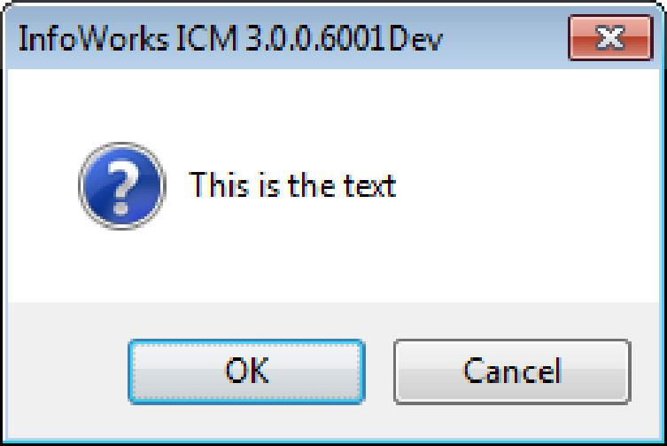

 

It is significant that the 2D zones are meshed, where the size and orientation of the triangles can be varied, rather than a grid, where the layout is fixed. Meshes allow more detail and complexity in locations only where it is needed.

Triangles are derived using the Shewchuk triangulation method ([<u>Reference 1</u>](javascript:BSSCPopup('#References');)).

Each 2D zone must include a boundary and the characteristics of the triangles within the zone must be defined. The creation of a 2D zone is described below. A 2D zone can include the following elements:

- **Porous Wall Polylines** are polylines use to impede or prevent flow through them. A common application of these features are to model fences.

- **Porous Polygons** are polygons used to impede or prevent flow through them. A common application of these features are to model buildings.

- **Break Polylines** are lines along which mesh triangle boundaries must be created. These can be used to define the top of a ridge or the low point in a channel.

- **Boundary Polylines** are optional lines (but must be created coincident to 2D Simulation Polygon boundaries) and are used to alter boundary properties along the line.

- **Mesh Polygons** are polygons within the 2D Simulation Polygons (2D zones) where the triangles have different maximum triangle area. They are most commonly used to define smaller triangles in areas of greater complexity.

- **Initial Conditions (IC) Polygons** are polygons within the 2D Simulation Polygons (2D zones) where the area has specific initial depth and velocity conditions.

- **Roughness Polygons** are polygons within the 2D Simulation Polygons (2D zones) where the area has specific Manning's roughness that differs from the roughness value of the 2D Simulation Polygon.

- **2D Simulation Polygons** are polygons that define the outer boundary of a 2D zone.  2D Mesh will only be generated within these boundaries and 2D simulation will also happen only within these boundaries.

Each object can be either created within InfoSWMM 2D, or created in a GIS and then imported using the provided import tools.

2D zone triangles (2D Mesh) can be created once all the objects and the ground model have been prepared.

The interaction with the below ground system whereby water floods from the manholes on to the 2D zone and then possibly back into the manholes is also described below.

[<u>Top of Page</u>](file:///C:\SWMM-SEWER%20Robohelp\SWMMCombined%20-%20InfoSWMM%20-%201\InfoStorm2D\Technical_Papers\2D_Flood_Routing_Basics.htm)

 

**<u>Creating The 2D Zone</u>**

 

**<u>Step 1 - Add ground surface data to the map</u>**

- Click the ArcMap Add Data button 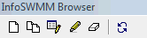

- Browse to the location of your ground surface layer. Many different formats are supported.  
    
  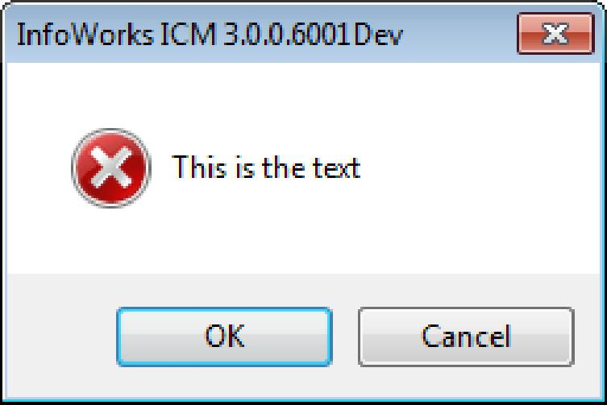

 

**<u>Step 2 - Create 2D Simulation Polygons</u>**

1.  Click the Create 2D Polygon button  from the [<u>InfoSWMM 2D Toolbar</u>](javascript:BSSCPopup('InfoStorm2D/User_Interface/InfoStorm_2D_Toolbar.htm');)

2.  Digitize the polygon by clicking in the ArcMap Drawing Area on the first vertex then click additional vertices as needed. Double-click on the last vertex to complete the polygon.

3.  Give the polygon a unique ID (and optional description if desired). Choose '2D Simulation Polygon' as the Type.  
    

4.  Notice that the attributes of the polygon you just created are shown in the [<u>2D </u>](javascript:BSSCPopup('InfoStorm2D/User_Interface/2D_Browser.htm');)Tab in the Attribute Browser.  
    

5.  Adjust the attributes as needed to suit your modeling situation. For a description of attributes, click [<u>2D Simulation Polygon</u>](javascript:BSSCPopup('InfoStorm2D/2D_Objects/2D_Simulation_Polygon.htm');).

**<u>Step 3 - Create Optional 2D Zone Modification Objects as Needed</u>**

Determine which 2D Zone modification objects you will need to correctly model the characteristics of your ground surface and any flow obstructions in the 2D Zone. The available modification objects are:

- [**<u>2D Boundary</u>**](file:///C:\SWMM-SEWER%20Robohelp\SWMMCombined%20-%20InfoSWMM%20-%201\InfoStorm2D\2D_Objects\2D_Boundary.htm)

- [**<u>2D Break Polyline</u>**](file:///C:\SWMM-SEWER%20Robohelp\SWMMCombined%20-%20InfoSWMM%20-%201\InfoStorm2D\2D_Objects\2D_Break_Polyline.htm)

- [**<u>2D Initial Conditions Polygon</u>**](file:///C:\SWMM-SEWER%20Robohelp\SWMMCombined%20-%20InfoSWMM%20-%201\InfoStorm2D\2D_Objects\2D_Initial_Conditions_Polygon.htm)

- [**<u>2D Mesh Polygon</u>**](file:///C:\SWMM-SEWER%20Robohelp\SWMMCombined%20-%20InfoSWMM%20-%201\InfoStorm2D\2D_Objects\2D_Mesh_Polygon.htm)

- [**<u>2D Porous Polygon</u>**](file:///C:\SWMM-SEWER%20Robohelp\SWMMCombined%20-%20InfoSWMM%20-%201\InfoStorm2D\2D_Objects\2D_Porous_Polygon.htm)

- [**<u>2D Porous Wall Polyline</u>**](file:///C:\SWMM-SEWER%20Robohelp\SWMMCombined%20-%20InfoSWMM%20-%201\InfoStorm2D\2D_Objects\2D_Porous_Wall_Polyline.htm)

- [**<u>2D Roughness Polygon</u>**](file:///C:\SWMM-SEWER%20Robohelp\SWMMCombined%20-%20InfoSWMM%20-%201\InfoStorm2D\2D_Objects\2D_Roughness_Polygon.htm)

**<u>Step 4 - Add 2D Point Source Objects</u>**

1.  If there are any sources of additional flow onto the ground surface such as water springs or artesian wells, add them to the 2D simulation by adding [<u>2D Point Source</u>](javascript:BSSCPopup('InfoStorm2D/2D_Objects/2D_Point_Source.htm');).

**<u>Step 5 - Create Initial Conditions Settings</u>**

> It is often helpful to set up initial conditions for the 2D Zone. This is done by creating [<u>Initial Condition Settings</u>](javascript:BSSCPopup('InfoStorm2D/Dialogs/2D_Initial_Conditions.htm');) and assigning them to [<u>2D Simulation Polygons</u>](javascript:BSSCPopup('InfoStorm2D/2D_Objects/2D_Simulation_Polygon.htm');) and [<u>IC Polygons</u>](javascript:BSSCPopup('InfoStorm2D/2D_Objects/2D_Initial_Conditions_Polygon.htm');). Initial Conditions associated with IC Polygons will override Initial Conditions associated with the 2D Simulation Polygon at that location.

1.  Click **Initial Conditions** from the InfoSWMM 2D menu.  
    

2.  Click the New button  to create a new Initial Condition.

3.  Choose which IC Polygon or 2D Simulation Polygon that the Initial Conditions should apply to.

4.  Choose whether the initial level is specified by Depth or Elevation and enter the appropriate value.

5.  Enter initial velocity information as Velocity and Direction (measured counter-clockwise from due East)

6.  Repeat steps 2-5 for each IC Polygon or 2D Simulation Polygon that you wish to create Initial Conditions for.

[<u>Top of Page</u>](file:///C:\SWMM-SEWER%20Robohelp\SWMMCombined%20-%20InfoSWMM%20-%201\InfoStorm2D\Technical_Papers\2D_Flood_Routing_Basics.htm)

 

**<u>Connecting the 1D Network to the 2D Zone</u>**

It is very simple to connect the 2D Zone to the 1D underground network and to enable the 2D simulation.

**<u>Step 1 - Set 2D Options</u>**

1.  Open the [<u>Simulation Options</u>](file:///C:\SWMM-SEWER%20Robohelp\SWMMCombined%20-%20InfoSWMM%20-%201\InfoStorm2D\Dialogs\2D_Simulation_Options.htm) that are associated with the scenario you wish to apply the 2D Zone to and select the 2D tab.  
    

2.  Select the 'Enable 2D Simulation' option and set the 2D simulation parameters.  For a description of parameters, click [<u>2D Simulation Options</u>](javascript:BSSCPopup('InfoStorm2D/Dialogs/2D_Simulation_Options.htm');).

3.  Set Dynamic Wave as the Routing Model on the [<u>General tab of the InfoSWMM Simulation Options</u>](javascript:BSSCPopup('Creating_Using_and_Maintaining_Projects/Simulating_the_Model/Run_Manager/Simulation_Options/General_Options.htm');).

**<u>Step 2 - Set Up 1D Junctions to Interact with 2D Zone</u>**

The 1D (underground) network and 2D (overland) Zone interact through the rim of 1D junctions. The junctions that are to interact with the 2D Zone need to be enabled and their rim elevations aligned with the 2D Mesh.

1.  To enable a 1D junction to pass flow back and forth to the 2D Zone, select 2D as the Flood Type in the [<u>InfoSWMM Atrribute Browser</u>](file:///C:\SWMM-SEWER%20Robohelp\SWMMCombined%20-%20InfoSWMM%20-%201\User_Interface\Browser\Attribute_Browser\Attribute_Browser.htm).  
    

2.  Enter a Flood Discharge Coefficient. The orifice equation governs flow into and out of the rim of the junction.*  
      
    Q = C*FD*A(2gH)*1/2  
      
      where:***  
      
    Q*** = flow into or out of junction to/from 2D simulation***  
      
    CFD***  = Flood Discharge Coefficient. The Flood Discharge Coefficient combines the typical orifice coefficient (approximately 0.6) with an orifice area reduction factor (or porosity factor) that reduces the manhole surface area to an effective orifice area representing the small holes in a manhole cover or a slightly open or lifted cover. Example: An orifice coefficient of 0.60 is assumed and the effective flow area (i.e. effective orifice area) is 10% of the manhole surface area (12.56 ft2 for a 4 ft diameter manhole) then the Flood Discharge Coefficient is *CFD* = 0.60 X 0.1 = 0.06. Some studies have been done and papers have been written on the subject (see [<u>Reference 3</u>](javascript:BSSCPopup('#References');)).**  
      
    A** = Area of junction (determined by the [<u>Minimum Surface Area</u>](javascript:BSSCPopup('Creating_Using_and_Maintaining_Projects/Simulating_the_Model/Run_Manager/Simulation_Options/Dynamic_Wave_Routing_Options.htm');) parameter)***  
      
    H*** = Height difference across the 'orifice'

**<u>Step 3 - Align Junction Rim with 2D Mesh Elevations</u>**

It is important that the manhole ground levels match the height of the ground model at the relevant location. Otherwise flow could spill on to the mesh either earlier or later than it reaching the manhole ground level. Either:

1.  Manually adjust junction rim elevations (or max depths) to match the ground elevation model you are using at that location. You can use the ArcMap Identify tool  to check the elevation of the ground model at that location and adjust the rim elevation in the InfoSWMM Atrribute Browser for that junction.  Or...

2.  Alternatively, you can add all of the 2D junctions to a Domain and use the [<u>Elevation Extraction tool</u>](javascript:BSSCPopup('Advanced_Hydraulic_Network_Construction_and_Review/Tools/Elevation_Extractor.htm');) to extract rim elevations directly from the ground model you are using (limit the scope of elevation extraction to the Domain of 2D junctions).

[<u>Top of Page</u>](file:///C:\SWMM-SEWER%20Robohelp\SWMMCombined%20-%20InfoSWMM%20-%201\InfoStorm2D\Technical_Papers\2D_Flood_Routing_Basics.htm)

**<u>Reviewing 2D Simulation Output</u>**

Once the model has been successfully simulated using the Run Manager, you can review the 2D simulation output. You can review the output by creating any of three types of output objects.  The following output objects are available:

**2D Result Point** - This gives results at a specific point in a 2D Zone. The available output results for a point are:

- **Depth** - Depth of water above ground surface

- **Direction** - Direction of flow (angle in radians counter-clockwise from due East)

- **Elevation** - Water surface elevation (i.e. ground surface elevation plus Depth)

- **Froude Number**

  - **Velocity**

  - **Unit Flow** - Flow per unit length (i.e. Depth x Velocity)

**2D Result Line** - This gives results along a specific line in the 2D Zone. The available output results for a line are:

- **Flow** (through results analysis line) - The Flow through results analysis line result is calculated by summing the flows across each line segment.

- **Maximum Depth** (along results analysis line) - The maximum of the depth values of the 2D mesh elements intersected by the results analysis line.

- **Maximum Speed** (normal to results analysis line) - For each 2D mesh element that the 2D Results Line intersect, the maximum of the calculated values is reported as the maximum velocity. This is an absolute value.

**2D Result Polygon** - This gives results within a specific polygonal region in the 2D Zone. The available output results for a polygon are:

- **Flow** (through results analysis polygon boundary) - For each 2D mesh element that the 2D Results Polygon intersects, the Flow through results analysis polygon boundary result is calculated by summing the flows across each boundary segment. Flow directed into the polygon is counted positive and flow directed out of the polygon is counted negative.

- **Maximum Depth** (inside results analysis polygon) - The maximum of the depth values of the 2D mesh elements inside the results analysis polygon boundary. Only mesh elements with element centroid within the polygon boundary are included.

- **Maximum Velocity** (inside results analysis polygon) - The maximum of the velocity values of the 2D mesh elements inside the results analysis polygon boundary. Only mesh elements with element centroid within the polygon boundary are included.

- **Volume** (enclosed by results analysis polygon) - The volume enclosed by results analysis polygon result is calculated as the sum of water depth x element area of all 2D mesh elements within the polygon boundary. Only mesh elements with element centroid within the polygon boundary are included in the calculation.

To find out how to create a 2D Results Point, Click [<u>Create a 2D Results Point</u>](javascript:BSSCPopup('InfoStorm2D/2D_Output_and_Display/2D_Results_Point.htm#Create a 2D Results Point');)

To find out how to create a 2D Results Polyline, Click [<u>Create_a\_2D_Results_Polyline</u>](javascript:BSSCPopup('InfoStorm2D/2D_Output_and_Display/2D_Results_Polyline.htm#Create_a_2D_Results_Polyline');)

To find out how to create a 2D Results Polygon, Click [<u>Create_a\_2D_Results_Polygon</u>](javascript:BSSCPopup('InfoStorm2D/2D_Output_and_Display/2D_Results_Polygon.htm#Create_a_2D_Results_Polygon');)

[<u>Top of Page</u>](file:///C:\SWMM-SEWER%20Robohelp\SWMMCombined%20-%20InfoSWMM%20-%201\InfoStorm2D\Technical_Papers\2D_Flood_Routing_Basics.htm)

 

**<u>Visualizing 2D Simulation Output</u>**

Once the model has been successfully simulated using the Run Manager, you can review the 2D simulation output. 2D Simulation results can be visualized in plan view (i.e. 2D view in the ArcMap Drawing Area window) or 3D view. *Note: ArcGIS 3D Analyst extension must be installed and licensed to allow 3D view.*

 

**Visualize Output in 2D View**

1.  Click the 2D Map Display button  from the [<u>InfoSWMM 2D Toolbar</u>](javascript:BSSCPopup('InfoStorm2D/User_Interface/InfoStorm_2D_Toolbar.htm');)

2.  Choose map display parameters according to the directions in [<u>2D Map Display</u>](javascript:BSSCPopup('InfoStorm2D/2D_Output_and_Display/2D_Map_Display.htm');)

3.  The map coloration and velocity arrows will reflect output at the current time step. To change the visualization time step, use the InfoSWMM time slider 

4.  Optionally, you can use the [<u>InfoSWMM Animation Editor</u>](file:///C:\SWMM-SEWER%20Robohelp\SWMMCombined%20-%20InfoSWMM%20-%201\Working_With_the_Map_View\Animation\Animation_Editor.htm) to create animations that show 1D network and 2D Zone simulation output.

 

**<u>Visualize Output in 3D View (ArcGIS 3D Analyst required)</u>**

1.  Click the 3D View button  from the [<u>InfoSWMM 2D Toolbar</u>](javascript:BSSCPopup('InfoStorm2D/User_Interface/InfoStorm_2D_Toolbar.htm');)

2.  Enter the 3D View parameters according to directions in [<u>2D Show Results In 3D</u>](javascript:BSSCPopup('InfoStorm2D/2D_Output_and_Display/2D_Show_Results_In_3D.htm');)

3.  Background and 1D layers can be displayed and buildings ([<u>2D Porous Polygon</u>](javascript:BSSCPopup('InfoStorm2D/2D_Objects/2D_Porous_Polygon.htm');)) can be extruded for a more realistic look

4.  Water depth across the 2D zone can also be visualized within this view.

[<u>Top of Page</u>](file:///C:\SWMM-SEWER%20Robohelp\SWMMCombined%20-%20InfoSWMM%20-%201\InfoStorm2D\Technical_Papers\2D_Flood_Routing_Basics.htm)

 

## References

- Shewchuk, Jonathan Richard. A Two-Dimensional Quality Mesh Generator and Delaunay Triangulator. Computer Science Division, University of California at Berkeley, Berkeley, California 94720-1776. [<u>http://www.cs.cmu.edu/\~quake/triangle.html</u>](http://www.cs.cmu.edu/~quake/triangle.html)

- Francisco Alcrudo, Pilar Garcia-Navarro. A high-resolution Godunov-type scheme in finite volumes for the 2D shallow-water equations. Departmento de Ciencia y Technologia de Materiales y Fluidos, Facultad de Ciencias, Universidad de Zaragoza, Zaragoza 50009, Spain. Presented in International Journal for Numerical Methods in Fluids, Volume 16, Issue 6.

-  Z. Mustaffa, N. Rajaratnam, David Z. Zhu. An Experimental Study of Flow Into Orifices and Grating Inlets on Streets. Can. J. Civ. Eng. **33**: 837-845 (2006)

##  InfoSWMM 2D Menu

**InfoSWMM 2D**'s  menu consists of the following commands. For detailed information on any of these components, please use the links provided.

 

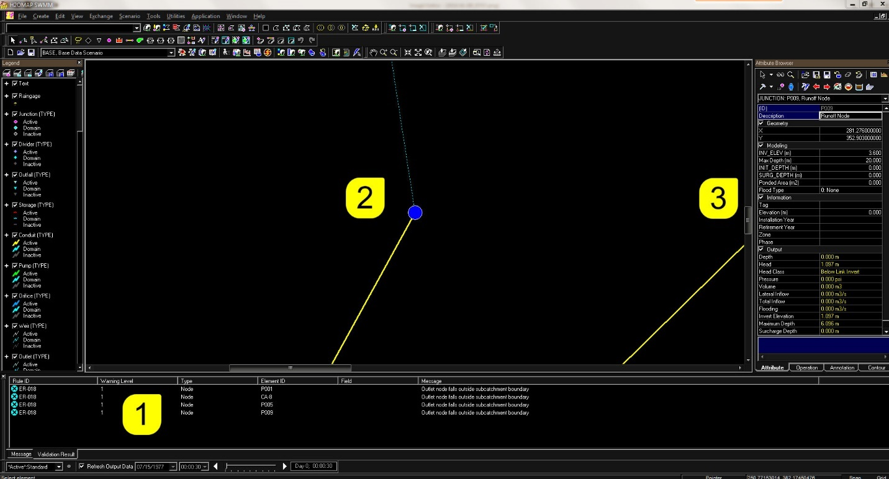

 

<table>
<colgroup>
<col style="width: 23%" />
<col style="width: 76%" />
</colgroup>
<thead>
<tr class="header">
<th><strong>Name</strong></th>
<th><strong>Description</strong></th>
</tr>
</thead>
<tbody>
<tr class="odd">
<td><strong>Create 2D Database</strong></td>
<td>You have the option to create the 2D database when you first create or initialize a project.  If you decline to create the 2D database at that time, you can create it later by using this tool.</td>
</tr>
<tr class="even">
<td><strong>Initial Conditions</strong></td>
<td><a href="javascript:BSSCPopup(&#39;InfoStorm2D/Dialogs/2D_Initial_Conditions.htm&#39;);"><u>2D Initial Conditions</u></a> are used to assign initial level, depth and velocity values to 2D mesh elements at the start of a 2D Simulation.</td>
</tr>
<tr class="odd">
<td><strong>Infiltration Surface</strong></td>
<td>
not a polygon object, but associated with an Infiltration Zone to provide infiltration characteristics

 
</td>
</tr>
<tr class="even">
<td><strong>Simplify 2D Lines and Polygons</strong></td>
<td>
To increase 2D results output reporting and visualization speed, the area that will be updated can be reduced by this tool.

 
</td>
</tr>
<tr class="odd">
<td><strong>Create Flood Damage Report</strong></td>
<td>
Create Flood Damage Report

</td>
</tr>
<tr class="even">
<td><strong>About InfoSWMM 2D</strong></td>
<td>Check licensing and project information</td>
</tr>
<tr class="odd">
<td><strong>InfoSWMM 2D Help</strong></td>
<td>Click to open InfoSWMM online-help or click the F1 key from any dialog box</td>
</tr>
</tbody>
</table>

 

## InfoSWMM 2D Toolbar

The **InfoSWMM 2D** toolbar, shown below, may be invoked or inactivated from the **Toolbars** command under the **View** menu of ArcMap or by right clicking on any part of InfoSWMM/ArcMap user interface (other than the **InfoSWMM Drawing Area)**. Also, the user may move this toolbar to any location on the project screen and place it horizontally or vertically at the location of his/her choice. To change the position of the toolbar, place the cursor in the background area (not on a button) of the toolbar, hold the cursor down and drag it to the desired location.

 

 

 

Brief description of the tools/icons available from **InfoSWMM 2D** toolbar is given below.

<table>
<colgroup>
<col style="width: 18%" />
<col style="width: 24%" />
<col style="width: 56%" />
</colgroup>
<thead>
<tr class="header">
<th><strong>Button</strong></th>
<th><strong>Name</strong></th>
<th><strong>Description</strong></th>
</tr>
</thead>
<tbody>
<tr class="odd">
<td></td>
<td><strong>InfoSWMM 2D Menu</strong></td>
<td>Opens the <a href="javascript:BSSCPopup(&#39;InfoStorm2D/User_Interface/InfoStorm_2D_Menu.htm&#39;);"><u>InfoSWMM 2D Menu</u></a>.</td>
</tr>
<tr class="even">
<td></td>
<td><strong>Create 2D Polygon</strong></td>
<td>
Use this tool to create polygonal input objects necessary to define and run a 2D simulation.  After clicking the tool button, click on desired polygon vertex points in the map view and double-click on the last point to finish the polygon and launch the dialog where you can give the polygon an ID and specify its type.

2D Polygon types include:

<ul>
<li>
<strong>2D Simulation Polygon</strong> - Use as the bounding polygon for the mesh
</li>
<li>
<strong>Roughness Polygon</strong> - Use to divide a 2D Simulation Polygon into regions of different roughness
</li>
<li>
<strong>Mesh Polygon</strong> - Use to divide a 2D Simulation Polygon into regions of different mesh resolution
</li>
<li>
<strong>Porous Polygon</strong> - Use to represent enclosed walls of specified porosity and height
</li>
<li>
<strong>Initial Conditions (IC) Polygon</strong> - Use to define areas in which initial values for level, depth and velocity apply within the mesh
</li>
<li>
<strong>Infiltration IC Polygon</strong> - used to define areas in which initial soil water content apply (when using an infiltration surface using the Horton model)
</li>
<li>
<strong>Infiltration Polygon</strong> - Infiltration Zone (2D) objects are used to represent the physical area within a 2D mesh to which infiltration applies. Areas of different surface types are represented by a set of non-overlapping infiltration zones.  An Infiltration Surface describing the infiltration characteristics for a specific surface type can be associated with each infiltration zone. If no infiltration surface is specified, no infiltration will be considered within the infiltration zone.
</li>
</ul></td>
</tr>
<tr class="odd">
<td></td>
<td><strong>Create 2D Polyline</strong></td>
<td>
Use this tool to create polyline input objects necessary to define and run a 2D simulation.  After clicking the tool button, click on the desired polyline vertex points in the map view and double-click on the last point to finish the polyline and launch the dialog where you can give the polyline and ID and specify its type.

2D Polyline types include:

<ul>
<li>
<strong>Break Polyline</strong> - Use a break polyline to enforce the polyline as mesh element edges during mesh generation.
</li>
<li>
<strong>Porous Wall Polyline</strong> - Use to represent walls of specified porosity and height (e.g. a fence)
</li>
</ul></td>
</tr>
<tr class="even">
<td></td>
<td><strong>Create 2D Boundary</strong></td>
<td>A 2D Boundary is used to define alternative boundary conditions along a section of a 2D Simulation Polygon boundary</td>
</tr>
<tr class="odd">
<td></td>
<td><strong>Create 2D Source Point</strong></td>
<td>Create a point element representing a point source such as a spring or artesian well that might influence the result.  Flow is input as a <a href="javascript:BSSCPopup(&#39;Data_Objects/30_Curves_Series_Patterns/Time_Patterns_Description.htm&#39;);"><u>Time Series</u></a> and then specified in the <a href="file:///C:\SWMM-SEWER%20Robohelp\SWMMCombined%20-%20InfoSWMM%20-%201\InfoStorm2D\User_Interface\2D_Browser.htm"><u>2D Browser</u></a></td>
</tr>
<tr class="even">
<td></td>
<td><strong>Mesh 2D Simulation Polygons</strong></td>
<td>A 2D Mesh is necessary to run a 2D Simulation.  After creating the appropriate 2D Polygon and Polyline objects (see above), create the mesh with this tool.</td>
</tr>
<tr class="odd">
<td></td>
<td><strong>Select 2D Element</strong></td>
<td></td>
</tr>
<tr class="even">
<td></td>
<td><strong>Select Mesh Element</strong></td>
<td></td>
</tr>
<tr class="odd">
<td></td>
<td><strong>Create 2D Result Point</strong></td>
<td>To evaluate 2D output results at a specific point, use this tool to create and name a point that can be viewed and recalled at a later time.</td>
</tr>
<tr class="even">
<td></td>
<td><strong>Create 2D Result Line</strong></td>
<td>To evaluate 2D output results across a specific boundary, use this tool to create and name a polyline that can be viewed and recalled at a later time.</td>
</tr>
<tr class="odd">
<td></td>
<td><strong>Create 2D Result Polygon</strong></td>
<td>To evaluate 2D output results in a specific region, use this tool to create and name a polygon that can be viewed and recalled at a later time.</td>
</tr>
<tr class="even">
<td></td>
<td><strong>Delete 2D Element</strong></td>
<td></td>
</tr>
<tr class="odd">
<td>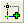</td>
<td><strong>Map Display of 2D Results</strong></td>
<td><a href="javascript:BSSCPopup(&#39;InfoStorm2D/2D_Output_and_Display/2D_Map_Display.htm&#39;);"><u>2D Map Display</u></a> controls the color display and velocity arrow display of 2D output results in the map</td>
</tr>
<tr class="even">
<td></td>
<td><strong>Show Results in 3D</strong></td>
<td>2D output results can be visualized in a <a href="javascript:BSSCPopup(&#39;InfoStorm2D/2D_Output_and_Display/2D_Show_Results_In_3D.htm#Adjust Your Viewing Perspective in the 3D View&#39;);"><u>3D view window</u></a></td>
</tr>
<tr class="odd">
<td></td>
<td><strong>Map Display of Maximum 2D Depths</strong></td>
<td>2D Map Display of Maximum Depth</td>
</tr>
<tr class="even">
<td></td>
<td><strong>Clear Map</strong></td>
<td>Remove display of 2D results from the map</td>
</tr>
</tbody>
</table>

 

## Create Flood Damage Report

Flood Damage Report helps you to quickly assess the overall economic impact of flooding on a catchment, allowing you to better understand the severity of a flood event. The data requirements to create the flood damage report include a polygon layer of the property subject to flooding and a flood damage raster.  The Depth Damage curve allows the definition of flood depth vs. repair cost for a structure. [<u>Click here for an example</u>](javascript:BSSCPopup('../RAM/Create_FDR/Example_Depth_Damage_Curve.htm');).

**<u>Property Value Field Example Depth Damage Curve</u>**

A residential two-story home with flooding on the first floor may be valued at a 30% loss from its total value, while if the flooding reaches above the second floor, the loss will be much higher—in this example 85%.

**<u>Flood Depth</u>**

The average flood depth over the property is listed in this column.

**<u>Loss</u>**

The loss (or damage) caused to property by the flooding is listed in this column.  This is calculated using the flood depth, property value, and the specified depth-damage curve.

**<u>Property Layer</u>**

Select an polygon dataset representing buildings or structures subject to flooding using the drop-down box. This dataset must be currently contained in the ArcGIS table of contents.  It must have the same spatial references as the flood damage extent raster for accurate computations.

The total value of the property is listed in this column.

 

## Arc GIS Tools for 2D Polygon Processing

- Clip – restrict data to area of extents

- Buffer – offset polygon data

- Dissolve – merge polygons

- Multipart to Singlepart – make features individual (need to run after using dissolve)

- Repair geometry – fix bad geometry

- Erase – remove features inside areas

- Integrate – align polygons

 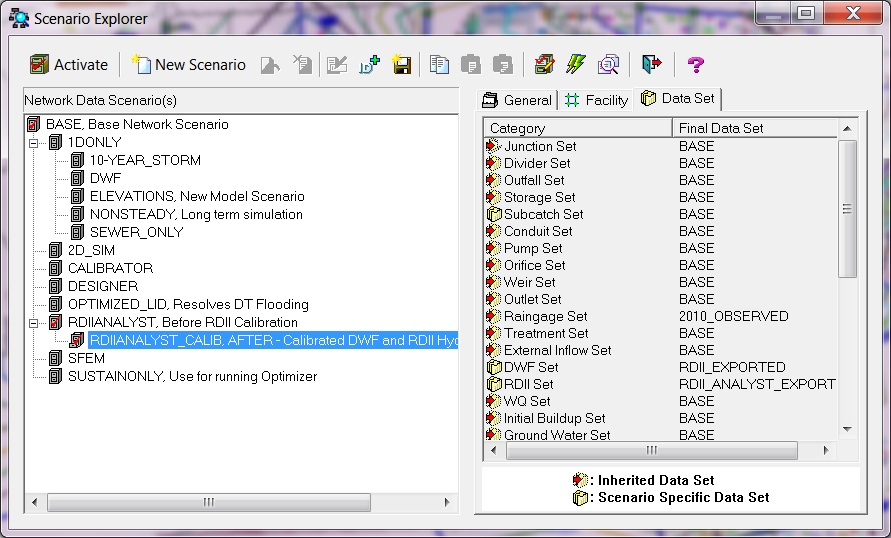

 

## 2D Simulation Polygon

2D Simulation Polygons are used to define the boundary of mesh generation for a 2D simulation.  Initial values for level, depth and velocity can be applied to the 2D Simulation Polygon using a [<u>2D Initial Conditions</u>](file:///C:\SWMM-SEWER%20Robohelp\SWMMCombined%20-%20InfoSWMM%20-%201\InfoStorm2D\Dialogs\2D_Initial_Conditions.htm) object.  Use the [<u>Create 2D Polygon</u>](file:///C:\SWMM-SEWER%20Robohelp\SWMMCombined%20-%20InfoSWMM%20-%201\InfoStorm2D\User_Interface\InfoStorm_2D_Toolbar.htm) tool to digitize the polygon.  Use the [<u>2D </u>](file:///C:\SWMM-SEWER%20Robohelp\SWMMCombined%20-%20InfoSWMM%20-%201\InfoStorm2D\User_Interface\2D_Browser.htm)Tab in the Attribute Browser to edit the properties of the object.

 

 

 

<table>
<colgroup>
<col style="width: 26%" />
<col style="width: 73%" />
</colgroup>
<thead>
<tr class="header">
<th><strong>Name</strong></th>
<th><strong>Description</strong></th>
</tr>
</thead>
<tbody>
<tr class="odd">
<td><strong>2D Tab in the Attribute Browser Tools</strong></td>
<td>See <a href="javascript:BSSCPopup(&#39;InfoStorm2D/User_Interface/2D_Browser.htm&#39;);"><u>2D </u></a>Tab in the Attribute Browser for a description of tools</td>
</tr>
<tr class="even">
<td><strong>ID</strong></td>
<td>A unique ID must be chosen at the time of polygon creation (32 alpha-numeric characters maximum)</td>
</tr>
<tr class="odd">
<td><strong>Description</strong></td>
<td>A description may be entered if desired (60 characters maximum)</td>
</tr>
<tr class="even">
<td><strong>Asset ID</strong></td>
<td>Enter asset identifier if desired</td>
</tr>
<tr class="odd">
<td><strong>Area</strong></td>
<td>Area of polygon.  It is automatically calculated and should not be altered.</td>
</tr>
<tr class="even">
<td><strong>Boundary Type</strong></td>
<td>
Select a Boundary Type for the 2D Simulation Polygon.  Boundary type effects what happens to the flow when it reaches the boundary.  <em>Note: If it is not clear what happens at the boundary then Critical Condition type is recommended.</em>

Available types are:

<ul>
<li>
<strong>Vertical Wall</strong> - The boundary line is considered to be an impermeable infinitely high barrier.  Water cannot flow out of, or into, the 2D Polygon across the boundary line.
</li>
<li>
<strong>Critical Condition</strong> - If the level in the boundary element of the 2D Polygon is above the boundary face level, flow out of the 2D Polygon will be calculated using a broad crested weir equation without energy loss.  If the level in the boundary element is below the boundary face level, the boundary is considered to be a vertical impervious wall.  Water cannot flow into the 2D Polygon.
</li>
<li>
<strong>Supercritical Condition</strong> - If the flow in the boundary element is supercritical (Froude &gt; 1) and directed outside of the 2D Polygon, then the flow at the boundary face will be considered supercritical and calculated using the boundary element depth and velocity, regardless of the boundary face level.  If the conditions of the flow are not supercritical, or the flow is going into the 2D Polygon, the boundary face will be considered as a vertical wall. This situation is useful in areas where the user knows that the flow is flowing out of the 2D Polygon without any effects on the 2D Polygon.  Water cannot flow into the 2D Polygon.
</li>
<li>
<strong>Dry</strong> - The boundary of the 2D Polygon is considered to be surrounded by a bottomless pit. Water that reaches the edge of the 2D Polygon will flow out of the polygon and will be lost from the simulation.  Water cannot flow into the 2D Polygon.
</li>
<li>
<strong>Normal Condition</strong> - It is assumed that slope balances friction forces (normal flow). Depth and velocity are kept constant when water reaches the boundary, so water can flow out without losses.
</li>
</ul></td>
</tr>
<tr class="odd">
<td><strong>Max. Triangle Area &amp; Min. Virtual Element Area</strong></td>
<td>The maximum and minimum triangle / mesh element areas define the limits of the <a href="file:///C:\SWMM-SEWER%20Robohelp\SWMMCombined%20-%20InfoSWMM%20-%201\3_General_Info\About_This_Release.htm"><u>Shewchuk Triangles</u></a>. It is suggested that an initial run is completed using the default maximum and minimum sizes. The results should then be assessed and smaller triangles (more detail) created in areas where the flood processes are more complex. These smaller triangles are created using mesh zones. The Minimum Mesh Element Area must be set to a value smaller than the Maximum Triangle Area. It is recommended that the value of the Minimum Mesh Element Area be set to a value not greater than 50% of the Maximum Triangle Area. The 2D fluid dynamics engine groups mesh elements into conglomerations not smaller than the Minimum Mesh Element Area. Decreasing the Minimum Mesh Element Area will tend to increase the run time for 2D simulations, but will produce more accurate results.</td>
</tr>
<tr class="even">
<td><strong>Min. Mesh Angle (degree)</strong></td>
<td>The minimum angle controls the shape of the mesh elements generated by <a href="file:///C:\SWMM-SEWER%20Robohelp\SWMMCombined%20-%20InfoSWMM%20-%201\3_General_Info\About_This_Release.htm"><u>Shewchuk Triangle</u></a>. Setting the angle to a small value will allow Shewchuk Triangle to generate more long thin triangles. This can be beneficial in circumstances in which the geometry of the voids is complicated and irregular and a large number of small triangles are generated when using the default value. Increasing the minimum angle will produce more equilateral triangles. The algorithm used by Shewchuk Triangle is mathematically guaranteed to converge up to a maximum angle of 33.8 degrees and can (although generally will not) converge for larger angles. However, using a large value of the minimum angle will lead to a very large number of small triangles and the process may fail due to lack of memory. In some situations, such as in the narrow gap between buildings it may be necessary to either reduce this value or the minimum mesh element area.</td>
</tr>
<tr class="odd">
<td><strong>Roughness</strong></td>
<td>The Manning’s (n) roughness defines the surface resistance to flow. The higher the value, the greater the resistance.</td>
</tr>
<tr class="even">
<td><strong>Apply Rainfall to Mesh Elements</strong></td>
<td>Choose Yes if you want to apply rainfall to the 2D mesh elements in the polygon.</td>
</tr>
<tr class="odd">
<td><strong>Apply Rainfall Type</strong></td>
<td>
If the Apply Rainfall to Mesh Elements option is enabled, choose the extent to apply the rainfall to.  The options are:

<ul>
<li>
<strong>Everywhere</strong> - Rainfall will be applied to all mesh elements in the 2D Simulation Polygon
</li>
<li>
<strong>Outside Subcatchments</strong> - Rainfall will only be applied to those mesh elements whose centroids are not inside a Subcatchment boundary. Use this option to prevent rainfall being applied twice to Subcatchment areas.
</li>
</ul></td>
</tr>
<tr class="even">
<td><strong>Infiltration Surface ID</strong></td>
<td>
The 2D Infiltration Model calculates the infiltration properties in 2D elements of a 2D mesh.

The areas in the network to which infiltration is to be applied are represented either by an entire <a href="javascript:BSSCPopup(&#39;InfoStorm2D/2D_Objects/2D_Simulation_Polygon.htm&#39;);"><u>2D Zone</u></a> or by <a href="javascript:BSSCPopup(&#39;Infiltration_Zones.htm&#39;);"><u>Infiltration Zone (2D)</u></a> objects set up by the user.

The infiltration characteristics for specific surface types are defined in <a href="javascript:BSSCPopup(&#39;Infiltration_Zones.htm&#39;);"><u>Infiltration Surface (2D)</u></a> objects. Infiltration properties are assigned to a 2D Zone or Infiltration Zone by associating an Infiltration Surface with the zone.
</td>
</tr>
</tbody>
</table>

 

To Create a 2D Simulation Polygon in the InfoSWMM Drawing Area:

- Click the  button from the [<u>InfoSWMM 2D Toolbar</u>](javascript:BSSCPopup('InfoStorm2D/User_Interface/InfoStorm_2D_Toolbar.htm');)

- Click in the InfoSWMM Drawing Area where the new polygon is to be added.  Click intermediate vertices.  Double-click on the last vertex to complete the polygon.

- Enter and ID (and optional Description after comma)  
  

- The new polygon is created and the attributes are displayed in the [<u>2D </u>](javascript:BSSCPopup('InfoStorm2D/User_Interface/2D_Browser.htm');)Tab in the Attribute Browser

- Adjust the attributes as needed

**2D Boundary**

2D Boundary objects are used to define alternative boundary conditions along a section of a [<u>2D Simulation Polygon</u>](file:///C:\SWMM-SEWER%20Robohelp\SWMMCombined%20-%20InfoSWMM%20-%201\InfoStorm2D\2D_Objects\2D_Initial_Conditions_Polygon.htm) boundary, when undertaking 2D Modelling. The boundary condition defined at this object will override the 2D Simulation Polygon boundary type where the boundary line and polygon boundary coincide. To pass validation, the 2D Boundary must be fully collinear with the boundary of a 2D Simulation Polygon.

 

 

 

<table>
<colgroup>
<col style="width: 26%" />
<col style="width: 73%" />
</colgroup>
<thead>
<tr class="header">
<th><strong>Name</strong></th>
<th><strong>Description</strong></th>
</tr>
</thead>
<tbody>
<tr class="odd">
<td><strong>2D Attribute Browser Tools</strong></td>
<td>See <a href="javascript:BSSCPopup(&#39;InfoStorm2D/User_Interface/2D_Browser.htm&#39;);"><u>2D </u></a>Tab for a description of tools</td>
</tr>
<tr class="even">
<td><strong>ID</strong></td>
<td>A unique ID must be chosen at the time of polyline creation (32 alpha-numeric characters maximum)</td>
</tr>
<tr class="odd">
<td><strong>Description</strong></td>
<td>A description may be entered if desired (60 characters maximum)</td>
</tr>
<tr class="even">
<td><strong>Asset ID</strong></td>
<td>Enter asset identifier if desired</td>
</tr>
<tr class="odd">
<td><strong>Length</strong></td>
<td>Length of 2D Boundary polyline.  It is automatically calculated and should not be altered.</td>
</tr>
<tr class="even">
<td><strong>Boundary Type</strong></td>
<td>
Select a Boundary Type for the 2D Boundary polyline.  Boundary type effects what happens to the flow when it reaches the boundary.  <em>Note: If it is not clear what happens at the boundary then Critical Condition type is recommended.</em>

Available types are:

<ul>
<li>
<strong>Vertical Wall</strong> - The boundary line is considered to be an impermeable infinitely high barrier.  Water cannot flow out of, or into, the 2D Polygon across the boundary line.
</li>
<li>
<strong>Critical Condition</strong> - At the boundary line, if the level in the boundary element of the 2D Polygon is above the boundary face level, flow out of the 2D Polygon will be calculated using a broad crested weir equation without energy loss.  If the level in the boundary element is below the boundary face level, the boundary is considered to be a vertical impervious wall.  Water cannot flow into the 2D Polygon across the boundary line.
</li>
<li>
<strong>Supercritical Condition</strong> - At the boundary line, if the flow in the boundary element is supercritical (Froude &gt; 1) and directed outside of the 2D Polygon, then the flow at the boundary face will be considered supercritical and calculated using the boundary element depth and velocity, regardless of the boundary face level.  If the conditions of the flow are not supercritical, or the flow is going into the 2D Polygon, the boundary face will be considered as a vertical wall. This situation is useful in areas where the user knows that the flow is flowing out of the 2D Polygon without any effects on the 2D Polygon.  Water cannot flow into the 2D Polygon across the boundary line.
</li>
<li>
<strong>Dry</strong> - The boundary line is considered to be bordered by a bottomless pit. Water that reaches the edge of the boundary line will flow out of the 2D Simulation polygon and will be lost from the simulation.  Water cannot flow into the 2D Polygon across the boundary line.
</li>
<li>
<strong>Normal Depth</strong> - It is assumed that slope balances friction forces (normal flow). Depth and velocity are kept constant when water reaches the boundary, so water can flow out without energy losses.
</li>
<li>
<strong>Inflow</strong> - Inflow / Outflow to the 2D Simulation Polygon at the boundary line is defined by a profile in an Inflow Event. The inflow is distributed evenly by length along the length of the boundary line.
</li>
<li>
<strong>Level</strong> - Depth of water at the boundary line is defined by a profile in a Level Event.  If the level of water in the boundary is below the boundary element ground level, the water depth at the boundary is considered zero. Therefore the boundary acts as a weir with crest level at the level of the boundary element.
</li>
</ul></td>
</tr>
<tr class="odd">
<td><strong>Inflow (Time Series) ID</strong></td>
<td>If Inflow is selected as the Boundary Type, select a <a href="javascript:BSSCPopup(&#39;Data_Objects/30_Curves_Series_Patterns/Time_Series_Description.htm&#39;);"><u>Time Series</u></a> that represents flow vs. time across the boundary.</td>
</tr>
<tr class="even">
<td><strong>Level ID</strong></td>
<td>If Level is selected as the Boundary Type, select a node ID from the 1D network to interact with the boundary</td>
</tr>
</tbody>
</table>

 

To Create a 2D Boundary Line in the InfoSWMM Drawing Area:

- Click the  button from the [<u>InfoSWMM 2D Toolbar</u>](javascript:BSSCPopup('InfoStorm2D/User_Interface/InfoStorm_2D_Toolbar.htm');)

- Click in the InfoSWMM Drawing Area near a [<u>2D Simulation Polygon</u>](javascript:BSSCPopup('InfoStorm2D/2D_Objects/2D_Simulation_Polygon.htm');) vertex.  The 2D Boundary Line vertex will snap to the 2D Simulation Polygon vertex.  Continue to click intermediate vertices.  Double-click on the last vertex to complete the polyline.

- Enter and ID (and optional Description after comma)  
  

- The new polyline is created and the attributes are displayed in the [<u>2D </u>](javascript:BSSCPopup('InfoStorm2D/User_Interface/2D_Browser.htm');)Tab in the **Attribute Browser**

- Adjust the attributes as needed

**2D Break Polyline**

The 2D Break Polyline represents a fully permeable feature. Its purpose is to enforce the lines as mesh element edges.

 

 

 

| **Name**                       | **Description**                                                                                                                                                                      |
|--------------------------------|--------------------------------------------------------------------------------------------------------------------------------------------------------------------------------------|
| **2D Attribute Browser Tools** | See [<u>2D </u>](file:///C:\SWMM-SEWER%20Robohelp\SWMMCombined%20-%20InfoSWMM%20-%201\InfoStorm2D\User_Interface\2D_Browser.htm) Tab of Attribute Browser for a description of tools |
| **ID**                         | A unique ID must be chosen at the time of polyline creation (32 alpha-numeric characters maximum)                                                                                    |
| **Description**                | A description may be entered if desired (60 characters maximum)                                                                                                                      |
| **Asset ID**                   | Enter asset identifier if desired                                                                                                                                                    |
| **Length**                     | Length of polyline.  It is automatically calculated and should not be altered.                                                                                                       |
| **Category**                   |                                                                                                                                                                                      |

 

**<u>To Create a 2D Break Polyline in the InfoSWMM Drawing Area:</u>**

- Click the  button from the [<u>InfoSWMM 2D Toolbar</u>](file:///C:\SWMM-SEWER%20Robohelp\SWMMCombined%20-%20InfoSWMM%20-%201\InfoStorm2D\User_Interface\InfoStorm_2D_Toolbar.htm)

- Click in the InfoSWMM Drawing Area where the new polyline is to be added.  Click intermediate vertices.  Double-click on the last vertex to complete the polyline.

- Enter and ID (and optional Description after comma)  
  

- The new polyline is created and the attributes are displayed in the [<u>2D </u>](file:///C:\SWMM-SEWER%20Robohelp\SWMMCombined%20-%20InfoSWMM%20-%201\InfoStorm2D\User_Interface\2D_Browser.htm)Tab of Attribute Browser

- **Adjust the attributes as needed**

**2D Initial Conditions (IC) Polygon**

2D Initial Conditions are used to assign initial level, depth and velocity values to 2D Mesh elements at the start of a 2D Simulation.  Each IC Polygon is linked to a set of initial conditions by specifying the IC Polygon ID in the parameters of the [<u>2D Initial Conditions</u>](javascript:BSSCPopup('InfoStorm2D/Dialogs/2D_Initial_Conditions.htm');).

 

 

 

| **Name**                                  | **Description**                                                                                                                             |
|-------------------------------------------|---------------------------------------------------------------------------------------------------------------------------------------------|
| **2D Tab in the Attribute Browser Tools** | See [<u>2D </u>](javascript:BSSCPopup('InfoStorm2D/User_Interface/2D_Browser.htm');)Tab in the Attribute Browser for a description of tools |
| **ID**                                    | A unique ID must be chosen at the time of polygon creation (32 alpha-numeric characters maximum)                                            |
| **Description**                           | A description may be entered if desired (60 characters maximum)                                                                             |
| **Asset ID**                              | Enter asset identifier if desired                                                                                                           |
| **Area**                                  | Area of polygon.  It is automatically calculated and should not be altered.                                                                 |

 

To Create a 2D IC Polygon in the InfoSWMM Drawing Area:

- Click the  button from the [<u>InfoSWMM 2D Toolbar</u>](javascript:BSSCPopup('InfoStorm2D/User_Interface/InfoStorm_2D_Toolbar.htm');)

- Click in the InfoSWMM Drawing Area where the new polygon is to be added.  Click intermediate vertices.  Double-click on the last vertex to complete the polygon.

- Enter and ID (and optional Description after comma)  
  

- The new polygon is created and the attributes are displayed in the [<u>2D </u>](javascript:BSSCPopup('InfoStorm2D/User_Interface/2D_Browser.htm');)Tab of the Attribute Browser.

- Adjust the attributes as needed

**2D Mesh Polygon**

Mesh Polygon objects are used as part of the mesh generation process carried out when undertaking 2D Modelling. They can be used to divide a 2D Simulation Polygon into regions of different mesh resolution or to define zones in which ground level modification is required (see below).

Using Mesh Polygons for Ground Level Adjustment

Mesh Polygons can be used to define specific zones in which ground levels are to be adjusted in the 2D mesh; to correct for road channels and curb depths for example.

The ground level of elements within the Mesh Polygon is determined from the Ground Model used during the meshing process. Adjustment to ground model level is applied to mesh elements within the Mesh Polygon during simulation without modifying the source ground model.

 

 

 

<table>
<colgroup>
<col style="width: 28%" />
<col style="width: 71%" />
</colgroup>
<thead>
<tr class="header">
<th><strong>NAME</strong></th>
<th><strong>DESCRIPTION</strong></th>
</tr>
</thead>
<tbody>
<tr class="odd">
<td><strong>2D Attribute Browser Tools</strong></td>
<td>See <a href="javascript:BSSCPopup(&#39;InfoStorm2D/User_Interface/2D_Browser.htm&#39;);"><u>2D</u></a> <strong>Attribute Browser</strong> for a description of tools</td>
</tr>
<tr class="even">
<td><strong>ID</strong></td>
<td>A unique ID must be chosen at the time of polygon creation (32 alpha-numeric characters maximum)</td>
</tr>
<tr class="odd">
<td><strong>Description</strong></td>
<td>A description may be entered if desired (60 characters maximum)</td>
</tr>
<tr class="even">
<td><strong>Asset ID</strong></td>
<td>Enter asset identifier if desired</td>
</tr>
<tr class="odd">
<td><strong>Area</strong></td>
<td>Area of polygon.  It is automatically calculated and should not be altered.</td>
</tr>
<tr class="even">
<td><strong>Max. Triangle Area</strong></td>
<td>A measure of the mesh resolution within the polygon. Maximum allowable triangle area when creating a 2D mesh.</td>
</tr>
<tr class="odd">
<td><strong>Override Sim. Polygon Min. Element</strong></td>
<td>Check this option to use the Minimum Virtual Element Area specified for the Mesh Polygon for the mesh elements contained within the mesh element boundary.  If this option is left unchecked, the Minimum Virtual Element Area specified for the <a href="javascript:BSSCPopup(&#39;InfoStorm2D/2D_Objects/2D_Simulation_Polygon.htm&#39;);"><u>2D Simulation Polygon</u></a> containing the Mesh Polygon will be used.</td>
</tr>
<tr class="even">
<td><strong>Ground Level Modification</strong></td>
<td>
Ground level adjustment method to be applied to mesh elements inside mesh polygon.  Options are:

<ul>
<li>
<strong>None</strong> - No adjustment to ground level
</li>
<li>
<strong>Raise or Lower</strong> - Adjust ground level by value specified in Raise by field.  To lower the ground level, specify a negative value in the Raise by field.
</li>
<li>
<strong>Level</strong> - Set ground level to value specified in the Level field
</li>
<li>
<strong>Upper Limit</strong> - Set maximum ground level to value specified in the Level field.  If the ground level of an element (before modification) exceeds the value in the Level field, element level will be set to the value in the Level field.
</li>
<li>
<strong>Lower Limit</strong> - Set minimum ground level to value specified in the Level field.  If the ground level of an element (before modification) is less than the value in the Level field, element level will be set to the value in the Level field.
</li>
</ul>

The adjusted ground level is displayed as the Element Level result for the mesh element.
</td>
</tr>
<tr class="odd">
<td><strong>Min. Virtual Element Area</strong></td>
<td>Minimum mesh element area used for calculating results. Used if the Override 2D simulation polygon minimum element area setting option is selected.  When running a simulation, mesh polygon elements with area less than the minimum area specified, will be aggregated with adjoining mesh polygon elements, until the minimum area is met. This is done for the purpose of calculating results in order to improve simulation stability and run time.</td>
</tr>
<tr class="even">
<td><strong>Raise By</strong></td>
<td>Enabled when Ground level modification is set to Raise.  Change in elevation to be applied to ground level of elements within mesh polygon. Specify a negative number to lower the ground level of elements.</td>
</tr>
<tr class="odd">
<td><strong>Level</strong></td>
<td>Enabled when Ground level modification is set to Level, Upper Limit or Lower Limit.  Ground elevation value to be applied to elements within mesh polygon. See Ground level modification for details.</td>
</tr>
</tbody>
</table>

 

To Create a 2D Mesh Polygon in the InfoSWMM Drawing Area:

- Click the  button from the [<u>InfoSWMM 2D Toolbar</u>](javascript:BSSCPopup('InfoStorm2D/User_Interface/InfoStorm_2D_Toolbar.htm');)

- Click in the InfoSWMM Drawing Area where the new polygon is to be added.  Click intermediate vertices.  Double-click on the last vertex to complete the polygon.

- Enter and ID (and optional Description after comma)  
  

- The new polygon is created and the attributes are displayed in the [<u>2D </u>](javascript:BSSCPopup('InfoStorm2D/User_Interface/2D_Browser.htm');)Tab in the Attribute Browser

- Adjust the attributes as needed

 

**2D Point Source**

2D Point Source objects are used to define the location of a flow-time boundary point within a 2D Simulation Polygon when undertaking 2D Modelling. Inflow associated with the point source discharges to the 2D mesh element in which the point is located.

 

 

 

| **NAME**                                  | **DESCRIPTION**                                                                                                                                                                                                           |
|-------------------------------------------|---------------------------------------------------------------------------------------------------------------------------------------------------------------------------------------------------------------------------|
| **2D Tab in the Attribute Browser Tools** | See [<u>2D </u>](file:///C:\SWMM-SEWER%20Robohelp\SWMMCombined%20-%20InfoSWMM%20-%201\InfoStorm2D\User_Interface\2D_Browser.htm)Tab in the Attribute Browser for a description of tools                                   |
| **ID**                                    | A unique ID must be chosen at the time of polyline creation (32 alpha-numeric characters maximum)                                                                                                                         |
| **Description**                           | A description may be entered if desired (60 characters maximum)                                                                                                                                                           |
| **Asset ID**                              | Enter asset identifier if desired                                                                                                                                                                                         |
| **Inflow (Time Series) ID**               | Select a [<u>Time Series</u>](file:///C:\SWMM-SEWER%20Robohelp\SWMMCombined%20-%20InfoSWMM%20-%201\Data_Objects\30_Curves_Series_Patterns\Time_Series_Description.htm) that represents flow vs. time at the point source. |

 

To Create a 2D Point Source in the InfoSWMM Drawing Area:

- Click the  button from the [<u>InfoSWMM 2D Toolbar</u>](file:///C:\SWMM-SEWER%20Robohelp\SWMMCombined%20-%20InfoSWMM%20-%201\InfoStorm2D\User_Interface\InfoStorm_2D_Toolbar.htm)

- Click in the InfoSWMM Drawing Area where the new point is to be added.

- Enter and ID (and optional Description after comma)  
  

- The new point is created and the attributes are displayed in the [<u>2D </u>](file:///C:\SWMM-SEWER%20Robohelp\SWMMCombined%20-%20InfoSWMM%20-%201\InfoStorm2D\User_Interface\2D_Browser.htm)Tab in the Attribute Browser

- Adjust the attributes as needed

**2D Porous Polygon**

Porous Polygon objects are used as part of the mesh generation process carried out when undertaking 2D Modelling. The polygons represent enclosed walls with a specified porosity and height which are taken into account during the 2D simulation process. Where the boundary of a Porous Polygon is collinear with the boundary of a [<u>2D Simulation Polygon</u>](file:///C:\SWMM-SEWER%20Robohelp\SWMMCombined%20-%20InfoSWMM%20-%201\InfoStorm2D\2D_Objects\2D_Simulation_Polygon.htm), the Porous Polygon will override the boundary condition of the 2D Simulation Polygon.

 

 

 

<table>
<colgroup>
<col style="width: 29%" />
<col style="width: 70%" />
</colgroup>
<thead>
<tr class="header">
<th><strong>NAME</strong></th>
<th><strong>DESCRIPTION</strong></th>
</tr>
</thead>
<tbody>
<tr class="odd">
<td><strong>2D Attribute BrowserTools</strong></td>
<td>See <a href="file:///C:\SWMM-SEWER%20Robohelp\SWMMCombined%20-%20InfoSWMM%20-%201\InfoStorm2D\User_Interface\2D_Browser.htm"><u>2D </u></a><strong>Attribute Browser</strong> for a description of tools</td>
</tr>
<tr class="even">
<td><strong>ID</strong></td>
<td>A unique ID must be chosen at the time of polyline creation (32 alpha-numeric characters maximum)</td>
</tr>
<tr class="odd">
<td><strong>Description</strong></td>
<td>A description may be entered if desired (60 characters maximum)</td>
</tr>
<tr class="even">
<td><strong>Asset ID</strong></td>
<td>Enter asset identifier if desired</td>
</tr>
<tr class="odd">
<td><strong>Area</strong></td>
<td>Area of polygon.  It is automatically calculated and should not be altered.</td>
</tr>
<tr class="even">
<td><strong>Wall Type</strong></td>
<td>
Specify the type of wall.  The options are:

<ul>
<li>
<strong>Infinite</strong> - Wall is considered to be an infinitely high barrier.
</li>
<li>
<strong>Height</strong> - The height of the wall (above ground level) is specified in the Height field
</li>
<li>
<strong>Level</strong> - The level of the wall (elevation) is specified in the Level field
</li>
</ul></td>
</tr>
<tr class="odd">
<td><strong>Porosity</strong></td>
<td>Porosity factor between 0 and 1, where 0 represents impermeable and 1 represents fully permeable</td>
</tr>
<tr class="even">
<td><strong>Height</strong></td>
<td>Enabled if Wall Type of type Height is selected.  Height of the top of the wall from ground level.  For each segment of wall, this is the height above the highest of the ground levels of the two computational elements either side of the wall.</td>
</tr>
<tr class="odd">
<td><strong>Level</strong></td>
<td>Enabled if Wall Type of type Level is selected.  Height above datum (elevation) of the top of the wall.</td>
</tr>
<tr class="even">
<td><strong>Collapse Type</strong></td>
<td>
In an event, a Porous Wall may collapse after a while and not hinder the flow.  You can specify how the wall is removed when the Wall Removal Trigger is reached.  The options are:

<ul>
<li>
<strong>Never</strong> - Wall never collapses
</li>
<li>
<strong>Fully</strong> - The entire length of the wall collapses when the wall removal threshold is met in any of the mesh elements adjacent to the wall
</li>
<li>
<strong>Partially</strong> - When the wall removal threshold is met in a mesh element adjacent to the wall, the length of the wall adjacent to the mesh element collapses
</li>
</ul></td>
</tr>
<tr class="odd">
<td><strong>Wall Removal Trigger</strong></td>
<td>
Variable used to determine when wall is collapsed. This trigger variable relates to the 2D results in the mesh elements adjacent to the wall face.  The options are:

<ul>
<li>
<strong>Depth</strong> - Depth of water in mesh elements adjacent to wall.
</li>
<li>
<strong>Surface Elevation</strong> - Water surface elevation of mesh elements adjacent to the wall.
</li>
<li>
<strong>Velocity</strong> - Velocity in mesh elements adjacent to the wall, in the normal direction to the wall.
</li>
<li>
<strong>Unit Flow</strong> - Flow per unit of length in mesh elements adjacent to wall, in the direction normal to the wall.
</li>
<li>
<strong>Total Head</strong> - Total head in the normal direction to the wall, in adjacent elements to the wall multiplied by the Hydrostatic pressure coefficient. Total head is calculated as: 
         V = A x H 
    Where: 
         H = h + u2/(2g) 
         V(ft or m): Corrected head 
         A: Hydrostatic pressure coefficient 
         H(ft or m): total head 
         h(ft orm): depth 
         u(ft/s or m/s): normal velocity to the wall 
         g(ft/s2 or m/s2): gravity
</li>
<li>
<strong>Force per unit Length</strong> - Total force per unit length in the normal direction to the wall, in adjacent elements to the wall. Force per unit length is calculated as: 
         F = A x 0.5 x ρgH2 
    Where: 
         F(lb/ft or kN/m): Force per unit length 
         A: Hydrostatic pressure coefficient 
         H(ft or m): total head 
         ρ(slugs/ft3 or Tm/m3): water density 
         g(ft/s2 or m/s2): gravity
</li>
</ul></td>
</tr>
<tr class="even">
<td><strong>Use Difference Across Wall</strong></td>
<td>Choose Yes for this option to determine when the wall collapses by calculating the difference in the Wall removal trigger variable between the two elements on either side of the wall. If this option is not checked, wall collapse will be determined by value of trigger variable in any of the mesh elements adjacent to the wall.</td>
</tr>
<tr class="odd">
<td><strong>Depth Threshold</strong></td>
<td>
Enabled when Wall removal trigger is set to Depth.  The conditions are:

<ul>
<li>
When the Use difference across wall option is not selected: the wall is collapsed if the depth of water in any of the mesh elements adjacent to the wall exceeds the Depth threshold.
</li>
<li>
When the Use difference across wall option is selected: the wall is collapsed when the difference between the water depths of the two elements adjacent to the wall exceeds the Depth threshold.
</li>
</ul></td>
</tr>
<tr class="even">
<td><strong>Elevation Threshold</strong></td>
<td>
Enabled when Wall removal trigger is set to Elevation.  The conditions are:

<ul>
<li>
When the Use difference across wall option is not selected: the wall is collapsed if the water surface elevation in any of the mesh elements adjacent to the wall exceeds the Elevation threshold.
</li>
<li>
When the Use difference across wall option is selected: the wall is collapsed when the difference between the water surface elevation of the two elements adjacent to the wall exceeds the Elevation threshold.
</li>
</ul>

This only applies if at least one of the adjacent elements is wet.
</td>
</tr>
<tr class="odd">
<td><strong>Velocity Threshold</strong></td>
<td>
Enabled when Wall removal trigger is set to Velocity.  The conditions are:

<ul>
<li>
When the Use difference across wall option is not selected: the wall is collapsed if the normal velocity to the wall in any of the mesh elements adjacent to the wall exceeds the Velocity threshold.
</li>
<li>
When the Use difference across wall option is selected: the wall is collapsed when the difference between the velocity normal to the wall of the two elements adjacent to the wall exceeds the Velocity threshold.
</li>
</ul></td>
</tr>
<tr class="even">
<td><strong>Unit Flow Threshold</strong></td>
<td>
Enabled when Wall removal trigger is set to Unit flow.  The conditions are:

<ul>
<li>
When the Use difference across wall option is not selected: the wall is collapsed if the flow per unit length normal to the wall in any of the mesh elements adjacent to the wall exceeds the Unit flow threshold.
</li>
<li>
When the Use difference across wall option is selected: the wall is collapsed when the difference between the flow per unit length normal to the wall of the two elements adjacent to the wall exceeds the Unit flow threshold.
</li>
</ul></td>
</tr>
<tr class="odd">
<td><strong>Total Head Threshold</strong></td>
<td>
Enabled when Wall removal trigger is set to Total head.  The conditions are:

<ul>
<li>
When the Use difference across wall option is not selected: the wall is collapsed if the corrected total head in the normal direction to the wall in any of the mesh elements adjacent to the wall exceeds the Total head threshold.
</li>
<li>
When the Use difference across wall option is selected: the wall is collapsed when the difference between the corrected total head normal to the wall of the two elements adjacent to the wall exceeds the Total head threshold.
</li>
</ul></td>
</tr>
<tr class="even">
<td><strong>Force Threshold</strong></td>
<td>
Enabled when Wall removal trigger is set to Force per unit length.  The conditions are:

<ul>
<li>
When the Use difference across wall option is not selected: the wall is collapsed if the force per unit length in the normal direction to the wall in any of the mesh elements adjacent to the wall exceeds the Force threshold.
</li>
<li>
When the Use difference across wall option is selected: the wall is collapsed when the difference between the force per unit length normal to the wall of the two elements adjacent to the wall exceeds the Force threshold.
</li>
</ul></td>
</tr>
<tr class="odd">
<td><strong>Hydrostatic Pressure Threshold</strong></td>
<td>Multiplying factor applied when using Total head or Force per unit length as the Wall removal trigger.</td>
</tr>
</tbody>
</table>

 

To Create a 2D Porous Polygon in the InfoSWMM Drawing Area:

- Click the  button from the [<u>InfoSWMM 2D Toolbar</u>](file:///C:\SWMM-SEWER%20Robohelp\SWMMCombined%20-%20InfoSWMM%20-%201\InfoStorm2D\User_Interface\InfoStorm_2D_Toolbar.htm)

- Click in the InfoSWMM Drawing Area where the new polygon is to be added.  Click intermediate vertices.  Double-click on the last vertex to complete the polygon.

- Enter and ID (and optional Description after comma)  
  

- The new polygon is created and the attributes are displayed in the [<u>2D </u>](file:///C:\SWMM-SEWER%20Robohelp\SWMMCombined%20-%20InfoSWMM%20-%201\InfoStorm2D\User_Interface\2D_Browser.htm)Tab in the Attribute Browser

- Adjust the attributes as needed

**2D Porous Wall Polyline**

Porous Wall objects are line objects used as part of the mesh generation process carried out when undertaking 2D Modelling. The lines represent walls with a specified porosity and height which are taken into account during the 2D simulation process. Where a Porous Wall is collinear with the boundary of a [<u>2D Simulation Polygon</u>](file:///C:\SWMM-SEWER%20Robohelp\SWMMCombined%20-%20InfoSWMM%20-%201\InfoStorm2D\2D_Objects\2D_Simulation_Polygon.htm), the Porous Wall will override the boundary condition of the 2D Simulation Polygon.

 

 

 

<table>
<colgroup>
<col style="width: 26%" />
<col style="width: 73%" />
</colgroup>
<thead>
<tr class="header">
<th><strong>NAME</strong></th>
<th><strong>DESCRIPTION</strong></th>
</tr>
</thead>
<tbody>
<tr class="odd">
<td><strong>2D Tab in the Attribute Browser Tools</strong></td>
<td>See <a href="javascript:BSSCPopup(&#39;InfoStorm2D/User_Interface/2D_Browser.htm&#39;);"><u>2D </u></a>Tab in the Attribute Browser for a description of tools</td>
</tr>
<tr class="even">
<td><strong>ID</strong></td>
<td>A unique ID must be chosen at the time of polyline creation (32 alpha-numeric characters maximum)</td>
</tr>
<tr class="odd">
<td><strong>Description</strong></td>
<td>A description may be entered if desired (60 characters maximum)</td>
</tr>
<tr class="even">
<td><strong>Asset ID</strong></td>
<td>Enter asset identifier if desired</td>
</tr>
<tr class="odd">
<td><strong>Length</strong></td>
<td>Length of 2D Boundary polylilne.  It is automatically calculated and should not be altered.</td>
</tr>
<tr class="even">
<td><strong>Wall Type</strong></td>
<td>
Specify the type of wall.  The options are:

<ul>
<li>
<strong>Infinite</strong> - Wall is considered to be an infinitely high barrier.
</li>
<li>
<strong>Height</strong> - The height of the wall (above ground level) is specified in the Height field
</li>
<li>
<strong>Level</strong> - The level of the wall (elevation) is specified in the Level field
</li>
</ul></td>
</tr>
<tr class="odd">
<td><strong>Porosity</strong></td>
<td>Porosity factor between 0 and 1, where 0 represents impermeable and 1 represents fully permeable</td>
</tr>
<tr class="even">
<td><strong>Height</strong></td>
<td>Enabled if Wall Type of type Height is selected.  Height of the top of the wall from ground level.  For each segment of wall, this is the height above the highest of the ground levels of the two computational elements either side of the wall.</td>
</tr>
<tr class="odd">
<td><strong>Level</strong></td>
<td>Enabled if Wall Type of type Level is selected.  Height above datum (elevation) of the top of the wall.</td>
</tr>
<tr class="even">
<td><strong>Collapse Type</strong></td>
<td>
In an event, a Porous Wall may collapse after a while and not hinder the flow.  You can specify how the wall is removed when the Wall Removal Trigger is reached.  The options are:

<ul>
<li>
<strong>Never</strong> - Wall never collapses
</li>
<li>
<strong>Fully</strong> - The entire length of the wall collapses when the wall removal threshold is met in any of the mesh elements adjacent to the wall
</li>
<li>
<strong>Partially</strong> - When the wall removal threshold is met in a mesh element adjacent to the wall, the length of the wall adjacent to the mesh element collapses
</li>
</ul></td>
</tr>
<tr class="odd">
<td><strong>Wall Removal Trigger</strong></td>
<td>
Variable used to determine when wall is collapsed. This trigger variable relates to the 2D results in the mesh elements adjacent to the wall face.  The options are:

<ul>
<li>
<strong>Depth</strong> - Depth of water in mesh elements adjacent to wall.
</li>
<li>
<strong>Surface Elevation</strong> - Water surface elevation of mesh elements adjacent to the wall.
</li>
<li>
<strong>Velocity</strong> - Velocity in mesh elements adjacent to the wall, in the normal direction to the wall.
</li>
<li>
<strong>Unit Flow</strong> - Flow per unit of length in mesh elements adjacent to wall, in the direction normal to the wall.
</li>
<li>
<strong>Total Head</strong> - Total head in the normal direction to the wall, in adjacent elements to the wall multiplied by the Hydrostatic pressure coefficient. Total head is calculated as: 
         V = A x H 
    Where: 
         H = h + u2/(2g) 
         V(ft or m): Corrected head 
         A: Hydrostatic pressure coefficient 
         H(ft or m): total head 
         h(ft orm): depth 
         u(ft/s or m/s): normal velocity to the wall 
         g(ft/s2 or m/s2): gravity
</li>
<li>
<strong>Force per unit Length</strong> - Total force per unit length in the normal direction to the wall, in adjacent elements to the wall. Force per unit length is calculated as: 
         F = A x 0.5 x ρgH2 
    Where: 
         F(lb/ft or kN/m): Force per unit length 
         A: Hydrostatic pressure coefficient 
         H(ft or m): total head 
         ρ(slugs/ft3 or Tm/m3): water density 
         g(ft/s2 or m/s2): gravity
</li>
</ul></td>
</tr>
<tr class="even">
<td><strong>Use Difference Across Wall</strong></td>
<td>Choose Yes for this option to determine when the wall collapses by calculating the difference in the Wall removal trigger variable between the two elements on either side of the wall. If this option is not checked, wall collapse will be determined by value of trigger variable in any of the mesh elements adjacent to the wall.</td>
</tr>
<tr class="odd">
<td><strong>Depth Threshold</strong></td>
<td>
Enabled when Wall removal trigger is set to Depth.  The conditions are:

<ul>
<li>
When the Use difference across wall option is not selected: the wall is collapsed if the depth of water in any of the mesh elements adjacent to the wall exceeds the Depth threshold.
</li>
<li>
When the Use difference across wall option is selected: the wall is collapsed when the difference between the water depths of the two elements adjacent to the wall exceeds the Depth threshold.
</li>
</ul></td>
</tr>
<tr class="even">
<td><strong>Elevation Threshold</strong></td>
<td>
Enabled when Wall removal trigger is set to Elevation.  The conditions are:

<ul>
<li>
When the Use difference across wall option is not selected: the wall is collapsed if the water surface elevation in any of the mesh elements adjacent to the wall exceeds the Elevation threshold.
</li>
<li>
When the Use difference across wall option is selected: the wall is collapsed when the difference between the water surface elevation of the two elements adjacent to the wall exceeds the Elevation threshold.
</li>
</ul>

This only applies if at least one of the adjacent elements is wet.
</td>
</tr>
<tr class="odd">
<td><strong>Velocity Threshold</strong></td>
<td>
Enabled when Wall removal trigger is set to Velocity.  The conditions are:

<ul>
<li>
When the Use difference across wall option is not selected: the wall is collapsed if the normal velocity to the wall in any of the mesh elements adjacent to the wall exceeds the Velocity threshold.
</li>
<li>
When the Use difference across wall option is selected: the wall is collapsed when the difference between the velocity normal to the wall of the two elements adjacent to the wall exceeds the Velocity threshold.
</li>
</ul></td>
</tr>
<tr class="even">
<td><strong>Unit Flow Threshold</strong></td>
<td>
Enabled when Wall removal trigger is set to Unit flow.  The conditions are:

<ul>
<li>
When the Use difference across wall option is not selected: the wall is collapsed if the flow per unit length normal to the wall in any of the mesh elements adjacent to the wall exceeds the Unit flow threshold.
</li>
<li>
When the Use difference across wall option is selected: the wall is collapsed when the difference between the flow per unit length normal to the wall of the two elements adjacent to the wall exceeds the Unit flow threshold.
</li>
</ul></td>
</tr>
<tr class="odd">
<td><strong>Total Head Threshold</strong></td>
<td>
Enabled when Wall removal trigger is set to Total head.  The conditions are:

<ul>
<li>
When the Use difference across wall option is not selected: the wall is collapsed if the corrected total head in the normal direction to the wall in any of the mesh elements adjacent to the wall exceeds the Total head threshold.
</li>
<li>
When the Use difference across wall option is selected: the wall is collapsed when the difference between the corrected total head normal to the wall of the two elements adjacent to the wall exceeds the Total head threshold.
</li>
</ul></td>
</tr>
<tr class="even">
<td><strong>Force Threshold</strong></td>
<td>
Enabled when Wall removal trigger is set to Force per unit length.  The conditions are:

<ul>
<li>
When the Use difference across wall option is not selected: the wall is collapsed if the force per unit length in the normal direction to the wall in any of the mesh elements adjacent to the wall exceeds the Force threshold.
</li>
<li>
When the Use difference across wall option is selected: the wall is collapsed when the difference between the force per unit length normal to the wall of the two elements adjacent to the wall exceeds the Force threshold.
</li>
</ul></td>
</tr>
<tr class="odd">
<td><strong>Hydrostatic Pressure Threshold</strong></td>
<td>Multiplying factor applied when using Total head or Force per unit length as the Wall removal trigger.</td>
</tr>
</tbody>
</table>

 

To Create a 2D Porous Wall Polyline n the InfoSWMM Drawing Area:

- Click the  button from the [<u>InfoSWMM 2D Toolbar</u>](file:///C:\SWMM-SEWER%20Robohelp\SWMMCombined%20-%20InfoSWMM%20-%201\InfoStorm2D\User_Interface\InfoStorm_2D_Toolbar.htm)

- Click in the InfoSWMM Drawing Area where the new polyline is to be added.  Click intermediate vertices.  Double-click on the last vertex to complete the polyline.

- Enter and ID (and optional Description after comma)  
  

- The new polyline is created and the attributes are displayed in the [<u>2D </u>](file:///C:\SWMM-SEWER%20Robohelp\SWMMCombined%20-%20InfoSWMM%20-%201\InfoStorm2D\User_Interface\2D_Browser.htm)Tab in the Attribute Browser

- Adjust the attributes as needed

**2D Roughness Polygon**

Roughness Polygon objects are used as part of the mesh generation process carried out when undertaking 2D Modelling. They can be used to divide a 2D Simulation Polygon into regions of different roughness.

 

 

 

| **NAME**                                 | **DESCRIPTION**                                                                                                                                                                                                                                                                                                        |
|------------------------------------------|------------------------------------------------------------------------------------------------------------------------------------------------------------------------------------------------------------------------------------------------------------------------------------------------------------------------|
| **2D Tab in the Attribute BrowserTools** | See [<u>2D </u>](file:///C:\SWMM-SEWER%20Robohelp\SWMMCombined%20-%20InfoSWMM%20-%201\InfoStorm2D\User_Interface\2D_Browser.htm)Tab in the Attribute Browser for a description of tools                                                                                                                                |
| **ID**                                   | A unique ID must be chosen at the time of polygon creation (32 alpha-numeric characters maximum)                                                                                                                                                                                                                       |
| **Description**                          | A description may be entered if desired (60 characters maximum)                                                                                                                                                                                                                                                        |
| **Asset ID**                             | Enter asset identifier if desired                                                                                                                                                                                                                                                                                      |
| **Area**                                 | Area of polygon.  It is automatically calculated and should not be altered.                                                                                                                                                                                                                                            |
| **Enforce as Break Line**                | Select Yes if you want the Roughness Polygon boundary to act as a breakline during 2D Mesh generation                                                                                                                                                                                                                  |
| **Roughness**                            | Manning roughness (n), used when creating a 2D mesh. This will override the roughness value specified in the [<u>2D Simulation Polygon</u>](file:///C:\SWMM-SEWER%20Robohelp\SWMMCombined%20-%20InfoSWMM%20-%201\InfoStorm2D\2D_Objects\2D_Simulation_Polygon.htm) for the mesh elements within the Roughness Polygon. |

 

To Create a 2D Roughness Polygon in the InfoSWMM Drawing Area:

- Click the  button from the [<u>InfoSWMM 2D Toolbar</u>](file:///C:\SWMM-SEWER%20Robohelp\SWMMCombined%20-%20InfoSWMM%20-%201\InfoStorm2D\User_Interface\InfoStorm_2D_Toolbar.htm)

- Click in the InfoSWMM Drawing Area where the new polygon is to be added.  Click intermediate vertices.  Double-click on the last vertex to complete the polygon.

- Enter and ID (and optional Description after comma)  
  

- The new polygon is created and the attributes are displayed in the [<u>2D </u>](file:///C:\SWMM-SEWER%20Robohelp\SWMMCombined%20-%20InfoSWMM%20-%201\InfoStorm2D\User_Interface\2D_Browser.htm)Tab in the Attribute Browser

- Adjust the attributes as needed

**2D Initial Conditions**

The 2D Initial Conditions object is used when running a 2D simulation to set the initial values of level, depth and velocity for 2D mesh elements.  To edit or create Initial Conditions, choose Initial Conditions from the [<u>InfoSWMM 2D Menu</u>](javascript:BSSCPopup('InfoStorm2D/User_Interface/InfoStorm_2D_Menu.htm');).

 

 

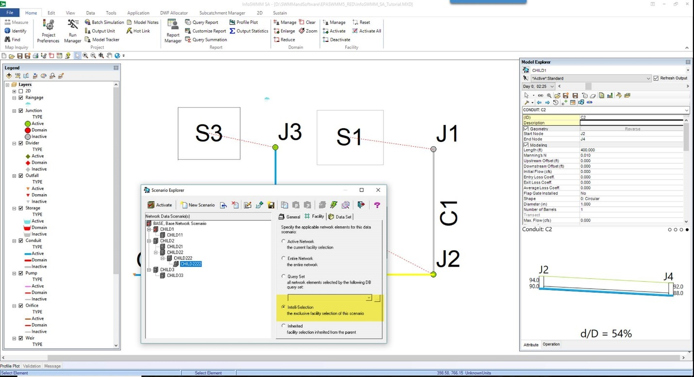

 

<table>
<colgroup>
<col style="width: 40%" />
<col style="width: 59%" />
</colgroup>
<thead>
<tr class="header">
<th><strong>Name</strong></th>
<th><strong>Description</strong></th>
</tr>
</thead>
<tbody>
<tr class="odd">
<td></td>
<td>
See <a href="javascript:BSSCPopup(&#39;User_Interface/Menus_and_Toolbars/Toolbars/EdTools_on_Editors_of_non-visual_data_objects.htm&#39;);"><u>Tools on Editors of non-visual data objects</u></a> for description of common tools.

 
</td>
</tr>
<tr class="even">
<td><strong>Initial Conditions List</strong></td>
<td>Lists ID and Description of all defined Initial Conditions Objects that you have created.</td>
</tr>
<tr class="odd">
<td><strong>Polygon Type</strong></td>
<td>
Choose a polygon type that the initial conditions will apply to.  The options are:

<ul>
<li>
<strong>IC Polygon</strong> - IC Polygons are created specifically to define areas in which initial values for level, depth and velocity apply within the mesh
</li>
<li>
<strong>Simulation Polygon</strong> - Use this option to apply initial conditions to the entire mesh
</li>
</ul></td>
</tr>
<tr class="even">
<td><strong>Level Type</strong></td>
<td>
Select a level type and corresponding value.  The options are:

<ul>
<li>
<strong>Depth</strong> - Initial height of water at the centroid of the mesh element relative to ground level.
</li>
<li>
<strong>Elevation</strong> - Initial elevation of water at the centroid of the mesh element
</li>
</ul></td>
</tr>
<tr class="odd">
<td><strong>Velocity</strong></td>
<td>Initial velocity of water in mesh element</td>
</tr>
<tr class="even">
<td><strong>Direction</strong></td>
<td>Initial direction of flow in mesh element (angle in radians from due East).</td>
</tr>
</tbody>
</table>

 

**2D Simulation Options**

If you have an InfoSWMM 2D license and you have set up your model with all of the necessary 2D elements and parameters, you can enable the 2D Simulation option.  You must also set the 2D simulation options to fit the needs of your modeling scenario.

 

 

<table>
<colgroup>
<col style="width: 27%" />
<col style="width: 72%" />
</colgroup>
<thead>
<tr class="header">
<th><strong>Name</strong></th>
<th><strong>Description</strong></th>
</tr>
</thead>
<tbody>
<tr class="odd">
<td><strong>Enable 2D Simulation</strong></td>
<td>Select this option to enable 2D simulation</td>
</tr>
<tr class="even">
<td><strong>2D Timestep Multiplier</strong></td>
<td>
The 2D timestep should be a multiple (i.e. 1, 2, 3 etc.) of the routing timestep specified in <a href="javascript:BSSCPopup(&#39;Creating_Using_and_Maintaining_Projects/Simulating_the_Model/Run_Manager/Simulation_Options/Time_Step_Options.htm&#39;);"><u>Time Step Options</u></a>.

<blockquote>

<em>2D Timestep = Routing Timestep * 2D Timestep Multiplier</em>

</blockquote>

The calculations used by the 2D simulation are partially explicit and they are therefore influenced by the simulation time step. The recommended timestep will vary according to the size of the mesh. For relatively large meshes, a timestep of 20 – 30 seconds would be appropriate, but for smaller meshes, 5 seconds or even less should be used. The results should be checked for mass balance errors and if necessary the timestep reduced.
</td>
</tr>
<tr class="odd">
<td><strong>Velocity Tolerance</strong></td>
<td>
Mesh elements with water velocity below this value will have velocity reset to zero in terms of momentum calculations.

<strong>Typical value:  0     Default value:  0</strong>
</td>
</tr>
<tr class="even">
<td><strong>Maximum Velocity</strong></td>
<td>
Velocity threshold limiting the velocities that can be achieved in an element in a 2D simulation.  Mesh elements with water velocity above this value will have velocity reset to the maximum specified.

<strong>Typical value: 33 ft/s (10 m/s)</strong>
</td>
</tr>
<tr class="odd">
<td><strong>Inundation Mapping Depth Threshold</strong></td>
<td>
Depth threshold used to determine Time to first inundation for mesh elements. Time to first inundation is reported as the time (from the start of the simulation) at which water depth in the mesh element first exceeds this threshold.

<strong>Default value:  0.03 ft (0.01 m)</strong>
</td>
</tr>
<tr class="even">
<td><strong>Depth Tolerance</strong></td>
<td>
The Depth Threshold is used to determine whether to consider a mesh element wet or dry.  Mesh elements with depth of water below this value will be considered dry and a zero depth will be displayed in the output results.  Only mass conservation will be considered in elements with depth below this threshold

<strong>Typical value: 0.003 ft (0.001 m)     Default value:  0.003 ft (0.001 m)</strong>
</td>
</tr>
<tr class="odd">
<td><strong>Momentum Tolerance</strong></td>
<td>
Depth threshold used to determine whether to consider momentum in a mesh element or not.  Movement of water will not be calculated for mesh elements with depth of water below this value; only mass conservation will be taken into account.

<strong>Typical value:  0.003-0.03 ft (0.001-0.01 m)     Default value:  0.03 ft (0.01 m)</strong>
</td>
</tr>
<tr class="even">
<td><strong>Timestep Stability Control</strong></td>
<td>
This parameter ensures that the internal timestep used by the 2D engine is within the stability bounds given by the CFL condition ( Courant Friedrichs Lewy<strong><u>Courant R. Friedrichs K.O. and Lewy H. (1928)</u></strong><em> 
On the partial Difference Equations of Mathematical Physics.</em>  Math. Ann., Vol 100, p32. condition).

<strong>Valid value:  0 &lt; TSC &lt; 1     Typical value:  0.95</strong>
</td>
</tr>
<tr class="odd">
<td><strong>Theta</strong></td>
<td>
Weighting factor, θ, for the semi-implicit parameter.  Weights the explicit and semi-implicit parts of the numerical scheme used for the time integration of the flow equations.  The higher the value, the more weight given to the implicit part.

<strong>Valid values:  0 &lt; θ &lt; 1     Typical value:  0.9</strong>
</td>
</tr>
</tbody>
</table>

 

**Infiltration Surfaces**

Infiltration Zone (2D) objects are used to represent the physical area within a 2D mesh to which infiltration applies. Areas of different surface types are represented by a set of non-overlapping infiltration zones.

An Infiltration Surface describing the infiltration characteristics for a specific surface type can be associated with each infiltration zone. If no infiltration surface is specified, no infiltration will be considered within the infiltration zone.

 

 

**Fixed Infiltration**

A fixed percentage of the net rainfall which becomes runoff is defined.

The effective infiltration rate is calculated using the following:

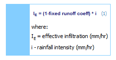

 

**Constant Infiltration**

The 2D Infiltration Model calculates the infiltration properties in 2D elements of a 2D mesh.

The areas in the network to which infiltration is to be applied are represented either by an entire 2D Zone or by Infiltration Zone (2D) objects set up by the user.

The infiltration characteristics for specific surface types are defined in Infiltration Surface (2D) objects. Infiltration properties are assigned to a 2D Zone or Infiltration Zone by associating an Infiltration Surface with the zone.

The effective infiltration rate is calculated as described below.

The maximum theoretical infiltration IMAX is given by the function of the infiltration loss coefficient:

If the available water volume in the surface is higher than the maximum infiltration, the soil will be saturated and the effective infiltration will be given by:

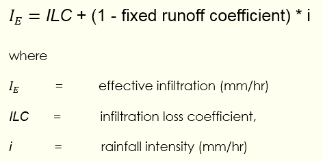

If the available water volume in the surface is lower than the maximum infiltration, the effective infiltration will be given by:

 

 

**Horton Infiltration**

Infiltration either on pervious surfaces or on semi-pervious surfaces can be directly modelled using a variant of the Horton equation. This is an empirical formula derived from infiltrometer/small catchment studies and is usually expressed as a function of time:

 

The above equation is used to evaluate the change in infiltration when there is effective infiltration range, (i.e. whenever there is some water in the surface). The soil becomes more saturated as more water is infiltrated and the infiltration capacity reduces with time.

To evaluate the change in potential infiltration rate during a time step in a mesh element, the maximum potential infiltration volume is calculated as the integral of the potential infiltration rate curve over the time interval (t2-t1=dt):

 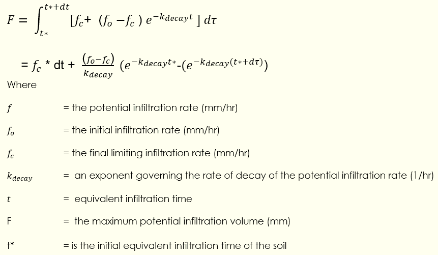

The equivalent infiltration time, t\*, will be different for each mesh element, and in effect represents the soil saturation state. For example, when the equivalent infiltration time of an element is zero, the soil is considered completely dry and therefore the potential infiltration rate will be at its maximum level.

If the available water in the surface is higher than the maximum potential infiltration rate, F, the new potential infiltration rate will decay from:

to:

 

If the available water in the surface is lower than the maximum potential infiltration rate, F, the potential infiltration rate, f, of the soil at the end of the time step will be calculated based on the soil moisture content.

The soil water content is a quantity given by the balance of the infiltration volume and the drainage volume of the soil. Therefore, the variation in soil water content is given by:

The drainage capacity of the soil is given by the following function of the infiltration equivalent time:

Therefore, for a given equivalent infiltration time, the soil moisture content, S, can be defined as the integral of the difference between the potential infiltration rate and the drainage capacity of the soil, d:

 

The soil water content, S, will reach its maximum value as the equivalent infiltration time tends to infinity. In that situation, the potential infiltration rate, f, equals the discharge capacity, d, and the net contribution to S is null. The maximum value of S is given by:

To calculate the new potential infiltration rate, f, if the available water in the surface is lower than the maximum potential infiltration volume,. F, the procedure is as follows:

Calculate the increment of S:

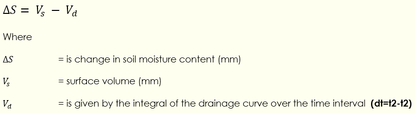

From the new value of S, the new value of equivalent infiltration time, t can be obtained from the formula:

 

From the new value of t, the new potential infiltration rate will be given by:

Once an element becomes dry, i.e. there is no water volume available in the surface to infiltrate, the soil will start drying up. The drying process is governed by the recovery rate krecovery

In this situation, the change in potential infiltration rate in a time step **(dt=t2-t1)** will be governed by the change in S.

The change in S will be governed by the drainage volume, as there is no infiltration volume:

Vd is the drainage volume (mm) given by:

The new potential infiltration rate will be obtained following the procedure shown above in steps 2 and 3.

Setting initial soil water content percentage

When using the Horton infiltration model, it is possible to set an initial soil water content percentage for the entire 2D Zone or for specific areas in the network by the use of Infiltration Initial Condition (IC) Zones.

The initial soil water content values for specific zones are defined in the Initial Conditions 2D grid. Soil water content values between 0 and 100 can be specified, where 0 represents dry initial condition, and 100 represents saturated initial condition.                         

 

**2D Results Point**

The 2D Results point is used to view / export time varying results for the 2D mesh element in which the point is located.

 

<table>
<colgroup>
<col style="width: 26%" />
<col style="width: 73%" />
</colgroup>
<thead>
<tr class="header">
<th><strong>Name</strong></th>
<th><strong>Description</strong></th>
</tr>
</thead>
<tbody>
<tr class="odd">
<td><strong>2D Tab in the Attribute Browser Tools</strong></td>
<td>See <a href="javascript:BSSCPopup(&#39;InfoStorm2D/User_Interface/2D_Browser.htm&#39;);"><u>2D </u></a>Tab in the Attribute Browser for a description of tools</td>
</tr>
<tr class="even">
<td><strong>ID</strong></td>
<td>A unique ID must be chosen at the time of polyline creation (32 alpha-numeric characters maximum)</td>
</tr>
<tr class="odd">
<td><strong>Description</strong></td>
<td>A description may be entered if desired (60 characters maximum)</td>
</tr>
<tr class="even">
<td><strong>Asset ID</strong></td>
<td>Enter asset identifier if desired</td>
</tr>
<tr class="odd">
<td><strong>Available Point Results</strong></td>
<td><ul>
<li>
<strong>Depth</strong> - Depth of water
</li>
<li>
<strong>Direction</strong> - Direction of flow.  Angle in radians from due East.
</li>
<li>
<strong>Elevation</strong> - Elevation at time t, calculated as: 
         elevation(t) = depth(t) + ground level

<ul>
<li>
<strong>Froude Number</strong> - Froude Number at time t, calculated as: 
         Fr(t) = velocity(t) /√(g+depth(t)) 
If depth(t) = 0 then Fr(t) = 0 
Fr(t) is always &gt; 0
</li>
</ul></li>
<li>
<strong>Velocity</strong> - Velocity of water
</li>
<li>
<strong>Unit Flow</strong> - Flow per unit length (in 2D element).  Unit Flow at time t, is calculated as: 
         f(t) = depth(t) x velocity(t)
</li>
</ul></td>
</tr>
</tbody>
</table>

 

To Create a 2D Results Point in the InfoSWMM Drawing Area:

- Click the  button from the [<u>InfoSWMM 2D Toolbar</u>](javascript:BSSCPopup('InfoStorm2D/User_Interface/InfoStorm_2D_Toolbar.htm');)

- Click in the InfoSWMM Drawing Area where the new point is to be added.

- Enter an ID (and optional Description after comma)

- The new point is created and the attributes are displayed in the [<u>2D </u>](javascript:BSSCPopup('InfoStorm2D/User_Interface/2D_Browser.htm');)Tab in the Attribute Browser

 

**Output Manager Graphs**

InfoSWMM 2D Report Variables

The Junction Graph variables for 2D Depth, 2D Velocity, 2D Froude Number, 2D Unit Flow, 2D Inflow, 2D Volume and 2D Angle for a InfoSWMM 2D simulation for up to 1000 years can be plotted in the Report Manager of InfoSWMM.  This is an image of the 2D inflow over a 10 year period (A), all seven graph variables (B) for the mesh triangle associated with the 1D node (C).  The 2D inflow is + for flow out of the node to a mesh triangle and – for flow from the mesh triangle to the  1D junction.

 

 

**2D Results Polyline**

The 2D Results polyline is used to view / export time varying results for the 2D mesh elements that are intersected by the polyline.

 

<table>
<colgroup>
<col style="width: 28%" />
<col style="width: 71%" />
</colgroup>
<thead>
<tr class="header">
<th><strong>Name</strong></th>
<th><strong>Description</strong></th>
</tr>
</thead>
<tbody>
<tr class="odd">
<td><strong>2D Tab in the Attribute BrowserTools</strong></td>
<td>See <a href="javascript:BSSCPopup(&#39;InfoStorm2D/User_Interface/2D_Browser.htm&#39;);"><u>2D </u></a>Tab in the Attribute Browser for a description of tools</td>
</tr>
<tr class="even">
<td><strong>ID</strong></td>
<td>A unique ID must be chosen at the time of polyline creation (32 alpha-numeric characters maximum)</td>
</tr>
<tr class="odd">
<td><strong>Description</strong></td>
<td>A description may be entered if desired (60 characters maximum)</td>
</tr>
<tr class="even">
<td><strong>Asset ID</strong></td>
<td>Enter asset identifier if desired</td>
</tr>
<tr class="odd">
<td><strong>Available Polyline Results</strong></td>
<td>
<strong>Flow</strong> (through results analysis line) - For each 2D mesh element that the 2D Results Line intersects:

<ul>
<li>
The component of the unit flow normal to the line is determined
</li>
<li>
The unit flow component is multiplied by the length of the line segment intersecting the element
</li>
<li>
The Flow through results analysis line result is calculated by summing the flows across each line segment.
</li>
<li>
<strong>Maximum Depth</strong> (along results analysis line) - The maximum of the depth values of the 2D mesh elements intersected by the results analysis line.
</li>
<li>
<strong>Maximum Velocity</strong> (normal to results analysis line) - For each 2D mesh element that the 2D Results Line intersect:
</li>
<li>
The value of the velocity component orthogonal to the line is determined.
</li>
<li>
The maximum of the calculated values is reported as the maximum velocity.  This is an absolute value.
</li>
</ul></td>
</tr>
</tbody>
</table>

 

**<u>To create a 2D Results Polyline in the InfoSWMM Drawing Area:</u>**

- Click the  button from the [<u>InfoSWMM 2D Toolbar</u>](javascript:BSSCPopup('InfoStorm2D/User_Interface/InfoStorm_2D_Toolbar.htm');)

- Click in the InfoSWMM Drawing Area where the new polyline is to be added.  Click intermediate vertices.  Double-click on the last vertex to complete the polyline.

- Enter an ID (and optional Description after comma)

- The new polyline is created and the attributes are displayed in the [<u>2D </u>](javascript:BSSCPopup('InfoStorm2D/User_Interface/2D_Browser.htm');)Tab in the Attribute Browser

**2D Results Polygon**

The 2D Results polygon is used to view / export time varying results for the 2D mesh elements that are intersected by the polygon.

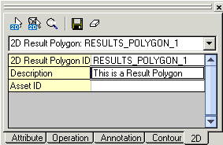

 

<table>
<colgroup>
<col style="width: 26%" />
<col style="width: 73%" />
</colgroup>
<thead>
<tr class="header">
<th><strong>Name</strong></th>
<th><strong>Description</strong></th>
</tr>
</thead>
<tbody>
<tr class="odd">
<td><strong>2D Tab in the Attribute Browser Tools</strong></td>
<td>See <a href="javascript:BSSCPopup(&#39;InfoStorm2D/User_Interface/2D_Browser.htm&#39;);"><u>2D </u></a>Tab in the Attribute Browser for a description of tools</td>
</tr>
<tr class="even">
<td><strong>ID</strong></td>
<td>A unique ID must be chosen at the time of polyline creation (32 alpha-numeric characters maximum)</td>
</tr>
<tr class="odd">
<td><strong>Description</strong></td>
<td>A description may be entered if desired (60 characters maximum)</td>
</tr>
<tr class="even">
<td><strong>Asset ID</strong></td>
<td>Enter asset identifier if desired</td>
</tr>
<tr class="odd">
<td><strong>Available Polygon Results</strong></td>
<td><ul>
<li>
<strong>Flow</strong> (through results analysis polygon boundary) - For each 2D mesh element that the 2D Results Polygon intersects:

<ul>
<li>
The component of the unit flow normal to the boundary is determined
</li>
<li>
The unit flow component is multiplied by the length of the boundary segment intersecting the element
</li>
</ul></li>
<li><blockquote>

The Flow through results analysis polygon boundary result is calculated by summing the flows across each boundary segment.  Flow directed into the polygon is counted positive and flow directed out of the polygon is counted negative.

</blockquote></li>
<li>
<strong>Maximum Depth</strong> (inside results analysis polygon) - The maximum of the depth values of the 2D mesh elements inside the results analysis polygon boundary.  Only mesh elements with element centroid within the polygon boundary are included.
</li>
<li>
<strong>Maximum Velocity </strong>(inside results analysis polygon) - The maximum of the velocity values of the 2D mesh elements inside the results analysis polygon boundary.  Only mesh elements with element centroid within the polygon boundary are included.
</li>
<li>
<strong>Volume</strong> (enclosed by results analysis polygon) - The Volume enclosed by results analysis polygon result is calculated as the sum of water depth x element area of all 2D mesh elements within the polygon boundary.  Only mesh elements with element centroid within the polygon boundary are included in the calculation.
</li>
</ul></td>
</tr>
</tbody>
</table>

 

To create a 2D Results Polygon in the InfoSWMM Drawing Area:

- Click the  button from the [<u>InfoSWMM 2D Toolbar</u>](javascript:BSSCPopup('InfoStorm2D/User_Interface/InfoStorm_2D_Toolbar.htm');)

- Click in the InfoSWMM Drawing Area where the new polygon is to be added.  Click intermediate vertices.  Double-click on the last vertex to complete the polygon.

- Enter an ID (and optional Description after comma)

- The new polygon is created and the attributes are displayed in the [<u>2D </u>](javascript:BSSCPopup('InfoStorm2D/User_Interface/2D_Browser.htm');)Tab in the Attribute Browser

 

**2D Map Display**

The 2D Map Display tool allows you to present 2D simulation results in symbolic fashion using different colors and arrows to represent variables such as velocity, depth, volume, unit flow and Froude number.

 

<table>
<colgroup>
<col style="width: 26%" />
<col style="width: 73%" />
</colgroup>
<thead>
<tr class="header">
<th><strong>Name</strong></th>
<th><strong>Description</strong></th>
</tr>
</thead>
<tbody>
<tr class="odd">
<td><strong>Color Map</strong></td>
<td>Select this option to color the map (when the Apply button is clicked) according to the Classification Table</td>
</tr>
<tr class="even">
<td><strong>Color Map Field</strong></td>
<td>Choose a variable to be used in the classification and map coloration process</td>
</tr>
<tr class="odd">
<td><strong>Classes</strong></td>
<td>Choose how many classes to use in the Classification Table</td>
</tr>
<tr class="even">
<td><strong>Set Breaks</strong></td>
<td>Clicking this button will set the class breaks in the Classification Table on an equal-interval basis.  Set number of breaks desired in the Classes selection area</td>
</tr>
<tr class="odd">
<td><strong>Classification Table</strong></td>
<td>
Lists the classification of the range of output variable results.  Each 'Class' has a color, break and label associated with it:

<ul>
<li>
<strong>Color</strong> - Mesh triangles with output falling in this range will be colored with this color
</li>
<li>
<strong>Break</strong> - Set the upper end of the class range
</li>
<li>
<strong>Label</strong> - Enter a custom label that will be displayed in the ArcMap TOC for this class
</li>
</ul></td>
</tr>
<tr class="even">
<td><strong>Ramp Colors</strong></td>
<td>Automatically set the colors in the Classification Table with a range of colors starting with the 'From' color to the 'To' color.  Double-click the color box to change the colors then click the Ramp Color button to apply the colors to the Classification Table</td>
</tr>
<tr class="odd">
<td><strong>Show Flow Arrow</strong></td>
<td>Select this option to display arrows on the map (when the Apply button is clicked) according to the Flow Arrow parameters.  Resulting Arrow dimensions are in map units (i.e. the length units defined for the ArcMap Data Frame)</td>
</tr>
<tr class="even">
<td><strong>Flow Arrow Field</strong></td>
<td>Choose the output variable to be used for arrow generation - Velocity or Unit Flow.</td>
</tr>
<tr class="odd">
<td><strong>Arrow Type</strong></td>
<td>
Display of flow arrows can customized by choosing either Fixed or Variable type:

<ul>
<li>
<strong>Fixed</strong> - Fixed arrow type controls the exact length of arrows in the display
</li>
<li>
<strong>Variable</strong> - Variable arrow type adjusts the display of the arrow to the scale of the display
</li>
</ul></td>
</tr>
<tr class="even">
<td><strong>Flow Arrow Size</strong></td>
<td>Options change depending on Arrow Type.  If Arrow Type is 'Fixed', the size will be the actual size.  If Arrow Type is 'Variable', the size will be the minimum size of the arrow but the actual size may be larger if the map scale is large.</td>
</tr>
<tr class="odd">
<td><strong>Flow Arrow Length Factor</strong></td>
<td>If the Arrow Type is 'Variable' use this factor to scale the arrow lengths to provide a meaningful yet readable result.  </td>
</tr>
<tr class="even">
<td><strong>Flow Arrow Head Size</strong></td>
<td>Choose the size of the arrow head compared to the length of the Flow Arrow</td>
</tr>
</tbody>
</table>

 

**2D Show Results in 3D**

This tool allows you to view 2D simulation results in a 3D viewer window.  *Note: You need the ArcGIS 3D Analyst extension installed and licensed to use this function.*

You must first set viewing options:

 

<table>
<colgroup>
<col style="width: 30%" />
<col style="width: 69%" />
</colgroup>
<thead>
<tr class="header">
<th><strong>Name</strong></th>
<th><strong>Description</strong></th>
</tr>
</thead>
<tbody>
<tr class="odd">
<td><strong>Include Visible All Layers in 3D View</strong></td>
<td>Choose this option if you want all available layers to be represented in the 3D view.  Selecting this option may decrease performance of the 3D viewer.  3D viewer performance will also be affected by computer hardware.</td>
</tr>
<tr class="even">
<td><strong>Base Surface</strong></td>
<td>Select a surface to include in the 3D visualization and to act as the reference datum for Porous Polygon extrusion</td>
</tr>
<tr class="odd">
<td><strong>Vertical Exaggeration</strong></td>
<td>
Vertical exaggeration can enable a more dramatic view of 3D results by exaggerating the height of elements such as terrain relief and water depth.  Three options are available:

<ul>
<li>
None - No exaggeration
</li>
<li>
Suggested by System - The vertical extent will be 3/10 of the horizontal extent
</li>
<li>
Use Exaggeration Factor - Height of elements will be multiplied (for display purpose only) by the specified factor
</li>
</ul></td>
</tr>
<tr class="even">
<td><strong>Extrude Porous Polygon Layer</strong></td>
<td>Use this option to vertically extrude the Porous Polygon layer to visually represent buildings.  Enter a value for height of buildings above the Base Surface.</td>
</tr>
<tr class="odd">
<td><strong>Extrude Mesh Layer using Display Field</strong></td>
<td>After you have set up the <a href="javascript:BSSCPopup(&#39;InfoStorm2D/2D_Output_and_Display/2D_Map_Display.htm&#39;);"><u>2D Map Display</u></a>, you can choose this option to have the Mesh layer extruded to the height of the output variable chosen in the 2D Map Display.</td>
</tr>
</tbody>
</table>

 

**<u>To Adjust Your Viewing Perspective in the 3D View:</u>**

- **Click and drag the cursor in the view to tilt and rotate the view**

- **Right-click and drag to dynamically zoom in/out**

- **Use your mouse scroll wheel to zoom in/out**

- **Place the cursor over a point in the view and hold down the mouse scroll wheel to pan the view**

**2D Mass Balance**

Each InfoSWMM 2D Simulation is accompanied by a Volume Balance Report in the Simulation Log file.  The simulation log file should be a modeller’s first port of call in order to determine the performance of the simulation and in particular to determine the Mass Error Balance.  The original source for this Topic was http://blog.innovyze.com/2013/12/12/infoworks-2d-volume-balance-report/

A Volume Balance Report is generated for each 2D Zone polygon which contains the following information:-

 

The headings have the following definitions:-

 

**2D Zone Name : The name of the 2D Zone for which the volume balance report is relevant**

**Initial Volume (m3) : Initial volume in the 2D zone**

**Net Inflow (m3) : Inflow – Outflow from the 1D Nodes**

**Inflow (m3) : Inflow to the 2D zone**

**Total Volume in the surface (m3) : Total volume on the surface at the end of the simulation (Sum of volume in the 2d zone + volume out of the 2d zone)**

**Volume in the 2d zone (m3) : Total volume that has gone into the 2d zone**

**Volume out of the 2d zone (m3) : Total volume that has exited the 2d zone (Boundary type critical, supercritical or dry will cause a loss)**

**Rain Volume in the 2D Zone (m3) :  Total Volume of rainfall that has entered the 2D Zone.  Valid when apply rainfall directly to 2D mesh is applied.**

**Volume Lost in the 2D Zone (m3) : Total Volume of flow lost from the 2D Zone through Infiltration.**

**Mass error balance (%) : Mass Balance in the 2D Zone.  This is determined using the following expression:-**

**(Net Inflow – Total Volume + Initial Volume + Rain Volume – Lost Volume)**

**To get a percentage value the mass error is divided by either Initial Volume, Inflow from 1D, or Inflow from external boundaries, depending on the first of these to be non-zero.**

**Effective Area (ha) : Total area of 2d zone**

**Flooded area at the end of the simulation (ha) : Area of flooded elements at the end of the simulation**

**Maximum flooded area (ha) : Maximum flooded area**

**The key reported figure is the Mass Error Balance (%) value, this should be as close to 0 as possible.  If a non-zero figure is reported then a Mass Error Report will be provided which provides the volume (m3) of Mass Error (it is also possible to see hyperlinked mesh elements in which the mass error occurs).  These should be investigated to determine the location and cause of the mass erro**r.

Common causes for the mass error are too high a timestep (a timestep of 10 seconds or less should be used for a 1D-2D timestep), 1D instabilities which lead to poor convergence and/or flow oscillations between the 1D and 2D (ticking the option in the 2D Parameters to ‘Link 1D and 2D calculations at minor timesteps’ can help in this instance) or the choice of inappropriate options in terms of matching banklines to element levels (ie, either the ‘Lower 2D mesh element ground levels higher than adjacent bank levels’ in the meshing dialogue or the ‘Adjust bank levels based on adjacent element ground levels’ option in the 2D Parameters will help).

  

**Tips for a Good Meshing Experience**

Meshes are very powerful and flexible for modeling 2D overland flows in a complex urban environment.  However, complex geometries can be frustrating for many modelers to deal with.  This is intended as a best practices guide to speed up the creation and setup of a high quality detailed 2D model in InfoWorks ICM.  While this guide focuses on preliminary data cleanup in ArcGIS, where ICM has similar or identical tools these are noted.   The original is from the innovyze blog/

This guide includes the following sections:

1.  Where is it Flooding?

2.  Check / Simplify Geometries of Additional Files

3.  Be Innovative

4.  Consider the Accuracy of the Elevation Model

5.  Build Tools for Future Use

6.  Typically Exclude Zone Boundaries when Meshing

7.  Utilize Mesh Zones

8.  Use Diagnostic Polygons

9.  Breakline / Porous Wall Considerations

10. After Meshing, Look for Small Elements

11. General Conclusions from Previous Analysis

**1 – Where is it Flooding?**

When I get a model that has a 1D network setup that has flooding, I typically do not know where the flooding will go.  So my initial step is to draw a large 2D zone with large elements (typically 3000 sq. ft. for the maximum triangle area and 400 sq. ft. for minimum element area).  Next I set nodes I want to integrate with 2D to a flood type 2D with the default flooding coefficient (this can be changed later, right now the idea is to get a general idea of the flooding extents).

With this done I run a model (If there are multiple storms, I run the biggest only), and do a theme on maxima flood depths to see the flooding extent.  Now I can adjust the 2D zone so that it only covers the area I am interested in.  There is no benefit to having elements that always stay dry under the largest event.

 

**2 – Check / Simplify Geometries of Additional Files**

Often additional GIS files are used to add additional detail to the mesh.  Examples are buildings (voids / porous polygons), curb lines (breaklines or porous polygons), walls (porous walls), land use (roughness polygons), etc.  While much GIS data is great for mapping, it may not be adequate for geoprocessing or 2D modeling.  Therefore, all additional data to be used should always be examined before running large detailed 2D models.

<u>2.1 – Check and Repair Geometry</u>

Any GIS dataset should have its geometry checked before it is ever imported into ICM.  Common geometry problems of polygons include self-intersection, null geometry, and vertices stored out of order.  If such files are used with geoprocessing in ArcGIS, the error in output may not be apparent.  ICM specifically prevents a mesh from being created when there are such issues.

<u>2.2 – Simplify Geometries as Reasonable</u>

When building a mesh, each vertex in a background file = a triangle vertex.  Complex geometries are at times unavoidable, but there are 4 main things that the user can have some control over.  One is the number of vertices, as many times polylines and polygons have excessive vertices that do not add any benefit to 2D modeling.  These can be greatly enhanced by removing vertices while maintaining the shape necessary.  For this, the ArcGIS ‘simplify line’ and ‘simplify’ building tools are very beneficial.  There is also a simplify tool in ICM.  See below for an example.

                                                             

Another are curves, that typically come from CAD, as curves are typically turned into many vertices for spatial analysis.  Simplifying curves to a reasonable geometry can be a large benefit.

Donuts can be handled by ICM, but there are benefits to removing these (typically leaving the donut adds no benefit). 

Finally, reducing the number of intersections where possible will greatly help. A good example is at mesh zones, where by simply not drawing these through buildings etc. the resultant mesh is much cleaner.

**<u>2.3 – Check for Slivers, Gaps, and Overlaps</u>**

Many GIS datasets have polygons that appear to have collinear polygons, but may not.  There may be tiny gaps between polygons, or polygons that overlap, as well as polygons with diverging edges causing a sliver.  Below is an example that is invisible to the eye.

Such geometry problems cause massive issues when meshing, and they should be fixed up front.  In ArcGIS, there is a tool named ‘Integrate’ that does this.  In ICM, there is a tool called ‘close gaps and overlaps’ that does the same thing.

**<u>2.4 – Reduce the Number of Polygons and Layers</u>**

Sometimes adjacent polygons can be joined with zero consequence.  One example is land use used for roughness zones.  A city block may be 100% residential so the user wants to assign one roughness value for this land use.  Perhaps the land use is broken down to the parcel level.  Having 50 parcels as opposed to 1 adds no benefit to the model, but it adds much complexity to the geometry.

Another example is adjacent buildings.  The buildings may have no gap for water to flow though, but yet the buildings are individual polygons as they have different owners.  In such cases, using the ArcGIS ‘dissolve’ tool can greatly reduce the complexity as well as the number of polygons.

   

In addition, there may be some small polygons, or polygons located in areas of less interest in such datasets that could be deleted.  Any polygon with an area less than say 10 sq. ft. may provide no benefit in keeping if the minimum element area is 10 sq. ft.  In cases such as in the previous figure, the buildings isolated in the center of the block may provide little benefit in the scope of the analysis.

Finally consider grouping different surfaces together.  For example, polygons for pavements (sidewalks) and roads may be in separate datasets, when in practice the roughness and infiltration characteristics are likely to be identical.  Such datasets could be merged using the ArcGIS ‘Merge’ tool to reduce the number of datasets overlaid when creating a mesh.

**<u>2.5 – Restrict the background files to within the 2D Zone</u>**

Having voids, breaklines, roughness zones, etc. outside the 2D zone does nothing for the 2D model.  Restricting these datasets to within the 2D zone reduces intersections and simplifies everything.  Using the ArcGIS ‘clip’ tool to reduce these tiles to the 2D extent is highly advised.

**<u>2.6 – Avoid Multi-Part Features</u>**

Always use single-part features when possible.  Although ICM now supports multi-part features, multi-part features have zero benefit in ICM (unlike ArcGIS where there are other considerations).  Since it is easy to get to single-part features, doing so is always recommended.

 

**3 – Be Innovative**

Sometimes thinking about the end goal and alternative solutions can be very helpful.  One example applies to roughness zones.  If roughness polygons are dissolved in ArcGIS, perhaps the following extremely complex geometry is created for roadways.

Instead of having this polygon be processed with a roughness representing pavement, the polygon can simply be deleted.  In this case the ‘default’ roughness of the 2D zone could be applied to these areas, without needing to process such a single complex polygon.

 

**4 – Consider the Accuracy of the Elevation Model**

Another thing to consider is the average LiDAR spacing (density) and the RMSE of the dataset.  This can help determine the smallest element area that is ideal.  If the LiDAR density is 3’, having elements smaller than 10 sq. ft. will only add uncertainty to the model.  Typically 1-3 times the density squared is a good minimum element area for anywhere in the system, although RMSE may impact the view of this.

The above is only for the minimum element area.  There are other factors that may drive the minimum element area.  Some areas being analyzed simply may not be as important so the element sizes can be larger.  In flat open space, again the level of detail required may not be the same as for near important buildings.  In steep areas, the element size can impact the surface volume available for ponding.  Use of the terrain sensitive meshing can also help add detail where required.  Refer to the ICM help file for more information on terrain sensitive meshing.

 

**5 – Build Tools for Future Use**

Below is a screenshot of a tool I made with esri Model Builder.  I simply run my datasets through this (or a similar tool) before I ever try to bring them into ICM.  This way I only have to consider 20% of the above.

**6 – Typically Exclude Zone Boundaries when Meshing**

Unless there is a specific reason to enforce zone boundaries when meshing (for items such as roughness polygons and infiltration zones), excluding them is ideal.  If the boundary is forced, it adds much complexity to the mesh, with likely little added benefit since the small amount of change in headloss or infiltration is likely negligible in most cases in the bigger picture.  If a triangle centroid exists within the zone boundary then its parameter (roughness/infiltration etc…) will be determined by the zone properties.  This is a similar approach to that taken in fixed gridded modelling software where the boundaries are not explicitly represented due to the fixed nature of the grid.

 

**7 – Utilize Mesh Zones**

Mesh zones allow the surface to be modified, and the triangle and element areas to vary from elsewhere in the 2D zone.  Carefully inserting mesh zones can significantly benefit the simulation speed and create an optimal model for speed and accuracy.  Remember to draw these zones with geometry in mind.

 

 

**8 – Use Diagnostic Polygons**

When the above have been finished, and everything is in ICM, there is a nice tool to see if there are any geometry errors.  This tool is called ‘create diagnostic polygons’.  These are detailed in the ICM help file in more detail, but they are very useful for seeing which intersections are causing the problem.  An example of themed diagnostic polygons is shown on the following page.

 

**9 – Breakline / Porous Wall Considerations**

Defined breaks can be very useful for adding detail of walls and streets.  Porous walls and breaklines create barriers between both triangles and elements.  When these are added to the mesh along with buildings they tend to control element size in areas with many voids, breaklines, and porous walls.

 

**10 – After Meshing, Look for Small Elements**

Small elements can really increase run time dramatically.  After meshing, looking for small elements is highly recommended.  The first indication of small elements is the validation warning w2285: ‘Element XXX has an area (Xft2) less than 50% of the minimum element area (Xft2)’. 

However this will only highlight the smallest element, there may be other small elements within the mesh (although usually the number of them is small, typically 1-10 in a mesh of 5 million).   To find all small elements, first a simulation must be run, and then the mesh element area can be themed.  I typically set something up like as shown below (arrows are easier to see).

It may be desirable to have a few sizes of elements colored.  The main idea is it makes it very easy to see them since larger elements are invisible.  An example is shown below.

 

These cases are more of an art form.  Sometimes the reason for small elements are obvious, sometimes they are not.  The first things to look at are always geometries and the number of vertices in the background layers.  There may be rare cases, but following these guidelines should generally remove 90-100% of potential issues before this theme is ever made on element area.

**10 – Try a Sensitivity Analysis**

From past studies, the relationship between mesh size and flooding extents can vary based on site conditions.  Sometimes there is little to no difference between a coarse and fine mesh.  Sometimes a coarse mesh can miss flow paths from generalizing and averaging the topography.  However, sometimes coarse and fine meshes can show generally the same extent while intermediate meshes can miss the entire area.  From a presentation given at the ASFPM conference in 2013, the flooding extents shown on the following pages demonstrate this (this is one site condition).  Notice how the areas circled in red slowly disappear then reappear.

 

This happens because when elevation data is generalized there is so much going on that the size of the elements can impact flow paths.  One simple thing to do is to run a mesh with all large elements vs. one with all small elements.  Then compare and use your engineering judgment to design mesh zones for an optimal 2D model.   This mesh dependency is less significant to the grid dependency seen when using fixed grid schemes.

 

## 11 – General Conclusions from Previous Analysis

The following were conclusions from the sensitivity analysis that was presented on at ASFPM in the summer of 2013:

- Influences structure counts & ponding extents

- Resolution very important

  - Global resolution less important with breaklines / areas with many voids

  - Higher resolution potentially decreases ponding extents

  - Surface is better represented

  - More Storage

  - Topographic surface accuracy

  - Calibration data is extremely useful

  - Mesh size obviously matters

  - Less in flat areas, more in varying areas

  - Key Question

  - Does the modeling surface adequately represent reality?

  - Utilize as high of resolution as possible

  - Limiting factors

  - Computing power

  - Schedule

  - Iterations

  - Data resolution

Like all modeling, 2D modeling is often a trade-off between the level of detail that is desired and the computational effort to represent that detail.

 

 

 

 

## 
