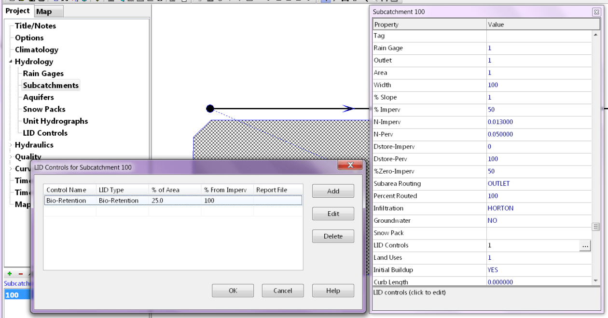
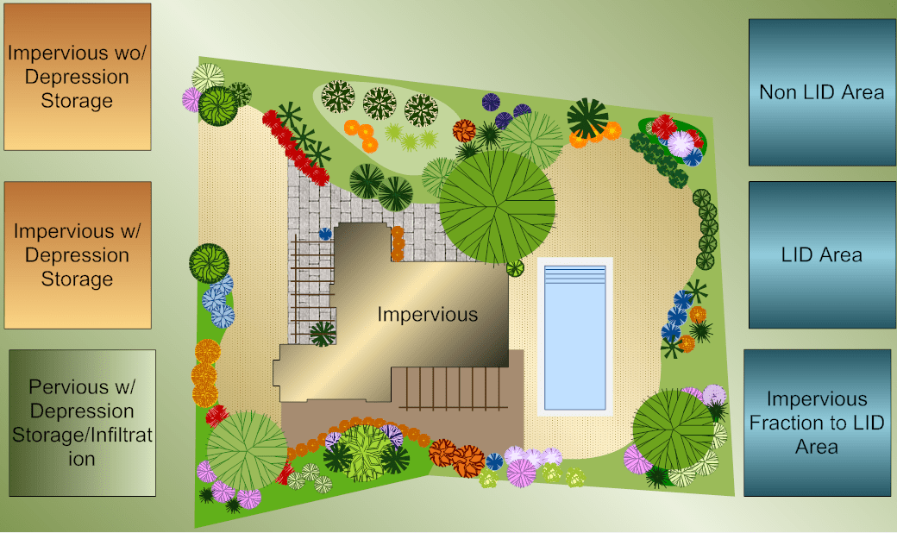
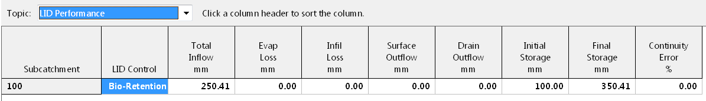
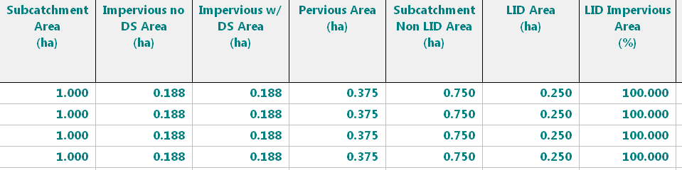
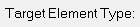

**Converting the H2OMap SWMM model EvansHead_Woodburn_Sewerage_Model to an ICM InfoWorks Network for ICM 2021.5**

The purpose of this document is to demonstrate all the steps involved in importing an H2OMAP SWMM model into an ICM InfoWorks Network. The steps will be longer in this case because the SWMM model contains unique DWF techniques as well as data errors. The H2OMap SWMM model was essentially a non-working model.

**What Are the Features of the H2OMap SWMM Model?**

The H2OMap SWMM model includes 11 scenarios, with the only difference being the DWF (Figure 1). The node and link data are the same. The DWF has two hourly patterns called ADWF and PWWF that multiply and make the DWF at the node much smaller (Figure 2). The ADWF and PWWF are critical to achieving the same flow in ICM. LPS flow units are used in the model, and only DWF is simulated (Figure 3). However, there is a significant model error, as the flow in the model is zero because the DWF is loaded to nodes that do not exist in the model (Figure 4).

Figure 1 The Original Model has 11 Scenarios all with the same Node and Link Data but different DWF loading to the nodes.

Figure 2 The use of small values for ADWF and PWWF, as shown in this image, is a distinguishing feature of the DWF. The model contains two patterns.

Figure 3 The network has flow units of lps and only has DWF at the nodes.

Figure 4 The DWF has a mean of 3.7 for 1462 Nodes (Bullet 1). However, in this network, all of the loading Nodes are inactive, which means that the model has no flow (Bullet 2).

**How to Set Up Project Explorer for the Import to ICM?**

Before the import, we will create a model Group and an InfoWorks Network. The model group contains the imported model from H2OMap SWMM as well as the final InfoWorks Network. The import will result in the creation of an ICM SWMM Network Model Group (Figure 5).

ICM's import tool will only import an InfoSWMM MXD file and its associated ISDB folder (DBF files). Using Windows Explorer, we copy and paste the HSDB folder into a new ISDB folder. The DBF files for H2OMap SWMM and InfoSWMM are the same. In addition, we create a blank MXD file with the same name as the ISDB Folder (Figure 6).

Figure 5 Set up the Model Group for the Import and ending InfoWorks Network.

Figure 6 How to Set up the Import Files for H2OMap SWMM - Copy and Paste to an ISDB network.

**Import Process and Notes**

The import from H2OMap SWMM via the copy and paste to InfoSWMM is very straightforward. Use the import Model Group from InfoSWMM (Figure 7), select a Scenario (Figure 8) and make sure there are no import errors (Figure 9).

Figure 7 Import into an ICM SWMM Group directly from InfoSWMM by using the Import SWMM Model Group Menu.

Figure 8 After finding the InfoSWMM MXD file select the file and the option for selecting the Scenario. In this case we will pick the Base Scenario as we know there are no Scenario Differences.

Figure 9 The import is successful, and a log file is shown with import warnings. In this case there are no errors as the data in the H2OMap SWMM model is limited. The whole model group is imported including in this case the patterns and the network.

## Validating the ICM SWMM Network After Import

After importing the ICM SWMM network, validate it. Before converting a network to an InfoWorks network, it must be validated and committed. There are missing pipe diameters (Figure 10) and negative node maximum depths (Figure 11). This must be addressed. The ADWF and PWWF patterns have been imported and will be available in the InfoWorks network (Figure 12).

Figure 10 Validate the Imported ICM SWMM Network. There are two links with no diameter = assume 150 mm based on the upstream and downstream diameters.

Figure 11 Included in the validation errors are many Maximum Depths for the nodes as negative numbers. Assume a maximum depth of 0.10 meters. All of these errors are fixed in the SWMM5 Engine.

Figure 12 Check to see if the ADWF and PWWF pattern factors are imported - they are in this model.

## Internally Converting to an ICM InfoWorks Network

The ICM SWMM network can be converted to an InfoWorks network after it has been committed (Figure 13). Now validate the InfoWorks network (Figure 14).

Figure 13 The ICM SWMM network can be converted to an InfoWorks network after it has been committed.

Figure 14 Validate the InfoWorks Network in ICM.

Figure 15 Because SWMM5 corrects these errors during the model run, there will be many invert, ground, and chamber errors shown in the validation output message box.

Figure 16 DWF is at a node in ICM SWMM and at a Subcatchment in the InfoWorks network. Copy and paste all Node ID’s to the Subcatchment Grid and add the x, y, Node ID and a total area of 0.1. Use the tool Model/Subcatchment/Create Dummy Boundaries.

Figure 17 Convert the Force Mains from ICM SWMM to a Full Solution and adjust the Manning's n

## Validating the ICM InfoWorks Network

Now correct all the validation errors: Figure 15 for link and node inverts, Figure 16 for missing Subcatchments, Figure 17 for the Force Mains. SQL’s can be used top to fix the invert and ground elevation errors.

## Verifying the ICM InfoWorks Network

See the Model run for the InfoWorks network. DWF was assumed and the ADWF was used as a monthly pattern (Figure 18).

Figure 18 ADWF was used as a monthly pattern.

## What is in the ICMT File?

The ICMT file has a working ICM SWMM model (with a lot of flooding) and a complete ICM InfoWorks Model (time step halving issues). I hope this helps but you need to look at the ground elevation data and the DWF data to have a better model. See Figure 19 for the ICMT contents and Figure 20 for the model changes.

Figure 19 ICMT file contents - yellow is for InfoWorks Networks.

## 

Figure 20 See the commit history to see model changes.

## 

## 
