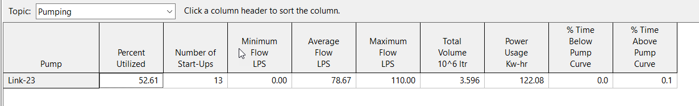

<table>
<caption>Presentation notes table</caption>
<colgroup>
<col style="width: 32%" />
<col style="width: 67%" />
</colgroup>
<thead>
<tr class="header">
<th><h1 id="infoswmm-uh-is-solved-independently-of-epa-swmm5.">InfoSWMM UH is Solved Independently of EPA SWMM5. </h1>

<strong>Hs_UhSubCatchRunoffRun is UH Runoff</strong>

<strong>Search for hs_runoffType</strong>
</th>
<th></th>
</tr>
</thead>
<tbody>
<tr class="odd">
<td><h1 id="hs_uhsubcatchrunoffrun">Hs_UhSubCatchRunoffRun</h1></td>
<td>
<strong>// **************************</strong>

<strong>// Hs_UhSubCatchRunoffRun</strong>

<strong>// **************************</strong>

<strong>//</strong>

<strong>bool Hs_UhSubCatchRunoffRun()</strong>

<strong>//</strong>

<strong>// Description : run unit hydrograph subcatchment runoff</strong>

<strong>//</strong>

<strong>{</strong>

<strong>//</strong>

<strong>//</strong>

<strong>// ** Check **</strong>

<strong>//</strong>

<strong>if (hf_pSubCatchRunoff == NULL) return false;</strong>

<strong>//</strong>

<strong>//</strong>

<strong>// ** Run Runoff Calculation **</strong>

<strong>//</strong>

<strong>if (!hf_pSubCatchRunoff-&gt;F_Run()) return false;</strong>

<strong>//</strong>

<strong>//</strong>

<strong>// ** Exit **</strong>

<strong>//</strong>

<strong>return true;</strong>

<strong>}</strong>
</td>
</tr>
<tr class="even">
<td><h1 id="f_run-determine-runoff-from-each-subcatchment-at-current-runoff-time.">F_Run : determine runoff from each subcatchment at current runoff time.</h1>
<h1 id="section"></h1>
<h1 id="section-1"></h1></td>
<td>
// *********

// F_Run

// *********

//

bool CHs_UhSubCatchRunoff::F_Run()

//

// Description : determine runoff from each subcatchment at current runoff time.

//

{

//

//

// ** Check **

//

if (ErrorCode &gt; 0) return false;

//

//

// ** Initialisation: convert elapsed runoff time in milliseconds to a calendar date **

///

DateTime currentDate = getDateTime(NewRunoffTime);

//

//

// ** Setup Runoff Times **

//

// Get runoff time step (in seconds)

//

if (hs_unitHydDuration &lt;= 0.0)

{

ErrorCode = ERR_TIMESTEP;

return false;

}

//

double runoffStep = hs_unitHydDuration; // runoff time step (in seconds)

//

OldRunoffTime = NewRunoffTime;

int hydTimeIndex = (int) (0.001*NewRunoffTime/hs_unitHydDuration + 0.001);

//

NewRunoffTime += 1000.0*runoffStep;

//

//

// ** Update Current Rainfall at Each Raingage **

// Note: must examine gages in sequential order due to possible presence

// of co-gages (gages that share same rain time series).

//

IsRaining = FALSE;

//

int i = 0;

for (i = 0; i &lt; Nobjects[GAGE]; i++)

{

gage_setState(i, currentDate);

if (Gage[i].rainfall &gt; 0.0)

IsRaining = TRUE;

}

//

//

// ** Get Runoff Results from Interface File: where applicable **

//

if (Frunoff.mode == USE_FILE)

{

runoff_readFromFile();

return true;

}

//

//

// ** Check Street Sweeping: see if street sweeping can occur on current date **

//

int day = datetime_dayOfYear(currentDate); // day of calendar year

bool canSweep = false;

//

if ((day &gt;= SweepStart) &amp;&amp; (day &lt;= SweepEnd) &amp;&amp; (!IsRaining))

canSweep = true;

//

//

// ** Subcatchment **

//

// Update old state of each subcatchment

//

for (i = 0; i &lt; Nobjects[SUBCATCH]; i++)

subcatch_setOldState(i);

//

// Determine runon from upstream subcatchments

//

for (i = 0; i &lt; Nobjects[SUBCATCH]; i++)

Fv_GetRunonData(i);

//

//

// ** Determine Runoff and Pollutant Buildup/Washoff: in each subcatchment **

//

HasSnow = FALSE;

HasRunoff = FALSE;

//

for (i = 0; i &lt; Nobjects[SUBCATCH]; i++)

{

//

// Find runoff rate: also if u/s subcatchment(s) is/are draining to the subcatchment, add the flow

//

double runoff = Fv_GetSubcatchUHRunoff(i, hydTimeIndex);

//

// Add to pollutant buildup if runoff is negligible

//

if (runoff &gt; MIN_RUNOFF_FLOW)

HasRunoff = TRUE;

else

subcatch_getBuildup(i, runoffStep);

//

// Reduce buildup by street sweeping

//

if (canSweep)

subcatch_sweepBuildup(i, currentDate);

//

// Compute pollutant washoff

//

subcatch_getWashoff(i, runoff, runoffStep);

}

//

Nsteps++;

//

//

// ** Interface File: save runoff results to interface file if one is used **

//

if (Frunoff.mode == SAVE_FILE)

runoff_saveToFile((float) runoffStep);

//

//

// ** Exit **

//

return true;

}
</td>
</tr>
<tr class="odd">
<td><h1 id="fv_getsubcatchuhrunoff"><strong>Fv_GetSubcatchUHRunoff</strong></h1></td>
<td>
<strong>// **************************</strong>

<strong>// Fv_GetSubcatchUHRunoff</strong>

<strong>// **************************</strong>

<strong>//</strong>

<strong>double CHs_UhSubCatchRunoff::Fv_GetSubcatchUHRunoff(int subCatchIndex,</strong>

<strong>int hydTimeIndex)</strong>

<strong>//</strong>

<strong>// Description : computes runoff &amp; new storage depth for subcatchment</strong>

<strong>// Return data : returns total runoff produced by subcatchment (cfs)</strong>

<strong>//</strong>

<strong>{</strong>

<strong>//</strong>

<strong>//</strong>

<strong>// ** Initialisation **</strong>

<strong>//</strong>

<strong>double rainfall = 0.0; // rainfall (ft/sec)</strong>

<strong>double snowfall = 0.0; // snowfall (ft/sec)</strong>

<strong>double rainVol = 0.0; // rain volume (ft)</strong>

<strong>double evapVol = 0.0; // evaporation volume (ft)</strong>

<strong>double infilVol = 0.0; // infiltration volume (ft)</strong>

<strong>double outflowVol = 0.0; // runoff volume leaving subcatch (ft)</strong>

<strong>double outflow = 0.0; // runoff rate leaving subcatch (cfs)</strong>

<strong>double runoff = 0.0; // total runoff rate on subcatch (cfs)</strong>

<strong>double netPrecip[3]; // subarea net precipitation (ft/sec)</strong>

<strong>//</strong>

<strong>double area = Subcatch[subCatchIndex].area ; // total subcatch area (ft2)</strong>

<strong>double tStep = hs_unitHydDuration;</strong>

<strong>//</strong>

<strong>//</strong>

<strong>// ** Rainfall/SnowFall: get current rainfall or snowfall from rain gage (in ft/sec) **</strong>

<strong>//</strong>

<strong>// Rain gauge index</strong>

<strong>//</strong>

<strong>int gaugeIndex = Subcatch[subCatchIndex].gage;</strong>

<strong>//</strong>

<strong>// Assign total precip. rate to subcatch's rainfall property</strong>

<strong>//</strong>

<strong>Subcatch[subCatchIndex].rainfall = Gage[gaugeIndex].rainfall;</strong>

<strong>//</strong>

<strong>//</strong>

<strong>// ** Determine Net Precipitation Input (netPrecip) to Each Sub-Area **</strong>

<strong>//</strong>

<strong>int i = 0;</strong>

<strong>for (i = IMPERV0; i &lt;= PERV; i++)</strong>

<strong>netPrecip[i] = Subcatch[subCatchIndex].rainfall;</strong>

<strong>//</strong>

<strong>//</strong>

<strong>// ** Compute Loss Rate &amp; Runoff Rates **</strong>

<strong>//</strong>

<strong>// Loss rate</strong>

<strong>//</strong>

<strong>Subcatch[subCatchIndex].losses = 0.0;</strong>

<strong>Subcatch[subCatchIndex].losses = mv_pInfiltrationDepth[subCatchIndex].F_GetData(hydTimeIndex) +</strong>

<strong>mv_pDepressionLoss[subCatchIndex].F_GetData(hydTimeIndex);</strong>

<strong>Subcatch[subCatchIndex].losses = __max(0.0,</strong>

<strong>Subcatch[subCatchIndex].losses/hs_unitHydDuration); // in ft/sec</strong>

<strong>//</strong>

<strong>// Runoff rate</strong>

<strong>//</strong>

<strong>outflow = mv_pRunoffRate[subCatchIndex].F_GetData(hydTimeIndex); // runoff rate (in cfs)</strong>

<strong>// Subcatch[subCatchIndex].runon; // runoff contribution from u/s subcatchment (if any)</strong>

<strong>runoff = outflow;</strong>

<strong>evapVol = 0.0;</strong>

<strong>infilVol = mv_pInfiltrationDepth[subCatchIndex].F_GetData(hydTimeIndex) +</strong>

<strong>mv_pDepressionLoss[subCatchIndex].F_GetData(hydTimeIndex); // infiltration depth + depression loss depth in ft</strong>

<strong>outflowVol = 0.5*(Subcatch[subCatchIndex].oldRunoff + outflow)*hs_unitHydDuration/area; // average volume in ft</strong>

<strong>//</strong>

<strong>if (outflow &lt; MIN_RUNOFF_FLOW)</strong>

<strong>outflow = 0.0;</strong>

<strong>//</strong>

<strong>Subcatch[subCatchIndex].newRunoff = outflow;</strong>

<strong>//</strong>

<strong>//</strong>

<strong>// ** Compute Rainfall and Snowfall Volume (does not include snowmelt) **</strong>

<strong>//</strong>

<strong>rainfall = Subcatch[subCatchIndex].rainfall*(tStep/(12.0*3600.0));</strong>

<strong>rainVol = rainfall*area;</strong>

<strong>//</strong>

<strong>//</strong>

<strong>// ** Update Subcatchment Runoff Total **</strong>

<strong>//</strong>

<strong>stats_updateSubcatchStats(subCatchIndex,</strong>

<strong>rainfall,</strong>

<strong>Subcatch[subCatchIndex].runon*tStep,</strong>

<strong>evapVol, // 0.0</strong>

<strong>infilVol, // 0.0</strong>

<strong>outflowVol,</strong>

<strong>outflow);</strong>

<strong>//</strong>

<strong>//</strong>

<strong>// ** Update System Flow Balance **</strong>

<strong>// runoff volume is 0 if outlet is another subcatch</strong>

<strong>//</strong>

<strong>if ((Subcatch[subCatchIndex].outNode == -1) &amp;&amp; (Subcatch[subCatchIndex].outSubcatch != subCatchIndex))</strong>

<strong>outflowVol = 0.0;</strong>

<strong>//</strong>

<strong>massbal_updateRunoffTotals(rainVol,</strong>

<strong>evapVol*area,</strong>

<strong>infilVol*area,</strong>

<strong>outflowVol*area);</strong>

<strong>//</strong>

<strong>//</strong>

<strong>// ** Exit **</strong>

<strong>//</strong>

<strong>return runoff;</strong>

<strong>}</strong>
</td>
</tr>
<tr class="even">
<td><h1 id="d-and-2d-themes">1d and 2d Themes</h1></td>
<td></td>
</tr>
</tbody>
</table>

Presentation notes table
