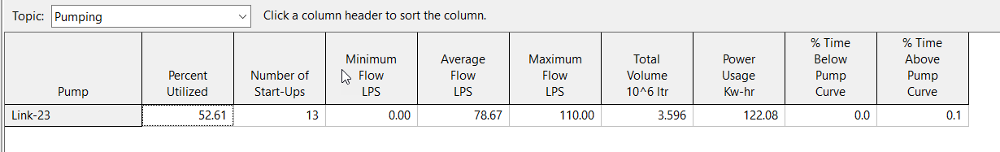

<table>
<caption>Presentation notes table</caption>
<colgroup>
<col style="width: 19%" />
<col style="width: 80%" />
</colgroup>
<thead>
<tr class="header">
<th><h1 id="where-is-the-link-flow-for-outlet-links-calculated">Where is the LInk Flow for OUTLET LInks Calculated?</h1>

<strong>In Links.c -</strong> outlet_getInflow
</th>
<th><h2 id="double-outlet_getinflowint-j">double outlet_getInflow(int j)</h2>

//

// Input: j = link index

// Output: outlet flow rate (cfs)

// Purpose: finds the flow through an outlet.

//

{

int k, n1, n2;

double head, hcrest, h1, h2, y1, dir;

// --- get indexes of end nodes

n1 = Link[j].node1;

n2 = Link[j].node2;

k = Link[j].subIndex;

// --- find heads at upstream &amp; downstream nodes

if ( RouteModel == DW )

{

h1 = Node[n1].newDepth + Node[n1].invertElev;

h2 = Node[n2].newDepth + Node[n2].invertElev;

}

else

{

h1 = Node[n1].newDepth + Node[n1].invertElev;

h2 = Node[n1].invertElev;

}

dir = (h1 &gt;= h2) ? +1.0 : -1.0;

// --- exchange h1 and h2 for reverse flow

y1 = Node[n1].newDepth;

if ( dir &lt; 0.0 )

{

y1 = h1;

h1 = h2;

h2 = y1;

y1 = Node[n2].newDepth;

}

// --- for a NODE_DEPTH rating curve the effective head across the

// outlet is the depth above the crest elev. while for a NODE_HEAD

// curve it is the difference between upstream &amp; downstream heads

hcrest = Node[n1].invertElev + Link[j].offset1;

if ( Outlet[k].curveType == NODE_HEAD &amp;&amp; RouteModel == DW )

head = h1 - MAX(h2, hcrest);

else head = h1 - hcrest;

// --- no flow if either no effective head difference,

// no upstream water available, or closed flap gate

if ( head &lt;= FUDGE || y1 &lt;= FUDGE ||

link_setFlapGate(j, n1, n2, dir) )

{

Link[j].newDepth = 0.0;

Link[j].flowClass = DRY;

return 0.0;

}

// --- otherwise use rating curve or function to compute flow

Link[j].newDepth = head;

Link[j].flowClass = SUBCRITICAL;

return dir * Link[j].setting * outlet_getFlow(k, head);

}
</th>
</tr>
</thead>
<tbody>
<tr class="odd">
<td><h1 id="how-is-the-flow-calculated">How is the flow calculated?</h1>

Flow is either a rating curve or a function = SWMM5 always has internal units of USA Units.
</td>
<td><h2 id="double-outlet_getflowint-k-double-head">double outlet_getFlow(int k, double head)</h2>

//

// Input: k = outlet index

// head = head across outlet (ft)

// Output: returns outlet flow rate (cfs)

// Purpose: computes flow rate through an outlet given head.

//

{

int m;

double h;

// --- convert head to original units

h = head * UCF(LENGTH);

// --- look-up flow in rating curve table if provided

m = Outlet[k].qCurve;

if ( m &gt;= 0 ) return table_lookup(&amp;Curve[m], h) / UCF(FLOW);

// --- otherwise use function to find flow

else return Outlet[k].qCoeff * pow(h, Outlet[k].qExpon) / UCF(FLOW);
</td>
</tr>
<tr class="even">
<td><h1 id="two-types-of-functions-and-two-types-of-tables-depth-and-head">two types of Functions and two types of Tables – Depth and Head</h1>
<h1 id="section"></h1>
<h1 id="section-1"></h1></td>
<td></td>
</tr>
<tr class="odd">
<td><h1 id="what-are-the-boundary-conditions-of-the-outlet">What are the boundary conditions of the Outlet?</h1></td>
<td>
<strong>h1</strong> is the depth at the upstream node + the invert of the upstream node.

<strong>h2</strong> is the depth at the downstream node + the invert of the downstream node.

If <strong>h2</strong> &gt; <strong>h1</strong> then there is reverse flow and <strong>h1</strong> becomes <strong>h2</strong> and <strong>h2</strong> becomes <strong>h1</strong>.

What is the <strong>hCrest</strong> elevation = invert of node <strong>n1</strong> + offset depth of <strong>OUTLET.</strong>

<strong>Head of OUTLET is h1 – hCrest if the OUTLET Type is Depth.</strong>

<strong>Head of OUTLET is h1 – MAX(h2, hCrest) if OUTLET Type is Head.</strong>

<strong>If reverse flow and Flap Gate the flow is zero.</strong>
</td>
</tr>
<tr class="even">
<td><h1 id="list-view-of-the-h1-h2-and-head-rules">List View of the h1, h2 and Head Rules</h1></td>
<td></td>
</tr>
</tbody>
</table>

Presentation notes table
