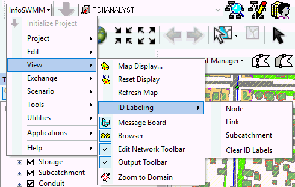
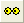
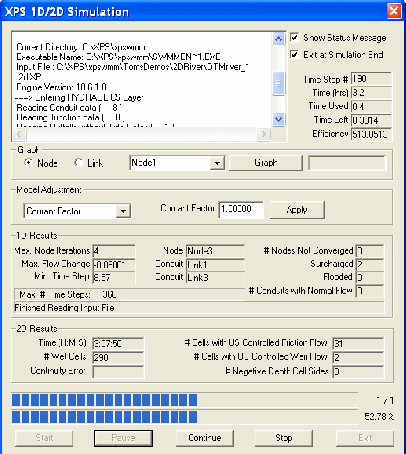
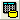
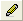
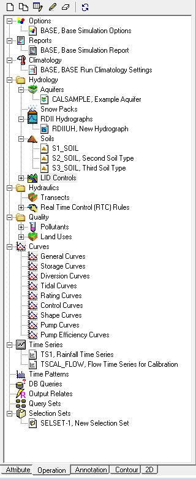
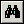
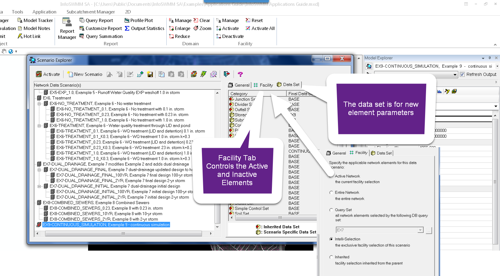

**Scenario Menu in InfoSWMM**

***Descriptions of All Scenario Menu commands in InfoSWMM.***

[Scenario Menu in InfoSWMM [1](#_Toc69376750)](#_Toc69376750)

[General Description of Scenario Explorer [2](#general-description-of-scenario-explorer)](#general-description-of-scenario-explorer)

[Scenario Management [6](#_Toc69376752)](#_Toc69376752)

[How to Create a Scenario in InfoSWMM [10](#how-to-create-a-scenario-in-infoswmm)](#how-to-create-a-scenario-in-infoswmm)

[ Scenario Explorer [12](#scenario-explorer)](#scenario-explorer)

[Scenario Explorer - General tab [14](#scenario-explorer---general-tab)](#scenario-explorer---general-tab)

[Scenario Explorer - Facility Tab [16](#scenario-explorer---facility-tab)](#scenario-explorer---facility-tab)

[Scenario Explorer - Data Set Tab [20](#_Toc69376757)](#_Toc69376757)

[Visual Data Objects [24](#_Toc69376758)](#_Toc69376758)

[Non-Visual Data Objects [24](#_Toc69376759)](#_Toc69376759)

[Inheritance in InfoSWMM [24](#_Toc69376760)](#_Toc69376760)

[Compare Scenario Data (Input Data) [26](#_Toc69376761)](#_Toc69376761)

[ Dataset Manager [31](#_Toc69376762)](#_Toc69376762)

[ Edit Active Scenario [35](#_Toc69376763)](#_Toc69376763)

[How to Understand Scenarios In InfoSWMM and InfoSWMM_SA [37](#_Toc69376764)](#_Toc69376764)

The Scenario Manager is where InfoSWMM allows the user to create, delete, and modify scenarios. The Scenario Manager enables the user to create "what if" scenarios throughout a sewage collection system.

The Dataset Manager is a "quick view" dialog box that allows users to create, view, and edit data sets all in one place. The Dataset Manager is accessed by clicking on any of the tabs to view and edit the listed data set, as shown below. To create, edit, clone, copy, or delete data sets, select one of the icons at the top of the dialog box.

Active Scenario allows the user to select and activate any of the scenarios created in an InfoSWMM project. When a scenario is activated, all three of its facets (Option Sets, Facility Sets, and Data Sets) become active as well.

The Compare Scenario command in InfoSWMM allows the user to compare the differences between any two scenarios in a model.

| **Button**                                                                | **Name**                  | **Description** |
|---------------------------------------------------------------------------|---------------------------|-----------------|
|  | **Scenario Explorer**     |                 |
|  | **Dataset Manager**       |                 |
|  | **Edit Active Scenario**  |                 |
|                                                                           | **Compare Data Scenario** |                 |

 

## General Description of Scenario Explorer

Launch Scenario Explorer by selecting **Scenario Explorer** from theInfoSWMM [<u>Scenario Menu</u>](file:///C:\SWMM-SEWER%20Robohelp\SWMMCombined%20-%20InfoSWMM%20-%201\User_Interface\Menus_and_Toolbars\Menus\Scenario_Menu.htm) or by clicking the Scenario Explorer button () on the InfoSWMM [<u>Control Center Toolbar</u>](file:///C:\SWMM-SEWER%20Robohelp\SWMMCombined%20-%20InfoSWMM%20-%201\User_Interface\InfoSWMM\Menus_and_Toolbars\Toolbars\Info_Toolbar_Control_Center_Toolbar.htm) [<u>Standard Toolbar</u>](file:///C:\SWMM-SEWER%20Robohelp\SWMMCombined%20-%20InfoSWMM%20-%201\User_Interface\H2OMAPSWMM\Menus_and_Toolbars\Toolbars\H2O_Toolbar_Standard_Toolbar.htm) .  You will see the following dialog box.

 

**Contents of the scenario Explorer dialog box are briefly described below:**

<table>
<colgroup>
<col style="width: 20%" />
<col style="width: 22%" />
<col style="width: 57%" />
</colgroup>
<thead>
<tr class="header">
<th><strong>Button</strong></th>
<th><strong>Name</strong></th>
<th><strong>Description</strong></th>
</tr>
</thead>
<tbody>
<tr class="odd">
<td></td>
<td><strong>Activate</strong></td>
<td>Activates the selected/highlighted scenario.</td>
</tr>
<tr class="even">
<td></td>
<td><strong>New Scenario</strong></td>
<td>Creates a new "child scenario" under the currently selected/highlighted scenario</td>
</tr>
<tr class="odd">
<td></td>
<td><strong>Reset Changes</strong></td>
<td>Resets the selected/highlighted scenario to its original status</td>
</tr>
<tr class="even">
<td></td>
<td><strong>Delete Scenario</strong></td>
<td>Deletes the currently selected/highlighted scenario</td>
</tr>
<tr class="odd">
<td></td>
<td><strong>Edit Scenario Description</strong></td>
<td>Allows you to change the description of the currently selected/highlighted scenario</td>
</tr>
<tr class="even">
<td></td>
<td><strong>ID Counter</strong></td>
<td>Use this to set the automatic Scenario ID assignment option by selecting the Prefix, Id counter, and the increment steps as you wish.</td>
</tr>
<tr class="odd">
<td></td>
<td><strong>Save as Default</strong></td>
<td>Saves the selected scenario as a default and automatically inherits its contents to newly created scenarios</td>
</tr>
<tr class="even">
<td></td>
<td><strong>Copy</strong></td>
<td>Copies the input data information of the selected/highlighted scenario to the clipboard.  After using the tool, the Paste and Replace and Paste as Child tools will be activated and can be used to transfer the information to another scenario.</td>
</tr>
<tr class="odd">
<td></td>
<td><strong>Paste and Replace</strong></td>
<td>Pastes the input data information copied to the clipboard and replaces the existing data of the currently selected/highlighted scenario</td>
</tr>
<tr class="even">
<td></td>
<td><strong>Paste as Child</strong></td>
<td>Pastes the copied scenario from the clipboard and saves it as a new "child scenario" under the currently selected/highlighted scenario</td>
</tr>
<tr class="odd">
<td></td>
<td><strong>Edit Active Scenario</strong></td>
<td>While working in the Scenario Explorer, the currently active scenario cannot be changed or edited.  To edit the datasets associated with the active scenario, click this <a href="file:///C:\SWMM-SEWER%20Robohelp\SWMMCombined%20-%20InfoSWMM%20-%201\Creating_Using_and_Maintaining_Projects\Scenario_Management\Edit_Active_Scenario.htm"><u>Edit Active Scenario</u></a> button.  To change items on the General or Facility tabs, you must make another scenario active (at least temporarily).</td>
</tr>
<tr class="even">
<td></td>
<td><strong>Batch Run</strong></td>
<td>With the <a href="file:///C:\SWMM-SEWER%20Robohelp\SWMMCombined%20-%20InfoSWMM%20-%201\Creating_Using_and_Maintaining_Projects\Simulating_the_Model\Batch_Simulation_Manager.htm"><u>Batch Simulation Manager</u></a>, the user can select the desired scenarios and run each model in a "batch" (i.e., at a time).</td>
</tr>
<tr class="odd">
<td></td>
<td><strong>Compare Scenarios</strong></td>
<td>Opens the <a href="file:///C:\SWMM-SEWER%20Robohelp\SWMMCombined%20-%20InfoSWMM%20-%201\Creating_Using_and_Maintaining_Projects\Scenario_Management\Compare_Scenario_Data.htm#Scenario Data Comparison Report"><u>Scenario Data Comparison Report</u></a>.  The last comparison will be displayed.  The report has a button to create a new comparison if desired.</td>
</tr>
<tr class="even">
<td></td>
<td><strong>Exit</strong></td>
<td>Exit Scenario Explorer</td>
</tr>
<tr class="odd">
<td></td>
<td><strong>Help</strong></td>
<td>Opens this help file</td>
</tr>
<tr class="even">
<td> </td>
<td><strong>Scenario Display Window</strong></td>
<td>
IDs and descriptions of the available scenarios is displayed here. In addition, the relationship between a parent scenario and its child, defined as inheritance, is displayed in this box. InfoSWMM shows this relationship in the form of a directory tree. All scenarios are children of the *BASE* scenario until some element of the child is made unique from the parent (such uniqueness comes in the form of data sets, facility sets, or option sets). In the example below, <strong>RUN_14</strong> is a child of <strong>RUN_12</strong>, <strong>RUN_12</strong> is a child of <strong>RUN_10</strong>, and <strong>RUN_10</strong> is a child of <strong>BASE</strong>. When a change is made to a parent, unless some facet of a child is unique, it will inherit the change through inheritance.

 
</td>
</tr>
<tr class="odd">
<td> </td>
<td><strong>General Tab</strong></td>
<td>The <a href="file:///C:\SWMM-SEWER%20Robohelp\SWMMCombined%20-%20InfoSWMM%20-%201\Creating_Using_and_Maintaining_Projects\Scenario_Management\Scenario_Explorer.htm#Scenario Explorer - General tab"><u>Scenario Explorer - General tab</u></a> enables editing of InfoSWMM 's simulation and report option parameters, and the climatology settings for the selected/highlighted scenario.</td>
</tr>
<tr class="even">
<td> </td>
<td><strong>Facility Tab</strong></td>
<td>The <a href="file:///C:\SWMM-SEWER%20Robohelp\SWMMCombined%20-%20InfoSWMM%20-%201\Creating_Using_and_Maintaining_Projects\Scenario_Management\Scenario_Explorer.htm#Scenario Explorer - Facility tab"><u>Scenario Explorer - Facility tab</u></a> enables adding/removing facilities to/from a scenario.</td>
</tr>
<tr class="odd">
<td> </td>
<td><strong>Data Set Tab</strong></td>
<td>The <a href="file:///C:\SWMM-SEWER%20Robohelp\SWMMCombined%20-%20InfoSWMM%20-%201\Creating_Using_and_Maintaining_Projects\Scenario_Management\Scenario_Explorer.htm#Scenario Explorer - Data Set tab"><u>Scenario Explorer - Data Set tab</u></a> enables modifying input data for InfoSWMM 's visual and non-visual data objects.</td>
</tr>
</tbody>
</table>

 

**Scenario Management**

The **Scenario Explorer** is an essential feature that enables the user to create, edit, modify, run, and compare any number of "***what if***" modeling scenarios with **little extra effort**.   InfoSWMM 's Scenario Explorer has a tree-type structure (i.e. stem and branches) allowing the scenarios to inherit facilities (data elements) and modeling data from the parent scenario using the principle of inheritance thus greatly simplifying the additional effort required to manage and create various modeling conditions. Each project "child" scenario inherits the information from its "parent" scenario. Therefore, the Scenario Explorer enables you to maintain a single model of your collection system and quickly develop and evaluate numerous modeling alternatives to support your capital improvement decisions.

 

For example, from the same model, you could create different modeling scenarios for dry-weather conditions and wet-weather conditions by changing [<u>inflow</u>](file:///C:\SWMM-SEWER%20Robohelp\SWMMCombined%20-%20InfoSWMM%20-%201\Data_Objects\20_Hydraulics\Node_Related\External_Inflow_Editing.htm) data only. Likewise, if you need to evaluate the effect of adding some more network components (e.g., junctions and conduits) to mimic your city's future growth, all you need to do is add those network components and their associated data. You could evaluate the effect of changing a conduit shape and size, pump status or control, weir and/or orifice setting,  external inflows, Subcatchment properties, storage shape and size, and many others properties and their combinations on your drainage (collection) system. You can easily [<u>switch between scenarios</u>](file:///C:\SWMM-SEWER%20Robohelp\SWMMCombined%20-%20InfoSWMM%20-%201\Creating_Using_and_Maintaining_Projects\Scenario_Management\Edit_Active_Scenario.htm) and compare modeling results instantly. You can even go to the extent of directly extracting (cutting) one or more sewersheds from the main model (Base Scenario) and analyze only those sewersheds, as well as, merge together any number of models for detailed analyses using the scenario Explorer.

**In summary, scenarios in InfoSWMM  may be used for the following:**

- Scenarios provides the means to store different facility sets (network layouts & network configurations), operating conditions (type of simulation, duration, modeling method, etc) and data sets (Modeling parameters such as inflows, element attributes, etc).

- Customizing the scenarios allow for various Operational studies, modeling "What-if" conditions, studying the model under different inflow conditions, control sets (initial status and simple controls), RTC rules, different pump, conduit, junction, storage unit, orifice/weir type and configurations.

- Scenarios also allow you to create and run different hydraulic, hydrologic and water quality simulations by changing the flow routing options, infiltration and other rainfall-runoff modeling methods, and pollutant buildup and washoff modeling approaches.

**In  InfoSWMM , a scenario is defined in terms of the following three classes of modeling data:**

- **General** - This refers to modeling parameters such as simulation options parameters, [<u>report options</u>](file:///C:\SWMM-SEWER%20Robohelp\SWMMCombined%20-%20InfoSWMM%20-%201\Creating_Using_and_Maintaining_Projects\Simulating_the_Model\Run_Manager\Simulation_Report_Options.htm) input data, and [<u>climatology setting</u>](file:///C:\SWMM-SEWER%20Robohelp\SWMMCombined%20-%20InfoSWMM%20-%201\Data_Objects\22_Climatology\climatology_descrption.htm). Using the **General** component of the scenario Explorer, you could change these modeling parameters for a scenario.

- **Facility** - This refers to [<u>Physical/Visual Objects</u>](file:///C:\SWMM-SEWER%20Robohelp\SWMMCombined%20-%20InfoSWMM%20-%201\Data_Objects\Creating_Physical_Visual_Objects.htm) including Subcatchment, Junction, Outfall, Divider, Storage Unit, Conduit, Pump, Weir, Orifice, and Outlet. This enables you to add/remove  InfoSWMM** **facilities (network elements) to/from a scenario as you wish.

- **Data Set** - This component of the scenario Explorer enables you to change input data for all InfoSWMM visual data objects listed above, and also enables you modify input data for the following [<u>Non-physical/Non-Visual Objects</u>](file:///C:\SWMM-SEWER%20Robohelp\SWMMCombined%20-%20InfoSWMM%20-%201\Data_Objects\Creating_Non-physical_Non-Visual_Objects.htm)  : Node Treatment, External Inflow, DWF, RDII Flow, Initial Pollutant Buildup, Groundwater, Coverage, Infiltration, Initial Status, RTC Rule, Soil, Aquifer, Snow Pack, Land Use, Pollutant, Hydrograph, Simple Control, Pattern, Curve, and Time Series.

**Four tools provide access to the power of scenario management.  Click on the links below for more information:**

- ** [<u>Scenario Explorer</u>](file:///C:\SWMM-SEWER%20Robohelp\SWMMCombined%20-%20InfoSWMM%20-%201\Creating_Using_and_Maintaining_Projects\Scenario_Management\Scenario_Explorer.htm)**

- ** [<u>Dataset Manager</u>](file:///C:\SWMM-SEWER%20Robohelp\SWMMCombined%20-%20InfoSWMM%20-%201\Creating_Using_and_Maintaining_Projects\Scenario_Management\Dataset_Manager.htm)**

- ** [<u>Edit Active Scenario</u>](file:///C:\SWMM-SEWER%20Robohelp\SWMMCombined%20-%20InfoSWMM%20-%201\Creating_Using_and_Maintaining_Projects\Scenario_Management\Edit_Active_Scenario.htm)**

- ** Active Scenario Selector **- This window displays the active scenario.  Click the drop-down arrow to see a list of other scenarios.  You can quickly make another scenario the Active Scenario by clicking on it from the drop-down list.

**NOTE:** Data Elements deleted from one scenario will be deleted in all related scenarios and the Base Scenario. Please use the Facility Manager and Query Set functionality to disable the facilities you would not like to appear or operate in an inherited data set.

Each of three components of a scenario can be further defined as follows:

- Simulation set – Created through the General tab, they define the simulation options associated with the scenario.  There are three different option set types, each storing a logical grouping of simulation options.  [<u>Click here</u>](javascript:BSSCPopup('Creating_Using_and_Maintaining_Projects/Simulating_the_Model/Run_Manager/Simulation_Options/Simulation_Options.htm');) for more information on simulation sets.

- Facility set – Defines the network facilities components to be used in a simulation.  Only one facility set can be active at a time (facility sets are created through the Facility tab).  [<u>Click here</u>](javascript:BSSCPopup('Creating_Using_and_Maintaining_Projects/Scenario_Management/Dataset_Manager.htm');) for more information on facility sets.

- Data set – Stores modeling data (pipe diameter and roughness, node flows, etc.) associated with each facility in a separate external database.    [<u>Click here</u>](javascript:BSSCPopup('Creating_Using_and_Maintaining_Projects/Scenario_Management/Dataset_Manager.htm');) for more information on data sets.

 

## How to Create a Scenario in InfoSWMM

When you define a scenario, you pick the [<u>facility</u>](file:///C:\SWMM-SEWER%20Robohelp\SWMMCombined%20-%20InfoSWMM%20-%201\Creating_Using_and_Maintaining_Projects\Scenario_Management\Scenario_Explorer.htm#Scenario Explorer - Facility tab), [<u>data</u>](file:///C:\SWMM-SEWER%20Robohelp\SWMMCombined%20-%20InfoSWMM%20-%201\Creating_Using_and_Maintaining_Projects\Scenario_Management\Scenario_Explorer.htm#Scenario Explorer - Data Set tab), and [<u>option</u>](file:///C:\SWMM-SEWER%20Robohelp\SWMMCombined%20-%20InfoSWMM%20-%201\Creating_Using_and_Maintaining_Projects\Scenario_Management\Scenario_Explorer.htm#Scenario Explorer - General tab) sets that comprise that scenario. When picking data sets for inclusion in a scenario, you may either specify that a data set associated with a given scenario is used independent of other scenarios, or alternatively may specify that the given data set inherits its contents – properties – from a “parent” scenario. Once you have configured and created a scenario, you can activate that scenario either by selecting the  button from the Scenario Explorer tools or by using the Active Scenario Combo Box () from theInfoSWMM [<u>Control Center Toolbar</u>](file:///C:\SWMM-SEWER%20Robohelp\SWMMCombined%20-%20InfoSWMM%20-%201\User_Interface\InfoSWMM\Menus_and_Toolbars\Toolbars\Info_Toolbar_Control_Center_Toolbar.htm) [<u>Standard Toolbar</u>](file:///C:\SWMM-SEWER%20Robohelp\SWMMCombined%20-%20InfoSWMM%20-%201\User_Interface\H2OMAPSWMM\Menus_and_Toolbars\Toolbars\H2O_Toolbar_Standard_Toolbar.htm) at any time.  Once a scenario is activated, any modifications made to any of the databases related to InfoSWMM  facilities will be changed, but only for the data sets that are related to, and dependent upon, the active scenario.

 

**Do the following to Create a Scenario:**

- Launch Scenario Explorer by selecting **Scenario Explorer** from the InfoSWMM  [<u>Scenario Menu</u>](file:///C:\SWMM-SEWER%20Robohelp\SWMMCombined%20-%20InfoSWMM%20-%201\User_Interface\Menus_and_Toolbars\Menus\Scenario_Menu.htm) or by clicking the Scenario Explorer button () on the InfoSWMM  [<u>Control Center Toolbar</u>](file:///C:\SWMM-SEWER%20Robohelp\SWMMCombined%20-%20InfoSWMM%20-%201\User_Interface\InfoSWMM\Menus_and_Toolbars\Toolbars\Info_Toolbar_Control_Center_Toolbar.htm) [<u>Standard Toolbar</u>](file:///C:\SWMM-SEWER%20Robohelp\SWMMCombined%20-%20InfoSWMM%20-%201\User_Interface\H2OMAPSWMM\Menus_and_Toolbars\Toolbars\H2O_Toolbar_Standard_Toolbar.htm) .  You will see the following dialog box  
    
  .

<!-- -->

- Choose the Scenario from which you wish to create "Child" by clicking on that Scenario in the Scenario Display section of the Scenario Explorer. [<u>Click here</u>](javascript:BSSCPopup('Creating_Using_and_Maintaining_Projects/Scenario_Management/Scenario_Explorer.htm#Inheritance');) for more information on the Parent-Child inheritance mechanism inInfoSWMM .

- Click on the **New Scenario** button   to create a new child scenario under the currently selected/highlighted scenario.

- Specify an ID and a Description for the Scenario (up to 32 characters, no spaces, no funny characters for the ID and 60 characters for the description) and click on **OK.**

- The New Scenario just created will contain the same Data sets as its parent. On the right window of the Scenario Explorer, click on the [<u>Data Set tab</u>](javascript:BSSCPopup('Creating_Using_and_Maintaining_Projects/Scenario_Management/Scenario_Explorer.htm#Scenario Explorer - Data Set tab');). Click on any Data Set that you want to customize.

- This will launch an editor for that specific data set. Choose the Data Set you want to clone and click on the Clone button . You could also use the New button (). For the difference between cloning a data set and creating a new data set refer to the [<u>Data Set tab</u>](file:///C:\SWMM-SEWER%20Robohelp\SWMMCombined%20-%20InfoSWMM%20-%201\Creating_Using_and_Maintaining_Projects\Scenario_Management\Scenario_Explorer.htm#Scenario Explorer - Data Set tab) of the Scenario Explorer.  Specify an ID and Description for the new dataset and create the new dataset.

- Choose the Newly Created dataset and click on the  button to associate it with the Scenario. For more information on the InfoSWMM datasets, refer to the data set page of the Scenario Explorer.

- Now click on the [<u>Scenario Explorer - Facility tab</u>](file:///C:\SWMM-SEWER%20Robohelp\SWMMCombined%20-%20InfoSWMM%20-%201\Creating_Using_and_Maintaining_Projects\Scenario_Management\Scenario_Explorer.htm#Scenario Explorer - Facility tab)  to choose your Facility Set. Choose from among the different options available to define your Network Facilities.

- Once you have chosen your Data Sets and your Facility Sets, customize your Modeling Options by clicking on the [<u>Scenario Explorer - General tab</u>](javascript:BSSCPopup('Creating_Using_and_Maintaining_Projects/Scenario_Management/Scenario_Explorer.htm#Scenario Explorer - General tab');).

- Once the Scenario customization and creation process is completed, click on the  button at the top of your Scenario Explorer dialog box to save and exit.

- Activate your New Scenario either by selecting the  button from the Scenario Manger or by selecting the new scenario using the Active Scenario Combo Box () from the InfoSWMM [<u>Control Center Toolbar</u>](file:///C:\SWMM-SEWER%20Robohelp\SWMMCombined%20-%20InfoSWMM%20-%201\User_Interface\InfoSWMM\Menus_and_Toolbars\Toolbars\Info_Toolbar_Control_Center_Toolbar.htm) [<u>Standard Toolbar</u>](file:///C:\SWMM-SEWER%20Robohelp\SWMMCombined%20-%20InfoSWMM%20-%201\User_Interface\H2OMAPSWMM\Menus_and_Toolbars\Toolbars\H2O_Toolbar_Standard_Toolbar.htm) . Choose **OK** on the confirmation box to activate your new scenario.

Note:

- Active Scenarios or their Parents cannot be customized. To customize the Facility sets, General Modeling Options and the Data Sets for active scenarios you would first need to de-activate the scenario i.e., have another Scenario active.

- The Base Scenario's options cannot be customized.   

##  Scenario Explorer

The **Scenario Explorer** is an essential feature that enables the user to create, edit, modify, run, and compare any number of "***what if***" modeling scenarios with **little extra effort**.  InfoSWMM  's Scenario Explorer has a tree-type structure (i.e. stem and branches) allowing the scenarios to inherit facilities (data elements) and modeling data from the parent scenario using the principle of inheritance thus greatly simplifying the additional effort required to manage and create various modeling conditions. Each project "child" scenario inherits the information from its "parent" scenario. Therefore, the Scenario Explorer enables you to maintain a single model of your collection system and quickly develop and evaluate numerous modeling alternatives to support your capital improvement decisions.  

 

Click the following links for more information:

- [**<u>General description of Scenario Explorer</u>**](javascript:BSSCPopup('#General description of Scenario Explorer');)

- [**<u>Inheritance</u>**](javascript:BSSCPopup('Inheritance.htm');)

- [**<u>General tab</u>**](javascript:BSSCPopup('Scenario_Explorer_-_General_tab.htm');)

- [**<u>Facility tab</u>**](javascript:BSSCPopup('Scenario_Explorer_-_Facility_Tab.htm');)

- [**<u>Data Set tab</u>**](javascript:BSSCPopup('Scenario_Explorer_-_Data_Set_Tab.htm');)

**NOTE:** Data Elements deleted from one scenario will be deleted in all related scenarios and the Base Scenario. Please use the Facility Manager and Query Set functionality to disable the facilities you would not like to appear or operate in an inherited data set.

 

## Scenario Explorer - General tab

The general page of the Scenario Explorer, shown below, enables the modeler to customize InfoSWMM  inputs related to the following three classes for each of his/her scenarios:

- **Simulation Options** – Using simulation options, the modeler may set wide varieties of the InfoSWMM input parameters. For example, using the simulation options, the user may define the type of the [<u>hydraulic analysis (flow routing)</u>](javascript:BSSCPopup('Theory/Methodology/Routing/Routing_of_Flows_and_Pollutants.htm');) to be conducted (steady flow, kinematic wave, or dynamic wave), the [<u>infiltration modeling method</u>](javascript:BSSCPopup('Database_Management/Group_Editing/Infiltration_GroupEditing.htm');) ( Horton, Green Ampt, or Curve Number), and etc for the scenario. All other modeling parameters and options that could be edited from the simulations option dialog box may be customized to suit  the simulation needs of each scenario.

- **Climatology Setting** – This lets the user modify [<u>climate data and parameters</u>](javascript:BSSCPopup('Data_Objects/22_Climatology/climatology_descrption.htm');).

- **Report Options**  – the [<u>report option</u>](javascript:BSSCPopup('Creating_Using_and_Maintaining_Projects/Simulating_the_Model/Run_Manager/Simulation_Report_Options.htm');) enables the user specify the simulation results to be reported, and for which data elements to be reported.

To customize the **Report Options**, the **Simulation Options**, and/or the **Climatology Settings** , do the following:

- Launch Scenario Explorer by selecting **Scenario Explorer** from the InfoSWMM [<u>Scenario Menu</u>](javascript:BSSCPopup('User_Interface/Menus_and_Toolbars/Menus/Scenario_Menu.htm');) or by clicking the Scenario Explorer button () on the InfoSWMM [<u>Control Center Toolbar</u>](javascript:BSSCPopup('User_Interface/InfoSWMM/Menus_and_Toolbars/Toolbars/Info_Toolbar_Control_Center_Toolbar.htm');) [<u>Standard Toolbar</u>](javascript:BSSCPopup('User_Interface/H2OMAPSWMM/Menus_and_Toolbars/Toolbars/H2O_Toolbar_Standard_Toolbar.htm');) .

- Choose the Scenario that you want to customize by clicking on it. Make sure that this scenario or its children are **not presently active**.

- Click on the **General** tab on the right window of the Scenario Explorer.

- Check the option that you want to customize from among the [<u>Simulation Options</u>](javascript:BSSCPopup('Creating_Using_and_Maintaining_Projects/Simulating_the_Model/Run_Manager/Simulation_Options/Simulation_Options.htm');), [<u>Climatology Settings,</u>](javascript:BSSCPopup('Data_Objects/22_Climatology/climatology_descrption.htm');) and [<u>Report Options</u>](javascript:BSSCPopup('Creating_Using_and_Maintaining_Projects/Simulating_the_Model/Run_Manager/Simulation_Report_Options.htm');). You may select all of them if you like.

- Click on the Browse button (  ) next to the Option that you want to customize. This launches the appropriate dialog box.

- In the launched dialog box, click on the New button (  ) to create a new Options set. Specify an ID and Description for the Option set and customize the  parameters you wish.

- Click on the  button at the top of the Options dialog box to return to the **Scenario Explorer** dialog box. You will notice that the newly customized Options Set has been associated with the Scenario.

- Once the Simulation Sets association process has been completed, click on the  button at the top of your Scenario Explorer dialog box to save and exit out of your Scenario Explorer dialog box.

- Your Scenario can now be activated through the Activate Scenario select box of your InfoSWMM [<u>Control Center Toolbar</u>](javascript:BSSCPopup('User_Interface/InfoSWMM/Menus_and_Toolbars/Toolbars/Info_Toolbar_Control_Center_Toolbar.htm');) [<u>Standard Toolbar</u>](javascript:BSSCPopup('User_Interface/H2OMAPSWMM/Menus_and_Toolbars/Toolbars/H2O_Toolbar_Standard_Toolbar.htm');) **.**

**Note : Active Scenarios **or** their Parents **cannot be customized. To customize the Facility sets for active scenarios you would first need to** de-activate **the scenario (i.e., activate another Scenario).

## Scenario Explorer - Facility Tab

The facility set defines those network components (e.g., conduits, Subcatchments, pumps, junctions, etc.) that will be considered during the next InfoSWMM simulation. The facility set may include the entire network model or a subset of network components. By default, only facilities in the active facility set are displayed in InfoSWMM . Facilities that are not active (i.e., those not in the current facility set) are removed from the map display. However, the user could also view the de-activated (inactive) network components by checking the  option from the [<u>Display Settings</u>](javascript:BSSCPopup('4_Getting_Started/Preferences/InfoSWMM/Info_Preferences_Display_Settings.htm');) [<u>Display</u>](javascript:BSSCPopup('4_Getting_Started/Preferences/H2OMAP_SWMM/H2O_Preferences_Display.htm');) tab of [<u>Preferences</u>](javascript:BSSCPopup('4_Getting_Started/Preferences/InfoSWMM/Info_Preferences.htm');) [<u>Preferences</u>](javascript:BSSCPopup('4_Getting_Started/Preferences/H2OMAP_SWMM/H2O_Preferences.htm');) dialog box.

** Facilities in InfoSWMM may be used for the following:**

- Define active networks, i.e., the components in InfoSWMM project that you want to include in your simulation run.

- In conjunction with the Scenario Explorer, to model "what-if" conditions/scenarios to better understand your system, for conducting worst case scenario experimentation, and for future development planning etc.

** **

**Contents of Scenario Explorer's Facility tab, shown above, are described below:**

| **Name**              | **Description**                                                                                                                                                                                                                                                                                                                                                                                                                                                                                                                                                                                                                                                                                                                                                                                                                                                                                                                                                                                                                                                                                                                                                                                                      |
|-----------------------|----------------------------------------------------------------------------------------------------------------------------------------------------------------------------------------------------------------------------------------------------------------------------------------------------------------------------------------------------------------------------------------------------------------------------------------------------------------------------------------------------------------------------------------------------------------------------------------------------------------------------------------------------------------------------------------------------------------------------------------------------------------------------------------------------------------------------------------------------------------------------------------------------------------------------------------------------------------------------------------------------------------------------------------------------------------------------------------------------------------------------------------------------------------------------------------------------------------------|
| **Active Network**    | If this option is assigned to a scenario, it implies that the scenario will take the facilities that were active immediately before the scenario is activated. In other words, if a Scenario has its facility set defined as **Active Network,** the modeler could activate only the facilities in the project that s/he wishes to consider in the scenario using one of the [<u>Facility Manager's tools/options</u>](file:///C:\SWMM-SEWER%20Robohelp\SWMMCombined%20-%20InfoSWMM%20-%201\Creating_Using_and_Maintaining_Projects\Facility_Manager.htm) and then activate the Scenario. **Note that** loading a scenario that has the "Active Network" option will not change the current active facility set in the project.  In other words, the facility set included with an "Active Network" will vary every time according to the \*active\* facility set created from the Facility Manager.                                                                                                                                                                                                                                                                                                                 |
| **Entire Network**    | When this option is chosen InfoSWMM will always include the entire network in to the scenario. Therefore, irrespective of the facilities that are active (in the current facility set) at the time you load the scenario, that facility set will be replaced with a new facility set representing the entire suite of network components in the open InfoSWMM project.                                                                                                                                                                                                                                                                                                                                                                                                                                                                                                                                                                                                                                                                                                                                                                                                                                               |
| **Query Set**         | When this option is chosen InfoSWMM will evaluate the database statements (defined in your [<u>query set</u>](file:///C:\SWMM-SEWER%20Robohelp\SWMMCombined%20-%20InfoSWMM%20-%201\Database_Management\Query\Query_Set.htm)) specified and searches for the network components meeting those criteria at the time the scenario is activated, and includes these data elements in to the scenario’s facility set.  Those facilities will be displayed and all facilities not meeting the criteria used in the [<u>DB Query</u>](file:///C:\SWMM-SEWER%20Robohelp\SWMMCombined%20-%20InfoSWMM%20-%201\Database_Management\Query\DB_Query.htm) statements bundled in the [<u>query set</u>](file:///C:\SWMM-SEWER%20Robohelp\SWMMCombined%20-%20InfoSWMM%20-%201\Database_Management\Query\Query_Set.htm) may be disregarded from the simulation and will be removed from the map display. Note that, this option is useful for creating facility sets based on database attributes. As an example, you could assign drainage zones designations to all components in the project and then specify database query statements to select and include components in each drainage zone in to different modeling scenarios. |
| **Intelli-Selection** | This option is similar with the "**Active Network**" option, but differs in that the **Intelli-Selection** remembers the \*active\* facility set when the scenario was first activated and reinstates that facility set every time the scenario is activated.  Network elements can be activated or inactivated from the scenario with the Activate Elements () and Deactivate Elements () tools available from the [<u>Edit Network Toolbar</u>](javascript:BSSCPopup('User_Interface/InfoSWMM/Menus_and_Toolbars/Toolbars/Info_Toolbar_Edit_Network_Tool_Bar.htm');) [<u>Facility Toolbar</u>](file:///C:\SWMM-SEWER%20Robohelp\SWMMCombined%20-%20InfoSWMM%20-%201\User_Interface\H2OMAPSWMM\Menus_and_Toolbars\Toolbars\H2O_Toolbar_Facility_Toolbar.htm)                                                                                                                                                                                                                                                                                                    |
| **Inherited**         | A Scenario can now inherit its Facility selection from its ancestor which possesses a non-inherited facility definition.                                                                                                                                                                                                                                                                                                                                                                                                                                                                                                                                                                                                                                                                                                                                                                                                                                                                                                                                                                                                                                                                                             |

 

** **

**To associate a facility set with your scenario do the following:**

- Launch Scenario Explorer by selecting **Scenario Explorer** from theInfoSWMM [<u>Scenario Menu</u>](file:///C:\SWMM-SEWER%20Robohelp\SWMMCombined%20-%20InfoSWMM%20-%201\User_Interface\Menus_and_Toolbars\Menus\Scenario_Menu.htm) or by clicking the Scenario Explorer button () on the InfoSWMM [<u>Control Center Toolbar</u>](file:///C:\SWMM-SEWER%20Robohelp\SWMMCombined%20-%20InfoSWMM%20-%201\User_Interface\InfoSWMM\Menus_and_Toolbars\Toolbars\Info_Toolbar_Control_Center_Toolbar.htm) [<u>Standard Toolbar</u>](javascript:BSSCPopup('User_Interface/H2OMAPSWMM/Menus_and_Toolbars/Toolbars/H2O_Toolbar_Standard_Toolbar.htm');) .

<!-- -->

- Choose the Scenario that you want to create a facility set for by clicking on it. Make sure that this scenario or its children **are not presently active**. Always remember that **Active Scenarios or their Parents cannot be customized**. To customize the Facility sets for active scenarios you would first need to de-activate the scenario i.e., have another Scenario active.

- Click on the **Facility** tab on the right window of the Scenario Explorer. The Scenario Explorer dialog box will have the look shown above.

- Choose the facility creation option you wish on the Scenario Explorer dialog box. Click on the  button at the top of your Scenario Explorer dialog box to save and exit out of your Scenario Explorer dialog box.

**Scenario Explorer - Data Set Tab**

A data set is one of the three components that comprise a scenario. Data sets provide the capability to copy data (database information) in the **<u>active</u>** model and store that information separate from the original database. In essence, InfoSWMM creates separate database tables for each data set created, allowing the user to manipulate the database characteristics of the data set, separate from the "Base" data set. Once new data is stored in a data set, it may be reloaded back into the active model at any time.

Datasets in InfoSWMM may be used for the following:

- Data sets store all the modeling data relating to the Scenarios available in InfoSWMM . For instance, the **External Inflow Set** contains all the External Inflow informations and so on.

- Different scenarios may have different data sets associated with them. For instance **Scenario 1** may contain **External Inflow Set 1** and **Scenario 2** may contain **External Inflow Set 2** implying that two scenarios may contain completely different external inflow values for modeling different situations.

- Likewise, each Scenario may be customized to contain different data sets including Junction sets, Outfall sets, Divider sets, Storage sets, Subcatchment sets, Conduit sets, Pump sets, Weir sets, Orifice sets, Outlet sets, Treatment sets, External Inflow sets, DWF sets, RDII sets, Initial Buildup sets, Groundwater sets, Coverage sets, Infiltration sets, Initial Status sets, Simple Control sets, Soil sets, Aquifer sets, Snow Pack sets, Land Use sets, Pollutant sets, Hydrograph sets, RTC Rule sets, Pattern sets, Curve sets, and Time Series sets. To know more about the attribute data associated to each of these data sets, you may refer to the [<u>Description of Objects</u>](file:///C:\SWMM-SEWER%20Robohelp\SWMMCombined%20-%20InfoSWMM%20-%201\Data_Objects\Description_of_Objects.htm) section.

- Customizing the Scenarios enables the modeler to carry out various operational studies, modeling "What-if" conditions, studying the model under different inflow conditions (e.g., dry and wet weather conditions), control sets (initial status, simple control and RTC rules), different configuration of data elements.

- Scenarios also allow you to create and run different hydraulic simulation (flow routing) options, hydrologic simulation options, and water quality options.

**<u>To Create a Data Set;</u>**

Data sets can be created in one of the following two fashions from the Scenario Explorer dialog box,  from the [<u>Data Set Manager</u>](file:///C:\SWMM-SEWER%20Robohelp\SWMMCombined%20-%20InfoSWMM%20-%201\Creating_Using_and_Maintaining_Projects\Scenario_Management\Dataset_Manager.htm), or using the [<u>Edit Active Scenario</u>](file:///C:\SWMM-SEWER%20Robohelp\SWMMCombined%20-%20InfoSWMM%20-%201\Creating_Using_and_Maintaining_Projects\Scenario_Management\Edit_Active_Scenario.htm) feature:

1.  Create a new data set from the currently \*ACTIVE\* (currently loaded) data set.  Press the new button ().

> *(Note:  For all new data sets, creating a new set will copy the database table of the \*ACTIVE\* set to the new data set database table.  *

2.  Clone data from any of the previously-defined data sets, irrespective of their *\*ACTIVE\** status, into a new data set. That is, highlight the data set from where you wish to clone, and hit the clone icon ().

**<u>Example Data Set Creation</u>**

In this example, steps for the creation of a cloned Junction set using the **Scenario Explorer** dialog box are provided. For the steps to be followed to create a new data set using the Data Set Manager or the Edit Active Scenario feature, you may refer to the [<u>Data Set Manager</u>](file:///C:\SWMM-SEWER%20Robohelp\SWMMCombined%20-%20InfoSWMM%20-%201\Creating_Using_and_Maintaining_Projects\Scenario_Management\Dataset_Manager.htm) page and the [<u>Edit Active Scenario</u>](file:///C:\SWMM-SEWER%20Robohelp\SWMMCombined%20-%20InfoSWMM%20-%201\Creating_Using_and_Maintaining_Projects\Scenario_Management\Edit_Active_Scenario.htm) section, respectively.

1.  Launch Scenario Explorer by selecting **Scenario Explorer** from the InfoSWMM [<u>Scenario Menu</u>](file:///C:\SWMM-SEWER%20Robohelp\SWMMCombined%20-%20InfoSWMM%20-%201\User_Interface\Menus_and_Toolbars\Menus\Scenario_Menu.htm) or by clicking the Scenario Explorer button () on the InfoSWMM [<u>Control Center Toolbar</u>](file:///C:\SWMM-SEWER%20Robohelp\SWMMCombined%20-%20InfoSWMM%20-%201\User_Interface\InfoSWMM\Menus_and_Toolbars\Toolbars\Info_Toolbar_Control_Center_Toolbar.htm) [<u>Standard Toolbar</u>](file:///C:\SWMM-SEWER%20Robohelp\SWMMCombined%20-%20InfoSWMM%20-%201\User_Interface\H2OMAPSWMM\Menus_and_Toolbars\Toolbars\H2O_Toolbar_Standard_Toolbar.htm) .  [<u>Create a new scenario</u>](file:///C:\SWMM-SEWER%20Robohelp\SWMMCombined%20-%20InfoSWMM%20-%201\Creating_Using_and_Maintaining_Projects\Scenario_Management\Scenario_Manager_How_to_Create.htm) or click on an existing scenario (must be inactive) for which you wish to create a new data set. Click on the **Data Set** icon from the right window of the Scenario Explorer dialog box, and then double click on **Junction Set** among the list of data sets given in the right side window of the scenario dialog box. Once selected, the following dialog box will appear.

2.  The \*ACTIVE\* Junction set represents the Base Junction set (in this case).  Select the Clone icon  to replicate the existing \*ACTIVE\* Junction set.  (By selecting clone, the user is requesting that all information in the \*Active\* database be copied to the new junction set database). Once selected, the following dialog box will appear:

3.  Type a unique ID for the junction set (in this case, JCT_SET_118) and then provide a description for future reference. Once entered, select OK and the following dialog box will appear:

4.  Notice that there is no red check mark next to the new JCT_SET_118 Junction set.  The reason is because the red check mark indicates whether a data set is currently active or not. To edit the data related to the JCT_SET_118 Junction set, it must first become associated with a scenario, and the scenario must be made \*active\*. Once the scenario and the data set become active, any edits made to a data set will be saved and stored ONLY in the \*active\* data set, not to data sets of other scenarios unless the other scenarios inherit the same data set from the currently active scenario. The next step is to click OK to exit the Junction set dialog box and the Scenario Explorer dialog box as well. By doing this, you have associated your new data set with the existing scenario. But, so far, you did not change the contents (i.e., attributes) of the junction.

5.  To modify the contents of the newly created Junction Set, [<u>activate the scenario</u>](file:///C:\SWMM-SEWER%20Robohelp\SWMMCombined%20-%20InfoSWMM%20-%201\Creating_Using_and_Maintaining_Projects\Scenario_Management\Edit_Active_Scenario.htm) to which the junction set is associated. Then, [<u>modify/edit content of the junction</u>](file:///C:\SWMM-SEWER%20Robohelp\SWMMCombined%20-%20InfoSWMM%20-%201\Data_Objects\02_Junctions\Junction_Attributes_Editing.htm) using the attribute browser or the DB editor. In essence, by creating new Junction set and associating it to a new scenario that now contains the new JCT_SET_118 Junction set, you have created a new junction database table that is only related to this junction set (and to the new scenario).  

<u>Activating a Data Set</u>

There are two methods for loading new data or option sets into the current InfoSWMM project:

- **Associate a data set with a custom scenario and then activate that scenario** – The primary method for activating data sets is by associating them with one or more custom scenarios and then activating one of your scenarios.  Definition of custom scenarios and related data sets is accomplished using the Scenario Explorer.

- **Using the Edit Active Scenario feature to associate the Data Set to the currently active scenario** – It is not possible to edit data sets for currently active scenarios from the Scenario Explorer. Under such cases, you have to use the [**<u>Edit Active Scenario</u>**](file:///C:\SWMM-SEWER%20Robohelp\SWMMCombined%20-%20InfoSWMM%20-%201\Creating_Using_and_Maintaining_Projects\Scenario_Management\Edit_Active_Scenario.htm) tool. Launch the Edit Active Scenario tool by selecting **Edit Active Scenario** from the InfoSWMM [<u>Scenario Menu</u>](file:///C:\SWMM-SEWER%20Robohelp\SWMMCombined%20-%20InfoSWMM%20-%201\User_Interface\Menus_and_Toolbars\Menus\Scenario_Menu.htm) or by clicking the Edit Active Scenario button () on theInfoSWMM [<u>Control Center Toolbar</u>](file:///C:\SWMM-SEWER%20Robohelp\SWMMCombined%20-%20InfoSWMM%20-%201\User_Interface\InfoSWMM\Menus_and_Toolbars\Toolbars\Info_Toolbar_Control_Center_Toolbar.htm) [<u>Standard Toolbar</u>](file:///C:\SWMM-SEWER%20Robohelp\SWMMCombined%20-%20InfoSWMM%20-%201\User_Interface\H2OMAPSWMM\Menus_and_Toolbars\Toolbars\H2O_Toolbar_Standard_Toolbar.htm) . You may load one or more data sets into the active scenario. By doing so, the current modeling information in the open InfoSWMM project will be copied to the active data sets before switching to the new data sets you selected. The contents of the newly-selected data sets are then copied into the open InfoSWMM project and are immediately available.

The second option is most commonly used when the user has not developed multiple scenarios - yet wishes to interchange data sets for modeling purposes (trial and error before scenarios are created).

 

**Note:**  The user cannot switch data sets for the BASE (default) scenario.  The user may only switch data sets for custom-developed scenarios.

<u>What Happens During a Data Set Activation</u>

InfoSWMM activates different data sets in different fashions. The following describes how each data set type is activated and data from those data sets loaded into the \*ACTIVE\* scenario:

> <u>Visual Data Objects</u>
>
> When these data sets are activated and where a match exists between a record in the data set and a network component in the activated facility set (the network you see on the map display), the data from the data set overwrites any data currently loaded for those network components. <u>Where there is no match between records in the data set and activated network components, those components retain their current data values.</u>
>
> <u>Non-Visual Data Objects</u>
>
> When these data sets are activated, InfoSWMM first clears all data (related to these data sets) from network components in the activated facility set (the network you see on the map display). Then, where a match exists between a record in the data set and a network component in the activated facility set, the data from the data set are assigned to those network components. <u>Where there is no match between records in the data set and activated network components, those components remain with zero or null data values.</u>

 

**Inheritance in InfoSWMM**

Inheritance refers to the relationship between a parent scenario and one or more of its children.  Rather than having each scenario exist independently of other scenarios, a scenario may inherit one or more of its properties from a parent scenario.  With this capability, there is no need to enter redundant information to numerous scenarios that share the same data.  Instead, you simply develop a master scenario (referred to as the parent) and develop one or more scenarios whose properties are dependent on the parent scenario.

For example, supposing that a child has a junction set that is exactly the same as the parent. When a change is made in the parent junction set the change will also be reflected in the child.  To make the child independent with respect to system junctions, create a new junction set specifically for the child and assign the new junction set to the child scenario. In this case, it will ensure that the child is independent of the parent with respect to its junction set.

Explained further, once a child is created from a parent, the relationship is dynamic, meaning that when some piece of data is changed in the parent (like a control set), the child reflects that change as well.  However, where a property is explicitly changed in a child scenario, the inheritance relationship for that property is broken and the change is reflected only in the child.

 

**Compare Scenario Data (Input Data)**

InfoSWMM’s Compare Data Scenario command allows you to easily monitor the differences in input data between any two scenarios in a model.

 

 

Click the following links to learn more:

- [**<u>Initiating Compare Scenario Data</u>**](javascript:BSSCPopup('#Initiating Compare Scenario Data');)

- [**<u>Scenario Data Comparison Report</u>**](javascript:BSSCPopup('#Scenario Data Comparison Report');)

- [**<u>Compare Scenario Data Methodology</u>**](javascript:BSSCPopup('#Compare Scenario Data Methodology');)

 

Initiating Compare Scenario Data

To initiate the Compare Data Scenario dialog box indicated below, do the following:

Select **Compare Data Scenario** from the InfoSWMM [<u>Scenario Menu</u>](javascript:BSSCPopup('User_Interface/Menus_and_Toolbars/Menus/Scenario_Menu.htm');). This will display the following dialog box.

 

 

**Contents of the Compare Data Scenario dialog box are briefly described below:**

<table>
<colgroup>
<col style="width: 23%" />
<col style="width: 76%" />
</colgroup>
<thead>
<tr class="header">
<th><strong>Name</strong></th>
<th><strong>Description</strong></th>
</tr>
</thead>
<tbody>
<tr class="odd">
<td><strong>Scenario #1</strong></td>
<td>The first scenario to be compared</td>
</tr>
<tr class="even">
<td><strong>Scenario #2</strong></td>
<td>The second scenario to be compared</td>
</tr>
<tr class="odd">
<td><strong>Save Results to Selection Set</strong></td>
<td>
You can save <a href="file:///C:\SWMM-SEWER%20Robohelp\SWMMCombined%20-%20InfoSWMM%20-%201\Database_Management\Selection_Sets\Selection_Sets_methodology.htm"><u>selection sets</u></a> based on the three analysis results. These can be used for later reference if you wish to make amendments based on these results.

<ul>
<li>
<strong>Elements only in Scenario #1</strong>  - For any elements that exist in the first scenario, but do not have a matching element in Scenario #2.
</li>
<li>
<strong>Elements only in Scenario #2 -</strong>  For any elements that exist in the second scenario, but do not have a matching element in Scenario #1.
</li>
<li>
<strong>Elements with different values -</strong> Identifies elements in either scenario that has different attribute values. It may be desirable to highlight specific data items, such as elements having different conduit diameters or junction inflows between the two scenarios.
</li>
</ul></td>
</tr>
<tr class="even">
<td><strong>Reset Selection Set</strong></td>
<td>You may want to use a regular re-setting for the selection sets created for Compare Data Scenarios.  If checked, this implies that, each time the Compare Scenario command is carried out, the existing selection set is cleared and replaced by the new result.</td>
</tr>
<tr class="odd">
<td><strong>Report Color</strong></td>
<td>Lets you customize the colors used when displaying the comparison results</td>
</tr>
<tr class="even">
<td><strong>Compare</strong></td>
<td>Executes the comparison. Click the compare button to perform the comparison.</td>
</tr>
<tr class="odd">
<td><strong>Cancel</strong></td>
<td>Use this to close out of the <strong>Compare Scenario</strong> dialog box.</td>
</tr>
</tbody>
</table>

** **

[<u>Top of Page</u>](file:///C:\SWMM-SEWER%20Robohelp\SWMMCombined%20-%20InfoSWMM%20-%201\Creating_Using_and_Maintaining_Projects\Scenario_Management\Compare_Scenario_Data.htm)

** **

Scenario Data Comparison Report

Scenario Comparison results are presented in a format that allows the user to readily compare each scenario’s data. When the comparison analysis is completed, the model will be presented with a display similar to the report indicated below. This provides users with summary of all the data differences associated with the scenarios. The following is what each of the summaries describe:

 

 

**Contents of the Data Scenario Comparison Report are briefly described below:**

<table>
<colgroup>
<col style="width: 26%" />
<col style="width: 73%" />
</colgroup>
<thead>
<tr class="header">
<th><strong>Name</strong></th>
<th><strong>Description</strong></th>
</tr>
</thead>
<tbody>
<tr class="odd">
<td><strong>New Comparison</strong></td>
<td>Initiates a compare data scenario editor and enables the user to do another scenario comparison.</td>
</tr>
<tr class="even">
<td><strong>Close</strong></td>
<td>Close the scenario comparison report dialog box</td>
</tr>
<tr class="odd">
<td><strong>Scenario #1</strong></td>
<td>Indicates the display color used for scenario #1</td>
</tr>
<tr class="even">
<td><strong>Scenario #2</strong></td>
<td>Indicates the display color used for scenario #2</td>
</tr>
<tr class="odd">
<td><strong>Different Value</strong></td>
<td>Indicates the display color used to show elements in either scenario that has different attribute values</td>
</tr>
<tr class="even">
<td><strong>Summary Tab</strong></td>
<td>
This provides users with summary of all the data associated with the scenarios. The following is what each of the summaries describe:

<ul>
<li>
<strong>ID</strong> – Each scenario’s ID
</li>
<li>
<strong>Description</strong> – Each scenario’s description
</li>
<li>
<strong>Inheritance Path</strong> – Shows each scenario’s inheritance (from each of it’s parent scenarios, and their respective parent scenario).
</li>
<li>
<strong>Facility</strong> – Describes the facility specification option used for the scenario.
</li>
<li>
<strong>Simulation Option</strong>, <strong>Climatology Setting</strong>,  <strong>Report Options</strong> – Settings made through the <strong>General Page of the Scenario Explorer dialog box</strong>.
</li>
<li>
<strong>Data Sets - </strong>Lists data sets available/used for the scenarios.
</li>
</ul></td>
</tr>
</tbody>
</table>

** **

[<u>Top of Page</u>](file:///C:\SWMM-SEWER%20Robohelp\SWMMCombined%20-%20InfoSWMM%20-%201\Creating_Using_and_Maintaining_Projects\Scenario_Management\Compare_Scenario_Data.htm)

** **

Compare Scenario Data Methodology

**To Compare two Scenarios do the following:**

- Select the first scenario you wish to compare from the Scenario \#1 drop down list.

- From the Scenario \#2 drop down list, select the scenario you wish to compare to the first scenario.

- If you wish to save the comparison result, you can save selection sets to refer to at a later time (i.e. from the Domain Manager). For information on creating a selection set, refer to [<u>selection sets</u>](javascript:BSSCPopup('Database_Management/Selection_Sets/Selection_Sets.htm');). you must have different selection sets selected for each comparison result that is to be reported. If you wish to overwrite an existing Selection Set, ensure that the **Overwrite** option is checked.

- You can select an existing Selection Set to use, or you can create a new selection set.  If you wish to save a Selection Set based on the elements that are in Scenario \#1, but not in Scenario \#2, check the Save elements that exist in Scenario \#1 only option.

- Alternately check the Save elements that exist in Scenario \#2 only option to save a Selection Set based on the elements that are in Scenario \#2, but not in Scenario \#1.

- If you wish to save a Selection Set based on elements that have different values between the two scenarios, check the Save elements that have different values option.

- To alter the colors selected for each of the Compare Scenario outputs, click on the color swatch you wish to change, and a color pick dialog will appear for you to select a new color.  Each color that is selected in this dialog will be reflected in the Data Scenario Comparison Report legend.

- To conduct a comparison of scenarios, press the  button. Results will be displayed in the scenario comparison report.

[<u>Top of Page</u>](file:///C:\SWMM-SEWER%20Robohelp\SWMMCombined%20-%20InfoSWMM%20-%201\Creating_Using_and_Maintaining_Projects\Scenario_Management\Compare_Scenario_Data.htm)

** **

** Dataset Manager**

The Dataset Manager, as the name implies, is used to create, view and edit data sets in one easy to use location. Data sets could also be created from the [<u>Scenario Explorer</u>](file:///C:\SWMM-SEWER%20Robohelp\SWMMCombined%20-%20InfoSWMM%20-%201\Creating_Using_and_Maintaining_Projects\Scenario_Management\Scenario_Explorer.htm) and the [<u>Edit Active Network</u>](file:///C:\SWMM-SEWER%20Robohelp\SWMMCombined%20-%20InfoSWMM%20-%201\Creating_Using_and_Maintaining_Projects\Scenario_Management\Edit_Active_Scenario.htm) tool. The only advantage of using the Dataset Manager over the other two methods is the ease of use, in the sense that, in the Dataset Manager all the data sets could be accessed and created easily.

 

The Dataset Manager, shown below, can be launched by selecting **Dataset Manager** from the InfoSWMM  [<u>Scenario Menu</u>](javascript:BSSCPopup('User_Interface/Menus_and_Toolbars/Menus/Scenario_Menu.htm');) or by clicking the Dataset Manager button () on the InfoSWMM  [<u>Control Center Toolbar</u>](javascript:BSSCPopup('User_Interface/InfoSWMM/Menus_and_Toolbars/Toolbars/Info_Toolbar_Control_Center_Toolbar.htm');) [<u>Standard Toolbar</u>](javascript:BSSCPopup('User_Interface/H2OMAPSWMM/Menus_and_Toolbars/Toolbars/H2O_Toolbar_Standard_Toolbar.htm');) .

 

 

After choosing the Copy option for any Data Set, right-clicking another Data Sets give you more options for pasting (described below under "Paste Options")

Contents of the **Dataset Manager** are described below.

<table>
<colgroup>
<col style="width: 15%" />
<col style="width: 22%" />
<col style="width: 62%" />
</colgroup>
<thead>
<tr class="header">
<th><strong>Button</strong></th>
<th><strong>Name</strong></th>
<th><strong>Description</strong></th>
</tr>
</thead>
<tbody>
<tr class="odd">
<td><strong> </strong></td>
<td><strong>Left-Side Window</strong></td>
<td>Displays the list of InfoSWMM data sets. In addition, available data sets are listed in a row on the top-right window of the dataset manager. You may use the  button to scroll through the data sets.</td>
</tr>
<tr class="even">
<td><strong> </strong></td>
<td><strong>Right-Side Window</strong></td>
<td>ID and Description of existing data sets corresponding to the currently selected data set is displayed here. For example, in the data set manager shown above, three junction sets are displayed.</td>
</tr>
<tr class="odd">
<td></td>
<td><strong>New</strong></td>
<td>Creates a new data set by copying the contents of the currently *ACTIVE* data set.</td>
</tr>
<tr class="even">
<td></td>
<td><strong>Clone</strong></td>
<td>Clones contents of the highlighted data set to a to a new data set. The highlighted data set does not need to be *ACTIVE*.</td>
</tr>
<tr class="odd">
<td></td>
<td><strong>Delete</strong></td>
<td>Deletes the data set from the dialog box. Pack will permanently delete the data set from the hard disk (unless autopack is turned on).</td>
</tr>
<tr class="even">
<td></td>
<td><strong>ID Counter</strong></td>
<td>Use this to specify the ID options as shown below.</td>
</tr>
<tr class="odd">
<td></td>
<td><strong>Edit Description</strong></td>
<td>Edits the description of the data set.</td>
</tr>
<tr class="even">
<td></td>
<td><strong>Copy</strong></td>
<td>Copies the contents of one data set to a buffer file. The buffer remains in place until either the replace or merge icons are initialized.</td>
</tr>
<tr class="odd">
<td></td>
<td><strong>Replace</strong></td>
<td>Replaces the contents of one data set with the contents of a buffer file created from the copy command.</td>
</tr>
<tr class="even">
<td></td>
<td><strong>Merge</strong></td>
<td>Appends the contents from a file being copied to the highlighted data set.</td>
</tr>
<tr class="odd">
<td></td>
<td><strong>OK</strong></td>
<td>Saves all changes and exits the dialog box.</td>
</tr>
<tr class="even">
<td></td>
<td><strong>Cancel</strong></td>
<td>Discards all unsaved changes and exits the dialog box.</td>
</tr>
<tr class="odd">
<td><strong> </strong></td>
<td><strong>Paste Options</strong></td>
<td>
Saved Data Sets may contain different objects (IDs).  The Paste Options can be used to reconcile the difference.  For example, a Conduit ID may exist in one Conduit Set but not in another (since the "New" operation only works with the "Active" Conduit Set).

After choosing the Copy option from any Data Set, right-clicking another Data Set gives you more Paste options:

<ul>
<li>
<strong>Append New</strong> - Add only new objects from the source Data Set
</li>
<li>
<strong>Update Existing</strong> - Update objects which can also be found in the source Data Set
</li>
<li>
<strong>Merge</strong> - Append New + Update Existing
</li>
<li>
<strong>Replace All</strong> - Replace target entirely with the source Data Set
</li>
<li>
<strong>Append All</strong> - Blindly append all records from the source Data Set (i.e. control set aggregation)
</li>
</ul></td>
</tr>
</tbody>
</table>

>  

 

**To create a new data set** **using the Dataset Manager**, do the following:

- Launch the Dataset Manager by selecting **Dataset Manager** from theInfoSWMM [<u>Scenario Menu</u>](file:///C:\SWMM-SEWER%20Robohelp\SWMMCombined%20-%20InfoSWMM%20-%201\User_Interface\Menus_and_Toolbars\Menus\Scenario_Menu.htm) or by clicking the Dataset Manager button () on the InfoSWMM [<u>Control Center Toolbar</u>](file:///C:\SWMM-SEWER%20Robohelp\SWMMCombined%20-%20InfoSWMM%20-%201\User_Interface\InfoSWMM\Menus_and_Toolbars\Toolbars\Info_Toolbar_Control_Center_Toolbar.htm) [<u>Standard Toolbar</u>](file:///C:\SWMM-SEWER%20Robohelp\SWMMCombined%20-%20InfoSWMM%20-%201\User_Interface\H2OMAPSWMM\Menus_and_Toolbars\Toolbars\H2O_Toolbar_Standard_Toolbar.htm) .

- Select the data set you wish to create from the list ofInfoSWMM data sets.

- Create a new data set by using the new () or the clone () buttons. Click on the  button and exit from the Dataset Manager.

- Once you have done this, you may associate the newly created data et to the scenario of your choice using the [<u>Scenario Explorer</u>](file:///C:\SWMM-SEWER%20Robohelp\SWMMCombined%20-%20InfoSWMM%20-%201\Creating_Using_and_Maintaining_Projects\Scenario_Management\Scenario_Explorer.htm) or the [<u>Active Scenario dialog box</u>](file:///C:\SWMM-SEWER%20Robohelp\SWMMCombined%20-%20InfoSWMM%20-%201\Creating_Using_and_Maintaining_Projects\Scenario_Management\Edit_Active_Scenario.htm).

 

** Edit Active Scenario**

The **Active Scenario dialog box** allows the user to select any of the scenarios created in an InfoSWMM   project and make it active. Once a scenario is made active, each of the three facets that comprise a scenario (Option Sets, Facility Sets and Data Sets) also become active.

 

The Active Scenario Dialog box indicated below can be launched by selecting **Edit Active Scenario** from the InfoSWMM  InfoSWMM SA [<u>Scenario Menu</u>](file:///C:\SWMM-SEWER%20Robohelp\SWMMCombined%20-%20InfoSWMM%20-%201\User_Interface\Menus_and_Toolbars\Menus\Scenario_Menu.htm) or by clicking the Edit Active Scenario button () on the InfoSWMM  InfoSWMM SA [<u>Control Center Toolbar</u>](file:///C:\SWMM-SEWER%20Robohelp\SWMMCombined%20-%20InfoSWMM%20-%201\User_Interface\InfoSWMM\Menus_and_Toolbars\Toolbars\Info_Toolbar_Control_Center_Toolbar.htm) [<u>Standard Toolbar</u>](file:///C:\SWMM-SEWER%20Robohelp\SWMMCombined%20-%20InfoSWMM%20-%201\User_Interface\H2OMAPSWMM\Menus_and_Toolbars\Toolbars\H2O_Toolbar_Standard_Toolbar.htm) .

 

** **

**Contents of the Active Scenario dialog box are described below:**

| **Name**             | **Description**                                                                                                                                                                                                                                     |
|----------------------|-----------------------------------------------------------------------------------------------------------------------------------------------------------------------------------------------------------------------------------------------------|
| **Active Scenario**  | The Active Scenario shows which scenario is currently active. A different scenario may be activated by choosing another scenario from this drop down box.                                                                                           |
| **Inheritance Path** | The Inheritance Path shows which parent this scenario is dependent upon.                                                                                                                                                                            |
| **Data Set**         | This area shows which data sets are currently assigned to the active scenario.  Here, the user can assign another data set (by creating a new one or from existing data sets ) to the active scenario by doubling-clicking on the desired data set. |
| **Active ID**        | Displays ID of the data set that is associated with the active scenario.                                                                                                                                                                            |
| **Apply**            | Click on Apply to accept the various changes and selections made in this dialog box.                                                                                                                                                                |
| **Reset**            | Resets the content of the editor to the original status by ignoring all the changes made recently.                                                                                                                                                  |
| **Close**            | Click on this to close out of the dialog box.                                                                                                                                                                                                       |

 

**How to Understand Scenarios In InfoSWMM and InfoSWMM_SA**

1 **How to Understand Scenarios In InfoSWMM and InfoSWMM_SA**

Some examples of alternatives that you may wish to explore with Scenarios:

- §  Master Plans for future years

- §  RTC strategies

- §  Pipe size changes

- §  I/I Reduction

- §  Designs for reducing overflows

- §  Sensitivity analysis 

- §  LID Flow Reduction

2 **You can have Child Scenario’s based on the Base Scenario or a different Child Scenario.  Compare Child1 to Child22 or Child222.**

3 **The Base and Child Scenarios can have different General, Facility and Dataset Characteristics**

4 **Use Intelli-Selection to have different active and inactive elements per scenario.  Facility Manager controls whether and element is active or inactive.**

5 **Inactive elements are grey, the current selected element is colored and the other active elements have the default element color or colour.**

6 **Use datasets to have different element data, dwf, inflows or improvements such as RDII reduction or LID controls.**

 
