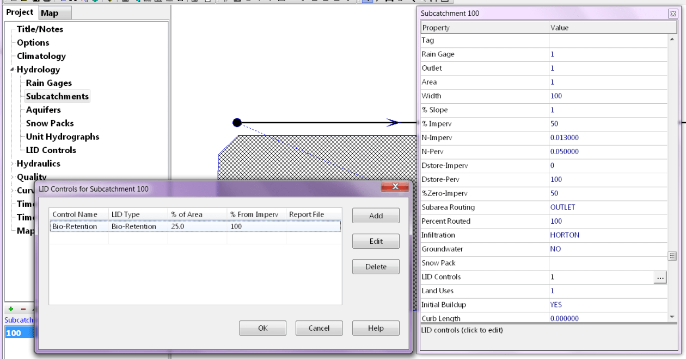
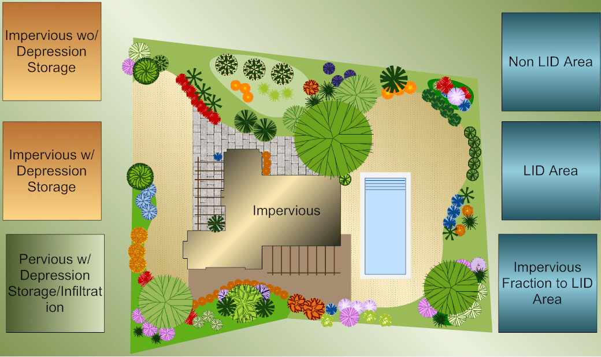
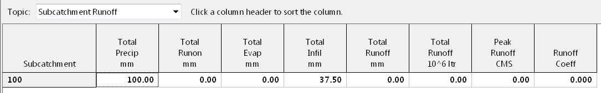
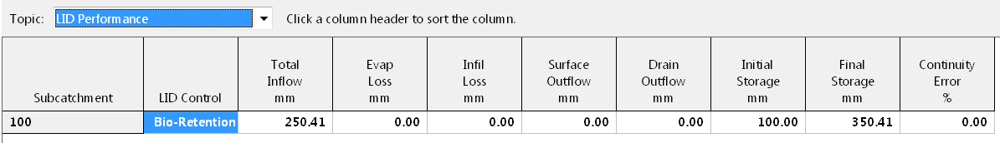

**Simple SI Unit Model for SWMM5 LID with 100 mm Rainfall**.

**Reading this blog and using the embedded SWMM 5 example files, you will run a simple SI unit model based on factors of 1 and 10.**

The LID (Bio-Retention Cell) is designed to have zero outflows, Figure 1, as the storage is set to 1000 mm. The Subcatchment area is 1 hectare, the prevent impervious is ½ hectare divided into ¼ hectare sections with and without depression storage, the pervious area is ½ hectare (Figure 2). The LID Bio-Retention area is ¼ hectare or 25 percent of the Subcatchment.

The SWMM5 engine divides the Subcatchment into nonLID and LID sections (Figure 3) and the impervious area and pervious areas are automatically reduced by the SWMM5 engine (Figure 6). The internal pervious area is 0.375 hectares, the nonLID area is 0.75 hectares and the two impervious area are 0.1875 hectares each. The example uses 100 mm of rainfall or precipitation to make the comparisons easier.

**Figure 1** SWMM 5 Bio-Retention Cell Example with settings based on 10 so that no flow leaves the LID.  The Berm and Storage Height are set to 1000 mm.

**Figure 2** Power of 10 SI unit example for Subcatchment and LID in SWMM5.  The Subcatchment area is 1 hectare, the prevent impervious is ½ hectare divided into ¼ hectare sections with and without depression storage, the pervious area is ½ hectare

**Figure 3** Four types of Runoff Surfaces in SWMM5 with LID's

**Figure 4** Subcatchment Summary in SWMM5 - there is no Runoff and all of the Pervious Flow Infiltrates.  The pervious infiltration is 37.5 mm which is the percentage of the 1 Hectare Subcatchment covered by the pervious area.

**Figure 5** LID Summary - no flow out of the LID, only storage.  The LID area has initial and final storage - the final storage is the total inflow + the initial storage. The total inflow is 100 mm of rainfall + 37.5 mm of Impervious Runoff / 0.25 Hectares or 150 mm for a total of 250 mm.

**Figure 6** Division of 1 Hectare Subcatchment into LID and NonLID Areas.  The internal pervious area is 0.375 hectares, the nonLID area is 0.75 hectares and the two impervious area are 0.1875 hectares each.

\[TITLE\]  
;;Project Title/Notes  
LID Model

\[OPTIONS\]  
;;Option Value  
FLOW_UNITS CMS  
INFILTRATION HORTON  
FLOW_ROUTING DYNWAVE  
LINK_OFFSETS DEPTH  
MIN_SLOPE 0  
ALLOW_PONDING YES  
SKIP_STEADY_STATE NO

START_DATE 03/22/2017  
START_TIME 00:00:00  
REPORT_START_DATE 03/22/2017  
REPORT_START_TIME 00:00:00  
END_DATE 03/23/2017  
END_TIME 00:00:00  
SWEEP_START 01/01  
SWEEP_END 01/03  
DRY_DAYS 0  
REPORT_STEP 00:05:00  
WET_STEP 00:05:00  
DRY_STEP 01:00:00  
ROUTING_STEP 0:00:05

INERTIAL_DAMPING PARTIAL  
NORMAL_FLOW_LIMITED BOTH  
FORCE_MAIN_EQUATION H-W  
VARIABLE_STEP 0.75  
LENGTHENING_STEP 0  
MIN_SURFAREA 1.14  
MAX_TRIALS 8  
HEAD_TOLERANCE 0.0015  
SYS_FLOW_TOL 5  
LAT_FLOW_TOL 5  
MINIMUM_STEP 0.5  
THREADS 1

\[EVAPORATION\]  
;;Data Source Parameters  
;;-------------- ----------------  
CONSTANT 0.0  
DRY_ONLY NO

\[RAINGAGES\]  
;;Name Format Interval SCF Source  
;;-------------- --------- ------ ------ ----------  
1 INTENSITY 0:05 1.0 TIMESERIES A

\[SUBCATCHMENTS\]  
;;Name Rain Gage Outlet Area %Imperv Width %Slope CurbLen SnowPack  
;;-------------- ---------------- ---------------- -------- -------- -------- -------- -------- ----------------  
; Name Raingage Outlet Area %Imperv Width Slope Clength  
100 1 1 1 50 100 1 0.000000

\[SUBAREAS\]  
;;Subcatchment N-Imperv N-Perv S-Imperv S-Perv PctZero RouteTo PctRouted  
;;-------------- ---------- ---------- ---------- ---------- ---------- ---------- ----------  
100 0.013000 0.050000 0 100 50 OUTLET

\[INFILTRATION\]  
;;Subcatchment MaxRate MinRate Decay DryTime MaxInfil  
;;-------------- ---------- ---------- ---------- ---------- ----------  
100 50 10 1 999.000000 0.000000

\[LID_CONTROLS\]  
;;Name Type/Layer Parameters  
;;-------------- ---------- ----------  
Bio-Retention BC  
Bio-Retention SURFACE 1000 0.0 0.1 1 5  
Bio-Retention SOIL 1000 .5 .25 .10 10 10.0 100  
Bio-Retention STORAGE 1000 0.1 0 0  
Bio-Retention DRAIN 0 0.5 0 6

\[LID_USAGE\]  
;;Subcatchment LID Process Number Area Width InitSat FromImp ToPerv RptFile DrainTo  
;;-------------- ---------------- ------- ---------- ---------- ---------- ---------- ---------- ------------------------ ----------------  
100 Bio-Retention 1 2500 10 0 100 0

\[JUNCTIONS\]  
;;Name Elevation MaxDepth InitDepth SurDepth Aponded  
;;-------------- ---------- ---------- ---------- ---------- ----------  
2 101 4.342740 0.000000 0.000000 0.000000  
1 102 7.298640 0.000000 0.000000 80000.000000

\[OUTFALLS\]  
;;Name Elevation Type Stage Data Gated Route To  
;;-------------- ---------- ---------- ---------------- -------- ----------------  
3 100 FREE NO

\[CONDUITS\]  
;;Name From Node To Node Length Roughness InOffset OutOffset InitFlow MaxFlow  
;;-------------- ---------------- ---------------- ---------- ---------- ---------- ---------- ---------- ----------  
12 1 2 100 .01 0.000000 0.000000 0.000000 0  
23 2 3 100 .01 0.000000 0.000000 0.000000 0

\[XSECTIONS\]  
;;Link Shape Geom1 Geom2 Geom3 Geom4 Barrels Culvert  
;;-------------- ------------ ---------------- ---------- ---------- ---------- ---------- ----------  
12 CIRCULAR 1 0.000000 0.000000 0.000000 1  
23 RECT_CLOSED 1 1.600000 0.000000 0.000000 1

\[LOSSES\]  
;;Link Kentry Kexit Kavg Flap Gate Seepage  
;;-------------- ---------- ---------- ---------- ---------- ----------  
12 0 0 0.000000 NO 0  
23 0 0 0.000000 NO 0

\[POLLUTANTS\]  
;;Name Units Crain Cgw Crdii Kdecay SnowOnly Co-Pollutant Co-Frac Cdwf Cinit  
;;-------------- ------ ---------- ---------- ---------- ---------- ---------- ---------------- ---------- ---------- ----------  
SF1 MG/L 0 0.0 0.0 0.0 NO \* 0.0 0.0 0.0

\[LANDUSES\]  
;; Sweeping Fraction Last  
;;Name Interval Available Swept  
;;-------------- ---------- ---------- ----------  
A 0 0 0

\[COVERAGES\]  
;;Subcatchment Land Use Percent  
;;-------------- ---------------- ----------  
100 A 100

\[LOADINGS\]  
;;Subcatchment Pollutant Buildup  
;;-------------- ---------------- ----------  
100 SF1 40

\[BUILDUP\]  
;;Land Use Pollutant Function Coeff1 Coeff2 Coeff3 Per Unit  
;;-------------- ---------------- ---------- ---------- ---------- ---------- ----------  
A SF1 POW 0.0 1 1 AREA

\[WASHOFF\]  
;;Land Use Pollutant Function Coeff1 Coeff2 SweepRmvl BmpRmvl  
;;-------------- ---------------- ---------- ---------- ---------- ---------- ----------  
A SF1 EXP 1 1 0.0 0.0

\[TIMESERIES\]  
;;Name Date Time Value  
;;-------------- ---------- ---------- ----------  
A 00:00 0  
A 00:05 9.573452431  
A 00:10 10.25274205  
A 00:15 11.04623792  
A 00:20 11.98563822  
A 00:25 13.11546308  
A 00:30 14.50019616  
A 00:35 16.2367101  
A 00:40 18.47713325  
A 00:45 21.47391061  
A 00:50 25.67639064  
A 00:55 31.96236514  
A 01:00 42.28290598  
A 01:05 61.90323665  
A 01:10 110.6596749  
A 01:15 202.1863528  
A 01:20 122.9825837  
A 01:25 78.78745972  
A 01:30 57.07434496  
A 01:35 44.44627995  
A 01:40 36.29030405  
A 01:45 30.63131568  
A 01:50 26.49481575  
A 01:55 23.34912428  
A 02:00 20.88150483  
A 02:05 18.89679137  
A 02:10 17.26739526  
A 02:15 15.9065854  
A 02:20 14.75345383  
A 02:25 13.76406613  
A 02:30 12.9059759  
A 02:35 12.15470506  
A 02:40 11.49147541  
A 02:45 10.90163374  
A 02:50 10.37359955  
A 02:55 9.898093036  
A 03:00 9.467598431

\[REPORT\]  
;;Reporting Options  
INPUT YES  
CONTROLS NO  
SUBCATCHMENTS ALL  
NODES ALL  
LINKS ALL

\[TAGS\]

\[MAP\]  
DIMENSIONS 82757.219 8542.173 83495.650 8753.113  
Units None

\[COORDINATES\]  
;;Node X-Coord Y-Coord  
;;-------------- ------------------ ------------------  
2 83134.103 8743.516  
1 82811.980 8743.508  
3 83462.085 8743.524

\[VERTICES\]  
;;Link X-Coord Y-Coord  
;;-------------- ------------------ ------------------

\[Polygons\]  
;;Subcatchment X-Coord Y-Coord  
;;-------------- ------------------ ------------------  
100 83119.103 8710.484  
100 83119.103 8551.761  
100 82790.784 8551.761  
100 82793.138 8710.780  
100 82813.136 8730.484  
100 83099.103 8730.484  
100 83119.103 8710.484

\[SYMBOLS\]  
;;Gage X-Coord Y-Coord  
;;-------------- ------------------ ------------------  
1 82983.981 8630.926
