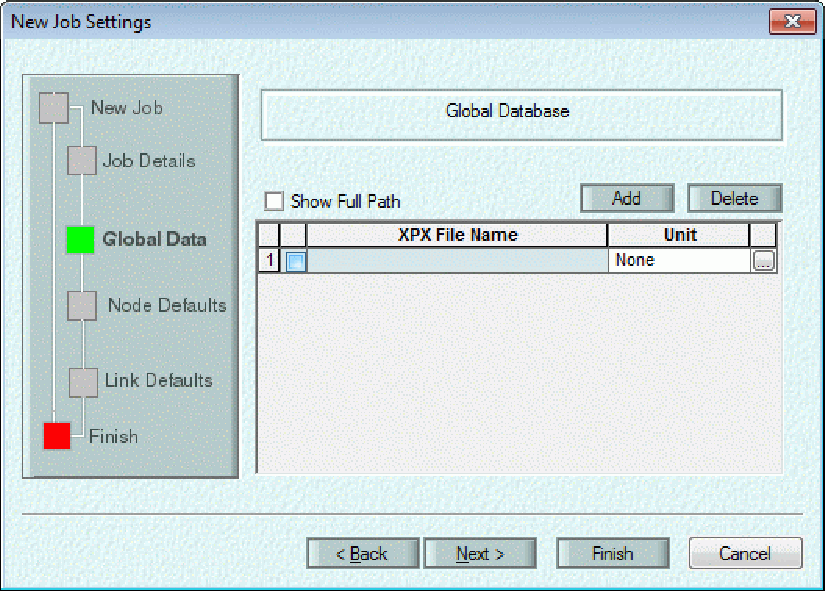

**Tools Menu in InfoSWMM**

***All the commands for the Tools Menu commands in InfoSWMM.***

[Tools Menu in InfoSWMM [1](#_Toc69374895)](#_Toc69374895)

[ Run Manager [5](#_Toc69374896)](#_Toc69374896)

[To Run a model simulation using the Run Manager; [10](#to-run-a-model-simulation-using-the-run-manager)](#to-run-a-model-simulation-using-the-run-manager)

[Three Inertial Term Options in InfoSWMM [11](#three-inertial-term-options-in-infoswmm)](#three-inertial-term-options-in-infoswmm)

[St Venant Equations in \#SWMM5 [13](#_Toc69374899)](#_Toc69374899)

[How are the St Venant Units used in \#SWMM5? [14](#_Toc69374900)](#_Toc69374900)

*Utilize the various options available here to run your model (Run Manager and Batch Simulation Manager) and to analyze your results (Customized Report, Query Report, and Output Report Manager). Through the Output Unit manager, you can modify your output units. The Domain and Facility Managers are used to create Domains and Facility sets, respectively. Through the AddOn Extension Manager, activate the InfoSWMM modules. Additionally, you can create and view animations using the Animation Viewer.*

*The Run Manager is used to run simulations and manage the output sources for those simulations (results). The Run Manager supports three distinct simulation types: steady-state, design, and extended period simulation/dynamic simulation (including quality analyses). Additionally, you can use the Batch Run Manager to simultaneously run multiple standard simulations.*

*The Batch Run Manager is used to simultaneously run models for multiple user-selected scenarios. This command is particularly useful when multiple simulations are required concurrently for a large model. The Batch Run Manager enables the user to select desired scenarios and run each model sequentially.* **Pipe Profile for Output** - Profiles the Output data for a series of links.

Like a customized report, a Query Report is used to selectively choose which input and output data will appear in a report.  However, unlike a customized report, a query report is required to relate data from an [<u>Output Relate</u>](javascript:BSSCPopup('../SewerCombined%20-%20InfoSewer/Reports_Graphing_and_Output/Output_Relate.htm');) with output data in a report format.  In other words, the only way to see output data in a report format is to create a query report that contains a desired output relate.

The **Output Report Manager** provides you with a means to access all your Output variables in report and graph form for all your simulations.

A **Domain** is a *<u>temporarily</u>* selected subset of network components.  The domain can be used for a variety of purposes including group editing operations, mapping, contouring, etc.  The Domain Manager is used to create, edit and delete elements contained within a domain.  In conjunction with the Domain Manager,  InfoSWMM  also has the [<u>Edit Selection Attributes</u>](file:///C:\SWMM-SEWER%20Robohelp\SewerCombined%20-%20InfoSewer\User_Interface\Toolbars_and_Icons.htm#EditSelection) and [<u>Edit Domain Attribute</u>](file:///C:\SWMM-SEWER%20Robohelp\SewerCombined%20-%20InfoSewer\User_Interface\Toolbars_and_Icons.htm#EditDomain) icons.

The **Facility Manager** is used to create and maintain the active facility set.  The active facility set defines the network components in a current model that will be considered during the next simulation run(s).  Facility sets can also be associated with a scenario via the** Scenario Manager**.

| **Button**                                                                 | **Name**                                                                               | **Description** |
|----------------------------------------------------------------------------|----------------------------------------------------------------------------------------|-----------------|
|   | **Run Manager**                                                                        |                 |
|                                                                            | **Batch Simulation**                                                                   |                 |
|   | **Output Unit Manager**                                                                |                 |
|   | **Report Manager**                                                                     |                 |
|                                                                            | **Animation Editor**                                                                   |                 |
|                                                                            | **Animation Viewer**                                                                   |                 |
|   | **Customized Report Manager**                                                          |                 |
|   | **Query Report Manager**                                                               |                 |
|                                                                            | **Query Summation Report**                                                             |                 |
|   | **Output Statistics Manager**                                                          |                 |
|  | **Domain Manager**                                                                     |                 |
|  | **Facility Manager**                                                                   |                 |
|                                                                            | **Engineering Review Tool**                                                            |                 |
|                                                                            | **Network Audit Tool (Combined with Engineering Review Tool in InfoSWMM 14.7 Update)** |                 |
|                                                                            | **Invert and Elevation Tools**                                                         |                 |
|                                                                            | **Combine Routing Files**                                                              |                 |
|                                                                            | **Create Dual Drainage**                                                               |                 |
|  | **Create Profile Plot**                                                                |                 |
|                                                                            | **Create Storage Curve**                                                               |                 |
|                                                                            | **Infer Conduit Max. Depth**                                                           |                 |
|                                                                            | **Set Pipe-Fitting Junctions**                                                         |                 |
|  | **Add On Manager**                                                                     |                 |
|  | **Project Preferences**                                                                |                 |

 

** Run Manager**

The Run Manager, shown below,  is used to perform InfoSWMM simulations and to manage simulation output sources (results). When you run a simulation,  InfoSWMM  InfoSWMM SA uses modeling data associated with the currently [<u>active scenario</u>](javascript:BSSCPopup('Creating_Using_and_Maintaining_Projects/Scenario_Management/Scenario_Explorer.htm');). If you have not developed a custom scenario, the \*active\* scenario is the “BASE”. To run a model based on a different scenario, activate the desired scenario using the [<u>Active Scenario</u>](javascript:BSSCPopup('Creating_Using_and_Maintaining_Projects/Scenario_Management/Edit_Active_Scenario.htm');) command and then use the Run Manager to perform the simulation for the selected scenario. Use the Report Manager to see simulation results in either report or graph formats.

 

 

Launch the Run Manager by selecting **Run Manager** from the  InfoSWMM  InfoSWMM SA [<u>Tools Menu</u>](file:///C:\SWMM-SEWER%20Robohelp\SWMMCombined%20-%20InfoSWMM%20-%201\User_Interface\InfoSWMM\Menus_and_Toolbars\Menus\Info_Menu_Tools_Menu.htm) [<u>Tools Menu</u>](file:///C:\SWMM-SEWER%20Robohelp\SWMMCombined%20-%20InfoSWMM%20-%201\User_Interface\H2OMAPSWMM\Menus_and_Toolbars\Menus\H2O_Menu_Tools_Menu.htm) or by clicking the Run Manager button (  ) from the InfoSWMM  [<u>Output Tool Bar</u>](file:///C:\SWMM-SEWER%20Robohelp\SWMMCombined%20-%20InfoSWMM%20-%201\User_Interface\Menus_and_Toolbars\Toolbars\Output_Tool_Bar.htm) [<u>Standard Toolbar</u>](file:///C:\SWMM-SEWER%20Robohelp\SWMMCombined%20-%20InfoSWMM%20-%201\User_Interface\H2OMAPSWMM\Menus_and_Toolbars\Toolbars\H2O_Toolbar_Standard_Toolbar.htm) .

In InfoSWMM SA use the Model Explorer

Content of the Run Manager are described below.

<table>
<colgroup>
<col style="width: 17%" />
<col style="width: 23%" />
<col style="width: 59%" />
</colgroup>
<thead>
<tr class="header">
<th><strong>BUTTON</strong></th>
<th><strong>Name</strong></th>
<th><strong>Description</strong></th>
</tr>
</thead>
<tbody>
<tr class="odd">
<td><strong> </strong></td>
<td><strong>Output Source</strong></td>
<td>
An output source is an association between  InfoSWMM  InfoSWMM SA and the output (.out) file created from a simulation run.  InfoSWMM  InfoSWMM SA refers to model runs as output sources, whether they be *active*.Standard or ScenarioX.Standard, every model run is affiliated to an external output file by its "output source" name.

<ul>
<li><ul>
<li>
<strong>Name</strong> - name used for the output file. After a model is run, the most recent simulation run results are referred to as the *active* output source.
</li>
<li>
<strong>Reference</strong> - the reference used to describe the output source. It is not customizable.
</li>
</ul></li>
</ul></td>
</tr>
<tr class="even">
<td></td>
<td><strong>Run</strong></td>
<td>
Clicking on this icon initiates model simulation

 
</td>
</tr>
<tr class="odd">
<td></td>
<td><strong>Report</strong></td>
<td>
Opens and enables viewing of an output text report.  The name of the report is "HYDQUA.RPT".

 
</td>
</tr>
<tr class="even">
<td></td>
<td><strong>Open</strong></td>
<td>
Opens and loads an output file in to the model, and activates this output file.

 
</td>
</tr>
<tr class="odd">
<td></td>
<td><strong>Save</strong></td>
<td>Saves the most recent model run to a file specified by the user.  Once saved, the (.out) file can be open or loaded at any time.</td>
</tr>
<tr class="even">
<td></td>
<td><strong>Update Relate</strong></td>
<td>
Update existing output relates to the recent run output.

 
</td>
</tr>
<tr class="odd">
<td></td>
<td><strong>Force Reset</strong></td>
<td>Removes all simulation results from the highlighted output source. Model results for the output source will not be available until the user loads and relates a current (.out) file to the output source.</td>
</tr>
<tr class="even">
<td></td>
<td><strong>OK</strong></td>
<td>
Accept all changes and close the Run Manager dialog box.

 
</td>
</tr>
<tr class="odd">
<td></td>
<td><strong>Load Output Source</strong></td>
<td><a href="javascript:BSSCPopup(&#39;Output_Data_Analysis/Output_Source.htm&#39;);"><u>Loads an output source</u></a>.  Output sources are either internal (a model run from a scenario) or external (a model run prepared by someone else in another InfoSWMM project).</td>
</tr>
<tr class="even">
<td></td>
<td><strong>Edit Name</strong></td>
<td>
Allows the user to customize name for an output source.

 
</td>
</tr>
<tr class="odd">
<td></td>
<td><strong>Remove Output Source</strong></td>
<td>Removes an output source from the Run Manager. The removed output source can be re-created through the Load Output Source icon.</td>
</tr>
<tr class="even">
<td></td>
<td><strong>Remove All Output Sources</strong></td>
<td>This will remove all output sources (excepting the *active* output source that can never be removed). Once all are removed, they can only be re-added  either by running each of the specific simulations or by clicking on the Load Output Source icon.</td>
</tr>
<tr class="odd">
<td> </td>
<td><strong>Simulation Options</strong></td>
<td>This opens the <a href="file:///C:\SWMM-SEWER%20Robohelp\SWMMCombined%20-%20InfoSWMM%20-%201\Creating_Using_and_Maintaining_Projects\Simulating_the_Model\Run_Manager\Simulation_Options\Simulation_Options.htm"><u>simulation option</u></a> editor and enables the user to modify/edit the InfoSWMM simulation options. The simulation option editor can also be initiated from the <a href="javascript:BSSCPopup(&#39;User_Interface/Browser/Operation_Data/Operating_Data.htm&#39;);"><u>operation browser</u></a>.</td>
</tr>
<tr class="even">
<td> </td>
<td><strong>Climatology Settings</strong></td>
<td>This opens the <a href="javascript:BSSCPopup(&#39;Data_Objects/22_Climatology/climatology_descrption.htm&#39;);"><u>climate data editor</u></a> and enables the user to modify/edit the climate data. The climate Data editor can also be initiated from the operation browser.</td>
</tr>
<tr class="odd">
<td rowspan="3"><a href="file:///C:\SWMM-SEWER%20Robohelp\SWMMCombined%20-%20InfoSWMM%20-%201\Creating_Using_and_Maintaining_Projects\Simulating_the_Model\Run_Manager\Run_Manager.htm"><u>Run Manager</u></a></td>
<td><strong>Report Options</strong></td>
<td>Open the <a href="javascript:BSSCPopup(&#39;Creating_Using_and_Maintaining_Projects/Simulating_the_Model/Run_Manager/Simulation_Report_Options.htm&#39;);"><u>simulation report</u></a> editor and enables the modeler edit/modify the simulation report settings The Simulation report editor can also be initiated from the operation browser.</td>
</tr>
<tr class="even">
<td><strong>Use Simulation Task Manager</strong></td>
<td>Schedule a simulation using Run Manager.  Notice that the Run button has changed is now the Schedule Simulation button (  ).  After clicking this button, the simulation is sent to the Simulation Task Manager and the Simulation Task Manager Main Window will be launched.  The simulation can further be managed from there.  <em>Note: When a simulation is run within the Simulation Task Manager environment, a copy of the input data is made as input for the simulation task.  This means that after scheduling the simulation task, you can change the input data in the model but future output results may differ.</em></td>
</tr>
<tr class="odd">
<td><strong>User 32 Bit (Default) or 64 Bit Engine</strong></td>
<td>If you use the Simulation Task Manager you have the option of using either a 32 bit or 64 bit engine.</td>
</tr>
</tbody>
</table>

** **

## To Run a model simulation using the Run Manager;

- [<u>Activate the Scenario</u>](javascript:BSSCPopup('Creating_Using_and_Maintaining_Projects/Scenario_Management/Scenario_Explorer.htm');) that you want to run.

<!-- -->

- Launch the Run Manager by selecting Run Manager from the InfoSWMM InfoSWMM SA [<u>Tools Menu</u>](javascript:BSSCPopup('User_Interface/InfoSWMM/Menus_and_Toolbars/Menus/Info_Menu_Tools_Menu.htm');) [<u>Tools Menu</u>](javascript:BSSCPopup('User_Interface/H2OMAPSWMM/Menus_and_Toolbars/Menus/H2O_Menu_Tools_Menu.htm');) or by clicking the Run Manager button (  ) from the InfoSWMM [<u>Output Tool Bar</u>](javascript:BSSCPopup('User_Interface/Menus_and_Toolbars/Toolbars/Output_Tool_Bar.htm');) [<u>Standard Toolbar</u>](javascript:BSSCPopup('User_Interface/H2OMAPSWMM/Menus_and_Toolbars/Toolbars/H2O_Toolbar_Standard_Toolbar.htm');) .

- Specify the desired simulation and report options, and climatology settings and click on the **Run** icon  to run the simulation.

- Check the Run Manager **Run Status** indicator and confirm a green light.. If you get a Red light or a Yellow light click on the **Report** icon  next to your **Run** icon on the Run Manager dialog box to trouble shoot.

- After a successful simulation, review your results using the [<u>Output Report Manager</u>](file:///C:\SWMM-SEWER%20Robohelp\SWMMCombined%20-%20InfoSWMM%20-%201\Output_Data_Analysis\Output_Report_Manager.htm).

## Three Inertial Term Options in InfoSWMM 

The dynamic wave flow in InfoSWMM InfoSWMM SA is calculated from the following equation

Q  =   (Qold – dq2 + dq3\*sigma +  dq4\*sigma ) / ( 1  + dq1 + dq5)

> Where,
>
> Qold               =         Last Time Step Flow in the Link
>
> dq1                 =         friction loss term
>
> dq2                 =         water suface slope + bed slope term
>
> dq3                 =         midpoint area non linear term
>
> dq4                 =         upstream and downstream area non linear term
>
> dq5                 =         Entrance, Other and Exit Loss Term
>
> sigma            =         function of the Froude number and a function of the Three Inertial Term Options

**Figure 1** shows how Sigma is set based on the user selection of the Three Inertial Terms.  **Figure 2** shows how Sigma is calculated for the Dampen Option.  If you use Ignore then dq3 and dq4 are ignored all of the time, if you use Dampen then dq3 and dq4 are used for a Froude number less than 0.5 and then the terms gradually fade away until a Froude number of 1 is reached.   If you use Keep then the non linear terms are used all of the time no matter the value of the link Froude Number.  There is one exception to this rule: If a closed link is full then the value of sigma is set to 0.0 no matter what is selected for the Inertial Term.

**Figure 1**.  The value of Sigma for each of the Three Inertial Term Options in SWMM 5 and InfoSWMM  InfoSWMM SA

**Figure 2**.  At each iteration for each link during the simulation the link Froude Number is calculated and based on the Froude Number the value of Sigma is Set.

## [<u>St Venant Equations in \#SWMM5</u>](http://www.swmm5.net/2016/10/more-st-venant-equations-in-swmm5.html)

This note shows the relationship between the terms dq1, dq2, dq3 and dq4 in the SWMM5 code and the St. Venant Partial Differential Equations.

dq2 = Time Step \* Area wtd \* (Head Downstream – Head Upstream) / Link Length or  
  
dq2 = Time Step \* Area wtd \* (HGL) / Link Length Qnew = (Qold – dq2 + dq3 + dq4) / ( 1 + dq1) when the force main is full dq3 and dq4 are zero and

Qnew = (Qold – dq2) / ( 1 + dq1) The dq4 term in dynamic.c uses the area upstream (a1) and area downstream (a2), the midpoint velocity, the sigma factor (a function of the link Froude number), the link length and the time step or  
  
dq4 = Time Step \* Velocity \* Velocity \* (a2 – a1) / Link Length \* Sigma the dq3 term in dynamic.c uses the current midpoint area (a function of the midpoint depth), the sigma factor and the midpoint velocity  
  
dq3 = 2 \* Velocity \* ( Amid(current iteration) – Amid (last time step) \* Sigma  
  
dq1 = Time Step \* RoughFactor / Rwtd^1.333 \* \|Velocity\| The weighted area (Awtd) is used in the dq2 term of the St. Venant equation:  
  
dq2 = Time Step \* Awtd \* (Head Downstream – Head Upstream) / Link Length

**How are the St Venant Units used in \#SWMM5?**

The new flow (Q) calculated at during each iteration of time step as  
  
(1) Q for the new iteration = (Q at the Old Time Step – DQ2 + DQ3 + DQ4 ) / ( 1.0 + DQ1 + DQ5)  
  
In which DQ2, DQ3 and DQ4 all have units of flow (note internally SWMM 5 has units of CFS and the flows are converted to the user units in the output file, graphs and tables of SWMM 5).  
  
The equations and units for DQ2, DQ3 and DQ4 are:  
  
(2) Units of DQ2 = DT \* GRAVITY \* aWtd \* ( H2 – H1) / Length = second \* feet/second^2 \* feet^2 \* feet / feet = feet^3/second = CFS  
  
(3) Units of DQ3 = 2 \* Velocity \* ( aMid – aOld) \* Sigma = feet/second \* feet^2 = feet^3/second = CFS  
  
(4) Units of DQ4 = DT \* Velocity \* Velocity \* ( aMid – aOld) \* Sigma / Length = second \* feet/second \* feet/second \* feet^2 / feet = feet^3/second = CFS  
  
The equations and units for DQ1 and DQ5 are:  
  
(5) Units of DQ1 = DT \* GRAVITY \* (n/PHI)^2 \* Velocity / Hydraulic Radius^1.333 = second \* feet/second^2 \* second^2 \* feet^1/3 \* feet/second / feet^1.33 = Dimensionless  
  
(6) Units of DQ5 = K \* Q / Area / 2 / Length \* DT = feet^3/second \* 1/feet^2 \* 1/feet \* second = Dimensionless

 

** **
