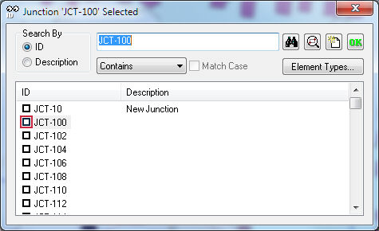
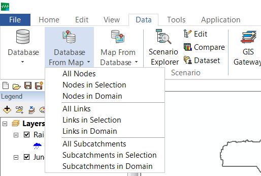
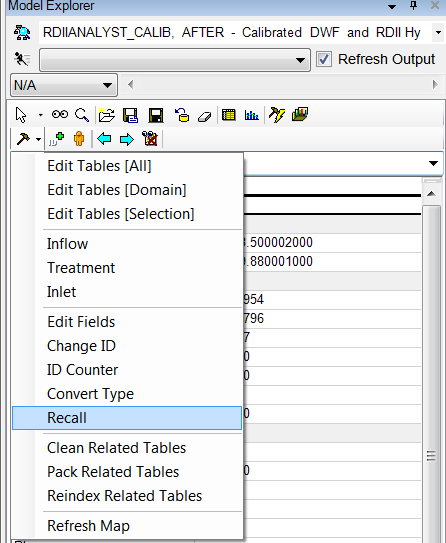
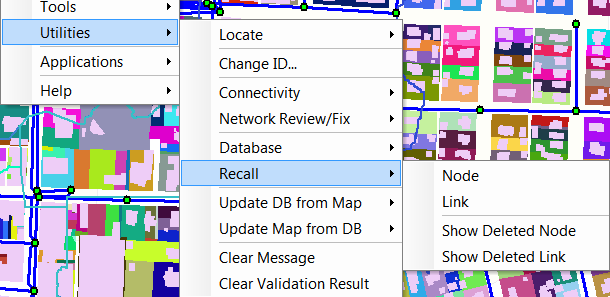

**Utilities Menu in InfoSWMM**

[Utilities Menu in InfoSWMM [1](#_Toc69374491)](#_Toc69374491)

[Utilities Menu [6](#_Toc69374492)](#_Toc69374492)

[Change ID [10](#_Toc69374493)](#_Toc69374493)

[Locate Elements [12](#_Toc69374494)](#_Toc69374494)

[Update DB from MAP in InfoSWMM [15](#_Toc69374495)](#_Toc69374495)

[Update MAP From DB [18](#_Toc69374496)](#_Toc69374496)

[Clear Message [21](#_Toc69374497)](#_Toc69374497)

[Clear Validation Result [22](#_Toc69374498)](#_Toc69374498)

[Recall [23](#_Toc69374499)](#_Toc69374499)

The InfoSWMM  utility menu contains a number of essential features that the modeler may utilize on a frequent basis at the model building, model maintenance, model execution, and result analysis stages. Description and usage procedures of the features available under this menu are given below. You may click on the corresponding link for further information on any of these features.

<table>
<colgroup>
<col style="width: 47%" />
<col style="width: 52%" />
</colgroup>
<thead>
<tr class="header">
<th><ul>
<li>
<a href="file:///C:\SWMM-SEWER%20Robohelp\SWMMCombined%20-%20InfoSWMM%20-%201\Utilities\Locate_Elements.htm"><strong><u>Locate</u></strong></a>
</li>
</ul></th>
<th><ul>
<li>
<a href="file:///C:\SWMM-SEWER%20Robohelp\SWMMCombined%20-%20InfoSWMM%20-%201\Utilities\Recall.htm"><strong><u>Recall</u></strong></a>
</li>
</ul></th>
</tr>
</thead>
<tbody>
<tr class="odd">
<td><ul>
<li>
<a href="file:///C:\SWMM-SEWER%20Robohelp\SWMMCombined%20-%20InfoSWMM%20-%201\Utilities\Change_ID.htm"><strong><u>Change ID</u></strong></a>
</li>
</ul></td>
<td><ul>
<li>
<strong><u><a href="file:///C:\SWMM-SEWER%20Robohelp\SWMMCombined%20-%20InfoSWMM%20-%201\Utilities\Update_DB_From_MAP.htm">Up</a><a href="file:///C:\SWMM-SEWER%20Robohelp\SWMMCombined%20-%20InfoSWMM%20-%201\Utilities\Recall.htm">date DB from Map</a></u></strong>
</li>
</ul></td>
</tr>
<tr class="even">
<td><ul>
<li>
<a href="file:///C:\SWMM-SEWER%20Robohelp\SWMMCombined%20-%20InfoSWMM%20-%201\Utilities\Connectivity\Connectivity.htm"><strong><u>Connectivity</u></strong></a>
</li>
</ul></td>
<td><ul>
<li>
<a href="file:///C:\SWMM-SEWER%20Robohelp\SWMMCombined%20-%20InfoSWMM%20-%201\Utilities\Update_MAP_From_DB.htm"><strong><u>Update Map from DB</u></strong></a>
</li>
</ul></td>
</tr>
<tr class="odd">
<td><ul>
<li>
<a href="file:///C:\SWMM-SEWER%20Robohelp\SWMMCombined%20-%20InfoSWMM%20-%201\Utilities\Network_Review_and_Fix\Network_Review_and_Fix_Tool.htm"><strong><u>Network Review/Fix</u></strong></a>
</li>
</ul></td>
<td><ul>
<li>
<a href="file:///C:\SWMM-SEWER%20Robohelp\SWMMCombined%20-%20InfoSWMM%20-%201\Utilities\Clear_Message_Board.htm"><strong><u>Clear Message Board</u></strong></a>
</li>
</ul></td>
</tr>
<tr class="even">
<td><ul>
<li>
<a href="file:///C:\SWMM-SEWER%20Robohelp\SWMMCombined%20-%20InfoSWMM%20-%201\Utilities\Database_Tools\Database_Tools.htm"><strong><u>Database Tools</u></strong></a>
</li>
</ul></td>
<td><ul>
<li>
<a href="file:///C:\SWMM-SEWER%20Robohelp\SWMMCombined%20-%20InfoSWMM%20-%201\Utilities\clear_validation_result.htm"><strong><u>Clear Validation Result</u></strong></a>
</li>
</ul></td>
</tr>
</tbody>
</table>

 

The InfoSWMM utility menu contains a number of essential features that the modeler may utilize on a frequent basis at the model building, maintenance, execution, and result analysis stages. The menu consists of the following components. For further information on any of these features, you may click on the corresponding link.

 

 

 

 

| **Name**                    | **Description**                                                                                                                                                                                                                                                                                                                                                                                                                                                                                                                                                                                                                                                                                                                                                                                                     |
|-----------------------------|---------------------------------------------------------------------------------------------------------------------------------------------------------------------------------------------------------------------------------------------------------------------------------------------------------------------------------------------------------------------------------------------------------------------------------------------------------------------------------------------------------------------------------------------------------------------------------------------------------------------------------------------------------------------------------------------------------------------------------------------------------------------------------------------------------------------|
| **Locate**                  | The [<u>locate</u>](javascript:BSSCPopup('Utilities/Locate_Elements.htm');) feature allows the user to search for a desired network element by its ID or by its description. Using the locate feature one can search for and automatically zoom in to a desired node, link, or Subcatchment.                                                                                                                                                                                                                                                                                                                                                                                                                                                                                                                        |
| **Change ID**               | The [<u>change ID</u>](file:///C:\SWMM-SEWER%20Robohelp\SWMMCombined%20-%20InfoSWMM%20-%201\Utilities\Change_ID.htm) feature allows the user to change ID of any data element.                                                                                                                                                                                                                                                                                                                                                                                                                                                                                                                                                                                                                                      |
| **Connectivity**            | The [<u>connectivity</u>](file:///C:\SWMM-SEWER%20Robohelp\SWMMCombined%20-%20InfoSWMM%20-%201\Utilities\Connectivity\connectivity.htm) submenu is used to verify network connectivity before running a simulation. When importing a model from an external data source (GIS, infrastructure inventory, other stormwater models, etc.), it is critical that the network representation be properly constructed (e.g.,each conduit is connected to exactly two nodes, each node is connected to at least one conduit). The features available under the connectivity submenu enable the user just to do that.                                                                                                                                                                                                        |
| **Network Review/Fix**      | The [<u>Network Review/Fix Tool</u>](file:///C:\SWMM-SEWER%20Robohelp\SWMMCombined%20-%20InfoSWMM%20-%201\Utilities\Network_Review_and_Fix\network_review_and_fix_tool.htm) is a comprehensive network drawing examination and correction application for use in constructing reliable, credible working models ready for analysis. It offers users complete functionality to quickly identify and automatically correct any network topology problems (e.g., disconnected nodes) and data flaws (e.g., duplicated conduits or nodes) that may arise from digitizing a model or building it using pre-existing GIS and CAD datasets. The Tool consists of many useful applications including: Trace Connected Nodes, Trace Network, Trace Upstream Network, Trace Downstream Network, and Locate Parallel Conduits. |
| **Database**                | The [<u>database</u>](file:///C:\SWMM-SEWER%20Robohelp\SWMMCombined%20-%20InfoSWMM%20-%201\Utilities\Database_Tools\Database_Tools.htm) tools submenu assists the modeler in maintaining and managing project databases.                                                                                                                                                                                                                                                                                                                                                                                                                                                                                                                                                                                            |
| **Recall**                  | The [<u>recall</u>](file:///C:\SWMM-SEWER%20Robohelp\SWMMCombined%20-%20InfoSWMM%20-%201\Utilities\Recall.htm) command is used to restore – or undelete – network components that have been deleted.                                                                                                                                                                                                                                                                                                                                                                                                                                                                                                                                                                                                                |
| **Update DB from Map**      | The [<u>update DB from MAP</u>](file:///C:\SWMM-SEWER%20Robohelp\SWMMCombined%20-%20InfoSWMM%20-%201\Utilities\Update_DB_From_MAP.htm) command is used to update the current project’s database tables based on the current state of the network drawing.                                                                                                                                                                                                                                                                                                                                                                                                                                                                                                                                                           |
| **Update Map from DB**      | The [<u>update MAP from DB</u>](file:///C:\SWMM-SEWER%20Robohelp\SWMMCombined%20-%20InfoSWMM%20-%201\Utilities\Update_MAP_From_DB.htm) command could be used to redraw the current project’s network map based on Geometry Data ( i.e., X, Y coordinates of the elements) and the **TO node** and the **FROM** **node** information of conduits.                                                                                                                                                                                                                                                                                                                                                                                                                                                                    |
| **Clear Message Board**     | [<u>This feature</u>](file:///C:\SWMM-SEWER%20Robohelp\SWMMCombined%20-%20InfoSWMM%20-%201\Utilities\Clear_Message_Board.htm) enables clearing of the information currently displayed on the [<u>message tab of the message board</u>](file:///C:\SWMM-SEWER%20Robohelp\SWMMCombined%20-%20InfoSWMM%20-%201\User_Interface\Message_Board_-_Message_Tab.htm).                                                                                                                                                                                                                                                                                                                                                                                                                                                        |
| **Clear Validation Result** | [<u>This feature</u>](file:///C:\SWMM-SEWER%20Robohelp\SWMMCombined%20-%20InfoSWMM%20-%201\Utilities\clear_validation_result.htm) enables clearing of the information currently displayed on the [<u>validation tab of the message board</u>](file:///C:\SWMM-SEWER%20Robohelp\SWMMCombined%20-%20InfoSWMM%20-%201\User_Interface\Message_Board_-_Validation_Result.htm) .                                                                                                                                                                                                                                                                                                                                                                                                                                          |

 

**See Also**

- [<u>Edit Menu</u>](file:///C:\SWMM-SEWER%20Robohelp\SWMMCombined%20-%20InfoSWMM%20-%201\User_Interface\InfoSWMM\Menus_and_Toolbars\Menus\Info_Menu_Edit_Menu.htm)  

- [<u>View Menu</u>](file:///C:\SWMM-SEWER%20Robohelp\SWMMCombined%20-%20InfoSWMM%20-%201\User_Interface\InfoSWMM\Menus_and_Toolbars\Menus\Info_Menu_View_Menu.htm)   

- [<u>Exchange Menu</u>](file:///C:\SWMM-SEWER%20Robohelp\SWMMCombined%20-%20InfoSWMM%20-%201\User_Interface\InfoSWMM\Menus_and_Toolbars\Menus\Info_Menu_Exchange_Menu.htm)

- [<u>Scenario Menu</u>](file:///C:\SWMM-SEWER%20Robohelp\SWMMCombined%20-%20InfoSWMM%20-%201\User_Interface\Menus_and_Toolbars\Menus\Scenario_Menu.htm)

- [<u>Tools Menu</u>](file:///C:\SWMM-SEWER%20Robohelp\SWMMCombined%20-%20InfoSWMM%20-%201\User_Interface\InfoSWMM\Menus_and_Toolbars\Menus\Info_Menu_Tools_Menu.htm)

- [<u>Help Menu</u>](file:///C:\SWMM-SEWER%20Robohelp\SWMMCombined%20-%20InfoSWMM%20-%201\User_Interface\Menus_and_Toolbars\Menus\Help_Menu.htm)  

**Utilities Menu**

***Descriptions of All Utilities Menu commands in InfoSWMM.***

- **Locate** - The Locate command is used to find a node/pipe/element by ID within an InfoSWMM project. This function is also available from the Model Explorer - Attribute Tab toolbar . See: [<u>Locate</u>](javascript:BSSCPopup('../SewerCombined%20-%20InfoSewer/Locate.htm');)

- **Change ID** - The Change ID command allows the user to change the InfoSWMM  database identification for any element from one value to another (as long as the new value for that element is unique).  Merely select the Desired Element Type to change, type in the Old ID then the New ID.  Clicking Apply will change the ID for that element.  [<u>Click here</u>](file:///C:\SWMM-SEWER%20Robohelp\SewerCombined%20-%20InfoSewer\Preferences_and_Utilities\Change_ID.htm) to learn more.

- **Pipe  Invert** - To verify the invert order of gravity mains, go to the **InfoSWMM** button, **Utilities** menu and select **Pipe Invert Order**. Select any of the commands, and then the user can either select pipes individually or drag a window across all desired elements. Once the pipes have been selected, right mouse click and choose the Enter option or hit the Enter key on your keyboard.

- **Connectivity** - The connectivity feature has many elements that assist the user in ensuring that connectivity is established prior to a model being run.  It is important to note that connectivity is required for InfoSWMM  to run a hydraulic simulation.  [<u>Click here</u>](file:///C:\Preferences_and_Utilities\Connectivity_Menu.htm) to learn more.

- **Network Review/Fix** - The Network Review/Fix Tool is a comprehensive network drawing examination and correction application for use in constructing reliable, credible working models ready for analysis. It offers users functionality to quickly identify and correct network topology problems and data flaws that may arise from digitizing a model or building it using pre-existing GIS and CAD datasets. See: [<u>Network Review/Fix Tool</u>](file:///C:\Preferences_and_Utilities\Network_Review-Fix_Tool.htm)

- **Database** - The database feature allows the user to utilize database management from within InfoSWMM  to find and correct database flaws or problems.  [<u>Click here</u>](javascript:BSSCPopup('../../Preferences_and_Utilities/Database_Tools_Menu.htm');) to learn more.

- **Recall** - The recall command (or Undelete) allows the user to recall a deleted pipe or node from the project database.  It is important to note that when a record is deleted from a database, it is only "marked" for deletion (unless the user has turned on the **Auto Database Packing** feature in the **Project Preferences)**.  [<u>Click here</u>](javascript:BSSCPopup('../../Preferences_and_Utilities/Recall.htm');) to learn more.

- **Update DB from Map** - This feature allows the user to recreate some or all of the project databases from the graphics in the InfoSWMM  project from the project databases.  [<u>Click here</u>](file:///C:\Preferences_and_Utilities\Update_DB_from_Map_Menu.htm) to learn more.

- **Update Map from DB** - This feature allows the user to regenerate the map graphics from the project database to ensure that the map view and the database contain the same data.  [<u>Click here</u>](file:///C:\Preferences_and_Utilities\Update_MAP_from_DB_Menu.htm) to learn more.

- **Update Spatial Indexes** - The Update Spatial Index command will help to speed up the map refresh in ArcMap. When there are tables joined to an InfoSWMM  layer, ArcMap will not update the spatial indexes when those tables have been modified. The Update Spatial Indexes command will update the joined tables for an improved map refresh rate.

- **Clear Message Board** - Use this command to clear the InfoSWMM Message Board. The InfoSWMM  message board displays messages, warnings and/or errors during, before and after an InfoSWMM  simulation.

- **Clear Validation Result** - Clears the view from the Validation Message Board.

 

| **Name**                    | **Description**                                                                                                                                                                                                                                                                                                                                                                                                                                                                                                                                                                                                                                                                                                                                                                                                     |
|-----------------------------|---------------------------------------------------------------------------------------------------------------------------------------------------------------------------------------------------------------------------------------------------------------------------------------------------------------------------------------------------------------------------------------------------------------------------------------------------------------------------------------------------------------------------------------------------------------------------------------------------------------------------------------------------------------------------------------------------------------------------------------------------------------------------------------------------------------------|
| **Locate**                  | The [<u>locate</u>](javascript:BSSCPopup('Utilities/Locate_Elements.htm');) feature allows the user to search for a desired network element by its ID or by its description. Using the locate feature one can search for and automatically zoom in to a desired node, link, or Subcatchment.                                                                                                                                                                                                                                                                                                                                                                                                                                                                                                                        |
| **Change ID**               | The [<u>change ID</u>](file:///C:\SWMM-SEWER%20Robohelp\SWMMCombined%20-%20InfoSWMM%20-%201\Utilities\Change_ID.htm) feature allows the user to change ID of any data element.                                                                                                                                                                                                                                                                                                                                                                                                                                                                                                                                                                                                                                      |
| **Connectivity**            | The [<u>connectivity</u>](file:///C:\SWMM-SEWER%20Robohelp\SWMMCombined%20-%20InfoSWMM%20-%201\Utilities\Connectivity\connectivity.htm) submenu is used to verify network connectivity before running a simulation. When importing a model from an external data source (GIS, infrastructure inventory, other stormwater models, etc.), it is critical that the network representation be properly constructed (e.g.,each conduit is connected to exactly two nodes, each node is connected to at least one conduit). The features available under the connectivity submenu enable the user just to do that.                                                                                                                                                                                                        |
| **Network Review/Fix**      | The [<u>Network Review/Fix Tool</u>](file:///C:\SWMM-SEWER%20Robohelp\SWMMCombined%20-%20InfoSWMM%20-%201\Utilities\Network_Review_and_Fix\network_review_and_fix_tool.htm) is a comprehensive network drawing examination and correction application for use in constructing reliable, credible working models ready for analysis. It offers users complete functionality to quickly identify and automatically correct any network topology problems (e.g., disconnected nodes) and data flaws (e.g., duplicated conduits or nodes) that may arise from digitizing a model or building it using pre-existing GIS and CAD datasets. The Tool consists of many useful applications including: Trace Connected Nodes, Trace Network, Trace Upstream Network, Trace Downstream Network, and Locate Parallel Conduits. |
| **Database**                | The [<u>database</u>](file:///C:\SWMM-SEWER%20Robohelp\SWMMCombined%20-%20InfoSWMM%20-%201\Utilities\Database_Tools\Database_Tools.htm) tools submenu assists the modeler in maintaining and managing project databases.                                                                                                                                                                                                                                                                                                                                                                                                                                                                                                                                                                                            |
| **Recall**                  | The [<u>recall</u>](file:///C:\SWMM-SEWER%20Robohelp\SWMMCombined%20-%20InfoSWMM%20-%201\Utilities\Recall.htm) command is used to restore – or undelete – network components that have been deleted.                                                                                                                                                                                                                                                                                                                                                                                                                                                                                                                                                                                                                |
| **Update DB from Map**      | The [<u>update DB from MAP</u>](file:///C:\SWMM-SEWER%20Robohelp\SWMMCombined%20-%20InfoSWMM%20-%201\Utilities\Update_DB_From_MAP.htm) command is used to update the current project’s database tables based on the current state of the network drawing.                                                                                                                                                                                                                                                                                                                                                                                                                                                                                                                                                           |
| **Update Map from DB**      | The [<u>update MAP from DB</u>](file:///C:\SWMM-SEWER%20Robohelp\SWMMCombined%20-%20InfoSWMM%20-%201\Utilities\Update_MAP_From_DB.htm) command could be used to redraw the current project’s network map based on Geometry Data ( i.e., X, Y coordinates of the elements) and the **TO node** and the **FROM** **node** information of conduits.                                                                                                                                                                                                                                                                                                                                                                                                                                                                    |
| **Clear Message Board**     | [<u>This feature</u>](file:///C:\SWMM-SEWER%20Robohelp\SWMMCombined%20-%20InfoSWMM%20-%201\Utilities\Clear_Message_Board.htm) enables clearing of the information currently displayed on the [<u>message tab of the message board</u>](file:///C:\SWMM-SEWER%20Robohelp\SWMMCombined%20-%20InfoSWMM%20-%201\User_Interface\Message_Board_-_Message_Tab.htm).                                                                                                                                                                                                                                                                                                                                                                                                                                                        |
| **Clear Validation Result** | [<u>This feature</u>](file:///C:\SWMM-SEWER%20Robohelp\SWMMCombined%20-%20InfoSWMM%20-%201\Utilities\clear_validation_result.htm) enables clearing of the information currently displayed on the [<u>validation tab of the message board</u>](file:///C:\SWMM-SEWER%20Robohelp\SWMMCombined%20-%20InfoSWMM%20-%201\User_Interface\Message_Board_-_Validation_Result.htm) .                                                                                                                                                                                                                                                                                                                                                                                                                                          |

 

**Change ID**

The **Change ID** dialog box allows the user to change the ID for any selected data element. To use this feature, one has to go through the following procedures.

1.  From the InfoSWMM **Utilities** menu, select **Change ID.  **This initiates the following dialog box.  From the Edit / Edit Attribute Ribbon in InfoSWMM

> 
>
> 
>
> 3\. Select type of the element using the drop down list in front of the   icon.
>
> 4\. Set the number of desired rows (i.e., based on the number of elements for which you want to change ID) by clicking on the  button.
>
> 5\. Edit the Old ID as well as the New ID , in their corresponding columns (i.e., ) of all the elements you wish to see their IDs changed.
>
> 6\.  Click on the  button to confirm the changes, and close the dialog box by clicking on the  button.

 

**Note:**

- To perform a mass edit, use the DB Editor and open the database where the subject ID's are stored. Highlight and copy the ID's into the Windows clipboard and paste the values into a third-party software like Microsoft Excel.  Next to each ID, enter the new value for the ID - Using Excel functions like "mid" and "concatenate" to help you in the mass edit.  Once you have the old and new ID's, determine how many rows are being used in Excel.  Highlight all old and new ID's in Excel and use Ctrl+C to copy the highlighted area.  Go back to InfoSWMM , use the  command to make the rows the same as those in the Windows clipboard.  Once this is done, highlight the first cell in the **Change ID** dialog box and use the Ctrl+V function to paste the values from the clipboard.  You have now greatly reduced your time from having to edit each ID individually.  Click to change the ID's and then to close the dialog box.

- New ID must be new to the system and not just a reordering of the Old IDs.  Otherwise the operation will be rejected by the database

- If it is desired to change the IDs of certain elements and have them in a certain order you can add the elements to a Domain one by one in the desired order using the Enlarge Domain button .  Then open an Output Report (such as Junction Report) with the scope set to Domain.  The Old IDs can be copied out of the report and pasted directly into the Change IDs dialog box or into a third-party software and edit as described above.

 

** ****Locate Elements**

The locate feature allows the user to search for a desired network element by its ID or by its description. Using InfoSWMM''s locate feature one can search for and automatically zoom in to a desired node, link, or Subcatchment.

 

** **

To use the locate feature, one has to go through the following procedures.

1.  From the InfoSWMM Control Center click on  to view the list of InfoSWMM menus.  From the list of menus, click on Utilities and then the Utilities menu select **Locate.**

2.  Depending on the type of element being searched (i.e. node, link, or Subcatchment) one may choose to click on **Node**, **Link**, **Subcatchment, Raingage** or **Element**. As an example, if you click on **Node** the following dialog box, where one could type ID of the desired node, will be initiated. Similar dialog boxes will be initiated for links and Subcatchments as well. Once the ID of the desired element is specified, you may click the Ok button. The model will then search for the element and zoom in to it if it exists in the network.

You could also search for a node, a link, or a Subcatchment using the **Element** feature that initiates the following editor. This editor allows the user to search for a desired network element (i.e., link, node, or Subcatchment) either by  its **ID** or by its **Description**.

To search using the **Element** feature:

1.  Select either **ID** or **Description** for the **Search By** option.

2.  Depending on the option you selected, specify the **ID** or the **Description** of the element you are searching for. For **Description** you could write only the first few words of the description ( i.e., **Start with** option), or word(s) that is/are used as the description of the element irrespective of its/their relative position and choose **Contains** as the description option. Further more, you may wish to check/uncheck the  option depending on how sure you are about the description words you specified.

3.  Optionally, you may specify the **Category** (i.e., junction, outfall, divider, storage unit, conduit, pump, orifice, weir, outlet, or Subcatchment) of the element being searched by clicking on the  button.

4.  Once you specify the search information, confirm your search criteria by clicking on the  icon.  If there is an element that meets the search criteria, the model searches for the element and shows the search criteria and displays a red outline () as shown below. Otherwise, the model issues the message that reads "**No Matching Record Found**". If there is a matching record, you may click on the  button to zoom in to the element; and click on  button to conclude the search and close the dialog box.

 

Note: The scale that this tool zooms to is effected by the zoom settings located in [<u>Display Settings</u>](file:///C:\SWMM-SEWER%20Robohelp\SWMMCombined%20-%20InfoSWMM%20-%201\4_Getting_Started\Preferences\InfoSWMM\Info_Preferences_Display_Settings.htm) [<u>Display Settings</u>](file:///C:\SWMM-SEWER%20Robohelp\SWMMCombined%20-%20InfoSWMM%20-%201\4_Getting_Started\Preferences\H2OMAP_SWMM\H2O_Preferences_Display.htm) and by the Full Extent definition of the ArcGIS Data Frame .

** **

**Update DB from MAP in InfoSWMM**

The **update DB from MAP** command is used to update the current project’s database tables based on the current state of the InfoSWMM network drawing.

 

This command should be used in the following situations:

- If an EPA SWMM5 map file or ESRI generate file containing a different configuration than the original network is imported into the active InfoSWMM project, replacing existing components in the network drawing.

- If a database record appears to be corrupted or has erroneous data that differs from the InfoSWMM project.

- Upon terminating the selection process, InfoSWMM updates the database records corresponding to the selected components. The **Update Database from MAP** command updates the following in the InfoSWMM  project database:

- Nodes X,Y coordinate location.

- Links Connectivity (**FROM** and **TO** node designation), shape (intermediate X,Y shape-defining vertices), and length for links.  To have InfoSWMM recalculate conduit lengths, be sure that the **Auto-Length Calculation** preference is set to **ON** prior to running the **Update Database from MAP** command.

- To run an update, from the InfoSWMM** Control Center -\> InfoSWMM** button **-\>** **Utilities** menu, select **Update DB from MAP** command.  

- This command could be applied to any of the following options:

- **All Nodes** - Updates the database records for all nodes in the InfoSWMM project including junctions, outfalls, storage units, and dividers.

- **Nodes in Selection** - Updates the database records only for the nodes selected by the user.

- **Nodes in Domain** - Updates the database records only for the nodes in Domain.

- **All Links** - Updates the database records for all the links (i.e., conduits, pumps, orifices, weirs, and outlets) in theInfoSWMM project.

- **Link in Selection** - Updates the database records only for the links selected by the user.

- **Links in Domain** - Updates the database records only for the links in Domain.

- All Subcatchments - Updates the database records for all the Subcatchments in the InfoSWMM project.

- **Subcatchments in Selection** - Updates the database records only for the Subcatchments selected by the user.

- **Subcatchments in Domain** - Updates the database records only for the Subcatchments in Domain.

- **Note -** If you have developed custom scenarios in the currentInfoSWMM project or alternately, are taking advantage of InfoSWMM ’s facility set activation feature, you should be aware of the following:

- You can only select network components from the active facility set when updating the InfoSWMM database tables from the network drawing.

- InfoSWMM considers conduit length a modeling attribute and therefore stores conduit length in scenario conduit sets.  The update DB from MAP command updates the records in the active conduit set only.  Records corresponding to the selected conduits in other (inactive) user-defined conduit sets will not be updated with this command.

 

**Update MAP From DB**

The **Update** **MAP From DB** command should be used to redraw the current InfoSWMM  project’s network map based on the following values in the  pInfoSWMMroject database:

- X,Y Coordinates stored with junction, outfalls, storage units, and dividers.

- Connectivity (**FROM** and **TO** node designations) and shape (intermediate X,Y shape-defining vertices) for Links. The length value in the model input database is not used to update the network map.

- The **Update MAP From DB** command is used to update the InfoSWMM project map from the InfoSWMM database in the following situations:

- When records from a non-InfoSWMM InfoSWMM database (GIS, facility inventory databases, etc.) are imported into InfoSWMM  using the delimited text (CSV) option.  Importing comma-delimited text files updates existing records and/or adds new records to the database for the current InfoSWMM project but does not update the corresponding elements on the map display.

- If SWMM5 input file representing a network configuration differing from the current InfoSWMM  network map is imported into the current project database using the **Import EPA SWMM5** command. Importing EPA SWMM5 input files without the corresponding map file updates the InfoSWMM database records only.

- To run an update, from the InfoSWMM**  Control Center -\> **InfoSWMM  button **-\>** **Utilities** menu, select **Update MAP from DB**.  Click on any portion to learn more.

- **Single Node -  **Updates a single node based on a record in the associated database table. ID of the node should be specified.

- **Single Link -  **Updates a single link based on a record in the associated database table. ID of the link should be specified.

- **Single Subcatchment -  **Updates a single Subcatchment based on a record in the associated database table. ID of the Subcatchment should be specified.

- **All Junctions -  **Updates all junction nodes in the project based on a record in the associated database table.

- **All Outfalls -  **Updates all outfalls in the project based on a record in the associated database table.

- **All Dividers - **Updates all dividers in the project based on a record in the associated database table.

- **All Storages - **Updates all storages in the project based on a record in the associated database table.

- **All Conduits - **Updates all conduits in the project based on a record in the associated database table.

- **All Pumps - **Updates all pumps in the project based on a record in the associated database table.

- **All Orifices - **Updates all orifices in the project based on a record in the associated database table.

- **All Weirs - **Updates all weirs in the project based on a record in the associated database table.

- **All Outlets - **Updates all outlets in the project based on a record in the associated database table.

- **All Subcatchments - **Updates all Subcatchments in the project based on a record in the associated database table.

- **Force All Network - **Updates the entire network map based on records in the database tables.

**Note -** If you have developed custom scenarios in the current InfoSWMM project or alternately, are taking advantage of InfoSWMM  ’s facility set activation feature, you should be aware of the following:

- The **Update Database to Map** command updates all network components, not just those activated as part of the current scenario. Changes to inactive components will be shown when those components are activated as part of another custom scenario.

- The information required by the **Update Database to Map** command are stored in geometry tables stored external to scenario data sets. Therefore the command disregards custom scenario definitions and related data.

**Clear Message**

As the name implies, this command enables clearing of the information currently displayed on the [<u>message tab of the message board</u>](javascript:BSSCPopup('User_Interface/Message_Board_-_Message_Tab.htm');).

** **

**Clear Validation Result**

As the name implies, this feature enables clearing of the information currently displayed on the [<u>validation tab of the message board</u>](javascript:BSSCPopup('User_Interface/Message_Board_-_Message_Tab.htm');).  You can also set this up to automatically delete the validation before each validation.

** **

** **

**Recall**

The Recall command is used to restore – or undelete – network components that have been deleted. This command will not work if the user has enabled Auto Database Packing from **InfoSWMM Control Center -\> InfoSWMM** button **-\>**  **Tools -\> Project Preferences -\> Operation Settings** tab or has recently packed the database.  Recalled components will be redrawn with their graphical properties (node size, link connectivity and shape) at the time of deletion. All database values assigned to those components will be restored.

** **

** **

To run a **Recall**, from the **InfoSWMM Control Center -\> InfoSWMM** button **-\>** H2OMAP SWMM **Utilities** menu, select **Recall.** One may choose to apply the recall command on one of the following available options.  

- **Node** - Recalls one or more previously deleted nodes.  If the user does not know the ID of the deleted node, it is advisable to use the **Show Deleted Nodes** command to display list of the deleted nodes.

- **Link** - Recalls one or more previously deleted links. If the user does not know the ID of the deleted link, it is recommended to use the **Show Deleted Links** command to see the list of the deleted links.

- **Subcatchment** - Recalls one or more previously deleted Subcatchments. If the user does not know the ID of the deleted Subcatchments, it is recommended to use the **Show Deleted Subcatchments** command to display list of the deleted nodes.

- **Show Deleted Nodes** - Used to get the list of all nodes marked for deleting in the node database.

- **Show Deleted Links** - Used to get the list of all links marked for deleting in the link database.

- **Show Deleted Subcatchments** - Used to get the list of all Subcatchments marked for deleting in the Subcatchment database.
