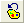
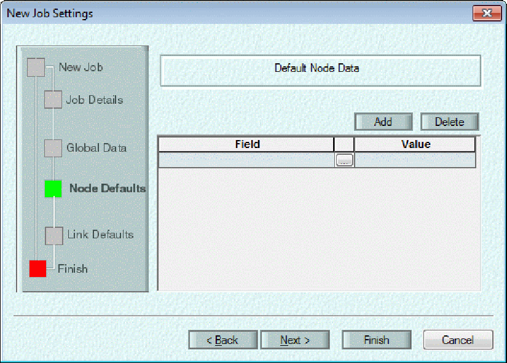
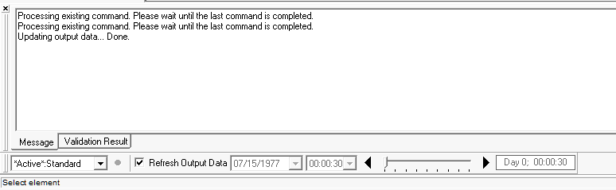

**View Menu in InfoSWMM**

[View Menu in InfoSWMM [1](#_Toc69374519)](#_Toc69374519)

[Working with Maps [3](#_Toc69374520)](#_Toc69374520)

[Operations Tools [4](#_Toc69374521)](#_Toc69374521)

[Operation Browser [5](#_Toc69374522)](#_Toc69374522)

[Message Board - Validation Result Tab [10](#_Toc69374523)](#_Toc69374523)

[Message Board - Message Tab [11](#_Toc69374524)](#_Toc69374524)

***Descriptions of All View Menu commands in InfoSWMM.***

The InfoSWMM **Map Display** feature may be used to annotate your map. To learn more about color coding and/or changing symbol sizes [<u>click here</u>](javascript:BSSCPopup('../InfoSewer/Working_With_a_Map/Map_Display/Map_Display.htm');).

Choose the **Reset Display** icon  to clear your Map.

**Refresh Map** resets your or others changes to the Map.

**Message Board** shows or does not show the **Message Board**.

**ID Labeling** for Nodes, Links and Subcatchments.

**InfoSWMM Browser **toggles the showing of the **InfoSWMM Attribute Browser**.

**Edit Network Toolbar **toggles the showing of the **Edit Network Toolbar**.

**Output Toolbar **toggles the showing of the **Output Toolbar**.

**Zoom to Domain** Zooms your View of the Map to the Extents of the Current Domain.

| **Button**                                                                | **Name**                 | **Description**                                                                                              |
|---------------------------------------------------------------------------|--------------------------|--------------------------------------------------------------------------------------------------------------|
|  | **Map Display**          |                                                                                                              |
|  | **Reset Display**        |                                                                                                              |
|                                                                           | **Refresh Map**          |                                                                                                              |
|                                                                           | **ID Labeling**          |                                                                                                              |
|  | **Message Board**        |                                                                                                              |
|  | **InfoSWMM Browser**     |                                                                                                              |
|                                                                           | **Edit Network Toolbar** | The Edit Network Toolbar can be displayed/hidden through this menu or by right-clicking in the toolbar area. |
|                                                                           | **Output Toolbar**       | The Output Toolbar can be displayed/hidden through this menu or by right-clicking in the toolbar area.       |
|  | **Zoom to Domain**       |                                                                                                              |

 

**Working with Maps**

InfoSWMM H2OMap SWMM InfoSWMM SA displays map of the study area being modeled on the [<u>drawing area</u>](javascript:BSSCPopup('User_Interface/Drawing_Area.htm');). This section of the online help describes how you can manipulate this map to enhance your visualization of the system. In addition to the tools described in this section, the user also has complete access to ArcMap features that enable manipulation of map displays.

Use the links given below to learn about the InfoSWMM H2OMap SWMM InfoSWMM SA features that assist in map manipulation.

| [<u>Zooming In/Out, Panning, and Displaying Full Extent</u>](javascript:BSSCPopup('Working_With_the_Map_View/Zooming_In_Out%2c_Panning%2c_and_Full_Extent.htm');) | [<u>Zooming In/Out, Panning, and Displaying Full Extent</u>](javascript:BSSCPopup('User_Interface/H2OMAPSWMM/Menus_and_Toolbars/Toolbars/H2O_Toolbar_View_Toolbar.htm');) |
|---------------------------------------------------------------------------------------------------------------------------------------------------------------------------------------------------------------------------------------|-----------------------------------------------------------------------------------------------------------------------------------------------------------------------------------------------------------------------------------------------|
| [<u>Overview Map</u>](javascript:BSSCPopup('Working_With_the_Map_View/Overview_Map.htm');)                                                                        | [<u>Selecting Map Element(s)</u>](javascript:BSSCPopup('Working_With_the_Map_View/Selecting_Elements.htm');)                                                              |
| [<u>Zooming to Domain</u>](javascript:BSSCPopup('Working_With_the_Map_View/Zoom_to_Domain.htm');)                                                                 | [<u>ID Labeling</u>](javascript:BSSCPopup('Working_With_the_Map_View/ID_Labeling.htm');)                                                                                  |
| [<u>Locating Elements</u>](javascript:BSSCPopup('Working_With_the_Map_View/Finding_Locating_Elements.htm');)                                                      | [<u>Animation</u>](javascript:BSSCPopup('Working_With_the_Map_View/Animation/Animation_Methodology.htm');)                                                                |
| [<u>Contouring</u>](javascript:BSSCPopup('Working_With_the_Map_View/Contouring/Contour_Main.htm');)                                                               | [<u>Annotation</u>](javascript:BSSCPopup('Working_With_the_Map_View/Annotation/Annotation_Main.htm');)                                                                    |
| [<u>Map Display</u>](javascript:BSSCPopup('Working_With_the_Map_View/Map_Display/Map_Display.htm');)                                                              |                                                                                                                                                                                                                                               |

 

**Operations Tools**

The  InfoSWMM [<u>Operation Browser</u>](javascript:BSSCPopup('User_Interface/Browser/Operation_Data/Operating_Data.htm');) has the following buttons/tools.

 

 

Each one of these buttons is briefly described below.

 

<table>
<colgroup>
<col style="width: 14%" />
<col style="width: 21%" />
<col style="width: 64%" />
</colgroup>
<thead>
<tr class="header">
<th><strong>Button</strong></th>
<th><strong>Name</strong></th>
<th><strong>Description</strong></th>
</tr>
</thead>
<tbody>
<tr class="odd">
<td></td>
<td><strong>New</strong></td>
<td>
Creates a new object.

 
</td>
</tr>
<tr class="even">
<td></td>
<td><strong>Clone</strong></td>
<td>
Clones an object by copying its exact properties to another

 
</td>
</tr>
<tr class="odd">
<td></td>
<td><strong>Edit</strong></td>
<td>
Edit the input data related to the object.  When initialized, the editor of the object will appear and enable the user to change the features related to the object.  When the changes are made, click the OK button to see the changes.

 
</td>
</tr>
<tr class="even">
<td></td>
<td><strong>Description</strong></td>
<td>
Edit the description of the selected object.

 
</td>
</tr>
<tr class="odd">
<td></td>
<td><strong>Delete</strong></td>
<td>
Delete the selected object.

 
</td>
</tr>
<tr class="even">
<td></td>
<td><strong>Refresh</strong></td>
<td>
Refreshes the operation browser and updates all objects based on the latest changes made by the user.

 
</td>
</tr>
</tbody>
</table>

 

**Operation Browser**

The InfoSWMM**  Operation Browser**, shown below,  provides the means to create, edit, and modify data pertaining to InfoSWMM  non-visual data objects and other operational data including Simulation and Report Options, Climatology Settings, Aquifers, Snow packs, RDII Hydrographs, Soils, Transects,Real Time Control Rules (RTC Rules), Pollutants, Land Uses, Curves, Time Series, Time Pattern, DB Queries, Output Relates, Query Sets, and Selection Sets. Once the desired object or operation is created or the existing one is selected using the operation browser, a dialog editor corresponding to the object/operation would be initiated enabling the modeler to view, edit, or modify parameters of the object/operation.

To learn more about the objects listed in the operation browser, you may refer to the [<u>Description of Objects</u>](javascript:BSSCPopup('Data_Objects/Description_of_Objects.htm');) section. For the list and description of the tools/buttons accessible from the Operation browser please refer to the [<u>Operations Tools</u>](javascript:BSSCPopup('User_Interface/Browser/Operation_Data/Operations_Tools.htm');) section.

 

 

**Message Board - Validation Result Tab**

The validation result tab of the message board is populated with reports from the Network Audit Tool and the Engineering Review Tool.  All fields from these tools are displayed in the validation result box except for the valid range that was used during the data review.  In addition, the field of the object that caused the error is displayed.  Click on any column heading to sort by that column.  These results may be cleared from the [<u>Utilities Menu</u>](file:///C:\SWMM-SEWER%20Robohelp\SWMMCombined%20-%20InfoSWMM%20-%201\User_Interface\Menus_and_Toolbars\Menus\Utilities_Menu.htm).

 

 

 

** ****Message Board - Message Tab**

The message tab of the message board displays various messages (e.g. warning and error messages, successful simulation run messages) pertaining to the activity being undertaken in the project. The InfoSWMM Message Board , shown below, may be invoked or inactivated from the InfoSWMM View menu or by clicking on the  button from the [<u>InfoSWMM Control Center toolbar</u>](file:///C:\SWMM-SEWER%20Robohelp\SWMMCombined%20-%20InfoSWMM%20-%201\User_Interface\InfoSWMM\Menus_and_Toolbars\Toolbars\Info_Toolbar_Control_Center_Toolbar.htm) . The Message Board , shown below, may be invoked or inactivated from the H2OMAP Window menu or by right-clicking in the toolbar area and choosing Message Board.  The user may move this toolbar (or "dock" it) to any location on the project screen and place it horizontally or vertically at the location of his/her choice. To change the position of the toolbar, place the cursor in the background area (not on a button) of the toolbar, hold the cursor down and drag it to the desired location.

 

  

 

 

 
