**xpswmm Reference Manual**

***Table of Contents***

**User's Manual 1**

> Table of Contents 1
>
> Language Note 1
>
> Installing 1
>
> Upgrades 1
>
> How Do I? 2
>
> Common Tasks 2
>
> Common Tasks 2
>
> Export Hydrograph to Excel 2

**SECTION 1: OVERVIEW 7**

> 1.2 The Model Structure 7
>
> 1.3 Philosophy 7
>
> 1.4 Strategy 7
>
> 1.5 Is a 2D or 2D/1D Model Feasible? 8
>
> 1.6 Analytical Engine 8
>
> 1.7 The User Interface 10
>
> 1.7.1 The Generic Graphical User Interface 10
>
> 1.7.2 The Window 10
>
> 1.7.3 The Pointing Device 10
>
> 1.7.4 The Dialog Box 11
>
> 1.7.5 Dialog Icons 12
>
> 1.7.6 The Menus 13
>
> 1.7.7 Tools 13
>
> 1.7.8 Layer Control Panel 14

**SECTION 2: CREATING A MODEL 17**

> Setup Wizard 17
>
> 2.1 Building the Runoff and 1D Hydraulic Layers 22
>
> 2.1.1 Setting the Active Mode 22
>
> 2.1.2 Graphical Elements 23
>
> 2.1.3 Creating a Network 23
>
> 2.1.4 Naming an Element 24
>
> 2.1.5 Selecting an Object or a Group of Objects 25
>
> 2.1.6 Moving an Object 26
>
> 2.1.7 Reconnecting Objects 27
>
> 2.1.8 Deleting Objects 27
>
> 2.1.8 Setting Default Labels 27
>
> 2.1.10 Using the Layer Control Panel 27
>
> Using the Layer Control Panel 27
>
> Nodes 28
>
> Import Nodes from GIS 28
>
> Export Nodes to GIS File 30
>
> Catchments 31
>
> Import Catchments 32
>
> Add Catchment to Drawing 33
>
> Link Catchment to Node 34
>
> Catchment Connections 37
>
> Links 38
>
> Link Properties 39
>
> Import Links from GIS File 39
>
> Export Links to GIS File 41
>
> Water Level Lines 42

Table of Contents

> Cross-Section Properties 44
>
> 2.2 Navigating the Network 46
>
> 2.2.1 Navigation Basics 46
>
> 2.2.2 The Coordinate System 46
>
> 2.2.3 Traversing the Network 46
>
> 2.2.4 Panning Around the Network 47
>
> 2.2.5 Re-sizing Network Objects 47
>
> 2.2.6 Re-scaling the Network Window 47
>
> 2.3 Background Images 48
>
> 2.3.1 Creating a Background 48
>
> 2.3.2 HPGL File Format 48
>
> 2.3.3 Importing Background Pictures 50
>
> 2.3.4 Edit Background 51
>
> 2.3.5 ESRI Shape File Attributes 53
>
> 2.3.6 World File 54
>
> 2.3.7 CAD File as Background Image 55
>
> 2.4 Topography Layers and Objects 55
>
> Topography Layers and Objects 55
>
> 2.4.1 DTM Layers 55
>
> Managing DTM Layers 55
>
> Create DTM from XYZ File or XYZS File 57
>
> Create DTM From ESRI Grid File 57
>
> Load DTM File 57
>
> Export DTM Data 58
>
> DTM Properties 58
>
> DTM Legend 62
>
> DTM Display Properties 63
>
> DTM Builder 64
>
> 2.4.3 Breaklines 66
>
> Gully and Ridge 66
>
> 2.4.4 Fill Areas 73
>
> Fill Areas 73
>
> 2.5 2D Domains 75
>
> 2.5.1 2D Domains, Boundaries and Interfaces 75
>
> 2.5.2 2D Grid Extents 76
>
> 2.5.3 Active and Inactive 2D Areas 78
>
> 2.5.5 1D/2D Interface 80
>
> 2.5.6 1D/2D Connections 81
>
> 2.5.8 2D Head Boundary 81
>
> 2.5.9 2D Flow Boundary 83
>
> 2.5.10 2D Rainfall/Flow Areas 84
>
> 2.5.11 2D Landuses 85
>
> Roughness Coefficients 87
>
> 2.6 GIS Layers 88
>
> GIS Layers 88
>
> Adding GIS Layer 88
>
> Import Hydrologic Parameters 88
>
> Display Properties 88
>
> Displaying Attributes 89
>
> 2.7 CAD Layers 89
>
> Adding CAD Layers 89
>
> CAD Layer Properties 90
>
> **SECTION 3: THE DATABASE 91**
>
> 3.1 Database Concepts 91
>
> 3.2 The Permanent Database 91

ii

Table of Contents

> 3.3 The Working Database 91
>
> 3.4 Database Integrity - test 91

**SECTION 4: COPY AND PASTE 93**

> 4.1 Using the Copy Buffer 93
>
> 4.2 Copy Data From a Single Object 94
>
> 4.3 Copy Multiple Objects 94
>
> 4.4 Copy a Single Item 95
>
> 4.5 Copy a Dialog List (DLIST) Item 95
>
> 4.6 Copying Global Data 96

**SECTION 5: THE INI FILE 99**

> 5.2 SWMXP.INI File 99
>
> 5.3 File Names, Extensions and Paths 103
>
> 5.4 \[Settings\] 104
>
> 5.6 \[Engine\] 105
>
> 5.7 \[comments\] 105
>
> 5.8 \[Field Defaults\] 105
>
> 5.9 \[Recent File List\] 105
>
> MRU_COUNT 105
>
> 5.10 \[STATUS\] 105
>
> Field Precision 105
>
> 5.11 \[Main\] 106
>
> VERSION 106
>
> ENGINE_VER 106
>
> EDITOR 106
>
> TEMPDIR 106
>
> DIRECTORY 106
>
> SWMXP 106
>
> ENGINE 106
>
> MSGBOX 107
>
> CNF 107
>
> CVTHPGL 107
>
> HELP 107
>
> PLOT_EXE 107
>
> workdirectory 107
>
> GIS_EXE 107
>
> 5.12 \[Config\] 108
>
> OPT_DB_KEY 108
>
> OPT_DB_MEM 108
>
> OPT_DIRTYOBJ 108
>
> OPT_DRAW_LINK_LABELS 108
>
> OPT_DRAW_NO_LABELS 108
>
> OPT_DRAW_NODE_LABELS 108
>
> OPT_FAST_DRAW 109
>
> OPT_IDX_ACCESS 109
>
> OPT_OBJ_NAME_ACCESS 109
>
> OPT_PART_REC 109
>
> OPT_REDRAW 109
>
> IO_BUF_SIZE 109
>
> MAX_DBCARDS 110
>
> MAX_LINKS 110
>
> MAX_NODES 110
>
> MAX_PICTS 110
>
> MAX_TEXTS 110
>
> CACHE_SIZE 110

iii

Table of Contents

> CALIBRATE 110
>
> PROJECTS 111
>
> SOLVE 111
>
> DATE_FORMAT 111
>
> COLOR 111
>
> APP_FLAGS 111
>
> YEAR_XX 111
>
> main 111
>
> 5.13 \[Display\] 112
>
> FONTNAME 112
>
> FONTSIZE 112
>
> FONTWT 112
>
> **SECTION 6: THE TOOLBAR 113**
>
> 6.1 The Toolbars 113
>
> 6.2 File Management Tools 115
>
> 6.3 Clipboard Tools 116
>
> 6.4 Scenario Manager Tools 116
>
> 6.5 Job, Layer & Mode Control Tools 119
>
> 6.6 Background Image Tools 120
>
> 6.7 Solve and Review Results Tools 120
>
> 6.8 Object Creation Tools 120
>
> 6.9 Network Viewing and Navigation Tools 122
>
> 6.10 Layer Control Panel 122
>
> 6.11 Project Tools 125
>
> 6.12 Global Storms 125
>
> **SECTION 7: MENUS 127**
>
> THE MENU BAR 127
>
> 7.1 File 127
>
> 7.1.1 The File Menu 127
>
> 7.1.2 Open 129
>
> 7.1.3 Merge 130
>
> 7.1.4 Close 130
>
> 7.1.5 Save 131
>
> 7.1.6 Save As 131
>
> 7.1.7 Save As Template 131
>
> 7.1.8 Revert 131
>
> 7.1.9 Properties 131
>
> 7.1.10 Print 136
>
> 7.1.11 Print Preview 136
>
> 7.1.12 Page Setup 136
>
> 7.1.13 Record to AVI 138
>
> 7.1.14 Recent Files 138
>
> 7.1.15 Clean Up 138
>
> 7.1.16 Exit 139
>
> 7.1.17 New 139
>
> 7.1.1 New 139
>
> New File Options 139
>
> Blank Job 139
>
> New File from Wizard 139
>
> New File From Template 143
>
> 7.1.18 Import/Export Data 144
>
> Import/Export Data 144
>
> Import LandXML Data 145
>
> Import XPX/EPA Data 145

iv

Table of Contents

> EPA Data 145
>
> XPX 150
>
> External Databases 161
>
> Import/Export External Databases 161
>
> Database Connection 170
>
> Configure Database Connection 171
>
> External Database Query Results 171
>
> Mappings 172
>
> HEC-RAS Data 173
>
> Import HEC-RAS Data 173
>
> Export XPX Data 177
>
> Export XPX Data 178
>
> Object Selection 178
>
> Variable Selection 178
>
> Export EPA 5.0 179
>
> Export EPA 5.0 179
>
> 7.2 Edit 182
>
> The Edit Menu 182
>
> 7.2.1 Undo 182
>
> 7.2.2 Cut Data 183
>
> 7.2.3 Copy Data 183
>
> 7.2.4 Paste Data 183
>
> 7.2.5 Clear Data 183
>
> 7.2.6 Delete Objects 183
>
> 7.2.7 Data 183
>
> 7.2.8 Notes 183
>
> 7.2.9 Properties 184
>
> Properties 184
>
> Display Properties 185
>
> 7.3 Project 186
>
> The Project Menu 186
>
> 7.3.1 New 187
>
> 7.3.2 Open 187
>
> 7.3.3 Edit 188
>
> 7.3.4 Details of Project 189
>
> 7.3.5 Close 189
>
> 7.3.6 Save 189
>
> 7.3.7 Save As 189
>
> 7.3.8 Multi-Run 189
>
> 7.3.9 Multi Review 190
>
> 7.4 View 191
>
> The View Menu 191
>
> 7.4.1 Quick Data View 192
>
> 7.4.2 Network Overview 195
>
> 7.4.3 Fit Window 195
>
> 7.4.4 Redraw 195
>
> 7.4.5 Regenerate View 195
>
> 7.4.6 Set Scale 196
>
> 7.4.7 Zoom 196
>
> 7.4.8 Grid 196
>
> 7.4.9 Hide Objects 196
>
> 7.4.10 Show Objects 196
>
> 7.4.11 Find Objects 196
>
> 7.4.12 Select Objects 197
>
> 7.4.13 TIN Surface 197
>
> 7.4.14 Toolbar 198

v

Table of Contents

> 7.4.15 Status Bar 198
>
> 7.4.16 Split 198
>
> 7.1.17 Tidy Network 198
>
> 7.4.18 View Management 198
>
> Save View 198
>
> Restore View 199
>
> Previous 199
>
> Remove Stored Views 199
>
> 7.4.19 Background Images 199
>
> Add Background Image 199
>
> Background Picture Properties 199
>
> 7.5 Configuration 199
>
> The Configuration Menu 199
>
> 7.5.2 Job Control 200
>
> 7.5.3 Global Data 200
>
> 7.5.4 Real Time Control 200
>
> 7.5.5 Mode 200
>
> 7.5.6 Units 201
>
> 7.5.7 Advanced Configuration Parameters 202
>
> Configuration Parameters 202
>
> Configuration Keywords 204
>
> 0-9 204
>
> 1993 204
>
> 1994a 204
>
> 1994b 204
>
> 1995a 204
>
> 1995b 204
>
> 2 204
>
> 24HR_LOOP 205
>
> 4 205
>
> 4TURNS 205
>
> 8 205
>
> 8TURNS 205
>
> A 205
>
> A 205
>
> ADJUSTNL 205
>
> ADVNL 205
>
> AE 205
>
> ALSORAIN 205
>
> ALTEROMEGA 206
>
> ALWAYSKW 206
>
> ALWAYSNL 206
>
> ARCH_RISE 206
>
> ARCH_SPAN 206
>
> AREA_IMPLICIT 206
>
> AS 206
>
> AUTO_PUMP 206
>
> B 206
>
> B 206
>
> BADHRAD 207
>
> BADRECT 207
>
> BEST97 207
>
> BESTPUMP 207
>
> BMEGA 207
>
> BMH_OPTION1 207
>
> BMH_OPTION2 207

vi

Table of Contents

> BOLTMH 207
>
> BOLTMH1 207
>
> BX= 207
>
> C 207
>
> C 207
>
> CATSLOPE 208
>
> CDM_SHAPES 208
>
> CMIN 208
>
> CMIN=1.0 208
>
> CN-x 208
>
> COMBIN 208
>
> Combine block 208
>
> COMP 208
>
> CONDTIME 208
>
> CONDUIT-x 209
>
> CONVERGE 209
>
> CPOL#-x 209
>
> CREF-x 209
>
> CULVNEW 210
>
> D 210
>
> D 210
>
> DEBUG 210
>
> DEBUG_REVIEW 210
>
> DEEP-x 210
>
> DEEPLIM 210
>
> DELT43 210
>
> DEPTH 210
>
> DEPTHX 211
>
> DESIGN_EXT 211
>
> DESIGN_ROUGH 211
>
> DESIGN_SLOPE 211
>
> DIFFUSION 211
>
> DJREF-x 211
>
> DWF-x 211
>
> DYNAMIC 211
>
> E 211
>
> E 211
>
> E405 212
>
> E420 212
>
> ECLOSS 212
>
> Ending volume Extran changes 212
>
> ENDVOL 212
>
> ENDVOL1 212
>
> ENDVOL2 212
>
> ENERGY 212
>
> EPA SWMM connection options 212
>
> EXINTIME 213
>
> EXPORTALL 213
>
> EXPORTJPRT 213
>
> EXPORTUS 213
>
> EXOUT 213
>
> EXOUT 213
>
> HDR_EVAP (or EXT_EVAP) 213
>
> EXTERNAL_CSV 213
>
> EXTERNAL_XLS 213
>
> EXTEST 213

vii

Table of Contents

EXTRA 214

EXTRA1 214

EXTRA2 214

EXTRA3 214

Extran BC enhancements 214

Extran eggshape conduit changes 214

Extran modify conduit changes 214

Extran reach 214

Extran time step control 214

EXTRANWQ 214

EXTRAONE 214

Extrapolation options 214

F 215

F 215

FASNH 215

FAST_PUMP 215

FASTCONV 215

FIT_PUMP_CURVE 215

FLAT 215

FLDCHN 215

FLIP_STORAGE 215

FLOOD 215

Flooded node enhancements 216

Flow options 216

FRICTAVG 216

FRICTGEO 216

Friction slope enhancements 216

FRICTMID 216

FULL_NODE 216

FUZZYQ 216

G 216

G 216

GPM 216

GRELEV 216

H 216

H 217

H_TOL-x 217

HALFEC 217

HALFNL 217

HALF_AREA 217

HALF_NODE 217

HCONT 217

HDR_EVAP (or EXT_EVAP) 217

HDSLOW 217

HFRIC 218

HGLMEAN 218

Hot-Restart File changes in Extran 218

HSLOPE 218

HYDRO 218

I 218

I 218

IHH 218

IMPLCT.......................................................................................218

IMPLICIT 218

INTERTIME 219

INTERP_DWF= 219

Table of Contents

<table>
<colgroup>
<col style="width: 81%" />
<col style="width: 18%" />
</colgroup>
<tbody>
<tr class="odd">
<td colspan="2"><blockquote>

ISOL 3 option 219

ISOL3 219

J..................................................................................................219

J..................................................................................................219

</blockquote></td>
</tr>
<tr class="even">
<td><blockquote>

JCUBE

</blockquote></td>
<td>219</td>
</tr>
<tr class="odd">
<td><blockquote>

JLOOP

</blockquote></td>
<td>219</td>
</tr>
<tr class="even">
<td><blockquote>

JNCORF

</blockquote></td>
<td>219</td>
</tr>
<tr class="odd">
<td><blockquote>

JNNODE

</blockquote></td>
<td>220</td>
</tr>
<tr class="even">
<td><blockquote>

JNWEIR

</blockquote></td>
<td>220</td>
</tr>
<tr class="odd">
<td><blockquote>

JUNTIME

</blockquote></td>
<td>220</td>
</tr>
<tr class="even">
<td><blockquote>

JUNTIME1

</blockquote></td>
<td>220</td>
</tr>
<tr class="odd">
<td><blockquote>

K

</blockquote></td>
<td>220</td>
</tr>
<tr class="even">
<td><blockquote>

K

</blockquote></td>
<td>220</td>
</tr>
<tr class="odd">
<td><blockquote>

KEYS

</blockquote></td>
<td>220</td>
</tr>
<tr class="even">
<td><blockquote>

KINDYN1

</blockquote></td>
<td>220</td>
</tr>
<tr class="odd">
<td><blockquote>

KINDYN2

</blockquote></td>
<td>220</td>
</tr>
<tr class="even">
<td><blockquote>

Kinematic wave Option

</blockquote></td>
<td>220</td>
</tr>
<tr class="odd">
<td><blockquote>

KODEA

</blockquote></td>
<td>220</td>
</tr>
<tr class="even">
<td><blockquote>

KODEPR

</blockquote></td>
<td>221</td>
</tr>
<tr class="odd">
<td><blockquote>

KSOL-x

</blockquote></td>
<td>221</td>
</tr>
<tr class="even">
<td><blockquote>

KWAVE

</blockquote></td>
<td>221</td>
</tr>
<tr class="odd">
<td><blockquote>

KWLOSS

</blockquote></td>
<td>221</td>
</tr>
<tr class="even">
<td><blockquote>

L

</blockquote></td>
<td>221</td>
</tr>
<tr class="odd">
<td><blockquote>

L

</blockquote></td>
<td>221</td>
</tr>
<tr class="even">
<td><blockquote>

L/S

</blockquote></td>
<td>221</td>
</tr>
<tr class="odd">
<td><blockquote>

LASTCUL

</blockquote></td>
<td>221</td>
</tr>
<tr class="even">
<td><blockquote>

LASTOM

</blockquote></td>
<td>221</td>
</tr>
<tr class="odd">
<td><blockquote>

LAW_WEIR

</blockquote></td>
<td>221</td>
</tr>
<tr class="even">
<td><blockquote>

LINEAR

</blockquote></td>
<td>222</td>
</tr>
<tr class="odd">
<td><blockquote>

LOGNORM

</blockquote></td>
<td>222</td>
</tr>
<tr class="even">
<td><blockquote>

LOOPTEST

</blockquote></td>
<td>222</td>
</tr>
<tr class="odd">
<td><blockquote>

LRRM

</blockquote></td>
<td>222</td>
</tr>
<tr class="even">
<td><blockquote>

M

</blockquote></td>
<td>222</td>
</tr>
<tr class="odd">
<td><blockquote>

M

</blockquote></td>
<td>222</td>
</tr>
<tr class="even">
<td><blockquote>

MAVHEAD

</blockquote></td>
<td>222</td>
</tr>
<tr class="odd">
<td><blockquote>

MAKE_XPX

</blockquote></td>
<td>222</td>
</tr>
<tr class="even">
<td><blockquote>

MAX_YN_YC

</blockquote></td>
<td>222</td>
</tr>
<tr class="odd">
<td><blockquote>

MAXPTS-x

</blockquote></td>
<td>222</td>
</tr>
<tr class="even">
<td><blockquote>

MAXWIDE

</blockquote></td>
<td>223</td>
</tr>
<tr class="odd">
<td><blockquote>

MGD

</blockquote></td>
<td>223</td>
</tr>
<tr class="even">
<td><blockquote>

MIN/SEC

</blockquote></td>
<td>223</td>
</tr>
<tr class="odd">
<td><blockquote>

MINLEN

</blockquote></td>
<td>223</td>
</tr>
<tr class="even">
<td><blockquote>

MINOR43

</blockquote></td>
<td>223</td>
</tr>
<tr class="odd">
<td><blockquote>

MINOR_LOSS

</blockquote></td>
<td>223</td>
</tr>
<tr class="even">
<td><blockquote>

MOORE_QCAL

</blockquote></td>
<td>223</td>
</tr>
<tr class="odd">
<td><blockquote>

MTVE

</blockquote></td>
<td>223</td>
</tr>
<tr class="even">
<td><blockquote>

MWPUMP

</blockquote></td>
<td>223</td>
</tr>
<tr class="odd">
<td><blockquote>

N

</blockquote></td>
<td>223</td>
</tr>
<tr class="even">
<td><blockquote>

N

</blockquote></td>
<td>223</td>
</tr>
<tr class="odd">
<td><blockquote>

NASH

</blockquote></td>
<td>225</td>
</tr>
<tr class="even">
<td><blockquote>

Natural channel SWMM enhancements

</blockquote></td>
<td>225</td>
</tr>
<tr class="odd">
<td><blockquote>

NCDN

</blockquote></td>
<td>226</td>
</tr>
<tr class="even">
<td><blockquote>

NCFLOOD

</blockquote></td>
<td>226</td>
</tr>
<tr class="odd">
<td><blockquote>

NCFLOOD1

</blockquote></td>
<td>226</td>
</tr>
<tr class="even">
<td><blockquote>

NCFLOOD2

</blockquote></td>
<td>226</td>
</tr>
<tr class="odd">
<td><blockquote>

NCFLOOD3

</blockquote></td>
<td>226</td>
</tr>
</tbody>
</table>

ix

Table of Contents

> NCMID 226
>
> NCNEW1 226
>
> NCNEW2 226
>
> NCNEW3 226
>
> NCNEW4 226
>
> NCNEW5 226
>
> NCNLOW 226
>
> NCONVY 227 NCONVY1...................................................................................227 NCONVY2...................................................................................227 NCONVY3...................................................................................227 NCONVY4...................................................................................227 NCONVY5...................................................................................227

<table>
<colgroup>
<col style="width: 92%" />
<col style="width: 7%" />
</colgroup>
<tbody>
<tr class="odd">
<td><blockquote>

NCTWO

</blockquote></td>
<td>227</td>
</tr>
<tr class="even">
<td><blockquote>

NCUP

</blockquote></td>
<td>227</td>
</tr>
<tr class="odd">
<td><blockquote>

NEGNC

</blockquote></td>
<td>227</td>
</tr>
<tr class="even">
<td><blockquote>

NEGNC1

</blockquote></td>
<td>227</td>
</tr>
<tr class="odd">
<td><blockquote>

NEVERNL

</blockquote></td>
<td>227</td>
</tr>
<tr class="even">
<td><blockquote>

New features

</blockquote></td>
<td>227</td>
</tr>
<tr class="odd">
<td><blockquote>

NEW_ERINFO

</blockquote></td>
<td>228</td>
</tr>
<tr class="even">
<td><blockquote>

NEW_NL_97

</blockquote></td>
<td>228</td>
</tr>
<tr class="odd">
<td><blockquote>

NEW_NL_98

</blockquote></td>
<td>228</td>
</tr>
<tr class="even">
<td><blockquote>

NEWAES-x

</blockquote></td>
<td>228</td>
</tr>
<tr class="odd">
<td><blockquote>

NEWAPPEND

</blockquote></td>
<td>228</td>
</tr>
<tr class="even">
<td><blockquote>

NEWBOUND

</blockquote></td>
<td>228</td>
</tr>
<tr class="odd">
<td><blockquote>

NEWCDMFILE

</blockquote></td>
<td>229</td>
</tr>
<tr class="even">
<td><blockquote>

NEWCDMIABS

</blockquote></td>
<td>229</td>
</tr>
<tr class="odd">
<td><blockquote>

NEWCONV

</blockquote></td>
<td>229</td>
</tr>
<tr class="even">
<td><blockquote>

NEWEGG

</blockquote></td>
<td>229</td>
</tr>
<tr class="odd">
<td><blockquote>

NEWEIR

</blockquote></td>
<td>229</td>
</tr>
<tr class="even">
<td><blockquote>

NEWHOT

</blockquote></td>
<td>229</td>
</tr>
<tr class="odd">
<td><blockquote>

NEWJTIME

</blockquote></td>
<td>229</td>
</tr>
<tr class="even">
<td><blockquote>

NEWNCRGH

</blockquote></td>
<td>229</td>
</tr>
<tr class="odd">
<td><blockquote>

NEWNL

</blockquote></td>
<td>229</td>
</tr>
<tr class="even">
<td><blockquote>

NEWNLTRM

</blockquote></td>
<td>229</td>
</tr>
<tr class="odd">
<td><blockquote>

NEWNLTRM1

</blockquote></td>
<td>229</td>
</tr>
<tr class="even">
<td><blockquote>

NEWOBBLE

</blockquote></td>
<td>230</td>
</tr>
<tr class="odd">
<td><blockquote>

NEWOMEGA

</blockquote></td>
<td>230</td>
</tr>
<tr class="even">
<td><blockquote>

NEWPUMP

</blockquote></td>
<td>230</td>
</tr>
<tr class="odd">
<td><blockquote>

NEWPUMP1

</blockquote></td>
<td>230</td>
</tr>
<tr class="even">
<td><blockquote>

NEWRES

</blockquote></td>
<td>230</td>
</tr>
<tr class="odd">
<td><blockquote>

NEWROUTE

</blockquote></td>
<td>230</td>
</tr>
<tr class="even">
<td><blockquote>

NEWSLOT

</blockquote></td>
<td>230</td>
</tr>
<tr class="odd">
<td><blockquote>

NEWSUB

</blockquote></td>
<td>230</td>
</tr>
<tr class="even">
<td><blockquote>

NO_QCHECK

</blockquote></td>
<td>230</td>
</tr>
<tr class="odd">
<td><blockquote>

NOAH_DRATIO

</blockquote></td>
<td>231</td>
</tr>
<tr class="even">
<td><blockquote>

NEWSUB2

</blockquote></td>
<td>231</td>
</tr>
<tr class="odd">
<td><blockquote>

NO_DT_CHANGE

</blockquote></td>
<td>231</td>
</tr>
<tr class="even">
<td><blockquote>

NO_GW_OUT

</blockquote></td>
<td>231</td>
</tr>
<tr class="odd">
<td><blockquote>

NO_GW_SUM

</blockquote></td>
<td>231</td>
</tr>
<tr class="even">
<td><blockquote>

NO_IMPLICIT

</blockquote></td>
<td>231</td>
</tr>
<tr class="odd">
<td><blockquote>

NO_NEWEIR

</blockquote></td>
<td>231</td>
</tr>
<tr class="even">
<td><blockquote>

NOCVEMC

</blockquote></td>
<td>231</td>
</tr>
<tr class="odd">
<td><blockquote>

NODETIM

</blockquote></td>
<td>231</td>
</tr>
<tr class="even">
<td><blockquote>

NODOUBLE

</blockquote></td>
<td>231</td>
</tr>
<tr class="odd">
<td><blockquote>

NOFLAT

</blockquote></td>
<td>232</td>
</tr>
</tbody>
</table>

> x

Table of Contents

> NOGRELEV 232
>
> NOKEYS 232
>
> NOMODNC 232
>
> NONEGRAT 232
>
> NONUSE 232
>
> NOPMPQOFF 232
>
> NOPONDCHK 232
>
> NOPLOAD 232
>
> NOPUMPWT 232
>
> NOQALTER 232
>
> NOQEL 233
>
> NOQMOD 233
>
> NOQUOTE 233
>
> NORES 233
>
> NOSCOUR 233
>
> NOSLOT 233
>
> NOSQRT 233
>
> NOSYF 233
>
> NOSYR 233
>
> NOSYT 233
>
> NOSYQ 233
>
> NO_WEIR_MOD 234
>
> NOVOMEGA 234
>
> NOZCONT 234
>
> NOZCONT1 234
>
> NOZCONTALL 234
>
> O 234
>
> O 234
>
> OLD_SAN_Q\_DIVIDE 235
>
> OLD_SHAPES 235
>
> OLDBGHRAD 235
>
> OLDBND 235
>
> OLDBOUND1 235
>
> OLDECOSS 235
>
> OLDEGG 235
>
> OLDFLOOD 235
>
> OLDGTCUR 235
>
> OLDHEAD...................................................................................236
>
> OLDHOT 236
>
> OLDHOT1 236
>
> OLDHOT2 236
>
> OLDLOSS 236
>
> OLDOMEGA 236
>
> OLDPWT 236
>
> OLDROUGH 236
>
> OLDSCS 236
>
> OLDSTNS 236
>
> OLDSTORE 236
>
> OLDTIME 236
>
> OLDVOL 236
>
> OLDVOL1 236
>
> OLDVOL2 237
>
> OMEGA 237
>
> Omega options 237
>
> OMEGA-x 237
>
> OPTIMAL97 237

xi

Table of Contents

ORFLEN 237

ORFULL 237

Orifice options 237

ORSUBN 237

P 237

P 238

PBSJ_PUMP 238

PDX_INTERFACE 238

PEAKQTOT 238

PERV 238

PITLOSS 238

PL-x 239

PLUGINIT 239

POWER 239

PRECISE-x 239

Preissmann slot options 239

Pump options (after 1995). 239

PUMP4 239

PUMP_OFF 239

PUMPBEG 239

PUMPEND 240

PUMPHEAD 240

PUMPIQ-x 240

PUMPITER-x 240

PUMPMEAN 240

PUMPMID 240

PUMPOMEGA 240

PUMPTST 240

PUMPWT 240

PZERO 241

Q 241

Q 241

Q_TOL-x 241

QCOMPARE 241

QNORM 241

QSMALL 241

R 241

R 241

RADISH 241

RAFTS 241

RCOUT 242

RCTOL-x 242

REACH 242

RECT_SLOT_TRANS 242

RESIDUAL 242

ROADFLOW 242

REV_PUMP_PRESS 242

S 242

S 242

SAMOMEGA 243

SANQMULT 243

SBUH 243

SCSCONT 243

SCSFIX 243

SCSIADEPTH 243

SCSTB 244

Table of Contents

> SCSVAL-x 244
>
> SDTYPO 244
>
> SEASON 244
>
> Seasonal data file enhancements 244
>
> SENSE-x 244
>
> SENSIMP1 244
>
> SENSIMP2 244
>
> SENSIMP3 244
>
> SENSWIDE 244
>
> SKIP_NO_Q 244
>
> SKIP_NO_QIN 244
>
> SLOWQO 244
>
> SMQMOD 245
>
> SNYDER 245
>
> SPATIAL 245
>
> Spatial weighting options 245
>
> SPATIAL-x 245
>
> SPATIAL1 245
>
> SPATIAL2 245
>
> SPATIAL3 245
>
> ST-x 245
>
> STATAREA 245
>
> Stats and Rain block 245
>
> STORAGE_97 245
>
> STORAGE 245
>
> STORAGE1 246
>
> STORAGE2 246
>
> Storage node and regular node changes 246
>
> Storage node Area 246
>
> STORETOP 246
>
> STREF 246
>
> SUBNORM 246
>
> SUM_ZERO 246
>
> Superseded runoff options 246
>
> SURJUN-x 247
>
> SURTOL-x 247
>
> SVAP 247
>
> SWMM "bug" fixes or enhancements 247
>
> SWMM esoterica 247 SWMM output enhancements......................................................248
>
> SWMM SCS enhancements 248
>
> SWMM version control 248
>
> SYF_INT 248
>
> SYT_INT 248
>
> T 249
>
> T 249
>
> TABLE_E?\_CSV 249
>
> THETA 249
>
> THETA-x 249
>
> TIDEGATE 249
>
> TIMOLD 249
>
> Transport DWF enhancements 249
>
> Transport enhancements 249
>
> TRAPEZOD 250
>
> TROMEGA 250
>
> TRSPACE-x 250

xiii

Table of Contents

> TRTHETA 250
>
> TWO_DIGIT_YEAR 250
>
> U 250
>
> U 250
>
> USE_DS_RC 250
>
> USE_ORF_CL 250
>
> USE_ORF_EQN 251
>
> USE_OUT_RC_DEPTH 251
>
> USE_US_RC 251
>
> USE_XYINFO 251
>
> User defined closed conduit enhancements 251
>
> USERINIT 251
>
> USEROPEN 251
>
> USERTOP 251
>
> USESMDELT 251
>
> V 251
>
> V 251
>
> VARIABLE_N 251
>
> VCOMPARE 253
>
> VE 253
>
> Version 4.3 Extran Solution enchancements (in 1995). 253
>
> VILLEMONTE 253
>
> VS 253
>
> W 253
>
> W 253
>
> WASP 253
>
> WEIRS_45 253
>
> WOBBLE 253
>
> WOBBLE4 253
>
> WQ enhancements 254
>
> WQEN 254
>
> WSLOT 254
>
> WSLOT1 254
>
> WSLOT2 254
>
> WSLOT3 254
>
> WSLOT4 254
>
> X 254
>
> X 254
>
> Y 254
>
> Y 254
>
> YSMALL 254
>
> Z 254
>
> Z 254
>
> ZEROINV 254
>
> ZREF= 255
>
> 7.5.8 Interface Files 255
>
> Interface File 255
>
> Hydraulics Mode: 256
>
> Runoff Mode: 257
>
> Sanitary Mode: 257
>
> Input Files 257
>
> Output Files 257
>
> 7.5.9 Mode Properties 258
>
> Mode Properties 258
>
> Current Mode 259
>
> Solve Mode 259

xiv

Table of Contents

> Highlighted Objects 260

7.6 Tools 260

> The Tools Menu 260
>
> 7.6.1 Utilities 261
>
> 7.6.2 Export to AutoCAD 261
>
> 7.6.2 Export Graphics 262
>
> 7.6.4 Modify Elevations 262
>
> Calculate Node - Catchment Area 264
>
> Generate Ground Elevations from TIN 265
>
> 7.6.7 Application Settings 265
>
> 7.6.8 Encrypt File for XP Viewer 265
>
> 7.6.9 Launch Application 266
>
> EPA-SWMM Data file Reader 269
>
> Snap Mode 270
>
> 7.6.11 Export Graphics 270
>
> Export Graphics 270
>
> 7.6.12 Calibrate Model 271
>
> Automatic Calibration 271
>
> Calibrate 273
>
> Calibration Library (LIBRARY.CAL file) 273
>
> Calibration Parameters 274
>
> Control File 276
>
> Create Files 276
>
> Instruction File 276
>
> Load XPX Variables 276
>
> Parameters 277
>
> Parameter File 277
>
> Template File 278
>
> 7.6.13 Calculate Conduit 278
>
> 7.6.5 Calculate Conduit Lengths 278
>
> 7.6.6 Calculate Conduit Slopes 278
>
> Cross Sections 279

7.7 Analyze 281

> The Analyze Menu 281
>
> 7.7.1 Solve 281
>
> 7.7.2 Show Errors 281

7.8 Results 282

> The Results Menu 282
>
> 7.8.2 Browse File 282
>
> Browse File Dialog 282
>
> Sample Output File with Popup Explanations 283
>
> 7.8.3 Review Results 339
>
> Review Results 339
>
> Text / Data Export Dialog 341
>
> Review results Options 342
>
> Review Results Options 342
>
> Customization Dialog 343
>
> Customization Dialog 343
>
> Main/Sub Title 344
>
> Subsets Tab 344
>
> Maximize 345
>
> Axis Tab 345
>
> Fonts Tab 345
>
> Colors Tab 346
>
> Style Tab 346
>
> Export Dialog 347

xv

> Table of Contents
>
> OK/Apply Button 348
>
> Graph Customization Options 348
>
> Graph Customization Options 348
>
> Viewing Style 349
>
> Font Size 350
>
> Numeric Precision 350
>
> Plotting Method 350
>
> Data Shadows 351
>
> Grid Lines 351
>
> Undo Zoom 351
>
> Grid in Front 351
>
> Include Data Labels 351
>
> Mark Data Points 351
>
> Show Annotations 351
>
> 7.8.4 Profile Plot 351
>
> Profile Plot 351
>
> Plot Setup 353
>
> General Parameters 354
>
> Boxed Label Data 355
>
> Label Definition 356
>
> Manhole Data 356
>
> Pipe Data 357
>
> Plot Parameters for Design Surface and Natural Surface 358
>
> Plot Parameters for HGL 358
>
> Plot Parameters for Node Freeboard and Depth To Invert 359
>
> Plot Parameters for Pipe Inverts 359
>
> Plot Parameters for Road Station and Station (Chainage) 360
>
> 7.8.5 Dynamic Long Section View 360
>
> Dynamic Long Section View 360
>
> Options - 361
>
> Show Data 362
>
> Show Diameter 362
>
> Show Flow 363
>
> Show Grid 363
>
> Show Velocity 363
>
> Enable Sound 363
>
> Rewind 363
>
> Faster 363
>
> Slower 363
>
> Next 363
>
> Previous 363
>
> Play 363
>
> Scroll Position 363
>
> Pause 363
>
> Start 363
>
> Stop 363
>
> Zoom In 364
>
> Zoom Out 364
>
> File Menu Commands 364
>
> 7.8.6 Dynamic Section Views 365
>
> Dynamic Section Views 365
>
> 7.8.7 Dynamic Plan View 366
>
> 7.8.7 Dynamic Plan View 366
>
> 7.8.8 Spatial Reports 368
>
> Spatial Report 368
>
> Destination 370
>
> xvi

Table of Contents

> Creation 371
>
> Load Report 371
>
> Save Report 371
>
> Location 371
>
> Redrawing 372
>
> Text Size 372
>
> Display Report 372
>
> Frame Display 373
>
> Frame Display Properties 373
>
> Link Variables 374
>
> Link Variables 374
>
> Variable 375
>
> Insert/Append 376
>
> Format 376
>
> Text Attributes 377
>
> Text Formatting 377
>
> Delete 378
>
> Node Variables 378
>
> Node Variables 378
>
> Variable 379
>
> Insert/Append 379
>
> Format 380
>
> Text Attributes 381
>
> Text Formatting 381
>
> Delete 381

7.8.9 Graphical Encoding 381

> Graphical Encoding 381
>
> Visual Entity 382
>
> Preferences 382
>
> Encode 383
>
> Restore 383
>
> Load 383
>
> Save 383
>
> Cancel 383
>
> Node Colour 383
>
> Node Colour 383
>
> Size 384
>
> Node Size 384
>
> Node Size 385
>
> By Equation 385
>
> By Linear Relationship 386
>
> Graph 387
>
> Size 387
>
> Suggest 387
>
> Node Label Size 387
>
> By Equation 387
>
> By Linear Relationship 388
>
> Graph 389
>
> Node Label Size 389
>
> Size 389
>
> Suggest 390
>
> Link Width 390
>
> Link Width 390
>
> By Linear Relationship 390
>
> By Equation 391
>
> Graph 392

xvii

Table of Contents

> Suggest 392
>
> Link Color 392
>
> Graph 392
>
> Link Colour 392
>
> Link Width 393
>
> Graph 393
>
> Size 393
>
> Link Label Size 393
>
> Link Label Size 394
>
> By Linear Relationship 394
>
> By Equation 394
>
> Graph 396
>
> Suggest 396
>
> Legend 396
>
> Legend 396
>
> Arrange Items 397
>
> Network Legend 397
>
> Window Legend 397
>
> 7.8.11 XP-Tables 397
>
> XP-Tables 397
>
> XP Tables Selection 398
>
> XP Tables Variable Selection 399
>
> Add 400
>
> All 401
>
> Table Options 401
>
> Import XP Tables 401
>
> 7.9 Windows 402
>
> The Windows Menu 402
>
> 7.10 Help 402
>
> The Help Menu 402
>
> 7.11 Pop-Up 404
>
> POP-UP MENUS 404
>
> **SECTION 8: NODES 407**
>
> Node Data 407
>
> 8.1 Hydraulics Mode 407
>
> Hydraulics Node Data 407
>
> Spill Crest 408
>
> Ponding 409
>
> Node Invert Elevation 410
>
> Initial Depth 410
>
> 8.1.1 Inflow Data 411
>
> Constant Inflow - Flow 411
>
> Constant Inflow - Pollutant Loads 411
>
> Time Series Inflow 411
>
> Time Series Inflow 411
>
> User Inflow 411
>
> Gauged Inflow 413
>
> Dry Weather Flow 414
>
> Interface File Flow 415
>
> 8.1.2 Inlet Capacity 415
>
> Inlet Capacity 415
>
> HEC-12 Combination Grate and Curb Inlets 418
>
> HEC-12 Curb Inlet 419
>
> HEC-12 Grated Inlet 420
>
> HEC-12 Slotted Inlet 422

xviii

Table of Contents

> 8.1.3 Options 422
>
> Options 422
>
> Plot Water Levels 423
>
> Save Overflow Results 423
>
> Detail Printout 423
>
> 8.1.4 Storage Node 423
>
> Storage Node Data 423
>
> Measure Depth From 425
>
> Surcharge Elevation 425
>
> Basin Optimization 425
>
> Storage Method 427
>
> Stepwise Linear Storage 427
>
> Power Function Storage 428
>
> Constant Area Storage 428
>
> 8.1.5 Outfall Data 428
>
> Outfall 428
>
> Tide Gate (JFREE orJGATE) 429
>
> Type 1 - Free Outfall (NTIDE = 1) 429
>
> Type 2 - Fixed Backwater ( A1) 430
>
> Type 3.1 - User Tide Coefficients (NTIDE=3) 430
>
> Type 3.2 - Computed Tide Coefficients (NTIDE=4) 431
>
> Type 3.3 - User Stage History (NTIDE=5) 432
>
> Stage History (K0=0) 432
>
> Low/High Tide (K0=1) - 433
>
> Coordinates 434
>
> Type 4 - Flow History (NTIDE=6) 434
>
> Type 5 - User Rating Curve (NTIDE=7) 435

8.2 Runoff Mode 437

> Runoff Node Data 437
>
> Save Results for Review 438
>
> Station Name 438
>
> Station Number 438
>
> Edit 438
>
> Select File 438
>
> File Format 438
>
> Print Flows and Concentrations (IPRNT) 439
>
> Subcatchment Flag 439
>
> Subcatchment Area (WAREA) 439
>
> Subcatchment Percent Impervious (WW3) 439
>
> Subcatchment Width (WW1) 440
>
> Subcatchment Slope (WSLOPE) 441
>
> CUHP 441
>
> 16.1.2 CUHP Procedure 441
>
> 16.1.7 CUHP Print Options 443
>
> 16.1.6 CUHP Optional Parameters 445
>
> LA County 446 Los Angeles County Modified Rational Method (F0601) Node Data446
>
> LA County Error Codes 447
>
> Sacramento 449
>
> Sacramento Method 449
>
> Nolte Method 450
>
> Sacramento County Method 451
>
> Lag from Travel Time 453
>
> Lag from Basin Characteristics 453
>
> Channel Land Use 454
>
> Land Use and Soil Group 455

xix

> Table of Contents
>
> 8.2.1 Sub-Catchment 456
>
> Sub-Catchment 456
>
> Snowmelt Flag 457
>
> Groundwater Flag 457
>
> Flow Redirection 458
>
> Rainfall Reference 458
>
> Infiltration Reference 458
>
> RDII 458
>
> Water Quality 460
>
> Water Quality Data 460
>
> Landuse Reference ( KL) 461
>
> Percentage Area (PLAND) 461
>
> Curb (Kerb) Length (GQLEN) 461
>
> Number of Catchbasins (BASINS) 461
>
> Initial Loading Reference (PSHED) 461
>
> Erosion Data 461
>
> Routing Method 461
>
> Routing Method 461
>
> Runoff 462
>
> Kinematic Wave (Runoff) 462
>
> Laurenson 463
>
> Laurenson Hydrology 466
>
> SCS Hydrology 466
>
> Curve Numbers 468
>
> Rational Formula Hydrology 469
>
> CUHP 470
>
> Unit Hydrographs 475
>
> 8.4 Gauged Data 479
>
> Gauged Data 479
>
> Gauged Flow 481
>
> Gauged Level 481
>
> Gauged Pollutants 482
>
> Gauged Data file management 483
>
> File Name 483
>
> Station Name 484
>
> File Format 484
>
> Edit 485
>
> **SECTION 9: LINKS 487**
>
> Link Data 487
>
> Split Conduit 487
>
> Polylink 488
>
> 9.1 Single Conduit 488
>
> 9.1.1 Single Conduit Link Data 488
>
> Flow Direction (Flap Gates) 490
>
> 9.1.3 Design 490
>
> Design Aids 490
>
> Pipe Design 490
>
> Box Culvert Design 490
>
> Trapezoidal Channel Design 491
>
> Solve for 492
>
> 9.1.4 Profile 492
>
> Conduit Profile 492
>
> Conduit Roughness (ROUGH) 493
>
> Upstream Conduit Invert Level 494
>
> Conduit Depth (non-circular only) (DEEP) 494
>
> xx

Table of Contents

> Downstream Conduit Invert Level 494
>
> Upstream Node Invert Elevation 494
>
> Downstream Node Invert Elevation 494
>
> Upstream Node Surface Level 494
>
> Downstream Node Surface Level 494
>
> Slope 494
>
> Length 494
>
> Design Surface 494
>
> Natural Surface 495
>
> Other Services 496

9.1.5 Special Conduit Factors 497

> Special Conduit Factors 497
>
> Advanced Routing Options 498
>
> Conduit Time Weighting 498
>
> Depth at which Roughness Changes 498
>
> Sediment Depth 499
>
> Low Flow Roughness Factor 499
>
> Number of Barrels 499
>
> Contract-Expansion Loss Coefficient 499
>
> Entrance/Exit Loss 499
>
> Other Losses 499
>
> Pipe Extension Factor 499

9.1.6 Closed Conduits 499

> Closed Conduit Data 499
>
> Regular Closed Conduits (Circular) 499
>
> Upstream Invert Level of Conduit (C1- ZU) 500
>
> Downstream Invert Level of Conduit (C1 - ZD) 500
>
> Conduit Diameter (circular only) (C1 - DEEP) 501
>
> Regular Closed Conduits (Rectangular) 501
>
> Conduit Depth (non-circular only) (DEEP) 502
>
> Conduit Width (non-circular only) (WIDE) 502
>
> Upstream Node Invert Elevation 502
>
> Downstream Node Invert Elevation 502
>
> Conduit Length (C1 - LEN) 502
>
> User Defined Conduit 502
>
> Depth 503
>
> Area 503
>
> Wetted Perimeter 503
>
> Surface Width 503
>
> Upstream Elevation 503
>
> Graph Selection: Link Channel 504
>
> Downstream Elevation 504
>
> Mannings 'n' 504
>
> Length 504
>
> Special 504
>
> Special Closed Conduits 505
>
> Horizontal, Vertical Ellipses and Egg Shapes 506
>
> Horizontal Ellipse 506
>
> Vertical Ellipse 506
>
> Egg Shape 506
>
> Gothic 506
>
> Cantenary 507
>
> Horseshoe 508
>
> Semi-elliptic (Louisville) 509
>
> Basket handle 510
>
> Semi Circular 511

xxi

> Table of Contents
>
> Modified Basket-handle 512
>
> Rectangular-Round bottom 513
>
> Rectangular-Triangular bottom 514
>
> Vertical Ellipse 514
>
> Horizontal Ellipse 516
>
> Arch 517
>
> 9.1.7 Open Conduits 520
>
> Open Conduit Data 520 Suppress Printed Output of Parabolic, Power and Natural Channels520
>
> Trapezoidal Channel 520
>
> Batter Slope 521
>
> Channel Width (WIDE) 521
>
> Upstream Invert Level of Trapezoidal Channel (ZU) 521
>
> Downstream Invert Level of Trapezoidal Channel (ZD) 521
>
> Power Function Channel 521
>
> Upstream Invert Level of Power Function Channel (C1 - ZU) 522
>
> Downstream Invert Level of Power Function Channel (C1 - ZD) 522
>
> Channel Width (C1 - WIDE) 522
>
> Natural Channel 522
>
> Natural Channel 522
>
> HEC-2 Input 523
>
> Cross Section Name 524
>
> Channel Length 524
>
> Channel Slope 525
>
> Vertical Shift 525
>
> Horizontal Distortion Factor 525
>
> Maximum Channel Depth 525
>
> Upstream Invert Level of Natural Channel 526
>
> Downstream Invert Level of Natural Channel 526
>
> Left Overbank Manning's 'n' 526
>
> Main Channel Manning's 'n' 526
>
> Right Overbank Manning's 'n' 526
>
> Section Coordinates 526
>
> Main Channel Definition 'x' 527
>
> Cross-Section Profile Station 527
>
> Cross-Section Profile Elevation 528
>
> Floodway Encroachment 528
>
> Max Depth Increase Encroachment 528
>
> Encroachment Methods 528
>
> Encroachment Station Specification 529
>
> Encroachment Stations 529
>
> 9.2 Multiple Conduits or Diversion Links 529
>
> 9.2.1 Hydraulics Layer 529
>
> Hydraulics Layer Multiple Conduit and Diversion Link Data 529
>
> Hydraulics Layer Output Control 530
>
> Print Control 530
>
> Print Flow Details 530
>
> Plot Flow History 531
>
> Orifice 531
>
> Hydraulics Layer Orifice Diversion 531
>
> Orifice Invert Elevation 532
>
> Orifice Area 532
>
> Orifice Discharge Coefficient 532
>
> Vary with Time 532
>
> Time 533
>
> Area 533
>
> xxii

Table of Contents

> Coefficient 533
>
> Orifice Name 533
>
> Orifice Height 533
>
> Pump 533
>
> Hydraulics Layer Pump Diversion 533
>
> Name 534
>
> Description (Optional) 534
>
> Pump Type 534
>
> Static Head 535
>
> Dynamic Head 535
>
> Pump Starts (Elevation) 535
>
> Pump Stops (Elevation) 535
>
> Initial Depth 535
>
> Depth in Node 535
>
> Well Volume 536
>
> Initial Well Volume 536
>
> Total Well Volume 536
>
> Weir 536
>
> Hydraulics Layer Weir Diversion (G1) 536
>
> Transverse or Sideflow Weirs 537
>
> Weir Name 537
>
> Crown or Elevation of Top of Weir (RL1) (G1 - YTOP) - 538
>
> Weir Crest Elevation (RL2) (G1 - YCREST) - 538
>
> Weir Length (G1 - WLEN) - 538
>
> Discharge Coefficient (G1 - COEFF) - 538
>
> Reverse Flow Eliminated using Flap Gate (G1 - KWEIR) - 538
>
> Special 538
>
> Special Conduits 538
>
> Diversion Name 539
>
> Bendable Weir 539
>
> Regulator Link/Inflatable Weir 540
>
> Hydraulic Brakes 541
>
> User Defined Weir 541
>
> Special Pump (Pump Type 5) 541
>
> Internal Rating Curve 542
>
> Other 543

9.2.2 Runoff Layer 545

> Runoff Layer Multiple Conduit and Diversion Link Data 545
>
> Save Results for Review 545
>
> Runoff Print Control 546
>
> Print Conduit Depths (M4 - MDEEP) 546
>
> Print Inflows and Concentrations (M3 - IPRNT) 546
>
> Print Outflows and Concentrations (M3 - IPRNT) 546
>
> Orifice 546
>
> Orifice Area (G2 - SPILL) 546
>
> Discharge (G2 - WDIS) 546
>
> Orifice Height (G2 - WELEV) 546
>
> Runoff Orifice Diversions 546
>
> Weir 547
>
> Runoff Weir Diversions 547
>
> Rectangular Weir 547
>
> V-notch Angle (G2 - SPILL) 548
>
> V-notched Weir 548
>
> Weir Discharge Coefficient (G2 - WDIS) 549
>
> Weir Length (G2 - SPILL) - 549
>
> Weir Height (G2 - WELEV) - 549

xxiii

> Table of Contents
>
> Weir Sill Height (G2 - WELEV) 549
>
> 9.2.3 Sanitary Layer 549
>
> Sanitary Layer Multiple Conduit and Diversion Link Data 549
>
> Sanitary Layer Print Control 550
>
> Print Input Hydrographs and Pollutographs 551
>
> Print Output Hydrographs and Pollutographs 551
>
> Print Channel Depths 551
>
> Weir 551
>
> Sanitary Layer Weir Diversion 551
>
> Inflow before Weirflow 552
>
> Weir Crest Height 552
>
> Weir Length 552
>
> Discharge Coefficient 552
>
> Pump 552
>
> Sanitary Layer Pump Diversion 552
>
> Los Angeles County (F0601) 553
>
> Los Angeles County Link Data 553
>
> Los Angeles County Diversion Data 554
>
> **SECTION 10: JOB CONTROL 555**
>
> Job Control 555
>
> 10.1 Hydraulics Mode 555
>
> Hydraulics Mode Job Control 555
>
> Title (ALPHA) 556
>
> Save ALL Results for Review 556
>
> Gauged Pollutants 556
>
> Pollutant List 556
>
> Run Hydrology/Hydraulics Simultaneously 557
>
> Evaporation 557
>
> Hot Restart (REDO) 558
>
> Time Control 559
>
> Time Control 559
>
> Time Step (DELT) 559
>
> Start Year (B1 - IYRSTR) 560
>
> Start Month (B1 - MONTH) 560
>
> Start Day (B1 - NDAY) 560
>
> Start Hour (B1 - NHR) 560
>
> Start Minute (B1 - NMN) 560
>
> Start Second (B3 - LONG) 560
>
> Stop Year (B3 - LONG) 560
>
> Stop Month (B3 - LONG) 560
>
> Stop Day (B3 - LONG) 560
>
> Stop Hour ( B3 - LONG) 560
>
> Stop Minute (B3 - LONG) 560
>
> Stop Second (B3 - LONG) 561
>
> Simulation Tolerances 561
>
> Simulation Tolerances 561
>
> Flow Tolerance 561
>
> Head Tolerance 561
>
> Minimum Orifice Length 562
>
> Default Head Loss Coefficient 562
>
> Default Contraction Loss 562
>
> Routing Control 562
>
> Routing Control (B0, B2) 562
>
> Performance Stability Factors 563
>
> Under Relaxation Parameter (OMEGA) 564

xxiv

Table of Contents

> Time Weighting Parameter (THETA) 564
>
> Conduit Roughness Factor (FMAX) 564
>
> Flow Adjustment Factor (QREF) 564
>
> Initial Condition Smoothing (ISMTH) 564
>
> Minimum Courant Time Step Factor (FMIN) 564
>
> Max. Time Step Iterations 564
>
> Report Non-Convergence 564
>
> Routing Method 564
>
> Dynamic Wave 565
>
> Kinematic Wave 565
>
> Version 4 Solution 565
>
> Explicit Solution (ISOL=0) 565
>
> Enhanced Explicit Solution (ISOL=1) 565
>
> Iterative Explicit Solution (ISOL=2) 566
>
> Model Selects Normal Flow When in Supercritical State 566
>
> Model Selects Normal or Dynamic Flow 566
>
> Modify Conduits 566
>
> Conduit Equivalencing (Modify Conduits) 566
>
> Background Information (Modify Conduits) 567
>
> Preprocesses 'n' Only (NEQUAL) 567
>
> Minimum Pipe Length for Modification (NEQUAL) 567
>
> Maximum Pipe Length for Modification (NEQUAL) 567
>
> Equivalent to Time Step Factor (NEQUAL) 567
>
> Junction Defaults 567
>
> Junction Defaults 567
>
> Default Node Surface Area (AMEN) 568
>
> Minimum Junction/Conduit Depth 568
>
> Ponding Area 568
>
> Design Constraints 568
>
> Design Constraints 568
>
> Available Pipes 569
>
> Output Control 570
>
> Output Control 570
>
> Starting Time Step for Print Cycle (NSTART) 570
>
> Intermediate Print Cycle Interval (INTER) 570
>
> Summary Print Cycle Interval (JNTER) 570
>
> Echo Natural Section Data 570

10.2 Runoff Mode 571

> Runoff Mode Job Control 571
>
> Title 571
>
> Save ALL Results for Review - 572
>
> Regeneration of Horton Infiltration Capacity 572
>
> Gauged Pollutants 572
>
> Global Storms 573
>
> Rational Formula Settings 573
>
> CUHP 574
>
> Colorado Urban Hydrograph Procedure Job Control 574
>
> Colorado Urban Hydrograph Procedure Storm Data 575
>
> Colorado Urban Hydrograph Procedure Rainfall Data 576
>
> Sacamento 576
>
> Sacramento Hydrology 576
>
> Hydrograph Generation 577
>
> Design Storm 578
>
> Historical Storm 579
>
> LA County Method 580 Los Angeles County Modified Rational Method (F0601) Job Control580

xxv

> Table of Contents
>
> LA County 24 Hr Rainfall Template 584
>
> LA County Runoff/Infiltration 585
>
> Los Angeles County Job Control Options 587
>
> Los Angeles County Load Location Points 587
>
> LA County Error Codes 588
>
> Evaporation 590
>
> Evaporation 590
>
> Direct Input (B1 - IVAP = 1 or 2) 590
>
> Temperature Interface File (B1 - IVAP = 4) 591
>
> Default Evaporation (B1 - IVAP = 0) 591
>
> Water Quality 591
>
> Water Quality (Runoff) 591
>
> Pollutant List 592
>
> Land Use List 592
>
> Erosion 593
>
> Catchbasin 594
>
> Street Sweeping 594
>
> Dry Days before Simulation 595
>
> Snowmelt 595
>
> Snow Melt (Runoff) 595
>
> Impervious Area Free Water (C1 - FWFRAC1) 596
>
> Pervious Area Free Water (C1 - FWFRAC2) 596
>
> Single Event - Snow Melt Simulation 596
>
> Continuous - Snow Melt Simulation 597
>
> Areal Depletion Curve 598
>
> Dividing Temperature (C1 - SNOTMP) 599
>
> Snow Gauge Correction Factor (C1 - SCF) 599
>
> Antecedent Temperature Weighting Index (C1 - TIPM) 599
>
> Negative Melt/Melt Coefficient Ratio (C1 - RNM) 600 Hemisphere.................................................................................600
>
> Average Latitude (C1 - ANGLAT) 600
>
> Longitudinal Correction (C1 - DTLONG) 600
>
> Free Water Holding Capacity 600
>
> Free Water Holding Capacity Ratio (C1 - FWFRAC3) 600
>
> Wind Speed 600
>
> Average Watershed Elevation (C1 - ELEV) 601
>
> Print Control 601
>
> Print Control (Runoff) 601
>
> Inlet Results 602
>
> General results 602
>
> Define Print Periods (M2 - NDET \> 0) 602
>
> Plot Hyetographs and Inlet Hydrographs (B2 - IPRN2) 602
>
> Time Control 602
>
> Time Control (Runoff) 602
>
> Dry days before Start 603
>
> Dry Time Step 603
>
> Transition Time Step 603
>
> Wet Time Step 603
>
> Start Year 604
>
> Start Month 604
>
> Start Day 604
>
> Start Hour 604 Start Minute.................................................................................604
>
> Start Second 604
>
> Stop Year 604
>
> Stop Month 604
>
> xxvi

Table of Contents

> Stop Day 604
>
> Stop Hour 604
>
> Stop Minute 604
>
> Stop Second 604
>
> 10.3 Sanitary Mode 604
>
> Sanitary Mode Job Control 604
>
> Title 605
>
> Pollutant List (Sanitary Layer) 605
>
> Evaporation (Sanitary and Hydraulics Mode) 606
>
> Monthly Pan Evaporation 607
>
> Gauged Pollutants 607
>
> Sewer Infiltration 608
>
> Dry Weather Sewer Inflow 608
>
> Save ALL Results for Review 608
>
> Options 608
>
> Options (Sanitary Layer) 608
>
> Kinematic Viscosity - 608
>
> Total Catchment Area - 608
>
> Design Undersized Conduits 608
>
> DO Cycle Simualtion 609
>
> DO Cycle Simulation 609
>
> Removal Equation Variables 609
>
> Removal Equation Variables 609
>
> Initial Concentration 610
>
> Concentration 610
>
> Pollutant 610
>
> Removal Fraction 610
>
> Time Control 610
>
> Time Control (Sanitary Layer) 610
>
> Time Step 611
>
> Start Year 611
>
> Start Month 611
>
> Start Day 611
>
> Start Hour 611
>
> Start Minute 612
>
> Start Second 612
>
> Stop Year 612
>
> Stop Month 612
>
> Stop Day 612
>
> Stop Hour 612
>
> Stop Minute 612
>
> Stop Second 612
>
> Routing Details 612
>
> Print Control 612
>
> Print Control (Sanitary Layer) 612
>
> Print Every 'x' Time Steps - 613
>
> Print Total Loads and Moments Only - 613
>
> Include Inflow in Input Hydrograph Printouts 613
>
> Print Error Messages - 613
>
> Print Conduit Hydraulic Properties - 613
>
> 10.4 2D Settings 613
>
> 2D Settings - General 613
>
> 2D Inflow Capture 615
>
> Model Output 615
>
> Levels 617
>
> Folder Options 618

xxvii

> Table of Contents
>
> Advanced Settings 618
>
> Projections 619
>
> **SECTION 11: GLOBALS 621**
>
> Global Data 621
>
> Global Database Selection 621
>
> Record Name 622
>
> Description 623
>
> Add Record 623
>
> Edit Record 623
>
> Delete Record 624
>
> Rename Record 624
>
> Duplicate Record 624
>
> Database Type 624
>
> 11.1 Buildup/Washoff 624
>
> Buildup/Washoff Global Data 624
>
> 11.1.1 Buildup 625
>
> Buildup Method 625
>
> No Buildup (KALC = 4) 625
>
> Buildup Method 625
>
> Buildup - Landuse 626
>
> Dust and Dirt Fraction (QFACT) 627
>
> Buildup - Time (JX - KALC = 1-3) 627
>
> Limit (QFACT1) 628
>
> Buildup Dependency 628
>
> Buildup Function 629
>
> 11.1.2 Washoff 630
>
> Washoff Method 630
>
> Washoff - EMC (KWASH\\=3) 630
>
> Mean Concentration (WASHPO) 630
>
> Standard Deviation (RCOEF) 630
>
> Washoff - Exponential (KWASH\\=0) 630
>
> Coefficient (RCOEFF) 631
>
> Power (WASHPO) 631
>
> Initial Buildup Quantity (PSHEDO) 631
>
> Washoff - Rating Curve (KWASH=1 or 2) 631
>
> Coefficient (RCOEF) 632
>
> Power (WASHPO) 632
>
> 11.2 Erosion 632
>
> Erosion Global Data 632
>
> Area Subject to Erosion (ERODAR) 633
>
> Soil Factor 'K' (SOILF) 633
>
> Control Practice Factor 'P' (CONTPF) 633
>
> Crop Management Factor 'C' (CROPMF) 634
>
> 11.3 Groundwater 635
>
> Groundwater Global Data 635
>
> Evapo-transpiration 635
>
> Wilting Point (H3 - WP) 636
>
> Max Depth of Significant Lower Zone Transpiration (H4 - DET) 636
>
> Field Capacity (H3 - FC) 636
>
> Fraction of Evapo-transpiration Assigned to Zone Fraction (H4 - CET)637
>
> Upper Zone (H2 - GRELEV) 637
>
> Lower Zone (H2 - STG) 637
>
> Use Conduit Depth (H2 - TW = 0) 637
>
> Infiltration/Percolation 637
>
> Porosity (H3 - POR) 638
>
> xxviii
>
> Table of Contents
>
> Initial Upper Zone Moisture (H3 - TH1) 638
>
> Curve Fitting Parameter (H4 - HCO) 638
>
> Coeff for Unquantified Losses (H4 - DP) 638
>
> Tension / Soil Moisture Slope (H4 - PCO) 639
>
> Groundwater Outflow 639
>
> Groundwater / Channelwater Coefficient (H3 - A3) 639
>
> Groundwater Flow Coefficient (H3 - A1) 639
>
> Groundwater Flow Exponent (H3 - B1) 639
>
> Elevation of Channel Base (H2 - BC) 639
>
> Constant Channel Depth (BC) (H2 - TW \> 0) 640
>
> Channel Water Influence Coefficient (H3 - A2) 640
>
> Channel Water Influence Exponent (H3 - B2) 640
>
> 11.4 Infiltration 640
>
> Infiltration Global Data 640
>
> Zero Detention 640
>
> Depression Storage 641
>
> Manning's Roughness 641
>
> Green-Ampt Infiltration 642
>
> Initial Moisture Deficit 643
>
> Average Capillary Suction 643
>
> Saturated Hydraulic Conductivity 643
>
> Horton Infiltration 643
>
> Maximum (Initial) Infiltration Rate, *Fo* 644
>
> Minimum (Asymptotic) Infiltration Rate, *Fc* 645
>
> Max Infiltration Volume 646
>
> Uniform Loss 646
>
> SCS Curve Number 646
>
> 11.5 Initial Loads 647
>
> Initial Loads Global Data 647
>
> 11.6 Landuse 648
>
> Landuse Global Data (Dust and Dirt Buildup) 648
>
> Buildup Dependency 649
>
> DD Limit (J2 - DDLIM) 650
>
> Street Sweeping 650
>
> Street Sweeping Efficiency (JX - REFF) 650
>
> Availability Factor (J2 - AVSWP) 651
>
> Cleaning Interval (J2 - CLFREQ) 651
>
> Days Since Last Cleaning (J2 - DSLCL) 651
>
> 11.7 Rufoff Pollutants 651
>
> Pollutant Global Data (Runoff) 651
>
> Unit 652
>
> Daily Decay Rate (J3 - DECAY) 652
>
> Buildup/Washoff 652
>
> Add fraction 652
>
> Landuse Specific Data 653
>
> Linkage to Snowmelt (JX - LINKUP) 653
>
> Initial Catchbasin Concentration (JX - CBFACT) 653
>
> Concentration in Groundwater (J5 - GCONC) 653
>
> Concentration in Precipitation (JX - CONCRN) 653
>
> 11.8 Rainfall 654
>
> Rainfall Global Data 654
>
> RAIN Interface file (JK \< 0) 655
>
> User Input Rainfall (JK \> 0) 655
>
> Constant Time Intervals 656
>
> Time 657
>
> Minutes (KTIME = 0) 657
>
> xxix
>
> Table of Contents
>
> Hours (KTIME = 1) 657
>
> Time Interval (THISTO) 657
>
> Rainfall (RAIN) 657
>
> Intensity (KPREP = 0) 657
>
> Depth (KPREP = 1) 657
>
> Multiplier 657
>
> Variable Time Intervals 657
>
> Cumulative Depth (KPREP = 1) 658
>
> Rainfall (RAIN) 658
>
> Cumulative Depth (KPREP = 1) 658
>
> Absolute Depth 658
>
> Intensity (KPREP = 0) 658
>
> Time 659
>
> Minutes (KTIME = 0) 659
>
> Hours (KTIME = 1) 659
>
> Time (WTHIS1, REIN1) 659
>
> Duration ( WTHIS2, WTHIS3) 659
>
> Rain (REIN2) 659
>
> Tipping Bucket Gauge 659
>
> Start Date (TZRAIN) 660
>
> Start Time (TZRAIN) 660
>
> User Defined Rainfall Data 660
>
> 11.9 Snowmelt 660
>
> Snowmelt Global Data 660
>
> Initial Free Water (I1 - FW1) 662
>
> Initial Snow Depth (I1 - WSNOW1) 662
>
> Base Temperature (I1 - TBASE1) 662
>
> Single Event Snowmelt Data 662
>
> Continuous Simulation Snowmelt Data 662
>
> Snow Covered Area 663
>
> Min. Depth for 100% Cover (Impervious) (I2 - SI1) 663
>
> December 21 Melt Coeff (I2 - DHMIN3) 663
>
> June 21 Melt Coeff (I2 - DHMAX3) 663
>
> December 21 Melt Coeff. (Impervious) (I2 - DHMIN1) 664
>
> June 21 Melt Coeff. (Impervious Area) (I1 - DHMAX1) 664
>
> Areal Depletion Fraction (I1 - SNN1) 664
>
> Normally Bare Impervious Area 664
>
> Initial Snow Depth (I2 - WSNOW3) 664
>
> Initial Free Water (I2 - FW3) 664
>
> Snow Melt Base Temp (I2 - TBASE3) 664
>
> Plowing 664
>
> Out of Catchment (I2 - SFRAC4) 665
>
> Immediate Melt (I2 - SFRAC5) 665
>
> Plowing Snow Depth (I2 - WEPLOW) 665
>
> Snow Covered Imp. Area (I2 - SFRAC1) 666
>
> Snow Covered Perv. Area (I2 - SFRAC2) 666
>
> 11.10 Sanitary Pollutant 666
>
> Pollutant Global Data (Sanitary) 666
>
> Unit 666
>
> Dry Weather Flow Generation 667
>
> Daily Decay Rate (J3 - DECAY) 667
>
> Scour/Deposition 667
>
> Particle Size 668
>
> Percentage Greater 669
>
> Max Size for Dry Weather Flow 669
>
> Specific Gravity 669
>
> xxx
>
> Table of Contents
>
> 11.11 Sewer Dry Weather Flow 669
>
> Sewer Dry Weather Flow Global Data 669
>
> Temporal Variation 670
>
> Pollutant Temporal Variation 670
>
> Daily Multiplier 671
>
> Hourly Multiplier 671
>
> Temporal Variation - Pollutant 672
>
> Daily Multiplier 672
>
> Hourly Multiplier 673
>
> Study Area Data 673
>
> Consumer Price Index 674
>
> Study Area Flow and Loads 674
>
> Composite Construction Cost Index 674
>
> Simulation Start Week Day 674
>
> Total Population 674
>
> Use Measurements 674
>
> High Income Area 675
>
> Low Income Area 675
>
> Garbage Grinder Area 675
>
> Average Income Area 675
>
> Total Study Area (Study Area Process Flow) 675
>
> Total Area 676
>
> Commercial Area 676
>
> Industrial Area 676
>
> Parkland Area 676
>
> Industrial Area 676
>
> Use Default Rates 676
>
> Pollutant 676
>
> Rate 677
>
> Domestic Flow (Wastewater Flow per Capita) 677
>
> Infiltration Allowance (Flow per Capita) 677
>
> 11.12 Sewer Infiltration Global Data 677
>
> Sewer Infiltration Global Data 677
>
> Dry weather infiltration 678
>
> Wet Weather Infiltration (Rinfil) 679
>
> Groundwater infiltration 679
>
> Degree Days 679
>
> Pollutant Concentration 680
>
> Residual Moisture Peak Contribution (RSMAX) 680
>
> 11.13 Waste Stream Temperature 681
>
> Waste Stream Temperature Global Data 681
>
> 11.14 Temporal Variation 681
>
> Temporal Variation 681
>
> 11.15 Pump Rating Curve 682
>
> Pump Rating Curve Global Data 682
>
> Pump Flow Rate 683
>
> Well Volume 683
>
> Node Depth 683
>
> Dynamic Head 683
>
> 11.16 Pit Rating Curve 684
>
> Pit Rating Curve Global Data 684
>
> 11.17 Hydraulic Brake 685
>
> Hydraulic Brakes 685
>
> 11.18 Pavement Crossfall 686
>
> Pavement Crossfalls 686
>
> 11.19 HEC-12/HEC-22 687
>
> xxxi
>
> Table of Contents
>
> HEC-22 687
>
> 11.20 User Defined File Type 689
>
> User Defined File Type Global Data 689
>
> 11.21 XP Tables 689
>
> XP Tables Global Database 689
>
> 11.22 Rational Formula 689
>
> Rational Formula 689
>
> AR&R 1977 IFD 690
>
> AR&R 1987 IDF 692
>
> Tabular IDF Input 692
>
> General IDF Equation 693
>
> Alameda County IDF Method 694
>
> AR&R 1977 Runoff Coefficient 695
>
> AR&R 1987 Runoff Coefficient 697
>
> Direct Input Runoff Coefficient 698
>
> Alameda County Runoff Coefficient 698
>
> 11.23 Natural Section Shapes 699
>
> Natural Section Shape 699
>
> 11.24 2D Landuses 701
>
> 2D Landuses 701
>
> 11.25 RDII 702
>
> RDII 702
>
> **SECTION 12: ENGINE 705**
>
> The xpswmm Analysis Engine 705
>
> TUFLOW Engine 705
>
> Run Time Graphing 706
>
> Real Time Control 707
>
> **SECTION 13: UTILITIES 709**
>
> Utilities 709
>
> 13.1 Rainfall 709
>
> Rainfall Utility 709
>
> Standard Format 710
>
> Print Control 710
>
> Input File Format 711
>
> Select File 711
>
> RAIN Interface Output File 711
>
> External Input File 711
>
> Create RAIN Interface File 711
>
> More Rainfall 711
>
> Titles 712
>
> Report File 712
>
> Perform Synoptic Analysis 712
>
> Save Storm Event Summary 713
>
> Return Period 713
>
> Inter-event Time 714
>
> Print Control (Storm Event Tables) 714
>
> Dates 714
>
> User Defined 715
>
> Time Interval 716
>
> Rainfall Multiplier 716
>
> Rainfall Unit 716
>
> Field Format 716
>
> Number of header lines 717
>
> Field Information (Rainfall Variables) 717
>
> xxxii
>
> Table of Contents
>
> Field Position 718
>
> Field Width 718
>
> Free Format 718
>
> Rainfall Variables 718
>
> Units 718
>
> 13.2 Temperature 718
>
> Temperature Utility 718
>
> Standard Format 719
>
> Print Control 720
>
> Input File Format 720
>
> Select File 720
>
> External Input File 720
>
> TEMP Interface Output File 720
>
> Create TEMP Interface File 720
>
> User Defined Temperature 720
>
> Field Format 721
>
> Number of header lines 721
>
> Field Information 722
>
> Field Position 722
>
> Field Width 722
>
> Free Format 722
>
> Temperature Variables 722
>
> More Temperature 723
>
> Titles 723
>
> Report File 724
>
> Dates 724
>
> 13.3 Wind Speed 724
>
> Wind Speed Utility 724
>
> Standard Format - Wind Speed 725
>
> Print Control 725
>
> Input File Format 726
>
> Select File 726
>
> External Input File 726
>
> TEMP Interface Output File 726
>
> Create TEMP Interface File 726
>
> User Defined Wind Speed 726
>
> Field Format 727
>
> Number of header lines 727
>
> Field Information 728
>
> Field Position 728
>
> Field Width 728
>
> Free Format 728
>
> Wind Speed Variables 728
>
> More Wind Speed 729
>
> Titles 729
>
> Report File 730
>
> Dates 730
>
> 13.4 Evaporation 730
>
> Evaporation Utility 730
>
> Standard Format - Evaporation 731
>
> Print Control Evaporation 732
>
> Input File Format 732
>
> Select File 732
>
> External Input File 732
>
> Evaporation Coefficients 732
>
> TEMP Interface Output File 733
>
> xxxiii
>
> Table of Contents
>
> Create TEMP Interface File 733
>
> User Defined 733
>
> Field Format 734
>
> Number of header lines 734
>
> Field Information 734
>
> Field Position 735
>
> Field Width 735
>
> Free Format 735
>
> Evaporation Variables 735
>
> More Evaporation 736
>
> Titles 736
>
> Report File 736
>
> Dates 736
>
> 13.5 Statistics 737
>
> Statistics Utility 737
>
> Statistics Print Control 738
>
> Print 'x' events 738
>
> Print All Events 738
>
> Print Sequential Series 738
>
> If Memory Exceeded 739
>
> Print Truncated Series 739
>
> Analyze Truncated Series 739
>
> Statistics General Data 739
>
> Output Units 739
>
> Position Parameter 740
>
> Minimum Inter-event Time 740
>
> Cutoff Value Separating Events 740
>
> Return Period 740
>
> Return Period Units 740
>
> Rainfall Analysis Options 740
>
> Rainfall Station 741
>
> Rainfall Statistical Options 741
>
> Print Moments 742
>
> Table of Magnitude, Return Period and Frequency 742
>
> Graph of Magnitude vs. Frequency 742
>
> Graph of Magnitude vs. Return Period 742
>
> Flow/Water Quality Analysis Option 742
>
> Select Pollutants 742
>
> Print Moments 743
>
> Table of Magnitude, Return Period and Frequency 743
>
> Graph of Magnitude vs. Frequency 743
>
> Graph of Magnitude vs. Return Period 743
>
> Flow Statistical Options 743
>
> Water Quality 744
>
> Total Load 744
>
> Print Moments 745
>
> Peak Concentration 745
>
> Peak Load 745
>
> Table of Magnitude, Return Period and Frequency 745
>
> Graph of Magnitude vs. Frequency 745
>
> Graph of Magnitude vs. Period 745
>
> Flow Weighted Average Concentration 745
>
> Average Load 746
>
> Flow Statistical Options 746
>
> Files (Statistics Files) 746
>
> Start and Ending Dates 746
>
> xxxiv

Table of Contents

> Input Interface File 747
>
> Output File 747

**SECTION 14: EXPERT SYSTEM 749**

> Expert System Capabilities 749
>
> Network Manipulation 749
>
> Data Type Checking 749
>
> Data Range Checking 750
>
> Relational Consistency Checking 750
>
> 14.1 Error Checks 750
>
> Errors 750
>
> Hydraulics Layer Errors 750
>
> Runoff Layer Errors 750
>
> Sanitary Layer Errors 752
>
> Conduit Errors (All layers) 753
>
> Utilities 754
>
> 14.2 Warning Checks 754
>
> Warnings 754
>
> Hydraulics Layer Warnings 755
>
> Runoff Layer Warnings 755
>
> Sanitary Layer Warnings 755
>
> Conduit Warnings (All layers) 755
>
> Utilities 755
>
> 14.3 Import Errors 755
>
> IMPORT ERRORS 755
>
> Runoff Mode 755
>
> TRANSPORT Mode 756
>
> Utilities 756
>
> 14.4 Import Warnings 756
>
> IMPORT WARNINGS 756
>
> Runoff Mode 756
>
> TRANSPORT Mode 756
>
> Utilities 756

**SECTION 15: THEORY 757**

> Theory 757
>
> Urban Runoff Analysis 757
>
> Urban Runoff Models 757
>
> Objectives 757
>
> Screening Models 757
>
> Planning Models 758
>
> Design Models 758
>
> Operational Models 758
>
> Other Models 758
>
> Origin and Historical Developments 758
>
> SWWM Description 759
>
> Overview 759
>
> Graph Block 760
>
> Rain Block 760
>
> Temp Block 760
>
> Statistics Block 760
>
> Detailed SWMM Summary 760
>
> Input Data Requirements 761
>
> Verification and Calibration 761
>
> Metrification 761
>
> Changes from SWMM V. 3 to SWMM V. 4 761

xxxv

> Table of Contents
>
> Changes from SWMM Version 4 to XP-SWMM 763
>
> Program Operation Requirements 765
>
> When Should SWMM be Used? 766
>
> Modelling Caveats 766
>
> 15.1 Extran Theory 767
>
> EXTRAN Overview 767
>
> Introduction to EXTRAN 767
>
> Conceptualization of the EXTRAN Drainage System 769
>
> Basic Equations of EXTRAN 771
>
> Partial Differential Equations (PDE) 772
>
> Finite Difference Equations 775
>
> Implicit Time Weighting 775
>
> Significant Differences between EXTRAN Versions 3, 4 and 5 776
>
> Finite Difference Solution 776
>
> Convergence in EXTRAN 777
>
> Automatic Time Step Selection 778
>
> Conduit Depth Calculations 779
>
> Special Conduit Flow Conditions 781
>
> Flow and Head Computation during Surcharge and Flooding 782
>
> EXTRAN 2 782
>
> EXTRAN 3 782
>
> EXTRAN 4 782
>
> EXTRAN 5 (EXTRAN-XP) 783
>
> Ground and Invert Elevations 783
>
> Flow Control or Diversion Devices 783
>
> Storage Devices, Ponds and Lakes 783
>
> Orifices 784
>
> Weirs 785
>
> Weirs with Tide Gates 787
>
> Pump Stations 787
>
> Outfall Structures 788
>
> Boundary Conditions 789
>
> Initial Conditions 790
>
> Pit or Junction Losses 790
>
> Oscillations during a Hydraulic Jump 791
>
> Irregular Closed Conduits 791
>
> Irregular Open Channels 791
>
> Kinematic and Diffusion Wave Equations 792
>
> Special Finite Difference Approximations 792
>
> Inlet Control Theory 794
>
> SWMM Interface File Format 797
>
> 15.2 CUHP 799
>
> Colorado Urban Hydrograph Procedure Theory 799
>
> **SECTION 16: REGIONAL HYDROLOGY METHODS 805**
>
> Regional Hydrology Methods 805
>
> 16.1 COLORADO URBAN HYDROGRAPH PROCEDURE (CUHP) 805
>
> 16.1.1 CUHP Theory 805
>
> ACKNOWLEDGEMENTS 805
>
> INTRODUCTION 805
>
> BASIC RELATIONSHIPS 806
>
> 16.1.2 CUHP Procedure 809
>
> 16.1.3 CUHP Job Control 812
>
> 16.1.4 CUHP Storm Data 813
>
> 16.1.5 CUHP Rainfall Data 814
>
> 16.1.6 CUHP Optional Parameters 814
>
> xxxvi

Table of Contents

> 16.1.7 CUHP Print Options 815
>
> 16.2 LOS ANGELES COUNTY (F0601) PROCEDURE 817
>
> LA County 24 Hr Rainfall Template 817
>
> LA County Error Codes 818
>
> LA County Runoff/Infiltration 820
>
> 16.3 Sacramento Method (Nolte curves) 822
>
> Sacramento Method (Nolte curves) 822

**SECTION 17: REAL TIME CONTROL 825**

> 17.1 Introduction to Real Time Control 825
>
> 17.2 Real Time Control Properties 827
>
> 17.3 Sensor Properties 829
>
> 17.4 RTC EXAMPLES 831
>
> 17.4.1 RTC Directly Using Flow as the Control Parameter 831
>
> 17.4.2 RTC Directly using Diameter as the Control Parameter 838
>
> 17.4.3 RTC Directly Using Pump Speed as the Control Parameter 846

**SECTION 18: 2D Hydraulic Modeling 855**

> 2D Hydraulic Modeling 855
>
> 18.1 General Considerations 855
>
> General Considerations 855
>
> Data Requirements 855
>
> 1D Network Definition 855
>
> 2D Cell Size 856
>
> 2D Topography 856
>
> Recommended Boundary Conditions Arrangements 856
>
> Calibration and Sensitivity 856
>
> Limitations and Recommendations 857
>
> Check List 857
>
> 18.2 Building 2D Models 859
>
> Building 2D Models 859
>
> Model Topography 860
>
> 2D Grid Orientation and Dimensions 861
>
> 1D Boundary Conditions 861
>
> 2D Boundary Condition Layers 862
>
> Eddy Viscosity 866
>
> How to Model Bridges and Box Culverts 866
>
> 2D Upstream Controlled Flow (Weirs and Supercritical Flow) 867
>
> Computational Timestep 868
>
> Computational Timestep 868
>
> 2D Domains 868
>
> 1D/2D Models 868
>
> 18.3 2D Results 868
>
> 2D Results 868
>
> Simulation Log File 869
>
> Check Files 869
>
> Time-Series Output 871
>
> Identifying the Start of an Instability 871
>
> Mass Balance Output 871
>
> .wor File 871
>
> 2D Errors - The messages.mif File 871
>
> \_ TUFLOW Simulations.log File 873
>
> SMS (Map) Output (.dat Files) 873
>
> Animations and Graphs 875
>
> 2D Animations and Graphs 875
>
> 2D Video Controls 876

xxxvii

Table of Contents

> Flows 878
>
> Velocity 878
>
> Hazard 878
>
> Water Elevation 879
>
> Water Depth 879
>
> Legends 879
>
> Cross Sections 881
>
> Export current results time step 883
>
> Export Contours 884
>
> Properties 886
>
> Fill Colours - vectors 886
>
> Fill Colors - Maps 888
>
> Arrows 889
>
> Labels 890
>
> Contours 891

**SECTION 19: REFERENCES 893**

> References 893

**Glossary 911**

**Index 913**

xxxviii

***User's Manual***

> **Table of Contents**

**Section 1: An xpswmm Overview**

**Section 2: Creating A Model**

**Section 3: Database Concepts**

**Section 4: Using The Copy Buffer**

**Section 5: Customizing xpswmm**

**Section 6: The Toolstrip (Icons)**

**Section 7: The Menu Bar**

**Section 8: Node Data**

**Section 9: Link Data**

**Section 10: Job Control**

**Section 11: Global Data**

**Section 12 Engine**

**Section 13: Utilities**

**Section 14: Expert System Capabilities**

**Section 15: Theory**

**Section 16: Regional Hydrology Methods**

**Section 17: Real Time Control**

**Section 18: 2D Hydraulic Modelling**

**Section 19: WSPG**

**Section 20: References**

**How Do I?**

> **Create an Urban Drainage Model**
>
> **Export Hydrograph to Excel**
>
> **Language Note**

XP Software applications are presently sold in over 15 English speaking countries world wide. Therefore the spelling in this manual conforms to International English (as distinct from American English).

We apologize for any inconvenience this may cause.

> **Installing**

Upgrades

XP Software is continuously adding new features and upgrading xpswmm. Users with active licenses are encouraged to upgrade to the latest version.

On the Help menu, select Check for updates...

xpswmm Reference Manual

> 

Select Go to Downloads... to obtain the latest version of the software.

Select View changes.txt... to access a detailed list of software upgrades. This file may also be opened directly from your xpswmm program folder.

> **How Do I?**

**Common Tasks**

**Common Tasks**

This section presents tutorials demonstrating common tasks in xpswwm.

> **Export a hydrograph to Excel**

**Export Hydrograph to Excel**

To export a hydrograph from a solved xpswmm model:

> 1\. Select a link

2.  Click on the Review Results tool.

3.  Do one the following:

- Double-click on the graph and then click on the Export button on the lower right hand corner of the dialog, or

> User's Manual

- right click on the graph and select Export Dialog from the pop-up menu.

<table>
<colgroup>
<col style="width: 100%" />
</colgroup>
<tbody>
<tr class="odd">
<td><blockquote>

Viewing Style Border Style Font Size

Show Legend Numeric Precision

Data Shadows  
Grid Options Include Data Labels Mark Data Points Show Annotations Undo Zoom

Maximize...

Customization Dialog... Export Dialog...

Help

</blockquote></td>
</tr>
</tbody>
</table>

4\. Select Text/Data Only and the Clipboard as the Export Destination. Then click on Export.

> 3
>
> xpswmm Reference Manual

5.  Select the defaults as shown on the next dialog and click on Export.

6.  Launch or switch to Excel. Paste the clipboard contents to a blank worksheet.

> User's Manual
>
> 
>
> The contents of the colums are:
>
> A  Parameter
>
> B  Time Step Number
>
> C  Time
>
> D  Value
>
> Scroll down to view the results of the other parameters.

For additional information consult the Review Results topic in the Help file and follow the links found there.

***SECTION 1: OVERVIEW  
*1.2 The Model Structure**

The xp environment maintains a loose coupling to the analytical model (engine) and graphical and textual post-processors, via text and binary data files. These data files are generated from the xp database when the "Solve" menu command is issued and from the analytical engine when the network is analyzed.

When the "Solve" command is given, xp first performs the high-level database integrity checks as described in the documentation. If these checks are passed successfully and the model data files are generated, xp then performs the task of running the analytical engine to process the data files and generate output for the graphical post-processors to use.

When the analytical engine has completed its run any errors or warnings encountered in running the model are reported and the user is placed back in the editing environment. The model results for a selection of objects can then be viewed by using several graphical tools and reviewing text output files. Several built-in functions and utilities also exist for the integration of model results and data to GIS, spreadsheets or other databases.

> **1.3 Philosophy**

An expert system is "a knowledge-based reasoning system that captures and replicates the problem-solving ability of human experts" (Boose 1986) and typically has three basic components:

- a knowledge base,

- an inference engine, and

- a working memory.

The knowledge base is "the repository for information that is static and domain-wide" (Baffaut et al 1987). The knowledge base may contain not only static data that will not change from one problem to the next, but may also contain empirical and theoretical rules, and provide advice on models that may be employed as part of the solution.

The inference engine is "the reasoning mechanism containing all the procedures for manipulating, searching, and exercising the knowledge base" (Baffaut et al 1987).

The working memory is used to solve a specific problem using the expert system. It consists of the user interface to the expert system and the storage of specific problem information. The working memory also serves as the explanation device for the expert system indicating legal and illegal data and suggesting parameters.

A computer-based expert system has advantages over a human expert that include:

- An expert may retire and knowledge is lost.

- There may be better uses of an expert's time than answering user questions.

- Expertise may be expensive to deliver.

- An expert may not be available when needed.

- An expert is not always consistent.

In any particular application these reasons or others may be important in deciding to use an expert system.

Expert systems development has created the need for a specialist called a knowledge engineer. Knowledge engineering is "the extraction, articulation and computerization of expert knowledge. Knowledge consists of descriptions, relationships, and procedures in the domain of interest" (Boose 1986). The knowledge engineer provides the interface between the human expert and the computer.

It is generally agreed that one of the largest, if not the largest, problem in expert systems development is knowledge acquisition and knowledge engineering.

XP diverges from the traditional expert system by allowing the continuous accumulation of localised expertise to be used within its shell with little assistance necessary from the software developer. The coupling of the Storm Water Management Model to the XP interface with all of its graphical tools has created a Decision Support System (DSS) for storm and wastewater management.

> **1.4 Strategy**

The graphical XP environment is, in essence, a shell that acts as an interpreter between the user and a model. The XP graphical interface provides the user with a very high-level interface to various numerical simulation programs oriented towards solving problems that may be represented as some form of link-node structure.

The main theme of this interface is Decision Support Graphics. At the front end of the interface the process of creating data for the model is made as visual as possible, with the aim of emulating real world problems as closely as possible. For example, most dialogs contain graphics that visually link the data being entered to the physical system being modelled.

7

xpswmm Reference Manual

The user is given continual guidance and assistance during data entry. For parameters that are difficult to estimate, the user may be advised of literature to aid in selecting a value, or an explanation of a parameter and some proposed values may be shown on the screen. If there are other ways to pick the value, typically, if the parameter is a function of other variables, the equation is shown to the user.

The user interface is intelligent and offers expert system capabilities based on the knowledge of the software developers and experienced users. For example, as various graphical elements are connected to form a network, XP filters the user's actions so that a network that is beyond the scope of the model is not created. This may be visible by options being disabled as prerequisite choices have not been made. For example a Hydraulics node outfall button cannot be selected unless there is at least one active conduit coming into the node and no conduits exiting the node. The general philosophy is to trap any data problems at the highest possible level - at the point the users create the data.

At the back end of the user interface the results of model analysis and design are presented graphically to maximize comprehension, assist in the interpretation of results and support decision-making.

> **1.5 Is a 2D or 2D/1D Model Feasible?**

With present day computers, there are few hardware constraints in setting up a 1D model. However, for a 2D model the first step is to decide whether it is feasible and practical to set up a model. Experienced modelers can usually quickly determine an answer by considering the following:

1.  Clearly understanding/defining the models objectives, and if known, the modeling budget.

2.  Determining the minimum cell size required to model the hydraulics accurately enough to meet the studys objectives. Preferably at least three to four cells across the major flowpaths (depending on the topography). Minor flowpaths may be more coarsely or not represented if they play no significant role hydraulically in regard to meeting the modeling objectives. For example, residual water drains over a floodplain may not affect peak flood levels; in which case, it may not be necessary to model them.

3.  If it is not possible to model a major flowpath with a sufficient cell resolution, the flowpath can be modeled as a 1D branch cut through the 2D domain. This may allow a larger cell size to be used, and a greater area modeled in 2D, or a faster simulation time. For example, the river may be modeled in 1D and the floodplain in 2D.

4.  Establish possible boundary locations for the model. These are influenced by locations that are well defined hydraulically, and any constraints on the extent of the topographic data (DTM). Dynamically linking with a 1D domain offers significant flexibility in locating the 2D domain.

5.  Determine the number of rows and columns of the grid based on the overall dimensions of the 2D domain and the minimum cell size. Calculate the number of cells (rows by columns), and estimate the average number of cells that would be wet.

6.  In 2001, using a P3 1GHz computer, overnight simulations of models varying in cell size from 5m to 60m for durations of 12 to 120 hours were achieved with several hundred thousand wet cells. For large models, it may be beneficial to start with a coarser cell size to facilitate quick turnover of simulations before proceeding to a finer cell size. This is a relatively easy process as most data input is not cell size dependent. **Note that halving the cell size typically corresponds to increasing the simulation time by a factor of eight (four times as many cells and half the timestep).**

> **1.6 Analytical Engine**

The 1D-analytical engine performs all numerical computations for 1D-models. It is based on the EPA SWMM engine and has significant proprietary enhancements. When the engine is running the window displays statistics on the computational performance and progress of the simulation. Calculations may be paused (to view run time statistics) and then continued or stopped. If stopped before the assigned simulation end the model will contain full output and statistics up to the manually terminated point in time. The run time parameters for a link or node may be viewed graphically.

8

SECTION 1: OVERVIEW

> 

When the model contains 2D components, the 2D Results displays information regarding the progress of the 2D-simulation. 2D flow calculations are performed by the TUFLOW engine.

TUFLOW is a computer program for simulating depth-averaged, two and one-dimensional free-surface flows such as occurs from floods and tides. TUFLOW, originally developed for just two-dimensional (2D) flows, stands for **T**wo-dimensional **U**nsteady **FLOW**. The fully 2D solution algorithm, based on Stelling 1984 and documented in Syme 1991, solves the full two-dimensional, depth averaged, momentum and continuity equations for free-surface flow. The initial development was carried out as a joint research and development project between WBM Oceanics Australia and The University of Queensland in 1990. The project successfully developed a 2D/1D dynamically linked modelling system (Syme 1991). Latter improvements from 1998 to today focus on hydraulic structures, flood modelling, advanced 2D/1D linking and using GIS for data management (Syme 2001a, Syme 2001b). TUFLOW has also been the subject of extensive testing and validation by WBM Pty Ltd and others (Barton 2001, Huxley, 2004).

TUFLOW is specifically orientated towards establishing flow patterns in coastal waters, estuaries, rivers, floodplains and urban areas where the flow patterns are essentially 2D in nature and cannot or would be awkward to represent using a 1D network model.

A powerful feature of TUFLOW is its ability to dynamically link to the 1D network of the xpswmm engine. In the xp environment, the user sets up a model as a combination of 1D network domains linked to 2D domains, i.e. the 2D and 1D domains are linked to form one model.

9

> xpswmm Reference Manual
>
> **1.7 The User Interface**
>
> **1.7.1 The Generic Graphical User Interface**
>
> The generic graphical user interface utilizes the current Windows, Icons, Menus and Pointing device technology as the state-of-the-art intuitive user environment.
>
> The user interface can also be described as object-oriented. A user first selects an object or range of objects using the pointing device, and then performs an operation on the selection by giving a menu command. For example, to delete a group of objects they are first selected with the mouse and the "Delete Objects" command is selected from the Edit Menu. The user interface is an interface to a database (.XP) storing all data required for the particular model it has been adapted. Through the user interface the database is linked to various tools for result presentation, data exchange and manipulation.
>
> The XP interface may be used to create a new infrastructure network as well as to edit an existing one. The XP user interface is object-oriented, which means the user selects the object, and then selects the operation to perform on it.
>
> The XP environment consists of:

- A window with a series of menus along the top of the screen used for controlling operation of the program.

- Several tool strips of icons for file operation, object creation/manipulation and short cuts to menu commands.

> The elements of the interface, namely, The Window, The Icons (The Toolbar), The Dialog Box, The Layer Control Panel, and The Pointing Device, and the method of manipulation of objects are described in the text below.
>
> **1.7.2 The Window**
>
> The Window provides the frame of reference for user interaction. The large display area provides a current view of the created network of links and nodes and any associated background drawings and text objects. A Network Overview dialog provides a means of changing the position of the current view of the network. The title of the current database (model) is displayed in the window title bar and status messages describing current program activity such as a description of the function and mouse position are displayed across the bottom of the window. This Status Bar on the bottom of the Window can be turned on/off using the Status Bar from the View Menu.
>
> 
>
> **1.7.3 The Pointing Device**
>
> The pointing device may be a typical mouse, track ball, touch pad or other mouse compatible device. For the sake of consistency we use the term mouse to indicate a generic-pointing device. Listed below is a description of the basic mouse techniques used within this program. The primary button is assumed to be on the left.
>
> The following table indicates the user pointing device actions corresponding to the instructions used in this manual.
>
> **Instruction User Action**
>
> 10

SECTION 1: OVERVIEW

> Click Position the pointer on something, and then briefly press and release the primary (left) mouse button.
>
> Choose Pick a command by positioning the pointer on the menu name, moving the highlighted area down the menu to the command you want, and then clicking the primary mouse button.
>
> Drag Position the pointer on or near something, press and hold down the primary mouse button as you move the mouse to the desired position, and then release the button. A drag allows you to move or select an object.
>
> Double-Click Position the pointer on something, and then rapidly press and release the primary (left) mouse button twice.
>
> Point Position the left-pointing arrow on or just next to something you want to choose.
>
> Select Move the cursor to an object, then left click or draw box across a group of objects.
>
> The mouse pointer changes appearance to indicate the type of action that is taking place. The pointer icons are:
>
> **Icon xpswmm Action**
>
> Arrow You may select objects, move, re-connect or re-scale the network.
>
> Text Annotation is being added to the network.
>
> Node Nodes are being added to the network.
>
> Link Single Links (solid line) are being added to the network.
>
> Multi-Link Multi-links (dashed line) are being added to the network.
>
> Polyline A polyline is being drawn.
>
> Polygon A polygon is being created.
>
> Ruler Lengths or areas are being measured from the network.
>
> Hourglass XP is busy performing a task. The specific task is generally displayed in the status messages area of the window
>
> Zoom-In You are currently zooming in to an area of the network.
>
> Zoom-Out You are currently zooming out on an area of the network.
>
> Hand You are currently panning around the network.
>
> Movable An object will be displaced.
>
> Circular Arrow An object will be rotated.
>
> Cross Section Profile Displays profile of selected cross section
>
> Define Cross Section Creates a cross section along selected points
>
> Edit Cross Section Begin edit mode of selected cross section
>
> Insert Point Add a vertex to a cross section, polylink, or polygon.
>
> Move Point Move a vertex of a cross section, polylink, or polygon.
>
> The Mouse allows the user to select objects to operate on by pointing and clicking and similarly to initiate system commands through Pull-down menus and to select a tool.
>
> **1.7.4 The Dialog Box**
>
> The Dialog Box is a graphical view of the attribute database. In other words the Dialog Box is to attribute data what the Window is to the network spatial data. The Dialog Box contains different types of items or controls that represent different types of data or modeling choices. The common items in the dialog box are described below:
>
> Static Text Caption for Editable Text.

11

> xpswmm Reference Manual
>
> Editable Text Text strings or numbers. The insertion point for the text is contained in a rectangular field. Double-clicking in the field will select all text, and subsequent data entry will replace all existing text
>
> Check box A square check box is a flag for a particular option. You may select none, any or all options. A check box with underlying data is located on an action button. Check boxes are always optional.
>
> Choice Button The circular choice buttons (Radio Buttons) indicate a choice of one item from a group of options. Only one option may be selected from the group. A choice button located on an action button indicates underlying data. The selection of one of the choice buttons is mandatory.
>
> Action Button A rectangular action button controls dialog traversal (and therefore data structure). The OK and Cancel Action buttons are usually mapped to the "Enter" and Esc keys. The upper right hand corner X button on the dialog is also mapped to ESC and abandons all edits made in the dialog if pressed. A button item in a Job Control Dialog contains mandatory data. Other Action buttons include Run for the Utilities and Import for the Import dialog.
>
> Picture A picture data item is an icon or a symbol used to promote rapid comprehension. It is not a dynamic item and is only representative of typical modeling scenarios.
>
> 
>
> One of the programs unique features is that picture items are used extensively to symbolise physical attributes associated with the data. This allows presentation of the model to non-technical reviewers. When reviewing a model it is good practice to close dialogs with Cancel to protect making and saving changes to the model.
>
> Items are selected by using the mouse to position the pointer at an item then clicking or double clicking with the mouse button. You may also optionally move through the editable text box items by using the \<Tab\> and \<Shift-Tab\> keys.
>
> Pressing the Enter key is the same as clicking the OK button.
>
> Pressing the \<Esc\> key is the same as clicking the Cancel button or selecting the red upper right hand X.
>
> Holding down the \<Shift\> key while clicking an action button that would normally cascade to another dialog will only activate the Check Box or Choice Button and not cascade to underlying dialogs.
>
> See Also Dialog Icons
>
> **1.7.5 Dialog Icons**
>
> These Icons are present on the right hand side of each dialog. They are used to get information on and to copy individual fields including check boxes, radio buttons and editable text in a dialog.
>
> 12

SECTION 1: OVERVIEW

> 
>
> **Copy Data** Used to copy one field within a dialog so that it may be pasted into multiple nodes or links. See also Copy A Single Item. Click on the copy icon then click on the user field, radio button or checkbox on the dialog.
>
> **Help** Click this button to get help on the current dialog.
>
> **Field Information** Used to get information on one field within a dialog so that it may be used in the creation of an XPX file. Click on the information button icon then click on the user field, radio button or checkbox on the dialog.

**1.7.6 The Menus**

The pull-down menu titles appear on a menu bar displayed underneath the window title. Each menu title represents a group of related commands. If certain commands do not make sense in the current context of what the user is doing, they are disabled and indicated by less prominent and shaded light gray.

> 

The most frequently used commands also have keyboard equivalents, indicated by a keyboard combination such as Ctrl+N (New) listed in the menu. Commands that require more information, typically entered via a Dialog Box, are indicated with three trailing dots after the menu item name.

The use of the menus is described in THE MENU BAR

**1.7.7 Tools**

A palette of object symbols (Icons) is provided for the creation and manipulation of objects comprising the network, performing calculations and managing project files. These icons are called tools and are grouped as toolbars. Some of these toolbars may be turned on and off by selecting Toolbar from the View Menu.

In xps default layout there is one toolstrip under the menu titles and two groups on the right side of the drawing window. Each of the toolbars can also be moved from the toolstrip to form a palette and be docked to the outer sides of the window. As a palette, clicking on the X in the upper right hand corner can turn off the toolbar.

> 
>
> 13
>
> xpswmm Reference Manual
>
> 
>
> The use of the tools is described in Toolstrip Icons**.**
>
> **1.7.8 Layer Control Panel**
>
> In the default setting, your program opens with the Layer Control Panel docked to the left side of the viewing area. This panel is used to mange settings for layers in both 1D and 2D models. The layers are organized in expandable/collapsible groups in a Windows Explorer style fashion. If your version does not have all of the modules, some of the layers will be disabled.
>
> 14

SECTION 1: OVERVIEW

xpswmm Reference Manual

The functions of the layers are described in Layer Control Panel.

16

***SECTION 2: CREATING A MODEL  
*Setup Wizard**

When the Setup Wizard is selected from the opening dialog window, the New Job Settings Dialog opens.

> 

Enter a Job Title which is common to all three layers and click on **Next**.

The next dialog is the Job Details. Select either US Customary or Metric Units. Clicking on the Info button next to the drop menu will display some of the common parameters and the units for both systems.

17

xpswmm Reference Manual

> 

Enter the simulation details data in the boxes. Leave blank if data are unknown. It may be changed later. Click on **Next**.

The next dialog allows the user to enter Global Data where you can load default global databases containing, for example, rainfall information or infiltration data. The program remembers files selected previously. Typical databases can be found in the Templates folder. You can also associate units with these databases. Click on the ellipses (...) to open the Windows Explorer window. Navigate to an .XPX file. In the example shown here, two storm events have been entered into the dialog.

18

SECTION 2: CREATING A MODEL

> 

It is not necessary to enter all of the global database records at this time. They may be changed with the Global Data command on the Configuration menu and new records imported in the File-\>Import Data-\>Import XPX files menu. Click on **Next** to proceed to the next dialog.

The next dialog allows the user to set default values for the Node data fields. If most of the nodes have the same value for any field, this feature will speed up the model building process. Click on the ellipses (...) to open the Node Data Variable Selection Dialog. A value is required for any field that is entered. Use the Add and Delete buttons to insert or remove fields. See Node Data for additional information on nodes. After the dialog has been completed, click on **Next**.

19

xpswmm Reference Manual

> 
>
> The next dialog allows the user to set default values for the Link data fields. If most of the links have the same value for any field, this feature will speed up the model building process. Click on the ellipses (...) to open the Link Data Variable Selection Dialog. A value is required for any field that is entered. Use the Add and Delete buttons to insert or remove fields. See Link Data for additional information of links.
>
> In the examples shown here all links will be circular pipes with a diameter of 1.5 feet, length of 250 feet and a roughness of 0.013. This data will automatically be associated with the link when a new link is created by import or being digitized.

20

> xpswmm Reference Manual
>
> 
>
> Click on either **OK** to accept the data and begin building the network or **Cancel** to back step through the previous dialogs. When the Setup Wizard is completed, xp displays the Opening Window with all associated data and settings collected by the Setup Wizard.
>
> **2.1 Building the Runoff and 1D Hydraulic Layers**
>
> **2.1.1 Setting the Active Mode**
>
> When a new model (.XP file) is opened, it opens in the Hydraulics (Hdr) mode. Existing models will open in the current mode when they were last saved. The three modes are Runoff (Rnf), Sanitary (San) and Hydraulics (Hdr). The active mode is indicated by the highlighted mode tool.
>
> 
>
> The active mode may be changed by clicking on the icon representing the desired mode.
>
> The Runoff mode is used to perform hydrology calculations and contains many hydrology options including a deterministic model of the hydrologic cycle named Runoff. The Sanitary mode is used to perform Kinematic wave hydraulic routing, simulation of scour and deposition in sewers, development of dry weather flows and the simulation of BMPs. Many of the capabilities of this mode are duplicated in the other two modes. The Hydraulics mode is used to simulate water flow using full dynamic wave routing in 1D and 2D networks.
>
> The mode can also be set from the Configuration Menu-\>Mode Properties... and setting the current mode.

22

SECTION 2: CREATING A MODEL

**2.1.2 Graphical Elements**

The model network is created using a set of graphical objects primarily consisting of polygons for catchments and links and nodes for the hydraulic network. In a 2D model you may also find polylines and polygons to describe the terrain and the boundaries and domain of the 2D model. The network of nodes is connected together by links with some additional elements provided for annotation and background reference. The XP environment supports the following types of objects.

> ***Symbol Type Description***

Node Used to represent physical objects such as manholes, inlets, ponds, outfalls or junctions of various links such as natural channels or closed conduits.

Link Single connection between nodes of closed or open conduit geometry. They represent physical elements, e.g. pipes, channels, overland flow paths, etc. A polylink is special type of link that has vertices between the end nodes. Pumps orifices, weirs and special links must be created with multi-link below.

Multi-link Multiple connections of conduits between nodes. Diversions such as pumps, orifices, weirs etc. are also created in multi-links.

Text Lines of text annotation used for labeling the backgrounds.

Polyline Polylines are used to represent 1D/2D connections, 2D boundaries and ridges and, gullies.

Polygon Polygons are used to represent catchments, landuse zones, and the 2D domains of flooded areas.

Cross A cross section is a temporary polyline that is draped on the DTM to create

section the geometry for a natural channel.

Each element of the network has certain editable spatial and display properties and a unique name. Display properties include the colour and line thickness of the object. Colours may be edited using the Windows colour panel. Spatial attributes include the position and dimensions of the object. Digital images and text notes can also be attached to nodes through the properties dialog.

**2.1.3 Creating a Network**

The network is created on the screen using the palette of tools (icons) contained in the tool strip in the window. To create a network, select the node tool from the toolstrip by clicking it. The cursor shape now changes to a node object symbol indicating a node is being created. Clicking in the window now defines the position of the node and creates it and gives it a unique name. The display properties of the new node (color and thickness) can be changed by choosing the pointer tool then right-click to get the pop-up menu. The pop-up menu allows you to open the Properties dialog.

Next, create the links between nodes, selecting the link tool and then clicking on the nodes you wish to connect. The cursor shape again changes to link object symbol indicating a link is being created. A link is directed from the first to the second node clicked upon indicating the direction of flow from upstream to downstream. An arrow is placed on the downstream end of the link indicating the direction of positive flow. The position of the second end of the link (the end towards which flows are directed) is indicated by a dotted outline that tracks the mouse movement.

A default unique name is automatically created for any object requiring a name. The prefix of the name for nodes and links can be set in the File  Properties menu command. For example you may wish to preface all nodes with mh or a basin name and links with pipe. Then as each node and link is created the names will be numbered sequentially using the prefix such as mh1, mh2 ... and pipe1, pipe2... The direction of the link can be modified from the link pop-up menu by choosing reverse direction.

As you draw a link, you may create a polylink (bent link) by holding down the \<Ctrl\> key as you click with the mouse. This will create a vertex at each point at which you click. Terminate the link by clicking without holding down the \<Ctrl\> key.

You may change an existing link to a polylink by first selecting the link, then right clicking and selecting Edit Vertices from the pop-up menu. Move the cursor to the location of the vertex. Click on the vertex to move the bend in the link.

You may remove a vertex by first selecting the link, then right clicking and selecting Edit Vertices from the pop-up menu. Move the cursor to the vertex, right click and select Delete Vertex.

> xpswmm Reference Manual
>
> 
>
> xpswmm performs a series of validity checks to verify a legal network is being created and, if the connection satisfies all of the rules, the link is created. For example, only one link can be created between two nodes and nodes cannot overlap.
>
> An additional feature of the link tool is the provision of a default end node. If the link tool is selected and you attempt to create a link in free space (i.e. if you do not click on an existing node) a default node will be created. In this manner it is not necessary to first create nodes and then join them with links, but rather perform both operations simultaneously.
>
> To create a branch select the Esc key on the keyboard then continue to create links from free space to the existing nodes or from an existing node to free space where the end node will be created.
>
> **2.1.4 Naming an Element**
>
> Every object in the network must have a unique name. No node may have a name already used by another node or link in the database. The names are generally limited to 10 alphanumeric characters. Three methods are available to name a network object, the last two of which invoke the Properties dialog box.

1.  Highlight the node or link then double-click on the name and modify the name directly on the screen. Follow the editing with an enter keystroke to terminate editing.

2.  Select the node then click the right mouse button. This will bring up a pop-up menu. Select Properties to enter the object name in the dialog.

3.  Highlight the node or link then select Properties from the Edit menu.

> If method (2) or (3) above is chosen, a dialog box similar to that shown below is then displayed. If the object selected is a link the coordinate boxes are not shown.

24

SECTION 2: CREATING A MODEL

> 
>
> Picture File
>
> A bitmap image can be attached to a node or link by entering the name of a graphics file in the Picture File field. The formats currently supported are BMP, DXF, EPS, FAX, IMG, JPG, PCD, PCX, PNG, TGA, TIF, WMF, WPG, XBMP, XDCX, XEPS, XJPG, XPCX and XTIF. With an image selected the node and link pop-up menus will display an active View Image menu item.
>
> **2.1.5 Selecting an Object or a Group of Objects**
>
> Many menu commands operate on the set of currently selected objects. Note that the ability to select objects can be modified with the Layer Control Panel. Objects are selectable only when the check box in the third column of the Layer Control Panel is on. A selected object is indicated by it being displayed with cyan highlighting.
>
> **Selecting a Single Object:**

Choose the pointer tool from the tool strip, point to the desired object and click the primary mouse button.

> **Selecting a Group of Objects:**
>
> A group of objects may be selected by using any combination of the following techniques:
>
> Click in open space and with the mouse button held down dragging a cyan colored rectangle around the desired group. If more than half the object is included in a rectangle the object is selected.
>
> Select individual noncontiguous objects by clicking the mouse with the \<Ctrl\> key held down.
>
> All the objects in the path between two end nodes can be highlighted by clicking on the first node, and then with the Shift key held down, clicking on the second node.
>
> Place the mouse over a selected node and right click. Choose **Select Downstream Objects** from the popup menu.

Place the mouse over a selected node and right click. Choose **Select Upstream Objects** from the popup menu.

> Place the mouse over a selected node and right click. Choose **Select Objects** from the popup menu to launch the dialog:

25

> xpswmm Reference Manual
>
> 

This tool may be used to identify non-connected objects or select objects base on connectivity.

> The selections can be extended to include or exclude objects by using the \<Ctrl\> key in conjunction with the mouse button. It has the effect of toggling the state of the object between selected and unselected.
>
> **Selecting all Node or Links:**
>
> All nodes or all links may be selected by:
>
> Using the or the tools on the Network Viewing and Navigation toolbar.
>
> Choose Select Objects from the View Menu.
>
> Entering **\<Ctrl\> A** for all nodes and **\<Ctrl\> L** for all links.
>
> **Deselecting All Objects:**
>
> Objects may be deselected by clicking on any white space (away from any network object).
>
> **2.1.6 Moving an Object**
>
> A selected (highlighted) group of objects can be moved by dragging any object from the highlighted set - the rest will follow. A dotted outline of all affected objects tracks the mouse movements until the button is released, indicating the final position of the moved objects in real time.
>
> Note: Objects cannot be moved unless the Movable property for the object is enabled in the Layer Control Panel.

26

> SECTION 2: CREATING A MODEL
>
> **2.1.7 Reconnecting Objects**
>
> A link can be reconnected to another node by first selecting it, then positioning the pointer near one end of the link and dragging the end of the link to the new node. A cyan outline tracks the movement of the link in real time. Note: The cursor changes to a conduit reconnection shape.
>
> Creation of the new link is subject to the same connectivity rules applied during network creation, i.e. an illegal network cannot be created through re-connection.
>
> **2.1.8 Deleting Objects**
>
> A selected (highlighted) individual object or group of objects can be removed from the model by invoking the Delete Objects menu command, from the Edit menu or selecting the Del key on the keyboard. A confirmation dialog will be displayed before the delete is accomplished allowing you to confirm or abandon the deletion process.
>
> Note: A link cannot exist without both end-nodes; thus when one end-node is removed, the link is also deleted.
>
> Note: Deleting cannot be undone. Accidental deletion of objects will require you to recreate the objects and reenter the data or revert to a previously saved version of the model.
>
> **2.1.8 Setting Default Labels**
>
> The default prefix for new nodes and links in the network can be set in the Node Drawing and Link Drawing dialogs  accessed by selecting Properties in the File menu.
>
> **2.1.10 Using the Layer Control Panel  
> Using the Layer Control Panel**
>
> The Layer Control Panel can be used to manage (create, delete, edit, and access the display properties of) objects in the xpswmm network. Make sure the layer of interest is visible and unlocked before accessing the Layer Control Panel Features.
>
> In a 1D network, the Layer Control Panel is used to access the following layers:  
> Network building and editing:
>
> **Nodes**
>
> Labels
>
> **Catchment Connections**
>
> **Links**
>
> **Cross-sections**
>
> **Water Level Lines**
>
> Labels
>
> Texts
>
> Model results:
>
> **Spatial Reports  
> Graphical Encoding**
>
> xpswmm Reference Manual
>
> 
>
> See also: Layer Control Panel.
>
> **Nodes**
>
> Highlight the Nodes or Node Label row and right click to launch a pop-up menu.
>
> 
>
> Select:
>
> **Properties** to edit the properties of the selected node  
> Import from GIS File ... to add nodes from the network  
> **Export to GIS File...**
>
> Delete All to remove all nodes from the network
>
> **Import Nodes from GIS**
>
> Use this tool to import nodes from a GIS layer (.shp of .mif file). Additional data may be imported with the Import/Export External Databases tool.
>
> Click on the ellipses (...) to open Windows Explorer. Navigate to the source file and select Open.
>
> To import selected data, check the Import Selected Data box. Select the property from the drop list of attributes. Specify the value of the attribute for imported nodes.
>
> Click on Import.

28

SECTION 2: CREATING A MODEL

> 
>
> For the Node Names, choose the Default Names or use the attribute data and select attribute name from the drop list. Mappings can be made to given variables at this point in the import process. To map a GIS database variable with the associated xp variable simply highlight the desired variable row and select the Set radio button, finally select the variable from the available options.
>
> Click on OK.
>
> 
>
> xpswmm will report the number of nodes Read, Invalid, and Ignored. A text file listing warnings and errors will also open.

xpswmm Reference Manual

> 
>
> Click on OK and view the network.

**Export Nodes to GIS File**

> Right click on the Nodes layer and select Export to GIS File... from the popup menu.

30

SECTION 2: CREATING A MODEL

> 
>
> 6\. In the Catchment Data Mappings dialog, map attributes in the shape file to model variables. The Node Name is
>
> selected from a drop list of attributes. The Catchment Number can either be selected from an attribute or appended as new catchment. To map a field (attribute) select the field and click on Set to open the Variable Selection dialog. Click on Import.

The progress bar displays the status of the import. When it is completed, a message displays information on the polygons and vertices that were imported. The application will check for vertices sharing the same x, y location and will not allow this to happen.

> 

To view, select and edit the catchment polygons the appropriate boxes must be checked in the Layer Control Panel. **Add Catchment to Drawing**

33

> xpswmm Reference Manual
>
> 1\. Highlight Catchments in the Layer Control Panel. Use the Snap Tool to align vertices with other layers.

2.  Select the Polygon tool from the Object Creation Tools set. The cursor will show the polygon shape

3.  Draw the outline of the catchment by clicking on each vertex. Double click to complete the polygon. The completed catchment polygon is shown below.

> 
>
> 
>
> After, the catchment polygon has been created, link the catchment to a node.
>
> **Link Catchment to Node**
>
> **To link a catchment to a node:**

34

SECTION 2: CREATING A MODEL

1.  The Catchments Layer must be viewable and selectable.

2.  Select the Pointer tool from the Object Creation Tools set.

3.  Select the catchment polygon and locate the centroid. It will be shown with a square once the catchment polygon is selected.

4.  Left click on the centroid and drag (move mouse while holding the left button down) a line to the node.

5.  The cursor will change to a double lined cross at the selected node. Release the left button.

> 

6.  A pop up list will ask for the available subcatchment numbers to be linked to the node. Left click on the subcatchment number to be selected. Note that subcatchments already assigned are disabled. A maximum of 5 subcatchments can be assigned to a node.

> 

**To chance the Catchment Connections display properties:**

> 1\. Highlight Catchment Connections in the Layer Control Panel and right click.
>
> SECTION 2: CREATING A MODEL
>
> 
>
> **Catchment Connections**
>
> Highlight the Catchment Connections layer and right click to launch a pop-up menu.
>
> 
>
> Select Properties and use the dialog to adjust the display properties of the connections between runoff catchments and nodes.
>
> xpswmm Reference Manual
>
> 
>
> **Links**
>
> Highlight the Links row and right click to launch a pop-up menu.
>
> 
>
> Select:

38

> SECTION 2: CREATING A MODEL
>
> **Properties**
>
> **Import from GIS file ...  
> Export to GIS File . . . .  
> **Delete All
>
> **Link Properties**
>
> Use this dialog to adjust the display properties of all links in the network.
>
> 
>
> The Link Label Opacity Flag causes a break in links to display the label.
>
> The Show Link Arrow Head Flag shows an arrow at the downstream end of each link.
>
> **Import Links from GIS File**
>
> Use this tool to import links from a CAD (.dxf or .dwg) drawing or GIS layer (.shp of .mif). Note that xpswmm requires a valid network at all times. The upstream and downstream node fro each link must exist in the database when it is imported. Additional data may be imported with the Import/Export External Databases tool.
>
> Click on the ellipses (...) to open Windows Explorer. Navigate to the source file and select Open.
>
> To import selected data, check the Import Selected Data box. Select the property from the drop list of attributes. Specify the value of the attribute for imported nodes.
>
> 39

xpswmm Reference Manual

> Click on Import.
>
> 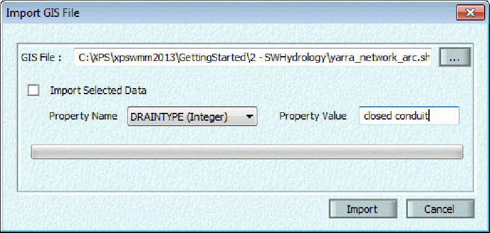
>
> For the Link Names, choose the Default Names or use the attribute data and select attribute name from the drop list. Select the Upstream and Downstream Nodes from the drop lists.
>
> Mappings can be made to given variables at this point in the import process. To map a GIS database variable with the associated xp variable simply highlight the desired variable row and select the Set radio button, finally select the variable from the available options.
>
> Click on OK.

40

SECTION 2: CREATING A MODEL

> 
>
> xpswmm will report the number of links Read, Invalid, and Ignored. A text file listing warnings and errors will also open.
>
> 
>
> Click on OK and view the network.

**Export Links to GIS File**

> Right click on the Links layer and select Export to GIS File... from the popup menu.

41

> xpswmm Reference Manual
>
> 
>
> The export dialog allows the exporting of not only the spatial link data (link name, upstream and downstream node names) but also object variables, such as Conduit Shape, Length and Slope. The Export to GIS dialog allows variable selections to be made manually or to be pre-filled from the XP Table.
>
> To finalize the export click on Export, navigate to the export file destination and click on Save.
>
> **Water Level Lines**
>
> 42

SECTION 2: CREATING A MODEL

Water Level Lines are polylines used to display 1D open channel and 2D results together. They extend from the left bank to the right bank of the channel. These polylines are used to create a TIN from the 1D node results which is

spatially displayed as a flood map. Water level lines may be manually added or generated automatically.

To **manually add** a single Water Level Line to given link perform the following:

1.  Select and right click on a Link. Hover over Water Level Lines and choose Add Water Level Line from the popup menu.

2.  An x will appear next to the cursor, Click once to add a vertex on the left bank.

3.  Continue adding vetexes by clicking.

4.  Double click on the right bank to complete the polyline.

Water Level Lines can be **automatically generated** by using the Generate Water Level Lines option.

For an example on how the flood map is generated from the Water Level Lines please review the following:

> 

**Consider the diagram above.**

**At a time step t**

WSEL at u/s node = WSEL1

WSEL at the d/s node = WSEL2

WSEL at WLL1:

Y1= (WSEL1+WSEL2)/L\*X1

WESEL at WLL2:

Y2= (WSEL1+WSEL2)/L\*X2

For all the vertices along WLL1, the WSEL = Y1

For all the vertices along WLL2, the WSEL = Y2

Finally the TIN will be created.

43

xpswmm Reference Manual

> 

**Cross-Section Properties**

Highlight the Cross-sections row and right click to launch a pop-up menu.

44

SECTION 2: CREATING A MODEL

> 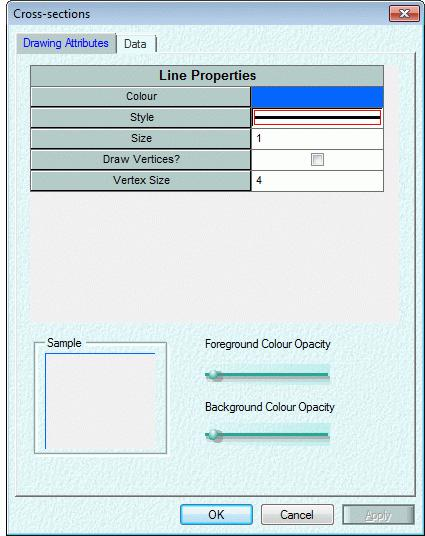
>
> Select Properties and use the dialog to adjust the display properties of cross-sections.
>
> xpswmm Reference Manual
>
> 
>
> **2.2 Navigating the Network**
>
> **2.2.1 Navigation Basics**
>
> Numerous zoom and pan tools allow the user to quickly navigate across the model. There are also icons to select All Links and Nodes. Node and link labels can be shown or hidden by selecting the viewable property in the layer control panel for node and link labels. Also, the network view can be adjusted by changing settings on the layer control panel. Very large networks will redraw quickly and look much cleaner without the clutter of object labels.
>
> **2.2.2 The Coordinate System**
>
> The screen network is essentially open-ended and unbounded in any direction. The coordinate system has its origin (0,0) at the lower left corner of the opening window and increases to the right and up. In the present implementation, the coordinates are stored in double precision format with up to 20 significant figures to enable the retention of real world coordinates. The coordinates are used in specifying the location of a node, text item, or the bounding rectangle of a background picture.
>
> **2.2.3 Traversing the Network**
>
> The network can be traversed by using the \<Tab\> key starting from any selected link or node. The \<Shift-Tab\> key or key moves to the previous upstream object.
>
> 46
>
> SECTION 2: CREATING A MODEL
>
> Alternatively the user may select Find Object... from the View Menu or use the Ctrl+F keyboard shortcut and enter the name of the required node or link. The user may specify whether the search is for a node, link or text, or whether the object name is case sensitive or a partial word search.
>
> While employing the multi-selection option successive searches will add to the selection set.
>
> When the user clicks **Find** the requested object name is searched for. If found it is highlighted and displayed in the centre of the screen at the currently selected scale.
>
> Large networks are easily traversed using the Network Overview capability.
>
> **2.2.4 Panning Around the Network**
>
> The user can access the Pan tool by any of three methods

1.  Select the Pan tool (hand) located on the toolstrip then click on the network and drag the mouse.

2.  Right mouse click and drag within the network window. This moves the entire screen image the distance between the two points in the dragged direction.

3.  Click and drag the red window box from within the network overview window.

> **2.2.5 Re-sizing Network Objects**
>
> When a large network is displayed on the screen it can appear extremely cluttered. To allow the total network to be viewed (and comprehended) the size of the text and objects may be tied to the scale of the displayed window. The Display Properties dialog is used to adjust the size nodes, links, labels and text strings. To access this dialog:
>
> For a single node or link
>
> Using the Pointer tool, move the curser over the object and click. The curser will be change to a 4 arrowed
>
> cross.
>
> Right click and select Properties from the pop-up menu.
>
> Click on Display Properties in the Node or Link Properties dialog.
>
> For a Text object
>
> Using the Pointer tool, move the curser over the text object and click. The curser will be change to a 4
>
> arrowed cross.
>
> Right click and select Properties from the pop-up menu.
>
> For multiple objects
>
> Select the objects of interest.
>
> Select Properties from the Edit menu.
>
> **2.2.6 Re-scaling the Network Window**
>
> When a network window is rescaled the size of nodes and labels remains fixed, the nodes being symbols that represent the centre of the object, or the junction of links. When the scale of a picture changes so that the text becomes unreadable it is displayed as a black box showing the location of the text but not the actual characters.
>
> The size of the viewed window can be changed in six ways:

1.  With the pointer tool selected, roll the mouse wheel forward to zoom in and backwards to zoom out. Zooming is centered at the location of the pointer.

2.  Right mouse click in the Network Overview and drag to zoom in and out

> 47
>
> xpswmm Reference Manual

3.  The Set Scale menu command on the View menu

4.  The Zoom In X2 or Zoom Out X2 tools on the Network Viewing and Navigation toolstrip

5.  The Window Area In or Window Area Out tools on the Network Viewing and Navigation toolstrip

6.  The Fit Window tool Network Viewing and Navigation toolstrip or View-\>Fit Window menu command

7.  The View -\> Zoom -\> Zoom In: Factor and View -\> Z oom -\> Zoom Out: Factor menu commands

> **2.3 Background Images**
>
> **2.3.1 Creating a Background**
>
> Background pictures are special objects that can be created to act as passive backdrop on which the rest of the network may be overlaid.
>
> Pictures are stored as files on disk and only a reference to the file and the path is stored in the .XP file. These Picture files must be present for the background to be drawn. There is neither a limit to the number of background pictures that may be loaded into the network nor to the size of an individual picture. Pictures can be selected, deleted, moved, hidden, etc
>
> Five background picture types are supported: These include AutoCAD .DWG, and .DXF files, ESRI ArcView Shape files, digital photos such as .BMP, .JPG, .TIFF. and HPGL **(**HPGL/1) files which must be translated to a .PIC (a native XP Software format) using the supplied converter CVTHPGL.EXE.
>
> See also: Importing Background Pictures and Editing Background Pictures.
>
> Note: ESRI shape files and MapInfo files may also be added to and xpswmm model as a GIS Layer.
>
> **2.3.2 HPGL File Format**
>
> Previous versions converted HPGL/1 files to a proprietary .PIC format. This feature is no longer supported as the interface now allows native .DWG and .DXF files to be used as backgrounds without requiring conversion.
>
> The HPGL/1 file is usually created by configuring your CAD program (or other drawing programs) to send the HPGL output to a file instead of directly to the plotter.
>
> The CVTHPGL utility will create a .PIC file that can be displayed by this version of the program.
>
> 

48

SECTION 2: CREATING A MODEL

> **Pen Number** HP Plotter pen number that is mapped to a particular color of your choice. Double-click on the color to choose different color mapping.
>
> **Pen Color** Color that is mapped to a particular HP plotter pen number.
>
> **Plotter Limits** Plotter pen limits in the X and Y directions. These coordinates are in plotter units. The P1 and P2 units should be equal or greater than the plotter units settings of your HP Plotter. To obtain a higher resolution picture it is recommended that the plot be sent to fit the page and the page size be large. If the P1 and P2 limits specified are less than the P1 and P2 settings on your plotter than the background picture will be clipped.
>
> **Load Plotter Defaults** This will load the plotter settings (pen mappings and limits) from a file that was earlier saved by the corresponding Save button.
>
> **Save Plotter Defaults** This will save the existing settings (pen mappings and limits) to a file. Hints
>
> When using a HPGL/1 file the prime objective in creating a background picture is to maximize the detail while minimizing the size of the HPGL plotter file and hence re-draw performance. Some practical tips:
>
> When generating a plot file from a CAD package, apply any plotting scale factors that minimize the plotted size of the drawing. Remember that HPGL plotters have a resolution of 0.025mm, so that very small plots can still provide reasonable resolution, however, the resolution is coarser with smaller size plots.
>
> Transform splines to lines if possible. Splines generate lots of plotted points. Transforming spline vertices to Line Polygon vertices dramatically decreases the number of generated vectors while retaining acceptable resolution. This transformation can usually be achieved by exporting the drawing in some text format, editing it, then importing again, eg. DXF format from AutoCAD.
>
> Any number of individual files may be imported as background pictures and overlaid or tiled.
>
> The mapping between plotter pen numbers and picture colors can be altered from the default by editing the plotter default file (by default, PL_DEF) used by CVTHPGL. This will avoid making any modifications to the CAD package configuration.
>
> Minimize the amount of unnecessary text or other drawn objects in the background file. Since text takes more time to draw than most lines this will increase performance and drawing file size
>
> HPGL/1 format:
>
> The background may also be imported from an HPGL/1 plot file that may be created via most CAD packages, or via numerous design packages that provide output to Hewlett Packard plotters.
>
> To create a background, an HPGL/1 plot file must be generated (from a CAD package, for example). This HPGL/1 file is then converted to the picture format via the CVTHPGL utility supplied with XP. CVTHPGL is invoked from the Get Background Menu.
>
> The procedure involved in creating a picture from a CAD package is as follows:

1.  Create the drawing in the CAD package;

2.  Ensure your CAD package is configured with a Hewlett Packard plotter for output. This must be in HPGL/1 format such as used for HP7580, HP7586, Draftsmaster etc. Newer Inkjet plotters like the HP650C, 700 series etc can be configured to accept input in HPGL/2 format (the default) or HPGL/1 format. This converter cannot use the HPGL/2 format.

3.  Plot the desired rectangle of interest, noting the co-ordinates of the boundaries. If you wish to retain the scale of your drawing package then the XP destination coordinates must correspond to the top-left and bottom-right corner (extreme points) of the drawing in your drawing package. It is also recommended to import your background picture before creating a database.

49

> xpswmm Reference Manual

0.  Select Get Background from the Special Menu and choose the HPGL format. When you select OK the CVTHPGL program will convert the HPGL/1 file into the internal XP picture format (PIC).

> Notes:
>
> An error log is created which lists any HPGL commands the program has been unable to translate.

The plotter defaults file "PL_DEF" defines the mapping of pen numbers to colors in a table at the head of the file.

> The first line of the file contains the number of pens, the following lines contain the mapping of pen number to color name. Pen number zero, the null pen, is also required to be mapped to a color.
>
> This pen color transformation allows customization for particular CAD packages. See the default file PL_DEF included with this program, for details.
>
> Once the HPGL file has been converted to a picture file, it is incorporated into the network as an XP Metafile. The user is prompted for the picture file name and destination-bounding rectangle via Dialog Box shown above.
>
> By default, the bounding rectangle fills the display window at the currently selected scale. To maintain the original proportion of the drawing, the user must recall the co-ordinates of the frame originally plotted and use these for the destination-bounding rectangle.
>
> **2.3.3 Importing Background Pictures**
>
> Background data in the form of aerial photos, ESRI GIS Shape files, contour maps or subdivision layouts may be imported to facilitate the creation of the network.
>
> Notes:

1.  If a CAD file (.dxf or .dwg) is imported as a background image it will be moved to the CAD layer. When xpswmm encounters a file created on earlier version with a CAD file in a background layer, the file will be moved to the CAD layer.

2.  Shape files may also be imported as GIS layers.

3.  .dxf and .dwg files should be added as CAD Layers.

> To import a background select Background Images  Add Background Image from the View menu or choose the Add Background Image icon from the toolstrip. Alternatively, you can right mouse click on the Background Images in the Layer Control Panel and choose Add Background Image.
>
> 50

SECTION 2: CREATING A MODEL

> 
>
> **Filename**
>
> To load a background file select the button with the three points to navigate and find the file. Select the file or type in the name of the file and then choose open. The coordinates of the Shape file will be automatically used. If the digital image has a world file the coordinates will be obtained from them. For digital images without world files use the appropriate coordinates for the project when positioning the photo.
>
> **Destination Rectangle**
>
> The outer corners (Top, Left, Bottom and Right) where the non-CAD or Shape file will be imported. The coordinates of and ESRI shape files are automatically read and placed in these fields. If importing a digital image format file then the rectangle corresponds to the real world coordinate edges of your drawing in the graphics package. These coordinates determine the aspect ratio and scale of the imported background.
>
> If a world file is located in the same folder as the image file, the coordinates will be automatically entered.
>
> xpswmm uses double precision coordinates with up to 20 significant figures. This enables map coordinates to be retained. Once a picture has been imported it is treated in the same manner as any other element of the network.
>
> **2.3.4 Edit Background**
>
> To edit existing background images select Background Images-\>Properties from the View menu or choose the Image Properties icon from the toolstrip. Alternatively, you can right mouse click on the Background Images in the Layer Control Panel and choose Properties.
>
> 51
>
> xpswmm Reference Manual
>
> 
>
> **New** This button will open the Add Background Image dialog.
>
> **Delete** This button will delete the highlighted background picture from the XP database.
>
> **Up** This button will move the selected background picture up one level in the list.
>
> **Down** This button will move the selected background picture up one level in the list.
>
> **Properties** If an ESRI Shape file is selected then this button will open the ESRI Shape File Attributes dialog to allow attribute encoding.
>
> **Show** This button will toggle the display or hiding of the selected background picture.
>
> **Real World Extents** The outer corners (Top, Left, Bottom and Right) where the background image file resides. For non-CAD or Shape files these coordinates determine the aspect ratio and scale of the imported background.
>
> XP uses double precision coordinates with up to 20 significant figures. This enables map coordinates to be retained. Once a picture has been imported it is treated in the same manner as any other element of the network.
>
> See Also CREATING A BACKGROUND
>
> 52

SECTION 2: CREATING A MODEL

> **2.3.5 ESRI Shape File Attributes**
>
> 
>
> **Shape Filename** The name of the Shape file that is being Encoded.
>
> **Dbase Filename** This is the name of the database file that contains the attributes being encoded.
>
> **Encode Attributes** This is a checkbox to turn on/off the encoding of the selected attribute.
>
> **Encoding Field** This combo box allows the user to select the attribute in the database file for encoding.
>
> **Color** This is a column of colors assigned to the field value of the same row. Selecting the on the cell brings up the Windows Color palette shown below.
>
> **Field Values** This is a column of the selected attributes from the database file. To the right is the color assigned to that shape file element.

53

SECTION 2: CREATING A MODEL

**2.3.7 CAD File as Background Image**

> 
>
> **2.4 Topography Layers and Objects**

**Topography Layers and Objects**

xp uses layers and objects to define the topography of models. These layers are accessed from the Layer Control Panel. The following layers are used to support 1D, 2D and, 1D/2D models.

> **DTM Layers**
>
> **Breaklines (Gullies and Ridges)**
>
> **Fill Areas**
>
> **Dynamic Elevation Shapes Trigger Points**
>
> **Elevation Shapes**

**2.4.1 DTM Layers  
Managing DTM Layers**

Elevation data may be integrated into any xpswmm 1D, 2D or 1D/2D model with a Digital Terrain Model (DTM) in the form of Triangular Irregular Network (TIN).

A variety of tools are available to import, export and manage the display of DTM layers. To access these tools, move the mouse over **DTM Layers** in the Layer Control Panel and right click. A popup menu will appear.

55

xpswmm Reference Manual

> 

To add a DTM, select one of the options:

> Load a DTM File
>
> Create a DTM From XYZ File
>
> Create a DTM from ESRI Grid file
>
> Create a DTM from 12D ASCII File
>
> Launch the DTM Builder tool

After the DTM layer has been added select an option:

> Adjust the Display Properties may be adjusted
>
> Adjust the Color Range if the fills or contour lines
>
> Add or customize the Legend
>
> Export DTM data

56

SECTION 2: CREATING A MODEL

> **Create DTM from XYZ File or XYZS File**
>
> This option allows an XYZ or and XYZS file delimited file to be triangulated and loaded into you project. The file can be delimited by space or comma and should be in the form:
>
> **XYZ File**

1.  Y2, Z1

2.  Y2, Z2

> Such as:
>
> 100.2, 347.2, 213.2
>
> 2001., 347.4, 199.4
>
> **XYZS File**

1.  Y2, Z1, S1

2.  Y2, Z2, S2  
    > Such as:

|        |        |        |     |
|--------|--------|--------|-----|
| 100.2, | 347.2, | 213.2, | 610 |
| 2001., | 347.4, | 199.4, | 610 |

> where: S1 and S2 indicate points on a breakline
>
> The Windows Explorer dialog will open. Navigate to and open the data file. The dialog will close and triangulation will begin. The progress bar monitors the triangulation.
>
> A series of files will be created named aaaaa.tin.X where  
> aaaaa = name of source XYZ or XYZS file
>
> X = a number indicating one of several files created to make the TIN. The file ending in 0 is the principle file.
>
> The color coded TIN will appear in the network window and the path to the TIN file will be indicated in a new line in the layer control panel.
>
> **Create DTM From ESRI Grid File**
>
> Use this tool to create a DTM from an ESRI Grid file. Launch the tool by right clicking on the DTM Layers row in the Layer Control Panel**.**
>
> A Windows Explorer window will open. Navigate to the source file. Click on Open.
>
> **Load DTM File**

57

> xpswmm Reference Manual
>
> This option allows the user to load an existing TIN file that was created by xp or the 12D model software packages. When selecting a file select the file ending in .tin.0. When a Tin file is selected xp will report the number of triangles, points, and also indicates the real world extents.
>
> 
>
> **Export DTM Data**
>
> Use this tool to export all or a single TIN file to a txt file. Launch the tool by right clicking on the DTM Layers row in the Layer Control Panel**.**
>
> 
>
> **DTM Properties**
>
> The DTM Properties dialogue is used to manage the DTM layers.
>
> 58
>
> SECTION 2: CREATING A MODEL
>
> 
>
> The top window lists active DTM layers. Select a layer to perform any of the options:
>
> Load Load a new DTM file
>
> Create Create a TIN from various sources including an XYZS file
>
> Color Range Adjust the color display
>
> Up/Down Adjust the order of display for the DTM layers
>
> Delete Remove the DTM from the model
>
> Show Toggle the display of the layer (same effect as the visible check box on the Layer Control Panel)
>
> Display Legend Toggle the display of the DTM legend in the Network View.
>
> Edit Legend Edit the display of the DTM legend in the Network View.
>
> ***Information Tab***
>
> The Information tab of DTM Properties displays the following field groups:

xpswmm Reference Manual

> 

**General Attributes:**

Number of Triangles  Lists the number of triangles in the DTM

Number of Points  Number of individual data points contained within the DTM

Elevation (Min/Max)  Displays the minimum and maximum elevations contained within the DTM

**Real World Extents:**

Top  Location of the top of the DTM extents

Bottom  Location of the Bottom of the DTM extents

Left  Location of the Left of the DTM extents

Right  Location of the Right of the DTM extents

***Display Tab***

The Display tab of DTM Properties displays the following field groups:

60

SECTION 2: CREATING A MODEL

> 

**Draw Parameters:**

Fill Color on Height Range \[Flag\]  Enables the color filling of the DTM based upon the height range

Contours and Style  Allows the toggling of major and minor contours and the selection of contour styles

Note: If both color shading and contours are desired it is important to increase the transparency of the colors in order to visualize the contours.

***Contour Labels Tab***

The Contour Labels tab of DTM Properties displays the following field groups:

xpswmm Reference Manual

> 

**Contour Labels:** Contour labels can be turned on or off with the Show check box. The user can select the label interval such as every 100m.

**Font**: The font and color can be selected for the contour label.  
**Align:** Select the desired contour alignment using the radio button.

**DTM Legend**

To access DTM Legend dialog, highlight the Topography  Legends line in the Layer Control Panel and right click. Select Properties from the pop-up menu.

62

SECTION 2: CREATING A MODEL

> 
>
> **DTM Display Properties**
>
> The **DTM Properties** dialogue is used to adjust the elevation gradient colors of the DTM layers. To open this dialog, click on the Color Range button in the DTM Properties dialog.

63

xpswmm Reference Manual

> 

**DTM Builder**

The DTM builder allows a spreadsheet view of the data points to be triangulated to create the TIN. This spreadsheet view can be directly edited or copied and pasted into to generate and modify the points. Selecting the Create DTM button will triangulate the points and display and add the TIN to the Layer Control Panel.

64

> xpswmm Reference Manual
>
> ***Read 12DAscii File***
>
> Allows the import of 12D Ascii format files (\*.12da) into the DTM Builder. It is noted that the 12D ASCII file must be a complete TIN, with the inclusion of Triangulation Points, in order to properly be converted.
>
> ***LandXML File***
>
> An existing TIN from a LandXML file can be imported using the File-\>Import/Export Data-\>Import LandXML ... menu item. In this file type the triangulation will be preserved and does not need to be processed through the DTM Builder.
>
> Note: The Check for Duplicate Points option will check for duplicate x,y points already read. If duplicates are found only, the first one read will be used. This option will slow the DTM Creator. If there are no duplicates in the input data file, leave it disabled.
>
> **2.4.3 Breaklines  
> Gully and Ridge**
>
> Gullies and ridges are breaklines that cause discontinuities in the surface of 2D active areas. They are represented as polylines. Effectively the elevations of the cells lying below the polyline are raised or lowered to correspond to the polyline. Within the modeling environment the minimum thickness of breakline is 1 cell.
>
> 2D Breaklines are defined as a gully (or ridge) polyline with a fixed elevation throughout. 3D breaklines are specified as a gully (or ridge) polyline with a specified elevation at each vertex.
>
> When the elevation (z value) derived from the DTM and the user defined elevation differs, xpswmm defines the breaklines using:
>
> Gully: minimum value
>
> Ridge maximum value
>
> For a gully, z values are modified only if the user defined z values are lower than the current DTM value. For a ridge, z values are modified only if the user defined z values are higher than the current DTM value. **To add a gully or ridge polyline using the graphical interface**:
>
> 1\. Highlight the layer name in the Layer Control Panel and check the visible, movable and selectable boxes.

66

> xpswmm Reference Manual
>
> 

2.  Elevations along the polyline extracted from the DTM are shown in the table as a reference. Use the radio buttons to define the gully (or breakline) is either 2D (at a specified contour) or 3D using the elevations derived from the DTM. New elevations may be added or copied and pasted into the Elevation column.

3.  Click OK.

> **To import gullies or ridgelines from a GIS or CAD file**:

1.  Highlight the layer name in the Layer Control Panel and check the visible, movable and selectable boxes.

2.  Right click and select Import from GIS/CAD file from the pop-up menu

SECTION 2: CREATING A MODEL

> 

3\. In the next dialog, navigate to the source GIS/CAD file. To import only selected data, check the box next to Import Selected Data, select a property (or attribute) from the drop menu, and specify the value for selected records. The Weld Vertices option can be selected in this dialog. When this option is turned on, each vertex added during import is first checked against existing vertices, and welded if any vertex exists in the same location. When it is turned off, this welding does not occur  a new vertex is added for every point imported  but the imported process may be faster.

69

xpswmm Reference Manual

> 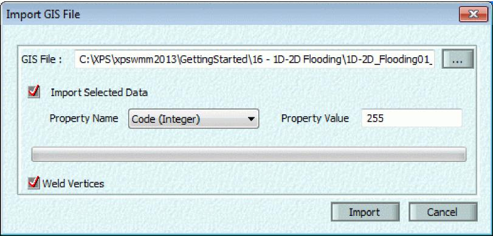

4.  In the next dialog, click the radio button corresponding to the desired elevation option. To read the elevation  
    > from the Attribute Data, use the drop list to select the appropriate attribute in the source file.

> 

5.  A report of the import operation is displayed. Click on OK.

> 

70

SECTION 2: CREATING A MODEL

**To modify the layout of a gully or ridge polyline:**

1.  The viewable, movable, and selectable boxes must be checked on the Layer Control Panel**.**

2.  Select the pointer tool from the Object Creation Tools.

3.  Move the mouse to the object and left click, the mouse will change to the 4 arrowed cross when it is moved over a vertex.

4.  Hold the left button down and drag to move a vertex.

5.  Right click to open one of the following popup menus.

> 

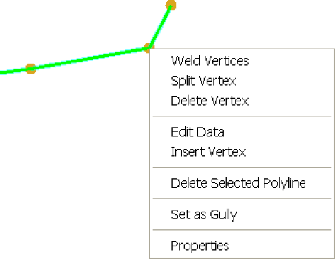

71

> xpswmm Reference Manual
>
> **To modify the display properties of the gully or ridge polylines:**
>
> All gully and all ridge polylines have the same display properties (Drawing Attriburtes). Make sure the gully or ridge visible, moveable, and selectable boxes are checked the Layer Control Panel.
>
> To modify, do one of the following:
>
> move the mouse over a gully or ridge and right click. Select Properties from the popup menu, or
>
> move the mouse over the Gully or Ridge line in the Layer Control Panel and right click. Select Properties from the
>
> popup menu.
>
> 
>
> **To edit the elevation data of a gully ridge**
>
> Make sure the gully or ridge visible and selectable boxes are checked the Layer Control Panel.
>
> Double click on a polyline or select polyline, right click and select Edit Data from the popup menu to launch the edit dialog.
>
> 72

SECTION 2: CREATING A MODEL

> 
>
> **2.4.4 Fill Areas  
> Fill Areas**
>
> An entire region of the 2D model can be raised or lowered by using fill areas. These polygons can be used to simulate levees, buildings, ponds and other features missing in the DTM.
>
> Each fill area polygon is assigned a constant elevation. Effectively all of the grid cells within the fill area 2D model will be raised or lowered. The entire cell must be within the fill area to be affected. If the fill area elevation is higher, the area will not be flooded until the water level is above its elevation. If the fill area elevation is lower (representing a pond), the area will fill with water until the surface reaches the elevation the surrounding cells.
>
> Where fill areas overlap the DTM, xpswmm2D assigns the elevation of the fill area to the model cell. You can manually add Fill Areas or import these shapes as shown in the 2D Object Creation section The data dialog is used to edit the elevation of the fill area

SECTION 2: CREATING A MODEL

> 
>
> **2.5 2D Domains**

**2.5.1 2D Domains, Boundaries and Interfaces**

> 2D and 1D/2D models require domains, boundaries and interfaces that define areas where 1D or 2D flow occurs and connections or boundary conditions exist. These objects are defined in xpswmm as layers comprised of polygons or polylines.
>
> The following objects may be used in a 2D or 1D/2D model:
>
> **Object**
>
> **Layer Type Description or Purpose**
>
> **2D Grid** polygon Ultimate boundary of 2D model, properties
>
> include grid vertical cell size and orientation and display properties
>
> **Active 2D areas** polygon Areas where 2D flow can occur
>
> **Inactive 2D areas** polygon Areas where 2D flow cannot occur such as
>
> buildings or raised fill or channels modeled in 1D

75

> xpswmm Reference Manual
>
> **Initial water levels** polygon Areas where the grid cells are assigned an
>
> initial water surface elevation
>
> **1D/2D interface** polyline Interface between 1D channel and 2D flood
>
> plain that within an active 2D area
>
> **<u>1D/2D connections</u>** polyline Defined between the 1D node and the 1D/2D
>
> interface, it links the 1D node level to
>
> interface between the1D channel and the 2D floodplain
>
> **2D / 2D interfaces** polyline Interface between two 2D Grid domains and
>
> lies along the respective shared grid boundaries
>
> **2D head boundary** polyline Time dependent 2D head boundary that lies
>
> within an active 2D area
>
> **2D flow boundary** polyline Time dependant 2D flow boundary that lies
>
> within an active 2D area
>
> **2D Rainfall/Flow Area** polygon Areas of a rainfall, runoff hydrograph oor user
>
> defined hydrograph. Flow id directed to cell with lowest elevation.

<table>
<colgroup>
<col style="width: 28%" />
<col style="width: 14%" />
<col style="width: 56%" />
</colgroup>
<tbody>
<tr class="odd">
<td><blockquote>

<strong>2D Landuse</strong>

<strong>2D Flow Constrictions</strong>

</blockquote></td>
<td>
Polygon

Polygon
</td>
<td><blockquote>

Areas with defined infiltration and/or roughness characteristics

Applies the affect of flow constrictions based on defined flow area/constriction levels

</blockquote></td>
</tr>
</tbody>
</table>

> **2D Head-Flow (HQ)** Polyline Head dependant 2D flow boundary that lies
>
> **Boundary** within an active 2D area
>
> **Evacuation Routes** Polyline Time to inundate based on defined flood

levels

> **2.5.2 2D Grid Extents**
>
> These polygons define the boundary of a domain in the 2D model. A grid with equal horizontal and vertical cell size and orientation extends over the polygon. Multiple 2D Grid Extents are possible depending on software licensing. To check for this capability go to Help-\>License to check for 2D multiple domains in the License Details.
>
> You can manually add 2D Grid Extent polygons or import these shapes as shown in the 2D Object Creation section Use the properties dialog to modify the grid size and display properties.
>
> 76

SECTION 2: CREATING A MODEL

> 
>
> **Multiple Grid Extent polygons**
>
> Multiple 2D domains (Grid Extent polygons) are supported as an additional licensed module. Each domain has its own grid extents, grid cell size, time step (optional) and orientation. Domains may be linked by 2D / 2D Interface polylines.
>
> Grid Extent layers may be moved up and down within the Layer Control Panel by right-clicking on a given grid layer and selecting Move this Layer Up or Move this Layer Down, to allow ordering of multiple domains. As shown in the Layer Control Panel, a higher domain in the layer list takes precedence over all domains below it in the list, where there are overlaps between extent polygons (i.e. THE TOP MOST GRID LAYER WILL TAKE PRECEDENCE OVER ALL OTHER GRID LAYERS).
>
> It should be noted that 2D models containing multiple domains are no longer permitted to solve with Inactive Area as the default area type, set in the 2D Job Control. Multiple 2D domain models should always use Active Area as the default area type, and use appropriate grid extent polygons to define the domain extents, instead of large active area polygons.

77

> xpswmm Reference Manual
>
> **2.5.3 Active and Inactive 2D Areas**
>
> These polygons define the area where 2D flow can and cannot occur. A model may have multiple 2D active and inactive areas. An inactive area is considered to be bounded by a vertical wall with an infinite height.
>
> The default area type determines if Active or Inactive 2D areas should be defined. The default area type is specified in 2D Job Control Settings. Additional 2D cells first take on the default area type and then can be altered by Active or Inactive areas. In a case where multiple polygons overlap the cell will take on the default area,
>
> **Default Area Type User defined areas**
>
> Active Inactive
>
> Inactive Active

SECTION 2: CREATING A MODEL

<table>
<colgroup>
<col style="width: 5%" />
<col style="width: 21%" />
<col style="width: 11%" />
<col style="width: 2%" />
<col style="width: 17%" />
<col style="width: 1%" />
<col style="width: 12%" />
<col style="width: 3%" />
<col style="width: 1%" />
<col style="width: 12%" />
<col style="width: 4%" />
<col style="width: 4%" />
</colgroup>
<tbody>
<tr class="odd">
<td colspan="12">Active Areas: Layer 1 I=</td>
</tr>
<tr class="even">
<td colspan="2">Drawing ktnbutes</td>
<td colspan="10"></td>
</tr>
<tr class="odd">
<td></td>
<td colspan="10"></td>
<td></td>
</tr>
<tr class="even">
<td></td>
<td colspan="9"><blockquote>

<strong>Fill Properties</strong>

</blockquote></td>
<td></td>
<td></td>
</tr>
<tr class="odd">
<td></td>
<td colspan="4">Background Colour</td>
<td colspan="5"></td>
<td></td>
<td></td>
</tr>
<tr class="even">
<td></td>
<td colspan="4">Foreground Colour</td>
<td colspan="5"></td>
<td></td>
<td></td>
</tr>
<tr class="odd">
<td></td>
<td colspan="4"><strong>Style</strong></td>
<td colspan="6"></td>
<td></td>
</tr>
<tr class="even">
<td></td>
<td colspan="4">None Solid Pattern 0</td>
<td colspan="5"></td>
<td></td>
<td></td>
</tr>
<tr class="odd">
<td></td>
<td colspan="4"></td>
<td colspan="5"></td>
<td></td>
<td></td>
</tr>
<tr class="even">
<td></td>
<td colspan="4"><blockquote>

<strong>Line Properties</strong>

</blockquote></td>
<td colspan="5"></td>
<td></td>
<td></td>
</tr>
<tr class="odd">
<td></td>
<td colspan="4">Colour</td>
<td colspan="5"></td>
<td></td>
<td></td>
</tr>
<tr class="even">
<td></td>
<td colspan="4"></td>
<td colspan="5"></td>
<td></td>
<td></td>
</tr>
<tr class="odd">
<td></td>
<td colspan="4">Style</td>
<td colspan="5"></td>
<td></td>
<td></td>
</tr>
<tr class="even">
<td></td>
<td colspan="4">Size</td>
<td colspan="5">1</td>
<td></td>
<td></td>
</tr>
<tr class="odd">
<td></td>
<td colspan="4">Draw Vertices?</td>
<td colspan="2"></td>
<td>F</td>
<td colspan="2"></td>
<td></td>
<td></td>
</tr>
<tr class="even">
<td></td>
<td colspan="4">Vertex Size</td>
<td colspan="5">4</td>
<td></td>
<td></td>
</tr>
<tr class="odd">
<td></td>
<td colspan="10"></td>
<td></td>
</tr>
<tr class="even">
<td colspan="3">Sample</td>
<td colspan="9">Foreground Colour Opacity</td>
</tr>
<tr class="odd">
<td colspan="3"></td>
<td colspan="9">Background Colour Opacity</td>
</tr>
<tr class="even">
<td colspan="3"></td>
<td colspan="9"></td>
</tr>
<tr class="odd">
<td colspan="12"></td>
</tr>
<tr class="even">
<td colspan="4"></td>
<td colspan="2">OK</td>
<td colspan="3">Cancel</td>
<td colspan="3"></td>
</tr>
<tr class="odd">
<td colspan="12"></td>
</tr>
</tbody>
</table>

> xpswmm Reference Manual
>
> 
>
> You can manually add Active or Inactive Area polygons or import these shapes as shown in the 2D Object Creation section
>
> **2.5.5 1D/2D Interface**
>
> The 1D/2D interface is a polyline indicating the boundary between the 2D floodplain (Active 2D area) and the top of the 1D channel.
>
> Notes: A 1D/2D interface must overlay the boundary of an Active 2D area i.e., the vertices of the 2 objects must coincide.
>
> A 1D/2D connection extends from a vertex of a 1D/2D interface to a 1D node
>
> Each end of the 1D/2D interface must have a 1D/2D connection.
>
> You can manually add 1D/2D Interface lines or import these shapes as shown in the 2D Object Creation section
>
> **HX and SX Interface Lines:**
>
> It is possible to switch a 1D/2D interface polyline from an HX line (default) to an SX line by double-clicking the polyline and changing its type from head interface (HX) to flow interface (SX).

80

SECTION 2: CREATING A MODEL

> 
>
> The HX operates as a head boundary for the 2D cells - the water level in the 2D cells comes from the 1D model, any water entering or leaving the 2D model is added/removed from the 1D. This forces a flow boundary to the 1D. In the 2D boundary the HX stands for Head from an eXternal model (in this case the external model is the 1D).
>
> The SX boundary (Source from an eXternal model) is a sink source boundary to the 2D cells, this becomes a 1D water level boundary.
>
> The HX or head interface polyline is recommended for use when interfacing between 2D cells and a 1D node, where the 2D cells are larger than the connecting 1D system. An HX line is typically recommended when interfacing between a 1D open channel and 2D overbank/overland flow areas.
>
> The SX or flow interface polyline is recommended for use when interfacing between 2D cells and a 1D node, where the 2D cells are smaller than the connecting 1D system. An SX line is recommended when interfacing between a dense 2D grid and large culvers, for example.
>
> Further information on the both HX and SX interface lines can be found in the TUFLOW manual.
>
> **2.5.6 1D/2D Connections**
>
> 1D/2D Connections are polylines representing hydraulic links between 1D/2D Interface polyline vertices and 1D nodes. At each time step, the HGL in the 2D boundary and the 1D node are evaluated.
>
> Notes: 1D/2D Interface polyline(s) should be defined before 1D/2D Connections are created. The 1D/2D Interface polyline must be visible for the Snap Mode to function properly.
>
> The Ponding selection of Link Spillcrest to 2D or Link Invert to 2D must also be selected in 1D/2D simulations for all nodes with 1D/2D Connection lines. If there is a node with 1D/2D Connections snapped an no selection of Link to 2D, an error will be generated and the simulation cannot proceed. Simply connecting the node with the 1D/2D Connection polyline is not enough.
>
> You can manually add 1D/2D Connections lines or import these shapes as shown in the 2D Object Creation section.
>
> Please note: Importing 1D/2D Connection polylines is NOT the recommended way to apply these items to a model, rather manually connecting nodes to appropriate 1D/2D Interface polyline vertices is the appropriate method. The reason for this is that the imported 1D/2D connection lines will may be snapped to the appropriate connection points as they are when manually applied, these snapped or fused points are a requirement for the connections to be properly connected.
>
> **2.5.8 2D Head Boundary**
>
> The 2D head boundary is a polyline representing a time dependant head at an edge of a 2D Active Area. Vertices of a 2D head boundary must be coincident with vertices of a active 2D area  i.e. the 2D Head Boundary must be placed within the extents of an active 2D grid are.
>
> Free Outfall in 2D:

81

> xpswmm Reference Manual
>
> A 2D head boundary which is set at or below the draped 2D cell levels will force a free outfall to occur for all flows which enter the connecting cells for all flow rates. This procedure works as the cells adjacent to the head boundary covered cells will see dry adjacent cells and free flow into these dry adjacent cells will be allowed. The 2D head boundary covered cells will always be dry because the head level at these cells is forced to be below the cell level, essentially letting any flow volume which enters the given cells to fall through the cell and out of the 2D model space. This can be thought of as pushing the flow under the cells, which removes the flow from the model at a free outfall rate.
>
> You can manually add Head Boundary lines or import these shapes as shown in the 2D Object Creation section When Edit Data is selected, the dialog appears.
>
> 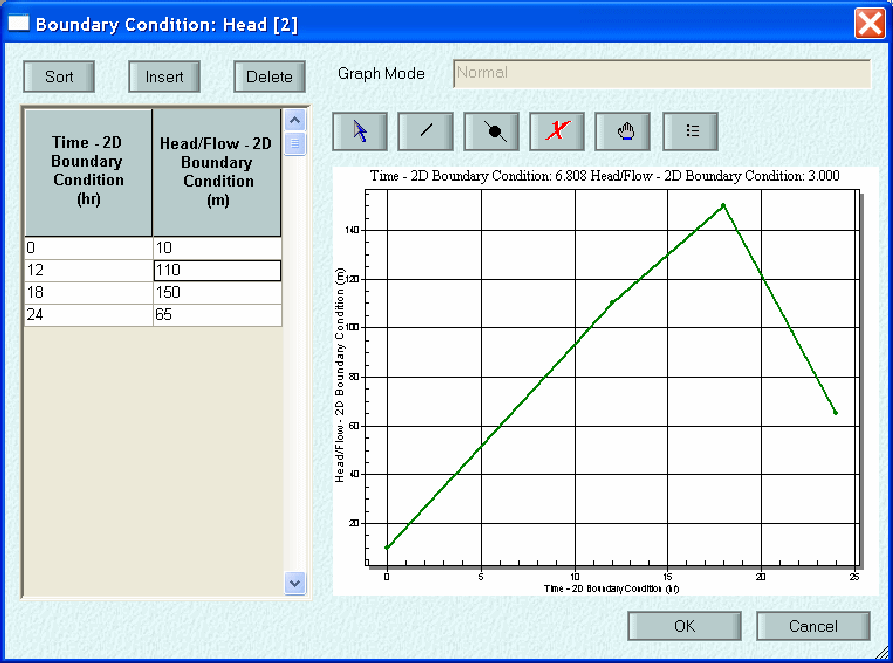
>
> Use this dialog to specify the time dependency of the boundary condition.
>
> Choose insert button to create blank rows.
>
> Enter the data in the cells or copy and paste from other application such as text file or a spreadsheet.
>
> Time is decimal hours since the start of the 2D simulation
>
> 2nd column is the head (ft or m).

82

xpswmm Reference Manual

**2.5.10 2D Rainfall/Flow Areas**

> 2D Rainfall Flow Ares are polygons used to define area of rainfall, runoff hydrographs or users defined hydrograph You can manually add 2D Rainfall/Flow Areas or import these shapes as shown in the 2D Object Creation section
>
> **To edit the data for a 2D Rainfall Flow Area polygon:**

1.  Select the polygon, right click and choose Edit from the popup menu

> 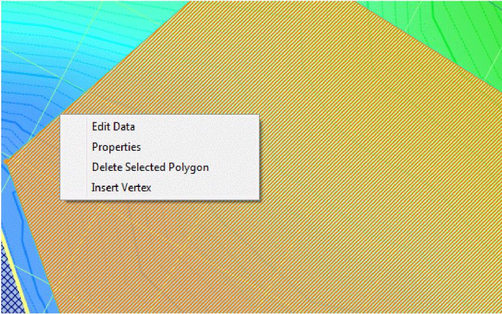

2.  Select 1 radio button indicating the type of data. Enter the required data:

- For Rainfall, select a rainfall from the Global Database

- For Hydrograph, select a Runoff node.

- For User Defined Flow Hydrograph, enter the times series flow data.

xpswmm Reference Manual

> 
>
> To adjust the order of priority of the Landuse layer list, right click on a land use and select Move this Layer Up, or Move this Layer Down.
>
> 
>
> 3\. To change the associated Global Database record for the polygon choose Landuse from the pop-up menu then
>
> select the Landuse from the list.

SECTION 2: CREATING A MODEL

> 
>
> **Roughness Coefficients**
>
> The following roughness coefficients for overland flow were suggested by the US Army Corps of Engineers in the Flood Runoff Analysis Engineering Design Manual, EM 1110-2-1417, August 1994.

<table>
<colgroup>
<col style="width: 44%" />
<col style="width: 7%" />
<col style="width: 48%" />
</colgroup>
<tbody>
<tr class="odd">
<td><blockquote>

<strong>Surface</strong>

Asphalt &amp; concrete

Bare packed soil free of stone

Fallow - no residue

</blockquote></td>
<td colspan="2"><blockquote>

<strong><em>n</em> Value</strong>

0.05 - 0.15

</blockquote>

0.10

<blockquote>

0.008 - 0.012

</blockquote></td>
</tr>
<tr class="even">
<td><blockquote>

Conventional tillage - no residue

</blockquote></td>
<td>0.06</td>
<td>- 0.12</td>
</tr>
<tr class="odd">
<td><blockquote>

Conventional tillage - with residue

</blockquote></td>
<td>0.16</td>
<td>- 0.22</td>
</tr>
<tr class="even">
<td><blockquote>

Chisel plow - no residue

</blockquote></td>
<td>0.06</td>
<td>- 0.12</td>
</tr>
<tr class="odd">
<td><blockquote>

Chisel plow - with residue

</blockquote></td>
<td>0.10</td>
<td>- 0.16</td>
</tr>
<tr class="even">
<td><blockquote>

Fall disking - with residue

</blockquote></td>
<td>0.30</td>
<td>- 0.50</td>
</tr>
<tr class="odd">
<td><blockquote>

No till - no residue

</blockquote></td>
<td>0.04</td>
<td>- 0.10</td>
</tr>
<tr class="even">
<td><blockquote>

No till (20 - 40 percent residue cover)

</blockquote></td>
<td>0.07</td>
<td>- 0.17</td>
</tr>
<tr class="odd">
<td><blockquote>

No Till (60 - 100 percent residue cover)

</blockquote></td>
<td>0.17</td>
<td>- 0.47</td>
</tr>
<tr class="even">
<td><blockquote>

Sparse rangeland with debris:

</blockquote></td>
<td></td>
<td></td>
</tr>
<tr class="odd">
<td><blockquote>

0 percent cover

</blockquote></td>
<td>0.09</td>
<td>- 0.34</td>
</tr>
<tr class="even">
<td><blockquote>

20 percent cover

</blockquote></td>
<td>0.05</td>
<td>- 0.25</td>
</tr>
<tr class="odd">
<td><blockquote>

Sparse vegetation

</blockquote></td>
<td colspan="2"><blockquote>

0.053 - 0.13

</blockquote></td>
</tr>
<tr class="even">
<td><blockquote>

Short grass prairie

</blockquote></td>
<td>0.10</td>
<td>- 0.20</td>
</tr>
<tr class="odd">
<td><blockquote>

Poor grass cover on moderately rough bare surface

</blockquote></td>
<td>0.30</td>
<td></td>
</tr>
<tr class="even">
<td><blockquote>

Light turf

</blockquote></td>
<td>0.20</td>
<td></td>
</tr>
<tr class="odd">
<td><blockquote>

Average grass cover

</blockquote></td>
<td>0.40</td>
<td></td>
</tr>
<tr class="even">
<td><blockquote>

Dense turf

</blockquote></td>
<td>0.17</td>
<td>- 0.80</td>
</tr>
<tr class="odd">
<td><blockquote>

Dense grass

</blockquote></td>
<td>0.17</td>
<td>- 0.30</td>
</tr>
<tr class="even">
<td><blockquote>

Bermuda grass

</blockquote></td>
<td>0.30</td>
<td>- 0.48</td>
</tr>
<tr class="odd">
<td><blockquote>

Dense shrubbery and forest litter

</blockquote></td>
<td>0.40</td>
<td></td>
</tr>
</tbody>
</table>

xpswmm Reference Manual

> **2.6 GIS Layers**

**GIS Layers**

GIS files may be added to an xpswmm model as separate layers. Files types include ESRI shape files and MapInfo mif files. The display properties of each layer may be adjusted and the attributes of any selected object may be viewed. Nodes and links and most polylines and polygons may be snapped to vertices of GIS arcs and polygons loaded through the GIS Layers. To snap to these items in the background ensure that the Snap has been turned on from the Job, Layer & Mode Control tools.

> 

**Adding GIS Layer**

To add a GIS layer, highlight the GIS Files line in the Layer Control Panel. Right click and select Load GIS File from the popup menu. In Windows Explorer, navigate to the target GIS file. Click on Open. Additional layers may be added using the same procedure.

**Import Hydrologic Parameters**

The following section discusses the option to Import Hydrologic Parameters from GIS layer database information

**Display Properties**

88

SECTION 2: CREATING A MODEL

> To adjust the display properties of a GIS layer, in the Layer Control Panel, right click on the name of the layer. Select Properties from the popup menu.
>
> Adjust the Fill and/or Line properties for layers containing polygons. Adjust only the Line properties for layers containing polylines or points.
>
> 
>
> **Displaying Attributes**
>
> Attributes are displayed in the Quick Data View panel. On the View menu, select Quick Data View and check the Show/Hide line. Select the GIS tab at the bottom of the table.
>
> Highlight the desired row in the GIS layer. Note that only one GIS layer can be viewed at a time. On the network view, select the desired GIS object. The attributes are displayed in the Quick Data View table. The data may be copied to the Windows clipboard. However the attribute tables may not be edited.
>
> **2.7 CAD Layers**
>
> **Adding CAD Layers**
>
> xpswmm can import CAD files and toggle off/on the display of selected layers.

89

> xpswmm Reference Manual
>
> On the Layer Control Panel, click the visible box for CAD Files. Highlight the CAD File Layer and right click. From the popup menu choose Load CAD file.
>
> 
>
> In the Windows Explorer dialog navigate to the .dxf or .dwg file. Select if and click on open,
>
> **CAD Layer Properties**
>
> The adjust the display of CAD layers, On the Layer Control Panel, click the visible box for CAD Files. Highlight the CAD File Layer and right click. Choose Properties from the popup menu.
>
> 
>
> Toggle off/on the display of selected layers by clicking on the check box.
>
> 

90

> ***SECTION 3: THE DATABASE  
> *3.1 Database Concepts**
>
> xpswmm maintains an internal database that integrates the spatial data associated with an object with the attribute data required by the model engine.
>
> The graphical network creation and manipulation can be considered as a specialized function dealing with the purely graphical attributes of objects, such as; display symbols, spatial coordinates, and connectivity.
>
> The method of creating the model-specific attribute data is through the Dialog Box or by some of the many available import methods.
>
> **THE DIALOG BOX**
>
> **THE PERMANENT DATABASE  
> THE WORKING DATABASE  
> DATABASE INTEGRITY**
>
> **3.2 The Permanent Database**
>
> The data managed by XP is permanently stored on disk in a "database" file, as an ordinary operating system file. This file should normally have an .XP extension. Data is only committed to this file during a Save command.
>
> The database stores both the graphical and non-graphical attributes of all objects in the network, and also the nonspecific or general control data associated with a network, such as job title and time steps for the solution procedure, mode of analysis, links to external interface files etc.
>
> When using the Scenario Manager all of the model differences that create scenarios are stored in a Microsoft Access .MDB file. When sharing the model between users it will be necessary to give both the .XP and .MDB files.
>
> **3.3 The Working Database**
>
> To increase the size of networks able to be efficiently created and manipulated by XP, the program utilises a combination of memory and disk space to manage data.
>
> In editing sessions, the Permanent Database stored on the disk is not interacted with directly. All changes made are done to an internal working copy of the Permanent Database, known as the Working Database which is stored in memory.
>
> The Working Database is established when the Permanent Database is opened. The Permanent Database is updated only when the Working Database is "saved". Copies of the Working Database can be saved under different names at any time, the default name being the name of the Permanent Database when originally "opened".
>
> The Working Database is the active database to which all data editing changes are made. There can only be one active database at any time.
>
> Using the working database provides an error recovery procedure. Since almost all changes to the database are immediately recorded in the working database, catastrophic failures can be recovered from with a minimum of agony. Additionally, if you would like to revert to the permanent database and disregard changes made since the last save, choose Revert from the File pull-down menu.
>
> Additional information on file types may be found in File Extensions.
>
> **3.4 Database Integrity - test**
>
> As far as possible, data committed to the Working Database via the Dialog Box interface is checked and filtered to maintain the integrity and consistency of the database.
>
> In general, text strings entered by users are the most dangerous type of dialog item because they are a human-readable encoding of some fundamental data type such as a number. This encoding and decoding to and from text strings done by users and computers is a rich source of errors. XP checks all strings at three levels to ensure they can be interpreted correctly.

91

> xpswmm Reference Manual

1.  Absolute Validity

2.  A numerical string, for example, cannot contain invalid non-numeric characters.

3.  Absolute Range Checking  Outside of range generates an error

4.  Once a numerical string can be interpreted properly, its value is checked for validity in the context of the model, eg. A negative pipe length would not be accepted.

5.  Reasonable Range Checking  Outside of range generates a warning

6.  If a data item is within the absolute range it is also compared to a reasonable range defined by the Expert Engineer. If the data is between the absolute and reasonable range, a warning is generated and the user is asked to confirm that the data entered is correct and is not a typographical error. The user can ignore the warning and proceed to enter more data. If the data is outside of the absolute range, an error is generated and the user is required to fix the offending input before committing the data with the OK button on the dialog and continuing to enter additional data.

> These checks are applied to individual data items and are classed as low-level consistency checks. High-level consistency checks are also made, which generally involve placing constraints on relationships between data items. Because these checks rely on the existence of independent data items, often there is insufficient data for XP to perform these high-level checks interactively. These integrity checks are therefore performed off-line at the point of generating the data file for the model to solve.

92

> ***SECTION 4: COPY AND PASTE  
> *4.1 Using the Copy Buffer**
>
> The XP system uses an internal buffer to move or copy information between objects, cells in lists and fields in dialogs. Data may be copied, in which case the original data remains unchanged, or it may be cut. In the case of cutting data, the data is copied into the copy buffer and after the data is subsequently pasted the data in the copied object is cleared and reset to its default value.
>
> Copying or cutting of object data is restricted to either one item of a dialog or to the entire data structure of a node or link. Data can only be pasted into similar objects i.e. node data cannot be pasted into any object except for the same type of node. This is transparent to the user so you may select a multitude of different types of objects before pasting and the data will only be pasted into objects of the same type and mode as the parent.
>
> Data within the buffer remains active until the program is ended or another copy command is executed, whereupon the buffer data is overwritten with a new copy or cut command. Data may be copied between databases by closing the current database, opening the new one and then Pasting from the Copy buffer.
>
> xpswmm Reference Manual
>
> **Copy Multiple Objects**
>
> **Copy a Single Item**
>
> **Copy a Dialog List (DLIST) Item**
>
> **Copy Global Data**
>
> **4.2 Copy Data From a Single Object**
>
> To copy all of the data associated with a node or link to one or more other similar items in one operation, first select the node or link to be copied and then select Copy from the Edit menu. The copied data is all data for the current mode. A keyboard equivalents of \<Ctrl\>+C and also exists for this command. After selecting an object the Copy and Paste is also available from the popup menu using a right mouse click. If the copy operation is successful xpswmm will then reports how many records have been copied into the buffer. For example:
>
> 
>
> To cut the data including the object from the model and have the contents reside in the buffer for a paste operation simply choose the Cut command from the Edit menu or use the \<Ctrl\>+X. If an object of similar type is selected then pasting will copy the cut data into the new object. If no object is selected then pasting will recreate the object with all of the cut data.
>
> To paste the copied data select one or more objects (by holding down the \<Shift\> key and clicking on multiple objects or by dragging a dotted rectangle around the selected objects) and hit \<Ctrl\>+V or select Paste from the Edit menu. xpswmm will now report to the screen the number of objects data has been pasted into and the number of records pasted. For example:
>
> 
>
> When a multi-link is copied and pasted to a single conduit link, xpswmm will ask which conduit is to be copied from. The user must specify the conduit number before the paste is completed. Selecting Cancel will not copy the data to any multi-links in the selection set.
>
> **4.3 Copy Multiple Objects**
>
> To copy both the graphical attributes plus all the data associated with a node or link, first select one or more objects by either dragging a box around them, or individually selecting objects using the \<Ctrl\> key. Copy the objects by selecting "Copy" from the Edit menu or \<Ctrl\>+C. If the operation is successful XP will report the number of database record and objects copied. For Example:
>
> 94
>
> SECTION 4: COPY AND PASTE
>
> 
>
> Many types of objects can be copied, including nodes, links, and text elements. When a link is copied the end nodes are also copied (because a link cannot exist without end nodes) so that pasting into an empty selection will properly create the copied link. A single link copied can still be pasted into a multiple selection in the usual way.
>
> To create new objects deselect all objects by clicking in open space then select "Paste" from the Edit menu or \<Ctrl\>+V. New objects will be created slightly offset from the original location and will be highlighted. They will also have new names automatically created by adding .1 to the name if that name is not already in use. It may be necessary to clean up the screen by selecting "Redraw" from the toolstrip or from the "View" Menu. The objects can be renamed if the new name is not suitable before solving.
>
> When objects are pasted into a different database than that copied from, global database references are maintained but the actual data for the global database records (the global database definitions) are not pasted. These Global Data bases can be merged from one .XP project to another or single global database records can be copied from a source database into the copy buffer and then pasted into a target project. The merge command is located in the File menu. It is also possible to export global database records from one file and import them into another.
>
> **4.4 Copy a Single Item**
>
> To copy an individual item, open up the Dialog Box for the source object, select the copy icon (white multi-page) in the upper right-hand corner of the dialog then select the field or button by clicking on it. All text items, radio buttons or checkboxes can be copied in this manner. Close the Dialog Box.
>
> To paste the copied data select one or more objects (by holding down the \<Ctrl\> key and clicking on multiple objects or by dragging a dotted rectangle around the selected objects) and select Paste from the Edit Menu or hit the \<Ctrl\>+V keys. All links and all nodes can be selected by using the All Links and All Nodes icons on the toolstrip or the View-\>Select Objects menu commands.
>
> When copying a field or string value, the value is checked as if it were to be saved to the database before copying. For Radio Button items, only the active item in the group of buttons can be copied. For both Radio Buttons and Checkboxes with underlying data, only the flag itself and not the whole underlying data structure will be copied. Only single data items can be copied, structures including all underlying data cannot be copied as single items. However, when copying all of the data for an object all the underlying data is copied to the copy buffer and can be pasted to another object.
>
> **4.5 Copy a Dialog List (DLIST) Item**
>
> To copy a single cell in a dialog list (DLIST) first move the text insertion point to the cell you wish to copy. Select the text or numerical string by double-clicking or depressing the mouse and dragging over the entire string. Right mouse click to get a Windows pop-up dialog and select Copy from the list. Alternatively using \<Ctrl\>+C will copy the selected string. Next move to the text insertion point to the cell(s) where you wish to insert the data and paste the data from the buffer using the right mouse click pop-up dialog or \<Ctrl\>+V and repeat as many times as necessary. If the DLIST is blank it will be necessary to **Insert** a row so that the right mouse button can display the pop up menu including the copy, cut and paste commands. Copying many cells or one cell to many is permissible in the DLIST using the spreadsheet style grid.

95

xpswmm Reference Manual

> 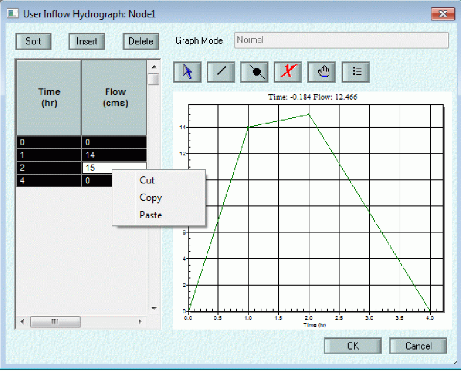
>
> **4.6 Copying Global Data**

Single records of a global database can be copied using the **Copy** button from the Global Database. In the example shown here, all of the Rainfall records in the source database are copies into the paste buffer.

96

SECTION 4: COPY AND PASTE

> 
>
> After opening up a new target database the records are pasted by selecting Paste from the Edit menu. When pasting database records, new records are always created in the current database. If record names clash with existing names, unique names based on the original name and a numerical extension will be generated.
>
> All Global Databases from one xpswmm file can be copied into the current xpswmm file by using the **Merge** command.
>
> Another alternative to copy and paste of Global Database items is to export them from the File-\>Export Data menu. This will allow a selection of global database records that can be exported to an XPX file.
>
> ***SECTION 5: THE INI FILE  
> *5.2 SWMXP.INI File**
>
> The file format consists of a number of lines of the form:
>
> \[Block_name\]
>
> *VARIABLE= VALUE*
>
> BLOCK_NAME is a header for the VARIABLE & VALUE that follows it must be one of: \[Main\], \[Config\], \[Display\], \[Settings\], \[Engine\] \[web\], \[STATUS\], \[Recent File List\], \[Field Precision\], \[Field Defaults\], \[Pest\], or \[Comments\].
>
> VARIABLE is not case-sensitive. VALUE is a string of characters relevant to the variable and is also not case-sensitive (see descriptions below). Comments may be included in the file by inserting a pound (#) character anywhere on a line. Any characters on a line following the pound are ignored.
>
> Example:
>
> \[Main\]
>
> VERSION= 12.0
>
> ENGINE_VER=2011 .0
>
> EDITOR=c: winnt notepad.exe
>
> TEMPDIR=C: XPS XPSWMM201 1 temp
>
> DIRECTORY=C: XPS XPSWMM2011
>
> SWMXP=C: XPS XPSWMM201 1
>
> SWMXP_BIN =C: XPS xpswmm201 1 swmm.bin
>
> ENGINE=c: xps xpswmm2011 SWMMENGW2D.EXE
>
> ENGINE_DP=C: XPS xpswmm2011 swmmengw2D_DP.exe
>
> MSGBOX=c: xps xpswmm201 1 MSGBOX
>
> DBDEF=C: XPS xpswmm201 1 xps_dbdef.mdb
>
> \# CNF=C: XPS XPSWMM2010 swmxp.cnf (superseded in version 2011 by line below)
>
> XCF=C: XPS XPSWMM2011 swmxp.xcf
>
> CVTHPGL=C: XPS XPSWMM2011 CVTHPGL.BAT
>
> HELP=C: XPS XPSWMM201 1 XPSWMM.CHM
>
> PLOT_EXE=c: xps xpswmm201 1 XPPROFILEPLOT.EXE
>
> workdirectory=C: XPS XPSWMM201 1 work
>
> GIS_EXE=c: xps xp-swmm gis.exe
>
> SC_TEMPLATE_DB=C: XPS xpswmm2011 XP_SC_TRANS.MDB
>
> TEMPLATES=C: XPS xpswmm201 1 TEMPLATES
>
> EFX=C: XPS xpswmm2011 EFX
>
> \[Config\]
>
> OPT_DB_KEY = ON  
> OPT_DB_MEM = ON  
> OPT_IDX_ACCESS = ON  
> OPT_DIRTYOBJ =ON  
> OPT_PART_REC =ON  
> OPT_OBJ_NAME_ACCESS=ON
>
> OPT_FAST_DRAW=ON
>
> OPT_DRAW_NO_LABELS=ON
>
> OPT_DRAW_NODE_LABELS=ON
>
> OPT_DRAW_LINK_LABELS=ON
>
> IO_BUF_SIZE = 4096  
> MAX_NODES = 8000  
> MAX_LINKS = 8000
>
> 99

xpswmm Reference Manual

MAX_TEXTS = 500

MAX_PICTS = 50

MAX_DBCARDS = 200000

CACHE_SIZE = 16

CALIBRATE = ON

PROJECTS = ON

SOLVE=W IN

DATE_FORMAT = mm/dd/yy

COLOUR=XP

APP_FLAGS = ""

YEAR_XX=2000

CUHP=OFF

LAC_HYDROLOGY=OFF

SOLVE_MULTINETWORK=ON

MAX_WEIRS=800

MAX_ORIFICES=700

OLD_DLIST_DIALOGS=OFF

SCENARIO_MANAGER=ON

OLD_XPX_EXPORT=OFF

OPT_SHORTESTPATH=ON

PERSPECTIVE_VIEW=OFF

OPT_SHOW_LAYER_COUNT=ON

OPT_SHOW_ZERO_COUNT=OFF

OPT_SHOW_ZERO_SELECT_COUNT=OFF

OPT_SHOW_GRID=OFF

ConfigurationParameter=465638426244

MAX_2DCELLS=100001

WINPOS=2,3,-32000,-32000,-1,-1,-4,-4,1 924,1170

LAYER_CONTROL=1

\[RNF_SACRAMENTO\]

SAC_FLOW_FILE=C: XPS xpswmm201 1 templates SACH Rnf_SacFlows.txt

SACH_TABLE4_1=C: XPS xpswmm201 1 templates SACH 4_1.txt

SACH_TABLE4_3=C: XPS xpswmm201 1 templates SACH 4_3.txt

SACH_TABLE4_4=C: XPS xpswmm201 1 templates SACH 4_4.txt

SACH_TABLE4_5=C: XPS xpswmm201 1 templates SACH 4_5.txt

SACH_TABLE4_6=C: XPS xpswmm201 1 templates SACH 4_6.txt

SACH_TABLE4_7=C: XPS xpswmm201 1 templates SACH 4_7.txt

SACH_TABLE4_8=C: XPS xpswmm201 1 templates SACH 4_8.txt

SACH_TABLE5_1=C: XPS xpswmm201 1 templates SACH 5_1.txt

SACH_TABLE5_2=C: XPS xpswmm201 1 templates SACH 5_2.txt

SACH_TABLE6_1=C: XPS xpswmm201 1 templates SACH 6_1.txt

SACH_TABLE7_1=C: XPS xpswmm201 1 templates SACH 7_1.txt

SACH_TABLE7_3=C: XPS xpswmm201 1 templates SACH 7_3.txt

SACH_TABLE7_6=C: XPS xpswmm201 1 templates SACH 7_6.txt

\[NETWORK\]

MODE=NETWORK

SERVER= 192.168.25.22

STATUS=OK

\[Display\]

FONTNAME = Arial  
FONTSIZE = 14  
FONTWT = 400

**\[Settings\]**

100

SECTION 5: THE INI FILE

PreviewPages= 1

OPT_ALL=1

OPT_SWMM_BANNER=1

OPT_ALL_CONDUIT_TYPES=1

OPT_PROFILE_PLOT=1

OPT_PUMPORIF=1

OPT_FULL_EQUATION=1

OPT_WATER_QUALITY=1

OPT_TRN=1

OPT_SNOWMELT=1

OPT_PEST=1  
OPT_ACAD=1  
OPT_GISTABLE=1

OPT_XPTABLE=1

OPT_XPGIS=1  
OPT_HDRDWF=1

OPT_XPVIEWERCREATOR=1

OPT_RTC=1

**\[Engine\]**

VERT_WALLS=ON

**\[web\]**

main=[<u>http://www.xpsoftware.com</u>](http://www.xpsoftware.com)

PRODUCT=[<u>http://www.xpsoftware.com/products</u>](http://www.xpsoftware.com/products) onlinehelp=[<u>http://www.xpsoftware.com/webhelp/xpswmm.htm</u>](http://www.xpsoftware.com/webhelp/xpswmm.htm)

**\[RevColours\]**

NumColours=10

Set 1 Style=0

Set 1 Colour=16744448

Set 2 Style=1

Set 2 Colour=16744703

Set 3 Style=2

Set 3 Colour=33023

Set 4 Style=3

Set 4 Colour=4259584

Set 5 Style=4

Set 5 Colour=4227200

Set 6 Style=5

Set 6 Colour=32768

Set 7 Style=6

Set 7 Colour=65535

Set 8 Style=7

Set 8 Colour=4194368

Set 9 Style=8

Set 9 Colour=16512

Set 10 Style=9

Set 10 Colour=8421440

**\[Pest\]**

PROGRAM=C:\PEST\SPEST.EXE \#PROGRAM=C:\PEST\WPEST.BAT MAKES_CTL=C:\PEST\PESTGEN.EXE LIBRARY=c:\XPS\XP-SWMM\LIBRARY.CAL CHK_TEMPLATE=C:\PEST\TEMPCHEK.EXE

> xpswmm Reference Manual
>
> CHK_INSTRUCTION=C:\PEST\INSCHEK.EXE XP_ENGINE=c:\XPS\XP-SWMM\SWMMENGW .EXE
>
> **\[Field Defaults\]  
> **ROUGH=0.014  
> R_WLMAX=75  
> R_WLMIN=7.5  
> R_DECAY=0.0015  
> R_WSTOR1=0.7  
> R_WSTOR2=2.5  
> R_IROUGH=0.010  
> R_PROUGH=0.045
>
> R_PCTZER=30
>
> **\[Field Precision\]  
> **NUM_FIELDS=4
>
> PREC_FLD_1=F_GRELEV
>
> PREC_VAL_1=5
>
> PREC_FLD_2=F_DEEP
>
> PREC_VAL_2=5
>
> PREC_FLD_3=F_HDR_SEWAGE
>
> PREC_VAL_3=5
>
> PREC_FLD_4=F_E\_RMAXFLO
>
> PREC_VAL_4=3
>
> \[CHECKS\]
>
> MULTIPLE_NETWORK_RNF=ON
>
> **\[Most Recently Used Files\]**
>
> File1 =C:\XPS\XP-SWMM\alt506f_1\_ex.xp File2=C:\XPS\XP-SWMM\test.XP File3=C:\XPS\XP-SWMM\test2.xp File4=C:\XPS\XP-SWMM\prairie_base_2day.xp
>
> **\[Status\]**
>
> FILE1=C:\XPS\XP-SWMM\work\Sample Files\BASIC1.XP FILE2=C:\XPS\XP-SWMM\work\dex1 .xp FILE3=C:\XPS\XP-SWMM\work\pinia-100y1p5h-CulvCleared.xp FILE4=C:\XPS\XP-SWMM\work\Hdr3a.xp

<table>
<colgroup>
<col style="width: 46%" />
<col style="width: 37%" />
<col style="width: 16%" />
</colgroup>
<tbody>
<tr class="odd">
<td colspan="2"><blockquote>

OPT_DB_KEY = ON/OFF

OPT_DB_MEM = ON/OFF

</blockquote>

OPT_REDRAW = ON/OFF 
OPT_IDX_ACCESS=ON/OFF
</td>
<td>
#

#

#

#
</td>
</tr>
<tr class="even">
<td><blockquote>

OPT_DIRTYOBJ

</blockquote></td>
<td><blockquote>

= ON/OFF

</blockquote></td>
<td>#</td>
</tr>
<tr class="odd">
<td><blockquote>

OPT_PART_REC

</blockquote></td>
<td><blockquote>

= ON/OFF

</blockquote></td>
<td>#</td>
</tr>
<tr class="even">
<td><blockquote>

IO_BUF_SIZE

</blockquote></td>
<td><blockquote>

= 4096

</blockquote></td>
<td>#</td>
</tr>
<tr class="odd">
<td><blockquote>

MAX_NODES

</blockquote></td>
<td><blockquote>

= 200

</blockquote></td>
<td>#</td>
</tr>
<tr class="even">
<td><blockquote>

MAX_LINKS

</blockquote></td>
<td><blockquote>

= 220

</blockquote></td>
<td>#</td>
</tr>
<tr class="odd">
<td><blockquote>

MAX_TEXTS

</blockquote></td>
<td><blockquote>

= 40

</blockquote></td>
<td>#</td>
</tr>
<tr class="even">
<td><blockquote>

MAX_PICTS

</blockquote></td>
<td><blockquote>

= 20

</blockquote></td>
<td>#</td>
</tr>
<tr class="odd">
<td><blockquote>

MAX_DBCARDS

</blockquote></td>
<td><blockquote>

= 430*15

</blockquote></td>
<td>#</td>
</tr>
<tr class="even">
<td><blockquote>

CACHE_SIZE

</blockquote></td>
<td><blockquote>

= 16

</blockquote></td>
<td>#</td>
</tr>
</tbody>
</table>

102

SECTION 5: THE INI FILE

PROJECTS = OFF \# project management (handling group of xp files)

DATE_FORMAT = mm/dd/yy

APP_FLAGS = "" \# M = Malaysian version, E = Extran only

> **5.3 File Names, Extensions and Paths**

The default location for files is the folder containing the .xp files (project folder). Files created by xpswmm are located in this folder. Alternative locations for many files can be mapped in the dialogs where these files are selected. It is strongly recommended that the project folder be located on a local drive.

The maximum path length (number of characters in folder name + file name) is 246 characters. For 2D models the maximum path length is 128.

xpswmm uses the following file naming conventions. Additional files are produced in 2D analysis.

DB?? The working copy of the XP database. This file is located in the directory pointed to by the TMP or XPTMP environment variable. This file is normally deleted when you Quit the program.

XP?? A snapshot of the current state of the working database (DB file). It is created when XP runs another program, eg. to Solve. This file is normally deleted when the XP file is re-opened.

LOCK A file used. This file is deleted upon termination of the child process.

MSGBOX The message box used to transfer executions between modules. This file is deleted upon termination of the child process.

\***.**XP The main database. This file is updated whenever Save is selected.

\*XPT An XP template file. Essentially an XP file but it is used as a seed for subsequent .XP models

\*XPV XP variable list file.

\*BAK A backup of the main database. This file is created when a .XP file is opened.

\*MDB An Access database file. This file is created by xpswmm when a .xp file is opened. If the model contains scenarios, the scenario information is stored in this file.

\*MUT A file to prevent multiple user access of an opened .XP file. This file is created on open.

\*XPP The projects database. This file is updated whenever Save is selected.

\*XPX A text file in the XP eXchange format for import and export.

\*OUT The text output file generated when a database is solved.

\*RIZ A specialized formatted output file.

\*PBS A specialized formatted output file.

\*CON A specialized formatted output file.

\*XLS A specialized formatted output file for spreadsheet import.

\*CSV A specialized formatted output file for spreadsheet import.

\*CDM A specialized formatted output file.

\*DES An intermediate file containing new pipe diameters when using the design undersized conduits option.

\*EXP An ASCII file containing the tabular XPX format. Created using the MAKE_XPX Configuration parameter.

\*EPD A plot definitions file.

\*PIC Background pictures or a file generated by Export Graphics.

\*DWG An AutoCAD drawing file

\*DXF An AutoCAD drawing file.

\*SCR An AutoCAD Script file generated by the Export Graphics menu command.

\*SHP An ESRI ArcView GIS file

\*MID A MapInfo GIS file.

\*MIF A MapInfo GIS file.

103

> xpswmm Reference Manual
>
> ZZ\* Temporary scratch files used by xpswmm.
>
> \*CFG XP-SWMM configuration file.
>
> \*HEC HEC-2 Data input.
>
> \*G02 HEC-RAS Geometry input file.
>
> \*HOT Hot start files.
>
> \*INT Interface files.
>
> \*RIN A RAIN Interface file.
>
> \*TIN A temperature interface file.
>
> \*MOD Mode setup file.
>
> \*SRP Spatial Report Setup file.
>
> \*GEN Graphical Encoding Setup file.
>
> \*RDF Tabular Report Setup file.
>
> \*DEF Profile Plotting Setup file.
>
> \*DAT Functions as the intermediate between the xpswmm graphical interface and the calculating engine. Dat files are text files containing commands. File is generated when the model is calculated. Previous versions are overwritten. File will contain sections starting with \$RUNOFF, \$TRANSPORT and \$EXTRAN corresponding to the Runoff, Sanitary and Hydraulics modes.
>
> **Primary Results Files**
>
> \*OUT The text output file generated when a database is solved.
>
> \*RPT An optional condensed output file generated when a database is solved.
>
> \*RES An intermediate results file used by the program.
>
> \*PLT An intermediate results file used for plotting.
>
> \*SYF An intermediate results file used for plotting and for reviewing results (Hydraulics).
>
> \*SYR An intermediate results file used for reviewing results (Runoff).
>
> \*SYH An intermediate results file used for reviewing Hydrology results (Runoff).
>
> \*SYT An intermediate results file used for reviewing results (Sanitary).
>
> \*SYQ An intermediate results file used for reviewing hydraulics water quality results (Hydraulics).
>
> **Scenario Results Files**

<table>
<colgroup>
<col style="width: 15%" />
<col style="width: 84%" />
</colgroup>
<tbody>
<tr class="odd">
<td><blockquote>

*_SC200.* *_SC400.* *_SC600.* etc.

</blockquote></td>
<td><blockquote>

These will be appended to the filename and found before the file extension of the files above for the scenarios. First scenario gets SC_200 second gets SC_400 etc.

</blockquote></td>
</tr>
</tbody>
</table>

> **Global Storm Results Files**

<table>
<colgroup>
<col style="width: 15%" />
<col style="width: 84%" />
</colgroup>
<tbody>
<tr class="odd">
<td><blockquote>

*_SC100.* *_SC110.* *_SC120.* etc.

</blockquote></td>
<td><blockquote>

These will be appended to the filename and found before the file extension of the files above for global storm runs. First storm gets SC_100 second gets SC_110 etc.

</blockquote></td>
</tr>
</tbody>
</table>

> **Topography Files**
>
> \*.txt A text file containing survey data in the form of X, Y, Z or X, Y, Z, S where S indicates points on a breakline. Used to create a DTM.
>
> aaaa.tin.X Files created to form a TIN. aaaa is the name of the source XYZ or XYZS file. X = a number with 0 being the principal file.
>
> **5.4 \[Settings\]**
>
> *Use:* Display of the current options permitted for this copy of XP-SWMM/XP-STORM.
>
> *Value:* Not to be edited by the user. All items should be 0 or 1.
>
> 104
>
> SECTION 5: THE INI FILE
>
> *Description:* These items are either 1 or 0 as yes or no. It is an echo of what is found in the SWMXP.XCF or XPSTORM.XCF file.
>
> *Memory:* None.
>
> *Comments:* None.
>
> **5.6 \[Engine\]**
>
> *Use:* Header for any Configuration Parameters to use for every model run.
>
> *Value:* List of Configuration Parameters.
>
> *Description:* Place any configuration parameters you wish to always use in this section.
>
> *Memory:* None.
>
> *Comments:* None.
>
> **5.7 \[comments\]**
>
> *Use:* Header for comments that follow.
>
> *Value:* Lines of text.
>
> *Description:* This is the block that contains explanations of the variables and values in the SWMXP.INI file.
>
> *Memory:* None.
>
> *Comments:* None.
>
> **5.8 \[Field Defaults\]**
>
> *Use:* Header for the user defined defaults for XP-SWMM/XP-STORM variables.
>
> *Value:* XPX field names and default values.
>
> *Description:* Allows the user to specify the field defaults to use in lieu of the current existing values embedded in the program. Uses the syntax of XPX fieldname=value.
>
> *Memory:* None.
>
> *Comments:* None.
>
> **5.9 \[Recent File List\]**
>
> *Use:* Superceded by \[STATUS\].
>
> *Value:* File and Path Names.
>
> *Description:* Automatically displays the file and path names of the last 4 .XP files opened. This file list is displayed in the File menu of the program.
>
> *Memory:* None.
>
> *Comments:* None.
>
> **MRU_COUNT**
>
> *Use:* Maximum number of files that can be displayed in the Recent Files list.
>
> *Value:* Integer.
>
> *Description:* Automatically displays the file and path names of the last MRU_COUNT .XP files opened. This file list is also displayed in the opening banner.
>
> *Memory:* None.
>
> *Comments:* None.
>
> **5.10 \[STATUS\]**
>
> *Use:* Header for the last MRU_COUNT files opened.
>
> *Value:* File and Path Names.
>
> *Description:* Automatically displays the file and path names of the last MRU_COUNT .XP files opened. This file list is displayed in the opening banner.
>
> *Memory:* None.
>
> *Comments:* None.
>
> **Field Precision**
>
> Used to specify display precision of fields. In the first line NUM_FIELDS specifies the number of fields specified. Two lines are required for each field. PREC_FLD_1 is used to declare the field name. PREC_VAL_1 defines the display precision.

105

> xpswmm Reference Manual
>
> **5.11 \[Main\]**
>
> **VERSION**
>
> *Use:* Display of the current version of the XP interface.
>
> *Value:* Current version number.
>
> *Description:* Automatically displays version number, do not edit.
>
> *Memory:* None.
>
> *Comments:* None.
>
> **ENGINE_VER**
>
> *Use:* Display of the current version of the SWMM analysis engine.
>
> *Value:* Current version number.
>
> *Description:* Automatically displays version number, do not edit.
>
> *Memory:* None.
>
> *Comments:* None.
>
> **EDITOR**
>
> *Use:* Default Editor used by Browse and for reporting errors and warnings.
>
> *Value:* NOTEPAD.EXE (default), or any text editor.
>
> *Description:* The editor used when the Browse menu command is used for viewing text files and for reporting errors and warnings. EDITPAD.EXE and NOTEPAD.EXE (Notepad++), postcard-ware programs are automatically installed but must be selected by the user, you can also used Wordpad, Word, Word Perfect, etc..
>
> *Memory:* Program dependent.
>
> *Comments:* None.
>
> **TEMPDIR**
>
> *Use:* Location of temporary files.
>
> *Value:* The name of any directory.
>
> *Description:* Used to locate the temporary files such as the DB, XP, ZZ etc. files.
>
> *Memory:* None.
>
> *Comments:* None.
>
> **DIRECTORY**
>
> *Use:* Location of home directory or installation directory.
>
> *Value:* The name of any directory.
>
> *Description:* Used for files such as the XP, BAK, SYF, SYT, SYR OUT etc. files used by the model.
>
> *Memory:* None.
>
> *Comments:* None.
>
> **SWMXP**
>
> *Use:* Location of resource files used by the main executable.
>
> *Value:* The name of any directory.
>
> *Description:* Used for files such as the BIN, RSC, HLP etc. files used by the main executable.
>
> *Memory:* None.
>
> *Comments:* Setup during the installation process and should not normally be changed.
>
> **ENGINE**
>
> *Use:* Change the engine used by the program.
>
> *Value: null* (default), or SOLVE.BAT (including the full path to this file.
>
> *Description:* Inversions prior to 6.0 the interface used SWMENG.DLL as its engine (invoked when solve is selected). If speed of execution is critical or the automatic calibration option is being used the

106

> SECTION 5: THE INI FILE
>
> DOS engine can be invoked by enabling the Solve=DOS command.
>
> *Memory:* None.
>
> *Comments:* Important to use the UNLOCK program contained in SOLVE.BAT to delete the LOCK file when execution terminates or the interface will not know the DOS engine has finished running.
>
> **MSGBOX**
>
> *Use:* Display of the current version of the SWMM analysis engine.
>
> *Value:* Current version number.
>
> *Description:* Automatically displays version number, do not edit.
>
> *Memory:* None.
>
> *Comments:* None.
>
> **CNF**
>
> *Use:* Display of the current version of the xpswmm analysis engine.
>
> *Value:* Current version number.
>
> *Description:* Automatically displays version number, do not edit.
>
> *Memory:* None.
>
> *Comments:* None.
>
> **CVT HPGL**
>
> *Use:* Obsolete item as of version 8.0. Contains the file and pathname assigned to the HPGL conversion program.
>
> *Value:* c:\xps\xp-swmm\cvthpgl.exe or wherever the program has been installed.
>
> *Description:* Contains file and path of the HPGL conversion utility.
>
> *Memory:* None.
>
> *Comments:* None.
>
> **HELP**
>
> *Use:* Contains the file and pathname assigned to this help file.
>
> *Value:* c:\xps\xp-swmm\xpswmm.hlp or wherever the help file has been installed.
>
> *Description:* File and Pathname of the Help file.
>
> *Memory:* None.
>
> *Comments:* None.
>
> **PLOT_EXE**
>
> *Use:* Contains the file and pathname assigned to the profile plotting routine.
>
> *Value:* c:\xps\xpprofileplot.exe or wherever it is installed.
>
> *Description:* Launches the program contained in the value as the profile-plotting program.
>
> *Memory:* None.
>
> *Comments:* None.
>
> **workdirectory**
>
> *Use:* Display the last directory used for XP models.
>
> *Value:* File and path name.
>
> *Description:* Automatically displays the last directory and makes it the current directory.
>
> *Memory:* None.
>
> *Comments:* None.
>
> **GIS_EXE**
>
> *Use:* Contains the file and pathname assigned to the GIS Link item in the Tools menu.
>
> *Value:* c:\xps\xp-swmm\gis.exe or wherever the module was installed.
>
> *Description:* Launches the PCSWMM GIS for xpswmm module.
>
> 107
>
> xpswmm Reference Manual
>
> *Memory:* None.
>
> *Comments:* Other application could be substituted.
>
> **5.12 \[Config\]**
>
> **OPT_DB_KEY**
>
> *Use:* Used for optimizing database searches.
>
> *Value:* ON (default), OFF - ON enables access optimizations.
>
> *Description:* This optimization creates a binary tree index of database keys, which significantly decreases the time in searching for database records. The index requires extra memory to operate. If insufficient memory is available, a message will appear whenever a database is created or opened, and the index will not be created.
>
> *Memory:* About 4k per 1000 database records, or 50k per 1000 nodes.
>
> *Comments:* Use this option, as memory requirement is small.
>
> **OPT_DB_MEM**
>
> *Use:* Used for optimizing database I/O.
>
> *Value:* ON (default), OFF - ON enables a memory load.
>
> *Description:* The entire database is maintained in memory, generally in expanded or extended memory where available. This option will improve any database access substantially, but requires a large amount of memory. However, the option removes the need for a ram drive to store the database work file, as it is now directly in memory. If insufficient memory is available, a message will appear whenever a database is created or opened, and a work file will be used instead.
>
> *Memory:* About 130k per 1000 database records, or about 1.5Mb per 1000 nodes.
>
> *Comments:* Use this option if extended/expanded memory is available.
>
> **OPT_DIRTYOBJ**
>
> *Use:* Optimize saving of network objects.
>
> *Value:* ON (default), OFF - ON enables saving of dirty objects only.
>
> *Description:* Only saves the nodes & links that have been altered - this optimizes saving the network. An internal flag is maintained for each object which indicates if the objects graphical attributes have altered from the time the database was opened.
>
> *Memory:* None.
>
> *Comments:* Always use this option.
>
> **OPT_DRAW_LINK_LABELS**
>
> *Use:* Allows the user to show or hide link labels
>
> *Value:* ON (default)or OFF.
>
> *Description:* Object labels are normally showing. A button on the toolstrip allows an interface to this value.
>
> *Memory:* None.
>
> *Comments:* None.
>
> **OPT_DRAW_NO_LABELS**
>
> *Use:* Allows the user to show or hide object labels
>
> *Value:* ON or OFF (default).
>
> *Description:* Object labels are normally showing. Other options exist to individually show/hide object names.
>
> *Memory:* None.
>
> *Comments:* None.
>
> **OPT_DRAW_NODE_LABELS**
>
> *Use:* Allows the user to show or hide node labels
>
> *Value:* ON (default) or OFF.
>
> *Description:* Object labels are normally showing. A button on the toolstrip allows an interface to this value.
>
> *Memory:* None.
>
> *Comments:* None.
>
> 108
>
> SECTION 5: THE INI FILE
>
> **OPT_FAST_DRAW**
>
> *Use:* Speeds up recalculation of object boundaries.
>
> *Value:* ON (default) or OFF.
>
> *Description:* Allows faster redrawing by retrieving object boundaries.
>
> *Memory:* None.
>
> *Comments:* None.
>
> **OPT_IDX_ACCESS**
>
> *Use:* Optimize internal access to network objects.
>
> *Value:* ON (default), OFF - ON enables faster access.
>
> *Description:* This options uses a binary index to access objects internally, speeding access times significantly. No significant additional memory is required.
>
> *Memory:* None.
>
> *Comments:* Always use this option.
>
> **OPT_OBJ_NAME_ACCESS**
>
> *Use:* Speeds up idx access from xpx.
>
> *Value:* ON (default), OFF.
>
> *Description:* ON enables faster import of XPX files
>
> *Memory:* None.
>
> *Comments:* None.
>
> **OPT_PART_REC**
>
> *Use:* Optimize database record I/O by accessing partial records.
>
> *Value:* ON (default), OFF - ON enables accessing partial records.
>
> *Description:* Internally, accessing a database field always required accessing the whole record first. This optimization allows accessing any field within the database record directly, saving the amount of data transfer required.
>
> *Memory:* None.
>
> *Comments:* Always use this option.
>
> **OPT_REDRAW**
>
> *Use:* Optimizing network redraw by restoring screen image.
>
> *Value:* ON (default), OFF - ON enables image restores.
>
> *Description:* Network display can now occur in two ways: regeneration or restore. Regeneration is the mode used up to now, which causes every network objects display to be regenerated when the network window is redrawn. Restore mode restores a saved bit-mapped image of the network window, which takes a constant amount of time and is much quicker than a regenerate, but requires more memory. Restore is used as much as possible when the network window needs to be updated. The Redraw menu command now forces a regeneration to occur. If insufficient memory is available, a message will appear the first time a database is opened or created, and the option will be disabled.
>
> *Memory:* 1 byte per screen pixel; for VGA(640x480), 300k.
>
> *Comments:* Use this option if extended/expanded memory is available.
>
> **IO_BUF_SIZE**
>
> *Use:* Optimize database temporary buffer transfer times.
>
> *Value:* 0 - 32767 (4096 by default).
>
> *Description:* The size of the temporary database file buffer (in bytes). This option allows the user to speed up database loads and saves by setting the size of the temporary file buffer. There is an optimum size which depends on the local file system. If insufficient memory is available, a smaller buffer size will be used.
>
> *Memory:* The buffer size, but allocated dynamically during the Load or Save operation.
>
> *Comments:* Always use this option, as the memory requirements are transient. The default buffer size should provide reasonable performance for most file systems.

109

> xpswmm Reference Manual
>
> **MAX_DBCARDS**
>
> *Use:* Set the maximum number of database records.
>
> *Value:* 0 - 200000 (10 times MAX_LINKS by default).
>
> *Description:* Sets the maximum number of database records that XP may contain at any time.
>
> *Memory:* 6k per 1000 database records, or about 10k per 1000 nodes. There is an additional work file requirement of 130k per 1000 database records, or about 1.8Mb per 1000 nodes, which is a disk file requirement normally, but may be a direct memory requirement if OPT_DB_MEM is ON.
>
> *Comments:* None
>
> **MAX_LINKS**
>
> *Use:* Set the maximum number of links for the network.
>
> *Value:* 0 - 32767 (10 by default).
>
> *Description:* Sets the maximum number of links that the XP network can contain.
>
> *Memory:* Approx. 250k per 1000 links for the extended version.
>
> *Comments:* This value if set beyond the licensed value will be reset automatically.
>
> **MAX_NODES**
>
> *Use:* Set the maximum number of nodes for the network.
>
> *Value:* 0 - 32767 (10 by default).
>
> *Description:* Sets the maximum number of nodes that the XP network can contain.
>
> *Memory:* Approx. 250k per 1000 nodes.
>
> *Comments:* This value if set beyond the licensed value will be reset automatically
>
> **MAX_PICTS**
>
> *Use:* Set the maximum number of background pictures for the network.
>
> *Value:* 0 - 32767 (20 by default).
>
> *Description:* Sets the maximum number of background picture objects that the XP network can contain.
>
> *Memory:* 130k per 1000 pictures for the extended version. 110k per 1000 pictures for the standard version.
>
> *Comments:* None
>
> **MAX_TEXTS**
>
> *Use:* Set the maximum number of text strings for the network.
>
> *Value:* 0 - 32767 (20 by default).
>
> *Description:* Sets the maximum number of text annotation objects that the XP network can contain.
>
> *Memory:* 250k per 1000 texts for the extended version.  
> 150k per 1000 texts for the standard version.
>
> *Comments:* None
>
> **CACHE_SIZE**
>
> *Use:* Set the size of a special database cache.
>
> *Value:* 0 - 32767 (16 by default).
>
> *Description:* Sets the maximum number of database records in a special cache that XP may use. The special cache optimizes database record access by reducing the number of file transfers required to the database work file.
>
> *Memory:* 130 bytes per cache record.
>
> *Comments:* None
>
> **CALIBRATE**
>
> *Use:* Turns on or Off the Automatic Calibration Module.
>
> *Value:* ON or OFF (default).
>
> *Description:* Module requires purchase from XP Software.
>
> *Memory:* None.

110

> SECTION 5: THE INI FILE
>
> *Comments:* None.
>
> **PROJECTS**
>
> *Use:* Allow grouping of XP files into projects of up to 100 files.
>
> *Value:* ON, OFF (default)
>
> *Description:* See THE PROJECT MENU.
>
> *Memory:* None.
>
> *Comments:* None.
>
> **SOLVE**
>
> *Use:* Directs the software to the selection of available compiled analysis engines.
>
> *Value:* WIN (default), DLL, or DOS.
>
> *Description:* Selects the type of compiled SWMM analysis engine. Latest engine is of type WIN and is a true Windows executable.
>
> *Memory:* None.
>
> *Comments:* None.
>
> **DATE_FORMAT**
>
> *Use:* Used for defining a country-specific format for date.
>
> *Value:* MM-DD-YY month-day-year format DD-MM-YY day-month-year format YY-MM-DD year-month-day format
>
> Two digit numbers must be supplied for days and months. Years may be two or four digit. If years are two digits, the 20th century is assumed. The separator between digits may be any non-digit character, so that the first format could be entered as mm/dd/yy which requires a forward slash character to be used as the separator in the actual date.
>
> *Description:* The definition is used to configure the program for various countries. Any date entered in a dialog must conform to the format defined by this variable.
>
> *Memory:* None.
>
> *Comments:* Year 2000 compliance requires 4-digit year entry. This variable is not usually modified.
>
> **COLOR**
>
> *Use:* Allows the background color of to be set by the user.
>
> *Value:* =XP (default) or =SYSTEM.
>
> *Description:* Selecting system allows the user to pick a background color by changing the item in the Appearance Tab in the Display Properties in the Windows operating system.
>
> *Memory:* None.
>
> *Comments:* None.
>
> **APP_FLAGS**
>
> *Use:* Change the configuration.
>
> *Value:*  (default), E - EXTRAN Mode only, M - Malaysian Mode (Intl only), U  UDD Only.
>
> *Description:* Restrict XP-SWMM to EXTRAN, UDD or enable the Malaysian Hydrology.
>
> *Memory:* None.
>
> *Comments:* None.
>
> **YEAR_XX**
>
> *Use:* Forces 2 digit years to be in the 21st century.
>
> *Value:* 2000 or 1900.
>
> *Description:* Default is off or 1900, allowing 2 digit years to be assumed to be in the 20th century.
>
> *Memory:* None.
>
> *Comments:* None.
>
> **main**
>
> *Use:* Contains the http address of the website assigned to the XP Software Home Page item in the help
>
> 111

xpswmm Reference Manual

> menu.

*Value:* [<u>http://www.xpsoftware.com.au</u>](http://www.xpsoftware.com.au).

*Description:* Launches your default browser and directs it to XP Softwares web site.

*Memory:* None.

*Comments:* None.

> **5.13 \[Display\]**

**FONTNAME**

*Use:* Name of the font used in most dialogs.

*Value:* System Font Name.

*Description:* Changes the weight of text in xpswmm dialogs. Not recommended to be altered by the user.

*Memory:* None.

*Comments:* None.

**FONTSIZE**

*Use:* Font size of the font used in most dialogs.

*Value:* Positive Integer.

*Description:* Changes the size of text in xpswmm dialogs. Not recommended to be altered by the user.

*Memory:* None.

*Comments:* None.

**FONTWT**

*Use:* Weight of the font used in most dialogs.

*Value:* Positive Integer.

*Description:* Changes the weight of text in XP-SWMM dialogs. Not recommended to be altered by the user.

*Memory:* None.

*Comments:* None.

112

***SECTION 6: THE TOOLBAR  
*6.1 The Toolbars**

xpswmm opens with a row of menus across the top of the window. The second row contains the icons grouped into tool strips.

> 

Additional tool strips are usually located against the right edge of the window.

113

> xpswmm Reference Manual
>
> 
>
> The tool strips may be moved to any location in the window by left clicking on gray parallel lines on the left or top of the tool strip and dragging. The strips may be returned to original position (docked) by clicking on the blue header and dragging the tool strip to the desired location.
>
> Icons are grayed out when the tools are inactive. For convenience the Icons have all been presented in their active state.
>
> The tool strips are:

114

SECTION 6: THE TOOLBAR

<table>
<colgroup>
<col style="width: 30%" />
<col style="width: 69%" />
</colgroup>
<tbody>
<tr class="odd">
<td><blockquote>

<strong>File Management Tools</strong>

Clipboard Tools

Scenario Tools

Job, Layer &amp; Mode Control 
Tools

Background Image Tools

Solve and Review Results 
Tools

Object Creation Tools

Network Viewing &amp; Navigation Tools

<strong>Global Storms</strong>

</blockquote></td>
<td></td>
</tr>
</tbody>
</table>

> If xpswmm is launched in the project mode, the
>
> Project Tools tools will appear to the left of the
>
> File Tools.
>
> **See Also** The Menu Bar
>
> **6.2 File Management Tools**
>
> The icons in this tool strip are used for file management functions.
>
> This tool strip may be moved to any location in the active window by left clicking on gray parallel lines on the left or top of the tool strip and dragging. The strip may be returned to original position (docked) by clicking on the blue header and dragging the tool strip to the desired location.
>
> 115
>
> xpswmm Reference Manual
>
> 
>
> **New File** This icon is used to create a new database.
>
> **Open File** This icon is used to **<u>open an existing database</u>**.
>
> **Save File** This icon is used to **<u>save an existing database</u>.**
>
> **Browse File** This icon provides a shortcut to the Browse File command under the Results Menu
>
> **Print Network** Prints the current view of the network to the default Windows printer.
>
> **Help** Load the xpswmm on-line help (this file and associated resources)
>
> See Also The File Menu
>
> **6.3 Clipboard Tools**
>
> These tools perform the standard Windows Cut, Copy and, Paste functions.
>
> 
>
> **6.4 Scenario Manager Tools**
>
> 
>
> The Scenario Manager allows you to create up to 50 scenarios. A scenario can have different . Each child scenario inherits the attributes of its parent. To view the existing scenarios or top create a new scenario, select the ellipsis (...) adjacent to the Base Scenario list box.
>
> 116
>
> SECTION 6: THE TOOLBAR
>
> 
>
> The **checkbox** is used to indicate which scenarios are active when the model is **Solved** or when Review Results or XP Tables is selected. If the checkbox is not ticked then this scenario will not be solved. Turn on a scenario to include its results in graphical or tabular output.
>
> **New** is used to create a new scenario. The new scenario is created as a child to the currently selected (highlighted) scenario.
>
> **Delete** is used to permanently remove an existing scenario. To temporarily disable a scenario remove the tick from the checkbox.
>
> **Rename** is used to change the name of an existing scenario.
>
> **Properties** is used to display the changes between a child scenario and its parent.
>
> xpswmm Reference Manual
>
> 
>
> The currently active scenario is displayed in the Scenario Report listbox. This report may be printed or copied to another application. Although the cells may be edited, the edits are not saved when the report is closed with the OK button.
>
> 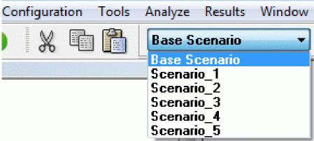
>
> The scenario selected here is the active scenario and the one to which changes in network topology or data will be applied. This scenario will be used for data in **Dynamic Section Views**, Dynamic Long Section, Dynamic Plan Views and, Perspective View.
>
> However, in Review Results, a drop menu is used to select any or all scenarios. These tools are useful for comparing scenario results.
>
> 118

SECTION 6: THE TOOLBAR

> 

XP Tables show data for the currently active scenario plus results for all scenarios.

> 
>
> **6.5 Job, Layer & Mode Control Tools**

These tools are used to access the Job Control dialog, toggle the Layer Control Panel (show/hide) and, to set the xpswmm active mode.

> 

**Job Control** Used to access the Job Control Dialog Box

**Layer Control** This icon toggles show/hide of the Layer Control Panel

**Snap Tool** Toggles the snapping mode off/on. Use to snap vertices of model links and polygons to existing vertices of these objects and vertices in GIS Layers.

**Runoff** This icon is used change the mode to Runoff.

**Sanitary** This icon is used change the mode to Sanitary.

> 119
>
> xpswmm Reference Manual
>
> Hydraulics This icon is used change the mode to Hydraulics.
>
> **6.6 Background Image Tools**
>
> The Icons in this Toolbar are used to manipulate any **background images** that may be present.
>
> 
>
> Add Background Image Use this icon to add a new image
>
> Background Picture Image View or edit the properties of the background
>
> image.
>
> Background images may also by managed using the Layer Control Panel.
>
> **6.7 Solve and Review Results Tools**
>
> These cons provide shortcuts to the more commonly used menu commands that are associated with reviewing model results.
>
> 
>
> **XP-Tables** Shortcut to the XP-Tables command under the Results Menu.
>
> **Quick Data View** Toggle the Quick Data View panel visible/hide. Quick Data View settings may be accessed from the View Menu.
>
> **Graphical Encoding** Shortcut to the Graphical Encoding command under the Results Menu.
>
> **Spatial Reports** Shortcut to the Spatial Reports command under the Results Menu.
>
> **Review Results** Shortcut to the Review Results command under the Results Menu.
>
> **Dynamic Long Section** Shortcut to the Long Section command under the Results Menu.
>
> **Dynamic Section Views** Shortcut to the Dynamic Section Views command under the Results Menu.
>
> **Dynamic Plan View** Shortcut to the Dynamic Plan View command under the Results Menu.
>
> **Perspective View** Shortcut to the Perspective View command under the Results Menu.
>
> **Solve** Shortcut to the Solve command under the Analyze Menu.
>
> A separate set of tools are used to review 2D model results.
>
> **6.8 Object Creation Tools**
>
> 

***Icon Function***

This tool is used to select objects, move objects, reconnect links, re-scale the window, change object attributes and to enter data. At the network level the Pointer tool is used specifically to manipulate the current selection, move the current selection around, reconnect links and for re-scaling. At the dialog level it is used to select a data item or to position the cursor for editing text.

The "current selection" is the set of objects which many menu commands operate upon. Objects that are members of a selection are indicated in inverse video (bright magenta). To make a single object the current selection, just point to it and click.

To select a group of objects in a single operation the mouse button is held down and the dotted outline of a box is dragged around the desired group. To deselect everything, the mouse is clicked in open space. All the objects in a path between two nodes can be selected by first clicking on one node, then, with the \<Ctrl\> key held down, clicking on the other end node.

> SECTION 6: THE TOOLBAR
>
> To extend a selection, the \<Shift\> key is held down in conjunction with the selection operation. The \<Shift\> key causes new selections to be toggled.
>
> **Text** This tool is used to annotate the network by placing text objects on the network. The selection of the text
>
> **Tool** tool causes the cursor to change to an arrow with word TEXT below it. The user moves to the location to enter the text, presses the mouse button, inserts the text, terminating it with the \<Enter\> or \<cr\> key. xpswmm remains in the text input mode until another object creation tool is selected.
>
> The text serves as a comment or notation for the network and may be moved or modified in the same manner as any other object. The attributes of the text such as color and font can be edited by double-clicking on the text string with the pointer tool.
>
> **Node** This tool is used to create nodes on the network. These may physically represent a manhole or pit, an inlet
>
> **Tool** for a catchment, a junction of links, a pond or retarding basin an outfall or a Best Management Practice (BMP). Selecting the node tool changes the cursor to the node shape and places you in a mode for creating node objects. Clicking anywhere inside the window will create a new node at that point with default display attributes.
>
> In some cases the node shape may change to represent different physical structures. Triangular nodes have storage properties other than the system defaults.
>
> **Link** This tool is used to create an open or closed conduit between two nodes. Links cannot exist without
>
> **Tool** nodes at the end points, and have a sense of direction indicated by an arrow line. When the link tool is selected, the cursor changes to a link shape, and the user is in a mode for creating links between nodes. The first click in the window defines the node from which the link emanates. The next and subsequent mouse clicks identify the node to which the link joins. A straight line is then drawn between these two nodes with an arrow indicating direction.
>
> If the mouse is not clicked on an existing node, then a default node is created at that point for the new link. Following each mouse click in the drawing area, a dotted line tracks the mouse's movements, indicating how the new link will appear. This is the most effective way of creating a new network.
>
> The drawn link between nodes does not need to be straight and can support vertices if it is drawn as a polylinkPolylink.
>
> **Multi-** This tool is used to create a link that joins two nodes in a network by more than one conduit such as a dual
>
> **Link** drainage model with a street and a closed conduit between each node. This type of link includes the
>
> **tool** choice of up to 7 open and closed conduits applicable to the link tool but in addition includes diversion structures such as pumps, weirs, orifices, regulators and other real time control elements. To create a multi-link, select the multi-link tool and the cursor changes to a pointer with broken link underneath.
>
> An existing link may be converted to a multi-link selecting it, right clicking and selecting Multi Link from the pop-up menu. Also an existing multi-link may be converted to a link (single conduit shape) by selecting it, right clicking and selecting Single Link from the pop-up menu.
>
> A polylink is a special type of link that has vertices between the two end-nodes. It may be used to define the path of a river, or to indicate a curved pipe, or in any situation where the end-nodes are not connected in a straight path.
>
> The drawn multi-link between nodes does not need to be straight and can support vertices if it is drawn as a polylinkPolylink.
>
> **Polylin** Draws a polyline (line with multiple vertices). Polylines are used to represent 2D boundaries, 1D/2D
>
> **e tool** connections and breaklines. Before creating the polyline the user must select the type of polyline by selecting the appropriate layer in the layer control panel. The layer also needs to be visible, movable and selectable.
>
> **Polygo** Draws a polygon (enclosed area). Polygons are used to create catchments for the Runoff mode, and
>
> **n tool** specific types of areas within the 2D domain. Before creating the polygon the user must select the type of polygon by selecting the appropriate layer in the layer control panel. The layer also needs to be visible, movable and selectable.
>
> **Ruler** Used to measure distance between two points, the length of a polyline or the perimeter and area of a

**tool** polygon. In version 2013 and later, the ruler tool displays the total slope of a multi-segmented line and the slope of the last segment. This can be used to determine and enter the slope for catchments and other fields. Select the Ruler tool and draw line segments on the network.

121

> xpswmm Reference Manual
>
> 

**Cross** Used to cut a temporary free hand cross section on the TIN and display the result in a graphic

**sectio**

**n tool**

> See Also Creating a Network, Navigation Basics and Layer Control Panel
>
> **6.9 Network Viewing and Navigation Tools**
>
> ***Icon Function***
>
> **+ (Plus)** Adds selected object(s) to the active mode
>
> **- (Minus)** Removes selected object(s) from the active mode
>
> **Select All Nodes** This icon provides a shortcut to the Select All Nodes command under the View Menu
>
> **Select All Links** This icon provides a shortcut to the Select All Links command under the View Menu
>
> **Fit Window** Re-scales the network to fit the current window (**<u>Fit Window</u>** )
>
> **Regenerates** Regenerates the network without changing the current location or scale.
>
> **Zoom In X2** Magnify your view of the network by a factor of 2X (or halve the scale).
>
> **Zoom Out X2** Shrink your view of the network by a factor of 2X (or double the scale).
>
> **Window Area In** Magnify your view of the network by a user defined factor which is set by selecting this icon and dragging a box around the area you wish to see.
>
> **Window Area Out** Shrink your view of the network by a user defined factor which is set by selecting this icon and dragging a box inside which the current view of the network will fit.
>
> **Pan** Move your view of the network by a user defined offset which is set by selecting this icon and dragging the network from the old location to the new location.

See Also: The View Menu

> **6.10 Layer Control Panel**
>
> 122

SECTION 6: THE TOOLBAR

In the default setting, xpswmm opens with the Layer Control Panel docked to the left side of the viewing area. This panel is used to mange settings for layers in both 1D and 2D models. The layers are organized in expandable/collapsible groups in a Windows Explorer style fashion. If your version does not have all of the modules, some of the layers will be disabled.

**Viewing the Layer Control Panel**

Clicking on the Layer tool on the Job, Layer and Mode Control tool strip toggles the (show/hide) attribute of the Layer Control Panel.

When the Layer Control Panel is showing, clicking on the (x) on the right corner of the header will hide the panel. **Layer Control Panel Layout**

The Layer Control Panel has two layout modes: docked and undocked. The default layout is docked to the left border of the main xpswmm window.

The panel may be undocked by double clicking on the header or dragging it to a new location. It may be docked to the left or right border of the main window. When it is undocked, the panel may be resized by moving the mouse over an edge or corner. When the pointer changes to a double headed arrow, depress the left button and drag the edge or side. When the panel is docked, its width may be adjusted by selecting the right edge, holding the left button down and dragging to the desired position.

The layers are grouped. Group headers are indicated by a +/- check. The groups may be expanded/collapsed by clicking on the check box or double clicking on the layer name.

**Managing Layers**

Each layer name is preceded by two graphics. The check box toggles the display of the layer off/on. The second is either an icon for the layer or a locked symbol. When the icon is a filled square, it indicates the current display properties of the layer.

A layer is locked by highlighting the layer name, right clicking and selecting Lock Layer from the pop-up menu. When a layer is locked, it cannot be edited in the graphical interface. Data associated with objects in the layer may be edited. Other tasks are accessed by right clicking on the name of the layer. The menu varies according to the function of the layer.

The boxes preceding the names of the layers indicate their display color. The absence of a color box indicates that the layers display properties have not been selected.

**Layer Properties**

The display properties of any layer may be adjusted by moving the mouse over the name of the layer and right clicking. Note that this dialog is different for layers that are polylines, polygons or vectors.

123

> xpswmm Reference Manual
>
> **Descriptions of layers**
>
> **1D Network Layers**
>
> Nodes Represent manholes, catch basins, inlets, wet wells, junctions, ponds or outfalls
>
> Node Labels Text strings representing the name of nodes
>
> Catchments Polygons of areas draining to specific runoff nodes (inlets)
>
> Catchment connections Line from centroid of a catchment to a runoff node (inlet)
>
> Links Represent open channels, closed conduits, pumps weirs, orifices and special structures
>
> Cross-sections Polylines showing layout for a cross section (requires a DTM)
>
> Link Labels Text strings representing the name of links
>
> Water Level Lines Polylines use to display 1D and 2D results map simultaneously
>
> Link Labels Text strings representing the name of nodes
>
> Texts User defined annotation
>
> Spatial Reports Boxes, brackets or drop shadows of object data and results
>
> Graphical encoding Thematic mapping or changing the display properties of objects according to user defined criteria
>
> **2D Domains**
>
> 2D Grid Polygon boundary of the 2D model, cell location and orientation
>
> Active 2D Areas Polygon boundaries of the active cells in the 2D model or 2D floodplain
>
> Inactive 2D Areas Polygon boundaries of the cells excluded for 2D analysis or polygons for the 1D floodplain
>
> Initial Water Levels Polylines within the 2D Grid which set initial water surface elevation for the given polygon areas
>
> 1D/2D Interfaces Polylines along active 2D area polygons that share water level with 1D nodes
>
> 1D/2D Connection Polylines from nodes to the 1D/2D interface vertices
>
> 2D/2D Interfaces Polylines along the boundary between two grid domains which hydraulically connects these domains
>
> 2D Head boundary Polylines where constant or time series head boundaries are specified
>
> 2D Flow boundary Polylines where constant or time series flow boundary conditions are specified
>
> 2D Rainfall/Flow Areas Polygons used to define areas of a rainfall, runoff hydrograph or user defined hydrograph
>
> Land uses Polygons of defined landuses
>
> **Topography**
>
> DTM Layers Digital terrain models (TIN)
>
> Breaklines Polylines indicating topographic boundaries
>
> Gully Polylines indicating locations of gullies
>
> Ridges Polylines indicating location of ridges or topographic divides
>
> Fill Areas Polygons indicating areas above the DTM filled to a constant elevation
>
> Dynamic Elevation Shapes Polygons or Polylines which can modify cell levels based on time or Trigger Points
>
> Trigger Points Points which can be linked to Dynamic Elevation Shapes
>
> Elevation Shapes Polygons or Polylines which can modify cell levels
>
> **Diagnostics**
>
> Listed individually MapInfo Interchange Files showing 2D georeferenced error messages
>
> **Reporting**
>
> 1D Flood Maps Interpolates an inundation depth map based on an \* .xptin surface and 1D open channel link results. Displays peak inundation depth results as well as the inundation extents at each time step
>
> 2D Flows Arrows (vectors) showing flow direction and magnitude for the 2D grid cells
>
> 2D Velocity Arrows (vectors) showing velocity direction and magnitude for the 2D grid cells
>
> 2D Water Depth Color coded water depth map of the 2D cells
>
> 2D Water Elevation Color coded water surface elevation map of the 2D cells
>
> 2D Hazard Color coded hazard (water depth  velocity) map of the 2D cells
>
> 2D Times Color coded time indication map of the 2D cells
>
> Plot Output Lines Lines where 2D time series plots are referenced
>
> Plot Output Point Locations where 2D time series plots are referenced
>
> Legends Legends for the 2D vectors and maps
>
> 124
>
> SECTION 6: THE TOOLBAR
>
> Fly through paths User defined polylines used to describe path for 3D viewer
>
> Diagnostics MapInfo Interchange Files showing 2D georeferenced error messages
>
> **GIS Files**
>
> Listed individually ESRI or MapInfo files
>
> **Background Images**
>
> Listed individually GIS, CAD, orthophotos, and other georeferenced image files
>
> **CAD Files**
>
> Listed individually .dxf or .dwg files
>
> **6.11 Project Tools**
>
> This Toolbar is only enabled if Projects is enabled in the SWMXP.INI file or the checkbox is on in the License Details dialog of the Help Menu.
>
> 
>
> **New Project** This icon is used to create a new project database.
>
> **Open Project** This icon is used to open an existing project database.  
> See Also Project Menu .
>
> **6.12 Global Storms**
>
> The Global Storms tool is used to simultaneously solve the Runoff Mode for multiple storms.
>
> 
>
> The Global Storms drop list appears when the Global Storms is checked in the Runoff Job Control settings.
>
> xpswmm Reference Manual
>
> 
>
> The Global Storms dialog is launched be either selecting the Global Storms button in the Runoff Job Control dialog or clicking on the ellipses (...) on the Global Storms Tool Bar.
>
> 
>
> The dialog contains a row for each storm in the Global Database. Check the box for each storm to be included in the analysis. Contents of the remaining fields are described in Runoff Job Control settings.
>
> When Global Storms are used, do not check the Run Hydrology/Hydraulics Simultaneously in the Hydraulics Job Control settings.

126

> ***SECTION 7: MENUS  
> *THE MENU BAR**
>
> The menu bar displays the titles of ten menus. Many of the menus, File, Edit, Project, View, Analyze, Window and Help are common to all systems utilizing the XP interface. The Configuration, Tools and Results menu is specific to the application. Whenever you work with XP you enter commands by pointing to a menu, then dragging down to highlight the command you want. Any commands in the menu that are disabled are displayed as dimmed or bracketed. A disabled menu item indicates that the command is not available in the current context, and that some other action is required before it can be invoked.
>
> 
>
> As a short cut, keyboard equivalents are available for the most frequently used commands. The keyboard equivalent is indicated by an underlining \_ of the letter appropriate to this command. To invoke commands from a menu use the \<Alt\> key in conjunction with the character, for example \<Alt-F\> to invoke the File menu. Once the menu is displayed press the underlined character of the menu to select the command, for example N to open a New file or R acces Recent files.
>
> Some commonly used commands use the \<Ctrl\> key in conjunction with the appropriate menu command as an additional shortcut, for example \<Ctrl-O\> to open a new file. All of the Results menu items and some other commands use the Function keys as keyboard shortcuts, for example F5 to solve a model or F6 to Browse the output file.
>
> Menu commands that are followed by a dialog box are indicated by an ellipsis "..." after the menu item name.
>
> **POP-UP MENUS**
>
> **FILE MENU**
>
> **EDIT MENU**
>
> **PROJECT MENU**
>
> **VIEW MENU**
>
> **CONFIGURATION MENU**
>
> **TOOLS MENU**
>
> **ANALYZE MENU**
>
> **RESULTS MENU**
>
> **WINDOWS MENU**
>
> **HELP MENU**
>
> **7.1 File**
>
> **7.1.1 The File Menu**
>
> The "File" menu lists commands that relate to your entire database. You can create, open, merge and close a database. While working on a database, you can save your editing changes, return to the last saved version or exit the application.
>
> Move cursor over image and click to view descriptions of the menu commands.
>
> xpswmm Reference Manual
>
> 
>
> Descriptions of the available file menu commands may be found in the following links.
>
> **New**
>
> **Blank Job**
>
> **Use Setup Wizard**
>
> **Create From Template**
>
> **Open**
>
> **Merge**
>
> **Close**
>
> **Save**
>
> **Save As**
>
> **Save As Template**
>
> **Revert**
>
> **Import/Export Data**
>
> **Import XPX/EPA Data**
>
> **Import/Export External Databases**
>
> **Import HEC-RAS Data  
> Import LandXML Data**
>
> **Export XPX Data**
>
> **Export EPA 5.0**
>
> **Properties**
>
> **Print**
>
> **Print Preview**
>
> **Page Setup**
>
> **Record to AVI File**
>
> 128
>
> SECTION 7: MENUS
>
> **Recent Files  
> Clean Up**
>
> **Exit**
>
> **7.1.2 Open**
>
> This command is used to open an existing database and make it active. When this command is selected the Open Document dialog will be shown with a default mask of (\*.xp). To slect a file, double-click on the of the file. Use the windows tools to navaigate to a different folder.
>
> 
>
> If the Projects option is enabled, the Files in Project dialog will only display files that are part of the current project

xpswmm Reference Manual

> 

**7.1.3 Merge**

Choose this option to append an existing XP database to the existing currently opened database. Nodes and Links, Global Databases and Job Control data can be imported from the merged XP file.

> 

After selecting this option you will be prompted for the name of the XP file whose data you wish to import. Any number of databases may be merged, subject to the node and link limitations of the application.

**7.1.4 Close**

Choose this option if you are finished with this database and want to open another existing file or create a new one. If no changes have been made to the current file, it will be closed immediately, otherwise a "Save Changes?" prompt will appear, allowing you the option of closing without saving changes, or cancelling the "Close" operation. Unless merging files the active database must be closed before opening another one.

When the database is closed the temporary work file is copied to the original database. Until close is selected you may revert to your original unchanged database by selecting the "Revert" command from this menu.

A file may also be closed by clicking on the (x) "close box" on the right end menu bar.

130

> SECTION 7: MENUS
>
> **7.1.5 Save**
>
> XP maintains an internal working copy of the database for editing sessions. Changes made while editing are not committed to the permanent database unless explicitly instructed by using the Save command. The Save command commits all changes made to the working database to the permanent database whose file name is the window title. The current view is also saved, so that when re-opened, the display will be in the same state as when the database was saved.
>
> **7.1.6 Save As**
>
> Copies of the working database (see Save command) can be saved under different names by issuing this command. A dialog box prompts for the new database name; the copy is then made and the new name becomes the current database.
>
> The "Save As" and "Save" commands give you flexible control over the timing and permanence of data changes.
>
> **7.1.7 Save As Template**
>
> The easiest way to create a new job is from a Template. Select this command to save the current XP file as a Template. The new Template contain all of the parameter used by XP including settings such as, fonts, XP Table Settings, Spatial Report and Graphical Encoding settings, [<u>Job</u>](mk:@MSITStore:C:/Program%20Files/Microsoft%20Office/Office10/1033/wdmain10.chm::/html/wdconAboutTemplates.htm##) Control parameters, rainfall data...
>
> When selected, this command will prompt for an XPT file name.  
> See Also New File From Template
>
> **7.1.8 Revert**
>
> By choosing "Revert" the working database will revert to the last "Saved" version. There is an additional dialog asking confirmation of this action to ensure there is no unintentional change.
>
> **7.1.9 Properties**
>
> The File Properties and Options page contains information regarding the number of links, nodes, background images and text strings plus the maximum number allowed in your current configuration. Use the expandable/collaspible tree in the left panel to navigate to the desired dialog.
>
> The first panel displays statistics about the current model. The maximum number of nodes is controlled by license. The maximum number of images and text strings can be modified through the Application Settings menu command or by directly editing the SWMXP.INI file.

131

xpswmm Reference Manual

> 

Default display and naming parameters for new nodes are specifed in the Node Drawing Defaults dialog. New nodes are named with the prefix and a number starting with the counter value. The counter value is automatically updated as new nodes are added to the model.

132

SECTION 7: MENUS

> 

Default display and naming parameters for new links are specifed in the Link Drawing Defaults dialog. New links are named with the prefix and a number starting with the counter value. The counter value is automatically updated as new nodes are added to the model.

133

> xpswmm Reference Manual
>
> **File Properties and Options**

Default values for selected Node fields are specified in the Node Data dialog.

134

SECTION 7: MENUS

Default values for selected link fields are specified in the Link Data dialog.

xpswmm Reference Manual

> 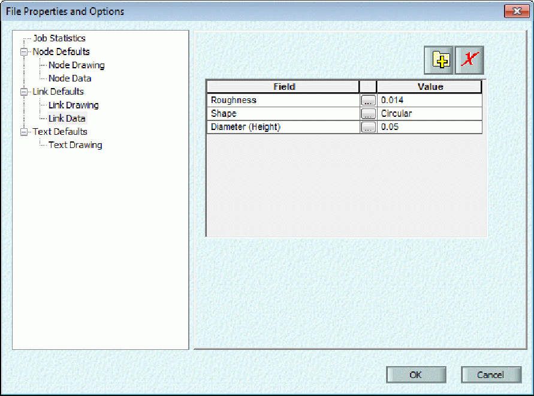

**7.1.10 Print**

Print the current view of the network.

**7.1.11 Print Preview**

Preview how the current view of the network will appear when printed.

**7.1.12 Page Setup**

Use this dialog to define the layout for printing the network layout.

136

SECTION 7: MENUS

Clicking on the format button opens the Header/Footer dialog.

xpswmm Reference Manual

> 

**7.1.13 Record to AVI**

Use this command to record an AVI file.

**7.1.14 Recent Files**

This command allows you to open one of your recently open files. The number of files in the list is controlled by the MRU_COUNT variable in the SWMXP.INI file or from the Application Settings under the tools menu.

**7.1.15 Clean Up**

The "Clean Up" command removes the temporary files used for plotting, graphical review of results, the analysis engine, etc. The files removed when this option is selected are those with the extensions BAK, CDM, CON, DAT, DBF, DEF, DES, DXF, EPD, EXP, GEN, HOT, INT, MOD, NOD, OUT, PBS, PBT, PLT, RDF, RES, RIZ, RPT, SCR, SRP, SRV, SYF, SYQ, SYR, SYT, XLS, XPX.

To prevent the unintentional deletion of files there is an additional dialog providing the option to confirm the removal of each individual files. xpswmm provides a count of the nmber of files that were deleted.

138

SECTION 7: MENUS

> **7.1.16 Exit**
>
> The "Exit" menu option ends the current session and returns to the operating system. xpswmm will give you the option to save any opened database whose changes have not been saved, or to cancel the "Exit" command and remain in the XP environment.
>
> Note that changes to the database are not restricted to just data. Any change in scale, location or highlighting of an object will also cause the "Save Changes?" dialog to be invoked.
>
> **7.1.17 New**
>
> **7.1.1 New**
>
> There are now three ways of creating a new file:
>
> Starting from an Blank Job**,**
>
> Starting from using the New File Wizard, and
>
> Starting from an existing New File From Template.
>
> **New File Options  
> Blank Job**
>
> When you start from this option you will be prompted with the Windows Explorer dialog asking for a file name and folder. The second step wil ask the user to dclare US customary or Metric units for the model. Select the desired units and click on OK. A blank network will view open.
>
> This method is the most flexible but contains no pre-defined data.  
> **New File from Wizard**
>
> This menu command is used to create a new database. Upon selecting this command a dialog box requesting the name of the new database appears. If the name of an existing file is entered, confirmation to overwrite it is requested and, if granted, the existing file is destroyed. Once a new name is entered a New File wizard is started. You can select Finish at any time.
>
> The initial dialog allows you to enter the Job Title which is common to all three layers.

SECTION 7: MENUS

> The Next button now takes you to the Global Database dialog where you can load default global databases containing, for example, rainfall information or infiltration data. The databases shown by default are those located in the Templates directory. You can also associate units with these databases.
>
> 
>
> The Next button now takes you to the Default Node Data dialog where you can enter default node data for your project. Press the + icon to add new fields.
>
> 

141

SECTION 7: MENUS

> 
>
> The program then displays the name of the new empty database in the window title and proceeds to enable and disable appropriate menu commands. Only one database can be active at any one time. Although not mandatory it is good practice to give the new file a .XP extension. This makes retrieval of the file more straightforward when using the "Open" command.
>
> **New File From Template**
>
> Every XP file is based on a template. A template determines the basic structure for a file and may contain settings such as, fonts, XP Table Settings, Spatial Report and Graphical Encoding settings, [<u>Job</u>](mk:@MSITStore:C:/Program%20Files/Microsoft%20Office/Office10/1033/wdmain10.chm::/html/wdconAboutTemplates.htm##) Control parameters, rainfall data and almost any other parameter used by XP.
>
> When selected, this command will prompt for an XP file name followed by the template to be used for this job.
>
> This is the easiest way to create a new job, and a new Template can be created from any XP file at any time. A template file has an .XPT extenstion. Templates are created by the Save As Template command.
>
> xpswmm Reference Manual
>
> 
>
> This command is used to open an existing database and make it active. When this option is selected the Open Document dialog box below will be shown with a default mask "\*.xp To select a file, double-click on the name or type the complete name instead of the mask.
>
> If the Projects option is enabled the Get File dialog box will only display files that are part of the current project as shown below.
>
> When a database is successfully opened, a backup file with the extension ".BAK" is created and appropriate menu commands are enabled and disabled. The backup is not updated until the database is closed and reopened. Only one database can be opened at any one time and its name is displayed in the window title.
>
> **7.1.18 Import/Export Data**
>
> **Import/Export Data**
>
> The Import/Export data options are:

144

SECTION 7: MENUS

> Import data in XPX/EPA Format
>
> Import eport or define an active link)to data in any OLE/DB or ODBC database using Import/Export External Databases wizard
>
> Import HEC-RAS Data.
>
> **Import LandXML Data**
>
> **Export XPX Data**
>
> Export to an EPA SWMM 5 model
>
> EPA SWMM 4.4 and 5.0 files may be converter to XPX files using the standalone EPA-SWMM Data File Reader. This program may be accessed via the Tools  Launch Application menu.
>
> **Import LandXML Data**
>
> xpswmm can import pipe networks (nodes and links and associated data) and TINs. Launch this option to open the Windows Explorer dialog. Navigate to the .xml file and click on open.
>
> **Import XPX/EPA Data**
>
> **EPA Data**
>
> *Data to Import*
>
> This group of parameters controls which subsets of the SWMM data file will be ignored and which will be imported. This provides a means of masking out different SWMM modules within the data file. Further options are available to refine the importation of data within individual modules.

*Runoff*

> This flag controls the import of Runoff data. If this flag is off any Runoff data in the input file will be ignored. If this flag is selected you will be given the option of selecting specific Runoff data to be imported.
>
> *Transport*
>
> This flag controls the import of Transport (Sanitary) data. If this flag is off any Transport data in the input file will be ignored. If this flag is selected you will be given the option of selecting specific Transport data to be imported.

*Extran*

> This flag controls the import of Extran (Hydraulics) data. If this flag is off any Extran data in the input file will be ignored. If this flag is selected you will be given the option of selecting specific Extran data to be imported. At present ALL Extran data is imported.
>
> *Storage/Treatment*
>
> This flag controls the import of Storage/treatment (Sanitary) data. If this flag is off any Storage/treatment data in the input file will be ignored. If this flag is selected you will be given the option of selecting specific Storage/treatment data to be imported.
>
> The JNS variable is used to identify the node name to import into. If this name is empty or zero, then a node may be generated with a name of N\_\<x\>, where \<x\> is a number which makes the name unique. If this name is not empty, then a match will be sought with this name, observing the usual rules for Object Control.
>
> *EPA-SWMM 4.2 Data File*
>
> Select this option to import an EPA-SWMM version 4.0 - 4.2 data file. Using this option, data for specific modules and specific data within each module may be imported. Part of a network may also be imported by only importing into existing or highlighted objects. The SWMM blocks that are supported are Runoff, TRANSPORT, EXTRAN, STORAGE/TREATMENT. Import automatically detects which block is within the data file. <u>If multiple modes are imported EXTRAN should be imported first, on its own, and the other nodes added by re-importing the data file a second time</u>.
>
> 145
>
> xpswmm Reference Manual
>
> Although data checking is performed on the input file, it is generally assumed the input file is a valid EPA-SWMM file which will run under version 4.2 of SWMM without error.
>
> The name of EPA-SWMM data file may be entered manually or selected using the select button.
>
> *Import Object Control*
>
> Use these options to control how objects are created from the data file and which objects will be imported into. If the default values of 'Create objects' on and 'Import into all objects' are used, all objects in the input file will be imported.
>
> **Create Objects**
>
> This flag controls the import of objects found in the input file that do not already exist in the network. If this flag is OFF, data for objects will be imported only if that object already exists. If this flag is ON, objects will be created if they do not already exist. Note that the 'Import into selected objects' option overrides this option if it is ON. In that case, data is only imported into currently highlighted objects.
>
> **Import into all Objects**
>
> This option allows any existing object to be imported into, regardless of whether or not the object has been highlighted.
>
> **Import into Selected Objects**
>
> This option is quite powerful and restrictive in that it only allows network objects that are currently highlighted to have data imported into them. New objects cannot be created from the data file. This option is particularly useful when incrementally creating a network and importing a data file several times. The new objects can be highlighted and import restricted to only these objects.
>
> *Import*
>
> Use this button to perform the import when the desired parameters have been entered.
>
> When you select Import you will be given an Import Warning. This warning dialog is simply to remind you that import can overwrite existing data and should be used with caution. If you want to continue with the import simply hit return or the OK button.
>
> If you wish to save the current version of the database before import or change the import parameters, hit the Escape key or the Cancel button to be returned to the import parameters dialog.
>
> *Runoff Import*
>
> This dialog allows specific runoff data to be imported or ignored. Generally all data should be imported, although there may be cases where some data is not required. For example, 'Channel/pipe data' may not be required if the conduit data is to be imported from an Extran data file.
>
> 146
>
> SECTION 7: MENUS
>
> 
>
> *Import Interface Files*
>
> This flag controls the import of Runoff input and output interface files.
>
> *Import Descriptive Titles*
>
> This flag controls the import of the two descriptive title lines.
>
> *Import Control Parameters*
>
> This flag controls the import of Runoff Control parameters. If this flag is off the control parameters will be read, and used later in the import, but not written.
>
> *Import General Snowmelt Parameters*
>
> This flag controls the import of Runoff Job Control Snowmelt data. Turning this flag off could cause inconsistencies with the subcatchment snowmelt data.
>
> *Import Precipitation Data*
>
> This flag controls the import of Runoff rainfall data.
>
> *Import Evaporation Data*
>
> This flag controls the import of Runoff evaporation data.
>
> *Import Channels/Pipes Data*
>
> This flag controls the import of all channel, pipe, inlet and dummy conduit data.
>
> *Import Subcatchments*
>
> This flag controls the import of Runoff subcatchment data.
>
> *Import Water Quality Data*
>
> 147
>
> xpswmm Reference Manual
>
> This flag controls the import of pollutant, landuse and erosion data.
>
> *Import Print Control*
>
> This flag controls the import of Runoff print control.
>
> *Transport Import*
>
> This dialog allows specific transport data to be imported. Generally all data should be imported, although there may be cases where some data is not required.
>
> 
>
> *Import Descriptive Titles -*
>
> This flag controls the import of the two descriptive title lines.
>
> *Import Transport Control Parameters*
>
> This flag controls the import of Transport Control parameters. If this flag is off the control parameters will be read, and used later in the import, but not written.
>
> *Import Element Data*
>
> This flag controls the import of Transport element data comprising all conduits and non-conduits.
>
> *Import Pollutant Data*
>
> This flag controls the import of Transport pollutants.
>
> *Import Internal Storage Elements*
>
> This flag controls the import of Transport internal storage elements.
>
> *Import Node Control Data*
>
> 148
>
> SECTION 7: MENUS
>
> This flag controls the import of Transport node control data. This data comprises output control for Transport elements to SWMM interface files and the output tables.
>
> *Import Infiltration Data*
>
> This flag controls the import of Transport infiltration data. This data determines the amount of additional flow into the sewer system via infiltration from various sources.
>
> *Import Sewer Inflow Data*
>
> This flag controls the import of sewer inflow data. This data comprises the daily and weekly temporal patterns for sewer inflows.
>
> *Import Study Area Data*
>
> This flag controls the import of Transport study area data. This data comprises overall measurements of sewer inflows for the whole of the catchment. Predicted flows are adjusted to match study area measurements for the whole drainage basin.
>
> *Import Process Flow Data*
>
> This flag controls the import of Transport process flow data. This data comprises direct inflows and pollutant concentrations into Transport manholes.
>
> *Import Sub-area Data*
>
> This flag controls the import of Transport sub-area data. This data comprises dry weather flow generation, using catchment and land use properties to estimate water use.
>
> *Hydrograph and Pollutograph Input*
>
> This flag controls the import of Transport Hydrograph and Pollutograph input. Data comprises direct input of hydrographs and pollutant concentrations to manholes.
>
> *Storage Treatment Import*
>
> This dialog allows specific Storage/Treatment data to be imported. Generally all data should be imported, although there may be cases where some data is not required.

> xpswmm Reference Manual
>
> *Import Simulation Data*
>
> This flag controls the import of the title lines, date, time, time steps and number of time steps.
>
> *Import Print Control Data*
>
> This flag controls the import of print control data. This data comprises flags controlling the amount of printout for analysis of a treatment plant.
>
> *Import Evaporation Data*
>
> This flag controls the import of Storage/Treatment evaporation data.
>
> *Import Pollutant Data*
>
> This flag controls the import of Storage/Treatment pollutant data. This data characterises pollutants and their removal from internal storage/treatment units.
>
> *Import Treatment Unit Data*
>
> This flag controls the import of treatment unit data. This data comprises the connectivity of internal units in a storage/treatment plant, with flow directions and capacities of flow paths.
>
> *Import Detention Unit Data*
>
> This flag controls the import of detention unit data. Detention units have storage associated with them.
>
> *Import Unit Cost Data*
>
> This flag controls the import of unit cost data.
>
> *Import Flow & Concentration Time Series*
>
> This flag controls the import of flow and concentration time series directly into a storage/treatment plant.
>
> *Tidy up Network*
>
> If this flag is selected the network will be optionally rearranged after import to minimise conduits crossing over one another. This option is useful; as nodes created by import are placed in an approximate grid and the network can become quite messy when the links connecting the nodes are created. The tidy up procedure works best with purely dendritic networks.
>
> **XPX**
>
> *Import XPX/EPA Data*
>
> This feature provides the facility to import SWMM data files created for EPA-SWMM Version 4. It can be used to import data into a new network or to append to an existing network. This function has only been implemented for data files from Version 4.00 through 4.20 coded in accordance with the format described in the USEPA Stormwater Management Model, Version 4 User's Manual (June 1988). It may be extended to include Version 3 files in a future release depending on user demands.
>
> **Although every attempt has been made to implement the undocumented features implemented in a variety of customized programs, we offer no guarantee that data will be imported exactly as originally coded.**
>
> **Import is offered as a tool to assist in creating your database. All imported data <u>MUST</u> be verified to**

150

SECTION 7: MENUS

> **ensure it is a true representation of the original information before any attempt is made to use the generated results.**
>
> 
>
> **XPX Format File**
>
> **XPX Options**
>
> **EPA-SWMM 4.2 Data File**
>
> **Import Object Control**
>
> **Tidy up Network**
>
> **Data to Import**
>
> **Import**
>
> EPA SWMM 4.4 and 5.0 files may be converter to XPX files using the standalone EPA-SWMM Data File Reader. This
>
> program may be accessed via the Tools  Launch Application menu.
>
> *XPX Format File*
>
> Select this option to import a file in XPX format. XPX format is designed to facilitate import of external databases into
>
> XP databases. The file format is described in detail in a separate documentation file. Basically, a simple command-line syntax is implemented to allow the creation of network elements and associated data.
>
> The name of XPX format file may be entered manually or selected using the Select button.
>
> See Also **XPX Command Reference** and SPREADSHEET IMPORT  
> *XPX Command Reference*
>
> The format is described in pseudo-EBNF notation. Note that the file format is pure token stream; tokens are separated by white space, i.e. spaces, commas and/or tabs. Keywords (shown uppercase) are not case sensitive.
>
> xpx_file = {command}
>
> 151
>
> xpswmm Reference Manual
>
> The XPX file consists of a series of commands with various parameters assigned to them to operate on. There are ten types of XPX commands. They are:

1.  **The node command**

2.  The link command

3.  The data command

4.  The table command

5.  The global database command

6.  **The global database item command**

7.  **The global database data command**

8.  **The makemulti command**

9.  **The link vertex command**

10. **The cross section vertex command**

11. **The Catchment command**

> CONTEXT-SENSITIVE RULES:
>
> Any references to objects must already be defined i.e. NODE commands must appear before LINK commands which reference them, and similarly DATA commands must appear after the object references are defined.
>
> An un-named global object is defined by an empty string ().
>
> Notes: 1. Object names are not case-sensitive.

2.  Strings with embedded white space can be enclosed in double-quotes ().

3.  Data can be commented out using 'C' style comments i.e. /\* This is a comment \*/

> *XPX Node Command*
>
> **COMMAND:** NODE
>
> **DESCRIPTION:** The node command defining a particular node must appear in the XPX file before any reference can be made to data or links associated with it. There is no rigid structure to the order that these command appear in provided the above rule is complied with. The node_command consists of the word NODE followed by a node_type, a node_name and an X and Y value which represent it coordinates.
>
> **SYNTAX:** NODE node_type node_name x y
>
> **VARIABLES:**
>
> *Node_type (Integer)* The node_type is an integer value which specifies the shape and colour the node will appear in its screen representation when the XPX file is imported. The various values and shapes for node_type are listed below. In the current implementation of xpswmm all resulting nodes will be circular and take on the default property specified in the File-\>Properties... dialog. A node will automatically become triangular in shape when storage data is active.
>
> *Node Type Shape*
>
> 0 Circle
>
> 152
>
> xpswmm Reference Manual
>
> *Node_from (String)* The node_from parameter must be enclosed in double quotation marks. It is an alphanumeric string representing the name of the upstream connecting node for the link specified in link_name.
>
> *Node_to (String)* The node_to parameter must be enclosed in double quotation marks. It is an alphanumeric string representing the name of the downstream connecting node for the link specified in link_name.
>
> The node_from and node_to nodes must have been specified earlier in the XPX file using the NODE comand above. A link must be specified before any dat may be defined which is associated with the link.
>
> *command node_type link_name node_from node_to*
>
> **EXAMPLE:** LINK 136 Link 1 mh a1 mh b1
>
> *XPX Data Command*
>
> **COMMAND:** DATA
>
> **DESCRIPTION:** The data_command is used to assign data attributes to objects (links and nodes) which have been defined earlier in the XPX file. It must begin with the word DATA and be followed by a field_name, and object_name to attach the data to, an instance , a count and data_string, the actual data being defined.
>
> **SYNTAX:** DATA field_name object_name instance count {data_string}
>
> **VARIABLES:**
>
> *Field_name (String)* The data field_name is any name that is pertinent to this type of object, either a link or node. The name is not case-sensitive
>
> The appropriate field name may be found in this reference or by using the Get Field Info facility in XP (using the **Dialog Icon** )
>
> *Object \_name (String)* The object_name is any quoted string which has been previously defined as a link or node using the LINK or NODE command. The data_string will be assigned to this object_name and placed in the database field called field_name. If the field_name is a global value and not associated with an object then the object_name is defined as a pair of double quotes (i.e. )
>
> *Instance (Integer)* The instance is an integer value which allows for multiple instances of the same data type for the one object. For example, multiple conduits in one link. The first instance of a data type is assigned a value of 0 (zero). the second instance is 1 (one) and so on. For a data type which has only one instance the value will be 0 (zero).
>
> *Count (Integer)* This value specifies how many data items to expect in the following data_string. Normally this is 1 (one) except for list data. For example, user inflow hydrographs have more than 1 (one) data point. If there were 25 points in the hydrograph you would specify a count of 25 and then follow with a data string containing 25 values.
>
> 154
>
> SECTION 7: MENUS
>
> Data_string (String) This is a string of value(s) which will be placed in the database field specified by the field_name string attached to the object specified by the object_name string. There must be as many data items in the data string as is specified by the value of the count variable and they must be separated by at least 1 (one) space.
>
> **EXAMPLE:** /\* Add a hydrograph to a node named MHA1\*/

<table style="width:100%;">
<colgroup>
<col style="width: 64%" />
<col style="width: 7%" />
<col style="width: 7%" />
<col style="width: 7%" />
<col style="width: 5%" />
<col style="width: 5%" />
</colgroup>
<tbody>
<tr class="odd">
<td><blockquote>

DATA TEO MHA1 0 5

</blockquote></td>
<td>0.0</td>
<td>1.0</td>
<td>2.0</td>
<td>3.0</td>
<td>4.0</td>
</tr>
<tr class="even">
<td><blockquote>

DATA QCARD MHA1 0 5

</blockquote></td>
<td>0.0</td>
<td>21.8</td>
<td>63.3</td>
<td>44.1</td>
<td>1.2</td>
</tr>
<tr class="odd">
<td><blockquote>

/* Import the length of a conduit named Link1*/

</blockquote></td>
<td></td>
<td></td>
<td></td>
<td></td>
<td></td>
</tr>
<tr class="even">
<td><blockquote>

DATA LEN Link1 0 1

</blockquote></td>
<td>135.5</td>
<td></td>
<td></td>
<td></td>
<td></td>
</tr>
<tr class="odd">
<td><blockquote>

/*set link LB3 active in HDR Mode*/

</blockquote></td>
<td></td>
<td></td>
<td></td>
<td></td>
<td></td>
</tr>
<tr class="even">
<td><blockquote>

DATA LOCMODE LB3 0 1

</blockquote></td>
<td>1</td>
<td></td>
<td></td>
<td></td>
<td></td>
</tr>
<tr class="odd">
<td><blockquote>

/*set node MHB1 active in RNF Mode*/

</blockquote></td>
<td></td>
<td></td>
<td></td>
<td></td>
<td></td>
</tr>
<tr class="even">
<td><blockquote>

DATA LOCMODR MHB1 0 1

</blockquote></td>
<td>1</td>
<td></td>
<td></td>
<td></td>
<td></td>
</tr>
<tr class="odd">
<td><blockquote>

/*set node MHB1 inactive in SAN Mode*/

</blockquote></td>
<td></td>
<td></td>
<td></td>
<td></td>
<td></td>
</tr>
<tr class="even">
<td><blockquote>

DATA LOCMODT MHB1 0 1

</blockquote></td>
<td>0</td>
<td></td>
<td></td>
<td></td>
<td></td>
</tr>
</tbody>
</table>

> *XPX Global Database Command*
>
> *An enhancement of this command is provided by the GLDBITEM and GLDBDA TA commands, which remove the Instance dependency and instead, search on the database name.*
>
> **COMMAND:** GLDB
>
> **DESCRIPTION:** The GLDB command is used to enter Global Database data.
>
> **SYNTAX:** GLDB gldb_type_name_string instance gldb_name_string
>
> **VARIABLES:**
>
> gldb_type_name_string The gldb_type_name_string is the type of global database to be imported. The string must be enclosed in double quotes ().
>
> *Instance (Integer)* The instance is an integer value which allows for multiple instances of the same data type for the one object. For example, multiple database records. The first instance of a data type is assigned a value of 0 (zero). the second instance is 1 (one) and so on.
>
> gldb_name_string The gldb_name_string is the record name of global database to be imported. The string must be enclosed in double quotes ().
>
> **EXAMPLE:** GLDB Pump Ratings 0 Pump \#1
>
> 155

<table style="width:100%;">
<colgroup>
<col style="width: 24%" />
<col style="width: 9%" />
<col style="width: 4%" />
<col style="width: 4%" />
<col style="width: 4%" />
<col style="width: 11%" />
<col style="width: 7%" />
<col style="width: 12%" />
<col style="width: 20%" />
</colgroup>
<tbody>
<tr class="odd">
<td>
xpswmm Reference Manual

<blockquote>

GLDB GLDB GLDB GLDB

</blockquote></td>
<td colspan="3"><blockquote>

Pump Ratings Pump Ratings Pump Ratings Pump Ratings

</blockquote></td>
<td>
1

2

3

4
</td>
<td><blockquote>

Pump #2 Pump #3 Pump #4 Pump #5

</blockquote></td>
<td></td>
<td></td>
<td></td>
</tr>
<tr class="even">
<td>DATA</td>
<td>PRATEX</td>
<td> </td>
<td>0</td>
<td>3</td>
<td>40.000</td>
<td>30.000</td>
<td><blockquote>

10.000

</blockquote></td>
<td><blockquote>

/* Pump Param */

</blockquote></td>
</tr>
<tr class="odd">
<td>DATA</td>
<td>PRATEX</td>
<td> </td>
<td>1</td>
<td>3</td>
<td>40.000</td>
<td>35.000</td>
<td><blockquote>

12.000

</blockquote></td>
<td></td>
</tr>
<tr class="even">
<td>DATA</td>
<td>PRATEX</td>
<td> </td>
<td>2</td>
<td>3</td>
<td>50.000</td>
<td>40.000</td>
<td><blockquote>

20.000

</blockquote></td>
<td></td>
</tr>
<tr class="odd">
<td>DATA</td>
<td>PRATEX</td>
<td> </td>
<td>3</td>
<td>3</td>
<td>60.000</td>
<td>50.000</td>
<td><blockquote>

40.000

</blockquote></td>
<td></td>
</tr>
<tr class="even">
<td>DATA</td>
<td>PRATEX</td>
<td> </td>
<td>4</td>
<td>3</td>
<td>60.000</td>
<td>50.000</td>
<td><blockquote>

40.000

</blockquote></td>
<td></td>
</tr>
<tr class="odd">
<td>DATA</td>
<td>PRATEY</td>
<td> </td>
<td>0</td>
<td>3</td>
<td>10.000</td>
<td>50.000</td>
<td><blockquote>

1000.000

</blockquote></td>
<td><blockquote>

/* Pump Flow */

</blockquote></td>
</tr>
<tr class="even">
<td>DATA</td>
<td>PRATEY</td>
<td> </td>
<td>1</td>
<td>3</td>
<td>10.000</td>
<td>50.000</td>
<td><blockquote>

1000.000

</blockquote></td>
<td></td>
</tr>
<tr class="odd">
<td>DATA</td>
<td>PRATEY</td>
<td> </td>
<td>2</td>
<td>3</td>
<td>10.000</td>
<td>50.000</td>
<td><blockquote>

1000.000

</blockquote></td>
<td></td>
</tr>
<tr class="even">
<td>DATA</td>
<td>PRATEY</td>
<td> </td>
<td>3</td>
<td>3</td>
<td>10.000</td>
<td>50.000</td>
<td><blockquote>

1000.000

</blockquote></td>
<td></td>
</tr>
<tr class="odd">
<td>DATA</td>
<td>PRATEY</td>
<td> </td>
<td>4</td>
<td>3</td>
<td>10.000</td>
<td>50.000</td>
<td><blockquote>

1000.000

</blockquote></td>
<td></td>
</tr>
</tbody>
</table>

> *XPX Global Database Item Command*
>
> **COMMAND:** GLDBITEM
>
> **DESCRIPTION:** The GLDBITEM command is an enhancement to the GLDB command that uses the Global Database name rather than the instance for entering the data. It provides a much easier mechanism for updating global data.
>
> **SYNTAX:** GLDBITEM gldb_type_name_string gldb_name_string
>
> **VARIABLES:**
>
> gldb_type_name_string The gldb_type_name_string is the type of global database to be imported. The string must be enclosed in double quotes ().
>
> gldb_name_string The gldb_name_string is the record name of global database to be imported. The string must be enclosed in double quotes ().
>
> **EXAMPLE:** GLDBITEM Rainfall SCS Spillway Design
>
> *XPX Global Database Data Command*
>
> **COMMAND:** GLDBDATA
>
> **DESCRIPTION:** The GLDBDATA command is an enhancement to the DATA command that uses the Global Database name rather than the instance for entering the data. It provides a much easier mechanism for updating global data.
>
> **SYNTAX:** GLDBDATA field_name gldb_type_name_string gldb_name_string count {data_string}
>
> 156

SECTION 7: MENUS

> **VARIABLES:**
>
> *Field_name (String)* The data field_name is any name that is pertinent to this type of global database. The name is not case-sensitive.
>
> The appropriate field name may be found in this reference or by using the Get Field Info facility in XP (using the **Dialog Icon** )
>
> gldb_type_name_string The gldb_type_name_string is the type of global database to be imported. The string must be enclosed in double quotes ().
>
> gldb_name_string The gldb_name_string is the record name of global database to be imported. The string must be enclosed in double quotes ().
>
> *Count (Integer)* This value specifies how many data items to expect in the following data_string. Normally this is 1 (one) except for list data. For example, rainfall hyetographs have more than 1 (one) data point. If there were 50 points in the hydrograph you would specify a count of 50 and then follow with a data string containing 50 values.
>
> Data_string (String) This is a string of value(s) which will be placed in the database field specified by the field_name string attached to the object specified by the object_name string. There must be as many data items in the data string as is specified by the value of the count variable and they must be separated by at least 1 (one) space.

<table>
<colgroup>
<col style="width: 13%" />
<col style="width: 11%" />
<col style="width: 9%" />
<col style="width: 21%" />
<col style="width: 11%" />
<col style="width: 32%" />
</colgroup>
<tbody>
<tr class="odd">
<td><strong>EXAMPLE:</strong></td>
<td colspan="4">GLDBITEM Rainfall SCS Spillway Design</td>
<td></td>
</tr>
<tr class="even">
<td>GLDBDATA</td>
<td><blockquote>

R_ROPT

</blockquote></td>
<td>"Rainfall"</td>
<td>"SCS Spillway Design"</td>
<td><blockquote>

1 0

</blockquote></td>
<td><blockquote>

/* User defined rainfall */

</blockquote></td>
</tr>
<tr class="odd">
<td>GLDBDATA</td>
<td><blockquote>

R_KTYPE

</blockquote></td>
<td>"Rainfall"</td>
<td>"SCS Spillway Design"</td>
<td><blockquote>

1 0

</blockquote></td>
<td><blockquote>

/* Constant rainfall */

</blockquote></td>
</tr>
<tr class="even">
<td>GLDBDATA</td>
<td><blockquote>

R_KPREPC

</blockquote></td>
<td>"Rainfall"</td>
<td>"SCS Spillway Design"</td>
<td><blockquote>

1 2

</blockquote></td>
<td><blockquote>

/* Cumulative Depth */

</blockquote></td>
</tr>
<tr class="odd">
<td>GLDBDATA</td>
<td><blockquote>

R_RMULT

</blockquote></td>
<td>"Rainfall"</td>
<td>"SCS Spillway Design"</td>
<td><blockquote>

1 1

</blockquote></td>
<td><blockquote>

/* Rainfall Multiplier */

</blockquote></td>
</tr>
<tr class="even">
<td>GLDBDATA</td>
<td><blockquote>

R_HOFF

</blockquote></td>
<td>"Rainfall"</td>
<td>"SCS Spillway Design"</td>
<td><blockquote>

1 0

</blockquote></td>
<td><blockquote>

/* User defined rainfall */

</blockquote></td>
</tr>
<tr class="odd">
<td>GLDBDATA</td>
<td><blockquote>

R_KTIMEC

</blockquote></td>
<td>"Rainfall"</td>
<td>"SCS Spillway Design"</td>
<td><blockquote>

1 1

</blockquote></td>
<td><blockquote>

/* Time Interval in Hours */

</blockquote></td>
</tr>
<tr class="even">
<td>GLDBDATA</td>
<td><blockquote>

R_THISTO

</blockquote></td>
<td>"Rainfall"</td>
<td>"SCS Spillway Design"</td>
<td><blockquote>

1 0.02

</blockquote></td>
<td><blockquote>

/* Time Interval */

</blockquote></td>
</tr>
<tr class="odd">
<td>GLDBDATA</td>
<td><blockquote>

R_TZRDT

</blockquote></td>
<td>"Rainfall"</td>
<td>"SCS Spillway Design"</td>
<td><blockquote>

1 "1/1/2001"

</blockquote></td>
<td><blockquote>

/* Storm Start Date */

</blockquote></td>
</tr>
<tr class="even">
<td>GLDBDATA</td>
<td><blockquote>

R_TZRTM

</blockquote></td>
<td>"Rainfall"</td>
<td>"SCS Spillway Design"</td>
<td><blockquote>

1 "00:00"

</blockquote></td>
<td><blockquote>

/* Storm Start Time */

</blockquote></td>
</tr>
</tbody>
</table>

> /\* Rainfall Values Read Left to Right and Top to Bottom \*/

|          |        |        |                                  |        |        |        |        |        |        |
|----------|--------|--------|----------------------------------|--------|--------|--------|--------|--------|--------|
| GLDBDATA |        | R_REIN | "Rainfall" "SCS Spillway Design" |        |        |        | 50     |        |        |
| 0.0080   | 0.0162 | 0.0246 | 0.0333                           | 0.0425 | 0.0524 | 0.0630 | 0.0743 | 0.0863 | 0.0990 |
| 0.1124   | 0.1265 | 0.1420 | 0.1595                           | 0.1800 | 0.2050 | 0.2550 | 0.3450 | 0.4370 | 0.5300 |
| 0.6030   | 0.6330 | 0.6600 | 0.6840                           | 0.7050 | 0.7240 | 0.7420 | 0.7590 | 0.7750 | 0.7900 |
| 0.8043   | 0.8180 | 0.8312 | 0.8439                           | 0.8561 | 0.8678 | 0.8790 | 0.8898 | 0.9002 | 0.9103 |
| 0.9201   | 0.9297 | 0.9391 | 0.9483                           | 0.9573 | 0.9661 | 0.9747 | 0.9832 | 0.9916 | 1.0000 |

> *XPX Table Command*
>
> **COMMAND:** \$TABLE \$TABLE_END
>
> **DESCRIPTION:** XPX format has been enhanced to allow the import of CSV files. The format of the file is as below: The first line signifies the beginning of the table format. The second line contains all the XP variable names. The remaining lines (except the last) contains the object name, instance of data (usually 0), index (usually 1), and then the data for each variable.
>
> 157
>
> xpswmm Reference Manual
>
> **SYNTAX:** \$TABLE
>
> {field_name_string}
>
> object_name, instance, count, {data_string}
>
> \$TABLE_END
>
> **VARIABLES:**
>
> *Field_name_string* The field_name_string is any name pertinent to this type of object, either link or node. The name is not case-sensitive. Any number of variables can be included in the string.
>
> The appropriate field_name_string may be found by using the Get Field Info facility (using the **Dialog Icon** )
>
> *Object \_name (String)* The object_name is any quoted string which has been previously defined as a link or node using the LINK or NODE command.
>
> *Instance (Integer)* The instance is an integer value which allows for multiple instances of the same data type for the one object. For example, multiple conduits in one link. The first instance of a data type is assigned a value of 0 (zero). the second instance is 1 (one) and so on.
>
> *Count (Integer)* This value specifies how many data items to expect in the following data_string. Lists cannot be entered in a table so the Count is always 1 (one).
>
> Data_string (String) This is a string of values which will be placed in the database field names specified by the field_name_string. There must be as many data items in the data_string as are specified by the field_name_string. They must be separated by at least 1 (one) space or comma.
>
> **EXAMPLE:** \$TABLE
>
> /\* , , , DS Elev, US Elev, Length, Depth, Rougnness, Width, Side 1, Side 2 \*/
>
> , , , ZP1, ZP2, LEN, DEEP, ROUGH, WIDE, TTHETA, TPHI

<table>
<colgroup>
<col style="width: 15%" />
<col style="width: 7%" />
<col style="width: 8%" />
<col style="width: 7%" />
<col style="width: 6%" />
<col style="width: 11%" />
<col style="width: 8%" />
<col style="width: 8%" />
<col style="width: 25%" />
</colgroup>
<tbody>
<tr class="odd">
<td><ol start="5" type="1">
<li>
0, 1,
</li>
</ol></td>
<td>102.0,</td>
<td>102.5,</td>
<td>300,</td>
<td>9,</td>
<td>0.015,</td>
<td>0.0,</td>
<td>3.0,</td>
<td>3.0</td>
</tr>
<tr class="even">
<td><ol start="6" type="1">
<li>
0, 1,
</li>
</ol></td>
<td>101.5,</td>
<td>103.0,</td>
<td>300,</td>
<td>9,</td>
<td>0.015,</td>
<td>0.0,</td>
<td>3.0,</td>
<td>3.0</td>
</tr>
</tbody>
</table>

> \$TABLE_END
>
> *XPX Options*
>
> The XPX options allow the user to make Inactive data active and echo additional feedback on the imported data.
>
> 158
>
> SECTION 7: MENUS
>
> 
>
> *Inactive Data*
>
> Inactive data is data that is not needed for the simulation due to a particular option not being taken. The data in the XP database is hierarchical. So if an element in the hierarchy is taken out then the data beneath that will become Inactive.
>
> Note: This refers only to data, not objects. This does not affect whether objects (nodes and links) are enabled for analysis in any particular mode. This is covered below.
>
> *Make Imported Data Active*
>
> If any item of Imported data is Inactive, i.e. the parent flag is not ticked, after all the data in the XPX file is  
> imported then thedata will be made Active by ticking on the parent flag, in the order they appear in the file.
>
> *Report Data made Active*
>
> This will create a report file containing information on all the data that had to be made Active.
>
> *Warning if Data is Inactive*
>
> No action will be taken if imported data remains Inactive. It will still be Inactive after the Import. It will only become Active if the parent data flag is manually changed to make this data Active. The data will be imported and a warning message will be generated to indicate that some data is inactive.
>
> *No Action*
>
> No action will be taken if data is Inactive. It will still be Inactive after the Import. It will only become Active if the parent data flag is manually changed to make this data Active. The data will be imported with no warnings.
>
> *Report Successful Data Imports*
>
> This will report on all the data that were successfully imported.
>
> *Initialise Objects*
>
> Initialises the data fields in the database ready for solve. This function checks all necessary dialog boxes of the selected field type, and confirms that data will exist in that field.
>
> *Node*
>
> Switches on all data flags necessary for node type data
>
> 159
>
> xpswmm Reference Manual
>
> *Link*
>
> Switches on all data flags necessary for link type data
>
> *RNF data variable*
>
> Switches on all flags for run-off layer data
>
> *TRN data variable*
>
> Switches on all flags for sanitary layer data
>
> *HDR data variable*
>
> Switches on all flags for hydraulic layer data
>
> *XPX Catchment Command*
>
> **COMMAND:** CATCHMENT
>
> **DESCRIPTION:** The catchment command defines a catchment polygon and links it to a node. The particular node must appear in the XPX file before any reference can be made to it.
>
> **SYNTAX:** CATCHMENT node_name s n
>
> for 1 to n
>
> CatchPoly_Pt1_X CatchPoly_Pt1Y CatchPoly_Pt2_X CatchPoly_Pt2Y CatchPoly_Pt3_X CatchPoly_Pt3Y :
>
> CatchPoly_Ptn_X CatchPoly_PtnY
>
> **VARIABLES:**
>
> *Node_name (String)* The node_name must be enclosed in double quotation marks. It is an alphanumeric string representing the name of this node.
>
> *s (integer)* The s value is the node subcatchment number (1  5).
>
> *n (integer)* The n value is the number of vertices in the polygon.
>
> *Command node_name s n*
>
> **EXAMPLE:** CATCHMENT "MH11" 1 5
>
> 1032150 352400
>
> 1032550 352400
>
> 1032500 352700
>
> 1032300 352600
>
> 1032100 352500
>
> SECTION 7: MENUS
>
> *Spreadsheet Import*
>
> Spreadsheet information may be imported by using the XPX Table Command and adding the \$TABLE keyword to the spreadsheet file, then creating a CSV (comma separated variable) file and importing this file using the XPX import feature.
>
> The format comprises a set of commands (keywords) followed by parameters. The commands allow the creation of objects (nodes, links), and assigning of data to these objects.
>
> External data may be imported into all XP applications (e.g. xpswmm, xp-udd, xp-storm, xp-rafts) via the Import Data... command under the Special menu. The command prompts the user for a text filename with a suggested .XPX extension (to indicate an XP-Exchange format file). Once a file is selected, the data specifications in that file are imported into the XP network and database.
>
> To obtain the Field Name and Instance for database fields, you need to use the Get Field Info facility in XP. To do this, the database field is first selected by holding down the \<CTRL\> key and clicking in the dialog item linked to it with the mouse (this is the same preamble as COPYing a data item prior to PASTEing). Then, press the \<ALT\> key and the \<I\> key simultaneously to Get Info on the selected data item. A dialog window pops up, displaying the info you need. You can get help on this dialog in the usual way by holding down the \<ALT\> key and clicking on the item of interest with the mouse.
>
> **External Databases**
>
> **Import/Export External Databases**
>
> Data can be obtained from many different ODBC compliant databases, through this function.
>
> *Note: You must have installed the MDAC drivers from your installation CD prior to using this function. Only users with the GIS module will be able to access this menu function.*

> xpswmm Reference Manual
>
> Any number of databases can be linked to the XP model. When you select the new database option an Import wizard is invoked. Once databases have been defined they can be edited, re-mapped, deleted or moved up or down in the import hierarchy.
>
> 
>
> If you choose to select an existing file you will be asked to select from a list of known database types, these include Access, dBase, Excel and other ODBC databases.
>
> 162

SECTION 7: MENUS

> 

If your database is not recognized you will need to define your own database connection. Select the Choose a database connection option. You may need your database administrator to help you through this process.

Once a database has been selected you will need to select the table that will be linked to the XP database.

> xpswmm Reference Manual
>
> External Database Wizard - Step 2
>
> Select Preview Table Data to view the data in the currently selected database table.
>
> 164

SECTION 7: MENUS

> 
>
> Once a table has been selected the database/table combination can be defined for Import (read-only access) for Import and Export whereby the table can be updated with changes made in XP or for Export only in which case the results from XP are saved in the database for use in reviewing results from an external program.
>
> SECTION 7: MENUS
>
> 
>
> The next step requires defining the mandatory data for a node or link object.
>
> For a node that may be created if it does not exist, you will need to enter the field defining the node name and also the fields defining the X and Y coordinates of the node location. If the node is using the Update Only option then only the field defining the node name must be entered.
>
> For a link that may be created if it does not exist, you will need to enter the field defining the link name and also the fields defining the upstream and downstream of the node names in order to define the link connectivity. If the link is using the Update Only option then only the field defining the link name must be entered.

167

> xpswmm Reference Manual

<table>
<colgroup>
<col style="width: 11%" />
<col style="width: 7%" />
<col style="width: 18%" />
<col style="width: 5%" />
<col style="width: 17%" />
<col style="width: 10%" />
<col style="width: 28%" />
</colgroup>
<tbody>
<tr class="odd">
<td colspan="5" rowspan="2"><blockquote>

External Database Wizard - Step 5

</blockquote></td>
<td rowspan="2"></td>
<td></td>
</tr>
<tr class="even">
<td></td>
</tr>
<tr class="odd">
<td rowspan="2"></td>
<td></td>
<td></td>
<td colspan="2" rowspan="2"></td>
<td rowspan="2"></td>
<td rowspan="2"></td>
</tr>
<tr class="even">
<td></td>
<td><blockquote>

<strong>New</strong> connection

</blockquote></td>
</tr>
<tr class="odd">
<td rowspan="2"></td>
<td rowspan="2"></td>
<td rowspan="2"><blockquote>

Table

</blockquote></td>
<td colspan="2" rowspan="2">Object Type</td>
<td><blockquote>

Link

</blockquote></td>
<td></td>
</tr>
<tr class="even">
<td></td>
<td></td>
</tr>
<tr class="odd">
<td></td>
<td></td>
<td></td>
<td></td>
<td> Mandatory Data</td>
<td></td>
<td></td>
</tr>
<tr class="even">
<td></td>
<td></td>
<td><blockquote>

ImporVExport

</blockquote></td>
<td></td>
<td></td>
<td><blockquote>

Link Name

</blockquote></td>
<td></td>
</tr>
<tr class="odd">
<td rowspan="2"></td>
<td rowspan="2"></td>
<td rowspan="2"></td>
<td rowspan="2"></td>
<td rowspan="2">Link Name</td>
<td></td>
<td></td>
</tr>
<tr class="even">
<td></td>
<td></td>
</tr>
<tr class="odd">
<td></td>
<td></td>
<td></td>
<td></td>
<td></td>
<td><blockquote>

U/S Node

</blockquote></td>
<td></td>
</tr>
<tr class="even">
<td rowspan="2"></td>
<td rowspan="2"></td>
<td rowspan="2"><blockquote>

Options

</blockquote></td>
<td rowspan="2"></td>
<td rowspan="2">US Node</td>
<td></td>
<td></td>
</tr>
<tr class="odd">
<td></td>
<td></td>
</tr>
<tr class="even">
<td></td>
<td></td>
<td></td>
<td></td>
<td></td>
<td></td>
<td></td>
</tr>
<tr class="odd">
<td rowspan="2"></td>
<td rowspan="2"></td>
<td rowspan="2"></td>
<td rowspan="2"></td>
<td rowspan="2">DS Node</td>
<td></td>
<td></td>
</tr>
<tr class="even">
<td></td>
<td></td>
</tr>
<tr class="odd">
<td></td>
<td></td>
<td><blockquote>

Node/Link

</blockquote></td>
<td colspan="2"></td>
<td></td>
<td></td>
</tr>
<tr class="even">
<td></td>
<td></td>
<td><blockquote>

Mapping

</blockquote></td>
<td colspan="2"></td>
<td></td>
<td></td>
</tr>
<tr class="odd">
<td></td>
<td></td>
<td><blockquote>

Finish

</blockquote></td>
<td colspan="2"></td>
<td></td>
<td></td>
</tr>
</tbody>
</table>

|                    |     |         |     |         |     |        |     |        |
|--------------------|-----|---------|-----|---------|-----|--------|-----|--------|
| Preview Table Data |     | \< Back |     | Next \> |     | Finish |     | Cancel |
|                    |     |         |     |         |     |        |     |        |

> The next step is to enter the mapping of the external database name to the XP variable name. Any or all of the fields may be mapped

168

SECTION 7: MENUS

> 
>
> You are now finished the procedure for one table. To connect to multiple tables select the New Database Connection icon.
>
> Use **New** to add tables to the Database Connection list.
>
> Click on **Delete** to remove a table.
>
> Click on **Close** to exit Database Connection Wizard.
>
> Select a table in the Database Connections list. To check or modify the field mappings, select the Mapping button.
>
> Use the Configure button to adjust your database connection settings.
>
> Highlight a table and click on **Import** or **Export**. The data will displayed**.**
>
> If the data have been successfully mapped and no errors have occurred, a message will present a tally of the operation.

xpswmm Reference Manual

> 

**Database Connection**

This dialog box contains the relevant ODBC database driver library for the database that you wish to import. You should select from the existing driver list loaded onto your machine or create a new definition file for your ODBC database.

> 

170

xpswmm Reference Manual

> 

**Mappings**

Variables from each database need to be mapped prior to importing the raw data from the source database. Listed in this dialog are the full set of source database variables which can be used to match those in the xp database.

You need to select variables for the selected object type. Data from each object type should be mapped separately.

Select the variable that you wish to import and then hit the Set button to choose a variable for the software database. This procedure should be repeated for all elements in the source database that you wish to import.

There are Mandatory Data requirements for each object type:

> <u>Object type Mandatory data</u>
>
> Node Node name, X pos, Y pos

172

> xpswmm Reference Manual
>
> This comprehensive HEC-RAS model importer provides users the ability to import the cross sections, reach layout, vertical reach data and downstream boundary conditions automatically from a HEC-RAS geometry file (\*.g0\*) by selecing the All Network option. The Cross Section only option allows the importing of only the cross sections from the given HEC-RAS geometry file.
>
> A description of the various dialog options is listed below:
>
> **File Name**: Select the HecRas geometry file that you want to import. All files \*.g0\* will be shown for selection.
>
> **All Network/Crosssection only**: The All Network option will import the whole model by creating xp nodes and links, assigning the cross sections to the link and determining elevations for the nodes. The Cross Section option will only populate the Natural Section Shapes records within the Global Database.
>
> Note that the HecRas description names for the cross sections are used for the natural section global database entries in xp-swmm. Wherever a description is too long it is trimmed and a suffix \#(enumeration) is added.
>
> **Node Merging Distance**: This value is only used if a geometry file is imported using the All Network option onto a non-empty xp-swmm network. Before a new node is created it is checked whether there is already an existing node in the network whose distance to the node to be created would be less than the node merging distance. If such a node is found, no new node is created and the existing node is used for connection of the links in the exported model.
>
> **Description/Shape**: This table gives an overview on all Cross Sections that are to be imported before the final import is acknowledged by pushing the Ok button. The user can elect to untick cross section in which case those cross sections then will not be written to the global database or used for the link cross section assignment when the All Network option is used.
>
> **Procedure for creating objects based on HEC-RAS geometry**

174

> SECTION 7: MENUS
>
> The concept of nodes does not exist in HEC-RAS. However, in xp nodes are essential for modeling. Each time a HecRas river segment is read, the importing routine will first create an xp node at the start and end point of the river polyline that describes the segment. Since split/join nodes in a HecRas model are always start and/or endpoints of a river segment, this implies that an xp node will be created at each split/join location, refer to picture in the *Node Elevations Assignment* section below.
>
> After the river polyline is known subsequently all cross sections are read and if they are geo-referenced by a GIS line, xp nodes are created at each intersection point of a GIS Cross Section line with the river polyline. If the cross sections are not geo-referenced xp will draw the river as a straight-line segment and use the segment lengths connotated with the cross sections to mark the distances between nodes. Note that for the node creation also Cross Sections are considered that have been unticked by the user.
>
> Links are created for every pair of subsequent nodes and if the data is geo-referenced the river bends will be assigned to the appropriate links
>
> 
>
> Note that at the moment only cross sections for HecRas types 1 (river reach) and 3 (bridge) are read from the geometry file.
>
> 
>
> **Parameter Assignment for XP Links**
>
> The following parameters are assigned to an XP link during the importing process:

- Cross section line (if any can be found at the links U/S or D/S node)

- The natural section shape (which is the one linked to the cross section line above)

- Left and right overbank values

- Roughness values for left overbank, center channel and right overbank

> 175
>
> xpswmm Reference Manual

- Channel length for left overbank, center channel and right overbank

- U/S and D/S invert elevation which are the nodes U/S and D/S invert elevations, see following section for additional details

> With exemption of the invert elevation all of the above data stem from the HecRas cross section that gets assigned to the XP link.
>
> For each XP link it is checked whether a Cross Section line triggered the creation of the U/S and/or D/S node. If this is the case we say that there is a cross section *available* at the U/S and/or D/S end of the link. Since in HEC-RAS the cross section is meant for the river segment directly downstream, an U/S available Cross Sections has precedence, i.e. each time there is a Cross Section available at the U/S end of the link, this Cross Section is assigned to the link.
>
> Only if there is no Cross Section available at the U/S end, it is checked whether there is a Cross Section available at the D/S end and if so- this Cross Section will be assigned to the link. This can for example happen for the links directly downstream of a junction/split node or whenever the user has unticked Cross Sections for assignment. If no Cross Section is found that can be assigned to the link, the natural section shape of that link will remain unassigned and a warning message is written to the error log.
>
> We have to mention HEC-RAS bridge links here as they build an exception to the rule. First we state that at the moment only the natural channel data outlined above will be imported for bridge links, the bridge specific parameters will follow in a second step. If there is Cross Section data found in the section of the geometry file that defines the Bridge link, the U/S Cross Section data of the bridge will be assigned as natural shape to the Bridge link. If there is no Cross Section defined in the bridge section, the previously found Cross Section, i.e. the Cross Section of the river segment directly upstream (Upstream of bridge embankment) will be assigned to the bridge link. The same holds true for the parameters mentioned above: if they are defined with the bridge par in the geometry file, those values will be assigned to the bridge link otherwise the values are taken from the link directly upstream.
>
> As we handle the case in which the data is taken from the link directly upstream as a case of copying data, bridges will never have a Cross Section assigned that is linked to a GIS Cross Section link.
>
> Note on the Cross Section defined for the river polyline endpoint in HEC-RAS. If the Cross Section is not assigned to the last XP link it is redundant in the XP simulation. It is planned to use this Cross Section for an outfall boundary condition.
>
> **Node Elevation Assignment**
>
> If the node was created as an intersection of the river polyline and a GIS cross section line, the nodes invert elevation will be the lowest point of the cross section profile that is linked to exactly that cross section line. This chain is broken if the cross section was unticked for import, in that case the node will not get an invert elevation assigned.
>
> A special case arises for XP nodes that were created at a HEC-RAS junction/split location.
>
> 176

SECTION 7: MENUS

> 
>
> In HEC-RAS there is no cross section defined for the junction/join as this not required for the HEC-RAS engine. Hence, we cannot derive an invert elevation for the junction/split node from a cross section.
>
> Instead, we are using an inverse distance weighted interpolation on all nodes adjacent to the junction/split node to derive the invert elevation.
>
> This is best illustrated by an example. In the above model we already determined:
>
> Invert Elevation Node4: 19.52, length Link5: 80  
> Invert Elevation Node16: 19.35, length Link16: 170  
> Invert Elevation Node6:: 19.32, length Link6: 130
>
> Now the distance weighted interpolation for the invert elevation of Node5 yields:
>
> 1/80 \* 19.52 + 1/170 \* 19.35 + 1/130 \* 19.32 / (1/80+1/170+1/130= 19.4226.
>
> Lastly we check whether the elevation computed is larger than the downstream invert elevations. For a split node it might happen that the computed elevation is indeed lower than one of the downstream elevations. But since we want to avoid creating a link with an adverse slope we would in this case set the invert elevation to the maximum of the downstream invert elevations.
>
> In the example 19.4226 is larger than 19.35 and 19.32 so it will be the value that we assign as the invert elevation to Node5.
>
> Each time such a weighted interpolation is performed an info message will be written to the log file. Note that nodes for which no invert elevation could be determined will have invert elevation 0.0.
>
> In a last step the ground elevation is determined for every node. This is simply the invert elevation plus the maximum depth of all incident channels.
>
> **Export XPX Data**

177

xpswmm Reference Manual

**Export XPX Data**

Data may be written to a text file in an XPX format using this option. For each variable group to be included, click on the check box. Then select either the select or the all variables radio button.

> 

**Object Selection  
Variable Selection**

Use Save and Load to create and use variable list files.

**Object Selection**

*All Objects*

All objects (links and nodes) in the network will be exported.

*Selection Only*

Only the objects (links and nodes) in the currently highlighted selection will be exported.

**Variable Selection**

Data variables may be exported for links, nodes, Job Comtrol or, Global Databases. Use the controls to add variables from the list in the left panel to the right panel.

178

SECTION 7: MENUS

> 

**Export EPA 5.0  
Export EPA 5.0**

Use this option to export an xpswmm model to an EPA SWMM 5.0 model. A file xxxx.inp will be created where xxxx = xpswmm file name in the same folder as the xpswmm file.

Users should be aware that an xpswmm model may contain features that the EPA SWMM 5.0 software does not support. In addition, the EPA SWMM calculation engine is different than the xpswmm calculation. Accordingly, it is unreasonable to expect that the EPA SWMM software will yield identical results as xpswmm.

The export tool is accessed by selecting Import/Export Data  Export EPA 5.0 on the File menu. The name of the file created and the number of objects and tables created are reported.

> xpswmm Reference Manual
>
> 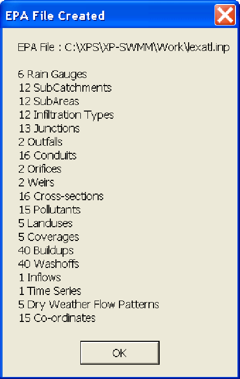
>
> A text file xxxx.elf will be created in the project folder which reports features in the xpswmm model that could not exported.
>
> An EPA SWMM 5 project file is a plain text file that contains all of the model data and the options used to analyze it. The file is organized in sections, where each section begins with a keyword enclosed in brackets. The keywords are:
>
> \[TITLE\] project title
>
> \[OPTIONS\] analysis options
>
> \[REPORT\] output reporting instructions
>
> \[FILES\] interface file options
>
> \[RAINGAGES\] rain gage information
>
> \[HYDROGRAPHS\] unit hydrograph data used to construct RDII inflows
>
> \[EVAPORATION\] evaporation data
>
> \[TEMPERATURE\] air temperature and snow melt data
>
> \[SUBCATCHMENTS\] basic subcatchment information
>
> \[SUBAREAS\] subcatchment impervious/pervious sub-area data
>
> \[INFILTRATION\] subcatchment infiltration parameters
>
> \[AQUIFERS\] groundwater aquifer parameters
>
> \[GROUNDWATER\] subcatchment groundwater parameters
>
> \[SNOWPACKS\] subcatchment snow pack parameters
>
> \[JUNCTIONS\] junction node information
>
> \[OUTFALLS\] outfall node information
>
> \[DIVIDERS\] flow divider node information
>
> \[STORAGE\] storage node information
>
> 180

SECTION 7: MENUS

> \[CONDUITS\] conduit link information
>
> \[PUMPS\] pump link information
>
> \[ORIFICES\] orifice link information
>
> \[WEIRS\] weir link information
>
> \[OUTLETS\] outlet link information
>
> \[XSECTIONS\] conduit, orifice, and weir cross-section geometry
>
> \[TRANSECTS\] transect geometry for conduits with irregular cross-sections
>
> \[LOSSES\] conduit entrance/exit losses and flap valves
>
> \[CONTROLS\] rules that control pump and regulator operation
>
> \[POLLUTANTS\] pollutant information
>
> \[LANDUSES\] land use categories
>
> \[COVERAGES\] assignment of land uses to subcatchments
>
> \[BUILDUP\] buildup functions for pollutants and land uses
>
> \[WASHOFF\] washoff functions for pollutants and land uses
>
> \[TREATMENT\] pollutant removal functions at conveyance system nodes
>
> \[INFLOWS\] external hydrograph/pollutograph inflow at nodes
>
> \[DWF\] baseline dry weather sanitary inflow at nodes
>
> \[PATTERNS\] periodic variation in dry weather inflow
>
> \[RDII\] rainfall-derived I/I information at nodes
>
> \[LOADINGS\] initial pollutant loads on subcatchments
>
> \[CURVES\] x-y tabular data referenced in other sections
>
> \[TIMESERIES\] time series data referenced in other sections
>
> The sections can appear in any order and not all sections must be present. A portion of a sample file is shown below.
>
> \[TITLE\]
>
> Example EPA SWMM 5.0 Project
>
> \[OPTIONS\]
>
> FLOW_UNITS CFS
>
> INFILTRATION GREEN_AMPT  
> FLOW_ROUTING KINWAVE
>
> START_DATE 8/6/2007
>
> START_TIME 10:00
>
> END_TIME 18:00
>
> WET_STEP 00:15:00
>
> DRY_STEP 01:00:00
>
> ROUTING_STEP 00:05:00
>
> \[RAINGAGES\]
>
> ;;Name Format Interval SCF DataSource SourceName
>
> ;;==============================================
>
> GAGE1 INTENSITY 0:15 1.0 TIMESERIES SERIES1
>
> \[EVAPORATION\]  
> CONSTANT 0.02
>
> \[SUBCATCHMENTS\]
>
> ;;Name Raingage Outlet Area %Imperv Width Slope
>
> ;;=============================================
>
> AREA1 GAGE1 NODE1 2 80.0 800.0 1.0
>
> AREA2 GAGE1 NODE2 2 75.0 50.0 1.0
>
> \[SUBAREAS\]
>
> ;;Subcatch N_Imp N_Perv S_Imp S_Perv %ZER RouteTo
>
> ;;=================================================
>
> AREA1 0.2 0.02 0.02 0.1 20.0 OUTLET
>
> AREA2 0.2 0.02 0.02 0.1 20.0 OUTLET
>
> \[INFILTRATION\]
>
> ;;Subcatch Suction Conduct InitDef
>
> ;;================================
>
> AREA1 4.0 1.0 0.34
>
> AREA2 4.0 1.0 0.34
>
> \[JUNCTIONS\]

181

> xpswmm Reference Manual
>
> ;;Name Elev  
> NODE1 10.0  
> NODE2 10.0  
> NODE3 5.0  
> NODE4 5.0  
> NODE6 1.0  
> NODE7 2.0
>
> EPA SWMM 4.4 and 5.0 files may be converter to XPX files using the standalone EPA-SWMM Data File Reader. This program may be accessed via the Tools  Launch Application menu.
>
> **7.2 Edit**
>
> **The Edit Menu**
>
> The "Edit" menu lists commands for undoing, re-doing, and standard editing, plus some additional commands for copying and pasting selected node and link data.
>
> This menu deals with management of both the graphical attributes and data associated with the network. This data comprises the attributes of network objects required by the specific model. For example, pipe diameters, catchment areas, plus text fonts, sizes, colours, etc.
>
> Move cursor over image and click to view descriptions of the menu commands.
>
> 
>
> Descriptions of the available edit menu commands may be found in the following links.
>
> **Undo**
>
> **Cut Data  
> Copy Data**
>
> **Paste Data  
> Clear Data**
>
> **Delete Objects**
>
> **Data**
>
> **Attributes  
> Notes**
>
> **7.2.1 Undo**
>
> This command generally undoes previously performed "Edit" commands such as "Clear Data".
>
> 182

SECTION 7: MENUS

> The current implementation, however, has a restricted scope. Undo can undelete attribute data only, not graphical data. Thus the "Clear Data" command can be undone, but not the "Delete Objects" and the "Cut Data" commands. The Undo menu title is greyed out as a guide you regarding which operations can be undone.
>
> **7.2.2 Cut Data**
>
> Performs a "Copy" and then a "Clear" operation on the currently selected link or node data. Data may be copied from one or multiple selected object(s). If multiple objects are selected, restrictions are placed on the "paste" command. See Copy and Paste for a more detailed description of this function.
>
> **7.2.3 Copy Data**
>
> Copies the current selection into an internal buffer. This data is then available for "pasting" into a further selection of network objects. This "Copy-Paste" mechanism is an extremely effective way of generating data or making modifications to a large number of objects.
>
> See Copy and Paste for a more detailed description of this function.
>
> **7.2.4 Paste Data**
>
> Copies the data from the internal buffer to the currently selected objects. For data to be successfully transferred between objects, both source and destination must be of the same class and type. Thus, circular node data can only be pasted into circular node data.
>
> After the "Paste" operation, the number of objects and database records affected are reported. "Paste" cannot be undone in this version.
>
> The copy buffer may be pasted into multiple objects by holding down the \<Shift\> key to make a multiple selection and then selecting "Paste" from the Edit Menu.
>
> Data can also be pasted between databases.
>
> See Copy and Paste for a more detailed description of this function.
>
> **7.2.5 Clear Data**
>
> Deletes all the attribute data from the current selection. The objects are left in an empty state, as if just created. The graphical attributes, such as name, colour, and line type are unaffected.
>
> This operation can be undone. When attribute data is deleted it is not permanently erased and recovery is possible.
>
> **7.2.6 Delete Objects**
>
> Removes the current selection from the network and all associated database information. Note that from the definition of a link it cannot exist without end nodes; thus, removing either of a link's end nodes will remove the link also.
>
> Note that this operation cannot be undone in the current version of XP.
>
> **7.2.7 Data**
>
> Allows direct editing of the link or node attribute data for the selected object. This is an alternative to "double-clicking" on an object with the mouse. Note that only a single object at a time can be edited this way.
>
> The dialog that appears will depend on the current mode and whether a link or node has been selected. See Node Data and Link Data for a complete description of Node and Link data.
>
> **7.2.8 Notes**
>
> A "notepad" is attached to each node and link. This notepad can be activated by selecting Notes from the Edit Menu, or Notes from the Pop-up menu. When Notes are selected a dialog similar to that shown below will be displayed.
>
> 183
>
> xpswmm Reference Manual
>
> 
>
> A note is edited or added to the current list using the Edit field beneath the list of notes.  
> **Add**
>
> Appends a note to the end of the list. Enter the note in the Edit field and then click Add.
>
> **Insert**
>
> Inserts a note before the currently highlighted note. Enter the note in the Edit field and then click Insert.
>
> **Delete**
>
> Removes the currently highlighted note.
>
> **Change**
>
> Changes the currently highlighted note.
>
> **7.2.9 Properties  
> Properties**
>
> Allows editing of the properties of the selected object(s). The dialog launched by this command depends on the network object(s) selected when it is involked.
>
> If more than one object type is selected, a dialog with radio buttons will ask the user to specify the object type for editing of the display properties. Click on OK to launch the appropriate Display Properties dialog.
>
> 
>
> If multiple objects of the same type are selected, xpswmm will open the appropriate Display Properties dialog.
>
> 184
>
> SECTION 7: MENUS
>
> If a single node is selected, the Node Properties dailog will display the screen coordinates of the node and allow for editing. The dialog allows for editing of the Name and Description fields and for mapping to an image field for the node. Note that each node must have a unique name.
>
> 
>
> If a single link is selected, the Link Properties dialog allows for editing of the Name and Description fields and for mapping to an image field for the link. Note that each link must have a unique name.
>
> 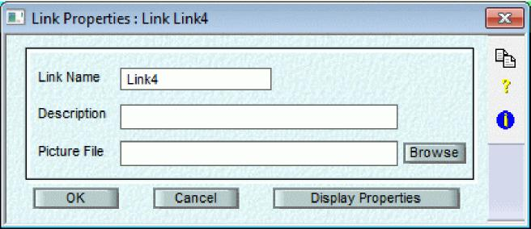
>
> **Display Properties**
>
> Use this dialog to edit the display properties of link(s), node(s), or text object(s).
>
> If Real World Size is selected, the text and object sizes are in real world units. When a scale too small to display is selected the text will be drawn as a box and will only appear after zooming in. If display size is selected, text and object sizes are set in decimal inches or millimeters independent of the scale selected.
>
> For each property, the Modify box must be checked in order for the change to take effect
>
> The display Font may be modified by selecting the corresponding drop list. A preview of the font is displayed in the Select Font dialog. .
>
> xpswmm Reference Manual
>
> 
>
> **7.3 Project**
>
> **The Project Menu**
>
> *The Project Menu will only be active if the parameter PROJECTS=ON is present in the SWMXP.INI file.* Move cursor over image and click to view descriptions of the menu commands
>
> 
>
> Projects are composed of files that are grouped together. The files are not interdependent in any way. An XP file can be included in different project groups.
>
> When in Project mode the opening of files is restricted to project files only. Files can be added to and deleted from a project when the project is edited. On creating a new XP file or saving an existing file under another name it is automatically added to the project.
>
> Multi-runs can be set up to solve a selection (or all) files in the project. If a current file is open it will be closed first. The selected files will then be loaded and the data checked for errors. If there are errors in the data then that data set will not be solved. After a multi-run has completed the last XP file to be processed by the multi-run is loaded. The results from the run are loaded for this file only. The results for the other XP files that were part of the multi-run are not updated to the XP file straight after a multi-run. The next time the file is opened the results from the multi-run are loaded.
>
> Project files can also be loaded from the command line (when project mode is on).
>
> *If project management is enabled, the Open command under the File Menu will only list the files contained in the current project as shown in the following dialog.*
>
> 186

SECTION 7: MENUS

> Descriptions of the available project menu commands may be found in the following links.
>
> **New**
>
> **Open**
>
> **Edit**
>
> **Close**
>
> **Save**
>
> **Save As**
>
> **Multi-Run**
>
> **Multi Review**
>
> **7.3.1 New**
>
> This menu command is used to create a new project database. Upon selecting this command a dialog box requesting the name of the new database appears. If the name of an existing project is entered, confirmation to overwrite it is requested and, if granted, the existing project is destroyed.
>
> The program then proceeds to enable and disable appropriate menu commands. Only one project can be active at any one time. Although not mandatory it is good practice to give the new file a .XPP extension. This makes retrieval of the file more straightforward when using the "Open" command.
>
> **7.3.2 Open**
>
> This command is used to open an existing project database and make it active.
>
> When this option is selected the Get File dialog box below will be shown with a default mask "\*.xpp". To select a project, double-click on the name or type the complete name instead of the mask. If the file selected was not created by XP, the results are unpredictable.
>
> 187
>
> xpswmm Reference Manual
>
> 
>
> **7.3.3 Edit**
>
> Use this item to add, delete or modify the files associated with the project. There are no limitations on the make-up of the project files. They can have any network configuration and can be located in any directory.
>
> **File Description**
>
> Enter a one-line description relating to the highlighted file.
>
> **Add**
>
> Select this button to show a list of XP files that may be added to the project. You can navigate your way through directories using the normal file selection process.
>
> 188

SECTION 7: MENUS

> **Delete**
>
> Select this button to delete the currently highlighted file.
>
> **Details**
>
> **7.3.4 Details of Project**
>
> 
>
> The Description, Client, Officer and Modeler are alphanumeric strings used to describe the project. "Date Created" and "Last Modified" are set by the program and cannot be modified by the user.
>
> **7.3.5 Close**
>
> Choose this option if you are finished with this project database and want to open another existing project or create a new one. If no changes have been made to the current project, it will be closed immediately, otherwise a "Save Project?" prompt will appear, allowing you the option of closing without saving changes, or cancelling the "Close" operation.
>
> **7.3.6 Save**
>
> XP maintains an internal working copy of the project database for editing sessions. Changes made while editing are not committed to the permanent database unless explicitly instructed by using the Save command. The Save command commits all changes made to the working database to the permanent database.
>
> **7.3.7 Save As**
>
> Copies of the working database (see Save command) can be saved under different names by issuing this command. A dialog box prompts for the new database name; the copy is then made and the new name becomes the current database.

The "Save As" and "Save" commands give you flexible control over the timing and permanence of data changes.

> **7.3.8 Multi-Run**
>
> Multi-run allows you to solve any (or all) of the files in the project in a single batch run. A highlighted file may be tagged or untagged by clicking on the file name
>
> 189
>
> xpswmm Reference Manual
>
> When Run is selected each tagged (highlighted) file is opened and solved (ie., the data file generated) in the sequence shown in the Project files list. If an error is encountered in generating the .DAT file the Multi-run is terminated and an error log describing the problem is created. If no errors are found the SWMM engine begins execution and each of the files is solved.
>
> **7.3.9 Multi Review**
>
> Allow you to Review Results of any of the Multi-Run results.
>
> 190

SECTION 7: MENUS

> **7.4 View**
>
> **The View Menu**
>
> The "View" menu enables rescaling and zooming of the displayed graph. Panning is handled by means of the scroll bars located at the bottom and right hand side of the screen or by other methods described in Panning Around the Network Zooming is handled via the zooming tools, the "Scale" menu command or one of the methods described in Re-scaling the Network Window .
>
> These menu commands, in conjunction with other mechanisms described in Building the Network control your view of the network through the window shown on the screen. They help you "change your view" of the network.
>
> Move cursor over image and click to view descriptions of the menu commands
>
> 
>
> 
>
> Descriptions of the available view menu commands may be found in the following links.
>
> **Quick Data View  
> Network Overview  
> Fit Window**

191

> xpswmm Reference Manual
>
> **Redraw**
>
> **Regenerate View**
>
> **Save View**
>
> **Restore View**
>
> **Previous**
>
> **Remove Stored Views**
>
> **Set Scale**
>
> **Zoom**
>
> **Grid**
>
> **Hide Objects**
>
> **Show Objects**
>
> **Show/Hide Labels**
>
> **Lock Nodes**
>
> **Find Object**
>
> **Select Objects**
>
> **Select All Nodes/Links**
>
> **Background Images**
>
> **Tool Bar**
>
> **Status Bar**
>
> **Split**
>
> **Tidy Networks**
>
> **7.4.1 Quick Data View**
>
> The Quick Data View provides one-click access to node and link data and results. When you click on a node or link the data for the table listed in the combo box will be shown. Data can be updated by editing the appropriate field. The fields displayed can be edited or updated using the same procedure as used for XP Tables.
>
> The Table being displayed may be changed with the drop menu and the disply for links or nodes may be changed by the tabs on the bottom of the panel.
>
> 192

SECTION 7: MENUS

> 

The Quick Data View panel is dockable and movable. The default mode is docked. The mode may be toggled by double clicking on the header. When it is in the movable mode, the panel may be resized by Moving the cursor to an edge and grabbing when the double arrow appears.

If the selected link is a multi-link, the Quick Data View shows drop menus to select the link (or diversion) type and the link number.

> 193
>
> xpswmm Reference Manual
>
> Quick data View Settings may be adjusted by either selecting the View  Settings command or clicking on the Settings button in the Quick Data View panel.

<table>
<colgroup>
<col style="width: 5%" />
<col style="width: 51%" />
<col style="width: 19%" />
<col style="width: 18%" />
<col style="width: 5%" />
</colgroup>
<tbody>
<tr class="odd">
<td colspan="2" rowspan="2">Quick Data View Settings</td>
<td rowspan="2"></td>
<td colspan="2"></td>
</tr>
<tr class="even">
<td colspan="2"></td>
</tr>
<tr class="odd">
<td rowspan="18"></td>
<td></td>
<td rowspan="3"></td>
<td></td>
<td rowspan="18"></td>
</tr>
<tr class="even">
<td>Table</td>
<td rowspan="2">.</td>
</tr>
<tr class="odd">
<td><blockquote>

Node Tables: Catchments

</blockquote></td>
</tr>
<tr class="even">
<td rowspan="2"><blockquote>

Link Tables: Runoff Conduits

</blockquote></td>
<td rowspan="2"></td>
<td>.</td>
</tr>
<tr class="odd">
<td><blockquote>

tEL Edit

</blockquote></td>
</tr>
<tr class="even">
<td></td>
<td colspan="2"></td>
</tr>
<tr class="odd">
<td>
 Display Controls 
a Display Table

<strong>rh</strong> Display Table Controls
</td>
<td colspan="2" rowspan="2"></td>
</tr>
<tr class="even">
<td>M Display Graph</td>
</tr>
<tr class="odd">
<td></td>
<td colspan="2"></td>
</tr>
<tr class="even">
<td><blockquote>

 MultiLink Display

CtDisplay All Active Objects

CP Display One Object

</blockquote></td>
<td colspan="2"></td>
</tr>
<tr class="odd">
<td>Type: Link .</td>
<td colspan="2"><blockquote>

Number: 1 .

</blockquote></td>
</tr>
<tr class="even">
<td></td>
<td colspan="2"></td>
</tr>
<tr class="odd">
<td>Graph</td>
<td colspan="2"></td>
</tr>
<tr class="even">
<td>Variable Type: i</td>
<td colspan="2">.</td>
</tr>
<tr class="odd">
<td></td>
<td colspan="2"></td>
</tr>
<tr class="even">
<td></td>
<td></td>
<td rowspan="3"></td>
</tr>
<tr class="odd">
<td>OK I</td>
<td><blockquote>

Cancel I

</blockquote></td>
</tr>
<tr class="even">
<td></td>
<td></td>
</tr>
</tbody>
</table>

> 194
>
> SECTION 7: MENUS
>
> **7.4.2 Network Overview**
>
> Selecting the network overview brings up a thumbnail view of the entire network. Superimposed on this is a red rectangle which indicates the view currently selected in the main window. You can move around the network by dragging the red box around the overview window with the left mouse button held down.
>
> You can change the scale of the main window by holding the right button down and moving the mouse to the left to make the box smaller and increase detail in the main window, or to the right to show the network at a larger scale.
>
> 
>
> **7.4.3 Fit Window**
>
> Select "Fit" to automatically rescale the network display to fit within the current window. The extremities of the network elements (the network's "world") are defined by a thin grey outline which will be seen in full when a "Fit Window" is performed.
>
> **7.4.4 Redraw**
>
> Redraws the current screen. This command is useful for cleaning up a messy display following some object movements such as Pasting objects and when calculating areas and lengths using the polygon tool.
>
> **7.4.5 Regenerate View**
>
> This command is similar to the Redraw command except that all coordinates are re-generated.
>
> xpswmm Reference Manual
>
> **7.4.6 Set Scale**
>
> Allows the user to input a new scale via a dialog box. The scale factor is a mapping or engineering form of scale with real-world units in metres (or feet). The default scale at which the network of a new database is initially created is 1:1000. This type of absolute zooming is done about the centre of the display window.
>
> **7.4.7 Zoom**
>
> A number of preset zoom factors can be selected using this menu option. See **also Network Overview, Set Scale** and **RE-SCALING THE NETWORK WINDOW**
>
> **7.4.8 Grid**
>
> The "Grid" command allows the user to specify a horizontal and vertical grid interval, the origin of the grid, whether objects should "snap" to the grid and whether the grid is visible.
>
> The grid is shown as dashed lines and may be plotted using the "Export Graphics" menu command.
>
> 
>
> **7.4.9 Hide Objects**
>
> Hides any currently selected object. The object is only displayed as a dotted outline but may still be selected in the normal manner. This command is particularly useful for improving zooming and scrolling performance when background pictures are active, or for hiding the names of nodes in a crowded network or hiding nodes for which data has not yet been entered.
>
> Use the \<Ctrl\> key to select a background picture you may wish to hide.
>
> **7.4.10 Show Objects**
>
> This command displays any currently selected object that may have been hidden using the "Hide Objects" command above.
>
> Use the Background Picture command to show or hide background images.
>
> **7.4.11 Find Objects**
>
> This command enables the user to find and directly go to any named object in the network. The user types in the name to search for and specifies whether it is a link, node, text or whether it is case sensitive or only part of a name.
>
> 196

SECTION 7: MENUS

> 
>
> When OK is clicked, the named object is searched for and, if found, it is highlighted ***and displayed in the centre of the screen at the currently selected scale***. When the Multi-selection box is clicked, the found object is added to the current slection set.
>
> When Next is clicked and the the Multi-selection box is unchecked, xpswmm will go to the next object meeting the criteria, highlight it and deselect any other highlighted objects. When Next is clicked,and the Multi-selection box is checked, xpswmm will go to the next object meeting the criteria, and add it to the current selection set.
>
> **7.4.12 Select Objects**
>
> Use this menu command, or the toolbar icons, to select all the nodes or all the links. This is particularly useful for copying and pasting a single item to all nodes or links.
>
> **7.4.13 TIN Surface**
>
> Use this command to add a **T**riangular **I**rregular **N**etwork data model (TIN). A TIN is an efficient way for representing surfaces as a series of linked triangles. Although both grids and tins can be created can be used for surface representations, tins are especially useful for representing surface elevation, subsurface elevation and terrain modeling especially when the surfaces are highly variable and contain discontinuities and breaklines.
>
> TIN files may be obtained from other sources or they may be generated from the ground surface elevations in the model.
>
> When the command is executed the Add Tin Surface dialog box appears. Navigate to the location of the tTIN file and click OK.
>
> 

197

xpswmm Reference Manual

**7.4.14 Toolbar**

The toolbar can be turned on or off by selecting this menu option. The toolbar can also be torn off the window and allowed to float or attached to one of the other window borders.

**7.4.15 Status Bar**

The status bar at the bottom of the main window can be set to visible or hidden selecting by this command. The check mark indicates that the stats bar is visible.

> 

The status bar has 7 boxes. From left to right, the information displayed is:

1.  Progress bar (only displayed during selected operations)

2.  X, Y & Z coordinates of cursor (Z displayed if a TIN layer is active)

3.  The active mode

4.  The current scale

5.  Status of the Caps Lock keyboard toggle

6.  Status of the Num Lock keyboard toggle

7.  Status of the Insert/Overlay keyboard toggle

Note that the status bar is completely displayed only when the window is utilizing the complete width of the monitor. Also, the status bar may be partially hidden when the Object Creation tools or the Network Viewing and Navigation

tools palettes are dock to the right margin of the main window.

**7.4.16 Split**

Display multiple views of the network using this option. This option is not implemented in this version of the software.

**7.1.17 Tidy Network**

If this option is selected the existing network will be rearranged to minimize conduits crossing over one another. This option is useful; as nodes created by import are placed in an approximate grid and the network can become quite messy when the links connecting the nodes are created. The tidy up procedure works best with purely dendritic networks. The network connectivity and data is not changed by this tool, only the location of nodes is changed to create straight branches and create a reasonable flow schematic.

**7.4.18 View Management  
Save View**

When you select this option you will be prompted for a name for this view. The Restore View menu command will display a list of these saved views.

> 

198

SECTION 7: MENUS

> **Restore View**
>
> When you select this option a list of these Saved Views will be displayed. Select the appropriate view.
>
> **Previous**
>
> This command returns the display to the previous scale and location. It performs an "Undo" operation for viewing. This is a convenience method of toggling between a large-scale and small-scale view of the network.
>
> **Remove Stored Views**
>
> This command removes ALL saved views with the exception of the Previous view.
>
> **7.4.19 Background Images**
>
> **Add Background Image**
>
> For information on importing background images please browse to the Background Images section.
>
> **Background Picture Properties**
>
> For information on background image properties please browse to the Edit Background image section.
>
> **7.5 Configuration**
>
> **The Configuration Menu**
>
> The "Configuration" menu lists commands that are related to the overall modeling project. These include data that is global in nature (applying to many objects) and related to the control of the simulation such as time step, start and end times and which layers to solve.
>
> Move cursor over image and click to view descriptions of the menu commands
>
> 
>
> Descriptions of the available configuration menu commands may be found in the following links.
>
> **Job Control**
>
> **Global Data**
>
> **Real Time Control**

199

> xpswmm Reference Manual
>
> **Mode**
>
> **Mode Properties**
>
> **Configuration Parameters**
>
> **Units**
>
> **Interface File**
>
> **7.5.2 Job Control**
>
> This item is used to define all of the job control data used by the Runoff, Sanitary, Hydraulics and 2D Settings.
>
> The "Job Control" command allows the management of Control Data associated with the specific application. The data is global and not specific to any individual object.
>
> A full description of the parameters used by xpswmm is provided in Section 10 - Job Control **.** A complete description of the solution technique is provided in Section 14 - SWMM Theory .
>
> **7.5.3 Global Data**
>
> Global databases are records of data which provide an environment for the whole network. They allow the editing of databases which are global to the network and which can be referenced from any objects within the network. This facility allows common data to be shared amongst many objects and thus reduces redundancy of data dramatically.
>
> A full description of the parameters used by xpswmm is provided in Section 11 - Global Network Data.
>
> 
>
> **7.5.4 Real Time Control**
>
> See Section 17 for more detail and examples of Real Time Control.
>
> **7.5.5 Mode**
>
> This command defines the current mode for editing and the mode or modes to solve for.
>
> 200

SECTION 7: MENUS

> xpswmm can operate in different modes: Runoff, Sanitary and Hydraulics. The modes are controlled via the "Modes" command under the Configuration menu. The 3 modes are provided to segment the model into logical parts and thus reduce the complexity of the user interface.
>
> The 3 modes have the following functions:
>
> Runoff: Rainfall/Runoff/Water Quality generation, simple hydraulics.
>
> Sanitary: Sewer loading, sewer treatment, retarding basin/BMP design, kinematic wave hydraulics.
>
> Hydraulics: Dynamic flow routing, complex hydraulics.
>
> The xpswmm mode can be set 3 ways:

1)  selecting the Rnf, San or Hdr tool from the toolstrip in the main window

2)  selecting Mode Properties form the Configuratin Menu. In the SWMM Mode of Operation dialog select the Runoff, Sanitary or Hrdraulics radio button from the Current Mode Group.

3)  selecting Mode from the Configuration menu and then selecting Runoff, Sanitary or Hrdraulics.

> The ability to define different modes has several advantages. It allows sub-branches of the network to be defined in Runoff mode, for instance, and the main branch in EXTRAN Mode. Thus the complex hydraulic analysis is done on a smaller, more hydraulically sensitive network with significantly shorter run durations.
>
> ***Note:** When generating flows from a Runoff file containing a number of discrete un-connected nodes xpswmm will, by default, only solve for one network, ie. one set of connected nodes and links. To enable all nodes to be solved within the one network, connect the nodes together in any order and delete the links from the runoff mode. The network will then appear to be contiguous but will behave as a series of discrete, unconnected elements.*
>
> **7.5.6 Units**
>
> This Dialog allows you to select between Metric and U.S. Standard units for the model. When a NEW database is created, the units will be prompted for. If units are changed after a database is created, then data conversions are NOT done. It is important to set the units expected to be used at the time a database is created.

> xpswmm Reference Manual
>
> **7.5.7 Advanced Configuration Parameters  
> Configuration Parameters**
>
> These are special command line arguments for advanced users that can be used to fine-tune the way in which the analysis engine works.
>
> Configuration parameters are global. There is no means of setting a configuration parameter to apply to only one link or node. e.g. if you set USE_ORF_EQN to force the use of the orifice equation instead of creating an equivalent pipe then ALL orifices must use the orifice equation.
>
> You can set default configuration parameters in the \[Engine\] section of the SWMXP.INI file. These parameters will then be used for all files unless overwritten by values set in the shown below dialog.
>
> 
>
> A configuration parameter is edited or added to the current list using the Edit field beneath the list of parameters.
>
> **Add:** Adds a parameter to the list and sorts the list alphabetically.
>
> **Insert:** Inserts a note before the currently highlighted note.
>
> **Enable:** Enable a previously disabled parameter in the list.
>
> **Disable:** Disable a parameter in the list. This allows a parameter to be turned off without removing it from the list. A parameter is disabled by inserting a \# character before the parameter name.
>
> Configuration parameters used in the calculation are reported in the output file. Names beginning with \$ are default parameters. The 2nd column indicates the value of the argument (if applicable, otherwise 0.0000). The 3rd and 4th columns are internal values and counters. Below is an excerpt from an output file showing some parameters:

<table>
<colgroup>
<col style="width: 34%" />
<col style="width: 27%" />
<col style="width: 11%" />
<col style="width: 27%" />
</colgroup>
<tbody>
<tr class="odd">
<td><blockquote>

$spatial = 0.90

</blockquote></td>
<td>0.9000</td>
<td>5</td>
<td>124</td>
</tr>
<tr class="even">
<td><blockquote>

$weirlen = 50

</blockquote></td>
<td>50.0000</td>
<td>1</td>
<td>153</td>
</tr>
<tr class="odd">
<td><blockquote>

HDR_EVAP

</blockquote></td>
<td>0.0000</td>
<td>1</td>
<td>244</td>
</tr>
</tbody>
</table>

> 202

<table>
<colgroup>
<col style="width: 20%" />
<col style="width: 15%" />
<col style="width: 24%" />
<col style="width: 11%" />
<col style="width: 28%" />
</colgroup>
<tbody>
<tr class="odd">
<td></td>
<td></td>
<td></td>
<td></td>
<td>SECTION 7: MENUS</td>
</tr>
<tr class="even">
<td><blockquote>

$new_nl_97

</blockquote></td>
<td></td>
<td>0.0000</td>
<td>2</td>
<td>290</td>
</tr>
<tr class="odd">
<td><blockquote>

USE_ORF_EQN

</blockquote></td>
<td></td>
<td>0.0000</td>
<td>1</td>
<td>304</td>
</tr>
<tr class="even">
<td><blockquote>

$q_tol = 0.01

</blockquote></td>
<td></td>
<td>0.0001</td>
<td>1</td>
<td>316</td>
</tr>
<tr class="odd">
<td><blockquote>

$new_storage

</blockquote></td>
<td></td>
<td>0.0000</td>
<td>1</td>
<td>322</td>
</tr>
<tr class="even">
<td><blockquote>

$old_iteration

</blockquote></td>
<td></td>
<td>0.0000</td>
<td>1</td>
<td>333</td>
</tr>
<tr class="odd">
<td><blockquote>

MINLEN=10

</blockquote></td>
<td></td>
<td>10.0000</td>
<td>1</td>
<td>346</td>
</tr>
<tr class="even">
<td><blockquote>

$min_ts = 0.5

</blockquote></td>
<td></td>
<td>0.5000</td>
<td>1</td>
<td>407</td>
</tr>
<tr class="odd">
<td><blockquote>

$design_restart

</blockquote></td>
<td>= on</td>
<td>0.0000</td>
<td>1</td>
<td>412</td>
</tr>
</tbody>
</table>

**Grouped and Indexed list of parameters**

The available configuration parameters are indexed and grouped. Use the flowing links to browse.

**2 , 4 , 8 , A , B , C , D , E , F , G , H , I , J , K , L , M , N , O , P , Q , R , S , T , U , V , W , X , Y , Z .**

**SWMM version control**

**Storage node and regular node changes**

**Extran modify conduit changes**

**SWMM "bug" fixes or enhancements**

**Hot-Restart File changes in Extran**

**Ending volume extran changes**

**Natural channel SWMM enhancements**

**SWMM SCS enhancements**

**SWMM output enhancements**

**Extran eggshape conduit changes**

**Flow options added on 2/17/94**

**Storage node Area Options added in 9/30/94\\**

**Transport enhancements**

**Transport DWF enhancements**

**Seasonal data file enhancements**

**Extran BC enhancements**

**User defined closed conduit enhancements**

**Flooded node enhancements**

**WQ enhancements**

**Preissmann slot options**

**Extran time step control**

**Pump options after 1995**

**Version 4.3 Extran Solution enchancements in 1995**

**ISOL 3 option added in 1995**

**Friction slope enhancements**

**Omega options**

**Extran reach options added in 1995.**

**Stats and Rain block options added in 1995**

**Combine block options added in 1995**

**New features**

**Kinematic wave options added in 1995**

**Orifice options added in 1995**

203

> xpswmm Reference Manual
>
> **Extrapolation options added in 1995**
>
> **EPA SWMM connection options added in 1995  
> Spatial weighting options added in 1995  
> SWMM esoterica mainly for XP-WP Software  
> Superseded runoff options**
>
> **Configuration Keywords**
>
> For a full description of the keywords used in xpswmm see the help for Configuration Parameters. If a \# precedes a keyword then this feature is not changed. The default option is used by the model. The keyword by itself means this feature is turned on and will be active in XP-SWMM. If you have any questions please contact XP-Software @ [<u>info@xpsoftware.com</u>](mailto:info@xpsoftware.com) or telephone number 1-888-554-5022 (USA) or 1-877-533-4533 (Canada) or +61-2-6253-1844 (Australia).
>
> **0-9**
>
> **1993**
>
> XP-SWMM Version in 1993.
>
> Keywords associated with this option are:
>
> OLDVOL , OLDGTCUR , OLDSTORE , STORETOP , NODETIM , DEPTHX , OLDHEAD , PITLOSS , WOBBLE , LASTOM , OLDOMEGA , FLAT , SUBNORM , OLDHOT , OLDVOL , NCNEW1 , NCNEW2 , NCNEW3 , NCNEW4 , NCNEW5 , TRAPEZOD , POWER , TIDEGATE , HFRIC , HSLOPE , HCONT , JLOOP , OLDSTNS , NEGNC , STREF , NEGNC1 , PERV , OLDSCS , EXOUT , OLDEGG , AS , JNCORF , QNORM , COMBIN , OLDECLOSS , OLDTIME , MAXWIDE , WSLOT , LOGNORM , OLDFLOOD , FLDCHN , USERINIT
>
> **1994a**
>
> XP-SWMM Version first half of 1994.
>
> Keywords associated with this option are:
>
> OLDVOL , OLDGTCUR , OLDSTORE , STORETOP , DEPTHX , OLDHEAD , PITLOSS , WOBBLE , LASTOM , FLAT ,OLDLOSS , OLDHOT , OLDVOL , NCNEW1 , NCNEW2 , NCNEW3 , NCNEW4 , NCNEW5 , TRAPEZOD , POWER , TIDEGATE , OLDSTNS , NEGNC , STREF , NEGNC1 , PERV , OLDSCS , EXOUT , OLDEGG , AS , JNCORF , QNORM , COMBIN , OLDECLOSS , OLDTIME , MAXWIDE , LOGNORM , OLDFLOOD , FLDCHN , USERINIT
>
> **1994b**
>
> XP-SWMM Version second half of 1994.
>
> Keywords associated with this option are:
>
> STORETOP , NODETIM , DEPTHX , DEEPLIM , PITLOSS , FLAT , OLDHOT , OLDVOL ,TRAPEZOD , TIDEGATE , WOBBLE , NEGNC , STREF , NEGNC1 , PERV , OLDSCS , EXOUT , AS , JNCORF , QNORM , COMBIN , OLDECLOSS , OLDTIME , MAXWIDE , LOGNORM , OLDFLOOD , FLDCHN , USERINIT
>
> **1995a**
>
> XP-SWMM Version first half of 1995.
>
> Keywords associated with this option are:
>
> STORETOP ,DEPTHX , DEEPLIM , OLDVOL ,OLDVOL1 ,TRAPEZOD , TIDEGATE , WOBBLE , NEGNC , STREF , NEGNC1 , PERV , OLDSCS , EXOUT , AS , JNCORF , QNORM , COMBIN , OLDECLOSS , OLDTIME , MAXWIDE , LOGNORM , OLDFLOOD , FLDCHN , USERINIT
>
> **1995b**
>
> XP-SWMM Version second half of 1995.
>
> Keywords associated with this option are:
>
> TIDEGATE , PERV , OLDSCS , AS , JNCORF , QNORM , OLDTIME , MAXWIDE , LOGNORM , FLDCHN
>
> **2**
>
> 24HR_LOOP
>
> 204
>
> SECTION 7: MENUS
>
> **24HR_LOOP**
>
> This option repeats the first 24 hours of the user input hydrographs at a node for all days of the simulation. Same words: 24HOUR_LOOP, 24HOURLOOP, 24HOURS. The repeated user inflows are entered in the Hydraulics layer of xpswmm.
>
> **4**
>
> 4TURNS
>
> **4TURNS**
>
> 4 halvings of the time in isol=2 and isol=3 solutions. The default is 2 halvings of the time step.
>
> **8**
>
> 8TURNS
>
> **8TURNS**
>
> 8 halvings of the time in isol=2 and isol=3 solutions. The default is 2 halvings of the time step.
>
> **A**
>
> **A**
>
> ADJUSTNL  
> ADVNL
>
> AE
>
> ALSORAIN  
> ALTEROMEGA
>
> ALWAYSKW  
> ALWAYSNL  
> AREA_PRE10  
> ARCH_SPAN  
> ARCH_RISE  
> AREA_IMPLICIT
>
> AS
>
> AUTOPUMP  
> **ADJUSTNL**
>
> Calculate the non-linear term based on the minimum difference between the upstream area and the downstream cross sectional area or the default method. The default is to use the difference between the upstream and the downstream cross sectional area.
>
> **ADVNL**
>
> Calculate the non-linear term based on the max difference between the upstream area and the middle cross sectional area, or the downstream and middle. The default is to use the difference between the upstream and the downstream cross sectional area.
>
> **AE**
>
> Area/elevation in variable storage areas.  
> **ALSORAIN**
>
> If this option is used in the SWMM Configuration Parameters dialog box then rainfall and flow are compared in one table in the STATS Module output file. This allows the user of the STATS Module to analyze the rainfall and flow totals, averages and peaks in all of the events generated by runoff and saved in the SWMM interface file.
>
> xpswmm Reference Manual
>
> **ALTEROMEGA**
>
> The program default is to start lowering the value of omega when it detects oscillations in the solution. This will only be for oscillations occurring for iterations above 5 in the current time step solution. Oscillations may occur in the node water surface elevation and the sum of the flow into the node.
>
> **ALWAYSKW**
>
> Always use kinematic wave routing for all conduits no matter what the conduit factors dialog is defined as in the interface.
>
> **ALWAYSNL**
>
> Always use non-linear term routing for all conduits no matter what the conduit factors dialog is defined as in the interface.
>
> **ARCH_RISE**
>
> If this option is used then the major axis in an ARCH conduit is the span.
>
> **ARCH_SPAN**
>
> If this option is used then the major axis in an ARCH conduit is the rise.
>
> **AREA_IM PLICIT**
>
> If this option is used then the area of the node at the new time step always uses the implicit time step. In other words, the new node depth calculation does not use the old time step area value but only the new time step area.
>
> **AS**
>
> Area/stage in variable storage areas. Default.  
> **AUTO_PUMP**
>
> Same as the old configuration parameter FALLON. If the AUTO_PUMP feature or option is used and the option PUMPHEAD is used then the downstream node and downstream conduit flow from the pump is automatically calculated by the program. The user defined inflow hydrograph is actually used to turn the pump on and off. The flow that the pump will pump is based on the choice the user defines by using the options: PUMPBEG, PUMPMID and PUMPEND.
>
> **B**
>
> **B**
>
> BADHRAD  
> BADRECT  
> BEST97  
> BETSPUMP
>
> BMEGA  
> BOLTMH  
> BOLTMH1  
> BMH_OPTION1
>
> BMH_OPTION2
>
> BX=x
>
> 206

SECTION 7: MENUS

> **BADHRAD**
>
> Problem before 5/96 involving the hydraulic radius calculations of surcharged rectangular conduits for full initial conditions. Hrad was pinned to the fudge value. Default is the correct Hrad calculation.
>
> **BADRECT**
>
> Problem before 5/96 involving the hydraulic radius calculations of surcharged rectangular conduits. Default is the correct Hrad calculation.
>
> **BEST97**
>
> In Extran solve all conduits connected to node, then all boundary conditions at the node and finally the nodal depths during any one time step. The default method is to solve one nodal depth and any associated conduits and boundary conditions during one time step.
>
> **BESTPUMP**
>
> Best features for pump optimization.
>
> These features will achieve the best continuity error and execution speed for Extran models with many pumps. This flag will signal the use of NOZCONT1 and PUMPWT keyword options.
>
> **BMEGA**
>
> On use omega from bb line for ISOL=2 solution. Off don't use omega. This is a way to change the omega underrelaxation parameter in the ISOL=2 solution.
>
> **BMH_OPTION1**
>
> If this option is used then the displayed water surface elevation in a bolted manhole is the ground elevation + 0.1 This is the same as option BOLTMH
>
> **BM H_OPTION2**
>
> If this option is used then the displayed water surface elevation in a bolted manhole is the actual water surface elevation. This is the same as option BOLTMH1
>
> **BOLTMH**
>
> If this option is used then the displayed water surface elevation in a bolted manhole is the ground elevation + 0.1 This is the same as option BMH_OPTION
>
> **BOLTMH1**
>
> If this option is used then the displayed water surface elevation in a bolted manhole is the actual water surface elevation. This is the same as option BMH_OPTION1
>
> **BX=**
>
> Set the B multiplier used by the RAFTS hydrology.
>
> **C**
>
> **C**
>
> <u>CATSLOPE=x  
> CDM_SHAPES</u>  
> CMIN

207

> xpswmm Reference Manual
>
> CMIN-x
>
> CN-x
>
> COMBIN  
> COMP
>
> CONDTIME
>
> CONDUIT-x
>
> CONVERGE  
> CPOL#-x  
> CREF-x
>
> CULVNEW
>
> **CATSLOPE**
>
> Set the Catchment Slope as percentage or unitless.
>
> e.g.
>
> CATSLOPE=%, or  
> CATSLOPE=M/M, or  
> CATSLOPE=FT/FT
>
> **CDM_SHAPES**
>
> This item is superceeded by the interface as elliptical and arch pipes can now be explicitly selected. If this option is used then a gothic conduit in the interface is modeled as a Horizontal elliptical conduit in the SWMM engine. If this option is used then a catenary conduit in the interface is modeled as a vertical elliptical conduit in the SWMM engine. If this option is used then a semi-elliptical conduit in the interface is modeled as an ARCH conduit in the SWMM engine. Other older configuration parameters H_ELLIPSE, V_ELLIPSE and ARCH made these switches singularly.
>
> **CMIN**
>
> Off old FACT defaults for ISOL=2. On new FACT defaults for ISOL=2. Options added in 2/5/95.
>
> **CM IN=1.0**
>
> Command line argument to change the internal time step in Extran.  
> **CN-x**
>
> This option changes the default curve number for the impervious area in SCS Hydrology. For example use CN=99 to change the default CN of 98 to a CN of 99. If you are using SCS hydrology and use the impervious area data field in the watershed dialog box then the program will created a composite CN based on the value of the CN for pervious area that you entered and a CN of 98 for impervious area. This options allows you the flexibility to change the default impervious CN.
>
> **COMBIN**
>
> On means use unformmated files in the combine block. Off means use binary files in the combine block - 8/4/95.
>
> **Combine block  
> **Options added in 1995.
>
> COMBIN  
> **COMP**
>
> Composite CN in SCS hyrology with the % Impervious ignored. Value entered in Pervious CN is the weighted CN. PERV is the default CN option.
>
> **CONDTIME**
>
> Adjust the Extran time step based on conduits with rapidly changing conduit flows. 6/96.
>
> 208

SECTION 7: MENUS

> **CONDUIT-x**
>
> Default conduit shape in Extran.
>
> CONDUIT=1  
> Circular
>
> CONDUIT=2  
> Rectangular.
>
> **CONVERGE**
>
> Off means use default method for non-convergent junctions. On use new method and smaller iterations to reach convergence.
>
> **CPOL#-x**
>
> CPOL1=  
> CPOL2=  
> CPOL3=  
> CPOL4=  
> CPOL5=  
> CPOL6=  
> CPOL7=  
> CPOL8=  
> CPOL9=
>
> The CPOL#= values are the constant concentrations for the constant user inflow in the Hydraulics Mode of xpswmm. The 1, 2, 3, 4, 5, 6 etc refer to the order of the pollutants in the pollutant list. This feature was added before the
>
> concentrations and Temporal Patterns were explicitly defined in the interface.
>
> **CREF-x**
>
> All of the pollutant concentrations in Extran are set to this concentration. This option can be used in conjunction with the option CPOL?=value
>
> CPOL?=value
>
> CPOL1=  
> CPOL2=  
> CPOL3=  
> CPOL4=  
> CPOL5=  
> CPOL6=  
> CPOL7=  
> CPOL8=  
> CPOL9=
>
> The CPOL?= values are the constant concentrations for the constant user inflow in the Hydraulics layer of XP-SWMM. The 1, 2, 3, 4, 5, 6 etc refer to the order of the pollutants in the pollutant list. This feature was added before
>
> the concentrations were explicitly defined in the xpswmm interface.

209

> xpswmm Reference Manual
>
> **CULVNEW**
>
> Do not use the exit loss coefficient for culverts except for situations in which the culvert is outlet controlled. If the culvert is inlet controlled then the program will use a value of 0.0 for the exit loss even though the exit loss coefficient is entered by the user in the conduit factors dialog.
>
> **D**
>
> **D**
>
> DEBUG
>
> DEBUG_REVIEW
>
> DEEPLIM  
> DEEP-x  
> DELT43  
> DEPTH  
> DEPTHX  
> DESIGN_EXT
>
> DESIGN_RESTART
>
> DESIGN_ROUGH
>
> DESIGN_SLOPE
>
> DIFFUSION
>
> DJREF-x  
> DWF-x  
> DYNAMIC
>
> **DEBUG**
>
> Set DEBUG to have XP-Culvert2000 generate .DBG file.
>
> **DEBUG_REVIEW**
>
> For XP Software internal use for debugging the review results linkage with XP-SWMM.
>
> **DEEP-x**
>
> Default conduit depth in Extran. . For example DEEP=1.0  
> **DEEPLIM**
>
> Use 7.5 ft(m) for max nc depth in modify conduits. On means use 7.5 ft(m) for the natural channel depth limitation in Extran modify conduits. Off means use 17.5 ft(m) for the natural channel depth limitation in Extran modify conduits.
>
> **DELT43**
>
> On means change the time step dynamically in version 4.3 (ISOL=2). Off is the default - use a constant time step.
>
> Options added in 1/28/95  
> **DEPTH**
>
> Option added in 5/27/95. Off use 2, 26 for loop in depthx. On use 1,26 for loop in subroutine depthx. The loop of 2,26 is used in epa-swmm.
>
> 210
>
> SECTION 7: MENUS
>
> **DEPTHX**
>
> Option added on 7/7/95. Off use new do loops as done in the 1995 version of Extran subroutine head. On use do loops as done in 1993 and 1994 versions of Extran. Basically, a loop of 2,26 for normal depth and 1,26 for critical depth for trapezoidal channels only. All other channels used 1,26 for both normal and critical depth.
>
> **DESIGN_EXT**
>
> This option is now explicitly in the job control interface of Hydraulics. The program will increase the pipe size of any conduit that surcharges. The definition of surcharging is that the water depth at any end of the conduit is equal to or above the 0.96 \* diameter level. The pipe sizes will increase by 2 inches to 1 foot, 3 inches to 2 feet and 6 inches above a diameter of 2 feet.
>
> **DESIGN_ROUGH**
>
> The program will decrease the roughness of any conduit that surcharges. If the conduit surcharges, then the program will decrease the roughness so that more flow can pass though the conduit. The definition of surcharging is that the water depth at any end of the conduit is equal to or above the 0.96 \* diameter level.
>
> **DESIGN_SLOPE**
>
> The program will increase the slope of any conduit that surcharges. If the conduit surcharges, then the program will increase the roughness so that more flow can pass though the conduit. The definition of surcharging is that the water depth at any end of the conduit is equal to or above the 0.96 \* diameter level.
>
> **DIFFUSION**
>
> If this option is used then the diffusion wave solution is used in Hydraulics Layer (Extran).  
> **DJREF-x**
>
> Change the itertion allowance in Extran to x for nodal depth changes at any one iteration. For example DJREF=0.01.
>
> **DWF-x**
>
> Options added in 12/03/94  
> DWF=1
>
> Off do not use new FILTH options in transport. On use new FILTH options in transport. Use sewage flow in dwf at at transport node as mean flow. Users can now select this method in the interface as Direct.
>
> DWF=2
>
> Options added in 12/12/94 Off do not use new FILTH options in transport. On use this new FILTH options in transport. Use sewage flow in dwf as (cfs/person)\*area\*(people/area) or (liters/s/person)\*area\*(people/area) at transport node as mean flow. Users can now select this method in the interface as Census-Based.
>
> DWF=3
>
> Off do not use new FILTH options in transport. On use this new FILTH options in transport. Use sewage flow in dwf as (cfs/acre)\*area or (cms/hectare)\*area at a transport node as mean flow. Users can now select this method in the interface as Unit Flow Rate.
>
> **DYNAMIC**
>
> Never use kinematic wave in Hydraulics (Extran). Option added in 1/16/95. Off use kinematic wave under some conditions in Hydraulics. On never use kinematic wave, use only dynamic wave in Hydraulics.
>
> **E**
>
> **E**
>
> E404
>
> E405  
> E420
>
> 211
>
> xpswmm Reference Manual
>
> ECLOSS  
> ENDVOL1
>
> ENDVOL2  
> ENDVOL  
> ENERGY  
> EXINTIME  
> EXOUT  
> EXPORTALL
>
> EXT_EVAP
>
> EXTERNAL_XLS
>
> EXTERNAL_CSV
>
> EXOUT  
> EXTEST  
> EXTRA1  
> EXTRA2  
> EXTRA3  
> EXTRA  
> EXTRANWQ
>
> EXTRAONE
>
> **E405**
>
> Use version SWMM 4.05 natural channel solution. Default is version 4.30 solution.
>
> **E420**
>
> Use version SWMM 4.20 natural channel solution. Default is version 4.30 solution.  
> **ECLOSS**
>
> Use correction for expansion/contraction flow direction. On means use correction to expansion/contraction loss for the flow direction. Off means do not use the correction.
>
> **Ending volume Extran changes**
>
> ENDVOL  
> ENDVOL1
>
> ENDVOL2  
> OLDVOL  
> OLDVOL1
>
> OLDVOL2
>
> **ENDVOL**
>
> Option added in 11/17/94. Off use old ending volume calculation. On use new ending volume calculation.
>
> **ENDVOL1**
>
> Option added in 7/2/95. Off use old ending volume calculation. On use newer ending volume calculation. **ENDVOL2**
>
> Option added in 9/21/95. Off use old ending volume calculation. On use the smaller continuity error of the old or the newer ending volume calculation.
>
> **ENERGY**
>
> On use energy grade line profile in review results and plot. Option added in 5/6/95. Off use HGL water surface profile in review results and xsect plot. On use energy grade line profile in review results and xsect plot.
>
> **EPA SWMM connection options  
> **Added in 1995.
>
> MTVE
>
> 212

SECTION 7: MENUS

> EPA  
> **EXINTIME**
>
> If this option is used then the starting time of the day of the simulation is taken from the interface file. For example, if the starting time of the interface file is 6 hours then the model will start at 6 hours. The starting time from Hydraulics Job Control is ignored.
>
> **EXPORTALL**
>
> If you use this option (or EXPORT_ALL) then all of the nodes of Hydraulics will be saved to the created interface file from Hydraulics layer. The sum of the flow into the node will be saved to the interface file. If this option is not used then only the outfall nodes will be saved to the interface file.
>
> **EXPORTJPRT**
>
> If you use this option (or EXPORT_JPRT) then only the nodes with Detailed Printout Flag enabled in of Hydraulics Layer will be saved to the interface file created from the Hydraulics layer. The sum of the flow into the node will be saved to the interface file. If this option is not used then only the outfall nodes will be saved to the interface file.
>
> **EXPORTUS**
>
> If you use this option (or EXPORT_US) then only the most upstream nodes of Hydraulics Layer will be saved to the interface file created from the Hydraulics layer. The sum of the flow into the node will be saved to the interface file. If this option is not used then only the outfall nodes will be saved to the interface file.
>
> **EXOUT**
>
> Print elevations in conduit summary table not offsets. Printout of Extran conduit elevations in the conduit summary table - 9/11/95. Off for new printout. On for old printout.
>
> **EXOUT**
>
> Print elevations in conduit summary table not offsets. Printout of Extran conduit elevations in the conduit summary table - 9/11/95. Off for new printout. On for old printout.
>
> **HDR_EVAP (or EXT_EVAP)**
>
> Use this option to model the evaporation loss from storage nodes in Hydraulics. The program will use the evaporation data entered in the Hydraulics layer Job Control of xpswmm.
>
> **EXTERNAL_CSV**
>
> If you use this option then instead of saving the detailed node and conduit data information to the output file of SWMM, it will be saved to an external file. The detailed node and conduit data is saved if the detailed printout checkbox is clicked on in the node dialog (under options) and/or the Print Flow Details under Output Control on the conduit dialog. The filename will be the .XP filename with a .CSV extension. The file will be a comma delimited text file. The frequency of the reporting is controlled by Configuration-\>Job Control-\>Hydraulics using the settings under Output control-\>Summary Interval.
>
> **EXTERNAL_XLS**
>
> If you use this option then instead of saving the detailed node and conduit data information to the output file of SWMM, it will be saved to an external file. The detailed node and conduit data is saved if the Detailed Printout checkbox is clicked on in the node and conduit dialogs. The file will have the same name as the .XP file but will have an .XLS extension. It will be comma delimited text file. See also EXTERNAL_CSV.
>
> **EXTEST**
>
> Run concurrent runs of the comparison between EXTRA and default solution.

213

> xpswmm Reference Manual
>
> **EXTRA**
>
> Extrapolate node depths and conduit flows based on past time.
>
> **EXTRA1**
>
> Extrapolate node depths and conduit flows based on past time.
>
> **EXTRA2**
>
> Extrapolate node depths and conduit flows based on past time.
>
> **EXTRA3**
>
> Extrapolate node depths and conduit flows based on past time.
>
> **Extran BC enhancements**
>
> RCOUT  
> TIDEGATE
>
> **Extran eggshape conduit changes**
>
> OLDEGG  
> NEWEGG  
> USERTOP
>
> **Extran modify conduit changes**
>
> DEEPLIM  
> NOMODNC
>
> **Extran reach**
>
> Options added in 1995.
>
> REACH
>
> **Extran time step control**
>
> IMPLCT  
> JUNTIME  
> JUNTIME1  
> OLDTIME  
> CONDTIME  
> HYDRO
>
> **EXTRANWQ**
>
> Extran WQ routing. Options added in 1/28/95. Off no Extran water quality for interface file. On Extran water quality
>
> routing using data from the interface file. This is now selected in the Hydraulics Job Control of the user interface.
>
> **EXTRAONE**
>
> Test Extrapolation of node depths and conduit flows.
>
> **Extrapolation options**
>
> Added in 1995.
>
> EXTRA
>
> EXTRA1
>
> EXTRA2
>
> EXTRA3
>
> EXTRAONE

214

SECTION 7: MENUS

> EXTEST  
> **F**
>
> **F**
>
> FASNH
>
> FASTCONV  
> FAST_PUMP
>
> FIT_PUMP_CURVE
>
> FLAT
>
> FLDCHN
>
> FLIP_STORAGE
>
> FLOOD
>
> FRICTAVG  
> FRICTGEO  
> FRICTMID  
> FULL_NODE
>
> FUZZYQ
>
> **FASNH**
>
> Off means don't use fasnh factor in subroutine head. On means use fasnh factor in subroutine head. **FAST_PUMP**
>
> If used then the pbsj or energy pipe solution is used for the first pipe downstream from a pump. This also activates the PUMPOMEGA option. If the FAST_PUMP option is used then the model will not restrict the pump flows to only change by 10 percent at each iteration. Allowing only the pumps to change by 10 percent at each time step is the default. An iterative solution is used to match the pump flow to the pump curve.
>
> **FASTCONV**
>
> Reduce omega during iteration cycle for iterations \> 10.
>
> **FIT_PUMP_CURVE**
>
> **FLAT**
>
> On to artificially increase the friction slope of flat slopes (0%) in Extran. Options added in 2/28/95. On Control over very flat slopes. Control was the default in 1993 and 1995, during part of 1994 the default was no control.
>
> **FLDCHN**
>
> Correction to storage ponding area calculation. Use ground z. On means no correction. Off means correction. Remove the coefficient from the surface ponding equation in subroutine bound - 9/29/94
>
> **FLIP_STORAGE**
>
> There are two ways to model the outlets from storage nodes in the Sanitary layer (transport). In one way the first equation goes to the downstream conduit and the second equation flow goes to the diversion conduit. This is the default method. The option FLIP_STORAGE makes the second equation go to the downstream conduit and the overflow go to the diversion conduit.
>
> **FLOOD**
>
> On - Use only ground elevation in flooded node calculations. Option added in 5/18/95. Off use actual flood depth in node.

215

> xpswmm Reference Manual
>
> **Flooded node enhancements**
>
> FLDCHN  
> FLOOD  
> OLDFLOOD
>
> **Flow options**
>
> GPM  
> L/S
>
> MGD  
> **FRICTAVG**
>
> On means use friction slope based on mean of up and down link conditions. Off means use friction slope based on harmonic mean estimate.
>
> **FRICTGEO**
>
> On means use friction slope based on geometric function. Off means use friction slope based on harmonic mean estimate.
>
> **Friction slope enhancements**
>
> FRICTMID  
> FRICTGEO  
> FRICTAVG
>
> **FRICTMID**
>
> On means use friction slope based on middle of conduit. Off means use friction slope based on harmonic mean estimate which is the default friction slope calculation.
>
> **FULL_NODE**
>
> If this option is used then at each time step the node and only the nodes use a time weighting value of 1.0 new time step no matter what the value of the time weighting parameter is in Hydraulics Job Control. The time weighting value in Job Control only applies to the Hydraulics Conduits. This means the model is completely implicit.
>
> **FUZZYQ**
>
> Alternate between the default dynamic wave solution and the solution defined in the command word NEWROUTE.
>
> **G**
>
> **G**
>
> GPM
>
> GRELEV
>
> **GPM**
>
> Flow in gpm in syf file and output file  
> **GRELEV**
>
> Change the ground elevation of open channels to match the max depth + invert elevation in the node. This was the default option before 1998. It is now an option and the non-change of the ground elevation is the default (see NOGRELEV).
>
> **H**

216

SECTION 7: MENUS

> **H**
>
> H_TOL-x  
> HALF_AREA
>
> HALF_NODE
>
> HALFEC  
> HALFNL  
> HCONT  
> HDSLOW  
> HFRIC
>
> HGLMEAN
>
> HSLOPE  
> HYDRO
>
> **H_TOL-x**
>
> Allows the simulation tolerance for head to be relative rather than fixed. For example, H_TOL=1 is a 1% tolerance and H_TOL=0.5 is a 0.5% tolerance.
>
> **HALFEC**
>
> Calculate the non-linear term based on the difference between the upstream area and the middle cross sectional area. The default is to use the difference between the upstream and the downstream cross sectional area.
>
> **HALFNL**
>
> Do not use the continuity equation in the Extran momentum equation. Default is to use the combined continuity & momentum equation.
>
> **HALF_AREA**
>
> Off older subcritical junction option for natural channels. On newer subcritical junction option for nchannels, half of channel area assigned to upstream and downstream nodes under all conditions. This feature is used if a large open channel is unstable due to oscillating between critical upstream and critical downstream. The default is the assigning of all conduit area to either the upstream or downstream node for all critical node situations.
>
> **HALF_NODE**
>
> If this option is used then at each time step the node and only the nodes use a time weighting value of 0.5 for the old time step and the new time step no matter what the value of the time weighting parameter is in Hydraulics Job Control. The time weighting value in Job Control only applies to the Hydraulics Conduits.
>
> **HCONT**
>
> On means do not use omega weighted non-linear term. Off means do use omega weighted non-linear term. This affects the dynamic wave solution. On for 1993 version of XP-EXTRAN or XP-SWMM. Off for post 1994 version of XP-EXTRAN or XP-SWMM.
>
> **HDR_EVAP (or EXT_EVAP)**
>
> Use this option to model the evaporation loss from storage nodes in Hydraulics. The program will use the evaporation data entered in the Hydraulics layer Job Control of xpswmm.
>
> **HDSLOW**
>
> The maximum number of points in a SCS unit hydrograph. For example, if you were simulating a 24 hour storm with a 1 minute time step this value would be 1440.

217

> xpswmm Reference Manual
>
> **HFRIC**
>
> On means do not use omega weighted friction slope. Off means do use omega weighted friction slope. This affects the dynamic wave solution. On for 1993 version of XP-EXTRAN or XP-SWMM. Off for post 1994 version of XP-EXTRAN or XP-SWMM.
>
> **HGLMEAN**
>
> Previously created the .riz file data. Now it also activates the creation of the .riz file. Before only the keyword PUMPMEAN would create the .riz, .pbs. .pbp and .pbt files. Either of these keywords now also activates the PUMPMEAN keyword. Now use just one keyword to make the four pbsj files.
>
> **Hot-Restart File changes in Extran**
>
> OLDHOT  
> OLDHOT1  
> OLDHOT2
>
> **HSLOPE**
>
> On means do not use omega weighted water surface slope. Off means do use omega weighted slope. This affects the dynamic wave solution. On for 1993 version of XP-EXTRAN or XP-SWMM. Off for post 1994 version of XP-EXTRAN or XP-SWMM.
>
> **HYDRO**
>
> Use a hydrologic time step whenever the total system has no inflow and the flow is near zero in your Extran model.
>
> **I**
>
> **I**
>
> IHH
>
> IMPLCT
>
> IMPLICIT
>
> INTERP_DWF=  
> INTERTIME  
> IR_PRE2013  
> ISOL3
>
> **IHH**
>
> The default hourly values in the rain module have to be between 0 and 23. Hourly values in the rain module have to be between 1 and 24 if this option is used in the rainfall analysis.
>
> **IMPLCT**
>
> Off not to use implicit time step check for conduits. Option added in 11/15/94. Off do not use implicit time step check. On do use implicit time step check as an upper bound for the time step. Extran works better with this enabled. On for 1993 or 1994 version of XP-EXTRAN or XP-SWMM. Off for 1995 version of XP-EXTRAN or XP-SWMM.
>
> **IMPLICIT**
>
> Off not to use implicit time step check for conduits. Option added in 11/15/94. Off do not use implicit time step check. On do use implicit time step check as an upper bound for the time step. Extran works better with this enabled. On for 1993 or 1994 version of XP-EXTRAN or XP-SWMM. Off for 1995 version of XP-EXTRAN or XP-SWMM.

218

SECTION 7: MENUS

> **INTERTIME**
>
> If this option is used then the date and time from the interface file is ignored by the program. This is important if you are reading an RAFTS interface file or an interface file with a predefined starting date. If this option is used then the simulation date from the Extran job control is used as the date on the interface file.
>
> **INTERP_DWF=**
>
> Use as INTERP_DWF=ON or OFF. On is the default since Version 8 which means that the DWF temporal pattern is interpreted linearly from one hour to the next. Older versions had a constant peaking factor for the entire hour. Use OFF to reproduce older version DWF results.
>
> **ISOL 3 option**
>
> Options added in 1995.
>
> ISOL3  
> 4TURNS  
> 8TURNS  
> DELT43  
> OMEGA  
> BMEGA  
> THETA  
> CMIN
>
> **ISOL3**
>
> Means use the ISOL=3 solution for the ISOL=2 solution. Vary the courant time step factor, theta, and omega.
>
> **J**
>
> **J**
>
> JCUBE  
> JLOOP  
> JNCORF  
> JNNODE  
> JNWEIR  
> JUNTIME1  
> JUNTIME
>
> **JCUBE**
>
> If this option is used then the flow event totals are in units of cfs and cms; not units of inches and millimeters in the STATS Module tables. This is a feature of EPA SWMM 4.4 that is not in the interface of XP- SWMM.
>
> **JLOOP**
>
> Off means run the junction loop from 1 to nj and back again. On means run the junction loop from 1 to nj. On for 1993 version of XP-EXTRAN or XP-SWMM. Off for post 1994 version of XP-EXTRAN or XP-SWMM.
>
> **JNCORF**
>
> Allow old bug for lower junction of a created bottom orifice to be above the invert elevation of the equivalent pipe. Fixed on 11/12/95.

219

> xpswmm Reference Manual
>
> **JNNODE**
>
> Allow old bug for lower junction of a created bottom orifice to affect the operation of a storage node at the upstream end of the orifice. Fixed on 1/25/96.
>
> **JNWEIR**
>
> Allow old bug for lower junction of a created bottom orifice to affect the weir crest of any connecting weir. Fixed on 1/17/96.
>
> **JUNTIME**
>
> Check for junction time step limitation at each time step, using factor of 0.10. Default is no junction time step checking. This is the post 1995 preferred method for Extran.
>
> **JUNTIME1**
>
> Check for junction time step limitation at each time step, using factor of 0.25. Default is no junction time step checking.
>
> **K**
>
> **K**
>
> KEYS
>
> KINDYN1  
> KINDYN2  
> KODEPR  
> KODEA  
> KSOL-x  
> KWAVE  
> KWLOSS
>
> **KEYS**
>
> Superceeded option as the Analysis Engine now has a Stop button. Allow checking of function keys during the simulation.
>
> **KINDYN1**
>
> Allow no oscillations between normal flow and dynamic flow after 3 iterations on 10/14/95. Default is after 3 iterations and between time steps.
>
> **KINDYN2**
>
> Allow oscillations between normal flow and dynamic flow after any iterations on 10/14/95. Default is after 3 iterations and between time steps.
>
> **Kinematic wave Option  
> **Options added in 1995.
>
> DYNAMIC  
> KINDYN1  
> KINDYN2  
> QNORM  
> ALWAYSKW
>
> ALWAYSNL
>
> NEVERNL  
> **KODEA**
>
> This is a feature of EPA SWMM 4.4 that is not in the interface of XP- SWMM. This option deals with the treatment of cumulative rainfall values in the RAIN Module. KODEA = 0, DON'T INCLUDE NCDC CUMULATIVE VALUES IN RAINFALL TIME SERIES. HISTORICAL SWMM METHOD (DEFAULT).
>
> KODEA = 1, AVERAGE CUMULATIVE VALUES (NCDC CODE = "A") OVER
>
> 220

SECTION 7: MENUS

> PRECEDING TIME PERIOD. KODEA = 2, TREAT CUMULATIVE VALUE AS INSTANTANEOUS VALUE AT INDICATED TIME.
>
> **KODEPR**
>
> This is a feature of EPA SWMM 4.4 that is not in the interface of XP- SWMM. The option deals with the printing of special missing rainfall codes. KODEPR = 0, DON'T PRINT INDICATION OF SPECIAL CODES FOR ALL DATES, ONLY FOR DATES OF EVENTS (DEFAULT). KODEPR = 1, PRINT INDICATOR IN EVENT SUMMARY FOR AN
>
> Y DATE ON WHICH SPECIAL CODES ARE PRESENT.
>
> **KSOL-x**
>
> Command line argument to change the solution technique in Extran. KSOL=0 - dynamic wave solution. KSOL = 2,3,4 EPA solutions.. For example KSOL=1
>
> **KWAVE**
>
> Use kinematic wave overland flow routing.  
> **KWLOSS**
>
> If you use this option the entrance and exit loss slopes are added to the water surface slope in the kinematic wave or normal wave solution.
>
> **L**
>
> **L**
>
> L/S
>
> LASTCUL  
> LASTOM  
> LAW_WEIR  
> LINEAR
>
> LOGNORM  
> LOOPTEST  
> LRRM
>
> **L/S**
>
> Flow in l/s in syf file and output file  
> **LASTCUL**
>
> Save culvert (include non-culvert shapes) information for all time steps for steady state comparison. The default is only all closed conduits.
>
> **LASTOM**
>
> Off means use 0.04 for the cutoff value of omega. This is default value in 1994 and 1995. On means use 0.01 for the cutoff value of omega. This is default value in 1992 and 1993.
>
> **LAW_WEIR**
>
> In the transport layer only let the flow go over the weir and not the secondary conduit. The normal or default is to allow both primary or secondary flow.
>
> 221
>
> xpswmm Reference Manual
>
> **LINEAR**
>
> options added 12/16/94 Off do not use new linear reservoir option in runoff for subcatchments or watersheds. On use new linear reservoir option in runoff for subcatchments or watersheds
>
> Option added in 2/16/95  
> **LOGNORM**
>
> Switch for lognormal or normal emc in water quality. Use the lognormal distribution for emc calculations. Off use the normal distribution for emc calculations.
>
> **LOOPTEST**
>
> Run Extran twice to test variable initialization.
>
> **LRRM**
>
> Use non-linear cascading reservoirs.
>
> **M**
>
> **M**
>
> MAKE_XPX
>
> MAVHEAD  
> MAXPTS-x  
> MAXW IDE  
> MAX_YN_YC
>
> MGD
>
> MIN/SEC  
> MINLEN  
> MINOR43  
> MINOR_LOSS
>
> MOORE_QCAL
>
> MTVE
>
> MWPUMP
>
> **MAVHEAD**
>
> Extrapolation is based on the formula:
>
> Yn = Yn + \[ (Yn Yn-1) + (Yn-1  Yn-2) \] / 2  
> This applies to the flows and node heads.
>
> **MAKE_XPX**
>
> Creates a .EXP file from a solve containing the system topography in the XPX format. Very useful in importing the lengths of conduits calculated using the USE_XYINFO configuration parameter. **Discontinued** in Version 10.
>
> **MAX_YN_YC**
>
> As the name suggests: At an outfall node use the maximum of the ycritical or ynormal depth instead of the minimum of the ycritical or ynormal depth.
>
> **MAXPTS-x**
>
> Number of points to use in Review Results. For example MAXPTS=2000. Default=500
>
> 222
>
> SECTION 7: MENUS
>
> **MAXWIDE**
>
> Change the Preissmann slot width for user defined conduits on 10/12/95. Off is the new default. On is the old default of 0.01  conduit width.
>
> **MGD**
>
> Flow in mgd in syf file and output file of Hydraulics (Extran). The default is either units of cfs or cms.
>
> **MIN/SEC**
>
> On - Use seconds for on-screen Extran printout (time to go). Off - Use minutes.  
> **MINLEN**
>
> This parameter is used to alter the minimum length of conduits within the Analysis Engine. Currently the minimum is 30 feet.
>
> **MINOR43**
>
> Use minor losses in epa Extran solutions. On means use minor losses in conduit factors dialog in the epa Extran solutions. Off means do not use minor losses in epa Extran solutions.
>
> **MINOR_LOSS**
>
> Estimates the loss terms in the explicit solution or the epa swmm solution. Calculate pit loss terms - added to version 4 solutions - 7/15/95. DELQ5 is the sum of the loss at both ends of the conduit ANH = Used in Exit loss, it uses the current time step velocity. ANL = Used in Entrance loss, it uses the current time step velocity The loss = \[1/2\*K\*V^2/g\] is factored into the momentum equation similarly to the friction slope The loss momentum term = g\*A \* \[1/2\*K\*V^2/g\]
>
> = g\*A \* \[1/2\*K\*Q/A\*Q/A/g\]
>
> = g \* \[1/2\*K\*\|Q/A\| /g\] \* Q
>
> The loss term is then solved for implicity at each time step.
>
> **MOORE_QCAL**
>
> This is the default method in EPA SWMM for weirs that surcharge. The weir that surcharges equivalent rectangular orifice is based on the theoretical head and flow that the weir can handle rather than the default current weir flow.
>
> **MTVE**
>
> Generate intemediate Extran printout for MTVE or epa-swmm compatible intermediate output. Incomplete. **MWPUMP**
>
> The default pump solution uses the difference between the downstream and upstream node water surface elevations. If the option MWPUMP is used then the pump curve interpolation will use the difference between the upstream and downstream pump node water surface elevations to interpolate the pump flow based on the dynamic head. This is another alternative way to simulate pumping downhill.
>
> **N**
>
> **N**
>
> NASH
>
> NCDN
>
> NCFLOOD1  
> NCFLOOD2  
> NCFLOOD3  
> NCFLOOD  
> NCMID
>
> 223

xpswmm Reference Manual

NCNEW1  
NCNEW2  
NCNEW3  
NCNEW4  
NCNEW5  
NCNLOW  
NCONVY1  
NCONVY2  
NCONVY3  
NCONVY4  
NCONVY5  
NCONVY  
NCTWO

NCUP

NEGNC1

NEGNC

NEVERNL  
NEW_NL_97  
NEW_NL_98  
NEWAES-x  
NEWAPPEND

NEWBOUND NEWCDMFILE NEWCDMIABS

NEW CONV  
NEWEGG  
NEW_ERINFO

NEWEIR

NEWHOT  
NEWJTIME  
NEWNCRGH  
NEWNL

NEWNLTRM  
NEWNLTRM1

NEWOBBLE  
NEWOMEGA

NEWPUMP1  
NEWPUMP  
NEWRES  
NEW ROUTE  
NEWSLOT  
NEWSUB  
NEWSUB2  
NO_DES_RESTART  
NO_DT_CHANGE  
NO_GW_OUT  
NO_GW_SUM  
NO_IMPLICIT

NO_NEWEIR  
NO_QCHECK  
NO_WEIR_MOD  
NOAH_DRATIO  
NOAUSECHK

NOCVEMC  
NODETIM  
NODOUBLE

> 224

SECTION 7: MENUS

> NOFLAT
>
> NOGRELEV  
> NOKEYS
>
> NOMODNC  
> NONEGRAT  
> NOPLOAD  
> NOPMPQOFF  
> NOPONDCHK  
> NOPUMPWT  
> NOQEL
>
> NOQMOD  
> NOQUOTE  
> NORES
>
> NOSCOUR  
> NOSLOT
>
> NOSQRT
>
> NOSYF
>
> NOSYR
>
> NOSYT
>
> NOSYQ
>
> NOQALTER  
> NOVOMEGA  
> NOZCONTALL  
> NOZCONT1  
> NOZCONT
>
> **NASH**
>
> These options added in 10/10/94 Off regular SCS Curvilinear Hydrograph. On use the NASH hydrograph. This was
>
> an earlier option, now the user can select this runoff method in the xpswmm interface.  
> **Natural channel SWMM enhancements**
>
> NCNEW1  
> NCNEW2  
> NCNEW3  
> NCNEW4  
> NCNEW5  
> OLDGTCUR
>
> TRAPEZOD
>
> POWER  
> OLDSTNS  
> STREF  
> NEGNC  
> NEGNC1
>
> E404
>
> E405  
> E420
>
> NCTWO
>
> NCUP  
> NCMID  
> NCDN  
> NEWNCRGH
>
> OLDROUGH
>
> NCNLOW
>
> NCONVY
>
> NCONVY1

225

> xpswmm Reference Manual
>
> NCONVY2  
> NCONVY3  
> NCONVY4  
> NCONVY5  
> NCFLOOD  
> NCFLOOD1  
> NCFLOOD2  
> NCFLOOD3
>
> **NCDN**
>
> Use the composite channel roughness calculated from the depth at the downstream end of the channel. Default value prior to 6/4/96.
>
> **NCFLOOD**
>
> Treat the left, center and right overbanks as separate channels with a vertical wall between the different sections. Option added 1/10/96.
>
> **NCFLOOD1**
>
> Treat the left, center and right overbanks as separate channels with a vertical wall in the calculation of the left and right channel hydraulic radius. Option added 1/10/96.
>
> **NCFLOOD2**
>
> Treat the left, center and right overbanks as separate channels with a vertical wall in the calculation of the center channel hydraulic radius. Option added 1/10/96.
>
> **NCFLOOD3**
>
> Treat the left, center and right overbanks as separate channels with no vertical wall in the calculation of the center, left and right channel hydraulic radius. Option added 1/10/96.
>
> **NCMID**
>
> Use the composite channel roughness calculated from the depth at the middle of the channel. (DEFAULT) **NCNEW1**
>
> Option added on 7/2/95. Off use new getcur or natural channel calculations. On use old getcur for natural channels if statements that preceded Feb 19, 1994.
>
> **NCNEW2**
>
> Option added on 7/2/95. Off use new getcur or natural channel calculations. On use old getcur for natural channels if statements that preceded November, 1993.
>
> **NCNEW3**
>
> Option added on 7/2/95. Off use new getcur or natural channel calculations. On use old getcur for natural channels if statements that preceded 1/11/1994.
>
> **NCNEW4**
>
> Option added on 7/10/95. Off use new getcur or natural channel calculations. Use 0.02 instead of 0.01 for cutoff of natural channel cross sectional area.
>
> **NCNEW5**
>
> Option added on 12/12/95. On use old method for nc small width.  
> **NCNLOW**
>
> Use conveyance modified roughnesses less than the center channel roughness. The default is to use as a minimum the center channel roughness in a natural channel.
>
> 226

SECTION 7: MENUS

> **NCONVY**
>
> Alter the calculation of the weighted roughness by using the actual left, right and center hydraulic radius in the calculation of the weighted roughness. Option added 1/25/96. Use vertical walls in the calculation of the left, center and right hydraulic radius.
>
> **NCONVY1**
>
> Alter the calculation of the weighted roughness by using the actual left, right and center hydraulic radius in the calculation of the weighted roughness. Option added 1/25/96. Use vertical walls in the calculation of the left and right hydraulic radius.
>
> **NCONVY2**
>
> Alter the calculation of the weighted roughness by using the actual left, right and center hydraulic radius in the calculation of the weighted roughness. Option added 1/25/96. Use vertical walls in the calculation of the center hydraulic radius.
>
> **NCONVY3**
>
> Alter the calculation of the weighted roughness by using the actual left, right and center hydraulic radius in the calculation of the weighted roughness. Option added 1/25/96. Don't use vertical walls in the calculation of the left, center and right hydraulic radius.
>
> **NCONVY4**
>
> Alter the calculation of the weighted roughness by using the actual left, right and center hydraulic radius in the calculation of the weighted roughness. Option added 1/25/96. Don't use vertical walls in the calculation of the left, center and right hydraulic radius. Use adjusted left, center and right roughness.
>
> **NCONVY5**
>
> Alter the calculation of the weighted roughness by using the sum of the conveyances of the left and right overbanks to calculate the weighted roughness for each vertical slice. Option added 2/5/96. Same as NCONVY4 but for each slice instead of only at full depth. Don't use vertical walls in the calculation of the left, center and right hydraulic radius.
>
> **NCTWO**
>
> Double the number of data points used in natural channels by linear interpolation. Option added on 1/23/96.
>
> **NCUP**
>
> Use the composite channel roughness calculated from the depth at the upstream end of the channel. **NEGNC**
>
> Correction to negative natural elevations on 9/20/95. On for previous version. Off for new version of natural channel negative depth correction.
>
> **NEGNC1**
>
> Correction to negative natural elevations on 12/12/95. On for previous version. Off for new version of natural channel negative depth correction.
>
> **NEVERNL**
>
> Never use non-linear term routing for all conduits no matter what the conduit factors dialog is defined as in the interface.
>
> **New features**
>
> Options added in 1996.
>
> NEWAES-x  
> SENSE-x  
> SENSW IDE  
> SENSIMP1  
> SENSIMP2  
> SENSIMP3  
> PRECISE-x  
> CONDUIT-x  
> DEEP-x

227

> xpswmm Reference Manual
>
> PEAKQTOT
>
> NOSQRT  
> NEWEIR  
> OLDBND  
> CMIN-x
>
> KSOL-x  
> SURJUN-x  
> SURTOL-x  
> THETA-x  
> OMEGA-x  
> ZREF=
>
> **NEW_ERINFO**
>
> New earthinfo format - 12/06/97 Format for new EarthInfo format  modeled as IFORM=14 format in the rainfall block of SWMM.
>
> **NEW_NL_97**
>
> This option changes how the non-linear term is calculated in the Extran solution. The equation is IF(ANH.LT.10.0\*ANL) DELQ3(1) =
>
> \+ -2.0\*BELT\*Q(N)\*(AMID-ANL)/(A(N)\*A(N)\*LEN(N))
>
> IF(ANH.GE.10.0\*ANL) DELQ3(1) =
>
> \+ -2.0\*BELT\*Q(N)\*(ANH-AMID)/(A(N)\*A(N)\*LEN(N))
>
> where ANH is the downstream area, ANL is the upstream area and AMID is the mid conduit area. This is the same option as NEWNLTRM1
>
> **NEW_NL_98**
>
> This option changes how the non-linear term is calculated in the Extran solution. The equation is 2.0\*BELT\*Q(N)\*(AMID-ANL)/(ANL\*AMID\*LEN(N)), where ANH is the downstream area, ANL is the upstream area and AMID is the mid conduit area. This is the same option as NEWNLTRM
>
> **NEWAES-x**
>
> NEWAES=1
>
> Alphanumeric new AES rainfall format with a "9" added for the year field. Similar to WCH IFORM=13. 6/96
>
> NEWAES=2
>
> Alphanumeric new AES rainfall format with a "19" added for the year field. Different from WCH IFORM=13. 6/96 **NEWAPPEND**
>
> If this option is used then instead of adding newly read rainfall station information as another rainfall station in the already existing rainfall interface file the new rainfall information is appended to the already existing station on the interface file. The proper sequence of events in the use of this option is to make one interface file with the oldest rainfall data first, followed by the new stations using the SWMM configuration parameter NEWAPPEND.
>
> **NEWBOUND**
>
> This is now the default. Calculate the boundary conditions for each node individually rather than all nodes at one time. New bound subroutine for individual j - 7/6/97 after this date this is the default.

228

SECTION 7: MENUS

> **NEWCDM FILE**
>
> Prints out a file with the extension file .CDM that contains the final heads and flows. A simple Hot-Restart option
>
> **NEWCDMIABS**
>
> This is the upper limit of the infiltration loss in Runoff. The units are either inches or millimeters. This applies to Horton infiltration in the Runoff layer of xpswmm. A storm event will not have more than this loss.
>
> **NEWCONV**
>
> Alternate omega during iteration cycle.
>
> **NEWEGG**
>
> Newer treatment of area in eggshaped conduits, similar to epa swmm, the input area is not ignored.
>
> **NEWEIR**
>
> Only calculate the weir flow based on the first iteration head differences. The default is to calculate every iteration. **NEWHOT**
>
> New Hot-Restart for CDM - 12/12/96. Automatic generation of a Hot-Restart file in two passes through Hydraulics (Extran). This automatically warms up your model.
>
> **NEWJTIM E**
>
> A new way to calculate the junction time step in Extran. Change to sumqs not qin of juntime on 8/26/97
>
> IF(IJARG(227).EQ.1.AND.JSKIP(J).EQ.0.AND.SUMQ(J).NE.0.0) THEN
>
> IF(Y(J).LT.FUDGE) Y(J) = FUDGE
>
> TMJUN = 0.10\*Y(J)\*AS(J)/ABS(SUMQ(J))
>
> IF(TMJUN.LT.0.01\*RDELT) TMJUN = 0.01\*RDELT
>
> ENDIF
>
> **NEWNCRGH**
>
> Use the upstream roughness with the upstream cross sectional area. Use the downstream roughness with the downstream cross sectional area. Use the middle roughness with the middle cross sectional area in non-linear slope calculations. 6/96
>
> **NEWNL**
>
> Calculate the non-linear term based on the minimum difference between the upstream area and the downstream cross sectional area or the default method. This method is similar to ADJUSTNL but uses a different variation of the nonlinear term. The default is to use the difference between the upstream and the downstream cross sectional area.
>
> **NEWNLTRM**
>
> This option changes how the non-linear term is calculated in the Extran solution. The equation is 2.0\*BELT\*Q(N)\*(AMID-ANL)/(ANL\*AMID\*LEN(N)), where ANH is the downstream area, ANL is the upstream area and AMID is the mid conduit area. This is the same option as NEW_NL_98
>
> **NEWNLTRM 1**
>
> This option changes how the non-linear term is calculated in the Extran solution. The equation is IF(ANH.LT.10.0\*ANL) DELQ3(1) =
>
> \+ -2.0\*BELT\*Q(N)\*(AMID-ANL)/(A(N)\*A(N)\*LEN(N))

229

> xpswmm Reference Manual
>
> IF(ANH.GE.10.0\*ANL) DELQ3(1) =
>
> \+ -2.0\*BELT\*Q(N)\*(ANH-AMID)/(A(N)\*A(N)\*LEN(N))
>
> , where ANH is the downstream area, ANL is the upstream area and AMID is the mid conduit area. This is the same option as NEW_NL_97
>
> **NEWOBBLE**
>
> These options activate different ways to estimate the wobble parameter  an estimate of conduit flow instability. The
>
> wobble equation for NEWOBBLE is
>
> Wobble = \|Qn - (Qn+1 + Qn-1)/2\|
>
> **NEWOM EGA**
>
> Reduce omega by half during the iteration cycle for mfail/2.  
> **NEWPUMP**
>
> On means do not use time dampened pumps. Off means use time dampened pumps. On means do not use omega weighted pump dynamic head. Only allow pump flows to change by 10 percent at each iteration. Default is to allow any change in flow during an iteration. Allow more than one iteration for each pump time step. Allow more than one Q calculation per time step for each junction connected to the pump.
>
> **NEWPUMP1**
>
> On means do not use time dampened pumps. Off means use time dampened pumps. On means do not use omega weighted pump dynamic head. Default is to allow any change in flow during an iteration. Allow more than one iteration for each pump time step. Allow more than one Q calculation per time step for each junction connected to the pump. This is not a good method.
>
> **NEWRES**
>
> New .RES file forHydraulics (Extran) pump diversions. Get rid of extran diversions in output res file - 11/16/96 It would eliminate the pump diversions for the .RES file
>
> **NEWROUTE**
>
> In Extran solve all conduits, then all boundary conditions and finally all nodal depths during any one iteration. The default method is to solve one nodal depth and any associated conduits and boundary conditions during one time step.
>
> **NEWSLOT**
>
> If the NEWSLOT option is used then whenever the conduit is surcharged the program will not use the non-linear term in the dynamic wave equation. The non-linear term is the partial (Q^2/A)/partial (X) term in the dynamic wave equation.
>
> **NEWSUB**
>
> Off older subcritical junction option for natural channels. On newer subcritical junction option for nchannels, half of channel area assigned to upstream and downstream nodes under all conditions. This feature is used if a large open channel is unstable due to oscillating between critical upstream and critical downstream. The default is the assigning of all conduit area to either the upstream or downstream node for all critical node situations.
>
> **NO_QCHECK**
>
> The default node stopping criterion for the node solution during each time step is the change in the node continuity equation. If the option NO_QCHECK is used then the differences in node depth alone are used as the stopping criterion not the node continuity equation.

230

SECTION 7: MENUS

> **NOAH_DRATIO**
>
> Instead of saving the dry time for a conduit  save the maximum depth in a conduit to the .RES file. You then printout the maximum depth in the conduit using the conduit dry time in report generation.
>
> **NEWSUB2**
>
> If this option is used then the program will not switch back from the half area option to critical upstream or critical downstream until value\*the long time step in seconds has passed. The area options usually cause instabilities when on successive iterations or time steps the area of the conduits switches from half upstream and half downstream to all upstream or all downstream. If you use this option then the same area option will be used on successive time steps instead of oscillating between area options
>
> **NO_DT_CHANGE**
>
> Means do not allow the model to change the time step based on the number of iterations used in the previous time step. If this option is not used then the model will for those situations in which the pumps turn on and off causing a large number iterations use a smaller time step than the input time step.
>
> **NO_GW_OUT**
>
> This configuration parameter suppresses all groundwater output in the output file.
>
> **NO_GW_SUM**
>
> This configuration parameter suppresses the groundwater summary in the output file.
>
> **NO_IMPLICIT**
>
> If this option is used then do not use the implicit time step check for conduits. The implicit time step is found by finding the smallest value of conduit length divided by velocity. The default is to use the smallest implicit time step to limit the largest internal time step size
>
> **NO_NEWEIR**
>
> Calculates the weir flow based on the head difference at the each iteration in a time step solution. The default is to calculate every iteration. This option should be used if the weirs are stable or if the use of the NEWEIR option causes a continuity error in the model.
>
> **NOCVEMC**
>
> Always use zero coefficient of variation for emc wq calculations - 9/28/95
>
> **NODETIM**
>
> On means use 0.5 for time weighting in node area calculations. Off means use theta weighted area calculations. This affects the dynamic wave solution. On for 1993 version of XP-EXTRAN or XP-SWMM. Off for post 1994 version of XP-EXTRAN or XP-SWMM.
>
> **NODOUBLE**
>
> Do not double the conduit calculations in dyanmic wave soln. Off means use double calculations for conduits in the solution. On means use only one calculation for the conduit in the time step.

231

> xpswmm Reference Manual
>
> **NOFLAT**
>
> No Effect. Superceded by FLAT 2/28/96. Off for no control over flat slopes in Extran. Options added in 1/28/95. Off no control over very flat slopes. On Control over very flat slopes. Control was the default in 1993 and 1995, during part of 1994 the default was no control.
>
> **NOGRELEV**
>
> Do not change the ground elevation of open channels to match the max depth + invert elevation. 6/96. **NOKEYS**
>
> Superceede option as the Analysis Engine now has a Stop button. On means no checking of function keys during the simulation. Off means use f10 key to stop the simulation and print summary results. On means no checking for function for use with the PEST model. This is a feature that is needed for use with Windows'95. The defualt was changesd 5/96. Now nokeys is the default.
>
> **NOMODNC**
>
> Do not modify the length of natural channels in Extran. Option added in 5/19/95. Off modify natural channels with nequal parameter. On do not modify natural channels with nequal parameter or modify conduits dialog.
>
> **NONEGRAT**
>
> The new default for rating curve conduits is to allow negative flow through rating curve conduits. If you use the option NONEGRAT then a flow reversal will not be allowed in a rating curve conduit.
>
> **NONUSE**
>
> Don't let the model change the internal time step when more than 10 iterations are used in the previous time step. **NOPMPQOFF**
>
> If this option is used then when the pump flow is below the value of PQ_LIM the pump will still be turned on. This option supersedes the option PQ_LIM or the pump flow limitation can entered in the pump discharge dialog in the fourth row, first column of the special pump dialog box). This is the default option for pumps.
>
> **NOPONDCHK**
>
> Same as NOAUSECHK. If this option is not used then the area of a node is not allowed to change more than 25 percent in any one iteration. The area of a node includes both the actual node area and the connecting conduit area. If this option is used then the new area at each iteration is not controlled.
>
> **NOPLOAD**
>
> If this option is used then the precipitation load is not added to the pollutant washoff load. This will be true even if the user enters a precipitation concentration in the interface.
>
> **NOPUM PWT**
>
> This the default option. The pumps are iterated just as any other element in Extran until the flow difference in iterations meets the stopping criteria (i.e. the flow tolerance). This option should be combined with the FAST_PUMP option.
>
> **NOQALTER**
>
> In the default program solution the model will average the last time steps conduit flow value and the current conduit flow value when the number of iterations exceed the value of the user defined maximum number of iterations. If the option NOQALTER is used then the last conduit flow value calculated in the iteration process is used as the next time steps conduit flow and no averaging is performed.

232

SECTION 7: MENUS

> **NOQEL**
>
> On means do not use omega weighted denom and numerator. Off means do use omega weighted denom and numerator.
>
> **NOQMOD**
>
> The use of this configuration parameter means that the flows in the non-pbs\] conduits are not controlled at each iteration. Normally, the flow is only allowed to change by 25 percent in each iteration during a time step. The non-pbs\] conduits are those conduits that are not immediately downstream of the pumps in the Fast_Pump solution option for pumps and force mains.
>
> **NOQUOTE**
>
> On means do not use quotes in output file. Off means use quotes in output file.
>
> **NORES**
>
> Off means create a results file (.res) for Extran. On means do not create the results file for Extran. The
>
> results file allows the output of the model to be used by XP-SWMM in spatial reports, graphical encoding, and design flow.
>
> **NOSCOUR**
>
> If this option is used then the scour/deposition Shields diagram options will not be used in the Hydraulics water quality routing.
>
> **NOSLOT**
>
> If this keyword is used then the width of the Preissmann slot is zero. This may slow the model down significantly when there is a lot of surcharged conduits.
>
> **NOSQRT**
>
> Do not print warning message about courant condition at the beginning of the Extran output. **NOSYF**
>
> Options added in 1/28/95. Off create Hydraulics (Extran) syf binary file. On do not create Hydraulics (Extran) syf binary file. The syf file, syr file and syt files are used with review results and HGL animation.
>
> **NOSYR**
>
> Suppresses the creation of the Runoff binary file for the Review Results graphing tool. Sometimes used to limit the amount of copious output when space is limited.
>
> **NOSYT**
>
> Suppresses the creation of the Sanitary binary file for the Review Results graphing tool. Sometimes used to limit the amount of copious output when space is limited.
>
> **NOSYQ**
>
> Suppresses the creation of the Hydraulics Water Quality binary file for the Review Results graphing tool. Sometimes used to limit the amount of copious output when space is limited.

233

> xpswmm Reference Manual
>
> **NO_WEIR_MOD**
>
> This option changes how the flow over a weir is allowed to change in the model. The default is to only allow the weir flow to change by 5 percent in each iteration during the solution. This option will allow the flow to change by any amount in one iteration.
>
> **NOVOMEGA**
>
> The velocity in a conduit is calculated as a byproduct of the node head and conduit flows. The new center velocity is calculated after the iterations for the new node head and conduit flow has converged. The velocity uses the underrelaxation parameter so the new estimated velocity is a function of the last time steps velocity and the current time steps velocity. If the NOVOMEGA option is used then the underrelaxation parameter is not used and the new time step value of velocity is calculated as Q / A where A is the center channel or conduit cross sectional area.
>
> **NOZCONT**
>
> No iteration checks on maximum depth changes in a manhole. The default is a modulated depth change restricted to 1/25 of the diameter or depth of the smallest connecting conduit. This should be on for models with many pumps as the nodal depth needs to change very fast for pumps that turn on and off frequently.
>
> **NOZCONT1**
>
> No iteration checks on maximum depth changes in a manhole for nodes connected a pump. The default is a modulated depth change restricted to 1/25 of the diameter or depth of the smallest connecting conduit. This should be on for models with many pumps as the nodal depth needs to change very fast for pumps that turn on and off frequently.
>
> **NOZCONTALL**
>
> The use of this option means that the heads or depths at a node are not controlled at each iteration. Normally, the head is only allowed to change 0.1 feet or meters at each time step. If this option is not used it would mean that if a pump turned on and wanted to increase the head by 10 feet at a downstream node it would take 100 iterations.
>
> **O**
>
> **O**
>
> OLD_SAN_Q\_DIVIDE
>
> OLDBGHRAD
>
> OLDBND  
> OLDBOUND1
>
> OLDECOSS
>
> OLDEGG  
> OLDFLOOD
>
> OLDGTCUR
>
> OLDHEAD  
> OLDHOT1  
> OLDHOT2  
> OLDHOT  
> OLDLOSS  
> OLDOMEGA  
> OLDPWT  
> OLDROUGH  
> OLDSCS  
> OLD_SHAPES
>
> OLDSTNS  
> OLDSTORE
>
> OLDTIME

234

SECTION 7: MENUS

> OLDVOL1
>
> OLDVOL2  
> OLDVOL  
> OMEGA  
> OMEGA-x  
> OPTIMAL97
>
> ORFLEN  
> ORFULL  
> ORSUBN
>
> **OLD_SAN_Q\_DIVIDE**
>
> In older version of XP-SWMM Sanitary layer flow dividers allowed the flow in excess of the flow threshold to travel in the primary conduit and the flow less than the threshold to be in the secondary. This has been changed in newer versions of the software so that the primary conduit receives up to the threshold and the excess flows travel in the secondary. Use this configuration parameter to be compatible with old versions.
>
> **OLD_SHAPES**
>
> If this option is used then a gothic conduit in the interface is modeled as gothic conduit in the SWMM engine. If this option is used then a catenary conduit in the interface is modeled as a catenary conduit in the SWMM engine. If this option is used then a semi-elliptical conduit in the interface is modeled as a semi-elliptical conduit in the SWMM engine. This is the default.
>
> **OLDBGHRAD**
>
> Fixes a bug in the EPA SWMM solution for initial conditions. Change YO to RADMAX for initial condition printout - 1/27/97
>
> **OLDBND**
>
> Previous calculations of boundary condition for tide gates. The default changed in 4/96.  
> **OLDBOUND1**
>
> If the calculation of the boundary conditions at the beginning of the simulation interferes with the reading of the hot_restart file then do not calculate the boundary conditions but use the value from the hot-restart file.
>
> **OLDECOSS**
>
> Don't use correction for expansion/contraction flow direction. Off means use correction to expansion/contraction loss for the flow direction. On means do not use the correction.
>
> **OLDEGG**
>
> Older xpswmm treatment of area in eggshaped conduits, there is no use of the input area, the default area is used by the model. This is the default. Change made on 9/13/94.
>
> **OLDFLOOD**
>
> Off - Use only ground elevation in flooded node calculations. Option added in 5/18/95. On use actual flood depth in node
>
> **OLDGTCUR**
>
> Switch for epa swmm getcur or natural channel solutions. Changes to natural channel solution in epa solution. On older than 8/25/94 natural channel GETCURX in epa solution. Off newer than 8/25/94 natural channel GETCURX
>
> xpswmm Reference Manual
>
> **OLDHEAD**
>
> On to disable fix to epa swmm head calculations. Date implemeted -\> 3/25/94 Off is for a fix to subroutine head in epa solution. On is for old subroutine head calculation in epa solution.
>
> **OLDHOT**
>
> Option added in 2/15/95. On use old hot start file variables. Off use new hot start file variables. **OLDHOT1**
>
> Option added in 7/5/95. Off use old hot start file variables. On use new hot start file variables. This is the second modification to the hot start file.
>
> **OLDHOT2**
>
> Option added on 10/10/95. Off use old hot start file variables. On use new hot start file variables. This is the third modification to the hot start file. Flag for normal flow conduits was added to the hot-start data file.
>
> **OLDLOSS**
>
> Off for 1994 correction to minor loss calculations. On for 1993 and post 1994 calculations of minor losses. **OLDOM EGA**
>
> Off means use 0.04 for the cutoff value of omega. This is default value in 1994 and 1995. On means use 0.01 for the cutoff value of omega. This is default value in 1992 and 1993. This flag will turn off the meaning of the flag LASTOM.
>
> **OLDPWT**
>
> The OLDPWT Option was added on 1/16/97. Only use one iteration during a time step and do not solve for the pump flow the second time the pump was solved for in the current time step. A pump is usually solved twice: (1) once when the upstream node is being solved and (2) once when the downstream node of the pump is being solved.
>
> **OLDROUGH**
>
> Use the downstream roughness for natural channels in Extran. No longer the default after 6/96.
>
> **OLDSCS**
>
> Off for scscont and scstb activated. On for scscont and scstb not activated.  
> **OLDSTNS**
>
> Option added in 10/26/94. On use old natural channel method for nearest stations. Off use new natural channel method for nearest stations.
>
> **OLDSTORE**
>
> Automatically add interpolated data points to storage nodes. Date implemeted -\> 9/8/94. On is for the old treatment of storage nodes. Off is for the new treatment of storage nodes. Automatically add more data points to eliminate or minimize any continuity errors
>
> **OLDTIM E**
>
> On not to use implicit time step check for conduits and the Junction time step limitation check with 0.10 as the coefficient. Off is the default of IMPLCT and JUNTIME.
>
> **OLDVOL**
>
> Option added in 11/17/94. On use old ending volume calculation. Off use new ending volume calculation. Disable option added 12/18/95. This takes the place of ENDVOL.
>
> **OLDVOL1**
>
> Option added in 7/2/95. On use old ending volume calculation. Off use newer ending volume calculation. Disable option added 12/18/95. This takes the place of ENDVOL1.
>
> 236

SECTION 7: MENUS

> **OLDVOL2**
>
> Option added in 9/21/95. On use old ending volume calculation. Off use the smaller continuity error of the old or the newer ending volume calculation. Disable option added 12/18/95. This takes the place of ENDVOL2.
>
> **OMEGA**
>
> On use new omega weighting for ISOL=2 solution. Off don't use the omega weighting but the default of 0.65
>
> **Omega options**
>
> CONVERGE  
> SAMOMEGA  
> NEWOMEGA  
> FASTCONV  
> NEW CONV
>
> **OMEGA-x**
>
> Command line argument to change the iteration factor in Extran.. For example OMEGA=0.65 **OPTIMAL97**
>
> In Hydraulics (Extran) solve all conduits, then all boundary conditions and finally all nodal depths during any one iteration. The default method is to solve one nodal depth and any associated conduits and boundary conditions during one time step.
>
> **ORFLEN**
>
> Makes the new orifice conduit based on the value of the largest time step and not the current time step. This bug fix was implemented on 7/30/96. Previously, the current (small time step) was used to calculate the new equivalent orifice for time varying orifices. Now the default is to use the user entered maximum time step to make a equivalent conduit when the orifice area, coefficient of discharge or depth changes with time.
>
> **ORFULL**
>
> Even though Hydraulics layer (Extran) makes an equivalent conduit for all orifices this option will modify the behavior of the orifice when the orifice is full. Normally in the program the equivalent surcharged pipe will handle more than the full orifice flow because the head difference is greater between the upstream and downstream nodes than the depth in the orifice. If the option ORFULL is used then the peak flow through the equivalent orifice will be calculated from the orifice equation.
>
> **Orifice options**
>
> Added in 1995 and 1996
>
> JNCORF  
> JNWEIR  
> JNNODE
>
> **ORSUBN**
>
> The program default is to use the subcritical condition for bottom orifices. This has been the default since 8/1/96. This means that half of the surface area of the equivalent conduit is assigned to the upstream and downstream nodes of the orifice. If the parameter USE_ORF_EQN is used as an option the normal condition of assigning the conduit surface area based on critical upstream, critical downstream and the normal subcritical half area will apply
>
> **P**

237

> xpswmm Reference Manual
>
> **P**
>
> PBS_FILE  
> PBSJ_PUMP
>
> PDX_INTERFACE
>
> PEAKQTOT  
> PERV
>
> PITLOSS  
> PLUGINIT  
> PL-x
>
> POLLUTANT_EVAP
>
> POWER  
> PRECISE-x  
> PUMP4
>
> PUMPBEG  
> PUMPEND  
> PUMPHEAD  
> PUMP ITER-x
>
> PUMPIQ-x  
> PUMPMEAN  
> PUMPMID  
> PUMPOMEGA
>
> PUMP_OFF  
> PUMPTST  
> PUMPWT  
> PZERO
>
> **PBSJ_PUM P**
>
> If used then the pbsj or energy pipe solution is used for the first pipe downstream from a pump. This also activates the PUMPOMEGA option. If the FAST_PUMP option is used then the model will not restrict the pump flows to only change by 10 percent at each iteration. Allowing only the pumps to change by 10 percent at each time step is the default. An iterative solution is used to match the pump flow to the pump curve.
>
> **PDX_INTERFACE**
>
> This parameter forces all of the interface file node names to be alphanumeric even if all node names are numeric.
>
> **PEAKQTOT**
>
> Substitute total conduit flow for dry time in Extran spatial reports. 5/96  
> **PERV**
>
> Pervious CN with CN = 98 for impervious area in SCS hydrology. xpswmm will create a weighted CN using the % Impervious entered in the subcatchment dialog.
>
> **PITLOSS**
>
> Configuration paramenter (or Keyword) entered in the Configuration Parameters dialog. Use PITLOSS to reduce instability in pipes casued by a sudden change in downstream condtions.
>
> This configuration has been added on 4/6/1994 to minimize the spikes in simulation resulting from significantly higher local loss (entrance/exit loss) contribution to momentum equation. How it works:

1.  Default always uses full local loss contribution when PITLOSS is not used.

2.  Local loss contribution can be maximum of 10 times of friction loss contribution when PITLOSS is used. This was the default setting in versions Pre- 4/6/1994.

> On for 1994 correction to minor loss calculations. Off for 1993 and post 1994 calculations of minor losses.
>
> 238

SECTION 7: MENUS

> Note: PITLOSS option would underestimate total loss when friction slope is very small compared to local losses. For model versions 10.6 and later this configuration parameter is not recommended.
>
> **PL-x**
>
> Number of plugs in a storage treatment unit in transport layer. Feature added on 12/16/95. For example PL=1000. Default is 1000 plugs. Enter any number of plugs between 1 and 20000.
>
> **PLUGINIT**
>
> Initialize initial storage in plug units with a particle size distribution as defined in the nodal ST/Plant data dialog. Default is no initialization.
>
> **POWER**
>
> Option added in 6/16/94. On use old power function area calculations. Off use the default correct area calculations for power function conduits.
>
> **PRECISE-x**
>
> Change the output table precision in some Extran tables. Precision based on the integer value of precise= line. For example PRECISE=3.
>
> **Preissmann slot options**
>
> MAXW IDE
>
> RECT_TRANS_SLOT
>
> WSLOT  
> WSLOT1  
> WSLOT2  
> WSLOT3  
> WSLOT4
>
> **Pump options (after 1995).**
>
> PUMP4
>
> PUMPWT  
> NEWPUMP  
> NEWPUMP1  
> PUMPTST  
> BETSPUMP
>
> **PUMP4**
>
> Options added in 11/28/94 Off do not use new pump 4 options from CH2MHILL. On use new pump 4 options from CH2MHILL.
>
> **PUM P_OFF**
>
> If this option is used then when the pump flow is below the value of PQ_LIM the pump will be turned off. This option should be used with option PQ_LIM or the pump flow limitation can be entered in the pump discharge dialog in the fourth row, first column of the special pump dialog box
>
> **PUMPBEG**
>
> Whenever a pump turns on it must first estimate what the new pumping rate should be based on the data in the user defined pump curve table. If the option used is PUMPBEG then the first value in the user defined pump curve table is the pump flow for the first iteration after the pump turns on.
>
> 239
>
> xpswmm Reference Manual
>
> **PUMPEND**
>
> Whenever a pump turns on it must first estimate what the new pumping rate should be based on the data in the user defined pump curve table. If the option used is PUMPEND then the last value in the user defined pump curve table is the pump flow for the first iteration after the pump turns on.
>
> **PUMPHEAD**
>
> If the AUTO_PUMP feature or option is used and the option PUMPHEAD is used then the downstream node and downstream conduit flow from the pump is automatically calculated by the program.
>
> **PUM PIQ-x**
>
> Is the guess for the flow in the pump for the situations in which the pump starts out dry and wants to pump some flow. The value of PUMPIQ is multiplied by the maximum flow the pump can pump as the first estimate of the pump flow.
>
> **PUM PITER-x**
>
> Is the number of iterations the pump is allowed to use to reach convergence between the predicted and actual pump curve point. If the number of iterations is not specified at the pump special conduit level then the value of PUMPITER will used for that pump. The default number of iterations is 10.
>
> **PUMPMEAN**
>
> Same as PBS_FILE. In older versions it meant make the the .pbs and .pbt files only. Now it will create the .pbs, .pbt, .pbp and .riz files.
>
> .pbs is saved on nscrat(2)  
> .pbt is saved on nscrat(8)  
> .riz is saved on nscrat(3)  
> .pbp is saved on nscrat(10)
>
> **PUMPMID**
>
> Whenever a pump turns on it must first estimate what the new pumping rate should be based on the data in the user defined pump curve table. If the option used is PUMPMID then the midpoint value in the user defined pump curve table is the pump flow for the first iteration after the pump turns on.
>
> **PUMPOMEGA**
>
> If used then the pbsj or energy pipe solution is used for the first pipe downstream from a pump. This also activates the PUMPOMEGA option. If the FAST_PUMP option is used then the model will not restrict the pump flows to only change by 10 percent at each iteration. Allowing only the pumps to change by 10 percent at each time step is the default. An iterative solution is used to match the pump flow to the pump curve
>
> **PUM PTST**
>
> Run concurrent runs of the comparison between EXTRA and default solution.  
> **PUM PWT**
>
> On means do not use omega weighted pump dynamic head. Off means do use omega weighted pump slope. This affects the dynamic wave solution. On for 1993 version of XP-EXTRAN or XP-SWMM. Off for post 1994 version of
>
> 240
>
> SECTION 7: MENUS
>
> XP-EXTRAN or XP-SWMM. Only allow pump flows to change by 10 percent at each iteration. Default is to allow any change in flow during an iteration. The default and the option PUMPWT only use one iteration for the pump flow and one Q calculation per time step. The best method should have this feature activated.
>
> **PZERO**
>
> Initialize the value of RISAVE to prevent continuity error - 6/29/95 This is the default. The previous bug affected snowmelt calculations
>
> **Q**
>
> **Q**
>
> QCOMPARE  
> QNORM
>
> QSMALL  
> Q_TOL-x
>
> **Q_TOL-x**
>
> Allows the simulation tolerance for flow to be relative rather than fixed. For example, Q_TOL=1 is a 1% tolerance and Q_TOL=0.5 is a 0.5% tolerance.
>
> **QCOMPARE**
>
> Printout the dynamic flow terms at intermediate time steps.  
> **QNORM**
>
> On means use 0.5 for time weighting in qnorm calculations. Off means use theta weighted qnorm calculations. This affects the dynamic wave solution. On for 1993 version of XP-EXTRAN or XP-SWMM. Off for post 1994 version of XP-EXTRAN or XP-SWMM.
>
> **QSMALL**
>
> Off means use 1.0e-5 as the smallest flow value. On use fudge or minimum depth as the smallest flow value.
>
> **R**
>
> **R**
>
> REV_PUMP_PRESS
>
> RADISH
>
> RAFTS
>
> RCTOL-x
>
> RCOUT
>
> REACH
>
> RECT \_SLOT \_TRANS
>
> RESIDUAL
>
> ROADFLOW  
> **RADISH**
>
> On means do not use omega weighted area and hydraulic radius. Off means do use omega weighted area and hydraulic radius.
>
> **RAFTS**
>
> Use non linear cascading reservoirs or laurenson method for all modeled watersheds. This was an earlier option, now the user can select the runoff method in the XP- SWMM interface. The cascading reservoir method was taken from the RAFTS model (Goyen, 1990).
>
> 241
>
> xpswmm Reference Manual
>
> **RCOUT**
>
> On use elevation in rating curve outfalls. Off for depth. Option added in 4/19/95. Off use depth in rating curve outfalls. This is now the default in xpswmm.
>
> **RCTOL-x**
>
> Define the Rating Curve Tolerance for Culvert output file
>
> **REACH**
>
> Options added in 1/17/95. Off do not use total flow in the reach. On do use total flow in the reach. **RECT_SLOT_TRANS**
>
> Use this parameter to adjust the height of transition from the top a rectangular closed top conduit to the Preissmann Slot. This height is RECT_SLOT_TRANS  width of the conduit. Allowable values range from 0.01 to 0.25 with the default set to 0.01.
>
> Versions 9.5 and earlier used a value of 0.25.
>
> **RESIDUAL**
>
> Always withdraw residual flow from storage/treatment. Off is the swmm default of waiting for no inflow or outflow. **ROADFLOW**
>
> Effects the assingn of conduit surface areas to nodes for nc. Off means always use subcritical assignment of conduit surface area to both the upstream and downstream nodes. On use critical upstream, critical downstream as well as subcritical. Default is always off.
>
> **REV_PUMP_PRESS**
>
> Changes the Review Results time series of HGL at adjacent nodes of a pump to be the pump pressure based on the pump curve.
>
> **S**
>
> **S**
>
> SAMOMEGA
>
> SANQMULT
>
> SBUH
>
> SCSIADEPTH
>
> SCSCONT
>
> SCSDUR=
>
> SCSFIX
>
> SCSTB
>
> SCSVAL-x
>
> SDTYPO
>
> SEASON
>
> SENSE-x
>
> SENSIMP1
>
> SENSIMP2
>
> SENSIMP3
>
> SENSW IDE
>
> SHOW_CONTINUITY
>
> SKIP_NO_Q
>
> SKIP_NO_QIN
>
> 242

SECTION 7: MENUS

> SLOWQO
>
> SMQMOD
>
> SNYDER
>
> SPATIAL1
>
> SPATIAL2
>
> SPATIAL3
>
> SPATIAL
>
> SPATIAL-x
>
> STATAREA
>
> STORAGE_97
>
> STORAGE
>
> STORAGE1
>
> STORAGE2
>
> STORAGE_LINEAR_DIM
>
> STORETOP
>
> STREF
>
> ST-x
>
> SUBCATCHMENT_RES
>
> SUBNORM
>
> SUM_ZERO
>
> SURJUN-x
>
> SURTOL-x
>
> SVAP
>
> SYF_INT
>
> SYT_INT
>
> **SAMOM EGA**
>
> Always use the same omega during the simulations - no reduction.  
> **SANQM ULT**
>
> This configuration parameter allows all flows in the Sanitary layer to be multiplied by the factor following this confiduration parameter. For example, SANQMULT=2 will double all of the constant and user-defined hydrograph inflows in the Sanitary layer.
>
> **SBUH**
>
> These options added in 9/30/94. Off regular SCS Curvilinear Hydrograph. On Santa Barbara Urban Hydrograph. This was an earlier option, now the user can select this runoff method in the xpswmm interface.
>
> **SCSCONT**
>
> SCS continuous hyetograph enhancement - September, 1995. On turn off reinitializing of unit hydrographs in scs hydrology. Off reinitialize after 175000 seconds of no rainfall.
>
> **SCSFIX**
>
> Always sets the evaporation to zero when you are running SCS hydrology. The default is to activate the evaporation for all hydrology methods.
>
> **SCSIADEPTH**
>
> Pre xpswmm2009 SP3: Fixes a bug in the initial abstraction, but makes it optional. You must use this parameter to fix the bug for SCS initial abstraction with a constant depth. This does not apply to the situation in which the initial abstraction is a function of the soil storage (S). The fix is for those situations in which the total rainfall is less than the initial abstraction.
>
> Post xpswmm2009 SP3: This parameter is no longer recommended. The fix for initial abstraction has been made permanent without the use of the configuration parameter. In order to reproduce the old answer and reintroduce the bug after xpswmm2009 SP3 you will need to add this configuration parameter.

243

> xpswmm Reference Manual
>
> **SCSTB**
>
> Allow shape factors up to 950 in scs hydrology. Option added in 4/12/95. Off use new method of calculating base time using scs hydrology. This allows shape factor to extend to 950. On use old method of calculating base time using scs hydrology.
>
> **SCSVAL-x**
>
> The maximum number of points in a SCS unit hydrograph. For example, if you were simulating a 24 hour storm with a 1 minute time step this value would be 1440.
>
> **SDTYPO**
>
> This was a bug fix on 1/30/96 regarding a calculation in the natural channels. The typo set variable SDIFF to 1.0e-4 whenever SDIFF was less than 3. It should have set SDIFF equal to 1.0E-4 whenever SDIFF was less than 1.0e-4
>
> **SEASON**
>
> Options added in 12/16/94 Off do not use new SEASON.DAT data file On do use new SEASON.DAT data file. Allows Runoff parameters to be changed by monthly factors.
>
> **Seasonal data file enhancements**
>
> SEASON  
> **SENSE-x**
>
> Automatic sensitivity generation of 23 parameters in runoff. +/- the value given in the sense= line. (June, 1996). For example SENSE=.25
>
> **SENSIM P1**
>
> Automatic sensitivity generation of the first infiltration parameter in runoff. (June, 1996).
>
> **SENSIM P2**
>
> Automatic sensitivity generation of the second infiltration parameter in runoff. (June, 1996).
>
> **SENSIM P3**
>
> Automatic sensitivity generation of the third infiltration parameter in runoff. (June, 1996).
>
> **SENSWIDE**
>
> Automatic sensitivity generation of the width parameter in runoff. (June, 1996).  
> **SKIP_NO_Q**
>
> When using the hydro option wait until there is no flow in any conduit before skipping the dry time periods in Hydraulics.
>
> **SKIP_NO_QIN**
>
> Skip Hydraulic Layer time steps in which there was no inflow from the interface file.
>
> **SLOWQO**
>
> Allow the iteration changes in conduit flows to be based solely on the nth time step flow. The default is the n+1st time step flows.
>
> 244

SECTION 7: MENUS

> **SMQMOD**
>
> Allow the flows in Hydraulics layer (Extran) to change by 5 percent in each iteration of the solution.
>
> **SNYDER**
>
> Options added in 10/12/94. Off regular SCS Curvilinear Hydrograph. On use the SNYDER hydrograph. This was an earlier option, now the user can select this runoff method in the xpswmm interface.
>
> **SPATIAL**
>
> Change spatial conduit weighting to 0.50 upstream, 0.5 downstream. Default is 0.55 upstream, 0.45 downstream.
>
> **Spatial weighting options**
>
> Added in 1995.
>
> SPATIAL  
> SPATIAL1  
> SPATIAL2  
> SPATIAL3  
> SPATIAL-x
>
> **SPATIAL-x**
>
> Change the upstream weighting to an arbitray value (x). For example SPATIAL=0.55
>
> **SPATIAL1**
>
> Change spatial conduit weighting to 0.60 upstream, 0.4 downstream. Default is 0.55 upstream, 0.45 downstream.
>
> **SPATIAL2**
>
> Change spatial conduit weighting to 0.45 upstream, 0.55 downstream. Default is 0.55 upstream, 0.45 downstream.
>
> **SPATIAL3**
>
> Change spatial conduit weighting to 0.4 upstream, 0.6 downstream. Default is 0.55 upstream, 0.45 downstream. **ST-x**
>
> Number of storm events in rain and stats block - 12/16/95. For example ST=30000. Default is 5000 storms. Enter any number of storms using this parameter.
>
> **STATAREA**
>
> On means ask the user for a new tributary area in stats. Off means do not ask the user for a new tributary area in stats.
>
> **Stats and Rain block  
> **Options added in 1995.
>
> STATAREA  
> ST-x
>
> **STORAGE_97**
>
> This is now the default storage node option in Hydraulics. Quadruple the number of stage area points
>
> **STORAGE**
>
> Automatically add interpolated data points to storage nodes. Date implemeted -\> 9/8/94. Off is for the old treatment of storage nodes. On is for the new treatment of storage nodes. Automatically add more data points to eliminate or minimize any continuity errors
>
> 245
>
> xpswmm Reference Manual
>
> **STORAGE1**
>
> Automatically add interpolated data points to storage nodes. Date implemeted -\> 9/8/94. Off is for the old treatment of storage nodes. On is for the new treatment of storage nodes. Automatically add more data points to eliminate or minimize any continuity errors. The number of data points is quadrupled or a factor of 4
>
> **STORAGE2**
>
> Automatically add interpolated data points to storage nodes. Date implemeted -\> 9/8/94. Off is for the old treatment of storage nodes. On is for the new treatment of storage nodes. Automatically add more data points to eliminate or minimize any continuity errors. The number of data points is increased by a factor of 8.
>
> **Storage node and regular node changes**
>
> NOZCONT  
> NOZCONT1  
> STORAGE  
> OLDSTORE
>
> STORETOP
>
> NODETIM  
> YSMALL  
> ZEROINV  
> NOGRELEV
>
> DJREF-x
>
> **Storage node Area  
> **Options added in 9/30/94\\
>
> Four options for entering storage node data in Extran.  
> AS , VS , AE , VE
>
> **STORETOP**
>
> Allow old bug for top of storage nodes below ground elev. Fixed on 11/03/95.
>
> **STREF**
>
> Intermediate negative natural channel fix on 9/23/95. Superseded by fix on 12/12/95.  
> **SUBNORM**
>
> Always use subcritical head calculations with non-linear flag. On means use subcritical head calculations for conduits with always use non-linear flow term even under critical flow conditions. This flag is found in the conduit factors. Off means use normal head calculations as described in the SWMM documentation. On for 1993 version of XP-EXTRAN or XP-SWMM. Off for post 1994 version of XP-EXTRAN or XP-SWMM.
>
> **SUM_ZERO**
>
> The stopping criteria for a node is not the change in water surface elevation between iterations but the change in the sum of flow through the node. The default Extran solution says that the iterations will stop during a time step when the difference between successive water surface elevations is less than the head tolerance. If this option is used then the time step iterations will stop when the sum of the flow through the node in successive iterations is less than the value of the head tolerance. If this option is used and the head tolerance is 0.01 then the iterations will stop when the change between successive iterations is less than 0.01 cfs.
>
> **Superseded runoff options**
>
> These options are now available in the RUNOFF layer interface.
>
> 246

SECTION 7: MENUS

> SBUH  
> NASH  
> SNYDER
>
> LINEAR  
> KWAVE  
> LRRM
>
> **SURJUN-x**
>
> Command line argument to change the junction tolerance in Extran.. For example SURJUN=0.01
>
> **SURTOL-x**
>
> Command line argument to change the conduit tolerance in Extran.. For example SURTOL=0.01 **SVAP**
>
> This option comes from WCH (CDM, Chuck Moore), 10/5/93. If this option is used then the model will use zero evaporation during any time step with precipitation. Evaporation from the subcatchment that will be set to zero if it is raining or snowing. Evaporation from channel surfaces will be set to zero if there is rain or snow over any subcatchment in the model.
>
> **SWMM "bug" fixes or enhancements**
>
> NEW ROUTE
>
> FUZZYQ  
> QSMALL  
> FASNH  
> DEPTH  
> DEPTHX  
> OLDHEAD
>
> NEWSUB  
> LASTOM  
> OLDOMEGA
>
> FLAT
>
> NOFLAT  
> SUBNORM
>
> ROADFLOW
>
> PITLOSS  
> OLDLOSS
>
> BADRECT
>
> BADHRAD
>
> **SWMM esoterica  
> **Mainly for XP-Software.
>
> RADISH  
> NOQEL  
> NODOUBLE
>
> HFRIC  
> HSLOPE  
> HCONT  
> JLOOP  
> MAXPTS-x
>
> HALFEC  
> ADVNL

247

> xpswmm Reference Manual
>
> ADJUSTNL  
> NEWNL  
> HALFNL  
> SLOWQO  
> LOOPTEST
>
> **SWMM output enhancements**
>
> NORES  
> NOSYF  
> ENERGY
>
> EXOUT
>
> EXTERNAL_XLS
>
> LASTCUL
>
> NOKEYS
>
> KEYS
>
> MIN/SEC
>
> NOQUOTE
>
> VCOMPARE
>
> QCOMPARE
>
> WOBBLE
>
> **SWMM SCS enhancements**
>
> PERV
>
> COMP
>
> SCSIADEPTH
>
> SCSCONT
>
> SCSTB  
> OLDSCS
>
> **SWMM version control**
>
> 1993 XP-SWMM Version in 1993. The 1993 versions of xp-swmm were versions 1.0 to 1.03.
>
> 1994a XP-SWMM Version first half of 1994.
>
> 1994b XP-SWMM Version second half of 1994. The 1994 versions of xp-swmm were versions 1.04 to 1.42.
>
> 1995a XP-SWMM Version first half of 1995.
>
> 1995b XP-SWMM Version second half of 1995. The 1995 versions of xp-swmm were versions 1.43 to 2.02.
>
> **SYF_INT**
>
> This is now controlled in the interface through the Hydraulics Job Control. Allows the Hydraulics Review results to be
>
> at a specified interval of time. For example:
>
> SYF_INT=1H is a 1 hour interval.  
> SYF_INT=30S is a 30 second interval.  
> SYF_INT=15M is a 15 minute interval.
>
> The interval selected must be equal to or greater than the time step and if larger be an integer multiple of the time step.
>
> **SYT_INT**
>
> Allows the Sanitary Review results to be at a specified interval of time. For example:
>
> SYT_INT=1H is a 1 hour interval.  
> SYT_INT=30S is a 30 second interval.  
> SYT_INT=15M is a 15 minute interval.

248

SECTION 7: MENUS

> The interval selected must be equal to or greater than the time step and if larger be an integer multiple of the time step.
>
> **T**
>
> **T**
>
> TABLE_E?\_CSV
>
> TC_NO_RESTRICTION
>
> THETA
>
> THETA-x  
> TIDEGATE  
> TIMOLD
>
> TRAPEZOD  
> TROMEGA  
> TRSPACE-x
>
> TRTHETA
>
> TWO_DIGIT_YEAR  
> **TABLE_E?\_CSV**
>
> This parameter grouping includes all Extran tables in the output file from 1 to 22. Usage is as follows: TABLE_E1_CSV
>
> TABLE_E2_CSV  
> TABLE_E22_CSV
>
> Each Table listed will be sent to a comma-delimited file with a .CSV extension. This parameter will create a comma-delimited file of the tables in the Hydraulics portion of the output file.
>
> **THETA**
>
> Off old theta defaults for ISOL=2. On new theta weighting for ISOL=2. Options added in 1/28/95.
>
> **THETA-x**
>
> Command line argument to change the time weighting factor in Extran.. For example THETA=0.65
>
> **TIDEGATE**
>
> Allow old bug for tidal gate boundary condition - fixed on 11/12/95.
>
> **TIMOLD**
>
> Eliminate duplicate call stime and time + rdelt - 7/22/96 in Hydraulics (Extran). The default is just to call stime once
>
> **Transport DWF enhancements**
>
> DWF-x
>
> **Transport enhancements**
>
> WASP
>
> xpswmm Reference Manual
>
> **TRAPEZOD**
>
> Switch for correct y norm in trapezoidal channels. Option added in 5/27/95. On use old equation for ynorm in subroutine depthx for trapezoidal channels. Off use improved equation for ynorm in depthx for trapezoidal channels.
>
> **TROMEGA**
>
> This option allows the user of the Sanitary Layer to control the internal underrelaxation parameter in the Sanitary Layer flow routing. The default value of the underrelaxation parameter is 0.5 in Transport. If you adjust this for models with instabilities or continuity errors then by using a value greater than 0.5 you may eliminate the instability or continuity error
>
> **TRSPACE-x**
>
> This option allows the user of the Sanitary layer (Transport) to control the internal spatial weighting parameter in the Sanitary Layer flow routing. The default value of the spatial weighting parameter is 0.5 in Transport. If you adjust this for models with instabilities or continuity errors then by using a value greater than 0.5 or lower than 0.5 you may eliminate the instability or continuity error
>
> **TRTHETA**
>
> This option allows the user of the Sanitary Layer to control the internal time weighting parameter in the Sanitary Layer flow routing. The default value of the time weighting parameter is 0.6 in Transport. If you adjust this for models with instabilities or continuity errors then by using a value greater than 0.6 you may eliminate the instability or continuity error.
>
> **TWO_DIGIT_YEAR**
>
> Delete 1900 from the Year used in creation of the Rainfall interface fall (.RIN file) created by the Rainfall Utility
>
> **U**
>
> **U**
>
> USERINIT
>
> USEROPEN  
> USERTOP
>
> USES MDELT  
> USE_US_RC  
> USE_DS_RC  
> USE_ORF_CL  
> USE_ORF_EQN  
> USE_OUT_RC_DEPTH
>
> USE_XYINFO  
> **USE_DS_RC**
>
> Use the depth in the downstream node as the control for the Rating Curve. The default is to use the difference in elevations at the upstream and downstream nodes.
>
> **USE_ORF_CL**
>
> Instead of using the equivalent pipe for the orifice flow to route the flow through the orifice the actual orifice equation is used by the model. The total head at the upstream nodes of the orifice is calculated at each time step and this total head is used to calculate the orifice flow. Only positive orifice flow is calculated by the model.
>
> 250

SECTION 7: MENUS

> **USE_ORF_EQN**
>
> Instead of using the equivalent pipe for the orifice flow to route the flow through the orifice the actual orifice equation is used by the model. The head difference between the upstream and downstream nodes of the orifice is calculated at each time step and this head difference is used to calculate the orifice flow. Only positive orifice flow is calculated by the model. Negative head differences or zero head differences results in zero flow through the orifice.
>
> **USE_OUT_RC_DEPTH**
>
> Allows the rating curve outfall to be a flow and depth rating as opposed to the default, which is a flow and elevation rating. The depth is measured from the node invert.
>
> **USE_US_RC**
>
> Use the depth in the upstream node as the control for the Rating Curve. The default is to use the difference in elevations at the upstream and downstream nodes.
>
> **USE_XYINFO**
>
> Calculate the link lengths from the upstream node and downstream node x,y,z coordinates in the program. The new lengths will be printed in the output file, used during the course of the simulation but not changed in the interface database. Using the configuration parameter MAKE_XPX can allow these lengths to be imported. **Discontinued** in Version 10.
>
> **User defined closed conduit enhancements**
>
> **USERINIT  
> USEROPEN**
>
> **USERINIT**
>
> Option added on 7/7/95. Off use new initialization of variables for user defined closed conduits. On use old method of no variable initialization. Initialization is the default method.
>
> **USEROPEN**
>
> On for elevation in user defined conduit data dialog. Option added in 5/27/95. Off use depth in user defined closed conduits. On use elevation in user defined closed conduits.
>
> **USERTOP**
>
> Add a top to the wetted perimeter of a user defined closed section.
>
> **USESMDELT**
>
> Try using a variable time step in the ISOL=1 and ISOL=0 solutions of EPA SWMM.
>
> **V**
>
> **V**
>
> VARIABLE_N  
> VCOMPARE  
> VE
>
> VERT_WALL  
> VILLEMONTE  
> VS
>
> **VARIABLE_N**
>
> If OLD_VARIABLE_N is invoked then Mannings roughness, varying according to depth, will be calculated for all closed conduits using the method described by Zaghloul(1998). Implemented 1/23/98 1/24/98.
>
> 251

SECTION 7: MENUS

> **VCOMPARE**
>
> Compare the dynamic flow velocity and manning's eqn vel.
>
> **VE**
>
> Volume/elevation in variable storage areas.
>
> **Version 4.3 Extran Solution enchancements (in 1995).**
>
> MINOR43  
> ECLOSS  
> OLDECOSS
>
> **VILLEMONTE**
>
> Uses the Villemonte weir submergence coefficient instead of the default Rohbeck solution in Hydraulics (Extran) when a weir submerges.
>
> **VS**
>
> Volume/stage in variable storage areas.
>
> **W**
>
> **W**
>
> WASP  
> WEIRS_45
>
> WOBBLE  
> WOBBLE4
>
> WQEN  
> WSLOT1  
> WSLOT2  
> WSLOT3  
> WSLOT4  
> WSLOT
>
> **WASP**
>
> Options added in 9/30/94 If this keyword is not used then there is no WASP linkage file. If it is used then the WASP linkage file is created in the transport interface file.
>
> **WEIRS_45**
>
> If this option is used then all of the modeled weirs in your network will have an exponent of 2.5. The default weir exponent is 1.5 for weir types 1 and 2 and 1.6667 for weir types 3 and 4.
>
> **WOBBLE**
>
> New wobble parameter for graphical encoding on 8/29/95. On for old wobble = sinuosity parameter. **WOBBLE4**
>
> These options activate different ways to estimate the wobble parameter  an estimate of conduit flow instability. The
>
> wobble equation for WOBBLE4 is
>
> Wobble = \|Qn - (Qn+1 + Qn-1 + Qn)/3\|

253

> xpswmm Reference Manual
>
> **WQ enhancements**
>
> WQEN
>
> EXTRANWQ  
> PLUGINIT  
> RESIDUAL  
> LOGNORM  
> NOCVEMC  
> PL-x
>
> **WQEN**
>
> Modified rating curve coefficient and exponent for wq. For On a 1 is added to the exponent and the coeficient is multiplied by the appropriate coefficient. Off means nothing is done.
>
> **WSLOT**
>
> On means use 0.01  conduit width for the slot width in the Preissmann slot. This is for the 1993 version. Off means use 0.005 for the slot width. Off for post 1994 versions.
>
> **WSLOT1**
>
> On means use 0.001  conduit width for the slot width in the Preissmann slot. This is an enhancement for the slot width.
>
> **WSLOT2**
>
> On means use 0.0001  conduit width for the slot width in the Preissmann slot. This is an enhancement for the slot width.
>
> **WSLOT3**
>
> On means use 0.00001  conduit width for the slot width in the Preissmann slot. This is an enhancement for the slot width.
>
> **WSLOT4**
>
> On means use 0.1 for the slot width in the Preissmann slot. This is an enhancement for the slot width.
>
> **X**
>
> **X**
>
> **Y**
>
> **Y**
>
> YSMALL
>
> **YSMALL**
>
> Allow only changes of 0.001 feet or 0.001 m per iteration in solving for the nodal depth. 7/96
>
> **Z**
>
> **Z**
>
> ZEROINV
>
> ZREF=  
> **ZEROINV**
>
> Automatically calculate nodal inverts based on the lowest connecting conduit. Handy for missing XPX import data. 6/96

254

> SECTION 7: MENUS
>
> **ZREF=**
>
> Enter the backwater elevation that will be used to caclulate the initial depth and volume at all the nodes and links in the network. If a fixed backwater boundary condition is used without the ZREF keyword and the network starts dry then at the first time step of the simulation there will be reverse flow while the network fills up through the outlet node.
>
> For example: ZREF=120.5 will set the starting water surface elevation at all nodes to be 120.5
>
> **7.5.8 Interface Files  
> Interface File**
>
> Interface files are used for exchanging rainfall, temperature, flow, and water quality data between the Runoff, Sanitary or Hydraulics modes or with another program, XP-RAFTS for example.
>
> xpswmm interface files may contain the following information:

1)  Descriptive titles

2)  The simulation starting date and time

3)  The name of the module generating the interface file

4)  The total catchment or service area

5)  The number of hydrograph locations

6)  The number of pollutants

7)  The location identifiers for transferred flow and pollutant data

8)  The pollutant and unit names

9)  The type of pollutant concentration units

10) Flow conversion factor

11) Flow and pollutant data for each time step for each location

> The dialog is used to define the interface files read or created by xpswmm.
>
> xpswmm Reference Manual
>
> 
>
> In this example, flows to a combined sewer are generated in both the Runoff and Sanitary modes. In the Runoff Mode, the file Run.int is created. This file is read in the Sanitary mode and the file Run+San.int containing both runoff and sanitary flows is created. Run+San.int is read by the Hydraulics mode.
>
> Notes:

- The Runoff interface file is not created if Run Hydrology/Hydraulics Simultaneously is checked in the Hydraulics Job Control Dialog**.**

- Sanitary outflows are including in the Sanitary interface file only if Save Outflows to SWMM Interface file is checked in the Sanitary Node Data dialog.

- Files created in either the Sanitary or Hydraulics modes must be different from the ones that are read.

> **Hydraulics Mode Interface Files  
> Runoff Mode Interface Files  
> Sanitary Mode Interface Files**
>
> See Also **SWMM Interface File Format  
> Hydraulics Mode:**
>
> The Hydraulics layer provides the facility to create and/or use one type of interface file. An interface file is used or created if a name exists in the filename field. To prevent the use or creation of an interface file disable the appropriate checkbox. Several Configuration Parameters can be used to control the format of the Interface File and in particular which nodes are included to the Interface File.
>
> 256

SECTION 7: MENUS

> EXPORTALL (or EXPORT_ALL) causes all of the nodes of Hydraulics Layer to be saved to the interface file created from Hydraulics layer. The sum of the flow into the node will be saved to the interface file.
>
> EXPORTUS (or EXPORT_US) causes only the most upstream nodes of Hydraulics Layer to be saved to the interface file created from Hydraulics layer. The sum of the flow into the node will be saved to the interface file.
>
> EXPORTJPRT (or EXPORT_JPRT) causes only the nodes with Detailed Printout Flag enabled in the Hydraulics Layer to be saved to the interface file created from Hydraulics layer. The sum of the flow into the node will be saved to the interface file.
>
> By default only the nodes at the extremities of the network will be saved to the interface file. i.e. the outfall nodes and the most upstream nodes in the network.
>
> **Runoff Mode:**
>
> The Runoff module is capable of both creating and using Rainfall interface files plus using a Temperature interface file created by the Utilities module and creating an Interface file for use by other SWMM modules.
>
> **Sanitary Mode:**
>
> The Sanitary layer provides the facility to create and/or use one type of interface file. An interface file is used or created if the checkbox is enabled and a name exists in the filename field. To prevent the use or creation of an interface file, disable the appropriate checkbox.
>
> **Input Files**
>
> **RAIN File (JIN)**
>
> Only one RAIN interface file may be used to enter precipitation data. The checkbox may be enabled or disabled to indicate whether or not the RAIN Input Interface file is to be used.
>
> The rain input file will be used for rainfall data whenever "Rain Interface file" is selected from a Rainfall Global Database.
>
> The file must exist and should have been created by a previous Runoff run or by the Rainfall utility. You can use the select button to display or list available files or you can enter the name directly if preferred.
>
> **TEMP File (NSCRAT(3))**
>
> The TEMP interface file is used for temperature, evaporation, and/or wind speed data in the Runoff simulation. Temperature and Wind Speed data are used by Runoff in the snow melt simulation. Evaporation data is used in the general runoff process. The checkbox may be enabled or disabled to indicate whether or not the TEMP Input Interface file is to be used.
>
> The file must exist and should have been created by the Utilities module. You can use the select button to display or list available files or you can enter the name directly if preferred.
>
> **Output Files**
>
> **RAIN File (NSCRAT(1))**

257

> xpswmm Reference Manual
>
> The Rainfall gauge data directly entered in the Runoff module will be used to generate a RAIN interface file by the Runoff module. This option is a useful way of saving the Rainfall gauge data for more rapid processing in future Runoff runs. The RAIN interface file can then be shared amongst other networks as well. The checkbox may be enabled or disabled to indicate whether or not the RAIN Output Interface file is to be created. The select button may be used to suggest a name for the output interface file.
>
> **Output SWMM File Flag (JOUT)**
>
> This interface file will contain flows and concentrations at all the Inlet points in the Runoff mode. Inlets in Runoff are defined as nodes with no outgoing (active) links. Note that an active link is a link that is a member of the Runoff mode. The interface file is generally used for subsequent analysis using Sanitary or Hydraulics modes. Runoff may be used to generate local hydrographs for more rigorous hydraulic analysis using either Sanitary or Hydraulics. The checkbox may be enabled or disabled to indicate whether or not the SWMM Output Interface file is to be created. The select button may be used to suggest a name for the output interface file.
>
> **7.5.9 Mode Properties  
> Mode Properties**
>
> A set of objects is defined for each mode. Any object can belong to any, none or all modes. In this manual, subnetworks can be defined for any mode. For example, it is possible to use the runoff layer to generate flows for all nodes and then use the hydraulics layer to perform sophisticated hydraulic analysis on all or only some of the conduits.
>
> 
>
> This dialog handles the interaction of the three layers (modes) of the program - Runoff, Sanitary and Hydraulics. The 3 modes are provided to segment the model into logical parts and thus reduce the complexity of the user interface. Each network object may belong to none, any or all of the modes.
>
> Use this dialog to set the Current Mode (which defines the subset of Dialogs that will appear when editing), the Mode to be solved for (this need not be the same as the Current Mode), and to define which objects belong to which modes. When the Current Mode is defined, those network objects not belonging to the Current Mode appear dashed or hidden in the network window. However, their data may still be edited.
>
> **Current Mode  
> Solve Mode**
>
> **Methods**
>
> 258

SECTION 7: MENUS

> **Highlighted Objects  
> Current Mode**
>
> The current mode is used to control the editing of node and link data. Only data appropriate to the current mode is displayed for nodes, links and Job Control.
>
> *Runoff Mode*
>
> This option sets the currently active mode to the Runoff mode. The Runoff module deals with hydrology and water quality generation and with simple network hydraulics. When editing a node or link, only the relevant Runoff data will be visible.
>
> *Sanitary Mode*
>
> This option sets the currently active mode to the Sanitary mode. Transport handles sewer loading and treatment, with kinematic wave hydraulics. When editing a node or link, only the relevant Transport data will be visible.
>
> *Hydraulics Mode*
>
> This option sets the currently active mode to the Hydraulics mode. Extran handles complex dynamic network flow routing. When editing a node or link, only the relevant Hydraulics data will be visible.
>
> *Highlight Objects*
>
> If this flag is selected all objects that are members of the Current Mode will be highlighted when the OK button is hit. Only these objects will be highlighted.
>
> See Also Node Data and Link Data.  
> **Solve Mode**
>
> A solve may be performed for the Current Mode or any combination of modes. When the 'Current Mode' flag is ON the other flags are made inactive and will be ignored. At least one of the four flags must be selected.
>
> Note that there may be multiple disconnected networks defined within the one XP file. In this case the network to which the first highlighted object belongs will be the network solved.
>
> *Solve for Current Mode*
>
> This flag controls the mode of data solved for. When this flag is ON, only objects belonging to the Current Mode and belonging to the network being solved will be analyzed. When this flag is OFF, then the modes to be solved for are selected manually with the flags below, which will become activated. The latter option also allows for more than one mode to be solved for in one analysis.
>
> *Solve for Runoff Mode*
>
> This flag controls whether Runoff mode will be solved for. This flag will only be active if the 'Solve for Current Mode' flag is OFF. When multiple modes are solved for, Runoff is the first in the sequence that is analyzed.
>
> *Solve for Sanitary Mode*
>
> This flag controls whether the Sanitary mode will be solved for. This flag will only be active if the 'Solve for Current Mode' flag is OFF. When multiple modes are solved for, Sanitary follows Runoff and precedes Hydraulics in the sequence of analysis.
>
> *Solve for Hydraulics Mode*

259

> xpswmm Reference Manual
>
> This flag controls whether Extran mode will be solved for. This flag will only be active if the 'Solve for Current Mode' flag is OFF. When multiple modes are solved for, Hydraulics follows Sanitary in the sequence of analysis.
>
> **Highlighted Objects**
>
> This section allows manipulation of the set of objects that belong to the current mode. There are three sets of objects that exist; one for each mode. There is a Runoff set, a Sanitary set, and an Hydraulics set. Each network object (node/link) may be a member of any, none or all of these object sets. Note that only those objects which are members of a particular mode set can be solved for in that mode.
>
> *Set of Highlighted Objects*
>
> These are the currently selected (highlighted) objects in the network window.
>
> *Set of Objects in Current Mode*
>
> These are the set of network objects which are members of the Current Mode.
>
> *Add to Current Mode Objects*
>
> This button adds all the currently highlighted objects into the set of objects belonging to the Current Mode. If a selected network object is not already a member of the set, it will be added to that set. If a selected object is already a member of that set, no action is taken. Subsequently, these network objects will be not 'hidden'. An object or group of objects can also be added to the current set by typing CTRL-A.
>
> *Delete From Current Mode Objects*
>
> This button removes all the currently highlighted objects from the set of objects belonging to the Current Mode. If a selected network object is already a member of the set, it will be removed from that set. If a selected object is not already a member of that set, no action is taken. These network objects will subsequently be 'hidden'. An object or group of objects can also be deleteted from the current set by typing CTRL-D.
>
> *Replace Current Mode Objects*
>
> This button replaces all objects in the Current Mode set with those network objects currently highlighted. This action effectively first clears or removes all members from the Current Mode Set, and then adds all currently highlighted objects to the same set.
>
> *Load Object Modes*
>
> This button loads the sets of network objects belonging to each mode from a disk file previously saved with the "Save \>\>" button. The Load/Save button combination allows different mode sets to be stored and recalled.
>
> *Save Object Modes*
>
> This button will allow the set of network objects in all Mode Sets to be permanently saved to a disk file allowing different sets to be defined and stored.
>
> **7.6 Tools**
>
> **The Tools Menu**
>
> The "Tools" menu lists commands that usually work externally to the database and are not part of the model calculations, in this case SWMM.
>
> Descriptions of the available Tools menu commands may be found in the following links.
>
> **Utilities**
>
> **Export to AutoCAD**
>
> 260
>
> xpswmm Reference Manual
>
> **7.6.2 Export Graphics**
>
> This command allows for the network to be output to several graphic type formats. These are: Enhanced Windows Metafile (EMF), JPG GIF and BMP graphic files.
>
> Note that when the entire network is exported, MS Windows Enhanced Metafile is the only format available. When the current view is exported, all four format options are available. To export the entire network as a JPEG, GIF or BMP; use the the Fit Window tool.
>
> When you select this command the following dialog will be displayed.
>
> 
>
> Select Export and assign a target file name.
>
> **7.6.4 Modify Elevations**
>
> Modify Elevations (previously named Change Inverts) allows you to raise, lower or grade the inverts of a selected set of links and nodes. Check boxes at the bottom of the dialog allow the inclusion of edits to nodes and links and recalculation of conduit slopes.
>
> 262

SECTION 7: MENUS

> 
>
> Type of Modification  select one option by clicking on the radio button
>
> **Raise Inverts by**
>
> Allows the invert elevations (nodes and links) to be raised or lowered (using a negative number) by the amount entered in the adjacent edit field.
>
> **Generate Intermediate Inverts**
>
> If this option is selected the Inverts of both nodes and links can be graded with a uniform slope between the two extremes of the selected line. The definition of a line is a continuous set of links and nodes without any branching.
>
> **Drop Inverts From Node Spill Crest**
>
> This option sets the node inverts below the spill crest (ground level) by the value entered in the adjacent edit field.
>
> **Raise Ground Elevations**
>
> This option adds the value in the adjacent edit field to the existing node spill crest (ground level). Using a negative value in the edit field lowers the spill crest (ground level).
>
> **Read Inverts From TIN Files**
>
> Node and link inverts are set to the value obtained from the location of the node derived from the active TIN.
>
> **Set Node Invert to Lowest Connected Link Invert**
>
> This option adjusts node inverts to the lowest invert of any connected link. This tool can lower or raise the node invert to be flush with the lowest connected link invert.
>
> 263

SECTION 7: MENUS

> **Generate Ground Elevations from TIN**
>
> With an active TIN xpswmm can automatically generate ground elevations for selected nodes found within the area of the TIN.
>
> **7.6.7 Application Settings**
>
> This menu item provides access to the settings saved in the SWMXP.INI file. Editing data from this dialog is the same as manually editing the INI file. The settings are grouped into the following categories.
>
> Automatic Backup
>
> Config
>
> Display
>
> Engine
>
> Launch Applications
>
> Main
>
> Most Recently Used Files
>
> Pest
>
> Settings
>
> Web
>
> A Dialog for the most commonly used group is shown here.
>
> 
>
> **7.6.8 Encrypt File for XP Viewer**
>
> This option allows users to create files that can be used by the XP Viewer application.
>
> **XP Viewer**
>
> xpswmm Reference Manual
>
> XP Viewer is a standalone application. It is identical to xpswmm with the exception that the Solve and File Save features are disabled. XP Viewer can only open files that have been encrypted and are accompanied by a file with the
>
> same name as the xpswmm model and a .vcf extension.
>
> The installation file may be downloaded from [<u>www.xpsoftware.com</u>](http://www.xpsoftware.com). Contact your sales representative for the password required to unlock the file. XP Viewer and xpswmm can be installed on the same machine. However, the
>
> programs require different .xcf files.
>
> It is recommended that the program be installed in a folder such as [<u>C:\XPS\XPVIEWER.</u>](C:\XPS\XPVIEWER.)
>
> **Encrypting xpswmm Models**
>
> On the tools menu, select Encrypt File for Viewer. The Alert Window will ask Save Changes? Click on Yes. The program will report File Encoded successfully for XP-Viewer Configuration File. A file with the same name as the
>
> xpswmm model and a .vcf extension will be created.
>
> **Distributing Files for XP Viewer**
>
> To enable viewing the .xp and the .vcf files must be distributed together. To enable viewing of Review Results Graphs and the Dynamic Section views results files should also be distributed. Suggested distribution files include:
>
> ***Extension Contents***
>
> .out Output text file
>
> .syf Hydraulics results
>
> .syr Runoff results
>
> .syh Runoff results
>
> .syt Sanitary results
>
> .syq Hydraulics water quality results
>
> **7.6.9 Launch Application**
>
> Allows you to launch another application from within xpswmm. Several default applications are provided and they incude:
>
> 1\) EpaSwmmReader.exe - an EPA-SWMM data file converter. Converts most Hillsborough County SWMM, SWMM4.4 and SWMM5 data files to XPX files.
>
> 266

SECTION 7: MENUS

> 

2)  **CUHPtoXPXw.exe** - a converter for CUHP data files to XPX files for import into xpswmm.

3)  **XPXConverter_RatToSWM.exe** - a utility to convert XP-RatHGL data sets to XPX files for import to xpswmm.

4)  **InterfaceUtils.exe**  a utility for converting xpswmm interface files and binary results files to comma-delimeted text files. The utility also allows graphing and export capabilities.

5)  **ifd.exe**  a utility to create a Table of Intensity Duration and Frequency and calculate single rainfall intensites based on Australia Rainfall and Runoff 1987.

6)  **Malaysian ifd.exe**  a utility to create a Table of Intensity Duration and Frequency and calculate single rainfall intensites for Malaysian locations.

7)  Write Interface Files.exe  a utility to convert CSV files to binary interface files of flow that can be read in the Sanitary or Hydraulics modes.

> 267
>
> xpswmm Reference Manual
>
> 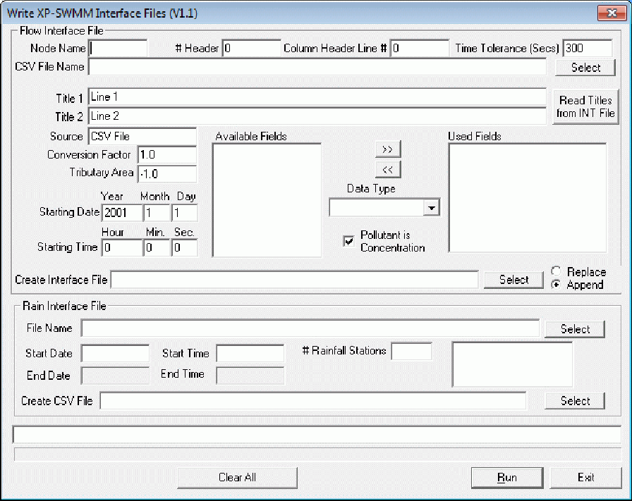
>
> Additional applications can be added either by editing the SWMXP.INI file or by selecting the Launch Application item from the Application Settings dialog. For example, you can add menu items to launch programs that you would use in combination with xpswmm such as receiving water quality programs, GIS and other engineering applications.
>
> 268

SECTION 7: MENUS

> 

**EPA-SWMM Data file Reader**

The EPA-SWMM Data File Reader program is a standalone Windows application. It may be run outside of xpswmm. It can also be launched via the Tools  Launch Application menu command.

This tool is capable of converting EPA SWMM version 4.4 and 5.0 files to XPX format files. These files may be converted to an xpswmm project file with the Import XPX/EPA Data tool.

Notes: This program converts data files on a line by line basis. The converted xpswmm model may by slightly different than the EPA-SWMM source model.

> Because the EPA-SWMM and the xpswmm calculation engines are different, results of the two calculations will not be identical. Results are expected to be comparable.
>
> 269
>
> xpswmm Reference Manual
>
> 
>
> To convert an EPA-SWMM data file, enter data into the dialog:

1.  Select format of the EPA SWMM file from the drop menu.

2.  The Sort Network check box applies only to Version 4.4 files.

3.  Select the EPA SWMM file by clicking on the Select button and navigating to the file. Version 5.0 files have an .inp extension.

4.  Select or choose the default XPX output file.

5.  The Create xpswmm Results File option applies only to version EPA SWMM version 4.4 files. It will read EPA SWMM results and display them with the xpsmm tools. Select the input and output files.

6.  Node Coordinates from DXF file applies only to Verions 4.4 files.  
    > Click on Run. The program will execute the conversion and close.

> **Snap Mode**
>
> This tool is used to navigate to a vertex or link of a selectable layer. When active the cursor changes from a diagonal arrow to a double lined cross as a target vertex or node is approached.
>
> Access from the Tools Menu or the Job, Layer & Mode Control tools.
>
> **7.6.11 Export Graphics  
> Export Graphics**
>
> This dialog allows for the network (or selected portion) to be output to a graphics file. When you select this command the following dialog will be displayed.
>
> 270

SECTION 7: MENUS

> 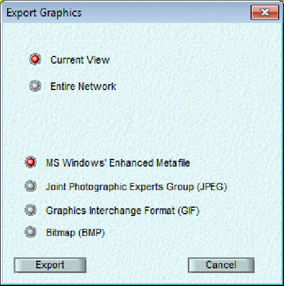

Note that when the entire network is exported, MS Windows Enhanced Metafile is the only format available. When the current view is exported, all four format options are available. To export the entire network as a JPEG, GIF or BMP; use the the Fit Window tool.

**7.6.12 Calibrate Model  
Automatic Calibration**

This module is an option that may be purchased from XP Software. Contact XP Software Sales to obtain pricing or an authorized copy of XP-SWMM with the automatic calibration tools. This module facilitates automated calibration by interfacing XP-SWMM with PEST , a non-linear parameter optimization engine. The sum of squared differences between modeled results and observed or target results is minimized in the weighted least squares sense. For example the difference between many points on a measured outfall hydrograph and a computed outfall hydrograph can be minimized to yield a high degree of fit.

> 271
>
> xpswmm Reference Manual
>
> 
>
> The PEST engine accomplishes this by taking control of your model. It will rerun the model with updated input data based on sensitivity gradients foe all of the Parameters selected by the user. These calibration parameters can be bound to reasonable engineering limits and the estimated parameter values can then be imported as the final calibrated model.
>
> **Observation Table**
>
> This table is used to store each observation with its measured and computed value. The observation IDs will become automatically loaded into the Instruction File and the PEST Control File . The following functions operate on the table. The parameters to be used in the calibration are entered using the Parameters button and execution commences when Calibrate is selected.
>
> **Row**
>
> The row number for the set of observations contained in the observation table.  
> **Observation Id**
>
> The unique alphanumeric 4 character ID for the observation. This observation ID will be used in the instruction file to pull computed results from the output file or other text file(s). The observation ID will also be used in the PEST Control File along with the Model Value.
>
> **Observation Value**
>
> The field, measured, or target value for the observation. PEST will optimize the model to predict this value by minimizing the weighted sum of squared difference of all observations in the least squares sense.
>
> **Model Value**
>
> The current model value that corresponds to the Observation ID. Typical sources of this information would be from Spatial Reports or User Defined Reports .
>
> **Graph**
>
> 272

SECTION 7: MENUS

This button plots all of the observation data measured vs. Computed. Graphically a 45-degree line represents perfect correlation between measured and computed data.

**Update Model Values**

Loads the current Model Value computed from the last simulation run into the observation table. These results are compared to the observation value to determine the degree of fit.

**Insert/Delete/Append Row**

Inserts, deletes or appends a row in the observation table.

**Calibrate**

This button launches the calibration process by sending the generated control file to the PEST engine designated in the SWMXP.INI file. Calibration of the model must follow the generation and checking of all of the template files, instruction files, and PEST control file.

**Calibration Library (LIBRARY.CAL file)**

This file contains the current set of XPX variables that are enabled for automatic calibration. The columns within the file contains instructions for the software to locate object names and the location of the variable in the data file (.DAT). Not all XPX variables or xpswmm parameters are suitable calibration parameters.

The LIBRARY.CAL file below contains the most common and most suitable XP variables that can be used for calibration.

<table>
<colgroup>
<col style="width: 13%" />
<col style="width: 13%" />
<col style="width: 8%" />
<col style="width: 10%" />
<col style="width: 54%" />
</colgroup>
<tbody>
<tr class="odd">
<td><blockquote>

#XPX_Name

</blockquote></td>
<td>Layer</td>
<td>Row</td>
<td>Column</td>
<td>Name_Locator</td>
</tr>
<tr class="even">
<td><blockquote>

R_WAREA

</blockquote></td>
<td>RUNOFF</td>
<td>H1</td>
<td>6</td>
<td>2</td>
</tr>
<tr class="odd">
<td><blockquote>

R_WIMP

</blockquote></td>
<td>RUNOFF</td>
<td>H1</td>
<td>7</td>
<td>2</td>
</tr>
<tr class="even">
<td><blockquote>

R_WIDTH

</blockquote></td>
<td>RUNOFF</td>
<td>H1</td>
<td>5</td>
<td>2</td>
</tr>
<tr class="odd">
<td><blockquote>

R_WSLOPE

</blockquote></td>
<td>RUNOFF</td>
<td>H1</td>
<td>8</td>
<td>2</td>
</tr>
<tr class="even">
<td><blockquote>

R_CN

</blockquote></td>
<td>RUNOFF</td>
<td>H1</td>
<td>10</td>
<td>2</td>
</tr>
<tr class="odd">
<td><blockquote>

R_TC

</blockquote></td>
<td>RUNOFF</td>
<td>H1</td>
<td>11</td>
<td>2</td>
</tr>
<tr class="even">
<td><blockquote>

R_SHF

</blockquote></td>
<td>RUNOFF</td>
<td>H1</td>
<td>12</td>
<td>2</td>
</tr>
<tr class="odd">
<td><blockquote>

R_IAFRACT

</blockquote></td>
<td>RUNOFF</td>
<td>H1</td>
<td>15</td>
<td>2</td>
</tr>
<tr class="even">
<td><blockquote>

ROUGH

</blockquote></td>
<td>EXTRAN</td>
<td>C1</td>
<td>12</td>
<td>1</td>
</tr>
<tr class="odd">
<td><blockquote>

ROUGH

</blockquote></td>
<td>TRANSPORT</td>
<td>E1</td>
<td>7</td>
<td>1</td>
</tr>
<tr class="even">
<td><blockquote>

ROUGH

</blockquote></td>
<td>RUNOFF</td>
<td>G1</td>
<td>9</td>
<td>1</td>
</tr>
<tr class="odd">
<td><blockquote>

PLC

</blockquote></td>
<td>EXTRAN</td>
<td>CX</td>
<td>5</td>
<td>1</td>
</tr>
<tr class="even">
<td><blockquote>

GEOFF

</blockquote></td>
<td>EXTRAN</td>
<td>CX</td>
<td>7</td>
<td>1</td>
</tr>
<tr class="odd">
<td><blockquote>

RRAT

</blockquote></td>
<td>EXTRAN</td>
<td>CX</td>
<td>2</td>
<td>1</td>
</tr>
<tr class="even">
<td><blockquote>

BARREL

</blockquote></td>
<td>EXTRAN</td>
<td>CX</td>
<td>8</td>
<td>1</td>
</tr>
<tr class="odd">
<td><blockquote>

R_WSTOR1

</blockquote></td>
<td>RUNOFF</td>
<td>H1</td>
<td>11</td>
<td>2</td>
</tr>
<tr class="even">
<td><blockquote>

R_WSTOR2

</blockquote></td>
<td>RUNOFF</td>
<td>H1</td>
<td>12</td>
<td>2</td>
</tr>
<tr class="odd">
<td><blockquote>

R_IROUGH

</blockquote></td>
<td>RUNOFF</td>
<td>H1</td>
<td>9</td>
<td>2</td>
</tr>
<tr class="even">
<td><blockquote>

R_PROUGH

</blockquote></td>
<td>RUNOFF</td>
<td>H1</td>
<td>10</td>
<td>2</td>
</tr>
<tr class="odd">
<td><blockquote>

R_PCTZER

</blockquote></td>
<td>RUNOFF</td>
<td>H1</td>
<td>4</td>
<td>2</td>
</tr>
<tr class="even">
<td><blockquote>

R_WLMAX

</blockquote></td>
<td>RUNOFF</td>
<td>H1</td>
<td>13</td>
<td>2</td>
</tr>
<tr class="odd">
<td><blockquote>

R_WLMIN

</blockquote></td>
<td>RUNOFF</td>
<td>H1</td>
<td>14</td>
<td>2</td>
</tr>
<tr class="even">
<td><blockquote>

R_DECAY

</blockquote></td>
<td>RUNOFF</td>
<td>H1</td>
<td>15</td>
<td>2</td>
</tr>
<tr class="odd">
<td><blockquote>

R_SUCT

</blockquote></td>
<td>RUNOFF</td>
<td>H1</td>
<td>13</td>
<td>2</td>
</tr>
<tr class="even">
<td><blockquote>

R_SMDMAX

</blockquote></td>
<td>RUNOFF</td>
<td>H1</td>
<td>14</td>
<td>2</td>
</tr>
<tr class="odd">
<td><blockquote>

R_HYDCON

</blockquote></td>
<td>RUNOFF</td>
<td>H1</td>
<td>15</td>
<td>2</td>
</tr>
<tr class="even">
<td><blockquote>

R_GDDLIM

</blockquote></td>
<td>RUNOFF</td>
<td>JX</td>
<td>5</td>
<td>-1</td>
</tr>
<tr class="odd">
<td><blockquote>

R_GDDFACT2

</blockquote></td>
<td>RUNOFF</td>
<td>JX</td>
<td>7</td>
<td>-1</td>
</tr>
<tr class="even">
<td><blockquote>

R_GDDPOW1

</blockquote></td>
<td>RUNOFF</td>
<td>JX</td>
<td>6</td>
<td>-1</td>
</tr>
<tr class="odd">
<td><blockquote>

R_GDDPOW2

</blockquote></td>
<td>RUNOFF</td>
<td>JX</td>
<td>6</td>
<td>-1</td>
</tr>
<tr class="even">
<td><blockquote>

R_GDDPOW3

</blockquote></td>
<td>RUNOFF</td>
<td>JX</td>
<td>6</td>
<td>-1</td>
</tr>
<tr class="odd">
<td><blockquote>

R_QCOEFF1

</blockquote></td>
<td>RUNOFF</td>
<td>JX</td>
<td>8</td>
<td>-1</td>
</tr>
</tbody>
</table>

273

xpswmm Reference Manual

<table>
<colgroup>
<col style="width: 12%" />
<col style="width: 12%" />
<col style="width: 9%" />
<col style="width: 10%" />
<col style="width: 54%" />
</colgroup>
<tbody>
<tr class="odd">
<td><blockquote>

R_QCOEFF2

</blockquote></td>
<td>RUNOFF</td>
<td>JX</td>
<td>9</td>
<td>-1</td>
</tr>
<tr class="even">
<td><blockquote>

R_ERCOEFF

</blockquote></td>
<td>RUNOFF</td>
<td>JX</td>
<td>9</td>
<td>-1</td>
</tr>
<tr class="odd">
<td><blockquote>

R_EWASHPO

</blockquote></td>
<td>RUNOFF</td>
<td>JX</td>
<td>8</td>
<td>-1</td>
</tr>
<tr class="even">
<td><blockquote>

R_COEFF

</blockquote></td>
<td>RUNOFF</td>
<td>JX</td>
<td>9</td>
<td>-1</td>
</tr>
<tr class="odd">
<td><blockquote>

R_WASHPO

</blockquote></td>
<td>RUNOFF</td>
<td>JX</td>
<td>8</td>
<td>-1</td>
</tr>
<tr class="even">
<td><blockquote>

R_DLIM

</blockquote></td>
<td>RUNOFF</td>
<td>J2</td>
<td>4</td>
<td>1</td>
</tr>
<tr class="odd">
<td><blockquote>

R_DDFACT1

</blockquote></td>
<td>RUNOFF</td>
<td>J2</td>
<td>6</td>
<td>1</td>
</tr>
<tr class="even">
<td><blockquote>

R_DDPOW1

</blockquote></td>
<td>RUNOFF</td>
<td>J2</td>
<td>5</td>
<td>1</td>
</tr>
<tr class="odd">
<td><blockquote>

R_DDPOW2

</blockquote></td>
<td>RUNOFF</td>
<td>J2</td>
<td>5</td>
<td>1</td>
</tr>
<tr class="even">
<td><blockquote>

R_QFACTD

</blockquote></td>
<td>RUNOFF</td>
<td>JX</td>
<td>5</td>
<td>-1</td>
</tr>
<tr class="odd">
<td><blockquote>

FMAX

</blockquote></td>
<td>EXTRAN</td>
<td>BB</td>
<td>7</td>
<td>0</td>
</tr>
<tr class="even">
<td><blockquote>

QREF

</blockquote></td>
<td>EXTRAN</td>
<td>BB</td>
<td>15</td>
<td>0</td>
</tr>
<tr class="odd">
<td><blockquote>

HLOSS

</blockquote></td>
<td>EXTRAN</td>
<td>B2</td>
<td>8</td>
<td>0</td>
</tr>
<tr class="even">
<td><blockquote>

CLOSS

</blockquote></td>
<td>EXTRAN</td>
<td>B2</td>
<td>4</td>
<td>0</td>
</tr>
</tbody>
</table>

**XPX_Name**

The XPX variable name of the calibration parameter. R\_ usually precedes RUNOFF variables T\_ precedes most TRANSPORT variables. Consult the XPX references in the help or manual for more information on an individual variable.

**Layer**

The mode of xpswmm to which the variable applies. This column also identifies the section of the data file to find the variable. The software uses this field to index to the appropriate section of the data file.

**Row**

The data file (.DAT) card or row label that contains the calibration parameter. These labels correspond to xpswmms data file structure and is very similar to that of EPA SWMM.

**Column**

The *i*th column where i is the integer representing which column in the data file will contain the calibration parameter. For example, R_WIDTH (the subcatchment width) is located on the H1 card of the data file in the 5th column. In other words it is the fifth item on the H1 line. The software uses this column to index to the correct location to place the PEST ID.

**Name_Locator**

Similar to the Column data the Name_Locator instructs the software where to find the object name on the data line. In a few cases such as RUNOFF water quality data the object name appears on a previous line. A value of -1 is used in this case. A value of 0 is used when the variable is not related to any object such as Job Control parameters.

**Calibration Parameters**

274

xpswmm Reference Manual

Inserts or deletes a selected row from the observation table.

**Control File**

**Generate**

Generates a default PEST control file using the MAKES CTL function designated in the SWMXP.INI file. This file will include default values for the input parameters of PEST, the calibration parameters in the parameter file, and will reference the instruction file and template file you have created. It will then need to be edited to replace default values and commands with ones appropriate for your modeling.

**Edit**

Loads the current PEST control file into the current editor. The file must then be modified by replacing default values with appropriate PEST input parameters.

**Check**

Reads the PEST Control file, making sure that all necessary items of information are present on this file and that every item is consistent with every other item. It also checks that all parameters and observations cited in the PEST control file are also cited in the template file(s) and instruction file(s) referenced in the PEST control file, and that parameters and observations cited in the template file and instruction file are also listed in the PEST control file.

**Create Files**

Creates the template file which PEST uses to create an updated data file (.DAT) to send to the SWMM engine by substituting the PEST ID for the numerical value contained in the DAT file. In addition, a parameter file is created to generate the starting values for the first PEST execution of the model and these string values are used in the creation of the PEST control file. After the creation of these files a CALIBRAT.LOG file will be displayed in the current editor listing any errors in the creation of the template file. Such errors may include parameters that are not currently supported in the calibration procedure or objects that cannot be located in the data file.

Note: Two conditions must be met for the insertion of a calibration parameter into the template file. The first is that the object and SWMM input parameter referenced by the <u>XPX variable</u> must be found in the data file. In other words, no substitution of PEST IDs will be performed if the object and corresponding variable are not found in the data file. The second condition requires that the XP variable be contained in the calibration library file . This file contains all of the default XP variables that can be used in the automatic calibration option of XP-SWMM.

**Instruction File**

**Generate**

Generates the first line of an instruction file and places all of the observation variables from the observation table on separate lines.

**Edit**

Loads the current instruction file with all of the observation variables into the editor designated in the SWMXP.INI file. The file must then have relevant search text appropriately entered to locate these variables in the output file(.OUT) and/or other text file(s).

**Check**

Checks the syntax and searching capabilities of the instruction file with the output file (.OUT). This is accomplished by sending the instruction file name and path along with the output file (.OUT) name and path to the CHK INSTRUCTION function designated in the SWMXP.INI file. A INSCHEK.LOG file is then created and displayed in your current editor displaying all warnings, errors and confirmation messages,

**Load XPX Variables**

This button imports an XPX file into the calibration parameter table. The use of an XPX file for the import of calibration parameters is a novel approach. The export of an XPX file is a very powerful function that allows the user to export a selection of variables and objects. For example the user may highlight a particular branch of the network and choose the % impervious of each subcatchment and the pipe roughness used in the EXTRAN layer. This XPX file can then

276

SECTION 7: MENUS

be imported and a PEST ID would be assigned for each of these parameters. A large amount of parameters can be selected and easily imported in this fashion to generate the template that PEST will use. In essence, the XPX file contains all of the parameters you are freeing up so that PEST may adjust them in the calibration process.

**Parameters**

This button opens the Calibration Parameters dialog for imputing all of the calibration parameters to be adjusted by PEST in the calibration process. In addition, the generation of the template and parameter file is handled by this function.;

**Parameter File  
Edit**

Loads the current parameter file into the editor. Initial values of each calibration parameter could be modified in the editor or changed in the calibration parameter table.

**Precision  
Single/Double**

Selecting the radio button on Single or Double instructs PEST to write parameters to model input files using single precision or double precision protocol. For single precision the parameter values will never be greater than 13 characters in length (even if the parameter space allows for a greater length) and the exponentiation character is e. For double precision parameter values are written to model input files using double precision protocol; the maximum parameter value length is 23 characters and the exponentiation symbol is d. Double precision is suitable for extremely large and extremely small numbers. These controls refer to the PEST PRECIS parameter.

Note: XP-SWMM prepares template files with 10 spaces for PEST to write the parameter values. In some cases more spaces to represent very large or small numbers in double precision may be required. In these cases load the template file into the editor and manually add more spaces.

**Point/Nopoint**

Selecting the radio button on Point or Nopoint instructs PEST to always use or omit the decimal point in the representation of a number if it can when writing the data file. These controls refer to the PEST DPOINT parameter.

Note that if a parameter space is 13 characters wide or greater and the precision is single, PEST will include the decimal point regardless of the setting of DPOINT, for there are no gains to be made in precision through leaving it out. Similarly, if PRECIS is set to double, no attempt is made to omit a decimal point if the parameter space is 23 characters wide or more.

The table below shows how the setting of DPOINT affects the representation of the number 12345.67. In examining this table, remember that PEST writes a number in such a way that the maximum possible precision is squeezed into each parameter space.

> 

xpswmm Reference Manual

**Template File**

**Edit**

Loads the current template file into the editor designated in the SWMXP.INI file. The file will be similar to the data file (DAT) but have PEST IDs inserted throughout the file separated by a delimiter. Subsequent editing or modification of the template file can then be performed within the editor if required.

**Check**

Checks the syntax of the template file and prepares a data file using the calibration parameter values contained in the parameter file. This is accomplished by sending the template file name and path, the data file (DAT) name and path along with the parameter file name and path to the CHK_TEMPLATE function designated in the SWMXP.INI file. A TEMPCHEK.LOG file is then created and displayed in your current editor displaying all warnings, errors, and confirmation messages.

**7.6.13 Calculate Conduit  
7.6.5 Calculate Conduit Lengths**

The lengths of all conduits or of the selected conduit(s) can be calculated from the node coordinates by selecting this command.

**7.6.6 Calculate Conduit Slopes**

The slopes of all conduits or of the selected conduit(s) can be calculated from the conduit invert elevations by selecting this command.

278

SECTION 7: MENUS

> 

The slopes can be modified, if so desired, prior to accepting the result.

**Cross Sections**

This tool requires an active DTM layer. It is used to generate shapes of links that are Natural Channels and/or layouts of cross-sections. The generated cross-sections are straight lines perpendicular to the the channel centerline, represented by link.

279

> xpswmm Reference Manual
>
> 
>
> **Apply to** options are:
>
> All natural shape links
>
> Selected natural shape links
>
> **Create** options are:
>
> Layout then Shape from DTM - Both the layout and the shapes are generated. The user defines:
>
> Cross-section location as offset from:
>
> Upstream Node  
> Downstream node
>
> Offset percentage
>
> Cross-section width as left and right distance (in ft or m) from the centerline looking downstream.
>
> Layout from Shape - Layouts of cross-section are generated from user defined location data. Width of the existing shape is used and the lowest point in the section data is the centerline of the station.
>
> Shape using Layout and DTM - the shapes are developed from predefined layouts of the cross-sections. The options on crossection location are disabled.
>
> The successlly generated cross-sections are reported.

280

SECTION 7: MENUS

> 

To view the layouts of the cross-sections the Cross-sections layer must be enabled on the Layer Control Panel**.** To edit the cross-sections, select the link, right click and select Edit Cross-section from the pop-up menu. The Cross-sections Layer must Visible, Movable and Selectable in order to graphically edit the polyline.

> **7.7 Analyze**

**The Analyze Menu**

> 

**7.7.1 Solve**

**7.7.2 Show Errors**

**7.7.1 Solve**

This menu command is used to commence analysis of the network. The data is first checked for consistency and, if it is found to be sound, the network can be analysed and the analysis engine is invoked. Otherwise a window showing all the data inconsistency errors is displayed. The errors and warnings shown may be re-displayed by selecting the "Show Errors " menu command.

The mandatory consistency checks performed at this stage generally concern relationships between data items and are outlined in more detail in Utilities.

If no errors or warnings are detected there will be no errors or warnings listed in the error log. The simulation window will appear and the engine will begin the simulation.

**7.7.2 Show Errors**

Show Errors will re-display the "error.log" file that is created when a network is solved. This enables the user to systematically correct any errors encountered without the need to print the error log or to re-solve the network.

281

xpswmm Reference Manual

> **7.8 Results**

**The Results Menu**

The review results menu contains all data review and display of results functions  
Move cursor over image and click to view descriptions of the menu commands.

> 

Descriptions of the available Results menu commands may be found in the following links.

**Browse File**

**Review Results**

**Profile Plot**

**Dynamic Long Section View**

**Dynamic Section Views**

**Dynamic Plan View**

**Spatial Report**

**Graphical Encoding**

**Perspective View**

**XP-Tables**

**7.8.2 Browse File  
Browse File Dialog**

This command allows the user to browse any text file on the system. This command is intended to allow users to view their output files without leaving the XP environment but can be used for any ASCII text file.

282

SECTION 7: MENUS

> 

When you select a filename Notepad.exe, or the editor referred to in SWMXP.INI will be loaded. See the Help menu of your selected editor for more information.

To review the output file open the *filename*.out file with the Browse File Dialog. This file is located in the same folder as the xpswmm project file.

**Sample Output File with Popup Explanations**

Click on any <u>underlined</u> text for documentation of that item in the file.

Current Directory: [<u>C:\XPS\XP-SWMM</u>](C:\XPS\XP-SWMM)

Engine Name: [<u>C:\XPS\XP-SWMM\swmmengw.exe</u>](C:\XPS\XP-SWMM\swmmengw.exe)  
Read 1 line(s) and found 1 items(s) from your cfg file.  
Input File : [<u>C:\XPS\XP-SWMM\Samples\TESTEXT1.XP</u>](C:\XPS\XP-SWMM\Samples\TESTEXT1.XP)

\*===============================================\*

283

xpswmm Reference Manual

> XP-SWMM \|
>
> Storm and Wastewater Management Model \|
>
> Interface Version: 9.50 \|
>
> Engine Version: 9.28 \|
>
> =============================================\| \|
>
> Developed by \|

\|

> XP Software \|

\|

> =============================================\|
>
> XP Software November, 2004 \|
>
> Data File Version ---\> 11.7 \|
>
> Serial Number: 42-xxx-0000 \|
>
> XP Software (Evaluation) \|

\*===============================================\*

Engine Name: [<u>C:\XPS\XP-SWMM\swmmengw.exe</u>](C:\XPS\XP-SWMM\swmmengw.exe)

\*====================================================\*

\| Input and Output file names by Layer \|

\*====================================================\*

Input File to Layer \# 1 [<u>JOT.US</u>](http://JOT.US)

284

SECTION 7: MENUS

> Output File to Layer \# 1 [<u>JOT.US</u>](http://JOT.US)

\*==

==\*

> Special command line arguments in XP-SWMM2000. This \| now includes program defaults. \$Keywords are the program\| defaults. Other Keywords are from the SWMMCOM.CFG file.\| or the command line or any cfg file on the command line.\| Examples include these in the file xpswm.bat under the \| section :solve or in the windows version XPSWMM32 in the\|
>
> file solve.bat \|
>
> \|
>
> Note: the cfg file should be in the subdirectory swmxp \|
>
> or defined by the set variable in the xpswm.bat \|
>
> file. Some examples of the command lines possible\|
>
> are shown below: \|
>
> \|
>
> swmmd swmmcom.cfg \|
>
> swmmd my.cfg \|
>
> swmmd nokeys nconv5 perv extranwq \|

\*==

==\*

> \$powerstation 0.0000 1 2
>
> \$perv 0.0000 0 4

xpswmm Reference Manual

<table style="width:100%;">
<colgroup>
<col style="width: 37%" />
<col style="width: 33%" />
<col style="width: 10%" />
<col style="width: 18%" />
</colgroup>
<tbody>
<tr class="odd">
<td><blockquote>

$oldegg 
$as

$noflat 
$oldomega

</blockquote></td>
<td>
0.0000

0.0000 0

0.0000

<blockquote>

0.0000

</blockquote></td>
<td colspan="2">
0 7

11

0 21

0 24
</td>
</tr>
<tr class="even">
<td><blockquote>

$oldvol

</blockquote></td>
<td>0.0000</td>
<td>1</td>
<td>28</td>
</tr>
<tr class="odd">
<td><blockquote>

$implicit

</blockquote></td>
<td>0.0000</td>
<td>1</td>
<td>29</td>
</tr>
<tr class="even">
<td><blockquote>

$oldhot

</blockquote></td>
<td>0.0000</td>
<td>1</td>
<td>31</td>
</tr>
<tr class="odd">
<td><blockquote>

$oldscs

</blockquote></td>
<td>0.0000</td>
<td>0</td>
<td>33</td>
</tr>
<tr class="even">
<td><blockquote>

$flood

</blockquote></td>
<td>0.0000</td>
<td>1</td>
<td>40</td>
</tr>
<tr class="odd">
<td><blockquote>

$nokeys

</blockquote></td>
<td>0.0000</td>
<td>0</td>
<td>42</td>
</tr>
<tr class="even">
<td><blockquote>

$pzero

</blockquote></td>
<td>0.0000</td>
<td>0</td>
<td>55</td>
</tr>
<tr class="odd">
<td><blockquote>

$oldvol2

</blockquote></td>
<td>0.0000</td>
<td>2</td>
<td>59</td>
</tr>
<tr class="even">
<td><blockquote>

$storage2

</blockquote></td>
<td>0.0000</td>
<td>3</td>
<td>62</td>
</tr>
<tr class="odd">
<td><blockquote>

$oldhot1

</blockquote></td>
<td>0.0000</td>
<td>1</td>
<td>63</td>
</tr>
<tr class="even">
<td><blockquote>

$pumpwt

</blockquote></td>
<td><blockquote>

0.0000

</blockquote></td>
<td>1</td>
<td>70</td>
</tr>
<tr class="odd">
<td><blockquote>

$ecloss

</blockquote></td>
<td>0.0000</td>
<td>1</td>
<td>77</td>
</tr>
<tr class="even">
<td><blockquote>

$exout

</blockquote></td>
<td>0.0000</td>
<td>0</td>
<td>97</td>
</tr>
<tr class="odd">
<td><blockquote>

$spatial = 0.90

</blockquote></td>
<td><blockquote>

0.9000

</blockquote></td>
<td>5</td>
<td>124</td>
</tr>
<tr class="even">
<td><blockquote>

$djref = -1.0

</blockquote></td>
<td>-0.1000</td>
<td>3</td>
<td>143</td>
</tr>
<tr class="odd">
<td><blockquote>

$weirlen = 50

</blockquote></td>
<td>50.0000</td>
<td>1</td>
<td>153</td>
</tr>
<tr class="even">
<td><blockquote>

$oldbnd

</blockquote></td>
<td>0.0000</td>
<td>1</td>
<td>154</td>
</tr>
<tr class="odd">
<td><blockquote>

$nogrelev

</blockquote></td>
<td>0.0000</td>
<td>1</td>
<td>161</td>
</tr>
<tr class="even">
<td><blockquote>

$ncmid

</blockquote></td>
<td>0.0000</td>
<td>0</td>
<td>164</td>
</tr>
<tr class="odd">
<td><blockquote>

$new_nl_97

</blockquote></td>
<td><blockquote>

0.0000

</blockquote></td>
<td>2</td>
<td>290</td>
</tr>
</tbody>
</table>

286

SECTION 7: MENUS

<table>
<colgroup>
<col style="width: 35%" />
<col style="width: 22%" />
<col style="width: 4%" />
<col style="width: 3%" />
<col style="width: 34%" />
</colgroup>
<tbody>
<tr class="odd">
<td><blockquote>

$best97

$newbound Q_TOL=0.001

</blockquote></td>
<td>
0.0000 1

0.0000

0.0000
</td>
<td>
1

1
</td>
<td colspan="2">
294

<blockquote>

295

316

</blockquote></td>
</tr>
<tr class="even">
<td><blockquote>

$new_storage

</blockquote></td>
<td>0.0000</td>
<td>1</td>
<td></td>
<td>322</td>
</tr>
<tr class="odd">
<td><blockquote>

$old_iteration

</blockquote></td>
<td>0.0000</td>
<td>1</td>
<td></td>
<td>333</td>
</tr>
<tr class="even">
<td><blockquote>

$minlen=30.0

</blockquote></td>
<td>30.0000</td>
<td>1</td>
<td></td>
<td>346</td>
</tr>
<tr class="odd">
<td><blockquote>

$review_elevation

</blockquote></td>
<td><blockquote>

0.0000

</blockquote></td>
<td></td>
<td>1</td>
<td>383</td>
</tr>
<tr class="even">
<td><blockquote>

$use_half_volume

</blockquote></td>
<td><blockquote>

0.0000

</blockquote></td>
<td></td>
<td>1</td>
<td>385</td>
</tr>
<tr class="odd">
<td><blockquote>

$min_ts = 0.5

</blockquote></td>
<td>0.5000</td>
<td>1</td>
<td></td>
<td>407</td>
</tr>
<tr class="even">
<td><blockquote>

$design_restart = on

</blockquote></td>
<td><blockquote>

0.0000

</blockquote></td>
<td></td>
<td>1</td>
<td>412</td>
</tr>
<tr class="odd">
<td><blockquote>

$zero_value=1.e-05

</blockquote></td>
<td><blockquote>

0.0000

</blockquote></td>
<td></td>
<td>1</td>
<td>415</td>
</tr>
<tr class="even">
<td><blockquote>

$relax_depth = on

</blockquote></td>
<td><blockquote>

0.0000

</blockquote></td>
<td></td>
<td>1</td>
<td>427</td>
</tr>
</tbody>
</table>

> \*==

==\*

> \| Parameter Values on the Tapes Common Block.These are the \| \| values read from the data file and dynamically allocated \|
>
> \| by the model for this simulation. \|
>
> \*==

==\*

> Number of Subcatchments in the Runoff Block (NW).... 0 Number of Channel/Pipes in the Runoff Block (NG).... 0
>
> Runoff Water quality constituents (NRQ) 0
>
> Runoff Land Uses per Subcatchment (NLU) 0
>
> xpswmm Reference Manual
>
> Number of Elements in the Transport Block (NET) 0
>
> Number of Storage Junctions in Transport (NTSE) 0
>
> Number of Input Hydrographs in Transport (NTH) 0
>
> Number of Elements in the Extran Block (NEE) 10 Number of Groundwater Subcatchments in Runoff (NGW). 0 Number of Interface locations for all Blocks (NIE).. 10
>
> Number of Pumps in Extran (NEP) 0
>
> Number of Orifices in Extran (NEO) 0 Number of Tide Gates/Free Outfalls in Extran (NTG).. 1
>
> Number of Extran Weirs (NEW) 0
>
> Number of scs hydrograph points 1
>
> Number of Extran printout locations (NPO) 0
>
> Number of Tide elements in Extran (NTE) 1
>
> Number of Natural channels (NNC) 1
>
> Number of Storage junctions in Extran (NVSE) 0 Number of Time history data points in Extran(NTVAL). 0 Number of Variable storage elements in Extran (NVST) 0
>
> Number of Input Hydrographs in Extran (NEH) 3 Number of Particle sizes in Transport Block (NPS)... 0
>
> Number of User defined conduits (NHW) 10
>
> Number of Connecting conduits in Extran (NECC) 20
>
> Number of Upstream elements in Transport (NTCC) 10
>
> Number of Storage/treatment plants (NSTU) 0 Number of Values for R1 lines in Transport (NR1).... 0
>
> 288

SECTION 7: MENUS

> Number of Nodes to be allowed for (NNOD) 10
>
> Number of Plugs in a Storage Treatment Unit 1
>
> \####################################################### \# Entry made to the HYDRAULIC Layer(Block) of SWMM \#
>
> \# Last Updated October,2000 by XP Software \#
>
> Example 1

\*===

===\*

> HYDRAULICS TABLES IN THE OUTPUT FILE \|
>
> These are the more important tables in the output file. \|
>
> You can use your editor to find the table numbers, \| for example: search for Table E20 to check continuity. \| This output file can be imported into a Word Processor \| and printed on US letter or A4 paper using portrait \| mode, courier font, a size of 8 pt. and margins of 0.75 \|
>
> \|
>
> Table E1 - Basic Conduit Data \|
>
> Table E2 - Conduit Factor Data \|

289

> xpswmm Reference Manual
>
> Table E3a - Junction Data \|
>
> Table E3b - Junction Data \|
>
> Table E4 - Conduit Connectivity Data \|
>
> Table E4a - Dry Weather Flow Data \|
>
> Table E4b - Real Time Control Data \|
>
> Table E5 - Junction Time Step Limitation Summary \|
>
> Table E5a - Conduit Explicit Condition Summary \|
>
> Table E6 - Final Model Condition \|
>
> Table E7 - Iteration Summary \|
>
> Table E8 - Junction Time Step Limitation Summary \|
>
> Table E9 - Junction Summary Statistics \|
>
> Table E10 - Conduit Summary Statistics \|
>
> Table E11 - Area assumptions used in the analysis \|
>
> Table E12 - Mean conduit information \|
>
> Table E13 - Channel losses(H) and culvert info \|
>
> Table E13a - Culvert Analysis Classification \|
>
> Table E14 - Natural Channel Overbank Flow Information \|
>
> Table E14a - Natural Channel Encroachment Information \|
>
> Table E14b - Floodplain Mapping \|
>
> Table E15 - Spreadsheet Info List \|
>
> Table E15a - Spreadsheet Reach List \|
>
> Table E16 - New Conduit Output Section \|
>
> Table E17 - Pump Operation \|
>
> Table E18 - Junction Continuity Error \|
>
> 290

SECTION 7: MENUS

> \| Table E19 - Junction Inflow Sources \|
>
> \| Table E20 - Junction Flooding and Volume List \|
>
> \| Table E21 - Continuity balance at simulation end \|
>
> \| Table E22 - Model Judgement Section \|
>
> \*==

==\*

> Time Control from Hydraulics Job Control
>
> Year 1996 Month 1
>
> Day 1 Hour 0
>
> Minute 0 Second 0
>
> Control information for simulation
>
> Integration cycles 480
>
> Length of integration step is 60.00 seconds
>
> Simulation length 8.00 hours
>
> Do not create equiv. pipes(NEQUAL). 0
>
> Use U.S. customary units for I/O... 0
>
> Printing starts in cycle 1
>
> Intermediate printout intervals of. 500 cycles  
> Intermediate printout intervals of. 500.00 minutes
>
> xpswmm Reference Manual
>
> Summary printout intervals of 500 cycles Summary printout time interval of.. 500.00 minutes
>
> Hot start file parameter (REDO) 0
>
> Initial time 0.00 hours
>
> Iteration variables: Flow Tolerance. 0.00010

<table>
<colgroup>
<col style="width: 60%" />
<col style="width: 39%" />
</colgroup>
<tbody>
<tr class="odd">
<td colspan="2">Head Tolerance. 0.00050</td>
</tr>
<tr class="even">
<td><blockquote>

Minimum depth (m or ft)

</blockquote></td>
<td>0.00001</td>
</tr>
<tr class="odd">
<td><blockquote>

Underrelaxation parameter

</blockquote></td>
<td>0.85000</td>
</tr>
<tr class="even">
<td><blockquote>

Time weighting parameter

</blockquote></td>
<td>0.85000</td>
</tr>
<tr class="odd">
<td><blockquote>

Conduit roughness factor

</blockquote></td>
<td>1.00000</td>
</tr>
<tr class="even">
<td><blockquote>

Flow adjustment factor

</blockquote></td>
<td>1.00000</td>
</tr>
</tbody>
</table>

> Initial Condition Smoothing 0
>
> Courant Time Step Factor 1.00000  
> Default Expansion/Contraction K. 0.00000
>
> Default Entrance/Exit K 0.00000
>
> Routing Method Dynamic Wave  
> Default surface area of junctions... 12.57 square feet.
>
> Minimum Junction/Conduit Depth 0.00001 feet.
>
> Ponding Area Coefficient 5000.00
>
> Ponding Area Exponent 1.0000
>
> Minimum Orifice Length 300.00 feet.
>
> NJSW input hydrograph junctions 3  
> or user defined hydrographs....
>
> 292

SECTION 7: MENUS

> Natural Cross-Section information for Channel la6

<table>
<colgroup>
<col style="width: 36%" />
<col style="width: 15%" />
<col style="width: 36%" />
<col style="width: 3%" />
<col style="width: 8%" />
</colgroup>
<tbody>
<tr class="odd">
<td colspan="2">Cross-Section ID (from X1 card) :</td>
<td colspan="2">1.0 Channel sequence number :</td>
<td>1</td>
</tr>
<tr class="even">
<td><blockquote>

Left Overbank Length : t.

</blockquote></td>
<td>4500.0 ft</td>
<td>Maximum Elevation</td>
<td>:</td>
<td>9.00 f</td>
</tr>
<tr class="odd">
<td>Main Channel Length :</td>
<td>4500.0 ft</td>
<td>Maximum depth :</td>
<td></td>
<td>9.00 ft.</td>
</tr>
<tr class="even">
<td>Right Overbank Length :</td>
<td>4500.0 ft</td>
<td>Maximum Section Area</td>
<td></td>
<td>: 45.0</td>
</tr>
</tbody>
</table>

> 000 ft"2
>
> Maximum hydraulic radius : 1.96 ft.
>
> Manning N : 0.013 to Station 5.0 Max topwidth : 5.10 ft.
>
> " " : 0.013 in main Channel Maximum Wetted Perimeter : 2.29E
>
> +01 ft
>
> " " : 0.013 Beyond station 10.0 Max left bank area : 0.00 ft"2
>
> Max right bank area : 0.45 ft"2
>
> Allowable Encroachment Depth : 0.00 ft Max center channel area : 44
>
> .5500 ft"2
>
> \*==================================================\*
>
> \| Table E1 - Conduit Data \|
>
> \*==================================================\*
>
> Trapezoid
>
> Inp Conduit Length Conduit Area Manning Max Width Dep
>
> th Side

293

> xpswmm Reference Manual

<table style="width:100%;">
<colgroup>
<col style="width: 7%" />
<col style="width: 50%" />
<col style="width: 11%" />
<col style="width: 11%" />
<col style="width: 13%" />
<col style="width: 5%" />
</colgroup>
<tbody>
<tr class="odd">
<td colspan="2">Num Name (ft) Class (ft^2)</td>
<td>Coef. (ft)</td>
<td colspan="2">(ft) Slopes</td>
<td></td>
</tr>
<tr class="even">
<td>1</td>
<td><blockquote>

la1 1800.0000 Circular 12.5664

</blockquote></td>
<td>0.0150</td>
<td>4.0000</td>
<td>4.0000</td>
<td></td>
</tr>
<tr class="odd">
<td>2</td>
<td><blockquote>

la2 2075.0000 Circular 15.9043

</blockquote></td>
<td>0.0150</td>
<td>4.5000</td>
<td>4.5000</td>
<td></td>
</tr>
<tr class="even">
<td>3</td>
<td><blockquote>

la3 5000.0000 Circular 14.6761

</blockquote></td>
<td>0.0150</td>
<td>5.0000</td>
<td>3.5000</td>
<td></td>
</tr>
<tr class="odd">
<td>4</td>
<td><blockquote>

la4 500.0000 Circular 28.2743

</blockquote></td>
<td>0.0150</td>
<td>6.0000</td>
<td>6.0000</td>
<td></td>
</tr>
<tr class="even">
<td>5</td>
<td><blockquote>

la5 300.0000 Trapezoid 243.0000

</blockquote></td>
<td>0.0150</td>
<td>0.0100</td>
<td>9.0000</td>
<td>3.0</td>
</tr>
<tr class="odd">
<td>000</td>
<td><blockquote>

3.0000

</blockquote></td>
<td></td>
<td></td>
<td></td>
<td></td>
</tr>
<tr class="even">
<td>6</td>
<td><blockquote>

la6 4500.0000 Natural 45.0000

</blockquote></td>
<td>0.0130</td>
<td>5.1000</td>
<td>9.0000</td>
<td></td>
</tr>
<tr class="odd">
<td>7</td>
<td><blockquote>

lb1 5100.0000 Circular 15.9043

</blockquote></td>
<td>0.0150</td>
<td>4.5000</td>
<td>4.5000</td>
<td></td>
</tr>
<tr class="even">
<td>8</td>
<td><blockquote>

lb2 3500.0000 Circular 15.9043

</blockquote></td>
<td>0.0150</td>
<td>4.5000</td>
<td>4.5000</td>
<td></td>
</tr>
<tr class="odd">
<td>9</td>
<td><blockquote>

lb3 5000.0000 Circular 23.7583

</blockquote></td>
<td>0.0154</td>
<td>5.5000</td>
<td>5.5000</td>
<td></td>
</tr>
</tbody>
</table>

> Total length of all conduits .... 27775.0000 feet
>
> \*==================================================\*
>
> \| Table E2 - Conduit Factor Data \|
>
> \*==================================================\*
>
> Time Low Flow Depth at
>
> Conduit Number Entrance Exit Exp/Contc Weighting Roughness Which Flow
>
> Name of Barrels Loss Coef Loss Coef Coefficnt Parameter Factor n Ch anges Routing
>
> la3 1.0000 0.0000 0.0000 0.0000 0.8500 1.0000 0.0000 Standar
>
> d - Dynamic Wave

294

SECTION 7: MENUS

> lb2 1.0000 0.0000 0.0000 0.0000 0.6500 1.0000 0.0000 Standar
>
> d - Dynamic Wave
>
> \*===================================================\*
>
> \| If there are messages about (sqrt(g\*d)\*dt/dx), or \|
>
> \| the sqrt(wave celerity)\*time step/conduit length \|
>
> \| in the output file all it means is that the \|
>
> \| program will lower the internal time step to \|
>
> \| satisfy this condition (explicit condition). \|
>
> \| You control the actual internal time step by \|
>
> \| using the minimum courant time step factor in the \|
>
> \| HYDRAULICS job control. The message put in words \|
>
> \| states that the smallest conduit with the fastest \|
>
> \| velocity will control the time step selection. \|
>
> \| You have further control by using the modify \|
>
> \| conduit option in the HYDRAULICS Job Control. \|
>
> \*===================================================\*
>
> Conduit Courant  
> Name Ratio
>
> la1 0.38
>
> la2 0.35
>
> xpswmm Reference Manual

|      |     |      |                                                             |
|------|-----|------|-------------------------------------------------------------|
|      | la3 | 0.13 |                                                             |
|      | la4 | 1.67 | ===\> Warning ! (sqrt(wave celerity)\*time step/conduit len |
| gth) | la5 | 2.41 | ===\> Warning ! (sqrt(wave celerity)\*time step/conduit len |
| gth) | la6 | 0.22 |                                                             |
|      | lb1 | 0.14 |                                                             |
|      | lb2 | 0.21 |                                                             |
|      | lb3 | 0.16 |                                                             |

> \*==================\*
>
> \| Conduit Volume \|
>
> \*==================\*
>
> Full pipe or full open conduit volume
>
> Input full depth volume 6.7411E+05 cubic feet
>
> \*===================================================\*
>
> \| Table E3a - Junction Data \|
>
> \*===================================================\*
>
> Inp Junction Ground Crown Invert Qinst Initial Interface
>
> Num Name Elevation Elevation Elevation cfs Depth-ft Flow (%)

|     |     |     |     |     |     |
|-----|-----|-----|-----|-----|-----|
| 296 |     |     |     |     |     |

> xpswmm Reference Manual

<table>
<colgroup>
<col style="width: 10%" />
<col style="width: 12%" />
<col style="width: 14%" />
<col style="width: 30%" />
<col style="width: 18%" />
<col style="width: 13%" />
</colgroup>
<tbody>
<tr class="odd">
<td>3</td>
<td><blockquote>

mh a3

</blockquote></td>
<td>66.2360</td>
<td>426.9716 No Ponding</td>
<td>Normal</td>
<td>0 0.</td>
</tr>
<tr class="even">
<td>0000</td>
<td></td>
<td></td>
<td></td>
<td></td>
<td></td>
</tr>
<tr class="odd">
<td>4</td>
<td><blockquote>

mh a4

</blockquote></td>
<td>66.2360</td>
<td>391.9716 No Ponding</td>
<td>Normal</td>
<td>0 0.</td>
</tr>
<tr class="even">
<td>0000</td>
<td></td>
<td></td>
<td></td>
<td></td>
<td></td>
</tr>
<tr class="odd">
<td>5</td>
<td><blockquote>

mh a5

</blockquote></td>
<td>108.9179</td>
<td>391.9716 No Ponding</td>
<td>Normal</td>
<td>0 0</td>
</tr>
<tr class="even">
<td>.0000</td>
<td></td>
<td></td>
<td></td>
<td></td>
<td></td>
</tr>
<tr class="odd">
<td>6</td>
<td><blockquote>

mh a6

</blockquote></td>
<td>148.9179</td>
<td>391.9716 No Ponding</td>
<td>Normal</td>
<td>0 0</td>
</tr>
<tr class="even">
<td>.0000</td>
<td></td>
<td></td>
<td></td>
<td></td>
<td></td>
</tr>
<tr class="odd">
<td>7</td>
<td><blockquote>

outlet

</blockquote></td>
<td>218.8668</td>
<td>391.9716 No Ponding</td>
<td>Normal</td>
<td>0 0.</td>
</tr>
<tr class="even">
<td>0000</td>
<td></td>
<td></td>
<td></td>
<td></td>
<td></td>
</tr>
<tr class="odd">
<td>8</td>
<td><blockquote>

mh b1

</blockquote></td>
<td>217.7331</td>
<td>424.4535 No Ponding</td>
<td>Normal</td>
<td>0 0</td>
</tr>
<tr class="even">
<td>.0000</td>
<td></td>
<td></td>
<td></td>
<td></td>
<td></td>
</tr>
<tr class="odd">
<td>9</td>
<td><blockquote>

mh b2

</blockquote></td>
<td>158.7037</td>
<td>424.4535 No Ponding</td>
<td>Normal</td>
<td>0 0</td>
</tr>
</tbody>
</table>

> .0000
>
> 10 mh b3 108.7037 424.4535 No Ponding Normal 0
>
> 0.0000
>
> \*===================================================\*
>
> \| Table E4 - Conduit Connectivity \|
>
> \*===================================================\*
>
> Input Conduit Upstream Downstream Upstream Downstream
>
> Number Name Node Node Elevation Elevation
>
> 1 la1 mh a1 113 124.6000 118.3000 No Design
>
> 298

SECTION 7: MENUS

> 2 la2 113 mh a3 118.3000 114.5000 No Design
>
> 3 la3 mh a3 mh a4 113.8000 104.3000 No Design
>
> 4 la4 mh a4 mh a5 102.8000 102.0000 No Design
>
> 5 la5 mh a5 mh a6 102.0000 101.6000 No Design
>
> 6 la6 mh a6 outlet 101.6000 89.9000 No Design
>
> 7 lb1 mh b1 mh b2 128.2000 117.5000 No Design
>
> 8 lb2 mh b2 mh b3 117.5000 111.5000 No Design
>
> 9 lb3 mh b3 mh a5 111.5000 102.0000 No Design
>
> \*================================================\*
>
> \| FREE OUTFALL DATA (DATA GROUP I1) \|
>
> \| BOUNDARY CONDITION ON DATA GROUP J1 \|
>
> \*================================================\*
>
> Outfall at Junction....outlet has boundary condition number... 1
>
> \*================================================\*
>
> \| INTERNAL CONNECTIVITY INFORMATION \|
>
> \*================================================\*
>
> CONDUIT JUNCTION JUNCTION

299

xpswmm Reference Manual

> FREE \# 1 outlet BOUNDARY

\*===================================================\*

\| Boundary Condition Information \|

\| Data Groups J1-J4 \|

\*===================================================\*

BC NUMBER.. 1 has no control water surface.

\*===================================================\*

\| Table E4a - Dry Weather Flow Data \|

\*===================================================\*

\*=====================================\*

\| Daily Dry Weather Flow Patterns \|

\*=====================================\*

> Day Pattern \#
>
> 1 2 3

1 MON 1.000 1.150 1.000

2 TUE 1.000 1.250 1.000

3 WED 1.000 1.200 1.000

300

SECTION 7: MENUS

4 THU 1.000 1.200 1.000

5 FRI 1.000 1.100 1.000

6 SAT 1.000 0.700 1.000

7 SUN 1.000 0.400 1.000

\*=====================================\*

\| Hourly Dry Weather Flow Patterns \|

\*=====================================\*

<table>
<colgroup>
<col style="width: 8%" />
<col style="width: 12%" />
<col style="width: 10%" />
<col style="width: 67%" />
</colgroup>
<tbody>
<tr class="odd">
<td colspan="4">
Hour Pattern #

<blockquote>

1 2 3

</blockquote></td>
</tr>
<tr class="even">
<td>1</td>
<td>1.000</td>
<td>0.400</td>
<td>1.000</td>
</tr>
<tr class="odd">
<td>2</td>
<td>1.000</td>
<td>0.300</td>
<td>1.000</td>
</tr>
<tr class="even">
<td>3</td>
<td>1.000</td>
<td>0.400</td>
<td>1.000</td>
</tr>
<tr class="odd">
<td>4</td>
<td>1.000</td>
<td>0.500</td>
<td>1.000</td>
</tr>
<tr class="even">
<td>5</td>
<td>1.000</td>
<td>0.900</td>
<td>1.000</td>
</tr>
<tr class="odd">
<td>6</td>
<td>1.000</td>
<td>1.300</td>
<td>1.000</td>
</tr>
<tr class="even">
<td>7</td>
<td>1.000</td>
<td>1.800</td>
<td>1.000</td>
</tr>
<tr class="odd">
<td>8</td>
<td>1.000</td>
<td>1.600</td>
<td>1.000</td>
</tr>
<tr class="even">
<td>9</td>
<td>1.000</td>
<td>1.500</td>
<td>1.000</td>
</tr>
<tr class="odd">
<td>10</td>
<td>1.000</td>
<td>1.300</td>
<td>1.000</td>
</tr>
<tr class="even">
<td>11</td>
<td>1.000</td>
<td>1.200</td>
<td>1.000</td>
</tr>
<tr class="odd">
<td>12</td>
<td>1.000</td>
<td>1.300</td>
<td>1.000</td>
</tr>
<tr class="even">
<td>13</td>
<td>1.000</td>
<td>1.200</td>
<td>1.000</td>
</tr>
</tbody>
</table>

> xpswmm Reference Manual

|     |       |       |       |
|-----|-------|-------|-------|
| 14  | 1.000 | 1.200 | 1.000 |
| 15  | 1.000 | 1.100 | 1.000 |
| 16  | 1.000 | 1.100 | 1.000 |
| 17  | 1.000 | 1.200 | 1.000 |
| 18  | 1.000 | 1.300 | 1.000 |
| 19  | 1.000 | 1.100 | 1.000 |
| 20  | 1.000 | 1.000 | 1.000 |
| 21  | 1.000 | 0.800 | 1.000 |
| 22  | 1.000 | 0.600 | 1.000 |
| 23  | 1.000 | 0.500 | 1.000 |
| 24  | 1.000 | 0.400 | 1.000 |

> \*=====================================\*
>
> \| Manhole Dry Weather Flow Pattern \|
>
> \*=====================================\*
>
> Node Flow Area Density Peaking Units Method Flow Patte
>
> rn \#
>
> Name Rate Factor (cfs) Flow
>
> 113 96.0000 1.2000 22.0000 1.0000 GPD 3 0.0039 2
>
> \*===================================================\*
>
> \| Table E4b - Real Time Control Data \|

302

SECTION 7: MENUS

> \*===================================================\*
>
> RTC Element Control: Flow Control
>
> Time (hrs) Time (mins)
>
> Type Object Name RTC Type Start End Ramp Up Ramp Down Min Value Max Value \# Sensors
>
> Link la Conduit Flow 0.000 12.0000 1.0000 5.0000 30.0000(%
>
> ) 100.0000(%) 2
>
> Sensor Name Type Object Name Control Type Value Type Objec t Name Control Type Value

<table>
<colgroup>
<col style="width: 45%" />
<col style="width: 13%" />
<col style="width: 6%" />
<col style="width: 34%" />
</colgroup>
<tbody>
<tr class="odd">
<td><blockquote>

Water Level in mNode mh a3

</blockquote></td>
<td><blockquote>

Depth

</blockquote></td>
<td>&gt;</td>
<td>5.000</td>
</tr>
<tr class="even">
<td><blockquote>

Minimum Flow AchLink la4

</blockquote></td>
<td><blockquote>

Flow

</blockquote></td>
<td>&gt;</td>
<td>5.000</td>
</tr>
</tbody>
</table>

> \###########################################  
> \# Header information from interface file: \#
>
> \###########################################
>
> Title from first computational layer:  
> Example 1

303

> xpswmm Reference Manual
>
> Title from immediately preceding computational layer  
> Example 1
>
> Name of preceding layer<u>:</u> Runoff Layer
>
> Initial Julian date (IDATEZ) 1995001
>
> Initial time of day in seconds (TZERO) 0.0
>
> No. Transfered input locations 1
>
> No. Transfered pollutants 0
>
> Size of total catchment area (acres) 1.00
>
> \################################################# \# Element numbers of interface inlet locations: \#
>
> \#################################################
>
> mh a1
>
> Conversion factor to cfs for flow units on interface file. Multiply by: 1.00000
>
> \######## Important Information \########
>
> Start date/time of interface file was.. 1995001 0.0000 hours
>
> Start date/time of the simulation was.. 1995001 0.0000 hours
>
> 304

SECTION 7: MENUS

> \*===================================================\*
>
> \| XP Note Field Summary \|
>
> \*===================================================\*
>
> XP Note for: mh a1 Ground Elevation estimated from plans
>
> \*=================================\*
>
> \| Conduit Convergence Criteria \|
>
> \*=================================\*
>
> Conduit Full Conduit  
> Name Flow Slope

<table>
<colgroup>
<col style="width: 15%" />
<col style="width: 14%" />
<col style="width: 69%" />
</colgroup>
<tbody>
<tr class="odd">
<td>la1</td>
<td>73.6498</td>
<td><blockquote>

0.0035

</blockquote></td>
</tr>
<tr class="even">
<td>la2</td>
<td>72.9335</td>
<td><blockquote>

0.0018

</blockquote></td>
</tr>
<tr class="odd">
<td>la3</td>
<td>63.9541</td>
<td><blockquote>

0.0019

</blockquote></td>
</tr>
<tr class="even">
<td>la4</td>
<td>146.8162</td>
<td><blockquote>

0.0016

</blockquote></td>
</tr>
<tr class="odd">
<td>la5</td>
<td>2312.9959</td>
<td>0.0013</td>
</tr>
<tr class="even">
<td>la6</td>
<td>411.4767</td>
<td><blockquote>

0.0026

</blockquote></td>
</tr>
<tr class="odd">
<td>lb1</td>
<td>78.0640</td>
<td><blockquote>

0.0021

</blockquote></td>
</tr>
<tr class="even">
<td>lb2</td>
<td>70.5644</td>
<td><blockquote>

0.0017

</blockquote></td>
</tr>
</tbody>
</table>

> xpswmm Reference Manual
>
> lb3 123.5640 0.0019
>
> \*=================================\*
>
> \| Initial Model Condition \|
>
> \| Initial Time = 0.02 hours \|
>
> \*=================================\*
>
> Junction / Depth / Elevation ===\> "\*" Junction is Surcharged.
>
> mh a1/ 0.00 / 124.60 113/ 0.00 / 118.30 mh a3/ 0.00
>
> / 112.30
>
> mh a4/ 0.00 / 102.80 mh a5/ 0.00 / 102.00 mh a6/ 0.00
>
> / 101.60
>
> outlet/ 0.00 / 89.90 mh b1/ 0.00 / 128.20 mh b2/ 0.00
>
> / 117.50

<table>
<colgroup>
<col style="width: 20%" />
<col style="width: 13%" />
<col style="width: 9%" />
<col style="width: 12%" />
<col style="width: 12%" />
<col style="width: 32%" />
</colgroup>
<tbody>
<tr class="odd">
<td>
mh b3/

Conduit/
</td>
<td colspan="5">
0.00 / 111.50

FLOW ===&gt; "*" Conduit uses the normal flow option.
</td>
</tr>
<tr class="even">
<td>la1/</td>
<td>0.00</td>
<td>la2/</td>
<td>0.00</td>
<td>la3/</td>
<td>0.00</td>
</tr>
<tr class="odd">
<td>la4/</td>
<td>0.00</td>
<td>la5/</td>
<td>0.00</td>
<td>la6/</td>
<td>0.00</td>
</tr>
<tr class="even">
<td>lb1/</td>
<td>0.00</td>
<td>lb2/</td>
<td>0.00</td>
<td>lb3/</td>
<td>0.00</td>
</tr>
<tr class="odd">
<td>FREE # 1/</td>
<td>0.00</td>
<td></td>
<td></td>
<td></td>
<td></td>
</tr>
<tr class="even">
<td>Conduit/</td>
<td>Velocity</td>
<td></td>
<td></td>
<td></td>
<td></td>
</tr>
<tr class="odd">
<td>la1/</td>
<td>0.00</td>
<td>la2/</td>
<td>0.00</td>
<td>la3/</td>
<td>0.00</td>
</tr>
<tr class="even">
<td>la4/</td>
<td>0.00</td>
<td>la5/</td>
<td>0.00</td>
<td>la6/</td>
<td>0.00</td>
</tr>
</tbody>
</table>

> 306

|                               |      |      |      |      |                  |
|-------------------------------|------|------|------|------|------------------|
|                               |      |      |      |      | SECTION 7: MENUS |
| lb1/                          | 0.00 | lb2/ | 0.00 | lb3/ | 0.00             |
| Conduit/ Cross Sectional Area |      |      |      |      |                  |
| la1/                          | 0.00 | la2/ | 0.00 | la3/ | 0.00             |
| la4/                          | 0.00 | la5/ | 0.00 | la6/ | 0.00             |
| lb1/                          | 0.00 | lb2/ | 0.00 | lb3/ | 0.00             |
| Conduit/ Hydraulic Radius     |      |      |      |      |                  |
| la1/                          | 0.00 | la2/ | 0.00 | la3/ | 0.00             |
| la4/                          | 0.00 | la5/ | 0.00 | la6/ | 0.00             |
| lb1/                          | 0.00 | lb2/ | 0.00 | lb3/ | 0.00             |

> Conduit/ Upstream/ Downstream Elevation

<table>
<colgroup>
<col style="width: 15%" />
<col style="width: 11%" />
<col style="width: 13%" />
<col style="width: 10%" />
<col style="width: 11%" />
<col style="width: 13%" />
<col style="width: 10%" />
<col style="width: 13%" />
</colgroup>
<tbody>
<tr class="odd">
<td>la1/</td>
<td>118.30/</td>
<td>118.30</td>
<td>la2/</td>
<td>112.30/</td>
<td>112.30</td>
<td>la3/</td>
<td><blockquote>

102.80/

</blockquote></td>
</tr>
<tr class="even">
<td><blockquote>

102.80

</blockquote></td>
<td></td>
<td></td>
<td></td>
<td></td>
<td></td>
<td></td>
<td></td>
</tr>
<tr class="odd">
<td>la4/</td>
<td>102.00/</td>
<td>102.00</td>
<td>la5/</td>
<td>101.60/</td>
<td>101.60</td>
<td>la6/</td>
<td><blockquote>

89.90/

</blockquote></td>
</tr>
<tr class="even">
<td><blockquote>

89.90

</blockquote></td>
<td></td>
<td></td>
<td></td>
<td></td>
<td></td>
<td></td>
<td></td>
</tr>
<tr class="odd">
<td>lb1/</td>
<td>117.50/</td>
<td>117.50</td>
<td>lb2/</td>
<td>111.50/</td>
<td>111.50</td>
<td>lb3/</td>
<td><blockquote>

102.00/

</blockquote></td>
</tr>
</tbody>
</table>

> 102.00
>
> \######## Important Information \########
>
> Start time of user hydrographs was... 0.000000000000000E+000
>
> Start time of the simulation was 0.000000000000000E+000 Found a match between user hydrograph and simulation start time.
>
> xpswmm Reference Manual
>
> ===\> System inflows (data group K3) at 0.00 hours ( Junction / Inflow,cfs )
>
> mh a1 / 0.00E+00 mh a3 / 0.00E+00 mh b1 / 0.00E+00
>
> \# \# \# \# \# \# \# \# \# \# \# \# \# \# \# \# \# \# \# \# \# \# \# \# \# \# \# \# \# \# \# \# \# \# \# \# \# \# \# \#
>
> ===\> System inflows (data group K3) at 0.02 hours ( Junction / Inflow,cfs )
>
> mh a1 / 6.50E+01 mh a3 / 3.20E+01 mh b1 / 5.00E+01
>
> \# \# \# \# \# \# \# \# \# \# \# \# \# \# \# \# \# \# \# \# \# \# \# \# \# \# \# \# \# \# \# \# \# \# \# \# \# \# \# \#
>
> \# \# \# \# \# \# \# \# \# \# \# \# \# \# \# \# \# \# \# \# \# \# \# \# \# \# \# \# \# \# \# \# \# \# \# \# \# \# \# \# ===\> System inflows (data group K3) at 0.25 hours ( Junction / Inflow,cfs )
>
> mh a1 / 6.50E+01 mh a3 / 3.20E+01 mh b1 / 5.00E+01
>
> \# \# \# \# \# \# \# \# \# \# \# \# \# \# \# \# \# \# \# \# \# \# \# \# \# \# \# \# \# \# \# \# \# \# \# \# \# \# \# \#
>
> \# \# \# \# \# \# \# \# \# \# \# \# \# \# \# \# \# \# \# \# \# \# \# \# \# \# \# \# \# \# \# \# \# \# \# \# \# \# \# \# ===\> System inflows (data group K3) at 3.00 hours ( Junction / Inflow,cfs )
>
> mh a1 / 0.00E+00 mh a3 / 0.00E+00 mh b1 / 0.00E+00
>
> \# \# \# \# \# \# \# \# \# \# \# \# \# \# \# \# \# \# \# \# \# \# \# \# \# \# \# \# \# \# \# \# \# \# \# \# \# \# \# \#
>
> \# \# \# \# \# \# \# \# \# \# \# \# \# \# \# \# \# \# \# \# \# \# \# \# \# \# \# \# \# \# \# \# \# \# \# \# \# \# \# \# ===\> System inflows (data group K3) at 3.25 hours ( Junction / Inflow,cfs )
>
> mh a1 / 0.00E+00 mh a3 / 0.00E+00 mh b1 / 0.00E+00
>
> 308

SECTION 7: MENUS

> \# \# \# \# \# \# \# \# \# \# \# \# \# \# \# \# \# \# \# \# \# \# \# \# \# \# \# \# \# \# \# \# \# \# \# \# \# \# \# \#
>
> \*===================================================\*
>
> \| Table E5 - Junction Time Limitation Summary \|
>
> \| (0.10 or 0.25)\* Depth \* Area \|
>
> \| Time step = \|
>
> \| Sum of Flow \|
>
> \*===================================================\* \| The time this junction was the limiting junction \|
>
> \| is listed in the third column. \|
>
> \*===================================================\*
>
> Junction Time(.10) Time(.25) Time(sec)
>
> mh a1 2.9140 7.2850 8880.0000
>
> 113 2.2622 5.6556 1140.0000
>
> mh a3 0.6186 1.5464 18180.0000  
> mh a4 25.7435 64.3588 420.0000
>
> mh a5 72.9974 182.4936 0.0000
>
> mh a6 78.8772 197.1931 0.0000  
> outlet 600.0000 600.0000 0.0000
>
> mh b1 39.4949 98.7373 180.0000  
> mh b2 133.6925 334.2314 0.0000

309

> xpswmm Reference Manual
>
> mh b3 89.3258 223.3144 0.0000
>
> The junction requiring the smallest time step was...mh a3
>
> \*==
>
> ==\*
>
> Table E5a - Conduit Explicit Condition Summary \|
>
> Courant = Conduit Length \|
>
> Time step = \|
>
> Velocity + sqrt(g\*depth) \|
>
> \|
>
> Conduit Implicit Condition Summary \|
>
> Courant = Conduit Length \|
>
> Time step = \|
>
> Velocity \|
>
> \*==
>
> ==\*
>
> The 3rd column is the Explicit time step times the \|
>
> minimum courant time step factor \|
>
> \|
>
> Minimum Conduit Time Step in seconds in the 4th column \|
>
> in the list. Maximum possible is 10 \* maximum time step \|
>
> \|
>
> The 5th column is the maximum change at any time step \|
>
> during the simulation. The 6th column is the wobble \|
>
> 310

SECTION 7: MENUS

> value which is an indicator of the flow stability. \|
>
> \|
>
> You should use this section to find those conduits that \|
>
> are slowing your model down. Use modify conduits to \|
>
> alter the length of the slow conduits to make your \|
>
> simulation faster, or change the conduit name to \| "CHME?????" where ????? are any characters, this will \|
>
> lengthen the conduit based on the model time step, \|
>
> not the value listed in modify conduits. \|
>
> ==\*
>
> Conduit Time(exp) Expl\*Cmin Time(imp) Time(min) Max Qchange Wobble Type of Soln

<table>
<colgroup>
<col style="width: 11%" />
<col style="width: 18%" />
<col style="width: 11%" />
<col style="width: 12%" />
<col style="width: 12%" />
<col style="width: 11%" />
<col style="width: 22%" />
</colgroup>
<tbody>
<tr class="odd">
<td></td>
<td colspan="2"><blockquote>

la1 61.6441 61.6441

</blockquote></td>
<td>271.5736</td>
<td>21.0000</td>
<td><blockquote>

-

</blockquote></td>
<td></td>
</tr>
<tr class="even">
<td><blockquote>

9.1911

</blockquote></td>
<td colspan="2"><blockquote>

3.4619 Normal Soln

</blockquote></td>
<td></td>
<td></td>
<td></td>
<td></td>
</tr>
<tr class="odd">
<td><blockquote>

oln

</blockquote></td>
<td><blockquote>

la2 72.2411

</blockquote></td>
<td><blockquote>

72.2411

</blockquote></td>
<td>399.4717</td>
<td>0.0000</td>
<td>12.4290</td>
<td><blockquote>

4.1635 Normal S

</blockquote></td>
</tr>
<tr class="even">
<td></td>
<td><blockquote>

la3 156.5599

</blockquote></td>
<td><blockquote>

156.5599

</blockquote></td>
<td>600.0000</td>
<td>0.0000</td>
<td>3.3083</td>
<td><blockquote>

3.2224 Normal

</blockquote></td>
</tr>
<tr class="odd">
<td><blockquote>

Soln

</blockquote></td>
<td></td>
<td></td>
<td></td>
<td></td>
<td></td>
<td></td>
</tr>
<tr class="even">
<td><blockquote>

ln

</blockquote></td>
<td><blockquote>

la4 30.6401

</blockquote></td>
<td><blockquote>

30.6401

</blockquote></td>
<td>83.9580</td>
<td>9.0000</td>
<td><blockquote>

2.3793

</blockquote></td>
<td>1.3953 Normal So</td>
</tr>
<tr class="odd">
<td><blockquote>

oln

</blockquote></td>
<td><blockquote>

la5 26.2926

</blockquote></td>
<td><blockquote>

26.2926

</blockquote></td>
<td>66.0310</td>
<td>450.0000</td>
<td>2.5101</td>
<td><blockquote>

0.1263 Normal S

</blockquote></td>
</tr>
<tr class="even">
<td></td>
<td><blockquote>

la6 241.1460

</blockquote></td>
<td><blockquote>

241.1460

</blockquote></td>
<td>600.0000</td>
<td>0.0000</td>
<td>1.7440</td>
<td><blockquote>

0.7068 Normal

</blockquote></td>
</tr>
<tr class="odd">
<td><blockquote>

Soln

</blockquote></td>
<td></td>
<td></td>
<td></td>
<td></td>
<td></td>
<td></td>
</tr>
</tbody>
</table>

311

> xpswmm Reference Manual

|      |     |          |          |          |        |        |               |
|------|-----|----------|----------|----------|--------|--------|---------------|
|      | lb1 | 341.2057 | 341.2057 | 600.0000 | 0.0000 | 2.2322 | 1.3645 Normal |
| Soln | lb2 | 241.8491 | 241.8491 | 600.0000 | 0.0000 | 1.0465 | 1.4483 Normal |
| Soln | lb3 | 319.0218 | 319.0218 | 600.0000 | 0.0000 | 0.8676 | 0.8131 Normal |

> Soln
>
> The conduit with the smallest time step limitation was..la5
>
> The conduit with the largest wobble was la2  
> The conduit with the largest flow change in any
>
> consecutive time step la2
>
> \*===============================================\*
>
> \* Hydraulic design routine final results. \*
>
> \*===============================================\*
>
> \< Original \> \< Designed \>

Conduit Name Height Width Barrels Height Width Barrels

> la3 3.5000 3.5000 1.0000 5.0000 5.0000 1.0000
>
> \*
>
> Table E6. Final Model Condition \|
>
> This table is used for steady state \|
>
> flow comparison and is the information\|
>
> saved to the hot-restart file. \|
>
> 312

xpswmm Reference Manual

|      |        |      |        |
|------|--------|------|--------|
| la4/ | 2.40 / | la5/ | 2.05 / |
| lb1/ | 1.76 / | lb2/ | 1.76 / |

> Junction/ EGL
>
> mh a1/ 0.00 / 113/ 0.02 / mh a3/ 2.60 /
>
> mh a4/ 1.50 / mh a5/ 0.37 / mh a6/ 0.12 /
>
> outlet/ 0.04 / mh b1/ 0.03 / mh b2/ 0.10 /  
> mh b3/ 0.14 /
>
> Junction/ Freeboard
>
> mh a1/ 17.40 / 113/ 16.68 / mh a3/ 40.10 /
>
> mh a4/ 22.12 / mh a5/ 17.63 / mh a6/ 9.30 /
>
> outlet/ 10.07 / mh b1/ 8.77 / mh b2/ 12.40 /

<table style="width:100%;">
<colgroup>
<col style="width: 40%" />
<col style="width: 11%" />
<col style="width: 18%" />
<col style="width: 17%" />
<col style="width: 11%" />
</colgroup>
<tbody>
<tr class="odd">
<td><blockquote>

mh b3/ 13.36 /

Junction/ Max Volume

mh a1/ 207.28 /

mh a4/ 46.31 /

</blockquote>

outlet/ 37.78 /

<blockquote>

mh b3/ 30.72 /

Junction/Total Fldng

mh a1/ 0.00 /

</blockquote></td>
<td><blockquote>

113/ mh a5/ mh b1/

</blockquote>

113/
</td>
<td>
15133.58 /

47.94 /

35.86 /

15997.36 /
</td>
<td><blockquote>

mh a3/ mh a6/ mh b2/

mh a3/

</blockquote></td>
<td><blockquote>

267.52

51.66 /

37.63 /

0.00 /

</blockquote></td>
</tr>
<tr class="even">
<td><blockquote>

mh a4/ 0.00 /

</blockquote></td>
<td>mh a5/</td>
<td>0.00 /</td>
<td><blockquote>

mh a6/

</blockquote></td>
<td><blockquote>

0.00 /

</blockquote></td>
</tr>
</tbody>
</table>

314

SECTION 7: MENUS

> outlet/ 0.00 / mh b1/ 0.00 / mh b2/ 0.00 /
>
> mh b3/ 0.00 /
>
> Conduit/ Cross Sectional Area

|      |        |      |        |      |        |
|------|--------|------|--------|------|--------|
| la1/ | 0.00 / | la2/ | 0.09 / | la3/ | 0.17 / |
| la4/ | 0.19 / | la5/ | 0.37 / | la6/ | 0.47 / |
| lb1/ | 0.04 / | lb2/ | 0.12 / | lb3/ | 0.25 / |

> Conduit/ Final Volume

|      |          |      |          |      |           |
|------|----------|------|----------|------|-----------|
| la1/ | 7.37 /   | la2/ | 194.69 / | la3/ | 855.69 /  |
| la4/ | 94.40 /  | la5/ | 110.65 / | la6/ | 2126.74 / |
| lb1/ | 211.67 / | lb2/ | 414.61 / | lb3/ | 1241.36 / |

> Conduit/ Hydraulic Radius

|      |        |      |        |      |        |
|------|--------|------|--------|------|--------|
| la1/ | 0.01 / | la2/ | 0.05 / | la3/ | 0.06 / |
| la4/ | 0.08 / | la5/ | 0.16 / | la6/ | 0.08 / |
| lb1/ | 0.03 / | lb2/ | 0.07 / | lb3/ | 0.11 / |

> Conduit/ Upstream/ Downstream Elevation

<table>
<colgroup>
<col style="width: 15%" />
<col style="width: 11%" />
<col style="width: 13%" />
<col style="width: 10%" />
<col style="width: 11%" />
<col style="width: 13%" />
<col style="width: 10%" />
<col style="width: 13%" />
</colgroup>
<tbody>
<tr class="odd">
<td>la1/</td>
<td>124.60/</td>
<td>118.32</td>
<td>la2/</td>
<td>118.32/</td>
<td>114.90</td>
<td>la3/</td>
<td>114.90/</td>
</tr>
<tr class="even">
<td><blockquote>

104.30/

</blockquote></td>
<td></td>
<td></td>
<td></td>
<td></td>
<td></td>
<td></td>
<td></td>
</tr>
<tr class="odd">
<td>la4/</td>
<td>102.88/</td>
<td>102.37</td>
<td>la5/</td>
<td>102.37/</td>
<td>101.70</td>
<td>la6/</td>
<td>101.70/</td>
</tr>
<tr class="even">
<td><blockquote>

89.93/

</blockquote></td>
<td></td>
<td></td>
<td></td>
<td></td>
<td></td>
<td></td>
<td></td>
</tr>
<tr class="odd">
<td>lb1/</td>
<td>128.23/</td>
<td>117.60</td>
<td>lb2/</td>
<td>117.60/</td>
<td>111.64</td>
<td>lb3/</td>
<td>111.64/</td>
</tr>
</tbody>
</table>

> 102.37/
>
> xpswmm Reference Manual
>
> \*=
>
> =\*
>
> \| Table E7 - Iteration Summary \|
>
> \*=
>
> =\*
>
> Total number of time steps simulated 480
>
> Total number of passes in the simulation 3257
>
> Total number of time steps during simulation.... 1235
>
> Ratio of actual \# of time steps / NTCYC 2.573
>
> Average number of iterations per time step 2.637
>
> Average time step size(seconds) 23.320
>
> Smallest time step size(seconds) 0.619
>
> Largest time step size(seconds) 60.000
>
> Average minimum Conduit Courant time step (sec). 41.670
>
> Average minimum implicit time step (sec) 22.731
>
> Average minimum junction time step (sec) 22.731
>
> Average Courant Factor Tf 22.731
>
> Number of times omega reduced 0
>
> \*=
>
> =\*
>
> 316

SECTION 7: MENUS

> \| Table E8 - Junction Time Step Limitation Summary \|

\*=

=\*

> \| Not Convr = Number of times this junction did not \|
>
> \| converge during the simulation. \|
>
> \| Avg Convr = Average junction iterations. \|
>
> \| Conv err = Mean convergence error. \|
>
> \| Omega Cng = Change of omega during iterations \|
>
> \| Max Itern = Maximum number of iterations \|

\*=

=\*

> Junction Not Convr Avg Convr Total Itt Omega Cng Max Itern Ittrn \>10 Ittrn \>25 Ittrn \>40
>
> mh a1 0 2.77 3418 0 179 14 4 2
>
> 113 0 3.26 4029 0 63 16 4 3
>
> mh a3 0 3.51 4338 0 49 12 3 2
>
> mh a4 0 3.67 4535 0 14 9
>
> mh a5 0 3.94 4865 0 16 9
>
> mh a6 0 3.72 4589 0 14 4

<table>
<colgroup>
<col style="width: 19%" />
<col style="width: 6%" />
<col style="width: 9%" />
<col style="width: 10%" />
<col style="width: 7%" />
<col style="width: 8%" />
<col style="width: 7%" />
<col style="width: 7%" />
<col style="width: 22%" />
</colgroup>
<tbody>
<tr class="odd">
<td><blockquote>

outlet

</blockquote></td>
<td>0</td>
<td>3.19</td>
<td>3941</td>
<td>0</td>
<td>12</td>
<td>1</td>
<td>0</td>
<td>0</td>
</tr>
<tr class="even">
<td><blockquote>

mh b1

</blockquote></td>
<td>0</td>
<td>2.28</td>
<td>2820</td>
<td>0</td>
<td>30</td>
<td>2</td>
<td>1</td>
<td>0</td>
</tr>
<tr class="odd">
<td><blockquote>

mh b2

</blockquote></td>
<td>0</td>
<td>2.67</td>
<td>3296</td>
<td>0</td>
<td>17</td>
<td>1</td>
<td>0</td>
<td>0</td>
</tr>
<tr class="even">
<td><blockquote>

mh b3

</blockquote></td>
<td>0</td>
<td>3.63</td>
<td>4489</td>
<td>0</td>
<td>7</td>
<td>0</td>
<td>0</td>
<td>0</td>
</tr>
</tbody>
</table>

> Total number of iterations for all junctions.. 40320

317

> xpswmm Reference Manual
>
> Minimum number of possible iterations 12350
>
> Efficiency of the simulation 3.26
>
> Good Efficiency
>
> \*==
>
> ==\*
>
> Extran Efficiency is an indicator of the efficiency of \| the simulation. Ideal efficiency is one iteration per \|
>
> time step. Altering the underrelaxation parameter, \| lowering the time step, increasing the flow and head \| tolerance are good ways of improving the efficiency, \| another is lowering the internal time step. The lower the\| efficiency generally the faster your model will run. \| If your efficiency is less than 1.5 then you may try \| increasing your time step so that your overall simulation\|
>
> is faster. Ideal efficiency would be around 2.0 \|
>
> \|
>
> Good Efficiency \< 1.5 mean iterations \| Excellent Efficiency \< 2.5 and \> 1.5 mean iterations \| Good Efficiency \< 4.0 and \> 2.5 mean iterations \| Fair Efficiency \< 7.5 and \> 4.0 mean iterations \|
>
> Poor Efficiency \> 7.5 mean iterations \|
>
> \*==
>
> ==\*

318

SECTION 7: MENUS

> \*======================================================\*
>
> \| Table E9 - JUNCTION SUMMARY STATISTICS \|
>
> \| The Maximum area is only the area of the node, it \|
>
> \| does not include the area of the surrounding conduits\|
>
> \*======================================================\*
>
> Uppermost Maximum Time Feet of Maximum Maximum Maximum Maximum
>
> Ground PipeCrown Junction of Surcharge Freeboard Juncti on Gutter Gutter Gutter
>
> Junction Elevation Elevation Elevation Occurence at Max of node Area Depth Width Velocity

<table>
<colgroup>
<col style="width: 54%" />
<col style="width: 4%" />
<col style="width: 4%" />
<col style="width: 12%" />
<col style="width: 23%" />
</colgroup>
<tbody>
<tr class="odd">
<td colspan="4"><blockquote>

Name feet feet feet Hr. Min. Elevation feet

</blockquote>

feet ft/s
</td>
<td>ft^2 feet</td>
</tr>
<tr class="even">
<td><blockquote>

mh a1 142.0000 128.6000 141.0953

</blockquote></td>
<td>3</td>
<td>59</td>
<td><blockquote>

12.4953

</blockquote></td>
<td>0.9047 12.5660</td>
</tr>
<tr class="odd">
<td><blockquote>

0.0000 0.0000 0.0000

</blockquote></td>
<td></td>
<td></td>
<td></td>
<td></td>
</tr>
<tr class="even">
<td>113 135.0000 122.8000 136.3825</td>
<td>3</td>
<td>0</td>
<td>13.5825</td>
<td>0.0000 19923.724</td>
</tr>
<tr class="odd">
<td><blockquote>

0.0000 0.0000 0.0000

</blockquote></td>
<td></td>
<td></td>
<td></td>
<td></td>
</tr>
<tr class="even">
<td><blockquote>

mh a3 155.0000 119.0000 133.5888

</blockquote></td>
<td>3</td>
<td>0</td>
<td><blockquote>

14.5888

</blockquote></td>
<td>21.4112 12.5660</td>
</tr>
<tr class="odd">
<td><blockquote>

0.0000 0.0000 0.0000

</blockquote></td>
<td></td>
<td></td>
<td></td>
<td></td>
</tr>
<tr class="even">
<td><blockquote>

mh a4 125.0000 108.8000 106.4857

</blockquote></td>
<td>3</td>
<td>0</td>
<td><blockquote>

0.0000

</blockquote></td>
<td>18.5143 12.5660</td>
</tr>
<tr class="odd">
<td><blockquote>

0.0000 0.0000 0.0000

</blockquote></td>
<td></td>
<td></td>
<td></td>
<td></td>
</tr>
<tr class="even">
<td><blockquote>

mh a5 120.0000 111.0000 105.8152

</blockquote></td>
<td>3</td>
<td>0</td>
<td><blockquote>

0.0000

</blockquote></td>
<td>14.1848 12.5660</td>
</tr>
<tr class="odd">
<td><blockquote>

0.0000 0.0000 0.0000

</blockquote></td>
<td></td>
<td></td>
<td></td>
<td></td>
</tr>
<tr class="even">
<td><blockquote>

mh a6 111.0000 110.6000 105.7114

</blockquote></td>
<td>3</td>
<td>1</td>
<td><blockquote>

0.0000

</blockquote></td>
<td>5.2886 12.5660</td>
</tr>
</tbody>
</table>

> 0.0000 0.0000 0.0000

319

> xpswmm Reference Manual

<table>
<colgroup>
<col style="width: 41%" />
<col style="width: 12%" />
<col style="width: 4%" />
<col style="width: 5%" />
<col style="width: 12%" />
<col style="width: 10%" />
<col style="width: 12%" />
</colgroup>
<tbody>
<tr class="odd">
<td>
outlet 100.0000 98.9000

.0000 0.0000 0.0000
</td>
<td>92.9065</td>
<td>3</td>
<td>1</td>
<td colspan="3">0.0000 7.0935 12.5660 0</td>
</tr>
<tr class="even">
<td>mh b1 137.0000 132.7000</td>
<td>131.0535</td>
<td>0</td>
<td>30</td>
<td>0.0000</td>
<td>5.9465</td>
<td>12.5660</td>
</tr>
<tr class="odd">
<td>0.0000 0.0000 0.0000</td>
<td></td>
<td></td>
<td></td>
<td></td>
<td></td>
<td></td>
</tr>
<tr class="even">
<td>mh b2 130.0000 122.0000</td>
<td>120.4950</td>
<td>0</td>
<td>58</td>
<td>0.0000</td>
<td>9.5050</td>
<td>12.5660</td>
</tr>
<tr class="odd">
<td>0.0000 0.0000 0.0000</td>
<td></td>
<td></td>
<td></td>
<td></td>
<td></td>
<td></td>
</tr>
<tr class="even">
<td>mh b3 125.0000 117.0000</td>
<td>113.9444</td>
<td>1</td>
<td>37</td>
<td>0.0000</td>
<td>11.0556</td>
<td>12.5660</td>
</tr>
</tbody>
</table>

> 0.0000 0.0000 0.0000
>
> \*
>
> \| Table E10 - CONDUIT SUMMARY STATISTICS \|
>
> \| Note: The peak flow may be less than the design flow \|  
> \| and the conduit may still surcharge because of the \|
>
> \| downstream boundary conditions. \|
>
> \| \|
>
> \| \* denotes an open conduit that has been overtopped \|
>
> \| this is a potential source of severe errors \|
>
> \*======================================================\*
>
> Conduit Maximum Maximum Time Maximum Time R atio of Maximum Depth Ratio
>
> Design Design Vertical Computed of Computed of Max. t
>
> o at Pipe Ends d/D
>
> Conduit Flow Velocity Depth Flow Occurence Velocity Occurence Design Upstream Dwnstrm US DS
>
> Name (cfs) (ft/s) (in) (cfs) Hr. Min. (ft/s) Hr. Min. Flow (f
>
> t\) (ft)
>
> 320

<table>
<colgroup>
<col style="width: 35%" />
<col style="width: 10%" />
<col style="width: 11%" />
<col style="width: 4%" />
<col style="width: 4%" />
<col style="width: 10%" />
<col style="width: 4%" />
<col style="width: 5%" />
<col style="width: 15%" />
</colgroup>
<tbody>
<tr class="odd">
<td></td>
<td></td>
<td></td>
<td></td>
<td></td>
<td></td>
<td></td>
<td colspan="2">SECTION 7: MENUS</td>
</tr>
<tr class="even">
<td>la1 73.6498 5.8609</td>
<td><blockquote>

48.0000

</blockquote></td>
<td><blockquote>

67.0896

</blockquote></td>
<td>0</td>
<td>21</td>
<td>6.6313</td>
<td>0</td>
<td>24</td>
<td>0.9109 14</td>
</tr>
<tr class="odd">
<td>1.0953 136.3825 4.123 4.520</td>
<td></td>
<td></td>
<td></td>
<td></td>
<td></td>
<td></td>
<td></td>
<td></td>
</tr>
<tr class="even">
<td>la2 72.9335 4.5858</td>
<td><blockquote>

54.0000

</blockquote></td>
<td><blockquote>

75.8351

</blockquote></td>
<td>3</td>
<td>9</td>
<td>5.1951</td>
<td>0</td>
<td>37</td>
<td>1.0398 13</td>
</tr>
<tr class="odd">
<td>6.3825 133.5888 4.018 4.242</td>
<td></td>
<td></td>
<td></td>
<td></td>
<td></td>
<td></td>
<td></td>
<td></td>
</tr>
<tr class="even">
<td>la3 63.9541 4.3577</td>
<td><blockquote>

42.0000

</blockquote></td>
<td><blockquote>

95.7218

</blockquote></td>
<td>3</td>
<td>0</td>
<td>6.6944</td>
<td>3</td>
<td colspan="2">0 1.4967 133</td>
</tr>
<tr class="odd">
<td>.5879 106.5261 5.653 .6360</td>
<td></td>
<td></td>
<td></td>
<td></td>
<td></td>
<td></td>
<td></td>
<td></td>
</tr>
<tr class="even">
<td>la4 146.8162 5.1926</td>
<td><blockquote>

72.0000

</blockquote></td>
<td><blockquote>

95.7175

</blockquote></td>
<td>3</td>
<td>0</td>
<td>5.9667</td>
<td>0</td>
<td>56</td>
<td>0.6520 10</td>
</tr>
<tr class="odd">
<td>6.4856 105.8152 .6143 .6359</td>
<td></td>
<td></td>
<td></td>
<td></td>
<td></td>
<td></td>
<td></td>
<td></td>
</tr>
<tr class="even">
<td>la5 2312.996 9.5185</td>
<td><blockquote>

108.0000

</blockquote></td>
<td><blockquote>

145.6672

</blockquote></td>
<td>3</td>
<td>0</td>
<td>4.5439</td>
<td>0</td>
<td>57</td>
<td>0.0630 1</td>
</tr>
<tr class="odd">
<td>05.8152 105.7114 .4239 .4568</td>
<td></td>
<td></td>
<td></td>
<td></td>
<td></td>
<td></td>
<td></td>
<td></td>
</tr>
<tr class="even">
<td>la6 411.4767 9.1439</td>
<td><blockquote>

108.0000

</blockquote></td>
<td><blockquote>

145.6253

</blockquote></td>
<td>3</td>
<td>1</td>
<td>7.3615</td>
<td>3</td>
<td>3</td>
<td>0.3539 1</td>
</tr>
<tr class="odd">
<td>05.7114 92.9065 .4568 .3341</td>
<td></td>
<td></td>
<td></td>
<td></td>
<td></td>
<td></td>
<td></td>
<td></td>
</tr>
<tr class="even">
<td>lb1 78.0640 4.9084</td>
<td><blockquote>

54.0000

</blockquote></td>
<td><blockquote>

53.2659

</blockquote></td>
<td>0</td>
<td>40</td>
<td>5.2744</td>
<td>0</td>
<td>40</td>
<td>0.6823 13</td>
</tr>
<tr class="odd">
<td>1.0536 120.4950 .6341 .6655</td>
<td></td>
<td></td>
<td></td>
<td></td>
<td></td>
<td></td>
<td></td>
<td></td>
</tr>
<tr class="even">
<td>lb2 70.5644 4.4368</td>
<td><blockquote>

54.0000

</blockquote></td>
<td><blockquote>

50.9842

</blockquote></td>
<td>1</td>
<td>10</td>
<td>4.7030</td>
<td>1</td>
<td>27</td>
<td>0.7225 12</td>
</tr>
<tr class="odd">
<td>0.4950 113.9444 .6655 .5432</td>
<td></td>
<td></td>
<td></td>
<td></td>
<td></td>
<td></td>
<td></td>
<td></td>
</tr>
<tr class="even">
<td>lb3 123.5640 5.2009</td>
<td><blockquote>

66.0000

</blockquote></td>
<td><blockquote>

50.3197

</blockquote></td>
<td>1</td>
<td>38</td>
<td>4.6213</td>
<td>1</td>
<td>23</td>
<td>0.4072 1</td>
</tr>
<tr class="odd">
<td>13.9444 105.8152 .4444 .6937</td>
<td></td>
<td></td>
<td></td>
<td></td>
<td></td>
<td></td>
<td></td>
<td></td>
</tr>
<tr class="even">
<td colspan="5">FREE # 1 Undefnd Undefnd Undefn 145.6260</td>
<td>3 1</td>
<td></td>
<td></td>
<td></td>
</tr>
</tbody>
</table>

> \*==================================================\*
>
> \| Table E11. Area assumptions used in the analysis\|
>
> \| Subcritical and Critical flow assumptions from \|
>
> \| Subroutine Head. See Figure 17-1 in the \|
>
> \| manual for further information. \|

321

> xpswmm Reference Manual
>
> \*==================================================\*
>
> Duration Duration Durat. of Durat. of
>
> of of Sub-
>
> Upstream Downstream Maximum Maximum Maximum
>
> Conduit Dry Critical Critical Critical Hydraulic X-Sect Vel\*D
>
> Name Flow(min) Flow(min) Flow(min) Flow(min) Radius-
>
> m Area(ft"2) (ft"2/s)
>
> la1 0.2500 479.7500 0.0000 0.0000 1.2086 13.1229 87.6651
>
> la2 0.2500 450.5000 0.0000 29.2500 1.3551 16.5999 79.9969
>
> la3 1.1134 8.8095 0.0000 470.0771 1.1677 14.2988 73.6853
>
> la4 16.0000 464.0000 0.0000 0.0000 1.6860 18.2849 19.6326
>
> la5 0.7500 479.2500 0.0000 0.0000 1.8246 44.4095 13.3715
>
> la6 17.6667 462.3333 0.0000 0.0000 1.5297 19.7841 26.1968
>
> lb1 0.2500 479.7500 0.0000 0.0000 1.2659 10.3511 14.4652
>
> lb2 0.2500 479.7500 0.0000 0.0000 1.2908 10.9107 12.6351
>
> lb3 0.5000 479.5000 0.0000 0.0000 1.3049 10.9159 14.3442
>
> \*===========================================\*
>
> \| Table E12. Mean Conduit Flow Information \|
>
> \*===========================================\*
>
> Mean Total Mean Low Mean Mean Mean Mea n
>
> Conduit Flow Flow Percent Flow Froude Hydraulic Cross Conduit

322

SECTION 7: MENUS

> Name (cfs) (ft^3) Change Weightng Number Radius Area R oughness

|     |     |                   |        |        |        |        |         |      |
|-----|-----|-------------------|--------|--------|--------|--------|---------|------|
|     | la1 | 24.4243 703419.50 | 0.1042 | 0.9992 | 0.6365 | 0.6052 | 6.6672  | 0.01 |
| 50  |     |                   |        |        |        |        |         |      |
|     | la2 | 23.9694 690318.23 | 0.1221 | 0.9984 | 0.3730 | 0.7059 | 8.7211  | 0.01 |
| 50  |     |                   |        |        |        |        |         |      |
|     | la3 | 35.4553 1021112.9 | 0.0966 | 0.8955 | 0.4856 | 0.7089 | 8.6298  | 0.01 |
| 50  |     |                   |        |        |        |        |         |      |
|     | la4 | 35.5806 1024722.3 | 0.0979 | 0.8947 | 0.4270 | 1.0265 | 9.7597  | 0.01 |
| 50  |     |                   |        |        |        |        |         |      |
|     | la5 | 54.3182 1564364.0 | 0.1465 | 0.8931 | 0.3954 | 1.0411 | 20.8166 | 0.01 |
| 50  |     |                   |        |        |        |        |         |      |
|     | la6 | 54.3036 1563944.7 | 0.1518 | 0.8915 | 0.7784 | 0.9280 | 10.4177 | 0.01 |
| 30  |     |                   |        |        |        |        |         |      |
|     | lb1 | 18.9340 545298.80 | 0.0602 | 0.9992 | 0.7006 | 0.7333 | 5.3485  | 0.01 |
| 50  |     |                   |        |        |        |        |         |      |
|     | lb2 | 18.9374 545396.03 | 0.0614 | 0.9984 | 0.7355 | 0.7946 | 6.0137  | 0.01 |
| 50  |     |                   |        |        |        |        |         |      |
|     | lb3 | 18.8224 542085.82 | 0.0504 | 0.9984 | 1.0069 | 0.8024 | 5.9533  | 0.01 |
| 54  |     |                   |        |        |        |        |         |      |

> FREE \# 1 54.3115 1564170.5
>
> \*=======
>
> =======\*
>
> \| Table E13. Channel losses(H), headwater depth (HW), tailwater \|
>
> \| depth (TW), critical and normal depth (Yc and Yn). \|
>
> \| Use this section for culvert comparisons \|

xpswmm Reference Manual

\*=======

=======\*

> Conduit Maximum Head Friction Critical Normal HW TW Name Flow Loss Loss Depth Depth Elevat Elevat

<table>
<colgroup>
<col style="width: 9%" />
<col style="width: 16%" />
<col style="width: 10%" />
<col style="width: 11%" />
<col style="width: 10%" />
<col style="width: 9%" />
<col style="width: 11%" />
<col style="width: 11%" />
<col style="width: 9%" />
</colgroup>
<tbody>
<tr class="odd">
<td><blockquote>

Flow Flow

</blockquote>

x Flow
</td>
<td>
la1 67.0700

la2 75.7573

la3 95.7218

la4 95.7175
</td>
<td><blockquote>

0.0000 0.0000 0.0000 0.0000

</blockquote></td>
<td><blockquote>

6.1457 3.9600 22.3117 0.6958

</blockquote></td>
<td><blockquote>

2.4721 2.5417 2.2261 2.6297

</blockquote></td>
<td><blockquote>

2.9983 3.8760 3.5000 3.5315

</blockquote></td>
<td><blockquote>

127.6640 135.2001 133.5879 106.4856

</blockquote></td>
<td><blockquote>

121.0545 131.2066 106.5261 105.8151

</blockquote></td>
<td>Max 
Max 
Ma 
Max</td>
</tr>
<tr class="even">
<td><blockquote>

Flow

</blockquote></td>
<td></td>
<td></td>
<td></td>
<td></td>
<td></td>
<td></td>
<td></td>
<td></td>
</tr>
<tr class="odd">
<td><blockquote>

x Flow

</blockquote></td>
<td>la5 145.6617</td>
<td>0.0000</td>
<td>0.1475</td>
<td><blockquote>

2.7003

</blockquote></td>
<td>3.1849</td>
<td>105.8151</td>
<td>105.7113</td>
<td>Ma</td>
</tr>
<tr class="even">
<td><blockquote>

x Flow

</blockquote></td>
<td>la6 145.6243</td>
<td>0.0000</td>
<td><blockquote>

10.5874

</blockquote></td>
<td>3.0065</td>
<td>3.8416</td>
<td>105.7113</td>
<td>92.9065</td>
<td>Ma</td>
</tr>
<tr class="odd">
<td><blockquote>

x Flow

</blockquote></td>
<td>lb1 53.2659</td>
<td>0.0000</td>
<td><blockquote>

10.6218

</blockquote></td>
<td><blockquote>

2.1132

</blockquote></td>
<td>2.7287</td>
<td>130.9371</td>
<td>120.2243</td>
<td>Ma</td>
</tr>
<tr class="even">
<td></td>
<td>lb2 50.9842</td>
<td>0.0000</td>
<td><blockquote>

5.5715

</blockquote></td>
<td><blockquote>

2.0650

</blockquote></td>
<td>2.8356</td>
<td>120.4738</td>
<td>113.8720</td>
<td>Max</td>
</tr>
<tr class="odd">
<td><blockquote>

Flow

</blockquote></td>
<td></td>
<td></td>
<td></td>
<td></td>
<td></td>
<td></td>
<td></td>
<td></td>
</tr>
<tr class="even">
<td></td>
<td>lb3 50.3197</td>
<td>0.0000</td>
<td><blockquote>

8.0123

</blockquote></td>
<td><blockquote>

1.9294

</blockquote></td>
<td>2.4438</td>
<td>113.9444</td>
<td>105.7578</td>
<td>Max</td>
</tr>
<tr class="odd">
<td><blockquote>

Flow

</blockquote></td>
<td></td>
<td></td>
<td></td>
<td></td>
<td></td>
<td></td>
<td></td>
<td></td>
</tr>
</tbody>
</table>

\*==

==\*

> \| Table E13a. CULVERT ANALYSIS CLASSIFICATION, \|

324

SECTION 7: MENUS

> and the time the culvert was in a particular \|
>
> classification during the simulation. The time is \|
>
> in minutes. The Dynamic Wave Equation is used for \| all conduit analysis but the culvert flow classification \|
>
> condition is based on the HW and TW depths. \|
>
> ==\*
>
> Mild Mild Steep Mild Mild

Slope Slope TW Slope TW Slug Flow Slope Slope

Critical D Control Insignf Outlet/ TW \> D TW \<= D

Conduit Outlet Outlet Entrance Entrance Outlet Outlet Outlet

> Inlet Inlet
>
> Name Control Control Control Control Control Control Control Control Configuration
>
> ---

<table style="width:100%;">
<colgroup>
<col style="width: 40%" />
<col style="width: 10%" />
<col style="width: 9%" />
<col style="width: 11%" />
<col style="width: 9%" />
<col style="width: 11%" />
<col style="width: 6%" />
</colgroup>
<tbody>
<tr class="odd">
<td>la1 19.0000 316.0000</td>
<td><blockquote>

0.0000

</blockquote></td>
<td>0.0000</td>
<td>145.0000</td>
<td>0.0000</td>
<td>0.0000</td>
<td>0.00</td>
</tr>
<tr class="even">
<td><blockquote>

00 None

</blockquote></td>
<td></td>
<td></td>
<td></td>
<td></td>
<td></td>
<td></td>
</tr>
<tr class="odd">
<td>la2 17.0000 306.0000</td>
<td><blockquote>

0.0000

</blockquote></td>
<td>0.0000</td>
<td>157.0000</td>
<td>0.0000</td>
<td>0.0000</td>
<td>0.00</td>
</tr>
<tr class="even">
<td><blockquote>

00 None

</blockquote></td>
<td></td>
<td></td>
<td></td>
<td></td>
<td></td>
<td></td>
</tr>
<tr class="odd">
<td>la3 126.0000 182.0000</td>
<td><blockquote>

15.0000

</blockquote></td>
<td>0.0000</td>
<td>0.0000</td>
<td>0.0000</td>
<td>157.0000</td>
<td>0.0</td>
</tr>
<tr class="even">
<td><blockquote>

000 None

</blockquote></td>
<td></td>
<td></td>
<td></td>
<td></td>
<td></td>
<td></td>
</tr>
</tbody>
</table>

> la4 19.0000 445.0000 16.0000 0.0000 0.0000 0.0000 0.0000 0.00 00 None
>
> la5 260.0000 203.0000 17.0000 0.0000 0.0000 0.0000 0.0000 0.00 00 None

325

xpswmm Reference Manual

<table>
<colgroup>
<col style="width: 14%" />
<col style="width: 10%" />
<col style="width: 12%" />
<col style="width: 10%" />
<col style="width: 10%" />
<col style="width: 10%" />
<col style="width: 10%" />
<col style="width: 10%" />
<col style="width: 10%" />
</colgroup>
<tbody>
<tr class="odd">
<td colspan="3"><blockquote>

la6 217.0000 246.0000 00 None

</blockquote></td>
<td><blockquote>

17.0000

</blockquote></td>
<td>0.0000</td>
<td>0.0000</td>
<td>0.0000</td>
<td>0.0000</td>
<td>0.00</td>
</tr>
<tr class="even">
<td>lb1</td>
<td>29.0000</td>
<td>451.0000</td>
<td><blockquote>

0.0000

</blockquote></td>
<td>0.0000</td>
<td>0.0000</td>
<td>0.0000</td>
<td>0.0000</td>
<td>0.000</td>
</tr>
<tr class="odd">
<td>0 None</td>
<td></td>
<td></td>
<td></td>
<td></td>
<td></td>
<td></td>
<td></td>
<td></td>
</tr>
<tr class="even">
<td colspan="2">lb2 50.0000</td>
<td>430.0000</td>
<td><blockquote>

0.0000

</blockquote></td>
<td>0.0000</td>
<td>0.0000</td>
<td>0.0000</td>
<td>0.0000</td>
<td>0.000</td>
</tr>
<tr class="odd">
<td>0 None</td>
<td></td>
<td></td>
<td></td>
<td></td>
<td></td>
<td></td>
<td></td>
<td></td>
</tr>
<tr class="even">
<td>lb3</td>
<td>11.0000</td>
<td>469.0000</td>
<td><blockquote>

0.0000

</blockquote></td>
<td>0.0000</td>
<td>0.0000</td>
<td>0.0000</td>
<td>0.0000</td>
<td>0.000</td>
</tr>
<tr class="odd">
<td>0 None</td>
<td></td>
<td></td>
<td></td>
<td></td>
<td></td>
<td></td>
<td></td>
<td></td>
</tr>
</tbody>
</table>

> \*=====================================\*
>
> \| Kinematic Wave Approximations \|
>
> \| Time in Minutes for Each Condition \|
>
> \*=====================================\*
>
> Conduit Duration of Slope Super- Roll  
> Name Normal Flow Criteria Critical Waves
>
> la1 287.5000 315.9167 9.0000 0.0000
>
> la2 272.0000 292.6667 1.8333 0.0000
>
> la3 0.0000 0.0000 0.0000 0.0000
>
> la4 151.8333 407.6667 8.0000 0.0000
>
> la5 0.5000 174.3333 5.5000 0.0000
>
> la6 0.0000 0.0000 4.5000 0.0000
>
> lb1 439.3333 440.0000 11.0000 0.0000
>
> lb2 282.3333 282.3333 21.0000 0.0000
>
> lb3 457.8148 458.0000 15.3333 0.0000

326

SECTION 7: MENUS

\*

\| Table E14 - Natural Channel Overbank Flow Information \| \*

> \<---- Maximum Velocity \> \< Maximum Flow \> \<
>
> Maximum Area \> \<--- Max. Storage Volume ---\>
>
> Conduit Left Center Right Left Center Right Left Center Right Left Center Right Maximum
>
> Name Velocity Velocity Velocity Flow Flow Flow Area Ar ea Area Area Area Area Depth
>
> la6 0.0000 7.3925 0.3442 0.0000 145.5946 0.0306 0.0000 19.6950
>
> 0.0889 0.0000 88627.328 400.2457 4.0012
>
> \*
>
> \*
>
> \| Table E14a - Natural Channel Encroachment Information \| \*
>
> \*
>
> \< Existing Conveyance Condition \> \<
>
> Encroachment Conveyance Condition \> \<- % Volume --\> \<-Encroachment Data --\>
>
> xpswmm Reference Manual
>
> Conduit Left Centre Right Total Left Right Left Centre Right Total Left Right Reduction Depth
>
> Name Bank Channel Bank Station Station Bank Channel Bank Station Station Left Right Incr. Method
>
> la6 0.0000 3822.6 0.8037 3823.4 5.0555 10.044 0.0000 3822.6 0.8037 3823.4 5.0555 10.044 0.0000 0.0000 0.0000 None
>
> \*==================================\*
>
> \| Table E14b - Floodplain Mapping \|
>
> \*==================================\*
>
> Conduit Upstream Downstream Channel Center \< Left Offsets ----
>
> \> \< Right Offsets \> \<- Channel Widths-\>
>
> Name WS Elev. WS Elev. Length Station Natural Encroach Ban k Natural Encroach Bank Total Encroach.
>
> la6 105.7114 92.9065 4500.0000 10.0000 4.9445 4.9445 5.0000 0.0 445 0.0445 0.0000 4.9889 4.9889
>
> \*=
>
> =\*
>
> \| Table E15 - SPREADSHEET INFO LIST \|
>
> \| Conduit Flow and Junction Depth Information for use in \| \| spreadsheets. The maximum values in this table are the \|
>
> 328

SECTION 7: MENUS

> \| true maximum values because they sample every time step.\|
>
> \| The values in the review results may only be the \|
>
> \| maximum of a subset of all the time steps in the run. \|
>
> \| Note: These flows are only the flows in a single barrel.\|
>
> \*=
>
> =\*

<table style="width:100%;">
<colgroup>
<col style="width: 10%" />
<col style="width: 16%" />
<col style="width: 17%" />
<col style="width: 12%" />
<col style="width: 13%" />
<col style="width: 9%" />
<col style="width: 9%" />
<col style="width: 8%" />
</colgroup>
<tbody>
<tr class="odd">
<td colspan="3">
Conduit Maximum Total

<blockquote>

ion Invert Maximum

</blockquote>

Name Flow Flow

<blockquote>

vation Elevation

</blockquote>

(cfs) (ft"3) (ft/s)
</td>
<td colspan="3"><blockquote>

Maximum Maximum

</blockquote>

Velocity Volume ##

<blockquote>

(ft"3) ## (ft)

##

</blockquote></td>
<td>
## Junct

Name

(ft)
</td>
<td>Ele</td>
</tr>
<tr class="even">
<td></td>
<td><blockquote>

la1 67.0896

</blockquote></td>
<td>703419.4970</td>
<td>6.6313</td>
<td><blockquote>

23126.3806

</blockquote></td>
<td>##</td>
<td>mh a1</td>
<td>124</td>
</tr>
<tr class="odd">
<td><blockquote>

.6000

</blockquote></td>
<td><blockquote>

141.0953

</blockquote></td>
<td></td>
<td></td>
<td></td>
<td></td>
<td></td>
<td></td>
</tr>
<tr class="even">
<td></td>
<td><blockquote>

la2 75.8351

</blockquote></td>
<td>690318.2291</td>
<td>5.1951</td>
<td><blockquote>

33682.5572

</blockquote></td>
<td>##</td>
<td>113</td>
<td>118.</td>
</tr>
<tr class="odd">
<td><blockquote>

3000

</blockquote></td>
<td><blockquote>

136.3825

</blockquote></td>
<td></td>
<td></td>
<td></td>
<td></td>
<td></td>
<td></td>
</tr>
<tr class="even">
<td></td>
<td><blockquote>

la3 95.7218

</blockquote></td>
<td>1021112.859</td>
<td>6.6944</td>
<td><blockquote>

13460.6794

</blockquote></td>
<td>##</td>
<td>mh a3</td>
<td>112</td>
</tr>
<tr class="odd">
<td><blockquote>

.3000

</blockquote></td>
<td><blockquote>

133.5888

</blockquote></td>
<td></td>
<td></td>
<td></td>
<td></td>
<td></td>
<td></td>
</tr>
<tr class="even">
<td></td>
<td><blockquote>

la4 95.7175

</blockquote></td>
<td>1024722.280</td>
<td>5.9667</td>
<td><blockquote>

9292.4278

</blockquote></td>
<td>##</td>
<td>mh a4</td>
<td>102.</td>
</tr>
<tr class="odd">
<td><blockquote>

8000

</blockquote></td>
<td><blockquote>

106.4857

</blockquote></td>
<td></td>
<td></td>
<td></td>
<td></td>
<td></td>
<td></td>
</tr>
<tr class="even">
<td></td>
<td><blockquote>

la5 145.6672

</blockquote></td>
<td>1564364.010</td>
<td>4.5439</td>
<td><blockquote>

14154.9650

</blockquote></td>
<td>##</td>
<td>mh a5</td>
<td>10</td>
</tr>
<tr class="odd">
<td><blockquote>

2.0000

</blockquote></td>
<td>105.8152</td>
<td></td>
<td></td>
<td></td>
<td></td>
<td></td>
<td></td>
</tr>
<tr class="even">
<td></td>
<td><blockquote>

la6 145.6253

</blockquote></td>
<td>1563944.720</td>
<td>7.3615</td>
<td><blockquote>

20248.6700

</blockquote></td>
<td>##</td>
<td>mh a6</td>
<td>10</td>
</tr>
<tr class="odd">
<td><blockquote>

1.6000

</blockquote></td>
<td>105.7114</td>
<td></td>
<td></td>
<td></td>
<td></td>
<td></td>
<td></td>
</tr>
<tr class="even">
<td></td>
<td><blockquote>

lb1 53.2659

</blockquote></td>
<td>545298.7977</td>
<td>5.2744</td>
<td><blockquote>

14890.8147

</blockquote></td>
<td>##</td>
<td>outlet</td>
<td>89.</td>
</tr>
<tr class="odd">
<td><blockquote>

9000

</blockquote></td>
<td><blockquote>

92.9065

</blockquote></td>
<td></td>
<td></td>
<td></td>
<td></td>
<td></td>
<td></td>
</tr>
</tbody>
</table>

329

> xpswmm Reference Manual

<table>
<colgroup>
<col style="width: 46%" />
<col style="width: 25%" />
<col style="width: 8%" />
<col style="width: 12%" />
<col style="width: 7%" />
</colgroup>
<tbody>
<tr class="odd">
<td>lb2 50.9842 545396.0345</td>
<td><blockquote>

4.7030 14057.0840

</blockquote></td>
<td>##</td>
<td>mh b1</td>
<td>12</td>
</tr>
<tr class="even">
<td>8.2000 131.0535</td>
<td></td>
<td></td>
<td></td>
<td></td>
</tr>
<tr class="odd">
<td>lb3 50.3197 542085.8203</td>
<td><blockquote>

4.6213 27504.6350

</blockquote></td>
<td>##</td>
<td>mh b2</td>
<td>11</td>
</tr>
<tr class="even">
<td>7.5000 120.4950</td>
<td></td>
<td></td>
<td></td>
<td></td>
</tr>
<tr class="odd">
<td>FREE # 1 145.6260 1564170.493</td>
<td>0.0000 0.0000</td>
<td>##</td>
<td><blockquote>

mh b3

</blockquote></td>
<td>1</td>
</tr>
</tbody>
</table>

> 11.5000 113.9444
>
> \*====================================================\*
>
> \| Table E15a - SPREADSHEET REACH LIST \|  
> \| Peak flow and Total Flow listed by Reach or those \|
>
> \| conduits or diversions having the same \|
>
> \| upstream and downstream nodes. \|
>
> \*====================================================\*
>
> Upstream Downstream Maximum Total  
> Node Node Flow Flow
>
> (cfs) (ft^3)
>
> mh a1 113 67.0896 703419.497
>
> 113 mh a3 75.8351 690318.229
>
> mh a3 mh a4 95.7218 1021112.86
>
> mh a4 mh a5 95.7175 1024722.28
>
> mh a5 mh a6 145.6672 1564364.01
>
> mh a6 outlet 145.6253 1563944.72
>
> mh b1 mh b2 53.2659 545298.798
>
> 330

SECTION 7: MENUS

|       |       |         |            |
|-------|-------|---------|------------|
| mh b2 | mh b3 | 50.9842 | 545396.035 |
| mh b3 | mh a5 | 50.3197 | 542085.820 |

> \#########################################################
>
> \# Table E16. New Conduit Information Section \#
>
> \# Conduit Invert (IE) Elevation and Conduit \#
>
> \# Maximum Water Surface (WS) Elevations \#
>
> \#########################################################

Conduit Name Upstream Node Downstream Node IE Up IE Dn W

<table>
<colgroup>
<col style="width: 11%" />
<col style="width: 7%" />
<col style="width: 14%" />
<col style="width: 66%" />
</colgroup>
<tbody>
<tr class="odd">
<td><blockquote>

S Up

</blockquote></td>
<td colspan="3"><blockquote>

WS Dn Conduit Type

</blockquote></td>
</tr>
<tr class="even">
<td></td>
<td><blockquote>

la1

</blockquote></td>
<td>mh a1</td>
<td>113 124.6000 118.3000 141.0953 136.3825 Circu</td>
</tr>
<tr class="odd">
<td><blockquote>

lar

</blockquote></td>
<td></td>
<td></td>
<td></td>
</tr>
<tr class="even">
<td></td>
<td><blockquote>

la2

</blockquote></td>
<td>113</td>
<td>mh a3 118.3000 114.5000 136.3825 133.5888 Circu</td>
</tr>
<tr class="odd">
<td><blockquote>

lar

</blockquote></td>
<td></td>
<td></td>
<td></td>
</tr>
<tr class="even">
<td></td>
<td><blockquote>

la3

</blockquote></td>
<td>mh a3</td>
<td>mh a4 113.8000 104.3000 133.5879 106.5261 Cir</td>
</tr>
<tr class="odd">
<td><blockquote>

cular

</blockquote></td>
<td></td>
<td></td>
<td></td>
</tr>
<tr class="even">
<td></td>
<td><blockquote>

la4

</blockquote></td>
<td>mh a4</td>
<td>mh a5 102.8000 102.0000 106.4856 105.8152 Cir</td>
</tr>
<tr class="odd">
<td><blockquote>

cular

</blockquote></td>
<td></td>
<td></td>
<td></td>
</tr>
<tr class="even">
<td></td>
<td><blockquote>

la5

</blockquote></td>
<td>mh a5</td>
<td>mh a6 102.0000 101.6000 105.8152 105.7114 Tra</td>
</tr>
<tr class="odd">
<td><blockquote>

pezoid

</blockquote></td>
<td></td>
<td></td>
<td></td>
</tr>
<tr class="even">
<td></td>
<td><blockquote>

la6

</blockquote></td>
<td>mh a6</td>
<td>outlet 101.6000 89.9000 105.7114 92.9065 Natu</td>
</tr>
<tr class="odd">
<td><blockquote>

ral

</blockquote></td>
<td></td>
<td></td>
<td></td>
</tr>
<tr class="even">
<td></td>
<td><blockquote>

lb1

</blockquote></td>
<td>mh b1</td>
<td>mh b2 128.2000 117.5000 131.0536 120.4950 Cir</td>
</tr>
<tr class="odd">
<td><blockquote>

cular

</blockquote></td>
<td></td>
<td></td>
<td></td>
</tr>
<tr class="even">
<td></td>
<td><blockquote>

lb2

</blockquote></td>
<td>mh b2</td>
<td>mh b3 117.5000 111.5000 120.4950 113.9444 Cir</td>
</tr>
<tr class="odd">
<td><blockquote>

cular

</blockquote></td>
<td></td>
<td></td>
<td></td>
</tr>
</tbody>
</table>

331

> xpswmm Reference Manual
>
> lb3 mh b3 mh a5 111.5000 102.0000 113.9444 105.8152 Cir
>
> cular
>
> \*
>
> =====================\*
>
> \| Table E18 -
>
> Junction Continuity Error. Division by Volume added 11/96 \|
>
> \| \|
>
> \| Continuity Error = Net Flow + Beginning Volume -
>
> Ending Volume \|
>
> \|
>
> Total Flow + (Beginning Volume + Ending Volume)/2 \|
>
> \|
>
> Net Flow = Node Inflow - Node Outflow \|
>
> Total Flow = absolute (Inflow + Outflow) \|
>
> Intermediate column is a judgement on the node continuity error. \|
>
> \|
>
> Excellent \< 1 percent Great 1 to 2 percent Good 2 to 5 percent \| Fair 5 to 10 percent Poor 10 to 25 percent Bad 25 to 50 percent \|
>
> Terrible \> 50 percent \|
>
> \*
>
> \*
>
> Junction \< Continuity Error
>
> \> Remaining Beginning Net Flow Total Flow Failed to
>
> Name Volume % of Node % of Inflow Volume Volume Thru Node Thru Node Converge

332

SECTION 7: MENUS

> mh a1 -870.3196 -0.0619 0.0548 9.7886 0.0000 -
>
> 860.5310 1405878.932 0
>
> 113 12469.4871 0.8946 0.7849 307.3122 0.0000 12776.7993 139

<table>
<colgroup>
<col style="width: 33%" />
<col style="width: 11%" />
<col style="width: 10%" />
<col style="width: 14%" />
<col style="width: 10%" />
<col style="width: 20%" />
</colgroup>
<tbody>
<tr class="odd">
<td><blockquote>

3737.726 0

</blockquote></td>
<td></td>
<td></td>
<td></td>
<td></td>
<td></td>
</tr>
<tr class="even">
<td>mh a3 13865.9795</td>
<td>0.6739</td>
<td>0.8728</td>
<td>489.5162</td>
<td>0.0000</td>
<td><blockquote>

14355.4957 20

</blockquote></td>
</tr>
<tr class="odd">
<td><blockquote>

57257.271 0

</blockquote></td>
<td></td>
<td></td>
<td></td>
<td></td>
<td></td>
</tr>
<tr class="even">
<td>mh a4 -3738.0351</td>
<td>-0.1827</td>
<td>0.2353</td>
<td>258.1989</td>
<td>0.0000</td>
<td><blockquote>

-

</blockquote></td>
</tr>
<tr class="odd">
<td><blockquote>

3479.8362 2045835.139

</blockquote></td>
<td>0</td>
<td></td>
<td></td>
<td></td>
<td></td>
</tr>
<tr class="even">
<td>mh a5 1752.1781</td>
<td>0.0559</td>
<td>0.1103</td>
<td>1186.4355</td>
<td>0.0000</td>
<td><blockquote>

2938.6136 313

</blockquote></td>
</tr>
</tbody>
</table>

> 1172.110 0

|                        |        |                      |     |
|------------------------|--------|----------------------|-----|
| mh a6 -17.9918 -       |        |                      |     |
| 0.0006 0.0011 694.5142 | 0.0000 | 676.5224 3128308.729 | 0   |
| outlet -656.2196 -     |        |                      |     |
| 0.0210 0.0413 665.6892 | 0.0000 | 9.4695 3128115.212   | 0   |

<table style="width:100%;">
<colgroup>
<col style="width: 32%" />
<col style="width: 12%" />
<col style="width: 10%" />
<col style="width: 14%" />
<col style="width: 10%" />
<col style="width: 12%" />
<col style="width: 7%" />
</colgroup>
<tbody>
<tr class="odd">
<td>mh b1 -5212.4150</td>
<td>-0.4801</td>
<td>0.3281</td>
<td>177.7477</td>
<td>0.0000</td>
<td><blockquote>

-

</blockquote></td>
<td></td>
</tr>
<tr class="even">
<td><blockquote>

5034.6673 1085652.210

</blockquote></td>
<td>0</td>
<td></td>
<td></td>
<td></td>
<td></td>
<td></td>
</tr>
<tr class="odd">
<td>mh b2 -1033.7785</td>
<td>-0.0948</td>
<td>0.0651</td>
<td>418.7357</td>
<td>0.0000</td>
<td><blockquote>

-

</blockquote></td>
<td></td>
</tr>
<tr class="even">
<td><blockquote>

615.0428 1090694.832

</blockquote></td>
<td>0</td>
<td></td>
<td></td>
<td></td>
<td></td>
<td></td>
</tr>
<tr class="odd">
<td>mh b3 1886.1170</td>
<td>0.1733</td>
<td>0.1187</td>
<td>1298.2993</td>
<td>0.0000</td>
<td><blockquote>

3184.4163

</blockquote></td>
<td>10</td>
</tr>
</tbody>
</table>

> 87481.855 0
>
> The total continuity error was 18445. cubic feet  
> The remaining total volume was 5506.2 cubic feet  
> Your mean node continuity error was Excellent  
> Your worst node continuity error was Excellent

\*===================================================\*

> \| Table E19 - Junction Inflow Sources \|

333

xpswmm Reference Manual

> \| Units are either ft"3 or m"3 \|
>
> \| depending on the units in your model.\|
>
> \*===================================================\*
>
> Constant User Interface DWF Inflow RNF Layer Inflow

Junction Inflow Inflow Inflow Inlow through Inflow Outflow Evaporation from

Name to Node to Node to Node to Node Outfall to Nod e from Node from Node 2D Layer

|                          |        |        |        |        |
|--------------------------|--------|--------|--------|--------|
| mh a1 0.0000 702000.0000 | 0.0000 | 0.0000 | 0.0000 | 0.0000 |
| 0.0000 0.0000 0.0000     |        |        |        |        |
| mh a3 0.0000 345600.0000 | 0.0000 | 0.0000 | 0.0000 | 0.0000 |

0.0000 0.0000 0.0000

> outlet 0.0000 0.0000 0.0000 0.0000 0.0003 0.0000 1.564

2E+06 0.0000 0.0000

> mh b1 0.0000 540000.0000 0.0000 0.0000 0.0000 0.0000
>
> 0.0000 0.0000 0.0000
>
> \*=====================================================\* \| Table E20 - Junction Flooding and Volume Listing. \|
>
> \| The maximum volume is the total volume \|
>
> \| in the node including the volume in the \|
>
> \| flooded storage area. This is the max \|
>
> \| volume at any time. The volume in the \|
>
> \| flooded storage area is the total volume\|

334

xpswmm Reference Manual

\*==================================\*

> \| Simulation Specific Information \|

\*==================================\*

<table>
<colgroup>
<col style="width: 42%" />
<col style="width: 45%" />
<col style="width: 4%" />
<col style="width: 7%" />
</colgroup>
<tbody>
<tr class="odd">
<td><blockquote>

Number of Input Conduits

10

</blockquote></td>
<td colspan="2">9 Number of Simulated Conduits</td>
<td></td>
</tr>
<tr class="even">
<td><blockquote>

Number of Natural Channels

</blockquote></td>
<td><blockquote>

1 Number of Junctions

</blockquote></td>
<td></td>
<td>10</td>
</tr>
<tr class="odd">
<td><blockquote>

Number of Storage Junctions

</blockquote></td>
<td><blockquote>

0 Number of Weirs

</blockquote></td>
<td></td>
<td>0</td>
</tr>
<tr class="even">
<td><blockquote>

Number of Orifices

</blockquote></td>
<td><blockquote>

0 Number of Pumps

</blockquote></td>
<td>0</td>
<td></td>
</tr>
<tr class="odd">
<td><blockquote>

Number of Free Outfalls

</blockquote></td>
<td>1 Number of Tide Gate Outfalls</td>
<td></td>
<td>0</td>
</tr>
</tbody>
</table>

\*=

=\*

\| Average % Change in Junction or Conduit is defined as: \| \| Conduit % Change ==\> 100.0 ( Q(n+1) - Q(n) ) / Qfull \| \| Junction % Change ==\> 100.0 ( Y(n+1) - Y(n) ) / Yfull \|

\*=

=\*

The Conduit with the largest average change was..FREE \# 1 with 0.167 per cent

The Junction with the largest average change [<u>was.mh</u>](http://was.mh) a3 with 2.150 perce nt

The Conduit with the largest sinuosity was la2 with 4.164

336

SECTION 7: MENUS

\*

> ==========\*
>
> \| Table E21. Continuity balance at the end of the simulation \|
>
> \| Junction Inflow, Outflow or Street Flooding \|

\| Error = Inflow + Initial Volume - Outflow - Final Volume \| \*

> \*
>
> Inflow Inflow Average  
> Junction Volume,ft"3 Inflow, cfs
>
> mh a1 702459.4354 24.3910
>
> mh a3 345826.1836 12.0079
>
> outlet 0.0003 0.0000
>
> mh b1 540353.4119 18.7623  
> outlet -1.564E+06 -54.3115
>
> Outflow Outflow Average  
> Junction Volume,ft"3 Outflow, cfs
>
> outlet 1.56417E+06 54.3115

\*=====================================================\*

\| Initial system volume = 0.0000 Cu Ft \|

337

> xpswmm Reference Manual
>
> \| Total system inflow volume = 1.587600E+06 Cu Ft \|
>
> \| Inflow + Initial volume = 1.587600E+06 Cu Ft \|
>
> \*=====================================================\*
>
> \| Total system outflow = 1.564170E+06 Cu Ft \|
>
> \| Volume left in system = 5506.2375 Cu Ft \|
>
> \| Evaporation = 0.0000 Cu Ft \|
>
> \| Outflow + Final Volume = 1.569677E+06 Cu Ft \|
>
> \*=====================================================\*
>
> \*===============================================\*

<table>
<colgroup>
<col style="width: 44%" />
<col style="width: 55%" />
</colgroup>
<tbody>
<tr class="odd">
<td><blockquote>

| Total Model Continuity Error

</blockquote></td>
<td>|</td>
</tr>
<tr class="even">
<td><blockquote>

| Error in Continuity, Percent =

</blockquote></td>
<td>1.1290 |</td>
</tr>
<tr class="odd">
<td><blockquote>

| Error in Continuity, ft^3 =

</blockquote></td>
<td>17923.270 |</td>
</tr>
</tbody>
</table>

> \| + Error means a continuity loss, - a gain \|
>
> \*===============================================\*
>
> \################################################### \# Table E22. Numerical Model judgement section \#
>
> \###################################################
>
> Your overall error was 1.1290 percent
>
> Worst nodal error was in node mh a3 with 0.6740 percent
>
> Of the total inflow this loss was 0.8734 percent
>
> Your overall continuity error was Great
>
> 338
>
> SECTION 7: MENUS
>
> Good Efficiency
>
> Efficiency of the simulation 3.26
>
> Most Number of Non Convergences at one Node 0.
>
> Total Number Non Convergences at all Nodes 0.
>
> Total Number of Nodes with Non Convergences 0.
>
> ===\> Hydraulic model simulation ended normally.  
> ===\> XP-SWMM Simulation ended normally.
>
> ===\> Your input file was named : [<u>C:\XPS\XP-</u>](C:\XPS\XP-)  
> SWMM\Samples\TESTEXT1.DAT
>
> ===\> Your output file was named : [<u>C:\XPS\XP-</u>](C:\XPS\XP-)  
> SWMM\Samples\TESTEXT1.out
>
> \*======
>
> ======\*
>
> \| SWMM Simulation Date and Time Summary \|
>
> \*======
>
> ======\*

|                         |                 |        |         |
|-------------------------|-----------------|--------|---------|
| \| Starting Date... May | 4, 2005 Time... | 11:23: | 2:32 \| |
| \| Ending Date... May   | 4, 2005 Time... | 11:23: | 4: 7 \| |

> \| Elapsed Time... 0.02917 minutes or 1.75000 seconds \|
>
> \*======
>
> ======\*
>
> **7.8.3 Review Results  
> Review Results**
>
> This tool provides graphical post-processing and presentation of the xpswmm/xpstorm analysis. Graphical display of input data and hydrologic, hydraulic, and water quality results on a user defined set of network elements is provided. To use this tool the links and/or nodes you wish to examine must be:
>
> active and,
>
> 339
>
> xpswmm Reference Manual
>
> selected
>
> See Selecting an Object to define the desired selection set then select Review Results from the Results Menu (or F7).
>
> The graphs are titled:
>
> Node: **Node -** *name of node*
>
> Conduit: **Conduit** *name of link* **from** *upstream node* **to** *downstream node* Diversion: **Diversion** *name of link* **from** *upstream node* **to** *downstream node*
>
> For conduits and diversions, upstream and downstream nodes are determined by **flow direction**.
>
> Depending on the modes used in the model and the types of links, up 12 different graphs may be constructed. The parameters that may be plotted for each Element  Mode combination are listed in the table below.

<table>
<colgroup>
<col style="width: 13%" />
<col style="width: 21%" />
<col style="width: 21%" />
<col style="width: 21%" />
<col style="width: 22%" />
</colgroup>
<tbody>
<tr class="odd">
<td></td>
<td colspan="4">Mode</td>
</tr>
<tr class="even">
<td><blockquote>

Element 
Type

</blockquote></td>
<td><blockquote>

Runoff 
Rnf

</blockquote></td>
<td>Sanitary 
San</td>
<td><blockquote>

Hydraulics 
Hdr

</blockquote></td>
<td>Water Quality 
WQ</td>
</tr>
<tr class="odd">
<td><blockquote>

Node

</blockquote></td>
<td>
Flow

Pollutant load

Pollutant concentration Gauged Flow
</td>
<td>
Flow

Pollutant load

Pollutant concentration Gauged Flow
</td>
<td><blockquote>

HGL (Stage) Pollutant load Pollutant concentration Gauged Level Cumulative Overflow

</blockquote></td>
<td>
Pollutant load

Pollutant concentration Flow

Outflow
</td>
</tr>
<tr class="even">
<td><blockquote>

Subatchment (Node)

</blockquote></td>
<td>
Rainfall

<blockquote>

Snowmelt Infiltration Evaporation Rainfall Excess Groundwater Flow Groundwater Stage

</blockquote></td>
<td></td>
<td></td>
<td></td>
</tr>
<tr class="odd">
<td><blockquote>

Conduit

</blockquote></td>
<td>
Flow

Velocity

Pollutant load

Pollutant concentration

Gauged Flow
</td>
<td>
Flow

Velocity

Pollutant load

Pollutant concentration

Gauged Flow
</td>
<td>
Upstream HGL

Downstream HGL

Flow

Velocity

Gauged Flow
</td>
<td>
Flow

Outflow

Velocity

Pollutant load

Pollutant concentration
</td>
</tr>
<tr class="even">
<td><blockquote>

Diversion 
Pump 
Wier 
Orifice

</blockquote></td>
<td>
Flow

Velocity

Pollutant load

Pollutant concentration

Gauged Flow
</td>
<td>
Flow

Velocity

Pollutant load

Pollutant concentration

Gauged Flow
</td>
<td><blockquote>

Flow 
Velocity

</blockquote>

Gauged Flow
</td>
<td>
Flow

Outflow

Velocity

Pollutant load

Pollutant concentration
</td>
</tr>
</tbody>
</table>

> In version 2013 and later, all diversions and conduits can be viewed in the Review Results graphs. Each item in the multilink can be viewed by using the previous/next controls on the Review Results toolbar. The conduit (if any) will be displayed by default (shown above).
>
> To view a diversion, the user can toggle the red diversion button on the Review Results toolbar and then scroll through up to seven items within the same multilink using the previous/next controls mentioned above.
>
> The next diversion structure can be viewed by clicking as shown above.
>
> When more than one scenario is active, only one parameter is plotted. Drop menus are used to select the parameters and which scenarios results are plotted. In the 2013 version and later, multiple diversions are plotted simultaneously
>
> 340

SECTION 7: MENUS

> (as shown below). Each graph can be maximized and variables to be plotted (flow, velocity, etc.) are selected from the pulldown menu in the Review Results toolbar.
>
> Individual scenarios, or all scenarios can be selected and viewed for each item.
>
> The following tools may be used to navigate though the graphs and to customize the graphs.

Display first graph

Display previous graph

Display next graph

Display last graph

Display graph for nodes

Display graph for conduits (pipes and channels)

Display graph for diversions (pumps, wiers and orifices)

Open Review Results Options dialog

Print graph

Print preview graph

Open new window with Runoff graph

Open new window with Sanitary graph

Open new window with Hydraulics graph

Open new window with Water Quality graph

Close the graph window

> To move from one element type (node, link or diversion) to the next use the icons for nodes, links or diversions.
>
> To move within a category use the arrow keys. To go to the beginning of a category use the icon. To go to the
>
> end of a category use the icon.
>
> Multiple graphs (1, 2, 4, 9 or 16) may be shown on one page. To change the number of graphs or the parameters plotted, select the Review Results Options icon.
>
> *Note: This is a multi-document interface (MDI). Each time you select one of the Rnf, San, Hdr or WQ icons another window will be created.*
>
> From any graph, 2 additional sets of graphics opitions are available:
>
> Doubling clicking the primary mouse button wil launch the Customization Dialog.
>
> Right clicking will launch the Graph Options pop-up menu.
>
> The user may zoom in on any section of the graphic by drawing a box over the graph with the primary mouse button. Undo the zoom by right clicking and selecting Undo Zoom from the pop-up menu.
>
> **Text / Data Export Dialog**

341

> xpswmm Reference Manual
>
> **Data to Export**
>
> You can export all the information from the object, or export only that data which you select in the two listboxes (Subsets to Export, & Points to Export.) If you choose to select the information to export, leaving a listbox empty of selections will cause all the information to be exported.
>
> **What to Export**
>
> You can export the data with or without subset and point labels. Depending on the object, you are offered several possible selections of data to export.
>
> **Export Format**
>
> You can export the information in two formats;
>
> 1\. Table Format - which exports the information in a grid fashion in either a Subset by Point or Point by Subset style.

2.  List Format - which exports the information one record per line. The data fields can either be separated by tabs or commas.

> **Export Precision**
>
> The data's export precision can either be the current precision state of the object, or 7 decimal positions (the maximum precision stored by the object).
>
> **Review results Options  
> Review Results Options**
>
> The Review Results Dialog allows the user to specify how graphs are constructed and displayed.
>
> 

342

> SECTION 7: MENUS
>
> When Start Time and Stop Time are set to automatic, the graphs present the complete simulation period. For other time periods, set the Start and Stop times to the number of days from the beginning of the model.
>
> The Y-Axis scales may be displayed as Normal (arithmetic), log scale or allowing xpswmm to automatically select the appropriate scale.
>
> The drop list allows the user to select 1, 2, 4, 6, 9, 12 or 16 graphs per page.
>
> The check boxes allow the user to select which parameters are plotted. Note: only the parameters that are appropriate for the element type and mode are plotted. See Review Results.
>
> For Runoff, Sanitary and Water Quality plots, the list of parameters in the modelare displayed in the right column. The user may select any, some or all of the pollutants for the box.
>
> **Customization Dialog**
>
> **Customization Dialog**
>
> The Customization Dialog is launched by double clicking the primary button on a graph.
>
> 
>
> **General Tab**
>
> **Main/Sub Title  
> Viewing Style**
>
> **Font Size**
>
> **Show Annotations  
> Numeric Precision  
> Graph Grid Lines  
> Grid in front of data**
>
> 343
>
> xpswmm Reference Manual
>
> **Plot Tab**
>
> **Plotting Style**
>
> **Data Shadows**
>
> **Subsets Tab**
>
> **Axis Tab**
>
> **Fonts Tab**
>
> **Colors Tab**
>
> **Style Tab**
>
> **Customization Dialog Buttons  
> OK/Apply Button  
> Export Button**
>
> **Maximize Button  
> Main/Sub Title**
>
> These two edit-boxes allow adding, editing, and deletion of main and sub titles. If no title is present, entering one will add one. If you remove all the characters from a title it will be deleted from the image.
>
> **Subsets Tab**
>
> 
>
> This group allows the user to view subset information is a variety of ways.
>
> 1\. If nothing is selected in the listbox and Scrolling Subsets equals zero, then the object will display all subset information (14 subsets graph maximum, and no limit on the amount of subsets tabled.)

344

SECTION 7: MENUS

2.  If there are selections in the listbox and Scrolling Subsets equals zero, then the object will display only those subsets selected.

3.  If nothing is selected in the listbox and Scrolling Subsets is non-zero, then the object will scroll through subset information by the amount defined by Scrolling Subsets.

4.  If there are selections in the listbox and Scrolling Subsets is non-zero, then the object will maintain those selected subsets as permanent subsets and revolve through the remaining subsets in increments of Scrolling Subsets.

> The following table summarizes the Subsets to Graph variations.
>
> **Selected Scrolling**
>
> **Subsets Subsets Result**
>
> no no Display all subsets.
>
> yes no Display only those selected subsets.
>
> no yes Scroll through all subsets.
>
> yes yes Permanent selected subsets & scroll through remaining subsets.
>
> **Maximize**
>
> Maximization is the process of resizing the object to use the entire video display.
>
> When maximizing the object, the object is actually copied to a maximized dialog. The dialog (maximized object) can be closed by pressing 'Escape' or by using the mouse to Click the title bar. Making customizations to the maximized
>
> object will not affect the original (non-maximized) object.
>
> **Axis Tab**
>
> The Axis tab allows the control of the axis type and range.
>
> Possible Axis Types:
>
> Linear  
> Log
>
> Possible Axis Range Control:
>
> Auto Graph automatically determines min and max based on data.
>
> Min Manually set Min and automatically set Max.
>
> Max Manually set Max and automatically set Min.
>
> Min/Max Manually set both the Min and Max.
>
> Depending upon the Auto, Min, Max, and Min/Max item selected, the appropriate text boxes will be enabled allowing you to set the axis range.
>
> **Fonts Tab**
>
> The graph only supports True Type fonts (because theyre scaleable). The user can select fonts for the:
>
> Main Title
>
> xpswmm Reference Manual
>
> Sub Title
>
> Labels Including, X-axis label, Y-axis label,  
> X-axis grid numbers or point labels,  
> Y-axis grid numbers.
>
> Tabular Data Data labels included into the graph.
>
> For the Main Title, Sub Title, and Labels, the user can also select font attributes of Boldness, Italics, and Underline. **Colors Tab**
>
> The graph supports two sets of color parameters. A Monochrome color set and a Color color set. Depending on the Viewing Style, the Colors Dialog will customize the appropriate set.
>
> To adjust colors:

1.  Select the desired object attribute in the Graph Attributes section. The corresponding color for that attribute will be highlighted in the color selection grid.

2.  To change the color, either use the mouse to click an alternate color, or use the keyboard arrow keys to move to adjacent colors. As the highlighted color selection changes position, the sample image will be updated with the newly selected color.

> 3\. Finally, Pressing the OK button will update the color parameters of the object.
>
> **Desk Background**
>
> This is the color that surrounds the bounding rectangle of the graph's grid.
>
> **Desk Foreground**
>
> This is the color that is used when placing text onto the Desk Background. This includes the main title, sub title, subset labels, grid numbers, and axis labels.
>
> **Shadow Color**
>
> The rectangle that makes up the graph's grid is bounded at the bottom/right edges with shadows. To remove the shadows, choose the same color as the Desk Background.
>
> **Graph Background**
>
> This is the color used as the background color of the graph's grid.
>
> **Graph Foreground**
>
> **Style Tab**
>
> This is the color used for the bounding rectangle of the grid, and the grid-lines.
>
> The Style tab allows the control of subset color, subset line style, and subset point style.
>
> 1\. Select the desired subset in the Subsets list box. The corresponding color and possible line and point styles are then highlighted in their respective controls.

346

SECTION 7: MENUS

2.  To change the color, either use the mouse to click an alternate color, or use the keyboard arrow keys to move to adjacent colors. Adjust the subset line and point styles as desired.

3.  Finally, Pressing the OK button will update the objects image.

> **Export Dialog**
>
> The Export Dailog allows the user specify the format and the destination of the graph(s)
>
> 
>
> Graphs may be exported in the following formats to the listed destinations.
>
> **FORMAT DESTINATIONS**
>
> Metafile Clipboard, File, and Printer.
>
> Bitmap, JPG, PNG Clipboard, and File.
>
> Text / Data Clipboard, and File.
>
> **How to**
>
> By Pressing 'X' when the object has the focus, or selecting the Export button from the Customizations Dialog.

1.  Select the type of export desired.

2.  Select the destination of the export.

3.  If available, select the size of the image to export.

4.  Press the Export/Print button.

> **File Destination**
>
> If information is to be exported to a file, then you must enter a target filename. Click the mouse over the Browse button to show the File Save As Dialog. Enter a filename and select OK to close the File Save As dialog.
>
> **Printer Destination**

347

> xpswmm Reference Manual
>
> If youre exporting a metafile to the printer, pressing the Print button will show the Print Dialog. Use the Print Dialog to make changes to the selected printer, orientation, paper bin, and other printer options.
>
> **Exporting Text /Data**
>
> When exporting Text/Data, pressing the Export button launches the Text/Data Export Dialog. **OK/Apply Button**
>
> All objects have their own individual customization dialogs. The customization dialogs allow the user to adjust visual and functional attributes of the object as well as gain access to the Export and Maximization dialogs.
>
> **Custom and Original Parameters**
>
> All objects store two sets of customization parameters. The first set is known as the Original set. The Original set is programmed into the control and the user cannot adjust these parameters. The second set is called the Custom set. The Custom set can be adjusted through the customizations dialog. While the object has the input focus, PRESSING T will toggle between the Original and Custom parameter sets.
>
> **Showing the Customizations Dialog**
>
> DOUBLE-CLICKING the MOUSE over the object, or
>
> PRESSING SPACEBAR while the object has the input focus will show the customization dialog.
>
> **How to**
>
> When the customization dialog is shown, the parameters it shows reflect the current state of the object. By making adjustments to the customization dialog and then pressing the OK Button, the user updates the Custom set of parameters controlling the object. By pressing the Original Button the object will show the object with the Original set of parameters.
>
> The Apply button is similar to the OK button but does not close the customization dialog.
>
> The Color Tab and Font Tab allow adjustment of color and font attributes. To change colors or fonts, press the tab to show the dialog, make your adjustments and then press the OK/Apply Button to update the image.
>
> \*\*Note, the customization dialog can not be used to toggle between the Original and Custom set of parameters. This is because pressing the OK Button creates a new Custom set of parameters. To toggle between Original and Custom sets of parameters, press the T key while the object has the input focus.
>
> **Graph Customization Options**
>
> **Graph Customization Options**
>
> Right click on the graph to invoke the pop-up menu.
>
> 348

SECTION 7: MENUS

> 
>
> **Viewing Style  
> Font Size**
>
> **Numeric Precision**
>
> **Plotting Method  
> Data Shadows  
> Grid Lines**
>
> **Grid in Front**
>
> **Include Data Labels**
>
> **Mark Data Points  
> Show Annotations**
>
> **Undo Zoom  
> Maximize**
>
> **Customization Dialog**
>
> **Export Dialog**
>
> **Viewing Style**
>
> Review Results supports three viewing styles.
>
> Color
>
> Monochrome
>
> Monochrome with Symbols
>
> This customization allows you to quickly adjust the image to best suite printing on a monochrome printer. If fewer than four subsets are to be included in a graph, then the Monochrome setting will probably be the best choice. If four or
>
> 349
>
> xpswmm Reference Manual
>
> more subsets are to be included in the graph, then Monochrome with Symbols will help distinguish the different subsets.
>
> **Font Size**
>
> Review Results supports three font sizes, Large, Medium, and Small. Depending on the size of the graph, the user can select the font size that is most readable. When printing the graph, a font size of Medium or Small is suggested.
>
> There are occasions, (mainly when attempting to generate an image for a highly rectangular graph) the graph may automatically reduce the size of the font in order to produce a higher quality image.
>
> **Numeric Precision**
>
> When placing data labels onto the graph, or exporting Text/Data from the Export Dialog, the number of decimal positions can be between 0 to 3.
>
> **Plotting Method**
>
> Review Results supports 15 plotting methods;
>
> Area
>
> Bar
>
> Box Plot (Candle Stick)
>
> Bubble
>
> High-Low Line
>
> High-Low Bar
>
> High-Low-Close
>
> Line
>
> Open-High-Low-Close
>
> Points
>
> Points plus Best Fit Curve
>
> Points plus Best-Fit-Line
>
> Points plus Spline
>
> Spline
>
> Sticks
>
> The Polar/Smith Chart Object supports 4 plotting methods.
>
> Line
>
> Point
>
> Points + Line
>
> Stick
>
> Depending on the implementation, some plotting methods may not be available. Also, many but not all of these plotting styles can be set for a secondary comparison plotting style.
>
> If the graph has multiple y axes, then you can control plotting and comparison plotting styles for each individual axis by selecting the axis in the axis-button group.
>
> 350

SECTION 7: MENUS

> The graph can display up to 14 subsets at once, however, it is suggested that no more than three subsets should be displayed at any one time.
>
> If the Comparisons as Normal checkbox is checked, the secondary comparison plotting style is ignored and all subsets are plotted in the primary plotting style.
>
> **Data Shadows**
>
> Depending on the Plotting Method, this option will draw shadows behind bars, points, and the area of an area graph. The shadow is always black.
>
> **Grid Lines**
>
> The graph can contain vertical grid lines, horizontal grid lines, both vertical and horizontal grid lines, or no grid lines.
>
> **Undo Zoom**
>
> Zooming is the process of using the mouse to select new extents of the graphs grid.
>
> To Zoom:

1.  Press and hold the Shift key.

2.  Press the left mouse button and drag the cursor to select the new extents.

3.  Release the mouse button.

> To Undo the Zoom:
>
> Press the Z key or use the popup menu to select the Undo Zoom menu item.
>
> **Grid in Front**
>
> By checking this option, the graph's grid is placed in front of the data graphics. Otherwise, the data graphics are drawn on top of the graph's grid.
>
> **Include Data Labels**
>
> If this option is checked then the object's plotting method will include Data Labels into the graph. Depending upon the implementation, Data Labels will either be numeric values, or text descriptors.
>
> **Mark Data Points**
>
> Depending on the Plotting Method, this option will mark each data point with a black filled circle.
>
> **Show Annotations**
>
> If the graph contains annotations then this check box allows you to remove/add the annotations from the image.
>
> **7.8.4 Profile Plot  
> Profile Plot**
>
> The Runoff and Sanitary layers do not require elevations to be entered and therefore plotting is only relevant to the Hydraulics layer. To produce a plotted profile:
>
> 351
>
> xpswmm Reference Manual

1)  Select a line to be plotted by using any of the techniques in Selecting an Object or Group of Objects. The direction of the plot will be determined by the first link or node selected. This link or node will be plotted on the left-hand side of the sheet.

> Normally a dashed link cannot be selected for plotting, however you are able to force the selection by holding down the \<Ctrl\> and \<Shift\> keys while selecting the link. If the dashed link is a multiple conduit the selection will be accepted and the link with the "plot" radio button selected will be plotted. However, if there is no conduit data present the selection will not be permitted.

2)  Select **Plot** from the SWMM menu and fill in the following dialog box.

> 

3)  Select Setup and a dialog box similar to that shown here will be displayed.

> \(v\) Set the horizontal and vertical size for the plot. Selecting the "Auto-Size" button will cause the horizontal and
>
> vertical scales to be set such that the plot will fit on the sheet size selected. The scales selected will be a multiple of 1, 2, 2.5 and 5.

7)  Set the Elevation of the datum line for the plot.

> The plotting datum dialog will show the start and end location of the drainage line being plotted with a default Elevation.
>
> The datum may be split at any location by entering a station (chainage) and a new datum elevation. To break a datum at a pit use the "Suggest" button, enter an approximate station (chainage) then the "Previous" and "Next" buttons to locate the nodes before and after the selected location.

8)  Enter the "Starting Location" for the plot on the sheet by:

> Entering coordinates in the x and y coordinate boxes. The coordinates entered refer to the hot spot of the plotted profile.
>
> **OR**
>
> Alternatively you may set the starting location interactively by selecting the Interactive button. A window scaled to the selected sheet size will be displayed and the plot may be interactively located on the sheet.
>
> Move the outline of the plot around the screen using the mouse and click with the mouse button at the selected location. Press any key to return to the plot control dialog box.
>
> 352
>
> SECTION 7: MENUS

9)  To Preview the plot without changing its starting location use the Preview button.

> To zoom in on an area of the plot hold down the \<Alt\> key and drag a dotted rectangle around the area of interest (see Section 2.12). Hold the \<Ctrl\> key down and click the mouse button to return to the original scale.
>
> To pan around the plot hold down the \<Ctrl\> and \<Alt\> keys and drag the mouse to the new location for the point (see Section 2.11).

10) Click on Plot Subscript to provide annotation of Date, Time, File Name and Scale.

11) Click on Envelope of Maximums to show the Hydraulic Grade Line, or the maximum flow or velocity on your drawing.

12) Press "Plot" to begin plotting to the selected destination device.

> If output to a DXF file has been chosen a dialog box for the name of the DXF file will be displayed.
>
> \(xi\) Press "Done" to return to the main window.  
> **Plot Setup**
>
> Plotting parameters such as line types, pen numbers, character sizes, precision, format of data titles and even the type of data to be presented may be changed by using this command. Note that because this facility requires invert and surface elevations to plot the profile, and all this information is not available in the Runoff or Sanitary layers, this command is only available when the current mode is the Hydraulics layer. The type of data that can be plotted is shown below.
>
> 
>
> The four main groups of data are the General , Manhole , Box Label and Attribute Data . The General data is mandatory, all other information is optional and will be plotted if the check box is enabled.

353

> xpswmm Reference Manual
>
> 
>
> Click on the number or the checkbox or description to view the appropriate dialog box

1)  Load:

> This command allows you to load a previously defined plot setup file (. DEF file) and saves the necessity of re configuring the plotting parameters for every plot.

2)  Save:

> This command may be used to save the plotting parameters as a plot definition file for future use. It removes the necessity to define these parameters every time a plot is needed.
>
> **General Parameters**

354

SECTION 7: MENUS

> 
>
> The data for the General Format is mandatory and allows, all other information is optional and will be plotted if the check box is enabled. All distances and size are measured in millimeters or inches.
>
> The Pen numbers selected for plotting map to the following colors:
>
> 1 Black
>
> 2 Red
>
> 3 Green
>
> 4 Blue
>
> 5 Cyan
>
> 6 Yellow
>
> 7 Magenta
>
> 8 Black
>
> **Boxed Label Data**
>
> Boxed label data falls into two categories - hydraulic information (HGL and Freeboard) and construction information. If hydraulic information is not required, the network may be plotted without having to first be solved.
>
> Up to eight boxed labels may be plotted on a single long section. A boxed label will be plotted if the check box is
>
> enabled with the order of the labels defined by the numbers shown in the "row order" column. Any number may be entered in the row order box provided the numbers are not repeated. Boxed labels are plotted in ascending order according to the row order from the bottom up.
>
> xpswmm Reference Manual
>
> 
>
> Click on the number or the descriptions to view the appropriate dialog boxes
>
>  *If the Intermediate Elements checkbox is enabled all intermediate elevations for Design and*
>
> *Natural Surfaces will be shown. Otherwise only the natural or design surface line and manhole cover elevations (design surface) will be plotted.*
>
> **Label Definition**
>
> 
>
> **Manhole Data**
>
> 356

SECTION 7: MENUS

> 
>
> **Pipe Data**
>
> Pipe data falls into two categories-Hydraulic Data (Fiction Grade, Head Loss, Flow and Velocity) and Construction Data (Length, Pine Grade, Diameter and Class).
>
> Up to eight individual lines may be plotted, or all eight items of information may be plotted on the same line depending on the data order columns e.g. 1.X denotes the data will be plotted on the first line, 2.X the second line, etc.
>
> X.0 indicates this is the first item of information on Line X, X.1, the second item of Line X, etc. The numbering system need not be sequential but must be unique.
>
> 
>
> xpswmm Reference Manual
>
> 
>
> **Plot Parameters for Design Surface and Natural Surface**
>
> 
>
> **Plot Parameters for HGL**

358

SECTION 7: MENUS

> 
>
> **Plot Parameters for Node Freeboard and Depth To Invert**
>
> 
>
> **Plot Parameters for Pipe Inverts**
>
> xpswmm Reference Manual
>
> 
>
> **Plot Parameters for Road Station and Station (Chainage)**
>
> 
>
> **7.8.5 Dynamic Long Section View  
> Dynamic Long Section View**
>
> The Runoff and Sanitary layers do not require elevations to be entered and therefore plotting is only relevant to the Hydraulics layer. To produce a plotted profile:

1)  Select a line to be plotted by using any of the techniques in Selecting an Object or Group of Objects. The direction of the plot will be determined by the first link or node selected. This link or node will be plotted on the right side of the sheet.

2)  A multilink (indicated by a dashed link) can be selected for dynamic and profile plotting, however within the multilink dialog you must indicate the conduit or diversion to be plotted. The conduit within the multilink with the "plot" radio button selected (on the multilink dialog) will be plotted. To plot a diversion such as a pump, orifice or weir make the appropriate selection using the Plot button in the lower right hand corner of the multilink dialog

> 360
>
> SECTION 7: MENUS
>
> and assign a length to be used in profile since no such physical length exists. In the Dynamic Long Section and Dynamic Section Views tools the diversions will be indicated using appropriate symbols. Only open and closed conduits can be included in the Profile Plot. An error will be generated if diversions are attempted to be included in a Profile Plot.
>
> \(iii\) Select Dynamic Long Section from the Results menu or by pressing the F3 keyboard function and a profile similar to that shown below will be displayed.
>
> 
>
> *(Click on the icons in the window above for additional help)*
>
> The red line shown on the profile is the maximum depth water reaches during the simulation. This depth is independent of any MAXPTS value you might set in Configuration Parameters and is the true envelope of the maximum HGL.
>
> The Rewind, Previous, Pause, Next, Play and Stop controls are used to start and stop the animation. The Slide Control can be used to move to a particular time step in the animation. The Faster and Slower icons are used to increase and decrease the speed of animation.
>
> The Zoom In, Zoom Out, Fit to Window and Bird's Eye View tools are used to manage the scale of the long-section view. You can pan around the window by clicking and dragging the mouse.
>
> The Show Grid, Show Data, Show Flow, Show Diameter tools are used to change the display of the profile. On the File Menu, the Customize command is used to access other display options.
>
> In version 2013 and later, there is an icon for orifice structures, and dynamic replay of the HGL is possible even with timesteps smaller than 1 second.
>
> **Options -**
>
> The "Options" button allows you to control the display format. You are able to display Flow and Velocity in a conduit, water levels and depths in a node plus the node and conduit names with an optional scale.
>
> *Simulation*
>
> The simulation parameters entered here control the dynamic replay of results.
>
> 361
>
> xpswmm Reference Manual
>
> *Display Text Size*
>
> You may change the size of the text being displayed and printed, the major impact of this feature however is only appreciated when using true type fonts.
>
> *Display Font*
>
> You may change the font of the text being displayed by selecting a font. The normal Windows conventions regarding bitmap and true type fonts are supported.
>
> *Step Sensitivity*
>
> You may change the number of steps that are skipped as the simulation is played back. The default value is to show each step of the simulation.
>
> *Note: To reduce the size of the intermediate files the number of steps in the simulation is modified to be a maximum of 500 cycles, i.e. if the simulation consists of 2,500 time steps, the 1st, 6th, 11th, etc. time steps will be printed as the 1st, 2nd, 3rd, etc. cycles.*
>
> *Start Cycle No.*
>
> The first cycle number to be used in replaying the simulation.
>
> *End Cycle No.*
>
> The last cycle number to be used in replaying the simulation.
>
> *Delay (seconds)*
>
> The delay between successive cycles when replaying the simulation.
>
> *Display Mode*
>
> The simulation parameters entered here control the dynamic replay of results.
>
> *Dynamic Display*
>
> When this option is selected the results of the simulation are replayed for each time-step or multiple of time steps of the simulation.
>
> *Envelope of Maximums*
>
> If this option is selected an envelope showing the maximum value the selected parameter reached during the simulation, regardless of its time of occurrence.
>
> The parameter may be Manhole Depth, Conduit Flow or Conduit Velocity.
>
> *Display Data*
>
> The Flow, and Velocity in a conduit and the Depth and Level (Elevation) in a node can be displayed by enabling the appropriate check box. Node Names, Conduit Names and Scales can be turned on or off by toggling these check boxes. When a check box is clicked on a pop-up menu is displayed from which you can select the colour in which the selected data is to be displayed.
>
> **Show Data**
>
> This icon can be used to turn on and off the data in the table beneath the Dynamic Long Section view.
>
> **Show Diameter**
>
> 362

SECTION 7: MENUS

> This icon can be used to turn on and off the diameter shown in the table beneath the Dynamic Long Section view.
>
> **Show Flow**
>
> This icon can be used to turn on and off the flow value shown in the table beneath the Dynamic Long Section view.
>
> **Show Grid**
>
> This icon can be used to turn on and off the grid in the long-section view.
>
> **Show Velocity**
>
> This icon can be used to turn on and off the velocity value shown in the table beneath the Dynamic Long Section view.
>
> **Enable Sound**
>
> This icon can be used to turn on and off the siren that sounds when the water elevation exceeds the ground elevation. **Rewind**
>
> Use this control to reset the animation to the start of the simulation replay. If the simulation replay is currently running it will change to time step 1 and then automatically advance.
>
> **Faster**
>
> Use this control to speed up the animation. Each time you click this icon it will add 1 to the time step gap. i.e. click it once and you will see time steps 1, 3, 5 etc. click it tem times and you will see time steps 1, 11, 21 and so on.
>
> **Slower**
>
> Use this control to slow down the animation. Each time you click this icon it will subtract 1 from the time step gap. **Next**
>
> Use this control to advance the animation to the next time step. If the simulation replay is currently running it will change to the next time step and then automatically advance. You would normally pause the simulation replay before using this control
>
> **Previous**
>
> Use this control to reset the animation to the previous time step. If the simulation replay is currently running it will change to the previous time step and then automatically advance. You would normally pause the simulation replay before using this control
>
> **Play**
>
> Use this control to commence or resume the animation the water surface profile. The water surface will move up and down the nodes as the simulation proceeds.
>
> **Scroll Position**
>
> Use this control to move to a particular time step in the animation. Use the Play, Previous or Next icons to resume the replay or to single step through it.
>
> **Pause**
>
> Use this control to pause the animation. Use the Play, Previous or Next icons to resume the replay or to single step through it.
>
> **Start**
>
> Select "Start" to begin displaying the water surface profile. The water surface will move up and down the nodes as the simulation proceeds.
>
> **Stop**
>
> Use this control to stop the animation

363

> xpswmm Reference Manual
>
> **Zoom In**
>
> Select this icon and drag a rectangle around the area of interest to zoom in on that area. You can pan around the window by clicking and dragging the mouse.
>
> **Zoom Out**
>
> Select this icon and drag a rectangle around the area of interest. You can pan around the window by clicking and dragging the mouse.
>
> **File Menu Commands**
>
> Additional commands may be accessed from the File Menu when the Dynamic Long Section View window is active.
>
> Select **Print....** to send the current window to your currently selected output device. The screen will be printed as it appears on the screen, i.e. at the same scale and with the same display options.
>
> Select **Print** to access three options:
>
> Print current view
>
> Print full in current Scal
>
> Print fit to page
>
> Select **Print Review to** access three options:
>
> Print preview current view
>
> Print preview full in current Scal
>
> Print preview fit to page
>
> Select **Print Setup...** to open the Windows Print Setup dialog.  
> Select **Customize** to display the Long Section Customization Dialog.

364

xpswmm Reference Manual

> 

**7.8.7 Dynamic Plan View  
7.8.7 Dynamic Plan View**

The Dynanmic Plan view launches in a 2-pane view. The upper view is the Bird's Eye View. The lower pane shows the color coded view of the network, the model time step and the legend.

Network objects are color coded to indicate the values of various parameters during model simulation. The display options are:

> <u>Object Options</u>  
> Nodes Stage, off
>
> Links Flow, Velocity, off

Display is controlled by the buttons labled Node, Flow, and Vel.

The display of node and link labels is toggled with the button lableled with a flag.

While the animation is running, flow in conduits is indicated by moving slugs. The width of each conduit is proportional to the flow or velocity.

Flooding of nodes is indicated by the graphic.

366

SECTION 7: MENUS

> 
>
> The color coding of the nodes varies by node type as indicated by the table below (for Freeboard = 0).
>
> 
>
> On the File Menu, select Properties to open the Plan Section Properties dialog. Click on a colored rectangle to customize the 15-category Link scale or the 5-category Node scale.
>
> xpswmm Reference Manual
>
> 
>
> Freeboard is the distance from a user defined safety elevation to the spill crest. If a value greater than 0 is entered, then the interpretion of the node color coding is indicated by the following table.
>
> 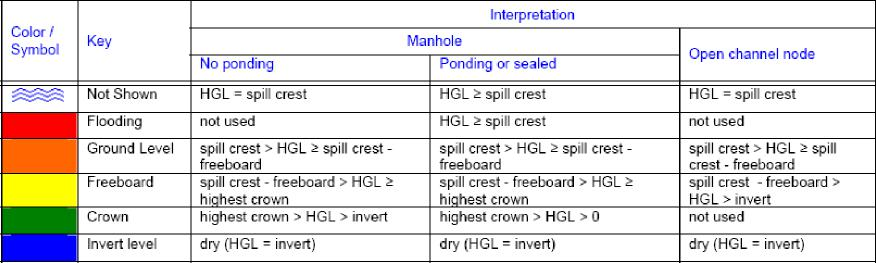
>
> **7.8.8 Spatial Reports  
> Spatial Report**
>
> Spatial reports of model data and simulation results can be displayed in text boxes onscreen, sent to a printer or plotter or, exported to a graphics file.

368

SECTION 7: MENUS

> 

The report attributes dialog may be accessed via:

- the Results -\> Spatial Reports menu,

- key F11,

- the Spatial Reports icon on the Solve and Review Results toolstrip or,

- highlighting the Spatial Reports line on the Layer Control Panel and right clicking

This command allows you to specify the display format of the Spatial Reports by selecting the physical attributes of the reports and the data to display in each report. This dialog specifies data for all the reports.

369

xpswmm Reference Manual

> 

**Destination**

**Node Frame Display**

**Link Frame Display**

**Node Variables**

**Link Variables**

**Location**

**Text Sizes**

**Creation**

**Redrawing**

**Save**

**Load**

**Display**

**Destination**

Use this dialog to specify the destination of the Spatial Report.

370

xpswmm Reference Manual

*(iv) Return to the network window and the Spatial Reports should be correctly displayed. If not then repeat this procedure.*

**Redrawing**

These options control the speed of redrawing and the appearance of the spatial reports.

*Minimize Memory*

When you select this option, reports occupy the minimum space in memory, thus allowing you to load a greater number of nodes. Selecting this option may significantly increase the time taken for redraws.

*Maximize Speed*

When you select this option, reports are drawn significantly faster than the Minimize Memory Option. The trade-off is that more memory is required and hence a smaller number of nodes can be handled.

*Hide Inactive Fields*

This field controls whether fields with no data will be displayed. If this flag is OFF fields without data will be displayed as blank lines within the report.

*Hide Blank Reports*

This flag controls whether reports with no data will be displayed, ie all the fields are blank. Objects with no data will then not display any Spatial Report.

Note that an object with no attached Spatial Report on the screen does not imply that there is no data there. Spatial Reports can also be hidden/shown from the Display Reports menu command, and may also be hidden if the Hide on Creation flag is enabled when the node/link is created. Thus, to confirm whether data exists, you need to Show Spatial reports for that node/link; if no Spatial Report appears, then you can safely assume no data exists.

**Text Size**

*Display Size*

With this option selected the text size is shown in a constant size (mm or inches) regardless of the scale selected.

*Real World Coordinates*

When this option is selected the text will be shown relative to the scale of the drawing. As you zoom in the text will get larger.

**Display Report**

This list controls the hidden or show status of Spatial Reports, in much the same way as other layers are controlled. To acces the list, highlight the Nodes or Links line in the Spatial Reports section of the Layer Control Panel.

372

SECTION 7: MENUS

> 

Select one option:

> Show Spatial Reports as Tooltip  a report pops up when the mouse is moved over the node or link
>
> Show Spatial Reports for all Objects
>
> Show Spatial Reports for Selected Objects
>
> Hide Spatial Reports

Note: to display the Spatial Reports, the visible box must be for nodes or links.

**Frame Display**

**Frame Display Properties**

Use this dialog to set display properties of the text boxes in Spatial Reports. It is used for links and nodes

SECTION 7: MENUS

> 

**Insert/Append**

**Delete  
Format**

**Variable**

The variable list displayed when one of these buttons is selected shows the data and results that are available for graphical encoding. If the variable selected has multiple instances (ie. Conduit 1, Conduit 2,etc.) then a combination of Variable and Instances must be selected. To show all instances of a selected variable all combinations of Variable: Instance must be selected.

> 

xpswmm Reference Manual

**Insert/Append**

These buttons allow you to insert a report data variable before the highlighted field in the list, or at the end of the list respectively.

When you select either of these buttons the following dialog showing all available data is displayed. When OK is selected the highlighted field is added to the list shown in the preceding (parent) dialog.

If the variable selected has multiple instances (ie. Conduits, Pumps, etc.) then a combination of Variable and Instance must be selected. To show all instances of a selected data item, all combinations of Variable: Instance must be selected.

> 

**Format**

This button takes you to a format dialog that allows you to select the format of the highlighted variable (the format specification is always attached to the data variable, even when that variable is removed from the list).

The description of the variable to be formatted is shown in the title bar of the dialog.

376

SECTION 7: MENUS

> 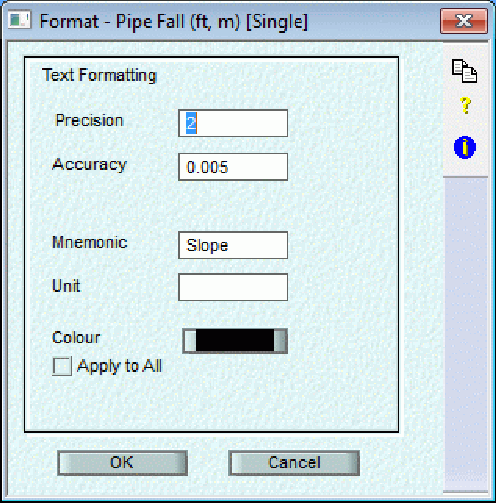

**Text Formatting  
Text Attributes**

**Text Attributes  
***Font*

This allows you to specify the font in which you wish to display the currently selected variable of the Spatial Report. The normal Windows conventions regarding birmap and true type fonts are supported.

> *Apply to All*
>
> If this checkbox is enabled then this font style will be applied to all the spatial report data for links.

*Size*

The height of the text (in mm) in the report line is entered here.

> *Apply to All*
>
> If this checkbox is enabled then this font size will be applied to all the spatial report data for links.

*Text Colour*

These buttons allow you to set the colour of the report text.

> *Apply to All*
>
> If this checkbox is enabled then this font colour will be applied to all the spatial report data for links.

**Text Formatting**

377

> xpswmm Reference Manual
>
> *Precision*
>
> This value specifies the number of places after the decimal point to display on the Spatial Report.
>
> *Accuracy*
>
> This value specifies the tolerance of the displayed data.
>
> *Mnemonic*
>
> This allows you to add a mnemonic to the start of each line of data displayed in the Spatial Reports.
>
> *Unit*
>
> This allows you to add a unit to the end of each line of data displayed in the Spatial Reports.
>
> **Delete**
>
> The delete button removes a report data variable from the list.
>
> **Node Variables  
> Node Variables**
>
> This button loads the Data Variables dialog which allows you to select the data fields you wish to display in the Spatial Report for nodes. The list displayed in the following dialog contains the full names of all data items that will be included in your spatial report for nodes.
>
> 
>
> **Insert/Append  
> Delete**
>
> **Format**

378

SECTION 7: MENUS

**Variable**

The variable list displayed when one of these buttons is selected shows the data and results that are available for graphical encoding. If the variable selected has multiple instances (ie. Catchment 1, Catchment 2, etc.) then a combination of Variable and Instances must be selected. To show all instances of a selected variable all combinations of Variable: Instance must be selected.

> 

**Insert/Append**

These buttons allow you to insert a report data variable before the highlighted field in the list or at the end of the list respectively.

When you select either of these buttons the following dialog showing all available data is displayed. When OK is selected the highlighted field is added to the list shown in the preceeding (parent) dialog.

If the variable selected has multiple instances (ie. Catchments, Pumps, etc.) then a combination of Variable and Instance must be selected. To show all instances of a selected variable all combinations of Variable: Instance must be selected.

379

xpswmm Reference Manual

> 

**Format**

This button takes you to a format dialog which allows you to select the format of the highlighted variable (the format specification is always attached to the data variable, even when that variable is removed from the list).

The description of the variable to be formatted is shown in the title bar of the dialog.

> 

**Text Formatting  
Text Attributes**

380

SECTION 7: MENUS

**Text Attributes  
***Font*

This allows you to specify the font in which you wish to display the currently selected variable of the Spatial Report. The normal Windows conventions regarding birmap and true type fonts are supported.

> *Apply to All*

If this checkbox is enabled then this font style will be applied to all the spatial report data for nodes.

*Size*

The height of the text (in mm) in the report line is entered here.

> *Apply to All*

If this checkbox is enabled then this font size will be applied to all the spatial report data for nodes.

*Text Colour*

These buttons allow you to set the colour of the report text.

> *Apply to All*

If this checkbox is enabled then this font colour will be applied to all the spatial report data for nodes.

**Text Formatting**

*Precision*

This value specifies the number of places after the decimal point to display on the Spatial Report.

*Accuracy*

This value specifies the tolerance of the displayed data.

*Mnemonic*

This allows you to add a mnemonic to the start of each line of data displayed in the Spatial Reports.

*Unit*

This allows you to add a unit to the end of each line of data displayed in the Spatial Reports.

**Delete**

The delete button removes a report data variable from the list.

**7.8.9 Graphical Encoding  
Graphical Encoding**

Graphical Encoding, often also called thematic viewing or plotting, allows variables (or themes) to be displayed using graphical entities of objects. Currently three entities are supported for both links and nodes. These are; Colour, Size or Width, and Text Label Size. The variables (or themes) include all input data plus selected results of the SWMM analysis.

381

xpswmm Reference Manual

> 

Visual Entity. Three graphical entities, color, size and text height, are available for each of the two object types.

> **Node Color**
>
> **Node Size**
>
> **Node Label Size**
>
> **Link Color**
>
> **Link Width**
>
> **Link Label Size**

**Variable**

**Preferences**

**Encode**

**Restore**

**Load**

**Save**

**Cancel**

**Visual Entity**

Three graphical entities, colour, size and text height, are available for each of the two object types.

**Node Color**

**Node Size**

**Node Label Size**

**Link Color**

**Link Width**

**Link Label Size**

**Preferences**

382

> SECTION 7: MENUS
>
> *Hide Arrows*
>
> This check box causes the network to be redrawn with arrowheads suppressed.
>
> *Fill Nodes*
>
> This check box causes the network to be shown with nodes filled with a solid fill pattern of the selected Node Color.
>
> *Hide Link Labels*
>
> This check box causes the link labels not to be shown.
>
> **Legend  
> Encode**
>
> Encode causes the network to be redrawn with the currently selected "Graphical Encoding" Attributes. A "G" will be displayed in the status bar area of the network window (to the left of the bottom scroll bar) indicating the current view in which the network is drawn includes graphically encoded attributes.
>
> **Restore**
>
> This button will remove the graphical encoding attributes from the network window.
>
> **Load**
>
> This button allows you to load a pre-defined (saved) set of graphical encoding attributes.
>
> **Save**
>
> This button allows you to save the current attributes for re-use in this or other projects.
>
> **Cancel**
>
> This button cancels any changes to this dialog and restores the previous network view.
>
> **Node Colour  
> Node Colour**
>
> Node colour is defined in ranges using an open-ended dialog list (DLIST). A colour is selected by clicking in the appropriate field and selecting a colour from the dialog that appears. The list follows the standard rules for a DLIST.

383

> xpswmm Reference Manual
>
> 
>
> You can insert and delete rows using the Insert and Delete keys and you can scroll through the list using the arrow keys. Any number of rows can be included in the list but only 16 colours are supported.
>
> The data is presented in discrete stepped ranges. Data is plotted in a selected colour provided it falls within the range: Low Value \< Data Value \<= High Value.
>
> The Data Range shown in this dialog shows the maximum and minimum value of the selected variable currently contained within all objects in the database.
>
> *Suggest*
>
> The Suggest button will break the minimum and maximum data range into 5 equal partitions and allocate a predetermined colour to each.
>
> **Size**
>
> *Display*
>
> If this option is selected the size of the text will be in mm regardless of scale.
>
> *Real World*
>
> If this option is selected the text size will be displayed relative to the network scale.
>
> **Node Size**

384

> xpswmm Reference Manual
>
> ^ : exponentiation (raise to power)
>
> Variables and numeric values can be used and parentheses () can also be used to any level of nesting. Expressions
>
> can be sequenced and separated by semicolons, with intermediate variables used. Variable names are alphanumeric strings and are not case-sensitive. White space (blank, tab, new line, etc) has no significance.
>
> The following pre-defined functions are supported. These words are reserved and cannot be used as variable names:
>
> abs(n) - absolute value of n
>
> acos(x) - arc cosine of x, in radians
>
> asin(x) - arc sine of x, in radian
>
> atan(x) - arc tangent of x, in radians
>
> ceil(x) - smallest integer \>= x
>
> cos(x) - cosine of x (x in radians)
>
> cosh(x) - hyperbolic cosine of x (x in radians)
>
> E10(x) - 10 raised to the power x
>
> exp(x) - exponential function of x
>
> floor(x) - largest integer \<= x
>
> log10(x) - base-10 logarithm of x
>
> log(x) - natural logarithm of x
>
> sin(x) - sine of x (x in radians)
>
> sinh(x) - hyperbolic sine of x
>
> sqrt(x) - square root of x
>
> tan(h) - tangent of x (x in radians)
>
> tanh(h) - hyperbolic tangent of x (x in radians)
>
> j0(x) - bessel function of first kind, order 0
>
> j1(x) - bessel function of first kind, order 1
>
> y0(x) - bessel function of second kind, order 0
>
> y1(x) - bessel function of second kind, order 1
>
> max(x1,x2) - larger of x1 and x2
>
> min(x1,x2) - smaller of x1 and x2
>
> Function arguments must be enclosed in parentheses. e.g. sin(y), not siny or sin y.
>
> The function names are not case-sensitive. There are no user-defined functions as yet.
>
> Examples: 2.5\*a^2/b + 1 .2\*c^2/sin(d)
>
> **By Linear Relationship**
>
> The node size will be displayed in a stepwise linear function using the Data Value/Node Size relationship entered in the following DLIST.

386

> SECTION 7: MENUS
>
> You can insert and delete rows using the Insert and Delete keys and you can scroll through the list using the arrow keys.
>
> The data is presented in discrete stepped ranges. Data is plotted in a selected colour provided it falls within the range: Low Value \< Data Value \<= High Value.
>
> The Data Range shown in this dialog shows the maximum and minimum value of the selected variable currently contained within all objects in the database.
>
> **Graph**
>
> The graph button will display the data entered in the value/size DLIST as a XY graph.
>
> **Size**
>
> *Display*
>
> If this option is selected the size of the node will be in mm regardless of scale.
>
> *Real World*
>
> If this option is selected the node size will be displayed relative to the network scale. **Suggest**
>
> The Suggest button will break the minimum and maximum data range into either a linear relationship or a linear equation depending on the option selected.
>
> **Node Label Size**
>
> **By Equation**
>
> If this option is selected the text size is defined in terms of X, where X is the variable being shown. In its simplest form
>
> the equation is size = X, however arbitrary expressions can also be built with the syntax described here. Terms in the expression can consist of:

- numeric constants

- variable names

- arithmetic operators

- pre-defined functions

> The following binary arithmetic operators are supported:
>
> \+ : addition
>
> \- : subtraction
>
> \* : multiplication
>
> / : division
>
> % : remainder
>
> ^ : exponentiation (raise to power)
>
> Variables and numeric values can be used and parentheses () can also be used to any level of nesting. Expressions can be sequenced and separated by semicolons, with intermediate variables used. Variable names are alphanumeric strings and are not case-sensitive. White space (blank, tab, new line, etc) has no significance.

387

> xpswmm Reference Manual
>
> The following pre-defined functions are supported. These words are reserved and cannot be used as variable names:
>
> abs(n) - absolute value of n
>
> acos(x) - arc cosine of x, in radians
>
> asin(x) - arc sine of x, in radian
>
> atan(x) - arc tangent of x, in radians
>
> ceil(x) - smallest integer \>= x
>
> cos(x) - cosine of x (x in radians)
>
> cosh(x) - hyperbolic cosine of x (x in radians)
>
> E10(x) - 10 raised to the power x
>
> exp(x) - exponential function of x
>
> floor(x) - largest integer \<= x
>
> log10(x) - base-10 logarithm of x
>
> log(x) - natural logarithm of x
>
> sin(x) - sine of x (x in radians)
>
> sinh(x) - hyperbolic sine of x
>
> sqrt(x) - square root of x
>
> tan(h) - tangent of x (x in radians)
>
> tanh(h) - hyperbolic tangent of x (x in radians)
>
> j0(x) - bessel function of first kind, order 0
>
> j1(x) - bessel function of first kind, order 1
>
> y0(x) - bessel function of second kind, order 0
>
> y1(x) - bessel function of second kind, order 1
>
> max(x1,x2) - larger of x1 and x2
>
> min(x1,x2) - smaller of x1 and x2
>
> Function arguments must be enclosed in parentheses. e.g. sin(y), not siny or sin y.
>
> The function names are not case-sensitive. There are no user-defined functions as yet.
>
> Examples: 2.5\*a^2/b + 1 .2\*c^2/sin(d)
>
> **By Linear Relationship**
>
> The text size will be displayed in a stepwise linear function using the Data Value/Node Size relationship entered in the following DLIST.
>
> You can insert and delete rows using the Insert and Delete keys and you can scroll through the list using the arrow keys.
>
> The data is presented in discrete stepped ranges. Data is plotted in a selected colour provided it falls within the range: Low Value \< Data Value  High Value.

388

> xpswmm Reference Manual
>
> **Suggest**
>
> The Suggest button will break the minimum and maximum data range into either a linear relationship or a linear equation depending on the option selected.
>
> **Link Width  
> Link Width**
>
> The Link width can be used to represent the value of the data variable in one of two ways, either by an equation or by a stepwise linear function.
>
> 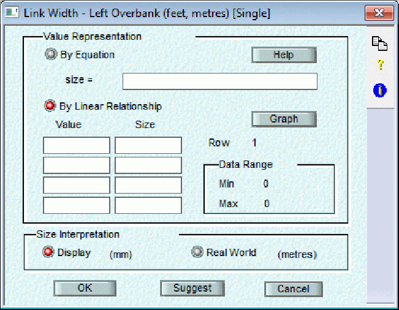
>
> **By Equation -**
>
> **By Linear Relationship -**
>
> **Graph**
>
> **Size Interpretation -**
>
> **Suggest -**
>
> **By Linear Relationship**
>
> The link width will be displayed in a stepwise linear function using the Data Value/Node Size relationshhhip entered in the following DLIST.
>
> You can insert and delete rows using the Insert and Delete keys and you can scroll through the list using the arrow keys.
>
> The data is presented in discrete stepped ranges. Data is plotted in a selected colour provided it falls within the range: Low Value \< Data Value  High Value.
>
> The Data Range shown in this dialog shows the maximum and minimum value of the selected variable currently contained within all objects in the database.

390

> SECTION 7: MENUS
>
> **By Equation**
>
> If this option is selected the link width is defined in terms of X, where X is the variable being shown. In its simplest form the equation is size = X, however arbitrary expressions can also be built with the syntax described here. Terms in the expression can consist of:

- numeric constants

- variable names

- arithmetic operators

<!-- -->

- pre-defined functions

> The following binary arithmetic operators are supported:
>
> \+ : addition
>
> \- : subtraction
>
> \* : multiplication
>
> / : division
>
> % : remainder
>
> ^ : exponentiation (raise to power)
>
> Variables and numeric values can be used and parentheses () can also be used to any level of nesting. Expressions can be sequenced and separated by semicolons, with intermediate variables used. Variable names are alphanumeric strings and are not case-sensitive. White space (blank, tab, new line, etc) has no significance.
>
> The following pre-defined functions are supported. These words are reserved and cannot be used as variable names:
>
> abs(n) - absolute value of n
>
> acos(x) - arc cosine of x, in radians
>
> asin(x) - arc sine of x, in radian
>
> atan(x) - arc tangent of x, in radians
>
> ceil(x) - smallest integer \>= x
>
> cos(x) - cosine of x (x in radians)
>
> cosh(x) - hyperbolic cosine of x (x in radians)
>
> E10(x) - 10 raised to the power x
>
> exp(x) - exponential function of x
>
> floor(x) - largest integer \<= x
>
> log10(x) - base-10 logarithm of x
>
> log(x) - natural logarithm of x
>
> sin(x) - sine of x (x in radians)
>
> sinh(x) - hyperbolic sine of x
>
> sqrt(x) - square root of x
>
> tan(h) - tangent of x (x in radians)
>
> tanh(h) - hyperbolic tangent of x (x in radians)
>
> j0(x) - bessel function of first kind, order 0
>
> j1(x) - bessel function of first kind, order 1
>
> 391
>
> xpswmm Reference Manual
>
> y0(x) - bessel function of second kind, order 0
>
> y1(x) - bessel function of second kind, order 1
>
> max(x1,x2) - larger of x1 and x2
>
> min(x1,x2) - smaller of x1 and x2
>
> Function arguments must be enclosed in parentheses.  
> e.g. sin(y), not siny or sin y.
>
> The function names are not case-sensitive. There are no user-defined functions as yet.
>
> Examples: 2.5\*a^2/b + 1 .2\*c^2/sin(d)
>
> **Graph**
>
> The graph button will display the data entered in the value/size DLIST as a XY graph.  
> **Suggest**
>
> The Suggest button will break the minimum and maximum data range into either a linear relationship or a linear equation depending on the option selected.
>
> **Link Color**
>
> **Graph**
>
> The graph button will display the data entered in the value/size DLIST as an XY graph.  
> **Link Colour**
>
> Link colour is defined in ranges using an open-ended dialog list (DLIST). A colour is selected by clicking in the appropriate field and selecting a colour from the dialog that appears. The list follows the standard rules for a DLIST. You can insert and delete rows using the Insert and Delete keys and you can scroll through the list using the arrow
>
> keys. Any number of rows can be included in the list but only 16 colours are supported.
>
> 392
>
> SECTION 7: MENUS
>
> 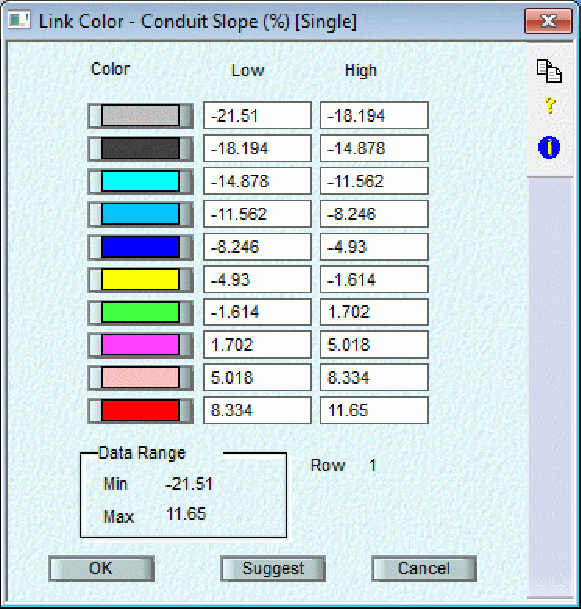
>
> The data is presented in discrete stepped ranges. Data is plotted in a selected colour provided it falls within the range: Low Value \< Data Value  High Value.
>
> The Data Range shown in this dialog shows the maximum and minimum value of the selected variable currently contained within all objects in the database.
>
> *Suggest*
>
> The Suggest button will break the minimum and maximum data range into 5 equal partitions and allocate a predetermined colour to each.
>
> **Link Width**
>
> **Graph**
>
> The graph button will display the data entered in the value/size DLIST as a XY graph.
>
> **Size**
>
> *Display*
>
> When selected the width of the link is in inches (or mm) regardless of scale.
>
> *Real World*
>
> If this option is selected the link width will be displayed relative to the network scale.
>
> **Link Label Size**
>
> 393
>
> xpswmm Reference Manual
>
> **Link Label Size**
>
> The size of the text used for the link name can be used to represent the value of the data variable in one of two ways, either by an equation or by a stepwise linear function.
>
> 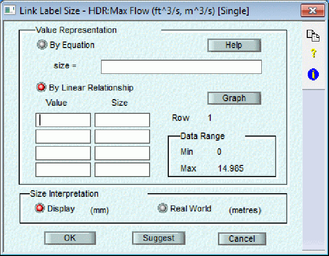
>
> **By Equation -**
>
> **By Linear Relationship -**
>
> **Graph -**
>
> **Size -**
>
> **Suggest -**
>
> **By Linear Relationship**
>
> The node size will be displayed in a stepwise linear function using the Data Value/Node Size relationship entered in the following DLIST.
>
> You can insert and delete rows using the Insert and Delete keys and you can scroll through the list using the arrow keys.
>
> The data is presented in discrete stepped ranges. Data is plotted in a selected colour provided it falls within the range: Low Value \< Data Value  High Value.
>
> The Data Range shown in this dialog shows the maximum and minimum value of the selected variable currently contained within all objects in the database.
>
> **By Equation**
>
> If this option is selected the text size is defined in terms of X, where X is the variable being shown. In its simplest form the equation is size = X, however arbitrary expressions can also be built with the syntax described here. Terms in the expression can consist of:

- numeric constants

> 394
>
> SECTION 7: MENUS

- variable names

- arithmetic operators

- pre-defined functions

> The following binary arithmetic operators are supported:
>
> \+ : addition
>
> \- : subtraction
>
> \* : multiplication
>
> / : division
>
> % : remainder
>
> ^ : exponentiation (raise to power)
>
> Variables and numeric values can be used and parentheses () can also be used to any level of nesting. Expressions
>
> can be sequenced and separated by semicolons, with intermediate variables used. Variable names are alphanumeric strings and are not case-sensitive. White space (blank, tab, new line, etc) has no significance.
>
> The following pre-defined functions are supported. These words are reserved and cannot be used as variable names:
>
> abs(n) - absolute value of n
>
> acos(x) - arc cosine of x, in radians
>
> asin(x) - arc sine of x, in radian
>
> atan(x) - arc tangent of x, in radians
>
> ceil(x) - smallest integer \>= x
>
> cos(x) - cosine of x (x in radians)
>
> cosh(x) - hyperbolic cosine of x (x in radians)
>
> E10(x) - 10 raised to the power x
>
> exp(x) - exponential function of x
>
> floor(x) - largest integer \<= x
>
> log10(x) - base-10 logarithm of x
>
> log(x) - natural logarithm of x
>
> sin(x) - sine of x (x in radians)
>
> sinh(x) - hyperbolic sine of x
>
> sqrt(x) - square root of x
>
> tan(h) - tangent of x (x in radians)
>
> tanh(h) - hyperbolic tangent of x (x in radians)
>
> j0(x) - bessel function of first kind, order 0
>
> j1(x) - bessel function of first kind, order 1
>
> y0(x) - bessel function of second kind, order 0
>
> y1(x) - bessel function of second kind, order 1
>
> max(x1,x2) - larger of x1 and x2
>
> min(x1,x2) - smaller of x1 and x2
>
> xpswmm Reference Manual
>
> Function arguments must be enclosed in parentheses.  
> e.g. sin(y), not siny or sin y.
>
> The function names are not case-sensitive. There are no user-defined functions as yet.
>
> Examples: 2.5\*a^2/b + 1.2\*c^2/sin(d)
>
> **Graph**
>
> The graph button will display the data entered in the value/size DLIST as a XY graph.
>
> **Suggest**
>
> The Suggest button will break the minimum and maximum data range into either a linear relationship or a linear
>
> equation depending on the option selected.
>
> **Legend**
>
> **Legend**
>
> This check box allows a legend showing the graphical attributes to be shown on the network.
>
> 
>
> **Arrange Items -  
> Window Legend -  
> Network Legend -**

396

> SECTION 7: MENUS
>
> **Arrange Items**
>
> The visual entities making up the graphical encoding may be arranged horizontally (in a single row), Vertically (in a single column) or Automatically (in a table depending on width and height requirements of each entity), depending on which radio button is selected.
>
> **Network Legend**
>
> The network legend is shown in a fixed location on the network, regardless of the current window view. This legend is printed and plotted in the same manner as the network.
>
> *Font*
>
> This allows you to specify the font in which you wish to display the window legend. The normal Windows conventions regarding birmap and true type fonts are supported.
>
> *Size*
>
> **Display** - When selected the size of the text is in inches (mm) regardless of scale.
>
> **Real World** - When selected the text size is displayed relative to the network scale.
>
> *Show Frame*
>
> When selected a rectangular frame is drawn around the legend.
>
> *Show Heading*
>
> If this option is selected the legend title is shown.
>
> *Opaque Legend*
>
> If this option is selected a legend title will be shown.
>
> **Window Legend**
>
> The window legend is shown in a fixed location on the screen independent of panning or zooming.
>
> *Show*
>
> When enabled a non-printable legend is shown on the screen.
>
> *Display Size*
>
> The text in the window legend will be shown at the size (in mm or inches) entered in this field.
>
> **7.8.11 XP-Tables  
> XP-Tables**
>
> XP-Tables allows the user to create a spreadsheet for data entry and manipulation in the model. The XP-Tables view is used to generate and manipulate data quickly and easily in the model. This format can be used to view results and create networks.
>
> XP Tables is launched from the main window by selcting the XP Tables tool from the Solve and Review Results toolstip, selecting XP Tables from the Results menu or pressing F2. A table similar to the one displayed here will appear.
>
> SECTION 7: MENUS
>
> 
>
> Object Selection is used to define the slection set for the table. The options are:
>
> All Objects in Model
>
> All Objects in Current Network
>
> Selected
>
> The Explorer like (expandable/collapsible) panel displays the currently available tables grouped according to: Global Database Tables
>
> Global Tables  
> Node Tables  
> Link tables
>
> The View buttom displays the currently selected table. Check boxes next to the table names indicate the other tables included in the workbook tabs.
>
> The Cancel button closes the dialog and returns to the XP Tables window.
>
> The Up and Down arrows are used to resore the list of tables.
>
> Add is used to define a new table.
>
> Edit opens the Variable Selection dialog.
>
> Rename is used to edit the name of the currently selcted table.
>
> Delete removes the currently slected table.
>
> Import opens the Import dialog.
>
> **XP Tables Variable Selection**
>
> Use this dialog to define the variable in your table.
>
> 399

xpswmm Reference Manual

> 

**Add**

Add a new table to the XP-Table selection list. The table can be for Links, Nodes, Global Database or Global.

> 

A name must be entered for the new table.

Click on OK to go to the Variable Selection dialog.

400

> SECTION 7: MENUS
>
> **All**
>
> If the all toggle is selected then ALL objects in the database will be defined in the table.
>
> **Table Options**
>
> 
>
> **Import XP Tables**
>
> Use this dialog to import predefined tables from another XP project or a template. Many tables are shipped with xpswmm and are available in the Basic-Tables.xpx file in the Templates folder.

xpswmm Reference Manual

> 
>
> **7.9 Windows**

**The Windows Menu**

> 

**Cascade:** Displays all opened windows within the program by stacking and offsetting the windows. **Tile:** Displays all XP opened windows with equal area within the main window.

> **7.10 Help**

**The Help Menu**

402

SECTION 7: MENUS

> 
>
> **Contents:**
>
> Launches this help file at the Table of Contents level.
>
> **Search:**
>
> Launches this help file at the Search level.
>
> **Check for Updates:**
>
> This check the Web for available updates. Click on View Changes to see a list of changes in the latest version. Click Go to Downloads to download the latest version from the Web.
>
> 
>
> **XP Software Home Page:**
>
> Opens the web site defined by the main=[<u>www.xpsoftware.com.au</u>](http://www.xpsoftware.com.au) line in the \[web\] section in the SWMXP.INI using your default web browser.

**License:**

> Displays your product license details and also provides an interface to turn on the Project Menu and System Color Settings which can also be controlled in the the SWMXP.INI.

**About:**

403

> xpswmm Reference Manual
>
> Displays the About Box dialog showing the product name and the licensee name and license number.
>
> *If for some reason you cannot find help on a particular dialog try searching from the parent dialog or from the node, link or menu. See the Table of Contents for a complete listing.*
>
> **7.11 Pop-Up**
>
> **POP-UP MENUS**
>
> Pop-up menus are the mechanism provided to alter the display properties of objects and perform common operations on the objects. The node and link pop-ups are shown below.
>
> To use the pop-up menu commands click the right mouse button on the selected object to be altered. A list of commands will "pop-up in a menu next to the object. The appropriate menu item is then selected in the normal way. To cancel the pop-up menu, click outside the region of the menu.
>
> **Node Pop-up Dialog**
>
> 
>
> **Node Pop-up Dialog commands:**
>
> **Properties** This will access the Properties dialog for the object
>
> **Edit Data** Equivalent to double-click to access the data dialogs
>
> **Delete, Copy, Paste** Delete the object, copy all data in current mode and paste data into object
>
> **Review Results...** Launches the Review Results tool to graph the time series results for this object
>
> **Notes...** Add or view Notes (comments). Notes can also be edited in XP-Tables
>
> **View Image** View images attached to objects
>
> **Select Downstream Objects** Selects all objects (node and links) downstream of the selected node
>
> **Select Upstream Objects** Seletcs all objects (node and links) upstream of the selected node
>
> **Link Pop-up Dialog**
>
> 404
>
> SECTION 7: MENUS
>
> 
>
> **Link Pop-up Dialog commands:**
>
> **Properties** This will access the Properties dialog for the object
>
> **Edit Data** Equivalent to double-click to access the data dialogs
>
> **Edit Vertices** Move, add and delete the vertices that create a polylink
>
> **Edit Cross Section** Edit the vertices of the polyline outlining the cross section location
>
> **Define Cross Section Layout** Create the polyline that is used to generate the cross section with the DTM
>
> **Delete Cross Section** Delete the polyline that is used to generate the cross section
>
> **Delete Link, Copy, Paste** Delete the object, copy all data in current mode and paste data into object
>
> **Notes...** Add or view Notes (comments). Notes can also be edited in XP-Tables.
>
> **View Image** View images attached to objects
>
> **Single Link** Convert the multi-link to a single link. Link data will exchange with conduit 1 of multi-link.
>
> **Multi Link** Convert the link to a multi-link. Link data will exchange with conduit 1 of multi-link.
>
> **Review Results...** Launches the Review Results tool to graph the time series results for this object
>
> **Conduit Profile** Open the conduit profile dialog for the single link
>
> **Reverse Direction** Swaps the upstream and downstream node for the link and changes the arrow
>
> 405

xpswmm Reference Manual

> **Split Conduit** The **Split Conduit** command inserts a new node on an exsiting link
>
> To change the display attributes for an object such as the colour, size and text font select the Properties item from the pop-up menu. XP also uses this dialog to edit the name for nodes and links as well as the position of nodes.
>
> When the properties for a single or set of objects is modified, the change is local to the selection. To change the default display properties for all future objects select the File-\>Properties menu item and change the defaults for nodes, links and text. Previously created objects do not change because the defaults have changed. However a set of objects can be changed by first being selected then second choosing Properties from the Edit menu.
>
> Notes can be added or altered from the pop-up menu and an image can be attached to the object. With the image linked to the object the Picture File can then be displayed using the View Image command from the pop-up menu.
>
> A link type may be changed from a Single Conduit to a Multiple Conduit or vice versa by selecting the appropriate item from the pop-up menu.
>
> Note: If a link is already selected and the \<Ctrl\> key is held down and the link clicked on with the mouse, the link will change to a Polylink and a vertex will be inserted at the location where the mouse was clicked. Ensure the link is <u>not</u> highlighted before attempting to pop-up a menu.

406

> ***SECTION 8: NODES  
> *Node Data**
>
> **Hydraulics Mode Node Data  
> Runoff Mode Node Data  
> Sanitary Mode Node Data**
>
> **8.1 Hydraulics Mode**
>
> **Hydraulics Node Data**
>
> To input or edit the attribute or model data associated with a node either; double click on the node or select the node and press on the Enter key.
>
> 
>
> The Hydraulics mode uses a link-node network to describe the collection/conveyance system and thereby the mathematical solution of the gradually varied unsteady flow equations that form the basis of the solution.
>
> Nodes are the storage elements and correspond to manholes or pipe and channel junctions. The calculated variables associated with the node are volume, head and surface area. Inflows such as hydrographs and outflows such as weir diversions, pumps and flooding take place at the nodes.
>
> Node data are required for every node in the network including regular nodes, storage and diversion (orifice and weir) nodes, pump nodes, and outfall nodes.
>
> Occasionally it is necessary to perform routing on the water that floods onto the ground. A new conduit is constructed by the user to transport the flooded water from the ground elevation of the upstream junction to the ground elevation of the downstream junction. It is not necessary to simulate manholes as vertical pipes in order to transport water. With this arrangement, water may surcharge (move vertically out of a manhole-pipe) and return to the sewer system at a downstream location through another manhole-pipe after traversing an overland channel.

407

> xpswmm Reference Manual
>
> Inlet Capacity can be invoked to limit the amount of water received by the node from the interface file and overland conduits as a maximum capacity or a rating of approach vs. captured flow. In this construct dual drainage can be
>
> simulated with flow overland and only partial flow in subsurface conduits.
>
> Inflow constrictions by inlets etc. can also be simulated as orifices or rating curves if their hydraulic characteristics are known. With this extra effort, dual "major" (street surface) and "minor" (sub-surface sewer network) drainage systems
>
> can be simulated using a parallel system restricting flow in both directions.
>
> **Spill Crest**
>
> **Inlet Capacity**
>
> **Ponding**
>
> **Node Invert Elevation**
>
> **2D Inflow Capture**
>
> **Initial Depth**
>
> Inflow Data
>
> Constant Inflow
>
> **Flow**
>
> **Pollutant Loads**
>
> Time Series Inflow
>
> **User Inflow**
>
> **Gauged Inflow**
>
> **Dry Weather Flow**
>
> **Use Interface File Flow**
>
> **Storage**
>
> **Outfall**
>
> **Gauged Data**
>
> Options
>
> **BMP**
>
> **Spill Crest**
>
> The spill crest (ground elevation) of a node (ft or m) is the physical top of the junction. This may be either a real or conceptual upper limit to the junction.

408

SECTION 8: NODES

> 

The **surcharge elevation** of a node is computed automatically by the Hydraulics mode during the simulation. For a node connected only to closed top conduits (i.e. pipes), it is defined as the crown elevation of the highest connecting pipe.

If an open channel is connected to a node, the spill crest (elevation where surface flooding occurs) should be set at the elevation where the HGL exceeds the defined maximum depth of the cross-section. A run time error will be generated if it is not. If the spill crest elevation is higher than the top of the bank of a connecting open channel and the water level is above the top of the channel, Table E10 of the output file a warning indicating this as a source of model error. It is important that cross-sections are defined to be large enough to convey the peak flow.

The configuration parameter VERT_WALLS causes xpswmm to add vertical walls to the ground elevation specified by the spill crest of the nodes.

The spill crest is used to define upper boundary of HGL in the network. Normally this is the street or ground elevation; however, if the manholes are bolted down the spill crest should be set sufficiently high so that the simulated water surface elevation does not exceed it. This can be automated at the node by selecting the Sealed option for ponding and no adjustment of the spill crest is required.

When the hydraulic head must exceed the spill crest to maintain continuity at the node, the program allows the excess flow to overflow onto the ground and depending on the Ponding value selected it may become lost to the system for the remainder of the simulation period. These assumptions may be modified using the surface ponding options in this dialog.

Ponding

Ponding is the management of the water when the HGL reaches the spill crest (ground elevation). The available ponding options are:

***None***

The default mechanism is for surcharged water that breaks the ground surface to be lost from the network. The duration and amount of water lost is tabulated in the output file in Table E20 and is also available using most of the Results decision support tools (DSS) located in the Results menu**.**

409

> xpswmm Reference Manual
>
> ***Allowed***
>
> This option is for junction flood storage. Using this option, the flooded water will be stored at this node until the connected conduits can handle the excess flow.
>
> By enabling this check box an artificial storage is created at the surface level of this node. The storage is of the form: Ponding Area = *A e* ^ (*B* \* Surface Depth)
>
> Water is allowed to pond until there is sufficient hydraulic capacity within the system for it to rejoin the network. The coefficient *A* and exponent *B* for the above equation may be modified in the Junction Defaults section of the Job Control Dialog. The values are reported in the Job Control Section of the output file.
>
> This should only be used as a quick estimate of flood storage. If a significant volume of water is ponded then a more detailed Storage Node should be entered at this location to represent the actual storage relationship.
>
> ***Sealed***
>
> Using this option the hydraulic grade line will rise above the ground surface spill crest but no volume is lost. It is accomplished internally by projecting the default node area upward to contain the water, which allows the HGL to rise above the surface, which creates pressure but no flow is lost. It is most commonly used for the connection of pumps to force mains and nodes that are placed for welded joints in siphons.
>
> **Link Spill Crest to 2D**
>
> Using this option the water that would normally spill out of the system is linked and passed to the 2D grid for overland flow routing. At this location there is a continuity balance with the 2D grid as the water leaving the node is the amount of water received by the grid at the common cell. In addition 2D grid flows can enter the node if the HGL is below the surface level of the node. Flows can be restricted into the node using the 2D Inflow Capture. It is important in this type of model construct that the spill crest of the node match the cell elevation. This ensures that the node does not rise above the 2D grid like a smokestack preventing water to be captured unless a very large depth is on the surface. A tool is available to generate ground elevations from a TIN.
>
> Note: When a node is linked to a 2D cell and Inlet Capacity option is invoked, the Rated by Approach Depth and the Calculate Depth by Node Storage Characteristics are recommended options.
>
> This option must also be selected in 1D/2D river simulations. If there is a node with 1D/2D Connections then the Link Spill Crest to 2D must also be selected in order to create a valid 2D boundary condition with the node. Simply connecting the node with the 1D/2D Connection polyline is not enough.
>
> **Link Invert to 2D**
>
> This special case is used to connect culverts to the 2D Grid. The water that is flowing on the 2D Grid can directly enter the upstream node of the culvert using the node invert. Ideally this invert matches the cell elevation. The culvert upstream invert can be above this level if it is perched above the ground. To link the culvert exit to the 2D grid the downstream node would also have the Link Invert to 2D. The invert elevations can be set to the TIN elevation using the Tools-\>Modify Elevations-\>Read Inverts from TIN files.
>
> **Node Invert Elevation**
>
> The junction invert elevation (ft or m) is defined as the physical bottom of the junction. It is not necessary to have one conduit with an invert elevation equal to the node invert elevation. However, the conduits must not have invert elevations below the node invert.
>
> The node invert elevation is usually defined as the invert elevation of the lowest link connected to the junction. Below this level water would need to accumulate before flow could leave the junction.
>
> **Initial Depth**
>
> Initial node depth (ft or m).
>
> Initial water depths at junctions are optional. They are depths from the node invert and not an elevation value. If they are entered they will be used to begin the simulation in conjunction with initial flows entered for the conduit in the "Conduit Data" dialog box. If initial heads are omitted but initial flows are entered, then initial heads will be estimated on the basis of normal depth in adjacent conduits.
>
> Globally all nodes in a model can be initialized to the same elevation by using the Configuration Parameter ZREF or by having a fixed backwater elevation outfall that does not have a tide gate. Data entered in
>
> 410

SECTION 8: NODES

> Constant inflows may be input to the system and the "initial conditions" established by letting the model run for enough time steps to establish steady-state flows and heads. The hot start capability may then be used to store these initial conditions for use at the beginning of additional simulations.
>
> **8.1.1 Inflow Data  
> Constant Inflow - Flow**
>
> Constant flow to a hydraulics node (ft3/s or m3/s).
>
> **Constant Inflow - Pollutant Loads**
>
> Net constant flow entering (positive) or leaving (negative) the node (ft3/s or m3/s). Using a negative value results in a withdrawal from the node. Negative constant inflows can only work if the flow rate being demanded exists.
>
> If the Pollutant List check box is enabled under Hydraulics Job Control you will also be able to enter constant pollutant concentrations at this location in the dialog shown below. This allows for hourly and/or daily peaking factors to be used. With this dialog a second diurnal pattern can be added to a single node.
>
> A common application for constant inflows is to represent a base flow in storm water systems and infiltration/inflow to manholes in Sanitary Systems.
>
> 
>
> **Time Series Inflow  
> Time Series Inflow**
>
> Time series inflow may be added to a node using any or all of the following options:

- a User Inflow hydrograph, or may be input from

- a Gauged Inflow using a user defined file,

- a Dry Weather flow, or

- an Interface File**.**

> **User Inflow**
>
> The Hydraulics layer provides for manual input of inflow hydrographs in cases where you wish to run the Hydraulics layer alone without the use of an Interface

411

xpswmm Reference Manual

> 

***Time***

Time of day in decimal hours, 0 is midnight on the starting day of the simulation entered in the Hydraulics Job Control dialog. The time does not re-start at zero and should increase past 24 if necessary.

***Flow Rate***

Flow rate for the corresponding time (ft3/s or m3/s).

It may also be used to add additional input hydrographs, either at the same or different nodes to those available in the Interface File. Hydrograph time input points can be specified at any convenient time. Only one user hydrograph is permitted per node. When multiple flows must enter a node they must be summed external to the program or passed to the node through an interface file or other pathway.

If the Pollutant List check box is enabled under Hydraulics Job Control you will also be able to enter pollutant concentrations at the corresponding time as shown in the dialog below.

412

> SECTION 8: NODES
>
> 
>
> **Gauged Inflow**
>
> Use this dialog to define a file containing gauged data .
>
> 
>
> ***Filename***
>
> This can be any name, however the file type must be a text file, fixed space or free format (space or comma delimited).
>
> ***Station***
>
> The data is considered valid if the station name entered in this dialog matches the station field entered in the file format. If the station is blank all data in the file will be used.
>
> File Format
>
> This is a Global Database record used to define the structure of the file. When you click on the select button you will be presented with a list of available records from which you should make a selection.
>
> Select the file format of the file containing the inflow data.
>
> Edit will show the data, as it will be interpreted from reading the text file.

413

xpswmm Reference Manual

> 

**Dry Weather Flow**

> 

Dry weather flows can be calculated using hourly and weekly peaking factors. These flows may be constant for the hour by using the configuration parameter INTERP_DWF=OFF or interpolated from one hour to the next (default). Dry weather flow can be generated using one of 3 methods:

***Direct Flow***

The Flow Rate, Peaking Factor and Temporal Variation are the only mandatory data required. The flow rate is in the units specified in this dialog. The peaking factor is dimensionless. The flow rate and peaking factor are multiplied

414

> SECTION 8: NODES
>
> together to give the total flow, which is multiplied by the hourly and daily temporal variation to give the model flow for the current time step.
>
> ***Unit Flow Rate***
>
> The Flow Rate, Area and Peaking Factor and Temporal Variation are the only mandatory data required. The flow rate is in the units specified in this dialog per area unit. The area is in the same units as the flow rate and the peaking factor is dimensionless. The flow rate, area and peaking factor are multiplied together to give the total flow, which is multiplied by the hourly and daily temporal variation to give the model flow.
>
> ***Census-Based***
>
> The Flow Rate, Area, Density, Peaking Factor and Temporal Variation are all required for this method. The flow rate is in the units specified in this dialog per area unit. The area is in the same units as the flow rate and the peaking factor is dimensionless. The flow rate, area and peaking factor are multiplied together to give the total flow, which is multiplied by the hourly and daily temporal variation to give the model flow.
>
> For example, using the data from the dialog above:
>
> If the method was Direct Flow, then Q = 300 liters/day x 1 (peaking factor)
>
> If the method was Unit Flow Rate, then Q = 300 liters/day/hectare x 4.21 hectares x 1
>
> = 1,263 liters/day
>
> If the method was Census-Based, then Q = 300 liters/day/person x 4.21 hectares x 21 persons/hectares x 1
>
> = 26,523 liters/day
>
> The units presented in the output after the simulation will be ft3/s or m3/s.
>
> **Interface File Flow**
>
> This item is inactive unless an interface file is selected for the Hydraulics Mode. When checked the node is permitted to receive inflows from the interface file. Entering a percentage of 0 to 100 percent allows the user to limit the amount of flow entering a node.
>
> **8.1.2 Inlet Capacity  
> Inlet Capacity**
>
> xpswmm Reference Manual
>
> 
>
> The Inlet Capacity option allows for flow to subsurface conduits downstream of a node to be restricted by an Inlet Rating Curve (IRC). For these calculations, inlet flow is the sum of the Times Series Inflow (User Inflow + Gauged Inflow + Dry Weather Flow) + Interface File Flow + flow routed to node in open channels).
>
> The Inlet Rating Curve works as follows:

- If Ponding None and no surface conduits - Divert flow according to the selected IRC method and lose excess.

- If Ponding None with surface conduits - Divert flow according to the selected IRC method and excess distributed according to hydraulic properties of surface conduits. Any excess that cannot be re-distributed is lost.

- If Ponding Allowed and no surface conduits - Divert flow according to the selected IRC method with excess ponding at the surface. Ponded surface water is added to the diverted flow at a flow rate equivalent to the volume of surface water divided by the time step. The maximum total diverted flow however is capped at either the "Maximum Capacity" or at the maximum value entered in the rating curve so do not enter unrealistically high capture rates even if they have equally unrealistic approach flows because the approach flow is ignored when determining the absolute maximum allowed.

- If Ponding Allowed with surface conduits - Divert flow according to the selected IRC method and excess distributed according to hydraulic properties of surface conduits. Any excess that cannot be re-distributed is ponded as per 3 above with the total diverted flow increased accordingly.

- If the underground conduit has a constriction that causes reverse flow through the inlet then all the excess underground flow discharges back to the surface regardless of the inlet's maximum capacity (it blows its lid).

> Whenever Inlet Capacity is turned on at a node, a second node is created, for computational purposes, with the text \$I appended to the name. This new node is connected to the closed conduit and receives flow by an internal rating curve based on the inlet capacity. Results for this node are reported in the output file. In the Review Results graphical display, the new node is labeled as \[Subsurface\]. When inlet capacity is selected, it is possible that two HGL profiles will be shown in the long section results view. This is due to the second node which is created.
>
> In version 2013 and later, the results for inlet capacity subsurface nodes have been revised such that the depth calculation now considers the surface area in the surcharged case. Backward compatibility can be obtained by entering the configuration parameter IR_PRE2013. Refer to the list of configuration parameters for more information.
>
> 416
>
> SECTION 8: NODES
>
> ***Maximum Capacity***
>
> The Inlet Capacity of a manhole or pit may be constrained to a Maximum Capacity whereby all flow is captured up to the entered value after which all excess flow bypasses, ponds or is lost from the system depending on what type of Ponding is enabled and the existence of overland flow conduits. If there is ponded water at the surface and no approach flow, water will be captured at this capacity.
>
> ***Efficiency Factor***
>
> The Inlet Capacity of a manhole or pit may affected by blocking (an efficiency factor \< 1) or installing multiple inlets (an efficiency factor \> 1). Enter the appropriate factor here.
>
> ***Inlet Capacity Type:***
>
> The Inlet may be defined by Maximum capacity only, by approach flow, by approach depth or by a HEC-12/HEC-22 equation.
>
> Notes:

- For the Approach Flow and HEC-22 options, when flow = 0, the Maximum Capacity value is used.

- When node is linked to a 2D cell use the Rated by Approach Depth and the Calculate Depth by Node Storage Characteristics options.

> ***Rated by Maximum Capacity Only***
>
> If this option is selected flow up to the Maximum Capacity entered above is captured. Flow in excess of this amount will be lost or diverted according to the type of Ponding is selected.
>
> ***Rated by Approach Flow***
>
> The Inlet Capacity may be entered as a manhole or pit rating curve of Approach Flow versus Captured Flow. The Captured component of the rating curve is adjusted by the Efficiency Factor entered in this dialog.
>
> A couple of side effects are that, firstly, if ponding is allowed the maximum diverted flow may be greater than expected particularly if using an inlet rating curve, and secondly, the flow in the conduit may be greater than the diverted inflow. This is because a volume of water (equivalent to the flow rate) is diverted and this water is then converted to a flow rate in the conduit according to the pipes hydraulic characteristics. If the pipe is initially dry you might see a higher peak in the pipe flow rate than the flow rate being diverted. Secondly, the rating curve should have a zero, zero pair so that with no approach flow there will not be any captured flow. A non zero value for captured flow will be introduced with no approach flow resulting in continuity error if the first pair of data is 0, X with X being a non zero captured flow.
>
> In versions prior to 9.0 the configuration parameter DEPTH_IRC was used to re-define the Approach Flow vs Captured Flow curve to be Approach Depth vs Captured Flow. This parameter is still active.
>
> ***Rated by Approach Depth***
>
> The Inlet Capacity may also be entered as a manhole or pit rating curve of Approach Depth versus Captured Flow. The Captured component of the rating curve is adjusted by the Efficiency Factor entered in this dialog.
>
> The depth may be defined by:

1)  the storage capacity of the node; either the depth of the storage node if Storage is selected, or by  
    > the ponding area/depth defined under Junction Defaults, or

2)  the Pavement Characteristics used to calculate gutter depth in the Calculate Gutter Spread option.

> **Note:** the rating curve should have a zero, zero pair so that with no depth there will not be any captured flow. A non zero value for captured flow will be introduced with 0 depth resulting in continuity error if the first pair of data is 0, X with X being a non zero captured flow.
>
> ***HEC-22***
>
> The third alternative utilizes the HEC-12/HEC-22 inlet capacity procedures. This requires the selection a HEC-22 Inlet and a Pavement Crossfall from the Global Database.
>
> ***Calculate Gutter Spread***
>
> 417
>
> xpswmm Reference Manual
>
> If this option is selected the gutter width, depth and velocity is calculated according to the pavement crossfall characteristics.
>
> **HEC-12 Combination Grate and Curb Inlets**
>
> 
>
> This type of inlet consists of both a curb-opening inlet and a grate inlet usually located side-by-side, although the curb opening may be partially located upstream of the grate.
>
> *Curb Length (Lc)*
>
> The length (ft, m)of the curb opening.  
> *Curb Height (H)*
>
> The height (ft, m)of the curb opening. The inlet operates as a weir at depths up to the curb opening height and as an orifice at depths greater than 1.4 times the height. At depths between 1.0 and 1.4 times the height the flow is transitioned. For curb openings other than vertical see the separate HEC-12 documentation for the effective height.
>
> *Grate Length (Lg)*
>
> The nominal length (ft, m) of the grate.
>
> *Grate Width (W)*
>
> The nominal width (ft, m) of the grate.
>
> *Grate Offset (Dg)*
>
> The distance (ft, m) between the downstream end of the curb opening and the downstream end of the grate.
>
> ***Type of Grate  
> **P-1-7/8-4*
>
> 418
>
> SECTION 8: NODES
>
> Parallel bar grate with bar spacing 1-7/8-in on center and 3/8-in diameter lateral rods spaced at 4-in on center (see figure 8 of the HEC-1 2 documentation).
>
> *P-1-7/8*
>
> Parallel bar grate with bar spacing 1-7/8-in on centre (See figure 8 of the HEC-12 documentation).
>
> *P-1-1/8*
>
> Parallel bar grate with 1-1/8-in on centre bar spacing (see figure 9 of the HEC-12 documentation). *30 degree Tilt Bar*
>
> 30 degree tilt bar grate with 3-1/4-in and 4-in on centre longitudinal and lateral bar spacing respectively (see figure 12 of the HEC-12 documentation).
>
> *45 degree Tilt Bar*
>
> 45 degree tilt bar grate with 2-1/4-in longitudinal bar and 4-in transverse bar spacing on centre (see figure 11 of the HEC-1 2 documentation).
>
> *Curved Vane*
>
> Curved vane grate with 3-1/4-in longitudinal bar and 4-1/4-in transverse bar spacing on centre (see figure 10 of the HEC-1 2 documentation).
>
> *Reticuline*
>
> "Honeycomb" pattern of lateral bars longitudinal bearing bars (see figure 13 of the HEC-12 documentation).
>
> Note: A separate addendum consisting of the complete FHWA documentation for HEC-12 "Design of Highway
>
> Pavements" is provided as part of the documentation for user training courses. Contact your account
>
> representative for additional information.
>
> **HEC-12 Curb Inlet**

xpswmm Reference Manual

> 

Curb-opening inlets are vertical openings in the curb covered by a top slab.  
*Height (H)*

The height (ft, m) of the curb opening. The inlet operates as a weir at depths up to the curb opening height and as an orifice at depths greater than 1.4 times the height. At depths between 1.0 and 1.4 times the height the flow is transitioned. For curb openings other than vertical see the separate HEC-12 documentation for the effective height.

*Length (L)*

The length (ft, m) of the curb opening.

Width (W)

The width (ft, m) of the inlet opening from the face of curb to the end of the grate.

Note: A separate addendum consisting of the complete FHWA documentation for HEC-12 "Design of Highway Pavements" is provided as part of the documentation for user training courses. Contact your account representative for additional information.

**HEC-12 Grated Inlet**

420

SECTION 8: NODES

> 
>
> A grated inlet consists of an opening in the gutter covered by one or more grates, usually metal.
>
> *Width*
>
> The nominal width (ft, m) of the grate.
>
> *Length*
>
> The nominal length (ft, m) of the grate.
>
> ***Type of Grate  
> **P-1-7/8-4*
>
> Parallel bar grate with bar spacing 1-7/8-in on centre and 3/8-in diameter lateral rods spaced at 4-in on centre (see figure 8 of the HEC-1 2 documentation).
>
> *P-1-7/8*
>
> Parallel bar grate with bar spacing 1-7/8-in on centre (See figure 8 of the HEC-12 documentation).
>
> *P-1-1/8*
>
> Parallel bar grate with 1-1/8-in on centre bar spacing (see figure 9 of the HEC-12 documentation). *30 degree Tilt Bar*
>
> 30 degree tilt bar grate with 3-1/4-in and 4-in on centre longitudinal and lateral bar spacing respectively (see figure 12 of the HEC-12 documentation).
>
> *45 degree Tilt Bar*
>
> 45 degree tilt bar grate with 2-1/4-in longitudinal bar and 4-in transverse bar spacing on centre (see figure 11 of the HEC-1 2 documentation).
>
> *Curved Vane*
>
> Curved vane grate with 3-1/4-in longitudinal bar and 4-1/4-in transverse bar spacing on centre (see figure 10 of the HEC-1 2 documentation).

421

> xpswmm Reference Manual
>
> *Reticuline*
>
> "Honeycomb" pattern of lateral bars longitudinal bearing bars (see figure 13 of the HEC-12 documentation).
>
> Note: A separate addendum consisting of the complete FHWA documentation for HEC-12 "Design of Highway Pavements" is provided as part of the documentation for user training courses. Contact your account representative for additional information.
>
> **HEC-12 Slotted Inlet**
>
> 
>
> A slotted inlet is a special type of gutter inlet consisting of a pipe cut along the longitudinal axis with a grate of spacer bars to form slot openings.
>
> *Slot Length (Lg)*
>
> The length (ft, m) of the slot.  
> *Slot Width (W)*
>
> The nominal width (ft, m) of the slot. Slotted inlets function in essentially the same manner as curb opening inlets, ie. as a weir with flow entering from the side.
>
> **8.1.3 Options  
> Options**
>
> Select the options for generating output.

422

> SECTION 8: NODES
>
> 
>
> **Detail Printout**
>
> **Plot Water Levels**
>
> **Save Overflow Results**
>
> **Plot Water Levels**
>
> Enable this flag to obtain a line-printer style plot of the water elevations at this node in the output file.
>
> **Save Overflow Results**
>
> Not implemented in this release.  
> **Detail Printout**
>
> Enable this flag to obtain a detailed printout showing the Time, Elevation, Depth, Total Area, Node Area, Volume, Inflow, Outflow, and Continuity Error at the Summary time step interval defined in the Job Control - Output Control.
>
> If the EXTERNAL_XLS or EXTERNAL.CSV Configuration Parameter is set then the output will be saved in a file named \<your_file_name\>.XLS or .CSV. These are comma-separated files that can be imported into a spreadsheet.
>
> **8.1.4 Storage Node  
> Storage Node Data**
>
> xpswmm Reference Manual
>
> 
>
> Storage devices may be in-line or off-line and act as flow control devices by providing for storage of excessive upstream flows, thereby attenuating and lagging the hydrograph from the upstream area. A storage node may be placed at any number of junctions in the network. The elevation of the top of the storage (Node Surcharge Elevation) must be at least as high as the highest crown at the junction. In most cases when modeling open storage i.e. ponds, lakes, wetlands the spill crest level is the top of bank. For the case of underground storage the spill crest level is the crown or top of the storage.
>
> The only difference between a storage node and a regular node is that an additional surface area of the amount entered here is added to that of the connecting pipes. All nodes have a default surface area defined in the Job Control-\>Junction Defaults. Note also that the crown is set at the top of the storage "tank". When the hydraulic head at a node exceeds this crown, the node goes into surcharge. Unless the "Ponding" flag is enabled, flow is lost from the system when the water level reaches the spill crest.
>
> If ponding is Allowed then the invert elevation of the Storage Node set at the Spill Crest elevation and the spill crest is set to the original spill crest plus the maximum depth specified for the storage node.
>
> If surcharge level is defined below ground level, storage function does not work once water level reaches above this level and default manhole area is used from here on. Water is lost at HGL \> node Spill Crest and if Ponding is set to None. Water is not lost and HGL continue rising using default manhole area if Ponding is Allowed. These conditions are summarized in the table below.
>
> ***Ponding HGL Result***
>
> None \< Surcharge Elevation Water stored according to Storage Method
>
> None \> Spill Crest Water lost from network
>
> Allowed \< Surcharge Elevation Water stored according to default manhole area
>
> Allowed \> Surcharge Elevation Water stored according to Storage Method
>
> Note: the default ponding curve is not used for the storage node.
>
> **Optimization**
>
> Basin Infiltration
>
> Storage Method
>
> **Stepwise Linear Storage**
>
> 424

SECTION 8: NODES

> **Power Function Storage  
> Constant Area Storage  
> Surcharge Elevation**
>
> **Measure Depth From  
> Measure Depth From**
>
> The elevation at which the storage node becomes effective may be set to either the node invert or the spill crest depending on which radio button is selected.
>
> If Node Invert is selected the storage volume is effective starting from the node invert. If Spill Crest is selected, then the default manhole area is used until the water elevation reaches the spill crest whereupon the additional storage volume is added (with the default manhole area no longer included).
>
> **Surcharge Elevation**
>
> Elevation of upper limit of storage as calculated by the Storage Method. Above this level the surface area of the node is the default manhole surface area. This must be higher than the crown of the highest pipe connected to the storage junction (ft or m). If this value is 0 it is set equal to the Spill Crest Elevation.
>
> The Node Surcharge Elevation is set below the ground elevation for an underground storage tank. **Basin Optimization**
>
> 
>
> The Basin Optimization tool has four design options which are discussed below. To use the Basin Optimization design tool select an optimization option, enter the value(s), and click on OK. The result including new conduit size, if applicable, will appear after the next model solve.
>
> **Design Option 1: Resize d/s pipes**
>
> Required Input: Maximum Water Level of Storage Node Basin
>
> Method Result: The software will design (resize) the downstream pipe(s) such that the Maximum Water Level at the storage node is  the user defined value. The algorithm will increase the pipe size and restart the simulation when the Maximum Water Level is exceeded. If the water level exceeds the specified maximum HGL, the size of basin outlet conduit(s) are increased. If pipe sizes are available from Available Pipes dialog in Hydraulics Job Control settings, the

425

> xpswmm Reference Manual
>
> next larger pipe will be selected. If no pipe sizes have been defined, the diameter (width for rectangular and trapezoidal pipes) will be increases by the following offset values.
>
> Metric units: US units:
>
> 5cm if the diameter is \< 0.15m 1 inch if the diameter is \< 4 inches
>
> 7.5cm if the diameter is \< 0.9m 2 inches if the diameter is \< 1ft
>
> 15cm in all other cases 3 inches if the diameter is \< 2.5ft
>
> 6 inches in all other cases
>
> **Design Option 2: Limit d/s discharges**
>
> Required Input: Maximum Flow Values for Outlet conduits
>
> Method Result: The software will limit the discharge from the storage node to be  the user defined Max Flow. All links directly downstream of storage node appear in the Outlet Pipe table. The resulting maximum outflow from the storage node is the sum of the flows in the conduits in this table. If the maximum flow is exceeded, the outlet pipe size(s) will be decreased.
>
> The optimization will only reduce the conduit size when the flow rate is exceeded and it will not be increased from the original size. Keeping this in mind it may be advantageous start with a larger conduit size to ensure the starting conduit size is large enough to pass the peak flow.
>
> If pipe sizes are available from Available Pipes dialog in Hydraulics Job Control settings, the next smaller pipe will be selected. If no pipe sizes have been defined, the diameter (width for rectangular and trapezoidal pipes) will be decreased by the following offset values
>
> Metric units: US units:

<table>
<colgroup>
<col style="width: 33%" />
<col style="width: 66%" />
</colgroup>
<tbody>
<tr class="odd">
<td><blockquote>

5cm per default

7.5cm if the diameter is  0.9m

</blockquote></td>
<td><blockquote>

1 inch per default

2 inches if the diameter is  1ft

3 inches if the diameter is  2.5ft

</blockquote></td>
</tr>
</tbody>
</table>

> Note: If no smaller pipes are available or the offset decrease would result in a negative diameter, no further decrease will be conducted. Further, this option will only reduce the original pipe size entered, it will not increase the pipe size. Therefore the user should ensure that the original pipe size is larger than needed so the program can reduce/optimize the size as expected.
>
> **Design Option 3: Resize Basin**
>
> Required Input: Maximum Water Level of Storage Node Basin
>
> Method Result: If the basins maximum HGL is exceeded, the basin will be resized. For the different storage types the following resizing operations are performed:
>
> Constant area: The Constant Storage Area will be multiplied by the increasing factor
>
> Power function: The Power function coefficient will be multiplied by the increasing factor
>
> Stepwise linear: Each surface Area will be multiplied by the increasing factor
>
> The basin resizing algorithm runs in two phases, the exponential search phase and the fine tuning phase. In the exponential search phase the increase factor is 2. If a sufficient basin size is found, the algorithm will revert to the last insufficient size (divide by 2) and switch to the fine tuning phase. If the basin size is found to be insufficient in the fine tuning phase, the basin will be increased by 5%.The increase in the fine tuning phase can be controlled via a configuration parameter: BASIN_INCRFAC=1.05 would correspond to 5%. The lower limit is 1.001 and the upper limit is 1.25.
>
> 426

SECTION 8: NODES

**Design Option 4: Resize of d/s Pipes and Basin**

Required Input: Maximum Water Level of Storage Node Basin and Maximum Flow Values for Outlet conduits

Method Result: This method first designs the basin as outlined in Design Option 3 (Resize Basin). If a sufficient size is found, the flows on the out conduits are checked. If a flow limit is exceeded, the pipe size is decreased as in Design Option 2 (Limit d/s Discharges) and the method restarts with designing the basin. The complete restart is necessary since decreasing the outflow will cause an increase of the HGL.

Note: This method can require a lot of restarts. However, asymptotically it will produce results that come close to the specified values. If the pipes were replaced every time a flow limit is exceeded, less restarts would be required, however, this replacement might not have been necessary as the basin could have been replaced later causing the HGL to fall and subsequently the outflow making the replacement unnecessary. That is the reason why the above method has been chosen.

**Storage Method**

**Stepwise Linear Storage**

> 

Click on Insert to add blank rows to table. Enter data as:

***Depth***

Depth above the node invert or (spill crest) as defined in the Storage Node Data dialog.

***Area***

Surface area of storage node (acres or hectares).

427

> xpswmm Reference Manual
>
> The depth-area data are integrated to determine the depth-volume relationship for the junction. The first area value should be a non-zero value. To approximate zero, use a small value, such as 0.0001.
>
> There are a number of Configuration Parameters that can be used to define how the area and depth variables are used during the analysis, these include:
>
> **AS** Use area (acres or hectares) and stage (ft or m) to define the storage node (default).
>
> **VS** Use volume (ft3 or m3) and stage (ft or m) to define the storage node.
>
> **AE** Use area (acres or hectares) and elevation (ft or m) to define the storage node.
>
> **VE** Use volume (ft3 or m3) and elevation (ft or m) to define the storage node.
>
> Notes:
>
> Area refers to the area of the reservoir at the given stage or elevation.
>
> Volume is the total volume between the datum and the given elevation.
>
> **Power Function Storage  
> **A power function is given by
>
> Area = Coeff x Depth ^ Exponent
>
> Where:
>
> Area = Surface Area (ft2 or m2).
>
> Depth = depth above junction invert (ft or m).
>
> Coeff and are supplied by the user.  
> Exponent
>
> ***Coeff***
>
> The coefficient of the power function for determining storage volume.
>
> ***Exponent***
>
> The exponent of the power function for determining storage volume.
>
> **Constant Area Storage**
>
> Constant Surface Area - Constant surface area (ft2 or m2) i.e. storage volume per ft (or m) of depth.
>
> Conceptually, storage junctions are "tanks" of constant surface area over their depth. A storage tank may be placed at any node in the system, either in-line or off-line.
>
> **8.1.5 Outfall Data  
> Outfall**
>
> Four types of outfall configurations can be simulated in the Hydraulics layer:

- a single conduit with or without a tide gate,

- and a diversion (orifice, weir, pump etc.) with or without a tide gate.

> While you can have any number of outfalls, you cannot have multiple conduits connected to the same outfall.
>
> The outfall boundary condition can be described in 5 different ways shown below. Boundary conditions may be free, fixed backwater, tidal, flow history or rating curve.
>
> 428
>
> SECTION 8: NODES
>
> 
>
> **Type 1 - Free Outfall**
>
> **Type 2 - Fixed Backwater**
>
> **Type 3.1 - User Tide Coefficients**
>
> **Type 3.2 - Computed Tide Coefficients**
>
> **Type 3.3 - User Stage History**
>
> **Type 4 - Flow History**
>
> **Type 5 - User Rating Curve**
>
> **Tide Gate**
>
> The outfall is a conduit which discharges to a receiving water body under given backwater conditions. The free outfall may be truly "free" if the elevation of the receiving waters is low enough, or it may consist of a backwater condition. In the former case, the water surface at the free outfall is taken as critical depth, normal depth or whichever is less. If backwater exists, the receiving water elevation is taken as the water surface elevation at the free outfall unless the normal or critical depth is greater.
>
> A weir outfall is a weir which discharges directly to the receiving waters according to relationships given in the weir section. This outfall type is further described in **Section 9 - Hydraulics Multiple Conduit and Diversion Link Data** .
>
> **Tide Gate (JFREE orJGATE)**
>
> If this flag is enabled the outfall is assumed to have a tide (flap) gate and back-flow is not permitted. When there is a tide gate on an outfall conduit, a check is made to see whether or not the hydraulic head at the upstream end of the outfall pipe exceeds that outside the gate. If it does not, the discharge through the outfall is equated to zero. If the driving head is positive the water surface elevation at the outfall junction is set in the same manner as that for a free outfall subjected to a backwater condition.
>
> If the tide gate is not checked and the user has selected the Fixed Backwater condition then the entire model will be initialized to the fixed backwater level at the beginning of the simulation.
>
> **Type 1 - Free Outfall (NTIDE = 1)**
>
> 429
>
> xpswmm Reference Manual
>
> 
>
> No water surface at an outfall (elevated discharge). The elevation of the receiving waters is low enough that a backwater condition may be disregarded. The water surface at the free outfall is taken as critical or normal depth or whichever is less as specified in the above dialog. The default (preferred) condition is to use the minimum of Yc or Yn.
>
> **Type 2 - Fixed Backwater ( A1)**
>
> 
>
> The elevation of a fixed backwater condition (feet or metres). The elevation actually used is the maximum of the value entered and the Normal/Critical depth criterion entered above.
>
> If the tide gate is not checked and the user has selected the Fixed Backwater condition then the entire model will be initialized to the fixed backwater level at the beginning of the simulation.
>
> **Type 3.1 - User Tide Coefficients (NTIDE=3)**
>
> A tide whose period and amplitude are described by user supplied tide coefficients.
>
> 430
>
> SECTION 8: NODES
>
> 
>
> The function form used by the Hydraulics layer for the tide is:
>
> TIDE = A1+A2\*sin(wT)+A2\*sin(2wT)+A4\*sin(3wT)  
> +A5\*cos(wT)+A6\*cos(2wT)+A7\*cos(3wT)
>
> where TIDE = elevation of outfall water surface (feet or metres)
>
> T = current time (hours)
>
> w = angular frequency 2\*pi/W (radians/hr)
>
> W = tidal period (hours)
>
> A1 - A7 = coefficients (feet or metres)
>
> **Type 3.2 - Computed Tide Coefficients (NTIDE=4)**
>
> A tide which will be computed by the Hydraulics layer based on a curve fitted to a specified number of stage-time points describing a single tidal cycle.
>
> 
>
> 431
>
> xpswmm Reference Manual
>
> ***Convergence Criterion (DELTA)***
>
> The convergence criterion used for iteratively fitting the tidal function (feet or metres).
>
> ***Tidal Period (W)***
>
> The tidal period in hours.
>
> ***Echo Results (NCHTID)***
>
> Print control for tidal information. Echo the information on stage/history to the text output file.
>
> **Stage History (J3 - K0=0) -  
> Low/High Tide (J3 - K0=1) -**
>
> **Type 3.3 - User Stage History (NTIDE=5)**
>
> A stage-history of water surface elevations input by the user. The program uses linear interpolation between data points. This is a common option for outfalls in rivers, especially when modeling high return period events when the level of the receiving water will impact the outfall.
>
> 
>
> ***Echo Results (NCHTID)***
>
> Print control for tidal information. Information on stage/history will be echoed to the text output file if this flag is enabled.
>
> **Coordinates**
>
> **Stage History (K0=0)**
>
> The type of tidal input. Input is in the form of a time series of tidal heights. The tidal coefficients are calculated iteratively achieve a best fit using the equation shown above.
>
> 432
>
> SECTION 8: NODES
>
> 
>
> ***Time (TT)***
>
> Time of day in hours. Increase past 24 hours if necessary.
>
> ***Stage (YY)***
>
> Tidal stage for the time shown in the adjacent cell (feet or meters).
>
> **Low/High Tide (K0=1) -**
>
> The type of tidal input. Input is in the form of high and low water values found in the tide tables (HHW, LLW, LHW and HLW). The tidal coefficients are calculated iteratively to achieve a best fit using the above equation.

433

xpswmm Reference Manual

> 

**Coordinates**

> 

***Time (TT)***

Time of day in decimal hours. Increase past 24 hours if necessary.

***Stage (YY)***

Tidal stage for the time shown in the adjacent cell (feet or meters).

**Type 4 - Flow History (NTIDE=6)**

434

SECTION 8: NODES

> 
>
> ***Time (TT)***
>
> Time of day in decimal hours. Increase past 24 hours if necessary.
>
> ***Flow***
>
> The flow rate corresponding to the adjacent time (ft3/s or m3/s).
>
> A flow history Boundary Condition may be used as a demand function on the drainage system. Examples of this would be wastewater treatment plants, pumps or water diversion for irrigation.
>
> **Type 5 - User Rating Curve (NTIDE=7)**
>
> xpswmm Reference Manual
>
> 
>
> ***Flow***
>
> Flow rate in (m^3/s or ft^3/s).
>
> ***Stage***
>
> The elevation corresponding to the flow entered in the adjacent cell (ft or metres). If the USE_OUT_RC_DEPTH Configuration Parameter is set then the stage can be entered as a depth rather than an elevation.
>
> A rating curve Boundary Condition is used to fix both the stage at the outfall node and the flow in the connecting conduit. The model will iterate until the flow and stage are in balance. It can be used to connect two Hydraulics layer models together.
>
> 436
>
> SECTION 8: NODES
>
> **8.2 Runoff Mode**
>
> **Runoff Node Data**
>
> 
>
> **Subcatchment Flag**
>
> **Subcatchment Area**
>
> **Subcatchment Percent Impervious**
>
> **Subcatchment Width**
>
> **Subcatchment Slope**
>
> **More Sub-Catchment Information**
>
> **Print Flows and Concentrations**
>
> **Save Results for Review**
>
> **Gauged Data**
>
> BMP
>
> To input or edit the attribute or model specific data associated with a node either; "double-click" on the node, select the node and choose the "DATA" command from the Edit Menu, or select the node and press the \<Enter\> key.
>
> This dialog allows the entry of subcatchment data and node printing parameters.
>
> There are five major types of Hydrograph Generation techniques available in Runoff. They are:

1.  SWMM Runoff Non-linear Reservoir Method

2.  Kinematic Wave Method

3.  Laurenson Non-linear Method/Rafts

4.  SCS Unit Hydrograph Method

5.  Other Unit Hydrograph methods, Nash, Snyder (Alameda), Snyder, Rational Formula, Time/area, and Santa Barbara Urban Hydrograph.

437

> xpswmm Reference Manual
>
> Depending on the option you choose some data fields may have different meanings or be ignored.
>
> **Save Results for Review**
>
> Save results for the node for later graphical post-processing. This option is provided locally for each node to allow minimizing of the intermediate results files generated which can be quite large. It is overridden by the Save ALL Results for Review flag in the Runoff Job Control**.**
>
> **Station Name**
>
> If you choose "Select Station" a list of all available stations in the selected file will be displayed, and the appropriate station may be selected from the list as shown below. If you are using xpswmm to create a new station type in your own Station Name.
>
> Station Names can be alphanumeric up to 8 characters.
>
> A time series file can contain any number of stations, so that multiple time series can be stored within the same file. New stations may be added to the file by entering any alphanumeric name not contained in the above list. Note that editing processing efficiency diminishes as the number of stations within a time series file increases.
>
> Note that a single file may contain a number of time series from different stations and of different type.
>
> **Station Number**
>
> If the file contains data for multiple sites the station number defined in the field below should be entered here.
>
> **Edit**
>
> Selecting the "Edit" button allows you to modify or create data for the Station and File name defined above. If a current file does not exist a new file is created. Similarly, if a station of the selected name does not exist a new station is created.
>
> While in this dialog you may move through the data using \<Pg Up\>, \<Pg Down\>, \<Up Arrow\> and \<Down Arrow\> or "Go To" a particular row number. You may also insert and delete data using \<Ins\> and \<Del\> and sort data in chronological order. OK will save data to the currently selected file.
>
> Note: Since data is loaded into memory from disk it may not always be possible to load very large time series for editing. Should this prove to be a problem a sub-set of the data may be loaded by selecting the starting and finishing date of the data you wish to edit using the "Edit Date Range" option. This option is not yet implemented in this version.
>
> **Select File**
>
> When "Import Data" is chosen the standard "Get File" dialog box will be shown with a default mask "\*.dat". This will cause all files with the extension .dat to be shown in the list beneath. To display another type of file, type in a new mask eg. \*.\* to show all files. This mask is the same as the DOS mask for listing files (as used in the DIR command for example). The list of files is sorted in alphabetical order with directories shown first in upper case and all other files in lower case. If there are more files than will fit in a window you may scroll through the list using the arrow keys, \<Home\>, \<End\> and \<PgUp\>, \<PgDown\>.
>
> **File Format**
>
> At present only the Raf-Hydsys format is available. This format is readily available from Hydsys of Hydsys-wq. Should you wish to manipulate output from other programs or create a file using an external editor the format of the file is fixed as follows:
>
> Station Variable Year Month Day Hr Min Value
>
> a8 f7.0 I4 I2 I2 I2 I2 f12.0
>
> SECTION 8: NODES
>
> The format as described above is a fixed format, which can be created or edited with any text editor. An example of an HIS format file for flows in a link is shown below:

|     |                    |      |
|-----|--------------------|------|
| l6  | 140.00200109040600 | 0    |
| l6  | 140.00200109040630 | 0.3  |
| l6  | 140.00200109040700 | 0.05 |
| l6  | 140.00200109040730 | 0.04 |
| l6  | 140.00200109040800 | 0.8  |
| l6  | 140.00200109040830 | 0.1  |
| l6  | 140.00200109040900 | 0.04 |
| l6  | 140.00200109040930 | 0.02 |

> In the sample above, l6 is an alpha numeric up to 8 characters to identify the object. 140.00 indicates that the following values will be flows. 200109040730 represents the data and time. The corresponding flow for each time is right-justified, ending in the 40th character.
>
> The variable defines whether the value is rainfall (mm), runoff (m3/s) or undefined.

<table>
<colgroup>
<col style="width: 19%" />
<col style="width: 11%" />
<col style="width: 4%" />
<col style="width: 63%" />
</colgroup>
<tbody>
<tr class="odd">
<td>Variable</td>
<td><blockquote>

10

</blockquote></td>
<td>=</td>
<td><blockquote>

Rainfall

</blockquote></td>
</tr>
<tr class="even">
<td></td>
<td><blockquote>

140

</blockquote></td>
<td>=</td>
<td><blockquote>

Runoff

</blockquote></td>
</tr>
<tr class="odd">
<td></td>
<td><blockquote>

-1

</blockquote></td>
<td>=</td>
<td><blockquote>

Undefined Data Type (eg. Depth, Pollutant)

</blockquote></td>
</tr>
</tbody>
</table>

> For constant runoff the variable type should be 140.
>
> **Print Flows and Concentrations (IPRNT)**
>
> Print total inflows and concentrations through the node in the output file. The frequency the data is written to in the output file is controlled in the Job Control-\>Print Control: General Results. All printed values are instantaneous at the end of the preceding time step.
>
> **Subcatchment Flag**
>
> Flag for defining a subcatchment. If this flag is set all the data in the given column must be entered, as well as the data in the underlying dialog(s). If the data exists and the flag is not active the subcatchment data will not be exported and the flows will not be generated for that node.
>
> **Subcatchment Area (WAREA)**
>
> Drainage area of subcatchment, acres \[ha\]. The same meaning for all hydrology methods.
>
> **Subcatchment Percent Impervious (WW3)**
>
> Percentage of subcatchment that is impervious.
>
> **Note: When using the SCS and SBUH methods a curve number of 98 will be used for this amount of impervious area and a composite number will be generated internally. Use a value of 0 if you wish xpswmm to use your composite number entered as the Pervious CN.**
>
> The impervious areas must be hydraulically (directly) connected to the drainage system. Rooftops draining onto adjacent pervious areas should not be treated as effective impervious areas.
>
> The percent impervious data is used to split the subarea into respective impervious and pervious components. It should be noted that Horton or Green Ampt infiltration is only applied to pervious component. The only losses applied to impervious component are depression storage losses. To apply Horton type losses to both components requires the use of two subareas and the setting of both percent impervious values to zero. This will allow the Horton type infiltration to be applied to the full area of each subarea.

439

> xpswmm Reference Manual
>
> The following regression equation relating imperviousness to population density, known as the New Jersey equation (Stankowski, 1974), is perhaps the most representative:
>
> I = 9.6 PD (0.53 - 0.0391 log10 PD)
>
> Where:
>
> I = imperviousness, percent
>
> PD = population density in developed portion of the urbanized area, persons/acre.
>
> The "developed portion" excludes large segments of undeveloped lands that may lie within the area being simulated. The above relation was developed for large (city-wide) areas as a whole so its use may be tenuous for small subcatchments.
>
> **Subcatchment Width (WW1)**
>
> Width of subcatchment, ft \[m\]. This parameter is only applicable to the Runoff and Kinematic Wave routing methods. For all other methods enter any valid number (\>0), the parameter will not impact the solution.
>
> If overland flow is visualized as running down-slope off an idealized rectangular catchment, then the width of the subcatchment is the physical width of overland flow. Since real subcatchments will not be rectangular with properties of symmetry and uniformity other procedures are required.
>
> The subcatchment width is a key calibration parameter, one of the few that can significantly alter the hydrograph shape, rather than just runoff volume. A good estimate for the width is the area of the subcatchment divided by the average path length of overland flow.
>
> For rainfall durations less than the time of concentration, increasing the width increases the flow peak and decreases time to peak. For rainfall durations greater than the time of concentration, the peak flow is affected only marginally. The time of concentration is reduced slightly for larger widths.
>
> Irregularly shaped catchments with drainage channels off-centre can be handled by computing a skew factor:
>
> Sk = (A2 - A1) / A
>
> W = (2 - Sk) \* L
>
> where
>
> Sk = skew factor
>
> A1 = area to one side of the channel
>
> A2 = area to other side of the channel
>
> A = total area
>
> W = subcatchment width
>
> L = length of main drainage channel
>
> When using Laurenson Hydrology the subcatchment width is by default not used. The catchment roughness utilised when calculating the storage delay parameter B is taken from the pervious Manning "n" value for the sub-catchment included with the infiltration information. A second method is available by including the Configuration parameter RAFTS under the tools menu. This allows **%** imp to be set to 0 and 0 in the first two separate sub areas. This will allow the infiltration equation to be applied to the total subareas. Width is then used as a factor to control the B computation by inputting 0.0 and 100.0 respectively for the fully pervious and impervious sub areas. Appropriate infiltration can then be applied to the respective subareas.

440

> SECTION 8: NODES
>
> **Subcatchment Slope (WSLOPE)**
>
> Average slope of the subcatchment, non dimensional (m/m or ft/ft). For example a 1% slope is entered as 0.01. The subcatchment slope should reflect the average along the pathway of overland flow to inlet locations. For simple geometry, the calculation is simply the elevation difference divided by the length of flow. For more complex shapes, several overland flow paths may be delineated, their slopes determined, and a weighted slope computed using a path-length weighted average. Alternatively, it may be sufficient to simulate the hydrologically dominant slope for the conditions being simulated. It is possible to include a Configuration parameter to change the slope to a percentage if preferred.
>
> To enter slope in percent use the CATSLOPE=% Configuration Parameter .
>
> **CUHP**
>
> **16.1.2 CUHP Procedure**
>
> 
>
> **Hydrograph Type**
>
> (Card C  ICIA)
>
> Rational Formula option for smaller basins:
>
> \- Rational Formula - (Card C  ICIA = 1)
>
> Use if the basin is less than 90 acres and larger than 5 acres. A storm hydrograph will be estimated using the time of concentration (Card D  TC), specified in this dialog. The peak flow will also be estimated using Rational Formula. Use the 1-hour design storm (Card B2) for rainfall.
>
> \- Hydrograph (CUHP) - (Card C  ICIA = 0)
>
> Use if the basin is larger than 90 acres. The hydrograph will be calculated using the Colorado Urban Hydrograph Procedure described in the UD&FCD Urban Storm Drainage Criteria Manual. If
>
> 441
>
> xpswmm Reference Manual
>
> you also use the 1-hour design storm (Card B2) and specify the Time of Concentration in this dialog (Card D - TC), peak flows will also be estimated using Rational Formula.
>
> **UD-SWMM2-PC Name  
> **(IDWB = 0)
>
> The Basin Identification Number that will be used as basin identification by the UDSWM2-PC program. Any three digit number from 001 through 399 is valid. This field is mandatory with the last 3 Print Options (NSW = 7, NSW = 8, and NSW = 9).
>
> **Description**
>
> (COM2)
>
> The Basin Description or Comment (max. 60 characters).
>
> If Print Options "Storm Hydrographs and Hydrographs to HEC-1 File", "Storm Hydrographs and Excess Precipitation Info and Hydrographs to HEC-1 File" or, "Standard Print and Hydrographs to HEC-1 File" (NSW = 4, NSW = 5, or NSW = 6).are selected, only the first 34 characters in this field will be used by the HEC-program for its basin comment card.
>
> **Save Results to Interface File**
>
> If this flag is selected results for this node will be written to an Interface File for later use by xpswmm.
>
> **Save Results for Review**
>
> If this flag is selected results for this node will be available for use with the "Review Results " component of xpswmm.
>
> Print Options
>
> Allows you to define the level of detail written to the output file and the optional creation of output files.
>
> Optional Parameters
>
> (IOPT)
>
> If this flag is on then optional hydrograph shape factors may be entered.
>
> **Area**
>
> (AREA)
>
> The basin area in square miles.
>
> **Length**
>
> \(XL\)
>
> The basin length in miles.
>
> **Distance To Centroid  
> **(CAL)
>
> The distance to the basin centroid in miles. The distance along main flow path from outlet to point opposite (i.e. normal) to the basin centroid.
>
> **Impervious %** -
>
> (PERIMP)
>
> The basin imperviousness In percent.
>
> **Slope**
>
> (SLOPE)
>
> The weighted basin slope in feet per foot.
>
> **Time of Concentration** - (TC) the time of concentration in minutes.
>
> This is an optional entry if you selected a CUHP Hydrograph type (i.e. Card C - ICIA=O). If a non-zero value is entered for TC, the program will also display an estimate of the runoff peak using Rational Formula. The storm hydrograph will also be calculated using the CUHP procedure.

442

> SECTION 8: NODES
>
> A non-zero value is mandatory for if you selected the Rational Formula method (i.e. Card C - ICIA=1). Note, the 1-hour rainfall depth also has to be entered (Card B2). The program will compute and display the hydrograph estimated using TC, and the peak flow using Rational Formula.
>
> **Impervious to Pervious Flow** - (D) the fraction of impervious to pervious flow.
>
> **Ignore Global Correction Factors** - (XNUL) If this flag is enabled all values of Initial Infiltration Rate, Hortons Decay Rate, Final Infiltration Rate and Depression Loss Storage (Card B1 and B2 - CINFL, CDECAY, CFNINF and CRET) entered in the Storm Data will be ignored.
>
> **Pervious Depression Storage** - (POET) the average maximum depression storage on pervious surfaces in inches.
>
> **Impervious Depression Storage** - (IDET) the average maximum depression storage on impervious surfaces in inches.
>
> **Initial Infiltration Rate** - (INFL) the initial infiltration rate In inches per hour. If the decay rate and final infiltration rate (i.e. the next 2 fields DECAY and FNINFL) are zero or blank, the initial rate entered here is treated as uniform infiltration rate throughout the storm.
>
> **Horton Decay Rate** - (DECAY) Horton's exponential decay rate coefficient in 1/second.
>
> **Final Infiltration Rate** - (FNINFL) the final infiltration rate In inches per hour.
>
> **Level of DCIA** - (NDCIA) the level of directly connected impervious area.
>
> **DCIA** - (R) the fraction of directly connected impervious area.
>
> **Unit Duration** - (TU) Unit duration of rainfall increments and of the unit hydrograph If design storm 1-hour depth is used, you are limited to 5-or 10-minute unit duration. Use the 5-minute duration in all cases unless a longer unit is clearly (i.e. very large basin) justified.
>
> The Node Name is used as the Basin Identifier (IDBAS).  
> There is currently a limit of 399 basins in this method.  
> See also CUHP Theory**.**
>
> **16.1.7 CUHP Print Options**
>
> xpswmm Reference Manual
>
> 
>
> **Print Options:**
>
> **Storm Hydrograph**  (Card C  NSW = 0) Print: Basin Parameters, Unit Hydrograph, Hyetograph, Storm Hydrograph, Peak Flow, and Runoff Volume.
>
> **Storm Hydrograph and Excess Precipitation Info**  (Card C  NSW = 1) Print: Basin Parameters, Unit Hydrograph, Hyetograph, Tabular Calculation of Excess Precipitation, Storm Hydrograph, Peak Flow, and Runoff Volume.
>
> **Standard** (Card C  NSW = 2) Print: Basin Parameters, Unit Hydrograph, Peak Flows, and Runoff Volume. (No storm hydrograph).
>
> **Standard and Peak Flows to File**  (Card C  NSW = 3) Print: Same as Standard Option (NSW=2) above. Write all peak flows to disk file for use with the "Flood Flow Frequency Analysis" program.
>
> **Storm Hydrographs and Hydrographs to HEC-1 File**  (Card C  NSW = 4) Print: Same as Storm Hydrograph (NSW=0) above. Write all storm hydrographs to disk file for use with HEC-1 flow routing routines.
>
> **Storm Hydrographs and Excess Precipitation Info and Hydrographs to HEC-1 File**  (Card C  NSW = 5) Print: Same as Storm Hydrograph and Excess Precipitation Info (NSW=1) above. Write all storm hydrographs to disk file as in Storm Hydrographs and Hydrographs to HEC-1 File (NSW=4) above
>
> **Standard Print and Hydrographs to HEC-1 File**  (Card C  NSW = 6) Print: Same as Standard (NSW=2) above. Write all storm hydrographs to disk file as in Storm Hydrographs and Hydrographs to HEC-1 File (NSW=4) above.
>
> **Storm Hydrographs and Hydrographs to UDSWM2-PC File**  (Card C  NSW = 7) Print: Same as Storm
>
> Hydrograph (NSW=0) above. Write all storm hydrographs to disk file for use with UDSWM2-PC program flow routing routines.
>
> 444
>
> SECTION 8: NODES
>
> **Storm Hydrographs and Excess Precipitation Info and Hydrographs to UDSWM2-PC** File  (Card C  NSW = 8) - Print: Same as Storm Hydrograph and Excess Precipitation Info (NSW=1) above. Write all storm hydrographs to disk output file as in (NSW=7) above.
>
> **Standard Print and Hydrographs to UDSWM2-PC File**  (Card C  NSW = 9) Print: Same as Standard (NSW=2) above. Write all storm hydrographs to disk output file as in Storm Hydrographs and Hydrographs to UDSWM2-PC File (NSW=7) above.
>
> Note: For the last 3 options (NSW = 7, NSW = 8 and NSW = 9) you may process up to 399 basins, but be sure to use only one storm for any one computer run. Assign a new output file name for each run.
>
> **16.1.6 CUHP Optional Parameters**
>
> 
>
> These are optional basin parameters which can be used to override unit hydrograph parameters Ct and Cp and unit hydrograph widths calculated by the CUHP procedure. Enter data only into those fields for which unit hydrograph variables are to be overridden. Leave all other fields blank.
>
> **Coefficient Ct** - (Card D1  CT) overrides the program generated value for Ct.  
> **Coefficient Cp** - (Card D1  CP) overrides the program generated value for Cp.
>
> **Unit Hydrograph Width at 50%** - (Card D1  W50) overrides the program generated value for the width of the unit hydrograph at 50% in minutes.
>
> **Unit Hydrograph Width at 70%** - (Card D1  W75) overrides the program generated value for the width of the unit hydrograph at 70% in minutes.
>
> **Fraction Of W50 Ahead Of Tp** - (Card D1  K50) overrides the program generated value for the fraction Of W50 Ahead of Tp (Default = 0.35).
>
> **Fraction Of W75 Ahead Of Tp** - (Card D1  K75) overrides the program generated value for the fraction Of W75 Ahead of Tp (Default = 0.45).
>
> **Water Quality Capture Volume** - (Card D1  XWQCV) the water quality capture volume in inches. **Water Quality Drain Time** - (Card D1  XWQCV) the water quality drain time in minutes.

xpswmm Reference Manual

**LA County**

**Los Angeles County Modified Rational Method (F0601) Node Data**

<table>
<colgroup>
<col style="width: 2%" />
<col style="width: 3%" />
<col style="width: 3%" />
<col style="width: 4%" />
<col style="width: 5%" />
<col style="width: 5%" />
<col style="width: 4%" />
<col style="width: 3%" />
<col style="width: 0%" />
<col style="width: 1%" />
<col style="width: 1%" />
<col style="width: 3%" />
<col style="width: 7%" />
<col style="width: 6%" />
<col style="width: 6%" />
<col style="width: 1%" />
<col style="width: 1%" />
<col style="width: 2%" />
<col style="width: 0%" />
<col style="width: 5%" />
<col style="width: 8%" />
<col style="width: 7%" />
<col style="width: 1%" />
<col style="width: 1%" />
<col style="width: 0%" />
<col style="width: 0%" />
<col style="width: 1%" />
<col style="width: 4%" />
</colgroup>
<tbody>
<tr class="odd">
<td colspan="27">LA Node [2111 Il</td>
<td>Iti</td>
</tr>
<tr class="even">
<td></td>
<td colspan="24"><blockquote>

Node Type &amp; Data 
4., Junction

(.4, subareas Defined Insert Delete

</blockquote></td>
<td colspan="2"></td>
<td></td>
</tr>
<tr class="odd">
<td></td>
<td></td>
<td></td>
<td>Id</td>
<td>Line</td>
<td>Area</td>
<td>TC</td>
<td colspan="2">Soil</td>
<td colspan="3">
Impen,

,,,
</td>
<td><blockquote>

Rainfall Depth

</blockquote></td>
<td>Length</td>
<td>Slope</td>
<td colspan="5"><blockquote>

Hydrograph Output Type

</blockquote></td>
<td colspan="2">Description</td>
<td colspan="3"></td>
<td colspan="2"></td>
<td></td>
</tr>
<tr class="even">
<td></td>
<td></td>
<td colspan="4">I 5.000</td>
<td></td>
<td colspan="6">6,5.0</td>
<td colspan="9"></td>
<td colspan="3"></td>
<td colspan="2"></td>
<td></td>
</tr>
<tr class="odd">
<td></td>
<td></td>
<td colspan="23"></td>
<td colspan="2"></td>
<td></td>
</tr>
<tr class="even">
<td></td>
<td colspan="17"></td>
<td colspan="6"></td>
<td colspan="3"></td>
<td></td>
</tr>
<tr class="odd">
<td></td>
<td colspan="17"><blockquote>

CO Direct Hydrograph Input <u>I Edit Hydrograph</u> Drainage Area 0.0

</blockquote></td>
<td colspan="6"><strong>View Generated Hydrograph I</strong></td>
<td colspan="3"></td>
<td></td>
</tr>
<tr class="even">
<td></td>
<td colspan="17"></td>
<td colspan="6"></td>
<td colspan="3"></td>
<td></td>
</tr>
<tr class="odd">
<td></td>
<td colspan="17"></td>
<td colspan="5"></td>
<td colspan="4"></td>
<td></td>
</tr>
<tr class="even">
<td></td>
<td colspan="10"></td>
<td colspan="6"><strong>.</strong></td>
<td></td>
<td colspan="5"><strong>Import Hydrograph I</strong></td>
<td colspan="4"></td>
<td></td>
</tr>
<tr class="odd">
<td></td>
<td colspan="10"><strong>Storm Day</strong></td>
<td colspan="6"></td>
<td></td>
<td colspan="6"></td>
<td colspan="3"></td>
<td></td>
</tr>
<tr class="even">
<td></td>
<td colspan="18">Outlet Hydrograph Output <strong>None</strong></td>
<td colspan="6"></td>
<td colspan="2"></td>
<td></td>
</tr>
<tr class="odd">
<td></td>
<td colspan="7"><strong>Description</strong></td>
<td colspan="11"></td>
<td colspan="6"></td>
<td colspan="2"></td>
<td></td>
</tr>
<tr class="even">
<td></td>
<td colspan="24"></td>
<td colspan="2"></td>
<td></td>
</tr>
<tr class="odd">
<td></td>
<td colspan="9"><blockquote>

<strong>0 Write Hydrograph to Interface File</strong>

</blockquote></td>
<td colspan="16"><strong>ID Generation Settings</strong></td>
<td colspan="2"></td>
</tr>
<tr class="even">
<td></td>
<td colspan="25"></td>
<td colspan="2"></td>
</tr>
<tr class="odd">
<td colspan="27"></td>
<td></td>
</tr>
<tr class="even">
<td colspan="16"></td>
<td colspan="5"><strong>OK</strong></td>
<td colspan="6"><strong>Cancel I</strong></td>
<td></td>
</tr>
<tr class="odd">
<td colspan="27"></td>
<td></td>
</tr>
</tbody>
</table>

r XP - \[SWMM2 0 0 0 Ver 8 5 3\] centennial east xp 2 (Table)\]

J File Edit View Options Format Window Help

<table style="width:100%;">
<colgroup>
<col style="width: 12%" />
<col style="width: 8%" />
<col style="width: 9%" />
<col style="width: 8%" />
<col style="width: 0%" />
<col style="width: 9%" />
<col style="width: 0%" />
<col style="width: 9%" />
<col style="width: 0%" />
<col style="width: 10%" />
<col style="width: 8%" />
<col style="width: 0%" />
<col style="width: 8%" />
<col style="width: 0%" />
<col style="width: 12%" />
<col style="width: 0%" />
<col style="width: 3%" />
</colgroup>
<tbody>
<tr class="odd">
<td colspan="17"><blockquote>

&amp;ilia' <strong>A</strong> Ictilel LTI 'Mill --;:l <strong> ? l</strong>

</blockquote></td>
</tr>
<tr class="even">
<td><strong>Name</strong></td>
<td>
LA

<strong>ID[Subcatc</strong>
</td>
<td><blockquote>

LA Branch <strong>Line[Subcat</strong>

</blockquote></td>
<td>
<strong>Fia</strong> g[<strong>s</strong> u<strong>b</strong> ca

tchment 1 ]

hment
</td>
<td colspan="2">
<strong>Soil</strong>

<strong>Type[Subca</strong>
</td>
<td colspan="2"><blockquote>

<strong>Impervious</strong> %[Subcatch

</blockquote>

rit 1]
</td>
<td colspan="2"><strong>Max 24Hr 
Rainfall[Subc 
</strong>atchment 1]</td>
<td>
<strong>TC[Subcat</strong>

chment 11

-
</td>
<td colspan="2">Active in 
Hydraulics 
Layer</td>
<td colspan="2">
Save

<blockquote>

Hydrograph[Sub catchment 1]

</blockquote></td>
<td colspan="2"><strong>.</strong></td>
</tr>
<tr class="odd">
<td><blockquote>

1A

</blockquote></td>
<td>1</td>
<td><blockquote>

A

</blockquote></td>
<td colspan="5"><blockquote>

<strong>F</strong> 120 uuuu

</blockquote></td>
<td colspan="2"><blockquote>

5 200

</blockquote></td>
<td colspan="2">21.000</td>
<td colspan="5"><blockquote>

r ro 

</blockquote></td>
</tr>
<tr class="even">
<td><blockquote>

5A

</blockquote></td>
<td>5</td>
<td><blockquote>

A

</blockquote></td>
<td colspan="2"><blockquote>

<strong>F</strong>

</blockquote></td>
<td colspan="5"><blockquote>

120 U.UUU 5 200

</blockquote></td>
<td colspan="2">22.000</td>
<td colspan="2"><blockquote>

<strong>1-</strong>

</blockquote></td>
<td colspan="3"><blockquote>

<strong>1,7</strong>

</blockquote></td>
</tr>
<tr class="odd">
<td><blockquote>

10A

</blockquote></td>
<td>10</td>
<td><blockquote>

A

</blockquote></td>
<td colspan="2"><blockquote>

<strong>In</strong>

</blockquote></td>
<td colspan="2"><blockquote>

120

</blockquote></td>
<td colspan="3">0.000 5 000</td>
<td colspan="2">18.000</td>
<td colspan="2"><blockquote>

l-

</blockquote></td>
<td colspan="2"><blockquote>

l

</blockquote></td>
<td></td>
</tr>
<tr class="even">
<td><blockquote>

16A

</blockquote></td>
<td>15</td>
<td><blockquote>

A

</blockquote></td>
<td colspan="2"><blockquote>

<strong>Ci</strong>

</blockquote></td>
<td colspan="2"><blockquote>

120

</blockquote></td>
<td colspan="3">0.000 5 000</td>
<td colspan="2">30.000</td>
<td colspan="2"><blockquote>

l-

</blockquote></td>
<td colspan="2"><blockquote>

<strong>II</strong>

</blockquote></td>
<td></td>
</tr>
<tr class="odd">
<td><blockquote>

16A

</blockquote></td>
<td><strong>16</strong></td>
<td><blockquote>

<strong>A</strong>

</blockquote></td>
<td colspan="2"><blockquote>

<strong>F</strong>

</blockquote></td>
<td colspan="2"><blockquote>

120

</blockquote></td>
<td colspan="3">0.000 5 000</td>
<td colspan="2">30.000</td>
<td colspan="2"><blockquote>

<strong>1-</strong>

</blockquote></td>
<td colspan="2"><blockquote>

<strong>F</strong>

</blockquote></td>
<td></td>
</tr>
<tr class="even">
<td><blockquote>

20A

</blockquote></td>
<td><strong>20</strong></td>
<td><blockquote>

<strong>A</strong>

</blockquote></td>
<td colspan="2"><blockquote>

<strong>F</strong>

</blockquote></td>
<td colspan="2"><blockquote>

120

</blockquote></td>
<td colspan="3">0.000 41300</td>
<td colspan="2">28.000</td>
<td colspan="2"><blockquote>

<strong>1-</strong>

</blockquote></td>
<td colspan="2"><blockquote>

<strong>F</strong>

</blockquote></td>
<td></td>
</tr>
<tr class="odd">
<td><blockquote>

406

</blockquote></td>
<td>40</td>
<td><blockquote>

B

</blockquote></td>
<td colspan="2"><blockquote>

F

</blockquote></td>
<td colspan="2"><blockquote>

120

</blockquote></td>
<td colspan="3">0.000 5 000</td>
<td colspan="2">30.000</td>
<td colspan="2"><blockquote>

<strong>1-</strong>

</blockquote></td>
<td colspan="2"><blockquote>

<strong>F</strong>

</blockquote></td>
<td></td>
</tr>
<tr class="even">
<td><blockquote>

258

</blockquote></td>
<td><strong>25</strong></td>
<td><blockquote>

<strong>B</strong>

</blockquote></td>
<td colspan="2"><blockquote>

<strong>El</strong>

</blockquote></td>
<td colspan="2"><blockquote>

120

</blockquote></td>
<td colspan="3">0.000 5 200</td>
<td colspan="2">24.000</td>
<td colspan="2"><blockquote>

<strong>1-</strong>

</blockquote></td>
<td colspan="2"><blockquote>

<strong>F</strong>

</blockquote></td>
<td></td>
</tr>
<tr class="odd">
<td><blockquote>

306 1.

</blockquote></td>
<td>30</td>
<td><blockquote>

<strong>B</strong>

</blockquote></td>
<td colspan="2"><blockquote>

<strong>ll</strong>

</blockquote></td>
<td colspan="2"><blockquote>

120

</blockquote></td>
<td colspan="3">0.000 5 200</td>
<td colspan="2">30.000</td>
<td colspan="2"><blockquote>

<strong>1-</strong>

</blockquote></td>
<td colspan="2"><blockquote>

<strong>F</strong>

</blockquote></td>
<td></td>
</tr>
<tr class="even">
<td><blockquote>

358 

</blockquote></td>
<td>35</td>
<td><blockquote>

B

</blockquote></td>
<td colspan="2"><blockquote>

<strong>F.</strong>

</blockquote></td>
<td colspan="2"><blockquote>

120

</blockquote></td>
<td colspan="3">0.000 5 200</td>
<td colspan="2">30.000</td>
<td colspan="2"><blockquote>

<strong>1-</strong>

</blockquote></td>
<td colspan="2"><blockquote>

<strong>F</strong>

</blockquote></td>
<td></td>
</tr>
<tr class="odd">
<td><blockquote>

45A 

</blockquote></td>
<td>45</td>
<td><blockquote>

A

</blockquote></td>
<td colspan="2"><blockquote>

F

</blockquote></td>
<td colspan="2"><blockquote>

120

</blockquote></td>
<td colspan="2">0.000</td>
<td>4.600</td>
<td colspan="2">30.000</td>
<td colspan="2"><blockquote>

<strong>1-</strong>

</blockquote></td>
<td colspan="2"><blockquote>

<strong>F</strong>

</blockquote></td>
<td></td>
</tr>
<tr class="even">
<td><blockquote>

558 

</blockquote></td>
<td><strong>55</strong></td>
<td><blockquote>

<strong>B</strong>

</blockquote></td>
<td colspan="2"><blockquote>

<strong>F</strong>

</blockquote></td>
<td colspan="2"><blockquote>

120

</blockquote></td>
<td colspan="2">0.000</td>
<td>5.200</td>
<td colspan="2">30.000</td>
<td colspan="2"><blockquote>

<strong>1-</strong>

</blockquote></td>
<td colspan="2"><blockquote>

<strong>F</strong>

</blockquote></td>
<td></td>
</tr>
<tr class="odd">
<td><blockquote>

606 M

</blockquote></td>
<td>60</td>
<td><blockquote>

B

</blockquote></td>
<td colspan="2"><blockquote>

<strong>ll</strong>

</blockquote></td>
<td colspan="2"><blockquote>

120

</blockquote></td>
<td colspan="2">0.000</td>
<td>5.000</td>
<td colspan="2">30.000</td>
<td colspan="2"><blockquote>

<strong>1-</strong>

</blockquote></td>
<td colspan="2"><blockquote>

<strong>F</strong>

</blockquote></td>
<td></td>
</tr>
<tr class="even">
<td><blockquote>

70C 

</blockquote></td>
<td>70</td>
<td><blockquote>

C

</blockquote></td>
<td colspan="2"><blockquote>

ll

</blockquote></td>
<td colspan="2"><blockquote>

120

</blockquote></td>
<td colspan="3">0.000 5.200</td>
<td colspan="2">30.000</td>
<td colspan="2"><blockquote>

<strong>1-</strong>

</blockquote></td>
<td colspan="2"><blockquote>

<strong>F</strong>

</blockquote></td>
<td></td>
</tr>
<tr class="odd">
<td><blockquote>

65C 

</blockquote></td>
<td>65</td>
<td><blockquote>

C

</blockquote></td>
<td colspan="2"><blockquote>

<strong>F.</strong>

</blockquote></td>
<td colspan="2"><blockquote>

120

</blockquote></td>
<td colspan="3">0.000 6.200</td>
<td colspan="2">30.000</td>
<td colspan="2"><blockquote>

<strong>1-</strong>

</blockquote></td>
<td colspan="2"><blockquote>

<strong>F</strong>

</blockquote></td>
<td></td>
</tr>
<tr class="even">
<td><blockquote>

766 M

</blockquote></td>
<td>75</td>
<td><blockquote>

B

</blockquote></td>
<td colspan="2"><blockquote>

F

</blockquote></td>
<td colspan="2"><blockquote>

120

</blockquote></td>
<td colspan="3">0.000 4.800</td>
<td colspan="2">30.000</td>
<td colspan="2"><blockquote>

<strong>1-</strong>

</blockquote></td>
<td colspan="2"><blockquote>

<strong>F</strong>

</blockquote></td>
<td></td>
</tr>
<tr class="odd">
<td><blockquote>

85C

</blockquote></td>
<td>85</td>
<td><blockquote>

C

</blockquote></td>
<td colspan="2"><blockquote>

F

</blockquote></td>
<td colspan="2"><blockquote>

120

</blockquote></td>
<td colspan="3">0.000 4.800</td>
<td colspan="2">25.000</td>
<td colspan="2"><blockquote>

<strong>1-</strong>

</blockquote></td>
<td colspan="2"><blockquote>

<strong>F</strong>

</blockquote></td>
<td></td>
</tr>
<tr class="even">
<td></td>
<td><strong>Rn</strong></td>
<td></td>
<td colspan="2"></td>
<td colspan="2"><blockquote>

ton

</blockquote></td>
<td colspan="3">
n n g nnn

1. <strong>) \LA Node Data</strong> L.aJA-ii&lt; Data <em>A</em> LA Hydraulics Da7TA LA Hydraulics Node Dr <strong>1 I _l!ri</strong>
</td>
<td colspan="2">9Q nnn</td>
<td colspan="2"><blockquote>

_,

</blockquote></td>
<td colspan="2"><blockquote>

<strong>a</strong>

</blockquote></td>
<td></td>
</tr>
<tr class="odd">
<td colspan="17"></td>
</tr>
<tr class="even">
<td colspan="17"><blockquote>

<strong><u>I-7</u> =111/Ft</strong>

</blockquote></td>
</tr>
</tbody>
</table>

446

> SECTION 8: NODES
>
> 
>
> **LA County Error Codes**
>
> **Runoff Coefficient Curve and Rainfall Mass Curve Data Editor (Program FO601M)**
>
> Error messages produced by this program are of the following form:
>
> CURVE NAME ERROR NO.  
> **Error Number Description**
>
> 1 The card code (Column 1-3) on first card of a curve not 009 (runoff coefficient curve) or 010 (rainfall mass curve).
>
> 2 Number in Column 7 on the first card outside the range 1-5.
>
> 3 Total number of points indicated for the curve exceeds 14 (runoff coefficient curve) or 199 (rainfall mass curve).
>
> 4 On cards following the first card of a curve either (a) The card code (Column 1-3) not equal to 009 (runoff coefficient curve) or 011 (rainfall mass curve), (b) The curve number in Column 4-6 does not match or (c) The curve number in Column 7 does not match.
>
> 5 The number of points on a card exceeds the total number indicated on the first card.
>
> 6 The cards are out of sequence.
>
> 7 Initial data card not zero, negative runoff coefficient curve number, or points on rainfall mass curve not in chronological or cumulative sequence.
>
> 8 The curve number (Column 4-6) listed on the first card, not (a) 002 through 199 For runoff coefficient curve, (b) A through I in Column 4 and 01 through 99 in Column 5-6, for selected storm rainfall mass curve, (c) J through M in Column 4 and 10, 25, or 50 in Column 5-6 for standard design storm rainfall curve, or (d) T in Column 4 and 01 in Column 5-6 for thunderstorm (convective storm) rainfall mass curve.
>
> **D-5.2 Subarea and Hydrograph 0ara Editor (Program FO6010)**
>
> Error messages produced by this program are of the following Form:  
> LOCATION NAME ERROR NO.
>
> **Error Number Description**
>
> 1 The card code (Column 1-3) of a subarea card not 006.
>
> 447
>
> xpswmm Reference Manual
>
> 2 Subarea data not in ascending sequence (hydrograph input may be specified on the same card, and hydrograph modification may be specified on the preceding card), or a thunderstorm specified in Column 67 and Line A not specified in Column 15.
>
> 3 Column 15 (primary storage location), Column 17-19 (runoff coefficient curve) or Column 29-31 rainfall mass curve contains all blanks or an invalid value.
>
> 4 Secondary hydrograph is specified and (a) alphameric character other than A through F listed in Column 16, (b) hydrograph computation is also specified, (c) read hydrograph also specified, (d) number in Column 60 outside the range 0-4, (e) number in Column 63 outside range O-l, or (f) negative number in Column 53-59.
>
> 5 Hydrograph input and hydrograph computation both indicated.
>
> 6 Hydrograph computation specified and (al time of concentration not listed in Column 27-28 or hydrograph input, (b) confluence output also specified, (c) hydrograph modification also specified,
>
> \(d\) control Q also specified, or (e) negative number in Column 20-28. Read hydrograph specified with confluence output, hydrograph modification or control Q specified also results in error 6 printout.
>
> 7 Routing errors with (a) number in Column 32 outside range 0-6, (b) 1-6 specified in Column 32 with slope and channel length not specified in Column 33-43 or, (c) 6 specified in Column 32 and combination of Column 47-52 and Column 74-75, Column 47-52 and Column 76-77, or Column 74-75 and Column 76-77 not specified, (d) number specified in Column 74-73 outside range 0-29, or (e) negative number in Column 33-52 or Column 68-77.
>
> 8 Location card instruction errors with (a) number in Column 61 inconsistent or outside range 0-3,

2)  number in both Column 61 and Column 67 other than 0, 1, 2, 3, 4, 5, 7 specified in Column 67,

3)  other than alphabetic code A through G specified in Column 64, or (d) negative number in Column 65.

> 9 Hydrograph header card errors with (a) card code (Column l-3) not 007, (b) missing job or location number in Column 4-14, (c) drain A through F not specified in Column 15, (d) number in Column 24-26 outside range 1-200, (e) number in Column 27-30 outside range 1-1500, (f) negative number in Column 16-23 or Column 31-38, (g) number in Column 39-41 outside range 1-200, or (h) number in Column 42-44 outside range 1-4.
>
> 10 Hydrograph data card errors with (a) card code (Column 1-31 not 008, (b) number of points on card less or greater than total number indicated on header card, or (c) data cards not in sequence.
>
> 11 Hydrograph error affecting the associated subarea data set.
>
> 12 Initial hydrograph data card not zero, or points on hydrograph not in chronological sequence.
>
> 13 Total hydrograph data points not equal to number of points specified on header card.
>
> 14 The card code (Column 1-3) not 005 on first page heading card.
>
> 15 Hydrograph output specified and (a) the associated page heading card is missing, (b) the card code (Column 1-3) not 005 on associated page heading card, or (c) the location name on the associated page heading card and location point card not identical.
>
> 16 More than l000 cards submitted for job.
>
> 18 End of job not specified by number 2 in Column 65.
>
> **D-5.3 Hydrologic Computation (Program FO601A)**
>
> Error messages produced by this program are of the following form:
>
> PAGE HEADING
>
> PROCESSING DISCONTINUED AT LOCATION NAME
>
> **Error Number Description**
>
> 2 Device failure has occurred while reading from direct or magnetic tape. Job should be resubmitted.
>
> 3 The name on a runoff coefficient curve or rainfall mass curve does not match the one called for on a location point card or the number of points exceeds the maximum allowable points.
>
> 4 Failure in search of table for partially full pipe sections when computing wave velocities. 5 Hydrograph input indicated and the referenced hydrograph not in the input stream.
>
> 6 The number or time of points for an input hydrograph not identical with points used in job.
>
> 7 The specified time of concentration is greater than the interval between zero time and the first time specified on the rainfall mass curve.
>
> 8 Failure in search for bottom width of trapezoidal channel.
>
> 9 Failure in search for depth while computing wave velocities in trapezoidal channel.
>
> 10 Failure in search for area reduction factor during computation of subarea hydrograph.
>
> 11 Failure in search for runoff rate during computation of subarea hydrograph.
>
> 448

SECTION 8: NODES

> 12 Failure in hydrograph routing due to magnitude of channel flow rate.
>
> 99 Recycle past the beginning of the job during thunderstorm computations attempted, or more than 1000 location point and page heading cards were submitted.
>
> **Sacramento**
>
> **Sacramento Method**
>
> Sacramento County, California, USA has been estimating runoff flows for the design of drainage facilities since the early 1960's using charts and equations developed by George S. Nolte Consulting Civil Engineers. Use of these charts
>
> and equations has historically been referred to as the Nolte method. The City of Sacramento has used constant unit discharge rates similar to those given on the Nolte charts for small areas.
>
> More recently, the City and County of Sacramento have developed the Sacramento method, based on the Bureau of
>
> Reclamation urban unit hydrograph. The new method takes advantage of the advances in computer modeling techniques and the availability of current rainfall and runoff data. The Sacramento method can be used for all drainage design but is especially suited for design of large drainage facilities and masterplanning studies.
>
> To invoke the Sacramento Hydrology open the ***swmxp.ini*** file with a text editor and add the following block of text.
>
> \[RNF_SACRAMENTO\]
>
> SAC_FLOW_FILE = [<u>c:\xps\xpswmm\templates\SACH\Rnf_SacFlows.txt</u>](c:\xps\xpswmm\templates\SACH\Rnf_SacFlows.txt)
>
> SACH_TABLE4_1= [<u>c:\xps\xpswmm\templates\SACH\4_1.txt</u>](c:\xps\xpswmm\templates\SACH\4_1.txt) SACH_TABLE4_3=c:\xps\xpswmm\templates\SACH\4_3.txt SACH_TABLE4_4= [<u>c:\xps\xpswmm\templates\SACH\4_4.txt</u>](c:\xps\xpswmm\templates\SACH\4_4.txt) SACH_TABLE4_5= [<u>c:\xps\xpswmm\templates\SACH\4_5.txt</u>](c:\xps\xpswmm\templates\SACH\4_5.txt) SACH_TABLE4_6= [<u>c:\xps\xpswmm\templates\SACH\4_6.txt</u>](c:\xps\xpswmm\templates\SACH\4_6.txt) SACH_TABLE4_7= [<u>c:\xps\xpswmm\templates\SACH\4_7.txt</u>](c:\xps\xpswmm\templates\SACH\4_7.txt) SACH_TABLE4_8= [<u>c:\xps\xpswmm\templates\SACH\4_8.txt</u>](c:\xps\xpswmm\templates\SACH\4_8.txt) SACH_TABLE6_1= [<u>c:\xps\xpswmm\templates\SACH\6_1.txt</u>](c:\xps\xpswmm\templates\SACH\6_1.txt) SACH_TABLE5_1= [<u>c:\xps\xpswmm\templates\SACH\5_1.txt</u>](c:\xps\xpswmm\templates\SACH\5_1.txt)
>
> SACH_TABLE7_6=c:\xps\xpswmm\templates\SACH\7_6.txt  
> SACH_TABLE7_3=c:\xps\xpswmm\templates\SACH\7_3.txt
>
> SACH_TABLE5_2=c:\xps\xpswmm\templates\SACH\5_2.txt  
> SACH_TABLE7_1=c:\xps\xpswmm\templates\SACH\7_1.txt
>
> Verify that the text files containing the tabular data are located in the proper folder.  
> Set the mode to Runoff.
>
> On the Configuration menu, select Job Control then Mode Properties. Click on Methods and select Sacramento Method.

449

> xpswmm Reference Manual
>
> 
>
> Note that the Runoff Job Control dialog has been switched to Sacramento Hydrology. Use this dialog to specify either the Nolte Method or the Sacramento County Method. In the Runoff Mode, the node data dialogs will deferent depending on which Method is selected.
>
> **Nolte Method**
>
> Runoff Mode data dialog for Nolte Method.

450

> SECTION 8: NODES
>
> 
>
> Enter data for each subcatchment.
>
> Flag check if subcatchment is active
>
> Area subcatchment area, acres
>
> Impervious select value from drop list  
> Composition
>
> Flow  Nolte calculated when Update button is clicked
>
> Add add another subcatchment
>
> Delete removed selected subcatchment
>
> **Sacramento County Method**
>
> SECTION 8: NODES
>
> **Lag from Travel Time**
>
> Use this dialog to compute the travel time as the sum of travel times for the three flow paths.
>
> 
>
> Check to include each flow path in the calculation and enter the required data.  
> Upstream land use. Select the land use category and enter the slope, ft/ft.  
> Gutter Flow. Enter the length, ft, side slope ft/ft and the longitudinal slope, ft/ft
>
> Channel and pipe flow. Insert a row for each pipe segment. Select channel type from the drop list. Enter the length, ft, slope ft/ft, diameter, ft, design flow, cfs, and Mannings n.
>
> **Lag from Basin Characteristics**
>
> Use this dialog to enter the basic characteristics for the lag time calculation.
>
> xpswmm Reference Manual
>
> 
>
> Enter the length of the longest catchment, ft.  
> Enter the length along the longest catchment, ft  
> Enter the subcatchment slope, ft/ft
>
> For the Mannings n value, select either  
> Compute, or
>
> Specify a value.
>
> **Channel Land Use**
>
> Use this dialog to define the distribution of land use for calculation of Mannings n. This value is used for travel time calculation in Sacramento County runoff method.
>
> 454

SECTION 8: NODES

> 

Enter the values in the Land Use rows in per cent or acres. Check the appropriate radio button. **Land Use and Soil Group**

Use this dialog to define the distribution of land use for calculation of Loss Rate and Impervious Area. For each land use, enter the area in Soil Groups A, B, C or D as a percent or in acres.

455

xpswmm Reference Manual

> 

Click on OK to return to the Sacramento County Method Hydrology dialog.

**8.2.1 Sub-Catchment  
Sub-Catchment**

The majority of the subcatchment data is entered as global data and simply referenced from within this dialog. This makes data entry easier when a number of subcatchments share common data.

456

SECTION 8: NODES

> 
>
> **Routing Method  
> Water Quality Data  
> Snow Melt Flag  
> Groundwater Flag  
> Rainfall**
>
> **Infiltration**
>
> **Flow Redirection  
> RDII**
>
> **Snowmelt Flag**
>
> Flag indicating that snowmelt is to be simulated for this subcatchment. If this item is greyed out it can be activated by selecting Snow Melt from within Job Control.
>
> When the associated Snow Melt Reference button is selected a list of available Snow Melt Global Data lists is displayed, from which one is chosen.
>
> **Groundwater Flag**
>
> Flag indicating ground water is to be simulated for the subcatchment. The state of this flag is used to verify whether the data in the entire Subcatchment dialog has been checked. It must be included (as off or on) in imported XPX files
>
> or missing data error messages will be generated on an attempt to solve.
>
> When the associated Groundwater Reference button is selected a list of available Groundwater Global Data lists is displayed, from which one is chosen.

457

> xpswmm Reference Manual
>
> ***Conduit Name Where Groundwater Drains (H2 - NGWGW)***
>
> Two radio buttons control whether groundwater drains to another node or conduit, or whether flow is lost from the system.
>
> ***Drain to node or conduit***
>
> Enter the name of the node or conduit to where groundwater from this subcatchment will drain. This node or conduit must be active in the Runoff layer. The drainage name may or may not be the current node name. If this name is left blank the groundwater outflow will be 'lost' from the simulation, although it will be accounted for in the continuity check.
>
> ***Drain out of system***
>
> Groundwater outflow will be 'lost' from the simulation, although it will be accounted for in the continuity check.
>
> **Flow Redirection**
>
> This option applies to the Runoff Routing Method only. It provides for directing runoff from one overland flow sub-area to another. Input of this data is optional and required only if redirection of overland flow is desired.
>
> In the Runoff Routing Method, each subcatchment may be modeled with a percent impervious to create multiple surfaces of pervious and impervious area. To model a situation where the impervious area is not directly connected and runs on to the pervious and may be directed to another subcatchment the user may employ the Flow Redirection option.
>
> This flow redirection requires that the subcatchments routed to and from are either 100% or 0% impervious. Flow redirection using mixed catchment is not possible.
>
> **Node Name:** Enter the node name that will receive the redirected runoff hydrograph from this subcatchment.
>
> **Subcatchment Number:** Enter the subcatchment number for the Node Name entered above to receive the directed flows.
>
> **Rainfall Reference**
>
> A reference to the Rainfall Global Database. When this button is selected a list of available Rainfall Global Data lists is displayed, from which one is chosen. Rainfall records can be copied from one subcatchment and pasted to all other catchments with the same index (subcatchment number).
>
> For copying and pasting see: Copy a Single Item**.  
> Infiltration Reference**
>
> A reference to the Infiltration Global Database. When this button is selected a list of available Infiltration Global Data records is displayed, from which one is selected. New infiltration records may be created and existing records may be edited.
>
> Infiltration records can be copied from one subcatchment and pasted to all other catchments with the same index (subcatchment number). See: Using the Copy Buffer**.**
>
> **RDII**
>
> In the Runoff Mode, the Sub-Catchment dialog allows for selecting the Rainfall Derived Inflow and Infiltration (RDII) method for modeling wet weather flows in combined sewers. This method utilizes the Unit Hydrograph (UH). It is also referred to as the RTK method as the UH is defined by three parameters:
>
> R the fraction of rainfall volume that enters the sewer network
>
> T the time from the beginning of rainfall to the peak UH, hours
>
> K the ratio of time to recession of the UH to time to peak
>
> The UH is divided three components:

458

SECTION 8: NODES

> Short term or rapid
>
> Intermediate
>
> Long term
>
> Each component is modeled as a triangular shaped hydrograph, all beginning at the same time and each having its with its own R, T and K parameters. R values are defined such that
>
> R = R1 + R2 + R3
>
> where:
>
> R = fraction of total rainfall entering the sewer network, and
>
> R1, R2, R3

= fraction of total rainfall entering sewer network in the short, intermediate and long term hydrographs

> At any time, the total RDII is the sum of the three component UHs.
>
> 
>
> 
>
> The xpswmm RDII method is based on the the method used in EPA SWMM version 4.4.
>
> The RDII dialog is used to set the hydrograph parameters.

xpswmm Reference Manual

> 

Use the drop list to select an RDII record from the Global Database**.**

Click on the Edit button to open the Global Database dialog

The area used for the calculating runoff may be set to the area of the subcatchment or a user defined area in ac (ha).

**Water Quality  
Water Quality Data**

This dialog allows the entry of subcatchment water quality data. The subcatchment may be broken up into several landuses. If no landuse data is entered for a subcatchment, all runoff from the subcatchment will be considered to be free of pollutants. Erosion data is also optionally entered from within the water quality dialog. If this button is greyed out it can be activated by selecting Water Quality from within Job Control.

> 

460

> SECTION 8: NODES
>
> **Landuse Reference (KL)**
>
> **Percentage Area (PLAND)**
>
> **Curb (Kerb) Length (GQLEN)  
> Number of Catchbasins (BASINS)  
> Initial Loading Reference ( PSHED)  
> Erosion Data**
>
> **Landuse Reference ( KL)**
>
> A reference to the Global Database of landuse data . The land use list defined in the 'Water Quality' dialog in Job Control is displayed and the appropriate landuse selected from this list.
>
> **Percentage Area (PLAND)**
>
> This item specifies the percentage of the subcatchment accounted for by a particular landuse. The total of these percentages must equal exactly 100% (unless no landuses are selected).
>
> This item must be greater than 0.0 for each line where a landuse has been selected.  
> **Curb (Kerb) Length (GQLEN)**
>
> The total curb (kerb) length within a subcatchment land use, in hundreds of feet \[km\]. This parameter is required for a landuse if dust and dirt buildup for the landuse is dependant on curb length. This parameter is also required if any pollutant buildup for the particular landuse depends on curb length directly.
>
> **Number of Catchbasins (BASINS)**
>
> The number of catchbasins in the subcatchment. This parameter is only required if some catchbasin storage exists for the subcatchment land use. It allows catchbasins to contribute to the first flush of pollutants in significant high intensity storms. The number of catchbasins is used as a multiplying factor, ie. entering 2.5 catchbasins will have the same effect as a single catchbasin with a total volume of 2.5 times the volume of the Typical Catchbasin defined in Job Control - Water Quality.
>
> **Initial Loading Reference (PSHED)**
>
> A reference to the Global Database of pollutant initial loadings . When this button is selected a list of available Initial Loading Global Data lists is displayed from which one is chosen. If an Initial Loading is not selected the initial concentration for each pollutant will default to zero.
>
> **Erosion Data**
>
> This flag controls the generation of erosion data for the subcatchment. If the flag is OFF, no erosion is generated. If erosion is selected the total number of pollutants available is reduced by one.
>
> ***Erosion Reference***
>
> A reference to an Erosion Global Database. When this button is selected a list of available Initial Erosion Global DataEROSION_GLOBAL_DATA\>main lists is displayed, from which one is chosen.
>
> ***Erosion Flow Distance (K1 - ERLEN)***
>
> Flow distance (feet or metres) from the point of origin of overland flow over erodible area to the point at which runoff enters the channel/pipe or inlet.
>
> **Routing Method  
> Routing Method**
>
> There are seven major types of Hydrograph Generation techniques available in Runoff. They are:

1.  SWMM Runoff Non-linear Reservoir Method

2.  Kinematic Wave Method

3.  Laurenson Non-linear Method/Rafts

> 461
>
> xpswmm Reference Manual

5.  SCS Unit Hydrograph Method

6.  Other Unit Hydrograph methods: Nash, Snyder (Alameda), Snyder, Rational Hydrograph, Time/area, and

> Santa Barbara Urban Hydrograph.

7.  Rational Formula

8.  UK Hydrology: New UK, Wallingford, ReFH, FEH, FSR

> Depending on the routing method selected, some data fields may have different meanings or be ignored. For example, infiltration is integrated into the calculation for the Rational Formula and SCS Hydrology methods and the Infiltration button is disabled. An infiltration Global Database record must be specified when using the other routing
>
> methods.
>
> **Runoff**
>
> **Kinematic Wave  
> Laurenson**
>
> **SCS Hydrology  
> Unit Hydrographs  
> Rational Formula  
> UK Hydrology**
>
> **Runoff**
>
> Subcatchments are modeled as idealized rectangular areas with the slope of the catchment perpendicular to the width. Each subcatchment is classified into 3 or 4 subareas as indicated in the following table.

<table>
<colgroup>
<col style="width: 13%" />
<col style="width: 15%" />
<col style="width: 14%" />
<col style="width: 15%" />
<col style="width: 41%" />
</colgroup>
<tbody>
<tr class="odd">
<td></td>
<td></td>
<td><blockquote>

Depression

</blockquote></td>
<td colspan="2"><blockquote>

Snow Cover and Extent

</blockquote></td>
</tr>
<tr class="even">
<td><blockquote>

Subarea

</blockquote></td>
<td><blockquote>

Perviousness

</blockquote></td>
<td><blockquote>

Storage

</blockquote></td>
<td><blockquote>

Single Event

</blockquote></td>
<td><blockquote>

Continuous

</blockquote></td>
</tr>
<tr class="odd">
<td><blockquote>

A1

</blockquote></td>
<td><blockquote>

Impervious

</blockquote></td>
<td><blockquote>

Yes

</blockquote></td>
<td><blockquote>

Bare

</blockquote></td>
<td><blockquote>

Normally bare, but may have snow cover on 100% of A1 plus A3

</blockquote></td>
</tr>
<tr class="even">
<td><blockquote>

A2

</blockquote></td>
<td><blockquote>

Pervious

</blockquote></td>
<td><blockquote>

Yes

</blockquote></td>
<td><blockquote>

Constant

</blockquote></td>
<td><blockquote>

Snow covered subject to fraction of area

areal depletion curve which is snow 
covered

</blockquote></td>
</tr>
<tr class="odd">
<td><blockquote>

A3

</blockquote></td>
<td><blockquote>

Impervious

</blockquote></td>
<td><blockquote>

No

</blockquote></td>
<td><blockquote>

Bare

</blockquote></td>
<td><blockquote>

Same as A1

</blockquote></td>
</tr>
<tr class="even">
<td><blockquote>

A4

</blockquote></td>
<td><blockquote>

Impervious

</blockquote></td>
<td><blockquote>

Yes

</blockquote></td>
<td>100% 
covered</td>
<td><blockquote>

Snow covered subject to areal depletion curve

</blockquote></td>
</tr>
</tbody>
</table>

> Flow from each sub-area moves directly to a node and does not travel over any other sub-area. The width of the pervious sub-area, A2, is the entire subcatchment width, whereas the width of the impervious sub-areas A1, A3, A4 are in proportion to the ratio of their area to the total impervious area. Subcatchments are analyzed as spatially lumped non-linear reservoirs. The routing is performed separately for each of the four sub-areas (A1-A4) of the catchment.
>
> **Kinematic Wave (Runoff)**
>
> The kinematic wave method for overland flow applies only the kinematic wave component of the St Venant shallow flow equations for momentum and continuity. Similar to the Runoff procedure the Subcatchments are modelled as idealised rectangular areas with the slope of the catchment perpendicular to the width. The width parameter is used as per the Runoff procedure. Both the Runoff and Kinematic wave procedures only apply either the Horton or Green Ampt loss to the pervious percentage of the subarea, as defined by the % impervious data item. The only loss applied to the impervious component is via the depression storage defined for the impervious area in the infiltration dialog. Additional depression loss (defined with infiltration information) can also be applied to the pervious component. This will be an additional loss to the Horton or Green Ampt loss.
>
> Henderson and Wooding (1964) and Wooding (1965) developed a theory for the overland and stream hydrograph. All flows are assumed to obey the equations of continuity and momentum. The continuity and momentum equations for overland kinematic waves reduce to the following two equations, respectively:
>
> Continuity Equation -

<table>
<colgroup>
<col style="width: 8%" />
<col style="width: 6%" />
<col style="width: 85%" />
</colgroup>
<tbody>
<tr class="odd">
<td><blockquote>

<em><u>y</u></em>+<em>t</em>

</blockquote></td>
<td><em><u>q</u></em>=<em>x</em></td>
<td><em>i</em> = <em>ie</em></td>
</tr>
</tbody>
</table>

> 462
>
> SECTION 8: NODES
>
> and
>
> Momentum Equation 
>
> q = aym = 1.49/N So1/2 y 5/3
>
> where
>
> y = y(x,t) = depth of overland flow (ft),
>
> q = q(x,t) = rate of overland flow/unit width,
>
> i-f = ie = net rainfall rate,
>
> a = conveyance factor = (1/N)So1/2 when obtained from Mannings equation,
>
> m = 5/3 when obtained from Mannings equation,
>
> N = effective roughness coefficient,
>
> So = average overland slope,
>
> Yo = mean depth of overland flow.
>
> After Bedient and Huber, 1992
>
> The required data for this method is similar to the EPA Runoff method including area (ha or acres), impervious %, subarea width (m or ft) and slope (m/m or ft/ft).
>
> **Laurenson**
>
> 
>
> **Notes**
>
> When using Laurenson Hydrology the subcatchment width is by default not used. The catchment roughness utilised when calculating the storage delay parameter B is taken from the pervious Manning "n" value for the sub-catchment included with the infiltration information. A second method is available by including the Configuration parameter RAFTS under the Configuration menu. This allows **%** imp to be set to 0 and 0 in the first two separate sub areas. This will allow the infiltration equation to be applied to the total subareas. Width is then used as a factor to control the B computation by inputting 0.0 and 100.0 respectively for the fully pervious and impervious sub areas. Appropriate infiltration can then be applied to the respective subareas.
>
> The default procedure (without the RAFTS configuration parameter active) only applies either the Horton or Green Ampt loss to the pervious percentage of the subarea, as defined by the % impervious data item. There is currently no loss

463

> xpswmm Reference Manual
>
> applied to the impervious component as the depression storage defined for the impervious area in the infiltration dialog is not active with either the Laurenson or time/area runoff procedures
>
> Routing for a particular subcatchment is carried out using the Muskingum procedure. The storage, however, is a nonlinear function of the discharge, ie:
>
> s = K(q)  q (3)
>
> where:
>
> s = volume of storage, (hrs  m3/s)
>
> q = instantaneous rate of runoff, (m3/s)
>
> K(q) = storage delay time as a function of q (hours).
>
> The storage function is used in the continuity equation in finite difference form thus:
>
> (i1 + i2)   t/2 - (q1 + q2)   t/2 = s2 - s1 (4)
>
> where:
>
> i1, i2 = inflow at beginning and end of routing period (m3/s)

- t = routing interval (hrs)

> q1,q2 = outflow from the storage at beginning and end of routing period (m3/s)
>
> s1,s2 = storage volume at beginning and end of routing period (hrs  m3/s).
>
> Substituting s2 and s1 in Equation (4) from Equation (3) gives:

<table>
<colgroup>
<col style="width: 9%" />
<col style="width: 5%" />
<col style="width: 5%" />
<col style="width: 44%" />
<col style="width: 34%" />
</colgroup>
<tbody>
<tr class="odd">
<td></td>
<td>q2</td>
<td>=</td>
<td><blockquote>

C0i2 + C1i1 + C2q1

</blockquote></td>
<td><ol start="5" type="1">
<li></li>
</ol></td>
</tr>
<tr class="even">
<td>where:</td>
<td></td>
<td></td>
<td></td>
<td></td>
</tr>
<tr class="odd">
<td></td>
<td>C0</td>
<td>=</td>
<td><blockquote>

C1 =  t/(2K2 +  t)

</blockquote></td>
<td><ol start="6" type="1">
<li></li>
</ol></td>
</tr>
<tr class="even">
<td></td>
<td>C2</td>
<td>=</td>
<td><blockquote>

(2K1 -  t)/(2K2 +  t)

</blockquote></td>
<td><ol start="7" type="1">
<li></li>
</ol></td>
</tr>
</tbody>
</table>

> An iterative solution to Equation (5) is required due to the interrelation between C0, C1, C2, K2 and q2. K1, K2 is defined via Equation (8).
>
> **Storage-Discharge Relationship -** Each sub-area is treated as a concentrated conceptual storage. Each storage has a storage delay time described thus:

<table>
<colgroup>
<col style="width: 9%" />
<col style="width: 6%" />
<col style="width: 4%" />
<col style="width: 57%" />
<col style="width: 22%" />
</colgroup>
<tbody>
<tr class="odd">
<td></td>
<td>K(q)</td>
<td>=</td>
<td><blockquote>

Bq^n

</blockquote></td>
<td><ol start="0" type="1">
<li></li>
</ol></td>
</tr>
<tr class="even">
<td>where:</td>
<td></td>
<td></td>
<td></td>
<td></td>
</tr>
<tr class="odd">
<td></td>
<td>
K(q)

<blockquote>

q B n

</blockquote></td>
<td>
=

=

=

=
</td>
<td><blockquote>

subarea storage delay time (hours) as a function of q

discharge (m3/s)

storage delay time coefficient

storage non-linearity exponent.

</blockquote></td>
<td></td>
</tr>
</tbody>
</table>

> Substituting Equation (8) into Equation (3) gives:
>
> 464
>
> SECTION 8: NODES
>
> s = Bq^n + 1 (9)
>
> **(i)** Non-linearity Exponent "n"
>
> The default value for the non-linearity exponent in RAFTS is -.285. RAFTS-XP provides the mechanisms to alter this value, usually in respect to rare events involving significant subcatchment overbank flood routing, by:

- directly entering an amended value of "n". A value of zero (-.001) would indicate linear catchment response and equate with unit hydrograph theory, or

>  entering an n as a function of Q for each rating curve
>
> It would be expected that the default "n" would prevail up to bank full and then, possibly, progressively drop back towards zero during PMF.
>
> **Coefficients B and n** - B is either directly input for each subcatchment or estimated from Equation (10) which was
>
> derived by Aitken (1975). The value of B for each subarea is assumed to equal the average value of B for the subcatchment.
>
> where:
>
> B = mean value of coefficient B for subcatchment
>
> A = subcatchment area (km2)
>
> U = fraction of catchment that is urbanised. (Where U = 1.0, the catchment is fully urbanised and when U = 0.0, the catchment is completely rural)
>
> Sc = main drainage slope of subcatchment (%). (The longest path of the subcatchment, starting at subcatchment outlet running up the main channel then if necessary branching off at the furthest tributary, to the top of the subcatchment.)
>
> This equation was initially derived from six urban catchments in Australia with the following ranges applying:
>
> A varied from 0.8 km2 to 56 km2
>
> U varied from 0.0 to 1.00
>
> Sc varied from 0.22% to 2.90%.
>
> However over the last fourteen years a wide range of areas, slopes and urbanisation outside these ranges have been tested with a high degree of success. See Sobinoff et al (1983).
>
> For gauged catchments, deduced B values, evaluated as the average value from recorded rainfall/runoff events, should be used in preference to generalised regression estimates.
>
> As 'U' in certain instances can be rather vague, data input in this respect has been amended to include a % impervious parameter for each subcatchment in place of the 'U' term.

<table>
<colgroup>
<col style="width: 58%" />
<col style="width: 41%" />
</colgroup>
<tbody>
<tr class="odd">
<td>
The model interprets U in terms of %I based on the following ratios:

<strong>I%</strong>
</td>
<td><strong>U</strong></td>
</tr>
<tr class="even">
<td>0</td>
<td>0</td>
</tr>
<tr class="odd">
<td>30</td>
<td>0.7</td>
</tr>
<tr class="even">
<td>50</td>
<td>1.0</td>
</tr>
<tr class="odd">
<td>100</td>
<td>2.0*</td>
</tr>
</tbody>
</table>

> \* This value is extrapolated from the original data based on limited results from fully impervious areas.
>
> **B Modification Factors** - Where gauged rainfall/runoff data is available for a range of events it should be used in preference to the above regression equation with modifying factors.
>
> **(i) PERN**
>
> xpswmm Reference Manual
>
> The original regression equation (Equation (10)) does not differentiate between catchments with the same urbanisation but different roughness. An additional empirical parameter has therefore been added to take pervious subcatchment roughness into account.
>
> The parameter PERN is input as an Mannings 'n' representation of the average subcatchment roughness. B is then modified in accordance with the following table. If PERN is left blank then B is unchanged.

<table>
<colgroup>
<col style="width: 53%" />
<col style="width: 46%" />
</colgroup>
<tbody>
<tr class="odd">
<td><strong>Manning"n"</strong></td>
<td><strong>Multiplication Factor</strong></td>
</tr>
<tr class="even">
<td><blockquote>

.010

</blockquote></td>
<td>0.4</td>
</tr>
<tr class="odd">
<td><blockquote>

.015

</blockquote></td>
<td>0.5</td>
</tr>
<tr class="even">
<td><blockquote>

.025

</blockquote></td>
<td>1.0</td>
</tr>
<tr class="odd">
<td><blockquote>

.100

</blockquote></td>
<td>3.0</td>
</tr>
</tbody>
</table>

> **(ii) BX**
>
> During calibration of a gauged catchment an additional parameter BX in the header data is included to modify the calculated or input B by a further multiplication factor. The parameter BX will then uniformly modify all subcatchment B values previously computed, or set (Equation (10)). To invoke BX within this program it is necessary to utilise a Configuration Parameter selectable from the Tools menu.
>
> To set a BX to a value of 1.5 for example add the Configuration Parameter **BX=1.5**.  
> **Laurenson Hydrology**
>
> When using Laurenson Hydrology the subcatchment width is by default not used. The catchment roughness utilised when calculating the storage delay parameter B is taken from the pervious Manning "n" value for the sub-catchment included with the infiltration information. A second method is available by including the Configuration parameter RAFTS under the tools menu. This allows **%** imp to be set to 0 and 0 in the first two separate sub areas. This will allow the infiltration equation to be applied to the total subareas. Width is then used as a factor to control the B computation by inputting 0.0 and 100.0 respectively for the fully pervious and impervious sub areas. Appropriate infiltration can then be applied to the respective subareas.
>
> **SCS Hydrology**
>
> As an alternative to the non-linear runoff routing method employed by Runoff, hydrographs may optionally be generated by the SCS method described in the SCS National Engineering Handbook - Section 4 (NEH-4).
>
> 

466

SECTION 8: NODES

> ***Pervious Area Curve Number***
>
> The runoff curve number as described in NEH-4 Chapter 9. Typical values vary from 20 for regions with high infiltration and interception capacities to 98 for impervious areas.
>
> **Note: This CN number is applied only to the pervious area. Internally, an area weighted composite number is generated using this number for the pervious area and 98 for the impervious area.**
>
> It is a dimensionless number depending on hydrologic soil group, cover type, treatment, hydrological condition, and antecedent moisture conditions. This number has a valid range from 0 to 100 with typical values from 60 to 90 and 98 for impervious surfaces.
>
> ***Shape Factor***
>
> The shape factor or peak rate factor as defined in NEH-4 Chapter 16. The typical value is 484 for a hydrograph where the volume under the falling side of the triangular unit hydrograph is equal to 1.67 times the volume under the rising limb of the curvilinear unit hydrograph. Actual values may vary from 100 in very flat swampy country to 800 in steep rocky terrain.
>
> The Soil Conservation Service has been determined the hydrograph shape factor to be 484 for most watersheds. This was the result of analyzing many watersheds of various size and geographic location. It is used in the formulation of peak discharge and the peak of the unit hydrograph:
>
> Qp=484A/tp
>
> in which Qp is the peak discharge in cfs A is the drainage area mi'2 and tp is the time to peak in hr. Several other values have been used for shape factor within Florida and other areas of the country for wetlands, sandy soils and steep terrain. Typical values in Florida include 323 or 256 and values as low as 100. Effectively, the hydrograph shape factor will lengthen the time base of the unit hydrograph and lower the peak. If you are using real rainfall data this parameter can be used for calibration. For example the falling limb time base of the hydrograph will be double when using a shape factor of 300 instead of 484.
>
> A curvilinear or triangular shape may be chosen by selecting the appropriate button. Both shapes are supported for the entire range of hydrograph shape factors.
>
> ***Time of Concentration***
>
> The time of concentration as described in NEH-4 Chapter 15 (in mins) is defined in two ways; the time for runoff to travel from the furthermost point of the watershed to the point in question, and the time from the end of excess rainfall to the point of inflection on the trailing limb of the unit hydrograph. Tc can be estimated from several formula such as Kinematic-wave. For a constant excess rainfall can be described as:
>
> Tc=C(n'0.6 L'0.6/i'0.4 S'0.3)
>
> in which L is the distance from the upper end of the plane to the point of interest (usually the inlet) n is the Manning resistance coefficient, i is the excess rainfall rate, S is the dimensionless slope of the surface, and C is a constant that depends on units of the other variables. For tc in minutes, i in inches/hr and L in feet C equals 0.938. For tc in minutes i in mm/hr and L in meters C equals 6.99.
>
> Another formula for determining tc is the lag equation
>
> Tc = L/0.6 where L= l'0.8(S+1)'0.7/1900Y'0.5
>
> Tc = time of concentration in hours

467

> xpswmm Reference Manual
>
> L = lag time in hours
>
> I = hydraulic length of the watershed in feet
>
> Y = Average land slope in percent
>
> S = Potential maximum retention in inches
>
> CN = weighted Curve Number
>
> The time of concentration is required as input although internally the time to peak is used in creating the unit hydrograph. Tp=2/3 Tc for shape factor 484.
>
> ***Calc:*** The time of concentration can be calculated using the TC_Calculator
>
> ***Initial Abstraction***
>
> The initial abstraction from the precipitation may be represented as an absolute number, that is the total depth of precipitation that is less (in mm or inches) or as a fraction of the amount of precipitation (between 0 to 1).
>
> Initial Abstraction, Ia, contains all the loss terms prior to beginning of runoff. All though it was found to be highly variable for many small agricultural watersheds it was found that
>
> Ia = 0.2  S
>
> Where S = (1000/CN)-10
>
> S is the potential maximum abstraction.
>
> XP allows the user to use a fraction with .2 being the default or the Initial abstraction can be a depth in inches or mm.
>
> ***References for more information:***
>
> James 1998, Editor "Modeling the Management of Stormwater Impacts" Volume 6 Chapter 23 Author Ashok Pandit and Joanie Regan What is the Impervious Area Curve Number. Publisher CHI Guelph Ontario Canada.
>
> Viessman W. et al 1977, "Introduction to Hydrology", Harper&Row Publishers New York
>
> USDA National Resources Conservation Service, 1986, Urban Hydrology for Small Watersheds, Technical Release 55.
>
> WEF 1992, Manaual of Practice FD-20 "Design and Construction of Urban Stromwater Management Systems" ASCE and WEF ISBN 0-87262-855-8
>
> **Curve Numbers**
>
> The following table presents suggested Curves Numbers for use with SCS hydrology. For additional information, see Urban Hydrology for Small Watersheds, Technical Release 55, United States Department of Agriculture, June 1986.
>
> **Urban Areas**
>
> Parking lots, roofs, driveways and streets 100 98 98 98 98
>
> Commercial development 85 89 92 94 95

<table>
<colgroup>
<col style="width: 35%" />
<col style="width: 21%" />
<col style="width: 10%" />
<col style="width: 8%" />
<col style="width: 8%" />
<col style="width: 16%" />
</colgroup>
<tbody>
<tr class="odd">
<td><blockquote>

Industrial development 
Residential development

1/8 acre lots or less

1/4 acre lots

1/3 acre lots

</blockquote></td>
<td>
72

65

38

30
</td>
<td>
81

77

61

57
</td>
<td>
88

85

75

72
</td>
<td>
91

90

83

81
</td>
<td>
93

92

87

86
</td>
</tr>
</tbody>
</table>

> 468

SECTION 8: NODES

<table>
<colgroup>
<col style="width: 47%" />
<col style="width: 16%" />
<col style="width: 8%" />
<col style="width: 8%" />
<col style="width: 8%" />
<col style="width: 9%" />
</colgroup>
<tbody>
<tr class="odd">
<td><blockquote>

1/2 acre lots

</blockquote></td>
<td>25</td>
<td>57</td>
<td>70</td>
<td>80</td>
<td>85</td>
</tr>
<tr class="even">
<td><blockquote>

1 acre lots

</blockquote></td>
<td>20</td>
<td>51</td>
<td>68</td>
<td>79</td>
<td>84</td>
</tr>
<tr class="odd">
<td><blockquote>

<strong>Pervious Areas</strong>

</blockquote></td>
<td></td>
<td></td>
<td></td>
<td></td>
<td></td>
</tr>
<tr class="even">
<td><blockquote>

Lawns, parks, golf course, cemeteries

</blockquote></td>
<td>-</td>
<td>39</td>
<td>61</td>
<td>74</td>
<td>80</td>
</tr>
<tr class="odd">
<td><blockquote>

Pasture for grazing (not mowed)

</blockquote></td>
<td>-</td>
<td>39</td>
<td>61</td>
<td>74</td>
<td>80</td>
</tr>
<tr class="even">
<td><blockquote>

Meadows (mowed for hay)

</blockquote></td>
<td>-</td>
<td>30</td>
<td>58</td>
<td>71</td>
<td>78</td>
</tr>
<tr class="odd">
<td><blockquote>

Brushy areas

</blockquote></td>
<td>-</td>
<td>30</td>
<td>48</td>
<td>65</td>
<td>73</td>
</tr>
<tr class="even">
<td><blockquote>

Woods

</blockquote></td>
<td>-</td>
<td>30</td>
<td>55</td>
<td>70</td>
<td>77</td>
</tr>
</tbody>
</table>

> **Rational Formula Hydrology**
>
> 
>
> ***Runoff Coefficient***
>
> **Pervious Runoff C -** The Runoff Coefficient will be required if the Direct or Alameda method for
>
> calculating C is selected in the Rational Formula Global Database.

469

> xpswmm Reference Manual
>
> **Runoff Curve Number -** The Runoff Curve Number will only be required if AR&R 1977 (the Ordon Curve method) is selected in the Rational Formula Global Database.
>
> ***TC Calculation***
>
> **Additional Travel Time *- ***Travel time from outlet of subcatchment to the connecting node (minutes). This option allows for defining odd shaped catchments, or catchments whose flow concentrates at points remote to the node itself. This time does NOT represent the gutter time component of a time of concentration, but the additional time beyond the time of concentration. The typical use of this value is to represent a remote catchment connected by a pipe or drain without explicitly modeling the connecting conduit itself. To allow for gutter travel time, an equivalent length of overland path should be added to the overland flow length.
>
> ***Time of concentration* -** Time of Concentration, Tc can be input as a constant value (minutes) or calculated using one of the equations listed in our TC_Calculator. A minimum Time of Concentration value of 5 minutes is customary and required.
>
> **Time of Constant Flow -** The program creates a hydrograph from the rational formula. The duration of the rising and recession limbs of the hydrograph are each equal to the time of concentration. The duration of the period of constant flow is entered in this field (in minutes). To simulate constant flow enter a duration equal to or longer than the Job Control simulation time in this field.
>
> **Note**: When using the Rational Formula, Q=kCIA, where k=1.008 for English units and is often omitted from the equation. In SI units, however, k=0.00278 and should not be omitted from the equation. It is also critical to enter proper values for C and I.
>
> **CUHP**
>
> *Colorado Urban Hydrograph Procedure*

470

SECTION 8: NODES

> 
>
> **Hydrograph Type** (ICIA) - Rational Formula option for smaller basins.
>
> Rational Formula - (ICIA = 1) Use if the basin is less than 90 acres and larger than 5 acres. A storm hydrograph will be estimated using the time of concentration (TC), specified in this dialog. The peak flow will also be estimated using Rational Formula. Use the 1-hour design storm for rainfall.
>
> Hydrograph (CUHP) - (ICIA = 0) Use if the basin is larger than 90 acres. The hydrograph will be calculated using the Colorado Urban Hydrograph Procedure described in the UD&FCD Urban Storm Drainage Criteria Manual. If you also use the 1-hour design storm (Card B2) and specify the Time of Concentration in this dialog (Card D - TC), peak flows will also be estimated using Rational Formula.
>
> **UD-SWMM2-PC Name** - (IDWB = 0) The Basin Identification Number that will be used as basin identification by the UDSWM2-PC program. Any three digit number from 001 through 399 is valid. This field is mandatory with the last 3 Print Options (NSW = 7, NSW = 8, and NSW = 9).
>
> **Description** - (COM2) The Basin Description or Comment (max. 60 characters). If Print Options Storm Hydrographs and Hydrographs to HEC-1 File, Storm Hydrographs and Excess Precipitation Info and Hydrographs to HEC-1 File or, Standard Print and Hydrographs to HEC-1 File (NSW = 4, NSW = 5, or NSW = 6).are selected, only the first 34 characters in this field will be used by the HEC-program for its basin comment card.
>
> **Save Results to Interface** File  If this flag is selected results for this node will be written to an Interface File for later use by xpswmm.

471

> xpswmm Reference Manual
>
> **Save Results for Review**  If this flag is selected results for this node will be available for use with the Review Results  component of xpswmm.
>
> Print Options  Allows you to define the level of detail written to the output file and the optional creation of output files.
>
> Optional Parameters - (IOPT) If this flag is on then optional hydrograph shape factors may be entered.
>
> **Area** - (AREA) the basin area in square miles.
>
> **Length** - (XL) the basin length in miles.
>
> **Distance To Centroid** - (CAL) the distance to the basin centroid in miles. The distance along main flow path from outlet to point opposite (i.e. normal) to the basin centroid.
>
> **Impervious %** - (PERIMP) the basin imperviousness In percent.
>
> **Slope** - (SLOPE) the weighted basin slope in feet per foot.
>
> **Time of Concentration** - (TC) the time of concentration in minutes.
>
> This is an optional entry if you selected a CUHP Hydrograph type (i.e. Card C - ICIA=O). If a non-zero value is entered for TC, the program will also display an estimate of the runoff peak using Rational Formula. The storm hydrograph will also be calculated using the CUHP procedure.
>
> A non-zero value is mandatory for if you selected the Rational Formula method (i.e. Card C - ICIA=1). Note, the 1-hour rainfall depth also has to be entered (Card B2). The program will compute and display the hydrograph estimated using TC, and the peak flow using Rational Formula.
>
> **Impervious to Pervious Flow** - (D) the fraction of impervious to pervious flow.
>
> **Ignore Global Correction Factors** - (XNUL) If this flag is enabled all values of Initial Infiltration Rate, Hortons Decay Rate, Final Infiltration Rate and Depression Loss Storage (Card B1 and B2 - CINFL, CDECAY, CFNINF and CRET) entered in the Storm Data will be ignored.
>
> **Pervious Depression Storage** - (POET) the average maximum depression storage on pervious surfaces in inches.
>
> **Impervious Depression Storage** - (IDET) the average maximum depression storage on impervious surfaces in inches.
>
> **Initial Infiltration Rate** - (INFL) the initial infiltration rate In inches per hour. If the decay rate and final infiltration rate (i.e. the next 2 fields DECAY and FNINFL) are zero or blank, the initial rate entered here is treated as uniform infiltration rate throughout the storm.
>
> **Horton Decay Rate** - (DECAY) Horton's exponential decay rate coefficient in 1/second.
>
> **Final Infiltration Rate** - (FNINFL) the final infiltration rate In inches per hour.
>
> **Level of DCIA** - (NDCIA) the level of directly connected impervious area.

472

SECTION 8: NODES

> **DCIA** - (R) the fraction of directly connected impervious area.
>
> **Unit Duration** - (TU) Unit duration of rainfall increments and of the unit hydrograph If design storm 1-hour depth (Card B2) is used, you are limited to 5-or 10-minute unit duration. Use the 5-minute duration in all cases unless a longer unit is clearly (i.e. very large basin) justified.
>
> The Node Name is used as the Basin Identifier (Card C - IDBAS).
>
> There is currently a limit of 399 basins in this method.
>
> See also CUHP Theory**.**
>
> *Colorado Urban Hydrograph Procedure Optional Parameters*
>
> 
>
> These are optional basin parameters which can be used to override unit hydrograph parameters Ct and Cp and unit hydrograph widths calculated by the CUHP procedure. Enter data only into those fields for which unit hydrograph variables are to be overridden. Leave all other fields blank.
>
> **Coefficient Ct** - (Card D1  CT) overrides the program generated value for Ct.
>
> **Coefficient Cp** - (Card D1  CP) overrides the program generated value for Cp.
>
> **Unit Hydrograph Width at 50%** - (Card D1  W50) overrides the program generated value for the width of the unit hydrograph at 50% in minutes.
>
> **Unit Hydrograph Width at 70%** - (Card D1  W75) overrides the program generated value for the width of the unit hydrograph at 70% in minutes.
>
> **Fraction Of W50 Ahead Of Tp** - (Card D1  K50) overrides the program generated value for the fraction Of W50 Ahead of Tp (Default = 0.35).
>
> **Fraction Of W75 Ahead Of Tp** - (Card D1  K75) overrides the program generated value for the fraction Of W75 Ahead of Tp (Default = 0.45).
>
> **Water Quality Capture Volume** - (Card D1  XWQCV) the water quality capture volume in inches.

473

> xpswmm Reference Manual
>
> When one of the above methods requires a Time to Peak or Time of Concentration this can be calculated using the TC_Calculator**.**
>
> *Nash Unit Hydrograph Procedure*
>
> Nash in 1957 proposed a conceptual catchment model by considering a drainage basin with a series of identical linear reservoirs in series. By routing a unit inflow through the reservoirs, a mathematical equation for instantaneous unit hydrograph can be derived. Two items of data are required to apply this method. These include an Exponent and a Time of concentration. This method requires calibration data to base input data.
>
> *Rational Hydrograph*
>
> The Rational method as applied by this method uses a unit hydrograph approach applying a deterministic form of the Rational formula Q = CIA. The two items of data needed for this procedure are the sub-area runoff coefficient C and time of concentration tc. The method utilizes the rainfall concurrent to the time step being computed. The unit hydrograph incorporates a base length equal to two times the time of concentration.
>
> This method is currently not recommended without calibration data or for models with storage nodes and significant attenuation.
>
> This method is NOT recommended as it requires a new Rainfall event for every Tc in the model and Tcs must be calculated by hand. If the Rational method is needed then the Rational Formula method should be used.
>
> *Santa Barbara Urban Hydrograph Procedure*
>
> The SBUH method, like the Soil Conservation Service Urban Hydrograph (SCSUH) method, is based on the curve number (CN) approach, and also uses SCS equations for computing soil absorption and precipitation excess. The SCSUH method works by converting the incremental runoff depths (precipitation excess) for a given basin and design storm hydrographs of equal time base according to basin time of concentration and adds them to form the runoff hydrograph. The SBUH method, on the other hand, converts the incremental runoff depths into instantaneous hydrographs which are then routed through an imaginary reservoir with a time delay equal to the basin time of concentration.
>
> The SBUH method was developed by the Santa Barbara County Flood Control and Water Conservation District, California. The SBUH method directly computes a runoff hydrograph without going through an intermediate process (unit hydrograph) as the SCSUH method does.
>
> The SBUH method uses two steps to synthesize the runoff hydrograph:
>
> Step one  computing the instantaneous hydrograph, and step two  computing the runoff hydrograph.
>
> The instantaneous hydrograph, I(t), in cfs, at each step, dt, is computed as follows:
>
> I(t) = 60.5 R(t) A/dt
>
> where:
>
> R(t) = total runoff depth (both impervious and pervious runoffs) at time  
> increment dt, in inches (also known as precipitation excess)
>
> A = area in acres
>
> dt = time interval in minutes\*
>
> 476
>
> SECTION 8: NODES
>
> \* NOTE: A maximum time interval of 10 minutes should be used for all design storms of 24-hour duration. A maximum time interval of 60 minutes should be used for the 100-year, 7 day design storm.
>
> The runoff hydrograph, Q(t), is then obtained by routing the instantaneous hydrograph I(t), through an imaginary
>
> reservoir with a time delay equal to the time of concentration, Tc, of the drainage basin. The following equation estimates the routed flow, Q(t):
>
> Q(t +1) = Q(t) + w\[I(t) +I(t +1)  2Q(t)\]
>
> where:
>
> w = dt/(2T + dt)
>
> dt = time interval in minutes
>
> *Snyder Unit Hydrograph Procedure*
>
> Snyder (1938) was the first to develop a synthetic unit hydrograph based on a study of watersheds in the Appalachian Highlands. In basins ranging from 10 to 10,000 mi2. Snyders relationships are
>
> T p = Ct(LLc)0.3 (1)
>
> where
>
> tp = basin lag
>
> L = length of the main stream from the outlet to the divide,
>
> Lc = Length along the main stream to a point nearest the watershed centroid,
>
> Ct = coefficient usually ranging from 1.8  2.2 (Ct has been found to vary from 0.4 in mountainous areas to 8.0 along
>
> the Gulf of Mexico),
>
> Qp = 640CpA/tp, (2)
>
> Where
>
> Qp = peak discharge of the unit hydrograph
>
> A = drainage area
>
> Cp = storage coefficient ranging from 0.4 to 0.8 where larger values of Cp are associated with smaller values of Ct,
>
> Tb = 3 + tp/8, (3)
>
> Where Tb is the time base of the hydrograph. For small waterheds, Eq 3 should be replaced by multiplying tp by a value of from 3 to 5 as a better estimate of Tb. Eqns. 1,2 and 3 define points for a unit hydrograph produced bt an excess rainfall odf duration D = tp/5.5. For other rainfall excess durations D, an adjusted formula for tp becomes
>
> Tp = tp + 0.25 (D  D) (4)
>
> where tp is the adjusted lag time for duration D. Once the three quantities tp, Qp, and tb are known, unit hydrograph can be sketched so that the area under the curve represents 1,0 in of direct runoff from the watershed.
>
> In this application the two items of data are:  
> Cp = Storage coefficient plus

477

> xpswmm Reference Manual
>
> T p = catchment lag
>
> Note: The percentage of imperviousness is not a input value for the Synder Runoff method. By design the percentage of imperviousness should be set to 0% - for this reason.
>
> Once the percentage is set to 0% it means that your whole catchment will be subject to infiltration. If you are using the Curve Number method for infiltration, you can account for the impervious parts of your catchment by modifying the curve number (CN) that is used for the infiltration accordingly. We recommend a CN value of 98 for the impervious part of the catchment. I have seen that you are using CN=78 for the pervious parts of your subcatchments. If your catchment is say 30% imperviousness, you should now set CN to 0.7\*78 + 0.3\*98 = 84. You can also check the total infiltration volume in Table R5 of the output file.
>
> *Snyder (Alameda) Unit Hydrograph Procedure*
>
> The Snyder (Alameda) method is the Snyder procedure as applied by Alameda County in California where the individual parameters more suited to Alameda region are computed from catchment characteristics.
>
> This method requires four items of data:
>
> Stream Length (L) mile  
> Centroid Length (Lc) mile  
> Stream Slope (S) ft/mile  
> Basin N (roughness)
>
> where
>
> Lag = K.N ( (L . Lc) / S 1/2) 0.38
>
> This data allows the other Synder parameters of tp, Qp, and Tb to be computed directly.
>
> *Time Area Method*
>
> Time-area methods utilise a convolution of the rainfall excess hyetograph with a time-area diagram representing the progressive area contributions within a catchment in set time increments. Separate hydrographs are generated for the impervious and pervious surfaces within the catchment. These are combined to estimate the total flow inputs to individual sub-catchment entries to the underground urban drain network.
>
> The time-area method dates from the research of Ross in 1922. Networked urban drainage adoptions of the procedure however only date back to 1963. This computerised program known as the TRRL Method was developed by the U.K. Transport and Road Research Laboratory, described by Watkins (1963). In the U.S. Terstriep and Stall (1974) further developed the method to include pervious runoff. In South Africa Watson (1981) made a number of additional changes particularly to the way infiltration was estimated. Between 1982 and 1986 OLoughlin (1988) using Watsons model as a basis carried out extensive changes once again to formulate a computerised package known as ILSAX. Over the intervening years to the present the ILSAX model has had wide usage throughout Australia particularly for routine urban drainage design. The sub-catchment runoff estimating procedure still utilises the basic time-area method to estimate both pervious and impervious portion runoff.
>
> In this application the time/area procedure assumes a linear time area relationship for the subarea and is based on an input time of concentration. It is recommended in urban catchments to define two subarea elements one each to represent the impervious and pervious areas respectively. Values for Impervious% should both be set to 0 (zero) so the input infiltration using either Horton or Green Ampt applies to the full defined area of each. Depression storage loss as defined in the infiltration dialog is currently unused.
>
> The only input necessary for this procedure is the time of concentration for the subarea.  
> *Clark Unit Hydrograph*
>
> 478
>
> SECTION 8: NODES
>
> Enter:
>
> Tc, time of concentration, min for the subcatchment
>
> R, storage coefficient, hr, must be =\> 0.5  Runoff time step.
>
> The Clark method (1945) requires three parameters to calculate a unit hydrograph: Tc, the time of concentration for the basin, R, a storage coefficient, and a time-area curve. A time-area curve defines the cumulative area of the watershed contributing runoff to the subcatchment outlet as a function of time (expressed as a proportion of Tc).
>
> xswmm utilizes a dimensionless time area curve:
>
> *AI* = 1.414 *T* '1.5 for 0 \<= *T* \< 0.5
>
> 1  *AI* = 1.414 (1  *T*) '1.5 for 0.5 \< *T* \<1
>
> where:
>
> A*I* = cumulative area as a fraction of total subcatchment area and  
> *T* = fraction of time of concentration.
>
> The ordinates of the time-area curve are converted to volume of runoff per second for unit excess and interpolated to the given time interval. The resulting translation hydrograph is then routed through a linear reservoir to simulate the storage effects of the basin; and the resulting unit hydrograph for instantaneous excess is averaged to produce the hydrograph for unit excess occurring in the given time interval.
>
> The linear reservoir routing is accomplished using the general equation:  
> *Q(*2) = *CA*  *I*  *CB*  *Q*(1)
>
> The routing coefficients are calculated from:
>
> *C*A = *Delta T* / (*R* + 0.5  *Delta T*)
>
> *CB* = 1 - *CA*
>
> *Qungr* = 0.5 \[Q(1) + Q(2)\]
>
> where:
>
> *Q(*2) = instantaneous flow at end of period,
>
> *Q*(1) = instantaneous flow at the beginning of period,
>
> *I* = ordinate of the translation hydrograph,
>
> *Delta T* = computation time interval in hours (also duration of unit excess),
>
> *R* = basin storage factor in hours, and
>
> *Q*ungr = the unit hydrograph ordinate at end of computation interval.
>
> The computation of unit hydrograph ordinates is terminated when its volume exceeds 0.995 inch (mm) or 150 ordinates, whichever occurs first.
>
> **8.4 Gauged Data**
>
> **Gauged Data**
>
> Measured time series data can be entered directly at a node or link for comparison with model results. This time series is displayed on graphs created with the Review Results tools. Note that the scales of the x (time) and y (values) axes on the review results graphs are based on the ranges of the model results. Gauged data outside the ranges of the model results will not appear on the plots.
>
> Check boxes in this dialog will be enabled or disabled depending on the calling (parent) dialog. Eg. A node in the Hydraulics mode supports levels and not flows but the same node in Runoff supports flows and not levels.
>
> Supported data types
>
> Mode Nodes Links
>
> Hydraulics levels flow, pollutants
>
> Runoff flow, pollutants flow, pollutants
>
> 479
>
> xpswmm Reference Manual
>
> Sanitary flow, pollutants flow, pollutants
>
> Note that Gauged Pollutant List must be enabled in the Job Control settings in order to enable Gauge Pollutants at a node or link
>
> **Gauged Flow  
> Gauged Level  
> Gauged Pollutants**
>
> 
>
> 
>
> 480
>
> SECTION 8: NODES
>
> **Gauged Flow**
>
> A flow time series can be entered directly at a node or link for comparison with model results. This time series is displayed on graphs created with the Review Results tools.
>
> 
>
> **File Name  
> Station Name  
> File Format  
> Edit**
>
> **Gauged Level**
>
> In the Hydraulics mode, a time series of the stage (elevation of the water surface) can be entered directly at a node for comparison with model results. This time series is displayed on graphs created with the Review Results tools.
>
> 481
>
> xpswmm Reference Manual
>
> 
>
> **File Name  
> Station Name  
> File Format  
> Edit**
>
> **Gauged Pollutants**
>
> A pollutant load or concentration time series can be entered directly at a node or link for comparison with model results. This time series is displayed on graphs created with the Review Results tools.
>
> Gauge Pollutant graphing is available in the Runoff and Sanitary modes. Gauged Pollutants must be checked in the Job Control settings to enable tagging pollutant data to a node or link.
>
> 482
>
> SECTION 8: NODES
>
> 
>
> **File Name  
> Station Name  
> File Format  
> Edit**
>
> **Gauged Data file management  
> File Name**
>
> Click on the Select File button to open a Windows Explorer dialog. Navigate to the location of the data file.
>
> A new file may be created for the HYDSYS format only.
>
> 483
>
> xpswmm Reference Manual
>
> **Station Name**
>
> If you choose "Select Station" a list of all available stations in the selected file will be displayed, and the appropriate station may be selected from the list as shown below. If you are using xpswmm to create a new station then type in your own Station Name.
>
> A time series file can contain any number of stations, so that multiple time series can be stored within the same file. New stations may be added to the file by entering any alpha-numeric name not contained in the above list. Note that editing processing efficiency diminishes as the number of stations within a time series file increases.
>
> Note that a single file may contain a number of time series from different stations and of different type.
>
> **File Format**
>
> Gauged data files are text files. There are four predefined formats. Users may select or modify any of these formats for inputting level, flow or pollutant data at a node or link.
>
> In the Gauged Flow, Gauged Level or Gauged Pollutant dialog, check the User Defined radio button and click on the adjacent box. The Select User Defined Files dialog opens.
>
> 
>
> Select a file format. Click on Edit to view or modify the format. To create a new format, enter the name in the box at the bottom of the dialog. Click on Add and then Edit.
>
> 484
>
> SECTION 8: NODES
>
> 
>
> **Edit**
>
> Selecting the "Edit" button allows you to modify or create data for the Station and File name defined above. If a current file does not exist a new file is created. Similarly, if a station of the selected name does not exist a new station is created.
>
> 
>
> While in this dialog you may move through the data using \<Pg Up\>, \<Pg Down\>, \<Up Arrow\> and \<Down Arrow\> or "Go To" a particular row number. You may also insert and delete data using \<ins\> and \<Del\> and sort data in chronological order. OK will save data to the currently selected file.
>
> Note: Since data is loaded into memory from disk it may not always be possible to load very large time series for editing. Should this prove to be a problem a sub-set of the data may be loaded by selecting the starting and finishing date of the data you wish to edit using the "Edit Date Range" option.

485

xpswmm Reference Manual

486

> ***SECTION 9: LINKS***
>
> **Link Data**
>
> **Single Conduit Link Data**
>
> **Hydraulics Layer Multiple Conduit/Diversion Link Data  
> Runoff Layer Multiple Conduit/Diversion Link Data  
> Sanitary Layer Multiple Conduit/Diversion Link Data**
>
> 
>
> Conduit data is shared amongst all three modes: Runoff, Sanitary, and Hydraulics. Each layer (module) routes flow differently, increasing in complexity in the order above. The Sanitary layer uses a Kinematic Wave approach for conduit routing, in which disturbances are allowed to propagate only in the downstream direction. As a consequence, backwater effects are not modeled beyond the realm of a single conduit, and downstream conditions (eg. tide gates, diversion structures) do not affect upstream computations.
>
> Surcharging is modeled by storing excess flows, above the full flow conduit capacity at the upstream node until capacity exists to accept the stored volume. Pressure flow conditions are not explicitly modeled and no attempt is made to determine if ground surface flooding exists. If the network has extensive interconnections or loops, flow reversals, significant backwater effects, or pressure flows, then the Hydraulics layer (module) should be used for flow routing.
>
> The F3 key can be used to review the Conduit Profile dialog for a selected link in version 2013 and beyond.
>
> **Split Conduit**
>
> This tool is accessed via the link pop-up menu (select a link and right click).
>
> xpswmm Reference Manual
>
> 
>
> **Generate Elevations** Computes new values for slope and invert based on existing values
>
> **Polylink**
>
> A polylink is a special type of link that has vertices between the two end-nodes. It may be used to define the path of a river, or to indicate a curved pipe, or in any situation where the end-nodes are not connected in a straight path. To create a polylink, select the link tool as normal and hold the \<Ctrl\> key down while clicking at the location at which you want a vertex.
>
> An existing straight single link or multi-link may be converted to a polylink and a polylink can be reshaped by right mouse click on the link and select Edit Vertices from the pop-up menu. Then the following options are possible:

1)  Move a vertex: Drag the vertex of the highlighted link to the new location and release the mouse button.

2)  To delete a vertex: Right mouse click on the vertex and select delete vertex from the pop-up menu.

3)  To insert a vertex: Click on the link in the location where you want the vertex to be created then drag the vertex to a new location.

> Note that the network may be re-scaled or panned without the need of re-selecting the pointer tool. See PANNING AROUND THE NETWORK and RE-SCALING THE NETWORK WINDOW for more details.
>
> **9.1 Single Conduit**
>
> **9.1.1 Single Conduit Link Data**
>
> Each link in xpswmm may be defined as one of nineteen different types of conduits. By clicking on one of the various radio buttons presented in the conduit data dialog box the user may specify the type of conduit and enter the necessary data.
>
> 488
>
> SECTION 9: LINKS
>
> 
>
> **Design:**
>
> **Conduit Factors**
>
> **Conduit Profile**
>
> **Print Control**
>
> **Conduit Flows: (Flow Direction or Flap Gates)**
>
> **Closed Conduits**

- **<u>Circular</u>**

- **<u>Rectangular</u>**

- **<u>User-Defined</u>**

- **<u>Special Closed Conduits</u>**

<!-- -->

- **<u>Egg Shaped</u>**

- **<u>Gothic</u>**

- **<u>Catenary</u>**

- **<u>Horseshoe</u>**

- **<u>Semi-elliptic</u>**

- **<u>Baskethandle</u>**

- **<u>Semi-circular</u>**

- **<u>Modified Basket-handle</u>**

- **<u>Rectangular - Round bottom</u>**

- **<u>Rectangular - Triangular bottom</u>**

- **<u>Vertical Ellipse</u>**

- **<u>Horizontal Ellipse</u>**

- **<u>Arch</u>  
  > Open-channels**

<!-- -->

- **<u>Trapezoidal Chanel</u>**

- **<u>Parabolic Chanel</u>**

- **<u>Natural (Arbitrary) Chanel</u>**

> xpswmm Reference Manual
>
> **Flow Direction (Flap Gates)**
>
> Conduit flows in the Hydraulics layer (mode) may be specified as free to flow in any direction or uphill or downhill only. The uphill or downhill direction is determined from the invert levels, however it is recommended that the arrowhead of the link be at the lowest end of the conduit. By restricting flow in one direction you can simulate a flap gate.
>
> **9.1.3 Design  
> Design Aids**
>
> Simple design aids are provided to allow simple conduit sizing using Manning's formula. At present circular, rectangular and trapezoidal conduit design procedures are available.
>
> 
>
> **Circular Conduit Design  
> Rectangular Conduit Design  
> Trapezoidal Channel Design**
>
> **Pipe Design**
>
> This dialog allows the user to calculate the full pipe flow in a channel according to Manning's formula. You may solve for any of the parameters listed in the dialog by selecting the appropriate radio button.
>
> 
>
> If the network has previously been solved the peak flow in both directions will be displayed in the dialog. You may also adjust the conduit profile from within this dialog. If you select OK the conduit invert levels, node surface levels and conduit length will be updated for the appropriate conduit type.
>
> **Box Culvert Design**
>
> 490
>
> SECTION 9: LINKS
>
> This dialog allows the user to calculate the full pipe flow in a channel according to Manning's formula. You may solve for any of the parameters listed in the dialog by selecting the appropriate radio button.
>
> 
>
> If the network has previously been solved the peak flow in both directions will be displayed in the dialog. You may also adjust the conduit profile from within this dialog. If you select OK then the conduit invert levels, node surface levels and conduit length will be updated for the appropriate conduit type.
>
> **Trapezoidal Channel Design**
>
> This dialog allows the user to calculate the normal depth in a channel according to Manning's formula. You may solve for any of the parameters listed in the dialog by selecting the appropriate radio button.
>
> If the network has previously been solved the peak flow (in both directions) will be displayed in the dialog. You may also adjust the conduit profile from within this dialog. If you select OK then the conduit invert levels, node surface levels and conduit length will be updated for the appropriate conduit type.

491

> xpswmm Reference Manual
>
> 
>
> **Solve for**
>
> To facilitate the design of a new network you may step through the network, solving for conduit levels, length of slopes as you proceed.
>
> To solve for downstream invert, upstream invert, slope or length click on the appropriate radio button and select the Solve button.
>
> **9.1.4 Profile Conduit Profile**
>
> The conduit profile provides elevation information that is common to all of the conduit types plus the node invert and ground spill level.
>
> This dialog may be used to enter all the information required for junction nodes in which case data entry within that dialog will be unnecessary. The data in this dialog is generally duplicated in other dialogs. However, if a Special Closed Conduit is being used this is the only location where conduit profile information may be entered.
>
> Notes: The xpswmm engine uses the end with the highest invert as the upstream end regardless of the definitions in this dialog. If both ends have the same elevation, the upstream and downstream ends defined in this dialog are used.
>
> The Review Results graphic display tool uses the calculated direction of flow to designate upstream and downstream ends.
>
> SECTION 9: LINKS
>
> 
>
> This dialog contains data appropriate to the selected conduit and both connecting nodes. Data that may be modified here includes:
>
> **Upstream Node Invert Elevation  
> Downstream Node Invert Elevation  
> Upstream Node Surface Level  
> Downstream Node Surface Level  
> Upstream Conduit Invert Level  
> Downstream Conduit Invert Level  
> Diameter**
>
> **Length**
>
> **Slope**
>
> **Mannings n**
>
> The conduit invert elevations, length or slope can be calculated by selecting the appropriate radio button and pressing Solve.
>
> Data that are displayed in the Profile Plot may be entered in:
>
> **Design Surface  
> Natural Surface  
> Other Services**
>
> **Conduit Roughness (ROUGH)**
>
> Conduit roughness as described by Manning's n. The roughness may be modified to account for entrance, exit, expansion and contraction losses or these may be entered in the Special Conduit Factors dialog box. Mannings n is a calibration parameter for hydraulic models and a range of values can be expected.
>
> Typical values for Manning's n can be found from hydraulic texts and other engineering references. A sample table from the United States Department of transportation  Federal Highway Administration showing a typical range of Mannings n values for closed conduits can be found here with typical open channel roughness values are discussed here.

493

> xpswmm Reference Manual
>
> Ackers P (Hydraulics research paper no. 1, HMSO, London, 1958) showed that if the relative roughness R/k lies between 7 and 130 then Manning gives a good approximation to Colebrook-White for:
>
> n = k1/6/83.3
>
> where;
>
> R is Hydraulic Radius,
>
> k is roughness value used in the Colebrook-White equation (mm),
>
> n is the dimensional friction coefficient used in Manning.
>
> **Upstream Conduit Invert Level**
>
> The elevation (ft or metres) of the upstream end of the conduit connected to the upstream node.
>
> **Conduit Depth (non-circular only) (DEEP)  
> **Vertical depth of conduit (feet or metres).
>
> **Downstream Conduit Invert Level**
>
> The elevation (ft or metres) of the downstream end of the conduit connected to the downstream node. **Upstream Node Invert Elevation**
>
> The upstream node invert elevation (ft or metres). This information is shared with the upstream node data in the Hydraulics mode.
>
> **Downstream Node Invert Elevation**
>
> The downstream node invert elevation (ft or metres). This information is shared with the downstream node data in the Hydraulics layer.
>
> **Upstream Node Surface Level**
>
> The upstream node spill crest level (ft or metres). This is the level at which flooding occurs. This information is shared with the upstream node data in the Hydraulics layer.
>
> **Downstream Node Surface Level**
>
> The downstream node spill crest level (ft or metres). This is the level at which flooding occurs. This information is shared with the downstream node data in the Hydraulics layer.
>
> **Slope**
>
> The conduit slope (%).
>
> **Length**
>
> The conduit length (ft or metres).  
> **Design Surface**
>
> Use this dialogue to enter the profile of the design surface along the conduit. The profile may be viewed with the Profile Plot tool.
>
> 494
>
> SECTION 9: LINKS
>
> 
>
> Use Insert to add data rows, delete to remove.  
> Offset (x) is distance from the upstream node  
> Elevation is the design surface elevation (ft or m).  
> Use the graph button to display the profile.
>
> **Natural Surface**
>
> Use this dialogue to enter the profile of the natural surface along the conduit. The profile may be viewed with the Profile Plot tool.

xpswmm Reference Manual

> 

Use Insert to add data rows, delete to remove.  
Offset (x) is distance from the upstream node  
Elevation is the natural surface elevation (ft or m).  
Use the graph button to display the profile.

**Other Services**

Use this dialog to add data about other hydraulic features in a conduit located between nodes. Note that in an xpswmm model, flow can only enter (or exit) a network at a link. The other services described in this dialog will be displayed in the Profile Plot.

496

> SECTION 9: LINKS
>
> 
>
> Use Insert to add data rows, delete to remove.
>
> Description is the text label assigned to the service
>
> Diameter (in ft or m) is the size of the service.
>
> Invert elevation (in ft or m) is the elevation of inside of the bottom of the connecting pipe.
>
> Distance (in ft or m) is the length along the axis of the conduit from the reference point.
>
> Location is a drop list to specify either the upstream or downstream node as the distance reference point.
>
> **9.1.5 Special Conduit Factors  
> Special Conduit Factors**
>
> Data entered in this dialog may be used to override the global Job Control Information. Information not available in a particular mode is shown greyed out.
>
> Note that the entrance loss is calculated for the upstream node (end of conduit with higher invert) and exit loss is calculated for the downstream node (with lower invert) regardless of flow direction.

497

> SECTION 9: LINKS
>
> **Sediment Depth**
>
> The sediment depth represents a restriction in the conduit and changes the hydraulic properties of the conduit based on the amount of silt buildup.
>
> **Low Flow Roughness Factor**
>
> Multiplier for the lowest vertical roughness level, when vertical roughness discretization is being used in the model. The roughness in the lowest level is increased by the factor (Hydraulics layer only).
>
> **Number of Barrels**
>
> Number of barrels for this conduit. This parameter is used to model multiple culverts as one computational link. This increases the numerical stability of the model by substituting a single computational link for multiple computational links. The total flow in the conduit is Q\*Number of barrels, where Q is the flow in the single computational link. The default is one barrel.
>
> **Contract-Expansion Loss Coefficient**
>
> The abrupt cross section shape changes from one conduit to the next creating turbulence. The loss in velocity from this change can be modelled by using a contraction/expansion loss coefficient. This coefficient is conduit specific (Hydraulics layer only).
>
> **Entrance/Exit Loss**
>
> ***Energy Loss Coefficient***
>
> The Entrance and Exit Loss Coefficients are the multipliers of the squared velocity (k\*V2/2g) applied to entrance and exit of the conduit. The loss is actually modelled in the conduit momentum equation since only a continuity equation is used at the junctions. This coefficient is both conduit and layer specific (Hydraulics layer (HDR) only).
>
> ***Pressure Change Coefficient***
>
> The Pressure Change Coefficient (Ku) is converted to and Energy Loss and modelled using the conduit Momentum equation as follows:
>
> B = Vu/Vo where, Vu and Vo are upstream and downstream velocities respectively. K = Ku  1 + B2 where K is the equivalent energy loss
>
> **Other Losses**
>
> This field allows the inclusion of additional loss coefficients as the multipliers of the squared velocity (k\*V^2/2g) applied to the of the conduit. The loss is actually modelled in the conduit momentum equation since only a continuity equation is used at the junctions. This coefficient is both conduit and layer specific (Hydraulics layer (HDR) only).
>
> **Pipe Extension Factor**
>
> Lengthening a conduit can also mimic minor losses. This field holds a multiplier to be used on the conduit length. The additional friction losses from this added length should equal the expected minor losses from bends, misalignment and entrance/exit losses. This field has been added for compatibility with developments in EPA SWMM. This coefficient is both conduit and layer specific (Hydraulics Mode (HDR) only).
>
> **9.1.6 Closed Conduits  
> Closed Conduit Data**
>
> There are 3 types of closed conduits:
>
> Regular Closed Conduits consisting of Circular and Rectangular conduits,
>
> **User Defined Conduits** where the conduit is defined in terms of Depth, Area, Wetted Perimeter and Surcace Width,
>
> and,
>
> **Special Closed Conduits** consisting of the more esoteric shapes, Egg-shaped, Horseshoe, Gothic, etc. **Regular Closed Conduits (Circular)**
>
> 499
>
> SECTION 9: LINKS
>
> Elevation (R.L.) of the conduit invert at the downstream node (feet or metres). The xpswmm convention is to define the downstream end of the conduit as the end of the link with the arrow head shown on the plan view.
>
> **Conduit Diameter (circular only) (C1 - DEEP)  
> **Diameter of the circular conduit (feet or metres).
>
> **Regular Closed Conduits (Rectangular)**
>
> 
>
> A rectangular Conduit is defined in terms of its Upstream Invert Elevation **, Downstream Invert Elevation** , Depth , Width , Length and Roughness
>
> 
>
> 501
>
> xpswmm Reference Manual
>
> Note: Maximum width = Diameter (Height)
>
> **Conduit Depth (non-circular only) (DEEP)  
> **Vertical depth of conduit (feet or metres).
>
> **Conduit Width (non-circular only) (WIDE)** Maximum width of conduit (feet or metres).
>
> **Upstream Node Invert Elevation**
>
> The upstream node invert elevation (ft or metres). This information is shared with the upstream node data in the Hydraulics mode.
>
> **Downstream Node Invert Elevation**
>
> The downstream node invert elevation (ft or metres). This information is shared with the downstream node data in the Hydraulics layer.
>
> **Conduit Length (C1 - LEN)**
>
> Length of the closed conduit (feet or metres).
>
> The length of the shortest conduit does directly determine the maximum time step which, in turn, controls the run time of the simulation.
>
> The use of longer pipes may be facilitated through use of equivalent sections and slopes in cases where significant changes in pipe shape, cross sectional area and gradient must be represented in the model. Bear in mind that very short, steep pipes have a negligible effect on routing (since water is transported through them almost "instantaneously" compared to the overall routing) and may ordinarily be aggregated or omitted from the simulation, if it is perceived that doing so will not significantly affect model results.
>
> **User Defined Conduit**
>
> A user defined closed conduit is described in terms of its Depth (from the lowest point of the conduit) and the cumulative Area , wetter perimeter (WP) and Surface Width at that depth.
>
> This dialog is also used to define Mannings n, Length, Upstream Elevation and Downstream Elevation. User defined open topped channels should be defined as Natural sections.
>
> 
>
> xp interpolates the data. Input as many rows as required to define the shape of the conduit. Additional data rows may be added with the arrow down key. Up to 51 rows may be used to define the conduit. As with other conduits the
>
> 502
>
> SECTION 9: LINKS
>
> internal calculations are performed on a table of hydraulic properties with 26 values. These 26 points are displayed in the output file when a user defined conduit is used.
>
> In the 2013 version of the software, and later, User Defined Conduits can be copied and pasted into a grid, as well as be stored in the Global Database as a template to be used at other locations in the model, or in other models.
>
> This type of conduit is easily created by importing an XPX file of the conduit geometry. A sample is shown below:
>
> NODE 134 "Node1" 100
>
> NODE 134 "Node2" 200
>
> LINK 136 "Link1" "Node1" "Node2"
>
> DATA NKLASS "Link1" 0 1 13 /\* Makes Conduit User Defined \*/
>
> DATA DEP "Link1" 0 4 0.0 0.4 0.6 0.8 /\* Enters the depths in the table for user defined conduit \*/
>
> DATA AREA "Link1" 0 4 0.0 0.16 0.28 0.44 /\* Enters the areas in the table for user defined conduit \*/
>
> DATA WP "Link1" 0 4 0.2 1.094 1.494 2.589 /\* Enters the Wetted Perimeters in the table for user defined conduit \*/
>
> DATA SW "Link1" 0 4 0.2 0.6 0.6 0.2 /\* Enters the Surface Widths in the table for user defined conduit \*/
>
> DATA ZP1 "Link1" 0 1 12.2 /\* Sets the upstream invert for the conduit \*/ DATA ZP2 "Link1" 0 1 10.8 /\* Sets the downstream invert for the conduit \*/ DATA ROUGH "Link1" 0 1 0.013 /\* Sets the roughness for the conduit \*/ DATA LEN "Link1" 0 1 57 /\* Sets the upstream invert for the conduit \*/
>
> The graph selection button is used to open a graphing dialog.
>
> 
>
> **Depth**
>
> The depth of water in the conduit (ft or m) measured from the bottom (invert) of the conduit. The depth is cumulative and must increase.
>
> **Area**
>
> The cross-sectional area of the conduit (ft2 or m2) at the depth shown in the adjacent column of this row of the table.
>
> **Wetted Perimeter**
>
> The wetted perimeter of the conduit (ft or m) at the depth shown in the adjacent column of this row of the table.
>
> **Surface Width**
>
> The surface width of the conduit (ft or m) at the depth shown in the adjacent column of this row of the table.
>
> **Upstream Elevation**
>
> 503
>
> xpswmm Reference Manual
>
> Elevation or Reduced Level (R.L.) of the conduit invert at the upstream node (ft or m). The xpswmm convention is to define the upstream end of the conduit as the conduit end with the higher elevation.
>
> **Graph Selection:** Link **Channel**
>
> 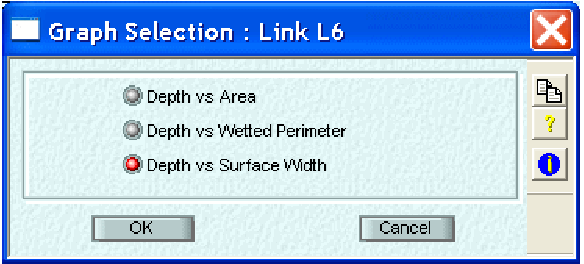
>
> **Downstream Elevation**
>
> Elevation (R.L.) of the conduit invert at the downstream node (ft or m). The xpswmm convention is to define the downstream end of the conduit as the end of the link with the arrowhead shown on the plan view.
>
> **Mannings 'n'**
>
> Conduit roughness as described by Manning's n. The roughness may be modified to account for entrance, exit, expansion and contraction losses or these may be entered in the Special Conduit Factors dialog box. Mannings n is a calibration parameter for hydraulic models and a range of values can be expected.
>
> Typical values for Manning's n can be found from hydraulic texts and other engineering references. A sample table from the United States Department of transportation  Federal Highway Administration showing a typical range of Mannings n values for closed conduits can be found here with typical open channel roughness values are discussed here.
>
> Ackers P (Hydraulics research paper no. 1, HMSO, London, 1958) showed that if the relative roughness R/k lies between 7 and 130 then Manning gives a good approximation to Colebrook-White for:
>
> n = k1/6/83.3
>
> where;
>
> R is Hydraulic Radius,
>
> k is roughness value used in the Colebrook-White equation (mm),
>
> n is the dimensional friction coefficient used in Manning.
>
> **Length**
>
> Length of the closed conduit (ft or m).
>
> The length of the shortest conduit does directly determine the maximum time step which, in turn, controls the run time of the simulation.
>
> The use of longer pipes may be facilitated through use of equivalent sections and slopes in cases where significant changes in pipe shape, cross sectional area and gradient must be represented in the model. Bear in mind that very short, steep pipes have a negligible effect on routing (since water is transported through them almost "instantaneously" compared to the overall routing) and may ordinarily be aggregated or omitted from the simulation, if it is perceived that doing so will not significantly affect model results.
>
> **Special**
>
> 504
>
> SECTION 9: LINKS
>
> **Special Closed Conduits**
>
> A variety of special closed conduit shapes are available in xpswmm. These shapes are provided primarily to retain compatibility with EPA SWMM.
>
> 
>
> All special conduit shapes, Egg-shaped, Gothic, Catenary, Horseshoe, Semi-elliptic, Basket-handle, Modified Basket-handle, Semi-circular, Rectangular-rounded bottom and Rectangular-triangular bottom require the entry of the Maximum conduit depth and conduit roughness. The Modified Basket-handle and Rectangular round and triangular bottomed conduits also require the conduit width and the latter two conduits require the depth to the change in cross-section shape.
>
> The hydraulic properties of the special conduit shapes are hard-wired in the SWMM engine. The actual hydraulic properties may be obtained by reference to the USEPA-SWMM Version 4 User's Manual. If coding a new data file and you are unsure of the hydraulic properties of a particular special conduit shape, the conduit can be entered as a user-defined conduit with parameters entered directly.
>
> Since no profile information (length, upstream and downstream elevations) is entered in the Special Conduit dialogs this data <u>must</u> be entered in the "Conduit Profile" dialog. The parameters defined in some of these special conduit dialogs varies from that described in the EPA-SWMM manual. This is not an error, but an attempt to provide consistency in data entry. Data is converted on import and expert to retain compatibility with SWMM results.
>
> **Egg Shaped**
>
> **Gothic**
>
> **Catenary**
>
> **Horseshoe**
>
> **Semi-elliptic**
>
> **Baskethandle**
>
> **Semi-circular**
>
> **Modified Basket-handle**
>
> **Rectangular - Round bottom**
>
> **Rectangular - Triangular bottom**
>
> **Vertical Ellipse**
>
> **Horizontal Ellipse**
>
> **Arch**
>
> xpswmm Reference Manual
>
> **Horizontal, Vertical Ellipses and Egg Shapes**
>
> **Horizontal Ellipse**
>
> **Vertical Ellipse**
>
> **Egg Shape**
>
> **Gothic**
>
> 
>
> Since no profile information (length, upstream and downstream elevations) is entered in the Special Conduit dialogs this data <u>must</u> be entered in the "Conduit Profile " dialog.
>
> 
>
> Note: Width = *f* (depth of flow)
>
> Maximum width = Height x 0.8236
>
> 506

SECTION 9: LINKS

> **Cantenary**
>
> 
>
> Since no profile information (length, upstream and downstream elevations) is entered in the Special Conduit dialogs this data <u>must</u> be entered in the "Conduit Profile " dialog.
>
> 
>
> Note: Width = *f* (depth of flow)
>
> Maximum width = Height x 0.9057
>
> xpswmm Reference Manual
>
> **Horseshoe**
>
> 
>
> Since no profile information (length, upstream and downstream elevations) is entered in the Special Conduit dialogs this data <u>must</u> be entered in the "Conduit Profile " dialog.
>
> 
>
> Note: Width = *f* (depth of flow)  
> Maximum width = Height

508

> SECTION 9: LINKS
>
> **Semi-elliptic (Louisville)**
>
> 
>
> Since no profile information (length, upstream and downstream elevations) is entered in the Special Conduit dialogs this data <u>must</u> be entered in the "Conduit Profile " dialog.
>
> 
>
> Note: Width = *f* (depth of flow)  
> Maximum width = Height
>
> The dimension relationships for the Semi-elliptical conduit shape is shown below, this chart is referenced from the EPA SWMM manual.

xpswmm Reference Manual

> 

**Basket handle**

> 

Since no profile information (length, upstream and downstream elevations) is entered in the Special Conduit dialogs this data <u>must</u> be entered in the "Conduit Profile " dialog.

510

> SECTION 9: LINKS
>
> 
>
> Note: Width = *f* (depth of flow)  
> Maximum width = Height
>
> **Semi Circular**
>
> 
>
> Since no profile information (length, upstream and downstream elevations) is entered in the Special Conduit dialogs this data <u>must</u> be entered in the "Conduit Profile " dialog.
>
> 511
>
> xpswmm Reference Manual
>
> 
>
> Note: Width = *f* (depth of flow)  
> Maximum width = Height x 1.623
>
> **Modified Basket-handle**
>
> 
>
> Since no profile information (length, upstream and downstream elevations) is entered in the Special Conduit dialogs this data <u>must</u> be entered in the "Conduit Profile " dialog.

512

> SECTION 9: LINKS
>
> 
>
> Note: The total height of the Modified Basket-Handle is the height of the vertical wall plus the radius of the semicircle. The radius of the semi-circle is the width/2. The width and the height are entered in this dialog.
>
> **Rectangular-Round bottom**
>
> 
>
> The conduit is described by a width (WIDE), a total height (DEEP) and a height representing only the rectangle portion of the conduit cross section (AFULL). All of these fields are entered as m or ft depending on the project units.
>
> Since no profile information (length, upstream and downstream elevations) is entered in the Special Conduit dialogs this data <u>must</u> be entered in the "Conduit Profile " dialog.
>
> 513
>
> xpswmm Reference Manual
>
> **Rectangular-Triangular bottom**
>
> 
>
> The conduit is described by a width (WIDE), a total height (DEEP) and a height representing only the rectangle portion of the conduit cross section (AFULL). All of these fields are entered as m or ft depending on the project units.
>
> Since no profile information (length, upstream and downstream elevations) is entered in the Special Conduit dialogs this data <u>must</u> be entered in the "Conduit Profile " dialog.
>
> **Vertical Ellipse**
>
> 
>
> Since no profile information (length, upstream and downstream elevations) is entered in the Special Conduit dialogs this data <u>must</u> be entered in the "Conduit Profile " dialog.
>
> When the value of the major axis is entered the hydraulic properties for the minor axis, full flow area and full flow hydraulic radius used are as shown in the table below. For metric units the Imperial sizes are converted to equivalent metric dimensions. If the value entered is not available in the table below the next larger conduit is selected. If a value larger than the largest size available is entered then the largest conduit in the table is used.
>
> 514

SECTION 9: LINKS

> 

<table>
<colgroup>
<col style="width: 15%" />
<col style="width: 15%" />
<col style="width: 11%" />
<col style="width: 57%" />
</colgroup>
<tbody>
<tr class="odd">
<td>
<strong>Major Axis</strong>

<strong>(in)</strong>
</td>
<td><strong>Minor Axis 
(in)</strong></td>
<td><strong>Area 
(ft)</strong></td>
<td>
<strong>Hydraulic Radius</strong>

<strong>(ft)</strong>
</td>
</tr>
<tr class="even">
<td>23</td>
<td>14</td>
<td>1.8</td>
<td>0.367</td>
</tr>
<tr class="odd">
<td>30</td>
<td>19</td>
<td>3.3</td>
<td>0.490</td>
</tr>
<tr class="even">
<td>34</td>
<td>22</td>
<td>4.1</td>
<td>0.546</td>
</tr>
<tr class="odd">
<td>38</td>
<td>24</td>
<td>5.1</td>
<td>0.613</td>
</tr>
<tr class="even">
<td>42</td>
<td>27</td>
<td>6.3</td>
<td>0.686</td>
</tr>
<tr class="odd">
<td>45</td>
<td>29</td>
<td>7.4</td>
<td>0.736</td>
</tr>
<tr class="even">
<td>49</td>
<td>32</td>
<td>8.8</td>
<td>0.812</td>
</tr>
<tr class="odd">
<td>53</td>
<td>34</td>
<td>10.2</td>
<td>0.875</td>
</tr>
<tr class="even">
<td>60</td>
<td>38</td>
<td>12.9</td>
<td>0.969</td>
</tr>
<tr class="odd">
<td>68</td>
<td>43</td>
<td>16.6</td>
<td>1.106</td>
</tr>
<tr class="even">
<td>76</td>
<td>48</td>
<td>20.5</td>
<td>1.229</td>
</tr>
<tr class="odd">
<td>83</td>
<td>53</td>
<td>24.8</td>
<td>1.352</td>
</tr>
<tr class="even">
<td>91</td>
<td>58</td>
<td>29.5</td>
<td>1.475</td>
</tr>
<tr class="odd">
<td>98</td>
<td>63</td>
<td>34.6</td>
<td>1.598</td>
</tr>
<tr class="even">
<td>106</td>
<td>68</td>
<td>40.1</td>
<td>1.721</td>
</tr>
<tr class="odd">
<td>113</td>
<td>72</td>
<td>46.1</td>
<td>1.845</td>
</tr>
<tr class="even">
<td>121</td>
<td>77</td>
<td>52.4</td>
<td>1.967</td>
</tr>
<tr class="odd">
<td>128</td>
<td>82</td>
<td>59.2</td>
<td>2.091</td>
</tr>
<tr class="even">
<td>136</td>
<td>87</td>
<td>66.4</td>
<td>2.215</td>
</tr>
<tr class="odd">
<td>143</td>
<td>92</td>
<td>74.0</td>
<td>2.340</td>
</tr>
<tr class="even">
<td>151</td>
<td>97</td>
<td>82.0</td>
<td>2.461</td>
</tr>
<tr class="odd">
<td>166</td>
<td>106</td>
<td>99.2</td>
<td>2.707</td>
</tr>
<tr class="even">
<td>180</td>
<td>116</td>
<td>118.6</td>
<td>2.968</td>
</tr>
</tbody>
</table>

> Note: Width = *f* (depth of flow)
>
> Maximum width = Minor Axis value from table
>
> xpswmm Reference Manual
>
> **Horizontal Ellipse**
>
> 
>
> Since no profile information (length, upstream and downstream elevations) is entered in the Special Conduit dialogs this data <u>must</u> be entered in the "Conduit Profile " dialog.
>
> When the value of the major axis is entered a corresponding value for the minor axis and the hydraulic properties for the full flow area and full flow hydraulic radius is determined from the table below. For metric units the Imperial sizes are converted to equivalent metric dimensions. If the value entered is not available in the table below the next larger conduit is selected. If a value larger than the largest size available is entered then the largest conduit in the table is used.
>
> 
>
> **Major Axis Minor Axis Area Hydraulic Radius**
>
> **(in) (in) (ft) (ft)**

|     |     |     |       |
|-----|-----|-----|-------|
| 23  | 14  | 1.8 | 0.367 |
| 30  | 19  | 3.3 | 0.490 |
| 34  | 22  | 4.1 | 0.546 |

516

> SECTION 9: LINKS

|     |     |       |       |
|-----|-----|-------|-------|
| 38  | 24  | 5.1   | 0.613 |
| 42  | 27  | 6.3   | 0.686 |
| 45  | 29  | 7.4   | 0.736 |
| 49  | 32  | 8.8   | 0.812 |
| 53  | 34  | 10.2  | 0.875 |
| 60  | 38  | 12.9  | 0.969 |
| 68  | 43  | 16.6  | 1.106 |
| 76  | 48  | 20.5  | 1.229 |
| 83  | 53  | 24.8  | 1.352 |
| 91  | 58  | 29.5  | 1.475 |
| 98  | 63  | 34.6  | 1.598 |
| 106 | 68  | 40.1  | 1.721 |
| 113 | 72  | 46.1  | 1.845 |
| 121 | 77  | 52.4  | 1.967 |
| 128 | 82  | 59.2  | 2.091 |
| 136 | 87  | 66.4  | 2.215 |
| 143 | 92  | 74.0  | 2.340 |
| 151 | 97  | 82.0  | 2.461 |
| 166 | 106 | 99.2  | 2.707 |
| 180 | 116 | 118.6 | 2.968 |

> Note: Width = *f* (depth of flow)
>
> Maximum width = Minor Axis value from table
>
> **Arch**
>
> 
>
> Since no profile information (length, upstream and downstream elevations) is entered in the Special Conduit dialogs this data <u>must</u> be entered in the "Conduit Profile " dialog.
>
> When the value of the minor axis is entered the hydraulic properties for the major axis, full flow area and full flow hydraulic radius used are as shown in the table below. For metric units the Imperial sizes are converted to equivalent metric dimensions. If the value entered is not available in the table below the next larger conduit is selected. If a value larger than the largest size available is entered then the largest conduit in the table is used.
>
> 517

xpswmm Reference Manual

> 

<table>
<colgroup>
<col style="width: 14%" />
<col style="width: 18%" />
<col style="width: 14%" />
<col style="width: 53%" />
</colgroup>
<tbody>
<tr class="odd">
<td><strong>Minor Axis (in)</strong></td>
<td><strong>Major Axis 
(in)</strong></td>
<td><strong>Area 
(sq ft)</strong></td>
<td>
<strong>Hydraulic Radius</strong>

<strong>(ft)</strong>
</td>
</tr>
<tr class="even">
<td><blockquote>

11

</blockquote></td>
<td><blockquote>

18

</blockquote></td>
<td>1.1</td>
<td>0.25</td>
</tr>
<tr class="odd">
<td><blockquote>

13

</blockquote></td>
<td><blockquote>

17

</blockquote></td>
<td>1.1</td>
<td>0.324</td>
</tr>
<tr class="even">
<td><blockquote>

13.5

</blockquote></td>
<td><blockquote>

22

</blockquote></td>
<td>1.65</td>
<td>0.3</td>
</tr>
<tr class="odd">
<td><blockquote>

15

</blockquote></td>
<td><blockquote>

21

</blockquote></td>
<td>1.6</td>
<td>0.374</td>
</tr>
<tr class="even">
<td><blockquote>

15.5

</blockquote></td>
<td><blockquote>

26

</blockquote></td>
<td>2.2</td>
<td>0.36</td>
</tr>
<tr class="odd">
<td><blockquote>

18

</blockquote></td>
<td><blockquote>

24

</blockquote></td>
<td>2.2</td>
<td>0.449</td>
</tr>
<tr class="even">
<td><blockquote>

18.25

</blockquote></td>
<td><blockquote>

28.5

</blockquote></td>
<td>2.8</td>
<td>0.45</td>
</tr>
<tr class="odd">
<td><blockquote>

20

</blockquote></td>
<td><blockquote>

28

</blockquote></td>
<td>2.9</td>
<td>0.499</td>
</tr>
<tr class="even">
<td><blockquote>

22.5

</blockquote></td>
<td><blockquote>

36.25

</blockquote></td>
<td>4.4</td>
<td>0.56</td>
</tr>
<tr class="odd">
<td><blockquote>

24

</blockquote></td>
<td><blockquote>

35

</blockquote></td>
<td>4.5</td>
<td>0.598</td>
</tr>
<tr class="even">
<td><blockquote>

26.625

</blockquote></td>
<td><blockquote>

43.75

</blockquote></td>
<td>6.4</td>
<td>0.68</td>
</tr>
<tr class="odd">
<td><blockquote>

29

</blockquote></td>
<td><blockquote>

42

</blockquote></td>
<td>6.5</td>
<td>0.723</td>
</tr>
<tr class="even">
<td><blockquote>

31

</blockquote></td>
<td><blockquote>

40

</blockquote></td>
<td>7</td>
<td>0.773</td>
</tr>
<tr class="odd">
<td><blockquote>

31.25

</blockquote></td>
<td><blockquote>

46

</blockquote></td>
<td>9.4</td>
<td>0.773</td>
</tr>
<tr class="even">
<td><blockquote>

31.3125

</blockquote></td>
<td><blockquote>

51.125

</blockquote></td>
<td>8.8</td>
<td>0.8</td>
</tr>
<tr class="odd">
<td><blockquote>

33

</blockquote></td>
<td><blockquote>

49

</blockquote></td>
<td>8.9</td>
<td>0.823</td>
</tr>
<tr class="even">
<td><blockquote>

36

</blockquote></td>
<td><blockquote>

58.5

</blockquote></td>
<td>11.4</td>
<td>0.9</td>
</tr>
<tr class="odd">
<td><blockquote>

38

</blockquote></td>
<td><blockquote>

57

</blockquote></td>
<td>11.6</td>
<td>0.947</td>
</tr>
<tr class="even">
<td><blockquote>

40

</blockquote></td>
<td><blockquote>

65

</blockquote></td>
<td>14.3</td>
<td>1.01</td>
</tr>
<tr class="odd">
<td><blockquote>

41

</blockquote></td>
<td><blockquote>

53

</blockquote></td>
<td>12.3</td>
<td>1.022</td>
</tr>
<tr class="even">
<td><blockquote>

43

</blockquote></td>
<td><blockquote>

64

</blockquote></td>
<td>14.7</td>
<td>1.072</td>
</tr>
<tr class="odd">
<td><blockquote>

45

</blockquote></td>
<td><blockquote>

73

</blockquote></td>
<td>17.7</td>
<td>1.13</td>
</tr>
<tr class="even">
<td><blockquote>

46

</blockquote></td>
<td><blockquote>

60

</blockquote></td>
<td>15.6</td>
<td>1.147</td>
</tr>
<tr class="odd">
<td><blockquote>

47

</blockquote></td>
<td><blockquote>

71

</blockquote></td>
<td>18.1</td>
<td>1.171</td>
</tr>
<tr class="even">
<td><blockquote>

51

</blockquote></td>
<td><blockquote>

66

</blockquote></td>
<td>19.3</td>
<td>1.271</td>
</tr>
<tr class="odd">
<td><blockquote>

52

</blockquote></td>
<td><blockquote>

77

</blockquote></td>
<td>21.9</td>
<td>1.296</td>
</tr>
<tr class="even">
<td><blockquote>

54

</blockquote></td>
<td><blockquote>

88

</blockquote></td>
<td>25.6</td>
<td>1.35</td>
</tr>
<tr class="odd">
<td><blockquote>

55

</blockquote></td>
<td><blockquote>

73

</blockquote></td>
<td>22</td>
<td>1.371</td>
</tr>
<tr class="even">
<td><blockquote>

55.25

</blockquote></td>
<td><blockquote>

73

</blockquote></td>
<td>23.2</td>
<td>1.371</td>
</tr>
<tr class="odd">
<td><blockquote>

57

</blockquote></td>
<td><blockquote>

76

</blockquote></td>
<td>24</td>
<td>1.421</td>
</tr>
</tbody>
</table>

> 518

SECTION 9: LINKS

<table>
<colgroup>
<col style="width: 13%" />
<col style="width: 12%" />
<col style="width: 13%" />
<col style="width: 59%" />
</colgroup>
<tbody>
<tr class="odd">
<td><blockquote>

57.25

</blockquote></td>
<td><blockquote>

83

</blockquote></td>
<td><blockquote>

26

</blockquote></td>
<td>1.421</td>
</tr>
<tr class="even">
<td><blockquote>

59

</blockquote></td>
<td><blockquote>

81

</blockquote></td>
<td><blockquote>

26

</blockquote></td>
<td>1.471</td>
</tr>
<tr class="odd">
<td><blockquote>

59.25

</blockquote></td>
<td><blockquote>

81

</blockquote></td>
<td><blockquote>

27.4

</blockquote></td>
<td>1.471</td>
</tr>
<tr class="even">
<td><blockquote>

61

</blockquote></td>
<td><blockquote>

84

</blockquote></td>
<td><blockquote>

28

</blockquote></td>
<td>1.52</td>
</tr>
<tr class="odd">
<td><blockquote>

62

</blockquote></td>
<td><blockquote>

102

</blockquote></td>
<td><blockquote>

34.6

</blockquote></td>
<td>1.57</td>
</tr>
<tr class="even">
<td><blockquote>

63

</blockquote></td>
<td><blockquote>

87

</blockquote></td>
<td><blockquote>

31

</blockquote></td>
<td>1.57</td>
</tr>
<tr class="odd">
<td>63.25</td>
<td><blockquote>

87

</blockquote></td>
<td><blockquote>

32.1

</blockquote></td>
<td>1.57</td>
</tr>
<tr class="even">
<td><blockquote>

65

</blockquote></td>
<td><blockquote>

92

</blockquote></td>
<td><blockquote>

33

</blockquote></td>
<td>1.62</td>
</tr>
<tr class="odd">
<td><blockquote>

67

</blockquote></td>
<td><blockquote>

95

</blockquote></td>
<td><blockquote>

35

</blockquote></td>
<td>1.67</td>
</tr>
<tr class="even">
<td><blockquote>

67.5

</blockquote></td>
<td><blockquote>

95

</blockquote></td>
<td><blockquote>

37

</blockquote></td>
<td>1.67</td>
</tr>
<tr class="odd">
<td><blockquote>

69

</blockquote></td>
<td><blockquote>

98

</blockquote></td>
<td><blockquote>

38

</blockquote></td>
<td>1.72</td>
</tr>
<tr class="even">
<td><blockquote>

71

</blockquote></td>
<td><blockquote>

103

</blockquote></td>
<td><blockquote>

40

</blockquote></td>
<td>1.77</td>
</tr>
<tr class="odd">
<td><blockquote>

71.5

</blockquote></td>
<td><blockquote>

103

</blockquote></td>
<td><blockquote>

42.4

</blockquote></td>
<td>1.77</td>
</tr>
<tr class="even">
<td><blockquote>

72

</blockquote></td>
<td><blockquote>

115

</blockquote></td>
<td><blockquote>

44.5

</blockquote></td>
<td>1.77</td>
</tr>
<tr class="odd">
<td><blockquote>

73

</blockquote></td>
<td><blockquote>

106

</blockquote></td>
<td><blockquote>

43

</blockquote></td>
<td>1.82</td>
</tr>
<tr class="even">
<td><blockquote>

75

</blockquote></td>
<td><blockquote>

112

</blockquote></td>
<td><blockquote>

46

</blockquote></td>
<td>1.869</td>
</tr>
<tr class="odd">
<td><blockquote>

75.5

</blockquote></td>
<td><blockquote>

112

</blockquote></td>
<td><blockquote>

48

</blockquote></td>
<td>1.869</td>
</tr>
<tr class="even">
<td><blockquote>

77

</blockquote></td>
<td><blockquote>

114

</blockquote></td>
<td><blockquote>

49

</blockquote></td>
<td>1.919</td>
</tr>
<tr class="odd">
<td><blockquote>

77.5

</blockquote></td>
<td><blockquote>

122

</blockquote></td>
<td><blockquote>

51.7

</blockquote></td>
<td>1.92</td>
</tr>
<tr class="even">
<td><blockquote>

79

</blockquote></td>
<td><blockquote>

117

</blockquote></td>
<td><blockquote>

52

</blockquote></td>
<td>1.969</td>
</tr>
<tr class="odd">
<td><blockquote>

79.5

</blockquote></td>
<td><blockquote>

117

</blockquote></td>
<td><blockquote>

54.2

</blockquote></td>
<td>1.969</td>
</tr>
<tr class="even">
<td><blockquote>

81

</blockquote></td>
<td><blockquote>

123

</blockquote></td>
<td><blockquote>

55

</blockquote></td>
<td>2.019</td>
</tr>
<tr class="odd">
<td><blockquote>

83

</blockquote></td>
<td><blockquote>

128

</blockquote></td>
<td><blockquote>

58

</blockquote></td>
<td>2.069</td>
</tr>
<tr class="even">
<td><blockquote>

83.5

</blockquote></td>
<td><blockquote>

128

</blockquote></td>
<td><blockquote>

60.5

</blockquote></td>
<td>2.069</td>
</tr>
<tr class="odd">
<td><blockquote>

85

</blockquote></td>
<td><blockquote>

131

</blockquote></td>
<td><blockquote>

61

</blockquote></td>
<td>2.119</td>
</tr>
<tr class="even">
<td><blockquote>

87

</blockquote></td>
<td><blockquote>

137

</blockquote></td>
<td><blockquote>

64

</blockquote></td>
<td>2.168</td>
</tr>
<tr class="odd">
<td><blockquote>

87.125

</blockquote></td>
<td><blockquote>

138

</blockquote></td>
<td><blockquote>

66

</blockquote></td>
<td>2.17</td>
</tr>
<tr class="even">
<td><blockquote>

87.5

</blockquote></td>
<td><blockquote>

137

</blockquote></td>
<td><blockquote>

67.4

</blockquote></td>
<td>2.168</td>
</tr>
<tr class="odd">
<td><blockquote>

89

</blockquote></td>
<td><blockquote>

139

</blockquote></td>
<td><blockquote>

67

</blockquote></td>
<td>2.218</td>
</tr>
<tr class="even">
<td><blockquote>

91

</blockquote></td>
<td><blockquote>

142

</blockquote></td>
<td><blockquote>

71

</blockquote></td>
<td>2.268</td>
</tr>
<tr class="odd">
<td><blockquote>

91.5

</blockquote></td>
<td><blockquote>

142

</blockquote></td>
<td><blockquote>

74.5

</blockquote></td>
<td>2.268</td>
</tr>
<tr class="even">
<td><blockquote>

93

</blockquote></td>
<td><blockquote>

148

</blockquote></td>
<td><blockquote>

74

</blockquote></td>
<td>2.318</td>
</tr>
<tr class="odd">
<td><blockquote>

95

</blockquote></td>
<td><blockquote>

150

</blockquote></td>
<td><blockquote>

78

</blockquote></td>
<td>2.368</td>
</tr>
<tr class="even">
<td><blockquote>

96.875

</blockquote></td>
<td><blockquote>

154

</blockquote></td>
<td><blockquote>

81.8

</blockquote></td>
<td>2.42</td>
</tr>
<tr class="odd">
<td><blockquote>

97

</blockquote></td>
<td><blockquote>

152

</blockquote></td>
<td><blockquote>

81

</blockquote></td>
<td>2.418</td>
</tr>
<tr class="even">
<td><blockquote>

100

</blockquote></td>
<td><blockquote>

154

</blockquote></td>
<td><blockquote>

85

</blockquote></td>
<td>2.493</td>
</tr>
<tr class="odd">
<td><blockquote>

101

</blockquote></td>
<td><blockquote>

161

</blockquote></td>
<td><blockquote>

89

</blockquote></td>
<td>2.517</td>
</tr>
<tr class="even">
<td><blockquote>

103

</blockquote></td>
<td><blockquote>

167

</blockquote></td>
<td><blockquote>

93

</blockquote></td>
<td>2.567</td>
</tr>
<tr class="odd">
<td><blockquote>

105

</blockquote></td>
<td><blockquote>

169

</blockquote></td>
<td><blockquote>

97

</blockquote></td>
<td>2.617</td>
</tr>
<tr class="even">
<td><blockquote>

106.5

</blockquote></td>
<td><blockquote>

168.75

</blockquote></td>
<td><blockquote>

99.1

</blockquote></td>
<td>2.65</td>
</tr>
<tr class="odd">
<td><blockquote>

107

</blockquote></td>
<td><blockquote>

171

</blockquote></td>
<td><blockquote>

101

</blockquote></td>
<td>2.667</td>
</tr>
<tr class="even">
<td><blockquote>

109

</blockquote></td>
<td><blockquote>

178

</blockquote></td>
<td><blockquote>

105

</blockquote></td>
<td>2.717</td>
</tr>
<tr class="odd">
<td><blockquote>

111

</blockquote></td>
<td><blockquote>

184

</blockquote></td>
<td><blockquote>

109

</blockquote></td>
<td>2.767</td>
</tr>
<tr class="even">
<td><blockquote>

112

</blockquote></td>
<td><blockquote>

159

</blockquote></td>
<td><blockquote>

97

</blockquote></td>
<td>2.792</td>
</tr>
<tr class="odd">
<td><blockquote>

113

</blockquote></td>
<td><blockquote>

186

</blockquote></td>
<td><blockquote>

113

</blockquote></td>
<td>2.817</td>
</tr>
<tr class="even">
<td><blockquote>

114

</blockquote></td>
<td><blockquote>

162

</blockquote></td>
<td><blockquote>

102

</blockquote></td>
<td>2.841</td>
</tr>
<tr class="odd">
<td><blockquote>

115

</blockquote></td>
<td><blockquote>

188

</blockquote></td>
<td><blockquote>

118

</blockquote></td>
<td>2.866</td>
</tr>
<tr class="even">
<td><blockquote>

116

</blockquote></td>
<td><blockquote>

168

</blockquote></td>
<td><blockquote>

105

</blockquote></td>
<td>2.891</td>
</tr>
<tr class="odd">
<td><blockquote>

118

</blockquote></td>
<td><blockquote>

170

</blockquote></td>
<td><blockquote>

109

</blockquote></td>
<td>2.941</td>
</tr>
<tr class="even">
<td><blockquote>

118.25

</blockquote></td>
<td><blockquote>

190

</blockquote></td>
<td><blockquote>

122

</blockquote></td>
<td>2.941</td>
</tr>
<tr class="odd">
<td><blockquote>

119

</blockquote></td>
<td><blockquote>

197

</blockquote></td>
<td><blockquote>

126

</blockquote></td>
<td>2.966</td>
</tr>
<tr class="even">
<td><blockquote>

120

</blockquote></td>
<td><blockquote>

173

</blockquote></td>
<td><blockquote>

114

</blockquote></td>
<td>2.991</td>
</tr>
<tr class="odd">
<td><blockquote>

121

</blockquote></td>
<td><blockquote>

199

</blockquote></td>
<td><blockquote>

131

</blockquote></td>
<td>3.016</td>
</tr>
<tr class="even">
<td><blockquote>

122

</blockquote></td>
<td><blockquote>

179

</blockquote></td>
<td><blockquote>

118

</blockquote></td>
<td>3.041</td>
</tr>
<tr class="odd">
<td><blockquote>

124

</blockquote></td>
<td><blockquote>

184

</blockquote></td>
<td><blockquote>

123

</blockquote></td>
<td>3.091</td>
</tr>
<tr class="even">
<td><blockquote>

126

</blockquote></td>
<td><blockquote>

187

</blockquote></td>
<td><blockquote>

127

</blockquote></td>
<td>3.141</td>
</tr>
</tbody>
</table>

> 519
>
> xpswmm Reference Manual

|     |     |     |       |
|-----|-----|-----|-------|
| 128 | 190 | 132 | 3.19  |
| 130 | 195 | 137 | 3.24  |
| 132 | 198 | 142 | 3.29  |
| 134 | 204 | 146 | 3.34  |
| 136 | 206 | 151 | 3.39  |
| 138 | 209 | 157 | 3.44  |
| 140 | 215 | 161 | 3.49  |
| 142 | 217 | 167 | 3.539 |
| 144 | 223 | 172 | 3.589 |
| 146 | 225 | 177 | 3.639 |
| 148 | 231 | 182 | 3.689 |
| 150 | 234 | 188 | 3.739 |
| 152 | 236 | 194 | 3.789 |
| 154 | 239 | 200 | 3.838 |
| 156 | 245 | 205 | 3.888 |
| 158 | 247 | 211 | 3.938 |

> Note: Width = *f* (depth of flow)
>
> Maximum width = Major Axis value from table
>
> **9.1.7 Open Conduits**
>
> **Open Conduit Data**
>
> 3 types of open channels are supported:
>
> **Trapezoidal Channels  
> Power Function Channels  
> Natural Channels**
>
> **Suppress Printed Output of Parabolic, Power and Natural Channels**
>
> This flag suppresses printed output of normalized cross-section properties and the data echo of input data for Parabolic, Power and Natural Channels.
>
> **Trapezoidal Channel**
>
> An open channel with a regular trapezoidal cross-section.
>
> 520

SECTION 9: LINKS

total conveyance for the cross section is obtained by summing the three subdivision conveyances (left, channel, and right).

> 
>
> 

**Default Conveyance Subdivision Method**

**Channel Slope**

***(SPHI)** -* The average channel slope for this cross-section. This slope is used only for developing a rating curve for the channel. Routing calculations use invert elevation differences divided by length.

**Vertical Shift**

***(PXSECE)** -* A constant value (+ or -) to be added to the elevation data in the "section coordinates" dialog box to raise or lower the cross-section.

**Horizontal Distortion Factor**

***(PXSECR)** -* Modification factor for the data in the Section Coordinates dialog box. The distances between adjacent stations (chainages) are multiplied by this factor to expand or narrow a cross-section.

**Maximum Channel Depth**

***(DEEP)** -* This parameter is used to denote the maximum height of a natural channel and will exclude points above this level for analysis. It is a shared field with other conduit shapes and represents the diameter of circular or the height of other shapes.

By default this value is zero and the maximum channel depth is computed as the difference between the high point of the cross-section and low point of the cross-section (as described below). A non-zero value may be entered to reduce the total cross-section depth if the maximum depth of flow for a particular simulation is significantly less than the maximum cross-section depth. This will increase the accuracy of the interpolation performed by the model. If the spill crest level at any connecting node is greater than the derived elevation from maximum depth plus invert then the conduit could be under pressure since the HGL could be above its height. This is reported in the output file Table E10 with a \* at the end of the line.

Obviously, a pressurized natural channel is not a common physical occurrence and this is avoided by allowing vertical walls to be created up to the node spillcrest elevations while using the configuration parameter VERT_WALLS. One application of allowing this to occur would be for flow under a bridge deck.

The low point in the cross-section is the lowest point between the left and right Main Channel Stations. The high point is the highest point of the cross-section coordinates. If the left-most or right-most elevations are less than the high point, vertical sides are projected up to the high point to complete the section shape.

The following checks are made for this parameter:

1.  No warnings or errors are given in dialogs or XP Tables for DEEP.

2.  On solving all conduits except natural channels are checked for DEEP \< 0.01m (metric models) or 0.03ft (imperial models). An error message is given for any conduits failing this limit.

525

> xpswmm Reference Manual

5.  On solving all conduits except natural channels are checked for 0.05m \<= DEEP \<= 30.0m (metric models) or 0.15ft \<= DEEP \<= 100.0ft (imperial models). A warning message is given for any conduits failing this.

6.  If the configuration parameter NATDEEP_0.05 is present, natural channels are treated the same as other conduits in \#2 and \#3 above.

> **Upstream Invert Level of Natural Channel**
>
> **Channel *(ZP) ****-* Elevation (R.L.) of the channel invert at the upstream node (feet or metres). By convention in XP-SWMM the upstream end of a conduit is the end that, on the plan view, does not have the arrowhead.
>
> **Downstream Invert Level of Natural Channel**
>
> ***(ZP)** -* Elevation (R.L.) of the channel invert at the downstream node (feet or metres). By convention in XP-SWMM the downstream end of a conduit is the end that, on the plan view, has the arrowhead. (Not necessary in Runoff or Sanitary layers.)
>
> **Left Overbank Manning's 'n'**
>
> ***(XNL)** -* Channel roughness of the left-hand overbank as described by Manning's n.
>
> Typical values for Manning's n can be found from hydraulic texts and other engineering references. A sample table from the United States Department of transportation  Federal Highway Administration showing a typical range of Mannings n values for open channels can be found here.
>
> **Main Channel Manning's 'n'**
>
> ***(XNCH)** -* Channel roughness of the main channel as described by Manning's n.
>
> Typical values for Manning's n can be found from hydraulic texts and other engineering references. A sample table from the United States Department of transportation  Federal Highway Administration showing a typical range of Mannings n values for open channels can be found here.
>
> **Right Overbank Manning's 'n'**
>
> ***(XNR)** -* Channel roughness of the right-hand overbank as described by Manning's n.
>
> Typical values for Manning's n can be found from hydraulic texts and other engineering references. A sample table from the United States Department of transportation  Federal Highway Administration showing a typical range of Mannings n values for open channels can be found here.
>
> **Section Coordinates**

526

SECTION 9: LINKS

> 

HEC-2 type natural surface cross-section coordinate pairs. Elevations are used only to determine the shape of the cross-section. Invert elevations are defined in the node data dialog box and also by the Upstream and Downstream Elevations shown in this dialog.

The low point in the cross-section is the lowest point between the left and right Main Channel Stations. The high point is the highest point of the cross-section coordinates. If the left-most or right-most elevations are less than this value, vertical sides are projected up to the high point. Total cross-section depth is computed as the difference between the high point of the cross-section and low point of the cross-section (as described above).

The profile is defined in terms of station **(x)** and stage **(elevation).  
Main Channel Definition 'x'**

***(C3 or X1 - STCHL, X1 - STCHR)** -* The station (chainage) of the left bank and right bank of the main channel (feet or metres). The station (chainage) should be the same as one of the values in the "Section Coordinates" dialog box. If an invalid station is entered an interpolated value is inserted at the station entered.

**Cross-Section Profile Station**

***(STA..)** -* Station (chainage) of the cross-section (feet or metres). Stations must be in increasing order progressing from left to right across the section. Cross-sections are normally orientated looking downstream.

527

> xpswmm Reference Manual
>
> **Cross-Section Profile Elevation**
>
> ***(EL)** -* Elevation of the cross-section (feet or metres) for the adjacent station. Cross-sections are normally orientated looking downstream. The actual elevations used are calculated from the upstream and downstream invert elevations. The elevations entered here are only used to describe the shape of the cross-section.
>
> **Floodway Encroachment**
>
> The natural channel cross-section can be directly altered by filling in the section to the entered encroachment stations or the encroachment stations can be automatically calculated using a maximum depth increase and 5 different encroachment options.
>
> 
>
> **Max Depth Increase Encroachment**
>
> In lieu of explicitly entering the encroachment stations, they can be computed by specifying in this field the maximum depth (feet or meters) that the water surface can change from encroachment by one of the five available options.
>
> **Encroachment Methods**
>
> The cross-section will be modified to produce an increase in water surface based on the Max Depth Increase value by one of the following five methods:

1)  **Left Bank Only**: The left bank will be reduced by imposing a vertical wall from the lowest station and moving to the right until the maximum depth increase has been met.

2)  **Right Bank Only**: The right bank will be reduced by imposing a vertical wall from the greatest station and moving to the left until the maximum depth increase has been met.

3)  **Equal Left and Right Bank Reduction**: The left and right banks will be reduced by imposing vertical walls from the farthest stations and moving in equal distance until the maximum depth increase has been met.

4)  **Symetrical About Centerline**: The left and right banks will be reduced by imposing vertical walls equal distance from the centerline of the channel and moving in until the maximum depth increase has been met.

5)  **Equal Left and Right Conveyance Reduction**: The left and right banks will be reduced by imposing vertical walls that cause equal conveyance reduction in both overbanks and moving in until the maximum depth increase has been met.

> 528
>
> xpswmm Reference Manual
>
> The Plot radio button allows you to plot across Pump, Weir and Orifice diversions by specifying a length for the diversions. This length is used for plotting profiles and in the Dynamic Plan View. Select the Plot radio button
>
> corresponding to a row of diversions. Click on the button to open the following dialog:
>
> 
>
> Select the diversion type to be plotted and enter the length be used in plots.
>
> **Hydraulics Layer Output Control**
>
> 
>
> **Print Flow Details**
>
> **Plot Flow History**
>
> **Save Results for Review  
> Print Control**
>
> The Print Control command allows detailed printout to be obtained for a specific link. Output is extensive and voluminous and should be used sparingly. It is normally used when there is suspicion that a conduit is behaving abnormally.
>
> **Hydraulics Layer Print Control  
> Runoff Layer Print Control  
> Sanitary Layer Print Control**
>
> **Print Flow Details**
>
> This flag is used to select detailed printout for this location. The detailed printout is a time series of the conduit's hydraulic properties at a regular time interval and will be located in the output file after a model has been run. The time interval is controlled as a factor of time steps in the Hydraulics Mode-\>Job Control-\>Output Control: Summary Interval value. This option should be used sparingly as it can generate a large amount of output. It should only be used for debugging particularly complex networks, or to create a time series file to link to another application.
>
> 530
>
> SECTION 9: LINKS
>
> With this flag is enabled and using the configuration parameter EXTERNAL_CSV a file named "yourfile.csv" will be created containing the time series and the time series will not be found in the output file. Where yourfile is the name of your modeling project. This file contains the Time, Flow, Velocity, X-section Area, Hydraulic Radius, Head at the Upstream Junction, Head at the Downstream Junction, Elevation at the Upstream End of the Conduit, the Elevation at the Downstream End of the Conduit and, the Volume of Water in the Link. This file is comma-delimited and is suitable for input to a spreadsheet.
>
> **Plot Flow History**
>
> A flag to control line-printer style graphical presentation of hydrographs and depths. Review Results is a much-preferred alternative to this option.
>
> **Orifice**
>
> **Hydraulics Layer Orifice Diversion**
>
> Orifices are regularly shaped submerged openings that are designed to control flow. Typical applications of these devices include:

- combined sewers were an orifice is used to divert sanitary wastewater out of the collection/conveyance system during dry weather periods and to restrict the entry of stormwater into the sanitary interceptors during periods of runoff, and

- detention pond outlets were one or more orifices are used to slowly drain stored runoff after precipitation has ended.

> In an xpswmm link-node model, orifices are located in multilinks. A multilink may contain a single orifice or any combination orifices, weirs, pumps and conduits. An orifice may divert the flow to another pipe, a pumping station or an off-line storage tank.
>
> Move cursor over image and click to view descriptions of the dialogs, check boxes, and radio buttons.
>
> 
>
> Two geometric configurations are allowed:

- a Bottom Outlet or sump orifice, and

- a Side Outlet orifice.

> The shape of the orifice may be circular or rectangular. If rectangular, the height of the opening (in feet or meters) must be entered.
>
> The Hydraulics layer simulates both types of orifice by converting the orifice to an equivalent pipe.
>
> The orifice pipe is assumed to be nearly flat, the invert of the discharge side being set 0.01 feet (0.003 meters) lower than the invert on the inlet side. In addition, for a bottom orifice, the pipe invert is set a distance 0.96 times the orifice
>
> 531
>
> xpswmm Reference Manual
>
> diameter (0.96 time the height of a rectangular orifice) below the junction invert so that the orifice pipe is flowing full before any outflow from the junction occurs in any other pipe. For side outlet orifices, the user specifies the elevation of the **orifice invert**.
>
> The Orifice Data section of the output file shows the data used for the equivalent pipe.
>
> ====\> EQUIVALENT PIPE INFORMATION FOR ORIFICE 2
>
> CONDUIT NAME rectangle
>
> Upstream node Pond
>
> Downstream node Riser
>
> PIPE DIAMETER 0.50
>
> PIPE LENGTH 1000.00
>
> MANNINGS ROUGHNESS 0.0025
>
> INVERT ELEVATION AT UPSTREAM END 925.5000
>
> INVERT ELEVATION AT DOWNSTREAM END 925.4900
>
> To apply the orifice equation instead of an equivalent pipe, use the Configuration Parameter USE_ORF_EQN.
>
> Both orifice types require Orifice Area and **Discharge Coefficient** data be entered. An option to Vary with Time these two parameters is also provided.
>
> To add a plot of measured time series data to the Review Results graphs use the Gauged Data option. **Orifice Invert Elevation**
>
> Elevation of the invert of the node floor for a bottom outlet or elevation of bottom edge of a side outlet orifice (feet or meters).
>
> **Orifice Area**
>
> The orifice area (sq feet or sq meters).
>
> **Orifice Discharge Coefficient  
> **The orifice discharge coefficient.
>
> **Vary with Time**
>
> The orifice discharge coefficient and area may be varied with time to simulate external controls. Orifice settings should not be closed "too fast" because this can cause numerical instabilities that mimic hydraulic instabilities that would occur in the model.
>
> 
>
> The orifice is defined in terms of Time , Coefficient and Area .
>
> 532
>
> SECTION 9: LINKS
>
> **Time**
>
> First time (hours) that the orifice discharge coefficient and area change in value from the initial settings of the previous dialog box or from the previous values in this window.
>
> Time zero refers to midnight on the first day of the simulation. Increase hours past 24 for multiple day simulations.
>
> **Area**
>
> New value for the orifice area (sq feet or sq meters) to come into effect at the time shown in the adjacent cell.
>
> **Coefficient**
>
> New value for the orifice discharge coefficient to come into effect at the time shown in the adjacent cell.
>
> **Orifice Name**
>
> Name of orifice to appear in Review Results and Output file.
>
> **Orifice Height**
>
> For Rectangular orifices only, the distance from the top to the bottom of the weir (feet or meters).
>
> **Pump**
>
> **Hydraulics Layer Pump Diversion**
>
> A pump station is conceptually represented as either an in-line lift station, or an off-line node representing a wet-well, from which the contents are pumped to another node in the system according to a programmed rule curve. Up to seven pumps may entered for a diversion. The pumps may be selected in any order.
>
> Pumps may be one of five types:

1)  Pump Rated by Well Volume: An in-line or off-line pump station with a wet well; the rate of pumping depends upon the volume (level) of water in the wet well.

2)  Pump Rated by Depth in Node: An in-line or off-line lift station that pumps according to the level of the water surface at the junction being pumped.

3)  Pump Rated By Dynamic Head: An in-line or off-line pump that pumps according to the head difference over the pump using a multi point pump curve and starting and stopping elevations.

4)  Pump Rated By Static Head: An in-line or off-line pump that pumps according to the head at the upstream node using a multi point pump curve and starting and stopping elevations.

5)  A dynamic head pump that uses a rule curve to modify the behavior of the dynamic head pump based on the depth at either an adjacent or non-adjacent node.

533

> xpswmm Reference Manual
>
> 
>
> **Name**
>
> **Description** (Optional)
>
> **Pump Type**
>
> ***Pump Rated By***
>
> A pump may be in-line or off-line and rated by **Dynamic Head, Static Head, Well Volume** or**, Depth in Node**.
>
> **Gauged Data**
>
> Note: **depth** in the Hydraulics mode is relative to inverts **elevation** or **stage** in hydraulics is relative to zero
>
> **Name**
>
> The Hydraulics layer now allows you to specify the pump name explicitly. The analysis engine no longer uses PUMP \#1, PUMP \#2, PUMP \#3 etc. depending on where in the model the pump is located. These names were liable to change when a pump was added to or removed from the network and have therefore been replaced with an explicit name.
>
> **Description (Optional)**
>
> Enter a pump description applicable to this link and pump.
>
> **Pump Type**
>
> The pump type is selected from a global database of Pump Rating Curves.
>
> ***Pump Type (Rating Curve)***
>
> Select the global database containing the Pump Rating Curve applicable to this pump.
>
> ***Pump Speed Factor***
>
> Enter the factor by which the Flow Rate of the rating curve will be modified when the model is solved.
>
> The new rating curve is modified such that:
>
> New Flow = Old Flow x Pump Factor, and  
> New Head = Old Head x Pump Factor^2

534

> SECTION 9: LINKS
>
> **Static Head**
>
> An in-line or off-line pump that pumps according to the head at the wet well.
>
> The depth in the upstream node determines the pumping rate according to a multi-point head-discharge relationship (rating curve) for the pump. The operating condition (i.e., on/off) for the pump is determined from the wet well elevation from the previous half-step computation.
>
> If the model detects that a pump is on then its flow is computed from the head at the upstream node based on a linearized pump operating curve as shown below.
>
> The pump's operating range is limited to the range between the low-rate head and the high-rate head regardless of the detected dynamic head. Pump rate will remain fixed at either the low-rate head or the high-rate head until the system returns to the normal operating range of the pump.
>
> A static head pump is defined in terms of its Initial Depth **, Pump Starting** and **Pump Stopping** elevations**.**
>
> **Dynamic Head**
>
> An in-line or off-line pump that pumps according to the head difference over the pump.
>
> The dynamic head difference between the upstream and downstream nodes determines the pumping rate according to a multi-point head-discharge relationship (rating curve) for the pump. The operating condition (i.e., on/off) for the pump is determined from the wet well elevation from the previous half-step computation.
>
> If the model detects that a pump is on then its flow is computed from the dynamic head difference based on a linearized pump operating curve as shown below.
>
> The pump's operating range is limited to the range between the low-rate head and the high-rate head regardless of the detected dynamic head. Pump rates will remain fixed at either the low-rate head or the high-rate head until the system returns to the normal operating range of the pump.
>
> A dynamic head pump is defined in terms of its Initial Depth **, Pump Starting** and **Pump Stopping** elevations**.**
>
> Note: A dynamic head pump will not operate unless there is a positive head difference; i.e. the downstream water elevation is above the upstream node (wet well) elevation.
>
> **Pump Starts (Elevation)**
>
> Elevation (RL) in pump inflow node at which pump turns on (feet or metres). Used by Dynamic and Static Head Pumps
>
> **Pump Stops (Elevation)**
>
> Elevation (RL) in pump inflow node at which pump turns off (ft or m). Used by Dynamic and Static Head Pumps
>
> *Pumps are set initially to "OFF" and do not start pumping until the water level is greater than the designated starting level.*
>
> **Initial Depth**
>
> Enter the initial depth in the pump inflow node (ft or m). This depth is measured from the node invert and is not an elevation value. Used by Dynamic and Static Head Pumps. The initial depth must be entered in the upstream node in addition to this field since the initial depth in the wet well is derived from the node initial depth.
>
> **Depth in Node**
>
> An in-line (usually) lift pump. The rate of pumping depends on the level of water, i.e., depth, in the node being pumped.
>
> For an in-line station, the pump rate is based on the water depth at the pump junction. The Pump Rate rule is as follows:

535

> xpswmm Reference Manual
>
> R1 for 0 \< Y \< Y1
>
> R2 for Y1 \< Y \< Y2
>
> Rn for Yn-1 \< Y \< Yn
>
> For Y = 0, the pump rate is the inflow rate to the pump junction.
>
> **Well Volume**
>
> An off-line (usually) pump station with a wet well. The pump must be supplied from their own wet well, i.e., only one conduit must be connected to the node at which the pump is located. The rate of pumping depends on the volume of water in the well.
>
> The program sets the node invert elevation (level) to -100.
>
> Note that only one conduit may be connected to the node from which this type of pump operates.
>
> Inflows to the off-line pump must be derived from the main sewer system through an orifice, a weir, or a pipe. The influent to the wet-well node must be a free discharge regardless of the diversion structure. The pump rating curve is based on the volume of water in the storage node.
>
> A multi-point volume/flow rate rating curve is prespecified for each pump station: V1 \< V2 \< Vn, where Vn is the maximum capacity of the wet well. The pump rate is selected automatically by the Hydraulics layer depending on the volume in the wet-well.
>
> A mass balance of pumped outflow and inflow is performed in the wet-well during the model simulation period.
>
> If the wet-well goes dry, the pump rate is reduced below rate R1 until it just equals the inflow rate. When the inflow rate again equals or exceeds R1, the pumping rate goes back to operating on the rule curve. If Vn is exceeded in the wet-well, the inflow to the storage node is reduced until it does not exceed the maximum pumped flow.
>
> A wet well pump station is defined in terms of its **Total Volume** and **Initial Volume** .  
> **Initial Well Volume**
>
> Enter the initial well capacity (ft3 or m3).
>
> **Total Well Volume**
>
> Enter the total well capacity (ft3 or m3).
>
> **Weir**
>
> **Hydraulics Layer Weir Diversion (G1)**
>
> Weir diversions provide relief to the drainage system during periods of storm runoff. The following types of weirs can be simulated:

- internal diversions (from one junction to another via a transverse or sideflow weir),

- outfall weirs which discharge to the receiving waters. These weirs may be transverse or sideflow types, and may be equipped with flap gates that prevent backflow

- special weir types including **<u>Inflatable Weirs</u>** (regulators), **<u>Bendable Weirs</u>** and **<u>User-defined Weirs</u>** .

> Transverse weir and sideflow weirs are distinguished in the Hydraulics layer by the value of the exponent to which the head on the weir is taken. For transverse weirs, head is taken to the power of 1.5 while for sideflow weirs the exponent is 1.667.

536

> SECTION 9: LINKS
>
> 
>
> Weirs are defined in terms of Weir Length, Weir Crown, the Weir Crest Elevation and the **Discharge Coefficient** . Reverse Flow can also be prevented.
>
> **More Weir Information  
> Gauged Data**
>
> A detailed discussion of Weirs and Weirs with Tide Gate Theory is discussed at the associated link locations. **Transverse or Sideflow Weirs**
>
> When the water depth at the weir junction exceeds the surcharge level (RL 1) the weir functions as an orifice i.e. the exponent is 0.5. The discharge coefficient for the orifice flow conditions is computed internally in the Hydraulics layer. An equivalent pipe automatically replaces the weir for the duration of surcharge.
>
> Stability problems can be encountered at weir junctions. If this happens or is suspected of happening, the weir may be represented as an equivalent pipe. To do this, equate the pipe and weir discharge equations, e.g.,
>
> (m/n)AR(2/3)S(l/2) = CwWH(3/2)
>
> where m = 1.486 for units of feet and 1.0 for units of metres.
>
> n = Manning's n for the pipe
>
> A = Cross-sectional area
>
> R = Hydraulic radius
>
> S = Hydraulic grade line for the pipe
>
> H = Head across the weir
>
> Cw = Weir discharge coefficient
>
> W = Weir length
>
> **Weir Name**
>
> An alpha-numeric name for the weir.
>
> xpswmm Reference Manual
>
> **Crown or Elevation of Top of Weir (RL1) (G1 - YTOP) -**
>
> Crown or Top of weir is the elevation where the weir would commence orifice flow calculations. Orifice flow will occur when this elevation is reached if the weir is in a closed structure. A weir not in a closed structure may also require an elevation to commence orifice flow if it is a horizontal opening for an outlet structure of a pond. To eliminate orifice flow calculations set this elevation equal to the upstream node spillcrest value. Elevation of the weir crown uses units of (feet or metres).
>
> **Weir Crest Elevation (RL2) (G1 - YCREST) -  
> **Elevation of the weir crest (feet or metres).
>
> **Weir Length (G1 - WLEN) -  
> **Length of weir (feet or metres).
>
> **Discharge Coefficient (G1 - COEFF) -  
> **Coefficient of discharge for the weir.
>
> **Reverse Flow Eliminated using Flap Gate (G1 - KWEIR) -**
>
> Frequently, weirs are installed together with a tide gate at points of overflow into the receiving waters. Flow across the weir is restricted by reducing the effective driving head across the weir according to an empirical factor published by Armco(3). Note that the flap gate is only effective for a weir at an outfall node. A flap gate is ignored for a weir between two internal nodes.
>
> **Special**
>
> **Special Conduits**
>
> Six special conduits are available for use in simulating real time control in a drainage network. They are:
>
> **Regulator Link/Inflatable Weir**
>
> **Bendable Weir**
>
> **Special Pump (controlled by remote node depth)**
>
> **User Defined Weir**
>
> **Internal Rating Curve**
>
> **Other**
>
> Up to 7 may be defined for one reach with each given a unique Diversion Name .
>
> 538
>
> SECTION 9: LINKS
>
> 
>
> **Diversion Name**
>
> A 10 character alphanumeric name of the diversion.  
> **Bendable Weir**
>
> Use this option to control the flow through a conduit according to the depth in a given node. If this option is selected a conduit must also be selected within the same multi-link.
>
> 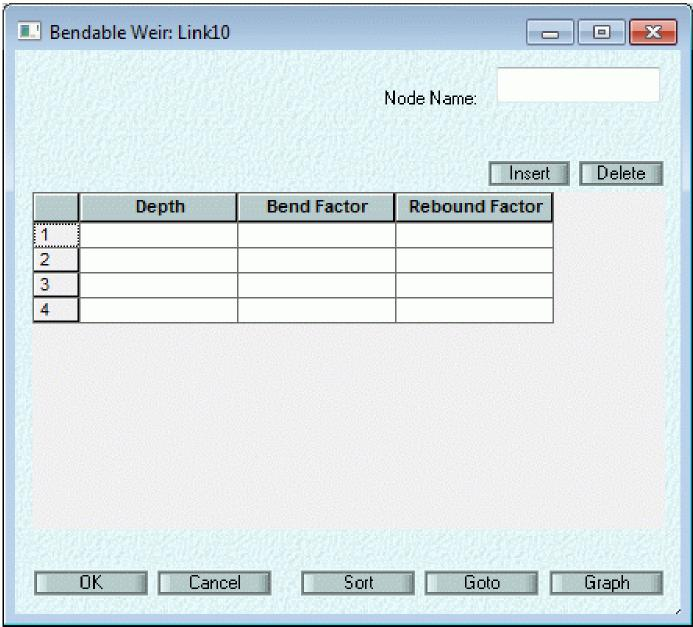
>
> 539
>
> xpswmm Reference Manual
>
> ***Node Name***
>
> This is the name of the node whose depth controls the flow over the weir. If this name is left blank the upstream node is used by default.
>
> ***Depth***
>
> This is the depth of flow in the "Node Name" above.  
> ***Bend Factor***
>
> This factor (0 or 1) determines whether or not the weir will bend at this depth. A value of 1 indicates flow over the weir. A value of 0 indicates no flow.
>
> ***Rebound Factor***
>
> This factor (0 or 1) determines whether or not the weir will "bounce back" after being bent. A value of 1 indicates the weir stays down and does not rebound.
>
> **Regulator Link/Inflatable Weir**
>
> Use this option to control the flow through a conduit according to the depth in a given node. If this option is selected a conduit must also be selected within the same multi-link.
>
> 
>
> ***Node Name***
>
> Enter the name of the node which will control the flow in this conduit. The depth at this node will be used to control the flow according to the adjacent table. This node may be anywhere in the system.
>
> ***Depth Vs Multiplier***
>
> This table is a look-up table to determine the multiplier to use for the flow in the link. The depth at the nominated node is used to look up this table to determine the appropriate multiplier to apply to this conduit.
>
> 540
>
> SECTION 9: LINKS
>
> **Hydraulic Brakes**
>
> The hydro brake uses the most basic laws of physics and fluid mechanics and how they relate to the natural spiraling action within a vortex. The energy of the water rushing into the hydro brake and the rate of the flow is throttled or slowed. Data for the hydro-brake is entered via the Hydraulic Brakes Global Database.
>
> **User Defined Weir**
>
> A User Defined Weir can be specified by entering a weir length, exponent and discharge coefficient for a series of corresponding depths.
>
> 
>
> ***Depth***
>
> This is the depth of flow above invert of conduit.
>
> ***Length***
>
> This is the length of weir sill at the adjacent depth.
>
> ***Exponent***
>
> This is the weir exponent to use for the sill at the nominated depth.
>
> ***Discharge Coefficient***
>
> This is the discharge coefficient to use at the nominated depth.
>
> **Special Pump (Pump Type 5)**
>
> A Pump 5 pumping system (the Pump 5 name comes from CH2MHill in Portland) uses a dynamic head pump and a rule curve to modify the behaviour of the dynamic head pump based on the depth at either an adjacent or nonadjacent node. The flow through the pump will always be the minimum of the flow calculated by the dynamic head pump and the flow calculated using the special pump. If this option is selected a dynamic head pump must also be entered within the current multi-link.
>
> 541
>
> xpswmm Reference Manual
>
> 
>
> ***Node Name***
>
> Enter the name of the node that will control the flow in this conduit. The depth at this node will be used to control the flow according to the adjacent table. This node may be anywhere in the system.
>
> ***Depth Vs Flow***
>
> This table of depth at the nominated node versus flow in the special pump is used to determine the flow through this pump. The depth in the nominated node is used to look up the corresponding flow.
>
> ***Omega***
>
> This is the weighting factor for the pump start-up and stop. It is used to dampen the start-up or shut down. Its range must be between 1 and 2 with 1.12 the recommended value.
>
> **Internal Rating Curve**
>
> Select this item to define an internal rating curve for a diversion.

542

> SECTION 9: LINKS
>
> 
>
> ***Depth Vs Flow -***
>
> This table is used to look up the flow in this conduit for given depths in the upstream node. During simulation the upstream node depth is used to look up the corresponding flow in the conduit.
>
> By default the depth used by rating curve uses the difference between the water elevations at the upstream and downstream nodes. To use the depth in the upstream node only, use the Configuration Parameter USE_US_RC.
>
> **Other**
>
> This item is used to enter data for special diversion types that have not yet been made available explicitly in the interface. Examples of such diversions and how to input the diversion data into the Special Diversion dialog is shown below.
>
> The data entered in the underlying dialog will depend on the type of diversion being entered. As no user error or warning notifications will be produced by the engine if inappropriate data is entered extra care must be taken when using this option.

xpswmm Reference Manual

> 

Note: Special Diversion reporting data will be listed within the \*.out file and it is recommended that this be checked to ensure the correct application of the given diversion.

***Column \#1 - Column \#4***

The meaning of these Columns will depend on the diversion type selected.

***Factor \#1 - Factor \#3***

The meaning of this factor will depend on the diversion type selected.  
***Type Number***

When a new diversion type is added to the engine a four digit number will be allocated to that diversion type. This number must be entered in this field.

**Other Special Diversion Examples:**

**Modeling Seepage Losses from a Storage Node in the Hydraulics Layer**

**Pump discharge Pipes (Force Mains)**

**Variable Speed Pumps**

**Pump Check Valves**

**Valves with Head Loss**

544

> SECTION 9: LINKS
>
> **9.2.2 Runoff Layer**
>
> **Runoff Layer Multiple Conduit and Diversion Link Data**
>
> A diversion in Runoff is a special type of link object shown in a network as a dashed line. This special link dialog is used to enter multiple conduits and/or conduits with orifices and/or conduits with weirs between the same pair of nodes.
>
> In Runoff a weir or orifice is a modification to the outflow characteristics of a modelled channel. The weir/orifice is a control structure attached to the bottom end of the conduit. Runoff supports two different types of diversions -
>
> **Conduits with an Orifice  
> Conduits with Weirs**
>
> 
>
> Multiple conduits may be entered by enabling the Conduit checkbox and entering an appropriate name (up to 10 alpha-numeric characters). These conduits are fully described in the section on Single Conduit Link Data
>
> ***Conduit with Orifice Flag***
>
> Flag enabling a Conduit with Orifice . If this flag is set a unique name must be entered for the conduit. In Runoff an orifice is a control structure at the downstream end of a conduit.
>
> ***Conduit with Weir Flag***
>
> Flag enabling a Conduit with Weir . If this flag is set a unique name must be entered for the conduit. In Runoff a weir is a control structure at the downstream end of a conduit.
>
> Runoff uses a non-linear reservoir method of conduit routing. Flow routing is performed by coupling the continuity equation with Manning's equation to produce a non-linear reservoir; the procedure is entirely analogous to that for overland flow. Since the conduit acts as a reservoir with water surface parallel to the invert, inflows are automatically "distributed" along its length. This may lead to considerable flattening of a hydrograph peak when routed through a cascade of conduits. No backwater effects can be simulated.
>
> If groundwater is simulated then the stored channel water may affect the groundwater flow via the tailwater flow equation. Open conduits such as trapezoidal, parabolic, and natural sections also lose water through evaporation.
>
> **Save Results for Review**
>
> Save results for the conduit for later graphical post-processing. This option is provided locally for conduit node to allow minimizing of the intermediate results files generated, which can be quite large. This flag is over-ridden by the Save ALL Results for Review flag in Job Control.

545

> xpswmm Reference Manual
>
> **Runoff Print Control**
>
> Runoff print control parameters for a conduit.
>
> 
>
> **Print Inflows and Concentrations (M3 - IPRNT)  
> Print Outflows and Concentrations (M3 - IPRNT)  
> Print Channel Depths**
>
> **Save Results for Review**
>
> **Print Conduit Depths (M4 - MDEEP)  
> **This flag will output flow depths for the conduit.
>
> **Print Inflows and Concentrations (M3 - IPRNT)**
>
> Print total inflows to the channel/pipe and the outflow concentrations. All printed values are instantaneous at the end of the preceding time step. Zero flows are omitted to avoid voluminous output in long simulations.
>
> **Print Outflows and Concentrations (M3 - IPRNT)**
>
> Print total outflows to the channel/pipe and the outflow concentrations. All printed values are instantaneous at the end of the preceding time step. Zero flows are omitted to avoid voluminous output in long simulations.
>
> **Orifice**
>
> **Orifice Area (G2 - SPILL)**
>
> Cross sectional area of the outflow orifice, ft \[m\].
>
> **Discharge (G2 - WDIS)**
>
> Discharge coefficient for the orifice.  
> **Orifice Height (G2 - WELEV)**
>
> Height of the geometric centreline of the orifice from the bottom of the conduit, ft \[m\]. The orifice height may be used to store water in a conduit.
>
> **Runoff Orifice Diversions**
>
> In Runoff an orifice is a control structure at the bottom of a conduit which affects the outflow characteristics of the conduit. Data must be entered for both the orifice and the conduit.

546

> xpswmm Reference Manual
>
> 
>
> The weir is defined in terms of its Length **, Height** and Discharge Coefficient**. Conduit Data** must also be entered.
>
> The broad-crested equation used is:
>
> Q = C . L . (H - Hc)^1.5
>
> where
>
> Q = outflow, cfs \[cms\]
>
> C = weir coefficient, ft^0.5/sec \[m^0.5/sec\]
>
> L = weir length, ft \[m\]
>
> H = hydraulic head, ft \[m\]
>
> Hc = weir crest depth, ft \[m\]
>
> **V-notch Angle (G2 - SPILL)**
>
> Angle, in degrees, of the notch opening in a V-notch weir.
>
> **V-notched Weir**
>
> This option uses a V-notch weir control structure at the bottom of the conduit. A weir equation is used to control the outflow from the conduit instead of Manning's equation. The triangular opening of a V-notch weir is assumed to have no upper limit.

548

> SECTION 9: LINKS
>
> 
>
> The weir is defined in terms of its:
>
> **Angle,**
>
> **Height,** and
>
> **Discharge Coefficient.**
>
> Conduit Data must also be entered.
>
> The equation for V-notch weirs used is:
>
> Q = C . TAN(A/2) . (H - Hc)^2.5
>
> where
>
> Q = outflow, cfs \[cms\]
>
> C = weir coefficient, ft^0.5/sec \[m^0.5/sec\]
>
> A = angle of notch (angle of opening), degrees
>
> H = hydraulic head, ft \[m\]
>
> Hc = weir crest depth, ft \[m\]
>
> **Weir Discharge Coefficient (G2 - WDIS)**
>
> Discharge coefficient of the weir. Note that this parameter is shared for both rectangular and triangular weir options.
>
> **Weir Length (G2 - SPILL) -**
>
> Length of rectangular broad-crested weir (eg. width of spillway), ft \[m\].
>
> **Weir Height (G2 - WELEV) -**
>
> Height of weir crest from bottom of conduit, ft \[m\]. The weir height may be used to store water in a conduit.
>
> **Weir Sill Height (G2 - WELEV)**
>
> Height of bottom of V-notch from bottom of conduit, ft \[m\]. The weir height may be used to store water in a conduit.
>
> **9.2.3 Sanitary Layer**
>
> **Sanitary Layer Multiple Conduit and Diversion Link Data**
>
> 549
>
> xpswmm Reference Manual
>
> A diversion in the Sanitary layer is a special type of link object shown in a network as a dashed line. This special link dialog is used to enter multiple conduits and/or conduits with orifices and/or conduits with weirs between the same pair of nodes.
>
> The Sanitary layer supports two different types of diversions -
>
> **Pump**
>
> **Weirs**
>
> 
>
> Multiple conduits may be entered by enabling the Conduit checkbox and entering an appropriate name (up to 10 alpha-numeric characters). These conduits are fully described in the section on Single Conduit Link Data
>
> **Pump Flag**
>
> If the pump flag is set a unique name must be also be entered for the pump, in addition to the pump data. The pump data is not shared with that from Hydraulics layer (mode) and is also simplified. However, the pump flag is shared.
>
> **Sanitary Layer Print Control**
>
> This dialog controls the conduit output generated in the output text file during the simulation. The printout occurs at the end of the simulation.
>
> 
>
> 550
>
> xpswmm Reference Manual
>
> If multiple weirs exist along the link, the threshold flow calculations for higher weirs must take into account the diversions already occurring in lower weirs. These data entry requirements may seem tedious, but are required due to the simpler nature of Sanitary layer weirs as compared to Hydraulics layer weirs.
>
> The data requirements for a TRANSPORT Weir are its Crest Height **, Length , Discharge Coefficient** and the description of any **Inflow before Weirflow**
>
> **Gauged Data**
>
> **Inflow before Weirflow**
>
> The total flow at the upstream node before flow occurs over the weir, cfs \[cms\]. This flow corresponds to a node flow depth equal to the weir crest height. You must perform this calculation yourself, since the Sanitary layer does not explicitly maintain node flow depths. The weir is thus treated as a flow diversion structure.
>
> **Weir Crest Height**
>
> The height of the weir, before flow over the weir, ft \[m\].
>
> **Weir Length**
>
> The length of a broad-crested weir, ft \[m\].
>
> **Discharge Coefficient**
>
> The discharge coefficient used to compute flow over a broad-crested weir.
>
> **Pump**
>
> **Sanitary Layer Pump Diversion**
>
> The pump has a constant pumping rate between certain depths. The pump begins operating from empty when the depth within it exceeds the first depth. If the depth then exceeds a second value, a second flow rate will apply until the depth drops below that value. The pump then continues to operate at the first flow rate until the depth drops below a stopping level.
>
> 
>
> ***Depth for Q1***
>
> Depth at which the first pumping rate begins, ft \[m\].

552

> SECTION 9: LINKS
>
> ***Depth for Q2***
>
> Depth at which the second pumping rate begins, ft \[m\].
>
> ***Pump Rate 1 (Q1)***
>
> Pumping rate when the water depth within the pump exceeds the first depth, but is less than the second depth, in cfs
>
> \[cms\]. This rate applies while the depth is below the second depth and the pump is still operating.
>
> ***Pump Rate 2 (Q2)***
>
> Pumping rate when the water depth within the pump exceeds the second depth, in cfs \[cms\]. This rate applies only
>
> while the depth exceeds the second depth.
>
> ***Stop Pumping Depth***
>
> The depth below which all pumping stops, ft \[m\].
>
> ***Average Cross-Section Area***
>
> The average cross-sectional area of the pump well used to determine the pump well volume, ft'2 \[m'2\].
>
> **Gauged Data**
>
> **Los Angeles County (F0601)**
>
> **Los Angeles County Link Data**
>
> 

xpswmm Reference Manual

**Los Angeles County Diversion Data**

> 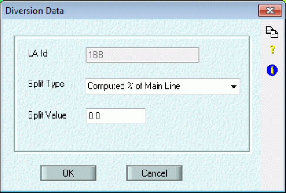

554

> ***SECTION 10: JOB CONTROL  
> *Job Control**
>
> This command allows the management of Control Data associated with the specific mode. The data is global and not specific to any individual object.
>
> The Job Control parameters differ for each of the 3 modes **Runoff, Sanitary**, Hydraulics, and for 2D hydraulic models.
>
> **10.1 Hydraulics Mode**
>
> **Hydraulics Mode Job Control**
>
> The Job Control facility is for data that is not specific to any node or link, but is required to control the simulation run. A full description of the parameters used by the Hydraulics Layer follows.
>
> 
>
> Job Control data consists of the:
>
> **Title**
>
> **Simulation Tolerances**
>
> **Routing Control**
>
> **Modify Conduits**
>
> **Junction Defaults**
>
> **Output Control**
>
> **Gauged Pollutants**
>
> **Hot Re-start**
>
> **Pollutant List**
>
> **Design Constraints**
>
> **Evaporation**
>
> **Save Results for Review**
>
> **Run Hydrology/Hydraulics Simultaneously**
>
> xpswmm Reference Manual
>
> **Time Control**
>
> The Title and the Simulation control fields are optional. Time Control data are required. **Title (ALPHA)**
>
> Description for simulation run (2 lines - 80 characters maximum). This will be printed as the title in the output file. The first line is common for all layers; the second line is specific to the Hydraulics layer.
>
> **Save ALL Results for Review**
>
> This flag will save all the results for nodes and conduits from analysis to a special file for later graphical post-processing.
>
> **Gauged Pollutants**
>
> 
>
> This flag and the associated dialog allows the definition of the list of pollutants to be used in the Gauged Pollutant List. If this flag is OFF, no gauge pollutants are shown. If this flag is ON, a list of pollutants is selected from the list of gauged pollutants shown in the Pollutants Global Database.
>
> The pollutants to be used are chosen from those defined in the Pollutants Global Database. Any number of pollutants may be defined. To add a pollutant to the "Use Pollutants" list, highlight the pollutant required in the Pollutant List (left-hand list), then select the "Add" button. To remove a pollutant from the list select the pollutant you wish to delete from the "Use Pollutants" list (right-hand list), then select the "Delete" button.
>
> The pollutant load and concentrations may be generated in the Hydraulics, Runoff or Sanitary Layer, or read in from an interface file.
>
> **Pollutant List**
>
> Select the pollutants to be added to or deleted from the current simulation run.
>
> 556
>
> xpswmm Reference Manual
>
> 
>
> **Hot Restart (REDO)**
>
> A hot restart facility allows a file to be read and/or created to establish initial conditions for a run. This may avoid rerunning of, for example, dry-weather flow conditions prior to the start of a storm runoff simulation.
>
> The user can create a hot start file from a normal run or from a previous hot start run. Only one hot start file can be created.
>
> 
>
> ***Start Cold, Create Hot-Start File***
>
> If this option is selected then the model does not use a hot restart file to set initial conditions and creates a hot restart file for the next simulation run.
>
> ***Start Hot Using Hot-Start File***
>
> If this option is selected then the model uses a hot start file to set initial conditions and does not create a new hot restart file for the next simulation run.
>
> ***Start Hot, Create New Hot-Start File***
>
> If this option is selected then the model uses a hot restart file to set initial conditions and then creates a new hot restart file for the next simulation run.

558

> SECTION 10: JOB CONTROL
>
> **Time Control**
>
> **Time Control**
>
> The Time Control section of the Hydraulic Job Control contains the following time control input fields. ***Simulation Start Time (TZERO)***
>
> Start and end of the simulation are defined by entering the year month, day, hour, minute and second. For the Simulation Start Time (TZERO), enter the starting date and time of the simulation.
>
> ***Simulation End Time (TSL)***
>
> For the Simulation End Time (TSL), enter the ending date and time of the simulation.
>
> While it is only necessary to enter the last two digits of the year it is good practice to use four digits to remove any year 2000 ambiguity.
>
> ***Simulation Time Step (DELT)***
>
> The simulation Time Step (DELT) is input as **seconds** into the Time Control section of the Hydraulic Job Control and discussed further in the Time Step (DELT) section. The simulation results values calculated at the simulation Time Step are reported in the \*.out file and in XP-Tables.
>
> ***Save Results Every (SAVERES)***
>
> The Save Results Every time step can be input as either seconds or minutes and is the time step used to produce the hydrographs reported in Review Results, Dynamic Long Section and Dynamic Section Views. The hydrographs produced for Review Results, Dynamic Long Section and Dynamic Section Views only report data points at the time interval selected in Save Results Every. The Save Results Every time step will be larger than the simulation Time Step and will produce hydrographs with fewer points than what is calculated in the simulation. This will cause the reported peak results values in Review Results, Dynamic Long Section and Dynamic Section Views to be less than the actual peak values taken from the entire simulation, which are reported in the \*.out file and within XP-Tables.
>
> **Time Step (DELT)**
>
> The length of the time step in seconds. Dynamic wave models run best between 1 & 2 times the Courant time step. Since the velocity, area, and depth of flow in a conduit varies with time, the time step should be adjusted dynamically during the simulation. A fixed time step model will not allow for the necessary reduction in time step required to ensure stability unless a small time step guaranteed to be lower than any possible required time step is used.
>
> This version of xpswmm uses a variable time step. The time step entered is the maximum allowable time step that the program will use during the simulation. The program will select the current time step and iterate to a converged solution taking into account the under-relaxation parameter, omega. The solution is expected to converge in any given time step, provided at least 50 to 100 time step iterations \[MFAIL\] are allowed by the user.
>
> The time step specified here has little effect on the stability of the simulation run provided you do not force a very short time step. The time step should be selected according to the following guidelines:

1)  An excessive number of iterations at a junction is a sure indication that the time step you have chosen is too large and that for optimal results the largest time step (DELT) should be reduced.

2)  The summary printout lists the average time step used during the simulation. You may use this as a basis for selecting a new time step. For example, having selected a target time step of 30 seconds you find that the average time step was approximately 17 seconds. A better target time step may be 15 seconds because the solution will converge faster and the simulation run time will be reduced.

3)  The summary printout lists the average number and total number of iterations at each node. Nodes with a high number of iterations should be investigated and may indicate a problem.

> The model will select the current time step based on the smallest conduit Courant time step at the beginning of each long time step. It then determines the number of equal length small time steps required to equal the length of the long time steps.

559

> xpswmm Reference Manual
>
> During the simulation the model will check each conduit for the surface wave criterion and adjust the time step used accordingly using the value of ratio which is the ratio
>
> ratio =  t \* (gD/L)^1/2  
> for enclosed conduits, and
>
> ratio =  t \* (gA/T /L)^1/2  
> for open channels,
>
> where  t = the time-step,
>
> g = acceleration due to gravity,
>
> D = conduit height or pipe diameter,
>
> A = maximum cross sectional area,
>
> T = full flow top width, and
>
> L = conduit length.
>
> Numerical accuracy constraints in the Hydraulics Mode require that the time step specified under Job Control be no longer than the time it takes for a dynamic wave to travel the length of the shortest conduit in the transport system.
>
> This check should result in a saving in computation time and a higher degree of stability for a given situation. This solution technique is described in detail in the theory section of this manual.
>
> **Start Year (B1 - IYRSTR)**
>
> Year of start of simulation. Enter only the last two digits of the year.
>
> **Start Month (B1 - MONTH)  
> **Month of start of simulation.
>
> **Start Day (B1 - NDAY)  
> **Day of start of simulation.
>
> **Start Hour (B1 - NHR)  
> **Hour of start of simulation.
>
> **Start Minute (B1 - NMN)  
> **Minute of start of simulation.
>
> **Start Second (B3 - LONG)  
> **Second of start of simulation.
>
> **Stop Year (B3 - LONG)**
>
> Year of end of simulation. Enter only the last two digits of the year.
>
> **Stop Month (B3 - LONG)  
> **Month of end of simulation.
>
> **Stop Day (B3 - LONG)  
> **Day of end of simulation.
>
> **Stop Hour ( B3 - LONG)  
> **Hour of end of simulation.
>
> **Stop Minute (B3 - LONG)**

560

> SECTION 10: JOB CONTROL
>
> Minute of end of simulation.
>
> **Stop Second (B3 - LONG)  
> **Second of end of simulation.
>
> **Simulation Tolerances  
> Simulation Tolerances**
>
> 
>
> The following tolerances may be used to control the simulation:
>
> **Flow Tolerance**
>
> **Head Tolerance**
>
> **Minimum Orifice Length**
>
> **Default Head Loss Coefficient**
>
> **Default Contraction Loss  
> Flow Tolerance**
>
> The iterative solution technique uses an under-relaxation technique to solve the dynamic flow equation and continuity equation. The convergence criterion for this method is related to the maximum number of iterations and relative accuracy, specified in the Job Control dialog.
>
> This is the convergence criterion used during flow iterations. If the difference in both conduit flow and cross-sectional area between successive iterations is less than this value (SURTOL) and the number of iterations is less than the maximum allowable (ITMAX), then convergence is deemed to have occurred. The convergence error for flow is given by:
>
> Error = (Qnew - Qold) / Qnew
>
> where Qnew = Current iteration value of flow in the conduit,
>
> Qold = Previous iteration value of flow in the conduit,
>
> Typical values used in simulations are 0.001 to 0.005. Conduits that appear to have small instabilities in flow or velocity can be fixed by using a smaller flow tolerance.
>
> The flow convergence is tested for all CONDUITS, WEIRS, ORIFICES, PUMPS, and OUTFALLS in the model.
>
> **Head Tolerance**
>
> This is the convergence criterion used in the continuity equation at junctions. If the difference between successive iterations of junction depth is less than this value (SURJUN) and the number of iterations is less than the maximum allowable (ITMAX), then convergence is deemed to have occurred. The convergence error for junction depth is given by:
>
> 561
>
> xpswmm Reference Manual
>
> Error = (Ynew - Yold) / Ycrown
>
> where Ynew = Current iteration value of depth at the junction,
>
> Yold = Previous iteration value of depth at the junction,
>
> Ycrown = Total depth of the junction, ground - invert elevation.
>
> Typical values used in simulations are 0.001 to 0.005.  
> **Minimum Orifice Length**
>
> The minimum orifice length in m(ft) for creating an equivalent circular or rectangular conduit for orifices. Typical values are 100 m to 300 m.
>
> **Default Head Loss Coefficient**
>
> The junction head loss coefficient. This multiplier of the velocity head applies both to entrance and exit losses at a junction. The loss is actually modelled in the conduit momentum equation since only a continuity equation is used at the junctions. This coefficient is global and applies to all conduits, unless a value is also entered in the special conduit dialog for that conduit.
>
> **Default Contraction Loss**
>
> The abrupt cross section shape change from one conduit to the next creates turbulence. The loss in velocity from this change can be modelled by using a contraction/expansion loss coefficient. This coefficient is global and applies to all conduits unless a value is also entered in the special conduit dialog.
>
> **Routing Control**
>
> **Routing Control (B0, B2)**
>
> By selecting Routing Control you may control the stability of the model results and the speed of execution of the run. This dialog contains the normalised tolerances the program uses to decide whether a conduit or junction has achieved convergence.

562

> xpswmm Reference Manual
>
> The Iterative Method uses a variable time step. The time step entered by the user in the Job Control Dialog is set as the maximum allowable time step used during the simulation. The model will select a time step based on the smallest conduit Courant time step at the beginning of each long time step. The model then determines the number of equal length small time steps required to equal the long time steps. This results in a saving in computation time and a higher degree of stability for a given situation.
>
> **Under Relaxation Parameter (OMEGA)**
>
> The under relaxation parameter used during the simulation. It typically has values between 0.60 and 0.85 and should be used in conjunction with the Time-weighting factor (THETA) to minimise hunting and seeking behaviour. The parameter is used in the following way in the program:
>
> Newest = New \* omega + (1-omega)\*Old
>
> where Old = Value at previous iteration,
>
> New = New iteration value, and
>
> Newest = Weighted new value after under-relaxation.  
> **Time Weighting Parameter (THETA)**
>
> The implicit time weighting for all conduits. Typically, this parameter should have a value between 0.55 and 1.0. This parameter is used to decrease the oscillations in hunting and seeking.
>
> **Conduit Roughness Factor (FMAX)**
>
> A global adjustment to conduit roughness. Used as an aid in calibration of your model. The conduit roughness is multiplied by this factor (i.e. a value of 1.20 increases the roughness by 20 percent). The default value = 1.0, or no change.
>
> **Flow Adjustment Factor (QREF)**
>
> A global adjustment factor for all flows from the interface file and user-defined time series. This allows the user to globally alter the inflows to the model by a constant factor.
>
> **Initial Condition Smoothing (ISMTH)**
>
> Instead of using a hot start file to make the initial conduit conditions smoother it is now possible to use a new parameter, ISMTH, to dampen oscillations arising from the choice of initial conditions. This parameter works as follows:
>
> ISMTH = 0 All conduits use their normal roughness.
>
> ISMTH \> 0 All conduits have their roughness increased by a factor of ten for ISMTH time steps.
>
> The increase in roughness has a dampening effect on the potential buildup of initial transients. Typical values of ISMTH would be 10 to 100 time steps.
>
> **Minimum Courant Time Step Factor (FMIN)**
>
> As part of the solution the model calculates the minimum courant time step at each big time step based on the previous conduit depth and velocity. The time step used in the model is based on the calculated courant time step multiplied by the courant time factor. The default time step factor is 1.0, and typical values are 0.5 to 3.0.
>
> **Max. Time Step Iterations**
>
> The maximum number of iterations allowed during a time step. Typically, the maximum number should be 50 to 100. If convergence is not achieved by this number of iterations then the model moves on to the next time step and accepts the last value computed.
>
> **Report Non-Convergence**
>
> By selecting this option the model will display, during run-time, those junctions that fail to reach convergence by the time the maximum number of iterations it reached. The model reports to the screen the junction name and the junction heads of the current and previous iteration. If no junctions are reported then all junctions reached convergence.
>
> **Routing Method**
>
> 564
>
> SECTION 10: JOB CONTROL
>
> Several options are provided for the flow routing method as follows:  
> **Dynamic Wave**
>
> This option implements all terms in the St Venant equations as discussed in the theory section of this manual and automatically adjusts the time step as mentioned above. This option is the default method and is recommended where there is any chance of a backwater effect in the system or where tidal boundary conditions are being modelled.
>
> **Kinematic Wave**
>
> This option implements a sub-set of the dynamic wave option above and is discussed in the theory section of this manual. The kinematic wave method does not allow for backwater effects or modelling of tidal boundary conditions.
>
> **Version 4 Solution**
>
> By selecting Version 4 Solution you may -

1)  Select one of the three different solution techniques offered by SWMM 4 - EXTRAN (ie. Explicit, Enhanced Explicit and Iterative Explicit).

<!-- -->

3)  Determine when EXTRAN will use the assumption of NORMAL flow.

> 
>
> SWMM Version 4 EXTRAN includes three different solution techniques to the gradually varied, one-dimensional unsteady flow equations for open channels. They can be used by selecting one of the buttons presented above. A complete description of the solution methods is available in the EXTRAN Addendum of the US-EPA SWMM 4 User Manual.
>
> The three techniques are the -
>
> Explicit (default)
>
> Enhanced Explicit (more stable, ie. longer time step allowed)
>
> Iterative Explicit (combined Implicit/Explicit solution using a variable time step)
>
> **Model Selects Normal or Dynamic Flow**
>
> **Model Selects Normal Flow When in Supercritical State  
> Explicit Solution (ISOL=0)**
>
> The Explicit method is the default solution technique for the gradually varied, one-dimensional unsteady flow equations for open channels. This method is fully described in Appendix A of the US-EPA SWMM-4 EXTRAN Addendum.
>
> The Explicit method uses the Modified Euler technique to arrive at a solution to the St Venant equations. The modified Euler method yields a totally explicit solution in which the motion equation is applied to discharge in each link and the continuity equation to head at each node, with implicit coupling during the time step.
>
> **Enhanced Explicit Solution (ISOL=1)**
>
> The Enhanced Explicit solution differs from the default Explicit solution in the representation of the gradually varied, one-dimensional unsteady flow equations for open channels. The main advantage of this technique over the default Explicit method is an increase in the stability of the calculations. Consequently the user may select longer time steps for the simulation with a corresponding saving in computation time. This method is fully described in Appendix A of the EXTRAN Addendum of the US-EPA SWMM-4 manual.
>
> The Enhanced Explicit method uses the same solution technique as the Explicit method, that is the Modified Euler technique, to arrive at a solution to the St Venant equations. The modified Euler method yields a totally explicit

565

> xpswmm Reference Manual
>
> solution in which the motion equation is applied to discharge in each link and the continuity equation to head at each node, with implicit coupling during the time step.
>
> **Iterative Explicit Solution (ISOL=2)**
>
> The Iterative Explicit solution technique uses an under-relaxation iterative matrix technique to solve the dynamic flow equations. The convergence criterion for this method is related to the maximum number of iterations and relative accuracy specified in the Job Control dialog.
>
> Convergence is deemed to be satisfied if, within the maximum number of iterations specified, successive iterations yield results within the tolerance specified by the relative accuracy.
>
> The Iterative method uses a variable time step. The time step entered by the user in the Job Control Dialog is set as the maximum allowable time step EXTRAN should use during the simulation. EXTRAN will select a time step based on the smallest conduit Courant number at the beginning of each long timestep. EXTRAN determines the number of equal length small time steps required to equal the long time steps.
>
> This should result in a saving in computation time and a higher degree of stability for a given situation. This solution technique is described in full in Appendix C of the EXTRAN Addendum of the US-EPA SWMM-4 manual.
>
> **Model Selects Normal Flow When in Supercritical State**
>
> If this option is selected then EXTRAN uses the Froude number to determine the switch to Normal (supercritical) flow. When the Froude number exceeds 1.0 the conduit Normal flow is calculated from Mannings equation.
>
> **Model Selects Normal or Dynamic Flow**
>
> If this option is chosen then Normal (supercritical) flow is assumed when all of the following conditions occur -

- Flow is positive

- Water surface slope is less than the conduit slope

- The flow calculated by the Manning equation is less than the flow calculated using dynamic flow equations.

> **Modify Conduits**
>
> **Conduit Equivalencing (Modify Conduits)**
>
> The user can modify the pipe length and roughness below or above limits specified in this dialog box. The model will automatically create an equivalent longer or shorter pipe for the affected conduits.
>
> 
>
> The user specifies the minimum and maximum length below or above which the model will create equivalent pipes. This can be limited to modifying Manning's n only and/or the full extent of pipe hydraulic characteristics.
>
> Options available include:
>
> **Preprocesses 'n' Only**
>
> **Minimum Conduit Length for Modification**
>
> **Maximum Conduit Length for Modification**
>
> 566
>
> SECTION 10: JOB CONTROL
>
> **Program Changes Pipe Characteristics Equivalent to Time Step Factor**
>
> **Background Information**
>
> **Background Information (Modify Conduits)**
>
> An equivalent pipe is the computational substitution of an actual element of the drainage system by an imaginary conduit which is hydraulically identical to the element it replaces (except for volume). Usually, an equivalent pipe is used when it is suspected that a numerical instability will be caused by the element of the drainage system being replaced in the computation.
>
> Weirs and short conduits are known at times to require short time steps and thus may occasionally be replaced by an equivalent pipe. Orifices are automatically converted to equivalent pipes by the model.
>
> The equivalent pipe substitution used by the model involves the following steps. First the flow equation for the element in question is set equal to the flow equation for an "equivalent pipe". In effect, this says that the head losses in the element and its equivalent pipe are the same. The length of the equivalent pipe is computed using the numerical stability equation.
>
> Then, after making any additional assumptions, which may be required about the equivalent pipe's dimensions, a Manning's 'n' is computed based on the equal head loss requirement. In the case of orifices, this conversion occurs automatically, but in those cases where short pipes or weirs are found to cause instabilities, the user must make the necessary decision and select the appropriate equivalent pipe option.
>
> The desired equivalent pipe length is either no shorter than one quarter or 1/5 of the length of the longest pipe in the system, or large enough to give a delta tc within the range indicated above. Through experience, the user will be able to determine the pipe length changes required to achieve the desired result and an acceptable time-step for the simulation.
>
> By choosing a value of 1.0 for the equivalent pipe option the model will automatically adjust the pipe or channel lengths using an equivalent longer length to achieve a delta tc in balance with the user-selected time-step (delta t). All pipes in which (delta t)/(delta tc) exceeds 1.0 will be adjusted, with the new pipe/channel lengths and roughness printed.
>
> When a value greater than 1.0 is used an equivalent pipe or channel length will be created based on this value (in seconds). For example, specifying a value of 15 will create an equivalent pipe based on a time step of 15 seconds. A before and after analysis of the full flow-system volume is printed by the model for values greater than 1. This enables the user to estimate the effect of the increase in system volume from using equivalent pipes or channels.
>
> **Preprocesses 'n' Only (NEQUAL)**
>
> When this option is set the model modifies the Manning's n value for all pipes that are below the minimum or above a maximum threshold set in adjacent fields in this dialog box.
>
> **Minimum Pipe Length for Modification (NEQUAL)**
>
> Minimum pipe length below which the model will make equivalent pipe assumptions by modifying Manning's n and/or pipe characteristics to optimise stability for particular time steps.
>
> **Maximum Pipe Length for Modification (NEQUAL)**
>
> Maximum pipe length above which the model will make equivalent pipe assumptions by modifying Manning's n and/or pipe characteristics to optimise performance for particular time steps.
>
> **Equivalent to Time Step Factor (NEQUAL)**
>
> When this option is set the model modifies the pipe characteristics for pipes that have a Courant time step below the value set in the adjacent field in this dialog box. The characteristics are optimised for particular time step ratios to improve performance.
>
> **Junction Defaults**
>
> **Junction Defaults**
>
> Default values relating to junctions such as depth and ponding area volume parameters.
>
> 567
>
> xpswmm Reference Manual
>
> 
>
> **Default Junction Surface Area  
> Minimum Junction/Conduit Depth  
> Ponding Area**
>
> **Default Node Surface Area (AMEN)**
>
> This is the default surface area for all manholes in ft2 (or m2). It is used for surcharge calculations in the model. The manhole default diameter is 4ft (or 1.22m).
>
> **Minimum Junction/Conduit Depth**
>
> Enter the smallest allowable junction and conduit depth (feet or metres).  
> **Ponding Area**
>
> This is used to define the mechanism used for junction flood storage. The default mechanism is for surcharged water that breaks the ground surface to be lost from the network. However, using this option will store the flooded water at this node until the conduit can handle the excess amount of water.
>
> The coefficient used in the exponential equation for the ponded area of the flooded junction has a typical value of 1,000 to 5,000.
>
> The exponent used in the exponential equation for the ponded area of the flooded junction has a typical value of 1.0 to 5.0.
>
> **Design Constraints**
>
> **Design Constraints**
>
> Use this option to allow xp to select pipe sizes based on user defined criteria. Units are m or ft.
>
> **Available pipes**
>
> The options for design are:

- No Design  pipe diameters are not changed

- Diameters are selected base on a maximum % of depth

- Minimum freeboard and cover (m or ft)

> SECTION 10: JOB CONTROL
>
> 
>
> **Available Pipes**
>
> Use this dialog to define the catalog of pipe diameters to be used during conduit design, units are (m) for metric and (ft) for US Customary design.
>
> 
>
> xpswmm Reference Manual
>
> **Output Control  
> Output Control**
>
> 
>
> **Starting Printout Time Step Intermediate Interval**
>
> **Summary Interval**
>
> **Echo Natural Section Data**
>
> **Starting Time Step for Print Cycle (NSTART)**
>
> This is the cycle number at which the intermediate printout facility will begin its output. Intermediate printouts will then be continued at intervals specified below. The starting printout is a hold-over from previous versions of EXTRAN and was used for an intermediate review of the model in a search for the source(s) of problems.
>
> **Intermediate Print Cycle Interval (INTER)** This value is specified as a number of cycles.
>
> This is the interval between intermediate print cycles during the simulation. The intermediate printouts start at the cycle specified in the start print field and are repeated at intervals specified by this value.
>
> This value controls the interval at which heads, velocities, and flows are printed during the simulation (intermediate printout), beginning at the starting time step specified above (NSTART). Surcharge information during the simulation is also printed at these intervals.
>
> Intermediate printout is produced for all junctions and conduits, whereas the summary printouts are only produced for those specified by the user. The intermediate printout is very useful in case an error occurs before the program reaches its desired simulation length, however it tends to produce bulky output.
>
> If intermediate printout is to be avoided entirely, set this value to a number greater than total number of cycles in the simulation period. Nodal water depth, elevation, conduit flow, and velocity are all printed in the intermediate printout.
>
> The output looks better if the starting cycle for intermediate printouts and this value are selected so that the first and subsequent output occurs at an even number of minutes or half-minutes.
>
> **Summary Print Cycle Interval (JNTER)** This value is specified as a number of cycles.
>
> This is the interval between time-history summary print cycles at the end of the simulation. The number of cycles printed is equal to the total number of cycles in the simulation period divided by this value.
>
> Summary printouts are only produced for those nodes and conduits specified by the user whereas the intermediate printout is produced for all junctions and conduits.
>
> **Echo Natural Section Data**
>
> If this flag is enabled any HEC-2 style conduits that are present in your network will have their Station and Elevation data echoed in the output file.
>
> 570
>
> SECTION 10: JOB CONTROL
>
> **10.2 Runoff Mode**
>
> **Runoff Mode Job Control**
>
> The Runoff Job Control dialog allows the entry of all data which is used to control the Runoff simulation. A full description of the parameters used by Runoff follows.
>
> Move cursor over image and click to view descriptions of the dialogs and options.
>
> 
>
> Note: If the Runoff Mode is not solved, do not check Global Storms.
>
> Job Control data consists of the:
>
> **Title**
>
> **Evaporation**
>
> **Water Quality**
>
> **Snow Melt**
>
> **Regeneration of Horton Infiltration Capacity**
>
> **Time Control**
>
> **Print Control**
>
> **Save Results for Review**
>
> **Gauged Pollutant List**
>
> **Global Storms**
>
> **Rational Formula**
>
> **Title**
>
> The first title line is used across all xpswmm modes.
>
> The second title line, the Runoff Title, is specific to the Runoff mode.
>
> 571
>
> xpswmm Reference Manual
>
> **Save ALL Results for Review -**
>
> This flag will save all the results for nodes and conduits from analysis to a special file for later graphical post-processing.
>
> **Regeneration of Horton Infiltration Capacity**
>
> Flag indicating a regeneration value is required. If this flag is OFF, then no regeneration of infiltration capacity occurs.
>
> For continuous simulation, infiltration capacity is regenerated using the Horton type exponential rate constant equal to REGEN\*DECAY, where DECAY is the Horton rate constant read in for each infiltration Global Database. This flag has no effect if Green-Ampt infiltration is used for a catchment.
>
> **Gauged Pollutants**
>
> 
>
> This flag and the associated dialog allows the definition of the list of pollutants to be used in the Gauged Pollutant List. If this flag is OFF, no gauge pollutants are shown. If this flag is ON, a list of pollutants is selected from the list of gauged pollutants shown in the Pollutants Global Database.
>
> The pollutants to be used are chosen from those defined in the Pollutants Global Database. Any number of pollutants may be defined. To add a pollutant to the "Use Pollutants" list, highlight the pollutant required in the Pollutant List (left-hand list), then select the "Add" button. To remove a pollutant from the list select the pollutant you wish to delete from the "Use Pollutants" list (right-hand list), then select the "Delete" button.
>
> The pollutant load and concentrations may be generated in the Hydraulics, Runoff or Sanitary Layer, or read in from an interface file.
>
> 572
>
> SECTION 10: JOB CONTROL
>
> **Global Storms**
>
> 
>
> **Name**  This field is used in the Review Results display and also in XP Tables**.** Further, this name is appended to the model name when writing the output files, i.e. modelname_globalstormname.out. For this reason it is important to not use any special punctuation or symbols in the name as this can cause issue properly reading/writing the given files.
>
> **Return Period**  This field is used for display purposes only.
>
> **Rainfall**  The Rainfall Global Database record corresponding to the storm to be analyzed.
>
> **Override Multiplier**  The value entered in this field replaces (overrides) the value entered in the Constant Time
>
> Interval dialog of the global database. This value will only be active if the rainfall type is Absolute Depth or Cumulative Depth.
>
> **Multiplier**  The new multiplier for the Absolute or Cumulative Depth.
>
> Note: the maximum number of Global Storms allowed in a single model is 200 for the 2013 version and beyond
>
> **Rational Formula Settings**
>
> 
>
> The Rational Formula data is selected from the Rational Formula settings in the Global Database**.**
>
> 573
>
> xpswmm Reference Manual
>
> **Return Period to Analyze** is the Recurrence Interval of the storm being analyzed.
>
> **Use Partial Areas**, if enabled this option uses the partial area hydrology effects to locate the critical storm duration that produces the maximum peak flow draining to each node. This may result in a storm duration less than the time of concentration for the total catchment above a node, and hence the term partial area. For large contributing areas this approach will generally yield higher peak flows.
>
> If disabled, the program uses a storm duration corresponding to the time of concentration for each contributing subcatchment in the calculation of peak flows.
>
> **CUHP**
>
> **Colorado Urban Hydrograph Procedure Job Control**
>
> 
>
> **Description** (Card A  COM)  Enter the Job Identification and/or Comment (max. 72 characters).
>
> **Rainfall Input Type:**
>
> Hyetograph (Card A  ISET = 1)  Select this value if detailed hyetograph(s) will be entered (using Record Set B1).
>
> 1-Hr Rainfall Depths (Card A  ISET = 2)  Select this value if only the 1-hour rainfall depth(s) will be entered using (using Record Set B2).
>
> **Storm List**
>
> The All Storms database contains the names of all the storms that are available in the XP database. The Storms to Analyze list is a subset of the All Storms list and lists all the storms that will be analyzed when the model is solved. There is no limit to the number of storms that can be created and stored in the XP database but only 99 storms can be analyzed in a single run.
>
> Add  Allows you to create a new storm and add it to the All Storms database.  
> Rename  Renames the currently selected storm.
>
> 574
>
> xpswmm Reference Manual
>
> Hyetograph (Card A  ISET = 1, Card B1) - Each hyetograph is limited to 72 unit time increment rainfall depths. If you will use Print Options 7, 8 or 9; namely, write an output file for eventual routing using UDSWM2-PC, then enter only one hyetograph and run each separately. Up to 99 hyetographs may be solved in a single run.
>
> Edit Depths  Allows you to enter the incremental rainfall depths.
>
> **Colorado Urban Hydrograph Procedure Rainfall Data**
>
> 
>
> **Rainfall Depths** (Card B1  XR) - Each hyetograph is limited to 72 unit time increment rainfall depths.
>
> **Insert Row**  Inserts a row above the currently selected cell.
>
> **Delete Row**  Deletes the currently selected cell.
>
> **Sacamento**
>
> **Sacramento Hydrology**
>
> Use this dialog to specify start and stop times of the simulation and the parameters for the Nolte or Sacramento County methods.

576

> SECTION 10: JOB CONTROL
>
> 
>
> Nolte Method Options:
>
> Zone  Select Zone 1, Zone 2 or Zone 2 from the drop list
>
> Ramp Time  Enter the time in minutes for the runoff rate to reach the Nolte Method value
>
> Generate User Defined Hydrograph in Hydraulics
>
> Sacramento County Method Options:
>
> Design Storm or
>
> Historical Storm
>
> **Hydrograph Generation**
>
> When the model is solved, xpswmm will generate a ramped user inflow hydrograph for each runoff node. Switch to Hydraulics Mode to view.

577

xpswmm Reference Manual

<table>
<colgroup>
<col style="width: 4%" />
<col style="width: 54%" />
<col style="width: 17%" />
<col style="width: 3%" />
<col style="width: 12%" />
<col style="width: 0%" />
<col style="width: 2%" />
<col style="width: 2%" />
<col style="width: 0%" />
<col style="width: 3%" />
</colgroup>
<tbody>
<tr class="odd">
<td colspan="10"></td>
</tr>
<tr class="even">
<td colspan="10">Hydrograph Generation</td>
</tr>
<tr class="odd">
<td colspan="10"></td>
</tr>
<tr class="even">
<td></td>
<td colspan="4"><strong>Flow Calculations</strong></td>
<td colspan="5"></td>
</tr>
<tr class="odd">
<td></td>
<td colspan="4"><blockquote>

<strong>***Node: 113"'</strong>

</blockquote></td>
<td colspan="3"></td>
<td colspan="2"></td>
</tr>
<tr class="even">
<td></td>
<td colspan="4"><blockquote>

<strong>Total Q {4.000000] US</strong> Flow [0.000000] Generated Flow [-1.000000]

</blockquote></td>
<td colspan="3"></td>
<td colspan="2"></td>
</tr>
<tr class="odd">
<td></td>
<td colspan="4"><blockquote>

<strong>' Node: 111 "</strong>

</blockquote></td>
<td colspan="3"></td>
<td colspan="2"></td>
</tr>
<tr class="even">
<td></td>
<td colspan="4"><blockquote>

<strong>Node US: 111 Total Q1-1.000000]</strong>

</blockquote></td>
<td colspan="3"></td>
<td colspan="2"></td>
</tr>
<tr class="odd">
<td></td>
<td colspan="4"><blockquote>

<strong>Total Q {4.000000] US</strong> Flow [-1.000000] Generated Flow [0.000000]

</blockquote></td>
<td colspan="3"></td>
<td colspan="2"></td>
</tr>
<tr class="even">
<td></td>
<td colspan="4"><blockquote>

<strong>" Node: 105 "</strong>

</blockquote></td>
<td colspan="3"></td>
<td colspan="2"></td>
</tr>
<tr class="odd">
<td></td>
<td colspan="4"><blockquote>

<strong>Node US: 105 Total Q</strong> (-1.000000]

</blockquote></td>
<td colspan="3"></td>
<td colspan="2"></td>
</tr>
<tr class="even">
<td></td>
<td colspan="4"><blockquote>

<strong>Node US: 105 Total Q (-1.000000]</strong>

</blockquote></td>
<td colspan="3"></td>
<td colspan="2"></td>
</tr>
<tr class="odd">
<td></td>
<td colspan="4"><blockquote>

<strong>Total Q {4.000000] US</strong> Flow [-2.000000] Generated Flow [1.000000:

</blockquote></td>
<td colspan="3"></td>
<td colspan="2"></td>
</tr>
<tr class="even">
<td></td>
<td colspan="4"><blockquote>

<strong>m Node: 101 "</strong>

</blockquote></td>
<td colspan="3"></td>
<td colspan="2"></td>
</tr>
<tr class="odd">
<td></td>
<td colspan="4"><blockquote>

<strong>Node US: 101 Total Q]-1.000000]</strong>

</blockquote></td>
<td colspan="3"></td>
<td colspan="2"></td>
</tr>
<tr class="even">
<td></td>
<td colspan="4"><blockquote>

<strong>Node US: 101 Total Q (-1.000000]</strong>

</blockquote></td>
<td colspan="3"></td>
<td colspan="2"></td>
</tr>
<tr class="odd">
<td></td>
<td colspan="4"><blockquote>

<strong>Total Q {4.000000] US</strong> Flow [-2.000000] Generated Flow <strong>[1.000000]</strong>

</blockquote></td>
<td colspan="3"></td>
<td colspan="2"></td>
</tr>
<tr class="even">
<td></td>
<td colspan="4"><blockquote>

<strong>***Node: 104 "</strong>

</blockquote></td>
<td colspan="3"></td>
<td colspan="2"></td>
</tr>
<tr class="odd">
<td></td>
<td colspan="4"><blockquote>

<strong>Total Q {4.000000] US</strong> Flow [0.000000] Generated Flow <strong>[-1.000000]</strong>

</blockquote></td>
<td colspan="3"></td>
<td colspan="2"></td>
</tr>
<tr class="even">
<td></td>
<td colspan="4"><blockquote>

<strong>***Node: 102 "</strong>

</blockquote></td>
<td colspan="3"></td>
<td colspan="2"></td>
</tr>
<tr class="odd">
<td></td>
<td colspan="6"><blockquote>

<strong>Node US: 102 Total Q</strong> (-1.000000]

</blockquote></td>
<td colspan="3"></td>
</tr>
<tr class="even">
<td></td>
<td colspan="9"><blockquote>

<strong>Node US: 102 Total Q (-1.000000]</strong>

</blockquote></td>
</tr>
<tr class="odd">
<td></td>
<td colspan="5"><blockquote>

<strong>Total Q 0.000000] US</strong> Flow [-2.000000] Generated <strong>Flow 11.000000]</strong>

</blockquote></td>
<td colspan="4"></td>
</tr>
<tr class="even">
<td></td>
<td colspan="5"><ul>
<li><blockquote>

<strong>" Node: 103'"</strong>

</blockquote></li>
</ul></td>
<td colspan="4"></td>
</tr>
<tr class="odd">
<td></td>
<td colspan="5"><blockquote>

<strong>Tntnl fl ti nanniun I IC <em>Firsts.; </em></strong>In Animal <strong>O.nn Flnw Ll nnnnnni</strong>

</blockquote></td>
<td colspan="4"></td>
</tr>
<tr class="even">
<td colspan="2"></td>
<td><u>i</u></td>
<td></td>
<td colspan="5"><strong>Cancel</strong></td>
<td></td>
</tr>
<tr class="odd">
<td colspan="10"></td>
</tr>
<tr class="even">
<td colspan="10"></td>
</tr>
</tbody>
</table>

**Design Storm**

Use this dialog to specify the Recurrence Interval and the Duration of the design storm in the Nolte Method.

578

SECTION 10: JOB CONTROL

> 

Adjustments to design storm:

> Select Storm Area
>
> Use Watershed Area, or Specify Storm Area, acres Check to Use Frequency Factor

**Historical Storm**

Use this dialog to specify an Historical Storm in the Nolte Method.

xpswmm Reference Manual

> 

Click on the ellipses (...) to open a Windows Explorer window. Navigate to the file containing the storm data.

Enter the initial loss, in.

Check the box to use a lag frequency factor for 1, 2 or 3 year design.

**LA County Method**

**Los Angeles County Modified Rational Method (F0601) Job Control**

580

> SECTION 10: JOB CONTROL
>
> 
>
> **Days To Analyze**
>
> Either the fourth day or all four days of the LA County Modified Rational Method procedure may be analyzed by selecting the suitable radio button. The factor applied to the dimensionless storm is entered in the appropriate fields for Days 1 through 4.
>
> **Storm Frequencies**
>
> The base frequency and the rainfall multiplier is entered in this field.  
> **Simulation Start Time**
>
> The starting year, month, day, hour, minute, and second of the simulation. This data is only used by the Interface File when you are simulating the hydraulics using xpswmm. The duration of the run is determined by the number of days being analyzed.
>
> **24 Hr Rainfall Template** is for the entry of the dimensionless (normalized) rainfall pattern. The infiltration data is entered in the Runoff/Infiltration dialog.
>
> **Load Location Points**
>
> This option allows you to load data from an existing MORA file. The format of this file is shown below.
>
> **Location Card Data (See Figure D-6. of LA County Hydrology Manual)**
>
> **Column Entry Description**
>
> 1-3 006 Card code number.
>
> 4-9 numeric Location number of point in the watershed where a calculation is to be made.
>
> Location numbers must be listed in the sequence calculations are to be made.
>
> 10-14 numeric If hydrograph in main line of the drainage system located in primary storage.
>
> 15 A If hydrograph In principle Lateral B located in primary storage.
>
> 581
>
> xpswmm Reference Manual
>
> B If hydrograph in Lateral C located in primary storage.
>
> C If hydrograph in Lateral O located in primary storage
>
> D If hydrograph in Lateral E located in primary storage.
>
> F If hydrograph in Lateral F located in primary storage.
>
> The alphabetic code identifies the drain where flow rate is to be modified by: (1) addition of a hydrograph from a lateral or subarea; (2) separation of flow junction with relief drain; or (3) flood routing and channel storage effects. A letter must be listed on each data card.
>
> 16 B If hydrograph in principle Lateral B to be combined with hydrograph in the main line.
>
> C If hydrograph in Lateral C to be combined with hydrograph in Line A or B.
>
> D If hydrograph in Lateral D to be combined with hydrograph in Lines A, B, or C.
>
> E If hydrograph in Lateral E to be combined with hydrograph in Lines A, B, C, or D.
>
> F If hydrograph in Lateral F to be combined with hydrograph in Lines A, B, C, D, or E.
>
> For relief drains (see Column 53-59) the alphameric code indicates the lateral receiving flow separated from the primary drain.
>
> 17-19 numeric Soil type number. (See Figures C-6,) A soil type number must be listed on all cards.
>
> 20-22 numeric Effective imperviousness of subarea in percent.
>
> 23-26 numeric Subarea tributary drainage in acres.
>
> 27-28 numeric Time of concentration in minutes. An arbitrary time for a zero acre subarea in
>
> Column 23-26must be shown if flood routing through a reach with no tributary area is desired.
>
> 29 alphabetic If storm pattern A through I for other than design storm rainfall to be used.
>
> J If J zone design storm rainfall pattern to be used.
>
> K If K zone design storm rainfall pattern to be used.
>
> L If L zone design storm rainfall pattern to be used.
>
> M If M zone design storm rainfall pattern to be used.
>
> T If thunderstorm (convective storm) design rainfall pattern to be used.
>
> The letter must be listed in Column 29 of each data card.
>
> 30-31 numeric If A through I storm pattern to be used, an identification number between 1 and 99  
> must also be used.
>
> 01 If thunderstorm (convective storm) design rainfall pattern to be used.
>
> 10 If 10-year frequency rainfall for J, K, L, M zone rainfall to be used.
>
> 25 If 25-year frequency rainfall for J, K, L, M zone rainfall to be used.
>
> 50 If 50-year frequency rainfall for J, K, L, M zone rainfall to be used.
>
> The number must be listed in Column 30-51 of each data card.
>
> 32 1 If mountain channel reach to be used. (See Figure C-12.5.)
>
> 2 If natural valley channel reach to be used. (See Figure C-12.4.)
>
> 3 If typical 36-foot road width--8-inch curb street to be used. (See Figure C-12.3.)
>
> 4 If circular pipe size to be specified, or if street flow is undesirable.
>
> 5 If rectangular channel base width or depth to be specified.
>
> (Trapezoidal section side slope can be specified.)
>
> 6 If trapezoidal channel side slope, maximum peak velocity,  
> and either width or depth to be specified.
>
> 32 blank If the system is to begin flood routing in street section.
>
> Change from street to pipe section when flow depth reaches the property line, From pipe to rectangular channel when pipe diameter of 8 feet is exceeded, and from the hydraulically most efficient rectangular section to a maximum depth of 13 feet when that depth is reached. (This change in conveyance is also automatic if either street (3) or pipe (4, with no size listed) is specified.)
>
> The trapezoidal channel (6) may involve composite lining with unlined bottom to facilitate channel percolation, or for economic or other design considerations. In steeper areas where scour of the channel bottom could occur, the system routes flow by adjusting channel slope as necessary (drop structures assumed) to not exceed the specified maximum velocity at peak flow rate. Specified values would be: (1) maximum velocity and maximum depth; or (2) maximum velocity and base width.
>
> 33-37 numeric Length of channel reach between subarea collection points in feet.
>
> 38-43 numeric Slope of drain in feet per foot.
>
> 44-46 numeric If trapezoidal channel (6 in Column 32).
>
> Computed as horizontal projection of channel wall divided by depth in feet per foot.
>
> 582

SECTION 10: JOB CONTROL

> blank If rectangular section.
>
> 47-52 numeric If specified circular pipe diameter in feet is to be used (4 in Column 32).
>
> numeric If specified bottom width of rectangular channel in feet is to be used (5 in Column 32).
>
> numeric If specified bottom width of trapezoidal channel in feet is to be used (6 in Column 32).
>
> 53-59 numeric Peak flow rate in second feet to remain in main line or lateral listed in
>
> Column 15 at junction with relief drain specified (1, 3, 4 in Column 60).
>
> Numeric Percent to be applied to hydrograph ordinate to obtain the hydrograph to remain  
> in the main line or lateral listed in Column 15 at junction with relief drain (2 in Column 60).
>
> 60 1 If hydrograph in drain listed in Column 15 to be proportioned on percentage basis
>
> such that hydrograph remaining in drain has peak flow listed in Column 53-59 with residual flow transferred to relief drain listed in. Column 16.
>
> 2 If hydrograph in drain listed in Column 15 to be proportioned on percentage basis
>
> such that hydrograph remaining in drain has percentage of total Flow specified in Column
>
> 53-59 with excess flow transferred to relief drain listed in Column 16.
>
> 3 If hydrograph in drain listed in Column 15 to be separated such that all flow up to
>
> peak flow rate listed in Column 53-59 remains in the drain with excess flow transferred to relief drain listed in Column 16.
>
> 4 If hydrograph in drain listed in Column 15 to be separated such that only Flow
>
> above a base value (equal to the peak flow rate minus the flow rate listed in Column 53-59) remains in the drain with all flow below the base value transferred to relief drain listed in Column 16.
>
> 61 1 If hydrograph for all four days of a four-day design storm to be computed.
>
> 2 If hydrograph for second, third, and fourth days of four-day design storm to be computed.
>
> 3 If hydrograph for third and fourth days of four-day design storm to be computed.
>
> Blank If hydrograph for only fourth day (maximum day rainfall) of four-day design storm
>
> to be computed, or hydrograph for thunderstorm, or other selected storm rainfall to be computed.
>
> 62 1 If hydrograph print-out only desired. (See Figure E-5.7.)
>
> 2 If hydrograph print-out plus card punched hydrograph desired.
>
> 63 1 Confluence Q print-out listing peak flow and time for each lateral and combined
>
> peak and time at downstream end of confluence. (See Figure E-5.6.)
>
> 64 A If hydrograph stored in Line A to be erased.
>
> B If hydrograph stored in Line B to be erased.
>
> C If hydrograph stored in Line C to be erased.
>
> D If hydrograph stored in Line D to be erased.
>
> E If hydrograph stored in Line E to be erased.
>
> F If hydrograph stored in Line F to be erased.
>
> G If all hydrographs stored in system to be erased.
>
> 65 1 If project description heading at beginning of print-out and heading for  
> hydrograph print-out (See D-3.4.) sheets desired.
>
> 2 If end of job.
>
> 66 A Hydrograph data cards read into main line or lateral listed in Column 15. (See D-3.5.)
>
> 67 1 If main line flow to be recomputed using area reduction factor for total
>
> drainage area and initially computed drain sizes.
>
> 2 If Lateral B flow to be recomputed using area reduction factor for total  
> drainage area and initially computed drain sizes.
>
> 3 If Lateral C flow to be recomputed using area reduction factor for total  
> drainage area and initially computed drain sizes.
>
> 4 If Lateral D Flow to be recomputed using area reduction factor for total  
> drainage area and initially computed drain sizes.
>
> 5 If Lateral E flow to be recomputed using area reduction factor for total  
> drainage area and initially computed drain sizes.
>
> 7 If area reduction to be set at 1.0.
>
> 68-70 blank If n of .O14 to be used for channel bottom.
>
> numeric If higher n value for rougher channel bottom to be used.
>
> 71-73 blank If n of .014 to be used for channel side walls.
>
> numeric If higher n value for rougher surface to be used.

583

> xpswmm Reference Manual
>
> 74-75 blank If rectangular or trapezoidal channel maximum depth of 13 feet to be used.
>
> numeric If rectangular or trapezoidal channel, maximum channel depth in whole feet
>
> other than 13 feet to be used.
>
> 76-77 numeric Maximum velocity in whole feet per second when trapezoidal channel (6)  
> specified in Column 32.
>
> **LA County 24 Hr Rainfall Template**
>
> 
>
> A dimensionless (normalized) rainfall pattern is entered in this dialog. A default sample rainfall file (LARAIN.DAT) is included in the Templates sub-directory.
>
> **Rainfall Mass Curve Header Card (See Figure D-3 of LA County Hydrology Manual)**
>
> **Column Entry Description**
>
> 1-3 010 Card code number.
>
> 4 alphabetic If storm pattern A through I to be used for storm of record or other various storm
>
> patterns (other than J, K, L, M, and T standard design storm rainfall patterns).
>
> J If J zone design storm rainfall pattern to be used.  
> (See Figure C-3.1. of LA County Hydrology Manual)
>
> K If K zone design storm rainfall pattern to be used.  
> (See Figure C-3.2. of LA County Hydrology Manual)
>
> L If L zone design storm rainfall pattern to be used.  
> (See Figure C-3.3. of LA County Hydrology Manual)
>
> M if M zone design storm rainfall pattern to be used.  
> (See Figure C-3.4. of LA County Hydrology Manual)
>
> T If thunderstorm (convective storm) design rainfall pattern to be used.
>
> 5-6 numeric If A through I storm pattern to be used, an identification number  
> between 1 and 99 must al so be used.

584

SECTION 10: JOB CONTROL

> 01 If thunderstorm (convective storm) design rainfall pattern to be used.
>
> 10 If l0-year frequency rainfall for J, K, L, M zone rainfall to be used.
>
> 25 If 25-year frequency rainfall for J, K, L, M zone rainfall to be used.
>
> 50 If 50-year frequency rainfall for J, K, L, M zone rainfall to be used.
>
> If J, K, L, M zone design storm rainfall pattern is specified in Column 4, either 10, 25, or 50 year frequency rainfall must be specified in Column 5-6.
>
> 7 3 if J through M zone rainfall is used.
>
> 4 If T0I storm pattern is used.
>
> 5 If A02 through A99 storm pattern is used.
>
> 8-10 40 If JI0 through M50 storm patterns are used.
>
> Numeric Total number of points (maximum of 200) used to define the rainfall  
> mass curve of all other storm patterns.
>
> **Rainfall Mass Curve Data Cards (See Figure D-3. of LA County Hydrology Manual)**
>
> **Column Entry Description**
>
> 1-3 011 Card code number.
>
> 4 alphabetic Must be identical to rainfall mass curve header card Column 4.
>
> 5-6 numeric Must be identical to rainfall mass curve header card Column 5-6.
>
> 7 numeric Must be identical to rainfall mass curve header card Column 7.
>
> 8-10 numeric Must be identical to the rainfall mass curve header card Column 8-10.

The maximum point number must be listed on all data cards.

> 11-13 numeric Maximum cumulative point number appearing on each card.
>
> 14-17 numeric Selected storm time in minutes. The initial point on the first card must be 0000.
>
> 18-22 numeric Cumulative storm rainfall in inches corresponding to storm time listed in

Column 14-17. The initial point on the first card must be 0000.

> 23-26 numeric Selected storm time.
>
> 27-31 numeric Cumulative storm rainfall corresponding to storm time listed in Column 23-26.
>
> 32-35 numeric Selected storm time.
>
> 36-40 numeric Cumulative storm rainfall corresponding to storm time listed in Column 32-35.
>
> 41-44 numeric Selected storm time.
>
> 45-49 numeric Cumulative storm rainfall corresponding to storm time listed in Column 41-44
>
> 50-53 numeric Selected storm time.
>
> 54-58 numeric Cumulative storm rainfall corresponding to storm time listed in Column 50-53.
>
> 59-62 numeric Selected storm time.
>
> 63-67 numeric Cumulative storm rainfall corresponding to storm time listed in Column 59-62.
>
> 68-71 numeric Selected storm time.
>
> 72-76 numeric Cumulative storm rainfall corresponding to storm time listed in Column 68-71.
>
> **LA County Runoff/Infiltration**

xpswmm Reference Manual

> 

The infiltration data is entered in this dialog. A default sample soil file (LASOIL.DAT) is included in the Templates sub-directory. This file provides infiltration data for the standard LA County soil types.

D-3.1 Runoff Coefficient Curve Card(s) (See Figure D-2)

<table>
<colgroup>
<col style="width: 9%" />
<col style="width: 10%" />
<col style="width: 79%" />
</colgroup>
<tbody>
<tr class="odd">
<td><strong>Column</strong></td>
<td><strong>Entry</strong></td>
<td><blockquote>

<strong>Description</strong>

</blockquote></td>
</tr>
<tr class="even">
<td>1-3</td>
<td>009</td>
<td><blockquote>

Card code number.

</blockquote></td>
</tr>
<tr class="odd">
<td>4-6</td>
<td>numeric</td>
<td><blockquote>

Soil type number specified by Code 002 through 199. (See Figure C-6.)

</blockquote></td>
</tr>
<tr class="even">
<td>7</td>
<td>1</td>
<td><blockquote>

If runoff coefficient curve is used.

</blockquote></td>
</tr>
<tr class="odd">
<td></td>
<td>2</td>
<td><blockquote>

If infiltration rate (loss rate) curve is used.

</blockquote></td>
</tr>
<tr class="even">
<td>8-10</td>
<td>numeric</td>
<td><blockquote>

Total number of points (maximum of 14) used to define runoff coefficient

</blockquote></td>
</tr>
<tr class="odd">
<td></td>
<td></td>
<td><blockquote>

(or infiltration rate) curve. This number must appear on all cards.

</blockquote></td>
</tr>
<tr class="even">
<td>11-13</td>
<td>numeric</td>
<td><blockquote>

Maximum cumulative point number appearing on each card.

</blockquote></td>
</tr>
<tr class="odd">
<td>14-17</td>
<td>numeric</td>
<td><blockquote>

Runoff coefficient as decimal or infiltration rate in inches per hour corresponding to rainfall intensity listed in Column 18-22. The initial point on first card must be 0000.

</blockquote></td>
</tr>
<tr class="even">
<td>18-22</td>
<td>numeric</td>
<td><blockquote>

Rainfall intensity in inches per hour corresponding to point value listed in

</blockquote></td>
</tr>
<tr class="odd">
<td></td>
<td></td>
<td><blockquote>

Column 14-17. The initial point on first card must be 0000.

</blockquote></td>
</tr>
<tr class="even">
<td>23-26</td>
<td>numeric</td>
<td><blockquote>

Runoff coefficient or infiltration rate point value corresponding to 
rainfall intensity listed in Column 27-31.

</blockquote></td>
</tr>
<tr class="odd">
<td>27-31</td>
<td>numeric</td>
<td><blockquote>

Rainfall intensity corresponding to point value listed in Column 23-26.

</blockquote></td>
</tr>
<tr class="even">
<td>32-35</td>
<td>numeric</td>
<td><blockquote>

Runoff coefficient or infiltration rate point value corresponding to 
rainfall intensity listed in Column 36-40.

</blockquote></td>
</tr>
<tr class="odd">
<td>36-40</td>
<td>numeric</td>
<td><blockquote>

Rainfall intensity corresponding to point value listed in Column 32-35.

</blockquote></td>
</tr>
<tr class="even">
<td>41-44</td>
<td>numeric</td>
<td><blockquote>

Runoff coefficient or infiltration rate point value corresponding to 
rainfall intensity listed in Column 45-49.

</blockquote></td>
</tr>
</tbody>
</table>

586

<table>
<colgroup>
<col style="width: 8%" />
<col style="width: 10%" />
<col style="width: 80%" />
</colgroup>
<tbody>
<tr class="odd">
<td></td>
<td></td>
<td>SECTION 10: JOB CONTROL</td>
</tr>
<tr class="even">
<td>45-49</td>
<td>numeric</td>
<td><blockquote>

Rainfall intensity corresponding to point value listed in Column 41-44.

</blockquote></td>
</tr>
<tr class="odd">
<td>50-53</td>
<td>numeric</td>
<td><blockquote>

Runoff coefficient or infiltration rate point value corresponding to 
rainfall intensity listed in Column 54-58.

</blockquote></td>
</tr>
<tr class="even">
<td>54-58</td>
<td>numeric</td>
<td><blockquote>

Rainfall intensity corresponding to point value listed in Column 50-53.

</blockquote></td>
</tr>
<tr class="odd">
<td>59-62</td>
<td>numeric</td>
<td><blockquote>

Runoff coefficient or infiltration rate point value corresponding to 
rainfall intensity listed in Column 63-67.

</blockquote></td>
</tr>
<tr class="even">
<td>63-67</td>
<td>numeric</td>
<td><blockquote>

Rainfall intensity corresponding to point value listed in Column 59-62

</blockquote></td>
</tr>
<tr class="odd">
<td>68-71</td>
<td>numeric</td>
<td><blockquote>

Runoff coefficient or infiltration rate point value corresponding to 
rainfall intensity listed in Column 72-76.

</blockquote></td>
</tr>
<tr class="even">
<td>72-76</td>
<td>numeric</td>
<td><blockquote>

Rainfall intensity corresponding to point value listed in Column 68-71.

</blockquote></td>
</tr>
</tbody>
</table>

**Los Angeles County Job Control Options**

> 

**Los Angeles County Load Location Points**

xpswmm Reference Manual

> 

**LA County Error Codes**

**Runoff Coefficient Curve and Rainfall Mass Curve Data Editor (Program FO601M)**

Error messages produced by this program are of the following form:

CURVE NAME ERROR NO.  
**Error Number Description**

> 1 The card code (Column 1-3) on first card of a curve not 009 (runoff coefficient curve) or 010 (rainfall mass curve).
>
> 2 Number in Column 7 on the first card outside the range 1-5.
>
> 3 Total number of points indicated for the curve exceeds 14 (runoff coefficient curve) or 199 (rainfall mass curve).
>
> 4 On cards following the first card of a curve either (a) The card code (Column 1-3) not equal to 009 (runoff coefficient curve) or 011 (rainfall mass curve), (b) The curve number in Column 4-6 does not match or (c) The curve number in Column 7 does not match.
>
> 5 The number of points on a card exceeds the total number indicated on the first card.
>
> 6 The cards are out of sequence.
>
> 7 Initial data card not zero, negative runoff coefficient curve number, or points on rainfall mass curve not in chronological or cumulative sequence.
>
> 8 The curve number (Column 4-6) listed on the first card, not (a) 002 through 199 For runoff coefficient curve, (b) A through I in Column 4 and 01 through 99 in Column 5-6, for selected storm rainfall mass curve, (c) J through M in Column 4 and 10, 25, or 50 in Column 5-6 for standard design storm rainfall curve, or (d) T in Column 4 and 01 in Column 5-6 for thunderstorm (convective storm) rainfall mass curve.

**D-5.2 Subarea and Hydrograph 0ara Editor (Program FO6010)**

588

> SECTION 10: JOB CONTROL
>
> Error messages produced by this program are of the following Form:  
> LOCATION NAME ERROR NO.
>
> **Error Number Description**
>
> 1 The card code (Column 1-3) of a subarea card not 006.
>
> 2 Subarea data not in ascending sequence (hydrograph input may be specified on the same card, and hydrograph modification may be specified on the preceding card), or a thunderstorm specified in Column 67 and Line A not specified in Column 15.
>
> 3 Column 15 (primary storage location), Column 17-19 (runoff coefficient curve) or Column 29-31 rainfall mass curve contains all blanks or an invalid value.
>
> 4 Secondary hydrograph is specified and (a) alphameric character other than A through F listed in Column 16, (b) hydrograph computation is also specified, (c) read hydrograph also specified, (d) number in Column 60 outside the range 0-4, (e) number in Column 63 outside range O-l, or (f) negative number in Column 53-59.
>
> 5 Hydrograph input and hydrograph computation both indicated.
>
> 6 Hydrograph computation specified and (al time of concentration not listed in Column 27-28 or hydrograph input, (b) confluence output also specified, (c) hydrograph modification also specified,
>
> \(d\) control Q also specified, or (e) negative number in Column 20-28. Read hydrograph specified with confluence output, hydrograph modification or control Q specified also results in error 6 printout.
>
> 7 Routing errors with (a) number in Column 32 outside range 0-6, (b) 1-6 specified in Column 32 with slope and channel length not specified in Column 33-43 or, (c) 6 specified in Column 32 and combination of Column 47-52 and Column 74-75, Column 47-52 and Column 76-77, or Column 74-75 and Column 76-77 not specified, (d) number specified in Column 74-73 outside range 0-29, or (e) negative number in Column 33-52 or Column 68-77.
>
> 8 Location card instruction errors with (a) number in Column 61 inconsistent or outside range 0-3,

2)  number in both Column 61 and Column 67 other than 0, 1, 2, 3, 4, 5, 7 specified in Column 67,

3)  other than alphabetic code A through G specified in Column 64, or (d) negative number in Column 65.

> 9 Hydrograph header card errors with (a) card code (Column l-3) not 007, (b) missing job or location number in Column 4-14, (c) drain A through F not specified in Column 15, (d) number in Column 24-26 outside range 1-200, (e) number in Column 27-30 outside range 1-1500, (f) negative number in Column 16-23 or Column 31-38, (g) number in Column 39-41 outside range 1-200, or (h) number in Column 42-44 outside range 1-4.
>
> 10 Hydrograph data card errors with (a) card code (Column 1-31 not 008, (b) number of points on card less or greater than total number indicated on header card, or (c) data cards not in sequence.
>
> 11 Hydrograph error affecting the associated subarea data set.
>
> 12 Initial hydrograph data card not zero, or points on hydrograph not in chronological sequence.
>
> 13 Total hydrograph data points not equal to number of points specified on header card.
>
> 14 The card code (Column 1-3) not 005 on first page heading card.
>
> 15 Hydrograph output specified and (a) the associated page heading card is missing, (b) the card code (Column 1-3) not 005 on associated page heading card, or (c) the location name on the associated page heading card and location point card not identical.
>
> 16 More than l000 cards submitted for job.
>
> 18 End of job not specified by number 2 in Column 65.
>
> **D-5.3 Hydrologic Computation (Program FO601A)**
>
> Error messages produced by this program are of the following form:
>
> PAGE HEADING
>
> PROCESSING DISCONTINUED AT LOCATION NAME
>
> **Error Number Description**
>
> 2 Device failure has occurred while reading from direct or magnetic tape. Job should be resubmitted.
>
> 3 The name on a runoff coefficient curve or rainfall mass curve does not match the one called for on a location point card or the number of points exceeds the maximum allowable points.
>
> 4 Failure in search of table for partially full pipe sections when computing wave velocities. 5 Hydrograph input indicated and the referenced hydrograph not in the input stream.
>
> 6 The number or time of points for an input hydrograph not identical with points used in job.

589

> xpswmm Reference Manual
>
> 7 The specified time of concentration is greater than the interval between zero time and the first time specified on the rainfall mass curve.
>
> 8 Failure in search for bottom width of trapezoidal channel.
>
> 9 Failure in search for depth while computing wave velocities in trapezoidal channel.
>
> 10 Failure in search for area reduction factor during computation of subarea hydrograph.
>
> 11 Failure in search for runoff rate during computation of subarea hydrograph.
>
> 12 Failure in hydrograph routing due to magnitude of channel flow rate.
>
> 99 Recycle past the beginning of the job during thunderstorm computations attempted, or more than 1000 location point and page heading cards were submitted.
>
> **Evaporation**
>
> **Evaporation**
>
> Monthly evaporation rates.
>
> Evaporation is used to renew surface depression storage and is also subtracted from rainfall and/or snowmelt at each time step. It has a negligible effect on single event simulation (ie. less than a week long), but is important for continuous simulation.
>
> Evaporation is not used to deplete the snow pack, ie., it does not also act as sublimation, nor does it affect regeneration of infiltration capacity. The evaporation input to Runoff also acts as an upper bound for evapotranspiration losses from groundwater and soil moisture. Evaporation also occurs from open channels, ie., trapezoidal, parabolic or natural channels.
>
> 
>
> **Direct Input**
>
> **TEMP Interface File**
>
> **Use Default of 0.1 inch/day**
>
> **Direct Input (B1 - IVAP = 1 or 2)**
>
> This option provides for entering evaporation rates directly, as either a daily rate or a total monthly rate. ***Evaporation (F1 - VAP)***
>
> Evaporation rate for the given month, expressed either as an average daily rate or a monthly rate (in./day \[mm/day\] or in./month \[mm/month\]).
>
> ***Daily Values (B1 - IVAP = 1)***

590

SECTION 10: JOB CONTROL

> This option specifies a daily evaporation rate in units of in./day \[mm/day\]. This option is ignored if 'Direct Input' has not been selected.
>
> ***Monthly Values (B1 - IVAP = 2)***
>
> This option specifies a monthly evaporation rate in units of in./month \[mm/month\]. This option is ignored if 'Direct Input' has not been selected.
>
> **Temperature Interface File (B1 - IVAP = 4)**
>
> This option allows the evaporation rates to be read from the TEMP interface file.
>
> **Default Evaporation (B1 - IVAP = 0)**
>
> .This option uses a default evaporation rate of 0.1 in/day \[3 mm/day\].
>
> **Water Quality**
>
> **Water Quality (Runoff)**
>
> If the water quality simulation flag (this flag) is ON water quality data can be optionally entered at each subcatchment and the water quality related Global Databases are enabled. Otherwise water quality data cannot be selected from a subcatchment or defined in the water quality Global Databases (ie. Buildup/Washoff, Erosion, Initial Loads, Pollutants and Landuses).
>
> The generation of non-point source water quality constituents (ie. pollutants) in storm water can only be included from the Runoff module in SWMM.
>
> 
>
> Water Quality parameters include:  
> **Pollutant List**
>
> **Landuse List**
>
> **Erosion (Optional)**
>
> **Catchbasins (Optional)  
> Street Sweeping (Optional)  
> Dry Days Before Simulation**
>
> Several methods constitute the genesis of stormwater quality, most notably Buildup and Washoff. In an impervious urban area it is usually assumed that a supply of constituents is built up on the land surface during dry weather preceding a storm. With the storm the material is then washed off into the drainage system.
>
> As an alternative to the use of a buildup-washoff formulation, quality loads may be generated by a rating curve approach. Another quality source is catchbasins. These are treated as a reservoir of constituents in each subcatchment available to be flushed out during a storm. Erosion of "solids" may be simulated directly by the

591

> xpswmm Reference Manual
>
> Universal Soil Loss Equation. SWMM adapts this method for storm events. A final source of constituents is in the precipitation itself. SWMM permits a constant concentration of constituents in precipitation.
>
> Many constituents can appear in either dissolved or solid forms and may be absorbed into other constituents. To treat this situation, any constituent may be computed as a fraction ("potency factor") of another.
>
> When conduits are included, quality constituents are routed through them assuming complete mixing within each conduit at each time step. No scour, deposition, or decay-interaction during routing is simulated in the Runoff module.
>
> **Pollutant List**
>
> List of pollutants to be used in the simulation. Any number of pollutants may be defined, but a maximum of 20 may be used in any particular simulation (This is the typical configuration but if errors are encountered the SWMM.PAR file should be checked for the actual maximum number allowed).
>
> 
>
> The pollutants to be used are chosen from those defined in the 'Pollutants' Global Database. To add a pollutant to the "Use Pollutants" list, highlight the pollutant required in the Pollutant list (left-hand list), then select the "Add" button. To remove a pollutant from the list select the pollutant you wish to delete from the "Use Pollutants" list (right-hand list), then select the "Delete" button.
>
> **Land Use List**
>
> List of landuses to be used in the simulation. Any number of landuses may be defined, but normally a maximum of 10 may be used in any particular simulation (This is the typical configuration but if errors are encountered the SWMM.PAR file should be checked for the actual maximum number allowed).

592

SECTION 10: JOB CONTROL

> 
>
> The available land uses are those defined in the 'Land Use' Global Database. Land uses for the subcatchment 'Water Quality' dialog are chosen from this list. To add a landuse to the "Use Landuses" list, highlight the landuse required in the Landuse list (left-hand list), then select the "Add" button. To remove a landuse from the list select the landuse you wish to delete from the "Use Landuse" list (right-hand list), then select the "Delete" button.
>
> **Erosion**
>
> Flag indicating erosion of suspended solids is to be simulated using the Universal Soil Loss Equation. When this flag is ON, the Erosion Global Database is enabled and the subcatchment erosion data is used.
>
> 
>
> Erosion is added as an additional water quality constituent, so that one fewer Pollutants can be simulated. Futhermore, if Erosion is simulated, at least one other (arbitrary) pollutant must be simulated. No particular soil characteristics (eg. particle size distribution) are assigned to the erosion parameter, and its name is "EROSION", with units of "mg/l".
>
> ***Add Erosion to Constituent***
>
> Flag indicating erosion is to be added to the pollutant whose name appears in the button on the right (often suspended solids). This list of possible Pollutants is defined by the 'Pollutant' Global Database. This addition is done before pollutant fractions are distributed (see the Runoff Pollutant Global Database). If this flag is OFF, erosion is not added to any pollutant, but is accounted for separately.
>
> ***Maximum 30 minute storm intensity (J1 - RAINIT)***
>
> Highest average 30 minute rainfall intensity during the year, in./hr \[mm/hr\].

593

> xpswmm Reference Manual
>
> **Catchbasin**
>
> This typical catchbasin will be used as the single unit catchbasin when defining subcatchments. Each subcatchment may have a multiple number of the catchbasins.
>
> Catchbasins generally have a negligible effect on most simulation results. Although catchbasins contribute to a first flush effect, the most important task in most simulations is to obtain a correct total storm load, to which catchbasins are seldom strong contributors. Hence, excessive effort to define catchbasin parameters is seldom required.
>
> 
>
> ***Storage Volume (J1 - CBVOL)***
>
> Average individual catchbasin storage volume, ft^3 \[m^3\].  
> ***Recharge Time (J1 - DRYBSN)***
>
> Dry days required to recharge catchbasin concentrations to initial values from a zero load. The initial concentrations are defined in the Pollutant-Landuse Dialog under the Pollutant Global Database.
>
> **Street Sweeping**
>
> Street sweeping data for calculating dust and dirt removal.
>
> 594
>
> xpswmm Reference Manual
>
> 
>
> Snow Melt is defined by the following parameters:
>
> The simulation type - Single Event or **Continuous**
>
> **Free Water Holding Capacity**
>
> **Wind Speed Data**
>
> Average Watershed Elevation
>
> **Impervious Area Free Water (C1 - FWFRAC1)**
>
> Percentage of free water holding capacity to snow depth (in. \[mm\] water equivalent) for snow on snow covered impervious area.
>
> Using this parameter the snow is treated by the model as a reservoir for liquid melt before it is released as runoff. **Pervious Area Free Water (C1 - FWFRAC2)**
>
> Percentage of free water holding capacity to snow depth (in. \[mm\] water equivalent) for snow on snow covered pervious area.
>
> Using this parameter the snow is treated by the model as a reservoir for liquid melt before it is released as runoff. **Single Event - Snow Melt Simulation**
>
> For <u>single event SWMM</u>, snow covered areas are constant (areal depletion curves are used only for continuous SWMM) and input parameters are fewer. In addition, snowfall quantities are not computed on the basis of air temperatures but may only be input, if desired, as negative precipitation intensities. Melt coefficients are constant and there is no maintenance of the cold content of the snow pack, nor is there redistribution (ie plowing) for normally bare areas.
>
> 596

SECTION 10: JOB CONTROL

> 
>
> For single-event mode, air temperatures are entered directly on a constant time interval basis.
>
> ***Air Temperature (C5 - TAIR)***
>
> Air temperature during the given time interval, F \[C\]. Air temperatures are considered constant over the air time step.
>
> ***Time Interval (C5 - DTAIR)***
>
> Time interval in hours between air temperature readings. This time interval is independent of the simulation time steps.
>
> **Continuous - Snow Melt Simulation**
>
> For <u>continuous SWMM</u>, areal depletion curves are used to compute snow-covered areas. Snowfall quantities are computed on the basis of air temperatures. Melt coefficients vary daily, from a maximum on June 21 to a minimum on December 21 (or vice-versa for the Southern Hemisphere). Melt coefficients vary daily, from extremes on June 21 and December 21. The snow pack cold content is maintained and redistribution (ie. plowing) for normally bare areas occurs. Both models use the same melt equations and melt routing procedures.
>
> In continuous mode, air temperatures are read from the TEMP interface file.
>
> xpswmm Reference Manual
>
> 
>
> The parameters used to define continuous event snow melt are:
>
> **Areal Depletion Curve**
>
> **Dividing Temperature (C1 - SNOTMP) -**
>
> **Snow Gauge Correction Factor (C1 - SCF) -**
>
> **Antecedent Temperature Weighting Index (C1 - TIPM) -**
>
> **Negative Melt/Melt Coefficient Ratio (C1 - RNM) -**
>
> **Hemisphere -**
>
> **Average Latitude (C1 - ANGLAT) -**
>
> **Longitudinal Correction (C1 - DTLONG) -**
>
> **Free Water Holding Capacity Ratio (C1 - FWFRAC3 -**
>
> **Areal Depletion Curve**
>
> The areal depletion curve (ADC) accounts for the variation in actual snow covered area that occurs following a snowfall. In most snowmelt models, it is assumed that there is a depth above which there will always be 100% cover. In SWMM, this depth (call it SI) remains constant. The ADC is a non-dimensional plot of relative area that is snow-covered against snow depth (water equivalent) relative to SI.
>
> The ADC curves are employed when the snow depth becomes less than the depth for 100% cover (SI).
>
> Areal depletion curves are used to compute snow-covered areas. Snowfall quantities are computed on the basis of air temperatures. Melt coefficients vary daily, from extremes on June 21 and December 21. The snow pack cold content is maintained and redistribution (ie. plowing) for normally bare areas occurs.
>
> 598

SECTION 10: JOB CONTROL

> 
>
> ***Relative Snow Depth***
>
> This parameter is the ratio of the depth (water equivalent) of snow over the snow covered areas of the catchment to the depth required for 100% cover.
>
> ***Area Snow Cover (Perv) ASC (C4 - ADCP)***
>
> Fraction in the range 0.0 - 1.0 of the pervious area covered by snow.
>
> ***Area Snow Cover (Imperv) ASC (C3 - ADCI)***
>
> Fraction in the range 0.0 - 1.0 of the impervious area covered by snow.
>
> **Dividing Temperature (C1 - SNOTMP)**
>
> Dividing temperature between snow and rain, F \[C\]. Precipitation occurring at air temperatures above this value will be rain, at or below will be snow.
>
> In natural areas, a temperature of 34-35F (1-2C) provides the dividing line between equal probabilities of rain and snow. However, this parameter may need to be somewhat lower in urban areas, due to warmer surface temperatures.
>
> **Snow Gauge Correction Factor (C1 - SCF)**
>
> The snow gauge correction factor accounts for the error in snow gauge measurement.
>
> The factor is usually greater than 1.0 (the gauge tends to underestimate the catch) and increases as a function of wind speed. In practice, the snow gauge correction factor can be used as a calibration factor to account for gains or losses of snow that cannot be determined from the available data. For example, snow losses such as interception and sublimation can be accounted for.
>
> **Antecedent Temperature Weighting Index (C1 - TIPM)**
>
> During non-melt periods the temperature of the snow pack follows the temperature of the air, but with a delay, since temperature changes cannot occur instantaneously. The Antecedent Temperature Weighting Index is an indicator of the surface layer of the snow pack and is used to account for this time delay.
>
> Values of TIPM \<= 0.1 give significant weight to temperatures over the past week or more and would indicate a deep 'surface layer' (thus inhibiting heat transfer). Values of TIPM greater than 0.5 would essentially only give weight to temperatures during the past day. The pack will both warm and cool faster (ie. track the air temperature) with higher values of TIPM. A value of 0.5 has been shown to give reasonable results for natural catchments (Anderson, 1973).
>
> 599
>
> xpswmm Reference Manual
>
> **Negative Melt/Melt Coefficient Ratio (C1 - RNM)**
>
> Ratio of negative melt coefficient to melt coefficient. "Negative melt coefficient" is used when snow is warming or cooling below the base melt temperature without producing runoff.
>
> Heat transfer within the snow pack is less during non-melt periods due to the presence of liquid water in the pack for the latter case. This parameter multiplies the normal melt coefficients to produce a lower coefficient for use during non-melt periods. The negative melt coefficient is usually \<= 1.0 with a typical value of 0.6 for natural areas. Values for urban areas are likely to be somewhat higher because of the higher density of urban packs. The higher the value, the more rapid the heat gain or loss of the pack in response to air temperature changes.
>
> **Hemisphere**
>
> The hemisphere item is used to indicate whether the average latitude is in the Northern or Southern Hemisphere. **Average Latitude (C1 - ANGLAT)**
>
> Average latitude of watershed, degrees north or south from the equator. This parameter is used to compute daylight hours for the catchment.
>
> **Longitudinal Correction (C1 - DTLONG)**
>
> Longitude correction, standard time minus mean solar time, minutes (of time). This parameter is used to compute the hours of daylight for the catchment. Moderate errors in this parameter have little effect on the results.
>
> Compute DTLONG as follows: Determine standard meridian (SM) for the time zone of the catchment (eg. in the USA EST=75W, CST=90W, MST=105W and PST=120W). Let theta = average longitude of catchment, and delta = theta - SM. Then DTLONG = 4 x delta. Eg. Minneapolis at theta = 93W has DTLONG = +12 minutes (of time). Note that one degree of longitude is equal to 4 minutes of time.
>
> **Free Water Holding Capacity**
>
> The free water holding capacity of a snow pack is the volume of water (as a depth) within the pack that can be held as liquid melt prior to releasing runoff. It acts as an intermediate reservoir; the larger its volume, the greater the delay in the appearance of runoff following the conversion of snow to liquid water. Some available information is given in the following table (from Anderson, 1973; Corps of Engineers, 1956).
>
> Snowpack Conditions Ratio of free water - covered area
>
> holding capacity
>
> to snow depth on snow
>
> Typical deep pack (\> 10 in.) 0.02-0.05
>
> Typical shallow early winter pack 0.05-0.25
>
> Typical shallow spring pack 0.20-0.30
>
> or with slush layer
>
> Note that the fraction increases as pack density increases, pack depth decreases, slush layer increases, or ground slope decreases. Snowpack depths are in units of water equivalent; one inch of snow water equivalent equals a depth of approximately 11 inches of new snow on the ground surface.
>
> Percentage of free water holding capacity is entered for both Pervious and **Impervious** areas. **Free Water Holding Capacity Ratio (C1 - FWFRAC3)**
>
> Percentage of free water holding capacity to snow depth (in. \[mm\] water equivalent) for snow on normally bare impervious area.
>
> Using this parameter the snow is treated by the model as a reservoir for liquid melt before it is released as runoff. **Wind Speed**
>
> Wind speeds are used for melt calculations during periods of precipitation. The higher the values of wind speed, the greater are the convective and condensation melt terms. Of course, if the simulation covers a large area, the wind speeds can only be considered as gross estimates of highly variable speeds.
>
> ***TEMP Interface File***
>
> 600

SECTION 10: JOB CONTROL

Read wind speed data from the TEMP interface file defined in Utilities.

***Monthly Wind Speeds***

Average monthly speeds are often available from climatological summaries.

> 

Wind speed averaged for the given month, miles/hr \[km/hr\].

**Average Watershed Elevation (C1 - ELEV)**

Average watershed elevation, ft \[m\]. This is used only to compute average atmospheric pressure, and has a minimal effect on results.

**Print Control**

**Print Control (Runoff)**

This dialog controls all the 'general' (not node or conduit specific) output options.

> 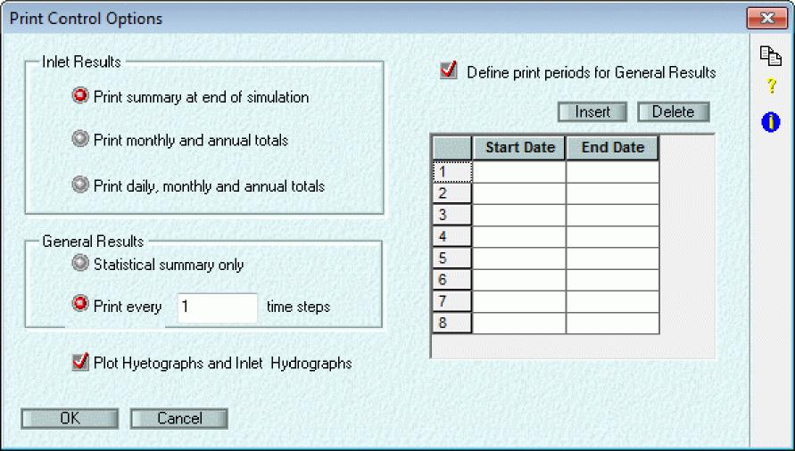

601

> xpswmm Reference Manual
>
> **Inlet Results**
>
> **General Results**
>
> **Define Print Periods for General Results**
>
> **Plot Hyetographs and Inlet Hydrographs  
> Inlet Results**
>
> This parameter controls the amount of output generated for each inlet in the system. An inlet is the drainage point for any sub-network.
>
> ***Print Summary at end of Simulation (B2 - IPRN3 = 0)  
> ***Do not print daily, monthly, or yearly totals.
>
> ***Print Monthly and annual totals (B2 - IPRN3 = 1)  
> ***Print monthly and annual totals only, one year per page.
>
> ***Print Daily, monthly and annual totals (B2 - IPRN3 = 2)***
>
> Print daily, monthly and annual totals, two months per page. Daily totals are printed whenever there is non-zero precipitation and/or runoff.
>
> **General results**
>
> These parameters control the output of non-zero flows and concentrations from conduits or nodes flagged for output. All printed values are instantaneous at the end of the preceding time step. Zero flows are not printed to avoid voluminous output in long simulations.
>
> ***Statistical summary only (M1 - INTERV = 0)***
>
> Print a statistical summary only, rather than detailed time step printouts.
>
> ***Print every 'x' time steps (M1 - INTERV \> 0)***
>
> Print detailed output to the text output file at the interval defined here.
>
> **Define Print Periods (M2 - NDET \> 0)**
>
> Set the print periods to the periods entered below, for General Results.  
> ***Start Date (M2 - STARTP)***
>
> The print period start and end dates must be entered in a specific format. The date format is set by the DATE_FORMAT variable in the SWMM.CFG file.
>
> ***End Date (M2 - STARTPR)***
>
> The print period start and end dates must be entered in a specific format. The date format is set by the DATE_FORMAT variable in the SWMM.CFG file.
>
> **Plot Hyetographs and Inlet Hydrographs (B2 - IPRN2)**
>
> Flag for whether or not to plot to a line printer, an inlet hydrograph and a hyetograph for each rain gauge.
>
> **Time Control**
>
> **Time Control (Runoff)**
>
> Time control allows the entry of the simulation start/stop date and time and time step durations.

602

> xpswmm Reference Manual
>
> A wet time step is used when any of the subcatchments have precipitation input. Typically the WET time step should be a fraction of the rainfall interval. Five minute rainfall should have wet time steps of 1, 2.5 or 5.0 minutes, for example. It can be longer but information is lost by averaging over a longer time period.
>
> **Start Year**
>
> Year of start of simulation. Enter four digits of the year.
>
> **Start Month**
>
> Month of start of simulation.
>
> **Start Day**
>
> Day of start of simulation.
>
> **Start Hour**
>
> Hour of start of simulation.
>
> **Start Minute**
>
> Minute of start of simulation.
>
> **Start Second**
>
> Second of start of simulation.
>
> **Stop Year**
>
> Year of end of simulation. Enter the four digits of the year.
>
> **Stop Month**
>
> Month of end of simulation.
>
> **Stop Day**
>
> Day of end of simulation.
>
> **Stop Hour**
>
> Hour of end of simulation.
>
> **Stop Minute**
>
> Minute of end of simulation.
>
> **Stop Second**
>
> Second of end of simulation.
>
> **10.3 Sanitary Mode**
>
> **Sanitary Mode Job Control**
>
> A full description of the parameters used by the model follows. This information is also available through the on-line help facility described in Section 5. The bracketed description in each heading refers to the card number and variable name used in the TRANSPORT data file.

604

SECTION 10: JOB CONTROL

> 
>
> This dialog defines data that is global to the whole Sanitary Mode simulation, and controls the simulation process.
>
> The parameters used to define the simulation are:
>
> **Title**
>
> **Pollutant List**
>
> **Evaporation**
>
> **Gauged Pollutant List**
>
> **Sewer Infiltration**
>
> **Dry Weather Sewer Inflow**
>
> **Removal Equation Variables**
>
> **DO Cycle Simulation**
>
> **Time Control**
>
> **Print Control**
>
> **Save ALL Results for Review**
>
> **Options**
>
> **Title**
>
> The first title line is shared between all SWMM modules. The second title line is reserved for the Sanitary Layer only.
>
> **Pollutant List (Sanitary Layer)**
>
> This flag and the associated dialog allows the definition of the list of pollutants to be used in the simulation. If this flag is OFF, no pollutant routing is done. If this flag is ON, a list of pollutants is selected from the list of pollutants defined in the Pollutants Global Database.

605

SECTION 10: JOB CONTROL

> 
>
> **Monthly Pan Evaporation -  
> Monthly Pan Evaporation**
>
> Pan Evaporation Data is input as average values for each month in./day \[mm/day\]. This data is only required if there are detention units in any storage/treatment plant or a storage node defined within the network. Values of evaporation only need to be entered for the months during which the simulation occurs; others may be left blank.
>
> **Gauged Pollutants**
>
> 
>
> This flag and the associated dialog allows the definition of the list of pollutants to be used in the Gauged Pollutant List. If this flag is OFF, no gauge pollutants are shown. If this flag is ON, a list of pollutants is selected from the list of gauged pollutants shown in the Pollutants Global Database.
>
> The pollutants to be used are chosen from those defined in the Pollutants Global Database. Any number of pollutants may be defined. To add a pollutant to the "Use Pollutants" list, highlight the pollutant required in the Pollutant List (left-hand list), then select the "Add" button. To remove a pollutant from the list select the pollutant you wish to delete from the "Use Pollutants" list (right-hand list), then select the "Delete" button.

607

> xpswmm Reference Manual
>
> The pollutant load and concentrations may be generated in the Hydraulics, Runoff or Sanitary Layer, or read in from an interface file.
>
> **Sewer Infiltration**
>
> This flag controls whether sewer infiltration will be simulated. If this flag is OFF, no wet-weather infiltration of sewer drains will be assumed to occur. If this flag is ON, catchment-wide characteristics are selected from the Sewer Infiltration Global Database. The total catchment sewer infiltration is distributed amongst individual conduits.
>
> **Dry Weather Sewer Inflow**
>
> This flag controls whether dry-weather sewage inflow will be generated. If this flag is OFF, no sewage inflow calculation will be performed, although inputs can still be entered directly at nodes. If this flag is ON, associated data requirements at nodes will be required, and computations will be performed to generate dry-weather sewer inflows. Additionally, an overall Dry Weather Flow characteristic must be selected from the Dry Weather Flow Global Database. This database type deals with temporal variations of generated sewer flows and pollutant concentrations, certain land use characteristics, and gauged results to compare against for the total catchment.
>
> **Save ALL Results for Review**
>
> This flag will save all the results for nodes and conduits from analysis to a special file for later graphical post-processing.
>
> **Options**
>
> **Options (Sanitary Layer)**
>
> This button provides for the definition of additional Job Control Options required for the simulation.
>
> 
>
> **Kinematic Viscosity of Water  
> Total Catchment Area**
>
> **Design Undersized Conduits**
>
> **Kinematic Viscosity -**
>
> This flag controls the definition of kinematic viscosity for water. This parameter is used to calculate the settling of particles transported in conduits throughout the sewer system. Kinematic viscosity is only required if any pollutant used in the simulation has a scour/deposition relation, as defined in the Pollutants Global Database. If this flag is OFF, the internal default of 1E-5 ft^2/sec \[1E-2 cm^2/sec\] will be used. If this flag is ON, the value entered in the adjacent field will be used.
>
> **Total Catchment Area -**
>
> This flag controls whether a total catchment area, in acres \[ha\], is to be entered. Entering a total catchment area is only required if dry-weather flow is being modelled, and an input SWMM Interface File is not used. If a SWMM Interface File is used, this value will be ignored and data from the Interface file is used.
>
> **Design Undersized Conduits**

608

SECTION 10: JOB CONTROL

This flag controls whether a conduit will be resized automatically by the model if it has insufficient flow carrying capacity. When a surcharge condition is encountered (flow exceeds full flow capacity), the conduit is increased in size in 6-inch \[150 mm\] increments of diameter (for circular pipes, or width for rectangular conduits), until capacity exists to accept the flow. Conduits that are neither circular nor rectangular will be converted to circular if they need to be resized. A message is printed indicating the resizing, and a table of final conduit dimension is printed at the end of the simulation.

The design operation will effectively eliminate surcharging but will also minimize in-system storage within manholes, etc. The net effect is to increase hydrograph peaks at the downstream end of the system. This can create a conflict between controls aimed at curing in-system hydraulic problems, and controls aimed at pollution abatement procedures at the outfall that make use of in-system storage.

Design parameters include: Percent of Full \[conduit\] Depth (%), Minimum Freeboard (ft, m), Minimum Cover (ft, m) and Maximum number of Barrels \[i.e. duplicate conduits\]

**DO Cycle Simualtion**

**DO Cycle Simulation  
**This dialog is for

> 

**Removal Equation Variables  
Removal Equation Variables**

This flag allows the definition of variable names to be used in removal equations for Storage/Treatment plants. This flag needs to be ON if there are any Storage/Treatment plants (or BMP's) in the network, otherwise it may be OFF.

The dialog contains the variable names to be used when constructing removal equations for a Storage/Treatment plant. The variables are completely user-definable, but it is recommended that short mnemonics be used to identify the combination of pollutant name and variable type.

609

xpswmm Reference Manual

**Start Minute**

Minute of start of simulation.

**Start Second**

Second of start of simulation.

**Stop Year**

Year of end of simulation. Enter the four digits of the year.

**Stop Month**

Month of end of simulation.

**Stop Day**

Day of end of simulation.

**Stop Hour**

Hour of end of simulation.

**Stop Minute**

Minute of end of simulation.

**Stop Second**

Second of end of simulation.

**Routing Details**

These parameters deal with accuracy and control of the flow routing algorithms employed. ***Number of Iterations***

This defines the maximum number of iterations allowed in conduit flow routing. This parameter helps to eliminate flow oscillations. Flatter pipe slopes (less than 0.1%) require more iterations in the flow routing simulation to help dampen these oscillations. Four iterations have proven to be sufficient in most cases.

***Convergence Tolerance***

The allowable error for convergence of iterative methods in the routing procedures (dimensionless). Convergence of the flow routing procedure should not normally be a problem. The default value of 0.0001 will provide sufficient accuracy with marginal extra computational effort. Convergence problems may occur when flow enters a dry conduit, which may occur at the beginning of a storm with little or no baseflow. In this case, warning messages describing the problem will be printed if the Print Error Messages flag in the Print Control dialog is ON. Continuity errors resulting from this condition are usually very small (a fraction of a percent).

**Print Control**

**Print Control (Sanitary Layer)**

This dialog deals with control of the output sent to the text output file during a Sanitary Layer simulation.

612

SECTION 10: JOB CONTROL

> 

**Print Every 'x' Time Steps**

**Print Total Loads and Moments Only**

**Include Inflow in Input Hydrograph Printouts**

**Print Error Messages**

**Print Hydraulic Properties of Conduit Shapes**

**Print Every 'x' Time Steps -**

This option results in printing input data and results at each element at each specified time step. The value entered is the number of time steps between printouts.

**Print Total Loads and Moments Only -**

This option results in only the loads and moments for each element being printed. Results during the simulation are not printed.

**Include Inflow in Input Hydrograph Printouts**

Echo inflow hydrographs in the output file.

**Print Error Messages -**

This flag controls the generation of error messages occurring during the flow routing simulation. Such errors may result from non-convergence conditions, for example. Except in unusual cases, these errors will only indicate that a small continuity error has occurred. These can usually be cured by shortening the time step. If this flag is OFF, messages are suppressed, otherwise they are printed.

**Print Conduit Hydraulic Properties -**

This flag controls the printing of flow routing parameters for any of the conduits that may be simulated. If this flag is OFF, the printout will be suppressed, otherwise about 500 lines of output will be generated. The output comprises normalized hydraulic properties for each conduit type.

> **10.4 2D Settings**

**2D Settings - General**

The 2D Job Control settings dialog has a tree control in the left panel. Use this control to display the desired section in the right panel.

613

xpswmm Reference Manual

> 

**Output**

The Map Results Output Interval specifies the time interval used for animation of 2D results.

The Time Series Output Interval specifies the time interval used for Time Series Output Head/Velocity Point or Flow Line timeseries.

Check the box next to Enable Mass Balance Output to specify that the cumulative mass error calculations are saved. A file XXX\_\_MB.CSV (where XXX = project file name) is created in the results folder. The file contains information at each display time step. The time, inflows, outflows, volume, predicted volume error and the mass and cumulative mass errors as a percentage for all 2D domains and each individual 2D domain are tabulated. This output will be saved at the interval specified in the Mass Balance Output Interval field (Seconds).

**Time-to-Inundation**

When the Enable Time-to-Inundation Map check box is checked/selected 2D Times output maps of the Time to Inundation and Time of Inundation will be generated based on the supplied depth levels.

616

SECTION 10: JOB CONTROL

**Levels**

> 

**Water Levels**

**Initial Water Levels**: The initial water level for all cells is set to the elevation specified.

**Override Instability Levels**: The default value water level used to detect instabilities is 1 m (3.28 ft) higher than the highest cell elevation of all cells (whether wet, dry or permanently dry). If the box is checked, the user specified value is used to detect instabilities  i.e. **if this option is checked, when the depth of flow in any cell in the model reaches the specified level, the simulation will terminate and report instability at the location(s) where this depth occurred. This option is only to be used if you specifically wish to terminate a simulation if a given depth occurs, if this is not desired the Override Instability option should NOT BE USED.**

**2D Cell Checks**

If 2D cells along the 1D/2D interface are lower than the Channel Bed:

> Ignore Do nothing and allow the model to run with inappropriate  
> levels where 1D and 2D are connected, erroneous  
> results may be produced.
>
> Report Only Model will not run if this situation happens and errors will be produced which can be displayed using the
>
> diagnostics layer. These messages are also contained in the \[model name\]\_messages.mif file.
>
> Adjust (Raise if Cell center elevation (Zc) will be raised up to the
>
> required) interpolated Channel bed level. This fixes the model  
> from having the floodplain elevations below the lowest  
> river cross section elevation.

If 2D cell at 1D node connection is above 1D Node Spill Crest the 1D node

> Ignore Do nothing and allow the model to run with inappropriate  
> levels where 1D and 2D are connected, erroneous  
> results may be produced.

617

xpswmm Reference Manual

> Report Only Model will not run if this situation happens and errors will  
> be produced which can be displayed using the
>
> diagnostics layer. These messages are also contained  
> in the \[model name\]\_messages.mif file.
>
> Adjust (Lower Cell center elevation (Zc) will be raised up to the node
>
> if required) spill level. This fixes the model from having the manhole  
> rim below the idealized ground elevation from the 2D  
> grid.

Notes: Units are m (metric) and ft (US Customary). Node spillcrest levels can be set equal to the elevation of the DTM by using the generate ground elevations from TIN command on the Tools Menu.

**Elevation Export Files**

If the Include Additional mid/mif Elevation files is checked/selected, then upon solving the simulation the Cell Center elevations (Zpts) will be exported to \*.mid/\*.mif files for inspection external to the software interface. This is one way in which the Zpts can be expected to ensure that the 2D Grid Cells are appropriately representing the topographic surface. These files could also be used to create a DTM representing exactly how the 2D engine sees the data.

**Folder Options**

This dialog allows the user to specify where 2D data and results are stored. If unchecked, the results are written to the same folder as the .xp fole.

> 

**Advanced Settings**

The Advanced User Settings allows user the option of incorporating specific additional configuration commands to the 2D engine.

618

SECTION 10: JOB CONTROL

> 

The Control File section allows configuration commands to be added to the Tuflow Control file (\*.tcf). In order for commands to be applied to the engine the associated Flag will need to be checked/selected. Note: only one \*.tgc file per 2D domain is specified within the \*.tcf file.

The Geometry Control File section allows specific commands to be added to the Tuflow Geometry Control file (\*.tgc). The top or bottom ordering option allows for the sequential application of commands commands in the \*.tgc file are applied in sequential order, therefore, it is possible to override previous information with new data to modify the model in selected areas. This is very useful where a base data set exists, over which areas need to be modified to represent other scenarios such as a proposed development. This eliminates or minimizes data duplication.

This option is not typically recommended as the Scenario Manager is a robust tool which can allow numerous model designs or scenarios to be simulated, for both the 1D and 2D portions of the model.

**Projections**

xpswmm Reference Manual

> 

This dialog is used to define the geographic projects for all GIS input and output.  
**Note:** The projection must be in meters!

Header Delimiter specifies the field delimiter for the Header Projections input string  
Header Charset specifies the character set for the Header Projections input string  
Click on the Load from Mapinfo MIF file to upload this information.

620

> ***SECTION 11: GLOBALS  
> *Global Data**
>
> This command allows the management of databases of information that may be referenced from individual nodes or links. This reduces data redundancy dramatically and associated problems of updating at many places when changes are made.
>
> 
>
> Each global Database Type relates to a grouping of related data items. There can be any number of database records for each database type.
>
> Each database record has a name, which will be referenced from a node or link dialog (or Job Control), and a description. Hitting the EDIT button causes the dialog containing the data for the highlighted Database Type and database Record Name to be displayed.
>
> **Database Type**
>
> **Record Name  
> Description**
>
> **Duplicate Record**
>
> **Add Record  
> Rename Record**
>
> **Edit Record  
> Delete Record**
>
> **Global Database Selection**
>
> Global Database records are selected from a data dialogue associated with a node or link. For a field corresponding to one database type, when you click on the selection button you will be presented with a list of all currently available global database records.
>
> In the example shown below, in the data dialogue for Sub-catchment \#1 of Node MH1, clicking on the selection button for Rainfall opens the Rainfall Global Data selection. Clicking on the selection button for Infiltration opens the Infiltration Global Data selection.

621

xpswmm Reference Manual

> 

The Database Type shown in the selection list box will depend on the context of the parent node or link.

**Select** Will select the currently highlighted record and display this name in the selection button of the parent (calling) dialog.

**Cancel** Will cancel the selection and leave the selection button of the parent (calling) dialog unchanged.

**Edit** Will allow you to edit the information for this record of the Database Type shown. All nodes referencing this database record will inherit the edited data.

**Clear** Will clear the database record name shown in the selection button of the parent (calling) dialog.

**Rename** Will rename the highlighted database record however all nodes referencing the existing database record

> will have an undefined reference and will generate an error on solving if not individually updated.

**Delete** Will delete the highlighted database record and all nodes referencing the existing database record will have an undefined reference and will generate an error on solving.

**Duplicate** Will create a copy of the highlighted database record with the existing name plus a .1, .2 etc suffix.

**Add** Will create a new database record of the name shown in the edit field below the record name listbox.

> **Record Name**

This scrollable list displays the available records from the current Database Type. This list is manipulated by the buttons on the right-hand side of the list. You can add, delete, rename, and duplicate records to this list using these

622

SECTION 11: GLOBALS

> buttons. This list can be navigated in the same way as the database type list, ie. arrow keys, \<page-up\>, \<page-down\>, etc.
>
> The edit item immediately below the Record Name List contains the name of the currently highlighted database record. Edit this item before adding or renaming a database record. This name will be used when the database record is referenced from an Object or Job Control dialog.
>
> **Description**
>
> Description of the database record. This item may be any meaningful description of the current database record of the current database type. This field is for annotation, it is not used by the model.
>
> **Add Record**
>
> Hit this button to add a database record, of the currently highlighted type, with the name and description entered below. Note that this action is not committed until OK is hit or another database type is selected.
>
> **Edit Record**
>
> Hit this button to edit the data for the currently highlighted database record. This button may sometimes be inactive (greyed out), which indicates that, in the current context, editing of the currently highlighted database type is not available. The following table indicates the conditions required to make editing available for each database type.
>
> Database Type Conditions Required to make Database Editable
>
> \(R\) BUILDUP/WASHOFF Runoff 'Water Quality' in Job Control is ON
>
> \(R\) Erosion Runoff 'Water Quality' in Job Control is ON and 'Erosion' under 'Water Quality' is ON
>
> \(R\) Groundwater None required
>
> \(R\) Infiltration None required
>
> \(R\) Initial Loads Runoff 'Water Quality' in Job Control is ON
>
> \(R\) Landuse Runoff 'Water Quality' in Job Control is ON
>
> \(R\) Pollutant Runoff 'Water Quality' in Job Control is ON
>
> \(R\) Rainfall None required

18) Snow Melt Runoff 'Snow Melt' in Job Control is ON

19) Pollutant Sanitary 'Pollutant List' in Job Control is ON

> \(S\) Sewer DWF Sanitary 'Pollutant List' in Job Control is ON and Sanitary 'Dry Weather Flow' in Job Control is ON
>
> \(S\) Sewer Infiltration Sanitary 'Pollutant List' in Job Control is ON and Sanitary 'Sewer Infiltration' in Job Control is ON
>
> \(S\) Waste Stream Temperature Sanitary 'Pollutant List' in Job Control is ON
>
> (SH) Temporal Variation None Required
>
> \(H\) Pump Rating Curve None Required
>
> \(H\) Pit Rating Curve None Required
>
> \(H\) Hydraulic Brakes None Required
>
> \(H\) Pavement Crossfalls None Required
>
> \(H\) HEC-22 None Required
>
> \(H\) User Defined File Types None Required
>
> **XP Tables** None Required
>
> \(R\) Rational Formula None Required
>
> \(H\) Natural Section Shape None Required
>
> Roughness Categories 2D model involked
>
> \(R\)  Runoff Layer, (S)  Sanitary Layer (H)  Hydraulics Layer

623

> xpswmm Reference Manual
>
> **Delete Record**
>
> Hit this button to delete the currently highlighted database record. The action is performed when OK is hit or another database type is selected.
>
> **Rename Record**
>
> Hit this button to rename the currently highlighted database record with the name entered. The command is executed when OK is hit or another database type is selected.
>
> **Duplicate Record**
>
> Hit this button to duplicate the highlighted database record. This facility has not yet been implemented.
>
> **Database Type**
>
> Several types of database records are available; these are displayed in the left-hand side scrollable list below this heading. As each database type is selected, the list of available records in that database is displayed in the list to the right. This list is created and maintained by the user. The list to which keystrokes, such as arrow keys, \<page-up\>, \<page-down\>, \<home\>, \<end\>, \<insert\>, \<delete\>, etc. will be directed is highlighted with a bounding rectangle. Either list can be made the active list by clicking in it.
>
> The available database types are described briefly below. (R) denotes a database used by the Runoff layer, (S) denotes a database used by the Sanitary layer and (H) denotes a database used by the Hydraulics layer.
>
> **Database Type Description**
>
> \(R\) Buildup/Washoff Runoff pollutant buildup and washoff
>
> \(R\) Erosion Runoff subcatchment erosion
>
> \(R\) Groundwater Runoff subcatchment groundwater
>
> \(R\) Infiltration Runoff subcatchment infiltration
>
> \(R\) Initial Loads Runoff pollutant initial loads/unit area
>
> \(R\) Landuse Runoff land uses
>
> \(R\) Pollutant Runoff pollutants
>
> \(R\) Rainfall Runoff subcatchment precipitation
>
> \(R\) Snow Melt Runoff subcatchment snowmelt

18) RDII Unit hydrograph parameters for Rainfall Derived Inflow/Infiltration

19) Pollutant Sanitary pollutant data

> \(S\) Sewer DWF Sanitary dry weather flow generation
>
> \(S\) Sewer Infiltration Sanitary sewer infiltration
>
> \(S\) Waste Stream Temperature Sanitary treatment plant temperatures
>
> (SH) Temporal Variation DWF hourly and daily temporal pattern variation
>
> \(H\) Pump Rating Curves Hydraulics Pump Rating Curves
>
> \(H\) Pit Rating Curve Hydraulics Inlet Rating Curves
>
> \(H\) Hydraulic Brakes Depth vs Flow Rating Curve
>
> \(H\) Pavement Crossfalls Pavement cross-section data
>
> \(H\) HEC-22 HEC-12/HEC-22 Curb and Grate inlet parameters
>
> \(H\) User Defined File Types Hydraulics user-defined inflows
>
> **XP Tables** Field definitions of tabulated data and results from all layers
>
> \(R\) Rational Formula IDF and Runoff Coefficient parameters
>
> \(H\) Natural Section Shape User-defined cross-section profile
>
> 2D Landuses Mannings Roughness, Rainfall Abstraction and 2D hydraulic Infiltration values for polygons in the 2D domain
>
> 2D Soil Types Soil characterization and loss input  
> (R)  Runoff Mode, (S)  Sanitary Mode (H)  Hydraulics Mode
>
> **11.1 Buildup/Washoff**
>
> **Buildup/Washoff Global Data**
>
> Runoff 'Water Quality' in Job Control must be ON
>
> 624
>
> xpswmm Reference Manual
>
> Dependency Unit of DDFACT in power-linear form
>
> Area lb/acre/day"DDPOW \[kg/hectare/day"DDPOW\]
>
> Curb Length lb/(100 ft curb/day"DDPOW) \[kg/(km curb)/day"DDPOW\]
>
> Constant lb/day"DDPOW kg/day"DDPOW
>
> where
>
> DDPOW = Power in the power-linear form  
> ***Power (J2 - DDPOW)***
>
> The power in the power-linear formulation. This parameter has no units. Linear buildup can be simulated by setting this parameter to 1.0.
>
> ***Exponential Function (J2 - METHOD = 1)***
>
> Calculate the dust and dirt buildup using the exponential function to the right of this item. This form of buildup has an asymptotic trend.
>
> ***Exponent (J2 - DDPOW)***
>
> This parameter is the familiar exponential decay constant in units of 1/day. This type of relation will be evidenced by a semi-log plot of buildup versus time indicating a linear relationship.
>
> ***Michaelis Menton Function (J2 - METHOD = 2)***
>
> Calculate the dust and dirt buildup using the Michaelis Menton function to the right of this item. This form of buildup has an asymptotic trend. Generally, this formulation rises steeply (in fact linearly for small values of time) and then approaches the asymptote slowly.
>
> ***Michaelis Menton Factor (J2 - DDFACT)***
>
> This parameter, in days, is interpreted as the half-time constant, ie. the time at which buildup is half of the maximum (asymptotic) value.
>
> **Buildup - Landuse**
>
> (JX - KALC = 0) - Buildup of pollutant may be specified as a fraction of the dust and dirt for each landuse. The land use names are those entered in the Landuse Global Database . If Buildup by Landuse is being used the Landuse types must first be defined in the Landuse Global Database . The following table indicates the quantity of pollutant per gram of dust and dirt for four Chicago land uses (American Public Works Association, 1969).

<table>
<colgroup>
<col style="width: 27%" />
<col style="width: 13%" />
<col style="width: 13%" />
<col style="width: 15%" />
<col style="width: 12%" />
<col style="width: 17%" />
</colgroup>
<tbody>
<tr class="odd">
<td></td>
<td>Total</td>
<td colspan="3">
Fraction of Pollutant in Dust and Dirt

<blockquote>

Total Total

</blockquote></td>
<td></td>
</tr>
<tr class="even">
<td><blockquote>

Land Use Type

</blockquote></td>
<td>BOD5</td>
<td><blockquote>

COD

</blockquote></td>
<td>Coliforms</td>
<td>N</td>
<td>PO4</td>
</tr>
<tr class="odd">
<td></td>
<td>mg/g</td>
<td><blockquote>

mg/g

</blockquote></td>
<td>MPN/g</td>
<td>mg/g</td>
<td>mg/g</td>
</tr>
<tr class="even">
<td><blockquote>

Single-Family Residential

</blockquote></td>
<td>5.0</td>
<td>40.0</td>
<td>1.3E6</td>
<td>0.48</td>
<td>0.05</td>
</tr>
<tr class="odd">
<td><blockquote>

Multi-Family Residential

</blockquote></td>
<td>3.6</td>
<td>40.0</td>
<td>2.7E6</td>
<td>0.61</td>
<td>0.05</td>
</tr>
<tr class="even">
<td><blockquote>

Commercial

</blockquote></td>
<td>7.7</td>
<td>39.0</td>
<td>1.7E6</td>
<td>0.41</td>
<td>0.07</td>
</tr>
<tr class="odd">
<td><blockquote>

Industrial

</blockquote></td>
<td>3.0</td>
<td>40.0</td>
<td>1.0E6</td>
<td>0.43</td>
<td>0.03</td>
</tr>
</tbody>
</table>

> 626

SECTION 11: GLOBALS

> 
>
> **Landuse**
>
> **Dust and Dirt Factor**
>
> **Dust and Dirt Fraction (QFACT)**
>
> The Dust and Dirt Fraction is the quantity of pollutant in the Dust and Dirt. The units of this factor depend on the pollutant units as shown in the following table:
>
> Pollutant Unit Dust and Dirt Factor Unit
>
> mg/litre pound/gramme \[kg/gramme\]
>
> 'other'/litre 10^6/gramme \[10^6/gramme\]
>
> other ft^3 \[m^3\]
>
> If the pollutant has units of 'other'/l (eg. MPN/l) the Dust and Dirt factor entered is in millions in order to facilitate the entry of large numbers. If the pollutant units are 'other', then "buildup" of such parameters is rarely referred to; instead a much more viable option is the use of a rating curve that gives load directly as a function of flow.
>
> **Buildup - Time (JX - KALC = 1-3)**
>
> Cumulative pollutant buildup specified as a function of time. This formulation is similar to the dust and dirt buildup equations, except that units for pollutant buildup parameters depend on the units for the pollutant. If the pollutant units are in mg/l, then buildup units are given as mass units. If the pollutant has units of 'other'/l (eg. MPN/l) the Dust and Dirt parameters are in millions, to facilitate the entry of large numbers. If the pollutant units are 'other', then "buildup" of such parameters is rarely referred to; instead a much more viable option is the use of a rating curve that gives load directly as a function of flow.
>
> 627
>
> xpswmm Reference Manual
>
> 
>
> **Limit**
>
> **Buildup Dependency**
>
> **Buildup Function  
> Limit (QFACT1)**
>
> Upper limit for the pollutant buildup. The units for this parameter depend on the Buildup Dependency variable, as follows:
>
> Buildup Dependency Unit for Pollutant Buildup Limit
>
> Catchment Area Q1/acre \[Q1/hectare\]
>
> Constant Q1 Q1
>
> Curb Length Q1/(100 ft curb) \[Q1/(km curb)\]
>
> where
>
> Q1 = Pollutant quantity, that depends on the pollutant units as follows:
>
> Pollutant Unit Unit for Q1
>
> mg/litre lb \[kg\]
>
> 'other'/litre 10'6 \[10'6\]
>
> other ft'3 \[m'3\]
>
> For the Exponential or Michaelis-Menton formulations, this value becomes the asymptote; this limit is imposed for the Power-Linear form.
>
> **Buildup Dependency**
>
> This parameter defines the dependent variable 'X' in the buildup equations formulated in this dialog. Pollutant buildup can depend on the subcatchment area, curb length, or neither (the value of 'X' is always 1.0 in this case).
>
> ***Buildup by Catchment Area (JX - KACGUT = 1)***
>
> Pollutant buildup is calculated using the landuse area (subcatchment area or part thereof).
>
> 628

SECTION 11: GLOBALS

> ***Constant Buildup (JX - KACGUT = 2)***
>
> Pollutant builds up at the same rate regardless of the size of the subcatchment.
>
> ***Buildup by Curb (Kerb) Length (JX - KACGUT = 0)***
>
> Pollutant buildup is calculated using the curb (kerb) length entered for the subcatchment, in units of 100 ft \[km\].
>
> **Buildup Function**
>
> ***Power Linear Function (JX - KALC = 1)***
>
> Calculate the pollutant buildup using the power linear function to the right of this item. Linear buildup is simply a subset of a power function buildup.
>
> ***Power Linear Factor (JX - QFACT3)***
>
> The multiplication factor in the power-linear form. The unit of this parameter depends on the Buildup Dependency option, as follows:
>
> Buildup Dependency Unit of Factor in power-linear form
>
> Area Q1/acre/day^POW \[Q1/hectare/day^POW\]
>
> Curb Length Q1/(100 ft curb/day^POW) \[Q1/(km curb)/day^POW\]
>
> Constant Q1/day^POW Q1/day^POW
>
> where
>
> POW = Power in the power-linear form
>
> Q1 = Pollutant quantity, that depends on the pollutant units as follows:
>
> Pollutant Unit Unit for Q1
>
> mg/litre lb \[kg\]
>
> 'other'/litre 10^6 \[10^6\]
>
> other ft^3 \[m^3\]
>
> ***Power (JX - QFACT2)***
>
> The power in the power-linear formulation. This parameter has no units. Linear buildup can be simulated by setting this parameter to 1.0.
>
> ***Exponential Function (JX - KALC = 2)***
>
> Calculate the pollutant buildup using the exponential function to the right of this item. This form of buildup has an asymptotic trend.
>
> ***Exponent (JX - QFACT2)***
>
> This parameter is the familiar exponential decay constant. This type of relation will be evident by a semi-log plot of buildup versus time indicating a linear relationship. Thus the unit of this parameter is 1/day.
>
> ***Michaelis Menton Function (JX - KALC = 3)***
>
> Calculate the pollutant buildup using the Michaelis Menton function to the right of this item. This form of buildup has an asymptotic trend. Generally, this formulation rises steeply (in fact linearly for small values of time) and then approaches the asymptote slowly.
>
> ***Michaelis Menton Factor (JX - QFACT3)***
>
> This parameter has the interpretation of the half-time constant, ie. the time at which buildup is half of the maximum (asymptotic) value. Thus, the unit of this parameter is days.

629

> xpswmm Reference Manual
>
> **11.1.2 Washoff  
> Washoff Method**
>
> Washoff is the process of erosion and/or solution of constituents from a subcatchment surface during a period of runoff.
>
> **Washoff - EMC (JX-KWASH=3)**
>
> **Washoff - Exponential (JX-KWASH=0)**
>
> **Washoff - Rating Curve (JX-KWASH=1 or 2)  
> Washoff - EMC (KWASH\\=3)**
>
> Event Mean Concentration. The amount of pollutant being washed off is proportional to the amount of runoff, although the concentration varies from the mean using a given standard deviation. The EMC approach is a special case of the 'Rating Curve' approach, with a power of 1.0 and a coefficient which has a probability distribution with a given mean and standard deviation. The EMC is assumed to vary with a log probability distribution.
>
> This option is only available when 'None' is specified for the 'Buildup Method'.
>
> 
>
> **Standard Deviation (JX - RCOEF)  
> Mean Concentration (JX - WASHPO)**
>
> **Mean Concentration (WASHPO)**
>
> Mean concentration of pollutant in the runoff water, in the units defined for the current pollutant.
>
> **Standard Deviation (RCOEF)**
>
> Statistical standard deviation from the mean pollutant concentration, in the units for the current pollutant.
>
> **Washoff - Exponential (KWASH\\=0)**
>
> Cumulative pollutant washoff is specified as an exponential function of time. This method requires some buildup of
>
> pollutant to occur during dry periods prior to a storm. With rainfall, the pollutant is washed off with an exponential relationship, ie. approaching the amount built up asymptotically. The quantity PSHED0 is the quantity of pollutant built up, and thus available for washoff.
>
> This option is available only when a buildup method other than 'None' is selected.
>
> The variation from the simple exponential relation is that the exponential coefficient varies with the runoff in a power form.

630

SECTION 11: GLOBALS

> 
>
> **Initial Buildup Quantity (PSHEDO)**
>
> **Coefficient (JX - RCOEFF)**
>
> **Power (JX - WASHPO)  
> Coefficient (RCOEFF)**
>
> The coefficient in the power equation for the exponent, in units of (in/hr)^-POW \[(mm/hr)^-POW\], where POW is the power used in this equation. Note that the runoff rate is spread over the subcatchment in units of in/hr \[mm/hr\].
>
> **Power (WASHPO)**
>
> The power in the equation for the exponential coefficient.
>
> **Initial Buildup Quantity (PSHEDO)**
>
> The quantity of pollutant built up, and thus available for washoff.  
> **Washoff - Rating Curve (KWASH=1 or 2)**
>
> The rating curve is a function of instantaneous washoff against instantaneous runoff. This method is generally easiest to use when only total runoff volumes and pollutant loads are available for calibration.
>
> The cumulative pollutant washoff will always be limited to the amount of pollutant built up if buildup has been specified (ie. if the buildup criteria is other than 'None'). The maximum amount that can be removed is the amount built up prior to the storm. Once the limit is reached, concentrations drop to zero, until dry weather allows buildup.

631

> xpswmm Reference Manual
>
> 
>
> **Coefficient (JX - RCOEF)  
> Power (JX - WASHPO)**
>
> **Coefficient (RCOEF)**
>
> The coefficient in the rating curve equation, with units of Q1/(cfs'POW) \[Q1/cumec'POW\],
>
> where
>
> POW = power in the power rating curve
>
> Q1 = Pollutant quantity, that depends on the pollutant units as follows:
>
> Pollutant Unit Unit for Q1
>
> mg/litre lb \[kg\]
>
> 'other'/litre 10'6 \[10'6\]
>
> other ft'3 \[m'3\]
>
> **Power (WASHPO)**
>
> The exponent in the rating curve equation, non-dimensional. If this value is more than one the concentration of pollutant in the runoff will increase as the runoff increases. Otherwise the concentration of the pollutant will decrease as the runoff increases.
>
> **11.2 Erosion**
>
> **Erosion Global Data**
>
> Global subcatchment erosion data. The Universal Soil Loss Equation (USLE) has been adapted for use in SWMM for erosion computations. The adapted USLE estimates average soil loss for a given storm or time period.
>
> Erosion is computed using factors 'K', 'C' and 'P' (soil factor, cropping management factor and control practice factor respectively). A value of the "sediment delivery ratio" may also be included in the erosion computations. Since it is merely another multiplier, if desired it may be incorporated into the 'K', 'C' or 'P' factors.
>
> Erosion is added as an additional water quality constituent, so that one fewer Pollutants can be simulated. Futhermore, if Erosion is simulated, at least one other (arbitrary) pollutant must be simulated. No particular soil characteristics (eg. particle size distribution) are assigned to the erosion parameter, and its name is "EROSION", with units of "mg/l".

632

SECTION 11: GLOBALS

> 
>
> **Fraction of Area Subject to Erosion**
>
> ***Management Factors***
>
> **Soil Factor 'K'**
>
> **Control Practice Factor 'P'**
>
> **Crop Management Factor 'C'**
>
> **Area Subject to Erosion (ERODAR)**
>
> Fraction of subcatchment area subject to erosion. Fraction in the range 0.0 - 1.0. This fraction is normally up to the pervious fraction of the subcatchment and could indicate land that is barren or under construction.
>
> **Soil Factor 'K' (SOILF)**
>
> Soil factor, K, is a measure of the potential erodibility of a soil, in units of tons per unit of rainfall factor 'R'. This factor can be estimated using an erodibility nomograph (Wischmeir et al., 1971). However, a preferable and often simpler alternative is to use the soil survey interpretation sheet from the Local Agricultural Research Service and Soil Conservation Service.
>
> **Control Practice Factor 'P' (CONTPF)**
>
> This factor is similar to the crop management factor except it accounts for the erosion-control effectiveness of super-

<table>
<colgroup>
<col style="width: 78%" />
<col style="width: 21%" />
</colgroup>
<tbody>
<tr class="odd">
<td colspan="2"><blockquote>

imposed practices such as contouring, terracing, compacting, sediment basins and control structures. Estimates for

this factor for construction sites are given in the following table (Ports, 1973).

</blockquote></td>
</tr>
<tr class="even">
<td><blockquote>

Surface Condition with no Cover

</blockquote></td>
<td>Factor P</td>
</tr>
<tr class="odd">
<td><blockquote>

Compact, smooth, scraped with bulldozer or scraper up and down hill

</blockquote></td>
<td>1.30</td>
</tr>
<tr class="even">
<td><blockquote>

Same as above, except raked with bulldozer root, raked up and down hill

</blockquote></td>
<td>1.20</td>
</tr>
<tr class="odd">
<td><blockquote>

Compact, smooth, scraped with bulldozer or scraper across the slope

</blockquote></td>
<td>1.20</td>
</tr>
<tr class="even">
<td><blockquote>

Same as above, except raked with bulldozer root, raked across the slope

</blockquote></td>
<td>0.90</td>
</tr>
<tr class="odd">
<td><blockquote>

Loose, as in a disk plowed layer

</blockquote></td>
<td>1.00</td>
</tr>
<tr class="even">
<td><blockquote>

Rough irregular surface, equipment tracks in all directions

</blockquote></td>
<td>0.90</td>
</tr>
<tr class="odd">
<td><blockquote>

Loose with rough surface &gt; 12 in. depth

</blockquote></td>
<td>0.80</td>
</tr>
<tr class="even">
<td><blockquote>

Loose with smooth surface &gt; 12 in. depth

</blockquote></td>
<td>0.90</td>
</tr>
</tbody>
</table>

> Structures Factor P

<table>
<colgroup>
<col style="width: 5%" />
<col style="width: 29%" />
<col style="width: 29%" />
<col style="width: 35%" />
</colgroup>
<tbody>
<tr class="odd">
<td>1.</td>
<td><blockquote>

Small sediment basins:

</blockquote></td>
<td><blockquote>

0.04 basin/acre

</blockquote></td>
<td>0.50</td>
</tr>
<tr class="even">
<td></td>
<td><blockquote>

0.06 basin/acre

</blockquote></td>
<td><blockquote>

0.30

</blockquote></td>
<td></td>
</tr>
</tbody>
</table>

633

> xpswmm Reference Manual

<table style="width:100%;">
<colgroup>
<col style="width: 5%" />
<col style="width: 41%" />
<col style="width: 38%" />
<col style="width: 14%" />
</colgroup>
<tbody>
<tr class="odd">
<td><ol start="2" type="1">
<li></li>
</ol></td>
<td><blockquote>

Downstream sediment basins: without chemical flocculants

</blockquote></td>
<td><blockquote>

with chemical flocculants 0.20

</blockquote></td>
<td>0.10</td>
</tr>
<tr class="even">
<td><ol start="3" type="1">
<li></li>
</ol></td>
<td><blockquote>

Erosion control structures: high rate usage

</blockquote></td>
<td><blockquote>

normal rate usage 
0.40

</blockquote></td>
<td>0.50</td>
</tr>
<tr class="odd">
<td><ol start="4" type="1">
<li></li>
</ol></td>
<td><blockquote>

Strip building

</blockquote></td>
<td></td>
<td>0.75</td>
</tr>
</tbody>
</table>

> **Crop Management Factor 'C' (CROPMF)**
>
> This factor is dependent upon the type of ground cover, the general management practice and the condition of the soil over the area of concern. This factor is set to 1.0 for continuous fallow ground which is defined as land that has been tilled and kept free of vegetation and surface crusting. Values for the cropping management factor are given in the following tables (Maryland Dept. of Natural Resources, 1973).
>
> Type of cover C Value
>
> None (fallow) 1.00
>
> Temporary seedings: First sixty days 0.40
>
> After sixty days 0.05
>
> Permanent seedings: First sixty days 0.40
>
> After sixty days 0.05
>
> Sod (laid immediately) 0.01
>
> Rate of Max. Allowable
>
> Application Slope Length
>
> Mulch (tons/acre) C Value (feet)
>
> Hay or straw 0.5 0.35 20
>
> 1.0 0.20 30
>
> 1.5 0.10 40
>
> 2.0 0.05 50
>
> Stone or gravel 15.0 0.80 15
>
> 60.0 0.20 80
>
> 135.0 0.10 175
>
> 240.0 0.05 200
>
> Chemical mulches
>
> First ninety days \* 0.50 50
>
> After ninety days \* 1.00 50
>
> Woodchips 2.0 0.80 25
>
> 4.0 0.30 50
>
> 12.0 0.10 100
>
> 20.0 0.06 150
>
> 25.0 0.05 200
>
> Note: \* = as recommended by manufacturer
>
> 634
>
> xpswmm Reference Manual
>
> Potential Evaporation available for subsurface water loss is the difference between total evaporation input to the model and evaporation used by the surface routing.
>
> 
>
> **Wilting Point (H3 - WP) -**
>
> **Field Capacity**
>
> **Fraction of Evapo-transpiration Assigned to Zone Fraction**
>
> **Max Depth of Significant Lower Zone Transpiration**
>
> **Wilting Point (H3 - WP)**
>
> The soil moisture content at which plants can no longer obtain enough moisture to meet transpiration requirements; they wilt and die unless water is added to the soil. The moisture content at a tension of 15 atmospheres is accepted as a good estimate of wilting capacity. Wilting point must be less than the field capacity, since it occurs at higher tensions. The following table indicates typical values (Linsley et al, 1982).

<table>
<colgroup>
<col style="width: 35%" />
<col style="width: 64%" />
</colgroup>
<tbody>
<tr class="odd">
<td>Soil Type</td>
<td>
Wilting Point

(fraction moisture content)
</td>
</tr>
<tr class="even">
<td><blockquote>

Sand

</blockquote></td>
<td>0.03</td>
</tr>
<tr class="odd">
<td><blockquote>

Sandy Loam

</blockquote></td>
<td>0.07</td>
</tr>
<tr class="even">
<td><blockquote>

Loam

</blockquote></td>
<td>0.14</td>
</tr>
<tr class="odd">
<td><blockquote>

Silt Loam

</blockquote></td>
<td>0.17</td>
</tr>
<tr class="even">
<td><blockquote>

Clay Loam

</blockquote></td>
<td>0.19</td>
</tr>
<tr class="odd">
<td><blockquote>

Clay

</blockquote></td>
<td>0.26</td>
</tr>
<tr class="even">
<td><blockquote>

Peat

</blockquote></td>
<td>0.30</td>
</tr>
</tbody>
</table>

> **Max Depth of Significant Lower Zone Transpiration (H4 - DET)**
>
> Maximum depth over which significant lower zone transpiration occurs, ft \[m\]. Lower zone evapo-transpiration occurs after upper zone evapo-transpiration by removing the remaining fraction linearly as a function of depth to the water table. If the water table drops below this depth no lower zone evapo-transpiration occurs.
>
> **Field Capacity (H3 - FC)**
>
> The amount of water a well-drained soil holds after free water has drained off, or the maximum amount it can hold against gravity, expressed as a moisture content fraction. This occurs at soil moisture tensions of anywhere from 0.1 to 0.7 atmospheres; often the moisture content at a tension of 0.33 atmosphere is used.
>
> 636

SECTION 11: GLOBALS

> Field capacity must be greater than the wilting point (since it occurs at lower tensions), and less than 0.9 times the porosity. Typical values of field capacity are given in the following table (Linsley et al, 1982).

<table>
<colgroup>
<col style="width: 45%" />
<col style="width: 54%" />
</colgroup>
<tbody>
<tr class="odd">
<td>Soil Type</td>
<td>
Field Capacity

(fraction moisture content)
</td>
</tr>
<tr class="even">
<td><blockquote>

Sand

</blockquote></td>
<td>0.08</td>
</tr>
<tr class="odd">
<td><blockquote>

Sandy Loam

</blockquote></td>
<td>0.17</td>
</tr>
<tr class="even">
<td><blockquote>

Loam

</blockquote></td>
<td>0.26</td>
</tr>
<tr class="odd">
<td><blockquote>

Silt Loam

</blockquote></td>
<td>0.28</td>
</tr>
<tr class="even">
<td><blockquote>

Clay Loam

</blockquote></td>
<td>0.31</td>
</tr>
<tr class="odd">
<td><blockquote>

Clay

</blockquote></td>
<td>0.36</td>
</tr>
<tr class="even">
<td><blockquote>

Peat

</blockquote></td>
<td>0.56</td>
</tr>
</tbody>
</table>

> **Fraction of Evapo-transpiration Assigned to Zone Fraction (H4 - CET)**
>
> Fraction of maximum Evapo-transpiration rate assigned to the upper zone. Fraction in the range 0.0 - 1.0. The upper zone evapo-transpiration is computed by multiplying this parameter with the available evaporation. Available evaporation is the difference between total evaporation and evaporation used by surface routing.
>
> **Upper Zone (H2 - GRELEV)**
>
> The initial depth of the water table below the ground surface, ft \[m\].
>
> **Lower Zone (H2 - STG)**
>
> The initial depth of the water above the aquifer base, ft \[m\].
>
> **Use Conduit Depth (H2 - TW = 0)**
>
> This option uses the depth of water in the drainage conduit at the end of the previous time step to simulate the effect of conduit tailwater levels on groundwater outflow.
>
> **Infiltration/Percolation**
>
> Groundwater infiltration percolation parameters. Percolation represents the flow of water from the unsaturated zone to the saturated zone, and is the only inflow for the saturated zone. The percolation equation is given by:
>
> PERC = HKTH \* (1 + PCO\*(TH-FD)/(DWT1/2))  
> HKTH = HKSAT \* EXP((TH-PR)\*HCO)
>
> where
>
> PERC = percolation rate (positive downward) (zero if TH \< FD)
>
> HKTH = hydraulic conductivity
>
> \* HKSAT = saturated hydraulic conductivity
>
> \* HCO = calibration parameter
>
> \* TH = moisture content
>
> \* PR = porosity
>
> \* FD = field capacity
>
> \* DWT1 = depth of water table below surface
>
> Note that parameters with an asterisk (\*) are entered as part of the groundwater parameter set.
>
> xpswmm Reference Manual
>
> 
>
> **Infiltration**
>
> **Saturated Hydraulic Conductivity (H3 - HKSAT)**
>
> **Porosity**
>
> **Curve Fitting Parameter**
>
> **Initial Upper Zone Moisture**
>
> **Percolation**
>
> **Coeff for Unquantified Losses**
>
> **Average Slope of Tension vs Soil Moisture Curve**
>
> **Porosity (H3 - POR)**
>
> Porosity expressed as a fraction in the range 0.0 - 1.0.
>
> Porosity should be greater than the initial upper zone moisture in order to give a positive initial available groundwater volume. Porosity is critical for percolation computations because of its role in determining moisture storage.
>
> **Initial Upper Zone Moisture (H3 - TH1)**
>
> Initial upper zone moisture expressed as a fraction in the range 0.0 - 1.0.
>
> Initial upper zone moisture should be less than the porosity in order to give a positive initial available groundwater volume.
>
> **Curve Fitting Parameter (H4 - HCO)**
>
> Hydraulic conductivity vs. moisture content curve-fitting parameter, dimensionless. This parameter can be estimated from an exponential fit of hydraulic conductivity to soil moisture, assuming such data is available. This parameter is a sensitive calibration parameter for movement of unsaturated water into the saturated zone.
>
> **Coeff for Unquantified Losses (H4 - DP)**
>
> Coefficient for unquantified losses, in./hr \[cm/hr\]. Deep percolation represents a lumped sink term for unquantified losses from the saturated zone. The two primary losses are assumed to be percolation through the confining layer, and lateral outflow to somewhere other than the receiving water. The model provides for a first order decay, typical of water table recession curves.
>
> 638

SECTION 11: GLOBALS

> **Tension / Soil Moisture Slope (H4 - PCO)**
>
> Average slope of tension versus soil moisture curve, ft/fraction \[m/fraction\]. This parameter can also be used for calibration, since it is likely that a better estimate of this parameter can be obtained than for the curve fitting (HCO) parameter.
>
> **Groundwater Outflow**
>
> Global groundwater outflow calculation parameters. Groundwater discharge represents lateral flow from the saturated zone to the receiving water. To this end, a general equation is provided to formulate the groundwater flow. The variables used in the equation are defined in the parent dialog. Note that if the water table becomes less than the channel invert, then flow is set to zero.
>
> Because of the general nature of the equation, a variety of functional forms can be approximated. A linear reservoir can be selected by setting the Groundwater Flow Exponent (B1) to 1 and the Channel Water Influence Coefficient (A2) and the Groundwater/Channel Water Coefficient (A3) to 0.
>
> One very important rule to remember, regardless of the functional form chosen, is that the groundwater flow should never be allowed to be negative. Although negative flow may occur in reality (ie. bank recharge), SWMM cannot subtract flow from the channel, since flow routing is not coupled to groundwater flow routing.
>
> A simple way to ensure positive groundwater flow is to set Groundwater Flow Coefficient (A1) \>= Channel Water Influence Coefficient (A2) and Groundwater Flow Exponent (B1) \>= Channel Water Influence Exponent (B2).
>
> 
>
> **Groundwater Flow Coefficient  
> Groundwater Flow Exponent**
>
> **Channel Water Influence Coefficient  
> Channel Water Influence Exponent**
>
> **Groundwater / Channelwater Coefficient**
>
> **Groundwater / Channelwater Coefficient (H3 - A3)**
>
> Coefficient for the cross product of water table depth above conduit invert and water depth in the conduit.
>
> **Groundwater Flow Coefficient (H3 - A1)**
>
> Coefficient to the term dealing with the depth of the water table above the conduit invert.
>
> **Groundwater Flow Exponent (H3 - B1)**
>
> Exponent to the term dealing with the depth of the water table above the conduit invert.
>
> **Elevation of Channel Base (H2 - BC)**
>
> Depth of the channel bottom relative above the aquifer base.

639

> xpswmm Reference Manual
>
> **Constant Channel Depth (BC) (H2 - TW \> 0)**
>
> If the 'Constant BC' option is set enter the average depth of water in the conduit for the duration of the run. This depth is used to simulate the effect of tailwater levels on groundwater outflow. This option assumes a constant depth of flow in the drainage conduit to simulate the effect of conduit tailwater levels on groundwater outflow.
>
> **Channel Water Influence Coefficient (H3 - A2)**
>
> Coefficient to the term dealing with the depth of water in the conduit.
>
> **Channel Water Influence Exponent (H3 - B2)**
>
> Exponent to the term dealing with the depth of water in the conduit.
>
> **11.4 Infiltration**
>
> **Infiltration Global Data**
>
> Global subcatchment infiltration data. This data is referenced from individual subcatchments.
>
> Infiltration from pervious areas may be computed by either the Horton (1933, 1940) or Green-Ampt (1911) equations or as a uniform loss. Parameters required by the two methods are quite different. Depression storage is also related to infiltration, especially for pervious areas. Manning's roughness relates more to runoff routing and is grouped with subcatchment infiltration parameters.
>
> 
>
> **Infiltration Method  
> Horton Infiltration**
>
> **Green-Ampt Infiltration**
>
> **Uniform Loss**
>
> **SCS Curve Number**
>
> **Depression Storage  
> Manning's Roughness  
> Zero Detention**
>
> **Zero Detention**
>
> Percentage of the subcatchment impervious area with zero detention (immediate runoff), 0.0 - 100.0 percent. This parameter assigns a percentage of the impervious area a zero depression storage in order to promote immediate runoff.
>
> 640

SECTION 11: GLOBALS

> **Depression Storage**
>
> The volume, in inches \[mm\], that must be filled prior to the occurrence of runoff. It represents the loss or "initial abstraction" caused by such phenomena as surface ponding, surface wetting, interception and evaporation. Depression storage may be treated as a calibration parameter, particularly to adjust runoff volumes. Separate depression stores are required for pervious and impervious areas.
>
> When a subarea impervious% value \> 0 is used the subarea is divided into two components representing the impervious and pervious portions. Horton or Green Ampt losses are **only applied to the pervious portion of the subarea**. In some runoff procedures including the EPA runoff, kinematic wave method, and some unit hydrograph methods currently excluding the time/area method also include additional depression storage loss. Impervious depression storage loss is the only loss applied to the impervious portion.
>
> Separate Horton or Green Ampt losses can be applied to both impervious and pervious portions of a sub-catchment by defining two subareas each with impervious% set to 0 (zero). Then use the pervious parameters within the infiltration dialog to define each impervious and pervious areas respectively.
>
> ***Impervious Depression Storage***
>
> Impervious area depression storage, in. \[mm\]. Water stored as depression storage on impervious areas is depleted by evaporation. A relationship for depression storage versus catchment slope has been developed as follows (Kidd, 1978):
>
> Dp = 0.0303 \* S ^ -0.49 (Correlation coefficient 0.85)
>
> where
>
> Dp = depression storage, inch.
>
> S = catchment slope, percent.  
> ***Pervious Depression Storage***
>
> Pervious area depression storage, in. \[mm\]. Water stored as depression storage is subject to both infiltration and evaporation. This parameter is best represented as an interception loss, based on the type of surface vegetation. For grassed urban surfaces, a value of 0.10 in. (2.5 mm) is typical.
>
> **Manning's Roughness**
>
> The Manning's roughness for the subcatchment pervious and impervious areas. Values of Manning's roughness coefficient are not as well known for overland flow as for channel flow because of the considerable variability in ground cover, transitions between laminar and turbulent flow, very small depths, etc. Some estimates of Manning's roughness are given in the following tables. The user is advised to refer appropriate texts for values applicable to their project.
>
> The following table was compiled by Crawford and Linsley by calibration using the Stanford Watershed Model.
>
> **Ground Cover Manning's n\***
>
> Smooth Asphalt 0.01
>
> Asphalt or concrete paving 0.014
>
> Packed clay 0.03
>
> Light turf 0.20
>
> Dense turf 0.35
>
> Dense shrubbery and forest litter 0.4
>
> The next table was compiled by Engman (1986) by kinematic wave and storage analysis of measured rainfall-runoff data.

<table>
<colgroup>
<col style="width: 36%" />
<col style="width: 31%" />
<col style="width: 32%" />
</colgroup>
<tbody>
<tr class="odd">
<td><blockquote>

<strong>Ground Cover</strong>

</blockquote></td>
<td><strong>Manning's n*</strong></td>
<td><strong>Range</strong></td>
</tr>
<tr class="even">
<td><blockquote>

Concrete or asphalt

</blockquote></td>
<td>0.011</td>
<td>0.01 - 0.013</td>
</tr>
<tr class="odd">
<td><blockquote>

Bare sand

</blockquote></td>
<td>0.01</td>
<td>0.01 - 0.016</td>
</tr>
<tr class="even">
<td><blockquote>

Gravelled surface

</blockquote></td>
<td>0.02</td>
<td>0.012 - 0.033</td>
</tr>
<tr class="odd">
<td><blockquote>

Bare clay-loam (eroded)

</blockquote></td>
<td>0.02</td>
<td>0.012 - 0.033</td>
</tr>
<tr class="even">
<td><blockquote>

Range (natural)

</blockquote></td>
<td>0.13</td>
<td>0.01 - 0.32</td>
</tr>
<tr class="odd">
<td><blockquote>

Bluegrass sod

</blockquote></td>
<td>0.45</td>
<td>0.39 - 0.63</td>
</tr>
<tr class="even">
<td><blockquote>

Short grass prairie

</blockquote></td>
<td>0.15</td>
<td>0.10 - 0.20</td>
</tr>
<tr class="odd">
<td><blockquote>

Bermuda grass

</blockquote></td>
<td>0.41</td>
<td>0.30 - 0.48</td>
</tr>
</tbody>
</table>

641

> xpswmm Reference Manual
>
> n\* is akin to Mannings n but usually higher.
>
> **Green-Ampt Infiltration**
>
> Data required for using the Green Ampt infiltration method. Although not as well known as the Horton equation, this method has physically based parameters that can be predicted.
>
> The Mein-Larson (1973) formulation of the Green-Ampt equation is a two-stage model; the first step predicts the volume of water which will infiltrate before the surface becomes saturated; from this point, infiltration capacity is predicted by the Green-Ampt equation. The algorithm is described as follows:
>
> IF F \< Fs THEN
>
> f = i
>
> IF i \> Ks THEN
>
> Fs = (Su \* IMD) / (i/Ks - 1)
>
> END
>
> ELSE
>
> f = Fp
>
> Fp = Ks \* (1 + Su \* IMD / F)
>
> END
>
> Where:
>
> f = infiltration rate, ft/sec
>
> Fp = infiltration capacity, ft/sec
>
> i = rainfall intensity, ft/sec
>
> F = cumulative infiltration volume, this event, ft
>
> Fs = cumulative infiltration volume required to cause surface saturation, ft
>
> \* Su = average capillary suction at the wetting front, ft water
>
> \* IMD = initial moisture deficit for this event, ft/ft
>
> \* Ks = saturated hydraulic conductivity of soil, ft/sec
>
> Note: parameters preceded by an asterisk (\*) are parameters required to be entered by the user. Infiltration is thus related to the volume of water infiltrated and the moisture conditions in the surface soil zone.
>
> 
>
> **Average Capillary Suction**
>
> **Initial Moisture Deficit**
>
> **Saturated Hydraulic Conductivity**
>
> 642

SECTION 11: GLOBALS

> **Initial Moisture Deficit**
>
> The fractional difference between soil porosity and actual moisture content, non-dimensional. This parameter is the most sensitive of the three. Values for dry antecedent conditions tend to be higher for sandy soils than clay soils because the water is held weakly in the soil pores of sandy soils. The following table gives typical values for various soil types (Clapp and Hornberger, 1973).
>
> Typical Initial Moisture Deficit at Soil
>
> <u>Soil Texture Wilting Point (in.)</u>
>
> Sand 0.34
>
> Sandy Loam 0.33
>
> Silt Loam 0.32
>
> Loam 0.31
>
> Sandy Clay Loam 0.26
>
> Clay Loam 0.24
>
> Clay 0.21
>
> For single event simulations these values would apply only to very dry antecedent conditions. For moist or very wet antecedent conditions, lower values should be used. Note that since sandy soils drain more quickly than clayey soils, the value for sandy soil will be closer to the above tabulated values than it would be for clayey soil for the same period since the previous event.
>
> **Average Capillary Suction**
>
> The average capillary suction, in. (mm) of water is perhaps the most difficult parameter to quantify. The following table summarizes several published values.

Typical Values for

> <u>Soil Texture Capillary Suction, in.</u>
>
> Sand 4
>
> Sandy Loam 8
>
> Silt Loam 12
>
> Loam 8
>
> Clay Loam 10
>
> Clay 7
>
> This parameter can be derived from soil moisture conductivity data if available.
>
> **Saturated Hydraulic Conductivity**
>
> Saturated hydraulic conductivity of soil, in./hr \[mm/hr\]. This parameter is the same as the corresponding Horton parameter.
>
> **Horton Infiltration**
>
> This dialog is used to define a Global Database record for Horton infiltration parameters.
>
> Horton's model is empirical and is perhaps the best known of the infiltration equations. Many hydrologists have a "feel" for the best values of its three parameters despite the lack of published information.
>
> Horton gives infiltration capacity as a function of time as:

<table>
<colgroup>
<col style="width: 31%" />
<col style="width: 68%" />
</colgroup>
<tbody>
<tr class="odd">
<td>
<em>F P F C</em>

=+
</td>
<td>() <em>k t 
F 0</em>  <em>F C e</em> </td>
</tr>
</tbody>
</table>

> Where:
>
> ***F**p* = infiltration rate into soil, in./hr (mm/hr)
>
> ***F**c* = minimum or asymtopic value of ***F**p*, in./hr (mm/hr)
>
> ***F**o* = maximum or initial value of ***F**p*, in./hr (mm/hr)
>
> ***t*** = time from beginning of storm, sec
>
> ***k*** = decay coefficient, 1/sec

643

> xpswmm Reference Manual
>
> This equation describes the familiar exponential decay of infiltration capacity evident during heavy storms. However, the program uses the integrated form to avoid an unwanted reduction in infiltration capacity during periods of light rainfall.
>
> 
>
> **Continuous Simulation**
>
> For continuous simulation, infiltration capacity will be regenerated during dry weather. The recovery of the infiltration rate during dry weather is calculated by the equation:

<table>
<colgroup>
<col style="width: 28%" />
<col style="width: 71%" />
</colgroup>
<tbody>
<tr class="odd">
<td>
<em>F P F 0</em>

=
</td>
<td>() <em>k D</em>( <em>t - tw</em>) 
<em>F 0</em>  <em>F C e</em></td>
</tr>
</tbody>
</table>

> Where:
>
> ***k**p* = decay coefficient for the recovery curve = ***k***  ***REGEN***
>
> **t**w = projected time at which ***F**p* = ***F**o*, sec  
> ***REGEN*** = coefficient of soil regeneration
>
> The value of for REGEN is typically \<\< 1, suggesting that soil regeneration rate is much slower that initial decay rate. The input of REGEN is located in the Runoff Job Control dialog. The default value is 0.01. Further information may be found in Appendix V of the EPA SWMM Users Manual for Version 4.
>
> **Maximum (Initial) Infiltration Rate**
>
> **Minimum (Asymptotic) Infiltration Rate**
>
> **Decay rate of Infiltration  
> Max Infiltration Volume**
>
> **Maximum (Initial) Infiltration Rate, *Fo***
>
> The maximum or initial infiltration capacity, in./hr \[mm/hr\]. This parameter depends primarily on soil type, initial moisture content and surface vegetation conditions. For single event simulation the initial moisture content is important. The values listed in the following table can be used as a rough guide.
>
> **Representative values of Maximum (Initial) Infiltration Capacity, *F0***
>
> A. DRY soils (with little or no vegetation) **in./hr mm/hr**
>
> 644

SECTION 11: GLOBALS

> Sandy soils 5 127
>
> Loamy soils: 3 76.2
>
> Clay soils 1 25.4

2.  DRY soils

> Multiply values given in A by 2

3.  MOIST soils (for single event simulation)

> Soils which have drained but not dried out:
>
> Divide values from A and B by 3
>
> Soils close to saturation:
>
> Choose value close to saturated hydraulic conductivity
>
> Soils partially dried out:
>
> Divide values from A and B by 1.5  2.5
>
> Values of suggested by Akan (1993):

<table>
<colgroup>
<col style="width: 66%" />
<col style="width: 19%" />
<col style="width: 14%" />
</colgroup>
<tbody>
<tr class="odd">
<td></td>
<td colspan="2">Maximum (Initial) Infiltration Capacity, <em>F0</em></td>
</tr>
<tr class="even">
<td><blockquote>

Soil Type

</blockquote></td>
<td><blockquote>

(in/hr)

</blockquote></td>
<td>(mm/hr)</td>
</tr>
<tr class="odd">
<td><blockquote>

Dry sandy soils with little or no vegetation

</blockquote></td>
<td><blockquote>

5.0

</blockquote></td>
<td>127</td>
</tr>
<tr class="even">
<td><blockquote>

Dry loam soils with little or no vegetation

</blockquote></td>
<td><blockquote>

3.0

</blockquote></td>
<td>76.2</td>
</tr>
<tr class="odd">
<td><blockquote>

Dry clay soils with little or no vegetation

</blockquote></td>
<td><blockquote>

1.0

</blockquote></td>
<td>25.4</td>
</tr>
<tr class="even">
<td><blockquote>

Dry sandy soils with dense vegetation

</blockquote></td>
<td><blockquote>

10.0

</blockquote></td>
<td>254</td>
</tr>
<tr class="odd">
<td><blockquote>

Dry loam soils with dense vegetation

</blockquote></td>
<td><blockquote>

6.0

</blockquote></td>
<td>152</td>
</tr>
<tr class="even">
<td><blockquote>

Dry clay soils with dense vegetation

</blockquote></td>
<td><blockquote>

2.0

</blockquote></td>
<td>51</td>
</tr>
<tr class="odd">
<td><blockquote>

Moist sandy soils with little or no vegetation

</blockquote></td>
<td><blockquote>

1.7

</blockquote></td>
<td>43</td>
</tr>
<tr class="even">
<td><blockquote>

Moist loam soils with little or no vegetation

</blockquote></td>
<td><blockquote>

1.0

</blockquote></td>
<td>25</td>
</tr>
<tr class="odd">
<td><blockquote>

Moist clay soils with little or no vegetation

</blockquote></td>
<td><blockquote>

0.3

</blockquote></td>
<td>7.6</td>
</tr>
<tr class="even">
<td><blockquote>

Moist sandy soils with dense vegetation

</blockquote></td>
<td><blockquote>

3.3

</blockquote></td>
<td>84</td>
</tr>
<tr class="odd">
<td><blockquote>

Moist loam soils with dense vegetation

</blockquote></td>
<td><blockquote>

2.0

</blockquote></td>
<td>5.1</td>
</tr>
<tr class="even">
<td><blockquote>

Moist clay soils with dense or no vegetation

</blockquote></td>
<td><blockquote>

0.7

</blockquote></td>
<td>18</td>
</tr>
</tbody>
</table>

> **Minimum (Asymptotic) Infiltration Rate, *Fc***
>
> The minimum or ultimate value of infiltration capacity, in./hr \[mm/hr\]. This parameter is essentially the saturated hydraulic conductivity, or "permeability", of soils. The following table lists ranges of this parameter for various soil groups (Musgrave, 1955).

<table>
<colgroup>
<col style="width: 52%" />
<col style="width: 4%" />
<col style="width: 20%" />
<col style="width: 3%" />
<col style="width: 19%" />
</colgroup>
<tbody>
<tr class="odd">
<td><blockquote>

Hydrologic Soil Group

</blockquote></td>
<td colspan="4">
Minimum (Asymptotic) Infiltration Rate, <em>Fc</em>

(in/hr) (mm/hr)
</td>
</tr>
<tr class="even">
<td><blockquote>

A

</blockquote></td>
<td colspan="2"><blockquote>

0.30 - 0.45

</blockquote></td>
<td colspan="2">7.6 - 11.4</td>
</tr>
<tr class="odd">
<td><blockquote>

B

</blockquote></td>
<td>0.15</td>
<td>- 0.30</td>
<td>3.8</td>
<td>- 7.6</td>
</tr>
<tr class="even">
<td><blockquote>

C

</blockquote></td>
<td>0.05</td>
<td>- 0.15</td>
<td>1.3</td>
<td>- 3.8</td>
</tr>
<tr class="odd">
<td><blockquote>

D

</blockquote></td>
<td>0.00</td>
<td>- 0.05</td>
<td>0.0</td>
<td>- 1.3</td>
</tr>
</tbody>
</table>

> Note that the Hydrological Soil Group corresponds to the classification given by the Soil Conservation Service. Well drained sandy soils are "A"; poorly drained clayey soils are "D". The texture of the layer of least hydraulic conductivity in the soil profile should be considered. Caution should be used in applying values from the above table to sandy soils (Group A) since reported values are often much higher.
>
> Values of Horton Equation parameters have been suggested by Akan (1993):

645

SECTION 11: GLOBALS

> 
>
> The SCS Curve Number Method for simulating infiltration may be used with the following routing methods:
>
> Runoff (EPA SWMM procedure)
>
> Laurenson
>
> Unit Hydrography
>
> Nash
>
> Synder
>
> Synder (Alameda)
>
> Clark
>
> A curve number is selected for the pervious area in the subcatchment. The initial abstraction can be quantified as an absolute depth (in. or mm) or as a fraction of the precipitation depth.
>
> Depression Storage, Mannings n and Zero Detention % entries in the Infiltration dialog are active fields when using the SCS Loss infiltration method in conjunction with the SWMM Runoff routing method. In this case the SCS parameters are only used to compute infiltration. The typical way to use this combination would be to include typical estimates for the SCS parameters. However, we encourage the Green-Ampt infiltration method be used with SWMM Runoff with as it is the most physically descriptive infiltration option.
>
> For further in information see SCS Hydrology.
>
> **11.5 Initial Loads**
>
> **Initial Loads Global Data**
>
> Global Database of pollutant loadings at the start of simulation. It is referenced from the subcatchments.
>
> The name of pollutant comes from the Runoff Pollutant Global Database. The unit for the "Loading" depends on the Pollutant Unit entered in the Runoff Pollutant Global Database.

647

> xpswmm Reference Manual
>
> 
>
> The list of Pollutant names is defined in the RUNOFF Pollutant Global Database  
> ***Initial Concentration***
>
> Load per unit area or initial concentration for each pollutant. The area is defined in the Subcatchment Water Quality dialog. The unit for 'load' depends on the pollutant unit as follows:
>
> Pollutant Unit Unit for load
>
> mg/litre lb \[kg\]
>
> 'other'/litre 10'6 \[10'6\]
>
> other 10'6.ft'3 \[10'6.m'3\]
>
> **11.6 Landuse**
>
> **Landuse Global Data (Dust and Dirt Buildup)**
>
> Global landuse data. This Global Database allows the definition of any number of land uses. The actual land uses employed for a given simulation must be chosen from the 'Landuse List' button in the 'Water Quality' dialog under Job Control. The land use names are used as column headings in the tabular output.
>
> This dialog is used in the calculation of dust and dirt buildup (and removal by street sweeping) for the land use. In turn, this is used in calculating pollutant concentrations, where pollutant buildup is specified by its concentration within the dust and dirt.
>
> If none of the pollutants rely on the landuse to calculate pollutant buildup then the landuse data is not important.

648

SECTION 11: GLOBALS

> 
>
> **DD Limit**
>
> **Buildup Dependency -**
>
> **Buildup Method -  
> Street Sweeping**
>
> **Buildup Dependency**
>
> This parameter defines the dependent variable 'X' in the buildup equations formulated in this dialog. Dust and dirt buildup can depend on the subcatchment area, curb length, or neither (the value of 'X' is always 1.0 in this case).
>
> ***Buildup by Catchment Area (J2 - JACGUT = 1)***
>
> Dust and dirt buildup is calculated using the landuse area (subcatchment area or part thereof).
>
> ***Constant Buildup (J2 - JACGUT = 2)***
>
> Dust and dirt accumulates at the same rate regardless of the size of the subcatchment.  
> ***Buildup by Catchment Curb (Kerb) Length (J2 -JACGUT = 0)***
>
> Dust and dirt buildup is calculated using the curb (kerb) length entered for the subcatchment, in units of 100 ft \[km\]. The following table (American Public Works Association, 1969) displays measured accumulations of dust and dirt for the Chicago area, as a function of land use and curb length.

<table>
<colgroup>
<col style="width: 51%" />
<col style="width: 48%" />
</colgroup>
<tbody>
<tr class="odd">
<td><blockquote>

Land Use

</blockquote></td>
<td>
Dust and Dirt

Pounds/Dry Day/100 ft-curb
</td>
</tr>
<tr class="even">
<td><blockquote>

Single Family Residential

</blockquote></td>
<td>0.7</td>
</tr>
<tr class="odd">
<td><blockquote>

Multi Family Residential

</blockquote></td>
<td>2.3</td>
</tr>
<tr class="even">
<td><blockquote>

Commercial

</blockquote></td>
<td>3.3</td>
</tr>
<tr class="odd">
<td><blockquote>

Industrial

</blockquote></td>
<td>4.6</td>
</tr>
<tr class="even">
<td><blockquote>

Undeveloped or Park

</blockquote></td>
<td>1.5</td>
</tr>
</tbody>
</table>

> Note that this table implies that dust and dirt buildup is a linear function of time.

649

<table>
<colgroup>
<col style="width: 32%" />
<col style="width: 13%" />
<col style="width: 9%" />
<col style="width: 8%" />
<col style="width: 7%" />
<col style="width: 5%" />
<col style="width: 13%" />
<col style="width: 9%" />
</colgroup>
<tbody>
<tr class="odd">
<td></td>
<td></td>
<td></td>
<td></td>
<td></td>
<td></td>
<td colspan="2">SECTION 11: GLOBALS</td>
</tr>
<tr class="even">
<td><blockquote>

3 passes

</blockquote></td>
<td>53</td>
<td>41</td>
<td>27</td>
<td>45</td>
<td>14</td>
<td>59</td>
<td>68</td>
</tr>
<tr class="odd">
<td><blockquote>

Vacuum Street Cleaner

</blockquote></td>
<td></td>
<td></td>
<td></td>
<td></td>
<td></td>
<td></td>
<td></td>
</tr>
<tr class="even">
<td><blockquote>

1 pass; 200-1000 
lb/curb mile total solids

</blockquote></td>
<td>37</td>
<td>29</td>
<td>21</td>
<td>31</td>
<td>12</td>
<td>40</td>
<td>59</td>
</tr>
<tr class="odd">
<td><blockquote>

2 passes

</blockquote></td>
<td>51</td>
<td>42</td>
<td>29</td>
<td>46</td>
<td>17</td>
<td>59</td>
<td>68</td>
</tr>
<tr class="even">
<td><blockquote>

3 passes

</blockquote></td>
<td>58</td>
<td>47</td>
<td>35</td>
<td>51</td>
<td>20</td>
<td>67</td>
<td>75</td>
</tr>
<tr class="odd">
<td><blockquote>

Vacuum Street Cleaner

</blockquote></td>
<td></td>
<td></td>
<td></td>
<td></td>
<td></td>
<td></td>
<td></td>
</tr>
<tr class="even">
<td><blockquote>

1 pass; 1000-10000 
lb/curb mile total solids

</blockquote></td>
<td>48</td>
<td>38</td>
<td>33</td>
<td>43</td>
<td>20</td>
<td>57</td>
<td>63</td>
</tr>
<tr class="odd">
<td><blockquote>

2 passes

</blockquote></td>
<td>60</td>
<td>50</td>
<td>42</td>
<td>54</td>
<td>25</td>
<td>72</td>
<td>77</td>
</tr>
<tr class="even">
<td><blockquote>

3 passes

</blockquote></td>
<td>63</td>
<td>52</td>
<td>44</td>
<td>57</td>
<td>26</td>
<td>75</td>
<td>82</td>
</tr>
<tr class="odd">
<td><blockquote>

Mechanical Street Cleaner

</blockquote></td>
<td></td>
<td></td>
<td></td>
<td></td>
<td></td>
<td></td>
<td></td>
</tr>
<tr class="even">
<td><blockquote>

1 pass; 180-1800 
lb/curb mile total solids

</blockquote></td>
<td>54</td>
<td>40</td>
<td>31</td>
<td>40</td>
<td>20</td>
<td>40</td>
<td>49</td>
</tr>
<tr class="odd">
<td><blockquote>

2 passes

</blockquote></td>
<td>75</td>
<td>58</td>
<td>48</td>
<td>58</td>
<td>35</td>
<td>60</td>
<td>71</td>
</tr>
<tr class="even">
<td><blockquote>

3 passes

</blockquote></td>
<td>85</td>
<td>69</td>
<td>59</td>
<td>69</td>
<td>46</td>
<td>72</td>
<td>82</td>
</tr>
<tr class="odd">
<td><blockquote>

Flusher

</blockquote></td>
<td>30</td>
<td>a</td>
<td>a</td>
<td>a</td>
<td>a</td>
<td>a</td>
<td>a</td>
</tr>
<tr class="even">
<td><blockquote>

Mechanical Street Cleaner followed by a flusher

</blockquote></td>
<td>80</td>
<td>b</td>
<td>b</td>
<td>b</td>
<td>b</td>
<td>b</td>
<td>b</td>
</tr>
</tbody>
</table>

> Note: a = 15-40 percent estimated
>
> b = 35-100 percent estimated
>
> **Availability Factor (J2 - AVSWP)**
>
> Percentage of the landuse area within a subcatchment where street sweeping is available. This may relate to the percentage of curb available for sweeping when dealing with parked cars, for example.
>
> **Cleaning Interval (J2 - CLFREQ)**
>
> Average number of days between cleaning.
>
> **Days Since Last Cleaning (J2 - DSLCL)**
>
> Number of days before the start of simulation since street sweeping was performed. This parameter is used to estimate the buildup prior to the start of the simulation.
>
> **11.7 Rufoff Pollutants**
>
> **Pollutant Global Data (Runoff)**
>
> Global pollutant data. This Global Database allows the definition of any number of water quality constituents (pollutants).
>
> In order to model pollutants for a simulation, pollutants must be chosen from the 'Pollutant List' button in the 'Water Quality' dialog under Job Control. The pollutant names are used as column headings in the tabular output.

651

> xpswmm Reference Manual
>
> 
>
> **Unit**
>
> **Daily Decay Rate**
>
> **Add fraction**
>
> **Landuse Specific Data**
>
> **Unit**
>
> Options for concentration units are reasonably broad and broken into three categories.  
> ***mg/l (J3 - NDIM = 0)***
>
> This option defines pollutant units of mg/l. If this item is selected the unit label is ignored. All parameters for which the quantity is measured as a mass should be suited to this option.
>
> Most pollutants are measurable in this unit. Although parameters such as metals, phosphorus or trace organics are often given as micrograms per litre, SWMM output is to 3 decimal places and is expected to be compatible with typical values of these parameters.
>
> ***'Other'/l (J3 - NDIM = 1)***
>
> Used when the pollutant has some per litre units other than mg/l. eg a bacteria count such as MPN/l. This unit accounts for pollutants defined by a count per unit volume.
>
> ***Other (J3 - NDIM = 2)***
>
> This option covers parameters with specialised concentration-type units such as pH, conductivity (umho), turbidity (JTU), colour (PCU), temperature (C), etc. For these parameters, interpretation of concentration results is straightforward, but "total mass" or "buildup" is mostly conceptual. Since loads are transmitted in terms of concentration times flow rate, whichever concentration units are used, proper continuity of parameters is easily maintained.
>
> ***Unit Label (J3 - PUNIT)***
>
> Unit used as heading for tabular output for units other than mg/l.
>
> **Daily Decay Rate (J3 - DECAY)**
>
> Decay rate of pollutant in units specified per day.
>
> **Buildup/Washoff**
>
> A reference to the Global Database of buildup and washoff data (for the highlighted Landuse).
>
> **Add fraction**
>
> This flag indicates a fraction of this pollutant in the range 0.0 - 1.0 is to be added to another pollutant. Many constituents can appear in either dissolved or solid forms and may be absorbed into other constituents. To treat this situation, any constituent may be computed as a fraction ("potency factor") of another.
>
> Fractional contributions are added after computing and summing all loads except those resulting from precipitation. The fraction added to the referenced pollutant will not, however, be removed from the current pollutant. If this flag is OFF, then none of the current pollutant is added to another.

652

SECTION 11: GLOBALS

> ***To (J4 - F1)***
>
> Reference to the pollutant to add fractional contributions to.
>
> Fractional contributions are added after computing and summing all loads except those resulting from precipitation. However, the fraction added to the referenced pollutant will not be removed from the current pollutant.
>
> **Landuse Specific Data**
>
> Part of the pollutant data is also dependent on the landuse. The data fields should be entered, in turn, for each of the landuses highlighted.
>
> 
>
> **Buildup/Washoff -**
>
> **Linkage to Snowmelt**
>
> **Concentration in Precipitation**
>
> **Concentration in Groundwater**
>
> **Street Sweeping Efficiency**
>
> **Initial Catchbasin Concentration (JX - CBFACT) -**
>
> **Linkage to Snowmelt (JX - LINKUP)**
>
> Constituent buildup during dry weather only when snow is present on impervious surface of subcatchment (for the highlighted Landuse). For instance, if chlorides are simulated, they might only be applied for street salting when snow is present but the rate of buildup will not be a function of the amount of snow. This flag will be ignored if snowmelt is not being simulated, or no buildup is specified.
>
> **Initial Catchbasin Concentration (JX - CBFACT)**
>
> Initial concentration of pollutant within catchbasins (for the highlighted Landuse). Concentrations will be regenerated to this value during dry periods. The time to recharge concentrations is defined in the 'Typical Catchbasin' dialog under 'Water Quality' under Job Control.
>
> **Concentration in Groundwater (J5 - GCONC)**
>
> Concentration of the pollutant in the groundwater (for the highlighted landuse).
>
> **Concentration in Precipitation (JX - CONCRN)**
>
> Concentration of pollutant in the precipitation (for the highlighted landuse). All runoff, including snowmelt, is assumed to have at least this concentration. The precipitation load is always added regardless of the washoff mechanism utilized. A summary of concentrations observed in rainfall is given in the following table (Brezonik, 1975)

653

> xpswmm Reference Manual
>
> Typical Range of
>
> Parameter Concentration in Rainfall

<table>
<colgroup>
<col style="width: 47%" />
<col style="width: 19%" />
<col style="width: 33%" />
</colgroup>
<tbody>
<tr class="odd">
<td><blockquote>

Acidity (pH) 
Organics

</blockquote></td>
<td></td>
<td>3 - 6</td>
</tr>
<tr class="even">
<td><blockquote>

BOD5, mg/l

</blockquote></td>
<td></td>
<td>1 - 13</td>
</tr>
<tr class="odd">
<td><blockquote>

COD, mg/l

</blockquote></td>
<td></td>
<td>9 - 16</td>
</tr>
<tr class="even">
<td><blockquote>

TOC, mg/l

</blockquote></td>
<td>1</td>
<td>- 3 (a)</td>
</tr>
<tr class="odd">
<td><blockquote>

Inorg C, mg/l

</blockquote></td>
<td>0</td>
<td>- 2 (a)</td>
</tr>
<tr class="even">
<td><blockquote>

Color, PCU

</blockquote></td>
<td>5</td>
<td>- 10 (a)</td>
</tr>
<tr class="odd">
<td><blockquote>

Solids

</blockquote></td>
<td></td>
<td></td>
</tr>
</tbody>
</table>

<table>
<colgroup>
<col style="width: 50%" />
<col style="width: 49%" />
</colgroup>
<tbody>
<tr class="odd">
<td><blockquote>

Total Solids, mg/l

Suspended Solids, mg/l 
Turbidity, JTU

Nutrients

</blockquote></td>
<td>
18 - 24 (a)

2 - 10 (a)

4 - 7 (a)
</td>
</tr>
<tr class="even">
<td><blockquote>

Org. N, mg/l

</blockquote></td>
<td>0.05 - 1.0</td>
</tr>
<tr class="odd">
<td><blockquote>

NH3-N, mg/l

</blockquote></td>
<td>0.01 - 0.04 (a)</td>
</tr>
<tr class="even">
<td><blockquote>

NO2-N, mg/l

</blockquote></td>
<td>0.00 - 0.01 (a)</td>
</tr>
<tr class="odd">
<td><blockquote>

NO3-N, mg/l

</blockquote></td>
<td>0.05 - 1.0</td>
</tr>
<tr class="even">
<td><blockquote>

Total N, mg/l

</blockquote></td>
<td>0.2 - 1.5</td>
</tr>
<tr class="odd">
<td><blockquote>

Orthophosphorus, mg/l

</blockquote></td>
<td>0.0 - 0.05</td>
</tr>
<tr class="even">
<td><blockquote>

Total P, mg/l

</blockquote></td>
<td>0.02 - 0.15</td>
</tr>
<tr class="odd">
<td><blockquote>

Pesticides, ug/l

</blockquote></td>
<td>Few</td>
</tr>
<tr class="even">
<td><blockquote>

Heavy metals, ug/l

</blockquote></td>
<td>Few</td>
</tr>
<tr class="odd">
<td><blockquote>

Lead, ug/l 30 - 70

</blockquote></td>
<td></td>
</tr>
</tbody>
</table>

> Note: (a) = data for Ft. Lauderdale (Mattraw and Sherwood, 1977)
>
> **11.8 Rainfall**
>
> **Rainfall Global Data**
>
> Rainfall data is the single most important group of hydrologic data required by xpswmm. A hyetograph of rainfall intensities versus time is required for the period of the simulation. For single event simulation, the data is usually entered for a gauge directly as a synthetic design storm. For continuous simulation, an historical rainfall sequence is normally used.
>
> Each subcatchment references a single rain gauge. The data for each rain gauge may be input manually or defined to come from an external interface file. It is allowable to use a combination of manually entered rain gauges and some to be read in from an external interface file.
>
> Spatial variability in rainfall is handled by assigning different rainfall gauges to different subcatchments. Storm motion may significantly affect hydrographs at the catchment outlet.

654

SECTION 11: GLOBALS

> 
>
> When the Use Simulation Start Time for Rainfall Event box in the Runoff Time Control dialog is checked, input to the start date/time boxes is disabled. When the rainfall data specifies a start time, the data in the date/time boxes is ignored.
>
> **RAIN Interface file (JK \< 0) User Input Rainfall**
>
> **RAIN Interface file (JK \< 0)**
>
> This option allows the rainfall data to be read in from an interface file (as specified within the 'Interface Files' menu option), and is usually associated with continuous simulation.
>
> The interface file may have been created by a previous run of the Runoff module or by the Rainfall utility. These mechanisms allow use of National Weather Service and Atmospheric Environment Service data for many stations. These time series are usually available in hourly or 15-min intervals.
>
> Continuous simulation offers an excellent, if not the only method of obtaining the frequency of events of interest, be they related to quantity or quality. Continuous simulation, however, has the disadvantages of higher cost and the need for a continuous rainfall record.
>
> ***Station Number (JK)***
>
> An integer number representing the rain station. Use the select button to read the station numbers from the interface file and allow one to be selected.
>
> If an error occurs reading the interface file it may be because the file is not in the expected format. If the interface file was not created by xpswmm it may need to be converted.
>
> **User Input Rainfall (JK \> 0)**
>
> This option allows rainfall intensity sequences to be directly entered. This method is most appropriate in a single event simulation, where a "design storm" is used. Design events can be obtained by considering historical events or generating synthetic events. Synthetic events may be constructed by the following steps:

655

> xpswmm Reference Manual

1.  A storm duration is chosen, either arbitrarily or to coincide with the assumed catchment time of concentration. Note that time of concentration also depends on rainfall intensity and other parameters.

2.  A return period is chosen in order to select the total storm depth for the specified duration from intensity-duration-frequency (IDF) curves.

3.  A time history, or shape, for the storm is assumed, usually on the basis of historical percentage mass curves.

4.  The continuous hyetograph thus produced is discretised into a histogram for input into the model. Some of the conceptual problems associated with this procedure for constructing synthetic hyetographs are:

> IDF curves themselves may consist of components of several different storms, thus not representing the time history of any storm. IDF curves cannot be used to assign frequencies to storm volumes independent of duration. Antecedent conditions must be chosen arbitrarily.
>
> **Constant Time Intervals  
> Variable Time Intervals  
> Tipping Bucket Gauge  
> User Defined Rainfall**
>
> **Constant Time Intervals**
>
> If constant time intervals is selected a fixed interval must be entered and a rainfall amount must be entered for each interval, starting at time zero (the Start Time entered below).
>
> Periods of zero rainfall must be explicitly entered as zeros. The list is open-ended and may be navigated by using the arrow keys, \<pg up\>, \<pg down\>, \<home\> and \<end\>. The row number of the current cursor location is displayed as the current item at the bottom of the dialog.
>
> 
>
> 656
>
> SECTION 11: GLOBALS
>
> **Time**
>
> **Minutes  
> Hours**
>
> **Time Interval**
>
> **Rainfall  
> Intensity  
> Depth**
>
> **Multiplier**
>
> **Time**
>
> The time interval may be entered as hours or minutes depending on the option selected.
>
> **Minutes (KTIME = 0)**
>
> Enter the rainfall interval as a number of minutes.
>
> **Hours (KTIME = 1)**
>
> Enter the rainfall interval as a number of hours.
>
> **Time Interval (THISTO)**
>
> Number of hours or minutes between consecutive rainfall data intervals. This time interval should be at least equal to the wet computation time step (from the Time Control dialog under Job Control), or an integer multiple thereof. Information may be lost by averaging over discrete rainfall intensities.
>
> **Rainfall (RAIN)**
>
> Each rainfall amount is an Intensity or Depth for the sequence corresponding to the Item Number.
>
> **Intensity (KPREP = 0)**
>
> Enter rain data in in./hr \[mm/hr\]
>
> **Depth (KPREP = 1)**
>
> Enter rainfall data as a depth over the interval, in. \[mm\].
>
> The start time of the top left item is the rain gauge Start Date and Start Time. The start time increases by the interval specified as the item number increases. Any items left blank will be ignored rather than treated as zero. Periods of zero rainfall must be explicitly entered as zeros.
>
> Units are in./hr \[mm/hr\] for intensity OR in. \[mm\] for depth.
>
> If single event snow melt is being simulated, snowfall during an interval may be entered as a negative value, in./hr \[mm/hr\] or in. \[mm\] water equivalent.
>
> **Multiplier**
>
> This item allows the user to easily multiply the rainfall values by a given amount allowing input of dimensionless temporal patterns. All rainfall values entered will be multiplied by this amount.
>
> **Variable Time Intervals**
>
> Rainfall data over variable time intervals. If variable time intervals is selected a start time and duration is required for each rainfall amount. This option eliminates the necessity of entering zero values for periods of no rainfall. Care must be taken to ensure rainfall intervals do not overlap. The list is open-ended and may be navigated by using the arrow keys, \<pg up\>, \<pg down\>, \<home\> and \<end\>. The row number of the current cursor location is displayed as the current item at the bottom of the dialog.

657

> xpswmm Reference Manual
>
> 
>
> **Rainfall**
>
> **Cumulative Depth**
>
> **Absolute Depth -**
>
> **Intensity**
>
> **Time**
>
> **Minutes**
>
> **Hours (KTIME = 1)**
>
> **Time**
>
> **Duration**
>
> **Rain**
>
> **Cumulative Depth (KPREP = 1)**
>
> This option defines rainfall data as a cumulative depth over the interval, in. \[mm\].
>
> **Rainfall (RAIN)**
>
> Each rainfall amount is a cumulative or absolute depth or an Intensity or Depth for the sequence depending on the option selected.
>
> **Cumulative Depth (KPREP = 1)**
>
> This option defines rainfall data as a cumulative depth over the interval, in. \[mm\].
>
> **Absolute Depth**
>
> This option defines rainfall data as an absolute depth over the interval.
>
> **Intensity (KPREP = 0)**
>
> This option defines rain data as an intensity, in./hr \[mm/hr\].

658

> SECTION 11: GLOBALS
>
> **Time**
>
> The time interval may be entered as hours or minutes depending on the option selected.
>
> **Minutes (KTIME = 0)**
>
> This option defines rainfall interval start times and durations in decimal minutes.
>
> **Hours (KTIME = 1)**
>
> This option defines rainfall interval start times and durations in decimal hours.
>
> **Time (WTHIS1, REIN1)**
>
> The start time of the rainfall interval is the Rain Gauge Start Date and Start Time (as entered in the previous dialog). This may be entered in minutes or decimal hours depending on the option chosen.
>
> **Duration ( WTHIS2, WTHIS3)**
>
> Duration of the interval of measured rainfall. This may be entered in minutes or decimal hours depending on the option chosen.
>
> **Rain (REIN2)**
>
> Rainfall over the specified interval in in./hr \[mm/hr\] for intensity OR inches \[mm\] for depth.
>
> If single event snow melt is being simulated, snowfall during an interval may be entered as a negative value, in./hr \[mm/hr\] or in. \[mm\] water equivalent.
>
> **Tipping Bucket Gauge**
>
> This allows input of tipping bucket rain gauge rain data.
>
> 
>
> ***Date***
>
> Date on which rainfall value was recorded.
>
> ***Time***
>
> Time at which rainfall value was recorded.
>
> ***Rainfall***
>
> 659
>
> xpswmm Reference Manual
>
> Total depth of rainfall since last value.
>
> **Start Date (TZRAIN)**
>
> The start date of the Rain Gauge data must be entered in a specific format. The date format is set by the DATE_FORMAT variable in the SWMM.CFG file. This parameter is provided to assist the definition of an historical event.
>
> **Start Time (TZRAIN)**
>
> The Rain Gauge data start time can be entered in 12 or 24 hour formats, HH:MM or HH:MMpm. This parameter is provided to assist the definition of an historical event.
>
> **User Defined Rainfall Data**
>
> 
>
> **11.9 Snowmelt**
>
> **Snowmelt Global Data**
>
> Catchment snowmelt is a Global Database which can be optionally referenced from each of the subcatchments. The parameters defined here are adopted for each subcatchment that references this Global Database.
>
> 660

SECTION 11: GLOBALS

> 
>
> When snowmelt is simulated, a fourth sub-area is added to each subcatchment. Its main purpose is to permit part of the impervious area to be continuously snow covered (eg. due to windrowing or dumping) and part to be "normally bare" (eg. streets and sidewalks that are plowed or otherwise cleared). During single event simulation this sub-area retains 100% snow cover until it has all melted. During continuous simulation an areal depletion curve is used.
>
> Subcatchment surfaces are classified into 4 sub-areas as in the following table:
>
> Snow Cover and Extent
>
> Type Perviousness Single Event Continuous
>
> 1 Impervious Bare Normally bare, but may
>
> have snow cover over 100% of Type 1 plus Type 3 area
>
> 2 Pervious Constant fraction Snow covered subject to
>
> of area is snow areal depletion curve covered
>
> 3 Impervious Bare Same as Type 1
>
> 4 Impervious 100% covered Snow covered subject to
>
> areal depletion curve
>
> During periods of no rainfall, snowmelt is computed by a degree-day or temperature index equation. SMELT = DHM x (TA - TBASE)
>
> where
>
> SMELT = snowmelt rate, in./hr \[mm/hr\] water equivalent.
>
> DHM = melt coefficient, in./hrF \[mm/hrC\] water equivalent.
>
> TA = air temperature, F \[C\].
>
> TBASE = snowmelt base temperature, F \[C\].

661

> xpswmm Reference Manual
>
> There is no melt when TA \<= TBASE.
>
> **Initial Snow Depth**
>
> **Initial Free Water**
>
> **Base Temperature**
>
> **Single Event Snowmelt Data**
>
> **Continuous Simulation Snowmelt Data**
>
> **Initial Free Water (I1 - FW1)**
>
> Initial free water on snow covered pervious and impervious areas respectively, in. \[mm\]. No liquid runoff will leave the snow pack until its free water holding capacity (due to its porosity) has been exceeded. The initial free water (FW) should maintain the relation:
>
> FW \<= FWFRAC \* WSNOW
>
> where
>
> FWFRAC = fraction of snow depth, from Job Control
>
> WSNOW = initial snow depth
>
> **Initial Snow Depth (I1 - WSNOW1)**
>
> Initial snow depth of the pervious and impervious areas respectively that is normally snow covered, in. \[mm\] water equivalent. This is likely to be the only source of snow for a single event simulation although snowfall may also be added as negative precipitation. During continuous simulation, the effect of initial conditions will die out, given a simulation of a few months.
>
> **Base Temperature (I1 - TBASE1)**
>
> Temperature (F \[C\]) at which snow will begin to melt on a snow covered pervious and impervious areas respectively.
>
> **Single Event Snowmelt Data**
>
> This button leads to additional snow-melt parameters for the single event mode. This button is made active by selecting the 'Single Event' option from the 'Snow Melt' Dialog under Job Control.
>
> 
>
> ***Fraction 100% Covered***
>
> Fraction of pervious and impervious areas remaining 100% snow covered.  
> ***Melt Coefficient***
>
> Melt coefficient for snow covered pervious and impervious areas, in./hrF \[mm/hrC\] water equivalents. The melt coefficient is constant.
>
> **Continuous Simulation Snowmelt Data**
>
> This button leads to additional snow-melt parameters for the continuous mode. This button is made active by selecting the 'Continuous' option from the 'Snow Melt' Dialog under Job Control.

662

SECTION 11: GLOBALS

> Global data for continuous snowmelt simulation consists of information concerning plowing (or similar clearing), normally snow covered area and normally bare impervious surfaces.
>
> Each subcatchment that references the current Snowmelt Global Database adopts these parameters.
>
> 
>
> **Snow Covered Area**
>
> **Plowing**
>
> **Normally Bare Impervious Area**
>
> **Snow Covered Area**
>
> Mandatory data relating to the subcatchment Snow Covered Area. This part of a catchment is continuously snow covered, due to windrowing or dumping for example. During continuous simulation, the whole pervious area is subject to the areal depletion curve.
>
> **June 21 Melt Coeff.**
>
> **December 21 Melt Coeff.**
>
> **Min. Snow Depth for 100% Cover**
>
> **Fraction Subject to Areal Depletion**
>
> **Min. Depth for 100% Cover (Impervious) (I2 - SI1)**
>
> Snow depth above which there is 100 percent snow cover on snow covered pervious and impervious areas, in. \[mm\] water equivalent.
>
> **December 21 Melt Coeff (I2 - DHMIN3)**
>
> Minimum annual melt coefficient for normally bare impervious area, in./hrF \[mm/hrC\] (Maximum if in the Southern Hemisphere) The melt coefficient varies sinusoidally to reflect seasonal changes.
>
> **June 21 Melt Coeff (I2 - DHMAX3)**
>
> Maximum annual melt coefficient for normally bare impervious area, in./hrF \[mm/hrC\] (Minimum if in the Southern Hemisphere). The melt coefficient varies sinusoidally to reflect seasonal changes.

663

> xpswmm Reference Manual
>
> **December 21 Melt Coeff. (Impervious) (I2 - DHMIN1)**
>
> Minimum annual melt coefficient for snow covered pervious and impervious areas, in./hrF \[mm/hrC\] water equivalents (Maximum if in the Southern Hemisphere). The melt coefficient varies sinusoidally to reflect seasonal changes.
>
> **June 21 Melt Coeff. (Impervious Area) (I1 - DHMAX1)**
>
> Maximum annual melt coefficient for snow covered pervious and impervious areas, in./hrF \[mm/hrC\] water equivalents (Minimum if in the Southern Hemisphere). The melt coefficient varies sinusoidally to reflect seasonal changes.
>
> **Areal Depletion Fraction (I1 - SNN1)**
>
> Fraction of impervious area subject to areal depletion. All of the pervious area is subject to areal depletion.
>
> **Normally Bare Impervious Area**
>
> Mandatory data relating to the Normally Bare Impervious Area.
>
> "Normally Bare" implies surfaces such as roads and footpaths that receive snowfall but are subject to early snow removal.
>
> 
>
> **Initial Snow Depth**
>
> **Initial Free Water**
>
> **Snow Melt Base Temperature**
>
> **Initial Snow Depth**
>
> **Initial Free Water**
>
> **Initial Snow Depth (I2 - WSNOW3)**
>
> Initial depth of snow on normally bare impervious area, in. \[mm\] water equivalent. During continuous simulation, the effect of initial conditions will die out, given a simulation of a few months.
>
> **Initial Free Water (I2 - FW3)**
>
> Initial free water on normally bare impervious area, in. \[mm\]. No liquid runoff will leave the snow pack until its free water holding capacity (due to its porosity) has been exceeded.
>
> **Snow Melt Base Temp (I2 - TBASE3)**
>
> Temperature (F \[C\]) at which snow will begin to melt on a normally bare impervious area.
>
> **Plowing**
>
> Mandatory data relating to the Snow Plowing.
>
> SWMM allows snow that falls on the normally bare impervious areas to be redistributed to other parts of a subcatchment or out of the system. This is intended to simulate plowing and snow removal practices in urban areas.

664

SECTION 11: GLOBALS

> The snow plowing data required is the depth of snow at which plowing will be instigated and the distribution of the plowed snow. The sum of the four distribution fractions must total exactly 1.0.
>
> No pollutants are transferred with the snow. The transfers are assumed to have no effect on pollutant washoff and generation. In addition, all the parameters of this process remain constant throughout the simulation and can only represent averages over a snow season.
>
> The redistribution simulation does not account for snow management processes using chemicals, eg. roadway salting. This is handled using the melt equations.
>
> 
>
> **Snow Covered Imp. Area**
>
> **Snow Covered Perv. Area**
>
> **Out of Catchment**
>
> **Immediate Melt**
>
> **Minimum Depth to Instigate Plowing**
>
> **Out of Catchment (I2 - SFRAC4)**
>
> Fraction of plowed snow being transferred out of the subcatchment. Fraction in the range 0.0 - 1.0.
>
> **Immediate Melt (I2 - SFRAC5)**
>
> Fraction of plowed snow melting ie. not being transferred to any of the regions. Fraction in the range 0.0 - 1.0.
>
> **Plowing Snow Depth (I2 - WEPLOW)**
>
> Depth of snow (in. \[mm\] water equivalent) before snow plowing will be instigated. Once plowing is initiated it is assumed that snow will be plowed to zero depth and distributed according to the fractions above. Some guidelines for the value of this snow depth are provided in the following table (Richardson et al, 1974).
>
> Snow depth to Max Snow Depth
>
> Road Classification Start Plowing on Pavement
>
> (inches) (inches)

1.  Low-Speed Multilane 0.5-1 1  
    > Urban Expressway

2.  High Speed

665

> xpswmm Reference Manual
>
> 4-lane Divided Highways 1 2
>
> ADT \> 10,000

3.  Primary Highways 1 2.5  
    > ADT 500-5000

4.  Secondary Roads 2 3  
    > ADT \< 500

> **Snow Covered Imp. Area (I2 - SFRAC1)**
>
> Fraction of plowed snow being transferred to the snow covered impervious area. Fraction in the range 0.0 - 1.0.
>
> **Snow Covered Perv. Area (I2 - SFRAC2)**
>
> Fraction of plowed snow being transferred to the snow covered pervious area. Fraction in the range 0.0 - 1.0.
>
> **11.10 Sanitary Pollutant**
>
> **Pollutant Global Data (Sanitary)**
>
> This dialog contains pollutant-specific information that the Sanitary layer uses when displaying and routing pollutants. Pollutant names and basic descriptions are shared between Runoff and Sanitary modes. The list of pollutants to be used in analysis is, however, defined independently for the Runoff and Sanitary layers. The 'Pollutant List' item in Job Control controls the list of pollutants for analysis.
>
> Water quality routing through conduits in both the Sanitary and Runoff layers is accomplished by assuming complete mixing within the conduit in the manner of a continuously stirred tank reactor. With this procedure, the concentration of the pollutant in the conduit is assumed to be equal to the outflow concentration. The calculations are based on a mass balance, under the assumption that pollutants are removed at a rate proportional to the concentration in the conduit. An integrated form of the solution to the governing equation is used to avoid inaccuracies due to relatively small conduit volumes.
>
> 
>
> **Unit**
>
> **Daily Decay Rate**
>
> **Scour/Deposition**
>
> **Dry Weather Flow Generation**
>
> **Unit**
>
> Options for concentration units are reasonably broad and broken into three categories.
>
> 666
>
> SECTION 11: GLOBALS
>
> ***mg/l (J3 - NDIM = 0)***
>
> This option defines pollutant units of mg/l. If this item is selected the unit label is ignored. All parameters for which the quantity is measured as a mass should be suited to this option.
>
> Most pollutants are measurable in this unit. Although parameters such as metals, phosphorus or trace organics are often given as micrograms per litre, SWMM output is to 3 decimal places and is expected to be compatible with typical values of these parameters.
>
> ***'Other'/l (J3 - NDIM = 1)***
>
> Used when the pollutant has some per litre units other than mg/l. eg a bacteria count such as MPN/l. This unit accounts for pollutants defined by a count per unit volume.
>
> ***Other (J3 - NDIM = 2)***
>
> This option covers parameters with specialised concentration-type units such as pH, conductivity (umho), turbidity
>
> (JTU), color (PCU), temperature (C), etc. For these parameters, interpretation of concentration results is  
> straightforward, but "total mass" or "buildup" is mostly conceptual. Since loads are transmitted in terms of concentration times flow rate, regardless of the concentration units used, proper continuity of parameters is easily maintained.
>
> ***Unit Label (J3 - PUNIT)***
>
> Unit used as heading for tabular output for units other than mg/l.
>
> **Dry Weather Flow Generation**
>
> These parameters control the method used to generate sub-area dry weather loads.
>
> ***Use Volume Rate***
>
> If this option is selected dry weather loads from sub-areas are based on a load per unit volume.
>
> ***Use Per Capita Rate***
>
> If this option is selected dry weather loads from sub-areas are based on a load per capital rate.
>
> **Daily Decay Rate (J3 - DECAY)**
>
> Decay rate of pollutant in units specified per day.
>
> **Scour/Deposition**
>
> If this flag is ON, Scour/Deposition is modelled for this pollutant during conduit routing. Scour/deposition relates to the deposition of material during dry-weather flow and subsequent scour during wet-weather flow. This phenomenon is assumed to form a significant contribution of solids to combined sewer overflows, and is also evident in the first flush (high solids concentrations at the beginning of storm events) found in many sewer systems.
>
> 667
>
> xpswmm Reference Manual
>
> 
>
> **Particle Size**
>
> **Percentage Greater**
>
> **Specific Gravity**
>
> **Max Size for Dry Weather Flow**
>
> The Sanitary layer utilises a fixed particle size and specific gravity distribution for each pollutant characterised this way. This distribution is applied to source pollutant loads entering a conduit. The Sanitary layer maintains a time history of the maximum particle size in suspension and the minimum particle size in the bed for each conduit. Mass-weighted values of the particle size distribution of particles in motion are routed downstream for entry into subsequent conduits.
>
> Several assumptions are made in the development of the algorithm. Solids in the sewer system are assumed to behave like ideal non-cohesive sediment. No distinction is made between particle size and specific gravity distributions resulting from different pollutant sources, eg. dry-weather flow and storm water. Only one distribution is used for each pollutant. Shields criterion is used to determine the dividing particle size between motion and no motion. Once in motion, no distinction is made between bed and suspended load. Particles in motion (suspension) are routed downstream in each conduit by complete mixing, in the same manner as other pollutants.
>
> When a critical diameter is determined for scour, all particles having a diameter smaller than the critical diameter are eroded. Armouring or erosion of the bed layers is not simulated. Scour-deposition is considered only in conduits, it is not simulated in non-conduits, or Storage nodes. The effect of deposited sediment on the bed geometry is not considered. When the hydraulic radius (an important parameter) is calculated to determine the critical diameter for motion, the bed is assumed to have the geometry of the conduit. This may lead to some underestimation of deposited material, mainly at low flows.
>
> For each conduit, the critical diameter is determined as a function of velocity, roughness and specific gravity. At the same time, the maximum diameter of the suspended fraction and the minimum diameter of the settled fraction is maintained. If the critical diameter is less than the maximum of the suspended material, more is settled; similarly, if the critical diameter is greater than the minimum of the settled material, more is suspended.
>
> Continuity of pollutant mass is maintained during scour and deposition. In addition, larger particles can settle upstream in flat conduits and be unavailable for downstream settling. No layering within the sediment is possible; a uniform distribution with sediment depth is assumed.
>
> **Particle Size**
>
> Each entry in the column below represents a particle size division, in mm. Only the metric unit is available.
>
> 668
>
> SECTION 11: GLOBALS
>
> **Percentage Greater**
>
> This data represents the percentage of the particle size distribution that is above the particle size in the adjacent column.
>
> **Max Size for Dry Weather Flow**
>
> The maximum particle size contained in dry-weather flow input, in mm. Only the metric unit is available. This will apply to direct inflows into manholes or inflows generated by the dry-weather flow module.
>
> **Specific Gravity**
>
> The average specific gravity for the given particle size range. Decreasing specific gravities increases the amount suspended. Typical values of specific gravities of particulate matter in sewers range from 1.1 for volatile matter to 2.7 for sand and grit.
>
> **11.11 Sewer Dry Weather Flow**
>
> **Sewer Dry Weather Flow Global Data**
>
> Dry weather flow can be generated for sub-areas in the network from pre-defined residential, commercial, and industrial urban areas.
>
> Sewage inflow estimates are made at discrete locations along the trunk sewers of any specified drainage basin. These estimates are calculated from data describing drainage basin subdivisions (referred to as sub-areas) under which the trunk sewer passes. Dry weather flow calculations are unnecessary when modelling separate storm sewers, unless it is desired to generate a base flow with dry weather flow characteristics.
>
> This version of xpswmm allows one such sub-area per node, so that the predominant land use category loading the trunk sewer must be defined. The model calculates a daily sewage flow and pollutant concentration averaged over the entire year for each sub-area. If study area data is available, the estimates for individual sub-areas are adjusted by a constant fraction to match the total area records. These estimates are adjusted during the simulation by factors that depend on the day of the week and hour of the day, to account for temporal variation.
>
> This dialog allows the definition of these daily and hourly temporal variations, and the total study area data to which estimated sub-area flows will be adjusted by the model to match.
>
> **Pollutant Temporal Variation  
> Flow Temporal Variation**
>
> 669
>
> xpswmm Reference Manual
>
> **Study Area Data**
>
> **Study Area Flow and Loads  
> Use Measurements  
> Use Default Rates**
>
> **Temporal Variation**
>
> This button allows for the definition of daily and hourly temporal correction factors for the dry weather flows generated. The factors are ratios of the actual value to the average value for the time period. These numbers may be derived from observed flow variation patterns.
>
> 
>
> **Daily Multiplier  
> Hourly Multiplier**
>
> **Pollutant Temporal Variation**
>
> This button allows for the definition of daily and hourly correction factors for the pollutant loads generated from dry weather flow. The pollutant list shown is that defined in the Sanitary or Hydraulics Pollutant Global Database.
>
> 670

SECTION 11: GLOBALS

> 
>
> **Daily Multiplier  
> Hourly Multiplier**
>
> **Daily Multiplier**
>
> Multiplier of the average daily value for the value on a particular day of the week. In other words, the ratio of the daily

<table>
<colgroup>
<col style="width: 49%" />
<col style="width: 50%" />
</colgroup>
<tbody>
<tr class="odd">
<td colspan="2">value to the mean daily value. Typical flow variations are shown in the following table:</td>
</tr>
<tr class="even">
<td>Day</td>
<td>Ratio of Mean Flow</td>
</tr>
<tr class="odd">
<td><blockquote>

Sunday

</blockquote></td>
<td>0.96</td>
</tr>
<tr class="even">
<td><blockquote>

Monday

</blockquote></td>
<td>1.08</td>
</tr>
<tr class="odd">
<td><blockquote>

Tuesday

</blockquote></td>
<td>1.04</td>
</tr>
<tr class="even">
<td><blockquote>

Wednesday

</blockquote></td>
<td>0.92</td>
</tr>
<tr class="odd">
<td><blockquote>

Thursday

</blockquote></td>
<td>1.03</td>
</tr>
<tr class="even">
<td><blockquote>

Friday

</blockquote></td>
<td>1.00</td>
</tr>
<tr class="odd">
<td><blockquote>

Saturday

</blockquote></td>
<td>0.96</td>
</tr>
</tbody>
</table>

> **Hourly Multiplier**

<table>
<colgroup>
<col style="width: 32%" />
<col style="width: 67%" />
</colgroup>
<tbody>
<tr class="odd">
<td colspan="2"><blockquote>

Multiplier of the average hourly value for the value on a particular hour in the day. i.e. the ratio of the hourly value to

the mean hourly value. A representative hourly flow variation is shown in the following table:

</blockquote></td>
</tr>
<tr class="even">
<td>Hour of Day</td>
<td>Ratio of Mean Flow</td>
</tr>
<tr class="odd">
<td><blockquote>

12 am

</blockquote></td>
<td>0.62</td>
</tr>
<tr class="even">
<td><blockquote>

1

</blockquote></td>
<td>0.52</td>
</tr>
<tr class="odd">
<td><blockquote>

2

</blockquote></td>
<td>0.50</td>
</tr>
<tr class="even">
<td><blockquote>

3

</blockquote></td>
<td>0.50</td>
</tr>
<tr class="odd">
<td><blockquote>

4

</blockquote></td>
<td>0.52</td>
</tr>
<tr class="even">
<td><blockquote>

5

</blockquote></td>
<td>0.77</td>
</tr>
<tr class="odd">
<td><blockquote>

6

</blockquote></td>
<td>0.77</td>
</tr>
<tr class="even">
<td><blockquote>

7

</blockquote></td>
<td>1.38</td>
</tr>
<tr class="odd">
<td><blockquote>

8

</blockquote></td>
<td>1.48</td>
</tr>
<tr class="even">
<td><blockquote>

9

</blockquote></td>
<td>1.48</td>
</tr>
<tr class="odd">
<td><blockquote>

10

</blockquote></td>
<td>1.38</td>
</tr>
</tbody>
</table>

> 671

<table>
<colgroup>
<col style="width: 69%" />
<col style="width: 30%" />
</colgroup>
<tbody>
<tr class="odd">
<td>xpswmm Reference Manual</td>
<td></td>
</tr>
<tr class="even">
<td><blockquote>

11

</blockquote></td>
<td>1.38</td>
</tr>
<tr class="odd">
<td><blockquote>

12 noon

</blockquote></td>
<td>1.35</td>
</tr>
<tr class="even">
<td><blockquote>

1 pm

</blockquote></td>
<td>1.30</td>
</tr>
<tr class="odd">
<td><blockquote>

2

</blockquote></td>
<td>1.30</td>
</tr>
<tr class="even">
<td><blockquote>

3

</blockquote></td>
<td>1.20</td>
</tr>
<tr class="odd">
<td><blockquote>

4

</blockquote></td>
<td>1.20</td>
</tr>
<tr class="even">
<td><blockquote>

5

</blockquote></td>
<td>1.10</td>
</tr>
<tr class="odd">
<td><blockquote>

6

</blockquote></td>
<td>1.10</td>
</tr>
<tr class="even">
<td><blockquote>

7

</blockquote></td>
<td>0.95</td>
</tr>
<tr class="odd">
<td><blockquote>

8

</blockquote></td>
<td>0.95</td>
</tr>
<tr class="even">
<td><blockquote>

9

</blockquote></td>
<td>0.80</td>
</tr>
<tr class="odd">
<td><blockquote>

10

</blockquote></td>
<td>0.80</td>
</tr>
<tr class="even">
<td><blockquote>

11

</blockquote></td>
<td>0.60</td>
</tr>
</tbody>
</table>

> **Temporal Variation - Pollutant**
>
> This dialog deals with the daily and hourly correction factors for pollutant loads. The factors are ratios of the actual value to the average value for the time period. These numbers may be derived from observed load variation patterns.
>
> 
>
> **Daily Multiplier  
> Hourly Multiplier -**
>
> **Daily Multiplier**
>
> Multiplier of the average daily value for the value on a particular day of the week. i.e. the ratio of the daily value to the mean daily value. Typical daily flow variations are shown in the following table:

<table>
<colgroup>
<col style="width: 39%" />
<col style="width: 60%" />
</colgroup>
<tbody>
<tr class="odd">
<td>Day</td>
<td>Ratio of Mean Flow</td>
</tr>
<tr class="even">
<td><blockquote>

Sunday

</blockquote></td>
<td>0.96</td>
</tr>
<tr class="odd">
<td><blockquote>

Monday

</blockquote></td>
<td>1.08</td>
</tr>
<tr class="even">
<td><blockquote>

Tuesday

</blockquote></td>
<td>1.04</td>
</tr>
<tr class="odd">
<td><blockquote>

Wednesday

</blockquote></td>
<td>0.92</td>
</tr>
<tr class="even">
<td><blockquote>

Thursday

</blockquote></td>
<td>1.03</td>
</tr>
<tr class="odd">
<td><blockquote>

Friday

</blockquote></td>
<td>1.00</td>
</tr>
</tbody>
</table>

> 672

SECTION 11: GLOBALS

> Saturday 0.96
>
> **Hourly Multiplier**

<table>
<colgroup>
<col style="width: 53%" />
<col style="width: 46%" />
</colgroup>
<tbody>
<tr class="odd">
<td colspan="2"><blockquote>

Multiplier of the average hourly value for the value on a particular hour in the day. In other words, the ratio of the

hourly value to the mean hourly value. A representative hourly flow variation is shown in the following table:

</blockquote></td>
</tr>
<tr class="even">
<td>Hour of Day</td>
<td>Ratio of Mean Flow</td>
</tr>
<tr class="odd">
<td><blockquote>

12 am

</blockquote></td>
<td>0.62</td>
</tr>
<tr class="even">
<td><blockquote>

1

</blockquote></td>
<td>0.52</td>
</tr>
<tr class="odd">
<td><blockquote>

2

</blockquote></td>
<td>0.50</td>
</tr>
<tr class="even">
<td><blockquote>

3

</blockquote></td>
<td>0.50</td>
</tr>
<tr class="odd">
<td><blockquote>

4

</blockquote></td>
<td>0.52</td>
</tr>
<tr class="even">
<td><blockquote>

5

</blockquote></td>
<td>0.77</td>
</tr>
<tr class="odd">
<td><blockquote>

6

</blockquote></td>
<td>0.77</td>
</tr>
<tr class="even">
<td><blockquote>

7

</blockquote></td>
<td>1.38</td>
</tr>
<tr class="odd">
<td><blockquote>

8

</blockquote></td>
<td>1.48</td>
</tr>
<tr class="even">
<td><blockquote>

9

</blockquote></td>
<td>1.48</td>
</tr>
<tr class="odd">
<td><blockquote>

10

</blockquote></td>
<td>1.38</td>
</tr>
<tr class="even">
<td><blockquote>

11

</blockquote></td>
<td>1.38</td>
</tr>
<tr class="odd">
<td><blockquote>

12 noon

</blockquote></td>
<td>1.35</td>
</tr>
<tr class="even">
<td><blockquote>

1 pm

</blockquote></td>
<td>1.30</td>
</tr>
<tr class="odd">
<td><blockquote>

2

</blockquote></td>
<td>1.30</td>
</tr>
<tr class="even">
<td><blockquote>

3

</blockquote></td>
<td>1.20</td>
</tr>
<tr class="odd">
<td><blockquote>

4

</blockquote></td>
<td>1.20</td>
</tr>
<tr class="even">
<td><blockquote>

5

</blockquote></td>
<td>1.10</td>
</tr>
<tr class="odd">
<td><blockquote>

6

</blockquote></td>
<td>1.10</td>
</tr>
<tr class="even">
<td><blockquote>

7

</blockquote></td>
<td>0.95</td>
</tr>
<tr class="odd">
<td><blockquote>

8

</blockquote></td>
<td>0.95</td>
</tr>
<tr class="even">
<td><blockquote>

9

</blockquote></td>
<td>0.80</td>
</tr>
<tr class="odd">
<td><blockquote>

10

</blockquote></td>
<td>0.80</td>
</tr>
<tr class="even">
<td><blockquote>

11

</blockquote></td>
<td>0.60</td>
</tr>
</tbody>
</table>

> **Study Area Data**
>
> This button allows the definition of certain adjustment factors used in calculation of individual sub-area dry-weather flow contributions.
>
> 
>
> **Total Population**
>
> **Consumer Price Index**
>
> **Composite Construction Cost Index**

673

> xpswmm Reference Manual
>
> **Week Day of Simulation Start  
> Consumer Price Index**
>
> The current consumer price index, where a value of 100 corresponds to the year 1963. This index is used to adjust water price used in estimations of water use for residential areas.
>
> **Study Area Flow and Loads**
>
> These options control how study area flows and load data are used to adjust sub-area flows in the generation of dry weather flow. If the Use Default Data option is selected default values for average dry weather flows and pollutant concentrations are used to calculate individual sub-area contributions, otherwise further Measured data describing the total study area will be required.
>
> **Composite Construction Cost Index**
>
> The composite construction cost index, relative to an index of 100 for the year 1960. This index is used to adjust house valuations used in the estimation of dry weather flows from residential areas.
>
> **Simulation Start Week Day**
>
> The day of the week at which simulation is to begin. The day ranges from 1 to 7, with Sunday being day number 1. This parameter is required to synchronize the appropriate day in the temporal patterns for flow and pollutant load to the simulation.
>
> **Total Population**
>
> The total population in all sub-areas, in thousands.
>
> **Use Measurements**
>
> This dialog deals with data required for the total study area, if records are available to be used in estimating sewage quality. This data is used to derive the dry-weather flows from the entire area under study. Contributions from individual sub-areas are adjusted by the model to match these values.
>
> Firstly, the average daily values of flow and pollutant concentrations are used to calculate the total loads of pollutant for the study area. Infiltration (computed by the model) is then subtracted from the daily average flow. Next, the known process flow contributions (defined locally at nodes) are deducted from the daily totals, yielding further corrected characteristics. Loads are then corrected for personal income variations, degree of commercial use, garbage grinder usage, and population. Average concentrations of all pollutants are then computed. These values are used as the basis for adjusting sub-area concentrations.
>
> 
>
> 674

SECTION 11: GLOBALS

> **Industrial Area  
> Commercial Area  
> Parkland Area**
>
> **Total Area**
>
> **High Income Area  
> Average Income Area**
>
> **Low Income Area  
> Garbage Grinder Area**
>
> **Total Study Area**
>
> **High Income Area**
>
> The total contributing residential area where the household income is above \$15,000 (in 1963 dollars), in acres \[ha\].
>
> **Low Income Area**
>
> The total contributing residential area where the household income is below \$7,000 (in 1963 dollars), in acres \[ha\].
>
> **Garbage Grinder Area**
>
> The total residential area that contributes additional waste from garbage grinders, in acres \[ha\].
>
> **Average Income Area**
>
> The total contributing residential area where the household income is above \$7,000 but below \$15,000 (in 1963 dollars), in acres \[ha\].
>
> **Total Study Area (Study Area Process Flow)**
>
> This dialog provides for the entry of measured flows and pollutant concentrations for the total study area. These values are used as a basis for adjusting calculated dry-weather flows from sub-areas.
>
> 
>
> ***Study Area Flow***
>
> The total study area average sewage flow, cfs \[cms\]. This value would typically be obtained from treatment plant records.
>
> ***Pollutant***

675

> xpswmm Reference Manual
>
> These are the pollutants as selected in the 'Pollutant List' item in Job Control.  
> ***Concentration***
>
> Study Area Pollutant Concentration. The concentration is given in units consistent with the pollutant, as defined in the Pollutants Global Database.
>
> **Total Area**
>
> The total area of the study area, acres \[ha\]. This is the total watershed area being divided into sub-areas at nodes.
>
> **Commercial Area**
>
> The total contributing Commercial area, acres \[ha\].
>
> **Industrial Area**
>
> The total contributing Industrial area, acres \[ha\].
>
> **Parkland Area**
>
> The total area of park and open space within the study area, acres \[ha\].
>
> **Industrial Area**
>
> The total contributing Industrial area, acres \[ha\].
>
> **Use Default Rates**
>
> If data is not available to adequately define the total watershed study area the default rates should be used to generate the dry weather flow.
>
> 
>
> **Domestic Flow (Wastewater Flow per Capita)  
> Infiltration Allowance (Flow per Capita)  
> Pollutant -**
>
> **Rate -**
>
> **Pollutant**
>
> These are the pollutants as selected in the 'Pollutant List' item in Job Control.

676

> SECTION 11: GLOBALS
>
> **Rate**
>
> Study Area Pollutant Rate. The rate is given in units consistent with the pollutant, as defined in the Pollutants Global Database. The rate will be a concentration if the pollutant is defined to use volume or a per capita rate if the pollutant is defined in terms of population. Typical values are: E-COLI 200 \*10^9 MPN per capita per day
>
> SS 263 mg /l  
> BOD 241 mg/l
>
> **Domestic Flow (Wastewater Flow per Capita)**
>
> The total study area average sewage flow per capita, cfs \[cms\]. This value would typically be obtained from treatment plant records and is used in the conversion of loads based on population to concentrations.
>
> **Infiltration Allowance (Flow per Capita)**
>
> The total study area average infiltration flow per capita, cfs \[cms\]. This value plus the wastewater flow is used to
>
> define the total dry weather flow.
>
> **11.12 Sewer Infiltration Global Data**
>
> **Sewer Infiltration Global Data**
>
> This dialog deals with data to estimate infiltration in a sewer system based upon existing information about the sewer, its surrounding soil and groundwater, and precipitation.
>
> Notes:

1.  Sewer infiltration is added in the sanitary mode.

2.  In the Sanitary Job Control dialogue, Sewer Infiltration should be checked and the appropriate sewer infiltration global database record should be selected.

3.  The sewer infiltration flows are added to the upstream nodes of links that are active in the sanitary node.

> 
>
> **Rinfil (Wet Weather Infiltration)**
>
> **RSMax (Residual Moisture Peak Contribution)**
>
> **Dry Weather Infiltration**
>
> **Groundwater Infiltration**
>
> **Degree Days**
>
> **Pollutant Concentration**
>
> 677
>
> xpswmm Reference Manual
>
> Infiltration is classified into four categories:

- miscellaneous sources causing a base dry weather inflow,

- frozen residual moisture,

- antecedent precipitation, and

- high groundwater.

> Infiltration is defined as:
>
> QINF = DINFIL + RINFIL + SINFIL for low groundwater
>
> QINF = GINFIL, for high groundwater  
> Where:
>
> QINF = total infiltration
>
> DINFIL = dry weather infiltration
>
> RINFIL = wet weather infiltration
>
> SINFIL = melting residual ice and snow infiltration
>
> GINFIL = groundwater infiltration.
>
> The totals for the study area must be entered; the model then apportions these flows to each conduit. The criterion chosen for apportionment is an opportunity factor which represents the relative number and length of openings susceptible to infiltration. Pipe joints constitute the primary avenue for entry of infiltration. The number and length of joints is assumed to be proportional to the relative surface area of each conduit. The fraction of total infiltration is calculated as:
>
> OPINF = Af \* DIST /  (Af \* DIST)

OPINF = fraction of total infiltration to a conduit

Af = cross-sectional area of conduit

DIST = conduit length

> The summation in the denominator is for all conduits.
>
> The apportioned infiltration enters the system at the node immediately upstream of the conduit. This procedure allocates the most infiltration to the largest and longest conduits. It is also possible to enter infiltrations directly at manholes, if local information dictates otherwise.
>
> Note: When GINFIL is greater than 0 (high groundwater condition), DINFIL, RINFIL, and SINFIL (low groundwater condition) are ignored.
>
> **Dry weather infiltration**
>
> The total base infiltration for the study area in dry weather, cfs \[cms\]. If the study area has been gauged, base dry-weather infiltration can be taken from inspection of the flow data. In the absence of flow data, an estimate of the unit infiltration rate (gpm per inch-diameter per mile) must be obtained from local professionals. From data in this form, the following equation can be used:
>
> DINFIL = XLOCAL \* DIAM \* PLEN
>
> where
>
> DINFIL = dry weather infiltration, gpm
>
> DIAM = average sewer diameter, inch
>
> PLEN = pipe length, mile
>
> XLOCAL = unit infiltration rate, gpm/inch-diameter/mile
>
> Values of XLOCAL range from 250 to 600 gpm/in-diam/day and may be even higher for laterals with many stubs. The importance of local data cannot be over-emphasised.

678

SECTION 11: GLOBALS

> **Wet Weather Infiltration (Rinfil)**
>
> The rainwater infiltration, in cfs \[cms\]. This parameter depends on antecedent precipitation occurring within the nine day period prior to an estimate. If antecedent rainfall is unavailable or less than about 0.25 in. (6.4 mm), the rainwater contribution to total infiltration is usually small.
>
> For larger antecedent rainfall contributions, regression techniques offer a suitable method for estimating this parameter. Three study areas in which sewer flow data were not affected by melting were shown to satisfy the following linear relationship:
>
> RINFIL = ALF + SUM (ALF\[n\] \* RN\[n\]), for n=0,9

= SWFLOW - DINFIL - SMMDWF

> where
>
> RINFIL = rainwater infiltration, gpm
>
> ALF\[n\] = coefficient to rainfall for n days prior to estimate, gpm/in
>
> RN\[n\] = precipitation on n days prior to estimate, in.
>
> SWFLOW = daily average sewer flow excluding surface runoff, gpm
>
> SMMDWF = otherwise accounted for sewage flow, gpm
>
> DINFIL = dry weather infiltration, gpm
>
> To determine the coefficients, a multiple linear regression should be run on existing flow and rainfall data. Some results are given in the following table (Lentz, 1963; Metcalf and Eddy et al., 1971):

<table>
<colgroup>
<col style="width: 11%" />
<col style="width: 7%" />
<col style="width: 7%" />
<col style="width: 6%" />
<col style="width: 7%" />
<col style="width: 6%" />
<col style="width: 6%" />
<col style="width: 7%" />
<col style="width: 7%" />
<col style="width: 7%" />
<col style="width: 7%" />
<col style="width: 15%" />
</colgroup>
<tbody>
<tr class="odd">
<td></td>
<td></td>
<td></td>
<td></td>
<td></td>
<td colspan="3">Rainfall coefficient</td>
<td></td>
<td></td>
<td></td>
<td></td>
</tr>
<tr class="even">
<td><blockquote>

Study Area

</blockquote></td>
<td>ALF</td>
<td>ALF0</td>
<td>ALF1</td>
<td>ALF2</td>
<td>ALF3</td>
<td>ALF4</td>
<td>ALF5</td>
<td>ALF6</td>
<td>ALF7</td>
<td>ALF8</td>
<td>ALF9</td>
</tr>
<tr class="odd">
<td><blockquote>

Bradenton,

</blockquote></td>
<td>4.1</td>
<td>2.9</td>
<td>17.5</td>
<td>15.0</td>
<td>12.8</td>
<td>13.0</td>
<td>10.4</td>
<td>13.2</td>
<td>10.1</td>
<td>11.8</td>
<td>9.5</td>
</tr>
<tr class="even">
<td><blockquote>

Florida

</blockquote></td>
<td></td>
<td></td>
<td></td>
<td></td>
<td></td>
<td></td>
<td></td>
<td></td>
<td></td>
<td></td>
<td></td>
</tr>
<tr class="odd">
<td><blockquote>

Baltimore,

</blockquote></td>
<td>2.4</td>
<td>11.3</td>
<td>11.6</td>
<td>5.5</td>
<td>6.4</td>
<td>4.8</td>
<td>3.6</td>
<td>1.0</td>
<td>1.5</td>
<td>1.4</td>
<td>1.9</td>
</tr>
<tr class="even">
<td><blockquote>

Maryland

</blockquote></td>
<td></td>
<td></td>
<td></td>
<td></td>
<td></td>
<td></td>
<td></td>
<td></td>
<td></td>
<td></td>
<td></td>
</tr>
<tr class="odd">
<td><blockquote>

Springfield,

</blockquote></td>
<td>2.0</td>
<td>18.3</td>
<td>13.9</td>
<td>8.9</td>
<td>5.5</td>
<td>6.7</td>
<td>16.0</td>
<td>5.2</td>
<td>4.6</td>
<td>4.4</td>
<td>1.3</td>
</tr>
<tr class="even">
<td><blockquote>

Missouri

</blockquote></td>
<td></td>
<td></td>
<td></td>
<td></td>
<td></td>
<td></td>
<td></td>
<td></td>
<td></td>
<td></td>
<td></td>
</tr>
</tbody>
</table>

> **Groundwater infiltration**
>
> That component of total infiltration originating from groundwater, cfs \[cms\]. For locations and times of the year where the groundwater table is above the sewer invert, groundwater infiltration supersedes contribution from all other sources. Groundwater infiltration can be determined from historical sewer flow data, by inspection, or regression analysis. For example, a regression analysis could involve determination of the BETA coefficient in the following formulation:
>
> GINFIL = BETA + BETA1\*GWHD + BETA2\*GWHD^2 + BETA3\*GWHD^0.5  
> where
>
> GINFIL = groundwater infiltration.
>
> GWHD = groundwater table elevation above sewer invert
>
> BETAn = coefficient for term n
>
> **Degree Days**
>
> The sum of deviations of temperatures below 65 degrees fahrenheit. Only deviations below 65 degrees are counted. Figures for various cities in the United States can be obtained from the Heating, Ventilating, Air Conditioning Guide, American Society of Heating and Air Conditioning Engineers. Sample values for various cities are shown in the following table, from that source:

<table>
<colgroup>
<col style="width: 5%" />
<col style="width: 13%" />
<col style="width: 5%" />
<col style="width: 6%" />
<col style="width: 6%" />
<col style="width: 6%" />
<col style="width: 5%" />
<col style="width: 6%" />
<col style="width: 6%" />
<col style="width: 6%" />
<col style="width: 6%" />
<col style="width: 6%" />
<col style="width: 6%" />
<col style="width: 11%" />
</colgroup>
<tbody>
<tr class="odd">
<td>State</td>
<td><blockquote>

Station

</blockquote></td>
<td>Jul</td>
<td>Aug</td>
<td>Sep</td>
<td>Oct</td>
<td>Nov</td>
<td>Dec</td>
<td>Jan</td>
<td>Feb</td>
<td>Mar</td>
<td>Apr</td>
<td>May</td>
<td>Jun</td>
</tr>
<tr class="even">
<td>Ala</td>
<td><blockquote>

Montgomery

</blockquote></td>
<td>0</td>
<td>0</td>
<td>0</td>
<td>55</td>
<td>267</td>
<td>458</td>
<td>483</td>
<td>360</td>
<td>265</td>
<td>66</td>
<td>0</td>
<td>0</td>
</tr>
<tr class="odd">
<td>Ariz</td>
<td><blockquote>

Phoenix

</blockquote></td>
<td>0</td>
<td>0</td>
<td>0</td>
<td>13</td>
<td>182</td>
<td>360</td>
<td>425</td>
<td>275</td>
<td>175</td>
<td>62</td>
<td>0</td>
<td>0</td>
</tr>
<tr class="even">
<td>Calif</td>
<td><blockquote>

Los Angeles

</blockquote></td>
<td>0</td>
<td>0</td>
<td>17</td>
<td>41</td>
<td>140</td>
<td>253</td>
<td>328</td>
<td>244</td>
<td>212</td>
<td>129</td>
<td>68</td>
<td>19</td>
</tr>
<tr class="odd">
<td>D.C.</td>
<td><blockquote>

Washington

</blockquote></td>
<td>0</td>
<td>0</td>
<td>32</td>
<td>231</td>
<td>510</td>
<td>831</td>
<td>884</td>
<td>770</td>
<td>606</td>
<td>314</td>
<td>80</td>
<td>0</td>
</tr>
<tr class="even">
<td>Fla</td>
<td><blockquote>

Tampa

</blockquote></td>
<td>0</td>
<td>0</td>
<td>0</td>
<td>0</td>
<td>60</td>
<td>163</td>
<td>201</td>
<td>148</td>
<td>102</td>
<td>0</td>
<td>0</td>
<td>0</td>
</tr>
<tr class="odd">
<td>Ill</td>
<td><blockquote>

Chicago

</blockquote></td>
<td>0</td>
<td>0</td>
<td>90</td>
<td>350</td>
<td>765</td>
<td>1147</td>
<td>1243</td>
<td>1053</td>
<td>868</td>
<td>507</td>
<td>229</td>
<td>58</td>
</tr>
</tbody>
</table>

679

> xpswmm Reference Manual

<table style="width:100%;">
<colgroup>
<col style="width: 6%" />
<col style="width: 13%" />
<col style="width: 5%" />
<col style="width: 5%" />
<col style="width: 6%" />
<col style="width: 6%" />
<col style="width: 5%" />
<col style="width: 6%" />
<col style="width: 6%" />
<col style="width: 6%" />
<col style="width: 6%" />
<col style="width: 6%" />
<col style="width: 6%" />
<col style="width: 11%" />
</colgroup>
<tbody>
<tr class="odd">
<td>Kan</td>
<td><blockquote>

Wichita

</blockquote></td>
<td>0</td>
<td>0</td>
<td>32</td>
<td>219</td>
<td>597</td>
<td>915</td>
<td>1023</td>
<td>778</td>
<td>619</td>
<td>280</td>
<td>101</td>
<td>7</td>
</tr>
<tr class="even">
<td>La</td>
<td><blockquote>

New Orleans

</blockquote></td>
<td>0</td>
<td>0</td>
<td>0</td>
<td>5</td>
<td>141</td>
<td>283</td>
<td>341</td>
<td>223</td>
<td>163</td>
<td>19</td>
<td>0</td>
<td>0</td>
</tr>
<tr class="odd">
<td>Mass</td>
<td><blockquote>

Boston

</blockquote></td>
<td>0</td>
<td>7</td>
<td>77</td>
<td>315</td>
<td>618</td>
<td>998</td>
<td>1113</td>
<td>1002</td>
<td>849</td>
<td>534</td>
<td>236</td>
<td>42</td>
</tr>
<tr class="even">
<td>Mich</td>
<td><blockquote>

Detroit City

</blockquote></td>
<td>0</td>
<td>8</td>
<td>96</td>
<td>381</td>
<td>747</td>
<td>1101</td>
<td>1203</td>
<td>1972</td>
<td>927</td>
<td>558</td>
<td>251</td>
<td>60</td>
</tr>
<tr class="odd">
<td>Nev</td>
<td><blockquote>

Reno

</blockquote></td>
<td>27</td>
<td>61</td>
<td>165</td>
<td>443</td>
<td>744</td>
<td>986</td>
<td>1048</td>
<td>804</td>
<td>756</td>
<td>519</td>
<td>318</td>
<td>165</td>
</tr>
<tr class="even">
<td>N.Y.</td>
<td><blockquote>

New York

</blockquote></td>
<td>0</td>
<td>0</td>
<td>31</td>
<td>250</td>
<td>552</td>
<td>902</td>
<td>1001</td>
<td>910</td>
<td>747</td>
<td>435</td>
<td>130</td>
<td>7</td>
</tr>
<tr class="odd">
<td>Ohio</td>
<td><blockquote>

Cleveland

</blockquote></td>
<td>0</td>
<td>9</td>
<td>60</td>
<td>311</td>
<td>636</td>
<td>995</td>
<td>1101</td>
<td>977</td>
<td>846</td>
<td>510</td>
<td>223</td>
<td>49</td>
</tr>
<tr class="even">
<td>Ore</td>
<td><blockquote>

Portland

</blockquote></td>
<td>13</td>
<td>14</td>
<td>85</td>
<td>280</td>
<td>534</td>
<td>701</td>
<td>791</td>
<td>594</td>
<td>515</td>
<td>347</td>
<td>199</td>
<td>70</td>
</tr>
<tr class="odd">
<td>Tenn</td>
<td><blockquote>

Memphis

</blockquote></td>
<td>0</td>
<td>0</td>
<td>13</td>
<td>98</td>
<td>392</td>
<td>639</td>
<td>716</td>
<td>574</td>
<td>423</td>
<td>131</td>
<td>20</td>
<td>0</td>
</tr>
<tr class="even">
<td>Texas</td>
<td><blockquote>

Houston

</blockquote></td>
<td>0</td>
<td>0</td>
<td>0</td>
<td>0</td>
<td>162</td>
<td>303</td>
<td>378</td>
<td>240</td>
<td>166</td>
<td>27</td>
<td>0</td>
<td>0</td>
</tr>
<tr class="odd">
<td>Wyo</td>
<td><blockquote>

Cheyenne

</blockquote></td>
<td>33</td>
<td>39</td>
<td>241</td>
<td>577</td>
<td>897</td>
<td>1125</td>
<td>1225</td>
<td>1044</td>
<td>1029</td>
<td>717</td>
<td>315</td>
<td>100</td>
</tr>
</tbody>
</table>

> **Pollutant Concentration**
>
> This dialog provides for the input of constant concentrations of pollutants in inflows. Although infiltration is often assumed to be "clean" due to its origin in the soil layers, in-conduit measurements usually indicate non-zero levels of most parameters.
>
> 
>
> ***Pollutant Name***
>
> Pollutant name reference. These pollutants are defined from the 'Pollutant List' item in Job Control. ***Pollutant Concentration***
>
> The constant concentration of the given pollutant in the inflow from infiltration. The concentration is given in units consistent with the pollutant, as defined in the Pollutants Global Database.
>
> **Residual Moisture Peak Contribution (RSMAX)**
>
> This infiltration arises from residual precipitation such as snow as it melts following cold periods. Published data in the form of degree-days (sum of deviations below 65 degrees fahrenheit) provide an excellent index as to the significance of this parameter. The onset and duration of melting can be estimated by noting the degree-days above and immediately below a value of 750.
>
> The maximum contribution from residual moisture can be determined from previous gauging of the study area or local estimates. This parameter is used in the infiltration calculation as follows:
>
> SINFIL = RSMAX \* SIN (180 \* (NDYUD-MLTBE)/(MLTEN-MLTBE))

SINFIL = 0.0, if NDYUD is not in melting period or if NDD never exceeds 750

SINFIL = melting residual ice and snow infiltration

SECTION 11: GLOBALS

> RSMAX = residual moisture peak contribution, gpm
>
> NDYUD = day on which infiltration estimate is required, day
>
> MLTBE = day on which melting period begins, day
>
> MLTEN = day on which melting period ends, day
>
> NDD = number of degree-days for the month
>
> Note that degree-day information is also required in calculating this infiltration.
>
> **11.13 Waste Stream Temperature**
>
> **Waste Stream Temperature Global Data**
>
> Water temperature has a direct effect on the settling velocity of a particle through the viscosity of the wastewater. Waste Stream Temperature is referenced from the "More" dialog in a Sanitary layer Storage Treatment Node.
>
> 
>
> Waste Stream Temperature Data is input as average F \[C\] values for each month.
>
> **11.14 Temporal Variation**
>
> **Temporal Variation**
>
> This allows for the definition of daily and hourly temporal correction factors used for dry weather flows and pollutants. The factors are ratios of the actual value to the average value for the time period. These numbers may be derived from observed flow variation patterns.

681

> xpswmm Reference Manual
>
> 
>
> **Daily Multiplier -  
> Hourly Multiplier -**
>
> **11.15 Pump Rating Curve**
>
> **Pump Rating Curve Global Data**
>
> A pump rating curve is defined in terms of the pump flow rate and either Node Depth, Dynamic Head or Well Volume. The pump rating curve is selected from the pump dialog with no restrictions as to the pump type/rating curve relationship. A rating curve using well volume may be used with a pump rated by dynamic head with no warnings generated. The user is responsible for ensuring these errors do not occur.
>
> 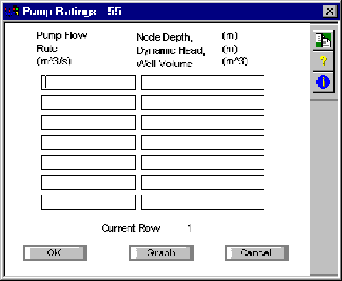

682

SECTION 11: GLOBALS

> **Pump Flow Rate  
> Node Depth**
>
> **Dynamic Head  
> Well Volume**
>
> **Pump Flow Rate**
>
> Pump flow rate (feet3/sec or metres3/sec). The pump's operating range is limited to the range between the lowest pumping rate and the highest pumping rate regardless of the detected dynamic head. Pump rates will remain fixed at either the lowest pumping rate or the highest pumping rate head until the system returns to the normal operating range of the pump.
>
> **Well Volume**
>
> An off-line pump station with a wet well. The pump must be supplied from its own wet well, ie. only one conduit must be connected to the node at which the pump is located. The rate of pumping depends on the volume of water in the well.
>
> The program sets the node invert level to -100.
>
> Note that only one conduit may be connected to the node from which this type of pump operates.
>
> Inflows to the off-line pump must be derived from the main sewer system through an orifice, a weir, or a pipe. The influent to the wet-well node must be a free discharge regardless of the diversion structure. The pumping rule curve is based on the volume of water in the storage node.
>
> Wet-well volumes are specified as input data for each pump station: Vl \< V \< Vh, where Vh is the maximum capacity of the wet well. The pumping rates are specified as input data for each station. The pump rate is selected automatically depending on the volume in the wet-well.
>
> A mass balance of pumped outflow and inflow is performed in the wet-well during the model simulation period.
>
> If the wet-well goes dry, the pump rate is reduced below rate Rl until it just equals the inflow rate. When the inflow rate again equals or exceeds Rl, the pumping rate goes back to operating on the rule curve. If Vh is exceeded in the wet-well, the inflow to the storage node is reduced until it does not exceed the maximum pumped flow.
>
> **Node Depth**
>
> An in-line lift pump. The rate of pumping depends on the level of water, ie. depth, in the node being pumped. For an in-line station, the pump rate is based on the water depth at the pump junction. The rule is as follows:
>
> Pump Rate = Rl for 0 \< Y \< Yl
>
> = Ri Yi \< Y \< Yi+1
>
> = Rh Yh-1 \< Y \< Yh
>
> For Y = 0, the pump rate is the inflow rate to the pump junction.
>
> **Dynamic Head**
>
> An in-line or off-line pump that pumps according to the head difference over the pump, i.e. uses a multi point pump curve. The rate of pumping depends on the level of water in the node being pumped.
>
> This type of pump station uses a storage node upstream for a wet well (Multiple pumps with different characteristics may be connected to the same storage node to simulate more than one pump in a pumping station).
>
> The dynamic head difference between the upstream and downstream nodes determines the pumping rate according to a three-point head-discharge relationship for the pump. The operating condition (i.e., on/off) for the pump is determined from the wet well elevation from the previous half-step computation.

683

> xpswmm Reference Manual
>
> If the model detects that a pump is on then its flow is computed from the dynamic head difference based on a linearized pump operating curve as shown below.
>
> The pump's operating range is limited to the range between the low-rate head and the high-rate head regardless of the detected dynamic head. Pump rates will remain fixed at either the low-rate head or the high-rate head until the system returns to the normal operating range of the pump.
>
> **11.16 Pit Rating Curve**
>
> **Pit Rating Curve Global Data**
>
> Inlet Rating Curves are used to -define a gutter approach flow versus captured flow rating curve.
>
> 
>
> *Gutter Flow*
>
> Enter the surface flow (m3/s, ft3/s) approaching this inlet that corresponds to the captured flow in the adjacent column. The coordinates should start at zero although this is not mandatory, as the table will be extrapolated to predict any required value. The data also does not have to be entered in sequential increasing order since the data is sorted when OK or SORT is chosen.
>
> *Captured Flow*
>
> Enter the inlet capture flow (m3/s, ft3/s) corresponding to the Gutter Flow in the adjacent column. If this value is greater than the Gutter Flow then all approach flow is captured.
>
> Inlet Rating Curves may also be used to -define a gutter approach depth versus captured flow rating curve.

684

SECTION 11: GLOBALS

> 

The data associated with the rating curve database may be accessed from either the Global Data menu or from a local node using the selection list function

*Gutter Depth*

Enter the surface depth (m, ft) at this inlet that corresponds to the captured flow in the adjacent column. The coordinates should start at zero although this is not mandatory, as the table will be extrapolated to predict any required value. The data also does not have to be entered in sequential increasing order since the data is sorted when OK or SORT is chosen.

The way in which the inlet depth is calculated depends on the status of the Calculate Gutter Spread flag. If the flag is checked then the depth is calculated according to the pavement crossfall characteristics

*Captured Flow*

Enter the inlet capture flow (m3/s, ft3/s) corresponding to the Gutter Depth in the adjacent column

> **11.17 Hydraulic Brake**

**Hydraulic Brakes**

> xpswmm Reference Manual
>
> 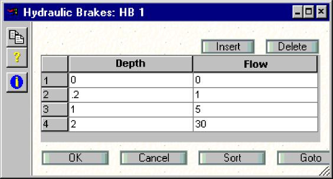
>
> *Depth*
>
> Enter the surface depth (m, ft) that corresponds to the flow in the adjacent column. The coordinates should start at zero although this is not mandatory, as the table will be extrapolated to predict any required value. The data also does not have to be entered in sequential increasing order since the data is sorted when OK or SORT is chosen.
>
> *Flow*
>
> Enter the flow (m3/s, ft3/s) corresponding to the Depth in the adjacent column.
>
> **11.18 Pavement Crossfall**
>
> **Pavement Crossfalls**
>
> When runoff exceeds inlet capacity**,** the spread, depth and velocity of ponded water may be calculated from the geometry and hydraulic properties of the cross section.
>
> In an xpswmm model, Pavement Crossfalls may be stored in the Global Database. A Pavement Crossfall record is assigned to a hydraulics inlet node using the Inlet Capacity Dialog.
>
> 
>
> 686

SECTION 11: GLOBALS

> 

As shown in the above diagram, the Pavement Crossfalls are defined as a section extending from the boundary line (representing the edge of the drainage) to the pavement centerline. It consists of three regions:

**Verge** region between the boundary and the gutter

**Gutter** channel draining to drainage inlet, lowest point designated as invert  
**Pavement** roadway surface extending from the lip to the centerline (or highpoint)

The terms in the dialog are defined as:

**A** Verge Distance (Boundary to Back of Curb) (ft, m)

**B** Verge Slope (Boundary to Back of Curb) (%)

**n-verg** Verge Roughness (Manning's n)

**C** Width of Top of Back of Curb (ft, m)

**D** Distance from Face of Curb to Nominal Curb Line

**E** Distance from Nominal Curb Line to Gutter Invert (ft, m)

**F** Distance from Gutter Invert to Curb Lip (ft, m)

**G** Depth from Back of Curb to Gutter Invert (ft, m)

**H** Depth from Back of Curb to Gutter/Pavement Lip (ft, m)  
**n-gutter** Gutter Roughness n

**I** Pavement Width (Lip to Road Centerline) (ft, m)

**J** Pavement Crossfall (Lip to Road Centerline) (%)

**n-pave** Pavement Roughness n

> **11.19 HEC-12/HEC-22**

**HEC-22**

> xpswmm Reference Manual
>
> 
>
> A separate addendum consisting of the complete FHWA documentation for HEC-12 "Design of Highway Pavements" is provided as part of the documentation for user training courses. Contact your account representative for additional information.
>
> 
>
> This implementation of HEC-12 supports;
>
> **Grated Inlets,**
>
> Curb Inlets,
>
> **Slotted Inlets,** and,
>
> **Combinations of grate and curb inlets.**
>
> *Depression*
>
> The capture efficiency of an inlet can be increased by having a locally depressed gutter section (inches, mm).
>
> The inlets may be located on either continuous grades or in sumps.

688

SECTION 11: GLOBALS

> **11.20 User Defined File Type**
>
> **User Defined File Type Global Data**
>
> 
>
> **Number of Header Lines** Enter the number of lines at the beginning of the file, that are to be ignored.
>
> **Free Format (CSV)** A flag indicating the file is in free format (i.e. comma separated).
>
> **Introduce Time Interval** A flag indicating the file has no date or time fields (or that the fields are to be ignored). This flag would be turned on if the file is simply a list of flows.
>
> **Start Date** Enter the date of the first value in the file. The date should be in the date format specified in the SWMXP.INI file (e.g. dd/mm/yy).
>
> **Start Time** Enter the time of the first value in the file.
>
> **Start Time** Enter the time interval (decimal minutes) between the values in the file.
>
> **Field Information** Enter the station name, flow rate, flow velocity, water depth, rainfall depth, date and time, each in a variety of formats, or enter a dummy field to ignore a record. If the file is in fixed format (i.e. not Free Format) enter the field width (the number of characters wide the column is). Otherwise enter any value greater than zero as the field width. Use the Add, Insert, Update and Delete buttons to add or modify the date in the field listbox.
>
> **11.21 XP Tables**
>
> **XP Tables Global Database**
>
> This allows you to **Edit** existing XP Table file definitions.
>
> **11.22 Rational Formula**
>
> **Rational Formula**
>
> xpswmm Reference Manual
>
> 
>
> There are currently 5 different Intensity-Duration-Frequency methods and 4 different Runoff Coefficient methods supported.
>
> Rainfall intensity may be calculated in one of five ways:
>
> Using the method described in AR&R, 1977 (Pattison, 1977);
>
> The method described in AR&R, 1987 (Pilgrim, 1987);
>
> By using a user defined **Intensity-Frequency-Duration Table;**
>
> A Generalized Equation; and
>
> The Alameda County Public Works (California) method.
>
> The coefficient of runoff may be calculated by one of five methods:  
> The method described in AR&R, 1977 (Pattison, 1977), (Ordon, 1954);  
> The method described in **AR&R, 1987** (Pilgrim, 1987), *(Australia only)*,  
> Entering a Constant Runoff Coefficient for each subcatchment, and,  
> The Alameda County Public Works (California) method.
>
> There are no restrictions on combining any runoff coefficient with any intensity calculation method.
>
> **AR&R 1977 IFD**
>
> 690

SECTION 11: GLOBALS

> 
>
> This method follows the 1977 Australian Rainfall & Runoff procedures with polynomial coefficients obtained from that publication (Pattison, 1977).
>
> Each rainfall intensity-frequency-duration curve can be represented by a polynomial equation as shown below:
>
> ln *I* = *a* + *btc*+ *td*+ *t*+ *etf*+ *tg*+ *t*
>
> ( ) ( ) 2 ( ) 3( ) 4( ) 5( )6
>
> ln ln ln ln ln ln
>
> where *I* = rainfall intensity in mm/h
>
> *t* = duration of rainfall in hours
>
> ln *I* = natural logarithm of I
>
> ln *t* = natural logarithm of t
>
> a, b...g are coefficients
>
> The coefficients a, b, c, d, e, f and g are extracted from the 1977 edition of AR & R for the 1, 2, 5, 10, 20, 50 and 100 AEP's. The intensities are then calculated as required for each catchment and each return interval requested. Coefficients must be entered for all return intervals (ie. 1 to 100), regardless of what return period is being analyzed. The table below displays some typical data:

<table>
<colgroup>
<col style="width: 6%" />
<col style="width: 10%" />
<col style="width: 10%" />
<col style="width: 10%" />
<col style="width: 9%" />
<col style="width: 10%" />
<col style="width: 10%" />
<col style="width: 32%" />
</colgroup>
<tbody>
<tr class="odd">
<td><strong>R P</strong></td>
<td><strong>a</strong></td>
<td><strong>b</strong></td>
<td><strong>c</strong></td>
<td><blockquote>

<strong>d</strong>

</blockquote></td>
<td><blockquote>

<strong>e</strong>

</blockquote></td>
<td><strong>f</strong></td>
<td><blockquote>

<strong>g</strong>

</blockquote></td>
</tr>
<tr class="even">
<td>1</td>
<td>2.8390000</td>
<td>-.6530000</td>
<td>-.0475000</td>
<td>.0264700</td>
<td>.0012400</td>
<td>-.0021070</td>
<td>.0002041</td>
</tr>
<tr class="odd">
<td>2</td>
<td>3.0970000</td>
<td>-.6689000</td>
<td>-.0541000</td>
<td>.0299400</td>
<td>.0019060</td>
<td>-.0024570</td>
<td>.0002390</td>
</tr>
<tr class="even">
<td>5</td>
<td>3.3670001</td>
<td>-.7178000</td>
<td>-.0741000</td>
<td>.0451000</td>
<td>.0037260</td>
<td>-.0041352</td>
<td>.0004227</td>
</tr>
<tr class="odd">
<td>10</td>
<td>3.4970000</td>
<td>-.7300000</td>
<td>-.0853000</td>
<td>.0446200</td>
<td>.0055280</td>
<td>-.0039794</td>
<td>.0003366</td>
</tr>
<tr class="even">
<td>20</td>
<td>3.6510000</td>
<td>-.7471000</td>
<td>-.0928000</td>
<td>.0486800</td>
<td>.0063370</td>
<td>-.0044000</td>
<td>.0003738</td>
</tr>
<tr class="odd">
<td>50</td>
<td>3.8100000</td>
<td>-.7659000</td>
<td>-.1036000</td>
<td>.0526300</td>
<td>.0075960</td>
<td>-.0048175</td>
<td>.0003939</td>
</tr>
<tr class="even">
<td>100</td>
<td>3.9190000</td>
<td>-.7775000</td>
<td>-.1095000</td>
<td>.0547800</td>
<td>.0083970</td>
<td>-.0049816</td>
<td>.0003921</td>
</tr>
</tbody>
</table>

> Typical Rainfall-Intensity-Duration-Frequency Polynomial Coefficients (After AR&R, 1977)
>
> Although this procedure has been superseded by the method described in the 1987 edition of AR&R it is probably still the most up to date method for calculating intensities as the Bureau can supply the latest polynomial coefficient information for any area in Australia.

691

xpswmm Reference Manual

**AR&R 1987 IDF**

> 

This method follows the 1987 Australian Rainfall & Runoff procedure (Pilgrim, 1987). To use this procedure it is necessary to extract nine values from Volume 2 of 1987 AR&R. These are the 1 Hr, 12 Hr and 72 Hr intensities for both the 50 Yr and 2 Yr events, plus the Location Skew value and the F2 (events \< 2 years) and F50 (events \> 50 years) Frequency Factors.

**Tabular IDF Input**

692

SECTION 11: GLOBALS

> 
>
> The user creates a table of ARI (Average Recurrence Intervals) versus duration (in minutes). Both the ARI's and the durations are user definable and if the table does not cover the specific event then the program will linearly interpolate or extrapolate a value.
>
> **General IDF Equation**
>
> xpswmm Reference Manual

where:

> *I* = intensity (in/hr, mm/hr)
>
> *t* = rainfall duration (min)
>
> *ARI* = return period (yr)
>
> *B*, *D*, *E* and *F* = user coefficients
>
> Note that when *F* = 0, the equation becomes:

<table>
<colgroup>
<col style="width: 56%" />
<col style="width: 43%" />
</colgroup>
<tbody>
<tr class="odd">
<td rowspan="2"><em>I</em>=</td>
<td><em>B</em></td>
</tr>
<tr class="even">
<td>
( )<em>E</em>

<em>t</em> + <em>D</em>
</td>
</tr>
</tbody>
</table>

> **Alameda County IDF Method**

694

SECTION 11: GLOBALS

> 
>
> The Rainfall Intensity for the appropriate time of concentration is computed from the equation:
>
> *Ij* =( 0 .330+ .091144*MAP*)( 0.2490+ .1006 *Kj*) *Ti* 0 .56253
>
> 
>
> Where:
>
> Ij = Rainfall Intensity for Return Period (frequency) j and storm duration i. (mm/hr, in/hr)
>
> MAP = Mean Annual Precipitation (mm, in)
>
> Ti = Storm Duration (hrs)
>
> Kj = Frequency Factor
>
> **AR&R 1977 Runoff Coefficient**

xpswmm Reference Manual

> 

The 1977 Australian Rainfall & Runoff Runoff Coefficients for urban catchments are based on Ordon Curves (1953). The runoff coefficients for urban catchments are calculated from the following equation:

where:

> C = Runoff coefficient
>
> X = Calibrated constant
>
> Y = Calibrated exponent
>
> I = Rainfall intensity (mm/hr)
>
> The values of the constants X and Y for each urban catchment category are tabulated below:

<table>
<colgroup>
<col style="width: 13%" />
<col style="width: 55%" />
<col style="width: 10%" />
<col style="width: 21%" />
</colgroup>
<tbody>
<tr class="odd">
<td><strong>Category</strong></td>
<td><strong>Description</strong></td>
<td><strong>X</strong></td>
<td><strong>Y</strong></td>
</tr>
<tr class="even">
<td>1</td>
<td><blockquote>

Semi Impervious Areas

</blockquote></td>
<td>5.81</td>
<td>1.47</td>
</tr>
<tr class="odd">
<td>2</td>
<td><blockquote>

Surface Clay, Poor Paving, Sandstone Rock

</blockquote></td>
<td>4.46</td>
<td>0.96</td>
</tr>
<tr class="even">
<td>3</td>
<td><blockquote>

Bare Earth

</blockquote></td>
<td>3.22</td>
<td>0.70</td>
</tr>
<tr class="odd">
<td>4</td>
<td><blockquote>

Earth with Sandstone Outcrops

</blockquote></td>
<td>3.14</td>
<td>0.594</td>
</tr>
<tr class="even">
<td>5</td>
<td><blockquote>

Bare Loam

</blockquote></td>
<td>2.91</td>
<td>0.483</td>
</tr>
<tr class="odd">
<td>6</td>
<td><blockquote>

Ordinary Loam

</blockquote></td>
<td>2.31</td>
<td>0.376</td>
</tr>
<tr class="even">
<td>7</td>
<td><blockquote>

Park Lawns &amp; Meadows

</blockquote></td>
<td>2.09</td>
<td>0.313</td>
</tr>
<tr class="odd">
<td>8</td>
<td><blockquote>

Cultivated Fields with Good Growth Sand Strata

</blockquote></td>
<td>1.94</td>
<td>0.266</td>
</tr>
</tbody>
</table>

> Parameters for Urban Pervious Runoff Coefficients (After Ordon, 1953)

696

SECTION 11: GLOBALS

> A constant coefficient for impervious areas can also be entered directly.
>
> **AR&R 1987 Runoff Coefficient**
>
> 
>
> The user enters the 1 hour, 10 Yr intensity in this dialog. The coefficient of runoff is for the pervious portion of the catchment is calculated on the fly as the intensity is calculated. The coefficient of impervious runoff is input directly.
>
> The figure relates the runoff coefficient for a 10 Year ARI, C10, to the pervious and impervious fractions of a catchment and to its rainfall climate characterized by the 10 Year ARI, 1 hour duration rainfall intensity (AR&R, 1987). For areas where the 10 Year, 1 hour intensity is between 25 and 70 mm/hr a line is linearly interpolated between the upper and lower bound curves.
>
> For average recurrence intervals other than 10 years the C10 value is multiplied by frequency factors presented in the table below:

|                 |                      |
|-----------------|----------------------|
| **ARI (Years)** | **Frequency Factor** |
| 1               | 0.8                  |
| 2               | 0.85                 |
| 5               | 0.95                 |
| 10              | 1.0                  |
| 20              | 1.05                 |
| 50              | 1.15                 |
| 100             | 1.2                  |

> Frequency Factors for Rational Method Runoff Coefficients (After AR&R, 1987)

697

SECTION 11: GLOBALS

> S = Average ground slope (%)
>
> I = rainfall intensity (in/hr)
>
> **11.23 Natural Section Shapes**

**Natural Section Shape**

> 

In all versions of the software since version 9.0 the natural section profile data has been stored in a global database. This allows profiles of, for example, channel improvements or roadway cross-sections to be re-used in multiple links.

The data is defined by HEC-2 type natural surface cross-section coordinate pairs *(C4 or GR**)***. Elevations are used only to determine the shape of the cross-section. Invert elevations are defined in the node data dialog box and also by the Upstream and Downstream Elevations shown in the appropriate link dialog.

The low point in the cross-section is the lowest point between the left and right Main Channel Stations. The high point is the highest point of all the cross-section coordinates. If the left-most or right-most elevations are less than this (maximum) value, vertical sides are projected up to the high point. Total cross-section depth is computed as the difference between the high point of the cross-section and low point of the cross-section (as described above).

The profile is defined in terms of station **(x)** and stage **(elevation).  
***Insert*

699

> xpswmm Reference Manual
>
> New points are inserted in the table using the Insert button. The new points can be inserted anywhere in the section and can sorted in order of the Station (X) when focus is moved from one of the empty cells (a non-empty field is selected with the mouse).
>
> *Delete*
>
> Deletes the currently selected row.  
> *Left Overbank Station*
>
> Enter the Station (X) defining the left overbank section. You can also click the LB button then click on the point on the graph representing the left overbank point.
>
> *Right Overbank Station*
>
> Enter the Station (X) defining the right overbank section. You can also click the RB button then click on the point on the graph representing the right overbank point.
>
> *Left Overbank Roughness*
>
> Enter Manningss n for the left overbank.
>
> *Main Channel Roughness*
>
> Enter Manningss n for the main channel.
>
> *Right Overbank Roughness*
>
> Enter Manningss n for the right overbank.  
> *Depth Varying Roughness*
>
> Enter the roughness values as they vary by depth in a table. These values are used for all three parts of the channel, i.e. the depth-roughness (n) value table will be use for both the Left and right overbanks as well as the center channel.
>
> *Graph Window*
>
> There are 8 ways of manipulating data interactively using the graph window:

<table>
<colgroup>
<col style="width: 9%" />
<col style="width: 5%" />
<col style="width: 84%" />
</colgroup>
<tbody>
<tr class="odd">
<td></td>
<td></td>
<td><blockquote>

Set the graphics mode back to Normal. To Zoom In hold down the shift key and drag the mouse. To zoom out right-click the mouse and select Undo Zoom.

</blockquote></td>
</tr>
<tr class="even">
<td></td>
<td></td>
<td><blockquote>

Extend the cross section by adding to the left or right extremities of the section. Click the mouse at the location of the new point.

</blockquote></td>
</tr>
<tr class="odd">
<td></td>
<td></td>
<td><blockquote>

Modify the cross section by inserting a new point between two existing points. Click the mouse at the location of the new point.

</blockquote></td>
</tr>
<tr class="even">
<td></td>
<td></td>
<td><blockquote>

Delete a point from the cross-section. Click the mouse on the point to be deleted.

</blockquote></td>
</tr>
<tr class="odd">
<td></td>
<td></td>
<td rowspan="3"><blockquote>

Modify the cross section by moving an existing points. Click the mouse and drag the point to its new location.

Click the mouse on the point representing the Left Overbank station.

Click the mouse on the point representing the Left Overbank station.

</blockquote></td>
</tr>
<tr class="even">
<td></td>
<td></td>
</tr>
<tr class="odd">
<td>700</td>
<td></td>
</tr>
</tbody>
</table>

SECTION 11: GLOBALS

<table>
<colgroup>
<col style="width: 15%" />
<col style="width: 85%" />
</colgroup>
<tbody>
<tr class="odd">
<td><blockquote>

</blockquote></td>
<td><blockquote>

Modify the display properties of the graph. See the Review Results Graph Customization Options<strong>.</strong>

</blockquote></td>
</tr>
</tbody>
</table>

> **11.24 2D Landuses**
>
> **2D Landuses**
>
> Set the Mannings n values, rainfall abstraction and 2D hydraulic Infiltration values for polygons in the 2D domain.
>
> 
>
> The Description is the name as it appears in the Layer Control Panel.
>
> Mannings n may be defined as constant or as a function of depth in the 2D cell. Select the appropriate radio button. A variable roughness curve is entered into a table as n values and the cutoff depths, ft (m).
>
> Check Rainfall Abstraction if it is to be included in the calculation (i.e. if a 2D Rainfall/Flow Area is used in the simulation). For the Rainfall Abstraction the Initial Loss, in (mm) and the Continuing Loss in/hr (mm/hr) is entered.
>
> 2D hydraulic infiltration can be applied to the model, termed transmission loss to differentiate from Infiltration within the Runoff Mode. This 2D infiltration or transmission loss can be applied to the model using the Green Ampt and Initial/continuing loss methodologies. These loss values are applied within the Global Database  (2D) Soil Type record. A Percent Impervious (%) is input within the 2D Landuse dialog.
>
> Please note: When 2D Landuse polygon areas overlap the attributes from the Landuse highest in the Layer Control Panel order will be used during the simulation  as shown in the image below. **The top most Landuse in the layer list takes precedence over all other Landuse Layers.**

701

> xpswmm Reference Manual
>
> \*\*\*\*Insert image of Landuse layers being moved up\*\*\*\*\*
>
> To adjust the order of priority of the Landuse layer list, right click on a land use and select Move this Layer Up, or Move this Layer Down.
>
> The following table presents ranges of roughness coefficients for overland flow (Sheetflow).

<table>
<colgroup>
<col style="width: 38%" />
<col style="width: 21%" />
<col style="width: 39%" />
</colgroup>
<tbody>
<tr class="odd">
<td><blockquote>

<strong><em>Type of cover 
</em>Vegetated Areas</strong>

</blockquote></td>
<td colspan="2">
<em><strong>Values of roughness coefficient, n</strong></em>

<em><strong>Minimum Maximum</strong></em>
</td>
</tr>
<tr class="even">
<td><blockquote>

Dense turf

</blockquote></td>
<td>0.17</td>
<td>0.80</td>
</tr>
<tr class="odd">
<td><blockquote>

Bermuda and dense grass

</blockquote></td>
<td>0.17</td>
<td>0.48</td>
</tr>
<tr class="even">
<td><blockquote>

Average grass cover

</blockquote></td>
<td>0.20</td>
<td>0.40</td>
</tr>
<tr class="odd">
<td><blockquote>

Poor grass cover on rough surface

</blockquote></td>
<td>0.20</td>
<td>0.30</td>
</tr>
<tr class="even">
<td><blockquote>

Short prairie grass

</blockquote></td>
<td>0.10</td>
<td>0.20</td>
</tr>
<tr class="odd">
<td><blockquote>

Shrubs and forest litter

</blockquote></td>
<td>0.30</td>
<td>0.40</td>
</tr>
<tr class="even">
<td><blockquote>

Sparse vegetation

</blockquote></td>
<td>0.05</td>
<td>0.13</td>
</tr>
<tr class="odd">
<td><blockquote>

Sparse rangeland with debris

</blockquote></td>
<td></td>
<td></td>
</tr>
<tr class="even">
<td><blockquote>

0% cover

</blockquote></td>
<td>0.09</td>
<td>0.34</td>
</tr>
<tr class="odd">
<td><blockquote>

20% cover

</blockquote></td>
<td>0.05</td>
<td>0.25</td>
</tr>
<tr class="even">
<td><blockquote>

<strong>Plowed or tilled fields</strong>

</blockquote></td>
<td></td>
<td></td>
</tr>
<tr class="odd">
<td><blockquote>

Fallow  no reside

</blockquote></td>
<td>0.008</td>
<td>0.012</td>
</tr>
<tr class="even">
<td><blockquote>

Conventional tillage

</blockquote></td>
<td>0.06</td>
<td>0.22</td>
</tr>
<tr class="odd">
<td><blockquote>

Chisel plow

</blockquote></td>
<td>0.06</td>
<td>0.16</td>
</tr>
<tr class="even">
<td><blockquote>

Fall disking

</blockquote></td>
<td>0.30</td>
<td>0.50</td>
</tr>
<tr class="odd">
<td><blockquote>

No till  no residue

</blockquote></td>
<td>0.04</td>
<td>0.10</td>
</tr>
<tr class="even">
<td><blockquote>

No till  (20 -40% residue cover)

</blockquote></td>
<td>0.07</td>
<td>0.17</td>
</tr>
<tr class="odd">
<td><blockquote>

No till  (100% residue cover)

</blockquote></td>
<td>0.17</td>
<td>0.47</td>
</tr>
<tr class="even">
<td><blockquote>

<strong>Other surfaces</strong>

</blockquote></td>
<td></td>
<td></td>
</tr>
<tr class="odd">
<td><blockquote>

Open ground with debris

</blockquote></td>
<td>0.10</td>
<td>0.20</td>
</tr>
<tr class="even">
<td><blockquote>

Shallow flow on asphalt or concrete

</blockquote></td>
<td>0.10</td>
<td>0.15</td>
</tr>
<tr class="odd">
<td><blockquote>

Fallow fields

</blockquote></td>
<td>0.08</td>
<td>0.12</td>
</tr>
<tr class="even">
<td><blockquote>

Open ground, no debris

</blockquote></td>
<td>0.04</td>
<td>0.10</td>
</tr>
<tr class="odd">
<td><blockquote>

Asphalt or concrete

</blockquote></td>
<td>0.02</td>
<td>0.05</td>
</tr>
</tbody>
</table>

> Adopted from Mays, 2001.
>
> In a 2D hydrodynamic study in a highly urbanized area of Yorkshire, UK, Crowder, et al (2006) used the following roughness coefficients:
>
> ***Land Use Mannings n***
>
> Industrial and commercial (roads, paths, car parks, some grass) 0.020
>
> Residential (roads, alleys, gardens) 0.030
>
> Playing fields and parks (soil grass, isolated vegetation) 0.035
>
> Brownfield land underdevelopment (soil, grass, isolated vegetation) 0.035
>
> **11.25 RDII**
>
> **RDII**
>
> This dialog allows for editing of a Global Database record for the Unit Hydrograph (UH) method for modeling Rainfall Derived Inflow and Infiltration (RDII) in combined sewers. This method is also referred to as the RTK method. It is selected in the Sub-Catchment dialog in Runoff Mode.
>
> 702

SECTION 11: GLOBALS

> 
>
> The options for moths are:
>
> A default UH for All Months, or  
> Separate UH for any month
>
> If a month is not checked, the All Months UH Method will be used during the simulation in that month. For each of the three component UHs enter:
>
> fraction of total rainfall entering the system (R)
>
> time from the beginning of the rainfall to the hydrograph peak, hr (T)
>
> ratio of time of recession to time to peak (K)
>
> initial subcatchment abstractions, in (mm)
>
> initial subcatchment storage, in (mm)
>
> recovery rate of storage (initial abstractions) during dry time steps, in/day (mm/day)

In the drop list next to rainfall select a rainfall record from the Global Database**.**

***SECTION 12: ENGINE***

> **The xpswmm Analysis Engine**
>
> XPS 1D/2D Simulation
>
> **TUFLOW Engine**

xpswmm Reference Manual

> **Run Time Graphing**

706

SECTION 12: ENGINE

> **Real Time Control**

xpswmm Reference Manual

> **Real Time Control**
>
> ***SECTION 13: UTILITIES  
> *Utilities**
>
> This command allows the conversion of various data files to Runoff input files and allows statistical analyses to be performed on xpswmm interface files. In order to run a utility enter the required data from this dialog and hit the 'Run' button while the desired utility is selected.
>
> 
>
> A number of utility functions are available:
>
> Rainfall - The Rain utility is used to read long time series of precipitation records, perform an optional storm event analysis, and generate a precipitation interface file for input into Runoff.
>
> Temperature - The Temperature utility is used to convert temperature data of various formats to a format accessible to Runoff. Temperature data is used by Runoff for the snow melt simulation.
>
> Wind Speed - The Wind Speed utility is used to convert wind speed data of various formats to a format accessible to the Runoff module. Wind speed data is used by Runoff for snow melt simulations.
>
> Evaporation - The Evaporation utility is used to convert evaporation data of various formats to a format accessible to the Runoff block. Evaporation data is used by Runoff for the rainfall/runoff simulation.
>
> Statistics - The Statistics utility performs complex statistical analyses on rain data or flow data. Both quantity and quality of flow data can be analysed.
>
> **Run** - This button runs the currently selected utility. The required data for the selected utility must be entered first.
>
> **13.1 Rainfall**
>
> **Rainfall Utility**
>
> The purpose of the rain block is to read long time series of precipitation records, to perform a storm event analysis, and/or generate a precipitation interface file for input into Runoff.
>
> This dialog allows the entry of all Rainfall utility parameters. In order to run the utility, once the parameters have been entered, OK this dialog and hit the Run button from the main Utilities dialog.

709

> xpswmm Reference Manual
>
> 
>
> **External Input File**
>
> **Input File Format**
>
> **User Defined**
>
> **Standard Format**
>
> **RAIN Interface Output File**
>
> **Create RAIN Interface File**
>
> **Select File**
>
> **More (Rainfall)**
>
> **Standard Format**
>
> As an alternative to the user-defined format a number of pre-defined formats including many of the National Weather Service hourly precipitation data formats are available. These are shown in the dialog below.
>
> 
>
> **Print Control**
>
> These parameters control the amount of output generated in the report file. This file contains the printable output, which can be voluminus depending on the options selected in this dialog. The output options include an echo of

710

> SECTION 13: UTILITIES
>
> precipitation data, an annual storm event summary, a statistical summary (always generated), and synoptic analysis return period tables.
>
> ***Echo Print Rainfall***
>
> This flag controls the echo of rainfall input in the output report file. The month/day/year and hour/rainfall are printed, five across a line, for each non-zero rainfall. This may generate one to three pages of output per year.
>
> ***Print Storm Event Summary***
>
> This flag controls the printing of a storm event summary in the output report file.
>
> The output table has the storm volume, average intensity, storm duration, beginning storm date, previous seven days rainfall, missing data, and number of meter malfunctions. One to two pages of output per year is generated depending on the actual number of storms per year.
>
> **Input File Format**
>
> The format of the external input file must be either selected from a list of 'Standard' file formats, or defined using the 'User Defined' format option.
>
> **Select File**
>
> Filename of RAIN interface file to be created. Use the select button to display a directory listing and allow the required file to be selected. The filename can also be entered directly.
>
> **RAIN Interface Output File**
>
> Filename of Rainfall output interface file. This is the name of the file which will be used later as input to the Runoff block (if 'Create RAIN Interface File' has been selected). **Append** will cause the RAIN output file to be appended to if a file of the given name already exists. **Replace** will cause the RAIN output file to overwrite any existing file of the same name.
>
> **External Input File  
> *Select File***
>
> Filename of external input time series file. Use the select button to display a directory listing and allow the required file to be selected. The filename can also be entered directly.
>
> ***Station Number***
>
> Integer station number, up to six digits long.
>
> This parameter is the National Weather Service station number for NWS format files. Alternatively, for a user-defined format time series, this is the number used to identify the rainfall time series when the Runoff Block reads the RAIN interface file.
>
> **Create RAIN Interface File**
>
> This flag indicates a RAIN interface file is to be created. If this flag is ON the name of the file to create must be entered below. If this flag is OFF the 'Perform Synoptic Analysis' flag (under the More Rainfall button) must be turned ON, as at least one output option is required.
>
> **More Rainfall**
>
> Additional mandatory rainfall utility parameters are entered in this dialog. These parameters control the simulation period, options for output, and the output file selection.

711

> xpswmm Reference Manual
>
> 
>
> **Titles**
>
> **Print Control**
>
> **Dates**
>
> **Report File**
>
> **Perform Synoptic Analysis**
>
> **Titles**
>
> Two descriptive title lines of up to 80 characters. Either or both titles may be left blank. These descriptive titles will be printed at the top of each page of output.
>
> The simulation period can be entered manually. Otherwise the start and end dates can be taken from the first and last data records belonging to the requested station number in the input file.
>
> **Report File**
>
> Name of the report file to be created. This file contains the printable output, which can be voluminus depending on the options selected in this dialog. The output options include an echo of precipitation data, an annual storm event summary, a statistical summary (always generated), and synoptic analysis return period tables.
>
> **Perform Synoptic Analysis**
>
> This flag controls synoptic analysis output to the report file. If this flag is ON then another screen of mandatory data will be displayed. If this flag is OFF the 'Create RAIN interface file' flag in the previous dialog must be ON, as at least one output option is required.
>
> The synoptic analysis consists of generation of return period tables for storm volume, average intensity, duration, and inter-event time. Output is extensive, each return period table may be 10 to 20 pages long for a 30-year rainfall record.
>
> Return periods are calculated on the basis of the equation given in this dialog. Calculations are made of estimates for the mean, variance, standard deviation, coefficient of variation, and coefficient of skewness for each requested parameter.

712

> SECTION 13: UTILITIES
>
> 
>
> **Inter-event Time**
>
> **Return Period**
>
> **Print Control (Storm Event Tables)**
>
> **Save Storm Event Summary**
>
> **Save Storm Event Summary**
>
> This flag indicates a storm event summary is to be output to an additional file. This file can then be read by a spreadsheet, database, or statistical program for further analysis. The output file has the same appearance as the normal printed storm event summary. Additionally, at the head of each column of numbers on the first line a short description of the variable is included.
>
> 
>
> ***Select Event Summary File***
>
> This button allows the naming of the output file for the additional Storm Event Summary. The file name can also be entered directly and should be different to the report output file name.
>
> If the select button is clicked the default filename is the XP filename with a .out extension, or alternatively the filename may be entered manually.
>
> **Return Period**
>
> Empirical return period (plotting position) is calculated by the following equation:
>
> T = (NYRS + 1 - 2\*A) / (M - A)
>
> 713
>
> xpswmm Reference Manual
>
> where
>
> T = return period, years
>
> NYRS = simulation duration, years
>
> M = rank of event (in descending order)
>
> A = position parameter  
> ***Position Parameter -***
>
> Parameter for return period calculation, it is dimensionless. Empirical return period (plotting position) is calculated by the above equation.
>
> A value of A = 0 gives the familiar Weibull plotting position, often used in hydrology, but criticised by Cunnane (1978) who suggested a value of A = 0.4 as a good compromise for the customary situation in which the underlying frequency distribution of the parameter is unknown.
>
> **Inter-event Time**
>
> Minimum number of zero-rainfall hours to constitute separate rainfall events, ie. this number of hours with zero rainfall is required between two rainfall values for the values to be treated as separate storms. Dry periods of duration less than this value may exist within an event, preceded and followed by wet periods. If a value of 1 is chosen, every contiguous rainfall sequence will be viewed as a separate event.
>
> Values of 3 to 30 hours are often used to separate rainfall events. Another approach uses the coefficient of variation (CV) of inter-event time (defined as the ratio of the standard deviation to the mean). The inter-event time giving a CV around 1.0 is usually chosen. This method assumes inter-event times have an exponential distribution, so that two trial values are used and corresponding CV values determined through two runs of the RAIN utility; a plot will give a good estimate of the minimum inter-event time for which CV is around 1.0.
>
> **Print Control (Storm Event Tables)**
>
> The sorted events from largest to smallest may be printed for storm volume, average intensity, storm duration, and inter-event duration. These parameters govern which tables are printed, and how much of each table is printed to the report file.
>
> ***Depth***
>
> This flag controls the output of the table of rainfall depths/volumes by return period.
>
> ***Intensity***
>
> This flag controls the output of the table of rainfall intensity by return period.
>
> ***Storm Duration***
>
> This flag controls the output of the table of storm duration by return period.
>
> ***Inter-event Duration***
>
> This flag controls the output of the table of inter-event duration by return period.  
> ***Print 'x' Events***
>
> This option causes the specified number of storm events, ranked in order from highest return period to lowest, to be printed out in the report file.
>
> ***Print All Events***
>
> This option causes all storm events, ranked in order from highest return period to lowest, to be printed out in the report file.
>
> **Dates**
>
> These options are used to define the period of the selected time series file that will be used on output.
>
> 714

SECTION 13: UTILITIES

> ***Start Date***
>
> Start of analysis date. The program starts processing data from this date. All dates must be entered in one of the following formats, depending on your country configuration.
>
> Day, Month, Year DD/MM/YY
>
> Month, Day, Year MM/DD/YY
>
> Year, Month, Day YY/MM/DD
>
> The date format is defined by the DATE_FORMAT variable in the xpswmm.CFG configuration file.
>
> This item is ignored if the 'Use First Date' option is selected.
>
> ***Use First Date***
>
> This option sets the analysis starting date to that of the first data record belonging to the requested station number in the selected time series input file.
>
> ***Ending Date***
>
> End of analysis date. The program will stop reading data beyond this date. All dates must be entered in one of the following formats, depending on your country configuration.
>
> Day, Month, Year DD/MM/YY
>
> Month, Day, Year MM/DD/YY
>
> Year, Month, Day YY/MM/DD
>
> The date format is defined by the DATE_FORMAT variable in the xpswmm.CFG configuration file.
>
> This item is ignored if the 'Use Last Date' option is selected.
>
> ***Use Last Date***
>
> This option sets the analysis ending date to that of the last data record belonging to the requested station number in the selected time series input file.
>
> **User Defined**
>
> This option should be selected if the input file does not match any of the standard formats. If this option is selected, the definition and width of each input field must be entered in the underlying 'Field Format' dialog.

715

> xpswmm Reference Manual
>
> 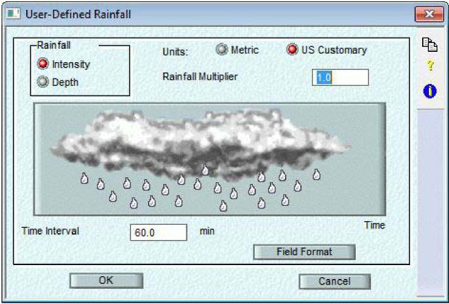
>
> **Rainfall**
>
> **Units**
>
> **Rainfall Multiplier**
>
> **Time Interval**
>
> **Field Format**
>
> **Time Interval**
>
> Time interval, in minutes, between rainfall values. Each rainfall value is assumed to be constant over this time interval.
>
> **Rainfall Multiplier**
>
> Value to multiply each input rainfall value by. This item can be used to convert non-standard units to standard units or to enter a dimensionless temporal pattern as a design storm.
>
> **Rainfall Unit**
>
> Specify the unit, depth or intensity, used to define rainfall values in the input time series file. ***Intensity***
>
> Select 'Intensity' if the input data is specified as an intensity, in standard units of in./hr \[mm/hr\]. Note: other units (eg. mm/min) may be used by setting the 'Rainfall Multiplier' appropriately.
>
> ***Depth***
>
> Select 'Depth' if the input data is specified as a depth of rainfall over the interval, in standard units of in. \[mm\]. Note: other units (eg. hundredths of an inch) may be used by setting the 'Rainfall Multiplier' appropriately.
>
> **Field Format**
>
> This dialog allows a user-defined file format to be specified. The file format includes header definitions and descriptions of the sequence and widths of fields within data records in the input file.

716

> SECTION 13: UTILITIES
>
> 
>
> **Free Format**
>
> **Number of header lines**
>
> **Position**
>
> **Information (Rainfall Variables)**
>
> **Field Width**
>
> **Number of header lines**
>
> Number of lines of the input file to skip before reading field data. Set this item to a non-zero value if the input file contains header lines which should be ignored.
>
> **Field Information (Rainfall Variables)**
>
> Name of field to be read in from this position in the input file.
>
> Up to 10 field definitions can be entered. Each definition represents a column of character positions in the input file. The left most column is defined as column number 1 and so on. If the input file contains blank spaces or data that is not required, the DUMMY field type can be used to skip these positions. The DUMMY field type can be used multiple times if required. The field types supported are the station number, year, month, day, hour, minute, and precipitation.
>
> 
>
> xpswmm Reference Manual
>
> **Field Position**
>
> The field position is the sequence number of the field within an input line. Note that dummy fields can be defined to allow for skipping of spaces and/or unused information.
>
> **Field Width**
>
> Number of characters defining the data for this field. In Fixed format, all fields are concatenated on the input line. In Free format, the field width is irrelevant; as many characters as define each number are processed.
>
> **Free Format**
>
> This flag specifies an input file format of either free or fixed format.
>
> When this flag is ON the input file must be a FORTRAN free format file. In this format, numbers are separated by commas and/or spaces, and the actual column position within the line is not important; only the ordering of fields within the line matters. When this flag is OFF the input file format is fixed, where each relevant field must be within the column range specified.
>
> **Rainfall Variables**
>
> Up to 10 field definitions can be entered. Each definition represents a column of character positions in the input file. The left most column is defined as column number 1 and so on. If the input file contains blank spaces or data that is not required, the DUMMY field type can be used to skip these positions. The DUMMY field type can be used multiple times if required. The field types supported are the station number, year, month, day, hour, minute, and precipitation.
>
> 
>
> **Units**
>
> Specify the units, metric or U.S. customary, of the data in the input time series file. If the units are metric, then the standard rainfall intensity unit is mm/hr, or depth in mm. If the units are U.S. customary, the standard rainfall intensity unit is in./hr, or depth in inches.
>
> **13.2 Temperature**
>
> **Temperature Utility**
>
> The purpose of the Temperature utility is to convert temperature data of various formats to a format accessible to the Runoff block.
>
> This dialog allows the entry of all Temperature utility parameters. In order to run the utility, once the parameters have been entered, OK this dialog and hit the Run button from the main Utilities dialog.
>
> This utility manipulates a TEMP interface file. TEMP interface files are used for temperature, evaporation, and wind speed data in the Runoff module. Thus, the 'Evaporation' and 'Wind Speed' utilities also manipulate TEMP interface files.
>
> 718
>
> SECTION 13: UTILITIES
>
> 
>
> **External Input File**
>
> **Input File Format**
>
> **User Defined Temperature**
>
> **Standard Format**
>
> **TEM P(erature) Interface Output File**
>
> **More Temperature**
>
> **Standard Format**
>
> This option allows one of the standard file formats, recognised by the xpswmm model, to be selected. The formats supported include many of the National Weather Service hourly precipitation data.
>
> Only two National Weather Service standard formats are currently support; NSW3200F and NWS3200V.
>
> 
>
> xpswmm Reference Manual
>
> **Print Control**
>
> These parameters determine the extent to which input data will be echoed to the output file. Three options exist for echoing input data in the output file, no echo, summary only or all data and summary. The summary tables contain the minimum, mean, and maximum values read in by month and/or year.
>
> ***No Echo***
>
> This option does not echo input data in the output file. This eliminates the echo of the raw data input and the summary tables.
>
> ***Print all data and summary***
>
> This option will result in voluminous output containing all the input data and the summary tables.
>
> ***Print Summary only***
>
> This option prints only the monthly/yearly summary tables. This option is recommended.
>
> **Input File Format**
>
> The format of the external input file must be either selected from a list of 'Standard' file formats, or defined using the 'User Defined' format option.
>
> **Select File**
>
> Filename of TEMP interface file to be created. Use the select button to display a directory listing and allow the required file to be selected. The filename can also be entered directly.
>
> **External Input File  
> *Select File***
>
> Filename of external input time series file. Use the select button to display a directory listing and allow the required file to be selected. The filename can also be entered directly.
>
> ***Station Number***
>
> Integer station number, up to six digits long.
>
> This parameter is the National Weather Service station number for NWS format files. Alternatively, for a user-defined format time series, this is the number used to identify the rainfall time series when the Runoff Block reads the TEMP interface file.
>
> **TEMP Interface Output File**
>
> Filename of Temperature output interface file. This is the name of the file which will be used later as input to the Runoff block (if 'Create TEMP Interface File' has been selected). Append will cause the TEMP output file to be appended to if a file of the given name already exists. Replace will cause the TEMP output file to overwrite any other file of the same name which already exists.
>
> **Create TEMP Interface File**
>
> This flag indicates a TEMP interface file is to be created. If this flag is ON the name of the file to create must be entered below.
>
> **User Defined Temperature**
>
> This option should be selected if the input file does not match any of the standard formats. If this option is selected, the definition and width of each input field must be entered in the underlying 'Field Format' dialog.
>
> Use this dialog to enter parameters specific to a user-defined format for temperature data. These parameters include the temperature unit and file format. The temperature unit used is entered on this dialog. The positioning of data in the input file is specified via the 'Field Format' button.
>
> 720
>
> SECTION 13: UTILITIES
>
> 
>
> ***Temperature Units***
>
> This parameter defines the unit of temperature to interpret values in the input time series file. It may be either degrees Fahrenheit, F or degrees Celsius, C.
>
> ***Fahrenheit***
>
> This option indicates data in the input file is specified in degrees Fahrenheit, F.
>
> ***Celsius***
>
> This option indicates data in the input file is specified in degrees Celsius, C.
>
> **Field Format  
> Field Format**
>
> This dialog allows a user-defined file format to be specified. The file format includes header definitions and descriptions of the sequence and widths of fields within data records in the input file.
>
> 
>
> **Free Format**
>
> **Number of header lines**
>
> **Position**
>
> **Information**
>
> **Field Width**
>
> **Number of header lines**
>
> Number of lines of the input file to skip before reading field data.
>
> 721
>
> xpswmm Reference Manual
>
> Set this item to a non-zero value if the input file contains header lines which should be ignored.
>
> **Field Information**
>
> Name of field to be read in from this position in the input file.
>
> Hit this item to display a list of fields to select from. The field types supported are the station number, year, month, day, hour, minute, precipitation and dummy.
>
> Up to 10 field definitions can be entered. Each definition represents a column of character positions in the input file. The left most column is defined by column number 1 and so on. If the input file contains blank spaces or data that is not required, the DUMMY field type can be used to skip these positions. The DUMMY field type can be used multiple times if required. The field types supported are the station number, year, month, day, hour, minute, and minimum and maximum temperatures.
>
> 
>
> **Field Position**
>
> The field position is the sequence number of the field within an input line. Note that dummy fields can be defined to allow for skipping of spaces and/or unused information in fixed format files.
>
> **Field Width**
>
> Number of characters defining the data for this field. In Fixed format, all fields are concatenated on the input line. In Free format, the field width is irrelevant; as many characters as define each number are processed.
>
> **Free Format**
>
> This flag specifies an input file format of either free or fixed format.
>
> When this flag is ON the input file must be a FORTRAN free format file. In this format, numbers are separated by commas and/or spaces, and the actual column position within the line is not important; only the ordering of fields within the line is important. When this flag is OFF the input file format is fixed and field must be within the column range specified
>
> **Temperature Variables**
>
> Up to 10 field definitions can be entered. Each definition represents a column of character positions in the input file. The left most column is defined by column number 1 and so on. If the input file contains blank spaces or data that is not required, the DUMMY field type can be used to skip these positions. The DUMMY field type can be used multiple times if required. The field types supported are the station number, year, month, day, hour, minute, and minimum and maximum temperatures.
>
> 722
>
> SECTION 13: UTILITIES
>
> 
>
> **More Temperature**
>
> Additional mandatory temperature utility parameters are entered here. These parameters control the simulation period, options for output, and the output file selection.
>
> 
>
> **Titles**
>
> **Dates**
>
> **Echo Print Control**
>
> **Report File**
>
> **Titles**
>
> Two descriptive title lines of up to 80 characters. Either or both titles may be left blank. These descriptive titles will be printed at the top of each page of output.
>
> The simulation period can be entered manually. Otherwise the start and end dates can be taken from the first and last data records belonging to the requested station number in the input file.

723

> xpswmm Reference Manual
>
> **Report File**
>
> Name of the report output file to be created. The 'Select' button can also be used to enter a file name. If the select button is clicked the default filename will be the XP filename with a .out extension. The filename, however, can also be entered directly and should be different to the report o5tput file name. This file contains the printable output, which can be voluminus depending on the Print Control options selected in this dialog.
>
> **Dates**
>
> These options are used to define the period of the selected time series file that will be used on output. ***Start Date***
>
> Start of analysis date. The program starts processing data from this date. All dates must be entered in one of the following formats, depending on your country configuration.
>
> Day, Month, Year DD/MM/YY
>
> Month, Day, Year MM/DD/YY
>
> Year, Month, Day YY/MM/DD
>
> The date format is defined by the DATE_FORMAT variable in the xpswmm.CFG configuration file.
>
> This item is ignored if the 'Use First Date' option is selected.
>
> ***Use First Date***
>
> This option sets the analysis starting date to that of the first data record belonging to the requested station number in the selected time series input file.
>
> ***Ending Date***
>
> End of analysis date. The program will stop reading data beyond this date. All dates must be entered in one of the following formats, depending on your country configuration.
>
> Day, Month, Year DD/MM/YY
>
> Month, Day, Year MM/DD/YY
>
> Year, Month, Day YY/MM/DD
>
> The date format is defined by the DATE_FORMAT variable in the xpswmm.CFG configuration file.
>
> This item is ignored if the 'Use Last Date' option is selected.
>
> ***Use Last Date***
>
> This option sets the analysis ending date to that of the last data record belonging to the requested station number in the selected time series input file.
>
> **13.3 Wind Speed**
>
> **Wind Speed Utility**
>
> The purpose of the Wind Speed utility is to convert wind speed data of various formats to a format accessible to the Runoff block.
>
> This dialog allows the entry of all Wind Speed utility parameters. In order to run the utility, once the parameters have been entered, OK this dialog and hit the Run button from the main Utilities dialog.
>
> This utility manipulates a TEMPerature interface file. TEMP interface files are used for temperature, evaporation, and wind speed data in the Runoff module. Thus, the 'Temperature' and 'Evaporation' utilities also manipulate TEMP interface files.

724

> SECTION 13: UTILITIES
>
> 
>
> **External Input File  
> Input File Format**
>
> **User Defined Wind Speed**
>
> **Standard Format - Wind Speed**
>
> **TEMP(erature) Interface Output File -**
>
> **More Wind Speed**
>
> **Standard Format - Wind Speed**
>
> This option allows one of the standard file formats, recognised by the xpswmm model, to be selected. The formats supported include some of the National Weather Service hourly precipitation data.
>
> Only two National Weather Service standard formats are currently support; NSW3200F and NWS3200V.
>
> 
>
> **Print Control**
>
> These parameters determine the extent to which input data will be echoed to the output file. Three options exist for echoing input data in the output file, no echo, summary only or all data and summary. The summary tables contain the minimum, mean, and maximum values read in by month and/or year.

725

> xpswmm Reference Manual
>
> ***No Echo***
>
> This option does not echo input data in the output file. This eliminates the echo of the raw data input and the summary tables.
>
> ***Print all data and summary***
>
> This option will result in voluminous output containing all the input data and the summary tables.
>
> ***Print Summary only***
>
> This option prints only the monthly/yearly summary tables. This option is recommended.
>
> **Input File Format**
>
> The format of the external input file must be either selected from a list of 'Standard' file formats, or defined using the 'User Defined' format option.
>
> **Select File**
>
> Filename of TEMP interface file to be created. Use the select button to display a directory listing and allow the required file to be selected. The filename can also be entered directly.
>
> **External Input File  
> *Select File***
>
> Filename of external input time series file. Use the select button to display a directory listing and allow the required file to be selected. The filename can also be entered directly.
>
> ***Station Number***
>
> Integer station number, up to six digits long.
>
> This parameter is the National Weather Service station number for NWS format files. Alternatively, for a user-defined format time series, this is the number used to identify the rainfall time series when the Runoff Block reads the TEMP interface file.
>
> **TEMP Interface Output File**
>
> Filename of Temperature output interface file. This is the name of the file which will be used later as input to the Runoff block (if 'Create TEMP Interface File' has been selected). Append will cause the TEMP output file to be appended to if a file of the given name already exists. Replace will cause the TEMP output file to overwrite any other file of the same name which already exists.
>
> **Create TEMP Interface File**
>
> This flag indicates a TEMP interface file is to be created. If this flag is ON the name of the file to create must be entered below. If this flag is OFF the 'Perform Synoptic Analysis' flag (under the More button) must be turned ON, as at least one output option is required.
>
> **User Defined Wind Speed**
>
> This option should be selected if the input file does not match any of the standard formats. If this option is selected, the definition and width of each input field must be entered in the underlying 'Field Format' dialog.

726

> SECTION 13: UTILITIES
>
> 
>
> ***Units***
>
> Specify the units, metric (km/hr) or U.S. Customary (miles/hr), of the data in the input file.  
> ***Wind Speed Multiplier***
>
> Floating point value to multiply each input wind speed value by. This item can be used as a conversion factor (eg m/s =\> km/hr).
>
> **Field Format  
> Field Format**
>
> This dialog allows a user-defined file format to be specified. The file format includes header definitions and descriptions of the sequence and widths of fields within data records in the input file.
>
> 
>
> **Free Format**
>
> **Number of header lines**
>
> **Position**
>
> **Information**
>
> **Field Width**
>
> **Number of header lines**
>
> Number of lines of the input file to skip before reading field data.
>
> 727
>
> xpswmm Reference Manual
>
> Set this item to a non-zero value if the input file contains header lines which should be ignored.
>
> **Field Information**
>
> Name of field to be read in from this position in the input file.
>
> Hit this item to display a list of fields to select from. The field types supported are the station number, year, month, day, hour, minute, precipitation and dummy.
>
> Up to 10 field definitions can be entered. Each definition represents a column of character positions in the input file. The left most column is defined by column number 1 and so on. If the input file contains blank spaces or data that is not required, the DUMMY field type can be used to skip these positions. The DUMMY field type can be used multiple times if required.
>
> 
>
> **Field Position**
>
> The field position is the sequence number of the field within an input line. Note that dummy fields can be defined to allow for skipping of spaces and/or unused information in fixed format files.
>
> **Field Width**
>
> Number of characters defining the data for this field. In Fixed format, all fields are concatenated on the input line. In Free format, the field width is irrelevant; as many characters as define each number are processed.
>
> **Free Format**
>
> This flag specifies an input file format of either free or fixed format.
>
> When this flag is ON the input file must be a FORTRAN free format file. In this format, numbers are separated by commas and/or spaces, and the actual column position within the line is not important; only the ordering of fields within the line is important. When this flag is OFF the input file format is fixed, and each field must be within the column range specified.
>
> **Wind Speed Variables**
>
> Up to 10 field definitions can be entered. Each definition represents a column of character positions in the input file. The left most column is defined by column number 1 and so on. If the input file contains blank spaces or data that is not required, the DUMMY field type can be used to skip these positions. The DUMMY field type can be used multiple times if required. The field types supported are the station number, year, month, day, hour, minute, and wind speed.
>
> 728
>
> SECTION 13: UTILITIES
>
> 
>
> **More Wind Speed**
>
> Additional mandatory Wind Speed utility parameters. These parameters control the simulation period, options for output and the output file selection.
>
> 
>
> **Titles**
>
> **Dates**
>
> **Echo Print Control**
>
> **Report File**
>
> **Titles**
>
> Two descriptive title lines of up to 80 characters. Either or both titles may be left blank. These descriptive titles will be printed at the top of each page of output.
>
> The simulation period can be entered manually. Otherwise the start and end dates can be taken from the first and last data records belonging to the requested station number in the input file.

729

> xpswmm Reference Manual
>
> **Report File**
>
> Name of the report output file to be created. The 'Select' button can also be used to enter a file name. If the select button is clicked the default filename will be the XP filename with a .out extension. The filename, however, can also be entered directly and should be different to the report output file name. This file contains the printable output, which can be voluminus depending on the Print Control options selected in this dialog.
>
> **Dates**
>
> These options are used to define the period of the selected time series file that will be used on output. ***Start Date***
>
> Start of analysis date. The program starts processing data from this date. All dates must be entered in one of the following formats, depending on your country configuration.
>
> Day, Month, Year DD/MM/YY
>
> Month, Day, Year MM/DD/YY
>
> Year, Month, Day YY/MM/DD
>
> The date format is defined by the DATE_FORMAT variable in the xpswmm.CFG configuration file.
>
> This item is ignored if the 'Use First Date' option is selected.
>
> ***Use First Date***
>
> This option sets the analysis starting date to that of the first data record belonging to the requested station number in the selected time series input file.
>
> ***Ending Date***
>
> End of analysis date. The program will stop reading data beyond this date. All dates must be entered in one of the following formats, depending on your country configuration.
>
> Day, Month, Year DD/MM/YY
>
> Month, Day, Year MM/DD/YY
>
> Year, Month, Day YY/MM/DD
>
> The date format is defined by the DATE_FORMAT variable in the xpswmm.CFG configuration file.
>
> This item is ignored if the 'Use Last Date' option is selected.
>
> ***Use Last Date***
>
> This option sets the analysis ending date to that of the last data record belonging to the requested station number in the selected time series input file.
>
> **13.4 Evaporation**
>
> **Evaporation Utility**
>
> The purpose of the Evaporation utility is to convert evaporation data of various formats to a format accessible to the Runoff block.
>
> This dialog allows the entry of all Wind Speed utility parameters. In order to run the utility, once the parameters have been entered, OK this dialog and hit the Run button from the main Utilities dialog.
>
> This utility manipulates a TEMP interface file. TEMP interface files are used for temperature, evaporation, and wind speed data in the Runoff module. Thus, the 'Temperature' and 'Evaporation' utilities also manipulate TEMP files.

730

> SECTION 13: UTILITIES
>
> 
>
> **External Input File**
>
> **Input File Format**
>
> **User Defined**
>
> **Standard Format - Evaporation**
>
> **Evaporation Coefficients**
>
> **TEM P(erature) Interface Output File**
>
> **More Evaporation**
>
> **Standard Format - Evaporation**
>
> This option allows one of the standard file formats recognised by the xpswmm model to be selected. The formats supported include some of the National Weather Service hourly precipitation data.
>
> Only two National Weather Service standard formats are currently supported; NSW3200F and NWS3200V.
>
> 
>
> xpswmm Reference Manual
>
> **Print Control Evaporation**
>
> These parameters determine the extent to which input data will be echoed to the output file. Three options exist for echoing input data in the output file, no echo, summary only or all data and summary. The summary tables contain the minimum, mean, and maximum values read in by month and/or year.
>
> ***No Echo***
>
> This option does not echo input data in the output file. This eliminates the echo of the raw data input and the summary tables.
>
> ***Print all data and summary***
>
> This option will result in voluminous output containing all the input data and the summary tables.
>
> ***Print Summary only***
>
> This option prints only the monthly/yearly summary tables. This option is recommended.
>
> **Input File Format**
>
> The format of the external input file must be either selected from a list of 'Standard' file formats, or defined using the 'User Defined' format option.
>
> **Select File**
>
> Filename of TEMP interface file to be created. Use the select button to display a directory listing and allow the required file to be selected. The filename can also be entered directly.
>
> **External Input File *Select File***
>
> Filename of external input time series file. Use the select button to display a directory listing and allow the required file to be selected. The filename can also be entered directly.
>
> ***Station Number***
>
> Integer station number, up to six digits long.
>
> This parameter is the National Weather Service station number for NWS format files. Alternatively, for a user-defined format time series, this is an arbitrary integer station identifier.
>
> **Evaporation Coefficients**
>
> Pan evaporation coefficients are required to convert the pan evaporation estimates to free-water-surface evaporation estimates required by the Runoff block. The pan estimates are multiplied by the coefficients to obtain the free-water-surface estimates. Pan evaporation coefficient is entered for the given month. The unit is dimensionless.
>
> 732
>
> SECTION 13: UTILITIES
>
> 
>
> **TEMP Interface Output File**
>
> Filename of Temperature output interface file. This is the name of the file which will be used later as input to the Runoff block (if 'Create TEMP Interface File' has been selected). Append will cause the TEMP output file to be appended to if a file of the given name already exists. Replace will cause the TEMP output file to overwrite any other file of the same name which already exists.
>
> **Create TEMP Interface File**
>
> This flag indicates a TEMP interface file is to be created. If this flag is ON the name of the file to create must be entered below. If this flag is OFF the 'Perform Synoptic Analysis' flag (under the More button) must be turned ON, as at least one output option is required.
>
> **User Defined**
>
> This option should be selected if the input file does not match any of the standard formats. If this option is selected, the definition and width of each input field must be entered in the underlying 'Field Format' dialog.
>
> Use this dialog to specify a format for the evaporation input file. The units and a multiplying factor are entered on this dialog. The positioning of data in the input file is specified via the 'Field Format' button.
>
> 
>
> ***Units***
>
> Specify the units, metric (mm/day) or U.S. Customary (in/day), of the data in the input file.
>
> ***Evaporation Multiplier***
>
> 733
>
> xpswmm Reference Manual
>
> Floating point value to multiply each input evaporation value by. This item can be used as a conversion factor (eg mm/month =\> mm/day).
>
> **Field Format  
> Field Format**
>
> This dialog allows a user-defined file format to be specified. The file format includes header definitions and descriptions of the sequence and widths of fields within data records in the input file.
>
> 
>
> **Free Format**
>
> **Number of header lines**
>
> **Position**
>
> **Information -**
>
> **Field Width -**
>
> **Number of header lines**
>
> Number of lines of the input file to skip before reading field data.
>
> Set this item to a non-zero value if the input file contains header lines which should be ignored.
>
> **Field Information**
>
> Name of field to be read in from this position in the input file.
>
> Hit this item to display a list of fields to select from. The field types supported are the station number, year, month, day, hour, minute, precipitation and dummy.
>
> Up to 10 field definitions can be entered. Each definition represents a column of character positions in the input file. The left most column is defined by column number 1 and so on. If the input file contains blank spaces or data that is not required, the DUMMY field type can be used to skip these positions. The DUMMY field type can be used multiple times if required.
>
> 734
>
> SECTION 13: UTILITIES
>
> 
>
> **Field Position**
>
> The field position is the sequence number of the field within an input line. Note that dummy fields can be defined to allow for skipping of spaces and/or unused information in fixed format files.
>
> **Field Width**
>
> Number of characters defining the data for this field. In Fixed format, all fields are concatenated on the input line. In Free format, the field width is irrelevant; as many characters as define each number are processed.
>
> **Free Format**
>
> This flag specifies an input file format of either free or fixed format.
>
> When this flag is ON the input file must be a FORTRAN free format file. In this format, numbers are separated by commas and/or spaces, and the actual column position within the line is not important; only the ordering of fields within the line is important. When this flag is OFF the input file format is fixed and each field must be within the column range specified.
>
> **Evaporation Variables**
>
> Up to 10 field definitions can be entered. Each definition represents a column of character positions in the input file. The left most column is defined by column number 1 and so on. If the input file contains blank spaces or data that is not required, the DUMMY field type can be used to skip these positions. The DUMMY field type can be used multiple times if required. The field types supported are the station number, year, month, day, hour, minute and evaporation.
>
> 
>
> xpswmm Reference Manual
>
> **More Evaporation**
>
> Additional mandatory Evaporation utility parameters. These parameters control the simulation period, options for output and the output file selection.
>
> 
>
> **Titles**
>
> **Dates**
>
> **Echo Print Control**
>
> **Report File**
>
> **Titles**
>
> Two descriptive title lines of up to 80 characters. Either or both titles may be left blank. These descriptive titles will be printed at the top of each page of output.
>
> The simulation period can be entered manually. Otherwise the start and end dates can be taken from the first and last data records belonging to the requested station number in the input file.
>
> **Report File**
>
> Name of the report output file to be created. The 'Select' button can also be used to enter a file name. If the select button is clicked the default filename will be the XP filename with a .out extension. The filename, however, can also be entered directly and should be different to the report output file name. This file contains the printable output, which can be voluminus depending on the Print Control options selected in this dialog.
>
> **Dates**
>
> These options are used to define the period of the selected time series file that will be used on output. ***Start Date***
>
> Start of analysis date. The program starts processing data from this date. All dates must be entered in one of the following formats, depending on your country configuration.
>
> Day, Month, Year DD/MM/YY
>
> Month, Day, Year MM/DD/YY
>
> Year, Month, Day YY/MM/DD
>
> 736
>
> SECTION 13: UTILITIES
>
> The date format is defined by the DATE_FORMAT variable in the xpswmm.CFG configuration file.
>
> This item is ignored if the 'Use First Date' option is selected.
>
> ***Use First Date***
>
> This option sets the analysis starting date to that of the first data record belonging to the requested station number in the selected time series input file.
>
> ***Ending Date***
>
> End of analysis date. The program will stop reading data beyond this date. All dates must be entered in one of the following formats, depending on your country configuration.
>
> Day, Month, Year DD/MM/YY
>
> Month, Day, Year MM/DD/YY
>
> Year, Month, Day YY/MM/DD
>
> The date format is defined by the DATE_FORMAT variable in the xpswmm.CFG configuration file.
>
> This item is ignored if the 'Use Last Date' option is selected.
>
> ***Use Last Date***
>
> This option sets the analysis ending date to that of the last data record belonging to the requested station number in the selected time series input file.
>
> **13.5 Statistics**
>
> **Statistics Utility**
>
> This utility is used to perform statistical analyses on continuous or single event data.
>
> Both water quantity and quality parameters may be analysed. The options available include separation of events with a table depicting the sequential series of events, a table of magnitude, return period and frequency of events, a graph of magnitude versus frequency, and the first three moments of the event data.
>
> The Statistics utility operates on any xpswmm interface files and any RAIN interface files. The analysis will be performed for all selected nodes in the network that have results generated for them in the interface file.
>
> This dialog allows the entry of all Statistics utility parameters. In order to run the utility, once the parameters have been entered, OK this dialog and hit the Run button from the main Utilities dialog.
>
> The utility operates by reading data from the interface file, printing descriptive information from the file header, and then printing a summary of the input file. The data is then separated into events. There is an internal limit to the number of events that can be analysed per location. After the entire simulation period has been examined, a table of the sequential series of events is printed, if requested. Tables of magnitude, return period, and frequency are then printed followed by graphs of magnitude versus return period or frequency. Finally, the mean, variance, standard deviation, coefficient of variation and coefficient of skewness of the event data are calculated and printed.

737

> xpswmm Reference Manual
>
> 
>
> **Analysis Options**
>
> **Rainfall Analysis Options**
>
> **Flow/Water Quality Analysis Option**
>
> **Print Control**
>
> **Print All Events**
>
> **Print 'x' events**
>
> **Print Sequential Series**
>
> **If Memory Exceeded**
>
> **Analyze Truncated Series**
>
> **Print Truncated Series**
>
> **General Data**
>
> **Files**
>
> **Statistics Print Control**
>
> These options control the amount of results printed in the report file. The sequential series of events is controlled, as is the number of events, in the output tables of magnitude, return period and frequency.
>
> **Print 'x' events**

Select this option to print the top 'x' events in the table of magnitude, return period, and frequency. This table shows the date and time that each event began, the magnitude of the event being analysed, the return period (in years or months), and the percentage of occurrences that are less than or equal to the given magnitude. The table is sorted in descending order of magnitude.

> **Print All Events**

Select this option to print all events in the table of magnitude, return period, and frequency. This table shows the date and time that each event began, the magnitude of the event being analysed, the return period (in years or months), and the percentage of occurrences that are less than or equal to the given magnitude. The table is sorted in descending order of magnitude.

> **Print Sequential Series**

This flag controls printing of a sequential time series. If this flag is selected a table of the original series of events before any sorting has taken place will be printed. The table depicts the original time series after the time steps have been grouped into events. The table includes the date and time of day that each event began, flow volume of each event, total rainfall during the flow event, duration of each event, and inter-event duration (time from the end of the previous event).

738

> SECTION 13: UTILITIES
>
> **If Memory Exceeded**
>
> The options in this box will only become relevant if the number of events exceeds the maximum number allowable. Since the maximum is normally set reasonably high, it is unlikely these options will be invoked.
>
> If the number of events exceeds the internal limit, and the 'Analyse Truncated Series' flag is ON, the table will still be printed, ignoring the rest of the series. If the 'Analyse Truncated Series' flag is OFF and memory is exceeded, this flag will be ignored. In this case printing of the series will depend on the 'Print Truncated Series' flag.
>
> **Print Truncated Series**
>
> This flag controls printing of a sequential time series if memory is exceeded. If this flag is selected and memory is exceeded a table of the events read so far will be printed.
>
> If the 'Analyse Truncated Series' flag is ON this flag will be ignored. In this case printing of the series will depend on the 'Print Sequential Series' flag.
>
> **Analyze Truncated Series**
>
> If this flag is selected and memory is exceeded, analysis will still be performed on the truncated series. Selecting this option will cause the 'Print Truncated Series' flag to be ignored. Printing of the truncated series will then depend on the 'Print Sequential Series' flag.
>
> **Statistics General Data**
>
> These mandatory parameters define the criteria for an event and units for data to be presented in tables.
>
> 
>
> **Cutoff Value Separating Events**
>
> **Minimum Inter-event Time**
>
> **Return Period**
>
> **Position Parameter**
>
> **Return Period Units**
>
> **Output Units**
>
> **Output Units**
>
> This parameter indicates the system of units in which output is reported, metric or US Customary.
>
> 739
>
> xpswmm Reference Manual
>
> **Position Parameter**
>
> Parameter for return period calculation, dimensionless. Empirical return period (plotting position) is calculated from the above equation.
>
> A value of A = 0 gives the familiar Weibull plotting position, often used in hydrology, but criticised by Cunnane (1978) who suggested a value of A = 0.4 as a good compromise for the customary situation in which the underlying frequency distribution of the parameter is unknown.
>
> **Minimum Inter-event Time**
>
> Minimum number of dry hours between separate events. Minimum period of zero values (or values less than the base value) before any new values will be considered part of a separate event.
>
> If a value of zero is chosen for this value, every wet time step will be viewed as a separate event. Values less than the base value will be considered as part of an inter-event period.
>
> Values of 3 to 30 hours are often used to separate rainfall events. Another approach uses the coefficient of variation (CV) of inter-event time (defined as the ratio of the standard deviation to the mean). The inter-event time giving a CV around 1.0 is usually chosen. This method assumes inter-event times have an exponential distribution, so that two trial values are used and corresponding CV values determined through two runs of the Statistics utility; a plot will give a good estimate of the minimum inter-event time for which CV is around 1.0. Depending upon the site, this definition applied to the runoff time series can yield large values in the order of 100 hours.
>
> **Cutoff Value Separating Events**
>
> Events are separated using a base or cutoff value. Values greater than this threshold are part of the event; conversely values less than or equal to this threshold are part of the inter-event period. The value may be interpreted as a flow, volume or intensity, depending on the type of analysis being done.
>
> The units depend on what the interface file contains. The units for rainfall intensity are in./hr \[mm/hr\]. The units for rainfall volume are in. \[mm\]. The units of flow are cfs \[cumec\].
>
> **Return Period**
>
> Empirical return period (plotting position) is calculated by the following equation:
>
> T = (NMY + 1 - 2\*A) / (M - A)
>
> where
>
> T = return period, months or years
>
> NMY = simulation duration, months or years
>
> M = rank of event (in descending order)
>
> A = position parameter
>
> The frequency computed for each event is the percent of total events less than or equal to the given magnitude:
>
> FREQ = 100 \* (1 - (M - 1)/N)
>
> where
>
> FREQ = percentage not greater than a given magnitude
>
> M = rank of event (in descending order)
>
> N = total number of events within the period of analysis
>
> **Return Period Units**
>
> Return periods will be calculated using either months or years as the basic time unit.
>
> **Rainfall Analysis Options**
>
> This option allows statistics to be performed on rain gauge data. If this option is selected the input file must be a rain interface file generated from either the Runoff block or the Rainfall utility.
>
> 740

SECTION 13: UTILITIES

> 
>
> **Statistical Options**
>
> **Table of Magnitude, Return Period and Frequency**
>
> **Graph of Magnitude vs. Return Period**
>
> **Graph of Magnitude vs. Frequency**
>
> **Print Moments**
>
> **Rainfall Station**
>
> **Rainfall Station**
>
> An integer number representing the rain station. Use the select button to read the station numbers from the interface. Station numbers are read from the file specified as the input file in the Files dialog.
>
> If an error occurs reading the interface file it may be because the file is not in the expected format. If the interface file was not created by xpswmm it may need to be converted.
>
> **Rainfall Statistical Options**
>
> These flags determine which variables will be reported on various output tables and graphs. ***Total Volume***
>
> Select options in this row to perform statistical analysis on total rainfall volumes. Event volumes are reported as inches \[mm\].
>
> ***Average Intensity***
>
> Select options in this row to perform statistical analysis on average rainfall intensities, reported as in./hr \[mm/hr\].
>
> ***Peak Intensity***
>
> Select options in this row to perform statistical analysis on peak rainfall intensities, reported as in./hr \[mm/hr\].
>
> ***Event Duration***
>
> Select options in this row to perform statistical analysis on event durations, reported in hours.
>
> ***Inter-event Duration***
>
> Select options in this row to perform statistical analysis on inter-event durations, reported in hours.

741

> xpswmm Reference Manual
>
> **Print Moments**
>
> Select options in this column to calculate and print unbiased estimates for the mean, variance, standard deviation, coefficient of variation and coefficient of skewness for different variables.
>
> **Table of Magnitude, Return Period and Frequency**
>
> Select options in this column to print tables of magnitude, return period and frequency for different variables.
>
> **Graph of Magnitude vs. Frequency**
>
> Select options in this column to graph on a line printer magnitude against frequency for different variables.
>
> **Graph of Magnitude vs. Return Period**
>
> Select options in this column to graph on a line printer magnitude against period for different variables.
>
> **Flow/Water Quality Analysis Option**
>
> This dialog allows the entry of flow and water quality analysis options. The options selected will be performed on each of the highlighted nodes. It is assumed the input file is a xpswmm interface file generated for the current network.
>
> Only nodes which exist in the input file should be selected while running flow statistics. The nodes created in the file will depend on which xpswmm mode created the file. For Runoff and Extran all end nodes (nodes with no outgoing conduits for that mode) will be created. For Transport the nodes created will be all those with the 'Save Outflows to xpswmm Interface File' flag selected.
>
> 
>
> **Flow Statistical Options**
>
> **Table of Magnitude, Return Period and Frequency**
>
> **Graph of Magnitude vs. Return Period**
>
> **Graph of Magnitude vs. Frequency**
>
> **Print Moments**
>
> **Water Quality**
>
> **Select Pollutants**
>
> **Select Pollutants**
>
> Hit this button to select the list of pollutants to perform quality analysis on. This data is required only if water quality analysis is to be performed.
>
> 742
>
> SECTION 13: UTILITIES
>
> 
>
> Any number of pollutants may be defined, but a maximum of 20 may be used in any particular simulation. (this is the typical configuration but if errors are encountered the SWMM.PAR file should be checked for the actual maximum number allowed). The pollutants to be used are chosen from those defined in the 'Pollutants' Global Database. To add a pollutant to the "Use Pollutants" list, highlight the pollutant required in the Pollutant list (left-hand list), then select the "Add" button. To remove a pollutant from the list select the pollutant you wish to delete from the "Use Pollutants" list (right-hand list), then select the "Delete" button.
>
> **Print Moments**
>
> Select options in this column to calculate and print unbiased estimates for the mean, variance, standard deviation, coefficient of variation and coefficient of skewness for different variables.
>
> **Table of Magnitude, Return Period and Frequency**
>
> Select options in this column to print tables of magnitude, return period and frequency for different variables.
>
> **Graph of Magnitude vs. Frequency**
>
> Select options in this column to graph on a line printer magnitude against frequency for different variables.
>
> **Graph of Magnitude vs. Return Period**
>
> Select options in this column to graph on a line printer magnitude against period for different variables.
>
> **Flow Statistical Options**
>
> These flags determine which variables will be reported on various output tables and graphs.
>
> ***Total Flow***
>
> Select options in this row to perform statistical analysis on total flow. Event flows are reported as cfs \[cms\].
>
> ***Average Flow***
>
> Select options in this row to perform statistical analysis on average flow, reported as cfs \[cms\].
>
> ***Peak Flow***
>
> Select options in this row to perform statistical analysis on peak flow, reported as cfs \[cms\].
>
> ***Event Duration***
>
> Select options in this row to perform statistical analysis on event durations, reported in hours.
>
> 743
>
> xpswmm Reference Manual
>
> ***Inter-event Duration***
>
> Select options in this row to perform statistical analysis on inter-event durations, reported in hours.
>
> **Water Quality**
>
> This flag and the underlying dialog allows the statistical analysis options to be selected for each pollutant being analysed. Enter the analysis you wish to perform for the highlighted pollutant and repeat for each pollutant in the list. Exit this dialog and enter the 'Select Pollutants' dialog to select the list of pollutants to analyse.
>
> If the input interface file was generated by Extran the 'Water Quality Analysis' parameters will be ignored, since Extran currently does not route water quality.
>
> 
>
> **Statistical Options**
>
> **Total Load**
>
> **Average Load**
>
> **Peak Load**
>
> **Flow Weighted Average Concentration**
>
> **Peak Concentration**
>
> **Table of Magnitude, Return Period and Frequency**
>
> **Graph of Magnitude vs. Period**
>
> **Graph of Magnitude vs. Frequency**
>
> **Print Moments**
>
> **Total Load**

Select options in this row to perform statistical analysis on the total pollutant loads. The unit that the results are reported in depends on the pollutant unit as follows:

> Pollutant Unit Unit for Total Load
>
> mg/litre lb \[kg\]
>
> 'other'/litre Quantity \[Quantity\]
>
> other ft^3\*PUNIT \[litre\*PUNIT\]
>
> 744

SECTION 13: UTILITIES

> where
>
> Quantity = quantity of the pollutant involved  
> PUNIT = label for given pollutant unit
>
> **Print Moments**
>
> Select options in this column to calculate and print unbiased estimates for the mean, variance, standard deviation, coefficient of variation and coefficient of skewness for different variables.
>
> **Peak Concentration**

Select options in this row to perform statistical analysis on the peak pollutant concentrations. The unit that the results are reported in depends on the pollutant unit as follows:

> Pollutant Unit Unit for Peak Concentration
>
> mg/litre mg/l \[mg/l\]
>
> 'other'/litre PUNIT \[PUNIT\]
>
> other PUNIT \[PUNIT\]
>
> where
>
> PUNIT = label for given pollutant unit
>
> **Peak Load**

Select options in this row to perform statistical analysis on the peak pollutant loads. The unit that the results are reported in depends on the pollutant unit as follows:

> Pollutant Unit Unit for Peak Load
>
> mg/litre lb/hr \[kg/hr\]
>
> 'other'/litre Quantity/hr \[Quantity/hr\]
>
> other cfs\*PUNIT \[litre/sec\*PUN IT\]
>
> where
>
> Quantity = quantity of the pollutant involved
>
> PUNIT = label for given pollutant unit
>
> **Table of Magnitude, Return Period and Frequency**
>
> Select options in this column to print tables of magnitude, return period and frequency for different variables.
>
> **Graph of Magnitude vs. Frequency**
>
> Select options in this column to graph on a line printer magnitude against frequency for different variables.
>
> **Graph of Magnitude vs. Period**
>
> Select options in this column to graph on a line printer magnitude against period for different variables.
>
> **Flow Weighted Average Concentration**

Select options in this row to perform statistical analysis on the Flow weighted average pollutant concentrations (event mean concentration). The unit that the results are reported in depends on the pollutant unit as follows:

> Unit for Flow Weighted
>
> Pollutant Unit Average Concentration
>
> mg/litre mg/l \[mg/l\]
>
> 'other'/litre PUNIT \[PUNIT\]
>
> other PUNIT \[PUNIT\]
>
> where
>
> PUNIT = label for given pollutant unit

745

> xpswmm Reference Manual
>
> **Average Load**

Select options in this row to perform statistical analysis on the average pollutant loads. The unit that the results are reported in depends on the pollutant unit as follows:

> Pollutant Unit Unit for Average Load
>
> mg/litre lb/hr \[kg/hr\]
>
> 'other'/litre Quantity/hr \[Quantity/hr\]
>
> other cfs\*PUNIT \[litre/sec\*PUN IT\]
>
> where
>
> Quantity = quantity of the pollutant involved
>
> PUNIT = label for given pollutant unit
>
> **Flow Statistical Options**
>
> These flags determine which variables will be reported on various output tables and graphs.
>
> **Files (Statistics Files)**
>
> Input and output files for the statistics utility and the period of analysis to be extracted from the input file (if the entire period covered by the file is not required).
>
> 
>
> **Input Interface File  
> Start and Ending Dates**
>
> **Start and Ending Dates  
> *Start Date***
>
> Start of analysis date. All dates must be entered in one of the following formats, depending on your country configuration.
>
> Day, Month, Year DD/MM/YY Month, Day, Year MM/DD/YY Year, Month, Day YY/MM/DD
>
> 746
>
> SECTION 13: UTILITIES
>
> The date format is defined by the DATE_FORMAT variable in the SWMM.CFG configuration file. This item is ignored if the 'Use First Date and Time' option is selected.
>
> ***Start Time***
>
> Start of analysis time. The time can be entered in either 12 or 24 hour format, (HH:MM or HH:MMpm).
>
> This item is ignored if the 'Use First Date and Time' option is selected.
>
> ***Use First Date and Time***
>
> This option sets the analysis starting date and time to the first value found in the input interface file. ***End Date***
>
> End of analysis date. All dates must be entered in one of the following formats, depending on your country configuration.
>
> Day, Month, Year DD/MM/YY
>
> Month, Day, Year MM/DD/YY
>
> Year, Month, Day YY/MM/DD
>
> The date format is defined by the DATE_FORMAT variable in the SWMM.CFG configuration file. This item is ignored if the 'Use Last Date and Time' option is selected.
>
> ***End Time***
>
> End of analysis time. The time can be entered in either 12 or 24 hour format, (HH:MM or HH:MMpm).
>
> This item is ignored if the 'Use Last Date and Time' option is selected.
>
> ***Use Last Date and Time***
>
> This option indicates that analysis should continue to the end of the available record in the interface file.
>
> **Input Interface File**
>
> Filename of SWMM or RAIN interface input file. Use the select button to display a directory listing and allow the required file to be selected or alternatively enter the name manually.
>
> **Output File**
>
> Name of the report file to be created. This file contains the printable output, which may include a sequential series of events, tables of magnitude, return period, and frequency, graphs of magnitude versus return period or frequency, and three moments of selected parameters.

747

> ***SECTION 14: EXPERT SYSTEM  
> *Expert System Capabilities**
>
> The user is given continual guidance and assistance during data entry. For parameters that are difficult to estimate the user may be advised of literature to aid in selecting a value, or an explanation of a parameter and some proposed values may be shown on the screen. If there are other ways to pick the value, typically if the parameter is a function of other variables, the equation is shown to the user.
>
> The user interface is intelligent and offers expert system capabilities based on the knowledge of the software developers and experienced users. For example, as various graphical elements are connected to form a network, XP filters the users actions so that a network that is beyond the scope of the model is not created. The general philosophy is to trap any data problems at the highest possible level - at the point the data is created by the users.
>
> In addition to the well-known and accepted benefits of input and output graphics the xpswmm environment provides the user with expert data checking facilities. In the case of xpswmm, these checks include:
>
> **NETWORK MANIPULATION**
>
> **DATA TYPE CHECKING**
>
> **DATA RANGE CHECKING**
>
> **RELATIONAL CONSISTENCY CHECKING**
>
> **ERRORS**
>
> **EXTRAN Mode  
> Runoff Mode**
>
> **TRANSPORT Mode**
>
> **Conduits (All modes)**
>
> **Utilities**
>
> **WARNINGS**
>
> **EXTRAN Mode  
> Runoff Mode**
>
> **TRANSPORT Mode**
>
> **Conduits (All modes)**
>
> **Utilities**
>
> **IMPORT ERRORS**
>
> **Runoff Mode**
>
> **TRANSPORT Mode**
>
> **Utilities**
>
> **IMPORT WARNNGS  
> Runoff Mode**
>
> **TRANSPORT Mode**
>
> **Utilities**
>
> **Network Manipulation**
>
> Knowledge based data filtering prevents the creation of an illegal network or modifications that would result in an illegal network. The network is checked to meet the following constraints:

- Number of links connected at a node not greater than 7.

- Double links not allowed - a multi-link must be used.

> **Data Type Checking**
>
> Data entered via text items is checked against the data type expected for that item. If a number is expected then the text string entered is interpreted to see it follows the rules for numerical strings. For example, if an integer (whole number) is expected, then invalid characters such as non-digits, decimal points etc, are trapped and the data is not accepted.
>
> Pure text strings or comments are accepted as entered.
>
> 749
>
> xpswmm Reference Manual
>
> The syntax for numerical strings follows the usual rules. Larger-magnitude numbers can be entered via exponential notation.
>
> XP indicates floating-point numerical items by adding a decimal point if you haven't already done so.
>
> **Data Range Checking**
>
> As data is entered it is filtered on two levels:

- Data is checked to ensure it is within a "reasonable" range

> eg. Mannings 'n' has a reasonable range of 0.005 to 0.5. If data outside the reasonable range is entered a warning message is issued, with the reasonable range indicated and the data is accepted.

- Data is checked to ensure it is within an absolute limit

> eg. Mannings 'n' cannot be less than zero. If data is outside the absolute range an error message is issued, with the valid range indicated, and the data not accepted. Execution cannot continue unless a valid value is entered or "Cancel" is selected.
>
> **Relational Consistency Checking**
>
> After all the data has been entered and the user attempts to solve the networks the inter-relationship of all data is checked for consistency, again at two levels:

- Warning messages are generated for data outside reasonable constraints, or missing data for which default parameters have been provided, but the network can still be solved, and

- Error messages are generated for data outside the absolute range, or data that is illegal in its context with other parameters, and the network can not be solved until these errors are corrected.

> **14.1 Error Checks**
>
> **Errors**
>
> See SECTION 13: EXPERT SYSTEM CAPABILITIES
>
> **Hydraulics Layer Errors**

1.  Elevation in pump, weir or orifice below node invert.

2.  Missing input hydrograph data.

3.  Storage data missing.

4.  Node data missing.

5.  Ground elevation below node invert.

6.  User tide coefficients undefined.

7.  Undefined outfall boundary condition.

8.  Not enough points in input hydrographs.

9.  Insufficient points in input hydrographs.

10. Node storage elevation above spill elevation.

11. Run control parameters missing.

12. Unconnected node present in network.

13. Unnamed node present in network.

14. Node storage elevation below highest crown elevation.

> **Runoff Layer Errors**

1.  Unable to open the rainfall interface file.

2.  Error reading the number of stations from the rainfall interface file.

3.  More than the maximum number of user defined global rainfall records referenced.

4.  Rainfall input interface file not specified.

5.  Rainfall station name not found in the input interface file.

6.  Time control data missing.

7.  Invalid simulation start or end date.

> 750

SECTION 14: EXPERT SYSTEM

8.  Simulation end earlier than simulation start.

9.  Invalid start date or start time entered in rainfall record.

10. The maximum number of inlets has been exceeded.

11. Invalid print period date encountered.

12. Node downstream of channel not specified as a runoff node.

13. The maximum number of subcatchments has been exceeded.

14. The maximum number of subcatchments with Groundwater compartments has been exceeded.

15. Rainfall data not selected for a subcatchment.

16. Infiltration data not selected for a subcatchment.

17. Groundwater data not selected for a subcatchment.

18. Groundwater drainage name, selected for a subcatchment, is not a valid runoff node or conduit.

19. Groundwater Field Capacity must be greater than the Wilting Point.

20. Snowmelt data has not been selected for a subcatchment.

21. At least one pollutant must be specified for water quality.

22. More than the maximum number of pollutants have been specified in water quality.

23. At least one landuse must be specified when simulating water quality.

24. More than the maximum number of landuses have been specified in water quality.

25. Buildup parameters not specified for pollutant.

26. Washoff calculation cannot be set to Exponential when buildup calculation is set to None.

27. Washoff calculation cannot be set to EMC unless buildup calculation is set to None.

28. Erosion details for a subcatchment not selected.

29. Street sweeping data for Water Quality missing.

30. Print control data missing.

31. Water quality data for a subcatchment missing.

32. Subcatchment data missing.

33. Job control snow melt data missing.

34. Job control snow melt single event data missing.

35. Job control continuous snow melt data missing.

36. Global pollutant data missing.

37. Global landuse data missing.

38. Global snowmelt snow covered area data missing.

39. Global snowmelt normally bare impervious area data missing.

40. Global snowmelt snow plowing data missing.

41. Global snowmelt areal depletion curve missing.

42. Global groundwater data missing.

43. Global groundwater outflow calculation data missing.

44. Global groundwater evapo-transpiration data missing.

45. Global groundwater infiltration/percolation data missing.

46. Global infiltration data missing.

47. Global infiltration Horton data missing.

48. Global infiltration Green-Ampt data missing.

49. Global rainfall data missing.

50. Global rainfall gauge input missing.

51. Global buildup/washoff data missing.

52. Global buildup/washoff time data missing.

53. Global buildup/washoff exponential data missing.

54. Global buildup/washoff rating curve data missing.

55. Global buildup/washoff EMC data missing.

56. Global erosion data missing.

57. Job control data missing.

58. Global snowmelt data missing.

59. Global snowmelt single event data missing.

60. Job control water quality erosion data missing.

61. Job control water quality data missing.

751

xpswmm Reference Manual

**Sanitary Layer Errors**

1.  Dry Weather Flow reference missing in Job Control

2.  Evaporation Data Missing

3.  Evaporation must be entered with storage units

4.  Invalid Treatment Plant print period start date or end date encountered

5.  Invalid simulation start date or end date

6.  Number of Input Hydrographs exceeds maximum allowed

7.  Number of Nodes in Network exceeds maximum allowed

8.  Number of Particle Sizes exceeds maximum allowed

9.  Number of Pollutants exceeds maximum allowed

10. Number of Settling Velocities exceeds maximum allowed

11. Number of Storage Elements exceeds maximum allowed

12. Number of Storage Treatment Plants exceeds maximum allowed

13. Number of Storage Treatment Units exceeds maximum allowed

14. Number of Transport Elements exceeds maximum allowed

15. Number of Transport Hydrograph Points exceeds maximum allowed

16. Number of Upstream Conduits exceeds maximum allowed

17. Bypass Flow Threshold data missing

18. Capital Cost variable missing

19. Dry Weather Flow dialog data missing

20. Constant Pumping dialog data missing

21. Depth Outflow Table data missing

22. Flow Divider dialog data missing

23. Job Control Evaporation dialog data missing

24. Job Control Print Control dialog data missing

25. Job Control Removal Equation Variables dialog data missing

26. Node data missing

27. Outflow Power Equation dialog data missing

28. Particle Size Distribution dialog data missing

29. Particle Size Ranges dialog data missing

30. Plug Flow dialog data missing

31. Pollutant Particle Size Distribution data missing

32. Pollutant Scour / Deposition data missing

33. Pollutant Study Area Process Flow data missing

34. Pollutant data missing

35. Pollutant; Critical Particle Size data missing

36. Pollutant; Critical Settling Velocity data missing

37. Pollutant; Removal Option data missing

38. Print Control dialog data missing

39. Removal Equation dialog data missing

40. Residential Sewer Area dialog data missing

41. Residual Power Equation dialog data missing

42. Screen Process Removals dialog data missing

43. Screen Process dialog data missing

44. Second Outflow Power Equation dialog data missing

45. Settling Velocities dialog data missing

46. Settling Velocity Range dialog data missing

47. Sewer Dry Weather Flow data missing

48. Sewer Input Time Series dialog data missing

49. Sewer Inputs dialog data missing

50. Storage Node Initial Concentrations dialog data missing

51. Storage Node Outflow Power Equation dialog data missing

52. Storage Node dialog data missing

53. Storage Treatment More dialog data missing

54. Storage Treatment Plant data missing

752

SECTION 14: EXPERT SYSTEM

55. Storage Unit data missing

56. Subarea Process Flow dialog data missing

57. Operational & Maintenance Cost variable missing

58. Plug Flow Sludge Pollutant data missing

59. Screen Unit Cost data missing

60. Sewer Dry Weather Flow Study Area data missing

61. Sewer Dry Weather Flow Temporal Variation data missing

62. Storage Unit Cost data missing

63. Storage Unit Hydraulic Properties data missing

64. Storage Unit Residual Flow data missing

65. Waste Stream Temperature reference missing

66. No Detailed Print Periods Entered

67. No Storage Treatment Units Entered

68. Pollutant %Greater values must decrease

69. Removal Equation Variable is duplicated

70. Removal Equation Variables must all be unique

71. Residential Landuse must be selected to Estimate Dry Weather Flow

72. Sewer Dry Weather Flow Land-use areas do not add up to total area

73. Sewer Infiltration reference missing in Job Control

74. Simulation Time Step must not be zero

75. Simulation end date earlier than simulation start date

76. Undefined Removal Equation Variable for pollutant

77. Storage Treatment Unit has a circular output reference

78. Storage Treatment Unit is duplicated

79. Storage Treatment Unit references an unknown output unit

80. Upstream node not in transport mode

81. Use of Removal requires Equation Variables flag in Job Control

82. Waste Stream Temperature Data Missing

83. You must select some Pollutants in Job Control to export Storage Treatment Plants

**Conduit Errors (All layers)**

1.  Conduit invert below node invert.

2.  Only one connecting conduit to outlet node.

3.  Pump data missing.

4.  Pump head-discharge data missing.

5.  Inline lift pump data missing.

6.  Offline wet-well pump data missing.

7.  Weir data missing.

8.  Flagged orifice time history missing.

9.  Orifice data missing.

10. More than one conduit connected to an offline pump.

11. At least one conduit connected to an inline pump.

12. Must be a weir outfall only (no combination of conduits/weirs).

13. Channel data missing.

14. Unnamed Natural Channel cross section.

15. Conduit data missing.

16. Conduit obvert above ground surface elevation.

17. Unnamed conduit present in network.

18. The maximum number of channels and pipes has been exceeded.

19. Multiple conduit data missing.

20. Natural channel section coordinates not found.

21. The maximum number of natural channels has been exceeded.

22. Station position of the left bank not found in natural channel section coordinates.

23. Station position of the right bank not found in natural channel section coordinates.

24. User defined conduit data not found.

> xpswmm Reference Manual

25. Maximum user defined conduit depth above ground surface level.

26. Circular conduit height cannot be zero.

27. Special conduit type data missing.

28. Special conduit height cannot be zero.

29. Special conduit width cannot be zero.

30. Conduit cross section data missing.

31. Conduit profile data missing.

32. Zero length conduit.

33. The maximum number user defined cross-sections exceeded.

> **Utilities**

1.  Hotstart Data undefined

2.  Undefined Hot-Start file name

3.  File does not exist

4.  RAIN Input Interface file doesnt exist

5.  RAIN Output Interface file isnt valid

6.  Rainfall Synoptic Analysis Event Summary file isnt valid

7.  Rainfall Output report file isnt valid

8.  A standard format has not been selected for RAIN interface file

9.  Invalid format string entered

10. Neither synoptic analysis nor interface file output selected. At least one output type must be selected.

11. Invalid start date or end date entered.

12. Year field not specified in user defined format.

13. Month field not specified in user defined format.

14. Day field not specified in user defined format.

15. Hour field not specified in user defined format.

16. Minute field not specified in user defined format.

17. Precipitation field not specified in user defined format.

18. User defined precipitation field must be specified in the first or last position.

19. Rain data not entered.

20. User defined data not entered.

21. User defined format fields not entered.

22. Synoptic analysis options not entered.

23. Additional rain data not entered.

24. A valid input file must be entered

25. A valid output file must be entered

26. A report output file must be entered

27. An input station name must be entered

> 18\. Statistics Input Interface file doesnt exist

29. Statistics Output file isnt valid

30. Statistics Start date/time is after End date/time

31. Statistics Node name undefined

32. TEMP Input Interface file doesnt exist

33. Temperature Output Interface file isnt valid

34. Temperature Output report file isnt valid

35. Temperature Invalid format string entered

36. Minimum Temperature field not specified in user defined format.

37. Evaporation estimate field not specified in user defined format.

38. Wind Speed field not specified in user defined format.

39. Minimum Temperature field not specified in user defined format.

> **14.2 Warning Checks**
>
> **Warnings**
>
> See SECTION 13: EXPERT SYSTEM CAPABILITIES

754

> SECTION 14: EXPERT SYSTEM
>
> **Hydraulics Layer Warnings**

1.  Hydrograph shorter than simulation period - constant extrapolation for hydrograph.

2.  Number of input hydrographs greater than maximum number of inputs allowed.

3.  Number of nodes for detail printing greater than maximum number of print nodes allowed.

4.  Number of nodes for detail plotting greater than maximum number of print nodes allowed.

5.  Number of nodes for flow-history printing greater than maximum number of print nodes allowed.

6.  Number of nodes for flow-history plotting greater than maximum number of print nodes allowed.

7.  Number user input hydrographs greater than maximum number of inputs allowed.

8.  Defaulting to imperial units.

9.  Hotstart option flagged but undefined.

> **Runoff Layer Warnings**

1.  Rain interface file not in the format expected.

2.  Number of Stations specified in the Rainfall interface file exceeds the maximum allowed.

3.  Groundwater Field Capacity is greater than 0.9 x POROSITY.

4.  Subcatchment water quality initial loading reference missing. Using default initial loadings of zero.

5.  Units missing, defaulting to METRIC.

6.  Catchbasin data missing.

7.  Evaporation data not entered. Using defaults.

8.  Global landuse Street sweeping data missing.

9.  Node data has not been entered.

10. Groundwater Porosity should be greater than Initial Upper Zone Moisture to give a positive initial available volume.

> **Sanitary Layer Warnings**

1.  Job Control Options data not entered. Using defaults.

2.  Sum of Sub-areas does not equal Total Catchment Area

> **Conduit Warnings (All layers)**

1.  Pump on level less than off level.

2.  Number of conduits for head plotting greater than maximum number of print nodes allowed.

3.  Conduit flows can only run uphill using Extran. Uphill only flag ignored.

4.  Conduit slope inconsistent with length and invert levels. Invert levels ignored.

> **Utilities**

1.  Mode data not entered. Exporting runoff mode data by default.

2.  Runoff, Transport or Extran interface files not specified

> **14.3 Import Errors**
>
> **IMPORT ERRORS**
>
> See SECTION 13: EXPERT SYSTEM CAPABILITIES
>
> **Runoff Mode**

1.  Subcatchment name referenced on I1 card not found or not in the same order as subcatchment names on the H1 cards.

2.  Attempt to import more than the maximum number of pollutants.

3.  Attempt to import more than the maximum number of landuses.

4.  Invalid pollutant number reading J4 lines.

5.  Non-existent subcatchment name on K1 line. Erosion data not imported.

6.  Non-existent subcatchment name on L1 line. Surface quality data not imported.

7.  M3 line contained the unknown object.

8.  M4 line contained the unknown object.

9.  ROPT = 1 and a rainfall interface file has not been specified.

> 755

xpswmm Reference Manual

10. Rain interface file not in the format expected.

11. Number of Stations specified in the Rainfall interface file exceeds the maximum.

12. Invalid hyetograph number on H1 card.

13. Attempted to import more than the maximum number of subcatchments into a node.

**TRANSPORT Mode**

1.  Backwater type 25 will use manhole element

2.  Conduit element has multiple upstream non-conduit elements: subsequent connections ignored

3.  Conduit element has upstream conduit and non-conduit elements - non-conduits ignored

4.  Element has undefined upstream element

5.  Element in process flow data is not defined

6.  Element in subarea is not defined

7.  Element not found (I2 cards)

8.  Element not imported

9.  Error encountered reading E4 lines

10. Error encountered reading GR lines

11. Errors in input file - import abandoned

12. Flow divider type 24 not yet supported - will use flow divider type 21

13. Import Equation in error

14. Lift Stations not yet supported - will use manhole element

15. No Nodes to import into - import abandoned

16. Non-conduit element has an upstream non-conduit element - connection ignored

17. Number of pollutants must be 3 or 4 if Dry Weather Sewage Inflow is to be estimated

18. Pollutant with selector has been given new name

19. Undiverted flow destination conduit not defined

20. Storage Treatment Unit number not recognised

**Utilities**

1.  Attempting to import a node. A link with this name already exists.

2.  Attempting to import a link. A node with this name already exists.

> **14.4 Import Warnings**

**IMPORT WARNINGS**

See SECTION 13: EXPERT SYSTEM CAPABILITIES

**Runoff Mode**

1.  G1 line with empty name string ignored.

2.  Subcatchment name on H2 line does not match the preceding H1 line.

**TRANSPORT Mode**

1.  Dummy Node created

2.  Hydraulic design disable flag ignored

3.  Storage Treatment should have at least one pollutant

4.  Cannot extract pollutants from interface file.

**Utilities**

1.  No Nodes selected for Statistics

2.  Invalid number of blocks specified on the SW card

3.  Invalid number of scratch files specified on the MM card

4.  Interface file on the SW line given a file name

5.  Quote option not implemented.

6.  Graph module not implemented. Use Review Results.

> 756
>
> ***SECTION 15: THEORY  
> *Theory**
>
> **URBAN RUNOFF ANALYSIS**
>
> **URBAN RUNOFF MODELS**
>
> **ORIGIN AND HISTORICAL DEVELOPMENTS**
>
> **SWWM Description**
>
> **Changes from SWMM V. 3 to SWMM V. 4**
>
> **Changes from SWMM Version 4 to XP-SWMM**
>
> **xpswmm Upgrades**
>
> **Program Operation Requirements**
>
> **When Should SWMM be Used?**
>
> **Modelling Caveats**
>
> **EXTRAN Overview**
>
> **Inlet control theory**
>
> **SWMM Interface File Format**
>
> **Urban Runoff Analysis**
>
> Urban runoff quantity and quality constitute problems of both a historical and current nature. Cities have long assumed the responsibility of control of Stormwater flooding and treatment of point sources (e.g., municipal sewage) of wastewater. Within the past two decades, the severe pollution potential of urban non-point sources, principally combined sewer overflows and Stormwater discharges, has been recognized, both through field observation and federal legislation. The advent of modern, high speed computers has led to the development of new, complex, sophisticated tools for analysis of both quantity and non-point pollution problems. The EPA Storm Water Management Model, SWMM, developed in 1969-71, was one of the first of such models, it has been continually maintained and updated, and is perhaps the best known and most widely used of the available urban runoff quantity/quality models.
>
> Many of the changes that have occurred in SWMM during the past 15 years have been poorly documented and were not readily visible to users. This volume includes documentation of major changes to the model since its original development. Theory that underlies unchanged parts of the model may still be reviewed in the original documentation (Metcalf and Eddy et al., 1971a, 1971b, 1971c, 1971d) plus intermediate reports (Huber et al., 1975; Heaney et al., 1975). This volume supersedes Version 4 documentation (Huber et al., 1988) and includes essentially all material from that manual plus enhancements to the model made by WP Software.
>
> **Urban Runoff Models**
>
> **Objectives -**
>
> **Screening Models -  
> Planning Models -  
> Design Models -  
> Operational Models -  
> Other Models -**
>
> **Objectives**
>
> Models are generally used for studies of quantity and quality problems associated with urban runoff in which four broad objectives may be identified: screening, planning, design and operation. Each objective typically produces models with somewhat different characteristics with the different models overlapping to some degree.
>
> **Screening Models**
>
> Screening models are preliminary, "first-cut" ("Level I"), desktop procedures that require no computer. They are intended to provide a first estimate of the magnitude of urban runoff quantity and quality problems, prior to an investment of time and resources into more complex computer based models. Examples of screening models include SWMM Level I procedures (Heaney et al., 1976; Heaney and Nix, 1977) and others: Howard (1976), Hydroscience (1976, 1979), Chan and Bras (1979).
>
> 757
>
> xpswmm Reference Manual
>
> **Planning Models**
>
> Planning models are used for an overall assessment of the urban runoff problem as well as estimates of the effectiveness and costs of abatement procedures. They may also be used for "first-cut" analyses of the rainfall-runoff process and illustrate trade-offs among various control options. They are typified by relatively large time steps (hours) and long simulation times (months and years), i.e., continuous simulation. Data requirements are kept to a minimum and their mathematical complexity is low.
>
> SWMM has had this capability since 1976, following the earliest work of the Stanford Watershed Model (Crawford and Linsley, 1966) and the latter widely-used Corps of Engineers STORM model (Roesner et al., 1974; HEC, 1977a).
>
> A planning model may also be run to identify hydrologic events that may be of special interest for design or other purposes. These storm events may then be analyzed in detail using a more sophisticated design model (Huber et al., 1986). SWMM can be used in both the planning and design mode. Planning or long-term models may also be used to generate initial conditions (i.e., antecedent conditions) for input to design models. They may occasionally be coupled to continuous receiving water models as well; for example, SWMM and STORM may be used as input to Medinas (1979) Level III Receiving Water Model.
>
> **Design Models**
>
> Design models are oriented toward the detailed simulation of a single storm event. They provide a omplete description of flow and pollutant routing from the point of rainfall through the entire urban runoff system and often into the receiving waters as well. Such models may be used for predictions of flows and concentrations anywhere in the rainfall/runoff system and can illustrate the detailed and exact manner in which abatement procedures or design options affect them. As such, these models are a highly useful tool for determining least-cost abatement procedures for both quantity and quality problems in urban areas. Design models are generally used for simulation of a single storm event and are typified by short time steps (minutes) and short simulation times (hours). Data requirements may be moderate to very extensive depending upon the particular model employed.
>
> In its original form (Metcalf and Eddy et al., 1971a, 1971b, 1971c, 1971d), SWMM was strictly a design model. However, as described above, it may now be used in both a planning and design mode. In addition, it has acquired additional design potential through inclusion of the Extended Transport Model, Extran, developed by Camp, Dresser and McKee (formerly Water Resources Engineers). Extran is probably the most sophisticated program available for detailed hydraulic analysis of sewer systems (Shubinski and Roesner, 1973; Roesner et al., 1981; Roesner et al., 1987).
>
> **Operational Models**
>
> Operational models are used to produce actual control decisions during a storm event. Rainfall is entered from telemetered stations and the model is used to predict system responses a short time into the future. Various control options may then be employed, e.g., in-system storage, diversions, regulator settings.
>
> These models are frequently developed from sophisticated design models and applied to a particular system; Schilling (1985) provides a review. Examples are operational models designed for Minneapolis-St. Paul (Bowers et al., 1968) and Seattle (Leiser, 1974).
>
> **Other Models**
>
> SWMM is by no stretch of the imagination the only urban runoff model available, or necessarily the preferred one under many circumstances. Many other urban runoff models have been described in the literature and are too numerous to list here. However, good comparative reviews are available, e.g., Brandstetter (1977), Chu and Bowers (1977), Huber and Heaney (1980, 1982), Kibler (1982), Kohlhaas (1982), EPA(1983a), Whipple et al. (1983) and Hall (1984). EPAs water quality models are reviewed by Barnwell (1984). A general review of methods available for urban quality modelling and six operational urban quality models is provided by Huber (1985, 1986). Many more models are available for purely hydrologic and hydraulic analysis.
>
> **Origin and Historical Developments**
>
> Under the sponsorship of the Environmental Protection Agency, a consortium of contractors  Metcalf and Eddy, Incorporated, the University of Florida, and Water Resources Engineers, Incorporated  developed, in 1969-71, the Storm Water Management Model, SWMM, capable of representing urban stormwater runoff and combined sewer overflow phenomena. Both quantity and quality problems and control options may be investigated with the model, with associated cost estimates available for storage and/or treatment controls. Effectiveness can be evaluated by inspection of hydrographs, pollutographs, pollutant loads, and modelled changes in receiving water quality.
>
> The original project report is divided into four volumes. Volume I, the "Final Report" (Metcalf and Eddy et al., 1971a), contains the background, justifications, judgments, and assumptions used in the model development. It further
>
> 758
>
> SECTION 15: THEORY
>
> includes descriptions of unsuccessful modelling techniques that were attempted and recommendations for forms of user teams to implement systems analysis techniques most effectively. Although many modifications and improvements have since been added to SWMM, the material in Volume I still accurately describes much of the theory behind updated versions. Documentation of some of the procedures included in the 1975 Version II (Huber et al., 1975) release of SWMM is also provided by Heaney et al. (1975).
>
> Volume II, "Verification and Testing," (Metcalf and Eddy et al., 1971b), describes the methods and results of the application of the original model to four urban catchments.
>
> Volume III, the "Users Manual" (Metcalf and Eddy et al., 1971c) contains program descriptions, flow charts, instructions on data preparation and program usage, and test examples. This was updated in 1975 by the Version II Users Manual (Huber et al., 1971) and in 1981 by the Version 3 Users Manuals (Huber et al., 1981; Roesner et al., 1981). This present report supersedes all of these previous documents.
>
> Volume IV, "Program Listing" (Metcalf and Eddy et al., 1971d), lists the entire original program and Job Control Language (JCL) as used in the demonstration runs. Since many routines in the updated version are similar or identical to the original, it is still a useful reference, but on the whole should be disregarded since the present coding is, in most cases, completely different.
>
> An extensive bilbiography of SWMM usage is available (Huber et al., 1985) and is highly recommended for new users. Case studies mentioned in the bibliography are especially useful.
>
> EXTRAN the program had its origin in the early 1960s as a model of San Francisco Bay \[Shubinski, 1965\]. Its early mode was a link-node receiving water model. In the early development of EXTRAN, a constant velocity approach was used, but this was later found to produce highly unstable solutions. Additional capability was added in the early 1970s to simulate the upland areas contributing stormwater runoff to San Francisco Bay.
>
> This new model called EXTRAN was developed for the City of San Francisco in 1973 (Shubinski and Roesner, 1973; Kibler et al., 1975). At that time it was called the San Francisco Model and (more properly) the WRE Transport Model. Water Resources Engineers became wholly integrated into Camp Dresser & McKee, Inc. in 1980. In 1974, EPA acquired this model and incorporated it into the SWMM package, calling it the Extended Transport Model - EXTRAN - to distinguish it from the Transport Block developed by the University of Florida as part of the original SWMM package.
>
> Another big increase in the model capabilities occurred in the middle 1980s when CDM undertook the simulation of Virginia Beach, Virginia, U.S.A., an area with multiple tidal bays and flat areas. The ability to model natural channels with arbitrary cross sections, variable storage areas (i.e., lakes and detention ponds) and multiple tidal boundaries was added to the EXTRAN Model by CDM in the middle 1980s.
>
> Since the release of EXTRAN 2, the model has been refined, particularly in the way the flow routing is performed under surcharge conditions. EXTRAN 2 used surge tanks to model surcharged flow. EXTRAN 3 used an iterative solution to model surcharged flow based on a point junction formulation. EXTRAN 4 added a "Preissmann" slot to model surcharged flow as open channel flow. Most importantly in the 1980s, especially after the release of EXTRAN 4 in 1988, much experience has been gained in the use and misuse of the model by practicing engineers.
>
> **SWWM Description**
>
> **Overview**
>
> **Graph Block**
>
> **Rain Block**
>
> **Temp Block**
>
> **Statistics Block**
>
> **Input Data Requirements**
>
> **Verification and Calibration**
>
> **Metrification**
>
> **Overview**
>
> SWMM simulates real storm events on the basis of rainfall (hyetograph) and other meteorological inputs and systems (characterization , catchment, conveyance, storage/treatment) to predict outcomes in the form of quantity and quality
>
> 759
>
> xpswmm Reference Manual
>
> values. Since study objectives may be directed toward both complete temporal and spatial detail as well as to gross effects (such as total pounds of pollutant discharged in a given storm), it is essential to have both time series output, i.e., hydrographs and "pollutographs" (concentrations versus time) and daily, monthly, annual and total simulation summaries (for continuous simulation) available for review.
>
> In simplest terms the program is constructed in the form of "blocks" as follows:

1)  **The input sources:** The Runoff Block generates surface and subsurface runoff based on arbitrary rainfall (and/or snowmelt) hyetographs, antecedent conditions, land use, and topography. Dry-weather flow and infiltration into the sewer system may be optionally generated using the Transport Block.

2)  **The central cores:** The Runoff, Transport and Extended Transport (Extran) Blocks route flows and pollutants through the sewer or drainage system (Pollutant routing is not currently available in the Extran Block). Very sophisticated hydraulic routing may be performed with Extran.

3)  **The correctional devices:** The Storage/Treatment Block characterizes the effects of control devices upon flow and quality. Elementary cost computations are also made.

4)  **The effect (receiving waters):** SWMM does not include a receiving water model. The Receiving Water Block (Receiv) is no longer included within the SWMM framework. However, a linkage is provided for the EPA WASP and DYNHYD models (Ambrose et al., 1986).

> Quality constituents for simulation may be arbitrarily chosen for any of the blocks. The Extran Block is the only block that does not simulate water quality.
>
> The Transport, Extran and Storage/Treatment Blocks may all use input and provide output to any block, including themselves. The Runoff Block uses input from no other computational block but may receive input from Rain and Temp Blocks for meteorological input.
>
> **Graph Block**
>
> Plots of hydrographs, pollutographs and other time series output may be obtained using the Graph Block. Measured as well as predicted time series may be plotted. Alternatively, the user may access the time series file (known in this manual as the "interface file") for plots by other graphics software.
>
> **Rain Block**
>
> Continuous simulation relies upon precipitation input using long-term data available on magnetic tapes from the National Weather Service (NWS) National Climatic Data Center in the United States or Atmospheric Environment Service in Canada. The Rain Block processes NWS tapes for input into the Runoff Block. A synoptic statistical analysis may also be performed on rainfall data, similarly to the EPA SYNOP program (Hydroscience 1976, 1979).
>
> **Temp Block**
>
> In a similar manner, the Temp Block processes NWS long-term temperature data for input into the Runoff Block for snowmelt calculations.
>
> **Statistics Block**
>
> Output from continuous simulation can be enormous if results for every time step are printed. Even the monthly and annual summaries contain more information than may easily be assimilated. The Statistics Block has the capability to review the time step output from a continuous (or single event) simulation, separate output into discrete storm events, rank the events according to almost any desired criterion (e.g., peak or average runoff rate, pollutant load, etc.), assign empirical frequencies and return periods to runoff and pollutant parameters, tabulate and graph the results, and calculate statistical moments. Output from this block can thus be used to identify key events for further study and for many other screening and analytical purposes.
>
> This manual provides a description of program operation, documentation of most algorithms used within the block (or reference to earlier documentation), and instructions on data preparation with input requirements for each block.
>
> **Detailed SWMM Summary**
>
> A concise description of most features of SWMM is given in Table 1-1, adapted from similar tables prepared by Huber and Heaney (1980, 1982). An indication of almost all modelling techniques is included in the table.
>
> 760
>
> SECTION 15: THEORY
>
> **Input Data Requirements**
>
> As will be seen from a review of following sections, the data requirements for SWMM may be extensive. Collection of the data from various municipal and other offices within a city is possible to accomplish within a few days. However, reduction of the data for input to the model is time consuming and may take up to three man-weeks for a large area (e.g., greater than 2000 acres). On an optimistic note, however, most of the data reduction is straight forward (e.g., tabulation of slopes, lengths, diameters, etc., of the sewer system).
>
> SWMM is flexible enough to allow different modelling approaches to the same area and a specific, individual modelling decision upstream in the catchment will have little effect on the predicted results at the outfall. Furthermore, a lumped approach may often be used for preliminary modelling in which catchment properties are aggregated and only minimal data is needed. The user should realise that only portions of the overall model (e.g., one block) need be run at any one time.
>
> **Verification and Calibration**
>
> Calibration is the adjustment of model parameters using one set of data. Verification is the testing of this parameter selection by using an independent data set. Although the simulation of many of the urban runoff processes found in SWMM is physically based, the concept fails in practice because the input data and the numerical methods are not accurate enough for many real applications. Furthermore, many computational procedures within the model are based upon limited data themselves and highly empirical, especially surface quality predictions. As a result, it is <u>essential that local verification/calibration data be available at specific application sites to lend credibility to the predictions of any urban runoff model</u>.
>
> Calibration and verification data are usually in the form of measured flows and concentrations at outfalls or combined sewer overflow locations. However, it is important to note that detailed short-time-increment pollutographs during a storm are seldom needed for analysis of recieving water quality. Hence, total storm event loads or event mean concentrations are usually sufficient for quality calibration and verification (Note that quality concentrations without accompanying flows are of little value). SWMM has sufficient parameters that may be "adjusted," particularly in the Runoff Block, such that calibrating the model against measured data is usually readily accomplished.
>
> Quantity (hydrograph) predictions are often "within the ball park" on the first try, given decent rainfall, area and imperviousness data. However, initial quality estimates may be off by orders of magnitude (Huber, 1985). Hence, quality predictions are not credible without adequate site-specific data for <u>calibration and verification. At best, relative effects of pollution abatement alternatives may be studied if such data is not available</u>.
>
> **Metrification**
>
> Use of metric units for input and output of data and results is an option in all blocks as an alternative to U.S. customary units. In the Runoff and Transport Blocks, metric units are used strictly for I/O; all internal quantity calculations are still performed in units of feet and seconds (Feet-second units also apply to program generated error messages printed during the simulation). However, when used, the Storage/Treatment and Extran Blocks use metric units for internal calculations also. Most quality calculations use conventional concentration units (e.g., mg/l) and loads may be given in both pounds and kilograms, depending on the particular subroutine, although pounds will not be used if metric I/O is specified.
>
> No attempt has been made to conform to SI standards or even customary metric units for some parameters. For instance, because of output format complications, metric pipe diameters are requested and printed in meters instead of the more usual millimeters. However, all units are clearly stated for both input and output. It should be a simple task to convert to other metric alternatives.
>
> **Changes from SWMM V. 3 to SWMM V. 4**
>
> Many enhancements to SWMM were accomplished since SWMM 3.0 was released in 1981 (Roesner et al., 1981) and the release of EXTRAN 4 in 1989. These include:

1)  Errors have been corrected for all blocks as best they are known and convergence problems improved.

2)  "Hot Start" capability (restart from end of previous run).

3)  Minor improvements to surcharge and flow routing routines.

4)  Automatic adjustment of short pipe lengths.

> 761
>
> xpswmm Reference Manual

0)  SWMM output may be linked to the DYNHYD4 (water quantity) and WASP4 (water quality) programs for receiving water quality simulation (Ambrose et al., 1986). Runoff, Transport, Storage/Treatment, and Extran interface files can be read by both DYNHYD4 and WASP4. DYNHYD reads only the flows from the interface file. WASP4 reads water quality loading rates from Runoff, Transport, and Storage/Treatment. A model of an estuary therefore can include Runoff to generate surface pollutant loadings, Transport or Extran for detailed simulation of surface routing network, DYNHYD4 for simulating a link-node estuary model, and WASP4 for simulating the water quality of the estuary under the stress of the Runoff or Transport pollutant loadings.

1)  The microcomputer version permits greater manipulation of interface files and other scratch and I/O files. The program may be used to convert any interface file to formatted (ASCII/text) files capable of being read by programs such as Lotus 1-2-3 or other software. All interface files can be permanently saved and retrieved. Users can input their own interface files.

2)  A subsurface routing package (quantity only) has been added to the Runoff Block. A separate accounting is made for the unsaturated and saturated zones, and the water table elevation can fluctuate. Baseflow to Runoff channel/pipes may be generated from the saturated zone.

3)  The Runoff Block (through access to the Rain Block) will read the new National Weather Service format for precipitation tapes. In general, continuous simulation is easier, with several options for input of precipitation data and other time series. User-defined input time series may also be used. Continuous simulation is capable of using up to 10 rain gauges.

> Instead of processing continuous meteorological data in the Runoff Block, two new blocks have been added; Rain and Temp. These provide additional statistical analysis similar to the SYNOP program of Hydroscience (1976, 1979). It is also possible to process rainfall data with the SWMM Statistics Block.

4)  Numerical methods have been improved in the Runoff Block. A variation of the extrapolation method (Press et al., 1986) is used to couple the nonlinear reservoir equations, evaporation, infiltration, and groundwater flow. There is no longer any distinction between single event and continuous. Runoff uses a wet, dry and intermediate (wet/dry) time step defined by the user.

5)  This version of SWMM tries to use more Fortran primitives. There is one subroutine to read interface files, one subroutine to write interface files, one clock subroutine, one file opening routine etc. for all blocks. The common functions of all blocks are exactly the same.

6)  This version can be made more modular than the EPA Version 3 for the microcomputer. It is possible to run files containing only the blocks of interest, saving the interface file for use by the next block. This permits file compression for ease of distribution and much faster execution times.

7)  The Graph Block is no longer limited to 200 data points. An unlimited number of points for both measured and predicted graphs can be plotted. Graph plots loadographs (mass/time versus time) and pollutographs (concentration versus time).

8)  The user has more control over printout in this version of SWMM. Most printout can be bypassed at the users discretion. Error messages are summarized at the end of a run instead of being printed every time step.

9)  Microcomputer users will see the current time or time step printed on the screen during the simulation as well as other program messages.

10) Input and simulation of channels with irregular cross-sections, using either selected HEC-2 data lines or user generated input lines (in HEC-2 format). EXTRAN input lines (or data groups) have identifiers in columns 1 and 2, and all input is free format.

11) Power function cross sections for conduits (e.g., parabolic and elliptic channels).

12) Variable-sized storage junctions, input as stage-area data.

> 762
>
> SECTION 15: THEORY

13) Pump operating curves, or dynamic head pumps.

14) Use of different boundary conditions at each outfall.

15) Interpolated stage time series boundary condition at an outfall, or h(t) boundary conditions.

16) Variable orifice discharge coefficients and orifice areas over time.

17) Flap gates are simulated in interior conduits.

18) "Hot start" input and output using saved files. This permits a restart of SWMM from the "middle" of a previous run.

19) Optional metric or American standard units. The program was converted to optional metric units (used both for input/output and internal calculations when employed).

20) Calculation errors in rectangular conduits have been fixed.

21) Alphanumeric conduit and junction names (instead of pure numbers) became optional in SWMM.

22) Output summaries and input error checking were substantially improved over version 3.0. Input and output have been enhanced to reflect a likely microcomputer environment.

23) Inclusion of data group identifiers on data input lines and free format input.

24) Surcharged weirs are included in the surcharge algorithm.

25) Two additional flow solutions were included in the model.

> The goal of these modifications was the enhancement of the model capabilities and addressing the concerns of the model users. For example, EXTRAN problems described in the literature included the sole use of American units (Metric added), lag in updating (still a problem), program "bugs" (fixed), the program is too large to understand, and the program exceeds available computer memory (FORTRAN code changed to FORTRAN 77 and the advent of microcomputers) \[Sjoberg, 1981\].
>
> **Changes from SWMM Version 4 to XP-SWMM**
>
> Many enhancements to SWMM have been accomplished since SWMM 4.0 was released in 1989 (Huber et al., 1989, Roesner et al., 1989). The majority of these changes have been accomplished in 1992/1993 by WP Software Pty Ltd. These include:

1)  Several hundred bug fixes to the original SWMM code.

2)  Vertically differentiated roughness in closed and open channels. Each conduit has two regions of roughness; a higher roughness when the depth is less than a predefined depth and normal roughness from the predefined depth to the crown of the conduit.

3)  Shock losses from the transition from subcritical to supercritical flow.

4)  The approach velocity in the side flow weir equations is now accounted for in the program.

> xpswmm Reference Manual

5)  Two EXTRAN simulations can be linked via a stage boundary condition. The time history of stage and flow is connected to the stage and flow history of a previous EXTRAN simulation. EXTRAN now has the ability to interface with EXTRAN.

6)  The transition between open channel flow to pressure flow at weirs has been modified to enhance the stability of the solution.

7)  A demand curve for outfalls, or a Q(t) boundary condition.

8)  Natural channels have automatically defined "floodplains" to account for flows above the maximum channel depth.

9)  Ponded flood water at EXTRAN nodes may optionally be returned to the main system.

10) The connection between closed conduits and open conduits has enhanced stability because of adjustments to junction ground elevations.

11) Greatly enhanced stability in the EXTRAN solution of conduit flows and junction depths.

12) Expansion/contraction losses due to changes in cross sectional area are simulated in conduits.

13) Entrance/exit losses at junctions are simulated in conduits.

14) The depth at an outfall is calculated one of three ways:

- Outfall depth is fixed at the normal depth. This applies especially to natural channels.

- Outfall depth is fixed at the critical depth.

- Outfall depth is the minimum of the normal depth or the critical depth based on the conduit flow.

15) Rating curve boundary conditions for outfall, or a Q(h) boundary condition.

16) Irregular shaped closed conduits.

17) EXTRAN generates a better error analysis and continuity check.

18) Water quality in EXTRAN has begun to be implemented.

19) User defined weir exponents.

20) Transition to equivalent conduits when a weir surcharge was modified for increased stability.

21) User defined weir lengths as a function of depth.

22) User defined rating curves for weir flows.

23) One solution was implemented as the solution in XP-SWMM. It is an amalgam of the previous solutions in EXTRAN 4. The multiplicity of solutions affected program maintenance, and the surcharge iterations used for the first two solutions were the biggest cause of slow execution times in EXTRAN. The existing Version 4 solutions have been retained to provide compatibility with existing calibrated models.

24) The number of pollutants has been increased to 20 for all modules.  
    > 764

> SECTION 15: THEORY

25) All modules can route all pollutants.

26) Number of landuses has been increased to 10 for all modules.

27) The Storage/Treatment module has been integrated into Transport allowing multiple STP's and BMP's within the one network.

28) STP's and BMP's are no longer constrained to the outlet of the system.

29) Utilities (Rainfall, Temperature, Wind, Statistics, etc.) are incorporated within the overall interface.

30) The number of hydraulic elements has been increased to 26 for all modules.

31) Weirs, Pumps and Orifices are consistent across all modules.

32) Infiltration method and parameters are now catchment dependent.

33) Rainfall Gauges may start at different times and include an optional multiplier.

34) Pollutant characteristics are local.

35) Flow divides now have explicitly defined flow paths.

36) Process (point-source) and constant flow are allowed for each pollutant.

37) Sophisticated user-defined equations are available for pollutant removal.

38) Time units are more flexible.

39) All modules can route flows through all conduit types.

40) The SCS method of hydrograph generation is now provided.

41) An EMC (Event Mean Concentration) method is now available for pollutant generation.

> **Program Operation Requirements**
>
> SWMM was originally programmed for the UNIVAC 1108 in FORTRAN IV. Later versions of the FORTRAN code were compatible with the IBM FORTRAN LEVEL G compiler and the extended compiler used on CDC 6600 series equipment. The model was subsequently installed on IBM, CDC, VAX, DEC 20, and several other computers. Version 4 refinements to the model were done on a Zenith Z-248 AT-compatible microcomputer in FORTRAN-77 using Ryan-McFarland Professional Fortran. Later versions were VAX and Lahey compatible. XP-SWMM is written in Microsoft-FORTRAN and Microsoft C using the Rational Systems DOS/16M Extended Memory Manager and is most suited to 386 and 486 micro-computers with extended memory.
>
> Execution times for SWMM are roughly proportional to the number of system conduits and the number of time-steps in the simulation period. For example, the first EXTRAN example in this document takes 35 seconds on a 486/33 Mhz microcomputer, 25 seconds on a 486/50 Mhz microcomputer, and 300 seconds on a 286/12 Mhz microcomputer. An additional speedup is available through the use of a disk and memory caching program to speed up the I/O of reading and writing the data, interface and output files.

765

> xpswmm Reference Manual
>
> **When Should SWMM be Used?**
>
> SWMM is a large, relatively sophisticated hydrologic, hydraulic and water quality simulation program. XP-SWMM combines the sophistication of SWMM modeling with the ease of use of simple standard techniques (e.g., units hydrographs, linear reservoirs) described in hydrology texts and suitable for programmable hand-held calculators (e.g., Croley, 1977) or microcomputers (e.g., Golding, 1981). Many other smaller Fortran programs are available for urban hydrologic simulation and may be entirely suitable for a given problem. HSPF (Johanson et al., 1980) is one alternative for catchments that are primarily non-urban or that require more sophisticated simulation of pollutant interaction.
>
> SWMM is certainly powerful both in terms of its size and capabilities. Who, then, should use SWMM and for what purposes? Some criteria for usage are given below:

1)  The engineer should be knowledgeable in modelling techniques such as; non-linear reservoirs, kinematic waves, St. Venant equations, buildup-washoff equations. An appreciation for how physical processes may be simulated in a Fortran program is a necessity. As a corollary, the engineer is assumed to be familiar with the problem to be solved and with customary techniques for handling it. A clear problem definition is a prerequisite to any solution methodology.

2)  By virtue of the problem size (e.g., sewer system with hundreds of pipes) or complexity (e.g., hydraulic controls, backwater) a simpler technique or model will not work. It may be borne in mind, however, that if calibration/verification data is available, SWMM may also be used as a very simple "black box" model with minimal input data.

3)  Quality is to be simulated. Although there are other models that also simulate quality, SWMM is perhaps the most flexible of any. Of course, SWMM is often applied just to quantity problems.

> A large body of literature on theory and case studies is available for SWMM. Since the model was originally introduced in 1971, a wealth of such information is available, including citation in hydrology texts (e.g., Viessman et al., 1977; Wanielista, 1978; Kibler, 1982). A bibliography of SWMM-related literature is available (Huber et al., 1985).
>
> While any number of examples could be presented for when SWMM should not be used, attention is drawn to just one: when the user is already competent with an adequate alternative technique or model. It is far more important for the engineer/user to understand the methodology being utilized than it is for a model such as SWMM to be employed on the premise of a more sophisticated technique. XP-SWMM, of course, has the advantage that training in the model intricacies can be reduced by an order of magnitude compared with typical text-oriented programs, enabling a user to gain proficiency at a prodigious rate. In the final analysis, the engineer/analyst is responsible for the decisions made using any technique of analysis; the technique or model is only a tool that must be clearly understood by those using it.
>
> **Modelling Caveats**
>
> The preceding section may be summarized by a few caveats for modelling in general and use of SWMM in particular.

1)  Have a known project and modeling objective at the outset of work. Do not let the model capabilities or lack of them dictate the objective.

2)  Use experienced personnel. A knowledge of engineering fundamentals is essential to proper model use and interpretation.

3)  Use the simplest model suitable for the job. Although SWMM can be run in a very simple (e.g., minimal data) manner, there may be alternative models that require less initial effort to install. Sometimes a conclusion will be apparent simply from a review of data and prior studies, with no modelling necessary.

4)  Start simple when learning. Obtain model familiarity by simulating very simple configurations for which the result is known, e.g., runoff from a steady rainfall onto an impervious surface.

5)  Models are poor substitutes for data collection. Do not use the model to generate "real" data.

766

> SECTION 15: THEORY

5)  Examine the results critically. Is continuity preserved? Are predictions physically realistic? If not, review parameter estimates and model assumptions. Perhaps the model cannot simulate a particular physical process of interest.

6)  Use one set of data for calibration and an independent set for verification of parameter choices.

7)  Absolute magnitudes of quality predictions by SWMM or any other model are not to be trusted without calibration and verification data. At best, relative comparisons can be made between runs with differing conditions. Urban runoff quality processes involve too many unknown physical, chemical and biological factors to be simulated accurately.

> **15.1 Extran Theory**
>
> **EXTRAN Overview**
>
> EXTRAN is a hydraulic flow routing model for both open channel and closed conduits in dendritic and looped networks. EXTRAN receives hydrograph input at specific nodal locations by interface file from an upstream block (e.g., the Runoff Block) and/or by direct user input. The model performs dynamic routing of stormwater and sanitary flows throughout the major storm drainage system to the outfall points of the receiving water system.
>
> Since the flow in sewers is usually non-uniform, turbulent, and subject to backwater and surcharge, a model is required that simulates all of the terms in the one dimensional dynamic flow equation. The EXTRAN Model will simulate branched or looped networks, backwater due to tidal or non-tidal conditions, free-surface flow, pressure or surcharge flow, flow reversals, flow transfer by weirs, orifices and pumping facilities, and pond or lake storage. Types of channels that can be simulated include circular, rectangular, horseshoe, eggshape, baskethandle pipes, trapezoidal, parabolic, natural (irregular) channels, circular and rectangular orifices, and arbitrary closed conduit shapes. Simulation output takes the form of water surface elevations and discharge at selected network locations.
>
> **Introduction to EXTRAN**
>
> **Conceptualization of the EXTRAN Drainage System**
>
> **Basic Equations of EXTRAN**
>
> **Introduction to EXTRAN**
>
> A conceptual overview of EXTRAN is shown in Figure 1-1. As shown there, the specific function of EXTRAN is to route inlet hydrographs through the network of pipes, junctions, and flow diversion structures of the main storm water system to the treatment plant interceptors and receiving water outfalls.
>
> Please note that the boundary between the Runoff (or TRANSPORT) and EXTRAN Blocks is dependent on the objectives of the simulation. EXTRAN must be used whenever it is important to represent severe backwater conditions and special flow devices such as weirs, orifices, pumps, storage basins, and tide gates. Normally, these conditions occur in the lower reaches of the drainage system when pipe diameters exceed roughly 20 inches (500 mm). The Runoff Block, on the other hand, is well suited for the simulation of overland and small pipe flow in the upper regions of the system where the nonlinear reservoir assumptions of uniform flow hold.
>
> EXTRAN simulates the following elements: pipes, manholes (pipe junctions), weirs, orifices, pumps, storage basins, and outfall structures. These elements and their associated properties are summarized in Tables 14-1 and 14-2. Output from EXTRAN takes the form of:

1)  Discharge hydrographs and velocities in selected conduits in printed and plotted form, and

2)  Flow depths and water surface elevations at selected junctions in printed and plotted form. Hydrographs may be supplied to a subsequent block on the output interface file.

> Storm sewers are usually designed to be dendritic or trellislike but over time, as more connections are built and the population grows larger, the sewer system may become a looped system. From a hydrodynamic viewpoint the flow in a storm sewer system is one of the most complicated and difficult problems \[Pansic and Yen, 1981\].

767

> xpswmm Reference Manual
>
> EXTRAN is based on the St. Venant equations for gradually varied one dimensional flow and handles dendritic and looped systems with backwater. However, some flow situations such as roll waves, bores, surges, supercritical flow and hydraulic jumps violate the assumption of gradually varied flow. EXTRAN allows the simulation of these exceptional flow situations by implementing the following procedures when they occur in the course of the simulation:

1)  The propensity for roll waves is tested by calculating the conduit Vedernikov number (French, 1986). Conduits with Vedernikov numbers \< 1 are simulated using the kinematic wave equation.

2)  The simulation of supercritical flow in conduits is done by the kinematic wave equation. This is used when all the following conditions occur -

> \- Flow is positive
>
> \- Water surface slope is less than theconduit slope
>
> \- The flow calculated by the Manning equation is less thatn the flow calculated using dynamic flow equations.
>
> \(3\) Surges or bores are simulated with some attenuation of the wave front using the full dynamic equation.

4)  A stationary hydraulic jump is simulated in EXTRAN through a combination of the kinematic wave equation for the supercritical conduit and the full dynamic equation for the critical conduit.

> This version of EXTRAN is a combination of implicit and explicit finite difference formulations for solving the nodal continuity equation, combined conduit momentum and continuity equation, and the boundary conditions of the solved network. Briefly the difference between explicit and implicit methods of solution is as follows:

1)  An explicit method uses only known information to calculate the unknown value at the new time step, or y = f(x).

2)  An implicit method solves for the unknown value at the new time step based on known and unknown information, or f(x,y) = 0.

> The nodal continuity equation is solved explicitly based on the last time step and value of the last iterations nodal depth and surface area. The boundary conditions are solved based on the last iteration value of flow in the outfall conduits. The flow in conduits is solved implicitly using the full dynamic flow equation. The kinematic wave flow is solved iteratively using the value of the last iterations upstream conduit cross sectional area and hydraulic radius.
>
> EXTRAN can thus be characterized as a point iterative method that utilizes the stability of an implicit method and the flexibility of an explicit method. Some of the advantages and power of explicit methods are:

1)  An explicit method eliminates convoluted numerical techniques for modeling boundary conditions required with implicit methods (Wubs, 1987).

2)  The flexibility afforded by eliminating the need for matrix solutions required by fully implicit models allows the creation of specialized conduit and diversion structures.

3)  The speed benefit from an implicit method is on the order of 5 to 10 based on the time step size, but not considering the added computational burden of implicit over the explicit methods and the accuracy limitations of implicit methods, which require time steps 1 to 2 times the Courant number. Thus the computational speed of an explicit model is comparable to an implicit model considering the computational overhead.

4)  Implicit methods are limited by the travel time a disturbance would take to traverse the conduit's computational length.

768

> SECTION 15: THEORY
>
> **Conceptualization of the EXTRAN Drainage System**
>
> EXTRAN uses a link-node description of the sewer network or system. This description in EXTRAN facilitates both the finite difference representation of the physical prototype and the mathematical solution of the gradually-varied unsteady flow (St. Venant) equations which form the mathematical basis of the model.
>
> The conduit system is idealized as a series of links or conduits which are connected at nodes or junctions. Links and nodes have well-defined properties which, taken together, permit representation of the entire pipe network. Moreover, the link-node concept is very useful in representing flow control devices. The specific properties of links and nodes are summarized in Table 14-2.
>
> Links transmit flow from node to node. The primary dependent variable in the links is the discharge, Q, which is calculated at the center of the conduit. Properties associated with the links are roughness, length, cross-sectional area, hydraulic radius, conduit depth, and surface width. Velocity, hydraulic radius, and the cross-sectional area of flow, or depth, are variable in the link and computed at the upstream and downstream ends of the conduit.
>
> The cross sectional area, surface width, and hydraulic radius are functions of the instantaneous depth of flow at the upstream and downstream ends of the conduit. The solution uses the average flow in each link during one iteration to calculate the cross sectional area, surface width, and hydraulic radius.
>
> **CONDUIT TYPES** Circular
>
> Rectangular
>
> Egg-shaped
>
> Horseshoe
>
> Gothic
>
> Catenary
>
> Semi-elliptic
>
> Basket-handle
>
> Semi-circular
>
> Modified basket-handle
>
> Rectangular, triangular bottom
>
> Rectangular, round bottom
>
> Trapezoidal
>
> Parabolic
>
> Power function
>
> Irregular (natural)
>
> Horizontal ellipse
>
> Vertical ellipse
>
> Arch
>
> Bridge
>
> User-defined
>
> Rating curve
>
> **JUNCTION TYPES** Manhole
>
> Point Junction (confluence)
>
> **DIVERSION STRUCTURES** Circular Orifice
>
> Pumps rated by depth in node  
> Pumps rated by well volume  
> Pumps rated by dynamic head  
> Variable speed pumps
>
> Pumps rated by static head  
> Pumps controlled by telemetry  
> Regulators
>
> Hydro-brakes
>
> 769

xpswmm Reference Manual

> Check valves
>
> Inflatable weirs
>
> Bendable weirs
>
> V-notch weirs
>
> Compound trapezoidal weirs
>
> Transverse weirs
>
> Sideflow weirs
>
> User-defined weirs
>
> Bottom outlet orifice
>
> Side outlet orifice
>
> Circular orifice
>
> Rectangular orifice
>
> Time history orifice
>
> Gated orifice
>
> Orifice modeled as equivalent pipe
>
> Orifice modeled using orifice equation

**STORAGE STRUCTURES** Constant area storage

> Power function storage
>
> Stepwise-linear storage
>
> Storage starts from node invert
>
> Storage starts from ground surface

**OUTFALL STRUCTURES** Free outfall

> Fixed backwater outfall  
> Tidal coefficients outfall  
> Low/high tidal outfall  
> Stage history outfall  
> Flow history outfall  
> Rating curve outfall

**Table 14-1 Types of Elements Available in EXTRAN**

**NODES**

Constraint Sum Q = Change in Storage

Properties computed at each time-step Volume, Surface Area

Constant Properties Invert, Crown and Ground Elevations

**CONDUITS**

Constraint Qin = Qout

Properties computed at each time-step for Cross-sectional Area, Hydraulic Radius, Upstream and Downstream ends of conduit Surface Width, Flow Velocity

Properties computed at each time-step for Cross-sectional Area, Hydraulic Radius,

Mid-point of conduit Surface Width, Conduit Flow

Constant Properties Loss Coefficients, Conduit Shape,

Conduit Length, Slope and Roughness

**Table 14-2 Properties of Nodes and Links in EXTRAN**

770

> SECTION 15: THEORY
>
> Nodes are the storage elements of the system and correspond to manholes or pipe junctions in the physical system. The variables associated with a node are the nodal head and surface area. The nodal volume is related internally by the program to depth and surface area. The volume of the node at any time is equivalent to the water volume in the half conduit lengths connected to the node. Similarly, the surface area of the node at any time is equivalent to half of the water surface area of the connecting conduits.
>
> The primary node dependent variable is the head (H), or the node invert elevation plus water depth. The head is assumed to be changing over time but constant throughout any one node. (Note: A plot of head versus distance along the sewer network yields the hydraulic grade line, HGL, which can be plotted using the XSECT program invoked using Plot from the Extran menu).
>
> Inflows, such as inlet hydrographs, and outflows, such as weir diversions, take place at the nodes of the network. The node volume changes over time due to surface inflow, and the balance of flow entering and leaving the conduit. This change in nodal volume during a given time step, t, forms the basis of head and discharge calculations in EXTRAN. The derivation and the solution of these connected node and conduit equations are discussed in Basic Equations of EXTRAN .
>
> **Basic Equations of EXTRAN**
>
> The basic differential equations for solving sewer flow in EXTRAN and other open channel unsteady flow problems are derived from the gradually varied, one-dimensional, unsteady flow equations for open channels, otherwise known as the *St. Venant* or shallow water equations (Lai, 1986). They are non-linear hyperbolic partial differential equations and analytical solutions are unknown or unwieldy except in simplified situations. Numerical methods must be used to solve the equations since no general analytical solution exists. In addition to a numerical solution the equations require that upstream and downstream boundary conditions (BC) and initial conditions (IC) be defined by the user. The St. Venant equations are valid as long as the flow is a gradually varied one-dimensional flow; vertical acceleration is neglected; hydrostatic pressure; and the frictional resistance is the same as for steady flow.
>
> This release of Extran has an updated solution to the gradually varied, one-dimensional unsteady flow equations for open channels. The solution is implicit for conduit flow and explicit for junction depth. The program solves for the new time step flow implicitly using a point iteration scheme and combines the best points of the EXTRAN Version 3 and
>
> EXTRAN Version 4 solutions. The solution is iterative since it uses the conduit values at the nth and n+1st time steps to calculate the new time flow and head differential equations.
>
> **Partial Differential Equations (PDE) -**
>
> **Finite Difference Equations -**
>
> **Implicit Time Weighting -**
>
> **Significant Differences Between EXTRAN Versions 3, 4 and 5 -**
>
> **Finite Difference Solution -**
>
> **Convergence in EXTRAN -**
>
> **Automatic Time Step Selection -**
>
> **Special Conduit Flow Conditions -**
>
> **Flow and Head Computation During Surcharge and Flooding -**
>
> **Ground and Invert Elevations -**
>
> **Flow Control or Diversion Devices -**
>
> **Storage Devices, Ponds and Lakes -**
>
> **Orifices -**
>
> **Weirs -**
>
> **Weirs with Tide Gates -**
>
> **Pump Stations -**
>
> **Outfall Structures -**
>
> **Boundary Conditions -**
>
> 771
>
> xpswmm Reference Manual
>
> **Initial Conditions -**
>
> **Pit or Junction Losses -**
>
> **Oscillations During a Hydraulic Jump -**
>
> **Irregular Closed Conduits -**
>
> **Irregular Open Channels -**
>
> **Kinematic and Diffusion Wave Equations -**
>
> **Special Finite Difference Approximations -**
>
> **Partial Differential Equations (PDE)**
>
> The EXTRAN Model uses the momentum equation in the links and a special lumped continuity equation for the nodes. Thus, momentum is conserved in the links and continuity in the nodes. The model utilizes the relation Q = AV frequently in the solution and the derivation of the differential equations used in the solution.
>
> The basic unsteady flow continuity equation with lateral inflow and with cross-sectional area (A) and flow (Q) as dependent variables is (Yen, 1986; Lai, 1986):
>
> A/t + Q/x = q (1)
>
> where, q is the lateral inflow. In EXTRAN this term is zero and the inflows enter the network at the nodes. (The notation for the variables used in this section are listed in Table 14-3).
>
> As Surface Area of Node
>
> C# Courant Number for the Conduit
>
> D Current Conduit Depth
>
> V Average Conduit Velocity
>
> A Conduit Cross-sectional Area
>
> T Conduit Flow Width
>
> g Gravitational Acceleration
>
> n Mannings Roughness
>
> R Hydraulic Radius
>
> H Hydraulic Head (z + h)
>
> h Water Depth in Conduit
>
> Q Conduit Flow
>
> Qf Conduit Design Flow
>
> Hf Distance between Junction Invert and Junction Crown
>
> Sc Expansion/Contraction Loss Slope
>
> Se Entrance/Exit loss in Junctions
>
> Sf Friction (Energy) Slope
>
>  Under-relaxation Parameter
>
> L Distance along the Conduit
>
> t Time step
>
> z Invert Elevation
>
> y Water Depth in Conduit  
> (Bold annotation denotes Mean values)
>
> **Table 14-3 Variable Notation for Section 14**
>
> 772
>
> SECTION 15: THEORY
>
> The conduit momentum equation may be written in several forms depending on the choice of dependent variables. Using dependent variables flow \[Q\] and hydraulic head \[H\] the momentum equation is written (Lai, 1986):
>
>  Q/ t(Q+/A)/x +gAy/+x gA(S+S+SS= )0
>
> 2 e c fo (2)
>
> L
>
> Equation 2 is the form of the momentum equation used in EXTRAN. The seven terms in the momentum equation are, respectively:

1.  Local inertia \[Q/t\],

2.  Convective inertia \[(Q2/A)/x\],

3.  Pressure slope \[gAy/x\],

4.  Entrance/exit loss (S e ), and  
    > L

5.  Contraction/expansion loss (Sc).

6.  Friction slope (Sf),

7.  Bed slope (So),

> In the EXTRAN Model the bottom slope (So, or h/x) is incorporated into the gradient of H, with H/x defined as - h/x + y/x. The revised momentum equation using these definitions of bottom slope can be written as:
>
> Q/t + (Q2/A)/x + gAH/x + gA(S + S + Sf) = 0 (3)
>
> e c
>
> This momentum equation must be modified to suit the requirements of EXTRAN. The purpose of these modifications to the continuity and momentum equations used by EXTRAN are:

1.  Eliminate the need for the Q/x term in the continuity equation. EXTRAN uses a mean or center Q in conduits and the term Q/x is not strictly valid.

2.  Eliminate one equation from the solution by creating a combined continuity-momentum equation.

3.  Linearize (Q2/A)/x by expanding the partial differential.

> The possible substitutions are numerous and found by substituting AV for Q or Q/V for A in the (Q2/A)/x term in Equation 3:
>
> (Q2/A)/x = (V2A)/x (4)
>
> (Q2/A)/x = (QV)/x (5)  
> and linearizing the equations,
>
> (V2A)/x = 2QV/x + VA/x (6)
>
> (QV)/x = QV/x + VQ/x (7)
>
> 773

xpswmm Reference Manual

<table>
<colgroup>
<col style="width: 60%" />
<col style="width: 39%" />
</colgroup>
<tbody>
<tr class="odd">
<td><blockquote>

<strong>Explicit:</strong>

</blockquote></td>
<td>=0.0</td>
</tr>
<tr class="even">
<td><blockquote>

<strong>Implicit:</strong>

</blockquote></td>
<td>=0.5</td>
</tr>
<tr class="odd">
<td><blockquote>

<strong>Implicit:</strong>

</blockquote></td>
<td>&gt;0.5</td>
</tr>
<tr class="even">
<td><blockquote>

<strong>Fully Implicit:</strong>

</blockquote></td>
<td>=1.0</td>
</tr>
</tbody>
</table>

Only values from the previous time-step are used in the solution

The average of the old and new time-step values for R, V and A are used to solve for Qt+ t

A weighted average of old and new time-step values are used in the simulation. Typical values of  are 0.55 to 0.85

Only values from the new time-step are used in the solution

> **Table 14-4 Explicit and Implicit Time Weighting and Time Weight Parameters**
>
> N Last time-step value at time t and first estimate of N + 1/2
>
> N+1/2 Last iteration value estimate for time t+t
>
> N+1 New time-step value at time t+t
>
> **Table 14-5 Time step and Iteration Symbols**
>
> As an example of using the time weighting parameter, , consider the calculation of the gradient head term in the dynamic flow equation:
>
> g**A**n+1/2\[(Hdnn+1/2 - Hupn+1/2)/L\]t + (1-)g**A**n\[(Hdnn - Hupn)/L\]t (20)
>
> **Significant Differences between EXTRAN Versions 3, 4 and 5**
>
> The significant differences between this finite difference solution and the finite difference solution in EXTRAN versions 3 and 4 are:

1.  The (Q2/A)/x term in the momentum equation has a different derivation in EXTRAN Version 3 and Version 4 and 5, and

2.  An additional Qt+t is factored out of equation 18.

3.  The finite difference approximation of the friction slope Sf is an average of the friction slope at the upstream and downstream end of the conduit, or the conduit center friction slope.

> 4\. An additional bound on the iterated values of junction head and conduit flows is used in EXTRAN version 5.
>
> The change in head is restricted \<1 percent in any one iteration. The change in Q is restricted \<10 percent in any one iteration.
>
> The main consequence of the above differences occurs during the rising and falling portions of the hydrograph. During steady flows the momentum equation reduces to a balance of the hydraulic head slope and friction slope. However, as the flow is increasing or decreasing the convective acceleration term increases in importance.
>
> **Finite Difference Solution**
>
> The values **V**, **R**, and **A** in equation 18 are weighted averages of the conduit upstream, middle and downstream values at time t and/or t+t. The values at time t+t are the values for the current iteration. At the first iteration they are equal to the previous time steps values. Adn, Aup, Hdn, and Hup are respectively the conduit cross-sectional area and
>
> conduit depths at the upstream (up) and downstream (dn) nodes. **V**(A/t) is the conduit average area time
>
> 776
>
> SECTION 15: THEORY
>
> derivative and conduit average velocity. A is the change in cross-sectional area of the conduit between two time steps.
>
> The basic unknowns in equation 12 and 18 are Qt+t, Hup and Hdn. The variables **V**, **R**, and **A** in turn are all related
>
> to the center conduit Q and conduit end values of H. The equation relating the conduit flows to the node H is the continuity equation at a node:

<table>
<colgroup>
<col style="width: 47%" />
<col style="width: 52%" />
</colgroup>
<tbody>
<tr class="odd">
<td>
 <u>H (  0.5)Q:+0.</u>5<u>Q</u> :

= <u>t t+  t</u>

t 0 : .5As+0: .5As

t t+ t
</td>
<td>(21)</td>
</tr>
</tbody>
</table>

> Equations 13 and 21 can be solved iteratively to determine the discharge in each link and the head at each node at the end of a time-step t. The numerical integration of these two equations is accomplished by using an iterative solution using under-relaxation of the linearized momentum and linear continuity equation.
>
> It should be noted that equation 13 has been linearized by:

1.  Using the product of Qt+t and Qt in the convective inertia term of the dynamic wave equation.

2.  2\. Using equation 11 for calculating the value of Sf, which does not use the quadratic Q.

> **Convergence in EXTRAN**
>
> The iterative method uses an under-relaxation factor of o for the first iteration and subsequent iterations until the convergence criteria is satisfied. The notation used in the iterative process is listed in Table 14-3. The first iteration
>
> n+1/2 n+1/2 n
>
> estimate of Y and Q are Y
>
> Qn+1 at each iteration is:
>
> Qn+1 = (1-o)Qn+1/2 + oQn+1 (22)
>
> and the estimated new junction depth at each iteration is:
>
> Yn+1 = (1-o)Yn+1/2 + oYn+1 (23)
>
> The new time step solution is deemed solved when all the estimated conduit flows and junction depths satisfy their convergence criterion (parameters Maximum Head Change (SURTOL) and Maximum Flow Change (SURJUN) on the Job Control dialog). Reasonable values for SURTOL are 0.001 and 0.005 for most simulations. The convergence criteria for conduit flows and junction depths are:
>
> \|Qn+1 - Qn+1/2\|/Qn+1 \< SURTOL (24)
>
> \|An+1 - An+1/2\|/An+1 \<SURTOL (25)
>
> \|Yn+1 - Yn+1/2\|/Yn+1 \< SURTOL (26)
>
> \|Vn+1 - Vn\|/Vn+1 \< SURTOL (27)
>
> Qref, the reference full conduit flow, is defined by the user in the Job Control dialog and allows a more realistic convergence criteria for large conduits.

777

> xpswmm Reference Manual
>
> The convergence of the conduit cross section area as well as the conduit flow is tested to prevent the decoupling of A and Q, since the estimate of A is based on the last iteration value of the connecting node depths. Please note that the magnitude of Aref is assumed equal to the magnitude of Qref and is not entered in a dialog.
>
> An additional bound on the iterated values of junction head and conduit flows is used in EXTRAN version 5. The
>
> change in H is restricted \<1 percent in any one iteration, and the change in Q is restricted \<10 percent in any one iteration.
>
> This depth computation is based on the current net inflows to each node and the average nodal surface areas computed for the last time step and the current iteration. The new water surface elevation in the junction must be within the limits defined by the ground and invert elevations. The new junction elevation is calculated by weighting the last and current iteration using an under-relaxation parameter (). The change in depth is additionally constrained to be less than 1 percent in any one iteration. Larger changes are adjusted to 105 or 95 percent of the calculated depth.
>
> The continuity equation at the nodes is tested for convergence using the global parameter, SURJUN (Maximum Flow Change), defined in the JOB CONTROL dialog. The nodal convergence check constrains the error in the nodal continuity equation divided by the crown depth (Node ground elevation minus invert elevation) to be less than the value of SURJUN. Typical values of SURJUN are 0.005 and 0.001 (ft or m).
>
> **Automatic Time Step Selection**
>
> This method uses a variable time step. The time step the user enters on the Job Control dialog, t, is the maximum allowable time step the program should use during the simulation. The program will select the current time step based on the minimum of the smallest conduit Courant number at the beginning of each long time step t, and the smallest junction time step. The model determines the number of equal length small time steps required to equal t.
>
> The conduit Courant number (C#) is:
>
> C# = L / \[V + (gD)\] (28) for enclosed conduits, and
>
> C# = L / \[V + (gA/T)\] (29)
>
> for open channels.
>
> The junction time step (J#) is:

n+1

> J# = 10\[Y
>
> If the smallest C# or J# equals or exceeds t the program will use only one small time step. If the smallest C# or J# is less than t the program will then compute the number of small time steps required to equal t. The procedure used is:

1.  At the start of the simulation a time step of t/2 is used, or 2 small time steps.

2.  Subsequently, the small time step is based on the current smallest conduit C# or junction time step J#.

3.  When convergence fails the time step is halved.

> 5\. In summary, the model works between minimum \[0.9C#, J#\] and t. The number of small time steps is always a whole number.

778

> SECTION 15: THEORY
>
> The sequence of flow computations in the links and head calculations at the nodes can be summarized as:

1.  Determine the next time step size. Find the new step based on the preceding time steps conduit velocity and depth using equations 28, 29 and 30 depending on the type of conduit. Find the number of time steps within this time step based on the calculated minimum C#, and the t input on the Job Control dialog.

2.  Compute the first iteration discharge at t+t in all links based on preceding time step values of the head at connecting junctions.

3.  Compute the first iteration flow transfers by weirs, orifices, and pumps at time t+t based on preceding time step values of head at transfer junctions.

4.  Compute the first iteration head at all nodes at time t+t based on the average of initial time step flow and first iteration flow in all connecting conduits, plus flow transfers at the current time step.

5.  Repeat steps 2 through 4 with new estimates for conduit flows and junction heads until all conduits and junctions converge. If the number of iterations exceeds ITMAX halve the time step.

> **Conduit Depth Calculations -**
>
> **Conduit Depth Calculations**
>
> This section discusses the EXTRAN translation from nodal depths to upstream and downstream conduit depths. The linking of conduit flows and junction depths discussed previously cannot be applied without modification to every conduit for the following reasons:

1.  The invert elevations of conduits which join at a node may be different since stormwater and sanitary sewer systems are frequently built with invert discontinuities.

2.  Critical depth may occur in the conduit and thereby restrict the discharge.

3.  Normal depth in the conduit may control the flow.

4.  The conduit may be dry.

> In all of these cases, or combination of cases, the flow must be computed by special techniques. Figure 14-2 shows each of the possibilities and describes the way in which surface area is assigned to the nodes.
>
> **Figure 14-2 EXTRAN Special Cases**
>
> EXTRAN converts the nodal water depth to the depth of flow above the invert of the connecting conduits then classifies the conduit as having a dry, subcritical, critical upstream, or critical downstream regime based on the following criteria:
>
> 1\. If the flow is positive, then the conduit is assumed:

- subcritical if the invert elevation of the downstream node is equal to the invert elevation of the downstream end of the conduit, and subcritical or critical otherwise,

- critical downstream if the minimum of the critical or normal conduit depth is greater than the downstream conduit depth,

- subcritical if the maximum of the critical or normal conduit depth is less than the downstream conduit depth,

- otherwise critical downstream and the value of variable FASNH must be calculated.

779

> xpswmm Reference Manual
>
> 2\. If the flow is negative, then the conduit is assumed

- subcritical if the invert elevation of the upstream node is equal to the invert elevation of the upstream end of the conduit, and subcritical or critical otherwise,

- critical upstream if the critical conduit depth is greater than the upstream conduit depth, and subcritical if the critical conduit depth is less than the upstream conduit depth.

3.  If the upstream depth is positive and the downstream depth is zero then the conduit is dry if the upstream HGL is less than the invert of the downstream end of the conduit. The conduit is assumed sub-critical if the invert elevation of the downstream junction is equal to the invert elevation of the downstream end of the conduit, and critical downstream otherwise.

4.  If the downstream depth is positive and the upstream depth is zero then the conduit is dry if the downstream HGL is less than the invert of the upstream end of the conduit. The conduit is assumed subcritical if the invert elevation of the upstream junction is equal to the invert elevation of the upstream end of the conduit, and critical upstream otherwise.

> Next, based on the flow regime of the conduit, EXTRAN computes the conduit surface width and then assigns the conduit surface area to the upstream and downstream nodes according to the following criteria:

1.  For the normal situation in which both pipe inverts are submerged and the flow is sub-critical throughout the conduit, the surface area of that conduit is assigned equally to the two connecting junctions. The surface area is calculated as the product of the mean of the upstream and downstream top widths multiplied by half the conduit length.

2.  If a critical flow section is detected at the downstream end of a conduit, then the entire surface area for that conduit is assigned to the upstream node.

3.  If a critical section occurs at the upstream end, then the entire conduit surface area is assigned to the downstream node.

4.  In the case of a dry pipe (pipe inverts unsubmerged), the surface area is zero, the velocity is set equal to zero, and cross-sectional area and hydraulic radius are set to the minimum conduit depth defined in the "Modify Conduits" dialog under Job Control.

5.  If the pipe is dry only at the upstream end, then all surface area for the conduit is assigned to the downstream junction.

> Note that adverse flow in the absence of a critical section is treated as in (1) immediately above. If a critical section occurs upstream, then all surface area for the adverse pipe is assigned downstream as in (3).
>
> The assignment of nodal surface area, based on the top width and length of the conduit, is essential to the proper calculation of head changes computed at each node from the junction mass continuity equation. Following the surface area assignment, EXTRAN computes the current weighted average values of cross-sectional area, velocity, and hydraulic radius for each conduit.
>
> EXTRAN also computes the depth at orifice junctions for all sump orifices that are not flowing full. The condition of the sump orifices are either critical downstream or subcritical.
>
> Once these depth and surface area corrections are applied, the computations of head and discharge can proceed in the normal way for the current time-step. Note that any of these special situations may begin and end at various times and places during simulation. EXTRAN detects these automatically in Subroutine HEAD.
>
> EXTRAN prints a summary of the special hydraulic cases illustrated in Figure 14-2.  
> EXTRAN prints the time in minutes that a conduit was:
>
> 780
>
> SECTION 15: THEORY

1.  dry (depth less than the minimum conduit depth \[ ft or m\],

2.  normal,

3.  critical depth upstream, and

4.  critical depth downstream.

> It should be noted that these designations refer strictly to the assignment of upstream and downstream nodal surface area and conduit depths.
>
> EXTRAN computes the critical and normal depths corresponding to a given flow in a conduit using the critical flow and Manning uniform flow equations, respectively. Tables of normalized values for the cross-sectional area, hydraulic radius and surface width of each conduit class are initialized to speed the computations of critical and normal depth.
>
> The dimensionless tables for each conduit class consists of 26 numbers or 25 increments of depth for cross sectional area and topwidth. The depths range from 0.0 to 1.0 with increments of 0.04. The critical depth is calculated from setting the Froude number to 1 and finding the position of the critical depth corresponding to the conduit flow. The normal depth is calculated from Mannings equation and finding the position of the normal depth corresponding to the conduit flow. The depths are then interpolated linearly using the two nearest depth levels.
>
> **Special Conduit Flow Conditions**
>
> Switching between the normal flow and dynamic flow equation for a conduit is controlled automatically by EXTRAN. The Froude number or the Vedernikov number of the conduit determines the use of the normal flow equation or the dynamic flow equation. Froude numbers \> 1.0 (supercritical flow) cause the conduit flow to be calculated from Mannings equation using the upstream cross-sectional area and hydraulic radius of the conduit. Vedernikov numbers \< 1.0 (roll wave formation) also trigger the use of Mannings equation.
>
> Automatic switching based on the Froude number or Vedernikov number is new to EXTRAN 5. All versions of EXTRAN had automatic switching to the normal flow equation when all of the following three conditions occur in a conduit:

1.  Positive Flow - This criterion is necessary because EXTRAN automatically designates the highest invert elevation as the upstream node and the lowest as the downstream node. This adjustment (if made) is printed out by the model. Positive flow is always from the upstream to the downstream node. Any initial flow entered by the user is multiplied by -1 if the upstream and downstream nodes are changed by the model.

2.  The water surface slope in the conduit is less than the conduit slope.

3.  The flow calculated from Mannings equation using the upstream cross-sectional area and hydraulic radius is less than the flow calculated by the full dynamic flow equation.

> When all three conditions are met the flow is considered "normal". Normal flow is labeled with an asterisk in the intermediate printout, and the conduit summary lists the number of minutes the normal flow assumption was used for each conduit.
>
> The equation used to calculate the normal flow, Q , is:
>
> norm
>
> Qnorm = (gSo/k)AupRup (31) 2/3
>
> The Froude number (F#) is calculated as:
>
> F# = **V**/(gD) (32)
>
> 781
>
> xpswmm Reference Manual
>
> where, D = the depth of water in the conduit, and the Vedernikov number (V#) for turbulent flow is calculated as:
>
> V# = 2/3F#(1 - **R**)Rf/Af (33)
>
> where, Rf = Full flow hydraulic radius, and  
> Af = Full flow cross sectional area.
>
> **Flow and Head Computation during Surcharge and Flooding**
>
> When the flow in a conduit becomes pressurized the free surface condition is maintained by using a fictitious slot (i.e., the Preissmann slot) to account for compressibility effects during surcharging. The width of the narrow slot characterizes the elastic properties of the water and sewer walls. The slot width is calculated by assuming a speed for the surcharged flow. A few examples used by other models include 50 m/s \[Sjoberg, 1981\]. The default value in EXTRAN is 0.005W, where W is the conduit width.
>
> Surcharge is a condition in which closed conduit flows full and under pressure. Sewer simulation is the prediction of the heads, velocities, and flows in an existing or predetermined network. Sewer design is the sizing of new sewer diameters that will not allow surcharging. The prevention of street flooding has a longer return period than the design of a sewer system which has the goal of preventing surcharge.
>
> The solution of the conduit momentum equation and junction continuity equation when surcharge occurs has changed often between the different versions of EXTRAN:
>
> **EXTRAN 2**
>
> **EXTRAN 3**
>
> **EXTRAN 4**
>
> **EXTRAN 5 (XP-EXTRAN)**
>
> **EXTRAN 2**
>
> A surge tank was used at surcharged nodes. This maintained the flow continuity at nodes at the cost of failing to predict surcharge and flood elevations realistically.
>
> **EXTRAN 3**
>
> A surcharge iteration was implemented to realistically predict surcharge heads. The assumptions were: (1) the nodal surface was zero when the node was surcharged, and (2) the net flow into the node was zero. The conduit flow was calculated as though the water surface extended to the surface with zero surface width. A Taylor series expansion was used to estimate 6H/6Q for conduits and diversion structures. Drawbacks to this solution included convoluted rules for setting the junction surcharge level.
>
> **EXTRAN 4**
>
> A default surface area for all nodes was included in the model to alleviate strictures on the junction surcharge level. This was used in all solutions. One solution in EXTRAN avoided the application of a different set of governing equations during surcharge by retaining a small pseudo-surface area for each conduit. A transition of conduit surface area is provided between the "almost full" conduit and a small "Priessmann slot" to maintain free-surface flow.
>
> The transition zone is from the 96 percent conduit depth to a point 1.25 times conduit diameter above the top. The conduit width (W) decreases quadratically from the conduit width at 0.96W to a width equal to 0.01W at a depth of 1.25 diameters. The conduit cross sectional area increases but the hydraulic radius remains equal to Rf.
>
> When the junction head is greater than 1.25 times the junction crown elevation the width stays constant at 0.5 percent of the conduit width (or vertical dimension) allowing the same free-surface flow equations 12 and 18 to be used during the entire simulation.
>
> 782

SECTION 15: THEORY

> **EXTRAN 5 (EXTRAN-XP)**
>
> The surcharge iteration used in EXTRAN 3 and continued in EXTRAN 4 was discontinued. A "Priessmann slot" technique for linking open channel and surcharged flow is used exclusively by the model. Warning messages concerning gaps between conduits at a node were eliminated.
>
> Special conditions accounted for are surcharged closed conduits, overtopping open channels, and rectangular culvert calculations for wetted perimeter.
>
> When a closed conduit is surcharged EXTRAN assumes that a vertical slot is present at the top of the conduit. This Priessmann slot allows the same conduit momentum equation to be used during both surcharged and non-surcharged flow. The width of the slot is given by the product of the conduit width (WIDE) and the parameter WSLOT described above. When the depth is greater than 1.25 the conduit depth (DEEP) is used. When the depth is between 1.25\*DEEP and DEEP the width of the slot is a quadratic function of the top width and WSLOT\*WIDE.
>
> Open channels that overtop their banks are modeled as weir flow over the sides of the channel. The overflow is assigned to the upstream junction and is listed in the summary output as weir discharge. This replaces the HYDRAD messages of previous versions of EXTRAN, which simply set the depth of the open channel to the maximum conduit depth.
>
> Two results are now possible when the water surface elevation of the junction breaks the ground elevation, a flooded junction with surface outflow of excess water, and a ponded junction that allows the flooded water access to the network when capacity is available. These parameters are defined in the "Junction Defaults" dialog under Job Control.
>
> **Ground and Invert Elevations**
>
> The ground elevation of a junction is the elevation at which the assumption of pressure flow is no longer valid. Normally, this is the street or ground elevation; however, if the manholes are bolted down, the ground elevation should be set sufficiently high so that the simulated water surface elevation does not exceed it. When the hydraulic head must exceed the ground elevation to maintain continuity at the junction, the program allows the excess junction inflow to "overflow onto the ground" and become lost from the system for the remainder of the simulation period (but the "lost" water is included in the final continuity check).
>
> If an open channel (trapezoidal or irregular cross section) is connected to a junction, EXTRAN will compute the ground elevation (GRELEV). The elevation where surface flooding occurs is set at the elevation where the HGL exceeds the defined cross section. It is important that cross-sections are defined to be large enough to convey the peak flow.
>
> Nodal flooding of open-channel systems should only be allowed if the HGL elevation cannot significantly rise above a certain elevation. Occasionally it is necessary to perform routing on the water that surcharges onto the ground. In this case, the ground surface (e.g., a street and gutter system) must be simulated as a conduit in order to route the flows and maintain continuity. In addition, manholes must be simulated as vertical pipes in order to transport water to and from the surface channel. Since an infinite slope (vertical) is not permitted, equivalent pipes are used for the manholes. With this arrangement, water may surcharge (move vertically out of a "manhole-pipe) and return to the sewer system at a downstream location through another "manhole-pipe." Inflow constrictions by inlets etc. can be simulated as orifices if their hydraulic characteristics are known. With this extra effort, dual "major" (street surface) and "minor" (subsurface sewer network) drainage systems can be simulated.
>
> **Flow Control or Diversion Devices**
>
> The concept of link-node can be extended to include devices which divert stormwater out of a combined sewer system or relieve the storm load on interceptors. In EXTRAN, all diversions are assumed to take place at a node and are handled as inter-nodal transfers. Diversion devices modeled by EXTRAN include: Weirs (both side-flow and transverse), orifices, pumps, and outfalls. These are discussed in the paragraphs below.
>
> **Storage Devices, Ponds and Lakes**
>
> In-line or off-line storage devices act as flow control devices by providing for storage of excessive upstream flows thereby attenuating and lagging the wet weather flow hydrograph from the upstream area. Examples of in-line storage are dry and wet detention ponds, and lakes.

783

> xpswmm Reference Manual
>
> Conceptually, storage junctions are "tanks" of constant surface area over their depth. A storage "tank" may be placed at any node in the system. The elevation of the top of the tank is specified in the storage junction data and must be at least as high as the highest pipe crown at the junction. If this condition is violated, the system will go into simulated surcharge before the highest pipe is flowing full.
>
> Note that the only difference between a storage junction and a regular junction is that added surface area in the amount defined for the storage node (ASTORE) is added to that of the connecting pipes. Note also that the conduit obvert (ZCROWN) is set at the top of storage. When the hydraulic head at junction exceeds ZCROWN, the junction becomes surcharged, and a small slot (Priessman slot) as described elsewhere in this section is used by the model.
>
> The surface area of the storage junction is either constant or variable. If variable the relationship of area versus depth may be defined by a power function:
>
> Area = Carea  Depth ^ Earea
>
> where, Area = area \[acres, hectares\],
>
> Carea = coefficient \[acres, hectares\], and
>
> Earea = exponent.
>
> or, an arbitrary stage-area-volume relationship may be input using the dialogs to represent detention ponds and lakes. The depth-area data is integrated to determine the depth-volume relationship for the junction. Routing is performed by ordinary level-surface reservoir methods. This type of storage facility should **not** be allowed to surcharge. The user should guarantee that the pond will not surcharge by setting the ground elevation of the node to the topmost stage of the pond.
>
> Note the large variation in surface area units between constant and variable storage areas. Constant storage has units of ft^2 or m^2 and variable storage has units of acres or hectares.
>
> **Orifices**
>
> The purpose of the orifice generally is to divert excess stormwater from the stormwater system during dry weather periods and to restrict the entry of stormwater into the sanitary interceptors during periods of runoff. The orifice may divert the flow to another pipe, a pumping station or an off-line storage tank.
>
> The Orifice Diversion dialog shows two typical diversions:

1.  a dropout or sump orifice, and

2.  a side outlet orifice.

> EXTRAN simulates both types of orifice by converting the orifice to an equivalent pipe. The conversion is made as follows. The standard orifice equation is:
>
> Q = C A (2gh) (35)

- o o

> where, Co = discharge coefficient (a function of the type of opening and the length of the orifice tube),
>
> Ao = cross-sectional area of the orifice,
>
> g = gravitational acceleration, and
>
> h = the hydraulic head on the orifice.

<table>
<colgroup>
<col style="width: 13%" />
<col style="width: 6%" />
<col style="width: 79%" />
</colgroup>
<tbody>
<tr class="odd">
<td>
Values of C

o
</td>
<td>
and A

o
</td>
<td>are specified by the user. To convert the orifice to a pipe, the program equates the orifice</td>
</tr>
</tbody>
</table>

> discharge equation and the Manning pipe flow equation, i.e.,
>
> 784
>
> xpswmm Reference Manual
>
> QW = CSUBCWLW (Yup-Yc)
>
> where CSUB is a submergence coefficient representing the reduction in driving head, and all other variables are as defined above.
>
> The submergence coefficient, CSUB, is taken from *Roesserts Handbook of Hydraulics* (in German, reference unavailable) by interpolation from Table 14-6, where CRATIO is defined as:
>
> CRATIO = (Ydn-Yc)/(Yup-Yc) (41)
>
> and all other variables are as previously defined. The values of C and C are computed automatically by
>
> RATIO SUB
>
> EXTRAN without further need for data input. If the weir is surcharged it will behave as an orifice and the flow is computed as:
>
> Q = C L (Ytop - Yc)(2gh) (42)
>
> w sur w
>
> where Ytop = distance to top of weir opening,
>
> h = maximum(Ydn,Yc), and
>
> = weir surcharge coefficient.

<table>
<colgroup>
<col style="width: 20%" />
<col style="width: 79%" />
</colgroup>
<tbody>
<tr class="odd">
<td><blockquote>

<strong>CRATIO</strong>

</blockquote></td>
<td><strong>CSUB</strong></td>
</tr>
<tr class="even">
<td><blockquote>

0

</blockquote></td>
<td>1.0</td>
</tr>
<tr class="odd">
<td>0.1</td>
<td>0.99</td>
</tr>
<tr class="even">
<td>0.2</td>
<td>0.98</td>
</tr>
<tr class="odd">
<td>0.3</td>
<td>0.97</td>
</tr>
<tr class="even">
<td>0.4</td>
<td>0.96</td>
</tr>
<tr class="odd">
<td>0.5</td>
<td>0.95</td>
</tr>
<tr class="even">
<td>0.6</td>
<td>0.94</td>
</tr>
<tr class="odd">
<td>0.7</td>
<td>0.91</td>
</tr>
<tr class="even">
<td>0.8</td>
<td>0.85</td>
</tr>
<tr class="odd">
<td>0.85</td>
<td>0.8</td>
</tr>
<tr class="even">
<td>0.9</td>
<td>0.68</td>
</tr>
<tr class="odd">
<td>0.95</td>
<td>0.4</td>
</tr>
<tr class="even">
<td>1.0</td>
<td>0.0</td>
</tr>
</tbody>
</table>

> **Table 14-6 Values of Csub as a Function of Weir Submergence**
>
> The weir surcharge coefficient, C , is computed automatically at the beginning of surcharge. When the weir begins to sur
>
> surcharge, the preceding weir discharge just prior to surcharge is equated to Q in equation 35 and equation 36 is
>
> W
>
> then solved for the surcharge coefficient, Csur. Thus, no input coefficient for surcharged weirs is required.
>
> Since an orifice is modeled as equivalent pipes the same technique is used for surcharge and flooding as for circular and rectangular conduits. Weirs under surcharge are also converted to equivalent pipes and the flow in a surcharged weir (Q weir) is assumed to behave as an orifice:
>
> 786
>
> SECTION 15: THEORY
>
> Qweir = CA(2gH) (43)
>
> where C = calculated equivalent-roughness pipe coefficient,  
> A = cross-sectional area of equivalent conduit, and  
> H = driving head on the weir.
>
> A weir, like an orifice, is represented as an equivalent conduit by equating the conduit and weir discharge equations:
>
> (m/n)AR S = C WH
>
> 2/3 3/2
>
> w (44)
>
> where, m = 1.486 for U.S. customary units and 1.0 for metric units,
>
> n = Mannings roughness coefficient,
>
> A = cross-sectional area (WH),
>
> H = head across the weir,
>
> R = hydraulic radius,
>
> S = slope of the hydraulic grade line (H/L), and  
> W = weir length.

<table>
<colgroup>
<col style="width: 72%" />
<col style="width: 6%" />
<col style="width: 20%" />
</colgroup>
<tbody>
<tr class="odd">
<td><blockquote>

If R is set as the value of the hydraulic radius when the head is half way between Y

</blockquote>

crest

<blockquote>

on the Courant number then the roughness, n, can be computed as:

</blockquote></td>
<td>
and Y

top
</td>
<td>and L is defined based</td>
</tr>
</tbody>
</table>

> R2/3
>
> n= (45)
>
> C L  
> w
>
> Finally, EXTRAN detects flow reversals at weir nodes which cause the downstream water depth, Ydn, to exceed the upstream depth, Yup. All equations in the weir section remain the same except that Yup and Ydn are switched so that Yup remains as the "upstream" head. Also, flow reversal at a side-flow weir causes it to behave more like a transverse weir and consequently the exponent **a** in equation 33 is set to 1.5.
>
> **Weirs with Tide Gates**
>
> Frequently, weirs are installed together with a tide gate at points of overflow into the receiving waters. Flow across the weir is restricted by the tide gate, which may be partially closed at times. This is accounted for by reducing the effective driving head across the weir according to an empirical factor published by Armco (undated):
>
> 2
>
> h = h - (4/g)**V** exp(-1.15**V**/h) (46)
>
> where h is the previously computed head before correction for flap gate and **V** is the mean velocity of flow in the upstream conduit.
>
> **Pump Stations**
>
> An EXTRAN pump station is conceptually represented as either an in-line lift station or an off-line node representing a wet-well, from which the contents are pumped to another node in the system according to a programmed rule curve. Alternatively, either in-line or off-line pumps may use a three-point pump curve (head versus pumped outflow). For an in-line lift station, the pump rate is based on the water depth, Y, at the pump junction. The step-function rule is as follows:
>
> Pump Rate = R1 for 0 \< Y \< Y1
>
> 787
>
> xpswmm Reference Manual
>
> R2 Y1 Y \< Y2
>
> R3 Y2 Y \< Y3 (47)
>
> When Y = 0, the pump rate is the inflow rate to the pump junction.
>
> Inflows to the off-line pump must be diverted from the main sewer system through an orifice, a weir, or a pipe. The influent to the wet-well node must be a free discharge regardless of the diversion structure. The pumping rule curve is based on the volume of water in the storage junction. A schematic presentation of the pump rule is shown in the Pump Diversion dialog. The step-function rule operates as follows:
>
> 1\. Up to three wet-well volumes are prespecified as input data for each pump station: *V*1 \< *V*2 \< *V*3, where *V*3 is
>
> the maximum capacity of the wet well.
>
> 2\. Three pumping rates are prespecified as input data for each station. The pump rate is selected automatically by
>
> EXTRAN depending on the volume, *V*, in the wet-well, as follows:
>
> Pump Rate = R1 for 0 \< *V* \< *V*1
>
> R2 *V*1 *V* \< V2
>
> R3 *V*2 *V* \< *V*3 (48)
>
> 3\. A mass balance of pumped outflow and inflow is performed in the wetwell during the model simulation period.
>
> 4\. If the wet-well goes dry, the pump rate is reduced below rate Rl until it just equals the inflow rate. When the
>
> inflow rate again equals or exceeds R1, the pumping rate goes back to operating on the rule curve.
>
> 5\. If *V*3 is exceeded in the wet-well, the inflow to the storage node is reduced until it does not exceed the maximum
>
> pumped flow. When the inflow falls below the maximum pumped flow, the inflow "gates" are opened. The program automatically steps down the pumping rate by the operating rule of (2) as the inflows and wet-well volumes decrease over time.
>
> A conceptual head-discharge curve for a pump is shown in the Pump Diversion dialog. When this method is used for either type of pump, an iteration is performed until the dynamic head difference between the upstream and downstream nodes on either side of the pump corresponds to the flow given on the pump curve. In other words, the pump curve replaces equation 12.
>
> **Outfall Structures**
>
> EXTRAN simulates both weir outfalls and free outfalls. Either type may be subject to a backwater condition and protected by a tide gate. A weir outfall is a weir which discharges directly to the receiving waters according to relationships given previously in the weir section. The free outfall is simply an outfall conduit which discharges to a receiving water body under given backwater conditions. The free outfall may be truly "free" if the elevation of the receiving waters is low enough (i.e., the end of the conduit is elevated over the receiving waters), or it may consist of a backwater condition. In the former case, the water surface at the free outfall is taken as critical or normal depth, whichever is less. If backwater exists, the receiving water elevation is taken as the water surface elevation at the free outfall.
>
> Up to 50 different head versus time relationships can be used as boundary conditions. Any outfall junction can be assigned to any of the 50 boundary conditions.

788

> SECTION 15: THEORY
>
> When there is a tide gate on an outfall conduit, a check is made to see whether or not the hydraulic head at the upstream end of the outfall pipe exceeds that outside the gate. If it does not, the discharge through the outfall is equated to zero. If the driving head is positive, the water surface elevation at the outfall junction is set in the same manner as that for a free outfall subjected to a backwater condition. Note that even if the tide gate is closed, water can still enter and fill an empty outfall pipe as sometimes happens at the beginning of a simulation.
>
> **Boundary Conditions**
>
> The following boundary conditions are modeled by the EXTRAN Model:
>
> 1\. H level functions at internal nodes and outfall nodes.

- Free Outfall - The free outfall boundary condition has been modified to allow critical depth, normal depth, or the minimum of critical and normal depth. The previous solution (EXTRAN 4) calculated the minimum of the critical or normal depth in the conduits connecting to an outfall node.

- Constant elevation.

- Stage history tabulated functions, H(t).

- Tidal (sinusoidal) time series, H(t).

2.  Q level functions at internal and outfall nodes, Q(t).

> b

3.  Rating curves, Q = ay , at internal and outfall nodes.

4.  Rating tables of Q versus y at internal and outfall nodes.

> EXTRAN computes the current value of hydrograph inflow to each input node in the sewer system at each large time-step. It then reads current values of hydrograph ordinates from an external interface file if the Runoff Block (or any other block) immediately precedes the EXTRAN Block, and/or from line input runoff hydrographs (from the user inflow dialog). EXTRAN then performs a linear interpolation between hydrograph input points and computes the discharge at each input node at the full time step, t+t.
>
> EXTRAN provides for input of up to 100 inflow (standard value, actual value is defined in SWMM, CFG files) hydrographs as input data lines in cases where it is desirable to run EXTRAN alone without prior use of an upstream model or to add additional input hydrographs, either at the same or different nodes, to those computed by the upstream model.
>
> EXTRAN computes seven tide coefficients (if needed), Al through A7, which are in turn used to compute the current tide elevation according to the Fourier series:
>
> HTIDE = A1 + A2 sin wt + A3 sin 2wt + A4 sin 3wt
>
> \+ A5 cos wt + A6 cos 2wt + A7 cos 3wt
>
> where, t = current time, hours (units of seconds are used internally),
>
> w = angular frequency 2 pi radians/W (radius/hr), and
>
> W = tidal period in hours.
>
> Typical tidal periods are 12.5 or 25 hours. The coefficients A2 through A7 are developed by an iterative technique in which a sinusoidal series is fitted to the set of tidal stage-time points supplied as input data.
>
> EXTRAN evaluates the tidal equations, or interpolates the stage history boundary condition, or uses a lookup table for an outfall defined by a rating curve. It determines the tidal coefficients during the simulation to determine the current tidal elevation for multiple boundary conditions.
>
> Generally, the boundary conditions are calculated using the following procedures:
>
> 789
>
> xpswmm Reference Manual
>
> 1\. Compute current elevation of receiving water backwater. Depending on the tidal index, the backwater condition will be constant, tidal or below the system outfalls (effectively non-existent). The tidally-varied backwater condition is computed by a Fourier series about a mean time equal to the first coefficient, A1. There are six possible boundary conditions:

1)  Free discharge defined by the normal depth, critical depth, or the minimum of the normal or critical depth.

2)  Constant elevation. The depth never falls lower than the depth defined by the outfall elevation, but higher depths are possible depending on the flow in the outfall conduit.

3)  Tidal boundary conditions calculated from coefficients supplied by the user of the model, or generated by the model from tidal data. The tidally-varied backwater condition is computed by a Fourier series about a mean time equal to the first coefficient, A1.

4)  Stage history, or h(t) calculated by interpolating the time series.

5)  Flow history, or Q(t) calculated by interpolating the time series.

6)  A rating curve is used to set the node depth, Q(h). The program interpolates the node depth based on a calculated Q.

<!-- -->

2.  The outfall depth can be assigned in one of three ways: normal depth, critical depth, or the minimum of normal or critical depth for the flow in the outfall conduit. These three options apply to all boundary conditions.

3.  A conduit that is surcharged has an upper limit of the conduit depth as the depth boundary condition. This may be a cause of physical oscillations as a reflective wave travels backward through the network system.

3\. 3. For outfall conduits with tide gates there is no flow when the computed junction depth is less than the boundary depth.

> **Initial Conditions**
>
> Initial flows in conduits may be input by the user using the conduit dialog. For each conduit, EXTRAN then computes the normal depth corresponding to the initial flow. Junction heads are then approximated as the average of the heads of adjacent conduits for purposes of beginning the computation sequence. The initial volume of water computed in this manner is included in the continuity check. A more accurate initial condition for any desired set of flows may be established by letting EXTRAN "warm up" with the initial inflows and restarted using the "hot start" feature explained earlier in the manual.
>
> Initial heads at junctions may be input by the user with the conduit dialogs. The model does not estimate the initial conduit flow if the conduit flow is entered as zero. Initial heads at junctions with a sump orifice are increased by 0.96 times the equivalent pipe diameter of the orifice at the start of the simulation.
>
> **Pit or Junction Losses**
>
> EXTRAN uses a point junction formulation for calculating the depth of water in a junction. The use of a point junction formulation has been questioned by Joliffe \[1981\] who suggests a momentum junction formulation is superior for predicting the combination of pipe flows, and a weir formulation is superior to the point junction formulation for dividing flows. The point junction formulation is only adequate when the head loss at pits are small \[Price, 1981\]. An energy balance at manhole (j) for all incoming and outgoing conduits (i) can be formulated as:
>
> V 2 2
>
>  h + <u>i</u> V
>
>  = + <u>m</u>
>
> i H h (49)
>
> 2 g j m
>
>  2g
>
> 790
>
> SECTION 15: THEORY
>
> The lost head is given by:
>
> <u>Vj</u> 2
>
>  Hj = Ke . (50)  
> 2.g
>
> The loss coefficient of the junction is related to the following parameters and variables:

1.  The depth of flow in the connecting conduits.

2.  The depth of flow in the manhole.

3.  The angle between the incoming and outgoing conduits. This is assumed to be 180 in the EXTRAN Model.

4.  The type of flow (subcritical or supercritical flow).

> 4\. 4. The geometry of the manhole and conduit.
>
> **Oscillations during a Hydraulic Jump**
>
> A hydraulic jump is simulated in EXTRAN by switching between the normal flow equation and the dynamic flow equation. This is automatically done by the program. The criteria the program uses is discussed in the section on Normal Flow.
>
> Numerical difficulties in modelling a moving hydraulic jump include \[Sjosberg, 1981\]:

1.  The moving on the jump from one calculation reach to another within one time step, t.

2.  Large oscillations from the storage and release of water occur from moving hydraulic jumps.

> During supercritical flow the junction does not allow a hydraulic jump and the inflow to the junction is similar to a free outfall. The reason it is a free outfall is that during supercritical flow a wave cannot travel upstream (i.e., no information from downstream junctions and conduits can be used for the upstream solution).
>
> **Irregular Closed Conduits**
>
> At user selected depths the program uses cross sectional area, wetted perimeter, and top width to calculate the dimensionless curves for cross-sectional, top width, and hydraulic radius. The wetted perimeter is calculated as the square root of the hypothenuse.
>
> **Irregular Open Channels**
>
> For channels, EXTRAN reads data in HEC-2 format then computes normalised values of cross-sectional area, hydraulic radius (with variable Mannings n), and top width. Interpolation of these curves during an EXTRAN simulation is identical to that performed for regular cross sections where the normalised curves have been predetermined and stored in Block Data. You should be aware that the dimensionless curves consist of 25 depth increments, and the cross sectional area, wetted perimeter, and top width entered are interpolated to fill out the table. Sufficient information should be entered to define the properties of the channel accurately when translated into the dimensionless table.
>
> Irregular cross-section data is entered in the same format as used in the HEC-2 computer program. In fact, the relevant data may be extracted from an existing HEC-2 input data file using the option on the conduit dialog.
>
> EXTRAN also provides two subsidiary functions:
>
> 791

xpswmm Reference Manual

The vertical differentiation of conduit roughness as defined by the special conduit factor dialog is a quadratic equation ranging from the peak at zero depth to normal roughness at the transition depth.

Initial transients in the model are dampened by increasing the roughness coefficient of each conduit by a factor of ten. This optional technique decreases oscillations at the beginning of a simulation. If used, the transition to normal roughness takes 9 large time steps (t).

The combined momentum-continuity equation uses the difference of the average cross-section area (A) at the n-1 and n+1 time steps with the denominator being the larger t plus the sum of the smaller time steps (t). The numerator uses the average velocity at the current iteration.

**Inlet Control Theory**

The design equations used to develop the inlet control nomographs are based on the research conducted by the National Bureau of Standards (NBS) under the sponsorship of the Bureau of Public Roads (now the Federal Highway Administration). Seven progress reports were produced as a result of this research. Of these, the first and fourth through seventh reports dealt with the hydraulics of pipe and box culvert entrances, with and without tapered inlets (4,7 to 10) These reports were one source of the equation coefficients and exponents, along with other references and unpublished FHWA notes on the development of the nomographs. (56,57)

The two basic conditions of the inlet control depend upon whether the inlet end of the culvert is or is not submerged by the upstream headwater. If the inlet is not submerged, the inlet performs as a weir. If the inlet is submerged, the inlet performs as an orifice. Equations are available for each of the above conditions.

Between the unsubmerged and the submerged conditions there is a transition zone for which the NBS research provided by drawing a curve between and tangent to the curves defined by the unsubmerged and submerged equations. In most cases, the transition zone is the short and the curve is easily constructed.

Table I1 contains the unsubmerged and submerged inlet control design equations. Note that there are two forms of the unsubmerged equation. Form (1) is based on the specific head at critical depth, adjusted with two correction factors, Form (2) is an exponential equation similar to a weir equation. Form (1) is preferable from a theoretical standpoint, but form (2) is easier to apply and is the only documented form of equation for some of the inlet control nomographs. Either form of unsubmerged inlet control equation will produce adequate results.

Table I1

Inlet Control Design Equations.

794

SECTION 15: THEORY

> 
>
> 
>
> Definitions
>
> HWi Headwater depth above inlet control section invert, metres or feet
>
> D Interior height of culvert barrel, metres or feet
>
> Hc Specific height of culvert barrel, metres or feet
>
> Q Discharge, m3/s or ft3/s
>
> A Full cross sectional area of culvert barrel, metres2 or feet2
>
> S Culvert barrel slope m/m or ft/ft
>
> K, M, c, Y Constants form table I2
>
> NOTES: 1. Equations for unsubmerged apply up to about Q/AD0.5 = 3.5

2.  For mitered inlets use + 0.75 instead of  0.55 as the slope correction factor.

3.  Equation for submerged applies above about Q/AD0.5 = 4.0.

> Constants for inlet control design equations

<table>
<colgroup>
<col style="width: 10%" />
<col style="width: 22%" />
<col style="width: 19%" />
<col style="width: 47%" />
</colgroup>
<tbody>
<tr class="odd">
<td><blockquote>

<strong>Inlet Type</strong>

</blockquote></td>
<td><strong>Material</strong></td>
<td colspan="2"><blockquote>

<strong>Nomograph Data</strong>

<strong>Shape Inlet Description</strong>

</blockquote></td>
</tr>
<tr class="even">
<td>1</td>
<td><blockquote>

Concrete

</blockquote></td>
<td><blockquote>

Circular

</blockquote></td>
<td><blockquote>

Square Edge with Headwall

</blockquote></td>
</tr>
<tr class="odd">
<td>2</td>
<td><blockquote>

Concrete

</blockquote></td>
<td><blockquote>

Circular

</blockquote></td>
<td><blockquote>

Groove End with Headwall

</blockquote></td>
</tr>
<tr class="even">
<td>3</td>
<td><blockquote>

Concrete

</blockquote></td>
<td><blockquote>

Circular

</blockquote></td>
<td><blockquote>

Groove End Projecting

</blockquote></td>
</tr>
<tr class="odd">
<td>4</td>
<td><blockquote>

Corrugated Metal

</blockquote></td>
<td><blockquote>

Circular

</blockquote></td>
<td><blockquote>

Headwall

</blockquote></td>
</tr>
<tr class="even">
<td>5</td>
<td><blockquote>

Corrugated Metal

</blockquote></td>
<td><blockquote>

Circular

</blockquote></td>
<td><blockquote>

Mitered to Slope

</blockquote></td>
</tr>
<tr class="odd">
<td>6</td>
<td><blockquote>

Corrugated Metal

</blockquote></td>
<td><blockquote>

Circular

</blockquote></td>
<td><blockquote>

Projecting

</blockquote></td>
</tr>
<tr class="even">
<td>7</td>
<td><blockquote>

Concrete

</blockquote></td>
<td><blockquote>

Circular

</blockquote></td>
<td><blockquote>

45 deg Beveled Ring

</blockquote></td>
</tr>
<tr class="odd">
<td>8</td>
<td><blockquote>

Concrete

</blockquote></td>
<td><blockquote>

Circular

</blockquote></td>
<td><blockquote>

33.7 deg Beveled Ring

</blockquote></td>
</tr>
<tr class="even">
<td>9</td>
<td><blockquote>

Concrete

</blockquote></td>
<td><blockquote>

Rectangular

</blockquote></td>
<td><blockquote>

30 to 75 deg Wingwall Flares

</blockquote></td>
</tr>
<tr class="odd">
<td>10</td>
<td><blockquote>

Concrete

</blockquote></td>
<td><blockquote>

Rectangular

</blockquote></td>
<td><blockquote>

90 and 15 deg Wingwall Flares

</blockquote></td>
</tr>
<tr class="even">
<td>11</td>
<td><blockquote>

Concrete

</blockquote></td>
<td><blockquote>

Rectangular

</blockquote></td>
<td><blockquote>

0 deg Wingwall Flares

</blockquote></td>
</tr>
</tbody>
</table>

> xpswmm Reference Manual

<table>
<colgroup>
<col style="width: 8%" />
<col style="width: 18%" />
<col style="width: 15%" />
<col style="width: 57%" />
</colgroup>
<tbody>
<tr class="odd">
<td>12</td>
<td><blockquote>

Concrete

</blockquote></td>
<td><blockquote>

Rectangular

</blockquote></td>
<td><blockquote>

45 deg Wingwall Flares

</blockquote></td>
</tr>
<tr class="even">
<td>13</td>
<td><blockquote>

Concrete

</blockquote></td>
<td><blockquote>

Rectangular

</blockquote></td>
<td><blockquote>

18 to 33.7 deg Wingwall Flares

</blockquote></td>
</tr>
<tr class="odd">
<td>14</td>
<td><blockquote>

Concrete

</blockquote></td>
<td><blockquote>

Rectangular

</blockquote></td>
<td><blockquote>

90 deg Headwall with .75inch Chamfer

</blockquote></td>
</tr>
<tr class="even">
<td>15</td>
<td><blockquote>

Concrete

</blockquote></td>
<td><blockquote>

Rectangular

</blockquote></td>
<td><blockquote>

90 deg Headwall with 45 deg Bevels

</blockquote></td>
</tr>
<tr class="odd">
<td>16</td>
<td><blockquote>

Concrete

</blockquote></td>
<td><blockquote>

Rectangular

</blockquote></td>
<td><blockquote>

90 deg Headwall with 33.7 deg Bevels

</blockquote></td>
</tr>
<tr class="even">
<td>17</td>
<td><blockquote>

Concrete

</blockquote></td>
<td><blockquote>

Rectangular

</blockquote></td>
<td><blockquote>

.75inch Chamfers with 45 deg Skewed Headwalls

</blockquote></td>
</tr>
<tr class="odd">
<td>18</td>
<td><blockquote>

Concrete

</blockquote></td>
<td><blockquote>

Rectangular

</blockquote></td>
<td><blockquote>

.75inch Chamfers with 30 deg Skewed Headwalls

</blockquote></td>
</tr>
<tr class="even">
<td>19</td>
<td><blockquote>

Concrete

</blockquote></td>
<td><blockquote>

Rectangular

</blockquote></td>
<td><blockquote>

.75inch Chamfers with 15 deg Skewed Headwalls

</blockquote></td>
</tr>
<tr class="odd">
<td>20</td>
<td><blockquote>

Concrete

</blockquote></td>
<td><blockquote>

Rectangular

</blockquote></td>
<td><blockquote>

45 deg Bevels with 10 to 45 deg Skewed Headwalls

</blockquote></td>
</tr>
<tr class="even">
<td>21</td>
<td><blockquote>

Concrete

</blockquote></td>
<td><blockquote>

Rectangular

</blockquote></td>
<td><blockquote>

.75 in Chmfr, 45 deg non-offset Wingwalls

</blockquote></td>
</tr>
<tr class="odd">
<td>22</td>
<td><blockquote>

Concrete

</blockquote></td>
<td><blockquote>

Rectangular

</blockquote></td>
<td><blockquote>

.75 in Chmfr, 18.4 deg non-offset Wingwalls

</blockquote></td>
</tr>
<tr class="even">
<td>23</td>
<td><blockquote>

Concrete

</blockquote></td>
<td><blockquote>

Rectangular

</blockquote></td>
<td><blockquote>

.75 in Chmfr, 18.4 deg non-offset w/w, 30 deg Skewed Barrel

</blockquote></td>
</tr>
<tr class="odd">
<td>24</td>
<td><blockquote>

Concrete

</blockquote></td>
<td><blockquote>

Rectangular

</blockquote></td>
<td><blockquote>

Top Bevel with 45 deg offset Wingwall Flares

</blockquote></td>
</tr>
<tr class="even">
<td>25</td>
<td><blockquote>

Concrete

</blockquote></td>
<td><blockquote>

Rectangular

</blockquote></td>
<td><blockquote>

Top Bevel with 33.7 deg offset Wingwall Flares

</blockquote></td>
</tr>
<tr class="odd">
<td>26</td>
<td><blockquote>

Concrete

</blockquote></td>
<td><blockquote>

Rectangular

</blockquote></td>
<td><blockquote>

Top Bevel with 18.4 deg offset Wingwall Flares

</blockquote></td>
</tr>
<tr class="even">
<td>27</td>
<td><blockquote>

Corrugated Metal

</blockquote></td>
<td><blockquote>

Rectangular

</blockquote></td>
<td><blockquote>

90 deg Headwall

</blockquote></td>
</tr>
<tr class="odd">
<td>28</td>
<td><blockquote>

Corrugated Metal

</blockquote></td>
<td><blockquote>

Rectangular

</blockquote></td>
<td><blockquote>

Thick Wall Projecting

</blockquote></td>
</tr>
<tr class="even">
<td>29</td>
<td><blockquote>

Corrugated Metal

</blockquote></td>
<td><blockquote>

Rectangular

</blockquote></td>
<td><blockquote>

Thin Wall Projecting

</blockquote></td>
</tr>
<tr class="odd">
<td>30</td>
<td><blockquote>

Concrete

</blockquote></td>
<td><blockquote>

Horiz. Ellips

</blockquote></td>
<td><blockquote>

e Square Edge with Headwall

</blockquote></td>
</tr>
<tr class="even">
<td>31</td>
<td><blockquote>

Concrete

</blockquote></td>
<td><blockquote>

Horiz. Ellips

</blockquote></td>
<td><blockquote>

e Groove End with Headwall

</blockquote></td>
</tr>
<tr class="odd">
<td>32</td>
<td><blockquote>

Concrete

</blockquote></td>
<td><blockquote>

Horiz. Ellips

</blockquote></td>
<td><blockquote>

e Groove End Projecting

</blockquote></td>
</tr>
<tr class="even">
<td>33</td>
<td><blockquote>

Concrete

</blockquote></td>
<td><blockquote>

Vert. Ellipse

</blockquote></td>
<td><blockquote>

Square Edge with Headwall

</blockquote></td>
</tr>
<tr class="odd">
<td>34</td>
<td><blockquote>

Concrete

</blockquote></td>
<td><blockquote>

Vert. Ellipse

</blockquote></td>
<td><blockquote>

Groove End with Headwall

</blockquote></td>
</tr>
<tr class="even">
<td>35</td>
<td><blockquote>

Concrete

</blockquote></td>
<td><blockquote>

Vert. Ellipse

</blockquote></td>
<td><blockquote>

Groove End Projecting

</blockquote></td>
</tr>
<tr class="odd">
<td>36</td>
<td><blockquote>

Corrugated Metal

</blockquote></td>
<td><blockquote>

Arch

</blockquote></td>
<td><blockquote>

18 inch Corner, 90 deg Headwall

</blockquote></td>
</tr>
<tr class="even">
<td>37</td>
<td><blockquote>

Corrugated Metal

</blockquote></td>
<td><blockquote>

Arch

</blockquote></td>
<td><blockquote>

18 inch Corner, Mitered to Embankment

</blockquote></td>
</tr>
<tr class="odd">
<td>38</td>
<td><blockquote>

Corrugated Metal

</blockquote></td>
<td><blockquote>

Arch

</blockquote></td>
<td><blockquote>

18 inch Corner, Projecting

</blockquote></td>
</tr>
<tr class="even">
<td>39</td>
<td><blockquote>

Corrugated Metal

</blockquote></td>
<td><blockquote>

Arch

</blockquote></td>
<td><blockquote>

18 inch Corner, Projecting

</blockquote></td>
</tr>
<tr class="odd">
<td>40</td>
<td><blockquote>

Corrugated Metal

</blockquote></td>
<td><blockquote>

Arch

</blockquote></td>
<td><blockquote>

18 inch Corner, No Bevels

</blockquote></td>
</tr>
<tr class="even">
<td>41</td>
<td><blockquote>

Corrugated Metal

</blockquote></td>
<td><blockquote>

Arch

</blockquote></td>
<td><blockquote>

18 inch Corner, 33.7 Bevels

</blockquote></td>
</tr>
<tr class="odd">
<td>42</td>
<td><blockquote>

Corrugated Metal

</blockquote></td>
<td><blockquote>

Arch

</blockquote></td>
<td><blockquote>

31 inch Corner, Projecting

</blockquote></td>
</tr>
<tr class="even">
<td>43</td>
<td><blockquote>

Corrugated Metal

</blockquote></td>
<td><blockquote>

Arch

</blockquote></td>
<td><blockquote>

31 inch Corner, No Bevels

</blockquote></td>
</tr>
<tr class="odd">
<td>44</td>
<td><blockquote>

Corrugated Metal

</blockquote></td>
<td><blockquote>

Arch

</blockquote></td>
<td><blockquote>

31 inch Corner, 33.7 Bevels

</blockquote></td>
</tr>
<tr class="even">
<td>45</td>
<td><blockquote>

Corrugated Metal

</blockquote></td>
<td><blockquote>

Arch

</blockquote></td>
<td><blockquote>

90 deg Headwall

</blockquote></td>
</tr>
<tr class="odd">
<td>46</td>
<td><blockquote>

Corrugated Metal

</blockquote></td>
<td><blockquote>

Arch

</blockquote></td>
<td><blockquote>

Mitered to Embankment

</blockquote></td>
</tr>
<tr class="even">
<td>47</td>
<td><blockquote>

Corrugated Metal

</blockquote></td>
<td><blockquote>

Arch

</blockquote></td>
<td><blockquote>

Thin Wall Projecting

</blockquote></td>
</tr>
<tr class="odd">
<td>48</td>
<td><blockquote>

Concrete

</blockquote></td>
<td><blockquote>

Throat

</blockquote></td>
<td><blockquote>

Circular Smooth Tapered Inlet

</blockquote></td>
</tr>
<tr class="even">
<td>49</td>
<td><blockquote>

Corrugated Metal

</blockquote></td>
<td><blockquote>

Throat

</blockquote></td>
<td><blockquote>

Circular Rough Tapered Inlet

</blockquote></td>
</tr>
<tr class="odd">
<td>50</td>
<td><blockquote>

Concrete

</blockquote></td>
<td><blockquote>

Throat

</blockquote></td>
<td><blockquote>

Elliptical Tapered Inlet, Beveled Edges

</blockquote></td>
</tr>
<tr class="even">
<td>51</td>
<td><blockquote>

Concrete

</blockquote></td>
<td><blockquote>

Throat

</blockquote></td>
<td><blockquote>

Elliptical Tapered Inlet, Square Edges

</blockquote></td>
</tr>
<tr class="odd">
<td>52</td>
<td><blockquote>

Concrete

</blockquote></td>
<td><blockquote>

Throat

</blockquote></td>
<td><blockquote>

Elliptical Tapered Inlet, Thin Edge Projecting

</blockquote></td>
</tr>
<tr class="even">
<td>53</td>
<td><blockquote>

Concrete

</blockquote></td>
<td><blockquote>

Throat

</blockquote></td>
<td><blockquote>

Rectangular Tapered Inlet

</blockquote></td>
</tr>
<tr class="odd">
<td>54</td>
<td><blockquote>

Concrete

</blockquote></td>
<td><blockquote>

Throat

</blockquote></td>
<td><blockquote>

Rect. Side-tapered, Less Favorable Edges

</blockquote></td>
</tr>
<tr class="even">
<td>55</td>
<td><blockquote>

Concrete

</blockquote></td>
<td><blockquote>

Throat

</blockquote></td>
<td><blockquote>

Rect. Side-tapered, More Favorable Edges

</blockquote></td>
</tr>
<tr class="odd">
<td>56</td>
<td><blockquote>

Concrete

</blockquote></td>
<td><blockquote>

Throat

</blockquote></td>
<td><blockquote>

Rect. Slope-tapered, Less Favorable Edges

</blockquote></td>
</tr>
<tr class="even">
<td>57</td>
<td><blockquote>

Concrete

</blockquote></td>
<td><blockquote>

Throat

</blockquote></td>
<td><blockquote>

Rect. Slope-tapered, More Favorable Edges

</blockquote></td>
</tr>
</tbody>
</table>

> 796
>
> SECTION 15: THEORY
>
> **SWMM Interface File Format**
>
> Documentation of the SWMM routines may be found in the EPA SWMM Users Manual (Huber and Dickinson, 1988). The output is either in U.S. customary units or metric units depending on the value of parameter METRIC on data group B2.
>
> Hydrographs stored on the SWMM interface file may be accessed through a program written by the user or by conversion to an ASCII/text file by the Combine Block. The structure of this file is described in Appendix B and in Section 2 of the EPA SWMM Users Manual (Huber and Dickinson, 1988). This file structure must be followed if the user wishes to create an interface file containing input hydrographs generated by a program external to SWMM or if you wish to use another program to access the Interface File generated by SWMM.
>
> The Interface File is a binary Unformatted FORTRAN file. Unfortunately the construction of the file header for binary files is not consistent across compilers and therefore a binary file created by one brand of compiler cannot be read by any other brand of compiler. XP-SWMM uses MICROSOFT (or Digital, or Compaq) VISUAL FORTRAN to generate its interface files and therefore any external program creating or reading an interface file must also be compiled using MICROSOFT (or Digital, or Compaq) VISUAL FORTRAN or MICROSOFT C (Or MICROSOFT VISUAL C++).
>
> Subroutine INFACE.FOR reads or writes the header information for a SWMM 5.0 or EXTRAN 5.0 interface file. Note that the time step, t, or DELT is single not double precision.
>
> C===================================================================
>
> SUBROUTINE INFACE(IDO,NTAPE)
>
> INCLUDE TAPES.INC
>
> INCLUDE INTER.INC
>
> CHARACTER KJN\*10
>
> DIMENSION JN(NIE),KJN(NIE)
>
> C===================================================================
>
> C Read interface headers.
>
> C===================================================================
>
> IF(IDO.EQ.0) THEN
>
> REWIND NTAPE
>
> READ(NTAPE,ERR=999) TITLE(1)
>
> READ(NTAPE,ERR=999) TITLE(2)
>
> READ(NTAPE,ERR=999) IDATEZ,TZERO
>
> READ(NTAPE,ERR=999) TITLE(3)
>
> READ(NTAPE,ERR=999) TITLE(4)
>
> READ(NTAPE,ERR=999) SOURCE,LOCATS,NQUAL,TRIBA
>
> READ(NTAPE,ERR=999)(KAN(I),I=1,LOCATS)
>
> IF([<u>NQUAL.GT</u>](http://NQUAL.GT).0) THEN
>
> READ(NTAPE,ERR=999) (PNAME(J),J=1,NQUAL)

xpswmm Reference Manual

> READ(NTAPE,ERR=999) (PUNIT(J),J=1,NQUAL) READ(NTAPE,ERR=999) (NDIM(J),J=1,NQUAL) ENDIF
>
> READ(NTAPE,ERR=999) QCONV
>
> ENDIF

C=====================================================================

C Read and write interface headers.

C=====================================================================

> IF(IDO.EQ.1) THEN
>
> REWIND NTAPE
>
> READ(NTAPE,ERR=999) TITLE(1)
>
> READ(NTAPE,ERR=999) TITLE(2)
>
> READ(NTAPE,ERR=999) IDATEZ,TZERO
>
> READ(NTAPE,ERR=999) TITLE(3)
>
> READ(NTAPE,ERR=999) TITLE(4)
>
> READ(NTAPE,ERR=999) SOURCE,LOCATS,NQUAL,TRIBA
>
> WRITE(N6,1) TITLE(1),TITLE(2)
>
> WRITE(N6,2) TITLE(3),TITLE(4)
>
> WRITE(N6,3) SOURCE
>
> WRITE(N6,4) IDATEZ,TZERO
>
> WRITE(N6,5) LOCATS,NQUAL,TRIBA

C=====================================================================

C Read sequence of location numbers.

C=====================================================================

> READ(NTAPE,ERR=999) (KAN(I),I=1,LOCATS)
>
> WRITE(N6,66) (KAN(I),I=1,LOCATS)
>
> IF([<u>NQUAL.GT</u>](http://NQUAL.GT).0) THEN
>
> READ(NTAPE,ERR=999) (PNAME(J),J=1,NQUAL)
>
> READ(NTAPE,ERR=999) (PUNIT(J),J=1,NQUAL)
>
> READ(NTAPE,ERR=999) (NDIM(J),J=1,NQUAL) WRITE(N6,7) (J,PNAME(J),PUNIT(J),
>
> \+ NDIM(J),J=1,NQUAL)
>
> ENDIF
>
> READ(NTAPE,ERR=999) QCONV
>
> WRITE(N6,8) QCONV
>
> ENDIF

C=====================================================================

C Write interface headers.

C===================================================================== IF(IDO.EQ.2) THEN

798

SECTION 15: THEORY

> REWIND NTAPE
>
> READ(NTAPE,ERR=999) NEWOUT,NPOLL
>
> IF(JCE.EQ.0) READ(NTAPE,ERR=999) (JN(I),I=1,NEWOUT)
>
> IF(JCE.EQ.1) READ(NTAPE,ERR=999) (KJN(I),I=1,NEWOUT)
>
> REWIND NTAPE
>
> WRITE(NTAPE,ERR=998) TITLE(1)
>
> WRITE(NTAPE,ERR=998) TITLE(2)
>
> WRITE(NTAPE,ERR=998) IDATEZ,TZERO
>
> WRITE(NTAPE,ERR=998) TITLE(3)
>
> WRITE(NTAPE,ERR=998) TITLE(4)
>
> WRITE(NTAPE,ERR=998) SOURCE,NEWOUT,NPOLL,TRIBA,JCE
>
> IF(JCE.EQ.0) WRITE(NTAPE,ERR=998) (JN(I),I=1,NEWOUT)
>
> IF(JCE.EQ.1) WRITE(NTAPE,ERR=998) (KJN(I),I=1,NEWOUT)
>
> IF([<u>NPOLL.GT</u>](http://NPOLL.GT).0) THEN
>
> WRITE(NTAPE,ERR=998) (PNAME(J),J=1,NPOLL) WRITE(NTAPE,ERR=998) (PUNIT(J),J=1,NPOLL) WRITE(NTAPE,ERR=998) (NDIM(J),J=1,NPOLL) ENDIF
>
> WRITE(NTAPE,ERR=998) QCONV
>
> ENDIF
>
> RETURN
>
> END
>
> **15.2 CUHP**

**Colorado Urban Hydrograph Procedure Theory**

**ACKNOWLEDGEMENTS**

The CUHP program was originally developed in 1971 by Ben Urbonas and Stewart McGuire (URS/KEN R. WHITE COMPANY). The program has been regularly revised for the Urban Drainage and Flood Control District by a number of companies and individuals including, Gary Walkovitz (URS COMPANY), Ben Urbonas and David Lombard (UDFCD), C. R. Wuerz (Merrick and Company), Young S. Yoon and Nien-Sheng Hsu (Boyle Engineering Corporation).

The permission of the Urban Drainage Flood Control District to use and reproduce their source code and printed material is gratefully acknowledged.

**INTRODUCTION**

The Colorado Urban Hydrograph Procedure Computer Program (CUHPD) has been continually updated since 1971 under the direction of Ben Urbonas of Urban Drainage and Flood Control District.

799

> xpswmm Reference Manual
>
> Some of the major modifications incorporated into the PC version are as follows:

1.  Variable infiltration with time,

2.  Modifying infiltration by storm event,

3.  Overriding of unit hydrograph shape.

4.  Write output to file for use with flood flow frequency analysis program.

5.  Write storm hydrographs to an output file for subsequent use with Multi-Plan River Routing Routine of HEC-1.

6.  Compile with FORTRAN compiler for IBM PC,

7.  Write storm hydrographs to output file for subsequent use with the routing routine portion of UDSWM2-PC (a modified version of the Runoff Block of EPA's SWMM).

8.  Modify input format to agree with the 1984 Urban Storm Drainage Criteria Manual (USDCM) revisions.

9.  Dimensional and common statements and some of the logic in the earlier version were modified to be adoptable on an IBM PC-XT.

<!-- -->

7.  Plotting routines included in the earlier version are eliminated.

8.  Some input data requirements are simplified to facilitate data preparation effort. It is no longer necessary to define entire hyetographs or to define basin parameters Ct and Cp.

9.  The program has, as an option, a capability of estimating hydrographs for small drainage areas (generally less than 90 acres) for which the original CUHP method is not applicable. The resulting flood peaks in many cases are generally comparable, but not identical to those estimated by the Rational Formula as specified in the Urban Storm Drainage Criteria Manual. To exercise this option, input the time of concentration (Tc) as computed by the rational formula procedure described in the Urban Storm Drainage Criteria Manual.

10. The program can, as an option, create an input data file containing storm hydrograph values for the purpose of combining and routing these hydrographs through the application of UDSWM2-PC, a version of the runoff block of the Storm Water Management Model (SWMM) originally developed by the U.S. Environmental Protection Agency and modified by the U.S. Army Corps of Engineers.

> **BASIC RELATIONSHIPS  
> **A. Rainfall
>
> The program requires the input of the design storm either as a detailed hyetograph or, as an option, as a 1-hour depth from which a detailed distribution is computed. The user is referred to the Urban Storm Drainage Criteria Manual for the recommended methodology of developing a design storm. Once the design storm is input or computed, rainfall losses are calculated by the program in accordance with the Drainage Criteria Manual and account for retention and depression storage and for infiltration. See Section 2 in the "Runoff" chapter of the Criteria Manual for the excess precipitation algorithm used by this program.
>
> 1\. The infiltration rate can be handled in two ways for each basin:

1)  A constant infiltration rate throughout the storm can be specified. To use a constant infiltration rate, the user needs to enter only the initial infiltration rate (INFL).

2)  A variable infiltration rate based on Horton's equation can be calculated.  
    > Horton's equation is:

> *f fo fi f* 
>
> =+ 0
>
> ( ) *at*
>
> Where *f* = infiltration rate in inches/hour  
> = initial infiltration rate in inches/hour  
> = final infiltration rate in inches/hour

xpswmm Reference Manual

Because of the speed of the computer, it is not necessary to vary the unit duration of the unit hydrograph in order to save manual calculation time. It is recommended that a 5-minute unit hydrograph be used for all work; however, the user has the option of using any unit time provided the rainfall data used has the same unit time and a hyetograph is defined by the user.

If the 1-hour rainfall input option is used, the user may choose either 5-minute or 10-minute unit duration only; however the 5-minute duration is recommended for all 2-hour storms.

The user needs to input the following basin parameters to generate a unit and storm hydrograph:

> 1\. 1. Input Parameters.
>
> The following basin parameters are needed for the program to generate a unit and storm hydrograph.

1)  Area - Basin area in square miles

2)  Basin Length - The length in miles from the downstream design point of the basin or sub-basin along the main drainageway to the high point on its respective basin or sub-basin. When a basin is subdivided into a series of sub-basins, the sub-basin length used shall include the distance required for runoff to reach the major channel from the farthest point in the sub-basin.

3)  Centroid Distance - Distance in miles from the design point of the basin or sub-basin along the main drainageway to its respective basin or sub-basin centroid.

4)  Percent Impervious - Portion of the basin surface which is impervious in percent.

5)  Basin Slope - Weighted average slope of the basin in feet per foot. See instructions in the Urban Storm Drainage Criteria Manual to determine the weighted slope.

6)  As an option for small urbanized areas, (e.g. less than 90 acres), you may enter time of concentration in minutes. Procedure for estimating time of concentration is given in the Criteria Manual. By specifying the time of concentration, hydrograph peaks will be computed and displayed using both the CUHP method and the Rational Formula. This option will be exercised only if the 1-hour rainfall depth option is used for storm data (Card B2).

7)  Pervious retention - Maximum depression storage on pervious surfaces in inches.

8)  Impervious retention - Maximum depression storage on impervious surfaces in inches.

9)  Infiltration rate - Initial infiltration rate for pervious surfaces in the basin in inches per hour. If this entry is used by itself, it will be used as a constant infiltration rate throughout the storm. If the next two entries are made, then this value will be used as the initial infiltration rate in Horton's equation.

10) Decay Exponential decay coefficient in Horton's equation in "per second" units.

11) Final infiltration - Final infiltration rate in Horton's equation in inches per hour.

12) Nullifier of Rainfall Loss Adjustment Factors Entered with Rainfall - To be used if rainfall loss adjustment factors entered with rainfall data are to be nullified (optional).

> 2\. Optional Input Parameters For Hydrograph Shaping.
>
> The unit hydrograph is developed by the computer using the algorithm used in the 1984 revision of the Urban Storm Drainage Criteria Manual. As noted before, the coefficients C t and C p are computed by the program; however, they can be specified by the user as an option.
>
> The shaping of the unit hydrograph also relies on proportioning the widths at 50% and 75% of the unit hydrograph peak. The proportioning is based on 0.35 of the width at 5010 of peak being ahead of the "time to peak" and 0.45 of the width at 75% of peak being ahead of the "time to peak". These proportioning factors were selected after observing a number of unit hydrographs derived from the rainfall/runoff data collected by the U.S.G.S. for the District.
>
> It is possible for the user to override the unit hydrograph widths and the proportioning of these widths built into the program. For drainage and flood studies within the District, the program values shall be used. If the user has derived unit hydrographs from reliable rainfall-runoff data for a study basin and can develop a "calibrated" unit hydrograph for this basin, this option permits reshaping the unit hydrograph accordingly.

C. Rational Formula Option For Small Catchments

The Colorado Urban Hydrograph Procedure (CUHP) is applicable for basins that are generally larger than 90 acres. When the procedure is applied to smaller basins, it has a tendency to overestimate or underestimate peak runoff rates. The Colorado Urban Drainage and Flood Control District's "Urban Storm Drainage Criteria Manual" suggests the use of the Rational Method for such small basins. In the CUHPE/PC version, an optional routine is incorporated which computes

802

SECTION 15: THEORY

peak runoff rates based on the Rational Method. In addition to basin parameters required for the CUHP, the user may specify the time of concentration for the basin of interest and the CUHPE/PC will then compute and display both peak runoff rates as computed by the CUHP and the Rational Method for comparison purposes. The program also contains a routine which modifies the CUHP procedure for generating hydrographs in such a way that their peaks

become compatible with those by the Rational Method for small drainage areas.

> 1\. 1. Calculation of Peak Runoff Rates Based on the Rational Method.
>
> The Rational Method is based on the following formula:  
> Q =CIA
>
> In which,
>
> Q is defined as the maximum rate of runoff in cubic feet per second;
>
> C is a runoff coefficient;
>
> I is the average intensity of rainfall in inches per hour for a duration equal to the time of concentration; and
>
> A is the drainage area in acres.
>
> To estimate peak runoff rates using the above rational formula, the following relationships were developed and incorporated in the CUHPE/PC:
>
> The rainfall intensity-duration relationship specified in the Urban Storm Drainage Criteria Manual is as follows:

|                    |                            |
|--------------------|----------------------------|
| DURATION (Minutes) | RATIO TO 1-Hour Rain Depth |
| 5                  | 0.28                       |
| 10                 | 0.45                       |
| 15                 | 0.57                       |
| 30                 | 0.79                       |
| 60                 | 1.00                       |

> Based on the above relationship, the average intensity for any given duration can be estimated by: it = 28.51 60 /(t+10) 0.786
>
> 28.5 *I*60

() 0 .786  
*t* + 10  
In which, *It* is the average intensity in inches per hour for a duration of t minutes;

> t is the rain duration in minutes; and
>
> *I*60 is the rain depth in inches for a 1-hour duration.
>
> The Urban Storm Drainage Criteria Manual provides a table specifying values of the runoff coefficient, C, to be used
>
> for various land use and storm frequency conditions. In the CUHPE/PC, these values are approximated by
>
> C = Re /Rt
>
> In which, Re is the effective rainfall and Rt is the total rainfall for a 2-hour storm as used in the CUHP method.
>
> A value of the runoff coefficient as determined by the above equation is dependent upon rainfall magnitude,
>
> imperviousness, depression loss, and the Horton's infiltration equation parameters. On the other hand, the runoff
>
> coefficients specified in the Urban Storm Drainage Criteria Manual only vary with imperviousness and storm

803

> ***SECTION 16: REGIONAL HYDROLOGY METHODS* Regional Hydrology Methods**
>
> Regional hydrology methods are stand-alone methods that, whilst containing all of the normal post-processing and data import features of the xpswmm interface, are not as completely integrated into the XP engine. For example, although they produce results that are used in the sanitary and hydraulics layer via interface files they cannot be run simultaneously with the hydraulics layer and must be run sequentially. Of the 14 hydrology methods available in the software there are currently two methods implemented in this manner;
>
> the Colorado Urban Hydrograph Procedure (CUHP) and,  
> the LA County Procedure. (F0601)**.**
>
> **16.1 COLORADO URBAN HYDROGRAPH PROCEDURE (CUHP)**
>
> **16.1.1 CUHP Theory  
> ACKNOWLEDGEMENTS**
>
> The CUHP program was originally developed in 1971 by Ben Urbonas and Stewart McGuire (URS/KEN R. WHITE COMPANY). The program has been regularly revised for the Urban Drainage and Flood Control District by a number of companies and individuals including, Gary Walkovitz (URS COMPANY), Ben Urbonas and David Lombard (UDFCD), C. R. Wuerz (Merrick and Company), Young S. Yoon and Nien-Sheng Hsu (Boyle Engineering
>
> Corporation).
>
> The permission of the Urban Drainage Flood Control District to use and reproduce their source code and printed material is gratefully acknowledged.
>
> **INTRODUCTION**
>
> The Colorado Urban Hydrograph Procedure Computer Program (CUHPD) has been continually updated since 1971 under the direction of Ben Urbonas of Urban Drainage and Flood Control District.
>
> Some of the major modifications incorporated into the PC version are as follows:

1.  Variable infiltration with time,

2.  Modifying infiltration by storm event,

3.  Overriding of unit hydrograph shape.

4.  Write output to file for use with flood flow frequency analysis program.

5.  Write storm hydrographs to an output file for subsequent use with Multi-Plan River Routing Routine of HEC-1.

6.  Compile with FORTRAN compiler for IBM PC,

7.  Write storm hydrographs to output file for subsequent use with the routing routine portion of UDSWM2-PC (a modified version of the Runoff Block of EPA's SWMM).

8.  Modify input format to agree with the 1984 Urban Storm Drainage Criteria Manual (USDCM) revisions.

9.  Dimensional and common statements and some of the logic in the earlier version were modified to be adoptable on an IBM PC-XT.

10. Plotting routines included in the earlier version are eliminated.

11. Some input data requirements are simplified to facilitate data preparation effort. It is no longer necessary to define entire hyetographs or to define basin parameters Ct and Cp.

12. The program has, as an option, a capability of estimating hydrographs for small drainage areas (generally less than 90 acres) for which the original CUHP method is not applicable. The resulting flood peaks in many cases are generally comparable, but not identical to those estimated by the Rational Formula as specified in the Urban Storm Drainage Criteria Manual. To exercise this option, input the time of concentration (Tc) as computed by the rational formula procedure described in the Urban Storm Drainage Criteria Manual.

13. The program can, as an option, create an input data file containing storm hydrograph values for the purpose of combining and routing these hydrographs through the application of UDSWM2-PC, a version of the runoff block of the Storm Water Management Model (SWMM) originally developed by the U.S. Environmental Protection Agency and modified by the U.S. Army Corps of Engineers.

805

> xpswmm Reference Manual
>
> **BASIC RELATIONSHIPS**
>
> **A. Rainfall**
>
> The program requires the input of the design storm either as a detailed hyetograph or, as an option, as a 1-hour depth from which a detailed distribution is computed. The user is referred to the Urban Storm Drainage Criteria Manual for the recommended methodology of developing a design storm. Once the design storm is input or computed, rainfall losses are calculated by the program in accordance with the Drainage Criteria Manual and account for retention and depression storage and for infiltration. See Section 2 in the "Runoff" chapter of the Criteria Manual for the excess precipitation algorithm used by this program.
>
> 1\. The infiltration rate can be handled in two ways for each basin:

1)  A constant infiltration rate throughout the storm can be specified. To use a constant infiltration rate, the user needs to enter only the initial infiltration rate (INFL).

2)  A variable infiltration rate based on Horton's equation can be calculated. Horton's equation is:

> *f f o f i f* 
>
> =+ 0
>
> ( ) *at*
>
> Where *f* = infiltration rate in inches/hour  
> *fi* = initial infiltration rate in inches/hour  
> *fo* = final infiltration rate in inches/hour
>
> a = decay coefficient in per second units  
> t = time in seconds
>
> 2\. Infiltration and depression losses can be varied from storm to storm. To do so, the user inputs
>
> multiplying factors with rainfall data for each storm to change the initial and final infiltration decay rate and depression storage values entered with basin data.
>
> **FOR EXAMPLE**, if the user wishes to use Horton's equation with *fi* = 3.0 inches/hour, *fo* = 0.5
>
> inches/hour and a 0.0018 per second for the 2-year and 5-year storm and then wants to reduce the infiltration to a constant 0.5 inch/hour rate for the 10-year through 100-year storms, let the Initial Infiltration Rate Correction Factor (CINFL) = 0.17 on the 10-year through 100-year rainfall (storm) data
>
> (card B-2) and leave all other correction factors blank. This will multiply *fi* = 3.0 in/hr by 0.17 and
>
> reduce the initial infiltration rate to 0.51 in/hr, which will then decay rapidly to the final infiltration rate of 0.50 in/hr. If the user has entered rainfall loss adjustment factors with the rainfall data and does not wish to use them for a given basin during a computer run, he can nullify these correction factors by enabling the Ignore Global Correction Factors Flag (XNUL) for the individual basin data (card D). Enabling XNUL will cause the computer to use only the rainfall loss factors entered with basin data.
>
> 3\. Depression storage is entered independently for the pervious and impervious areas. A single correction
>
> factor is permitted with each rainstorm input if the user wishes to vary depression storage between storms.
>
> 4\. If the user does not enter any rainfall loss adjustment factors.(leave blanks in the adjustment factor
>
> columns) for a given storm, the infiltration and depression storage parameters entered with basin data will be used. Adjustment factors are provided to permit the user to account for the effects of antecedent precipitation on rainfall abstractions.
>
> 5\. Up to 72 rainfall increments may be input for each storm hyetograph. If a detailed storm hyetograph is to
>
> be input, the user needs to identify the storm and then input incremental rainfall depths for each time increment of the hyetograph. If the 1-hour depth input option is to be used, the user needs to identify the design storm and then enter the 1-hour depth and the return period (i.e. 2-, 5-, 10-, 50-, or 100-year). The design hyetograph will then be computed by the program using the 2-hour storm distribution recommended in the District's Urban Storm Drainage Criteria Manual. The unit time specified under basin data (use only 5-minute or 10-minute unit time with the 1-hour option) has to be consistent with the time increment used for the tabulation of the design storm. Namely, if a 5-minute unit hydrograph is to be used, then the rainfall data should also be entered using 5-minute time increments.
>
> 6\. A user may input up to 99 rainstorms. Any consecutive block of rainstorms may be called for processing
>
> by the basin data. It is possible to input several sets of rainstorms developed for different parts of the metropolitan area and then to specify the specific rainstorms to be used by a given basin. It is also possible to input 5-minute and 10-minute rainstorms and then call the appropriate ones, depending on the unit hydrograph used, for a given basin.
>
> **B. Unit and Storm Hydrograph**

806

> xpswmm Reference Manual
>
> It is possible for the user to override the unit hydrograph widths and the proportioning of these widths built into the program. For drainage and flood studies within the District, the program values shall be used. If the user has derived unit hydrographs from reliable rainfall-runoff data for a study basin and can develop a "calibrated" unit hydrograph for this basin, this option permits reshaping the unit hydrograph accordingly.
>
> **C. Rational Formula Option For Small Catchments**
>
> The Colorado Urban Hydrograph Procedure (CUHP) is applicable for basins that are generally larger than 90 acres. When the procedure is applied to smaller basins, it has a tendency to overestimate or underestimate peak runoff rates. The Colorado Urban Drainage and Flood Control District's "Urban Storm Drainage Criteria Manual" suggests the use of the Rational Method for such small basins. In the CUHPE/PC version, an optional routine is incorporated which computes peak runoff rates based on the Rational Method. In addition to basin parameters required for the CUHP, the user may specify the time of concentration for the basin of interest and the CUHPE/PC will then compute and display both peak runoff rates as computed by the CUHP and the Rational Method for comparison purposes. The program also contains a routine that modifies the CUHP procedure for generating hydrographs in such a way that their peaks become compatible with those by the Rational Method for small drainage areas.
>
> **1. Calculation of Peak Runoff Rates Based on the Rational Method.  
> **The Rational Method is based on the following formula:
>
> **Q =CIA**
>
> In which,
>
> **Q** is defined as the maximum rate of runoff in cubic feet per second;
>
> **C** is a runoff coefficient;
>
> **I** is the average intensity of rainfall in inches per hour for a duration equal to the time of concentration; and
>
> **A** is the drainage area in acres.
>
> To estimate peak runoff rates using the above rational formula, the following relationships were developed and incorporated in the CUHPE/PC:
>
> The rainfall intensity-duration relationship specified in the Urban Storm Drainage Criteria Manual is as follows:

<table>
<colgroup>
<col style="width: 22%" />
<col style="width: 77%" />
</colgroup>
<tbody>
<tr class="odd">
<td colspan="2"><blockquote>

DURATION (Minutes) RATIO TO 1-Hour Rain Depth

</blockquote></td>
</tr>
<tr class="even">
<td><blockquote>

5

</blockquote></td>
<td>0.28</td>
</tr>
<tr class="odd">
<td><blockquote>

10

</blockquote></td>
<td>0.45</td>
</tr>
<tr class="even">
<td><blockquote>

15

</blockquote></td>
<td>0.57</td>
</tr>
<tr class="odd">
<td><blockquote>

30

</blockquote></td>
<td>0.79</td>
</tr>
<tr class="even">
<td><blockquote>

60

</blockquote></td>
<td>1.00</td>
</tr>
</tbody>
</table>

> Based on the above relationship, the average intensity for any given duration can be estimated by: it = 28.51 60 /(t+10) 0.786
>
> *It* () 0 .786
>
> *t* + 10
>
> 28.5 *I*60

In which, *It* is the average intensity in inches per hour for a duration of t minutes;

> t is the rain duration in minutes; and
>
> *I*60 is the rain depth in inches for a 1-hour duration.
>
> The Urban Storm Drainage Criteria Manual provides a table specifying values of the runoff coefficient, C, to
>
> be used for various land use and storm frequency conditions. In the CUHPE/PC, these values are
>
> approximated by
>
> **C = Re /Rt**
>
> In which,
>
> **Re** is the effective rainfall and;
>
> **Rt** is the total rainfall for a 2-hour storm as used in the CUHP method.
>
> A value of the runoff coefficient as determined by the above equation is dependent upon rainfall magnitude,
>
> imperviousness, depression loss, and the Horton's infiltration equation parameters. On the other hand, the
>
> 808

SECTION 16: REGIONAL HYDROLOGY METHODS

> runoff coefficients specified in the Urban Storm Drainage Criteria Manual only vary with imperviousness and storm frequency. However, when typical values of rainfall intensity for a given frequency and depression loss are used, the runoff coefficients generated by the program generally agree with the values of C specified in the Urban Storm Drainage Criteria Manual.
>
> When the user specifies the time of concentration and the 1-hour rain depth, the CUHPE/PC will automatically calculate and display a peak runoff rate based on the above Rational procedure. However, when this procedure is used for a drainage area larger than 160 acres, which is not recommended by District, a warning statement will appear in the output along with the estimated peak.
>
> **2. Modification of the CUHP Procedure**
>
> As mentioned earlier, the peak runoff rates developed by the CUHP may not be consistent with those by the Rational Method for smaller drainage areas. This inconsistency results from different procedures used to calculate the time to peak used for the CUHP and the time of concentration for the Rational Formula. The differences, however, become small or almost negligible when the following relationship is used to relate the two variables.
>
> tp = 9( F i 2\_ 0.36F i +0.07 \~(T 6Fi) 0.3 . F i 2_0.49F i +0\~141 % c
>
> In which,
>
> **tp** is the time to peak in minutes,
>
> **Tc** is the time of concentration in minutes, and
>
> **Fi** is the impervious area, as a fraction.
>
> In the CUHPE/PC, the above relationship is incorporated to estimate the time to peak for a given value of the time of concentration provided by the user, replacing the CUHP for estimating the time to peak. This optional procedure should be only utilized for small drainage areas (the recommended threshold drainage area is 90 acres). When the procedure is utilized for larger drainage areas greater than 90 acres, a warning statement will appear in the output.
>
> **3. Rational Method Options.**
>
> The CUHPE/PC program has two options under which it will generate peak flows using the Rational Method.
>
> Under the Rational Formula option (i.e. ICIA = 0 on Card C), if the user does not input a time of concentration (Tc), the program will only generate a hydrograph using the Urban Storm Drainage Criteria Manual (USDCM) procedure; however, if the user inputs a value of TC and the 1-hour rainfall depth, the program will generate a hydrograph using the USDCM procedure and will also calculate the peak flow using the Rational Method as explained earlier.
>
> Under the second option (i.e. ICIA = I on Card C) the user is required to provide an input value for TC and the 1-hour rainfall depth. The program will then generate a storm hydrograph that has been modified using the input TC and will also calculate the peak flow using the Rational Method. This second option is recommended only for areas smaller than 90 acres and should not be used at all for areas larger than 160 acres. Also, this second option has only been tested for areas larger than 10 acres in size and should not be used for smaller sub-catchments.
>
> **16.1.2 CUHP Procedure**
>
> xpswmm Reference Manual
>
> 
>
> **Hydrograph Type**
>
> (Card C  ICIA)
>
> Rational Formula option for smaller basins:
>
>  Rational Formula - (Card C  ICIA = 1)
>
> Use if the basin is less than 90 acres and larger than 5 acres. A storm hydrograph will be estimated using the time of concentration (Card D  TC), specified in this dialog. The peak flow will also be estimated using Rational Formula. Use the 1-hour design storm (Card B2) for rainfall.
>
>  Hydrograph (CUHP) - (Card C  ICIA = 0)
>
> Use if the basin is larger than 90 acres. The hydrograph will be calculated using the Colorado Urban Hydrograph Procedure described in the UD&FCD Urban Storm Drainage Criteria Manual. If you also use the 1-hour design storm (Card B2) and specify the Time of Concentration in this dialog (Card D - TC), peak flows will also be estimated using Rational Formula.
>
> **UD-SWMM2-PC Name  
> **(IDWB = 0)
>
> The Basin Identification Number that will be used as basin identification by the UDSWM2-PC program. Any three digit number from 001 through 399 is valid. This field is mandatory with the last 3 Print Options (NSW = 7, NSW = 8, and NSW = 9).
>
> **Description**
>
> (COM2)
>
> The Basin Description or Comment (max. 60 characters).
>
> If Print Options "Storm Hydrographs and Hydrographs to HEC-1 File", "Storm Hydrographs and Excess Precipitation Info and Hydrographs to HEC-1 File" or, "Standard Print and Hydrographs to HEC-1 File" (NSW
>
> 810

SECTION 16: REGIONAL HYDROLOGY METHODS

> = 4, NSW = 5, or NSW = 6).are selected, only the first 34 characters in this field will be used by the HEC-program for its basin comment card.
>
> **Save Results to Interface File**
>
> If this flag is selected results for this node will be written to an Interface File for later use by xpswmm.
>
> **Save Results for Review**
>
> If this flag is selected results for this node will be available for use with the "Review Results " component of xpswmm.
>
> Print Options
>
> Allows you to define the level of detail written to the output file and the optional creation of output files.
>
> Optional Parameters
>
> (IOPT)
>
> If this flag is on then optional hydrograph shape factors may be entered.

**Area**

(AREA)

> The basin area in square miles.

**Length**

\(XL\)

> The basin length in miles.
>
> **Distance To Centroid  
> **(CAL)
>
> The distance to the basin centroid in miles. The distance along main flow path from outlet to point opposite (i.e. normal) to the basin centroid.
>
> **Impervious %** -
>
> (PERIMP)
>
> The basin imperviousness In percent.
>
> **Slope**
>
> (SLOPE)
>
> The weighted basin slope in feet per foot.
>
> **Time of Concentration** - (TC) the time of concentration in minutes.
>
> This is an optional entry if you selected a CUHP Hydrograph type (i.e. Card C - ICIA=O). If a non-zero value is entered for TC, the program will also display an estimate of the runoff peak using Rational Formula. The storm hydrograph will also be calculated using the CUHP procedure.
>
> A non-zero value is mandatory for if you selected the Rational Formula method (i.e. Card C - ICIA=1). Note, the 1-hour rainfall depth also has to be entered (Card B2). The program will compute and display the hydrograph estimated using TC, and the peak flow using Rational Formula.
>
> **Impervious to Pervious Flow** - (D) the fraction of impervious to pervious flow.
>
> **Ignore Global Correction Factors** - (XNUL) If this flag is enabled all values of Initial Infiltration Rate, Hortons Decay Rate, Final Infiltration Rate and Depression Loss Storage (Card B1 and B2 - CINFL, CDECAY, CFNINF and CRET) entered in the Storm Data will be ignored.
>
> **Pervious Depression Storage** - (POET) the average maximum depression storage on pervious surfaces in inches.
>
> **Impervious Depression Storage** - (IDET) the average maximum depression storage on impervious surfaces in inches.

811

> xpswmm Reference Manual
>
> **Initial Infiltration Rate** - (INFL) the initial infiltration rate In inches per hour. If the decay rate and final infiltration rate (i.e. the next 2 fields DECAY and FNINFL) are zero or blank, the initial rate entered here is treated as uniform infiltration rate throughout the storm.
>
> **Horton Decay Rate** - (DECAY) Horton's exponential decay rate coefficient in 1/second.
>
> **Final Infiltration Rate** - (FNINFL) the final infiltration rate In inches per hour.
>
> **Level of DCIA** - (NDCIA) the level of directly connected impervious area.
>
> **DCIA** - (R) the fraction of directly connected impervious area.
>
> **Unit Duration** - (TU) Unit duration of rainfall increments and of the unit hydrograph If design storm 1-hour depth is used, you are limited to 5-or 10-minute unit duration. Use the 5-minute duration in all cases unless a longer unit is clearly (i.e. very large basin) justified.
>
> The Node Name is used as the Basin Identifier (IDBAS).  
> There is currently a limit of 399 basins in this method.  
> See also CUHP Theory**.**
>
> **16.1.3 CUHP Job Control**
>
> 
>
> **Description** (Card A  COM)  Enter the Job Identification and/or Comment (max. 72 characters).
>
> 812
>
> SECTION 16: REGIONAL HYDROLOGY METHODS
>
> **Rainfall Input Type:**
>
> Hyetograph (Card A  ISET = 1)  Select this value if detailed hyetograph(s) will be entered (using Record Set B1).
>
> 1-Hr Rainfall Depths (Card A  ISET = 2)  Select this value if only the 1-hour rainfall depth(s) will be entered using (using Record Set B2).
>
> **Storm List**
>
> The "All Storms" database contains the names of all the storms that are available in the XP database. The "Storms to Analyze" list is a subset of the "All Storms" list and lists all the storms that will be analyzed when the model is solved. There is no limit to the number of storms that can be created and stored in the XP database but only 99 storms can be analyzed in a single run.
>
> Add  Allows you to create a new storm and add it to the "All Storms" database.
>
> Rename Renames the currently selected storm.
>
> Duplicate Duplicates the currently selected storm.
>
> Del Deletes the currently selected storm.
>
> Edit  Allows you to create or edit data for the currently selected storm.
>
> \>\> - Allows you to add the currently selected storm to the "Storms to Analyze" list.
>
> \<\< - Allows you to remove the currently selected storm from the "Storms to Analyze" list.  
> **Simulation Start/End**
>
> The respective starting and ending year, month, day, hour, minute, and second of the simulation. This data is only used by the Interface File when you are simulating the hydraulics using XPSWMM.
>
> See also CUHP Theory**.**
>
> **16.1.4 CUHP Storm Data**
>
> 
>
> **Return Period** (Card B2  IRP)  Enter the storm return period (2, 5, 10, 50, or 100).
>
> **Description** (Card B1 or B2  NDT11, NDT1 2, NDT1 3)  Enter the Storm Identification (date or return period, e.g. 6/11/1938 or 100-Year) (max. 10 characters).
>
> **Interface File**  The name of the Interface File which will store the flows generated by this storm. The Interface File is used by the Statistics, Sanitary and Hydraulics layers of XPSWMM and would typically be used for hydraulic routing of the storm flows through the pipe or channel network.

813

> xpswmm Reference Manual
>
> **Correction Factors:**
>
> Initial Infiltration Rate (Card B1 or B2  CINFL)  Enter the (Optional) Correction Factor for Initial (or Uniform) Infiltration Rate.
>
> Hortons Decay Rate (Card B1 or B2  CDECAY)  Enter the (Optional) Correction Factor for Horton's Infiltration Decay Exponent.
>
> Final Infiltration Rate (Card B1 or B2  CFNINF)  Enter the (Optional) Correction Factor for Final Infiltration Rate.
>
> Depression Loss Storage (Card B1 or B2  CRET)  Enter the (Optional) Correction Factor for Depression Loss Storage.
>
> **Rainfall Data:**
>
> 1-Hr Rainfall Depth (Card A  ISET = 2, Card B2)
>
> Design Depth (Card B2  ROH)  Enter the storm return period (2, 5, 10, 50, or 100).
>
> Hyetograph (Card A  ISET = 1, Card B1) - Each hyetograph is limited to 72 unit time increment rainfall depths. If you will use Print Options 7, 8 or 9; namely, write an output file for eventual routing using UDSWM2-PC, then enter only one hyetograph and run each separately. Up to 99 hyetographs may be solved in a single run.
>
> Edit Depths  Allows you to enter the incremental rainfall depths.
>
> **16.1.5 CUHP Rainfall Data**
>
> 
>
> **Rainfall Depths** (Card B1  XR) Each hyetograph is limited to 72 unit time increment rainfall depths.
>
> **Insert Row** Inserts a row above the currently selected cell.
>
> **Delete Row** Deletes the currently selected cell.
>
> **16.1.6 CUHP Optional Parameters**

814

> SECTION 16: REGIONAL HYDROLOGY METHODS
>
> 
>
> These are optional basin parameters which can be used to override unit hydrograph parameters Ct and Cp and unit hydrograph widths calculated by the CUHP procedure. Enter data only into those fields for which unit hydrograph variables are to be overridden. Leave all other fields blank.
>
> **Coefficient Ct** - (Card D1  CT) overrides the program generated value for Ct.  
> **Coefficient Cp** - (Card D1  CP) overrides the program generated value for Cp.
>
> **Unit Hydrograph Width at 50%** - (Card D1  W50) overrides the program generated value for the width of the unit hydrograph at 50% in minutes.
>
> **Unit Hydrograph Width at 70%** - (Card D1  W75) overrides the program generated value for the width of the unit hydrograph at 70% in minutes.
>
> **Fraction Of W50 Ahead Of Tp** - (Card D1  K50) overrides the program generated value for the fraction Of W50 Ahead of Tp (Default = 0.35).
>
> **Fraction Of W75 Ahead Of Tp** - (Card D1  K75) overrides the program generated value for the fraction Of W75 Ahead of Tp (Default = 0.45).
>
> **Water Quality Capture Volume** - (Card D1  XWQCV) the water quality capture volume in inches. **Water Quality Drain Time** - (Card D1  XWQCV) the water quality drain time in minutes.
>
> **16.1.7 CUHP Print Options**
>
> xpswmm Reference Manual
>
> 
>
> **Print Options:**
>
> **Storm Hydrograph**  (Card C  NSW = 0) Print: Basin Parameters, Unit Hydrograph, Hyetograph, Storm Hydrograph, Peak Flow, and Runoff Volume.
>
> **Storm Hydrograph and Excess Precipitation Info**  (Card C  NSW = 1) Print: Basin Parameters, Unit Hydrograph, Hyetograph, Tabular Calculation of Excess Precipitation, Storm Hydrograph, Peak Flow, and Runoff Volume.
>
> **Standard** (Card C  NSW = 2) Print: Basin Parameters, Unit Hydrograph, Peak Flows, and Runoff Volume. (No storm hydrograph).
>
> **Standard and Peak Flows to File**  (Card C  NSW = 3) Print: Same as Standard Option (NSW=2) above. Write all peak flows to disk file for use with the "Flood Flow Frequency Analysis" program.
>
> **Storm Hydrographs and Hydrographs to HEC-1 File**  (Card C  NSW = 4) Print: Same as Storm Hydrograph (NSW=0) above. Write all storm hydrographs to disk file for use with HEC-1 flow routing routines.
>
> **Storm Hydrographs and Excess Precipitation Info and Hydrographs to HEC-1 File**  (Card C  NSW = 5) Print: Same as Storm Hydrograph and Excess Precipitation Info (NSW=1) above. Write all storm hydrographs to disk file as in Storm Hydrographs and Hydrographs to HEC-1 File (NSW=4) above
>
> **Standard Print and Hydrographs to HEC-1 File**  (Card C  NSW = 6) Print: Same as Standard (NSW=2) above. Write all storm hydrographs to disk file as in Storm Hydrographs and Hydrographs to HEC-1 File (NSW=4) above.
>
> **Storm Hydrographs and Hydrographs to UDSWM2-PC File**  (Card C  NSW = 7) Print: Same as Storm
>
> Hydrograph (NSW=0) above. Write all storm hydrographs to disk file for use with UDSWM2-PC program flow routing routines.
>
> 816
>
> SECTION 16: REGIONAL HYDROLOGY METHODS
>
> **Storm Hydrographs and Excess Precipitation Info and Hydrographs to UDSWM2-PC** File  (Card C  NSW = 8) - Print: Same as Storm Hydrograph and Excess Precipitation Info (NSW=1) above. Write all storm hydrographs to disk output file as in (NSW=7) above.
>
> **Standard Print and Hydrographs to UDSWM2-PC File**  (Card C  NSW = 9) Print: Same as Standard (NSW=2) above. Write all storm hydrographs to disk output file as in Storm Hydrographs and Hydrographs to UDSWM2-PC File (NSW=7) above.
>
> Note: For the last 3 options (NSW = 7, NSW = 8 and NSW = 9) you may process up to 399 basins, but be sure to use only one storm for any one computer run. Assign a new output file name for each run.
>
> **16.2 LOS ANGELES COUNTY (F0601) PROCEDURE**
>
> **LA County 24 Hr Rainfall Template**
>
> 
>
> A dimensionless (normalized) rainfall pattern is entered in this dialog. A default sample rainfall file (LARAIN.DAT) is included in the Templates sub-directory.
>
> **Rainfall Mass Curve Header Card (See Figure D-3 of LA County Hydrology Manual)**
>
> **Column Entry Description**
>
> 1-3 010 Card code number.
>
> 4 alphabetic If storm pattern A through I to be used for storm of record or other various storm
>
> patterns (other than J, K, L, M, and T standard design storm rainfall patterns).
>
> J If J zone design storm rainfall pattern to be used.
>
> 817

xpswmm Reference Manual

(See Figure C-3.1. of LA County Hydrology Manual)

> K If K zone design storm rainfall pattern to be used.

(See Figure C-3.2. of LA County Hydrology Manual)

> L If L zone design storm rainfall pattern to be used.

(See Figure C-3.3. of LA County Hydrology Manual)

> M if M zone design storm rainfall pattern to be used.

(See Figure C-3.4. of LA County Hydrology Manual)

> T If thunderstorm (convective storm) design rainfall pattern to be used.
>
> 5-6 numeric If A through I storm pattern to be used, an identification number  
> between 1 and 99 must al so be used.
>
> 01 If thunderstorm (convective storm) design rainfall pattern to be used.
>
> 10 If l0-year frequency rainfall for J, K, L, M zone rainfall to be used.
>
> 25 If 25-year frequency rainfall for J, K, L, M zone rainfall to be used.
>
> 50 If 50-year frequency rainfall for J, K, L, M zone rainfall to be used.
>
> If J, K, L, M zone design storm rainfall pattern is specified in Column 4, either 10, 25, or 50 year frequency rainfall must be specified in Column 5-6.
>
> 7 3 if J through M zone rainfall is used.
>
> 4 If T0I storm pattern is used.
>
> 5 If A02 through A99 storm pattern is used.
>
> 8-10 40 If JI0 through M50 storm patterns are used.
>
> Numeric Total number of points (maximum of 200) used to define the rainfall  
> mass curve of all other storm patterns.

**Rainfall Mass Curve Data Cards (See Figure D-3. of LA County Hydrology Manual)**

> **Column Entry Description**
>
> 1-3 011 Card code number.
>
> 4 alphabetic Must be identical to rainfall mass curve header card Column 4.
>
> 5-6 numeric Must be identical to rainfall mass curve header card Column 5-6.
>
> 7 numeric Must be identical to rainfall mass curve header card Column 7.
>
> 8-10 numeric Must be identical to the rainfall mass curve header card Column 8-10.

The maximum point number must be listed on all data cards.

> 11-13 numeric Maximum cumulative point number appearing on each card.
>
> 14-17 numeric Selected storm time in minutes. The initial point on the first card must be 0000.
>
> 18-22 numeric Cumulative storm rainfall in inches corresponding to storm time listed in

Column 14-17. The initial point on the first card must be 0000.

> 23-26 numeric Selected storm time.
>
> 27-31 numeric Cumulative storm rainfall corresponding to storm time listed in Column 23-26.
>
> 32-35 numeric Selected storm time.
>
> 36-40 numeric Cumulative storm rainfall corresponding to storm time listed in Column 32-35.
>
> 41-44 numeric Selected storm time.
>
> 45-49 numeric Cumulative storm rainfall corresponding to storm time listed in Column 41-44
>
> 50-53 numeric Selected storm time.
>
> 54-58 numeric Cumulative storm rainfall corresponding to storm time listed in Column 50-53.
>
> 59-62 numeric Selected storm time.
>
> 63-67 numeric Cumulative storm rainfall corresponding to storm time listed in Column 59-62.
>
> 68-71 numeric Selected storm time.
>
> 72-76 numeric Cumulative storm rainfall corresponding to storm time listed in Column 68-71.

**LA County Error Codes**

**Runoff Coefficient Curve and Rainfall Mass Curve Data Editor (Program FO601M)**

Error messages produced by this program are of the following form:

CURVE NAME ERROR NO.

> 818
>
> SECTION 16: REGIONAL HYDROLOGY METHODS
>
> **Error Number Description**
>
> 1 The card code (Column 1-3) on first card of a curve not 009 (runoff coefficient curve) or 010 (rainfall mass curve).
>
> 2 Number in Column 7 on the first card outside the range 1-5.
>
> 3 Total number of points indicated for the curve exceeds 14 (runoff coefficient curve) or 199 (rainfall mass curve).
>
> 4 On cards following the first card of a curve either (a) The card code (Column 1-3) not equal to 009 (runoff coefficient curve) or 011 (rainfall mass curve), (b) The curve number in Column 4-6 does not match or (c) The curve number in Column 7 does not match.
>
> 5 The number of points on a card exceeds the total number indicated on the first card.
>
> 6 The cards are out of sequence.
>
> 7 Initial data card not zero, negative runoff coefficient curve number, or points on rainfall mass curve not in chronological or cumulative sequence.
>
> 8 The curve number (Column 4-6) listed on the first card, not (a) 002 through 199 For runoff coefficient curve, (b) A through I in Column 4 and 01 through 99 in Column 5-6, for selected storm rainfall mass curve, (c) J through M in Column 4 and 10, 25, or 50 in Column 5-6 for standard design storm rainfall curve, or (d) T in Column 4 and 01 in Column 5-6 for thunderstorm (convective storm) rainfall mass curve.
>
> **D-5.2 Subarea and Hydrograph 0ara Editor (Program FO6010)**
>
> Error messages produced by this program are of the following Form:  
> LOCATION NAME ERROR NO.
>
> **Error Number Description**
>
> 1 The card code (Column 1-3) of a subarea card not 006.
>
> 2 Subarea data not in ascending sequence (hydrograph input may be specified on the same card, and hydrograph modification may be specified on the preceding card), or a thunderstorm specified in Column 67 and Line A not specified in Column 15.
>
> 3 Column 15 (primary storage location), Column 17-19 (runoff coefficient curve) or Column 29-31 rainfall mass curve contains all blanks or an invalid value.
>
> 4 Secondary hydrograph is specified and (a) alphameric character other than A through F listed in Column 16, (b) hydrograph computation is also specified, (c) read hydrograph also specified, (d) number in Column 60 outside the range 0-4, (e) number in Column 63 outside range O-l, or (f) negative number in Column 53-59.
>
> 5 Hydrograph input and hydrograph computation both indicated.
>
> 6 Hydrograph computation specified and (al time of concentration not listed in Column 27-28 or hydrograph input, (b) confluence output also specified, (c) hydrograph modification also specified,
>
> \(d\) control Q also specified, or (e) negative number in Column 20-28. Read hydrograph specified with confluence output, hydrograph modification or control Q specified also results in error 6 printout.
>
> 7 Routing errors with (a) number in Column 32 outside range 0-6, (b) 1-6 specified in Column 32 with slope and channel length not specified in Column 33-43 or, (c) 6 specified in Column 32 and combination of Column 47-52 and Column 74-75, Column 47-52 and Column 76-77, or Column 74-75 and Column 76-77 not specified, (d) number specified in Column 74-73 outside range 0-29, or (e) negative number in Column 33-52 or Column 68-77.
>
> 8 Location card instruction errors with (a) number in Column 61 inconsistent or outside range 0-3,

2)  number in both Column 61 and Column 67 other than 0, 1, 2, 3, 4, 5, 7 specified in Column 67,

3)  other than alphabetic code A through G specified in Column 64, or (d) negative number in Column 65.

> 9 Hydrograph header card errors with (a) card code (Column l-3) not 007, (b) missing job or location number in Column 4-14, (c) drain A through F not specified in Column 15, (d) number in Column 24-26 outside range 1-200, (e) number in Column 27-30 outside range 1-1500, (f) negative number in Column 16-23 or Column 31-38, (g) number in Column 39-41 outside range 1-200, or (h) number in Column 42-44 outside range 1-4.
>
> 10 Hydrograph data card errors with (a) card code (Column 1-31 not 008, (b) number of points on card less or greater than total number indicated on header card, or (c) data cards not in sequence.
>
> 11 Hydrograph error affecting the associated subarea data set.
>
> 12 Initial hydrograph data card not zero, or points on hydrograph not in chronological sequence.
>
> 13 Total hydrograph data points not equal to number of points specified on header card.
>
> 14 The card code (Column 1-3) not 005 on first page heading card.
>
> 819
>
> xpswmm Reference Manual
>
> 15 Hydrograph output specified and (a) the associated page heading card is missing, (b) the card code (Column 1-3) not 005 on associated page heading card, or (c) the location name on the associated page heading card and location point card not identical.
>
> 16 More than l000 cards submitted for job.
>
> 18 End of job not specified by number 2 in Column 65.
>
> **D-5.3 Hydrologic Computation (Program FO601A)**
>
> Error messages produced by this program are of the following form:
>
> PAGE HEADING
>
> PROCESSING DISCONTINUED AT LOCATION NAME
>
> **Error Number Description**
>
> 2 Device failure has occurred while reading from direct or magnetic tape. Job should be resubmitted.
>
> 3 The name on a runoff coefficient curve or rainfall mass curve does not match the one called for on a location point card or the number of points exceeds the maximum allowable points.
>
> 4 Failure in search of table for partially full pipe sections when computing wave velocities. 5 Hydrograph input indicated and the referenced hydrograph not in the input stream.
>
> 6 The number or time of points for an input hydrograph not identical with points used in job.
>
> 7 The specified time of concentration is greater than the interval between zero time and the first time specified on the rainfall mass curve.
>
> 8 Failure in search for bottom width of trapezoidal channel.
>
> 9 Failure in search for depth while computing wave velocities in trapezoidal channel.
>
> 10 Failure in search for area reduction factor during computation of subarea hydrograph.
>
> 11 Failure in search for runoff rate during computation of subarea hydrograph.
>
> 12 Failure in hydrograph routing due to magnitude of channel flow rate.
>
> 99 Recycle past the beginning of the job during thunderstorm computations attempted, or more than 1000 location point and page heading cards were submitted.
>
> **LA County Runoff/Infiltration**
>
> 820

SECTION 16: REGIONAL HYDROLOGY METHODS

> 
>
> The infiltration data is entered in this dialog. A default sample soil file (LASOIL.DAT) is included in the Templates sub-directory. This file provides infiltration data for the standard LA County soil types.
>
> D-3.1 Runoff Coefficient Curve Card(s) (See Figure D-2)

<table>
<colgroup>
<col style="width: 10%" />
<col style="width: 10%" />
<col style="width: 79%" />
</colgroup>
<tbody>
<tr class="odd">
<td><strong>Column</strong></td>
<td><strong>Entry</strong></td>
<td><blockquote>

<strong>Description</strong>

</blockquote></td>
</tr>
<tr class="even">
<td>1-3</td>
<td>009</td>
<td><blockquote>

Card code number.

</blockquote></td>
</tr>
<tr class="odd">
<td>4-6</td>
<td>numeric</td>
<td><blockquote>

Soil type number specified by Code 002 through 199. (See Figure C-6.)

</blockquote></td>
</tr>
<tr class="even">
<td>7</td>
<td>1</td>
<td><blockquote>

If runoff coefficient curve is used.

</blockquote></td>
</tr>
<tr class="odd">
<td></td>
<td>2</td>
<td><blockquote>

If infiltration rate (loss rate) curve is used.

</blockquote></td>
</tr>
<tr class="even">
<td>8-10</td>
<td>numeric</td>
<td><blockquote>

Total number of points (maximum of 14) used to define runoff coefficient

</blockquote></td>
</tr>
<tr class="odd">
<td></td>
<td></td>
<td><blockquote>

(or infiltration rate) curve. This number must appear on all cards.

</blockquote></td>
</tr>
<tr class="even">
<td>11-13</td>
<td>numeric</td>
<td><blockquote>

Maximum cumulative point number appearing on each card.

</blockquote></td>
</tr>
<tr class="odd">
<td>14-17</td>
<td>numeric</td>
<td><blockquote>

Runoff coefficient as decimal or infiltration rate in inches per hour corresponding to rainfall intensity listed in Column 18-22. The initial point on first card must be 0000.

</blockquote></td>
</tr>
<tr class="even">
<td>18-22</td>
<td>numeric</td>
<td><blockquote>

Rainfall intensity in inches per hour corresponding to point value listed in

</blockquote></td>
</tr>
<tr class="odd">
<td></td>
<td></td>
<td><blockquote>

Column 14-17. The initial point on first card must be 0000.

</blockquote></td>
</tr>
<tr class="even">
<td>23-26</td>
<td>numeric</td>
<td><blockquote>

Runoff coefficient or infiltration rate point value corresponding to 
rainfall intensity listed in Column 27-31.

</blockquote></td>
</tr>
<tr class="odd">
<td>27-31</td>
<td>numeric</td>
<td><blockquote>

Rainfall intensity corresponding to point value listed in Column 23-26.

</blockquote></td>
</tr>
<tr class="even">
<td>32-35</td>
<td>numeric</td>
<td><blockquote>

Runoff coefficient or infiltration rate point value corresponding to 
rainfall intensity listed in Column 36-40.

</blockquote></td>
</tr>
<tr class="odd">
<td>36-40</td>
<td>numeric</td>
<td><blockquote>

Rainfall intensity corresponding to point value listed in Column 32-35.

</blockquote></td>
</tr>
<tr class="even">
<td>41-44</td>
<td>numeric</td>
<td><blockquote>

Runoff coefficient or infiltration rate point value corresponding to 
rainfall intensity listed in Column 45-49.

</blockquote></td>
</tr>
</tbody>
</table>

821

> xpswmm Reference Manual

<table>
<colgroup>
<col style="width: 10%" />
<col style="width: 10%" />
<col style="width: 78%" />
</colgroup>
<tbody>
<tr class="odd">
<td>45-49</td>
<td>numeric</td>
<td><blockquote>

Rainfall intensity corresponding to point value listed in Column 41-44.

</blockquote></td>
</tr>
<tr class="even">
<td>50-53</td>
<td>numeric</td>
<td><blockquote>

Runoff coefficient or infiltration rate point value corresponding to 
rainfall intensity listed in Column 54-58.

</blockquote></td>
</tr>
<tr class="odd">
<td>54-58</td>
<td>numeric</td>
<td><blockquote>

Rainfall intensity corresponding to point value listed in Column 50-53.

</blockquote></td>
</tr>
<tr class="even">
<td>59-62</td>
<td>numeric</td>
<td><blockquote>

Runoff coefficient or infiltration rate point value corresponding to 
rainfall intensity listed in Column 63-67.

</blockquote></td>
</tr>
<tr class="odd">
<td>63-67</td>
<td>numeric</td>
<td><blockquote>

Rainfall intensity corresponding to point value listed in Column 59-62

</blockquote></td>
</tr>
<tr class="even">
<td>68-71</td>
<td>numeric</td>
<td><blockquote>

Runoff coefficient or infiltration rate point value corresponding to 
rainfall intensity listed in Column 72-76.

</blockquote></td>
</tr>
<tr class="odd">
<td>72-76</td>
<td>numeric</td>
<td><blockquote>

Rainfall intensity corresponding to point value listed in Column 68-71.

</blockquote></td>
</tr>
</tbody>
</table>

> **16.3 Sacramento Method (Nolte curves)**
>
> **Sacramento Method (Nolte curves)**
>
> In order to use the Sacramento Method, xpswmm must access the curve data. A text file, Rnf_SacFlows.txt is loaded to the Templates folder during the installation of xpswmm. The swmxp.ini file must to be modified to contain:
>
> \[RNF_SACRAMENTO\]
>
> SAC_FLOW_FILE = c\xps\xp-swmm\templates\Rnf_SacFlow.txt (or path to the curve data file)
>
> To use the Sacramento Method:
>
> In the Configuration Menu, select Mode Properties, then Methods.
>
> Select the Sacramento Method (Nolte Curves) radio button.
>
> Set the Mode to runoff and Select a node edit the data.
>
> 822

SECTION 16: REGIONAL HYDROLOGY METHODS

***SECTION 17: REAL TIME CONTROL  
*17.1 Introduction to Real Time Control**

Real Time Control (RTC) allows the user to simulate physical changes in the network structure

i.e. change speed of pumps, opening and closing of gates etc to both control the flows and water elevation throughout a distribution network.

For example, this would allow for large wet weather events and either to redirect flows to an offline storage and/pr another less loaded portion of the network to prevent either floods or sewage overflow at specific points.

The **RTC** model is selected from the **Configuration Menu**.

> 

After the **Real Time Control** is selected the following dialog box appears. Within the dialog is all data pertaining to both RTC control elements and their associated sensors.

The dialog box is made up of 3 main sections

\- A definition of RTC elements and their associated sensors (located in the top left hand corner)

> \- Properties of each RTC control element (bottom half of the dialog box)
>
> \- Properties of each sensor (top right section)
>
> xpswmm Reference Manual
>
> 
>
> An RTC control element can consist of a conduit, node, pump, weir orifice or rating curve. Depending on the input RTC control properties these elements are controlled between minimum and maximum operating conditions. The change in operation over input ramp times is linear.
>
> Similarly, sensors can consist of either a conduit, node, pump, weir, orifice or time element.
>
> Real-Time control consists of two components, the real-time control element and one or more sensors used to control this element. All control elements have an input rate of change between minimum and maximum operating values. When the combined sensors condition changes from false to rue (on) the control will ramp from its current value towards the minimum value over the specified ramp time. When the combined sensor condition then changes from true to false (off) will ramp from the minimum value towards the maximum value. Each control element also has a time period over which the real-time control applies. This is between Time Start and Time End.
>
> The Parameter may be subject to either the absolute minimum and/or maximum values or to a percentage of the input maximum value at the commencement of the simulation or the ongoing calculated maximum value, depending on the situation.
>
> ***Order of Data***
>
> Data is usually input in the following order:
>
> I. Enter the configuration of desired RTC elements and their associated sensors. The arrangement will be indicated in the resulting tree structures. When multiple sensors are used for any one RTC control element it is important to order them correctly. Section 2 indicates the operating algorithms and comparative methods that can be affected by sensor order.
>
> 826

SECTION 17: REAL TIME CONTROL

2.  Enter the data in the bottom half of the dialog to define the RTC control element types and their operating conditions. Highlight the respective RTC element in the tree diagram to show is respective data.

3.  Enter in the top right hand corner the data that describes each sensor. Highlight the respective RTC element in the tree diagram to show its respective data.

> PLEASE NOTE There are also icon based tools to reorder and/or delete individual RTC control elements or sensors.
>
> **17.2 Real Time Control Properties**
>
> The types of elements subject to RTC and the Parameters capable of being controlled are:
>
> **Element Parameter**
>
> Conduit Flow, Roughness, Diameter (or depth)
>
> Node Depth, Elevation
>
> Pump On Elevation, Off Elevation, Speed Factor, Pump Flow Rate, Well Volume Flow, Weir Crest Elevation, Weir Surcharge Elevation, Weir Length, Discharge Coefficient
>
> Weir Flow, Weir Crest Elevation, Weir Surcharge Elevation, Weir Length, Discharge Coefficient
>
> Orifice Area Discharge Coefficient
>
> Rating Curve Flow
>
> 827

xpswmm Reference Manual

> 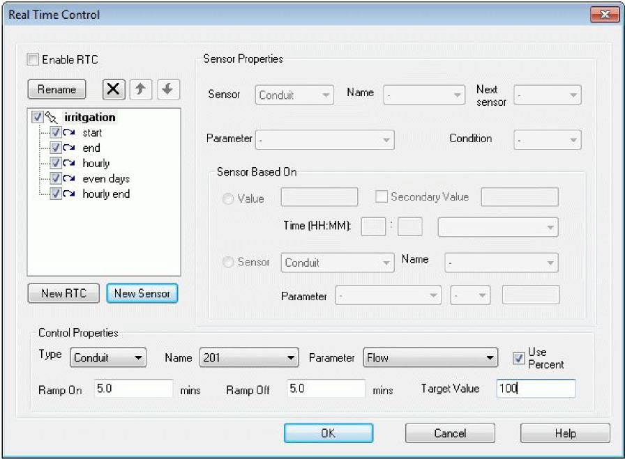

***Type***

Select the type of element that will be subjected to real-time control. The available options are Conduit, Node, Pump, Weir, Orifice and Rating Curve.

***Name***

Once the type of element has been chosen, this list will display all the objects of this type available in the network. Select one of the objects.

***Parameter***

Once the type of element has been chosen, this list will display the types of parameters able to be controlled for this element. Select one of the parameters.

***Use Percent***

If this flag is enabled then the maximum and minimum values are entered as a percentage of the value calculated prior to application of real-time control.

***Min Value***

The absolute minimum value to be used while real-time control is active. The value is a percentage of the pre-RTC value if the use percent flag is active.

***Max Value***

The absolute maximum value to be used while real-time control is active. The value is a percentage of the pre-RTC value if the use percent flag is active.

***Time to Ramp On***

The time (in minutes) over which the real-time control turns on.

> 828

SECTION 17: REAL TIME CONTROL

***Time to Ramp Off***

The time (in minutes) over which the real-time control turns off.

> **17.3 Sensor Properties**

Every RTC element in the network can be controlled by any or all of the other elements in the network. There is no limit to the number of controlling elements (sensors).

> 

***Sensor***

The type of sensors available for RTC and the Parameters capable of being controlled are:

> ***Sensor Parameter***
>
> Conduit Flow, Velocity
>
> Node Water depth, Water Elevation
>
> Pump Pump flow rate
>
> Weir Flow Rate
>
> Orifice Flow rate, Velocity
>
> Time Simulation Time (HH:MM), Time of Day
>
> (HH:MM), Month (JAN-DEC), Weekday  
> (MON-SUN), Even/Odd day

***Object***

Once the type of sensor has been chosen, this list will display all the objects of this type available in the network. Select one of the objects.

829

> xpswmm Reference Manual
>
> ***Parameter***
>
> Once the type of sensor has been chosen, this list will display the types of parameters able to be used to control the RTC element. Select one of the parameters.
>
> ***Condition***
>
> The control parameter is compared with a user-defined value, or the value of another sensor, using a relational condition. The available operators are:
>
> ***Operator Relationship***
>
> \< Less than
>
> \<= Less than or equal to
>
> = Equal to
>
> /= Not equal to
>
> \> Greater than
>
> \>= Greater than or equal to
>
> The relational expression consists of the sensor value compared to either a constant value or another sensor to determine whether the relationship stated by the relational operator is satisfied. The result of the relational expression is **True** if the relation specified by the operator is satisfied; the result is **False** if the relation specified by the operator is not satisfied.
>
> Sequential expressions are compared using Additive Operators.  
> ***Additive Operators***
>
> Multiple sensors are compared using logical expressions consisting of one or more logical operators and logical, numeric, or relational operands. The following are logical operators:
>
> ***Operator/Example Meaning***
>
> AND (A AND B) Logical conjunction: the expression is true if both A and B are true.
>
> OR (A OR B) Logical disjunction (inclusive OR): the expression is true if either A, B, or both, are true.
>
> NEQV (A NEQV B) Logical inequivalence (exclusive OR): the expression is true if either A or B is true, but false if both are true.
>
> XOR (A XOR B) Same as NEQV.
>
> EQV (A EQV B) Logical equivalence: the expression is true if both A and B are true, or both are false.
>
> NOT1 (NOT A) Logical negation: the expression is true if A is false and false if A is true.
>
> 1 NOT is a unary operator.
>
> Multiple sensors are evaluated from top to bottom in the list.
>
> ***Value***
>
> The sensor can be compared to a constant value or to the value of another sensor.  
> ***Sensor (comparative)***
>
> The comparative sensors available for RTC and the Parameters capable of being controlled are the same as for the primary sensor:
>
> ***Sensor Parameter***
>
> Conduit Flow, Velocity,
>
> Node Water depth, Water elevation
>
> Pump Pump flow rate
>
> Weir Flow rate
>
> Orifice Flow rate, Velocity
>
> ***Object (comparative)***
>
> 830
>
> SECTION 17: REAL TIME CONTROL
>
> Once the type of comparative sensor has been chosen, this list will display all the objects of this type available in the network. Select one of the objects.
>
> ***Parameter (comparative)***
>
> Once the type of comparative sensor has been chosen, this list will display the types of parameters able to be used to control the RTC element. Select one of the parameters.
>
> ***Operator (comparative)***
>
> The value of the sensor parameter may be mathematically modified by a constant value using one of the following operators:
>
> ***Operator Relationship***
>
> \+ Add
>
> \- Subtract
>
> \* Multiply
>
> / Divide  
> ***Constant (comparative)***
>
> The value of the sensor parameter may be mathematically modified by using the comparative operator above combined with this constant value.
>
> **17.4 RTC EXAMPLES**
>
> **17.4.1 RTC Directly Using Flow as the Control Parameter**
>
> The following example uses RTCflow.xp located in the work file.
>
> The link being subjected to RTC control is la5, the parameter being controlled is flow and the RTC control starts at 2:30am and ends at 8:00am. The RTC control takes 5 minutes to turn on (minimize) and 2 minutes to turn off (maximize). The minimum flow is 10% of the flow at the time step with the RTC condition changing from false to true. The maximum flow is 100% of the flow at commencement of last false to true change.
>
> So, if the water elevation at mh a1 is \>= 132.5 AND the water depth at mh b1 is \>= 2.8 and the time is between 2:30am and 8:00am then the flow in link la5 will be restricted to 10% of its calculated value at the time step when the RTC control condition changes to true.
>
> 
>
> The following two dialogs indicate the required data to represent the control element (la5) and its two sensor nodes at (mh a1) and (mh b1)
>
> The bottom half of the dialog is common for all sensors controlling the RTC element.
>
> 831

xpswmm Reference Manual

***Sensor 1 Definition***

> **Real Time Control**
>
> ***Sensor 2 Definition***

832

SECTION 17: REAL TIME CONTROL

***Results for Link to La5 without RTC applied.***

> xpswmm Reference Manual
>
> PLIXP - \[Review Results : RTCflow.xp MDR II

<table style="width:100%;">
<colgroup>
<col style="width: 39%" />
<col style="width: 8%" />
<col style="width: 14%" />
<col style="width: 22%" />
<col style="width: 15%" />
</colgroup>
<tbody>
<tr class="odd">
<td>EI File Ecit View Window Help</td>
<td></td>
<td></td>
<td></td>
<td>JJJ</td>
</tr>
<tr class="even">
<td></td>
<td></td>
<td></td>
<td></td>
<td></td>
</tr>
<tr class="odd">
<td colspan="4">
<u>HI 4i/ ImI oleltl in alai Rill I</u> I I

<blockquote>

Close

</blockquote></td>
<td></td>
</tr>
</tbody>
</table>

<table>
<colgroup>
<col style="width: 10%" />
<col style="width: 3%" />
<col style="width: 26%" />
<col style="width: 27%" />
<col style="width: 21%" />
<col style="width: 10%" />
</colgroup>
<tbody>
<tr class="odd">
<td colspan="6">Conduit 1a5 from mh a5 to mh a6 
[it Flow= I I 1.6248] [Iita Velocity= 8.21]</td>
</tr>
<tr class="even">
<td colspan="6">Upstream Elevation Downstream Elevation</td>
</tr>
<tr class="odd">
<td colspan="6">Flow Velocity</td>
</tr>
<tr class="even">
<td><blockquote>

e

</blockquote></td>
<td></td>
<td></td>
<td colspan="2"></td>
<td></td>
</tr>
<tr class="odd">
<td><blockquote>

'-'c 104

</blockquote>

103
</td>
<td>1<em>i</em></td>
<td></td>
<td colspan="2">--------------...------- 
__ ._..</td>
<td></td>
</tr>
<tr class="even">
<td><blockquote>

1

</blockquote></td>
<td></td>
<td><blockquote>

._ _

</blockquote></td>
<td colspan="2"></td>
<td></td>
</tr>
<tr class="odd">
<td>02</td>
<td>-</td>
<td></td>
<td></td>
<td>.</td>
<td></td>
</tr>
<tr class="even">
<td><blockquote>

Et

</blockquote></td>
<td></td>
<td></td>
<td></td>
<td></td>
<td></td>
</tr>
<tr class="odd">
<td>100</td>
<td>:</td>
<td><blockquote>

....

</blockquote></td>
<td>....</td>
<td>.--</td>
<td>7 5</td>
</tr>
<tr class="even">
<td>75</td>
<td>-</td>
<td>.</td>
<td>
-

<blockquote>

..,

</blockquote></td>
<td></td>
<td></td>
</tr>
<tr class="odd">
<td><blockquote>

,,ao

</blockquote></td>
<td></td>
<td></td>
<td></td>
<td></td>
<td>
F.0

6.0
</td>
</tr>
<tr class="even">
<td><blockquote>

LT.

</blockquote></td>
<td>-</td>
<td>i i</td>
<td><ul>
<li>
-.._
</li>
</ul></td>
<td>
-

</td>
<td><ul>
<li><blockquote>

- -  n

</blockquote></li>
</ul>

2.5 --:
</td>
</tr>
<tr class="odd">
<td></td>
<td>-</td>
<td>
i.  .

'- i
</td>
<td></td>
<td></td>
<td>---</td>
</tr>
<tr class="even">
<td colspan="3">
0

1 Jan 3AM

1 Mon Jan 96
</td>
<td>
8Ak1

<blockquote>

Tine

</blockquote></td>
<td></td>
<td>- 0.0</td>
</tr>
</tbody>
</table>

> For Help, press Fl

***Mh a1***

> FaXP - \[Review Results : RICIlow.xp \[HDRII
>
> CI file Edit View Window Help s. J25,1
>
> <u>'HI 01,141 elcp PAIstrilturlwQ1 Close</u> I <u>to</u>
>
> Node - mh al
>
> For Help, press Fl

***Mh b1***

834

SECTION 17: REAL TIME CONTROL

> 

***Mh a5***

> 
>
> ***Results for link La5 with the RTC applied.  
> Link La5***

835

xpswmm Reference Manual

> PPI,XP - \[Review Results . RTCflow.xp \[UDR\]\]
>
> **Fie Edit View Window <u>Help </u>**
>
> <u>141 if I HI oreppi</u> gi Rrif Son! HdrIWQ I **Close**
>
> 'For H\*, piers Fl

***Mha1***

|     |                                                                    |                  |                                                                             |                                                             |     |     |     |     |     |     |     |     |     |     |
|-----|--------------------------------------------------------------------|------------------|-----------------------------------------------------------------------------|-------------------------------------------------------------|-----|-----|-----|-----|-----|-----|-----|-----|-----|-----|
|     | .7-2 XI'  \[Review Results: fliCflow.xp MOW\] **REIM** |                  |                                                                             |                                                             |     |     |     |     |     |     |     |     |     |     |
|     |                                                                    |                  |                                                                             |                                                             |     |     |     |     |     |     |     |     |     |     |
|     |                                                                    |                  | 7,1 **<u>Fie id(</u> Yiew Widow Help**                                      |                                                             |     |     |     |     |     |     |     |     |     |     |
|     |                                                                    |                  |                                                                             |                                                             |     |     |     |     |     |     |     |     |     |     |
|     |                                                                    |                  |                                                                             |                                                             |     |     |     |     |     |     |     |     |     |     |
|     |                                                                    |                  |                                                                             | <u>I HI ol ski II (ilia Rnilson1HdrIwol **Close **</u>**I** |     |     |     |     |     |     |     |     |     |     |
|     |                                                                    |                  |  |                                                             |     |     |     |     |     |     |     |     |     |     |
|     |                                                                    |                  |                                                                             |                                                             |     |     |     |     |     |     |     |     |     |     |
|     |                                                                    | Fa H\*, press Fl |                                                                             |                                                             |     |     |     |     |     |     |     |     |     |     |
|     |                                                                    |                  |                                                                             |                                                             |     |     |     |     |     |     |     |     |     |     |
|     |                                                                    |                  |                                                                             |                                                             |     |     |     |     |     |     |     |     |     |     |

***Mh b1***

SECTION 17: REAL TIME CONTROL

> ***Mh a5***

xpswmm Reference Manual

After time 2:30am the RTC control commences operation. At that time the Levels at mh a1 and mh a5 are already above the test levels. The conduit la 5 reduces from its current flow rate to 10 % thereof over a ramp period of 5 minutes. (from 114 m3/s down to 14.5 m3/s). At 3:10am the level at mh a1 goes below 132.5. so the flow rate commences back up towards its original value of 114m3/s over a two (2) minute ramp time to 3:12am.

Between 3:12am and 3:14am the high and low flow peaks over two time steps is simply a reflection of the built up head at node mh a5.

After clearing this head difference between the upstream and downstream ends of link la 5 by 3:14am the flow then remains at 100% of natural flow to the end of simulation as mh a1 and mh a5 remain below the set elevation of 132.5 and depth of 2.8 respectively.

> ***PLEASE NOTE**: When using flow as a percentage it is important to only commence the RTC control after the flow has reached the amount from which you want to it reduced.*

**17.4.2 RTC Directly using Diameter as the Control Parameter**

The following example uses RTCdia.xp

838

SECTION 17: REAL TIME CONTROL

Water level limits at node02, node04 and node06 are set to H2, H4 and H6 respectively.

Gate 01 that is normally closed will be released if the water depth in node02 goes above H2

Gate 02 that is normally closed will be released if the water depth in node04 goes above H4

Both Gate 01 and Gate 02 will only remain open when the water elevation at node 06 is also below H6

For this example H2 is set to a water depth of 2.00, H2 is also set to a water depth of 2.00 and H6 is set to a water elevation of 0.75.

The following four dialogs provide all the data to describe the operation of RTC controls Gate-01 and Gate-02 with their respective sensors node02 - node 06 and node 04 - node 06.

***RTC Element Gate01  
Sensor Node02***

> 

***Sensor Node06***

839

> xpswmm Reference Manual
>
> **Real Time Connor**

***RTC Element Gate02  
Sensor Node 04***

840

SECTION 17: REAL TIME CONTROL

> Real Time Control
>
> ***Sensor Node 06***
>
> xpswmm Reference Manual
>
> 
>
> Both links Gate01 and Gate02 are circular pipes with nominal diameter of 1.30m.
>
> While the water levels are below their respective set maximums the pipes are effectively blocked by some form of gate within the pipe itself. In this example the closed position will still let through a small trickle flow representative of real conditions (diameter equal to 0.06m). When fully open the pipe diameter is set to the full 1.30m.
>
> Opening and closing time in this example is set to 0.017 minutes or 1 second. This ramping time could be adjusted to match real gate movement conditions.
>
> In this example it is also assumed that the RTC controls are operational over the full simulation period Result for Gate 01 and Gate 02 **without** RTC applied.

842

SECTION 17: REAL TIME CONTROL

> Results at node02, node04 and node 06 **without** RTC applied.

xpswmm Reference Manual

> **"LW  \[Review Results : litCdistxp \[HIM NOE\]**
>
> **Re Edit Mew Window Liett** 2_J:
>
> <u>**HI 1I I HI** O1,141</u> a <u>alai wigs-kiddy:01</u> **Close**
>
> EC( Hr'p vr Fl

Results for Gate01 and Gate02 **with** RTC applied.

844

SECTION 17: REAL TIME CONTROL

> Results for node02, node04 and node06 **with** RTC applied

xpswmm Reference Manual

**17.4.3 RTC Directly Using Pump Speed as the Control Parameter**

The following example uses RTCpump.xp

846

SECTION 17: REAL TIME CONTROL

> 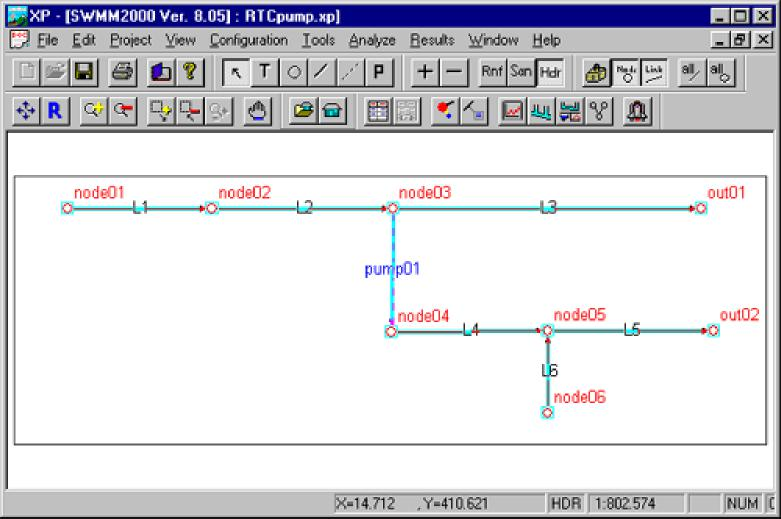
>
> This example utilizes a pump RTC (utilizing pump speed) to redirect flows when the level of water at a specified node is exceeded.
>
> In this example normal flow will be along the conduits L1, L2, L3 to outlet outo1
>
> However, if the water depth at node02 is higher than say 0.50m and the water elevation in node05 is still less than RL 2.00m the pump in link pump01 will turn on to redirect water away from link L3 and through links L4 and L5 to outlet outlet out02.
>
> ***RTC ELEMENT PUMP01  
> Sensor Node02***
>
> xpswmm Reference Manual
>
> Real Time Control
>
> ***Sensor Node05***

848

SECTION 17: REAL TIME CONTROL

> Time Control
>
> Results for Pump01 **without** RTC applied

xpswmm Reference Manual

Results for N ode02 and Node05 **without** RTC applied.

> Fa Hat., wen Fl
>
> 850

xpswmm Reference Manual

> PRIXP (Review Results : RTCpump.xp (HDRJJ
>
> E.) Fie Edit View Window Help <u>4-1021</u>
>
> <u>loft</u> ALI2A1 <u>wals-Ifttivml</u> Close

Foi Help, press Fl

Results for Node02 and Node05 **with** RTC applied.

> 852

SECTION 17: REAL TIME CONTROL

> 

After the first time steep of the simulation H2 is less than (\<) 0.5 depth and H5 is less than (\<) 2.0 elevation. Consequently the pump speed over 6 seconds ramps down to zero (0.0).

At time 13 minutes H2 \>= 0.5 depth and H5 still \< 2.0 elevation, so pump speed ramps from zero to 100.0 percent (%) of original value of 1.0 (i.e. pump turns on to maximum).

Between 13 and 21 minutes the pump speed alternates from zero 0% immediately after H5 \> 2.0 elevation and back to 100% pump speed when H5 \< 2.0 elevation. Note the pump speed is applied to the defined pump curve. Ramp on and off time is set at 6 seconds (0.1 minutes).

After 21 minutes the pump works at 100% pump curve speed to the end of simulation as H5 is always \< 2.0, while H2 \> 0.5 depth.

It should be noted that the actual head at H5 between 13 and 21 minutes oscillates around elevation 2.0 and in fact goes as high as 2.6. This is caused by the delayed head build up during the ramping times. This is common to control devices that do not instantaneously turn on and off and propagate surges to adjacent nodes. PID control technologies are often applied to control or optimize these oscillations. In practical terms some over-shoot in control level needs to be taken into consideration. The ramp times for on to off and off to on can play a significant role in the oscillation magnitude.

It is also important to have a smaller simulation time step than the ramp period.

> ***PLEASE NOTE:** Initial pump speed in pump dialog should be set to 1.0. This infers 1.0 times pump operating data.*
>
> 853

***SECTION 18: 2D Hydraulic Modeling  
*2D Hydraulic Modeling**

You can build 2D or 1D/2D hydraulic models in xpswmm. This section presents an overview of the 2D modeling process. Topics in this section are:

> General considerations in developing a 2D model.
>
> **Building 2D models**
>
> **2D model results**

Other help topics relevant to 2D models:

> Is a 2D or 1D/2D model feasible?
>
> The building of elements in a 2D model is described in Topographic Layers and Objects.
>
> Job control settings for 2D calculations are described in 2D Settings.
>
> **18.1 General Considerations**

**General Considerations**

Topics in this section are:

> **Data Requirements**
>
> **1D Network Definition**
>
> **2D Cell Size**
>
> **2D Topography**
>
> **Recommended Boundary Condition Arrangements**
>
> **Calibration and Sensitivity**
>
> **Limitations and Recommendations**
>
> **Check List**

**Data Requirements**

The minimum data requirements for setting up a 2D/1D hydraulic model are:

1.  A DTM with sufficient resolution and accuracy to depict the topography of all flowpaths and storage areas in the 2D domain(s). The vertical accuracy depends on the modeling objectives and budget constraints. However, for large scale models  0.2m is preferred, whilst for fine-scale urban models \<  0.1m is recommended. The vertical accuracy is dependent on the typical depths of inundation in key areas.

2.  Cross-sections for any 1D flowpaths.

3.  If bed resistance varies over the model, geo-corrected aerial photography or other GIS layer from which material (land-use) zones are digitized for setting Mannings n values.

4.  Boundary conditions (e.g. ocean water levels, catchment inflows, rainfall, evaporation, etc).

5.  Calibration data locations as points in a GIS layer. Peak levels should be attached as attributes to the calibration points.

6.  Surveys of key hydraulic controls such as levees / embankments (3D breaklines), culverts, bridges, etc.

**1D Network Definition**

1D link-node networks are developed in xpswmm with the graphic toolset**.** Alternatively, a 1D network may be imported or dynamically linked to an external database.

The adequacy of the 1D domains is primarily dependent on the network representation adopted. In general, the finer the resolution the more accurate the model, but the longer the computing time. For stability reasons, the timestep for

> 855

xpswmm Reference Manual

computation is normally controlled by the minimum channel length. The end result may require a compromise between the level of detail and the computational effort.

Different timesteps can be specified for 1D and 2D domains largely removing this constraint.

The first step in setting up a model is to define the flow patterns and to use each identified flow path as the basis for a channel of the network. Following this step the flow paths are linked at junctions, or nodes, and each node is considered as a storage element, which accepts the flow from the adjoining channels. In this way, the model is built up as a series of interconnected channels and nodes with the channels representing the flow resistance characteristics.

For compatibility with the mathematical assumptions, the channels would ideally have more or less uniform cross-sections with constant bottom slope and a minimum of longitudinal curvature. In practice this requirement cannot always be met, particularly where a fine resolution of detail is not required in a portion of the study area. In this case, a flow path is represented by an equivalent channel. Experience has indicated that in most cases an adequate calibration can be achieved by deriving a single channel equivalent to a number of series or parallel channels using the steady state Manning's relation for deriving the equivalent channel characteristics.

All nodes and channels are labeled with an ID. No two nodes or two channels can have the same ID. A node and a channel cannot have the same ID.

**2D Cell Size**

The cell sizes of 2D domains need to be sufficiently small to reproduce the hydraulic behavior. In xpswmm2D, all cells are square and the same size with a defined orientation. The cells are defined and edited with the 2D Area Extent tool in the Layer Control Panel.

**2D Topography**

2D domains are created by building them through a series of layers using the Layer Control Panel**.** The layers may be constructed using xpswmms graphic tools**,** imported or dynamically linked to a number of database formats. These layers contain or access from other files information on the size and orientation of the grid, bed/ground elevations, bed material type or flow resistance value, and other data.

A 2D domain is automatically discretised as a grid of square cells. Each cell is given characteristics relating to the topography such as ground/bathymetry elevation, bed resistance value and initial water level, etc.

**Recommended Boundary Conditions Arrangements**

Hydraulic models typically have water level boundaries at the downstream end and flow boundaries at the upstream ends.

For tidal models, the only boundaries may be ocean water level boundaries with pre-defined flows into or out of the system. For flood models, there are major flows into the upstream boundaries representing the catchment runoff. Occasionally, an upstream water level boundary is used in the absence of reliable river flow estimates. Where the downstream boundary is not at a well-defined water level (e.g. ocean), a stage-discharge relationship may be specified. In some situations, a hydraulic structure that is inlet controlled acts as the downstream control, in which case, the water level specified downstream of the structure has no influence on the results.

For 2D domains, water level boundaries exhibit the greatest stability (Syme 1991). Flow or velocity boundaries are difficult to specify as the flow direction and distribution across the boundary needs to be defined by the user. Wetting and drying of flow boundaries is also prone to instabilities.

Specifying boundaries oblique to the grid (i.e. not parallel to the grid axes or not at 45 to the axes) is also difficult in 2D fixed grid domains. However, xpswmm2D has an oblique boundary method that stabilizes water level boundaries. This facility is by default on, but can be adjusted using Oblique Boundary Method. For details of the method see Syme 1991.

The recommended approach for 2D flow boundaries is to dynamically link a 1D node to a 1D/2D interface boundary and apply the flow to the 1D node (Syme 1991). The inflow to the 1D node, generates a flow into the 2D domain across the 1D/2D interface boundary. This combination benefits from the stability, wetting and drying performance and the oblique boundary flexibility of water level boundaries. The velocity distribution and direction across the 1D/2D interface boundary is automatically determined by the flow regime that develops in the 2D domain.

2D boundary conditions line along the edge of 2D active areas jus as outfalls are connected to the end of a 1D network. When creating boundaries, use the snap tool so that the polyline coincides with the vertices of the active polygons.

**Calibration and Sensitivity**

Models are usually calibrated against known flood or tidal conditions with the bed resistance coefficient (eg. Mannings n) adjusted until calculated water levels and flows are consistent with recorded field measurements. Where there is poor or insufficient topographic data the calibration procedure may also involve adjustments to the model topography to provide an adequate representation of the recorded flow behavior. This is more common in 1D domains (where there is a choice of cross-sections to define a flowpath). There is usually little opportunity to adjust topography (from that surveyed) in 2D domains.

> 856

SECTION 18: 2D Hydraulic Modeling

> Ideally, the model would be calibrated for conditions similar to those under investigation although this is not always possible, particularly when major floods are being considered. In these situations, a sensitivity analyses maybe carried out by increasing and decreasing calibration factors such as Mannings n.
>
> **Limitations and Recommendations**
>
> xpswmm/xpstorm 2D is designed to model free-surface flow in coastal waters, estuaries, rivers, creeks, floodplains and urban drainage systems. Flow regimes through structures are handled by adaptation of the 1D St Venant Equations and the 2D Shallow Water Equations using standard structure equations. Supercritical flow areas can be represented.
>
> Limitations and recommendations to note are:

1.  In areas of super-critical flow through the 2D and 1D domains, the results should be treated with caution, particularly if they are in key areas of interest. Hydraulic jumps and surcharging against obstructions may occur in reality  these highly 3D localized effects are not modeled.

2.  Where the 2D cell size is less than the water depth, the Smagorinsky viscosity formulation is preferred over the default constant viscosity formulation to model sub-cell turbulence (Barton 2001). It is always good practice to carry out sensitivity tests to ascertain the importance of the viscosity coefficient and formulation.

3.  Caution should be used when using 2D cell sizes less than 2m, particularly when the flow depth exceeds the cell width (Barton 2001).

4.  Modelling of hydraulic structures should always be cross-checked with desktop calculations or other software, especially if calibration data is unavailable. All 1D and 2D schemes are only an approximation to the complex flows that can occur through a structure, and regardless of the software used should be checked for their performance (Syme 1998, Syme 2001).

5.  There is no momentum transfer between 1D and 2D connections. Although in most situations this is not of concern, it does influence results where a large structure (relative to the 2D cell size) is modelled as a 1D element.

6.  There is a practical limit to the ultimate density of the 2D grid domain  in the current version 2 million grid cells is the upper range of the total cell count limit which is recommended. This is principally due to the very large 2D results files (\*.dat files) which can be created when solving a model with this number of cells. In general, there can be issues with attempting to manipulate (open/close, read/write... ect) individual files upwards or greater than 2GB in size. If a large number of grid cells is required for your project and very large results files are being written (over 2GB files) then adjusting the output interval of the 2D results within the 2D job control is one way to reduce the output file sizes. Further, if a given 2D grid domain is needed to be very large (2 million grid cells or more) inorder to accommodate a required grid resolution as well as the grid coverage area, using multiple 2D domains may provide flexibility to use different 2D grid domains with different grid resolutions in different areas in the model. This can allow for the total number of grids in the model to be significantly reduced.

> **Check List**
>
> The table below presents a generalized list to help guide reviewers and modelers in carrying quality control checks on the modeling. This list is <u>not</u> exhaustive, and experienced modelers who know what to look for must at all times carry out the reviews.

**Quality Control Check List**

<table>
<colgroup>
<col style="width: 19%" />
<col style="width: 67%" />
<col style="width: 13%" />
</colgroup>
<tbody>
<tr class="odd">
<td><blockquote>

<em><strong>Item</strong></em>

</blockquote></td>
<td><blockquote>

<em><strong>Description</strong></em>

</blockquote></td>
<td><em><strong>Checked</strong></em></td>
</tr>
<tr class="even">
<td><blockquote>

Modeling Log

</blockquote></td>
<td><blockquote>

A modeling log is highly recommended and should be a requirement on all projects. The log may be in Excel, Word or other suitable software. A review of the modeling log is to be made by an experienced modeler. It should contain sufficient information to record model versions during development and calibration, along with observations from simulations. A model version naming and numbering system needs to be designed prior to the modeling.

</blockquote></td>
<td></td>
</tr>
<tr class="odd">
<td></td>
<td><blockquote>

The version numbering system should be reflected in input data filenames to allow traceability and the ability to reproduce an old simulation if needed.

</blockquote></td>
<td></td>
</tr>
<tr class="even">
<td><blockquote>

File Naming,

</blockquote></td>
<td><blockquote>

A review of the data file management should check:

</blockquote></td>
<td></td>
</tr>
<tr class="odd">
<td><blockquote>

Structure and

</blockquote></td>
<td><ul>
<li><blockquote>

files are named using a logical and appropriate system that allows easy

</blockquote></li>
</ul></td>
<td></td>
</tr>
<tr class="even">
<td><blockquote>

Management

</blockquote></td>
<td><blockquote>

interpretation of file purpose and content;

</blockquote></td>
<td></td>
</tr>
<tr class="odd">
<td></td>
<td><ul>
<li><blockquote>

a logical and appropriate system of folders is used that manages the files;

</blockquote></li>
</ul></td>
<td></td>
</tr>
<tr class="even">
<td></td>
<td><ul>
<li><blockquote>

relative path names to be used for input files (eg. ..\model\geometry.tgc) so that models are easily moved from one folder to another.

</blockquote></li>
</ul></td>
<td></td>
</tr>
<tr class="odd">
<td></td>
<td><ul>
<li><blockquote>

documentation of the above in, for example, the projects Quality Control

</blockquote></li>
</ul></td>
<td></td>
</tr>
<tr class="even">
<td></td>
<td><blockquote>

Document and/or Modeling Log.

</blockquote></td>
<td></td>
</tr>
</tbody>
</table>

857

> xpswmm Reference Manual

<table>
<colgroup>
<col style="width: 19%" />
<col style="width: 67%" />
<col style="width: 13%" />
</colgroup>
<tbody>
<tr class="odd">
<td><blockquote>

<em><strong>Item</strong></em>

</blockquote></td>
<td><blockquote>

<em><strong>Description</strong></em>

</blockquote></td>
<td><em><strong>Checked</strong></em></td>
</tr>
<tr class="even">
<td><blockquote>

2D Cell Size

</blockquote></td>
<td><blockquote>

Check whether the 2D cell size is appropriate to reproduce the topography needed to satisfactorily meet the objectives of the study.

</blockquote></td>
<td></td>
</tr>
<tr class="odd">
<td rowspan="2"><blockquote>

Topography

</blockquote></td>
<td><blockquote>

The topography review should focus on:

</blockquote>
<ul>
<li><blockquote>

correct interrogation of DTM;

</blockquote></li>
<li><blockquote>

correct datum;

</blockquote></li>
<li><blockquote>

modifications to the base data (eg. breaklines) have been checked. Regarding the latter, this is effectively carried out by producing a _zpt GIS

</blockquote></li>
</ul>
<blockquote>

check file using Write Check Files. The layer contains all modifications

</blockquote>

_zpt
</td>
<td rowspan="2"></td>
</tr>
<tr class="even">
<td><blockquote>

including any flow constriction adjustments. A DTM can be created from the Zpts using Vertical Mapper, or other 3D surface software, to aid in the review. Note: Reviewing the elevations in the .2dm file is not appropriate as only the ZH Zpt is represented in the .2dm file (the ZH elevation is not used in the hydrodynamic calculations).

</blockquote></td>
</tr>
<tr class="odd">
<td><blockquote>

Bed Resistance Values

</blockquote></td>
<td><blockquote>

Bed resistance values are to be reviewed by an experienced modeller. The review should focus on checking at least one of:

</blockquote>
<ul>
<li><blockquote>

Roughnees Categories in the Global Database;

</blockquote></li>
</ul>
<ul>
<li><blockquote>

the grid Mat or Manning_n values in the _grd GIS check file; or

</blockquote></li>
<li><blockquote>

specifying weir output using the weir approach. The reviewer should be looking for:

</blockquote></li>
</ul>
<ul>
<li><blockquote>

relative consistency between different land-use (material) types; and

</blockquote></li>
<li><blockquote>

values are within accepted calibration values.

</blockquote></li>
</ul></td>
<td></td>
</tr>
<tr class="even">
<td><blockquote>

Calibration / Validation

</blockquote></td>
<td><blockquote>

Check that the model calibration or validation is satisfactory in regard to the study objectives. Identify any limitations or areas of potential uncertainty that should be noted when interpreting the study outcomes.

</blockquote></td>
<td></td>
</tr>
<tr class="odd">
<td><blockquote>

Mass

Conservation

</blockquote></td>
<td><blockquote>

Standard practice is to place PO flow lines at a minimum of several locations through the model. They are typically aligned roughly perpendicular to the flow direction. The locations should include lines just inside each of the boundaries. Other suitable locations are upstream and downstream of key structures, through structures and areas of particular interest.

The flows are graphed and conservation of mass checked (i.e. the amount of water entering the model equals the amount leaving allowing for any retention of water in the model). Check that any 1D flowpaths crossed by a PO line are also included in the mass check.

In dynamic simulations, an exact match between upstream and downstream will not occur due to retention of water, however, examination of the flow lines should reflect this phenomenon.

For steady-state simulations, demonstration of reaching steady flow conditions is demonstrated when the flow entering the model equals the flow leaving the model.

</blockquote></td>
<td></td>
</tr>
<tr class="even">
<td rowspan="2"><blockquote>

Free-Overfall &amp; Weir Flow

</blockquote></td>
<td><blockquote>

Especially if <strong>Supercritical</strong> is set to OFF, the percentage of free-overfall and

</blockquote></td>
<td rowspan="2"></td>
</tr>
<tr class="odd">
<td>
weir flow velocity points should be checked. The review should seek to 
check that excessive number of points are not free-overfalling, and if so:

<blockquote>

that this is in accordance with the expected flow (e.g. weir flow over a levee)  check that the weir option is on if significant weir flow exists; and/or the affect on the overall flow patterns is minimal.

The review is best carried out by:

</blockquote>
<ul>
<li><blockquote>

Monitoring the numbers after CS or FO on the screen or in the .tlf file

</blockquote></li>
<li><blockquote>

Specifying flow regime output to generate the _R.dat file. This file shows the flow regime.

</blockquote></li>
</ul>
<blockquote>

The presence of significant areas of supercritical and/or weirs can be

</blockquote></td>
</tr>
</tbody>
</table>

> 858

SECTION 18: 2D Hydraulic Modeling

<table>
<colgroup>
<col style="width: 19%" />
<col style="width: 67%" />
<col style="width: 13%" />
</colgroup>
<tbody>
<tr class="odd">
<td><blockquote>

<em><strong>Item</strong></em>

</blockquote></td>
<td><blockquote>

<em><strong>Description</strong></em>

</blockquote></td>
<td><em><strong>Checked</strong></em></td>
</tr>
<tr class="even">
<td></td>
<td><blockquote>

acceptable in large areas of sheet flow. However, care should be taken in interpreting the flow behavior in these areas, particularly if the flow is supercritical as complex hydraulic processes (e.g. hydraulic jumps, surcharging against buildings) can occur.

Typically, most supercritical and weir flow occurs:

</blockquote>
<ul>
<li><blockquote>

around the edge of a model where it is wetting and drying and has little influence over the general flow behavior; or

</blockquote></li>
<li><blockquote>

down steep slopes or over significant drops (eg. over a levee).

</blockquote></li>
</ul></td>
<td></td>
</tr>
<tr class="odd">
<td><blockquote>

Hydraulic 
Structures

</blockquote></td>
<td><blockquote>

Head losses through a structure need to be validated through:

</blockquote>
<ul>
<li><blockquote>

Calibration to recorded information (if available).

</blockquote></li>
<li><blockquote>

Crosschecked using desktop calculations based on theory and/or standard publications (eg. Hydraulics of Bridge Waterways).

</blockquote></li>
<li><blockquote>

Crosschecked with results using other hydraulic software (e.g. HEC-RAS).

</blockquote></li>
</ul>
<blockquote>

Simple checks can be made by calculating the number of dynamic head losses that occur and checking that this in accordance with that expected

It is important to note that contraction and expansion losses associated with structures are modeled very differently in 1D and 2D schemes. 1D schemes rely on applying form loss coefficients, as they cannot simulate the horizontal or vertical changes in velocity direction and speed. 2D schemes model these horizontal changes and, therefore, do not require the introduction of form losses to the same extent as that required for 1D schemes. However, 2D schemes do not model losses in the vertical or fine-scale horizontal effects (such as around a bridge pier) and, therefore, may require the introduction of additional form losses. See Syme 2001b for further details.

</blockquote></td>
<td></td>
</tr>
<tr class="even">
<td><blockquote>

Eddy Viscosity

</blockquote></td>
<td><blockquote>

Check that the eddy viscosity formulation and coefficient is appropriate

</blockquote></td>
<td></td>
</tr>
</tbody>
</table>

> **18.2 Building 2D Models**
>
> **Building 2D Models**
>
> 1D/2D or 2D hydraulic models require domains, boundaries, and interfaces that define areas where 1D or 2D flow may occur. Their connections and boundary conditions can be further described using the tools within the interface. The model must be integrated with a Digital Terrain Model (DTM) to provide elevation vaules to the modeling objects. Topographic layers are used to further define 2D flow properties. Topographic layers such as Fill Areas, Dynamic Elevation Shapes, and Elevation Shapes have global adjustments available in version 2013 and later. Double-clicking on the object opens a dialog in which a change can be made. This change can then be applied to the selected object, all selected objects, or all objects of that type.
>
> Topographic Layers
>
> **Breaklines**
>
> **Fill Areas**
>
> **Landuse**
>
> Dynamic Elevation Shapes
>
> Trigger Points
>
> Elevation Shapes
>
> **2D Domains**
>
> **2D Grid Extent**

859

> xpswmm Reference Manual
>
> **Active and Inactive 2D Areas**
>
> **1 D/2D Interface**
>
> **1D/2D Connections**
>
> **2D / 2D interfaces**
>
> **2D Head Boundary**
>
> **2D Flow Boundary**
>
> **2D Rainfall/Flow Areas**
>
> **2D Landuse**
>
> **2D Flow Constrictions**
>
> Additional considerations in 2D models include:
>
> **Model Topography**
>
> **2D Grid Orientation and Dimensions**
>
> **1D Boundary Conditions**
>
> **2D Boundary Condition Layers**
>
> **Eddy Viscosity**
>
> **How to Model Bridges and Box Culverts**
>
> **Upstream Controlled Flow**
>
> **Computational Time Step**
>
> **Model Topography**
>
> The 2D model topography is defined by elevations at the cell centers, mid sides and corners. Each cell has the following elevations assigned to it:

- C Zpt (ZC)  middle of cell

- U Zpt (ZU)  middle right of cell

- V Zpt (ZV)  middle top of cell

- H Zpt (ZH)  top right hand corner of cell

> The precision of the cell center elevations can be set from 0 to 10 within the Grid Extent Properties dialog in version 2013 and beyond. The typical precision is 2 for US Customary projects and 3 for Metric models.
>
> One of most important aspects of xp2D modeling is to understand the roles of the elevation points. The ZC point:

- defines the volume of active water (cell volume is based on a flat square cell that wets and dries at a height of ZC);

- controls when a cell becomes wet and dry (note that cell sides can also wet and dry); and

- is used to determine the bed slope when testing for the upstream controlled flow regime

> The ZU and ZV points control how water is conveyed from one cell to another. If the cell has dried (based on the ZC point) the four ZU and ZV points on the cell sides are deactivated. ZU and ZV points also wet and dry independently of the cell wetting or drying.
>
> ZH points play no role hydraulically. However, they elevations that are written to allow the 2dm mesh file, to be visible in other modeling programs suca as SMS by ESRI.

860

> SECTION 18: 2D Hydraulic Modeling
>
> 

**2D Grid Orientation and Dimensions**

Each 2D domain is a rectangle at any orientation. The orientation and dimensions are defined using the 2D Area Extent dialog. For the orientation it is recommended that the X-axis falls between 90 and 90 of East as it is preferable to view the 2D grid within this range and some post-processing software only operate within this range.

Several options are available for setting the grid location and orientation via an imported file. The options are:

- Using a four-sided polygon in a GIS layer to define the 2D grid orientation and dimensions.

- Using a line (two vertices only) in a GIS layer to define the orientation of the X-axis (see Read MI Location), and Grid Size (N,M) or Grid Size (X,Y) to set the 2D grid X and Y dimensions.

- Using Origin, Orientation or Orientation Angle, and Grid Size (N,M) or Grid Size (X,Y). No GIS layers are required for this option.

It is not essential at any point to specify dimensions that are an exact multiple of Cell Size.

**1D Boundary Conditions**

Boundary conditions for the 1D link-node network are defined in the Hydraulics Node dialog. Boundary conditions may include:

> 861
>
> xpswmm Reference Manual
>
> Initial water levels
>
> Constant or time variant inflow
>
> Tailwater (several options)
>
> **2D Boundary Condition Layers**
>
> 2D domain boundary conditions, including links and interfaces to both 1D and additional 2D domains, are defined using one or more 2D Boundary Condition GIS layers. Fixed field text inputs are also supported for backward compatibility. The different types of boundaries and links are described in the table.
>
> The GIS layers may contain points, lines, polylines and regions, noting that for regions only the centroid is used. Each object has several attributes as described in table below.
>
> **2D Boundary Condition Types and Links to 1D Nodes**

<table>
<colgroup>
<col style="width: 8%" />
<col style="width: 26%" />
<col style="width: 65%" />
</colgroup>
<tbody>
<tr class="odd">
<td><strong>Type</strong></td>
<td><strong>Description</strong></td>
<td><strong>Comments</strong></td>
</tr>
<tr class="even">
<td><blockquote>

<strong>Water Level</strong>

</blockquote></td>
<td><strong>Boundaries</strong></td>
<td></td>
</tr>
<tr class="odd">
<td><strong>2D</strong></td>
<td><blockquote>

Links two 2D domains

</blockquote></td>
<td><blockquote>

Stitches two 2D domains together by a series of water level control points. Momentum across the link is preserved provided the Zpt elevations along the selected cells in both 2D domains are the same or similar.

</blockquote></td>
</tr>
<tr class="even">
<td><strong>HS</strong></td>
<td><blockquote>

Sinusoidal (Tidal) 
Water Level (m)

</blockquote></td>
<td><blockquote>

A sinusoidal wave based on any number of constituents. Four columns of data are required in the source file if using .csv files. The four columns in order are the mean water level (m), amplitude (m), phase difference () and period (h). Each row of data represents the harmonics of one wave. Any number of harmonics can be specified within the one HS boundary.

</blockquote></td>
</tr>
<tr class="odd">
<td><strong>HT</strong></td>
<td><blockquote>

Water Level (Head) 
versus Time (m)

</blockquote></td>
<td><blockquote>

Assigns a water level to the cell(s) based on a water level versus time curve.

</blockquote></td>
</tr>
<tr class="even">
<td><strong>HX</strong></td>
<td><blockquote>

Water Level (Head) from an eXternal Source (ie. a 1D model)

</blockquote></td>
<td><blockquote>

One or two 1D nodes provide a water level every half timestep. Automatically creates 1D QX boundaries at the node(s), which receive a flow from the 2D domain every half timestep. 2D HX boundaries are linked to 1D nodes using CN connections (see below).

Tip: A common cause for instabilities is that the starting water level in the 1D node is different to those in the adjacent 2D cells.

</blockquote></td>
</tr>
<tr class="odd">
<td colspan="2"><blockquote>

Treatment

</blockquote></td>
<td><blockquote>

Cell(s) can be wet or dry. It is not a requirement that at least one cell is wet.

HT lines can be oblique to the X-Y axes, in which case, Oblique Boundary Method should be set to ON (this is the default).

The water level can vary in height along a line of cells.

Tip: A common cause of instabilities at or near head boundaries at the start of a simulation is the initial water level specified at the adjacent cells is different to the head value. If your model immediately goes unstable at the boundary, check your initial water levels. If it is a 2D HX boundary the water levels in the 1D node and the 2D cells should be similar.

</blockquote></td>
</tr>
<tr class="even">
<td colspan="2"><blockquote>

Combinations

</blockquote></td>
<td><blockquote>

Any number of water level boundaries can be assigned to the same cell(s). The water level used is the sum of the water levels assigned. For example, a storm tide may be specified as a combination of a tidal HS boundary, a HT boundary of the storm surge and another HT boundary of the wave setup. The HS boundary would be water elevations and the two HT boundaries water depths.

The exception is that a 2D HX boundary, being a dynamically linked one, cannot be summed with another H boundary. In earlier versions of TUFLOW, if you accidentally specify a 2D HX boundary and a 2D HT or

</blockquote></td>
</tr>
</tbody>
</table>

> 862

SECTION 18: 2D Hydraulic Modeling

<table>
<colgroup>
<col style="width: 8%" />
<col style="width: 26%" />
<col style="width: 65%" />
</colgroup>
<tbody>
<tr class="odd">
<td><strong>Type</strong></td>
<td><strong>Description</strong></td>
<td><strong>Comments</strong></td>
</tr>
<tr class="even">
<td colspan="2"></td>
<td><blockquote>

HS boundary at the same cell, the 2D HX boundary prevails and no warning is given.

</blockquote></td>
</tr>
<tr class="odd">
<td colspan="2"><blockquote>

<strong>Flows (2D Flows With A Direction Component)</strong>

</blockquote></td>
<td></td>
</tr>
<tr class="even">
<td><strong>QC</strong></td>
<td><blockquote>

Constant Flow (m3/s)

</blockquote></td>
<td><blockquote>

A constant flow boundary. At present, QC boundaries must be entered using the fixed field approach. The velocity is determined from the flow value and the model water levels. The direction of flow is required.

</blockquote></td>
</tr>
<tr class="odd">
<td><strong>QT</strong></td>
<td><blockquote>

Flow versus Time (m3/s)

</blockquote></td>
<td><blockquote>

Assigns a velocity and a flow direction to the sides of the cell(s) based on a flow versus time curve. The velocity is determined from the flow value and the water depths. The direction of flow is required.

</blockquote></td>
</tr>
<tr class="even">
<td><strong>VC</strong></td>
<td><blockquote>

Constant Velocity (m/s)

</blockquote></td>
<td><blockquote>

Same as for a constant flow boundary (see QC above) except a velocity is specified.

</blockquote></td>
</tr>
<tr class="odd">
<td><strong>VT</strong></td>
<td><blockquote>

Velocity versus Time (m/s)

</blockquote></td>
<td><blockquote>

Same as for a QT boundary (see above) except a velocity is specified.

</blockquote></td>
</tr>
<tr class="even">
<td colspan="2"><blockquote>

Treatment

</blockquote></td>
<td><blockquote>

Cell(s) can be wet or dry, however, it is recommended that cells remain wet, otherwise the quantity of flow is dependent on the number of wet cell(s) along the boundary.

QT lines should be specified along lines parallel or 45 to the X-Y axes.

<strong>These boundaries are rarely used, as dynamic links with 1D models are preferred with the flow boundary applied to the connecting 1D node.</strong>

<strong>Tip:</strong> It is strongly recommended to use a 1D node linked to a 2D HX boundary (see above) in preference to using a flow boundary, especially in flood models where there is major wetting and drying. This arrangement is far more practical, stable and flexible (the boundary can wet and dry, can lie oblique to the grid, and the velocity distribution and flow direction across the boundary is automatically determined).

</blockquote></td>
</tr>
<tr class="odd">
<td colspan="2"><blockquote>

Combinations

</blockquote></td>
<td><blockquote>

Any number of flow and velocity boundaries can be assigned to the same cell(s). The final velocity is the sum of the velocities assigned.

</blockquote></td>
</tr>
<tr class="even">
<td colspan="2"><blockquote>

<strong>Sources (2D Flows With No Direction</strong>

</blockquote></td>
<td><blockquote>

<strong>Component)</strong>

</blockquote></td>
</tr>
<tr class="odd">
<td><strong>SA</strong></td>
<td><blockquote>

Flow versus Time (m3/s)

over an area,

or

Rainfall versus Time (mm)

</blockquote></td>
<td><blockquote>

Applies the flow directly to the cells within a polygon as a source. Negative values remove water directly from the cell(s). Most commonly used to model rainfall runoff directly onto 2D domains with each polygon representing the sub-catchment of a hydrology model. SA boundaries have their own command, Read MI SA, and own GIS layer.

The default option is to apply the boundary as a flow hydrograph as follows. Within each SA catchment (region), if all the 2D cells are dry, the flow is directed to the lowest cell based on the ZC elevations. If one

</blockquote></td>
</tr>
</tbody>
</table>

863

> xpswmm Reference Manual

<table>
<colgroup>
<col style="width: 8%" />
<col style="width: 26%" />
<col style="width: 65%" />
</colgroup>
<tbody>
<tr class="odd">
<td><strong>Type</strong></td>
<td><strong>Description</strong></td>
<td><strong>Comments</strong></td>
</tr>
<tr class="even">
<td></td>
<td></td>
<td><blockquote>

or more cells are wet the total flow is distributed over the wet cells.

A rainfall hyetograph can be applied. The rainfall time-series data must be in mm versus hours, and is converted to a hydrograph to smooth the transition from one rainfall period to another. This approach applies a rainfall depth to every active cell (ie. Code 1 cells) within each region, and essentially replaces the need to use a hydrological model. Initial and continuing losses can be applied on a material-by-material basis. Note, this approach is being trialled and tested as of the time of writing and is considered an under-development feature that may be subject to change.

</blockquote></td>
</tr>
<tr class="odd">
<td><strong>SH</strong></td>
<td><blockquote>

Flow versus Head (m3/s)

</blockquote></td>
<td><blockquote>

Extracts the flow directly from the cells based on the water level of the cell. Used for modelling pumps or other water extraction. Flow values must not be negative. SH boundaries can be connected to another 2D cell or a 1D node, to model, for example, the discharge of a pump from one location in a model to another. The connection is made using a SC line (see below). In the boundary database, the Column 1 data would be head or water level values and the Column 2 data would be flow. The flow value is the rate per 2D cell. If the 2D cell becomes dry, no flow occurs.

</blockquote></td>
</tr>
<tr class="even">
<td><strong>ST</strong></td>
<td><blockquote>

Flow versus Time (m3/s)

</blockquote></td>
<td><blockquote>

Applies the flow directly to the cells as a source. Negative values remove water directly from the cell(s). Can be used to model concentrated inflows, pumps, springs, evaporation, etc.

</blockquote></td>
</tr>
<tr class="odd">
<td><strong>SX</strong></td>
<td><blockquote>

Source of flow from a 1D model.

</blockquote></td>
<td><blockquote>

2D SX cell(s) are connected to a 1D node using a <strong>single</strong> CN connection (see below). The net flow into/out of the 1D node is applied as a source to the 2D cells. For example, a 1D pipe in the 2D domain sucks water out of the upstream cell(s) and pours water back out at the downstream cell(s) using 2D SX boundaries. 2D SX boundaries can also be used to model pumps.

</blockquote></td>
</tr>
<tr class="even">
<td colspan="2"><blockquote>

Treatment

</blockquote></td>
<td><blockquote>

Sources are applied to all the specified cell(s) whether they are wet or dry, except for SA and SX, which apply only to wet cells, or the lowest dry cell if all the SA or SX cells are dry.

</blockquote></td>
</tr>
<tr class="odd">
<td colspan="2"><blockquote>

Combinations

</blockquote></td>
<td><blockquote>

Any number of source boundaries can be assigned to the same cell(s) whether they are SA, SH, ST or SX. The source rate applied is the sum of the individual sources.

</blockquote></td>
</tr>
<tr class="even">
<td colspan="2"><blockquote>

<strong>Connections</strong>

</blockquote></td>
<td></td>
</tr>
<tr class="odd">
<td><strong>CN 
</strong>or 
<strong>EC</strong></td>
<td><blockquote>

Connection of 2D HX and 2D SX boundaries to 1D nodes

</blockquote></td>
<td><blockquote>

Used in GIS 2d_bc layers to connect 2D HX and 2D SX boundaries to 1D nodes. A line or polyline is digitised that snaps the 2D HX or SX object to the 1D node. The 1D node would be in a 1d_nwk layer. If the

</blockquote></td>
</tr>
</tbody>
</table>

> 864

SECTION 18: 2D Hydraulic Modeling

<table>
<colgroup>
<col style="width: 8%" />
<col style="width: 26%" />
<col style="width: 65%" />
</colgroup>
<tbody>
<tr class="odd">
<td><blockquote>

<strong>Type</strong>

</blockquote></td>
<td><strong>Description</strong></td>
<td><strong>Comments</strong></td>
</tr>
<tr class="even">
<td></td>
<td></td>
<td><blockquote>

2D HX or 2D SX snaps to the 1D node, no connection object is required. Alternatively a CN point object could be used.

As of Build 2003-06-AA, an ERROR occurs if a CN object is not

snapped to a 2D HX or 2D SX object, or is redundant (ie. not needed). For backward compatibility, use Unused HX and SX Connections (.tcf file) or Unused HX and SX Connections (.tbc file) to change the ERROR to a WARNING. Note that for connections to 2D SX objects only <strong>one (1)</strong> CN object is required. Whereas 2D HX objects must have a minimum of two (2) connections  one at each end.

</blockquote></td>
</tr>
<tr class="odd">
<td><blockquote>

<strong>SC</strong>

</blockquote></td>
<td><blockquote>

Connection of 2D SH boundaries

</blockquote></td>
<td><blockquote>

Used for connecting 2D SH boundaries to another 2D cell or 1D node (eg. modelling the pumping of water from one location to another).

</blockquote></td>
</tr>
<tr class="even">
<td colspan="2"><blockquote>

<strong>Wind Stresses</strong>

</blockquote></td>
<td></td>
</tr>
<tr class="odd">
<td colspan="2"><blockquote>

<strong>WT</strong>

</blockquote></td>
<td><blockquote>

Unsupported feature on PC version.

</blockquote></td>
</tr>
<tr class="even">
<td colspan="2"><blockquote>

Treatment

</blockquote></td>
<td></td>
</tr>
<tr class="odd">
<td colspan="2"><blockquote>

Combinations

</blockquote></td>
<td></td>
</tr>
<tr class="even">
<td colspan="2"><blockquote>

<strong>Variable Geometry</strong>

</blockquote></td>
<td></td>
</tr>
<tr class="odd">
<td colspan="2"><blockquote>

<strong>VG</strong>

</blockquote></td>
<td><blockquote>

Undocumented feature.

</blockquote></td>
</tr>
<tr class="even">
<td colspan="2"><blockquote>

Treatment

</blockquote></td>
<td></td>
</tr>
<tr class="odd">
<td colspan="2"><blockquote>

Combinations

</blockquote></td>
<td></td>
</tr>
<tr class="even">
<td colspan="2"><blockquote>

<strong>Other</strong>

</blockquote></td>
<td></td>
</tr>
<tr class="odd">
<td><blockquote>

<strong>CD</strong>

</blockquote></td>
<td></td>
<td><blockquote>

Objects in a GIS 2d_bc layer used to define the grids cell codes using Read MI Code BC as an alternative to Read MI Code. The code value is set using the f attribute.

The boundary lines are snapped to CD regions so that if the boundary location is adjusted, the boundary line and code region can move together.

</blockquote></td>
</tr>
<tr class="even">
<td><blockquote>

<strong>IG</strong>

</blockquote></td>
<td></td>
<td><blockquote>

An object in a GIS 2d_bc layer can elected to be ignored by using the IG type.

</blockquote></td>
</tr>
</tbody>
</table>

> xpswmm Reference Manual
>
> **Eddy Viscosity**
>
> Two options exist for specifying eddy viscosity for the 2D domains to approximate the effect of small-scale motions that cannot be modelled directly. Enter data using the Viscosity dialog in the 2D Job Control settings.

- The first method is to supply a constant value, E, which is used throughout the model. This is generally satisfactory when the cell size is much greater than the depth or when other terms are dominant (e.g. high bed resistance).

- The second method (Viscosity Formulation == **Smagorinsky**) is an approximation to the Smagorinsky formulation. This formulation is preferred where the cell size is similar or less than the depth.

> Testing by Barton 2001 indicates that 2D schemes using very fine elements (less than 2m) may have difficulty predicting correct flow behavior. Results from models with less than 2m cell size should be treated with caution, particularly if the depths are greater than the cell size and/or the friction forces are low (i.e. low Mannings n).
>
> **How to Model Bridges and Box Culverts**
>
> Bridges, box culverts and other structures that constrict flow can be modeled in 2D rather than using 1D elements provided the flow width of the structure is of similar or larger size than the 2D cell size. Cells are modified in their height (invert and obvert) and width. For bridges, additional losses associated with flow reaching the underside of the deck is specified. For box culverts, the additional resistance for vertical walls is specified. Additional form losses (energy head losses) can be specified for all FCs.
>
> Weir flow (across levees and other embankments) is modeled in 2D domains by default, but can be changed using options in the Free Overfall command. Weirs may also be modeled using 1D elements.
>
> Modeling hydraulic structures in 2D domains must be carried out with a good understanding of the limitations of different approaches and the different flow regimes possible. The modeler must understand why and where the energy losses occur when assigning form losses to a 2D cell or contraction and expansion losses to a 1D element (Syme 2001b).
>
> It is important to note that contraction and expansion losses associated with structures are modeled very differently in 1D and 2D schemes. 1D schemes rely on applying form loss coefficients, as they cannot simulate the horizontal or vertical changes in velocity direction and speed. 2D schemes model these horizontal changes and, therefore, do not require the introduction of form losses to the same extent as that required for 1D schemes. However, 2D schemes do not model losses in the vertical or fine-scale horizontal effects (such as around a bridge pier) and, therefore, may require the introduction of additional form losses. See Syme 2001 for further details.
>
> It is strongly recommended that the losses through a structure be validated through:

- Calibration to recorded information (if available).

- Crosschecked using desktop calculations based on theory and/or standard publications (e.g. Hydraulics of Bridge Waterways, US FHA 1973).

- Crosschecked with results using other hydraulic software.  
  > To validate structure flows and energy losses:

- Specify time-series output (PO) lines of flow (Q\_) and flow area (QA) across the structure. Upstream and downstream water levels may also be specified or taken from the map (SMS) output.

- Using the upstream and downstream water levels, determine whether flow is upstream or downstream controlled and estimate the flow using theoretical equations or other method.

- Using publications such as Hydraulics of Bridge Waterways (US FHA 1973), determine the energy loss coefficient and compare this with the total energy loss calculated in the model. The total energy loss () is the upstream head minus the downstream head divided by the dynamic head based on the depth and width averaged velocity () (i.e. Q\_/QA) as given below. Clearly, any energy losses associated with bed resistance (e.g. Mannings equation) need to be allowed for by taking this amount out of the term.

- Using other software (eg. HEC-RAS) create a check model using the flow and downstream water level as boundaries and compare the calculated upstream water levels.

**Hydraulic Structure Modeling Approaches**

<table>
<colgroup>
<col style="width: 60%" />
<col style="width: 20%" />
<col style="width: 18%" />
</colgroup>
<tbody>
<tr class="odd">
<td><blockquote>

<strong>Structure</strong>

</blockquote></td>
<td><strong>1D Approach</strong></td>
<td><strong>2D Approach</strong></td>
</tr>
<tr class="even">
<td><blockquote>

Box Culvert

(For culverts with a steep slope, use a 1D element)

</blockquote></td>
<td>OK</td>
<td>OK</td>
</tr>
</tbody>
</table>

> 866

SECTION 18: 2D Hydraulic Modeling

<table>
<colgroup>
<col style="width: 60%" />
<col style="width: 20%" />
<col style="width: 18%" />
</colgroup>
<tbody>
<tr class="odd">
<td><blockquote>

<strong>Structure</strong>

</blockquote></td>
<td><strong>1D Approach</strong></td>
<td><strong>2D Approach</strong></td>
</tr>
<tr class="even">
<td><blockquote>

Circular Culvert

</blockquote></td>
<td>OK</td>
<td>N/A</td>
</tr>
<tr class="odd">
<td><blockquote>

Bridge

</blockquote></td>
<td>OK</td>
<td>OK</td>
</tr>
<tr class="even">
<td><blockquote>

Weirs

</blockquote></td>
<td>OK</td>
<td>OK</td>
</tr>
</tbody>
</table>

> **1D Approach -** Preferred approach where the total structure width is less than the cell size.
>
> Entry and/or exit losses may need to be reduced where the structure width is significant compared with the cell size (Syme 2001b).
>
> Momentum is not transferred into or out of the 1D element from the 2D domain. Suppressed flow patterns in the 2D domain occur at the structure outlet when using 1D elements, especially if the structure width is significant compared with the cell size. The water tends to spread out evenly, rather than jet out as occurs if using a 2D representation. This may be overcome by applying wing walls in the 2D domain at the structure outlet by assigning flood free elevations to the ZU and ZV Zpts either side of where the 1D element discharges into the 2D domain.
>
> **2D Approach -** Preferred where the total structure width is greater than the cell size. The flow area must be adequately represented by the 2D Zpts and any adjustments to cell widths. The head drop across the structure during different flow regimes should be validated against other methods and/or literature.
>
> Some additional form losses are normally required to achieve correct head drop (see Syme 2001b). Where the cell size is less than the depth, use the Smagorinsky Viscosity formulation. Care should be exercised using cell sizes less than 2m (Barton 2001).
>
> Momentum is transferred through the structure, providing far more realistic flow patterns than using a 1D element.
>
> **2D Upstream Controlled Flow (Weirs and Supercritical Flow)**
>
> Where flow in the 2D domain becomes upstream controlled, xp automatically switches between either weir flow and/or upstream controlled friction flow.
>
> If Supercritical is set to ON the following rules apply. Note: the bed slope at ZU and ZV points is determined as the slope from the **upstream ZC** point to the ZU or ZV point in the direction of **positive** flow.

- Where the bed slope at a ZU or ZV point is in the same direction as the water surface slope, tests are carried out to determine whether the flow is upstream controlled or downstream controlled. The adopted flow regime is determined by comparing the upstream and downstream controlled regime flows (preference to the lower flow) and whether the Froude No exceeds 1 (unless changed by Froude Check). The equation used for upstream controlled flow is the Manning equation with the water surface slope set to the bed slope. The Froude It is recommended that the Froude No check be used (which is the default setting) as it provides more accurate switching. A further check that phases out the Froude Check as the water surface approaches the horizontal (otherwise in some situations, the flow would remain in the upstream controlled regime). This check can be disabled for backward compatibility using Froude Depth Adjustment.

- Weir flow only occurs if the bed slope is adverse (different direction) to the water surface slope. Weir flow across 2D cell sides is modeled by first testing whether the flow is upstream or downstream controlled. If upstream controlled, the broad-crested weir flow equation is used to replace the calculations for downstream controlled (sub-critical) flow conditions. Weir flow maybe switched off using the Free Overfall options.

> xp produces an increase in water level at transitions from supercritical flow to subcritical flow as occurs with a hydraulic jump. It does not, however, model the complex 3D flow patterns that occur at a hydraulic jump, as it uses a 2D horizontal plane solution. Results in areas of transition should be interpreted with caution. It is also important to be careful presenting results in areas of supercritical flow as complex flows (such as surcharging against a house) may occur that would yield higher localised water levels  it is good practice to also view the energy levels when providing advice on flood planning levels.
>
> If Supercritical is set to OFF, and Free Overfall is set to ON (the default), weir flow may occur on both adverse and normal bed slopes.
>
> The weir flow switch may be varied spatially over the grid by setting a weir factor of zero where there is to be no automatic weir flow. The weir factor also allows calibration or adjustment where the broad-crested weir equation is applied. The broad-crested weir equation is divided by the weir factor. Therefore, a factor of 1.0 represents no adjustment, while a factor greater than one will decrease the flow efficiency. Note: the weir factor is not the broad-crested weir coefficient. For further information, refer to Syme 2001b.

867

> xpswmm Reference Manual
>
> **Computational Timestep  
> Computational Timestep**
>
> The selection of the timestep is critically important for the success of a model. The run time is directly proportional to the number of timesteps required to calculate model behavior for the required time period, while the computations may become unstable and meaningless if the timestep is greater than a limiting value. This is known as the Courant stability criterion.
>
> The computation timestep in the Job Control settings.
>
> Note that time controls for 1D calculations are set in the Hydraulics Layer Control**.** Time controls for 2D calculations are set in the General section of the 2D Job Control settings.
>
> See additional recommendations for computational time steps in:
>
> **2D Domains**
>
> **1D/2D Models**
>
> **2D Domains**
>
> For the 2D scheme, the Courant Number generally needs to be less than 10 and is typically around 5 for most real-world applications (Syme 1991). The computation timestep in the Job Control settings and should be set in accordance with this criterion as given in the equation below.
>
> 
>
> As a rule, the timestep is typically half the cell size. For steep models with high Froude numbers and supercritical flow, smaller timesteps may be required. It is strongly advised to not simply reduce the timestep if the model is unstable, but rather to establish why it is unstable and, in most instances, adjust the model topography, initial conditions or boundary conditions to remove the instability.
>
> If the model is operating at high Courant numbers (\>10), sensitivity testing with smaller timesteps to demonstrate no measurable change in results should be carried out.
>
> The occurrence of high mass errors is also an indicator of using too high a timestep.
>
> **1D/2D Models**
>
> It is recommended that the time step of the 2D engine be equal to or an integer multiple of the time step of the 1D calculations (set in HydraulicsLayer Job Control).
>
> **18.3 2D Results**
>
> **2D Results**
>
> Topics in this section are:

868

> SECTION 18: 2D Hydraulic Modeling
>
> Output files
>
> **Check Files**
>
> **Simulation Log File**
>
> **Times Series Output**
>
> **Identifying the Start of Instability**
>
> **Mass Balance Output**
>
> **.wor File**
>
> **The messages.mif file**
>
> **SMS (MAP) Output (.dat files)**
>
> Delay Loading 2D Results option upon opening a model  
> **Animations and Graphs**
>
> **Simulation Log File**
>
> xpswmm2D produces a log file (.tlf file) containing a record of the simulation. The file is very useful for establishing data input problems and identifying instabilities.
>
> At key stages during the model development and application search the file for any WARNING, CHECK or NOTE messages. WARNING messages in particular should be checked regularly. An ERROR keyword indicates an unrecoverable error and causes the simulation to stop. As many errors as possible are trapped before stopping.
>
> An XY: at the beginning of a line indicates the error, warning, check or other message has also been redirected to a .mif file. Opening the .mif file in the GIS often provides a far more rapid location of the message within the model domain(s) than via other ways.
>
> **Check Files**
>
> xp produces check files for quality control of a models input data. It is strongly recommended that models are quality controlled through reviews of the check files.
>
> Effective use of the check files can save days during a models development and application.

<table>
<colgroup>
<col style="width: 25%" />
<col style="width: 74%" />
</colgroup>
<tbody>
<tr class="odd">
<td><blockquote>

<em><strong>Filename or Prefix/Suffix</strong></em>

</blockquote></td>
<td><blockquote>

<em><strong>Description</strong></em>

</blockquote></td>
</tr>
<tr class="even">
<td><blockquote>

<em>2D Domains</em>

</blockquote></td>
<td></td>
</tr>
<tr class="odd">
<td><blockquote>

_2d_bc_tables_check.csv

</blockquote></td>
<td><blockquote>

Tabular data as read from the boundary condition database via any 2d_bc layers and after any adjustments (eg. time shift). Provides full traceability to original data source.

</blockquote></td>
</tr>
<tr class="even">
<td><blockquote>

_dom_check.mif

</blockquote></td>
<td><blockquote>

Contains a rectangle for each 2D domain.

</blockquote></td>
</tr>
<tr class="odd">
<td><blockquote>

_grd_check.mif

</blockquote></td>
<td><blockquote>

GIS .mif/.mid files of the final 2D grid. Represents the final grid including all modifications from the .tgc file, boundary specifications and flow constrictions.

Can also be written at different stages within a .tgc file. The file contains all modifications to the 2D grid at the point in the .tgc file that it is written.

</blockquote></td>
</tr>
<tr class="even">
<td><blockquote>

_bc_check.mif

</blockquote></td>
<td><blockquote>

GIS .mif/.mid files of the final 2D boundary conditions (BC). Note, the layer does not include any 2D/1D connections (CN type).

</blockquote></td>
</tr>
<tr class="odd">
<td><blockquote>

_fc_check.mif

</blockquote></td>
<td><blockquote>

GIS .mif/.mid files of the final arrangement of flow constrictions (FC). The flow constrictions are written as individual square cells of the same shape as the grid cells, even if the FC was specified using points or lines/polylines.

</blockquote></td>
</tr>
</tbody>
</table>

> 869
>
> xpswmm Reference Manual

<table>
<colgroup>
<col style="width: 25%" />
<col style="width: 74%" />
</colgroup>
<tbody>
<tr class="odd">
<td><blockquote>

<em><strong>Filename or Prefix/Suffix</strong></em>

</blockquote></td>
<td><blockquote>

<em><strong>Description</strong></em>

</blockquote></td>
</tr>
<tr class="even">
<td><blockquote>

_glo_check.mif

</blockquote></td>
<td><blockquote>

GIS .mif/.mid files of any gauge level output (GLO) location.

</blockquote></td>
</tr>
<tr class="odd">
<td><blockquote>

_lp_check.mif

</blockquote></td>
<td><blockquote>

GIS .mif/.mid files of any 2D longitudinal profile(s).

</blockquote></td>
</tr>
<tr class="even">
<td><blockquote>

_po_check.mif

</blockquote></td>
<td>GIS .mif/.mid files of any 2D plot output location(s). The layer shows points and lines 
occurring from the cell centres, rather than their exact locations in the original file(s).</td>
</tr>
<tr class="odd">
<td><blockquote>

_zpt_check.mif

</blockquote></td>
<td><blockquote>

GIS .mif/.mid files of the final 2D Zpts. Represents the final Zpts including all modifications from the .tgc file, and any flow constrictions in the .tcf file.

Can also be written at different stages within a .tgc file. The file contains all modifications to the 2D Zpts at the point in the .tgc file that it is written. This allows checking of the elevations at different stages of building the topography.

</blockquote></td>
</tr>
<tr class="even">
<td><blockquote>

<em>1D Domains</em>

</blockquote></td>
<td></td>
</tr>
<tr class="odd">
<td><blockquote>

_1 d_bc_tables_check.csv

</blockquote></td>
<td><blockquote>

Tabular data as read from the boundary condition database via any 1d_bc layers and after any adjustments (eg. time shift). Provides full traceability to original data source.

</blockquote></td>
</tr>
<tr class="even">
<td><blockquote>

_1d_ta_tables_check.csv

</blockquote></td>
<td><blockquote>

Tabular data as read from tables via the 1d_ta layers for cross-section, storage and

other data. Provides full traceability to original data source and additional information such as hydraulic properties determined from a cross-section profile.

</blockquote></td>
</tr>
<tr class="odd">
<td><blockquote>

_bc_check.mif

</blockquote></td>
<td><blockquote>

GIS .mif/.mid files of the final 1D boundary conditions (BC). If no boundary conditions were specified, empty .mif/.mid files are written that can be used to set up a new layer.

</blockquote></td>
</tr>
<tr class="even">
<td><blockquote>

_1d_hydprop_check.mif

</blockquote></td>
<td><blockquote>

Contains the hydraulic properties at the top of the hydraulic properties tables as attributes of the 1D channels. Other information such as the primary Mannings n is also provided. Very useful for carrying out quality control checks on the 1D channels.

</blockquote></td>
</tr>
<tr class="odd">
<td><blockquote>

_1d_inverts_check.mif

</blockquote></td>
<td><blockquote>

Contains the inverts of the 1D nodes and at the ends of the 1D channels. Very useful for checking for smooth transitions from one channel to another and with the nodes.

</blockquote></td>
</tr>
<tr class="even">
<td><blockquote>

_iwl_check.mif

</blockquote></td>
<td><blockquote>

GIS .mif/.mid files of the initial water levels at the 1D model nodes.

</blockquote></td>
</tr>
<tr class="odd">
<td><blockquote>

_nwk_check.mif

</blockquote></td>
<td><blockquote>

GIS .mif/.mid files of the final 1D model network. The channels are not written as exactly the same polylines as this information is not retained during the data input process.

Note that the Use_Chan_Storage_at_Nodes attribute is always shown as F (false), and information supplied in the Topo_ID, Branch, Chainage and some other fields maybe not be as per the original data as this information is not available at the time the check file is written.

As of Build 2005-05-AN the following additions/changes occurred:

Node symbology is displayed as a red circle for nodes connected to two or more channels, a larger magenta circle for nodes connected to one channel and a large yellow square for nodes not connected to a channel. This is very useful for checking for channel ends or nodes that are not snapped.

Any generated pit channels are shown as a small channel flowing from north to south into the pit node. The upstream pit channel node that is generated is also shown. The length of the pit channel is controlled by Pit Channel Offset.

The top and bottom elevations of the NA table at nodes is now shown using the Upstream_Invert and Downstream_Invert attributes.

</blockquote></td>
</tr>
<tr class="even">
<td><blockquote>

<em><strong>2D/1D Models</strong></em>

</blockquote></td>
<td></td>
</tr>
</tbody>
</table>

> 870
>
> SECTION 18: 2D Hydraulic Modeling

<table>
<colgroup>
<col style="width: 25%" />
<col style="width: 74%" />
</colgroup>
<tbody>
<tr class="odd">
<td><blockquote>

<em><strong>Filename or Prefix/Suffix</strong></em>

</blockquote></td>
<td><blockquote>

<em><strong>Description</strong></em>

</blockquote></td>
</tr>
<tr class="even">
<td><blockquote>

_1d_to_2d_check.mif

</blockquote></td>
<td><blockquote>

Displays the 2D cells connected to 1D nodes via 2D HX and 2D SX 2d_bc objects. Cells connected to the same node are given the same colour to allow for easy visualization of whether the right connections have been made. Additional information is supplied through the attributes.

</blockquote></td>
</tr>
</tbody>
</table>

> **Time-Series Output**
>
> Time series data output is available in the following forms:

- \_PO.csv and \_LP\< name\>.csv files (also referred to as plot output (PO) or longitudinal profile (LP) data) created using 2d_po and 2d_lp layers). These files are typically used in spreadsheet software for graphing and analysing time-series results.

- In the \_TS.mif file (2d_po locations only). The \_TS.mif file also contains all 1D time based output. This file is used for graphing time series output within a GIS.

> Use Model Output in the 2D Job Control Settings to control the output times.
>
> **Identifying the Start of an Instability**
>
> Instabilities usually start with a one or a few computational points bouncing as a result of poor convergence of the mathematical equations being solved. To help identify the start of an instability, negative depth warnings are issued if the depth in a 2D cell or a 1D node becomes falls below 0.1m. Negative depth warnings are usually a pre-cursor to an instability. It is not uncommon, particularly in areas of rapid wetting and drying for negative depths to occur before the computational point is made dry (inactive). Hence a buffer of  0.1m is used before reporting a WARNING.
>
> The WARNINGs are sent to the \_messages.mif file. Bring these into your GIS and they point directly at the location of the negative depth. If the number of these warnings are substantial (eg. if a model remains stable but with minor instabilities), select some of the first negative depth warnings in the attribute data (Browser Window in MapInfo) and display just those. The warnings are in order of occurrence. By tracing through the negative depth warnings in the vicinity of the instability, the trigger point of the instability can often be located.
>
> **Mass Balance Output**
>
> Mass balance information is generated by checking the box in the Model Output in the 2D Job Control Settings***.*** The cumulative mass error (CE) appears at the far right of the display lines on the DOS Window for each timestep displayed to the screen. A \_MB.csv file is also created in the results folder. The file contains information at each display time on the inflows and outflows, volume, predicted volume error and the mass and cumulative mass errors as a percentage, for all 2D domains and each individual 2D domain.
>
> The mass error values are based on dividing the estimated volume error by the average inflow/outflow through the domains. At the startup of a model, particularly when there is little or no flow, and or the model rapidly becomes wet, the cumulative mass error can appear high, however, this should drop away as the model settles down. The mass error is displayed as zero while there is less than 1m3/s of water moving through the model.
>
> The majority of models should fall within +/-1% cumulative mass error. If a model experiences higher mass errors this maybe due to using too large a timestep and/or areas of the model are sensitive or slightly unstable. Models with significant areas of complex, steep flows and/or rapid wetting and drying usually experience higher mass errors than those with predominantly more benign, sub-critical flows.
>
> Note that the estimation of mass errors is in itself a prediction and has errors associated with the estimation process. It is also recommended that conventional mass balance checks be carried out to cross-check.
>
> **.wor File**
>
> This file is a MapInfo workspace and is created for every simulation. It is named XXX.wor (XXX = xp project name) and is written to the project folder. The workspace contains all GIS layers used as input to the simulation, and is an excellent way of ascertaining which GIS layers were used to set up a model, particularly large models with many GIS inputs.
>
> The .wor file when opened in MapInfo simply opens the .tab layers. No Map or Browser windows are automatically opened. The file may also be viewed in a text editor.
>
> **2D Errors - The messages.mif File**
>
> The polygons and connectors created may have violated some of the required conditions for 2D modeling. In this case the 2D model may not run and become unstable. The messages and other information are written to a file called
>
> 871
>
> xpswmm Reference Manual

<table>
<colgroup>
<col style="width: 21%" />
<col style="width: 65%" />
<col style="width: 12%" />
</colgroup>
<tbody>
<tr class="odd">
<td><blockquote>

<em><strong>Suffix &amp; Extension</strong></em>

</blockquote></td>
<td><blockquote>

<em><strong>Description</strong></em>

</blockquote></td>
<td><em><strong>Flag</strong></em></td>
</tr>
<tr class="even">
<td><blockquote>

.2dm

</blockquote></td>
<td><blockquote>

An SMS two-dimensional mesh file containing the information on elements and nodes location, shape and the connectivity between elements and nodes. It also contains information on the different materials and cell codes (display the SMS mesh materials). Note that the elevations (bathymetry) in the .2dm file only show the ZH values (ie. top right corner of cell). Other Z-points cannot be shown (as yet).

Additional information for each element that is not used by SMS, is used by the utility program sms_to_mif.exe to convert the .2dm file to a GIS layer.

In the TUFLOW .2dms present format, nodes only occur at the corners of the cells (elements). The bed elevations at the nodes are set to the ZH values. All hydraulic parameters are interpolated to the nodes (cell corners).

</blockquote></td>
<td>n/a</td>
</tr>
<tr class="odd">
<td><blockquote>

_d.dat

</blockquote></td>
<td><blockquote>

SMS scalar data file containing water depths at the nodes (cell corners). The depths are calculated as the interpolated water level at the nodes (see _h.dat below) less the ZH value. The interpolated water level may occasionally lie below the ZH value, in which case a negative depth may result which is set to zero by default (see Zero Negative Depths in SMS). Both maximum and minimum output is available.

</blockquote></td>
<td>d</td>
</tr>
<tr class="even">
<td><blockquote>

_E.dat

</blockquote></td>
<td><blockquote>

SMS scalar data file containing the energy levels at the element nodes (cell corners). The energy levels are based on the interpolated water levels calculated at the cell centers plus the dynamic head (V2/2g). Due to the interpolation, occasionally an increase in energy can occur - an alternative approach to correctly display energy without interpolation is planned for a future release.

Maximum and minimum energy levels were incorporated in Build 2003-03-AE. The maximum and minimum output is for when the maximum and minimum water level occurs.

</blockquote></td>
<td>E</td>
</tr>
<tr class="odd">
<td><blockquote>

_F.dat

</blockquote></td>
<td><blockquote>

SMS scalar data file containing the Froude Number at the element nodes (cell corners). No maximum and minimum output is available at this stage.

</blockquote></td>
<td>F</td>
</tr>
<tr class="even">
<td><blockquote>

_h.dat

</blockquote></td>
<td><blockquote>

SMS scalar data file containing water levels at the nodes (cell corners). The water levels are interpolated from the water levels calculated at the cell centers. Both maximum and minimum output is available.

</blockquote></td>
<td>h</td>
</tr>
<tr class="odd">
<td><blockquote>

_q.dat

</blockquote></td>
<td><blockquote>

SMS vector data file of unit flow (m2/s, i.e. flow per unit width) at the nodes (cell corners). The resulting flow vector is calculated from the surrounding u and v-points and the depth determined in _d.dat above.

Unit flow may also be used as a measure of flood hazard (ie. velocity by depth or VxD).

Note: The maximum and minimum unit flow output (times 99999.0 and -99999.0) is for when the maximum and minimum water level occurs.

</blockquote></td>
<td>q</td>
</tr>
<tr class="even">
<td><blockquote>

_R.dat

</blockquote></td>
<td><blockquote>

SMS scalar data file containing a number indicating the flow regime. The value is 0 (zero) for normal (sub-critical flow with momentum); greater than 1 for upstream controlled friction flow (e.g. supercritical flow); -1.5 for broad-crested weir flow; and 1 for submerged flow through a flow constriction. No maximum and minimum output is available at this stage.

</blockquote></td>
<td>R</td>
</tr>
<tr class="odd">
<td><blockquote>

_SS.dat

</blockquote></td>
<td><blockquote>

The net source/sink inflows. Note the flow rate for a cell is shown at the ZH point (top right of the cell).

</blockquote></td>
<td>SS</td>
</tr>
<tr class="even">
<td><blockquote>

_t.dat

</blockquote></td>
<td><blockquote>

SMS scalar data file containing the variation in eddy viscosity coefficient. This is useful for checking the Smagorinsky coefficient values. No maximum and minimum output is available at this stage.

</blockquote></td>
<td>E</td>
</tr>
</tbody>
</table>

> 874
>
> SECTION 18: 2D Hydraulic Modeling

<table>
<colgroup>
<col style="width: 21%" />
<col style="width: 65%" />
<col style="width: 12%" />
</colgroup>
<tbody>
<tr class="odd">
<td><blockquote>

<em><strong>Suffix &amp; Extension</strong></em>

</blockquote></td>
<td><blockquote>

<em><strong>Description</strong></em>

</blockquote></td>
<td><em><strong>Flag</strong></em></td>
</tr>
<tr class="even">
<td><blockquote>

_V.dat

</blockquote></td>
<td><blockquote>

SMS vector data file of flow velocities at the nodes (cell corners). The resulting velocity vector is calculated from the surrounding u and v-points.

Note: The maximum and minimum velocities (Times 99999.0 and -99999.0) are when the maximum and minimum water level occurs.

</blockquote></td>
<td>V</td>
</tr>
<tr class="odd">
<td><blockquote>

_Z1 .dat

</blockquote></td>
<td><blockquote>

Flood hazard category based on the Australian NSW Floodplain Management Manual. The output is a number from 1 to 3 as follows and as illustrated in the figure below.

1 Low Hazard

2 Intermediate Hazard (dependent on site conditions)

3 High Hazard

Note: The maximum hazard value (Time 99999.0) is monitored throughout the simulation and is not necessarily when the maximum water level occurs as with some other output.

</blockquote></td>
<td>Z1</td>
</tr>
<tr class="even">
<td><blockquote>

_Z2.dat

</blockquote></td>
<td><blockquote>

Flood hazard mapping approach  to be documented.

</blockquote></td>
<td>Z2</td>
</tr>
<tr class="odd">
<td><blockquote>

_Z3.dat

</blockquote></td>
<td><blockquote>

Flood hazard mapping approach  to be documented.

</blockquote></td>
<td>Z3</td>
</tr>
<tr class="even">
<td><blockquote>

_ZH.dat

</blockquote></td>
<td><blockquote>

Elevations at the cell corners (ZH points). This information is already contained in the .2dm file, however, this option is useful if the models bathymetry varies over time if using variable geometry (VG) boundaries or for morphological modeling. No maximum and minimum output is available at this stage.

</blockquote></td>
<td>ZH</td>
</tr>
</tbody>
</table>

> **Animations and Graphs**
>
> **2D Animations and Graphs**
>
> 2D model results can be displayed in animations and graphs. Results may be exported as maps or csv data files.
>
> The results graphics may be accessed and managed with the Layer Control Panel**.**
>
> Click on the icon in the Toolstrip to toggle the display of the Layer Control Panel. Double click on the Layer Control Panel title bar to toggle from fixed position to floating. Expand the Results folder to access the editing and display controls.
>
> Check the box in front of the Reporting layer the results layer to display the 2D results. If the 2D model has been solved of the video controls are displayed.

xpswmm Reference Manual

> 

Results are grouped as:

> **1D Flood Maps**
>
> 2D Vectors:
>
> 2D Maps
>
> **Time Series Output**
>
> **Time Series Output Flow Lines**
>
> **Time Series Output Head and Velocity Points**
>
> **Legends**
>
> **Diagnostics**

After the results layer display properties are set, use the video control buttons (located at the bottom of the Layer Control Panel) to step through the results or to show in a continuous animation.

**2D Video Controls**

The visible check box for Results toggles the display of the Video Control toolbar containing buttons used to control the animation of 2D model results.

> 

876

SECTION 18: 2D Hydraulic Modeling

This toolbar is may be docked to an edge of the panel or displayed as a floating window. The display modes are toggled by double clicking on parallel lines (docked mode) or the window title bar (floating mode).

> 

The functions of the Video Controls are:

> **Control button Description**

Rewind to beginning of simulation

Move one time step backward

Pause

Move one time time step forward

Play

Stop

Speed up video play

Slow down video play

Slider bar to move time step

Simulation time in days:hours:minutes:seconds

<table>
<colgroup>
<col style="width: 11%" />
<col style="width: 88%" />
</colgroup>
<tbody>
<tr class="odd">
<td><blockquote>

</blockquote></td>
<td><blockquote>

Display minimum values for all parameters 
Display maximum values for all parameters 
Toggle start/stop of recording of .avi file.

</blockquote></td>
</tr>
</tbody>
</table>

To record the display of 2D results in an .avi file, click on the start tool.

> 

A Windows Explorer dialog will open. Navigate to the desired folder location and enter the name of the .avi file that will be created.

Select the video cpmpression from the drop list in next dialog.

> xpswmm Reference Manual
>
> 
>
> Use the video controls to run the animation of the2D model results. Click on the start/stop control to stop the recording. Xpswmm will display:
>
> 
>
> **Flows**
>
> When the visible radio button is checked, flows (m3/s or ft3/s) are displayed as vectors. Right click on the layer name to access the properties dialog. Options are:
>
> **Fill Colors**
>
> **Arrow  
> Labels**
>
> **Velocity**
>
> When the visible radio button is checked, flows (m/s or ft/s) are displayed as vectors. Right click on the layer name to access the properties dialog. Options are:
>
> **Fill Colors**
>
> **Arrow  
> Labels**
>
> **Hazard**
>
> When the 2D maps visible and the Hazard radio button is enabled, hazard level (**Hazard** = velocity  depth in units of m2/s or ft2/s) will be displayed. Right click on the layer name to access the properties dialog.
>
> 878

SECTION 18: 2D Hydraulic Modeling

> Hazard maps are useful for identifying potential locations of severe erosion, inertial forces and locations where humans and other mammals would be swept away by the force of overland flow.
>
> Options are:
>
> **Fill Colors  
> Contours  
> Labels**
>
> **Water Elevation**
>
> When the visible radio button is checked, water elevation (m or ft) is displayed as a vector. Right click on the layer name to access the properties dialog. Options are:
>
> **Fill Colours**
>
> **Contours**
>
> **Labels**
>
> **Water Depth**
>
> When the visible radio button is checked, water depth (m or ft) is displayed as a vector. Right click on the layer name to access the properties dialog. Options are:
>
> **Fill Colours**
>
> **Contours**
>
> **Labels  
> Legends**
>
> The Legends Properties dialog is used to adjust the legends for 2D results and the timestamp for the animations. It is accessed in the Results section of the Layer Control Panel.
>
> Check the Visible box to display legends.
>
> To enable the legends properties, right click the name: Legends.

xpswmm Reference Manual

> 

Select the tab corresponding to the results layer for which the legends properties are to be set.

Click on the radio button corresponding to the selected Background.

Pick the legend location from the drop list. All distances are measured to the top left corner of the legend.

- The World Coordinates option uses the x and y coordinates of the model. Legend is fixed to specified location. Coordinates of a point are obtained from the **<u>status bar</u>.**

- Screen relative is the distance from the upper left corner of the screen. Legend will float with panning.

- To Left, Top Right, Bottom Right, and Bottom Right will place the legend in a corner of the screen. Legend will float with panning.

Edit the Title field, set the Font and Color for the legend title  
Set the Font and Color for the numerical Values in the legend.

To adjust the timestamp settings, select the timestamp tab.

880

> SECTION 18: 2D Hydraulic Modeling
>
> 
>
> Check the Display Results Timestamp to enable the appearance of the timestamp on the network view.
>
> Click on the Font tab to adjust the font of the timestamp display
>
> Click on the Color tab to adjust the color of the timestamp display.
>
> **Cross Sections**
>
> Check the Visible box to display Cross Sections.
>
> To create a Cross Section:
>
> Check the Movable and Visible boxes
>
> Right click Cross Sections line in the Layer Control Panel and select Define Cross-section Layout.
>
> Left click to add a vertex, double click to complete a Cross Section.
>
> Draw another Cross Section of select the point tool to exit the drawing mode.
>
> 881
>
> xpswmm Reference Manual
>
> A new line will appear in the Layer Control Panel for each Cross Section.
>
> To adjust the Cross Section display properties
>
> Right click on the name: Cross Sections in the Layer Control panel.
>
> 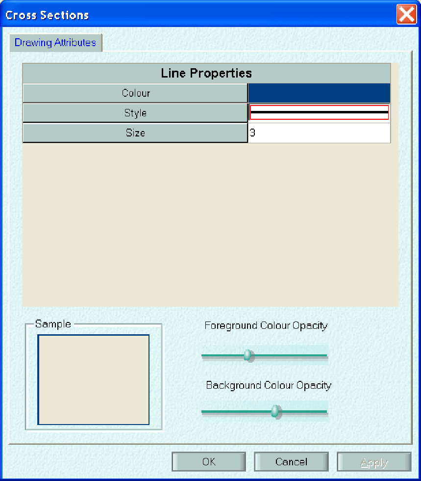
>
> To display a graph of a Cross Section:

882

xpswmm Reference Manual

Select Export Current Results Time Step. A Windows Explorer dialog will open. Navigate to the desired folder location, enter the file name, and click on Open.

A text file will be generated. The first line indicates the time step. The second line contains column headers. The results for each cell in the 2D Area Extent begin with row 3.

> 

The first two columns are the counters for the 2D Area Extent Grid.

The x and y columns are the coordinates of the cell. Zero values indicate that there is no 2D Active Area in the cell.

The contents of the fifth column depend on which 2D Maps radio button is checked. The contents are the center cell value of:

> Water Depth (ft or m),
>
> Water Elevation (ft or m), or
>
> Hazard = depth  velocity (ft2/s or m2/s)
>
> where:
>
> velocity = the vector sum of the x and y velocity components
>
> velocity = SQRT (V2x + V2y)

The sixth and seventh columns depend on which 2D Vectors radio button is checked. The contents are the magnitude of the x-component (across the left and right sides) and the y-component (across the bottom and top sides) of:

> Flow (ft2/s or m2/s  discharge per unit width) or  
> Velocity (ft/s or m/s).

Note: The maximum values for each cell may be exported by clicking on the Maximum Values button on the 2D Results Video Controls tool bar.

**Export Contours**

A contour map of the Water Depth, Water Elevation or, Hazard value at the current simulation time step (or the maximum values) can be exported to a MapInfo file. To generate the file:

1.  Use the **<u>Video Control</u>** tools to set the results to the desired time step. Alternatively, the green arrow icon will display the maximum.

2.  Ensure the visible box in the 2D Maps in the Results section of the Layer Control Panel.

3.  Check the radio button corresponding to the desired parameter (Water Depth, Water Elevation, or Hazard).

884

SECTION 18: 2D Hydraulic Modeling

4.  Right click on the selected layer and select Properties. Set the display to Contours using the Contours tab.

5.  Right click on the 2D Maps line and select Export Contours.

> 

6.  In the Windows Explorer dialog, choose the desired location for the output files.

7.  xpswmm reports the export results.

> 

8.  Click on OK.

xpswmm Reference Manual

> **Properties**
>
> **Fill Colours - vectors**
>
> Flows and Velocity results may be displayed will cell color coding over the simulation period. Highlight the Flows or Velocity row in the Layer Control Panel, right click. Select Properties then click on the Fill Colours Tab. Use this dialog to customize the display.
>
> 886

SECTION 18: 2D Hydraulic Modeling

> 

Check the radio button corresponding to the selected Fill Style: a ramp of a colour mix, an intensity scale of a single, user defined color, or a single colour. When either of the last two options are selected a drop list will appear to allow for selection desired colour

When the Ramp Fill Style is selected, the Color Peg dialog appears to allow the user to defined style. The styles may be save as a .cip file and reloaded for later use.

Use the Reverse button to invert the colour style.

The histogram on the left side of the dialog indicates the range of values in the results. The display may be restricted to a user defined range.

Use the legends properties dialog to customize the legend for flow and velocity.

887

xpswmm Reference Manual

**Fill Colors - Maps**

Water Depth, Water Elevation and Hazard results may be displayed will cell color coding or contouring over the simulation period. Highlight the Flows or Velocity row in the Layer Control Panel, right click. Select Properties then click on the Fill Colours Tab. Use this dialog to customize the display.

> 

Check the radio button corresponding to the selected Fill Style: a ramp of a colour mix, an intensity scale of a single, user defined color, or a single colour. When either of the last two options are selected a drop list will appear to allow for selection desired colour

When the Ramp Fill Style is selected, the Color Peg dialog appears to allow the user to defined style. The styles may be save as a .cip file and reloaded for later use.

Use the Reverse button to invert the colour style.

Use the drop lisp under Display to select a filled and/or contour display.

888

SECTION 18: 2D Hydraulic Modeling

The histogram on the left side of the dialog indicates the range of values in the results. The display may be restricted to a user defined range.

Use the legends properties dialog to customize the legend for Water Depth, Water Elevation and Hazard. **Arrows**

Arrows (displayed as 2D Vectors) are used to show flow and velocity results over the simulation period. Highlight the Flows or Velocity row in the Layer Control Panel, right click. Select Properties then click on the Arrow tab. Use this dialog to customize the display of the arrows.

> 

The arrow head may be displayed with a fixed or scaled size. Check the box to display a filled arrow head. The total length of the arrow may be displayed with a fixed length, scaled length or with defined range (in mm).

889

xpswmm Reference Manual

The shaft width may be displayed as fixed or scaled.

The histogram on the left side of the dialog indicates the range of values in the results. The display may be restricted to a user defined range.

Use the legends properties dialog to customize the legend for flow and velocity.

**Labels**

The values of Flows, Velocity, Water Depth, Water Elevation and Hazard during the simulation period may be displayed. Highlight the selected parameter row in the Layer Control Panel, right click. Select Properties then click on the Labels tab. Use this dialog to customize the display of the labels.

> 

The display of the Results Values and/or Number for each 2D cell l at the simulation time steps can be toggled off/on with the check boxes. Select the font and skip fill in box to enhance the readability.

890

SECTION 18: 2D Hydraulic Modeling

The display of the cell number can be toggled off/on. Select the font to enhance the readability.

The histogram on the left side of the dialog indicates the range of values in the results. The display may be restricted to a user defined range. Values outside of the range are left blank.

**Contours**

Water Depth, Water Elevation and Hazard results may be displayed will cell color coded contouris over the simulation period. Highlight the Flows or Velocity row in the Layer Control Panel, right click. Select Properties then click on the Contours Tab. Use this dialog to customize the display.

> 

Check the radio button corresponding to the selected Style: a ramp of a colour mix, an intensity scale of a single, user defined fill colours, or a single colour. When either of the last two options are selected a drop list will appear to allow for selection desired colour. When a selection is made, the corresponding drop list appears.

891

> xpswmm Reference Manual
>
> In the Contour Steps box, select either the number of contours or the contour interval. Enter the value in the box next to the drop list.
>
> Enter the desired pen width and then select units of pixels or millimeters.
>
> The histogram on the left side of the dialog indicates the range of values in the results. The display may be restricted to a user defined range.
>
> Use the legends properties dialog to customize the legend for Water Depth, Water Elevation and Hazard.
>
> 892
>
> ***SECTION 19: REFERENCES  
> *References**
>
> Adams, B.J. and Howard, C.D.D., The Pathology of Design Storms, Publication 85-03, University of Toronto, Dept. of Civil Engineering, Toronto, Ontario, January 1985.
>
> Alley, W.M., An Examination of the Storm Water Management Model (SWMM) Surface-Runoff-Quality Algorithms, Proceedings Storm Water Management Model Users Group Meeting, January 1980, EPA-600/9-80-017 (NTIS PB80-177876), Environmental Protection Agency, Washington, DC, March 1980, pp. 93-110.
>
> Alley, W.M., Estimation of Impervious-Area Washoff Parameters, Water Resources Research, Vol. 17, No. 4, August 1981, pp. 1161-1166.
>
> Alley, W.M., Dawdy, D.R. and Schaake, J.C., Jr., Parametric-Deterministic Urban Watershed Model, Journal of the Hydraulics Division, ASCE, Vol. 106, No. HY5, May 1980a, pp. 679-690.
>
> Alley, W.M. and Ellis, S.R., Rainfall-Runoff Modeling of Flow and Total Nitrogen from Two Localities in the Denver, Colorado Metropolitan Area, Proceedings Storm Water Management Model Users Group Meeting, May 1979, EPA-600/9-79-026 (NTIS PB80-105663), Environmental Protection Agency, Washington, DC, 1979, pp. 362-403.
>
> Alley, W.M., Ellis, F.W. and Sutherland, R.C., Toward a More Deterministic Urban Runoff-Quality Model, International Symposium on Urban Storm Runoff, University of Kentucky, Lexington, KY, July 1980b, pp. 171-182.
>
> Ambrose, R.B., Vandergrift, S.B. and Wool, T.A., WASP3, A Hydrodynamic and Water Quality Model  Model Theory, Users Manual and Programmers Guide, EPA/600/3-86/034, Environmental Protection Agency, Athens, GA, September 1986.
>
> American National Standards Institute, American National Standard Programming Language FORTRAN, ANSI X3.91978, New York, NY, 1978.
>
> American Public Health Association, American Public Works Association, Water Pollution Control Federation, <u>Standard Methods for the Examination of Water and Wastewater</u>, 13th Edition, American Public Health Association, Washington, DC, 1971.
>
> American Public Works Association, Water Pollution Aspects of Urban Runoff, Federal Water Pollution Control Administration, Contract WP-20-1 5, Washington, DC, 1969.
>
> American Public Works Association, Managing Snow Removal and Ice Control Programs, Special Report No. 42, American Public Works Association, Chicago, IL, 1974.
>
> American Society of Civil Engineers and Water Pollution Control Federation, <u>Design and Construction of Sanitary and Storm Sewers</u>, Water Pollution Control Federation, Washington, DC, 1969.
>
> American Society of Heating and Air Conditioning Engineers, <u>Heating, Ventilating, Air Conditioning Guide</u>, New York, NY, Annual Publication (superseded by the American Society of Heating, Refrigerating and Ventilating Engineers Handbook).
>
> Ammon, D.C., Urban Stormwater Pollutant Buildup and Washoff Relationships, Master of Engineering Thesis, Dept. of Environmental Engineering Sciences, University of Florida, Gainesville, FL, 1979.
>
> Amy, G., Pitt, R., Singh, R., Bradford, W.L. and LaGraff, M.B., Water Quality Management Planning for Urban Runoff, EPA-440/9-75-004 (NTIS PB-241689), Environmental Protection Agency, Washington, DC, December 1974.
>
> Anderson, E.A., National Weather Service River Forecast System - Snow Accumulation and Ablation Model, NOAA Tech. Memo NWS HYDRO-17, U.S. Department of Commerce, Washington, DC, 1973.
>
> Anderson, E.A., A Point Energy and Mass Balance Model of a Snow Cover, NOAA Tech. Report NWS 19, U.S. Department of Commerce, Washington, DC, February 1976.
>
> xpswmm Reference Manual
>
> Anderson, E.R., Energy Budget Studies, Water Loss Investigations: Lake Hefner Studies, U.S. Geological Survey Professional Paper 269, Washington, DC, 1954.
>
> Arnell, V., Rainfall Data for the Design of Sewer Pipe Systems, Report Series A:8, Chalmers University of Technology, Dept. of Hydraulics, Goteborg, Sweden, 1982.
>
> AVCO Economic Systems Corporation, Storm Water Pollution from Urban Land Activity, EPA 111034FKL07/70 (NTIS PB-19528l), Environmental Protection Agency, Washington, DC, July 1970.
>
> Baffau, C., Benabdallah, S., Wood, D., Delleur, J., Houck, M. and Wright J. (1987), "Development of An Expert System for the Analysis of Urban Drainage Using SWMM". Water Resources Research Centre, Purdue University, West Lafayett,. Indianna.
>
> Baker, R.M. and Brazauskas, K.J., Porting Mainframe-Based Numerical Models to Microcomputers: A Case Study Using the EPA Storm Water Management Model. Proceedings of Stormwater and Water Quality Model Users Group Meeting, March 24-25, 1986, Orlando, Florida, EPA/600/9-86/023 (NTIS PB87-117438/AS), Environmental Protection Agency, Athens, GA, September 1986, pp. 1-19.
>
> Barnwell, T.O., Jr., EPAs Center for Water Quality Modeling, Proceedings of the Third International Conference on Urban Storm Drainage, Chalmers University, Goteborg, Sweden, June 1984, Vol. 2, pp. 463-466.
>
> Barton, C.L. (2001) *Flow Through an Abrupt Constriction  2D Hydrodynamic Model Performance and Influence of Spatial Resolution* Thesis submitted as partial fulfillment for Master of Engineering Science, Environmental Engineering, Griffith University, July 2001.
>
> Bates, B.C. and Pilgrim, D.H. (1986), "Simple Models For Nonlinear Runoff Routing". Civil Engineering Transactions, Institution of Engineers, Australia, Vol. CE28, pp 284-291.
>
> Bear, et. al. (1968), "Physical Principles of Water Perculation and Seepage". Arid Zone Research XXIX, UNESCO, Paris, France.
>
> Bear, J., <u>Dynamics of Fluids in Porous Media</u>, Elsevier, New York, 1972.
>
> Bedient, P.B., Harned, D.A. and Characklis, W.G., Stormwater Analysis and Prediction in Houston, Journal of the Environmental Engineering Division, ASCE, Vol. 104, No. EE6, December 1978, pp. 1087-1100.
>
> Benham, S.A., Rogencamp, G.J. (2003) *Application of 2D Flood Models with 1D Drainage Elements* Flood Mitigation Conference, Forbes, 2003.
>
> Bengston, L., Snowmelt-Generated Runoff in Urban Areas, in <u>Urban Stormwater Hydraulics and Hydrology</u>, B.C. Yen, ed., Proc. Second International Conference on Urban Storm Drainage, Urbana, IL, Water Resources Publications, Littleton, CO, June 1981, Vol. I, pp. 444-451.
>
> Benjes, H.H., Cost Estimating Manual - Combined Sewer Overflow Storage and Treatment, EPA-600/2-76-286 (NTIS PB-266359), Environmental Protection Agency, Cincinnati, OH, December 1976.
>
> Betson, R.P., Bulk Precipitation and Streamflow quality Relationships in an Urban Area, Water Resources Research, Vol. 14, No. 6, December 1978, pp. 1165-1169.
>
> Boose, J.H. (1985), "Expertise Transfer for Expert System Design": Elsevier, New York.  
> Bouwer, H., <u>Groundwater Hydrology</u>, McGraw-Hill, New York, 1978.
>
> Brakensiek, D.L. and Onstad, C.A., Parameter Estimation of the Green-Ampt Equations, Water Resources Research, Vol. 13, No. 6, December 1977, pp. 1009- 1012.
>
> Brandstetter, A.B., Assessment of Mathematical Models for Storm and Combined Sewer Management, EPA-600/276-175a (NTIS PB-259597), Environmental Protection Agency, Cincinnati, OH, August 1977.
>
> 894

SECTION 19: REFERENCES

> Brater, E.F., Steps Toward a Better Understanding of Urban Runoff Processes, Water Resources Research, Volume 4, No. 2, April 1968, pp. 335-347.
>
> Brezonik, P.L., Nutrients and Other Biologically Active Substances in Atmospheric Precipitation, Proceedings Symposium on Atmospheric Contribution to the Chemistry of Lake Waters, International Association Great Lakes
>
> Research, September 1975, pp. 166-186.
>
> Brown, C.B., Sedimentation Engineering, Chapter XII in <u>Engineering Hydraulics</u>, Rouse, H., ed., John Wiley and Sons, New York, 1950.
>
> Butler, S.S., <u>Engineering Hydrology</u>, Prentice-Hall, New York, 1957.
>
> Camp, T.L. Sedimentation and the Design of Settling Tanks, Transactions ASCE, Vol. 111, 1946, pp. 895-936.
>
> Capece, J.C., Campbell, J.C. and Baldwin, L.B., Estimating Peak Rates and Volumes from Flat, High-water-table Watersheds, Paper No. 84-2020, American Society of Agricultural Engineers, St. Joseph, MI, June 1984.
>
> Carlisle, V.W., Hallmark, C.T., Sodek, F., III, Caldwell, R.E., Hammond, L.C. and Berkheiser, V.E., Characterization Data for Selected Florida Soils, Soil Science Research Report No. 81-1, Soil Science Department, University of Florida, Gainesville, June 1981.
>
> Chan, S. and Bras, R.L., Urban Storm Water Management: Distribution of Flood Volumes, Water Resources Research, Vol. 15, No. 2, April 1979, pp. 371-382.
>
> Charteris, A.B., Syme, W .J. (2001) *Urban Flood Modelling and Mapping  2D or not 2D* Conference on Hydraulics in Civil Engineering, Hobart, November 2001.
>
> Chemical Rubber Company, <u>Handbook of Chemistry and Physics</u>, Weast, R. C., ed., 57th Edition, Chemical Rubber Company, Cleveland, OH, 1976.
>
> Chen, C., Flow Resistance in Broad Shallow Grassed Channels, Journal of the Hydraulics Division, ASCE, Vol. 102, No. HY3, March 1976, pp. 307-322.
>
> Chen, C.N., Design of Sediment Retention Basins, Proceedings National Symposium on Urban Hydrology and Sediment Control, Publication UKY BU109, University of Kentucky, Lexington, July 1975, pp. 285-298.
>
> Chong, S.K. and Green, R.E. (1979), "Application of Field=Measured Sorptivity for Simplified Infiltration Prediction". Proceedings of the Hydrologic Transport Modelling Symp., December, Louisiana, USA, ASAE Publ. 4-80.
>
> Chow, V.T., <u>Open-Channel Hydraulics</u>, McGraw-Hill, New York, 1959.
>
> Chow, V.T. and Yen, B.C., Urban Stormwater Runoff: Determination of Volumes and Flowrates, EPA-600/2-76-116 (NTIS PB-253410), Environmental Protection Agency, Cincinnati, OH, May 1976.
>
> Christensen, B.A., Hydraulics of Sheet Flow in Wetlands, Symposium on Inland Waterways for Navigation, Flood Control and Water Diversions, Colorado State University, ASCE, New York, August 1976, pp. 746-759.
>
> Chu, C.S. and Bowers, C.E., Computer Programs in Water Resources, WRRC Bulletin 97, Water Resources Research Center, University of Minnesota, Minneapolis, November 1977.
>
> Chu, S.T., Infiltration During an Unsteady Rain, Water Resources Research, Vol. 14, No. 3, June 1978, pp. 461-466.
>
> Clapp, R.B. and Hornberger, G.M., Empirical Equations for Some Soil Properties, Water Resources Research, Vol. 14, No. 4, August 1978, pp. 601-604.
>
> Clark, C. O. 1945. Storage and the unit hydrograph. Transactions of the American Society of Civil Engineers 110, pp. 1419-1446.
>
> 895
>
> xpswmm Reference Manual
>
> Colyer, P.J. and Pethick, R.W., Storm Drainage Design Methods, A Literature Review, Report No. INT 154, Hydraulics Research Station, Wallingford, Oxon, England, March 1976.
>
> Corps of Engineers, Snow Hydrology, NTIS PB-151660, North Pacific Division, Corps of Engineers, Portland, OR, June 1956.
>
> Corps of Engineers, Runoff Evaluation and Streamflow Simulation by Computer, Tech. Report, North Pacific Division, Corps of Engineers, Portland, OR, 1971.
>
> Crawford, N.H. and Linsley, R.K., Digital Simulation in Hydrology: Stanford Watershed Model IV, Tech. Report No. 39, Civil Engineering Department, Stanford University, Palo Alto, CA, July 1966.
>
> Croley, T.E., <u>Hydrologic and Hydraulic Computations on Small Programmable Calculators</u>, Iowa Institute of Hydraulic Research, University of Iowa, Iowa City, 1977.
>
> Crowder, R., van der Leer, D., and Kovacevic, S., Integrated modeling of sewers, rivers and overland flows, WAPUG Autumn Conference, Blackpool, UK, November 2006.
>
> Cunnane, C., Unbiased Plotting Positions  A Review, Journal of Hydrology, Vol. 37, 1978, pp. 205-222.
>
> Dalrymple, R.J., Hodd, S.L. and Morin, D.C., Physical and Settling Characteristics of Particulates in Storm and Sanitary Wastewaters, EPA-670/2-75-01 1 (NTIS PB-242001), Environmental Protection Agency, Cincinnati, OH, April 1975.
>
> Davis, C.V., <u>Handbook of Applied Hydraulics</u>, Second Edition, McGraw-Hill, New York, 1952.
>
> Dawdy, D.R. and ODonnell, T., Mathematical Models of Catchment Behavior, Journal of the Hydraulics Division, Proc. ASCE, Vol. 91, No. HY4, July 1965, 123-137.
>
> Dawdy, D.R., Schaake, J.C., Jr. and Alley, W.M., Users Guide for Distributed Routing Rainfall-Runoff Model, Water-Resources Investigations 78-90, U.S. Geological Survey, NSTL Station, MS, September 1978.
>
> Digiano, F.A., Adrian, D.D. and Mangarella, P.A., eds., Short Course Proceedings-Applications of Stormwater Management Models, 1976, EPA-600/2-77-065 (NTIS PB-265321), Environmental Protection Agency, Cincinnati, OH, March, 1977.
>
> Diniz, E.V., Modifications to the Storm Water Management Model and Application to Natural Drainage Systems, Proceedings International Conference at the University of Southampton, April 1978, Helliwell, P.R., ed., <u>Urban Storm Drainage</u>, Pentech Press, London, 1978, pp. 256-274.
>
> Di Toro, D.M., Probability Model of Stream Quality Due to Runoff, Journal of Environmental Engineering, ASCE, Vol. 110, No. 3, June 1984, pp. 607-628.
>
> Dobbins, W.E., Effect of Turbulence on Sedimentation, Transactions ASCE, Vol. 109, 1944, pp. 629-678.
>
> Doyle, H.W., Jr., and Miller, J.E., Calibration of a Distributed Routing- Runoff Model at Four Urban Sites Near Miami, Florida, Water-Resources Investigations 80-1, U.S. Geological Survey, NSTL Station, MS, February, 1980.
>
> Donigian, A.S., Jr., Beyerlein, D.C., Davis, H.H., Jr. and Crawford, N.H., Agricultural Runoff Management Model Version II: Refinement and Testing, EPA-600/3-77-098, Environmental Protection Agency, Athens, GA, August 1977.
>
> Donigian, A.S., Jr. and Crawford, N.H., Modeling Non-point Pollution from the Land Surface, EPA-600/3-76-083, Environmental Protection Agency, July 1976.
>
> Downs, W.C., Dobson, J.P. and R.E. Wiles, The Use of SWMM to Predict Runoff from Natural Watersheds in Florida, Proceedings of Stormwater and Water Quality Model Users Group Meeting, Orlando, Florida, EPA/600/9-86/023 (NTIS PB87-117438/AS), Environmental Protection Agency, Athens, GA, March 1986, pp. 109-120.
>
> 896

SECTION 19: REFERENCES

> Driscoll, E.D., in Benefit Analysis for Combined Sewer Overflow Control, Seminar Publication, EPA-652/4-79-013, Environmental Protection Agency, Cincinnati, OH, April 1979.
>
> Driscoll, E.D., Lognormality of Point and Nonpoint Source Pollutant Concentrations, Proceedings of Stormwater and Water Quality Model Users Group Meeting, Orlando, Florida, EPA/600/9-86/023 (NTIS PB87-117438/AS), Environmental Protection Agency, Athens, GA, March 1986, pp. 157-176.
>
> Driscoll, E.D. and Assoc., Combined Sewer Overflow Analysis Handbook for Use in 201 Facility Planning, Report to Environmental Protection Agency, Facility Requirements Division, Washington, DC, July 1981.
>
> Eagleson, P.S., <u>Dynamic Hydrology</u>, McGraw-Hill, New York, 1970.
>
> Ellis, F.W. and Sutherland, R.C., An Approach to Urban Pollutant Washoff Modeling, Proceedings International Symposium on Urban Storm Runoff, University of Kentucky, Lexington, July 1979, pp. 325-340.
>
> Ellis, S.R., Hydrologic Data for Urban Storm Runoff from Three Localities in the Denver Metropolitan Area, Colorado, Open-File Report 78-410, U.S. Geological Survey in cooperation with the Denver Board of Water Commissioners, the Denver Regional Council of Governments and the Urban Drainage and Flood Control District, Lakewood, CO, May 1978.
>
> Emmett, W.W., Overland Flow, Kirkby, M.J., ed., <u>Hillslope Hydrology</u>, John Wiley and Sons, New York, 1978, pp. 145-176.
>
> Engman, E.T., Roughness Coefficients for Routing Surface Runoff, Journal of Irrigation and Drainage Engineering, ASCE, Vol. 112, No. 1, February 1986, pp. 39-53.
>
> Envirogenics Company, In-Sewer Fixed Screening of Combined Sewer Overflows, EPA-11024FKJ10/70 (NTIS PB-213118), Environmental Protection AGency, Cincinnati, OH, November 1970.
>
> Environmental Protection Agency, Areawide Assessment Procedures Manual, Three Volumes, EPA-600/9-76-014, Environmental Protection Agency, Cincinnati, OH, July 1976 et seq.
>
> Environmental Protection Agency, Sewer System Evaluation, Rehabilitation, and New Construction  A Manual of Practice, EPA-600/2-77-017d (NTIS PB-279248), Environmental Protection Agency, Cincinnati, OH, 1977.
>
> Environmental Protection Agency, EPA Environmental Data Base and Model Directory, Information Clearinghouse (PM 211A), Environmental Protection Agency, Washington, DC, July 1983a.
>
> Environmental Protection Agency, Results of the Nationwide Urban Runoff Program, Volume I Final Report, NTIS PB84-185552, Environmental Protection Agency, Washington, DC, December 1983b.
>
> Fair, M.F., Geyer, J.C. and Okun, D.A., <u>Water and Wastewater Engineering</u>, John Wiley and Sons, Inc., New York, 1968.
>
> Falk, J. and Niemczynowicz, J., Characteristics of the Above-Ground Runoff in Sewered Catchments, <u>Urban Storm Drainage</u>, Proceedings International Conference on Urban Storm Drainage, University of Southampton, April 1978, Helliwell, P.R., ed., Pentech Press, London, 1978, pp. 159-171.
>
> Farnsworth, R.K. and Thompson, E.S., Mean Monthly, Seasonal, and Annual Pan Evaporation for the United States, NOAA Technical Report NWS 34, Office of Hydrology, National Weather Service, Washington, DC, December 1982.
>
> Fetter, C.W., Jr., <u>Applied Hydrogeology</u>, Charles E. Merrill, Columbus, OH., 1980.
>
> Field, R., Struzeski, E.J., Jr., Masters, H.E. and Tafuri, A.N., Water Pollution and Associated Effects from Street Salting, EPA-R2-73-257 (NTIS PB- 222795), Environmental Protection Agency, Cincinnati, OH, May 1973.
>
> Fleming, G., <u>Computer Simulation Techniques in Hydrology</u>, American Elsevier Publishing Co., New York, 1975.
>
> 897
>
> xpswmm Reference Manual
>
> Franz, D.D., Prediction for Dew Point Temperature, Solar Radiation and Wind Movement Data for Simulation and Operations Research Models, Report for Office of Water Resources Research, Hydrocomp, Inc., Palo Alto, CA, April 1974.
>
> Gagliardo, V., A Subsurface Drainage Model for Florida Conditions, M.E. Project Report (unpublished), Dept. of Environmental Engineering Sciences, University of Florida, Gainesville, 1986.
>
> Geiger, W.F. and Dorsch, H.R., Quantity-Quality Simulation (QQS): A Detailed Continuous Planning Model for Urban Runoff Control, Volume I, Model Description, Testing and Applications, EPA-600/2-80-011 (NTIS PB80-190507), Environmental Protection Agency, Cincinnati, OH, March 1980.
>
> Geiger, W.F., LaBella, S.A. and McDonald, G.C., Overflow Abatement Alternatives Selected by Combining Continuous and Single Event Simulations, Proceedings National Symposium on Urban Hydrology, Hydraulics and Sediment Control, University of Kentucky, Lexington, July 1976, pp. 71-79.
>
> Geyer, J.C. and Lentz, J.J., An Evaluation of the Problems of Sanitary Sewer System Design, Department of Sanitary Engineering and Water Resources, Johns Hopkins University, Baltimore, MD, 1963.
>
> Golding, B.L., Flood Routing Program, Civil Engineering, Vol. 51, No. 6, June 1981, pp. 74-75. Graf, W.H., <u>Hydraulics of Sediment Transport</u>, McGraw-Hill, New York, 1971.
>
> Graf, W.H. and Chun, V.H., Mannings Roughness for Artificial Grasses, Journal of the Irrigation and Drainage Division, ASCE, Vol. 102, No. IR4, December 1976, pp. 413-423.
>
> Graham, P.H., Costello, L.S. and Mallon, H.J., Estimation of Imperviousness and Specific Curb Length for Forecasting Stormwater Quality and Quantity, Journal Water Pollution Control Federation, Vol. 46, No. 4, April 1974, pp. 717-725.
>
> Gray, D.M., ed., <u>Handbook on the Principles of Hydrology</u>, Water Information Center, Port Washington, NY, 1970.
>
> Gringorten, I.I., A Plotting Rule for Extreme Probability Paper, Journal of Geophysical Research, Vol. 68, No. 3, 1963, pp. 813-814.
>
> Green, W.H. and Ampt, G.A., Studies on Soil Physics, 1. The Flow of Air and Water Through Soils, Journal of Agricultural Sciences, Vol. 4, 1911, pp. 11- 24.
>
> Gumbel, E.J., <u>Statistics of Extremes</u>, Columbia University Press, New York, 1958.
>
> Gupta, M.K., Bollinger, E., Vanderah, S., Hansen, C. and Clark, M., Handling and Disposal of Sludges from Combined Sewer Overflow Treatment: Phase I - Characterization, EPA-600/2-77-053a (NTIS PB-270212), Environmental Protection Agency, Cincinnati, OH, May 1977.
>
> Hall, M.J. Urban Hydrology, Elsevier Applied Science Publishers, New York, 1984.
>
> Harremoes, P., ed., <u>Rainfall as the Basis for Urban Runoff Design and Analysis</u>, Proceedings of the Seminar, Pergamon Press, New York, August 1983.
>
> Han, J. and Delleur, J.W., Development of an Extension of Illudas Model for Continuous Simulation of Urban Runoff Quantity and Discrete Technical Report No. 109, Purdue University, West Lafayette, IN, July 1979.
>
> Harel, D. <u>Algorithmics - The Spirit of Computing</u>, Addison-Wesley Publishing Company, Reading, MA, 1987. Hazen, A., On Sedimentation, Transactions ASCE, Vol. 53, 1904, pp. 45-71.
>
> Heaney, J.P., Huber, W.C., Downs, W.C., Hancock, M.C. and Hicks, C.N., Impacts of Development on the Water Resources of Cypress Creek, North of Tampa, Publication No. 89, Water Resources Research Center, University of Florida, Gainesville, January 1986.
>
> 898

SECTION 19: REFERENCES

> Heaney, J.P., Huber, W.C., Medina, M.A., Jr., Murphy, M.P., Nix, S.J. and Haasan, S.M., Nationwide Evaluation of Combined Sewer Overflows and Urban Stormwater Discharges - Vol. II: Cost Assessment and Impacts, EPA-600/277- 064b (NTIS PB-266005), Environmental Protection Agency, Cincinnati, OH, March 1977.
>
> Heaney, J.P., Huber, W.C. and Nix, S.J., Storm Water Management Model -Level I: Preliminary Screening Procedures, EPA-600/2-76-275 (NTIS PB-259916), Environmental Protection Agency, Cincinnati, OH, October 1976.
>
> Heaney, J.P., Huber, W.C., Sheikh, H., Medina, M.A., Doyle, J.R., Peltz, W.A. and Darling, J.E., Urban Stormwater Management Modeling and Decision Making, EPA-670/2-75-022 (NTIS PB-242290), Environmental Protection Agency, Cincinnati, OH, May 1975.
>
> Heaney, J.P. and Nix, S.J., Storm Water Management Model: Level I - Comparative Evaluation of Storage-Treatment and Other Management Practices, EPA- 600/2-77-083 (NTIS PB-265671), Environmental Protection Agency, Cincinnati, OH, April 1977.
>
> Helfgott, T., Hunter, J.V. and Rickert, D., Analytic and Process Classification of Effluents, Journal of the Sanitary Engineering Division, ASCE, Vol. 96, No. SA3, June 1970, pp. 779-803.
>
> Henderson, F.M. (1966) *Open Channel Flow* Macmillan Publishing Co., Inc, 1966.
>
> Hendry, C.D. and Brezonik, P.L., Chemistry of Precipitation at Gainesville, Florida, Environmental Science and Technology, Vol. 14, No. 7, July 1980, pp. 843-849.
>
> Heukelekian, H. and Balmat, J.L., Chemical Composition of Particulate Fractions of Domestic Sewage, Sewage and Industrial Wastes, Vol. 31, No. 4, April 1959, pp. 413-423.
>
> Hicks, W.I., A Method of Computing Urban Runoff, Transactions ASCE, Vol. 109, 1944, pp. 1217-1253. Hillel, D., <u>Introduction to Soil Physics</u>, Academic Press, Orlando, FL, 1982.
>
> Horton, R.E., The Role of Infiltration in the Hydrologic Cycle, Transactions American Geophysical Union, Vol. 14, 1933, pp. 446-460.
>
> Horton, R.E., An Approach Toward a Physical Interpretation of Infiltration Capacity, Proceedings Soil Science of America, Vol. 5, 1940, pp. 399-417.
>
> Howard, C.D.D., Theory of Storage and Treatment-Plant Overflows, Journal of the Environmental Engineering Division, ASCE, Vol. 102, No. EE4, August 1976, pp. 709-722.
>
> Howard, Charles and Associates, Ltd., Analysis and Use of Urban Rainfall Data in Canada, Economic and Technical Review Report No. EPA 3-WP-79-4, Environmental Protection Service, Environment Canada, Ottawa, Ontario, July 1979.
>
> Huber, W.C., Urban Wasteload Generation by Multiple Regression Analysis of Nationwide Urban Runoff Data, in Workshop on Verification of Water Quality Models, R. V. Thomann and T.O. Barnwell, eds., EPA 600/9-80-016 (NTIS PB80- 186539), Environmental Protection Agency, Athens, GA, April 1980, pp. 167-174.
>
> Huber, W.C., Deterministic Modeling of Urban Runoff Quality, <u>Urban Runoff Pollution</u>, H. Torno, J. Marsalek and M. Desbordes, eds., NATO ASI Series, Series G: Ecological Sciences, Vol. 10, Springer-Verlag, New York, 1985, pp. 166-242.
>
> Huber, W.C., Modeling Urban Runoff Quality: State-of-the-Art, <u>Urban Runoff Quality-Impact and Quality Enhancement Technology</u>, B. Urbonas and L.A. Roesner, eds., Proceedings of an Engineering Foundation Conference, American Society of Civil Engineers, New York, June 1986, pp. 34-48.
>
> Huber, W.C., Cunningham, B.A. and Cavender, K.A., Use of Continuous SWMM for Selection of Historic Design Events in Tallahassee, Proceedings of Stormwater and Water Quality Model Users Group Meeting, Orlando, Florida, EPA/600/9- 86/023 (NTIS PB87-1 17438/AS), Environmental Protection Agency, Athens, GA, March 1986, pp. 295321.
>
> 899
>
> xpswmm Reference Manual
>
> Huber, W.C. and Heaney, J.P., Operational Models for Stormwater Quality Management, Overcash, M.R. and Davidson, J.M., eds., <u>Environmental Impact of Nonpoint Source Pollution</u>, Ann Arbor Science, Ann Arbor, MI, 1980, pp. 397- 444.
>
> Huber, W.C. and Heaney, J.P., Analyzing Residuals Discharge and Generation from Urban and Non-Urban Land Surfaces, Chapter 3, in <u>Analyzing Natural Systems, Analysis for Regional Residuals - Environmental Quality Management</u>, Basta, D.J. and B.T. Bower, eds., Resources for the Future, Washington, D.C., The Johns Hopkins University Press, Baltimore, MD, 1982, (also available as EPA-600/3-83-046, NTIS PB83-223321), 1982, pp. 121243.
>
> Huber, W.C., Heaney, J.P., Aggidis, D.A., Dickinson, R.E. and Wallace, R.W., Urban Rainfall-Runoff-Quality Data Base, EPA-600/2-81-238 (NTIS PB82- 221094), Environmental Protection Agency, Cincinnati, OH, October 1981a.
>
> Huber, W.C., Heaney, J.P. and Cunningham, B.A., Storm Water Management Model (SWMM) Bibliography, EPA Report EPA/600/3-85-077 (NTIS PB86-136041/AS), Environmental Protection Agency, Athens, GA, September 1985.
>
> Huber, W.C., Heaney, J.P., Medina, M.A., Peltz, W.A., Sheikh, H. and Smith, G.F., Storm Water Management Model Users Manual - Version II, EPA-670/2-75- 017 (NTIS PB-257809), Environmental Protection Agency, Cincinnati, OH, March 1975.
>
> Huber, W.C., Heaney, J.P., Nix, S.J., Dickinson, R.E. and Polmann, D.J., Storm Water Management Model Users Manual, Version III, EPA-600/2-84-109a (NTIS PB84-198423), Environmental Protection Agency, Cincinnati, OH, November 1981b.
>
> Huggins, L.F. and Monke, E.J., Mathematical Simulation of Hydrologic Events of Ungaged Watersheds, Purdue University Water Resources Research Center Technical Report No. 14, West Lafayette, IN, March 1970.
>
> Huggins, L.F. and Burney, J.R., Surface Runoff, Storage and Routing, <u>Hydrologic Modeling of Small Watersheds</u>, C.T. Haan, H.P. Johnson and D.L. Brakensiek, eds., American Society of Agricultural Engineers, St. Joseph, MI, 1982, Chapter 5, pp. 169-225.
>
> Huibregtse, K.R., Handling and Disposal of Sludges From Combined Sewer Overflow Treatment: Phase II - Impact Assessment, EPA-600/2-77-053b (NTIS PB- 280309), Environmental Protection Agency, Cincinnati, OH, 1977.
>
> Hunter, J.V. and Heukelekian, H., The Composition of Domestic Sewage Fractions, Journal Water Pollution Control Federation, Vol. 37, No. 8, August 1965, pp. 1142-1163.
>
> Huxley, C.D. (2004) *TUFLOW Testing and Validation* Undergraduate Thesis for Bachelor of Engineering in Environmental Engineering, School of Environmental Engineering, Griffith University, June 2004.
>
> Hydrologic Engineering Center, Storage, Treatment, Overflow, Runoff Model, STORM, Users Manual, Generalized Computer Program 723-S8-L7520, HEC, Corps of Engineers, Davis, CA, August 1977a.
>
> Hydrologic Engineering Center, Guidelines for Calibration and Application of STORM, Training Document No. 8, HEC, Corps of Engineers, Davis, CA, December 1977b.
>
> Hydrologic Engineering Center, HEC-2 Water Surface Profiles, Users Manual, Generalized Computer Program 723-X6-L202A, HEC, Corps of Engineers, Davis, CA, September 1982.
>
> Hydroscience, Inc., Areawide Assessment Procedures Manual, Vols. I, II and III, EPA-600/9-76-014, Environmental Protection Agency, Cincinnati, OH, July 1976, et seq.
>
> Hydroscience, Inc., A Statistical Method for the Assessment of Urban Stormwater, EPA-440/3-79-023, Environmental Protection Agency, Washington, DC, May 1979.
>
> James, W. and Boregowda, S., Continuous Mass-Balance of Pollutant Build-up Processes, <u>Urban Runoff Pollution</u>, H.C. Torno, J. Marsalek and M. Desbordes, eds., NATO ASI Series, Series G: Ecological Sciences, Vol. 10, Springer- Verlag, New York, 1985, pp. 243-271.
>
> 900

SECTION 19: REFERENCES

> James, W. and Drake, J.J., Kinematic Design Storms Incorporating Spatial and Time Averaging, Proceedings Storm Water Management Model Users Group Meeting, June 1980, EPA-600/9-80-064 (PB81-173858), Environmental Protection Agency, Athens, GA, December 1980, pp. 133-149.
>
> James, W. and Robinson, M.A., Continuous Models Essential for Detention Design, Engineering Foundation Conference on Stormwater Detention Facilities Planning Design Operation and Maintenance, Henniker, NH, American Society of Civil Engineers, New York, August 1982, pp. 163-175.
>
> James, W. and Robinson, M.A., PCSWMM3  Version 3 of the Executive, Runoff and Extended Transport Blocks, Adapted for the IBM-PC, Proceedings of the Stormwater and Water Quality Modeling Conference, Burlington, Ontario, USEPA, and Ontario Ministry of Environment, Dept. of Civil Engineering, McMaster University, Hamilton, Ontario, September 1984, pp. 39-52.
>
> James, W. and Scheckenberger, R., Storm Dynamics Model for Urban Runoff, Proceedings, International Symposium on Urban Hydrology, Hydraulics and Sediment control, Report UKY BU131, University of Kentucky, Lexington, July 1983, pp. 11-18.
>
> James, W. and Shtifter, Z., Implications of Storm Dynamics on Design Storm Inputs, Proceedings, Stormwater and Water Quality Management Modeling and SWMM Users Group Meeting, September 28-29, 1981, USEPA and Ontario Ministry of the Environment, Dept. of civil Engineering, McMaster University, Hamilton, Ontario, September 1981, pp. 55-78.
>
> Jennings, M.E. and Doyle, W.H., Jr., Deterministic Modeling of Urban Storm Water Processes, Broward County, Florida, Proceedings International Symposium on Urban Storm Water Management, University of Kentucky, Lexington, July 1978, pp. 275-281.
>
> Jens, S.W. and McPherson, M.B., Hydrology of Urban Areas, in <u>Handbook of Applied Hydrology</u>, Chow, V.T., ed., McGraw-Hill, New York, 1964.
>
> Jewell, T.K. and Adrian, D.D., SWMM Stormwater Pollutant Washoff Functions, Journal of the Environmental Engineering Division, ASCE, Vol. 104, No. EE5, October 1978, pp. 1036-1040.
>
> Jewell, T.K. and Adrian, D.D., Development of Improved Stormwater Quality Models, Journal of the Environmental Engineering Division, ASCE, Vol. 107, No. EE5, October 1981, pp. 957-974.
>
> Jewell, T.K., Adrian, D.D. and DiGiano, F.A., Urban Stormwater Pollutant Loadings, Water Resources Research Center Publication No. 113, University of Massachusetts, Amherst, MA, May 1980.
>
> Jewell, T.K., Nunno, T.J. and Adrian, D.D., Methodology for Calibrating Stormwater Models, Journal of the Environmental Engineering Division, ASCE, Vol. 104, No. EE5, June 1978, pp. 485-501.
>
> Johansen, N.B., Linde-Jensen, J.J. and P. Harremoes, Computing Combined System Overflow Based on Historical Rain Series, Proc. Third International Conference on Urban Storm Drainage, Chalmers University, Goteborg, Sweden, June 1984, Vol. 3, pp. 909-918.
>
> Johanson, R.C., Imhoff, J.C. and Davis, H.H., Users Manual for Hydrological Simulation Program - Fortran (HSPF), EPA-600/9-80-015, Environmental Protection Agency, Athens, GA, April 1980.
>
> Keifer, C.J. and Chu, H.H., Synthetic Storm Pattern for Drainage Design, Proceedings ASCE, Vol. 83, No. HY4, Paper No. 1332, August 1957.
>
> Kibler, D.F., ed., <u>Urban Stormwater Hydrology</u>, Water Resources Monograph 7, American Geophysical Union, Washington, DC, 1982.
>
> Kidd, C.H.R., A Calibrated Model for the Simulation of the Inlet Hydrograph for Fully Sewered Catchments, in <u>Urban Storm Drainage</u>, Proceedings International Conference on Urban Storm Drainage, University of Southampton, April 1978, Helliwell, P.R., ed., Pentech Press, London, 1978a, pp. 172-186.
>
> Kidd, C.H.R., Rainfall-Runoff Processes Over Urban Surfaces, Proceedings International Workshop held at the Institute of Hydrology, Wallingford, Oxon, England, April 1978b.

901

> xpswmm Reference Manual
>
> Kluesener, J.W. and Lee, G.F., Nutrient Loading from a Separate Storm Sewer in Madison, Wisconsin, Journal Water Pollution Control Federation, Vol. 46, No. 5, May 1974, pp. 920-936.
>
> Kohlhaas, C.A., ed., Compilation of Water Resources Computer Program Abstracts, U.S. Committee on Irrigation, Drainage and Flood Control, Denver, CO, 1982.
>
> Lager, J.A., Didriksson, T. and Otte, G.B., Development and Application of a Simplified Stormwater Management Model, EPA-600/2-76-218 (NTIS PB-258074), Environmental Protection Agency, Cincinnati, OH, August 1976.
>
> Lager, J.A., Smith, W.G., Lynard, W.G., Finn, R.F. and Finnemore, E.J., Urban Stormwater Management and Technology: Update and Users Guide, EPA-600/8-77- 014 (NTIS PB-275264), Environmental Protection Agency, Cincinnati, OH, September 1977a.
>
> Lager, J.A., Smith, W.G. and Tchobanoglous, G., Catchbasin Technology Overview and Assessment, EPA-600/2-77051 (NTIS PB-270092), Environmental Protection Agency, Cincinnati, OH, May 1977b.
>
> Laliberte, G.E., Corey, A.T. and Brooks, R.H., Properties of Unsaturated Porous Media, Hydrology Paper No. 17, Colorado State University, Fort Collins, CO, November 1966.
>
> Lentz, J.J., Estimation of Design Maximum Domestic Sewage Flow Rates, Department of Sanitary Engineering and Water Resources, Johns Hopkins University, Baltimore, MD, May 1963.
>
> Linsley, R.K. and Crawford, N.H., Continuous Simulation Models in Urban Hydrology, Geophysical Research Letters, Vol. 1, No. 1, May 1974, pp. 59-62.
>
> Linsley, R.K., Jr., Kohler, M.A. and Paulhus, J.L.H., <u>Applied Hydrology</u>, McGraw-Hill, New York, 1949.
>
> Linsley, R.K., Kohler, M.A. and Paulhus, J.L.H., <u>Hydrology for Engineers</u>, McGraw-Hill, New York, Third Edition, 1983.
>
> List, R.J., ed., <u>Smithsonian Meteorological Tables</u>, Smithsonian Institution, Washington, DC, Sixth Revised Edition, 1966.
>
> Maher, M.B.,  Microstraining and Disinfection of Combined Sewer Overflows - Phase III, EPA-670/2-74-049 (NTIS PB-235771), Environmental Protection Agency, Cincinnati, OH, August 1974.
>
> Manning, M.J., Sullivan, R.H. and Kipp T.M., Nationwide Evaluation of Combined Sewer Overflows and Urban Stormwater Discharges - Vol. III: Characterization of Discharges, EPA-600/2-77-064c (NTIS PB-272107), Environmental Protection Agency, Cincinnati, OH, August 1977.
>
> Marsalek, J., Synthesized and Historical Storms for Urban Drainage Design, in <u>Urban Storm Drainage</u>, Proceedings International Conference on Urban Storm Drainage, University of Southampton, April 1978, Helliwell, P.R., ed., Pentech Press, London, 1978a, pp. 87-99.
>
> Marsalek, J., Research on the Design Storm Concept, ASCE Urban Water Resources Research Program Tech. Memo No. 33 (NTIS PB-291936), ASCE, New York, NY, September 1978b (also published in McPherson, 1978).
>
> Maryland Water Resources Administration, Technical Guide to Erosion and Sediment Control Design, Maryland Department of Natural Resources, Annapolis, September 1973.
>
> Mattraw, H.C., Jr., and Sherwood, C.B., Quality of Storm Water Runoff From a Residential Area, Broward County, Florida, Journal Research U.S. Geological Survey, Vol. 5, No. 6, November-December 1977, pp. 823-834.
>
> Mays, L.W., Stormwater Collection Systems Design Handbook, McGraw-Hill, New York, 2001.
>
> McElroy, A.D., Chiu, S.Y., Nebgen, J.W., Aleti, A. and Bennett, F.W., Loading Functions for Assessment of Water Pollution from Non-point Sources, EPA-600/2- 76-151 (NTIS PB-253325), Environmental Protection Agency, Washington, DC, May 1976.
>
> McPherson, M.B., Some Notes on the Rational Method of Storm Drain Design, ASCE Urban Water Resources Research Program Tech. Memo No. 6 (NTIS PB-184701), ASCE, New York, January 1969.
>
> 902

SECTION 19: REFERENCES

> McPherson, M.B., Urban Runoff Control Planning, EPA-600/9-78-035, Environmental Protection Agency, Washington, DC, October 1978.
>
> Medina, M.A., Jr., Interaction of Urban Stormwater Runoff, Control Measures and Receiving Water Response, Ph.D. Dissertation, Dept. of Environmental Engineering Sciences, University of Florida, Gainesville, 1976.
>
> Medina, M.A., Jr., Level III: Receiving Water Quality Modeling for Urban Stormwater Management, EPA-600/2-79100 (NTIS PB80-134406), Environmental Protection Agency, Cincinnati, OH, August 1979.
>
> Medina, M.A., Huber, W.C. and Heaney, J.P., Modeling Stormwater Storage/Treatment Transients: Theory, Journal of the Environmental Engineering Division, ASCE, Vol. 107, No. EE4, August 1981, pp. 787-797.
>
> Mein, R.G. and Larson, C.L.,  Modeling Infiltration During a Steady Rain, Water Resources Research, Vol. 9, No. 2, April 1973, pp. 384-394.
>
> Metcalf, L. and Eddy, H.P., <u>American Sewerage Practice, Design of Sewers</u>, Volume 1, First Edition, McGraw-Hill, New York, 1914.
>
> Metcalf and Eddy, Inc., <u>Wastewater Engineering</u>, McGraw-Hill, New York, 1972.
>
> Metcalf and Eddy, Inc., University of Florida, and Water Resources Engineers, Inc., Storm Water Management Model, Volume I - Final Report, EPA Report 11024 DOC 07/71 (NTIS PB-203289), Environmental Protection Agency, Washington, DC, July 1971a.
>
> Metcalf and Eddy, Inc., University of Florida, and Water Resources Engineers, Inc., Storm Water Management Model, Volume II - Verification and Testing, EPA Report 11024 DOC 08/71 (NTIS PB-203290), Environmental Protection Agency, Washington, DC, August 1971b.
>
> Metcalf and Eddy, Inc., University of Florida, and Water Resources Engineers, Inc., Storm Water Management Model, Volume III - Users Manual, EPA-11024 DOC 09/71 (NTIS PB-203291), Environmental Protection Agency, Washington, DC, September 1971c.
>
> Metcalf and Eddy, Inc., University of Florida, and Water Resources Engineers, Inc., Storm Water Management Model, Volume IV - Program Listing, EPA Report 11024 DOC 10/71 (NTIS PB-203292), Environmental Protection Agency, Washington, DC, October 1971d.
>
> Meyer, L.D. and Kramer, L.A., Erosion Equations Predict Land Slope Developments, Agricultural Engineer, Vol. 50, No. 9, September 1969, pp. 522-523.
>
> Miller, C.R. and Viessman, W., Jr., Runoff Volumes from Small Urban Watersheds, Water Resources Research, Vol. 8, No. 2, April 1972, pp 429-434.
>
> Miller, R.A., Mattraw, H.C., Jr. and Jennings, M.E., Statistical Modeling of Urban Storm Water Processes, Broward County, Florida, Proceedings International Symposium on Urban Storm Water Management, University of Kentucky, Lexington, July 1978, pp. 269-273.
>
> Musgrave, G.W., How Much Water Enters the Soils, <u>U.S.D.A. Yearbook</u>, U.S. Department of Agriculture, Washington, DC, 1955, pp. 151-159.
>
> Nakamura, E., Factors Affecting Stormwater Quality Decay Coefficient, Proceedings of the Third International Conference on Urban Storm Drainage, Chalmers University, Goteborg, Sweden, June 1984a, Vol. 3, pp. 979-988.
>
> Nakamura, E., Factors Affecting the Removal Rate of Street Surface Contaminants by Overland Flow, Journal of Research, Public Works Research Institute, Ministry of Construction, Japan, November 1984b.
>
> National Oceanic and Atmospheric Administration, <u>Climates of the States</u>, Volumes I and II, Water Information Center, Inc., Port Washington, NY, 1974.
>
> 903
>
> xpswmm Reference Manual
>
> Novotny, V. and Kincaid, B.W., Acidity of Urban Precipitation and its Buffering During Overland Flow, in <u>Urban Stormwater Quality, Management and Planning</u>, B.C. Yen, ed., Proceedings of the Second International Conference on Urban Storm Drainage, Urbana, IL, Water Resources Publications, Littleton, CO, June 1981, pp. 1-9.
>
> Ogrosky, H.O. and Mockus, V., Hydrology of Agricultural Lands, Chow, V.T., ed., <u>Handbook of Applied Hydrology</u>, McGraw-Hill, New York, 1964.
>
> Ontario Ministry of the Environment, A Review of Literature on the Environmental Impact of Deicing Compounds and Snow Disposal from Streets and Highways, Unpublished Report to the Technical Task Force on Snow Disposal, Water Resources Branch, Ontario Ministry of the Environment, Toronto, Ontario, May 1974.
>
> Osantowski, R., Geinopolos, A., Wullschleger, R.E. and Clark, M.J., Handling and Disposal of Sludges from Combined Sewer Overflow Treatment: Phase III - Treatability Studies, EPA-600/2-77-053c (NTIS PB-281006) Environmental Protection Agency, Cincinnati, OH, December 1977.
>
> Overton, D.E. and Meadows, M.E., <u>Stormwater Modeling</u>, Academic Press, New York, 1976.
>
> Painter, J. and Viney, M., Composition of Domestic Sewage, Journal of Biochemical and Microbiological Technology and Engineering, Vol. 1, No. 2, 1959, pp. 143-162.
>
> Patry, G. and McPherson, M.B., eds., The Design Storm Concept, EP80-R-8, GREMU-79/02, Ecole Polytechnique de Montreal, Civil Engineering Dept., Montreal, Quebec, December 1979.
>
> Petryk, S. and Bosmajian, G, Analysis of Flow Through Vegetation, Journal of the Hydraulics Division, ASCE, Vol. 101, No. HY7, July 1975, pp. 871-884.
>
> Pisano, W.C., Aronson, G.L., Queiroz, C.S., Blanc, F.C. and OShaughnessy, J.C., Dry-Weather Deposition and Flushing for Combined Sewer Overflow Pollution Control, EPA-600/2-79-133 (NTIS PB80-118524), Environmental Protection Agency, Cincinnati, OH, August 1979.
>
> Pitt, R. and Amy, G., Toxic Materials Analysis of Street Surface Contaminants, EPA-R2-73-283 (NTIS PB-224677), Environmental Protection Agency, Washington, DC, August 1973.
>
> Pitt, R., Demonstration of Non-point Pollution Abatement Through Improved Street Cleaning Practices, EPA-600/279-161 (NTIS PB80-108988), Environmental Protection Agency, Cincinnati, OH, August 1979.
>
> Pitt, R., Characterizing and Controlling Urban Runoff through Street and Sewerage Cleaning, EPA/600/2-85/038 (NTIS PB85-186500), Environmental Protection Agency, Cincinnati, OH, April 1985.
>
> Portland Cement Association, Design and Construction of Concrete Sewers, Chicago, IL, 1968, p. 13.
>
> Ports, M.A., Use of the Universal Soil Loss Equation as A Design Standard, ASCE Water Resources Engineering Meetings, Washington, DC, 1973.
>
> Press, W.H., Flannery, B.P., Teukolsky, S.A. and Vetterling, W.T., <u>Numerical Recipes</u>, Cambridge University Press, New York, 1986.
>
> Proctor and Redfern, Ltd. and James F. MacLaren, Ltd., Stormwater Management Model Study - Vol. I, Final Report, Research Report No. 47, Canada-Ontario Research Program, Environmental Protection Service, Environment Canada, Ottawa, Ontario, September 1976a.
>
> Proctor and Redfern, Ltd. and James F. MacLaren, Ltd., Storm Water Management Model Study - Volume II, Technical Background, Research Report No. 48, Canada-Ontario Research Program, Environmental Protection Service, Environment Canada, Ottawa, Ontario, September 1976b.
>
> Proctor and Redfern, Ltd. and James F. MacLaren, Ltd., Storm Water Management Model Study - Volume III, Users Manual, Research Report No. 62, Canada- Ontario Research Program, Environmental Protection Service, Environment Canada, Ottawa, Ontario, 1977.
>
> 904

SECTION 19: REFERENCES

> Randall,C.W., Grizzard, T.J., Helsel, D.R. and Griffin, D.M., Jr., Comparison of Pollutant Mass Loads in Precipitation and Runoff in Urban Areas, in <u>Urban Stormwater Quality, Management and Planning</u>, B.C. Yen, ed., Proceedings of the Second International Conference on Urban Storm Drainage, Urbana, IL, Water Resources Publications, Littleton, CO, June 1981, pp. 29-38.
>
> Rawls, W.J., Brakensiek, D.L. and Miller, N., Green-Ampt Infiltration Parameters from Soils Data, Journal of Hydraulic Engineering, ASCE, Vol. 109, No. 1, January 1983, pp. 62-70.
>
> Restrepo-Posada, P.J. and Eagleson, P.S., Identification of Independent Rainstorms, Journal Hydrology, Vol. 55, 1982, pp. 303-319.
>
> Rich, L.G., <u>Environmental Systems Engineering</u>, McGraw-Hill, New York, 1973.
>
> Richardson, D.L., Terry, R.C., Metzger, J.B., Carroll, R.J. and Little, A.D., Manual for Deicing Chemicals: Application Practices, EPA-670/2-74-045 (NTIS PB-236152), Environmental Protection Agency, Cincinnati, OH, December 1974.
>
> Rickert, D. and Hunter, J.V., Rapid Fractionation and Materials Balance of Solids Fractions in Wastewater and Wastewater Effluent, Journal Water Pollution Control Federation, Vol. 39, No. 9, September 1967, pp. 1475-1486.
>
> Rickert, D. and Hunter, J.V., General Nature of Soluble and Particulate Organics in Sewage and Secondary Effluent, Water Research, Vol. 5, 1971, pp. 421-436.
>
> Robinson, M.A. and James, W., Chedoke Creek Flood Storage Computed by Continuous SWMM and Dynamic Storms, Report No. R124, Computational Hydraulics Inc., Dept. of Civil Engineering, McMaster University, Hamilton, Ontario, December 1984.
>
> Roesner, L.A., Aldrich, J.A. and Dickinson, R.E., Storm Water Management Model Users Manual Version 4: Addendum I, EXTRAN, EPA Report (in press), Environmental Protection Agency, Athens, GA, 1987 or 1988.
>
> Roesner, L.A., Nichandros, H.M., Shubinski, R.P., Feldman, A.D., Abbott, J.W. and Friedland, A.O., A Model for Evaluating Runoff-Quality in Metropolitan Master Planning, ASCE Urban Water Resources Research Program Tech. Memo No. 23 (NTIS PB-234312), ASCE, New York, NY, April 1974.
>
> Roesner, L.A., Shubinski, R.P. and Aldrich, J.A., Storm Water Management Model Users Manual Version III: Addendum I, EXTRAN, EPA-600/2-84-109b (NTIS PB84-198431), Environmental Protection Agency, Cincinnati, OH, November 1981.
>
> Sartor, J.D. and Boyd, G.B., Water Pollution Aspects of Street Surface Contaminants, EPA-R2-72-081 (NTIS PB-214408), Environmental Protection Agency, Washington, DC, November 1972.
>
> Schilling, W., Urban Runoff Quality Management By Real-Time Control, <u>Urban Runoff Pollution</u>, NATO ASI Series, G., Vol. 10, H.C. Torno, J. Marsalek and M. Desbordes, eds., Springer-Verlag, New York, 1986, pp. 765-817.
>
> Scholl, J.E., Water Quality Response to Sewage Effluent and Urban Runoff in the Halifax River, Florida, M.E. Thesis, Dept. of Environmental Engineering Sciences, University of Florida, Gainesville, 1978.
>
> Shaheen, D.G., Contributions of Urban Roadway Usage to Water Pollution, EPA- 600/2-75-004 (NTIS PB-245854), Environmental Protection Agency, Washington, DC, April l975.
>
> Shubinski, R.P. and Fitch, W.N., Urbanization and Flooding, an Example, in Environmental Modeling and
>
> Simulation, EPA-600/9-76-016 (NTIS PB-257142), Environmental Protection Agency, Washington, DC, July 1976, pp. 69-73.
>
> Shubinski, R.P. and Roesner, L.A., Linked Process Routing Models, Presented at Spring Meeting, American Geophysical Union, Washington, DC, April 1973.
>
> Simons, D.B. and Senturk, F., <u>Sediment Transport Technology</u>, Water Resources Publications, Ft. Collins, CO, 1977.
>
> 905
>
> xpswmm Reference Manual
>
> Smith, G.F., Adaptation of the EPA Storm Water Management Model for Use in Preliminary Planning for Control of Urban Storm Runoff, M.E. Thesis, Dept. of Environmental Engineering Sciences, University of Florida, Gainesville, 1975.
>
> Smolenyak, K.J., Urban Wet-Weather Pollutant Loadings, M.E. Thesis, Dept. of Environmental Engineering Sciences, University of Florida, Gainesville, 1979.
>
> Snyder, F. F. 1938. Synthetic Unit Hydrographs. Transactions of the American Geophysical Union, Vol. 19, Part 1, pp. 447-454.
>
> Soil Conservation Service, Chapter 1, Soil-Plant-Water Relationships, in <u>Section 15, Irrigation, SCS National Engineering Handbook</u>, U.S. Dept. of Agriculture, U.S. Govt. Printing Office, Washington, DC, March 1964.
>
> Soil Conservation Service, <u>Section 4, Hydrology, SCS National Engineering Handbook</u>, U.S. Department of Agriculture, U.S. Govt. Printing Office, Washington, DC, 1972.
>
> Sonnen, M.B., Subroutine for Settling Velocities of Spheres, Journal of the Hydraulics Division, ASCE, Vol. 103, No. HY9, September 1977a, pp. 1097-1101.
>
> Sonnen, M.B., Abatement of Deposition and Scour in Sewers, EPA-600/2-77-212 (NTIS PB-276585), Environmental Protection Agency, Cincinnati, OH, November 1977b.
>
> Sonnen, M.B., Urban Runoff Quality: Information Needs, Journal of the Technical Councils, ASCE, Vol. 106, No. TC1, August 1980, pp. 29-40.
>
> South Florida Water Management District, Permit Information Manual, Volume IV, Management and Storage of Surface Waters, South Florida Water Management District, West Palm Beach, FL, January 1984.
>
> Stankowski, S.J., Magnitude and Frequency of Floods in New Jersey with Effects of Urbanization, Special Report 38, U.S. Geological Survey, Water Resources Division, Trenton, NJ, 1974.
>
> Stelling, G.S. (1984) *On the Construction of Computational Methods for Shallow Water Flow Problems* Rijkswaterstaat Communications, No. 35/1984, The Hague, The Netherlands.
>
> Stoneham, S.M. and Kidd, C.H.R., Prediction of Runoff Volume From Fully Sewered Urban Catchments, Report No. 41, Institute of Hydrology, Wallingford, Oxon, England, September 1977.
>
> Sullivan, R.H., Cohn, M.M., Ure, J.E. and Parkinson, F., The Swirl Concentrator as a Grit Separator Device, EPA-670/2-74-026 (NTIS PB-223964), Environmental Protection Agency, Cincinnati, OH, June 1974.
>
> Sullivan, R.H., Hurst, W.D., Kipp, T.M., Heaney, J.P., Huber, W.C. and Nix, S.J., Evaluation of the Magnitude and Significance of Pollution from Urban Storm Water Runoff in Ontario, Research Report No. 81, Canada-Ontario Research Program, Environmental Protection Service, Environment Canada, Ottawa, Ontario, 1978.
>
> Surkan, A.J., Simulation of Storm Velocity Effects of Flow from Distributed Channel Networks, Water Resources Research, Vol. 10, No. 6, December 1974, pp. 1149-1160.
>
> Swamee, P.K., Bhargava, R. and Sharma, A.K., Noncircular Sewer Design, Journal of Environmental Engineering, ASCE, Vol. 113, No. 4, August 1987, pp. 824- 833.
>
> Syme, W .J. (1991) *Dynamically Linked Two-Dimensional / One-Dimensional Hydrodynamic Modelling Program for Rivers, Estuaries & Coastal Waters* William Syme, M.Eng.Sc (100% Research) Thesis, Dept of Civil Engineering, The University of Queensland, May 1991.
>
> Syme W.J., Barnett A.G., Turton G.B. (1992) *GIS Floodplain Management* ITMG Conference New Zealand, 1992.
>
> Syme W.J., Paudyal G.N. (1994) *Bangladesh Flood Management Model* 2nd International Conference on River Flood Hydraulics York, UK, 1994.
>
> 906

SECTION 19: REFERENCES

> Syme, W .J., Nielsen, C.F., Charteris, A.B. (1998) *Comparison of Two-Dimensional Hydrodynamic Modelling Systems Part One - Flow Through a Constriction* International Conference on Hydraulics in Civil Engineering, Adelaide, September 1998.
>
> Syme W .J., Rogencamp G.J., Nielsen C.F. (1999) *Two-Dimensional Modelling of Floodplains  A Powerful Floodplain Management Tool* NSW Flood Mitigation Conference, Tamworth, NSW, 1999.
>
> Syme W .J. (2000) *Pros and Cons of One-dimensional and Two-Dimensional Modelling of Floodplains* Queensland Hydrology Symposium, Brisbane, Qld, 2000.
>
> Syme W .J. (2001 a) *TUFLOW  Two & one-dimensional Unsteady FLOW Software for Rivers, Estuaries and Coastal Waters* IEAust Water Panel Seminar and Workshop on 2D Flood Modelling, Guest Speaker, Sydney, February 2001.
>
> Syme, W .J. (2001b) *Modelling of Bends and Hydraulic Structures in a Two-Dimensional Scheme* Conference on Hydraulics in Civil Engineering, Hobart, November 2001.
>
> Tavares, L.V., Continuous Hydrological Time Series Discretization, Journal Hydraulics Division, ASCE, Vol. 101, No. HY1, January 1975, pp. 49-63.
>
> Tennessee Valley Authority, Heat and Mass Transfer Between a Water Surface and the Atmosphere, Water Resources Research Lab, Report No. 14, Engineering Laboratory, Norris, TN, April 1972.
>
> Terstriep, M.L., Bender, G.M. and Benoit, J., Buildup, Strength and Washoff of Urban Pollutants, Preprint No. 3439, ASCE Convention and Exposition, Chicago, IL, October 1978.
>
> Terstriep. M.L. and Stall, J.B., The Illinois Urban Drainage Area Simulator, ILLUDAS, Bulletin 58, Illinois State Water Survey, Urbana, IL, 1974.
>
> Tholin, A.L. and Keifer, C.J., Hydrology of Urban Runoff, Transactions ASCE, Paper No. 3061, Vol. 125, 1960, pp. 1308-1355.
>
> Torno, H.C., Model Application in EPA Planning Programs, Preprint No. 3526, ASCE Convention and Exposition, Boston, MA, April 1979.
>
> Todd, D.K., <u>Groundwater Hydrology</u>, Second Edition, John Wiley & Sons, New York, 1980.
>
> Tucker, L.S., Sewage Flow Variations in Individual Homes, ASCE Combined Sewer Separation Project Tech. Memo No. 2, ASCE, New York, 1967, p. 8.
>
> Tucker, L.S., Northwood Gaging Installation, Baltimore - Instrumentation and Data, ASCE Urban Water Resources Research Program Tech. Memo No. 1 (NTIS PB- 182786), ASCE, New York, August 1968.
>
> Turner, A.K., Langford, K.J., Win, M. and Clift, T.R., Discharge-Depth Equation for Shallow Flow, Journal of the Irrigation and Drainage Division, ASCE, Vol. 104, No. IR1, March 1978, pp. 95-110.
>
> Uttormark, P.D., Chaplin, J.D. and Green, K.M., Estimating Nutrient Loadings of Lakes from Non-point Sources, EPA-660/3-74-020, Environmental Protection Agency, Washington, DC, August 1974.
>
> U.S. Department of Commerce, Bureau of Public Roads (US BPR 1965) Hydraulic *Charts for the Selection of Highway Culverts* and Capacity *Charts for the Hydraulic Design of Highway Culverts,* Hydraulic Engineering Circulars Nos. 5 and 10.
>
> U.S. Department of Transportation, Federal Highway Administration (US FHA 1973) *Hydraulics of Bridge Waterways* Hydraulic Design Series No. 1, Second Edition.
>
> Van den Berg, J.A., Quick and Slow Response to Rainfall by an Urban Area, in <u>Urban Storm Drainage</u>, Proceedings International Conference on Urban Storm Drainage, University of Southampton, April 1978, Helliwell, P.R., ed., Pentech Press, London, 1978, pp. 705-712.
>
> van Schilfgaarde, J., ed., <u>Drainage for Agriculture</u>, Agronomy Series No. 17, American Society of Agronomy, Madison, WI, 1974.

907

> xpswmm Reference Manual
>
> Vanoni, V.A., ed., <u>Sedimentation Engineering</u>, ASCE, New York, 1975.
>
> Viessman, J.W., Knapp, J.W., Lewis, G.L. and Harbaugh, T.E., <u>Introduction to Hydrology</u>, Harper and Row, New York, Second Edition, 1977.
>
> Walesh, S.G. and Snyder, D.F., Reducing the Cost of Continuous Hydrologic- Hydraulic Simulation, Water Resources Bulletin, AWRA, Vol. 15, No. 3, June 1979, pp. 644-659.
>
> Wallace, R.W., Statistical Modeling of Water Quality Parameters in Urban Runoff, Master of Engineering Technical Report (unpublished), Department of Environmental Engineering Sciences, University of Florida, Gainesville, 1980.
>
> Waller, D.H., Pollution Attributable to Surface Runoff and Overflows from Combined Sewerage Systems, Atlantic Industrial Research Institute, Halifax, Nova Scotia, April 1971.
>
> Wanielista, M.P., <u>Stormwater Management-Quantity and Quality</u>, Ann Arbor Science Publishers, Ann Arbor, MI, 1978, pp. 57-59.
>
> Weibel, S.R. Anderson, R.J. and Woodward, R.L., Urban Land Runoff as a Factor in Stream Pollution, Journal Water Pollution Control Federation, Vol. 36. No. 7, July 1964, pp. 914-924.
>
> Weibel, S.R., Weidner, R.B., Cohen, J.M. and Christianson, A.G., Pesticides and Other Contaminants in Rainfall and Runoff, Journal American Water Works Association, Vol. 58, No. 8, August 1966, pp. 1075-1084.
>
> Wenzel, H.G., Jr. and Voorhees, M.L., Evaluation of the Design Storm Concept, Paper presented at the 1978 Fall Meeting of American Geophysical Union, San Francisco, CA, December 1978.
>
> Westerstrom, G., Snowmelt Runoff from Urban Plot, in <u>Urban Stormwater Hydraulics and Hydrology</u>, B.C. Yen, ed., Proc. Second International Conference on Urban Storm Drainage, Urbana, IL, Water Resources Publications, Littleton, CO, June 1981, pp. 452-459.
>
> Westerstrom, G., Snowmelt Runoff from Porson Residential Area, Lulea, Sweden, Proc. Third International Conference on Urban Storm Drainage, Chalmers University, Goteborg, Sweden, June 1984, Vol. 1, pp. 315-323.
>
> Wischmeier, W.H., Johnson, C.B. and Cross, B.U., A Soil Erodibility Nomograph for Farmland and Construction Sites, Journal of Soil and Water Conservation, Vol. 26, No. 5, September-October 1971, pp. 189-193.
>
> Wischmeier, W.H. and Smith, D.D., Rainfall Energy and Its Relationship to Soil Loss, Transactions American Geophysical Union, Vol. 39, No. 2, April 1958, pp. 285-291.
>
> Wischmeier, W.H. and Smith, D.D., Predicting Rainfall-Erosion Losses from Cropland East of the Rocky Mountains, Agricultural Handbook 282, U.S. Department of Agriculture, Washington, DC, 1965.
>
> Whipple, W., Jr., Grigg, N.S., Grizzard, T., Randall, C.W., Shubinski, R.P. and Tucker, L.S., <u>Stormwater Management in Urbanizing Areas</u>, Prentice-Hall, Inc., Englewood Cliffs, NJ, 1983.
>
> Whipple, W., Jr., Hunter, J.V. and Yu, S.L., Effects of Storm Frequency on Pollution from Urban Runoff, Journal Water Pollution Control Federation, Vol. 49, No. 11, November 1977, pp. 2243-2248.
>
> Yen, B.C., Hydraulics of Sewers, in <u>Advances in Hydroscience</u>, Vol. 14, B.C. Yen, ed., Academic Press, New York, 1986, pp. 1-122.
>
> Yen, B.C. and Chow, V.T., A Study of Surface Runoff Due to Moving Rainstorms, Hydraulic Engineering Series Report No. 17, Dept. of Civil Engineering, University of Illinois, Urbana, June 1968.
>
> Zison, S.W., Sediment-Pollutant Relationships in Runoff From Selected Agricultural, Suburban and Urban Watersheds, EPA-600/3-80-022, Environmental Protection Agency, Athens, GA, January 1980.
>
> 908
>
> ***Glossary***

**import from gis:**

> ***Index***
>
> 2 Adding CAD Layers 89
>
> 2.5.8 2D Rainfall/Flow Areas 84 Adding or Creating a DTM Layer 55
>
> 2.8.9 2D Landuses 85 Additional Travel Time 469
>
> 2D Head Boundaries 81, 83 Additive Operators 829
>
> 2D Inflow capture 615 Address 111
>
> 2D Settings 613 website 111
>
> 2D Video Controls 876 ADJUSTNL 205, 229, 247
>
> A Adrian 893
>
> Abatement 893 ADT 665
>
> Deposition 893 ADT 500-5000 665
>
> Ablation Model 893 Advanced Routing Options 497, 498
>
> About Box dialog 402 Advanced Routing Options - 498
>
> Above-Ground Runoff 893 Advances 893
>
> Characteristics 893 ADVNL 205, 247
>
> ABS 229, 385, 387, 390, 394 Aerial Photos 199
>
> Absolute91, 196, 385, 387, 390, 394, 466, 657, 658, 750, 766, 772, Agricult825, ur827a l Engineers 893
>
> Limit 750 American Society 893
>
> Range Checking 91 Agricultural Handbook 282 893
>
> Validity 91 Agricultural Lands 893
>
> Absolute Depth - 657, 658 Agricultural Runoff Management Model Version II 893
>
> Absolute Range Checking 91 Agricultural Sciences 893
>
> Absolute Validity 91 Agriculture 893
>
> Absolute value 385, 387, 390, 394, 772 Agronomy 893
>
> n 385, 387, 390, 394 American Society 893
>
> velocity 772 Agronomy Series No 893
>
> Academic Press 893 Air Conditioning Engineers 679, 893
>
> Accuracy377, 381, 525, 559, 561, 563, 566, 612, 767, 792 Air Conditioning Guide 679, 893
>
> Acidity 893 Air Temperature 596, 597, 599, 600, 660
>
> Urban Precipitation 893 Air Temperature (C5 - TAIR) - 596
>
> Active 158 Air temperature during 596
>
> Active 2D Areas 78 Aitken 463
>
> Adams 893 Ala Montgomery 679
>
> Adaptation 893 Alameda County IDF 694
>
> ADC 598 Alameda County Runoff Coefficient 698
>
> ADC curves 598 Alameda Method 469
>
> ADCI 598 Aldrich 893
>
> ADCP 598 ALF 679

<table style="width:100%;">
<colgroup>
<col style="width: 25%" />
<col style="width: 7%" />
<col style="width: 3%" />
<col style="width: 5%" />
<col style="width: 21%" />
<col style="width: 3%" />
<col style="width: 3%" />
<col style="width: 3%" />
<col style="width: 3%" />
<col style="width: 3%" />
<col style="width: 19%" />
</colgroup>
<tbody>
<tr class="odd">
<td><blockquote>

Add10, 46, 50, 120, 145, 161, 178,

772, 783, 789, 812, 829

</blockquote></td>
<td colspan="2">183, 186, 188, 199,</td>
<td>202,</td>
<td colspan="7">
208, 209, Algorit 210, hmics 211, 212, 214, 215, 218, 219, 220, 221, 223, 89 3 225, 226, 227, 228, 231, 23

All7, 10, 23, 25, 26, 91, 104, 127, 131, 145, 146, 148, 149, 150, 157, 158, 161, 17
</td>
</tr>
<tr class="even">
<td><blockquote>

Button

</blockquote></td>
<td></td>
<td></td>
<td>623</td>
<td>441, 443, 445, 458, 460,</td>
<td>463,</td>
<td>466,</td>
<td>470,</td>
<td>473,</td>
<td>474,</td>
<td></td>
</tr>
<tr class="odd">
<td><blockquote>

Erosion to Consituent

</blockquote></td>
<td></td>
<td></td>
<td>593</td>
<td>476, 484, 487, 492, 504,</td>
<td>521,</td>
<td>522,</td>
<td>529,</td>
<td>546,</td>
<td>552,</td>
<td></td>
</tr>
<tr class="even">
<td><blockquote>

Fraction

</blockquote></td>
<td></td>
<td></td>
<td>652</td>
<td>
556, 561, 562, 564, 565,

574, 601, 602, 605, 608,
</td>
<td>
566,

621,
</td>
<td>
567,

625,
</td>
<td>
570,

633,
</td>
<td>
571,

652,
</td>
<td>
572,

653,
</td>
<td></td>
</tr>
<tr class="odd">
<td><blockquote>

Record

to Current Mode Objects

</blockquote></td>
<td></td>
<td></td>
<td>
624

260
</td>
<td>
657, 660, 664, 666, 667,

718, 720, 722, 724, 725,
</td>
<td>
674,

728,
</td>
<td>
677,

730,
</td>
<td>
679,

732,
</td>
<td>
709,

735,
</td>
<td>
714,

736,
</td>
<td></td>
</tr>
<tr class="even">
<td><blockquote>

Add Background Image

</blockquote></td>
<td>50, 51,</td>
<td>120,</td>
<td>199</td>
<td>737, 738, 742, 746, 749,</td>
<td>750,</td>
<td>752,</td>
<td>753,</td>
<td>755,</td>
<td>757,</td>
<td></td>
</tr>
<tr class="odd">
<td></td>
<td></td>
<td></td>
<td></td>
<td>758, 759, 760, 761, 763,</td>
<td>767,</td>
<td>775,</td>
<td>777,</td>
<td>778,</td>
<td>779,</td>
<td></td>
</tr>
<tr class="even">
<td><blockquote>

Add Catchment to Drawing

</blockquote></td>
<td></td>
<td></td>
<td>33</td>
<td>781, 782, 783, 785, 789,</td>
<td>790,</td>
<td>792,</td>
<td>799,</td>
<td>809,</td>
<td>812,</td>
<td></td>
</tr>
<tr class="odd">
<td><blockquote>

Add Erosion

</blockquote></td>
<td></td>
<td></td>
<td>593</td>
<td>814, 815, 825, 827, 829,</td>
<td>831,</td>
<td>838</td>
<td></td>
<td></td>
<td></td>
<td></td>
</tr>
<tr class="even">
<td><blockquote>

Constituent

</blockquote></td>
<td></td>
<td></td>
<td>593</td>
<td><blockquote>

applies

</blockquote></td>
<td></td>
<td></td>
<td></td>
<td></td>
<td></td>
<td>562</td>
</tr>
<tr class="odd">
<td><blockquote>

Add Erosion to Constituent -

</blockquote></td>
<td></td>
<td></td>
<td>593</td>
<td><blockquote>

apply

</blockquote></td>
<td></td>
<td></td>
<td></td>
<td>377,</td>
<td>381,</td>
<td>789</td>
</tr>
<tr class="even">
<td><blockquote>

Add fraction -

</blockquote></td>
<td></td>
<td>651,</td>
<td>652</td>
<td><blockquote>

All CONDUITS

</blockquote></td>
<td></td>
<td></td>
<td></td>
<td></td>
<td></td>
<td>561</td>
</tr>
<tr class="odd">
<td><blockquote>

Add Record -

</blockquote></td>
<td></td>
<td>621,</td>
<td>623</td>
<td><blockquote>

All connecting conduits

</blockquote></td>
<td></td>
<td></td>
<td></td>
<td></td>
<td></td>
<td>778</td>
</tr>
<tr class="even">
<td><blockquote>

Add to Current Mode Objects -

</blockquote></td>
<td></td>
<td></td>
<td>260</td>
<td><blockquote>

All Data and Summary

</blockquote></td>
<td></td>
<td></td>
<td></td>
<td>720,</td>
<td>725,</td>
<td>732</td>
</tr>
<tr class="odd">
<td><blockquote>

Add Will

</blockquote></td>
<td></td>
<td></td>
<td>621</td>
<td><blockquote>

All incoming

</blockquote></td>
<td></td>
<td></td>
<td></td>
<td></td>
<td></td>
<td>790</td>
</tr>
</tbody>
</table>

> 913

xpswmm Reference Manual

All layers 556

All Links 197

All modelling 760

All Nodes 197, 238

ALL objects 401

All Objects - 178

ALL orifices 202

All values 441, 470, 809

All XPX variables 273

Alley 893

Allowed 161, 248, 372, 408, 409, 470, 574, 575, 812, 813

> HGL 409
>
> Hiding 372
>
> Sanitary Review 248

Alogrtithms 825

ALPHA 556

ALSORAIN 205

ALT 161

ALTEROMEGA 205

Alt-F 127

Although catchbasins 594

ALWAYSKW 205, 206, 220

ALWAYSNL 205, 206, 220

Ambrose 759, 761, 893

America 893

> Proceedings Soil Science 893

American 761

American Elsevier Publishing Co 893

American Geophysical Union 893

> Fall Meeting 893

American National Standard Programming Language

> FORTRAN 893

American National Standards Institute 893

American Public Health Association 893

American Public Works Association 626, 649, 893

American Society 679, 893

> Agricultural Engineers 893
>
> Agronomy 893
>
> Civil Engineers 893
>
> Heating 679, 893

American units 761

Amherst 893

AMID 228, 229

AMID-ANL 228, 229

Ammon 893

Ampt 893

Amy 893

An Approach to Urban 893

An Approach Toward 893

Analyse 737, 739

Analyse Truncated Series 739

Analyse Truncated Series - 739

Analysed 281, 462, 709, 737, 738, 744

Analysis Engine8, 111, 138, 202, 220, 223, 231, 281, 534, 543, 705

analytical engine 7, 8

Analytical Model 7

Analyze Menu 120

Analyzing Natural Systems 893

Anderson 599, 600, 893

ANGLAT 597, 600

Angle 548

Angular Frequency 430, 789

Angular frequency 2\*pi/W 430

ANH 228, 229

ANH.GE.10.0\*ANL 228, 229

ANH.LT.10.0\*ANL 228, 229

ANH-AMID 228, 229

Animations and Graphs 875

ANL 223, 228, 229

ANL\*AMID\*LEN 228, 229

Ann Arbor 893

Ann Arbor Science 893

Ann Arbor Science Publishers 893

Annapolis 893

Annotation 10, 23, 110, 343, 348, 351, 623, 772

> to remove/add 351

Annual 602, 663, 664, 710, 712, 759, 760, 893

Annual Publication 893

ANSI X3.9-1978 893

Antecedent466, 597, 599, 643, 655, 677, 679, 758, 759, 799

> Conditions 643
>
> Temperature Weighting Index 599

Antecedent Temperature Weighting Index (C1 -

> TIPM) - 599

AORIF 532

APP_FLAGS 99, 111

Appalachian Highlands 477

Appearance Tab 111

Append 130, 150, 183, 228, 271, 711, 720, 726, 733

Appendix 565, 566

Application

> a Simplified Stormwater Management Model 893
>
> EXTRAN avoided 782
>
> STORM 893

Application Settings 265

Applied Hydraulics 893

> C.V. Handbook 893

Applied Hydrogeology 893

Applied Hydrology 893

> Handbook 893

Applies 377, 381, 562, 789

> all 377, 381, 562, 789

Apply button 348

Apply to All 377, 381, 562, 789

Approach Flow 415

Approx 110

Analysis7, 91, 111, 138, 149, 200, 202, 218, 220, 223, 231, 257, 259, Aquif 274, er 281, 339, 381, 427, 443, 474, 534, 543, 637, 55, **6**3 9 56 7, 572, 608, 666, 679, 70

<table>
<colgroup>
<col style="width: 49%" />
<col style="width: 50%" />
</colgroup>
<tbody>
<tr class="odd">
<td>
An Expert System 893

Options 739
</td>
<td>
AR 537

AR&amp;R 1977 IFD 690
</td>
</tr>
</tbody>
</table>

914

> Index

AR&R 1977 Runoff Coefficient 695

AR&R 1987 IDF 692

AR&R 1987 Runoff Coefficient 697

Arbitray 245

Arch 208, 488, 504, 517, 769, 794

ARCH conduit 206, 208

ARCH_RISE 205, 206

ARCH_SPAN 205, 206

Arrange Items - 396

Arrow10, 23, 26, 152, 339, 346, 382, 383, 386, 388, 390, 392, 394, 438, 485, 500

Arrow Tool 113

Arrowhead 382, 490, 504, 526

Arrows 889

Artificial Grasses 893

ASAE Publ 893

ASC 598

Area10, 182, 195, 205, 206, 208, 211, 217, 226, 228, 229, 230, 231, ASCE 232, 233, 235, 237, 238, 241, 242, 245, 253, 466, 255, 89353 0, 351, 360, 364, 383, 402

> 660, 662, 663, 664, 666, 669, 674, 675, 676, 677, 679, 750, 752, 758, 761, 763, 767, 769, 772, 775, 776, 777, 779, 781, 782, 783, 784, 785, 791, 794, 799, 809, 825, 827
>
> Snow Cover (Imperv) ASC 598
>
> Snow Cover (Perv) ASC 598
>
> Subcatchment 439
>
> Subject to Erosion 632
>
> U.S.A. 758

Area - 427

Area (F2 - VORIF) - 533

Area holding 600

Area lb/acre 650

Area lb/acre/day^DDPOW 625

Area provides 10

Area Q1/acre 628

Area Q1/acre/day^POW 629

Area Simulator 893

Area Snow Cover (Imperv) ASC (C3 - ADCI) - 598

Area Snow Cover (Perv) ASC (C4 - ADCP) - 598

Area Subject 632, 633, 664

Area Subject to Erosion (K1 - ERODAR) - 633

Area/elevation 205

Area/stage 206

AREA_IMPLICIT 205, 206

Areal 462, 596, 597, 598, 660, 663, 664, 750

> Depletion 462
>
> Curve 600, 663
>
> Fraction 663

Areal Depletion 663

Areal Depletion Curve 462, 597, 598, 660, 663, 750

Areal depletion curve missing 750

Areal Depletion Fraction 664

Areal Depletion Fraction (I1 - SNN1)- 664

Areas contributing stormwater 758

Areas remaining 100 662

Areawide Assessment Procedures Manual 893

Aref 777

Arial 99

Arid Zone Research XXIX 893

Ariz Phoenix 679

Armco 538, 787

Armouring 667

Army Corps 799

> Engineers 799

Arnell 893

Arrange Items 395, 396

ASCE Combined Sewer Separation Project Tech 893

ASCE Convention 893  
ASCE Urban Water Resources Research Program

> Tech 893

ASCE Water Resources Engineering Meetings 893

ASCII 609

ASCII text file 282

ASCII/text 761

ASCII/text file 797

Asin 385, 387, 390, 394

Asn+1/SQn+1 778

Assessment 893

> Loading Functions 893
>
> Mathematical Models 893
>
> Statistical Method 893

Assingn 242

Assoc 893

Associated Effects 893

Associates 893

ASTORE 428, 783

Asymptotic Infiltration Rate 643, 644, 645

Asymptotic Infiltration Rate (H1 - WLMIN) - 645

Atan 385, 387, 390, 394

Athens 893

Atlantic Industrial Research Institute 893

Atmosphere 893

Atmospheric Administration 893

Atmospheric Environment Service 655, 760

Atmospheric Precipitation 893

Attachment Line - 373

Attachment Line Colour 373

Attribute

> Data 91

Attributes23, 24, 47, 53, 91, 108, 154, 182, 183, 184, 185, 345, 346, 348, 353, 368

> data comprises 182

Attributes This 53

Attributes excluding 371

> flags 371

Attributes include 23

> colour 23

Attributes Menu 184

Aup 776

AupRup2/3 781

Australia 204, 463, 478, 893

Auto 345

AUTO_PUMP 206, 239

AutoCAD 48

915

xpswmm Reference Manual

AutoCAD 23, 48, 50

AutoCADScript File - 270

Automatic106, 110, 229, 244, 271, 273, 276, 761, 771, 778, 781

Automatic Calibration 106, 110, 271, 273, 276

Automatic Calibration Module 110

Automatic switching 781

Automatic Time Step Selection 771, 777, 778

Automatic Time Step Selection - 778

Automatically 396

AUTOPUMP 205

Auto-Size 351

Availability Factor 650, 651

Availability Factor (J2 - AVSWP) - 651

Available Pipes 569

AVCO Economic Systems Corporation 893

Background Information (Modify Conduits) 567

Background Picture 13, 46, 48, 51, 110, 120, 196, 199

Background Picture command 196

Background Picture Icons 120

Background Picture Properties 199

Background Picture Properties Bring 120

Backwater254, 410, 428, 429, 430, 487, 545, 565, 756, 766, 767, 769, 788, 789

Backwater Effect 565

BADHRAD 206, 207, 247

BADRECT 206, 207, 247

Baffau 893

Baffaut 7

Baldwin 893

Balmat 893

Baltimore 679, 893

<table>
<colgroup>
<col style="width: 70%" />
<col style="width: 3%" />
<col style="width: 10%" />
<col style="width: 15%" />
</colgroup>
<tbody>
<tr class="odd">
<td><blockquote>

Average205, 232, 440, 441, 462, 463, 466, 470, 525, 552, 559, 590, B 593, arnwell 594, 595, 597, 600, 601, 603,

</blockquote></td>
<td>607,</td>
<td>632, 758, 637, 8963 39,</td>
<td>640, 642, 643, 651, 657</td>
</tr>
<tr class="even">
<td><blockquote>

Capillary Suction 642 Barrels

</blockquote></td>
<td></td>
<td>497, 499</td>
<td></td>
</tr>
<tr class="odd">
<td><blockquote>

Cross-Section Area 552 Base Temperature

</blockquote></td>
<td></td>
<td>660, 662, 664</td>
<td></td>
</tr>
<tr class="even">
<td><blockquote>

Income Area 675 Base Temperature (I1 - TBASE1) -

</blockquote></td>
<td></td>
<td>662</td>
<td></td>
</tr>
<tr class="odd">
<td><blockquote>

Intensity 712, 714 Base-10

</blockquote></td>
<td>385,</td>
<td>387, 390, 394</td>
<td></td>
</tr>
<tr class="even">
<td><blockquote>

Latitude 600 Baseflow

</blockquote></td>
<td></td>
<td>761</td>
<td></td>
</tr>
<tr class="odd">
<td><blockquote>

Load 746 Basic

</blockquote></td>
<td></td>
<td>769, 771</td>
<td></td>
</tr>
<tr class="even">
<td><blockquote>

Study Area 675 Basic Equations of EXTRAN

</blockquote></td>
<td></td>
<td>771</td>
<td></td>
</tr>
<tr class="odd">
<td><blockquote>

to equal 463 BASIC RELATIONSHIPS

</blockquote></td>
<td></td>
<td>799</td>
<td></td>
</tr>
<tr class="even">
<td><blockquote>

Watershed Elevation 595 Basin area

</blockquote></td>
<td></td>
<td>799</td>
<td></td>
</tr>
<tr class="odd">
<td><blockquote>

Average Capillary Suction (H1 - SUCT) - 643 Basin Description

</blockquote></td>
<td></td>
<td>441, 470, 809</td>
<td></td>
</tr>
<tr class="even">
<td><blockquote>

Average Cross-Section Area - 552, 792 Basin Identification Number

</blockquote></td>
<td></td>
<td>441, 470, 809</td>
<td></td>
</tr>
<tr class="odd">
<td><blockquote>

Average cross-sectional 552 Basin Identifier

</blockquote></td>
<td></td>
<td>441, 470, 809</td>
<td></td>
</tr>
<tr class="even">
<td><blockquote>

AVERAGE CUMULATIVE VALUES 220 Basin Length - The length

</blockquote></td>
<td></td>
<td>799</td>
<td></td>
</tr>
<tr class="odd">
<td><blockquote>

Average Flow - 674, 743, 769 Basin Optimization

</blockquote></td>
<td></td>
<td>425</td>
<td></td>
</tr>
<tr class="even">
<td><blockquote>

Average Income Area - 674, 675 Basin Slope - Weighted

</blockquote></td>
<td></td>
<td>799</td>
<td></td>
</tr>
<tr class="odd">
<td><blockquote>

Average Intensity - 710, 712, 714, 741, 799 Basin/acre 0.30

</blockquote></td>
<td></td>
<td>633</td>
<td></td>
</tr>
<tr class="even">
<td><blockquote>

Average Latitude 597, 600 Basin/acre 0.50

</blockquote></td>
<td></td>
<td>633</td>
<td></td>
</tr>
<tr class="odd">
<td><blockquote>

Average Latitude (C1 - ANGLAT) - 600 Basin/BMP

</blockquote></td>
<td></td>
<td>200</td>
<td></td>
</tr>
<tr class="even">
<td><blockquote>

Average Load - 744, 746 retarding

</blockquote></td>
<td></td>
<td>200</td>
<td></td>
</tr>
<tr class="odd">
<td><blockquote>

Average values 607, 670, 672, 779 BASINS

</blockquote></td>
<td></td>
<td>460, 461</td>
<td></td>
</tr>
<tr class="even">
<td><blockquote>

cross-sectional area 779 Basket handle

</blockquote></td>
<td></td>
<td>510</td>
<td></td>
</tr>
<tr class="odd">
<td><blockquote>

time 670, 672 Baskethandle

</blockquote></td>
<td></td>
<td>488, 504, 767</td>
<td></td>
</tr>
<tr class="even">
<td><blockquote>

Average Watershed Elevation 595, 601 Basta

</blockquote></td>
<td></td>
<td>893</td>
<td></td>
</tr>
<tr class="odd">
<td><blockquote>

Average Watershed Elevation (C1 - ELEV) - 601 Batter Slope

</blockquote></td>
<td></td>
<td>520, 521</td>
<td></td>
</tr>
<tr class="even">
<td><blockquote>

AVSWP 651 Batter Slope -

</blockquote></td>
<td></td>
<td>521</td>
<td></td>
</tr>
<tr class="odd">
<td><blockquote>

AWRA 893 BB

</blockquote></td>
<td></td>
<td>562, 564</td>
<td></td>
</tr>
<tr class="even">
<td><blockquote>

Axis Tab 343, 345 BC

</blockquote></td>
<td>635,</td>
<td>639, 640, 771</td>
<td></td>
</tr>
<tr class="odd">
<td><blockquote>

Axis tab allows 345 Bed slope

</blockquote></td>
<td></td>
<td>772, 784, 792</td>
<td></td>
</tr>
<tr class="even">
<td><blockquote>

control 345 Bedient

</blockquote></td>
<td></td>
<td>462, 893</td>
<td></td>
</tr>
<tr class="odd">
<td><blockquote>

Aym 462 Behaviour

</blockquote></td>
<td></td>
<td>541, 564</td>
<td></td>
</tr>
<tr class="even">
<td><blockquote>

B seeking

</blockquote></td>
<td></td>
<td>564</td>
<td></td>
</tr>
<tr class="odd">
<td><blockquote>

B Modification Factors 463 Ben Urbonas

</blockquote></td>
<td></td>
<td>799</td>
<td></td>
</tr>
<tr class="even">
<td><blockquote>

B.P. Teukolsky 893 Urban Drainage

</blockquote></td>
<td></td>
<td>799</td>
<td></td>
</tr>
<tr class="odd">
<td><blockquote>

Backflow 536 Benabdallah

</blockquote></td>
<td></td>
<td>893</td>
<td></td>
</tr>
<tr class="even">
<td><blockquote>

Background10, 13, 23, 46, 50, 110, 111, 120, 191, 196, 199, 346, B566,end F567,act or758

</blockquote></td>
<td></td>
<td>539</td>
<td></td>
</tr>
<tr class="odd">
<td><blockquote>

Background color 111, 346 Bend Factor -

</blockquote></td>
<td></td>
<td>539</td>
<td></td>
</tr>
<tr class="even">
<td><blockquote>

Default 111 Bendable Weir

</blockquote></td>
<td></td>
<td>538, 539, 540</td>
<td></td>
</tr>
<tr class="odd">
<td><blockquote>

graph s 346 Benefits

</blockquote></td>
<td></td>
<td>893</td>
<td></td>
</tr>
<tr class="even">
<td><blockquote>

Background Images 50, 191 Bengston

</blockquote></td>
<td></td>
<td>893</td>
<td></td>
</tr>
<tr class="odd">
<td><blockquote>

Background Information 566, 567 Benjes

</blockquote></td>
<td></td>
<td>893</td>
<td></td>
</tr>
</tbody>
</table>

> 916

<table>
<colgroup>
<col style="width: 24%" />
<col style="width: 8%" />
<col style="width: 3%" />
<col style="width: 6%" />
<col style="width: 57%" />
</colgroup>
<tbody>
<tr class="odd">
<td><blockquote>

Bennett

</blockquote></td>
<td></td>
<td></td>
<td>893</td>
<td>
Index

Bottom/right 346
</td>
</tr>
<tr class="even">
<td><blockquote>

Benoit

</blockquote></td>
<td></td>
<td></td>
<td>893</td>
<td><blockquote>

Boundary Conditions235, 249, 254, 428, 434, 435, 750, 761, 763, 771, 788, 789

</blockquote></td>
</tr>
<tr class="odd">
<td><blockquote>

Berg

</blockquote></td>
<td></td>
<td></td>
<td>893</td>
<td>Boundary Conditions - 789</td>
</tr>
<tr class="even">
<td><blockquote>

Berkheiser

</blockquote></td>
<td></td>
<td></td>
<td>893</td>
<td>Bounding Rectangle 46, 48, 50, 346, 624</td>
</tr>
<tr class="odd">
<td><blockquote>

Bermuda

</blockquote></td>
<td></td>
<td></td>
<td>641</td>
<td>Bouwer 893</td>
</tr>
<tr class="even">
<td><blockquote>

Bessel

</blockquote></td>
<td>385, 387,</td>
<td>390,</td>
<td>394</td>
<td>Bowers 758, 893</td>
</tr>
<tr class="odd">
<td><blockquote>

Best Fit Curve

</blockquote></td>
<td></td>
<td></td>
<td>350</td>
<td><blockquote>

Box13, 47, 53, 130, 158, 195, 345, 346, 350, 351, 353, 354, 355, 360, 361, 371, 3

</blockquote></td>
</tr>
<tr class="even">
<td><blockquote>

BEST97

</blockquote></td>
<td></td>
<td>206,</td>
<td>207</td>
<td>to make 195</td>
</tr>
<tr class="odd">
<td><blockquote>

Best-Fit-Line

</blockquote></td>
<td></td>
<td></td>
<td>350</td>
<td>Box allows 53, 395</td>
</tr>
<tr class="even">
<td><blockquote>

BESTPUMP

</blockquote></td>
<td></td>
<td></td>
<td>207</td>
<td>Box causes 382</td>
</tr>
<tr class="odd">
<td><blockquote>

BETA

</blockquote></td>
<td></td>
<td></td>
<td>679</td>
<td>link 382</td>
</tr>
<tr class="even">
<td><blockquote>

BETA coefficient

</blockquote></td>
<td></td>
<td></td>
<td>679</td>
<td>Box Culvert Design 490</td>
</tr>
<tr class="odd">
<td><blockquote>

BETA1*GWHD

</blockquote></td>
<td></td>
<td></td>
<td>679</td>
<td>Box Label 353</td>
</tr>
<tr class="even">
<td><blockquote>

BETA2*GWHD^2

</blockquote></td>
<td></td>
<td></td>
<td>679</td>
<td>Boxed Label Data 355</td>
</tr>
<tr class="odd">
<td><blockquote>

BETA3*GWHD^0.5

</blockquote></td>
<td></td>
<td></td>
<td>679</td>
<td>Boyd 893</td>
</tr>
<tr class="even">
<td><blockquote>

BETAn

</blockquote></td>
<td></td>
<td></td>
<td>679</td>
<td>Boyle Engineering Corporation 799</td>
</tr>
<tr class="odd">
<td><blockquote>

Betson

</blockquote></td>
<td></td>
<td></td>
<td>893</td>
<td>Bqn 463</td>
</tr>
<tr class="even">
<td><blockquote>

BETSPUMP

</blockquote></td>
<td></td>
<td>206,</td>
<td>239</td>
<td>Bracketed 127, 182, 555, 571, 604</td>
</tr>
<tr class="odd">
<td><blockquote>

Beveled Edges

</blockquote></td>
<td></td>
<td></td>
<td>794</td>
<td>Bradenton 679</td>
</tr>
<tr class="even">
<td><blockquote>

Bevels

</blockquote></td>
<td></td>
<td></td>
<td>794</td>
<td>Bradford 893</td>
</tr>
<tr class="odd">
<td><blockquote>

Beyerlein

</blockquote></td>
<td></td>
<td></td>
<td>893</td>
<td>Brakensiek 893</td>
</tr>
<tr class="even">
<td><blockquote>

Bilbiography

</blockquote></td>
<td></td>
<td></td>
<td>758</td>
<td>Brandstetter 758, 893</td>
</tr>
<tr class="odd">
<td><blockquote>

SWMM

</blockquote></td>
<td></td>
<td></td>
<td>758</td>
<td>Bransby Williams Method 469</td>
</tr>
<tr class="even">
<td><blockquote>

BIN

</blockquote></td>
<td></td>
<td></td>
<td>106</td>
<td>Bras 757, 893</td>
</tr>
<tr class="odd">
<td><blockquote>

Binary Arithmetic Operators

</blockquote></td>
<td></td>
<td></td>
<td>385</td>
<td>Brater 893</td>
</tr>
<tr class="even">
<td><blockquote>

Bird's Eye View

</blockquote></td>
<td></td>
<td></td>
<td>360</td>
<td>Brazauskas 893</td>
</tr>
<tr class="odd">
<td><blockquote>

Birmap

</blockquote></td>
<td>377,</td>
<td>381,</td>
<td>396</td>
<td>Brezonik 653, 893</td>
</tr>
<tr class="even">
<td><blockquote>

regarding

</blockquote></td>
<td>377,</td>
<td>381,</td>
<td>396</td>
<td>Broad Shallow Grassed Channels 893</td>
</tr>
<tr class="odd">
<td><blockquote>

Bitmap

</blockquote></td>
<td></td>
<td></td>
<td>361</td>
<td>Broad-crested Weir 547, 549, 551, 552</td>
</tr>
<tr class="even">
<td><blockquote>

regarding

</blockquote></td>
<td></td>
<td></td>
<td>361</td>
<td>Brooks 893</td>
</tr>
<tr class="odd">
<td><blockquote>

Bitmap Clipboard

</blockquote></td>
<td></td>
<td></td>
<td>347</td>
<td>Broward County 893</td>
</tr>
<tr class="even">
<td><blockquote>

Black

</blockquote></td>
<td></td>
<td></td>
<td>23</td>
<td>Browse 13, 106, 127, 282, 347</td>
</tr>
<tr class="odd">
<td><blockquote>

Blank Job

</blockquote></td>
<td></td>
<td></td>
<td>139</td>
<td>Browse File 282</td>
</tr>
<tr class="even">
<td><blockquote>

Block

</blockquote></td>
<td></td>
<td></td>
<td>789</td>
<td>Browse File Menu 282</td>
</tr>
<tr class="odd">
<td><blockquote>

Block Data

</blockquote></td>
<td></td>
<td></td>
<td>791</td>
<td><blockquote>

Bt 477

</blockquote></td>
</tr>
<tr class="even">
<td><blockquote>

Block_name

</blockquote></td>
<td></td>
<td></td>
<td>99</td>
<td>Buffering During 893</td>
</tr>
<tr class="odd">
<td><blockquote>

BMEGA

</blockquote></td>
<td>206,</td>
<td>207,</td>
<td>219</td>
<td>Bug 247</td>
</tr>
<tr class="even">
<td><blockquote>

BMH_OPTION1

</blockquote></td>
<td></td>
<td>206,</td>
<td>207</td>
<td>Building 633</td>
</tr>
<tr class="odd">
<td><blockquote>

BMH_OPTION2

</blockquote></td>
<td></td>
<td>206,</td>
<td>207</td>
<td>0.75 633</td>
</tr>
<tr class="even">
<td><blockquote>

BMP

</blockquote></td>
<td>23, 24, 48,</td>
<td>606,</td>
<td>609</td>
<td>Building 2D Models 859</td>
</tr>
<tr class="odd">
<td><blockquote>

BMP s

</blockquote></td>
<td></td>
<td>609,</td>
<td>763</td>
<td>BUILDING THE NETWORK 191</td>
</tr>
<tr class="even">
<td><blockquote>

BOD 241 mg/l

</blockquote></td>
<td></td>
<td></td>
<td>677</td>
<td><blockquote>

Buildup461, 499, 564, 591, 624, 625, 626, 627, 628, 629, 630, 631, 648, 649, 650

</blockquote></td>
</tr>
<tr class="odd">
<td><blockquote>

BOD5

</blockquote></td>
<td></td>
<td></td>
<td>653</td>
<td>and Washoff 591, 624, 653</td>
</tr>
<tr class="even">
<td><blockquote>

Boldline

</blockquote></td>
<td></td>
<td></td>
<td>153</td>
<td>Equations 766</td>
</tr>
<tr class="odd">
<td><blockquote>

Boldness

</blockquote></td>
<td></td>
<td></td>
<td>345</td>
<td>by Catchment Area 628</td>
</tr>
<tr class="even">
<td><blockquote>

BOLTMH

</blockquote></td>
<td></td>
<td>206,</td>
<td>207</td>
<td>by Curb (Kerb) Length 628</td>
</tr>
<tr class="odd">
<td><blockquote>

BOLTMH1

</blockquote></td>
<td></td>
<td>206,</td>
<td>207</td>
<td>Dependency 628, 650</td>
</tr>
<tr class="even">
<td><blockquote>

Boose

</blockquote></td>
<td></td>
<td></td>
<td>893</td>
<td>Method 624, 649</td>
</tr>
<tr class="odd">
<td><blockquote>

Boose 1986

</blockquote></td>
<td></td>
<td></td>
<td>7</td>
<td>to calculate 625</td>
</tr>
<tr class="even">
<td><blockquote>

Boregowda

</blockquote></td>
<td></td>
<td></td>
<td>893</td>
<td>to estimate 651</td>
</tr>
<tr class="odd">
<td><blockquote>

Bosmajian

</blockquote></td>
<td></td>
<td></td>
<td>893</td>
<td>Buildup - Landuse 625, 626</td>
</tr>
<tr class="even">
<td><blockquote>

Boston

</blockquote></td>
<td></td>
<td></td>
<td>893</td>
<td>Buildup - Time (JX - KALC \= 1-3) 627</td>
</tr>
<tr class="odd">
<td><blockquote>

Both CW

</blockquote></td>
<td></td>
<td></td>
<td>785</td>
<td>Buildup - Time (JX - KALC = 1-3) 627</td>
</tr>
<tr class="even">
<td><blockquote>

Both Gate 01

</blockquote></td>
<td></td>
<td></td>
<td>838</td>
<td>Buildup by Catchment Area (J2 - JACGUT = 1) - 649</td>
</tr>
<tr class="odd">
<td><blockquote>

Both links Gate01

</blockquote></td>
<td></td>
<td></td>
<td>838</td>
<td><blockquote>

Buildup by Catchment Curb (Kerb) Length (J2 -

</blockquote></td>
</tr>
<tr class="even">
<td><blockquote>

Bottom Width+Height/Average

</blockquote></td>
<td></td>
<td></td>
<td>520</td>
<td>JACGUT = 0) - 649</td>
</tr>
</tbody>
</table>

917

> xpswmm Reference Manual

<table>
<colgroup>
<col style="width: 79%" />
<col style="width: 3%" />
<col style="width: 3%" />
<col style="width: 3%" />
<col style="width: 3%" />
<col style="width: 3%" />
<col style="width: 3%" />
</colgroup>
<tbody>
<tr class="odd">
<td><blockquote>

Buildup Dependency -625, 627, 628, 629, 648, 649, 650 Called

</blockquote></td>
<td>348,</td>
<td>758</td>
<td></td>
<td></td>
<td></td>
<td></td>
</tr>
<tr class="even">
<td><blockquote>

Buildup during dry 653 Custom

</blockquote></td>
<td></td>
<td>348</td>
<td></td>
<td></td>
<td></td>
<td></td>
</tr>
<tr class="odd">
<td><blockquote>

Buildup Function 627, 629 San Francisco Model

</blockquote></td>
<td></td>
<td>758</td>
<td></td>
<td></td>
<td></td>
<td></td>
</tr>
<tr class="even">
<td><blockquote>

Buildup Method - 624, 625, 630, 648 Cambridge University Press

</blockquote></td>
<td></td>
<td>893</td>
<td></td>
<td></td>
<td></td>
<td></td>
</tr>
<tr class="odd">
<td><blockquote>

BUILDUP/WASHOFF 623 Camp

</blockquote></td>
<td></td>
<td>758</td>
<td></td>
<td></td>
<td></td>
<td></td>
</tr>
<tr class="even">
<td><blockquote>

Buildup/Washoff - 591, 624, 652, 653, 750 Camp Dresser

</blockquote></td>
<td></td>
<td>758</td>
<td></td>
<td></td>
<td></td>
<td></td>
</tr>
<tr class="odd">
<td><blockquote>

Buildup/washoff characteristics 624 Canada

</blockquote></td>
<td>204,</td>
<td>760</td>
<td></td>
<td></td>
<td></td>
<td></td>
</tr>
<tr class="even">
<td><blockquote>

Build up-washoff equations 766 Cancel130, 139, 146, 189, 381, 383, 397, 404,

</blockquote></td>
<td>621,</td>
<td>750</td>
<td></td>
<td></td>
<td></td>
<td></td>
</tr>
<tr class="odd">
<td><blockquote>

Bulk Precipitation 893 Cancel Will

</blockquote></td>
<td></td>
<td>621</td>
<td></td>
<td></td>
<td></td>
<td></td>
</tr>
<tr class="even">
<td><blockquote>

Bureau 794 Candle Stick

</blockquote></td>
<td></td>
<td>350</td>
<td></td>
<td></td>
<td></td>
<td></td>
</tr>
<tr class="odd">
<td><blockquote>

Public Roads 794 Cantenary

</blockquote></td>
<td></td>
<td>506</td>
<td></td>
<td></td>
<td></td>
<td></td>
</tr>
<tr class="even">
<td><blockquote>

Burlington 893 Capece

</blockquote></td>
<td></td>
<td>893</td>
<td></td>
<td></td>
<td></td>
<td></td>
</tr>
<tr class="odd">
<td><blockquote>

Burney 893 Capillary

</blockquote></td>
<td>642,</td>
<td>643</td>
<td></td>
<td></td>
<td></td>
<td></td>
</tr>
<tr class="even">
<td><blockquote>

BX 206, 207, 463 Suction

</blockquote></td>
<td></td>
<td>643</td>
<td></td>
<td></td>
<td></td>
<td></td>
</tr>
<tr class="odd">
<td><blockquote>

By Equation 387, 389, 390, 393, 394 Capillary Suction

</blockquote></td>
<td>642,</td>
<td>643</td>
<td></td>
<td></td>
<td></td>
<td></td>
</tr>
<tr class="even">
<td><blockquote>

By Equation - 384, 385, 387, 389, 390, 394 Capita

</blockquote></td>
<td>676,</td>
<td>677</td>
<td></td>
<td></td>
<td></td>
<td></td>
</tr>
<tr class="odd">
<td><blockquote>

By Linear Relationship 394 Capital

</blockquote></td>
<td>667,</td>
<td>752</td>
<td></td>
<td></td>
<td></td>
<td></td>
</tr>
<tr class="even">
<td><blockquote>

By Linear Relationship -384, 386, 388, 389, 390, 393, 394 Captured

</blockquote></td>
<td></td>
<td>415</td>
<td></td>
<td></td>
<td></td>
<td></td>
</tr>
<tr class="odd">
<td><blockquote>

Bypass 415, 752, 761 Captured Flow

</blockquote></td>
<td></td>
<td>415</td>
<td></td>
<td></td>
<td></td>
<td></td>
</tr>
<tr class="even">
<td><blockquote>

Bypass Flow Threshold 752 Card A  COM

C Card A  ISET 574, 575,

</blockquote></td>
<td>
574,

812,
</td>
<td>
812

813
</td>
<td></td>
<td></td>
<td></td>
<td></td>
</tr>
<tr class="odd">
<td><blockquote>

C Value 634 Card B1 441, 470, 575, 576, 809,

</blockquote></td>
<td>813,</td>
<td>814</td>
<td></td>
<td></td>
<td></td>
<td></td>
</tr>
<tr class="even">
<td><blockquote>

C.S. Blanc 893 Card B2 441, 470, 575, 799,

</blockquote></td>
<td>809,</td>
<td>813</td>
<td></td>
<td></td>
<td></td>
<td></td>
</tr>
<tr class="odd">
<td><blockquote>

C.T. Sodek 893 Card C

</blockquote></td>
<td></td>
<td>799</td>
<td></td>
<td></td>
<td></td>
<td></td>
</tr>
<tr class="even">
<td><blockquote>

C.V. Handbook 893 Card C  COM2 441,

Applied Hydraulics 893 Card C  ICIA 441,

</blockquote></td>
<td>
470,

470,
</td>
<td>
809

809
</td>
<td></td>
<td></td>
<td></td>
<td></td>
</tr>
<tr class="odd">
<td><blockquote>

C.W. Grizzard 893 Card C - IDBAS 441,

</blockquote></td>
<td>470,</td>
<td>809</td>
<td></td>
<td></td>
<td></td>
<td></td>
</tr>
<tr class="even">
<td><blockquote>

C.W. Jr 893 Card C  IDWB 441,

</blockquote></td>
<td>470,</td>
<td>809</td>
<td></td>
<td></td>
<td></td>
<td></td>
</tr>
<tr class="odd">
<td><blockquote>

C.W. Shubinski 893 Card C  NSW 443,

</blockquote></td>
<td>474,</td>
<td>815</td>
<td></td>
<td></td>
<td></td>
<td></td>
</tr>
<tr class="even">
<td><blockquote>

CACHE_SIZE 99, 110 Card C  TU 441,

</blockquote></td>
<td>470,</td>
<td>809</td>
<td></td>
<td></td>
<td></td>
<td></td>
</tr>
<tr class="odd">
<td><blockquote>

CAD 23, 48, 50, 55, 270 Card D  AREA 441,

</blockquote></td>
<td>470,</td>
<td>809</td>
<td></td>
<td></td>
<td></td>
<td></td>
</tr>
<tr class="even">
<td><blockquote>

CAD Drawings 199 Card D  CAL 441,

</blockquote></td>
<td>470,</td>
<td>809</td>
<td></td>
<td></td>
<td></td>
<td></td>
</tr>
<tr class="odd">
<td><blockquote>

CAD Layer Properties 90 Card D  DECAY 441,

</blockquote></td>
<td>470,</td>
<td>809</td>
<td></td>
<td></td>
<td></td>
<td></td>
</tr>
<tr class="even">
<td><blockquote>

Calculate 529 Card D  FNINFL 441,

</blockquote></td>
<td>470,</td>
<td>809</td>
<td></td>
<td></td>
<td></td>
<td></td>
</tr>
<tr class="odd">
<td><blockquote>

Calculate Conduit Lengths 278 Card D  IDET 441,

</blockquote></td>
<td>470,</td>
<td>809</td>
<td></td>
<td></td>
<td></td>
<td></td>
</tr>
<tr class="even">
<td><blockquote>

Calculate Conduit Slopes 278 Card D  INFL 441,

</blockquote></td>
<td>470,</td>
<td>809</td>
<td></td>
<td></td>
<td></td>
<td></td>
</tr>
<tr class="odd">
<td><blockquote>

Calculate Node - Catchment Area 264 Card D  IOPT 441,

</blockquote></td>
<td>470,</td>
<td>809</td>
<td></td>
<td></td>
<td></td>
<td></td>
</tr>
<tr class="even">
<td><blockquote>

Caldwell 893 Card D  NDCIA 441,

</blockquote></td>
<td>470,</td>
<td>809</td>
<td></td>
<td></td>
<td></td>
<td></td>
</tr>
<tr class="odd">
<td><blockquote>

CALIBRAT.LOG file 276 Card D  PERIMP 441,

</blockquote></td>
<td>470,</td>
<td>809</td>
<td></td>
<td></td>
<td></td>
<td></td>
</tr>
<tr class="even">
<td><blockquote>

Calibrate99, 110, 260, 271, 273, 274, 761, 763, 799, 893 Card D  POET 441,

</blockquote></td>
<td>470,</td>
<td>809</td>
<td></td>
<td></td>
<td></td>
<td></td>
</tr>
<tr class="odd">
<td><blockquote>

Calibrated Model 260, 893 Card D  SLOPE 441,

Simulation 893 Card D  TC 441,

</blockquote></td>
<td>
470,

470,
</td>
<td>
809

809
</td>
<td></td>
<td></td>
<td></td>
<td></td>
</tr>
<tr class="even">
<td><blockquote>

Calibrated Value 274 Card D  XL 441,

</blockquote></td>
<td>470,</td>
<td>809</td>
<td></td>
<td></td>
<td></td>
<td></td>
</tr>
<tr class="odd">
<td><blockquote>

Calibrating Stormwater Models 893 Card D  XNUL 441,

Methodology 893 Card D1 445,

</blockquote></td>
<td>
470,

473,
</td>
<td>
809

814
</td>
<td></td>
<td></td>
<td></td>
<td></td>
</tr>
<tr class="even">
<td><blockquote>

Calibration271, 273, 274, 276, 277, 278, 440, 463, 466, 476, 564, C599, ar ea 631, 637, 638, 639, 641, 761, 766, 893

</blockquote></td>
<td></td>
<td>783</td>
<td></td>
<td></td>
<td></td>
<td></td>
</tr>
<tr class="odd">
<td><blockquote>

Automatic 271 Carlisle

</blockquote></td>
<td></td>
<td>893</td>
<td></td>
<td></td>
<td></td>
<td></td>
</tr>
<tr class="even">
<td><blockquote>

Data 761, 766 Case Sensitive 46,

</blockquote></td>
<td>151,</td>
<td>196</td>
<td></td>
<td></td>
<td></td>
<td></td>
</tr>
<tr class="odd">
<td><blockquote>

Parameter 440, 638, 641 Catchbasin 461, 591, 593, 594, 653,

</blockquote></td>
<td>755,</td>
<td>893</td>
<td></td>
<td></td>
<td></td>
<td></td>
</tr>
<tr class="even">
<td><blockquote>

Calibration (PEST) 271 Catchbasin Technology Overview

</blockquote></td>
<td></td>
<td>893</td>
<td></td>
<td></td>
<td></td>
<td></td>
</tr>
<tr class="odd">
<td><blockquote>

Calibration factor to 599 Catchbasins 460, 461, 591,

</blockquote></td>
<td>594,</td>
<td>653</td>
<td></td>
<td></td>
<td></td>
<td></td>
</tr>
<tr class="even">
<td><blockquote>

Calibration Library (LIBRARY.CAL file) 273 Catchbasins to

</blockquote></td>
<td></td>
<td>461</td>
<td></td>
<td></td>
<td></td>
<td></td>
</tr>
<tr class="odd">
<td><blockquote>

Calibration Parameters205, 206, 207, 208, 209, 210, 211, 212, 213, C 214, atchment 215, 216, 217, 218, 219, 220, 221, 222,

</blockquote></td>
<td>664, 223,</td>
<td>6622<strong>5</strong>,</td>
<td>226,</td>
<td>227,</td>
<td>228,</td>
<td>229,</td>
</tr>
<tr class="even">
<td><blockquote>

Calibration/verification data 766 Out

</blockquote></td>
<td>664,</td>
<td>665</td>
<td></td>
<td></td>
<td></td>
<td></td>
</tr>
<tr class="odd">
<td><blockquote>

Calif Los Angeles 679 Catchment Area

</blockquote></td>
<td>628,</td>
<td>649</td>
<td></td>
<td></td>
<td></td>
<td></td>
</tr>
<tr class="even">
<td><blockquote>

California 476 Catchment Behavior

</blockquote></td>
<td></td>
<td>893</td>
<td></td>
<td></td>
<td></td>
<td></td>
</tr>
</tbody>
</table>

> 918
>
> Index
>
> Mathematical Models 893 Inverts 361

Catchment Connections 37 Change Inverts Menu 262

Catchment Curb 649 Change YO to RADMAX 235

Catchment Retardance 469 Changes from SWMM V. 3 to SWMM V. 4 761

> Time of Concentration 469 Changes from SWMM Version 4 757, 763

Catchment Roughness 469 XP-SWMM 757, 763

> Time of Concentration 469 Changes from SWMM Version 4 to XP-SWMM 757, 763

Catchment Slope 208, 641 Changes from XP-SWMM Version 5.01 757

Catchment snowmelt 660 version 6.3 757

Catchments 31 Changes from XP-SWMM version 5.01 to version 6.3757

Categories-Hydraulic Data 357 Changes shape to 10

Catenary 208, 235, 488, 504, 506, 769 Changesd 5/96 231

CATSLOPE 207, 208, 441 Channel23, 146, 210, 216, 217, 226, 227, 230, 231, 232, 233, 236, 244, 247, 249

Cause 711 Depth 521, 522

> RAIN 711 Design 490

Caveats 757, 766 Length 525

> Modelling 757, 766 Roughness 521, 522

Cavender 893 Water Influence

CBFACT 653 Coefficient 639

CBVOL 594 Exponent 640

Cd 161 Width 521, 522

CDC 765 Channel according 490, 491

CDC 6600 765 Channel Base 635, 639

CDECAY 441, 470, 575, 809, 813 Channel Design 490, 491

CDEEP 251 Channel Land Use 454

CDM 138, 228, 229, 247, 758 Channel Length 521, 522, 524, 567

> New Hot-Restart 229 Channel Roughness 521, 522

CDM_SHAPES 207, 208 Channel Slope 522, 524, 525

Ceil 385, 387, 390, 394 Channel Water Influence Coefficient (H3 - A2) - 640

Celsius - 720 Channel Water Influence Exponent (H3 - B2) - 640

Census-Based 211, 414 Channel Width (C1 - WIDE) - 521, 522

Centre 46, 47, 196 Channel/pipe 461, 546

> represent 47 Channel/pipe data 146
>
> screen 46, 196 Channelwater Coefficient 639

Centreline 546 Chapter 23 Author Ashok Pandit 466

> orifice 546 Chapter XII 893

Centroid 441, 470, 477, 799, 809 Characklis 893

Centroid Distance 799 Character Sizes 353

CET 637 Characteristics404, 546, 547, 567, 593, 608, 632, 674, 683, 757, 792, 893

CFG 789 Above-Ground Runoff 893

CFNINF 441, 470, 575, 809, 813 conduit 546, 547

Cfs219, 222, 246, 476, 546, 547, 548, 551, 552, 675, 677, 678, 679, Char740,ac ter743,izat 792ion 759, 893

Cfs A 466 Discharges 893

Cfs/acre 211 Characterizing 893

Cfs/person 211 Charles 893

Cfs^POW 632 Charles E 893

CH2MHill 239, 541 Check 91

Chainage 351, 360, 527, 529 Checkbox11, 13, 53, 125, 213, 256, 257, 339, 350, 353, 355, 377, 381, 529, 545,

Chainages 525 Chedoke Creek Flood Storage Computed 893

Chalmers University 893 Chemical Composition 893

> Technology 893 Particulate Fractions 893

Chan 757, 893 Chemical Rubber Company 893

Chanel 488 Chemistry 893

Change7, 10, 23, 47, 91, 106, 111, 112, 113, 127, 130, 131, 139, 146, Lake 158, W at183, ers 189, 191, 195, 201, 202, 204, 207, 20, **8**9 3 2 10, 211, 212, 214, 215, 2

> 763, 769, 772, 776, 777, 779, 781, 782, 799, 825, 831
>
> 919

xpswmm Reference Manual

Chicago 626, 893 Closed23, 127, 130, 186, 189, 202, 221, 251, 345, 347, 348, 488, 492, 499, 501, 5

Chicago area 649 Conduit 488

CHK INSTRUCTION 276 Closed Conduit Data 499

CHK_INSTRUCTION 99 Closed conduit enhancements 251

CHK_TEMPLATE 99, 278 Closed Conduits202, 251, 488, 492, 499, 502, 504, 767, 782, 783

Chmfr 794 Clrl-O 127

Choice Button 11 Cm/hr 638

Chong 893 CMIN 207, 208, 219

Choose10, 23, 25, 50, 91, 130, 131, 172, 189, 276, 341, 346, 407, 437, CMIN =1.438, 0 461, 483, 484, 567, 644, 799 208

Choose Pick a 10 CMIN-x 207, 227

Chow 893 Cms219, 222, 546, 547, 548, 551, 552, 675, 677, 678, 679, 743, 792

Christensen 893 Cms/hectare 211

Christianson 893 CN 208, 238, 466, 476

Chu 758, 893 value 208

Chuck Moore 247 CN number 466

Chun 893 CN=99 208

CIA 476, 799 CNF 99, 107

Cincinnati 893 CN-x 207, 208

CINFL 441, 470, 575, 799, 809, 813 Co 784

Circle 152 Values 784

Circular183, 208, 488, 490, 499, 501, 531, 562, 608, 752, 753, 767, COD769, 784, 785, 794, 838 653

> Conduits consisting 499 COEFF 538

Circular Groove End 794 Coeff - 428, 637, 638

Circular Groove End Projecting 794 Coeff for Unquantified Losses (H4 - DP) - 638

Circular Square Edge 794 Coefficient210, 215, 231, 236, 237, 253, 254, 441, 445, 499, 532, 533, 547, 548, 5

City 758 for Unquantified Losses 638

> San Francisco 758 of Skewness 712, 737, 742, 743

Civil Engineering 893 of Variation 712, 742, 743

> American Society 893 To determine 679

Civil Engineering Department 893 Coefficient (F2 - VORIF) - 533

Civil Engineering Dept 893 Coefficient (JX - RCOEF) - 632

Civil Engineering Transactions 893 Coefficient (JX - RCOEFF) - 631

Clapp 643, 893 Coefficient Cp 445, 473, 814

Clark 893 Coefficient Ct 445, 473, 814

Clark Unit Hydrograph 478 Coefficient ranging 477

Class 357 Coefficient representing 785

Clay Loam 636, 643 Coefficients409, 428, 430, 431, 432, 433, 462, 463, 466, 470, 473, 476, 477, 497,

Clay Loam 0.31 636 B and n 463

Clay Loam 10 643 Coefficients A2 789

Clean Up 127, 138, 195 Coefficients during 789

Clean Up Menu 138 Coeficient 254

Cleaning Interval 650, 651 Collins 893

Cleaning Interval (J2 - CLFREQ) - 651 Color 111

Clear 182, 183, 260, 397, 621, 660, 662, 766, 831 Color This 53

Clear Data 182, 183 Colorado Metropolitan Area 893

Clear Data Menu 183 Colorado State University 893

Clear Will 621 Colorado Urban Drainage 799

Cleveland 893 Colorado Urban Hydrograph 805

CLFREQ 651 Colorado Urban Hydrograph Procedure441, 470, 473, 474, 574, 575, 576, 799, 80  
Click10, 13, 23, 25, 27, 46, 113, 130, 161, 189, 196, 213, 281, 339, 345, Job C346, ontr ol 347, 351, 353, 355, 360, 361, 363, 364, 57383,4 392, 404, 407, 413, 488,

<table>
<colgroup>
<col style="width: 50%" />
<col style="width: 49%" />
</colgroup>
<tbody>
<tr class="odd">
<td>
Click Position 10

pointer 10

Clift 893

Clipboard Toolstrip 116

Close Menu 130

Close Project Menu 189
</td>
<td>
Node Data 470

Optional Parameters 473

Print Options 474

Rainfall Data 576

Storm Data 575

Theory 799
</td>
</tr>
</tbody>
</table>

920

Colorado Urban Hydrograph Procedure Computer

> Program 799

Colorado Urban Hydrograph Procedure Optional

> Parameters 473

Colorado Urban Hydrograph Procedure Storm Data 575

Colorado Urban Hydrograph Procedure Theory 799

Colorado Urban Hydrograph Theory 805

Colors Dialog 346

Colors Tab 343, 346, 348

Colour23, 47, 50, 99, 183, 361, 373, 377, 381, 382, 383, 386, 388, 390, 392, 394, 404, 652

> attributes include 23
>
> Thickness 404

COLOUR=SYSTEM 111

Colours 182, 383, 392

Columbia University Press 893

Columbus 893

Column \#1 543, 761

Column \#2 543

Column \#3 543

Column \#4 543

Columns 273, 543

Colyer 893

COMBIN 204, 207, 208

Combine block 202, 208, 797

Combined Sewer Management 893

Combined System Overflow Based 893

> Computing 893

Combined Sewer Overflow Analysis Handbook 893

> Use 893

Combined Sewer Overflow Control 893

Combined Sewer Overflow Pollution Control 893

> Flushing 893

Combined Sewer Overflow Storage 893

Combined Sewer Overflow Treatment 893

Combined Sewer Overflows 893

> Disinfection 893
>
> Nationwide Evaluation 893

Combined Sewerage Systems 893

Combining Continuous 893

COMMAND 152, 153, 154

Comma-separated 423

Commerce 893

Commercial 375, 626, 649, 669, 674, 676

> Area 676

Commercial Area - 674, 676

Common Tasks 2

COMP 207, 208, 248

Company 799

Comparison 350, 893

> Pollutant Mass Loads 893

Compilation 893

> Water Resources Computer Program Abstracts 893

Complete Mixing 667

Complex 200, 259, 441, 530, 709, 757

> Dynamic Flow Routing 259
>
> Hydraulics 200

921

> xpswmm Reference Manual

<table>
<colgroup>
<col style="width: 36%" />
<col style="width: 6%" />
<col style="width: 30%" />
<col style="width: 26%" />
</colgroup>
<tbody>
<tr class="odd">
<td><blockquote>

characteristics 546,

</blockquote></td>
<td>547</td>
<td><blockquote>

Conduits according

</blockquote></td>
<td>539, 540</td>
</tr>
<tr class="even">
<td><blockquote>

Depth

</blockquote></td>
<td>501</td>
<td><blockquote>

Conduits and/or conduits

</blockquote></td>
<td>545, 549</td>
</tr>
<tr class="odd">
<td><blockquote>

Calculation

</blockquote></td>
<td>778</td>
<td><blockquote>

Conduits connecting

</blockquote></td>
<td>789</td>
</tr>
<tr class="even">
<td><blockquote>

Diameter

</blockquote></td>
<td>500</td>
<td><blockquote>

Conduits consisting

</blockquote></td>
<td>499</td>
</tr>
<tr class="odd">
<td><blockquote>

Equivalent

</blockquote></td>
<td>562</td>
<td><blockquote>

Circular

</blockquote></td>
<td>499</td>
</tr>
<tr class="even">
<td><blockquote>

Flag

</blockquote></td>
<td>545</td>
<td><blockquote>

more

</blockquote></td>
<td>499</td>
</tr>
<tr class="odd">
<td>Invert Level</td>
<td>500</td>
<td><blockquote>

Conduits require

</blockquote></td>
<td>504</td>
</tr>
<tr class="even">
<td><blockquote>

Kinematic Wave approach

</blockquote></td>
<td>487</td>
<td><blockquote>

Conduits/weirs

</blockquote></td>
<td>753</td>
</tr>
<tr class="odd">
<td><blockquote>

Length

</blockquote></td>
<td>502</td>
<td><blockquote>

CONDUIT-x

</blockquote></td>
<td>208, 227</td>
</tr>
<tr class="even">
<td><blockquote>

Name

</blockquote></td>
<td>463</td>
<td><blockquote>

Confiduration parameter

</blockquote></td>
<td>243</td>
</tr>
<tr class="odd">
<td><blockquote>

Roughness

</blockquote></td>
<td>502</td>
<td><blockquote>

Config

</blockquote></td>
<td>99</td>
</tr>
<tr class="even">
<td><blockquote>

Factor

</blockquote></td>
<td>564</td>
<td><blockquote>

Configuration

</blockquote></td>
<td>105, 127, 199</td>
</tr>
<tr class="odd">
<td><blockquote>

Save results

</blockquote></td>
<td>545</td>
<td><blockquote>

Configuration Keyword

</blockquote></td>
<td>204</td>
</tr>
<tr class="even">
<td><blockquote>

Slope

</blockquote></td>
<td>791</td>
<td><blockquote>

Configuration Keywords

</blockquote></td>
<td>204</td>
</tr>
<tr class="odd">
<td><blockquote>

time step check 218, 231,

</blockquote></td>
<td>236</td>
<td><blockquote>

Configuration Menu

</blockquote></td>
<td>825</td>
</tr>
<tr class="even">
<td><blockquote>

vertical differentiation

</blockquote></td>
<td>792</td>
<td><blockquote>

Configuration parameter FALLON

</blockquote></td>
<td>206</td>
</tr>
<tr class="odd">
<td><blockquote>

Width 494,

</blockquote></td>
<td>502</td>
<td><blockquote>

Configuration parameter suppresses

</blockquote></td>
<td>231</td>
</tr>
<tr class="even">
<td><blockquote>

with Weir

</blockquote></td>
<td>545</td>
<td><blockquote>

Configuration Parameter USE_US_RC

</blockquote></td>
<td>542</td>
</tr>
<tr class="odd">
<td><blockquote>

Conduit ANH

</blockquote></td>
<td>223</td>
<td><blockquote>

Configuration Parameter ZREF

</blockquote></td>
<td>410</td>
</tr>
<tr class="even">
<td><blockquote>

Conduit Cross-sectional Area 772,

</blockquote></td>
<td>776</td>
<td><blockquote>

Configuration Parameters105, 202, 204,

</blockquote></td>
<td>206, 222, 228, 231, 232, 235, 243, 251, 3</td>
</tr>
<tr class="odd">
<td><blockquote>

Conduit Depth (non-circular only) (C1 - DEEP) -494,

</blockquote></td>
<td>502</td>
<td><blockquote>

Configure Database Connection

</blockquote></td>
<td>171</td>
</tr>
<tr class="even">
<td><blockquote>

Conduit Depth Calculations -

</blockquote></td>
<td>779</td>
<td colspan="2"><blockquote>

Consistency 10, 91, 281, 504, 750

</blockquote></td>
</tr>
<tr class="odd">
<td><blockquote>

Conduit determines

</blockquote></td>
<td>781</td>
<td colspan="2"><blockquote>

Constant109, 209, 210, 219, 243, 372, 385, 387, 390, 394, 407, 410, 411, 414, 42

</blockquote></td>
</tr>
<tr class="even">
<td><blockquote>

use

</blockquote></td>
<td>781</td>
<td><blockquote>

Buildup

</blockquote></td>
<td>628</td>
</tr>
<tr class="odd">
<td><blockquote>

Conduit Diameter

</blockquote></td>
<td>501</td>
<td><blockquote>

Channel Depth (BC)

</blockquote></td>
<td>637</td>
</tr>
<tr class="even">
<td><blockquote>

Conduit Diameter (circular only) (C1 - DEEP) -

</blockquote></td>
<td>501</td>
<td><blockquote>

Pumping

</blockquote></td>
<td>549</td>
</tr>
<tr class="odd">
<td><blockquote>

Conduit Equivalencing

</blockquote></td>
<td>566</td>
<td><blockquote>

Constant Area Storage (E1 - ASTORE)

</blockquote></td>
<td>428</td>
</tr>
<tr class="even">
<td><blockquote>

Conduit Equivalencing (Modify Conduits)

</blockquote></td>
<td>566</td>
<td><blockquote>

Constant BC

</blockquote></td>
<td>640</td>
</tr>
<tr class="odd">
<td><blockquote>

Conduit Factors

</blockquote></td>
<td>488</td>
<td><blockquote>

Constant Buildup (J2 - JACGUT = 2) -

</blockquote></td>
<td>649</td>
</tr>
</tbody>
</table>

<table>
<colgroup>
<col style="width: 77%" />
<col style="width: 3%" />
<col style="width: 3%" />
<col style="width: 16%" />
</colgroup>
<tbody>
<tr class="odd">
<td><blockquote>

Conduit Flow206, 229, 232, 233, 238, 239, 253, 361, 561, 570, 612,C onst763, ant 769, Channel771, D772,ept h777, ( BC)779, (H 2 781,- TW782, &gt; 0) 790,-

</blockquote></td>
<td>792,</td>
<td>64820 7,</td>
<td>829</td>
</tr>
<tr class="even">
<td><blockquote>

Conduit flow routing 612 Constant equal to REGEN*DECAY

</blockquote></td>
<td></td>
<td>572</td>
<td></td>
</tr>
<tr class="odd">
<td><blockquote>

Conduit Length (C1 - LEN) - 502 Constant Flow -

</blockquote></td>
<td></td>
<td>763</td>
<td></td>
</tr>
<tr class="even">
<td><blockquote>

Conduit Name Where Groundwater Drains (H2 - Constant lb/day^DDPOW kg/day^DDPOW

</blockquote></td>
<td></td>
<td>625</td>
<td></td>
</tr>
<tr class="odd">
<td>NGWGW) - 457 Constant Properties Invert</td>
<td></td>
<td>769</td>
<td></td>
</tr>
<tr class="even">
<td><blockquote>

Conduit Profile488, 490, 491, 492, 504, 505, 506, 507, 508, 510, 511, 512, 513, 514, 515, 517, 753

</blockquote>

Constant Properties Loss Coefficients
</td>
<td></td>
<td>769</td>
<td></td>
</tr>
<tr class="odd">
<td><blockquote>

Conduit Roughness 493 Constant Q1 Q1

</blockquote></td>
<td></td>
<td>628</td>
<td></td>
</tr>
<tr class="even">
<td><blockquote>

Conduit Roughness (C1 - ROUGH) - 493 Constant Q1/day^POW Q1/day^POW

</blockquote></td>
<td></td>
<td>629</td>
<td></td>
</tr>
<tr class="odd">
<td><blockquote>

Conduit Roughness Factor 562, 564 Constant Time Intervals

</blockquote></td>
<td>596,</td>
<td>656</td>
<td></td>
</tr>
<tr class="even">
<td><blockquote>

Conduit Roughness Factor (FMAX) - 564 Constant Time of Concentration

</blockquote></td>
<td></td>
<td>469</td>
<td></td>
</tr>
<tr class="odd">
<td><blockquote>

Conduit routing 545 Constant value

</blockquote></td>
<td></td>
<td>829</td>
<td></td>
</tr>
<tr class="even">
<td><blockquote>

Conduit Shapes 612, 769 Constituent

</blockquote></td>
<td></td>
<td>593</td>
<td></td>
</tr>
<tr class="odd">
<td>Hydraulic Properties 612 Add Erosion</td>
<td></td>
<td>593</td>
<td></td>
</tr>
<tr class="even">
<td><blockquote>

Conduit Time Weighting - 498 Constraint Qin

</blockquote></td>
<td></td>
<td>769</td>
<td></td>
</tr>
<tr class="odd">
<td><blockquote>

CONDUIT TYPES Circular 769 Constraint Sum Q

</blockquote></td>
<td></td>
<td>769</td>
<td></td>
</tr>
<tr class="even">
<td><blockquote>

Conduit Velocity 361, 772, 778 Construction

</blockquote></td>
<td>466,</td>
<td>893</td>
<td></td>
</tr>
<tr class="odd">
<td><blockquote>

Conduit Warnings 755 Concrete Sewers

</blockquote></td>
<td></td>
<td>893</td>
<td></td>
</tr>
<tr class="even">
<td><blockquote>

Conduit weighting to 0.4 upstream 245 Sanitary

</blockquote></td>
<td></td>
<td>893</td>
<td></td>
</tr>
<tr class="odd">
<td><blockquote>

Conduit weighting to 0.45 upstream 245 Urban Stromwater Management Systems

</blockquote></td>
<td></td>
<td>466</td>
<td></td>
</tr>
<tr class="even">
<td><blockquote>

Conduit weighting to 0.50 upstream 244 Construction Data

</blockquote></td>
<td></td>
<td>357</td>
<td></td>
</tr>
<tr class="odd">
<td><blockquote>

Conduit weighting to 0.60 upstream 245 Construction Sites

</blockquote></td>
<td></td>
<td>893</td>
<td></td>
</tr>
<tr class="even">
<td><blockquote>

Conduit Width (non-circular only) (C1 - WIDE) - 502 Consult

</blockquote></td>
<td>273,</td>
<td>408</td>
<td></td>
</tr>
<tr class="odd">
<td><blockquote>

Conduit with Orifice Flag - 545 XPX

</blockquote></td>
<td></td>
<td>273</td>
<td></td>
</tr>
<tr class="even">
<td><blockquote>

Conduit with Weir Flag - 545 Consumer Price Index

</blockquote></td>
<td>673,</td>
<td>674</td>
<td></td>
</tr>
<tr class="odd">
<td><blockquote>

CONDUITS 769 Consumer Price Index -

</blockquote></td>
<td></td>
<td>674</td>
<td></td>
</tr>
<tr class="even">
<td><blockquote>

Conduits (All modes) Errors 753 Contains

</blockquote></td>
<td>107,</td>
<td>562</td>
<td></td>
</tr>
<tr class="odd">
<td><blockquote>

Conduits (All modes) Warnings 755 file

</blockquote></td>
<td></td>
<td>107</td>
<td></td>
</tr>
</tbody>
</table>

> 922
>
> xpswmm Reference Manual

<table>
<colgroup>
<col style="width: 19%" />
<col style="width: 3%" />
<col style="width: 3%" />
<col style="width: 3%" />
<col style="width: 3%" />
<col style="width: 3%" />
<col style="width: 6%" />
<col style="width: 34%" />
<col style="width: 3%" />
<col style="width: 19%" />
</colgroup>
<tbody>
<tr class="odd">
<td><blockquote>

Cost 149,

</blockquote></td>
<td>655,</td>
<td>752,</td>
<td>758,</td>
<td>759,</td>
<td>782,</td>
<td>893</td>
<td><blockquote>

Croley

</blockquote></td>
<td>766,</td>
<td>893</td>
</tr>
<tr class="even">
<td><blockquote>

Reducing

</blockquote></td>
<td></td>
<td></td>
<td></td>
<td></td>
<td></td>
<td>893</td>
<td><blockquote>

Crop Management Factor 632,

</blockquote></td>
<td>633,</td>
<td>634</td>
</tr>
<tr class="odd">
<td><blockquote>

Cost Assessment

</blockquote></td>
<td></td>
<td></td>
<td></td>
<td></td>
<td></td>
<td>893</td>
<td><blockquote>

Crop Management Factor 'C' (K1 - CROPMF) -

</blockquote></td>
<td></td>
<td>634</td>
</tr>
<tr class="even">
<td><blockquote>

Cost Estimating Manual

</blockquote></td>
<td></td>
<td></td>
<td></td>
<td></td>
<td></td>
<td>893</td>
<td><blockquote>

Cropland East

</blockquote></td>
<td></td>
<td>893</td>
</tr>
<tr class="odd">
<td><blockquote>

Count

per unit volume

</blockquote></td>
<td></td>
<td>154,</td>
<td>157,</td>
<td>652,</td>
<td>666,</td>
<td>
679

666
</td>
<td><blockquote>

Rocky Mountains 
CROPMF

</blockquote></td>
<td></td>
<td>
893

634
</td>
</tr>
<tr class="even">
<td><blockquote>

Count per Unit Volume

</blockquote></td>
<td></td>
<td></td>
<td></td>
<td></td>
<td>652,</td>
<td>666</td>
<td><blockquote>

Cross

</blockquote></td>
<td>152,</td>
<td>893</td>
</tr>
</tbody>
</table>

<table>
<colgroup>
<col style="width: 13%" />
<col style="width: 3%" />
<col style="width: 23%" />
<col style="width: 3%" />
<col style="width: 41%" />
<col style="width: 3%" />
<col style="width: 3%" />
<col style="width: 3%" />
<col style="width: 4%" />
</colgroup>
<tbody>
<tr class="odd">
<td><blockquote>

Courant219, 233,

</blockquote></td>
<td>559,</td>
<td>562, 563, 564, 566, 567, 767, 772,</td>
<td>778,</td>
<td>785C ross Section499, 522, 523, 524, 562, 753, 777, 783, 791</td>
<td></td>
<td></td>
<td></td>
<td></td>
</tr>
<tr class="even">
<td><blockquote>

Number

</blockquote></td>
<td></td>
<td>555, 559, 778</td>
<td></td>
<td>Name 527</td>
<td></td>
<td></td>
<td></td>
<td></td>
</tr>
<tr class="odd">
<td><blockquote>

Time Step

</blockquote></td>
<td></td>
<td>555</td>
<td></td>
<td>Profile</td>
<td></td>
<td></td>
<td></td>
<td></td>
</tr>
<tr class="even">
<td><blockquote>

Courant Number

</blockquote></td>
<td></td>
<td>565, 566, 767, 772, 778, 785</td>
<td></td>
<td>Elevation 527</td>
<td></td>
<td></td>
<td></td>
<td></td>
</tr>
<tr class="odd">
<td><blockquote>

Covered

</blockquote></td>
<td></td>
<td>662, 663</td>
<td></td>
<td>Station 526</td>
<td></td>
<td></td>
<td></td>
<td></td>
</tr>
<tr class="even">
<td><blockquote>

Cp

</blockquote></td>
<td></td>
<td>445, 473, 477, 799, 814</td>
<td></td>
<td>Cross Section Name 524</td>
<td></td>
<td></td>
<td></td>
<td></td>
</tr>
<tr class="odd">
<td><blockquote>

value

</blockquote></td>
<td></td>
<td>445, 473, 477, 799, 814</td>
<td></td>
<td>Cross section Romberg 791</td>
<td></td>
<td></td>
<td></td>
<td></td>
</tr>
<tr class="even">
<td><blockquote>

CPOL

</blockquote></td>
<td></td>
<td>209</td>
<td></td>
<td>Cross Sections 279, 881</td>
<td></td>
<td></td>
<td></td>
<td></td>
</tr>
<tr class="odd">
<td><blockquote>

CPOL#-x

</blockquote></td>
<td></td>
<td>207, 209</td>
<td></td>
<td>Cross-multiplies 799</td>
<td></td>
<td></td>
<td></td>
<td></td>
</tr>
<tr class="even">
<td><blockquote>

CPOL?value

</blockquote></td>
<td></td>
<td>209</td>
<td></td>
<td>Cross-Section360, 365, 408, 504, 520, 522, 524, 525, 526,</td>
<td>527,</td>
<td>528,</td>
<td>753,</td>
<td>761, 78</td>
</tr>
<tr class="odd">
<td><blockquote>

CPOL1

</blockquote></td>
<td></td>
<td>209</td>
<td></td>
<td>Cross-Section Profile Elevation 527</td>
<td></td>
<td></td>
<td></td>
<td></td>
</tr>
<tr class="even">
<td><blockquote>

CPOL2

</blockquote></td>
<td></td>
<td>209</td>
<td></td>
<td>Cross-Section Profile Station 527</td>
<td></td>
<td></td>
<td></td>
<td></td>
</tr>
<tr class="odd">
<td><blockquote>

CPOL3

</blockquote></td>
<td></td>
<td>209</td>
<td></td>
<td>Cross-Section Properties 44</td>
<td></td>
<td></td>
<td></td>
<td></td>
</tr>
<tr class="even">
<td><blockquote>

CPOL4

</blockquote></td>
<td></td>
<td>209</td>
<td></td>
<td>Cross-section View 360</td>
<td></td>
<td></td>
<td></td>
<td></td>
</tr>
<tr class="odd">
<td><blockquote>

CPOL5

</blockquote></td>
<td></td>
<td>209</td>
<td></td>
<td>Cross-sectional 503, 677, 769, 776, 779, 784, 785, 791</td>
<td></td>
<td></td>
<td></td>
<td></td>
</tr>
<tr class="even">
<td><blockquote>

CPOL6

</blockquote></td>
<td></td>
<td>209</td>
<td></td>
<td>values 779</td>
<td></td>
<td></td>
<td></td>
<td></td>
</tr>
<tr class="odd">
<td><blockquote>

CPOL7

</blockquote></td>
<td></td>
<td>209</td>
<td></td>
<td>Cross-sectional area 537, 561, 769, 772, 779, 785, 791</td>
<td></td>
<td></td>
<td></td>
<td></td>
</tr>
<tr class="even">
<td><blockquote>

CPOL8

</blockquote></td>
<td></td>
<td>209</td>
<td></td>
<td>average values 779</td>
<td></td>
<td></td>
<td></td>
<td></td>
</tr>
<tr class="odd">
<td><blockquote>

CPOL9

</blockquote></td>
<td></td>
<td>209</td>
<td></td>
<td>Crown 408, 423, 425, 750, 763, 769, 772, 777, 782, 783</td>
<td></td>
<td></td>
<td></td>
<td></td>
</tr>
<tr class="even">
<td><blockquote>

CRATIO

</blockquote></td>
<td></td>
<td>785</td>
<td></td>
<td>CST 600</td>
<td></td>
<td></td>
<td></td>
<td></td>
</tr>
<tr class="odd">
<td><blockquote>

values

</blockquote></td>
<td></td>
<td>785</td>
<td></td>
<td>CSUB 785</td>
<td></td>
<td></td>
<td></td>
<td></td>
</tr>
<tr class="even">
<td><blockquote>

CRATIO CSUB

</blockquote></td>
<td></td>
<td>785</td>
<td></td>
<td>Values 785</td>
<td></td>
<td></td>
<td></td>
<td></td>
</tr>
<tr class="odd">
<td><blockquote>

Crawford

</blockquote></td>
<td></td>
<td>641, 758, 893</td>
<td></td>
<td>CSUBCWLW 785</td>
<td></td>
<td></td>
<td></td>
<td></td>
</tr>
</tbody>
</table>

<table>
<colgroup>
<col style="width: 73%" />
<col style="width: 3%" />
<col style="width: 3%" />
<col style="width: 3%" />
<col style="width: 16%" />
</colgroup>
<tbody>
<tr class="odd">
<td colspan="5"><blockquote>

Create7, 10, 23, 26, 91, 108, 109, 125, 127, 130, 138, 139, 146, 150, Csur 158, 161, 170, 172, 183, 184, 186, 187, 189, 201, 78 25 02, 208, 213, 218, 219, 22

an Object 146 CsurLw 785

</blockquote></td>
</tr>
<tr class="even">
<td><blockquote>

RAIN Interface File 711, 712, 720, 726, 733 CSV 157, 213,

</blockquote></td>
<td>249,</td>
<td>423,</td>
<td>689</td>
<td></td>
</tr>
<tr class="odd">
<td><blockquote>

Create and/or use 256, 257 CT 445, 473,

</blockquote></td>
<td>477,</td>
<td>799,</td>
<td>814</td>
<td></td>
</tr>
<tr class="even">
<td><blockquote>

Create Configuration File options 202 value

</blockquote></td>
<td>445,</td>
<td>473,</td>
<td>814</td>
<td></td>
</tr>
<tr class="odd">
<td><blockquote>

Create DTM From ESRI Grid File 57 values

</blockquote></td>
<td></td>
<td></td>
<td>477</td>
<td></td>
</tr>
<tr class="even">
<td><blockquote>

Create DTM From XYZ File 57 Ct coefficient

</blockquote></td>
<td></td>
<td></td>
<td>799</td>
<td></td>
</tr>
<tr class="odd">
<td><blockquote>

Create Files 276 CTRL

</blockquote></td>
<td></td>
<td></td>
<td>161</td>
<td></td>
</tr>
<tr class="even">
<td><blockquote>

Create Hot-Start File 558 Ctrl+N

</blockquote></td>
<td></td>
<td></td>
<td>13</td>
<td></td>
</tr>
<tr class="odd">
<td><blockquote>

Create Objects - 146 CUHP441, 443, 445, 470, 473, 474, 574,

</blockquote></td>
<td>575,</td>
<td>576,</td>
<td>799,</td>
<td>805, 809, 812, 813, 814,</td>
</tr>
<tr class="even">
<td><blockquote>

Create RAIN Interface File - 709, 711, 712 Job Control

</blockquote></td>
<td></td>
<td></td>
<td>574</td>
<td></td>
</tr>
<tr class="odd">
<td><blockquote>

Create TEMP Interface File - 720, 726, 733 Node Data

</blockquote></td>
<td></td>
<td></td>
<td>470</td>
<td></td>
</tr>
<tr class="even">
<td><blockquote>

Creating a Background 48, 51 Optional Parameters

</blockquote></td>
<td></td>
<td></td>
<td>473</td>
<td></td>
</tr>
<tr class="odd">
<td><blockquote>

Creation13, 26, 50, 91, 113, 151, 161, 218, 233, 250, 256, 257, 276, Print 368, 371, Options 372, 441, 470, 749, 767, 809

</blockquote></td>
<td></td>
<td></td>
<td>474</td>
<td></td>
</tr>
<tr class="even">
<td><blockquote>

to facilitate 50 Rainfall Data

</blockquote></td>
<td></td>
<td></td>
<td>576</td>
<td></td>
</tr>
<tr class="odd">
<td><blockquote>

CREF-x 207, 209 Storm Data

</blockquote></td>
<td></td>
<td></td>
<td>575</td>
<td></td>
</tr>
<tr class="even">
<td><blockquote>

Crest Height 551 Theory

</blockquote></td>
<td></td>
<td></td>
<td>799</td>
<td></td>
</tr>
<tr class="odd">
<td><blockquote>

CRET 441, 470, 575, 809, 813 CUHP Optional Parameters

</blockquote></td>
<td></td>
<td>445,</td>
<td>814</td>
<td></td>
</tr>
<tr class="even">
<td><blockquote>

Criteria Manual 799 CUHP Print Options

</blockquote></td>
<td></td>
<td>443,</td>
<td>815</td>
<td></td>
</tr>
<tr class="odd">
<td><blockquote>

Critical106, 210, 217, 230, 237, 242, 246, 428, 429, 638, 667, 752, CUHP 763, Pr767, oc ed779, ur e 784, 788, 789, 794

</blockquote></td>
<td>441,</td>
<td>799,</td>
<td>809</td>
<td></td>
</tr>
<tr class="even">
<td><blockquote>

EXTRAN computes 779 CUHP Rainfall Data

</blockquote></td>
<td></td>
<td></td>
<td>814</td>
<td></td>
</tr>
<tr class="odd">
<td><blockquote>

to determine 667 CUHP Theory 441, 470, 574,

</blockquote></td>
<td>805,</td>
<td>809,</td>
<td>812</td>
<td></td>
</tr>
<tr class="even">
<td><blockquote>

Under Relaxation Parameter (BMEGA) 564 CUHPD

</blockquote></td>
<td></td>
<td></td>
<td>799</td>
<td></td>
</tr>
<tr class="odd">
<td><blockquote>

Critical Particle Size - 752 CUHPE/PC

</blockquote></td>
<td></td>
<td></td>
<td>799</td>
<td></td>
</tr>
<tr class="even">
<td><blockquote>

Critical Settling 752 Culvert

</blockquote></td>
<td></td>
<td></td>
<td>241</td>
<td></td>
</tr>
<tr class="odd">
<td><blockquote>

Criticised 713, 740 CULVNEW

</blockquote></td>
<td></td>
<td>207,</td>
<td>210</td>
<td></td>
</tr>
</tbody>
</table>

> 924

Index

Cumec 740

Cumulative Depth 658

Cumulative Depth (E1 - KPREP \\= 1) - 658

Cumulative Pollutant Washoff 630, 631

Cunnane 713, 740, 893

Cunningham 893

Curb 461, 628

Curb (Kerb) Length 461

Curb (Kerb) Length (L1 - GQLEN) - 461

Curb/day^DDPOW 625

Curb/day^POW 629

Cypress Creek 893

> Water Resources 893
>
> D

D Interior 794

D.A. Dickinson 893

D.A. Water 893

D.C. 679

D.C. Davis 893

D.L. Terry 893

D.R. Schaake 893

DA 776

Current10, 13, 23, 47, 91, 104, 105, 106, 107, 113, 127, 130, 131, 136, DA/Dt 139, 146, 161, 182, 183, 186, 189, 195, 200, 775, 20772, 6 205, 223, 232, 233, 236, 2

> EXTRAN computes 779, 789
>
> Mode 259, 260
>
> shows reflect 348

Current existing 105

Current Mode 258

Current Mode - 183, 200, 255, 260, 353

Current Mode Group 200

Current Selection 47, 183

Current tool 113

> to reflect 113

Current values 789

> hydrograph 789

Current View - 10, 131, 136, 383

Current working 91

Cursor Shape 23

Daily148, 414, 590, 597, 598, 602, 610, 624, 651, 652, 666, 667, 669, 670, 671, 6

> data comprises 148
>
> Decay Rate 666

Daily Decay Rate (J3 - DECAY) - 652, 667

Daily Multiplier - 670, 671, 672

Daily Values 590, 671, 672, 674

> flow 674

Daily Values (B1 - IVAP = 1) - 590

Dalrymple 893

Darling 893

Dashline Diversion/Multi Conduit 153

Dat 138, 153, 273, 276, 278, 438

DAT file 189, 276

> Multi-run 189

Data Clipboard 347

Curve208, 215, 223, 238, 239, 240, 242, 350, 407, 431, 439, 466, D476, ata 477, Active 481, 488, 533, 534, 535, 541, 596, 597, 598, 15 8 624, 637, 638, 639, 655, 6

> Fitting Parameter 638
>
> Number 466

Curve fitting 639

Curve Fitting Parameter 637, 638

Curve Fitting Parameter (H4 - HCO) - 638

Curve Number 469

> Runoff Coefficient 469

Curve Numbers 468

Curves during 791

Custom 348

> called 348

Custom set 348

Customization Dialog 343, 347, 348

Customization Dialog Buttons 343

Cut 10, 93, 94, 127, 182, 183

> Data 182

Cut Data Menu 183

Cutoff Value Separating Events 739, 740

Cutoff Value Separating Events - 740

CV 714, 740

> corresponding 714, 740

CVTHPGL 48, 50, 99, 107

CVTHPGL.BAT 99

CVTHPGL.EXE 23, 48

Cw 537, 785

CWLW 785

CwWH3/2 785

CwWH 537

Data appropriate 259, 492

Data characterises pollutants 149

Data checking 145, 543, 749

Data committed 91

Data comprises 148, 149, 182

> attributes 182
>
> daily 148

Data describing 674

Data describing drainage 669

Data determines 148

Data field_name 154

DATA field_name object_name 154

Data files 709

Data filtering 749

Data Labels 348, 351

Data Menu 183

Data missing 750, 752, 753, 755

Data MUST 150

Data needed 476

Data pertaining to 825

DATA PRATEX 155

DATA PRATEY 155

Data present 351, 360

Data Range383, 386, 387, 388, 389, 390, 392, 394, 395, 750

DATA RANGE CHECKING 749, 750

Data relating 663, 664

Data represents 669

> percentage 669

925

xpswmm Reference Manual

> Mode 758
>
> Model 758
>
> Storm 655
>
> To facilitate 492

Design Aids 490

Design Constraints 568

Design hyetograph 799

Design Methods 893

Design Models 757, 758

Design Models - 758

Design Storm 578

Design Surface 494

Design Undersized Conduit 497, 608

Design Undersized Conduits - 608

DESIGN_EXT 210, 211

DESIGN_ROUGH 210, 211

DESIGN_SLOPE 210, 211

Desk Background 346

Desk Foreground 346

Destination 347, 370

Destination Conduit 756

Destination Device 351, 370

Destination Rectangle 50

DET 636

Detail Printout 407, 423

Detail Printout - Hdr 423

Dialog Icons 13, 154, 157

Dialogs 255

DIAM 678

Dickinson 893

DIFFUSION 210, 211, 792

Diffusion Wave Equations 771, 792

Digiano 893

Digital Simulation 893

Digitizer 10

Dimmed 127

DINFIL 677, 678, 679

Diniz 893

DIR 438

Direct23, 99, 110, 111, 148, 183, 211, 281, 414, 477, 590, 624, 635, 669, 681, 759

> Input 590

Direct idx 99

Direct Input (B1 - IVAP \\= 1 or 2) - 590

Direct Input (B1 - IVAP = 1 or 2) - 590

Direct Input Runoff Coefficient 698

DIRECTORY 99, 106

Disable13, 109, 127, 139, 182, 187, 202, 235, 236, 256, 257, 479, 756

Disabled depending 479

Discharge232, 237, 239, 428, 429, 463, 466, 477, 531, 532, 533, 536, 537, 538, 5

> Characterization 893
>
> Coefficient 552
>
> non-linear function 463

Detailed125, 151, 183, 188, 189, 195, 213, 281, 402, 407, 409, 423, Dischar441, ge 470, (G 2 488, - W530, DIS) - 559, 574, 602, 610, 612, 750, 5476 52, 755, 758, 759, 760, 761

> Printout 530

Detailed hyetograph 574, 799, 812

Detailed short-time-increment pollutographs 761

Detailed SWMM Summary - 760

Detention 149, 606, 607, 758, 783

Determining 466

> tc 466

Deterministic Modeling 893

> Urban 893

Development 893

> Extension 893
>
> Impacts 893
>
> Improved Stormwater Quality Models 893

Dew 893

> Prediction 893

DH 551

DH^1.5 551

DHM 660

DHM x 660

DHMAX1 664

DHMAX3 663

DHMIN1 664

DHMIN3 663

Di Toro 893

Discharge Coefficient531, 532, 533, 536, 537, 538, 541, 546, 547, 548, 549, 551,

Discharge Coefficient - 541, 552

Discharge Coefficient (G1 - COEFF) - 538

Discharge hydrographs 767

Discharge-Depth 893

Discrete Technical 893

Discretised 655

Discretization 499

Disinfection 893

> Combined Sewer Overflows 893

Display10, 13, 23, 25, 46, 47, 91, 99, 104, 105, 106, 107, 109, 111, 127, 131, 139

> 711, 712, 720, 722, 726, 728, 732, 734, 747, 799,
>
> 809, 827, 829
>
> Attributes 23, 404
>
> Size 47
>
> Text Size 361

Display following 195

Display Font 47, 361

Display Mode 361

Display Offset from Attachment Point 371

Display Properties 111

Display Report 372

Display Size 47, 372, 397

Displayed press 127

> Disposal 893

Dialog Box11, 13, 47, 91, 127, 131, 139, 170, 172, 184, 187, 189, 196, 205, 208, 232, 239, 351, 353, 438, 488, 493, 504, 525, 526, 527, 529, 532, 5

> DIST 677

Dialog box contains 170

> Distance 799

Dialog box prompts 131, 189

> Distributed 893

Dialog box requesting 139, 187

> Distributed Routing Rainfall-Runoff Model 893
>
> name 139, 187

928

> xpswmm Reference Manual

<table style="width:100%;">
<colgroup>
<col style="width: 19%" />
<col style="width: 3%" />
<col style="width: 3%" />
<col style="width: 3%" />
<col style="width: 3%" />
<col style="width: 3%" />
<col style="width: 6%" />
<col style="width: 27%" />
<col style="width: 3%" />
<col style="width: 3%" />
<col style="width: 3%" />
<col style="width: 3%" />
<col style="width: 3%" />
<col style="width: 3%" />
<col style="width: 3%" />
<col style="width: 3%" />
<col style="width: 3%" />
</colgroup>
<tbody>
<tr class="odd">
<td><blockquote>

Dt 
Dt/2

</blockquote></td>
<td></td>
<td></td>
<td></td>
<td></td>
<td>463,</td>
<td>
476

463
</td>
<td><blockquote>

Dynamic routing 
stormwater

</blockquote></td>
<td></td>
<td></td>
<td></td>
<td>
767

767
</td>
<td></td>
<td></td>
<td></td>
<td></td>
<td></td>
</tr>
<tr class="even">
<td><blockquote>

DTAIR

</blockquote></td>
<td></td>
<td></td>
<td></td>
<td></td>
<td></td>
<td>596</td>
<td><blockquote>

Dynamic Section

</blockquote></td>
<td></td>
<td></td>
<td>120,</td>
<td>282</td>
<td></td>
<td></td>
<td></td>
<td></td>
<td></td>
</tr>
<tr class="odd">
<td><blockquote>

DTLONG

</blockquote></td>
<td></td>
<td></td>
<td></td>
<td></td>
<td>597,</td>
<td>600</td>
<td><blockquote>

Dynamic Section Views

</blockquote></td>
<td></td>
<td></td>
<td>120,</td>
<td>282</td>
<td></td>
<td></td>
<td></td>
<td></td>
<td></td>
</tr>
<tr class="even">
<td><blockquote>

DTM Builder

</blockquote></td>
<td></td>
<td></td>
<td></td>
<td></td>
<td></td>
<td>64</td>
<td><blockquote>

Dynamic Section Views Shortcut

</blockquote></td>
<td></td>
<td></td>
<td></td>
<td>120</td>
<td></td>
<td></td>
<td></td>
<td></td>
<td></td>
</tr>
<tr class="odd">
<td><blockquote>

DTM Display Properties

</blockquote></td>
<td></td>
<td></td>
<td></td>
<td></td>
<td></td>
<td>63</td>
<td><blockquote>

Dynamic Sectional Views

</blockquote></td>
<td></td>
<td></td>
<td></td>
<td>365</td>
<td></td>
<td></td>
<td></td>
<td></td>
<td></td>
</tr>
<tr class="even">
<td><blockquote>

DTM Legend

</blockquote></td>
<td></td>
<td></td>
<td></td>
<td></td>
<td></td>
<td>62</td>
<td><blockquote>

Dynamic Wave

</blockquote></td>
<td>559,</td>
<td>562,</td>
<td>563,</td>
<td>565</td>
<td></td>
<td></td>
<td></td>
<td></td>
<td></td>
</tr>
<tr class="odd">
<td><blockquote>

DTM Properties

</blockquote></td>
<td></td>
<td></td>
<td></td>
<td></td>
<td></td>
<td>58</td>
<td><blockquote>

Dynamic Wave -211, 216, 217, 218,

</blockquote></td>
<td>221,</td>
<td>230,</td>
<td>231,</td>
<td>240,</td>
<td>241,</td>
<td>565,</td>
<td>772,</td>
<td>776,</td>
<td>792</td>
</tr>
<tr class="even">
<td><blockquote>

DUMMY

</blockquote></td>
<td>717,</td>
<td>718,</td>
<td>722,</td>
<td>728,</td>
<td>734,</td>
<td>735</td>
<td><blockquote>

Dynamics Model

</blockquote></td>
<td></td>
<td></td>
<td></td>
<td>893</td>
<td></td>
<td></td>
<td></td>
<td></td>
<td></td>
</tr>
<tr class="odd">
<td><blockquote>

Dummy Conduits

</blockquote></td>
<td></td>
<td></td>
<td></td>
<td></td>
<td>146,</td>
<td>437</td>
<td><blockquote>

Urban Runoff

</blockquote></td>
<td></td>
<td></td>
<td></td>
<td>893</td>
<td></td>
<td></td>
<td></td>
<td></td>
<td></td>
</tr>
<tr class="even">
<td><blockquote>

Duplicate 249, 397, 492,

</blockquote></td>
<td>574,</td>
<td>621,</td>
<td>622,</td>
<td>624,</td>
<td>752,</td>
<td>812</td>
<td><blockquote>

DYNHYD

</blockquote></td>
<td></td>
<td></td>
<td>759,</td>
<td>761</td>
<td></td>
<td></td>
<td></td>
<td></td>
<td></td>
</tr>
<tr class="odd">
<td>Button</td>
<td></td>
<td></td>
<td></td>
<td></td>
<td></td>
<td>624</td>
<td><blockquote>

DYNHYD4

</blockquote></td>
<td></td>
<td></td>
<td></td>
<td>761</td>
<td></td>
<td></td>
<td></td>
<td></td>
<td></td>
</tr>
<tr class="even">
<td>Record</td>
<td></td>
<td></td>
<td></td>
<td></td>
<td></td>
<td>623</td>
<td><blockquote>

E

</blockquote></td>
<td></td>
<td></td>
<td></td>
<td></td>
<td></td>
<td></td>
<td></td>
<td></td>
<td></td>
</tr>
<tr class="odd">
<td><blockquote>

Duplicate

</blockquote></td>
<td></td>
<td></td>
<td></td>
<td></td>
<td></td>
<td>574</td>
<td><blockquote>

E 99, 111, 202, 211, 277, 623, 624,

</blockquote></td>
<td>794,</td>
<td>799</td>
<td></td>
<td></td>
<td></td>
<td></td>
<td></td>
<td></td>
<td></td>
</tr>
<tr class="even">
<td><blockquote>

Duplicate

</blockquote></td>
<td></td>
<td></td>
<td></td>
<td></td>
<td></td>
<td>812</td>
<td><blockquote>

E1 428, 654, 656,

</blockquote></td>
<td>657,</td>
<td>658,</td>
<td>659,</td>
<td>660</td>
<td></td>
<td></td>
<td></td>
<td></td>
<td></td>
</tr>
<tr class="odd">
<td><blockquote>

Duplicate Record -

</blockquote></td>
<td></td>
<td></td>
<td></td>
<td></td>
<td>621,</td>
<td>624</td>
<td><blockquote>

E10

</blockquote></td>
<td>385,</td>
<td>387,</td>
<td>390,</td>
<td>394</td>
<td></td>
<td></td>
<td></td>
<td></td>
<td></td>
</tr>
<tr class="even">
<td><blockquote>

Duplicate records to

</blockquote></td>
<td></td>
<td></td>
<td></td>
<td></td>
<td></td>
<td>622</td>
<td><blockquote>

E2

</blockquote></td>
<td></td>
<td></td>
<td>427,</td>
<td>659</td>
<td></td>
<td></td>
<td></td>
<td></td>
<td></td>
</tr>
<tr class="odd">
<td><blockquote>

Duplicate Will

</blockquote></td>
<td></td>
<td></td>
<td></td>
<td></td>
<td></td>
<td>621</td>
<td><blockquote>

E3

</blockquote></td>
<td></td>
<td>657,</td>
<td>658,</td>
<td>659</td>
<td></td>
<td></td>
<td></td>
<td></td>
<td></td>
</tr>
</tbody>
</table>

<table>
<colgroup>
<col style="width: 36%" />
<col style="width: 3%" />
<col style="width: 40%" />
<col style="width: 19%" />
</colgroup>
<tbody>
<tr class="odd">
<td colspan="4"><blockquote>

Duration200, 409, 440, 441, 470, 476, 477, 537, 602, 640, 655, 657, E4 659, 680, 710, 712, 713, 714, 738, 740, 741, 743, 7576 99, 809

Duration equal 799 reading 756

</blockquote></td>
</tr>
<tr class="even">
<td><blockquote>

During 463,

</blockquote></td>
<td>594</td>
<td><blockquote>

E404 211,

</blockquote></td>
<td>225</td>
</tr>
<tr class="odd">
<td><blockquote>

mini-simulation

</blockquote></td>
<td>594</td>
<td><blockquote>

E405 211, 212,

</blockquote></td>
<td>225</td>
</tr>
<tr class="even">
<td><blockquote>

PMF

</blockquote></td>
<td>463</td>
<td><blockquote>

E420 211, 212,

</blockquote></td>
<td>225</td>
</tr>
<tr class="odd">
<td><blockquote>

Dust and Dirt 461, 594, 625, 626, 627, 648, 649,

</blockquote></td>
<td>650</td>
<td><blockquote>

Eagleson

</blockquote></td>
<td>893</td>
</tr>
<tr class="even">
<td><blockquote>

Buildup 461, 625, 627, 648,

</blockquote></td>
<td>650</td>
<td><blockquote>

Earea

</blockquote></td>
<td>783</td>
</tr>
<tr class="odd">
<td><blockquote>

Fraction

</blockquote></td>
<td>626</td>
<td colspan="2"><blockquote>

Echo104, 158, 431, 432, 520, 570, 613, 710, 712, 720, 723, 725, 729, 732, 736

</blockquote></td>
</tr>
<tr class="even">
<td><blockquote>

Landuse

</blockquote></td>
<td>650</td>
<td><blockquote>

options include 710,

</blockquote></td>
<td>712</td>
</tr>
<tr class="odd">
<td><blockquote>

Removal

</blockquote></td>
<td>594</td>
<td><blockquote>

Results 431,

</blockquote></td>
<td>432</td>
</tr>
<tr class="even">
<td><blockquote>

Dust and Dirt Factor

</blockquote></td>
<td>626</td>
<td><blockquote>

Echo Natural Section Data -

</blockquote></td>
<td>570</td>
</tr>
<tr class="odd">
<td><blockquote>

Dust and Dirt Factor Unit

</blockquote></td>
<td>627</td>
<td><blockquote>

Echo Print Rainfall -

</blockquote></td>
<td>710</td>
</tr>
<tr class="even">
<td><blockquote>

Dust and Dirt Fraction (JX - QFACT) -

</blockquote></td>
<td>627</td>
<td><blockquote>

Echo Results 431,

</blockquote></td>
<td>432</td>
</tr>
<tr class="odd">
<td><blockquote>

DWastewater Flow per Capita -

</blockquote></td>
<td>677</td>
<td><blockquote>

Echo Results (J3 - NCHTID) - 431,

</blockquote></td>
<td>432</td>
</tr>
<tr class="even">
<td><blockquote>

DWF 211,

</blockquote></td>
<td>219</td>
<td><blockquote>

ECLOSS 211, 212,

</blockquote></td>
<td>253</td>
</tr>
<tr class="odd">
<td><blockquote>

DWF temporal

</blockquote></td>
<td>219</td>
<td><blockquote>

Ecole Polytechnique

</blockquote></td>
<td>893</td>
</tr>
<tr class="even">
<td><blockquote>

DWF-x 210, 211,

</blockquote></td>
<td>249</td>
<td><blockquote>

E-COLI 200

</blockquote></td>
<td>677</td>
</tr>
<tr class="odd">
<td colspan="2"><blockquote>

DWG 23, 48

</blockquote></td>
<td><blockquote>

Ecological Sciences

</blockquote></td>
<td>893</td>
</tr>
<tr class="even">
<td><blockquote>

DWG/DXF

</blockquote></td>
<td>50</td>
<td><blockquote>

Eddy 679, 757, 758,

</blockquote></td>
<td>893</td>
</tr>
<tr class="odd">
<td><blockquote>

DWT1

</blockquote></td>
<td>637</td>
<td><blockquote>

Edit7, 10, 27, 48, 91, 104, 106, 107, 127, 131, 182,

</blockquote></td>
<td>183, 184, 186, 188, 189, 200,</td>
</tr>
<tr class="even">
<td><blockquote>

DWT1/2

</blockquote></td>
<td>637</td>
<td><blockquote>

Button 621,

</blockquote></td>
<td>623</td>
</tr>
<tr class="odd">
<td><blockquote>

DXF 23, 24, 48,

</blockquote></td>
<td>138</td>
<td><blockquote>

Command

</blockquote></td>
<td>182</td>
</tr>
<tr class="even">
<td><blockquote>

DXF file

</blockquote></td>
<td>351</td>
<td><blockquote>

Menu

</blockquote></td>
<td>94</td>
</tr>
<tr class="odd">
<td><blockquote>

DXF File Format

</blockquote></td>
<td>270</td>
<td><blockquote>

Record

</blockquote></td>
<td>624</td>
</tr>
<tr class="even">
<td><blockquote>

DXF format

</blockquote></td>
<td>48</td>
<td><blockquote>

Edit - 438,

</blockquote></td>
<td>485</td>
</tr>
<tr class="odd">
<td><blockquote>

DXF Format File

</blockquote></td>
<td>270</td>
<td><blockquote>

Edit Background

</blockquote></td>
<td>48</td>
</tr>
<tr class="even">
<td><blockquote>

Dyanmic

</blockquote></td>
<td>231</td>
<td><blockquote>

EDIT button

</blockquote></td>
<td>621</td>
</tr>
<tr class="odd">
<td><blockquote>

Dynamic11, 25, 120, 200, 210, 211, 216, 217, 218,

</blockquote></td>
<td>220,</td>
<td colspan="2">221, 223, 230, Hitting 231, 240, 241, 252, 259, 282, 360, 361, 365, 533, 621 535, 541, 559, 561, 562,</td>
</tr>
<tr class="even">
<td><blockquote>

Flow Routing

</blockquote></td>
<td>200</td>
<td><blockquote>

Edit Drawings

</blockquote></td>
<td>199</td>
</tr>
<tr class="odd">
<td><blockquote>

Head

</blockquote></td>
<td>683</td>
<td><blockquote>

Edit Project Menu

</blockquote></td>
<td>188</td>
</tr>
<tr class="even">
<td><blockquote>

Wave

</blockquote></td>
<td>772</td>
<td><blockquote>

Edit Record - 621,

</blockquote></td>
<td>623</td>
</tr>
<tr class="odd">
<td><blockquote>

Dynamic Cross-Section

</blockquote></td>
<td>365</td>
<td><blockquote>

Edit Will

</blockquote></td>
<td>621</td>
</tr>
<tr class="even">
<td><blockquote>

Dynamic Head 223, 230, 240, 683, 761, 769,

</blockquote></td>
<td>787</td>
<td><blockquote>

Editable Text

</blockquote></td>
<td>11</td>
</tr>
<tr class="odd">
<td><blockquote>

Dynamic Head - 533, 535, 541, 682,

</blockquote></td>
<td>683</td>
<td><blockquote>

Static Text Caption

</blockquote></td>
<td>11</td>
</tr>
<tr class="even">
<td><blockquote>

Dynamic Long Section Shortcut

</blockquote></td>
<td>120</td>
<td><blockquote>

Editing processing 438,

</blockquote></td>
<td>484</td>
</tr>
<tr class="odd">
<td><blockquote>

Dynamic Long-Section

</blockquote></td>
<td>360</td>
<td><blockquote>

EDITOR 99,

</blockquote></td>
<td>106</td>
</tr>
<tr class="even">
<td><blockquote>

Dynamic Plan View 282,

</blockquote></td>
<td>366</td>
<td><blockquote>

Editor Modeling

</blockquote></td>
<td>466</td>
</tr>
<tr class="odd">
<td><blockquote>

Dynamic Replay 351, 360,

</blockquote></td>
<td>361</td>
<td><blockquote>

Management

</blockquote></td>
<td>466</td>
</tr>
</tbody>
</table>

> 930
>
> Index

EDITPAD.EXE 106 Encode causes 383

Effect 640, 893 Encoding Shortcut 120

> tailwater 640 Encountered 592, 605, 742
>
> Turbulence 893 SWMM.PAR file 592, 605, 742
>
> Urbanization 893 Encroachment 528, 529

Effluents 893 Encroachment Methods 528

> Process Classification 893 Encroachment Station Specification 529

Eg23, 91, 438, 479, 484, 487, 549, 593, 595, 600, 611, 627, 632, 660,Encr oac664, hment667, S716,tat ions750 529

Eg a 652, 666 Encrypt File 260, 265

Eg m/s 726 Viewer 260, 265

Eg mm/month 733 Encrypt File for Viewer 260, 265

Egg Shaped 488, 504, 505 End7, 23, 25, 26, 139, 183, 199, 202, 211, 212, 219, 223, 226, 227, 236, 339, 351

Eggs hape 767 Cycle No 361

Eggshaped conduits 229, 235 Date 746

EL 527 Time 746

Elements Available 769 End Cycle No 361

ELEV 601 End Date - 746

Elevation205, 207, 213, 215, 216, 219, 223, 227, 231, 235, 241, 246,End D250,at e (251,M2 - 254,ST 262,ART PR)351, - 353, 355, 360, 361, 363,60 42 07, 408, 409, 410, 423, 42

> 789, 791, 825, 827, 829, 831, 838, 846
>
> of Channel Bottom 640

Elevation according 789

Elevation corresponding 435

Elevation exceeds 363

Elevation of Channel Base(H2 - BC) - 639

Elevation of Weir Crest (RL2) (G1 - YCREST) - 538

Elevation of Weir Top(RL1) (G1 - YTOP) - 537

Elevation rating 250

Ellips e Groove End 794

Ellips e Groove End Projecting 794

Ellips e Square Edge 794

Ellipse 514, 515, 794

Ellipse Groove End 794

Ellipse Groove End Projecting 794

Ellipse Square Edge 794

Ellis 893

ELMAX 791

ELMIN 791

ELMIN Max Depth 791

ELSE 642

Elsevier 893

Elsevier Applied Science Publishers 893

EMC 221, 624, 630, 750, 763

Emc wq 231

EMF 262

Emmett 893

Empirical 893

Employing 46

> multi-selection 46

Empty State 183

End date/time 754

End Time - 746

End values 776

> H 776

End Year 602, 610

ENDIF 229

Ending Date -559, 602, 714, 724, 730, 736, 746, 750, 752, 754

Ending volume Extran changes 212

ENDVOL 211, 212, 236

ENDVOL1 211, 212, 236

ENDVOL2 211, 212, 236

ENERGY 211, 212, 247

Energy Budget Studies 893

Energy Loss 499

Energy Loss Coefficient 499

Engine8, 91, 99, 105, 106, 111, 208, 235, 271, 273, 276, 504, 543

> Solve 106

ENGINE_VER 99, 106

Engineer/analyst 766

Engineer/user to 766

Engineering Foundation Conference 893

> Proceedings 893

Engineering Hydraulics 893

Engineering Scale 196

Engineering Technical 893

> Master 893

Engineering Thesis 893

> Master 893

Engineers 600, 799, 893

> Army Corps 799
>
> Corps 600

Enable46, 50, 106, 108, 109, 111, 125, 139, 186, 187, 191, 196, 200, 202, 218, 257, 273, 281, 345, 353, 354, 355, 361, 363, 372, 377, 381, 397, 40

> Foundation Conference 893

Enable Sound 363

Enabled allowing 345

Enables rescaling 191

Enabling XNUL 799

Encode 53, 91, 120, 233, 253, 282, 375, 381, 383, 396

> on/off 53
>
> Laboratory 893

Engineers STORM 758

> Corps 758

England 893

Englewood Cliffs 893

Engman 641, 893

931

xpswmm Reference Manual

Enhanced Explicit 565 Equal Left 528

> Solution 565 Equation7, 202, 215, 217, 223, 228, 229, 230, 237, 249, 250, 253, 384, 385, 387,

Enhanced Explicit Solution 565 787, 789, 791, 792, 794, 799

Enhanced Explicit Solution (B0 - ISOL\\=1) 565 Continuity 772

Enhanced Windows Metafile 262 Momentum 772

Enhancements 247 to obey 462

Enterance/exit losses 499 Equation depending 387, 389, 392, 395

Entered refer 351 Equation ranging 792

Entrance 221, 223, 493, 499, 504, 562, 772, 794 Equation reduces 776

> Exit Loss 772 Equation relating 439
>
> Loss 493 Equation.301050000020000000b0000004571756174
>
> 696f6e2e33000000000000000000000c0000d0cf11
>
> Coefficient 499 e0a1b11ae10000000000000000000000000000000
>
> to account 493, 504 03e000300feff09000600000000000000000000000
>
> to calculate 772 10000000100000000000000001000000200000001

Entrance/exit 772 000000feffffff0000000000000000ffffffffffffff 785

Entrance/Exit Loss 497, 499 Equations Predict Land Slope Developments 893

Entrance/Exit Loss Coefficients 499 Equivalent13, 127, 202, 219, 223, 237, 250, 499, 502, 504, 514, 515, 517, 531, 53

Entrance/exit losses 763 Conduit 784

Envelope 351 Pipe 537, 566, 784

Envelope of Maximums 361 Time Step 567

Envirogenics Company 893 Equivalent equals 600

Environment 893 Equivalent form 772

> Ontario Ministry 893 Equivalent to Time Step Factor (B2 - NEQUAL) - 567

Environment Canada 893 Equivalent-roughness 785

Environmental Engineering 893 EQV 829

> Journal 893 Erature 718, 724, 730

Environmental Engineering Division 893 ERLEN 461

> Journal 893 ERODAR 633

Environmental Engineering Sciences 893 Erodible Area 461

Environmental Impact 893 Flow 461

> Deicing Compounds 893 Erosion146, 460, 461, 591, 592, 593, 623, 624, 630, 632, 633, 667, 750, 755, 893
>
> Nonpoint Source Pollution 893 Data 461

Environmental Modeling 893 Flow Distance 461

Environmental Protection Agency 758, 799, 893 Reference 461

Environmental Protection Service 893 Erosion and/or 630

Environmental Quality Management 893 Erosion Data - 146, 460, 461, 593, 632, 750, 755

Environmental Science 893 Erosion data missing 750

EPA202, 211, 212, 219, 220, 221, 223, 235, 251, 273, 462, 499, 562, 641, 757, 758, 759, 760, 761, 797, 799

> Erosion Reference 461

Epa Extran 223

Epa swmm 223

EPA SWMM connection options 212

Epa swmm getcur 235

> Switch 235

EPA Version 761

EPA Version 4 Solutions 562

EPA-SWMM 145, 150, 210, 223, 504, 563

> 4.2 Data File 151

EPA-SWMM 4.2 Data File - 145, 150

EPA-SW MM Data file Reader 269

EPA-SW MM Version 563

EPA-SWMM Version 4 150

EPD 138

Eq 477

EQ.0.AND.SUMQ 229

EQ.1.AND.JSKIP 229

Eqns 477

Erosion-control 633

Error7, 91, 106, 145, 186, 189, 207, 212, 231, 236, 240, 245, 249, 250, 276, 278,

> Log 50
>
> Messages 750
>
> Recovery 91

Error checking 761

Error Codes LA County 447, 588, 818

Error log 281

Error Messages 612, 613

Error reading 750

> number 750

Error.log 281

ERRORS 749, 750

Errors resulting 612

Escape 345

Escape key 146

> hit 146

ESRI 50

932

<table>
<colgroup>
<col style="width: 36%" />
<col style="width: 3%" />
<col style="width: 3%" />
<col style="width: 43%" />
<col style="width: 3%" />
<col style="width: 3%" />
<col style="width: 3%" />
<col style="width: 3%" />
</colgroup>
<tbody>
<tr class="odd">
<td><blockquote>

ESRI ArcView Shape

</blockquote></td>
<td>48</td>
<td></td>
<td>
Index

Version 763
</td>
<td></td>
<td></td>
<td></td>
<td></td>
</tr>
<tr class="even">
<td><blockquote>

ESRI Shape

</blockquote></td>
<td>23</td>
<td></td>
<td>Exit 139, 223</td>
<td></td>
<td></td>
<td></td>
<td></td>
</tr>
<tr class="odd">
<td><blockquote>

ESRI Shape file

</blockquote></td>
<td>51</td>
<td></td>
<td>Exit Loss 493, 499</td>
<td></td>
<td></td>
<td></td>
<td></td>
</tr>
<tr class="even">
<td><blockquote>

Properties If

</blockquote></td>
<td>51</td>
<td></td>
<td>Coefficient 498</td>
<td></td>
<td></td>
<td></td>
<td></td>
</tr>
<tr class="odd">
<td><blockquote>

ESRI Shape File Attributes

</blockquote></td>
<td>53</td>
<td></td>
<td>Exit Loss Coefficients 499</td>
<td></td>
<td></td>
<td></td>
<td></td>
</tr>
<tr class="even">
<td><blockquote>

ESRI Shape File Attributes dialog to

</blockquote></td>
<td>51</td>
<td></td>
<td>EXOUT 204, 211, 213, 247</td>
<td></td>
<td></td>
<td></td>
<td></td>
</tr>
<tr class="odd">
<td><blockquote>

Estimate 477, 799,

</blockquote></td>
<td>893</td>
<td></td>
<td>EXP 138, 385, 387, 390, 394, 637</td>
<td></td>
<td></td>
<td></td>
<td></td>
</tr>
<tr class="even">
<td><blockquote>

Estimated Water Use -

</blockquote></td>
<td>148</td>
<td></td>
<td>EXP file 222</td>
<td></td>
<td></td>
<td></td>
<td></td>
</tr>
<tr class="odd">
<td><blockquote>

Estimating Nutrient Loadings

</blockquote></td>
<td>893</td>
<td></td>
<td>Expansion 493, 504, 772, 782</td>
<td></td>
<td></td>
<td></td>
<td></td>
</tr>
<tr class="even">
<td><blockquote>

Lakes

</blockquote></td>
<td>893</td>
<td></td>
<td>and Contraction Loss 772</td>
<td></td>
<td></td>
<td></td>
<td></td>
</tr>
<tr class="odd">
<td><blockquote>

Estimation

</blockquote></td>
<td>893</td>
<td></td>
<td>Loss 493</td>
<td></td>
<td></td>
<td></td>
<td></td>
</tr>
<tr class="even">
<td><blockquote>

Impervious-Area

</blockquote></td>
<td>893</td>
<td></td>
<td>Expansion/contraction 212, 235, 772</td>
<td></td>
<td></td>
<td></td>
<td></td>
</tr>
<tr class="odd">
<td><blockquote>

Imperviousness

</blockquote></td>
<td>893</td>
<td></td>
<td>Expansion/contraction losses 763, 772</td>
<td></td>
<td></td>
<td></td>
<td></td>
</tr>
<tr class="even">
<td><blockquote>

Estuary Model

</blockquote></td>
<td>761</td>
<td></td>
<td>EXPERT 750, 754, 755, 756</td>
<td></td>
<td></td>
<td></td>
<td></td>
</tr>
<tr class="odd">
<td><blockquote>

Etc.Memory

</blockquote></td>
<td>106</td>
<td></td>
<td>System 7</td>
<td></td>
<td></td>
<td></td>
<td></td>
</tr>
<tr class="even">
<td><blockquote>

Evaluating Runoff-Quality

</blockquote></td>
<td>893</td>
<td></td>
<td>Expert Engineer 91</td>
<td></td>
<td></td>
<td></td>
<td></td>
</tr>
<tr class="odd">
<td><blockquote>

A Model

</blockquote></td>
<td>893</td>
<td></td>
<td>EXPERT SYSTEM CAPABILITIES749, 750, 754, 755, 756</td>
<td></td>
<td></td>
<td></td>
<td></td>
</tr>
<tr class="even">
<td><blockquote>

Evaluation

</blockquote></td>
<td>893</td>
<td></td>
<td>Expert System Design 893</td>
<td></td>
<td></td>
<td></td>
<td></td>
</tr>
<tr class="odd">
<td><blockquote>

Magnitude

</blockquote></td>
<td>893</td>
<td></td>
<td>Expertise Transfer 893</td>
<td></td>
<td></td>
<td></td>
<td></td>
</tr>
<tr class="even">
<td><blockquote>

Evaporation146, 149, 213, 217, 243, 247, 257, 545,

</blockquote></td>
<td>571,</td>
<td>590,</td>
<td>591,E 603, xpert is604, e T r606, ansf er 607, 635, 637, 641, 709, 718, 724, 73890, 3 732,</td>
<td>733,</td>
<td>735,</td>
<td>736,</td>
<td>752,</td>
</tr>
<tr class="odd">
<td><blockquote>

Multiplier

</blockquote></td>
<td>733</td>
<td></td>
<td>Expert System Design 893</td>
<td></td>
<td></td>
<td></td>
<td></td>
</tr>
<tr class="even">
<td><blockquote>

to activate

</blockquote></td>
<td>243</td>
<td></td>
<td>Explicit 223, 534, 563, 565, 767, 771, 775</td>
<td></td>
<td></td>
<td></td>
<td></td>
</tr>
<tr class="odd">
<td><blockquote>

to correct

</blockquote></td>
<td>606</td>
<td></td>
<td>Solution 565</td>
<td></td>
<td></td>
<td></td>
<td></td>
</tr>
<tr class="even">
<td><blockquote>

to model 213,

</blockquote></td>
<td>217</td>
<td></td>
<td>Time Weighting 775</td>
<td></td>
<td></td>
<td></td>
<td></td>
</tr>
<tr class="odd">
<td><blockquote>

Utility

</blockquote></td>
<td>709</td>
<td></td>
<td>Explicit Solution 565</td>
<td></td>
<td></td>
<td></td>
<td></td>
</tr>
<tr class="even">
<td><blockquote>

Variables

</blockquote></td>
<td>734</td>
<td></td>
<td>Explicit Solution (B0 - ISOL\=0) 565</td>
<td></td>
<td></td>
<td></td>
<td></td>
</tr>
<tr class="odd">
<td><blockquote>

Evaporation during

</blockquote></td>
<td>247</td>
<td></td>
<td>Exponent 409, 428, 541, 629</td>
<td></td>
<td></td>
<td></td>
<td></td>
</tr>
<tr class="even">
<td><blockquote>

Evaporation (F1 - VAP) -

</blockquote></td>
<td>590</td>
<td></td>
<td>Exponent - 541</td>
<td></td>
<td></td>
<td></td>
<td></td>
</tr>
<tr class="odd">
<td><blockquote>

Evaporation (Runoff)

</blockquote></td>
<td>590</td>
<td></td>
<td>Exponent -254, 428, 463, 476, 521, 536, 537, 541, 568, 575,</td>
<td>625,</td>
<td><ol start="629" type="1">
<li></li>
</ol></td>
<td>631,</td>
<td>632,</td>
</tr>
<tr class="even">
<td><blockquote>

Evaporation (Sanitary Layer)

</blockquote></td>
<td>606</td>
<td></td>
<td>Exponent (J2 - DDPOW) - 625</td>
<td></td>
<td></td>
<td></td>
<td></td>
</tr>
<tr class="odd">
<td><blockquote>

Evaporation Coefficients

</blockquote></td>
<td>732</td>
<td></td>
<td>Exponential385, 387, 390, 394, 441, 470, 568, 572, 625, 628,</td>
<td>629,</td>
<td><ol start="630" type="1">
<li></li>
</ol></td>
<td><ol start="631" type="1">
<li></li>
</ol></td>
<td>638,</td>
</tr>
<tr class="even">
<td><blockquote>

Evaporation Hydraulics

</blockquote></td>
<td>557</td>
<td></td>
<td>Buildup 650</td>
<td></td>
<td></td>
<td></td>
<td></td>
</tr>
<tr class="odd">
<td><blockquote>

Evaporation Multiplier -

</blockquote></td>
<td>733</td>
<td></td>
<td>Decay 625, 629, 643</td>
<td></td>
<td></td>
<td></td>
<td></td>
</tr>
<tr class="even">
<td><blockquote>

EVAPORATION UTILITY

</blockquote></td>
<td>730</td>
<td></td>
<td>Distribution 714</td>
<td></td>
<td></td>
<td></td>
<td></td>
</tr>
<tr class="odd">
<td><blockquote>

Evaporation Variables -

</blockquote></td>
<td>735</td>
<td></td>
<td>Formulations 628</td>
<td></td>
<td></td>
<td></td>
<td></td>
</tr>
<tr class="even">
<td><blockquote>

Evapo-transpiration 590, 635, 636, 637,

</blockquote></td>
<td>750</td>
<td></td>
<td>Function 629</td>
<td></td>
<td></td>
<td></td>
<td></td>
</tr>
<tr class="odd">
<td><blockquote>

Evapo-transpiration Assigned to Zone Fraction 635,

</blockquote></td>
<td>637</td>
<td></td>
<td>Exponential fit 638</td>
<td></td>
<td></td>
<td></td>
<td></td>
</tr>
</tbody>
</table>

<table>
<colgroup>
<col style="width: 19%" />
<col style="width: 4%" />
<col style="width: 3%" />
<col style="width: 3%" />
<col style="width: 3%" />
<col style="width: 3%" />
<col style="width: 5%" />
<col style="width: 24%" />
<col style="width: 6%" />
<col style="width: 3%" />
<col style="width: 3%" />
<col style="width: 19%" />
</colgroup>
<tbody>
<tr class="odd">
<td><blockquote>

Event205, 219, 228, 245, Mean Concentration rank

Simulation

</blockquote></td>
<td colspan="4">432, 462, 463, 590,</td>
<td colspan="2">
591, 595, 596,

630, 761

713, 740

758
</td>
<td colspan="5">
597, E610, xponential 630, 642, Function 643, 644, 385, 654, 387, 655, 390, 657, 394, 659, 625, 660, 629, 662, 630 6 67, 709, 710, 712, 713, 7

<blockquote>

time 630 
x 385, 387, 390, 394

Exponential Function (J2 - METHOD = 1) - 625

</blockquote></td>
</tr>
<tr class="even">
<td><blockquote>

Event Duration -

</blockquote></td>
<td></td>
<td></td>
<td></td>
<td></td>
<td>741,</td>
<td>743</td>
<td><blockquote>

Export

</blockquote></td>
<td>2, 196,</td>
<td>347,</td>
<td>348,</td>
<td>350</td>
</tr>
<tr class="odd">
<td><blockquote>

Events exceeds

</blockquote></td>
<td></td>
<td></td>
<td></td>
<td></td>
<td></td>
<td>739</td>
<td><blockquote>

OLE

</blockquote></td>
<td></td>
<td></td>
<td></td>
<td>347</td>
</tr>
<tr class="even">
<td><blockquote>

Events involving

</blockquote></td>
<td></td>
<td></td>
<td></td>
<td></td>
<td></td>
<td>463</td>
<td><blockquote>

Text/Data

</blockquote></td>
<td></td>
<td></td>
<td>347,</td>
<td>350</td>
</tr>
<tr class="odd">
<td><blockquote>

Examination Standard Methods

</blockquote></td>
<td></td>
<td></td>
<td></td>
<td></td>
<td></td>
<td>
893

893
</td>
<td><blockquote>

Export Button 
pressing

</blockquote></td>
<td></td>
<td></td>
<td>343,</td>
<td>
347

347
</td>
</tr>
<tr class="even">
<td><blockquote>

Example

</blockquote></td>
<td>152,</td>
<td>153,</td>
<td>154,</td>
<td>155,</td>
<td>157,</td>
<td>893</td>
<td><blockquote>

Export contours

</blockquote></td>
<td></td>
<td></td>
<td></td>
<td>884</td>
</tr>
<tr class="odd">
<td><blockquote>

Excel File Output

</blockquote></td>
<td></td>
<td></td>
<td></td>
<td></td>
<td></td>
<td>213</td>
<td><blockquote>

Export current resultstime step

</blockquote></td>
<td></td>
<td></td>
<td></td>
<td>883</td>
</tr>
<tr class="even">
<td><blockquote>

Excess Precipitation Tabular Calculation

</blockquote></td>
<td></td>
<td></td>
<td></td>
<td>
443,

443,
</td>
<td>
474,

474,
</td>
<td>
815

815
</td>
<td><blockquote>

Export Data

Export Data Menu

</blockquote></td>
<td></td>
<td>127,</td>
<td>178,</td>
<td>
348

178
</td>
</tr>
<tr class="odd">
<td><blockquote>

Excess Precipitation Info

</blockquote></td>
<td>441,</td>
<td>443,</td>
<td>470,</td>
<td>474,</td>
<td>809,</td>
<td>815</td>
<td><blockquote>

Export Dialog

</blockquote></td>
<td></td>
<td>347,</td>
<td>348,</td>
<td>350</td>
</tr>
<tr class="even">
<td><blockquote>

Excluding

</blockquote></td>
<td></td>
<td></td>
<td></td>
<td></td>
<td></td>
<td>641</td>
<td><blockquote>

Export DTM Dara

</blockquote></td>
<td></td>
<td></td>
<td></td>
<td>58</td>
</tr>
<tr class="odd">
<td><blockquote>

time/area

</blockquote></td>
<td></td>
<td></td>
<td></td>
<td></td>
<td></td>
<td>641</td>
<td><blockquote>

Export Enhanced Metafile

</blockquote></td>
<td></td>
<td></td>
<td>260,</td>
<td>262</td>
</tr>
<tr class="even">
<td><blockquote>

Executive

</blockquote></td>
<td></td>
<td></td>
<td></td>
<td></td>
<td></td>
<td>893</td>
<td><blockquote>

Export EPA 5.0

</blockquote></td>
<td></td>
<td></td>
<td></td>
<td>179</td>
</tr>
<tr class="odd">
<td><blockquote>

EXINTIME

</blockquote></td>
<td></td>
<td></td>
<td></td>
<td></td>
<td>211,</td>
<td>212</td>
<td><blockquote>

Export Graphics

</blockquote></td>
<td></td>
<td></td>
<td></td>
<td>270</td>
</tr>
<tr class="even">
<td><blockquote>

Existing

</blockquote></td>
<td></td>
<td></td>
<td></td>
<td></td>
<td></td>
<td>763</td>
<td><blockquote>

Export Graphics Menu

</blockquote></td>
<td></td>
<td></td>
<td></td>
<td>270</td>
</tr>
</tbody>
</table>

933

> xpswmm Reference Manual

Export Hydrograph 2

> Excel 2

Export Links to GIS File 41

Export to AutoCAD 261

Export to GIS File 30

Export/Print button 347

> Press 347

EXPORT_ALL 213

EXPORT_JPRT 213

EXPORT_US 213

EXPORTALL 211, 213

EXPORTJPRT 213

EXPORTUS 213

Exposition 893

EXT_EVAP 211, 213, 217

Extended Transport 759

Extended Transport Blocks 893

Extended Transport Model 758

Extended/expanded memory 108, 109

Extension 893

> Development 893

Extent 462, 660

External Database Query Results 170, 171

External Input File709, 711, 718, 720, 724, 726, 730, 732

EXTERNAL.CSV 423

EXTERNAL_CSV 211, 213

EXTERNAL_XLS 211, 213, 247, 423

EXTEST 211, 213, 214

EXTRA 211, 213, 214, 240

EXTRA1 211, 213, 214

EXTRA2 211, 214

EXTRA3 211, 214

> critical 779
>
> current 779, 789

EXTRAN Conduit Equivalencing (Modify Conduits) 566

EXTRAN converts 779

EXTRAN depending 787

> volume 787

EXTRAN determines 566

> number 566

Extran eggshape 202, 214

Extran eggshape conduit changes 214

EXTRAN evaluates 789

EXTRAN generates a 763

EXTRAN JOB CONTROL 555

EXTRAN Junction Defaults 567

EXTRAN Mode 111, 200, 256, 749

EXTRAN Mode Errors 750

EXTRAN Mode Warnings 755

EXTRAN Model 758, 767, 772, 789, 790

Extran modify conduit changes 214

EXTRAN MULTIPLE CONDUIT/DIVERSION LINK

> DATA 529

EXTRAN NODE DATA 407

EXTRAN Orifice Diversion (F1) 531

EXTRAN Outfall Node Data 428

EXTRAN Overview 757, 767

EXTRAN Print Control 530

EXTRAN provides 789

> input 789

Extran reach 202, 214

EXTRAN takes 767

Extran time step control 202, 214

EXTRAN Version 771, 776

EXTRAN111, 145, 200, 273, 276, 555, 565, 566, 570, 749, 757, 758, 761, 763, 765, 767, 769, 771, 772, 776, 777, 779, 81, 782, 783, 784, 785, 787

> EXTRAN Version 4 7**7**1

<table>
<colgroup>
<col style="width: 19%" />
<col style="width: 3%" />
<col style="width: 3%" />
<col style="width: 3%" />
<col style="width: 3%" />
<col style="width: 3%" />
<col style="width: 3%" />
<col style="width: 43%" />
<col style="width: 16%" />
</colgroup>
<tbody>
<tr class="odd">
<td><blockquote>

Block 
Introduction 
Mode

</blockquote>

Print Control 
Set of Objects
</td>
<td></td>
<td></td>
<td></td>
<td>145,</td>
<td>
759,

255,
</td>
<td>
761

767

259

530

260
</td>
<td>
EXTRAN Weir Diversion (G1) 536

Extran WQ 214

EXTRANWQ 211, 214, 253

EXTRAN-XP 783

EXTRAONE 211, 214
</td>
<td></td>
</tr>
<tr class="even">
<td><blockquote>

Extran -99, 145, 146, 202,

</blockquote></td>
<td>207,</td>
<td>208,</td>
<td>209,</td>
<td>210,</td>
<td>211,</td>
<td>212,</td>
<td>
Extrapolation options 214

213, 214, 215, 217, 218, 220, 221, 222, 223, 228, 229, 230, 231,
</td>
<td>232, 233, 236, 237, 238, 2</td>
</tr>
<tr class="odd">
<td><blockquote>

EXTRAN 2 -

</blockquote></td>
<td></td>
<td></td>
<td></td>
<td></td>
<td>758,</td>
<td>782</td>
<td>Extreme Probability Paper 893</td>
<td></td>
</tr>
<tr class="even">
<td><blockquote>

EXTRAN 3 -

</blockquote></td>
<td></td>
<td></td>
<td></td>
<td>758,</td>
<td>782,</td>
<td>783</td>
<td>Plotting Rule 893</td>
<td></td>
</tr>
<tr class="odd">
<td><blockquote>

EXTRAN 4 -

</blockquote></td>
<td>758,</td>
<td>761,</td>
<td>763,</td>
<td>782,</td>
<td>783,</td>
<td>789</td>
<td>F</td>
<td></td>
</tr>
<tr class="even">
<td><blockquote>

EXTRAN 5 -

EXTRAN Addendum US-EPA

</blockquote></td>
<td></td>
<td></td>
<td></td>
<td>781,</td>
<td>
782,

565,
</td>
<td>
783

566

565
</td>
<td><blockquote>

F 202, 215, 596, 599, 642, 660, 662, 664, 681, 720, 767, 781, 792, 799

</blockquote>

default value 792
</td>
<td></td>
</tr>
<tr class="odd">
<td><blockquote>

US-EPA SWMM-4

</blockquote></td>
<td></td>
<td></td>
<td></td>
<td></td>
<td>565,</td>
<td>566</td>
<td>F.A. Adrian 893</td>
<td></td>
</tr>
<tr class="even">
<td><blockquote>

EXTRAN allows

</blockquote></td>
<td></td>
<td></td>
<td></td>
<td></td>
<td></td>
<td>767</td>
<td>F0601 447, 580, 584, 585, 588, 805, 817, 818, 820</td>
<td></td>
</tr>
<tr class="odd">
<td><blockquote>

simulation

</blockquote></td>
<td></td>
<td></td>
<td></td>
<td></td>
<td></td>
<td>767</td>
<td>F0601 Node Data 446</td>
<td></td>
</tr>
<tr class="even">
<td><blockquote>

EXTRAN avoided

</blockquote></td>
<td></td>
<td></td>
<td></td>
<td></td>
<td></td>
<td>782</td>
<td>F1 531, 532, 590, 652</td>
<td></td>
</tr>
<tr class="odd">
<td><blockquote>

application

</blockquote></td>
<td></td>
<td></td>
<td></td>
<td></td>
<td></td>
<td>782</td>
<td>F2 532, 533</td>
<td></td>
</tr>
<tr class="even">
<td><blockquote>

Extran BC

</blockquote></td>
<td></td>
<td></td>
<td></td>
<td></td>
<td></td>
<td>202</td>
<td>F5 127</td>
<td></td>
</tr>
<tr class="odd">
<td><blockquote>

Extran BC enhancements

</blockquote></td>
<td></td>
<td></td>
<td></td>
<td></td>
<td></td>
<td>214</td>
<td>F6 127</td>
<td></td>
</tr>
<tr class="even">
<td><blockquote>

Extran Block

</blockquote></td>
<td></td>
<td></td>
<td></td>
<td></td>
<td></td>
<td>759</td>
<td>Facility Requirements Division 893</td>
<td></td>
</tr>
<tr class="odd">
<td><blockquote>

EXTRAN Blocks

</blockquote></td>
<td></td>
<td></td>
<td></td>
<td></td>
<td></td>
<td>767</td>
<td>Facility Planning 893</td>
<td></td>
</tr>
<tr class="even">
<td><blockquote>

Extran Blocks use

</blockquote></td>
<td></td>
<td></td>
<td></td>
<td></td>
<td></td>
<td>761</td>
<td>FACT 208</td>
<td></td>
</tr>
<tr class="odd">
<td><blockquote>

EXTRAN computes

</blockquote></td>
<td></td>
<td></td>
<td></td>
<td></td>
<td>779,</td>
<td>789</td>
<td>Factor 220, 629</td>
<td></td>
</tr>
</tbody>
</table>

> 934

Index

> 0.10 220
>
> 0.25 220

Factor \#1 543

Factor \#2 543

Factor \#3 543

Factors Affecting 893

Factors Affecting Stormwater 893

Factors.leave 799

Fahrenheit - 679, 680, 720

Falk 893

Fall Meeting 893

> American Geophysical Union 893

False 829

Farmland 893

> A Soil Erodibility Nomograph 893

Farnsworth 893

FASNH 215, 247, 779

FAST_PUMP 215, 232, 238, 240

FASTCONV 215, 236

Faster 99, 109, 360, 363, 372, 559, 599, 611, 761

Faster redrawing 109

FC 636, 643

FD 637

Feb 19 226

Federal Aviation Authority Method 469

Federal Highway Administration 794

Feet2 794

Feet3/sec 683

FHWA 794

Fi 799

Fiction Grade 357

Fields DECAY 441, 470, 809

Fields including 13

Figure 1-1 767

Figure 14-2 779

File 131

> flag indicating 689

File Description 188

FILE EXTENSIONS 103

File Format50, 99, 151, 413, 438, 481, 482, 484, 716, 720, 721, 727, 734

File Format - 438, 484

File Icons 13

File menu 127, 186

File Name -131, 189, 281, 351, 438, 481, 482, 483, 485, 713, 724, 730, 736, 754,

File Properties 131

File Save As Dialog 347

File Tools 115

File1 99

File2 99

File3 99

File4 99

Files 91, 105, 107, 127, 161, 281, 347, 746

> Contains 107
>
> to access 161

Files (Statistics Files) 746

Files dialog 741

Fill Areas 73

Fill Colours - Maps 887

Fill Colours - vectors 886

Fill Nodes 382

Fill Nodes - 382

Final 575, 813

Field11, 13, 50, 53, 99, 105, 106, 109, 154, 157, 158, 161, 183, 202, C208, orr ect228, ion F256, act or 257, 262, 273, 274, 341, 372, 575, 374, 81373 6, 378, 379, 383, 392, 397

> Capacity 636, 637
>
> Format 715, 716, 720, 726, 733
>
> Information 718, 722, 728, 735
>
> Position 717, 721, 727, 734
>
> Width 717, 722, 728, 735

Field This 53

Field allows 499

Field Capacity 635, 636, 750, 755

Field Capacity (H3 - FC) - 636

Field Format 715, 716, 720, 721, 726, 727, 733, 734

Field holds 499

Field Info 154, 157, 161

Field Information - 13, 689, 717, 722, 728, 734

Field Information (Rainfall Variables) - 717

Field Information Used 13

Field listbox 689

Field Position - 718, 722, 728, 735

Field Precision 105

Field value 53

Field Values This 53

Field Width -689, 716, 718, 721, 722, 727, 728, 734, 735

Field_name 154

Field_name_string 157

Field_name_string The field_name_string 157

Final infiltration - Final 799

Final Report 758, 893

Find 46, 50, 191, 196, 231, 273, 559, 778, 779

Find Object 46, 191, 196

Finite Difference 463, 767, 769, 771, 772, 775, 776, 792

> Implicit 775
>
> Solution 772

Finite Difference Approximations 771, 792

Finite Difference Equations - 775

Finite difference form 772, 775

Finite Difference Solution - 771, 776

Finnemore 893

First Edition 893

Fit 195, 360

> Window 360

Fit to Window 360

Fit window 122

Fit Window 47, 191, 195

Fit Window Menu 195

FIT_PUMP_CURVE 215

Fitch 893

Fixed47, 202, 217, 219, 220, 235, 237, 241, 243, 244, 246, 247, 249, 254, 371, 39

> Format 718, 722, 728, 735

Fla Tampa 679

> 935
>
> xpswmm Reference Manual

<table>
<colgroup>
<col style="width: 21%" />
<col style="width: 21%" />
<col style="width: 36%" />
<col style="width: 3%" />
<col style="width: 3%" />
<col style="width: 3%" />
<col style="width: 3%" />
<col style="width: 3%" />
<col style="width: 2%" />
</colgroup>
<tbody>
<tr class="odd">
<td colspan="3"><blockquote>

Flag11, 108, 145, 146, 148, 149, 150, 158, 207, 236, 246, 257, 259, Flow371, Adjust372, ment423, F429,act or 432,(QR 438,EF) -439, 441, 457, 461,

attributes excluding 371 Flow and Head Computation During Surcharge and

</blockquote></td>
<td>56474 0,</td>
<td>498,</td>
<td>520,</td>
<td>530,</td>
<td>531,</td>
<td>545</td>
</tr>
<tr class="even">
<td><blockquote>

Flag allows

</blockquote></td>
<td>609</td>
<td><blockquote>

Flooding -

</blockquote></td>
<td>782</td>
<td></td>
<td></td>
<td></td>
<td></td>
<td></td>
</tr>
<tr class="odd">
<td><blockquote>

Flag indicates a RAIN

</blockquote></td>
<td>711</td>
<td><blockquote>

Flow carrying

</blockquote></td>
<td>608</td>
<td></td>
<td></td>
<td></td>
<td></td>
<td></td>
</tr>
<tr class="even">
<td><blockquote>

Flag indicating457, 572, 593, file

</blockquote></td>
<td>
652, 689, 713, 720, 726, 733

689
</td>
<td><blockquote>

Flow Conditions 771,

Flow Control or Diversion Devices -

</blockquote></td>
<td>
781

783
</td>
<td></td>
<td></td>
<td></td>
<td></td>
<td></td>
</tr>
<tr class="odd">
<td><blockquote>

Flag indicating erosion

</blockquote></td>
<td>593</td>
<td><blockquote>

Flow corresponds

</blockquote></td>
<td>552</td>
<td></td>
<td></td>
<td></td>
<td></td>
<td></td>
</tr>
<tr class="even">
<td><blockquote>

Flag needs to

</blockquote></td>
<td>609</td>
<td><blockquote>

Flow Direction 212, 235, 488, 490, 772,

</blockquote></td>
<td>792</td>
<td></td>
<td></td>
<td></td>
<td></td>
<td></td>
</tr>
<tr class="odd">
<td><blockquote>

Flag specifies

</blockquote></td>
<td>718, 722, 728, 735</td>
<td><blockquote>

Flow Direction (Flap Gates)

</blockquote></td>
<td>490</td>
<td></td>
<td></td>
<td></td>
<td></td>
<td></td>
</tr>
<tr class="even">
<td><blockquote>

Flap Gate

</blockquote></td>
<td>490, 538, 787</td>
<td><blockquote>

Flow Distance

</blockquote></td>
<td>461</td>
<td></td>
<td></td>
<td></td>
<td></td>
<td></td>
</tr>
<tr class="odd">
<td><blockquote>

Flap Gates

</blockquote></td>
<td>488, 490</td>
<td><blockquote>

Flow Divider 752,

</blockquote></td>
<td>756</td>
<td></td>
<td></td>
<td></td>
<td></td>
<td></td>
</tr>
<tr class="even">
<td><blockquote>

FLAT

</blockquote></td>
<td>204, 215, 231, 247</td>
<td><blockquote>

Flow during 230,

</blockquote></td>
<td>240</td>
<td></td>
<td></td>
<td></td>
<td></td>
<td></td>
</tr>
<tr class="odd">
<td><blockquote>

FLDCHN

</blockquote></td>
<td>204, 215</td>
<td><blockquote>

iteration 230,

</blockquote></td>
<td>240</td>
<td></td>
<td></td>
<td></td>
<td></td>
<td></td>
</tr>
<tr class="even">
<td><blockquote>

Fleming

</blockquote></td>
<td>893</td>
<td><blockquote>

Flow excluding

</blockquote></td>
<td>679</td>
<td></td>
<td></td>
<td></td>
<td></td>
<td></td>
</tr>
<tr class="odd">
<td><blockquote>

FLIP_STORAGE

</blockquote></td>
<td>215</td>
<td><blockquote>

Flow History 428,

</blockquote></td>
<td>434</td>
<td></td>
<td></td>
<td></td>
<td></td>
<td></td>
</tr>
<tr class="even">
<td><blockquote>

FLIP_STORAGE makes

</blockquote></td>
<td>215</td>
<td><blockquote>

Flow options

</blockquote></td>
<td>216</td>
<td></td>
<td></td>
<td></td>
<td></td>
<td></td>
</tr>
<tr class="odd">
<td><blockquote>

Flocculants 0.10

</blockquote></td>
<td>633</td>
<td><blockquote>

Flow Path Length

</blockquote></td>
<td>469</td>
<td></td>
<td></td>
<td></td>
<td></td>
<td></td>
</tr>
<tr class="even">
<td><blockquote>

Flocculants 0.20

</blockquote></td>
<td>633</td>
<td><blockquote>

Time of Concentration

</blockquote></td>
<td>469</td>
<td></td>
<td></td>
<td></td>
<td></td>
<td></td>
</tr>
<tr class="odd">
<td><blockquote>

Flood

</blockquote></td>
<td>215, 474</td>
<td><blockquote>

Flow Path Slope

</blockquote></td>
<td>469</td>
<td></td>
<td></td>
<td></td>
<td></td>
<td></td>
</tr>
<tr class="even">
<td><blockquote>

Flood Volumes

</blockquote></td>
<td>893</td>
<td><blockquote>

Time of Concentration

</blockquote></td>
<td>469</td>
<td></td>
<td></td>
<td></td>
<td></td>
<td></td>
</tr>
<tr class="odd">
<td><blockquote>

Flood Control

</blockquote></td>
<td>893</td>
<td><blockquote>

Flow Rate (K3 - QCARD) -

</blockquote></td>
<td>411</td>
<td></td>
<td></td>
<td></td>
<td></td>
<td></td>
</tr>
<tr class="even">
<td><blockquote>

Flood Control District

</blockquote></td>
<td>799, 893</td>
<td><blockquote>

Flow Redirection

</blockquote></td>
<td>458</td>
<td></td>
<td></td>
<td></td>
<td></td>
<td></td>
</tr>
<tr class="odd">
<td><blockquote>

Flood Control District s

</blockquote></td>
<td>799</td>
<td><blockquote>

Flow Resistance

</blockquote></td>
<td>893</td>
<td></td>
<td></td>
<td></td>
<td></td>
<td></td>
</tr>
<tr class="even">
<td><blockquote>

Flood Plain Revision

</blockquote></td>
<td>528</td>
<td><blockquote>

Flow routing200, 249, 250, 259, 443, 474, 487, 545,

</blockquote></td>
<td>612,</td>
<td>613,</td>
<td>639,</td>
<td>758,</td>
<td>761,</td>
<td>767</td>
</tr>
<tr class="odd">
<td><blockquote>

Flood Routing Program

</blockquote></td>
<td>893</td>
<td><blockquote>

Flow routing simulation

</blockquote></td>
<td>613</td>
<td></td>
<td></td>
<td></td>
<td></td>
<td></td>
</tr>
<tr class="even">
<td><blockquote>

Flooded node enhancements

</blockquote></td>
<td>215</td>
<td><blockquote>

Flow Statistical Options - 743,

</blockquote></td>
<td>746</td>
<td></td>
<td></td>
<td></td>
<td></td>
<td></td>
</tr>
<tr class="odd">
<td><blockquote>

Flooding

</blockquote></td>
<td>443, 771, 782, 815, 893</td>
<td><blockquote>

Flow Temporal Variation 669,

</blockquote></td>
<td>670</td>
<td></td>
<td></td>
<td></td>
<td></td>
<td></td>
</tr>
<tr class="even">
<td><blockquote>

Floodplain

</blockquote></td>
<td>528, 763</td>
<td><blockquote>

Flow Threshold -

</blockquote></td>
<td>235</td>
<td></td>
<td></td>
<td></td>
<td></td>
<td></td>
</tr>
<tr class="odd">
<td><blockquote>

Floodway Encroachment

</blockquote></td>
<td>522, 528</td>
<td><blockquote>

Flow Through Vegetation

</blockquote></td>
<td>893</td>
<td></td>
<td></td>
<td></td>
<td></td>
<td></td>
</tr>
<tr class="even">
<td><blockquote>

Florida 
University

</blockquote></td>
<td>
466, 679, 758, 893

758, 893
</td>
<td><blockquote>

Flow Tolerance - 232,

Flow Weighted 744,

</blockquote></td>
<td>
561

745
</td>
<td></td>
<td></td>
<td></td>
<td></td>
<td></td>
</tr>
<tr class="odd">
<td><blockquote>

Florida Conditions

</blockquote></td>
<td>893</td>
<td><blockquote>

Flow Weighted Average Concentration -

</blockquote></td>
<td>745</td>
<td></td>
<td></td>
<td></td>
<td></td>
<td></td>
</tr>
<tr class="even">
<td><blockquote>

Drainage Model

</blockquote></td>
<td>893</td>
<td><blockquote>

Flow When 565,

</blockquote></td>
<td>566</td>
<td></td>
<td></td>
<td></td>
<td></td>
<td></td>
</tr>
</tbody>
</table>

<table>
<colgroup>
<col style="width: 33%" />
<col style="width: 8%" />
<col style="width: 43%" />
<col style="width: 3%" />
<col style="width: 11%" />
</colgroup>
<tbody>
<tr class="odd">
<td colspan="2"><blockquote>

Flow148, 149, 155, 202, 205, 206, 208, 211, 212, 213, 214, 564, 565, 566, 567, 570, 602, 603, 608, 610, 612, 627, 635, 637, 639, 640, 667, 669, 670, 671, 672, 673, 674, 675, 676, 677, 678, 679, 683, 689, 709, 740, 742, 743, 744, 745, 752, 755, 756, 758, 759, 761, 767, 769, 771, 772, 775, 776, 777, 778, 779, 781, 782, 783, 784, 785, 787, 789, 790, 791, 792, 893

</blockquote></td>
<td>
Flow/unit width 46<strong>2</strong>

215, 216, 218, 219, 220, 221, 222, 223, 228, 229, 230, 231, 32,

Flow/Water Quality Analysis Option 737, 742

Flowrates 893

Flows 878

Fluids 893

Flusher 30 650

Flushing 893
</td>
<td>233,</td>
<td><blockquote>

235, 236, 237, 23

</blockquote></td>
</tr>
<tr class="even">
<td><blockquote>

14am

</blockquote></td>
<td>831</td>
<td>Combined Sewer Overflow Pollution Control 893</td>
<td></td>
<td></td>
</tr>
<tr class="odd">
<td><blockquote>

Adjustment Factor

</blockquote></td>
<td>564</td>
<td>FMAX 562, 564</td>
<td></td>
<td></td>
</tr>
<tr class="even">
<td><blockquote>

Control 
daily values

</blockquote></td>
<td>
783

674
</td>
<td>
FMIN 562, 564

FNINFL 441, 470, 809
</td>
<td></td>
<td></td>
</tr>
<tr class="odd">
<td><blockquote>

iteration value 
Oscillations

</blockquote></td>
<td>
561, 767

612
</td>
<td>
Fo 643

Folder Options 618
</td>
<td></td>
<td></td>
</tr>
<tr class="even">
<td><blockquote>

Peak

Rainfall-Runoff Modeling

</blockquote></td>
<td>
440

893
</td>
<td>
Following 154, 157

data_string 154, 157
</td>
<td></td>
<td></td>
</tr>
<tr class="odd">
<td><blockquote>

Rate 
Reversal

</blockquote></td>
<td>
411

784
</td>
<td>
Font47, 112, 182, 184, 343, 345, 348, 350, 361, 377, 381,

to specify 377, 381, 396
</td>
<td>396,</td>
<td><blockquote>

404

</blockquote></td>
</tr>
<tr class="even">
<td><blockquote>

Statistical Options 
Tolerance

</blockquote></td>
<td>
742, 744

561
</td>
<td>
Font Size 112, 343, 348, 350, 377, 381

FONTNAME 99, 112
</td>
<td></td>
<td></td>
</tr>
<tr class="odd">
<td><blockquote>

Velocity Effects

</blockquote></td>
<td>893</td>
<td>Fonts Tab 343, 345, 348</td>
<td></td>
<td></td>
</tr>
<tr class="even">
<td><blockquote>

Weighted Average Concentration

</blockquote></td>
<td>746</td>
<td>FONTSIZE 99, 112</td>
<td></td>
<td></td>
</tr>
<tr class="odd">
<td><blockquote>

Flow according

</blockquote></td>
<td>540, 541</td>
<td>FONTWT 99, 112</td>
<td></td>
<td></td>
</tr>
<tr class="even">
<td><blockquote>

Flow Adjustment Factor

</blockquote></td>
<td>562, 564</td>
<td>Foot3/foot 428</td>
<td></td>
<td></td>
</tr>
</tbody>
</table>

> 936
>
> xpswmm Reference Manual

<table>
<colgroup>
<col style="width: 36%" />
<col style="width: 6%" />
<col style="width: 31%" />
<col style="width: 26%" />
</colgroup>
<tbody>
<tr class="odd">
<td><blockquote>

Gate 01 Result Gate 02

</blockquote></td>
<td>
838

838

838
</td>
<td><blockquote>

Geyer 
GGG 
GIF

</blockquote></td>
<td>
893

251

23
</td>
</tr>
<tr class="even">
<td><blockquote>

Gate01

</blockquote></td>
<td>838</td>
<td><blockquote>

GINFIL

</blockquote></td>
<td>677, 679</td>
</tr>
<tr class="odd">
<td><blockquote>

Results

</blockquote></td>
<td>838</td>
<td><blockquote>

GIS 7, 50,

</blockquote></td>
<td>107, 161, 260</td>
</tr>
<tr class="even">
<td><blockquote>

Gate02

</blockquote></td>
<td>838</td>
<td><blockquote>

GIS Layers

</blockquote></td>
<td>88</td>
</tr>
<tr class="odd">
<td><blockquote>

Gate-02

</blockquote></td>
<td>838</td>
<td><blockquote>

GIS Link

</blockquote></td>
<td>107, 260</td>
</tr>
<tr class="even">
<td><blockquote>

Gauged Data

</blockquote></td>
<td>479</td>
<td><blockquote>

GIS Shape

</blockquote></td>
<td>50</td>
</tr>
<tr class="odd">
<td><blockquote>

Gauged Data (Depths)

</blockquote></td>
<td>479</td>
<td><blockquote>

GIS_EXE

</blockquote></td>
<td>99, 107</td>
</tr>
<tr class="even">
<td><blockquote>

Gauged Flow 479,

</blockquote></td>
<td>481</td>
<td><blockquote>

GLDB

</blockquote></td>
<td>155</td>
</tr>
<tr class="odd">
<td><blockquote>

Gauged Flow -

</blockquote></td>
<td>481</td>
<td><blockquote>

Gldb_name_string

</blockquote></td>
<td>155</td>
</tr>
<tr class="even">
<td><blockquote>

Gauged Inflow 407, 411,

</blockquote></td>
<td>413</td>
<td><blockquote>

Gldb_name_string The gldb_name_string

</blockquote></td>
<td>155</td>
</tr>
<tr class="odd">
<td><blockquote>

Gauged Level 479,

</blockquote></td>
<td>481</td>
<td><blockquote>

Gldb_type_name_string

</blockquote></td>
<td>155</td>
</tr>
<tr class="even">
<td><blockquote>

Gauged Pollutant List 555, 556, 571, 572, 604,

</blockquote></td>
<td>607</td>
<td colspan="2"><blockquote>

Gldb_type_name_string The gldb_type_name_string155

</blockquote></td>
</tr>
<tr class="odd">
<td><blockquote>

Gauged Pollutants 482, 555, 556, 571, 572, 604,

</blockquote></td>
<td>607</td>
<td colspan="2"><blockquote>

Global151, 154, 155, 199, 200, 202, 257, 371, 413, 441, 456, 457, 458, 461, 470,

</blockquote></td>
</tr>
<tr class="even">
<td><blockquote>

Gauged Pollutants -

</blockquote></td>
<td>482</td>
<td><blockquote>

Buildup/Washoff

</blockquote></td>
<td>624</td>
</tr>
<tr class="odd">
<td><blockquote>

GCONC

</blockquote></td>
<td>653</td>
<td><blockquote>

Database 591,

</blockquote></td>
<td>647, 648, 660</td>
</tr>
<tr class="even">
<td><blockquote>

GD/L

</blockquote></td>
<td>559</td>
<td><blockquote>

Pollutant

</blockquote></td>
<td>651</td>
</tr>
<tr class="odd">
<td><blockquote>

Geiger

</blockquote></td>
<td>893</td>
<td><blockquote>

Rainfall Data

</blockquote></td>
<td>654</td>
</tr>
<tr class="even">
<td><blockquote>

Geinopolos

</blockquote></td>
<td>893</td>
<td><blockquote>

Global Correction Factors

</blockquote></td>
<td>441, 470, 809</td>
</tr>
<tr class="odd">
<td><blockquote>

GEN

</blockquote></td>
<td>138</td>
<td><blockquote>

GLOBAL DATA

</blockquote></td>
<td>621</td>
</tr>
<tr class="even">
<td><blockquote>

General

</blockquote></td>
<td>353</td>
<td><blockquote>

Global Data Menu

</blockquote></td>
<td>200</td>
</tr>
<tr class="odd">
<td><blockquote>

General Considerations

</blockquote></td>
<td>855</td>
<td><blockquote>

Global Database Selection

</blockquote></td>
<td>621</td>
</tr>
<tr class="even">
<td><blockquote>

General data

</blockquote></td>
<td>353</td>
<td><blockquote>

Global Storms

</blockquote></td>
<td>125, 573</td>
</tr>
<tr class="odd">
<td><blockquote>

General Format

</blockquote></td>
<td>354</td>
<td><blockquote>

Go To 46, 215,

</blockquote></td>
<td>339, 438, 485</td>
</tr>
<tr class="even">
<td><blockquote>

General IDF Equation

</blockquote></td>
<td>693</td>
<td><blockquote>

Go To Menu

</blockquote></td>
<td>196</td>
</tr>
<tr class="odd">
<td><blockquote>

General Nature

</blockquote></td>
<td>893</td>
<td><blockquote>

Golding

</blockquote></td>
<td>766, 893</td>
</tr>
<tr class="even">
<td><blockquote>

Soluble

</blockquote></td>
<td>893</td>
<td><blockquote>

Goteborg

</blockquote></td>
<td>893</td>
</tr>
<tr class="odd">
<td><blockquote>

General Parameters

</blockquote></td>
<td>354</td>
<td><blockquote>

Gothic 208, 235, 488, 499,

</blockquote></td>
<td>504, 506, 769</td>
</tr>
<tr class="even">
<td><blockquote>

General Results 439, 601,

</blockquote></td>
<td>602</td>
<td><blockquote>

Governments

</blockquote></td>
<td>893</td>
</tr>
<tr class="odd">
<td><blockquote>

Print Periods

</blockquote></td>
<td>601</td>
<td><blockquote>

Denver Regional Council

</blockquote></td>
<td>893</td>
</tr>
<tr class="even">
<td><blockquote>

General results -

</blockquote></td>
<td>602</td>
<td><blockquote>

Goyen

</blockquote></td>
<td>241</td>
</tr>
<tr class="odd">
<td><blockquote>

Generalized Computer Program 723-S8-L7520

</blockquote></td>
<td>893</td>
<td><blockquote>

Gpm 216,

</blockquote></td>
<td>678, 679, 680</td>
</tr>
<tr class="even">
<td><blockquote>

Generalized Computer Program 723-X6-L202A

</blockquote></td>
<td>893</td>
<td><blockquote>

Gpm/in

</blockquote></td>
<td>679</td>
</tr>
<tr class="odd">
<td><blockquote>

Generate Ground Elevations from TIN

</blockquote></td>
<td>265</td>
<td><blockquote>

Gpm/inch-diameter/mile

</blockquote></td>
<td>678</td>
</tr>
<tr class="even">
<td><blockquote>

Generate intemediate Extran

</blockquote></td>
<td>223</td>
<td><blockquote>

Gpm/in-diam/day

</blockquote></td>
<td>678</td>
</tr>
<tr class="odd">
<td><blockquote>

Generate Intermediate Levels

</blockquote></td>
<td>262</td>
<td><blockquote>

GQLEN

</blockquote></td>
<td>460, 461</td>
</tr>
<tr class="even">
<td><blockquote>

Generate Intermediate Levels -

</blockquote></td>
<td>262</td>
<td><blockquote>

GR

</blockquote></td>
<td>526, 527, 756</td>
</tr>
<tr class="odd">
<td><blockquote>

Generating

</blockquote></td>
<td>799</td>
<td><blockquote>

reading

</blockquote></td>
<td>756</td>
</tr>
<tr class="even">
<td><blockquote>

hydrographs

</blockquote></td>
<td>799</td>
<td><blockquote>

Gradient 271, 502, 504,

</blockquote></td>
<td>772, 775, 792</td>
</tr>
<tr class="odd">
<td><blockquote>

Generation

</blockquote></td>
<td>893</td>
<td><blockquote>

Head

</blockquote></td>
<td>775</td>
</tr>
<tr class="even">
<td><blockquote>

Generic Graphical User Interface

</blockquote></td>
<td>10</td>
<td><blockquote>

Gradually-varied

</blockquote></td>
<td>769</td>
</tr>
<tr class="odd">
<td><blockquote>

1.6.1

</blockquote></td>
<td>10</td>
<td><blockquote>

Graf

</blockquote></td>
<td>893</td>
</tr>
<tr class="even">
<td><blockquote>

Geological Survey

</blockquote></td>
<td>893</td>
<td colspan="2"><blockquote>

Graph2, 191, 233, 271, 339, 343, 344, 345, 346, 348, 349, 350, 351, 384, 387, 38

</blockquote></td>
</tr>
<tr class="odd">
<td><blockquote>

Geological Survey Professional Paper 269

</blockquote></td>
<td>893</td>
<td><blockquote>

Block

</blockquote></td>
<td>759</td>
</tr>
<tr class="even">
<td><blockquote>

Geophysical Research

</blockquote></td>
<td>893</td>
<td><blockquote>

of Magnitude vs.

</blockquote></td>
<td></td>
</tr>
<tr class="odd">
<td><blockquote>

Journal

</blockquote></td>
<td>893</td>
<td><blockquote>

Frequency

</blockquote></td>
<td>742, 743, 745</td>
</tr>
<tr class="even">
<td><blockquote>

Geophysical Research Letters

</blockquote></td>
<td>893</td>
<td><blockquote>

Period

</blockquote></td>
<td>742, 743, 745</td>
</tr>
<tr class="odd">
<td><blockquote>

German

</blockquote></td>
<td>785</td>
<td><blockquote>

Graph - 387, 389,

</blockquote></td>
<td>392, 393, 395</td>
</tr>
<tr class="even">
<td><blockquote>

Get 13, 23, 154, 157, 161, 187, 230, 372, 438,

</blockquote></td>
<td>483</td>
<td><blockquote>

Graph Block -

</blockquote></td>
<td>759, 760, 761</td>
</tr>
<tr class="odd">
<td><blockquote>

File

</blockquote></td>
<td>282</td>
<td><blockquote>

Graph Cusomization Options

</blockquote></td>
<td>348</td>
</tr>
<tr class="even">
<td><blockquote>

Get Background Menu

</blockquote></td>
<td>48</td>
<td><blockquote>

Graph Foreground

</blockquote></td>
<td>346</td>
</tr>
<tr class="odd">
<td><blockquote>

Get File 187, 438,

</blockquote></td>
<td>483</td>
<td><blockquote>

Graph Grid Lines

</blockquote></td>
<td>343</td>
</tr>
<tr class="even">
<td><blockquote>

Get Info

</blockquote></td>
<td>161</td>
<td><blockquote>

Graph of Magnitude vs. Frequency -

</blockquote></td>
<td>742, 743, 745</td>
</tr>
<tr class="odd">
<td><blockquote>

Get rid

</blockquote></td>
<td>230</td>
<td><blockquote>

Graph of Magnitude vs. Period -

</blockquote></td>
<td>745</td>
</tr>
<tr class="even">
<td><blockquote>

Getcur

</blockquote></td>
<td>226</td>
<td><blockquote>

Graph of Magnitude vs. Return Period -

</blockquote></td>
<td>742, 743</td>
</tr>
</tbody>
</table>

> 938

xpswmm Reference Manual

Hc 546, 547, 548

Hc Specific 794

HCO 637, 638, 639

HCONT 204, 216, 217, 247

Hdn 776

Hdn-Hup 775

Hdnn 775

Hdnn+1/2 775

HDR 158, 339, 499

Hdr tool 200

HDR_EVAP 213, 217

Hdrograpy Generation 577

HDSLOW 216, 217

Hewlett Packard 48

Hf Distance 772

HFRIC 204, 216, 217, 247

HGL 233, 242, 355, 358, 360, 408, 409, 769, 783

> allows 409

HGL elevation 783

HGLMEAN 216, 218

HH 660, 746

HHW 433

Hicks 893

Hidden/shown 372

Hide 108, 191, 196, 371, 372, 382

> on Creation 371

Head210, 215, 217, 222, 223, 228, 229, 231, 233, 234, 235, 237, 246, Hide Arr250, ows 357, 396, 407, 408, 429, 500, 521, 522, 530, 38 2 5 33, 534, 535, 536, 537, 53

> Difference 533 Hide Arrows - 382
>
> time step values 778 Hide Blank Reports 372
>
> to increase 234 Hide Inactive Fields 372
>
> Tolerance 561 Hide Link Labels 382

Head Computation During Surcharge 771, 782 Hide Objects Menu 196

Head Loss 357 Hide on Creation 371, 372

Head Loss Coefficient 561, 562 Hide Reports 372

Head Tolerance - 246, 561 Hiding 372

Header 689 allows 372

Header lines 717, 721, 727, 734 High271, 383, 386, 388, 390, 392, 394, 408, 432, 433, 461, 463, 466, 525, 526, 5

Heading refers 555, 571, 604 14am 831

Headwall 794 Income Area 676

Heaney 757, 758, 760, 893 Rate

Heating 679, 893 Pump 682

> American Society 679, 893 Water 433

HEC 758, 893 High Income Area - 674, 675

HEC-1 799 High Rate Pumps (H1 - PRATE) - 683

> Multi-Plan River Routing Routine 799 High value 383, 386, 388, 390, 392, 394

HEC-1 flow 443, 474, 815 Highlight10, 25, 26, 27, 46, 113, 127, 139, 145, 146, 178, 183, 188, 189, 196, 202

HEC-12 415 Objects 259

HEC-12 Combination Grate and Curb Inlets 418 Highlight Objects 258

HEC-12 Curb Inlet 419 Highlighted Objects - 260

HEC-12 Grated Inlet 420 High-Low Bar 350

HEC-12 Slotted Inlet 422 High-Low Line 350

HEC-2 522, 523, 524, 526, 570, 761, 791, 893 High-Low-Close 350

HEC-2 Input 522, 523, 527, 791 High-water-table Watersheds 893

HEC-2 Section Coordinates 523 Highways 893

HEC-22 687 Hillel 893

HEC-program 441, 470, 809 Hillslope Hydrology 893

Helfgott 893 HIS 483

Helliwell 893 Historic 893

Help13, 99, 107, 111, 125, 127, 161, 191, 204, 273, 282, 349, 360, S402, elec 604, tion 612 893

> Facility 200, 368, 555, 571 Historical 893

Help distinguish 349 Historical Developments 758

Help File 107 Historical Rain Series 893

> Pathname 107 Historical Rainfall 654

Hemisphere 597, 600 Historical Storm 579

Hemisphere - 600, 663, 664 HISTORICAL SWMM METHOD 220

Henderson 462 Hitting 146, 172, 621, 709, 718, 724, 730, 737

Hendry 893 EDIT button 621

Henniker 893 Escape key 146

Heukelekian 893 INSERT MAPPING button 172

940

Index

II 825

III 825

IJARG 229

Ill Chicago 679

Illinois State Water Survey 893

ILLUDAS 893

Illudas Model 893

ILSAX 478

> present 478

IMD 642

Immediate Melt 664, 665

Immediate Melt (I2 - SFRAC5) - 665

Impact Assessment 893

Impacts 893

> Development 893

Imperial sizes 514, 515, 517

Imperv 598

Import Descriptive Titles 146, 148

Import Element Data 148

IMPORT ERRORS 749, 755

Import External Databases 127

Import General 146

Import HEC-RAS Data 173

Import Interface Files 146

Import into all Objects - 146

Import into Selected Objects - 146

Import Links from GIS/CAD File 39

Import LnadXML Data 145

Import Nodes from GIS/CAD File 28

Import Object Control - 146, 150

Import Sub-area Data 148

Import Subcatchments 146

Import Transport 148

Import Warning 146

Impervious208, 238, 276, 437, 439, 440, 441, 462, 463, 466, 470, 476,IMPORT 478, W591, ARNINGS596, 598, 600, 624, 640, 641, 653, 660,75 6 662, 663, 664, 666, 766, 7

> Area 439, 462, 664
>
> Free Water 600
>
> Depression Storage 641
>
> to represent 478

Impervious Area Free Water (C1 - FWFRAC1) - 596

Impervious Bare 660

Impervious Bare Same 660

Impervious CN 208

Impervious Depression Storage (H1 - WSTORE1) - 641

Impervious values to 439

Impervious-Area 893

> Estimation 893

Imperviousness 893

> Estimation 893

IMPLCT 214, 218, 236

Implications 893

IMPLICIT 218

> Dynamic Flow Equation 775
>
> Time Weighting 775

Implicit Time Weighting 775

Implicit Time Weighting - 775

Implicit/Explicit 565

IMPORT WARNNGS 749

Import XP Tables 401

Import_External_Databases 161

Imported XPX 457

Importing Background Pictures 50

Improved Stormwater Quality Models 893

> Development 893

In./day 590, 607

In./hr593, 638, 643, 644, 645, 657, 658, 659, 660, 716, 718, 740, 741

In./hrF 662, 663, 664

In./hrF 660

In./month 590

In/day 591, 733

In/hr 631, 644, 645, 799

Inactive 158

Inactive data 158

Inc 758

Inch/day 590

Inch/hour 799

Inches/hour 799

Inches/hr 466

Include Data Labels 351

Import11, 48, 50, 91, 109, 127, 145, 146, 150, 151, 152, 155, 157, 158,Include 161,Inf low222, 251, 271, 274, 276, 423, 438, 457, 504,613 755, 756

> Data 145, 150
>
> EXTRAN Data 145
>
> into
>
> All Objects 146
>
> Selected Objects 146
>
> Object Control 145
>
> to allow 157
>
> to perform 146
>
> Warning 146
>
> XPX file 276

Import - 145, 146, 148, 149, 161, 170, 172

Import Catchments 32

Import Channels/Pipes Data 146

Import Data 144

Import Data Menu 150

Include Inflow in Input Hydrograph Printouts 613

Inconsistencies 146

Increments 779

> 0.04 779

Independent Rainstorms 893

> Identification 893

Index 674

> 100 674

Indianna 893

Individual Homes 893

Industrial 626, 649, 669, 674, 676, 893

> Area 674

Industrial Area - 674, 676

Industrial Wastes 893

Inference Engine 7

943

xpswmm Reference Manual

<table>
<colgroup>
<col style="width: 28%" />
<col style="width: 4%" />
<col style="width: 3%" />
<col style="width: 6%" />
<col style="width: 34%" />
<col style="width: 3%" />
<col style="width: 19%" />
</colgroup>
<tbody>
<tr class="odd">
<td><blockquote>

Infiltrate

Infiltration148, 228, 244, 439, 440, 441,

</blockquote></td>
<td colspan="6">
642 Initial Buildup Quantity (PSHEDO) - 631

456, 458, 462, 463, 466, 470,Init ial 478,C 572,atchbasin 575, C 590,onc entr603, ation608, (J X623, - 624,CBFACT 635,) - 637,65 63 40, 641, 642, 643, 644, 64
</td>
</tr>
<tr class="even">
<td><blockquote>

Capacity

</blockquote></td>
<td>572,</td>
<td>642,</td>
<td>643</td>
<td><blockquote>

Initial Concentration - 461, 609,

</blockquote></td>
<td>610,</td>
<td>653</td>
</tr>
<tr class="odd">
<td><blockquote>

Flow per Capita

</blockquote></td>
<td></td>
<td></td>
<td>677</td>
<td><blockquote>

Initial Condition Smoothing

</blockquote></td>
<td>562,</td>
<td>564</td>
</tr>
<tr class="even">
<td><blockquote>

Global Database

</blockquote></td>
<td></td>
<td></td>
<td>463</td>
<td><blockquote>

Initial Condition Smoothing (BB - ISMTH) -

</blockquote></td>
<td></td>
<td>564</td>
</tr>
<tr class="odd">
<td><blockquote>

Rate

</blockquote></td>
<td></td>
<td></td>
<td>642</td>
<td><blockquote>

Initial Conditions - 235, 562, 564,

</blockquote></td>
<td>771,</td>
<td>790</td>
</tr>
<tr class="even">
<td><blockquote>

Reference

</blockquote></td>
<td></td>
<td></td>
<td>463</td>
<td><blockquote>

Initial Depth

</blockquote></td>
<td>254,</td>
<td>410</td>
</tr>
<tr class="odd">
<td><blockquote>

The Role

</blockquote></td>
<td></td>
<td></td>
<td>893</td>
<td><blockquote>

Initial Depth - 254, 407, 535,

</blockquote></td>
<td>637,</td>
<td>664</td>
</tr>
<tr class="even">
<td><blockquote>

Volume

</blockquote></td>
<td></td>
<td></td>
<td>642</td>
<td><blockquote>

Initial Free Water (I1 - FW 1) -

</blockquote></td>
<td></td>
<td>662</td>
</tr>
<tr class="odd">
<td><blockquote>

Infiltration AFlow per Capita -

</blockquote></td>
<td></td>
<td></td>
<td>677</td>
<td><blockquote>

Initial Free Water (I2 - FW3) -

</blockquote></td>
<td></td>
<td>664</td>
</tr>
<tr class="even">
<td><blockquote>

Infiltration AlFlow per Capita -

</blockquote></td>
<td></td>
<td></td>
<td>677</td>
<td><blockquote>

Initial Loading Reference (L1 - PSHED) -

</blockquote></td>
<td></td>
<td>461</td>
</tr>
<tr class="odd">
<td><blockquote>

Infiltration AllFlow per Capita -

</blockquote></td>
<td></td>
<td></td>
<td>677</td>
<td><blockquote>

INITIAL LOADS

</blockquote></td>
<td></td>
<td>647</td>
</tr>
<tr class="even">
<td><blockquote>

Infiltration AlloFlow per Capita -

</blockquote></td>
<td></td>
<td></td>
<td>677</td>
<td><blockquote>

Initial loads/unit area

</blockquote></td>
<td></td>
<td>624</td>
</tr>
<tr class="odd">
<td><blockquote>

Infiltration AllowaFlow per Capita -

</blockquote></td>
<td></td>
<td></td>
<td>677</td>
<td><blockquote>

Initial Moisture Deficit (H1 - SDMAX) -

</blockquote></td>
<td></td>
<td>643</td>
</tr>
<tr class="even">
<td><blockquote>

Infiltration Allowance

</blockquote></td>
<td></td>
<td>676,</td>
<td>677</td>
<td><blockquote>

Initial Snow Depth (I1 - WSNOW1) -

</blockquote></td>
<td></td>
<td>662</td>
</tr>
<tr class="odd">
<td><blockquote>

Infiltration AllowFlow per Capita -

</blockquote></td>
<td></td>
<td></td>
<td>677</td>
<td><blockquote>

Initial Snow Depth (I2 - WSNOW3) -

</blockquote></td>
<td></td>
<td>664</td>
</tr>
<tr class="even">
<td><blockquote>

Infiltration Capacity 
Physical Interpretation

</blockquote></td>
<td></td>
<td>644,</td>
<td>
893

893
</td>
<td><blockquote>

Initial Upper Zone Moisture (H3 - TH1) -

Initial value 274,

</blockquote></td>
<td>277,</td>
<td>
638

643
</td>
</tr>
<tr class="odd">
<td><blockquote>

Infiltration During

</blockquote></td>
<td></td>
<td></td>
<td>893</td>
<td><blockquote>

Fp

</blockquote></td>
<td></td>
<td>643</td>
</tr>
<tr class="even">
<td><blockquote>

Unsteady Rain

</blockquote></td>
<td></td>
<td></td>
<td>893</td>
<td><blockquote>

Initial Volume

</blockquote></td>
<td></td>
<td>536</td>
</tr>
<tr class="odd">
<td><blockquote>

Infiltration Flow per Capita -

</blockquote></td>
<td></td>
<td></td>
<td>677</td>
<td><blockquote>

Initial Volume -

</blockquote></td>
<td></td>
<td>790</td>
</tr>
<tr class="even">
<td><blockquote>

Infiltration originating

</blockquote></td>
<td></td>
<td></td>
<td>679</td>
<td><blockquote>

Initial Well Volume

</blockquote></td>
<td></td>
<td>536</td>
</tr>
<tr class="odd">
<td><blockquote>

Infiltration Reference -

</blockquote></td>
<td></td>
<td></td>
<td>458</td>
<td><blockquote>

Initialise Objects

</blockquote></td>
<td></td>
<td>158</td>
</tr>
<tr class="even">
<td><blockquote>

Infiltration/inflow

</blockquote></td>
<td></td>
<td></td>
<td>411</td>
<td><blockquote>

Initialises

</blockquote></td>
<td></td>
<td>158</td>
</tr>
<tr class="odd">
<td><blockquote>

Infiltration/Percolation

</blockquote></td>
<td>635,</td>
<td>637,</td>
<td>750</td>
<td><blockquote>

Inland Waterways

</blockquote></td>
<td></td>
<td>893</td>
</tr>
<tr class="even">
<td><blockquote>

INFL

</blockquote></td>
<td></td>
<td></td>
<td>799</td>
<td><blockquote>

Navigation

</blockquote></td>
<td></td>
<td>893</td>
</tr>
<tr class="odd">
<td><blockquote>

Inflatable Weir

</blockquote></td>
<td></td>
<td></td>
<td>538</td>
<td><blockquote>

Inlet Nomograph Data

</blockquote></td>
<td></td>
<td>794</td>
</tr>
<tr class="even">
<td><blockquote>

Inflow

before Weirflow

</blockquote></td>
<td></td>
<td></td>
<td>
411

552
</td>
<td><blockquote>

Inlet Capacity

Inlet Control Theory

</blockquote></td>
<td>
407,

757,
</td>
<td>
415

794
</td>
</tr>
<tr class="odd">
<td><blockquote>

Inflow before Weirflow -

</blockquote></td>
<td></td>
<td>551,</td>
<td>552</td>
<td><blockquote>

Inlet Hydrographs

</blockquote></td>
<td>601,</td>
<td>602</td>
</tr>
<tr class="even">
<td><blockquote>

Inflow hydrographs

</blockquote></td>
<td></td>
<td>411,</td>
<td>613</td>
<td><blockquote>

Inlet points

</blockquote></td>
<td></td>
<td>257</td>
</tr>
<tr class="odd">
<td><blockquote>

Inflow Reduction

</blockquote></td>
<td></td>
<td></td>
<td>415</td>
<td><blockquote>

Inlet Rating Curve

</blockquote></td>
<td></td>
<td>684</td>
</tr>
<tr class="even">
<td><blockquote>

Inflow/Infiltration

</blockquote></td>
<td></td>
<td></td>
<td>415</td>
<td><blockquote>

Inlet Results

</blockquote></td>
<td>601,</td>
<td>602</td>
</tr>
<tr class="odd">
<td><blockquote>

<a href="mailto:Info@xpsoftware.com"><u>Info@xpsoftware.com</u></a>

</blockquote></td>
<td></td>
<td></td>
<td>204</td>
<td><blockquote>

Inline

</blockquote></td>
<td></td>
<td>753</td>
</tr>
<tr class="even">
<td><blockquote>

Information Clearinghouse

</blockquote></td>
<td></td>
<td></td>
<td>893</td>
<td><blockquote>

In-line 428, 533,

</blockquote></td>
<td>535,</td>
<td>683</td>
</tr>
<tr class="odd">
<td><blockquote>

Information Needs

</blockquote></td>
<td></td>
<td></td>
<td>893</td>
<td><blockquote>

In-line

</blockquote></td>
<td></td>
<td>783</td>
</tr>
<tr class="even">
<td><blockquote>

Infrastructure

</blockquote></td>
<td></td>
<td></td>
<td>10</td>
<td><blockquote>

In-line

</blockquote></td>
<td></td>
<td>787</td>
</tr>
<tr class="odd">
<td><blockquote>

INI File

</blockquote></td>
<td></td>
<td>111,</td>
<td>265</td>
<td><blockquote>

In-line

</blockquote></td>
<td></td>
<td></td>
</tr>
</tbody>
</table>

Initial207, 235, 238, 243, 254, 274, 277, 407, 410, 441, 460, 461, 466,Lif t 470,Pump 532, S tat535,ion 558, 562, 564, 575, 591, 594, 603,78 76 09, 610, 623, 624, 630, 63

> Buildup Quantity 630
>
> Catchbasin Concentration 650
>
> Concentration 610, 647
>
> Condition 410, 789
>
> Condition Smoothing (BB - ISMTH) 564
>
> Correction Factor 575, 813
>
> Flow 410
>
> Free Water 662, 664
>
> Heads 410, 790
>
> Infiltration Capacity 644
>
> Load 591, 624
>
> Loading Reference 461
>
> Moisture Deficit 643
>
> Snow Depth 660, 664
>
> Upper Zone Moisture 638

Initial / Continuing Loss 645

Initial Abstraction 243, 466, 641

Inline pump 753

Inorg C 653

Input145, 146, 148, 196, 204, 229, 231, 235, 255, 257, 271, 276, 277, 348, 381, 4

> 759, 760, 761, 766, 767, 778, 783, 785, 787, 789,
>
> 790, 799, 812, 825
>
> EXTRAN provides 789  
> File
>
> Format 711, 726, 732
>
> RAIN 257
>
> TEMP 257
>
> Hydrographs 411
>
> Interface File 746
>
> to provide 799

Input 5-minute 799

Input Data Requirements - 761

Input File Format709, 711, 718, 720, 722, 724, 726, 728, 730, 732, 735

Input Files -145, 146, 257, 709, 711, 712, 714, 715, 716, 717, 718, 720, 721, 722,

944

Index

Input hydrographs 204, 411, 750, 752, 755, 789 Interface File contains 611

Input Interface File - 257, 744, 746, 747, 750, 754 Interface file exceeds 755

Input missing 750 maximum 755

Input TC 799 Interface File Flow 407, 415

Input values 785 Interface file generated 742

Input/output 761 Interface File Menu 255

Inputs multiplying 799 Intermediate223, 241, 246, 262, 355, 361, 385, 387, 390, 394, 438, 476, 545, 570

Ins 438 Print Cycle 570  
Insert99, 183, 202, 271, 274, 278, 376, 379, 383, 386, 388, 390, 392, Print394, out404, 438, 485, 527, 529, 576, 624, 689, 814 570

Insert Before 378, 381 starting cycle 570

INSERT MAPPING button 172 Intermediate Elements 355

> hit 172 Intermediate files 361

Insert Row 576, 814 number 361

Insert/Append 374, 376, 378, 379 Intermediate Interval 570

Insert/Delete Row 274 Intermediate Levels 262

Insert/Delete/Append Row 271 Intermediate Print Cycle Interval (B1-INTER) - 570

In-Sewer 893 Intermediate review 570

Installed 161 Internal91, 108, 109, 131, 148, 149, 183, 189, 208, 210, 231, 232, 249, 250, 536,

> MDAC 161 Buffer 93, 183

Instance154, 155, 157, 161, 200, 375, 376, 379, 463, 653, 761 Diversions 536

Instantaneous 439, 463, 476, 546, 602, 631, 769 XP maintains 131, 189

> Runoff 631 Internal access 109
>
> Washoff 631 Internal buffer 183

Instantaneous hydrographs 476 Internal Rating Curve 538, 541, 542

Institute 893 Internal underrelaxation parameter 249

> Hydrology 893 Internal working 91

Instruction File 271, 276 International Association Great Lakes Research 893

Instrumentation 893 International Symposium on Urban 893

INT 138 International Symposium on Urban Hydrology 893

INT 154 893 INTERP_DWF= 218, 219, 414

Int l 111 Inter-relationship 750

Integrity Checks 7 INTERTIME 218

Intensity461, 593, 596, 642, 654, 655, 656, 657, 658, 659, 714, 716,INT 718,ERV 740, 741, 799 602

Intensity - 716 Introduction 767, 799

Intensity (E1 - KPREP \\= 0) - 657, 658 EXTRAN 767

Intensity (E1 - KPREP = 0) - 657 Introduction to EXTRAN 767

Intensity during 593 Introduction to Soil Physics 893

Intensity OR 657, 659 Invalid hyetograph 755

Intensity sequences to 655 Invert216, 219, 231, 254, 260, 262, 353, 359, 408, 409, 410, 425, 428, 490, 491, 4

Intensity-Duration-Frequency 655 Elevation 526

Interaction 893 Invert discontinuities 779

Interactive button 351 Invert Level 500, 521, 522, 532

Interception 466, 599, 641 Conduit 500

Interconnections 487 Inverts unsubmerged 779

Inter-event 712, 714, 738, 740, 741, 743 IO_BUF_SIZE 99, 109

> Duration 714, 738 Iowa 893
>
> Period 740 Iowa City 893
>
> Time 712 Iowa Institute 893

Inter-event Duration - 714, 738, 741, 743 Hydraulic Research 893

Inter-event Time - 712, 714, 740 IPRN2 602

Inter-event time giving a CV 714, 740 IPRN3 602

Interface 271 IPRNT 439, 546

> Field 271 IRP 575, 813

Interface File199, 205, 212, 213, 214, 218, 228, 238, 244, 253, 255,Irr 256,egular 257,408, 261,522, 407,633, 411,761, 415,763, 441,767, 40,**7**69, 556,771, 564,783, 5**7**92,1 574, 575, 591, 603, 607

<table>
<colgroup>
<col style="width: 50%" />
<col style="width: 49%" />
</colgroup>
<tbody>
<tr class="odd">
<td>
statistical post-processing 261

Interface file containing input hydrographs 797
</td>
<td>
Closed Conduits 791

Cross Section 522
</td>
</tr>
</tbody>
</table>

945

xpswmm Reference Manual

> Open Channels 791

Irregular Closed Conduits - 791

Irregular Open Channels - 791

Irrigation 893

> Journal 893

ISMTH 562, 564

> values 564

ISMTH time 564

ISOL 205, 207, 208, 210, 219, 236, 249, 251, 565, 566

> omega weighting 236
>
> weighting 249

ISOL 3 option 202, 219

ISOL3 218, 219

Item Number 657

Iteration during 232, 233, 236

Iteration estimate 777

> Yn+1/2 777

Iteration Symbols 775

Iteration value 561, 767, 777

> depth 561
>
> flow 561, 767

J0 385, 387, 390, 394

J1 385, 387, 390, 394, 428, 431, 432, 593, 594

J1 NTIDE 428, 429

J1-NTIDE 428, 430, 434, 435

J2 428, 430, 431, 625, 649, 650, 651

J3 428, 431, 432, 433, 652, 666, 667

J4 428, 432, 434, 652

J5 653

JACGUT 649

James 1998 466

JCL 758

JCUBE 219

Jennings 893

Jens 893

Jewell 893

JIN 257

JK 458, 654, 655

JLOOP 204, 219, 247

JNCORF 204, 219, 237

JNNODE 219, 237

JNS variable 145

Iterations205, 209, 211, 215, 220, 229, 230, 231, 232, 233, 234, 236, JNW 237, EIR 238, 239, 240, 244, 246, 254, 559, 219, 561, 220, 562, 23 57 63, 564, 566, 610, 612, 76

> flow during 230, 240
>
> Maximum Allowable (ITMAX) 561
>
> oscillations occurring 205

Iterations exceed 232

Iterations meets 232

> stopping 232

Iterative 563, 566

Iterative Explicit 563, 565, 566

> Solution 565

Iterative Explicit Solution 555, 563, 566

Iterative Explicit Solution (B0 - ISOL\\=2) 566

Iteratively 431, 432

Iteratively to 433

Itertion 211

ITMAX 561, 778

Its Relationship to Soil Loss 893

IVAP 590, 591

IYRSTR 560, 604, 611

Izzards Formula 469

> **J**

J 202, 219, 228, 229, 778, 799

J.A. Didriksson 893

J.A. Smith 893

J.B. Carroll 893

J.C. Campbell 893

J.L.H. Applied Hydrology 893

J.P. Aggidis 893

J.P. Huber 893

J.P. Medina 893

J.P. Nix 893

J.R. Peltz 893

J.W. Aleti 893

J.W. Knapp 893

J.W. Lewis 893

Joanie Regan What 466

Job Control146, 199, 200, 211, 212, 214, 216, 217, 218, 248, 259, 273, 409, 411,

> Los Angeles County Method 580
>
> Snowmelt 662

Job Control Dialog 11, 409, 563, 566, 777

Job Control Information 497

Job Control Language 758

Job Control Menu 200

Job Control-\>Print Control 439

Job Identification and/or Comment 574, 812

Johansen 893

Johanson 766, 893

John Wiley 893

Johns Hopkins University 893

Johnson 893

Joliffe 790

Joseph 893

Journal 893

> Agricultural Sciences 893
>
> Biochemical 893
>
> Environmental Engineering 893
>
> Environmental Engineering Division 893
>
> Geophysical Research 893
>
> Irrigation 893
>
> Research 893
>
> Sanitary Engineering Division 893
>
> Soil 893
>
> Technical Councils 893

Journal American Water Works Association 893

Journal Research U.S. 893

JOUT 257

JPG 23, 48

JTU 652, 666

JTU 4 653

946

<table>
<colgroup>
<col style="width: 36%" />
<col style="width: 3%" />
<col style="width: 37%" />
<col style="width: 22%" />
</colgroup>
<tbody>
<tr class="odd">
<td></td>
<td></td>
<td></td>
<td>Index</td>
</tr>
<tr class="even">
<td><blockquote>

Junction47, 209, 217, 219, 220, 229, 230, 236, 246,

</blockquote></td>
<td>407,</td>
<td>408, 409, KIND410, YN2 423, 425, 427, 428, 429, 492, 499, 530,</td>
<td>531, 53223, 0 535, 536, 537, 555, 559,</td>
</tr>
<tr class="odd">
<td><blockquote>

Crown Elevation

</blockquote></td>
<td>425</td>
<td colspan="2"><blockquote>

Kinematic200, 202, 206, 211, 220, 221, 259, 437, 440, 461, 462, 487, 562, 565, 6

</blockquote></td>
</tr>
<tr class="even">
<td><blockquote>

Flood Storage

</blockquote></td>
<td>409</td>
<td><blockquote>

Viscosity

</blockquote></td>
<td>608</td>
</tr>
<tr class="odd">
<td><blockquote>

Invert Elevation

</blockquote></td>
<td>410</td>
<td><blockquote>

Wave

</blockquote></td>
<td>766</td>
</tr>
<tr class="even">
<td><blockquote>

means run

</blockquote></td>
<td>219</td>
<td>Equations</td>
<td>791</td>
</tr>
<tr class="odd">
<td><blockquote>

Junction breaks

</blockquote></td>
<td>783</td>
<td>Hydraulics</td>
<td>200, 259</td>
</tr>
<tr class="even">
<td><blockquote>

Junction Defaults

</blockquote></td>
<td>567</td>
<td><blockquote>

Kinematic and Diffusion Wave Equations -

</blockquote></td>
<td>792</td>
</tr>
<tr class="odd">
<td><blockquote>

Junction exceeds

</blockquote></td>
<td>537</td>
<td><blockquote>

Kinematic Viscosity -

</blockquote></td>
<td>608</td>
</tr>
<tr class="even">
<td><blockquote>

surcharge

</blockquote></td>
<td>537</td>
<td><blockquote>

Kinematic Wave200, 202, 206, 211, 220, 221,

</blockquote></td>
<td>259, 469, 767, 772, 792</td>
</tr>
<tr class="odd">
<td><blockquote>

JUNCTION TYPES Manhole

</blockquote></td>
<td>769</td>
<td><blockquote>

Time of Concentration

</blockquote></td>
<td>469</td>
</tr>
<tr class="even">
<td><blockquote>

June

</blockquote></td>
<td>244</td>
<td colspan="2"><blockquote>

Kinematic Wave -220, 437, 440, 461, 462, 487, 562, 565, 641

</blockquote></td>
</tr>
<tr class="odd">
<td><blockquote>

June 1988

</blockquote></td>
<td>150</td>
<td><blockquote>

Kinematic Wave (Runoff)

</blockquote></td>
<td>462</td>
</tr>
<tr class="even">
<td><blockquote>

June 21 597,

</blockquote></td>
<td>598</td>
<td><blockquote>

Kinematic Wave approach

</blockquote></td>
<td>487</td>
</tr>
<tr class="odd">
<td><blockquote>

June 21 Melt Coeff 663,

</blockquote></td>
<td>664</td>
<td><blockquote>

conduit

</blockquote></td>
<td>487</td>
</tr>
<tr class="even">
<td><blockquote>

June 21 Melt Coeff (I2 - DHMAX3) -

</blockquote></td>
<td>663</td>
<td><blockquote>

Kinematic Wave Method 437, 461, 462,

</blockquote></td>
<td>565, 641</td>
</tr>
<tr class="odd">
<td colspan="2"><blockquote>

June 21 Melt Coeff. (Impervious Area) (I1 - DHMAX1)

</blockquote></td>
<td><blockquote>

Kinematic Wave routing

</blockquote></td>
<td>206, 440</td>
</tr>
<tr class="even">
<td><blockquote>

-

</blockquote></td>
<td>664</td>
<td><blockquote>

Kinematic-wave

</blockquote></td>
<td>466</td>
</tr>
<tr class="odd">
<td><blockquote>

JUNTIME 214, 219, 220, 229,

</blockquote></td>
<td>236</td>
<td><blockquote>

Kipp T.M.

</blockquote></td>
<td>893</td>
</tr>
<tr class="even">
<td><blockquote>

qin

</blockquote></td>
<td>229</td>
<td><blockquote>

Kirkby

</blockquote></td>
<td>893</td>
</tr>
<tr class="odd">
<td><blockquote>

JUNTIME1 214, 219,

</blockquote></td>
<td>220</td>
<td><blockquote>

Kirpichs Equation

</blockquote></td>
<td>469</td>
</tr>
<tr class="even">
<td><blockquote>

JX 625, 626, 627, 628, 629, 630, 631, 632, 650,

</blockquote></td>
<td>653</td>
<td><blockquote>

KL

</blockquote></td>
<td>460, 461</td>
</tr>
<tr class="odd">
<td><blockquote>

JX-KWASH 630,

</blockquote></td>
<td>631</td>
<td><blockquote>

KLNBGN

</blockquote></td>
<td>594</td>
</tr>
<tr class="even">
<td><blockquote>

<strong>K</strong>

</blockquote></td>
<td></td>
<td><blockquote>

KLNEND

</blockquote></td>
<td>594</td>
</tr>
<tr class="odd">
<td><blockquote>

K mg/l 652,

</blockquote></td>
<td>666</td>
<td><blockquote>

Kluesener

</blockquote></td>
<td>893</td>
</tr>
<tr class="even">
<td><blockquote>

K Michaelis Menton Factor

</blockquote></td>
<td>625</td>
<td><blockquote>

Km/hr

</blockquote></td>
<td>600, 726</td>
</tr>
<tr class="odd">
<td><blockquote>

K Michaelis Menton Function

</blockquote></td>
<td>625</td>
<td><blockquote>

Km2

</blockquote></td>
<td>463</td>
</tr>
<tr class="even">
<td><blockquote>

K Soil_Factor_K_K1_SOILF

</blockquote></td>
<td>632</td>
<td><blockquote>

Km2 to 56 km2

</blockquote></td>
<td>463</td>
</tr>
<tr class="odd">
<td><blockquote>

K*V^2/2g

</blockquote></td>
<td>499</td>
<td><blockquote>

Knowledge Base

</blockquote></td>
<td>7</td>
</tr>
<tr class="even">
<td><blockquote>

K0 431, 432,

</blockquote></td>
<td>433</td>
<td><blockquote>

KODEA

</blockquote></td>
<td>220</td>
</tr>
<tr class="odd">
<td><blockquote>

K1 461, 463, 633,

</blockquote></td>
<td>634</td>
<td><blockquote>

KODEPR

</blockquote></td>
<td>220, 221</td>
</tr>
<tr class="even">
<td><blockquote>

K1 line

</blockquote></td>
<td>755</td>
<td><blockquote>

KODPR

</blockquote></td>
<td>221</td>
</tr>
<tr class="odd">
<td><blockquote>

K2

</blockquote></td>
<td>463</td>
<td><blockquote>

Kohler

</blockquote></td>
<td>893</td>
</tr>
<tr class="even">
<td><blockquote>

K3

</blockquote></td>
<td>411</td>
<td><blockquote>

Kohlhaas

</blockquote></td>
<td>758, 893</td>
</tr>
<tr class="odd">
<td><blockquote>

K50 445, 473,

</blockquote></td>
<td>814</td>
<td><blockquote>

KPREP 656,

</blockquote></td>
<td>657, 658</td>
</tr>
<tr class="even">
<td><blockquote>

K75 445, 473,

</blockquote></td>
<td>814</td>
<td><blockquote>

Kramer

</blockquote></td>
<td>893</td>
</tr>
<tr class="odd">
<td><blockquote>

KACGUT

</blockquote></td>
<td>628</td>
<td><blockquote>

Ks

</blockquote></td>
<td>642</td>
</tr>
<tr class="even">
<td><blockquote>

KALC 625, 626, 627,

</blockquote></td>
<td>629</td>
<td><blockquote>

Ks THEN

</blockquote></td>
<td>642</td>
</tr>
<tr class="odd">
<td><blockquote>

Kan Wichita

</blockquote></td>
<td>679</td>
<td><blockquote>

KSOL

</blockquote></td>
<td>221</td>
</tr>
<tr class="even">
<td><blockquote>

Kec

</blockquote></td>
<td>772</td>
<td><blockquote>

KSOL-x 220,

</blockquote></td>
<td>221, 227</td>
</tr>
<tr class="odd">
<td><blockquote>

Kee

</blockquote></td>
<td>772</td>
<td><blockquote>

Kt 643

</blockquote></td>
<td></td>
</tr>
<tr class="even">
<td><blockquote>

Keifer

</blockquote></td>
<td>893</td>
<td><blockquote>

KTIME

</blockquote></td>
<td>657, 659</td>
</tr>
<tr class="odd">
<td><blockquote>

Kentucky

</blockquote></td>
<td>893</td>
<td><blockquote>

Ku

</blockquote></td>
<td>499</td>
</tr>
<tr class="even">
<td><blockquote>

Kerb 460, 461, 628,

</blockquote></td>
<td>649</td>
<td><blockquote>

KWAVE 220,

</blockquote></td>
<td>221, 246</td>
</tr>
<tr class="odd">
<td><blockquote>

Kerbys Equation

</blockquote></td>
<td>469</td>
<td><blockquote>

KWEIR

</blockquote></td>
<td>537, 538</td>
</tr>
<tr class="even">
<td><blockquote>

Key to 183,

</blockquote></td>
<td>339</td>
<td><blockquote>

KWLOSS

</blockquote></td>
<td>220, 221</td>
</tr>
<tr class="odd">
<td><blockquote>

Keyboard Equivalent

</blockquote></td>
<td>127</td>
<td><blockquote>

<strong>L</strong>

</blockquote></td>
<td></td>
</tr>
<tr class="even">
<td><blockquote>

KEYS 220,

</blockquote></td>
<td>247</td>
<td><blockquote>

L 202, 221, 440, 466, 477, 547, 551, 559, 677,

</blockquote></td>
<td>772,</td>
</tr>
<tr class="odd">
<td><blockquote>

Keywords 151, 161, 202, 204, 207, 218, 233, 253,

</blockquote></td>
<td>254</td>
<td><blockquote>

775, 778, 784, 785, 799

</blockquote></td>
<td></td>
</tr>
<tr class="even">
<td><blockquote>

Kg/gramme

</blockquote></td>
<td>627</td>
<td><blockquote>

L Distance

</blockquote></td>
<td>772</td>
</tr>
<tr class="odd">
<td><blockquote>

Kg/hectare

</blockquote></td>
<td>650</td>
<td><blockquote>

L.A. Aldrich

</blockquote></td>
<td>893</td>
</tr>
<tr class="even">
<td><blockquote>

Kg/hectare/day^DDPOW

</blockquote></td>
<td>625</td>
<td><blockquote>

L.A. Nichandros

</blockquote></td>
<td>893</td>
</tr>
<tr class="odd">
<td><blockquote>

Kg/hr 745,

</blockquote></td>
<td>746</td>
<td><blockquote>

L.A. Shubinski

</blockquote></td>
<td>893</td>
</tr>
<tr class="even">
<td><blockquote>

Kibler 758, 766,

</blockquote></td>
<td>893</td>
<td><blockquote>

L.G. Environmental Systems Engineering

</blockquote></td>
<td>893</td>
</tr>
<tr class="odd">
<td><blockquote>

Kidd 641,

</blockquote></td>
<td>893</td>
<td><blockquote>

L/0.6

</blockquote></td>
<td>466</td>
</tr>
<tr class="even">
<td><blockquote>

Kincaid

</blockquote></td>
<td>893</td>
<td><blockquote>

L/2

</blockquote></td>
<td>537</td>
</tr>
<tr class="odd">
<td><blockquote>

KINDYN1

</blockquote></td>
<td>220</td>
<td><blockquote>

L/S

</blockquote></td>
<td>216, 221</td>
</tr>
</tbody>
</table>

947

<table>
<colgroup>
<col style="width: 22%" />
<col style="width: 3%" />
<col style="width: 3%" />
<col style="width: 9%" />
<col style="width: 60%" />
</colgroup>
<tbody>
<tr class="odd">
<td></td>
<td></td>
<td></td>
<td></td>
<td>Index</td>
</tr>
<tr class="even">
<td><blockquote>

Line23, 47, 99, 105, 146, 148,

</blockquote></td>
<td>149,</td>
<td>153,</td>
<td>157, 183, 186,</td>
<td>196, 207, Litr208,e 212, 221, 237, 239, 244, 246, 249, 262, 270, 652, 271, 66 6 273, 276, 341, 343, 346, 3</td>
</tr>
<tr class="odd">
<td><blockquote>

Types

</blockquote></td>
<td></td>
<td></td>
<td>353</td>
<td>Litre*PUNIT 744</td>
</tr>
<tr class="even">
<td><blockquote>

Line clipping

</blockquote></td>
<td></td>
<td></td>
<td>270</td>
<td>Litre/sec*PUN IT 745, 746</td>
</tr>
<tr class="odd">
<td><blockquote>

Line depending

</blockquote></td>
<td></td>
<td></td>
<td>357</td>
<td>Litres/day 414</td>
</tr>
<tr class="even">
<td><blockquote>

data

</blockquote></td>
<td></td>
<td></td>
<td>357</td>
<td>Litres/day x 414</td>
</tr>
<tr class="odd">
<td><blockquote>

Line following

</blockquote></td>
<td></td>
<td></td>
<td>99</td>
<td>Litres/day/hectare x 4.21 414</td>
</tr>
<tr class="even">
<td><blockquote>

Line signifies

</blockquote></td>
<td></td>
<td></td>
<td>157</td>
<td>Litres/day/person x 4.21 414</td>
</tr>
<tr class="odd">
<td><blockquote>

Line Type

</blockquote></td>
<td></td>
<td></td>
<td>153, 183</td>
<td>Little 893</td>
</tr>
<tr class="even">
<td><blockquote>

Linear221, 227, 241, 246, 345,

</blockquote></td>
<td>384,</td>
<td>386,</td>
<td>387, 388, 389,</td>
<td>390, 392, Litt393, let on 394, 395, 427, 432, 463, 476, 478, 611, 625, 62, 893 639, 649, 679, 766, 776, 7</td>
</tr>
<tr class="odd">
<td><blockquote>

Buildup

</blockquote></td>
<td></td>
<td></td>
<td>629</td>
<td>LLc 477</td>
</tr>
<tr class="even">
<td><blockquote>

Reservoir

</blockquote></td>
<td></td>
<td></td>
<td>639</td>
<td>LLW 433</td>
</tr>
<tr class="odd">
<td><blockquote>

Linear cascading reservoirs

</blockquote></td>
<td></td>
<td></td>
<td>241</td>
<td>Load48, 50, 99, 108, 109, 170, 186, 200, 232, 260, 271, 274, 276, 277, 278, 281,</td>
</tr>
<tr class="even">
<td><blockquote>

Linear Factor

</blockquote></td>
<td></td>
<td></td>
<td>625, 629</td>
<td>Object Modes 260</td>
</tr>
<tr class="odd">
<td><blockquote>

Linear Function

</blockquote></td>
<td></td>
<td></td>
<td>625, 629, 649</td>
<td>Per Unit Area 647</td>
</tr>
<tr class="even">
<td><blockquote>

time

</blockquote></td>
<td></td>
<td></td>
<td>649</td>
<td>Load DTM File 57</td>
</tr>
</tbody>
</table>

<table>
<colgroup>
<col style="width: 33%" />
<col style="width: 3%" />
<col style="width: 4%" />
<col style="width: 43%" />
<col style="width: 3%" />
<col style="width: 3%" />
<col style="width: 3%" />
<col style="width: 3%" />
<col style="width: 1%" />
</colgroup>
<tbody>
<tr class="odd">
<td colspan="3"><blockquote>

Link7, 10, 13, 23, 25, 26, 27, 46, 47, 91, 99, 108, 110, 113,

box causes 382

Frame Display 368

to represent 153

Tool 23

LINK 136 153

Link Catchment ot Node 34

</blockquote></td>
<td>
130, 150, Load 151, O bjec152, t 153, Modes - 154, 157, 158, 161, 178, 182, 183, 26 10 84,

Load Plotter Defaults 48

Load Report 371

Load XPX Variables 276

Load/Save button 260

Loaded portion 825

Loading Functions 893
</td>
<td>196,</td>
<td>197,</td>
<td>200,</td>
<td>202,</td>
<td>216</td>
</tr>
<tr class="even">
<td><blockquote>

Link Color

</blockquote></td>
<td>381,</td>
<td>382</td>
<td>Assessment 893</td>
<td></td>
<td></td>
<td></td>
<td></td>
<td></td>
</tr>
<tr class="odd">
<td><blockquote>

Link Colour

</blockquote></td>
<td>389,</td>
<td>392</td>
<td>Loading Conditions Solids BOD5 COD KN PO4 cides</td>
<td></td>
<td></td>
<td></td>
<td></td>
<td></td>
</tr>
<tr class="even">
<td><blockquote>

LINK DATA

</blockquote></td>
<td></td>
<td>487</td>
<td>Pb 650</td>
<td></td>
<td></td>
<td></td>
<td></td>
<td></td>
</tr>
<tr class="odd">
<td><blockquote>

Link drag

</blockquote></td>
<td></td>
<td>488</td>
<td>Loading Reference 460, 461</td>
<td></td>
<td></td>
<td></td>
<td></td>
<td></td>
</tr>
<tr class="even">
<td><blockquote>

vertex

</blockquote></td>
<td></td>
<td>488</td>
<td>Local Agricultural Research Service 633</td>
<td></td>
<td></td>
<td></td>
<td></td>
<td></td>
</tr>
<tr class="odd">
<td><blockquote>

Link during

</blockquote></td>
<td></td>
<td>769</td>
<td>Local Inertia 772, 792</td>
<td></td>
<td></td>
<td></td>
<td></td>
<td></td>
</tr>
<tr class="even">
<td><blockquote>

Link indicating

</blockquote></td>
<td></td>
<td>23</td>
<td>Localised 7</td>
<td></td>
<td></td>
<td></td>
<td></td>
<td></td>
</tr>
<tr class="odd">
<td><blockquote>

Link la5

</blockquote></td>
<td></td>
<td>831</td>
<td>Locate Interactively 371</td>
<td></td>
<td></td>
<td></td>
<td></td>
<td></td>
</tr>
<tr class="even">
<td><blockquote>

Link Label 381,

</blockquote></td>
<td>382,</td>
<td>393</td>
<td>Location10, 23, 46, 47, 106, 139, 199, 255, 273, 351, 368,</td>
<td>371,</td>
<td>396,</td>
<td>397,</td>
<td>404,</td>
<td>40</td>
</tr>
<tr class="odd">
<td><blockquote>

Link Label Size 381, 382,

</blockquote></td>
<td>392,</td>
<td>393</td>
<td>Offset from Attachment Point 371</td>
<td></td>
<td></td>
<td></td>
<td></td>
<td></td>
</tr>
<tr class="even">
<td><blockquote>

LINK link_type link_name node_from node_to

</blockquote></td>
<td></td>
<td>153</td>
<td>Real World Coordinates 371</td>
<td></td>
<td></td>
<td></td>
<td></td>
<td></td>
</tr>
<tr class="odd">
<td><blockquote>

Link Properties

</blockquote></td>
<td></td>
<td>39</td>
<td>to identify 408</td>
<td></td>
<td></td>
<td></td>
<td></td>
<td></td>
</tr>
<tr class="even">
<td><blockquote>

LINK variables

</blockquote></td>
<td></td>
<td>172</td>
<td>LOCATS 797</td>
<td></td>
<td></td>
<td></td>
<td></td>
<td></td>
</tr>
<tr class="odd">
<td><blockquote>

Link Width 381, 382, 390,

</blockquote></td>
<td>392,</td>
<td>393</td>
<td>LOCK file 106</td>
<td></td>
<td></td>
<td></td>
<td></td>
<td></td>
</tr>
<tr class="even">
<td><blockquote>

Link_name

</blockquote></td>
<td></td>
<td>153</td>
<td>Log10 385, 387, 390, 394</td>
<td></td>
<td></td>
<td></td>
<td></td>
<td></td>
</tr>
<tr class="odd">
<td><blockquote>

Link_type

</blockquote></td>
<td></td>
<td>153</td>
<td>Log10 PD 439</td>
<td></td>
<td></td>
<td></td>
<td></td>
<td></td>
</tr>
<tr class="even">
<td><blockquote>

values

</blockquote></td>
<td></td>
<td>153</td>
<td>Logical inequivalence 829</td>
<td></td>
<td></td>
<td></td>
<td></td>
<td></td>
</tr>
<tr class="odd">
<td><blockquote>

Link1

</blockquote></td>
<td></td>
<td>154</td>
<td>LOGNORM 204, 221, 253</td>
<td></td>
<td></td>
<td></td>
<td></td>
<td></td>
</tr>
<tr class="even">
<td><blockquote>

Linkage

</blockquote></td>
<td></td>
<td>653</td>
<td>Lognormal 221</td>
<td></td>
<td></td>
<td></td>
<td></td>
<td></td>
</tr>
<tr class="odd">
<td><blockquote>

Snowmelt

</blockquote></td>
<td></td>
<td>653</td>
<td>Switch 221</td>
<td></td>
<td></td>
<td></td>
<td></td>
<td></td>
</tr>
<tr class="even">
<td><blockquote>

Linkage to Snowmelt

</blockquote></td>
<td>652,</td>
<td>653</td>
<td>Lognormality 893</td>
<td></td>
<td></td>
<td></td>
<td></td>
<td></td>
</tr>
<tr class="odd">
<td><blockquote>

Linkage to Snowmelt (JX - LINKUP) -

</blockquote></td>
<td></td>
<td>653</td>
<td>Point 893</td>
<td></td>
<td></td>
<td></td>
<td></td>
<td></td>
</tr>
<tr class="even">
<td><blockquote>

Linked Process Routing Models

</blockquote></td>
<td></td>
<td>893</td>
<td>London 893</td>
<td></td>
<td></td>
<td></td>
<td></td>
<td></td>
</tr>
<tr class="odd">
<td><blockquote>

Links

</blockquote></td>
<td></td>
<td>38</td>
<td>LONG 560, 561, 604, 612</td>
<td></td>
<td></td>
<td></td>
<td></td>
<td></td>
</tr>
<tr class="even">
<td><blockquote>

Links and/or nodes

</blockquote></td>
<td>178,</td>
<td>339</td>
<td>Long Section 120</td>
<td></td>
<td></td>
<td></td>
<td></td>
<td></td>
</tr>
<tr class="odd">
<td><blockquote>

Links connecting

</blockquote></td>
<td></td>
<td>150</td>
<td>Long Section Plot 360</td>
<td></td>
<td></td>
<td></td>
<td></td>
<td></td>
</tr>
<tr class="even">
<td><blockquote>

nodes

</blockquote></td>
<td></td>
<td>150</td>
<td>Long Section Plotting 360</td>
<td></td>
<td></td>
<td></td>
<td></td>
<td></td>
</tr>
<tr class="odd">
<td><blockquote>

LINKUP

</blockquote></td>
<td></td>
<td>653</td>
<td>Longitudinal Correction 597, 600</td>
<td></td>
<td></td>
<td></td>
<td></td>
<td></td>
</tr>
<tr class="even">
<td><blockquote>

Linsley 636, 641,

</blockquote></td>
<td>758,</td>
<td>893</td>
<td>Longitudinal Correction (C1 - DTLONG) - 600</td>
<td></td>
<td></td>
<td></td>
<td></td>
<td></td>
</tr>
<tr class="odd">
<td><blockquote>

Listbox 341,

</blockquote></td>
<td>344,</td>
<td>621</td>
<td>Long-Section View 282</td>
<td></td>
<td></td>
<td></td>
<td></td>
<td></td>
</tr>
<tr class="even">
<td><blockquote>

Listboxes

</blockquote></td>
<td></td>
<td>341</td>
<td>LOOPTEST 221, 222, 247</td>
<td></td>
<td></td>
<td></td>
<td></td>
<td></td>
</tr>
<tr class="odd">
<td><blockquote>

Literature

</blockquote></td>
<td></td>
<td>893</td>
<td>Los Angeles County 446, 580, 805</td>
<td></td>
<td></td>
<td></td>
<td></td>
<td></td>
</tr>
<tr class="even">
<td><blockquote>

A Review

</blockquote></td>
<td></td>
<td>893</td>
<td>24Hr Rainfall Template 584, 817</td>
<td></td>
<td></td>
<td></td>
<td></td>
<td></td>
</tr>
<tr class="odd">
<td><blockquote>

Liters/s/person

</blockquote></td>
<td></td>
<td>211</td>
<td>Node Data 446</td>
<td></td>
<td></td>
<td></td>
<td></td>
<td></td>
</tr>
</tbody>
</table>

949

xpswmm Reference Manual

Los Angeles County Diversion Data 554 M^3 594, 627, 628, 629, 632

Los Angeles County Error Codes 447, 588, 818 M^3/s 414

Los Angeles County Job Control Options 587 M1 602

Los Angeles County Link Data 553 M2 602, 783

Los Angeles County Load Location Points 587 M3 439, 546

Los Angeles County Modified Rational Method584, 585, 817, 820 M3 line 755

> Runoff/Infiltration 585, 820 M3/s 411, 434, 435, 438, 463, 484, 794, 831

Los Angeles County Modified Rational Method F0601580 M4 546

Los Angeles County Modified Rational Method F0601 M4 line 755

> Node Data 446 Machine Data Source 170

Losses223, 236, 238, 439, 493, 499, 504, 562, 567, 590, 599, 637, 638, 641, 763, 771, 772, 790, 799, 893

> MacLaren 893

Lotus 1-2-3 761 Madison 893

Louisiana 893 Magnitude408, 737, 738, 740, 742, 743, 744, 745, 747, 757, 761, 766, 777, 799, 8

Louisville 508 Evaluation 893

Low383, 386, 388, 390, 392, 394, 428, 429, 433, 466, 497, 499, 525, 526, 667, 674, 6<u>5, 677, 758, 788, 81</u>

> table 73**7**<u>, 738, 740, 742, 74**3**, 744, 745,</u> 747
>
> Flow Roughness Factor 497 Magnitude vs 742, 743, 745
>
> Income Area 675 Maher 893
>
> Water 433 main7, 99, 106, 111, 195, 200, 232, 344, 345, 346, 351, 353, 402, 440, 441, 463,

Low Flow Roughness Factor - 497, 499 Main Channel 463, 522, 525, 526, 527

Low Income Area - 674, 675 Main Channel Definition 522, 527

Low Value 383, 386, 388, 390, 392, 394 'x' 527

Low/high 769 Main Channel Manning's 'n' 526

Low/High Tide 431, 432, 433 Main drainageway 799

Low/High Tide (J3 - K0\\=1) - 433 Main drainageway to 799

Low/High Tide (J3 - K0=1) - 433 Main groups 353

Lower Zone 635, 636, 637 data 353

> Evapo-transpiration 636 Main stream 477

Lower Zone (H2 - STG) - 637 Main Utilities dialog 709, 718, 724, 730, 737

Low-Speed Multilane 0.5-1 665 Main Window 351

LRRM 221, 222, 246 Main/Sub Title 343, 344

LT.FUDGE 229 Maintenance 893

Lulea 893 Major Axis Minor Axis 514, 515

LW 785 Make 161

> M SQL 161

M 99, 111, 202, 210, 222, 254, 440, 462, 531, 537, MAKE_XPX 222, 251

> 546, 547, 548, 549, 551, 552, 562, 601, 636, 637, MAKES CTL 276
>
> 713, 740, 777, 779, 784, 785, 794
>
> MAKES_CTL 99

M.A. Doyle 893

> Malaysian 99

M.A. Huber 893

> Malaysian Hydrology 111

M.A. Jr 893

> Malaysian Mode 111

M.A. Peltz 893

> Mallon 893

M.E. Stormwater Modeling 893

> Management 466

M.F. Geyer 893

> Editor Modeling 466

M.J. Sullivan 893

> Management Factors 632

M.K. Bollinger 893

> Manaual 466

M.L. Bender 893

> Practice FD-20 466

M.M. Ure 893

> Mandatory Data 172

M.P. Nix 893

> Mangarella 893

M.P. Stormwater Management-Quantity 893

> Manhole23, 148, 207, 234, 339, 353, 355, 356, 361, 407, 408, 415, 425, 568, 608

M/fraction 639

> Manhole Data 356

M/m 208, 441, 462

> Manhole Depth 361

M/n 537, 785

> Manhole Rating Curve 684

M/s 782

> Manning 466, 779, 784

M/sec^2 546

> Manning equation 566, 767

M^0.5/sec 547, 548

> Manning n 463

M^2 503, 546, 552

> Manning s eqn vel 252

950

<table>
<colgroup>
<col style="width: 36%" />
<col style="width: 3%" />
<col style="width: 3%" />
<col style="width: 56%" />
</colgroup>
<tbody>
<tr class="odd">
<td colspan="4">
Index

<blockquote>

Manning s n and/or pipe characteristics to optimise 567 MAX_TEXTS 99, 110

Manning s n value 567 MAX_YN_YC 222

Manning's252, 462, 463, 490, 491, 493, 502, 504, 520, 521, 526, 537, 545, Maximization 547, 548, 566, 567, 640, 750, 772, 779, 781, 34 8 7 84, 785, 791, 893

</blockquote></td>
</tr>
<tr class="even">
<td><blockquote>

Equation 490, 491, 493, 566, 567,

</blockquote></td>
<td>779</td>
<td></td>
<td>Maximize 7, 343, 345, 348, 372, 831</td>
</tr>
<tr class="odd">
<td><blockquote>

Roughness 640,

</blockquote></td>
<td>641</td>
<td></td>
<td>Maximize Button 343</td>
</tr>
<tr class="even">
<td><blockquote>

Mannings n 641,

</blockquote></td>
<td>701</td>
<td></td>
<td>Maximize Speed 372</td>
</tr>
<tr class="odd">
<td><blockquote>

Mannings 'n'463, 493, 502, 504, 520, 521, 522, 526,

</blockquote></td>
<td>537,</td>
<td>566,</td>
<td>567, 750, Maximum99,784, 79111 0, 217, 222, 230, 232, 234, 237, 239, 243, 277, 341, 344, 351, 36</td>
</tr>
<tr class="even">
<td><blockquote>

Manning's Roughness - 640, 772, 785,

</blockquote></td>
<td>893</td>
<td></td>
<td><blockquote>

799, 809, 825, 827, 831, 838, 846, 893

</blockquote></td>
</tr>
<tr class="odd">
<td><blockquote>

Manual

</blockquote></td>
<td>893</td>
<td></td>
<td>30 min. Storm Intensity 593</td>
</tr>
<tr class="even">
<td><blockquote>

Deicing Chemicals

</blockquote></td>
<td>893</td>
<td></td>
<td><blockquote>

Allowable

</blockquote></td>
</tr>
<tr class="odd">
<td><blockquote>

Map Coordinates

</blockquote></td>
<td>50</td>
<td></td>
<td>Time Step 559</td>
</tr>
<tr class="even">
<td><blockquote>

Mappings 48, 171,

</blockquote></td>
<td>172</td>
<td></td>
<td>Infiltration Rate 643</td>
</tr>
<tr class="odd">
<td><blockquote>

Mark

</blockquote></td>
<td>351</td>
<td></td>
<td>interface file exceeds 755</td>
</tr>
<tr class="even">
<td><blockquote>

Mark Data Points

</blockquote></td>
<td>351</td>
<td></td>
<td>Pipe Length for Modification 567</td>
</tr>
<tr class="odd">
<td><blockquote>

Marsalek

</blockquote></td>
<td>893</td>
<td></td>
<td>Size for Dry Weather Flow 669</td>
</tr>
<tr class="even">
<td><blockquote>

Maryland

</blockquote></td>
<td>679</td>
<td></td>
<td>Maximum 30 minute storm intensity (J1 - RAINIT) - 593</td>
</tr>
<tr class="odd">
<td><blockquote>

Maryland Department

</blockquote></td>
<td>893</td>
<td></td>
<td>Maximum Capacity 415</td>
</tr>
<tr class="even">
<td><blockquote>

Natural Resources

</blockquote></td>
<td>893</td>
<td></td>
<td>Maximum Channel Depth 521, 522, 524, 525, 763</td>
</tr>
<tr class="odd">
<td><blockquote>

Maryland Dept

</blockquote></td>
<td>634</td>
<td></td>
<td>Maximum discharge 425</td>
</tr>
<tr class="even">
<td><blockquote>

Maryland Water Resources Administration

</blockquote></td>
<td>893</td>
<td></td>
<td>Maximum Domestic Sewage 893</td>
</tr>
<tr class="odd">
<td><blockquote>

Mass Balance Model

</blockquote></td>
<td>893</td>
<td></td>
<td>Maximum operating 825</td>
</tr>
<tr class="even">
<td><blockquote>

Mass Boston

</blockquote></td>
<td>679</td>
<td></td>
<td>Maximum Pipe Length for Modification (B2 -</td>
</tr>
<tr class="odd">
<td><blockquote>

Mass curves

</blockquote></td>
<td>655</td>
<td></td>
<td>NEQUAL) - 567</td>
</tr>
<tr class="even">
<td><blockquote>

Mass Transfer Between

</blockquote></td>
<td>893</td>
<td></td>
<td>Maximum value 361</td>
</tr>
<tr class="odd">
<td><blockquote>

Mass/time

</blockquote></td>
<td>761</td>
<td></td>
<td>Maximum value to 827</td>
</tr>
<tr class="even">
<td><blockquote>

Massachusetts

</blockquote></td>
<td>893</td>
<td></td>
<td>Maximum water level 425</td>
</tr>
<tr class="odd">
<td><blockquote>

Master

</blockquote></td>
<td>893</td>
<td></td>
<td>MAXPTS 99, 222, 360</td>
</tr>
<tr class="even">
<td><blockquote>

Engineering Technical

</blockquote></td>
<td>893</td>
<td></td>
<td>MAXPTS-x 222, 247</td>
</tr>
<tr class="odd">
<td><blockquote>

Engineering Thesis

</blockquote></td>
<td>893</td>
<td></td>
<td>MAXW IDE 204, 222, 239</td>
</tr>
<tr class="even">
<td><blockquote>

Materials Balance

</blockquote></td>
<td>893</td>
<td></td>
<td>McDonald 893</td>
</tr>
<tr class="odd">
<td><blockquote>

Solids Fractions

</blockquote></td>
<td>893</td>
<td></td>
<td>McElroy 893</td>
</tr>
<tr class="even">
<td><blockquote>

Mathematical

</blockquote></td>
<td>893</td>
<td></td>
<td>McGraw-Hill 893</td>
</tr>
<tr class="odd">
<td><blockquote>

Mathematical Models

</blockquote></td>
<td>893</td>
<td></td>
<td>McKee 758</td>
</tr>
<tr class="even">
<td><blockquote>

Assessment

</blockquote></td>
<td>893</td>
<td></td>
<td>McMaster University 893</td>
</tr>
<tr class="odd">
<td><blockquote>

Catchment Behavior

</blockquote></td>
<td>893</td>
<td></td>
<td>McPherson 893</td>
</tr>
<tr class="even">
<td><blockquote>

Mattraw 653,

MAVHEAD

</blockquote></td>
<td>
893

222
</td>
<td></td>
<td>
MDAC 161

installed 161
</td>
</tr>
<tr class="odd">
<td><blockquote>

Max 345, 564, 634, 636, 644,

</blockquote></td>
<td>791</td>
<td></td>
<td>MDEEP 546</td>
</tr>
<tr class="even">
<td><blockquote>

value

</blockquote></td>
<td>791</td>
<td></td>
<td>MDI 339</td>
</tr>
<tr class="odd">
<td><blockquote>

Max Depth

</blockquote></td>
<td>791</td>
<td></td>
<td>Meadows 893</td>
</tr>
<tr class="even">
<td><blockquote>

Max Depth Increase

</blockquote></td>
<td>528</td>
<td></td>
<td>Mean10, 145, 191, 202, 204, 208, 209, 210, 211, 212, 215, 216, 217, 218, 219, 22</td>
</tr>
<tr class="odd">
<td><blockquote>

Max Depth Increase Encroachment

</blockquote></td>
<td>528</td>
<td></td>
<td>Concentration 630</td>
</tr>
<tr class="even">
<td><blockquote>

Max Depth of Significant Lower Zone Transpiration

</blockquote></td>
<td></td>
<td></td>
<td>Mean Concentration (JX - WASHPO) - 630</td>
</tr>
<tr class="odd">
<td><blockquote>

(H4 - DET) -

</blockquote></td>
<td>636</td>
<td></td>
<td>Mean value 463</td>
</tr>
<tr class="even">
<td><blockquote>

Max Infiltation Volume

</blockquote></td>
<td>646</td>
<td></td>
<td>Means ask 245</td>
</tr>
<tr class="odd">
<td><blockquote>

Max Infiltration Rate (H1 - WLMAX) -

</blockquote></td>
<td>644</td>
<td></td>
<td>user 245</td>
</tr>
<tr class="even">
<td><blockquote>

Max Manually set Max

</blockquote></td>
<td>345</td>
<td></td>
<td>Means run 219</td>
</tr>
<tr class="odd">
<td><blockquote>

Max Size 667,

Dry Weather Flow 667,

</blockquote></td>
<td>
669

669
</td>
<td></td>
<td>
junction 219

Measure10, 250, 271, 354, 479, 503, 633, 649, 652, 659, 666, 674, 675, 760, 761
</td>
</tr>
<tr class="even">
<td><blockquote>

Max Size for Dry Weather Flow - 667,

</blockquote></td>
<td>669</td>
<td></td>
<td>Measure Depth From 425</td>
</tr>
<tr class="odd">
<td><blockquote>

Max Value

</blockquote></td>
<td>827</td>
<td></td>
<td>Measured rainfall-runoff data 641</td>
</tr>
<tr class="even">
<td><blockquote>

Max. Time Step Iterations (MFAIL) -

</blockquote></td>
<td>564</td>
<td></td>
<td>Measured Sorptivity 893</td>
</tr>
<tr class="odd">
<td><blockquote>

MAX_DBCARDS 99,

</blockquote></td>
<td>110</td>
<td></td>
<td>Simplified Infiltration Prediction 893</td>
</tr>
<tr class="even">
<td><blockquote>

MAX_LINKS 99,

</blockquote></td>
<td>110</td>
<td></td>
<td>Mechanical Street Cleaner 650</td>
</tr>
<tr class="odd">
<td><blockquote>

MAX_NODES 99,

</blockquote></td>
<td>110</td>
<td></td>
<td>Medina 893</td>
</tr>
<tr class="even">
<td><blockquote>

MAX_PICTS 99,

</blockquote></td>
<td>110</td>
<td></td>
<td>Medium 350</td>
</tr>
</tbody>
</table>

951

> xpswmm Reference Manual

<table style="width:100%;">
<colgroup>
<col style="width: 17%" />
<col style="width: 3%" />
<col style="width: 3%" />
<col style="width: 16%" />
<col style="width: 3%" />
<col style="width: 33%" />
<col style="width: 3%" />
<col style="width: 19%" />
</colgroup>
<tbody>
<tr class="odd">
<td><blockquote>

Mein

Mein-Larson

</blockquote></td>
<td></td>
<td></td>
<td>
893

642
</td>
<td></td>
<td><blockquote>

Michaelis Menton

Michaelis Menton Factor

</blockquote></td>
<td>625,</td>
<td>
629

629
</td>
</tr>
<tr class="even">
<td><blockquote>

Melt Coefficient

</blockquote></td>
<td></td>
<td></td>
<td>596, 600, 660, 662</td>
<td></td>
<td><blockquote>

Michaelis Menton Factor (J2 - DDFACT) -

</blockquote></td>
<td></td>
<td>625</td>
</tr>
<tr class="odd">
<td><blockquote>

Melt Coefficient -

</blockquote></td>
<td></td>
<td></td>
<td>662, 663, 664</td>
<td></td>
<td><blockquote>

Michaelis Menton Function

</blockquote></td>
<td></td>
<td>629</td>
</tr>
<tr class="even">
<td><blockquote>

Memory7, 91, 99, 104,

</blockquote></td>
<td>105,</td>
<td>106,</td>
<td>107, 108, 109, 110, 111,</td>
<td>112,</td>
<td>372, 438,Michaelis 485, Ment737,on 739, Function761, (J2765 - METHOD = 2)</td>
<td>-</td>
<td>625</td>
</tr>
<tr class="odd">
<td>Exceeded</td>
<td></td>
<td></td>
<td>739</td>
<td></td>
<td><blockquote>

Michaelis-Menton

</blockquote></td>
<td>628,</td>
<td>650</td>
</tr>
<tr class="even">
<td><blockquote>

Memory caching

</blockquote></td>
<td></td>
<td></td>
<td>765</td>
<td></td>
<td><blockquote>

Buildup

</blockquote></td>
<td></td>
<td>650</td>
</tr>
<tr class="odd">
<td><blockquote>

Memory Exceeded

</blockquote></td>
<td></td>
<td></td>
<td>737, 739</td>
<td></td>
<td><blockquote>

Factor

</blockquote></td>
<td></td>
<td>629</td>
</tr>
</tbody>
</table>

<table>
<colgroup>
<col style="width: 26%" />
<col style="width: 3%" />
<col style="width: 3%" />
<col style="width: 3%" />
<col style="width: 3%" />
<col style="width: 3%" />
<col style="width: 44%" />
<col style="width: 3%" />
<col style="width: 3%" />
<col style="width: 3%" />
<col style="width: 2%" />
</colgroup>
<tbody>
<tr class="odd">
<td colspan="7"><blockquote>

Menu10, 13, 25, 27, 91, 105, 106, 107, 111, 120, 125, 127, 130, 139,F or161, mulat182,ions 183, 186, 187, 191, 196, 197, 198, 199,62 208 0, 260,

Merge 130 Function 629

Merge Menu 130 Microbiological Technology 893

Merrick 799 Micro-computers 765

Merrill 893 Microsoft C 765

</blockquote></td>
<td>281,</td>
<td>282,</td>
<td>339,</td>
<td>35</td>
</tr>
<tr class="even">
<td><blockquote>

Metafile

</blockquote></td>
<td></td>
<td></td>
<td></td>
<td>347</td>
<td></td>
<td>MICROSOFT FORTRAN 792, 797</td>
<td></td>
<td></td>
<td></td>
<td></td>
</tr>
<tr class="odd">
<td><blockquote>

Metafile Clipboard

</blockquote></td>
<td></td>
<td></td>
<td></td>
<td>347</td>
<td></td>
<td>Microsoft-FORTRAN 765</td>
<td></td>
<td></td>
<td></td>
<td></td>
</tr>
<tr class="even">
<td><blockquote>

Metcalf

</blockquote></td>
<td>679,</td>
<td>757,</td>
<td>758,</td>
<td>893</td>
<td></td>
<td>Microstraining 893</td>
<td></td>
<td></td>
<td></td>
<td></td>
</tr>
<tr class="odd">
<td><blockquote>

METHOD

</blockquote></td>
<td></td>
<td></td>
<td></td>
<td>625</td>
<td></td>
<td>Mid Rate Pump 683</td>
<td></td>
<td></td>
<td></td>
<td></td>
</tr>
<tr class="even">
<td><blockquote>

Methodology

</blockquote></td>
<td></td>
<td></td>
<td></td>
<td>893</td>
<td></td>
<td>Miles/hr 600, 726</td>
<td></td>
<td></td>
<td></td>
<td></td>
</tr>
<tr class="odd">
<td><blockquote>

Calibrating Stormwater Models

</blockquote></td>
<td></td>
<td></td>
<td></td>
<td>893</td>
<td></td>
<td>Miller 893</td>
<td></td>
<td></td>
<td></td>
<td></td>
</tr>
<tr class="even">
<td><blockquote>

Metre

</blockquote></td>
<td></td>
<td></td>
<td></td>
<td>428</td>
<td></td>
<td>Millimetres 47</td>
<td></td>
<td></td>
<td></td>
<td></td>
</tr>
<tr class="odd">
<td><blockquote>

Metre3/metre

</blockquote></td>
<td></td>
<td></td>
<td></td>
<td>428</td>
<td></td>
<td>Min 345, 385, 387, 390, 394, 663</td>
<td></td>
<td></td>
<td></td>
<td></td>
</tr>
<tr class="even">
<td><blockquote>

Metres427, 428, 430, 431, 435, 461,

</blockquote></td>
<td>494,</td>
<td>500,</td>
<td>501,</td>
<td>502,</td>
<td>503,</td>
<td>504, Min521, 522,Manually 524, s et 526,Min 527, 529, 532, 535, 537, 538, 34568,5 794</td>
<td></td>
<td></td>
<td></td>
<td></td>
</tr>
<tr class="odd">
<td><blockquote>

Metres2

</blockquote></td>
<td></td>
<td></td>
<td></td>
<td>794</td>
<td></td>
<td>Min Value 827</td>
<td></td>
<td></td>
<td></td>
<td></td>
</tr>
<tr class="even">
<td><blockquote>

Metres3/sec

</blockquote></td>
<td></td>
<td></td>
<td></td>
<td>683</td>
<td></td>
<td>Min. Depth for 100% Cover (Impervious) (I2 - SI1) - 663</td>
<td></td>
<td></td>
<td></td>
<td></td>
</tr>
<tr class="odd">
<td><blockquote>

Metric

</blockquote></td>
<td></td>
<td></td>
<td></td>
<td>201</td>
<td></td>
<td>Min/Max item selected 345</td>
<td></td>
<td></td>
<td></td>
<td></td>
</tr>
<tr class="even">
<td><blockquote>

Metric units

</blockquote></td>
<td></td>
<td>668,</td>
<td>669,</td>
<td>761</td>
<td></td>
<td>Min/Max Manually set 345</td>
<td></td>
<td></td>
<td></td>
<td></td>
</tr>
<tr class="odd">
<td><blockquote>

Metrification -

</blockquote></td>
<td></td>
<td></td>
<td>759,</td>
<td>761</td>
<td></td>
<td>MIN/SEC 222, 247</td>
<td></td>
<td></td>
<td></td>
<td></td>
</tr>
<tr class="even">
<td><blockquote>

Metropolitan Master Planning

</blockquote></td>
<td></td>
<td></td>
<td></td>
<td>893</td>
<td></td>
<td>Minimise Memory 372</td>
<td></td>
<td></td>
<td></td>
<td></td>
</tr>
<tr class="odd">
<td><blockquote>

Mexico

</blockquote></td>
<td></td>
<td></td>
<td></td>
<td>477</td>
<td></td>
<td>Minimize Memory 372</td>
<td></td>
<td></td>
<td></td>
<td></td>
</tr>
<tr class="even">
<td><blockquote>

Gulf

</blockquote></td>
<td></td>
<td></td>
<td></td>
<td>477</td>
<td></td>
<td><blockquote>

Minimum91, 205, 222, 223, 226, 229, 241, 372, 383, 386, 387,

</blockquote></td>
<td>388,</td>
<td>389,</td>
<td>390,</td>
<td>392</td>
</tr>
<tr class="odd">
<td><blockquote>

Meyer

</blockquote></td>
<td></td>
<td></td>
<td></td>
<td>893</td>
<td></td>
<td>Depth</td>
<td></td>
<td></td>
<td></td>
<td></td>
</tr>
<tr class="even">
<td><blockquote>

MFAIL

</blockquote></td>
<td></td>
<td>559,</td>
<td>562,</td>
<td>564</td>
<td></td>
<td>for 100% Cover 664</td>
<td></td>
<td></td>
<td></td>
<td></td>
</tr>
<tr class="odd">
<td><blockquote>

Mfail/2

</blockquote></td>
<td></td>
<td></td>
<td></td>
<td>230</td>
<td></td>
<td>Inter-event Time 740</td>
<td></td>
<td></td>
<td></td>
<td></td>
</tr>
<tr class="even">
<td><blockquote>

Mg/g mg/g MPN/g mg/g mg/g

</blockquote></td>
<td></td>
<td></td>
<td></td>
<td>626</td>
<td></td>
<td>Orifice Length 561</td>
<td></td>
<td></td>
<td></td>
<td></td>
</tr>
<tr class="odd">
<td><blockquote>

Mg/l 593, 627, 632, 652,

mg/l (J3 - NDIM = 0) -

</blockquote></td>
<td>653,</td>
<td>666,</td>
<td>
745,

652,
</td>
<td>
761

666
</td>
<td></td>
<td>
Pipe Length 567

tables contain 720, 725, 732
</td>
<td></td>
<td></td>
<td></td>
<td></td>
</tr>
<tr class="even">
<td><blockquote>

Mg/l 0.0

</blockquote></td>
<td></td>
<td></td>
<td></td>
<td>653</td>
<td></td>
<td>user specifies 566</td>
<td></td>
<td></td>
<td></td>
<td></td>
</tr>
<tr class="odd">
<td><blockquote>

Mg/l 0.00

</blockquote></td>
<td></td>
<td></td>
<td></td>
<td>653</td>
<td></td>
<td>Minimum and/or maximum 825</td>
<td></td>
<td></td>
<td></td>
<td></td>
</tr>
<tr class="even">
<td><blockquote>

Mg/l 0.01

</blockquote></td>
<td></td>
<td></td>
<td></td>
<td>653</td>
<td></td>
<td>Minimum Courant Time Step Factor (FMIN) - 564</td>
<td></td>
<td></td>
<td></td>
<td></td>
</tr>
<tr class="odd">
<td><blockquote>

Mg/l 0.02

</blockquote></td>
<td></td>
<td></td>
<td></td>
<td>653</td>
<td></td>
<td>Minimum Inter-event Time - 714, 739, 740</td>
<td></td>
<td></td>
<td></td>
<td></td>
</tr>
<tr class="even">
<td><blockquote>

Mg/l 0.05

</blockquote></td>
<td></td>
<td></td>
<td></td>
<td>653</td>
<td></td>
<td>Minimum Junction/Conduit Depth - 567, 568</td>
<td></td>
<td></td>
<td></td>
<td></td>
</tr>
<tr class="odd">
<td><blockquote>

Mg/l 0.2

</blockquote></td>
<td></td>
<td></td>
<td></td>
<td>653</td>
<td></td>
<td>Minimum Orifice Length - 561, 562</td>
<td></td>
<td></td>
<td></td>
<td></td>
</tr>
<tr class="even">
<td><blockquote>

Mg/l 18

</blockquote></td>
<td></td>
<td></td>
<td></td>
<td>653</td>
<td></td>
<td><blockquote>

Minimum Pipe Length for Modification (B2 - NEQUAL)

</blockquote></td>
<td></td>
<td></td>
<td></td>
<td></td>
</tr>
<tr class="odd">
<td><blockquote>

Mg/litre

</blockquote></td>
<td>628,</td>
<td>629,</td>
<td>632,</td>
<td>744</td>
<td></td>
<td>- 567</td>
<td></td>
<td></td>
<td></td>
<td></td>
</tr>
<tr class="even">
<td><blockquote>

Mg/litre lb/hr

</blockquote></td>
<td></td>
<td></td>
<td>745,</td>
<td>746</td>
<td></td>
<td>Minimum value 383, 386, 388, 390, 392, 394</td>
<td></td>
<td></td>
<td></td>
<td></td>
</tr>
<tr class="odd">
<td><blockquote>

Mg/litre mg/l

</blockquote></td>
<td></td>
<td></td>
<td></td>
<td>745</td>
<td></td>
<td>Minimum value to 827</td>
<td></td>
<td></td>
<td></td>
<td></td>
</tr>
<tr class="even">
<td><blockquote>

Mg/litre pound/gramme

</blockquote></td>
<td></td>
<td></td>
<td></td>
<td>627</td>
<td></td>
<td>Mini-simulation 594</td>
<td></td>
<td></td>
<td></td>
<td></td>
</tr>
<tr class="odd">
<td><blockquote>

MGD

</blockquote></td>
<td></td>
<td></td>
<td>216,</td>
<td>222</td>
<td></td>
<td>during 594</td>
<td></td>
<td></td>
<td></td>
<td></td>
</tr>
<tr class="even">
<td><blockquote>

Mh a1

</blockquote></td>
<td></td>
<td>152,</td>
<td>153,</td>
<td>831</td>
<td></td>
<td>MINLEN 222, 223</td>
<td></td>
<td></td>
<td></td>
<td></td>
</tr>
<tr class="odd">
<td><blockquote>

Mh a5

</blockquote></td>
<td></td>
<td></td>
<td></td>
<td>831</td>
<td></td>
<td>Minneapolis 600, 893</td>
<td></td>
<td></td>
<td></td>
<td></td>
</tr>
<tr class="even">
<td><blockquote>

Mh b1

</blockquote></td>
<td></td>
<td></td>
<td>153,</td>
<td>831</td>
<td></td>
<td>Minneapolis-St 758</td>
<td></td>
<td></td>
<td></td>
<td></td>
</tr>
<tr class="odd">
<td><blockquote>

Mha1

</blockquote></td>
<td></td>
<td></td>
<td></td>
<td>831</td>
<td></td>
<td>Minnesota 893</td>
<td></td>
<td></td>
<td></td>
<td></td>
</tr>
<tr class="even">
<td><blockquote>

Mhz

</blockquote></td>
<td></td>
<td></td>
<td></td>
<td>765</td>
<td></td>
<td>Minor Axis Major Axis 517</td>
<td></td>
<td></td>
<td></td>
<td></td>
</tr>
<tr class="odd">
<td><blockquote>

MI

</blockquote></td>
<td></td>
<td></td>
<td></td>
<td>893</td>
<td></td>
<td>MINOR_LOSS 222, 223</td>
<td></td>
<td></td>
<td></td>
<td></td>
</tr>
<tr class="even">
<td><blockquote>

Mi2

</blockquote></td>
<td></td>
<td></td>
<td></td>
<td>477</td>
<td></td>
<td>MINOR43 222, 223, 253</td>
<td></td>
<td></td>
<td></td>
<td></td>
</tr>
<tr class="odd">
<td><blockquote>

Mich Detroit City

</blockquote></td>
<td></td>
<td></td>
<td></td>
<td>679</td>
<td></td>
<td>Mins 466</td>
<td></td>
<td></td>
<td></td>
<td></td>
</tr>
</tbody>
</table>

> 952
>
> Index

|                                 |                 |
|---------------------------------|-----------------|
| Minutes 466, 470, 473, 476, 659 | Pipe Length 566 |

Minutes -217, 222, 243, 248, 441, 445, 559, 560, 570, 574, 593, 600, R602, oughness603, 604, 610, 611, 612, 656, 657, 659, 689,56 76 16, 717, 718, 722, 728, 73

Mode13, 91, 109, 111, 145, 161, 186, 199, 200, 255, 257, 259, 260, Mont339,hly V490, alues497, (B1498, - IVA549,P = 555,2) -595, 596, 597, 662, 659066, 742, 749, 755, 758

Mode Menu 200

Mode Properties 199

Model 566, 757, 758, 766

> Caveats 757, 766
>
> Planning 757, 758

Model Application 893

Model Directory 893

Model Selects

> Normal Flow When in Supercritical State 565
>
> Normal or Dynamic Flow 565

Model Selects Normal Flow When in Supercritical

> State - 566

Model Selects Normal or Dynamic Flow - 566

Model Structure 7

> 1.2 7

Model Theory 893

Model Value 271

Modeler 189

Modeling Infiltration During a Steady Rain 893

Modeling Non-point Pollution 893

Modeling Stormwater Storage/Treatment Transients893

Modeling Urban 893

Modelling Caveats 766

Modes 258

Modification 566, 567, 893

Modified Basket-handle 488, 504, 512, 769

Modified Euler 565

Modified Euler Technique 565

Modified Rational Method 580

> Los Angeles 580

Modified roughnesses 226

Modify23, 47, 99, 111, 188, 189, 202, 210, 214, 226, 232, 237, 254, 276, 277, 361, 371, 373, 404, 409, 438, 463, 475, 485, 488, 492, 493, 504, 512,

> MSGBOX 99, 107
>
> 953

Index

NCNEW4 204, 223, 225, 226

NCNEW5 204, 223, 225, 226

NCNLOW 223, 225, 226

NCONVY 223, 225, 226

NCONVY1 223, 225, 226

NCONVY2 223, 225, 226

NCONVY3 223, 225, 227

NCONVY4 223, 225, 227

NCONVY5 223, 225, 227

NCTWO 223, 225, 227

NCUP 223, 225, 227

NDAY 560, 604, 611

NDD 680

NDET 602

NDIM 652, 666

NDT11 575, 813

NDT12 575, 813

NDT13 575, 813

NDYUD 680

NDYUD-MLTBE 680

NE.0.0 229

NE.1.0.AND.NKLASS 251

Negative Melt/Melt Coefficient Ratio 597, 600

Negative Melt/Melt Coefficient Ratio (C1 - RNM) - 600

NEGNC 204, 223, 225, 227

NEGNC1 204, 223, 225, 227

NEH-4 466

NEH-4 Chapter 466

NEH-4 Chapter 15 466

NEH-4 Chapter 16 466

NEQUAL 567

Nequal parameter 232

NEQV 829

New earthinfo format 228

New estimate 777, 778

> Qn+1 777

New FACT 208

New features 227

New File 139, 143

> Blank Job 139
>
> From Template 143

New File From Template 143

New File From Wizard 139

New FILTH options 211

New getcur 226

New Hot-Restart 229

> CDM 229

New Hot-Start File 558

New Jersey equation 439

New Menu 139

New Orleans 679

New pipe/channel lengths 567

New Project This icon 125

New Project Menu 187

New SEASON.DAT data file 244

New SEASON.DAT data file On 244

New value 533, 792

> RHS 792

New York 679

NEW_ERINFO 223, 228

NEW_NL_97 223, 228, 229

NEW_NL_98 223, 228, 229

NEWAES 228

NEWAES-x 223, 227, 228

NEWAPPEND 223, 228

NEWBOUND 223, 228

Network7, 10, 11, 13, 23, 24, 26, 46, 47, 48, 50, 91, 108, 109, 110, NEW122, 136, CDMFILE 145, 146, 150, 151, 161, 178, 182, 183, 223, 18228, 8 191, 195, 196, 198, 199,

> 825, 827, 829, 893 NEWCDMIABS 223, 228
>
> multiple views 198 NEWCONV 223, 229, 236
>
> objects comprising 13 NEWEGG 214, 223, 229
>
> Panning Around 47 NEWEIR 223, 227, 229, 231
>
> text strings 110 NEWHOT 223, 229
>
> Traversing 46 NEWJTIME 223, 229

Network including 407 NEWNCRGH 223, 225, 229

Network Legend - 395, 396 NEWNL 223, 229, 247

NETWORK MANIPULATION 749 NEWNLTRM 223, 228, 229

Network Overview 10, 46, 191, 195, 196 NEWNLTRM1 223, 228, 229

Network yields 769 NEWOBBLE 223, 229

> hydraulic 769 NEWOMEGA 223, 230, 236

Nev Reno 27 61 165 443 744 986 1048 804 756 519 NEWPUMP 223, 230, 239

> 318 165 679 NEWPUMP1 223, 230, 239

NEVERNL 220, 223, 227 NEWRES 223, 230

New10, 13, 23, 26, 47, 120, 125, 127, 130, 131, 139, 146, 150, 170, 172, 186, 187, 189, 196, 202, 206, 208, 209, 210, 211, 212, 213, 216, 217, 221

> 778, 781, 782, 792, 812, 815, 893 NEWROUTE 216, 223, 230, 247
>
> NEWSLOT 223, 230
>
> Database 131, 139
>
> Jersey Equation 439 NEWSUB 223, 230, 247

New AES 228 NEWSUB2 223, 230

> Newton Raphson iteration 463

New Construction 893

Next7, 10, 23, 91, 186, 219, 232, 281, 339, 351, 360, 363, 404, 414, 441, 470, 49

New Custom 348

> Next prompted 281
>
> 955

xpswmm Reference Manual

> name 281

NGWGW 457

NH3-N 653

NHR 560, 604, 611

Niemczynowicz 893

Nien-Sheng Hsu 799

Nix 757, 893

NKLASS 488, 504

NMN 560, 604, 612

NMY 740

> Surcharge Elevation 423

NODE 134 152

Node Used to 23

Node Color 381, 382

Node Colour 382, 383

NODE comand 153

Node containing 532

> orifice 532

Node Data 183, 407, 494, 502, 526, 750, 752, 755

Node data missing 750, 752

No47, 104, 109, 130, 131, 150, 152, 158, 188, 189, 202, 206, 214, N215, ode D216, ept h 217, 218, 206, 20, **2**30, 226, 410, 227, 542, 231, 682, 232, 683, 234, 789, 23827 5, 236, 238, 242, 243, 244, 2

> 607, 608, 610, 612, 625, 629, 632, 633, 635, 636, 644, 653, 657, 660, 662, 664, 667, 682, 689, 720, 725, 732, 742, 752, 753, 756, 757, 758, 759, 761, 763, 766, 771, 783, 785, 789, 791, 792, 794, 799, 812, 815, 829, 893
>
> Buildup 625
>
> Echo 720

No Bare Same 462

No Action 158

No baseflow 612

No Bevels 794

No Buildup (JX - KALC \\= 4) - 625

No Buildup (JX - KALC = 4) - 625

No checking 231

No Cover Factor P 633

No Echo - 720, 725, 732

No Effect 231

No gains to 277

No landuses 461

No layering 667

No modelling 766

No outgoing 257, 742

No stretch 758

NO_DT_CHANGE 223, 231

NO_GW_OUT 223, 231

NO_GW_SUM 223, 231

NO_IMPLICIT 99, 223, 231

NO_NEWEIR 223, 231

NO_QCHECK 223, 230

NO_WEIR_MOD 223, 233

NO2-N 653

NO3-N 653

NOAA Tech 893

NOAA Technical 893

NOAH_DRATIO 223, 230

NOAUSECHK 223, 232

NOCVEMC 223, 231, 253

NOD 138

Node Display Attributes 185

Node Freeboard 359

Node Invert250, 407, 410, 423, 425, 427, 492, 532, 536, 683, 750, 753, 769, 785

Node invert corresponding 427

Node invert level to 683

Node Label 381, 382, 389

Node Label Size 381, 382, 387, 389

Node mh a5 831

Node Name 457, 470, 539, 540

Node Name -145, 184, 274, 389, 441, 539, 540, 541, 754, 809

NODE node_type node_name 152

Node or conduit 457

> Drain 457

Node representing a 533, 787

Node Size 381, 382, 383, 384, 385, 386, 387, 394

Node Surcharge Elevation 425

Node/link 260, 372

Node_command 152

Node_from 153

Node_from parameter 153

Node_name 152

Node_to 153

Node_to nodes 153

Node_to parameter 153

Node_type 152

> shapes 152

Node_type link_name node_from node_to 153

Node_type node_name 152

Node02 838, 846

> Results 838, 846

Node04 838

Node05 846

Node06 838

Nodes28, 99, 108, 110, 145, 148, 150, 151, 152, 153, 154, 157, 158, 161, 172, 17

> links connecting 150
>
> to locate 351

Nodes according 779

Node151, 152, 154, 157, 172, 182, 184, 185, 191, 205, 206, 207, 211, 213, 214, 215, 216, 217, 222, 223, 228, 230, 231, 232, 233, 234, 235, 236, 23

> Nodes determines 535, 683
>
> 559, 565, 568, 570, 572, 601, 602, 606, 608, 621,
>
> 667, 669, 674, 676, 677, 681, 682, 683, 737, 742,
>
> 749, 750, 752, 753, 754, 755, 756, 763, 769
>
> Label 184
>
> Properties 769
>
> Results 601
>
> Save results 438

Nodes referencing 621

Nodes/links 372

NODETIM 204, 223, 231, 246

NODOUBLE 223, 231, 247

NOFLAT 223, 231, 247

NOGRELEV 216, 223, 231, 246

NOKEYS 223, 231, 247

> 956

<table style="width:100%;">
<colgroup>
<col style="width: 79%" />
<col style="width: 3%" />
<col style="width: 3%" />
<col style="width: 3%" />
<col style="width: 3%" />
<col style="width: 3%" />
<col style="width: 3%" />
</colgroup>
<tbody>
<tr class="odd">
<td><blockquote>

Nolte Method 450 Normally Bare Impervious Area 600, 662, 663,

NOMODNC 214, 223, 232 Norris

Nomograph 633 North Pacific Division

Nomographs 794 Northern

Non-CAD 50, 51 Northwood Gaging Installation

</blockquote></td>
<td colspan="2">
Index

664, 750 893 893 600

893
</td>
<td></td>
<td></td>
<td></td>
<td></td>
</tr>
<tr class="even">
<td><blockquote>

Noncircular 893 NOSCOUR

</blockquote></td>
<td>223,</td>
<td>233</td>
<td></td>
<td></td>
<td></td>
<td></td>
</tr>
<tr class="odd">
<td><blockquote>

Non-convergence 613 NOSLOT

</blockquote></td>
<td>223,</td>
<td>233</td>
<td></td>
<td></td>
<td></td>
<td></td>
</tr>
<tr class="even">
<td><blockquote>

Non-dimensional 632, 643 NOSQRT 223,

</blockquote></td>
<td>227,</td>
<td>233</td>
<td></td>
<td></td>
<td></td>
<td></td>
</tr>
<tr class="odd">
<td><blockquote>

None11, 91, 104, 105, 106, 107, 108, 109, 110, 111, 112, 260, 409, NOSYF 623, 625, 630, 631, 634, 648, 652, 750 223,

</blockquote></td>
<td>233,</td>
<td>247</td>
<td></td>
<td></td>
<td></td>
<td></td>
</tr>
<tr class="even">
<td><blockquote>

NONEGRAT 223, 232 NOSYQ

</blockquote></td>
<td>223,</td>
<td>233</td>
<td></td>
<td></td>
<td></td>
<td></td>
</tr>
<tr class="odd">
<td><blockquote>

Non-linear205, 206, 217, 222, 227, 228, 229, 230, 246, 271, 437, 461, NOSYR 462, 463, 466, 498, 545, 766, 771, 792

Reservoir 462, 545, 766 NOSYT

</blockquote>

Equation 761 NOT

<blockquote>

Routing 545 NOT A

</blockquote></td>
<td>
223,

223,

201,
</td>
<td>
233

233

829

829
</td>
<td></td>
<td></td>
<td></td>
<td></td>
</tr>
<tr class="even">
<td><blockquote>

Non-linear cascading reservoirs 222 NOT use

</blockquote></td>
<td></td>
<td>529</td>
<td></td>
<td></td>
<td></td>
<td></td>
</tr>
<tr class="odd">
<td><blockquote>

Non-linear function 463 NOT1

</blockquote></td>
<td></td>
<td>829</td>
<td></td>
<td></td>
<td></td>
<td></td>
</tr>
<tr class="even">
<td><blockquote>

discharge 463 Notation 151, 749,

</blockquote></td>
<td>772,</td>
<td>777</td>
<td></td>
<td></td>
<td></td>
<td></td>
</tr>
<tr class="odd">
<td><blockquote>

Non-linear Method/Rafts 437, 461 NOTE

</blockquote></td>
<td></td>
<td>476</td>
<td></td>
<td></td>
<td></td>
<td></td>
</tr>
<tr class="even">
<td><blockquote>

Non-Linearity 463 notepad.exe 99,

Exponent " 463 NOTES

</blockquote></td>
<td>
106,

183,
</td>
<td>
282

794
</td>
<td></td>
<td></td>
<td></td>
<td></td>
</tr>
<tr class="odd">
<td><blockquote>

Non-pbsj conduits 232 Notes Menu

</blockquote></td>
<td></td>
<td>183</td>
<td></td>
<td></td>
<td></td>
<td></td>
</tr>
<tr class="even">
<td><blockquote>

Non-point Pollution Abatement Through Improved November

</blockquote></td>
<td></td>
<td>226</td>
<td></td>
<td></td>
<td></td>
<td></td>
</tr>
<tr class="odd">
<td><blockquote>

Street Cleaning Practices 893 NOVOMEGA

</blockquote></td>
<td>223,</td>
<td>233</td>
<td></td>
<td></td>
<td></td>
<td></td>
</tr>
<tr class="even">
<td><blockquote>

Demonstration 893 Novotny

</blockquote></td>
<td></td>
<td>893</td>
<td></td>
<td></td>
<td></td>
<td></td>
</tr>
<tr class="odd">
<td><blockquote>

Nonpoint Source 893 Now nokeys

</blockquote></td>
<td></td>
<td>231</td>
<td></td>
<td></td>
<td></td>
<td></td>
</tr>
<tr class="even">
<td><blockquote>

Nonpoint Source Pollution 893 NOZCONT 223,

Environmental Impact 893 NOZCONT1 207, 223,

</blockquote></td>
<td>
234,

234,
</td>
<td>
246

246
</td>
<td></td>
<td></td>
<td></td>
<td></td>
</tr>
<tr class="odd">
<td><blockquote>

Non-point Sources 893 NOZCONTALL

</blockquote></td>
<td>223,</td>
<td>234</td>
<td></td>
<td></td>
<td></td>
<td></td>
</tr>
<tr class="even">
<td><blockquote>

Non-Urban Land Surfaces 893 Nscrat

</blockquote></td>
<td>240,</td>
<td>257</td>
<td></td>
<td></td>
<td></td>
<td></td>
</tr>
<tr class="odd">
<td><blockquote>

NONUSE 232 NSTART

</blockquote></td>
<td></td>
<td>570</td>
<td></td>
<td></td>
<td></td>
<td></td>
</tr>
<tr class="even">
<td><blockquote>

NOPLOAD 223, 232 NSTL Station

</blockquote></td>
<td></td>
<td>893</td>
<td></td>
<td></td>
<td></td>
<td></td>
</tr>
<tr class="odd">
<td><blockquote>

NOPMPQOFF 223, 232 NSW 441, 443, 470, 474,

</blockquote></td>
<td>809,</td>
<td>815</td>
<td></td>
<td></td>
<td></td>
<td></td>
</tr>
<tr class="even">
<td><blockquote>

Nopoint 277 NSW3200F 719,

</blockquote></td>
<td>725,</td>
<td>731</td>
<td></td>
<td></td>
<td></td>
<td></td>
</tr>
<tr class="odd">
<td><blockquote>

NOPONDCHK 223, 232 NTIDE 428,

</blockquote></td>
<td>431,</td>
<td>432</td>
<td></td>
<td></td>
<td></td>
<td></td>
</tr>
<tr class="even">
<td><blockquote>

NOPUMPWT 223, 232 NTIS PB-236152

</blockquote></td>
<td></td>
<td>893</td>
<td></td>
<td></td>
<td></td>
<td></td>
</tr>
<tr class="odd">
<td><blockquote>

NOQALTER 223, 232 NTIS PB84-198431

</blockquote></td>
<td></td>
<td>893</td>
<td></td>
<td></td>
<td></td>
<td></td>
</tr>
<tr class="even">
<td><blockquote>

NOQEL 223, 232, 247 NTIS PB

</blockquote></td>
<td></td>
<td>893</td>
<td></td>
<td></td>
<td></td>
<td></td>
</tr>
<tr class="odd">
<td><blockquote>

NOQMOD 223, 232 NTIS PB-151660

</blockquote></td>
<td></td>
<td>893</td>
<td></td>
<td></td>
<td></td>
<td></td>
</tr>
<tr class="even">
<td><blockquote>

NOQUOTE 223, 233, 247 NTIS PB-184701

</blockquote></td>
<td></td>
<td>893</td>
<td></td>
<td></td>
<td></td>
<td></td>
</tr>
<tr class="odd">
<td><blockquote>

NORES 223, 233, 247 NTIS PB-19528l

</blockquote></td>
<td></td>
<td>893</td>
<td></td>
<td></td>
<td></td>
<td></td>
</tr>
<tr class="even">
<td><blockquote>

Normal188, 196, 210, 220, 221, 236, 237, 246, 350, 361, 377, 381, 396, 404, 410, 428, 429, 441, 470, 488, 491,

</blockquote>

NTIS PB-203289
</td>
<td>498,</td>
<td>
535,

893
</td>
<td>558,</td>
<td>564,</td>
<td>565,</td>
<td>566,</td>
</tr>
<tr class="odd">
<td><blockquote>

Depth 491 NTIS PB-203290

</blockquote></td>
<td></td>
<td>893</td>
<td></td>
<td></td>
<td></td>
<td></td>
</tr>
<tr class="even">
<td><blockquote>

Flow 781 NTIS PB-203291

</blockquote></td>
<td></td>
<td>893</td>
<td></td>
<td></td>
<td></td>
<td></td>
</tr>
<tr class="odd">
<td><blockquote>

parameter multiplies 600 NTIS PB-203292

</blockquote></td>
<td></td>
<td>893</td>
<td></td>
<td></td>
<td></td>
<td></td>
</tr>
<tr class="even">
<td><blockquote>

Normal emc 221 NTIS PB-213118

</blockquote></td>
<td></td>
<td>893</td>
<td></td>
<td></td>
<td></td>
<td></td>
</tr>
<tr class="odd">
<td><blockquote>

NORMAL flow 565 NTIS PB-214408

</blockquote></td>
<td></td>
<td>893</td>
<td></td>
<td></td>
<td></td>
<td></td>
</tr>
<tr class="even">
<td><blockquote>

Normal operating 535, 683 NTIS PB-223964

</blockquote></td>
<td></td>
<td>893</td>
<td></td>
<td></td>
<td></td>
<td></td>
</tr>
<tr class="odd">
<td><blockquote>

Normal run 558 NTIS PB-224677

</blockquote></td>
<td></td>
<td>893</td>
<td></td>
<td></td>
<td></td>
<td></td>
</tr>
<tr class="even">
<td><blockquote>

Normal subcritical 237 NTIS PB-234312

</blockquote></td>
<td></td>
<td>893</td>
<td></td>
<td></td>
<td></td>
<td></td>
</tr>
<tr class="odd">
<td><blockquote>

Normal/Critical depth 430 NTIS PB-235771

</blockquote></td>
<td></td>
<td>893</td>
<td></td>
<td></td>
<td></td>
<td></td>
</tr>
<tr class="even">
<td><blockquote>

Normalised 562, 791 NTIS PB-241689

</blockquote></td>
<td></td>
<td>893</td>
<td></td>
<td></td>
<td></td>
<td></td>
</tr>
<tr class="odd">
<td><blockquote>

contains 562 NTIS PB-242001

</blockquote></td>
<td></td>
<td>893</td>
<td></td>
<td></td>
<td></td>
<td></td>
</tr>
<tr class="even">
<td><blockquote>

Normalised curves 791 NTIS PB-242290

</blockquote></td>
<td></td>
<td>893</td>
<td></td>
<td></td>
<td></td>
<td></td>
</tr>
<tr class="odd">
<td><blockquote>

Normalised hydraulic 791 NTIS PB-245854

</blockquote></td>
<td></td>
<td>893</td>
<td></td>
<td></td>
<td></td>
<td></td>
</tr>
<tr class="even">
<td><blockquote>

Normally Bare462, 596, 597, 598, 600, 660, 662, 663, 664, 750 NTIS PB-253325

</blockquote></td>
<td></td>
<td>893</td>
<td></td>
<td></td>
<td></td>
<td></td>
</tr>
<tr class="odd">
<td><blockquote>

Impervious Area 664 NTIS PB-253410

</blockquote></td>
<td></td>
<td>893</td>
<td></td>
<td></td>
<td></td>
<td></td>
</tr>
</tbody>
</table>

957

xpswmm Reference Manual

NTIS PB-257142 893

NTIS PB-257809 893

NTIS PB-258074 893

NTIS PB-259597 893

NTIS PB-259916 893

NTIS PB-265321 893

NTIS PB-265671 893

NTIS PB-266005 893

NTIS PB-266359 893

NTIS PB-270092 893

NTIS PB-270212 893

NTIS PB-272107 893

NTIS PB-275264 893

NTIS PB-276585 893

NTIS PB-279248 893

NTIS PB-281 006 893

NTIS PB-291936 893

NTIS PB80 893

NTIS PB80-105663 893

NTIS PB80-108988 893

NTIS PB80-1 18524 893

NTIS PB80-134406 893

NTIS PB80-177876 893

NTIS PB80-190507 893

NTIS PB82 893

NTIS PB83-223321 893

NTIS PB84-185552 893

NTIS PB84-198423 893

NTIS PB85-186500 893

NTIS PB86-136041/AS 893

NTIS PB87-1 17438/AS 893

NY 893

NYRS 713

> O

O 202, 234, 441, 470, 809

O Donnell 893

O Loughlin 478

O Shaughnessy 893

Object7, 10, 13, 23, 25, 26, 27, 46, 47, 48, 91, 99, 108, 109, 110, 113, 139, 145, 1

> a group 10, 47
>
> Icon 10
>
> Moving 26
>
> Oriented 10
>
> precision state 341
>
> selected group 47
>
> Sizes 47

Object clipping 270

Object creation/manipulation 10

Object Drawing Tools 120

Object Filter - 372

Object Manipulation Icons 13

Object requiring 23

Object Selection 372

Object Selection - 178

Object_name 154, 157

Object_name to 154

Objectives - 757, 759, 766, 767

Object-oriented 10

Objects belonging 260

Objects belonging to 260

Objects comprising 13

> network 13

Number11, 48, 91, 99, 106, 107, 110, 111, 113, 130, 145, 149, 152, Objects 157, 183, including 196, 200, 204, 208, 217, 222, 227, 231, 2404 32, 238, 240, 243, 245, 255

> 627, 648, 651, 655, 656, 657, 670, 672, 674, 677, 680, 689, 709, 710, 711, 713, 714, 716, 717, 718, 720, 721, 722, 726, 727, 728, 734, 735, 737, 738, 739, 740, 741, 742, 749, 750, 752, 753, 755, 756, 761, 763, 765, 766, 767, 778, 779, 781, 792, 799, 809, 812, 829
>
> Error reading 750
>
> EXTRAN determines 566
>
> intermediate files 361
>
> of Header Lines 718, 722, 728, 735
>
> summary lists 781

Number depending 466

Number of Barrels - 499

Number of Catchbasins (L1 - BASINS) - 461

Number of header lines - 717, 727, 734

Number of header lines - 721

Number of Iterations - 612

Number reading J4 lines 755

Number representing 655, 741

Numeric Precision 343, 348, 350

Nutrient Loading 893

Nutrients 893

NWS 711, 720, 726, 732, 760, 893

NWS HYDRO-17 893

NWS3200V 719, 725, 731

Objects tracks 26

> mouse 26

Observation Id 271

Observation Value 271

ODBC 161

ODBC database 161, 170

Of W50 Ahead 445, 473, 814

> Tp 445, 473, 814

Of W75 Ahead 445, 473, 814

> Tp 445, 473, 814

OFF99, 108, 109, 110, 111, 146, 211, 219, 221, 225, 239, 244, 414, 461, 535, 556

OFF fields 372

Office 893

> Water Resources Research 893

Offline 753

Off-line 91, 428, 531, 533, 535, 536, 683

> Pump 533

Off-line 783

Off-line 784

Off-line

> Wet Well 787

Off-line 787

Offline pump 753

Offline storage and/pr 825

958

Index

Offsets 371 One-dimensional 565, 771

> Spatial 371 On-line 604

Ogrosky 893 Lift Station 533

OH 893 ONLY 202, 529, 567, 775

Ohio Cleveland 679 ONLY FOR DATES OF EVENTS 221

OK11, 47, 146, 170, 196, 202, 346, 347, 348, 371, 376, 379, 438, 485,Onst ad490, 491, 623, 624, 709, 718, 724, 730, 737 893

OK/Apply Button 343, 348 Ontario 893

Okun 893 Ontario Ministry 893

Old 564 Environment 893

OLD_SAN_Q\_DIVIDE 234, 235 Ontario Research Program 893

OLD_SHAPES 234, 235 Opaque 396

OLDBGHRAD 234, 235 Open25, 46, 50, 91, 105, 108, 109, 125, 127, 129, 130, 138, 139, 161, 186, 187, 1

OLDBND 227, 234, 235 Channel 488

OLDBOUND1 234, 235 Open Conduit Data 520

OLDECLOSS 204 Open Exclusive 161

OLDECOSS 234, 235, 253 Open Project This icon 125

OLDEGG 204, 214, 234, 235 Open Project Menu 187

Older xpswmm 235 Open-channels 488, 783, 893

OLDFLOOD 204, 215, 234, 235 Open-File Report 78-410 893

OLDGTCUR 204, 225, 234, 235 Open-High-Low-Close 350

OLDHEAD 204, 234, 235, 247 Operation10, 23, 109, 130, 182, 183, 189, 199, 219, 258, 608, 757, 760, 765, 825

OLDHOT 204, 218, 234, 235 SWMM Mode 258

OLDHOT1 218, 234, 235 to affect 219

OLDHOT2 218, 234, 236 to describe 838

OLDLOSS 204, 234, 236, 247 Operation Requirements 757

OLDOMEGA 204, 234, 236, 247 Operational & Maintenance 752

OLDPWT 234, 236 Operational Models 757, 758

OLDROUGH 225, 234, 236 Operations Research Models 893

OLDSCS 204, 234, 236, 248 Operator Relationship 829

OLDSTNS 204, 225, 234, 236 Operator/Example Meaning 829

OLDSTORE 204, 234, 236, 246 OPINF 677

OLDTIME 204, 214, 234, 236 OPT \_ACAD 99

OLDVOL 204, 212, 234, 236 OPT \_ALL 99

OLDVOL1 204, 212, 234, 236 OPT \_ALL_CONDUIT_TYPES 99

OLDVOL2 212, 234, 236 OPT_DB_KEY 99, 108

OLE 347 OPT_DB_MEM 99, 108, 110

> Exporting 347 OPT_DIRTYOBJ 99, 108

OLE Object Clipboard 347 OPT_DRAW_LINK_LABELS 99, 108

OLE-MiniServer PEGRPSVR.EXE 347 OPT_DRAW_NO_LABELS 99, 108

Omega202, 205, 207, 215, 217, 218, 219, 221, 229, 230, 232, 234, OPT236, \_DRAW237, 240, 241,\_NODE_LABE 243, 541,LS 559, 562, 564 99, 108

Omega - 541 OPT_FAST_DRAW 99, 109

Omega during 243 OPT_FULL_EQUATION 99

Omega during iteration 215, 229 OPT_GISTABLE 99

Omega options 236 OPT_HDRDWF 99

Omega underrelaxation parameter 207 OPT_IDX_ACCESS 99, 109

Omega weighting 236 OPT_OBJ_NAME_ACCESS 99, 109

> ISOL 236 OPT_PART_REC 99, 109

OMEGA-x 227, 234, 237 OPT_PEST 99

Omplete 758 OPT_PROFILE_PLOT 99

ON99, 108, 109, 110, 111, 146, 186, 219, 556, 572, 591, 593, 595, OPT605, 607,\_PUMPOR 608, IF609, 612, 623, 624, 667, 711, 712, 71998, 720, 722, 726, 728, 733,

> name 711, 720, 726, 733

ON enables 108, 109

On a 254

On Sedimentation 893

On/off 10, 53, 99, 535, 683

> encoding 53

OPT_REDRAW 99, 109

OPT_RTC 99

OPT_SNOW MELT 99

OPT_SWMM_BANNER 99

OPT_TRN 99

OPT \_WATER_QUALITY 99

959

> xpswmm Reference Manual

<table>
<colgroup>
<col style="width: 22%" />
<col style="width: 20%" />
<col style="width: 49%" />
<col style="width: 3%" />
<col style="width: 4%" />
</colgroup>
<tbody>
<tr class="odd">
<td><blockquote>

OPT_XPGIS 
OPT_XPTABLE

OPT_XPVIEWERCREATOR

</blockquote></td>
<td>
99

99

99
</td>
<td>
pressing 348

Original Parameters 348

Original set 348
</td>
<td></td>
<td></td>
</tr>
<tr class="even">
<td><blockquote>

OPTIMAL97

</blockquote></td>
<td>234, 237</td>
<td>Orlando 893</td>
<td></td>
<td></td>
</tr>
<tr class="odd">
<td><blockquote>

Optimised

</blockquote></td>
<td>567</td>
<td>ORSUBN 234, 237</td>
<td></td>
<td></td>
</tr>
<tr class="even">
<td><blockquote>

Option allows

</blockquote></td>
<td>109, 249, 250, 591, 655</td>
<td>Orthophosphorus 653</td>
<td></td>
<td></td>
</tr>
<tr class="odd">
<td><blockquote>

user

</blockquote></td>
<td>249, 250</td>
<td>Osantowski 893</td>
<td></td>
<td></td>
</tr>
<tr class="even">
<td><blockquote>

Option assumes

</blockquote></td>
<td>640</td>
<td>Oscillations205, 220, 498, 564, 612, 771, 789, 790, 791, 792, 846</td>
<td></td>
<td></td>
</tr>
<tr class="odd">
<td><blockquote>

Option BMH_OPTION

</blockquote></td>
<td>207</td>
<td>to decrease 498, 564</td>
<td></td>
<td></td>
</tr>
<tr class="even">
<td><blockquote>

Option causes

</blockquote></td>
<td><ol start="231" type="1">
<li>
714
</li>
</ol></td>
<td>Oscillations arising 564</td>
<td></td>
<td></td>
</tr>
<tr class="odd">
<td><blockquote>

Option CPOL?value

</blockquote></td>
<td>209</td>
<td>Oscillations During 771, 791</td>
<td></td>
<td></td>
</tr>
<tr class="even">
<td><blockquote>

Option eliminates

</blockquote></td>
<td>657</td>
<td>Hydraulic Jump 771, 791</td>
<td></td>
<td></td>
</tr>
<tr class="odd">
<td><blockquote>

Option For Small Catchments

</blockquote></td>
<td>799</td>
<td>Oscillations During a Hydraulic Jump - 771, 791</td>
<td></td>
<td></td>
</tr>
<tr class="even">
<td><blockquote>

Option implements a

</blockquote></td>
<td>565</td>
<td>Oscillations occurring 205</td>
<td></td>
<td></td>
</tr>
<tr class="odd">
<td><blockquote>

Option PQ_LIM

</blockquote></td>
<td><ol start="232" type="1">
<li>
239
</li>
</ol></td>
<td>iterations 205</td>
<td></td>
<td></td>
</tr>
<tr class="even">
<td><blockquote>

option supersedes

</blockquote></td>
<td>232</td>
<td>Other7, 10, 11, 50, 107, 108, 127, 145, 186, 191, 198, 206, 208, 210,</td>
<td>232,</td>
<td>257, 27</td>
</tr>
<tr class="odd">
<td><blockquote>

Option provides

</blockquote></td>
<td>590</td>
<td>814, 829, 893</td>
<td></td>
<td></td>
</tr>
<tr class="even">
<td><blockquote>

Option removes

</blockquote></td>
<td>108</td>
<td>Models 758</td>
<td></td>
<td></td>
</tr>
<tr class="odd">
<td><blockquote>

Option repeats

</blockquote></td>
<td>204</td>
<td>Other (J3 - NDIM = 2) - 652, 666</td>
<td></td>
<td></td>
</tr>
<tr class="even">
<td><blockquote>

Option specifies

</blockquote></td>
<td>590</td>
<td>Other cfs*PUNIT 745, 746</td>
<td></td>
<td></td>
</tr>
<tr class="odd">
<td><blockquote>

Option supersedes

</blockquote></td>
<td>232</td>
<td>Other (for future development) 542, 543</td>
<td></td>
<td></td>
</tr>
<tr class="even">
<td><blockquote>

option PQ_LIM

</blockquote></td>
<td>232</td>
<td>Other /litre 10^6 628, 629, 632</td>
<td></td>
<td></td>
</tr>
<tr class="odd">
<td><blockquote>

Options

</blockquote></td>
<td>422</td>
<td>Other /litre 10^6/gramme 627</td>
<td></td>
<td></td>
</tr>
<tr class="even">
<td><blockquote>

Order

</blockquote></td>
<td>740</td>
<td>Other /litre PUNIT 745</td>
<td></td>
<td></td>
</tr>
<tr class="odd">
<td><blockquote>

100

</blockquote></td>
<td>740</td>
<td>Other /litre Quantity 744</td>
<td></td>
<td></td>
</tr>
<tr class="even">
<td><blockquote>

Ordon Curves

</blockquote></td>
<td>695</td>
<td>Other /litre Quantity/hr 745, 746</td>
<td></td>
<td></td>
</tr>
<tr class="odd">
<td><blockquote>

ORFLEN

</blockquote></td>
<td>234, 237</td>
<td>Other Action 11</td>
<td></td>
<td></td>
</tr>
<tr class="even">
<td><blockquote>

ORFULL

</blockquote></td>
<td>234, 237</td>
<td>Other Biologically Active Substances 893</td>
<td></td>
<td></td>
</tr>
<tr class="odd">
<td><blockquote>

Org

</blockquote></td>
<td>653</td>
<td>Other Contaminants 893</td>
<td></td>
<td></td>
</tr>
<tr class="even">
<td><blockquote>

Orifice23, 219, 220, 223, 237,

</blockquote></td>
<td>250, 407, 428, 529, 531, 532,</td>
<td>
Other ft^3 627, 628, 629, 632

533, 536, 537, 545, 546, 549, 562, 566, 567, 683, 750, 753, 761, 763, 767,
</td>
<td>769,</td>
<td>771, 77</td>
</tr>
</tbody>
</table>

<table>
<colgroup>
<col style="width: 36%" />
<col style="width: 6%" />
<col style="width: 36%" />
<col style="width: 19%" />
</colgroup>
<tbody>
<tr class="odd">
<td><blockquote>

Area 532,

centreline

Control Structure

Discharge Coefficient 
Height

</blockquote></td>
<td>546 
546 
546 
532 
546</td>
<td><blockquote>

Other ft^3*PUNIT

Other layers

SWMM

Other Losses

Other Management Practices

</blockquote></td>
<td>744 
411 
411 
499 
893</td>
</tr>
<tr class="even">
<td><blockquote>

Invert

</blockquote></td>
<td>531</td>
<td><blockquote>

Other Models 757,

</blockquote></td>
<td>758</td>
</tr>
<tr class="odd">
<td><blockquote>

node containing

</blockquote></td>
<td>532</td>
<td><blockquote>

Other Models - 758,

</blockquote></td>
<td>766</td>
</tr>
<tr class="even">
<td><blockquote>

Pipe

</blockquote></td>
<td>531</td>
<td><blockquote>

Other parts

</blockquote></td>
<td>664</td>
</tr>
<tr class="odd">
<td><blockquote>

Orifice Area (F1 - AORIF) -

</blockquote></td>
<td>532</td>
<td><blockquote>

Other programs 438,

</blockquote></td>
<td>484</td>
</tr>
<tr class="even">
<td><blockquote>

Orifice Area (G2 - SPILL) -

</blockquote></td>
<td>546</td>
<td><blockquote>

Other PUNIT

</blockquote></td>
<td>745</td>
</tr>
<tr class="odd">
<td><blockquote>

Orifice centreline depth

</blockquote></td>
<td>546</td>
<td><blockquote>

Other Services

</blockquote></td>
<td>496</td>
</tr>
<tr class="even">
<td><blockquote>

Orifice cross-sectional area

</blockquote></td>
<td>546</td>
<td><blockquote>

Ottawa

</blockquote></td>
<td>893</td>
</tr>
<tr class="odd">
<td><blockquote>

Orifice Discharge Coefficient (F1 - CORIF) -

</blockquote></td>
<td>532</td>
<td><blockquote>

Otte

</blockquote></td>
<td>893</td>
</tr>
<tr class="even">
<td><blockquote>

Orifice Height 533,

</blockquote></td>
<td>546</td>
<td><blockquote>

Out 138,

</blockquote></td>
<td>276</td>
</tr>
<tr class="odd">
<td><blockquote>

Orifice Height (G2 - WELEV) -

</blockquote></td>
<td>546</td>
<td><blockquote>

Catchment 664,

</blockquote></td>
<td>665</td>
</tr>
<tr class="even">
<td><blockquote>

Orifice Invert Level (F1 - ZP) -

</blockquote></td>
<td>532</td>
<td><blockquote>

Out of Catchment 664, 665,

</blockquote></td>
<td>666</td>
</tr>
<tr class="odd">
<td><blockquote>

Orifice Name

</blockquote></td>
<td>533</td>
<td><blockquote>

Out of Catchment (I2 - SFRAC4) -

</blockquote></td>
<td>665</td>
</tr>
<tr class="even">
<td><blockquote>

Orifice options

</blockquote></td>
<td>237</td>
<td><blockquote>

Out02

</blockquote></td>
<td>846</td>
</tr>
<tr class="odd">
<td><blockquote>

Orifice Time-History

</blockquote></td>
<td>532</td>
<td colspan="2"><blockquote>

Outfall23, 222, 241, 250, 271, 407, 428, 429, 430, 432, 435, 529, 536, 538, 608, 7

</blockquote></td>
</tr>
<tr class="even">
<td><blockquote>

ORIFICES

</blockquote></td>
<td>561</td>
<td><blockquote>

Structures

</blockquote></td>
<td>787</td>
</tr>
<tr class="odd">
<td colspan="2"><blockquote>

Orifices -202, 784, 785, 787, 790, 792, 794, 825, 827, 829

</blockquote></td>
<td><blockquote>

Weirs

</blockquote></td>
<td>536</td>
</tr>
<tr class="even">
<td><blockquote>

Orifices and/or conduits 545,

</blockquote></td>
<td>549</td>
<td><blockquote>

OUTFALL STRUCTURES 769, 771,

</blockquote></td>
<td>788</td>
</tr>
<tr class="odd">
<td><blockquote>

Origin 46, 196, 461, 680,

</blockquote></td>
<td>758</td>
<td><blockquote>

Outfall Structures -

</blockquote></td>
<td>788</td>
</tr>
<tr class="even">
<td><blockquote>

ORIGIN AND HISTORICAL DEVELOPMENTS 757,

</blockquote></td>
<td>758</td>
<td><blockquote>

OUTFALLS

</blockquote></td>
<td>561</td>
</tr>
<tr class="odd">
<td><blockquote>

Original

</blockquote></td>
<td>348</td>
<td colspan="2"><blockquote>

Outflow242, 407, 423, 463, 531, 536, 545, 546, 547, 548, 603, 635, 638, 666, 683

</blockquote></td>
</tr>
<tr class="even">
<td><blockquote>

Original Button

</blockquote></td>
<td>348</td>
<td><blockquote>

Outflow - Power Equation

</blockquote></td>
<td>752</td>
</tr>
</tbody>
</table>

> 960
>
> xpswmm Reference Manual

<table>
<colgroup>
<col style="width: 24%" />
<col style="width: 5%" />
<col style="width: 3%" />
<col style="width: 3%" />
<col style="width: 6%" />
<col style="width: 42%" />
<col style="width: 3%" />
<col style="width: 3%" />
<col style="width: 3%" />
<col style="width: 3%" />
<col style="width: 1%" />
</colgroup>
<tbody>
<tr class="odd">
<td><blockquote>

Pasting objects 
Path Names 
Pathname

Help file 
Patry

Paul

Paulhus

</blockquote></td>
<td></td>
<td></td>
<td></td>
<td><blockquote>

195 
105 
107 
107 
893 
758

</blockquote>

893
</td>
<td>
3.3 91

Permanent seedings 634

Permanent selected 344

Permeability 645

Permit Information Manual 893

PERN 463

Persons/acre 439
</td>
<td></td>
<td></td>
<td></td>
<td></td>
<td></td>
</tr>
<tr class="even">
<td><blockquote>

Pause

</blockquote></td>
<td></td>
<td></td>
<td>360,</td>
<td>363</td>
<td>Perv 204, 208, 237, 238, 248, 598</td>
<td></td>
<td></td>
<td></td>
<td></td>
<td></td>
</tr>
<tr class="odd">
<td><blockquote>

Pavement Crossfalls

</blockquote></td>
<td></td>
<td></td>
<td></td>
<td>686</td>
<td>Pervious208, 238, 439, 440, 441, 462, 463, 466, 470, 476,</td>
<td>478,</td>
<td>596,</td>
<td>598,</td>
<td>600,</td>
<td>63</td>
</tr>
<tr class="even">
<td><blockquote>

Paving

</blockquote></td>
<td></td>
<td></td>
<td></td>
<td>641</td>
<td>Area 439, 462, 663</td>
<td></td>
<td></td>
<td></td>
<td></td>
<td></td>
</tr>
<tr class="odd">
<td><blockquote>

PB81-173858

</blockquote></td>
<td></td>
<td></td>
<td></td>
<td>893</td>
<td>Free Water 596</td>
<td></td>
<td></td>
<td></td>
<td></td>
<td></td>
</tr>
<tr class="even">
<td><blockquote>

Pbp

</blockquote></td>
<td></td>
<td></td>
<td>218,</td>
<td>240</td>
<td>Depression Storage 641</td>
<td></td>
<td></td>
<td></td>
<td></td>
<td></td>
</tr>
<tr class="odd">
<td><blockquote>

Pbs

</blockquote></td>
<td></td>
<td>138,</td>
<td>218,</td>
<td>240</td>
<td>Fraction 633</td>
<td></td>
<td></td>
<td></td>
<td></td>
<td></td>
</tr>
<tr class="even">
<td><blockquote>

PBS_FILE

</blockquote></td>
<td></td>
<td></td>
<td><ol start="237" type="1">
<li></li>
</ol></td>
<td>240</td>
<td>Pervious Area Free Water (C1 - FWFRAC2) - 596</td>
<td></td>
<td></td>
<td></td>
<td></td>
<td></td>
</tr>
<tr class="odd">
<td><blockquote>

Pbsj

</blockquote></td>
<td>215,</td>
<td>218,</td>
<td><ol start="238" type="1">
<li></li>
</ol></td>
<td>240</td>
<td>Pervious CN 208, 238, 439</td>
<td></td>
<td></td>
<td></td>
<td></td>
<td></td>
</tr>
<tr class="even">
<td><blockquote>

PBSJ_PUMP

</blockquote></td>
<td></td>
<td></td>
<td>237,</td>
<td>238</td>
<td>Pervious Depression Storage (H1 - WSTORE2) - 641</td>
<td></td>
<td></td>
<td></td>
<td></td>
<td></td>
</tr>
<tr class="odd">
<td><blockquote>

Pbt

</blockquote></td>
<td></td>
<td>138,</td>
<td><ol start="218" type="1">
<li></li>
</ol></td>
<td>240</td>
<td>Pervious Manning 440, 463, 466</td>
<td></td>
<td></td>
<td></td>
<td></td>
<td></td>
</tr>
<tr class="even">
<td><blockquote>

PC

</blockquote></td>
<td></td>
<td></td>
<td></td>
<td>799</td>
<td>Pervious portion 641</td>
<td></td>
<td></td>
<td></td>
<td></td>
<td></td>
</tr>
<tr class="odd">
<td><blockquote>

PCD

</blockquote></td>
<td></td>
<td></td>
<td></td>
<td>24</td>
<td>Pervious Runoff C 469</td>
<td></td>
<td></td>
<td></td>
<td></td>
<td></td>
</tr>
<tr class="even">
<td><blockquote>

PCO

</blockquote></td>
<td></td>
<td></td>
<td>637,</td>
<td>639</td>
<td>PEST 231, 271, 273, 274, 276, 277, 278</td>
<td></td>
<td></td>
<td></td>
<td></td>
<td></td>
</tr>
<tr class="odd">
<td><blockquote>

PCSWMM GIS

</blockquote></td>
<td></td>
<td></td>
<td></td>
<td>107</td>
<td>PEST ID 273, 274, 276</td>
<td></td>
<td></td>
<td></td>
<td></td>
<td></td>
</tr>
<tr class="even">
<td>XP-SW MM</td>
<td></td>
<td></td>
<td></td>
<td>107</td>
<td>to place 273</td>
<td></td>
<td></td>
<td></td>
<td></td>
<td></td>
</tr>
<tr class="odd">
<td><blockquote>

PCSWMM GIS for XP-SW MM

</blockquote></td>
<td></td>
<td></td>
<td></td>
<td>107</td>
<td>PEST ID s 276</td>
<td></td>
<td></td>
<td></td>
<td></td>
<td></td>
</tr>
<tr class="even">
<td><blockquote>

PCSW MM3

</blockquote></td>
<td></td>
<td></td>
<td></td>
<td>893</td>
<td>PEST ID s inserted 278</td>
<td></td>
<td></td>
<td></td>
<td></td>
<td></td>
</tr>
<tr class="odd">
<td><blockquote>

PCU

</blockquote></td>
<td></td>
<td>652,</td>
<td>653,</td>
<td>666</td>
<td>PEST writes 277</td>
<td></td>
<td></td>
<td></td>
<td></td>
<td></td>
</tr>
<tr class="even">
<td><blockquote>

PCX

</blockquote></td>
<td></td>
<td></td>
<td></td>
<td>24</td>
<td>Pesticides 893</td>
<td></td>
<td></td>
<td></td>
<td></td>
<td></td>
</tr>
<tr class="odd">
<td><blockquote>

PD

</blockquote></td>
<td></td>
<td></td>
<td></td>
<td>439</td>
<td>PEST\INSCHEK.EXE 99</td>
<td></td>
<td></td>
<td></td>
<td></td>
<td></td>
</tr>
<tr class="even">
<td><blockquote>

PDE

</blockquote></td>
<td></td>
<td></td>
<td>771,</td>
<td>772</td>
<td>PEST\PESTGEN.EXE 99</td>
<td></td>
<td></td>
<td></td>
<td></td>
<td></td>
</tr>
<tr class="odd">
<td><blockquote>

PDX_INTERFACE

</blockquote></td>
<td></td>
<td></td>
<td>237,</td>
<td>238</td>
<td>PEST\SPEST.EXE 99</td>
<td></td>
<td></td>
<td></td>
<td></td>
<td></td>
</tr>
</tbody>
</table>

<table>
<colgroup>
<col style="width: 26%" />
<col style="width: 3%" />
<col style="width: 3%" />
<col style="width: 3%" />
<col style="width: 3%" />
<col style="width: 37%" />
<col style="width: 23%" />
</colgroup>
<tbody>
<tr class="odd">
<td colspan="7"><blockquote>

Peak205, 219, 237, 414, 440, 441, 443, 466, 470, 474, 477, 490, 491,PEST 545,\T 608,EMPCHEK 611, .E677,XE 680, 741, 743, 744, 745, 760, 997 83, 792, 799, 809, 815, 83

Concentration 746 PEST\WPEST.BAT 99

Load 746 Pethick 893

Rate Factor 466 Petryk 893

</blockquote></td>
</tr>
<tr class="even">
<td><blockquote>

Peak Concentration -

</blockquote></td>
<td></td>
<td></td>
<td>744,</td>
<td>745</td>
<td><blockquote>

Pg

</blockquote></td>
<td>656, 657</td>
</tr>
<tr class="odd">
<td><blockquote>

Peak Contribution

</blockquote></td>
<td></td>
<td></td>
<td>677,</td>
<td>680</td>
<td><blockquote>

Pg Down

</blockquote></td>
<td>438, 485</td>
</tr>
<tr class="even">
<td><blockquote>

Peak Flow -237, 440, 441, 443, 470,

</blockquote></td>
<td>474,</td>
<td>490,</td>
<td>491,</td>
<td>611,</td>
<td><blockquote>

743, 783, Pg 799,Up 809, 815

</blockquote></td>
<td>438, 485</td>
</tr>
<tr class="odd">
<td><blockquote>

Peak Intensity -

</blockquote></td>
<td></td>
<td></td>
<td></td>
<td>741</td>
<td><blockquote>

PgDown

</blockquote></td>
<td>438</td>
</tr>
<tr class="even">
<td><blockquote>

Peak Load -

</blockquote></td>
<td></td>
<td></td>
<td>744,</td>
<td>745</td>
<td><blockquote>

PgUp

</blockquote></td>
<td>438</td>
</tr>
<tr class="odd">
<td><blockquote>

Peaking Factor

</blockquote></td>
<td></td>
<td></td>
<td><ol start="219" type="1">
<li></li>
</ol></td>
<td>414</td>
<td><blockquote>

pH 652,

</blockquote></td>
<td>653, 666</td>
</tr>
<tr class="even">
<td><blockquote>

PEAKQTOT

</blockquote></td>
<td></td>
<td>227,</td>
<td>237,</td>
<td>238</td>
<td><blockquote>

Ph.D.

</blockquote></td>
<td>893</td>
</tr>
<tr class="odd">
<td><blockquote>

Pen Color Mapping

</blockquote></td>
<td></td>
<td></td>
<td></td>
<td>354</td>
<td><blockquote>

Phase I - Characterization

</blockquote></td>
<td>893</td>
</tr>
<tr class="even">
<td><blockquote>

Pen Numbers

</blockquote></td>
<td></td>
<td></td>
<td>50,</td>
<td>353</td>
<td><blockquote>

Phase II

</blockquote></td>
<td>893</td>
</tr>
<tr class="odd">
<td><blockquote>

Pentech Press

</blockquote></td>
<td></td>
<td></td>
<td></td>
<td>893</td>
<td><blockquote>

Phase III

</blockquote></td>
<td>893</td>
</tr>
<tr class="even">
<td><blockquote>

People/area

</blockquote></td>
<td></td>
<td></td>
<td></td>
<td>211</td>
<td><blockquote>

Physical 7, 23, 368, 407, 440, 766, 769, 789,

</blockquote></td>
<td>825, 893</td>
</tr>
<tr class="odd">
<td><blockquote>

PERC

</blockquote></td>
<td></td>
<td></td>
<td></td>
<td>637</td>
<td><blockquote>

to describe

</blockquote></td>
<td>407</td>
</tr>
<tr class="even">
<td><blockquote>

Percent Impervious - Portion

</blockquote></td>
<td></td>
<td></td>
<td></td>
<td>799</td>
<td><blockquote>

Physical Interpretation

</blockquote></td>
<td>893</td>
</tr>
<tr class="odd">
<td><blockquote>

Percentage208, 415, 439, 441, 460,

</blockquote></td>
<td>461,</td>
<td>462,</td>
<td>463,</td>
<td>594,</td>
<td><blockquote>

596, 600, 640,Inf iltr650,ation 651,C apac655, ity667, 669, 738, 740, 825, 827,

</blockquote></td>
<td>83891 3</td>
</tr>
<tr class="even">
<td><blockquote>

Area

</blockquote></td>
<td></td>
<td></td>
<td></td>
<td>461</td>
<td><blockquote>

Physical Principles

</blockquote></td>
<td>893</td>
</tr>
<tr class="odd">
<td><blockquote>

data represents

</blockquote></td>
<td></td>
<td></td>
<td></td>
<td>669</td>
<td><blockquote>

Water Perculation

</blockquote></td>
<td>893</td>
</tr>
<tr class="even">
<td><blockquote>

Greater

</blockquote></td>
<td></td>
<td></td>
<td></td>
<td>668</td>
<td><blockquote>

Physics

</blockquote></td>
<td>893</td>
</tr>
<tr class="odd">
<td><blockquote>

Percentage Area (L1 - PLAND) -

</blockquote></td>
<td></td>
<td></td>
<td></td>
<td>461</td>
<td><blockquote>

PIC

</blockquote></td>
<td>23, 50</td>
</tr>
<tr class="even">
<td><blockquote>

Percentage Greater -

</blockquote></td>
<td></td>
<td></td>
<td>667,</td>
<td>669</td>
<td><blockquote>

PIC format

</blockquote></td>
<td>48</td>
</tr>
<tr class="odd">
<td><blockquote>

Perform Synoptic Analysis

</blockquote></td>
<td>711,</td>
<td>712,</td>
<td>726,</td>
<td>733</td>
<td><blockquote>

Picture 11, 23, 24, 47, 48, 50, 99, 110, 120,

</blockquote></td>
<td>196, 404</td>
</tr>
<tr class="even">
<td><blockquote>

Performance Stability Factors

</blockquote></td>
<td></td>
<td></td>
<td></td>
<td>563</td>
<td><blockquote>

Re-Scaled

</blockquote></td>
<td>48</td>
</tr>
<tr class="odd">
<td><blockquote>

Pergamon Press

</blockquote></td>
<td></td>
<td></td>
<td></td>
<td>893</td>
<td><blockquote>

Picture Bounded

</blockquote></td>
<td>23</td>
</tr>
<tr class="even">
<td><blockquote>

Permanent Database

</blockquote></td>
<td></td>
<td></td>
<td></td>
<td>91</td>
<td><blockquote>

Picture File

</blockquote></td>
<td>24, 404</td>
</tr>
</tbody>
</table>

> 962

Index

PID 825

PID control 846

Pilgrim 893

Pine Grade 357

Plot Setup 353

Plot Subscript to 351

Plot Water Levels - Hdr 423

PLOT_EXE 99, 107

Pipe23, 91, 146, 182, 202, 208, 211, 215, 219, 237, 238, 240, 250, Plots 276, 357, loadogr 359, aphs 407, 408, 429, 488, 490, 499, 502, 76504,1 531, 532, 536, 537, 559,

> Design 491
>
> Length 566
>
> pipe characteristics 567
>
> Roughness 566

Pipe Characteristics 566, 567

> pipes 567

Pipe Data 357

Pipe Design 490

Pipe Extension Factor 499

Pipe Systems 893

Pisano 893

Pit 223, 351, 415, 624, 684, 771, 790

> Losses 790

Pit Inlet 415

Pit or Junction Losses - 790

Pit Rating Curve 684

PITLOSS 204, 237, 238, 247

Pitt 650, 893

PL 238

PL_DEF 48, 50

Plan Section 120, 366

Plan Section Shortcut 120

PLAND 460, 461

Planning 757, 758, 893

> Mode 758
>
> Models 757, 758

Planning Models - 758, 893

Plant149, 434, 606, 607, 609, 624, 636, 675, 677, 752, 767

Play 360, 361, 363, 846

PLEASE NOTE 831, 846

PLEASE NOTE There 825

PLEN 678

Plotted ensuring 351, 360

Plotting Method 343, 348, 350, 351

Plotting Rule 893

> Extreme Probability Paper 893

Plowing 596, 663, 664

> Snow Depth 665

Plowing Snow Depth (I2 - WEPLOW) - 665

PLT 138

Plug Flow 752

PLUGINIT 237, 238, 253

PL-x 237, 238, 253

PM 211A 893

PMF 463

> during 463

PNG 24

Point7, 10, 23, 25, 47, 50, 91, 127, 154, 217, 222, 227, 236, 240, 243, 245, 257, 2

> Lognormality 893

Point Energy 893

Point Position 10

Point/Nopoint 277

Pointer 10, 11, 23, 25, 26, 113, 488

> Click Position 10
>
> Double-click Position 10
>
> Drag Position 10
>
> to position 11
>
> Tool 25

Pointing

> Device 10

Points describing 431

Polar/Smith Chart Object 350

Pollutant146, 148, 149, 209, 232, 255, 339, 411, 438, 460, 461, 479, 482, 484, 55

> Buildup 628

Plot107, 138, 196, 212, 270, 271, 343, 348, 350, 351, 353, 354, 355, C357, onc entr358, ation 359, 360, 381, 383, 386, 388, 60, **3**90, 67, 3**9**2, 6830 94 , 396, 407, 423, 529, 530

> Direction 351
>
> To Preview 351
>
> What 270
>
> Where 270

Plot Button 529

Plot Flow History - 530, 531

Plot Hyetographs 601, 602

Plot Hyetographs and Inlet Hydrographs (B2 - IPRN2)

> \- 602

Plot Parameters for Design Surface and Natural

> Surface 358

Plot Parameters for HGL 358

Plot Parameters for Node Freeboard and Depth To

> Invert 359

Plot Parameters for Pipe Inverts 359

Plot Parameters for Road Station and Station

> (Chainage) 360

Plot Profile 351, 356, 360

> Global Database 592, 593, 605, 742
>
> in Stormwater 591
>
> List 595
>
> Name 680
>
> Temporal Variation 669
>
> Used in the Simulation 592
>
> Washoff 631

Pollutant - 610, 675, 676

Pollutant Sanitary 623, 624

Pollutant Build-up Processes 893

> Continuous Mass-Balance 893

Pollutant characteristics 763

Pollutant Concentration 680

Pollutant Concentration - 255, 630, 669, 675, 677, 680

Pollutant during conduit 667

Pollutant List209, 556, 591, 592, 604, 605, 609, 610, 623, 651, 666, 670, 675, 676

Pollutant List (Sanitary Layer) 605

Pollutant Mass Loads 893

963

> xpswmm Reference Manual

<table style="width:100%;">
<colgroup>
<col style="width: 37%" />
<col style="width: 3%" />
<col style="width: 3%" />
<col style="width: 3%" />
<col style="width: 45%" />
<col style="width: 3%" />
<col style="width: 3%" />
</colgroup>
<tbody>
<tr class="odd">
<td><blockquote>

Comparison

</blockquote></td>
<td>893</td>
<td></td>
<td></td>
<td>Power (JX - WASHPO) - 631, 632</td>
<td></td>
<td></td>
</tr>
<tr class="even">
<td><blockquote>

Pollutant Name - 609,

</blockquote></td>
<td>680</td>
<td></td>
<td></td>
<td>Power function 428</td>
<td></td>
<td></td>
</tr>
<tr class="odd">
<td><blockquote>

Pollutant routing 605, 758,

</blockquote></td>
<td>759</td>
<td></td>
<td></td>
<td>Power Function Channel 521, 522</td>
<td></td>
<td></td>
</tr>
<tr class="even">
<td><blockquote>

Pollutant Scour

</blockquote></td>
<td>752</td>
<td></td>
<td></td>
<td><blockquote>

Power Function Channel (C1 - NKLASS\=7) 521

</blockquote></td>
<td></td>
<td></td>
</tr>
<tr class="odd">
<td><blockquote>

Pollutant Temporal Variation

</blockquote></td>
<td>670</td>
<td></td>
<td></td>
<td>Power Function Channels 520</td>
<td></td>
<td></td>
</tr>
<tr class="even">
<td><blockquote>

Pollutant Temporal Variation - 669,

</blockquote></td>
<td>670</td>
<td></td>
<td></td>
<td>Power Function Storage 423, 428, 769</td>
<td></td>
<td></td>
</tr>
<tr class="odd">
<td><blockquote>

Pollutant/landuse

</blockquote></td>
<td>625</td>
<td></td>
<td></td>
<td>Power Linear Factor (J2 - DDFACT) - 625</td>
<td></td>
<td></td>
</tr>
<tr class="even">
<td><blockquote>

Pollutant-Landuse Data

</blockquote></td>
<td>624</td>
<td></td>
<td></td>
<td>Power Linear Function (J2 - METHOD = 0) - 625</td>
<td></td>
<td></td>
</tr>
<tr class="odd">
<td><blockquote>

Pollutant-Landuse Dialog

</blockquote></td>
<td>594</td>
<td></td>
<td></td>
<td>Power-Linear 625, 628, 629, 650</td>
<td></td>
<td></td>
</tr>
<tr class="even">
<td><blockquote>

Pollutants characterised

</blockquote></td>
<td>667</td>
<td></td>
<td></td>
<td>Buildup 650</td>
<td></td>
<td></td>
</tr>
<tr class="odd">
<td><blockquote>

Pollutants List - 411, 556, 572,

</blockquote></td>
<td>607</td>
<td></td>
<td></td>
<td>Factor 629</td>
<td></td>
<td></td>
</tr>
<tr class="even">
<td><blockquote>

Pollutant-specific

</blockquote></td>
<td>666</td>
<td></td>
<td></td>
<td>Formulations 628</td>
<td></td>
<td></td>
</tr>
<tr class="odd">
<td><blockquote>

Pollution

</blockquote></td>
<td>893</td>
<td></td>
<td></td>
<td>Function 629</td>
<td></td>
<td></td>
</tr>
<tr class="even">
<td><blockquote>

Significance

</blockquote></td>
<td>893</td>
<td></td>
<td></td>
<td>PQ_LIM 232, 239</td>
<td></td>
<td></td>
</tr>
<tr class="odd">
<td><blockquote>

Pollution Attributable

</blockquote></td>
<td>893</td>
<td></td>
<td></td>
<td>value 232, 239</td>
<td></td>
<td></td>
</tr>
<tr class="even">
<td><blockquote>

Pollutograph

</blockquote></td>
<td>611</td>
<td></td>
<td></td>
<td>PR 637</td>
<td></td>
<td></td>
</tr>
<tr class="odd">
<td><blockquote>

Pollutograph Input

</blockquote></td>
<td>148</td>
<td></td>
<td></td>
<td>Practice 893</td>
<td></td>
<td></td>
</tr>
<tr class="even">
<td><blockquote>

Pollutographs 551, 758, 759, 760,

</blockquote></td>
<td>761</td>
<td></td>
<td></td>
<td>A Manual 893</td>
<td></td>
<td></td>
</tr>
<tr class="odd">
<td><blockquote>

Polmann

</blockquote></td>
<td>893</td>
<td></td>
<td></td>
<td>Practice FD-20 466</td>
<td></td>
<td></td>
</tr>
<tr class="even">
<td><blockquote>

Polygon Tool 113,

</blockquote></td>
<td>195</td>
<td></td>
<td></td>
<td>Manaual 466</td>
<td></td>
<td></td>
</tr>
<tr class="odd">
<td><blockquote>

Polylink 23, 27, 404,

</blockquote></td>
<td>488</td>
<td></td>
<td></td>
<td>PRECEDING TIME PERIOD 220</td>
<td></td>
<td></td>
</tr>
<tr class="even">
<td><blockquote>

Ponding 407, 408, 409, 415, 423, 425,

</blockquote></td>
<td>763</td>
<td></td>
<td></td>
<td>Preceeding 379</td>
<td></td>
<td></td>
</tr>
<tr class="odd">
<td><blockquote>

Allowed

</blockquote></td>
<td>408</td>
<td></td>
<td></td>
<td><blockquote>

Precipitation146, 232, 247, 257, 441, 443, 466, 470, 474, 476, 591,

</blockquote></td>
<td>596,</td>
<td>599,</td>
</tr>
<tr class="even">
<td><blockquote>

Area

</blockquote></td>
<td>568</td>
<td></td>
<td></td>
<td>Chemistry 893</td>
<td></td>
<td></td>
</tr>
<tr class="odd">
<td><blockquote>

depending

</blockquote></td>
<td>408</td>
<td></td>
<td></td>
<td>Data 710</td>
<td></td>
<td></td>
</tr>
<tr class="even">
<td><blockquote>

Ponding Allowed -

</blockquote></td>
<td>409</td>
<td></td>
<td></td>
<td>Interface File 709</td>
<td></td>
<td></td>
</tr>
<tr class="odd">
<td><blockquote>

Ponding Area - 215, 409, 567,

</blockquote></td>
<td>568</td>
<td></td>
<td></td>
<td>Precipitation and/or runoff 602</td>
<td></td>
<td></td>
</tr>
<tr class="even">
<td><blockquote>

Ponding options

</blockquote></td>
<td>409</td>
<td></td>
<td></td>
<td>Precipitation occurring 599, 679</td>
<td></td>
<td></td>
</tr>
<tr class="odd">
<td><blockquote>

Population Density

</blockquote></td>
<td>439</td>
<td></td>
<td></td>
<td>PRECIS 277</td>
<td></td>
<td></td>
</tr>
<tr class="even">
<td><blockquote>

Popup

</blockquote></td>
<td>351</td>
<td></td>
<td></td>
<td>PRECISE 239</td>
<td></td>
<td></td>
</tr>
<tr class="odd">
<td><blockquote>

Pop-up Menu 23, 24, 183, 361,

</blockquote></td>
<td>404</td>
<td></td>
<td></td>
<td>PRECISE-x 227, 237, 239</td>
<td></td>
<td></td>
</tr>
<tr class="even">
<td><blockquote>

POP-UP MENUS 127,

</blockquote></td>
<td>404</td>
<td></td>
<td></td>
<td><blockquote>

Precision 239, 277, 341, 353, 377, 381

</blockquote></td>
<td></td>
<td></td>
</tr>
<tr class="odd">
<td><blockquote>

POR

</blockquote></td>
<td>638</td>
<td></td>
<td></td>
<td><blockquote>

Precision state 341

</blockquote></td>
<td></td>
<td></td>
</tr>
<tr class="even">
<td><blockquote>

Porosity 636, 637, 638, 643, 662, 664,

</blockquote></td>
<td>755</td>
<td></td>
<td></td>
<td>object 341</td>
<td></td>
<td></td>
</tr>
<tr class="odd">
<td><blockquote>

Porosity (H3 - POR) -

</blockquote></td>
<td>638</td>
<td></td>
<td></td>
<td>Predicting Rainfall-Erosion Losses 893</td>
<td></td>
<td></td>
</tr>
<tr class="even">
<td><blockquote>

Porous Media

</blockquote></td>
<td>893</td>
<td></td>
<td></td>
<td>Prediction 893</td>
<td></td>
<td></td>
</tr>
<tr class="odd">
<td><blockquote>

Porson

</blockquote></td>
<td>893</td>
<td></td>
<td></td>
<td>Dew 893</td>
<td></td>
<td></td>
</tr>
<tr class="even">
<td><blockquote>

Port Washington

</blockquote></td>
<td>893</td>
<td></td>
<td></td>
<td>Preferences 381, 382, 383, 463</td>
<td></td>
<td></td>
</tr>
<tr class="odd">
<td><blockquote>

Porting Mainframe-Based Numerical Models to

</blockquote></td>
<td></td>
<td></td>
<td></td>
<td>Preissmann 222, 233, 239, 254, 758, 782</td>
<td></td>
<td></td>
</tr>
<tr class="even">
<td><blockquote>

Microcomputers

</blockquote></td>
<td>893</td>
<td></td>
<td></td>
<td>Preliminary Planning 893</td>
<td></td>
<td></td>
</tr>
<tr class="odd">
<td><blockquote>

Portion

</blockquote></td>
<td>799</td>
<td></td>
<td></td>
<td>Control 893</td>
<td></td>
<td></td>
</tr>
<tr class="even">
<td><blockquote>

UDSWM2-PC

</blockquote></td>
<td>799</td>
<td></td>
<td></td>
<td>Prentice-Hall 893</td>
<td></td>
<td></td>
</tr>
<tr class="odd">
<td><blockquote>

Portland 541,

</blockquote></td>
<td>893</td>
<td></td>
<td></td>
<td>Preprocesses 567</td>
<td></td>
<td></td>
</tr>
<tr class="even">
<td><blockquote>

Portland Cement Association

</blockquote></td>
<td>893</td>
<td></td>
<td></td>
<td>Preprocesses n Only 566</td>
<td></td>
<td></td>
</tr>
<tr class="odd">
<td><blockquote>

Position Parameter 713, 739,

</blockquote></td>
<td>740</td>
<td></td>
<td></td>
<td>Preprocesses 'n' Only (B2 - NEQUAL) - 567</td>
<td></td>
<td></td>
</tr>
<tr class="even">
<td><blockquote>

Position Parameter -

</blockquote></td>
<td>740</td>
<td></td>
<td></td>
<td>Pre-RTC 827</td>
<td></td>
<td></td>
</tr>
<tr class="odd">
<td><blockquote>

Positive Flow - This

</blockquote></td>
<td>781</td>
<td></td>
<td></td>
<td>Present 478</td>
<td></td>
<td></td>
</tr>
<tr class="even">
<td><blockquote>

Positive Integer

</blockquote></td>
<td>112</td>
<td></td>
<td></td>
<td>ILSAX 478</td>
<td></td>
<td></td>
</tr>
<tr class="odd">
<td><blockquote>

Possible Axis Range Control

</blockquote></td>
<td>345</td>
<td></td>
<td></td>
<td>Prespecified 536, 787</td>
<td></td>
<td></td>
</tr>
<tr class="even">
<td><blockquote>

Possible Axis Types

</blockquote></td>
<td>345</td>
<td></td>
<td></td>
<td><blockquote>

Press Done 351

</blockquote></td>
<td></td>
<td></td>
</tr>
<tr class="odd">
<td><blockquote>

Post-processors

</blockquote></td>
<td>7</td>
<td></td>
<td></td>
<td>Pressing 347, 348</td>
<td></td>
<td></td>
</tr>
<tr class="even">
<td><blockquote>

Potency Factor 591,

</blockquote></td>
<td>652</td>
<td></td>
<td></td>
<td>Export button 347</td>
<td></td>
<td></td>
</tr>
<tr class="odd">
<td><blockquote>

POW 629, 631,

</blockquote></td>
<td>632</td>
<td></td>
<td></td>
<td>Export/Print button 347</td>
<td></td>
<td></td>
</tr>
<tr class="even">
<td><blockquote>

Power204, 225, 237, 238, 385, 387, 390, 394, 428, Function

</blockquote></td>
<td>
520,

428
</td>
<td>521,</td>
<td>522,</td>
<td>
536, 550, 625, 629, 630, 631, 632, 752, 761, 767, 769, 783, 791

Original Button 348

PRESSING SPACEBAR 348
</td>
<td></td>
<td></td>
</tr>
<tr class="odd">
<td><blockquote>

Power (J2 - DDPOW) -

</blockquote></td>
<td>625</td>
<td></td>
<td></td>
<td>PRESSING T 348</td>
<td></td>
<td></td>
</tr>
</tbody>
</table>

> 964

Index

Pressure Change Coefficient 499

Pressure Slope 772

Preview button 351

PreviewPages 99

Print Cycle Interval entered 530

Print Daily 602

> monthly and annual totals (B2 - IPRN3 = 2) - 602

Print Dialog 347

Previous46, 191, 199, 227, 231, 232, 235, 240, 257, 273, 351, 360, Print363, Err383,or Mess532, ages535, -558, 561, 564, 570, 637, 643, 16535, 659, 680, 683, 710, 712,

> Previous gauging 680
>
> Previous Menu 199
>
> Previous run 655
>
> Runoff 655
>
> Priessman 783
>
> Priessmann Slot 782, 783
>
> Priessmann slot allows 783
>
> Primary Highways 665
>
> Principles 893
>
> Handbook 893
>
> Print Every 612, 613
>
> Print Every 'x' Time Steps - 613
>
> Print every 'x' time steps (M1 - INTERV \> 0) - 602
>
> Print Flow Details - 530
>
> Print Flows and Concentrations (M3 - IPRNT) - 439
>
> PRINT INDICATOR IN EVENT SUMMARY FOR AN221
>
> Print Inflows and Concentrations (M3 - IPRNT) - 546  
> Print Input Hydrographs and Pollutographs - 550, 551
>
> Print Moments - 742, 743, 745  
> Print Monthly and annual totals (B2 - IPRN3 = 1) - 602

Print13, 127, 136, 146, 149, 213, 221, 228, 231, 233, 251, 281, 339, Print347, N et349,wor k350, 364, 396, 431, 432, 437, 439, 441, 13446 3, 470, 474, 488, 520, 530

> All Data and Summary 732
>
> All Events 714
>
> Channel Depths 550
>
> Conduit
>
> Depths 546
>
> Hydraulic Properties 613
>
> Control 712, 724, 730, 736
>
> Error Messages 613
>
> Events 714
>
> Flow
>
> and Concentrations 441
>
> Details 530
>
> History 530
>
> Inflows & Concentrations 546
>
> Input Hydrographs and Pollutographs 551
>
> Interval 612
>
> Moments 742, 743, 745
>
> Outflows & Concentrations 546
>
> Output Hydrographs and Pollutographs 551
>
> Results 339
>
> Sequential Series 739
>
> Summary Only 725, 732
>
> Total Loads and Moments Only 613
>
> Truncated Series 739
>
> Print - 361, 364
>
> Print all data and summary - 720, 725, 732
>
> Print All Events - 738
>
> Print Channel Depths - 551
>
> Print Conduit Depths (M4 - MDEEP) - 546
>
> Print Conduit Hydraulic Properties - 613
>
> Print Control 530
>
> Print Outflows and Concentrations (M3 - IPRNT) - 546 Print Output Hydrographs and Pollutographs - 550, 551
>
> Print Periods 601, 602
>
> General Results 601
>
> Print Periods Entered 752
>
> Print Preview 127, 136
>
> Print Sequential Series - 737, 738, 739
>
> Print Setup 127
>
> Print Storm Event Summary - 710, 713
>
> Print Summary at end of Simulation (B2 - IPRN3 = 0)
>
> \- 602
>
> Print Summary only - 720, 725, 732
>
> Print Total Loads and Moments Only - 613
>
> Print Truncated Series - 739
>
> Print warning 233
>
> Print 'x' events - 738
>
> Printed during 570, 761
>
> simulation 570, 761
>
> Printed indicating 608
>
> Printer 347, 349, 602, 742, 743, 745
>
> Printer Destination 347
>
> Printing Office 893
>
> Probability Model 893
>
> Stream Quality Due 893
>
> Problems 893
>
> An Evaluation 893
>
> Proc 893
>
> Proceedings 893
>
> Engineering Foundation Conference 893
>
> Second International Conference 893
>
> Proceedings International Workshop 893
>
> Print Control -146, 149, 431, 432, 488, 530, 550, 571, 601, 604, 612, 710, 711, 712, 714, 720, 723, 724, 725, 729, 730, 72, 736, 737, 750, 752
>
> Proceedings ASCE 89**3**
>
> Print Control (Runoff) 601
>
> Print Control (Sanitary Layer) 612
>
> Print Control (Storm Event Tables) - 714
>
> Print Control (TRANSPORT) 612
>
> Print Control Evaporation 732
>
> Print Cycle 570
>
> Starting Time Step 570
>
> Print Cycle Interval 570
>
> Proceedings International Conference 893
>
> Proceedings International Conference on Urban 893
>
> Proceedings International Symposium on Urban 893
>
> Proceedings National Symposium on Urban
>
> Hydrology 893
>
> Proceedings Soil Science 893
>
> America 893
>
> 965

Index

Q2 463, 552 R.B. Vandergrift 893

> Depth 552 R.C. Imhoff 893

Q2/A 776 R.C. Metzger 893

QCARD 411 R.E. Hammond 893

QCOMPARE 240, 241, 247 R.H. Cohn 893

QCURVE 427 R.H. Hurst 893

Qf 772 R.K. Jr 893

QFACT 627 R.K. Kohler 893

QFACT1 627, 628 R.L. 500, 503, 504, 521, 522, 526

QFACT2 629 R.P. Feldman 893

QFACT3 629 R_DECAY 99

Qin 229 R_IROUGH 99

> juntime 229 R_PCTZER 99

QINF 677 R_PROUGH 99

Qn 229, 253, 777 R_WLMAX 99

Qn+1 229, 253, 777, 792 R_WLMIN 99

> new estimate 777 R_WSTOR1 99

Qn+1/2 777 R_WSTOR2 99

Qn+1/2\|/Qn+1 777 R1 536, 787

Qn-1 229, 253 R2 Y1 Y 787

Qnew 561 R2 V1 V 787

QNORM 204, 220, 240, 241, 781 R3 Y2 Y 787

Qo 784 R3 V2 V 787

Qold 561 R4/3 775

Qout 769 Radians/hr 430

Qp 466, 477 Radians/W 789

QQS 893 Radio Button11, 13, 95, 178, 200, 277, 351, 360, 396, 490, 491, 492

QREF 562, 564, 777 RADISH 241, 247

QSMALL 240, 241, 247 Radius/hr 789

Qt 775, 776 Raf-Hydsys format 438, 484

Qt - gkDt\|Vt\|Qt 775 RAFTS 207, 218, 241, 440, 463, 466

Qt+Dt 775, 776 RAFTS-XP 463

Quality200, 350, 591, 624, 655, 674, 709, 737, 742, 755, 757, 758, R759, ain218, 761, 245, 766, 247, 893 257, 599, 602, 654, 655, 657, 658, 659, 660, 709, 711, 714, 7

> Statistical Analyses 709 Block 759, 760

Quality Enhancement Technology 893 cause 711

Quality Management By Real-Time Control 893 Interface

Quality modelling 758, 893 File 257, 654, 737, 740

> Urban Stormwater Management 893 Input File 747

Quantities tp 477 Output File 710

Quantity477, 596, 597, 598, 626, 627, 628, 629, 630, 631, 632, 652, 655, Output 666, File 709, 737, 744, 745, 746, 757, 758, 759, 761, 766, 772, 893

Quantity PSHED0 630

Quantity/hr 745, 746

Quantity-Quality Simulation 893

Quebec 893

Quick 893

Quick Data View 192

Quick HEC-12 415

> utilizing 415

Quit Menu 139

QW 785

Qweir 785

> R

R 202, 241, 441, 470, 476, 537, 610, 623, 624, 633,

> 775, 776, 781, 784, 785, 799, 809

R.A. Mattraw 893

R.B. Cohen 893

> Append 711
>
> Replace 711
>
> runs 714
>
> Utility 709

Rain (E3 - REIN2) - 659

Rain Block - 709, 759, 760, 761

RAIN File 257

Rain Gauge 659, 660

Rain Gauge data 660

RAIN Interface file (H1 - JK \< 0) - 655

RAIN Interface Output File - 709, 711

RAIN Module 220

Rainfall438, 440, 456, 458, 462, 466, 470, 476, 477, 478, 484, 574, 575, 576, 590

> Durations 440
>
> Events 714
>
> Global Database 463

967

xpswmm Reference Manual

Intensity 642

Multiplier 716, 718

Reference 463

Station 742

Statistical Options 740

Unit 715

User Defined 660

utilises 476

Utility 655, 740

Variables 717

Rate according 535, 683

Rate Correction Factor 799

Rate corresponding 434

Rate In 441, 470, 809

Rate R1 536

Rate Rl 683, 787

Rates Based 799

> Rational Method 799

Rating Curve232, 241, 250, 254, 415, 428, 435, 525, 534, 535, 536, 538, 542, 591

> Equation 632

Rainfall -146, 205, 218, 220, 221, 228, 243, 250, 257, 441, 659, 660,RAT 679,IO TO689, 1-H709,our 710, 711, 712, 714, 715, 716, 717, 7979 18, 720, 726, 737, 738, 740

Rainfall (E3 - RAIN) - 657, 658

Rainfall Analysis Options 740

Rainfall and/or snowmelt 590

Rainfall block 228

> SW MM 228

Rainfall depths/volumes 714

Rainfall during 738

Rainfall Energy 893

Rainfall factor 633

Rainfall Gauges 763

Rainfall gauges to 654

Rainfall intensity-duration 799

Rainfall Loss Adjustment Factors Entered 799

Rainfall Multiplier - 715, 716

Rainfall odf 477

Rainfall Reference 458

Rainfall Reference (H1 - JK) - 458

Rainfall Station - 228, 740, 741, 750

Rainfall Statistical Options - 741

Rainfall Unit - 716

Rainfall Utility 250, 709

Rainfall values 714

Rainfall Variables - 718

Rainfall/runoff 758

Rainfall/runoff data 463, 799

Rainfall/runoff events 463

Rainfall/runoff simulation 709

Rainfall/Runoff/Water Quality 200

Rainfall-runoff 758, 799

Rainfall-Runoff Modeling 893

> Flow 893

Rainfall-Runoff Processes Over Urban Surfaces 893

RAINIT 593

Rainwater Infiltration 679

Raise Inverts by 262

Raise Inverts by - 262

Ram Disk 91

Randall 893

Range dialog data 752

Rank 713, 740

> event 713, 740

Rank of Event 713, 740

Rapid Fractionation 893

Rational 476, 799

Rational Formula437, 441, 461, 469, 470, 475, 476, 689, 690, 692, 693, 694, 697

Rational Formula Job Control 573

Rational Method 799, 893

> Rates Based 799
>
> Some Notes 893

Rational Method Options 799

Rational Systems DOS/16M Extended Memory

> Manager 765

Rawls 893

RCOEF 630, 631, 632

RCOEFF 630, 631

RCOUT 214, 241

RCTOL-x 241

Rdelt 249

RDEP 251

RDF 138

RDII 458, 702

Re /Rt 799

REACH 214, 241

REACT_SLOT_TRANS 241

Read Only 161

Reading 235, 756

> E4 756
>
> GR 756
>
> hot \_restart file 235

Reading Interface File 797

Real Time Control 199, 200, 538, 707, 825, 827

> 17.1 Introduction 825

Real Time Control Properties 827

Real World7, 46, 47, 152, 371, 372, 384, 387, 389, 393, 396

> Units 47

Real world coordinate value 152

Real World Coordinates 152, 371, 372

Real World Extents The 51

Realise 761

Real-Time control 825

Reasonable 91, 109, 271, 599, 750, 777

> Range 750
>
> Checking 91

Reasonable engineering limits 271

Reasonable Range 91

Reasonable results 599

Rate411, 414, 434, 435, 462, 463, 466, 470, 533, 534, 535, 536, 540, 552, 572, 575, 590, 591, 606, 628, 631, 633, 634, 637, 642, 643, 644, 645, 64

> natural 599

<table>
<colgroup>
<col style="width: 74%" />
<col style="width: 25%" />
</colgroup>
<tbody>
<tr class="odd">
<td>
Rate -211, 239, 240, 441, 677, 678, 683, 689, 760, 761, 766, 787, 799, 809, 813, 825, 829, 831, 893

Reasonable value
</td>
<td>777</td>
</tr>
</tbody>
</table>

968

> xpswmm Reference Manual

<table>
<colgroup>
<col style="width: 42%" />
<col style="width: 5%" />
<col style="width: 45%" />
<col style="width: 6%" />
</colgroup>
<tbody>
<tr class="odd">
<td><blockquote>

centre

</blockquote></td>
<td>47</td>
<td><blockquote>

Review Results120, 222, 282, 339, 349, 350, 441, 470,

</blockquote></td>
<td>531,</td>
</tr>
<tr class="even">
<td><blockquote>

RES

</blockquote></td>
<td>138</td>
<td><blockquote>

Review Results graphing tool

</blockquote></td>
<td>233</td>
</tr>
<tr class="odd">
<td><blockquote>

RES file

</blockquote></td>
<td>230</td>
<td><blockquote>

Review Results menu

</blockquote></td>
<td>339</td>
</tr>
<tr class="even">
<td><blockquote>

RES file forHydraulics

</blockquote></td>
<td>230</td>
<td><blockquote>

Review Results Options 342,

</blockquote></td>
<td>348</td>
</tr>
<tr class="odd">
<td><blockquote>

Rescale

</blockquote></td>
<td>195</td>
<td><blockquote>

Review Results Shortcut

</blockquote></td>
<td>120</td>
</tr>
<tr class="even">
<td><blockquote>

Re-scale 10, 47, 48, 191,

</blockquote></td>
<td>195</td>
<td><blockquote>

Review Results time

</blockquote></td>
<td>242</td>
</tr>
<tr class="odd">
<td><blockquote>

Re-scale

</blockquote></td>
<td>488</td>
<td><blockquote>

Revised

</blockquote></td>
<td>799</td>
</tr>
<tr class="even">
<td><blockquote>

Rescaled

</blockquote></td>
<td>47</td>
<td><blockquote>

Urban

</blockquote></td>
<td>799</td>
</tr>
<tr class="odd">
<td><blockquote>

size

</blockquote></td>
<td>47</td>
<td><blockquote>

Rewind 360,

</blockquote></td>
<td>363</td>
</tr>
<tr class="even">
<td><blockquote>

Rescaling

</blockquote></td>
<td>196</td>
<td><blockquote>

Rf 781,

</blockquote></td>
<td>782</td>
</tr>
<tr class="odd">
<td colspan="2"><blockquote>

RE-SCALING THE NETWORK WINDOW47, 191, 196, 488

</blockquote></td>
<td><blockquote>

Rf/Af

</blockquote></td>
<td>781</td>
</tr>
<tr class="even">
<td><blockquote>

Research 478,

</blockquote></td>
<td>893</td>
<td><blockquote>

Rh Yh-1

</blockquote></td>
<td>683</td>
</tr>
<tr class="odd">
<td><blockquote>

Journal

</blockquote></td>
<td>893</td>
<td><blockquote>

RHS

</blockquote></td>
<td>792</td>
</tr>
<tr class="even">
<td><blockquote>

Ross

</blockquote></td>
<td>478</td>
<td><blockquote>

new values

</blockquote></td>
<td>792</td>
</tr>
<tr class="odd">
<td colspan="2"><blockquote>

Reservoir221, 222, 241, 462, 476, 545, 591, 596, 600, 639,

</blockquote></td>
<td><blockquote>

761, 766, RHSn 767, 783

</blockquote></td>
<td>792</td>
</tr>
<tr class="even">
<td><blockquote>

Residential 375, 626, 649, 669, 674, 675, 752,

</blockquote></td>
<td>893</td>
<td><blockquote>

RHSn+1

</blockquote></td>
<td>792</td>
</tr>
<tr class="odd">
<td><blockquote>

Residual 241, 242, 253, 677, 680, 752,

</blockquote></td>
<td>893</td>
<td><blockquote>

Ri Yi

</blockquote></td>
<td>683</td>
</tr>
<tr class="even">
<td><blockquote>

Moisture

</blockquote></td>
<td>680</td>
<td><blockquote>

Richardson 665,

</blockquote></td>
<td>893</td>
</tr>
<tr class="odd">
<td>Peak Contribution</td>
<td>679</td>
<td><blockquote>

Rickert

</blockquote></td>
<td>893</td>
</tr>
<tr class="even">
<td><blockquote>

Residual Flow 242,

</blockquote></td>
<td>752</td>
<td><blockquote>

Right

</blockquote></td>
<td>50</td>
</tr>
<tr class="odd">
<td><blockquote>

Residual Moisture Peak Contribution (RSMAX) -

</blockquote></td>
<td>680</td>
<td><blockquote>

Right Bank Only

</blockquote></td>
<td>528</td>
</tr>
<tr class="even">
<td><blockquote>

Resize

</blockquote></td>
<td>425</td>
<td><blockquote>

Right Bank Reduction

</blockquote></td>
<td>528</td>
</tr>
<tr class="odd">
<td><blockquote>

Re-sizing

</blockquote></td>
<td>47</td>
<td><blockquote>

Right Conveyance Reduction

</blockquote></td>
<td>528</td>
</tr>
<tr class="even">
<td><blockquote>

Resources

</blockquote></td>
<td>893</td>
<td><blockquote>

Right Mouse Button

</blockquote></td>
<td>339</td>
</tr>
<tr class="odd">
<td><blockquote>

Future

</blockquote></td>
<td>893</td>
<td><blockquote>

Right Overbank 522,

</blockquote></td>
<td>526</td>
</tr>
<tr class="even">
<td><blockquote>

Restore 99, 109, 381,

</blockquote></td>
<td>383</td>
<td><blockquote>

Right Overbank Manning's 'n'

</blockquote></td>
<td>526</td>
</tr>
<tr class="odd">
<td><blockquote>

Restore View

</blockquote></td>
<td>199</td>
<td><blockquote>

Right-hand-side

</blockquote></td>
<td>521</td>
</tr>
<tr class="even">
<td><blockquote>

Restrepo-Posada

</blockquote></td>
<td>893</td>
<td><blockquote>

RIN file

</blockquote></td>
<td>250</td>
</tr>
<tr class="odd">
<td><blockquote>

Results 409, 838, 846,

</blockquote></td>
<td>893</td>
<td><blockquote>

Rinfil 677,

</blockquote></td>
<td>679</td>
</tr>
<tr class="even">
<td><blockquote>

Gate 01

</blockquote></td>
<td>838</td>
<td><blockquote>

RISAVE to

</blockquote></td>
<td>240</td>
</tr>
<tr class="odd">
<td><blockquote>

Gate01

</blockquote></td>
<td>838</td>
<td><blockquote>

Riz 138, 218,

</blockquote></td>
<td>240</td>
</tr>
<tr class="even">
<td><blockquote>

L3

</blockquote></td>
<td>846</td>
<td><blockquote>

Riz file

</blockquote></td>
<td>218</td>
</tr>
<tr class="odd">
<td><blockquote>

Nationwide Urban

</blockquote></td>
<td>893</td>
<td><blockquote>

Riz file data

</blockquote></td>
<td>218</td>
</tr>
<tr class="even">
<td><blockquote>

node02 838,

</blockquote></td>
<td>846</td>
<td><blockquote>

RL 535, 537,

</blockquote></td>
<td>683</td>
</tr>
<tr class="odd">
<td><blockquote>

Pump01

</blockquote></td>
<td>846</td>
<td><blockquote>

RL 2.00m

</blockquote></td>
<td>846</td>
</tr>
<tr class="even">
<td><blockquote>

Results Categories

</blockquote></td>
<td>339</td>
<td><blockquote>

RL1 536,

</blockquote></td>
<td>537</td>
</tr>
<tr class="odd">
<td><blockquote>

Results menu 120, 127, 360,

</blockquote></td>
<td>409</td>
<td><blockquote>

RL2 536,

</blockquote></td>
<td>538</td>
</tr>
<tr class="even">
<td><blockquote>

Retarding

</blockquote></td>
<td>200</td>
<td><blockquote>

RMANN

</blockquote></td>
<td>251</td>
</tr>
<tr class="odd">
<td><blockquote>

basin/BMP

</blockquote></td>
<td>200</td>
<td><blockquote>

RN

</blockquote></td>
<td>679</td>
</tr>
<tr class="even">
<td colspan="2"><blockquote>

Return Period432, 575, 655, 710, 712, 713, 714, 737, 738,

</blockquote></td>
<td><blockquote>

740, 760, RNF 782, 799, 813 158, 200,

</blockquote></td>
<td>339</td>
</tr>
<tr class="odd">
<td colspan="2"><blockquote>

Units 740

</blockquote></td>
<td><blockquote>

RNM 597,

</blockquote></td>
<td>600</td>
</tr>
<tr class="even">
<td colspan="2"><blockquote>

Return Period -713, 714, 737, 738, 739, 740, 742, 743, 744,

</blockquote></td>
<td>745, R747 oad Classification Start Plowing on Pavement</td>
<td>665</td>
</tr>
<tr class="odd">
<td><blockquote>

Return Period Units -

</blockquote></td>
<td>740</td>
<td><blockquote>

Road Research Laboratory

</blockquote></td>
<td>478</td>
</tr>
<tr class="even">
<td><blockquote>

REV_PUMP_PRESS 241,

</blockquote></td>
<td>242</td>
<td><blockquote>

Road Station

</blockquote></td>
<td>360</td>
</tr>
<tr class="odd">
<td><blockquote>

Reverse Flow 254, 536, 537,

</blockquote></td>
<td>538</td>
<td><blockquote>

ROADFLOW 241, 242,

</blockquote></td>
<td>247</td>
</tr>
<tr class="even">
<td><blockquote>

Reverse Flow Eliminated using

</blockquote></td>
<td>538</td>
<td><blockquote>

Roadway Salting

</blockquote></td>
<td>664</td>
</tr>
<tr class="odd">
<td><blockquote>

Reverse Flow Eliminated using Flap Gate (G1 -

</blockquote></td>
<td></td>
<td><blockquote>

Robinson

</blockquote></td>
<td>893</td>
</tr>
<tr class="even">
<td><blockquote>

KWEIR) -

</blockquote></td>
<td>538</td>
<td><blockquote>

Rocky Mountains

</blockquote></td>
<td>893</td>
</tr>
<tr class="odd">
<td><blockquote>

Revert 91, 127, 130,

</blockquote></td>
<td>131</td>
<td><blockquote>

Cropland East

</blockquote></td>
<td>893</td>
</tr>
<tr class="even">
<td><blockquote>

Revert Menu

</blockquote></td>
<td>131</td>
<td><blockquote>

Roesner 758, 761, 763,

</blockquote></td>
<td>893</td>
</tr>
<tr class="odd">
<td><blockquote>

Review248, 437, 438, 441, 470, 530, 545, 546, 550,

</blockquote></td>
<td colspan="2">
555, 556, 571, 572, 604, 608, 809

Roessert s Handbook
</td>
<td>785</td>
</tr>
<tr class="even">
<td><blockquote>

Save ALL Results 556, 572, 604,

</blockquote></td>
<td>608</td>
<td><blockquote>

Hydraulics

</blockquote></td>
<td>785</td>
</tr>
<tr class="odd">
<td colspan="3"><blockquote>

Save Results437, 438, 441, 470, 530, 545, 546, 550, 555, 571, 809

</blockquote>

ROH 575,
</td>
<td>813</td>
</tr>
<tr class="even">
<td><blockquote>

Review flag 438,

</blockquote></td>
<td>545</td>
<td><blockquote>

Rooftops

</blockquote></td>
<td>439</td>
</tr>
<tr class="odd">
<td><blockquote>

Save ALL Results 438,

</blockquote></td>
<td>545</td>
<td><blockquote>

Rooftops draining

</blockquote></td>
<td>439</td>
</tr>
<tr class="even">
<td><blockquote>

Review Icons 13,

</blockquote></td>
<td>120</td>
<td><blockquote>

ROPT

</blockquote></td>
<td>755</td>
</tr>
</tbody>
</table>

> 970

<table style="width:100%;">
<colgroup>
<col style="width: 48%" />
<col style="width: 29%" />
<col style="width: 3%" />
<col style="width: 3%" />
<col style="width: 3%" />
<col style="width: 3%" />
<col style="width: 3%" />
<col style="width: 3%" />
</colgroup>
<tbody>
<tr class="odd">
<td></td>
<td></td>
<td></td>
<td></td>
<td colspan="2"><blockquote>

Index

</blockquote></td>
<td></td>
<td></td>
</tr>
<tr class="even">
<td>Screening Procedures 893</td>
<td><blockquote>

Sediment Transport

</blockquote></td>
<td></td>
<td></td>
<td></td>
<td>893</td>
<td></td>
<td></td>
</tr>
<tr class="odd">
<td>Scroll191, 196, 344, 363, 383, 386, 388, 390, 392, 394, 438</td>
<td><blockquote>

Sediment Transport Technology

</blockquote></td>
<td></td>
<td></td>
<td></td>
<td>893</td>
<td></td>
<td></td>
</tr>
<tr class="even">
<td>Bars 10, 47, 191</td>
<td><blockquote>

Sedimentation

</blockquote></td>
<td></td>
<td></td>
<td></td>
<td>893</td>
<td></td>
<td></td>
</tr>
<tr class="odd">
<td>Scroll Position 363</td>
<td><blockquote>

Sedimentation Engineering

</blockquote></td>
<td></td>
<td></td>
<td></td>
<td>893</td>
<td></td>
<td></td>
</tr>
<tr class="even">
<td>Scrollable list 622, 624</td>
<td><blockquote>

Sediment-Pollutant Relationships

</blockquote></td>
<td></td>
<td></td>
<td></td>
<td>893</td>
<td></td>
<td></td>
</tr>
<tr class="odd">
<td>Scrolling Subsets 344</td>
<td><blockquote>

See Also

</blockquote></td>
<td></td>
<td></td>
<td>151,</td>
<td>255</td>
<td></td>
<td></td>
</tr>
<tr class="even">
<td>SCS 243, 439, 466, 763</td>
<td><blockquote>

See Also Icons

</blockquote></td>
<td></td>
<td></td>
<td></td>
<td>113</td>
<td></td>
<td></td>
</tr>
<tr class="odd">
<td>SCS continuous hyetograph 243</td>
<td><blockquote>

See Also Project Menu

</blockquote></td>
<td></td>
<td></td>
<td></td>
<td>125</td>
<td></td>
<td></td>
</tr>
<tr class="even">
<td>SCS Curve Number 646</td>
<td><blockquote>

See Section

</blockquote></td>
<td></td>
<td></td>
<td>183,</td>
<td>799</td>
<td></td>
<td></td>
</tr>
<tr class="odd">
<td>SCS Curvilinear Hydrograph 225, 243, 244</td>
<td><blockquote>

See SECTION 13

</blockquote></td>
<td>750,</td>
<td>754,</td>
<td>755,</td>
<td>756</td>
<td></td>
<td></td>
</tr>
<tr class="even">
<td>SCS Hydrology 208, 238, 243, 461, 463, 466</td>
<td><blockquote>

See Sections 8

</blockquote></td>
<td></td>
<td></td>
<td></td>
<td>183</td>
<td></td>
<td></td>
</tr>
<tr class="odd">
<td>SCS hyrology 208</td>
<td><blockquote>

See Sobinoff

</blockquote></td>
<td></td>
<td></td>
<td></td>
<td>463</td>
<td></td>
<td></td>
</tr>
<tr class="even">
<td>SCS National Engineering Handbook 466, 893</td>
<td><blockquote>

Seeking

</blockquote></td>
<td></td>
<td></td>
<td></td>
<td>564</td>
<td></td>
<td></td>
</tr>
<tr class="odd">
<td>SCS Unit Hydrograph Method 437, 461</td>
<td><blockquote>

behaviour

</blockquote></td>
<td></td>
<td></td>
<td></td>
<td>564</td>
<td></td>
<td></td>
</tr>
<tr class="even">
<td>SCSCONT 236, 242, 243, 248</td>
<td><blockquote>

Seepage

</blockquote></td>
<td></td>
<td></td>
<td></td>
<td>893</td>
<td></td>
<td></td>
</tr>
<tr class="odd">
<td>SCSFIX 242, 243</td>
<td><blockquote>

Select

</blockquote></td>
<td></td>
<td></td>
<td></td>
<td></td>
<td></td>
<td></td>
</tr>
<tr class="even">
<td>SCSIADEPTH 242, 243</td>
<td><blockquote>

Event Summary File

</blockquote></td>
<td></td>
<td></td>
<td></td>
<td>713</td>
<td></td>
<td></td>
</tr>
<tr class="odd">
<td>SCSTB 236, 242, 243, 248</td>
<td><blockquote>

File 482, 485, 711,

</blockquote></td>
<td>720,</td>
<td>726,</td>
<td>732,</td>
<td>733</td>
<td></td>
<td></td>
</tr>
<tr class="even">
<td>SCSUH 476</td>
<td><blockquote>

Pollutants

</blockquote></td>
<td></td>
<td></td>
<td>744,</td>
<td>745</td>
<td></td>
<td></td>
</tr>
<tr class="odd">
<td>SCSVAL-x 242, 243</td>
<td><blockquote>

Select Data Source

</blockquote></td>
<td></td>
<td></td>
<td>161,</td>
<td>170</td>
<td></td>
<td></td>
</tr>
<tr class="even">
<td>SDIFF 244</td>
<td><blockquote>

Select Field

</blockquote></td>
<td></td>
<td></td>
<td></td>
<td>158</td>
<td></td>
<td></td>
</tr>
<tr class="odd">
<td>SDMAX 643</td>
<td><blockquote>

Select File -438, 483, 484, 485, 709,

</blockquote></td>
<td>711,</td>
<td>718,</td>
<td>720,</td>
<td>724,</td>
<td>726,</td>
<td>730,</td>
</tr>
<tr class="even">
<td>SDTYPO 242, 244</td>
<td><blockquote>

Select Global Database Record

</blockquote></td>
<td></td>
<td></td>
<td></td>
<td>621</td>
<td></td>
<td></td>
</tr>
<tr class="odd">
<td>Se 775</td>
<td><blockquote>

Select Move

</blockquote></td>
<td></td>
<td></td>
<td></td>
<td>10</td>
<td></td>
<td></td>
</tr>
<tr class="even">
<td>Se Entrance/Exit 772</td>
<td><blockquote>

Select Objects 25,

</blockquote></td>
<td>183,</td>
<td>196,</td>
<td>197,</td>
<td>260</td>
<td></td>
<td></td>
</tr>
<tr class="odd">
<td>Sealed 408</td>
<td><blockquote>

Select Pollutants

</blockquote></td>
<td></td>
<td></td>
<td></td>
<td>742</td>
<td></td>
<td></td>
</tr>
<tr class="even">
<td>Search 402</td>
<td><blockquote>

Select Record

</blockquote></td>
<td></td>
<td></td>
<td></td>
<td>621</td>
<td></td>
<td></td>
</tr>
<tr class="odd">
<td>SEASON 242, 244</td>
<td><blockquote>

Select Review Results

</blockquote></td>
<td></td>
<td></td>
<td></td>
<td>339</td>
<td></td>
<td></td>
</tr>
<tr class="even">
<td>Seasonal data file enhancements 244</td>
<td><blockquote>

Select Setup

</blockquote></td>
<td></td>
<td></td>
<td></td>
<td>351</td>
<td></td>
<td></td>
</tr>
<tr class="odd">
<td>Seattle 758</td>
<td><blockquote>

Select Will

</blockquote></td>
<td></td>
<td></td>
<td></td>
<td>621</td>
<td></td>
<td></td>
</tr>
<tr class="even">
<td>SECNO 524</td>
<td><blockquote>

Selected according

</blockquote></td>
<td></td>
<td></td>
<td></td>
<td>559</td>
<td></td>
<td></td>
</tr>
<tr class="odd">
<td>Second 799</td>
<td><blockquote>

Selected Florida Soils

</blockquote></td>
<td></td>
<td></td>
<td></td>
<td>893</td>
<td></td>
<td></td>
</tr>
<tr class="even">
<td>2-year 799</td>
<td><blockquote>

Selected group

</blockquote></td>
<td></td>
<td></td>
<td></td>
<td>47</td>
<td></td>
<td></td>
</tr>
<tr class="odd">
<td>Second Edition 893</td>
<td><blockquote>

objects

</blockquote></td>
<td></td>
<td></td>
<td></td>
<td>47</td>
<td></td>
<td></td>
</tr>
<tr class="even">
<td>
Second International Conference 893

Proceedings 893
</td>
<td><blockquote>

Selected results

SELECTING AN OBJECT

</blockquote></td>
<td>381,</td>
<td>441,</td>
<td>470,</td>
<td>
809

25
</td>
<td></td>
<td></td>
</tr>
<tr class="odd">
<td>Second International Conference on Urban 893</td>
<td><blockquote>

Selecting Notes

</blockquote></td>
<td></td>
<td></td>
<td></td>
<td>183</td>
<td></td>
<td></td>
</tr>
<tr class="even">
<td>Secondary Effluent 893</td>
<td><blockquote>

Selection

</blockquote></td>
<td></td>
<td></td>
<td></td>
<td>893</td>
<td></td>
<td></td>
</tr>
<tr class="odd">
<td>Secondary Roads 665</td>
<td><blockquote>

Historic

</blockquote></td>
<td></td>
<td></td>
<td></td>
<td>893</td>
<td></td>
<td></td>
</tr>
<tr class="even">
<td>Section 154, 428, 498, 525, 527, 529, 604</td>
<td><blockquote>

Selection Only -

</blockquote></td>
<td></td>
<td></td>
<td></td>
<td>178</td>
<td></td>
<td></td>
</tr>
<tr class="odd">
<td>SECTION 10 200</td>
<td><blockquote>

Semi Circular

</blockquote></td>
<td></td>
<td></td>
<td></td>
<td>511</td>
<td></td>
<td></td>
</tr>
<tr class="even">
<td>SECTION 11 200</td>
<td><blockquote>

Semi-circular

</blockquote></td>
<td></td>
<td>488,</td>
<td>504,</td>
<td>769</td>
<td></td>
<td></td>
</tr>
<tr class="odd">
<td>SECTION 12 261</td>
<td><blockquote>

Semi-elliptic

</blockquote></td>
<td>488,</td>
<td>504,</td>
<td>508,</td>
<td>769</td>
<td></td>
<td></td>
</tr>
<tr class="even">
<td>SECTION 13 281</td>
<td><blockquote>

Seminar

</blockquote></td>
<td></td>
<td></td>
<td></td>
<td>893</td>
<td></td>
<td></td>
</tr>
<tr class="odd">
<td>SECTION 14 200, 772</td>
<td><blockquote>

Seminar Publication

</blockquote></td>
<td></td>
<td></td>
<td></td>
<td>893</td>
<td></td>
<td></td>
</tr>
<tr class="even">
<td>SECTION 15 893</td>
<td><blockquote>

SENSE

</blockquote></td>
<td></td>
<td></td>
<td></td>
<td>244</td>
<td></td>
<td></td>
</tr>
<tr class="odd">
<td>Section 2.11 351</td>
<td><blockquote>

SENSE-x

</blockquote></td>
<td></td>
<td>227,</td>
<td>242,</td>
<td>244</td>
<td></td>
<td></td>
</tr>
<tr class="even">
<td>Section 2.12 351</td>
<td><blockquote>

SENSIMP1

</blockquote></td>
<td></td>
<td>227,</td>
<td>242,</td>
<td>244</td>
<td></td>
<td></td>
</tr>
<tr class="odd">
<td>
Section 2.5 351, 360

more 351, 360
</td>
<td><blockquote>

SENSIMP2 
SENSIMP3

</blockquote></td>
<td></td>
<td>
227,

227,
</td>
<td>
242,

242,
</td>
<td>
244

244
</td>
<td></td>
<td></td>
</tr>
<tr class="even">
<td>Section 4 466</td>
<td><blockquote>

Sensor Node02

</blockquote></td>
<td></td>
<td></td>
<td>838,</td>
<td>846</td>
<td></td>
<td></td>
</tr>
<tr class="odd">
<td>Section Coordinates 522, 525, 526</td>
<td><blockquote>

Sensor Node05

</blockquote></td>
<td></td>
<td></td>
<td></td>
<td>846</td>
<td></td>
<td></td>
</tr>
<tr class="even">
<td>Sediment 893</td>
<td><blockquote>

Sensor Node06

</blockquote></td>
<td></td>
<td></td>
<td></td>
<td>838</td>
<td></td>
<td></td>
</tr>
<tr class="odd">
<td>Sediment Control 893</td>
<td><blockquote>

Sensor Properties

</blockquote></td>
<td></td>
<td></td>
<td></td>
<td>829</td>
<td></td>
<td></td>
</tr>
<tr class="even">
<td>Sediment Depth 499, 667</td>
<td><blockquote>

SENSW IDE

</blockquote></td>
<td></td>
<td>227,</td>
<td>242,</td>
<td>244</td>
<td></td>
<td></td>
</tr>
<tr class="odd">
<td>Sediment Retention Basins 893</td>
<td><blockquote>

Senturk

</blockquote></td>
<td></td>
<td></td>
<td></td>
<td>893</td>
<td></td>
<td></td>
</tr>
</tbody>
</table>

973

> xpswmm Reference Manual

<table>
<colgroup>
<col style="width: 26%" />
<col style="width: 3%" />
<col style="width: 3%" />
<col style="width: 6%" />
<col style="width: 60%" />
</colgroup>
<tbody>
<tr class="odd">
<td colspan="5"><blockquote>

Separate hydrographs 478 Sherwood 653, 893

September 243 Shift 11, 23, 25, 27, 183, 339, 351, 360, 488

Seq 893 Shift key 25, 351

Sequential Series 737, 738, 739, 747 hold 351

</blockquote>

Shift-key <strong>25</strong>

<blockquote>

Set25, 26, 46, 47, 109, 110, 111, 161, 172, 186, 189, 191, 196, 200, 201, 202, 207, 208, 209, 210, 243, 244, 247, 254, 9, 260, 271, 273, 277, 345

785, 788, 789, 790, 792, 799, 812, 831, 838, 846 Short10, 127, 502, 504, 559, 563, 567, 609, 610, 611, 713, 758, 761, 794, 893

</blockquote></td>
</tr>
<tr class="even">
<td><blockquote>

of Objects in Current Mode

</blockquote></td>
<td></td>
<td></td>
<td>260</td>
<td>Conduits 566</td>
</tr>
<tr class="odd">
<td><blockquote>

Set equal

</blockquote></td>
<td></td>
<td></td>
<td>567</td>
<td>Cut 127</td>
</tr>
<tr class="even">
<td><blockquote>

Set equal to

</blockquote></td>
<td></td>
<td></td>
<td>779</td>
<td>Short Course Proceedings-Applications 893</td>
</tr>
<tr class="odd">
<td><blockquote>

Set Max

</blockquote></td>
<td></td>
<td></td>
<td>345</td>
<td>Stormwater Management Models 893</td>
</tr>
<tr class="even">
<td><blockquote>

Set Min

</blockquote></td>
<td></td>
<td></td>
<td>345</td>
<td><blockquote>

Show47, 108, 171, 188, 191, 195, 196, 277, 281, 343, 347, 348, 351, 361, 362, 36

</blockquote></td>
</tr>
<tr class="odd">
<td><blockquote>

Set of Highlighted Objects -

</blockquote></td>
<td></td>
<td></td>
<td>260</td>
<td>Show Annotations 351</td>
</tr>
<tr class="even">
<td><blockquote>

Set of Objects in Current Mode -

</blockquote></td>
<td></td>
<td></td>
<td>260</td>
<td>Show Data 362</td>
</tr>
<tr class="odd">
<td><blockquote>

Set Scale Menu

</blockquote></td>
<td></td>
<td></td>
<td>196</td>
<td>Show Diameter 362</td>
</tr>
<tr class="even">
<td><blockquote>

Set SDIFF

</blockquote></td>
<td></td>
<td></td>
<td>244</td>
<td>Show Errors Menu 281</td>
</tr>
<tr class="odd">
<td><blockquote>

Setting Default Lables

</blockquote></td>
<td></td>
<td></td>
<td>27</td>
<td>Show Flow 363</td>
</tr>
<tr class="even">
<td><blockquote>

Settling Characteristics

</blockquote></td>
<td></td>
<td></td>
<td>893</td>
<td>Show Frame 396</td>
</tr>
<tr class="odd">
<td><blockquote>

Particulates

</blockquote></td>
<td></td>
<td></td>
<td>893</td>
<td>Show Grid 363</td>
</tr>
<tr class="even">
<td><blockquote>

Settling Tanks

</blockquote></td>
<td></td>
<td></td>
<td>893</td>
<td>Show Heading 396</td>
</tr>
<tr class="odd">
<td><blockquote>

Settling Velocities

</blockquote></td>
<td></td>
<td></td>
<td>752, 893</td>
<td>Show Objects Menu 196</td>
</tr>
<tr class="even">
<td><blockquote>

Subroutine

</blockquote></td>
<td></td>
<td></td>
<td>893</td>
<td>Show Velocity 363</td>
</tr>
<tr class="odd">
<td><blockquote>

Sewage

</blockquote></td>
<td></td>
<td></td>
<td>893</td>
<td>Show/hide 108</td>
</tr>
<tr class="even">
<td><blockquote>

Sewage Flow Variations

</blockquote></td>
<td></td>
<td></td>
<td>893</td>
<td>Show/Hide Labels 191</td>
</tr>
<tr class="odd">
<td><blockquote>

Sewer148, 200, 259, 407, 536, 604,

</blockquote></td>
<td>608,</td>
<td><ol start="623" type="1">
<li></li>
</ol></td>
<td>624, 667,</td>
<td>
669, 677, 678, 679, 683, 752, 757, 758, 759, 761, 766, 767, 769, 771, 779, 782, 783, 787, 7

Shows reflect 348
</td>
</tr>
<tr class="even">
<td><blockquote>

Dry Weather Flow

</blockquote></td>
<td></td>
<td></td>
<td>624</td>
<td>current 348</td>
</tr>
<tr class="odd">
<td>Infiltration</td>
<td></td>
<td></td>
<td>605, 624</td>
<td>Shtifter 893</td>
</tr>
<tr class="even">
<td><blockquote>

Loading

</blockquote></td>
<td></td>
<td></td>
<td>200, 259</td>
<td>Shubinski 758, 893</td>
</tr>
<tr class="odd">
<td><blockquote>

Overflow

</blockquote></td>
<td></td>
<td></td>
<td>758</td>
<td><blockquote>

SI 598

</blockquote></td>
</tr>
<tr class="even">
<td><blockquote>

Treatment

</blockquote></td>
<td></td>
<td></td>
<td>200</td>
<td>SI1 663</td>
</tr>
<tr class="odd">
<td><blockquote>

Sewer DWF Sanitary

</blockquote></td>
<td></td>
<td></td>
<td>623, 624</td>
<td>Side Outlet Orifice 531, 532, 546, 769, 784</td>
</tr>
<tr class="even">
<td><blockquote>

Sewer Infiltration - 604, 608,

</blockquote></td>
<td>623,</td>
<td><ol start="624" type="1">
<li></li>
</ol></td>
<td>677, 752</td>
<td>Sideflow 529, 536, 537, 769</td>
</tr>
<tr class="odd">
<td><blockquote>

Sewer Infiltration Sanitary

</blockquote></td>
<td></td>
<td></td>
<td>623, 624</td>
<td>Weir 536, 784</td>
</tr>
<tr class="even">
<td><blockquote>

Sewer Inputs

</blockquote></td>
<td></td>
<td></td>
<td>752</td>
<td>Significance 893</td>
</tr>
<tr class="odd">
<td><blockquote>

Sewer System Evaluation

</blockquote></td>
<td></td>
<td></td>
<td>893</td>
<td>Pollution 893</td>
</tr>
<tr class="even">
<td><blockquote>

Sewerage Cleaning

</blockquote></td>
<td></td>
<td></td>
<td>893</td>
<td>Significant 635, 636</td>
</tr>
<tr class="odd">
<td><blockquote>

Sewered Catchments

</blockquote></td>
<td></td>
<td></td>
<td>893</td>
<td><blockquote>

Significant Differences Between EXTRAN Versions771, 776

</blockquote></td>
</tr>
<tr class="even">
<td><blockquote>

Sf 772, 776, 792

</blockquote></td>
<td></td>
<td></td>
<td></td>
<td>Silt 499, 636, 643</td>
</tr>
<tr class="odd">
<td><blockquote>

Sf Friction

</blockquote></td>
<td></td>
<td></td>
<td>772</td>
<td>Silt Loam 636, 643</td>
</tr>
<tr class="even">
<td><blockquote>

SFRAC1

</blockquote></td>
<td></td>
<td></td>
<td>666</td>
<td>Simons 893</td>
</tr>
<tr class="odd">
<td><blockquote>

SFRAC2

</blockquote></td>
<td></td>
<td></td>
<td>666</td>
<td>Simple Hydraulics 200</td>
</tr>
<tr class="even">
<td><blockquote>

SFRAC4

</blockquote></td>
<td></td>
<td></td>
<td>665</td>
<td>Simple Models For Nonlinear Runoff Routing 893</td>
</tr>
<tr class="odd">
<td><blockquote>

SFRAC5

</blockquote></td>
<td></td>
<td></td>
<td>665</td>
<td>Simplified Infiltration Prediction 893</td>
</tr>
<tr class="even">
<td><blockquote>

SH

</blockquote></td>
<td></td>
<td></td>
<td>624</td>
<td>Measured Sorptivity 893</td>
</tr>
<tr class="odd">
<td><blockquote>

Shadow Color

</blockquote></td>
<td></td>
<td></td>
<td>346</td>
<td><blockquote>

Simulation7, 149, 158, 199, 204, 212, 217, 218, 220, 231, 235, 241, 243, 251, 254

</blockquote></td>
</tr>
<tr class="even">
<td><blockquote>

Shaheen

</blockquote></td>
<td></td>
<td></td>
<td>893</td>
<td>729, 736, 737, 740, 742, 750, 752, 755, 758, 759,</td>
</tr>
<tr class="odd">
<td><blockquote>

Shallow Flow

Shallow Water Equations

</blockquote></td>
<td></td>
<td></td>
<td>
893

771
</td>
<td>
760, 761, 763, 765, 766, 767, 775, 777, 778, 779,

<blockquote>

782, 783, 784, 787, 788, 789, 790, 791, 792, 812, 825, 831, 838, 846, 893

</blockquote></td>
</tr>
<tr class="even">
<td><blockquote>

Shape

</blockquote></td>
<td></td>
<td></td>
<td>152</td>
<td>Calibrated Model 893</td>
</tr>
<tr class="odd">
<td><blockquote>

node_type

</blockquote></td>
<td></td>
<td></td>
<td>152</td>
<td>Duration 713</td>
</tr>
<tr class="even">
<td><blockquote>

Shape Factor

</blockquote></td>
<td></td>
<td></td>
<td>243, 466</td>
<td>EXTRAN allows 767</td>
</tr>
<tr class="odd">
<td><blockquote>

Shape file

</blockquote></td>
<td></td>
<td></td>
<td>50, 53</td>
<td>Period 711</td>
</tr>
<tr class="even">
<td><blockquote>

Shape File Encoding

</blockquote></td>
<td></td>
<td></td>
<td>53</td>
<td>printed during 570, 761</td>
</tr>
<tr class="odd">
<td><blockquote>

Shape Filename The

</blockquote></td>
<td></td>
<td></td>
<td>53</td>
<td>screen during 761</td>
</tr>
<tr class="even">
<td><blockquote>

Sharma

</blockquote></td>
<td></td>
<td></td>
<td>893</td>
<td>Start Week Day 674</td>
</tr>
<tr class="odd">
<td><blockquote>

Sheet Flow

</blockquote></td>
<td></td>
<td></td>
<td>893</td>
<td>use during 559, 566, 778</td>
</tr>
<tr class="even">
<td><blockquote>

SHELL=

</blockquote></td>
<td></td>
<td></td>
<td>7</td>
<td></td>
</tr>
</tbody>
</table>

> 974

Index

Simulation covers a 600

Simulation during 603

Simulation End Time - 559

Simulation H2 846

Simulation Log File 869

Simulation Models 893

Simulation offers 655

Simulation Start Time (B1 - TZERO) - 559

Simulation Start Week Day - 674

Simulation Start/End 574, 812

Simulation start/stop date 602

Simulation Tolerances 217, 241, 561

SIN 680

SINFIL 677, 680

Singh 893

Small 350

Small Urban Watersheds 893

Small Watersheds 893

> Hydrologic Modeling 893

SMELT 660

Smith 893

Smithsonian Institution 893

Smithsonian Meteorological Tables 893

SMMDWF 679

Smolenyak 893

Smooth Asphalt 641

SMQMOD 242, 244

Snap Mode 270

SNN1 664

SNOTMP 597, 599

Single23, 24, 153, 183, 184, 189, 197, 277, 355, 363, 396, 404, 431, Snow247,438, 458, 257,461, 456,462, 457,48, **4**62,487, 571,488, 590,499, 59,**5**29, 596,54, **5**9 57, 49,59 58, 7459, 59, 756, 00,59 60, 2359, 64, 24,59 56

> Conduit 404
>
> Event 462
>
> Simulation 590, 643, 655, 660, 760

SINGLE CONDUIT LINK DATA 487, 488

Single Event - Snow Melt Simulation 596

Single Event Snowmelt Data 660, 662

Single Family Residential - 649

Single Item 13, 458

> COPY 13

Single/Double 277

Single-Family Residential 626

Sinh 385, 387, 390, 394

Sinkgle conduit 153

Sinusoidally to 663, 664

Siny 385, 387, 390, 394

Sixth Revised Edition 893

> Cover 462, 660
>
> Covered
>
> Area 677
>
> Impervious Area 664
>
> Pervious Area 666
>
> Gauge Correction Factor 599
>
> Infiltration 680
>
> surface layer 599
>
> to deplete 590
>
> Water Equivalent 600

Snow Accumulation 893

Snow Cover 462, 598, 660, 893

Snow Covered Area 662, 663

Snow Covered Imp 664, 666

Snow Covered Imp. Area (I2 - SFRAC1) - 666

Snow Covered Perv 664, 666

Size47, 91, 99, 109, 110, 112, 182, 211, 231, 368, 372, 377, 381, 382,Snow 384,C over385,ed P386,er v. 387,Ar ea 390,(I2 - S396, FRAC397, 2) -404, 466, 490,66 6 514, 515, 517, 608, 611, 6

> rescaled 47 Snow Gauge Correction Factor 597, 599
>
> To increase 91 Snow Gauge Correction Factor (C1 - SCF) - 599

Size -347, 350, 351, 353, 354, 361, 384, 387, 388, 389, 390, 393, 394Snow Melt 457, 571, 595, 623, 662, 664

> To reduce 361 Snow Melt (Runoff) 595, 623, 624

Size Interpretation 384, 389, 390 Snow Melt Base Temp 664

Sjoberg 761, 782 Snow Melt Base Temp (I2 - TBASE3) - 664

Sjosberg 791, 792 Snow Melt Flag - 456, 457, 595

Sk 440 Snow Melt Reference button 457

Skew Factor 440 Snow melting ie 665

SKIP_NO_Q 242, 244 Snow Plowing 664, 665

SKIP_NO_QIN 242, 244 Snow plowing data 664, 750

Slide Control 360 Snowfall Quantities 596

Slope437, 441, 462, 463, 466, 470, 492, 494, 502, 504, 520, 521, 525 Snowmelt146, 240, 257, 457, 590, 595, 598, 624, 653, 657, 659, 660, 662, 709, 7

> of the Subcatchment 441 Base Temp 664

Slope -211, 215, 218, 221, 229, 231, 240, 262, 441, 492, 494, 566, 600,Flag 612, 633, 634, 637, 639, 755, 761, 767, 769, 46772,3 776, 781, 783, 784, 785,

Slope - Catchment 208

Slope m/m 794

Slow Response 893

Slower 360, 363

SLOWQO 242, 244, 247

Sludge 752, 893

Sludges From Combined Sewer Overflow Treatment893

SM 600

> Linkage 653
>
> Reference 463
>
> Runoff Block 760
>
> Simulation 596

Snowmelt-Generated Runoff 893

Snowpack Conditions Ratio 600

Snowpack depths 600

Snyder 242, 244, 246, 437, 461, 475, 477, 893

975

> xpswmm Reference Manual

<table>
<colgroup>
<col style="width: 26%" />
<col style="width: 3%" />
<col style="width: 3%" />
<col style="width: 3%" />
<col style="width: 6%" />
<col style="width: 57%" />
</colgroup>
<tbody>
<tr class="odd">
<td><blockquote>

Snyder Alameda

</blockquote></td>
<td></td>
<td></td>
<td></td>
<td>478</td>
<td>Space-delimited 530</td>
</tr>
<tr class="even">
<td><blockquote>

Snyder s

</blockquote></td>
<td></td>
<td></td>
<td></td>
<td>477</td>
<td>Spatial 242, 244, 245, 371, 372, 373</td>
</tr>
<tr class="odd">
<td><blockquote>

Snyder Unit Hydrograph

</blockquote></td>
<td></td>
<td></td>
<td></td>
<td>477</td>
<td>Attributes 23</td>
</tr>
<tr class="even">
<td><blockquote>

Snyder Unit Hydrograph Procedure

</blockquote></td>
<td></td>
<td></td>
<td></td>
<td>477</td>
<td>Data 91</td>
</tr>
<tr class="odd">
<td><blockquote>

So

</blockquote></td>
<td></td>
<td></td>
<td>784,</td>
<td>792</td>
<td>offsets 371</td>
</tr>
<tr class="even">
<td><blockquote>

So1/2

</blockquote></td>
<td></td>
<td></td>
<td></td>
<td>462</td>
<td>Spatial Report 178, 282, 372, 374, 377, 378, 381</td>
</tr>
<tr class="odd">
<td><blockquote>

Software Fonts

</blockquote></td>
<td></td>
<td></td>
<td></td>
<td>361</td>
<td>Spatial Report Menu 368</td>
</tr>
<tr class="even">
<td><blockquote>

Soil

Journal

</blockquote></td>
<td></td>
<td>637,</td>
<td>643,</td>
<td>
893

893
</td>
<td>
Spatial Reports 120, 271, 368, 371, 372

Spatial Reports dialog 371
</td>
</tr>
<tr class="odd">
<td><blockquote>

Soil Science Research

</blockquote></td>
<td></td>
<td></td>
<td></td>
<td>893</td>
<td>Spatial weighting options 245</td>
</tr>
<tr class="even">
<td><blockquote>

Soil Conservation Service

</blockquote></td>
<td>466,</td>
<td>633,</td>
<td>645,</td>
<td>893</td>
<td>SPATIAL1 242, 245</td>
</tr>
<tr class="odd">
<td><blockquote>

Soil Conservation Service Urban

</blockquote></td>
<td></td>
<td></td>
<td></td>
<td>476</td>
<td>SPATIAL2 242, 245</td>
</tr>
<tr class="even">
<td><blockquote>

like

</blockquote></td>
<td></td>
<td></td>
<td></td>
<td>476</td>
<td>SPATIAL3 242, 245</td>
</tr>
<tr class="odd">
<td><blockquote>

Soil Factor

</blockquote></td>
<td></td>
<td></td>
<td>632,</td>
<td>633</td>
<td>SPATIAL-x 242, 245</td>
</tr>
<tr class="even">
<td><blockquote>

Soil Factor 'K' (K1 - SOILF) -

</blockquote></td>
<td></td>
<td></td>
<td></td>
<td>633</td>
<td>Special23, 110, 161, 221, 232, 239, 240, 488, 492, 493, 497, 499, 504, 505, 506,</td>
</tr>
<tr class="odd">
<td><blockquote>

Soil Science Department

</blockquote></td>
<td></td>
<td></td>
<td></td>
<td>893</td>
<td>Closed Conduits 504</td>
</tr>
<tr class="even">
<td><blockquote>

Soil Texture

</blockquote></td>
<td></td>
<td></td>
<td></td>
<td>643</td>
<td>Conduit</td>
</tr>
<tr class="odd">
<td><blockquote>

SOILF

</blockquote></td>
<td></td>
<td></td>
<td></td>
<td>633</td>
<td>Flow Conditions 779</td>
</tr>
<tr class="even">
<td><blockquote>

Soil-Plant-Water Relationships

</blockquote></td>
<td></td>
<td></td>
<td></td>
<td>893</td>
<td>Special Cases 779</td>
</tr>
<tr class="odd">
<td><blockquote>

Soils Data

</blockquote></td>
<td></td>
<td></td>
<td></td>
<td>893</td>
<td>Special Closed Conduits504, 505, 506, 507, 508, 510, 511, 512, 513, 514, 515, 51</td>
</tr>
<tr class="even">
<td><blockquote>

Solar Radiation

</blockquote></td>
<td></td>
<td></td>
<td></td>
<td>893</td>
<td>Special Conduit Factors 493, 497, 504, 792</td>
</tr>
<tr class="odd">
<td><blockquote>

Solids Fractions

</blockquote></td>
<td></td>
<td></td>
<td></td>
<td>893</td>
<td>Special Conduit Flow Conditions - 781</td>
</tr>
<tr class="even">
<td><blockquote>

Materials Balance

</blockquote></td>
<td></td>
<td></td>
<td></td>
<td>893</td>
<td>Special Conduits240, 493, 497, 504, 505, 506, 507, 508, 510, 511, 512, 513, 514,</td>
</tr>
<tr class="odd">
<td><blockquote>

Soln

</blockquote></td>
<td></td>
<td></td>
<td></td>
<td>231</td>
<td>Special Finite Difference Approximations - 792</td>
</tr>
<tr class="even">
<td><blockquote>

Soluble

</blockquote></td>
<td></td>
<td></td>
<td></td>
<td>893</td>
<td>Special missing rainfall 221</td>
</tr>
<tr class="odd">
<td><blockquote>

General Nature

</blockquote></td>
<td></td>
<td></td>
<td></td>
<td>893</td>
<td>Special Pump 232, 239, 538, 539, 541</td>
</tr>
</tbody>
</table>

Solve7, 13, 91, 99, 106, 111, 120, 127, 158, 186, 189, 199, 200, 202, Special 207, 222, Pump (P223, ump 230, T ype 236, 5) 237, 254, 259, 260, 281, 54 1 35 5, 457, 490, 491, 492, 49

<table>
<colgroup>
<col style="width: 70%" />
<col style="width: 3%" />
<col style="width: 3%" />
<col style="width: 3%" />
<col style="width: 3%" />
<col style="width: 16%" />
</colgroup>
<tbody>
<tr class="odd">
<td><blockquote>

Current Mode 259 Special Structures

</blockquote></td>
<td></td>
<td></td>
<td></td>
<td>529</td>
<td></td>
</tr>
<tr class="even">
<td><blockquote>

database ready 158 Specialised concentration-type units

for Current Mode 259 Specific Curb

</blockquote></td>
<td></td>
<td></td>
<td>652,</td>
<td>
666

893
</td>
<td></td>
</tr>
<tr class="odd">
<td><blockquote>

for EXTRAN Mode 259 Specific Gravity

for Runoff Mode 259 Specific Gravity -

</blockquote></td>
<td></td>
<td></td>
<td>667,</td>
<td>
669

669
</td>
<td></td>
</tr>
<tr class="even">
<td><blockquote>

for TRANSPORT Mode 259 Speed106, 109, 207, 360, 363, 372,

</blockquote></td>
<td>562,</td>
<td>600,</td>
<td>665,</td>
<td>757,</td>
<td>765, 767, 769, 779, 782,</td>
</tr>
<tr class="odd">
<td><blockquote>

Mode 259 Speed Factor

</blockquote></td>
<td></td>
<td></td>
<td></td>
<td>827</td>
<td></td>
</tr>
<tr class="even">
<td><blockquote>

Runoff Mode 259 Spheres

</blockquote></td>
<td></td>
<td></td>
<td></td>
<td>893</td>
<td></td>
</tr>
<tr class="odd">
<td><blockquote>

Solve &amp; Review Icons 120 SPHI

</blockquote></td>
<td></td>
<td></td>
<td>521,</td>
<td>525</td>
<td></td>
</tr>
<tr class="even">
<td><blockquote>

Solve containing 222 SPILL

</blockquote></td>
<td></td>
<td>546,</td>
<td>548,</td>
<td>549</td>
<td></td>
</tr>
<tr class="odd">
<td><blockquote>

Solve for -200, 223, 236, 254, 260, 490, 491, 492, 767, 771, 775, 785Spi ll Crest 407, 408, 409,

</blockquote></td>
<td>423,</td>
<td>425,</td>
<td>494,</td>
<td>525</td>
<td></td>
</tr>
<tr class="even">
<td><blockquote>

Solve for Qt 775 Spline

</blockquote></td>
<td></td>
<td></td>
<td></td>
<td>350</td>
<td></td>
</tr>
<tr class="odd">
<td><blockquote>

Solve Menu 7, 281 Split

</blockquote></td>
<td>191,</td>
<td>198,</td>
<td>351,</td>
<td>439</td>
<td></td>
</tr>
<tr class="even">
<td><blockquote>

Solve Mode 258 Split Conduit

</blockquote></td>
<td></td>
<td></td>
<td></td>
<td>487</td>
<td></td>
</tr>
<tr class="odd">
<td><blockquote>

Solve Shortcut 120 SPREAD.WK1

</blockquote></td>
<td></td>
<td></td>
<td></td>
<td>530</td>
<td></td>
</tr>
<tr class="even">
<td><blockquote>

SOLVE.BAT 106 Spreadsheet 7, 161,

</blockquote></td>
<td>397,</td>
<td>423,</td>
<td>530,</td>
<td>713</td>
<td></td>
</tr>
<tr class="odd">
<td><blockquote>

Solved for implicity 223 SPREADSHEET IMPORT

</blockquote></td>
<td></td>
<td></td>
<td>151,</td>
<td>161</td>
<td></td>
</tr>
<tr class="even">
<td><blockquote>

Solved iteratively 767 Spreadsheet Output

</blockquote></td>
<td></td>
<td></td>
<td></td>
<td>213</td>
<td></td>
</tr>
<tr class="odd">
<td><blockquote>

Solved iteratively to 776 Spring Meeting

</blockquote></td>
<td></td>
<td></td>
<td></td>
<td>893</td>
<td></td>
</tr>
<tr class="even">
<td><blockquote>

Some Notes 893 Springer- Verlag

</blockquote></td>
<td></td>
<td></td>
<td></td>
<td>893</td>
<td></td>
</tr>
<tr class="odd">
<td><blockquote>

Rational Method 893 Springer-Verlag

</blockquote></td>
<td></td>
<td></td>
<td></td>
<td>893</td>
<td></td>
</tr>
<tr class="even">
<td><blockquote>

Some Soil Properties 893 Springfield

</blockquote></td>
<td></td>
<td></td>
<td></td>
<td>679</td>
<td></td>
</tr>
<tr class="odd">
<td><blockquote>

Sonnen 893 Sq

</blockquote></td>
<td>428,</td>
<td>517,</td>
<td>532,</td>
<td>533</td>
<td></td>
</tr>
<tr class="even">
<td><blockquote>

Sons 893 Sq metres

</blockquote></td>
<td></td>
<td>428,</td>
<td>532,</td>
<td>533</td>
<td></td>
</tr>
<tr class="odd">
<td><blockquote>

South Africa Watson 478 SQL

</blockquote></td>
<td></td>
<td></td>
<td></td>
<td>161</td>
<td></td>
</tr>
<tr class="even">
<td><blockquote>

South Florida Water Management District 893 Make

</blockquote></td>
<td></td>
<td></td>
<td></td>
<td>161</td>
<td></td>
</tr>
<tr class="odd">
<td><blockquote>

Southampton 893 SQL refernce

</blockquote></td>
<td></td>
<td></td>
<td></td>
<td>161</td>
<td></td>
</tr>
<tr class="even">
<td><blockquote>

University 893 SQL Statement

</blockquote></td>
<td></td>
<td></td>
<td></td>
<td>161</td>
<td></td>
</tr>
<tr class="odd">
<td><blockquote>

Southern Hemisphere 597, 600, 663, 664 SQRT

</blockquote></td>
<td>385,</td>
<td>387,</td>
<td>390,</td>
<td>394</td>
<td></td>
</tr>
</tbody>
</table>

> 976

<table>
<colgroup>
<col style="width: 83%" />
<col style="width: 3%" />
<col style="width: 3%" />
<col style="width: 3%" />
<col style="width: 3%" />
<col style="width: 3%" />
</colgroup>
<tbody>
<tr class="odd">
<td>
Index

Square 152 to generate 276
</td>
<td></td>
<td></td>
<td></td>
<td></td>
<td></td>
</tr>
<tr class="even">
<td>Square Edges 794 Year 603, 611</td>
<td></td>
<td></td>
<td></td>
<td></td>
<td></td>
</tr>
<tr class="odd">
<td>SRP 138 Start and Ending Dates 746</td>
<td></td>
<td></td>
<td></td>
<td></td>
<td></td>
</tr>
<tr class="even">
<td>SRV 138 Start Cold 558</td>
<td></td>
<td></td>
<td></td>
<td></td>
<td></td>
</tr>
<tr class="odd">
<td>SS 263 677 Create Hot-Start File - 558</td>
<td></td>
<td></td>
<td></td>
<td></td>
<td></td>
</tr>
<tr class="even">
<td>ST 245, 766, 767, 769, 771, 792, 893 Start Cycle No 361</td>
<td></td>
<td></td>
<td></td>
<td></td>
<td></td>
</tr>
<tr class="odd">
<td>St. Venant 462, 498, 563, 565, 771 Start Date -218, 255, 559, 602, 654, 657, 659, 660, 689,</td>
<td>714,</td>
<td>724,</td>
<td>730,</td>
<td>736,</td>
<td>746,</td>
</tr>
<tr class="even">
<td>Equations 766 Start Date (E1 - TZRAIN) - 660</td>
<td></td>
<td></td>
<td></td>
<td></td>
<td></td>
</tr>
<tr class="odd">
<td>ST/Plant data dialog 238 Start Date (M2 - STARTP) - 602</td>
<td></td>
<td></td>
<td></td>
<td></td>
<td></td>
</tr>
<tr class="even">
<td>STA 527 Start date/time 754</td>
<td></td>
<td></td>
<td></td>
<td></td>
<td></td>
</tr>
<tr class="odd">
<td>Stability499, 537, 559, 562, 563, 565, 566, 567, 763, 767, 784 Start Day 560, 594, 604, 611</td>
<td></td>
<td></td>
<td></td>
<td></td>
<td></td>
</tr>
<tr class="even">
<td>
Problems 537 Start Day (B1 - NDAY) - 560, 604, 611

to enhance 763 Start Day (J1 - KLNBGN) - 594
</td>
<td></td>
<td></td>
<td></td>
<td></td>
<td></td>
</tr>
<tr class="odd">
<td>Stage 339, 427, 428, 431, 432, 434, 435 Start Hot 558</td>
<td></td>
<td></td>
<td></td>
<td></td>
<td></td>
</tr>
<tr class="even">
<td>History 431, 432 Create New Hot-Start File - 558</td>
<td></td>
<td></td>
<td></td>
<td></td>
<td></td>
</tr>
<tr class="odd">
<td>Stage -245, 281, 339, 435, 481, 526, 761, 763, 769, 783, 789 Start Hot Using Hot-Start File - 558</td>
<td></td>
<td></td>
<td></td>
<td></td>
<td></td>
</tr>
<tr class="even">
<td>Stage (J4 - YY) - 432 Start Hour (B1 - NHR) - 560, 604, 611</td>
<td></td>
<td></td>
<td></td>
<td></td>
<td></td>
</tr>
<tr class="odd">
<td>Stage History 428, 431, 432 Start lowering 205</td>
<td></td>
<td></td>
<td></td>
<td></td>
<td></td>
</tr>
<tr class="even">
<td>Stage History (J3 - K0\=0) - 432 Start Minute (B1 - NMN) - 560, 604, 612</td>
<td></td>
<td></td>
<td></td>
<td></td>
<td></td>
</tr>
<tr class="odd">
<td>Stage History (J3 - K0=0) - 432 Start Month 560, 594, 604, 611</td>
<td></td>
<td></td>
<td></td>
<td></td>
<td></td>
</tr>
<tr class="even">
<td>Stage/history 431, 432 Start Month (B1 - MONTH) - 560, 604, 611</td>
<td></td>
<td></td>
<td></td>
<td></td>
<td></td>
</tr>
<tr class="odd">
<td>Stage/Storage 425 Start Month (J1 - KLNBGN) - 594</td>
<td></td>
<td></td>
<td></td>
<td></td>
<td></td>
</tr>
<tr class="even">
<td>Stage-area-volume 783 Start Second 560, 604, 612</td>
<td></td>
<td></td>
<td></td>
<td></td>
<td></td>
</tr>
<tr class="odd">
<td>Stall 478, 893 Start Second (B3 - LONG) - 560, 604, 612</td>
<td></td>
<td></td>
<td></td>
<td></td>
<td></td>
</tr>
<tr class="even">
<td>Standard23, 110, 182, 201, 383, 392, 438, 441, 443, 470, 474, 483, St art 546, T ime 600, - 212, 630, 55, 70<strong>9</strong>, 57, 71<strong>0</strong>, 654, 711, 656, 712, 657, 714, 659, 715, 6716, 60, 68719, 8,</td>
<td>4<strong>7</strong>16, 9,</td>
<td>5<strong>7</strong>2<strong>0</strong>,</td>
<td>724,</td>
<td>725,</td>
<td>726</td>
</tr>
<tr class="odd">
<td>Deviation 630, 714, 737, 742, 743 Start Time (E1 - TZRAIN) - 660</td>
<td></td>
<td></td>
<td></td>
<td></td>
<td></td>
</tr>
<tr class="even">
<td>Format Start Year 560, 602, 604, 610, 611</td>
<td></td>
<td></td>
<td></td>
<td></td>
<td></td>
</tr>
<tr class="odd">
<td>Wind Speed 728, 735 Start Year (B1 - IYRSTR) - 560, 604, 611</td>
<td></td>
<td></td>
<td></td>
<td></td>
<td></td>
</tr>
<tr class="even">
<td>National Bureau 794 Starting cycle 570</td>
<td></td>
<td></td>
<td></td>
<td></td>
<td></td>
</tr>
<tr class="odd">
<td>Standard 443 intermediate 570</td>
<td></td>
<td></td>
<td></td>
<td></td>
<td></td>
</tr>
<tr class="even">
<td>Standard 474 Starting Printout 570</td>
<td></td>
<td></td>
<td></td>
<td></td>
<td></td>
</tr>
<tr class="odd">
<td>Standard 815 Starting Time Step 570</td>
<td></td>
<td></td>
<td></td>
<td></td>
<td></td>
</tr>
<tr class="even">
<td>Standard colours 23 Print Cycle 570</td>
<td></td>
<td></td>
<td></td>
<td></td>
<td></td>
</tr>
<tr class="odd">
<td>Standard Deviation 630 Starting Time Step for Print Cycle (B1 - NSTART) - 570</td>
<td></td>
<td></td>
<td></td>
<td></td>
<td></td>
</tr>
<tr class="even">
<td>Standard Deviation (JX - RCOEF) - 630 Starting value 274</td>
<td></td>
<td></td>
<td></td>
<td></td>
<td></td>
</tr>
<tr class="odd">
<td>Standard Format709, 710, 718, 719, 724, 725, 730, 731, 754 STARTP 602</td>
<td></td>
<td></td>
<td></td>
<td></td>
<td></td>
</tr>
<tr class="even">
<td>Standard Format - Evaporation 730, 731 STARTPR 602</td>
<td></td>
<td></td>
<td></td>
<td></td>
<td></td>
</tr>
<tr class="odd">
<td>Standard Format - Wind Speed 724, 725 Starts processing data 714, 724, 730, 736</td>
<td></td>
<td></td>
<td></td>
<td></td>
<td></td>
</tr>
<tr class="even">
<td>Standard Methods 893 STATAREA 242, 245</td>
<td></td>
<td></td>
<td></td>
<td></td>
<td></td>
</tr>
<tr class="odd">
<td>Examination 893 State-of-the-art 10, 893</td>
<td></td>
<td></td>
<td></td>
<td></td>
<td></td>
</tr>
<tr class="even">
<td>Stanford Watershed Model IV 893 States 893</td>
<td></td>
<td></td>
<td></td>
<td></td>
<td></td>
</tr>
<tr class="odd">
<td>Stanford University 893 Static 535</td>
<td></td>
<td></td>
<td></td>
<td></td>
<td></td>
</tr>
<tr class="even">
<td>
Stanford Watershed Model 641, 758 Static Head 535

work 758 Static Head Pump 535
</td>
<td></td>
<td></td>
<td></td>
<td></td>
<td></td>
</tr>
<tr class="odd">
<td>Stankowski 439, 893 Static Text 11</td>
<td></td>
<td></td>
<td></td>
<td></td>
<td></td>
</tr>
</tbody>
</table>

<table>
<colgroup>
<col style="width: 24%" />
<col style="width: 5%" />
<col style="width: 3%" />
<col style="width: 3%" />
<col style="width: 4%" />
<col style="width: 39%" />
<col style="width: 3%" />
<col style="width: 3%" />
<col style="width: 3%" />
<col style="width: 3%" />
<col style="width: 3%" />
<col style="width: 2%" />
</colgroup>
<tbody>
<tr class="odd">
<td>Start46, 138, 199, 205, 212, 218,</td>
<td colspan="4">235, 236, 239, 254, 255,</td>
<td>274, 276, St at351, ic T ext 360, C 361, aption 363, 364, 377, 381, 411, 438, 463,</td>
<td>4811 5,</td>
<td>533,</td>
<td>535,</td>
<td>558,</td>
<td>559,</td>
<td>560</td>
</tr>
<tr class="even">
<td><blockquote>

Cold

</blockquote></td>
<td></td>
<td></td>
<td></td>
<td>558</td>
<td>Editable Text</td>
<td>11</td>
<td></td>
<td></td>
<td></td>
<td></td>
<td></td>
</tr>
<tr class="odd">
<td><blockquote>

Cycle No.

</blockquote></td>
<td></td>
<td></td>
<td></td>
<td>361</td>
<td>Station228, 236, 351, 360, 413, 438, 481, 482, 484,</td>
<td>485,</td>
<td>522,</td>
<td>525,</td>
<td>526,</td>
<td>527,</td>
<td>528,</td>
</tr>
<tr class="even">
<td><blockquote>

Date

</blockquote></td>
<td></td>
<td></td>
<td></td>
<td>746</td>
<td>Number 438, 655, 711, 720, 726,</td>
<td>732</td>
<td></td>
<td></td>
<td></td>
<td></td>
<td></td>
</tr>
<tr class="odd">
<td><blockquote>

Day

</blockquote></td>
<td>560,</td>
<td>594,</td>
<td>604,</td>
<td>611</td>
<td>Station Jul Aug Sep Oct Nov Dec Jan Feb Mar Apr</td>
<td></td>
<td></td>
<td></td>
<td></td>
<td></td>
<td></td>
</tr>
<tr class="even">
<td><blockquote>

Hot

</blockquote></td>
<td></td>
<td></td>
<td></td>
<td>558</td>
<td>May Jun</td>
<td>679</td>
<td></td>
<td></td>
<td></td>
<td></td>
<td></td>
</tr>
<tr class="odd">
<td><blockquote>

Hour

</blockquote></td>
<td></td>
<td>560,</td>
<td>604,</td>
<td>611</td>
<td>Station Name 413, 438, 481, 482, 483, 484, 689,</td>
<td>754</td>
<td></td>
<td></td>
<td></td>
<td></td>
<td></td>
</tr>
<tr class="even">
<td><blockquote>

Minute

</blockquote></td>
<td></td>
<td>560,</td>
<td>604,</td>
<td>611</td>
<td>Station Name - 438,</td>
<td>484</td>
<td></td>
<td></td>
<td></td>
<td></td>
<td></td>
</tr>
<tr class="odd">
<td><blockquote>

Month

</blockquote></td>
<td>560,</td>
<td>594,</td>
<td>604,</td>
<td>611</td>
<td>Station Number -438, 655, 711, 712, 714, 717, 718,</td>
<td>720,</td>
<td>722,</td>
<td>723,</td>
<td>724,</td>
<td>726,</td>
<td>728,</td>
</tr>
<tr class="even">
<td><blockquote>

Second

</blockquote></td>
<td></td>
<td>560,</td>
<td>604,</td>
<td>612</td>
<td>Station Number (H1 - JK) -</td>
<td>655</td>
<td></td>
<td></td>
<td></td>
<td></td>
<td></td>
</tr>
<tr class="odd">
<td><blockquote>

Time

</blockquote></td>
<td></td>
<td></td>
<td>660,</td>
<td>746</td>
<td>Station position</td>
<td>753</td>
<td></td>
<td></td>
<td></td>
<td></td>
<td></td>
</tr>
</tbody>
</table>

977

xpswmm Reference Manual

<table>
<colgroup>
<col style="width: 36%" />
<col style="width: 5%" />
<col style="width: 38%" />
<col style="width: 19%" />
</colgroup>
<tbody>
<tr class="odd">
<td colspan="3"><blockquote>

Statistical261, 602, 630, 709, 710, 712, 713, 737, 740, 741, 742, 743,Stop 744,Month 745, (J1 746,- KLN760, END)761, - 893

</blockquote></td>
<td>594</td>
</tr>
<tr class="even">
<td><blockquote>

Analysis

</blockquote></td>
<td>761</td>
<td><blockquote>

Stop Pumping Depth -

</blockquote></td>
<td>552</td>
</tr>
<tr class="odd">
<td><blockquote>

Summary

</blockquote></td>
<td>710</td>
<td><blockquote>

Stop reading data 714, 724, 730,

</blockquote></td>
<td>736</td>
</tr>
<tr class="even">
<td><blockquote>

Statistical Method

</blockquote></td>
<td>893</td>
<td><blockquote>

Stop Second 561, 604,

</blockquote></td>
<td>612</td>
</tr>
<tr class="odd">
<td><blockquote>

Assessment

</blockquote></td>
<td>893</td>
<td><blockquote>

Stop Second (B3 - LONG) - 561, 604,

</blockquote></td>
<td>612</td>
</tr>
<tr class="even">
<td><blockquote>

Statistical Modeling

</blockquote></td>
<td>893</td>
<td><blockquote>

Stop Year 560, 604,

</blockquote></td>
<td>612</td>
</tr>
<tr class="odd">
<td><blockquote>

Urban

</blockquote></td>
<td>893</td>
<td><blockquote>

Stop Year (B3 - LONG) - 560, 604,

</blockquote></td>
<td>612</td>
</tr>
<tr class="even">
<td><blockquote>

Statistical post-processing

</blockquote></td>
<td>261</td>
<td><blockquote>

Storage7, 148, 149, 202, 205, 206, 213, 215, 217, 219,

</blockquote></td>
<td><blockquote>

236, 238, 242, 243, 245, 2

</blockquote></td>
</tr>
<tr class="odd">
<td><blockquote>

Interface Files

</blockquote></td>
<td>261</td>
<td><blockquote>

Control

</blockquote></td>
<td>758</td>
</tr>
<tr class="even">
<td><blockquote>

Statistical program

</blockquote></td>
<td>713</td>
<td><blockquote>

Devices

</blockquote></td>
<td>783</td>
</tr>
<tr class="odd">
<td><blockquote>

Statistical summary only (M1 - INTERV = 0) -

</blockquote></td>
<td>602</td>
<td><blockquote>

Discharge Relationship

</blockquote></td>
<td>463</td>
</tr>
<tr class="even">
<td colspan="2"><blockquote>

Statistics575, 709, 737, 738, 739, 740, 742, 746, 754, 756,

</blockquote></td>
<td><blockquote>

759, 760, Funct761, ion763, 813, 893

</blockquote></td>
<td>463</td>
</tr>
<tr class="odd">
<td><blockquote>

Block

</blockquote></td>
<td>760</td>
<td><blockquote>

Junction

</blockquote></td>
<td>428</td>
</tr>
<tr class="even">
<td><blockquote>

output files

</blockquote></td>
<td>746</td>
<td><blockquote>

Node

</blockquote></td>
<td>427</td>
</tr>
<tr class="odd">
<td><blockquote>

Print Control

</blockquote></td>
<td>737</td>
<td><blockquote>

Theory

</blockquote></td>
<td>893</td>
</tr>
<tr class="even">
<td><blockquote>

Utility 709,

</blockquote></td>
<td>740</td>
<td><blockquote>

Volume

</blockquote></td>
<td>594</td>
</tr>
<tr class="odd">
<td><blockquote>

Statistics Block - 759, 760,

</blockquote></td>
<td>761</td>
<td><blockquote>

Storage and/or

</blockquote></td>
<td>758</td>
</tr>
<tr class="even">
<td><blockquote>

Statistics Files

</blockquote></td>
<td>746</td>
<td><blockquote>

Storage Devices 771,

</blockquote></td>
<td>783</td>
</tr>
<tr class="odd">
<td><blockquote>

Statistics General Data

</blockquote></td>
<td>739</td>
<td><blockquote>

Ponds and Lakes -

</blockquote></td>
<td>783</td>
</tr>
<tr class="even">
<td><blockquote>

Statistics Print Control -

</blockquote></td>
<td>738</td>
<td><blockquote>

Storage Elements 148,

</blockquote></td>
<td>752</td>
</tr>
<tr class="odd">
<td><blockquote>

STATISTICS UTILITY

</blockquote></td>
<td>737</td>
<td><blockquote>

Storage exists

</blockquote></td>
<td>461</td>
</tr>
<tr class="even">
<td><blockquote>

Stats and Rain block 202,

</blockquote></td>
<td>245</td>
<td><blockquote>

subcatchment

</blockquote></td>
<td>461</td>
</tr>
<tr class="odd">
<td><blockquote>

STATS Module

</blockquote></td>
<td>205</td>
<td colspan="2"><blockquote>

Storage Node202, 219, 245, 246, 407, 408, 409, 423, 425, 427, 536, 606, 607, 68

</blockquote></td>
</tr>
<tr class="even">
<td><blockquote>

STATS Module tables

</blockquote></td>
<td>219</td>
<td><blockquote>

Storage node and regular node changes

</blockquote></td>
<td>246</td>
</tr>
<tr class="odd">
<td><blockquote>

STATS Module to

</blockquote></td>
<td>205</td>
<td><blockquote>

Storage node Area 202,

</blockquote></td>
<td>246</td>
</tr>
<tr class="even">
<td><blockquote>

Status Bar 10, 191, 198,

</blockquote></td>
<td>383</td>
<td><blockquote>

STORAGE STRUCTURES

</blockquote></td>
<td>769</td>
</tr>
<tr class="odd">
<td><blockquote>

STCHL

</blockquote></td>
<td>527</td>
<td><blockquote>

Storage Treatment Import -

</blockquote></td>
<td>149</td>
</tr>
<tr class="even">
<td><blockquote>

STCHR

</blockquote></td>
<td>527</td>
<td><blockquote>

Storage Treatment Plant

</blockquote></td>
<td>752</td>
</tr>
<tr class="odd">
<td><blockquote>

Step Sensitivity

</blockquote></td>
<td>361</td>
<td><blockquote>

Storage Volume (J1 - CBVOL) -

</blockquote></td>
<td>594</td>
</tr>
<tr class="even">
<td><blockquote>

Steps Toward a Better Understanding

</blockquote></td>
<td>893</td>
<td colspan="2"><blockquote>

Storage/Treatment145, 149, 242, 606, 607, 609, 758, 759, 761, 763, 893

</blockquote></td>
</tr>
<tr class="odd">
<td><blockquote>

Urban Runoff Processes

</blockquote></td>
<td>893</td>
<td><blockquote>

Block 145, 759,

</blockquote></td>
<td>761</td>
</tr>
<tr class="even">
<td><blockquote>

Stepwise

</blockquote></td>
<td>427</td>
<td><blockquote>

Storage/Treatment Block

</blockquote></td>
<td>759</td>
</tr>
<tr class="odd">
<td><blockquote>

Stepwise Linear Storage (E2 - QCURVE)

</blockquote></td>
<td>427</td>
<td><blockquote>

STORAGE_97 242,

</blockquote></td>
<td>245</td>
</tr>
<tr class="even">
<td><blockquote>

Stepwise-linear storage

</blockquote></td>
<td>769</td>
<td><blockquote>

STORAGE1 242,

</blockquote></td>
<td>245</td>
</tr>
<tr class="odd">
<td><blockquote>

Stewart McGuire

</blockquote></td>
<td>799</td>
<td><blockquote>

STORAGE2 242,

</blockquote></td>
<td>245</td>
</tr>
<tr class="even">
<td><blockquote>

STG

</blockquote></td>
<td>637</td>
<td><blockquote>

Storage-Discharge Relationship

</blockquote></td>
<td>463</td>
</tr>
<tr class="odd">
<td><blockquote>

STHETA

</blockquote></td>
<td>521</td>
<td><blockquote>

Storage-Treatment

</blockquote></td>
<td>893</td>
</tr>
<tr class="even">
<td><blockquote>

Stime

</blockquote></td>
<td>249</td>
<td><blockquote>

Level I - Comparative Evaluation

</blockquote></td>
<td>893</td>
</tr>
<tr class="odd">
<td><blockquote>

Stoneham

</blockquote></td>
<td>893</td>
<td><blockquote>

STORETOP 204, 242,

</blockquote></td>
<td>246</td>
</tr>
<tr class="even">
<td colspan="2"><blockquote>

Stop220, 230, 231, 232, 246, 360, 363, 533, 535, 541, 552,

</blockquote></td>
<td colspan="2"><blockquote>

560, 561,Stor m7,594, 217,604, 228,612, 243,635, 245,714, 441,724, 443,730, 461,736 470, 474, 476, 529, 536, 558, 574, 57

</blockquote></td>
</tr>
</tbody>
</table>

> Day 560, 594, 604, 612
>
> Hour 560, 604, 612
>
> iterations meets 232
>
> Minute 560, 604, 612
>
> Month 560, 596, 604, 612
>
> Second 604, 612
>
> Year 560, 604, 612
>
> Stop Day 560, 594, 604, 612
>
> Stop Day (B3 - LONG) - 560, 604, 612
>
> Stop Day (J1 - KLNEND) - 594
>
> Stop during 246
>
> Stop Hour ( B3 - LONG) - 604, 612
>
> Stop Hour ( B3 - LONG) - Hour of end of simulation. 560
>
> Stop Minute (B3 - LONG) - 560, 604, 612
>
> Stop Month 560, 594, 604, 612
>
> Stop Month (B3 - LONG) - 560, 604, 612
>
> Application 893
>
> Depth 655
>
> Duration 714
>
> Event 759
>
> Analysis 709
>
> Summary 710
>
> Motion 654
>
> Volume 712, 714

Storm 1-hour depth 441, 470, 809

Storm Concept 893

Storm Drain Design 893

Storm Hydrographs441, 443, 470, 474, 476, 799, 809, 815

Storm hydrographs to 443, 474, 815

Storm hyetograph 799

Storm Identification 575, 813

Storm List 574, 812

978

> Index

Storm Pattern 893 Flag 437

Storms Incorporating Spatial 893 Percent Impervious 439

Stormwater 531, 757, 767, 779, 783, 784, 893 Slope 466

> dynamic routing 767 storage exists 461

Stormwater Analysis 893 Water Quality 475

Stormwater Detention Facilities Planning 893 Width 439

Stormwater discharges 757 Sub-Catchment437, 440, 456, 463, 466, 478, 625, 641, 799

Stormwater Impacts 466 Subcatchment accounted 461

Stormwater Management Model Study 893 Subcatchment Area (H1 -WAREA) - 439

Stormwater Management Models 893 Subcatchment Flag - 437, 439

> Short Course Proceedings-Applications 893 Sub-Catchment Information 437

Stormwater quality 591, 624 Subcatchment missing 750

Stormwater Quality Management 893 Subcatchment overbank 463

> Operational Models 893 Subcatchment Percent Impervious 437, 439

STP s 763 Subcatchment Percent Impervious (H1 - WW3) - 439

Straightforward 532, 652, 666 Subcatchment Slope (H1 - WSLOPE) - 441

Stream Pollution 893 Subcatchment Width (H1 - WW1) - 440

Stream Quality Due 893 Subcatchment.This equation 463

> Probability Model 893 Subcatchments221, 439, 440, 456, 462, 603, 635, 640, 654, 660, 750, 755

Streamflow quality Relationships 893 Subcritical 217, 230, 237, 242, 779, 790, 792

Streamflow Simulation 893 Subcritical to 763

Street Cleaning Estimated 650 Subdivision Layout 50

Street Salting 893 SUBNORM 204, 242, 246, 247

Street Surface Contaminants 893 Subroutine 893

> Water Pollution Aspects 893 Settling Velocities 893

Street Sweeping 591, 594, 648, 650 Subroutine HEAD 779

> Efficiency 594, 653 Subroutine INFACE.FOR 797

Street Sweeping Efficiency 594, 650, 653 Subsets 341, 344

Street Sweeping Efficiency (J1 - REFFDD) - 594 Subsets Subsets Result 344

Street Sweeping Efficiency (JX - REFF) - 650 Subsets list box 346

Streets 893 Subsets Tab 343, 344

STREF 204, 225, 242, 246 Substituting 463, 772

Structures Factor P 633 AV 772

Struzeski 893 s2 463

Studies on Soil Physics 893 Subsurface 407, 635, 759, 761, 783, 893

Study Area148, 669, 673, 674, 675, 676, 677, 678, 679, 680, 752 Routing 761

> Flow 675 Runoff 759
>
> Process Flow 675 Subsurface routing 761

Study Area ALF ALF0 ALF1 ALF2 ALF3 ALF4 ALF5 SUCT 642, 643

> ALF6 ALF7 ALF8 ALF9 679 Suggest 384, 387, 389, 392, 393, 395

Study Area Data 148, 669, 673, 752 Suggest -7, 161, 222, 257, 350, 351, 383, 384, 387, 389, 390, 392, 393, 395, 713

Study Area data missing 752 Sullivan 893

Study Area Flow - 669, 674, 675 SUM 677, 679, 755

Study Area Flow and Loads 674 Sub-areas 755

ST-x 242, 245 SUM_ZERO 242, 246

Style Tab 343, 346 Summarised 775

Style tab allows 346 Summarises 643

> control 346 Summary213, 231, 423, 530, 559, 570, 600, 602, 653, 710, 712, 713, 720, 725, 7

Su 642 Only 720, 725, 732

Sub-area Perviousness 462 Print Cycle Interval 570

Subarea Process Flow 752 Printout 570

Sub-areas 755 Summary File 713

> Sum 755 Summary Interval 570

Subcatchment146, 238, 247, 273, 274, 276, 437, 439, 440, 441, 456, 457, 458, 460, 461, 462, 463, 466, 591, 592, 593, 594, 595, 603, 624, 628, 63

> Summary lists 781

<table>
<colgroup>
<col style="width: 41%" />
<col style="width: 58%" />
</colgroup>
<tbody>
<tr class="odd">
<td>
Area 439

Data 437
</td>
<td>
number 781

Summary Print Cycle Interval (B1-JNTER) - 570
</td>
</tr>
</tbody>
</table>

> 979

xpswmm Reference Manual

Sump Orifice 531, 546, 784, 790

SUMQ 229

Superceede option 231

Superceeded 208

Superceeded option 220

Supercritical State 565, 566

Superseded 246

Superseded runoff options 246

Suppress 520

Suppress Printed Output 551

Surcace Width 499

> lognormal 221

SWMENG.DLL 106

SWMM111, 145, 148, 150, 189, 200, 202, 205, 208, 212, 213, 219, 220, 221, 223

> bilbiography 758
>
> Interface File 610, 611, 709, 737, 742
>
> Mode of Operation 200
>
> other layers 411
>
> rainfall block 228
>
> Version 4 565

SWMM 247

SWMM Configuration 205

Surcharge207, 211, 223, 230, 233, 237, 407, 408, 409, 423, 425, 487, SW MM 537, c 568, onnect 570, ion opt608, ions 758, 761, 763, 767, 771, 78, **2**1 27 83, 784, 785, 789, 792, 82

> junction exceeds 537
>
> Surcharged Water 409, 568

SWMM during 757

SWMM enhancements 225

> Surface205, 207, 212, 213, 215, 217, 218, 221, 223, 237, 242, 246, SW247, MM 254, esot er353, ica 355, 358, 363, 364, 407, 408, 224**0**9**,** 4242,**7** 428, 429, 430, 432, 441,
>
> Area 427 SWMM File Flag 257
>
> Flooding 408 SWMM Interface File Format 255, 757, 797
>
> Ponding 408, 641 SWMM Interface Files 261, 610, 611
>
> Runoff 759 SWMM Level I 757
>
> Saturation 642 SWMM Mode of Operation 258
>
> Wetting 641 SWMM model to 731
>
> Surface Area -237, 242, 407, 427, 428, 567, 568, 677, 767, 769, 772, SW MM 779, 782, modelling 783 766
>
> Surface Condition 633 SWMM output enhancements 247
>
> Surface crusting 634 SWMM permits 591
>
> Surface during a 624, 630 SWMM Runoff Non-linear Reservoir Method 437, 461
>
> Surface during dry 591, 624 SWMM SCS 202
>
> Surface flooding 408, 487, 783 SWMM SCS enhancements 248
>
> Surface layer 599 SWMM Stormwater 893
>
> snow 599 SWMM Theory 200
>
> Surface level 409 SWMM Version 565
>
> Surface parallel 545 SWMM version control 202, 248
>
> Surface ponding 641 SWMM.CFG 602, 660, 714, 724, 730, 736, 746
>
> Surface ponding equation 215 SWMM.PAR file 592, 605, 742
>
> Surface ponding options 408 encountered 592, 605, 742
>
> Surface Profiles 893 SW MM2000 219, 220, 221, 240, 249, 250
>
> Surface routing 635, 637 Swmmcom202, 205, 206, 207, 208, 209, 210, 211, 212, 213, 214, 215, 216, 217,
>
> Surface routing network 761 SW MM-related 766
>
> Surface Wave Criterion 559 SW MXP 99, 106
>
> Surface Width 503, 769, 779, 782 SWMXP.CNF file 104
>
> Surface-Runoff-Quality Algorithms 893 SWMXP.INI99, 105, 106, 111, 125, 186, 202, 265, 273, 276, 278, 282, 402, 689
>
> SURJUN 246, 561, 777 SWMXP.INI FILE 99
>
> SURJUN-x 227, 242, 246 SWWM Description 757, 759
>
> Surkan 893 Syf 106, 138, 233
>
> SURTOL 246, 561, 777 Syf file 216, 221, 222, 233
>
> Reasonable values 777 SYF_INT 242, 248
>
> SURTOL-x 227, 242, 246 Symbols 349
>
> Suspended Solids 653 Symetrical About Centerline 528
>
> Sutherland 893 Syncronized Views 365
>
> SVAP 242, 247 SYNOP 760, 761
>
> SW 756 SYNOP program 761
>
> SW line 756 Hydroscience 761
>
> Swamee 893 Synoptic Analysis 710, 712, 754, 760
>
> Sweden 893 SYNTAX 152, 153, 154, 155, 157
>
> SW FLOW 679 Synthesized 893
>
> Switch 221, 235 Synthetic 477, 654, 655, 893
>
> epa swmm getcur 235 Events 655
>
> 980

xpswmm Reference Manual

> Index Equation 660 The Composition 893
>
> Units 720 Domestic Sewage Fractions 893
>
> Utility 709, 723 THE CONFIGURATION MENU 127, 199
>
> Variables 722 THE DIALOG BOX 91
>
> Temperature Interface File (B1 - IVAP \\= 4) - 591 THE EDIT MENU 127, 182
>
> Temperature Interface File (B1 - IVAP = 4) - 591 The Evaporation 709
>
> Temperature Invalid format 754 THE FILE MENU 127
>
> Temperature Units - 720 THE HELP MENU 127, 402
>
> TEMPERATURE UTILITY 718 The Illinois Urban 893
>
> Temperature Variables - 722 THE MENU BAR 127
>
> Temperature Weighting Index 597, 599 The Menus 10, 13, 127, 182, 339, 404
>
> Temperatures during 599 THE MODEL STRUCTURE 7
>
> Template 131 The Pathology 893
>
> Template File 276, 277, 278 THE PERMANENT DATABASE 91
>
> Temporal148, 209, 219, 414, 608, 624, 657, 669, 670, 672, 674, T716,he P752, ointing759 Device 10
>
> Pattern 716 The Project Menu 111, 127, 186
>
> Temporal Patterns 209 The Rain 709
>
> Temporal Variation 414, 624, 669, 670, 672, 681, 752 THE RESULTS MENU 127, 282
>
> Temporal Variation - Pollutant 672 The Role 893
>
> Temporal Variation DWF 624 Infiltration 893
>
> Temporary 99, 106, 109, 130, 138, 634 The Scale Menu Command 47, 191
>
> Files 138 The Scale Menu Command The Scaling Tools 47
>
> to locate 106 THE SPECIAL MENU 199
>
> Temporary seed ings 634 The Spirit 893
>
> Tenn Memphis 679 Computing 893
>
> Tennessee Valley Authority 893 The Statistics 709
>
> Tension 637 The Swirl Concentrator 893
>
> Tension / Soil Moisture Slope 638, 639 The SW MM Analysis Engine 106, 107, 705
>
> Tension / Soil Moisture Slope (H4 - PCO) - 639 The Temperature 709
>
> TEO 411 THE TOOLS MENU 127, 260
>
> Term 638 THE TOOLSTRIP (ICONS) 113
>
> unquantified 638 THE VIEW MENU 127, 191
>
> Terstriep 478, 893 The Window10, 13, 23, 131, 139, 191, 196, 198, 360, 364, 396, 397
>
> Test Extrapolation 214 The Window provides 10
>
> Testing 758, 893 frame 10
>
> Texas Houston 679 THE WINDOWS MENU 127, 402
>
> Text7, 10, 11, 13, 23, 46, 47, 91, 99, 105, 106, 110, 112, 113, 161,T HE178, W182, ORKING196, 213,DAT 271,ABASE 276, 282, 341, 345, 346, 347,91 351, 361, 368, 372, 376,
>
> Icon 10
>
> Text / Data Export Dialog 341
>
> Text Attributes 377, 381
>
> Text Colour 377, 381
>
> Text Formatting 377, 380, 381
>
> Text Label Size 381
>
> Text Size47, 361, 371, 372, 384, 387, 388, 389, 394, 396
>
> Text string entered 749
>
> Text strings 11, 110, 749
>
> network 110
>
> Text/Data 347, 350
>
> exporting 347, 350
>
> TGA 24
>
> TH 637
>
> TH1 638
>
> Thatn 767
>
> flow 767
>
> THE ANALYSE MENU 281
>
> THE ANALYZE MENU 127, 281

Theconduit slope 767

Thematic 381

> Plotting 381
>
> Viewing 381

Thematic viewing 381

THEN 229, 251

THEORY 757, 893

> Storage 893

THETA 219, 248, 249, 562, 564

THETA-x 227, 248, 249

THETOOLS MENU 260

TH-FD 637

Thick 23

Thin Edge Projecting 794

Third Edition 893

Third International Conference on Urban 893

THISTO 657

Tholin 893

Thomann 893

> 982
>
> Index
>
> Thompson 893 Time Interval (C5 - DTAIR) - 596
>
> TH-PR 637 Time Interval (E1 - THISTO) - 657
>
> Three Localities 893 Time of Concentration 469
>
> Three-point Pump Curve 787 Time of Constant Flow 469
>
> Tidal249, 430, 431, 432, 433, 434, 565, 758, 767, 769, 789 Time of Concentration 469
>
> Coefficients 432, 433 Time Series 149
>
> Cycles 431 Time Series dialog data 752
>
> Heights 432 Time Series Inflow 407, 411
>
> Input 433 Time Step -199, 205, 206, 207, 208, 210, 215, 216, 217, 218, 219, 220, 223, 229,
>
> Period 431 Time Step (B1 - DELT) 559
>
> Stage 432, 434 Time step check 218, 220, 231, 236
>
> Tidal Period 431 conduits 218, 231, 236
>
> Tidal Period (J2 - W) - 431 Time step Dt 778
>
> Tide235, 428, 429, 430, 431, 433, 487, 538, 750, 767, 771, 787, T788, ime 789 St ep Factor 562, 564, 566, 567
>
> Amplitute 430 Time step value 233, 603, 778
>
> Gate 788 head 778
>
> Hydraulics layer 430 velocity 233
>
> Period 430 Time t+Dt 775, 776, 778
>
> Tables 433 Time varying orifices 237
>
> Tide Gate 428, 429, 771, 787 Time Weighting216, 217, 231, 241, 249, 498, 564, 771, 775
>
> Tide Gate (I1-JFREE or I2-JGATE) - 429 Time Weighting Factor 497
>
> TIDEGATE 204, 214, 248, 249 Time Weighting Parameter 250, 562, 564, 775
>
> Tidy Network 198 Time Weighting Parameter (THETA) - 564
>
> Tidy Up Network 146, 150 Time zone 600
>
> Tidy up Network - 150 Time/area 437, 461, 478, 641
>
> TIF 23, 24 excluding 641

<table style="width:100%;">
<colgroup>
<col style="width: 26%" />
<col style="width: 3%" />
<col style="width: 3%" />
<col style="width: 3%" />
<col style="width: 5%" />
<col style="width: 43%" />
<col style="width: 3%" />
<col style="width: 3%" />
<col style="width: 3%" />
<col style="width: 4%" />
</colgroup>
<tbody>
<tr class="odd">
<td colspan="5"><blockquote>

Time108, 109, 110, 145, 146, 149, 205, 206, 207, 208, 210,

</blockquote></td>
<td>215, T216, ime/ 217, ar ea r218, unof f 219, 220, 221, 222, 223, 228, 229, 230, 46 23 31,</td>
<td>232,</td>
<td>233,</td>
<td>234,</td>
<td>236, 23</td>
</tr>
<tr class="even">
<td><blockquote>

599, 600, 602, 603, 604, 625, 627,

</blockquote></td>
<td>629,</td>
<td>630,</td>
<td>632,</td>
<td></td>
<td>Timestep 566</td>
<td></td>
<td></td>
<td></td>
<td></td>
</tr>
<tr class="odd">
<td><blockquote>

636, 637, 643, 649, 653, 654, 655,

659, 667, 670, 672, 679, 689, 706,

</blockquote></td>
<td>
656,

709,
</td>
<td>
657,

711,
</td>
<td>
658,

<ol start="714" type="1">
<li></li>
</ol></td>
<td></td>
<td>Time-weighting 564</td>
<td></td>
<td></td>
<td></td>
<td></td>
</tr>
<tr class="even">
<td><blockquote>

715, 716, 717, 718, 720, 722, 728,

</blockquote></td>
<td>734,</td>
<td>735,</td>
<td>739,</td>
<td></td>
<td>TIMOLD 248, 249</td>
<td></td>
<td></td>
<td></td>
<td></td>
</tr>
<tr class="odd">
<td><blockquote>

740, 746, 750, 752, 753, 757, 758,

</blockquote></td>
<td>760,</td>
<td>761,</td>
<td>763,</td>
<td></td>
<td>TIN Surface 197</td>
<td></td>
<td></td>
<td></td>
<td></td>
</tr>
<tr class="even">
<td><blockquote>

765, 767, 769, 771, 772, 775, 776,

</blockquote></td>
<td>777,</td>
<td>778,</td>
<td>779,</td>
<td></td>
<td>TIPM 597, 599</td>
<td></td>
<td></td>
<td></td>
<td></td>
</tr>
<tr class="odd">
<td><blockquote>

787, 788, 789, 790, 791, 792, 893

a function

average value

default value

</blockquote></td>
<td></td>
<td></td>
<td>
627,

670,
</td>
<td>
643

672

250
</td>
<td>
Values 599

Tipping Bucket Gauge 655, 659

Title127, 130, 131, 139, 146, 148, 149, 255, 344, 345, 346,

Title - 10, 13, 571, 604, 605, 711, 712
</td>
<td>353,</td>
<td>376,</td>
<td>380,</td>
<td>396, 55</td>
</tr>
<tr class="even">
<td><blockquote>

exponential function

</blockquote></td>
<td></td>
<td></td>
<td></td>
<td>630</td>
<td>Title (A1 - ALPHA) - 556</td>
<td></td>
<td></td>
<td></td>
<td></td>
</tr>
<tr class="odd">
<td><blockquote>

halvings

</blockquote></td>
<td></td>
<td></td>
<td></td>
<td>205</td>
<td>Title represents a 13</td>
<td></td>
<td></td>
<td></td>
<td></td>
</tr>
<tr class="even">
<td><blockquote>

Interval

</blockquote></td>
<td></td>
<td></td>
<td></td>
<td>596</td>
<td>Titles - 91, 712, 723, 729, 736</td>
<td></td>
<td></td>
<td></td>
<td></td>
</tr>
<tr class="odd">
<td><blockquote>

linear function

</blockquote></td>
<td></td>
<td></td>
<td></td>
<td>649</td>
<td>TMJUN 229</td>
<td></td>
<td></td>
<td></td>
<td></td>
</tr>
<tr class="even">
<td><blockquote>

of Concentration

</blockquote></td>
<td></td>
<td>440,</td>
<td>466,</td>
<td>655</td>
<td>TMJUN.LT.0.01*RDELT 229</td>
<td></td>
<td></td>
<td></td>
<td></td>
</tr>
<tr class="odd">
<td><blockquote>

Step

user specifies

</blockquote></td>
<td></td>
<td>559,</td>
<td>566,</td>
<td>
603

799
</td>
<td>
TMP= 91

TN 893
</td>
<td></td>
<td></td>
<td></td>
<td></td>
</tr>
<tr class="even">
<td><blockquote>

Weight Parameter

</blockquote></td>
<td></td>
<td></td>
<td>564,</td>
<td>775</td>
<td>To 5-or 10-minute 441, 470, 809</td>
<td></td>
<td></td>
<td></td>
<td></td>
</tr>
<tr class="odd">
<td><blockquote>

Time Area Method

</blockquote></td>
<td></td>
<td></td>
<td></td>
<td>478</td>
<td></td>
<td></td>
<td></td>
<td></td>
<td></td>
</tr>
<tr class="even">
<td></td>
<td></td>
<td></td>
<td></td>
<td></td>
<td>To access 161</td>
<td></td>
<td></td>
<td></td>
<td></td>
</tr>
<tr class="odd">
<td><blockquote>

Time consuming

</blockquote></td>
<td></td>
<td></td>
<td></td>
<td>761</td>
<td>file 161</td>
<td></td>
<td></td>
<td></td>
<td></td>
</tr>
<tr class="even">
<td><blockquote>

Time Control 555, 559, 571, 602,

</blockquote></td>
<td>604,</td>
<td>610,</td>
<td>657,</td>
<td>750</td>
<td>To account 493, 504, 599, 669, 763, 772, 782, 799</td>
<td></td>
<td></td>
<td></td>
<td></td>
</tr>
<tr class="odd">
<td><blockquote>

Time Control (Runoff)

</blockquote></td>
<td></td>
<td></td>
<td></td>
<td>602</td>
<td>compressibility 782</td>
<td></td>
<td></td>
<td></td>
<td></td>
</tr>
<tr class="even">
<td><blockquote>

Time Control (Sanitary Layer)

</blockquote></td>
<td></td>
<td></td>
<td></td>
<td>610</td>
<td>entrance 493, 504</td>
<td></td>
<td></td>
<td></td>
<td></td>
</tr>
<tr class="odd">
<td><blockquote>

Time Control (TRANSPORT)

</blockquote></td>
<td></td>
<td></td>
<td></td>
<td>610</td>
<td>flows 763</td>
<td></td>
<td></td>
<td></td>
<td></td>
</tr>
<tr class="even">
<td><blockquote>

Time control allows

</blockquote></td>
<td></td>
<td></td>
<td></td>
<td>602</td>
<td>To achieve 567</td>
<td></td>
<td></td>
<td></td>
<td></td>
</tr>
<tr class="odd">
<td><blockquote>

Time equal

</blockquote></td>
<td></td>
<td></td>
<td></td>
<td>789</td>
<td>To achieve a 567</td>
<td></td>
<td></td>
<td></td>
<td></td>
</tr>
<tr class="even">
<td><blockquote>

Time increment

</blockquote></td>
<td></td>
<td></td>
<td></td>
<td>799</td>
<td>To activate 243</td>
<td></td>
<td></td>
<td></td>
<td></td>
</tr>
<tr class="odd">
<td><blockquote>

hyetograph

</blockquote></td>
<td></td>
<td></td>
<td></td>
<td>799</td>
<td>evaporation 243</td>
<td></td>
<td></td>
<td></td>
<td></td>
</tr>
<tr class="even">
<td><blockquote>

Time indicating

</blockquote></td>
<td></td>
<td></td>
<td>625,</td>
<td>629</td>
<td>To advance 363</td>
<td></td>
<td></td>
<td></td>
<td></td>
</tr>
<tr class="odd">
<td><blockquote>

Time Interval - 596, 655, 656, 657,

</blockquote></td>
<td>659,</td>
<td>689,</td>
<td><ol start="715" type="1">
<li></li>
</ol></td>
<td>716</td>
<td>To affect 219, 220</td>
<td></td>
<td></td>
<td></td>
<td></td>
</tr>
</tbody>
</table>

> 983
>
> xpswmm Reference Manual

<table>
<colgroup>
<col style="width: 78%" />
<col style="width: 3%" />
<col style="width: 7%" />
<col style="width: 3%" />
<col style="width: 5%" />
</colgroup>
<tbody>
<tr class="odd">
<td><blockquote>

operation 219 buildup

weir 220 user

</blockquote></td>
<td></td>
<td></td>
<td></td>
<td>
651

749
</td>
</tr>
<tr class="even">
<td><blockquote>

To allow 47, 157, 718, 722, 728, 735 To exceed

</blockquote></td>
<td></td>
<td></td>
<td></td>
<td>785</td>
</tr>
<tr class="odd">
<td><blockquote>

import 157 To Exit

</blockquote></td>
<td></td>
<td></td>
<td></td>
<td>127</td>
</tr>
<tr class="even">
<td><blockquote>

To alter 223, 404 To expansion/contraction

</blockquote></td>
<td></td>
<td></td>
<td>212,</td>
<td>235</td>
</tr>
<tr class="odd">
<td><blockquote>

To analyse 744 To exporting

</blockquote></td>
<td></td>
<td></td>
<td></td>
<td>341</td>
</tr>
<tr class="even">
<td><blockquote>

To Analyze 574, 812 To extend to 950

</blockquote></td>
<td></td>
<td></td>
<td></td>
<td>243</td>
</tr>
<tr class="odd">
<td><blockquote>

To assist 660 To facilitate

</blockquote></td>
<td></td>
<td>50,</td>
<td>492,</td>
<td>627</td>
</tr>
<tr class="even">
<td><blockquote>

To begin 466 creation

</blockquote></td>
<td></td>
<td></td>
<td></td>
<td>50</td>
</tr>
<tr class="odd">
<td><blockquote>

runoff 466 design

</blockquote></td>
<td></td>
<td></td>
<td></td>
<td>492</td>
</tr>
<tr class="even">
<td><blockquote>

To break a 351 To File

</blockquote></td>
<td></td>
<td>443,</td>
<td>474,</td>
<td>815</td>
</tr>
<tr class="odd">
<td><blockquote>

To caclulate 254 To float

</blockquote></td>
<td></td>
<td></td>
<td></td>
<td>198</td>
</tr>
<tr class="even">
<td><blockquote>

To calculate229, 237, 250, 490, 491, 608, 625, 650, 674, 767, 769, T o 771, forc e 772, 781, 791, 799

buildup 625 To forcemains

</blockquote></td>
<td></td>
<td></td>
<td>351,</td>
<td>
360

409
</td>
</tr>
<tr class="odd">
<td><blockquote>

entrance 772 To form

removal 650 To form a

</blockquote></td>
<td></td>
<td>7, 13,</td>
<td>476,</td>
<td>
749

667
</td>
</tr>
<tr class="even">
<td><blockquote>

To commence 363 To formulate

</blockquote></td>
<td></td>
<td></td>
<td></td>
<td>639</td>
</tr>
<tr class="odd">
<td><blockquote>

To compute 529, 600, 611, 789 To formulate a computerised

</blockquote></td>
<td></td>
<td></td>
<td></td>
<td>478</td>
</tr>
<tr class="even">
<td><blockquote>

hours 600 To FORTRAN 77

</blockquote></td>
<td></td>
<td></td>
<td></td>
<td>761</td>
</tr>
<tr class="odd">
<td><blockquote>

hydraulics 529 To generalised regression

</blockquote></td>
<td></td>
<td></td>
<td></td>
<td>463</td>
</tr>
<tr class="even">
<td><blockquote>

To confirm 138 To generate

removal 138 starting

</blockquote></td>
<td></td>
<td>276,</td>
<td>676,</td>
<td>
799

276
</td>
</tr>
<tr class="odd">
<td><blockquote>

To conform to SI standards 761 To generate a

</blockquote></td>
<td></td>
<td></td>
<td></td>
<td>669</td>
</tr>
<tr class="even">
<td><blockquote>

To construct 791 To generate a RAIN

</blockquote></td>
<td></td>
<td></td>
<td></td>
<td>257</td>
</tr>
<tr class="odd">
<td><blockquote>

To contain 409 To give

</blockquote></td>
<td></td>
<td></td>
<td></td>
<td>414</td>
</tr>
<tr class="even">
<td><blockquote>

water 409 To give a

</blockquote></td>
<td></td>
<td></td>
<td>567,</td>
<td>755</td>
</tr>
<tr class="odd">
<td><blockquote>

To convert 732, 761, 784 To H2

</blockquote></td>
<td></td>
<td></td>
<td></td>
<td>838</td>
</tr>
<tr class="even">
<td><blockquote>

To convey 783 To identify

</blockquote></td>
<td>145,</td>
<td>609, 711,</td>
<td>720,</td>
<td>726</td>
</tr>
<tr class="odd">
<td><blockquote>

To correct 606 To ignore a

</blockquote></td>
<td></td>
<td></td>
<td></td>
<td>689</td>
</tr>
<tr class="even">
<td><blockquote>

evaporation 606 To implement

</blockquote></td>
<td></td>
<td></td>
<td></td>
<td>150</td>
</tr>
<tr class="odd">
<td><blockquote>

To correspond to 611 To include

</blockquote></td>
<td></td>
<td></td>
<td>25,</td>
<td>441</td>
</tr>
<tr class="even">
<td><blockquote>

To couple 761 To increase

</blockquote></td>
<td></td>
<td></td>
<td>91,</td>
<td>234</td>
</tr>
<tr class="odd">
<td><blockquote>

To dampen 541 head

</blockquote></td>
<td></td>
<td></td>
<td></td>
<td>234</td>
</tr>
<tr class="even">
<td><blockquote>

To decrease 498, 564 size

</blockquote></td>
<td></td>
<td></td>
<td></td>
<td>91</td>
</tr>
<tr class="odd">
<td><blockquote>

oscillations 498, 564 To index

</blockquote></td>
<td></td>
<td></td>
<td></td>
<td>273</td>
</tr>
<tr class="even">
<td><blockquote>

To deplete 590 To indicate

</blockquote></td>
<td></td>
<td></td>
<td></td>
<td>161</td>
</tr>
<tr class="odd">
<td><blockquote>

snow 590 XP-Exchange format file

</blockquote></td>
<td></td>
<td></td>
<td></td>
<td>161</td>
</tr>
<tr class="even">
<td><blockquote>

To describe 189, 407, 527, 838 To indicate a

</blockquote></td>
<td></td>
<td></td>
<td></td>
<td>10</td>
</tr>
<tr class="odd">
<td><blockquote>

operation 838 To Instigate Plowing

</blockquote></td>
<td></td>
<td></td>
<td></td>
<td>664</td>
</tr>
<tr class="even">
<td><blockquote>

physical 407 To La5

</blockquote></td>
<td></td>
<td></td>
<td></td>
<td>831</td>
</tr>
<tr class="odd">
<td><blockquote>

To determine427, 526, 540, 541, 552, 566, 567, 667, 679, 783, 789T o locate

coefficients 679 nodes

</blockquote></td>
<td></td>
<td>106,</td>
<td>152,</td>
<td>
351

351
</td>
</tr>
<tr class="even">
<td><blockquote>

critical 667 temporary

</blockquote></td>
<td></td>
<td></td>
<td></td>
<td>106</td>
</tr>
<tr class="odd">
<td><blockquote>

flow 541 To make

</blockquote></td>
<td></td>
<td>195, 218,</td>
<td>237,</td>
<td>564</td>
</tr>
<tr class="even">
<td><blockquote>

To develop 477, 794 box

</blockquote></td>
<td></td>
<td></td>
<td></td>
<td>195</td>
</tr>
<tr class="odd">
<td><blockquote>

To eliminate 236, 245 To manage

</blockquote></td>
<td></td>
<td></td>
<td></td>
<td>360</td>
</tr>
<tr class="even">
<td><blockquote>

To Embankment 794 scale

</blockquote></td>
<td></td>
<td></td>
<td></td>
<td>360</td>
</tr>
<tr class="odd">
<td><blockquote>

To enhance 763 To match 215,

</blockquote></td>
<td>216,</td>
<td>231, 238,</td>
<td>240,</td>
<td>669</td>
</tr>
<tr class="even">
<td><blockquote>

stability 763 To Max

</blockquote></td>
<td></td>
<td></td>
<td></td>
<td>665</td>
</tr>
<tr class="odd">
<td><blockquote>

To Environmental Protection Agency 893 To Medina s

</blockquote></td>
<td></td>
<td></td>
<td></td>
<td>758</td>
</tr>
<tr class="even">
<td><blockquote>

To epa swmm 229 To meet

</blockquote></td>
<td></td>
<td></td>
<td></td>
<td>749</td>
</tr>
<tr class="odd">
<td><blockquote>

To epa swmm head 235 To METRIC

</blockquote></td>
<td></td>
<td></td>
<td></td>
<td>755</td>
</tr>
<tr class="even">
<td><blockquote>

To equal 463, 559, 563, 566 To minimise

</blockquote></td>
<td></td>
<td></td>
<td></td>
<td>564</td>
</tr>
<tr class="odd">
<td><blockquote>

average 463 To minimise conduits

</blockquote></td>
<td></td>
<td></td>
<td></td>
<td>150</td>
</tr>
<tr class="even">
<td><blockquote>

length 559 To model

</blockquote></td>
<td></td>
<td>213,</td>
<td>215,</td>
<td>217</td>
</tr>
<tr class="odd">
<td><blockquote>

To estimate 229, 253, 478, 567, 651, 749, 752, 799 evaporation

</blockquote></td>
<td></td>
<td></td>
<td>213,</td>
<td>217</td>
</tr>
</tbody>
</table>

> 984

<table style="width:100%;">
<colgroup>
<col style="width: 17%" />
<col style="width: 3%" />
<col style="width: 3%" />
<col style="width: 3%" />
<col style="width: 3%" />
<col style="width: 3%" />
<col style="width: 3%" />
<col style="width: 6%" />
<col style="width: 49%" />
<col style="width: 3%" />
<col style="width: 3%" />
</colgroup>
<tbody>
<tr class="odd">
<td><blockquote>

To moderate

</blockquote></td>
<td></td>
<td></td>
<td></td>
<td></td>
<td></td>
<td></td>
<td>792</td>
<td>
Index

To resume 363
</td>
<td></td>
<td></td>
</tr>
<tr class="even">
<td><blockquote>

To move

</blockquote></td>
<td></td>
<td></td>
<td></td>
<td></td>
<td>23,</td>
<td><ol start="360" type="1">
<li></li>
</ol></td>
<td>363</td>
<td>To return 351</td>
<td></td>
<td></td>
</tr>
<tr class="odd">
<td><blockquote>

To move to

</blockquote></td>
<td></td>
<td></td>
<td></td>
<td></td>
<td></td>
<td></td>
<td>346</td>
<td>To review 760</td>
<td></td>
<td></td>
</tr>
<tr class="even">
<td><blockquote>

To nj

</blockquote></td>
<td></td>
<td></td>
<td></td>
<td></td>
<td></td>
<td></td>
<td>219</td>
<td>To San Francisco Bay 758</td>
<td></td>
<td></td>
</tr>
<tr class="odd">
<td><blockquote>

To obey

</blockquote></td>
<td></td>
<td></td>
<td></td>
<td></td>
<td></td>
<td></td>
<td>462</td>
<td>To satisfy 679</td>
<td></td>
<td></td>
</tr>
<tr class="even">
<td><blockquote>

equations

</blockquote></td>
<td></td>
<td></td>
<td></td>
<td></td>
<td></td>
<td></td>
<td>462</td>
<td>To segment 200</td>
<td></td>
<td></td>
</tr>
<tr class="odd">
<td><blockquote>

To obtain

free-water-surface

</blockquote></td>
<td></td>
<td></td>
<td></td>
<td></td>
<td>161,</td>
<td>423,</td>
<td>
732

732
</td>
<td>
To send 276

To SI 598
</td>
<td></td>
<td></td>
</tr>
<tr class="even">
<td><blockquote>

To obtain a

</blockquote></td>
<td></td>
<td></td>
<td></td>
<td></td>
<td></td>
<td>423,</td>
<td>594</td>
<td>To specify 105, 368, 377, 381, 396, 482, 534, 733, 799</td>
<td></td>
<td></td>
</tr>
<tr class="odd">
<td><blockquote>

To omit a

</blockquote></td>
<td></td>
<td></td>
<td></td>
<td></td>
<td></td>
<td></td>
<td>277</td>
<td>font 377, 381, 396</td>
<td></td>
<td></td>
</tr>
<tr class="even">
<td><blockquote>

To oscillating

</blockquote></td>
<td></td>
<td></td>
<td></td>
<td></td>
<td></td>
<td>217,</td>
<td>230</td>
<td>To specify a 196</td>
<td></td>
<td></td>
</tr>
<tr class="odd">
<td><blockquote>

To overestimate

</blockquote></td>
<td></td>
<td></td>
<td></td>
<td></td>
<td></td>
<td></td>
<td>799</td>
<td>To suit 772</td>
<td></td>
<td></td>
</tr>
<tr class="even">
<td><blockquote>

To PASTEing

</blockquote></td>
<td></td>
<td></td>
<td></td>
<td></td>
<td></td>
<td></td>
<td>161</td>
<td>To sumqs 229</td>
<td></td>
<td></td>
</tr>
<tr class="odd">
<td>To perform 
import</td>
<td></td>
<td></td>
<td></td>
<td></td>
<td></td>
<td>146,</td>
<td>
709

146
</td>
<td>
To synchronize 674

To synthesize 476
</td>
<td></td>
<td></td>
</tr>
<tr class="even">
<td><blockquote>

To permit

</blockquote></td>
<td></td>
<td></td>
<td></td>
<td></td>
<td></td>
<td></td>
<td>799</td>
<td>To transport 407</td>
<td></td>
<td></td>
</tr>
<tr class="odd">
<td><blockquote>

To pick

</blockquote></td>
<td></td>
<td></td>
<td></td>
<td></td>
<td>7,</td>
<td>111,</td>
<td>749</td>
<td>To turn 206</td>
<td></td>
<td></td>
</tr>
<tr class="even">
<td><blockquote>

To place

</blockquote></td>
<td></td>
<td></td>
<td></td>
<td></td>
<td></td>
<td></td>
<td>273</td>
<td>pump 206</td>
<td></td>
<td></td>
</tr>
<tr class="odd">
<td><blockquote>

PEST ID

</blockquote></td>
<td></td>
<td></td>
<td></td>
<td></td>
<td></td>
<td></td>
<td>273</td>
<td>To U.S. 761</td>
<td></td>
<td></td>
</tr>
<tr class="even">
<td><blockquote>

To Predict Runoff

</blockquote></td>
<td></td>
<td></td>
<td></td>
<td></td>
<td></td>
<td></td>
<td>893</td>
<td>To utilise 463</td>
<td></td>
<td></td>
</tr>
<tr class="odd">
<td><blockquote>

To prevent decoupling

</blockquote></td>
<td></td>
<td></td>
<td></td>
<td>138,</td>
<td>256,</td>
<td>257,</td>
<td>
777

777
</td>
<td>
To Vary 531, 799

To view 353, 355
</td>
<td></td>
<td></td>
</tr>
<tr class="even">
<td><blockquote>

use

</blockquote></td>
<td></td>
<td></td>
<td></td>
<td></td>
<td></td>
<td>256,</td>
<td>257</td>
<td>To WCH IFORM 228</td>
<td></td>
<td></td>
</tr>
<tr class="odd">
<td><blockquote>

To Preview

</blockquote></td>
<td></td>
<td></td>
<td></td>
<td></td>
<td></td>
<td></td>
<td>351</td>
<td>To windrowing 660, 663</td>
<td></td>
<td></td>
</tr>
<tr class="even">
<td><blockquote>

plot

</blockquote></td>
<td></td>
<td></td>
<td></td>
<td></td>
<td></td>
<td></td>
<td>351</td>
<td>To write 277</td>
<td></td>
<td></td>
</tr>
<tr class="odd">
<td><blockquote>

To produce

</blockquote></td>
<td></td>
<td></td>
<td>351,</td>
<td>360,</td>
<td>528,</td>
<td>545,</td>
<td>603</td>
<td>parameter 277</td>
<td></td>
<td></td>
</tr>
<tr class="even">
<td><blockquote>

To produce a

</blockquote></td>
<td></td>
<td></td>
<td></td>
<td></td>
<td></td>
<td></td>
<td>600</td>
<td>To yield 271</td>
<td></td>
<td></td>
</tr>
<tr class="odd">
<td><blockquote>

To propagate

</blockquote></td>
<td></td>
<td></td>
<td></td>
<td></td>
<td></td>
<td></td>
<td>563</td>
<td>TOC 653</td>
<td></td>
<td></td>
</tr>
<tr class="even">
<td><blockquote>

length

</blockquote></td>
<td></td>
<td></td>
<td></td>
<td></td>
<td></td>
<td></td>
<td>563</td>
<td>Todd 893</td>
<td></td>
<td></td>
</tr>
<tr class="odd">
<td><blockquote>

To provide

</blockquote></td>
<td></td>
<td></td>
<td></td>
<td></td>
<td></td>
<td></td>
<td>799</td>
<td>Tolerance217, 241, 246, 377, 381, 555, 561, 562, 563, 566, 784, 792</td>
<td></td>
<td></td>
</tr>
<tr class="even">
<td><blockquote>

input

</blockquote></td>
<td></td>
<td></td>
<td></td>
<td></td>
<td></td>
<td></td>
<td>799</td>
<td>Tons/acre 634</td>
<td></td>
<td></td>
</tr>
<tr class="odd">
<td><blockquote>

To provide a

</blockquote></td>
<td></td>
<td></td>
<td></td>
<td></td>
<td></td>
<td></td>
<td>757</td>
<td>Tool Strip 10, 23, 25</td>
<td></td>
<td></td>
</tr>
<tr class="even">
<td><blockquote>

To QW

</blockquote></td>
<td></td>
<td></td>
<td></td>
<td></td>
<td></td>
<td></td>
<td>785</td>
<td>Toolbar 10, 13, 120, 125, 197, 198</td>
<td></td>
<td></td>
</tr>
<tr class="odd">
<td><blockquote>

To raise

</blockquote></td>
<td></td>
<td></td>
<td></td>
<td></td>
<td></td>
<td></td>
<td>525</td>
<td>Toolbars 13</td>
<td></td>
<td></td>
</tr>
<tr class="even">
<td><blockquote>

To Ramp Off

</blockquote></td>
<td></td>
<td></td>
<td></td>
<td></td>
<td></td>
<td></td>
<td>827</td>
<td>Tools 260</td>
<td></td>
<td></td>
</tr>
<tr class="odd">
<td><blockquote>

To Ramp On

</blockquote></td>
<td></td>
<td></td>
<td></td>
<td></td>
<td></td>
<td></td>
<td>827</td>
<td>Tools menu 107, 463</td>
<td></td>
<td></td>
</tr>
<tr class="even">
<td><blockquote>

To read

</blockquote></td>
<td></td>
<td></td>
<td></td>
<td></td>
<td></td>
<td>655,</td>
<td>741</td>
<td>Toolstrip 13, 23, 47, 50, 108, 113, 200, 404</td>
<td></td>
<td></td>
</tr>
<tr class="odd">
<td><blockquote>

To reduce 
size

</blockquote></td>
<td></td>
<td></td>
<td></td>
<td></td>
<td></td>
<td><ol start="361" type="1">
<li></li>
</ol></td>
<td>
525

361
</td>
<td>
Toolstrip allows 108

Topography Layers and Objects 55
</td>
<td></td>
<td></td>
</tr>
<tr class="even">
<td><blockquote>

To refine

</blockquote></td>
<td></td>
<td></td>
<td></td>
<td></td>
<td></td>
<td></td>
<td>145</td>
<td>Topwidth 779</td>
<td></td>
<td></td>
</tr>
<tr class="odd">
<td><blockquote>

To reflect

</blockquote></td>
<td></td>
<td></td>
<td></td>
<td></td>
<td></td>
<td></td>
<td>113</td>
<td>Torno 893</td>
<td></td>
<td></td>
</tr>
<tr class="even">
<td><blockquote>

current tool

</blockquote></td>
<td></td>
<td></td>
<td></td>
<td></td>
<td></td>
<td></td>
<td>113</td>
<td>Toronto 893</td>
<td></td>
<td></td>
</tr>
<tr class="odd">
<td><blockquote>

To reflect a

</blockquote></td>
<td></td>
<td></td>
<td></td>
<td></td>
<td></td>
<td></td>
<td>761</td>
<td>Total47, 205, 218, 219, 238, 241, 243, 250, 255, 414, 423, 439, 440,</td>
<td>461,</td>
<td>462,</td>
</tr>
<tr class="even">
<td><blockquote>

To relate

</blockquote></td>
<td></td>
<td></td>
<td></td>
<td></td>
<td></td>
<td></td>
<td>799</td>
<td>Area 676</td>
<td></td>
<td></td>
</tr>
<tr class="odd">
<td><blockquote>

To releasing runoff

</blockquote></td>
<td></td>
<td></td>
<td></td>
<td></td>
<td></td>
<td></td>
<td>600</td>
<td>Catchment Area 608</td>
<td></td>
<td></td>
</tr>
<tr class="even">
<td><blockquote>

To relieve

</blockquote></td>
<td></td>
<td></td>
<td></td>
<td></td>
<td></td>
<td></td>
<td>529</td>
<td>Load 746</td>
<td></td>
<td></td>
</tr>
<tr class="odd">
<td><blockquote>

To remove 346, 556,

</blockquote></td>
<td>572,</td>
<td>574,</td>
<td>592,</td>
<td>605,</td>
<td>607,</td>
<td>742,</td>
<td>812</td>
<td>Mass 652, 666</td>
<td></td>
<td></td>
</tr>
<tr class="even">
<td><blockquote>

To remove/add

</blockquote></td>
<td></td>
<td></td>
<td></td>
<td></td>
<td></td>
<td></td>
<td>351</td>
<td>Population 673</td>
<td></td>
<td></td>
</tr>
<tr class="odd">
<td><blockquote>

annotations

</blockquote></td>
<td></td>
<td></td>
<td></td>
<td></td>
<td></td>
<td></td>
<td>351</td>
<td>Storm Event Loads 761</td>
<td></td>
<td></td>
</tr>
<tr class="even">
<td><blockquote>

To represent 153,

control

</blockquote></td>
<td>384,</td>
<td>389,</td>
<td>390,</td>
<td>393,</td>
<td>409,</td>
<td>478,</td>
<td>
831

831
</td>
<td>
Total Pesti 650

Total Area - 423, 440, 669, 674, 676, 752
</td>
<td></td>
<td></td>
</tr>
<tr class="odd">
<td><blockquote>

impervious

</blockquote></td>
<td></td>
<td></td>
<td></td>
<td></td>
<td></td>
<td></td>
<td>478</td>
<td>Total Catchment Area - 608, 755</td>
<td></td>
<td></td>
</tr>
<tr class="even">
<td><blockquote>

link

</blockquote></td>
<td></td>
<td></td>
<td></td>
<td></td>
<td></td>
<td></td>
<td>153</td>
<td>Total contributing 675, 676</td>
<td></td>
<td></td>
</tr>
<tr class="odd">
<td><blockquote>

To represent a

</blockquote></td>
<td></td>
<td></td>
<td></td>
<td></td>
<td></td>
<td></td>
<td>499</td>
<td>Total Flow - 241, 414, 478, 499, 552, 743</td>
<td></td>
<td></td>
</tr>
<tr class="even">
<td><blockquote>

To reset

</blockquote></td>
<td></td>
<td></td>
<td></td>
<td></td>
<td></td>
<td></td>
<td>363</td>
<td>Total Load - 744</td>
<td></td>
<td></td>
</tr>
<tr class="odd">
<td><blockquote>

To restrict

</blockquote></td>
<td></td>
<td></td>
<td></td>
<td></td>
<td></td>
<td>531,</td>
<td>784</td>
<td>Total Nitrogen 893</td>
<td></td>
<td></td>
</tr>
</tbody>
</table>

985

<table>
<colgroup>
<col style="width: 36%" />
<col style="width: 6%" />
<col style="width: 37%" />
<col style="width: 19%" />
</colgroup>
<tbody>
<tr class="odd">
<td><blockquote>

Type BOD5 COD Coliforms N PO4

Type Checking

Type Material Shape Inlet Description

Type Number

Type Perviousness

Type Shape

</blockquote></td>
<td><blockquote>

626 
749 
794 
543 
660

</blockquote>

152
</td>
<td colspan="2">
Index

<blockquote>

Unique Name 23, 24, 545, 549, 551

Unit377, 381, 414, 437, 461, 463, 466, 470, 473, 474, 475, 476, 477, 514, 515, 51

Unit -211, 217, 219, 222, 228, 238, 243, 652, 657, 666, 667, 675, 677, 678, 679, 6

Unit Hydrograph - Nash 476

Unit Hydrograph - Rational Formula 476

Unit Hydrograph - Santa Barbara Urban Hydrograph476

</blockquote></td>
</tr>
<tr class="even">
<td><blockquote>

Type WIN

</blockquote></td>
<td>111</td>
<td><blockquote>

Unit Hydrograph - Snyder

</blockquote></td>
<td>477</td>
</tr>
<tr class="odd">
<td><blockquote>

Types including Inflatable Weirs

</blockquote></td>
<td>536</td>
<td><blockquote>

Unit Hydrograph - Time Area

</blockquote></td>
<td>478</td>
</tr>
<tr class="even">
<td><blockquote>

Typical

</blockquote></td>
<td>461</td>
<td><blockquote>

Unit Hydrograph and Rational Formula

</blockquote></td>
<td>437</td>
</tr>
<tr class="odd">
<td><blockquote>

Typical Catchbasin

</blockquote></td>
<td>653</td>
<td><blockquote>

Unit Hydrographs 243, 461, 475, 766,

</blockquote></td>
<td>799</td>
</tr>
<tr class="even">
<td><blockquote>

Typical Range

</blockquote></td>
<td>653</td>
<td><blockquote>

Unit Label 652,

</blockquote></td>
<td>666</td>
</tr>
<tr class="odd">
<td><blockquote>

Typing CTRL-A

</blockquote></td>
<td>260</td>
<td><blockquote>

Unit Label (J3 - PUNIT) - 652,

</blockquote></td>
<td>666</td>
</tr>
<tr class="even">
<td><blockquote>

Typing CTRL-D

</blockquote></td>
<td>260</td>
<td><blockquote>

United States 679, 760,

</blockquote></td>
<td>893</td>
</tr>
<tr class="odd">
<td><blockquote>

TZERO

</blockquote></td>
<td>559</td>
<td><blockquote>

Unitless

</blockquote></td>
<td>208</td>
</tr>
<tr class="even">
<td><blockquote>

TZRAIN 654,

</blockquote></td>
<td>660</td>
<td><blockquote>

Units 716, 726,

</blockquote></td>
<td>733</td>
</tr>
<tr class="odd">
<td><blockquote>

U

</blockquote></td>
<td></td>
<td colspan="2"><blockquote>

Units -47, 149, 199, 201, 255, 377, 381, 441, 443, 445, 716, 718, 720, 726, 732, 7

</blockquote></td>
</tr>
<tr class="even">
<td><blockquote>

U 202, 250, 463

</blockquote></td>
<td></td>
<td><blockquote>

Units Menu

</blockquote></td>
<td>201</td>
</tr>
<tr class="odd">
<td><blockquote>

U.K.

</blockquote></td>
<td>478</td>
<td><blockquote>

Units missing

</blockquote></td>
<td>755</td>
</tr>
<tr class="even">
<td><blockquote>

U.S. 201, 478, 718, 726, 733, 772, 784, 785, 799,

</blockquote></td>
<td>893</td>
<td><blockquote>

UNIVAC 1108

</blockquote></td>
<td>765</td>
</tr>
<tr class="odd">
<td><blockquote>

U.S.A.

</blockquote></td>
<td>758</td>
<td><blockquote>

Universal Soil Loss Equation 591, 593, 632,

</blockquote></td>
<td>893</td>
</tr>
<tr class="even">
<td><blockquote>

area

</blockquote></td>
<td>758</td>
<td><blockquote>

University 758,

</blockquote></td>
<td>893</td>
</tr>
<tr class="odd">
<td><blockquote>

U.S.D.A.

</blockquote></td>
<td>893</td>
<td><blockquote>

Florida 758,

</blockquote></td>
<td>893</td>
</tr>
<tr class="even">
<td><blockquote>

U.S.G.S.

</blockquote></td>
<td>799</td>
<td><blockquote>

Southampton

</blockquote></td>
<td>893</td>
</tr>
<tr class="odd">
<td><blockquote>

UD&amp;FCD Urban 441, 470,

</blockquote></td>
<td>809</td>
<td><blockquote>

UNLOCK

</blockquote></td>
<td>106</td>
</tr>
<tr class="even">
<td><blockquote>

UDD

</blockquote></td>
<td>111</td>
<td><blockquote>

Unquantified

</blockquote></td>
<td>638</td>
</tr>
<tr class="odd">
<td><blockquote>

UDD Only

</blockquote></td>
<td>111</td>
<td><blockquote>

term

</blockquote></td>
<td>638</td>
</tr>
<tr class="even">
<td><blockquote>

UDFCD

</blockquote></td>
<td>799</td>
<td><blockquote>

Unquantified Losses 637,

</blockquote></td>
<td>638</td>
</tr>
<tr class="odd">
<td colspan="2"><blockquote>

UDSWM2-PC441, 443, 470, 474, 575, 799, 809, 813, 815

</blockquote></td>
<td><blockquote>

Unsaturated Porous Media

</blockquote></td>
<td>893</td>
</tr>
<tr class="even">
<td><blockquote>

portion

</blockquote></td>
<td>799</td>
<td><blockquote>

Properties

</blockquote></td>
<td>893</td>
</tr>
<tr class="odd">
<td><blockquote>

UD-SWMM2-PC Name 441, 470,

</blockquote></td>
<td>809</td>
<td><blockquote>

Unsaturated Zone Lumped Storage

</blockquote></td>
<td>635</td>
</tr>
<tr class="even">
<td><blockquote>

Ug/l 30

</blockquote></td>
<td>653</td>
<td><blockquote>

Unsteady Rain

</blockquote></td>
<td>893</td>
</tr>
<tr class="odd">
<td><blockquote>

Ug/l Few

</blockquote></td>
<td>653</td>
<td><blockquote>

Infiltration During

</blockquote></td>
<td>893</td>
</tr>
<tr class="even">
<td><blockquote>

Umho 652,

</blockquote></td>
<td>666</td>
<td><blockquote>

Unsubmerged

</blockquote></td>
<td>794</td>
</tr>
<tr class="odd">
<td><blockquote>

Unbiased Plotting Positions

</blockquote></td>
<td>893</td>
<td><blockquote>

forms

</blockquote></td>
<td>794</td>
</tr>
<tr class="even">
<td><blockquote>

Undefined Hot-Start

</blockquote></td>
<td>754</td>
<td><blockquote>

Update Model Values

</blockquote></td>
<td>271</td>
</tr>
<tr class="odd">
<td><blockquote>

Undelete

</blockquote></td>
<td>182</td>
<td><blockquote>

Upgrades

</blockquote></td>
<td>1</td>
</tr>
<tr class="even">
<td><blockquote>

Under Relaxation Parameter 562,

</blockquote></td>
<td>564</td>
<td><blockquote>

Uphill 490,

</blockquote></td>
<td>755</td>
</tr>
<tr class="odd">
<td><blockquote>

Under Relaxation Parameter (OMEGA) -

</blockquote></td>
<td>564</td>
<td><blockquote>

Upper Zone 635, 636, 637, 638,

</blockquote></td>
<td>755</td>
</tr>
<tr class="even">
<td><blockquote>

Underestimation

</blockquote></td>
<td>667</td>
<td><blockquote>

Evapo-transpiration

</blockquote></td>
<td>637</td>
</tr>
<tr class="odd">
<td><blockquote>

Underline

</blockquote></td>
<td>345</td>
<td><blockquote>

Moisture

</blockquote></td>
<td>638</td>
</tr>
<tr class="even">
<td><blockquote>

Under-relaxation 559, 561, 564, 566, 772, 776, 777,

</blockquote></td>
<td>792</td>
<td><blockquote>

Upper Zone (H2 - GRELEV) -

</blockquote></td>
<td>637</td>
</tr>
<tr class="odd">
<td><blockquote>

Factor

</blockquote></td>
<td>777</td>
<td><blockquote>

Upstream23, 46, 153, 205, 217, 219, 223, 227, 228,

</blockquote></td>
<td>229, 230, 236, 237, 242, 244</td>
</tr>
<tr class="even">
<td><blockquote>

Parameter 559,

</blockquote></td>
<td>777</td>
<td><blockquote>

Conduit Invert Level

</blockquote></td>
<td>494</td>
</tr>
<tr class="odd">
<td><blockquote>

Under-relaxation factor

</blockquote></td>
<td>777</td>
<td><blockquote>

Elevations

</blockquote></td>
<td>526</td>
</tr>
<tr class="even">
<td><blockquote>

w 777

</blockquote></td>
<td></td>
<td><blockquote>

Node 500, 521,

</blockquote></td>
<td>526</td>
</tr>
<tr class="odd">
<td><blockquote>

Underrelaxation parameter 233,

</blockquote></td>
<td>249</td>
<td><blockquote>

Invert Elevation

</blockquote></td>
<td>492</td>
</tr>
<tr class="even">
<td><blockquote>

default value

</blockquote></td>
<td>249</td>
<td><blockquote>

Surface Level 494,

</blockquote></td>
<td>502</td>
</tr>
<tr class="odd">
<td><blockquote>

Undiverted

</blockquote></td>
<td>756</td>
<td><blockquote>

Upstream Conduit Invert Level - 492,

</blockquote></td>
<td>494</td>
</tr>
<tr class="even">
<td><blockquote>

Undo 182, 199, 348,

</blockquote></td>
<td>351</td>
<td><blockquote>

Upstream connecting

</blockquote></td>
<td>153</td>
</tr>
<tr class="odd">
<td><blockquote>

Undo Menu

</blockquote></td>
<td>182</td>
<td><blockquote>

Upstream cross-sectional area

</blockquote></td>
<td>781</td>
</tr>
<tr class="even">
<td><blockquote>

Undo Zoom 348,

</blockquote></td>
<td>351</td>
<td><blockquote>

Upstream Elevation 502, 503, 520, 521,

</blockquote></td>
<td>522</td>
</tr>
<tr class="odd">
<td><blockquote>

UNESCO

</blockquote></td>
<td>893</td>
<td><blockquote>

Upstream HGL

</blockquote></td>
<td>779</td>
</tr>
<tr class="even">
<td><blockquote>

Unformatted FORTRAN file

</blockquote></td>
<td>797</td>
<td><blockquote>

Upstream Invert Level

</blockquote></td>
<td>526</td>
</tr>
<tr class="odd">
<td><blockquote>

Ungaged Watersheds

</blockquote></td>
<td>893</td>
<td><blockquote>

Natural

</blockquote></td>
<td>526</td>
</tr>
<tr class="even">
<td><blockquote>

Uniform 575,

</blockquote></td>
<td>813</td>
<td><blockquote>

Upstream Invert Level of Conduit (C1- ZP) -

</blockquote></td>
<td>500</td>
</tr>
<tr class="odd">
<td><blockquote>

Uniform Loss

</blockquote></td>
<td>646</td>
<td><blockquote>

Upstream Invert Level of Natural

</blockquote></td>
<td>526</td>
</tr>
</tbody>
</table>

987

> xpswmm Reference Manual

<table>
<colgroup>
<col style="width: 37%" />
<col style="width: 6%" />
<col style="width: 43%" />
<col style="width: 3%" />
<col style="width: 3%" />
<col style="width: 3%" />
<col style="width: 3%" />
</colgroup>
<tbody>
<tr class="odd">
<td><blockquote>

Upstream Invert Level of Power Function Channel

</blockquote></td>
<td></td>
<td>Urbanization 893</td>
<td></td>
<td></td>
<td></td>
<td></td>
</tr>
<tr class="even">
<td><blockquote>

(C1 - ZP) -

</blockquote></td>
<td>522</td>
<td>Effects 893</td>
<td></td>
<td></td>
<td></td>
<td></td>
</tr>
<tr class="odd">
<td><blockquote>

Upstream Invert Level of Trapezoidal Channel (C1 -

</blockquote></td>
<td></td>
<td>Urbanizing Areas 893</td>
<td></td>
<td></td>
<td></td>
<td></td>
</tr>
<tr class="even">
<td><blockquote>

ZP) -

</blockquote></td>
<td>521</td>
<td></td>
<td></td>
<td></td>
<td></td>
<td></td>
</tr>
<tr class="odd">
<td></td>
<td></td>
<td>Urbonas 893</td>
<td></td>
<td></td>
<td></td>
<td></td>
</tr>
<tr class="even">
<td><blockquote>

Upstream model

</blockquote></td>
<td>789</td>
<td>URS COMPANY 799</td>
<td></td>
<td></td>
<td></td>
<td></td>
</tr>
<tr class="odd">
<td><blockquote>

Upstream Node Invert Elevation - 492, 494,

</blockquote></td>
<td>502</td>
<td>URS/KEN R 799</td>
<td></td>
<td></td>
<td></td>
<td></td>
</tr>
<tr class="even">
<td><blockquote>

Upstream Node Surface Level - 492,

</blockquote></td>
<td>494</td>
<td>US Customary 739</td>
<td></td>
<td></td>
<td></td>
<td></td>
</tr>
<tr class="odd">
<td><blockquote>

Upstream weighting

</blockquote></td>
<td>245</td>
<td>US Elev 157</td>
<td></td>
<td></td>
<td></td>
<td></td>
</tr>
<tr class="even">
<td><blockquote>

Urban 757, 799,

Basis

</blockquote></td>
<td>
893

893
</td>
<td>
US Federal Aviation Authority Method 469

USA 204
</td>
<td></td>
<td></td>
<td></td>
<td></td>
</tr>
<tr class="odd">
<td><blockquote>

Deterministic Modeling

</blockquote></td>
<td>893</td>
<td>USA EST 600</td>
<td></td>
<td></td>
<td></td>
<td></td>
</tr>
<tr class="even">
<td><blockquote>

revised

</blockquote></td>
<td>799</td>
<td>USDCM 799</td>
<td></td>
<td></td>
<td></td>
<td></td>
</tr>
<tr class="odd">
<td><blockquote>

Statistical Modeling

</blockquote></td>
<td>893</td>
<td>Use characteristics 608</td>
<td></td>
<td></td>
<td></td>
<td></td>
</tr>
<tr class="even">
<td><blockquote>

Urban Stormwater Discharges

</blockquote></td>
<td>893</td>
<td>Use CN 208</td>
<td></td>
<td></td>
<td></td>
<td></td>
</tr>
<tr class="odd">
<td><blockquote>

Urban Stormwater Management

</blockquote></td>
<td>893</td>
<td>Use Default Offset 371</td>
<td></td>
<td></td>
<td></td>
<td></td>
</tr>
<tr class="even">
<td><blockquote>

Quality Modeling

</blockquote></td>
<td>893</td>
<td>Use Default Rates 676</td>
<td></td>
<td></td>
<td></td>
<td></td>
</tr>
<tr class="odd">
<td><blockquote>

Urban Areas

</blockquote></td>
<td>893</td>
<td>Use during 559, 566, 600, 778</td>
<td></td>
<td></td>
<td></td>
<td></td>
</tr>
<tr class="even">
<td><blockquote>

Urban Drainage 799,

Ben Urbonas

</blockquote></td>
<td>
893

799
</td>
<td>
simulation 559, 566, 778

Use Existing 529
</td>
<td></td>
<td></td>
<td></td>
<td></td>
</tr>
<tr class="odd">
<td><blockquote>

Urban Drainage Flood Control District

</blockquote></td>
<td>799</td>
<td>Use f10 key 231</td>
<td></td>
<td></td>
<td></td>
<td></td>
</tr>
<tr class="even">
<td><blockquote>

Urban Drainage Using SWMM

</blockquote></td>
<td>893</td>
<td>Use fasnh 215</td>
<td></td>
<td></td>
<td></td>
<td></td>
</tr>
<tr class="odd">
<td><blockquote>

Urban Expressway

</blockquote></td>
<td>665</td>
<td>Use First Date - 714, 724, 730, 736, 746</td>
<td></td>
<td></td>
<td></td>
<td></td>
</tr>
<tr class="even">
<td><blockquote>

Urban Hydrology

</blockquote></td>
<td>893</td>
<td>Use First Date and Time - 746</td>
<td></td>
<td></td>
<td></td>
<td></td>
</tr>
<tr class="odd">
<td><blockquote>

Urban Land Activity

</blockquote></td>
<td>893</td>
<td>Use HGL 212</td>
<td></td>
<td></td>
<td></td>
<td></td>
</tr>
<tr class="even">
<td><blockquote>

Urban Land Runoff

</blockquote></td>
<td>893</td>
<td>Use Landuses 592</td>
<td></td>
<td></td>
<td></td>
<td></td>
</tr>
<tr class="odd">
<td><blockquote>

Urban Plot

</blockquote></td>
<td>893</td>
<td>Use Last Date - 714, 724, 730, 736, 746</td>
<td></td>
<td></td>
<td></td>
<td></td>
</tr>
<tr class="even">
<td><blockquote>

Urban Pollutants

</blockquote></td>
<td>893</td>
<td>Use Last Date and Time - 746</td>
<td></td>
<td></td>
<td></td>
<td></td>
</tr>
<tr class="odd">
<td><blockquote>

Urban Precipitation

</blockquote></td>
<td>893</td>
<td>Use Measurements 669, 674</td>
<td></td>
<td></td>
<td></td>
<td></td>
</tr>
<tr class="even">
<td><blockquote>

Acidity

</blockquote></td>
<td>893</td>
<td>Use ODBC Curser Library 161</td>
<td></td>
<td></td>
<td></td>
<td></td>
</tr>
<tr class="odd">
<td><blockquote>

Urban Rainfall-Runoff-Quality Data Base

</blockquote></td>
<td>893</td>
<td>Use OFF to 219</td>
<td></td>
<td></td>
<td></td>
<td></td>
</tr>
<tr class="even">
<td><blockquote>

Urban Roadway Usage

</blockquote></td>
<td>893</td>
<td>Use Per Capita Rate - 667</td>
<td></td>
<td></td>
<td></td>
<td></td>
</tr>
<tr class="odd">
<td><blockquote>

Contributions

</blockquote></td>
<td>893</td>
<td>Use Percent 827</td>
<td></td>
<td></td>
<td></td>
<td></td>
</tr>
<tr class="even">
<td><blockquote>

Urban Runoff

</blockquote></td>
<td>893</td>
<td>Use Pounds/Dry Day/100 649</td>
<td></td>
<td></td>
<td></td>
<td></td>
</tr>
<tr class="odd">
<td><blockquote>

Dynamics Model

</blockquote></td>
<td>893</td>
<td>Use Review Results 756</td>
<td></td>
<td></td>
<td></td>
<td></td>
</tr>
<tr class="even">
<td><blockquote>

Water Pollution Aspects

</blockquote></td>
<td>893</td>
<td>Use seconds 222</td>
<td></td>
<td></td>
<td></td>
<td></td>
</tr>
<tr class="odd">
<td><blockquote>

Water Quality Management Planning

</blockquote></td>
<td>893</td>
<td>Use subcritical 242</td>
<td></td>
<td></td>
<td></td>
<td></td>
</tr>
<tr class="even">
<td><blockquote>

URBAN RUNOFF MODELS

</blockquote></td>
<td>757</td>
<td>Use subcritical head 246</td>
<td></td>
<td></td>
<td></td>
<td></td>
</tr>
<tr class="odd">
<td><blockquote>

URBAN RUNOFF ANALYSIS

</blockquote></td>
<td>757</td>
<td></td>
<td></td>
<td></td>
<td></td>
<td></td>
</tr>
<tr class="even">
<td></td>
<td></td>
<td>Use unformmated 208</td>
<td></td>
<td></td>
<td></td>
<td></td>
</tr>
<tr class="odd">
<td><blockquote>

Urban Runoff Models

</blockquote></td>
<td>757</td>
<td>Use Volume Rate - 667</td>
<td></td>
<td></td>
<td></td>
<td></td>
</tr>
<tr class="even">
<td><blockquote>

Urban Runoff Processes

</blockquote></td>
<td>893</td>
<td>USE_DS_RC 250</td>
<td></td>
<td></td>
<td></td>
<td></td>
</tr>
<tr class="odd">
<td><blockquote>

Steps Toward a Better Understanding

</blockquote></td>
<td>893</td>
<td>USE_ORF_CL 250</td>
<td></td>
<td></td>
<td></td>
<td></td>
</tr>
<tr class="even">
<td><blockquote>

Urban Stormwater

</blockquote></td>
<td>893</td>
<td>USE_ORF_EQN 202, 237, 250, 531</td>
<td></td>
<td></td>
<td></td>
<td></td>
</tr>
<tr class="odd">
<td><blockquote>

Urban Stormwater Hydraulics

</blockquote></td>
<td>893</td>
<td>USE_OUT_RC_DEPTH 250, 435</td>
<td></td>
<td></td>
<td></td>
<td></td>
</tr>
<tr class="even">
<td><blockquote>

Urban Stormwater Hydrology

</blockquote></td>
<td>893</td>
<td>USE_US_RC 250</td>
<td></td>
<td></td>
<td></td>
<td></td>
</tr>
<tr class="odd">
<td><blockquote>

Urban Stormwater Management Modeling

</blockquote></td>
<td>893</td>
<td>USE_XYINFO 222, 250, 251</td>
<td></td>
<td></td>
<td></td>
<td></td>
</tr>
<tr class="even">
<td><blockquote>

Urban Stormwater Pollutant Loadings

</blockquote></td>
<td>893</td>
<td>USEPA 893</td>
<td></td>
<td></td>
<td></td>
<td></td>
</tr>
<tr class="odd">
<td><blockquote>

Urban Stormwater Quality

</blockquote></td>
<td>893</td>
<td>US-EPA 565</td>
<td></td>
<td></td>
<td></td>
<td></td>
</tr>
<tr class="even">
<td><blockquote>

Urban Stormwater Runoff 758,

</blockquote></td>
<td>893</td>
<td>EXTRAN Addendum 565</td>
<td></td>
<td></td>
<td></td>
<td></td>
</tr>
<tr class="odd">
<td><blockquote>

Urban Stromwater Management Systems

</blockquote></td>
<td>466</td>
<td>USEPA Stormwater Management Model 150</td>
<td></td>
<td></td>
<td></td>
<td></td>
</tr>
<tr class="even">
<td><blockquote>

Construction

</blockquote></td>
<td>466</td>
<td>US-EPA SWMM-4 565, 566</td>
<td></td>
<td></td>
<td></td>
<td></td>
</tr>
<tr class="odd">
<td><blockquote>

Urban Wasteload Generation

</blockquote></td>
<td>893</td>
<td>EXTRAN Addendum 565, 566</td>
<td></td>
<td></td>
<td></td>
<td></td>
</tr>
<tr class="even">
<td><blockquote>

Urban Watersheds

</blockquote></td>
<td>893</td>
<td>US-EPA SWMM-4 EXTRAN Addendum 565</td>
<td></td>
<td></td>
<td></td>
<td></td>
</tr>
<tr class="odd">
<td><blockquote>

Urban Wet-Weather Pollutant Loadings

</blockquote></td>
<td>893</td>
<td>USEPA-SWMM Version 504</td>
<td></td>
<td></td>
<td></td>
<td></td>
</tr>
<tr class="even">
<td><blockquote>

Urbana

</blockquote></td>
<td>893</td>
<td>User7, 10, 13, 46, 47, 53, 91, 104, 105, 106, 108, 109, 111,</td>
<td>112,</td>
<td>150,</td>
<td>154,</td>
<td>158,</td>
</tr>
<tr class="odd">
<td><blockquote>

Urbanisation

</blockquote></td>
<td>463</td>
<td><blockquote>

720, 724, 726, 730, 732, 733, 749, 750, 753, 754,

</blockquote></td>
<td></td>
<td></td>
<td></td>
<td></td>
</tr>
<tr class="even">
<td><blockquote>

Urbanised

</blockquote></td>
<td>463</td>
<td></td>
<td></td>
<td></td>
<td></td>
<td></td>
</tr>
</tbody>
</table>

> 988

<table>
<colgroup>
<col style="width: 33%" />
<col style="width: 9%" />
<col style="width: 23%" />
<col style="width: 33%" />
</colgroup>
<tbody>
<tr class="odd">
<td><blockquote>

755, 757, 758, 760, 761, 763, 766, 767, 771,

778, 781, 783, 784, 789, 790, 791, 799, 825,

</blockquote></td>
<td>
777,

893
</td>
<td><blockquote>

Utilities Errors

Utilities Import Errors

</blockquote></td>
<td>
Index

754

756
</td>
</tr>
<tr class="even">
<td><blockquote>

Defined 488, 711, 720,

</blockquote></td>
<td>726, 732</td>
<td><blockquote>

Utilities Import Warnings

</blockquote></td>
<td>756</td>
</tr>
<tr class="odd">
<td><blockquote>

Input Rainfall

</blockquote></td>
<td>655</td>
<td><blockquote>

Utilities Menu

</blockquote></td>
<td>261</td>
</tr>
<tr class="even">
<td><blockquote>

means ask

</blockquote></td>
<td>245</td>
<td><blockquote>

Utilities Warnings

</blockquote></td>
<td>755</td>
</tr>
<tr class="odd">
<td><blockquote>

option allows

</blockquote></td>
<td>249, 250</td>
<td><blockquote>

UTILITY

</blockquote></td>
<td>718</td>
</tr>
<tr class="even">
<td><blockquote>

to estimate

</blockquote></td>
<td>749</td>
<td><blockquote>

Utilizing

</blockquote></td>
<td>415, 825</td>
</tr>
<tr class="odd">
<td><blockquote>

User attempts

</blockquote></td>
<td>750</td>
<td><blockquote>

Proportional

</blockquote></td>
<td>825</td>
</tr>
<tr class="even">
<td><blockquote>

User Defined

</blockquote></td>
<td>715, 733</td>
<td><blockquote>

Quick HEC-12

</blockquote></td>
<td>415</td>
</tr>
<tr class="odd">
<td><blockquote>

User defined closed conduit enhancements

</blockquote></td>
<td>251</td>
<td><blockquote>

Uttormark

</blockquote></td>
<td>893</td>
</tr>
<tr class="even">
<td><blockquote>

User Defined Conduit

</blockquote></td>
<td>493, 502</td>
<td><blockquote>

V

</blockquote></td>
<td></td>
</tr>
<tr class="odd">
<td><blockquote>

User Defined File Type

</blockquote></td>
<td>689</td>
<td><blockquote>

V.W. Hallmark

</blockquote></td>
<td>893</td>
</tr>
<tr class="even">
<td><blockquote>

User Defined Rainfall Data

</blockquote></td>
<td>660</td>
<td><blockquote>

V/

</blockquote></td>
<td>781</td>
</tr>
<tr class="odd">
<td><blockquote>

User Defined Temperature

</blockquote></td>
<td>720</td>
<td><blockquote>

V_ELLIPSE

</blockquote></td>
<td>208</td>
</tr>
<tr class="even">
<td><blockquote>

User Defined Weir

</blockquote></td>
<td>538, 541</td>
<td><blockquote>

V1

</blockquote></td>
<td>787</td>
</tr>
<tr class="odd">
<td><blockquote>

User Defined Wind Speed

</blockquote></td>
<td>726</td>
<td><blockquote>

V2

</blockquote></td>
<td>787</td>
</tr>
<tr class="even">
<td><blockquote>

User Inflow 154, 209, 407,

</blockquote></td>
<td>411, 789</td>
<td><blockquote>

V2/2g

</blockquote></td>
<td>785</td>
</tr>
<tr class="odd">
<td><blockquote>

User inflow hydrographs

</blockquote></td>
<td>154</td>
<td><blockquote>

V2exp

</blockquote></td>
<td>787</td>
</tr>
<tr class="even">
<td><blockquote>

User Input Rainfall (H1 - JK &gt; 0) -

</blockquote></td>
<td>655</td>
<td><blockquote>

V3

</blockquote></td>
<td>787</td>
</tr>
<tr class="odd">
<td><blockquote>

User Manual

</blockquote></td>
<td>565</td>
<td><blockquote>

Vacuum Street Cleaner

</blockquote></td>
<td>650</td>
</tr>
<tr class="even">
<td><blockquote>

User needs

</blockquote></td>
<td>799</td>
<td><blockquote>

Validity Checks

</blockquote></td>
<td>23</td>
</tr>
<tr class="odd">
<td><blockquote>

User needs to

</blockquote></td>
<td>799</td>
<td><blockquote>

Value99, 153, 208, 232, 239, 240,

</blockquote></td>
<td>445, 473, 477, 564, 568, 599, 600, 643, 678, 77</td>
</tr>
<tr class="even">
<td><blockquote>

User s 7, 150, 749, 758,

</blockquote></td>
<td>761, 893</td>
<td><blockquote>

0.6

</blockquote></td>
<td>600</td>
</tr>
<tr class="odd">
<td><blockquote>

XP filters

</blockquote></td>
<td>7, 749</td>
<td><blockquote>

1.0

</blockquote></td>
<td>568, 846</td>
</tr>
<tr class="even">
<td><blockquote>

User s Guide

</blockquote></td>
<td>893</td>
<td><blockquote>

114m3/s

</blockquote></td>
<td>831</td>
</tr>
<tr class="odd">
<td><blockquote>

Distributed Routing Rainfall-Runoff Model

</blockquote></td>
<td>893</td>
<td><blockquote>

CN

</blockquote></td>
<td>208</td>
</tr>
<tr class="even">
<td><blockquote>

User s Manual 150, 504, 758,

</blockquote></td>
<td>797, 893</td>
<td><blockquote>

Co

</blockquote></td>
<td>784</td>
</tr>
<tr class="odd">
<td><blockquote>

Hydrological Simulation Program

</blockquote></td>
<td>893</td>
<td><blockquote>

Cp

</blockquote></td>
<td>445, 473, 477, 799, 814</td>
</tr>
<tr class="even">
<td><blockquote>

User specifies 531, 566,

</blockquote></td>
<td>784, 799</td>
<td><blockquote>

CRATIO

</blockquote></td>
<td>785</td>
</tr>
<tr class="odd">
<td><blockquote>

minimum

</blockquote></td>
<td>566</td>
<td><blockquote>

cross-sectional

</blockquote></td>
<td>779</td>
</tr>
<tr class="even">
<td><blockquote>

time

</blockquote></td>
<td>799</td>
<td><blockquote>

Csub

</blockquote></td>
<td>785</td>
</tr>
<tr class="odd">
<td><blockquote>

User wishes

</blockquote></td>
<td>799</td>
<td><blockquote>

Ct

</blockquote></td>
<td>445, 473, 477, 814</td>
</tr>
<tr class="even">
<td><blockquote>

User wishes to

</blockquote></td>
<td>799</td>
<td><blockquote>

Fp

</blockquote></td>
<td>643</td>
</tr>
<tr class="odd">
<td><blockquote>

User-Defined

</blockquote></td>
<td>488</td>
<td><blockquote>

ISMTH

</blockquote></td>
<td>564</td>
</tr>
<tr class="even">
<td><blockquote>

User-defined Inflow

</blockquote></td>
<td>413</td>
<td><blockquote>

link_type

</blockquote></td>
<td>153</td>
</tr>
<tr class="odd">
<td><blockquote>

User-defined Weirs

</blockquote></td>
<td>536</td>
<td><blockquote>

Max

</blockquote></td>
<td>791</td>
</tr>
<tr class="even">
<td><blockquote>

USERINIT 204,

</blockquote></td>
<td>250, 251</td>
<td><blockquote>

PQ_LIM

</blockquote></td>
<td>232, 239</td>
</tr>
<tr class="odd">
<td><blockquote>

USEROPEN

</blockquote></td>
<td>250, 251</td>
<td><blockquote>

PUMPIQ

</blockquote></td>
<td>239</td>
</tr>
<tr class="even">
<td><blockquote>

USERTOP 214,

</blockquote></td>
<td>250, 251</td>
<td><blockquote>

PUMPITER

</blockquote></td>
<td>240</td>
</tr>
<tr class="odd">
<td><blockquote>

Uses PUMP

</blockquote></td>
<td>534</td>
<td><blockquote>

TIPM

</blockquote></td>
<td>599</td>
</tr>
<tr class="even">
<td><blockquote>

Uses RTCdia.xp

</blockquote></td>
<td>838</td>
<td><blockquote>

XLOCAL

</blockquote></td>
<td>678</td>
</tr>
<tr class="odd">
<td><blockquote>

Uses RTCflow.xp

</blockquote></td>
<td>831</td>
<td><blockquote>

Value*the

</blockquote></td>
<td>230</td>
</tr>
<tr class="even">
<td><blockquote>

Uses RTCpump.xp

</blockquote></td>
<td>846</td>
<td><blockquote>

Value/size DLIST

</blockquote></td>
<td>387, 392, 393, 395</td>
</tr>
<tr class="odd">
<td><blockquote>

Uses SCS

</blockquote></td>
<td>476</td>
<td><blockquote>

Vanderah

</blockquote></td>
<td>893</td>
</tr>
<tr class="even">
<td><blockquote>

USESMDELT

</blockquote></td>
<td>250, 251</td>
<td><blockquote>

Vanoni

</blockquote></td>
<td>893</td>
</tr>
<tr class="odd">
<td><blockquote>

USING THE COPY BUFFER

</blockquote></td>
<td>93</td>
<td><blockquote>

VAP

</blockquote></td>
<td>590</td>
</tr>
<tr class="even">
<td><blockquote>

Using the Layer Control Panel

</blockquote></td>
<td>27</td>
<td colspan="2"><blockquote>

Variable7, 91, 99, 105, 111, 145, 154, 157, 158, 161, 172, 178, 205, 206, 222, 235

</blockquote></td>
</tr>
<tr class="odd">
<td><blockquote>

USLE

</blockquote></td>
<td>632</td>
<td colspan="2"><blockquote>

758, 761, 769, 772, 775, 776, 778, 779, 783, 785,

</blockquote></td>
</tr>
<tr class="even">
<td><blockquote>

Utilise a

</blockquote></td>
<td>478</td>
<td><blockquote>

790, 791, 792, 799, 814

</blockquote></td>
<td></td>
</tr>
<tr class="odd">
<td><blockquote>

Utilised 440,

</blockquote></td>
<td>463, 466</td>
<td><blockquote>

Inflows

</blockquote></td>
<td>411</td>
</tr>
<tr class="even">
<td><blockquote>

Utilises

</blockquote></td>
<td>476, 478</td>
<td><blockquote>

Time

</blockquote></td>
<td></td>
</tr>
<tr class="odd">
<td><blockquote>

rainfall

</blockquote></td>
<td>476</td>
<td><blockquote>

Intervals

</blockquote></td>
<td>657</td>
</tr>
<tr class="even">
<td><blockquote>

Utilises a

</blockquote></td>
<td>91</td>
<td><blockquote>

Step

</blockquote></td>
<td>555</td>
</tr>
<tr class="odd">
<td><blockquote>

Utilising

</blockquote></td>
<td>127</td>
<td><blockquote>

Variable missing

</blockquote></td>
<td>752</td>
</tr>
<tr class="even">
<td><blockquote>

XP

</blockquote></td>
<td>127</td>
<td><blockquote>

Variable Node

</blockquote></td>
<td>379</td>
</tr>
<tr class="odd">
<td><blockquote>

Utilities 11, 257, 261, 600, 709, 754,

</blockquote></td>
<td>755, 756</td>
<td><blockquote>

Variable SDIFF to 1.0e-4

</blockquote></td>
<td>244</td>
</tr>
</tbody>
</table>

989

xpswmm Reference Manual

Variable Selection - 178

Variable Time Intervals 657

Variable Type 438, 484, 609

Variable Year Month Day Hr Min Value 438, 484

VARIABLE_N 251

VARIABLES 152, 153, 154, 155, 157

Variance 712, 737, 742, 743, 745

Vary 532

Vary with Time (Orifice Time-History) (F2) 532

VAX 765

VCOMPARE 247, 251, 252

VE 246, 251, 253, 427

Vedernikov number 767, 781

View Menu 10, 13, 46, 50, 191

Viewer 260, 265

> Encrypt File 260, 265

Viewing Style 343, 346, 348, 349

VILLEMONTE 251, 253

Villemonte weir 253

Viney 893

Virginia 758

Virginia Beach 758

Viscosity 681

Visual Entity 375, 381, 382

Vl 683

Vn\|/Vn+1 777

Velocity223, 231, 233, 252, 339, 351, 357, 361, 363, 499, 530, 559, Vn+561, 1 562, 564, 570, 667, 681, 689, 752, 758, 763, **7**76, **7** 769, 772, 776, 779, 782

> a function 667
>
> absolute value 772
>
> time step value 233

Velocity The 223

Velocity Effects 893

> Flow 893

Venant 767, 769, 771, 792

Venant equations 766, 771

Ventilating Engineers Handbook 893

Verification 758, 759, 761, 766, 893

> Data 761, 766

Verification and Calibration - 759, 761

Verification/calibration data 761

Version 99, 106, 150, 758, 763

> existing 763

Version 4 757, 776

Version 4 Solution 565

Version 4.00 150

Version 4.3 Extran Solution enchancements 253

Version 4.3 Extran Solution enchancements (in

> 1995). 202, 253

Version 6.3 757

> Changes from XP-SWMM Version 5.01 757

Version 8 219

Version II 758

Version II User s Manual 758

Vertex 23, 27, 404, 488

> link drag 488

V-notch 547, 548, 549, 769

> Angle 549

V-notch Angle 548

V-notch Angle (G2 - SPILL) - 548

V-notched Weir 547, 548

V-notched Weir (G2 - WTYPE = 1) - 548

Vo 499

Volume202, 212, 236, 254, 407, 409, 423, 425, 427, 428, 440, 443, 445, 461, 463

> EXTRAN depending 787

Volume during a 769

Volume From Fully Sewered Urban Catchments 893

Volume II 758

Volume III 758

Volume IV 758

Volume/elevation 253

Volume/flow 536

Volume/stage 253

Voluminus 710, 712, 724, 730, 736

Voorhees 893

VORIF 532, 533

VS 246, 251, 253, 427

Vu/Vo 499

> W

W 202, 253, 430, 431, 440, 466, 476, 537, 777, 782,

> 785, 789
>
> under-relaxation factor 777

W.A. Sheikh 893

W.C. Aronson 893

Vertical152, 196, 208, 226, 227, 351, 407, 488, 494, 498, 499, 502,W .C. 504, 514, Cunningham 521, 525, 526, 528, 769, 771, 782, 783, 78**9**23

> Shift 525

Vertical differentiation 792

> conduit 792

Vertical discretization 498

Vertical discretization changes 498

Vertical Ellipse 488, 504, 514, 769

Vertical Shift 522, 525

Vetterling 893

VGA 109

Vh 683

Viessman 766, 893

Viessman W 466

View Image 404

W.C. Dobson 893

W.C. Downs 893

W.C. Hancock 893

W.C. Heaney 893

W.C. Medina 893

W.C. Sheikh 893

W.D. Kipp 893

W.F. LaBella 893

W.G. Finn 893

W.G. Lynard 893

W.H. Flannery 893

W.H. Johnson 893

W.J. Brakensiek 893

990

Index

W.M. Dawdy 893

W.M. Ellis 893

W.T. Numerical Recipes 893

W/w 794

WH 785

WQn+1 777

W50 445, 473, 814

W75 445, 473, 814

Walesh 893

Wallace 893

Waller 893

Wallingford 893

Wanielista 766, 893

WAREA 439

Warning 281

> Messages 750

WARNINGS 749, 754

Washington 679, 893

Washoff232, 591, 624, 625, 630, 631, 652, 653, 664, 750, 893

> Method 629

Washoff - EMC (JX-KWASH\\=3) 630

Washoff - EMC (JX-KWASH=3) 630

Washoff - Exponential (JX-KWASH\\=0) 630

Washoff - Exponential (JX-KWASH=0) 630

Washoff Modeling 893

Washoff - Rating Curve (JX-KWASH\\=1 or 2) 631

Washoff - Rating Curve (JX-KWASH=1 or 2) 631

Washoff Functions 893

Washoff Method - 624, 630

Washoff Relationships 893

WASHPO 630, 631, 632

WASP 249, 253, 759, 761

WASP3 893

WASP4 761

Waste Stream Temperature 624, 681

Waste Stream Temperature - 623, 624, 681, 752

Waste Stream Temperature Sanitary 623, 624

Wastewater 893

Wastewater Effluent 893

Wastewater Engineering 893

Wastewater Flow per Capita 676, 677

Wastewater Flow per Capita - 677

Water Commissioners 893

> Denver Board 893

Water Conservation 893

Water Conservation District 476

Water Depth 879

Water Elevation 879

Water holding 596, 600, 662, 664

Water Holding Capacity 595, 600

Water Holding Capacity Ratio 597, 600

Water Influence Coefficient 639, 640

Water Influence Exponent 639, 640

Water Information Center 893

Water Level Lines 42

Water Levels 407, 423

Water Loss Investigations 893

Water Management 893

Water Management Model Study 893

Water Management Model User s Manual Version 4893  
Water Management Model User s Manual Version III893

Water Management Model 7, 757, 758, 799, 893

> Use 893

Water Management Model User s Group Meeting 893

Water Management Model User s Manual 893

Water Perculation 893

> Physical Principles 893

Water Pollution 893

Water Pollution Aspects 893

> Street Surface Contaminants 893
>
> Urban Runoff 893

Water Pollution Control Administration 893

Water Processes 893

Water Quality146, 214, 221, 259, 273, 445, 456, 460, 461, 473, 482, 571, 591, 59

Water Quality Management Planning 893

> Urban Runoff 893

Water Quality (Runoff) 591

Water Quality Capture Volume 445, 473, 814

Water Quality Data 146, 273, 456, 460, 591, 750

Water quality data missing 750

Water Quality Drain Time 445, 473, 814

Water Quality Hydraulics 556

Water Quality Management Modeling 893

Water Quality missing 750

Water7, 146, 205, 207, 211, 212, 213, 214, 217, 218, 221, 223, 246, W ater 254, Q259, ualit y 273, Model 360, 361, 363, 364, 407, 409, 423, 8943 28, 429, 430, 432, 433, 434

> 662, 663, 664, 665, 666, 667, 674, 681, 683, 689, 737, 742, 744, 750, 755, 757, 758, 759, 761, 763, 766, 767, 769, 771, 772, 777, 779, 781, 782, 783, 784, 785, 787, 788, 790, 791, 799, 814, 825, 829, 831, 838, 846, 893
>
> Levels 361
>
> Quality 200, 259, 475, 743
>
> Simulation 766
>
> Table 637
>
> to contain 409

Water Pollution Control Federation 893

Water Resources Branch 893

Water Resources Division 893

Water access 783

Water Quality Model Users Group Meeting 893

Water Quality Modeling Conference 893

Water Quality Response to Sewage Effluent 893

Water Quality Routing 214, 482, 666

Water remaining 603

Water Research 893

Water Resources 893

> Cypress Creek 893

Water Resources Bulletin 893

Water Resources Computer Program Abstracts 893

> Compilation 893

Water Resources Engineers 758, 893

Water Resources Monograph 893

991

xpswmm Reference Manual

Water Resources Publications 893

Water Resources Research 893

> Office 893

Water Resources Research Center 893

Water Resources Research Center Publication No 893

Water Resources Research Centre 893

Water Resources Research Lab 893

Water rushing 540

Water Through Soils 893

Waterheds 477

Water-Resources Investigations 78-90 893

Water-Resources Investigations 80-1 893

Waters according to 788

Watkins 478

Watson s 478

WCH 247

WCH IFORM 228

WDIS 546, 549

Weast 893

Website 111

> address 111

Week Day 673

WEF 1992 466

WEF ISBN 0-87262-855-8 466

Weibel 893

Weibull plotting 713, 740

Weibull plotting position 713, 740

Weighting 249

> ISOL 249
>
> a Function 785

Weir Top 537

Weir/orifice 545

WEIRS 561

Weirs - 785, 787, 788, 790, 792, 794, 825, 827, 829

Weirs with Tide Gates - 787

WEIRS_45 253

Welcome 283

WELEV 546, 549

Well Volume 536, 683

Well Volume - 533, 552, 682, 683, 769, 827

Wenzel 893

WEPLOW 665

West Lafayett 893

West Lafayette 893

West Palm Beach 893

Westerstrom 893

Wet251, 499, 502, 503, 533, 535, 602, 603, 641, 642, 643, 657, 677, 679, 683, 71

> Time Step 603, 657
>
> Weather Infiltration 678

Wet Time Step (B3 - WET) - 603

Wet Weather Infiltration 677, 679

Wet Weather Infiltration (Rinfil) - 679

Wet/dry 761

Wet/Dry 613

WETDRY 603

Wetlands 893

Wetted Perimeter 251, 499, 502, 503, 783, 791

Wetwell 787

Weir23, 220, 221, 223, 229, 231, 233, 253, 407, 428, 529, 536, 537,W hat538, 539, 541, 545, 547, 548, 549, 551, 552, 567, 683, 750, 753, 761, 763, 767

<table>
<colgroup>
<col style="width: 40%" />
<col style="width: 3%" />
<col style="width: 22%" />
<col style="width: 3%" />
<col style="width: 3%" />
<col style="width: 3%" />
<col style="width: 3%" />
<col style="width: 3%" />
<col style="width: 3%" />
<col style="width: 3%" />
<col style="width: 3%" />
<col style="width: 3%" />
<col style="width: 2%" />
</colgroup>
<tbody>
<tr class="odd">
<td>
Broad-Crested 547

Crest 549
</td>
<td></td>
<td><blockquote>

Plot

What to Plot

</blockquote></td>
<td></td>
<td></td>
<td></td>
<td></td>
<td>
270

270
</td>
<td></td>
<td></td>
<td></td>
<td></td>
<td></td>
</tr>
<tr class="even">
<td>
Discharge Coefficient 549

Diversion 784
</td>
<td></td>
<td><blockquote>

When Should SWMM be Used? Where

</blockquote></td>
<td></td>
<td></td>
<td></td>
<td><ol start="757" type="1">
<li></li>
</ol></td>
<td>766</td>
<td></td>
<td></td>
<td></td>
<td></td>
<td></td>
</tr>
<tr class="odd">
<td>Height 548, 549</td>
<td></td>
<td><blockquote>

Plot

</blockquote></td>
<td></td>
<td></td>
<td></td>
<td></td>
<td>270</td>
<td></td>
<td></td>
<td></td>
<td></td>
<td></td>
</tr>
<tr class="even">
<td>Junction 537</td>
<td></td>
<td><blockquote>

Where to Plot

</blockquote></td>
<td></td>
<td></td>
<td></td>
<td></td>
<td>270</td>
<td></td>
<td></td>
<td></td>
<td></td>
<td></td>
</tr>
<tr class="odd">
<td>Length 538, 548, 552</td>
<td></td>
<td><blockquote>

Which Roughness Changes

</blockquote></td>
<td></td>
<td></td>
<td></td>
<td></td>
<td>498</td>
<td></td>
<td></td>
<td></td>
<td></td>
<td></td>
</tr>
<tr class="even">
<td>Outfall 788</td>
<td></td>
<td><blockquote>

Whipple

</blockquote></td>
<td></td>
<td></td>
<td></td>
<td><ol start="758" type="1">
<li></li>
</ol></td>
<td>893</td>
<td></td>
<td></td>
<td></td>
<td></td>
<td></td>
</tr>
<tr class="odd">
<td>Reversal 784</td>
<td></td>
<td><blockquote>

WHITE COMPANY

</blockquote></td>
<td></td>
<td></td>
<td></td>
<td></td>
<td>799</td>
<td></td>
<td></td>
<td></td>
<td></td>
<td></td>
</tr>
<tr class="even">
<td>to affect 220</td>
<td></td>
<td><blockquote>

White_space

</blockquote></td>
<td></td>
<td></td>
<td></td>
<td></td>
<td>151</td>
<td></td>
<td></td>
<td></td>
<td></td>
<td></td>
</tr>
<tr class="odd">
<td>Weir according 538, 787</td>
<td></td>
<td><blockquote>

Whole Network

</blockquote></td>
<td></td>
<td></td>
<td></td>
<td></td>
<td>200</td>
<td></td>
<td></td>
<td></td>
<td></td>
<td></td>
</tr>
<tr class="even">
<td>Weir begins 785</td>
<td></td>
<td><blockquote>

WIDE

</blockquote></td>
<td>157,</td>
<td>502,</td>
<td>521,</td>
<td>522,</td>
<td>783</td>
<td></td>
<td></td>
<td></td>
<td></td>
<td></td>
</tr>
<tr class="odd">
<td>Weir Crest 538</td>
<td></td>
<td><blockquote>

Width

</blockquote></td>
<td>157,</td>
<td>360,</td>
<td>381,</td>
<td>393,</td>
<td>396</td>
<td></td>
<td></td>
<td></td>
<td></td>
<td></td>
</tr>
<tr class="even">
<td>Weir Crest Elevation 536, 827</td>
<td></td>
<td><blockquote>

Width -222, 226, 233, 244, 254,

</blockquote></td>
<td>273,</td>
<td>437,</td>
<td>440,</td>
<td>445,</td>
<td>462,</td>
<td>463,</td>
<td>466,</td>
<td>473,</td>
<td>499,</td>
<td>501</td>
</tr>
<tr class="odd">
<td>Weir Crest Height - 551, 552, 785</td>
<td></td>
<td><blockquote>

DEEP

</blockquote></td>
<td></td>
<td></td>
<td></td>
<td></td>
<td>783</td>
<td></td>
<td></td>
<td></td>
<td></td>
<td></td>
</tr>
<tr class="even">
<td>Weir Crown 537</td>
<td></td>
<td><blockquote>

Width equal to 0.01W

</blockquote></td>
<td></td>
<td></td>
<td></td>
<td></td>
<td>782</td>
<td></td>
<td></td>
<td></td>
<td></td>
<td></td>
</tr>
<tr class="odd">
<td>Weir Discharge Coefficient (G2 - WDIS) - 549</td>
<td></td>
<td><blockquote>

Wilting Point

</blockquote></td>
<td></td>
<td>635,</td>
<td>636,</td>
<td>643,</td>
<td>750</td>
<td></td>
<td></td>
<td></td>
<td></td>
<td></td>
</tr>
<tr class="even">
<td>Weir Height 549</td>
<td></td>
<td><blockquote>

Wilting Point (H3 - WP) -

</blockquote></td>
<td></td>
<td></td>
<td></td>
<td></td>
<td>636</td>
<td></td>
<td></td>
<td></td>
<td></td>
<td></td>
</tr>
<tr class="odd">
<td>Weir Height (G2 - WELEV) - 549</td>
<td></td>
<td><blockquote>

WIN

</blockquote></td>
<td></td>
<td></td>
<td></td>
<td>99,</td>
<td>111</td>
<td></td>
<td></td>
<td></td>
<td></td>
<td></td>
</tr>
<tr class="even">
<td>Weir Information 536</td>
<td></td>
<td><blockquote>

Wind Movement

</blockquote></td>
<td></td>
<td></td>
<td></td>
<td></td>
<td>893</td>
<td></td>
<td></td>
<td></td>
<td></td>
<td></td>
</tr>
<tr class="odd">
<td>Weir Length -536, 537, 538, 541, 547, 549, 551, 552, 785,</td>
<td>827</td>
<td><blockquote>

Wind Speed257, 595, 598, 599,

</blockquote></td>
<td>600,</td>
<td>709,</td>
<td>718,</td>
<td>724,</td>
<td>726,</td>
<td>728,</td>
<td>729,</td>
<td>730,</td>
<td>754</td>
<td></td>
</tr>
<tr class="even">
<td>Weir Length (G1 - WLEN) - 538</td>
<td></td>
<td><blockquote>

Multiplier

</blockquote></td>
<td></td>
<td></td>
<td></td>
<td></td>
<td>726</td>
<td></td>
<td></td>
<td></td>
<td></td>
<td></td>
</tr>
<tr class="odd">
<td>Weir Length (G2 - SPILL) - 549</td>
<td></td>
<td><blockquote>

Utility

</blockquote></td>
<td></td>
<td></td>
<td></td>
<td></td>
<td>709</td>
<td></td>
<td></td>
<td></td>
<td></td>
<td></td>
</tr>
<tr class="even">
<td>Weir Name 537</td>
<td></td>
<td><blockquote>

Variables

</blockquote></td>
<td></td>
<td></td>
<td></td>
<td></td>
<td>728</td>
<td></td>
<td></td>
<td></td>
<td></td>
<td></td>
</tr>
<tr class="odd">
<td>Weir Sill Height 549</td>
<td></td>
<td><blockquote>

Wind Speed Multiplier -

</blockquote></td>
<td></td>
<td></td>
<td></td>
<td></td>
<td>726</td>
<td></td>
<td></td>
<td></td>
<td></td>
<td></td>
</tr>
<tr class="even">
<td>Weir Submergence 785</td>
<td></td>
<td><blockquote>

WIND SPEED UTILITY

</blockquote></td>
<td></td>
<td></td>
<td></td>
<td></td>
<td>724</td>
<td></td>
<td></td>
<td></td>
<td></td>
<td></td>
</tr>
</tbody>
</table>

> 992

<table>
<colgroup>
<col style="width: 36%" />
<col style="width: 4%" />
<col style="width: 39%" />
<col style="width: 19%" />
</colgroup>
<tbody>
<tr class="odd">
<td><blockquote>

Wind Speed Variables -

</blockquote></td>
<td>728</td>
<td colspan="2">
Index

<blockquote>

WSNOW3 664

</blockquote></td>
</tr>
<tr class="even">
<td colspan="2"><blockquote>

Window10, 46, 47, 53, 109, 111, 127, 161, 195, 198, 200,

</blockquote></td>
<td>260, 262, W ST281, ORE1 339, 351, 360, 361, 364, 371, 377, 381, 383,</td>
<td>3641 95, 396, 397, 402, 404, 438</td>
</tr>
<tr class="odd">
<td><blockquote>

1.6.2

</blockquote></td>
<td>10</td>
<td><blockquote>

WSTORE2

</blockquote></td>
<td>641</td>
</tr>
<tr class="even">
<td><blockquote>

Fit

</blockquote></td>
<td>360</td>
<td><blockquote>

WT

</blockquote></td>
<td>430</td>
</tr>
<tr class="odd">
<td><blockquote>

Window Legend 395, 396,

</blockquote></td>
<td>397</td>
<td><blockquote>

WTHIS1

</blockquote></td>
<td>659</td>
</tr>
<tr class="even">
<td><blockquote>

Window Legend -

</blockquote></td>
<td>397</td>
<td><blockquote>

WTHIS2

</blockquote></td>
<td>659</td>
</tr>
<tr class="odd">
<td><blockquote>

Window needs to

</blockquote></td>
<td>109</td>
<td><blockquote>

WTHIS3

</blockquote></td>
<td>659</td>
</tr>
<tr class="even">
<td><blockquote>

Windows 95

</blockquote></td>
<td>231</td>
<td><blockquote>

Wubs

</blockquote></td>
<td>767</td>
</tr>
<tr class="odd">
<td><blockquote>

Windows Color palette

</blockquote></td>
<td>53</td>
<td><blockquote>

Wuerz

</blockquote></td>
<td>799</td>
</tr>
<tr class="even">
<td><blockquote>

Windows operating

</blockquote></td>
<td>111</td>
<td><blockquote>

Wullschleger

</blockquote></td>
<td>893</td>
</tr>
<tr class="odd">
<td><blockquote>

Wingwall Flares

</blockquote></td>
<td>794</td>
<td><blockquote>

WW1

</blockquote></td>
<td>440</td>
</tr>
<tr class="even">
<td><blockquote>

Wingwalls

</blockquote></td>
<td>794</td>
<td><blockquote>

WW3

</blockquote></td>
<td>439</td>
</tr>
<tr class="odd">
<td><blockquote>

Wischmeier

</blockquote></td>
<td>893</td>
<td><blockquote>

<a href="http://www.xpsoftware.com.au"><u>www.xpsoftware.com.au</u></a> 99, 111,

</blockquote></td>
<td>402</td>
</tr>
<tr class="even">
<td><blockquote>

Wischmeir

</blockquote></td>
<td>633</td>
<td><blockquote>

WYn+1

</blockquote></td>
<td>777</td>
</tr>
<tr class="odd">
<td><blockquote>

WLEN

</blockquote></td>
<td>538</td>
<td><blockquote>

Wyo Cheyenne 33 39 241 577 897 1125 1225 1044

</blockquote></td>
<td></td>
</tr>
<tr class="even">
<td><blockquote>

WLMAX

</blockquote></td>
<td>644</td>
<td><blockquote>

1029 717 315 100

</blockquote></td>
<td>679</td>
</tr>
<tr class="odd">
<td><blockquote>

WLMIN

</blockquote></td>
<td>645</td>
<td>X</td>
<td></td>
</tr>
<tr class="even">
<td><blockquote>

WMF 
Wobble

WOBBLE 204, 247,

</blockquote></td>
<td>
24

253

253
</td>
<td><blockquote>

X 13, 127, 145, 152, 172, 202, 206, 207, 211, 230, 245, 251, 254, 347, 351, 357, 385, 387, 390, 394, 409, 414, 428, 462, 526, 527, 534, 600, 602, 612, 613, 628, 649, 660, 714, 737, 738, 755, 767, 776

</blockquote></td>
<td></td>
</tr>
<tr class="odd">
<td><blockquote>

WOBBLE4

</blockquote></td>
<td>253</td>
<td><blockquote>

exponential function 385, 387, 390,

</blockquote></td>
<td>394</td>
</tr>
<tr class="even">
<td><blockquote>

Woodchips 2.0 0.80 25

</blockquote></td>
<td>634</td>
<td><blockquote>

X DepthExponent

</blockquote></td>
<td>428</td>
</tr>
<tr class="odd">
<td><blockquote>

Wooding 462,

</blockquote></td>
<td>893</td>
<td><blockquote>

X e^Surface Depth

</blockquote></td>
<td>409</td>
</tr>
<tr class="even">
<td><blockquote>

Woodward

</blockquote></td>
<td>893</td>
<td><blockquote>

X POROSITY

</blockquote></td>
<td>755</td>
</tr>
<tr class="odd">
<td><blockquote>

Wool

</blockquote></td>
<td>893</td>
<td><blockquote>

X.0

</blockquote></td>
<td>357</td>
</tr>
<tr class="even">
<td><blockquote>

Word Perfect

</blockquote></td>
<td>106</td>
<td><blockquote>

X.1

</blockquote></td>
<td>357</td>
</tr>
<tr class="odd">
<td><blockquote>

Wordpad

</blockquote></td>
<td>106</td>
<td><blockquote>

X1 385, 387, 390, 394, 524, 525,

</blockquote></td>
<td>527</td>
</tr>
<tr class="even">
<td><blockquote>

Work

</blockquote></td>
<td>758</td>
<td><blockquote>

X2 385, 387, 390,

</blockquote></td>
<td>394</td>
</tr>
<tr class="odd">
<td><blockquote>

Stanford Watershed Model

</blockquote></td>
<td>758</td>
<td><blockquote>

XBMP

</blockquote></td>
<td>24</td>
</tr>
<tr class="even">
<td><blockquote>

workdirectory 99,

</blockquote></td>
<td>107</td>
<td><blockquote>

XDCX

</blockquote></td>
<td>24</td>
</tr>
<tr class="odd">
<td><blockquote>

Working

</blockquote></td>
<td></td>
<td><blockquote>

XEPS

</blockquote></td>
<td>24</td>
</tr>
<tr class="even">
<td><blockquote>

Memory

</blockquote></td>
<td>7</td>
<td><blockquote>

Xi 351

</blockquote></td>
<td></td>
</tr>
<tr class="odd">
<td><blockquote>

Working Database

</blockquote></td>
<td>91</td>
<td><blockquote>

Xii

</blockquote></td>
<td>351</td>
</tr>
<tr class="even">
<td><blockquote>

Workshop on Verification

</blockquote></td>
<td>893</td>
<td><blockquote>

XJPG

</blockquote></td>
<td>24</td>
</tr>
<tr class="odd">
<td><blockquote>

World File

</blockquote></td>
<td>54</td>
<td><blockquote>

XLOCAL

</blockquote></td>
<td>678</td>
</tr>
<tr class="even">
<td><blockquote>

World Rectangle

</blockquote></td>
<td>47</td>
<td><blockquote>

Values

</blockquote></td>
<td>678</td>
</tr>
<tr class="odd">
<td><blockquote>

WP 635,

</blockquote></td>
<td>636</td>
<td><blockquote>

XLS 138,

</blockquote></td>
<td>213</td>
</tr>
<tr class="even">
<td><blockquote>

WP Software

</blockquote></td>
<td>757</td>
<td><blockquote>

XNCH

</blockquote></td>
<td>526</td>
</tr>
<tr class="odd">
<td><blockquote>

WP Software Pty Ltd

</blockquote></td>
<td>763</td>
<td><blockquote>

XNL

</blockquote></td>
<td>526</td>
</tr>
<tr class="even">
<td><blockquote>

WPG

</blockquote></td>
<td>24</td>
<td><blockquote>

XNR

</blockquote></td>
<td>526</td>
</tr>
<tr class="odd">
<td><blockquote>

Wq 202, 254,

</blockquote></td>
<td>339</td>
<td><blockquote>

XNUL

</blockquote></td>
<td>799</td>
</tr>
<tr class="even">
<td><blockquote>

WQ enhancements

</blockquote></td>
<td>253</td>
<td><blockquote>

XOR

</blockquote></td>
<td>829</td>
</tr>
<tr class="odd">
<td><blockquote>

WQ icons

</blockquote></td>
<td>339</td>
<td colspan="2"><blockquote>

XP7, 10, 23, 50, 91, 99, 105, 106, 110, 111, 127, 130, 131, 139, 151, 154, 157, 15

</blockquote></td>
</tr>
<tr class="even">
<td><blockquote>

WQEN 253,

</blockquote></td>
<td>254</td>
<td><blockquote>

utilising

</blockquote></td>
<td>127</td>
</tr>
<tr class="odd">
<td><blockquote>

WRE Transport Model

</blockquote></td>
<td>758</td>
<td><blockquote>

XP allows

</blockquote></td>
<td>466</td>
</tr>
<tr class="even">
<td><blockquote>

Wright J

</blockquote></td>
<td>893</td>
<td><blockquote>

XP filters 7,

</blockquote></td>
<td>749</td>
</tr>
<tr class="odd">
<td><blockquote>

WRRC Bulletin 97

</blockquote></td>
<td>893</td>
<td><blockquote>

user s 7,

</blockquote></td>
<td>749</td>
</tr>
<tr class="even">
<td><blockquote>

WSLOPE

</blockquote></td>
<td>441</td>
<td><blockquote>

XP maintains 91, 131,

</blockquote></td>
<td>189</td>
</tr>
<tr class="odd">
<td><blockquote>

WSLOT 204, 239, 253, 254,

</blockquote></td>
<td>783</td>
<td><blockquote>

internal 131,

</blockquote></td>
<td>189</td>
</tr>
<tr class="even">
<td><blockquote>

WSLOT*WIDE

</blockquote></td>
<td>783</td>
<td><blockquote>

XP Metafile

</blockquote></td>
<td>48</td>
</tr>
<tr class="odd">
<td><blockquote>

WSLOT1 239, 253,

</blockquote></td>
<td>254</td>
<td><blockquote>

XP performs a

</blockquote></td>
<td>23</td>
</tr>
<tr class="even">
<td><blockquote>

WSLOT2 239, 253,

</blockquote></td>
<td>254</td>
<td><blockquote>

XP Picture MetaFile -

</blockquote></td>
<td>270</td>
</tr>
<tr class="odd">
<td><blockquote>

WSLOT3 239, 253,

</blockquote></td>
<td>254</td>
<td><blockquote>

XP Software 110, 210,

</blockquote></td>
<td>271</td>
</tr>
<tr class="even">
<td><blockquote>

WSLOT4 239, 253,

</blockquote></td>
<td>254</td>
<td><blockquote>

XP Software Home Page

</blockquote></td>
<td>402</td>
</tr>
<tr class="odd">
<td><blockquote>

WSNOW

</blockquote></td>
<td>662</td>
<td><blockquote>

XP Software Home Page item

</blockquote></td>
<td>111</td>
</tr>
<tr class="even">
<td><blockquote>

WSNOW1

</blockquote></td>
<td>662</td>
<td></td>
<td></td>
</tr>
</tbody>
</table>

993

> xpswmm Reference Manual

<table>
<colgroup>
<col style="width: 41%" />
<col style="width: 7%" />
<col style="width: 43%" />
<col style="width: 8%" />
</colgroup>
<tbody>
<tr class="odd">
<td><blockquote>

XP Software s

XP Software Sales to

XP Tables Global Database

</blockquote></td>
<td>
111

271

689
</td>
<td><blockquote>

XPX Command Reference 
XPX Data Command

XPX fieldname

</blockquote></td>
<td>
151

154

105
</td>
</tr>
<tr class="even">
<td><blockquote>

XP Tables Selection

</blockquote></td>
<td>398</td>
<td><blockquote>

XPX file 13, 151, 152, 153, 154, 158, 274,

</blockquote></td>
<td>276</td>
</tr>
<tr class="odd">
<td><blockquote>

XP Tables Varable Selection

</blockquote></td>
<td>399</td>
<td><blockquote>

import

</blockquote></td>
<td>276</td>
</tr>
<tr class="even">
<td><blockquote>

XP_ENGINE

</blockquote></td>
<td>99</td>
<td><blockquote>

XPX Format 150, 151, 157, 161, 178,

</blockquote></td>
<td>222</td>
</tr>
<tr class="odd">
<td><blockquote>

XP-Culvert2000

</blockquote></td>
<td>210</td>
<td><blockquote>

XPX Format File 150,

</blockquote></td>
<td>151</td>
</tr>
<tr class="even">
<td><blockquote>

XPCX

</blockquote></td>
<td>24</td>
<td><blockquote>

XPX Format File -

</blockquote></td>
<td>151</td>
</tr>
<tr class="odd">
<td><blockquote>

XP-Exchange format file

</blockquote></td>
<td>161</td>
<td><blockquote>

XPX Global Database Command

</blockquote></td>
<td>155</td>
</tr>
<tr class="even">
<td><blockquote>

to indicate

</blockquote></td>
<td>161</td>
<td><blockquote>

XPX Global Database Data Command

</blockquote></td>
<td>156</td>
</tr>
<tr class="odd">
<td colspan="2"><blockquote>

XP-EXTRAN217, 218, 219, 231, 240, 241, 246, 254, 782

</blockquote></td>
<td><blockquote>

XPX Global Database Item Command

</blockquote></td>
<td>156</td>
</tr>
<tr class="even">
<td><blockquote>

XPP

</blockquote></td>
<td>187</td>
<td><blockquote>

XPX Import 161,

</blockquote></td>
<td>254</td>
</tr>
<tr class="odd">
<td><blockquote>

XPPROFILEPLOT.EXE

</blockquote></td>
<td>99</td>
<td><blockquote>

XPX Link Command

</blockquote></td>
<td>153</td>
</tr>
<tr class="even">
<td><blockquote>

XP-RAFTS 255,

</blockquote></td>
<td>411</td>
<td><blockquote>

XPX Node Command

</blockquote></td>
<td>152</td>
</tr>
<tr class="odd">
<td><blockquote>

XP-Software 204,

</blockquote></td>
<td>247</td>
<td><blockquote>

XPX Options 150,

</blockquote></td>
<td>158</td>
</tr>
<tr class="even">
<td><blockquote>

XPSWMM

</blockquote></td>
<td>470</td>
<td><blockquote>

XPX Table Command

</blockquote></td>
<td>157</td>
</tr>
<tr class="odd">
<td><blockquote>

XP-SWMM107, 112, 204, 209, 210, 217, 218, 219,

</blockquote></td>
<td>231, 233,</td>
<td><blockquote>

235, XP240, X var241, iable 246, 248, 254, 277 273,

</blockquote></td>
<td>276</td>
</tr>
<tr class="even">
<td><blockquote>

background color

</blockquote></td>
<td>111</td>
<td><blockquote>

Xpx_file

</blockquote></td>
<td>151</td>
</tr>
<tr class="odd">
<td><blockquote>

Hydraulics layer

</blockquote></td>
<td>209</td>
<td><blockquote>

XPX_Name

</blockquote></td>
<td>273</td>
</tr>
<tr class="even">
<td><blockquote>

interfacing

</blockquote></td>
<td>271</td>
<td><blockquote>

XR 576,

</blockquote></td>
<td>814</td>
</tr>
<tr class="odd">
<td><blockquote>

PCSWMM GIS

</blockquote></td>
<td>107</td>
<td><blockquote>

XSECT

</blockquote></td>
<td>769</td>
</tr>
<tr class="even">
<td><blockquote>

XP-SWMM

</blockquote></td>
<td>574</td>
<td><blockquote>

Xsect plot

</blockquote></td>
<td>212</td>
</tr>
<tr class="odd">
<td><blockquote>

XP-SWMM

</blockquote></td>
<td></td>
<td><blockquote>

XTIF

</blockquote></td>
<td>24</td>
</tr>
<tr class="even">
<td><blockquote>

Hydraulics layers

</blockquote></td>
<td>575</td>
<td><blockquote>

XWQCV 445, 473,

</blockquote></td>
<td>814</td>
</tr>
<tr class="odd">
<td><blockquote>

XP-SWMM

</blockquote></td>
<td>575</td>
<td><blockquote>

Xxx

</blockquote></td>
<td>91</td>
</tr>
<tr class="even">
<td><blockquote>

XP-SWMM

Changes from SWMM Version 4

</blockquote></td>
<td>757</td>
<td><blockquote>

XY graph 389,

Y

</blockquote></td>
<td>392</td>
</tr>
<tr class="odd">
<td><blockquote>

XP-SWMM

XP-SWMM

Changes from SWMM Version 4

</blockquote></td>
<td>
757

763
</td>
<td><blockquote>

Y 152, 172, 202, 221, 229, 249, 251, 254, 350, 351,

385, 387, 390, 394, 462, 466, 683, 767, 787, 789, 794

</blockquote></td>
<td></td>
</tr>
<tr class="even">
<td></td>
<td></td>
<td><blockquote>

Y DATE ON WHICH SPECIAL CODES ARE

</blockquote></td>
<td></td>
</tr>
<tr class="odd">
<td><blockquote>

XP-SWMM

</blockquote></td>
<td>763</td>
<td><blockquote>

PRESENT

</blockquote></td>
<td>221</td>
</tr>
<tr class="even">
<td><blockquote>

XP-SWMM

</blockquote></td>
<td>765</td>
<td><blockquote>

Y0 385, 387, 390, 394,

</blockquote></td>
<td>410</td>
</tr>
<tr class="odd">
<td><blockquote>

XP-SWMM

</blockquote></td>
<td>812</td>
<td><blockquote>

Y1 385, 387, 390, 394,

</blockquote></td>
<td>787</td>
</tr>
<tr class="even">
<td><blockquote>

XP-SWMM

</blockquote></td>
<td></td>
<td><blockquote>

Y2

</blockquote></td>
<td>787</td>
</tr>
<tr class="odd">
<td><blockquote>

Hydraulics layers

</blockquote></td>
<td>813</td>
<td><blockquote>

Y3

</blockquote></td>
<td>787</td>
</tr>
<tr class="even">
<td><blockquote>

XP-SWMM

</blockquote></td>
<td>813</td>
<td><blockquote>

Y-axis

</blockquote></td>
<td>345</td>
</tr>
<tr class="odd">
<td><blockquote>

XP-SWMM Version

</blockquote></td>
<td>204</td>
<td><blockquote>

Yc 429,

</blockquote></td>
<td>785</td>
</tr>
<tr class="even">
<td><blockquote>

XP-SWMM/XP-UDD

</blockquote></td>
<td>104</td>
<td><blockquote>

YCREST 538,

</blockquote></td>
<td>785</td>
</tr>
<tr class="odd">
<td><blockquote>

xpswmm2000 655,

</blockquote></td>
<td>669</td>
<td><blockquote>

Ycritical

</blockquote></td>
<td>222</td>
</tr>
<tr class="even">
<td><blockquote>

XP-SWMM2000204, 209, 213, 217, 225, 228, 238,

</blockquote></td>
<td>241, 243,</td>
<td colspan="2">
244, 488, 500, 503, 504, 520, 521, 522, 526, 559, 563, 741, 749

<blockquote>

Ycrown 561

</blockquote></td>
</tr>
<tr class="odd">
<td><blockquote>

Hydraulics layer 204,

</blockquote></td>
<td>209</td>
<td><blockquote>

Ydn

</blockquote></td>
<td>785</td>
</tr>
<tr class="even">
<td><blockquote>

Runoff layer 213, 217,

</blockquote></td>
<td>228</td>
<td><blockquote>

Ydn-Yc

</blockquote></td>
<td>785</td>
</tr>
<tr class="odd">
<td><blockquote>

Xps\xpprofileplot.exe

</blockquote></td>
<td>107</td>
<td><blockquote>

Year

</blockquote></td>
<td>250</td>
</tr>
<tr class="even">
<td><blockquote>

Xps\xp-swmm\cvthpgl.exe

</blockquote></td>
<td>107</td>
<td><blockquote>

Year DD/MM/YY 714, 724, 730, 736,

</blockquote></td>
<td>746</td>
</tr>
<tr class="odd">
<td><blockquote>

Xps\xp-swmm\gis.exe

</blockquote></td>
<td>107</td>
<td><blockquote>

Year MM/DD/YY 714, 724, 730, 736,

</blockquote></td>
<td>746</td>
</tr>
<tr class="even">
<td><blockquote>

Xps\xp-swmm\xpswmm.hlp

</blockquote></td>
<td>107</td>
<td><blockquote>

YEAR_XX 99,

</blockquote></td>
<td>111</td>
</tr>
<tr class="odd">
<td><blockquote>

XP-Table

</blockquote></td>
<td>400</td>
<td><blockquote>

Yellow

</blockquote></td>
<td>23</td>
</tr>
<tr class="even">
<td><blockquote>

XP-Tables 120, 282,

</blockquote></td>
<td>397</td>
<td><blockquote>

Yen 767,

</blockquote></td>
<td>893</td>
</tr>
<tr class="odd">
<td><blockquote>

XP-Tables allows

</blockquote></td>
<td>397</td>
<td><blockquote>

Yh

</blockquote></td>
<td>683</td>
</tr>
<tr class="even">
<td><blockquote>

XP-Tables Shortcut

</blockquote></td>
<td>120</td>
<td><blockquote>

Yi+1

</blockquote></td>
<td>683</td>
</tr>
<tr class="odd">
<td><blockquote>

XPTMP=

</blockquote></td>
<td>91</td>
<td><blockquote>

Yl 683

</blockquote></td>
<td></td>
</tr>
<tr class="even">
<td><blockquote>

XP-Viewer

</blockquote></td>
<td>265</td>
<td><blockquote>

Yn 222, 429, 777,

</blockquote></td>
<td>778</td>
</tr>
<tr class="odd">
<td><blockquote>

XP-WP Software

</blockquote></td>
<td>202</td>
<td><blockquote>

Yn+1 777,

</blockquote></td>
<td>778</td>
</tr>
<tr class="even">
<td><blockquote>

Xpx 105, 109, 138, 151, 161, 273,

</blockquote></td>
<td>274</td>
<td><blockquote>

Yn+1/2

</blockquote></td>
<td>777</td>
</tr>
<tr class="odd">
<td><blockquote>

Consult

</blockquote></td>
<td>273</td>
<td><blockquote>

iteration estimate

</blockquote></td>
<td>777</td>
</tr>
<tr class="even">
<td><blockquote>

XPX Catchment Command

</blockquote></td>
<td>160</td>
<td></td>
<td></td>
</tr>
</tbody>
</table>

> 994

<table>
<colgroup>
<col style="width: 29%" />
<col style="width: 13%" />
<col style="width: 7%" />
<col style="width: 29%" />
<col style="width: 3%" />
<col style="width: 3%" />
<col style="width: 3%" />
<col style="width: 3%" />
<col style="width: 4%" />
</colgroup>
<tbody>
<tr class="odd">
<td><blockquote>

Yn+1/2|/Yn+1

</blockquote></td>
<td></td>
<td>777</td>
<td><blockquote>

ZCROWN

</blockquote></td>
<td></td>
<td></td>
<td></td>
<td colspan="2">
Index

783
</td>
</tr>
<tr class="even">
<td><blockquote>

Yn-1

</blockquote></td>
<td></td>
<td>222</td>
<td><blockquote>

Zero Detention

</blockquote></td>
<td></td>
<td></td>
<td></td>
<td>640,</td>
<td>641</td>
</tr>
<tr class="odd">
<td><blockquote>

Yn-2

</blockquote></td>
<td></td>
<td>222</td>
<td><blockquote>

Zero Detention (H1 - PZ) -

</blockquote></td>
<td></td>
<td></td>
<td></td>
<td></td>
<td>640</td>
</tr>
<tr class="even">
<td><blockquote>

Ynew

</blockquote></td>
<td></td>
<td>561</td>
<td><blockquote>

ZEROINV

</blockquote></td>
<td></td>
<td></td>
<td></td>
<td>246,</td>
<td>254</td>
</tr>
<tr class="odd">
<td><blockquote>

Ynorm

</blockquote></td>
<td></td>
<td>249</td>
<td><blockquote>

Zison

</blockquote></td>
<td></td>
<td></td>
<td></td>
<td></td>
<td>893</td>
</tr>
<tr class="even">
<td><blockquote>

Ynormal depth

</blockquote></td>
<td></td>
<td>222</td>
<td><blockquote>

Zoom10, 47, 48, 122, 191, 196,

</blockquote></td>
<td>351,</td>
<td>360,</td>
<td>364,</td>
<td>371,</td>
<td>372,</td>
</tr>
<tr class="odd">
<td><blockquote>

Yold

</blockquote></td>
<td></td>
<td>561</td>
<td><blockquote>

Zoom In 10, 47,

</blockquote></td>
<td>351,</td>
<td>360,</td>
<td>364,</td>
<td>371,</td>
<td>372</td>
</tr>
<tr class="even">
<td><blockquote>

Yoon

</blockquote></td>
<td></td>
<td>799</td>
<td><blockquote>

Zoom Out

</blockquote></td>
<td></td>
<td>10,</td>
<td>360,</td>
<td>364,</td>
<td>371</td>
</tr>
<tr class="odd">
<td><blockquote>

Your_file_name&gt;.XLS

</blockquote></td>
<td></td>
<td>423</td>
<td><blockquote>

Zoom-In Icon You

</blockquote></td>
<td></td>
<td></td>
<td></td>
<td></td>
<td>10</td>
</tr>
<tr class="even">
<td><blockquote>

YSMALL

</blockquote></td>
<td>246,</td>
<td>254</td>
<td><blockquote>

ZP

</blockquote></td>
<td>500,</td>
<td>521,</td>
<td>522,</td>
<td>526,</td>
<td>532</td>
</tr>
<tr class="odd">
<td><blockquote>

YTOP

</blockquote></td>
<td>537,</td>
<td>785</td>
<td><blockquote>

ZP1

</blockquote></td>
<td></td>
<td></td>
<td></td>
<td></td>
<td>157</td>
</tr>
<tr class="even">
<td><blockquote>

Yu

</blockquote></td>
<td></td>
<td>893</td>
<td><blockquote>

ZP2

</blockquote></td>
<td></td>
<td></td>
<td></td>
<td></td>
<td>157</td>
</tr>
<tr class="odd">
<td><blockquote>

Yup

</blockquote></td>
<td></td>
<td>785</td>
<td><blockquote>

ZREF

</blockquote></td>
<td></td>
<td></td>
<td></td>
<td>227,</td>
<td>254</td>
</tr>
<tr class="even">
<td><blockquote>

Yup-Yc

</blockquote></td>
<td></td>
<td>785</td>
<td><blockquote>

ZREF keyword

</blockquote></td>
<td></td>
<td></td>
<td></td>
<td></td>
<td>254</td>
</tr>
<tr class="odd">
<td><blockquote>

Yy-mm-dd

</blockquote></td>
<td></td>
<td>111</td>
<td><blockquote>

ZTOP

</blockquote></td>
<td></td>
<td></td>
<td></td>
<td></td>
<td>425</td>
</tr>
<tr class="even">
<td>Z</td>
<td></td>
<td></td>
<td></td>
<td></td>
<td></td>
<td></td>
<td></td>
<td></td>
</tr>
<tr class="odd">
<td><blockquote>

Zaghloul

</blockquote></td>
<td></td>
<td>251</td>
<td></td>
<td></td>
<td></td>
<td></td>
<td></td>
<td></td>
</tr>
</tbody>
</table>

995
